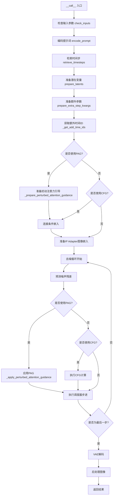
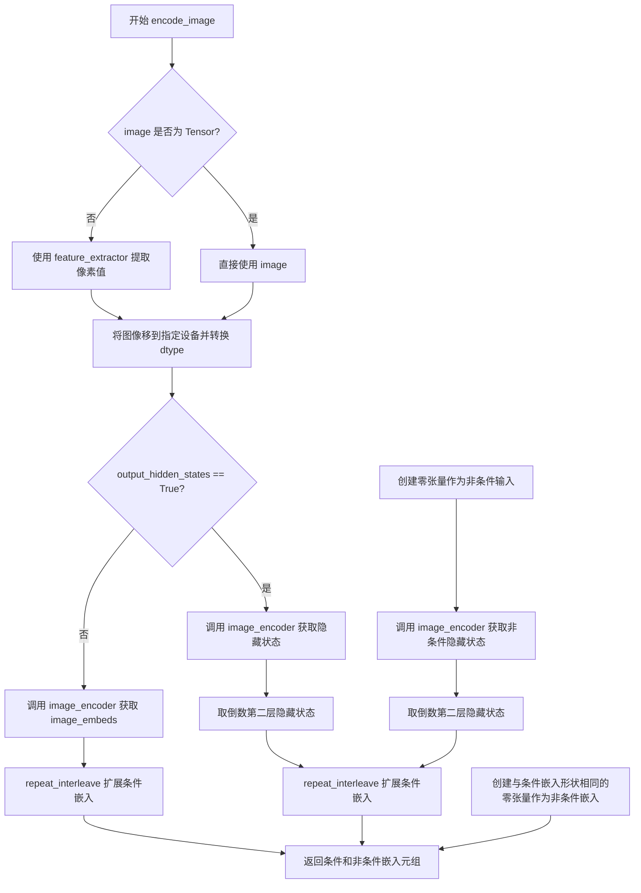
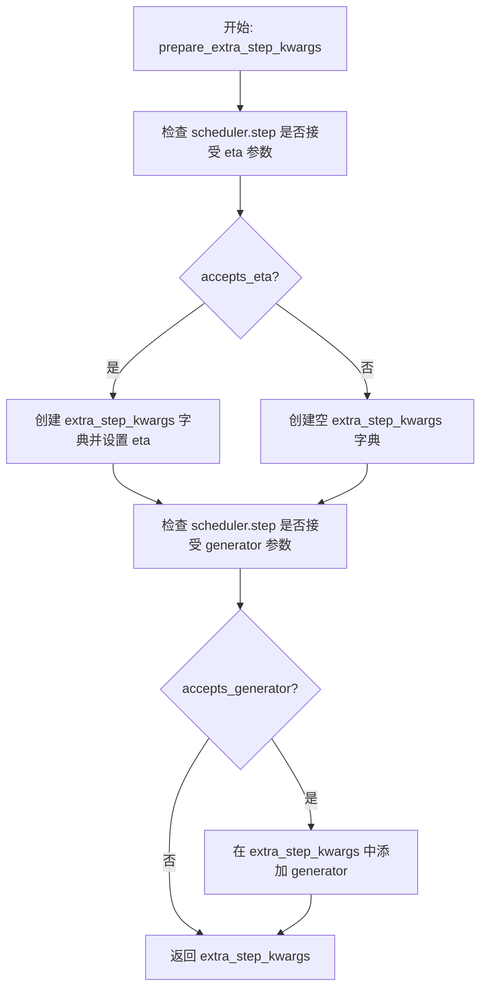
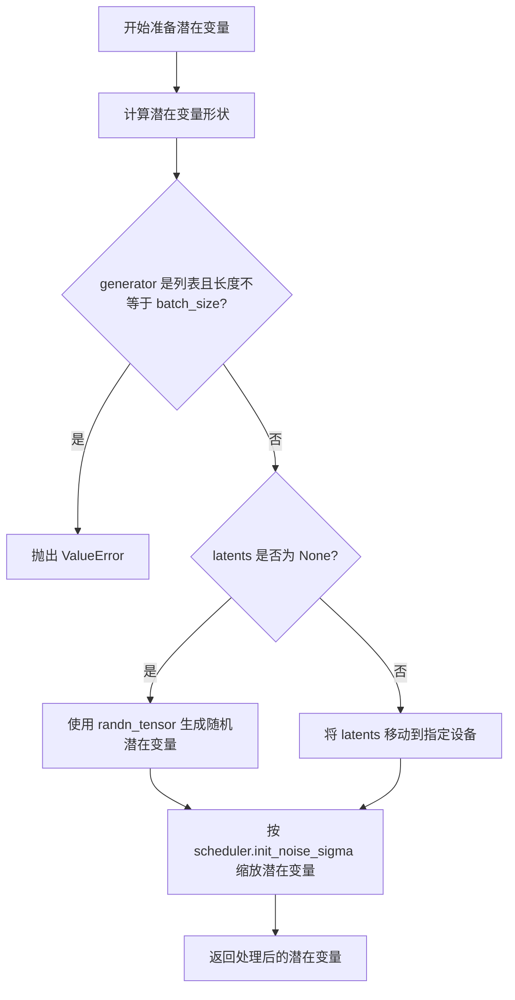
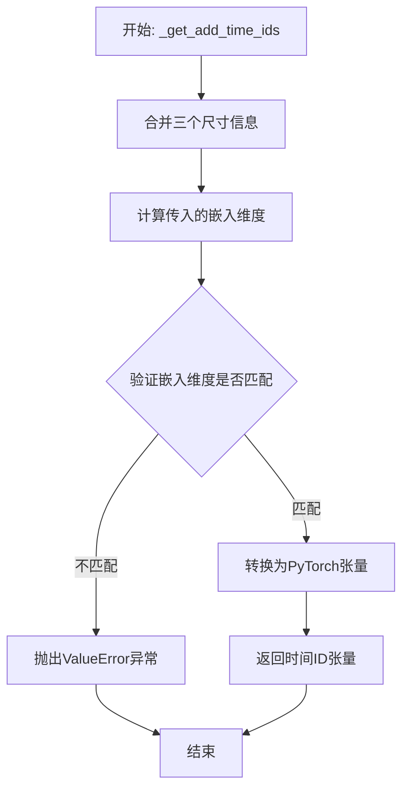
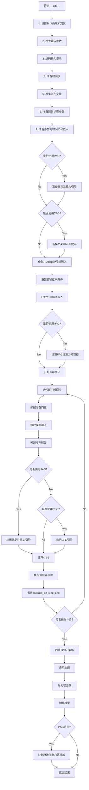

```mermaid
flowchart TD
    A[encode_prompt 开始] --> B{device参数}
    B -->|None| C[使用执行设备 self._execution_device]
    B -->|有值| D[使用传入device]
    C --> E{是否传入lora_scale}
    D --> E
    E -->|是| F[设置self._lora_scale]
    E -->|否| G
    F --> H{是否为PEFT后端}
    H -->|否| I[adjust_lora_scale_text_encoder]
    H -->|是| J[scale_lora_layers]
    I --> G
    J --> G
    G --> K{prompt_embeds是否为None}
    K -->|是| L[准备tokenizers和text_encoders列表]
    K -->|否| M[跳过文本编码]
    L --> N[处理prompt_2]
    N --> O[遍历两个prompt进行编码]
    O --> P{是否启用TextualInversionLoaderMixin}
    P -->|是| Q[maybe_convert_prompt转换prompt]
    P -->|否| R
    Q --> R
    R --> S[tokenizer处理文本]
    S --> T{截断检查}
    T -->|是| U[警告并记录截断内容]
    T -->|否| V
    U --> V
    V --> W[text_encoder编码]
    W --> X{pooled_prompt_embeds为None且维度为2}
    X -->|是| Y[提取pooled输出]
    X -->|否| Z
    Y --> AA{clip_skip是否为None}
    Z --> AA
    AA -->|是| AB[使用倒数第二层隐藏状态]
    AA -->|否| AC[根据clip_skip选择隐藏层]
    AB --> AD
    AC --> AD
    AD --> AE[添加到prompt_embeds_list]
    AE --> AF[concat合并prompt_embeds]
    M --> AG
    AF --> AG
    AG --> AH{是否启用CFG且negative_prompt_embeds为None}
    AH -->|是| AI[检查force_zeros_for_empty_prompt]
    AH -->|否| AR
    AI -->|是| AJ[创建全零嵌入]
    AI -->|否| AK[处理negative_prompt]
    AJ --> AL
    AK --> AL{negative_prompt是否为字符串}
    AL -->|是| AM[扩展为batch_size长度列表]
    AL -->|否| AN
    AM --> AN
    AN --> AO[验证negative_prompt类型与prompt一致]
    AO -->|不一致| AP[抛出TypeError]
    AO -->|一致| AQ{长度匹配检查}
    AQ -->|不匹配| AR[抛出ValueError]
    AQ -->|匹配| AS[遍历生成负向嵌入]
    AS --> AT[类似正向编码流程]
    AT --> AU[concat合并负向嵌入]
    AU --> AV
    AR --> AV
    AV --> AW{text_encoder_2是否存在}
    AW -->|是| AX[转换为text_encoder_2的dtype]
    AW -->|否| AY[转换为unet的dtype]
    AX --> AZ
    AY --> AZ
    AZ --> BA[重复embeddings以匹配num_images_per_prompt]
    BA --> BB{是否启用CFG}
    BB -->|是| BC[重复negative_prompt_embeds]
    BB -->|否| BD
    BC --> BE[调整形状]
    BE --> BF
    BD --> BF
    BF --> BG[重复pooled_prompt_embeds]
    BG --> BH{启用CFG}
    BH -->|是| BI[重复negative_pooled_prompt_embeds]
    BH -->|否| BJ
    BI --> BJ
    BJ --> BK{是否使用PEFT后端}
    BK -->|是| BL[unscale_lora_layers恢复原始缩放]
    BK -->|否| BM
    BL --> BM
    BM --> BN[返回四个嵌入张量]
```

# `diffusers\src\diffusers\pipelines\pag\pipeline_pag_sd_xl.py` 详细设计文档

Stable Diffusion XL PAG Pipeline是一个集成了扰动注意力引导(PAG)技术的文本到图像生成Pipeline，继承自StableDiffusionXLPipeline并增强了图像质量和引导控制能力。该Pipeline支持双文本编码器、LoRA、Textual Inversion、IP Adapter等多种高级功能。

## 整体流程



## 类结构

```
StableDiffusionXLPAGPipeline (主类)
├── DiffusionPipeline (基类)
├── StableDiffusionMixin
├── FromSingleFileMixin
├── StableDiffusionXLLoraLoaderMixin
├── TextualInversionLoaderMixin
├── IPAdapterMixin
└── PAGMixin
```

## 全局变量及字段


### `logger`
    
模块日志记录器

类型：`logging.Logger`
    


### `EXAMPLE_DOC_STRING`
    
示例文档字符串

类型：`str`
    


### `XLA_AVAILABLE`
    
XLA可用性标志

类型：`bool`
    


### `rescale_noise_cfg`
    
重缩放噪声配置函数

类型：`Callable`
    


### `retrieve_timesteps`
    
获取时间步函数

类型：`Callable`
    


### `StableDiffusionXLPAGPipeline.vae`
    
VAE编码器/解码器模型

类型：`AutoencoderKL`
    


### `StableDiffusionXLPAGPipeline.text_encoder`
    
第一个冻结文本编码器

类型：`CLIPTextModel`
    


### `StableDiffusionXLPAGPipeline.text_encoder_2`
    
第二个文本编码器带投影

类型：`CLIPTextModelWithProjection`
    


### `StableDiffusionXLPAGPipeline.tokenizer`
    
第一个分词器

类型：`CLIPTokenizer`
    


### `StableDiffusionXLPAGPipeline.tokenizer_2`
    
第二个分词器

类型：`CLIPTokenizer`
    


### `StableDiffusionXLPAGPipeline.unet`
    
条件U-Net去噪模型

类型：`UNet2DConditionModel`
    


### `StableDiffusionXLPAGPipeline.scheduler`
    
扩散调度器

类型：`KarrasDiffusionSchedulers`
    


### `StableDiffusionXLPAGPipeline.image_encoder`
    
图像编码器用于IP-Adapter

类型：`CLIPVisionModelWithProjection`
    


### `StableDiffusionXLPAGPipeline.feature_extractor`
    
图像特征提取器

类型：`CLIPImageProcessor`
    


### `StableDiffusionXLPAGPipeline.vae_scale_factor`
    
VAE缩放因子

类型：`int`
    


### `StableDiffusionXLPAGPipeline.image_processor`
    
图像处理器

类型：`VaeImageProcessor`
    


### `StableDiffusionXLPAGPipeline.default_sample_size`
    
默认采样尺寸

类型：`int`
    


### `StableDiffusionXLPAGPipeline.watermark`
    
水印处理器

类型：`StableDiffusionXLWatermarker`
    


### `StableDiffusionXLPAGPipeline.model_cpu_offload_seq`
    
CPU卸载顺序

类型：`str`
    


### `StableDiffusionXLPAGPipeline._optional_components`
    
可选组件列表

类型：`list`
    


### `StableDiffusionXLPAGPipeline._callback_tensor_inputs`
    
回调张量输入列表

类型：`list`
    


### `StableDiffusionXLPAGPipeline._guidance_scale`
    
引导强度

类型：`float`
    


### `StableDiffusionXLPAGPipeline._guidance_rescale`
    
引导重缩放因子

类型：`float`
    


### `StableDiffusionXLPAGPipeline._clip_skip`
    
CLIP跳过的层数

类型：`int`
    


### `StableDiffusionXLPAGPipeline._cross_attention_kwargs`
    
交叉注意力参数

类型：`dict`
    


### `StableDiffusionXLPAGPipeline._denoising_end`
    
去噪结束条件

类型：`float`
    


### `StableDiffusionXLPAGPipeline._num_timesteps`
    
时间步数量

类型：`int`
    


### `StableDiffusionXLPAGPipeline._interrupt`
    
中断标志

类型：`bool`
    


### `StableDiffusionXLPAGPipeline._pag_scale`
    
PAG缩放因子

类型：`float`
    


### `StableDiffusionXLPAGPipeline._pag_adaptive_scale`
    
PAG自适应缩放

类型：`float`
    
    

## 全局函数及方法


### `rescale_noise_cfg`

该函数根据 `guidance_rescale` 参数重新缩放噪声预测张量，基于 Section 3.4 的研究成果来改善图像质量并修复过度曝光问题。

参数：

- `noise_cfg`：`torch.Tensor`，引导扩散过程中预测的噪声张量
- `noise_pred_text`：`torch.Tensor`，文本引导扩散过程中预测的噪声张量
- `guidance_rescale`：`float`，可选，默认值为 0.0，用于重新缩放噪声预测的因子

返回值：`torch.Tensor`，重新缩放后的噪声预测张量

#### 流程图

```mermaid
flowchart TD
    A[开始] --> B[计算 noise_pred_text 的标准差 std_text]
    B --> C[计算 noise_cfg 的标准差 std_cfg]
    C --> D[计算 rescaled noise_pred: noise_cfg × (std_text / std_cfg)]
    D --> E[计算混合结果: guidance_rescale × noise_pred_rescaled + (1 - guidance_rescale) × noise_cfg]
    E --> F[返回重新缩放后的 noise_cfg]
```

#### 带注释源码

```python
def rescale_noise_cfg(noise_cfg, noise_pred_text, guidance_rescale=0.0):
    r"""
    Rescales `noise_cfg` tensor based on `guidance_rescale` to improve image quality and fix overexposure. Based on
    Section 3.4 from [Common Diffusion Noise Schedules and Sample Steps are
    Flawed](https://huggingface.co/papers/2305.08891).

    Args:
        noise_cfg (`torch.Tensor`):
            The predicted noise tensor for the guided diffusion process.
        noise_pred_text (`torch.Tensor`):
            The predicted noise tensor for the text-guided diffusion process.
        guidance_rescale (`float`, *optional*, defaults to 0.0):
            A rescale factor applied to the noise predictions.

    Returns:
        noise_cfg (`torch.Tensor`): The rescaled noise prediction tensor.
    """
    # 计算文本预测噪声在除批次维度外所有维度的标准差
    std_text = noise_pred_text.std(dim=list(range(1, noise_pred_text.ndim)), keepdim=True)
    # 计算噪声配置在除批次维度外所有维度的标准差
    std_cfg = noise_cfg.std(dim=list(range(1, noise_cfg.ndim)), keepdim=True)
    
    # 使用文本预测的标准差重新缩放噪声预测（修复过度曝光）
    noise_pred_rescaled = noise_cfg * (std_text / std_cfg)
    
    # 通过 guidance_rescale 因子将重新缩放后的结果与原始结果混合
    # 以避免产生"平淡无奇"的图像
    noise_cfg = guidance_rescale * noise_pred_rescaled + (1 - guidance_rescale) * noise_cfg
    return noise_cfg
```


### `retrieve_timesteps`

该函数是 diffusion pipeline 中的工具函数，用于调用调度器的 `set_timesteps` 方法并检索时间步序列。它支持自定义时间步（timesteps）或自定义 sigmas，并能根据传入的参数类型自动处理不同的调度器配置。

参数：

- `scheduler`：`SchedulerMixin`，调度器对象，用于获取时间步
- `num_inference_steps`：`int | None`，生成样本时使用的扩散步数。如果使用此参数，则 `timesteps` 必须为 `None`
- `device`：`str | torch.device | None`，时间步要移动到的设备。如果为 `None`，则时间步不会被移动
- `timesteps`：`list[int] | None`，用于覆盖调度器时间步间隔策略的自定义时间步。如果传入 `timesteps`，则 `num_inference_steps` 和 `sigmas` 必须为 `None`
- `sigmas`：`list[float] | None`，用于覆盖调度器时间步间隔策略的自定义 sigmas。如果传入 `sigmas`，则 `num_inference_steps` 和 `timesteps` 必须为 `None`
- `**kwargs`：任意关键字参数，将传递给 `scheduler.set_timesteps`

返回值：`tuple[torch.Tensor, int]`，第一个元素是调度器的时间步调度序列，第二个元素是推理步数

#### 流程图

```mermaid
flowchart TD
    A[开始 retrieve_timesteps] --> B{检查 timesteps 和 sigmas 是否同时传入}
    B -->|是| C[抛出 ValueError: 只能传入 timesteps 或 sigmas 其中一个]
    B -->|否| D{检查是否传入了 timesteps}
    D -->|是| E{检查调度器是否支持 timesteps 参数}
    E -->|不支持| F[抛出 ValueError: 调度器不支持自定义时间步]
    E -->|支持| G[调用 scheduler.set_timesteps<br/>传入 timesteps 和 device]
    G --> H[获取 scheduler.timesteps]
    H --> I[计算 num_inference_steps = len(timesteps)]
    D -->|否| J{检查是否传入了 sigmas}
    J -->|是| K{检查调度器是否支持 sigmas 参数}
    K -->|不支持| L[抛出 ValueError: 调度器不支持自定义 sigmas]
    K -->|支持| M[调用 scheduler.set_timesteps<br/>传入 sigmas 和 device]
    M --> N[获取 scheduler.timesteps]
    N --> O[计算 num_inference_steps = len(timesteps)]
    J -->|否| P[调用 scheduler.set_timesteps<br/>传入 num_inference_steps 和 device]
    P --> Q[获取 scheduler.timesteps]
    Q --> R[返回 timesteps 和 num_inference_steps]
    I --> R
    O --> R
```

#### 带注释源码

```python
def retrieve_timesteps(
    scheduler,
    num_inference_steps: int | None = None,
    device: str | torch.device | None = None,
    timesteps: list[int] | None = None,
    sigmas: list[float] | None = None,
    **kwargs,
):
    r"""
    Calls the scheduler's `set_timesteps` method and retrieves timesteps from the scheduler after the call. Handles
    custom timesteps. Any kwargs will be supplied to `scheduler.set_timesteps`.

    Args:
        scheduler (`SchedulerMixin`):
            The scheduler to get timesteps from.
        num_inference_steps (`int`):
            The number of diffusion steps used when generating samples with a pre-trained model. If used, `timesteps`
            must be `None`.
        device (`str` or `torch.device`, *optional*):
            The device to which the timesteps should be moved to. If `None`, the timesteps are not moved.
        timesteps (`list[int]`, *optional*):
            Custom timesteps used to override the timestep spacing strategy of the scheduler. If `timesteps` is passed,
            `num_inference_steps` and `sigmas` must be `None`.
        sigmas (`list[float]`, *optional*):
            Custom sigmas used to override the timestep spacing strategy of the scheduler. If `sigmas` is passed,
            `num_inference_steps` and `timesteps` must be `None`.

    Returns:
        `tuple[torch.Tensor, int]`: A tuple where the first element is the timestep schedule from the scheduler and the
        second element is the number of inference steps.
    """
    # 检查是否同时传入了 timesteps 和 sigmas，两者只能传入一个
    if timesteps is not None and sigmas is not None:
        raise ValueError("Only one of `timesteps` or `sigmas` can be passed. Please choose one to set custom values")
    
    # 处理自定义 timesteps 的情况
    if timesteps is not None:
        # 检查调度器的 set_timesteps 方法是否支持 timesteps 参数
        accepts_timesteps = "timesteps" in set(inspect.signature(scheduler.set_timesteps).parameters.keys())
        if not accepts_timesteps:
            raise ValueError(
                f"The current scheduler class {scheduler.__class__}'s `set_timesteps` does not support custom"
                f" timestep schedules. Please check whether you are using the correct scheduler."
            )
        # 调用调度器的 set_timesteps 方法设置自定义时间步
        scheduler.set_timesteps(timesteps=timesteps, device=device, **kwargs)
        # 从调度器获取时间步序列
        timesteps = scheduler.timesteps
        # 计算推理步数
        num_inference_steps = len(timesteps)
    # 处理自定义 sigmas 的情况
    elif sigmas is not None:
        # 检查调度器的 set_timesteps 方法是否支持 sigmas 参数
        accept_sigmas = "sigmas" in set(inspect.signature(scheduler.set_timesteps).parameters.keys())
        if not accept_sigmas:
            raise ValueError(
                f"The current scheduler class {scheduler.__class__}'s `set_timesteps` does not support custom"
                f" sigmas schedules. Please check whether you are using the correct scheduler."
            )
        # 调用调度器的 set_timesteps 方法设置自定义 sigmas
        scheduler.set_timesteps(sigmas=sigmas, device=device, **kwargs)
        # 从调度器获取时间步序列
        timesteps = scheduler.timesteps
        # 计算推理步数
        num_inference_steps = len(timesteps)
    # 默认情况：使用 num_inference_steps 设置调度器
    else:
        scheduler.set_timesteps(num_inference_steps, device=device, **kwargs)
        timesteps = scheduler.timesteps
    
    # 返回时间步序列和推理步数
    return timesteps, num_inference_steps
```


### `StableDiffusionXLPAGPipeline.__init__`

该方法是 `StableDiffusionXLPAGPipeline` 类的构造函数，负责初始化 Stable Diffusion XL Pipeline 的所有核心组件，包括 VAE、文本编码器、分词器、UNet、调度器等，并配置水印和 PAG（Perturbed Attention Guidance）相关参数。

参数：

- `vae`：`AutoencoderKL`，用于将图像编码和解码到潜在表示的变分自编码器模型
- `text_encoder`：`CLIPTextModel`，第一个冻结的文本编码器，采用 CLIP 的 text 部分
- `text_encoder_2`：`CLIPTextModelWithProjection`，第二个冻结的文本编码器，采用 CLIP 的 text 和 pool 部分
- `tokenizer`：`CLIPTokenizer`，第一个文本分词器
- `tokenizer_2`：`CLIPTokenizer`，第二个文本分词器
- `unet`：`UNet2DConditionModel`，条件 U-Net 架构，用于对编码后的图像潜在表示进行去噪
- `scheduler`：`KarrasDiffusionSchedulers`，与 `unet` 结合使用以去噪图像潜在表示的调度器
- `image_encoder`：`CLIPVisionModelWithProjection | None`，可选的图像编码器，用于 IP-Adapter
- `feature_extractor`：`CLIPImageProcessor | None`，可选的特征提取器
- `force_zeros_for_empty_prompt`：`bool`，是否将空提示的负向提示嵌入强制设为 0，默认值为 True
- `add_watermarker`：`bool | None`，是否使用不可见水印库对输出图像加水印，默认根据是否安装库自动决定
- `pag_applied_layers`：`str | list[str]`，PAG 应用到 UNet 的层，默认为 "mid"

返回值：`None`，该方法不返回任何值，仅初始化对象状态

#### 流程图

```mermaid
flowchart TD
    A[开始 __init__] --> B[调用 super().__init__]
    B --> C[register_modules 注册所有模块]
    C --> D[register_to_config 注册配置参数]
    D --> E[计算 vae_scale_factor]
    E --> F[创建 VaeImageProcessor]
    F --> G[计算 default_sample_size]
    G --> H{add_watermarker 是否存在}
    H -->|是| I[创建 StableDiffusionXLWatermarker]
    H -->|否| J[watermark 设为 None]
    I --> K[set_pag_applied_layers 初始化 PAG 层]
    J --> K
    K --> L[结束 __init__]
```

#### 带注释源码

```python
def __init__(
    self,
    vae: AutoencoderKL,
    text_encoder: CLIPTextModel,
    text_encoder_2: CLIPTextModelWithProjection,
    tokenizer: CLIPTokenizer,
    tokenizer_2: CLIPTokenizer,
    unet: UNet2DConditionModel,
    scheduler: KarrasDiffusionSchedulers,
    image_encoder: CLIPVisionModelWithProjection = None,
    feature_extractor: CLIPImageProcessor = None,
    force_zeros_for_empty_prompt: bool = True,
    add_watermarker: bool | None = None,
    pag_applied_layers: str | list[str] = "mid",  # ["mid"],["down.block_1"],["up.block_0.attentions_0"]
):
    # 调用父类 DiffusionPipeline 的初始化方法
    super().__init__()

    # 注册所有模块到 pipeline，包括 VAE、文本编码器、分词器、UNet、调度器等
    self.register_modules(
        vae=vae,
        text_encoder=text_encoder,
        text_encoder_2=text_encoder_2,
        tokenizer=tokenizer,
        tokenizer_2=tokenizer_2,
        unet=unet,
        scheduler=scheduler,
        image_encoder=image_encoder,
        feature_extractor=feature_extractor,
    )
    
    # 注册配置参数：控制是否对空提示强制使用零向量
    self.register_to_config(force_zeros_for_empty_prompt=force_zeros_for_empty_prompt)
    
    # 计算 VAE 缩放因子，基于 VAE 块输出通道数的 2 的幂次方
    self.vae_scale_factor = 2 ** (len(self.vae.config.block_out_channels) - 1) if getattr(self, "vae", None) else 8
    
    # 创建 VAE 图像处理器，用于图像的后处理
    self.image_processor = VaeImageProcessor(vae_scale_factor=self.vae_scale_factor)

    # 计算默认采样尺寸，从 UNet 配置中获取 sample_size，默认值为 128
    self.default_sample_size = (
        self.unet.config.sample_size
        if hasattr(self, "unet") and self.unet is not None and hasattr(self.unet.config, "sample_size")
        else 128
    )

    # 如果 add_watermarker 为 None，则根据是否安装了水印库自动决定
    add_watermarker = add_watermarker if add_watermarker is not None else is_invisible_watermark_available()

    # 根据是否需要水印，创建水印器实例
    if add_watermarker:
        self.watermark = StableDiffusionXLWatermarker()
    else:
        self.watermark = None

    # 初始化 PAG（Perturbed Attention Guidance）应用的层
    self.set_pag_applied_layers(pag_applied_layers)
```


### `StableDiffusionXLPAGPipeline.encode_prompt`

该方法将文本提示词编码为文本encoder的隐藏状态向量，支持双文本encoder（SDXL架构）、LoRA缩放、CLIP跳过层、分类器自由引导（CFG）和文本反转功能，是Stable Diffusion XL pipeline的核心组件之一，负责将用户输入的文本转换为模型可处理的嵌入表示。

参数：

- `prompt`：`str | list[str] | None`，要编码的主提示词
- `prompt_2`：`str | list[str] | None`，发送给第二个tokenizer和text_encoder_2的提示词，如不指定则使用prompt
- `device`：`torch.device | None`，计算设备，如为None则使用执行设备
- `num_images_per_prompt`：`int`，每个提示词生成的图像数量，默认为1
- `do_classifier_free_guidance`：`bool`，是否启用分类器自由引导，默认为True
- `negative_prompt`：`str | list[str] | None`，不引导图像生成的负向提示词
- `negative_prompt_2`：`str | list[str] | None`，发送给第二个encoder的负向提示词
- `prompt_embeds`：`torch.Tensor | None`，预生成的文本嵌入，可用于轻松调整文本输入
- `negative_prompt_embeds`：`torch.Tensor | None`，预生成的负向文本嵌入
- `pooled_prompt_embeds`：`torch.Tensor | None`，预生成的池化文本嵌入
- `negative_pooled_prompt_embeds`：`torch.Tensor | None`，预生成的负向池化文本嵌入
- `lora_scale`：`float | None`，应用于所有LoRA层的缩放因子
- `clip_skip`：`int | None`，计算提示嵌入时跳过的CLIP层数

返回值：`tuple[torch.Tensor, torch.Tensor, torch.Tensor, torch.Tensor]`，包含四个张量：prompt_embeds（编码后的提示词嵌入）、negative_prompt_embeds（负向提示词嵌入）、pooled_prompt_embeds（池化后的提示词嵌入）、negative_pooled_prompt_embeds（负向池化提示词嵌入）

#### 流程图



#### 带注释源码

```python
def encode_prompt(
    self,
    prompt: str,
    prompt_2: str | None = None,
    device: torch.device | None = None,
    num_images_per_prompt: int = 1,
    do_classifier_free_guidance: bool = True,
    negative_prompt: str | None = None,
    negative_prompt_2: str | None = None,
    prompt_embeds: torch.Tensor | None = None,
    negative_prompt_embeds: torch.Tensor | None = None,
    pooled_prompt_embeds: torch.Tensor | None = None,
    negative_pooled_prompt_embeds: torch.Tensor | None = None,
    lora_scale: float | None = None,
    clip_skip: int | None = None,
):
    r"""
    Encodes the prompt into text encoder hidden states.

    Args:
        prompt (`str` or `list[str]`, *optional*):
            prompt to be encoded
        prompt_2 (`str` or `list[str]`, *optional*):
            The prompt or prompts to be sent to the `tokenizer_2` and `text_encoder_2`. If not defined, `prompt` is
            used in both text-encoders
        device: (`torch.device`):
            torch device
        num_images_per_prompt (`int`):
            number of images that should be generated per prompt
        do_classifier_free_guidance (`bool`):
            whether to use classifier free guidance or not
        negative_prompt (`str` or `list[str]`, *optional*):
            The prompt or prompts not to guide the image generation. If not defined, one has to pass
            `negative_prompt_embeds` instead. Ignored when not using guidance (i.e., ignored if `guidance_scale` is
            less than `1`).
        negative_prompt_2 (`str` or `list[str]`, *optional*):
            The prompt or prompts not to guide the image generation to be sent to `tokenizer_2` and
            `text_encoder_2`. If not defined, `negative_prompt` is used in both text-encoders
        prompt_embeds (`torch.Tensor`, *optional*):
            Pre-generated text embeddings. Can be used to easily tweak text inputs, *e.g.* prompt weighting. If not
            provided, text embeddings will be generated from `prompt` input argument.
        negative_prompt_embeds (`torch.Tensor`, *optional*):
            Pre-generated negative text embeddings. Can be used to easily tweak text inputs, *e.g.* prompt
            weighting. If not provided, negative_prompt_embeds will be generated from `negative_prompt` input
            argument.
        pooled_prompt_embeds (`torch.Tensor`, *optional*):
            Pre-generated pooled text embeddings. Can be used to easily tweak text inputs, *e.g.* prompt weighting.
            If not provided, pooled text embeddings will be generated from `prompt` input argument.
        negative_pooled_prompt_embeds (`torch.Tensor`, *optional*):
            Pre-generated negative pooled text embeddings. Can be used to easily tweak text inputs, *e.g.* prompt
            weighting. If not provided, pooled negative_prompt_embeds will be generated from `negative_prompt`
            input argument.
        lora_scale (`float`, *optional*):
            A lora scale that will be applied to all LoRA layers of the text encoder if LoRA layers are loaded.
        clip_skip (`int`, *optional*):
            Number of layers to be skipped from CLIP while computing the prompt embeddings. A value of 1 means that
            the output of the pre-final layer will be used for computing the prompt embeddings.
    """
    # 如果未指定device，使用pipeline的执行设备
    device = device or self._execution_device

    # 设置lora scale以便text encoder的LoRA函数可以正确访问
    # 只有当传入了lora_scale参数且pipeline支持LoRA时才设置
    if lora_scale is not None and isinstance(self, StableDiffusionXLLoraLoaderMixin):
        self._lora_scale = lora_scale

        # 动态调整LoRA scale
        if self.text_encoder is not None:
            if not USE_PEFT_BACKEND:
                # 非PEFT后端：直接调整LoRA scale
                adjust_lora_scale_text_encoder(self.text_encoder, lora_scale)
            else:
                # PEFT后端：使用scale_lora_layers
                scale_lora_layers(self.text_encoder, lora_scale)

        if self.text_encoder_2 is not None:
            if not USE_PEFT_BACKEND:
                adjust_lora_scale_text_encoder(self.text_encoder_2, lora_scale)
            else:
                scale_lora_layers(self.text_encoder_2, lora_scale)

    # 统一prompt为列表格式，便于批处理
    prompt = [prompt] if isinstance(prompt, str) else prompt

    # 确定batch_size：如果传入了prompt则使用其长度，否则使用prompt_embeds的batch维度
    if prompt is not None:
        batch_size = len(prompt)
    else:
        batch_size = prompt_embeds.shape[0]

    # 定义tokenizers和text encoders列表（支持双文本encoder架构）
    # SDXL使用两个文本encoder：text_encoder (CLIPTextModel) 和 text_encoder_2 (CLIPTextModelWithProjection)
    tokenizers = [self.tokenizer, self.tokenizer_2] if self.tokenizer is not None else [self.tokenizer_2]
    text_encoders = (
        [self.text_encoder, self.text_encoder_2] if self.text_encoder is not None else [self.text_encoder_2]
    )

    # 如果未提供prompt_embeds，则从prompt生成
    if prompt_embeds is None:
        # prompt_2默认为prompt
        prompt_2 = prompt_2 or prompt
        prompt_2 = [prompt_2] if isinstance(prompt_2, str) else prompt_2

        # textual inversion：如有需要处理多向量token
        prompt_embeds_list = []
        prompts = [prompt, prompt_2]
        # 同时处理两个prompt（主prompt和第二个prompt）
        for prompt, tokenizer, text_encoder in zip(prompts, tokenizers, text_encoders):
            # 检查是否启用了TextualInversion，如果是则转换prompt
            if isinstance(self, TextualInversionLoaderMixin):
                prompt = self.maybe_convert_prompt(prompt, tokenizer)

            # 使用tokenizer将文本转为token IDs
            text_inputs = tokenizer(
                prompt,
                padding="max_length",
                max_length=tokenizer.model_max_length,
                truncation=True,
                return_tensors="pt",
            )

            text_input_ids = text_inputs.input_ids
            # 获取未截断的token IDs用于检查
            untruncated_ids = tokenizer(prompt, padding="longest", return_tensors="pt").input_ids

            # 检查是否发生了截断（CLIP有最大token长度限制）
            if untruncated_ids.shape[-1] >= text_input_ids.shape[-1] and not torch.equal(
                text_input_ids, untruncated_ids
            ):
                # 解码被截断的部分并记录警告
                removed_text = tokenizer.batch_decode(untruncated_ids[:, tokenizer.model_max_length - 1 : -1])
                logger.warning(
                    "The following part of your input was truncated because CLIP can only handle sequences up to"
                    f" {tokenizer.model_max_length} tokens: {removed_text}"
                )

            # 使用text_encoder编码，获取隐藏状态
            prompt_embeds = text_encoder(text_input_ids.to(device), output_hidden_states=True)

            # 提取pooled输出（用于SDXL的额外条件）
            # 只关心最后一个text_encoder的pooled输出
            if pooled_prompt_embeds is None and prompt_embeds[0].ndim == 2:
                pooled_prompt_embeds = prompt_embeds[0]

            # 根据clip_skip决定使用哪层隐藏状态
            # clip_skip=None时使用倒数第二层（SDXL总是从倒数第二层索引）
            if clip_skip is None:
                prompt_embeds = prompt_embeds.hidden_states[-2]
            else:
                # "2" 因为 SDXL 总是从倒数第二层开始索引
                prompt_embeds = prompt_embeds.hidden_states[-(clip_skip + 2)]

            prompt_embeds_list.append(prompt_embeds)

        # 在最后一个维度（特征维度）上拼接两个encoder的输出
        prompt_embeds = torch.concat(prompt_embeds_list, dim=-1)

    # 获取分类器自由引导的无条件嵌入
    # 如果配置要求对空prompt强制为零，且未提供negative_prompt，则创建全零嵌入
    zero_out_negative_prompt = negative_prompt is None and self.config.force_zeros_for_empty_prompt
    if do_classifier_free_guidance and negative_prompt_embeds is None and zero_out_negative_prompt:
        # 创建与prompt_embeds形状相同的全零张量
        negative_prompt_embeds = torch.zeros_like(prompt_embeds)
        negative_pooled_prompt_embeds = torch.zeros_like(pooled_prompt_embeds)
    elif do_classifier_free_guidance and negative_prompt_embeds is None:
        # 需要从negative_prompt生成嵌入
        negative_prompt = negative_prompt or ""
        negative_prompt_2 = negative_prompt_2 or negative_prompt

        # 标准化为列表格式
        negative_prompt = batch_size * [negative_prompt] if isinstance(negative_prompt, str) else negative_prompt
        negative_prompt_2 = (
            batch_size * [negative_prompt_2] if isinstance(negative_prompt_2, str) else negative_prompt_2
        )

        uncond_tokens: list[str]
        # 类型检查
        if prompt is not None and type(prompt) is not type(negative_prompt):
            raise TypeError(
                f"`negative_prompt` should be the same type to `prompt`, but got {type(negative_prompt)} !="
                f" {type(prompt)}."
            )
        elif batch_size != len(negative_prompt):
            raise ValueError(
                f"`negative_prompt`: {negative_prompt} has batch size {len(negative_prompt)}, but `prompt`:"
                f" {prompt} has batch size {batch_size}. Please make sure that passed `negative_prompt` matches"
                " the batch size of `prompt`."
            )
        else:
            uncond_tokens = [negative_prompt, negative_prompt_2]

        negative_prompt_embeds_list = []
        # 遍历生成负向提示词嵌入
        for negative_prompt, tokenizer, text_encoder in zip(uncond_tokens, tokenizers, text_encoders):
            if isinstance(self, TextualInversionLoaderMixin):
                negative_prompt = self.maybe_convert_prompt(negative_prompt, tokenizer)

            # 使用与prompt_embeds相同的长度
            max_length = prompt_embeds.shape[1]
            uncond_input = tokenizer(
                negative_prompt,
                padding="max_length",
                max_length=max_length,
                truncation=True,
                return_tensors="pt",
            )

            negative_prompt_embeds = text_encoder(
                uncond_input.input_ids.to(device),
                output_hidden_states=True,
            )

            # 提取pooled输出
            if negative_pooled_prompt_embeds is None and negative_prompt_embeds[0].ndim == 2:
                negative_pooled_prompt_embeds = negative_prompt_embeds[0]
            # 使用倒数第二层隐藏状态
            negative_prompt_embeds = negative_prompt_embeds.hidden_states[-2]

            negative_prompt_embeds_list.append(negative_prompt_embeds)

        # 拼接负向嵌入
        negative_prompt_embeds = torch.concat(negative_prompt_embeds_list, dim=-1)

    # 将prompt_embeds转换为正确的dtype和device
    if self.text_encoder_2 is not None:
        prompt_embeds = prompt_embeds.to(dtype=self.text_encoder_2.dtype, device=device)
    else:
        prompt_embeds = prompt_embeds.to(dtype=self.unet.dtype, device=device)

    # 获取嵌入的形状信息
    bs_embed, seq_len, _ = prompt_embeds.shape
    # 为每个prompt复制num_images_per_prompt次，使用MPS友好的方法
    prompt_embeds = prompt_embeds.repeat(1, num_images_per_prompt, 1)
    prompt_embeds = prompt_embeds.view(bs_embed * num_images_per_prompt, seq_len, -1)

    # 如果启用CFG，处理negative_prompt_embeds
    if do_classifier_free_guidance:
        seq_len = negative_prompt_embeds.shape[1]

        if self.text_encoder_2 is not None:
            negative_prompt_embeds = negative_prompt_embeds.to(dtype=self.text_encoder_2.dtype, device=device)
        else:
            negative_prompt_embeds = negative_prompt_embeds.to(dtype=self.unet.dtype, device=device)

        # 复制以匹配生成数量
        negative_prompt_embeds = negative_prompt_embeds.repeat(1, num_images_per_prompt, 1)
        negative_prompt_embeds = negative_prompt_embeds.view(batch_size * num_images_per_prompt, seq_len, -1)

    # 处理pooled embeddings
    pooled_prompt_embeds = pooled_prompt_embeds.repeat(1, num_images_per_prompt).view(
        bs_embed * num_images_per_prompt, -1
    )
    if do_classifier_free_guidance:
        negative_pooled_prompt_embeds = negative_pooled_prompt_embeds.repeat(1, num_images_per_prompt).view(
            bs_embed * num_images_per_prompt, -1
        )

    # 如果使用PEFT后端，恢复LoRA层的原始scale
    if self.text_encoder is not None:
        if isinstance(self, StableDiffusionXLLoraLoaderMixin) and USE_PEFT_BACKEND:
            # 通过反向缩放LoRA层恢复原始scale
            unscale_lora_layers(self.text_encoder, lora_scale)

    if self.text_encoder_2 is not None:
        if isinstance(self, StableDiffusionXLLoraLoaderMixin) and USE_PEFT_BACKEND:
            unscale_lora_layers(self.text_encoder_2, lora_scale)

    # 返回四个嵌入张量
    return prompt_embeds, negative_prompt_embeds, pooled_prompt_embeds, negative_pooled_prompt_embeds
```


### `StableDiffusionXLPAGPipeline.encode_image`

编码图像为嵌入向量，用于后续的图像生成过程。该方法接收原始图像输入，通过CLIP图像编码器将其转换为特征向量，并根据是否输出隐藏状态返回不同的嵌入表示。

参数：

- `image`：`Union[torch.Tensor, PIL.Image, np.ndarray, etc.]`，输入的图像数据，可以是PyTorch张量、PIL图像或其他图像格式
- `device`：`torch.device`，指定将图像张量移动到的目标设备（如CPU或CUDA设备）
- `num_images_per_prompt`：`int`，每个提示词生成的图像数量，用于对嵌入向量进行重复扩展
- `output_hidden_states`：`bool | None`，可选参数，指定是否返回CLIP编码器的隐藏状态。如果为True，返回倒数第二层的隐藏状态；否则返回图像嵌入（image_embeds）

返回值：`Tuple[torch.Tensor, torch.Tensor]`，返回一个元组，包含两个张量：
- 第一个是条件图像嵌入（`image_embeds` 或 `image_enc_hidden_states`）
- 第二个是非条件图像嵌入（`uncond_image_embeds` 或 `uncond_image_enc_hidden_states`）
这两个嵌入用于支持无分类器自由引导（Classifier-Free Guidance）图像生成

#### 流程图



#### 带注释源码

```python
def encode_image(self, image, device, num_images_per_prompt, output_hidden_states=None):
    """
    将输入图像编码为嵌入向量，用于图像生成过程。
    
    Args:
        image: 输入图像，可以是PIL Image、numpy array或torch.Tensor
        device: torch设备对象
        num_images_per_prompt: 每个提示词生成的图像数量
        output_hidden_states: 是否输出隐藏状态
    
    Returns:
        Tuple[torch.Tensor, torch.Tensor]: (条件嵌入, 非条件嵌入)
    """
    # 获取图像编码器的参数数据类型
    dtype = next(self.image_encoder.parameters()).dtype

    # 如果输入不是PyTorch张量，使用特征提取器进行处理
    if not isinstance(image, torch.Tensor):
        image = self.feature_extractor(image, return_tensors="pt").pixel_values

    # 将图像张量移动到指定设备并转换为正确的dtype
    image = image.to(device=device, dtype=dtype)
    
    # 根据output_hidden_states参数决定返回类型
    if output_hidden_states:
        # 获取编码器的隐藏状态，取倒数第二层（-2）作为特征表示
        image_enc_hidden_states = self.image_encoder(image, output_hidden_states=True).hidden_states[-2]
        # 扩展条件嵌入以匹配生成的图像数量
        image_enc_hidden_states = image_enc_hidden_states.repeat_interleave(num_images_per_prompt, dim=0)
        
        # 创建零张量作为非条件输入，用于无分类器引导
        uncond_image_enc_hidden_states = self.image_encoder(
            torch.zeros_like(image), output_hidden_states=True
        ).hidden_states[-2]
        # 同样扩展非条件嵌入
        uncond_image_enc_hidden_states = uncond_image_enc_hidden_states.repeat_interleave(
            num_images_per_prompt, dim=0
        )
        return image_enc_hidden_states, uncond_image_enc_hidden_states
    else:
        # 直接获取图像嵌入向量
        image_embeds = self.image_encoder(image).image_embeds
        # 扩展条件嵌入
        image_embeds = image_embeds.repeat_interleave(num_images_per_prompt, dim=0)
        # 创建形状相同的零张量作为非条件嵌入
        uncond_image_embeds = torch.zeros_like(image_embeds)

        return image_embeds, uncond_image_embeds
```


### `StableDiffusionXLPAGPipeline.prepare_ip_adapter_image_embeds`

该函数用于准备IP-Adapter图像嵌入，处理图像输入或预计算的嵌入，生成符合Stable Diffusion XL pipeline要求的图像嵌入格式，支持分类器自由引导（Classifier-Free Guidance）模式。

参数：

- `self`：`StableDiffusionXLPAGPipeline` 实例本身，pipeline 对象，包含模型组件
- `ip_adapter_image`：`PipelineImageInput | None`，待处理的IP-Adapter输入图像，支持单个图像或图像列表，若提供则从中提取嵌入
- `ip_adapter_image_embeds`：`list[torch.Tensor] | None`，预计算的图像嵌入列表，每个元素为形状 `(batch_size, num_images, emb_dim)` 的张量，若提供则直接使用
- `device`：`torch.device`，目标设备，用于将计算结果移动到指定设备
- `num_images_per_prompt`：`int`，每个prompt生成的图像数量，用于复制嵌入以匹配批量大小
- `do_classifier_free_guidance`：`bool`，是否启用分类器自由引导，若为True则生成带负面引导的嵌入

返回值：`list[torch.Tensor]`，处理后的IP-Adapter图像嵌入列表，每个元素为拼接并复制后的张量，形状根据是否启用CFG而定

#### 流程图

```mermaid
flowchart TD
    A[开始 prepare_ip_adapter_image_embeds] --> B{ip_adapter_image_embeds 是否为 None?}
    B -->|是| C{检查 ip_adapter_image 是否为列表}
    C -->|否| D[将 ip_adapter_image 转换为列表]
    D --> E{验证图像数量与IP适配器数量是否匹配}
    E -->|不匹配| F[抛出 ValueError 异常]
    E -->|匹配| G[遍历每个IP-Adapter图像和对应的投影层]
    G --> H{判断是否需要输出隐藏状态}
    H -->|是| I[设置 output_hidden_state=True]
    H -->|否| J[设置 output_hidden_state=False]
    I --> K[调用 encode_image 编码图像]
    J --> K
    K --> L[获取单个图像嵌入和负面嵌入]
    L --> M[将嵌入添加到列表]
    M --> N{还有更多IP-Adapter吗?}
    N -->|是| G
    N -->|否| O[进入嵌入处理阶段]
    B -->|否| P[直接使用预计算的嵌入]
    P --> Q{是否启用CFG?}
    Q -->|是| R[将嵌入按chunk(2)分割为负面和正面]
    Q -->|否| S[直接添加到列表]
    R --> T[分别添加到负面和正面列表]
    S --> O
    T --> O
    O --> U[遍历每个图像嵌入]
    U --> V[复制 num_images_per_prompt 次]
    V --> W{是否启用CFG?}
    W -->|是| X[复制负面嵌入并拼接]
    W -->|否| Y[跳到下一步]
    X --> Z[拼接负面和正面嵌入]
    Y --> Z
    Z --> AA[移动到目标设备]
    AA --> BB{还有更多嵌入吗?}
    BB -->|是| U
    BB -->|否| CC[返回处理后的嵌入列表]
```

#### 带注释源码

```
def prepare_ip_adapter_image_embeds(
    self, 
    ip_adapter_image,           # 输入的IP-Adapter图像
    ip_adapter_image_embeds,   # 预计算的图像嵌入
    device,                    # 目标设备
    num_images_per_prompt,     # 每个prompt生成的图像数
    do_classifier_free_guidance  # 是否启用分类器自由引导
):
    """
    准备IP-Adapter图像嵌入
    
    该方法处理两种输入模式：
    1. ip_adapter_image：原始图像，需要编码
    2. ip_adapter_image_embeds：预计算的嵌入，直接使用
    
    支持分类器自由引导模式，生成正面和负面图像嵌入
    """
    image_embeds = []           # 存储处理后的图像嵌入
    
    # 如果启用CFG，需要同时处理负面嵌入
    if do_classifier_free_guidance:
        negative_image_embeds = []
    
    # 模式1：需要从图像编码
    if ip_adapter_image_embeds is None:
        # 标准化输入为列表
        if not isinstance(ip_adapter_image, list):
            ip_adapter_image = [ip_adapter_image]

        # 验证图像数量与IP-Adapter数量匹配
        if len(ip_adapter_image) != len(self.unet.encoder_hid_proj.image_projection_layers):
            raise ValueError(
                f"`ip_adapter_image` must have same length as the number of IP Adapters. "
                f"Got {len(ip_adapter_image)} images and "
                f"{len(self.unet.encoder_hid_proj.image_projection_layers)} IP Adapters."
            )

        # 遍历每个IP-Adapter的图像和对应的投影层
        for single_ip_adapter_image, image_proj_layer in zip(
            ip_adapter_image, self.unet.encoder_hid_proj.image_projection_layers
        ):
            # 判断是否需要输出隐藏状态（ImageProjection类型不需要）
            output_hidden_state = not isinstance(image_proj_layer, ImageProjection)
            
            # 编码单个图像，获取嵌入
            single_image_embeds, single_negative_image_embeds = self.encode_image(
                single_ip_adapter_image, device, 1, output_hidden_state
            )

            # 添加批次维度并存储
            image_embeds.append(single_image_embeds[None, :])
            
            # 如果启用CFG，同时处理负面嵌入
            if do_classifier_free_guidance:
                negative_image_embeds.append(single_negative_image_embeds[None, :])
    else:
        # 模式2：使用预计算的嵌入
        for single_image_embeds in ip_adapter_image_embeds:
            if do_classifier_free_guidance:
                # 预计算嵌入中已经包含了正负面对，需要分割
                single_negative_image_embeds, single_image_embeds = single_image_embeds.chunk(2)
                negative_image_embeds.append(single_negative_image_embeds)
            
            image_embeds.append(single_image_embeds)

    # 处理嵌入：复制到num_images_per_prompt并移动到设备
    ip_adapter_image_embeds = []
    for i, single_image_embeds in enumerate(image_embeds):
        # 为每个prompt复制图像嵌入
        single_image_embeds = torch.cat([single_image_embeds] * num_images_per_prompt, dim=0)
        
        if do_classifier_free_guidance:
            # 同样复制负面嵌入
            single_negative_image_embeds = torch.cat(
                [negative_image_embeds[i]] * num_images_per_prompt, dim=0
            )
            # 拼接负面和正面嵌入（负面在前，符合CFG惯例）
            single_image_embeds = torch.cat(
                [single_negative_image_embeds, single_image_embeds], dim=0
            )

        # 确保嵌入在正确的设备上
        single_image_embeds = single_image_embeds.to(device=device)
        ip_adapter_image_embeds.append(single_image_embeds)

    return ip_adapter_image_embeds
```


### `StableDiffusionXLPAGPipeline.prepare_extra_step_kwargs`

该方法用于准备调度器（scheduler）的额外参数。由于不同调度器的 `step` 方法签名不同，此方法通过反射检查调度器是否支持 `eta` 和 `generator` 参数，并将支持的参数封装成字典返回，供后续去噪步骤使用。

参数：

- `generator`：`torch.Generator | list[torch.Generator] | None`，随机数生成器，用于控制图像生成的随机性
- `eta`：`float`，DDIM 论文中的 η 参数，仅在 DDIMScheduler 中生效，取值范围为 [0, 1]

返回值：`dict[str, Any]`，包含调度器额外参数的字典，可能包含 `eta` 和/或 `generator` 键

#### 流程图



#### 带注释源码

```python
def prepare_extra_step_kwargs(self, generator, eta):
    # 准备调度器步骤所需的额外参数。
    # 由于并非所有调度器都具有相同的签名，需要动态检查调度器支持哪些参数。
    # eta (η) 仅在 DDIMScheduler 中使用，对于其他调度器会被忽略。
    # eta 对应 DDIM 论文 (https://huggingface.co/papers/2010.02502) 中的 η 参数，
    # 取值范围应为 [0, 1]。

    # 使用 inspect 模块检查调度器的 step 方法是否接受 eta 参数
    accepts_eta = "eta" in set(inspect.signature(self.scheduler.step).parameters.keys())
    
    # 初始化额外参数字典
    extra_step_kwargs = {}
    
    # 如果调度器接受 eta 参数，则将其添加到 extra_step_kwargs 中
    if accepts_eta:
        extra_step_kwargs["eta"] = eta

    # 检查调度器是否接受 generator 参数（用于确定性生成）
    accepts_generator = "generator" in set(inspect.signature(self.scheduler.step).parameters.keys())
    
    # 如果调度器接受 generator 参数，则将其添加到 extra_step_kwargs 中
    if accepts_generator:
        extra_step_kwargs["generator"] = generator
    
    # 返回包含调度器额外参数的字典
    return extra_step_kwargs
```


### `StableDiffusionXLPAGPipeline.check_inputs`

验证输入参数的有效性，确保传递给管线生成的参数符合要求，防止在后续处理过程中出现因参数错误导致的异常。

参数：

- `self`：`StableDiffusionXLPAGPipeline`，管线实例本身
- `prompt`：`str | list[str] | None`，主提示词，用于指导图像生成
- `prompt_2`：`str | list[str] | None`，发送给第二个 tokenizer 和 text_encoder_2 的提示词
- `height`：`int`，生成图像的高度（像素）
- `width`：`int`，生成图像的宽度（像素）
- `callback_steps`：`int | None`，回调步数，用于控制进度回调频率
- `negative_prompt`：`str | list[str] | None`，不指导图像生成的负面提示词
- `negative_prompt_2`：`str | list[str] | None`，发送给第二个编码器的负面提示词
- `prompt_embeds`：`torch.Tensor | None`，预生成的文本嵌入
- `negative_prompt_embeds`：`torch.Tensor | None`，预生成的负面文本嵌入
- `pooled_prompt_embeds`：`torch.Tensor | None`，预生成的池化文本嵌入
- `negative_pooled_prompt_embeds`：`torch.Tensor | None`，预生成的负面池化文本嵌入
- `ip_adapter_image`：`PipelineImageInput | None`，IP 适配器可选图像输入
- `ip_adapter_image_embeds`：`list[torch.Tensor] | None`，IP 适配器预生成图像嵌入列表
- `callback_on_step_end_tensor_inputs`：`list[str] | None`，步骤结束时回调的张量输入列表

返回值：`None`，该方法通过抛出 `ValueError` 来指示验证失败，验证成功则不返回任何值

#### 流程图

```mermaid
flowchart TD
    A[开始验证 check_inputs] --> B{height % 8 == 0 && width % 8 == 0?}
    B -->|否| B1[抛出 ValueError: height/width 必须被8整除]
    B -->|是| C{callback_steps 是正整数?}
    C -->|否| C1[抛出 ValueError: callback_steps 必须是正整数]
    C -->|是| D{callback_on_step_end_tensor_inputs 合法?}
    D -->|否| D1[抛出 ValueError: 包含非法 tensor inputs]
    D -->|是| E{prompt 和 prompt_embeds 不能同时存在?}
    E -->|是| F{prompt_2 和 prompt_embeds 不能同时存在?}
    F -->|否| G{prompt 或 prompt_embeds 必须提供?}
    G -->|否| G1[抛出 ValueError: 必须提供 prompt 或 prompt_embeds]
    G -->|是| H{prompt 类型合法?}
    H -->|否| H1[抛出 ValueError: prompt 类型错误]
    H -->|是| I{prompt_2 类型合法?]
    I -->|否| I1[抛出 ValueError: prompt_2 类型错误]
    I -->|是| J{negative_prompt 和 negative_prompt_embeds 不同时存在?}
    J -->|否| J1[抛出 ValueError: 不能同时提供两者]
    J -->|是| K{negative_prompt_2 和 negative_prompt_embeds 不同时存在?}
    K -->|否| K1[抛出 ValueError: 不能同时提供两者]
    K -->|是| L{prompt_embeds 与 negative_prompt_embeds 形状一致?}
    L -->|否| L1[抛出 ValueError: 形状不匹配]
    L -->|是| M{prompt_embeds 存在时 pooled_prompt_embeds 必须存在?}
    M -->|否| M1[抛出 ValueError: 需要 pooled_prompt_embeds]
    M -->|是| N{negative_prompt_embeds 存在时 negative_pooled_prompt_embeds 必须存在?}
    N -->|否| N1[抛出 ValueError: 需要 negative_pooled_prompt_embeds]
    N -->|是| O{ip_adapter_image 和 ip_adapter_image_embeds 不同时存在?}
    O -->|否| O1[抛出 ValueError: 不能同时提供两者]
    O -->|是| P{ip_adapter_image_embeds 格式正确?}
    P -->|否| P1[抛出 ValueError: 格式错误]
    P -->|是| Q[验证通过 - 结束]
    
    E -->|否| F
    J -->|是| K
```

#### 带注释源码

```python
def check_inputs(
    self,
    prompt,
    prompt_2,
    height,
    width,
    callback_steps,
    negative_prompt=None,
    negative_prompt_2=None,
    prompt_embeds=None,
    negative_prompt_embeds=None,
    pooled_prompt_embeds=None,
    negative_pooled_prompt_embeds=None,
    ip_adapter_image=None,
    ip_adapter_image_embeds=None,
    callback_on_step_end_tensor_inputs=None,
):
    """
    验证输入参数的有效性，确保管线调用的参数符合预期。
    
    检查项目包括：
    - 图像尺寸必须能被8整除（VAE的缩放因子要求）
    - callback_steps必须为正整数
    - callback_on_step_end_tensor_inputs必须在允许列表中
    - prompt/prompt_embeds/prompt_2之间的互斥关系
    - negative_prompt/negative_prompt_embeds之间的互斥关系
    - prompt_embeds与negative_prompt_embeds形状匹配
    - pooled_prompt_embeds与negative_pooled_prompt_embeds的依赖关系
    - IP适配器图像和嵌入的互斥关系及格式验证
    """
    
    # 验证图像尺寸必须能被8整除（VAE解码器要求）
    if height % 8 != 0 or width % 8 != 0:
        raise ValueError(f"`height` and `width` have to be divisible by 8 but are {height} and {width}.")

    # 验证callback_steps为正整数
    if callback_steps is not None and (not isinstance(callback_steps, int) or callback_steps <= 0):
        raise ValueError(
            f"`callback_steps` has to be a positive integer but is {callback_steps} of type"
            f" {type(callback_steps)}."
        )

    # 验证回调张量输入在允许列表中
    if callback_on_step_end_tensor_inputs is not None and not all(
        k in self._callback_tensor_inputs for k in callback_on_step_end_tensor_inputs
    ):
        raise ValueError(
            f"`callback_on_step_end_tensor_inputs` has to be in {self._callback_tensor_inputs}, but found {[k for k in callback_on_step_end_tensor_inputs if k not in self._callback_tensor_inputs]}"
        )

    # prompt和prompt_embeds不能同时提供（互斥）
    if prompt is not None and prompt_embeds is not None:
        raise ValueError(
            f"Cannot forward both `prompt`: {prompt} and `prompt_embeds`: {prompt_embeds}. Please make sure to"
            " only forward one of the two."
        )
    # prompt_2和prompt_embeds不能同时提供
    elif prompt_2 is not None and prompt_embeds is not None:
        raise ValueError(
            f"Cannot forward both `prompt_2`: {prompt_2} and `prompt_embeds`: {prompt_embeds}. Please make sure to"
            " only forward one of the two."
        )
    # 至少需要提供prompt或prompt_embeds之一
    elif prompt is None and prompt_embeds is None:
        raise ValueError(
            "Provide either `prompt` or `prompt_embeds`. Cannot leave both `prompt` and `prompt_embeds` undefined."
        )
    # 验证prompt类型
    elif prompt is not None and (not isinstance(prompt, str) and not isinstance(prompt, list)):
        raise ValueError(f"`prompt` has to be of type `str` or `list` but is {type(prompt)}")
    # 验证prompt_2类型
    elif prompt_2 is not None and (not isinstance(prompt_2, str) and not isinstance(prompt_2, list)):
        raise ValueError(f"`prompt_2` has to be of type `str` or `list` but is {type(prompt_2)}")

    # negative_prompt和negative_prompt_embeds不能同时提供
    if negative_prompt is not None and negative_prompt_embeds is not None:
        raise ValueError(
            f"Cannot forward both `negative_prompt`: {negative_prompt} and `negative_prompt_embeds`:"
            f" {negative_prompt_embeds}. Please make sure to only forward one of the two."
        )
    # negative_prompt_2和negative_prompt_embeds不能同时提供
    elif negative_prompt_2 is not None and negative_prompt_embeds is not None:
        raise ValueError(
            f"Cannot forward both `negative_prompt_2`: {negative_prompt_2} and `negative_prompt_embeds`:"
            f" {negative_prompt_embeds}. Please make sure to only forward one of the two."
        )

    # 如果同时提供prompt_embeds和negative_prompt_embeds，形状必须一致
    if prompt_embeds is not None and negative_prompt_embeds is not None:
        if prompt_embeds.shape != negative_prompt_embeds.shape:
            raise ValueError(
                "`prompt_embeds` and `negative_prompt_embeds` must have the same shape when passed directly, but"
                f" got: `prompt_embeds` {prompt_embeds.shape} != `negative_prompt_embeds`"
                f" {negative_prompt_embeds.shape}."
            )

    # 如果提供了prompt_embeds，必须也提供pooled_prompt_embeds（SDXL双文本编码器要求）
    if prompt_embeds is not None and pooled_prompt_embeds is None:
        raise ValueError(
            "If `prompt_embeds` are provided, `pooled_prompt_embeds` also have to be passed. Make sure to generate `pooled_prompt_embeds` from the same text encoder that was used to generate `prompt_embeds`."
        )

    # 如果提供了negative_prompt_embeds，必须也提供negative_pooled_prompt_embeds
    if negative_prompt_embeds is not None and negative_pooled_prompt_embeds is None:
        raise ValueError(
            "If `negative_prompt_embeds` are provided, `negative_pooled_prompt_embeds` also have to be passed. Make sure to generate `negative_pooled_prompt_embeds` from the same text encoder that was used to generate `negative_prompt_embeds`."
        )

    # IP适配器图像和嵌入不能同时提供
    if ip_adapter_image is not None and ip_adapter_image_embeds is not None:
        raise ValueError(
            "Provide either `ip_adapter_image` or `ip_adapter_image_embeds`. Cannot leave both `ip_adapter_image` and `ip_adapter_image_embeds` defined."
        )

    # 验证IP适配器嵌入的格式
    if ip_adapter_image_embeds is not None:
        if not isinstance(ip_adapter_image_embeds, list):
            raise ValueError(
                f"`ip_adapter_image_embeds` has to be of type `list` but is {type(ip_adapter_image_embeds)}"
            )
        elif ip_adapter_image_embeds[0].ndim not in [3, 4]:
            raise ValueError(
                f"`ip_adapter_image_embeds` has to be a list of 3D or 4D tensors but is {ip_adapter_image_embeds[0].ndim}D"
            )
```


### `StableDiffusionXLPAGPipeline.prepare_latents`

该方法用于准备噪声潜在变量（latents），根据指定的批次大小、图像尺寸和潜在通道数生成或处理初始噪声，并将其按调度器的初始噪声标准差进行缩放，以适配扩散模型的采样过程。

参数：

- `batch_size`：`int`，批次大小，决定生成图像的数量
- `num_channels_latents`：`int`，潜在变量的通道数，通常对应于 UNet 的输入通道数
- `height`：`int`，目标图像的高度（像素）
- `width`：`int`，目标图像的宽度（像素）
- `dtype`：`torch.dtype`，潜在变量的数据类型
- `device`：`torch.device`，潜在变量存放的设备
- `generator`：`torch.Generator | list[torch.Generator] | None`，随机数生成器，用于确保可重复性
- `latents`：`torch.Tensor | None`，可选的预生成潜在变量，如果为 None 则随机生成

返回值：`torch.Tensor`，处理后的潜在变量张量，形状为 (batch_size, num_channels_latents, height // vae_scale_factor, width // vae_scale_factor)

#### 流程图



#### 带注释源码

```python
def prepare_latents(
    self,
    batch_size: int,
    num_channels_latents: int,
    height: int,
    width: int,
    dtype: torch.dtype,
    device: torch.device,
    generator: torch.Generator | list[torch.Generator] | None,
    latents: torch.Tensor | None = None
) -> torch.Tensor:
    """
    准备扩散模型的初始潜在变量。
    
    参数:
        batch_size: 批次大小
        num_channels_latents: 潜在变量的通道数
        height: 图像高度
        width: 图像宽度
        dtype: 数据类型
        device: 设备
        generator: 随机生成器
        latents: 可选的预生成潜在变量
    
    返回:
        处理后的潜在变量张量
    """
    # 计算潜在变量的形状，考虑 VAE 缩放因子
    shape = (
        batch_size,
        num_channels_latents,
        int(height) // self.vae_scale_factor,
        int(width) // self.vae_scale_factor,
    )
    
    # 验证 generator 列表长度与批次大小是否匹配
    if isinstance(generator, list) and len(generator) != batch_size:
        raise ValueError(
            f"You have passed a list of generators of length {len(generator)}, but requested an effective batch"
            f" size of {batch_size}. Make sure the batch size matches the length of the generators."
        )

    # 如果未提供潜在变量，则随机生成
    if latents is None:
        latents = randn_tensor(shape, generator=generator, device=device, dtype=dtype)
    else:
        # 否则将已有的潜在变量移动到指定设备
        latents = latents.to(device)

    # 使用调度器的初始噪声标准差缩放潜在变量
    # 这确保了噪声与调度器的采样策略相匹配
    latents = latents * self.scheduler.init_noise_sigma
    
    return latents
```


### `StableDiffusionXLPAGPipeline._get_add_time_ids`

该方法用于获取Stable Diffusion XL Pipeline中额外的时间ID（Additional Time IDs），这些时间ID包含了原始图像尺寸、裁剪坐标和目标尺寸等微条件信息，用于增强模型对图像尺寸和裁剪的理解与生成控制。

参数：

- `self`：StableDiffusionXLPAGPipeline实例本身
- `original_size`：`tuple[int, int]`，原始图像尺寸，格式为(height, width)
- `crops_coords_top_left`：`tuple[int, int]`，裁剪坐标的左上角位置，默认为(0, 0)
- `target_size`：`tuple[int, int]`，目标图像尺寸，格式为(height, width)
- `dtype`：`torch.dtype`，返回张量的数据类型
- `text_encoder_projection_dim`：`int | None`，文本编码器的投影维度，如果为None则使用默认值

返回值：`torch.Tensor`，包含额外时间ID的张量，形状为(1, n)，其中n为时间嵌入向量的长度

#### 流程图



#### 带注释源码

```python
def _get_add_time_ids(
    self, original_size, crops_coords_top_left, target_size, dtype, text_encoder_projection_dim=None
):
    """
    获取额外的时间ID，用于SDXL的微条件处理。
    
    这些时间ID包含了原始尺寸、裁剪坐标和目标尺寸信息，
    帮助模型更好地理解和生成特定尺寸的图像。
    """
    # 将原始尺寸、裁剪坐标和目标尺寸合并为一个列表
    # 格式: [original_height, original_width, crop_y, crop_x, target_height, target_width]
    add_time_ids = list(original_size + crops_coords_top_left + target_size)

    # 计算传入的时间嵌入维度
    # = UNet配置中的addition_time_embed_dim * 时间ID数量 + 文本编码器投影维度
    passed_add_embed_dim = (
        self.unet.config.addition_time_embed_dim * len(add_time_ids) + text_encoder_projection_dim
    )
    
    # 获取UNet期望的时间嵌入维度
    expected_add_embed_dim = self.unet.add_embedding.linear_1.in_features

    # 验证传入的维度与模型期望的维度是否一致
    if expected_add_embed_dim != passed_add_embed_dim:
        raise ValueError(
            f"Model expects an added time embedding vector of length {expected_add_embed_dim}, but a vector of {passed_add_embed_dim} was created. The model has an incorrect config. Please check `unet.config.time_embedding_type` and `text_encoder_2.config.projection_dim`."
        )

    # 将列表转换为PyTorch张量
    add_time_ids = torch.tensor([add_time_ids], dtype=dtype)
    return add_time_ids
```


### `StableDiffusionXLPAGPipeline.upcast_vae`

上转换VAE数据类型，将VAE模型从当前数据类型（通常是float16）转换为float32，以避免在解码过程中出现溢出问题。该方法已被弃用，建议直接使用 `pipe.vae.to(torch.float32)` 替代。

参数： 无

返回值：`None`，无返回值（方法直接修改实例属性）

#### 流程图

```mermaid
flowchart TD
    A[开始 upcast_vae] --> B[调用 deprecate 发出弃用警告]
    B --> C{检查 VAE 是否存在}
    C -->|是| D[执行 self.vae.to(dtype=torch.float32)]
    C -->|否| E[方法结束]
    D --> E
```

#### 带注释源码

```python
# Copied from diffusers.pipelines.stable_diffusion_xl.pipeline_stable_diffusion_xl.StableDiffusionXLPipeline.upcast_vae
def upcast_vae(self):
    """
    将 VAE 模型的数据类型上转换为 float32。
    
    此方法已被弃用，内部实现包含两个步骤：
    1. 调用 deprecate 函数发出弃用警告，提醒用户该方法将在版本 1.0.0 被移除
    2. 将 self.vae 转换为 float32 数据类型
    """
    # 发出弃用警告，提示用户使用新的方法
    deprecate(
        "upcast_vae",  # 方法名
        "1.0.0",       # 弃用版本号
        # 弃用原因说明，包含新方法指引和参考链接
        "`upcast_vae` is deprecated. Please use `pipe.vae.to(torch.float32)`. For more details, please refer to: https://github.com/huggingface/diffusers/pull/12619#issue-3606633695.",
    )
    # 将 VAE 模型转换为 float32 类型，避免解码时溢出
    self.vae.to(dtype=torch.float32)
```


### `StableDiffusionXLPAGPipeline.get_guidance_scale_embedding`

该方法用于生成引导规模（guidance scale）的嵌入向量，将标量引导值转换为高维向量表示，以便后续用于增强时间步嵌入。这是基于VDM论文中提出的方法，通过正弦和余弦函数将引导值映射到连续的正弦位置编码空间。

参数：

- `w`：`torch.Tensor`，输入的引导规模值，用于生成嵌入向量
- `embedding_dim`：`int`，可选，默认值为 512，生成嵌入向量的维度
- `dtype`：`torch.dtype`，可选，默认值为 `torch.float32`，生成嵌入向量的数据类型

返回值：`torch.Tensor`，形状为 `(len(w), embedding_dim)` 的嵌入向量

#### 流程图

```mermaid
flowchart TD
    A[开始] --> B{验证输入}
    B -->|断言失败| C[抛出异常]
    B -->|通过| D[将w乘以1000.0]
    D --> E[计算half_dim = embedding_dim // 2]
    E --> F[计算基础频率: log10000 / (half_dim - 1)]
    F --> G[生成正弦位置编码基础向量]
    G --> H[计算w与基础频率的外积]
    H --> I[拼接sin和cos结果]
    I --> J{embedding_dim是否为奇数}
    J -->|是| K[填充一个零]
    J -->|否| L{验证输出形状}
    K --> L
    L -->|形状不匹配| M[抛出异常]
    L -->|通过| N[返回嵌入向量]
```

#### 带注释源码

```python
def get_guidance_scale_embedding(
    self, w: torch.Tensor, embedding_dim: int = 512, dtype: torch.dtype = torch.float32
) -> torch.Tensor:
    """
    生成引导规模嵌入向量，基于VDM论文的方法。
    参见: https://github.com/google-research/vdm/blob/dc27b98a554f65cdc654b800da5aa1846545d41b/model_vdm.py#L298
    
    Args:
        w: 输入的引导规模值张量
        embedding_dim: 嵌入向量的目标维度，默认512
        dtype: 输出张量的数据类型，默认float32
    
    Returns:
        形状为(len(w), embedding_dim)的嵌入向量张量
    """
    # 验证输入是1维张量
    assert len(w.shape) == 1
    
    # 将引导值缩放1000倍以获得更好的数值范围
    w = w * 1000.0
    
    # 计算半维度，用于正弦和余弦编码
    half_dim = embedding_dim // 2
    
    # 计算对数空间中的频率基础值
    # 使用对数尺度确保频率在间范围内容分布
    emb = torch.log(torch.tensor(10000.0)) / (half_dim - 1)
    
    # 生成指数衰减的频率向量: [0, 1, 2, ..., half_dim-1] * -emb
    # 这种设计使得低频成分有更大的周期，高频成分有更小的周期
    emb = torch.exp(torch.arange(half_dim, dtype=dtype) * -emb)
    
    # 计算外积: w[:, None] * emb[None, :]
    # 将每个引导值与所有频率进行加权组合
    emb = w.to(dtype)[:, None] * emb[None, :]
    
    # 拼接正弦和余弦编码，形成完整的 position encoding
    # 这种编码方式使得模型能够通过线性变换轻松学习不同频率的组合
    emb = torch.cat([torch.sin(emb), torch.cos(emb)], dim=1)
    
    # 如果嵌入维度为奇数，需要进行零填充以达到指定维度
    if embedding_dim % 2 == 1:
        emb = torch.nn.functional.pad(emb, (0, 1))
    
    # 最终验证输出形状是否符合预期
    assert emb.shape == (w.shape[0], embedding_dim)
    
    return emb
```


### `StableDiffusionXLPAGPipeline.__call__`

文本到图像生成的主推理方法，执行Stable Diffusion XL模型的完整推理流程，包括文本编码、潜在向量准备、去噪循环、VAE解码和后处理，支持PAG（Perturbed Attention Guidance）增强和IP-Adapter图像条件生成。

参数：

- `prompt`：`str | list[str] | None`，用于引导图像生成的文本提示
- `prompt_2`：`str | list[str] | None`，发送给第二个tokenizer和text_encoder_2的提示
- `height`：`int | None`，生成图像的高度（像素），默认为unet.config.sample_size * self.vae_scale_factor
- `width`：`int | None`，生成图像的宽度（像素），默认为unet.config.sample_size * self.vae_scale_factor
- `num_inference_steps`：`int`，去噪步数，默认为50
- `timesteps`：`list[int] | None`，自定义时间步，用于支持自定义时间步调度器的去噪过程
- `sigmas`：`list[float] | None`，自定义sigma值，用于支持自定义sigma调度器的去噪过程
- `denoising_end`：`float | None`，指定总去噪过程的分数（0.0到1.0之间）来提前终止
- `guidance_scale`：`float`，无分类器自由引导的引导比例，默认为5.0
- `negative_prompt`：`str | list[str] | None`，不引导图像生成的负面提示
- `negative_prompt_2`：`str | list[str] | None`，发送给tokenizer_2和text_encoder_2的负面提示
- `num_images_per_prompt`：`int | None`，每个提示生成的图像数量，默认为1
- `eta`：`float`，DDIM论文中的eta参数，仅适用于DDIMScheduler，默认为0.0
- `generator`：`torch.Generator | list[torch.Generator] | None`，随机数生成器，用于使生成具有确定性
- `latents`：`torch.Tensor | None`，预生成的噪声潜在向量，用于图像生成
- `prompt_embeds`：`torch.Tensor | None`，预生成的文本嵌入，用于轻松调整文本输入
- `negative_prompt_embeds`：`torch.Tensor | None`，预生成的负面文本嵌入
- `pooled_prompt_embeds`：`torch.Tensor | None`，预生成的池化文本嵌入
- `negative_pooled_prompt_embeds`：`torch.Tensor | None`，预生成的负面池化文本嵌入
- `ip_adapter_image`：`PipelineImageInput | None`，可选的图像输入，用于IP-Adapter
- `ip_adapter_image_embeds`：`list[torch.Tensor] | None`，IP-Adapter的预生成图像嵌入
- `output_type`：`str | None`，生成图像的输出格式，默认为"pil"
- `return_dict`：`bool`，是否返回PipelineOutput，默认为True
- `cross_attention_kwargs`：`dict[str, Any] | None`，传递给AttentionProcessor的kwargs字典
- `guidance_rescale`：`float`，引导重缩放因子，用于修复过度曝光，默认为0.0
- `original_size`：`tuple[int, int] | None`，原始图像尺寸，默认为(1024, 1024)
- `crops_coords_top_left`：`tuple[int, int]`，裁剪坐标左上角，默认为(0, 0)
- `target_size`：`tuple[int, int] | None`，目标图像尺寸，默认为(1024, 1024)
- `negative_original_size`：`tuple[int, int] | None`，负面条件原始尺寸
- `negative_crops_coords_top_left`：`tuple[int, int]`，负面裁剪坐标左上角
- `negative_target_size`：`tuple[int, int] | None`，负面目标尺寸
- `clip_skip`：`int | None`，CLIP计算提示嵌入时跳过的层数
- `callback_on_step_end`：`Callable[[int, int], None] | None`，每个去噪步骤结束时调用的函数
- `callback_on_step_end_tensor_inputs`：`list[str]`，callback_on_step_end函数的张量输入列表
- `pag_scale`：`float`，扰动注意力引导的缩放因子，默认为3.0
- `pag_adaptive_scale`：`float`，扰动注意力引导的自适应缩放因子，默认为0.0

返回值：`StableDiffusionXLPipelineOutput | tuple`，生成的图像列表或PipelineOutput对象

#### 流程图



#### 带注释源码

```python
@torch.no_grad()
@replace_example_docstring(EXAMPLE_DOC_STRING)
def __call__(
    self,
    prompt: str | list[str] = None,
    prompt_2: str | list[str] | None = None,
    height: int | None = None,
    width: int | None = None,
    num_inference_steps: int = 50,
    timesteps: list[int] = None,
    sigmas: list[float] = None,
    denoising_end: float | None = None,
    guidance_scale: float = 5.0,
    negative_prompt: str | list[str] | None = None,
    negative_prompt_2: str | list[str] | None = None,
    num_images_per_prompt: int | None = 1,
    eta: float = 0.0,
    generator: torch.Generator | list[torch.Generator] | None = None,
    latents: torch.Tensor | None = None,
    prompt_embeds: torch.Tensor | None = None,
    negative_prompt_embeds: torch.Tensor | None = None,
    pooled_prompt_embeds: torch.Tensor | None = None,
    negative_pooled_prompt_embeds: torch.Tensor | None = None,
    ip_adapter_image: PipelineImageInput | None = None,
    ip_adapter_image_embeds: list[torch.Tensor] | None = None,
    output_type: str | None = "pil",
    return_dict: bool = True,
    cross_attention_kwargs: dict[str, Any] | None = None,
    guidance_rescale: float = 0.0,
    original_size: tuple[int, int] | None = None,
    crops_coords_top_left: tuple[int, int] = (0, 0),
    target_size: tuple[int, int] | None = None,
    negative_original_size: tuple[int, int] | None = None,
    negative_crops_coords_top_left: tuple[int, int] = (0, 0),
    negative_target_size: tuple[int, int] | None = None,
    clip_skip: int | None = None,
    callback_on_step_end: Callable[[int, int], None] | None = None,
    callback_on_step_end_tensor_inputs: list[str] = ["latents"],
    pag_scale: float = 3.0,
    pag_adaptive_scale: float = 0.0,
):
    r"""
    Function invoked when calling the pipeline for generation.
    """
    # 0. 默认高度和宽度设置为unet配置值
    height = height or self.default_sample_size * self.vae_scale_factor
    width = width or self.default_sample_size * self.vae_scale_factor
    
    # 设置原始尺寸和目标尺寸
    original_size = original_size or (height, width)
    target_size = target_size or (height, width)

    # 1. 检查输入参数，验证参数合法性
    self.check_inputs(...)

    # 设置内部状态变量
    self._guidance_scale = guidance_scale
    self._guidance_rescale = guidance_rescale
    self._clip_skip = clip_skip
    self._cross_attention_kwargs = cross_attention_kwargs
    self._denoising_end = denoising_end
    self._interrupt = False
    self._pag_scale = pag_scale
    self._pag_adaptive_scale = pag_adaptive_scale

    # 2. 确定批处理大小
    if prompt is not None and isinstance(prompt, str):
        batch_size = 1
    elif prompt is not None and isinstance(prompt, list):
        batch_size = len(prompt)
    else:
        batch_size = prompt_embeds.shape[0]

    device = self._execution_device

    # 3. 编码输入提示，获取文本嵌入
    lora_scale = cross_attention_kwargs.get("scale", None) if cross_attention_kwargs is not None else None
    prompt_embeds, negative_prompt_embeds, pooled_prompt_embeds, negative_pooled_prompt_embeds = self.encode_prompt(...)

    # 4. 准备时间步
    timesteps, num_inference_steps = retrieve_timesteps(self.scheduler, num_inference_steps, timestep_device, timesteps, sigmas)

    # 5. 准备潜在变量
    num_channels_latents = self.unet.config.in_channels
    latents = self.prepare_latents(...)

    # 6. 准备额外步骤参数
    extra_step_kwargs = self.prepare_extra_step_kwargs(generator, eta)

    # 7. 准备添加的时间ID和嵌入
    add_text_embeds = pooled_prompt_embeds
    text_encoder_projection_dim = self.text_encoder_2.config.projection_dim if self.text_encoder_2 else int(pooled_prompt_embeds.shape[-1])
    
    add_time_ids = self._get_add_time_ids(original_size, crops_coords_top_left, target_size, ...)
    negative_add_time_ids = self._get_add_time_ids(negative_original_size, negative_crops_coords_top_left, negative_target_size, ...) or add_time_ids

    # 7.1 扰动注意力引导准备
    if self.do_perturbed_attention_guidance:
        # 准备PAG引导所需的嵌入
        prompt_embeds = self._prepare_perturbed_attention_guidance(prompt_embeds, negative_prompt_embeds, ...)
        add_text_embeds = self._prepare_perturbed_attention_guidance(add_text_embeds, negative_pooled_prompt_embeds, ...)
        add_time_ids = self._prepare_perturbed_attention_guidance(add_time_ids, negative_add_time_ids, ...)
    elif self.do_classifier_free_guidance:
        # 连接负面和正面嵌入用于无分类器自由引导
        prompt_embeds = torch.cat([negative_prompt_embeds, prompt_embeds], dim=0)
        add_text_embeds = torch.cat([negative_pooled_prompt_embeds, add_text_embeds], dim=0)
        add_time_ids = torch.cat([negative_add_time_ids, add_time_ids], dim=0)

    # 7.2 IP-Adapter图像嵌入准备
    if ip_adapter_image is not None or ip_adapter_image_embeds is not None:
        ip_adapter_image_embeds = self.prepare_ip_adapter_image_embeds(...)

    # 8. 设置去噪结束条件
    if denoising_end is not None and ...:
        # 计算离散时间步截止点
        discrete_timestep_cutoff = int(...)
        num_inference_steps = len(list(filter(...)))
        timesteps = timesteps[:num_inference_steps]

    # 9. 引导缩放嵌入
    timestep_cond = None
    if self.unet.config.time_cond_proj_dim is not None:
        guidance_scale_tensor = torch.tensor(self.guidance_scale - 1).repeat(batch_size * num_images_per_prompt)
        timestep_cond = self.get_guidance_scale_embedding(guidance_scale_tensor, ...)

    # 设置PAG注意力处理器
    if self.do_perturbed_attention_guidance:
        original_attn_proc = self.unet.attn_processors
        self._set_pag_attn_processor(...)

    self._num_timesteps = len(timesteps)
    
    # 10. 去噪循环
    with self.progress_bar(total=num_inference_steps) as progress_bar:
        for i, t in enumerate(timesteps):
            if self.interrupt:
                continue

            # 扩展潜在向量
            latent_model_input = torch.cat([latents] * (prompt_embeds.shape[0] // latents.shape[0]))
            latent_model_input = self.scheduler.scale_model_input(latent_model_input, t)

            # 预测噪声残差
            added_cond_kwargs = {"text_embeds": add_text_embeds, "time_ids": add_time_ids}
            if ip_adapter_image_embeds is not None:
                added_cond_kwargs["image_embeds"] = ip_adapter_image_embeds
            
            noise_pred = self.unet(latent_model_input, t, encoder_hidden_states=prompt_embeds, ...)[0]

            # 执行引导
            if self.do_perturbed_attention_guidance:
                noise_pred, noise_pred_text = self._apply_perturbed_attention_guidance(noise_pred, ...)
            elif self.do_classifier_free_guidance:
                noise_pred_uncond, noise_pred_text = noise_pred.chunk(2)
                noise_pred = noise_pred_uncond + self.guidance_scale * (noise_pred_text - noise_pred_uncond)

            # 引导重缩放
            if self.do_classifier_free_guidance and self.guidance_rescale > 0.0:
                noise_pred = rescale_noise_cfg(noise_pred, noise_pred_text, ...)

            # 计算前一个噪声样本 x_t -> x_t-1
            latents = self.scheduler.step(noise_pred, t, latents, **extra_step_kwargs, ...)[0]

            # 回调处理
            if callback_on_step_end is not None:
                callback_kwargs = {...}
                callback_outputs = callback_on_step_end(self, i, t, callback_kwargs)
                # 更新相关变量

            # 更新进度条
            if i == len(timesteps) - 1 or ((i + 1) > num_warmup_steps and (i + 1) % self.scheduler.order == 0):
                progress_bar.update()

    # 11. 后处理
    if not output_type == "latent":
        # VAE解码
        if needs_upcasting:
            self.upcast_vae()
        # 反归一化潜在向量
        latents = latents * latents_std / self.vae.config.scaling_factor + latents_mean
        image = self.vae.decode(latents, ...)[0]

        # 应用水印
        if self.watermark is not None:
            image = self.watermark.apply_watermark(image)
        
        # 后处理图像
        image = self.image_processor.postprocess(image, output_type=output_type)

    # 12. 卸载模型
    self.maybe_free_model_hooks()

    # 恢复原始注意力处理器
    if self.do_perturbed_attention_guidance:
        self.unet.set_attn_processor(original_attn_proc)

    # 返回结果
    if not return_dict:
        return (image,)
    return StableDiffusionXLPipelineOutput(images=image)
```

## 关键组件


### 张量索引与惰性加载

在 `encode_prompt` 方法中，文本嵌入采用惰性加载策略：只有当 `prompt_embeds` 为 `None` 时才调用文本编码器生成嵌入，否则直接使用预计算的嵌入。代码还处理了批量大小和每个提示生成的图像数量间的映射关系，通过 `repeat` 和 `view` 方法重新整形张量以适应推理需求。

### 反量化支持

代码中的 `upcast_vae` 方法和 `__call__` 方法处理了 float16 到 float32 的类型转换。当 VAE 为 float16 且配置了 `force_upcast` 时，会将 VAE 升转到 float32 以避免数值溢出。此外，在去噪循环结束后还会将 latents 转换为 VAE 对应的 dtype，并在 MPS 平台上处理特定的类型转换问题。

### 量化策略

主推理流程默认使用 `torch.float16` 精度，通过 `self.vae.to(dtype=torch.float32)` 和 `self.vae.to(dtype=torch.float16)` 的来回切换实现精度管理。文本编码器输出也根据 `text_encoder_2` 或 `unet` 的 dtype 进行转换，确保整个管道的数据类型一致性。

### PAG (Perturbed Attention Guidance)

`PAGMixin` 提供了扰动注意力引导功能，通过 `_prepare_perturbed_attention_guidance` 和 `_apply_perturbed_attention_guidance` 方法实现。`pag_scale` 参数控制扰动强度，`pag_adaptive_scale` 提供自适应缩放，`pag_applied_layers` 指定应用 PAG 的 UNet 层。

### rescale_noise_cfg

该函数根据 `guidance_rescale` 参数重缩放噪声预测，通过计算文本预测和 cfg 预测的标准差比例来调整噪声配置，修复过曝问题并避免图像过于平淡。

### retrieve_timesteps

统一的时间步检索接口，支持自定义 `timesteps` 或 `sigmas` 列表，覆盖不同调度器的配置方式，并返回调度后的人类可读时间步。

### StableDiffusionXLPAGPipeline

主生成管道类，继承自 `DiffusionPipeline`、`StableDiffusionMixin`、`FromSingleFileMixin`、`StableDiffusionXLLoraLoaderMixin`、`TextualInversionLoaderMixin`、`IPAdapterMixin` 和 `PAGMixin`，集成了 SDXL 双文本编码器、VAE、UNet 和调度器。

### encode_prompt

双文本编码器编码方法，使用 `tokenizer`/`tokenizer_2` 和 `text_encoder`/`text_encoder_2` 分别处理 `prompt` 和 `prompt_2`，支持 LoRA 权重调整、CLIP 跳层、文本反转嵌入和负面提示词编码。

### prepare_latents

潜在变量初始化方法，根据批量大小、通道数、高度和宽度创建噪声张量，并使用调度器的 `init_noise_sigma` 进行缩放以适配不同的噪声调度策略。

### IP Adapter 支持

通过 `prepare_ip_adapter_image_embeds` 方法实现 IP Adapter 图像嵌入准备，支持图像提示增强，与 `ip_adapter_image` 和 `ip_adapter_image_embeds` 双输入模式。


## 问题及建议


### 已知问题

-   **方法过长且耦合度过高**：`__call__` 方法超过400行，包含过多的逻辑和参数处理，导致代码难以维护和测试
-   **大量代码重复**：`encode_prompt`、`prepare_ip_adapter_image_embeds`、`prepare_latents` 等方法从其他Pipeline大量复制粘贴（通过 "Copied from" 注释可见），造成代码冗余
-   **PAGMixin依赖不明确**：`pag_scale` 和 `pag_adaptive_scale` 参数在 `__call__` 中被设置，但 `PAGMixin` 的具体实现细节未在本文件中体现，可读性差
- **条件判断重复**：在 `encode_prompt` 和 `__call__` 中多次出现 `do_classifier_free_guidance` 和 `do_perturbed_attention_guidance` 的组合判断逻辑
- **缺少早期返回优化**：在 `encode_prompt` 方法中，条件判断嵌套较深，可提取为独立的验证方法
- **设备处理复杂**：XLA 设备处理 (`XLA_AVAILABLE`) 散落在多个位置，增加了代码分支和维护成本

### 优化建议

-   **提取私有方法**：将 `__call__` 中的输入验证、embeds 重复、guidance 应用等逻辑拆分为独立的私有方法（如 `_validate_inputs`、`_prepare_prompt_embeds`、`_apply_guidance` 等）
-   **统一PAG逻辑**：将 `do_perturbed_attention_guidance` 相关的条件分支提取为 `PAGMixin` 的内部方法，提高代码内聚性
-   **消除重复代码**：将 `encode_prompt` 中处理两个 text_encoder 的循环逻辑抽象为可复用的工具函数
-   **简化设备管理**：创建统一的设备处理辅助函数，集中管理 XLA、CUDA、MPS 等设备的兼容性逻辑
-   **增加类型提示**：为部分缺少类型注解的变量和返回值添加类型提示，提高代码可读性
-   **优化Tensor操作**：将 `prompt_embeds.repeat()` 和 `view()` 的链式调用封装为工具方法，减少重复代码

## 其它


### 设计目标与约束

本Pipeline的设计目标是实现基于Stable Diffusion XL的文本到图像生成能力，并集成PAG（Perturbed Attention Guidance）技术以提升图像质量。核心约束包括：1）支持1024x1024默认分辨率，最小不低于512x512；2）必须使用支持timesteps或sigmas的调度器；3）PAG机制需要UNet具备特定注意力处理器结构；4）多模态条件输入（文本、图像、时间嵌入）必须对齐batch维度；5）内存占用受限于模型参数量（UNet约2.5B参数，文本编码器约340M参数）；6）推理时间受限于去噪步数（默认50步）和硬件性能。

### 错误处理与异常设计

错误处理采用分层设计：输入验证层在check_inputs方法中全面检查参数合法性，包括高度宽度8倍数校验、callback_steps正整数校验、prompt与prompt_embeds互斥校验、负提示与负嵌入形状一致性校验、IP适配器图像与嵌入互斥校验等；调度器兼容性验证在retrieve_timesteps中检查set_timesteps方法是否支持自定义timesteps或sigmas；设备兼容性处理针对Apple MPS平台的dtype转换问题进行特殊处理；可选组件缺失处理通过try-except捕获水印库不可用的情况；模型类型检查在VAE解码前验证dtype匹配以防溢出。异常信息遵循Python异常规范，提供清晰的错误描述和修复建议。

### 数据流与状态机

数据流遵循以下流程：初始化阶段加载模型组件（VAE、文本编码器x2、UNet、调度器）并注册到Pipeline；推理调用阶段首先通过encode_prompt将文本提示转换为prompt_embeds和pooled_prompt_embeds，然后通过retrieve_timesteps获取去噪时间步序列，接着通过prepare_latents初始化潜在噪声，通过_get_add_time_ids构建时间条件嵌入，通过prepare_ip_adapter_image_embeds处理图像条件；去噪循环阶段对每个timestep执行：潜在变量扩展、调度器缩放、UNet前向传播、PAG或CFG引导、噪声预测重缩放、调度器步骤更新；后处理阶段进行VAE解码、水印应用、图像后处理。状态机由调度器内部管理，Pipeline通过scheduler.step推进状态转换。

### 外部依赖与接口契约

核心依赖包括PyTorch（张量运算）、Transformers（CLIP模型）、Diffusers（Pipeline基类和调度器）。模型组件接口契约：text_encoder和text_encoder_2必须实现output_hidden_states=True的调用方式并返回hidden_states元组；tokenizer必须支持max_length和padding参数；UNet必须支持added_cond_kwargs参数并包含text_embeds和time_ids字段；VAE必须支持decode方法和config.scaling_factor配置。PAG特异性依赖：PAGMixin必须实现_set_pag_attn_processor和_apply_perturbed_attention_guidance方法；UNet.attn_processors必须可访问以便替换为PAG处理器。调度器接口必须实现set_timesteps和step方法。

### 并发与异步处理

当前实现为同步阻塞模式，未使用Python异步特性。XLA设备支持通过torch_xla库实现设备端计算图优化，调用xm.mark_step()标记计算边界以提升TPU/XLA设备性能。模型卸载采用按需加载策略，使用model_cpu_offload_seq定义组件卸载序列。批量生成通过num_images_per_prompt参数实现，文本嵌入重复扩展时考虑MPS兼容性使用view而非repeat操作。未来可考虑引入torch.compile加速、GradientCheckpointing节省显存、DeepSpeed ZeRO优化内存分布。

### 配置管理

配置通过register_to_config和register_modules方法管理，支持构造函数参数和预训练模型config.json的混合配置。关键配置项包括：force_zeros_for_empty_prompt控制空提示的负嵌入行为；add_watermarker控制水印添加；vae_scale_factor由VAE block_out_channels自动推导；default_sample_size从UNet config读取；pag_applied_layers指定PAG应用的UNet层级。配置序列化通过DiffusionPipeline的save_pretrained和from_pretrained方法实现。

### 安全性考虑

水印功能使用invisible_watermark库添加不可见版权标记；CLIP tokenizer限制最大长度（默认77）防止序列过长；所有设备转移操作显式指定dtype避免隐式转换；负提示嵌入强制零值处理防止不当内容生成；IP适配器图像嵌入必须与文本嵌入维度对齐。代码未包含用户输入过滤机制，需在上层应用实现内容安全审核。

### 测试策略建议

单元测试应覆盖：encode_prompt的嵌入形状正确性；check_inputs的各类输入验证；retrieve_timesteps的调度器兼容性；prepare_latents的随机张量生成；PAG引导的噪声预测分离。集成测试应覆盖：端到端图像生成流程；LoRA权重加载/保存；Textual Inversion嵌入加载；IP适配器多图输入；多调度器兼容性。性能测试应测量：不同batch_size的显存占用；不同num_inference_steps的推理时间；PAG开启/关闭的质量对比。

### 部署注意事项

推理部署需确保CUDA/TPU设备可用，未安装时降级CPU但性能显著下降；XLA设备需安装torch_xla包；水印功能需安装invisible_watermark包否则自动禁用；建议使用float16 dtype减少显存占用；多GPU场景可使用accelerate库实现设备并行；模型下载需考虑HF_HOME和TRANSFORMERS_CACHE环境变量配置；生产环境建议启用模型缓存和梯度检查点以平衡性能和显存。

    