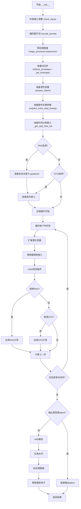
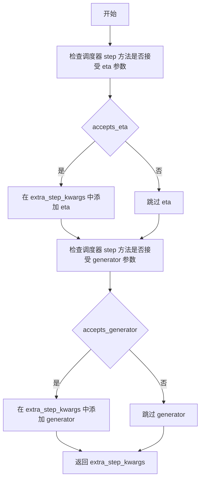
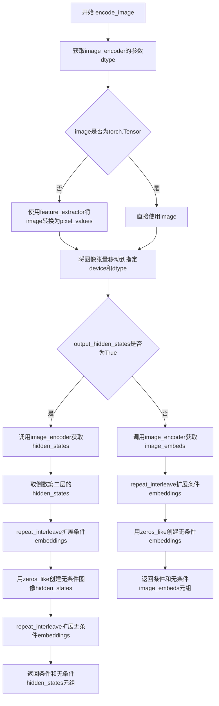
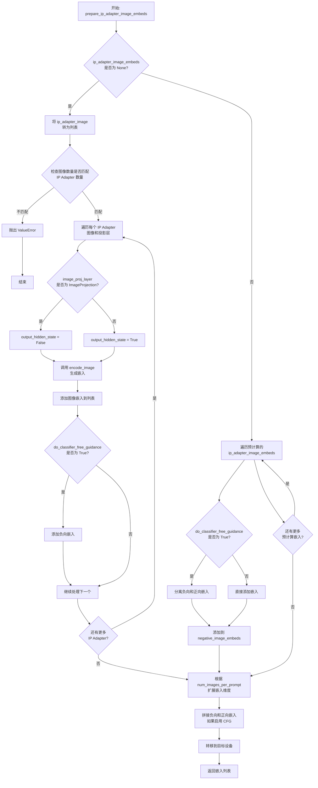
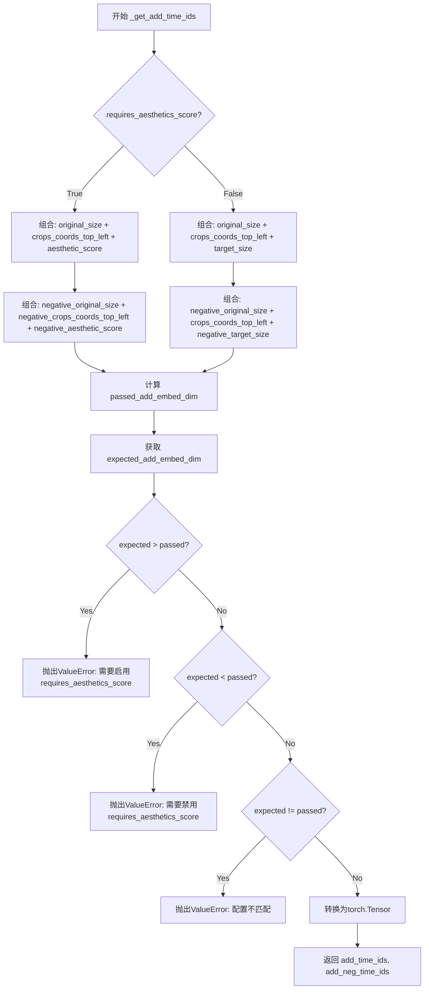
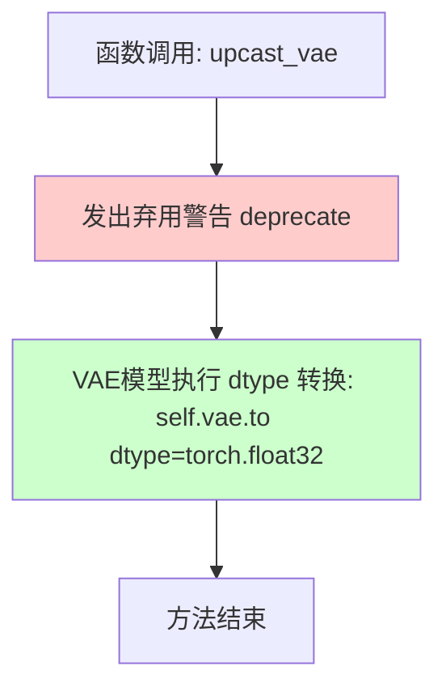
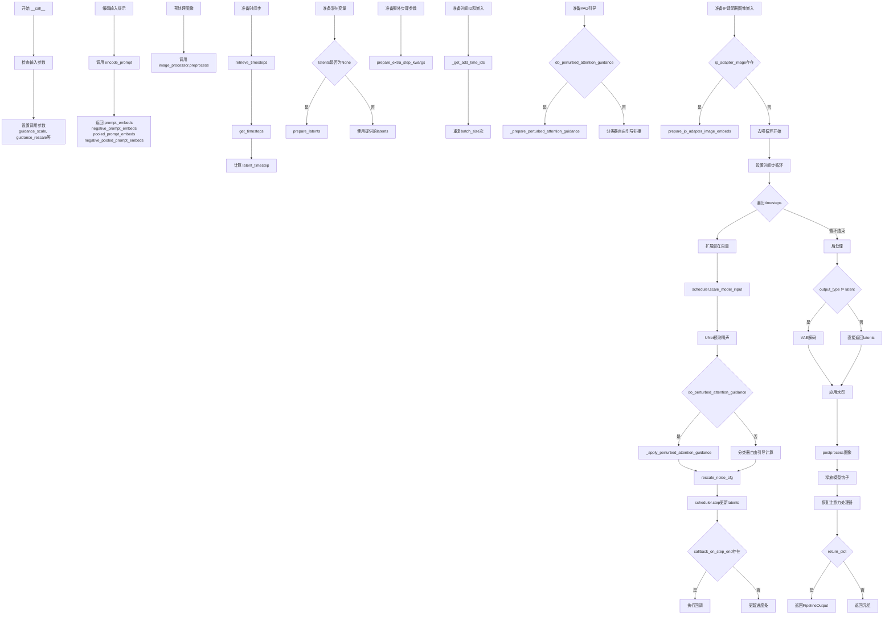

```mermaid
flowchart TD
    A[开始 encode_prompt] --> B{device 为空?}
    B -->|是| C[使用 self._execution_device]
    B -->|否| D[使用传入的 device]
    
    C --> E{LoRA scale 不为空且为 StableDiffusionXLLoraLoaderMixin?}
    D --> E
    
    E -->|是| F[设置 self._lora_scale]
    E -->|否| G[跳过 LoRA 缩放]
    
    F --> H{不是 USE_PEFT_BACKEND?}
    H -->|是| I[adjust_lora_scale_text_encoder]
    H -->|否| J[scale_lora_layers]
    
    G --> K{prompt_embeds 为空?}
    I --> K
    J --> K
    
    K -->|是| L[处理 prompt 和 prompt_2]
    K -->|否| M[使用已有的 prompt_embeds]
    
    L --> N[遍历 tokenizers 和 text_encoders]
    N --> O{是否 TextualInversionLoaderMixin?}
    O -->|是| P[maybe_convert_prompt]
    O -->|否| Q[跳过转换]
    
    P --> R[tokenizer 处理文本]
    Q --> R
    R --> S[tokenize + 截断]
    S --> T[text_encoder 编码]
    T --> U{clip_skip 为空?}
    U -->|是| V[使用倒数第二层隐藏状态]
    U -->|否| W[根据 clip_skip 选择隐藏层]
    
    V --> X[收集 prompt_embeds]
    W --> X
    X --> Y[拼接 prompt_embeds_list]
    Y --> Z{do_classifier_free_guidance 且 negative_prompt_embeds 为空?}
    
    M --> Z
    
    Z -->|是且 force_zeros_for_empty_prompt| AA[创建零嵌入]
    Z -->|否| AB[处理 negative_prompt]
    
    AA --> AC[生成负向嵌入]
    AB --> AC
    
    AC --> AD{text_encoder_2 不为空?}
    AD -->|是| AE[转换为 text_encoder_2 的 dtype]
    AD -->|否| AF[转换为 unet 的 dtype]
    
    AE --> AG[复制 num_images_per_prompt 次]
    AF --> AG
    
    AG --> AH{do_classifier_free_guidance?}
    AH -->|是| AI[处理 negative_prompt_embeds 复制]
    AH -->|否| AJ[跳过负向处理]
    
    AI --> AK[复制 pooled_prompt_embeds]
    AJ --> AK
    
    AK --> AL{是 StableDiffusionXLLoraLoaderMixin 且 USE_PEFT_BACKEND?}
    AL -->|是| AM[unscale_lora_layers]
    AL -->|否| AN[跳过 unscale]
    
    AM --> AO[返回四个嵌入张量]
    AN --> AO
```

# `diffusers\src\diffusers\pipelines\pag\pipeline_pag_sd_xl_img2img.py` 详细设计文档

基于Stable Diffusion XL模型的图像到图像生成Pipeline，集成PAG（Perturbed Attention Guidance）扰动注意力引导技术，用于在去噪过程中引导图像生成，支持IP Adapter、LoRA、Textual Inversion等多种高级功能。

## 整体流程



## 类结构

```
DiffusionPipeline (抽象基类)
├── StableDiffusionMixin
├── TextualInversionLoaderMixin
├── FromSingleFileMixin
├── StableDiffusionXLLoraLoaderMixin
├── IPAdapterMixin
└── PAGMixin
    └── StableDiffusionXLPAGImg2ImgPipeline (主类)
```

## 全局变量及字段


### `logger`
    
模块日志记录器，用于记录管道运行过程中的日志信息

类型：`logging.Logger`
    


### `EXAMPLE_DOC_STRING`
    
示例文档字符串，包含管道使用示例和代码演示

类型：`str`
    


### `XLA_AVAILABLE`
    
XLA可用性标志，指示是否支持PyTorch XLA加速

类型：`bool`
    


### `StableDiffusionXLPAGImg2ImgPipeline.vae`
    
VAE编码器/解码器，用于在图像和潜在表示之间进行转换

类型：`AutoencoderKL`
    


### `StableDiffusionXLPAGImg2ImgPipeline.text_encoder`
    
第一个文本编码器，用于将文本提示编码为嵌入向量

类型：`CLIPTextModel`
    


### `StableDiffusionXLPAGImg2ImgPipeline.text_encoder_2`
    
第二个文本编码器，带有投影层，用于SDXL的文本编码

类型：`CLIPTextModelWithProjection`
    


### `StableDiffusionXLPAGImg2ImgPipeline.tokenizer`
    
第一个分词器，用于将文本分割为token

类型：`CLIPTokenizer`
    


### `StableDiffusionXLPAGImg2ImgPipeline.tokenizer_2`
    
第二个分词器，用于SDXL的文本处理

类型：`CLIPTokenizer`
    


### `StableDiffusionXLPAGImg2ImgPipeline.unet`
    
条件U-Net去噪模型，用于在扩散过程中预测噪声

类型：`UNet2DConditionModel`
    


### `StableDiffusionXLPAGImg2ImgPipeline.scheduler`
    
扩散调度器，控制去噪过程中的时间步调度

类型：`KarrasDiffusionSchedulers`
    


### `StableDiffusionXLPAGImg2ImgPipeline.image_encoder`
    
图像编码器用于IP Adapter，支持图像提示功能

类型：`CLIPVisionModelWithProjection`
    


### `StableDiffusionXLPAGImg2ImgPipeline.feature_extractor`
    
图像特征提取器，用于预处理输入图像

类型：`CLIPImageProcessor`
    


### `StableDiffusionXLPAGImg2ImgPipeline.watermark`
    
隐形水印器，用于在生成图像中添加不可见水印

类型：`StableDiffusionXLWatermarker`
    


### `StableDiffusionXLPAGImg2ImgPipeline.image_processor`
    
图像处理器，用于图像的预处理和后处理

类型：`VaeImageProcessor`
    


### `StableDiffusionXLPAGImg2ImgPipeline.vae_scale_factor`
    
VAE缩放因子，用于计算潜在空间的缩放比例

类型：`int`
    


### `StableDiffusionXLPAGImg2ImgPipeline.model_cpu_offload_seq`
    
模型CPU卸载顺序，定义模型组件卸载到CPU的顺序

类型：`str`
    


### `StableDiffusionXLPAGImg2ImgPipeline._optional_components`
    
可选组件列表，定义管道中可选的模型组件

类型：`list`
    


### `StableDiffusionXLPAGImg2ImgPipeline._callback_tensor_inputs`
    
回调张量输入列表，定义可传递给回调函数的张量参数

类型：`list`
    
    

## 全局函数及方法


### `rescale_noise_cfg`

该函数根据 guidance_rescale 参数重新缩放噪声预测张量，基于 Section 3.4 中描述的方法来改善图像质量并修复过度曝光问题。

参数：

- `noise_cfg`：`torch.Tensor`，引导扩散过程中预测的噪声张量
- `noise_pred_text`：`torch.Tensor`，文本引导扩散过程中预测的噪声张量
- `guidance_rescale`：`float`，可选，默认值为 0.0，应用到噪声预测的重新缩放因子

返回值：`torch.Tensor`，重新缩放后的噪声预测张量

#### 流程图

```mermaid
flowchart TD
    A[开始] --> B[计算 noise_pred_text 的标准差 std_text]
    B --> C[计算 noise_cfg 的标准差 std_cfg]
    C --> D[计算重新缩放的噪声预测 noise_pred_rescaled = noise_cfg × std_text / std_cfg]
    D --> E[混合重新缩放结果和原始结果<br/>noise_cfg = guidance_rescale × noise_pred_rescaled + (1 - guidance_rescale) × noise_cfg]
    E --> F[返回重新缩放后的 noise_cfg]
```

#### 带注释源码

```
def rescale_noise_cfg(noise_cfg, noise_pred_text, guidance_rescale=0.0):
    r"""
    Rescales `noise_cfg` tensor based on `guidance_rescale` to improve image quality and fix overexposure. Based on
    Section 3.4 from [Common Diffusion Noise Schedules and Sample Steps are
    Flawed](https://huggingface.co/papers/2305.08891).

    Args:
        noise_cfg (`torch.Tensor`):
            The predicted noise tensor for the guided diffusion process.
        noise_pred_text (`torch.Tensor`):
            The predicted noise tensor for the text-guided diffusion process.
        guidance_rescale (`float`, *optional*, defaults to 0.0):
            A rescale factor applied to the noise predictions.

    Returns:
        noise_cfg (`torch.Tensor`): The rescaled noise prediction tensor.
    """
    # 计算文本预测噪声的标准差，保留维度以便广播
    std_text = noise_pred_text.std(dim=list(range(1, noise_pred_text.ndim)), keepdim=True)
    # 计算cfg预测噪声的标准差，保留维度以便广播
    std_cfg = noise_cfg.std(dim=list(range(1, noise_cfg.ndim)), keepdim=True)
    
    # 重新缩放引导结果（修复过度曝光）
    # 通过将 noise_cfg 乘以文本预测标准差与cfg预测标准差的比值来实现
    noise_pred_rescaled = noise_cfg * (std_text / std_cfg)
    
    # 通过 guidance_rescale 因子混合原始引导结果，避免图像看起来"平淡无奇"
    # 当 guidance_rescale = 0 时，返回原始 noise_cfg
    # 当 guidance_rescale = 1 时，返回完全重新缩放的 noise_pred_rescaled
    noise_cfg = guidance_rescale * noise_pred_rescaled + (1 - guidance_rescale) * noise_cfg
    
    return noise_cfg
```


### `retrieve_latents`

该函数用于从编码器输出（encoder_output）中检索潜在表示（latents）。它支持多种获取潜在表示的方式：可以通过 latent_dist 进行采样（sample）或取众数（argmax），也可以直接访问预存的 latents 属性。这在 Stable Diffusion 系列 Pipeline 中是常见的工具函数，用于从 VAE 编码器输出中提取潜在向量。

参数：

- `encoder_output`：`torch.Tensor`，编码器的输出对象，通常是 VAE 编码后的结果，可能包含 `latent_dist` 或 `latents` 属性
- `generator`：`torch.Generator | None`，可选的随机数生成器，用于确保采样过程的可重复性
- `sample_mode`：`str`，采样模式，默认为 "sample"，可设为 "argmax" 以获取确定性输出

返回值：`torch.Tensor`，从编码器输出中提取的潜在表示张量

#### 流程图

```mermaid
flowchart TD
    A[开始: retrieve_latents] --> B{encoder_output 是否有 latent_dist 属性?}
    B -->|是| C{sample_mode == 'sample'?}
    C -->|是| D[返回 encoder_output.latent_dist.sample<br/>(使用 generator)]
    C -->|否| E{sample_mode == 'argmax'?}
    E -->|是| F[返回 encoder_output.latent_dist.mode<br/>(取众数)]
    E -->|否| G{encoder_output 是否有 latents 属性?}
    B -->|否| G
    G -->|是| H[返回 encoder_output.latents]
    G -->|否| I[抛出 AttributeError<br/>'Could not access latents...']
    D --> J[结束: 返回 latents]
    F --> J
    H --> J
    I --> J
```

#### 带注释源码

```python
# Copied from diffusers.pipelines.stable_diffusion.pipeline_stable_diffusion_img2img.retrieve_latents
def retrieve_latents(
    encoder_output: torch.Tensor, generator: torch.Generator | None = None, sample_mode: str = "sample"
):
    """
    从编码器输出中检索潜在表示。
    
    该函数支持三种方式获取潜在向量：
    1. 从 latent_dist 属性进行随机采样 (sample_mode="sample")
    2. 从 latent_dist 属性获取众数 (sample_mode="argmax")
    3. 直接访问预存的 latents 属性
    
    Args:
        encoder_output: 编码器输出，通常是 VAE 编码后的结果
        generator: 可选的随机数生成器，用于采样时的确定性
        sample_mode: 采样模式，"sample" 或 "argmax"
    
    Returns:
        torch.Tensor: 潜在表示张量
    """
    # 方式一：当存在 latent_dist 且需要采样时
    if hasattr(encoder_output, "latent_dist") and sample_mode == "sample":
        # 从分布中采样，支持通过 generator 控制随机性
        return encoder_output.latent_dist.sample(generator)
    # 方式二：当存在 latent_dist 且需要取众数时
    elif hasattr(encoder_output, "latent_dist") and sample_mode == "argmax":
        # 返回分布的众数（最大值对应的潜在向量）
        return encoder_output.latent_dist.mode()
    # 方式三：直接访问预存的 latents 属性
    elif hasattr(encoder_output, "latents"):
        return encoder_output.latents
    # 错误处理：无法获取潜在表示
    else:
        raise AttributeError("Could not access latents of provided encoder_output")
```


### `retrieve_timesteps`

该函数是 Stable Diffusion XLPAGImg2ImgPipeline 管道中的全局辅助函数，用于调用调度器的 `set_timesteps` 方法并从中获取时间步。它处理三种情况：自定义时间步（timesteps）、自定义sigmas或默认推理步数，并返回时间步张量和实际的推理步数。

参数：

- `scheduler`：`SchedulerMixin`，调度器对象，用于获取时间步
- `num_inference_steps`：`int | None`，推理步数，当使用预训练模型生成样本时的扩散步数，若使用此参数则 `timesteps` 必须为 `None`
- `device`：`str | torch.device | None`，时间步要移动到的设备，若为 `None` 则不移动时间步
- `timesteps`：`list[int] | None`，自定义时间步，用于覆盖调度器的时间步间距策略，若传入 `timesteps` 则 `num_inference_steps` 和 `sigmas` 必须为 `None`
- `sigmas`：`list[float] | None`，自定义sigmas，用于覆盖调度器的时间步间距策略，若传入 `sigmas` 则 `num_inference_steps` 和 `timesteps` 必须为 `None`
- `**kwargs`：任意关键字参数，将传递给调度器的 `set_timesteps` 方法

返回值：`tuple[torch.Tensor, int]`，元组包含调度器的时间步调度张量和推理步数

#### 流程图

```mermaid
flowchart TD
    A[开始 retrieve_timesteps] --> B{检查 timesteps 和 sigmas 是否同时存在?}
    B -- 是 --> C[抛出 ValueError: 只能选择一个自定义参数]
    B -- 否 --> D{检查 timesteps 是否存在?}
    D -- 是 --> E[检查 scheduler.set_timesteps 是否支持 timesteps 参数]
    E -- 不支持 --> F[抛出 ValueError: 调度器不支持自定义 timesteps]
    E -- 支持 --> G[调用 scheduler.set_timesteps<br/>参数: timesteps=timesteps, device=device]
    G --> H[获取 scheduler.timesteps]
    H --> I[计算 num_inference_steps = len(timesteps)]
    D -- 否 --> J{检查 sigmas 是否存在?}
    J -- 是 --> K[检查 scheduler.set_timesteps 是否支持 sigmas 参数]
    K -- 不支持 --> L[抛出 ValueError: 调度器不支持自定义 sigmas]
    K -- 支持 --> M[调用 scheduler.set_timesteps<br/>参数: sigmas=sigmas, device=device]
    M --> N[获取 scheduler.timesteps]
    N --> O[计算 num_inference_steps = len(timesteps)]
    J -- 否 --> P[调用 scheduler.set_timesteps<br/>参数: num_inference_steps, device=device]
    P --> Q[获取 scheduler.timesteps]
    Q --> R[返回 timesteps, num_inference_steps]
    I --> R
    O --> R
```

#### 带注释源码

```python
def retrieve_timesteps(
    scheduler,
    num_inference_steps: int | None = None,
    device: str | torch.device | None = None,
    timesteps: list[int] | None = None,
    sigmas: list[float] | None = None,
    **kwargs,
):
    r"""
    Calls the scheduler's `set_timesteps` method and retrieves timesteps from the scheduler after the call. Handles
    custom timesteps. Any kwargs will be supplied to `scheduler.set_timesteps`.

    Args:
        scheduler (`SchedulerMixin`):
            The scheduler to get timesteps from.
        num_inference_steps (`int`):
            The number of diffusion steps used when generating samples with a pre-trained model. If used, `timesteps`
            must be `None`.
        device (`str` or `torch.device`, *optional*):
            The device to which the timesteps should be moved to. If `None`, the timesteps are not moved.
        timesteps (`list[int]`, *optional*):
            Custom timesteps used to override the timestep spacing strategy of the scheduler. If `timesteps` is passed,
            `num_inference_steps` and `sigmas` must be `None`.
        sigmas (`list[float]`, *optional*):
            Custom sigmas used to override the timestep spacing strategy of the scheduler. If `sigmas` is passed,
            `num_inference_steps` and `timesteps` must be `None`.

    Returns:
        `tuple[torch.Tensor, int]`: A tuple where the first element is the timestep schedule from the scheduler and the
        second element is the number of inference steps.
    """
    # 验证输入参数：timesteps 和 sigmas 不能同时指定
    if timesteps is not None and sigmas is not None:
        raise ValueError("Only one of `timesteps` or `sigmas` can be passed. Please choose one to set custom values")
    
    # 处理自定义 timesteps 的情况
    if timesteps is not None:
        # 检查调度器是否支持 timesteps 参数
        accepts_timesteps = "timesteps" in set(inspect.signature(scheduler.set_timesteps).parameters.keys())
        if not accepts_timesteps:
            raise ValueError(
                f"The current scheduler class {scheduler.__class__}'s `set_timesteps` does not support custom"
                f" timestep schedules. Please check whether you are using the correct scheduler."
            )
        # 调用调度器的 set_timesteps 方法设置自定义时间步
        scheduler.set_timesteps(timesteps=timesteps, device=device, **kwargs)
        # 从调度器获取设置后的时间步
        timesteps = scheduler.timesteps
        # 计算实际推理步数
        num_inference_steps = len(timesteps)
    
    # 处理自定义 sigmas 的情况
    elif sigmas is not None:
        # 检查调度器是否支持 sigmas 参数
        accept_sigmas = "sigmas" in set(inspect.signature(scheduler.set_timesteps).parameters.keys())
        if not accept_sigmas:
            raise ValueError(
                f"The current scheduler class {scheduler.__class__}'s `set_timesteps` does not support custom"
                f" sigmas schedules. Please check whether you are using the correct scheduler."
            )
        # 调用调度器的 set_timesteps 方法设置自定义 sigmas
        scheduler.set_timesteps(sigmas=sigmas, device=device, **kwargs)
        # 从调度器获取设置后的时间步
        timesteps = scheduler.timesteps
        # 计算实际推理步数
        num_inference_steps = len(timesteps)
    
    # 处理默认情况：使用 num_inference_steps 设置时间步
    else:
        scheduler.set_timesteps(num_inference_steps, device=device, **kwargs)
        timesteps = scheduler.timesteps
    
    # 返回时间步调度和推理步数
    return timesteps, num_inference_steps
```


### `StableDiffusionXLPAGImg2ImgPipeline.__init__`

该方法是Stable Diffusion XL图像到图像生成管道的初始化构造函数，负责实例化并注册所有必需的模型组件（如VAE、文本编码器、UNet等）、配置参数（美学评分、提示词策略等）、图像处理器以及PAG（Perturbed Attention Guidance）相关设置。

参数：

- `vae`：`AutoencoderKL`，变分自编码器模型，用于编码和解码图像与潜在表示之间的转换
- `text_encoder`：`CLIPTextModel`，冻结的文本编码器，SDXL使用CLIP的文本部分
- `text_encoder_2`：`CLIPTextModelWithProjection`，第二个冻结的文本编码器，包含文本和pooled输出
- `tokenizer`：`CLIPTokenizer`，第一个分词器，用于将文本转换为token
- `tokenizer_2`：`CLIPTokenizer`，第二个分词器
- `unet`：`UNet2DConditionModel`，条件U-Net架构，用于去噪潜在表示
- `scheduler`：`KarrasDiffusionSchedulers`，调度器，与unet配合去噪潜在表示
- `image_encoder`：`CLIPVisionModelWithProjection`（可选），CLIP视觉编码器，用于IP-Adapter
- `feature_extractor`：`CLIPImageProcessor`（可选），CLIP图像处理器
- `requires_aesthetics_score`：`bool`，是否需要美学评分条件，默认False
- `force_zeros_for_empty_prompt`：`bool`，当提示为空时是否强制使用零嵌入，默认True
- `add_watermarker`：`bool | None`（可选），是否添加不可见水印，默认根据库可用性决定
- `pag_applied_layers`：`str | list[str]`，PAG应用的层，默认"mid"

返回值：无（`None`），构造函数用于初始化实例状态

#### 流程图

```mermaid
flowchart TD
    A[开始 __init__] --> B[调用 super().__init__]
    B --> C[register_modules: 注册所有模型组件]
    C --> D[register_to_config: 注册配置参数]
    D --> E[计算 vae_scale_factor]
    E --> F[创建 VaeImageProcessor]
    F --> G{add_watermarker 是否可用?}
    G -->|是| H[创建 StableDiffusionXLWatermarker]
    G -->|否| I[设置 watermark = None]
    H --> J[调用 set_pag_applied_layers]
    I --> J
    J --> K[结束 __init__]
```

#### 带注释源码

```python
def __init__(
    self,
    vae: AutoencoderKL,
    text_encoder: CLIPTextModel,
    text_encoder_2: CLIPTextModelWithProjection,
    tokenizer: CLIPTokenizer,
    tokenizer_2: CLIPTokenizer,
    unet: UNet2DConditionModel,
    scheduler: KarrasDiffusionSchedulers,
    image_encoder: CLIPVisionModelWithProjection = None,
    feature_extractor: CLIPImageProcessor = None,
    requires_aesthetics_score: bool = False,
    force_zeros_for_empty_prompt: bool = True,
    add_watermarker: bool | None = None,
    pag_applied_layers: str | list[str] = "mid",  # ["mid"], ["down.block_1", "up.block_0.attentions_0"]
):
    """
    初始化Stable Diffusion XL PAG图像到图像管道
    
    参数:
        vae: 变分自编码器，用于图像与潜在表示的编码解码
        text_encoder: 第一个CLIP文本编码器（冻结）
        text_encoder_2: 第二个CLIP文本编码器（带projection）
        tokenizer: 第一个分词器
        tokenizer_2: 第二个分词器
        unet: 条件U-Net去噪模型
        scheduler: 扩散调度器
        image_encoder: 可选的CLIP视觉编码器（用于IP-Adapter）
        feature_extractor: 可选的CLIP图像处理器
        requires_aesthetics_score: 是否需要美学评分条件
        force_zeros_for_empty_prompt: 空提示词时是否强制零嵌入
        add_watermarker: 是否添加水印（None则自动检测）
        pag_applied_layers: PAG应用的层名称
    """
    # 调用父类DiffusionPipeline的初始化
    super().__init__()

    # 注册所有模型组件到pipeline，使其可通过self.xxx访问
    self.register_modules(
        vae=vae,
        text_encoder=text_encoder,
        text_encoder_2=text_encoder_2,
        tokenizer=tokenizer,
        tokenizer_2=tokenizer_2,
        unet=unet,
        image_encoder=image_encoder,
        feature_extractor=feature_extractor,
        scheduler=scheduler,
    )
    
    # 将配置参数注册到self.config
    self.register_to_config(force_zeros_for_empty_prompt=force_zeros_for_empty_prompt)
    self.register_to_config(requires_aesthetics_score=requires_aesthetics_score)
    
    # 计算VAE缩放因子，基于VAE块输出通道数的2^(n-1)
    # 例如: [128,256,512,512] -> 2^3 = 8
    self.vae_scale_factor = 2 ** (len(self.vae.config.block_out_channels) - 1) if getattr(self, "vae", None) else 8
    
    # 创建VAE图像处理器，用于图像的预处理和后处理
    self.image_processor = VaeImageProcessor(vae_scale_factor=self.vae_scale_factor)

    # 如果未指定add_watermarker，则自动检测水印库是否可用
    add_watermarker = add_watermarker if add_watermarker is not None else is_invisible_watermark_available()

    # 根据条件创建水印器或设为None
    if add_watermarker:
        self.watermark = StableDiffusionXLWatermarker()
    else:
        self.watermark = None

    # 初始化PAG应用的层配置
    self.set_pag_applied_layers(pag_applied_layers)
```


### `StableDiffusionXLPAGImg2ImgPipeline.encode_prompt`

该方法负责将文本提示（prompt）编码为文本编码器的隐藏状态。它处理两个文本编码器（CLIP Text Encoder 和 CLIP Text Encoder with Projection），支持 LoRA 权重调整、Classifier-Free Guidance（无分类器引导），并生成正向和负向的文本嵌入向量。

参数：

- `prompt`：`str | list[str]`，要编码的主提示文本
- `prompt_2`：`str | list[str] | None`，发送给第二个文本编码器的提示，若为 None 则使用 prompt
- `device`：`torch.device | None`，torch 设备，默认为执行设备
- `num_images_per_prompt`：`int`，每个提示生成的图像数量，默认为 1
- `do_classifier_free_guidance`：`bool`，是否使用无分类器引导，默认为 True
- `negative_prompt`：`str | list[str] | None`，负向提示，用于引导图像生成方向
- `negative_prompt_2`：`str | list[str] | None`，发送给第二个文本编码器的负向提示
- `prompt_embeds`：`torch.Tensor | None`，预生成的文本嵌入，若提供则直接使用
- `negative_prompt_embeds`：`torch.Tensor | None`，预生成的负向文本嵌入
- `pooled_prompt_embeds`：`torch.Tensor | None`，预生成的池化文本嵌入
- `negative_pooled_prompt_embeds`：`torch.Tensor | None`，预生成的负向池化文本嵌入
- `lora_scale`：`float | None`，LoRA 权重缩放因子
- `clip_skip`：`int | None`，CLIP 编码时跳过的层数

返回值：`tuple[torch.Tensor, torch.Tensor, torch.Tensor, torch.Tensor]`，包含四个张量：prompt_embeds（正向文本嵌入）、negative_prompt_embeds（负向文本嵌入）、pooled_prompt_embeds（正向池化嵌入）、negative_pooled_prompt_embeds（负向池化嵌入）

#### 流程图



#### 带注释源码

```python
def encode_prompt(
    self,
    prompt: str,
    prompt_2: str | None = None,
    device: torch.device | None = None,
    num_images_per_prompt: int = 1,
    do_classifier_free_guidance: bool = True,
    negative_prompt: str | None = None,
    negative_prompt_2: str | None = None,
    prompt_embeds: torch.Tensor | None = None,
    negative_prompt_embeds: torch.Tensor | None = None,
    pooled_prompt_embeds: torch.Tensor | None = None,
    negative_pooled_prompt_embeds: torch.Tensor | None = None,
    lora_scale: float | None = None,
    clip_skip: int | None = None,
):
    r"""
    Encodes the prompt into text encoder hidden states.

    Args:
        prompt (`str` or `list[str]`, *optional*):
            prompt to be encoded
        prompt_2 (`str` or `list[str]`, *optional*):
            The prompt or prompts to be sent to the `tokenizer_2` and `text_encoder_2`. If not defined, `prompt` is
            used in both text-encoders
        device: (`torch.device`):
            torch device
        num_images_per_prompt (`int`):
            number of images that should be generated per prompt
        do_classifier_free_guidance (`bool`):
            whether to use classifier free guidance or not
        negative_prompt (`str` or `list[str]`, *optional*):
            The prompt or prompts not to guide the image generation. If not defined, one has to pass
            `negative_prompt_embeds` instead. Ignored when not using guidance (i.e., ignored if `guidance_scale` is
            less than `1`).
        negative_prompt_2 (`str` or `list[str]`, *optional*):
            The prompt or prompts not to guide the image generation to be sent to `tokenizer_2` and
            `text_encoder_2`. If not defined, `negative_prompt` is used in both text-encoders
        prompt_embeds (`torch.Tensor`, *optional*):
            Pre-generated text embeddings. Can be used to easily tweak text inputs, *e.g.* prompt weighting. If not
            provided, text embeddings will be generated from `prompt` input argument.
        negative_prompt_embeds (`torch.Tensor`, *optional*):
            Pre-generated negative text embeddings. Can be used to easily tweak text inputs, *e.g.* prompt
            weighting. If not provided, negative_prompt_embeds will be generated from `negative_prompt` input
            argument.
        pooled_prompt_embeds (`torch.Tensor`, *optional*):
            Pre-generated pooled text embeddings. Can be used to easily tweak text inputs, *e.g.* prompt weighting.
            If not provided, pooled text embeddings will be generated from `prompt` input argument.
        negative_pooled_prompt_embeds (`torch.Tensor`, *optional*):
            Pre-generated negative pooled text embeddings. Can be used to easily tweak text inputs, *e.g.* prompt
            weighting. If not provided, pooled negative_prompt_embeds will be generated from `negative_prompt`
            input argument.
        lora_scale (`float`, *optional*):
            A lora scale that will be applied to all LoRA layers of the text encoder if LoRA layers are loaded.
        clip_skip (`int`, *optional*):
            Number of layers to be skipped from CLIP while computing the prompt embeddings. A value of 1 means that
            the output of the pre-final layer will be used for computing the prompt embeddings.
    """
    # 确定设备，如果未指定则使用执行设备
    device = device or self._execution_device

    # 设置 LoRA 缩放因子，以便文本编码器的 LoRA 函数可以正确访问
    if lora_scale is not None and isinstance(self, StableDiffusionXLLoraLoaderMixin):
        self._lora_scale = lora_scale

        # 动态调整 LoRA 缩放
        if self.text_encoder is not None:
            if not USE_PEFT_BACKEND:
                adjust_lora_scale_text_encoder(self.text_encoder, lora_scale)
            else:
                scale_lora_layers(self.text_encoder, lora_scale)

        if self.text_encoder_2 is not None:
            if not USE_PEFT_BACKEND:
                adjust_lora_scale_text_encoder(self.text_encoder_2, lora_scale)
            else:
                scale_lora_layers(self.text_encoder_2, lora_scale)

    # 将单个字符串 prompt 转换为列表
    prompt = [prompt] if isinstance(prompt, str) else prompt

    # 确定批次大小
    if prompt is not None:
        batch_size = len(prompt)
    else:
        batch_size = prompt_embeds.shape[0]

    # 定义分词器和文本编码器
    tokenizers = [self.tokenizer, self.tokenizer_2] if self.tokenizer is not None else [self.tokenizer_2]
    text_encoders = (
        [self.text_encoder, self.text_encoder_2] if self.text_encoder is not None else [self.text_encoder_2]
    )

    # 如果未提供 prompt_embeds，则从 prompt 生成
    if prompt_embeds is None:
        # prompt_2 默认为 prompt
        prompt_2 = prompt_2 or prompt
        prompt_2 = [prompt_2] if isinstance(prompt_2, str) else prompt_2

        # 文本反转：如有需要处理多向量 token
        prompt_embeds_list = []
        prompts = [prompt, prompt_2]
        for prompt, tokenizer, text_encoder in zip(prompts, tokenizers, text_encoders):
            # 如果是 TextualInversionLoaderMixin，转换 prompt
            if isinstance(self, TextualInversionLoaderMixin):
                prompt = self.maybe_convert_prompt(prompt, tokenizer)

            # 分词
            text_inputs = tokenizer(
                prompt,
                padding="max_length",
                max_length=tokenizer.model_max_length,
                truncation=True,
                return_tensors="pt",
            )

            text_input_ids = text_inputs.input_ids
            # 获取未截断的 token 序列用于检测截断
            untruncated_ids = tokenizer(prompt, padding="longest", return_tensors="pt").input_ids

            # 检查是否发生了截断
            if untruncated_ids.shape[-1] >= text_input_ids.shape[-1] and not torch.equal(
                text_input_ids, untruncated_ids
            ):
                removed_text = tokenizer.batch_decode(untruncated_ids[:, tokenizer.model_max_length - 1 : -1])
                logger.warning(
                    "The following part of your input was truncated because CLIP can only handle sequences up to"
                    f" {tokenizer.model_max_length} tokens: {removed_text}"
                )

            # 文本编码
            prompt_embeds = text_encoder(text_input_ids.to(device), output_hidden_states=True)

            # 获取池化输出（来自最终文本编码器）
            if pooled_prompt_embeds is None and prompt_embeds[0].ndim == 2:
                pooled_prompt_embeds = prompt_embeds[0]

            # 根据 clip_skip 选择隐藏层
            if clip_skip is None:
                prompt_embeds = prompt_embeds.hidden_states[-2]  # 默认使用倒数第二层
            else:
                # SDXL 总是从倒数第 clip_skip + 2 层索引
                prompt_embeds = prompt_embeds.hidden_states[-(clip_skip + 2)]

            prompt_embeds_list.append(prompt_embeds)

        # 拼接两个文本编码器的嵌入
        prompt_embeds = torch.concat(prompt_embeds_list, dim=-1)

    # 获取无分类器引导的无条件嵌入
    zero_out_negative_prompt = negative_prompt is None and self.config.force_zeros_for_empty_prompt
    if do_classifier_free_guidance and negative_prompt_embeds is None and zero_out_negative_prompt:
        # 如果 force_zeros_for_empty_prompt 为真且没有负向 prompt，创建零嵌入
        negative_prompt_embeds = torch.zeros_like(prompt_embeds)
        negative_pooled_prompt_embeds = torch.zeros_like(pooled_prompt_embeds)
    elif do_classifier_free_guidance and negative_prompt_embeds is None:
        # 处理负向 prompt
        negative_prompt = negative_prompt or ""
        negative_prompt_2 = negative_prompt_2 or negative_prompt

        # 标准化为列表
        negative_prompt = batch_size * [negative_prompt] if isinstance(negative_prompt, str) else negative_prompt
        negative_prompt_2 = (
            batch_size * [negative_prompt_2] if isinstance(negative_prompt_2, str) else negative_prompt_2
        )

        uncond_tokens: list[str]
        if prompt is not None and type(prompt) is not type(negative_prompt):
            raise TypeError(
                f"`negative_prompt` should be the same type to `prompt`, but got {type(negative_prompt)} !="
                f" {type(prompt)}."
            )
        elif batch_size != len(negative_prompt):
            raise ValueError(
                f"`negative_prompt`: {negative_prompt} has batch size {len(negative_prompt)}, but `prompt`:"
                f" {prompt} has batch size {batch_size}. Please make sure that passed `negative_prompt` matches"
                " the batch size of `prompt`."
            )
        else:
            uncond_tokens = [negative_prompt, negative_prompt_2]

        # 编码负向 prompt
        negative_prompt_embeds_list = []
        for negative_prompt, tokenizer, text_encoder in zip(uncond_tokens, tokenizers, text_encoders):
            if isinstance(self, TextualInversionLoaderMixin):
                negative_prompt = self.maybe_convert_prompt(negative_prompt, tokenizer)

            max_length = prompt_embeds.shape[1]
            uncond_input = tokenizer(
                negative_prompt,
                padding="max_length",
                max_length=max_length,
                truncation=True,
                return_tensors="pt",
            )

            negative_prompt_embeds = text_encoder(
                uncond_input.input_ids.to(device),
                output_hidden_states=True,
            )

            # 获取池化输出
            if negative_pooled_prompt_embeds is None and negative_prompt_embeds[0].ndim == 2:
                negative_pooled_prompt_embeds = negative_prompt_embeds[0]
            negative_prompt_embeds = negative_prompt_embeds.hidden_states[-2]

            negative_prompt_embeds_list.append(negative_prompt_embeds)

        negative_prompt_embeds = torch.concat(negative_prompt_embeds_list, dim=-1)

    # 转换 dtype 和 device
    if self.text_encoder_2 is not None:
        prompt_embeds = prompt_embeds.to(dtype=self.text_encoder_2.dtype, device=device)
    else:
        prompt_embeds = prompt_embeds.to(dtype=self.unet.dtype, device=device)

    # 复制文本嵌入以支持每个 prompt 生成多个图像
    bs_embed, seq_len, _ = prompt_embeds.shape
    # 使用 mps 友好的方法复制
    prompt_embeds = prompt_embeds.repeat(1, num_images_per_prompt, 1)
    prompt_embeds = prompt_embeds.view(bs_embed * num_images_per_prompt, seq_len, -1)

    if do_classifier_free_guidance:
        # 复制无条件嵌入
        seq_len = negative_prompt_embeds.shape[1]

        if self.text_encoder_2 is not None:
            negative_prompt_embeds = negative_prompt_embeds.to(dtype=self.text_encoder_2.dtype, device=device)
        else:
            negative_prompt_embeds = negative_prompt_embeds.to(dtype=self.unet.dtype, device=device)

        negative_prompt_embeds = negative_prompt_embeds.repeat(1, num_images_per_prompt, 1)
        negative_prompt_embeds = negative_prompt_embeds.view(batch_size * num_images_per_prompt, seq_len, -1)

    # 处理池化嵌入
    pooled_prompt_embeds = pooled_prompt_embeds.repeat(1, num_images_per_prompt).view(
        bs_embed * num_images_per_prompt, -1
    )
    if do_classifier_free_guidance:
        negative_pooled_prompt_embeds = negative_pooled_prompt_embeds.repeat(1, num_images_per_prompt).view(
            bs_embed * num_images_per_prompt, -1
        )

    # 如果使用 PEFT backend，恢复 LoRA 层到原始缩放
    if self.text_encoder is not None:
        if isinstance(self, StableDiffusionXLLoraLoaderMixin) and USE_PEFT_BACKEND:
            # 通过取消缩放 LoRA 层来恢复原始缩放
            unscale_lora_layers(self.text_encoder, lora_scale)

    if self.text_encoder_2 is not None:
        if isinstance(self, StableDiffusionXLLoraLoaderMixin) and USE_PEFT_BACKEND:
            unscale_lora_layers(self.text_encoder_2, lora_scale)

    # 返回四个嵌入张量
    return prompt_embeds, negative_prompt_embeds, pooled_prompt_embeds, negative_pooled_prompt_embeds
```


### `StableDiffusionXLPAGImg2ImgPipeline.prepare_extra_step_kwargs`

该方法用于准备调度器（scheduler）的额外参数。由于不同的调度器具有不同的签名，该方法通过检查调度器的 `step` 方法是否接受特定参数（如 `eta` 和 `generator`），来动态构建需要传递给调度器的关键字参数字典。这确保了管道可以兼容多种不同的调度器实现。

参数：

- `generator`：`torch.Generator | list[torch.Generator] | None`，用于生成确定性随机数的生成器。如果调度器支持，将被传递给调度器的 `step` 方法。
- `eta`：`float`，DDIM 调度器专用的噪声参数（η），取值范围通常为 [0, 1]。其他调度器会忽略此参数。

返回值：`dict[str, Any]`，包含调度器 `step` 方法所需额外参数的关键字参数字典。可能包含 `eta` 和/或 `generator` 键。

#### 流程图



#### 带注释源码

```python
# Copied from diffusers.pipelines.stable_diffusion.pipeline_stable_diffusion.StableDiffusionPipeline.prepare_extra_step_kwargs
def prepare_extra_step_kwargs(self, generator, eta):
    # 准备调度器的额外参数，因为并非所有调度器都具有相同的签名
    # eta (η) 仅与 DDIMScheduler 一起使用，其他调度器将忽略它
    # eta 对应于 DDIM 论文中的 η：https://huggingface.co/papers/2010.02502
    # 取值应在 [0, 1] 之间

    # 通过检查调度器 step 方法的签名来确定是否接受 eta 参数
    accepts_eta = "eta" in set(inspect.signature(self.scheduler.step).parameters.keys())
    # 初始化额外的关键字参数字典
    extra_step_kwargs = {}
    # 如果调度器接受 eta 参数，则将其添加到 extra_step_kwargs 中
    if accepts_eta:
        extra_step_kwargs["eta"] = eta

    # 检查调度器是否接受 generator 参数
    accepts_generator = "generator" in set(inspect.signature(self.scheduler.step).parameters.keys())
    # 如果调度器接受 generator 参数，则将其添加到 extra_step_kwargs 中
    if accepts_generator:
        extra_step_kwargs["generator"] = generator
    
    # 返回包含调度器所需额外参数的字典
    return extra_step_kwargs
```


### `StableDiffusionXLPAGImg2ImgPipeline.check_inputs`

该方法负责验证图像到图像（Img2Img）流水线的输入参数是否合法，包括检查提示词、强度、推理步数、回调步骤以及IP适配器相关的参数是否满足预期类型、范围和互斥条件。

参数：

- `self`：`StableDiffusionXLPAGImg2ImgPipeline` 实例，隐式参数
- `prompt`：`str | list[str] | None`，用户提供的文本提示词，用于指导图像生成
- `prompt_2`：`str | list[str] | None`，发送给第二个文本编码器的提示词，若不提供则使用 `prompt`
- `strength`：`float`，图像变换强度，值必须在 [0.0, 1.0] 范围内
- `num_inference_steps`：`int`，去噪步数，必须为正整数
- `callback_steps`：`int | None`，回调触发间隔步数，若提供必须为正整数
- `negative_prompt`：`str | list[str] | None`，负面提示词，用于指导不想要的内容
- `negative_prompt_2`：`str | list[str] | None`，发送给第二个文本编码器的负面提示词
- `prompt_embeds`：`torch.Tensor | None`，预生成的文本嵌入向量
- `negative_prompt_embeds`：`torch.Tensor | None`，预生成的负面文本嵌入向量
- `ip_adapter_image`：`PipelineImageInput | None`，IP适配器输入图像
- `ip_adapter_image_embeds`：`list[torch.Tensor] | None`，预生成的IP适配器图像嵌入
- `callback_on_step_end_tensor_inputs`：`list[str] | None`，每步结束时回调的张量输入列表

返回值：`None`，该方法不返回任何值，仅通过抛出 `ValueError` 来表示验证失败。

#### 流程图

```mermaid
flowchart TD
    A[开始 check_inputs] --> B{strength 在 [0, 1] 范围内?}
    B -->|否| C[抛出 ValueError: strength 超出范围]
    B -->|是| D{num_inference_steps 是正整数?}
    D -->|否| E[抛出 ValueError: num_inference_steps 无效]
    D -->|是| F{callback_steps 是正整数?}
    F -->|否| G[抛出 ValueError: callback_steps 无效]
    F -->|是| H{callback_on_step_end_tensor_inputs 合法?}
    H -->|否| I[抛出 ValueError: 无效的 tensor_inputs]
    H -->|是| J{prompt 和 prompt_embeds 互斥?}
    J -->|否| K[抛出 ValueError: 不能同时提供]
    J -->|是| L{prompt_2 和 prompt_embeds 互斥?}
    L -->|否| M[抛出 ValueError: 不能同时提供]
    L -->|是| N{至少提供 prompt 或 prompt_embeds?}
    N -->|否| O[抛出 ValueError: 需提供至少一个]
    N -->|是| P{prompt 类型合法?}
    P -->|否| Q[抛出 ValueError: prompt 类型无效]
    P -->|是| R{prompt_2 类型合法?}
    R -->|否| S[抛出 ValueError: prompt_2 类型无效]
    R -->|是| T{negative_prompt 和 negative_prompt_embeds 互斥?}
    T -->|否| U[抛出 ValueError: 不能同时提供]
    T -->|是| V{negative_prompt_2 和 negative_prompt_embeds 互斥?}
    V -->|否| W[抛出 ValueError: 不能同时提供]
    V -->|是| X{prompt_embeds 和 negative_prompt_embeds 形状一致?}
    X -->|否| Y[抛出 ValueError: 形状不匹配]
    X -->|是| Z{ip_adapter_image 和 ip_adapter_image_embeds 互斥?}
    Z -->|否| AA[抛出 ValueError: 不能同时提供]
    Z -->|是| AB{ip_adapter_image_embeds 是列表?}
    AB -->|否| AC[抛出 ValueError: 需为列表]
    AB -->|是| AD{embeds 维度是 3D 或 4D?}
    AD -->|否| AE[抛出 ValueError: 维度无效]
    AD -->|是| AF[验证通过，方法结束]
    
    C --> AF
    E --> AF
    G --> AF
    I --> AF
    K --> AF
    M --> AF
    O --> AF
    Q --> AF
    S --> AF
    U --> AF
    W --> AF
    Y --> AF
    AA --> AF
    AC --> AF
    AE --> AF
```

#### 带注释源码

```python
def check_inputs(
    self,
    prompt,
    prompt_2,
    strength,
    num_inference_steps,
    callback_steps,
    negative_prompt=None,
    negative_prompt_2=None,
    prompt_embeds=None,
    negative_prompt_embeds=None,
    ip_adapter_image=None,
    ip_adapter_image_embeds=None,
    callback_on_step_end_tensor_inputs=None,
):
    # 验证 strength 参数必须在 [0.0, 1.0] 范围内
    if strength < 0 or strength > 1:
        raise ValueError(f"The value of strength should in [0.0, 1.0] but is {strength}")
    
    # 验证 num_inference_steps 不能为空
    if num_inference_steps is None:
        raise ValueError("`num_inference_steps` cannot be None.")
    # 验证 num_inference_steps 必须是正整数
    elif not isinstance(num_inference_steps, int) or num_inference_steps <= 0:
        raise ValueError(
            f"`num_inference_steps` has to be a positive integer but is {num_inference_steps} of type"
            f" {type(num_inference_steps)}."
        )
    
    # 验证 callback_steps 必须是正整数（如果提供）
    if callback_steps is not None and (not isinstance(callback_steps, int) or callback_steps <= 0):
        raise ValueError(
            f"`callback_steps` has to be a positive integer but is {callback_steps} of type"
            f" {type(callback_steps)}."
        )

    # 验证 callback_on_step_end_tensor_inputs 中的所有键都在允许列表中
    if callback_on_step_end_tensor_inputs is not None and not all(
        k in self._callback_tensor_inputs for k in callback_on_step_end_tensor_inputs
    ):
        raise ValueError(
            f"`callback_on_step_end_tensor_inputs` has to be in {self._callback_tensor_inputs}, but found {[k for k in callback_on_step_end_tensor_inputs if k not in self._callback_tensor_inputs]}"
        )

    # 验证 prompt 和 prompt_embeds 不能同时提供
    if prompt is not None and prompt_embeds is not None:
        raise ValueError(
            f"Cannot forward both `prompt`: {prompt} and `prompt_embeds`: {prompt_embeds}. Please make sure to"
            " only forward one of the two."
        )
    # 验证 prompt_2 和 prompt_embeds 不能同时提供
    elif prompt_2 is not None and prompt_embeds is not None:
        raise ValueError(
            f"Cannot forward both `prompt_2`: {prompt_2} and `prompt_embeds`: {prompt_embeds}. Please make sure to"
            " only forward one of the two."
        )
    # 验证至少提供 prompt 或 prompt_embeds 之一
    elif prompt is None and prompt_embeds is None:
        raise ValueError(
            "Provide either `prompt` or `prompt_embeds`. Cannot leave both `prompt` and `prompt_embeds` undefined."
        )
    # 验证 prompt 必须是 str 或 list 类型
    elif prompt is not None and (not isinstance(prompt, str) and not isinstance(prompt, list)):
        raise ValueError(f"`prompt` has to be of type `str` or `list` but is {type(prompt)}")
    # 验证 prompt_2 必须是 str 或 list 类型
    elif prompt_2 is not None and (not isinstance(prompt_2, str) and not isinstance(prompt_2, list)):
        raise ValueError(f"`prompt_2` has to be of type `str` or `list` but is {type(prompt_2)}")

    # 验证 negative_prompt 和 negative_prompt_embeds 不能同时提供
    if negative_prompt is not None and negative_prompt_embeds is not None:
        raise ValueError(
            f"Cannot forward both `negative_prompt`: {negative_prompt} and `negative_prompt_embeds`:"
            f" {negative_prompt_embeds}. Please make sure to only forward one of the two."
        )
    # 验证 negative_prompt_2 和 negative_prompt_embeds 不能同时提供
    elif negative_prompt_2 is not None and negative_prompt_embeds is not None:
        raise ValueError(
            f"Cannot forward both `negative_prompt_2`: {negative_prompt_2} and `negative_prompt_embeds`:"
            f" {negative_prompt_embeds}. Please make sure to only forward one of the two."
        )

    # 验证 prompt_embeds 和 negative_prompt_embeds 形状一致
    if prompt_embeds is not None and negative_prompt_embeds is not None:
        if prompt_embeds.shape != negative_prompt_embeds.shape:
            raise ValueError(
                "`prompt_embeds` and `negative_prompt_embeds` must have the same shape when passed directly, but"
                f" got: `prompt_embeds` {prompt_embeds.shape} != `negative_prompt_embeds`"
                f" {negative_prompt_embeds.shape}."
            )

    # 验证 ip_adapter_image 和 ip_adapter_image_embeds 不能同时提供
    if ip_adapter_image is not None and ip_adapter_image_embeds is not None:
        raise ValueError(
            "Provide either `ip_adapter_image` or `ip_adapter_image_embeds`. Cannot leave both `ip_adapter_image` and `ip_adapter_image_embeds` defined."
        )

    # 验证 ip_adapter_image_embeds 必须是列表类型
    if ip_adapter_image_embeds is not None:
        if not isinstance(ip_adapter_image_embeds, list):
            raise ValueError(
                f"`ip_adapter_image_embeds` has to be of type `list` but is {type(ip_adapter_image_embeds)}"
            )
        # 验证每个嵌入的维度必须是 3D 或 4D
        elif ip_adapter_image_embeds[0].ndim not in [3, 4]:
            raise ValueError(
                f"`ip_adapter_image_embeds` has to be a list of 3D or 4D tensors but is {ip_adapter_image_embeds[0].ndim}D"
            )
```


### `StableDiffusionXLPAGImg2ImgPipeline.get_timesteps`

该方法用于根据推理步数、噪声强度和可选的去噪起始点计算并返回合适的时间步序列。它是Stable Diffusion XL图像到图像管道的关键组成部分，负责确定去噪过程的调度。

参数：

- `num_inference_steps`：`int`，推理过程中使用的去噪步数
- `strength`：`float`，概念上表示对参考图像的变换程度，值在0到1之间
- `device`：`torch.device`，时间步要移动到的设备
- `denoising_start`：`float | None`，可选参数，指定去噪过程的起始点（0.0到1.0之间的分数）

返回值：`tuple[torch.Tensor, int]`，第一个元素是来自调度器的时间步序列，第二个元素是推理步数

#### 流程图

```mermaid
flowchart TD
    A[开始 get_timesteps] --> B{denoising_start is None?}
    B -->|是| C[计算 init_timestep = min<br/>int(num_inference_steps \* strength)<br/>num_inference_steps]
    C --> D[计算 t_start = max<br/>num_inference_steps - init_timestep<br/>0]
    D --> E[获取 timesteps = scheduler.timesteps<br/>t_start \* scheduler.order:]
    E --> F{scheduler.hasattr<br/>set_begin_index?}
    F -->|是| G[scheduler.set_begin_index<br/>t_start \* scheduler.order]
    F -->|否| H[返回 timesteps<br/>num_inference_steps - t_start]
    G --> H
    B -->|否| I[计算 discrete_timestep_cutoff]
    I --> J[计算 num_inference_steps]
    J --> K{scheduler.order == 2 AND<br/>num_inference_steps % 2 == 0?}
    K -->|是| L[num_inference_steps += 1]
    K -->|否| M[计算 t_start]
    L --> M
    M --> N[获取 timesteps = scheduler.timesteps<br/>t_start:]
    N --> O{scheduler.hasattr<br/>set_begin_index?}
    O -->|是| P[scheduler.set_begin_index t_start]
    O -->|否| Q[返回 timesteps<br/>num_inference_steps]
    P --> Q
```

#### 带注释源码

```python
def get_timesteps(self, num_inference_steps, strength, device, denoising_start=None):
    """
    根据推理步数、噪声强度和可选的去噪起始点获取时间步。
    
    参数:
        num_inference_steps (int): 推理过程中使用的去噪步数
        strength (float): 概念上表示对参考图像的变换程度,必须介于0和1之间
        device (torch.device): 时间步要移动到的设备
        denoising_start (float | None): 可选的去噪起始点,指定为总去噪过程的分数(0.0到1.0之间)
    
    返回:
        tuple[torch.Tensor, int]: (时间步序列, 推理步数)
    """
    # 使用init_timestep获取原始时间步
    if denoising_start is None:
        # 根据强度计算初始时间步数
        # strength表示噪声添加程度,强度越大,初始时间步越接近最大步数
        init_timestep = min(int(num_inference_steps * strength), num_inference_steps)
        
        # 计算起始索引,确保不为负
        t_start = max(num_inference_steps - init_timestep, 0)

        # 从调度器获取对应的时间步序列,考虑调度器的阶数(order)
        timesteps = self.scheduler.timesteps[t_start * self.scheduler.order :]
        
        # 如果调度器支持,设置起始索引以优化性能
        if hasattr(self.scheduler, "set_begin_index"):
            self.scheduler.set_begin_index(t_start * self.scheduler.order)

        # 返回调整后的时间步和实际推理步数
        return timesteps, num_inference_steps - t_start

    else:
        # 当直接指定去噪起始点时,strength由denoising_start决定
        # 将denoising_start转换为离散时间步截止值
        discrete_timestep_cutoff = int(
            round(
                self.scheduler.config.num_train_timesteps
                - (denoising_start * self.scheduler.config.num_train_timesteps)
            )
        )

        # 计算小于截止值的时间步数量
        num_inference_steps = (self.scheduler.timesteps < discrete_timestep_cutoff).sum().item()
        
        # 对于二阶调度器的特殊处理:
        # 如果调度器是二阶的,每个时间步(除最高的外)都会被复制
        # 如果推理步数为偶数,意味着在去噪步骤中间截断,需要加1确保正确
        if self.scheduler.order == 2 and num_inference_steps % 2 == 0:
            num_inference_steps = num_inference_steps + 1

        # 由于t_n+1 >= t_n,从末尾开始切片时间步
        t_start = len(self.scheduler.timesteps) - num_inference_steps
        timesteps = self.scheduler.timesteps[t_start:]
        
        # 如果调度器支持,设置起始索引
        if hasattr(self.scheduler, "set_begin_index"):
            self.scheduler.set_begin_index(t_start)
            
        return timesteps, num_inference_steps
```


### `StableDiffusionXLPAGImg2ImgPipeline.prepare_latents`

该方法用于为图像到图像的扩散过程准备潜在变量。它接收输入图像，通过VAE编码器将其转换为潜在表示，并根据需要添加噪声以支持去噪过程。

参数：

- `image`：`torch.Tensor | PIL.Image.Image | list`，要处理的输入图像
- `timestep`：`torch.Tensor`，当前扩散过程的时间步
- `batch_size`：`int`，生成批大小
- `num_images_per_prompt`：`int`，每个提示生成的图像数量
- `dtype`：`torch.dtype`，张量的数据类型
- `device`：`torch.device`，计算设备
- `generator`：`torch.Generator | list[torch.Generator] | None`，可选的随机生成器，用于确保可重现性
- `add_noise`：`bool`，是否向潜在变量添加噪声，默认为True

返回值：`torch.Tensor`，准备好的潜在变量张量

#### 流程图

```mermaid
flowchart TD
    A[开始] --> B{验证image类型}
    B -->|类型无效| C[抛出ValueError]
    B -->|类型有效| D[获取latents_mean和latents_std]
    D --> E{存在final_offload_hook}
    E -->|是| F[卸载text_encoder_2到CPU]
    E -->|否| G[继续]
    F --> G
    G --> H[将image移动到device和dtype]
    I[计算有效batch_size] --> J{batch_size * num_images_per_prompt}
    J --> K{image.shape[1] == 4}
    K -->|是| L[直接使用image作为init_latents]
    K -->|否| M{vae.config.force_upcast}
    M -->|是| N[将image转为float32]
    N --> O[VAE转为float32]
    M -->|否| P[继续]
    O --> P
    P --> Q{generator是list}
    Q -->|是且长度匹配| R[逐个编码image]
    Q -->|否| S[批量编码image]
    R --> T[拼接init_latents]
    S --> T
    T --> U[VAE恢复dtype]
    U --> V{latents_mean和latents_std存在}
    V -->|是| W[应用缩放因子]
    V -->|否| X[仅应用scaling_factor]
    W --> Y
    X --> Y
    Y --> Z{batch_size > init_latents.shape[0]}
    Z -->|是且整除| AA[扩展init_latents]
    Z -->|是且不整除| AB[抛出ValueError]
    Z -->|否| AC[保持不变]
    AA --> AD
    AB --> AD
    AC --> AD
    AD --> AE{add_noise为True}
    AE -->|是| AF[生成噪声张量]
    AF --> AG[scheduler.add_noise]
    AE -->|否| AH[跳过噪声添加]
    AG --> AI[返回latents]
    AH --> AI
    L --> Y
```

#### 带注释源码

```
def prepare_latents(
    self, image, timestep, batch_size, num_images_per_prompt, dtype, device, generator=None, add_noise=True
):
    """
    准备图像到图像扩散过程的潜在变量。
    
    参数:
        image: 输入图像，可以是torch.Tensor、PIL.Image.Image或list
        timestep: 当前扩散时间步
        batch_size: 批大小
        num_images_per_prompt: 每个提示生成的图像数
        dtype: 数据类型
        device: 计算设备
        generator: 随机生成器
        add_noise: 是否添加噪声
    """
    # 1. 验证输入图像类型
    if not isinstance(image, (torch.Tensor, PIL.Image.Image, list)):
        raise ValueError(
            f"`image` has to be of type `torch.Tensor`, `PIL.Image.Image` or list but is {type(image)}"
        )

    # 2. 获取VAE的latents均值和标准差配置（如果存在）
    latents_mean = latents_std = None
    if hasattr(self.vae.config, "latents_mean") and self.vae.config.latents_mean is not None:
        latents_mean = torch.tensor(self.vae.config.latents_mean).view(1, 4, 1, 1)
    if hasattr(self.vae.config, "latents_std") and self.vae.config.latents_std is not None:
        latents_std = torch.tensor(self.vae.config.latents_std).view(1, 4, 1, 1)

    # 3. 如果启用了模型卸载，卸载text_encoder_2
    if hasattr(self, "final_offload_hook") and self.final_offload_hook is not None:
        self.text_encoder_2.to("cpu")
        empty_device_cache()

    # 4. 将图像移动到指定设备和数据类型
    image = image.to(device=device, dtype=dtype)

    # 5. 计算有效批大小
    batch_size = batch_size * num_images_per_prompt

    # 6. 检查图像是否已经是潜在变量（4通道）
    if image.shape[1] == 4:
        init_latents = image
    else:
        # 7. 需要通过VAE编码图像
        # 确保VAE在float32模式下运行，避免float16溢出
        if self.vae.config.force_upcast:
            image = image.float()
            self.vae.to(dtype=torch.float32)

        # 处理生成器列表
        if isinstance(generator, list) and len(generator) != batch_size:
            raise ValueError(
                f"You have passed a list of generators of length {len(generator)}, but requested an effective batch"
                f" size of {batch_size}. Make sure the batch size matches the length of the generators."
            )

        elif isinstance(generator, list):
            # 处理需要重复图像以匹配batch_size的情况
            if image.shape[0] < batch_size and batch_size % image.shape[0] == 0:
                image = torch.cat([image] * (batch_size // image.shape[0]), dim=0)
            elif image.shape[0] < batch_size and batch_size % image.shape[0] != 0:
                raise ValueError(
                    f"Cannot duplicate `image` of batch size {image.shape[0]} to effective batch_size {batch_size} "
                )

            # 逐个编码图像（每个可能使用不同的生成器）
            init_latents = [
                retrieve_latents(self.vae.encode(image[i : i + 1]), generator=generator[i])
                for i in range(batch_size)
            ]
            init_latents = torch.cat(init_latents, dim=0)
        else:
            # 批量编码
            init_latents = retrieve_latents(self.vae.encode(image), generator=generator)

        # 恢复VAE的原始dtype
        if self.vae.config.force_upcast:
            self.vae.to(dtype)

        # 转换init_latents到目标dtype
        init_latents = init_latents.to(dtype)
        
        # 8. 应用缩放因子（VAE的latents归一化）
        if latents_mean is not None and latents_std is not None:
            latents_mean = latents_mean.to(device=device, dtype=dtype)
            latents_std = latents_std.to(device=device, dtype=dtype)
            init_latents = (init_latents - latents_mean) * self.vae.config.scaling_factor / latents_std
        else:
            init_latents = self.vae.config.scaling_factor * init_latents

    # 9. 扩展init_latents以匹配batch_size
    if batch_size > init_latents.shape[0] and batch_size % init_latents.shape[0] == 0:
        additional_image_per_prompt = batch_size // init_latents.shape[0]
        init_latents = torch.cat([init_latents] * additional_image_per_prompt, dim=0)
    elif batch_size > init_latents.shape[0] and batch_size % init_latents.shape[0] != 0:
        raise ValueError(
            f"Cannot duplicate `image` of batch size {init_latents.shape[0]} to {batch_size} text prompts."
        )
    else:
        init_latents = torch.cat([init_latents], dim=0)

    # 10. 如果需要，添加噪声
    if add_noise:
        shape = init_latents.shape
        noise = randn_tensor(shape, generator=generator, device=device, dtype=dtype)
        init_latents = self.scheduler.add_noise(init_latents, noise, timestep)

    latents = init_latents

    return latents
```


### `StableDiffusionXLPAGImg2ImgPipeline.encode_image`

该方法用于将输入图像编码为图像嵌入向量（image embeddings）或图像编码器的隐藏状态，支持有条件和无条件的图像嵌入生成，主要用于IP-Adapter图像引导功能。

参数：

- `image`：`torch.Tensor` 或 `PIL.Image.Image` 或其他图像格式，要编码的输入图像
- `device`：`torch.device`，图像张量要移动到的目标设备
- `num_images_per_prompt`：`int`，每个提示词要生成的图像数量，用于复制embeddings
- `output_hidden_states`：`bool` 或 `None`，是否返回图像编码器的隐藏状态而非image_embeds

返回值：`tuple[torch.Tensor, torch.Tensor]`，返回一个元组，包含条件图像嵌入（或隐藏状态）和无条件图像嵌入（元组第一个元素是条件/正向embeddings，第二个是无条件/负向embeddings）

#### 流程图



#### 带注释源码

```python
def encode_image(self, image, device, num_images_per_prompt, output_hidden_states=None):
    """
    Encodes an image into image embeddings or hidden states for IP-Adapter support.
    
    Args:
        image: The input image to encode (PIL Image, numpy array, or torch.Tensor)
        device: The torch device to move the image to
        num_images_per_prompt: Number of images to generate per prompt (for batching)
        output_hidden_states: If True, return hidden states instead of image_embeds
    
    Returns:
        Tuple of (image_embeds, uncond_image_embeds) or (hidden_states, uncond_hidden_states)
    """
    # 获取image_encoder模型参数的dtype，确保图像数据类型一致
    dtype = next(self.image_encoder.parameters()).dtype
    
    # 如果输入不是torch.Tensor，使用feature_extractor进行预处理
    if not isinstance(image, torch.Tensor):
        image = self.feature_extractor(image, return_tensors="pt").pixel_values
    
    # 将图像移动到指定设备并转换为正确的dtype
    image = image.to(device=device, dtype=dtype)
    
    # 根据output_hidden_states参数决定返回隐藏状态还是图像嵌入
    if output_hidden_states:
        # 使用output_hidden_states=True获取编码器的隐藏状态
        # 取倒数第二层的hidden_states（通常用于更好的特征表示）
        image_enc_hidden_states = self.image_encoder(image, output_hidden_states=True).hidden_states[-2]
        # repeat_interleave用于扩展到每个提示词生成多张图像
        image_enc_hidden_states = image_enc_hidden_states.repeat_interleave(num_images_per_prompt, dim=0)
        
        # 创建零填充的无条件隐藏状态（用于classifier-free guidance）
        uncond_image_enc_hidden_states = self.image_encoder(
            torch.zeros_like(image), output_hidden_states=True
        ).hidden_states[-2]
        uncond_image_enc_hidden_states = uncond_image_enc_hidden_states.repeat_interleave(
            num_images_per_prompt, dim=0
        )
        
        # 返回条件和无条件的隐藏状态元组
        return image_enc_hidden_states, uncond_image_enc_hidden_states
    else:
        # 获取图像嵌入向量
        image_embeds = self.image_encoder(image).image_embeds
        # 扩展到num_images_per_prompt维度
        image_embeds = image_embeds.repeat_interleave(num_images_per_prompt, dim=0)
        
        # 创建零填充的无条件图像嵌入（用于无引导的图像生成）
        uncond_image_embeds = torch.zeros_like(image_embeds)
        
        # 返回条件和无条件的图像嵌入元组
        return image_embeds, uncond_image_embeds
```


### StableDiffusionXLPAGImg2ImgPipeline.prepare_ip_adapter_image_embeds

该方法用于准备 IP-Adapter 的图像嵌入（image embeddings），支持无分类器自由引导（Classifier-Free Guidance），将输入图像编码为适配器所需的嵌入向量格式，并根据 `num_images_per_prompt` 进行批量扩展。

参数：

- `self`：`StableDiffusionXLPAGImg2ImgPipeline` 实例本身
- `ip_adapter_image`：`PipelineImageInput | None`，要编码的 IP-Adapter 输入图像，可以是单个图像或图像列表
- `ip_adapter_image_embeds`：`list[torch.Tensor] | None`，预先编码好的图像嵌入列表，如果为 `None` 则需要从 `ip_adapter_image` 编码生成
- `device`：`torch.device`，执行设备（CPU/CUDA）
- `num_images_per_prompt`：`int`，每个 prompt 生成的图像数量
- `do_classifier_free_guidance`：`bool`，是否启用无分类器自由引导

返回值：`list[torch.Tensor]`，处理后的 IP-Adapter 图像嵌入列表，每个元素是对应 IP-Adapter 的嵌入张量

#### 流程图



#### 带注释源码

```python
def prepare_ip_adapter_image_embeds(
    self, ip_adapter_image, ip_adapter_image_embeds, device, num_images_per_prompt, do_classifier_free_guidance
):
    """
    准备 IP-Adapter 图像嵌入，支持无分类器自由引导（Classifier-Free Guidance）。
    
    处理两种情况：
    1. 当 ip_adapter_image_embeds 为 None 时，从 ip_adapter_image 编码生成嵌入
    2. 当 ip_adapter_image_embeds 已提供时，直接使用并进行必要的后处理
    
    参数:
        ip_adapter_image: IP-Adapter 输入图像
        ip_adapter_image_embeds: 预计算的图像嵌入（可选）
        device: 计算设备
        num_images_per_prompt: 每个 prompt 生成的图像数量
        do_classifier_free_guidance: 是否启用 CFG
    
    返回:
        处理后的图像嵌入列表
    """
    image_embeds = []
    # 如果启用 CFG，需要同时准备负向嵌入
    if do_classifier_free_guidance:
        negative_image_embeds = []
    
    # 情况1: 需要从图像编码生成嵌入
    if ip_adapter_image_embeds is None:
        # 确保图像是列表格式
        if not isinstance(ip_adapter_image, list):
            ip_adapter_image = [ip_adapter_image]

        # 验证图像数量与 IP Adapter 数量是否匹配
        if len(ip_adapter_image) != len(self.unet.encoder_hid_proj.image_projection_layers):
            raise ValueError(
                f"`ip_adapter_image` must have same length as the number of IP Adapters. Got {len(ip_adapter_image)} images and {len(self.unet.encoder_hid_proj.image_projection_layers)} IP Adapters."
            )

        # 遍历每个 IP Adapter 的图像和对应的投影层
        for single_ip_adapter_image, image_proj_layer in zip(
            ip_adapter_image, self.unet.encoder_hid_proj.image_projection_layers
        ):
            # 判断是否需要输出隐藏状态
            # 如果投影层不是 ImageProjection 类型，则需要输出隐藏状态
            output_hidden_state = not isinstance(image_proj_layer, ImageProjection)
            
            # 调用 encode_image 方法编码单个图像
            single_image_embeds, single_negative_image_embeds = self.encode_image(
                single_ip_adapter_image, device, 1, output_hidden_state
            )

            # 将编码后的嵌入添加到列表（添加批次维度）
            image_embeds.append(single_image_embeds[None, :])
            # 如果启用 CFG，同时保存负向嵌入
            if do_classifier_free_guidance:
                negative_image_embeds.append(single_negative_image_embeds[None, :])
    # 情况2: 使用预计算的嵌入
    else:
        for single_image_embeds in ip_adapter_image_embeds:
            # 如果启用 CFG，需要分离正向和负向嵌入
            # 预计算嵌入的排列方式: [negative, positive]
            if do_classifier_free_guidance:
                single_negative_image_embeds, single_image_embeds = single_image_embeds.chunk(2)
                negative_image_embeds.append(single_negative_image_embeds)
            image_embeds.append(single_image_embeds)

    # 后处理：将嵌入扩展到每个 prompt 生成的图像数量
    ip_adapter_image_embeds = []
    for i, single_image_embeds in enumerate(image_embeds):
        # 扩展正向嵌入维度
        single_image_embeds = torch.cat([single_image_embeds] * num_images_per_prompt, dim=0)
        
        if do_classifier_free_guidance:
            # 扩展负向嵌入维度
            single_negative_image_embeds = torch.cat([negative_image_embeds[i]] * num_images_per_prompt, dim=0)
            # 拼接: [负向嵌入, 正向嵌入] - 符合 CFG 的输入格式
            single_image_embeds = torch.cat([single_negative_image_embeds, single_image_embeds], dim=0)

        # 确保嵌入在正确的设备上
        single_image_embeds = single_image_embeds.to(device=device)
        ip_adapter_image_embeds.append(single_image_embeds)

    return ip_adapter_image_embeds
```


### `StableDiffusionXLPAGImg2ImgPipeline._get_add_time_ids`

该方法用于生成Stable Diffusion XL模型所需的时间嵌入ID（add_time_ids），根据配置决定是否包含美学评分（aesthetic_score），并验证嵌入维度是否与UNet模型的期望维度匹配。

参数：

- `self`：类实例本身，包含pipeline的配置和模型引用
- `original_size`：`tuple[int, int]`，原始图像尺寸，格式为(height, width)
- `crops_coords_top_left`：`tuple[int, int]`，裁剪坐标的左上角位置
- `target_size`：`tuple[int, int]`，目标图像尺寸
- `aesthetic_score`：`float`，美学评分，用于正向条件
- `negative_aesthetic_score`：`float`，负向条件的美学评分
- `negative_original_size`：`tuple[int, int]`，负向条件的原始尺寸
- `negative_crops_coords_top_left`：`tuple[int, int]`，负向条件的裁剪坐标
- `negative_target_size`：`tuple[int, int]`，负向条件的目标尺寸
- `dtype`：`torch.dtype`，输出张量的数据类型
- `text_encoder_projection_dim`：`int | None`，文本编码器投影维度，默认为None

返回值：`tuple[torch.Tensor, torch.Tensor]`，返回两个张量——add_time_ids（正向时间ID）和add_neg_time_ids（负向时间ID），形状均为(1, num_time_ids)

#### 流程图



#### 带注释源码

```python
def _get_add_time_ids(
    self,
    original_size,                          # 原始图像尺寸 (height, width)
    crops_coords_top_left,                  # 裁剪左上角坐标 (y, x)
    target_size,                            # 目标图像尺寸 (height, width)
    aesthetic_score,                        # 美学评分（正向条件）
    negative_aesthetic_score,               # 美学评分（负向条件）
    negative_original_size,                 # 负向原始尺寸
    negative_crops_coords_top_left,         # 负向裁剪坐标
    negative_target_size,                   # 负向目标尺寸
    dtype,                                   # 输出数据类型
    text_encoder_projection_dim=None,       # 文本编码器投影维度
):
    """
    生成Stable Diffusion XL的时间嵌入ID。
    根据requires_aesthetics_score配置决定是否包含美学评分。
    """
    
    # 根据配置决定时间ID的组成
    if self.config.requires_aesthetics_score:
        # 当需要美学评分时，组合原始尺寸、裁剪坐标和美学评分
        add_time_ids = list(original_size + crops_coords_top_left + (aesthetic_score,))
        add_neg_time_ids = list(
            negative_original_size + negative_crops_coords_top_left + (negative_aesthetic_score,)
        )
    else:
        # 当不需要美学评分时，组合原始尺寸、裁剪坐标和目标尺寸
        add_time_ids = list(original_size + crops_coords_top_left + target_size)
        add_neg_time_ids = list(negative_original_size + crops_coords_top_left + negative_target_size)

    # 计算实际传入的嵌入维度
    passed_add_embed_dim = (
        self.unet.config.addition_time_embed_dim * len(add_time_ids) + text_encoder_projection_dim
    )
    
    # 获取模型期望的嵌入维度
    expected_add_embed_dim = self.unet.add_embedding.linear_1.in_features

    # 验证维度匹配，并提供详细的错误信息
    if (
        expected_add_embed_dim > passed_add_embed_dim
        and (expected_add_embed_dim - passed_add_embed_dim) == self.unet.config.addition_time_embed_dim
    ):
        raise ValueError(
            f"Model expects an added time embedding vector of length {expected_add_embed_dim}, but a vector of {passed_add_embed_dim} was created. Please make sure to enable `requires_aesthetics_score` with `pipe.register_to_config(requires_aesthetics_score=True)` to make sure `aesthetic_score` {aesthetic_score} and `negative_aesthetic_score` {negative_aesthetic_score} is correctly used by the model."
        )
    elif (
        expected_add_embed_dim < passed_add_embed_dim
        and (passed_add_embed_dim - expected_add_embed_dim) == self.unet.config.addition_time_embed_dim
    ):
        raise ValueError(
            f"Model expects an added time embedding vector of length {expected_add_embed_dim}, but a vector of {passed_add_embed_dim} was created. Please make sure to disable `requires_aesthetics_score` with `pipe.register_to_config(requires_aesthetics_score=False)` to make sure `target_size` {target_size} is correctly used by the model."
        )
    elif expected_add_embed_dim != passed_add_embed_dim:
        raise ValueError(
            f"Model expects an added time embedding vector of length {expected_add_embed_dim}, but a vector of {passed_add_embed_dim} was created. The model has an incorrect config. Please check `unet.config.time_embedding_type` and `text_encoder_2.config.projection_dim`."
        )

    # 转换为PyTorch张量
    add_time_ids = torch.tensor([add_time_ids], dtype=dtype)
    add_neg_time_ids = torch.tensor([add_neg_time_ids], dtype=dtype)

    return add_time_ids, add_neg_time_ids
```


### `StableDiffusionXLPAGImg2ImgPipeline.upcast_vae`

该方法用于将VAE模型的数据类型转换为float32，以解决在float16精度下可能出现的数值溢出问题。由于该方法已被弃用，调用时会先发出弃用警告，然后执行类型转换操作。

参数：

- `self`：`StableDiffusionXLPAGImg2ImgPipeline` 实例，表示_pipeline对象本身

返回值：`None`（无返回值），该方法直接修改VAE模型的dtype属性

#### 流程图



#### 带注释源码

```python
# Copied from diffusers.pipelines.stable_diffusion.pipeline_stable_diffusion_upscale.StableDiffusionUpscalePipeline.upcast_vae
def upcast_vae(self):
    """
    将 VAE 模型的数据类型转换为 float32。
    
    该方法已被弃用，建议直接使用 pipe.vae.to(torch.float32) 代替。
    转换原因：在 float16 精度下，VAE 解码过程中可能出现数值溢出问题，
    因此需要将其提升到 float32 进行处理。
    """
    # 发出弃用警告，提醒用户该方法将在未来版本中移除
    # 参数说明：
    #   - "upcast_vae": 弃用功能的名称
    #   - "1.0.0": 弃用版本号
    #   - 第三个参数为弃用说明和迁移指南链接
    deprecate(
        "upcast_vae",
        "1.0.0",
        "`upcast_vae` is deprecated. Please use `pipe.vae.to(torch.float32)`. For more details, please refer to: https://github.com/huggingface/diffusers/pull/12619#issue-3606633695.",
    )
    
    # 执行 VAE 模型的 dtype 转换
    # 将 self.vae（Variational Auto-Encoder）转换为 float32 类型
    # 这样可以避免在解码过程中出现数值溢出
    self.vae.to(dtype=torch.float32)
```


### `StableDiffusionXLPAGImg2ImgPipeline.get_guidance_scale_embedding`

该方法用于将指导比例（guidance scale）转换为高维嵌入向量，基于正弦和余弦函数的周期性特征生成时间条件嵌入，用于增强扩散模型的条件生成能力。

参数：

-  `w`：`torch.Tensor`，输入的指导比例值，用于生成嵌入向量
-  `embedding_dim`：`int`，嵌入向量的维度，默认为 512
-  `dtype`：`torch.dtype`，生成嵌入的数据类型，默认为 `torch.float32`

返回值：`torch.Tensor`，形状为 `(len(w), embedding_dim)` 的嵌入向量

#### 流程图

```mermaid
flowchart TD
    A[开始: 输入w] --> B{检查w为一维张量}
    B -->|是| C[将w乘以1000.0]
    B -->|否| Z[抛出断言错误]
    C --> D[计算half_dim = embedding_dim // 2]
    D --> E[计算基础频率: log10000 / (half_dim - 1)]
    E --> F[生成频率数组: exp.arangehalf_dim \* -emb]
    F --> G[将w与频率数组合并: w[:, None] \* emb[None, :]]
    G --> H[拼接sin和cos: torch.catsin_emb, cos_emb, dim=1]
    H --> I{embedding_dim为奇数?}
    I -->|是| J[补零填充: torch.nn.functional.pad emb, 0, 1]
    I -->|否| K[跳过填充]
    J --> L[检查输出形状: (w.shape[0], embedding_dim)]
    K --> L
    L --> M[返回嵌入向量]
```

#### 带注释源码

```python
def get_guidance_scale_embedding(
    self, w: torch.Tensor, embedding_dim: int = 512, dtype: torch.dtype = torch.float32
) -> torch.Tensor:
    """
    生成指导比例嵌入向量，参考自VDM论文实现
    
    参数:
        w: 输入的指导比例张量，用于生成嵌入向量
        embedding_dim: 嵌入向量的目标维度，默认512
        dtype: 输出张量的数据类型，默认float32
    
    返回:
        形状为 (len(w), embedding_dim) 的嵌入张量
    """
    # 验证输入维度，确保w是一维张量
    assert len(w.shape) == 1
    
    # 将指导比例放大1000倍，使数值范围更适合模型学习
    w = w * 1000.0

    # 计算嵌入维度的一半，用于生成sin和cos两部分
    half_dim = embedding_dim // 2
    
    # 计算对数基础频率：log(10000) / (half_dim - 1)
    # 这创建了一个从大到小的频率范围
    emb = torch.log(torch.tensor(10000.0)) / (half_dim - 1)
    
    # 生成指数衰减的频率数组：exp(-emb * i) for i in [0, half_dim)
    # 这确保不同频率成分覆盖整个频谱
    emb = torch.exp(torch.arange(half_dim, dtype=dtype) * -emb)
    
    # 外积计算：将每个w值与所有频率相乘
    # 结果形状: (batch_size, half_dim)
    emb = w.to(dtype)[:, None] * emb[None, :]
    
    # 拼接sin和cos部分，形成完整的嵌入
    # 形状: (batch_size, embedding_dim)
    emb = torch.cat([torch.sin(emb), torch.cos(emb)], dim=1)
    
    # 如果嵌入维度为奇数，需要在最后补零
    # 这是为了处理维度不匹配的情况
    if embedding_dim % 2 == 1:
        emb = torch.nn.functional.pad(emb, (0, 1))
    
    # 最终验证输出形状正确
    assert emb.shape == (w.shape[0], embedding_dim)
    
    return emb
```


### `StableDiffusionXLPAGImg2ImgPipeline.__call__`

该方法是 Stable Diffusion XL 图像到图像生成管道的核心调用函数，接收文本提示和输入图像，通过去噪过程将输入图像转换为符合文本描述的新图像。该管道结合了 PAG（Perturbed Attention Guidance）技术，用于提高生成图像的质量和文本对齐度。

参数：

- `prompt`：`str | list[str] | None`，用于指导图像生成的文本提示。如果未定义，则必须传递 `prompt_embeds`。
- `prompt_2`：`str | list[str] | None`，发送到 `tokenizer_2` 和 `text_encoder_2` 的提示。如果未定义，则使用 `prompt`。
- `image`：`PipelineImageInput | None`，要修改的输入图像，支持 torch.Tensor、PIL.Image.Image、np.ndarray 或列表格式。
- `strength`：`float`，概念上表示对参考图像的转换程度，值必须在 0 到 1 之间。
- `num_inference_steps`：`int`，去噪步数，默认为 50。
- `timesteps`：`list[int] | None`，用于去噪过程的自定义时间步。
- `sigmas`：`list[float] | None`，用于去噪过程的自定义噪声Sigma值。
- `denoising_start`：`float | None`，指定要跳过的去噪过程的比例（0.0 到 1.0）。
- `denoising_end`：`float | None`，指定去噪过程提前终止的比例。
- `guidance_scale`：`float`，分类器自由引导的引导尺度，默认为 5.0。
- `negative_prompt`：`str | list[str] | None`，不引导图像生成的负面提示。
- `negative_prompt_2`：`str | list[str] | None`，发送到第二个分词器和文本编码器的负面提示。
- `num_images_per_prompt`：`int | None`，每个提示生成的图像数量，默认为 1。
- `eta`：`float`，DDIM 论文中的 eta 参数，仅适用于 DDIMScheduler。
- `generator`：`torch.Generator | list[torch.Generator] | None`，用于生成确定性结果的随机生成器。
- `latents`：`torch.Tensor | None`，预生成的噪声潜在向量。
- `prompt_embeds`：`torch.Tensor | None`，预生成的文本嵌入。
- `negative_prompt_embeds`：`torch.Tensor | None`，预生成的负面文本嵌入。
- `pooled_prompt_embeds`：`torch.Tensor | None`，预生成的池化文本嵌入。
- `negative_pooled_prompt_embeds`：`torch.Tensor | None`，预生成的负面池化文本嵌入。
- `ip_adapter_image`：`PipelineImageInput | None`，用于 IP Adapter 的可选图像输入。
- `ip_adapter_image_embeds`：`list[torch.Tensor] | None`，IP-Adapter 的预生成图像嵌入列表。
- `output_type`：`str | None`，输出格式，默认为 "pil"。
- `return_dict`：`bool`，是否返回 PipelineOutput 而不是元组。
- `cross_attention_kwargs`：`dict[str, Any] | None`，传递给注意力处理器的额外参数。
- `guidance_rescale`：`float`，引导重缩放因子，用于修复过度曝光问题。
- `original_size`：`tuple[int, int] | None`，原始图像尺寸，默认为 (1024, 1024)。
- `crops_coords_top_left`：`tuple[int, int]`，裁剪坐标左上角，默认为 (0, 0)。
- `target_size`：`tuple[int, int] | None`，目标图像尺寸，默认为 (1024, 1024)。
- `negative_original_size`：`tuple[int, int] | None`，负面条件原始尺寸。
- `negative_crops_coords_top_left`：`tuple[int, int]`，负面裁剪坐标左上角。
- `negative_target_size`：`tuple[int, int] | None`，负面目标尺寸。
- `aesthetic_score`：`float`，用于模拟生成图像美学分数的正向文本条件，默认为 6.0。
- `negative_aesthetic_score`：`float`，用于模拟生成图像美学分数的负向文本条件，默认为 2.5。
- `clip_skip`：`int | None`，CLIP 计算提示嵌入时跳过的层数。
- `callback_on_step_end`：`Callable | PipelineCallback | MultiPipelineCallbacks | None`，每个去噪步骤结束时的回调函数。
- `callback_on_step_end_tensor_inputs`：`list[str]`，回调函数使用的张量输入列表。
- `pag_scale`：`float`，受扰动注意力引导的缩放因子，默认为 3.0。
- `pag_adaptive_scale`：`float`，受扰动注意力引导的自适应缩放因子，默认为 0.0。

返回值：`StableDiffusionXLPipelineOutput | tuple`，返回生成的图像列表或包含图像的元组。

#### 流程图



#### 带注释源码

```python
@torch.no_grad()
@replace_example_docstring(EXAMPLE_DOC_STRING)
def __call__(
    self,
    prompt: str | list[str] = None,
    prompt_2: str | list[str] | None = None,
    image: PipelineImageInput = None,
    strength: float = 0.3,
    num_inference_steps: int = 50,
    timesteps: list[int] = None,
    sigmas: list[float] = None,
    denoising_start: float | None = None,
    denoising_end: float | None = None,
    guidance_scale: float = 5.0,
    negative_prompt: str | list[str] | None = None,
    negative_prompt_2: str | list[str] | None = None,
    num_images_per_prompt: int | None = 1,
    eta: float = 0.0,
    generator: torch.Generator | list[torch.Generator] | None = None,
    latents: torch.Tensor | None = None,
    prompt_embeds: torch.Tensor | None = None,
    negative_prompt_embeds: torch.Tensor | None = None,
    pooled_prompt_embeds: torch.Tensor | None = None,
    negative_pooled_prompt_embeds: torch.Tensor | None = None,
    ip_adapter_image: PipelineImageInput | None = None,
    ip_adapter_image_embeds: list[torch.Tensor] | None = None,
    output_type: str | None = "pil",
    return_dict: bool = True,
    cross_attention_kwargs: dict[str, Any] | None = None,
    guidance_rescale: float = 0.0,
    original_size: tuple[int, int] = None,
    crops_coords_top_left: tuple[int, int] = (0, 0),
    target_size: tuple[int, int] = None,
    negative_original_size: tuple[int, int] | None = None,
    negative_crops_coords_top_left: tuple[int, int] = (0, 0),
    negative_target_size: tuple[int, int] | None = None,
    aesthetic_score: float = 6.0,
    negative_aesthetic_score: float = 2.5,
    clip_skip: int | None = None,
    callback_on_step_end: Callable[[int, int], None] | PipelineCallback | MultiPipelineCallbacks | None = None,
    callback_on_step_end_tensor_inputs: list[str] = ["latents"],
    pag_scale: float = 3.0,
    pag_adaptive_scale: float = 0.0,
):
    r"""
    Function invoked when calling the pipeline for generation.

    Args:
        prompt: The prompt or prompts to guide the image generation.
        ... (详细参数说明见上文)
    """
    # 1. 检查回调函数类型，如果是 PipelineCallback 或 MultiPipelineCallbacks，则提取tensor_inputs
    if isinstance(callback_on_step_end, (PipelineCallback, MultiPipelineCallbacks)):
        callback_on_step_end_tensor_inputs = callback_on_step_end.tensor_inputs

    # 2. 检查输入参数是否正确
    self.check_inputs(
        prompt, prompt_2, strength, num_inference_steps, None,
        negative_prompt, negative_prompt_2, prompt_embeds, negative_prompt_embeds,
        ip_adapter_image, ip_adapter_image_embeds, callback_on_step_end_tensor_inputs,
    )

    # 3. 设置调用参数
    self._guidance_scale = guidance_scale
    self._guidance_rescale = guidance_rescale
    self._clip_skip = clip_skip
    self._cross_attention_kwargs = cross_attention_kwargs
    self._denoising_end = denoising_end
    self._denoising_start = denoising_start
    self._interrupt = False
    self._pag_scale = pag_scale
    self._pag_adaptive_scale = pag_adaptive_scale

    # 4. 定义调用参数
    if prompt is not None and isinstance(prompt, str):
        batch_size = 1
    elif prompt is not None and isinstance(prompt, list):
        batch_size = len(prompt)
    else:
        batch_size = prompt_embeds.shape[0]

    device = self._execution_device

    # 5. 编码输入提示
    text_encoder_lora_scale = (
        self.cross_attention_kwargs.get("scale", None) if self.cross_attention_kwargs is not None else None
    )
    (
        prompt_embeds,
        negative_prompt_embeds,
        pooled_prompt_embeds,
        negative_pooled_prompt_embeds,
    ) = self.encode_prompt(
        prompt=prompt, prompt_2=prompt_2, device=device,
        num_images_per_prompt=num_images_per_prompt,
        do_classifier_free_guidance=self.do_classifier_free_guidance,
        negative_prompt=negative_prompt, negative_prompt_2=negative_prompt_2,
        prompt_embeds=prompt_embeds, negative_prompt_embeds=negative_prompt_embeds,
        pooled_prompt_embeds=pooled_prompt_embeds,
        negative_pooled_prompt_embeds=negative_pooled_prompt_embeds,
        lora_scale=text_encoder_lora_scale, clip_skip=self.clip_skip,
    )

    # 6. 预处理图像
    image = self.image_processor.preprocess(image)

    # 7. 准备时间步
    def denoising_value_valid(dnv):
        return isinstance(dnv, float) and 0 < dnv < 1

    if XLA_AVAILABLE:
        timestep_device = "cpu"
    else:
        timestep_device = device
    timesteps, num_inference_steps = retrieve_timesteps(
        self.scheduler, num_inference_steps, timestep_device, timesteps, sigmas
    )
    timesteps, num_inference_steps = self.get_timesteps(
        num_inference_steps, strength, device,
        denoising_start=self.denoising_start if denoising_value_valid(self.denoising_start) else None,
    )
    latent_timestep = timesteps[:1].repeat(batch_size * num_images_per_prompt)

    add_noise = True if self.denoising_start is None else False

    # 8. 准备潜在变量
    if latents is None:
        latents = self.prepare_latents(
            image, latent_timestep, batch_size, num_images_per_prompt,
            prompt_embeds.dtype, device, generator, add_noise,
        )

    # 9. 准备额外步骤参数
    extra_step_kwargs = self.prepare_extra_step_kwargs(generator, eta)

    height, width = latents.shape[-2:]
    height = height * self.vae_scale_factor
    width = width * self.vae_scale_factor

    original_size = original_size or (height, width)
    target_size = target_size or (height, width)

    # 10. 准备时间ID和嵌入
    if negative_original_size is None:
        negative_original_size = original_size
    if negative_target_size is None:
        negative_target_size = target_size

    add_text_embeds = pooled_prompt_embeds
    if self.text_encoder_2 is None:
        text_encoder_projection_dim = int(pooled_prompt_embeds.shape[-1])
    else:
        text_encoder_projection_dim = self.text_encoder_2.config.projection_dim

    add_time_ids, add_neg_time_ids = self._get_add_time_ids(
        original_size, crops_coords_top_left, target_size,
        aesthetic_score, negative_aesthetic_score,
        negative_original_size, negative_crops_coords_top_left, negative_target_size,
        dtype=prompt_embeds.dtype, text_encoder_projection_dim=text_encoder_projection_dim,
    )
    add_time_ids = add_time_ids.repeat(batch_size * num_images_per_prompt, 1)
    add_neg_time_ids = add_neg_time_ids.repeat(batch_size * num_images_per_prompt, 1)

    # 11. 准备PAG引导
    if self.do_perturbed_attention_guidance:
        prompt_embeds = self._prepare_perturbed_attention_guidance(
            prompt_embeds, negative_prompt_embeds, self.do_classifier_free_guidance
        )
        add_text_embeds = self._prepare_perturbed_attention_guidance(
            add_text_embeds, negative_pooled_prompt_embeds, self.do_classifier_free_guidance
        )
        add_time_ids = self._prepare_perturbed_attention_guidance(
            add_time_ids, add_neg_time_ids, self.do_classifier_free_guidance
        )
    elif self.do_classifier_free_guidance:
        prompt_embeds = torch.cat([negative_prompt_embeds, prompt_embeds], dim=0)
        add_text_embeds = torch.cat([negative_pooled_prompt_embeds, add_text_embeds], dim=0)
        add_time_ids = torch.cat([add_neg_time_ids, add_time_ids], dim=0)

    prompt_embeds = prompt_embeds.to(device)
    add_text_embeds = add_text_embeds.to(device)
    add_time_ids = add_time_ids.to(device)

    # 12. 准备IP适配器图像嵌入
    if ip_adapter_image is not None or ip_adapter_image_embeds is not None:
        ip_adapter_image_embeds = self.prepare_ip_adapter_image_embeds(
            ip_adapter_image, ip_adapter_image_embeds, device,
            batch_size * num_images_per_prompt, self.do_classifier_free_guidance,
        )
        for i, image_embeds in enumerate(ip_adapter_image_embeds):
            negative_image_embeds = None
            if self.do_classifier_free_guidance:
                negative_image_embeds, image_embeds = image_embeds.chunk(2)

            if self.do_perturbed_attention_guidance:
                image_embeds = self._prepare_perturbed_attention_guidance(
                    image_embeds, negative_image_embeds, self.do_classifier_free_guidance
                )
            elif self.do_classifier_free_guidance:
                image_embeds = torch.cat([negative_image_embeds, image_embeds], dim=0)
            image_embeds = image_embeds.to(device)
            ip_adapter_image_embeds[i] = image_embeds

    # 13. 去噪循环
    num_warmup_steps = max(len(timesteps) - num_inference_steps * self.scheduler.order, 0)

    # 13.1 应用denoising_end
    if (
        self.denoising_end is not None and self.denoising_start is not None
        and denoising_value_valid(self.denoising_end) and denoising_value_valid(self.denoising_start)
        and self.denoising_start >= self.denoising_end
    ):
        raise ValueError(f"`denoising_start` cannot be larger than or equal to `denoising_end`")
    elif self.denoising_end is not None and denoising_value_valid(self.denoising_end):
        discrete_timestep_cutoff = int(
            round(
                self.scheduler.config.num_train_timesteps
                - (self.denoising_end * self.scheduler.config.num_train_timesteps)
            )
        )
        num_inference_steps = len(list(filter(lambda ts: ts >= discrete_timestep_cutoff, timesteps)))
        timesteps = timesteps[:num_inference_steps]

    # 13.2 获取引导尺度嵌入
    timestep_cond = None
    if self.unet.config.time_cond_proj_dim is not None:
        guidance_scale_tensor = torch.tensor(self.guidance_scale - 1).repeat(batch_size * num_images_per_prompt)
        timestep_cond = self.get_guidance_scale_embedding(
            guidance_scale_tensor, embedding_dim=self.unet.config.time_cond_proj_dim
        ).to(device=device, dtype=latents.dtype)

    # 13.3 设置PAG注意力处理器
    if self.do_perturbed_attention_guidance:
        original_attn_proc = self.unet.attn_processors
        self._set_pag_attn_processor(
            pag_applied_layers=self.pag_applied_layers,
            do_classifier_free_guidance=self.do_classifier_free_guidance,
        )

    self._num_timesteps = len(timesteps)
    with self.progress_bar(total=num_inference_steps) as progress_bar:
        for i, t in enumerate(timesteps):
            if self.interrupt:
                continue

            # 扩展潜在向量用于分类器自由引导
            latent_model_input = torch.cat([latents] * (prompt_embeds.shape[0] // latents.shape[0]))
            latent_model_input = self.scheduler.scale_model_input(latent_model_input, t)

            # 预测噪声残差
            added_cond_kwargs = {"text_embeds": add_text_embeds, "time_ids": add_time_ids}
            if ip_adapter_image_embeds is not None:
                added_cond_kwargs["image_embeds"] = ip_adapter_image_embeds
            noise_pred = self.unet(
                latent_model_input, t, encoder_hidden_states=prompt_embeds,
                timestep_cond=timestep_cond, cross_attention_kwargs=self.cross_attention_kwargs,
                added_cond_kwargs=added_cond_kwargs, return_dict=False,
            )[0]

            # 执行引导
            if self.do_perturbed_attention_guidance:
                noise_pred, noise_pred_text = self._apply_perturbed_attention_guidance(
                    noise_pred, self.do_classifier_free_guidance, self.guidance_scale, t, True
                )
            elif self.do_classifier_free_guidance:
                noise_pred_uncond, noise_pred_text = noise_pred.chunk(2)
                noise_pred = noise_pred_uncond + self.guidance_scale * (noise_pred_text - noise_pred_uncond)

            # 引导重缩放
            if self.do_classifier_free_guidance and self.guidance_rescale > 0.0:
                noise_pred = rescale_noise_cfg(noise_pred, noise_pred_text, guidance_rescale=self.guidance_rescale)

            # 计算前一个噪声样本 x_t -> x_t-1
            latents_dtype = latents.dtype
            latents = self.scheduler.step(noise_pred, t, latents, **extra_step_kwargs, return_dict=False)[0]
            if latents.dtype != latents_dtype:
                if torch.backends.mps.is_available():
                    latents = latents.to(latents_dtype)

            # 执行回调
            if callback_on_step_end is not None:
                callback_kwargs = {}
                for k in callback_on_step_end_tensor_inputs:
                    callback_kwargs[k] = locals()[k]
                callback_outputs = callback_on_step_end(self, i, t, callback_kwargs)

                latents = callback_outputs.pop("latents", latents)
                prompt_embeds = callback_outputs.pop("prompt_embeds", prompt_embeds)
                negative_prompt_embeds = callback_outputs.pop("negative_prompt_embeds", negative_prompt_embeds)
                add_text_embeds = callback_outputs.pop("add_text_embeds", add_text_embeds)
                negative_pooled_prompt_embeds = callback_outputs.pop("negative_pooled_prompt_embeds", negative_pooled_prompt_embeds)
                add_time_ids = callback_outputs.pop("add_time_ids", add_time_ids)
                add_neg_time_ids = callback_outputs.pop("add_neg_time_ids", add_neg_time_ids)

            # 更新进度条
            if i == len(timesteps) - 1 or ((i + 1) > num_warmup_steps and (i + 1) % self.scheduler.order == 0):
                progress_bar.update()

            if XLA_AVAILABLE:
                xm.mark_step()

    # 14. 后处理
    if not output_type == "latent":
        # 确保VAE在float32模式
        needs_upcasting = self.vae.dtype == torch.float16 and self.vae.config.force_upcast

        if needs_upcasting:
            self.upcast_vae()
            latents = latents.to(next(iter(self.vae.post_quant_conv.parameters())).dtype)
        elif latents.dtype != self.vae.dtype:
            if torch.backends.mps.is_available():
                self.vae = self.vae.to(latents.dtype)

        # 反归一化latents
        has_latents_mean = hasattr(self.vae.config, "latents_mean") and self.vae.config.latents_mean is not None
        has_latents_std = hasattr(self.vae.config, "latents_std") and self.vae.config.latents_std is not None
        if has_latents_mean and has_latents_std:
            latents_mean = (
                torch.tensor(self.vae.config.latents_mean).view(1, 4, 1, 1).to(latents.device, latents.dtype)
            )
            latents_std = (
                torch.tensor(self.vae.config.latents_std).view(1, 4, 1, 1).to(latents.device, latents.dtype)
            )
            latents = latents * latents_std / self.vae.config.scaling_factor + latents_mean
        else:
            latents = latents / self.vae.config.scaling_factor

        # VAE解码
        image = self.vae.decode(latents, return_dict=False)[0]

        # 恢复fp16
        if needs_upcasting:
            self.vae.to(dtype=torch.float16)
    else:
        image = latents

    # 应用水印
    if self.watermark is not None:
        image = self.watermark.apply_watermark(image)

    # 后处理图像
    image = self.image_processor.postprocess(image, output_type=output_type)

    # 释放所有模型
    self.maybe_free_model_hooks()

    # 恢复注意力处理器
    if self.do_perturbed_attention_guidance:
        self.unet.set_attn_processor(original_attn_proc)

    # 返回结果
    if not return_dict:
        return (image,)

    return StableDiffusionXLPipelineOutput(images=image)
```

## 关键组件


### StableDiffusionXLPAGImg2ImgPipeline

Stable Diffusion XL图像到图像生成管道，支持PAG（扰动注意力引导）功能，通过接收文本提示和输入图像生成基于提示的图像变体。

### PAGMixin

PAG功能混合类，提供扰动注意力引导机制，通过`set_pag_applied_layers`和`_apply_perturbed_attention_guidance`方法增强图像生成质量。

### 张量索引与惰性加载

代码中通过`retrieve_latents`函数从encoder_output中按需提取潜在变量，支持"sample"和"argmax"两种采样模式；通过`latents.repeat()`和`torch.cat()`进行张量复制和拼接以支持批量生成；通过`XLA_AVAILABLE`标志实现设备特定的惰性加载。

### 反量化支持

通过`upcast_vae()`方法将VAE从float16转换为float32以避免溢出；使用`latents.to(dtype=latents_dtype)`确保MPS设备上的数据类型一致性；支持通过`dtype`参数指定输入图像的数据类型。

### rescale_noise_cfg

噪声预测重缩放函数，基于guidance_rescale参数调整noise_cfg张量以改善图像质量并修复过曝问题，借鉴自Common Diffusion Noise Schedules论文。

### encode_prompt

提示词编码方法，将文本提示转换为文本编码器的隐藏状态，支持双文本编码器（CLIPTextModel和CLIPTextModelWithProjection）、LoRA权重调整、文本反转和批量生成。

### prepare_latents

潜在变量准备方法，处理输入图像并添加噪声以初始化潜在变量，支持VAE编码、均值/标准差归一化、生成器控制和批量处理。

### retrieve_timesteps

时间步检索函数，调用调度器的`set_timesteps`方法并返回时间步序列，支持自定义timesteps和sigmas参数。

### get_timesteps

基于强度的图像到图像时间步计算方法，根据num_inference_steps和strength参数计算起始时间步，支持denoising_start参数实现部分去噪。

### check_inputs

输入验证方法，检查prompt、strength、num_inference_steps、callback_steps等参数的有效性，确保输入参数符合管道要求。

### __call__

主推理方法，执行完整的图像到图像生成流程，包括：编码提示词、预处理图像、准备时间步和潜在变量、调度去噪循环、应用分类器自由引导或PAG引导、执行VAE解码、后处理输出图像。

### prepare_ip_adapter_image_embeds

IP适配器图像嵌入准备方法，处理输入图像并生成用于IP-Adapter的图像嵌入向量，支持分类器自由引导。

### _get_add_time_ids

时间标识生成方法，根据原始尺寸、裁剪坐标、目标尺寸和美学评分生成额外的时间嵌入向量，支持SDXL微条件机制。


## 问题及建议


### 已知问题

-   **代码重复严重**: 大量方法（如`encode_prompt`、`check_inputs`、`get_timesteps`、`prepare_latents`、`encode_image`、`prepare_ip_adapter_image_embeds`等）从其他Pipeline复制粘贴而来，导致代码冗余，维护成本高
-   **Mixin依赖隐式**: `PAGMixin`提供了`do_perturbed_attention_guidance`、`_apply_perturbed_attention_guidance`、`_prepare_perturbed_attention_guidance`、`_set_pag_attn_processor`等关键方法，但这些方法在当前类中没有明确定义，依赖隐式mixin，容易产生运行时错误
-   **类型混合使用**: 代码中混合使用了旧式类型注解（如`str | None`）和新式类型注解，部分参数使用`Union`风格，部分使用`|`操作符，不统一
-   **硬编码默认值**: `aesthetic_score=6.0`、`negative_aesthetic_score=2.5`、`pag_scale=3.0`等参数硬编码，缺乏配置灵活性
-   **设备转换开销**: 多次进行设备间数据转换（如`to(device)`, `to(dtype)`），尤其在循环内部可能导致性能损失
-   **MPS兼容性处理冗余**: 多个位置单独处理MPS（Apple Silicon）兼容性问题，代码重复且分散
- **日志警告不够具体**: 部分警告信息过于简略，如"The following part of your input was truncated"，缺乏具体数值
- **条件分支复杂**: `__call__`方法中大量条件判断（denoising_start、denoising_end、PAG、IP-Adapter等），导致代码嵌套深，可读性差

### 优化建议

-   **提取公共基类**: 将通用的图像处理、文本编码、时间步处理等逻辑提取到公共基类或工具模块中，避免代码重复
-   **明确Mixin依赖**: 在类文档中明确列出所有Mixin提供的属性和方法，或使用抽象基类定义接口契约
-   **统一类型注解风格**: 统一使用Python 3.10+的类型注解风格（使用`|`操作符），或统一使用`typing`模块的`Union`、`Optional`等
-   **配置化默认参数**: 将硬编码的默认值（如aesthetic_score、pag_scale等）提取到配置类或初始化参数中，提供更好的灵活性
-   **批量设备转换**: 在循环外部预先完成设备转换，减少循环内的设备切换操作
-   **统一MPS处理**: 创建统一的工具函数处理MPS兼容性，避免在多处重复相同逻辑
-   **增强日志详细度**: 在警告信息中包含更多上下文信息，便于调试和问题定位
-   **拆解复杂方法**: 将`__call__`方法中的复杂逻辑拆分为多个私有方法（如`_prepare_guidance`、`_prepare_pag`、`_denoise_step`等），提高可读性和可维护性
-   **添加类型提示完整性**: 为部分缺少类型注解的局部变量添加类型提示，提高代码可读性和IDE支持

## 其它


### 设计目标与约束

本Pipeline的设计目标是实现基于Stable Diffusion XL的图像到图像（Image-to-Image）生成功能，并集成PAG（Perturbed Attention Guidance）技术以提升生成图像的质量。核心约束包括：支持SDXL双文本编码器架构、兼容LoRA权重加载与调整、支持IP-Adapter图像提示、支持文本反转（Textual Inversion）嵌入、必须使用FP16或FP32精度以避免VAE溢出问题、依赖HuggingFace diffusers库生态系统。

### 错误处理与异常设计

代码实现了多层次错误处理机制。输入验证方面：`check_inputs`方法验证`strength`在[0,1]范围内、`num_inference_steps`为正整数、`callback_steps`为正整数、prompt与prompt_embeds不能同时传递、negative_prompt与negative_prompt_embeds不能同时传递、prompt_embeds与negative_prompt_embeds维度必须匹配、IP-Adapter相关参数互斥。调度器兼容性验证方面：`retrieve_timesteps`函数检查调度器是否支持自定义timesteps或sigmas。时间嵌入维度验证：`_get_add_time_ids`方法验证模型期望的时间嵌入维度与实际传入维度是否匹配。设备兼容性处理：MPS后端特殊处理以避免PyTorch bug导致的类型转换问题。

### 数据流与状态机

Pipeline执行流程分为以下阶段：初始化阶段（实例化各模型组件）→ 输入编码阶段（encode_prompt生成文本嵌入）→ 图像预处理阶段（preprocess处理输入图像）→ 时间步计算阶段（retrieve_timesteps和get_timesteps计算去噪调度）→ 潜在变量准备阶段（prepare_latents准备或生成噪声潜在变量）→ 去噪循环阶段（多次迭代预测噪声并更新潜在变量）→ 潜在变量解码阶段（VAE解码潜在变量生成最终图像）→ 后处理阶段（应用水印、格式转换）。状态转换由调度器（scheduler）管理，支持条件启动（denoising_start）和条件结束（denoising_end）以实现多Pipeline混合去噪。

### 外部依赖与接口契约

核心依赖包括：`transformers`库提供CLIPTextModel、CLIPTextModelWithProjection、CLIPTokenizer、CLIPVisionModelWithProjection；`diffusers`内部模块提供AutoencoderKL、UNet2DConditionModel、KarrasDiffusionSchedulers、VaeImageProcessor；可选依赖`invisible_watermark`用于水印添加。接口契约方面：`__call__`方法接受标准DiffusionPipeline参数集，额外支持SDXL特定参数（prompt_2、aesthetic_score、target_size等）和PAG参数（pag_scale、pag_adaptive_scale）；返回StableDiffusionXLPipelineOutput或tuple；支持通过register_modules动态注册组件；支持callback机制在每步结束后注入自定义逻辑。

### 性能考虑与优化空间

性能优化策略包括：模型CPU卸载序列（model_cpu_offload_seq）定义组件卸载顺序；XLA支持检测与使用（XLA_AVAILABLE）；MPS后端特殊处理避免已知bug；VAE按需类型转换（force_upcast）避免溢出；批处理友好型张量复制方法（repeat而非expand）。潜在优化空间：PAG注意力处理器设置与恢复存在冗余操作；去噪循环中重复创建tensor可考虑缓存；IP-Adapter嵌入准备可与主循环并行化；多图像批处理时VAE编码可批量处理以提高吞吐量。

### 版本兼容性说明

本Pipeline基于diffusers库设计，依赖以下版本要求：Python 3.8+；PyTorch 2.0+以支持torch.float16和完整功能；transformers库版本需支持CLIPTextModelWithProjection的projection_dim配置；调度器需实现set_timesteps方法并支持timesteps或sigmas参数；VAE配置需包含latents_mean、latents_std、scaling_factor、force_upcast等关键参数以实现正确的潜在空间处理。

### 安全性与伦理考虑

代码包含以下安全特性：可选 invisible_watermark 水印支持用于追踪AI生成图像；模型卸载机制（maybe_free_model_hooks）在推理完成后释放显存；负向提示词（negative_prompt）支持过滤不当内容。注意事项：PAG技术可能增加生成时间；LoRA权重加载需信任来源；文本反转嵌入可能包含受版权保护的概念；图像到图像转换需遵守目标模型的使用条款。


    