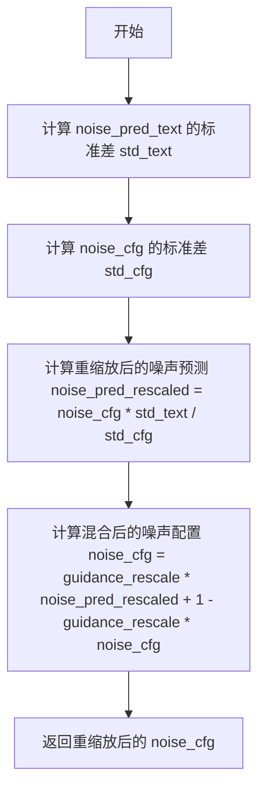
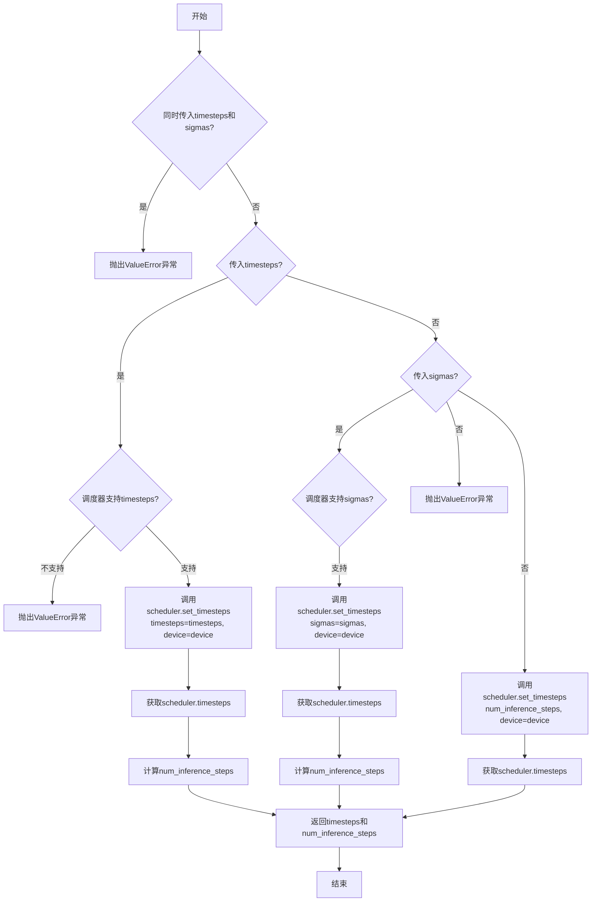
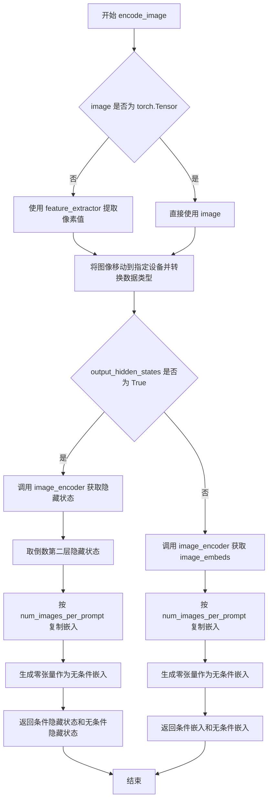
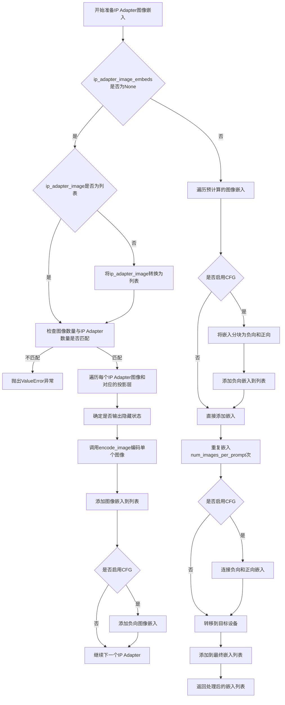
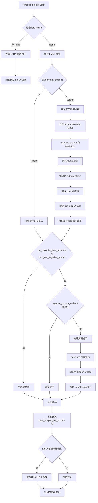
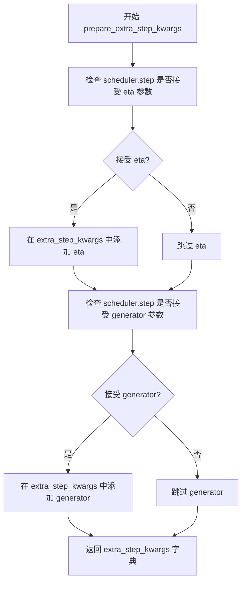
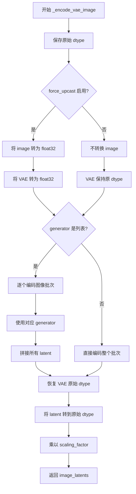
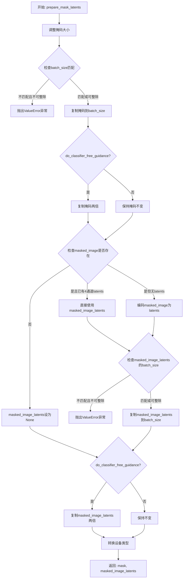
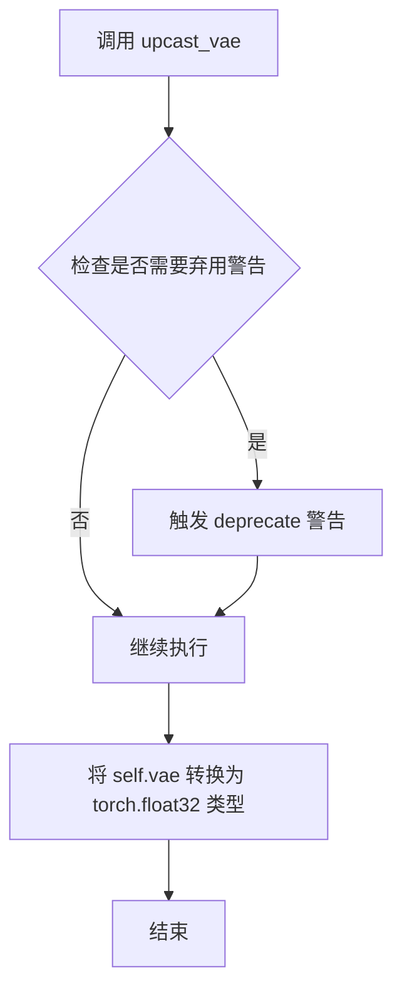
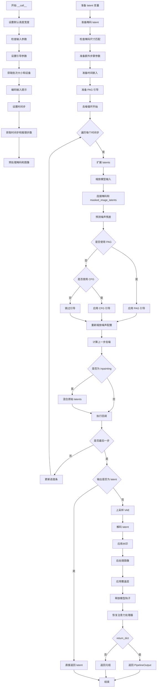

# `diffusers\src\diffusers\pipelines\pag\pipeline_pag_sd_xl_inpaint.py` 详细设计文档

这是一个用于图像修复（Inpainting）的Stable Diffusion XL Pipeline，结合了Perturbed Attention Guidance (PAG)技术。它接收文本提示、原始图像和掩码图像，根据提示将图像内容填充到掩码区域，支持IP-Adapter、LoRA、Textual Inversion等多种高级功能。

## 整体流程

```mermaid
graph TD
    A[开始 __call__] --> B[检查输入参数 check_inputs]
    B --> C[编码文本提示 encode_prompt]
    C --> D[获取时间步 retrieve_timesteps + get_timesteps]
    D --> E[预处理图像和掩码 image_processor.preprocess + mask_processor.preprocess]
    E --> F[准备潜在变量 prepare_latents]
    F --> G[准备掩码潜在变量 prepare_mask_latents]
    G --> H[准备时间嵌入 _get_add_time_ids]
    H --> I{去噪循环}
    I --> J[UNet预测噪声]
    J --> K{使用PAG?]
    K -- 是 --> L[应用扰动注意力指导 _apply_perturbed_attention_guidance]
    K -- 否 --> M{使用CFG?]
    M -- 是 --> N[执行分类器自由指导]
    M -- 否 --> O[跳过指导]
    L --> P[scheduler.step更新latents]
    N --> P
    O --> P
    P --> Q{是否结束?}
    Q -- 否 --> I
    Q -- 是 --> R[VAE解码 decode]
    R --> S[应用水印 watermark.apply_watermark]
    S --> T[后处理图像 postprocess]
    T --> U[结束]
```

## 类结构

```
StableDiffusionXLPAGInpaintPipeline (主类)
├── 继承自: DiffusionPipeline
├── 继承自: StableDiffusionMixin
├── 继承自: TextualInversionLoaderMixin
├── 继承自: StableDiffusionXLLoraLoaderMixin
├── 继承自: FromSingleFileMixin
├── 继承自: IPAdapterMixin
└── 继承自: PAGMixin
```

## 全局变量及字段


### `logger`
    
模块级别的日志记录器，用于记录调试和运行时信息

类型：`logging.Logger`
    


### `EXAMPLE_DOC_STRING`
    
包含pipeline使用示例的文档字符串，用于__call__方法的文档

类型：`str`
    


### `XLA_AVAILABLE`
    
标志位，表示PyTorch XLA是否可用于当前环境

类型：`bool`
    


### `rescale_noise_cfg`
    
全局函数，根据guidance_rescale参数重新缩放噪声预测张量以提高图像质量

类型：`function`
    


### `retrieve_latents`
    
全局函数，从编码器输出中检索潜在变量，支持sample和argmax模式

类型：`function`
    


### `retrieve_timesteps`
    
全局函数，调用调度器的set_timesteps方法并检索时间步序列

类型：`function`
    


### `StableDiffusionXLPAGInpaintPipeline.vae`
    
变分自编码器模型，用于图像与潜在表示之间的编码和解码

类型：`AutoencoderKL`
    


### `StableDiffusionXLPAGInpaintPipeline.text_encoder`
    
第一个冻结的文本编码器，使用CLIP模型将文本转换为嵌入向量

类型：`CLIPTextModel`
    


### `StableDiffusionXLPAGInpaintPipeline.text_encoder_2`
    
第二个冻结的文本编码器，包含投影层用于SDXL的文本条件

类型：`CLIPTextModelWithProjection`
    


### `StableDiffusionXLPAGInpaintPipeline.tokenizer`
    
第一个分词器，用于将文本分割成token序列供text_encoder使用

类型：`CLIPTokenizer`
    


### `StableDiffusionXLPAGInpaintPipeline.tokenizer_2`
    
第二个分词器，用于text_encoder_2的文本处理

类型：`CLIPTokenizer`
    


### `StableDiffusionXLPAGInpaintPipeline.unet`
    
条件U-Net神经网络模型，用于根据文本嵌入和时间步对潜在表示进行去噪

类型：`UNet2DConditionModel`
    


### `StableDiffusionXLPAGInpaintPipeline.scheduler`
    
扩散调度器，管理去噪过程中的时间步和噪声调度

类型：`KarrasDiffusionSchedulers`
    


### `StableDiffusionXLPAGInpaintPipeline.image_encoder`
    
视觉编码器模型，用于IP-Adapter功能的图像嵌入提取

类型：`CLIPVisionModelWithProjection`
    


### `StableDiffusionXLPAGInpaintPipeline.feature_extractor`
    
图像特征提取器，用于将PIL图像转换为模型所需的张量格式

类型：`CLIPImageProcessor`
    


### `StableDiffusionXLPAGInpaintPipeline.vae_scale_factor`
    
VAE缩放因子，用于计算潜在空间与像素空间之间的尺寸转换比例

类型：`int`
    


### `StableDiffusionXLPAGInpaintPipeline.image_processor`
    
图像预处理和后处理器，处理输入图像和输出图像的格式转换

类型：`VaeImageProcessor`
    


### `StableDiffusionXLPAGInpaintPipeline.mask_processor`
    
掩码专用处理器，用于预处理掩码图像并进行二值化处理

类型：`VaeImageProcessor`
    


### `StableDiffusionXLPAGInpaintPipeline.watermark`
    
水印处理器，用于在生成的图像上添加不可见水印

类型：`StableDiffusionXLWatermarker`
    


### `StableDiffusionXLPAGInpaintPipeline.model_cpu_offload_seq`
    
定义模型组件的CPU卸载顺序字符串，用于内存优化

类型：`str`
    


### `StableDiffusionXLPAGInpaintPipeline._optional_components`
    
可选组件列表，包含可能为None的模型组件名称

类型：`list`
    


### `StableDiffusionXLPAGInpaintPipeline._callback_tensor_inputs`
    
回调函数可访问的张量输入名称列表，用于pipeline回调机制

类型：`list`
    
    

## 全局函数及方法


### `rescale_noise_cfg`

该函数根据 guidance_rescale 参数重新缩放噪声配置张量，旨在改善图像质量并修复过度曝光问题。算法基于论文 Common Diffusion Noise Schedules and Sample Steps are Flawed (Section 3.4)，通过计算噪声预测的标准差并进行比例混合，使噪声预测结果更加合理。

参数：

- `noise_cfg`：`torch.Tensor`，引导扩散过程中预测的噪声张量
- `noise_pred_text`：`torch.Tensor`，文本引导扩散过程中预测的噪声张量
- `guidance_rescale`：`float`，可选参数，默认值为 0.0，用于噪声预测的重缩放因子

返回值：`torch.Tensor`，重新缩放后的噪声预测张量

#### 流程图



#### 带注释源码

```python
def rescale_noise_cfg(noise_cfg, noise_pred_text, guidance_rescale=0.0):
    r"""
    Rescales `noise_cfg` tensor based on `guidance_rescale` to improve image quality and fix overexposure. Based on
    Section 3.4 from [Common Diffusion Noise Schedules and Sample Steps are
    Flawed](https://huggingface.co/papers/2305.08891).

    Args:
        noise_cfg (`torch.Tensor`):
            The predicted noise tensor for the guided diffusion process.
        noise_pred_text (`torch.Tensor`):
            The predicted noise tensor for the text-guided diffusion process.
        guidance_rescale (`float`, *optional*, defaults to 0.0):
            A rescale factor applied to the noise predictions.

    Returns:
        noise_cfg (`torch.Tensor`): The rescaled noise prediction tensor.
    """
    # 计算文本预测噪声在所有空间维度上的标准差（保留维度以便广播）
    std_text = noise_pred_text.std(dim=list(range(1, noise_pred_text.ndim)), keepdim=True)
    # 计算配置噪声在所有空间维度上的标准差（保留维度以便广播）
    std_cfg = noise_cfg.std(dim=list(range(1, noise_cfg.ndim)), keepdim=True)
    
    # 根据标准差比例重缩放噪声预测结果（修复过度曝光问题）
    noise_pred_rescaled = noise_cfg * (std_text / std_cfg)
    
    # 通过 guidance_rescale 因子将重缩放后的结果与原始结果混合，避免图像看起来"平淡"
    noise_cfg = guidance_rescale * noise_pred_rescaled + (1 - guidance_rescale) * noise_cfg
    return noise_cfg
```


### `retrieve_latents`

从编码器输出中检索潜在变量，根据采样模式从潜在分布中采样或取模，或直接返回预存的潜在变量。

参数：

- `encoder_output`：`torch.Tensor`，编码器输出对象，包含 `latent_dist` 属性（潜在分布）或 `latents` 属性（预存潜在变量）
- `generator`：`torch.Generator | None`，可选的随机数生成器，用于潜在分布的随机采样
- `sample_mode`：`str`，采样模式，默认为 `"sample"`，可选 `"sample"`（随机采样）或 `"argmax"`（取模/确定性采样）

返回值：`torch.Tensor`，检索到的潜在变量张量

#### 流程图

```mermaid
flowchart TD
    A[开始: retrieve_latents] --> B{encoder_output 是否有 latent_dist 属性?}
    B -- 是 --> C{sample_mode == "sample"?}
    B -- 否 --> D{encoder_output 是否有 latents 属性?}
    C -- 是 --> E[返回 encoder_output.latent_dist.sample(generator)]
    C -- 否 --> F[返回 encoder_output.latent_dist.mode()]
    D -- 是 --> G[返回 encoder_output.latents]
    D -- 否 --> H[抛出 AttributeError 异常]
    
    E --> I[结束]
    F --> I
    G --> I
    H --> I
    
    style H fill:#ffcccc
    style E fill:#ccffcc
    style F fill:#ccffcc
    style G fill:#ccffcc
```

#### 带注释源码

```python
def retrieve_latents(
    encoder_output: torch.Tensor, generator: torch.Generator | None = None, sample_mode: str = "sample"
):
    """
    从编码器输出中检索潜在变量。
    
    该函数支持三种方式获取潜在变量：
    1. 从潜在分布中进行随机采样（sample_mode="sample"）
    2. 从潜在分布中取模/确定性采样（sample_mode="argmax"）
    3. 直接返回编码器输出中预存的 latents 属性
    
    Args:
        encoder_output: 编码器输出对象，通常是 VAE 编码器的输出
        generator: 可选的随机数生成器，用于控制采样随机性
        sample_mode: 采样模式，"sample" 为随机采样，"argmax" 为取模
    
    Returns:
        潜在变量张量
    
    Raises:
        AttributeError: 当 encoder_output 既没有 latent_dist 也没有 latents 属性时
    """
    # 检查编码器输出是否具有 latent_dist 属性（表示输出包含潜在分布）
    if hasattr(encoder_output, "latent_dist") and sample_mode == "sample":
        # 从潜在分布中随机采样，使用可选的 generator 控制随机性
        return encoder_output.latent_dist.sample(generator)
    # 如果采样模式为 argmax，从潜在分布中取最可能的值（确定性采样）
    elif hasattr(encoder_output, "latent_dist") and sample_mode == "argmax":
        return encoder_output.latent_dist.mode()
    # 检查编码器输出是否直接包含 latents 属性（预存的潜在变量）
    elif hasattr(encoder_output, "latents"):
        return encoder_output.latents
    # 如果无法从编码器输出中获取潜在变量，抛出异常
    else:
        raise AttributeError("Could not access latents of provided encoder_output")
```


### `retrieve_timesteps`

该函数是扩散模型管道中的时间步获取工具函数，用于调用调度器的 `set_timesteps` 方法并从中检索时间步序列，同时处理自定义时间步（timesteps）或自定义sigma值（sigmas）的场景，确保调度器正确配置推理过程。

参数：

- `scheduler`：`SchedulerMixin`，调度器对象，用于生成时间步序列
- `num_inference_steps`：`int | None`，推理步数，用于生成样本的扩散步数，如果使用则 `timesteps` 必须为 `None`
- `device`：`str | torch.device | None`，时间步要移动到的设备，如果为 `None` 则不移动时间步
- `timesteps`：`list[int] | None`，自定义时间步，用于覆盖调度器的时间步间隔策略
- `sigmas`：`list[float] | None`，自定义sigma值，用于覆盖调度器的时间步间隔策略
- `**kwargs`：任意关键字参数，将传递给调度器的 `set_timesteps` 方法

返回值：`tuple[torch.Tensor, int]`，元组第一个元素是调度器的时间步调度序列，第二个元素是推理步数

#### 流程图



#### 带注释源码

```python
# Copied from diffusers.pipelines.stable_diffusion.pipeline_stable_diffusion.retrieve_timesteps
def retrieve_timesteps(
    scheduler,
    num_inference_steps: int | None = None,
    device: str | torch.device | None = None,
    timesteps: list[int] | None = None,
    sigmas: list[float] | None = None,
    **kwargs,
):
    r"""
    Calls the scheduler's `set_timesteps` method and retrieves timesteps from the scheduler after the call. Handles
    custom timesteps. Any kwargs will be supplied to `scheduler.set_timesteps`.

    Args:
        scheduler (`SchedulerMixin`):
            The scheduler to get timesteps from.
        num_inference_steps (`int`):
            The number of diffusion steps used when generating samples with a pre-trained model. If used, `timesteps`
            must be `None`.
        device (`str` or `torch.device`, *optional*):
            The device to which the timesteps should be moved to. If `None`, the timesteps are not moved.
        timesteps (`list[int]`, *optional*):
            Custom timesteps used to override the timestep spacing strategy of the scheduler. If `timesteps` is passed,
            `num_inference_steps` and `sigmas` must be `None`.
        sigmas (`list[float]`, *optional*):
            Custom sigmas used to override the timestep spacing strategy of the scheduler. If `sigmas` is passed,
            `num_inference_steps` and `timesteps` must be `None`.

    Returns:
        `tuple[torch.Tensor, int]`: A tuple where the first element is the timestep schedule from the scheduler and the
        second element is the number of inference steps.
    """
    # 检查是否同时传入了timesteps和sigmas，只能选择其中一个
    if timesteps is not None and sigmas is not None:
        raise ValueError("Only one of `timesteps` or `sigmas` can be passed. Please choose one to set custom values")
    
    # 处理自定义timesteps的情况
    if timesteps is not None:
        # 检查调度器的set_timesteps方法是否支持timesteps参数
        accepts_timesteps = "timesteps" in set(inspect.signature(scheduler.set_timesteps).parameters.keys())
        if not accepts_timesteps:
            raise ValueError(
                f"The current scheduler class {scheduler.__class__}'s `set_timesteps` does not support custom"
                f" timestep schedules. Please check whether you are using the correct scheduler."
            )
        # 调用调度器的set_timesteps方法，传入自定义timesteps
        scheduler.set_timesteps(timesteps=timesteps, device=device, **kwargs)
        # 从调度器获取时间步
        timesteps = scheduler.timesteps
        # 计算推理步数
        num_inference_steps = len(timesteps)
    # 处理自定义sigmas的情况
    elif sigmas is not None:
        # 检查调度器的set_timesteps方法是否支持sigmas参数
        accept_sigmas = "sigmas" in set(inspect.signature(scheduler.set_timesteps).parameters.keys())
        if not accept_sigmas:
            raise ValueError(
                f"The current scheduler class {scheduler.__class__}'s `set_timesteps` does not support custom"
                f" sigmas schedules. Please check whether you are using the correct scheduler."
            )
        # 调用调度器的set_timesteps方法，传入自定义sigmas
        scheduler.set_timesteps(sigmas=sigmas, device=device, **kwargs)
        # 从调度器获取时间步
        timesteps = scheduler.timesteps
        # 计算推理步数
        num_inference_steps = len(timesteps)
    # 默认情况：使用num_inference_steps
    else:
        scheduler.set_timesteps(num_inference_steps, device=device, **kwargs)
        timesteps = scheduler.timesteps
    
    # 返回时间步序列和推理步数
    return timesteps, num_inference_steps
```


### `StableDiffusionXLPAGInpaintPipeline.__init__`

该方法是 `StableDiffusionXLPAGInpaintPipeline` 类的构造函数，用于初始化一个集成了PAG（Perturbed Attention Guidance）功能的Stable Diffusion XL图像修复管道。它接收VAE、文本编码器、分词器、UNet和调度器等核心组件，并对图像处理器、水印处理器进行配置，同时注册PAG应用的层。

参数：

- `vae`：`AutoencoderKL`，Variational Auto-Encoder模型，用于编码和解码图像到潜在表示
- `text_encoder`：`CLIPTextModel`，冻结的文本编码器，Stable Diffusion XL使用CLIP的文本部分
- `text_encoder_2`：`CLIPTextModelWithProjection`，第二个冻结的文本编码器，使用CLIP的文本和pool部分
- `tokenizer`：`CLIPTokenizer`，第一个分词器
- `tokenizer_2`：`CLIPTokenizer`，第二个分词器
- `unet`：`UNet2DConditionModel`，条件U-Net架构，用于去噪编码后的图像潜在表示
- `scheduler`：`KarrasDiffusionSchedulers`，与UNet结合使用以去噪图像潜在表示的调度器
- `image_encoder`：`CLIPVisionModelWithProjection`（可选），图像编码器，用于IP-Adapter
- `feature_extractor`：`CLIPImageProcessor`（可选），特征提取器
- `requires_aesthetics_score`：`bool`（可选，默认False），是否需要在推理时传递aesthetic_score条件
- `force_zeros_for_empty_prompt`：`bool`（可选，默认True），是否将负提示词嵌入强制设置为0
- `add_watermarker`：`bool | None`（可选），是否使用不可见水印库为输出图像添加水印
- `pag_applied_layers`：`str | list[str]`（可选，默认"mid"），PAG应用的层，可以是"mid"或具体的层名列表

返回值：`None`，构造函数不返回任何值

#### 流程图

```mermaid
flowchart TD
    A[开始 __init__] --> B[调用 super().__init__]
    B --> C[register_modules 注册所有模块]
    C --> D[register_to_config 注册配置参数]
    D --> E[计算 vae_scale_factor]
    E --> F[初始化 VaeImageProcessor]
    F --> G[初始化 mask_processor]
    G --> H{add_watermarker 是否为 None}
    H -->|否| I[保持原值]
    H -->|是| J{is_invisible_watermark_available 可用}
    J -->|是| K[设置为 True]
    J -->|否| L[设置为 False]
    I --> M
    K --> M
    L --> M
    M{水印启用} -->|是| N[创建 StableDiffusionXLWatermarker]
    M -->|否| O[设置为 None]
    N --> P[set_pag_applied_layers 初始化PAG层]
    O --> P
    P --> Q[结束 __init__]
```

#### 带注释源码

```python
def __init__(
    self,
    vae: AutoencoderKL,
    text_encoder: CLIPTextModel,
    text_encoder_2: CLIPTextModelWithProjection,
    tokenizer: CLIPTokenizer,
    tokenizer_2: CLIPTokenizer,
    unet: UNet2DConditionModel,
    scheduler: KarrasDiffusionSchedulers,
    image_encoder: CLIPVisionModelWithProjection = None,
    feature_extractor: CLIPImageProcessor = None,
    requires_aesthetics_score: bool = False,
    force_zeros_for_empty_prompt: bool = True,
    add_watermarker: bool | None = None,
    pag_applied_layers: str | list[str] = "mid",  # ["mid"], ["down.block_1", "up.block_0.attentions_0"]
):
    # 调用父类构造函数，初始化DiffusionPipeline基础结构
    super().__init__()

    # 注册所有模块到pipeline，使它们可以通过pipeline.xxx访问
    self.register_modules(
        vae=vae,
        text_encoder=text_encoder,
        text_encoder_2=text_encoder_2,
        tokenizer=tokenizer,
        tokenizer_2=tokenizer_2,
        unet=unet,
        image_encoder=image_encoder,
        feature_extractor=feature_extractor,
        scheduler=scheduler,
    )
    
    # 注册配置参数force_zeros_for_empty_prompt，控制空提示词嵌入行为
    self.register_to_config(force_zeros_for_empty_prompt=force_zeros_for_empty_prompt)
    # 注册配置参数requires_aesthetics_score，控制是否需要美学评分条件
    self.register_to_config(requires_aesthetics_score=requires_aesthetics_score)
    
    # 计算VAE缩放因子，基于VAE块输出通道数量（2^(层数-1)）
    # 如果VAE存在则计算，否则默认为8
    self.vae_scale_factor = 2 ** (len(self.vae.config.block_out_channels) - 1) if getattr(self, "vae", None) else 8
    
    # 初始化图像处理器，用于预处理和后处理图像
    self.image_processor = VaeImageProcessor(vae_scale_factor=self.vae_scale_factor)
    
    # 初始化掩码处理器，配置为不归一化、二值化、转换为灰度
    self.mask_processor = VaeImageProcessor(
        vae_scale_factor=self.vae_scale_factor, do_normalize=False, do_binarize=True, do_convert_grayscale=True
    )

    # 如果add_watermarker为None，则根据不可见水印库是否可用来决定
    add_watermarker = add_watermarker if add_watermarker is not None else is_invisible_watermark_available()

    # 根据是否启用水印来创建水印处理器
    if add_watermarker:
        self.watermark = StableDiffusionXLWatermarker()
    else:
        self.watermark = None

    # 初始化PAG（Perturbed Attention Guidance）应用的层
    self.set_pag_applied_layers(pag_applied_layers)
```


### `StableDiffusionXLPAGInpaintPipeline.encode_image`

该方法用于将输入图像编码为图像嵌入向量（image embeddings），支持分类器自由引导（Classifier-Free Guidance）所需的条件嵌入和无条件嵌入。可选地返回隐藏状态用于更精细的特征控制。

参数：

- `image`：`PIL.Image`、`torch.Tensor` 或列表，输入图像数据
- `device`：`torch.device`，图像数据要移动到的目标设备
- `num_images_per_prompt`：`int`，每个提示词生成的图像数量，用于批量嵌入的复制
- `output_hidden_states`：`bool` 或 `None`，是否返回编码器的隐藏状态（用于 IP-Adapter）

返回值：`tuple[torch.Tensor, torch.Tensor]`，返回条件图像嵌入和无条件图像嵌入的元组

#### 流程图



#### 带注释源码

```python
def encode_image(self, image, device, num_images_per_prompt, output_hidden_states=None):
    """
    将输入图像编码为图像嵌入向量，用于扩散模型的图像生成过程。
    支持分类器自由引导（CFG），返回条件嵌入和无条件嵌入。

    Args:
        image: 输入图像，可以是 PIL Image、torch.Tensor 或列表
        device: 目标设备（CPU/CUDA）
        num_images_per_prompt: 每个提示生成的图像数量
        output_hidden_states: 是否返回隐藏状态（用于 IP-Adapter）

    Returns:
        tuple: (条件嵌入, 无条件嵌入)
    """
    # 获取图像编码器的参数数据类型
    dtype = next(self.image_encoder.parameters()).dtype

    # 如果输入不是张量，使用特征提取器转换为张量
    if not isinstance(image, torch.Tensor):
        image = self.feature_extractor(image, return_tensors="pt").pixel_values

    # 将图像移动到目标设备并转换数据类型
    image = image.to(device=device, dtype=dtype)

    # 根据 output_hidden_states 参数选择不同的编码路径
    if output_hidden_states:
        # 返回隐藏状态路径：用于 IP-Adapter 高级特性
        # 获取编码器的倒数第二层隐藏状态（通常效果更好）
        image_enc_hidden_states = self.image_encoder(image, output_hidden_states=True).hidden_states[-2]
        # 为每个提示复制对应的图像嵌入
        image_enc_hidden_states = image_enc_hidden_states.repeat_interleave(num_images_per_prompt, dim=0)
        
        # 生成零张量作为无条件图像嵌入（用于 CFG）
        uncond_image_enc_hidden_states = self.image_encoder(
            torch.zeros_like(image), output_hidden_states=True
        ).hidden_states[-2]
        uncond_image_enc_hidden_states = uncond_image_enc_hidden_states.repeat_interleave(
            num_images_per_prompt, dim=0
        )
        return image_enc_hidden_states, uncond_image_enc_hidden_states
    else:
        # 标准路径：直接获取图像嵌入
        image_embeds = self.image_encoder(image).image_embeds
        # 复制嵌入以匹配生成的图像数量
        image_embeds = image_embeds.repeat_interleave(num_images_per_prompt, dim=0)
        # 无条件嵌入使用零张量
        uncond_image_embeds = torch.zeros_like(image_embeds)

        return image_embeds, uncond_image_embeds
```


### `StableDiffusionXLPAGInpaintPipeline.prepare_ip_adapter_image_embeds`

该方法用于准备IP-Adapter的图像嵌入，处理输入的图像或预计算的图像嵌入，根据是否启用无分类器自由引导（classifier-free guidance）来组织正负嵌入，并将其复制到指定的设备和批次大小。

参数：

- `self`：`StableDiffusionXLPAGInpaintPipeline`实例本身
- `ip_adapter_image`：`PipelineImageInput | None`，要用于IP-Adapter的输入图像
- `ip_adapter_image_embeds`：`list[torch.Tensor] | None`，预生成的图像嵌入列表
- `device`：`torch.device`，目标设备
- `num_images_per_prompt`：`int`，每个提示词生成的图像数量
- `do_classifier_free_guidance`：`bool`，是否启用无分类器自由引导

返回值：`list[torch.Tensor]`，处理后的IP-Adapter图像嵌入列表

#### 流程图



#### 带注释源码

```python
def prepare_ip_adapter_image_embeds(
    self, 
    ip_adapter_image,  # 输入的IP Adapter图像
    ip_adapter_image_embeds,  # 预计算的图像嵌入（可选）
    device,  # 目标设备
    num_images_per_prompt,  # 每个提示生成的图像数量
    do_classifier_free_guidance  # 是否使用无分类器自由引导
):
    # 初始化图像嵌入列表和负向图像嵌入列表（如果启用CFG）
    image_embeds = []
    if do_classifier_free_guidance:
        negative_image_embeds = []
    
    # 情况1：没有预计算嵌入，需要从图像编码
    if ip_adapter_image_embeds is None:
        # 确保输入图像是列表格式
        if not isinstance(ip_adapter_image, list):
            ip_adapter_image = [ip_adapter_image]

        # 验证图像数量与IP Adapter数量匹配
        if len(ip_adapter_image) != len(self.unet.encoder_hid_proj.image_projection_layers):
            raise ValueError(
                f"`ip_adapter_image` must have same length as the number of IP Adapters. "
                f"Got {len(ip_adapter_image)} images and "
                f"{len(self.unet.encoder_hid_proj.image_projection_layers)} IP Adapters."
            )

        # 遍历每个IP Adapter的图像和对应的投影层
        for single_ip_adapter_image, image_proj_layer in zip(
            ip_adapter_image, 
            self.unet.encoder_hid_proj.image_projection_layers
        ):
            # 确定是否需要输出隐藏状态（不是ImageProjection类型时为True）
            output_hidden_state = not isinstance(image_proj_layer, ImageProjection)
            
            # 使用encode_image方法编码单个图像
            single_image_embeds, single_negative_image_embeds = self.encode_image(
                single_ip_adapter_image, device, 1, output_hidden_state
            )

            # 添加图像嵌入（添加批次维度）
            image_embeds.append(single_image_embeds[None, :])
            
            # 如果启用CFG，同时添加负向嵌入
            if do_classifier_free_guidance:
                negative_image_embeds.append(single_negative_image_embeds[None, :])
    
    # 情况2：已有预计算的嵌入，直接使用
    else:
        for single_image_embeds in ip_adapter_image_embeds:
            # 如果启用CFG，需要将嵌入分成负向和正向两部分
            if do_classifier_free_guidance:
                single_negative_image_embeds, single_image_embeds = single_image_embeds.chunk(2)
                negative_image_embeds.append(single_negative_image_embeds)
            image_embeds.append(single_image_embeds)

    # 处理每个嵌入：复制到指定设备并处理CFG
    ip_adapter_image_embeds = []
    for i, single_image_embeds in enumerate(image_embeds):
        # 为每个提示复制图像嵌入num_images_per_prompt次
        single_image_embeds = torch.cat([single_image_embeds] * num_images_per_prompt, dim=0)
        
        # 如果启用CFG，连接负向和正向嵌入
        if do_classifier_free_guidance:
            single_negative_image_embeds = torch.cat([negative_image_embeds[i]] * num_images_per_prompt, dim=0)
            single_image_embeds = torch.cat([single_negative_image_embeds, single_image_embeds], dim=0)

        # 将嵌入转移到目标设备
        single_image_embeds = single_image_embeds.to(device=device)
        ip_adapter_image_embeds.append(single_image_embeds)

    return ip_adapter_image_embeds
```


### `StableDiffusionXLPAGInpaintPipeline.encode_prompt`

该方法将文本提示（prompt）编码为文本编码器的隐藏状态，是 Stable Diffusion XL 图像生成管道的关键组成部分。支持双文本编码器架构、LoRA 权重调整、文本反转嵌入、CLIP 层跳过以及无分类器引导（CFG）的负面提示处理。

参数：

- `prompt`：`str | list[str] | None`，要编码的主提示词
- `prompt_2`：`str | list[str] | None`，发送给第二文本编码器的提示词，未定义时使用 `prompt`
- `device`：`torch.device | None`，执行设备，未指定时使用执行设备
- `num_images_per_prompt`：`int = 1`，每个提示词生成的图像数量
- `do_classifier_free_guidance`：`bool = True`，是否启用无分类器引导
- `negative_prompt`：`str | list[str] | None`，负面提示词，用于引导图像生成
- `negative_prompt_2`：`str | list[str] | None`，第二文本编码器的负面提示词
- `prompt_embeds`：`torch.Tensor | None`，预生成的文本嵌入，直接使用可跳过编码
- `negative_prompt_embeds`：`torch.Tensor | None`，预生成的负面文本嵌入
- `pooled_prompt_embeds`：`torch.Tensor | None`，预生成的池化文本嵌入
- `negative_pooled_prompt_embeds`：`torch.Tensor | None`，预生成的负面池化文本嵌入
- `lora_scale`：`float | None`，LoRA 层的缩放因子
- `clip_skip`：`int | None`，CLIP 编码时跳过的层数

返回值：`tuple[torch.Tensor, torch.Tensor, torch.Tensor, torch.Tensor]`，包含四个张量：
- `prompt_embeds`：编码后的提示词嵌入
- `negative_prompt_embeds`：编码后的负面提示词嵌入
- `pooled_prompt_embeds`：池化后的提示词嵌入
- `negative_pooled_prompt_embeds`：池化后的负面提示词嵌入

#### 流程图



#### 带注释源码

```python
def encode_prompt(
    self,
    prompt: str,
    prompt_2: str | None = None,
    device: torch.device | None = None,
    num_images_per_prompt: int = 1,
    do_classifier_free_guidance: bool = True,
    negative_prompt: str | None = None,
    negative_prompt_2: str | None = None,
    prompt_embeds: torch.Tensor | None = None,
    negative_prompt_embeds: torch.Tensor | None = None,
    pooled_prompt_embeds: torch.Tensor | None = None,
    negative_pooled_prompt_embeds: torch.Tensor | None = None,
    lora_scale: float | None = None,
    clip_skip: int | None = None,
):
    r"""
    Encodes the prompt into text encoder hidden states.

    Args:
        prompt (`str` or `list[str]`, *optional*):
            prompt to be encoded
        prompt_2 (`str` or `list[str]`, *optional*):
            The prompt or prompts to be sent to the `tokenizer_2` and `text_encoder_2`. If not defined, `prompt` is
            used in both text-encoders
        device: (`torch.device`):
            torch device
        num_images_per_prompt (`int`):
            number of images that should be generated per prompt
        do_classifier_free_guidance (`bool`):
            whether to use classifier free guidance or not
        negative_prompt (`str` or `list[str]`, *optional*):
            The prompt or prompts not to guide the image generation. If not defined, one has to pass
            `negative_prompt_embeds` instead. Ignored when not using guidance (i.e., ignored if `guidance_scale` is
            less than `1`).
        negative_prompt_2 (`str` or `list[str]`, *optional*):
            The prompt or prompts not to guide the image generation to be sent to `tokenizer_2` and
            `text_encoder_2`. If not defined, `negative_prompt` is used in both text-encoders
        prompt_embeds (`torch.Tensor`, *optional*):
            Pre-generated text embeddings. Can be used to easily tweak text inputs, *e.g.* prompt weighting. If not
            provided, text embeddings will be generated from `prompt` input argument.
        negative_prompt_embeds (`torch.Tensor`, *optional*):
            Pre-generated negative text embeddings. Can be used to easily tweak text inputs, *e.g.* prompt
            weighting. If not provided, negative_prompt_embeds will be generated from `negative_prompt` input
            argument.
        pooled_prompt_embeds (`torch.Tensor`, *optional*):
            Pre-generated pooled text embeddings. Can be used to easily tweak text inputs, *e.g.* prompt weighting.
            If not provided, pooled text embeddings will be generated from `prompt` input argument.
        negative_pooled_prompt_embeds (`torch.Tensor`, *optional*):
            Pre-generated negative pooled text embeddings. Can be used to easily tweak text inputs, *e.g.* prompt
            weighting. If not provided, pooled negative_prompt_embeds will be generated from `negative_prompt`
            input argument.
        lora_scale (`float`, *optional*):
            A lora scale that will be applied to all LoRA layers of the text encoder if LoRA layers are loaded.
        clip_skip (`int`, *optional*):
            Number of layers to be skipped from CLIP while computing the prompt embeddings. A value of 1 means that
            the output of the pre-final layer will be used for computing the prompt embeddings.
    """
    # 确定执行设备，默认为当前执行设备
    device = device or self._execution_device

    # 设置 LoRA 缩放因子，以便文本编码器的 LoRA 函数可以正确访问
    # 仅当启用了 StableDiffusionXLLoraLoaderMixin 时才设置
    if lora_scale is not None and isinstance(self, StableDiffusionXLLoraLoaderMixin):
        self._lora_scale = lora_scale

        # 动态调整 LoRA 缩放
        if self.text_encoder is not None:
            if not USE_PEFT_BACKEND:
                # 非 PEFT 后端：直接调整 LoRA 缩放
                adjust_lora_scale_text_encoder(self.text_encoder, lora_scale)
            else:
                # PEFT 后端：缩放 LoRA 层
                scale_lora_layers(self.text_encoder, lora_scale)

        if self.text_encoder_2 is not None:
            if not USE_PEFT_BACKEND:
                adjust_lora_scale_text_encoder(self.text_encoder_2, lora_scale)
            else:
                scale_lora_layers(self.text_encoder_2, lora_scale)

    # 标准化 prompt 为列表格式
    prompt = [prompt] if isinstance(prompt, str) else prompt

    # 确定批次大小
    if prompt is not None:
        batch_size = len(prompt)
    else:
        batch_size = prompt_embeds.shape[0]

    # 定义 tokenizers 和 text encoders 列表
    # 如果 tokenizer 可用，使用两个；否则只使用第二个
    tokenizers = [self.tokenizer, self.tokenizer_2] if self.tokenizer is not None else [self.tokenizer_2]
    text_encoders = (
        [self.text_encoder, self.text_encoder_2] if self.text_encoder is not None else [self.text_encoder_2]
    )

    # 如果未提供 prompt_embeds，则从 prompt 生成
    if prompt_embeds is None:
        # prompt_2 默认为 prompt
        prompt_2 = prompt_2 or prompt
        prompt_2 = [prompt_2] if isinstance(prompt_2, str) else prompt_2

        # textual inversion：处理多向量 token（如果需要）
        prompt_embeds_list = []
        prompts = [prompt, prompt_2]
        
        # 遍历两个文本编码器，分别编码 prompt 和 prompt_2
        for prompt, tokenizer, text_encoder in zip(prompts, tokenizers, text_encoders):
            # 如果启用了 textual inversion，转换 prompt
            if isinstance(self, TextualInversionLoaderMixin):
                prompt = self.maybe_convert_prompt(prompt, tokenizer)

            # Tokenize 处理
            text_inputs = tokenizer(
                prompt,
                padding="max_length",
                max_length=tokenizer.model_max_length,
                truncation=True,
                return_tensors="pt",
            )

            text_input_ids = text_inputs.input_ids
            
            # 获取未截断的 token_ids 用于检查
            untruncated_ids = tokenizer(prompt, padding="longest", return_tensors="pt").input_ids

            # 检查是否发生截断，并记录警告
            if untruncated_ids.shape[-1] >= text_input_ids.shape[-1] and not torch.equal(
                text_input_ids, untruncated_ids
            ):
                removed_text = tokenizer.batch_decode(untruncated_ids[:, tokenizer.model_max_length - 1 : -1])
                logger.warning(
                    "The following part of your input was truncated because CLIP can only handle sequences up to"
                    f" {tokenizer.model_max_length} tokens: {removed_text}"
                )

            # 通过文本编码器获取 hidden states
            prompt_embeds = text_encoder(text_input_ids.to(device), output_hidden_states=True)

            # 获取池化输出（总是使用最后一个文本编码器的池化输出）
            if pooled_prompt_embeds is None and prompt_embeds[0].ndim == 2:
                pooled_prompt_embeds = prompt_embeds[0]

            # 根据 clip_skip 选择 hidden states 层
            if clip_skip is None:
                # 默认使用倒数第二层
                prompt_embeds = prompt_embeds.hidden_states[-2]
            else:
                # SDXL 从倒数第 (clip_skip + 2) 层获取
                prompt_embeds = prompt_embeds.hidden_states[-(clip_skip + 2)]

            prompt_embeds_list.append(prompt_embeds)

        # 沿最后一维拼接两个编码器的输出
        prompt_embeds = torch.concat(prompt_embeds_list, dim=-1)

    # 获取无分类器引导的无条件嵌入
    # 判断是否需要将负面提示设为零
    zero_out_negative_prompt = negative_prompt is None and self.config.force_zeros_for_empty_prompt
    
    if do_classifier_free_guidance and negative_prompt_embeds is None and zero_out_negative_prompt:
        # 需要将负面提示设为零张量
        negative_prompt_embeds = torch.zeros_like(prompt_embeds)
        negative_pooled_prompt_embeds = torch.zeros_like(pooled_prompt_embeds)
    elif do_classifier_free_guidance and negative_prompt_embeds is None:
        # 需要从负面提示生成嵌入
        negative_prompt = negative_prompt or ""
        negative_prompt_2 = negative_prompt_2 or negative_prompt

        # 标准化为列表
        negative_prompt = batch_size * [negative_prompt] if isinstance(negative_prompt, str) else negative_prompt
        negative_prompt_2 = (
            batch_size * [negative_prompt_2] if isinstance(negative_prompt_2, str) else negative_prompt_2
        )

        # 类型检查
        uncond_tokens: list[str]
        if prompt is not None and type(prompt) is not type(negative_prompt):
            raise TypeError(
                f"`negative_prompt` should be the same type to `prompt`, but got {type(negative_prompt)} !="
                f" {type(prompt)}."
            )
        elif batch_size != len(negative_prompt):
            raise ValueError(
                f"`negative_prompt`: {negative_prompt} has batch size {len(negative_prompt)}, but `prompt`:"
                f" {prompt} has batch size {batch_size}. Please make sure that passed `negative_prompt` matches"
                " the batch size of `prompt`."
            )
        else:
            uncond_tokens = [negative_prompt, negative_prompt_2]

        # 编码负面提示
        negative_prompt_embeds_list = []
        for negative_prompt, tokenizer, text_encoder in zip(uncond_tokens, tokenizers, text_encoders):
            # textual inversion 处理
            if isinstance(self, TextualInversionLoaderMixin):
                negative_prompt = self.maybe_convert_prompt(negative_prompt, tokenizer)

            max_length = prompt_embeds.shape[1]
            uncond_input = tokenizer(
                negative_prompt,
                padding="max_length",
                max_length=max_length,
                truncation=True,
                return_tensors="pt",
            )

            negative_prompt_embeds = text_encoder(
                uncond_input.input_ids.to(device),
                output_hidden_states=True,
            )

            # 获取负面池化嵌入
            if negative_pooled_prompt_embeds is None and negative_prompt_embeds[0].ndim == 2:
                negative_pooled_prompt_embeds = negative_prompt_embeds[0]
            negative_prompt_embeds = negative_prompt_embeds.hidden_states[-2]

            negative_prompt_embeds_list.append(negative_prompt_embeds)

        negative_prompt_embeds = torch.concat(negative_prompt_embeds_list, dim=-1)

    # 确保 prompt_embeds 类型与设备匹配
    if self.text_encoder_2 is not None:
        prompt_embeds = prompt_embeds.to(dtype=self.text_encoder_2.dtype, device=device)
    else:
        prompt_embeds = prompt_embeds.to(dtype=self.unet.dtype, device=device)

    # 复制文本嵌入以匹配每个提示生成的图像数量
    bs_embed, seq_len, _ = prompt_embeds.shape
    prompt_embeds = prompt_embeds.repeat(1, num_images_per_prompt, 1)
    prompt_embeds = prompt_embeds.view(bs_embed * num_images_per_prompt, seq_len, -1)

    # 如果启用 CFG，复制无条件嵌入
    if do_classifier_free_guidance:
        seq_len = negative_prompt_embeds.shape[1]

        if self.text_encoder_2 is not None:
            negative_prompt_embeds = negative_prompt_embeds.to(dtype=self.text_encoder_2.dtype, device=device)
        else:
            negative_prompt_embeds = negative_prompt_embeds.to(dtype=self.unet.dtype, device=device)

        negative_prompt_embeds = negative_prompt_embeds.repeat(1, num_images_per_prompt, 1)
        negative_prompt_embeds = negative_prompt_embeds.view(batch_size * num_images_per_prompt, seq_len, -1)

    # 复制池化嵌入
    pooled_prompt_embeds = pooled_prompt_embeds.repeat(1, num_images_per_prompt).view(
        bs_embed * num_images_per_prompt, -1
    )
    if do_classifier_free_guidance:
        negative_pooled_prompt_embeds = negative_pooled_prompt_embeds.repeat(1, num_images_per_prompt).view(
            bs_embed * num_images_per_prompt, -1
        )

    # 恢复 LoRA 层的原始缩放（如果使用了 PEFT 后端）
    if self.text_encoder is not None:
        if isinstance(self, StableDiffusionXLLoraLoaderMixin) and USE_PEFT_BACKEND:
            # 通过取消缩放 LoRA 层恢复原始缩放
            unscale_lora_layers(self.text_encoder, lora_scale)

    if self.text_encoder_2 is not None:
        if isinstance(self, StableDiffusionXLLoraLoaderMixin) and USE_PEFT_BACKEND:
            unscale_lora_layers(self.text_encoder_2, lora_scale)

    return prompt_embeds, negative_prompt_embeds, pooled_prompt_embeds, negative_pooled_prompt_embeds
```


### `StableDiffusionXLPAGInpaintPipeline.prepare_extra_step_kwargs`

该方法用于准备调度器（scheduler）的额外参数。由于不同调度器的 `step` 方法签名不同，该方法通过检查调度器支持的参数来动态构建需要传递给 `scheduler.step()` 的额外关键字参数（如 `eta` 用于 DDIMScheduler，`generator` 用于某些调度器）。

参数：

- `self`：`StableDiffusionXLPAGInpaintPipeline` 实例，隐含参数，表示管道对象本身。
- `generator`：`torch.Generator | None`，可选的随机数生成器，用于确保生成过程的可重复性。
- `eta`：`float`，DDIM 调度器的 eta 参数（η），取值范围 [0, 1]。对于其他调度器此参数会被忽略。

返回值：`dict`，包含调度器 `step` 方法所需额外参数的字典，可能包含 `eta` 和/或 `generator` 键。

#### 流程图



#### 带注释源码

```python
# Copied from diffusers.pipelines.stable_diffusion.pipeline_stable_diffusion.StableDiffusionPipeline.prepare_extra_step_kwargs
def prepare_extra_step_kwargs(self, generator, eta):
    """
    准备调度器步骤所需的额外参数。

    由于并非所有调度器都具有相同的方法签名，此方法通过 introspection 检查
    scheduler.step() 方法支持哪些参数，并返回相应的关键字参数字典。

    参数:
        generator: torch.Generator 或 None - 用于生成确定性噪声的随机数生成器
        eta: float - DDIM 论文中的 eta (η) 参数，仅 DDIMScheduler 使用

    返回:
        dict: 包含额外参数的字典，可能包含 'eta' 和/或 'generator'
    """
    # 准备调度器的额外参数，因为并非所有调度器都具有相同的签名
    # eta (η) 仅在 DDIMScheduler 中使用，对于其他调度器将被忽略
    # eta 对应 DDIM 论文中的 η: https://huggingface.co/papers/2010.02502
    # 取值应在 [0, 1] 范围内

    # 检查调度器的 step 方法是否接受 eta 参数
    accepts_eta = "eta" in set(inspect.signature(self.scheduler.step).parameters.keys())
    # 初始化空字典用于存储额外参数
    extra_step_kwargs = {}
    # 如果调度器接受 eta，则将其添加到参数字典中
    if accepts_eta:
        extra_step_kwargs["eta"] = eta

    # 检查调度器是否接受 generator 参数
    accepts_generator = "generator" in set(inspect.signature(self.scheduler.step).parameters.keys())
    # 如果调度器接受 generator，则将其添加到参数字典中
    if accepts_generator:
        extra_step_kwargs["generator"] = generator
    
    # 返回构建好的额外参数字典
    return extra_step_kwargs
```


### `StableDiffusionXLPAGInpaintPipeline.check_inputs`

该方法用于验证 Stable Diffusion XL PAG Inpainting Pipeline 的输入参数是否符合要求，确保在执行图像修复任务前所有参数均合法有效。

参数：

- `prompt`：`str | list[str] | None`，主提示词，用于指导图像生成
- `prompt_2`：`str | list[str] | None`，发送给第二个 tokenizer 和 text_encoder_2 的提示词
- `image`：`PipelineImageInput`，待修复的输入图像
- `mask_image`：`PipelineImageInput`，掩码图像，白色像素将被重绘，黑色像素保留
- `height`：`int`，生成图像的高度（像素）
- `width`：`int`，生成图像的宽度（像素）
- `strength`：`float`，图像变换强度，值在 [0, 1] 之间
- `callback_steps`：`int | None`，回调函数调用间隔步数
- `output_type`：`str`，输出图像格式
- `negative_prompt`：`str | list[str] | None`，负面提示词
- `negative_prompt_2`：`str | list[str] | None`，第二个负面提示词
- `prompt_embeds`：`torch.Tensor | None`，预生成的文本嵌入
- `negative_prompt_embeds`：`torch.Tensor | None`，预生成的负面文本嵌入
- `ip_adapter_image`：`PipelineImageInput | None`，IP-Adapter 图像输入
- `ip_adapter_image_embeds`：`list[torch.Tensor] | None`，IP-Adapter 图像嵌入
- `callback_on_step_end_tensor_inputs`：`list[str] | None`，步骤结束回调的 tensor 输入列表
- `padding_mask_crop`：`int | None`，掩码裁剪的填充大小

返回值：`None`，该方法不返回值，仅通过抛出 `ValueError` 异常来处理无效输入

#### 流程图

```mermaid
flowchart TD
    A[开始 check_inputs] --> B{strength in [0, 1]?}
    B -->|否| B1[抛出 ValueError]
    B -->|是| C{height % 8 == 0 且 width % 8 == 0?}
    C -->|否| C1[抛出 ValueError]
    C -->|是| D{callback_steps 是正整数?}
    D -->|否| D1[抛出 ValueError]
    D -->|是| E{callback_on_step_end_tensor_inputs 合法?}
    E -->|否| E1[抛出 ValueError]
    E -->|是| F{prompt 和 prompt_embeds 不同时存在?}
    F -->|否| F1[抛出 ValueError]
    F -->|是| G{prompt_2 和 prompt_embeds 不同时存在?}
    G -->|否| G1[抛出 ValueError]
    G -->|是| H{prompt 或 prompt_embeds 至少提供一个?}
    H -->|否| H1[抛出 ValueError]
    H -->|是| I{prompt 类型是 str 或 list?}
    I -->|否| I1[抛出 ValueError]
    I -->|是| J{prompt_2 类型是 str 或 list?}
    J -->|否| J1[抛出 ValueError]
    J -->|是| K{negative_prompt 和 negative_prompt_embeds 不同时存在?}
    K -->|否| K1[抛出 ValueError]
    K -->|是| L{negative_prompt_2 和 negative_prompt_embeds 不同时存在?}
    L -->|否| L1[抛出 ValueError]
    L -->|是| M{prompt_embeds 与 negative_prompt_embeds 形状相同?}
    M -->|否| M1[抛出 ValueError]
    M -->|是| N{padding_mask_crop 不为 None?}
    N -->|是| O{image 是 PIL.Image?}
    O -->|否| O1[抛出 ValueError]
    O -->|是| P{mask_image 是 PIL.Image?}
    P -->|否| P1[抛出 ValueError]
    P -->|是| Q{output_type == 'pil'?}
    Q -->|否| Q1[抛出 ValueError]
    Q -->|是| R{ip_adapter_image 和 ip_adapter_image_embeds 不同时存在?}
    N -->|否| R
    R -->|否| R1[抛出 ValueError]
    R -->|是| S{ip_adapter_image_embeds 格式合法?}
    S -->|否| S1[抛出 ValueError]
    S -->|是| T[验证通过]
    T --> U[结束]
```

#### 带注释源码

```python
# Copied from diffusers.pipelines.stable_diffusion_xl.pipeline_stable_diffusion_xl_inpaint.StableDiffusionXLInpaintPipeline.check_inputs
def check_inputs(
    self,
    prompt,
    prompt_2,
    image,
    mask_image,
    height,
    width,
    strength,
    callback_steps,
    output_type,
    negative_prompt=None,
    negative_prompt_2=None,
    prompt_embeds=None,
    negative_prompt_embeds=None,
    ip_adapter_image=None,
    ip_adapter_image_embeds=None,
    callback_on_step_end_tensor_inputs=None,
    padding_mask_crop=None,
):
    # 验证 strength 参数必须在 [0, 1] 范围内
    if strength < 0 or strength > 1:
        raise ValueError(f"The value of strength should in [0.0, 1.0] but is {strength}")

    # 验证图像尺寸必须能被 8 整除（VAE 的下采样因子）
    if height % 8 != 0 or width % 8 != 0:
        raise ValueError(f"`height` and `width` have to be divisible by 8 but are {height} and {width}.")

    # 验证 callback_steps 必须是正整数
    if callback_steps is not None and (not isinstance(callback_steps, int) or callback_steps <= 0):
        raise ValueError(
            f"`callback_steps` has to be a positive integer but is {callback_steps} of type"
            f" {type(callback_steps)}."
        )

    # 验证回调的 tensor 输入必须在允许列表中
    if callback_on_step_end_tensor_inputs is not None and not all(
        k in self._callback_tensor_inputs for k in callback_on_step_end_tensor_inputs
    ):
        raise ValueError(
            f"`callback_on_step_end_tensor_inputs` has to be in {self._callback_tensor_inputs}, but found {[k for k in callback_on_step_end_tensor_inputs if k not in self._callback_tensor_inputs]}"
        )

    # 验证 prompt 和 prompt_embeds 不能同时提供
    if prompt is not None and prompt_embeds is not None:
        raise ValueError(
            f"Cannot forward both `prompt`: {prompt} and `prompt_embeds`: {prompt_embeds}. Please make sure to"
            " only forward one of the two."
        )
    # 验证 prompt_2 和 prompt_embeds 不能同时提供
    elif prompt_2 is not None and prompt_embeds is not None:
        raise ValueError(
            f"Cannot forward both `prompt_2`: {prompt_2} and `prompt_embeds`: {prompt_embeds}. Please make sure to"
            " only forward one of the two."
        )
    # 验证至少提供 prompt 或 prompt_embeds 之一
    elif prompt is None and prompt_embeds is None:
        raise ValueError(
            "Provide either `prompt` or `prompt_embeds`. Cannot leave both `prompt` and `prompt_embeds` undefined."
        )
    # 验证 prompt 类型必须是 str 或 list
    elif prompt is not None and (not isinstance(prompt, str) and not isinstance(prompt, list)):
        raise ValueError(f"`prompt` has to be of type `str` or `list` but is {type(prompt)}")
    # 验证 prompt_2 类型必须是 str 或 list
    elif prompt_2 is not None and (not isinstance(prompt_2, str) and not isinstance(prompt_2, list)):
        raise ValueError(f"`prompt_2` has to be of type `str` or `list` but is {type(prompt_2)}")

    # 验证 negative_prompt 和 negative_prompt_embeds 不能同时提供
    if negative_prompt is not None and negative_prompt_embeds is not None:
        raise ValueError(
            f"Cannot forward both `negative_prompt`: {negative_prompt} and `negative_prompt_embeds`:"
            f" {negative_prompt_embeds}. Please make sure to only forward one of the two."
        )
    # 验证 negative_prompt_2 和 negative_prompt_embeds 不能同时提供
    elif negative_prompt_2 is not None and negative_prompt_embeds is not None:
        raise ValueError(
            f"Cannot forward both `negative_prompt_2`: {negative_prompt_2} and `negative_prompt_embeds`:"
            f" {negative_prompt_embeds}. Please make sure to only forward one of the two."
        )

    # 验证 prompt_embeds 和 negative_prompt_embeds 形状必须匹配
    if prompt_embeds is not None and negative_prompt_embeds is not None:
        if prompt_embeds.shape != negative_prompt_embeds.shape:
            raise ValueError(
                "`prompt_embeds` and `negative_prompt_embeds` must have the same shape when passed directly, but"
                f" got: `prompt_embeds` {prompt_embeds.shape} != `negative_prompt_embeds`"
                f" {negative_prompt_embeds.shape}."
            )
    
    # 如果使用 padding_mask_crop，需要验证特定条件
    if padding_mask_crop is not None:
        # 验证 image 必须是 PIL 图像
        if not isinstance(image, PIL.Image.Image):
            raise ValueError(
                f"The image should be a PIL image when inpainting mask crop, but is of type {type(image)}."
            )
        # 验证 mask_image 必须是 PIL 图像
        if not isinstance(mask_image, PIL.Image.Image):
            raise ValueError(
                f"The mask image should be a PIL image when inpainting mask crop, but is of type"
                f" {type(mask_image)}."
            )
        # 验证使用 mask crop 时输出类型必须是 pil
        if output_type != "pil":
            raise ValueError(f"The output type should be PIL when inpainting mask crop, but is {output_type}.")

    # 验证 ip_adapter_image 和 ip_adapter_image_embeds 不能同时提供
    if ip_adapter_image is not None and ip_adapter_image_embeds is not None:
        raise ValueError(
            "Provide either `ip_adapter_image` or `ip_adapter_image_embeds`. Cannot leave both `ip_adapter_image` and `ip_adapter_image_embeds` defined."
        )

    # 验证 ip_adapter_image_embeds 格式
    if ip_adapter_image_embeds is not None:
        # 验证必须是 list 类型
        if not isinstance(ip_adapter_image_embeds, list):
            raise ValueError(
                f"`ip_adapter_image_embeds` has to be of type `list` but is {type(ip_adapter_image_embeds)}"
            )
        # 验证每个嵌入必须是 3D 或 4D 张量
        elif ip_adapter_image_embeds[0].ndim not in [3, 4]:
            raise ValueError(
                f"`ip_adapter_image_embeds` has to be a list of 3D or 4D tensors but is {ip_adapter_image_embeds[0].ndim}D"
            )
```


### `StableDiffusionXLPAGInpaintPipeline.prepare_latents`

该方法是Stable Diffusion XL PAG图像修复管道的潜在变量准备函数，负责初始化用于去噪过程的潜在变量，包括处理图像潜在编码、噪声混合、批处理大小适配等，是连接图像输入与去噪循环的关键环节。

参数：

- `batch_size`：`int`，生成的批次大小
- `num_channels_latents`：`int`，潜在变量的通道数
- `height`：`int`，目标图像高度
- `width`：`int`，目标图像宽度
- `dtype`：`torch.dtype`，潜在变量的数据类型
- `device`：`torch.device`，计算设备
- `generator`：`torch.Generator | list[torch.Generator] | None`，随机数生成器
- `latents`：`torch.Tensor | None`，可选的预生成潜在变量
- `image`：`torch.Tensor | None`，输入图像张量
- `timestep`：`torch.Tensor | None`，噪声时间步
- `is_strength_max`：`bool`，是否使用最大强度（纯噪声初始化）
- `add_noise`：`bool`，是否添加噪声
- `return_noise`：`bool`，是否返回噪声
- `return_image_latents`：`bool`，是否返回图像潜在变量

返回值：`tuple`，返回(latents, noise?, image_latents?)元组，包含初始化后的潜在变量、可选噪声和可选图像潜在编码

#### 流程图

```mermaid
flowchart TD
    A[开始准备潜在变量] --> B{检查generator列表长度}
    B -->|长度不匹配| C[抛出ValueError]
    B -->|长度匹配| D{image和timestep是否存在}
    D -->|不存在且非最大强度| E[抛出ValueError]
    D -->|通过| F{image.shape[1] == 4}
    
    F -->|是| G[直接使用image作为image_latents]
    F -->|否| H{需要image_latents或无latents且非最大强度}
    H -->|是| I[使用VAE编码image]
    H -->|否| J[跳过image_latents处理]
    
    G --> K{latents为None且add_noise为True}
    I --> K
    J --> K
    
    K -->|是| L[生成随机噪声]
    K -->|否| M{add_noise为True}
    
    L --> N{is_strength_max}
    N -->|是| O[latents = noise]
    N -->|否| P[latents = scheduler.add_noise<br/>image_latents + noise + timestep]
    
    M --> Q[latents = noise * init_noise_sigma]
    M -->|否| R[latents = image_latents]
    
    O --> S[构建返回元组]
    P --> S
    Q --> S
    R --> S
    
    S --> T{return_noise}
    T -->|是| U[添加noise到元组]
    T -->|否| V{return_image_latents}
    
    U --> V
    V -->|是| W[添加image_latents到元组]
    V -->|否| X[返回最终元组]
    
    X[结束]
```

#### 带注释源码

```python
def prepare_latents(
    self,
    batch_size,  # int: 批次大小
    num_channels_latents,  # int: 潜在变量通道数
    height,  # int: 图像高度
    width,  # int: 图像宽度
    dtype,  # torch.dtype: 数据类型
    device,  # torch.device: 计算设备
    generator,  # torch.Generator | None: 随机生成器
    latents=None,  # torch.Tensor | None: 预提供潜在变量
    image=None,  # torch.Tensor | None: 输入图像
    timestep=None,  # torch.Tensor | None: 时间步
    is_strength_max=True,  # bool: 是否最大强度
    add_noise=True,  # bool: 是否添加噪声
    return_noise=False,  # bool: 是否返回噪声
    return_image_latents=False,  # bool: 是否返回图像潜在变量
):
    # 计算潜在变量的形状，考虑VAE缩放因子
    shape = (
        batch_size,
        num_channels_latents,
        int(height) // self.vae_scale_factor,
        int(width) // self.vae_scale_factor,
    )
    
    # 验证生成器列表长度与批次大小匹配
    if isinstance(generator, list) and len(generator) != batch_size:
        raise ValueError(
            f"You have passed a list of generators of length {len(generator)}, but requested an effective batch"
            f" size of {batch_size}. Make sure the batch size matches the length of the generators."
        )

    # 验证图像和时间步的有效性（当非最大强度时需要）
    if (image is None or timestep is None) and not is_strength_max:
        raise ValueError(
            "Since strength < 1. initial latents are to be initialised as a combination of Image + Noise."
            "However, either the image or the noise timestep has not been provided."
        )

    # 处理已在潜在空间的图像
    if image.shape[1] == 4:
        image_latents = image.to(device=device, dtype=dtype)
        # 重复以匹配批次大小
        image_latents = image_latents.repeat(batch_size // image_latents.shape[0], 1, 1, 1)
    # 需要编码图像或初始化为图像+噪声的情况
    elif return_image_latents or (latents is None and not is_strength_max):
        image = image.to(device=device, dtype=dtype)
        # 使用VAE编码图像为潜在表示
        image_latents = self._encode_vae_image(image=image, generator=generator)
        image_latents = image_latents.repeat(batch_size // image_latents.shape[0], 1, 1, 1)

    # 根据不同条件初始化latents
    if latents is None and add_noise:
        # 生成随机噪声
        noise = randn_tensor(shape, generator=generator, device=device, dtype=dtype)
        # 根据强度决定初始化的方式：纯噪声或图像+噪声混合
        latents = noise if is_strength_max else self.scheduler.add_noise(image_latents, noise, timestep)
        # 如果是纯噪声，根据调度器的初始sigma进行缩放
        latents = latents * self.scheduler.init_noise_sigma if is_strength_max else latents
    elif add_noise:
        # 已有latents时，添加噪声
        noise = latents.to(device)
        latents = noise * self.scheduler.init_noise_sigma
    else:
        # 不添加噪声，使用图像latents
        noise = randn_tensor(shape, generator=generator, device=device, dtype=dtype)
        latents = image_latents.to(device)

    # 构建返回元组
    outputs = (latents,)

    if return_noise:
        outputs += (noise,)

    if return_image_latents:
        outputs += (image_latents,)

    return outputs
```


### `StableDiffusionXLPAGInpaintPipeline._encode_vae_image`

该方法负责将输入的图像张量编码为 VAE 潜在空间表示，是图像修复 pipeline 中的关键步骤，支持批量处理和随机性控制。

参数：

-  `self`：隐式参数，StableDiffusionXLPAGInpaintPipeline 实例本身
-  `image`：`torch.Tensor`，待编码的图像张量，通常为预处理后的图像数据
-  `generator`：`torch.Generator`，用于生成随机数的 PyTorch 生成器，用于确保可重复性

返回值：`torch.Tensor`，编码后的图像潜在表示，形状为 (batch_size, latent_channels, latent_height, latent_width)

#### 流程图



#### 带注释源码

```python
def _encode_vae_image(self, image: torch.Tensor, generator: torch.Generator):
    """
    将输入图像编码为 VAE 潜在空间表示
    
    Args:
        image: 待编码的图像张量
        generator: 随机生成器，用于采样 latent 分布
    
    Returns:
        编码后的图像 latent 张量
    """
    # 1. 保存原始数据类型，用于后续恢复
    dtype = image.dtype
    
    # 2. 如果 VAE 配置了 force_upcast，需要临时将数据转为 float32
    #    以避免半精度（float16）计算可能导致的溢出问题
    if self.vae.config.force_upcast:
        image = image.float()
        self.vae.to(dtype=torch.float32)

    # 3. 根据 generator 类型决定编码策略
    #    - generator 为列表时：每个图像使用对应的 generator
    #    - generator 为单个对象时：统一使用该 generator
    if isinstance(generator, list):
        # 逐个处理图像批次，保留随机性
        image_latents = [
            retrieve_latents(
                self.vae.encode(image[i : i + 1]),  # 编码单张图像
                generator=generator[i]              # 使用对应的随机生成器
            )
            for i in range(image.shape[0])
        ]
        # 将列表中的 latent 张量沿批次维度拼接
        image_latents = torch.cat(image_latents, dim=0)
    else:
        # 批量编码所有图像
        image_latents = retrieve_latents(
            self.vae.encode(image), 
            generator=generator
        )

    # 4. 如果之前进行了 upcast，现在恢复 VAE 的原始 dtype
    if self.vae.config.force_upcast:
        self.vae.to(dtype)

    # 5. 确保 latent 的数据类型与原始输入一致
    image_latents = image_latents.to(dtype)
    
    # 6. 应用 VAE 的缩放因子，这是 latent 空间的标准预处理
    #    不同 VAE 模型有不同的缩放配置
    image_latents = self.vae.config.scaling_factor * image_latents

    return image_latents
```


### `StableDiffusionXLPAGInpaintPipeline.prepare_mask_latents`

该方法用于准备掩码（mask）和被掩码覆盖的图像（masked image）的潜在表示（latents），以便在Stable Diffusion XL修复（inpainting）管道中使用。它调整掩码大小以匹配潜在空间的维度，处理批量大小，并支持无分类器自由引导（classifier-free guidance）。

参数：

- `mask`：`torch.Tensor`，输入的掩码张量，通常是单通道图像
- `masked_image`：`torch.Tensor`，被掩码覆盖的图像张量，用于在修复区域提供上下文信息
- `batch_size`：`int`，生成的批次大小，用于确定需要复制的掩码和潜在变量数量
- `height`：`int`，目标图像的高度（像素单位）
- `width`：`int`，目标图像的宽度（像素单位）
- `dtype`：`torch.dtype`，掩码和被掩码图像潜在变量转换的目标数据类型
- `device`：`torch.device`，掩码和被掩码图像潜在变量转移的目标设备
- `generator`：`torch.Generator | None`，用于生成随机数的可选生成器，以确保可重复性
- `do_classifier_free_guidance`：`bool`，是否启用无分类器自由引导，如果为True则会复制掩码和潜在变量以同时处理条件和非条件输入

返回值：`tuple[torch.Tensor, torch.Tensor | None]`，返回处理后的掩码潜在变量和被掩码图像的潜在变量（可能为None）

#### 流程图



#### 带注释源码

```python
def prepare_mask_latents(
    self, mask, masked_image, batch_size, height, width, dtype, device, generator, do_classifier_free_guidance
):
    """
    准备掩码和被掩码图像的潜在表示
    
    参数:
        mask: 输入的掩码张量
        masked_image: 被掩码覆盖的图像张量
        batch_size: 批次大小
        height: 目标高度
        width: 目标宽度
        dtype: 目标数据类型
        device: 目标设备
        generator: 随机生成器
        do_classifier_free_guidance: 是否启用无分类器自由引导
    """
    # 调整掩码大小以匹配潜在空间的形状
    # 在转换为dtype之前执行，以避免在使用cpu_offload和半精度时出现问题
    mask = torch.nn.functional.interpolate(
        mask, size=(height // self.vae_scale_factor, width // self.vae_scale_factor)
    )
    # 将掩码转移到目标设备和数据类型
    mask = mask.to(device=device, dtype=dtype)

    # 为每个prompt生成复制掩码和被掩码图像的潜在变量
    # 使用MPS友好的方法
    if mask.shape[0] < batch_size:
        # 验证掩码数量是否可以整除批次大小
        if not batch_size % mask.shape[0] == 0:
            raise ValueError(
                "The passed mask and the required batch size don't match. Masks are supposed to be duplicated to"
                f" a total batch size of {batch_size}, but {mask.shape[0]} masks were passed. Make sure the number"
                " of masks that you pass is divisible by the total requested batch size."
            )
        # 重复掩码以匹配批次大小
        mask = mask.repeat(batch_size // mask.shape[0], 1, 1, 1)

    # 如果启用无分类器自由引导，将掩码复制两倍（条件和非条件）
    mask = torch.cat([mask] * 2) if do_classifier_free_guidance else mask

    # 检查masked_image是否已经是潜在空间表示（4通道）
    if masked_image is not None and masked_image.shape[1] == 4:
        masked_image_latents = masked_image
    else:
        masked_image_latents = None

    # 如果提供了masked_image，需要编码为潜在变量
    if masked_image is not None:
        if masked_image_latents is None:
            # 将图像转移到目标设备和数据类型
            masked_image = masked_image.to(device=device, dtype=dtype)
            # 使用VAE编码器将图像编码为潜在变量
            masked_image_latents = self._encode_vae_image(masked_image, generator=generator)

        # 检查图像潜在变量的批次大小是否匹配
        if masked_image_latents.shape[0] < batch_size:
            if not batch_size % masked_image_latents.shape[0] == 0:
                raise ValueError(
                    "The passed images and the required batch size don't match. Images are supposed to be duplicated"
                    f" to a total batch size of {batch_size}, but {masked_image_latents.shape[0]} images were passed."
                    " Make sure the number of images that you pass is divisible by the total requested batch size."
                )
            # 复制图像潜在变量以匹配批次大小
            masked_image_latents = masked_image_latents.repeat(
                batch_size // masked_image_latents.shape[0], 1, 1, 1
            )

        # 如果启用无分类器自由引导，将图像潜在变量复制两倍
        masked_image_latents = (
            torch.cat([masked_image_latents] * 2) if do_classifier_free_guidance else masked_image_latents
        )

        # 对齐设备以防止连接潜在模型输入时出现设备错误
        masked_image_latents = masked_image_latents.to(device=device, dtype=dtype)

    # 返回处理后的掩码和被掩码图像潜在变量
    return mask, masked_image_latents
```


### `StableDiffusionXLPAGInpaintPipeline.get_timesteps`

该方法根据推理步数、强度和去噪起始点计算并返回适用于Stable Diffusion XL图像修复（inpainting）的时间步调度序列，支持从指定时间步开始部分去噪的功能。

参数：

- `num_inference_steps`：`int`，推理过程中使用的去噪步数，决定生成图像所需的迭代次数
- `strength`：`float`，强度参数，控制在图像修复任务中对原始图像的保留程度（0-1之间），值越大表示保留越少
- `device`：`str` 或 `torch.device`，时间步张量要移动到的目标设备
- `denoising_start`：`float` 或 `None`，可选参数，指定从训练时间步的哪个位置开始去噪（0-1之间的分数），用于实现部分去噪功能

返回值：`tuple[torch.Tensor, int]`，返回一个元组，包含两个元素：第一个是时间步张量（调度后的时间步序列），第二个是实际推理步数

#### 流程图

```mermaid
flowchart TD
    A[开始 get_timesteps] --> B{denoising_start 是否为 None}
    
    B -->|是| C[计算 init_timestep = min(num_inference_steps × strength, num_inference_steps)]
    C --> D[计算 t_start = max(num_inference_steps - init_timestep, 0)]
    D --> E[从 scheduler.timesteps 中提取子序列: timesteps[t_start × scheduler.order :]]
    E --> F{scheduler 是否有 set_begin_index 方法}
    F -->|是| G[调用 scheduler.set_begin_index(t_start × scheduler.order)]
    F -->|否| H[跳过设置起始索引]
    G --> I[返回 timesteps 和 num_inference_steps - t_start]
    H --> I
    
    B -->|否| J[计算 discrete_timestep_cutoff]
    J --> K[计算 num_inference_steps = timesteps < discrete_timestep_cutoff 的数量]
    K --> L{scheduler.order == 2 且 num_inference_steps 为偶数}
    L -->|是| M[num_inference_steps + 1]
    L -->|否| N[保持 num_inference_steps 不变]
    M --> O[计算 t_start = len(timesteps) - num_inference_steps]
    N --> O
    O --> P[提取 timesteps[t_start:]]
    P --> Q{scheduler 是否有 set_begin_index 方法}
    Q -->|是| R[调用 scheduler.set_begin_index(t_start)]
    Q -->|否| S[跳过设置起始索引]
    R --> T[返回 timesteps 和 num_inference_steps]
    S --> T
```

#### 带注释源码

```python
# Copied from diffusers.pipelines.stable_diffusion_xl.pipeline_stable_diffusion_xl_img2img.StableDiffusionXLImg2ImgPipeline.get_timesteps
def get_timesteps(self, num_inference_steps, strength, device, denoising_start=None):
    """
    计算并返回用于去噪过程的时间步序列。
    
    该方法有两种工作模式：
    1. 当 denoising_start 为 None 时：使用 strength 参数计算起始时间步
    2. 当 denoising_start 不为 None 时：直接从指定的时间步位置开始去噪
    
    参数:
        num_inference_steps: 推理步数
        strength: 强度参数 (0-1)，决定噪声添加程度
        device: 目标设备
        denoising_start: 可选，指定从哪个训练时间步开始去噪
    
    返回:
        (timesteps, num_inference_steps) 元组
    """
    
    # 模式1: 使用 strength 计算起始时间步
    if denoising_start is None:
        # 根据强度计算初始时间步数
        # 例如: num_inference_steps=50, strength=0.8 -> init_timestep=40
        init_timestep = min(int(num_inference_steps * strength), num_inference_steps)
        
        # 计算起始索引，确保不为负数
        t_start = max(num_inference_steps - init_timestep, 0)
        
        # 从调度器的时间步序列中提取子序列
        # 乘以 scheduler.order 是为了处理多阶调度器（如DPMSolverMultistepScheduler）
        timesteps = self.scheduler.timesteps[t_start * self.scheduler.order :]
        
        # 部分调度器支持设置起始索引以优化计算
        if hasattr(self.scheduler, "set_begin_index"):
            self.scheduler.set_begin_index(t_start * self.scheduler.order)
        
        # 返回时间步序列和调整后的推理步数
        return timesteps, num_inference_steps - t_start

    # 模式2: 直接从指定的时间步位置开始去噪
    else:
        # 当指定 denoising_start 时，strength 参数将被忽略
        # denoising_start 是一个 0-1 之间的分数，表示从训练时间步的哪个百分比开始
        
        # 将 denoising_start 转换为离散的时间步阈值
        discrete_timestep_cutoff = int(
            round(
                self.scheduler.config.num_train_timesteps
                - (denoising_start * self.scheduler.config.num_train_timesteps)
            )
        )
        
        # 计算从该阈值开始到结束所需的时间步数
        num_inference_steps = (self.scheduler.timesteps < discrete_timestep_cutoff).sum().item()
        
        # 对于二阶调度器的特殊处理
        # 如果是二阶调度器且推理步数为偶数，需要+1以避免在去噪步骤中间截断
        # 这是因为二阶调度器每个时间步会计算两次（1阶和2阶导数）
        if self.scheduler.order == 2 and num_inference_steps % 2 == 0:
            num_inference_steps = num_inference_steps + 1
        
        # 从时间步序列末尾开始计算起始位置
        t_start = len(self.scheduler.timesteps) - num_inference_steps
        timesteps = self.scheduler.timesteps[t_start:]
        
        # 设置调度器的起始索引
        if hasattr(self.scheduler, "set_begin_index"):
            self.scheduler.set_begin_index(t_start)
            
        return timesteps, num_inference_steps
```


### `StableDiffusionXLPAGInpaintPipeline._get_add_time_ids`

该方法用于生成Stable Diffusion XL pipeline中所需的附加时间标识（add_time_ids），这些标识包含了原始图像尺寸、裁剪坐标、目标尺寸以及美学评分等信息，用于微调扩散模型的条件生成。

参数：

- `self`：`StableDiffusionXLPAGInpaintPipeline`，Pipeline实例本身
- `original_size`：`tuple[int, int]`，原始输入图像的尺寸 (高度, 宽度)
- `crops_coords_top_left`：`tuple[int, int]`，裁剪坐标起始点 (顶部偏移, 左侧偏移)
- `target_size`：`tuple[int, int]`，目标输出图像的尺寸 (高度, 宽度)
- `aesthetic_score`：`float`，正向美学评分，用于影响生成图像的美学质量
- `negative_aesthetic_score`：`float`，负向美学评分，用于反向条件生成
- `negative_original_size`：`tuple[int, int]`，负向条件下的原始图像尺寸
- `negative_crops_coords_top_left`：`tuple[int, int]`，负向条件下的裁剪坐标
- `negative_target_size`：`tuple[int, int]`，负向条件下的目标图像尺寸
- `dtype`：`torch.dtype`，输出张量的数据类型
- `text_encoder_projection_dim`：`int | None`，文本编码器投影维度，默认为None

返回值：`tuple[torch.Tensor, torch.Tensor]`，返回两个张量——add_time_ids（正向时间标识）和 add_neg_time_ids（负向时间标识）

#### 流程图

```mermaid
flowchart TD
    A[开始 _get_add_time_ids] --> B{requires_aesthetics_score?}
    B -->|True| C[构建 add_time_ids<br/>original_size + crops_coords_top_left + aesthetic_score]
    B -->|False| D[构建 add_time_ids<br/>original_size + crops_coords_top_left + target_size]
    C --> E[构建 add_neg_time_ids<br/>negative_original_size + negative_crops_coords_top_left + negative_aesthetic_score]
    D --> F[构建 add_neg_time_ids<br/>negative_original_size + crops_coords_top_left + negative_target_size]
    E --> G[计算 passed_add_embed_dim]
    F --> G
    G --> H[获取 expected_add_embed_dim]
    H --> I{expected > passed<br/>且差值等于<br/>addition_time_embed_dim?}
    I -->|是| J[抛出ValueError<br/>建议启用requires_aesthetics_score]
    I -->|否| K{expected < passed<br/>且差值等于<br/>addition_time_embed_dim?}
    K -->|是| L[抛出ValueError<br/>建议禁用requires_aesthetics_score]
    K -->|否| M{expected ≠ passed?]
    M -->|是| N[抛出ValueError<br/>检查unet和text_encoder_2配置]
    M -->|否| O[转换为torch.Tensor并返回]
    J --> P[错误处理]
    L --> P
    N --> P
```

#### 带注释源码

```python
def _get_add_time_ids(
    self,
    original_size,
    crops_coords_top_left,
    target_size,
    aesthetic_score,
    negative_aesthetic_score,
    negative_original_size,
    negative_crops_coords_top_left,
    negative_target_size,
    dtype,
    text_encoder_projection_dim=None,
):
    """
    生成用于SDXL模型的附加时间标识向量。
    
    这些时间标识包含了图像尺寸信息和美学评分，用于帮助模型
    更好地理解和生成符合目标尺寸的图像。
    """
    
    # 根据配置决定是否包含美学评分
    if self.config.requires_aesthetics_score:
        # 启用美学评分时：原始尺寸 + 裁剪坐标 + 美学评分
        add_time_ids = list(original_size + crops_coords_top_left + (aesthetic_score,))
        add_neg_time_ids = list(
            negative_original_size + negative_crops_coords_top_left + (negative_aesthetic_score,)
        )
    else:
        # 未启用美学评分时：原始尺寸 + 裁剪坐标 + 目标尺寸
        add_time_ids = list(original_size + crops_coords_top_left + target_size)
        add_neg_time_ids = list(negative_original_size + crops_coords_top_left + negative_target_size)

    # 计算实际传入的embedding维度
    # 公式：addition_time_embed_dim * 时间标识数量 + 文本编码器投影维度
    passed_add_embed_dim = (
        self.unet.config.addition_time_embed_dim * len(add_time_ids) + text_encoder_projection_dim
    )
    
    # 获取模型期望的embedding维度
    expected_add_embed_dim = self.unet.add_embedding.linear_1.in_features

    # 维度验证与错误处理
    if (
        expected_add_embed_dim > passed_add_embed_dim
        and (expected_add_embed_dim - passed_add_embed_dim) == self.unet.config.addition_time_embed_dim
    ):
        raise ValueError(
            f"Model expects an added time embedding vector of length {expected_add_embed_dim}, but a vector of {passed_add_embed_dim} was created. Please make sure to enable `requires_aesthetics_score` with `pipe.register_to_config(requires_aesthetics_score=True)` to make sure `aesthetic_score` {aesthetic_score} and `negative_aesthetic_score` {negative_aesthetic_score} is correctly used by the model."
        )
    elif (
        expected_add_embed_dim < passed_add_embed_dim
        and (passed_add_embed_dim - expected_add_embed_dim) == self.unet.config.addition_time_embed_dim
    ):
        raise ValueError(
            f"Model expects an added time embedding vector of length {expected_add_embed_dim}, but a vector of {passed_add_embed_dim} was created. Please make sure to disable `requires_aesthetics_score` with `pipe.register_to_config(requires_aesthetics_score=False)` to make sure `target_size` {target_size} is correctly used by the model."
        )
    elif expected_add_embed_dim != passed_add_embed_dim:
        raise ValueError(
            f"Model expects an added time embedding vector of length {expected_add_embed_dim}, but a vector of {passed_add_embed_dim} was created. The model has an incorrect config. Please check `unet.config.time_embedding_type` and `text_encoder_2.config.projection_dim`."
        )

    # 转换为PyTorch张量
    add_time_ids = torch.tensor([add_time_ids], dtype=dtype)
    add_neg_time_ids = torch.tensor([add_neg_time_ids], dtype=dtype)

    return add_time_ids, add_neg_time_ids
```


### `StableDiffusionXLPAGInpaintPipeline.upcast_vae`

该方法用于将 VAE（变分自编码器）的数据类型转换为 float32，以防止在解码过程中出现溢出问题。该方法已被弃用，建议直接使用 `pipe.vae.to(torch.float32)` 代替。

参数： 无

返回值： 无（`None`），该方法直接修改 VAE 的 dtype，不返回任何值。

#### 流程图



#### 带注释源码

```
def upcast_vae(self):
    """
    将 VAE 模型的数据类型上转换为 float32。
    此方法用于防止在 float16 精度下进行 VAE 解码时可能出现的数值溢出问题。
    
    注意：此方法已被弃用，建议直接使用 pipe.vae.to(torch.float32) 代替。
    """
    # 触发弃用警告，提醒用户该方法将在版本 1.0.0 中移除
    deprecate(
        "upcast_vae",  # 方法名称
        "1.0.0",       # 弃用版本
        # 弃用说明，包含推荐替代方案和详细文档链接
        "`upcast_vae` is deprecated. Please use `pipe.vae.to(torch.float32)`. For more details, please refer to: https://github.com/huggingface/diffusers/pull/12619#issue-3606633695.",
    )
    # 将 VAE 模型转换为 float32 数据类型
    # 这是为了避免在 float16 精度下进行解码时发生数值溢出
    self.vae.to(dtype=torch.float32)
```


### `StableDiffusionXLPAGInpaintPipeline.get_guidance_scale_embedding`

该方法用于生成指导量表（guidance scale）的嵌入向量，基于正弦和余弦函数将标量指导值映射到高维向量空间，以便在扩散模型的UNet中用于时间条件嵌入。

参数：

- `self`：StableDiffusionXLPAGInpaintPipeline 实例本身
- `w`：`torch.Tensor`，要生成嵌入向量的指导量表值（1D张量）
- `embedding_dim`：`int`，可选，默认为 512，要生成的嵌入向量的维度
- `dtype`：`torch.dtype`，可选，默认为 `torch.float32`，生成嵌入向量的数据类型

返回值：`torch.Tensor`，形状为 `(len(w), embedding_dim)` 的嵌入向量张量

#### 流程图

```mermaid
flowchart TD
    A[开始] --> B[验证输入: w.shape == 1]
    B --> C[将w乘以1000.0进行缩放]
    C --> D[计算半维: half_dim = embedding_dim // 2]
    D --> E[计算频率: emb = log(10000.0) / (half_dim - 1)]
    E --> F[生成指数频率: emb = exp(arange(half_dim) * -emb)]
    F --> G[计算位置编码: emb = w[:, None] * emb[None, :]]
    G --> H[拼接正弦和余弦: emb = concat([sin(emb), cos(emb)], dim=1)]
    H --> I{embedding_dim是奇数?}
    I -->|是| J[零填充: pad(emb, (0, 1))]
    I -->|否| K[验证输出形状]
    J --> K
    K --> L[返回嵌入向量]
```

#### 带注释源码

```python
# 复制自 diffusers.pipelines.latent_consistency_models.pipeline_latent_consistency_text2img.LatentConsistencyModelPipeline.get_guidance_scale_embedding
def get_guidance_scale_embedding(
    self, w: torch.Tensor, embedding_dim: int = 512, dtype: torch.dtype = torch.float32
) -> torch.Tensor:
    """
    基于 https://github.com/google-research/vdm/blob/dc27b98a554f65cdc654b800da5aa1846545d41b/model_vdm.py#L298 实现

    Args:
        w (`torch.Tensor`):
            用于生成嵌入向量的指导量表值，后续将用于增强时间步嵌入
        embedding_dim (`int`, *optional*, 默认为 512):
            要生成的嵌入向量维度
        dtype (`torch.dtype`, *optional*, 默认为 `torch.float32`):
            生成嵌入向量的数据类型

    Returns:
        `torch.Tensor`: 形状为 `(len(w), embedding_dim)` 的嵌入向量
    """
    # 验证输入是1D张量
    assert len(w.shape) == 1
    
    # 将指导量表值缩放1000倍，使其适合后续的频率计算
    w = w * 1000.0

    # 计算半维，用于生成正弦和余弦两个部分的频率
    half_dim = embedding_dim // 2
    
    # 计算对数频率间隔，基于10000.0的自然对数
    emb = torch.log(torch.tensor(10000.0)) / (half_dim - 1)
    
    # 生成指数衰减的频率向量: exp(-emb * i) for i in [0, half_dim)
    emb = torch.exp(torch.arange(half_dim, dtype=dtype) * -emb)
    
    # 将缩放后的w值与频率向量相乘，得到每个位置的编码
    emb = w.to(dtype)[:, None] * emb[None, :]
    
    # 拼接正弦和余弦编码，形成完整的Position Encoding
    emb = torch.cat([torch.sin(emb), torch.cos(emb)], dim=1)
    
    # 如果嵌入维度为奇数，进行零填充以满足维度要求
    if embedding_dim % 2 == 1:  # zero pad
        emb = torch.nn.functional.pad(emb, (0, 1))
    
    # 验证输出形状正确
    assert emb.shape == (w.shape[0], embedding_dim)
    
    return emb
```


### `StableDiffusionXLPAGInpaintPipeline.__call__`

该方法是 Stable Diffusion XL 图像修复 pipeline 的核心调用函数，结合了 Perturbed Attention Guidance (PAG) 技术。它接收文本提示、待修复图像和掩码，通过多步去噪过程生成符合语义要求的修复后图像。

参数：

- `prompt`：`str | list[str] | None`，用于引导图像生成的文本提示
- `prompt_2`：`str | list[str] | None`，发送给第二个分词器和文本编码器的提示
- `image`：`PipelineImageInput`，待修复的输入图像
- `mask_image`：`PipelineImageInput`，掩码图像，白色像素将被重绘
- `masked_image_latents`：`torch.Tensor`，掩码图像的 latent 表示
- `height`：`int | None`，生成图像的高度（默认 1024）
- `width`：`int | None`，生成图像的宽度（默认 1024）
- `padding_mask_crop`：`int | None`，裁剪边距大小
- `strength`：`float`，修复强度，介于 0 和 1 之间
- `num_inference_steps`：`int`，去噪步数（默认 50）
- `timesteps`：`list[int]`，自定义时间步
- `sigmas`：`list[float]`，自定义 sigma 值
- `denoising_start`：`float | None`，去噪开始的比例
- `denoising_end`：`float | None`，去噪结束的比例
- `guidance_scale`：`float`，分类器自由引导比例（默认 7.5）
- `negative_prompt`：`str | list[str] | None`，负面提示
- `negative_prompt_2`：`str | list[str] | None`，第二个负面提示
- `num_images_per_prompt`：`int | None`，每个提示生成的图像数量
- `eta`：`float`，DDIM 论文中的 eta 参数
- `generator`：`torch.Generator | list[torch.Generator]`，随机生成器
- `latents`：`torch.Tensor`，预生成的噪声 latents
- `prompt_embeds`：`torch.Tensor`，预生成的文本嵌入
- `negative_prompt_embeds`：`torch.Tensor`，预生成的负面文本嵌入
- `pooled_prompt_embeds`：`torch.Tensor`，预生成的池化文本嵌入
- `negative_pooled_prompt_embeds`：`torch.Tensor`，预生成的负面池化文本嵌入
- `ip_adapter_image`：`PipelineImageInput | None`，IP 适配器图像
- `ip_adapter_image_embeds`：`list[torch.Tensor] | None`，IP 适配器图像嵌入
- `output_type`：`str | None`，输出格式（默认 "pil"）
- `return_dict`：`bool`，是否返回字典格式（默认 True）
- `cross_attention_kwargs`：`dict[str, Any] | None`，交叉注意力 kwargs
- `guidance_rescale`：`float`，引导重缩放因子
- `original_size`：`tuple[int, int]`，原始图像尺寸
- `crops_coords_top_left`：`tuple[int, int]`，裁剪左上坐标
- `target_size`：`tuple[int, int]`，目标尺寸
- `negative_original_size`：`tuple[int, int] | None`，负面原始尺寸
- `negative_crops_coords_top_left`：`tuple[int, int]`，负面裁剪坐标
- `negative_target_size`：`tuple[int, int] | None`，负面目标尺寸
- `aesthetic_score`：`float`，美学评分（默认 6.0）
- `negative_aesthetic_score`：`float`，负面美学评分（默认 2.5）
- `clip_skip`：`int | None`，CLIP 跳过的层数
- `callback_on_step_end`：`Callable | PipelineCallback | MultiPipelineCallbacks | None`，每步结束时的回调
- `callback_on_step_end_tensor_inputs`：`list[str]`，回调的张量输入列表
- `pag_scale`：`float`，PAG 规模因子（默认 3.0）
- `pag_adaptive_scale`：`float`，PAG 自适应规模（默认 0.0）

返回值：`StableDiffusionXLPipelineOutput | tuple`，生成的图像列表或元组

#### 流程图



#### 带注释源码

```python
@torch.no_grad()
@replace_example_docstring(EXAMPLE_DOC_STRING)
def __call__(
    self,
    prompt: str | list[str] = None,
    prompt_2: str | list[str] | None = None,
    image: PipelineImageInput = None,
    mask_image: PipelineImageInput = None,
    masked_image_latents: torch.Tensor = None,
    height: int | None = None,
    width: int | None = None,
    padding_mask_crop: int | None = None,
    strength: float = 0.9999,
    num_inference_steps: int = 50,
    timesteps: list[int] = None,
    sigmas: list[float] = None,
    denoising_start: float | None = None,
    denoising_end: float | None = None,
    guidance_scale: float = 7.5,
    negative_prompt: str | list[str] | None = None,
    negative_prompt_2: str | list[str] | None = None,
    num_images_per_prompt: int | None = 1,
    eta: float = 0.0,
    generator: torch.Generator | list[torch.Generator] | None = None,
    latents: torch.Tensor | None = None,
    prompt_embeds: torch.Tensor | None = None,
    negative_prompt_embeds: torch.Tensor | None = None,
    pooled_prompt_embeds: torch.Tensor | None = None,
    negative_pooled_prompt_embeds: torch.Tensor | None = None,
    ip_adapter_image: PipelineImageInput | None = None,
    ip_adapter_image_embeds: list[torch.Tensor] | None = None,
    output_type: str | None = "pil",
    return_dict: bool = True,
    cross_attention_kwargs: dict[str, Any] | None = None,
    guidance_rescale: float = 0.0,
    original_size: tuple[int, int] = None,
    crops_coords_top_left: tuple[int, int] = (0, 0),
    target_size: tuple[int, int] = None,
    negative_original_size: tuple[int, int] | None = None,
    negative_crops_coords_top_left: tuple[int, int] = (0, 0),
    negative_target_size: tuple[int, int] | None = None,
    aesthetic_score: float = 6.0,
    negative_aesthetic_score: float = 2.5,
    clip_skip: int | None = None,
    callback_on_step_end: Callable[[int, int], None] | PipelineCallback | MultiPipelineCallbacks | None = None,
    callback_on_step_end_tensor_inputs: list[str] = ["latents"],
    pag_scale: float = 3.0,
    pag_adaptive_scale: float = 0.0,
):
    r"""
    Pipeline 调用方法，用于生成修复后的图像。
    
    Args:
        prompt: 文本提示
        prompt_2: 第二个文本编码器的提示
        image: 输入图像
        mask_image: 掩码图像
        masked_image_latents: 预计算的掩码图像 latents
        height: 输出高度
        width: 输出宽度
        padding_mask_crop: 裁剪边距
        strength: 修复强度
        num_inference_steps: 推理步数
        timesteps: 自定义时间步
        sigmas: 自定义 sigmas
        denoising_start: 去噪开始点
        denoising_end: 去噪结束点
        guidance_scale: 引导比例
        negative_prompt: 负面提示
        negative_prompt_2: 第二个负面提示
        num_images_per_prompt: 每个提示生成的图像数
        eta: DDIM eta 参数
        generator: 随机生成器
        latents: 预生成 latents
        prompt_embeds: 预生成提示嵌入
        negative_prompt_embeds: 预生成负面提示嵌入
        pooled_prompt_embeds: 池化提示嵌入
        negative_pooled_prompt_embeds: 负面池化提示嵌入
        ip_adapter_image: IP 适配器图像
        ip_adapter_image_embeds: IP 适配器图像嵌入
        output_type: 输出类型
        return_dict: 是否返回字典
        cross_attention_kwargs: 交叉注意力参数
        guidance_rescale: 引导重缩放
        original_size: 原始尺寸
        crops_coords_top_left: 裁剪坐标
        target_size: 目标尺寸
        negative_original_size: 负面原始尺寸
        negative_crops_coords_top_left: 负面裁剪坐标
        negative_target_size: 负面目标尺寸
        aesthetic_score: 美学评分
        negative_aesthetic_score: 负面美学评分
        clip_skip: CLIP 跳过的层数
        callback_on_step_end: 步骤结束回调
        callback_on_step_end_tensor_inputs: 回调张量输入
        pag_scale: PAG 规模
        pag_adaptive_scale: PAG 自适应规模
    
    Returns:
        StableDiffusionXLPipelineOutput 或 tuple
    """
    # 处理回调的 tensor inputs
    if isinstance(callback_on_step_end, (PipelineCallback, MultiPipelineCallbacks)):
        callback_on_step_end_tensor_inputs = callback_on_step_end.tensor_inputs

    # 0. 默认高度和宽度
    height = height or self.unet.config.sample_size * self.vae_scale_factor
    width = width or self.unet.config.sample_size * self.vae_scale_factor

    # 1. 检查输入
    self.check_inputs(
        prompt, prompt_2, image, mask_image, height, width, strength,
        None, output_type, negative_prompt, negative_prompt_2,
        prompt_embeds, negative_prompt_embeds, ip_adapter_image,
        ip_adapter_image_embeds, callback_on_step_end_tensor_inputs,
        padding_mask_crop,
    )

    # 设置内部状态
    self._guidance_scale = guidance_scale
    self._guidance_rescale = guidance_rescale
    self._clip_skip = clip_skip
    self._cross_attention_kwargs = cross_attention_kwargs
    self._denoising_end = denoising_end
    self._denoising_start = denoising_start
    self._interrupt = False
    self._pag_scale = pag_scale
    self._pag_adaptive_scale = pag_adaptive_scale

    # 2. 定义调用参数
    if prompt is not None and isinstance(prompt, str):
        batch_size = 1
    elif prompt is not None and isinstance(prompt, list):
        batch_size = len(prompt)
    else:
        batch_size = prompt_embeds.shape[0]

    device = self._execution_device

    # 3. 编码输入提示
    text_encoder_lora_scale = (
        self.cross_attention_kwargs.get("scale", None) 
        if self.cross_attention_kwargs is not None else None
    )

    # 调用 encode_prompt 获取文本嵌入
    (
        prompt_embeds,
        negative_prompt_embeds,
        pooled_prompt_embeds,
        negative_pooled_prompt_embeds,
    ) = self.encode_prompt(
        prompt=prompt,
        prompt_2=prompt_2,
        device=device,
        num_images_per_prompt=num_images_per_prompt,
        do_classifier_free_guidance=self.do_classifier_free_guidance,
        negative_prompt=negative_prompt,
        negative_prompt_2=negative_prompt_2,
        prompt_embeds=prompt_embeds,
        negative_prompt_embeds=negative_prompt_embeds,
        pooled_prompt_embeds=pooled_prompt_embeds,
        negative_pooled_prompt_embeds=negative_pooled_prompt_embeds,
        lora_scale=text_encoder_lora_scale,
        clip_skip=self.clip_skip,
    )

    # 4. 设置时间步
    def denoising_value_valid(dnv):
        return isinstance(dnv, float) and 0 < dnv < 1

    if XLA_AVAILABLE:
        timestep_device = "cpu"
    else:
        timestep_device = device
    
    # 获取时间步
    timesteps, num_inference_steps = retrieve_timesteps(
        self.scheduler, num_inference_steps, timestep_device, timesteps, sigmas
    )
    # 获取调整后的时间步
    timesteps, num_inference_steps = self.get_timesteps(
        num_inference_steps,
        strength,
        device,
        denoising_start=self.denoising_start if denoising_value_valid(self.denoising_start) else None,
    )

    # 检查推理步数
    if num_inference_steps < 1:
        raise ValueError(
            f"After adjusting the num_inference_steps by strength parameter: {strength}, "
            f"the number of pipeline steps is {num_inference_steps} which is < 1."
        )

    # 计算初始噪声时间步
    latent_timestep = timesteps[:1].repeat(batch_size * num_images_per_prompt)
    is_strength_max = strength == 1.0

    # 5. 预处理掩码和图像
    if padding_mask_crop is not None:
        crops_coords = self.mask_processor.get_crop_region(mask_image, width, height, pad=padding_mask_crop)
        resize_mode = "fill"
    else:
        crops_coords = None
        resize_mode = "default"

    original_image = image
    # 预处理输入图像
    init_image = self.image_processor.preprocess(
        image, height=height, width=width, crops_coords=crops_coords, resize_mode=resize_mode
    )
    init_image = init_image.to(dtype=torch.float32)

    # 预处理掩码
    mask = self.mask_processor.preprocess(
        mask_image, height=height, width=width, resize_mode=resize_mode, crops_coords=crops_coords
    )

    # 处理 masked_image
    if masked_image_latents is not None:
        masked_image = masked_image_latents
    elif init_image.shape[1] == 4:
        masked_image = None
    else:
        masked_image = init_image * (mask < 0.5)

    # 6. 准备 latent 变量
    num_channels_latents = self.vae.config.latent_channels
    num_channels_unet = self.unet.config.in_channels
    return_image_latents = num_channels_unet == 4

    add_noise = True if self.denoising_start is None else False
    # 准备初始 latents
    latents_outputs = self.prepare_latents(
        batch_size * num_images_per_prompt,
        num_channels_latents,
        height,
        width,
        prompt_embeds.dtype,
        device,
        generator,
        latents,
        image=init_image,
        timestep=latent_timestep,
        is_strength_max=is_strength_max,
        add_noise=add_noise,
        return_noise=True,
        return_image_latents=return_image_latents,
    )

    if return_image_latents:
        latents, noise, image_latents = latents_outputs
    else:
        latents, noise = latents_outputs

    # 7. 准备掩码 latent 变量
    mask, masked_image_latents = self.prepare_mask_latents(
        mask, masked_image,
        batch_size * num_images_per_prompt,
        height, width,
        prompt_embeds.dtype,
        device,
        generator,
        self.do_classifier_free_guidance,
    )

    # 如果使用 PAG，准备扰动注意力引导的掩码
    if self.do_perturbed_attention_guidance:
        if self.do_classifier_free_guidance:
            mask, _ = mask.chunk(2)
            masked_image_latents, _ = masked_image_latents.chunk(2)
        mask = self._prepare_perturbed_attention_guidance(mask, mask, self.do_classifier_free_guidance)
        masked_image_latents = self._prepare_perturbed_attention_guidance(
            masked_image_latents, masked_image_latents, self.do_classifier_free_guidance
        )

    # 8. 检查尺寸匹配
    if num_channels_unet == 9:
        num_channels_mask = mask.shape[1]
        num_channels_masked_image = masked_image_latents.shape[1]
        if num_channels_latents + num_channels_mask + num_channels_masked_image != self.unet.config.in_channels:
            raise ValueError(
                f"Incorrect configuration settings! The config of `pipeline.unet` expects "
                f"{self.unet.config.in_channels} but received "
                f"{num_channels_latents + num_channels_mask + num_channels_masked_image}."
            )
    elif num_channels_unet != 4:
        raise ValueError(
            f"The unet {self.unet.__class__} should have either 4 or 9 input channels."
        )

    # 8.1 准备额外步骤参数
    extra_step_kwargs = self.prepare_extra_step_kwargs(generator, eta)

    # 9. 准备额外步骤参数
    height, width = latents.shape[-2:]
    height = height * self.vae_scale_factor
    width = width * self.vae_scale_factor

    original_size = original_size or (height, width)
    target_size = target_size or (height, width)

    # 10. 准备添加的时间 ID 和嵌入
    if negative_original_size is None:
        negative_original_size = original_size
    if negative_target_size is None:
        negative_target_size = target_size

    add_text_embeds = pooled_prompt_embeds
    if self.text_encoder_2 is None:
        text_encoder_projection_dim = int(pooled_prompt_embeds.shape[-1])
    else:
        text_encoder_projection_dim = self.text_encoder_2.config.projection_dim

    # 获取时间嵌入
    add_time_ids, add_neg_time_ids = self._get_add_time_ids(
        original_size, crops_coords_top_left, target_size,
        aesthetic_score, negative_aesthetic_score,
        negative_original_size, negative_crops_coords_top_left,
        negative_target_size,
        dtype=prompt_embeds.dtype,
        text_encoder_projection_dim=text_encoder_projection_dim,
    )
    add_time_ids = add_time_ids.repeat(batch_size * num_images_per_prompt, 1)
    add_neg_time_ids = add_neg_time_ids.repeat(batch_size * num_images_per_prompt, 1)

    # 如果使用 PAG，准备扰动注意力引导
    if self.do_perturbed_attention_guidance:
        prompt_embeds = self._prepare_perturbed_attention_guidance(
            prompt_embeds, negative_prompt_embeds, self.do_classifier_free_guidance
        )
        add_text_embeds = self._prepare_perturbed_attention_guidance(
            add_text_embeds, negative_pooled_prompt_embeds, self.do_classifier_free_guidance
        )
        add_time_ids = self._prepare_perturbed_attention_guidance(
            add_time_ids, add_neg_time_ids, self.do_classifier_free_guidance
        )
    elif self.do_classifier_free_guidance:
        # 连接负面和正面嵌入
        prompt_embeds = torch.cat([negative_prompt_embeds, prompt_embeds], dim=0)
        add_text_embeds = torch.cat([negative_pooled_prompt_embeds, add_text_embeds], dim=0)
        add_time_ids = torch.cat([add_neg_time_ids, add_time_ids], dim=0)

    # 移动到设备
    prompt_embeds = prompt_embeds.to(device)
    add_text_embeds = add_text_embeds.to(device)
    add_time_ids = add_time_ids.to(device)

    # 处理 IP 适配器
    if ip_adapter_image is not None or ip_adapter_image_embeds is not None:
        ip_adapter_image_embeds = self.prepare_ip_adapter_image_embeds(
            ip_adapter_image,
            ip_adapter_image_embeds,
            device,
            batch_size * num_images_per_prompt,
            self.do_classifier_free_guidance,
        )
        for i, image_embeds in enumerate(ip_adapter_image_embeds):
            negative_image_embeds = None
            if self.do_classifier_free_guidance:
                negative_image_embeds, image_embeds = image_embeds.chunk(2)

            if self.do_perturbed_attention_guidance:
                image_embeds = self._prepare_perturbed_attention_guidance(
                    image_embeds, negative_image_embeds, self.do_classifier_free_guidance
                )
            elif self.do_classifier_free_guidance:
                image_embeds = torch.cat([negative_image_embeds, image_embeds], dim=0)
            image_embeds = image_embeds.to(device)
            ip_adapter_image_embeds[i] = image_embeds

    # 11. 去噪循环
    num_warmup_steps = max(len(timesteps) - num_inference_steps * self.scheduler.order, 0)

    # 验证 denoising_start 和 denoising_end
    if (
        self.denoising_end is not None
        and self.denoising_start is not None
        and denoising_value_valid(self.denoising_end)
        and denoising_value_valid(self.denoising_start)
        and self.denoising_start >= self.denoising_end
    ):
        raise ValueError(
            f"`denoising_start`: {self.denoising_start} cannot be larger than or equal to "
            f"`denoising_end`: {self.denoising_end} when using type float."
        )
    elif self.denoising_end is not None and denoising_value_valid(self.denoising_end):
        discrete_timestep_cutoff = int(
            round(
                self.scheduler.config.num_train_timesteps
                - (self.denoising_end * self.scheduler.config.num_train_timesteps)
            )
        )
        num_inference_steps = len(list(filter(lambda ts: ts >= discrete_timestep_cutoff, timesteps)))
        timesteps = timesteps[:num_inference_steps]

    # 11.1 可选：获取引导比例嵌入
    timestep_cond = None
    if self.unet.config.time_cond_proj_dim is not None:
        guidance_scale_tensor = torch.tensor(self.guidance_scale - 1).repeat(batch_size * num_images_per_prompt)
        timestep_cond = self.get_guidance_scale_embedding(
            guidance_scale_tensor, embedding_dim=self.unet.config.time_cond_proj_dim
        ).to(device=device, dtype=latents.dtype)

    # 如果使用 PAG，设置 PAG 注意力处理器
    if self.do_perturbed_attention_guidance:
        original_attn_proc = self.unet.attn_processors
        self._set_pag_attn_processor(
            pag_applied_layers=self.pag_applied_layers,
            do_classifier_free_guidance=self.do_classifier_free_guidance,
        )

    self._num_timesteps = len(timesteps)
    
    # 开始去噪循环
    with self.progress_bar(total=num_inference_steps) as progress_bar:
        for i, t in enumerate(timesteps):
            if self.interrupt:
                continue

            # 扩展 latents（如果使用 CFG）
            latent_model_input = torch.cat([latents] * (prompt_embeds.shape[0] // latents.shape[0]))

            # 连接 latents、掩码和 masked_image_latents
            latent_model_input = self.scheduler.scale_model_input(latent_model_input, t)

            if num_channels_unet == 9:
                latent_model_input = torch.cat([latent_model_input, mask, masked_image_latents], dim=1)

            # 预测噪声残差
            added_cond_kwargs = {"text_embeds": add_text_embeds, "time_ids": add_time_ids}
            if ip_adapter_image is not None or ip_adapter_image_embeds is not None:
                added_cond_kwargs["image_embeds"] = ip_adapter_image_embeds

            noise_pred = self.unet(
                latent_model_input,
                t,
                encoder_hidden_states=prompt_embeds,
                timestep_cond=timestep_cond,
                cross_attention_kwargs=self.cross_attention_kwargs,
                added_cond_kwargs=added_cond_kwargs,
                return_dict=False,
            )[0]

            # 执行引导
            if self.do_perturbed_attention_guidance:
                noise_pred, noise_pred_text = self._apply_perturbed_attention_guidance(
                    noise_pred, self.do_classifier_free_guidance, self.guidance_scale, t, True
                )
            elif self.do_classifier_free_guidance:
                noise_pred_uncond, noise_pred_text = noise_pred.chunk(2)
                noise_pred = noise_pred_uncond + self.guidance_scale * (noise_pred_text - noise_pred_uncond)

            # 重新缩放噪声配置
            if self.do_classifier_free_guidance and self.guidance_rescale > 0.0:
                noise_pred = rescale_noise_cfg(noise_pred, noise_pred_text, guidance_rescale=self.guidance_rescale)

            # 计算上一步
            latents_dtype = latents.dtype
            latents = self.scheduler.step(noise_pred, t, latents, **extra_step_kwargs, return_dict=False)[0]
            if latents.dtype != latents_dtype:
                if torch.backends.mps.is_available():
                    latents = latents.to(latents_dtype)

            # 处理 inpainting
            if num_channels_unet == 4:
                init_latents_proper = image_latents
                if self.do_perturbed_attention_guidance:
                    init_mask, *_ = mask.chunk(3) if self.do_classifier_free_guidance else mask.chunk(2)
                else:
                    init_mask, *_ = mask.chunk(2) if self.do_classifier_free_guidance else mask

                if i < len(timesteps) - 1:
                    noise_timestep = timesteps[i + 1]
                    init_latents_proper = self.scheduler.add_noise(
                        init_latents_proper, noise, torch.tensor([noise_timestep])
                    )

                latents = (1 - init_mask) * init_latents_proper + init_mask * latents

            # 步骤结束回调
            if callback_on_step_end is not None:
                callback_kwargs = {}
                for k in callback_on_step_end_tensor_inputs:
                    callback_kwargs[k] = locals()[k]
                callback_outputs = callback_on_step_end(self, i, t, callback_kwargs)

                latents = callback_outputs.pop("latents", latents)
                prompt_embeds = callback_outputs.pop("prompt_embeds", prompt_embeds)
                negative_prompt_embeds = callback_outputs.pop("negative_prompt_embeds", negative_prompt_embeds)
                add_text_embeds = callback_outputs.pop("add_text_embeds", add_text_embeds)
                negative_pooled_prompt_embeds = callback_outputs.pop(
                    "negative_pooled_prompt_embeds", negative_pooled_prompt_embeds
                )
                add_time_ids = callback_outputs.pop("add_time_ids", add_time_ids)
                add_neg_time_ids = callback_outputs.pop("add_neg_time_ids", add_neg_time_ids)
                mask = callback_outputs.pop("mask", mask)
                masked_image_latents = callback_outputs.pop("masked_image_latents", masked_image_latents)

            # 更新进度条
            if i == len(timesteps) - 1 or ((i + 1) > num_warmup_steps and (i + 1) % self.scheduler.order == 0):
                progress_bar.update()

            if XLA_AVAILABLE:
                xm.mark_step()

    # 12. 解码和后处理
    if not output_type == "latent":
        # 确保 VAE 为 float32 模式
        needs_upcasting = self.vae.dtype == torch.float16 and self.vae.config.force_upcast

        if needs_upcasting:
            self.upcast_vae()
            latents = latents.to(next(iter(self.vae.post_quant_conv.parameters())).dtype)
        elif latents.dtype != self.vae.dtype:
            if torch.backends.mps.is_available():
                self.vae = self.vae.to(latents.dtype)

        # 反归一化 latents
        has_latents_mean = hasattr(self.vae.config, "latents_mean") and self.vae.config.latents_mean is not None
        has_latents_std = hasattr(self.vae.config, "latents_std") and self.vae.config.latents_std is not None
        if has_latents_mean and has_latents_std:
            latents_mean = (
                torch.tensor(self.vae.config.latents_mean).view(1, 4, 1, 1).to(latents.device, latents.dtype)
            )
            latents_std = (
                torch.tensor(self.vae.config.latents_std).view(1, 4, 1, 1).to(latents.device, latents.dtype)
            )
            latents = latents * latents_std / self.vae.config.scaling_factor + latents_mean
        else:
            latents = latents / self.vae.config.scaling_factor

        # 解码
        image = self.vae.decode(latents, return_dict=False)[0]

        # 恢复 fp16
        if needs_upcasting:
            self.vae.to(dtype=torch.float16)
    else:
        return StableDiffusionXLPipelineOutput(images=latents)

    # 应用水印
    if self.watermark is not None:
        image = self.watermark.apply_watermark(image)

    # 后处理图像
    image = self.image_processor.postprocess(image, output_type=output_type)

    # 应用覆盖层
    if padding_mask_crop is not None:
        image = [
            self.image_processor.apply_overlay(mask_image, original_image, i, crops_coords) 
            for i in image
        ]

    # 释放模型
    self.maybe_free_model_hooks()

    # 恢复注意力处理器
    if self.do_perturbed_attention_guidance:
        self.unet.set_attn_processor(original_attn_proc)

    if not return_dict:
        return (image,)

    return StableDiffusionXLPipelineOutput(images=image)
```

## 关键组件


### StableDiffusionXLPAGInpaintPipeline
主pipeline类，继承自DiffusionPipeline和相关Mixin，实现了基于Stable Diffusion XL的图像修复功能，并集成了PAG（受扰动注意力引导）技术。

### PAGMixin
提供受扰动注意力引导（PAG）功能的Mixin类，通过在去噪过程中引入扰动来提升图像质量，支持`pag_scale`和`pag_adaptive_scale`参数控制引导强度。

### 张量索引操作
代码中大量使用张量切片和索引操作，如`chunk(2)`进行CFG分离、`repeat_interleave`复制批量维度、`repeat`复制引导维度等，实现条件与无条件嵌入的高效处理。

### 惰性加载与模型卸载
支持CPU offload和模型钩子管理，通过`maybe_free_model_hooks`和`model_cpu_offload_seq`实现模型的延迟加载与释放，优化显存使用。

### IPAdapterMixin
集成IP-Adapter支持的Mixin类，提供`prepare_ip_adapter_image_embeds`方法处理图像提示嵌入，实现图像条件引导的文本到图像生成。

### 文本编码与提示处理
`encode_prompt`方法支持双文本编码器（CLIP Text Encoder和CLIP Text Encoder with Projection），处理LoRA权重、文本反转嵌入和提示词加权等高级功能。

### 潜在噪声调度与时间步检索
`retrieve_timesteps`函数支持自定义时间步和sigma调度，`get_timesteps`方法处理去噪强度与起始时间步的关联，实现灵活的去噪过程控制。

### 掩码与潜在变量处理
`prepare_mask_latents`和`prepare_latents`方法处理图像掩码和潜在变量的准备，包括掩码插值、图像潜在编码、噪声添加等操作，支持不同的通道配置。

### VAE编码与解码
`_encode_vae_image`方法处理图像到潜在空间的编码，支持强制向上转换和潜在分布采样，包含潜变量归一化与缩放处理。

### 条件时间嵌入
`_get_add_time_ids`方法构建额外的时间条件嵌入，支持美学评分、原始尺寸、裁剪坐标等SDXL微条件信息。

## 问题及建议


### 已知问题

- **`check_inputs` 方法中 `callback_steps` 参数始终为 `None`**：在 `__call__` 方法中调用 `check_inputs` 时，`callback_steps` 参数被硬编码传递为 `None`，导致 `check_inputs` 中对该参数的验证逻辑永远不会执行，形同虚设。
- **`upcast_vae` 方法已废弃但仍保留**：该方法标记为 `deprecated` 并在 1.0.0 版本废弃，但仍保留在类中用于向后兼容，增加了代码维护负担。
- **`__call__` 方法过于庞大**：该方法包含超过 400 行代码，承担了过多的职责（输入验证、编码、去噪、后期处理等），违反了单一职责原则，可读性和可维护性较差。
- **魔法数值（Magic Numbers）大量存在**：如默认 `strength=0.9999`、`aesthetic_score=6.0`、`negative_aesthetic_score=2.5`、`pag_scale=3.0` 等硬编码值散落在代码各处，缺乏统一的配置常量定义。
- **`get_guidance_scale_embedding` 中存在硬编码数值**：如 `w = w * 1000.0` 和 `emb = torch.log(torch.tensor(10000.0)) / (half_dim - 1)` 这些数值缺乏注释说明来源和意图。
- **类型注解不完整**：部分方法参数和返回值缺少类型注解，例如 `_callback_tensor_inputs` 列表中的元素、某些内部变量等，影响静态类型检查和 IDE 辅助功能。
- **PAG 相关状态管理不清晰**：`do_perturbed_attention_guidance` 属性的计算依赖于 `self._guidance_scale` 和 `self.unet.config.time_cond_proj_dim`，但在 `__call__` 中设置了 `self._pag_scale` 和 `self._pag_adaptive_scale`，这两个变量与实际 PAG 执行逻辑的关联不够显式。
- **IP Adapter 与 PAG 结合使用时的张量处理冗余**：在 `__call__` 方法中，对 IP Adapter 图像嵌入的处理与 PAG 逻辑存在重复的 `chunk`、`concat` 操作，可以简化。

### 优化建议

- **重构 `__call__` 方法**：将去噪循环（denoising loop）前的准备工作（编码、预处理、latents 初始化等）拆分为独立的私有方法，每个方法负责单一职责，提升代码可读性和可测试性。
- **统一配置管理**：创建配置类或使用 dataclass 集中管理 pipeline 的默认参数（如 strength、guidance_scale、aesthetic_score 等），避免硬编码。
- **修复 `callback_steps` 验证逻辑**：要么移除 `check_inputs` 中的该参数验证，要么在 `__call__` 中正确传递 `callback_steps` 参数。
- **添加类型注解**：为所有方法参数、返回值和关键变量补充完整的类型注解，提升代码健壮性。
- **优化张量操作**：对 IP Adapter 图像嵌入的预处理和 PAG 相关的张量拼接操作进行整合，减少重复的 `chunk`/`cat` 调用。
- **补充文档注释**：为 `get_guidance_scale_embedding` 等方法中的关键数值添加注释说明其数学含义或来源。
- **考虑废弃 `upcast_vae` 方法的维护成本**：如果确实不再需要，可考虑在未来版本中完全移除。

## 其它


### 设计目标与约束

本 Pipeline 的设计目标是为 Stable Diffusion XL 提供基于 PAG（Perturbed Attention Guidance）的图像修复（inpainting）能力，支持高分辨率图像生成（默认 1024x1024），兼容多种文本编码器、LoRA 权重、IP-Adapter 等扩展功能，同时遵循 Hugging Face Diffusers 库的通用架构规范。约束条件包括：输入图像尺寸必须能被 8 整除、mask 与图像尺寸必须匹配、强度参数 strength 必须在 [0, 1] 范围内、文本编码器支持双文本编码器架构（CLIP Text Encoder 和 CLIP Text Encoder with Projection）。

### 错误处理与异常设计

Pipeline 在多个关键节点实现了输入验证和异常抛出机制。在 check_inputs 方法中检查 strength 范围（必须为 0-1）、图像尺寸可被 8 整除、callback_steps 为正整数、prompt 与 prompt_embeds 不能同时传递、IP-Adapter 相关参数互斥等。在 prepare_latents 方法中检查 generator 列表长度与 batch_size 是否匹配。在 _get_add_time_ids 方法中验证时间嵌入维度是否与模型期望一致。异常类型主要为 ValueError，通过明确的错误信息指导用户修正输入。潜在改进点：可增加更多运行时检查（如 GPU 内存不足警告、模型权重缺失检测）。

### 数据流与状态机

Pipeline 的核心数据流遵循以下状态转换：初始状态（输入验证）→ 编码提示词（encode_prompt）→ 准备时间步（retrieve_timesteps、get_timesteps）→ 预处理图像和掩码（preprocess）→ 准备潜在变量（prepare_latents）→ 准备掩码潜在变量（prepare_mask_latents）→ 去噪循环（denoising loop）→ VAE 解码（vae.decode）→ 后处理（postprocess）→ 输出。在去噪循环内部，latents 通过 UNet 预测噪声残差，再由 scheduler.step 更新，形成迭代状态转换。PAG 机制在去噪循环中通过 _apply_perturbed_attention_guidance 方法对噪声预测进行扰动引导。

### 外部依赖与接口契约

本 Pipeline 依赖以下核心外部组件：transformers 库提供 CLIPTextModel、CLIPTextModelWithProjection、CLIPTokenizer、CLIPVisionModelWithProjection；diffusers 内部模块提供 AutoencoderKL、UNet2DConditionModel、VaeImageProcessor、PipelineImageInput、KarrasDiffusionSchedulers；PIL.Image 用于图像处理；torch 提供张量运算。接口契约方面：encode_prompt 方法接受原始文本返回嵌入张量；__call__ 方法接受多种输入组合（prompt/prompt_embeds、image/mask_image、latents 等）并返回 StableDiffusionXLPipelineOutput 或元组；所有图像输入均支持 PipelineImageInput 类型（即 PIL.Image、torch.Tensor、numpy.ndarray 或其列表）。

### 性能优化策略

当前实现包含以下性能优化：模型 CPU 卸载序列定义（model_cpu_offload_seq）支持梯度检查点；支持 XLA 设备加速（is_torch_xla_available）；VAE 可选升采样至 float32 以防止溢出；MPS 设备特殊处理避免 PyTorch bug；batch_size 和 num_images_per_prompt 的重复操作使用 torch.repeat 而非循环。潜在优化方向：可进一步实现分块解码（tiled VAE decoding）以支持超大规模图像、可添加混合精度自动切换、可实现 KV Cache 缓存机制以加速多图生成。

### 版本兼容性考虑

本 Pipeline 明确针对 Stable Diffusion XL 架构设计，依赖 unet.config.in_channels 判断输入通道数（4 表示标准潜在空间，9 表示包含 mask 和 masked_image_latents）。与 scheduler 的交互通过 inspect.signature 动态检测参数兼容性（如 eta、generator、sigmas）。CLIP 文本编码器的 hidden_states 索引遵循 SDXL 的特定规则（倒数第二层用于嵌入）。版本兼容注意事项：不同版本的 diffusers 库可能存在 API 差异，建议在 requirements.txt 中指定兼容版本范围。

### 可扩展性设计

Pipeline 通过多重 Mixin 类实现功能扩展：TextualInversionLoaderMixin 支持文本反转嵌入、StableDiffusionXLLoraLoaderMixin 支持 LoRA 权重加载与保存、FromSingleFileMixin 支持单文件模型加载、IPAdapterMixin 支持 IP-Adapter 图像提示、PAGMixin 提供扰动注意力引导功能。_callback_tensor_inputs 和 _optional_components 列表支持运行时扩展。PAG 机制通过 set_pag_applied_layers 方法可动态配置应用层，提供了细粒度的控制能力。

### 安全性与合规性

代码遵循 Apache License 2.0 开源协议。watermark 功能通过 is_invisible_watermark_available 条件加载，支持在生成的图像中嵌入不可见水印以防止滥用。文本编码器支持 negative_prompt 和 negative_prompt_2 用于内容过滤。敏感操作（如模型权重加载、潜在空间操作）均在 PyTorch 的 no_grad 上下文或推理模式下执行，防止梯度意外计算。

### 配置管理与默认值

关键配置通过 register_to_config 方法持久化，包括 force_zeros_for_empty_prompt（空提示词时强制零嵌入）和 requires_aesthetics_score（是否需要美学评分）。默认值遵循 SDXL 最佳实践：height/width 为 unet.config.sample_size * vae_scale_factor（通常 1024）、num_inference_steps 为 50、guidance_scale 为 7.5、strength 为 0.9999、aesthetic_score 为 6.0、negative_aesthetic_score 为 2.5、pag_scale 为 3.0。图像处理器和掩码处理器根据 vae_scale_factor 自动适配。

### 调试与诊断支持

Pipeline 集成了 progress_bar 进度条显示去噪进度，支持 callback_on_step_end 回调机制在每步结束后获取中间状态（latents、prompt_embeds、mask 等），支持 callback_on_step_end_tensor_inputs 自定义回调张量输入。_interrupt 属性允许外部中断生成流程。XLA 设备的 mark_step 调用支持分布式训练场景下的调试。日志记录通过 logger.warning 输出截断警告等信息。


    