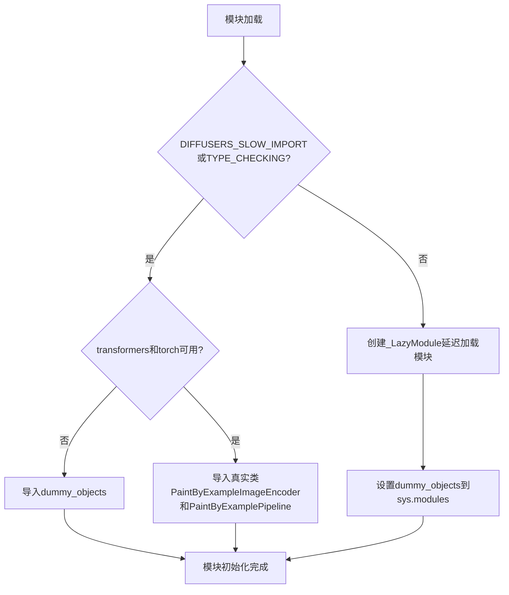
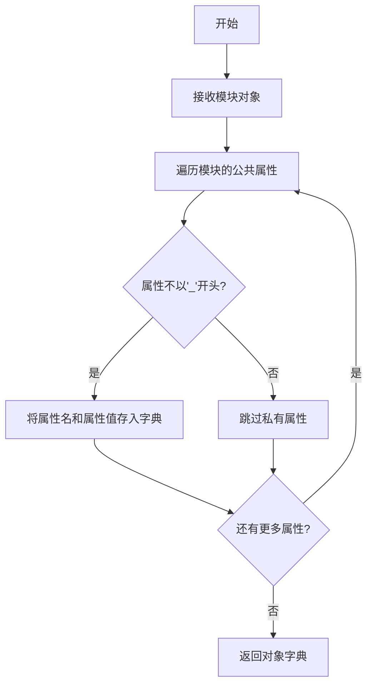
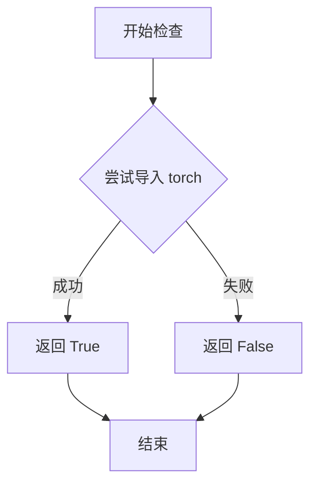
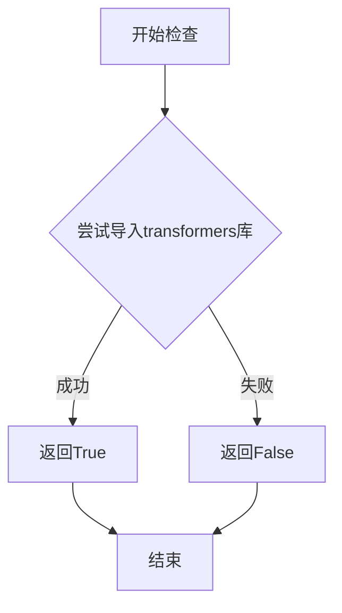

# `diffusers\src\diffusers\pipelines\paint_by_example\__init__.py` 详细设计文档

这是一个Diffusers库的PaintByExample模块初始化文件，通过延迟导入机制处理可选依赖（torch和transformers），在依赖可用时导出PaintByExampleImageEncoder图像编码器和PaintByExamplePipeline管道类，在依赖不可用时使用虚拟对象保持API一致性。

## 整体流程



## 类结构

```
模块初始化文件（无自定义类）
├── PaintByExampleImageEncoder (从image_encoder导入)
└── PaintByExamplePipeline (从pipeline_paint_by_example导入)
```

## 全局变量及字段


### `_dummy_objects`
    
存储虚拟对象，用于依赖不可用时的API兼容

类型：`dict`
    


### `_import_structure`
    
定义模块的导入结构，控制延迟加载的内容

类型：`dict`
    


### `DIFFUSERS_SLOW_IMPORT`
    
全局配置标志，控制是否禁用延迟加载

类型：`bool`
    


    

## 全局函数及方法


### `get_objects_from_module`

从指定模块中提取所有公共对象（类、函数、变量），并返回一个以对象名称为键、对象本身为值的字典，用于动态模块加载和虚拟对象替换。

参数：

- `module`：`module`，要从中提取对象的模块对象

返回值：`Dict[str, Any]`，键为对象名称（字符串），值为对应的类、函数或变量对象

#### 流程图



#### 带注释源码

```
# 注：以下为基于代码使用方式推断的函数实现
# 实际定义位于 ...utils 模块中

def get_objects_from_module(module):
    """
    从模块中获取所有公共对象
    
    参数:
        module: 要提取对象的模块
        
    返回:
        包含模块中所有公共对象的字典
    """
    objects = {}
    # 遍历模块的所有属性，过滤掉私有属性（以'_'开头）
    for attr_name in dir(module):
        if not attr_name.startswith('_'):
            attr_value = getattr(module, attr_name)
            objects[attr_name] = attr_value
    return objects
```

---

### 补充说明

由于提供的代码中仅展示了 `get_objects_from_module` 函数的**使用方式**而非**定义本身**，上述源码是根据以下代码使用模式推断的：

```python
# 在代码中的实际使用方式
from ...utils import get_objects_from_module
# ...
_dummy_objects.update(get_objects_from_module(dummy_torch_and_transformers_objects))
```

这表明该函数接收一个模块作为参数，返回该模块中的公共对象字典，然后被用于更新 `_dummy_objects` 字典，以支持可选依赖的延迟加载机制。


### `is_torch_available`

检查当前环境中 PyTorch 库是否可用，通过尝试导入 PyTorch 模块来判断。

参数：

- 无

返回值：`bool`，返回 `True` 表示 PyTorch 可用，返回 `False` 表示 PyTorch 不可用。

#### 流程图



#### 带注释源码

```
def is_torch_available():
    """
    检查 PyTorch 库是否可用。
    
    通过尝试导入 torch 模块来判断，如果导入成功则返回 True，
    否则返回 False。这种方式可以处理 PyTorch 未安装或导入失败的情况。
    
    Returns:
        bool: 如果 torch 可以成功导入则返回 True，否则返回 False。
    """
    try:
        # 尝试导入 torch 模块
        import torch
        # 导入成功，PyTorch 可用
        return True
    except ImportError:
        # 导入失败，PyTorch 不可用
        return False
```

> **注意**：由于提供的代码片段中 `is_torch_available` 是从 `...utils` 导入的外部函数，以上源码为根据该函数在代码中的使用场景推断的典型实现。实际实现可能包含更多细节，如版本检查或其他配置选项。


### `is_transformers_available`

检查当前环境中 transformers 库是否可用，用于条件导入和功能特性检测。

参数：

- 该函数无参数

返回值：`bool`，如果 transformers 库已安装且可用返回 `True`，否则返回 `False`

#### 流程图



#### 带注释源码

```python
# 该函数定义在 ...utils 模块中，此处仅为调用示例
# 检查 transformers 库是否可用，用于条件导入和功能检测

# 调用 is_transformers_available 检查 transformers 是否可用
# 如果不可用，则引发 OptionalDependencyNotAvailable 异常
if not (is_transformers_available() and is_torch_available()):
    raise OptionalDependencyNotAvailable()
```


### `setattr` (内置函数)

将对象设置到 `sys.modules` 中，用于实现延迟加载（Lazy Loading）机制，将虚拟对象（dummy objects）动态绑定到当前模块的属性上。

参数：

- `obj`：`object`，目标对象，此处为 `sys.modules[__name__]`（当前模块实例）
- `name`：`str`，要设置的属性名称，来自 `_dummy_objects` 字典的键（字符串）
- `value`：`any`，要设置的属性值，来自 `_dummy_objects` 字典的值（虚拟对象或实际对象）

返回值：`None`，setattr 函数不返回任何值，仅执行属性设置操作

#### 流程图

```mermaid
flowchart TD
    A[开始遍历 _dummy_objects] --> B{是否还有未处理的键值对?}
    B -->|是| C[取出 name 和 value]
    C --> D[调用 setattr sys.modules[__name__], name, value]
    D --> B
    B -->|否| E[结束]
```

#### 带注释源码

```python
# 遍历 _dummy_objects 字典中的所有键值对
# _dummy_objects 包含虚拟对象（当可选依赖不可用时）或实际对象
for name, value in _dummy_objects.items():
    # 使用内置 setattr 函数将虚拟对象设置为当前模块的属性
    # 参数说明：
    # - sys.modules[__name__]: 当前模块对象（即 __init__.py 所在的模块）
    # - name: 属性名称（字符串），如 'PaintByExampleImageEncoder'
    # - value: 属性值，即虚拟对象或实际类/函数
    # 作用：实现延迟加载，使模块可以通过 from xxx import xxx 访问这些对象
    setattr(sys.modules[__name__], name, value)
```

## 关键组件


### 可选依赖检查与处理

该模块通过is_torch_available()和is_transformers_available()检查torch和transformers是否可用，当依赖不可用时抛出OptionalDependencyNotAvailable异常，并从dummy模块导入虚拟对象以保持模块接口完整性。

### 延迟加载模块（LazyModule）

使用_LazyModule类实现模块的延迟加载机制，允许在需要时才导入实际模块，提高导入速度和内存效率。

### 虚拟对象字典（_dummy_objects）

存储当可选依赖不可用时的替代对象，确保模块在缺少依赖时仍可被导入而不报AttributeError。

### 导入结构字典（_import_structure）

定义模块的公共API接口，包含image_encoder和pipeline_paint_by_example两个子模块及其导出类PaintByExampleImageEncoder和PaintByExamplePipeline。

### 条件导入机制

通过TYPE_CHECKING和DIFFUSERS_SLOW_IMPORT标志控制导入方式，在类型检查时导入实际模块，在运行时使用延迟加载。


## 问题及建议


### 已知问题

-   **未使用的导入**：代码中导入了`dataclass`、`numpy as np`、`PIL`和`Image`，但在当前文件中完全没有使用这些模块，这增加了不必要的加载时间和内存开销
-   **重复的依赖检查逻辑**：可选依赖检查（`is_transformers_available() and is_torch_available()`）的逻辑出现了两次，一次在try块中，一次在TYPE_CHECKING分支中，造成代码重复
-   **不一致的错误处理方式**：第一次依赖检查使用try-except捕获`OptionalDependencyNotAvailable`，而第二次检查直接使用if条件raise异常，风格不统一
-   **魔法字符串硬编码**：导入结构的键（如"image_encoder"、"pipeline_paint_by_example"）以字符串形式硬编码，缺乏常量定义，降低了可维护性
-   **过度的延迟加载复杂性**：使用了LazyModule和Dummy对象的复杂模式来支持可选依赖，但这种模式增加了代码理解难度，对于中小型项目可能是过度设计

### 优化建议

-   移除所有未使用的导入（dataclass、numpy、PIL、Image），或在文档中说明这些是为了子模块的间接导入
-   将依赖检查逻辑抽取为工具函数，消除重复代码
-   统一错误处理风格，建议在两处都使用try-except或都使用if条件判断
-   定义常量来替代魔法字符串，如`IMAGE_ENCODER_KEY = "image_encoder"`
-   考虑简化延迟加载机制，如果paint_by_example模块是核心功能而非可选模块，可直接进行常规导入
-   可以使用Python 3.7+的`__getattr__`机制替代当前的LazyModule手动管理方式，使代码更简洁


## 其它


### 设计目标与约束

该模块采用延迟导入（Lazy Loading）模式，主要目标是实现可选依赖的动态加载。当torch和transformers都可用时，正常导入PaintByExampleImageEncoder和PaintByExamplePipeline；当任一依赖不可用时，导入空对象（dummy objects）以保持API一致性，同时避免导入错误。设计约束包括：必须同时满足torch和transformers可用才能使用完整功能，遵循Diffusers库的模块化架构规范。

### 错误处理与异常设计

采用OptionalDependencyNotAvailable异常进行依赖检查。当检测到torch或transformers不可用时，抛出该异常并捕获，随后从dummy模块导入空对象填充到命名空间。TYPE_CHECKING模式下同样进行依赖验证，但用于类型检查目的而非运行时加载。这种设计确保了模块在缺少可选依赖时仍可被导入，只是功能受限。

### 外部依赖与接口契约

外部依赖包括：torch（必须）、transformers（必须）、PIL/Pillow（图像处理）、numpy（数组操作）。模块暴露两个主要接口：PaintByExampleImageEncoder类（图像编码器）和PaintByExamplePipeline类（推理管道）。_import_structure字典定义了可导入对象的映射关系，_dummy_objects字典在依赖不可用时提供空实现。

### 数据流与状态机

模块存在三种运行状态：状态1 - TYPE_CHECKING或DIFFUSERS_SLOW_IMPORT为真时，执行类型检查分支，尝试导入真实实现或dummy对象；状态2 - 正常运行时（两标志均为假），创建_LazyModule代理对象，拦截属性访问进行延迟导入；状态3 - 依赖不可用时，从dummy模块导入所有对象并添加到当前模块命名空间。

### 模块化与可扩展性

采用_import_structure字典统一管理可导出对象，便于扩展新组件。若要添加新类，只需在对应的try-except块中添加导入语句，并更新_import_structure字典。_LazyModule的使用实现了按需加载，减少了启动时的内存占用。

### 性能考虑

延迟导入策略显著降低了模块初始化时间，避免了在不需要使用该模块时加载不必要的依赖。sys.modules[__name__]的直接替换确保了后续导入操作的高效性。使用get_objects_from_module批量获取dummy对象，减少了循环开销。

### 版本兼容性

代码通过is_torch_available()和is_transformers_available()函数动态检测依赖版本，兼容不同版本的torch和transformers。dataclass和TYPE_CHECKING的使用确保了与Python 3.7+版本的兼容性。PIL和numpy的版本兼容性由各自的版本策略决定。

### 安全考虑

模块本身不直接处理用户输入，安全性主要依赖于依赖库（torch、transformers）的安全机制。动态导入机制避免了在模块加载时执行潜在的可疑代码。setattr的使用限于系统模块管理，风险可控。

### 配置管理

模块无显式配置接口，依赖项通过环境检查函数（is_torch_available等）自动检测。DIFFUSERS_SLOW_IMPORT标志用于控制是否在模块加载时立即导入完整模块还是仅在类型检查时导入。


    