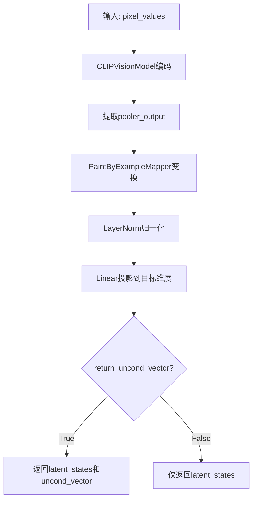
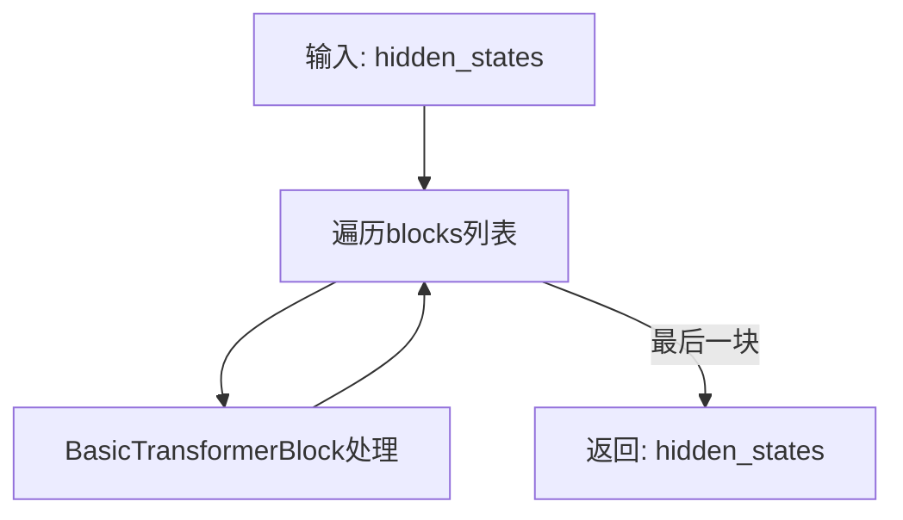
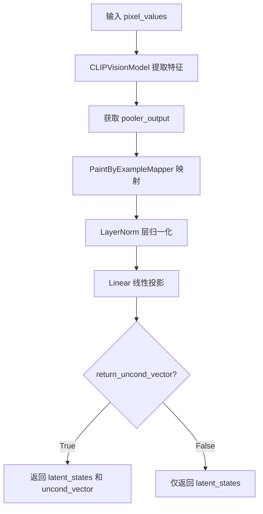
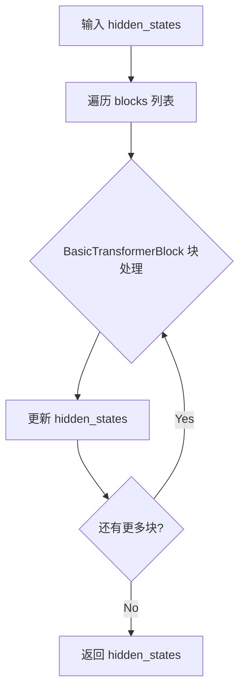
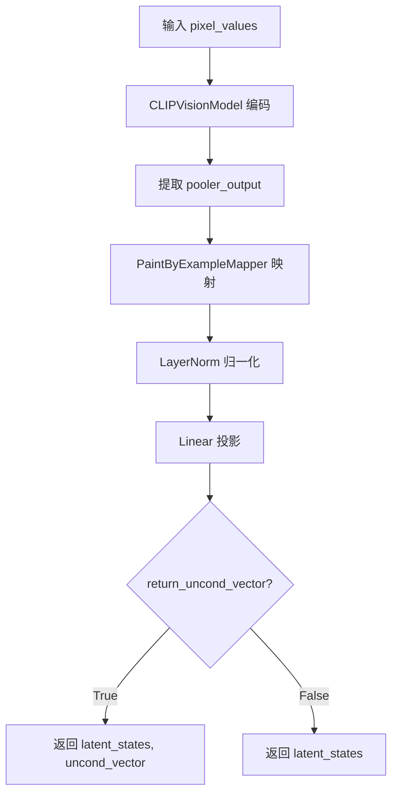
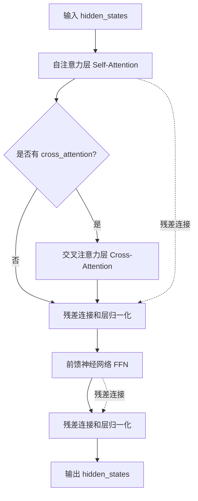
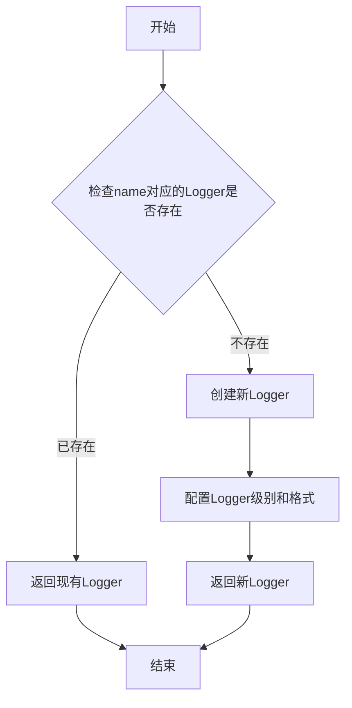
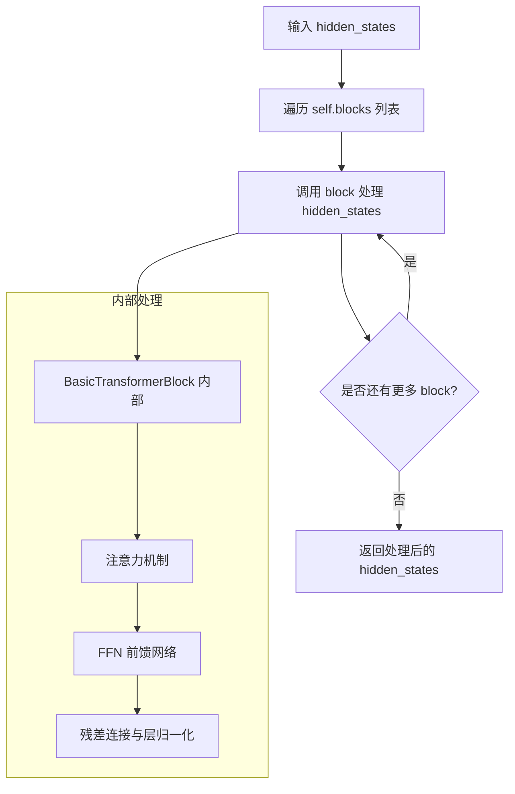

```mermaid
flowchart TD
    A[开始 forward] --> B[输入 pixel_values]
    B --> C[self.model&#40;pixel_values&#41;]
    C --> D[提取 clip_output.pooler_output]
    D --> E[self.mapper&#40;latent_states&#41;]
    E --> F[self.final_layer_norm&#40;latent_states&#41;]
    F --> G[self.proj_out&#40;latent_states&#41;]
    G --> H{return_uncond_vector?}
    H -->|True| I[返回 tuple&#40;latent_states, uncond_vector&#41;]
    H -->|False| J[返回 latent_states]
    I --> K[结束]
    J --> K
```

# `diffusers\src\diffusers\pipelines\paint_by_example\image_encoder.py` 详细设计文档

这是一个用于Paint By Example功能的图像编码器模块，基于CLIP预训练模型，通过自定义的Transformer映射器将图像特征投影到指定维度，并支持无条件向量输出以实现无分类器引导扩散。

## 整体流程



## 类结构

```
nn.Module (PyTorch基类)
└── PaintByExampleMapper (Transformer块列表)

CLIPPreTrainedModel (HuggingFace基类)
└── PaintByExampleImageEncoder (图像编码器)
    ├── CLIPVisionModel (CLIP视觉编码器)
    ├── PaintByExampleMapper (特征映射器)
    ├── nn.LayerNorm (层归一化)
    ├── nn.Linear (线性投影)
    └── nn.Parameter (无条件向量)
```

## 全局变量及字段


### `logger`
    
模块级日志记录器，用于记录代码运行时的日志信息

类型：`logging.Logger`
    


### `PaintByExampleImageEncoder.proj_size`
    
投影维度，默认为config.projection_dim或768

类型：`int`
    


### `PaintByExampleImageEncoder.model`
    
CLIP视觉编码模型，用于提取图像特征

类型：`CLIPVisionModel`
    


### `PaintByExampleImageEncoder.mapper`
    
特征映射变换器，用于将CLIP输出映射到目标空间

类型：`PaintByExampleMapper`
    


### `PaintByExampleImageEncoder.final_layer_norm`
    
最终层归一化，用于稳定特征分布

类型：`nn.LayerNorm`
    


### `PaintByExampleImageEncoder.proj_out`
    
输出投影线性层，将特征投影到目标维度

类型：`nn.Linear`
    


### `PaintByExampleImageEncoder.uncond_vector`
    
无条件向量，用于无分类器引导（classifier-free guidance）

类型：`nn.Parameter`
    


### `PaintByExampleMapper.blocks`
    
BasicTransformerBlock列表，用于特征变换处理

类型：`nn.ModuleList`
    
    

## 全局函数及方法


### PaintByExampleImageEncoder

这是一个用于PaintByExample模型的图像编码器，继承自CLIPPreTrainedModel。它通过CLIP视觉模型提取图像特征，经过映射器处理、层归一化和线性投影，最终输出特定维度的潜在状态表示，同时支持返回无条件向量用于无分类器引导生成。

参数：

- `config`：配置对象，包含模型配置信息（如hidden_size、projection_dim等）
- `proj_size`：整数，可选，投影维度大小，默认为config.projection_dim或768

返回值：`torch.Tensor`，返回形状为(batch_size, 1, proj_size)的潜在状态张量；若return_uncond_vector为True，则返回元组(latent_states, uncond_vector)

#### 流程图

```mermaid
graph TD
    A[输入: pixel_values] --> B[CLIPVisionModel编码]
    B --> C[提取pooler_output]
    C --> D[PaintByExampleMapper映射]
    D --> E[LayerNorm层归一化]
    E --> F[Linear投影到proj_size维度]
    F --> G{return_uncond_vector?}
    G -->|True| H[返回: (latent_states, uncond_vector)]
    G -->|False| I[返回: latent_states]
```

#### 带注释源码

```python
class PaintByExampleImageEncoder(CLIPPreTrainedModel):
    def __init__(self, config, proj_size=None):
        """
        初始化PaintByExample图像编码器
        
        参数:
            config: 模型配置对象
            proj_size: 投影维度，若为None则从config.projection_dim获取，默认为768
        """
        super().__init__(config)
        # 设置投影大小，优先使用传入值，否则从config获取projection_dim，兜底768
        self.proj_size = proj_size or getattr(config, "projection_dim", 768)

        # CLIP视觉模型，用于提取图像特征
        self.model = CLIPVisionModel(config)
        # 映射器，将CLIP输出转换为PaintByExample所需的格式
        self.mapper = PaintByExampleMapper(config)
        # 层归一化，用于稳定训练
        self.final_layer_norm = nn.LayerNorm(config.hidden_size)
        # 输出投影层，将隐藏状态映射到目标投影维度
        self.proj_out = nn.Linear(config.hidden_size, self.proj_size)

        # 无条件向量，用于无分类器引导（Classifier-Free Guidance）
        # 形状为(1, 1, proj_size)的可学习参数
        self.uncond_vector = nn.Parameter(torch.randn((1, 1, self.proj_size)))

    def forward(self, pixel_values, return_uncond_vector=False):
        """
        前向传播
        
        参数:
            pixel_values: 输入图像像素值，形状为(batch_size, channels, height, width)
            return_uncond_vector: 是否返回无条件向量，默认为False
            
        返回:
            若return_uncond_vector=False: 返回形状为(batch_size, 1, proj_size)的潜在状态
            若return_uncond_vector=True: 返回(latent_states, uncond_vector)元组
        """
        # 通过CLIP视觉模型提取特征
        clip_output = self.model(pixel_values=pixel_values)
        # 获取池化后的输出作为潜在状态
        latent_states = clip_output.pooler_output
        # 通过映射器处理潜在状态
        latent_states = self.mapper(latent_states[:, None])
        # 层归一化
        latent_states = self.final_layer_norm(latent_states)
        # 投影到目标维度
        latent_states = self.proj_out(latent_states)
        
        # 根据参数决定是否返回无条件向量
        if return_uncond_vector:
            return latent_states, self.uncond_vector

        return latent_states
```

---

### PaintByExampleMapper

这是一个Transformer映射模块，用于将CLIP输出的潜在状态进行进一步处理。它由多个BasicTransformerBlock组成，通过堆叠Transformer块来增强特征表示能力，适合于图像到图像转换任务中的特征对齐。

参数：

- `config`：配置对象，包含模型配置信息（如num_hidden_layers、hidden_size等）

返回值：`torch.Tensor`，返回处理后的隐藏状态张量

#### 流程图



#### 带注释源码

```python
class PaintByExampleMapper(nn.Module):
    def __init__(self, config):
        """
        初始化PaintByExample映射器
        
        参数:
            config: 模型配置对象
        """
        super().__init__()
        # 计算要使用的Transformer块数量：每5层取1层
        num_layers = (config.num_hidden_layers + 1) // 5
        # 隐藏状态大小
        hid_size = config.hidden_size
        # 注意力头数设为1
        num_heads = 1
        
        # 创建多个BasicTransformerBlock组成的模块列表
        self.blocks = nn.ModuleList(
            [
                # 每个Block包含注意力机制和前馈网络
                BasicTransformerBlock(
                    hid_size,           # 隐藏维度
                    num_heads,          # 注意力头数
                    hid_size,           # 前馈网络维度
                    activation_fn="gelu",  # 激活函数
                    attention_bias=True    # 是否使用注意力偏置
                )
                for _ in range(num_layers)  # 重复num_layers次
            ]
        )

    def forward(self, hidden_states):
        """
        前向传播
        
        参数:
            hidden_states: 输入的隐藏状态张量
            
        返回:
            处理后的隐藏状态张量
        """
        # 依次通过每个Transformer块
        for block in self.blocks:
            hidden_states = block(hidden_states)

        return hidden_states
```

---

### 全局变量和函数

#### `logger`

- 类型：`logging.Logger`
- 描述：模块级别的日志记录器，用于输出调试和信息日志

#### `torch`

- 类型：`module`
- 描述：PyTorch张量计算库的核心模块，提供张量操作和神经网络构建功能

---

### 关键组件信息

| 组件名称 | 描述 |
|---------|------|
| CLIPVisionModel | CLIP预训练视觉模型，用于提取图像特征 |
| BasicTransformerBlock | 基础的Transformer块，包含自注意力和前馈网络 |
| nn.LayerNorm | 层归一化，用于稳定神经网络训练 |
| nn.Linear | 线性变换层，用于维度映射 |
| nn.Parameter | 可学习的参数张量，用于存储模型权重 |

---

### 潜在的技术债务或优化空间

1. **硬编码的Transformer块数量计算**：`num_layers = (config.num_hidden_layers + 1) // 5` 这种计算方式较为硬编码，如果配置参数变化可能导致层数过少或过多
2. **num_heads固定为1**：注意力头数固定为1，可能无法充分利用多头注意力的优势
3. **缺少模型配置验证**：没有对输入config进行有效性检查
4. **未使用gradient checkpointing**：对于大型模型可以考虑使用梯度检查点来节省显存

---

### 其它项目

#### 设计目标与约束
- 目标：将CLIP视觉特征映射到PaintByExample模型所需的潜在空间
- 约束：输出维度由proj_size控制，默认为768

#### 错误处理与异常设计
- 依赖PyTorch和transformers库的错误处理机制
- 缺少输入形状验证，建议添加pixel_values形状检查

#### 数据流与状态机
- 输入：pixel_values (B, C, H, W) → CLIPVisionModel → pooler_output → Mapper → LayerNorm → Linear → 输出
- 支持条件生成：无条件向量uncond_vector用于 classifier-free guidance

#### 外部依赖与接口契约
- 依赖：`torch`, `transformers.CLIPPreTrainedModel`, `transformers.CLIPVisionModel`, `BasicTransformerBlock`
- 符合HuggingFace Transformers库的设计规范


### `PaintByExampleImageEncoder.forward`

该方法是 PaintByExample 图像编码器的前向传播核心逻辑，负责将输入的像素值通过 CLIP 视觉模型提取特征，经过映射器处理、层归一化和线性投影，最终输出用于 PaintByExample 模型的潜在状态向量，可选择返回无条件向量用于无分类器指导。

参数：

- `pixel_values`：`torch.Tensor`，输入的图像像素值，通常为经过预处理的图像张量
- `return_uncond_vector`：`bool`，默认为 False，控制是否返回无条件向量以用于推理时的无分类器指导

返回值：`torch.Tensor` 或 `Tuple[torch.Tensor, torch.Tensor]`，当 return_uncond_vector 为 True 时返回 (latent_states, uncond_vector) 的元组，否则仅返回 latent_states

#### 流程图



#### 带注释源码

```python
def forward(self, pixel_values, return_uncond_vector=False):
    """
    PaintByExampleImageEncoder 的前向传播方法
    
    参数:
        pixel_values: 输入的图像像素值张量
        return_uncond_vector: 是否返回无条件向量
    
    返回:
        latent_states: 编码后的潜在状态向量
        uncond_vector (可选): 无条件向量用于无分类器指导
    """
    # Step 1: 将像素值输入 CLIP 视觉模型进行特征提取
    clip_output = self.model(pixel_values=pixel_values)
    
    # Step 2: 获取池化后的输出作为潜在状态
    latent_states = clip_output.pooler_output
    
    # Step 3: 通过 PaintByExampleMapper 进行特征映射
    # 使用 [:, None] 增加序列维度以适应 Transformer 输入格式
    latent_states = self.mapper(latent_states[:, None])
    
    # Step 4: 应用层归一化进行特征标准化
    latent_states = self.final_layer_norm(latent_states)
    
    # Step 5: 线性投影到目标投影维度
    latent_states = self.proj_out(latent_states)
    
    # Step 6: 根据参数决定是否返回无条件向量
    if return_uncond_vector:
        # 返回潜在状态和无条件向量的元组
        return latent_states, self.uncond_vector
    
    # 仅返回编码后的潜在状态
    return latent_states
```

---

### `PaintByExampleMapper.forward`

该方法是 PaintByExample 映射器的前向传播逻辑，通过堆叠的 BasicTransformerBlock 对隐藏状态进行逐层变换处理，将输入的隐藏状态依次通过多个 Transformer 块进行特征提取和转换，最终输出变换后的隐藏状态。

参数：

- `hidden_states`：`torch.Tensor`，输入的隐藏状态张量，通常为经过 CLIP 模型提取的视觉特征

返回值：`torch.Tensor`，经过多层 Transformer 块处理后的隐藏状态张量

#### 流程图



#### 带注释源码

```python
def forward(self, hidden_states):
    """
    PaintByExampleMapper 的前向传播方法
    
    参数:
        hidden_states: 输入的隐藏状态张量
    
    返回:
        hidden_states: 经过 Transformer 块处理后的隐藏状态
    """
    # 遍历所有 BasicTransformerBlock 进行逐层处理
    for block in self.blocks:
        # 每个块对隐藏状态进行自注意力、交叉注意力和前馈网络处理
        hidden_states = block(hidden_states)
    
    # 返回最终变换后的隐藏状态
    return hidden_states
```

---

### `PaintByExampleImageEncoder.__init__`

该方法是 PaintByExampleImageEncoder 类的初始化构造函数，负责构建完整的图像编码器架构，包括 CLIP 视觉模型、映射器、层归一化层、输出投影层以及无条件向量参数。

参数：

- `config`：`PretrainedConfig`，模型配置对象，包含隐藏层大小、投影维度等参数
- `proj_size`：`int` 或 `None`，投影维度大小，默认为 config.projection_dim 或 768

返回值：无

#### 带注释源码

```python
def __init__(self, config, proj_size=None):
    """
    初始化 PaintByExampleImageEncoder
    
    参数:
        config: 模型配置对象
        proj_size: 投影维度，若为 None 则从 config 获取
    """
    # 调用父类 CLIPPreTrainedModel 的初始化方法
    super().__init__(config)
    
    # 设置投影维度，默认为 config 的 projection_dim 或 768
    self.proj_size = proj_size or getattr(config, "projection_dim", 768)
    
    # 创建 CLIP 视觉模型用于提取图像特征
    self.model = CLIPVisionModel(config)
    
    # 创建 PaintByExample 映射器
    self.mapper = PaintByExampleMapper(config)
    
    # 创建层归一化层
    self.final_layer_norm = nn.LayerNorm(config.hidden_size)
    
    # 创建输出投影层，将隐藏状态投影到目标维度
    self.proj_out = nn.Linear(config.hidden_size, self.proj_size)
    
    # 创建无条件向量参数，用于无分类器指导
    # 形状为 (1, 1, proj_size) 的随机初始化向量
    self.uncond_vector = nn.Parameter(torch.randn((1, 1, self.proj_size)))
```

---

### `PaintByExampleMapper.__init__`

该方法是 PaintByExampleMapper 类的初始化构造函数，根据配置创建相应数量的 BasicTransformerBlock 并构建模块列表，用于对隐藏状态进行多层变换处理。

参数：

- `config`：`PretrainedConfig`，模型配置对象，包含隐藏层大小、层数等参数

返回值：无

#### 带注释源码

```python
def __init__(self, config):
    """
    初始化 PaintByExampleMapper
    
    参数:
        config: 模型配置对象
    """
    # 调用父类 nn.Module 的初始化方法
    super().__init__()
    
    # 计算要创建的 Transformer 块数量
    # 公式: (num_hidden_layers + 1) // 5，每 5 层取 1 个块
    num_layers = (config.num_hidden_layers + 1) // 5
    
    # 获取隐藏层大小
    hid_size = config.hidden_size
    
    # 设置注意力头数为 1
    num_heads = 1
    
    # 创建 BasicTransformerBlock 模块列表
    self.blocks = nn.ModuleList(
        [
            # 每个块使用 GELU 激活函数和注意力偏置
            BasicTransformerBlock(
                hid_size, 
                num_heads, 
                hid_size, 
                activation_fn="gelu", 
                attention_bias=True
            )
            for _ in range(num_layers)
        ]
    )
```


### `PaintByExampleImageEncoder`

PaintByExampleImageEncoder 是一个基于 CLIP 预训练模型的图像编码器，用于将像素值映射到潜在空间，并支持返回无条件的条件向量以实现classifier-free guidance。

参数：

- `self`：隐式参数，表示实例本身
- `pixel_values`：`torch.Tensor`，输入的像素值张量，形状为 (batch_size, channels, height, width)
- `return_uncond_vector`：`bool`，可选参数，默认为 False，是否返回无条件向量

返回值：`torch.Tensor` 或 tuple，当 `return_uncond_vector=False` 时返回潜在状态张量；当 `return_uncond_vector=True` 时返回 (潜在状态张量, 无条件向量) 的元组

#### 流程图



#### 带注释源码

```python
class PaintByExampleImageEncoder(CLIPPreTrainedModel):
    """
    PaintByExample 的图像编码器，继承自 CLIP 预训练模型基类。
    将输入图像编码为潜在表示，支持 classifier-free guidance。
    """
    
    def __init__(self, config, proj_size=None):
        """
        初始化 PaintByExampleImageEncoder。
        
        Args:
            config: 模型配置对象
            proj_size: 投影维度，默认使用 config.projection_dim 或 768
        """
        super().__init__(config)
        # 设置投影维度，默认为配置中的 projection_dim 或 768
        self.proj_size = proj_size or getattr(config, "projection_dim", 768)

        # CLIP 视觉模型主体
        self.model = CLIPVisionModel(config)
        # PaintByExample 映射器，用于特征转换
        self.mapper = PaintByExampleMapper(config)
        # 最终层归一化
        self.final_layer_norm = nn.LayerNorm(config.hidden_size)
        # 输出投影层，将隐藏状态投影到目标维度
        self.proj_out = nn.Linear(config.hidden_size, self.proj_size)

        # 无条件向量，用于 classifier-free guidance
        # 可学习参数，形状为 (1, 1, proj_size)
        self.uncond_vector = nn.Parameter(torch.randn((1, 1, self.proj_size)))

    def forward(self, pixel_values, return_uncond_vector=False):
        """
        前向传播，将图像像素值编码为潜在表示。
        
        Args:
            pixel_values: 输入图像的像素值张量
            return_uncond_vector: 是否返回无条件向量
            
        Returns:
            潜在表示张量，或 (潜在表示, 无条件向量) 的元组
        """
        # 使用 CLIP 视觉模型编码图像
        clip_output = self.model(pixel_values=pixel_values)
        # 提取池化后的输出
        latent_states = clip_output.pooler_output
        # 扩展维度以适应 mapper 输入
        latent_states = latent_states[:, None]
        # 通过 mapper 进行特征映射
        latent_states = self.mapper(latent_states)
        # 层归一化
        latent_states = self.final_layer_norm(latent_states)
        # 投影到目标维度
        latent_states = self.proj_out(latent_states)
        
        # 根据参数决定是否返回无条件向量
        if return_uncond_vector:
            return latent_states, self.uncond_vector

        return latent_states
```

---

### `PaintByExampleMapper`

PaintByExampleMapper 是一个特征映射模块，使用多层 BasicTransformerBlock 对输入的隐藏状态进行变换处理。

参数：

- `self`：隐式参数，表示实例本身

返回值：`torch.Tensor`，变换后的隐藏状态张量

#### 流程图

```mermaid
flowchart TD
    A[输入 hidden_states] --> B[遍历 blocks]
    B --> C{BasicTransformerBlock}
    C --> D[hidden_states = block(hidden_states)]
    D --> B
    B --> E[返回变换后的 hidden_states]
```

#### 带注释源码

```python
class PaintByExampleMapper(nn.Module):
    """
    PaintByExample 的特征映射器。
    使用多个 Transformer 块对隐藏状态进行变换。
    """
    
    def __init__(self, config):
        """
        初始化映射器。
        
        Args:
            config: 模型配置对象，包含隐藏层大小、层数等信息
        """
        super().__init__()
        # 计算要使用的 Transformer 块数量：总层数除以5向上取整
        num_layers = (config.num_hidden_layers + 1) // 5
        # 隐藏层大小
        hid_size = config.hidden_size
        # 注意力头数设为1
        num_heads = 1
        
        # 创建多个 BasicTransformerBlock 组成的模块列表
        self.blocks = nn.ModuleList(
            [
                BasicTransformerBlock(
                    hid_size, 
                    num_heads, 
                    hid_size, 
                    activation_fn="gelu", 
                    attention_bias=True
                )
                for _ in range(num_layers)
            ]
        )

    def forward(self, hidden_states):
        """
        前向传播，通过多个 Transformer 块变换隐藏状态。
        
        Args:
            hidden_states: 输入的隐藏状态张量
            
        Returns:
            变换后的隐藏状态张量
        """
        # 依次通过每个 Transformer 块
        for block in self.blocks:
            hidden_states = block(hidden_states)

        return hidden_states
```

---

## 关键组件信息

| 组件名称 | 一句话描述 |
|---------|-----------|
| CLIPVisionModel | CLIP 预训练的视觉编码器模型，用于提取图像特征 |
| PaintByExampleMapper | 多层 Transformer 块组成的特征映射器 |
| BasicTransformerBlock | 基础的 Transformer 块，包含注意力机制和前馈网络 |
| uncond_vector | 用于 classifier-free guidance 的可学习无条件向量 |

---

## 潜在技术债务与优化空间

1. **硬编码的映射层数计算**：`num_layers = (config.num_hidden_layers + 1) // 5` 这种除以5的计算方式缺乏文档说明，可读性较差
2. **注意力头数固定为1**：mapper 中 `num_heads = 1` 是硬编码，未考虑配置参数
3. **缺少模型加载/保存的完整实现**：继承自 CLIPPreTrainedModel 但未重写相关方法
4. **投影维度回退逻辑**：`proj_size or getattr(config, "projection_dim", 768)` 的默认值可能与实际配置不匹配


### `CLIPVisionModel.forward`

描述：CLIPVisionModel的forward方法，在PaintByExampleImageEncoder中被调用以处理像素值并提取视觉特征。该方法接收图像像素值，经过CLIP视觉编码器处理后，返回包含pooler_output的对象，用于后续的映射和投影。

参数：
- `pixel_values`：`torch.Tensor`，来自输入图像的像素值张量

返回值：`clip_output`，包含pooler输出的对象（具体类型依赖于transformers库的实现，如BaseModelOutputWithPooling），其中的pooler_output属性为图像的池化特征表示

#### 流程图


#### 带注释源码

```python
# 在PaintByExampleImageEncoder类的forward方法中调用CLIPVisionModel
# 参数：pixel_values - 图像像素值张量
# 返回：clip_output - 包含pooler_output的对象
clip_output = self.model(pixel_values=pixel_values)

# 从clip_output中提取pooler_output，这是CLIP视觉模型的池化输出
latent_states = clip_output.pooler_output
```


### `BasicTransformerBlock`

基础Transformer块，是Transformer架构的核心组成单元，包含自注意力机制（Self-Attention）和前馈神经网络（Feed Forward Network），用于对输入的隐藏状态进行深度的特征变换和上下文信息建模。

参数：

- `dim`：`int`，输入特征的维度（隐藏状态的大小）
- `num_heads`：`int`，注意力机制中使用的头数，用于多头注意力计算
- `context_dim`：`int`（可选），上下文/交叉注意力的维度，如果为None则使用dim
- `activation_fn`：`str`（可选），激活函数类型，默认为"gelu"（高斯误差线性单元）
- `attention_bias`：`bool`（可选），是否在注意力计算中添加偏置，默认为True
- `cross_attention_dim`：`int`（可选），交叉注意力模块的维度
- `dropout`：`float`（可选），Dropout概率，默认为0.0
- `init_std`：`float`（可选），权重初始化标准差，默认为0.02

返回值：`torch.Tensor`，经过Transformer块处理后的隐藏状态张量，形状与输入相同

#### 流程图



#### 带注释源码

```python
class BasicTransformerBlock(nn.Module):
    """
    基础Transformer块，包含自注意力、交叉注意力和前馈网络
    
    参数:
        dim: 输入特征的维度
        num_heads: 注意力头数
        context_dim: 上下文维度（可选，用于交叉注意力）
        activation_fn: 激活函数类型
        attention_bias: 是否在注意力中添加偏置
        cross_attention_dim: 交叉注意力维度
        dropout: Dropout概率
        init_std: 权重初始化标准差
    """
    
    def __init__(
        self,
        dim: int,
        num_heads: int,
        context_dim: Optional[int] = None,
        activation_fn: str = "gelu",
        attention_bias: bool = True,
        cross_attention_dim: Optional[int] = None,
        dropout: float = 0.0,
        init_std: float = 0.02,
    ):
        super().__init__()
        
        # 1. 自注意力层 (Self-Attention)
        # 允许模型关注输入序列中的不同位置，捕捉序列内部的依赖关系
        self.attn = Attention(
            query_dim=dim,
            heads=num_heads,
            dim_head=dim // num_heads,
            bias=attention_bias,
            dropout=dropout,
        )
        
        # 2. 交叉注意力层 (Cross-Attention) - 可选
        # 允许模型关注另一个序列（如上下文），用于条件生成等任务
        self.cross_attn = None
        if cross_attention_dim is not None:
            self.cross_attn = Attention(
                query_dim=dim,
                context_dim=cross_attention_dim or context_dim,
                heads=num_heads,
                dim_head=dim // num_heads,
                bias=attention_bias,
                dropout=dropout,
            )
        
        # 3. 前馈神经网络 (Feed Forward Network)
        # 包含两层线性变换和激活函数，增加模型的非线性表达能力
        self.ff = FeedForward(
            dim=dim,
            dropout=dropout,
            activation_fn=activation_fn,
            init_std=init_std,
        )
        
        # 4. 层归一化 (Layer Norm) - 用于稳定训练
        self.norm1 = nn.LayerNorm(dim)
        self.norm2 = nn.LayerNorm(dim)
        self.norm3 = nn.LayerNorm(dim)
        
    def forward(
        self,
        hidden_states: torch.Tensor,
        context: Optional[torch.Tensor] = None,
        attention_mask: Optional[torch.Tensor] = None,
    ) -> torch.Tensor:
        """
        前向传播
        
        参数:
            hidden_states: 输入的隐藏状态张量，形状为 [batch, seq_len, dim]
            context: 上下文张量，用于交叉注意力（可选）
            attention_mask: 注意力掩码，用于屏蔽不重要的位置（可选）
            
        返回:
            变换后的隐藏状态张量
        """
        
        # 步骤1: 自注意力 + 残差连接
        # 使用自注意力机制处理输入，捕捉序列内部关系
        normed_hidden_states = self.norm1(hidden_states)
        attn_output = self.attn(
            hidden_states=normed_hidden_states,
            attention_mask=attention_mask,
        )
        hidden_states = hidden_states + attn_output
        
        # 步骤2: 交叉注意力 + 残差连接（如果存在）
        # 如果提供了context，则使用交叉注意力将外部信息融入
        if self.cross_attn is not None and context is not None:
            normed_hidden_states = self.norm2(hidden_states)
            cross_attn_output = self.cross_attn(
                hidden_states=normed_hidden_states,
                context=context,
                attention_mask=attention_mask,
            )
            hidden_states = hidden_states + cross_attn_output
        
        # 步骤3: 前馈网络 + 残差连接
        # 进一步变换特征，增加非线性表达能力
        normed_hidden_states = self.norm3(hidden_states)
        ff_output = self.ff(normed_hidden_states)
        hidden_states = hidden_states + ff_output
        
        return hidden_states
```

#### 关键组件信息

| 组件名称 | 一句话描述 |
|---------|-----------|
| Attention | 多头注意力机制模块，包含自注意力和交叉注意力两种模式 |
| FeedForward | 前馈神经网络模块，包含两层线性变换和激活函数 |
| LayerNorm | 层归一化，用于稳定训练和加速收敛 |

#### 潜在的技术债务或优化空间

1. **硬编码的初始化参数**：激活函数默认为"gelu"，初始化标准差默认为0.02，这些可能需要根据具体任务调优
2. **可选的交叉注意力**：交叉注意力的条件判断增加了代码复杂度，可以考虑使用更统一的设计模式
3. **缺乏显存优化**：对于长序列任务，可以考虑使用Flash Attention或梯度checkpointing来优化显存占用
4. **固定的头部维度**：dim_head = dim // num_heads 是固定比例，可能不是最优配置

#### 其它项目

**设计目标与约束**：
- 目标：提供灵活的基础Transformer块，支持自注意力和交叉注意力
- 约束：需要保持与HuggingFace transformers库的兼容性

**错误处理与异常设计**：
- 如果 `num_heads` 不能被 `dim` 整除，可能会导致维度不匹配错误
- 如果 `cross_attention_dim` 与实际context维度不匹配，会引发运行时错误

**数据流与状态机**：
- 输入hidden_states → 自注意力处理 → （可选）交叉注意力处理 → 前馈网络处理 → 输出
- 每一层都使用残差连接（Residual Connection）和层归一化（Layer Normalization）

**外部依赖与接口契约**：
- 依赖 `torch` 和 `nn.Module`
- 输入输出均为 `torch.Tensor`，形状为 `[batch, seq_len, dim]`
- 注意力掩码格式需与Attention模块兼容


### `logging.get_logger`

获取一个日志记录器（Logger）实例，用于在模块中记录日志信息。

参数：

- `name`：`str`，日志记录器的名称，通常使用 `__name__` 来表示当前模块的完整路径

返回值：`logging.Logger`，返回一个新的或已存在的日志记录器实例

#### 流程图



#### 带注释源码

```python
# 从utils模块导入logging工具
from ...utils import logging

# 获取当前模块的日志记录器
# __name__ 是Python内置变量，表示当前模块的全限定名
# 例如: 'models.paint_by_example' 
# 这样可以方便地在日志中识别消息来源
logger = logging.get_logger(__name__)  # pylint: disable=invalid-name

# 使用示例:
# logger.info("Starting PaintByExampleImageEncoder initialization")
# logger.warning("Projection size not specified, using default: 768")
# logger.debug(f"Loaded config: {config}")
```


### `PaintByExampleImageEncoder.__init__`

该方法用于初始化 PaintByExample 图像编码器类，配置 CLIP 视觉模型、映射器、层归一化、投影层以及无条件向量等核心组件，为后续的图像编码和特征投影提供基础结构支持。

参数：

- `self`：隐式参数，当前实例对象
- `config`：对象，HuggingFace Transformers 配置对象，包含模型的隐藏层大小、投影维度等超参数
- `proj_size`：整数或 None，可选参数，投影输出的维度，若为 None 则从 config.projection_dim 获取，默认为 None

返回值：无（`None`），该方法为初始化方法，不返回任何值，仅初始化对象的内部状态

#### 流程图

```mermaid
flowchart TD
    A[开始 __init__] --> B[调用父类 super().__init__config]
    B --> C[确定 proj_size]
    C --> D{proj_size is None?}
    D -->|是| E[从 config.projection_dim 获取值<br/>默认 768]
    D -->|否| F[使用传入的 proj_size]
    E --> G[初始化 CLIPVisionModel]
    F --> G
    G --> H[初始化 PaintByExampleMapper]
    H --> I[初始化 LayerNorm]
    I --> J[初始化 Linear 投影层]
    J --> K[初始化 uncond_vector 参数]
    K --> L[结束 __init__]
```

#### 带注释源码

```python
def __init__(self, config, proj_size=None):
    # 调用父类 CLIPPreTrainedModel 的初始化方法
    # 负责设置模型的基础配置和权重初始化框架
    super().__init__(config)
    
    # 设置投影维度：如果未指定，则从配置中获取 projection_dim，默认为 768
    # 这决定了后续特征投影到潜在空间的维度大小
    self.proj_size = proj_size or getattr(config, "projection_dim", 768)

    # 初始化 CLIP 视觉编码模型，用于提取图像特征
    # CLIPVisionModel 是基于 CLIP 预训练的视觉编码器
    self.model = CLIPVisionModel(config)
    
    # 初始化 PaintByExampleMapper，用于特征映射和转换
    # 该映射器包含多个 BasicTransformerBlock，用于细粒度的特征处理
    self.mapper = PaintByExampleMapper(config)
    
    # 初始化最终层归一化，对映射后的特征进行标准化
    # 有助于稳定训练过程和提升模型收敛性
    self.final_layer_norm = nn.LayerNorm(config.hidden_size)
    
    # 初始化投影输出层，将隐藏状态投影到指定的投影维度
    # 将 CLIP 特征空间映射到扩散模型所需的潜在空间
    self.proj_out = nn.Linear(config.hidden_size, self.proj_size)

    # 初始化无条件向量参数，用于分类器自由引导（Classifier-Free Guidance）
    # 形状为 (1, 1, proj_size)，在推理时用于生成无条件生成信号
    # 使用随机正态分布初始化，可学习
    self.uncond_vector = nn.Parameter(torch.randn((1, 1, self.proj_size)))
```


### `PaintByExampleImageEncoder.forward`

该方法执行PaintByExample图像编码器的前向传播，将输入的像素值通过CLIP视觉模型、映射器、层归一化和线性投影处理，输出用于图像生成的条件潜在状态，并可选地返回无条件向量用于无分类器指导。

参数：

- `self`：隐含参数，PaintByExampleImageEncoder 实例本身
- `pixel_values`：`torch.Tensor`，输入的像素值张量，形状为 (batch_size, channels, height, width)
- `return_uncond_vector`：`bool`，默认为 False，是否返回无条件向量用于无分类器指导

返回值：

- 当 `return_uncond_vector=False` 时：`torch.Tensor`，形状为 (batch_size, 1, proj_size) 的条件潜在状态
- 当 `return_uncond_vector=True` 时：`tuple`，包含 (latent_states, uncond_vector)，其中 uncond_vector 形状为 (1, 1, proj_size)

#### 流程图



#### 带注释源码

```python
def forward(self, pixel_values, return_uncond_vector=False):
    """
    前向传播函数，将像素值编码为潜在状态向量
    
    参数:
        pixel_values: 输入图像的像素值张量
        return_uncond_vector: 是否返回无条件向量用于无分类器指导
    
    返回:
        latent_states: 编码后的潜在状态
        uncond_vector: 无条件向量（可选）
    """
    
    # 第一步：使用CLIP视觉模型提取图像特征
    # 输入: pixel_values (batch_size, channels, height, width)
    # 输出: clip_output 包含 pooler_output
    clip_output = self.model(pixel_values=pixel_values)
    
    # 第二步：从CLIP输出中提取池化后的潜在状态
    # pooler_output 是CLIP模型最后一层的池化输出
    latent_states = clip_output.pooler_output
    
    # 第三步：通过PaintByExampleMapper进行映射变换
    # mapper使用若干个BasicTransformerBlock进行特征转换
    # 输入: (batch_size, hidden_size) -> 输出: (batch_size, 1, hidden_size)
    latent_states = self.mapper(latent_states[:, None])
    
    # 第四步：应用层归一化稳定特征分布
    latent_states = self.final_layer_norm(latent_states)
    
    # 第五步：线性投影到目标投影维度
    # 将hidden_size投影到self.proj_size指定的维度
    latent_states = self.proj_out(latent_states)
    
    # 第六步：根据参数决定是否返回无条件向量
    # uncond_vector是预先训练的无条件向量，用于CFG（无分类器指导）
    if return_uncond_vector:
        return latent_states, self.uncond_vector

    return latent_states
```


### `PaintByExampleMapper.__init__`

初始化 PaintByExampleMapper 类，创建用于图像映射的 Transformer 块模块列表。

参数：

- `self`：隐式参数，PaintByExampleMapper 实例本身
- `config`：配置对象，包含模型的隐藏层大小（hidden_size）和隐藏层数量（num_hidden_layers）等配置信息

返回值：无（`None`），构造函数不返回任何值

#### 流程图

```mermaid
flowchart TD
    A[开始初始化 PaintByExampleMapper] --> B[调用父类 nn.Module 的构造函数]
    B --> C[计算 num_layers = (config.num_hidden_layers + 1) // 5]
    C --> D[获取 hid_size = config.hidden_size]
    D --> E[设置 num_heads = 1]
    E --> F[创建 BasicTransformerBlock 模块列表]
    F --> G[将模块列表赋值给 self.blocks]
    G --> H[结束初始化]
```

#### 带注释源码

```python
def __init__(self, config):
    """
    初始化 PaintByExampleMapper
    
    参数:
        config: 包含模型配置的对象，需要具备以下属性:
                - num_hidden_layers: 隐藏层数量
                - hidden_size: 隐藏层维度大小
    """
    # 调用父类 nn.Module 的初始化方法
    super().__init__()
    
    # 计算 Transformer 块的数量
    # 公式: (num_hidden_layers + 1) // 5
    # 含义: 每5层隐藏层对应1个映射块，向上取整
    num_layers = (config.num_hidden_layers + 1) // 5
    
    # 从配置中获取隐藏层维度大小
    hid_size = config.hidden_size
    
    # 设置注意力头数为1
    num_heads = 1
    
    # 创建 BasicTransformerBlock 模块列表
    # 每个块包含:
    # - 多头自注意力机制
    # - 前馈神经网络
    # - 层归一化
    self.blocks = nn.ModuleList(
        [
            # BasicTransformerBlock 参数:
            # - hid_size: 输入/输出维度
            # - num_heads: 注意力头数
            # - hid_size: 前馈网络隐藏层维度
            # - activation_fn: 激活函数为 GELU
            # - attention_bias: 使用注意力偏置
            BasicTransformerBlock(
                hid_size, 
                num_heads, 
                hid_size, 
                activation_fn="gelu", 
                attention_bias=True
            )
            for _ in range(num_layers)  # 重复 num_layers 次
        ]
    )
```


### `PaintByExampleMapper.forward`

该方法是 PaintByExampleMapper 类的前向传播方法，负责将输入的隐藏状态通过一系列 Transformer 块进行处理和转换，以实现图像特征的映射和增强。

参数：

- `self`：`PaintByExampleMapper` 类实例，隐式参数，包含模型的结构和参数
- `hidden_states`：`torch.Tensor`，输入的隐藏状态张量，通常来自 CLIP 图像编码器的池化输出，形状为 (batch_size, 1, hidden_size)

返回值：`torch.Tensor`，经过所有 BasicTransformerBlock 处理后的隐藏状态张量，形状与输入相同 (batch_size, 1, hidden_size)

#### 流程图



#### 带注释源码

```python
def forward(self, hidden_states):
    """
    PaintByExampleMapper 的前向传播方法
    
    参数:
        hidden_states (torch.Tensor): 
            输入的隐藏状态张量，通常来自 CLIP 图像编码器的 pooler_output
            形状: (batch_size, 1, hidden_size)
    
    返回:
        torch.Tensor: 
            经过所有 BasicTransformerBlock 处理后的隐藏状态张量
            形状: (batch_size, 1, hidden_size)
    """
    # 遍历 PaintByExampleMapper 中定义的所有 Transformer 块
    # 每个块会对 hidden_states 进行一次完整的 Transformer 变换
    # 包括: 自我注意力机制、前馈网络、残差连接和层归一化
    for block in self.blocks:
        # 将 hidden_states 传递给当前 block 进行处理
        # block 是 BasicTransformerBlock 的实例
        # 处理完成后更新 hidden_states 以供下一个 block 使用
        hidden_states = block(hidden_states)

    # 返回经过所有 Transformer 块处理后的最终隐藏状态
    # 这个输出随后会被传递给最终的层归一化和线性投影层
    return hidden_states
```

## 关键组件


### PaintByExampleImageEncoder

PaintByExampleImageEncoder是PaintByExample模型的核心图像编码器，负责将输入的像素值转换为用于图像修复的潜在表示，同时支持返回无条件向量以实现无分类器引导。

### PaintByExampleMapper

PaintByExampleMapper是一个基于BasicTransformerBlock的映射模块，用于将CLIP输出的视觉特征转换为适合图像修复任务的表示形式，包含多个Transformer块进行特征转换。

### uncond_vector (无条件向量)

uncond_vector是一个可学习的参数向量，用于实现无分类器引导（classifier-free guidance）功能，允许模型在推理时控制条件生成的强度。

### CLIPVisionModel

CLIPVisionModel是预训练的CLIP视觉编码器，负责从像素值中提取初始的视觉特征表示，输出pooler_output作为图像的全局表示。

### BasicTransformerBlock

BasicTransformerBlock是来自transformers库的基础Transformer块，提供了多头注意力机制和前馈网络，用于对隐藏状态进行非线性变换。

### forward方法 (PaintByExampleImageEncoder)

forward方法执行完整的前向传播，包括CLIP编码、特征映射、层归一化和投影，最终返回潜在状态表示或同时返回无条件向量。

### forward方法 (PaintByExampleMapper)

forward方法通过堆叠的Transformer块依次处理隐藏状态，实现特征的逐层转换和增强。


## 问题及建议


### 已知问题

- **mapper 层数计算逻辑不透明**：使用 `(config.num_hidden_layers + 1) // 5` 计算 transformer 层数，缺乏文档说明该数值的设计意图，可能导致与不同 CLIP 模型配合时出现适配问题
- **缺少配置验证**：未验证 `config.hidden_size` 和 `projection_dim` 是否存在，也未检查 `proj_size` 的合理性
- **uncond_vector 设计不够直观**：需要通过参数控制返回，且作为可学习参数的用途和更新机制缺乏说明
- **LayerNorm 位置异常**：在映射后、投影前进行层归一化，与标准 Transformer 架构（通常在映射前或最后）不同，可能影响特征分布
- **缺少类型注解**：方法参数和返回值均无类型提示，降低了代码可维护性和 IDE 辅助
- **未调用父类 post_init**：继承自 `CLIPPreTrainedModel` 但未调用 `self.post_init()`，可能影响权重初始化和配置应用
- **硬编码的注意力头数**：`PaintByExampleMapper` 中 `num_heads = 1` 硬编码，缺乏灵活性

### 优化建议

- 为 `PaintByExampleMapper` 的层数计算逻辑添加文档注释，说明除以 5 的原因，或改为从 config 中显式读取
- 在 `__init__` 中添加配置验证，确保必要的 config 属性存在
- 使用 dataclass 或 Pydantic 定义配置验证模式
- 考虑将 `uncond_vector` 封装为独立的模块或添加清晰的文档说明其用途
- 添加完整的类型注解（PyTorch 常用 `torch.Tensor` 作为返回类型）
- 调用父类的 `post_init()` 方法以确保正确的初始化流程
- 将 `num_heads` 改为从 config 读取或作为可选参数传入
- 添加 `__repr__` 方法以便于调试

## 其它


### 设计目标与约束

本模块的设计目标是实现PaintByExample图像编码功能，将输入的像素值转换为适合扩散模型使用的潜在表示。约束条件包括：1) 必须继承自CLIPPreTrainedModel以保持与transformers库的一致性；2) 投影维度可配置，默认值为768；3) Mapper层数根据总隐藏层数动态计算，遵循每5层取1层的策略。

### 错误处理与异常设计

代码中主要通过以下方式进行错误处理：1) 使用torch.no_grad()上下文管理器（虽然在此代码中未直接体现，但调用方应负责）；2) 配置参数使用getattr提供默认值，避免属性缺失错误；3) logger用于记录潜在问题。当前代码缺少对输入tensor形状的验证、None值检查、以及CLIPVisionModel加载失败的异常处理。建议添加输入验证逻辑，确保pixel_values的维度正确。

### 数据流与状态机

数据流如下：pixel_values → CLIPVisionModel → pooler_output → PaintByExampleMapper → LayerNorm → Linear投影 → 输出潜在状态。当return_uncond_vector=True时，额外返回uncond_vector用于无条件生成。无状态设计，不涉及复杂状态机，主要状态转换为图像到潜在表示的维度变换过程。

### 外部依赖与接口契约

主要依赖包括：1) torch和torch.nn；2) transformers库的CLIPPreTrainedModel和CLIPVisionModel；3) 本地模块...models.attention中的BasicTransformerBlock；4) ...utils.logging。接口契约：forward方法接受pixel_values（形状为[batch, channels, height, width]）和可选的return_uncond_vector参数，返回形状为[batch, 1, proj_size]的潜在张量或元组。

### 配置参数说明

config参数应包含：hidden_size（隐藏层维度）、num_hidden_layers（隐藏层总数）、projection_dim（投影维度，可选）。proj_size参数覆盖config.projection_dim，用于指定输出潜在向量的维度。

### 使用示例

```python
# 初始化
config = SomePaintByExampleConfig()
encoder = PaintByExampleImageEncoder(config, proj_size=768)

# 前向传播
pixel_values = torch.randn(1, 3, 224, 224)
latent_states = encoder(pixel_values=pixel_values)

# 获取无条件向量
latent_states, uncond_vector = encoder(pixel_values=pixel_values, return_uncond_vector=True)
```

### 性能考虑

Mapper层数随config.num_hidden_layers线性增长，对于大型CLIP模型（如ViT-L/14）可能有6-12层。pooler_output的复制操作latent_states[:, None]会创建新tensor，建议评估是否可直接reshape。当前实现为推理优化，未包含训练相关接口（如get_input_embeddings）。

### 版本兼容性

代码依赖transformers库的最新CLIPPreTrainedModel和CLIPVisionModel接口。BasicTransformerBlock需与transformers版本兼容。注意PyTorch版本兼容性要求。

### 安全考虑

uncond_vector使用nn.Parameter定义，梯度会反向传播，需确保恶意输入不会导致梯度爆炸。当前无输入消毒或异常值处理，可能受到对抗性攻击。

### 测试策略建议

应包含以下测试用例：1) 前向传播输出形状验证；2) return_uncond_vector参数功能测试；3) 不同proj_size配置测试；4) 梯度流测试；5) 与CLIPVisionModel集成测试；6) 边界情况（空batch、极端尺寸输入）处理。

    