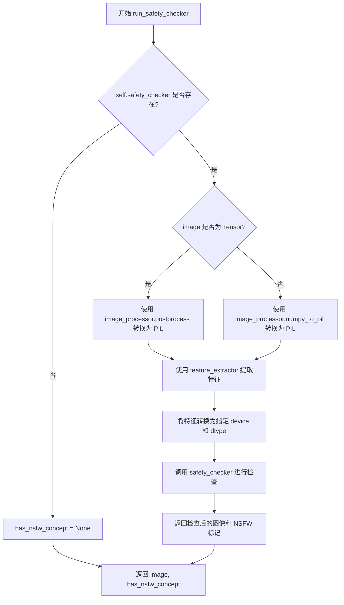
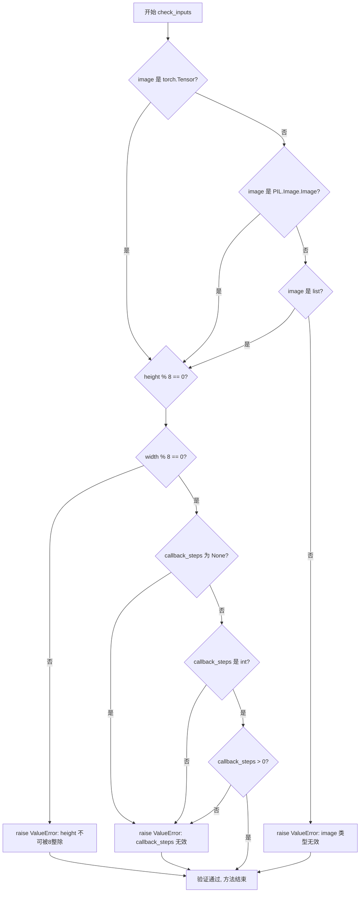
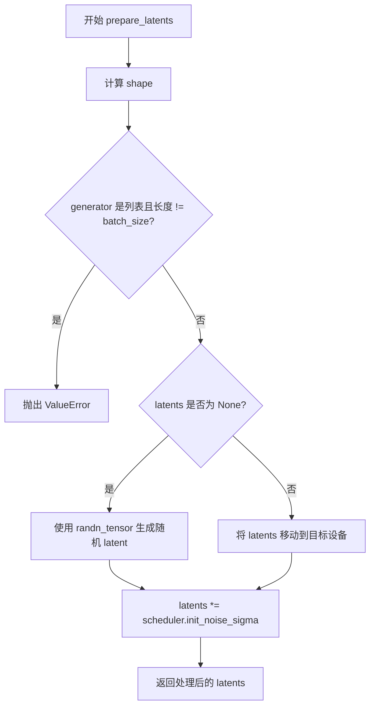
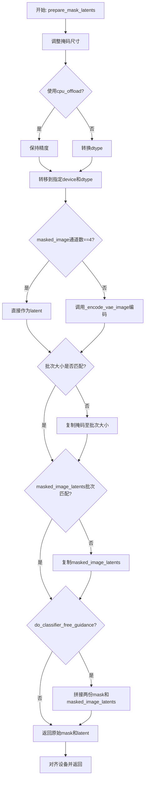
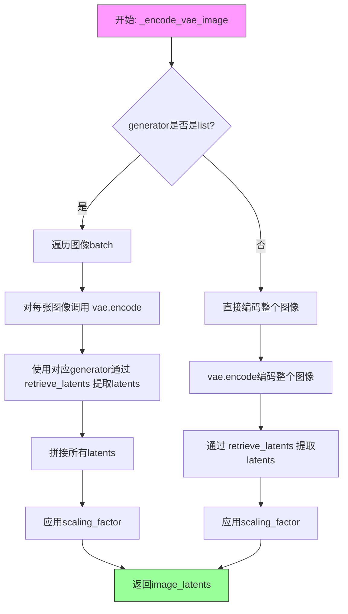
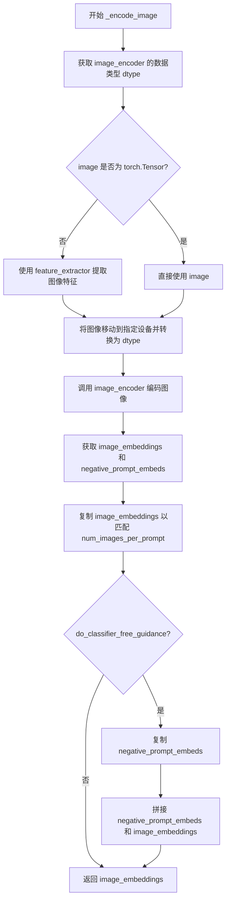

# `diffusers\src\diffusers\pipelines\paint_by_example\pipeline_paint_by_example.py` 详细设计文档

这是一个基于Stable Diffusion的图像修复（Inpainting）Pipeline，核心功能是利用‘示例图像编码器’（PaintByExampleImageEncoder）提取示例图像的特征，以此作为条件引导模型对输入图像的被掩码区域进行修复，而非使用传统的文本提示。

## 整体流程

```mermaid
graph TD
    Start((开始)) --> BatchSize[确定批处理大小]
    BatchSize --> Preprocess[预处理掩码与图像 prepare_mask_and_masked_image]
    Preprocess --> CheckInputs[检查输入参数 check_inputs]
    CheckInputs --> EncodeExample[编码示例图像 _encode_image]
    EncodeExample --> SetTimesteps[设置去噪步骤 set_timesteps]
    SetTimesteps --> PrepareLatents[准备初始噪声 latent variables]
    PrepareLatents --> PrepareMaskLatents[准备掩码 latent variables prepare_mask_latents]
    PrepareMaskLatents --> DenoiseLoop{去噪循环 (Denoising Loop)}
    DenoiseLoop --> Concat[拼接 Latents, Mask, Masked Image]
    Concat --> UNet[UNet 预测噪声]
    UNet --> Guidance{是否启用 CFG?}
    Guidance -- 是 --> CFG[Classifier Free Guidance 计算]
    Guidance -- 否 --> SchedulerStep[Scheduler 步进]
    CFG --> SchedulerStep
    SchedulerStep --> CheckStep{是否完成所有步数?}
    CheckStep -- 否 --> DenoiseLoop
    CheckStep -- 是 --> Decode[VAE 解码 latents to image]
    Decode --> SafetyCheck[安全检查 run_safety_checker]
    SafetyCheck --> PostProcess[图像后处理 VaeImageProcessor]
    PostProcess --> End((结束))
```

## 类结构

```
DiffusionPipeline (抽象基类)
├── StableDiffusionMixin (Stable Diffusion 混入类)
│   └── DeprecatedPipelineMixin (废弃混入类)
│       └── PaintByExamplePipeline (主实现类)
```

## 全局变量及字段


### `logger`
    
模块级日志记录器，用于输出Pipeline运行时的日志信息

类型：`logging.Logger`
    


### `XLA_AVAILABLE`
    
标识当前环境是否支持PyTorch XLA（用于TPU加速）

类型：`bool`
    


### `PaintByExamplePipeline.vae`
    
变分自编码器，用于图像与latent空间的转换

类型：`AutoencoderKL`
    


### `PaintByExamplePipeline.image_encoder`
    
编码示例图像的编码器，用于提取示例图像的特征

类型：`PaintByExampleImageEncoder`
    


### `PaintByExamplePipeline.unet`
    
去噪神经网络模型，用于根据示例图像和掩码进行图像修复

类型：`UNet2DConditionModel`
    


### `PaintByExamplePipeline.scheduler`
    
扩散调度器，控制去噪过程中的噪声调度

类型：`SchedulerMixin`
    


### `PaintByExamplePipeline.safety_checker`
    
内容安全检查模块，用于检测生成图像是否包含不当内容

类型：`StableDiffusionSafetyChecker`
    


### `PaintByExamplePipeline.feature_extractor`
    
图像特征提取器，用于提取图像特征供安全检查器使用

类型：`CLIPImageProcessor`
    


### `PaintByExamplePipeline.vae_scale_factor`
    
VAE的缩放因子，用于确定latent空间与像素空间的尺寸比例

类型：`int`
    


### `PaintByExamplePipeline.image_processor`
    
图像处理工具，用于图像的预处理和后处理

类型：`VaeImageProcessor`
    


### `PaintByExamplePipeline.model_cpu_offload_seq`
    
模型CPU卸载顺序配置，指定模型各组件的卸载顺序

类型：`str`
    


### `PaintByExamplePipeline._exclude_from_cpu_offload`
    
不参与CPU卸载的组件列表，用于指定哪些组件应保留在内存中

类型：`list`
    


### `PaintByExamplePipeline._optional_components`
    
可选组件列表，用于标识哪些组件可以缺失

类型：`list`
    


### `PaintByExamplePipeline._last_supported_version`
    
Pipeline最后支持版本，记录该Pipeline最后支持的diffusers版本

类型：`str`
    
    

## 全局函数及方法


### `retrieve_latents`

该函数根据指定的 `sample_mode` 从 encoder_output 中提取 latent 表示，支持从潜在分布中采样（sample）或获取最可能值（argmax），也可以直接返回预存的 latents 属性。

参数：

- `encoder_output`：`torch.Tensor`，编码器的输出结果，通常包含 `latent_dist` 或 `latents` 属性
- `generator`：`torch.Generator | None`，可选的随机数生成器，用于控制采样过程中的随机性
- `sample_mode`：`str`，采样模式，默认为 `"sample"`，可选值为 `"sample"`（从分布采样）或 `"argmax"`（取分布的众数）

返回值：`torch.Tensor`，提取出的 latent 表示张量

#### 流程图

```mermaid
flowchart TD
    A[开始: retrieve_latents] --> B{encoder_output 是否有 latent_dist 属性?}
    B -- 是 --> C{sample_mode == "sample"?}
    B -- 否 --> D{encoder_output 是否有 latents 属性?}
    C -- 是 --> E[返回 encoder_output.latent_dist.sample<br/>(generator)]
    C -- 否 --> F{sample_mode == "argmax"?}
    F -- 是 --> G[返回 encoder_output.latent_dist.mode]
    F -- 否 --> H[抛出 AttributeError]
    D -- 是 --> I[返回 encoder_output.latents]
    D -- 否 --> H
    
    style H fill:#ffcccc
    style E fill:#ccffcc
    style G fill:#ccffcc
    style I fill:#ccffcc
```

#### 带注释源码

```python
def retrieve_latents(
    encoder_output: torch.Tensor, generator: torch.Generator | None = None, sample_mode: str = "sample"
):
    """
    根据sample_mode从encoder_output中提取latents样本或最可能值。
    
    参数:
        encoder_output: 编码器输出，通常是AutoencoderKL的输出对象
        generator: 可选的随机数生成器，用于控制采样随机性
        sample_mode: 采样模式，"sample"表示从分布采样，"argmax"表示取众数
    
    返回:
        提取的latent张量
    
    异常:
        AttributeError: 当encoder_output既没有latent_dist也没有latents属性时抛出
    """
    # 检查encoder_output是否有latent_dist属性且要求采样模式
    if hasattr(encoder_output, "latent_dist") and sample_mode == "sample":
        # 从潜在分布中采样，支持通过generator控制随机性
        return encoder_output.latent_dist.sample(generator)
    # 检查encoder_output是否有latent_dist属性且要求取众数模式
    elif hasattr(encoder_output, "latent_dist") and sample_mode == "argmax":
        # 返回潜在分布的众数（最可能的值）
        return encoder_output.latent_dist.mode()
    # 检查encoder_output是否直接包含latents属性
    elif hasattr(encoder_output, "latents"):
        # 直接返回预存的latents
        return encoder_output.latents
    # 如果无法获取latents，抛出异常
    else:
        raise AttributeError("Could not access latents of provided encoder_output")
```


### `prepare_mask_and_masked_image`

将输入的图像（Image）和掩码（Mask）转换为标准化的 4D `torch.Tensor`（形状为 B*C*H*W），并根据 Paint by Example 的逻辑对掩码进行反转和二值化处理，最终返回掩码及其与图像的乘积（掩码图像）。

#### 参数

- `image`：`torch.Tensor | np.array | PIL.Image`，需要进行修复（inpaint）的目标图像。
- `mask`：`torch.Tensor | np.array | PIL.Image`，用于标识需要修复区域的掩码。

#### 返回值

`tuple[torch.Tensor]`，返回一个元组 `(mask, masked_image)`。
- `mask`：处理后的掩码，形状为 B*1*H*W，值为 0 或 1。
- `masked_image`：掩码覆盖后的图像，形状为 B*3*H*W。

#### 流程图

```mermaid
graph TD
    A[开始: 输入 Image, Mask] --> B{Image 是否为 Tensor?}
    B -- 是 --> C{ Mask 是否为 Tensor?}
    C -- 否 --> D[抛出 TypeError]
    C -- 是 --> E[处理 Tensor 输入]
    B -- 否 --> F{ Mask 是否为 Tensor?}
    F -- 是 --> G[抛出 TypeError]
    F -- 否 --> H[处理 PIL/NumPy 输入]
    
    subgraph Tensor 分支 [Tensor 分支处理]
    E --> E1[调整维度: 添加 Batch 和 Channel 维度]
    E1 --> E2[校验形状: 4D, 空间维度一致, Batch 一致]
    E2 --> E3[校验范围: Image 在 [-1,1], Mask 在 [0,1]]
    E3 --> E4[Paint by Example 掩码反转: mask = 1 - mask]
    E4 --> E5[二值化: mask < 0.5 -> 0, >= 0.5 -> 1]
    E5 --> E6[类型转换: image to float32]
    end

    subgraph NumPy_PIL 分支 [PIL/NumPy 分支处理]
    H --> H1[Image 转换: PIL -> List -> RGB Array -> Tensor [normalized /127.5 - 1.0]]
    H1 --> H2[Mask 转换: PIL -> L Array -> Float32 Array [normalized /255.0]]
    H2 --> H3[Paint by Example 掩码反转: mask = 1 - mask]
    H3 --> H4[二值化: mask < 0.5 -> 0, >= 0.5 -> 1]
    end

    E6 --> I[计算 Masked Image]
    H4 --> I
    I --> J[返回 (mask, masked_image)]
```

#### 带注释源码

```python
def prepare_mask_and_masked_image(image, mask):
    """
    Prepares a pair (image, mask) to be consumed by the Paint by Example pipeline. This means that those inputs will be
    converted to ``torch.Tensor`` with shapes ``batch x channels x height x width`` where ``channels`` is ``3`` for the
    ``image`` and ``1`` for the ``mask``.

    The ``image`` will be converted to ``torch.float32`` and normalized to be in ``[-1, 1]``. The ``mask`` will be
    binarized (``mask > 0.5``) and cast to ``torch.float32`` too.

    Args:
        image (np.array | PIL.Image | torch.Tensor): The image to inpaint.
            It can be a ``PIL.Image``, or a ``height x width x 3`` ``np.array`` or a ``channels x height x width``
            ``torch.Tensor`` or a ``batch x channels x height x width`` ``torch.Tensor``.
        mask (_type_): The mask to apply to the image, i.e. regions to inpaint.
            It can be a ``PIL.Image``, or a ``height x width`` ``np.array`` or a ``1 x height x width``
            ``torch.Tensor`` or a ``batch x 1 x height x width`` ``torch.Tensor``.


    Raises:
        ValueError: ``torch.Tensor`` images should be in the ``[-1, 1]`` range. ValueError: ``torch.Tensor`` mask
        should be in the ``[0, 1]`` range. ValueError: ``mask`` and ``image`` should have the same spatial dimensions.
        TypeError: ``mask`` is a ``torch.Tensor`` but ``image`` is not
            (ot the other way around).

    Returns:
        tuple[torch.Tensor]: The pair (mask, masked_image) as ``torch.Tensor`` with 4
            dimensions: ``batch x channels x height x width``.
    """
    # 1. 处理输入为 torch.Tensor 的情况
    if isinstance(image, torch.Tensor):
        # 1.1 类型校验：如果图像是 Tensor，掩码也必须是 Tensor
        if not isinstance(mask, torch.Tensor):
            raise TypeError(f"`image` is a torch.Tensor but `mask` (type: {type(mask)} is not")

        # 1.2 维度处理：如果输入是单张图像 (3, H, W)，添加批次维度 (1, 3, H, W)
        if image.ndim == 3:
            assert image.shape[0] == 3, "Image outside a batch should be of shape (3, H, W)"
            image = image.unsqueeze(0)

        # 1.3 掩码维度处理：如果是单张掩码 (H, W)，添加批次和通道维度 (1, 1, H, W)
        if mask.ndim == 2:
            mask = mask.unsqueeze(0).unsqueeze(1)

        # 1.4 掩码维度处理：如果是 3D 掩码 (B, H, W) 或 (C, H, W)，调整通道
        if mask.ndim == 3:
            # 批次掩码
            if mask.shape[0] == image.shape[0]:
                mask = mask.unsqueeze(1)
            else:
                # 单张掩码用于所有批次
                mask = mask.unsqueeze(0)

        # 1.5 形状断言：必须是 4D，且空间维度、批次大小匹配
        assert image.ndim == 4 and mask.ndim == 4, "Image and Mask must have 4 dimensions"
        assert image.shape[-2:] == mask.shape[-2:], "Image and Mask must have the same spatial dimensions"
        assert image.shape[0] == mask.shape[0], "Image and Mask must have the same batch size"
        assert mask.shape[1] == 1, "Mask image must have a single channel"

        # 1.6 范围校验
        if image.min() < -1 or image.max() > 1:
            raise ValueError("Image should be in [-1, 1] range")
        if mask.min() < 0 or mask.max() > 1:
            raise ValueError("Mask should be in [0, 1] range")

        # 1.7 Paint-by-Example 核心逻辑：反转掩码 (白色区域为需要修复的区域)
        mask = 1 - mask

        # 1.8 二值化掩码
        mask[mask < 0.5] = 0
        mask[mask >= 0.5] = 1

        # 1.9 转换为 float32
        image = image.to(dtype=torch.float32)
    
    # 2. 处理掩码是 Tensor 但图像不是的情况 (错误处理)
    elif isinstance(mask, torch.Tensor):
        raise TypeError(f"`mask` is a torch.Tensor but `image` (type: {type(image)} is not")
    
    # 3. 处理 PIL.Image 或 NumPy 数组输入
    else:
        # 3.1 图像预处理：统一转为列表以处理批量或单张
        if isinstance(image, PIL.Image.Image):
            image = [image]

        # 3.2 图像转换：PIL -> NumPy -> Tensor，并归一化到 [-1, 1]
        # [None, :] 用来在开头添加 batch 维度 (H, W, 3) -> (1, H, W, 3)
        image = np.concatenate([np.array(i.convert("RGB"))[None, :] for i in image], axis=0)
        # 转置将 HWC 转为 CHW: (B, H, W, 3) -> (B, 3, H, W)
        image = image.transpose(0, 3, 1, 2)
        # 归一化：/ 127.5 - 1.0
        image = torch.from_numpy(image).to(dtype=torch.float32) / 127.5 - 1.0

        # 3.3 掩码预处理
        if isinstance(mask, PIL.Image.Image):
            mask = [mask]

        # 3.4 掩码转换：PIL -> NumPy (L模式/灰度) -> Tensor，并归一化到 [0, 1]
        # [None, None, :] 用来添加 batch 和 channel 维度 (H, W) -> (1, 1, H, W)
        mask = np.concatenate([np.array(m.convert("L"))[None, None, :] for m in mask], axis=0)
        mask = mask.astype(np.float32) / 255.0

        # 3.5 Paint-by-Example 核心逻辑：反转掩码
        mask = 1 - mask

        # 3.6 二值化掩码
        mask[mask < 0.5] = 0
        mask[mask >= 0.5] = 1
        mask = torch.from_numpy(mask)

    # 4. 计算被掩码覆盖的图像：用于后续的 Latents 填充
    masked_image = image * mask

    return mask, masked_image
```

#### 关键组件信息

- **归一化器 (Normalization)**：负责将 PIL/NumPy 图像像素值 (0-255) 转换为 PyTorch 张量所需的 (-1, 1) 范围。
- **维度调整器 (Dimension Handler)**：负责处理不同维度的输入（单张/批量，3通道/单通道），将其统一扩展为 4D 张量 (B, C, H, W)。
- **掩码处理器 (Mask Processor)**：执行 Paint by Example 特有的逻辑——反转掩码（白色变黑色，黑色变白色）并强制二值化（0 或 1），以适配 Inpainting 训练逻辑。

#### 潜在的技术债务或优化空间

1.  **硬编码的归一化参数**：代码中直接使用 `127.5` 和 `255.0` 进行除法。建议将这些值提取为配置参数或常量，以提高代码的可配置性。
2.  **控制流中的断言 (Assertions)**：使用了大量的 `assert` 语句进行形状校验。虽然能快速定位错误，但在 Python 中 `assert` 可以被全局关闭（`python -O`），导致校验逻辑失效，建议改用显式的 `if...raise` 结构。
3.  **输入类型混用的处理**：虽然处理了多种输入组合，但对于混合类型（如 NumPy 图像 + PIL 掩码）的处理逻辑嵌套较深，扩展新的输入类型时维护成本较高。

#### 其它项目

- **设计目标与约束**：
  - 强制类型一致性：输入必须同时为 Tensor 或同时为非 Tensor。
  - 输出格式强制：确保返回的掩码为单通道 (1, H, W)，图像为三通道 (3, H, W)。
- **错误处理与异常设计**：
  - `TypeError`：用于参数类型不匹配。
  - `ValueError`：用于数值范围（归一化区间）或形状不匹配。
  - `AssertionError`：用于代码逻辑假设失败（如单张图像必须是 3 通道）。
- **外部依赖与接口契约**：
  - 依赖 `numpy`, `PIL`, `torch`。
  - 上游调用者（`PaintByExamplePipeline.__call__`）依赖此函数返回的元组顺序 `(mask, masked_image)` 进行后续的 `prepare_mask_latents` 操作。


### `PaintByExamplePipeline.__init__`

初始化PaintByExamplePipeline管道及其所有组件，包括VAE、图像编码器、UNet、调度器、安全检查器和特征提取器，并配置图像处理相关的参数。

参数：

- `vae`：`AutoencoderKL`，Variational Auto-Encoder (VAE) 模型，用于将图像编码和解码到潜在表示
- `image_encoder`：`PaintByExampleImageEncoder`，编码示例输入图像的编码器，unet以此图像为条件而非文本提示
- `unet`：`UNet2DConditionModel`，去噪 UNet2D 模型，用于对编码的图像潜在表示进行去噪
- `scheduler`：`DDIMScheduler | PNDMScheduler | LMSDiscreteScheduler`，调度器，与 unet 结合使用以对编码的图像潜在表示进行去噪
- `safety_checker`：`StableDiffusionSafetyChecker`，分类模块，用于评估生成的图像是否被认为具有攻击性或有害
- `feature_extractor`：`CLIPImageProcessor`，CLIP 图像处理器，用于从生成的图像中提取特征，作为 safety_checker 的输入
- `requires_safety_checker`：`bool`，是否需要安全检查器（默认为 False）

返回值：`None`，构造函数无返回值

#### 流程图

```mermaid
flowchart TD
    A[开始 __init__] --> B[调用 super().__init__]
    B --> C[register_modules 注册所有模块]
    C --> D[计算 vae_scale_factor]
    D --> E[创建 VaeImageProcessor]
    E --> F[register_to_config 保存配置]
    F --> G[结束 __init__]
```

#### 带注释源码

```python
def __init__(
    self,
    vae: AutoencoderKL,
    image_encoder: PaintByExampleImageEncoder,
    unet: UNet2DConditionModel,
    scheduler: DDIMScheduler | PNDMScheduler | LMSDiscreteScheduler,
    safety_checker: StableDiffusionSafetyChecker,
    feature_extractor: CLIPImageProcessor,
    requires_safety_checker: bool = False,
):
    """
    初始化 PaintByExamplePipeline 管道。
    
    参数:
        vae: VAE 模型，用于图像编码和解码
        image_encoder: 图像编码器，用于编码示例图像
        unet: 条件 UNet 模型，用于去噪
        scheduler: 调度器，用于控制去噪过程
        safety_checker: 安全检查器，用于过滤不当内容
        feature_extractor: 特征提取器，用于提取图像特征
        requires_safety_checker: 是否需要安全检查器
    """
    # 调用父类初始化方法，设置管道基础结构
    super().__init__()

    # 注册所有模块到管道，使它们可以通过 self.xxx 访问
    self.register_modules(
        vae=vae,
        image_encoder=image_encoder,
        unet=unet,
        scheduler=scheduler,
        safety_checker=safety_checker,
        feature_extractor=feature_extractor,
    )
    
    # 计算 VAE 缩放因子，用于调整潜在空间维度
    # 基于 VAE 块输出通道数的深度计算 (2^(层数-1))
    self.vae_scale_factor = 2 ** (len(self.vae.config.block_out_channels) - 1) if getattr(self, "vae", None) else 8
    
    # 创建 VAE 图像处理器，用于图像预处理和后处理
    self.image_processor = VaeImageProcessor(vae_scale_factor=self.vae_scale_factor)
    
    # 将 requires_safety_checker 注册到配置中
    self.register_to_config(requires_safety_checker=requires_safety_checker)
```


### `PaintByExamplePipeline.run_safety_checker`

该方法用于对生成的图像进行NSFW（不宜公开内容）检查，通过调用安全检查器（Safety Checker）来判断图像是否包含不当内容，并返回检查结果。

参数：

- `self`：`PaintByExamplePipeline` 实例本身，隐式参数
- `image`：`torch.Tensor | numpy.array | PIL.Image`，需要检查的图像，可以是 PyTorch 张量、NumPy 数组或 PIL 图像
- `device`：`torch.device`，运行检查的设备（如 CPU 或 CUDA 设备）
- `dtype`：`torch.dtype`，图像数据的精度类型（如 float32、float16）

返回值：`tuple[image, has_nsfw_concept]`，其中：
- `image`：经过安全检查处理后的图像（类型与输入相同）
- `has_nsfw_concept`：`list[bool] | None`，表示每个图像是否包含 NSFW 内容的布尔列表，若无安全检查器则为 None

#### 流程图



#### 带注释源码

```python
def run_safety_checker(self, image, device, dtype):
    """
    对生成的图像进行 NSFW 内容检查
    
    参数:
        image: 需要检查的图像，可以是 torch.Tensor、numpy.array 或 PIL.Image
        device: 运行检查的设备
        dtype: 图像数据的数据类型
    """
    # 如果安全检查器未配置，直接返回空结果
    if self.safety_checker is None:
        has_nsfw_concept = None
    else:
        # 将图像转换为特征提取器所需的 PIL 格式
        if torch.is_tensor(image):
            # 如果是 PyTorch 张量，使用后处理器转换为 PIL 图像
            feature_extractor_input = self.image_processor.postprocess(image, output_type="pil")
        else:
            # 如果是 numpy 数组，直接转换为 PIL 图像
            feature_extractor_input = self.image_processor.numpy_to_pil(image)
        
        # 使用特征提取器提取图像特征，并移动到指定设备
        safety_checker_input = self.feature_extractor(feature_extractor_input, return_tensors="pt").to(device)
        
        # 调用安全检查器，检查图像是否包含 NSFW 内容
        # clip_input 参数用于提供图像特征以辅助判断
        image, has_nsfw_concept = self.safety_checker(
            images=image, 
            clip_input=safety_checker_input.pixel_values.to(dtype)
        )
    
    # 返回处理后的图像和 NSFW 检测结果
    return image, has_nsfw_concept
```


### `PaintByExamplePipeline.prepare_extra_step_kwargs`

准备调度器的额外参数(如eta)，用于调度器的step方法。根据调度器是否支持eta和generator参数，将它们添加到extra_step_kwargs字典中返回。

参数：

- `generator`：`torch.Generator | list[torch.Generator] | None`，用于生成确定性随机数的PyTorch生成器
- `eta`：`float`，DDIM调度器的eta参数，对应DDIM论文中的η，取值范围为[0, 1]

返回值：`dict`，包含调度器step方法所需额外参数（如eta和generator）的字典

#### 流程图

```mermaid
flowchart TD
    A[开始 prepare_extra_step_kwargs] --> B[使用inspect获取scheduler.step方法的签名]
    B --> C{eta是否在调度器参数中?}
    C -->|是| D[extra_step_kwargs['eta'] = eta]
    C -->|否| E[跳过添加eta]
    D --> F{generator是否在调度器参数中?}
    E --> F
    F -->|是| G[extra_step_kwargs['generator'] = generator]
    F -->|否| H[跳过添加generator]
    G --> I[返回extra_step_kwargs字典]
    H --> I
```

#### 带注释源码

```python
def prepare_extra_step_kwargs(self, generator, eta):
    """
    准备调度器的额外参数，用于调度器的step方法。
    
    不同的调度器可能有不同的签名，这个方法通过检查调度器的step方法签名，
    动态决定哪些参数需要传递给调度器。
    
    Args:
        generator: PyTorch随机生成器，用于控制生成过程的随机性
        eta: DDIM调度器的eta参数，仅被DDIMScheduler使用
    
    Returns:
        dict: 包含调度器所需额外参数的字典
    """
    # 使用inspect模块获取调度器step方法的参数签名
    # 以确定该调度器支持哪些参数
    accepts_eta = "eta" in set(inspect.signature(self.scheduler.step).parameters.keys())
    
    # 初始化额外参数字典
    extra_step_kwargs = {}
    
    # 如果调度器接受eta参数，则添加它
    # DDIMScheduler使用eta，其他调度器会忽略这个参数
    if accepts_eta:
        extra_step_kwargs["eta"] = eta

    # 检查调度器是否接受generator参数
    # 某些调度器支持使用生成器来控制随机性
    accepts_generator = "generator" in set(inspect.signature(self.scheduler.step).parameters.keys())
    if accepts_generator:
        extra_step_kwargs["generator"] = generator
    
    # 返回准备好的额外参数字典
    return extra_step_kwargs
```


### PaintByExamplePipeline.decode_latents

该方法用于将 VAE 编码后的潜在表示（latents）解码为实际的图像数据。该方法已废弃，将在 1.0.0 版本中移除，推荐使用 `VaeImageProcessor.postprocess(...)` 方法替代。

参数：

- `latents`：`torch.Tensor`，输入的潜在表示张量，通常是由 VAE 编码器产生的 latent 空间数据

返回值：`numpy.ndarray`，解码后的图像，形状为 (batch_size, height, width, channels)，像素值范围为 [0, 1]

#### 流程图

```mermaid
flowchart TD
    A[开始 decode_latents] --> B[记录废弃警告]
    B --> C[反缩放 latents: latents = 1/scaling_factor * latents]
    C --> D[VAE 解码: vae.decode(latents)]
    D --> E[图像归一化: (image/2 + 0.5).clamp(0, 1)]
    E --> F[转换为 numpy 格式: cpu → permute → float → numpy]
    F --> G[返回图像]
```

#### 带注释源码

```python
def decode_latents(self, latents):
    """
    将潜在表示解码为图像（已废弃方法）
    
    参数:
        latents: torch.Tensor - VAE 编码后的潜在表示
    """
    # 记录废弃警告，提示用户在 1.0.0 版本后将被移除
    deprecation_message = "The decode_latents method is deprecated and will be removed in 1.0.0. Please use VaeImageProcessor.postprocess(...) instead"
    deprecate("decode_latents", "1.0.0", deprecation_message, standard_warn=False)

    # 第一步：反缩放 latent 向量
    # VAE 在编码时会乘以 scaling_factor，解码时需要除以该值还原
    latents = 1 / self.vae.config.scaling_factor * latents
    
    # 第二步：使用 VAE 解码器将 latent 转换为图像
    # return_dict=False 返回元组，取第一个元素 [0]
    image = self.vae.decode(latents, return_dict=False)[0]
    
    # 第三步：将图像从 [-1, 1] 范围映射到 [0, 1] 范围
    # 公式: (image / 2 + 0.5).clamp(0, 1)
    image = (image / 2 + 0.5).clamp(0, 1)
    
    # 第四步：转换为 numpy 数组格式
    # 1. 从 GPU/TPU 移到 CPU: .cpu()
    # 2. 维度转换从 (B, C, H, W) 到 (B, H, W, C): .permute(0, 2, 3, 1)
    # 3. 转换为 float32: .float()
    # 4. 转换为 numpy 数组: .numpy()
    # 选择 float32 是因为它不会引起显著开销且与 bfloat16 兼容
    image = image.cpu().permute(0, 2, 3, 1).float().numpy()
    
    # 返回解码后的图像
    return image
```


### `PaintByExamplePipeline.check_inputs`

该方法用于验证图像输入、尺寸参数和回调步数是否符合管道的预期，确保在执行图像修复任务前所有输入参数均合法有效。

参数：

- `self`：隐式参数，PaintByExamplePipeline 实例本身
- `image`：`torch.Tensor | PIL.Image.Image | list[PIL.Image.Image]`，待修复的输入图像，可以是 PyTorch 张量、PIL 图像或图像列表
- `height`：`int`，输出图像的高度（像素），必须能被 8 整除
- `width`：`int`，输出图像的宽度（像素），必须能被 8 整除
- `callback_steps`：`int`，回调函数的调用步数，必须为正整数

返回值：`None`，该方法不返回任何值，仅通过抛出 ValueError 来表示验证失败

#### 流程图



#### 带注释源码

```python
# Copied from diffusers.pipelines.stable_diffusion.pipeline_stable_diffusion_image_variation.StableDiffusionImageVariationPipeline.check_inputs
def check_inputs(self, image, height, width, callback_steps):
    """
    验证图像输入、尺寸参数和回调步数的合法性。
    
    检查项：
    1. image 必须是 torch.Tensor、PIL.Image.Image 或 list 类型
    2. height 和 width 必须能被 8 整除（VAE 下采样的要求）
    3. callback_steps 必须是正整数
    """
    # 检查 image 类型是否合法
    if (
        not isinstance(image, torch.Tensor)
        and not isinstance(image, PIL.Image.Image)
        and not isinstance(image, list)
    ):
        raise ValueError(
            "`image` has to be of type `torch.Tensor` or `PIL.Image.Image` or `list[PIL.Image.Image]` but is"
            f" {type(image)}"
        )

    # 检查尺寸是否满足 VAE 下采样要求（8的倍数）
    if height % 8 != 0 or width % 8 != 0:
        raise ValueError(f"`height` and `width` have to be divisible by 8 but are {height} and {width}.")

    # 检查 callback_steps 是否为正整数
    if (callback_steps is None) or (
        callback_steps is not None and (not isinstance(callback_steps, int) or callback_steps <= 0)
    ):
        raise ValueError(
            f"`callback_steps` has to be a positive integer but is {callback_steps} of type"
            f" {type(callback_steps)}."
        )
```


### `PaintByExamplePipeline.prepare_latents`

该方法用于生成或处理用于去噪的初始 latent 噪声，根据批次大小、图像尺寸和 VAE 缩放因子构建形状，若未提供 latent 则使用随机张量生成噪声，并按照调度器的初始噪声标准差进行缩放。

参数：

- `batch_size`：`int`，批次大小，指定生成图像的数量
- `num_channels_latents`：`int`，latent 空间的通道数，通常来自 VAE 配置
- `height`：`int`，目标图像的高度（像素）
- `width`：`int`，目标图像的宽度（像素）
- `dtype`：`torch.dtype`，生成张量的数据类型
- `device`：`torch.device`，生成张量的设备（CPU/CUDA）
- `generator`：`torch.Generator | list[torch.Generator] | None`，可选的随机数生成器，用于确保可复现性
- `latents`：`torch.Tensor | None`，可选的预生成 latent 张量，若提供则直接使用，否则随机生成

返回值：`torch.Tensor`，准备好的初始 latent 张量，已根据调度器要求进行缩放

#### 流程图



#### 带注释源码

```python
def prepare_latents(
    self,
    batch_size: int,
    num_channels_latents: int,
    height: int,
    width: int,
    dtype: torch.dtype,
    device: torch.device,
    generator: torch.Generator | list[torch.Generator] | None,
    latents: torch.Tensor | None = None,
):
    """
    准备用于去噪的初始 latent 噪声张量。

    参数:
        batch_size: 批次大小
        num_channels_latents: latent 空间的通道数
        height: 图像高度
        width: 图像宽度
        dtype: 张量的数据类型
        device: 张量存放的设备
        generator: 随机数生成器，用于可复现的随机采样
        latents: 可选的预生成 latent，若为 None 则随机生成

    返回:
        准备好的 latent 张量
    """
    # 根据批次大小、通道数和 VAE 缩放后的尺寸计算 shape
    shape = (
        batch_size,
        num_channels_latents,
        int(height) // self.vae_scale_factor,  # VAE 将图像缩小 vae_scale_factor 倍
        int(width) // self.vae_scale_factor,
    )

    # 验证 generator 列表长度与批次大小是否匹配
    if isinstance(generator, list) and len(generator) != batch_size:
        raise ValueError(
            f"You have passed a list of generators of length {len(generator)}, but requested an effective batch"
            f" size of {batch_size}. Make sure the batch size matches the length of the generators."
        )

    if latents is None:
        # 使用 randn_tensor 生成标准正态分布的随机噪声
        latents = randn_tensor(shape, generator=generator, device=device, dtype=dtype)
    else:
        # 如果提供了 latents，直接移动到目标设备
        latents = latents.to(device)

    # 根据调度器的要求缩放初始噪声标准差
    # 不同的调度器可能有不同的初始化噪声要求（如 DDIM 需要特定的噪声范围）
    latents = latents * self.scheduler.init_noise_sigma

    return latents
```


### `PaintByExamplePipeline.prepare_mask_latents`

将掩码图像和被掩码的图像（masked image）进行尺寸调整、类型转换、VAE编码，并复制以适配批次大小和分类器自由引导（CFG），最终返回处理后的掩码和被掩码图像的latent表示。

参数：

- `mask`：`torch.Tensor`，输入的二进制掩码，指示需要修复的区域
- `masked_image`：`torch.Tensor`，与掩码相乘后的图像，表示被遮盖的区域
- `batch_size`：`int`，期望生成的批次大小
- `height`：`int`，原始图像的高度（像素）
- `width`：`int`，原始图像的宽度（像素）
- `dtype`：`torch.dtype`，目标数据类型（如float16、float32）
- `device`：`torch.device`，目标设备（如cuda、cpu）
- `generator`：`torch.Generator | None`，用于随机数生成的生成器，确保可复现性
- `do_classifier_free_guidance`：`bool`，是否启用无分类器自由引导（用于提高生成质量）

返回值：`tuple[torch.Tensor, torch.Tensor]`，返回处理后的掩码和被掩码图像的latent表示

#### 流程图



#### 带注释源码

```python
def prepare_mask_latents(
    self, 
    mask,  # 输入的二进制掩码，形状为 (B, 1, H, W)，值在 [0, 1]
    masked_image,  # 被掩码覆盖的图像，形状为 (B, 3, H, W)，值在 [-1, 1]
    batch_size,  # 期望的批次大小，用于复制以匹配
    height,  # 原始图像高度
    width,  # 原始图像宽度
    dtype,  # 目标数据类型
    device,  # 目标设备
    generator,  # 随机生成器
    do_classifier_free_guidance  # 是否启用CFG
):
    # 步骤1: 使用双线性插值将掩码调整到latent空间的尺寸
    # latent空间的尺寸 = 原图尺寸 / vae_scale_factor (通常是8)
    mask = torch.nn.functional.interpolate(
        mask, 
        size=(
            height // self.vae_scale_factor,  # 计算latent高度
            width // self.vae_scale_factor   # 计算latent宽度
        )
    )
    
    # 步骤2: 将掩码转移到指定设备和数据类型
    # 在转换dtype之前进行，以避免cpu_offload场景下精度丢失
    mask = mask.to(device=device, dtype=dtype)

    # 步骤3: 将被掩码图像转移到指定设备和数据类型
    masked_image = masked_image.to(device=device, dtype=dtype)

    # 步骤4: 编码被掩码图像为latent表示
    # 如果已经是4通道（已编码的latent），直接使用；否则通过VAE编码
    if masked_image.shape[1] == 4:
        masked_image_latents = masked_image
    else:
        # 调用内部方法_encode_vae_image进行VAE编码
        masked_image_latents = self._encode_vae_image(masked_image, generator=generator)

    # 步骤5: 确保掩码批次大小与请求的batch_size匹配
    # 如果掩码数量不足，复制掩码以填满批次
    if mask.shape[0] < batch_size:
        if not batch_size % mask.shape[0] == 0:
            raise ValueError(
                "The passed mask and the required batch size don't match. Masks are supposed to be duplicated to"
                f" a total batch size of {batch_size}, but {mask.shape[0]} masks were passed. Make sure the number"
                " of masks that you pass is divisible by the total requested batch size."
            )
        # 复制掩码: repeat(repeat_count, 1, 1, 1)
        mask = mask.repeat(batch_size // mask.shape[0], 1, 1, 1)

    # 步骤6: 确保被掩码图像latent的批次大小匹配
    if masked_image_latents.shape[0] < batch_size:
        if not batch_size % masked_image_latents.shape[0] == 0:
            raise ValueError(
                "The passed images and the required batch size don't match. Images are supposed to be duplicated"
                f" a total batch size of {batch_size}, but {masked_image_latents.shape[0]} images were passed."
                " Make sure the number of images that you pass is divisible by the total requested batch size."
            )
        masked_image_latents = masked_image_latents.repeat(
            batch_size // masked_image_latents.shape[0], 
            1, 
            1, 
            1
        )

    # 步骤7: 对于分类器自由引导(CFG)，需要复制掩码和latent
    # CFG在推理时需要同时考虑有条件和无条件的预测
    if do_classifier_free_guidance:
        # 复制为两份: [mask, mask] 或 [latent, latent]
        mask = torch.cat([mask] * 2)
        masked_image_latents = torch.cat([masked_image_latents] * 2)
    # else: 保持原样

    # 步骤8: 最终确保设备对齐，防止拼接时设备不匹配错误
    masked_image_latents = masked_image_latents.to(device=device, dtype=dtype)
    
    # 返回处理后的掩码和被掩码图像latent
    return mask, masked_image_latents
```


### `PaintByExamplePipeline._encode_vae_image`

使用 VAE（变分自编码器）将输入图像编码为潜在空间表示，是 Paint by Example 图像修复pipeline中的关键步骤，用于将masked image编码为latent features供后续UNet去噪使用。

参数：

- `image`：`torch.Tensor`，需要编码的图像张量，通常是经过预处理的masked image，形状为 `(batch_size, channels, height, width)`
- `generator`：`torch.Generator`，用于生成随机数的PyTorch生成器，用于确保可重复性。如果传入list，则需要与batch size匹配

返回值：`torch.Tensor`，编码后的图像潜在表示，形状为 `(batch_size, latent_channels, latent_height, latent_width)`，用于后续与mask一起送入UNet进行去噪

#### 流程图



#### 带注释源码

```python
# Copied from diffusers.pipelines.stable_diffusion.pipeline_stable_diffusion_inpaint.StableDiffusionInpaintPipeline._encode_vae_image
def _encode_vae_image(self, image: torch.Tensor, generator: torch.Generator):
    """
    使用VAE将图像编码为潜在表示
    
    Args:
        image: 输入图像张量，形状为 (batch_size, channels, height, width)
        generator: 随机生成器，用于采样latent分布
    
    Returns:
        编码后的图像latent，形状为 (batch_size, latent_channels, latent_height, latent_width)
    """
    # 判断generator是否为list（每个样本可能有不同的generator）
    if isinstance(generator, list):
        # 逐个处理图像，支持每个图像使用不同的随机生成器
        image_latents = [
            # 对第i张图像进行编码，并使用对应的generator采样latent
            retrieve_latents(self.vae.encode(image[i : i + 1]), generator=generator[i])
            for i in range(image.shape[0])  # 遍历batch中的每张图像
        ]
        # 将所有图像的latents沿batch维度拼接
        image_latents = torch.cat(image_latents, dim=0)
    else:
        # 整个batch一起编码，使用单个generator
        image_latents = retrieve_latents(self.vae.encode(image), generator=generator)
    
    # 应用VAE的scaling factor，将latent分布缩放到正确的数值范围
    # 这是VAE训练时使用的缩放因子，用于对齐潜在空间的分布
    image_latents = self.vae.config.scaling_factor * image_latents
    
    return image_latents
```


### `PaintByExamplePipeline._encode_image`

该方法负责将示例图像（example_image）编码为图像嵌入向量（image_embeddings），供后续的 UNet 模型进行条件生成。如果启用了 classifier-free guidance（无分类器引导），该方法还会准备负向嵌入向量并将其与图像嵌入进行拼接，以实现双向前向传播的优化。

参数：

- `self`：`PaintByExamplePipeline` 实例本身
- `image`：`torch.Tensor | PIL.Image.Image`，输入的示例图像，可以是 PyTorch 张量或 PIL 图像对象
- `device`：`torch.device`，计算设备（如 CUDA 或 CPU），用于将图像和张量移动到指定设备上
- `num_images_per_prompt`：`int`，每个提示词（prompt）生成的图像数量，用于复制图像嵌入以匹配批量大小
- `do_classifier_free_guidance`：`bool`，是否启用 classifier-free guidance，如果为 True，则需要在嵌入空间中包含无条件（unconditional）向量

返回值：`torch.Tensor`，编码后的图像嵌入向量，形状为 `(batch_size * num_images_per_prompt, seq_len, hidden_dim)`，如果启用 CFG 则形状为 `(2 * batch_size * num_images_per_prompt, seq_len, hidden_dim)`

#### 流程图



#### 带注释源码

```python
def _encode_image(self, image, device, num_images_per_prompt, do_classifier_free_guidance):
    """
    将示例图像编码为图像嵌入向量，供 UNet 进行条件生成。

    参数:
        image: 输入的示例图像 (torch.Tensor 或 PIL.Image.Image)
        device: 计算设备
        num_images_per_prompt: 每个提示词生成的图像数量
        do_classifier_free_guidance: 是否启用无分类器引导

    返回:
        编码后的图像嵌入向量
    """
    # 1. 获取 image_encoder 的权重数据类型，确保输入数据与模型数据类型一致
    dtype = next(self.image_encoder.parameters()).dtype

    # 2. 如果输入不是 PyTorch 张量，则使用特征提取器将其转换为张量
    #    feature_extractor 会将 PIL 图像转换为标准化的像素值张量
    if not isinstance(image, torch.Tensor):
        image = self.feature_extractor(images=image, return_tensors="pt").pixel_values

    # 3. 将图像移动到指定的计算设备（如 GPU）并转换为正确的 dtype
    image = image.to(device=device, dtype=dtype)

    # 4. 使用 PaintByExampleImageEncoder 对图像进行编码
    #    return_uncond_vector=True 表示同时返回无条件嵌入向量（用于 CFG）
    image_embeddings, negative_prompt_embeds = self.image_encoder(image, return_uncond_vector=True)

    # 5. 复制图像嵌入向量以匹配每个提示词生成的图像数量
    #    这是为了在批量生成多张图像时保持正确的维度
    bs_embed, seq_len, _ = image_embeddings.shape  # 获取当前批次大小、序列长度和隐藏维度
    image_embeddings = image_embeddings.repeat(1, num_images_per_prompt, 1)  # 在序列维度复制
    image_embeddings = image_embeddings.view(bs_embed * num_images_per_prompt, seq_len, -1)  # 重新reshape

    # 6. 如果启用 classifier-free guidance，需要准备负向嵌入
    if do_classifier_free_guidance:
        # 复制负向嵌入以匹配图像嵌入的数量
        negative_prompt_embeds = negative_prompt_embeds.repeat(1, image_embeddings.shape[0], 1)
        negative_prompt_embeds = negative_prompt_embeds.view(bs_embed * num_images_per_prompt, 1, -1)

        # 对于 CFG，需要进行两次前向传播（一次无条件，一次有条件）
        # 这里将无条件嵌入和有条件嵌入拼接成单个批次，以避免两次前向传播
        # 拼接后的顺序是 [uncond, cond]，后续会在 UNet 输出后进行分离
        image_embeddings = torch.cat([negative_prompt_embeds, image_embeddings])

    # 7. 返回编码后的图像嵌入向量
    return image_embeddings
```


### PaintByExamplePipeline.__call__

核心调用方法，执行完整的图像修复流程。该方法通过参考图像（example_image）引导模型生成mask指定的缺失区域内容，实现基于示例的图像修复（Paint by Example）。

参数：

- `example_image`：`torch.Tensor | PIL.Image.Image`，用于引导图像生成的参考示例图像
- `image`：`torch.Tensor | PIL.Image.Image`，需要被修复的输入图像（部分区域被mask覆盖）
- `mask_image`：`torch.Tensor | PIL.Image.Image`，掩码图像，白色像素区域将被重新绘制，黑色像素保留
- `height`：`int | None`，生成图像的高度，默认为unet配置.sample_size * vae_scale_factor
- `width`：`int | None`，生成图像的宽度，默认为unet配置.sample_size * vae_scale_factor
- `num_inference_steps`：`int`，去噪迭代次数，默认50步
- `guidance_scale`：`float`，分类器无关引导（CFG）比例，默认5.0，>1时启用引导
- `negative_prompt`：`str | list[str] | None`，负面提示词，指导模型避免生成的内容
- `num_images_per_prompt`：`int | None`，每个提示词生成的图像数量，默认1
- `eta`：`float`，DDIM scheduler的eta参数，默认0.0
- `generator`：`torch.Generator | list[torch.Generator] | None`，随机数生成器，用于确保可重复性
- `latents`：`torch.Tensor | None`，预生成的噪声latents，可用于控制生成过程
- `output_type`：`str | None`，输出格式，可选"pil"或"latent"，默认"pil"
- `return_dict`：`bool`，是否返回StableDiffusionPipelineOutput对象，默认True
- `callback`：`Callable[[int, int, torch.Tensor], None] | None`，每步推理后的回调函数
- `callback_steps`：`int`，回调函数调用频率，默认每步调用

返回值：`StableDiffusionPipelineOutput` 或 `tuple`，返回生成的图像列表及NSFW检测结果

#### 流程图

```mermaid
flowchart TD
    A[开始 __call__] --> B[1. 定义批次大小<br/>获取执行设备]
    B --> C[2. 预处理mask和image<br/>prepare_mask_and_masked_image]
    C --> D[3. 检查输入参数<br/>check_inputs]
    D --> E[4. 编码参考图像<br/>_encode_image]
    E --> F[5. 设置时间步<br/>scheduler.set_timesteps]
    F --> G[6. 准备latents<br/>prepare_latents]
    G --> H[7. 准备mask latent<br/>prepare_mask_latents]
    H --> I{8. 验证配置<br/>mask/masked_image/latents通道数匹配}
    I -->|不匹配| J[抛出ValueError]
    I -->|匹配| K[9. 准备额外参数<br/>prepare_extra_step_kwargs]
    K --> L[10. Denoising循环开始]
    L --> M[展开latents for CFG]
    M --> N[拼接latents + masked_image_latents + mask]
    N --> O[scheduler.scale_model_input]
    O --> P[UNet预测噪声<br/>noise_pred = unet<br/>.sample]
    P --> Q{guidance_scale > 1?}
    Q -->|是| R[CFG引导计算<br/>noise_pred_uncond + scale<br/>* (noise_pred_text - noise_pred_uncond)]
    Q -->|否| S[跳过CFG]
    R --> T
    S --> T[scheduler.step<br/>计算上一步样本x_t-1]
    T --> U[调用callback回调]
    U --> V{是否完成所有timesteps?}
    V -->|否| M
    V -->|是| W[maybe_free_model_hooks]
    W --> X{output_type == 'latent'?}
    X -->|否| Y[VAE解码<br/>vae.decode]
    X -->|是| Z[直接使用latents作为图像]
    Y --> AA[安全检查<br/>run_safety_checker]
    Z --> AB
    AA --> AB[后处理图像<br/>image_processor.postprocess]
    AB --> AC{return_dict == True?}
    AC -->|是| AD[返回StableDiffusionPipelineOutput]
    AC -->|否| AE[返回tuple<br/>images, nsfw_content_detected]
```

#### 带注释源码

```python
@torch.no_grad()
def __call__(
    self,
    example_image: torch.Tensor | PIL.Image.Image,
    image: torch.Tensor | PIL.Image.Image,
    mask_image: torch.Tensor | PIL.Image.Image,
    height: int | None = None,
    width: int | None = None,
    num_inference_steps: int = 50,
    guidance_scale: float = 5.0,
    negative_prompt: str | list[str] | None = None,
    num_images_per_prompt: int | None = 1,
    eta: float = 0.0,
    generator: torch.Generator | list[torch.Generator] | None = None,
    latents: torch.Tensor | None = None,
    output_type: str | None = "pil",
    return_dict: bool = True,
    callback: Callable[[int, int, torch.Tensor], None] | None = None,
    callback_steps: int = 1,
):
    # =============================================
    # 步骤1: 定义调用参数，确定批次大小和执行设备
    # =============================================
    # 根据输入image的类型确定批次大小
    if isinstance(image, PIL.Image.Image):
        batch_size = 1
    elif isinstance(image, list):
        batch_size = len(image)
    else:
        batch_size = image.shape[0]
    
    # 获取执行设备（CPU/CUDA等）
    device = self._execution_device
    
    # 判断是否启用分类器无关引导（Classifier-Free Guidance）
    # guidance_scale > 1 时启用，类似Imagen论文中的权重w
    do_classifier_free_guidance = guidance_scale > 1.0

    # =============================================
    # 步骤2: 预处理mask和被mask覆盖的图像
    # =============================================
    # 将image和mask_image转换为torch.Tensor并预处理
    # mask会被反转（1-mask），因为paint-by-example的mask含义相反
    mask, masked_image = prepare_mask_and_masked_image(image, mask_image)
    # 从masked_image获取输出尺寸
    height, width = masked_image.shape[-2:]

    # =============================================
    # 步骤3: 检查输入参数有效性
    # =============================================
    self.check_inputs(example_image, height, width, callback_steps)

    # =============================================
    # 步骤4: 编码参考示例图像
    # =============================================
    # 使用image_encoder将example_image编码为条件embedding
    # 这些embeddings将作为UNet的条件输入
    image_embeddings = self._encode_image(
        example_image, device, num_images_per_prompt, do_classifier_free_guidance
    )

    # =============================================
    # 步骤5: 设置去噪调度器的时间步
    # =============================================
    # 根据num_inference_steps生成timesteps序列
    self.scheduler.set_timesteps(num_inference_steps, device=device)
    timesteps = self.scheduler.timesteps

    # =============================================
    # 步骤6: 准备初始latent变量
    # =============================================
    # 获取VAE的latent通道数
    num_channels_latents = self.vae.config.latent_channels
    
    # 准备初始噪声latents
    # 如果提供了latents则使用，否则随机生成
    latents = self.prepare_latents(
        batch_size * num_images_per_prompt,  # 考虑每提示生成多图
        num_channels_latents,
        height,
        width,
        image_embeddings.dtype,
        device,
        generator,
        latents,
    )

    # =============================================
    # 步骤7: 准备mask相关的latent变量
    # =============================================
    # 将mask和masked_image编码/ resize到latent空间
    mask, masked_image_latents = self.prepare_mask_latents(
        mask,
        masked_image,
        batch_size * num_images_per_prompt,
        height,
        width,
        image_embeddings.dtype,
        device,
        generator,
        do_classifier_free_guidance,
    )

    # =============================================
    # 步骤8: 验证配置一致性
    # =============================================
    # 检查UNet输入通道数是否与mask+masked_image+latents通道数匹配
    num_channels_mask = mask.shape[1]
    num_channels_masked_image = masked_image_latents.shape[1]
    if num_channels_latents + num_channels_mask + num_channels_masked_image != self.unet.config.in_channels:
        raise ValueError(
            f"Incorrect configuration settings! The config of `pipeline.unet`: {self.unet.config} expects"
            f" {self.unet.config.in_channels} but received `num_channels_latents`: {num_channels_latents} +"
            f" `num_channels_mask`: {num_channels_mask} + `num_channels_masked_image`: {num_channels_masked_image}"
            f" = {num_channels_latents + num_channels_masked_image + num_channels_mask}. Please verify the config of"
            " `pipeline.unet` or your `mask_image` or `image` input."
        )

    # =============================================
    # 步骤9: 准备调度器的额外参数
    # =============================================
    # 为scheduler.step准备eta和generator参数
    extra_step_kwargs = self.prepare_extra_step_kwargs(generator, eta)

    # =============================================
    # 步骤10: 去噪循环（Denoising Loop）
    # =============================================
    # 计算预热步数（用于进度条显示）
    num_warmup_steps = len(timesteps) - num_inference_steps * self.scheduler.order
    
    with self.progress_bar(total=num_inference_steps) as progress_bar:
        for i, t in enumerate(timesteps):
            # -----------------------------------
            # 10.1: 展开latents（如果使用CFG）
            # -----------------------------------
            # 为了同时预测有条件和无条件噪声，需要复制latents
            latent_model_input = torch.cat([latents] * 2) if do_classifier_free_guidance else latents

            # -----------------------------------
            # 10.2: 拼接latents、mask、masked_image_latents
            # -----------------------------------
            # 在通道维度拼接，作为UNet的输入
            latent_model_input = self.scheduler.scale_model_input(latent_model_input, t)
            latent_model_input = torch.cat([latent_model_input, masked_image_latents, mask], dim=1)

            # -----------------------------------
            # 10.3: UNet预测噪声残差
            # -----------------------------------
            # 以image_embeddings为条件预测噪声
            noise_pred = self.unet(latent_model_input, t, encoder_hidden_states=image_embeddings).sample

            # -----------------------------------
            # 10.4: 执行分类器无关引导（CFG）
            # -----------------------------------
            if do_classifier_free_guidance:
                # 分离无条件预测和有条件预测
                noise_pred_uncond, noise_pred_text = noise_pred.chunk(2)
                # 应用引导：noise_pred = noise_uncond + scale * (noise_text - noise_uncond)
                noise_pred = noise_pred_uncond + guidance_scale * (noise_pred_text - noise_pred_uncond)

            # -----------------------------------
            # 10.5: 计算上一步的样本
            # -----------------------------------
            # 使用调度器从x_t计算x_t-1
            latents = self.scheduler.step(noise_pred, t, latents, **extra_step_kwargs).prev_sample

            # -----------------------------------
            # 10.6: 调用回调函数
            # -----------------------------------
            if i == len(timesteps) - 1 or ((i + 1) > num_warmup_steps and (i + 1) % self.scheduler.order == 0):
                progress_bar.update()
                if callback is not None and i % callback_steps == 0:
                    step_idx = i // getattr(self.scheduler, "order", 1)
                    callback(step_idx, t, latents)

            # -----------------------------------
            # 10.7: XLA设备优化（如果可用）
            # -----------------------------------
            if XLA_AVAILABLE:
                xm.mark_step()

    # =============================================
    # 步骤11: 后处理和输出
    # =============================================
    # 释放模型钩子（内存管理）
    self.maybe_free_model_hooks()

    if not output_type == "latent":
        # -----------------------------------
        # 11.1: VAE解码latents到图像空间
        # -----------------------------------
        image = self.vae.decode(latents / self.vae.config.scaling_factor, return_dict=False)[0]
        
        # -----------------------------------
        # 11.2: 安全检查（NSFW检测）
        # -----------------------------------
        image, has_nsfw_concept = self.run_safety_checker(image, device, image_embeddings.dtype)
    else:
        # 直接输出latents（用于后续处理）
        image = latents
        has_nsfw_concept = None

    # -----------------------------------
    # 11.3: 处理NSFW检测结果的去归一化
    # -----------------------------------
    if has_nsfw_concept is None:
        do_denormalize = [True] * image.shape[0]
    else:
        do_denormalize = [not has_nsfw for has_nsfw in has_nsfw_concept]

    # -----------------------------------
    # 11.4: 后处理图像（归一化、转换格式）
    # -----------------------------------
    image = self.image_processor.postprocess(image, output_type=output_type, do_denormalize=do_denormalize)

    # -----------------------------------
    # 11.5: 返回结果
    # -----------------------------------
    if not return_dict:
        return (image, has_nsfw_concept)

    return StableDiffusionPipelineOutput(images=image, nsfw_content_detected=has_nsfw_concept)
```

## 关键组件


### 张量索引与惰性加载

在 `prepare_mask_and_masked_image` 函数中实现，支持多种输入格式（torch.Tensor、PIL.Image、np.array）的惰性转换和批量维度处理。通过 `ndim` 检查动态增加维度，避免不必要的内存分配。

### 反量化支持

在 `decode_latents`、`run_safety_checker` 等方法中，通过 `.to(dtype=torch.float32)` 和 `.cpu().permute(...).float().numpy()` 实现不同精度张量（float16、bfloat16、float32）之间的转换，确保跨设备兼容性。

### 量化策略

在 `_encode_image` 和 `prepare_latents` 中通过 `dtype=next(self.image_encoder.parameters()).dtype` 动态获取模型精度，支持传入 `torch_dtype` 参数实现半精度推理。

### 图像修复管道核心类

`PaintByExamplePipeline` 继承自 `DiffusionPipeline` 和 `StableDiffusionMixin`，集成了 VAE、UNet、图像编码器和调度器，实现示例图像引导的图像修复功能。

### 掩码处理与潜在变量管理

`prepare_mask_latents` 方法将掩码和被掩码图像 resize 到潜在空间尺寸，并通过 `torch.cat` 在通道维度拼接，支持 classifier-free guidance 的双重复制。

### 安全检查模块

`run_safety_checker` 方法使用 `feature_extractor` 提取特征并通过 `safety_checker` 检测 NSFW 内容，返回处理后的图像和检测标志。

### 调度器与去噪循环

在 `__call__` 方法中实现完整的去噪循环，包括时间步设置、潜在变量初始化、噪声预测、classifier-free guidance 权重应用和调度器步骤更新。


## 问题及建议


### 已知问题

- **TODO 注释未解决**: 代码中存在 TODO 注释 `# TODO: feature_extractor is required to encode initial images...`，但该 TODO 尚未实现
- **硬编码版本号**: `_last_supported_version = "0.33.1"` 是硬编码的版本号，随着版本迭代需要手动维护
- **断言语句用于生产代码**: `prepare_mask_and_masked_image` 函数中大量使用 `assert` 语句进行参数验证，应该使用 `raise ValueError` 替代，因为断言在 Python 优化模式下可能被跳过
- **魔法数字**: 代码中存在多个未命名的魔法数字，如 `127.5`、`255.0`、`8`、`1`、`2` 等，缺乏可读性
- **已弃用方法仍被调用**: `decode_latents` 方法已被标记为 deprecated (`deprecate("decode_latents", "1.0.0"...`) 但仍在内部逻辑中可被调用
- **类型检查使用运行时反射**: 使用 `inspect.signature` 动态检查调度器参数签名，这种方式性能开销较大且不够类型安全
- **XLA 特殊处理**: 在去噪循环中包含 `xm.mark_step()` 的 XLA 特定优化，可能导致代码在其他后端上行为不一致
- **重复代码**: 多个方法 (`run_safety_checker`, `prepare_extra_step_kwargs`, `check_inputs`, `prepare_latents`, `prepare_mask_latents`, `_encode_vae_image`) 是从其他 pipeline 复制的，增加了维护成本
- **PIL 与 torch.Tensor 混用处理**: `prepare_mask_and_masked_image` 函数包含大量分支逻辑处理不同输入类型，代码复杂度较高

### 优化建议

- **提取公共基类或 Mixin**: 将跨 pipeline 共用的方法抽取到共享的基类或 mixin 中，避免代码重复
- **使用常量替代魔法数字**: 定义明确的常量（如 `NORMALIZATION_FACTOR = 127.5`、`MASK_THRESHOLD = 0.5`）提高代码可读性
- **将断言替换为显式异常**: 使用 `raise ValueError` 替代 `assert` 语句进行参数验证
- **添加类型注解完整性**: 完善所有函数和方法的类型注解，特别是内部辅助函数
- **考虑使用 Protocol 或抽象基类**: 对于调度器兼容性，使用类型注解和抽象基类替代运行时签名检查
- **添加设备转移优化**: 考虑在初始化时统一设备，避免在循环中多次调用 `.to(device=device, dtype=dtype)`
- **重构输入预处理逻辑**: 将 `prepare_mask_and_masked_image` 的复杂分支逻辑拆分为更小的、单一职责的辅助函数
- **移除或完成 TODO**: 解决 TODO 注释中的问题，或将其转换为 GitHub Issue 以便跟踪

## 其它


### 设计目标与约束

本Pipeline的设计目标是实现基于示例图像引导的图像修复（Image Inpainting）功能，即用户提供一张参考示例图像，模型根据该示例图像的风格和内容对目标图像中被遮挡的区域进行自动修复。核心约束包括：1）输入图像尺寸必须被8整除；2）支持DDIMScheduler、LMSDiscreteScheduler和PNDMScheduler三种调度器；3）默认启用安全检查器过滤NSFW内容；4）支持CPU和GPU推理，支持XLA加速；5) 不支持文本提示词引导，改用示例图像作为条件。

### 错误处理与异常设计

代码采用多层异常处理机制：1）在`prepare_mask_and_masked_image`函数中对输入类型进行严格校验，区分torch.Tensor、PIL.Image和np.array三种类型，不匹配时抛出TypeError；2）对数值范围进行校验，图像像素值需在[-1,1]范围，mask需在[0,1]范围，不符合时抛出ValueError；3）在`check_inputs`方法中校验图像类型、尺寸可整除性和callback_steps有效性；4）在`__call__`方法中校验UNet通道配置与输入维度的一致性；5）全局函数`retrieve_latents`在无法获取latents时抛出AttributeError。所有异常均携带描述性错误信息，便于开发者定位问题。

### 数据流与状态机

Pipeline的数据流遵循以下状态机逻辑：初始状态（接收example_image、image、mask_image）→ 预处理状态（prepare_mask_and_masked_image转换数据类型）→ 编码状态（_encode_image编码示例图像、_encode_vae_image编码被遮盖图像）→ 潜在空间准备状态（prepare_latents生成噪声潜在向量、prepare_mask_latents处理mask和masked_image潜在向量）→ 去噪迭代状态（scheduler.set_timesteps设置时间步，循环执行UNet预测噪声、scheduler.step更新潜在向量）→ 解码状态（vae.decode将潜在向量解码为图像）→ 后处理状态（run_safety_checker安全检查、image_processor.postprocess输出格式转换）→ 终止状态（返回生成结果或元组）。

### 外部依赖与接口契约

本Pipeline依赖以下外部组件：1）transformers库的CLIPImageProcessor用于图像特征提取；2）diffusers库的AutoencoderKL（VAE模型）用于编解码、UNet2DConditionModel用于去噪、DDIMScheduler/LMSDiscreteScheduler/PNDMScheduler用于扩散调度；3）diffusers.pipelines.stable_diffusion.SafetyChecker用于NSFW检测；4）PaintByExampleImageEncoder（本地模块）用于编码示例图像；5）PIL和numpy用于图像处理；6）torch和torch_xla用于张量计算。接口契约方面：输入图像支持torch.Tensor、PIL.Image或list类型；输出支持"pil"或"np.array"类型；所有模型组件通过register_modules注册；调度器必须实现step方法且支持eta和generator参数。

### 配置与参数设计

主要配置参数包括：1）vae_scale_factor由VAE的block_out_channels计算得出，用于潜在空间与像素空间的尺寸转换；2）image_processor使用VaeImageProcessor处理图像后处理；3）model_cpu_offload_seq指定模型卸载顺序为"unet->vae"；4）_exclude_from_cpu_offload将image_encoder排除在CPU卸载之外；5）_optional_components将safety_checker标记为可选组件；6）requires_safety_checker控制是否强制启用安全检查。运行时参数在__call__方法中定义，包括num_inference_steps（默认50）、guidance_scale（默认5.0）、eta（默认0.0）等扩散模型标准参数。

### 版本兼容性说明

本Pipeline标记为实验性功能（experimental feature），_last_supported_version记录为"0.33.1"。代码中存在多处从其他Pipeline复制的方法（如run_safety_checker、prepare_extra_step_kwargs、decode_latents、check_inputs、prepare_latents等），这些方法与其来源保持接口一致。decode_latents方法已标记为deprecated，将在1.0.0版本移除，建议使用VaeImageProcessor.postprocess替代。代码使用了Python 3.10+的类型联合语法（|运算符），对旧版本Python不兼容。

### 性能考虑与优化空间

性能优化策略包括：1）使用@torch.no_grad()装饰器禁用梯度计算以加速推理；2）支持XLA加速（通过torch_xla库）；3）支持模型CPU卸载（model_cpu_offload_seq）；4）支持混合精度（通过torch_dtype参数）。潜在优化空间：1）prepare_mask_and_masked_image函数中大量使用numpy和PIL转换，可考虑统一使用torch操作；2）批量生成时mask和masked_image_latents的复制操作可进一步优化；3）decode_latents方法已deprecated但仍保留代码路径，可清理；4）callback机制使用同步调用，大批量生成时可能影响吞吐量。

### 安全与伦理考量

本Pipeline集成了StableDiffusionSafetyChecker用于NSFW内容检测，在图像生成后自动调用run_safety_checker方法检查输出内容。安全检查流程：1）将生成图像转换为PIL格式或保持numpy数组；2）使用feature_extractor提取特征；3）调用safety_checker预测是否包含NSFW概念；4）若检测到NSFW内容，相关图像会被替换为全黑图像或保持原样（取决于safety_checker实现）。has_nsfw_concept标志会在输出中返回，供调用者决定如何处理。建议在生产环境中始终启用安全检查，并考虑添加水印或内容审核策略。

### 使用限制与注意事项

使用限制包括：1）图像尺寸必须能被8整除，否则抛出ValueError；2）mask必须为单通道（1通道或batch中为1）；3）当guidance_scale>1时启用分类器自由引导，会增加推理时间；4）generator参数支持单个或列表形式，但列表长度必须匹配batch_size；5）latents参数用于实现确定性生成，提供时必须与预期形状匹配；6）safety_checker为可选组件，但建议启用；7）本Pipeline不支持文本提示词，使用example_image替代；8）由于版权和安全考虑，某些预训练模型可能需要额外授权才能使用。

### 测试与验证策略

建议的测试策略包括：1）单元测试验证prepare_mask_and_masked_image对不同输入类型（PIL/np.array/tensor）的转换正确性；2）集成测试验证完整pipeline能成功生成图像并通过安全检查；3）边界条件测试验证异常输入（尺寸不可整除、类型不匹配、数值范围超限）能正确抛出异常；4）性能测试对比不同调度器、guidance_scale、num_inference_steps对生成质量和速度的影响；5）一致性测试验证相同seed和参数下的生成结果可复现；6）XLA加速测试验证在TPU设备上的正确性和性能提升。

    