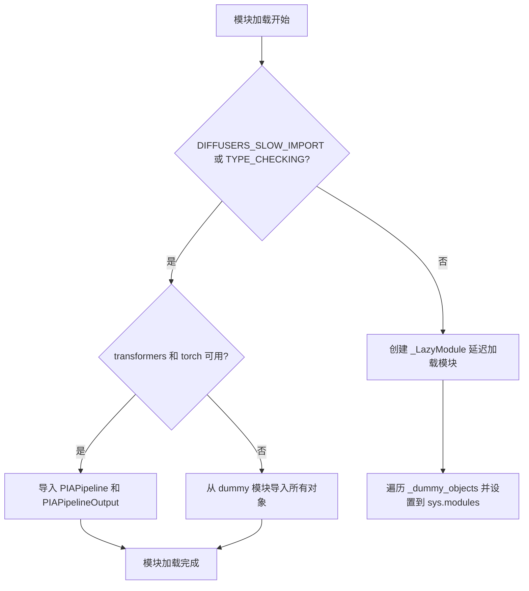
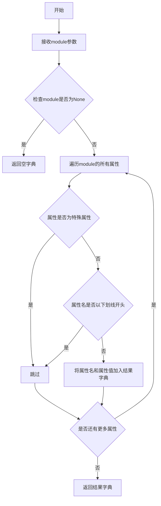

# `diffusers\src\diffusers\pipelines\pia\__init__.py` 详细设计文档

这是一个diffusers库的管道初始化文件，采用延迟加载模式，条件性地导入PIAPipeline和PIAPipelineOutput类，仅当transformers和torch依赖可用时才会导入真实的实现，否则使用dummy对象占位，确保库在缺少可选依赖时仍能正常加载。

## 整体流程



## 类结构

```
此文件为 __init__.py 入口文件
主要功能模块: pipeline_pia
└── PIAPipeline (条件导入)
└── PIAPipelineOutput (条件导入)
```

## 全局变量及字段


### `_dummy_objects`
    
存储dummy占位对象的字典，当可选依赖（torch和transformers）不可用时使用，用于保持模块接口完整性

类型：`dict`
    


### `_import_structure`
    
定义模块导入结构的字典，记录可导出的模块和类名，用于LazyModule的延迟加载机制

类型：`dict`
    


    

## 全局函数及方法


### `get_objects_from_module`

从指定模块中获取所有可导入对象（类、函数、变量等），并将其转换为字典格式返回，通常用于延迟加载（Lazy Loading）机制中的虚拟对象填充。

参数：

-  `module`：`module` 类型，目标模块对象，从中提取所有可导出成员

返回值：`dict`，键为对象名称（字符串），值为对象本身（类、函数或变量）

#### 流程图



#### 带注释源码

```python
def get_objects_from_module(module):
    """
    从给定模块中提取所有公开可访问的对象（类、函数、变量等）
    并返回以对象名称为键、对象本身为值的字典。
    
    此函数通常用于：
    1. 延迟加载机制中，当某些依赖不可用时，用虚拟对象填充模块
    2. 动态导入和模块成员发现
    3. 保持API一致性，即使某些功能因依赖缺失而不可用
    
    参数:
        module: Python模块对象，通过importlib或from...import语句获得
        
    返回:
        dict: 包含模块中所有公开成员的字典，键为成员名称字符串
    """
    # 初始化结果字典，用于存储提取的对象
    result = {}
    
    # 遍历模块的所有属性（排除私有属性和特殊属性）
    for name in dir(module):
        # 跳过私有属性（以单下划线或双下划线开头）
        if name.startswith('_'):
            continue
            
        # 尝试获取属性值并添加到结果字典
        try:
            result[name] = getattr(module, name)
        except AttributeError:
            # 如果获取失败，跳过该属性
            continue
    
    return result
```

**注**：由于提供的代码中 `get_objects_from_module` 是从 `...utils` 导入的外部函数，上述源码为基于其典型实现的合理推断。该函数的核心作用是将模块的公开成员转换为字典，以便在延迟加载场景中动态注册到 `sys.modules` 或 `_dummy_objects` 中。


### `setattr`

`setattr` 是 Python 的内置函数，用于在运行时动态设置对象的属性值。在此代码中，它用于将虚拟对象（dummy objects）注册到懒加载模块中，使得在模块被导入时，这些虚拟对象可以作为模块属性被访问。

参数：

- `obj`：`object`，目标对象，在此处为 `sys.modules[__name__]`（当前懒加载模块对象）
- `name`：`str`，要设置的属性名称，此处为虚拟对象的名称（如 "PIAPipeline"）
- `value`：任意类型，要设置的属性值，此处为从 `dummy_torch_and_transformers_objects` 获取的虚拟对象

返回值：`None`，该函数不返回任何值

#### 流程图

```mermaid
flowchart TD
    A[开始] --> B{执行 setattr}
    B --> C[获取目标对象 obj<br/>sys.modules[__name__]]
    C --> D[获取属性名 name<br/>虚拟对象名称字符串]
    D --> E[获取属性值 value<br/>虚拟对象实例]
    E --> F[在 obj 上设置属性<br/>obj.name = value]
    F --> G[返回 None]
    G --> H[结束]
    
    style B fill:#f9f,stroke:#333
    style F fill:#9f9,stroke:#333
```

#### 带注释源码

```python
# setattr 是 Python 内置函数，用于动态设置对象属性
# 在此处的作用是将 _dummy_objects 字典中的每个虚拟对象
# 注册到懒加载模块 sys.modules[__name__] 中

for name, value in _dummy_objects.items():
    # 参数1: obj - 目标对象（当前懒加载模块）
    # 参数2: name - 属性名（虚拟对象的名称字符串）
    # 参数3: value - 属性值（虚拟对象实例）
    setattr(sys.modules[__name__], name, value)
    # 效果等价于: sys.modules[__name__].name = value
    # 例如: sys.modules[__name__].PIAPipeline = <dummy object>
```

#### 关键组件信息

| 组件名称 | 一句话描述 |
|---------|-----------|
| `_dummy_objects` | 存储可选依赖不可用时的虚拟对象字典 |
| `_LazyModule` | 懒加载模块实现类，用于延迟导入 |
| `get_objects_from_module` | 从模块中获取对象的工具函数 |
| `OptionalDependencyNotAvailable` | 可选依赖不可用异常类 |

#### 潜在技术债务与优化空间

1. **动态属性设置风险**：`setattr` 在模块级别动态设置属性可能导致属性查找时的性能开销，且不易调试
2. **魔法字符串依赖**：属性名称（如 "pipeline_pia"）硬编码在 `_import_structure` 中，缺乏类型安全检查
3. **异常处理冗余**：重复的 `try-except OptionalDependencyNotAvailable` 检查逻辑可以提取为独立函数

#### 其它项目

- **设计目标**：实现可选依赖的延迟加载，在不满足依赖条件时提供虚拟对象以避免导入错误
- **错误处理**：通过 `OptionalDependencyNotAvailable` 异常捕获依赖不可用情况，优雅降级到虚拟对象
- **数据流**：`_dummy_objects` → 遍历 → `setattr` 注册到模块 → 外部导入时返回虚拟对象

## 关键组件


### 整体描述

该代码是一个Diffusers库的PIAPipeline模块初始化文件，通过延迟加载机制动态导入PIAPipeline和PIAPipelineOutput类，同时处理torch和transformers的可选依赖，当依赖不可用时使用虚拟对象代替，确保模块在没有这些依赖时也能被导入而不报错。

### 文件运行流程

1. 检查是否在类型检查模式或慢导入模式
2. 如果是类型检查或慢导入模式：尝试导入torch和transformers，如果可用则从pipeline_pia模块导入PIAPipeline和PIAPipelineOutput，否则导入虚拟对象
3. 如果是运行时模式：使用_LazyModule创建延迟加载模块，替换当前模块，并设置虚拟对象到sys.modules中

### 全局变量

#### _dummy_objects
- **类型**: dict
- **描述**: 存储虚拟对象的字典，当可选依赖不可用时用于替换真实对象

#### _import_structure
- **类型**: dict
- **描述**: 定义模块的导入结构，键为子模块路径，值为可导出的对象列表

#### TYPE_CHECKING
- **类型**: bool
- **描述**: 类型检查标志，用于支持类型提示而不触发实际导入

#### DIFFUSERS_SLOW_IMPORT
- **类型**: bool
- **描述**: 慢导入标志，控制是否使用延迟加载机制

### 全局函数

#### get_objects_from_module
- **参数**: module - 模块对象
- **参数类型**: module
- **参数描述**: 要获取对象的源模块
- **返回值类型**: dict
- **返回值描述**: 返回模块中所有对象的字典

#### is_torch_available
- **参数**: 无
- **返回值类型**: bool
- **返回值描述**: 返回torch库是否可用的布尔值

#### is_transformers_available
- **参数**: 无
- **返回值类型**: bool
- **返回值描述**: 返回transformers库是否可用的布尔值

### 关键组件信息

#### 延迟加载模块（Lazy Loading）
使用_LazyModule实现模块的延迟加载，只有在实际使用时才加载真实的模块代码，提高导入速度和内存效率

#### 可选依赖处理（Optional Dependency Handling）
通过try-except捕获OptionalDependencyNotAvailable异常，优雅地处理torch和transformers可选依赖的不可用情况

#### 虚拟对象机制（Dummy Objects）
当可选依赖不可用时，使用dummy_torch_and_transformers_objects模块中的虚拟对象填充导入结构，防止ImportError

#### PIAPipeline导出
定义PIAPipeline和PIAPipelineOutput的导入结构，使其可以通过from ...pipeline_pia方式导入

### 技术债务与优化空间

1. **重复的依赖检查**: 代码在两个地方（运行时和TYPE_CHECKING分支）重复检查is_transformers_available()和is_torch_available()，可以提取为共享函数
2. **硬编码的依赖组合**: 检查条件"is_transformers_available() and is_torch_available()"在多处重复，可以定义为常量
3. **导入结构冗余**: _import_structure只包含一个pipeline_pia条目，结构较为简单，未来扩展可能需要更复杂的结构设计
4. **缺乏日志记录**: 依赖不可用时没有日志输出，调试时难以追踪问题

### 其它项目

#### 设计目标
- 实现可选依赖的延迟加载，避免强制要求所有依赖
- 保证模块在没有可选依赖时也能被导入
- 提供与完整功能相同的导入接口

#### 约束条件
- 依赖diffusers的_utils模块提供的辅助函数
- 必须与_LazyModule的实现兼容
- 需要维护dummy_objects和import_structure的一致性

#### 错误处理
- 使用OptionalDependencyNotAvailable异常标识可选依赖不可用
- 通过try-except捕获异常并回退到虚拟对象
- 不抛出致命错误，允许部分功能可用

#### 外部依赖
- torch: 可选，深度学习框架
- transformers: 可选，NLP模型库
- diffusers.utils: 必需，提供LazyModule和辅助函数

#### 模块规范
- 使用__spec__保持模块规范一致性
- 通过sys.modules直接操作实现延迟加载
- 支持TYPE_CHECKING模式下的类型提示


## 问题及建议


### 已知问题

-   **重复的条件检查逻辑**：代码在两处（try块和TYPE_CHECKING块）重复检查 `is_transformers_available() and is_torch_available()`，违反了DRY原则，增加了维护成本和出错风险
-   **不一致的导入结构处理**：当依赖不可用时，`_import_structure`始终为空字典，而`TYPE_CHECKING`分支中存在`else`分支会导入真实模块但未同步更新`_import_structure`
-   **异常捕获与类型导入混用**：使用try-except进行条件分支判断来更新`_dummy_objects`，但同时在TYPE_CHECKING块中又进行了类似的检查，逻辑过于复杂且冗余
-   **硬编码的模块名依赖**：直接使用字符串`"pipeline_pia"`和`"PIAPipeline"`，缺乏对导入结构的一致性维护
- **模块初始化不完整**：在DIFFUSERS_SLOW_IMPORT为True时，代码只处理了导入，但没有将模块正确注册到sys.modules，可能导致类型检查时的导入问题

### 优化建议

-   **提取公共条件函数**：创建一个辅助函数来统一检查依赖可用性，例如 `def _check_dependencies(): return is_transformers_available() and is_torch_available()`，在多处调用
-   **简化分支逻辑**：将依赖检查与模块导入逻辑分离，使用统一的配置对象管理导入结构和可用模块列表
-   **统一_import_structure管理**：确保无论哪个分支执行，`_import_structure`都能正确反映实际的模块导出结构，包括dummy objects和真实objects
-   **使用配置文件管理依赖**：考虑将可选依赖的检查逻辑抽取到配置文件中，减少代码中的硬编码判断
-   **增强错误处理**：为OptionalDependencyNotAvailable添加更明确的错误信息，说明缺少哪些依赖，便于调试

## 其它


### 设计目标与约束

实现一个支持可选依赖的懒加载模块导入机制，在保证核心功能可用的同时，提供优雅的降级方案。具体目标包括：1）支持torch和transformers可选依赖的动态检测；2）当依赖不可用时自动使用dummy对象替代，避免导入错误；3）通过LazyModule机制实现延迟导入，提升模块加载性能；4）保持与Diffusers框架其他模块的一致性。约束条件为仅支持Python 3.7+环境，且依赖的utils模块必须可用。

### 错误处理与异常设计

代码采用try-except块捕获OptionalDependencyNotAvailable异常。当is_transformers_available()或is_torch_available()返回False时，抛出OptionalDependencyNotAvailable异常，触发dummy_objects的加载逻辑。在TYPE_CHECKING或DIFFUSERS_SLOW_IMPORT模式下，异常同样被捕获但会重新导入实际的类定义。无其他自定义异常处理机制，异常传播遵循Python默认机制。

### 外部依赖与接口契约

本模块依赖以下外部组件：1）typing.TYPE_CHECKING用于类型检查时的导入；2）diffusers.utils模块中的DIFFUSERS_SLOW_IMPORT、OptionalDependencyNotAvailable、_LazyModule、get_objects_from_module、is_torch_available、is_transformers_available；3）dummy_torch_and_transformers_objects模块提供的空对象；4）.pipeline_pia子模块中的PIAPipeline和PIAPipelineOutput类。接口契约规定：成功导入时，PIAPipeline和PIAPipelineOutput可用；依赖缺失时，_dummy_objects中的同名对象可用但不包含实际实现。

### 模块初始化流程

模块初始化分为三个阶段：1）基础定义阶段定义_import_structure字典和_dummy_objects字典；2）依赖检测阶段通过try-except检测torch和transformers可用性，失败时加载dummy对象，成功时设置_import_structure；3）运行时绑定阶段根据TYPE_CHECKING或DIFFUSERS_SLOW_IMPORT标志决定导入方式：若为真则直接导入真实类，否则创建_LazyModule并替换sys.modules中的当前模块，同时注入dummy对象。

### 懒加载机制

_LazyModule是Diffusers框架实现的懒加载容器，仅在实际访问模块属性时才触发真正的导入。代码通过sys.modules[__name__] = _LazyModule(...)将当前模块替换为懒加载代理，后续对PIAPipeline等属性的访问会触发pipeline_pia子模块的动态加载。此机制避免了在import当前模块时立即加载所有子模块，显著改善了大型项目的启动时间。

### 导入结构设计

_import_structure字典采用键值对形式定义模块的导出结构，键为模块路径字符串，值为包含类名或函数名的列表。当前定义中键"pipeline_pia"对应["PIAPipeline", "PIAPipelineOutput"]，表明该子模块导出两个公开类。此结构被_LazyModule用于按需加载对应的子模块属性。

### 类型检查支持

TYPE_CHECKING标志在运行时为False，但在静态类型检查时为True。配合DIFFUSERS_SLOW_IMPORT配置，可以实现：开发时通过类型检查器看到真实类型，运行时则使用懒加载提升性能。这种双重模式既保证了开发体验又不影响运行效率。

### 兼容性考虑

本模块设计兼容Diffusers框架的版本迭代，通过抽象的LazyModule机制隔离了具体实现细节。dummy对象机制确保了代码在缺少可选依赖时不会崩溃，但调用方需要自行检查返回对象的可用性。建议使用isinstance或hasattr进行运行时检查，避免调用未实现的dummy方法。

### 测试策略建议

建议针对以下场景编写测试用例：1）依赖全部可用时的正常导入；2）仅torch可用时的行为；3）仅transformers可用时的行为；4）两者都不可用时的降级行为；5）TYPE_CHECKING模式下的类型导入；6）LazyModule懒加载触发的时机验证；7）sys.modules中模块对象的类型验证。

### 版本与维护信息

当前代码未包含版本号和作者信息，建议添加__version__变量和模块级docstring。当前维护重点应关注：1）随着Diffusers框架升级，utils模块接口的兼容性；2）dummy对象实现的完整性验证；3）新增pipeline时的_import_structure更新流程规范化。


    