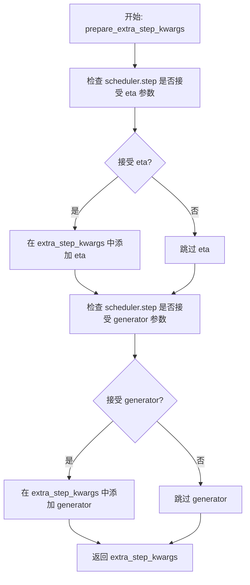
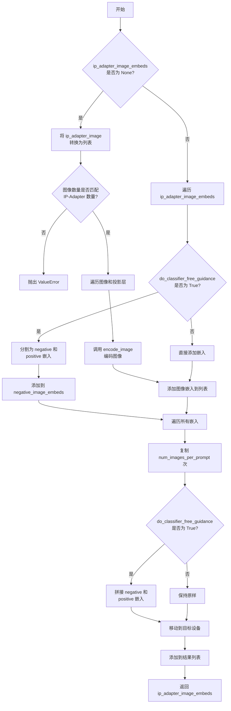
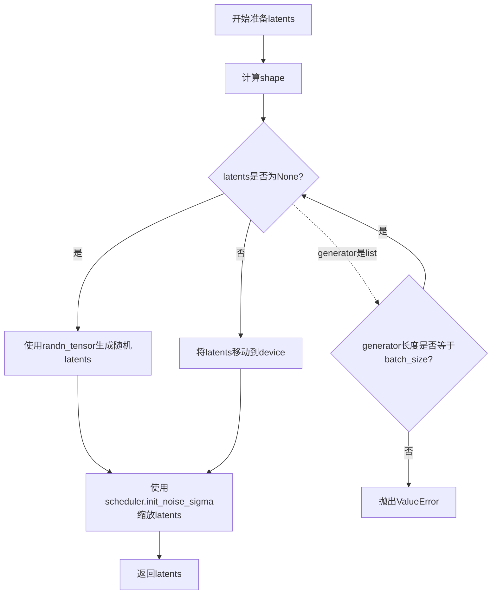
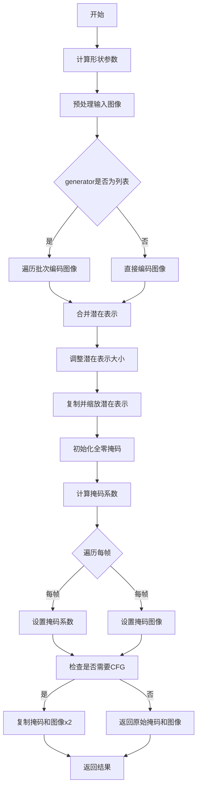

```mermaid
flowchart TD
    A[开始 encode_prompt] --> B{检查 lora_scale}
    B -->|不为None| C[设置 self._lora_scale]
    C --> D{是否使用PEFT backend}
    D -->|否| E[adjust_lora_scale_text_encoder]
    D -->|是| F[scale_lora_layers]
    E --> G[确定batch_size]
    F --> G
    B -->|为None| G
    G --> H{prompt_embeds 为 None?}
    H -->|是| I{检查 TextualInversionLoaderMixin}
    I -->|是| J[maybe_convert_prompt 处理多向量token]
    I -->|否| K[tokenize prompt]
    J --> K
    K --> L[获取 input_ids 和 attention_mask]
    L --> M{检查token是否被截断}
    M -->|是| N[记录警告日志]
    M -->|否| O
    N --> O{clip_skip 为 None?}
    O -->|是| P[text_encoder 编码获取 embeds]
    O -->|否| Q[获取 hidden_states]
    Q --> R[根据 clip_skip 选择对应层的 hidden states]
    R --> S[应用 final_layer_norm]
    P --> T[确定 prompt_embeds_dtype]
    S --> T
    H -->|否| T
    T --> U[转换 prompt_embeds dtype 和 device]
    U --> V[复制 prompt_embeds num_images_per_prompt 次]
    V --> W{CFG 需要且 negative_prompt_embeds 为 None?}
    W -->|是| X{negative_prompt 类型}
    X -->|None| Y[使用空字符串]
    X -->|str| Z[转为单元素列表]
    X -->|list| AA[直接使用]
    Y --> AB[TextualInversionLoaderMixin 处理]
    Z --> AB
    AA --> AB
    AB --> AC[tokenize negative_prompt]
    AC --> AD[编码获取 negative_prompt_embeds]
    AD --> AE[复制 negative_prompt_embeds]
    W -->|否| AF
    AE --> AF
    AF --> AG{使用 StableDiffusionLoraLoaderMixin 且 PEFT?}
    AG -->|是| AH[unscale_lora_layers 恢复原始scale]
    AG -->|否| AI[返回结果]
    AH --> AI
    
    style A fill:#f9f,stroke:#333
    style AI fill:#9f9,stroke:#333
```

```mermaid
flowchart TD
    A[开始 __call__] --> B[设置默认高度和宽度]
    B --> C[检查输入参数]
    C --> D[设置引导比例、clip_skip和交叉注意力参数]
    D --> E[定义批次大小和设备]
    E --> F[编码输入提示词]
    F --> G{是否使用分类器自由引导?}
    G -->|是| H[连接负面和正面提示词嵌入]
    G -->|否| I[继续下一步]
    H --> J[沿帧维度重复提示词嵌入]
    I --> J
    J --> K{是否有IP适配器图像?}
    K -->|是| L[准备IP适配器图像嵌入]
    K -->|否| M[准备时间步]
    L --> M
    M --> N[设置调度器时间步]
    N --> O[获取时间步和推理步数]
    O --> P[准备潜在变量]
    P --> Q[准备掩码条件]
    Q --> R{强度是否小于1.0?}
    R -->|是| S[添加噪声到潜在变量]
    R -->|否| T[准备额外步骤参数]
    S --> T
    T --> U[准备IP适配器的条件参数]
    U --> V[开始去噪循环]
    V --> W[是否启用FreeInit?]
    W -->|是| X[应用FreeInit]
    W -->|否| Y[扩展潜在变量进行分类器自由引导]
    X --> Y
    Y --> Z[缩放模型输入]
    Z --> AA[连接潜在变量、掩码和掩码图像]
    AA --> AB[UNet预测噪声残差]
    AB --> AC{是否使用分类器自由引导?}
    AC -->|是| AD[计算引导后的噪声预测]
    AC -->|否| AE[计算前一时间步的潜在变量]
    AD --> AE
    AE --> AF[执行回调函数]
    AF --> AG[更新进度条]
    AG --> AH{是否到达最后一步?}
    AH -->|否| V
    AH -->|是| AI[后处理]
    AI --> AJ{输出类型是否为latent?}
    AJ -->|是| AK[直接使用潜在变量作为视频]
    AJ -->|否| AL[解码潜在变量为视频]
    AK --> AM[卸载所有模型]
    AL --> AM
    AM --> AN{是否返回字典?}
    AN -->|是| AO[返回PIAPipelineOutput]
    AN -->|否| AP[返回元组]
    AO --> AP
    AP[结束]
```

# `diffusers\src\diffusers\pipelines\pia\pipeline_pia.py` 详细设计文档

PIA (Progressive Image Animation) Pipeline 是一个基于 Stable Diffusion 的视频生成管道，能够将静态图像转换为动画视频。该管道通过运动适配器 (MotionAdapter) 控制生成视频的运动幅度和类型，支持多种运动模式（小幅运动、适度运动、大幅运动、循环运动、风格迁移），并集成了 IP-Adapter、LoRA、Textual Inversion 等高级功能。

## 整体流程

```mermaid
graph TD
A[开始: 输入图像和提示词] --> B[检查输入参数]
B --> C[编码提示词: encode_prompt]
C --> D[编码图像: encode_image]
D --> E[准备时间步: scheduler.set_timesteps]
E --> F[准备潜在变量: prepare_latents]
F --> G[准备遮罩条件: prepare_masked_condition]
G --> H{迭代去噪}
H -->|每次迭代| I[扩展潜在变量 (如果使用CFG)]
I --> J[UNet预测噪声]
J --> K[执行分类器自由引导]
K --> L[scheduler.step更新潜在变量]
L --> M[检查是否完成]
M -->|否| H
M -->|是| N[解码潜在变量: decode_latents]
N --> O[后处理视频]
O --> P[返回PIAPipelineOutput]
```

## 类结构

```
PIAPipelineOutput (数据类)
PIAPipeline (主类)
├── DeprecatedPipelineMixin
├── DiffusionPipeline
├── StableDiffusionMixin
├── TextualInversionLoaderMixin
├── IPAdapterMixin
├── StableDiffusionLoraLoaderMixin
├── FromSingleFileMixin
└── FreeInitMixin
```

## 全局变量及字段


### `XLA_AVAILABLE`
    
XLA是否可用

类型：`bool`
    


### `logger`
    
日志记录器

类型：`logging.Logger`
    


### `EXAMPLE_DOC_STRING`
    
示例文档字符串

类型：`str`
    


### `RANGE_list`
    
运动系数预定义列表

类型：`list[list[float]]`
    


### `PIAPipelineOutput.frames`
    
生成的视频帧

类型：`torch.Tensor | np.ndarray | list[list[PIL.Image.Image]]`
    


### `PIAPipeline.vae`
    
VAE模型用于编码/解码图像

类型：`AutoencoderKL`
    


### `PIAPipeline.text_encoder`
    
文本编码器

类型：`CLIPTextModel`
    


### `PIAPipeline.tokenizer`
    
文本分词器

类型：`CLIPTokenizer`
    


### `PIAPipeline.unet`
    
去噪UNet

类型：`UNet2DConditionModel | UNetMotionModel`
    


### `PIAPipeline.scheduler`
    
调度器

类型：`SchedulerMixin`
    


### `PIAPipeline.motion_adapter`
    
运动适配器

类型：`MotionAdapter | None`
    


### `PIAPipeline.feature_extractor`
    
图像特征提取器

类型：`CLIPImageProcessor | None`
    


### `PIAPipeline.image_encoder`
    
图像编码器

类型：`CLIPVisionModelWithProjection | None`
    


### `PIAPipeline.video_processor`
    
视频处理器

类型：`VideoProcessor`
    


### `PIAPipeline.vae_scale_factor`
    
VAE缩放因子

类型：`int`
    


### `PIAPipeline._guidance_scale`
    
引导_scale

类型：`float`
    


### `PIAPipeline._clip_skip`
    
CLIP跳过的层数

类型：`int | None`
    


### `PIAPipeline._cross_attention_kwargs`
    
交叉注意力参数

类型：`dict | None`
    


### `PIAPipeline._num_timesteps`
    
时间步数

类型：`int`
    
    

## 全局函数及方法


### `prepare_mask_coef_by_statistics`

该函数是一个全局工具函数，根据视频帧数、条件帧位置和运动规模参数，从预定义的系数矩阵中选取并生成对应的遮罩系数列表，用于在视频生成过程中对不同帧进行加权处理，以实现基于关键帧（条件帧）的掩码操作。

参数：

- `num_frames`：`int`，视频的总帧数，必须大于0。
- `cond_frame`：`int`，条件帧的索引位置，即关键帧的索引，必须小于总帧数。
- `motion_scale`：`int`，运动规模的索引，用于选择预定义的系数矩阵行，必须小于矩阵长度。

返回值：`list[float]`，返回计算后的遮罩系数列表，列表长度等于 `num_frames`。

#### 流程图

```mermaid
flowchart TD
    A[开始] --> B{验证 num_frames > 0}
    B -->|是| C{验证 num_frames > cond_frame}
    B -->|否| D[抛出 AssertionError]
    C -->|是| E[获取 RANGE_list]
    C -->|否| D
    E --> F{验证 motion_scale < len(range_list)}
    F -->|是| G[选择对应 coef 向量]
    F -->|否| D
    G --> H{num_frames > len coef?}
    H -->|是| I[用 coef 末尾值填充到 num_frames 长度]
    H -->|否| J[直接使用 coef]
    I --> K[计算每帧到 cond_frame 的距离]
    J --> K
    K --> L[根据距离重排 coef]
    L --> M[返回结果系数列表]
```

#### 带注释源码

```python
def prepare_mask_coef_by_statistics(num_frames: int, cond_frame: int, motion_scale: int):
    """
    根据统计数据准备遮罩系数，用于视频生成中的掩码操作。
    
    参数:
        num_frames: 视频的总帧数
        cond_frame: 条件帧（关键帧）的索引
        motion_scale: 运动规模索引，决定使用哪一组系数曲线
    
    返回:
        遮罩系数列表，长度为 num_frames
    """
    # 验证输入：帧数必须大于0
    assert num_frames > 0, "video_length should be greater than 0"

    # 验证输入：帧数必须大于条件帧索引
    assert num_frames > cond_frame, "video_length should be greater than cond_frame"

    # 获取预定义的系数矩阵
    range_list = RANGE_list

    # 验证运动规模索引是否在有效范围内
    assert motion_scale < len(range_list), f"motion_scale type{motion_scale} not implemented"

    # 根据运动规模选择对应的系数向量
    coef = range_list[motion_scale]
    
    # 如果视频帧数大于系数向量的长度，用最后一个系数值填充
    # 例如：coef = [1.0, 0.8, 0.6], num_frames = 5 -> coef = [1.0, 0.8, 0.6, 0.6, 0.6]
    coef = coef + ([coef[-1]] * (num_frames - len(coef)))

    # 计算每个帧索引到条件帧索引的距离（绝对值）
    # 例如：cond_frame=2, num_frames=4 -> order = [2, 1, 0, 1]
    order = [abs(i - cond_frame) for i in range(num_frames)]
    
    # 根据距离重新排列系数，距离条件帧越近的位置系数越大
    # order[i] 表示第i帧到条件帧的距离，用该距离作为索引去系数向量中取值
    coef = [coef[order[i]] for i in range(num_frames)]

    return coef
```

#### 关键组件信息

- **RANGE_list**：全局常量（list），预定义的系数矩阵，包含9种不同运动类型（静止、小幅度运动、中等运动、大幅度运动、循环运动、风格迁移等）的系数曲线。

#### 潜在的技术债务或优化空间

1. **硬编码数据**：系数矩阵 `RANGE_list` 是硬编码在代码中的，如果需要调整系数曲线，需要修改源代码，缺乏灵活性。
2. **断言而非异常**：使用 `assert` 进行参数验证，在 Python 中默认情况下可以被 `python -O` 优化掉，建议使用 `ValueError` 或 `TypeError` 异常。
3. **无类型提示返回值**：虽然参数有类型提示，但返回值 `list[float]` 在 Python 3.9+ 才支持 `list[float]` 的语法，当前代码中可能需要使用 `List[float]` 并从 `typing` 导入。
4. **填充逻辑简单**：使用最后一个系数值填充可能不是最优方案，可以考虑使用插值或其他策略。

#### 其它项目

- **设计目标**：根据给定的运动规模和条件帧位置，动态生成适用于视频掩码操作的系数权重，使得条件帧（关键帧）位置的权重最高，距离越远权重越低。
- **错误处理**：当前使用 `assert` 进行基本错误处理，错误信息较为简洁。
- **外部依赖**：无外部依赖，仅使用 Python 内置功能。
- **接口契约**：输入必须为正整数，运动规模必须在有效范围内，返回值始终为长度为 `num_frames` 的浮点数列表。


### `PIAPipeline.__init__`

该方法是 `PIAPipeline` 类的构造函数，负责初始化整个视频生成管道的所有核心组件，包括 VAE、文本编码器、分词器、UNet 模型、调度器等，并将这些组件注册到管道中，同时初始化视频处理器和 VAE 缩放因子。

参数：

- `vae`：`AutoencoderKL`，用于将图像编码和解码到潜在表示的变分自编码器模型
- `text_encoder`：`CLIPTextModel`，冻结的文本编码器模型，用于将文本提示转换为嵌入向量
- `tokenizer`：`CLIPTokenizer`，用于将文本分词的 CLIP 分词器
- `unet`：`UNet2DConditionModel | UNetMotionModel`，用于对编码的视频潜在表示进行去噪的 UNet 模型
- `scheduler`：`DDIMScheduler | PNDMScheduler | LMSDiscreteScheduler | EulerDiscreteScheduler | EulerAncestralDiscreteScheduler | DPMSolverMultistepScheduler`，与 unet 结合用于对编码的图像潜在表示进行去噪的调度器
- `motion_adapter`：`MotionAdapter | None`，可选的运动适配器，用于增强视频生成能力
- `feature_extractor`：`CLIPImageProcessor | None`，可选的图像特征提取器，用于 IP-Adapter 功能
- `image_encoder`：`CLIPVisionModelWithProjection | None`，可选的图像编码器模型，用于 IP-Adapter 功能

返回值：无（`None`），构造函数不返回任何值，仅初始化实例属性

#### 流程图

```mermaid
flowchart TD
    A[开始 __init__] --> B[调用 super().__init__ 初始化基类]
    B --> C{unet 是否为 UNet2DConditionModel}
    C -->|是| D[使用 motion_adapter 将 unet 转换为 UNetMotionModel]
    C -->|否| E[保持 unet 不变]
    D --> F[注册所有模块到管道]
    E --> F
    F --> G[计算 vae_scale_factor]
    G --> H[创建 VideoProcessor 实例]
    H --> I[结束 __init__]
    
    style A fill:#f9f,stroke:#333
    style I fill:#9f9,stroke:#333
```

#### 带注释源码

```python
def __init__(
    self,
    vae: AutoencoderKL,
    text_encoder: CLIPTextModel,
    tokenizer: CLIPTokenizer,
    unet: UNet2DConditionModel | UNetMotionModel,
    scheduler: DDIMScheduler
    | PNDMScheduler
    | LMSDiscreteScheduler
    | EulerDiscreteScheduler
    | EulerAncestralDiscreteScheduler
    | DPMSolverMultistepScheduler,
    motion_adapter: MotionAdapter | None = None,
    feature_extractor: CLIPImageProcessor = None,
    image_encoder: CLIPVisionModelWithProjection = None,
):
    """
    初始化 PIAPipeline 管道。
    
    参数:
        vae: 变分自编码器，用于图像和潜在表示之间的转换
        text_encoder: CLIP 文本编码器，将文本转换为嵌入向量
        tokenizer: CLIP 分词器，用于对文本进行分词
        unet: 条件 UNet 模型，用于去噪潜在表示
        scheduler: 噪声调度器，控制去噪过程的步调
        motion_adapter: 可选的 MotionAdapter，用于增强运动生成能力
        feature_extractor: 可选的 CLIP 图像处理器，用于特征提取
        image_encoder: 可选的 CLIP 视觉编码器，用于图像编码
    """
    # 1. 调用父类构造函数，完成基类的初始化
    #    这会设置一些基础的管道配置和属性
    super().__init__()
    
    # 2. 检查 unet 类型，如果是普通的 UNet2DConditionModel，
    #    则使用 motion_adapter 将其转换为 UNetMotionModel
    #    以支持视频/运动生成能力
    if isinstance(unet, UNet2DConditionModel):
        unet = UNetMotionModel.from_unet2d(unet, motion_adapter)

    # 3. 使用 register_modules 方法注册所有组件
    #    这使得这些组件可以通过管道的属性访问，
    #    同时也便于模型的保存和加载
    self.register_modules(
        vae=vae,
        text_encoder=text_encoder,
        tokenizer=tokenizer,
        unet=unet,
        motion_adapter=motion_adapter,
        scheduler=scheduler,
        feature_extractor=feature_extractor,
        image_encoder=image_encoder,
    )
    
    # 4. 计算 VAE 缩放因子
    #    根据 VAE 的块输出通道数计算，用于后续图像/视频的缩放
    #    默认值为 8（对应 2^(3-1) = 4 的情况较少见，通常为 2^(len-1)）
    self.vae_scale_factor = 2 ** (len(self.vae.config.block_out_channels) - 1) if getattr(self, "vae", None) else 8
    
    # 5. 创建视频处理器
    #    VideoProcessor 负责视频的后处理，如调整大小、格式转换等
    #    do_resize=False 表示不进行额外的缩放操作
    self.video_processor = VideoProcessor(do_resize=False, vae_scale_factor=self.vae_scale_factor)
```


### `PIAPipeline.encode_prompt`

该方法负责将文本提示词（prompt）编码为文本编码器（CLIP Text Encoder）的隐藏状态（hidden states），支持可选的LoRA权重调整、CLIP跳过层、以及负面提示词（negative prompt）的无条件嵌入生成，为后续的图像/视频生成提供文本特征表示。

参数：

- `prompt`：`str | list[str]`，可选，要编码的提示词
- `device`：`torch.device`，torch设备
- `num_images_per_prompt`：`int`，每个提示词生成的图像/视频数量
- `do_classifier_free_guidance`：`bool`，是否使用无分类器自由引导（CFG）
- `negative_prompt`：`str | list[str]`，可选，用于引导不生成内容的负面提示词
- `prompt_embeds`：`torch.Tensor | None`，可选，预生成的文本嵌入
- `negative_prompt_embeds`：`torch.Tensor | None`，可选，预生成的负面文本嵌入
- `lora_scale`：`float | None`，可选，LoRA缩放因子
- `clip_skip`：`int | None`，可选，CLIP编码时跳过的层数

返回值：`tuple[torch.Tensor, torch.Tensor]`，返回编码后的 `prompt_embeds` 和 `negative_prompt_embeds`

#### 流程图



#### 带注释源码

```python
def encode_prompt(
    self,
    prompt,
    device,
    num_images_per_prompt,
    do_classifier_free_guidance,
    negative_prompt=None,
    prompt_embeds: torch.Tensor | None = None,
    negative_prompt_embeds: torch.Tensor | None = None,
    lora_scale: float | None = None,
    clip_skip: int | None = None,
):
    r"""
    Encodes the prompt into text encoder hidden states.

    Args:
        prompt (`str` or `list[str]`, *optional*):
            prompt to be encoded
        device: (`torch.device`):
            torch device
        num_images_per_prompt (`int`):
            number of images that should be generated per prompt
        do_classifier_free_guidance (`bool`):
            whether to use classifier free guidance or not
        negative_prompt (`str` or `list[str]`, *optional*):
            The prompt or prompts not to guide the image generation. If not defined, one has to pass
            `negative_prompt_embeds` instead. Ignored when not using guidance (i.e., ignored if `guidance_scale` is
            less than `1`).
        prompt_embeds (`torch.Tensor`, *optional*):
            Pre-generated text embeddings. Can be used to easily tweak text inputs, *e.g.* prompt weighting. If not
            provided, text embeddings will be generated from `prompt` input argument.
        negative_prompt_embeds (`torch.Tensor`, *optional*):
            Pre-generated negative text embeddings. Can be used to easily tweak text inputs, *e.g.* prompt
            weighting. If not provided, negative_prompt_embeds will be generated from `negative_prompt` input
            argument.
        lora_scale (`float`, *optional*):
            A LoRA scale that will be applied to all LoRA layers of the text encoder if LoRA layers are loaded.
        clip_skip (`int`, *optional*):
            Number of layers to be skipped from CLIP while computing the prompt embeddings. A value of 1 means that
            the output of the pre-final layer will be used for computing the prompt embeddings.
    """
    # 设置 lora scale 以便 text encoder 的 monkey patched LoRA 函数能正确访问
    if lora_scale is not None and isinstance(self, StableDiffusionLoraLoaderMixin):
        self._lora_scale = lora_scale

        # 动态调整 LoRA scale
        if not USE_PEFT_BACKEND:
            adjust_lora_scale_text_encoder(self.text_encoder, lora_scale)
        else:
            scale_lora_layers(self.text_encoder, lora_scale)

    # 根据 prompt 或 prompt_embeds 确定 batch_size
    if prompt is not None and isinstance(prompt, str):
        batch_size = 1
    elif prompt is not None and isinstance(prompt, list):
        batch_size = len(prompt)
    else:
        batch_size = prompt_embeds.shape[0]

    # 如果未提供 prompt_embeds，则从 prompt 生成
    if prompt_embeds is None:
        # textual inversion: 如果需要，处理多向量 tokens
        if isinstance(self, TextualInversionLoaderMixin):
            prompt = self.maybe_convert_prompt(prompt, self.tokenizer)

        # 使用 tokenizer 将 prompt 转换为 token ids
        text_inputs = self.tokenizer(
            prompt,
            padding="max_length",
            max_length=self.tokenizer.model_max_length,
            truncation=True,
            return_tensors="pt",
        )
        text_input_ids = text_inputs.input_ids
        # 获取未截断的 token ids 用于检测截断
        untruncated_ids = self.tokenizer(prompt, padding="longest", return_tensors="pt").input_ids

        # 检测并警告截断的文本
        if untruncated_ids.shape[-1] >= text_input_ids.shape[-1] and not torch.equal(
            text_input_ids, untruncated_ids
        ):
            removed_text = self.tokenizer.batch_decode(
                untruncated_ids[:, self.tokenizer.model_max_length - 1 : -1]
            )
            logger.warning(
                "The following part of your input was truncated because CLIP can only handle sequences up to"
                f" {self.tokenizer.model_max_length} tokens: {removed_text}"
            )

        # 获取 attention mask（如果 text encoder 支持）
        if hasattr(self.text_encoder.config, "use_attention_mask") and self.text_encoder.config.use_attention_mask:
            attention_mask = text_inputs.attention_mask.to(device)
        else:
            attention_mask = None

        # 根据 clip_skip 决定如何获取 prompt embeddings
        if clip_skip is None:
            # 直接编码获取 embeddings
            prompt_embeds = self.text_encoder(text_input_ids.to(device), attention_mask=attention_mask)
            prompt_embeds = prompt_embeds[0]
        else:
            # 获取所有 hidden states，然后选择指定层的输出
            prompt_embeds = self.text_encoder(
                text_input_ids.to(device), attention_mask=attention_mask, output_hidden_states=True
            )
            # hidden_states 是一个 tuple，包含所有 encoder 层的输出
            # 选择倒数第 (clip_skip + 1) 层的输出
            prompt_embeds = prompt_embeds[-1][-(clip_skip + 1)]
            # 应用 final_layer_norm 以获得正确的表示
            prompt_embeds = self.text_encoder.text_model.final_layer_norm(prompt_embeds)

    # 确定 prompt_embeds 的 dtype（优先使用 text_encoder 或 unet 的 dtype）
    if self.text_encoder is not None:
        prompt_embeds_dtype = self.text_encoder.dtype
    elif self.unet is not None:
        prompt_embeds_dtype = self.unet.dtype
    else:
        prompt_embeds_dtype = prompt_embeds.dtype

    # 转换 prompt_embeds 到正确的 dtype 和 device
    prompt_embeds = prompt_embeds.to(dtype=prompt_embeds_dtype, device=device)

    # 复制 text embeddings 以匹配每个 prompt 生成的图像数量
    bs_embed, seq_len, _ = prompt_embeds.shape
    # 使用 mps 友好的方法复制
    prompt_embeds = prompt_embeds.repeat(1, num_images_per_prompt, 1)
    prompt_embeds = prompt_embeds.view(bs_embed * num_images_per_prompt, seq_len, -1)

    # 为 classifier free guidance 获取无条件 embeddings
    if do_classifier_free_guidance and negative_prompt_embeds is None:
        uncond_tokens: list[str]
        if negative_prompt is None:
            # 使用空字符串作为无条件输入
            uncond_tokens = [""] * batch_size
        elif prompt is not None and type(prompt) is not type(negative_prompt):
            raise TypeError(
                f"`negative_prompt` should be the same type to `prompt`, but got {type(negative_prompt)} !="
                f" {type(prompt)}."
            )
        elif isinstance(negative_prompt, str):
            uncond_tokens = [negative_prompt]
        elif batch_size != len(negative_prompt):
            raise ValueError(
                f"`negative_prompt`: {negative_prompt} has batch size {len(negative_prompt)}, but `prompt`:"
                f" {prompt} has batch size {batch_size}. Please make sure that passed `negative_prompt` matches"
                " the batch size of `prompt`."
            )
        else:
            uncond_tokens = negative_prompt

        # textual inversion: 如果需要，处理多向量 tokens
        if isinstance(self, TextualInversionLoaderMixin):
            uncond_tokens = self.maybe_convert_prompt(uncond_tokens, self.tokenizer)

        # tokenize negative_prompt
        max_length = prompt_embeds.shape[1]
        uncond_input = self.tokenizer(
            uncond_tokens,
            padding="max_length",
            max_length=max_length,
            truncation=True,
            return_tensors="pt",
        )

        # 获取 attention mask
        if hasattr(self.text_encoder.config, "use_attention_mask") and self.text_encoder.config.use_attention_mask:
            attention_mask = uncond_input.attention_mask.to(device)
        else:
            attention_mask = None

        # 编码获取 negative_prompt_embeds
        negative_prompt_embeds = self.text_encoder(
            uncond_input.input_ids.to(device),
            attention_mask=attention_mask,
        )
        negative_prompt_embeds = negative_prompt_embeds[0]

    # 如果使用 CFG，复制 negative embeddings
    if do_classifier_free_guidance:
        seq_len = negative_prompt_embeds.shape[1]

        negative_prompt_embeds = negative_prompt_embeds.to(dtype=prompt_embeds_dtype, device=device)

        negative_prompt_embeds = negative_prompt_embeds.repeat(1, num_images_per_prompt, 1)
        negative_prompt_embeds = negative_prompt_embeds.view(batch_size * num_images_per_prompt, seq_len, -1)

    # 如果使用了 LoRA 并且使用 PEFT backend，需要恢复原始 scale
    if self.text_encoder is not None:
        if isinstance(self, StableDiffusionLoraLoaderMixin) and USE_PEFT_BACKEND:
            # 通过 unscale 恢复原始 scale
            unscale_lora_layers(self.text_encoder, lora_scale)

    return prompt_embeds, negative_prompt_embeds
```


### `PIAPipeline.encode_image`

该方法用于将输入图像编码为图像嵌入向量（image embeddings）或隐藏状态（hidden states），支持分类器自由引导（classifier-free guidance）所需的 unconditional embeddings。可选地返回中间隐藏状态以便进行更精细的特征控制。

参数：

- `image`：`PipelineImageInput`（可为 PIL.Image、numpy array、torch.Tensor 或列表），待编码的输入图像
- `device`：`torch.device`，将图像张量移动到的目标设备
- `num_images_per_prompt`：`int`，每个 prompt 生成的图像数量，用于对图像嵌入进行重复扩展
- `output_hidden_states`：`bool | None`，是否返回图像编码器的隐藏状态而非最终的 image embeddings

返回值：`tuple[torch.Tensor, torch.Tensor]`，返回两个张量元组。当 `output_hidden_states=False` 时返回 `(image_embeds, uncond_image_embeds)`；当 `output_hidden_states=True` 时返回 `(image_enc_hidden_states, uncond_image_enc_hidden_states)`。两个张量分别对应条件图像嵌入和无条件（零）图像嵌入，用于分类器自由引导。

#### 流程图

```mermaid
flowchart TD
    A[开始 encode_image] --> B[获取 image_encoder 的 dtype]
    B --> C{image 是否为 torch.Tensor?}
    C -->|否| D[使用 feature_extractor 提取像素值]
    C -->|是| E[直接使用 image]
    D --> F[将 image 移动到指定 device 并转换 dtype]
    E --> F
    F --> G{output_hidden_states == True?}
    G -->|是| H[调用 image_encoder 获取隐藏状态 hidden_states]
    H --> I[取倒数第二层 hidden_states[-2] 作为特征]
    I --> J[对条件隐藏状态进行 repeat_interleave 扩展]
    J --> K[使用 zeros_like 创建无条件隐藏状态]
    K --> L[对无条件隐藏状态进行 repeat_interleave 扩展]
    L --> M[返回 条件隐藏状态 和 无条件隐藏状态]
    G -->|否| N[调用 image_encoder 获取 image_embeds]
    N --> O[对 image_embeds 进行 repeat_interleave 扩展]
    O --> P[使用 zeros_like 创建无条件 image_embeds]
    P --> Q[返回 条件embeddings 和 无条件embeddings]
    M --> R[结束]
    Q --> R
```

#### 带注释源码

```python
def encode_image(self, image, device, num_images_per_prompt, output_hidden_states=None):
    """
    Encodes the input image into image embeddings or hidden states.
    
    用于将输入图像编码为图像嵌入向量或隐藏状态，支持分类器自由引导所需的
    unconditional embeddings。

    Args:
        image: 输入图像，支持 PIL.Image、numpy array、torch.Tensor 或列表形式
        device: 目标设备（torch.device）
        num_images_per_prompt: 每个 prompt 生成的图像数量，用于扩展 embeddings
        output_hidden_states: 是否返回隐藏状态（True）还是最终的 image embeddings（False/None）

    Returns:
        Tuple of (condition_embeddings, uncondition_embeddings):
        - 当 output_hidden_states=False: (image_embeds, uncond_image_embeds)
        - 当 output_hidden_states=True: (image_enc_hidden_states, uncond_image_enc_hidden_states)
    """
    # 获取 image_encoder 模型参数的数据类型，用于后续一致的类型转换
    dtype = next(self.image_encoder.parameters()).dtype

    # 如果输入不是 torch.Tensor，则使用 feature_extractor 将其转换为模型所需的像素值张量
    if not isinstance(image, torch.Tensor):
        image = self.feature_extractor(image, return_tensors="pt").pixel_values

    # 将图像张量移动到指定设备并转换为正确的 dtype
    image = image.to(device=device, dtype=dtype)
    
    # 根据 output_hidden_states 参数决定返回隐藏状态还是最终 embeddings
    if output_hidden_states:
        # 获取图像编码器的隐藏状态（hidden states），取倒数第二层作为特征表示
        # 倒数第二层通常包含更丰富的视觉特征信息
        image_enc_hidden_states = self.image_encoder(image, output_hidden_states=True).hidden_states[-2]
        
        # 按 num_images_per_prompt 扩展维度，以匹配多个图像的生成需求
        # repeat_interleave 在指定维度上重复张量
        image_enc_hidden_states = image_enc_hidden_states.repeat_interleave(num_images_per_prompt, dim=0)
        
        # 创建零张量作为无条件的（unconditional）图像隐藏状态
        # 用于分类器自由引导（classifier-free guidance）
        uncond_image_enc_hidden_states = self.image_encoder(
            torch.zeros_like(image), output_hidden_states=True
        ).hidden_states[-2]
        
        # 同样对无条件隐藏状态进行扩展
        uncond_image_enc_hidden_states = uncond_image_enc_hidden_states.repeat_interleave(
            num_images_per_prompt, dim=0
        )
        
        # 返回条件和无条件隐藏状态
        return image_enc_hidden_states, uncond_image_enc_hidden_states
    else:
        # 获取图像编码器输出的 image_embeds（图像嵌入向量）
        image_embeds = self.image_encoder(image).image_embeds
        
        # 对图像嵌入进行扩展以匹配每个 prompt 的多个图像
        image_embeds = image_embeds.repeat_interleave(num_images_per_prompt, dim=0)
        
        # 创建零张量作为无条件的图像嵌入，用于 classifier-free guidance
        uncond_image_embeds = torch.zeros_like(image_embeds)

        # 返回条件和无条件图像嵌入
        return image_embeds, uncond_image_embeds
```


### `PIAPipeline.decode_latents`

该方法负责将VAE的潜在表示（latents）解码为实际的视频张量。它首先对latents进行缩放，然后通过VAE解码器将每帧的latents转换为图像，最后将所有帧重新组织成视频张量格式。

参数：

- `latents`：`torch.Tensor`，输入的潜在表示，形状为 (batch_size, channels, num_frames, height, width)，其中 channels 通常为 4（VAE 的潜在空间维度）

返回值：`torch.Tensor`，解码后的视频张量，形状为 (batch_size, channels, num_frames, height, width)

#### 流程图

```mermaid
flowchart TD
    A[开始: 输入 latents] --> B[缩放 latents: latents = 1/scaling_factor * latents]
    B --> C[获取形状: batch_size, channels, num_frames, height, width]
    C --> D[维度重排: permute 和 reshape 合并 batch 和 num_frames 维度]
    D --> E[VAE 解码: self.vae.decode(latents).sample]
    E --> F[重塑为视频: reshape 和 permute 恢复原始 batch 和 num_frames]
    F --> G[转换为 float32]
    G --> H[返回 video 张量]
```

#### 带注释源码

```python
def decode_latents(self, latents):
    """
    将潜在表示解码为视频张量。
    
    Args:
        latents: VAE 潜在表示，形状为 (batch_size, channels, num_frames, height, width)
    
    Returns:
        video: 解码后的视频张量，形状为 (batch_size, channels, num_frames, height, width)
    """
    # 步骤1: 反缩放 latents
    # VAE 在编码时会乘以 scaling_factor，这里需要除以它来还原
    latents = 1 / self.vae.config.scaling_factor * latents

    # 步骤2: 获取输入张量的维度信息
    batch_size, channels, num_frames, height, width = latents.shape
    
    # 步骤3: 维度重排和 reshape
    # 将 (batch_size, channels, num_frames, height, width) 
    # 转换为 (batch_size * num_frames, channels, height, width)
    # 这样可以一次对所有帧进行解码，提高效率
    latents = latents.permute(0, 2, 1, 3, 4).reshape(batch_size * num_frames, channels, height, width)

    # 步骤4: 使用 VAE 解码器将 latents 解码为图像
    # VAE.decode() 返回一个包含 sample 属性的输出对象
    image = self.vae.decode(latents).sample
    
    # 步骤5: 重新组织为视频张量
    # 首先在前面添加一个维度，然后 reshape 为 (batch_size, num_frames, -1, height, width)
    # 最后通过 permute 转换为 (batch_size, channels, num_frames, height, width)
    video = image[None, :].reshape((batch_size, num_frames, -1) + image.shape[2:]).permute(0, 2, 1, 3, 4)
    
    # 步骤6: 转换为 float32
    # 这样不会造成显著的性能开销，同时与 bfloat16 兼容
    video = video.float()
    
    return video
```


### `PIAPipeline.prepare_extra_step_kwargs`

该方法用于为调度器（scheduler）的 `step` 方法准备额外的关键字参数。由于不同的调度器具有不同的签名（例如 DDIMScheduler 使用 `eta` 参数，而其他调度器可能不支持），该方法通过检查调度器的函数签名来动态构建所需参数字典。

参数：

- `generator`：`torch.Generator | list[torch.Generator] | None`，用于控制生成过程的随机数生成器
- `eta`：`float`，DDIM 调度器的 eta 参数（取值范围 [0, 1]），其他调度器会忽略此参数

返回值：`dict`，包含调度器 `step` 方法所需的关键字参数（如 `eta` 和/或 `generator`）

#### 流程图



#### 带注释源码

```
def prepare_extra_step_kwargs(self, generator, eta):
    # 准备调度器 step 函数的额外参数，因为并非所有调度器都具有相同的签名
    # eta (η) 仅在 DDIMScheduler 中使用，其他调度器将忽略它
    # eta 对应于 DDIM 论文 (https://huggingface.co/papers/2010.02502) 中的 η
    # 取值应在 [0, 1] 之间

    # 通过检查调度器 step 函数的签名来判断是否接受 eta 参数
    accepts_eta = "eta" in set(inspect.signature(self.scheduler.step).parameters.keys())
    
    # 初始化额外的参数字典
    extra_step_kwargs = {}
    
    # 如果调度器接受 eta 参数，则将其添加到 extra_step_kwargs
    if accepts_eta:
        extra_step_kwargs["eta"] = eta

    # 检查调度器是否接受 generator 参数
    accepts_generator = "generator" in set(inspect.signature(self.scheduler.step).parameters.keys())
    
    # 如果调度器接受 generator 参数，则将其添加到 extra_step_kwargs
    if accepts_generator:
        extra_step_kwargs["generator"] = generator
    
    # 返回包含调度器所需额外参数的字典
    return extra_step_kwargs
```


### `PIAPipeline.check_inputs`

该方法用于验证图像生成管道的输入参数是否合法，包括检查高度和宽度是否为8的倍数、prompt和prompt_embeds不能同时提供、negative_prompt和negative_prompt_embeds不能同时提供、IP适配器图像参数的有效性等。如果任何检查失败，将抛出相应的ValueError异常。

参数：

- `self`：无，属于类方法的隐式参数
- `prompt`：`str | list[str] | None`，用户提供的文本提示，用于指导图像生成
- `height`：`int`，生成图像的高度（像素），必须能被8整除
- `width`：`int`，生成图像的宽度（像素），必须能被8整除
- `negative_prompt`：`str | list[str] | None`，反向提示词，用于指导不包含在图像中的内容
- `prompt_embeds`：`torch.Tensor | None`，预生成的文本嵌入，与prompt不能同时提供
- `negative_prompt_embeds`：`torch.Tensor | None`，预生成的反向文本嵌入，与negative_prompt不能同时提供
- `ip_adapter_image`：`PipelineImageInput | None`，IP适配器的输入图像
- `ip_adapter_image_embeds`：`list[torch.Tensor] | None`，IP适配器的预生成图像嵌入
- `callback_on_step_end_tensor_inputs`：`list[str] | None`，在推理步骤结束时需要回调的张量输入列表

返回值：`None`，该方法不返回任何值，仅进行参数验证

#### 流程图

```mermaid
flowchart TD
    A[开始 check_inputs 验证] --> B{height 和 width 是否可被8整除?}
    B -->|否| B1[抛出 ValueError]
    B -->|是| C{callback_on_step_end_tensor_inputs 是否在允许列表中?}
    C -->|否| C1[抛出 ValueError]
    C -->|是| D{prompt 和 prompt_embeds 是否同时提供?}
    D -->|是| D1[抛出 ValueError]
    D -->|否| E{prompt 和 prompt_embeds 是否都未提供?}
    E -->|是| E1[抛出 ValueError]
    E -->|否| F{prompt 是否为 str 或 list?}
    F -->|否| F1[抛出 ValueError]
    F -->|是| G{negative_prompt 和 negative_prompt_embeds 是否同时提供?}
    G -->|是| G1[抛出 ValueError]
    G -->|否| H{prompt_embeds 和 negative_prompt_embeds 形状是否一致?}
    H -->|否| H1[抛出 ValueError]
    H -->|是| I{ip_adapter_image 和 ip_adapter_image_embeds 是否同时提供?}
    I -->|是| I1[抛出 ValueError]
    I -->|否| J{ip_adapter_image_embeds 是否为列表?}
    J -->|否| J1[抛出 ValueError]
    J -->|是| K{ip_adapter_image_embeds[0] 是否为3D或4D张量?}
    K -->|否| K1[抛出 ValueError]
    K -->|是| L[验证通过，方法结束]

    style B1 fill:#ff9999
    style C1 fill:#ff9999
    style D1 fill:#ff9999
    style E1 fill:#ff9999
    style F1 fill:#ff9999
    style G1 fill:#ff9999
    style H1 fill:#ff9999
    style I1 fill:#ff9999
    style J1 fill:#ff9999
    style K1 fill:#ff9999
    style L fill:#99ff99
```

#### 带注释源码

```python
def check_inputs(
    self,
    prompt,
    height,
    width,
    negative_prompt=None,
    prompt_embeds=None,
    negative_prompt_embeds=None,
    ip_adapter_image=None,
    ip_adapter_image_embeds=None,
    callback_on_step_end_tensor_inputs=None,
):
    """
    检查管道输入参数的有效性。
    
    该方法验证所有输入参数是否符合管道要求，包括：
    - 图像尺寸必须是8的倍数
    - prompt和prompt_embeds不能同时提供
    - negative_prompt和negative_prompt_embeds不能同时提供
    - IP适配器相关参数的有效性检查
    
    若任何检查失败，将抛出详细的ValueError异常。
    """
    
    # 检查图像高度和宽度是否可被8整除（VAE的下采样因子）
    if height % 8 != 0 or width % 8 != 0:
        raise ValueError(f"`height` and `width` have to be divisible by 8 but are {height} and {width}.")

    # 检查callback_on_step_end_tensor_inputs中的所有参数是否都在允许的回调张量输入列表中
    if callback_on_step_end_tensor_inputs is not None and not all(
        k in self._callback_tensor_inputs for k in callback_on_step_end_tensor_inputs
    ):
        raise ValueError(
            f"`callback_on_step_end_tensor_inputs` has to be in {self._callback_tensor_inputs}, but found {[k for k in callback_on_step_end_tensor_inputs if k not in self._callback_tensor_inputs]}"
        )

    # 验证prompt和prompt_embeds不能同时提供（只能选择其中一种方式提供文本输入）
    if prompt is not None and prompt_embeds is not None:
        raise ValueError(
            f"Cannot forward both `prompt`: {prompt} and `prompt_embeds`: {prompt_embeds}. Please make sure to"
            " only forward one of the two."
        )
    
    # 验证至少要提供prompt或prompt_embeds其中之一
    elif prompt is None and prompt_embeds is None:
        raise ValueError(
            "Provide either `prompt` or `prompt_embeds`. Cannot leave both `prompt` and `prompt_embeds` undefined."
        )
    
    # 验证prompt的类型必须是str或list
    elif prompt is not None and (not isinstance(prompt, str) and not isinstance(prompt, list)):
        raise ValueError(f"`prompt` has to be of type `str` or `list` but is {type(prompt)}")

    # 验证negative_prompt和negative_prompt_embeds不能同时提供
    if negative_prompt is not None and negative_prompt_embeds is not None:
        raise ValueError(
            f"Cannot forward both `negative_prompt`: {negative_prompt} and `negative_prompt_embeds`:"
            f" {negative_prompt_embeds}. Please make sure to only forward one of the two."
        )

    # 验证prompt_embeds和negative_prompt_embeds的形状必须一致
    if prompt_embeds is not None and negative_prompt_embeds is not None:
        if prompt_embeds.shape != negative_prompt_embeds.shape:
            raise ValueError(
                "`prompt_embeds` and `negative_prompt_embeds` must have the same shape when passed directly, but"
                f" got: `prompt_embeds` {prompt_embeds.shape} != `negative_prompt_embeds`"
                f" {negative_prompt_embeds.shape}."
            )

    # 验证IP适配器图像参数不能同时提供
    if ip_adapter_image is not None and ip_adapter_image_embeds is not None:
        raise ValueError(
            "Provide either `ip_adapter_image` or `ip_adapter_image_embeds`. Cannot leave both `ip_adapter_image` and `ip_adapter_image_embeds` defined."
        )

    # 验证IP适配器图像嵌入的有效性
    if ip_adapter_image_embeds is not None:
        # 必须为列表类型
        if not isinstance(ip_adapter_image_embeds, list):
            raise ValueError(
                f"`ip_adapter_image_embeds` has to be of type `list` but is {type(ip_adapter_image_embeds)}"
            )
        # 列表中的每个元素必须是3D或4D张量
        elif ip_adapter_image_embeds[0].ndim not in [3, 4]:
            raise ValueError(
                f"`ip_adapter_image_embeds` has to be a list of 3D or 4D tensors but is {ip_adapter_image_embeds[0].ndim}D"
            )
```


### PIAPipeline.prepare_ip_adapter_image_embeds

该方法负责为 IP-Adapter 准备图像嵌入（image embeddings），处理图像编码、维度扩展以及分类器自由引导（Classifier-Free Guidance）的条件嵌入构建。

参数：

- `self`：`PIAPipeline` 实例，Pipeline 对象本身
- `ip_adapter_image`：输入的 IP-Adapter 图像，支持单张图像或图像列表
- `ip_adapter_image_embeds`：预计算的图像嵌入列表，如果为 `None` 则从 `ip_adapter_image` 编码生成
- `device`：`torch.device`，目标设备，用于将张量移动到指定设备
- `num_images_per_prompt`：每个提示生成的图像数量，用于扩展嵌入维度
- `do_classifier_free_guidance`：布尔值，是否启用分类器自由引导（启用时会生成负面条件嵌入）

返回值：`list[torch.Tensor]`，返回处理后的 IP-Adapter 图像嵌入列表，每个元素是拼接了负面嵌入（如果启用 CFG）的张量

#### 流程图



#### 带注释源码

```python
def prepare_ip_adapter_image_embeds(
    self, ip_adapter_image, ip_adapter_image_embeds, device, num_images_per_prompt, do_classifier_free_guidance
):
    """
    准备 IP-Adapter 的图像嵌入。

    该方法处理两种输入模式：
    1. 直接提供图像（ip_adapter_image），需要编码
    2. 提供预计算的嵌入（ip_adapter_image_embeds），直接处理

    对于分类器自由引导（CFG），会将嵌入分为负面和正面条件。
    """
    # 初始化存放图像嵌入的列表
    image_embeds = []
    
    # 如果启用 CFG，同时初始化负面嵌入列表
    if do_classifier_free_guidance:
        negative_image_embeds = []
    
    # 情况1：未提供预计算嵌入，需要从图像编码
    if ip_adapter_image_embeds is None:
        # 确保图像是列表格式（支持单张图像输入）
        if not isinstance(ip_adapter_image, list):
            ip_adapter_image = [ip_adapter_image]

        # 验证图像数量与 IP-Adapter 数量匹配
        # 每个 IP-Adapter 需要对应的图像
        if len(ip_adapter_image) != len(self.unet.encoder_hid_proj.image_projection_layers):
            raise ValueError(
                f"`ip_adapter_image` must have same length as the number of IP Adapters. "
                f"Got {len(ip_adapter_image)} images and "
                f"{len(self.unet.encoder_hid_proj.image_projection_layers)} IP Adapters."
            )

        # 遍历每个 IP-Adapter 的图像和对应的投影层
        for single_ip_adapter_image, image_proj_layer in zip(
            ip_adapter_image, self.unet.encoder_hid_proj.image_projection_layers
        ):
            # 判断是否需要输出隐藏状态（取决于投影层类型）
            output_hidden_state = not isinstance(image_proj_layer, ImageProjection)
            
            # 调用 encode_image 方法编码单个图像
            # 返回正向和负向（如果启用 CFG）图像嵌入
            single_image_embeds, single_negative_image_embeds = self.encode_image(
                single_ip_adapter_image, device, 1, output_hidden_state
            )

            # 将编码后的嵌入添加到列表（添加批次维度）
            image_embeds.append(single_image_embeds[None, :])
            
            # 如果启用 CFG，同时保存负面嵌入
            if do_classifier_free_guidance:
                negative_image_embeds.append(single_negative_image_embeds[None, :])
    else:
        # 情况2：已提供预计算的嵌入，直接处理
        for single_image_embeds in ip_adapter_image_embeds:
            # 如果启用 CFG，预计算嵌入通常包含正负对，需要分割
            if do_classifier_free_guidance:
                # chunk(2) 将张量沿维度0分割为两部分
                single_negative_image_embeds, single_image_embeds = single_image_embeds.chunk(2)
                negative_image_embeds.append(single_negative_image_embeds)
            
            image_embeds.append(single_image_embeds)

    # 处理每个嵌入：扩展维度并处理 CFG
    ip_adapter_image_embeds = []
    for i, single_image_embeds in enumerate(image_embeds):
        # 复制 num_images_per_prompt 次以匹配生成数量
        single_image_embeds = torch.cat([single_image_embeds] * num_images_per_prompt, dim=0)
        
        if do_classifier_free_guidance:
            # 对负面嵌入同样进行复制
            single_negative_image_embeds = torch.cat([negative_image_embeds[i]] * num_images_per_prompt, dim=0)
            # 拼接负面和正面嵌入： [negative, positive]
            single_image_embeds = torch.cat([single_negative_image_embeds, single_image_embeds], dim=0)

        # 将处理后的嵌入移动到目标设备
        single_image_embeds = single_image_embeds.to(device=device)
        
        # 添加到最终结果列表
        ip_adapter_image_embeds.append(single_image_embeds)

    return ip_adapter_image_embeds
```


### `PIAPipeline.prepare_latents`

该方法用于准备视频生成的潜在向量（latents），根据批处理大小、帧数、图像尺寸等参数创建或调整潜在向量，并使用调度器的初始噪声标准差进行缩放。

参数：

- `self`：`PIAPipeline` 实例本身
- `batch_size`：`int`，批处理大小，决定生成多少个视频样本
- `num_channels_latents`：`int`，潜在空间的通道数，通常为4（对应VAE的通道数）
- `num_frames`：`int`，要生成的视频帧数
- `height`：`int`，原始图像高度（像素）
- `width`：`int`，原始图像宽度（像素）
- `dtype`：`torch.dtype`，潜在向量的数据类型
- `device`：`torch.device`，潜在向量要放置到的设备（CPU/CUDA）
- `generator`：`torch.Generator` 或 `list[torch.Generator]`，用于生成确定性随机数的生成器
- `latents`：`torch.Tensor | None`，可选的预生成潜在向量，如果为None则随机生成

返回值：`torch.Tensor`，准备好的潜在向量，形状为 `(batch_size, num_channels_latents, num_frames, height // vae_scale_factor, width // vae_scale_factor)`

#### 流程图



#### 带注释源码

```python
def prepare_latents(
    self, batch_size, num_channels_latents, num_frames, height, width, dtype, device, generator, latents=None
):
    """
    准备用于视频生成的latent变量。
    
    参数:
        batch_size: 批处理大小
        num_channels_latents: latent通道数
        num_frames: 视频帧数
        height: 图像高度
        width: 图像宽度
        dtype: 数据类型
        device: 设备
        generator: 随机生成器
        latents: 可选的预生成latents
    """
    # 计算latent的形状: (batch_size, channels, frames, height/scale, width/scale)
    shape = (
        batch_size,
        num_channels_latents,
        num_frames,
        height // self.vae_scale_factor,
        width // self.vae_scale_factor,
    )
    
    # 检查generator列表长度是否与batch_size匹配
    if isinstance(generator, list) and len(generator) != batch_size:
        raise ValueError(
            f"You have passed a list of generators of length {len(generator)}, but requested an effective batch"
            f" size of {batch_size}. Make sure the batch size matches the length of the generators."
        )

    # 如果没有提供latents，则随机生成；否则使用提供的latents并移动到指定设备
    if latents is None:
        latents = randn_tensor(shape, generator=generator, device=device, dtype=dtype)
    else:
        latents = latents.to(device)

    # 使用scheduler的初始噪声标准差缩放latents
    # 这是因为不同scheduler对噪声规模有不同要求
    latents = latents * self.scheduler.init_noise_sigma
    return latents
```


### `PIAPipeline.prepare_masked_condition`

该方法用于准备带掩码的条件输入，将输入图像编码为潜在表示，并生成与运动规模相关的掩码，用于控制视频帧之间的运动强度。

参数：

- `image`：`PipelineImageInput`，输入的参考图像
- `batch_size`：`int`，批次大小
- `num_channels_latents`：`int`，潜在变量的通道数
- `num_frames`：`int`，要生成的视频帧数
- `height`：`int`，图像高度（像素）
- `width`：`int`，图像宽度（像素）
- `dtype`：`torch.dtype`，数据类型
- `device`：`torch.device`，计算设备
- `generator`：`torch.Generator`，随机数生成器
- `motion_scale`：`int`，运动规模参数，控制运动强度（默认0）

返回值：`tuple[torch.Tensor, torch.Tensor]`，返回掩码和掩码处理后的图像

#### 流程图



#### 带注释源码

```python
def prepare_masked_condition(
    self,
    image,                      # PipelineImageInput: 输入的参考图像
    batch_size,                 # int: 批次大小
    num_channels_latents,      # int: 潜在变量的通道数（通常为4）
    num_frames,                # int: 要生成的视频帧数
    height,                    # int: 图像高度
    width,                     # int: 图像宽度
    dtype,                     # torch.dtype: 数据类型
    device,                    # torch.device: 计算设备
    generator,                 # torch.Generator: 随机数生成器
    motion_scale=0,            # int: 运动规模参数（0-8）
):
    # 1. 计算潜在空间的形状
    # 形状为: (batch_size, num_channels_latents, num_frames, height/vae_scale_factor, width/vae_scale_factor)
    shape = (
        batch_size,
        num_channels_latents,
        num_frames,
        height // self.vae_scale_factor,
        width // self.vae_scale_factor,
    )
    _, _, _, scaled_height, scaled_width = shape

    # 2. 预处理输入图像
    # 使用视频处理器预处理图像，转换为张量格式
    image = self.video_processor.preprocess(image)
    image = image.to(device, dtype)

    # 3. 将图像编码为潜在表示
    if isinstance(generator, list):
        # 如果generator是列表，为每个批次元素单独编码
        image_latent = [
            self.vae.encode(image[k : k + 1]).latent_dist.sample(generator[k]) 
            for k in range(batch_size)
        ]
        # 沿批次维度合并
        image_latent = torch.cat(image_latent, dim=0)
    else:
        # 批量编码
        image_latent = self.vae.encode(image).latent_dist.sample(generator)

    # 4. 调整潜在表示到目标尺寸
    image_latent = image_latent.to(device=device, dtype=dtype)
    # 使用插值调整空间维度
    image_latent = torch.nn.functional.interpolate(
        image_latent, 
        size=[scaled_height, scaled_width]
    )
    # 根据VAE的缩放因子进行调整
    image_latent_padding = image_latent.clone() * self.vae.config.scaling_factor

    # 5. 创建掩码张量
    # 形状: (batch_size, 1, num_frames, scaled_height, scaled_width)
    mask = torch.zeros(
        (batch_size, 1, num_frames, scaled_height, scaled_width)
    ).to(device=device, dtype=dtype)
    
    # 6. 根据运动规模计算掩码系数
    # prepare_mask_coef_by_statistics函数根据motion_scale选择不同的系数列表
    # 不同的motion_scale代表不同类型的运动：小幅度运动、适度运动、大幅度运动、循环运动、风格迁移等
    mask_coef = prepare_mask_coef_by_statistics(num_frames, 0, motion_scale)
    
    # 7. 创建掩码处理的图像
    masked_image = torch.zeros(
        batch_size, 4, num_frames, scaled_height, scaled_width
    ).to(device=device, dtype=self.unet.dtype)
    
    # 8. 为每一帧设置掩码系数和掩码图像
    for f in range(num_frames):
        # 根据系数设置每帧的掩码值
        mask[:, :, f, :, :] = mask_coef[f]
        # 将编码后的图像设置为该帧的掩码图像
        masked_image[:, :, f, :, :] = image_latent_padding.clone()

    # 9. 如果使用无分类器引导（CFG），复制掩码和图像以匹配条件/非条件对
    mask = torch.cat([mask] * 2) if self.do_classifier_free_guidance else mask
    masked_image = torch.cat([masked_image] * 2) if self.do_classifier_free_guidance else masked_image

    # 10. 返回掩码和掩码处理的图像
    return mask, masked_image
```


### `PIAPipeline.get_timesteps`

该方法负责根据推理步数（`num_inference_steps`）和图像变换强度（`strength`）计算实际用于去噪的时间步（timesteps）。它是实现图像到图像（image-to-video）转换逻辑的核心，通过跳过调度器前部的时间步来确定起始噪声状态，从而在原始图像的基础上添加指定程度的噪声或变换。

参数：

- `num_inference_steps`：`int`，总推理步数，即去噪过程要执行的总迭代次数。
- `strength`：`float`，变换强度，值介于 0 到 1 之间。用于决定从原始图像的噪声状态开始，还是从完全去噪的状态开始。
- `device`：`torch.device`，指定计算设备（虽然在当前实现中未直接使用，但保留了该参数以保持接口一致性）。

返回值：

- `timesteps`：`torch.Tensor`，从调度器中截取的、实际用于本次推理的时间步序列。
- `num_inference_steps`：`int`，调整后的推理步数（即总步数减去跳过的步数）。

#### 流程图

```mermaid
flowchart TD
    A[开始: 输入 num_inference_steps, strength, device] --> B[计算 init_timestep]
    B --> C[init_timestep = min(int(num_inference_steps * strength), num_inference_steps)]
    C --> D[计算 t_start]
    D --> E[t_start = max(num_inference_steps - init_timestep, 0)]
    E --> F[切片时间步]
    F --> G[timesteps = scheduler.timesteps[t_start * order :]]
    G --> H{检查调度器是否有 set_begin_index}
    H -- 是 --> I[设置调度器起始索引]
    H -- 否 --> J[跳过设置]
    I --> K[返回 timesteps 和调整后的步数]
    J --> K
    K --> L[结束]
```

#### 带注释源码

```python
def get_timesteps(self, num_inference_steps, strength, device):
    # 1. 根据 strength (强度) 计算初始的时间步数。
    #    这决定了我们要从噪声过程的哪一个点开始。
    #    例如：如果 strength=1.0，则使用全部步数；如果 strength=0.0，则 init_timestep=0。
    init_timestep = min(int(num_inference_steps * strength), num_inference_steps)

    # 2. 计算起始索引 t_start。
    #    这表示我们要跳过调度器前面的 t_start 个时间步。
    t_start = max(num_inference_steps - init_timestep, 0)

    # 3. 从调度器中获取时间步。
    #    使用切片操作获取从 t_start 开始到结束的时间步。
    #    乘以 self.scheduler.order 是为了支持多步调度器（如 DPM-Solver），确保对齐到正确的步骤。
    timesteps = self.scheduler.timesteps[t_start * self.scheduler.order :]

    # 4. 如果调度器支持（某些调度器需要显式设置起始索引），则设置起始索引。
    if hasattr(self.scheduler, "set_begin_index"):
        self.scheduler.set_begin_index(t_start * self.scheduler.order)

    # 5. 返回调整后的时间步序列和新的推理步数。
    #    num_inference_steps - t_start 是实际剩余的需要执行的步数。
    return timesteps, num_inference_steps - t_start
```


### `PIAPipeline.__call__`

该方法是PIAPipeline的核心调用函数，用于根据输入图像和文本提示生成视频。通过编码提示词、准备潜在向量、执行去噪循环（UNet推理）、最后解码潜在向量为视频帧，实现基于图像条件的视频生成任务。

参数：

- `image`：`PipelineImageInput`，用于视频生成的输入图像
- `prompt`：`str | list[str]`，指导视频生成的提示词，未定义时需传递`prompt_embeds`
- `strength`：`float`，表示对参考图像的变换程度，范围0到1，默认为1.0
- `num_frames`：`int | None`，生成的视频帧数，默认为16帧
- `height`：`int | None`，生成视频的高度（像素），默认为`self.unet.config.sample_size * self.vae_scale_factor`
- `width`：`int | None`，生成视频的宽度（像素），默认为`self.unet.config.sample_size * self.vae_scale_factor`
- `num_inference_steps`：`int`，去噪步数，默认为50
- `guidance_scale`：`float`，引导比例，用于控制生成图像与文本提示的相关性，默认为7.5
- `negative_prompt`：`str | list[str] | None`，指导不包含内容的提示词
- `num_videos_per_prompt`：`int | None`，每个提示词生成的视频数量，默认为1
- `eta`：`float`，DDIM论文中的eta参数，仅适用于DDIMScheduler，默认为0.0
- `generator`：`torch.Generator | list[torch.Generator] | None`，用于确定性生成的随机生成器
- `latents`：`torch.Tensor | None`，预生成的噪声潜在向量，形状为`(batch_size, num_channel, num_frames, height, width)`
- `prompt_embeds`：`torch.Tensor | None`，预生成的文本嵌入
- `negative_prompt_embeds`：`torch.Tensor | None`，预生成的负面文本嵌入
- `ip_adapter_image`：`PipelineImageInput | None`，IP适配器的可选图像输入
- `ip_adapter_image_embeds`：`list[torch.Tensor] | None`，IP适配器的预生成图像嵌入列表
- `motion_scale`：`int`，控制添加到图像的运动量和类型，默认为0，范围0-8
- `output_type`：`str | None`，生成视频的输出格式，可选`torch.Tensor`、`PIL.Image`或`np.array`，默认为`"pil"`
- `return_dict`：`bool`，是否返回`PIAPipelineOutput`，默认为True
- `cross_attention_kwargs`：`dict[str, Any] | None`，传递给注意力处理器的 kwargs 字典
- `clip_skip`：`int | None`，计算提示词嵌入时跳过的CLIP层数
- `callback_on_step_end`：`Callable[[int, int], None] | None`，每个去噪步骤结束时调用的函数
- `callback_on_step_end_tensor_inputs`：`list[str]`，回调函数使用的张量输入列表，默认为`["latents"]`

返回值：`PIAPipelineOutput`或`tuple`，当`return_dict`为True时返回`PIAPipelineOutput`（包含生成的视频帧），否则返回元组，第一个元素是生成的帧列表

#### 流程图



#### 带注释源码

```python
@torch.no_grad()
@replace_example_docstring(EXAMPLE_DOC_STRING)
def __call__(
    self,
    image: PipelineImageInput,  # 输入图像
    prompt: str | list[str] = None,  # 文本提示词
    strength: float = 1.0,  # 图像变换强度
    num_frames: int | None = 16,  # 生成帧数
    height: int | None = None,  # 视频高度
    width: int | None = None,  # 视频宽度
    num_inference_steps: int = 50,  # 去噪推理步数
    guidance_scale: float = 7.5,  # 引导比例
    negative_prompt: str | list[str] | None = None,  # 负面提示词
    num_videos_per_prompt: int | None = 1,  # 每提示词生成视频数
    eta: float = 0.0,  # DDIM参数eta
    generator: torch.Generator | list[torch.Generator] | None = None,  # 随机生成器
    latents: torch.Tensor | None = None,  # 预生成潜在向量
    prompt_embeds: torch.Tensor | None = None,  # 预生成文本嵌入
    negative_prompt_embeds: torch.Tensor | None = None,  # 预生成负面文本嵌入
    ip_adapter_image: PipelineImageInput | None = None,  # IP适配器图像
    ip_adapter_image_embeds: list[torch.Tensor] | None = None,  # IP适配器图像嵌入
    motion_scale: int = 0,  # 运动尺度参数
    output_type: str | None = "pil",  # 输出类型
    return_dict: bool = True,  # 是否返回字典
    cross_attention_kwargs: dict[str, Any] | None = None,  # 交叉注意力参数
    clip_skip: int | None = None,  # CLIP跳过的层数
    callback_on_step_end: Callable[[int, int], None] | None = None,  # 步骤结束回调
    callback_on_step_end_tensor_inputs: list[str] = ["latents"],  # 回调张量输入
):
    # 0. 默认高度和宽度设置为UNet配置值
    height = height or self.unet.config.sample_size * self.vae_scale_factor
    width = width or self.unet.config.sample_size * self.vae_scale_factor

    num_videos_per_prompt = 1  # 强制设置为1

    # 1. 检查输入参数正确性，不正确则抛出错误
    self.check_inputs(
        prompt, height, width, negative_prompt, prompt_embeds,
        negative_prompt_embeds, ip_adapter_image, ip_adapter_image_embeds,
        callback_on_step_end_tensor_inputs,
    )

    # 设置实例属性供其他方法使用
    self._guidance_scale = guidance_scale
    self._clip_skip = clip_skip
    self._cross_attention_kwargs = cross_attention_kwargs

    # 2. 定义调用参数
    # 根据prompt类型确定批次大小
    if prompt is not None and isinstance(prompt, str):
        batch_size = 1
    elif prompt is not None and isinstance(prompt, list):
        batch_size = len(prompt)
    else:
        batch_size = prompt_embeds.shape[0]

    device = self._execution_device  # 获取执行设备

    # 3. 编码输入提示词
    text_encoder_lora_scale = (
        self.cross_attention_kwargs.get("scale", None) 
        if self.cross_attention_kwargs is not None else None
    )
    # 调用encode_prompt生成文本嵌入
    prompt_embeds, negative_prompt_embeds = self.encode_prompt(
        prompt, device, num_videos_per_prompt,
        self.do_classifier_free_guidance, negative_prompt,
        prompt_embeds=prompt_embeds, negative_prompt_embeds=negative_prompt_embeds,
        lora_scale=text_encoder_lora_scale, clip_skip=self.clip_skip,
    )
    
    # 对于分类器自由引导，需要两次前向传播
    # 将无条件嵌入和文本嵌入连接成单个批次以避免两次前向传播
    if self.do_classifier_free_guidance:
        prompt_embeds = torch.cat([negative_prompt_embeds, prompt_embeds])

    # 沿帧维度重复提示词嵌入
    prompt_embeds = prompt_embeds.repeat_interleave(repeats=num_frames, dim=0)

    # 4. 准备IP适配器图像嵌入
    if ip_adapter_image is not None or ip_adapter_image_embeds is not None:
        image_embeds = self.prepare_ip_adapter_image_embeds(
            ip_adapter_image, ip_adapter_image_embeds, device,
            batch_size * num_videos_per_prompt, self.do_classifier_free_guidance,
        )

    # 5. 准备时间步
    self.scheduler.set_timesteps(num_inference_steps, device=device)
    timesteps, num_inference_steps = self.get_timesteps(num_inference_steps, strength, device)
    latent_timestep = timesteps[:1].repeat(batch_size * num_videos_per_prompt)
    self._num_timesteps = len(timesteps)

    # 6. 准备潜在变量
    latents = self.prepare_latents(
        batch_size * num_videos_per_prompt, 4, num_frames, height, width,
        prompt_embeds.dtype, device, generator, latents=latents,
    )
    # 准备掩码条件用于图像条件
    mask, masked_image = self.prepare_masked_condition(
        image, batch_size * num_videos_per_prompt, 4, num_frames=num_frames,
        height=height, width=width, dtype=self.unet.dtype, device=device,
        generator=generator, motion_scale=motion_scale,
    )
    # 如果强度小于1.0，向潜在变量添加噪声
    if strength < 1.0:
        noise = randn_tensor(latents.shape, generator=generator, device=device, dtype=latents.dtype)
        latents = self.scheduler.add_noise(masked_image[0], noise, latent_timestep)

    # 7. 准备额外步骤参数
    extra_step_kwargs = self.prepare_extra_step_kwargs(generator, eta)

    # 8. 为IP-Adapter添加图像嵌入
    added_cond_kwargs = (
        {"image_embeds": image_embeds}
        if ip_adapter_image is not None or ip_adapter_image_embeds is not None
        else None
    )

    # 9. 去噪循环
    num_free_init_iters = self._free_init_num_iters if self.free_init_enabled else 1
    for free_init_iter in range(num_free_init_iters):
        if self.free_init_enabled:
            latents, timesteps = self._apply_free_init(
                latents, free_init_iter, num_inference_steps, device, latents.dtype, generator
            )

        self._num_timesteps = len(timesteps)
        num_warmup_steps = len(timesteps) - num_inference_steps * self.scheduler.order

        with self.progress_bar(total=self._num_timesteps) as progress_bar:
            for i, t in enumerate(timesteps):
                # 如果进行分类器自由引导则扩展潜在变量
                latent_model_input = torch.cat([latents] * 2) if self.do_classifier_free_guidance else latents
                latent_model_input = self.scheduler.scale_model_input(latent_model_input, t)
                # 连接潜在变量、掩码和掩码图像
                latent_model_input = torch.cat([latent_model_input, mask, masked_image], dim=1)

                # 预测噪声残差
                noise_pred = self.unet(
                    latent_model_input, t, encoder_hidden_states=prompt_embeds,
                    cross_attention_kwargs=cross_attention_kwargs,
                    added_cond_kwargs=added_cond_kwargs,
                ).sample

                # 执行引导
                if self.do_classifier_free_guidance:
                    noise_pred_uncond, noise_pred_text = noise_pred.chunk(2)
                    noise_pred = noise_pred_uncond + guidance_scale * (noise_pred_text - noise_pred_uncond)

                # 计算前一个噪声样本 x_t -> x_t-1
                latents = self.scheduler.step(noise_pred, t, latents, **extra_step_kwargs).prev_sample

                # 执行步骤结束回调
                if callback_on_step_end is not None:
                    callback_kwargs = {}
                    for k in callback_on_step_end_tensor_inputs:
                        callback_kwargs[k] = locals()[k]
                    callback_outputs = callback_on_step_end(self, i, t, callback_kwargs)

                    latents = callback_outputs.pop("latents", latents)
                    prompt_embeds = callback_outputs.pop("prompt_embeds", prompt_embeds)
                    negative_prompt_embeds = callback_outputs.pop("negative_prompt_embeds", negative_prompt_embeds)

                # 调用回调（如果提供）
                if i == len(timesteps) - 1 or ((i + 1) > num_warmup_steps and (i + 1) % self.scheduler.order == 0):
                    progress_bar.update()

                # 如果使用XLA则标记步骤
                if XLA_AVAILABLE:
                    xm.mark_step()

    # 10. 后处理
    if output_type == "latent":
        video = latents  # 直接使用潜在变量
    else:
        video_tensor = self.decode_latents(latents)  # 解码潜在变量为视频
        video = self.video_processor.postprocess_video(video=video_tensor, output_type=output_type)

    # 11. 卸载所有模型
    self.maybe_free_model_hooks()

    # 返回结果
    if not return_dict:
        return (video,)

    return PIAPipelineOutput(frames=video)
```

## 关键组件


### 张量索引与形状变换

在 `decode_latents` 方法中，通过 `permute` 和 `reshape` 操作对潜在向量进行维度重排，将 `(batch, channels, frames, height, width)` 转换为 `(batch, frames, channels, height, width)` 以便 VAE 解码；在 `prepare_latents` 方法中使用惰性加载模式，当 `latents=None` 时调用 `randn_tensor` 生成随机噪声，否则直接使用传入的潜在向量。

### 反量化与精度转换

`decode_latents` 方法通过 `1 / self.vae.config.scaling_factor` 对潜在向量进行缩放反量化；代码中多处处理 dtype 转换，包括将 `prompt_embeds` 转换为与 `text_encoder` 或 `unet` 匹配的精度，以及在解码后强制转换为 `float32` 以兼容 bfloat16。

### 量化策略与混合精度

通过 `vae_scale_factor = 2 ** (len(self.vae.config.block_out_channels) - 1)` 计算 VAE 缩放因子；在 `encode_image` 中使用 `dtype = next(self.image_encoder.parameters()).dtype` 获取目标精度；`prepare_latents` 支持传入任意 dtype 参数以支持不同的量化策略。

### 运动适配器 (MotionAdapter)

用于将 `UNet2DConditionModel` 转换为 `UNetMotionModel` 以支持视频生成，在 `__init__` 中通过 `UNetMotionModel.from_unet2d(unet, motion_adapter)` 实现动态适配。

### 运动缩放系数 (motion_scale)

通过 `prepare_mask_coef_by_statistics` 函数基于统计信息准备掩码系数，支持 0-8 共 9 种运动模式（小运动、循环运动、风格迁移等），控制视频中帧间的运动量与类型。

### 遮罩条件准备 (prepare_masked_condition)

将输入图像编码为潜在向量并生成对应的遮罩，支持分类器自由引导下的双路遮罩扩展，用于实现图像到视频的条件生成。

### IP-Adapter 图像编码

`encode_image` 方法支持输出隐藏状态或图像嵌入两种模式，`prepare_ip_adapter_image_embeds` 方法处理多 IP-Adapter 的图像嵌入准备，支持分类器自由引导下的负样本嵌入。

### FreeInit 自由初始化

继承自 `FreeInitMixin`，在去噪循环前通过 `_apply_free_init` 方法应用自由初始化策略，优化初始噪声以提升生成质量。


## 问题及建议


### 已知问题

- **属性初始化不完整**：在 `prepare_masked_condition` 方法中使用了 `self.do_classifier_free_guidance`，但该属性是在 `__call__` 方法中通过 `@property` 动态计算的，而非在类初始化时定义的实例变量，可能导致在某些上下文中的访问问题。
- **硬编码的变量覆盖**：`__call__` 方法中 `num_videos_per_prompt = 1` 硬编码覆盖了传入参数，导致传入的 `num_videos_per_prompt` 参数无效，这是一个功能性的bug。
- **Magic Numbers 遍布代码**：多处使用硬编码数字如 `4`（latent通道数）、`8`（VAE缩放因子默认值）、`2`（用于classifier-free guidance的复制）等，缺乏常量定义，降低了可维护性。
- **重复代码过多**：`encode_prompt`、`encode_image`、`decode_latents`、`prepare_extra_step_kwargs` 等方法直接从其他Pipeline复制过来，导致代码冗余，且这些方法中的很多逻辑可以被抽取到共用模块中。
- **类型注解不一致**：某些地方使用了 `torch.Tensor | None` 这样的联合类型注解，但未考虑Python版本兼容性（需要Python 3.10+）。
- **VAE缩放因子计算冗余**：在 `__init__` 中使用 `getattr(self, "vae", None)` 检查vae是否存在，但vae已经在 `register_modules` 中注册，这种防御性检查是多余的。
- **缺少必要的空值检查**：在 `encode_prompt` 中使用 `self.text_encoder`、`self.unet` 时未进行空值检查，尽管它们被标记为可选组件。
- **图像预处理效率问题**：`prepare_masked_condition` 中对每帧逐个处理的方式可以向量化优化，减少循环开销。

### 优化建议

- **修复参数覆盖bug**：移除 `num_videos_per_prompt = 1` 这一行，或者正确使用传入的参数值。
- **抽取共用逻辑**：将 `encode_prompt`、`decode_latents` 等共用方法抽取到基类或工具模块中，避免代码重复。
- **定义常量类**：创建专门的常量类或枚举来管理 magic numbers，如 `LatentChannels`, `DefaultVAEScaleFactor` 等。
- **统一类型注解**：确保所有类型注解符合目标Python版本的语法，或者使用 `typing.Union` 以保证兼容性。
- **完善属性定义**：对于通过 `@property` 暴露的属性，考虑添加 `@property` 装饰器前的实例变量初始化，或在文档中明确说明其依赖关系。
- **向量化优化**：将 `prepare_masked_condition` 中的循环改为使用 PyTorch 的广播和切片操作，提升性能。
- **添加输入验证**：在关键方法（如 `encode_prompt`, `prepare_latents`）中添加更详细的参数校验和异常信息，提升调试体验。

## 其它


### 设计目标与约束

该PIAPipeline旨在实现基于图像引导的视频生成（Image-to-Video Generation），核心目标是将静态图像转换为动态视频序列。设计约束包括：1) 高度依赖预训练的Stable Diffusion模型（text_encoder、vae、unet）；2) 必须配合MotionAdapter实现运动效果；3) 仅支持图像到视频的转换，不支持纯文本到视频；4) 输出视频帧数默认为16帧（约2秒）；5) 需要支持多种调度器（DDIM、DPM、Euler等）；6) 必须支持LoRA、Textual Inversion、IP-Adapter等微调技术；7) 需要兼容PEFT后端进行LoRA权重管理；8) 视频分辨率必须被8整除。

### 错误处理与异常设计

主要错误处理场景包括：1) 输入验证错误（height/width不是8的倍数、prompt和prompt_embeds同时提供、callback_on_step_end_tensor_inputs包含非法键）；2) 批处理大小不匹配错误（generator列表长度与batch_size不匹配）；3) IP-Adapter配置错误（ip_adapter_image数量与IP-Adapter数量不匹配）；4) 类型错误（negative_prompt类型与prompt不一致）；5) 形状不匹配错误（prompt_embeds与negative_prompt_embeds形状不一致）；6) 设备兼容性错误（XLA设备可用性检查）。所有错误均通过ValueError或TypeError抛出，并附带详细的错误信息说明。

### 数据流与状态机

整体数据流如下：1) 输入阶段：接收图像、prompt、配置参数；2) 编码阶段：encode_prompt生成文本embeddings，encode_image生成图像embeddings（可选）；3) 准备阶段：prepare_latents初始化噪声 latent，prepare_masked_condition 创建mask和masked_image；4) 调度阶段：scheduler.set_timesteps设置时间步；5) 去噪循环：对每个时间步执行UNet推理，执行classifier-free guidance，更新latents；6) 解码阶段：decode_latents将latents解码为视频张量；7) 后处理阶段：video_processor将张量转换为PIL/NumPy格式输出。状态转换由scheduler.step()控制，遵循扩散模型的采样流程。

### 外部依赖与接口契约

核心外部依赖包括：1) transformers库：CLIPTextModel、CLIPTokenizer、CLIPImageProcessor、CLIPVisionModelWithProjection；2) diffusers内部模块：AutoencoderKL、UNet2DConditionModel、UNetMotionModel、MotionAdapter、各种Scheduler；3) PEFT后端：用于LoRA权重管理；4) torch/torch_xla：用于GPU加速和XLA设备支持；5) PIL和NumPy：用于图像/视频处理。接口契约方面：pipeline接受PipelineImageInput类型的image参数，返回PIAPipelineOutput包含frames属性；支持通过motion_scale参数（0-8）控制运动强度和类型。

### 配置参数说明

关键配置参数包括：1) motion_scale（int，0-8）：控制运动类型和强度，0-2为小幅度运动，3-5为循环运动，6-8为风格迁移；2) strength（float，0-1）：图像到视频的转换强度；3) num_frames（int，默认16）：生成视频的帧数；4) guidance_scale（float，默认7.5）：classifier-free guidance权重；5) num_inference_steps（int，默认50）：去噪步数；6) output_type（str，默认"pil"）：输出格式，支持"pil"、"np"、"latent"；7) clip_skip（int，可选）：CLIP跳过的层数；8) cross_attention_kwargs（dict，可选）：传递给注意力模块的额外参数。

### 性能考虑与优化建议

性能优化方向：1) 模型卸载：利用model_cpu_offload_seq实现自动模型卸载（text_encoder->image_encoder->unet->vae）；2) XLA支持：检测并使用torch_xla加速；3) VAE分块解码：当前实现将所有帧一起解码，可考虑分批处理以降低显存；4) 内存优化：使用torch.no_grad()减少梯度存储；5) 调度器优化：不同调度器性能不同，Euler系列通常更快；6) 混合精度：建议使用float16进行推理以提升速度并降低显存占用；7) Latent缓存：对于相同prompt的批量生成，可考虑缓存prompt_embeds。

### 安全性考虑

安全相关设计：1) 输入过滤：虽然pipeline接收任意图像和prompt，但通过negative_prompt支持负面引导排除不适当内容；2) 模型权限：依赖预训练模型需遵守相应许可证（Apache 2.0）；3) 显存安全：大规模batch生成时需监控显存使用防止OOM；4) 随机性控制：通过generator参数支持确定性生成，便于审计和复现。

### 版本兼容性

版本兼容性说明：1) _last_supported_version = "0.33.1"标识该pipeline最后兼容的diffusers版本；2) DeprecatedPipelineMixin表示该pipeline已标记为废弃，后续版本可能移除；3) 从StableDiffusionPipeline继承的方法（如encode_prompt、encode_image等）保持了接口一致性；4) MotionAdapter从UNet2DConditionModel到UNetMotionModel的转换逻辑可能随版本变化；5) 依赖的scheduler接口（step方法签名）需与配置匹配。

### 测试策略建议

建议的测试用例：1) 基础功能测试：使用示例图像和prompt生成视频，验证输出帧数和格式；2) 参数敏感性测试：测试不同motion_scale、strength、guidance_scale值的效果；3) 调度器兼容性测试：验证所有支持的scheduler都能正常工作；4) 错误输入测试：验证各种错误输入能正确抛出异常；5) 内存泄漏测试：多次调用pipeline后检查显存释放情况；6) 确定性测试：使用相同seed验证输出的一致性；7) 设备兼容性测试：CPU、CUDA、XLA设备上的运行情况。

### 限制与已知问题

已知限制：1) 输出时长受限：默认仅支持16帧（2秒），更长视频需要额外配置；2) 运动质量：大幅度运动（motion_scale>5）可能导致帧间不一致；3) 显存需求：高分辨率视频生成需要大量显存；4) 图像尺寸限制：输入图像尺寸需匹配目标分辨率或自动resize；5) 批处理限制：当前实现对多prompt并行处理支持有限；6) 调度器限制：某些调度器组合可能产生不一致结果。

### 资源管理

资源管理策略：1) 模型生命周期：pipeline实例持有模型引用，需显式释放；2) GPU显存管理：通过maybe_free_model_hooks()在推理完成后卸载模型；3) 临时张量：中间计算结果（如prompt_embeds、latents）在大batch时可能占用大量显存；4) XLA标记：使用xm.mark_step()优化XLA设备上的计算图；5) LoRA权重管理：使用scale_lora_layers和unscale_lora_layers管理LoRA权重的作用范围。

    