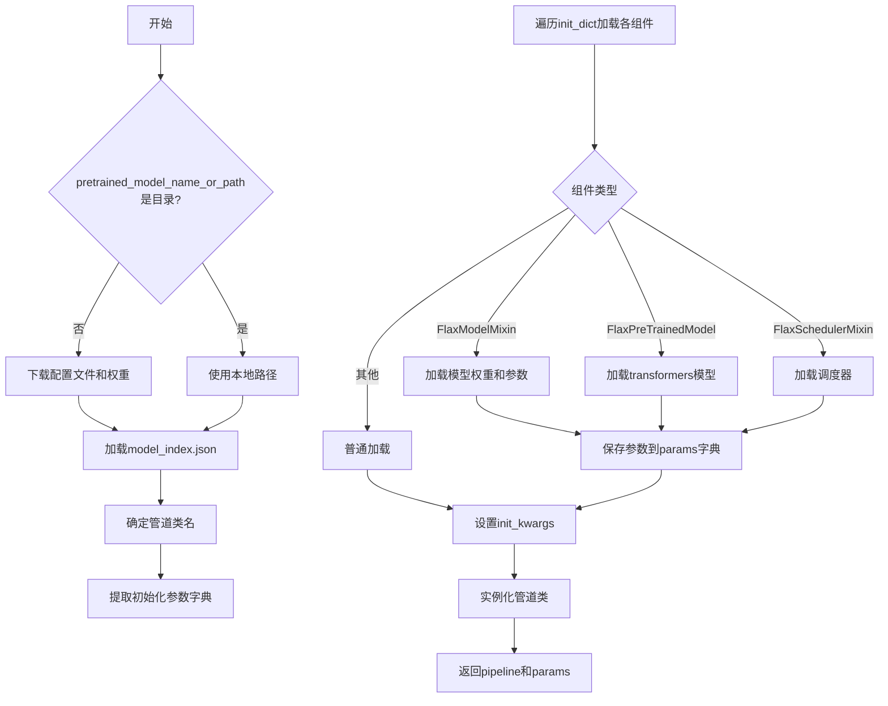
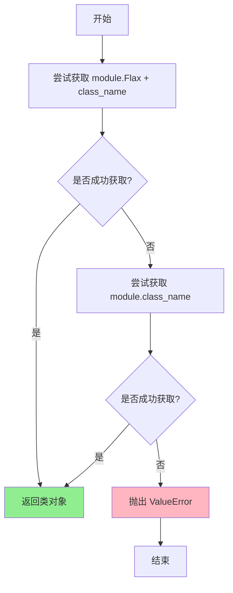
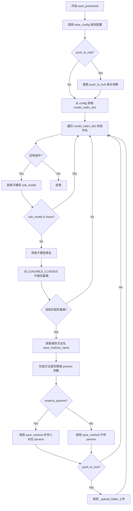
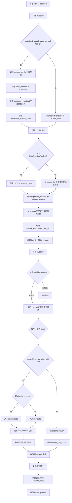
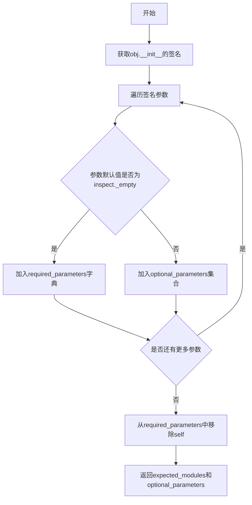
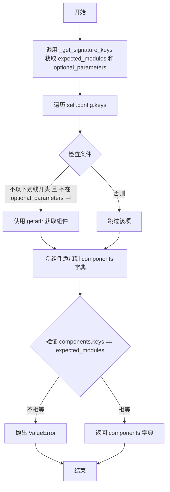
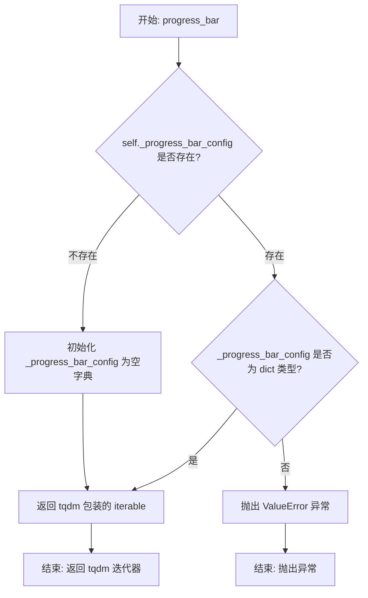
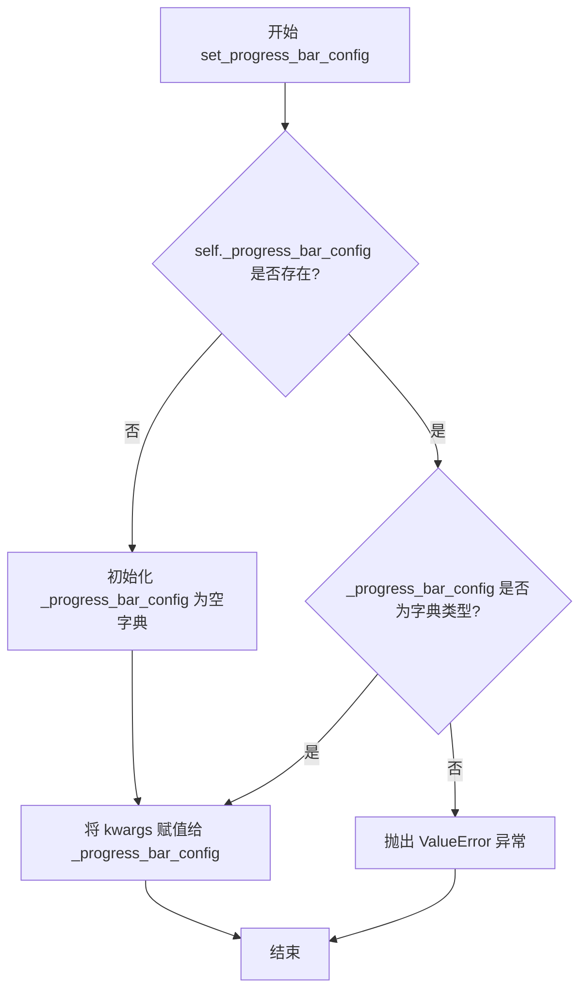
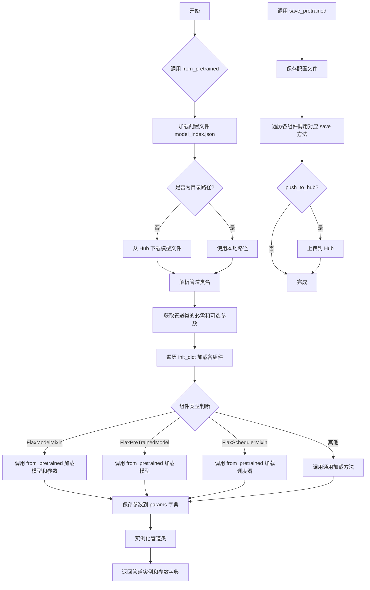

# `diffusers\src\diffusers\pipelines\pipeline_flax_utils.py` 详细设计文档

FlaxDiffusionPipeline是Flax-based扩散管道的基类,提供了管道组件(模型、调度器、处理器)的加载、下载、保存和管理功能,支持从预训练权重实例化管道,并包含进度条控制和图像格式转换等辅助方法。

## 整体流程



## 类结构

```
BaseOutput
├── FlaxImagePipelineOutput
ConfigMixin
├── FlaxDiffusionPipeline
PushToHubMixin
└── FlaxDiffusionPipeline
```

## 全局变量及字段


### `LOADABLE_CLASSES`
    
A dictionary mapping library names to their loadable classes and corresponding save/load methods

类型：`dict[str, dict[str, list[str]]]`
    


### `ALL_IMPORTABLE_CLASSES`
    
A combined dictionary of all importable classes from all supported libraries

类型：`dict[str, list[str]]`
    


### `INDEX_FILE`
    
The filename for the Flax diffusion model weights index file

类型：`str`
    


### `logger`
    
A logger instance for tracking runtime information and warnings

类型：`logging.Logger`
    


### `FlaxImagePipelineOutput.images`
    
Output list of denoised PIL images or NumPy array containing the generated images

类型：`list[PIL.Image.Image] | np.ndarray`
    


### `FlaxDiffusionPipeline.config_name`
    
The configuration filename that stores the class and module names of all diffusion pipeline components

类型：`str`
    


### `FlaxDiffusionPipeline._progress_bar_config`
    
A dictionary storing configuration options for the progress bar display during pipeline execution

类型：`dict`
    
    

## 全局函数及方法


### `import_flax_or_no_model`

该函数用于从给定模块中动态导入 Flax 相关类或普通类。它首先尝试查找带有"Flax"前缀的类，如果不存在，则回退到查找不带前缀的类名。这是为了兼容同时存在 Flax 和非 Flax 版本的模型或调度器。

参数：

- `module`：`module`，要从中获取类的模块对象
- `class_name`：`str`，基础类名，函数会先尝试查找 "Flax" + class_name，如果失败则查找 class_name 本身

返回值：`type`，返回找到的类对象

#### 流程图



#### 带注释源码

```
def import_flax_or_no_model(module, class_name):
    """
    从模块中动态导入类，优先尝试 Flax 版本
    
    参数:
        module: 模块对象
        class_name: 基础类名
        
    返回:
        找到的类对象
        
    异常:
        ValueError: 当既没有 Flax 版本也没有普通版本的类时抛出
    """
    try:
        # 1. 首先检查是否存在 Flax 版本的对象
        # 例如：如果 class_name 是 "UNet2DConditionModel"，则尝试获取 "FlaxUNet2DConditionModel"
        class_obj = getattr(module, "Flax" + class_name)
    except AttributeError:
        # 2. 如果没有 Flax 版本，则尝试不带前缀的原始类名
        # 这适用于非模型类（如调度器）
        class_obj = getattr(module, class_name)
    except AttributeError:
        # 3. 如果两者都不存在，抛出明确的错误信息
        raise ValueError(f"Neither Flax{class_name} nor {class_name} exist in {module}")

    return class_obj
```


### `FlaxDiffusionPipeline.register_modules`

该方法用于注册扩散管道中的各个模块（如模型、调度器等），它会根据传入的模块动态确定其所属库和类名，并将其保存到管道配置中，同时将模块设置为管道的属性。

参数：

- `**kwargs`：可变关键字参数，键为模块名称（字符串），值为对应的模块对象（可以是模型、调度器等任何组件，或 `None`）

返回值：`None`，该方法无返回值，仅执行注册和属性设置操作

#### 流程图

```mermaid
flowchart TD
    A[开始 register_modules] --> B{遍历 kwargs 中的 name, module}
    B --> C{module is None?}
    C -->|Yes| D[register_dict = {name: (None, None)}]
    C -->|No| E[获取 library = module.__module__.split('.')[0]]
    E --> F[获取 pipeline_dir = module.__module__.split('.')[-2]]
    F --> G[检查 is_pipeline_module]
    G --> H{library 不在 LOADABLE_CLASSES<br/>或 is_pipeline_module?}
    H -->|Yes| I[library = pipeline_dir]
    H -->|No| J[library 保持不变]
    I --> K[获取 class_name = module.__class__.__name__]
    J --> K
    K --> L[register_dict = {name: (library, class_name)}]
    D --> M[调用 self.register_to_config]
    L --> M
    M --> N[调用 setattr(self, name, module)]
    N --> O{还有更多 kwargs?}
    O -->|Yes| B
    O -->|No| P[结束]
```

#### 带注释源码

```python
def register_modules(self, **kwargs):
    """
    注册扩散管道中的各个模块组件。
    
    该方法接受任意数量的关键字参数，每个参数代表管道的一个组件（如 unet、scheduler 等）。
    它会分析每个模块的来源库和类名，将其注册到管道配置中，并将模块对象设置为管道的属性。
    
    参数:
        **kwargs: 可变关键字参数，键为组件名称（字符串），值为对应的模块对象。
                 如果值为 None，则表示该组件被禁用。
    """
    # 避免循环导入，在方法内部导入 pipelines 模块
    from diffusers import pipelines

    # 遍历传入的每个模块组件
    for name, module in kwargs.items():
        # 处理模块为 None 的情况（用于禁用某些组件，如 safety_checker=None）
        if module is None:
            register_dict = {name: (None, None)}
        else:
            # 1. 获取模块所在库的名称（取模块路径的第一部分）
            library = module.__module__.split(".")[0]

            # 2. 检查模块是否在 pipeline 目录中
            # 获取模块路径的倒数第二个目录名
            pipeline_dir = module.__module__.split(".")[-2]
            path = module.__module__.split(".")
            # 判断是否为 pipeline 模块（既在路径中存在该目录，pipelines 模块中也有该属性）
            is_pipeline_module = pipeline_dir in path and hasattr(pipelines, pipeline_dir)

            # 3. 如果库不在 LOADABLE_CLASSES 中，或者模块是 pipeline 模块，
            # 则将库名设为 pipeline 目录名（处理自定义模块或 pipeline 内模块）
            if library not in LOADABLE_CLASSES or is_pipeline_module:
                library = pipeline_dir

            # 4. 获取模块的类名
            class_name = module.__class__.__name__

            # 构建注册字典：组件名 -> (库名, 类名)
            register_dict = {name: (library, class_name)}

        # 5. 将组件信息保存到管道配置中
        # 调用父类 ConfigMixin 的方法，将组件的库和类名注册到 config
        self.register_to_config(**register_dict)

        # 6. 将模块对象设置为管道的属性
        # 例如：self.unet = unet, self.scheduler = scheduler
        setattr(self, name, module)
```


### `FlaxDiffusionPipeline.save_pretrained`

保存Flax扩散管道所有可保存的变量（模型、调度器、处理器等）到指定目录，支持推送至HuggingFace Hub。

参数：

- `save_directory`：`str | os.PathLike`，目标保存目录，不存在则自动创建
- `params`：`dict | FrozenDict`，包含管道各组件的Flax参数状态
- `push_to_hub`：`bool`，是否在保存后推送到HuggingFace Hub
- `**kwargs`：其他关键字参数，用于传递给`push_to_hub`方法（如`repo_id`、`token`、`commit_message`等）

返回值：`None`，无返回值

#### 流程图



#### 带注释源码

```python
def save_pretrained(
    self,
    save_directory: str | os.PathLike,
    params: dict | FrozenDict,
    push_to_hub: bool = False,
    **kwargs,
):
    """
    保存所有可保存的管道变量到目录。
    可通过 from_pretrained 重新加载。

    参数:
        save_directory: 保存目录，不存在则创建
        push_to_hub: 是否推送到HuggingFace Hub
        kwargs: 传递给 push_to_hub 的额外参数
    """
    # 1. 保存管道配置（model_index.json等）
    self.save_config(save_directory)

    # 2. 从config中获取模型索引字典
    model_index_dict = dict(self.config)
    model_index_dict.pop("_class_name")
    model_index_dict.pop("_diffusers_version")
    model_index_dict.pop("_module", None)

    # 3. 如果需要push_to_hub，先创建远程仓库
    if push_to_hub:
        commit_message = kwargs.pop("commit_message", None)
        private = kwargs.pop("private", None)
        create_pr = kwargs.pop("create_pr", False)
        token = kwargs.pop("token", None)
        repo_id = kwargs.pop("repo_id", save_directory.split(os.path.sep)[-1])
        repo_id = create_repo(repo_id, exist_ok=True, private=private, token=token).repo_id

    # 4. 遍历管道中的每个组件并保存
    for pipeline_component_name in model_index_dict.keys():
        sub_model = getattr(self, pipeline_component_name)
        if sub_model is None:
            # 跳过为None的组件（如safety_checker=None）
            continue

        model_cls = sub_model.__class__

        save_method_name = None
        # 在 LOADABLE_CLASSES 中搜索模型的基类
        for library_name, library_classes in LOADABLE_CLASSES.items():
            library = importlib.import_module(library_name)
            for base_class, save_load_methods in library_classes.items():
                class_candidate = getattr(library, base_class, None)
                if class_candidate is not None and issubclass(model_cls, class_candidate):
                    # 找到匹配基类，获取其保存方法名
                    save_method_name = save_load_methods[0]
                    break
            if save_method_name is not None:
                break

        # 获取保存方法并调用
        save_method = getattr(sub_model, save_method_name)
        # 检查方法签名是否期望params参数
        expects_params = "params" in set(inspect.signature(save_method).parameters.keys())

        if expects_params:
            # 需要params的组件（如FlaxUNet2DConditionModel）
            save_method(
                os.path.join(save_directory, pipeline_component_name),
                params=params[pipeline_component_name]
            )
        else:
            # 不需要params的组件（如调度器配置）
            save_method(os.path.join(save_directory, pipeline_component_name))

        # 5. 如果push_to_hub，上传该组件的文件夹
        if push_to_hub:
            self._upload_folder(
                save_directory,
                repo_id,
                token=token,
                commit_message=commit_message,
                create_pr=create_pr,
            )
```


### `FlaxDiffusionPipeline.from_pretrained`

实例化一个基于Flax的扩散管道，用于从预训练权重加载模型。该方法会下载或加载指定路径的模型配置和权重，并返回一个可用的管道对象及其参数。

参数：

- `pretrained_model_name_or_path`：`str | os.PathLike | None`，可以是Hugging Face Hub上的模型仓库ID（如`stable-diffusion-v1-5/stable-diffusion-v1-5`），或者是本地保存模型权重的目录路径
- `dtype`：`jnp.dtype`，可选参数，用于覆盖默认的JAX数据类型并以指定精度加载模型
- `force_download`：`bool`，可选参数，默认为`False`，是否强制重新下载模型权重和配置文件
- `proxies`：`dict[str, str]`，可选参数，代理服务器字典，用于处理网络请求
- `output_loading_info`：`bool`，可选参数，默认为`False`，是否返回包含缺失键、意外键和错误信息字典
- `local_files_only`：`bool`，可选参数，默认为`False`，是否仅加载本地模型权重和配置文件
- `token`：`str | bool`，可选参数，用于远程文件的HTTPBearer授权令牌
- `revision`：`str`，可选参数，默认为`"main"`，使用的具体模型版本
- `mirror`：`str`，可选参数，用于解决下载问题的镜像源地址
- `kwargs`：剩余的关键字参数，用于覆盖特定管道类的可加载变量（管道组件）

返回值：`tuple(FlaxDiffusionPipeline, dict)`，返回包含管道模型实例和参数字典的元组，其中字典的键为组件名称（如unet、vae等），值为对应的JAX参数

#### 流程图



#### 带注释源码

```python
@classmethod
@validate_hf_hub_args
def from_pretrained(cls, pretrained_model_name_or_path: str | os.PathLike | None, **kwargs):
    r"""
    Instantiate a Flax-based diffusion pipeline from pretrained pipeline weights.

    The pipeline is set in evaluation mode (`model.eval()) by default and dropout modules are deactivated.

    If you get the error message below, you need to finetune the weights for your downstream task:

    ```
    Some weights of FlaxUNet2DConditionModel were not initialized from the model checkpoint at stable-diffusion-v1-5/stable-diffusion-v1-5 and are newly initialized because the shapes did not match:
    ```

    Parameters:
        pretrained_model_name_or_path (`str` or `os.PathLike`, *optional*):
            Can be either:
                - A string, the *repo id* (for example `stable-diffusion-v1-5/stable-diffusion-v1-5`) of a
                  pretrained pipeline hosted on the Hub.
                - A path to a *directory* (for example `./my_model_directory`) containing the model weights saved
                  using [`~FlaxDiffusionPipeline.save_pretrained`].
        dtype (`jnp.dtype`, *optional*):
            Override the default `jnp.dtype` and load the model under this dtype.
        force_download (`bool`, *optional*, defaults to `False`):
            Whether or not to force the (re-)download of the model weights and configuration files, overriding the
            cached versions if they exist.
        proxies (`dict[str, str]`, *optional*):
            A dictionary of proxy servers to use by protocol or endpoint, for example, `{'http': 'foo.bar:3128',
            'http://hostname': 'foo.bar:4012'}`. The proxies are used on each request.
        output_loading_info(`bool`, *optional*, defaults to `False`):
            Whether or not to also return a dictionary containing missing keys, unexpected keys and error messages.
        local_files_only (`bool`, *optional*, defaults to `False`):
            Whether to only load local model weights and configuration files or not. If set to `True`, the model
            won't be downloaded from the Hub.
        token (`str` or *bool*, *optional*):
            The token to use as HTTP bearer authorization for remote files. If `True`, the token generated from
            `diffusers-cli login` (stored in `~/.huggingface`) is used.
        revision (`str`, *optional*, defaults to `"main"`):
            The specific model version to use. It can be a branch name, a tag name, a commit id, or any identifier
            allowed by Git.
        mirror (`str`, *optional*):
            Mirror source to resolve accessibility issues if you're downloading a model in China. We do not
            guarantee the timeliness or safety of the source, and you should refer to the mirror site for more
            information.
        kwargs (remaining dictionary of keyword arguments, *optional*):
            Can be used to overwrite load and saveable variables (the pipeline components) of the specific pipeline
            class. The overwritten components are passed directly to the pipelines `__init__` method.
    """
    # 记录废弃警告，提示Flax类将在Diffusers v1.0.0中移除
    logger.warning(
        "Flax classes are deprecated and will be removed in Diffusers v1.0.0. We "
        "recommend migrating to PyTorch classes or pinning your version of Diffusers."
    )

    # 从kwargs中提取各种配置参数
    cache_dir = kwargs.pop("cache_dir", None)
    proxies = kwargs.pop("proxies", None)
    local_files_only = kwargs.pop("local_files_only", False)
    token = kwargs.pop("token", None)
    revision = kwargs.pop("revision", None)
    from_pt = kwargs.pop("from_pt", False)  # 是否从PyTorch权重转换
    use_memory_efficient_attention = kwargs.pop("use_memory_efficient_attention", False)
    split_head_dim = kwargs.pop("split_head_dim", False)
    dtype = kwargs.pop("dtype", None)

    # 1. Download the checkpoints and configs
    # 判断是否为本地目录
    if not os.path.isdir(pretrained_model_name_or_path):
        # 如果不是本地目录，则从Hub下载配置
        config_dict = cls.load_config(
            pretrained_model_name_or_path,
            cache_dir=cache_dir,
            proxies=proxies,
            local_files_only=local_files_only,
            token=token,
            revision=revision,
        )
        # 过滤出子文件夹名称，用于构建下载模式
        folder_names = [k for k in config_dict.keys() if not k.startswith("_")]
        allow_patterns = [os.path.join(k, "*") for k in folder_names]
        allow_patterns += [FLAX_WEIGHTS_NAME, SCHEDULER_CONFIG_NAME, CONFIG_NAME, cls.config_name]

        # 忽略.bin和.safetensors文件，除非指定从PyTorch加载
        ignore_patterns = ["*.bin", "*.safetensors"] if not from_pt else []
        ignore_patterns += ["*.onnx", "*.onnx_data", "*.xml", "*.pb"]

        # 确定请求的管道类名称
        if cls != FlaxDiffusionPipeline:
            requested_pipeline_class = cls.__name__
        else:
            requested_pipeline_class = config_dict.get("_class_name", cls.__name__)
            requested_pipeline_class = (
                requested_pipeline_class
                if requested_pipeline_class.startswith("Flax")
                else "Flax" + requested_pipeline_class
            )

        # 构建用户代理信息
        user_agent = {"pipeline_class": requested_pipeline_class}
        user_agent = http_user_agent(user_agent)

        # 下载所有允许的文件
        cached_folder = snapshot_download(
            pretrained_model_name_or_path,
            cache_dir=cache_dir,
            proxies=proxies,
            local_files_only=local_files_only,
            token=token,
            revision=revision,
            allow_patterns=allow_patterns,
            ignore_patterns=ignore_patterns,
            user_agent=user_agent,
        )
    else:
        # 直接使用本地路径作为缓存文件夹
        cached_folder = pretrained_model_name_or_path

    # 加载配置字典
    config_dict = cls.load_config(cached_folder)

    # 2. Load the pipeline class, if using custom module then load it from the hub
    # 确定管道类
    if cls != FlaxDiffusionPipeline:
        pipeline_class = cls
    else:
        diffusers_module = importlib.import_module(cls.__module__.split(".")[0])
        class_name = (
            config_dict["_class_name"]
            if config_dict["_class_name"].startswith("Flax")
            else "Flax" + config_dict["_class_name"]
        )
        pipeline_class = getattr(diffusers_module, class_name)

    # 提取预期的模块和可选参数
    expected_modules, optional_kwargs = cls._get_signature_keys(pipeline_class)
    # 从kwargs中提取已传递的类对象
    passed_class_obj = {k: kwargs.pop(k) for k in expected_modules if k in kwargs}
    passed_pipe_kwargs = {k: kwargs.pop(k) for k in optional_kwargs if k in kwargs}

    # 提取初始化字典
    init_dict, unused_kwargs, _ = pipeline_class.extract_init_dict(config_dict, **kwargs)

    # 定义初始化参数
    init_kwargs = {k: init_dict.pop(k) for k in optional_kwargs if k in init_dict}
    init_kwargs = {**init_kwargs, **passed_pipe_kwargs}

    # 移除null组件的辅助函数
    def load_module(name, value):
        if value[0] is None:
            return False
        if name in passed_class_obj and passed_class_obj[name] is None:
            return False
        return True

    init_dict = {k: v for k, v in init_dict.items() if load_module(k, v)}

    # 检查未使用的kwargs并发出警告
    if len(unused_kwargs) > 0:
        logger.warning(
            f"Keyword arguments {unused_kwargs} are not expected by {pipeline_class.__name__} and will be ignored."
        )

    # 初始化参数字典
    params = {}

    # 导入pipelines模块以避免循环导入
    from diffusers import pipelines

    # 3. Load each module in the pipeline
    for name, (library_name, class_name) in init_dict.items():
        if class_name is None:
            # 保存时safety_checker为None的边缘情况
            init_kwargs[name] = None
            continue

        is_pipeline_module = hasattr(pipelines, library_name)
        loaded_sub_model = None
        sub_model_should_be_defined = True

        # 如果模型在管道模块中，则从管道加载
        if name in passed_class_obj:
            # 检查passed_class_obj是否有正确的父类
            if not is_pipeline_module:
                library = importlib.import_module(library_name)
                class_obj = getattr(library, class_name)
                importable_classes = LOADABLE_CLASSES[library_name]
                class_candidates = {c: getattr(library, c, None) for c in importable_classes.keys()}

                expected_class_obj = None
                for class_name, class_candidate in class_candidates.items():
                    if class_candidate is not None and issubclass(class_obj, class_candidate):
                        expected_class_obj = class_candidate

                if not issubclass(passed_class_obj[name].__class__, expected_class_obj):
                    raise ValueError(
                        f"{passed_class_obj[name]} is of type: {type(passed_class_obj[name])}, but should be"
                        f" {expected_class_obj}"
                    )
            elif passed_class_obj[name] is None:
                logger.warning(
                    f"You have passed `None` for {name} to disable its functionality in {pipeline_class}. Note"
                    f" that this might lead to problems when using {pipeline_class} and is not recommended."
                )
                sub_model_should_be_defined = False
            else:
                logger.warning(
                    f"You have passed a non-standard module {passed_class_obj[name]}. We cannot verify whether it"
                    " has the correct type"
                )

            # 设置已传递的类对象
            loaded_sub_model = passed_class_obj[name]
        elif is_pipeline_module:
            # 从pipeline模块加载
            pipeline_module = getattr(pipelines, library_name)
            class_obj = import_flax_or_no_model(pipeline_module, class_name)

            importable_classes = ALL_IMPORTABLE_CLASSES
            class_candidates = dict.fromkeys(importable_classes.keys(), class_obj)
        else:
            # 从库导入
            library = importlib.import_module(library_name)
            class_obj = import_flax_or_no_model(library, class_name)

            importable_classes = LOADABLE_CLASSES[library_name]
            class_candidates = {c: getattr(library, c, None) for c in importable_classes.keys()}

        # 如果子模型需要加载
        if loaded_sub_model is None and sub_model_should_be_defined:
            load_method_name = None
            for class_name, class_candidate in class_candidates.items():
                if class_candidate is not None and issubclass(class_obj, class_candidate):
                    load_method_name = importable_classes[class_name][1]

            load_method = getattr(class_obj, load_method_name)

            # 检查模块是否在子目录中
            if os.path.isdir(os.path.join(cached_folder, name)):
                loadable_folder = os.path.join(cached_folder, name)
            else:
                loaded_sub_model = cached_folder

            # 根据不同的类类型采用不同的加载方式
            if issubclass(class_obj, FlaxModelMixin):
                # Flax模型：加载模型和参数
                loaded_sub_model, loaded_params = load_method(
                    loadable_folder,
                    from_pt=from_pt,
                    use_memory_efficient_attention=use_memory_efficient_attention,
                    split_head_dim=split_head_dim,
                    dtype=dtype,
                )
                params[name] = loaded_params
            elif is_transformers_available() and issubclass(class_obj, FlaxPreTrainedModel):
                # Transformers的Flax模型
                if from_pt:
                    loaded_sub_model = load_method(loadable_folder, from_pt=from_pt)
                    loaded_params = loaded_sub_model.params
                    del loaded_sub_model._params
                else:
                    loaded_sub_model, loaded_params = load_method(loadable_folder, _do_init=False)
                params[name] = loaded_params
            elif issubclass(class_obj, FlaxSchedulerMixin):
                # 调度器：加载调度器和状态
                loaded_sub_model, scheduler_state = load_method(loadable_folder)
                params[name] = scheduler_state
            else:
                # 其他类型直接加载
                loaded_sub_model = load_method(loadable_folder)

        init_kwargs[name] = loaded_sub_model

    # 4. Potentially add passed objects if expected
    # 处理可能缺失的模块
    missing_modules = set(expected_modules) - set(init_kwargs.keys())
    passed_modules = list(passed_class_obj.keys())

    if len(missing_modules) > 0 and missing_modules <= set(passed_modules):
        for module in missing_modules:
            init_kwargs[module] = passed_class_obj.get(module, None)
    elif len(missing_modules) > 0:
        passed_modules = set(list(init_kwargs.keys()) + list(passed_class_obj.keys())) - optional_kwargs
        raise ValueError(
            f"Pipeline {pipeline_class} expected {expected_modules}, but only {passed_modules} were passed."
        )

    # 创建管道实例
    model = pipeline_class(**init_kwargs, dtype=dtype)
    return model, params
```


### `FlaxDiffusionPipeline._get_signature_keys`

该方法通过检查对象构造函数的签名，提取出必需参数和可选参数，用于确定管道的预期模块和可选配置参数。

参数：

- `cls`：类方法隐含参数，表示类本身
- `obj`：`type` 或 `object`，要检查签名目标的对象（通常为pipeline类）

返回值：

- `expected_modules`：`set`，必需的模块名称集合（排除`self`）
- `optional_parameters`：`set`，可选参数的名称集合

#### 流程图



#### 带注释源码

```python
@classmethod
def _get_signature_keys(cls, obj):
    """
    从给定对象的__init__方法中提取必需参数和可选参数。
    
    此方法用于分析pipeline类的构造函数签名，以确定：
    - expected_modules: 必需传递给pipeline的模块（如unet, vae, scheduler等）
    - optional_parameters: 可选的配置参数（如variant, dtype等）
    
    参数:
        cls: 类方法隐含参数，指向FlaxDiffusionPipeline类本身
        obj: 要检查签名的目标对象，通常是一个pipeline类
    
    返回值:
        tuple: (expected_modules, optional_parameters)
            - expected_modules: 必需的模块名称集合
            - optional_parameters: 可选参数的名称集合
    """
    # 1. 获取对象构造函数（__init__）的签名信息
    parameters = inspect.signature(obj.__init__).parameters
    
    # 2. 筛选出没有默认值的必需参数（参数默认值为inspect._empty表示没有默认值）
    required_parameters = {k: v for k, v in parameters.items() if v.default == inspect._empty}
    
    # 3. 筛选出有默认值的可选参数
    optional_parameters = set({k for k, v in parameters.items() if v.default != inspect._empty})
    
    # 4. 从必需参数中移除self（类方法的第一个参数）
    expected_modules = set(required_parameters.keys()) - {"self"}
    
    # 5. 返回必需模块集合和可选参数集合
    return expected_modules, optional_parameters
```

#### 设计目的与约束

- **设计目标**：该方法用于在 `from_pretrained` 加载过程中，从目标 pipeline 类的构造函数签名中提取参数信息，以便正确处理用户直接传入的模块对象（如自定义 scheduler）和区分哪些是必需组件、哪些是可选配置。
- **约束**：假设传入的 `obj` 是具有有效 `__init__` 方法的类或实例，否则会抛出 `TypeError`。

#### 错误处理与异常设计

- 如果 `obj` 没有 `__init__` 方法或 `obj` 为 `None`，`inspect.signature()` 会抛出 `TypeError`。
- 如果 `obj.__init__` 不可调用，同样会抛出 `TypeError`。

#### 潜在技术债务与优化空间

1. **魔法字符串 `"self"` 硬编码**：直接使用字符串 `"self"` 移除参数，如果类方法使用其他名称（如 `cls` 作为第一个参数但未显式声明），可能导致误移除。可以通过 `inspect.signature()` 的参数属性判断是否是第一个参数来优化。
2. **返回类型未做类型注解**：建议添加类型注解提升可读性和 IDE 支持：
   ```python
   def _get_signature_keys(cls, obj) -> tuple[set[str], set[str]]:
   ```
3. **重复计算可能性**：该方法在 `from_pretrained` 和 `components` 属性中都被调用，如果 pipeline 类结构不变，可以考虑缓存结果以提升性能。


### `FlaxDiffusionPipeline.components`

该属性用于获取扩散管道中的所有组件（如模型、调度器等），以便在不同的管道之间共享权重和配置，避免重复分配内存。

参数：
- 无参数（该属性只使用 `self`）

返回值：`dict[str, Any]`，返回一个字典，包含初始化管道所需的所有模块（如 UNet、VAE、调度器等）

#### 流程图



#### 带注释源码

```python
@property
def components(self) -> dict[str, Any]:
    r"""
    获取管道的所有组件。
    
    此属性对于在不使用相同权重和配置重新分配内存的情况下运行不同的管道非常有用。
    
    示例:
        >>> from diffusers import (
        ...     FlaxStableDiffusionPipeline,
        ...     FlaxStableDiffusionImg2ImgPipeline,
        ... )
        >>> text2img = FlaxStableDiffusionPipeline.from_pretrained(
        ...     "stable-diffusion-v1-5/stable-diffusion-v1-5", variant="bf16", dtype=jnp.bfloat16
        ... )
        >>> img2img = FlaxStableDiffusionImg2ImgPipeline(**text2img.components)
    
    返回:
        包含初始化管道所需所有模块的字典。
    """
    # 1. 获取管道类初始化时需要的必需参数和可选参数
    # expected_modules: 必需的模块名称集合 (如 unet, vae, scheduler 等)
    # optional_parameters: 可选的参数名称集合
    expected_modules, optional_parameters = self._get_signature_keys(self)
    
    # 2. 从 self.config 中提取所有非下划线开头的配置项
    # 并排除可选参数，保留必需的组件
    components = {
        k: getattr(self, k)  # 使用 getattr 获取实际的组件对象
        for k in self.config.keys() 
        if not k.startswith("_") and k not in optional_parameters
    }
    
    # 3. 验证提取的组件是否与预期的模块匹配
    if set(components.keys()) != expected_modules:
        raise ValueError(
            f"{self} has been incorrectly initialized or {self.__class__} is incorrectly implemented. Expected"
            f" {expected_modules} to be defined, but {components} are defined."
        )
    
    # 4. 返回包含所有组件的字典
    return components
```


### `FlaxDiffusionPipeline.numpy_to_pil`

将NumPy数组格式的图像数据（单张或批次）转换为PIL图像列表，便于后续显示或保存。

参数：

- `images`：`np.ndarray`，输入的NumPy图像数组，可以是3D数组（单张图像，形状为H×W×C）或4D数组（批次，形状为N×H×W×C），像素值范围应为[0, 1]

返回值：`list[PIL.Image.Image]`，转换后的PIL图像列表

#### 流程图

```mermaid
flowchart TD
    A[输入: NumPy数组 images] --> B{images.ndim == 3?}
    B -- 是 --> C[在第0维添加批次维度: images[None, ...]]
    C --> D
    B -- 否 --> D[将像素值从[0,1]映射到[0,255]: (images * 255).round().astype uint8]
    D --> E{images.shape[-1] == 1?}
    E -- 是 --> F[灰度图处理: 对每张图像使用mode='L']
    E -- 否 --> G[彩色图处理: 使用默认RGB模式]
    F --> H[构建PIL图像列表: Image.fromarray with mode='L']
    G --> I[构建PIL图像列表: Image.fromarray]
    H --> J[返回: list[PIL.Image.Image]]
    I --> J
```

#### 带注释源码

```python
@staticmethod
def numpy_to_pil(images):
    """
    将NumPy图像或图像批次转换为PIL图像
    """
    # 步骤1: 处理单张3D图像的情况，添加批次维度将其转为4D
    if images.ndim == 3:
        images = images[None, ...]
    
    # 步骤2: 将浮点型像素值从[0,1]范围映射到[0,255]的uint8整型
    images = (images * 255).round().astype("uint8")
    
    # 步骤3: 根据通道数判断图像类型并转换
    if images.shape[-1] == 1:
        # 特殊情况：灰度图（单通道）需要指定mode='L'
        # 使用squeeze()移除单目通道维度以符合PIL要求
        pil_images = [Image.fromarray(image.squeeze(), mode="L") for image in images]
    else:
        # 彩色图：RGB/RGBA格式直接转换
        pil_images = [Image.fromarray(image) for image in images]

    # 步骤4: 返回PIL图像列表
    return pil_images
```


### `FlaxDiffusionPipeline.progress_bar`

该方法用于在扩散模型的去噪迭代过程中显示进度条，通过封装 `tqdm` 库实现迭代过程的视觉化展示。

参数：

- `iterable`：`迭代器/可迭代对象`，需要显示进度条的可迭代对象（如去噪循环中的迭代器）

返回值：`tqdm` 对象，包装后的进度条迭代器，用于在迭代过程中显示进度

#### 流程图



#### 带注释源码

```python
def progress_bar(self, iterable):
    """
    创建一个进度条迭代器，用于显示去噪过程的进度。
    
    Args:
        iterable: 需要包装的可迭代对象（如去噪循环）
    
    Returns:
        tqdm 进度条迭代器对象
    """
    
    # 1. 检查是否存在 _progress_bar_config 属性
    if not hasattr(self, "_progress_bar_config"):
        # 如果不存在，则初始化为空字典
        self._progress_bar_config = {}
    # 2. 如果存在但类型不是 dict，则抛出异常
    elif not isinstance(self._progress_bar_config, dict):
        raise ValueError(
            f"`self._progress_bar_config` should be of type `dict`, but is {type(self._progress_bar_config)}."
        )

    # 3. 使用 tqdm 包装可迭代对象并返回进度条
    return tqdm(iterable, **self._progress_bar_config)
```


### `FlaxDiffusionPipeline.set_progress_bar_config`

该方法用于配置扩散流水线的进度条显示参数，允许用户通过传入关键字参数来自定义进度条（如显示格式、刷新频率等）的行为。

参数：

- `**kwargs`：`任意关键字参数`（Dict[str, Any]），这些参数将直接传递给 `tqdm` 进度条，用于自定义进度条的显示和行为。

返回值：`None`，该方法无返回值，仅修改实例的内部状态。

#### 流程图



#### 带注释源码

```python
def set_progress_bar_config(self, **kwargs):
    """
    配置扩散流水线的进度条参数。
    
    该方法允许用户通过传入关键字参数来自定义进度条的行为。
    参数将直接传递给 tqdm 进度条。
    
    参数:
        **kwargs: 任意关键字参数，用于配置 tqdm 进度条
    """
    # 检查实例是否已有 _progress_bar_config 属性
    if not hasattr(self, "_progress_bar_config"):
        # 如果没有，则初始化为空字典
        self._progress_bar_config = {}
    # 检查已存在的配置是否为字典类型
    elif not isinstance(self._progress_bar_config, dict):
        # 如果类型不匹配，抛出 ValueError 异常
        raise ValueError(
            f"`self._progress_bar_config` should be of type `dict`, but is {type(self._progress_bar_config)}."
        )

    # 将传入的关键字参数赋值给 _progress_bar_config
    self._progress_bar_config = kwargs
```

## 关键组件


# FlaxDiffusionPipeline 代码设计文档

## 1. 一段话描述

FlaxDiffusionPipeline 是 Hugging Face diffusers 库中用于加载、管理和保存基于 Flax 的扩散模型管道的基类，提供了从预训练模型加载配置和权重、保存管道到本地或 Hub、以及动态注册和管理管道组件（如模型、调度器、处理器）的完整功能。

## 2. 文件的整体运行流程

### 2.1 整体架构流程图



## 3. 类的详细信息

### 3.1 FlaxImagePipelineOutput

**类描述**: 输出类，用于图像管道返回结果

**类字段**:

| 字段名称 | 类型 | 描述 |
|---------|------|------|
| images | list[PIL.Image.Image] \| np.ndarray | 去噪后的 PIL 图像列表或 NumPy 数组 |

### 3.2 FlaxDiffusionPipeline

**类描述**: Flax 扩散管道基类，用于存储和管理扩散管道中的所有组件（模型、调度器、处理器），并提供加载、下载和保存功能

**类字段**:

| 字段名称 | 类型 | 描述 |
|---------|------|------|
| config_name | str | 配置文件名，默认为 "model_index.json" |
| _progress_bar_config | dict | 进度条配置字典 |

**类方法**:

#### register_modules

| 属性 | 值 |
|------|-----|
| 方法名称 | register_modules |
| 参数名称 | kwargs |
| 参数类型 | 关键字参数 |
| 参数描述 | 要注册的模块名称和模块对象 |
| 返回值类型 | None |
| 返回值描述 | 无返回值，用于注册管道组件 |

```python
def register_modules(self, **kwargs):
    # import it here to avoid circular import
    from diffusers import pipelines

    for name, module in kwargs.items():
        if module is None:
            register_dict = {name: (None, None)}
        else:
            # retrieve library
            library = module.__module__.split(".")[0]

            # check if the module is a pipeline module
            pipeline_dir = module.__module__.split(".")[-2]
            path = module.__module__.split(".")
            is_pipeline_module = pipeline_dir in path and hasattr(pipelines, pipeline_dir)

            # if library is not in LOADABLE_CLASSES, then it is a custom module.
            # Or if it's a pipeline module, then the module is inside the pipeline
            # folder so we set the library to module name.
            if library not in LOADABLE_CLASSES or is_pipeline_module:
                library = pipeline_dir

            # retrieve class_name
            class_name = module.__class__.__name__

            register_dict = {name: (library, class_name)}

        # save model index config
        self.register_to_config(**register_dict)

        # set models
        setattr(self, name, module)
```

#### save_pretrained

| 属性 | 值 |
|------|-----|
| 方法名称 | save_pretrained |
| 参数名称 | save_directory |
| 参数类型 | str \| os.PathLike |
| 参数描述 | 保存目录路径 |
| 参数名称 | params |
| 参数类型 | dict \| FrozenDict |
| 参数描述 | 模型参数字典 |
| 参数名称 | push_to_hub |
| 参数类型 | bool |
| 参数描述 | 是否推送到 Hub，默认为 False |
| 参数名称 | kwargs |
| 参数类型 | dict[str, Any] |
| 参数描述 | 其他可选关键字参数 |
| 返回值类型 | None |
| 返回值描述 | 无返回值，保存管道到指定目录 |

```python
def save_pretrained(
    self,
    save_directory: str | os.PathLike,
    params: dict | FrozenDict,
    push_to_hub: bool = False,
    **kwargs,
):
    # TODO: handle inference_state
    """
    Save all saveable variables of the pipeline to a directory. A pipeline variable can be saved and loaded if its
    class implements both a save and loading method. The pipeline is easily reloaded using the
    [`~FlaxDiffusionPipeline.from_pretrained`] class method.

    Arguments:
        save_directory (`str` or `os.PathLike`):
            Directory to which to save. Will be created if it doesn't exist.
        push_to_hub (`bool`, *optional*, defaults to `False`):
            Whether or not to push your model to the Hugging Face model hub after saving it. You can specify the
            repository you want to push to with `repo_id` (will default to the name of `save_directory` in your
            namespace).
        kwargs (`dict[str, Any]`, *optional*):
            Additional keyword arguments passed along to the [`~utils.PushToHubMixin.push_to_hub`] method.
    """
    self.save_config(save_directory)

    model_index_dict = dict(self.config)
    model_index_dict.pop("_class_name")
    model_index_dict.pop("_diffusers_version")
    model_index_dict.pop("_module", None)

    if push_to_hub:
        commit_message = kwargs.pop("commit_message", None)
        private = kwargs.pop("private", None)
        create_pr = kwargs.pop("create_pr", False)
        token = kwargs.pop("token", None)
        repo_id = kwargs.pop("repo_id", save_directory.split(os.path.sep)[-1])
        repo_id = create_repo(repo_id, exist_ok=True, private=private, token=token).repo_id

    for pipeline_component_name in model_index_dict.keys():
        sub_model = getattr(self, pipeline_component_name)
        if sub_model is None:
            # edge case for saving a pipeline with safety_checker=None
            continue

        model_cls = sub_model.__class__

        save_method_name = None
        # search for the model's base class in LOADABLE_CLASSES
        for library_name, library_classes in LOADABLE_CLASSES.items():
            library = importlib.import_module(library_name)
            for base_class, save_load_methods in library_classes.items():
                class_candidate = getattr(library, base_class, None)
                if class_candidate is not None and issubclass(model_cls, class_candidate):
                    # if we found a suitable base class in LOADABLE_CLASSES then grab its save method
                    save_method_name = save_load_methods[0]
                    break
            if save_method_name is not None:
                break

        save_method = getattr(sub_model, save_method_name)
        expects_params = "params" in set(inspect.signature(save_method).parameters.keys())

        if expects_params:
            save_method(
                os.path.join(save_directory, pipeline_component_name), params=params[pipeline_component_name]
            )
        else:
            save_method(os.path.join(save_directory, pipeline_component_name))

        if push_to_hub:
            self._upload_folder(
                save_directory,
                repo_id,
                token=token,
                commit_message=commit_message,
                create_pr=create_pr,
            )
```

#### from_pretrained

| 属性 | 值 |
|------|-----|
| 方法名称 | from_pretrained |
| 参数名称 | pretrained_model_name_or_path |
| 参数类型 | str \| os.PathLike \| None |
| 参数描述 | 预训练模型名称或路径 |
| 参数名称 | kwargs |
| 参数类型 | 关键字参数 |
| 参数描述 | 其他可选参数如 dtype、force_download、proxies 等 |
| 返回值类型 | tuple[FlaxDiffusionPipeline, dict] |
| 返回值描述 | 返回管道实例和参数字典 |

#### _get_signature_keys

| 属性 | 值 |
|------|-----|
| 方法名称 | _get_signature_keys |
| 参数名称 | obj |
| 参数类型 | object |
| 参数描述 | 要获取签名参数的对象 |
| 返回值类型 | tuple[set, set] |
| 返回值描述 | 返回必需参数和可选参数集合 |

#### components

| 属性 | 值 |
|------|-----|
| 方法名称 | components |
| 参数名称 | 无 |
| 参数类型 | 无 |
| 参数描述 | 属性方法，返回管道组件字典 |
| 返回值类型 | dict[str, Any] |
| 返回值描述 | 返回包含所有模块的字典 |

#### numpy_to_pil

| 属性 | 值 |
|------|-----|
| 方法名称 | numpy_to_pil |
| 参数名称 | images |
| 参数类型 | np.ndarray |
| 参数描述 | NumPy 图像数组 |
| 返回值类型 | list[PIL.Image.Image] |
| 返回值描述 | 转换后的 PIL 图像列表 |

#### progress_bar

| 属性 | 值 |
|------|-----|
| 方法名称 | progress_bar |
| 参数名称 | iterable |
| 参数类型 | Iterable |
| 参数描述 | 可迭代对象 |
| 返回值类型 | tqdm |
| 返回值描述 | 封装后的进度条迭代器 |

#### set_progress_bar_config

| 属性 | 值 |
|------|-----|
| 方法名称 | set_progress_bar_config |
| 参数名称 | kwargs |
| 参数类型 | 关键字参数 |
| 参数描述 | 进度条配置参数 |
| 返回值类型 | None |
| 返回值描述 | 无返回值 |

## 4. 全局变量和全局函数详细信息

### 4.1 全局变量

| 变量名称 | 类型 | 描述 |
|---------|------|------|
| INDEX_FILE | str | Flax 扩散模型权重文件名 "diffusion_flax_model.bin" |
| LOADABLE_CLASSES | dict | 可加载类的字典，定义了 diffusers 和 transformers 库中可保存/加载的类 |
| ALL_IMPORTABLE_CLASSES | dict | 所有可导入类的汇总字典 |

### 4.2 全局函数

#### import_flax_or_no_model

| 属性 | 值 |
|------|-----|
| 函数名称 | import_flax_or_no_model |
| 参数名称 | module |
| 参数类型 | module |
| 参数描述 | 要导入类的模块对象 |
| 参数名称 | class_name |
| 参数类型 | str |
| 参数描述 | 类名（不含 Flax 前缀） |
| 返回值类型 | type |
| 返回值描述 | 返回找到的类对象（Flax 版本或原始版本） |

```python
def import_flax_or_no_model(module, class_name):
    try:
        # 1. First make sure that if a Flax object is present, import this one
        class_obj = getattr(module, "Flax" + class_name)
    except AttributeError:
        # 2. If this doesn't work, it's not a model and we don't append "Flax"
        class_obj = getattr(module, class_name)
    except AttributeError:
        raise ValueError(f"Neither Flax{class_name} nor {class_name} exist in {module}")

    return class_obj
```

## 5. 关键组件信息

### 组件 1: FlaxDiffusionPipeline 基类

**描述**: 扩散管道的核心管理类，负责组件注册、加载、保存和实例化

### 组件 2: 动态组件加载机制

**描述**: 支持从不同库（diffusers、transformers）动态加载模型、调度器和处理器

### 组件 3: 参数分离管理

**描述**: 将模型结构（类）和参数（dict）分离存储，这是 Flax 框架的核心特性

### 组件 4: LOADABLE_CLASSES 注册表

**描述**: 定义了哪些类可以被保存和加载，以及它们支持的方法

### 组件 5: 跨框架模型转换

**描述**: 支持从 PyTorch（from_pt）转换模型到 Flax 格式

## 6. 潜在的技术债务或优化空间

1. **TODO: handle inference_state**: save_pretrained 方法中有未实现的推理状态处理
2. **TODO(Suraj): Fix this in Transformers**: 从 PyTorch 加载时需要特殊处理 _params 属性
3. **废弃警告**: Flax 类已在 diffusers v1.0.0 中废弃，建议迁移到 PyTorch 或固定版本
4. **进度条兼容性**: 代码中注释 TODO: make it compatible with jax.lax，进度条与 JAX 的兼容性问题未解决
5. **类型注解不完整**: 部分参数使用旧式 Union 语法（如 str | os.PathLike），可能影响类型检查工具
6. **循环导入处理**: 通过函数内部导入避免循环导入，这是代码异味的标志

## 7. 其它项目

### 7.1 设计目标与约束

- **设计目标**: 提供统一的接口来加载和管理基于 Flax 的扩散模型管道
- **约束**: 依赖 Flax 框架，参数必须与模型类分离存储
- **兼容性**: 支持从 Hub 下载模型和从本地加载模型

### 7.2 错误处理与异常设计

- **ValueError**: 当无法找到 Flax 或原始类时抛出
- **ValueError**: 当传入的组件类型不匹配时抛出
- **ValueError**: 当进度条配置类型错误时抛出
- **Warning**: 当存在未使用的关键字参数时发出警告
- **Warning**: 当传入 None 禁用某些组件时发出警告
- **Warning**: Flax 类已废弃的警告

### 7.3 数据流与状态机

```
加载流程状态机:
[初始] -> [检查路径] -> [下载/读取配置] -> [解析类名] -> [提取签名参数] 
-> [遍历组件加载] -> [验证组件完整性] -> [实例化管道] -> [返回]
```

### 7.4 外部依赖与接口契约

- **依赖库**: flax, numpy, PIL, huggingface_hub, transformers (可选)
- **配置格式**: model_index.json 存储管道组件映射
- **权重格式**: 支持 .bin 和 .safetensors（从 PyTorch 转换时）
- **保存接口**: 遵循 save_pretrained / from_pretrained 契约


## 问题及建议


### 已知问题

-   **TODO 注释未完成**：`save_pretrained` 方法中有 `# TODO: handle inference_state` 注释，表明推理状态处理功能未实现。
-   **TODO 注释标记的已知问题**：`from_pretrained` 方法中有 `# TODO(Suraj): Fix this in Transformers.` 注释，表明从 PyTorch 加载模型时存在已知问题需要修复。
-   **弃用的 API**：代码中已包含弃用警告 `"Flax classes are deprecated and will be removed in Diffusers v1.0.0."`，Flax 支持即将被移除，使用该代码存在未来兼容性风险。
-   **硬编码且未使用的常量**：`INDEX_FILE = "diffusion_flax_model.bin"` 定义但在整个文件中未被使用。
-   **异常处理过于宽泛**：`import_flax_or_no_model` 函数中使用 `except AttributeError` 捕获所有属性错误，可能隐藏其他潜在问题。
-   **类型注解兼容性**：`FlaxImagePipelineOutput` 使用了 Python 3.10+ 的联合类型语法 `list[PIL.Image.Image] | np.ndarray`，可能与项目支持的最低 Python 版本不兼容。
-   **API 设计不一致**：部分方法返回值不统一，如 `from_pretrained` 返回元组 `(model, params)` 而非单一对象或统一的数据结构。
-   **魔法字符串和重复逻辑**：在 `save_pretrained` 和 `from_pretrained` 中存在重复的类搜索逻辑和硬编码的字符串比较。

### 优化建议

-   **移除弃用代码或提供迁移路径**：由于 Flax 支持即将被移除，应考虑提供清晰的迁移文档或自动迁移脚本。
-   **补充缺失功能**：实现 `inference_state` 的处理逻辑，移除 TODO 注释或明确标记为低优先级。
-   **清理未使用的代码**：删除 `INDEX_FILE` 常量或确认其用途。
-   **改进异常处理**：在 `import_flax_or_no_model` 中使用更具体的异常捕获或添加日志记录。
-   **统一类型注解**：使用 `typing.Union` 替代联合类型语法以确保兼容性，或明确项目最低 Python 版本要求。
-   **提取重复逻辑**：将类搜索逻辑抽取为独立函数，减少代码重复。
-   **添加输入验证**：在 `from_pretrained` 等关键方法中添加更完善的参数验证。
-   **优化模块加载性能**：考虑缓存 `LOADABLE_CLASSES` 的查找结果以减少重复的模块导入。
-   **修复文档格式**：docstring 中的 `output_loading_info` 参数格式有误，应修正为正确的文档格式。


## 其它


### 设计目标与约束

本模块旨在为Flax实现的扩散管道提供统一的加载、保存和实例化框架，支持从HuggingFace Hub或本地目录加载预训练模型，并实现组件的注册与管理。设计约束包括：必须兼容diffusers和transformers库中的可加载类，支持PyTorch到Flax的权重转换（from_pt参数），同时需要处理自定义模块和管道模块的加载场景。

### 错误处理与异常设计

代码中主要使用以下异常处理模式：ValueError用于参数校验失败场景（如类名不存在、模块类型不匹配、缺少必需组件）；logger.warning用于非致命性警告（如未使用的kwargs、传递None组件）；AttributeError在import_flax_or_no_model函数中捕获以处理Flax类不存在的情况。缺少对网络下载失败、磁盘空间不足、权限错误等I/O异常的处理，建议增加对应的异常捕获和用户友好提示。

### 数据流与状态机

管道加载流程遵循状态机模式：初始状态（cls != FlaxDiffusionPipeline）→ 配置下载状态 → 管道类解析状态 → 组件加载状态 → 最终实例化状态。数据流从pretrained_model_name_or_path输入开始，经过配置加载、类解析、模块加载、参数提取，最终返回(model, params)元组。其中params字典存储所有需要保持状态的组件参数，用于后续推理。

### 外部依赖与接口契约

核心依赖包括：flax（结构化数据类型）、numpy（数组操作）、PIL（图像处理）、huggingface_hub（模型下载）、transformers（FlaxPreTrainedModel）。LOADABLE_CLASSES字典定义了可加载的类及其支持的方法（save_pretrained/from_pretrained）。外部接口契约：from_pretrained返回(model, params)元组，save_pretrained需要传入params字典，components属性返回所有非私有配置键对应的组件。

### 性能考虑

代码包含多个性能优化点：使用snapshot_download批量下载允许的文件模式以减少网络请求；通过ignore_patterns过滤不需要的权重文件；支持dtype参数实现模型量化；use_memory_efficient_attention和split_head_dim参数支持注意力机制优化。潜在优化空间：增加模型缓存复用机制、支持增量加载大型模型、添加并行组件加载。

### 安全性考虑

token参数用于HuggingFace Hub认证，支持private仓库访问。但代码未对下载的模型文件进行完整性校验（仅依赖Hub的签名机制），未对本地加载的路径进行恶意路径遍历检查（如../../攻击），未对自定义传递的module对象进行安全性验证。建议增加文件哈希校验和路径安全检查。

### 版本兼容性

代码包含版本警告提示："Flax classes are deprecated and will be removed in Diffusers v1.0.0"。_diffusers_version字段用于追踪配置版本。需要注意transformers库的版本兼容性（FlaxPreTrainedModel的加载参数可能随版本变化），以及Flax与JAX版本的兼容性。当前代码通过LOADABLE_CLASSES字典适配不同库版本，但缺乏版本检测和降级处理机制。

### 测试策略建议

应覆盖以下测试场景：正常流程的from_pretrained和save_pretrained循环测试；自定义组件传递测试；None组件（如safety_checker=None）的处理；from_pt=True的权重转换测试；本地目录加载测试；多管道组件共享测试（components属性）；异常输入（无效路径、缺失配置、类型不匹配）的错误处理测试。

### 部署注意事项

部署时需确保JAX/Flax环境正确安装，PyTorch与Flax权重转换需要额外依赖。由于Flax管道已被弃用，建议在生产环境中考虑迁移到PyTorch实现。模型下载需要网络连接或预先缓存，推理时需管理好params字典的生命周期以避免内存泄漏。

### 配置管理

配置通过model_index.json文件管理，包含_class_name、_diffusers_version和所有组件的(library, class_name)映射。register_modules方法动态注册组件到config和对象属性。save_config和load_config方法处理配置的持久化。_config属性存储所有注册信息，支持热更新组件。

### 资源管理

模型参数通过params字典集中管理，需要显式传递到save_pretrained和推理流程。loaded_params在加载后需要手动关联到模型。缺少自动资源释放机制（如__del__方法或上下文管理器），建议使用后手动清理或实现上下文管理器协议。大型模型的参数可能占用大量内存，应考虑分片加载或内存映射方案。

### 监控与日志

日志记录使用logging.get_logger(__name__)，主要记录：废弃警告、意外kwargs警告、组件传递警告。缺少结构化日志和性能指标追踪。建议增加：下载进度监控、加载时间统计、内存使用追踪、组件初始化顺序记录等运维监控能力。

    