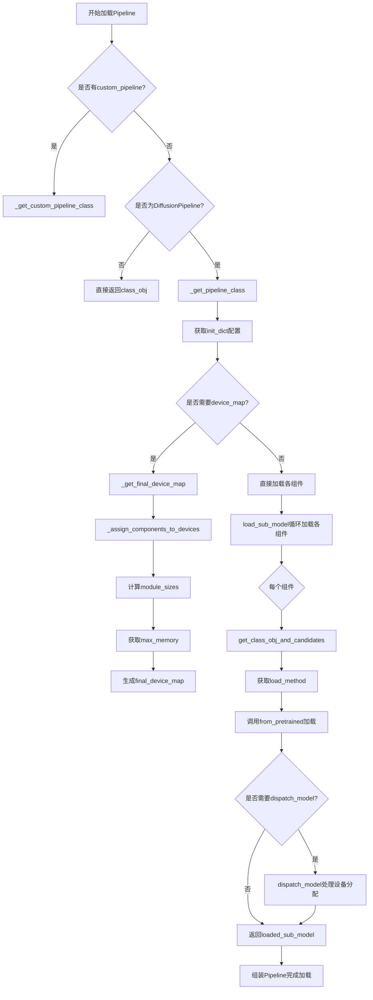
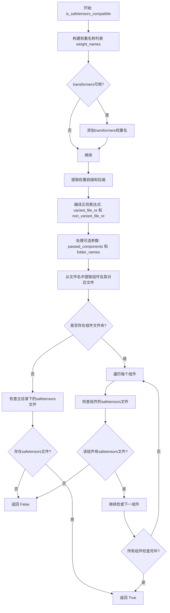
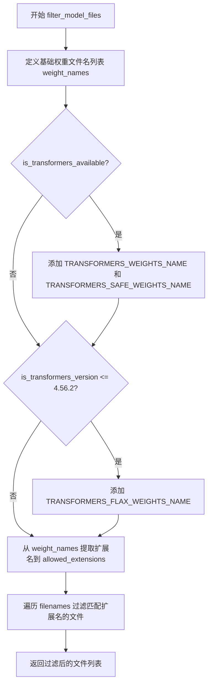
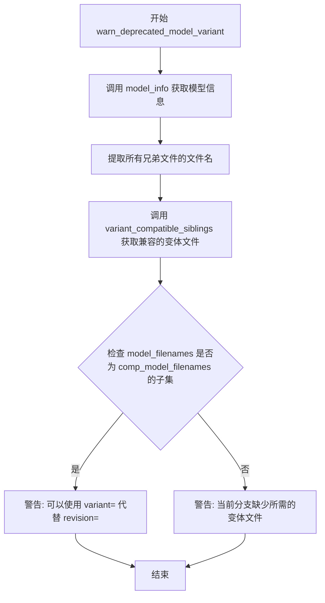
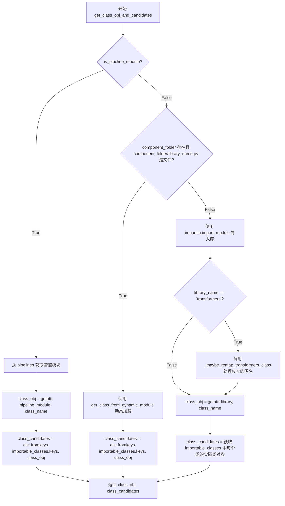
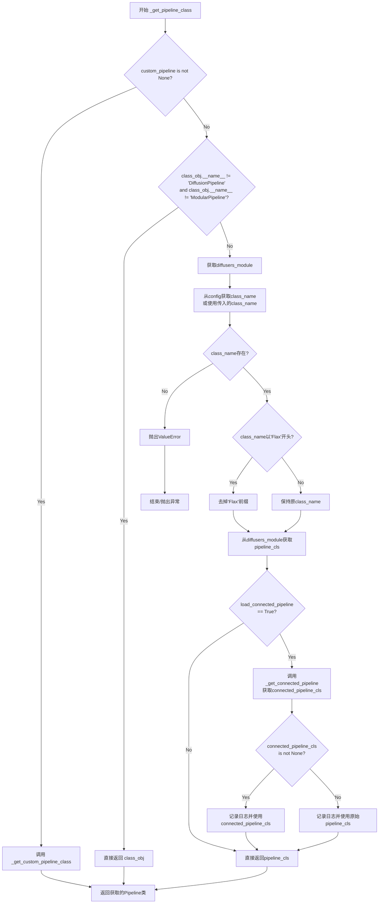
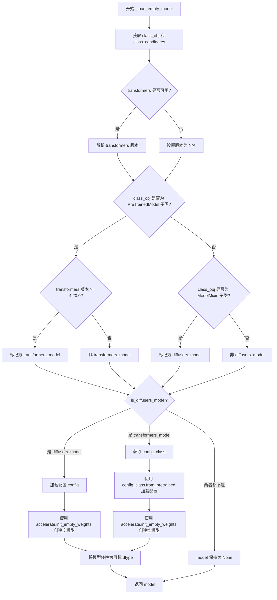
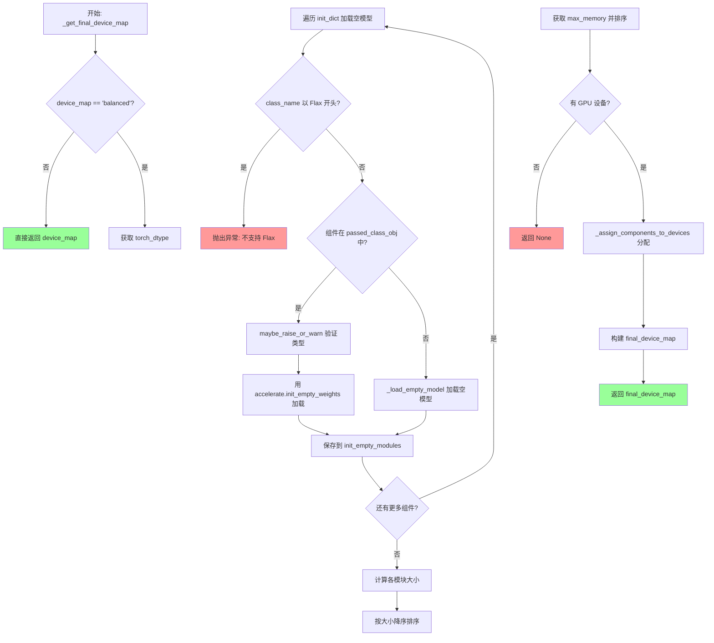
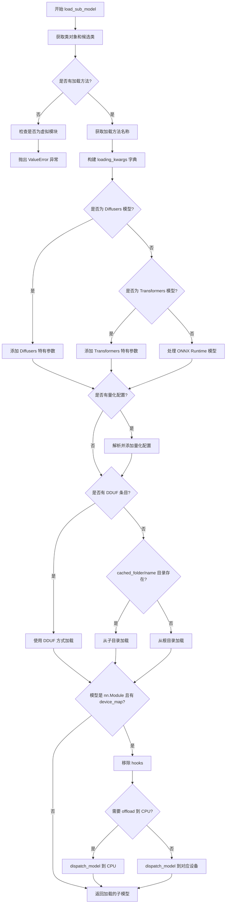

# `diffusers\src\diffusers\pipelines\pipeline_loading_utils.py` 详细设计文档

这是Hugging Face Diffusers库的核心模型加载与管理模块，主要负责从Hugging Face Hub动态加载diffusers和transformers模型，支持多种权重格式（safetensors/bin/onnx）、自定义pipeline、设备分配、内存优化、模型variant管理以及量化配置等功能。

## 整体流程



## 类结构

```
PipelineUtils (模块)
├── 全局配置常量
│   ├── LOADABLE_CLASSES
│   ├── ALL_IMPORTABLE_CLASSES
│   ├── INDEX_FILE
│   └── ...
├── 权重兼容性检查函数
│   ├── is_safetensors_compatible
│   ├── filter_model_files
│   ├── filter_with_regex
│   └── variant_compatible_siblings
├── 类获取函数
get_class_obj_and_candidates
simple_get_class_obj
get_custom_pipeline_class
get_pipeline_class
├── 模型加载函数
load_empty_model
load_sub_model
get_load_method
├── 设备管理函数
assign_components_to_devices
get_final_device_map
├── 组件识别函数
fetch_class_library_tuple
identify_model_variants
get_custom_components_and_folders
├── 下载与文件处理函数
download_dduf_file
get_ignore_patterns
└── 警告与错误处理函数
    ├── warn_deprecated_model_variant
    ├── maybe_raise_or_warn
    └── _maybe_raise_warning_for_inpainting
```

## 全局变量及字段


### `LOADABLE_CLASSES`
    
A dictionary mapping library names to their loadable classes and loading methods (e.g., from_pretrained, save_pretrained)

类型：`dict[str, dict[str, list[str]]]`
    


### `ALL_IMPORTABLE_CLASSES`
    
A flattened dictionary of all importable classes across different libraries, combining LOADABLE_CLASSES from all libraries

类型：`dict[str, Any]`
    


### `INDEX_FILE`
    
The default filename for the diffusion model index file (diffusion_pytorch_model.bin)

类型：`str`
    


### `CUSTOM_PIPELINE_FILE_NAME`
    
The default filename for custom pipeline Python files (pipeline.py)

类型：`str`
    


### `DUMMY_MODULES_FOLDER`
    
The folder path for diffusers dummy utility modules (diffusers.utils)

类型：`str`
    


### `TRANSFORMERS_DUMMY_MODULES_FOLDER`
    
The folder path for transformers dummy utility modules (transformers.utils)

类型：`str`
    


### `CONNECTED_PIPES_KEYS`
    
A list of keys for identifying connected pipeline components in model cards (currently contains only 'prior')

类型：`list[str]`
    


### `logger`
    
A logger instance for the current module, used for logging warnings and informational messages

类型：`logging.Logger`
    


    

## 全局函数及方法


### `is_safetensors_compatible`

该函数用于检查给定的模型文件列表是否与 safetensors 格式兼容。它通过检查每个模型组件是否都存在对应的 `.safetensors` 文件来确定兼容性，如果存在组件缺少 safetensors 文件的情况则返回 `False`，否则返回 `True`。

参数：

- `filenames`：`list[str]`，模型仓库中的文件列表
- `passed_components`：`list[str] | None`，可选参数，已传递的组件名称列表，这些组件将被跳过检查
- `folder_names`：`set[str] | None`，可选参数，要检查的文件夹名称集合，用于过滤文件名
- `variant`：`str | None`，可选参数，模型变体名称（如 "fp16"、"bf16" 等）

返回值：`bool`，如果所有模型组件都存在对应的 safetensors 文件则返回 `True`，否则返回 `False`

#### 流程图



#### 带注释源码

```python
def is_safetensors_compatible(filenames, passed_components=None, folder_names=None, variant=None) -> bool:
    """
    Checking for safetensors compatibility:
    - The model is safetensors compatible only if there is a safetensors file for each model component present in
      filenames.

    Converting default pytorch serialized filenames to safetensors serialized filenames:
    - For models from the diffusers library, just replace the ".bin" extension with ".safetensors"
    - For models from the transformers library, the filename changes from "pytorch_model" to "model", and the ".bin"
      extension is replaced with ".safetensors"
    """
    # 定义所有可能的权重文件名（包括diffusers和transformers的权重文件）
    weight_names = [
        WEIGHTS_NAME,                      # diffusers默认权重名: diffusion_pytorch_model.bin
        SAFETENSORS_WEIGHTS_NAME,          # diffusers safetensors权重名
        FLAX_WEIGHTS_NAME,                 # Flax权重名
        ONNX_WEIGHTS_NAME,                 # ONNX权重名
        ONNX_EXTERNAL_WEIGHTS_NAME,        # ONNX外部权重名
    ]

    # 如果transformers可用，添加transformers的权重文件名
    if is_transformers_available():
        weight_names += [TRANSFORMERS_WEIGHTS_NAME, TRANSFORMERS_SAFE_WEIGHTS_NAME]
        # 针对transformers 4.56.2及以下版本，添加Flax权重名
        if is_transformers_version("<=", "4.56.2"):
            weight_names += [TRANSFORMERS_FLAX_WEIGHTS_NAME]

    # model_pytorch, diffusion_model_pytorch, ... (提取权重名前缀)
    weight_prefixes = [w.split(".")[0] for w in weight_names]
    # .bin, .safetensors, ... (提取权重名后缀扩展名)
    weight_suffixs = [w.split(".")[-1] for w in weight_names]
    # -00001-of-00002 (transformers分片文件格式)
    transformers_index_format = r"\d{5}-of-\d{5}"
    # `diffusion_pytorch_model.bin` 以及 `model-00001-of-00002.safetensors`
    # 编译匹配变体文件的正则表达式
    variant_file_re = re.compile(
        rf"({'|'.join(weight_prefixes)})\.({variant}|{variant}-{transformers_index_format})\.({'|'.join(weight_suffixs)})$"
    )
    # 编译匹配非变体文件的正则表达式
    non_variant_file_re = re.compile(
        rf"({'|'.join(weight_prefixes)})(-{transformers_index_format})?\.({'|'.join(weight_suffixs)})$"
    )

    # 初始化passed_components为空列表
    passed_components = passed_components or []
    # 如果指定了folder_names，则只保留指定文件夹下的文件
    if folder_names:
        filenames = {f for f in filenames if os.path.split(f)[0] in folder_names}

    # 提取所有组件及其关联文件
    # 遍历文件名，按组件分类存储
    components = {}
    for filename in filenames:
        # 确保文件名格式为 "component/filename" (即包含一个斜杠)
        if not len(filename.split("/")) == 2:
            continue

        component, component_filename = filename.split("/")
        # 跳过已传递的组件
        if component in passed_components:
            continue

        # 将组件文件名添加到组件字典中
        components.setdefault(component, [])
        components[component].append(component_filename)

    # 如果没有组件文件夹，则检查主目录下的safetensors文件
    filtered_filenames = set()
    if not components:
        # 如果指定了variant，优先查找变体文件
        if variant is not None:
            filtered_filenames = filter_with_regex(filenames, variant_file_re)

        # 如果没有变体文件，查找非变体文件
        if not filtered_filenames:
            filtered_filenames = filter_with_regex(filenames, non_variant_file_re)
        # 只要存在任何safetensors文件就返回True
        return any(".safetensors" in filename for filename in filtered_filenames)

    # 遍历所有组件的文件
    # 检查每个组件是否存在safetensors文件
    for component, component_filenames in components.items():
        matches = []
        filtered_component_filenames = set()
        # 如果指定了variant，检查该variant的safetensors是否存在
        if variant is not None:
            filtered_component_filenames = filter_with_regex(component_filenames, variant_file_re)

        # 如果variant safetensors不存在，检查非variant的
        if not filtered_component_filenames:
            filtered_component_filenames = filter_with_regex(component_filenames, non_variant_file_re)
        
        # 检查过滤后的文件中是否存在.safetensors扩展名
        for component_filename in filtered_component_filenames:
            filename, extension = os.path.splitext(component_filename)

            match_exists = extension == ".safetensors"
            matches.append(match_exists)

        # 如果该组件没有任何safetensors文件，立即返回False
        if not any(matches):
            return False

    # 所有组件都有对应的safetensors文件，返回True
    return True
```


### `filter_model_files`

该函数用于从模型仓库文件列表中过滤出仅包含模型权重文件（pickle、safetensors、flax、onnx 等格式）的文件，通过匹配常见权重文件扩展名来实现筛选功能。

参数：

- `filenames`：`list[str]`，待过滤的文件名列表

返回值：`list[str]`，过滤后仅包含权重文件的文件名列表

#### 流程图



#### 带注释源码

```python
def filter_model_files(filenames):
    """Filter model repo files for just files/folders that contain model weights"""
    # 定义 diffusers 库的基础权重文件名列表
    weight_names = [
        WEIGHTS_NAME,                    # 默认 PyTorch 权重文件名 (diffusion_pytorch_model.bin)
        SAFETENSORS_WEIGHTS_NAME,        # SafeTensors 权重文件名
        FLAX_WEIGHTS_NAME,                # Flax 权重文件名
        ONNX_WEIGHTS_NAME,                # ONNX 权重文件名
        ONNX_EXTERNAL_WEIGHTS_NAME,      # ONNX 外部权重文件名
    ]

    # 如果 transformers 库可用，添加其权重文件名
    if is_transformers_available():
        weight_names += [TRANSFORMERS_WEIGHTS_NAME, TRANSFORMERS_SAFE_WEIGHTS_NAME]
        # 针对旧版本 transformers (≤4.56.2)，添加 Flax 权重文件名
        if is_transformers_version("<=", "4.56.2"):
            weight_names += [TRANSFORMERS_FLAX_WEIGHTS_NAME]

    # 从权重文件名列表中提取所有允许的扩展名
    # 例如: ".bin", ".safetensors", ". flax", ".onnx" 等
    allowed_extensions = [wn.split(".")[-1] for wn in weight_names]

    # 使用列表推导式过滤文件：保留以允许扩展名结尾的文件
    # any() 确保只要文件名以任意一个允许的扩展名结尾就被保留
    return [f for f in filenames if any(f.endswith(extension) for extension in allowed_extensions)]
```


### `filter_with_regex`

该函数用于根据编译后的正则表达式模式过滤文件名集合，从文件名列表中筛选出与指定正则表达式匹配的文件名，常用于在模型权重文件中查找特定格式或变体的文件。

参数：

- `filenames`：`Iterable[str]`，文件名集合，可以是列表或任何可迭代对象，包含需要过滤的文件名
- `pattern_re`：`re.Pattern`，编译后的正则表达式对象，用于匹配文件名的模式

返回值：`set[str]`，返回匹配正则表达式的文件名组成的集合

#### 流程图

```mermaid
flowchart TD
    A[开始 filter_with_regex] --> B[输入: filenames, pattern_re]
    B --> C{遍历 filenames 中的每个文件名 f}
    C --> D[提取文件名: f.split/"/"[-1]]
    D --> E{pattern_re.match<br/>是否匹配}
    E -->|是| F[将 f 加入结果集合]
    E -->|否| G[跳过]
    F --> C
    G --> C
    C --> H{所有文件名遍历完成?}
    H -->|否| C
    H -->|是| I[返回结果集合]
    I --> J[结束]
```

#### 带注释源码

```python
def filter_with_regex(filenames, pattern_re):
    """
    根据正则表达式模式过滤文件名集合。
    
    该函数接受一个文件名集合和一个编译后的正则表达式模式，
    遍历每个文件名，提取其基础名称（不含路径部分），
    然后检查是否与给定正则表达式匹配，
    最终返回所有匹配的文件名组成的集合。
    
    Args:
        filenames: 文件名集合，可以包含路径前缀（如 "text_encoder/pytorch_model.bin"）
        pattern_re: 编译后的正则表达式对象（re.Pattern 类型）
    
    Returns:
        包含所有匹配正则表达式的文件名集合
    """
    # 使用集合推导式过滤文件名
    # 步骤1: 遍历输入的每个文件名 f
    # 步骤2: 通过 f.split("/")[-1] 提取文件名（去除路径前缀，只保留最后一部分）
    # 步骤3: 使用 pattern_re.match() 检查是否匹配正则表达式
    # 步骤4: 将匹配成功的文件名加入结果集合
    return {f for f in filenames if pattern_re.match(f.split("/")[-1]) is not None}
```


### `variant_compatible_siblings`

该函数用于从模型仓库的文件列表中筛选出与指定变体（如fp16、bf16）兼容的模型权重文件，并返回可用的文件名集合。

参数：

- `filenames`：集合（set/list），待筛选的文件名列表，通常包含模型的所有权重文件和配置文件
- `variant`：字符串 | None，指定的模型变体类型（如"fp16"、""bf16"等），用于筛选特定精度或版本的权重文件
- `ignore_patterns`：列表[str] | None，忽略的文件模式列表，用于排除不需要的文件（如"*.safetensors"）

返回值：`tuple[set[os.PathLike], set[os.PathLike]]`，返回一个元组，包含(可用的文件名集合, 变体文件名集合)

#### 流程图

```mermaid
flowchart TD
    A[开始] --> B[定义权重名称列表<br/>weight_names]
    B --> C[构建权重前缀和后缀列表]
    C --> D{variant是否为空?}
    D -->|是| E[仅构建非变体正则表达式]
    D -->|否| F[构建变体正则表达式<br/>variant_file_re<br/>variant_index_re<br/>legacy_variant_file_re<br/>legacy_variant_index_re]
    F --> G[按组件分组文件<br/>components字典]
    E --> G
    G --> H{遍历每个组件}
    H --> I[过滤兼容扩展名]
    I --> J{该组件有变体文件?}
    J -->|是| K[提取变体文件<br/>更新variant_filenames]
    J -->|否| L[提取非变体文件<br/>更新usable_filenames]
    K --> M{所有组件遍历完成?}
    L --> M
    M -->|否| H
    M -->|是| N{variant_filenames为空<br/>且variant不为空?}
    N -->|是| O[抛出ValueError异常]
    N -->|否| P{variant_filenames存在<br/>且usable_filenames<br/>不等于variant_filenames?]
    P -->|是| Q[记录警告日志<br/>混合使用变体和非变体文件]
    P -->|否| R[结束<br/>返回usable_filenames<br/>variant_filenames]
    O --> R
    Q --> R
```

#### 带注释源码

```
def variant_compatible_siblings(filenames, variant=None, ignore_patterns=None) -> list[os.PathLike] | str:
    """
    筛选与指定变体兼容的模型文件
    
    参数:
        filenames: 文件名集合
        variant: 变体标识符(如fp16, bf16)
        ignore_patterns: 需要忽略的文件模式
    
    返回:
        (usable_filenames, variant_filenames)元组
    """
    # 定义支持的权重文件名称
    weight_names = [
        WEIGHTS_NAME,                      # PyTorch权重: diffusion_pytorch_model.bin
        SAFETENSORS_WEIGHTS_NAME,          # SafeTensors权重: diffusion_pytorch_model.safetensors
        FLAX_WEIGHTS_NAME,                 # Flax权重
        ONNX_WEIGHTS_NAME,                 # ONNX权重
        ONNX_EXTERNAL_WEIGHTS_NAME,        # ONNX外部权重
    ]

    # 如果transformers可用，添加其权重名称
    if is_transformers_available():
        weight_names += [TRANSFORMERS_WEIGHTS_NAME, TRANSFORMERS_SAFE_WEIGHTS_NAME]
        # 针对transformers 4.56.2及以下版本添加flax权重名称
        if is_transformers_version("<=", "4.56.2"):
            weight_names += [TRANSFORMERS_FLAX_WEIGHTS_NAME]

    # 提取权重前缀: model_pytorch, diffusion_model_pytorch, ...
    weight_prefixes = [w.split(".")[0] for w in weight_names]
    # 提取权重后缀: .bin, .safetensors, ...
    weight_suffixs = [w.split(".")[-1] for w in weight_names]
    # transformers分片格式: -00001-of-00002
    transformers_index_format = r"\d{5}-of-\d{5}"

    # 如果指定了variant，构建变体相关的正则表达式
    if variant is not None:
        # 匹配变体权重文件: diffusion_pytorch_model.fp16.bin 或 model.fp16-00001-of-00002.safetensors
        variant_file_re = re.compile(
            rf"({'|'.join(weight_prefixes)})\.({variant}|{variant}-{transformers_index_format})\.({'|'.join(weight_suffixs)})$"
        )
        # 匹配变体索引文件: text_encoder/pytorch_model.bin.index.fp16.json
        variant_index_re = re.compile(
            rf"({'|'.join(weight_prefixes)})\.({'|'.join(weight_suffixs)})\.index\.{variant}\.json$"
        )
        # 匹配遗留变体格式: model-00001-of-00002.fp16.bin
        legacy_variant_file_re = re.compile(rf".*-{transformers_index_format}\.{variant}\.[a-z]+$")
        # 匹配遗留变体索引: text_encoder/pytorch_model.bin.fp16.index.json
        legacy_variant_index_re = re.compile(
            rf"({'|'.join(weight_prefixes)})\.({'|'.join(weight_suffixs)})\.{variant}\.index\.json$"
        )

    # 非变体权重文件正则: diffusion_pytorch_model.bin 或 model-00001-of-00002.safetensors
    non_variant_file_re = re.compile(
        rf"({'|'.join(weight_prefixes)})(-{transformers_index_format})?\.({'|'.join(weight_suffixs)})$"
    )
    # 非变体索引文件正则: text_encoder/pytorch_model.bin.index.json
    non_variant_index_re = re.compile(rf"({'|'.join(weight_prefixes)})\.({'|'.join(weight_suffixs)})\.index\.json")

    def filter_for_compatible_extensions(filenames, ignore_patterns=None):
        """根据忽略模式过滤文件"""
        if not ignore_patterns:
            return filenames

        # ignore_patterns使用glob风格模式如*.safetensors
        # 只提取扩展名进行匹配
        return {f for f in filenames if not any(f.endswith(pat.lstrip("*.")) for pat in ignore_patterns)}

    # 按组件分组文件
    # 组件目录格式: component_name/filename
    components = {}
    for filename in filenames:
        # 文件路径必须包含恰好一个斜杠才能识别为组件
        if not len(filename.split("/")) == 2:
            # 没有组件目录的文件放入空字符串键下
            components.setdefault("", []).append(filename)
            continue

        component, _ = filename.split("/")
        components.setdefault(component, []).append(filename)

    # 初始化结果集合
    usable_filenames = set()
    variant_filenames = set()
    
    # 遍历每个组件进行筛选
    for component, component_filenames in components.items():
        # 应用忽略模式过滤
        component_filenames = filter_for_compatible_extensions(component_filenames, ignore_patterns=ignore_patterns)

        component_variants = set()
        component_legacy_variants = set()
        component_non_variants = set()
        
        # 如果指定了variant，查找变体文件
        if variant is not None:
            # 查找标准变体文件
            component_variants = filter_with_regex(component_filenames, variant_file_re)
            component_variant_index_files = filter_with_regex(component_filenames, variant_index_re)

            # 查找遗留变体格式文件
            component_legacy_variants = filter_with_regex(component_filenames, legacy_variant_file_re)
            component_legacy_variant_index_files = filter_with_regex(component_filenames, legacy_variant_index_re)

        # 根据查找结果更新文件集合
        if component_variants or component_legacy_variants:
            # 存在变体文件时优先使用变体
            variant_filenames.update(
                component_variants | component_variant_index_files
                if component_variants
                else component_legacy_variants | component_legacy_variant_index_files
            )
        else:
            # 无变体文件时使用非变体文件
            component_non_variants = filter_with_regex(component_filenames, non_variant_file_re)
            component_variant_index_files = filter_with_regex(component_filenames, non_variant_index_re)

            usable_filenames.update(component_non_variants | component_variant_index_files)

    # 合并所有可用文件
    usable_filenames.update(variant_filenames)

    # 错误处理: 指定了variant但没有找到对应文件
    if len(variant_filenames) == 0 and variant is not None:
        error_message = f"You are trying to load model files of the `variant={variant}`, but no such modeling files are available. "
        raise ValueError(error_message)

    # 警告处理: 混合使用变体和非变体文件
    if len(variant_filenames) > 0 and usable_filenames != variant_filenames:
        logger.warning(
            f"\nA mixture of {variant} and non-{variant} filenames will be loaded.\nLoaded {variant} filenames:\n"
            f"[{', '.join(variant_filenames)}]\nLoaded non-{variant} filenames:\n"
            f"[{', '.join(usable_filenames - variant_filenames)}\nIf this behavior is not "
            f"expected, please check your folder structure."
        )

    # 返回(可用文件集合, 变体文件集合)
    return usable_filenames, variant_filenames
```


### `warn_deprecated_model_variant`

该函数用于警告用户关于已弃用的模型变体加载方式。当用户通过 `revision` 参数加载模型变体时，函数会检查是否可以使用更推荐的 `variant` 参数来加载，并相应地发出 FutureWarning 警告。

参数：

- `pretrained_model_name_or_path`：`str`，模型在 Hugging Face Hub 上的名称或本地路径
- `token`：`str | None`，用于访问私有模型的认证令牌
- `variant`：`str | None`，要加载的模型变体（如 "fp16", "bf16" 等）
- `revision`：`str | None`，Git 分支名称或提交哈希，用于指定从哪个分支加载模型
- `model_filenames`：`list[str] | None`，要加载的模型文件名列表

返回值：`None`，该函数不返回任何值，仅通过 `warnings.warn()` 发出警告

#### 流程图



#### 带注释源码

```python
@validate_hf_hub_args
def warn_deprecated_model_variant(pretrained_model_name_or_path, token, variant, revision, model_filenames):
    """
    警告用户关于已弃用的模型变体加载方式。
    
    当用户通过 revision 参数加载模型变体时，此函数会检查是否可以使用
    更推荐的 variant 参数来加载，并相应地发出警告。
    
    参数:
        pretrained_model_name_or_path: 模型名称或路径
        token: 认证令牌
        variant: 推荐的变体参数
        revision: 已弃用的 revision 参数
        model_filenames: 要加载的文件名列表
    """
    # 从 Hugging Face Hub 获取模型信息，设置 revision 为 None 以获取主分支信息
    info = model_info(
        pretrained_model_name_or_path,
        token=token,
        revision=None,
    )
    
    # 提取所有兄弟文件的文件名（去重）
    filenames = {sibling.rfilename for sibling in info.siblings}
    
    # 获取与指定 revision 兼容的变体文件
    comp_model_filenames, _ = variant_compatible_siblings(filenames, variant=revision)
    
    # 处理文件名：移除变体部分（例如 "model.fp16.bin" -> "model.bin"）
    # 通过分割并重新连接来实现：取第一个元素和第三个元素之后的部分
    comp_model_filenames = [".".join(f.split(".")[:1] + f.split(".")[2:]) for f in comp_model_filenames]

    # 检查用户请求的文件是否是兼容变体文件的子集
    if set(model_filenames).issubset(set(comp_model_filenames)):
        # 情况1：用户可以通过 variant= 来加载，但目前使用的是 revision=
        warnings.warn(
            f"You are loading the variant {revision} from {pretrained_model_name_or_path} via `revision='{revision}'` "
            f"even though you can load it via `variant=`{revision}`. Loading model variants via `revision='{revision}'` "
            "is deprecated and will be removed in diffusers v1. Please use `variant='{revision}'` instead.",
            FutureWarning,
        )
    else:
        # 情况2：主分支缺少所需的变体文件，但仍通过 revision= 加载
        warnings.warn(
            f"You are loading the variant {revision} from {pretrained_model_name_or_path} via `revision='{revision}'`. "
            "This behavior is deprecated and will be removed in diffusers v1. One should use `variant='{revision}'` "
            f"instead. However, it appears that {pretrained_model_name_or_path} currently does not have the required "
            "variant filenames in the 'main' branch. \n The Diffusers team and community would be very grateful if you "
            "could open an issue: https://github.com/huggingface/diffusers/issues/new with the title "
            f"'{pretrained_model_name_or_path} is missing {revision} files' so that the correct variant file can be added.",
            FutureWarning,
        )
```


### `_unwrap_model`

该函数用于解包（unwrap）模型，处理被编译模块（torch.compile）或 PEFT 包装的模型，返回其原始的基础模型。

参数：

- `model`：`Any`，输入的模型对象，可能是普通 PyTorch 模型、torch.compile 编译后的模型或 PEFT 包装的模型

返回值：`Any`，返回解包后的原始模型对象

#### 流程图

```mermaid
flowchart TD
    A[开始: 输入 model] --> B{is_compiled_module(model)?}
    B -->|是| C[model = model._orig_mod<br/>获取编译模块的原始模型]
    B -->|否| D{is_peft_available()?}
    C --> D
    D -->|是| E{isinstance(model, PeftModel)?}
    D -->|否| F[返回 model]
    E -->|是| G[model = model.base_model.model<br/>获取 PEFT 基础模型]
    E -->|否| F
    G --> F
```

#### 带注释源码

```python
def _unwrap_model(model):
    """
    解包模型，处理被 torch.compile 或 PEFT 包装的模型。
    
    该函数执行以下操作：
    1. 如果模型是通过 torch.compile 编译的模块，提取其原始模块（_orig_mod）
    2. 如果模型是 PEFT 的 PeftModel，提取其 base_model.model 基础模型
    3. 返回解包后的原始模型对象
    """
    # 检查模型是否是 torch.compile 编译的模块
    # 如果是，则通过 _orig_mod 属性获取原始的未编译模型
    if is_compiled_module(model):
        model = model._orig_mod

    # 检查 PEFT 库是否可用
    if is_peft_available():
        # 导入 PeftModel 类以进行类型检查
        from peft import PeftModel

        # 如果模型是 PEFT 包装的模型，提取其底层基础模型
        # PeftModel.base_model.model 指向原始的预训练模型
        if isinstance(model, PeftModel):
            model = model.base_model.model

    # 返回解包后的模型
    return model
```


### `maybe_raise_or_warn`

该函数是一个辅助方法，用于在加载不正确的模块时抛出异常或发出警告。它会验证传入的子模型对象类型是否符合预期，如果不符合则抛出 `ValueError`，如果是管道模块则仅发出警告。

参数：

- `library_name`：`str`，要导入的库的名称（如 "transformers"、"diffusers" 等）
- `library`：模块对象，当前已导入的库对象（如果 `is_pipeline_module` 为 True，则可能为 None）
- `class_name`：`str`，要验证的类名
- `importable_classes`：`dict`，可导入类的字典，包含库中所有可导入的类及其对应的类对象
- `passed_class_obj`：`dict`，包含已传入的模型对象的字典，键为组件名称
- `name`：`str`，要验证的组件名称（在 `passed_class_obj` 中的键）
- `is_pipeline_module`：`bool`，指示该模块是否为管道模块的标志

返回值：`None`，该函数不返回任何值，主要通过抛出异常或记录警告来处理错误情况

#### 流程图

```mermaid
flowchart TD
    A[开始: maybe_raise_or_warn] --> B{is_pipeline_module?}
    B -->|是| C[记录警告: 非标准模块无法验证类型]
    B -->|否| D[导入library_name对应的模块]
    D --> E{library_name == 'transformers'?}
    E -->|是| F[调用_maybe_remap_transformers_class处理废弃的类]
    E -->|否| G[保持原class_name不变]
    F --> H[获取class_obj = getattr(library, class_name)]
    G --> H
    H --> I[构建class_candidates字典]
    I --> J[遍历class_candidates查找期望的类]
    J --> K[获取子模型: passed_class_obj[name]]
    K --> L[调用_unwrap_model解包模型]
    L --> M[获取模型的实际类: model_cls = unwrapped_sub_model.__class__]
    M --> N{issubclass(model_cls, expected_class_obj)?}
    N -->|是| O[验证通过, 函数结束]
    N -->|否| P[抛出ValueError: 类型不匹配]
    C --> O
```

#### 带注释源码

```python
def maybe_raise_or_warn(
    library_name, library, class_name, importable_classes, passed_class_obj, name, is_pipeline_module
):
    """
    Simple helper method to raise or warn in case incorrect module has been passed
    
    该函数用于验证传入的子模型对象类型是否正确。
    如果不是管道模块，则进行严格的类型检查；
    如果是管道模块，则仅发出警告。
    """
    # 如果不是管道模块，则进行详细的类型验证
    if not is_pipeline_module:
        # 动态导入指定的库模块
        library = importlib.import_module(library_name)

        # 处理 Transformers 库中已废弃的类映射
        if library_name == "transformers":
            # 调用辅助函数将废弃的类名映射到新的类名
            class_name = _maybe_remap_transformers_class(class_name) or class_name

        # 获取传入类名的类对象
        class_obj = getattr(library, class_name)
        
        # 构建候选类字典：从importable_classes中获取所有可导入的类
        class_candidates = {c: getattr(library, c, None) for c in importable_classes.keys()}

        # 查找期望的类对象：找到class_obj的父类中最先匹配的那个
        expected_class_obj = None
        for class_name, class_candidate in class_candidates.items():
            # 如果候选类存在且class_obj是其子类，则找到期望的类
            if class_candidate is not None and issubclass(class_obj, class_candidate):
                expected_class_obj = class_candidate

        # Dynamo（PyTorch 2.0的编译器）会将原始模型包装在一个私有类中
        # 目前没有公开API来获取原始类，所以需要手动解包
        # 从passed_class_obj字典中获取指定名称的子模型
        sub_model = passed_class_obj[name]
        
        # 调用_unwrap_model解包模型，处理PeftModel和编译模块的情况
        unwrapped_sub_model = _unwrap_model(sub_model)
        
        # 获取解包后模型的真实类
        model_cls = unwrapped_sub_model.__class__

        # 验证模型的实际类型是否是期望类型的子类
        if not issubclass(model_cls, expected_class_obj):
            # 类型不匹配，抛出详细的错误信息
            raise ValueError(f"{passed_class_obj[name]} is of type: {model_cls}, but should be {expected_class_obj}")
    else:
        # 如果是管道模块，只能发出警告而无法严格验证类型
        logger.warning(
            f"You have passed a non-standard module {passed_class_obj[name]}. We cannot verify whether it"
            " has the correct type"
        )
```


### `simple_get_class_obj`

该函数是一个简化版的类对象获取工具，用于根据库名称和类名称动态获取对应的类对象。它首先检查 `diffusers.pipelines` 模块是否包含指定的库模块，如果是则从管道模块中获取类，否则直接从指定的库中导入类。

参数：

- `library_name`：`str`，目标库的名称（如 "diffusers"、"transformers" 等）
- `class_name`：`str`，目标类的名称（如 "UNet2DConditionModel"、"StableDiffusionPipeline" 等）

返回值：`type`，返回获取到的类对象

#### 流程图

```mermaid
flowchart TD
    A[开始] --> B[导入 diffusers.pipelines 模块]
    B --> C{检查 pipelines 是否拥有 library_name 属性}
    C -->|是| D[获取 pipeline_module = getattr(pipelines, library_name)]
    C -->|否| E[使用 importlib.import_module 导入 library_name 库]
    D --> F[获取 class_obj = getattr(pipeline_module, class_name)]
    E --> G{检查 library_name == 'transformers'}
    G -->|是| H[调用 _maybe_remap_transformers_class 处理 class_name]
    G -->|否| I[获取 class_obj = getattr(library, class_name)]
    H --> I
    F --> J[返回 class_obj]
    I --> J
```

#### 带注释源码

```python
def simple_get_class_obj(library_name, class_name):
    """
    简化版的类对象获取函数，无法处理自定义代码。
    根据传入的库名和类名动态获取对应的类对象。
    
    Args:
        library_name: 目标库的名称（如 "diffusers", "transformers" 等）
        class_name: 目标类的名称（如 "UNet2DConditionModel", "StableDiffusionPipeline" 等）
    
    Returns:
        返回获取到的类对象（type 类型）
    """
    # 从 diffusers 包导入 pipelines 模块，用于检查是否为内置管道模块
    from diffusers import pipelines

    # 检查 library_name 是否为 diffusers.pipelines 中的一个子模块
    is_pipeline_module = hasattr(pipelines, library_name)

    if is_pipeline_module:
        # 如果是管道模块，从 pipelines 中获取对应的模块
        pipeline_module = getattr(pipelines, library_name)
        # 从管道模块中获取指定的类对象
        class_obj = getattr(pipeline_module, class_name)
    else:
        # 否则，直接从指定的库中导入类
        library = importlib.import_module(library_name)

        # 处理已弃用的 Transformers 类
        # 如果库是 transformers，可能存在类名映射（如某些类已被重命名）
        if library_name == "transformers":
            class_name = _maybe_remap_transformers_class(class_name) or class_name

        # 从库中获取指定的类对象
        class_obj = getattr(library, class_name)

    return class_obj
```


### `get_class_obj_and_candidates`

该函数是一个辅助方法，用于从指定库或管道模块中检索类对象，同时返回该类可能继承的父类候选对象列表。它支持三种加载方式：管道模块加载、自定义组件动态加载和标准库导入。

参数：

- `library_name`：`str`，库名称（如 "diffusers"、"transformers" 或管道模块名称）
- `class_name`：`str`，要检索的类名
- `importable_classes`：`dict`，可导入类的字典，定义哪些类可以被加载
- `pipelines`：`Any`，管道模块对象，用于从管道中查找类
- `is_pipeline_module`：`bool`，指示是否从管道模块加载
- `component_name`：`str | None`，可选，组件名称，用于自定义组件加载
- `cache_dir`：`str | None`，可选，缓存目录路径

返回值：`(class_obj, class_candidates)`，其中 `class_obj` 是检索到的类对象，`class_candidates` 是一个字典，键为可导入类名，值为对应的类对象或 None

#### 流程图



#### 带注释源码

```python
def get_class_obj_and_candidates(
    library_name, class_name, importable_classes, pipelines, is_pipeline_module, component_name=None, cache_dir=None
):
    """Simple helper method to retrieve class object of module as well as potential parent class objects"""
    
    # 如果提供了 component_name 和 cache_dir，则构建组件文件夹路径
    component_folder = os.path.join(cache_dir, component_name) if component_name and cache_dir else None

    # 情况1: 如果是从管道模块加载
    if is_pipeline_module:
        # 获取管道模块（例如 diffusers.pipelines 中的某个子模块）
        pipeline_module = getattr(pipelines, library_name)
        
        # 从管道模块获取指定的类对象
        class_obj = getattr(pipeline_module, class_name)
        
        # 将所有可导入类的键设置为该类对象（作为候选父类）
        class_candidates = dict.fromkeys(importable_classes.keys(), class_obj)
        
    # 情况2: 如果存在自定义组件文件夹且包含对应的 Python 文件
    elif component_folder and os.path.isfile(os.path.join(component_folder, library_name + ".py")):
        # 从自定义模块动态加载类
        class_obj = get_class_from_dynamic_module(
            component_folder, module_file=library_name + ".py", class_name=class_name
        )
        
        # 同样设置所有可导入类为该类对象
        class_candidates = dict.fromkeys(importable_classes.keys(), class_obj)
        
    # 情况3: 否则从标准库导入
    else:
        # 使用 importlib 动态导入库（例如 transformers、diffusers 等）
        library = importlib.import_module(library_name)

        # 处理 transformers 库中已废弃的类名映射
        if library_name == "transformers":
            class_name = _maybe_remap_transformers_class(class_name) or class_name

        # 从库中获取指定的类对象
        class_obj = getattr(library, class_name)
        
        # 为每个可导入类创建候选字典，值为实际存在的类对象或 None
        class_candidates = {c: getattr(library, c, None) for c in importable_classes.keys()}

    # 返回类对象和父类候选字典
    return class_obj, class_candidates
```


### `_get_custom_pipeline_class`

该函数是diffusers库中的私有工具函数，用于从本地文件路径或HuggingFace Hub获取自定义Pipeline类。它首先解析传入的`custom_pipeline`参数以确定模块文件名和路径，然后处理Hub相关的版本参数，最后调用`get_class_from_dynamic_module`动态加载指定的类。

参数：

- `custom_pipeline`：`str`，自定义pipeline的标识符，可以是本地.py文件路径、repo_id或自定义pipeline名称
- `repo_id`：`str | None`，HuggingFace Hub上的模型仓库ID，当从Hub加载pipeline时使用
- `hub_revision`：`str | None`，Hub上的特定分支或提交哈希，用于覆盖`revision`参数
- `class_name`：`str | None`，要加载的类名，如果为None则由动态模块加载器推断
- `cache_dir`：`str | None`，本地缓存目录路径，用于存储下载的模型文件
- `revision`：`str | None`，Git修订版本号，用于指定加载模型的具体版本

返回值：`type`，返回从动态模块加载的Pipeline类对象

#### 流程图

```mermaid
flowchart TD
    A[开始: _get_custom_pipeline_class] --> B{custom_pipeline<br>是否以.py结尾?}
    B -->|是| C[创建Path对象]
    C --> D[提取文件名<br>path.name]
    D --> E[获取父目录绝对路径<br>path.parent.absolute]
    E --> F[设置file_name和custom_pipeline]
    B -->|否| G{repo_id<br>是否不为None?}
    G -->|是| H[构建文件名<br>f"{custom_pipeline}.py"]
    H --> I[设置custom_pipeline<br>为repo_id]
    G -->|否| J[使用默认文件名<br>CUSTOM_PIPELINE_FILE_NAME]
    J --> K[设置file_name]
    I --> K
    K --> L{repo_id和hub_revision<br>是否都不为None?}
    L -->|是| M[用hub_revision<br>覆盖revision]
    L -->|否| N[保留原有revision]
    M --> N
    N --> O[调用get_class_from_dynamic_module]
    O --> P[返回加载的类对象]
    
    style A fill:#e1f5fe
    style O fill:#fff3e0
    style P fill:#e8f5e8
```

#### 带注释源码

```python
def _get_custom_pipeline_class(
    custom_pipeline,
    repo_id=None,
    hub_revision=None,
    class_name=None,
    cache_dir=None,
    revision=None,
):
    """
    获取自定义Pipeline类。
    
    该函数支持三种场景：
    1. 从本地.py文件加载
    2. 从HuggingFace Hub加载
    3. 使用默认文件名从缓存目录加载
    
    参数:
        custom_pipeline: 可以是本地文件路径、repo_id或自定义pipeline名称
        repo_id: HuggingFace Hub仓库ID（可选）
        hub_revision: Hub分支或提交ID（可选）
        class_name: 要加载的类名（可选）
        cache_dir: 缓存目录路径（可选）
        revision: Git版本号（可选）
    
    返回:
        加载的Pipeline类对象
    """
    # 场景1: custom_pipeline是本地.py文件路径
    if custom_pipeline.endswith(".py"):
        path = Path(custom_pipeline)
        # 分解为文件夹和文件名
        file_name = path.name
        # 获取父目录的绝对路径作为custom_pipeline
        custom_pipeline = path.parent.absolute()
    # 场景2: 提供了repo_id，从Hub加载
    elif repo_id is not None:
        file_name = f"{custom_pipeline}.py"
        custom_pipeline = repo_id
    # 场景3: 使用默认文件名
    else:
        file_name = CUSTOM_PIPELINE_FILE_NAME  # "pipeline.py"

    # 如果同时提供了repo_id和hub_revision
    # 用hub_revision覆盖revision参数
    # 这样可以确保从Hub加载时使用正确的版本
    if repo_id is not None and hub_revision is not None:
        # if we load the pipeline code from the Hub
        # make sure to overwrite the `revision`
        revision = hub_revision

    # 调用动态模块加载器获取类对象
    return get_class_from_dynamic_module(
        custom_pipeline,      # 模块路径或repo_id
        module_file=file_name,  # 模块文件名
        class_name=class_name,  # 类名
        cache_dir=cache_dir,    # 缓存目录
        revision=revision,      # 版本号
    )
```


### `_get_pipeline_class`

该函数用于从给定配置和参数中动态获取扩散Pipeline类。首先检查是否需要加载自定义Pipeline，若有则通过动态模块加载；否则判断传入的类对象是否为基础Pipeline类，若是则根据配置信息从diffusers模块中获取对应的具体Pipeline类，同时支持加载关联的Pipeline。

参数：

- `class_obj`：`type`，传入的类对象，用于判断是否为DiffusionPipeline或ModularPipeline
- `config`：`dict | None`，配置文件，包含`_class_name`等信息
- `load_connected_pipeline`：`bool`，是否加载关联的Pipeline，默认为False
- `custom_pipeline`：`str | None`，自定义Pipeline的名称或路径
- `repo_id`：`str | None`，HuggingFace Hub上的模型仓库ID
- `hub_revision`：`str | None`，Hub上的修订版本号
- `class_name`：`str | None`，Pipeline类的名称
- `cache_dir`：`str | None`，本地缓存目录路径
- `revision`：`str | None`，Git修订版本号

返回值：`type`，返回具体的Pipeline类对象

#### 流程图



#### 带注释源码

```python
def _get_pipeline_class(
    class_obj,
    config=None,
    load_connected_pipeline=False,
    custom_pipeline=None,
    repo_id=None,
    hub_revision=None,
    class_name=None,
    cache_dir=None,
    revision=None,
):
    """
    获取Pipeline类的主要入口函数。
    支持自定义Pipeline加载、基础Pipeline类解析以及关联Pipeline的动态加载。
    """
    # 1. 如果提供了custom_pipeline参数，优先从自定义模块加载
    if custom_pipeline is not None:
        return _get_custom_pipeline_class(
            custom_pipeline,
            repo_id=repo_id,
            hub_revision=hub_revision,
            class_name=class_name,
            cache_dir=cache_dir,
            revision=revision,
        )

    # 2. 如果传入的类对象不是DiffusionPipeline或ModularPipeline，直接返回
    #    这意味着用户已经传入了具体的Pipeline类，无需进一步解析
    if class_obj.__name__ != "DiffusionPipeline" and class_obj.__name__ != "ModularPipeline":
        return class_obj

    # 3. 获取diffusers主模块，用于后续查找具体的Pipeline类
    diffusers_module = importlib.import_module(class_obj.__module__.split(".")[0])
    
    # 4. 获取类名：优先使用传入的class_name，否则从config中读取
    class_name = class_name or config["_class_name"]
    if not class_name:
        raise ValueError(
            "The class name could not be found in the configuration file. "
            "Please make sure to pass the correct `class_name`."
        )

    # 5. 处理Flax前缀：如果类名以"Flax"开头，则去掉该前缀
    #    例如：FlaxStableDiffusionPipeline -> StableDiffusionPipeline
    class_name = class_name[4:] if class_name.startswith("Flax") else class_name

    # 6. 从diffusers模块中获取对应的Pipeline类
    pipeline_cls = getattr(diffusers_module, class_name)

    # 7. 如果需要加载关联的Pipeline（如Stable Diffusion的connected pipeline）
    if load_connected_pipeline:
        from .auto_pipeline import _get_connected_pipeline

        connected_pipeline_cls = _get_connected_pipeline(pipeline_cls)
        if connected_pipeline_cls is not None:
            logger.info(
                f"Loading connected pipeline {connected_pipeline_cls.__name__} "
                f"instead of {pipeline_cls.__name__} as specified via `load_connected_pipeline=True`"
            )
        else:
            logger.info(
                f"{pipeline_cls.__name__} has no connected pipeline class. "
                f"Loading {pipeline_cls.__name__}."
            )

        # 使用关联的Pipeline类（如果有），否则使用原始类
        pipeline_cls = connected_pipeline_cls or pipeline_cls

    # 8. 返回最终确定要使用的Pipeline类
    return pipeline_cls
```


### `_load_empty_model`

该函数用于在给定缓存文件夹中加载一个空的模型骨架（不加载权重），主要服务于设备映射（device_map）功能的早期计算，通过初始化空模型来获取各组件的尺寸信息，以便进行合理的设备分配决策。

参数：

- `library_name`：`str`，模型所属的库名称（如 "diffusers"、"transformers"）
- `class_name`：`str`，要加载的类名（如 "UNet2DConditionModel"）
- `importable_classes`：`list[Any]`，可导入类的列表，用于匹配加载方法
- `pipelines`：`Any`，diffusers 的管道模块对象
- `is_pipeline_module`：`bool`，指示该组件是否位于管道模块中
- `name`：`str`，组件的名称（如 "unet"、"text_encoder"）
- `torch_dtype`：`str | torch.dtype`，模型转换后的目标数据类型
- `cached_folder`：`str | os.PathLike`，预训练模型缓存目录路径
- `**kwargs`：可选关键字参数，包括 `force_download`、`proxies`、`local_files_only`、`token`、`revision`、`subfolder` 等

返回值：`torch.nn.Module | None`，返回初始化后的空模型实例，若加载失败则返回 None

#### 流程图



#### 带注释源码

```python
def _load_empty_model(
    library_name: str,
    class_name: str,
    importable_classes: list[Any],
    pipelines: Any,
    is_pipeline_module: bool,
    name: str,
    torch_dtype: str | torch.dtype,
    cached_folder: str | os.PathLike,
    **kwargs,
):
    # 1. 检索类对象。根据 library_name、class_name 从管道模块或缓存目录中获取实际的类对象，
    # 同时获取该类可能的父类候选列表，用于后续判断模型类型（diffusers 或 transformers）
    class_obj, _ = get_class_obj_and_candidates(
        library_name,
        class_name,
        importable_classes,
        pipelines,
        is_pipeline_module,
        component_name=name,
        cache_dir=cached_folder,
    )

    # 2. 检查 transformers 库是否可用，并解析其版本号用于后续兼容性判断
    if is_transformers_available():
        transformers_version = version.parse(version.parse(transformers.__version__).base_version)
    else:
        transformers_version = "N/A"

    # 3. 判断模型所属库类型：
    #    - is_transformers_model: transformers 库模型且版本 >= 4.20.0
    #    - is_diffusers_model: diffusers 库的 ModelMixin 子类
    is_transformers_model = (
        is_transformers_available()
        and issubclass(class_obj, PreTrainedModel)
        and transformers_version >= version.parse("4.20.0")
    )
    diffusers_module = importlib.import_module(__name__.split(".")[0])
    is_diffusers_model = issubclass(class_obj, diffusers_module.ModelMixin)

    model = None
    config_path = cached_folder
    # 构建用户代理信息，用于 HTTP 请求标识
    user_agent = {
        "diffusers": __version__,
        "file_type": "model",
        "framework": "pytorch",
    }

    # 4. 如果是 Diffusers 模型，使用 from_config 在 meta 设备上加载空模型
    if is_diffusers_model:
        # 加载配置（包含模型结构信息），unused_kwargs 为未使用的参数
        config, unused_kwargs, commit_hash = class_obj.load_config(
            os.path.join(config_path, name),
            cache_dir=cached_folder,
            return_unused_kwargs=True,
            return_commit_hash=True,
            force_download=kwargs.pop("force_download", False),
            proxies=kwargs.pop("proxies", None),
            local_files_only=kwargs.pop("local_files_only", False),
            token=kwargs.pop("token", None),
            revision=kwargs.pop("revision", None),
            subfolder=kwargs.pop("subfolder", None),
            user_agent=user_agent,
        )
        # accelerate 提供的上下文管理器，用于在仅创建模型结构而不分配实际显存
        with accelerate.init_empty_weights():
            model = class_obj.from_config(config, **unused_kwargs)
    
    # 5. 如果是 Transformers 模型，类似地在 meta 设备上创建空模型
    elif is_transformers_model:
        config_class = getattr(class_obj, "config_class", None)
        if config_class is None:
            raise ValueError("`config_class` cannot be None. Please double-check the model.")

        config = config_class.from_pretrained(
            cached_folder,
            subfolder=name,
            force_download=kwargs.pop("force_download", False),
            proxies=kwargs.pop("proxies", None),
            local_files_only=kwargs.pop("local_files_only", False),
            token=kwargs.pop("token", None),
            revision=kwargs.pop("revision", None),
            user_agent=user_agent,
        )
        with accelerate.init_empty_weights():
            model = class_obj(config)

    # 6. 将模型转换为指定的 dtype（不执行实际的数据移动，仅标记 dtype）
    if model is not None:
        model = model.to(dtype=torch_dtype)
    return model
```


### `_assign_components_to_devices`

该函数负责将模型组件智能分配到不同的计算设备（GPU/CPU）。它根据各组件的内存大小和设备的可用内存，采用循环遍历策略将组件映射到设备，并在组件过大无法fit当前GPU时自动offload到CPU。

参数：

- `module_sizes`：`dict[str, float]`，字典，键为组件名称，值为组件的内存大小（以字节为单位）
- `device_memory`：`dict[str, float]`，字典，键为设备ID（如"0"、"1"或"cpu"），值为设备的可用内存大小
- `device_mapping_strategy`：`str`，字符串，设备映射策略，当前支持"balanced"（均衡分配）策略，默认值为"balanced"

返回值：`dict[str, list[str]]`，字典，键为设备ID（包括GPU设备ID和"cpu"），值为分配到该设备的组件名称列表

#### 流程图

```mermaid
flowchart TD
    A[开始] --> B[获取device_ids列表]
    B --> C[创建device_cycle: device_ids + device_ids[::-1]]
    C --> D[复制device_memory避免修改原字典]
    D --> E[初始化device_id_component_mapping和current_device_index]
    E --> F{遍历module_sizes中的每个component}
    F -->|是| G[从device_cycle获取当前设备ID]
    G --> H[获取component_memory和curr_device_memory]
    H --> I{component_memory > curr_device_memory?}
    I -->|是| J[将component分配到CPU]
    J --> K[current_device_index += 1]
    I -->|否| L{device_id是否已在mapping中?}
    L -->|否| M[创建device_id对应的新列表]
    L -->|是| N[追加component到现有列表]
    M --> O[更新device_memory]
    N --> O
    O --> K
    K --> F
    F -->|遍历完成| P[返回device_id_component_mapping]
    P --> Q[结束]
```

#### 带注释源码

```python
def _assign_components_to_devices(
    module_sizes: dict[str, float], device_memory: dict[str, float], device_mapping_strategy: str = "balanced"
):
    """
    将模型组件分配到不同的计算设备。
    
    参数:
        module_sizes: 字典，键为组件名称，值为组件的内存大小
        device_memory: 字典，键为设备ID，值为设备的可用内存
        device_mapping_strategy: 设备映射策略，当前仅支持"balanced"
    
    返回:
        字典，键为设备ID，值为分配到该设备的组件列表
    """
    # 获取所有设备ID列表
    device_ids = list(device_memory.keys())
    # 创建循环设备列表：正序+反序，实现轮询分配
    # 例如：[0, 1, 2] -> [0, 1, 2, 2, 1, 0]
    device_cycle = device_ids + device_ids[::-1]
    # 复制device_memory字典，避免修改原始输入
    device_memory = device_memory.copy()

    # 初始化结果字典和当前设备索引
    device_id_component_mapping = {}
    current_device_index = 0
    
    # 遍历所有模型组件（已按内存大小降序排序）
    for component in module_sizes:
        # 使用循环索引从device_cycle中获取设备ID
        device_id = device_cycle[current_device_index % len(device_cycle)]
        # 获取当前组件的内存大小
        component_memory = module_sizes[component]
        # 获取当前设备的剩余可用内存
        curr_device_memory = device_memory[device_id]

        # 如果GPU无法容纳当前组件，则offload到CPU
        if component_memory > curr_device_memory:
            device_id_component_mapping["cpu"] = [component]
        else:
            # 将组件分配到当前设备
            if device_id not in device_id_component_mapping:
                device_id_component_mapping[device_id] = [component]
            else:
                device_id_component_mapping[device_id].append(component)

            # 更新设备的剩余内存
            device_memory[device_id] -= component_memory
            # 移动到下一个设备
            current_device_index += 1

    return device_id_component_mapping
```


### `_get_final_device_map`

该函数是 diffusers 库中用于生成最终设备映射（device map）的核心函数。当 `device_map` 参数设为 "balanced" 时，该函数会根据各模型组件的大小和可用的 GPU 内存，智能地将pipeline中的不同组件分配到不同的GPU设备上，以实现内存均衡的模型加载。

参数：

- `device_map`：`str | dict[str, int | str]`，设备映射策略或映射字典。当值为 "balanced" 时自动计算设备分配，否则直接返回原值
- `pipeline_class`：类型待确定（代码中为 `pipeline_class`），对应的pipeline类对象
- `passed_class_obj`：`dict`，用户已传递的子模型对象字典，用于复用已加载的模型实例
- `init_dict`：`dict[str, tuple[str, str]]`，pipeline初始化参数字典，键为组件名称，值为 `(library_name, class_name)` 元组
- `library`：类型待确定（代码中为 `library`），库模块对象
- `max_memory`：`dict[int | str, int | str] | None`，各设备的可用内存字典，键为设备ID（如0,1或"cpu"），值为字节数
- `**kwargs`：`Any`，额外关键字参数，包含 `torch_dtype`、`cached_folder`、`force_download`、`proxies`、`local_files_only`、`token`、`revision` 等

返回值：`dict[str, int | str] | None`，返回最终设备映射字典，键为组件名称（如"unet"、"text_encoder"），值为设备ID；如果无GPU或无有效组件则返回 `None`

#### 流程图



#### 带注释源码

```python
def _get_final_device_map(device_map, pipeline_class, passed_class_obj, init_dict, library, max_memory, **kwargs):
    """
    生成最终的设备映射，用于将pipeline组件分配到不同设备
    
    当 device_map 为 "balanced" 时，自动计算组件到GPU的均衡分配
    """
    # TODO: separate out different device_map methods when it gets to it.
    # 如果 device_map 不是 "balanced"，直接返回原始值
    if device_map != "balanced":
        return device_map
    
    # 避免循环导入问题，从 diffusers 导入 pipelines 模块
    from diffusers import pipelines

    # 从 kwargs 中获取 torch_dtype，默认为 torch.float32
    torch_dtype = kwargs.get("torch_dtype", torch.float32)

    # ============================================================
    # 第一阶段：加载每个模块到 meta 设备以获取模块大小信息
    # ============================================================
    init_empty_modules = {}
    for name, (library_name, class_name) in init_dict.items():
        # Flax pipeline 不支持 device_map
        if class_name.startswith("Flax"):
            raise ValueError("Flax pipelines are not supported with `device_map`.")

        # 定义所有可导入的类
        is_pipeline_module = hasattr(pipelines, library_name)
        importable_classes = ALL_IMPORTABLE_CLASSES
        loaded_sub_model = None

        # ============================================================
        # 判断是使用用户传递的子模型还是动态加载
        # ============================================================
        if name in passed_class_obj:
            # 如果模型在 pipeline 模块中，从 pipeline 加载
            # 检查 passed_class_obj 是否有正确的父类
            maybe_raise_or_warn(
                library_name,
                library,
                class_name,
                importable_classes,
                passed_class_obj,
                name,
                is_pipeline_module,
            )
            # 使用 accelerate 的空权重初始化上下文
            with accelerate.init_empty_weights():
                loaded_sub_model = passed_class_obj[name]
        else:
            # 处理 torch_dtype 为字典的情况
            sub_model_dtype = (
                torch_dtype.get(name, torch_dtype.get("default", torch.float32))
                if isinstance(torch_dtype, dict)
                else torch_dtype
            )
            # 加载空模型以获取模块结构信息
            loaded_sub_model = _load_empty_model(
                library_name=library_name,
                class_name=class_name,
                importable_classes=importable_classes,
                pipelines=pipelines,
                is_pipeline_module=is_pipeline_module,
                pipeline_class=pipeline_class,
                name=name,
                torch_dtype=sub_model_dtype,
                cached_folder=kwargs.get("cached_folder", None),
                force_download=kwargs.get("force_download", None),
                proxies=kwargs.get("proxies", None),
                local_files_only=kwargs.get("local_files_only", None),
                token=kwargs.get("token", None),
                revision=kwargs.get("revision", None),
            )

        # 保存加载的模型（即使是空模型）
        if loaded_sub_model is not None:
            init_empty_modules[name] = loaded_sub_model

    # ============================================================
    # 第二阶段：计算模块大小并确定设备映射
    # ============================================================
    
    # 获取各模块的参数量大小（以字节为单位）
    # compute_module_sizes 返回包含多种 dtype 的大小的字典
    # 这里只取空字典 "" 对应的总大小
    module_sizes = {
        module_name: compute_module_sizes(
            module,
            dtype=torch_dtype.get(module_name, torch_dtype.get("default", torch.float32))
            if isinstance(torch_dtype, dict)
            else torch_dtype,
        )[""]  # 取总大小，不按 dtype 分
        for module_name, module in init_empty_modules.items()
        if isinstance(module, torch.nn.Module)
    }
    # 按模块大小降序排序，大的模块优先分配
    module_sizes = dict(sorted(module_sizes.items(), key=lambda item: item[1], reverse=True))

    # ============================================================
    # 获取每个 GPU 的最大可用内存
    # ============================================================
    max_memory = get_max_memory(max_memory)
    # 按内存大小降序排序
    max_memory = dict(sorted(max_memory.items(), key=lambda item: item[1], reverse=True))
    # 移除 CPU，只保留 GPU 设备
    max_memory = {k: v for k, v in max_memory.items() if k != "cpu"}

    # ============================================================
    # 根据最大内存和模块大小分配组件到设备
    # ============================================================
    final_device_map = None
    if len(max_memory) > 0:
        # 核心分配算法：将模块分配到设备
        device_id_component_mapping = _assign_components_to_devices(
            module_sizes, max_memory, device_mapping_strategy=device_map
        )

        # 将分配结果转换为最终格式：{组件名: 设备ID}
        final_device_map = {}
        for device_id, components in device_id_component_mapping.items():
            for component in components:
                final_device_map[component] = device_id

    return final_device_map
```


### `load_sub_model`

该函数是 Diffusers 库中用于加载 pipeline 子模型的核心辅助方法。它负责根据提供的库名、类名和配置信息，从预训练模型或本地缓存中加载特定的子模型（如 UNet、VAE、Text Encoder 等），并支持多种加载选项，包括设备映射、量化配置、Offload 机制以及 DDUF 格式加载等。

参数：

- `library_name`：`str`，指定子模型所在的库名称（如 "diffusers"、"transformers" 或自定义 pipeline 模块名）
- `class_name`：`str`，指定要加载的模型类名（如 "UNet2DConditionModel"、"AutoencoderKL"）
- `importable_classes`：`list[Any]`，可导入类的字典映射，用于验证类继承关系
- `pipelines`：`Any`，Diffusers pipelines 模块引用，用于查找 pipeline 模块中的类
- `is_pipeline_module`：`bool`，指示该模块是否位于 diffusers pipelines 目录中
- `pipeline_class`：`Any`，当前 pipeline 的类对象，用于错误信息
- `torch_dtype`：`torch.dtype`，指定加载模型的 dtype（精度类型）
- `provider`：`Any`，ONNX Runtime 的 provider 配置
- `sess_options`：`Any`，ONNX Runtime 的会话选项
- `device_map`：`dict[str, torch.device] | str | None`，模型各组件到设备的映射规则
- `max_memory`：`dict[int | str, int | str] | None`，各设备的最大内存限制
- `offload_folder`：`str | os.PathLike | None`，CPU offload 的临时文件夹路径
- `offload_state_dict`：`bool`，是否使用 state_dict 进行 offload
- `model_variants`：`dict[str, str]`，各子模型的变体版本映射
- `name`：`str`，子模型的名称（如 "unet"、"vae"）
- `from_flax`：`bool`，是否从 Flax 模型加载
- `variant`：`str`，模型变体（如 "fp16"、"onnx"）
- `low_cpu_mem_usage`：`bool`，是否启用低内存占用模式
- `cached_folder`：`str | os.PathLike`，模型缓存目录路径
- `use_safetensors`：`bool`，是否优先使用 safetensors 格式权重
- `dduf_entries`：`dict[str, DDUFEntry] | None`，DDUF 格式的模型条目信息
- `provider_options`：`Any`，ONNX Runtime 的额外 provider 选项
- `disable_mmap`：`bool`，是否禁用内存映射
- `quantization_config`：`Any | None`，模型量化配置

返回值：`torch.nn.Module | Any`，返回加载后的子模型对象

#### 流程图



#### 带注释源码

```python
def load_sub_model(
    library_name: str,
    class_name: str,
    importable_classes: list[Any],
    pipelines: Any,
    is_pipeline_module: bool,
    pipeline_class: Any,
    torch_dtype: torch.dtype,
    provider: Any,
    sess_options: Any,
    device_map: dict[str, torch.device] | str | None,
    max_memory: dict[int | str, int | str] | None,
    offload_folder: str | os.PathLike | None,
    offload_state_dict: bool,
    model_variants: dict[str, str],
    name: str,
    from_flax: bool,
    variant: str,
    low_cpu_mem_usage: bool,
    cached_folder: str | os.PathLike,
    use_safetensors: bool,
    dduf_entries: dict[str, DDUFEntry] | None,
    provider_options: Any,
    disable_mmap: bool,
    quantization_config: Any | None = None,
):
    """Helper method to load the module `name` from `library_name` and `class_name`"""
    # 导入量化配置类，用于处理模型量化
    from ..quantizers import PipelineQuantizationConfig

    # 步骤1: 检索类对象和候选类
    # 根据 library_name、class_name 等信息获取具体的类对象和可用的候选类列表
    class_obj, class_candidates = get_class_obj_and_candidates(
        library_name,
        class_name,
        importable_classes,
        pipelines,
        is_pipeline_module,
        component_name=name,
        cache_dir=cached_folder,
    )

    load_method_name = None
    # 步骤2: 检索加载方法名称
    # 遍历候选类，找出类对象的父类，从而确定使用哪个加载方法（from_pretrained 或 from_config）
    for class_name, class_candidate in class_candidates.items():
        if class_candidate is not None and issubclass(class_obj, class_candidate):
            load_method_name = importable_classes[class_name][1]

    # 步骤3: 验证加载方法是否存在
    # 如果没有找到加载方法，检查是否为虚拟模块（如 dummy 模块），是则调用类以触发友好的错误信息
    if load_method_name is None:
        none_module = class_obj.__module__
        # 检查是否为虚拟模块路径
        is_dummy_path = none_module.startswith(DUMMY_MODULES_FOLDER) or none_module.startswith(
            TRANSFORMERS_DUMMY_MODULES_FOLDER
        )
        if is_dummy_path and "dummy" in none_module:
            # 调用 class_obj 触发缺失依赖的错误提示
            class_obj()

        raise ValueError(
            f"The component {class_obj} of {pipeline_class} cannot be loaded as it does not seem to have"
            f" any of the loading methods defined in {ALL_IMPORTABLE_CLASSES}."
        )

    # 步骤4: 获取具体的加载方法
    # 根据是否使用 DDUF 格式，选择不同的加载方法
    load_method = _get_load_method(class_obj, load_method_name, is_dduf=dduf_entries is not None)

    # 步骤5: 构建加载参数字典
    # 导入 diffusers 模块以进行类型检查
    diffusers_module = importlib.import_module(__name__.split(".")[0])
    loading_kwargs = {}

    # 检查是否为 Diffusers 模型
    is_diffusers_model = issubclass(class_obj, diffusers_module.ModelMixin)

    # 检查 Transformers 版本兼容性
    if is_transformers_available():
        transformers_version = version.parse(version.parse(transformers.__version__).base_version)
    else:
        transformers_version = "N/A"

    # 检查是否为 Transformers 模型（需版本 >= 4.20.0）
    is_transformers_model = (
        is_transformers_available()
        and issubclass(class_obj, PreTrainedModel)
        and transformers_version >= version.parse("4.20.0")
    )

    # 步骤5a: 处理 dtype 参数
    # Transformers 4.56+ 使用 'dtype' 参数，旧版本使用 'torch_dtype'
    if issubclass(class_obj, torch.nn.Module):
        if is_transformers_model and transformers_version >= version.parse("4.56.0"):
            loading_kwargs["dtype"] = torch_dtype
        else:
            loading_kwargs["torch_dtype"] = torch_dtype

    # 步骤5b: 处理 ONNX Runtime 配置
    if issubclass(class_obj, diffusers_module.OnnxRuntimeModel):
        loading_kwargs["provider"] = provider
        loading_kwargs["sess_options"] = sess_options
        loading_kwargs["provider_options"] = provider_options

    # 步骤5c: 处理 Diffusers/Transformers 模型的通用加载参数
    # 设置 device_map、max_memory、offload 等参数以加速加载
    if is_diffusers_model or is_transformers_model:
        loading_kwargs["device_map"] = device_map
        loading_kwargs["max_memory"] = max_memory
        loading_kwargs["offload_folder"] = offload_folder
        loading_kwargs["offload_state_dict"] = offload_state_dict
        loading_kwargs["variant"] = model_variants.pop(name, None)
        loading_kwargs["use_safetensors"] = use_safetensors

        # 处理 Flax 模型转换
        if from_flax:
            loading_kwargs["from_flax"] = True

        # 检查 Transformers 版本是否支持 variant 参数（需 >= 4.27.0）
        if (
            is_transformers_model
            and loading_kwargs["variant"] is not None
            and transformers_version < version.parse("4.27.0")
        ):
            raise ImportError(
                f"When passing `variant='{variant}'`, please make sure to upgrade your `transformers` version to at least 4.27.0.dev0"
            )
        elif is_transformers_model and loading_kwargs["variant"] is None:
            loading_kwargs.pop("variant")

        # 处理 low_cpu_mem_usage 参数
        # Flax + Transformers 组合暂不支持低内存模式
        if not (from_flax and is_transformers_model):
            loading_kwargs["low_cpu_mem_usage"] = low_cpu_mem_usage
        else:
            loading_kwargs["low_cpu_mem_usage"] = False

    # 步骤5d: Diffusers 模型特有的参数
    if is_diffusers_model:
        loading_kwargs["disable_mmap"] = disable_mmap

    # 步骤5e: Transformers 4.57+ 移除了 offload_state_dict 参数
    if is_transformers_model and is_transformers_version(">=", "4.57.0"):
        loading_kwargs.pop("offload_state_dict")

    # 步骤5f: 处理量化配置
    if (
        quantization_config is not None
        and isinstance(quantization_config, PipelineQuantizationConfig)
        and issubclass(class_obj, torch.nn.Module)
    ):
        # 解析量化配置，为当前模块获取对应的量化参数
        model_quant_config = quantization_config._resolve_quant_config(
            is_diffusers=is_diffusers_model, module_name=name
        )
        if model_quant_config is not None:
            loading_kwargs["quantization_config"] = model_quant_config

    # 步骤6: 执行模型加载
    # 根据不同情况选择加载路径：DDUF / 子目录 / 根目录
    if dduf_entries:
        # 从 DDUF 格式加载
        loading_kwargs["dduf_entries"] = dduf_entries
        loaded_sub_model = load_method(name, **loading_kwargs)
    elif os.path.isdir(os.path.join(cached_folder, name)):
        # 从子目录加载（如 unet/pytorch_model.bin）
        loaded_sub_model = load_method(os.path.join(cached_folder, name), **loading_kwargs)
    else:
        # 从根目录加载（如直接加载 pytorch_model.bin）
        loaded_sub_model = load_method(cached_folder, **loading_kwargs)

    # 步骤7: 处理设备映射和模型分发
    # 如果模型是 nn.Module 且提供了 device_map，需要进行设备分发
    if isinstance(loaded_sub_model, torch.nn.Module) and isinstance(device_map, dict):
        # 移除模型上可能存在的 hooks，避免干扰设备分发
        remove_hook_from_module(loaded_sub_model, recurse=True)
        
        # 检查是否需要将整个模型 offload 到 CPU
        needs_offloading_to_cpu = device_map[""] == "cpu"
        
        # 获取模型需要跳过的 keys（如某些不支持分发的参数）
        skip_keys = None
        if hasattr(loaded_sub_model, "_skip_keys") and loaded_sub_model._skip_keys is not None:
            skip_keys = loaded_sub_model._skip_keys

        if needs_offloading_to_cpu:
            # 将模型分发到 CPU 设备
            dispatch_model(
                loaded_sub_model,
                state_dict=loaded_sub_model.state_dict(),
                device_map=device_map,
                force_hooks=True,
                main_device=0,
                skip_keys=skip_keys,
            )
        else:
            # 将模型分发到指定设备（GPU 等）
            dispatch_model(loaded_sub_model, device_map=device_map, force_hooks=True, skip_keys=skip_keys)

    # 步骤8: 返回加载的子模型
    return loaded_sub_model
```


### `_get_load_method`

该函数用于获取加载子模型的方法。根据是否从 DDUF 检查点加载，它会返回不同的加载方法：对于 DDUF 检查点，根据类对象类型返回特定的 DDUF 加载函数；否则返回类对象的 `from_pretrained` 方法。

参数：

- `class_obj`：`object`，要加载的类对象（如 `PreTrainedModel`、`PreTrainedTokenizerBase` 等）
- `load_method_name`：`str`，加载方法的名称（通常为 `"from_pretrained"`）
- `is_dduf`：`bool`，是否从 DDUF 检查点加载

返回值：`Callable`，可用于加载子模型的可调用方法

#### 流程图

```mermaid
flowchart TD
    A[开始: _get_load_method] --> B{is_dduf == true?}
    B -->|Yes| C{issubclass(class_obj, PreTrainedTokenizerBase)?}
    B -->|No| G[return getattr(class_obj, load_method_name)]
    C -->|Yes| D[return lambda: _load_tokenizer_from_dduf]
    C -->|No| E{issubclass(class_obj, PreTrainedModel)?}
    E -->|Yes| F[return lambda: _load_transformers_model_from_dduf]
    E -->|No| G
    D --> H[结束]
    F --> H
    G --> H
```

#### 带注释源码

```python
def _get_load_method(class_obj: object, load_method_name: str, is_dduf: bool) -> Callable:
    """
    Return the method to load the sub model.

    In practice, this method will return the `"from_pretrained"` (or `load_method_name`) method of the class object
    except if loading from a DDUF checkpoint. In that case, transformers models and tokenizers have a specific loading
    method that we need to use.
    
    Args:
        class_obj: 要加载的类对象（例如 PreTrainedModel, PreTrainedTokenizerBase）
        load_method_name: 加载方法的名称，通常为 "from_pretrained"
        is_dduf: 是否从 DDUF 检查点加载
    
    Returns:
        可用于加载子模型的可调用方法
    """
    # 如果从 DDUF 检查点加载，需要使用特殊的加载方法
    if is_dduf:
        # 检查是否为 Transformers 的分词器
        if issubclass(class_obj, PreTrainedTokenizerBase):
            # 返回一个 lambda 函数，用于从 DDUF 加载分词器
            return lambda *args, **kwargs: _load_tokenizer_from_dduf(class_obj, *args, **kwargs)
        # 检查是否为 Transformers 的模型
        if issubclass(class_obj, PreTrainedModel):
            # 返回一个 lambda 函数，用于从 DDUF 加载模型
            return lambda *args, **kwargs: _load_transformers_model_from_dduf(class_obj, *args, **kwargs)
    
    # 默认情况下，返回类对象的 from_pretrained 方法
    return getattr(class_obj, load_method_name)
```


### `_fetch_class_library_tuple`

该函数用于从给定的模块中提取类所在的库名称和类名，返回一个包含`(library, class_name)`的元组，主要用于动态加载DiffusionPipeline子模型时确定其来源库（diffusers/transformers/自定义模块）以及具体的类名。

参数：

- `module`：任意对象或类型，需要获取其库名和类名的模块/类对象

返回值：`tuple[str, str]`，返回包含库名称和类名的元组，例如`("diffusers", "StableDiffusionPipeline")`或`("transformers", "CLIPTextModel")`

#### 流程图

```mermaid
flowchart TD
    A[开始: 传入module] --> B[获取diffusers_module和pipelines]
    B --> C[调用_unwrap_model获取未编译模块]
    C --> D[从模块路径提取库名: 取第一个分隔符前部分]
    D --> E{检查是否是pipeline模块}
    E -->|是| F[library = pipeline_dir]
    E -->|否| G{library是否在LOADABLE_CLASSES中}
    F --> H[获取class_name]
    G -->|是| H
    G -->|否| I[library = 模块完整路径]
    I --> H
    H --> J{module是否是类型}
    J -->|是| K[class_name = module.__name__]
    J -->|否| L[class_name = module.__class__.__name__]
    K --> M[返回 tuple(library, class_name)]
    L --> M
```

#### 带注释源码

```python
def _fetch_class_library_tuple(module):
    # 导入diffusers模块以避免循环导入
    # 这里动态获取顶层diffusers包
    diffusers_module = importlib.import_module(__name__.split(".")[0])
    # 获取diffusers.pipelines子模块，用于后续判断是否为pipeline模块
    pipelines = getattr(diffusers_module, "pipelines")

    # 调用_unwrap_model解包模型
    # 处理dynamo编译的模型（如果存在），还原为原始模块
    # 处理PEFT的PeftModel包装，返回base_model
    not_compiled_module = _unwrap_model(module)
    
    # 提取库名：取模块路径的第一个部分
    # 例如: "diffusers.pipelines.stable_diffusion" -> "diffusers"
    #      "transformers.models.clip" -> "transformers"
    library = not_compiled_module.__module__.split(".")[0]

    # 检查模块是否为pipeline模块
    # 将模块路径按"."分割
    module_path_items = not_compiled_module.__module__.split(".")
    # pipeline目录通常是倒数第二个元素
    # 例如: "diffusers.pipelines.stable_diffusion.pipeline_utils" -> "stable_diffusion"
    pipeline_dir = module_path_items[-2] if len(module_path_items) > 2 else None

    # 构造完整路径用于判断
    path = not_compiled_module.__module__.split(".")
    # 判断是否为pipeline模块：
    # 1. pipeline_dir在路径中
    # 2. diffusers.pipelines有该pipeline_dir属性
    is_pipeline_module = pipeline_dir in path and hasattr(pipelines, pipeline_dir)

    # 如果library不在LOADABLE_CLASSES中，则为自定义模块
    # 或者如果是pipeline模块，则library设为pipeline目录名
    if is_pipeline_module:
        # 例如: library = "stable_diffusion"
        library = pipeline_dir
    elif library not in LOADABLE_CLASSES:
        # 自定义模块：使用完整模块路径作为库名
        library = not_compiled_module.__module__

    # 获取类名
    if isinstance(not_compiled_module, type):
        # 如果传入的是类（type），直接取__name__
        class_name = not_compiled_module.__name__
    else:
        # 如果传入的是实例，取其类的__name__
        class_name = not_compiled_module.__class__.__name__

    # 返回(library, class_name)元组
    # 例如: ("diffusers", "UNet2DConditionModel")
    #       ("transformers", "CLIPTextModel")
    #       ("stable_diffusion", "StableDiffusionPipeline")
    return (library, class_name)
```


### `_identify_model_variants`

该函数用于识别模型目录中的特定变体（如 fp16、bf16 等），通过检查子文件夹中是否存在以指定变体名称开头的权重文件，并返回包含这些变体组件的字典。

参数：

- `folder`：`str`，模型文件夹的路径
- `variant`：`str`，要识别的模型变体名称（如 "fp16"）
- `config`：`dict`，模型配置文件，包含组件名称和相关信息

返回值：`dict`，键为子文件夹名称，值为变体名称的字典

#### 流程图

```mermaid
flowchart TD
    A[开始 _identify_model_variants] --> B{variant is not None?}
    B -->|否| C[返回空字典 {}]
    B -->|是| D[遍历 folder 中的所有子文件夹]
    D --> E[获取子文件夹路径]
    F{子文件夹是目录且在 config 中?}
    F -->|否| G[跳过当前子文件夹]
    F -->|是| H[检查子文件夹中是否存在以 variant 开头的权重文件]
    I{variant_exists = 存在匹配文件?}
    I -->|否| G
    I -->|是| J[将 sub_folder 添加到 model_variants 字典]
    J --> G
    G --> K[所有子文件夹遍历完成?]
    K -->|否| D
    K -->|是| L[返回 model_variants 字典]
```

#### 带注释源码

```python
def _identify_model_variants(folder: str, variant: str, config: dict) -> dict:
    """
    识别模型目录中的特定变体文件。
    
    该函数通过检查子文件夹中是否存在以指定变体名称开头的权重文件，
    来确定哪些模型组件具有特定的变体版本（如 fp16、bf16 等）。
    
    参数:
        folder: 模型文件夹的根路径
        variant: 要识别的变体名称（如 "fp16", "bf16"）
        config: 模型配置字典，包含组件名称等信息
        
    返回:
        包含变体组件的字典，键为子文件夹名，值为变体名称
    """
    # 初始化结果字典
    model_variants = {}
    
    # 仅在指定了变体名称时执行识别逻辑
    if variant is not None:
        # 遍历模型文件夹中的所有子文件夹
        for sub_folder in os.listdir(folder):
            # 构建完整的子文件夹路径
            folder_path = os.path.join(folder, sub_folder)
            
            # 检查子文件夹是否为有效目录且在配置中存在
            # valid = 是目录 AND 子文件夹名称在配置键中
            is_folder = os.path.isdir(folder_path) and sub_folder in config
            
            # 检查变体文件是否存在
            # 逻辑：遍历子文件夹中的所有文件，检查文件名第二部分是否以 variant 开头
            # 例如：pytorch_model.bin -> ['pytorch_model', 'bin'] -> 'bin'.startswith('fp16')
            if is_folder:
                # 获取子文件夹中的所有文件
                files_in_folder = os.listdir(folder_path)
                
                # 检查是否存在匹配的文件名格式
                # 权重文件通常格式：model_name.variant.extension（如 pytorch_model.fp16.bin）
                variant_exists = any(
                    # 将文件名按 "." 分割，检查第二部分是否以 variant 开头
                    len(p.split(".")) > 1 and p.split(".")[1].startswith(variant) 
                    for p in files_in_folder
                )
            else:
                variant_exists = False
            
            # 如果找到变体文件，将该子文件夹添加到结果字典
            if variant_exists:
                model_variants[sub_folder] = variant
    
    # 返回包含所有识别到的变体组件的字典
    return model_variants
```


### `_resolve_custom_pipeline_and_cls`

该函数用于解析自定义 pipeline 的文件路径和类名。它首先检查指定名称的 pipeline 文件是否存在，若不存在则尝试从配置中读取类名信息，最终返回自定义 pipeline 的完整路径和自定义类名。

参数：

- `folder`：`str`，存储 pipeline 文件的文件夹路径
- `config`：`dict`，包含 pipeline 配置信息的字典，其中 `_class_name` 键可能为字符串或包含类名和文件名的元组
- `custom_pipeline`：`str`，用户指定的自定义 pipeline 名称

返回值：`tuple`，返回包含两个元素的元组 `(custom_pipeline, custom_class_name)`。其中 `custom_pipeline` 为自定义 pipeline 文件的完整路径，`custom_class_name` 为自定义类名（若未指定则为 `None`）

#### 流程图

```mermaid
flowchart TD
    A[开始] --> B[初始化 custom_class_name = None]
    B --> C{检查文件是否存在<br/>folder/custom_pipeline.py}
    C -->|是| D[更新 custom_pipeline 为完整路径]
    D --> G[返回结果]
    C -->|否| E{config['_class_name']<br/>是否为list或tuple}
    E -->|是| F{检查文件是否存在<br/>folder/config['_class_name'][0].py}
    E -->|否| G
    F -->|是| H[更新 custom_pipeline 为完整路径<br/>设置 custom_class_name]
    H --> G
    F -->|否| G
    G[返回 custom_pipeline<br/>custom_class_name] --> I[结束]
```

#### 带注释源码

```python
def _resolve_custom_pipeline_and_cls(folder, config, custom_pipeline):
    """
    解析自定义pipeline的路径和类名
    
    Args:
        folder: 包含pipeline文件的文件夹路径
        config: 包含_pipeline配置信息的字典
        custom_pipeline: 用户指定的自定义pipeline名称
    
    Returns:
        tuple: (custom_pipeline路径, custom_class_name)
    """
    # 初始化自定义类名为None
    custom_class_name = None
    
    # 首先尝试直接使用custom_pipeline名称查找文件
    if os.path.isfile(os.path.join(folder, f"{custom_pipeline}.py")):
        # 如果文件存在，拼接完整路径
        custom_pipeline = os.path.join(folder, f"{custom_pipeline}.py")
    # 如果第一个条件不满足，检查config中的_class_name是否为列表或元组
    elif isinstance(config["_class_name"], (list, tuple)) and os.path.isfile(
        os.path.join(folder, f"{config['_class_name'][0]}.py")
    ):
        # 从config中提取文件路径和类名
        # config['_class_name']为元组时: (文件名, 类名)
        custom_pipeline = os.path.join(folder, f"{config['_class_name'][0]}.py")
        custom_class_name = config["_class_name"][1]

    # 返回完整的pipeline路径和自定义类名
    return custom_pipeline, custom_class_name
```


### `_maybe_raise_warning_for_inpainting`

该函数用于检查并警告用户是否在使用旧版 Stable Diffusion 图像修复（inpainting）检查点，当检测到版本低于等于 0.5.1 时，自动切换到遗留的 `StableDiffusionInpaintPipelineLegacy` 类并发出弃用警告。

参数：

- `pipeline_class`：传入的管道类对象，用于检查是否为 StableDiffusionInpaintPipeline
- `pretrained_model_name_or_path`：字符串，预训练模型的名称或路径，用于在警告信息中提示用户
- `config`：字典，包含模型配置信息，特别是 `_diffusers_version` 字段用于版本比较

返回值：无返回值（None），该函数仅执行警告和类替换操作

#### 流程图

```mermaid
flowchart TD
    A[开始] --> B{检查 pipeline_class.__name__ == 'StableDiffusionInpaintPipeline'}
    B -->|否| C[直接返回，不做任何操作]
    B -->|是| D{检查 config['_diffusers_version'] <= '0.5.1'}
    D -->|否| C
    D -->|是| E[导入 StableDiffusionInpaintPipelineLegacy]
    E --> F[将 pipeline_class 替换为 StableDiffusionInpaintPipelineLegacy]
    F --> G[构建弃用警告消息]
    G --> H[调用 deprecate 函数发出警告]
    H --> I[结束]
```

#### 带注释源码

```python
def _maybe_raise_warning_for_inpainting(pipeline_class, pretrained_model_name_or_path: str, config: dict):
    """
    检查并警告用户是否在使用旧版 Stable Diffusion inpainting 检查点。
    如果是，自动切换到遗留类并发出弃用警告。
    
    Args:
        pipeline_class: 传入的管道类对象
        pretrained_model_name_or_path: 预训练模型名称或路径
        config: 模型配置字典，包含 _diffusers_version 字段
    
    Returns:
        None: 该函数不返回值，仅修改 pipeline_class 引用并发出警告
    """
    # 检查当前管道是否为 StableDiffusionInpaintPipeline
    # 且 diffusers 版本是否小于等于 0.5.1
    if pipeline_class.__name__ == "StableDiffusionInpaintPipeline" and version.parse(
        version.parse(config["_diffusers_version"]).base_version
    ) <= version.parse("0.5.1"):
        # 导入新的和遗留的 inpainting 管道类
        from diffusers import StableDiffusionInpaintPipeline, StableDiffusionInpaintPipelineLegacy

        # 将管道类替换为遗留版本
        pipeline_class = StableDiffusionInpaintPipelineLegacy

        # 构建详细的弃用警告消息，包含升级建议
        deprecation_message = (
            "You are using a legacy checkpoint for inpainting with Stable Diffusion, therefore we are loading the"
            f" {StableDiffusionInpaintPipelineLegacy} class instead of {StableDiffusionInpaintPipeline}. For"
            " better inpainting results, we strongly suggest using Stable Diffusion's official inpainting"
            " checkpoint: https://huggingface.co/stable-diffusion-v1-5/stable-diffusion-inpainting instead or adapting your"
            f" checkpoint {pretrained_model_name_or_path} to the format of"
            " https://huggingface.co/stable-diffusion-v1-5/stable-diffusion-inpainting. Note that we do not actively maintain"
            " the {StableDiffusionInpaintPipelineLegacy} class and will likely remove it in version 1.0.0."
        )
        # 调用 deprecate 函数发出标准化的弃用警告
        deprecate("StableDiffusionInpaintPipelineLegacy", "1.0.0", deprecation_message, standard_warn=False)
```


### `_update_init_kwargs_with_connected_pipeline`

该函数用于在加载扩散管道时，自动处理"连接管道"（connected pipelines）的逻辑。它从 ModelCard 中读取连接管道的配置信息，动态加载这些连接管道（如 prior 管道），并将它们的组件以特定前缀（`<prefix>_<component_name>`）添加到 `init_kwargs` 中返回。

参数：

- `init_kwargs`：`dict`，初始化的参数字典，将在函数结束时被更新并返回
- `passed_pipe_kwargs`：`dict`，已传递的管道参数字典，用于传递给连接的管道
- `passed_class_objs`：`dict`，已传递的类对象字典，用于传递给连接的管道
- `folder`：`str`，模型文件夹路径，用于定位 README.md 文件
- `pipeline_loading_kwargs`：`dict`，额外的管道加载关键字参数

返回值：`dict`，更新后的初始化参数字典

#### 流程图

```mermaid
flowchart TD
    A[开始] --> B[加载 ModelCard]
    B --> C[从 ModelCard.data 读取 CONNECTED_PIPES_KEYS 对应的连接管道 repo_id]
    C --> D{检查 scheduler 参数}
    D -->|存在| E[复制并移除 pipeline_loading_kwargs 中包含 'scheduler' 的键]
    D -->|不存在| F[继续]
    E --> F
    F --> G[定义内部函数 get_connected_passed_kwargs]
    G --> H{遍历每个 connected_pipe}
    H -->|repo_id is not None| I[调用 DiffusionPipeline.from_pretrained 加载连接管道]
    H -->|repo_id is None| J[跳过]
    I --> K[使用 get_connected_passed_kwargs 过滤传递的参数]
    J --> H
    K --> L{遍历加载的 connected_pipe}
    L --> M[将组件以 prefix_name 格式添加到 init_kwargs]
    M --> N[返回 init_kwargs]
    L --> O[结束]
```

#### 带注释源码

```python
def _update_init_kwargs_with_connected_pipeline(
    init_kwargs: dict, passed_pipe_kwargs: dict, passed_class_objs: dict, folder: str, **pipeline_loading_kwargs
) -> dict:
    """
    更新初始化参数以包含连接管道（connected pipelines）的组件。
    
    连接管道是指在 ModelCard 中声明的关联管道，例如 prior 管道。
    该函数会加载这些连接管道并将其组件添加到 init_kwargs 中。
    """
    # 延迟导入，避免循环依赖
    from .pipeline_utils import DiffusionPipeline

    # 从文件夹中加载 ModelCard（README.md）
    modelcard = ModelCard.load(os.path.join(folder, "README.md"))
    
    # 从 ModelCard.data 中提取 CONNECTED_PIPES_KEYS（如 "prior"）对应的连接管道 repo_id
    # 如果不存在则默认为 [None]，取第一个元素
    connected_pipes = {prefix: getattr(modelcard.data, prefix, [None])[0] for prefix in CONNECTED_PIPES_KEYS}

    # 复制 pipeline_loading_kwargs，避免修改原始字典
    # 移除包含 "scheduler" 的参数，与现有逻辑保持一致
    # 参考: https://github.com/huggingface/diffusers/blob/867e0c919e1aa7ef8b03c8eb1460f4f875a683ae/src/diffusers/pipelines/pipeline_utils.py#L906C13-L925C14
    pipeline_loading_kwargs_cp = pipeline_loading_kwargs.copy()
    if pipeline_loading_kwargs_cp is not None and len(pipeline_loading_kwargs_cp) >= 1:
        for k in pipeline_loading_kwargs:
            if "scheduler" in k:
                _ = pipeline_loading_kwargs_cp.pop(k)

    def get_connected_passed_kwargs(prefix):
        """
        内部函数：获取传递给特定连接管道的参数。
        
        过滤 passed_class_objs 和 passed_pipe_kwargs 中以指定 prefix_ 开头的键，
        并移除前缀后返回。
        """
        # 处理 class_objs：过滤键以 prefix_ 开头，并移除前缀
        connected_passed_class_obj = {
            k.replace(f"{prefix}_", ""): w for k, w in passed_class_objs.items() if k.split("_")[0] == prefix
        }
        # 处理 pipe_kwargs：过滤键以 prefix_ 开头，并移除前缀
        connected_passed_pipe_kwargs = {
            k.replace(f"{prefix}_", ""): w for k, w in passed_pipe_kwargs.items() if k.split("_")[0] == prefix
        }

        # 合并两类参数
        connected_passed_kwargs = {**connected_passed_class_obj, **connected_passed_pipe_kwargs}
        return connected_passed_kwargs

    # 遍历每个连接管道，使用 DiffusionPipeline.from_pretrained 加载
    # 只有当 repo_id 不为 None 时才加载
    connected_pipes = {
        prefix: DiffusionPipeline.from_pretrained(
            repo_id, **pipeline_loading_kwargs_cp, **get_connected_passed_kwargs(prefix)
        )
        for prefix, repo_id in connected_pipes.items()
        if repo_id is not None
    }

    # 遍历加载的连接管道，将其组件添加到 init_kwargs
    for prefix, connected_pipe in connected_pipes.items():
        # 添加连接管道的组件到 init_kwargs，使用 <prefix>_<component_name> 格式
        # 例如: "prior_text_encoder"
        init_kwargs.update(
            {"_".join([prefix, name]): component for name, component in connected_pipe.components.items()}
        )

    return init_kwargs
```


### `_get_custom_components_and_folders`

该函数用于从模型配置中提取自定义组件及其对应的文件夹名称，通过检查配置中定义的组件模块是否存在于给定的文件列表中，以确定哪些组件需要从自定义文件加载。

参数：

- `pretrained_model_name`：`str`，预训练模型的名称或路径，用于在错误信息中定位模型
- `config_dict`：`dict[str, Any]`，模型索引配置字典，包含组件名称到模块名的映射关系
- `filenames`：`list[str] | None`，模型仓库中的文件列表，用于验证自定义组件文件是否存在
- `variant_filenames`：`list[str] | None`，变体文件列表，当前未使用但保留用于未来扩展
- `variant`：`str | None`，模型变体标识符（如fp16、fp32等），当前未使用但保留用于未来扩展

返回值：返回元组`(custom_components, folder_names)`，其中`custom_components`是`dict[str, str]`类型，表示需要从自定义文件加载的组件及其模块名；`folder_names`是`list[str]`类型，表示配置中所有包含文件列表的文件夹名称

#### 流程图

```mermaid
flowchart TD
    A[开始 _get_custom_components_and_folders] --> B[复制 config_dict 避免修改原字典]
    B --> C[从 config_dict 提取所有文件夹名称]
    C --> D[导入 diffusers 模块并获取 pipelines 属性]
    D --> E{遍历 folder_names 中的每个 component}
    E --> F{获取 module_candidate}
    F --> G{module_candidate 是 None 或非字符串?}
    G -->|是| E
    G -->|否| H[构建 candidate_file 路径: component/module_candidate.py]
    H --> I{candidate_file 在 filenames 中?}
    I -->|是| J[将 component 加入 custom_components]
    I -->|否| K{module_candidate 不在 LOADABLE_CLASSES 且 pipelines 无此属性?}
    K -->|否| E
    K -->|是| L[抛出 ValueError 异常]
    J --> E
    E --> M[返回 custom_components 和 folder_names]
```

#### 带注释源码

```python
def _get_custom_components_and_folders(
    pretrained_model_name: str,
    config_dict: dict[str, Any],
    filenames: list[str] | None = None,
    variant_filenames: list[str] | None = None,
    variant: str | None = None,
):
    """
    从模型配置中提取自定义组件和文件夹信息。
    
    该函数分析 config_dict，识别需要从自定义文件加载的组件，
    并验证这些组件的文件是否存在于模型仓库中。
    """
    # 复制配置字典，避免修改原始数据
    config_dict = config_dict.copy()

    # 提取所有文件夹名称：遍历配置字典的键值对
    # 只保留值是列表类型且键不是 "_class_name" 的项
    folder_names = [k for k, v in config_dict.items() if isinstance(v, list) and k != "_class_name"]

    # 动态导入 diffusers 模块以访问 pipelines
    diffusers_module = importlib.import_module(__name__.split(".")[0])
    pipelines = getattr(diffusers_module, "pipelines")

    # 初始化自定义组件字典，用于存储需要从自定义文件加载的组件
    custom_components = {}
    
    # 遍历每个组件，检查其模块文件是否存在
    for component in folder_names:
        # 获取组件的第一个模块候选者（通常是模块名）
        module_candidate = config_dict[component][0]

        # 跳过 None 或非字符串类型的模块候选者
        if module_candidate is None or not isinstance(module_candidate, str):
            continue

        # 计算候选文件在 Hub 上的路径格式
        # 使用斜杠格式而非 os.path.join，以适配 Hub 文件系统
        candidate_file = f"{component}/{module_candidate}.py"

        # 检查候选文件是否在给定的文件名列表中
        if candidate_file in filenames:
            # 如果存在，将其添加到自定义组件字典
            custom_components[component] = module_candidate
        # 如果文件不存在，检查模块是否既不在可加载类中，也不在管道模块中
        elif module_candidate not in LOADABLE_CLASSES and not hasattr(pipelines, module_candidate):
            # 抛出错误，说明配置中定义的组件文件不存在
            raise ValueError(
                f"{candidate_file} as defined in `model_index.json` does not exist in {pretrained_model_name} and is not a module in 'diffusers/pipelines'."
            )

    # 返回自定义组件字典和文件夹名称列表
    return custom_components, folder_names
```


### `_get_ignore_patterns`

该函数用于根据模型文件兼容性、存储格式（safetensors/bin/onnx）和配置参数（from_flax、use_onnx等）动态生成需要忽略的文件模式列表，以确保从Hub加载模型时跳过不相关的权重文件。

参数：

- `passed_components`：`Any`，已传递的模型组件列表
- `model_folder_names`：`list[str]`，模型文件夹名称列表
- `model_filenames`：`list[str]`，模型文件名列表
- `use_safetensors`：`bool`，是否优先使用safetensors格式
- `from_flax`：`bool`，是否从Flax模型转换
- `allow_pickle`：`bool`，是否允许使用pickle格式（.bin文件）
- `use_onnx`：`bool`，是否使用ONNX格式
- `is_onnx`：`bool`，当前模型是否为ONNX模型
- `variant`：`str | None`，模型变体名称（如fp16、bf16等）

返回值：`list[str]`，需要忽略的文件模式列表

#### 流程图

```mermaid
flowchart TD
    A[开始] --> B{use_safetensors且不允许pickle且不安全?}
    B -->|是| C{is_safetensors_compatible?}
    C -->|否| D[抛出EnvironmentError]
    C -->|是| E{from_flax?}
    B -->|否| E
    E -->|是| F[ignore_patterns = *.bin, *.safetensors, *.onnx, *.pb]
    E -->|否| G{use_safetensors且兼容?}
    G -->|是| H[ignore_patterns = *.bin, *.msgpack]
    G -->|否| I[ignore_patterns = *.safetensors, *.msgpack]
    H --> J{不使用ONNX?}
    I --> J
    J -->|是| K[添加 *.onnx, *.pb 到ignore_patterns]
    J -->|否| L[返回ignore_patterns]
    F --> L
    K --> L
    D --> M[结束]
    L --> M
```

#### 带注释源码

```python
def _get_ignore_patterns(
    passed_components,
    model_folder_names: list[str],
    model_filenames: list[str],
    use_safetensors: bool,
    from_flax: bool,
    allow_pickle: bool,
    use_onnx: bool,
    is_onnx: bool,
    variant: str | None = None,
) -> list[str]:
    """
    根据模型配置和兼容性生成需要忽略的文件模式列表
    
    参数:
        passed_components: 已传递的模型组件列表
        model_folder_names: 模型文件夹名称列表
        model_filenames: 模型文件名列表
        use_safetensors: 是否优先使用safetensors格式
        from_flax: 是否从Flax模型转换
        allow_pickle: 是否允许使用pickle格式
        use_onnx: 是否使用ONNX格式
        is_onnx: 当前模型是否为ONNX模型
        variant: 模型变体名称
    
    返回:
        需要忽略的文件模式列表
    """
    # 第一步：检查safetensors兼容性
    if (
        use_safetensors
        and not allow_pickle
        and not is_safetensors_compatible(
            model_filenames, passed_components=passed_components, folder_names=model_folder_names, variant=variant
        )
    ):
        raise EnvironmentError(
            f"Could not find the necessary `safetensors` weights in {model_filenames} (variant={variant})"
        )

    # 第二步：根据from_flax标志设置忽略模式
    if from_flax:
        # Flax模型需要忽略所有PyTorch、safetensors和ONNX相关文件
        ignore_patterns = ["*.bin", "*.safetensors", "*.onnx", "*.pb"]

    # 第三步：如果使用safetensors且兼容
    elif use_safetensors and is_safetensors_compatible(
        model_filenames, passed_components=passed_components, folder_names=model_folder_names, variant=variant
    ):
        # 优先使用safetensors时，忽略bin和msgpack文件
        ignore_patterns = ["*.bin", "*.msgpack"]

        # 根据ONNX配置决定是否忽略ONNX相关文件
        use_onnx = use_onnx if use_onnx is not None else is_onnx
        if not use_onnx:
            ignore_patterns += ["*.onnx", "*.pb"]

    # 第四步：默认情况（使用bin格式）
    else:
        # 默认使用bin格式时，忽略safetensors和msgpack文件
        ignore_patterns = ["*.safetensors", "*.msgpack"]

        # 根据ONNX配置决定是否忽略ONNX相关文件
        use_onnx = use_onnx if use_onnx is not None else is_onnx
        if not use_onnx:
            ignore_patterns += ["*.onnx", "*.pb"]

    return ignore_patterns
```


### `_download_dduf_file`

该函数用于从Hugging Face Hub下载DDUF（Diffusers Direct Uniform Format）文件，或从本地缓存加载。它首先尝试连接Hub获取模型信息，验证文件是否存在，然后使用`snapshot_download`下载指定的DDUF文件。如果连接失败或文件不存在，会根据情况抛出相应的异常或回退到本地缓存模式。

参数：

- `pretrained_model_name`：`str`，Hugging Face Hub上的模型仓库名称或路径
- `dduf_file`：`str`，要下载的DDUF文件名
- `pipeline_class_name`：`str`，pipeline类的名称，用于用户代理信息
- `cache_dir`：`str`，本地缓存目录的路径
- `proxies`：`str`，HTTP代理设置
- `local_files_only`：`bool`，是否仅从本地缓存加载文件
- `token`：`str`，Hugging Face Hub的认证token
- `revision`：`str`，仓库的版本提交ID或分支名

返回值：`str`，返回下载/缓存的文件夹路径

#### 流程图

```mermaid
flowchart TD
    A[开始] --> B{local_files_only?}
    B -->|否| C[尝试调用 model_info 获取模型信息]
    C --> D{连接成功?}
    D -->|是| E[验证 dduf_file 是否在 siblings 中]
    D -->|否| F[设置 local_files_only=True, 保存错误]
    F --> G[调用 snapshot_download]
    B -->|是| G
    E --> H{文件存在?}
    H -->|是| G
    H -->|否| I[抛出 ValueError]
    G --> J[尝试下载文件]
    J --> K{下载成功?}
    K -->|是| L[返回 cached_folder]
    K -->|否| M{model_info_call_error 存在?}
    M -->|否| N[重新抛出原始异常]
    M -->|是| O[抛出 EnvironmentError 说明无法加载模型]
    I --> P[结束]
    N --> P
    O --> P
    L --> P
```

#### 带注释源码

```python
def _download_dduf_file(
    pretrained_model_name: str,
    dduf_file: str,
    pipeline_class_name: str,
    cache_dir: str,
    proxies: str,
    local_files_only: bool,
    token: str,
    revision: str,
):
    """
    Download a DDUF file from Hugging Face Hub or load from local cache.
    
    Args:
        pretrained_model_name: The model ID on the Hugging Face Hub.
        dduf_file: The name of the DDUF file to download.
        pipeline_class_name: The pipeline class name for user agent tracking.
        cache_dir: The directory to use for caching.
        proxies: Proxy configuration for HTTP requests.
        local_files_only: Whether to only load from local cache.
        token: Authentication token for the Hugging Face Hub.
        revision: The specific revision/branch to download from.
    
    Returns:
        The path to the cached folder where the file was downloaded.
    
    Raises:
        ValueError: If the requested DDUF file is not available in the model repository.
        EnvironmentError: If the model cannot be loaded and network is unavailable.
    """
    # 用于保存model_info调用失败时的错误，以便后续重新抛出
    model_info_call_error = None
    
    # 如果不是仅使用本地文件，则尝试连接Hub获取模型信息
    if not local_files_only:
        try:
            # 调用model_info获取模型的详细信息，包括文件列表
            info = model_info(pretrained_model_name, token=token, revision=revision)
        except (HfHubHTTPError, OfflineModeIsEnabled, requests.ConnectionError, httpx.NetworkError) as e:
            # 连接Hub失败，回退到本地缓存模式
            logger.warning(f"Couldn't connect to the Hub: {e}.\nWill try to load from local cache.")
            local_files_only = True
            # 保存错误信息，以便在文件未找到时提供更详细的错误原因
            model_info_call_error = e

    # 验证请求的DDUF文件是否存在于模型仓库中
    if (
        not local_files_only
        and dduf_file is not None
        and dduf_file not in (sibling.rfilename for sibling in info.siblings)
    ):
        raise ValueError(f"Requested {dduf_file} file is not available in {pretrained_model_name}.")

    try:
        # 构建用户代理信息，用于统计分析
        user_agent = {"pipeline_class": pipeline_class_name, "dduf": True}
        
        # 使用snapshot_download下载指定文件
        # allow_patterns限制只下载dduf_file指定的那个文件
        cached_folder = snapshot_download(
            pretrained_model_name,
            cache_dir=cache_dir,
            proxies=proxies,
            local_files_only=local_files_only,
            token=token,
            revision=revision,
            allow_patterns=[dduf_file],  # 只下载指定的DDUF文件
            user_agent=user_agent,
        )
        return cached_folder
    except FileNotFoundError:
        # 当文件未找到时的错误处理
        # 两种情况会导致这个异常：
        # 1. 用户明确设置local_files_only=True但文件不在本地缓存
        # 2. 我们在model_info失败后强制设置local_files_only=True
        
        if model_info_call_error is None:
            # 情况1：用户主动设置local_files_only=True
            # 直接重新抛出原始异常
            raise
        else:
            # 情况2：网络问题导致无法获取Hub元数据
            # 抛出更友好的环境错误，说明无法从Hub获取且本地无缓存
            raise EnvironmentError(
                f"Cannot load model {pretrained_model_name}: model is not cached locally and an error occurred"
                " while trying to fetch metadata from the Hub. Please check out the root cause in the stacktrace"
                " above."
            ) from model_info_call_error
```


### `_maybe_raise_error_for_incorrect_transformers`

该函数用于检查配置字典中是否包含 transformers 组件，并在 transformers 版本低于要求时抛出错误，提示用户升级 transformers 版本以支持 DDUF 格式。

参数：

- `config_dict`：`dict`，配置字典，用于检查是否包含 transformers 组件

返回值：`None`，该函数不返回任何值，仅在不符合条件时抛出异常

#### 流程图

```mermaid
flowchart TD
    A[开始] --> B[初始化 has_transformers_component = False]
    B --> C{遍历 config_dict 的键}
    C --> D{config_dict[k] 是列表吗?}
    D -->|是| E{config_dict[k][0] == 'transformers'?}
    D -->|否| C
    E -->|是| F[has_transformers_component = True]
    F --> G{已找到 transformers 组件?}
    G -->|是| H[跳出循环]
    G -->|否| C
    E -->|否| C
    H --> I{has_transformers_component 为真吗?}
    I -->|是| J{is_transformers_version('>', '4.47.1') 为假吗?}
    I -->|否| K[结束]
    J -->|是| L[raise ValueError: Please upgrade your transformers...]
    J -->|否| K
    L --> K
```

#### 带注释源码

```python
def _maybe_raise_error_for_incorrect_transformers(config_dict):
    """
    检查配置字典中是否存在 transformers 组件，如果存在且 transformers 版本不满足要求，
    则抛出错误提示用户升级。
    
    参数:
        config_dict: 配置字典，用于检查是否包含 transformers 组件
    """
    # 初始化标志，标记是否找到 transformers 组件
    has_transformers_component = False
    
    # 遍历配置字典的所有键
    for k in config_dict:
        # 检查当前值是否为列表类型
        if isinstance(config_dict[k], list):
            # 检查列表第一个元素是否为 'transformers'
            has_transformers_component = config_dict[k][0] == "transformers"
            # 如果找到 transformers 组件，退出循环
            if has_transformers_component:
                break
    
    # 如果存在 transformers 组件且版本不满足要求
    if has_transformers_component and not is_transformers_version(">", "4.47.1"):
        # 抛出 ValueError 提示用户升级 transformers
        raise ValueError("Please upgrade your `transformers` installation to the latest version to use DDUF.")
```


### `_maybe_warn_for_wrong_component_in_quant_config`

该函数用于验证量化配置中的组件是否属于底层管道，如果量化配置中指定的组件在管道中不存在，则发出警告信息。

参数：

- `pipe_init_dict`：`dict`，管道的初始化字典，包含管道的所有组件名称作为键
- `quant_config`：量化配置对象，可能包含`components_to_quantize`或`quant_mapping`属性，用于指定需要量化的组件

返回值：`None`，该函数不返回任何值，仅执行警告日志输出

#### 流程图

```mermaid
flowchart TD
    A[开始] --> B{quant_config是否为None?}
    B -->|是| C[直接返回]
    B -->|否| D[获取管道实际组件集合]
    E{quant_config.components_to_quantize是否存在?}
    E -->|是| F[获取量化组件集合]
    E -->|否| G{quant_config.quant_mapping是否存在且为字典?}
    G -->|是| F
    G -->|否| H[quant_components设为None]
    F --> I{量化组件集合是否为空?}
    I -->|否| J{量化组件是否是管道组件的子集?}
    J -->|否| K[计算缺失的组件]
    J -->|是| L[不执行任何操作]
    K --> M[输出警告日志]
    M --> N[结束]
    I -->|是| L
    H --> L
    C --> N
    L --> N
```

#### 带注释源码

```python
def _maybe_warn_for_wrong_component_in_quant_config(pipe_init_dict, quant_config):
    """
    检查量化配置中的组件是否属于底层管道，如果存在不匹配的组件则发出警告。
    
    参数:
        pipe_init_dict: dict, 管道的初始化字典，包含所有组件名称
        quant_config: 量化配置对象，可能包含components_to_quantize或quant_mapping属性
    """
    # 如果量化配置为None，直接返回，不执行任何检查
    if quant_config is None:
        return

    # 从管道初始化字典中提取实际组件名称集合
    actual_pipe_components = set(pipe_init_dict.keys())
    
    # 初始化缺失组件和量化组件变量
    missing = ""
    quant_components = None
    
    # 优先从components_to_quantize属性获取量化组件列表
    if getattr(quant_config, "components_to_quantize", None) is not None:
        quant_components = set(quant_config.components_to_quantize)
    # 如果components_to_quantize不存在，则尝试从quant_mapping获取
    elif getattr(quant_config, "quant_mapping", None) is not None and isinstance(quant_config.quant_mapping, dict):
        quant_components = set(quant_config.quant_mapping.keys())

    # 检查量化组件是否存在，并且是否都是管道中的有效组件
    if quant_components and not quant_components.issubset(actual_pipe_components):
        # 计算不在管道中的组件（即缺失的组件）
        missing = quant_components - actual_pipe_components

    # 如果存在缺失的组件，输出警告日志
    if missing:
        logger.warning(
            f"The following components in the quantization config {missing} will be ignored "
            "as they do not belong to the underlying pipeline. Acceptable values for the pipeline "
            f"components are: {', '.join(actual_pipe_components)}."
        )
```

## 关键组件


### 张量索引与惰性加载

在 `_load_empty_model` 函数中实现，通过在 meta 设备上加载空模型来计算模块大小，配合 `accelerate.init_empty_weights()` 上下文管理器实现惰性加载，避免实际初始化权重。`load_sub_model` 函数中通过 `low_cpu_mem_usage` 参数控制是否启用惰性加载，显著加速大规模模型的加载过程。

### 反量化支持

通过 `quantization_config` 参数和 `PipelineQuantizationConfig` 类实现反量化支持。`load_sub_model` 函数中调用 `_resolve_quant_config` 方法将量化配置传递给模型加载器，支持在运行时对量化模型进行反量化处理，恢复到原始精度进行推理。

### 量化策略

代码支持多种量化策略配置，包括 `PipelineQuantizationConfig` 类的使用。`_maybe_warn_for_wrong_component_in_quant_config` 函数用于验证量化配置中的组件是否与管道实际组件匹配，避免无效的量化配置被应用。量化配置通过 `loading_kwargs` 传递给模型的 `from_pretrained` 方法。

### 模型变体识别与兼容文件查找

`_identify_model_variants` 函数通过检查子文件夹中的文件扩展名来识别模型变体（如 fp16、bf16 等）。`variant_compatible_siblings` 函数使用正则表达式匹配变体文件名，支持查找兼容的权重文件变体，包括对 transformers 索引格式的支持。

### DDUF 格式支持

`_download_dduf_file` 函数负责从 HuggingFace Hub 下载 DDUF 格式的模型文件。`_load_tokenizer_from_dduf` 和 `_load_transformers_model_from_dduf` 函数分别用于从 DDUF 格式加载 tokenizers 和 transformers 模型，支持特定的 DDUF 加载方法。

### 设备映射与模型分片

`_assign_components_to_devices` 函数基于模块大小和设备内存将模型组件分配到不同设备，实现平衡的内存利用。`_get_final_device_map` 函数计算最终的设备映射方案，支持 "balanced" 等策略，自动处理模型在多 GPU 环境的分片部署。

### 安全张量与权重格式兼容

`is_safetensors_compatible` 函数检查模型权重文件是否与 safetensors 格式兼容，`filter_model_files` 函数过滤出包含模型权重的文件。这两个函数共同支持 diffusers 和 transformers 库的多种权重格式（.bin、.safetensors、.msgpack、.onnx 等）。

### 动态类加载与自定义管道

`get_class_obj_and_candidates` 和 `_get_pipeline_class` 函数支持从不同库（diffusers、transformers、pipeline 模块）动态加载模型类。`_get_custom_pipeline_class` 函数支持加载自定义管道实现，允许用户通过 `custom_pipeline` 参数指定自定义的管道代码。


## 问题及建议


### 已知问题

-   **代码重复**：多处重复定义 `weight_names` 列表（`is_safetensors_compatible`、`filter_model_files`、`variant_compatible_siblings` 函数中），违反 DRY 原则
-   **硬编码版本号**：transformers 版本检查（如 "4.20.0"、"4.27.0"、"4.56.0"、"4.56.2"、"4.57.0"）分散在代码各处，难以维护
-   **函数职责过载**：`load_sub_model` 函数接收超过20个参数，`_get_final_device_map` 函数过长且嵌套深，违反单一职责原则
-   **类型注解不完整**：部分函数缺少返回类型注解（如 `_load_empty_model`、`_assign_components_to_devices`），部分变量使用泛型 `Any` 而非具体类型
-   **异常处理不一致**：错误类型混用 `ValueError` 和 `EnvironmentError`，错误消息格式不统一
-   **变量命名歧义**：参数 `sess_options` 类型标注为 `Any`，`provider_options` 也是类似，语义不明确
-   **魔法字符串**：文件夹名称如 `DUMMY_MODULES_FOLDER`、`TRANSFORMERS_DUMMY_MODULES_FOLDER` 等散落各处
-   **潜在逻辑错误**：`_get_ignore_patterns` 中对 `use_onnx` 和 `is_onnx` 的处理逻辑复杂且容易混淆

### 优化建议

-   **提取公共常量**：将 `weight_names`、`weight_prefixes`、`weight_suffixs` 等提取到模块级别常量或配置类中
-   **版本管理集中化**：创建版本常量类或使用配置对象统一管理 transformers 版本号
-   **函数拆分重构**：将 `load_sub_model` 拆分为更小的子函数（如参数准备、模型加载、设备映射），`_get_final_device_map` 拆分为设备计算和映射构建
-   **完善类型注解**：补充所有函数的返回类型，使用更具体的类型替代 `Any`
-   **统一异常处理**：建立统一的异常处理规范，定义项目特定的异常类
-   **参数对象化**：使用 dataclass 或 TypedDict 将相关参数封装为对象，减少参数列表长度
-   **文档增强**：为复杂逻辑添加更详细的文档字符串，说明分支条件


## 其它


### 设计目标与约束

本模块的核心设计目标是提供一个统一、灵活的接口，用于从HuggingFace Hub加载Diffusion Pipeline及其组件模型。主要设计约束包括：支持多种模型格式（PyTorch、SafeTensors、ONNX、Flax）、支持模型变体（variant）加载、支持设备映射（device_map）实现模型并行、支持量化配置（quantization）、支持离线模式、支持自定义pipeline加载。代码需兼容transformers>=4.20.0和diffusers库，并保持对旧版本的向后兼容性。

### 错误处理与异常设计

代码采用分层异常处理策略。在文件下载阶段，网络错误会被捕获并降级到本地缓存加载（`_download_dduf_file`函数）；当请求的variant文件不存在时，抛出`ValueError`并提供清晰的错误信息；模型类型不匹配时抛出`ValueError`指出期望类型与实际类型；缺少必要依赖（如dummy模块）时调用类构造函数触发缺失依赖的友好错误提示；safetensors兼容性检查失败时抛出`EnvironmentError`。所有异常均包含上下文信息，便于开发者定位问题。

### 数据流与状态机

模块的数据流遵循以下状态机：初始状态为解析pretrained_model_name_or_path和config，然后进入文件过滤阶段（根据variant、ignore_patterns过滤文件），接着识别模型变体（`_identify_model_variants`），之后为每个组件解析library和class信息（`_fetch_class_library_tuple`），随后加载各子模型（`load_sub_model`），最后组合成完整pipeline。状态转换由配置字典（config_dict）和文件系统状态驱动，支持条件分支如自定义pipeline加载、connected pipeline加载、quantization配置等。

### 外部依赖与接口契约

本模块依赖以下外部包：httpx和requests（用于HTTP请求）、torch（模型框架）、transformers（预训练模型加载）、huggingface_hub（Hub交互）、accelerate（设备映射和模型分发）、packaging（版本解析）、peft（PEFT模型支持，可选）。接口契约包括：`from_pretrained`方法接收模型路径/ID及加载选项，返回完整pipeline对象；`load_sub_model`为内部核心函数，负责单个组件的加载；全局变量`LOADABLE_CLASSES`定义了可加载的类及其方法；所有加载方法需支持`torch_dtype`、`device_map`、`variant`等标准参数。

### 性能考虑

模块在性能方面做了多项优化：1）使用`low_cpu_mem_usage=True`默认避免全量权重初始化；2）通过`device_map="balanced"`自动计算模块大小并分配到多GPU；3）支持模型量化（GPTQ、AWQ等）减少显存占用；4）使用SafeTensors格式加速加载；5）支持内存映射（mmap）减少内存占用；6）模型编译支持（通过`_unwrap_model`处理torch.compile的模型）。关键性能瓶颈在于大模型的首次下载和多组件pipeline的并行加载优化。

### 安全性考虑

代码包含以下安全机制：1）SafeTensors格式优先推荐，避免pickle反序列化风险；2）通过`allow_pickle`参数控制是否允许pickle格式；3）token认证通过`token`参数传递，支持HF token验证；4）revision参数控制加载的Hub分支，防止加载恶意修改的代码；5）本地文件模式（`local_files_only`）支持完全离线运行；6）自定义pipeline加载需指定repo_id和revision以确保可追溯性。

### 版本兼容性

代码通过以下机制处理版本兼容：1）transformers版本检查（`is_transformers_version`）动态调整加载参数；2）对transformers>=4.56.0使用`dtype`参数替代`torch_dtype`避免弃用警告；3）对transformers>=4.57.0移除`offload_state_dict`参数；4）对transformers<4.27.0在variant加载时抛出明确版本要求；5）对Flax模型单独处理（`from_flax`参数）；6）通过`DUMMY_MODULES_FOLDER`和`TRANSFORMERS_DUMMY_MODULES_FOLDER`处理可选依赖的dummy模块。

### 配置管理

配置通过以下方式管理：1）模型配置（config.json）定义pipeline结构、类名、组件映射；2）ModelCard（README.md）定义connected pipelines；3）环境变量`HF_TOKEN`用于认证；4）代码内硬编码的权重文件名常量（`WEIGHTS_NAME`、`SAFETENSORS_WEIGHTS_NAME`等）；5）运行时参数（torch_dtype、device_map、variant等）覆盖默认行为；6）quantization_config支持细粒度的量化参数配置。

### 测试策略建议

建议补充以下测试用例：1）各种模型格式（bin/safetensors/onnx/flax）的加载测试；2）variant加载的边界情况测试；3）多GPU设备映射的集成测试；4）自定义pipeline加载的功能测试；5）离线模式（local_files_only=True）的测试；6）异常场景（网络错误、文件缺失、版本不兼容）的测试；7）量化配置的集成测试；8）内存和性能基准测试。

### 潜在改进空间

当前代码存在以下优化空间：1）设备映射策略较为基础，可引入更智能的内存感知分配算法；2）错误信息可进一步细化，例如区分配置错误、网络错误、权限错误等；3）可增加异步加载支持提升用户体验；4）模块拆分可以更细，例如将文件过滤逻辑独立为单独工具类；5）可增加缓存机制避免重复下载ModelCard等元数据；6）connected pipeline加载逻辑可与主加载流程更好地解耦。


    