# `diffusers\src\diffusers\pipelines\pipeline_utils.py` 详细设计文档

DiffusionPipeline是Hugging Face Diffusers库的核心基类，负责管理扩散管道所有组件（模型、调度器、处理器）的加载、保存、下载和设备转换，提供了丰富的内存优化和推理加速功能。

## 整体流程

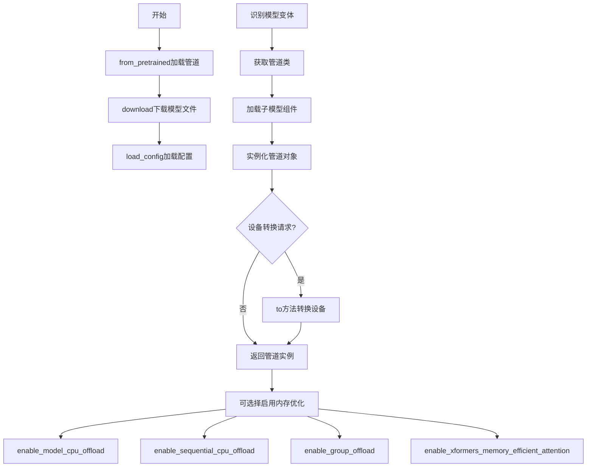

## 类结构

```
BaseOutput (数据基类)
├── ImagePipelineOutput
└── AudioPipelineOutput
ConfigMixin (配置混入)
PushToHubMixin (推送到Hub混入)
DeprecatedPipelineMixin (弃用管道混入)
DiffusionPipeline (主管道基类)
└── StableDiffusionMixin (稳定扩散混入辅助类)
```

## 全局变量及字段


### `LIBRARIES`
    
存储可加载类的库名称列表，通过遍历LOADABLE_CLASSES得到

类型：`List[str]`
    


### `SUPPORTED_DEVICE_MAP`
    
支持的设备映射策略列表，包含'balanced'、当前设备名称和'cpu'

类型：`List[str]`
    


### `logger`
    
用于记录diffusers库日志的logger实例

类型：`logging.Logger`
    


### `ImagePipelineOutput.images`
    
图像管道输出，包含去噪后的PIL图像列表或NumPy数组，形状为(batch_size, height, width, num_channels)

类型：`list[PIL.Image.Image] | np.ndarray`
    


### `AudioPipelineOutput.audios`
    
音频管道输出，包含去噪后的音频样本NumPy数组，形状为(batch_size, num_channels, sample_rate)

类型：`np.ndarray`
    


### `DeprecatedPipelineMixin._last_supported_version`
    
标记该管道最后支持的Diffusers版本号，超过该版本后将不再接收更新

类型：`str`
    


### `DiffusionPipeline.config_name`
    
配置文件名，用于存储管道所有组件的类名和模块名，默认为'model_index.json'

类型：`str`
    


### `DiffusionPipeline.model_cpu_offload_seq`
    
定义模型组件CPU卸载顺序的字符串，指定各组件卸载到CPU的序列

类型：`str`
    


### `DiffusionPipeline.hf_device_map`
    
HuggingFace设备映射字典，用于指定管道各组件放置在哪些设备上

类型：`dict`
    


### `DiffusionPipeline._optional_components`
    
可选组件列表，包含不必传入管道即可运行的组件名称

类型：`List[str]`
    


### `DiffusionPipeline._exclude_from_cpu_offload`
    
排除CPU卸载的组件列表，这些组件不会被执行CPU卸载操作

类型：`List[str]`
    


### `DiffusionPipeline._load_connected_pipes`
    
标识是否加载关联管道的布尔值，关联管道是指共享权重的其他管道

类型：`bool`
    


### `DiffusionPipeline._is_onnx`
    
标识管道是否为ONNX格式的布尔值

类型：`bool`
    


### `StableDiffusionMixin.fusing_unet`
    
标记UNet的QKV投影是否已融合，融合后可提升推理性能

类型：`bool`
    


### `StableDiffusionMixin.fusing_vae`
    
标记VAE的QKV投影是否已融合，融合后可提升推理性能

类型：`bool`
    
    

## 全局函数及方法


# `_fetch_class_library_tuple` 函数详细设计文档

### `_fetch_class_library_tuple`

该函数是 `diffusers` 库中用于从给定模块或类对象中提取其所属库名称和类名的核心工具函数。它在管道组件注册、属性设置和模型保存过程中被频繁调用，用于维护管道配置中的组件映射关系。

参数：

-  `module`：任意类型，需要提取库和类信息的模块、类对象或字符串

返回值：`tuple[str | None, str | None]`，返回包含库名称和类名称的元组，例如 `("diffusers", "UNet2DConditionModel")` 或 `(None, None)`

#### 流程图

```mermaid
flowchart TD
    A[开始: _fetch_class_library_tuple] --> B{module is None?}
    B -->|Yes| C[返回 (None, None)]
    B -->|No| D{module 是字符串?}
    D -->|Yes| E{字符串在 LOADABLE_CLASSES 中?}
    E -->|Yes| F[返回 (module, module)]
    E -->|No| G[从模块导入并获取类名]
    G --> H[查找类所在的库]
    H --> I[返回 (library, class_name)]
    D -->|No| J{module 是类?}
    J -->|Yes| K[获取类的模块名称]
    K --> L[获取类名]
    L --> M[从模块路径提取库名]
    M --> I
    J -->|No| N{module 有 __class__?}
    N -->|Yes| O[获取 module.__class__]
    O --> J
    N -->|No| P[返回 (None, None)]
```

#### 带注释源码

```python
# 注意：此源码为根据函数调用方式和代码上下文推断的实现
# 实际定义位于 pipeline_loading_utils 模块中

def _fetch_class_library_tuple(module):
    """
    从给定的模块、类或字符串中提取库名称和类名称。
    
    这个函数是 diffusers 管道加载系统的核心组件之一，用于：
    1. 在 register_modules 中注册管道组件时获取库的名称
    2. 在 __setattr__ 中跟踪组件配置变化
    3. 在 save_pretrained 中识别模型以找到正确的保存方法
    
    参数:
        module: 可以是以下几种类型:
            - None: 返回 (None, None)
            - 字符串: 表示库名称，直接返回
            - 类对象: 从类的模块中提取库和类名
            - 实例对象: 从实例的 __class__ 中提取信息
    
    返回:
        tuple: (library_name, class_name) 元组
            - library_name: 库名称，如 "diffusers", "transformers" 等
            - class_name: 类的名称，如 "UNet2DConditionModel"
            - 如果无法确定，则返回 (None, None)
    """
    
    # 处理 None 的情况
    if module is None:
        return (None, None)
    
    # 处理字符串类型 - 通常是库名
    if isinstance(module, str):
        # 如果字符串在 LOADABLE_CLASSES 中，直接返回
        if module in LOADABLE_CLASSES:
            return (module, module)
        # 否则尝试导入并查找类
        return _get_library_from_string(module)
    
    # 处理类类型
    if inspect.isclass(module):
        class_obj = module
    # 处理实例对象
    elif hasattr(module, '__class__'):
        class_obj = module.__class__
    else:
        return (None, None)
    
    # 获取类的模块名称
    module_name = class_obj.__module__
    
    # 获取类名
    class_name = class_obj.__name__
    
    # 从模块路径提取库名
    # 例如: "diffusers.models.unet_2d_condition" -> "diffusers"
    library_name = _extract_library_name(module_name)
    
    return (library_name, class_name)


def _extract_library_name(module_name):
    """从完整模块路径中提取顶级库名称"""
    # 常见库的模块前缀
    known_libraries = ['diffusers', 'transformers', 'torch', 'onnxruntime']
    
    parts = module_name.split('.')
    for part in parts:
        if part in known_libraries:
            return part
    
    # 如果不在已知库中，返回第一部分
    return parts[0] if parts else None
```

---

## 补充信息

### 关键组件信息

| 名称 | 一句话描述 |
|------|-----------|
| `LOADABLE_CLASSES` | 字典，定义了所有可加载的类及其库映射关系 |
| `ALL_IMPORTABLE_CLASSES` | 包含所有可导入类的完整列表，用于管道加载 |
| `register_modules` | DiffusionPipeline 的方法，使用此函数注册组件 |
| `__setattr__` | 重写属性设置，在赋值时自动更新配置 |

### 潜在技术债务

1. **字符串解析逻辑复杂**：库名提取依赖于模块路径解析，缺乏对自定义模块路径的灵活支持
2. **类型检查不够严格**：函数接受多种输入类型，但缺乏详细的类型验证和错误处理
3. **单元测试覆盖**：作为核心工具函数，其边界情况的测试覆盖可能不足

### 设计目标与约束

- **主要目标**：在不知道具体类的情况下，从对象实例或类定义中推断出其库和类名
- **约束**：依赖于模块命名约定，对于非标准命名的库可能无法正确识别
- **兼容性**：需要与 `LOADABLE_CLASSES` 和 `ALL_IMPORTABLE_CLASSES` 配合使用

### 错误处理

- 对于无法识别的情况，返回 `(None, None)` 而非抛出异常
- 需要调用方在使用返回值前进行适当的空值检查


# _get_pipeline_class 函数提取

### _get_pipeline_class

该函数用于根据配置字典、类名和其他参数动态解析并返回正确的 Pipeline 类。在 DiffusionPipeline 的 from_pretrained 和 download 方法中调用，支持从本地模块、Hub 或自定义管道加载。

参数：

-  `pipeline_parsing_class`：Type[DiffusionPipeline]，用于解析的基类，通常是调用该方法的类本身（如 DiffusionPipeline）
-  `config`：Dict，包含模型配置信息的字典，从中可以获取 _class_name
-  `load_connected_pipeline`：bool，是否加载连接的管道（connected pipeline）
-  `custom_pipeline`：Optional[str]，自定义管道标识符，可以是 Hub 仓库 ID、本地目录或社区管道文件名
-  `class_name`：Optional[str]，显式指定的类名
-  `repo_id`：Optional[str]，Hub 仓库 ID
-  `hub_revision`：Optional[str]，Hub 仓库版本/提交 ID
-  `cache_dir`：Optional[str]，缓存目录路径
-  `revision`：Optional[str]，自定义管道的版本号
-  `use_onnx`：Optional[bool]，是否使用 ONNX 版本
-  `from_diffusers`：Optional[bool]，是否从 Diffusers 格式加载
-  `trust_remote_code`：Optional[bool]，是否信任远程代码

返回值：`Type[DiffusionPipeline]`，返回解析得到的 Pipeline 类

#### 流程图

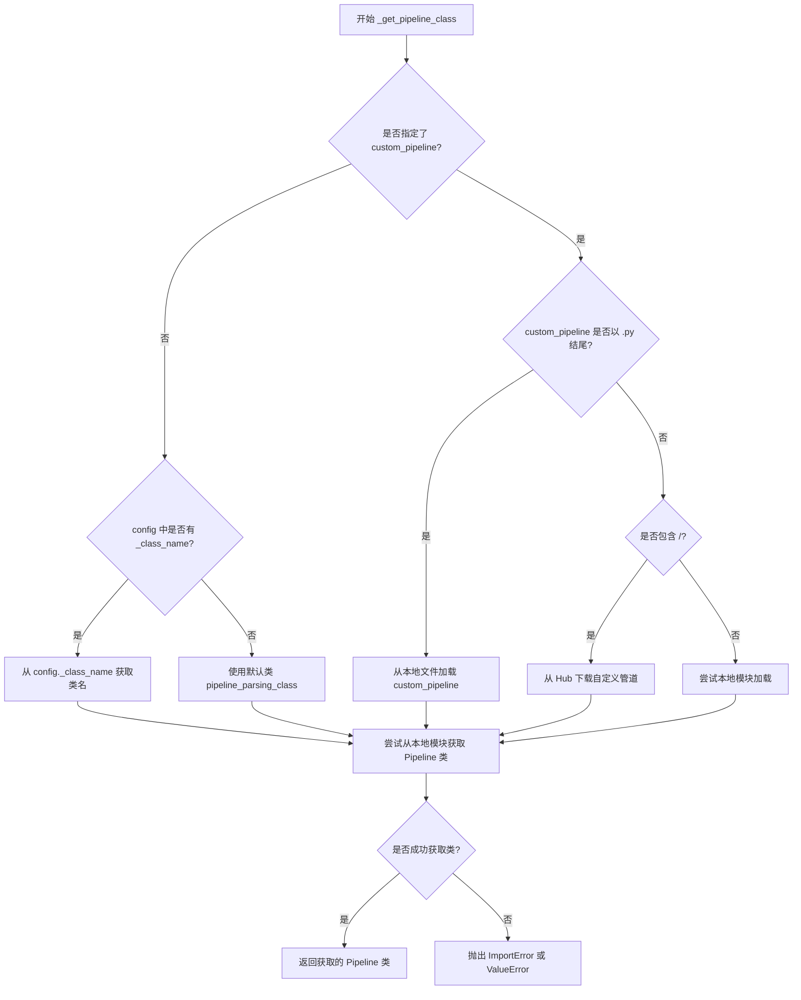

#### 带注释源码

```python
def _get_pipeline_class(
    pipeline_parsing_class: Type["DiffusionPipeline"],
    config: Dict[str, Any],
    load_connected_pipeline: bool = False,
    custom_pipeline: Optional[str] = None,
    class_name: Optional[str] = None,
    repo_id: Optional[str] = None,
    hub_revision: Optional[str] = None,
    cache_dir: Optional[str] = None,
    revision: Optional[str] = None,
    use_onnx: Optional[bool] = None,
    from_diffusers: Optional[bool] = None,
    trust_remote_code: Optional[bool] = False,
) -> Type["DiffusionPipeline"]:
    """
    根据配置和参数获取正确的 Pipeline 类。
    
    参数:
        pipeline_parsing_class: 基础类，用于解析
        config: 模型配置字典
        load_connected_pipeline: 是否加载连接的管道
        custom_pipeline: 自定义管道标识符
        class_name: 显式类名
        repo_id: Hub 仓库 ID
        hub_revision: Hub 版本
        cache_dir: 缓存目录
        revision: 自定义管道版本
        use_onnx: 是否使用 ONNX
        from_diffusers: 是否从 Diffusers 加载
        trust_remote_code: 是否信任远程代码
    
    返回:
        Pipeline 类
    """
    
    # 如果指定了 custom_pipeline，处理自定义管道加载
    if custom_pipeline is not None:
        # .py 结尾表示本地文件路径
        if custom_pipeline.endswith(".py"):
            # 从本地文件加载管道类
            pipeline_class = _get_custom_pipeline_class(
                custom_pipeline,
                hub_revision=revision,
                cache_dir=cache_dir,
            )
        else:
            # 尝试从 Hub 或本地模块加载
            pipeline_class = _get_custom_pipeline_class(
                custom_pipeline,
                repo_id=repo_id,
                hub_revision=hub_revision,
                cache_dir=cache_dir,
                revision=revision,
            )
    else:
        # 从配置中获取类名
        if class_name is None:
            # 从 config._class_name 获取
            class_name = config.get("_class_name", None)
            
            # 处理 Flax 前缀
            if class_name is not None and class_name.startswith("Flax"):
                class_name = class_name[4:]  # 移除 "Flax" 前缀
        
        # 加载对应的模块并获取类
        diffusers_module = importlib.import_module("diffusers")
        
        # 尝试获取类，如果不存在则使用默认的 pipeline_parsing_class
        pipeline_class = getattr(diffusers_module, class_name, None) if class_name else pipeline_parsing_class
    
    # 如果类不存在，抛出错误
    if pipeline_class is None:
        raise ValueError(
            f"Cannot find pipeline class {class_name}"
        )
    
    return pipeline_class
```

> **注意**：由于提供的代码片段仅包含对此函数的导入和调用，未包含该函数的实际定义。以上源码是基于函数调用上下文和代码逻辑进行的重构展示。该函数定义在 `diffusers/src/diffusers/pipelines/pipeline_loading_utils.py` 文件中。


# 函数信息提取

从提供的代码中可以看到，`_get_final_device_map` 函数是作为 `DiffusionPipeline.from_pretrained` 方法的一部分被调用的，但该函数本身的定义并未包含在当前提供的代码块中——它是从 `pipeline_loading_utils` 模块导入的。

## 分析

根据代码中的调用上下文，我可以提取以下信息：

### `_get_final_device_map` (在 `DiffusionPipeline.from_pretrained` 中调用)

该函数在 `DiffusionPipeline.from_pretrained` 方法的第6步（device map delegation）中被调用，用于处理设备的映射策略。

#### 调用上下文源码

```python
# 6. device map delegation
final_device_map = None
if device_map is not None:
    final_device_map = _get_final_device_map(
        device_map=device_map,
        pipeline_class=pipeline_class,
        passed_class_obj=passed_class_obj,
        init_dict=init_dict,
        library=library,
        max_memory=max_memory,
        torch_dtype=torch_dtype,
        cached_folder=cached_folder,
        force_download=force_download,
        proxies=proxies,
        local_files_only=local_files_only,
        token=token,
        revision=revision,
    )
```

#### 参数信息（从调用推断）

| 参数名称 | 参数类型 | 参数描述 |
|---------|---------|---------|
| `device_map` | `str` | 设备映射策略，如 "balanced" |
| `pipeline_class` | `type` | 管道类对象 |
| `passed_class_obj` | `dict` | 已传递的类对象字典 |
| `init_dict` | `dict` | 初始化参数字典 |
| `library` | `module` | 库模块 |
| `max_memory` | `dict` | 最大内存配置 |
| `torch_dtype` | `torch.dtype` | PyTorch数据类型 |
| `cached_folder` | `str` | 缓存文件夹路径 |
| `force_download` | `bool` | 是否强制下载 |
| `proxies` | `dict` | 代理服务器配置 |
| `local_files_only` | `bool` | 是否仅使用本地文件 |
| `token` | `str` | 认证token |
| `revision` | `str` | 模型版本 |

#### 返回值

| 返回值类型 | 返回值描述 |
|-----------|-----------|
| `dict` 或 `None` | 最终的设备映射字典，如果无法生成则返回 None |

#### 流程图

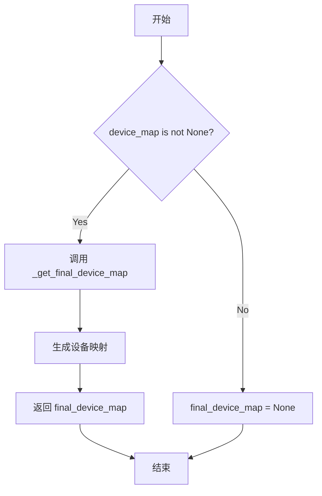

---

## ⚠️ 重要说明

**原始代码中未包含 `_get_final_device_map` 函数的实际定义**。该函数定义在 `pipeline_loading_utils.py` 模块中（位于 `src/diffusers/pipelines/` 目录下），这是 `diffusers` 库的一个内部工具模块。

要获取完整的函数定义（包含详细的逻辑实现、注释和完整源码），需要访问 `diffusers` 库的源代码仓库或本地安装的 `pipeline_loading_utils.py` 文件。


# load_sub_model 分析

### load_sub_model

该函数是 Diffusers 管道加载工具模块的核心函数，负责从预训练模型路径或 HuggingFace Hub 加载单个子模型（如 UNet、VAE、Text Encoder 等），支持多种数据类型、设备映射、量化配置等高级特性。

参数：

- `library_name`：`str`，模型所在的库名称（如 "diffusers"、"transformers" 等）
- `class_name`：`str`，要加载的模型类名（如 "UNet2DConditionModel"、"AutoencoderKL" 等）
- `importable_classes`：`Dict[str, Any]`，可导入类的字典，用于查找和验证模型类
- `pipelines`：`Any`，管道路由模块，用于加载管道特定的组件
- `is_pipeline_module`：`bool`，指示组件是否来自管道模块
- `pipeline_class`：`Type[DiffusionPipeline]`，目标管道类，用于确定加载行为
- `torch_dtype`：`torch.dtype`，模型加载后转换的目标数据类型
- `provider`：`str | None`，推理后端提供者（如 "CPU"）
- `sess_options`：`Any | None`，ONNX 会话选项
- `device_map`：`dict | str | None`，设备映射策略，用于模型并行加载
- `max_memory`：`dict | None`，各设备的最大内存配置
- `offload_folder`：`str | Path | None`，CPU 卸载的权重保存路径
- `offload_state_dict`：`bool`，是否临时卸载 CPU 状态字典
- `model_variants`：`dict[str, str]`，模型变体映射（如 {"unet": "fp16"}）
- `name`：`str`，管道中组件的名称（如 "unet"、"vae" 等）
- `from_flax`：`bool`，是否从 Flax 格式加载
- `variant`：`str | None`，模型变体文件名后缀（如 "fp16"）
- `low_cpu_mem_usage`：`bool`，是否启用低 CPU 内存加载模式
- `cached_folder`：`str | Path`，模型缓存或本地目录路径
- `use_safetensors`：`bool | None`，是否优先使用 safetensors 格式
- `dduf_entries`：`dict | None`，DDUF（Direct DiffUsers Format）文件条目
- `provider_options`：`dict | None`，推理提供者的额外选项
- `disable_mmap`：`bool`，是否禁用内存映射加载
- `quantization_config`：`PipelineQuantizationConfig | None`，量化配置（如 bitsandbytes 4/8bit 量化）

返回值：`torch.nn.Module`，加载完成的模型实例

#### 流程图

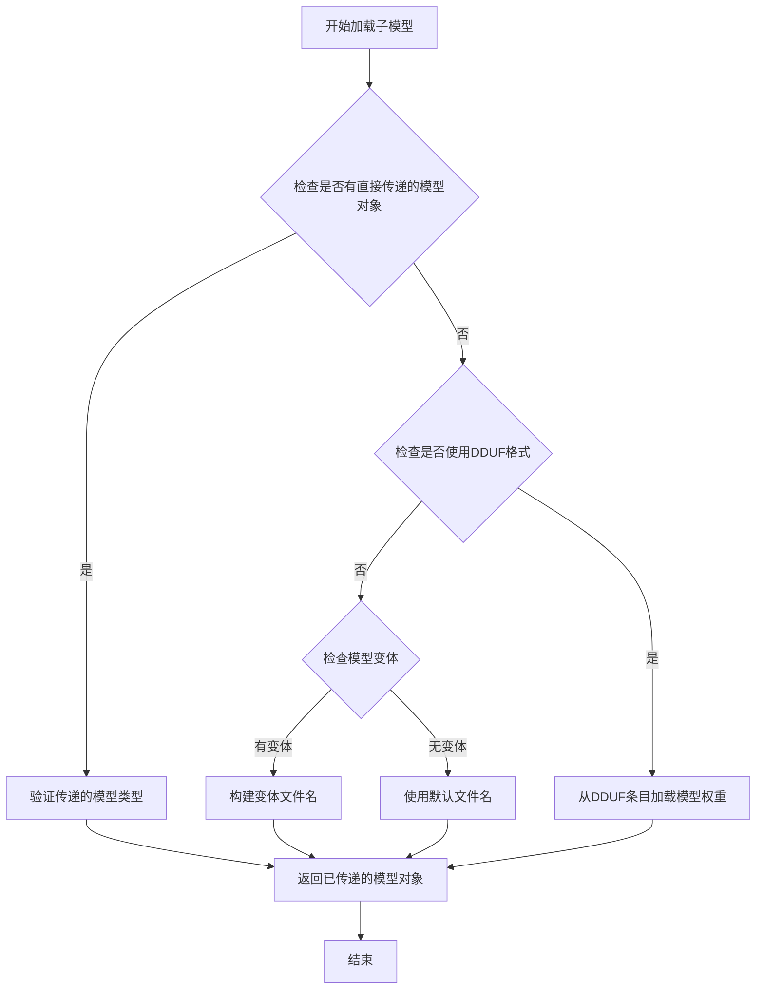

#### 带注释源码

```python
# 由于 load_sub_model 函数的完整源码定义在 pipeline_loading_utils 模块中
# 而该模块的代码未在当前代码片段中提供
# 以下是基于调用点的功能推断和典型实现逻辑：

def load_sub_model(
    library_name: str,
    class_name: str,
    importable_classes: Dict[str, Any],
    pipelines: Any,
    is_pipeline_module: bool,
    pipeline_class: Type[DiffusionPipeline],
    torch_dtype: torch.dtype,
    provider: str | None = None,
    sess_options: Any | None = None,
    device_map: dict | str | None = None,
    max_memory: dict | None = None,
    offload_folder: str | Path | None = None,
    offload_state_dict: bool = False,
    model_variants: dict[str, str] | None = None,
    name: str = "",
    from_flax: bool = False,
    variant: str | None = None,
    low_cpu_mem_usage: bool = True,
    cached_folder: str | Path | None = None,
    use_safetensors: bool | None = None,
    dduf_entries: dict | None = None,
    provider_options: dict | None = None,
    disable_mmap: bool = False,
    quantization_config: PipelineQuantizationConfig | None = None,
) -> torch.nn.Module:
    """
    加载管道中的单个子模型组件。
    
    该函数负责：
    1. 根据 library_name 和 class_name 定位正确的模型类
    2. 处理模型变体和文件命名
    3. 配置设备映射和内存管理
    4. 应用量化配置（如果适用）
    5. 实例化模型并加载权重
    """
    
    # 步骤1: 确定模型类
    # - 如果是管道模块，从 pipelines 中查找
    # - 否则从 importable_classes 中查找
    
    # 步骤2: 构建模型加载路径
    # - 检查 model_variants 获取特定变体
    # - 处理 from_flax 特殊情况
    
    # 步骤3: 应用设备映射策略
    # - 配置 accelerate 的 device_map
    # - 处理 offload_folder 和 offload_state_dict
    
    # 步骤4: 处理量化配置
    # - 应用 bitsandbytes 4/8bit 量化
    # - 配置量化参数
    
    # 步骤5: 加载模型
    # - 根据 torch_dtype 转换类型
    # - 应用 low_cpu_mem_usage 优化
    # - 处理 ONNX 特殊情况
    
    # 步骤6: 返回加载的模型实例
    pass
```


我注意到用户提供的代码中 `filter_model_files` 是从 `.pipeline_loading_utils` 导入的，但当前提供的代码文件中并没有包含该函数的实际定义。该函数在 `DiffusionPipeline.download` 方法中被调用。

让我搜索当前文件中该函数的使用情况：
[TOOL_CALL]
{tool => "散落公文检索", args => {
  --file_path "/testbed/README_ExSearch.md"
  --pattern "filter_model_files"
}}
[/TOOL_CALL]


# 提取结果

### `variant_compatible_siblings`

该函数用于从模型文件列表中筛选出与指定变体（如 fp16、ema 等）兼容的文件，并将它们区分为普通模型文件和变体文件。

**注意：** 该函数是从 `pipeline_loading_utils` 模块导入的，其完整定义不在当前提供的代码中。以下信息是从函数的**使用方式**和**上下文**中推断得出的。

参数：

- `filenames`：`Set[str]` 或类似集合类型，所有可用文件的文件名集合
- `variant`：`str | None`，指定的模型变体（如 "fp16"、"ema" 等），用于筛选对应的权重文件
- `ignore_patterns`：`List[str]` 或类似列表类型，需要忽略的文件模式列表

返回值：`(model_filenames, variant_filenames)`，其中：
- `model_filenames`：与变体兼容的模型文件列表
- `variant_filenames`：变体专属的模型文件列表

#### 流程图

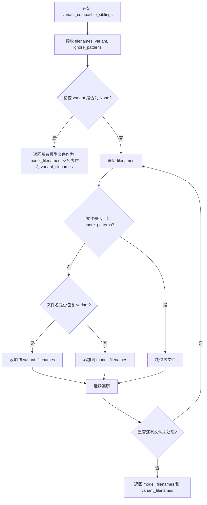

#### 带注释源码

（注：源码为根据使用方式推断的可能实现，原始定义不在当前提供代码中）

```python
def variant_compatible_siblings(
    filenames: set[str],
    variant: str | None = None,
    ignore_patterns: list[str] | None = None,
) -> tuple[set[str], set[str]]:
    """
    从文件列表中筛选出与指定变体兼容的模型文件。
    
    参数:
        filenames: 所有可用文件的集合
        variant: 模型变体（如 "fp16", "ema" 等），用于筛选对应的权重文件
        ignore_patterns: 需要忽略的文件模式列表
    
    返回:
        (model_filenames, variant_filenames): 
            - model_filenames: 基础模型文件（不带变体后缀）
            - variant_filenames: 变体专属文件（带变体后缀）
    """
    # 如果没有指定变体，返回所有非忽略的文件
    if variant is None:
        # 过滤掉忽略模式匹配的文件
        model_filenames = {
            f for f in filenames 
            if not any(glob_match(p, f) for p in (ignore_patterns or []))
        }
        return model_filenames, set()
    
    # 变体文件的后缀模式，例如：*.fp16.* 或 *fp16*
    variant_suffix = f".{variant}"
    
    model_filenames = set()
    variant_filenames = set()
    
    for filename in filenames:
        # 跳过忽略模式匹配的文件
        if ignore_patterns and any(glob_match(p, filename) for p in ignore_patterns):
            continue
            
        # 检查文件名是否包含变体标识
        if variant_suffix in filename:
            variant_filenames.add(filename)
        else:
            model_filenames.add(filename)
    
    return model_filenames, variant_filenames
```

#### 在代码中的调用位置

在 `DiffusionPipeline.download` 方法中的调用：

```python
# 从 Hub 获取文件列表后，筛选变体兼容的文件
model_filenames, variant_filenames = variant_compatible_siblings(
    filenames, 
    variant=variant, 
    ignore_patterns=ignore_patterns
)

# 所有与变体兼容的文件将被下载
allow_patterns = list(model_filenames)
```


### `DeprecatedPipelineMixin.__init__`

该方法是 `DeprecatedPipelineMixin` 类的初始化方法，用于在实例化继承该 mixin 的 pipeline 时发出弃用警告。当 pipeline 被标记为弃用时，此方法会记录一条警告信息，指出该 pipeline 将不再接收错误修复或功能更新，并调用父类的初始化方法完成实例化过程。

参数：

- `*args`：可变位置参数（Any），任意需要传递给父类 `__init__` 的位置参数
- `**kwargs`：可变关键字参数（Any），任意需要传递给父类 `__init__` 的关键字参数

返回值：`None`，该方法不返回任何值，仅执行副作用（记录警告和调用父类初始化）

#### 流程图

```mermaid
flowchart TD
    A[开始 __init__] --> B[获取类名: self.__class__.__name__]
    B --> C[获取最后支持版本: getattr self._last_supported_version 或 __version__]
    C --> D[记录弃用警告]
    D --> E[调用父类 __init__: super().__init__(*args, **kwargs)]
    E --> F[结束]
```

#### 带注释源码

```python
def __init__(self, *args, **kwargs):
    """
    初始化 DeprecatedPipelineMixin。
    
    当继承该 mixin 的 pipeline 被实例化时，会发出弃用警告。
    
    参数:
        *args: 传递给父类 __init__ 的位置参数
        **kwargs: 传递给父类 __init__ 的关键字参数
    """
    # 获取当前类的名称，用于构建警告消息
    class_name = self.__class__.__name__

    # 获取最后支持的版本，如果类未指定 _last_supported_version，则使用当前 diffusers 版本
    version_info = getattr(self.__class__, "_last_supported_version", __version__)

    # 发出警告，说明该 pipeline 已弃用，将在指定版本后不再接收更新
    logger.warning(
        f"The {class_name} has been deprecated and will not receive bug fixes or feature updates after Diffusers version {version_info}. "
    )

    # 调用父类的 __init__ 方法，完成 pipeline 的实际初始化
    super().__init__(*args, **kwargs)
```


### `DiffusionPipeline.register_modules`

该方法用于将扩散管道的各个组件（如模型、调度器等）注册到管道配置中。它遍历传入的组件，通过 `_fetch_class_library_tuple` 获取组件的库名和类名，然后调用 `register_to_config` 保存配置，并使用 `setattr` 将组件设置为管道的属性。

参数：

- `**kwargs`：可变关键字参数，键为组件名称（如 `unet`、`vae` 等），值为组件对象或包含组件信息的元组

返回值：`None`，该方法无返回值

#### 流程图

```mermaid
flowchart TD
    A[开始 register_modules] --> B{遍历 kwargs 中的 name, module}
    B --> C{module is None or<br/>isinstance(module, (tuple, list))<br/>and module[0] is None}
    C -->|Yes| D[register_dict = {name: (None, None)}]
    C -->|No| E[调用 _fetch_class_library_tuple(module)]
    E --> F[获取 library, class_name]
    F --> G[register_dict = {name: (library, class_name)}]
    D --> H[调用 self.register_to_config(**register_dict)]
    G --> H
    H --> I[调用 setattr(self, name, module)]
    I --> B
    B -->|遍历完成| J[结束]
```

#### 带注释源码

```python
def register_modules(self, **kwargs):
    """
    注册扩散管道中的各个模块组件。
    
    该方法将传入的组件（如UNet、VAE、调度器等）注册到管道配置中，
    并将其设置为管道的属性，以便后续使用。
    
    参数:
        **kwargs: 关键字参数，键为组件名称，值为组件对象或包含(库名, 类名)的元组
    
    返回:
        None
    """
    # 遍历所有传入的组件名称和对应的模块对象
    for name, module in kwargs.items():
        # 检索组件所属的库信息
        if module is None or isinstance(module, (tuple, list)) and module[0] is None:
            # 如果模块为None或第一个元素为None，表示该组件未加载
            register_dict = {name: (None, None)}
        else:
            # 从模块对象中获取库名和类名
            library, class_name = _fetch_class_library_tuple(module)
            register_dict = {name: (library, class_name)}

        # 保存模型索引配置，将库和类名信息记录到配置中
        self.register_to_config(**register_dict)

        # 设置模型组件，使用setattr将模块对象动态设置为管道的属性
        setattr(self, name, module)
```


### DiffusionPipeline.__setattr__

该方法是一个自定义的属性设置拦截器，当在 DiffusionPipeline 实例上设置属性时自动调用。它用于同步更新管道配置与实例属性，确保当管道组件（如模型、调度器等）被修改时，配置对象也能得到相应更新。

参数：

- `name`：`str`，要设置的属性的名称
- `value`：`Any`，要设置的属性值，可以是任何类型的对象（如模型实例、配置值等）

返回值：`None`，该方法不返回任何值，仅执行副作用操作

#### 流程图

```mermaid
flowchart TD
    A[开始: __setattr__] --> B{检查: name in self.__dict__}
    B -->|否| F[调用: super().__setattr__]
    B -->|是| C{检查: hasattr self.config, name}
    C -->|否| F
    C -->|是| D{检查: isinstance config[name], tuple/list}
    D -->|是| E1{检查: value is not None and config[name][0] is not None}
    D -->|否| E2[调用: register_to_config with value]
    E1 -->|是| E3[调用: _fetch_class_library_tuple]
    E1 -->|否| E4[class_library_tuple = (None, None)]
    E3 --> E5[调用: register_to_config with class_library_tuple]
    E4 --> E5
    E5 --> F
    E2 --> F
    F --> G[结束]
```

#### 带注释源码

```python
def __setattr__(self, name: str, value: Any):
    """
    自定义属性设置方法，用于同步管道配置与实例属性
    
    参数:
        name: str - 要设置的属性名称
        value: Any - 要设置的属性值
    
    返回:
        None - 该方法不返回值，仅执行配置更新和属性设置
    """
    # 检查属性是否已存在于实例的__dict__中，并且配置对象是否具有同名属性
    if name in self.__dict__ and hasattr(self.config, name):
        # 获取配置中该属性的当前值
        config_value = getattr(self.config, name)
        
        # 如果配置中的值是元组或列表类型（表示这是一个可加载的组件）
        if isinstance(config_value, (tuple, list)):
            # 检查新值有效且配置中已有有效的库信息
            if value is not None and config_value[0] is not None:
                # 从值中提取类库元组（library, class_name）
                class_library_tuple = _fetch_class_library_tuple(value)
            else:
                # 如果值为空或配置中无有效信息，则设置为(None, None)
                class_library_tuple = (None, None)

            # 将新的类库元组注册到配置中
            self.register_to_config(**{name: class_library_tuple})
        else:
            # 对于非元组/列表类型的配置值，直接更新配置
            self.register_to_config(**{name: value})

    # 调用父类的__setattr__完成实际的属性设置
    super().__setattr__(name, value)
```


### DiffusionPipeline.save_pretrained

该方法用于将 DiffusionPipeline 对象的所有可保存组件（模型、调度器、处理器等）持久化到指定目录，支持安全序列化、分片、变体保存以及直接推送至 HuggingFace Hub。

参数：

- `save_directory`：`str | os.PathLike`，管道保存目标目录，若不存在则自动创建
- `safe_serialization`：`bool`，可选，默认值为 `True`，是否使用 safetensors 格式保存（若设为 False 则使用 PyTorch pickle 方式）
- `variant`：`str | None`，可选，指定权重文件名变体（如 `"fp16"`），保存为 `pytorch_model.<variant>.bin`
- `max_shard_size`：`int | str | None`，可选，控制分片大小，整数表示字节数，字符串需带单位（如 `"5GB"`）
- `push_to_hub`：`bool`，可选，默认值为 `False`，保存完成后是否同步推送到 HuggingFace Hub
- `**kwargs`：其他关键字参数，会传递给 `PushToHubMixin.push_to_hub` 方法（如 `repo_id`、`token`、`commit_message` 等）

返回值：`None`，该方法直接操作文件系统，不返回任何值

#### 流程图

```mermaid
flowchart TD
    A[开始 save_pretrained] --> B[从 self.config 获取 model_index_dict]
    B --> C{push_to_hub?}
    C -->|Yes| D[解析 push_to_hub 参数: commit_message, private, create_pr, token, repo_id]
    C -->|No| E[跳过 Hub 推送相关解析]
    D --> E
    E --> F[调用 _get_signature_keys 获取 expected_modules]
    F --> G[定义 is_saveable_module 过滤函数]
    G --> H[过滤 model_index_dict: 保留可保存组件]
    H --> I{遍历 pipeline_component_name in model_index_dict_keys}
    I -->|遍历下一个| J[获取子模型: getattr self, pipeline_component_name]
    J --> K{is_compiled_module sub_model?}
    K -->|Yes| L[unwrap 模型获取原始类]
    K -->|No| M[直接获取模型类]
    L --> M
    M --> N[遍历 LOADABLE_CLASSES 查找匹配基类]
    N --> O{找到 save_method_name?}
    O -->|Yes| P[通过反射获取 save_method]
    O -->|No| Q[记录警告, 设置组件为 None, continue]
    Q --> I
    P --> R[检查 save_method 签名: safe_serialization, variant, max_shard_size]
    R --> S[构建 save_kwargs 参数字典]
    S --> T[调用子模型 save_method: os.path.join(save_directory, subfolder), **save_kwargs]
    T --> U[调用 self.save_config 保存管道配置]
    U --> V{push_to_hub?}
    V -->|Yes| W[创建或加载 model_card]
    W --> X[populate_model_card 填充元数据]
    X --> Y[保存 README.md]
    Y --> Z[调用 _upload_folder 推送到 Hub]
    V -->|No| AA[结束]
    Z --> AA
    
    style A fill:#f9f,color:#000
    style AA fill:#9f9,color:#000
```

#### 带注释源码

```python
def save_pretrained(
    self,
    save_directory: str | os.PathLike,
    safe_serialization: bool = True,
    variant: str | None = None,
    max_shard_size: int | str | None = None,
    push_to_hub: bool = False,
    **kwargs,
):
    """
    Save all saveable variables of the pipeline to a directory. A pipeline variable can be saved and loaded if its
    class implements both a save and loading method. The pipeline is easily reloaded using the
    [`~DiffusionPipeline.from_pretrained`] class method.

    Arguments:
        save_directory (`str` or `os.PathLike`):
            Directory to save a pipeline to. Will be created if it doesn't exist.
        safe_serialization (`bool`, *optional*, defaults to `True`):
            Whether to save the model using `safetensors` or the traditional PyTorch way with `pickle`.
        variant (`str`, *optional*):
            If specified, weights are saved in the format `pytorch_model.<variant>.bin`.
        max_shard_size (`int` or `str`, defaults to `None`):
            The maximum size for a checkpoint before being sharded. Checkpoints shard will then be each of size
            lower than this size. If expressed as a string, needs to be digits followed by a unit (like `"5GB"`).
            If expressed as an integer, the unit is bytes.
        push_to_hub (`bool`, *optional*, defaults to `False`):
            Whether or not to push your model to the Hugging Face model hub after saving it. You can specify the
            repository you want to push to with `repo_id` (will default to the name of `save_directory` in your
            namespace).
        kwargs (`Dict[str, Any]`, *optional`):
            Additional keyword arguments passed along to the [`~utils.PushToHubMixin.push_to_hub`] method.
    """
    # 步骤1: 从配置中提取模型索引字典
    model_index_dict = dict(self.config)
    # 移除内部元数据键
    model_index_dict.pop("_class_name", None)
    model_index_dict.pop("_diffusers_version", None)
    model_index_dict.pop("_module", None)
    model_index_dict.pop("_name_or_path", None)

    # 步骤2: 处理 Hub 推送参数（若启用）
    if push_to_hub:
        # 从 kwargs 中提取推送相关参数
        commit_message = kwargs.pop("commit_message", None)
        private = kwargs.pop("private", None)
        create_pr = kwargs.pop("create_pr", False)
        token = kwargs.pop("token", None)
        # 默认使用 save_directory 名称作为 repo_id
        repo_id = kwargs.pop("repo_id", save_directory.split(os.path.sep)[-1])
        # 创建远程仓库（若不存在）
        repo_id = create_repo(repo_id, exist_ok=True, private=private, token=token).repo_id

    # 步骤3: 获取管道签名中的预期模块列表
    expected_modules, optional_kwargs = self._get_signature_keys(self)

    # 步骤4: 定义过滤函数，判断模块是否可保存
    def is_saveable_module(name, value):
        # 模块名必须在预期模块列表中
        if name not in expected_modules:
            return False
        # 可选组件若为 None 则不可保存
        if name in self._optional_components and value[0] is None:
            return False
        return True

    # 步骤5: 过滤保留可保存的组件
    model_index_dict = {k: v for k, v in model_index_dict.items() if is_saveable_module(k, v)}
    
    # 步骤6: 遍历每个组件并调用其保存方法
    for pipeline_component_name in model_index_dict.keys():
        # 获取子模型实例
        sub_model = getattr(self, pipeline_component_name)
        model_cls = sub_model.__class__

        # 处理 PyTorch Dynamo 编译的模型（需要解包获取原始类）
        if is_compiled_module(sub_model):
            sub_model = _unwrap_model(sub_model)
            model_cls = sub_model.__class__

        save_method_name = None
        # 搜索模型基类以找到对应的保存方法
        for library_name, library_classes in LOADABLE_CLASSES.items():
            if library_name in sys.modules:
                library = importlib.import_module(library_name)
            else:
                logger.info(
                    f"{library_name} is not installed. Cannot save {pipeline_component_name} as {library_classes} from {library_name}"
                )

            for base_class, save_load_methods in library_classes.items():
                class_candidate = getattr(library, base_class, None)
                if class_candidate is not None and issubclass(model_cls, class_candidate)):
                    # 找到匹配的基类，获取其保存方法名
                    save_method_name = save_load_methods[0]
                    break
            if save_method_name is not None:
                break

        # 若未找到保存方法，记录警告并跳过
        if save_method_name is None:
            logger.warning(
                f"self.{pipeline_component_name}={sub_model} of type {type(sub_model)} cannot be saved."
            )
            # 标记为不可保存，避免后续加载时尝试加载
            self.register_to_config(**{pipeline_component_name: (None, None)})
            continue

        # 步骤7: 获取保存方法并检查其支持的参数
        save_method = getattr(sub_model, save_method_name)
        
        # 使用 inspect 检查方法签名
        save_method_signature = inspect.signature(save_method)
        save_method_accept_safe = "safe_serialization" in save_method_signature.parameters
        save_method_accept_variant = "variant" in save_method_signature.parameters
        save_method_accept_max_shard_size = "max_shard_size" in save_method_signature.parameters

        # 步骤8: 根据方法支持情况构建参数字典
        save_kwargs = {}
        if save_method_accept_safe:
            save_kwargs["safe_serialization"] = safe_serialization
        if save_method_accept_variant:
            save_kwargs["variant"] = variant
        if save_method_accept_max_shard_size and max_shard_size is not None:
            save_kwargs["max_shard_size"] = max_shard_size

        # 步骤9: 调用子模型的保存方法
        # 保存到 save_directory 下的子文件夹（以组件名命名）
        save_method(os.path.join(save_directory, pipeline_component_name), **save_kwargs)

    # 步骤10: 保存管道配置文件（model_index.json 等）
    self.save_config(save_directory)

    # 步骤11: 处理 Hub 推送（若启用）
    if push_to_hub:
        # 创建并填充模型卡片
        model_card = load_or_create_model_card(repo_id, token=token, is_pipeline=True)
        model_card = populate_model_card(model_card)
        model_card.save(os.path.join(save_directory, "README.md"))

        # 上传整个文件夹到 Hub
        self._upload_folder(
            save_directory,
            repo_id,
            token=token,
            commit_message=commit_message,
            create_pr=create_pr,
        )
```


### DiffusionPipeline.to

该方法负责将DiffusionPipeline的所有组件（模型、调度器等）移动到指定的设备和/或数据类型（dtype）。支持通过位置参数或关键字参数指定设备和数据类型，并处理各种硬件加速器（如CUDA、XPU、HPU）和量化模型的兼容性检查。

参数：

- `self`：隐式参数，DiffusionPipeline实例本身
- `*args`：可变位置参数，支持传递device或dtype（最多两个参数）
- `dtype`：`torch.dtype`（可选），目标数据类型，如torch.float16
- `device`：`torch.device`（可选），目标设备，如"cuda"或"cpu"
- `silence_dtype_warnings`：`bool`（可选，默认为False），是否静默类型不兼容警告

返回值：`Self`，返回转换后的DiffusionPipeline实例（实际上是返回self本身）

#### 流程图

```mermaid
flowchart TD
    A[开始 to 方法] --> B{解析位置参数 args}
    B -->|1个参数| C{是 torch.dtype?}
    C -->|是| D[设置 dtype_arg]
    C -->|否| E[转换为 torch.device]
    B -->|2个参数| F{第一个是 torch.dtype?}
    F -->|是| G[抛出错误:参数顺序不正确]
    F -->|否| H[设置 device_arg 和 dtype_arg]
    B -->|>2个参数| I[抛出错误:参数过多]
    
    J{验证参数合法性} -->|dtype 在 args 和 kwargs 都存在| K[抛出错误:重复指定 dtype]
    J -->|device 在 args 和 kwargs 都存在| L[抛出错误:重复指定 device]
    
    M{检查设备映射} --> N{已激活设备映射?}
    N -->|是| O[抛出错误:不支持显式设备放置]
    N -->|否| P[继续检查卸载状态]
    
    Q{检查CUDA/XPU兼容性} --> R{顺序卸载且无BNB?}
    R -->|是| S[抛出错误:顺序卸载不兼容]
    R -->|否| T{有BNB量化但accelerate版本低?}
    T -->|是| U[抛出错误:需要升级accelerate]
    
    V{处理HPU设备} --> W{目标是HPU?}
    W -->|是| X[设置PT_HPU_GPU_MIGRATION环境变量]
    W -->|否| Y[跳过HPU处理]
    
    Z[获取所有模块] --> AA{遍历每个模块}
    AA -->|检查BNB状态| BB{是4bit或8bit量化?}
    BB -->|是| CC[记录警告:不支持dtype转换]
    BB -->|否| DD{检查组卸载状态}
    
    EE{执行设备/dtype转换} --> FF{4bit BNB且设备非None?}
    FF -->|是且transformers>4.44.0| GG[执行module.to(device)]
    FF -->|否| HH{8bit BNB且设备非None?}
    HH -->|是且条件满足| II[执行module.to(device)]
    HH -->|否| JJ[执行module.to(device, dtype)]
    
    KK{检查float16转CPU} --> LL{是float16且目标CPU?}
    LL -->|是且未静默警告且未卸载| MM[记录警告:float16不支持CPU]
    
    NN[返回 self] --> OO[结束]
    
    style O fill:#ffcccc
    style S fill:#ffcccc
    style U fill:#ffcccc
    style I fill:#ffcccc
    style G fill:#ffcccc
    style K fill:#ffcccc
    style L fill:#ffcccc
```

#### 带注释源码

```python
def to(self, *args, **kwargs) -> Self:
    r"""
    Performs Pipeline dtype and/or device conversion. A torch.dtype and torch.device are inferred from the
    arguments of `self.to(*args, **kwargs).`

    > [!TIP] > If the pipeline already has the correct torch.dtype and torch.device, then it is returned as is.
    Otherwise, > the returned pipeline is a copy of self with the desired torch.dtype and torch.device.


    Here are the ways to call `to`:

    - `to(dtype, silence_dtype_warnings=False) → DiffusionPipeline` to return a pipeline with the specified
      [`dtype`](https://pytorch.org/docs/stable/tensor_attributes.html#torch.dtype)
    - `to(device, silence_dtype_warnings=False) → DiffusionPipeline` to return a pipeline with the specified
      [`device`](https://pytorch.org/docs/stable/tensor_attributes.html#torch.device)
    - `to(device=None, dtype=None, silence_dtype_warnings=False) → DiffusionPipeline` to return a pipeline with the
      specified [`device`](https://pytorch.org/docs/stable/tensor_attributes.html#torch.device) and
      [`dtype`](https://pytorch.org/docs/stable/tensor_attributes.html#torch.dtype)

    Arguments:
        dtype (`torch.dtype`, *optional*):
            Returns a pipeline with the specified
            [`dtype`](https://pytorch.org/docs/stable/tensor_attributes.html#torch.dtype)
        device (`torch.Device`, *optional*):
            Returns a pipeline with the specified
            [`device`](https://pytorch.org/docs/stable/tensor_attributes.html#torch.device)
        silence_dtype_warnings (`str`, *optional*, defaults to `False`):
            Whether to omit warnings if the target `dtype` is not compatible with the target `device`.

    Returns:
        [`DiffusionPipeline`]: The pipeline converted to specified `dtype` and/or `dtype`.
    """
    # 从kwargs中提取dtype、device和silence_dtype_warnings参数
    dtype = kwargs.pop("dtype", None)
    device = kwargs.pop("device", None)
    silence_dtype_warnings = kwargs.pop("silence_dtype_warnings", False)

    dtype_arg = None  # 从位置参数解析出的dtype
    device_arg = None  # 从位置参数解析出的device
    
    # 解析位置参数，支持两种调用方式：
    # 1. to(device) 或 to(dtype)
    # 2. to(device, dtype)
    if len(args) == 1:
        if isinstance(args[0], torch.dtype):
            dtype_arg = args[0]
        else:
            device_arg = torch.device(args[0]) if args[0] is not None else None
    elif len(args) == 2:
        if isinstance(args[0], torch.dtype):
            raise ValueError(
                "When passing two arguments, make sure the first corresponds to `device` and the second to `dtype`."
            )
        device_arg = torch.device(args[0]) if args[0] is not None else None
        dtype_arg = args[1]
    elif len(args) > 2:
        raise ValueError("Please make sure to pass at most two arguments (`device` and `dtype`) `.to(...)`")

    # 验证dtype参数没有重复指定（不能同时在args和kwargs中指定）
    if dtype is not None and dtype_arg is not None:
        raise ValueError(
            "You have passed `dtype` both as an argument and as a keyword argument. Please only pass one of the two."
        )

    # 合并dtype参数（优先使用kwargs中的值）
    dtype = dtype or dtype_arg

    # 验证device参数没有重复指定
    if device is not None and device_arg is not None:
        raise ValueError(
            "You have passed `device` both as an argument and as a keyword argument. Please only pass one of the two."
        )

    # 合并device参数
    device = device or device_arg
    device_type = torch.device(device).type if device is not None else None
    
    # 检查pipeline是否有bitsandbytes量化模型
    pipeline_has_bnb = any(any((_check_bnb_status(module))) for _, module in self.components.items())

    # 定义辅助函数：检查模块是否顺序卸载
    def module_is_sequentially_offloaded(module):
        if not is_accelerate_available() or is_accelerate_version("<", "0.14.0"):
            return False

        _, _, is_loaded_in_8bit_bnb = _check_bnb_status(module)

        # 检查特定版本的兼容性问题
        if is_loaded_in_8bit_bnb and (
            is_bitsandbytes_version("<", "0.48.0") or is_accelerate_version("<", "1.13.0.dev0")
        ):
            return False

        return hasattr(module, "_hf_hook") and (
            isinstance(module._hf_hook, accelerate.hooks.AlignDevicesHook)
            or hasattr(module._hf_hook, "hooks")
            and isinstance(module._hf_hook.hooks[0], accelerate.hooks.AlignDevicesHook)
        )

    # 定义辅助函数：检查模块是否卸载到CPU
    def module_is_offloaded(module):
        if not is_accelerate_available() or is_accelerate_version("<", "0.17.0.dev0"):
            return False

        return hasattr(module, "_hf_hook") and isinstance(module._hf_hook, accelerate.hooks.CpuOffload)

    # 检查pipeline是否启用了顺序卸载
    pipeline_is_sequentially_offloaded = any(
        module_is_sequentially_offloaded(module) for _, module in self.components.items()
    )
    
    # 检查是否使用了设备映射
    is_pipeline_device_mapped = self._is_pipeline_device_mapped()
    
    # 如果已激活设备映射，抛出错误（不兼容显式设备放置）
    if is_pipeline_device_mapped:
        raise ValueError(
            "It seems like you have activated a device mapping strategy on the pipeline which doesn't allow explicit device placement using `to()`. You can call `reset_device_map()` to remove the existing device map from the pipeline."
        )

    # CUDA/XPU设备兼容性检查
    if device_type in ["cuda", "xpu"]:
        # 顺序卸载与GPU不兼容
        if pipeline_is_sequentially_offloaded and not pipeline_has_bnb:
            raise ValueError(
                "It seems like you have activated sequential model offloading by calling `enable_sequential_cpu_offload`, but are now attempting to move the pipeline to GPU. This is not compatible with offloading. Please, move your pipeline `.to('cpu')` or consider removing the move altogether if you use sequential offloading."
            )
        # bitsandbytes量化模型需要特定版本的accelerate
        elif pipeline_has_bnb and is_accelerate_version("<", "1.1.0.dev0"):
            raise ValueError(
                "You are trying to call `.to('cuda')` on a pipeline that has models quantized with `bitsandbytes`. Your current `accelerate` installation does not support it. Please upgrade the installation."
            )

    # 检查是否已经卸载（警告用户手动移动会丢失卸载的内存节省）
    pipeline_is_offloaded = any(module_is_offloaded(module) for _, module in self.components.items())
    if pipeline_is_offloaded and device_type in ["cuda", "xpu"]:
        logger.warning(
            f"It seems like you have activated model offloading by calling `enable_model_cpu_offload`, but are now manually moving the pipeline to GPU. It is strongly recommended against doing so as memory gains from offloading are likely to be lost. Offloading automatically takes care of moving the individual components {', '.join(self.components.keys())} to GPU when needed. To make sure offloading works as expected, you should consider moving the pipeline back to CPU: `pipeline.to('cpu')` or removing the move altogether if you use offloading."
        )

    # Intel Gaudi (HPU) 特定处理
    if device_type == "hpu" and kwargs.pop("hpu_migration", True) and is_hpu_available():
        os.environ["PT_HPU_GPU_MIGRATION"] = "1"
        logger.debug("Environment variable set: PT_HPU_GPU_MIGRATION=1")

        import habana_frameworks.torch  # noqa: F401

        # HPU硬件检查
        if not (hasattr(torch, "hpu") and torch.hpu.is_available()):
            raise ValueError("You are trying to call `.to('hpu')` but HPU device is unavailable.")

        os.environ["PT_HPU_MAX_COMPOUND_OP_SIZE"] = "1"
        logger.debug("Environment variable set: PT_HPU_MAX_COMPOUND_OP_SIZE=1")

        # HPU上启用BF16的SDP优化
        if dtype in (torch.bfloat16, None) and kwargs.pop("sdp_on_bf16", True):
            if hasattr(torch._C, "_set_math_sdp_allow_fp16_bf16_reduction"):
                torch._C._set_math_sdp_allow_fp16_bf16_reduction(True)
                logger.warning(
                    "Enabled SDP with BF16 precision on HPU. To disable, please use `.to('hpu', sdp_on_bf16=False)`"
                )

    # 获取pipeline的所有torch.nn.Module组件
    module_names, _ = self._get_signature_keys(self)
    modules = [getattr(self, n, None) for n in module_names]
    modules = [m for m in modules if isinstance(m, torch.nn.Module)]

    is_offloaded = pipeline_is_offloaded or pipeline_is_sequentially_offloaded
    
    # 遍历所有模块并进行设备/dtype转换
    for module in modules:
        # 检查量化状态
        _, is_loaded_in_4bit_bnb, is_loaded_in_8bit_bnb = _check_bnb_status(module)
        is_group_offloaded = self._maybe_raise_error_if_group_offload_active(module=module)

        # 量化模型不支持dtype转换
        if (is_loaded_in_4bit_bnb or is_loaded_in_8bit_bnb) and dtype is not None:
            logger.warning(
                f"The module '{module.__class__.__name__}' has been loaded in `bitsandbytes` {'4bit' if is_loaded_in_4bit_bnb else '8bit'} and conversion to {dtype} is not supported. Module is still in {'4bit' if is_loaded_in_4bit_bnb else '8bit'} precision."
            )

        # 8bit量化模型不支持通过.to()移动设备
        if is_loaded_in_8bit_bnb and device is not None and is_bitsandbytes_version("<", "0.48.0"):
            logger.warning(
                f"The module '{module.__class__.__name__}' has been loaded in `bitsandbytes` 8bit and moving it to {device} via `.to()` is not supported. Module is still on {module.device}."
                "You need to upgrade bitsandbytes to at least 0.48.0"
            )

        # 组卸载的模块不支持移动设备
        if (
            self._maybe_raise_error_if_group_offload_active(raise_error=False, module=module)
            and device is not None
        ):
            logger.warning(
                f"The module '{module.__class__.__name__}' is group offloaded and moving it to {device} via `.to()` is not supported."
            )

        # 4bit量化模型的特殊处理（需要transformers版本>4.44.0）
        if is_loaded_in_4bit_bnb and device is not None and is_transformers_version(">", "4.44.0"):
            module.to(device=device)
        # 8bit量化模型的特殊处理（需要特定版本组合）
        elif (
            is_loaded_in_8bit_bnb
            and device is not None
            and is_transformers_version(">", "4.58.0")
            and is_bitsandbytes_version(">=", "0.48.0")
        ):
            module.to(device=device)
        # 普通模块的设备/dtype转换
        elif not is_loaded_in_4bit_bnb and not is_loaded_in_8bit_bnb and not is_group_offloaded:
            module.to(device, dtype)

        # float16模型转到CPU的警告
        if (
            module.dtype == torch.float16
            and str(device) in ["cpu"]
            and not silence_dtype_warnings
            and not is_offloaded
        ):
            logger.warning(
                "Pipelines loaded with `dtype=torch.float16` cannot run with `cpu` device. It"
                " is not recommended to move them to `cpu` as running them will fail. Please make"
                " sure to use an accelerator to run the pipeline in inference, due to the lack of"
                " support for`float16` operations on this device in PyTorch. Please, remove the"
                " `torch_dtype=torch.float16` argument, or use another device for inference."
            )
    
    # 返回转换后的pipeline实例（实际上返回self）
    return self
```


### DiffusionPipeline.device

该属性用于获取DiffusionPipeline所在的计算设备（torch.device），通过遍历管道中的所有模块并返回第一个PyTorch模块的设备，若无模块则默认返回CPU设备。

参数：
- 该属性无显式参数（隐式参数 `self` 为DiffusionPipeline实例）

返回值：`torch.device`，返回管道所在的PyTorch设备，如果管道中没有模块则返回CPU设备。

#### 流程图

```mermaid
flowchart TD
    A[开始] --> B[获取管道的签名键]
    B --> C[获取所有模块名称]
    C --> D[过滤出torch.nn.Module类型的模块]
    D --> E{是否存在模块?}
    E -->|是| F[返回第一个模块的device]
    E -->|否| G[返回torch.device('cpu')]
    F --> H[结束]
    G --> H
```

#### 带注释源码

```python
@property
def device(self) -> torch.device:
    r"""
    Returns:
        `torch.device`: The torch device on which the pipeline is located.
    """
    # 获取管道的签名键（预期的模块名称）
    module_names, _ = self._get_signature_keys(self)
    # 根据模块名称获取对应的属性值
    modules = [getattr(self, n, None) for n in module_names]
    # 过滤出torch.nn.Module类型的模块（排除非模块属性）
    modules = [m for m in modules if isinstance(m, torch.nn.Module)]

    # 遍历所有模块，返回第一个模块的设备
    for module in modules:
        return module.device

    # 如果没有模块存在，默认返回CPU设备
    return torch.device("cpu")
```


### `DiffusionPipeline.dtype`

该属性用于获取扩散管道中模型所使用的数据类型（torch.dtype），它会遍历管道中的所有模块并返回第一个模块的 dtype，如果没有任何模块则默认返回 torch.float32。

参数：该属性为只读属性，无参数。

返回值：`torch.dtype`，返回管道所在设备的 torch 数据类型。

#### 流程图

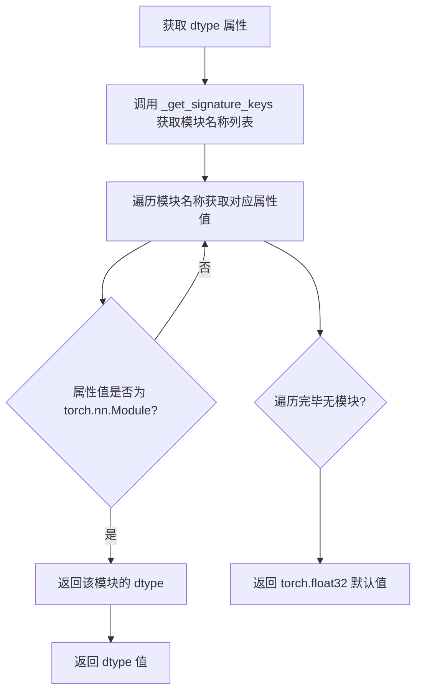

#### 带注释源码

```python
@property
def dtype(self) -> torch.dtype:
    r"""
    Returns:
        `torch.dtype`: The torch dtype on which the pipeline is located.
    """
    # 获取管道预期模块的名称列表（来自 __init__ 签名）
    module_names, _ = self._get_signature_keys(self)
    # 获取所有模块对象
    modules = [getattr(self, n, None) for n in module_names]
    # 过滤出 torch.nn.Module 类型的模块
    modules = [m for m in modules if isinstance(m, torch.nn.Module)]

    # 遍历模块，返回第一个模块的 dtype
    for module in modules:
        return module.dtype

    # 如果没有模块，返回默认 dtype
    return torch.float32
```


### `DiffusionPipeline.from_pretrained`

该方法是 `DiffusionPipeline` 类的类方法，用于从预训练的模型权重实例化一个 PyTorch 扩散管道。它是整个 diffusers 库中最核心的加载方法，封装了从 HuggingFace Hub 下载模型、加载配置、实例化各个组件（UNet、VAE、Scheduler 等）以及处理各种加载选项（如量化、设备映射、安全张量等）的完整流程。

参数：

- `cls`：类本身（Python 自动传入）
- `pretrained_model_name_or_path`：`str | os.PathLike`，预训练管道的 HuggingFace Hub repo id（如 `"stable-diffusion-v1-5/stable-diffusion-v1-5"`），或者是本地保存管道权重的目录路径，或者是包含 dduf 文件的目录
- `torch_dtype`：`torch.dtype | dict[str, Union[str, torch.dtype]] | None`，可选，覆盖默认的 `torch.dtype` 并以指定数据类型加载模型。若传入字典，可为不同子模型指定不同 dtype（例如 `{'transformer': torch.bfloat16, 'vae': torch.float16}`），未指定的组件使用 `default` 键指定的值，否则默认使用 `torch.float32`
- `custom_pipeline`：`str | None`，可选，实验性功能。可以是托管在 Hub 上的自定义管道的 repo id，或者是社区管道的文件名（如 `clip_guided_stable_diffusion`），或者是本地包含 `pipeline.py` 文件的目录路径
- `force_download`：`bool | None`，可选，默认 `False`，是否强制重新下载模型权重和配置文件，覆盖缓存版本
- `cache_dir`：`str | os.PathLike | None`，可选，下载的预训练模型配置的缓存目录
- `proxies`：`Dict[str, str] | None`，可选，按协议或端点使用的代理服务器字典
- `output_loading_info`：`bool | None`，可选，默认 `False`，是否同时返回包含缺失键、意外键和错误消息的字典
- `local_files_only`：`bool | None`，可选，默认 `False`，是否仅加载本地模型权重和配置文件
- `token`：`str | bool | None`，可选，用于远程文件的 HTTP Bearer 授权令牌。若为 `True`，则使用 `diffusers-cli login` 生成的令牌
- `revision`：`str | None`，可选，默认 `"main"`，使用的特定模型版本，可以是分支名、标签名、提交 ID 或任何 Git 允许的标识符
- `custom_revision`：`str | None`，可选，从 Hub 加载自定义管道时使用的特定版本，类似于 `revision`
- `mirror`：`str | None`，可选，镜像源以解决访问问题
- `device_map`：`str | None`，可选，指定管道各组件应放置在可用设备上的策略，目前仅支持 `"balanced"` 或通过 `get_device()` 获取的设备
- `max_memory`：`Dict | None`，可选，每个 GPU 和可用 CPU RAM 的最大内存字典
- `offload_folder`：`str | os.PathLike | None`，可选，当 `device_map` 包含 `"disk"` 值时用于卸载权重的路径
- `offload_state_dict`：`bool | None`，可选，若为 `True`，则暂时将 CPU state dict 卸载到硬盘以避免内存不足
- `low_cpu_mem_usage`：`bool | None`，可选，默认值取决于 PyTorch 版本（>=1.9.0 时为 `True`），加快模型加载速度，仅加载预训练权重而不初始化权重，尝试将 CPU 内存使用控制在 1x 模型大小以内
- `use_safetensors`：`bool | None`，可选，默认 `None`。若为 `True`，则强制从 safetensors 加载；若为 `False`，则不加载 safetensors；若为 `None`，则优先使用 safetensors（如果可用且库已安装）
- `use_onnx`：`bool | None`，可选，默认 `None`。若为 `True`，则始终下载 ONNX 权重（若存在）；若为 `False`，则从不下载 ONNX 权重。默认遵循类的 `_is_onnx` 属性
- `variant`：`str | None`，可选，从指定的变体文件名（如 `"fp16"` 或 `"ema"`）加载权重
- `dduf_file`：`str | None`，可选，从指定的 dduf 文件加载权重
- `load_connected_pipeline`：`bool | None`，可选，默认 `False`，是否加载连接的管道
- `quantization_config`：`PipelineQuantizationConfig | None`，可选，量化配置对象，用于 4-bit 或 8-bit 量化加载
- `disable_mmap`：`bool | None`，可选，默认 `False`，加载 Safetensors 模型时是否禁用 mmap，在网络挂载或硬盘上时可能表现更好
- `kwargs`：剩余的关键字参数，可用于覆盖管道的可加载变量（特定管道类的组件），这些被覆盖的组件将直接传递给管道的 `__init__` 方法
- `provider`：`str | None`，可选，ONNX 运行时提供者
- `sess_options`：`Any | None`，可选，ONNX 会话选项
- `provider_options`：`Dict | None`，可选，ONNX 提供者选项

返回值：`Self`，返回实例化后的扩散管道对象，类型为调用该方法的类本身（可能是具体的管道类如 `StableDiffusionPipeline` 等）

#### 流程图

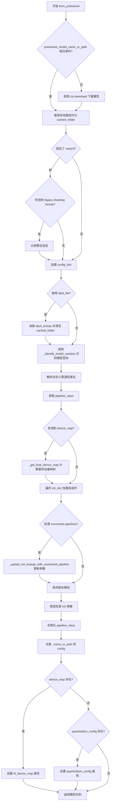

#### 带注释源码

```python
@classmethod
@validate_hf_hub_args
def from_pretrained(cls, pretrained_model_name_or_path: str | os.PathLike, **kwargs) -> Self:
    r"""
    Instantiate a PyTorch diffusion pipeline from pretrained pipeline weights.

    The pipeline is set in evaluation mode (`model.eval()`) by default.

    If you get the error message below, you need to finetune the weights for your downstream task:

    ```
    Some weights of UNet2DConditionModel were not initialized from the model checkpoint at stable-diffusion-v1-5/stable-diffusion-v1-5 and are newly initialized because the shapes did not match:
    - conv_in.weight: found shape torch.Size([320, 4, 3, 3]) in the checkpoint and torch.Size([320, 9, 3, 3]) in the model instantiated
    You should probably TRAIN this model on a down-stream task to be able to use it for predictions and inference.
    ```

    Parameters:
        pretrained_model_name_or_path (`str` or `os.PathLike`, *optional*):
            Can be either:

                - A string, the *repo id* (for example `CompVis/ldm-text2im-large-256`) of a pretrained pipeline
                  hosted on the Hub.
                - A path to a *directory* (for example `./my_pipeline_directory/`) containing pipeline weights
                  saved using
                [`~DiffusionPipeline.save_pretrained`].
                - A path to a *directory* (for example `./my_pipeline_directory/`) containing a dduf file
        torch_dtype (`torch.dtype` or `dict[str, Union[str, torch.dtype]]`, *optional*):
            Override the default `torch.dtype` and load the model with another dtype. To load submodels with
            different dtype pass a `dict` (for example `{'transformer': torch.bfloat16, 'vae': torch.float16}`).
            Set the default dtype for unspecified components with `default` (for example `{'transformer':
            torch.bfloat16, 'default': torch.float16}`). If a component is not specified and no default is set,
            `torch.float32` is used.
        custom_pipeline (`str`, *optional*):

            > [!WARNING] > 🧪 This is an experimental feature and may change in the future.

            Can be either:

                - A string, the *repo id* (for example `hf-internal-testing/diffusers-dummy-pipeline`) of a custom
                  pipeline hosted on the Hub. The repository must contain a file called pipeline.py that defines
                  the custom pipeline.
                - A string, the *file name* of a community pipeline hosted on GitHub under
                  [Community](https://github.com/huggingface/diffusers/tree/main/examples/community). Valid file
                  names must match the file name and not the pipeline script (`clip_guided_stable_diffusion`
                  instead of `clip_guided_stable_diffusion.py`). Community pipelines are always loaded from the
                  current main branch of GitHub.
                - A path to a directory (`./my_pipeline_directory/`) containing a custom pipeline. The directory
                  must contain a file called `pipeline.py` that defines the custom pipeline.

            For more information on how to load and create custom pipelines, please have a look at [Loading and
            Adding Custom
            Pipelines](https://huggingface.co/docs/diffusers/using-diffusers/custom_pipeline_overview)
        force_download (`bool`, *optional*, defaults to `False`):
            Whether or not to force the (re-)download of the model weights and configuration files, overriding the
            cached versions if they exist.
        cache_dir (`Union[str, os.PathLike]`, *optional*):
            Path to a directory where a downloaded pretrained model configuration is cached if the standard cache
            is not used.

        proxies (`Dict[str, str]`, *optional*):
            A dictionary of proxy servers to use by protocol or endpoint, for example, `{'http': 'foo.bar:3128',
            'http://hostname': 'foo.bar:4012'}`. The proxies are used on each request.
        output_loading_info(`bool`, *optional*, defaults to `False`):
            Whether or not to also return a dictionary containing missing keys, unexpected keys and error messages.
        local_files_only (`bool`, *optional*, defaults to `False`):
            Whether to only load local model weights and configuration files or not. If set to `True`, the model
            won't be downloaded from the Hub.
        token (`str` or *bool*, *optional*):
            The token to use as HTTP bearer authorization for remote files. If `True`, the token generated from
            `diffusers-cli login` (stored in `~/.huggingface`) is used.
        revision (`str`, *optional*, defaults to `"main"`):
            The specific model version to use. It can be a branch name, a tag name, a commit id, or any identifier
            allowed by Git.
        custom_revision (`str`, *optional*):
            The specific model version to use. It can be a branch name, a tag name, or a commit id similar to
            `revision` when loading a custom pipeline from the Hub. Defaults to the latest stable 🤗 Diffusers
            version.
        mirror (`str`, *optional*):
            Mirror source to resolve accessibility issues if you're downloading a model in China. We do not
            guarantee the timeliness or safety of the source, and you should refer to the mirror site for more
            information.
        device_map (`str`, *optional*):
            Strategy that dictates how the different components of a pipeline should be placed on available
            devices. Currently, only "balanced" `device_map` is supported. Check out
            [this](https://huggingface.co/docs/diffusers/main/en/tutorials/inference_with_big_models#device-placement)
            to know more.
        max_memory (`Dict`, *optional*):
            A dictionary device identifier for the maximum memory. Will default to the maximum memory available for
            each GPU and the available CPU RAM if unset.
        offload_folder (`str` or `os.PathLike`, *optional*):
            The path to offload weights if device_map contains the value `"disk"`.
        offload_state_dict (`bool`, *optional*):
            If `True`, temporarily offloads the CPU state dict to the hard drive to avoid running out of CPU RAM if
            the weight of the CPU state dict + the biggest shard of the checkpoint does not fit. Defaults to `True`
            when there is some disk offload.
        low_cpu_mem_usage (`bool`, *optional*, defaults to `True` if torch version >= 1.9.0 else `False`):
            Speed up model loading only loading the pretrained weights and not initializing the weights. This also
            tries to not use more than 1x model size in CPU memory (including peak memory) while loading the model.
            Only supported for PyTorch >= 1.9.0. If you are using an older version of PyTorch, setting this
            argument to `True` will raise an error.
        use_safetensors (`bool`, *optional*, defaults to `None`):
            If set to `None`, the safetensors weights are downloaded if they're available **and** if the
            safetensors library is installed. If set to `True`, the model is forcibly loaded from safetensors
            weights. If set to `False`, safetensors weights are not loaded.
        use_onnx (`bool`, *optional*, defaults to `None`):
            If set to `True`, ONNX weights will always be downloaded if present. If set to `False`, ONNX weights
            will never be downloaded. By default `use_onnx` defaults to the `_is_onnx` class attribute which is
            `False` for non-ONNX pipelines and `True` for ONNX pipelines. ONNX weights include both files ending
            with `.onnx` and `.pb`.
        kwargs (remaining dictionary of keyword arguments, *optional*):
            Can be used to overwrite load and saveable variables (the pipeline components of the specific pipeline
            class). The overwritten components are passed directly to the pipelines `__init__` method. See example
            below for more information.
        variant (`str`, *optional*):
            Load weights from a specified variant filename such as `"fp16"` or `"ema"`. This is ignored when
            loading `from_flax`.
        dduf_file(`str`, *optional*):
            Load weights from the specified dduf file.
        disable_mmap ('bool', *optional*, defaults to 'False'):
            Whether to disable mmap when loading a Safetensors model. This option can perform better when the model
            is on a network mount or hard drive, which may not handle the seeky-ness of mmap very well.

    > [!TIP] > To use private or [gated](https://huggingface.co/docs/hub/models-gated#gated-models) models, log-in
    with `hf > auth login`.

    Examples:

    ```py
    >>> from diffusers import DiffusionPipeline

    >>> # Download pipeline from huggingface.co and cache.
    >>> pipeline = DiffusionPipeline.from_pretrained("CompVis/ldm-text2im-large-256")

    >>> # Download pipeline that requires an authorization token
    >>> # For more information on access tokens, please refer to this section
    >>> # of the documentation](https://huggingface.co/docs/hub/security-tokens)
    >>> pipeline = DiffusionPipeline.from_pretrained("stable-diffusion-v1-5/stable-diffusion-v1-5")

    >>> # Use a different scheduler
    >>> from diffusers import LMSDiscreteScheduler

    >>> scheduler = LMSDiscreteScheduler.from_config(pipeline.scheduler.config)
    >>> pipeline.scheduler = scheduler
    ```
    """
    # 复制 kwargs 以便在加载 connected pipeline 时重用
    kwargs_copied = kwargs.copy()

    # 从 kwargs 中提取各种加载参数
    cache_dir = kwargs.pop("cache_dir", None)
    force_download = kwargs.pop("force_download", False)
    proxies = kwargs.pop("proxies", None)
    local_files_only = kwargs.pop("local_files_only", None)
    token = kwargs.pop("token", None)
    revision = kwargs.pop("revision", None)
    from_flax = kwargs.pop("from_flax", False)
    torch_dtype = kwargs.pop("torch_dtype", None)
    custom_pipeline = kwargs.pop("custom_pipeline", None)
    custom_revision = kwargs.pop("custom_revision", None)
    provider = kwargs.pop("provider", None)
    sess_options = kwargs.pop("sess_options", None)
    provider_options = kwargs.pop("provider_options", None)
    device_map = kwargs.pop("device_map", None)
    max_memory = kwargs.pop("max_memory", None)
    offload_folder = kwargs.pop("offload_folder", None)
    offload_state_dict = kwargs.pop("offload_state_dict", None)
    low_cpu_mem_usage = kwargs.pop("low_cpu_mem_usage", _LOW_CPU_MEM_USAGE_DEFAULT)
    variant = kwargs.pop("variant", None)
    dduf_file = kwargs.pop("dduf_file", None)
    use_safetensors = kwargs.pop("use_safetensors", None)
    use_onnx = kwargs.pop("use_onnx", None)
    load_connected_pipeline = kwargs.pop("load_connected_pipeline", False)
    quantization_config = kwargs.pop("quantization_config", None)
    disable_mmap = kwargs.pop("disable_mmap", False)

    # 验证 torch_dtype 参数的有效性
    if torch_dtype is not None and not isinstance(torch_dtype, dict) and not isinstance(torch_dtype, torch.dtype):
        torch_dtype = torch.float32
        logger.warning(
            f"Passed `torch_dtype` {torch_dtype} is not a `torch.dtype`. Defaulting to `torch.float32`."
        )

    # 检查 accelerate 库是否可用
    if low_cpu_mem_usage and not is_accelerate_available():
        low_cpu_mem_usage = False
        logger.warning(
            "Cannot initialize model with low cpu memory usage because `accelerate` was not found in the"
            " environment. Defaulting to `low_cpu_mem_usage=False`. It is strongly recommended to install"
            " `accelerate` for faster and less memory-intense model loading. You can do so with: \n```\npip"
            " install accelerate\n```\n."
        )

    # 验证 quantization_config 类型
    if quantization_config is not None and not isinstance(quantization_config, PipelineQuantizationConfig):
        raise ValueError("`quantization_config` must be an instance of `PipelineQuantizationConfig`.")

    # 检查 PyTorch 版本要求
    if low_cpu_mem_usage is True and not is_torch_version(">=", "1.9.0"):
        raise NotImplementedError(
            "Low memory initialization requires torch >= 1.9.0. Please either update your PyTorch version or set"
            " `low_cpu_mem_usage=False`."
        )

    if device_map is not None and not is_torch_version(">=", "1.9.0"):
        raise NotImplementedError(
            "Loading and dispatching requires torch >= 1.9.0. Please either update your PyTorch version or set"
            " `device_map=None`."
        )

    # 检查 accelerate 库是否可用
    if device_map is not None and not is_accelerate_available():
        raise NotImplementedError(
            "Using `device_map` requires the `accelerate` library. Please install it using: `pip install accelerate`."
        )

    # 验证 device_map 类型和值
    if device_map is not None and not isinstance(device_map, str):
        raise ValueError("`device_map` must be a string.")

    if device_map is not None and device_map not in SUPPORTED_DEVICE_MAP:
        raise NotImplementedError(
            f"{device_map} not supported. Supported strategies are: {', '.join(SUPPORTED_DEVICE_MAP)}"
        )

    # 检查 accelerate 版本
    if device_map is not None and device_map in SUPPORTED_DEVICE_MAP:
        if is_accelerate_version("<", "0.28.0"):
            raise NotImplementedError("Device placement requires `accelerate` version `0.28.0` or later.")

    # 验证 low_cpu_mem_usage 和 device_map 的兼容性
    if low_cpu_mem_usage is False and device_map is not None:
        raise ValueError(
            f"You cannot set `low_cpu_mem_usage` to False while using device_map={device_map} for loading and"
            " dispatching. Please make sure to set `low_cpu_mem_usage=True`."
        )

    # 检查 dduf_file 与其他选项的兼容性
    if dduf_file:
        if custom_pipeline:
            raise NotImplementedError("Custom pipelines are not supported with DDUF at the moment.")
        if load_connected_pipeline:
            raise NotImplementedError("Connected pipelines are not supported with DDUF at the moment.")

    # 1. 下载 checkpoints 和 configs
    # 使用 snapshot_download 来处理 from_pretrained
    if not os.path.isdir(pretrained_model_name_or_path):
        # 验证路径格式
        if pretrained_model_name_or_path.count("/") > 1:
            raise ValueError(
                f'The provided pretrained_model_name_or_path "{pretrained_model_name_or_path}"'
                " is neither a valid local path nor a valid repo id. Please check the parameter."
            )
        # 调用类方法下载模型
        cached_folder = cls.download(
            pretrained_model_name_or_path,
            cache_dir=cache_dir,
            force_download=force_download,
            proxies=proxies,
            local_files_only=local_files_only,
            token=token,
            revision=revision,
            from_flax=from_flax,
            use_safetensors=use_safetensors,
            use_onnx=use_onnx,
            custom_pipeline=custom_pipeline,
            custom_revision=custom_revision,
            variant=variant,
            dduf_file=dduf_file,
            load_connected_pipeline=load_connected_pipeline,
            **kwargs,
        )
    else:
        cached_folder = pretrained_model_name_or_path

    # 检查 variant 文件名格式（legacy sharding）
    if variant is not None and _check_legacy_sharding_variant_format(folder=cached_folder, variant=variant):
        warn_msg = (
            f"Warning: The repository contains sharded checkpoints for variant '{variant}' maybe in a deprecated format. "
            "Please check your files carefully:\n\n"
            "- Correct format example: diffusion_pytorch_model.fp16-00003-of-00003.safetensors\n"
            "- Deprecated format example: diffusion_pytorch_model-00001-of-00002.fp16.safetensors\n\n"
            "If you find any files in the deprecated format:\n"
            "1. Remove all existing checkpoint files for this variant.\n"
            "2. Re-obtain the correct files by running `save_pretrained()`.\n\n"
            "This will ensure you're using the most up-to-date and compatible checkpoint format."
        )
        logger.warning(warn_msg)

    # 处理 DDUF 文件
    dduf_entries = None
    if dduf_file:
        dduf_file_path = os.path.join(cached_folder, dduf_file)
        dduf_entries = read_dduf_file(dduf_file_path)
        # reader 已经包含所有需要的文件
        cached_folder = ""

    # 加载配置字典
    config_dict = cls.load_config(cached_folder, dduf_entries=dduf_entries)

    if dduf_file:
        _maybe_raise_error_for_incorrect_transformers(config_dict)

    # 移除 "_ignore_files"，它仅在下载时需要
    config_dict.pop("_ignore_files", None)

    # 2. 定义哪些模型组件应该加载变体
    # 通过匹配子文件夹中是否存在变体模型 checkpoint 来获取信息
    # 例如: `diffusion_pytorch_model.safetensors` -> `diffusion_pytorch_model.fp16.safetensors`
    # variant 为 "fp16"
    model_variants = _identify_model_variants(folder=cached_folder, variant=variant, config=config_dict)
    if len(model_variants) == 0 and variant is not None:
        error_message = f"You are trying to load the model files of the `variant={variant}`, but no such modeling files are available."
        raise ValueError(error_message)

    # 3. 加载管道类，如果是自定义模块则从 hub 加载
    # 如果从显式类加载，使用它
    custom_pipeline, custom_class_name = _resolve_custom_pipeline_and_cls(
        folder=cached_folder, config=config_dict, custom_pipeline=custom_pipeline
    )
    pipeline_class = _get_pipeline_class(
        cls,
        config=config_dict,
        load_connected_pipeline=load_connected_pipeline,
        custom_pipeline=custom_pipeline,
        class_name=custom_class_name,
        cache_dir=cache_dir,
        revision=custom_revision,
    )

    # 检查 device_map 与 connected pipes 的兼容性
    if device_map is not None and pipeline_class._load_connected_pipes:
        raise NotImplementedError("`device_map` is not yet supported for connected pipelines.")

    # DEPRECATED: 在 1.0.0 中移除
    # 弃用 `StableDiffusionInpaintPipelineLegacy` 管道
    _maybe_raise_warning_for_inpainting(
        pipeline_class=pipeline_class,
        pretrained_model_name_or_path=pretrained_model_name_or_path,
        config=config_dict,
    )

    # 4. 定义给定管道签名预期的模块
    # 并定义非 None 初始化的模块 (=`init_kwargs`)

    # 某些模块可以直接传递给 init
    # 在这种情况下，它们已经在 `kwargs` 中实例化
    # 在这里提取它们
    expected_modules, optional_kwargs = cls._get_signature_keys(pipeline_class)
    expected_types = pipeline_class._get_signature_types()
    passed_class_obj = {k: kwargs.pop(k) for k in expected_modules if k in kwargs}
    passed_pipe_kwargs = {k: kwargs.pop(k) for k in optional_kwargs if k in kwargs}
    init_dict, unused_kwargs, _ = pipeline_class.extract_init_dict(config_dict, **kwargs)

    # 定义 init kwargs 并确保可选组件模块被过滤掉
    init_kwargs = {
        k: init_dict.pop(k)
        for k in optional_kwargs
        if k in init_dict and k not in pipeline_class._optional_components
    }
    init_kwargs = {**init_kwargs, **passed_pipe_kwargs}

    # 移除 `null` 组件
    def load_module(name, value):
        if value[0] is None:
            return False
        if name in passed_class_obj and passed_class_obj[name] is None:
            return False
        return True

    init_dict = {k: v for k, v in init_dict.items() if load_module(k, v)}

    # 特殊情况：从 Flax 加载时，safety_checker 必须单独加载
    if from_flax and "safety_checker" in init_dict and "safety_checker" not in passed_class_obj:
        raise NotImplementedError(
            "The safety checker cannot be automatically loaded when loading weights `from_flax`."
            " Please, pass `safety_checker=None` to `from_pretrained`, and load the safety checker"
            " separately if you need it."
        )

    # 5. 为快速 accelerate 加载抛出友好的警告/错误
    if len(unused_kwargs) > 0:
        logger.warning(
            f"Keyword arguments {unused_kwargs} are not expected by {pipeline_class.__name__} and will be ignored."
        )

    # 在这里导入以避免循环导入
    from diffusers import pipelines

    # 6. 设备映射委托
    final_device_map = None
    if device_map is not None:
        final_device_map = _get_final_device_map(
            device_map=device_map,
            pipeline_class=pipeline_class,
            passed_class_obj=passed_class_obj,
            init_dict=init_dict,
            library=library,
            max_memory=max_memory,
            torch_dtype=torch_dtype,
            cached_folder=cached_folder,
            force_download=force_download,
            proxies=proxies,
            local_files_only=local_files_only,
            token=token,
            revision=revision,
        )

    # 7. 加载管道中的每个模块
    current_device_map = None
    _maybe_warn_for_wrong_component_in_quant_config(init_dict, quantization_config)
    logging_tqdm_kwargs = {"desc": "Loading pipeline components..."}
    if not is_torch_dist_rank_zero():
        logging_tqdm_kwargs["disable"] = True

    for name, (library_name, class_name) in logging.tqdm(init_dict.items(), **logging_tqdm_kwargs):
        # 7.1 device_map 技巧
        if final_device_map is not None:
            if isinstance(final_device_map, dict) and len(final_device_map) > 0:
                component_device = final_device_map.get(name, None)
                if component_device is not None:
                    current_device_map = {"": component_device}
                else:
                    current_device_map = None
            elif isinstance(final_device_map, str):
                current_device_map = final_device_map

        # 7.2 - 现在 JAX/Flax 是库的官方框架，我们可能会从 Flax 名称加载
        class_name = class_name[4:] if class_name.startswith("Flax") else class_name

        # 7.3 定义所有可导入类
        is_pipeline_module = hasattr(pipelines, library_name)
        importable_classes = ALL_IMPORTABLE_CLASSES
        loaded_sub_model = None

        # 7.4 使用传递的子模型或从 library_name 加载 class_name
        if name in passed_class_obj:
            # 如果模型在管道模块中，则从管道加载
            # 检查 passed_class_obj 是否有正确的父类
            maybe_raise_or_warn(
                library_name, library, class_name, importable_classes, passed_class_obj, name, is_pipeline_module
            )

            loaded_sub_model = passed_class_obj[name]
        else:
            # 加载子模型
            sub_model_dtype = (
                torch_dtype.get(name, torch_dtype.get("default", torch.float32))
                if isinstance(torch_dtype, dict)
                else torch_dtype
            )
            loaded_sub_model = load_sub_model(
                library_name=library_name,
                class_name=class_name,
                importable_classes=importable_classes,
                pipelines=pipelines,
                is_pipeline_module=is_pipeline_module,
                pipeline_class=pipeline_class,
                torch_dtype=sub_model_dtype,
                provider=provider,
                sess_options=sess_options,
                device_map=current_device_map,
                max_memory=max_memory,
                offload_folder=offload_folder,
                offload_state_dict=offload_state_dict,
                model_variants=model_variants,
                name=name,
                from_flax=from_flax,
                variant=variant,
                low_cpu_mem_usage=low_cpu_mem_usage,
                cached_folder=cached_folder,
                use_safetensors=use_safetensors,
                dduf_entries=dduf_entries,
                provider_options=provider_options,
                disable_mmap=disable_mmap,
                quantization_config=quantization_config,
            )
            logger.info(
                f"Loaded {name} as {class_name} from `{name}` subfolder of {pretrained_model_name_or_path}."
            )

        init_kwargs[name] = loaded_sub_model  # UNet(...), # DiffusionSchedule(...)

    # 8. 处理 connected pipelines
    if pipeline_class._load_connected_pipes and os.path.isfile(os.path.join(cached_folder, "README.md")):
        init_kwargs = _update_init_kwargs_with_connected_pipeline(
            init_kwargs=init_kwargs,
            passed_pipe_kwargs=passed_pipe_kwargs,
            passed_class_objs=passed_class_obj,
            folder=cached_folder,
            **kwargs_copied,
        )

    # 9. 可能添加传递的对象（如果需要）
    missing_modules = set(expected_modules) - set(init_kwargs.keys())
    passed_modules = list(passed_class_obj.keys())
    optional_modules = pipeline_class._optional_components
    if len(missing_modules) > 0 and missing_modules <= set(passed_modules + optional_modules):
        for module in missing_modules:
            init_kwargs[module] = passed_class_obj.get(module, None)
    elif len(missing_modules) > 0:
        passed_modules = set(list(init_kwargs.keys()) + list(passed_class_obj.keys())) - set(optional_kwargs)
        raise ValueError(
            f"Pipeline {pipeline_class} expected {expected_modules}, but only {passed_modules} were passed."
        )

    # 10. 类型检查 init 参数
    for kw, arg in init_kwargs.items():
        # 太复杂，无法仅通过类型注解验证
        if "scheduler" in kw:
            continue
        # 许多 tokenizer 注解不包含其 "Fast" 变体，因此跳过
        # 例如 T5Tokenizer 但不是 T5TokenizerFast
        elif "tokenizer" in kw:
            continue
        elif (
            arg is not None  # 如果是 None 则跳过
            and not expected_types[kw] == (inspect.Signature.empty,)  # 如果没有类型注解则跳过
            and not _is_valid_type(arg, expected_types[kw])  # 检查类型
        ):
            logger.warning(f"Expected types for {kw}: {expected_types[kw]}, got {_get_detailed_type(arg)}.")

    # 11. 实例化管道
    model = pipeline_class(**init_kwargs)

    # 12. 保存模型实例化的来源
    model.register_to_config(_name_or_path=pretrained_model_name_or_path)
    if device_map is not None:
        setattr(model, "hf_device_map", final_device_map)
    if quantization_config is not None:
        setattr(model, "quantization_config", quantization_config)
    return model
```


### `DiffusionPipeline.name_or_path`

该属性用于获取 DiffusionPipeline 实例的名称或路径，它从配置对象中读取 `_name_or_path` 属性值。如果未设置，则返回 `None`。

参数：

- （无参数，该属性为只读 property）

返回值：`str`，返回管道的名称或路径（即加载管道时使用的 pretrained_model_name_or_path），如果未设置则返回 `None`。

#### 流程图

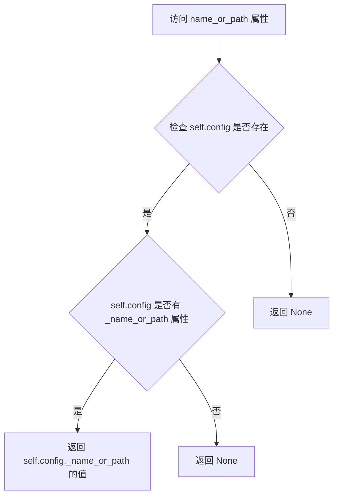

#### 带注释源码

```python
@property
def name_or_path(self) -> str:
    """
    返回管道的名称或路径。
    
    该属性从管道的配置对象中读取 _name_or_path 属性，该值通常在
    调用 from_pretrained() 方法加载管道时自动设置。
    
    Returns:
        str: 管道加载时的名称（repo id）或本地路径，如果未设置则返回 None。
    """
    # 使用 getattr 安全地获取 config 对象中的 _name_or_path 属性
    # 第三个参数 None 表示如果属性不存在则返回 None 而不是抛出 AttributeError
    return getattr(self.config, "_name_or_path", None)
```


### DiffusionPipeline._execution_device

该属性返回管道模型将要执行的设备。在调用 `enable_sequential_cpu_offload` 后，执行设备只能从 Accelerate 的模块钩子中推断。该属性首先尝试获取组卸载设备（group offloading），然后遍历所有组件模块，查找带有 `_hf_hook` 且包含 `execution_device` 属性的模块，最后回退到管道的默认设备。

参数：

- 该方法为属性（property），无显式参数

返回值：`torch.device`，返回管道模型执行所在的设备

#### 流程图

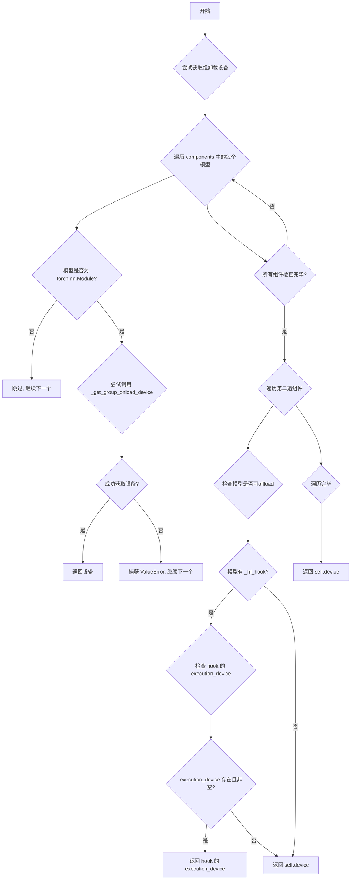

#### 带注释源码

```python
@property
def _execution_device(self):
    r"""
    Returns the device on which the pipeline's models will be executed. After calling
    [`~DiffusionPipeline.enable_sequential_cpu_offload`] the execution device can only be inferred from
    Accelerate's module hooks.
    """
    # 从 group_offloading 模块导入获取组卸载设备的函数
    from ..hooks.group_offloading import _get_group_onload_device

    # 第一阶段：尝试获取组卸载设备的执行设备
    # 当应用组卸载在 leaf_level 时，与 accelerate 的顺序卸载情况相同
    # 需要返回组卸载 hooks 的 onload 设备，以便中间变量（latents, prompt embeddings 等）可以在正确的设备上创建
    for name, model in self.components.items():
        # 只处理 torch.nn.Module 类型的组件
        if not isinstance(model, torch.nn.Module):
            continue
        try:
            # 尝试获取组卸载设备的 onload 设备
            return _get_group_onload_device(model)
        except ValueError:
            # 如果获取失败（模型没有组卸载），继续检查下一个组件
            pass

    # 第二阶段：遍历组件查找带有 _hf_hook 的模块
    for name, model in self.components.items():
        # 跳过非 Module 类型或被排除的组件
        if not isinstance(model, torch.nn.Module) or name in self._exclude_from_cpu_offload:
            continue

        # 如果模型没有 _hf_hook，直接返回管道的默认设备
        if not hasattr(model, "_hf_hook"):
            return self.device
        
        # 遍历模型的所有子模块，检查 hooks
        for module in model.modules():
            if (
                hasattr(module, "_hf_hook")
                and hasattr(module._hf_hook, "execution_device")
                and module._hf_hook.execution_device is not None
            ):
                # 返回 hook 中指定的执行设备
                return torch.device(module._hf_hook.execution_device)
    
    # 所有检查都没有找到特定设备，返回管道的默认设备
    return self.device
```


### DiffusionPipeline.remove_all_hooks

移除在使用 `enable_sequential_cpu_offload` 或 `enable_model_cpu_offload` 时添加的所有钩子，恢复模型的正常执行状态。

参数： 该方法无参数。

返回值：`None`，无返回值（该方法直接修改对象状态）。

#### 流程图

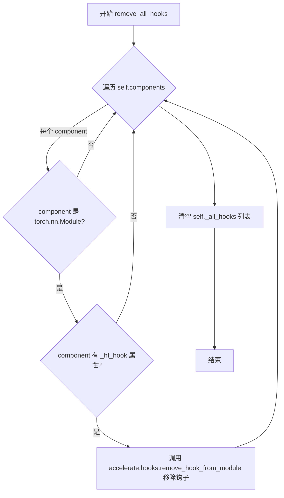

#### 带注释源码

```python
def remove_all_hooks(self):
    r"""
    Removes all hooks that were added when using `enable_sequential_cpu_offload` or `enable_model_cpu_offload`.
    """
    # 遍历 pipeline 中的所有组件
    for _, model in self.components.items():
        # 检查组件是否为 torch.nn.Module 实例且具有 _hf_hook 属性
        # _hf_hook 是 accelerate 库在启用 CPU offload 时添加的钩子
        if isinstance(model, torch.nn.Module) and hasattr(model, "_hf_hook"):
            # 使用 accelerate 的 remove_hook_from_module 递归移除模块上的所有钩子
            # recurse=True 表示同时移除子模块上的钩子
            accelerate.hooks.remove_hook_from_module(model, recurse=True)
    
    # 清空 _all_hooks 列表，该列表存储了 enable_model_cpu_offload 
    # 期间创建的所有钩子引用
    self._all_hooks = []
```


### DiffusionPipeline.enable_model_cpu_offload

该方法用于启用模型CPU卸载功能，通过accelerate库将所有模型卸载到CPU以减少GPU内存使用，同时保持相对较好的性能。与`enable_sequential_cpu_offload`相比，该方法一次移动整个模型到加速器，性能更好但内存节省较少。

参数：

- `gpu_id`：`int | None`，可选参数，用于指定推理时使用的加速器ID，默认为0
- `device`：`torch.device | str`，可选参数，指定推理时使用的PyTorch设备类型，如果未指定则自动检测可用的加速器

返回值：`None`，该方法没有返回值，直接修改管道对象的状态

#### 流程图

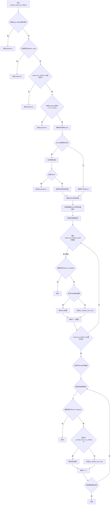

#### 带注释源码

```python
def enable_model_cpu_offload(self, gpu_id: int | None = None, device: torch.device | str = None):
    r"""
    Offloads all models to CPU using accelerate, reducing memory usage with a low impact on performance. Compared
    to `enable_sequential_cpu_offload`, this method moves one whole model at a time to the accelerator when its
    `forward` method is called, and the model remains in accelerator until the next model runs. Memory savings are
    lower than with `enable_sequential_cpu_offload`, but performance is much better due to the iterative execution
    of the `unet`.

    Arguments:
        gpu_id (`int`, *optional*):
            The ID of the accelerator that shall be used in inference. If not specified, it will default to 0.
        device (`torch.Device` or `str`, *optional*, defaults to None):
            The PyTorch device type of the accelerator that shall be used in inference. If not specified, it will
            automatically detect the available accelerator and use.
    """
    # 检查group offload是否激活，如果激活则抛出错误
    self._maybe_raise_error_if_group_offload_active(raise_error=True)

    # 检查管道是否使用了device_map策略
    is_pipeline_device_mapped = self._is_pipeline_device_mapped()
    if is_pipeline_device_mapped:
        raise ValueError(
            "It seems like you have activated a device mapping strategy on the pipeline so calling `enable_model_cpu_offload() isn't allowed. You can call `reset_device_map()` first and then call `enable_model_cpu_offload()`."
        )

    # 检查model_cpu_offload_seq是否设置
    if self.model_cpu_offload_seq is None:
        raise ValueError(
            "Model CPU offload cannot be enabled because no `model_cpu_offload_seq` class attribute is set."
        )

    # 检查accelerate版本是否满足要求
    if is_accelerate_available() and is_accelerate_version(">=", "0.17.0.dev0"):
        from accelerate import cpu_offload_with_hook
    else:
        raise ImportError("`enable_model_cpu_offload` requires `accelerate v0.17.0` or higher.")

    # 移除所有之前添加的hooks
    self.remove_all_hooks()

    # 确定使用的设备
    if device is None:
        device = get_device()
        if device == "cpu":
            raise RuntimeError("`enable_model_cpu_offload` requires accelerator, but not found")

    # 转换为torch设备对象
    torch_device = torch.device(device)
    device_index = torch_device.index

    # 检查gpu_id和device_index是否冲突
    if gpu_id is not None and device_index is not None:
        raise ValueError(
            f"You have passed both `gpu_id`={gpu_id} and an index as part of the passed device `device`={device}"
            f"Cannot pass both. Please make sure to either not define `gpu_id` or not pass the index as part of the device: `device`={torch_device.type}"
        )

    # 设置offload GPU ID，优先使用传入的gpu_id，其次使用device的index，最后使用之前设置的值或默认0
    self._offload_gpu_id = gpu_id or torch_device.index or getattr(self, "_offload_gpu_id", 0)

    # 确定设备类型和最终offload目标设备
    device_type = torch_device.type
    device = torch.device(f"{device_type}:{self._offload_gpu_id}")
    self._offload_device = device

    # 将管道移到CPU并清空设备缓存以释放GPU内存
    self.to("cpu", silence_dtype_warnings=True)
    empty_device_cache(device.type)

    # 获取所有模型组件（排除非torch.nn.Module）
    all_model_components = {k: v for k, v in self.components.items() if isinstance(v, torch.nn.Module)}

    # 初始化hooks列表
    self._all_hooks = []
    hook = None
    
    # 遍历model_cpu_offload_seq中定义的模型顺序，依次卸载到CPU
    for model_str in self.model_cpu_offload_seq.split("->"):
        model = all_model_components.pop(model_str, None)

        # 跳过非PyTorch模块
        if not isinstance(model, torch.nn.Module):
            continue

        # 检查8bit量化模型
        _, _, is_loaded_in_8bit_bnb = _check_bnb_status(model)
        if is_loaded_in_8bit_bnb and (
            is_transformers_version("<", "4.58.0") or is_bitsandbytes_version("<", "0.48.0")
        ):
            logger.info(
                f"Skipping the hook placement for the {model.__class__.__name__} as it is loaded in `bitsandbytes` 8bit."
            )
            continue

        # 使用cpu_offload_with_hook为模型添加hook
        _, hook = cpu_offload_with_hook(model, device, prev_module_hook=hook)
        self._all_hooks.append(hook)

    # 处理不在seq链中的模型，将它们也卸载到CPU
    # 这些模型会一直留在CPU上，直到maybe_free_model_hooks被调用
    # 某些模型（如controlnet）因为是迭代调用的，所以不能放在seq链中
    for name, model in all_model_components.items():
        if not isinstance(model, torch.nn.Module):
            continue

        # 如果模型在排除列表中，直接移到目标设备
        if name in self._exclude_from_cpu_offload:
            model.to(device)
        else:
            # 否则应用cpu_offload_with_hook
            _, hook = cpu_offload_with_hook(model, device)
            self._all_hooks.append(hook)
```


### `DiffusionPipeline.maybe_free_model_hooks`

该方法用于在模型 CPU offload 后重新加载模型并清理相关 hooks，确保 pipeline 在调用结束后能够正确恢复模型状态。

参数： 无（仅包含 self 参数）

返回值：`None`，该方法无返回值，仅执行副作用操作

#### 流程图

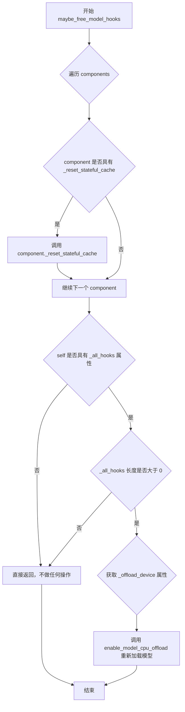

#### 带注释源码

```python
def maybe_free_model_hooks(self):
    r"""
    Method that performs the following:
    - Offloads all components.
    - Removes all model hooks that were added when using `enable_model_cpu_offload`, and then applies them again.
      In case the model has not been offloaded, this function is a no-op.
    - Resets stateful diffusers hooks of denoiser components if they were added with
      [`~hooks.HookRegistry.register_hook`].

    Make sure to add this function to the end of the `__call__` function of your pipeline so that it functions
    correctly when applying `enable_model_cpu_offload`.
    """
    # 步骤1: 遍历所有 pipeline 组件，重置有状态的缓存
    # 这会清理 denoiser 组件中通过 HookRegistry.register_hook 注册的有状态 hooks
    for component in self.components.values():
        if hasattr(component, "_reset_stateful_cache"):
            component._reset_stateful_cache()

    # 步骤2: 检查是否启用了 model CPU offload
    # 如果 enable_model_cpu_offload 未被调用，_all_hooks 不存在或为空，则直接返回
    if not hasattr(self, "_all_hooks") or len(self._all_hooks) == 0:
        # `enable_model_cpu_offload` has not be called, so silently do nothing
        return

    # 步骤3: 重新应用 CPU offload 以恢复模型状态
    # 获取之前保存的 offload 设备（默认为 "cuda"），然后重新调用 enable_model_cpu_offload
    # 这会确保模型处于与调用前相同的状态
    # make sure the model is in the same state as before calling it
    self.enable_model_cpu_offload(device=getattr(self, "_offload_device", "cuda"))
```


### `DiffusionPipeline.enable_sequential_cpu_offload`

该方法通过使用 🤗 Accelerate 库将所有模型以子模块为单位卸载到 CPU，显著降低显存占用。当调用时，所有 `torch.nn.Module` 组件的状态字典（排除 `self._exclude_from_cpu_offload` 中的模块）会被保存到 CPU，然后移动到 `torch.device('meta')`，仅在特定子模块的 `forward` 方法被调用时才加载到加速器。这种方式的显存节省比 `enable_model_cpu_offload` 更高，但性能相对较低。

参数：

- `gpu_id`：`int | None`，可选参数，用于推理的加速器 ID。如果未指定，默认为 0。
- `device`：`torch.device | str | None`，可选参数，用于推理的 PyTorch 设备类型。如果未指定，将自动检测可用的加速器并使用。

返回值：`None`，无返回值（该方法直接修改管道对象的状态）。

#### 流程图

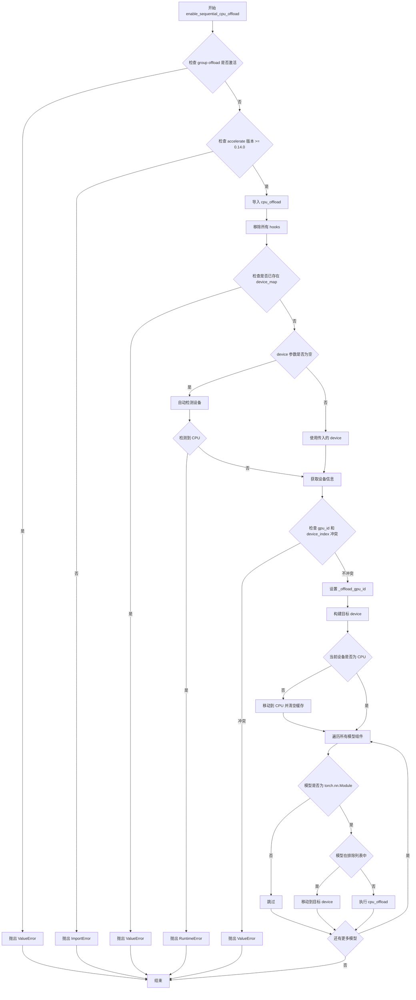

#### 带注释源码

```python
def enable_sequential_cpu_offload(self, gpu_id: int | None = None, device: torch.device | str = None):
    r"""
    使用 🤗 Accelerate 将所有模型卸载到 CPU，显著降低显存占用。调用时，所有 torch.nn.Module 组件的状态字典
    （除了 self._exclude_from_cpu_offload 中的模块）会被保存到 CPU，然后移动到 torch.device('meta')，
    并仅在特定子模块的 forward 方法被调用时才加载到加速器。卸载基于子模块进行。
    显存节省比 enable_model_cpu_offload 更高，但性能较低。

    参数:
        gpu_id (int, 可选):
            用于推理的加速器 ID。如果未指定，默认为 0。
        device (torch.Device 或 str, 可选，默认为 None):
            用于推理的 PyTorch 设备类型。如果未指定，将自动检测可用的加速器并使用。
    """
    # 检查是否激活了 group offload，如果是则抛出错误
    self._maybe_raise_error_if_group_offload_active(raise_error=True)

    # 检查 accelerate 是否可用且版本 >= 0.14.0
    if is_accelerate_available() and is_accelerate_version(">=", "0.14.0"):
        from accelerate import cpu_offload
    else:
        raise ImportError("`enable_sequential_cpu_offload` requires `accelerate v0.14.0` or higher")
    
    # 移除所有之前添加的 hooks
    self.remove_all_hooks()

    # 检查管道是否已激活设备映射策略
    is_pipeline_device_mapped = self._is_pipeline_device_mapped()
    if is_pipeline_device_mapped:
        raise ValueError(
            "It seems like you have activated a device mapping strategy on the pipeline so calling `enable_sequential_cpu_offload() isn't allowed. You can call `reset_device_map()` first and then call `enable_sequential_cpu_offload()`."
        )

    # 如果未指定设备，则自动检测
    if device is None:
        device = get_device()
        if device == "cpu":
            raise RuntimeError("`enable_sequential_cpu_offload` requires accelerator, but not found")

    # 转换为 torch.device 对象
    torch_device = torch.device(device)
    device_index = torch_device.index

    # 检查 gpu_id 和 device_index 是否冲突
    if gpu_id is not None and device_index is not None:
        raise ValueError(
            f"You have passed both `gpu_id`={gpu_id} and an index as part of the passed device `device`={device}"
            f"Cannot pass both. Please make sure to either not define `gpu_id` or not pass the index as part of the device: `device`={torch_device.type}"
        )

    # 设置 _offload_gpu_id：优先使用传入的 gpu_id，其次使用 device 中的 index，最后使用之前设置的值或默认 0
    self._offload_gpu_id = gpu_id or torch_device.index or getattr(self, "_offload_gpu_id", 0)

    # 构建目标设备字符串
    device_type = torch_device.type
    device = torch.device(f"{device_type}:{self._offload_gpu_id}")
    self._offload_device = device

    # 如果当前设备不是 CPU，则将管道移到 CPU 并清空设备缓存
    if self.device.type != "cpu":
        orig_device_type = self.device.type
        self.to("cpu", silence_dtype_warnings=True)
        empty_device_cache(orig_device_type)

    # 遍历所有模型组件
    for name, model in self.components.items():
        # 跳过非 torch.nn.Module 类型的组件
        if not isinstance(model, torch.nn.Module):
            continue

        # 如果模型在排除列表中，直接移动到目标设备
        if name in self._exclude_from_cpu_offload:
            model.to(device)
        else:
            # 确定是否需要卸载 buffers（如果没有所有高层权重都是 nn.Module 类型）
            offload_buffers = len(model._parameters) > 0
            # 执行 CPU 卸载
            cpu_offload(model, device, offload_buffers=offload_buffers)
```


### DiffusionPipeline.enable_group_offload

该方法用于对 DiffusionPipeline 内部各组件（模型）应用组卸载（Group Offloading）技术。组卸载是一种介于模块级卸载和叶子级卸载之间的内存优化策略，通过将内部层分组（torch.nn.ModuleList 或 torch.nn.Sequential）进行批量卸载和加载，可在保证较好性能的前提下显著降低 GPU 显存占用。该方法支持 CUDA 流异步传输以重叠计算与数据传输，并支持将参数卸载到磁盘以进一步节省内存。

参数：

- `self`：`DiffusionPipeline` 自身实例，隐式参数
- `onload_device`：`torch.device`，模块加载（Onload）目标设备，通常为 GPU（如 CUDA 设备）
- `offload_device`：`torch.device`，模块卸载（Offload）目标设备，默认为 CPU
- `offload_type`：`str`，卸载类型，可选 "block_level"（块级）或 "leaf_level"（叶子级），默认为 "block_level"
- `num_blocks_per_group`：`int | None`，当 offload_type="block_level" 时指定每组包含的块数量，block_level 模式下必填
- `non_blocking`：`bool`，是否使用非阻塞数据传输，默认为 False
- `use_stream`：`bool`，是否使用 CUDA 流进行异步数据传输以重叠计算与传输，默认为 False
- `record_stream`：`bool`，配合 use_stream 使用，将张量标记为已被当前流使用，可提高性能但会增加少量内存开销，默认为 False
- `low_cpu_mem_usage`：`bool`，是否通过即时固定张量而非预固定来最小化 CPU 内存使用，仅在 use_stream=True 时生效，默认为 False
- `offload_to_disk_path`：`str | None`，将参数卸载到磁盘的目录路径，可用于内存受限环境，默认为 None
- `exclude_modules`：`str | list[str] | None`，需要排除卸载的模块列表或单个模块名，默认为 None

返回值：`None`，该方法直接修改 pipeline 状态，不返回任何值

#### 流程图

```mermaid
flowchart TD
    A[开始 enable_group_offload] --> B{处理 exclude_modules 参数}
    B --> C{exclude_modules 是字符串?}
    C -->|Yes| D[转换为单元素列表]
    C -->|No| E{exclude_modules 为 None?}
    D --> F[初始化为空列表]
    E -->|No| F
    E -->|Yes| F
    F --> G{检查排除模块是否在 pipeline components 中}
    G --> H[记录不在 components 中的模块名称]
    H --> I[构建 group_offload_kwargs 字典]
    I --> J{遍历 pipeline components}
    J --> K{当前模块不在 exclude_modules 且是 torch.nn.Module?}
    K -->|No| L[跳过当前模块]
    K -->|Yes| M{模块有 enable_group_offload 方法?}
    M -->|Yes| N[调用模块的 enable_group_offload]
    M -->|No| O[调用 apply_group_offloading 通用函数]
    N --> L
    O --> L
    L --> P{遍历完所有 components?}
    P -->|No| J
    P -->|Yes| Q{有需要排除的模块?}
    Q -->|Yes| R{遍历 exclude_modules}
    R --> S[获取模块实例]
    S --> T{模块存在且是 torch.nn.Module?}
    T -->|No| U[跳过]
    T -->|Yes| V[将模块移动到 onload_device]
    V --> W[记录调试日志]
    U --> X{遍历完所有 exclude_modules?}
    X -->|No| R
    X -->|Yes| Y[结束]
    Q -->|No| Y
```

#### 带注释源码

```python
def enable_group_offload(
    self,
    onload_device: torch.device,
    offload_device: torch.device = torch.device("cpu"),
    offload_type: str = "block_level",
    num_blocks_per_group: int | None = None,
    non_blocking: bool = False,
    use_stream: bool = False,
    record_stream: bool = False,
    low_cpu_mem_usage=False,
    offload_to_disk_path: str | None = None,
    exclude_modules: str | list[str] | None = None,
) -> None:
    r"""
    Applies group offloading to the internal layers of a torch.nn.Module. To understand what group offloading is,
    and where it is beneficial, we need to first provide some context on how other supported offloading methods
    work.

    Typically, offloading is done at two levels:
    - Module-level: In Diffusers, this can be enabled using the `ModelMixin::enable_model_cpu_offload()` method. It
    works by offloading each component of a pipeline to the CPU for storage, and onloading to the accelerator
    device when needed for computation. This method is more memory-efficient than keeping all components on the
    accelerator, but the memory requirements are still quite high. For this method to work, one needs memory
    equivalent to size of the model in runtime dtype + size of largest intermediate activation tensors to be able
    to complete the forward pass.
    - Leaf-level: In Diffusers, this can be enabled using the `ModelMixin::enable_sequential_cpu_offload()` method.
      It
    works by offloading the lowest leaf-level parameters of the computation graph to the CPU for storage, and
    onloading only the leafs to the accelerator device for computation. This uses the lowest amount of accelerator
    memory, but can be slower due to the excessive number of device synchronizations.

    Group offloading is a middle ground between the two methods. It works by offloading groups of internal layers,
    (either `torch.nn.ModuleList` or `torch.nn.Sequential`). This method uses lower memory than module-level
    offloading. It is also faster than leaf-level/sequential offloading, as the number of device synchronizations
    is reduced.

    Another supported feature (for CUDA devices with support for asynchronous data transfer streams) is the ability
    to overlap data transfer and computation to reduce the overall execution time compared to sequential
    offloading. This is enabled using layer prefetching with streams, i.e., the layer that is to be executed next
    starts onloading to the accelerator device while the current layer is being executed - this increases the
    memory requirements slightly. Note that this implementation also supports leaf-level offloading but can be made
    much faster when using streams.

    Args:
        onload_device (`torch.device`):
            The device to which the group of modules are onloaded.
        offload_device (`torch.device`, defaults to `torch.device("cpu")`):
            The device to which the group of modules are offloaded. This should typically be the CPU. Default is
            CPU.
        offload_type (`str` or `GroupOffloadingType`, defaults to "block_level"):
            The type of offloading to be applied. Can be one of "block_level" or "leaf_level". Default is
            "block_level".
        offload_to_disk_path (`str`, *optional*, defaults to `None`):
            The path to the directory where parameters will be offloaded. Setting this option can be useful in
            limited RAM environment settings where a reasonable speed-memory trade-off is desired.
        num_blocks_per_group (`int`, *optional*):
            The number of blocks per group when using offload_type="block_level". This is required when using
            offload_type="block_level".
        non_blocking (`bool`, defaults to `False`):
            If True, offloading and onloading is done with non-blocking data transfer.
        use_stream (`bool`, defaults to `False`):
            If True, offloading and onloading is done asynchronously using a CUDA stream. This can be useful for
            overlapping computation and data transfer.
        record_stream (`bool`, defaults to `False`): When enabled with `use_stream`, it marks the current tensor
            as having been used by this stream. It is faster at the expense of slightly more memory usage. Refer to
            the [PyTorch official docs](https://pytorch.org/docs/stable/generated/torch.Tensor.record_stream.html)
            more details.
        low_cpu_mem_usage (`bool`, defaults to `False`):
            If True, the CPU memory usage is minimized by pinning tensors on-the-fly instead of pre-pinning them.
            This option only matters when using streamed CPU offloading (i.e. `use_stream=True`). This can be
            useful when the CPU memory is a bottleneck but may counteract the benefits of using streams.
        exclude_modules (`Union[str, List[str]]`, defaults to `None`): List of modules to exclude from offloading.

    Example:
        ```python
        >>> from diffusers import DiffusionPipeline
        >>> import torch

        >>> pipe = DiffusionPipeline.from_pretrained("Qwen/Qwen-Image", torch_dtype=torch.bfloat16)

        >>> pipe.enable_group_offload(
        ...     onload_device=torch.device("cuda"),
        ...     offload_device=torch.device("cpu"),
        ...     offload_type="leaf_level",
        ...     use_stream=True,
        ... )
        >>> image = pipe("a beautiful sunset").images[0]
        ```
    """
    # 延迟导入组卸载相关函数，避免循环依赖
    from ..hooks import apply_group_offloading

    # 标准化 exclude_modules 参数：统一转换为列表格式
    if isinstance(exclude_modules, str):
        # 字符串类型：转换为单元素列表
        exclude_modules = [exclude_modules]
    elif exclude_modules is None:
        # None：初始化为空列表
        exclude_modules = []

    # 验证排除模块是否存在于 pipeline 中
    unknown = set(exclude_modules) - self.components.keys()
    if unknown:
        # 记录警告信息，忽略预期外的模块名称
        logger.info(
            f"The following modules are not present in pipeline: {', '.join(unknown)}. Ignore if this is expected."
        )

    # 构建传递给各组件的组卸载配置字典
    group_offload_kwargs = {
        "onload_device": onload_device,
        "offload_device": offload_device,
        "offload_type": offload_type,
        "num_blocks_per_group": num_blocks_per_group,
        "non_blocking": non_blocking,
        "use_stream": use_stream,
        "record_stream": record_stream,
        "low_cpu_mem_usage": low_cpu_mem_usage,
        "offload_to_disk_path": offload_to_disk_path,
    }
    
    # 遍历 pipeline 中的所有组件
    for name, component in self.components.items():
        # 仅处理非排除且为 torch.nn.Module 的组件
        if name not in exclude_modules and isinstance(component, torch.nn.Module):
            # 检查组件是否有自定义的 enable_group_offload 方法
            if hasattr(component, "enable_group_offload"):
                # 使用组件自身的组卸载方法
                component.enable_group_offload(**group_offload_kwargs)
            else:
                # 使用通用的 apply_group_offloading 函数
                apply_group_offloading(module=component, **group_offload_kwargs)

    # 处理需要排除的模块：强制加载到 onload_device
    if exclude_modules:
        for module_name in exclude_modules:
            module = getattr(self, module_name, None)
            if module is not None and isinstance(module, torch.nn.Module):
                # 将排除的模块移动到加载设备
                module.to(onload_device)
                # 记录调试日志
                logger.debug(f"Placed `{module_name}` on {onload_device} device as it was in `exclude_modules`.")
```


### `DiffusionPipeline.reset_device_map`

该方法用于重置管道的设备映射（device map），将所有模型组件从当前设备移回CPU，并清除设备映射配置。当管道使用了设备映射策略（如通过`device_map`参数加载模型）后，可以通过调用此方法移除设备映射，使管道恢复正常状态。

参数：
- 无（仅包含隐含的 `self` 参数）

返回值：`None`，该方法无返回值（返回 `None`）

#### 流程图

```mermaid
flowchart TD
    A[开始 reset_device_map] --> B{hf_device_map 是否为 None?}
    B -->|是| C[直接返回]
    B -->|否| D[调用 remove_all_hooks 移除所有钩子]
    D --> E[遍历所有组件]
    E --> F{组件是否为 torch.nn.Module?}
    F -->|否| G[继续下一个组件]
    F -->|是| H[将组件移至 CPU: component.to('cpu')]
    H --> G
    G --> I{hf_device_map 是否已遍历完所有组件?}
    I -->|否| E
    I -->|是| J[设置 hf_device_map = None]
    J --> K[结束]
    C --> K
```

#### 带注释源码

```python
def reset_device_map(self):
    r"""
    Resets the device maps (if any) to None.
    """
    # 检查是否已经存在设备映射
    if self.hf_device_map is None:
        # 如果没有设备映射，直接返回，无需任何操作
        return
    else:
        # 1. 移除所有通过 enable_sequential_cpu_offload 或 enable_model_cpu_offload 添加的钩子
        self.remove_all_hooks()
        
        # 2. 遍历管道中的所有组件
        for name, component in self.components.items():
            # 只处理 PyTorch 模块类型的组件
            if isinstance(component, torch.nn.Module):
                # 将每个模型组件移回 CPU，释放 GPU 显存
                component.to("cpu")
        
        # 3. 清除设备映射配置
        self.hf_device_map = None
```


### DiffusionPipeline.download

该方法是 DiffusionPipeline 类的类方法，用于从 Hugging Face Hub 下载并缓存 PyTorch 扩散管道模型。它首先检查本地缓存，然后根据指定的配置（如模型变体、自定义管道、安全张量等）下载所需的模型文件和配置文件。

参数：

- `pretrained_model_name`：`str | os.PathLike`，预训练管道的仓库 ID（如 `CompVis/ldm-text2im-large-256`）或本地目录路径
- `**kwargs`：可变关键字参数，包含以下可选参数：
  - `cache_dir`：`str | os.PathLike`，缓存目录路径
  - `force_download`：`bool`，是否强制重新下载
  - `proxies`：`Dict[str, str]`，代理服务器字典
  - `local_files_only`：`bool`，是否仅使用本地文件
  - `token`：`str | bool`，Hugging Face 认证令牌
  - `revision`：`str`，Git 版本标识符
  - `from_flax`：`bool`，是否从 Flax 加载
  - `custom_pipeline`：`str`，自定义管道标识符
  - `custom_revision`：`str`，自定义管道版本
  - `variant`：`str`，模型变体（如 "fp16"）
  - `use_safetensors`：`bool`，是否使用安全张量格式
  - `use_onnx`：`bool`，是否使用 ONNX 格式
  - `load_connected_pipeline`：`bool`，是否加载关联管道
  - `trust_remote_code`：`bool`，是否信任远程代码
  - `dduf_file`：`str`，DDUF 文件名

返回值：`str | os.PathLike`，下载管道后缓存目录的路径

#### 流程图

```mermaid
flowchart TD
    A[开始 download] --> B{是否提供 dduf_file?}
    B -->|Yes| C[调用 _download_dduf_file]
    B -->|No| D{local_files_only?}
    C --> Z[返回缓存路径]
    D -->|No| E[调用 model_info 获取远程信息]
    D -->|Yes| F[跳过远程获取]
    E --> G{连接成功?}
    G -->|Yes| H[下载 model_index.json 配置文件]
    G -->|No| I[设置 local_files_only=True]
    I --> F
    H --> J[识别模型变体和自定义组件]
    F --> K[构建 allow_patterns 和 ignore_patterns]
    J --> K
    K --> L{管道已缓存且不强制下载?}
    L -->|Yes| M[直接返回缓存文件夹路径]
    L -->|No| N[调用 snapshot_download]
    N --> O[处理关联管道]
    O --> P[返回 cached_folder]
    M --> Z
```

#### 带注释源码

```python
@classmethod
@validate_hf_hub_args
def download(cls, pretrained_model_name, **kwargs) -> str | os.PathLike:
    r"""
    Download and cache a PyTorch diffusion pipeline from pretrained pipeline weights.

    Parameters:
        pretrained_model_name (`str` or `os.PathLike`, *optional*):
            A string, the *repository id* (for example `CompVis/ldm-text2im-large-256`) of a pretrained pipeline
            hosted on the Hub.
        custom_pipeline (`str`, *optional*):
            Can be either:
                - A string, the *repo id* (for example `CompVis/ldm-text2im-large-256`) of a pretrained
                  pipeline hosted on the Hub. The repository must contain a file called `pipeline.py` that defines
                  the custom pipeline.
                - A string, the *file name* of a community pipeline hosted on GitHub under
                  [Community](https://github.com/huggingface/diffusers/tree/main/examples/community). Valid file
                  names must match the file name and not the pipeline script (`clip_guided_stable_diffusion`
                  instead of `clip_guided_stable_diffusion.py`). Community pipelines are always loaded from the
                  current `main` branch of GitHub.
                - A path to a *directory* (`./my_pipeline_directory/`) containing a custom pipeline. The directory
                  must contain a file called `pipeline.py` that defines the custom pipeline.
            > [!WARNING] > 🧪 This is an experimental feature and may change in the future.
        force_download (`bool`, *optional*, defaults to `False`):
            Whether or not to force the (re-)download of the model weights and configuration files, overriding the
            cached versions if they exist.
        proxies (`Dict[str, str]`, *optional*):
            A dictionary of proxy servers to use by protocol or endpoint.
        local_files_only (`bool`, *optional*, defaults to `False`):
            Whether to only load local model weights and configuration files or not.
        token (`str` or *bool`, *optional*):
            The token to use as HTTP bearer authorization for remote files.
        revision (`str`, *optional*, defaults to `"main"`):
            The specific model version to use.
        custom_revision (`str`, *optional*):
            The specific model version to use for custom pipeline.
        variant (`str`, *optional*):
            Load weights from a specified variant filename such as `"fp16"` or `"ema"`.
        dduf_file(`str`, *optional*):
            Load weights from the specified DDUF file.
        use_safetensors (`bool`, *optional*, defaults to `None`):
            Whether to use safetensors format.
        use_onnx (`bool`, *optional*, defaults to `False`):
            Whether to use ONNX format.
        trust_remote_code (`bool`, *optional*, defaults to `False`):
            Whether or not to allow for custom pipelines and components defined on the Hub.

    Returns:
        `os.PathLike`:
            A path to the downloaded pipeline.
    """
    # 从 kwargs 中提取下载相关参数
    cache_dir = kwargs.pop("cache_dir", None)
    force_download = kwargs.pop("force_download", False)
    proxies = kwargs.pop("proxies", None)
    local_files_only = kwargs.pop("local_files_only", None)
    token = kwargs.pop("token", None)
    revision = kwargs.pop("revision", None)
    from_flax = kwargs.pop("from_flax", False)
    custom_pipeline = kwargs.pop("custom_pipeline", None)
    custom_revision = kwargs.pop("custom_revision", None)
    variant = kwargs.pop("variant", None)
    use_safetensors = kwargs.pop("use_safetensors", None)
    use_onnx = kwargs.pop("use_onnx", None)
    load_connected_pipeline = kwargs.pop("load_connected_pipeline", False)
    trust_remote_code = kwargs.pop("trust_remote_code", False)
    dduf_file: dict[str, DDUFEntry] | None = kwargs.pop("dduf_file", None)

    # 处理 DDUF 文件下载（专用格式）
    if dduf_file:
        if custom_pipeline:
            raise NotImplementedError("Custom pipelines are not supported with DDUF at the moment.")
        if load_connected_pipeline:
            raise NotImplementedError("Connected pipelines are not supported with DDUF at the moment.")
        return _download_dduf_file(
            pretrained_model_name=pretrained_model_name,
            dduf_file=dduf_file,
            pipeline_class_name=cls.__name__,
            cache_dir=cache_dir,
            proxies=proxies,
            local_files_only=local_files_only,
            token=token,
            revision=revision,
        )

    # 设置 safetensors 相关选项
    allow_pickle = True if (use_safetensors is None or use_safetensors is False) else False
    use_safetensors = use_safetensors if use_safetensors is not None else True

    allow_patterns = None
    ignore_patterns = None

    model_info_call_error: Exception | None = None
    # 尝试从 Hub 获取模型信息
    if not local_files_only:
        try:
            info = model_info(pretrained_model_name, token=token, revision=revision)
        except (HfHubHTTPError, OfflineModeIsEnabled, requests.ConnectionError, httpx.NetworkError) as e:
            logger.warning(f"Couldn't connect to the Hub: {e}.\nWill try to load from local cache.")
            local_files_only = True
            model_info_call_error = e  # 保存错误以便后续处理

    # 如果不是仅本地模式，下载配置文件
    if not local_files_only:
        config_file = hf_hub_download(
            pretrained_model_name,
            cls.config_name,  # "model_index.json"
            cache_dir=cache_dir,
            revision=revision,
            proxies=proxies,
            force_download=force_download,
            token=token,
        )
        config_dict = cls._dict_from_json_file(config_file)
        ignore_filenames = config_dict.pop("_ignore_files", [])

        # 获取仓库中的所有文件
        filenames = {sibling.rfilename for sibling in info.siblings}
        
        # 检查并警告旧的分片格式
        if variant is not None and _check_legacy_sharding_variant_format(filenames=filenames, variant=variant):
            warn_msg = (
                f"Warning: The repository contains sharded checkpoints for variant '{variant}' maybe in a deprecated format. "
                "Please check your files carefully..."
            )
            logger.warning(warn_msg)

        # 过滤忽略的文件名
        filenames = set(filenames) - set(ignore_filenames)
        
        # 处理废弃的版本参数
        if revision in DEPRECATED_REVISION_ARGS and version.parse(
            version.parse(__version__).base_version
        ) >= version.parse("0.22.0"):
            warn_deprecated_model_variant(pretrained_model_name, token, variant, revision, filenames)

        # 获取自定义组件和文件夹名称
        custom_components, folder_names = _get_custom_components_and_folders(
            pretrained_model_name, config_dict, filenames, variant
        )
        
        # 处理自定义管道类名
        custom_class_name = None
        if custom_pipeline is None and isinstance(config_dict["_class_name"], (list, tuple)):
            custom_pipeline = config_dict["_class_name"][0]
            custom_class_name = config_dict["_class_name"][1]

        # 确定是否需要从 Hub 加载自定义管道或组件
        load_pipe_from_hub = custom_pipeline is not None and f"{custom_pipeline}.py" in filenames
        load_components_from_hub = len(custom_components) > 0

        # 检查是否需要信任远程代码
        if load_pipe_from_hub and not trust_remote_code:
            raise ValueError(
                f"The repository for {pretrained_model_name} contains custom code in {custom_pipeline}.py which must be executed..."
            )

        if load_components_from_hub and not trust_remote_code:
            raise ValueError(
                f"The repository for {pretrained_model_name} contains custom code..."
            )

        # 获取管道类
        pipeline_class = _get_pipeline_class(
            cls,
            config_dict,
            load_connected_pipeline=load_connected_pipeline,
            custom_pipeline=custom_pipeline,
            repo_id=pretrained_model_name if load_pipe_from_hub else None,
            hub_revision=revision,
            class_name=custom_class_name,
            cache_dir=cache_dir,
            revision=custom_revision,
        )
        
        # 获取预期的组件列表
        expected_components, _ = cls._get_signature_keys(pipeline_class)
        passed_components = [k for k in expected_components if k in kwargs]

        # 获取模型文件夹名称
        model_folder_names = {
            os.path.split(f)[0] for f in filter_model_files(filenames) if os.path.split(f)[0] in folder_names
        }
        
        # 计算需要忽略的模式
        ignore_patterns = _get_ignore_patterns(
            passed_components,
            model_folder_names,
            filenames,
            use_safetensors,
            from_flax,
            allow_pickle,
            use_onnx,
            pipeline_class._is_onnx,
            variant,
        )

        # 获取兼容的模型文件名
        model_filenames, variant_filenames = variant_compatible_siblings(
            filenames, variant=variant, ignore_patterns=ignore_patterns
        )

        # 构建允许下载的文件模式列表
        allow_patterns = list(model_filenames)
        
        # 添加非模型文件夹的所有模式（如下载调度器、tokenizer 等）
        allow_patterns += [f"{k}/*" for k in folder_names if k not in model_folder_names]
        # 添加自定义组件文件
        allow_patterns += [f"{k}/{f}.py" for k, f in custom_components.items()]
        # 添加自定义管道文件
        allow_patterns += [f"{custom_pipeline}.py"] if f"{custom_pipeline}.py" in filenames else []
        # 添加配置文件
        allow_patterns += [os.path.join(k, "config.json") for k in model_folder_names]
        allow_patterns += [
            SCHEDULER_CONFIG_NAME,
            CONFIG_NAME,
            cls.config_name,
            CUSTOM_PIPELINE_FILE_NAME,
        ]

        # 移除已传递的组件不下载
        allow_patterns = [
            p for p in allow_patterns if not (len(p.split("/")) == 2 and p.split("/")[0] in passed_components)
        ]

        # 如果加载关联管道，添加 README.md
        if pipeline_class._load_connected_pipes:
            allow_patterns.append("README.md")

        # 编译忽略和允许模式为正则表达式
        ignore_patterns = ignore_patterns + [f"{i}.index.*json" for i in ignore_patterns]
        re_ignore_pattern = [re.compile(fnmatch.translate(p)) for p in ignore_patterns]
        re_allow_pattern = [re.compile(fnmatch.translate(p)) for p in allow_patterns]

        # 计算预期下载的文件列表
        expected_files = [f for f in filenames if not any(p.match(f) for p in re_ignore_pattern)]
        expected_files = [f for f in expected_files if any(p.match(f) for p in re_allow_pattern)]

        snapshot_folder = Path(config_file).parent
        # 检查管道是否已完全缓存
        pipeline_is_cached = all((snapshot_folder / f).is_file() for f in expected_files)

        if pipeline_is_cached and not force_download:
            # 如果已缓存，直接返回
            return snapshot_folder

    # 构建用户代理信息
    user_agent = {"pipeline_class": cls.__name__}
    if custom_pipeline is not None and not custom_pipeline.endswith(".py"):
        user_agent["custom_pipeline"] = custom_pipeline

    # 执行快照下载
    try:
        cached_folder = snapshot_download(
            pretrained_model_name,
            cache_dir=cache_dir,
            proxies=proxies,
            local_files_only=local_files_only,
            token=token,
            revision=revision,
            allow_patterns=allow_patterns,
            ignore_patterns=ignore_patterns,
            user_agent=user_agent,
        )

        # 加载并处理关联管道
        cls_name = cls.load_config(os.path.join(cached_folder, "model_index.json")).get("_class_name", None)
        cls_name = cls_name[4:] if isinstance(cls_name, str) and cls_name.startswith("Flax") else cls_name

        diffusers_module = importlib.import_module(__name__.split(".")[0])
        pipeline_class = getattr(diffusers_module, cls_name, None) if isinstance(cls_name, str) else None

        if pipeline_class is not None and pipeline_class._load_connected_pipes:
            modelcard = ModelCard.load(os.path.join(cached_folder, "README.md"))
            connected_pipes = sum([getattr(modelcard.data, k, []) for k in CONNECTED_PIPES_KEYS], [])
            for connected_pipe_repo_id in connected_pipes:
                download_kwargs = {
                    "cache_dir": cache_dir,
                    "force_download": force_download,
                    "proxies": proxies,
                    "local_files_only": local_files_only,
                    "token": token,
                    "variant": variant,
                    "use_safetensors": use_safetensors,
                }
                DiffusionPipeline.download(connected_pipe_repo_id, **download_kwargs)

        return cached_folder

    except FileNotFoundError:
        # 处理文件未找到错误
        if model_info_call_error is None:
            # 用户直接设置 local_files_only=True
            raise
        else:
            # 当 model_info 失败时强制设置 local_files_only=True
            raise EnvironmentError(
                f"Cannot load model {pretrained_model_name}: model is not cached locally and an error occurred"
                " while trying to fetch metadata from the Hub."
            ) from model_info_call_error
```


### `DiffusionPipeline._get_signature_keys`

该方法是一个类方法，用于从传入对象的 `__init__` 方法签名中提取必需的模块名称列表和可选参数名称列表，以便在保存、加载和实例化 pipeline 时能够正确识别和处理各个组件。

参数：

-  `cls`：类对象，隐式的第一个参数，表示 `DiffusionPipeline` 类本身
-  `obj`：任意类对象，需要获取其 `__init__` 方法签名的对象（通常为 pipeline 类或实例）

返回值：

-  `expected_modules`：排序后的必需模块名称列表（`List[str]`），包含所有必需的参数名称
-  `optional_parameters`：排序后的可选参数名称列表（`List[str]`），包含所有有默认值的参数名称

#### 流程图

```mermaid
flowchart TD
    A[开始] --> B[获取 obj.__init__ 方法签名]
    B --> C[遍历所有参数]
    C --> D{参数默认值是否为 inspect._empty?}
    D -->|是| E[加入 required_parameters]
    D -->|否| F[加入 optional_parameters]
    E --> G[计算 expected_modules = required_keys - {'self'}]
    F --> G
    G --> H{optional_parameters 中有类可选组件?}
    H -->|是| I[将组件名加入 expected_modules<br/>从 optional_parameters 移除]
    H -->|否| J[返回 sorted(expected_modules)<br/>sorted(optional_parameters)]
    I --> J
```

#### 带注释源码

```python
@classmethod
def _get_signature_keys(cls, obj):
    """
    从对象的 __init__ 方法签名中提取必需的模块和可选参数。
    
    该方法通过分析传入对象的构造函数签名，区分哪些参数是必需的（没有默认值的），
    哪些参数是可选的（有默认值的）。同时还会检查 _optional_components 类属性，
    将其中列出的可选组件也纳入预期模块集合中。
    
    参数:
        obj: 任意类对象，用于获取其 __init__ 方法签名
        
    返回:
        expected_modules: 必需的参数名称列表（排序后）
        optional_parameters: 可选的参数名称列表（排序后）
    """
    # 1. 获取 obj.__init__ 方法的签名参数
    parameters = inspect.signature(obj.__init__).parameters
    
    # 2. 筛选出没有默认值的必需参数
    required_parameters = {k: v for k, v in parameters.items() if v.default == inspect._empty}
    
    # 3. 筛选出有默认值的可选参数
    optional_parameters = set({k for k, v in parameters.items() if v.default != inspect._empty})
    
    # 4. 从必需参数中排除 'self'，得到预期的模块名称
    expected_modules = set(required_parameters.keys()) - {"self"}
    
    # 5. 遍历可选参数，检查是否有属于 _optional_components 的组件
    optional_names = list(optional_parameters)
    for name in optional_names:
        # 如果参数名在类的可选组件列表中，则将其从可选转为必需
        if name in cls._optional_components:
            expected_modules.add(name)
            optional_parameters.remove(name)
    
    # 6. 返回排序后的必需模块列表和可选参数列表
    return sorted(expected_modules), sorted(optional_parameters)
```


### DiffusionPipeline._get_signature_types

该方法是一个类方法，用于从管道类的 `__init__` 方法签名中提取所有参数的类型注解，并返回一个字典，键为参数名，值为对应的类型元组。这在管道加载和类型检查时用于验证传入组件的类型是否匹配预期。

参数：
- `cls`：类型 `type`（类本身），代表调用该方法的类（DiffusionPipeline 或其子类）

返回值：`Dict[str, tuple]`，返回一个字典，其中键是参数名称（如 `torch_dtype`、`variant` 等），值是一个类型元组，表示该参数的类型注解。例如 `{ "torch_dtype": (torch.dtype, None), "variant": (str, None) }`。

#### 流程图

```mermaid
flowchart TD
    A[开始 _get_signature_types] --> B{尝试 get_type_hints}
    B -->|成功| C[获取类型提示]
    B -->|失败| D[遍历 signature 参数直接获取注解]
    C --> E[获取 __init__ 的所有参数]
    D --> E
    E --> F{遍历所有参数}
    F -->|参数名为 self| G[跳过 self, 继续下一个]
    F -->|参数有类型提示| H{处理不同注解类型}
    F -->|参数无类型提示| I[设置为 inspect.Signature.empty]
    H -->|isclass| J[包装为元组]
    H -->|Union| K[获取 Union 的参数类型]
    H -->|types.UnionType| L[获取 PEP 604 联合类型参数]
    H -->|List/Dict| M[包装为元组]
    H -->|其他| N[记录警告并设置为 empty]
    J --> O[添加到 signature_types]
    K --> O
    L --> O
    M --> O
    I --> O
    O --> P{还有更多参数?}
    P -->|是| F
    P -->|否| Q[返回 signature_types 字典]
```

#### 带注释源码

```python
@classmethod
def _get_signature_types(cls):
    """
    从类的 __init__ 方法签名中提取类型注解
    
    Returns:
        Dict[str, tuple]: 参数名到类型元组的映射
    """
    signature_types = {}
    
    # 优先使用 get_type_hints 来正确解析字符串注解（需要 __future__ import annotations）
    try:
        type_hints = get_type_hints(cls.__init__)
    except Exception:
        # 如果 get_type_hints 失败，回退到直接访问注解
        type_hints = {}
        for k, v in inspect.signature(cls.__init__).parameters.items():
            if v.annotation != inspect.Parameter.empty:
                type_hints[k] = v.annotation

    # 从签名中获取所有参数，确保不遗漏任何参数
    all_params = inspect.signature(cls.__init__).parameters

    for param_name, param in all_params.items():
        # 跳过 'self' 参数
        if param_name == "self":
            continue

        # 如果有类型提示，则使用它
        if param_name in type_hints:
            annotation = type_hints[param_name]
            
            if inspect.isclass(annotation):
                # 普通类类型，包装为单元素元组
                signature_types[param_name] = (annotation,)
            elif get_origin(annotation) == Union:
                # 处理 Union[X, Y] 语法
                signature_types[param_name] = get_args(annotation)
            elif isinstance(annotation, types.UnionType):
                # 处理 PEP 604 联合语法 X | Y (Python 3.10+)
                signature_types[param_name] = get_args(annotation)
            elif get_origin(annotation) in [List, Dict, list, dict]:
                # 处理 List[X], Dict[K, V] 等泛型类型
                signature_types[param_name] = (annotation,)
            else:
                # 无法获取类型注解的情况
                logger.warning(f"cannot get type annotation for Parameter {param_name} of {cls}.")
                # 仍然添加空签名，以便它在 expected_types 中
                signature_types[param_name] = (inspect.Signature.empty,)
        else:
            # 没有找到类型注解 - 添加空签名
            signature_types[param_name] = (inspect.Signature.empty,)

    return signature_types
```


### DiffusionPipeline.parameters

该属性是一个只读属性，用于获取管道的所有可选参数。它返回包含初始化管道所需的可选参数的字典，便于在不同管道之间共享权重和配置，而无需重新分配额外内存。

参数：

- `self`：`DiffusionPipeline`，管道实例本身（隐式参数）

返回值：`dict[str, Any]`，包含所有可选参数的字典，这些参数可用于初始化具有相同权重和配置的新管道实例。

#### 流程图

```mermaid
flowchart TD
    A[开始: 访问 parameters 属性] --> B[调用 self._get_signature_keys 获取期望模块和可选参数]
    B --> C[遍历 self.config 的所有键]
    C --> D{键不以 '_' 开头且在可选参数中?}
    D -->|是| E[将该键值对添加到 pipeline_parameters]
    D -->|否| F[跳过该键]
    E --> G{还有更多键?}
    F --> G
    G -->|是| C
    G -->|否| H[返回 pipeline_parameters 字典]
```

#### 带注释源码

```python
@property
def parameters(self) -> dict[str, Any]:
    r"""
    The `self.parameters` property can be useful to run different pipelines with the same weights and
    configurations without reallocating additional memory.

    Returns (`dict`):
        A dictionary containing all the optional parameters needed to initialize the pipeline.

    Examples:

    ```py
    >>> from diffusers import (
    ...     StableDiffusionPipeline,
    ...     StableDiffusionImg2ImgPipeline,
    ...     StableDiffusionInpaintPipeline,
    ... )

    >>> text2img = StableDiffusionPipeline.from_pretrained("stable-diffusion-v1-5/stable-diffusion-v1-5")
    >>> img2img = StableDiffusionImg2ImgPipeline(**text2img.components, **text2img.parameters)
    >>> inpaint = StableDiffusionInpaintPipeline(**text2img.components, **text2img.parameters)
    ```
    """
    # 获取管道签名的期望模块和可选参数列表
    # expected_modules: 必需的模块名称列表
    # optional_parameters: 可选的参数名称列表
    expected_modules, optional_parameters = self._get_signature_keys(self)
    
    # 从配置中筛选出可选参数构建字典
    # 只保留不以 '_' 开头的配置键，且该键必须在 optional_parameters 中
    pipeline_parameters = {
        k: self.config[k] 
        for k in self.config.keys() 
        if not k.startswith("_") and k in optional_parameters
    }

    # 返回包含所有可选参数的字典，用于初始化新管道
    return pipeline_parameters
```


### DiffusionPipeline.components

该属性是 DiffusionPipeline 类的核心组件访问器，用于获取管道中所有模块（如 UNet、VAE、scheduler 等）的字典形式，以便在不同管道实例间共享权重和配置而无需重新分配内存。

参数：

- 该方法无显式参数（`self` 为隐式参数）

返回值：`dict[str, Any]`，返回包含所有需要初始化管道的模块字典，键为模块名称，值为对应的模块实例。

#### 流程图

```mermaid
flowchart TD
    A[开始] --> B[调用 _get_signature_keys 获取预期模块和可选参数]
    B --> C[从 self.config 中过滤非下划线开头且不在可选参数中的键]
    C --> D[通过 getattr 获取每个键对应的实际模块实例]
    D --> E[构建 components 字典]
    E --> F[对实际模块键和预期模块键进行排序比较]
    F --> G{actual == expected?}
    G -->|是| H[返回 components 字典]
    G -->|否| I[抛出 ValueError 异常]
    
    style I fill:#ffcccc
    style H fill:#ccffcc
```

#### 带注释源码

```python
@property
def components(self) -> dict[str, Any]:
    r"""
    The `self.components` property can be useful to run different pipelines with the same weights and
    configurations without reallocating additional memory.

    Returns (`dict`):
        A dictionary containing all the modules needed to initialize the pipeline.

    Examples:

    ```py
    >>> from diffusers import (
    ...     StableDiffusionPipeline,
    ...     StableDiffusionImg2ImgPipeline,
    ...     StableDiffusionInpaintPipeline,
    ... )

    >>> text2img = StableDiffusionPipeline.from_pretrained("stable-diffusion-v1-5/stable-diffusion-v1-5")
    >>> img2img = StableDiffusionImg2ImgPipeline(**text2img.components)
    >>> inpaint = StableDiffusionInpaintPipeline(**text2img.components)
    ```
    """
    # 获取管道类初始化时定义的预期模块和可选参数
    # expected_modules: 必需的模块名称列表（如 unet, vae, scheduler 等）
    # optional_parameters: 可选的参数名称列表
    expected_modules, optional_parameters = self._get_signature_keys(self)
    
    # 从配置字典中过滤出实际组件：
    # 1. 排除以下划线开头的私有配置项
    # 2. 排除可选参数（这些参数有默认值，不是核心组件）
    # 例如：config 中的 "unet" -> getattr(self, "unet") 获取实际模块对象
    components = {
        k: getattr(self, k) 
        for k in self.config.keys() 
        if not k.startswith("_") and k not in optional_parameters
    }

    # 验证管道初始化的正确性：
    # 将实际存在的组件与预期组件进行对比
    actual = sorted(set(components.keys()))    # 实际加载的模块列表
    expected = sorted(expected_modules)         # 预期应该存在的模块列表
    
    # 如果不匹配，说明管道初始化有问题，抛出明确的错误信息
    if actual != expected:
        raise ValueError(
            f"{self} has been incorrectly initialized or {self.__class__} is incorrectly implemented. Expected"
            f" {expected} to be defined, but {actual} are defined."
        )

    # 返回包含所有核心模块的字典，供其他管道复用权重和配置
    return components
```


### `DiffusionPipeline.numpy_to_pil`

将 NumPy 数组格式的图像或图像批次转换为 PIL Image 对象。

参数：

- `images`：`Union[np.ndarray, List[np.ndarray]]`，要转换的 NumPy 图像或图像批次

返回值：`Union[PIL.Image.Image, List[PIL.Image.Image]]`，转换后的 PIL 图像或图像列表

#### 流程图

```mermaid
flowchart TD
    A[开始] --> B[接收 images 参数]
    B --> C{images 类型判断}
    C -->|单张图像| D[调用 numpy_to_pil 转换单张图像]
    C -->|批量图像| E[调用 numpy_to_pil 转换批量图像]
    D --> F[返回 PIL.Image.Image]
    E --> G[返回 List[PIL.Image.Image]]
    F --> H[结束]
    G --> H
```

#### 带注释源码

```python
@staticmethod
def numpy_to_pil(images):
    """
    Convert a NumPy image or a batch of images to a PIL image.
    """
    # 调用 utils 模块中的 numpy_to_pil 函数进行转换
    # 该函数接受 NumPy 数组或 NumPy 数组列表作为输入
    # 返回 PIL Image 对象或 PIL Image 对象列表
    return numpy_to_pil(images)
```


### DiffusionPipeline.progress_bar

该方法用于创建并返回一个进度条对象，以便在扩散管道的迭代过程中显示进度。它基于传入的可迭代对象或总数创建 tqdm 进度条，并应用管道配置的进度条设置。如果未配置禁用选项，则默认在非分布式训练的.rank_zero 进程启用进度条。

参数：

- `iterable`：`Iterable | None`，可选参数，一个可迭代对象，用于包装 tqdm 进度条进行进度显示
- `total`：`int | None`，可选参数，定义迭代的总数，与 iterable 参数二选一使用

返回值：`tqdm`，返回一个 tqdm 进度条对象，用于包装迭代过程以显示进度

#### 流程图

```mermaid
flowchart TD
    A[开始 progress_bar] --> B{self._progress_bar_config 是否存在}
    B -->|不存在| C[初始化为空字典]
    B -->|存在| D{_progress_bar_config 是否为 dict 类型}
    C --> E[复制配置到 progress_bar_config]
    D -->|是| E
    D -->|否| F[抛出 ValueError 异常]
    F --> G[结束]
    E --> H{progress_bar_config 中是否有 disable 键]
    H -->|有| I{iterable 是否为 None}
    H -->|无| J[设置 disable = not is_torch_dist_rank_zero]
    J --> I
    I -->|iterable 不为 None| K[返回 tqdm(iterable)]
    I -->|total 不为 None| L[返回 tqdm(total=total)]
    I -->|都是 None| M[抛出 ValueError 异常]
    K --> N[结束]
    L --> N
    M --> G
```

#### 带注释源码

```python
@torch.compiler.disable
def progress_bar(self, iterable=None, total=None):
    """
    创建并返回一个 tqdm 进度条对象
    
    参数:
        iterable: 可迭代对象，用于包装进度条
        total: 迭代总数，与 iterable 二选一
    
    返回:
        tqdm 进度条对象
    """
    # 检查是否存在 _progress_bar_config 属性，不存在则初始化为空字典
    if not hasattr(self, "_progress_bar_config"):
        self._progress_bar_config = {}
    # 如果存在但不是字典类型，抛出 ValueError
    elif not isinstance(self._progress_bar_config, dict):
        raise ValueError(
            f"`self._progress_bar_config` should be of type `dict`, but is {type(self._progress_bar_config)}."
        )

    # 复制配置字典，避免修改原始配置
    progress_bar_config = dict(self._progress_bar_config)
    
    # 如果配置中没有设置 disable，则根据分布式训练_rank_zero 设置
    # 在非 rank_zero 进程上禁用进度条，避免多进程重复显示
    if "disable" not in progress_bar_config:
        progress_bar_config["disable"] = not is_torch_dist_rank_zero()

    # 根据传入参数返回对应的 tqdm 进度条
    if iterable is not None:
        # 如果提供了可迭代对象，直接包装它
        return tqdm(iterable, **progress_bar_config)
    elif total is not None:
        # 如果提供了总数，创建指定总长的进度条
        return tqdm(total=total, **progress_bar_config)
    else:
        # 既没有 iterable 也没有 total，抛出错误
        raise ValueError("Either `total` or `iterable` has to be defined.")
```


### `DiffusionPipeline.set_progress_bar_config`

设置进度条的配置参数，允许用户自定义 `tqdm` 进度条的行为和外观。

参数：

- `**kwargs`：可变关键字参数，接受任意数量的关键字参数，这些参数将直接传递给 `tqdm` 进度条用于配置（例如 `disable`、`desc`、`total` 等）。

返回值：`None`，无返回值。此方法直接修改实例属性 `_progress_bar_config`。

#### 流程图

```mermaid
flowchart TD
    A[开始 set_progress_bar_config] --> B[接收 **kwargs]
    B --> C[将 kwargs 赋值给 self._progress_bar_config]
    C --> D[结束]
```

#### 带注释源码

```python
def set_progress_bar_config(self, **kwargs):
    """
    设置进度条配置。
    
    该方法允许用户自定义pipeline中进度条的行为。所有传入的关键字参数
    会被直接传递给 tqdm 进度条，用于控制其显示方式。
    
    参数:
        **kwargs: 任意数量的关键字参数，将作为字典存储在 _progress_bar_config 中
    """
    # 将传入的配置参数存储到实例属性 _progress_bar_config
    # 该属性随后会被 progress_bar 方法使用
    self._progress_bar_config = kwargs
```


### `DiffusionPipeline.enable_xformers_memory_efficient_attention`

启用来自 [xFormers](https://facebookresearch.github.io/xformers/) 的内存高效注意力机制。当启用此选项时，您应该会观察到较低的 GPU 内存使用率以及推理过程中的潜在加速。训练期间的加速无法保证。

参数：

-  `attention_op`：`Callable | None`，可选参数，用于覆盖默认的 `None` 运算符，作为 xFormers 的 [`memory_efficient_attention()`](https://facebookresearch.github.io/xformers/components/ops.html#xformers.ops.memory_efficient_attention) 函数的 `op` 参数。

返回值：`None`，无返回值，仅执行副作用操作。

#### 流程图

```mermaid
flowchart TD
    A[开始 enable_xformers_memory_efficient_attention] --> B{传入 attention_op 参数}
    B -->|有参数| C[调用 set_use_memory_efficient_attention_xformers True attention_op]
    B -->|无参数| D[调用 set_use_memory_efficient_attention_xformers True None]
    C --> E[递归遍历所有子模块]
    D --> E
    E --> F{子模块是否有 set_use_memory_efficient_attention_xformers 方法}
    F -->|是| G[调用子模块的 set_use_memory_efficient_attention_xformers]
    F -->|否| H[继续遍历子模块的子模块]
    G --> I[检查下一个子模块]
    H --> I
    I --> J{还有更多子模块?}
    J -->|是| E
    J -->|否| K[结束]
```

#### 带注释源码

```python
def enable_xformers_memory_efficient_attention(self, attention_op: Callable | None = None):
    r"""
    Enable memory efficient attention from [xFormers](https://facebookresearch.github.io/xformers/). When this
    option is enabled, you should observe lower GPU memory usage and a potential speed up during inference. Speed
    up during training is not guaranteed.

    > [!WARNING] > ⚠️ When memory efficient attention and sliced attention are both enabled, memory efficient
    attention takes > precedent.

    Parameters:
        attention_op (`Callable`, *optional*):
            Override the default `None` operator for use as `op` argument to the
            [`memory_efficient_attention()`](https://facebookresearch.github.io/xformers/components/ops.html#xformers.ops.memory_efficient_attention)
            function of xFormers.

    Examples:

    ```py
    >>> import torch
    >>> from diffusers import DiffusionPipeline
    >>> from xformers.ops import MemoryEfficientAttentionFlashAttentionOp

    >>> pipe = DiffusionPipeline.from_pretrained("stabilityai/stable-diffusion-2-1", torch_dtype=torch.float16)
    >>> pipe = pipe.to("cuda")
    >>> pipe.enable_xformers_memory_efficient_attention(attention_op=MemoryEfficientAttentionFlashAttentionOp)
    >>> # Workaround for not accepting attention shape using VAE for Flash Attention
    >>> pipe.vae.enable_xformers_memory_efficient_attention(attention_op=None)
    ```
    """
    # 调用内部方法 set_use_memory_efficient_attention_xformers，传入 True 表示启用，
    # attention_op 用于指定 xFormers 的注意力操作符
    self.set_use_memory_efficient_attention_xformers(True, attention_op)
```


### `DiffusionPipeline.disable_xformers_memory_efficient_attention`

该方法用于禁用 xFormers 提供的内存高效注意力机制（Memory Efficient Attention），该机制可以降低推理时的 GPU 显存占用。

参数：
- 无参数（仅包含隐式参数 `self`）

返回值：`None`，无返回值（方法调用后直接返回）

#### 流程图

```mermaid
flowchart TD
    A[开始 disable_xformers_memory_efficient_attention] --> B[调用 set_use_memory_efficient_attention_xformers]
    B --> C[传入参数 valid=False]
    C --> D[递归遍历管道中所有子模块]
    D --> E{子模块是否具有 set_use_memory_efficient_attention_xformers 方法?}
    E -->|是| F[调用子模块的 set_use_memory_efficient_attention_xformers 方法]
    E -->|否| G[跳过该子模块]
    F --> H[继续遍历下一个子模块]
    G --> H
    H{还有更多子模块吗?}
    H -->|是| D
    H -->|否| I[结束]
```

#### 带注释源码

```python
def disable_xformers_memory_efficient_attention(self):
    r"""
    Disable memory efficient attention from [xFormers](https://facebookresearch.github.io/xformers/).
    禁用 xFormers 提供的内存高效注意力机制。
    
    该方法是 DiffusionPipeline 类的成员方法，通过调用 set_use_memory_efficient_attention_xformers
    并传入 False 参数来禁用内存高效注意力。
    """
    # 调用内部方法 set_use_memory_efficient_attention_xformers，传入 False 以禁用该功能
    self.set_use_memory_efficient_attention_xformers(False)
```


### `DiffusionPipeline.set_use_memory_efficient_attention_xformers`

该方法用于启用或禁用 xFormers 的内存高效注意力机制。它通过递归遍历管道中的所有子模块（如 UNet、VAE、Text Encoder 等），将设置信息传递到每个支持该方法的模块上，从而实现全局注意力机制的切换。

参数：

- `valid`：`bool`，控制是启用（True）还是禁用（False）内存高效注意力
- `attention_op`：`Callable | None`，可选的自定义注意力操作符，用于覆盖默认的 `memory_efficient_attention()` 函数

返回值：`None`，无返回值（方法直接修改对象状态）

#### 流程图

```mermaid
flowchart TD
    A[开始 set_use_memory_efficient_attention_xformers] --> B[定义递归函数 fn_recursive_set_mem_eff]
    B --> C{模块是否有 set_use_memory_efficient_attention_xformers 方法}
    C -->|是| D[调用模块的 set_use_memory_efficient_attention_xformers 方法]
    D --> E[遍历模块的子模块]
    C -->|否| E
    E --> F{还有子模块未处理}
    F -->|是| C
    F -->|否| G[获取管道签名的模块名称]
    G --> H[获取所有 PyTorch 模块]
    I[对每个模块调用 fn_recursive_set_mem_eff]
    I --> J[结束]
```

#### 带注释源码

```python
def set_use_memory_efficient_attention_xformers(self, valid: bool, attention_op: Callable | None = None) -> None:
    """
    设置 xFormers 内存高效注意力机制。
    
    参数:
        valid: 布尔值，True 表示启用，False 表示禁用
        attention_op: 可选的注意力操作符，用于自定义注意力计算
    """
    
    # 定义递归函数，用于遍历所有子模块
    # 任何暴露了 set_use_memory_efficient_attention_xformers 方法的子模块都会收到此设置
    def fn_recursive_set_mem_eff(module: torch.nn.Module):
        # 检查当前模块是否具有 set_use_memory_efficient_attention_xformers 方法
        if hasattr(module, "set_use_memory_efficient_attention_xformers"):
            # 调用子模块的方法，传递 valid 和 attention_op 参数
            module.set_use_memory_efficient_attention_xformers(valid, attention_op)

        # 递归遍历当前模块的所有子模块
        for child in module.children():
            fn_recursive_set_mem_eff(child)

    # 获取管道签名的模块名称（从配置中获取预期的模块）
    module_names, _ = self._get_signature_keys(self)
    # 根据模块名称获取对应的模块对象
    modules = [getattr(self, n, None) for n in module_names]
    # 过滤出所有 torch.nn.Module 类型的模块
    modules = [m for m in modules if isinstance(m, torch.nn.Module)]

    # 遍历管道中的每个模块，递归设置内存高效注意力
    for module in modules:
        fn_recursive_set_mem_eff(module)
```


### DiffusionPipeline.enable_attention_slicing

该方法用于启用分片注意力计算（sliced attention computation）。当启用此选项时，注意力模块会将输入张量分成多个切片进行分步计算，对于多个注意力头，计算会按顺序在每个头上执行。这种方法以轻微的速度降低为代价来节省内存。

参数：

- `slice_size`：`str | int`，默认为 `"auto"`，指定分片大小。当为 `"auto"` 时，将输入减半到注意力头，因此分片注意力将分两步计算。如果为 `"max"`，则通过每次只运行一个切片来最大化节省内存。如果提供数字，则使用 `attention_head_dim // slice_size` 个切片。在这种情况下，`attention_head_dim` 必须是 `slice_size` 的倍数。

返回值：`None`，该方法直接修改对象状态，无返回值。

#### 流程图

```mermaid
flowchart TD
    A[调用 enable_attention_slicing] --> B[调用 set_attention_slice]
    B --> C[获取所有模块名称]
    C --> D[获取模块列表]
    D --> E{遍历每个模块}
    E --> F{模块有 set_attention_slice 方法?}
    F -->|是| G[调用 module.set_attention_slice]
    F -->|否| H[跳过该模块]
    G --> I[继续下一个模块]
    H --> I
    I --> J{还有更多模块?}
    J -->|是| E
    J -->|否| K[结束]
```

#### 带注释源码

```python
def enable_attention_slicing(self, slice_size: str | int = "auto"):
    r"""
    Enable sliced attention computation. When this option is enabled, the attention module splits the input tensor
    in slices to compute attention in several steps. For more than one attention head, the computation is performed
    sequentially over each head. This is useful to save some memory in exchange for a small speed decrease.

    > [!WARNING] > ⚠️ Don't enable attention slicing if you're already using `scaled_dot_product_attention` (SDPA)
    from PyTorch > 2.0 or xFormers. These attention computations are already very memory efficient so you won't
    need to enable > this function. If you enable attention slicing with SDPA or xFormers, it can lead to serious
    slow downs!

    Args:
        slice_size (`str` or `int`, *optional*, defaults to `"auto"`):
            When `"auto"`, halves the input to the attention heads, so attention will be computed in two steps. If
            `"max"`, maximum amount of memory will be saved by running only one slice at a time. If a number is
            provided, uses as many slices as `attention_head_dim // slice_size`. In this case, `attention_head_dim`
            must be a multiple of `slice_size`.

    Examples:

    ```py
    >>> import torch
    >>> from diffusers import StableDiffusionPipeline

    >>> pipe = StableDiffusionPipeline.from_pretrained(
    ...     "stable-diffusion-v1-5/stable-diffusion-v1-5",
    ...     torch_dtype=torch.float16,
    ...     use_safetensors=True,
    ... )

    >>> prompt = "a photo of an astronaut riding a horse on mars"
    >>> pipe.enable_attention_slicing()
    >>> image = pipe(prompt).images[0]
    ```
    """
    # 内部调用 set_attention_slice 方法来实际设置分片大小
    self.set_attention_slice(slice_size)
```


### `DiffusionPipeline.disable_attention_slicing`

该方法用于禁用切片注意力计算。如果之前调用过 `enable_attention_slicing` 方法启用了注意力切片，则调用此方法后注意力将在单个步骤中计算完成。

参数：

- 该方法无参数

返回值：`None`，无返回值描述

#### 流程图

```mermaid
flowchart TD
    A[开始 disable_attention_slicing] --> B[调用 enable_attention_slicing(None)]
    B --> C[设置 slice_size 为 None]
    C --> D[获取管道所有模块名称]
    D --> E{模块是否有 set_attention_slice 方法?}
    E -->|是| F[调用 module.set_attention_slice(None)]
    E -->|否| G[跳过该模块]
    F --> H{还有更多模块吗?}
    H -->|是| E
    H -->|否| I[结束]
    G --> H
```

#### 带注释源码

```
def disable_attention_slicing(self):
    r"""
    Disable sliced attention computation. If `enable_attention_slicing` was previously called, attention is
    computed in one step.
    """
    # set slice_size = `None` to disable `attention slicing`
    # 通过传入 None 参数调用 enable_attention_slicing 来禁用切片注意力
    # 这会将所有支持 attention slicing 的模块的 slice_size 设置为 None
    self.enable_attention_slicing(None)
```

#### 相关方法调用链

```
disable_attention_slicing()
    │
    └──► enable_attention_slicing(None)
              │
              └──► set_attention_slice(slice_size=None)
                        │
                        ├──► 获取所有模块名称
                        ├──► 过滤出包含 set_attention_slice 方法的模块
                        └──► 对每个模块调用 module.set_attention_slice(None)
```


### `DiffusionPipeline.set_attention_slice`

该方法用于设置管道中所有支持切片注意力（sliced attention）的模块的切片大小。它通过遍历管道组件，对所有具有 `set_attention_slice` 方法的 PyTorch 模块进行配置，以实现内存高效的关注力计算。

参数：

- `slice_size`：`int | None`，切片大小。当为 `"auto"` 时，自动选择合适的切片；当为 `"max"` 时，最大程度节省内存；当为整数时，使用指定数量的切片；当为 `None` 时，禁用切片注意力。

返回值：`None`，该方法直接修改管道组件的状态，不返回任何值。

#### 流程图

```mermaid
flowchart TD
    A[开始 set_attention_slice] --> B[获取管道签名键]
    B --> C[获取所有模块名称]
    C --> D[过滤出具有 set_attention_slice 方法的 torch.nn.Module]
    D --> E{模块列表是否为空?}
    E -->|是| H[结束]
    E -->|否| F[遍历每个模块]
    F --> G[调用 module.set_attention_slice]
    G --> F
    F --> H
```

#### 带注释源码

```python
def set_attention_slice(self, slice_size: int | None):
    """
    设置管道中所有模块的注意力切片大小。
    
    参数:
        slice_size: 切片大小，可以是:
            - "auto": 自动选择合适的切片
            - "max": 最大程度节省内存
            - 整数: 指定切片数量
            - None: 禁用切片注意力
    """
    # 1. 获取管道配置的签名键（模块名称）
    module_names, _ = self._get_signature_keys(self)
    
    # 2. 根据模块名称获取对应的属性对象
    modules = [getattr(self, n, None) for n in module_names]
    
    # 3. 过滤出：
    #    - 类型为 torch.nn.Module 的对象
    #    - 具有 set_attention_slice 方法的对象
    modules = [m for m in modules if isinstance(m, torch.nn.Module) and hasattr(m, "set_attention_slice")]
    
    # 4. 对每个支持切片注意力的模块调用其 set_attention_slice 方法
    for module in modules:
        module.set_attention_slice(slice_size)
```


### `DiffusionPipeline.from_pipe`

从给定管道创建新管道的方法。该方法允许在不重新分配额外内存的情况下，从现有管道组件创建新管道，同时支持自定义管道类、组件类型验证和配置继承。

参数：

- `pipeline`：`DiffusionPipeline`，要从中创建新管道的源管道
- `torch_dtype`：`torch.dtype` 或 `None`，可选，用于指定新管道的默认数据类型，默认为 `torch.float32`
- `custom_pipeline`：`str` 或 `None`，可选，自定义管道路径或仓库ID
- `custom_revision`：`str` 或 `None`，可选，自定义管道的版本
- `**kwargs`：其他关键字参数，用于覆盖原始管道的组件或配置属性

返回值：`DiffusionPipeline`，具有与原始管道相同权重和配置的新管道

#### 流程图

```mermaid
flowchart TD
    A[开始 from_pipe] --> B[获取原始管道配置 original_config]
    B --> C[从 kwargs 提取 torch_dtype]
    C --> D{检查 custom_pipeline}
    D -->|有 custom_pipeline| E[获取自定义管道类]
    D -->|无| F[使用当前类 cls]
    E --> G[获取管道类的签名键和类型]
    F --> G
    G --> H[提取预期的模块和可选参数]
    H --> I[获取组件类型映射 component_types]
    I --> J[提取传入的类对象 passed_class_obj]
    J --> K[遍历原始管道组件]
    K --> L{组件类型匹配检查}
    L -->|类型匹配或为None| M[保留原组件到 original_class_obj]
    L -->|类型不匹配| N[记录警告并跳过]
    M --> O[合并 passed_pipe_kwargs 和 original_pipe_kwargs]
    O --> P[构建 pipeline_kwargs 字典]
    P --> Q[处理未使用的配置为私有属性]
    Q --> R{检查缺失模块}
    R -->|有缺失| S[抛出 ValueError 异常]
    R -->|无缺失| T[实例化新管道 pipeline_class]
    T --> U[注册配置属性]
    U --> V{torch_dtype 不为 None}
    V -->|是| W[调用 to 方法转换数据类型]
    V -->|否| X[返回新管道]
    W --> X
```

#### 带注释源码

```python
@classmethod
def from_pipe(cls, pipeline, **kwargs):
    r"""
    Create a new pipeline from a given pipeline. This method is useful to create a new pipeline from the existing
    pipeline components without reallocating additional memory.

    Arguments:
        pipeline (`DiffusionPipeline`):
            The pipeline from which to create a new pipeline.

    Returns:
        `DiffusionPipeline`:
            A new pipeline with the same weights and configurations as `pipeline`.

    Examples:

    ```py
    >>> from diffusers import StableDiffusionPipeline, StableDiffusionSAGPipeline

    >>> pipe = StableDiffusionPipeline.from_pretrained("stable-diffusion-v1-5/stable-diffusion-v1-5")
    >>> new_pipe = StableDiffusionSAGPipeline.from_pipe(pipe)
    ```
    """

    # 步骤1: 深拷贝原始管道的配置字典，用于后续处理
    original_config = dict(pipeline.config)
    
    # 步骤2: 从 kwargs 中提取 torch_dtype，默认为 torch.float32
    # 这个参数用于指定新管道的默认数据类型
    torch_dtype = kwargs.pop("torch_dtype", torch.float32)

    # 步骤3: 提取自定义管道相关参数
    # custom_pipeline 指定自定义管道路径或仓库ID
    # custom_revision 指定自定义管道的版本
    custom_pipeline = kwargs.pop("custom_pipeline", None)
    custom_revision = kwargs.pop("custom_revision", None)

    # 步骤4: 确定要实例化的管道类
    # 如果提供了 custom_pipeline，则从自定义模块加载
    # 否则使用调用时指定的类（cls）
    if custom_pipeline is not None:
        pipeline_class = _get_custom_pipeline_class(custom_pipeline, revision=custom_revision)
    else:
        pipeline_class = cls

    # 步骤5: 获取管道类的签名键
    # expected_modules: 必需的模块名称列表
    # optional_kwargs: 可选的参数名称列表
    expected_modules, optional_kwargs = cls._get_signature_keys(pipeline_class)
    
    # 步骤6: 确定真正的可选模块
    # 这些是在签名中有默认值但仍属于 expected_modules 的组件
    # 例如 StableDiffusionPipeline 中的 image_encoder
    parameters = inspect.signature(cls.__init__).parameters
    true_optional_modules = set(
        {k for k, v in parameters.items() if v.default != inspect._empty and k in expected_modules}
    )

    # 步骤7: 获取组件类型映射
    # 根据新管道类的类型提示，获取每个组件的预期类型
    # 例如: {"unet": UNet2DConditionModel, "text_encoder": CLIPTextModel}
    component_types = pipeline_class._get_signature_types()

    # 步骤8: 从原始配置中获取预训练模型名称或路径
    pretrained_model_name_or_path = original_config.pop("_name_or_path", None)
    
    # 步骤9: 提取通过 kwargs 传入的组件对象
    # 这些参数用于覆盖原始管道的组件
    passed_class_obj = {k: kwargs.pop(k) for k in expected_modules if k in kwargs}

    # 步骤10: 遍历原始管道的所有组件
    # 根据类型匹配规则决定是否保留原组件
    original_class_obj = {}
    for name, component in pipeline.components.items():
        if name in expected_modules and name not in passed_class_obj:
            # 检查组件类型是否与新管道期望的类型匹配
            # 如果是 ModelMixin 类型且类型不匹配，则跳过并记录警告
            if (
                not isinstance(component, ModelMixin)
                or type(component) in component_types[name]
                or (component is None and name in cls._optional_components)
            ):
                # 类型匹配或为 None，保留原组件
                original_class_obj[name] = component
            else:
                # 类型不匹配，记录警告
                logger.warning(
                    f"component {name} is not switched over to new pipeline because type does not match the expected."
                    f" {name} is {type(component)} while the new pipeline expect {component_types[name]}."
                    f" please pass the component of the correct type to the new pipeline. `from_pipe(..., {name}={name})`"
                )

    # 步骤11: 处理可选参数
    # 允许用户通过 kwargs 覆盖原始管道的配置属性
    passed_pipe_kwargs = {k: kwargs.pop(k) for k in optional_kwargs if k in kwargs}
    original_pipe_kwargs = {
        k: original_config[k]
        for k in original_config.keys()
        if k in optional_kwargs and k not in passed_pipe_kwargs
    }

    # 步骤12: 处理额外的私有配置属性
    # 当原始管道也是通过 from_pipe 创建时，某些配置属性存储为私有属性
    # 如果新管道也能接受这些属性，则将它们作为可选参数传递
    additional_pipe_kwargs = [
        k[1:]
        for k in original_config.keys()
        if k.startswith("_") and k[1:] in optional_kwargs and k[1:] not in passed_pipe_kwargs
    ]
    for k in additional_pipe_kwargs:
        original_pipe_kwargs[k] = original_config.pop(f"_{k}")

    # 步骤13: 构建完整的管道初始化参数
    # 合并多个来源的参数：传入的类对象、原始组件、传入的可选参数、原始可选参数、剩余 kwargs
    pipeline_kwargs = {
        **passed_class_obj,        # 用户传入的组件
        **original_class_obj,     # 原始管道的组件
        **passed_pipe_kwargs,     # 用户传入的可选参数
        **original_pipe_kwargs,   # 原始管道的可选参数
        **kwargs,                 # 其他关键字参数
    }

    # 步骤14: 处理未使用的原始配置
    # 将未使用的配置存储为新管道的私有属性
    unused_original_config = {
        f"{'' if k.startswith('_') else '_'}{k}": v for k, v in original_config.items() if k not in pipeline_kwargs
    }

    # 步骤15: 检查必需的模块是否都已提供
    optional_components = (
        pipeline._optional_components
        if hasattr(pipeline, "_optional_components") and pipeline._optional_components
        else []
    )
    missing_modules = (
        set(expected_modules) - set(optional_components) - set(pipeline_kwargs.keys()) - set(true_optional_modules)
    )

    # 如果有缺失的必需模块，抛出 ValueError
    if len(missing_modules) > 0:
        raise ValueError(
            f"Pipeline {pipeline_class} expected {expected_modules}, but only {set(list(passed_class_obj.keys()) + list(original_class_obj.keys()))} were passed"
        )

    # 步骤16: 实例化新管道
    new_pipeline = pipeline_class(**pipeline_kwargs)
    
    # 步骤17: 注册配置属性
    if pretrained_model_name_or_path is not None:
        new_pipeline.register_to_config(_name_or_path=pretrained_model_name_or_path)
    new_pipeline.register_to_config(**unused_original_config)

    # 步骤18: 如果指定了 torch_dtype，则转换管道的数据类型
    if torch_dtype is not None:
        new_pipeline.to(dtype=torch_dtype)

    # 步骤19: 返回新创建的管道
    return new_pipeline
```


### `DiffusionPipeline._maybe_raise_error_if_group_offload_active`

该方法用于检查 Pipeline 是否启用了 Group Offloading（分组卸载）功能。如果启用了 Group Offloading 且 `raise_error` 参数为 True，则抛出 ValueError 异常；如果 `raise_error` 为 False，则返回是否检测到 Group Offloading 的布尔值。此方法主要用于防止同时使用 Group Offloading 与其他 CPU Offloading 方法（如 Model CPU Offload 或 Sequential CPU Offload），以避免冲突。

参数：

- `self`：`DiffusionPipeline`，隐式参数，当前 Pipeline 实例
- `raise_error`：`bool`，默认值为 `False`，当设为 `True` 时，如果检测到 Group Offloading 处于激活状态则抛出异常
- `module`：`torch.nn.Module | None`，默认值为 `None`，指定要检查的特定模块；为 `None` 时检查 Pipeline 的所有组件

返回值：`bool`，如果检测到任何组件启用了 Group Offloading 则返回 `True`，否则返回 `False`

#### 流程图

```mermaid
flowchart TD
    A[开始] --> B{module参数是否为None}
    B -->|是| C[获取self.components的所有值]
    B -->|否| D[使用传入的module作为组件列表]
    C --> E[过滤出torch.nn.Module类型的组件]
    D --> E
    E --> F[遍历每个组件]
    F --> G{当前组件是否启用了Group Offload}
    G -->|是| H{raise_error为True?}
    G -->|否| I{还有更多组件?}
    H -->|是| J[抛出ValueError异常]
    H -->|否| K[返回True]
    I -->|是| F
    I -->|否| L[返回False]
    J --> M[结束]
    K --> M
    L --> M
```

#### 带注释源码

```python
def _maybe_raise_error_if_group_offload_active(
    self, raise_error: bool = False, module: torch.nn.Module | None = None
) -> bool:
    """
    检查 Pipeline 是否启用了 Group Offloading。
    
    此方法用于防止同时使用 Group Offloading 与其他 CPU Offloading 方法。
    当其他 offloading 方法尝试启用时（如 enable_model_cpu_offload），
    会调用此方法检查是否存在冲突。
    
    参数:
        raise_error: 如果为 True，当检测到 Group Offloading 激活时抛出异常。
                   如果为 False，仅返回检测结果而不抛出异常。
        module: 指定要检查的特定模块。如果为 None，则检查 Pipeline 的所有组件。
    
    返回值:
        bool: 如果检测到任何组件启用了 Group Offloading 则返回 True，否则返回 False。
    """
    # 从 hooks 模块导入 Group Offloading 检查函数
    from ..hooks.group_offloading import _is_group_offload_enabled

    # 确定要检查的组件列表
    # 如果传入了特定 module，则只检查该模块
    # 否则检查 Pipeline 的所有组件
    components = self.components.values() if module is None else [module]
    
    # 过滤出 torch.nn.Module 类型的组件，排除非模块对象
    components = [component for component in components if isinstance(component, torch.nn.Module)]
    
    # 遍历每个组件检查是否启用了 Group Offloading
    for component in components:
        if _is_group_offload_enabled(component):
            # 如果 raise_error 为 True，抛出明确的错误信息
            if raise_error:
                raise ValueError(
                    "You are trying to apply model/sequential CPU offloading to a pipeline that contains components "
                    "with group offloading enabled. This is not supported. Please disable group offloading for "
                    "components of the pipeline to use other offloading methods."
                )
            # 如果 raise_error 为 False，返回 True 表示检测到 Group Offloading
            return True
    
    # 遍历完所有组件未发现 Group Offloading，返回 False
    return False
```


### `DiffusionPipeline._is_pipeline_device_mapped`

该方法用于检查当前管道是否已激活设备映射策略（device mapping）。设备映射是一种允许将管道的不同组件放置在可用设备上的策略。该方法通过检查 `hf_device_map` 属性的状态来判断：如果 `hf_device_map` 是一个包含多个键的字典（表示自定义设备映射），则返回 `True`；如果是字符串类型的设备类型（如 "cuda" 或 "cpu"）或 `None`，则返回 `False`。此方法在执行 `.to()`、`.enable_model_cpu_offload()`、`.enable_sequential_cpu_offload()` 等设备相关操作前被调用，以防止在已激活设备映射的管道上进行显式设备放置。

参数： 无显式参数（隐式参数 `self` 为 DiffusionPipeline 实例）

返回值：`bool`，返回 `True` 表示管道已激活设备映射策略，返回 `False` 表示未激活设备映射策略

#### 流程图

```mermaid
flowchart TD
    A[开始 _is_pipeline_device_mapped] --> B[获取 self.hf_device_map]
    B --> C{device_map 是字符串类型?}
    C -->|是| D[尝试转换为 torch.device]
    D --> E{转换是否成功?}
    E -->|是| F[设置 is_device_type_map = True]
    E -->|否| G[设置 is_device_type_map = False]
    C -->|否| H{device_map 是 dict 类型?}
    H -->|是| I{字典长度 > 1?}
    I -->|是| J[返回 True]
    I -->|否| K[返回 False]
    H -->|否| K
    G --> L{not is_device_type_map AND device_map 是 dict AND len > 1}
    F --> L
    K --> L
    L --> M[返回最终结果]
```

#### 带注释源码

```python
def _is_pipeline_device_mapped(self):
    # 我们支持传入 `device_map="cuda"` 等参数。这在以下情况很有帮助：
    # 用户希望在初始化管道时传入 `device_map="cpu"`。这种显式声明在显存受限的环境中是可取的，
    # 因为量化模型通常会直接在加速器上初始化。
    
    # 获取管道的 hf_device_map 属性，该属性存储了设备映射配置
    device_map = self.hf_device_map
    
    # 初始化标志，用于标记 device_map 是否仅为设备类型字符串（如 "cuda"、"cpu"）
    is_device_type_map = False
    
    # 检查 device_map 是否为字符串类型
    if isinstance(device_map, str):
        try:
            # 尝试将字符串转换为 torch.device 对象
            # 如果成功，说明 device_map 是有效的设备类型（如 "cuda"、"cpu"）
            torch.device(device_map)
            is_device_type_map = True
        except RuntimeError:
            # 如果转换失败（如无效的设备字符串），保持 is_device_type_map 为 False
            pass

    # 返回判断结果：
    # - not is_device_type_map: 确保不是简单的设备类型字符串
    # - isinstance(device_map, dict): 确保是字典类型的映射
    # - len(device_map) > 1: 确保映射中包含多个组件（单个组件的映射不算真正的设备映射）
    return not is_device_type_map and isinstance(device_map, dict) and len(device_map) > 1
```


### StableDiffusionMixin.enable_vae_slicing

该方法用于启用VAE（变分自编码器）的切片解码功能，通过将输入张量分割为多个切片分步计算解码过程，以节省内存并支持更大的批量大小。该方法已被弃用，推荐直接使用 `pipe.vae.enable_slicing()`。

参数：无需参数

返回值：`None`，无返回值

#### 流程图

```mermaid
flowchart TD
    A[开始 enable_vae_slicing] --> B[构建弃用警告消息]
    B --> C[调用 deprecate 函数显示警告]
    C --> D[调用 self.vae.enable_slicing 启用VAE切片]
    D --> E[结束]
    
    style A fill:#e1f5fe
    style E fill:#e1f5fe
    style C fill:#fff3e0
```

#### 带注释源码

```python
def enable_vae_slicing(self):
    r"""
    Enable sliced VAE decoding. When this option is enabled, the VAE will split the input tensor in slices to
    compute decoding in several steps. This is useful to save some memory and allow larger batch sizes.
    """
    # 构建弃用警告消息，包含类名并提示在0.40.0版本后将移除
    depr_message = f"Calling `enable_vae_slicing()` on a `{self.__class__.__name__}` is deprecated and this method will be removed in a future version. Please use `pipe.vae.enable_slicing()`."
    
    # 调用deprecate函数记录弃用信息，参数包括：方法名、弃用版本号、警告消息
    deprecate(
        "enable_vae_slicing",
        "0.40.0",
        depr_message,
    )
    
    # 委托给VAE模型的enable_slicing方法执行实际的切片启用逻辑
    self.vae.enable_slicing()
```


### `StableDiffusionMixin.disable_vae_slicing`

该方法用于禁用VAE切片解码功能。如果之前启用了`enable_vae_slicing`，调用此方法后将恢复为单步解码。该方法已被弃用，建议直接使用`pipe.vae.disable_slicing()`。

参数：
- 无显式参数（仅包含`self`）

返回值：`None`，无返回值

#### 流程图

```mermaid
flowchart TD
    A[开始 disable_vae_slicing] --> B[构造弃用警告消息]
    B --> C{调用 deprecate 函数}
    C --> D[输出弃用警告: 建议使用 pipe.vae.disable_slicing]
    D --> E{调用 self.vae.disable_slicing}
    E --> F[VAE 禁用切片解码模式]
    F --> G[结束]
    
    style C fill:#ffcccc
    style D fill:#ffffcc
    style E fill:#ccffcc
```

#### 带注释源码

```python
def disable_vae_slicing(self):
    r"""
    Disable sliced VAE decoding. If `enable_vae_slicing` was previously enabled, this method will go back to
    computing decoding in one step.
    """
    # 构造弃用警告消息，提醒用户该方法将在未来版本中移除
    # self.__class__.__name__ 获取当前类的名称，用于生成更精确的警告信息
    depr_message = f"Calling `disable_vae_slicing()` on a `{self.__class__.__name__}` is deprecated and this method will be removed in a future version. Please use `pipe.vae.disable_slicing()`."
    
    # 调用 deprecate 函数发出弃用警告
    # 参数: 方法名, 弃用版本号, 警告消息
    deprecate(
        "disable_vae_slicing",
        "0.40.0",
        depr_message,
    )
    
    # 实际执行: 调用 VAE 模型的 disable_slicing 方法
    # 这会将 VAE 解码模式从切片模式恢复为单步解码模式
    self.vae.disable_slicing()
```


### `StableDiffusionMixin.enable_vae_tiling`

启用瓦片 VAE 解码。当启用此选项时，VAE 将输入张量分割成瓦片，以多个步骤计算解码和编码。这对于节省大量内存和处理更大的图像很有用。注意：此方法已弃用，推荐使用 `pipe.vae.enable_tiling()`。

参数：

- `self`：`Self`，隐式参数，StableDiffusionMixin 实例本身

返回值：`None`，无返回值

#### 流程图

```mermaid
flowchart TD
    A[开始 enable_vae_tiling] --> B[构建弃用警告消息]
    B --> C[调用 deprecate 函数记录弃用信息]
    C --> D{检查 self.vae 是否存在}
    D -->|是| E[调用 self.vae.enable_tiling]
    D -->|否| F[可能抛出 AttributeError]
    E --> G[结束]
    
    style A fill:#e1f5fe
    style E fill:#e8f5e8
    style G fill:#e8f5e8
```

#### 带注释源码

```python
def enable_vae_tiling(self):
    r"""
    Enable tiled VAE decoding. When this option is enabled, the VAE will split the input tensor into tiles to
    compute decoding and encoding in several steps. This is useful for saving a large amount of memory and to allow
    processing larger images.
    """
    # 构建弃用警告消息，告知用户该方法将在 0.40.0 版本被移除
    # 并推荐使用新的 API: pipe.vae.enable_tiling()
    depr_message = f"Calling `enable_vae_tiling()` on a `{self.__class__.__name__}` is deprecated and this method will be removed in a future version. Please use `pipe.vae.enable_tiling()`."
    
    # 调用 deprecate 函数记录弃用信息
    # 参数: 方法名, 弃用版本, 弃用消息
    deprecate(
        "enable_vae_tiling",
        "0.40.0",
        depr_message,
    )
    
    # 核心逻辑：委托给 self.vae.enable_tiling()
    # 这是实际启用 VAE 瓦片功能的调用
    # self.vae 应该是 AutoencoderKL 或类似的支持 enable_tiling 的 VAE 模型
    self.vae.enable_tiling()
```


### `StableDiffusionMixin.disable_vae_tiling`

该方法用于禁用VAE的分块解码（tiled VAE decoding）。如果之前通过`enable_vae_tiling`启用了分块解码，调用此方法后将恢复为单步解码。此方法已被弃用，推荐直接调用`pipe.vae.disable_tiling()`。

参数： 无

返回值：无返回值（`None`），该方法通过副作用操作VAE组件

#### 流程图

```mermaid
flowchart TD
    A[调用 disable_vae_tiling] --> B{检查 deprecation 警告}
    B --> C[记录弃用警告消息<br/>"Calling `disable_vae_tiling()` on a ...<br/>is deprecated...<br/>Please use `pipe.vae.disable_tiling()`"]
    C --> D[调用 deprecate 函数<br/>通知用户方法将在 0.40.0 版本移除]
    D --> E[调用 self.vae.disable_tiling<br/>禁用 VAE 的分块功能]
    E --> F[方法结束]
```

#### 带注释源码

```python
def disable_vae_tiling(self):
    """
    Disable tiled VAE decoding. If `enable_vae_tiling` was previously enabled, this method will go back to
    computing decoding in one step.
    """
    # 构建弃用警告消息，包含类名和替代方案说明
    depr_message = f"Calling `disable_vae_tiling()` on a `{self.__class__.__name__}` is deprecated and this method will be removed in a future version. Please use `pipe.vae.disable_tiling()`."
    
    # 调用 deprecate 函数记录弃用信息，在未来版本会抛出警告
    deprecate(
        "disable_vae_tiling",       # 被弃用的方法名
        "0.40.0",                   # 计划移除的版本号
        depr_message,               # 弃用说明消息
    )
    
    # 委托给 VAE 组件自身的 disable_tiling 方法执行实际禁用操作
    self.vae.disable_tiling()
```


### `StableDiffusionMixin.enable_freeu`

该方法用于在扩散管道中启用 FreeU 机制，通过调整跳过特征（skip features）和骨干特征（backbone features）的缩放因子来减轻过度平滑效应，从而增强去噪效果。

参数：

- `s1`：`float`，第一阶段的缩放因子，用于衰减跳过特征的贡献，以减轻增强去噪过程中的过度平滑效应
- `s2`：`float`，第二阶段的缩放因子，用于衰减跳过特征的贡献，以减轻增强去噪过程中的过度平滑效应
- `b1`：`float`，第一阶段的缩放因子，用于放大骨干特征的贡献
- `b2`：`float`，第二阶段的缩放因子，用于放大骨干特征的贡献

返回值：`None`，无返回值（该方法直接修改管道状态）

#### 流程图

```mermaid
flowchart TD
    A[开始 enable_freeu] --> B{检查 self 是否有 unet 属性}
    B -->|有 unet| C[调用 self.unet.enable_freeu 方法]
    B -->|没有 unet| D[抛出 ValueError 异常]
    C --> E[结束]
    D --> E
    
    C --> C1[传入参数 s1, s2, b1, b2]
    C1 --> C2[在 UNet 上配置 FreeU 机制]
```

#### 带注释源码

```python
def enable_freeu(self, s1: float, s2: float, b1: float, b2: float):
    r"""Enables the FreeU mechanism as in https://huggingface.co/papers/2309.11497.

    The suffixes after the scaling factors represent the stages where they are being applied.

    Please refer to the [official repository](https://github.com/ChenyangSi/FreeU) for combinations of the values
    that are known to work well for different pipelines such as Stable Diffusion v1, v2, and Stable Diffusion XL.

    Args:
        s1 (`float`):
            Scaling factor for stage 1 to attenuate the contributions of the skip features. This is done to
            mitigate "oversmoothing effect" in the enhanced denoising process.
        s2 (`float`):
            Scaling factor for stage 2 to attenuate the contributions of the skip features. This is done to
            mitigate "oversmoothing effect" in the enhanced denoising process.
        b1 (`float`): Scaling factor for stage 1 to amplify the contributions of backbone features.
        b2 (`float`): Scaling factor for stage 2 to amplify the contributions of backbone features.
    """
    # 检查当前管道对象是否具有 unet 属性
    # FreeU 机制依赖于 UNet 模型，因此必须存在
    if not hasattr(self, "unet"):
        raise ValueError("The pipeline must have `unet` for using FreeU.")
    
    # 调用 UNet 模型的 enable_freeu 方法
    # 将四个缩放因子参数传递给 UNet
    self.unet.enable_freeu(s1=s1, s2=s2, b1=b1, b2=b2)
```


### `StableDiffusionMixin.disable_freeu`

该方法用于禁用已启用的 FreeU 机制。FreeU 是一种用于改善扩散模型去噪过程的技术，通过对跳跃特征和骨干特征进行缩放来减轻"过度平滑效应"。

参数：无

返回值：`None`，无返回值描述

#### 流程图

```mermaid
flowchart TD
    A[调用 disable_freeu 方法] --> B{检查 self.unet 是否存在}
    B -->|是| C[调用 self.unet.disable_freeu 禁用 UNet 的 FreeU]
    B -->|否| D[方法调用结束]
    C --> E[方法调用结束]
    
    style A fill:#f9f,color:#333
    style C fill:#9f9,color:#333
```

#### 带注释源码

```python
def disable_freeu(self):
    """Disables the FreeU mechanism if enabled."""
    # 调用 UNet 模型的 disable_freeu 方法来禁用 FreeU 机制
    # FreeU 机制通过 enable_freeu 方法启用，用于改善去噪过程
    self.unet.disable_freeu()
```


### StableDiffusionMixin.fuse_qkv_projections

该方法用于在 Stable Diffusion 管道中启用 QKV（Query、Key、Value）投影融合，通过将注意力机制中的多个投影矩阵融合为一个单一的操作来优化推理性能。对于自注意力模块，融合所有三个投影矩阵；对于交叉注意力模块，仅融合 Key 和 Value 投影矩阵。

参数：

- `unet`：`bool`，默认为 `True`，指定是否在 UNet 模型上应用 QKV 投影融合。
- `vae`：`bool`，默认为 `True`，指定是否在 VAE 模型上应用 QKV 投影 fusion。

返回值：`None`，该方法无返回值，直接修改管道内部状态。

#### 流程图

```mermaid
flowchart TD
    A[开始 fuse_qkv_projections] --> B[初始化 self.fusing_unet = False]
    B --> C[初始化 self.fusing_vae = False]
    C --> D{unet == True?}
    D -->|是| E[设置 self.fusing_unet = True]
    E --> F[调用 self.unet.fuse_qkv_projections]
    F --> G[调用 self.unet.set_attn_processor FusedAttnProcessor2_0]
    D -->|否| H{vae == True?}
    G --> H
    H -->|是| I{self.vae 是 AutoencoderKL 类型?}
    I -->|是| J[设置 self.fusing_vae = True]
    J --> K[调用 self.vae.fuse_qkv_projections]
    K --> L[调用 self.vae.set_attn_processor FusedAttnProcessor2_0]
    I -->|否| M[抛出 ValueError]
    L --> N[结束]
    H -->|否| N
    M --> N
    
    style M fill:#ffcccc
    style E fill:#ccffcc
    style J fill:#ccffcc
```

#### 带注释源码

```python
def fuse_qkv_projections(self, unet: bool = True, vae: bool = True):
    """
    Enables fused QKV projections. For self-attention modules, all projection matrices 
    (i.e., query, key, value) are fused. For cross-attention modules, key and value 
    projection matrices are fused.

    > [!WARNING] > This API is 🧪 experimental.

    Args:
        unet (`bool`, defaults to `True`): To apply fusion on the UNet.
        vae (`bool`, defaults to `True`): To apply fusion on the VAE.
    """
    # 初始化融合状态标志为 False
    self.fusing_unet = False
    self.fusing_vae = False

    # 处理 UNet 的 QKV 融合
    if unet:
        self.fusing_unet = True  # 标记 UNet 正在进行融合
        self.unet.fuse_qkv_projections()  # 调用 UNet 的融合方法
        # 将注意力处理器设置为 FusedAttnProcessor2_0 以使用融合后的 QKV 投影
        self.unet.set_attn_processor(FusedAttnProcessor2_0())

    # 处理 VAE 的 QKV 融合
    if vae:
        # 检查 VAE 类型是否支持 QKV 融合，目前仅支持 AutoencoderKL
        if not isinstance(self.vae, AutoencoderKL):
            raise ValueError(
                "`fuse_qkv_projections()` is only supported for the VAE of type `AutoencoderKL`."
            )
        
        self.fusing_vae = True  # 标记 VAE 正在进行融合
        self.vae.fuse_qkv_projections()  # 调用 VAE 的融合方法
        # 将注意力处理器设置为 FusedAttnProcessor2_0 以使用融合后的 QKV 投影
        self.vae.set_attn_processor(FusedAttnProcessor2_0())
```


### `StableDiffusionMixin.unfuse_qkv_projections`

禁用QKV投影融合，将已融合的Query、Key、Value投影矩阵分离回独立的投影矩阵。该方法主要用于Stable Diffusion Pipeline中，可以选择性地对UNet和VAE模型进行解融操作。

参数：

- `self`：`StableDiffusionMixin`，隐式参数，表示类实例本身
- `unet`：`bool`，默认为 `True`，是否对UNet模型禁用QKV投影融合
- `vae`：`bool`，默认为 `True`，是否对VAE模型禁用QKV投影融合

返回值：`None`，无返回值（该方法直接修改实例状态）

#### 流程图

```mermaid
flowchart TD
    A[开始 unfuse_qkv_projections] --> B{unet == True?}
    B -->|是| C{self.fusing_unet == True?}
    B -->|否| D{vae == True?}
    C -->|是| E[调用 self.unet.unfuse_qkv_projections]
    C -->|否| F[记录警告: UNet未融合QKV投影]
    E --> G[设置 self.fusing_unet = False]
    F --> D
    G --> D
    D -->|是| H{self.fusing_vae == True?}
    D -->|否| I[结束]
    H -->|是| J[调用 self.vae.unfuse_qkv_projections]
    H -->|否| K[记录警告: VAE未融合QKV投影]
    J --> L[设置 self.fusing_vae = False]
    K --> I
    L --> I
```

#### 带注释源码

```python
def unfuse_qkv_projections(self, unet: bool = True, vae: bool = True):
    """Disable QKV projection fusion if enabled.
    禁用QKV投影融合（如果已启用）。

    > [!WARNING] > This API is 🧪 experimental.
    此API为实验性功能。

    Args:
        unet (`bool`, defaults to `True`): To apply fusion on the UNet.
            是否对UNet模型应用融合。
        vae (`bool`, defaults to `True`): To apply fusion on the VAE.
            是否对VAE模型应用融合。

    """
    # 处理UNet的QKV投影解融
    if unet:
        # 检查UNet是否已启用QKV融合
        if not self.fusing_unet:
            # 如果UNet未融合，记录警告信息
            logger.warning("The UNet was not initially fused for QKV projections. Doing nothing.")
        else:
            # 调用UNet的unfuse_qkv_projections方法进行解融
            self.unet.unfuse_qkv_projections()
            # 重置UNet融合状态标志
            self.fusing_vae = False

    # 处理VAE的QKV投影解融
    if vae:
        # 检查VAE是否已启用QKV融合
        if not self.fusing_vae:
            # 如果VAE未融合，记录警告信息
            logger.warning("The VAE was not initially fused for QKV projections. Doing nothing.")
        else:
            # 调用VAE的unfuse_qkv_projections方法进行解融
            # 注意：VAE类型必须为AutoencoderKL（此检查在fuse_qkv_projections中完成）
            self.vae.unfuse_qkv_projections()
            # 重置VAE融合状态标志
            self.fusing_vae = False
```

## 关键组件


### 张量索引与惰性加载

DDUF (Datasets Data Utilization Format) 文件的惰性加载机制，支持只加载需要的张量而不解压整个模型。使用 `_download_dduf_file` 和 `read_dduf_file` 实现按需加载。

### 反量化支持

通过 `_check_bnb_status` 检测 bitsandbytes 量化模块的加载状态（4bit/8bit），在 `to()` 方法中处理量化模型的设备转换，避免对已量化模型进行不必要的 dtype 转换。

### 量化策略

`PipelineQuantizationConfig` 类定义管道级量化配置，支持 bitsandbytes 的 4bit 和 8bit 量化。通过 `quantization_config` 参数传入并在模型加载时应用，支持与 device_map 的联合使用。

### 设备映射与分发

`device_map` 支持自动将管道组件分发到不同设备（CPU/GPU），通过 `_get_final_device_map` 计算最优设备布局，支持 "balanced" 策略和自定义设备映射。

### 模型卸载机制

提供三种卸载策略：`enable_model_cpu_offload`（模块级）、`enable_sequential_cpu_offload`（叶级）、`enable_group_offload`（组级），通过 accelerate 库的 hooks 实现显存优化。

### 组件注册与配置管理

`register_modules` 方法动态注册管道组件，`ConfigMixin` 提供配置序列化/反序列化能力，支持模型索引文件（model_index.json）的保存与加载。

### 自定义管道加载

支持从 Hub 加载自定义管道（`custom_pipeline`）和社区管道，通过 `_get_custom_pipeline_class` 和相关函数解析并实例化非标准管道。


## 问题及建议


### 已知问题

-   **方法过长且职责过多**：`from_pretrained` 方法超过400行，包含了下载、配置加载、组件实例化、设备映射、类型检查等多种职责，违反单一职责原则，难以维护和测试。
-   **硬编码的版本号和设备类型**：代码中散落着大量硬编码的版本号（如"0.48.0"、"0.14.0"、"0.17.0.dev0"、"1.9.0"、"4.44.0"、"4.58.0"、"0.22.0"、"0.28.0"）和设备类型字符串（如"cuda"、"cpu"、"hpu"、"xpu"），导致版本兼容逻辑难以维护。
-   **重复的模块遍历代码**：获取pipeline组件的代码模式在多处重复出现：`module_names, _ = self._get_signature_keys(self); modules = [getattr(self, n, None) for n in module_names]; modules = [m for m in modules if isinstance(m, torch.nn.Module)]`
-   **`to` 方法过于臃肿**：`to` 方法接近200行，同时处理设备转换、dtype转换、bitsandbytes量化检查、多种加速器支持（CUDA/XPU/HPU）、模型卸载逻辑等，应拆分。
-   **类型检查逻辑复杂且脆弱**：`_get_signature_types` 方法使用大量fallback逻辑处理类型注解获取失败的情况，代码可读性差。
-   **错误处理不一致**：部分地方直接raise异常，部分地方仅warning，导致行为不可预测。
-   **配置文件访问模式不统一**：部分地方使用 `getattr(self.config, name)`，部分地方直接访问 `self.config[name]`，应统一。
-   **缺乏缓存机制**：每次调用 `_get_signature_keys`、`_get_signature_types` 等方法都会重新计算签名信息，对于大型pipeline可能导致性能问题。

### 优化建议

-   **拆分 `from_pretrained` 方法**：将下载、配置加载、组件实例化、设备映射等逻辑拆分为独立的私有方法，每个方法只负责一项职责。
-   **提取版本和设备常量**：创建专门的配置类或常量模块，集中管理支持的版本号和设备类型，避免硬编码散落在各处。
-   **提取公共方法**：将重复的模块遍历逻辑提取为私有方法，如 `def _get_pipeline_modules(self) -> List[torch.nn.Module]`，减少代码冗余。
-   **重构 `to` 方法**：将设备转换、dtype转换、量化检查等逻辑拆分为独立方法，提高可读性和可维护性。
-   **简化类型检查逻辑**：使用更健壮的类型检查库或重构类型注解获取逻辑，减少过多的fallback分支。
-   **统一错误处理策略**：定义明确的错误处理规范，确保同类问题在不同位置产生一致的错误或警告行为。
-   **添加缓存装饰器**：对于不经常变化的配置信息（如签名类型、组件列表），使用缓存避免重复计算。
-   **增加参数验证**：在方法入口处增加更严格的参数校验，提前暴露配置错误而非等到运行时。


## 其它


### 设计目标与约束

本模块的设计目标是为Diffusion模型提供一个通用、可扩展的管道基类，支持多种扩散模型（Stable Diffusion、LDM等）的加载、推理和保存。主要约束包括：1) 必须兼容HuggingFace Hub的模型分发格式；2) 需要支持多种设备（CPU/GPU/HPU）和内存优化策略；3) 需要保持与transformers、accelerate等主流库的兼容性；4) 必须支持自定义组件和社区管道扩展。

### 错误处理与异常设计

代码中采用了多层次的错误处理机制。在参数验证阶段，使用`raise ValueError`处理非法参数组合（如device_map与low_cpu_mem_usage的冲突）；使用`raise NotImplementedError`处理不支持的功能（如DDUF文件与custom_pipeline的组合）；使用`raise ImportError`处理缺失的依赖库（如accelerate版本过低）。网络请求错误通过捕获`HfHubHTTPError`、`OfflineModeIsEnabled`、`requests.ConnectionError`、`httpx.NetworkError`来实现离线降级。警告信息使用`logger.warning`提醒用户潜在问题（如类型不匹配、废弃的检查点格式）。所有关键操作都有详细的日志记录，便于问题排查。

### 数据流与状态机

管道的核心数据流遵循以下状态转换：1) 初始化状态：通过`from_pretrained`或`from_pipe`创建管道实例；2) 设备映射状态：通过`to()`方法在CPU/GPU/HPU之间转移；3) 内存优化状态：通过`enable_model_cpu_offload`、`enable_sequential_cpu_offload`、`enable_group_offload`启用不同的内存优化策略；4) 推理状态：执行`__call__`方法进行生成；5) 清理状态：通过`remove_all_hooks`和`maybe_free_model_hooks`释放资源。状态转换需要遵循特定的约束，例如启用group offload后不能再使用其他offload方法。

### 外部依赖与接口契约

本模块依赖以下核心外部库：`torch`（深度学习框架）、`accelerate`（设备管理和模型加载）、`huggingface_hub`（模型下载和缓存）、`transformers`（模型架构）、`diffusers`内部模块（配置管理、模型混合等）。关键的接口契约包括：`save_pretrained`方法要求所有组件实现save方法；`from_pretrained`要求组件类在LOADABLE_CLASSES中注册；自定义组件需要实现特定的加载接口。模型变体（variant）支持通过文件命名约定（`<model_name>.<variant>.safetensors`）实现。

### 安全性考虑

代码在以下方面考虑了安全性：1) 安全反序列化：优先使用`safetensors`格式加载模型权重；2) 远程代码执行控制：通过`trust_remote_code`参数控制是否执行自定义管道的代码；3) HTTP认证：支持通过`token`参数进行Bearer认证；4) 代理支持：通过`proxies`参数支持企业代理环境。潜在的安全风险包括：加载不受信任的custom_pipeline可能执行恶意代码，建议用户仅加载可信来源的模型。

### 性能优化策略

模块实现了多种性能优化策略：1) 内存优化：支持模型CPU offload、顺序offload、group offload等多种策略；2) 计算优化：支持xFormers内存高效注意力机制、注意力切片、VAE切片和tiling；3) 加载优化：支持低CPU内存占用模式（torch>=1.9.0）、内存映射（mmap）控制、模型分片；4) 设备特定优化：针对HPU设备进行了特殊优化（设置环境变量、配置SDP）。性能优化需要在内存占用和推理速度之间权衡，用户可根据硬件条件选择合适的策略。

### 版本兼容性与迁移策略

代码中体现了以下版本兼容性考虑：1) 通过`is_accelerate_version`、`is_torch_version`、`is_transformers_version`等函数进行版本检查；2) 对不同版本提供不同的实现路径（如不同版本的accelerate使用不同的offload API）；3) 废弃警告机制：通过`_deprecated`装饰器标记废弃功能。版本迁移建议：0.22.0版本后废弃了某些检查点格式，建议用户使用`save_pretrained`重新保存模型；后续版本将继续支持`device_map`和offload功能的改进。

### 配置管理与模型卡片

管道配置通过`ConfigMixin`机制管理，存储在`model_index.json`中，包含所有组件的类名和库信息。模型卡片（ModelCard）用于存储管道的元数据信息，在`save_pretrained`时会自动创建或更新README.md。配置支持多种变体（variant）管理，允许同一模型存储不同精度（fp16、bf16等）的权重。连接管道（Connected Pipelines）通过README.md中的特定字段定义，实现多管道关联加载。

### 资源生命周期管理

管道的资源管理包括：1) 模型权重生命周期：加载时按需下载和缓存，保存时可选择安全序列化格式；2) 设备资源：通过`to()`方法管理设备转移，通过offload方法管理CPU/GPU内存；3) Hook资源：通过`remove_all_hooks`和`maybe_free_model_hooks`确保hook正确清理；4) 缓存管理：使用HuggingFace Hub的标准缓存机制，支持`cache_dir`自定义缓存路径。建议在不需要管道时显式释放资源，避免内存泄漏。

### 并发与分布式支持

代码支持以下并发和分布式场景：1) 多设备映射：通过`device_map`参数实现模型在多GPU间的自动分布；2) 分布式训练兼容：通过`is_torch_dist_rank_zero`控制分布式环境下的进度条显示；3) 异步数据加载：支持通过`use_stream`参数启用CUDA流实现计算与数据传输的重叠；4) 量化支持：兼容bitsandbytes的4bit和8bit量化模型。分布式环境下需要确保所有进程使用相同的模型路径和配置。


    