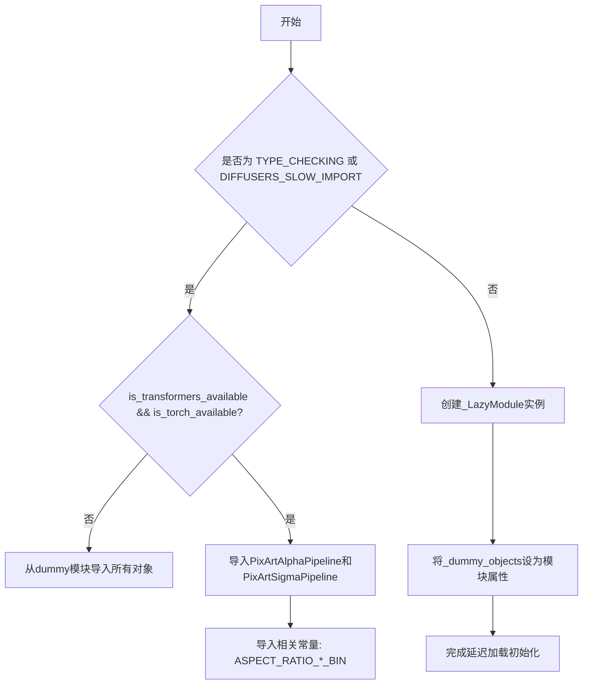
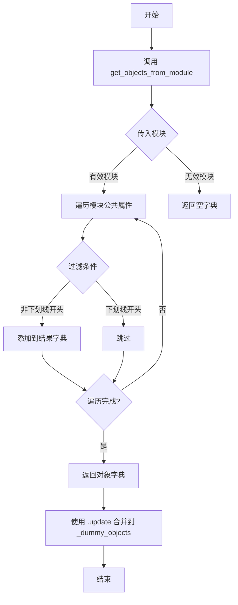
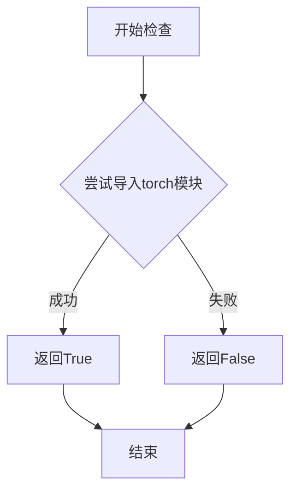
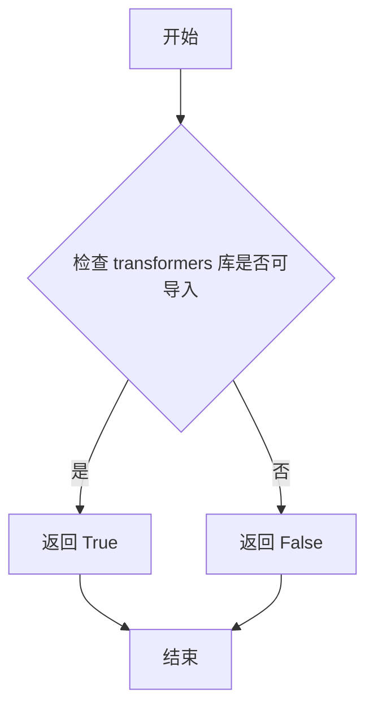

# `diffusers\src\diffusers\pipelines\pixart_alpha\__init__.py` 详细设计文档

这是一个用于diffusers管线模块的延迟加载初始化文件，负责优雅地处理torch和transformers的可选依赖，并提供PixArtAlpha和PixArtSigma文本到图像生成管线，当依赖不可用时自动回退到虚拟对象。

## 整体流程



## 类结构

```
diffusers.pipelines (package)
├── __init__.py (lazy-loading module)
├── pipeline_pixart_alpha.py
└── pipeline_pixart_sigma.py
```

## 全局变量及字段


### `_dummy_objects`
    
用于存储虚拟对象的字典，当torch和transformers可选依赖不可用时，通过get_objects_from_module从dummy模块获取并填充虚拟对象以实现延迟导入

类型：`dict`
    


### `_import_structure`
    
定义模块导入结构的字典，存储可用的管道类名称列表（如PixArtAlphaPipeline、PixArtSigmaPipeline等），用于LazyModule的延迟加载机制

类型：`dict`
    


    

## 全局函数及方法


### `get_objects_from_module`

从 `...utils` 模块导入的工具函数，用于从给定的 Python 模块中提取所有公共对象（变量、类、函数等），并返回一个字典映射，用于延迟导入机制中的虚拟对象创建。

参数：

- `module`：`module`，需要提取对象的 Python 模块对象

返回值：`dict`，返回模块中所有公共对象的字典映射，键为对象名称，值为对象本身

#### 流程图



#### 带注释源码

```python
# 从 utils 模块导入 get_objects_from_module 函数
from ...utils import (
    DIFFUSERS_SLOW_IMPORT,
    OptionalDependencyNotAvailable,
    _LazyModule,
    get_objects_from_module,  # <-- 关键函数：从模块提取对象
    is_torch_available,
    is_transformers_available,
)

# 初始化空字典用于存储虚拟对象
_dummy_objects = {}
_import_structure = {}

try:
    # 检查依赖是否可用
    if not (is_transformers_available() and is_torch_available()):
        raise OptionalDependencyNotAvailable()
except OptionalDependencyNotAvailable:
    # 依赖不可用时，导入虚拟对象模块
    from ...utils import dummy_torch_and_transformers_objects

    # 核心调用：从虚拟对象模块提取所有对象
    # 参数：dummy_torch_and_transformers_objects 模块
    # 返回：该模块中所有公共对象的字典
    _dummy_objects.update(get_objects_from_module(dummy_torch_and_transformers_objects))
else:
    # 依赖可用时，定义真实的导入结构
    _import_structure["pipeline_pixart_alpha"] = ["PixArtAlphaPipeline"]
    _import_structure["pipeline_pixart_sigma"] = ["PixArtSigmaPipeline"]

# ... 后续代码使用 _dummy_objects 设置虚拟属性 ...
for name, value in _dummy_objects.items():
    setattr(sys.modules[__name__], name, value)
```


### `is_torch_available`

该函数用于检查当前环境中 PyTorch 库是否可用，通过尝试导入 torch 模块来判断其是否已安装。

参数： 无

返回值：`bool`，如果 PyTorch 可用则返回 `True`，否则返回 `False`

#### 流程图



#### 带注释源码

```
# 这是从 ...utils 导入的函数，以下是其典型实现逻辑

def is_torch_available() -> bool:
    """
    检查 PyTorch 是否可用
    
    Returns:
        bool: 如果 torch 模块可以导入返回 True，否则返回 False
    """
    try:
        # 尝试导入 torch 模块
        import torch
        # 如果导入成功，返回 True
        return True
    except ImportError:
        # 如果导入失败（未安装 torch），返回 False
        return False
```

#### 在代码中的实际使用

```
# 从 utils 模块导入 is_torch_available
from ...utils import is_torch_available

# 在代码中使用的具体方式：
if not (is_transformers_available() and is_torch_available()):
    raise OptionalDependencyNotAvailable()
```

#### 关键信息

| 项目 | 详情 |
|------|------|
| **来源模块** | `...utils` |
| **依赖项** | 需要能够成功导入 `torch` 模块 |
| **调用场景** | 在 `TYPE_CHECKING` 或 `DIFFUSERS_SLOW_IMPORT` 条件下，用于条件性地导入依赖 torch 的类（如 `PixArtAlphaPipeline`、`PixArtSigmaPipeline`）|
| **设计目的** | 实现可选依赖的延迟加载，当 torch 不可用时不会导致整个模块导入失败 |


### `is_transformers_available`

描述：`is_transformers_available` 是一个从 `...utils` 模块导入的函数，用于检查 `transformers` 库是否可用。该函数通常不需要参数，并返回一个布尔值：`True` 表示 `transformers` 库已安装且可导入，`False` 表示不可用。在当前代码中，它与 `is_torch_available` 结合使用，以决定是否加载 PixArtAlpha 和 PixArtSigma 相关的管道类，或者回退到虚拟对象。

参数：无参数。

返回值：`bool`，返回 `True` 如果 `transformers` 库可用，否则返回 `False`。

#### 流程图



#### 带注释源码

```
# 当前代码中 is_transformers_available 的使用示例（从 ...utils 导入）
from ...utils import is_transformers_available, is_torch_available, OptionalDependencyNotAvailable

# 在模块初始化时检查依赖
try:
    # 如果 transformers 或 torch 不可用，则抛出异常
    if not (is_transformers_available() and is_torch_available()):
        raise OptionalDependencyNotAvailable()
except OptionalDependencyNotAvailable:
    # 如果依赖不可用，导入虚拟对象以保持模块结构
    from ...utils import dummy_torch_and_transformers_objects
    _dummy_objects.update(get_objects_from_module(dummy_torch_and_transformers_objects))
else:
    # 如果依赖可用，定义导入结构以包含实际的管道类
    _import_structure["pipeline_pixart_alpha"] = ["PixArtAlphaPipeline"]
    _import_structure["pipeline_pixart_sigma"] = ["PixArtSigmaPipeline"]

# 在类型检查或慢导入模式下，同样检查依赖
if TYPE_CHECKING or DIFFUSERS_SLOW_IMPORT:
    try:
        if not (is_transformers_available() and is_torch_available()):
            raise OptionalDependencyNotAvailable()
    except OptionalDependencyNotAvailable:
        # 导入虚拟对象的类型定义
        from ...utils.dummy_torch_and_transformers_objects import *
    else:
        # 导入实际的管道类和常量
        from .pipeline_pixart_alpha import (
            ASPECT_RATIO_256_BIN,
            ASPECT_RATIO_512_BIN,
            ASPECT_RATIO_1024_BIN,
            PixArtAlphaPipeline,
        )
        from .pipeline_pixart_sigma import ASPECT_RATIO_2048_BIN, PixArtSigmaPipeline
```

注意：`is_transformers_available` 函数的实际定义不在当前代码文件中，它来源于 `diffusers` 库的 `...utils` 模块。上述源码展示了该函数在当前文件中的典型用法模式。


## 关键组件


### 可选依赖检查与条件导入

该模块通过检查`is_transformers_available()`和`is_torch_available()`来判断torch和transformers依赖是否可用，若不可用则使用虚拟对象填充，保持接口一致性。

### 惰性加载模块（LazyModule）

使用`_LazyModule`实现模块的惰性加载，只有在实际使用pipeline时才加载相应模块，优化启动性能和内存占用。

### 导入结构定义（_import_structure）

定义模块的导入结构字典，映射字符串到可导入对象名称，支持动态导入机制。

### 虚拟对象机制（_dummy_objects）

当可选依赖不可用时，通过`get_objects_from_module`从dummy模块获取替代对象，防止导入错误。

### PixArtAlphaPipeline（PixArt α流水线）

文本到图像生成流水线，支持256、512、1024分辨率的宽高比常量（ASPECT_RATIO_256_BIN、ASPECT_RATIO_512_BIN、ASPECT_RATIO_1024_BIN）。

### PixArtSigmaPipeline（PixArt Σ流水线）

文本到图像生成流水线，支持2048分辨率的宽高比常量（ASPECT_RATIO_2048_BIN）。

### TYPE_CHECKING 模式

在类型检查或慢导入模式下直接导入真实模块，否则使用LazyModule延迟加载。


## 问题及建议


### 已知问题

-   **重复的依赖检查逻辑**：代码中存在两处几乎完全相同的依赖检查（`is_transformers_available() and is_torch_available()`），违反 DRY（Don't Repeat Yourself）原则，增加维护成本
-   **通配符导入**：在 `TYPE_CHECKING` 分支中使用 `from ...utils.dummy_torch_and_transformers_objects import *`，降低了代码的可读性和静态分析能力
-   **魔法字符串硬编码**：`"pipeline_pixart_alpha"` 和 `"pipeline_pixart_sigma"` 作为字典键硬编码，容易出现拼写错误且无法被 IDE 静态检查
-   **模块初始化逻辑分散**：依赖检查和模块导入逻辑分散在多个条件分支中，可读性较差，难以追踪执行路径
-   **空字典初始化冗余**：`_dummy_objects = {}` 和 `_import_structure = {}` 在定义后立即被修改，代码略显冗余
-   **缺少对 `get_objects_from_module` 返回值的校验**：直接更新到 `_dummy_objects` 而未检查返回值是否为 None 或空

### 优化建议

-   **提取依赖检查函数**：创建一个辅助函数（如 `_check_dependencies()`）来封装依赖检查逻辑，消除重复代码
-   **使用常量或枚举替代字符串**：定义模块名称常量，如 `MODULE_PIXART_ALPHA = "pipeline_pixart_alpha"`，提高可维护性
-   **显式导入替代通配符**：将 `import *` 改为显式导入，明确导出哪些对象，增强代码可读性
-   **重构条件分支**：将 `TYPE_CHECKING` 和 `DIFFUSERS_SLOW_IMPORT` 的逻辑合并，简化条件判断
-   **添加类型注解**：为 `_import_structure` 和 `_dummy_objects` 添加类型注解，提高类型安全
-   **考虑使用 functools.lru_cache 缓存依赖检查结果**：避免多次调用 `is_transformers_available()` 和 `is_torch_available()`


## 其它


### 设计目标与约束

实现模块的延迟加载（Lazy Loading），在保证类型提示可用的前提下，避免在导入时立即加载torch和transformers等重量级依赖，提升库的导入速度和内存占用。只有在实际使用Pipeline时才加载相关模块。

### 错误处理与异常设计

当torch或transformers不可用时，抛出`OptionalDependencyNotAvailable`异常，并从`dummy_torch_and_transformers_objects`模块获取dummy对象填充到`_dummy_objects`字典中。这些dummy对象会在实际调用时触发真正的导入错误，实现优雅的降级处理。

### 数据流与状态机

模块存在三种加载状态：1) 普通导入时，使用LazyModule代理，暂不加载实际模块；2) TYPE_CHECKING或DIFFUSERS_SLOW_IMPORT为真时，立即加载所有类型；3) 访问dummy对象属性时，触发实际的模块导入。状态转换由`sys.modules[__name__]`的设置和`setattr`操作完成。

### 外部依赖与接口契约

明确依赖torch和transformers两个可选库，通过`is_torch_available()`和`is_transformers_available()`函数检测可用性。导出的公开接口包括：`PixArtAlphaPipeline`、`PixArtSigmaPipeline`以及常量`ASPECT_RATIO_256_BIN`、`ASPECT_RATIO_512_BIN`、`ASPECT_RATIO_1024_BIN`、`ASPECT_RATIO_2048_BIN`。

### 模块初始化流程

1. 定义空的`_dummy_objects`字典和`_import_structure`字典；2. 检查torch和transformers可用性，若不可用则加载dummy对象；3. 若在类型检查模式，立即导入真实类；4. 否则，创建`_LazyModule`实例替换当前模块，并批量设置dummy对象到sys.modules。

### 类型检查支持

通过`TYPE_CHECKING`标志实现类型提示的导入，在类型检查时导入真实类供IDE和类型检查器使用，而不触发实际运行时的重量级依赖加载。`DIFFUSERS_SLOW_IMPORT`环境变量提供额外的控制开关。

### 导入结构管理

`_import_structure`字典定义了模块的导出结构，键为子模块路径，值为导出的符号列表。通过`_LazyModule`机制，在访问这些符号时才触发真正的子模块导入，实现按需加载。

### 性能优化考量

延迟加载策略显著降低了库的初始导入时间，避免了不必要的torch和transformers加载。dummy对象机制确保了类型安全的同时保持代码的兼容性。批量设置dummy对象到sys.modules避免了后续的属性查找开销。

### 跨模块协作

本模块作为PixArt系列Pipeline的统一导出入口，隐藏了具体的实现细节。调用方只需导入顶层模块即可获得Pipeline类，无需关心底层实现路径的变化。

### 潜在改进方向

当前dummy对象的导入路径使用了相对导入`from ...utils.dummy_torch_and_transformers_objects`，若未来模块结构变化可能需要调整。可以考虑将dummy对象生成逻辑抽象为通用工具函数，提高代码复用性。


    