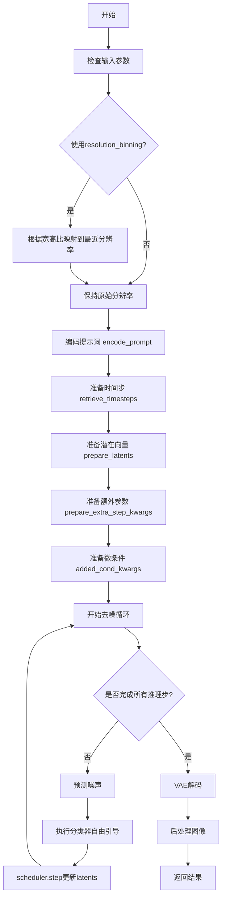
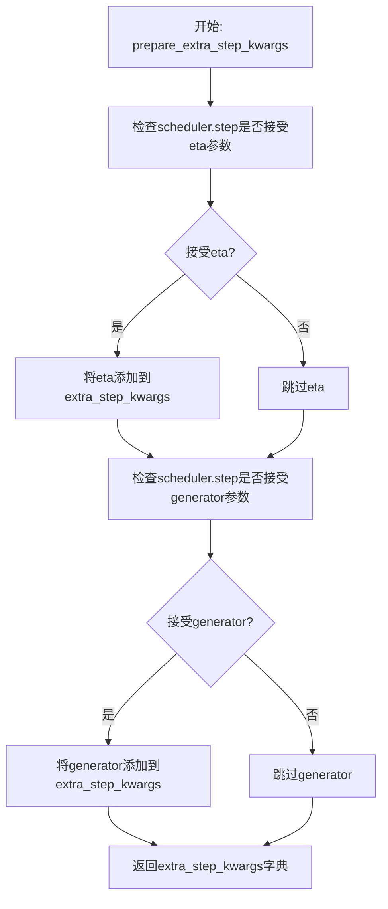
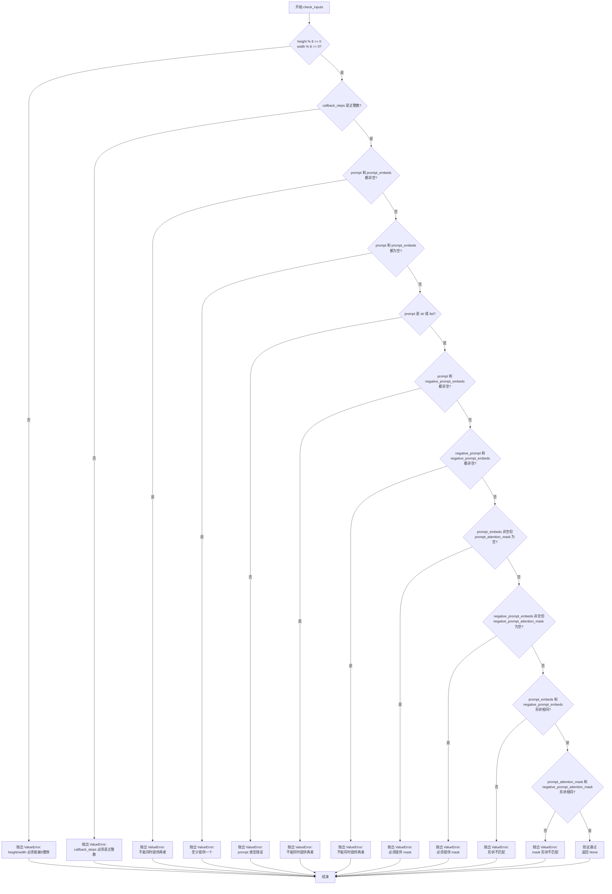
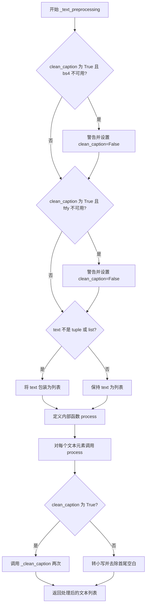
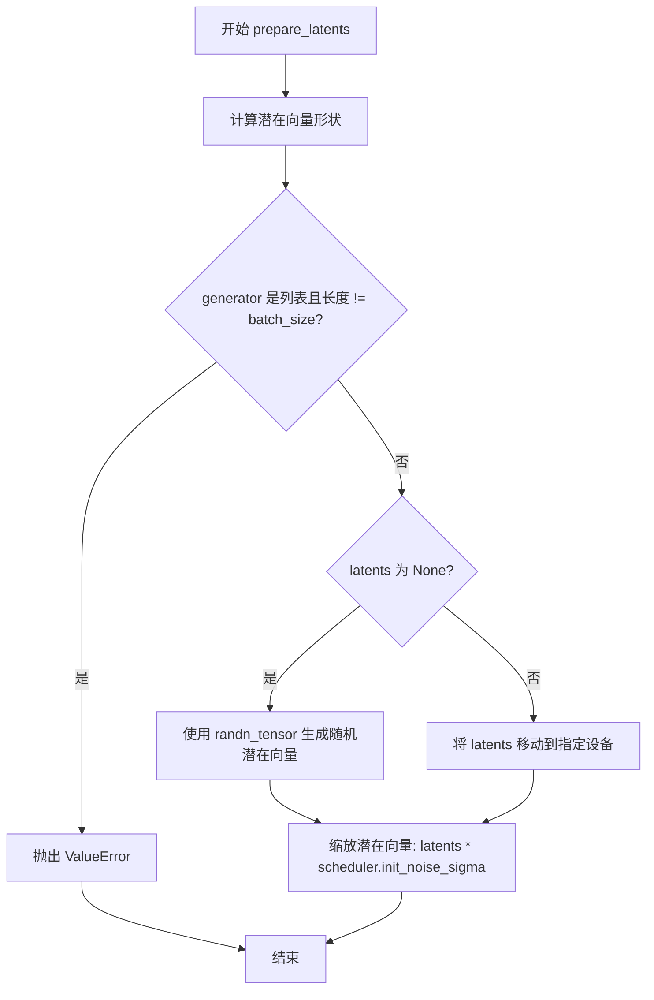
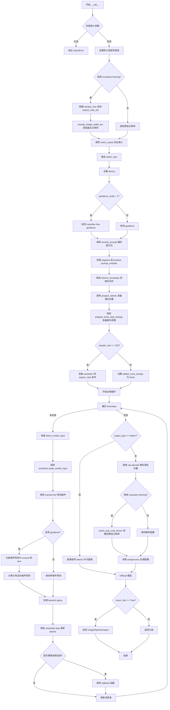

# `diffusers\src\diffusers\pipelines\pixart_alpha\pipeline_pixart_alpha.py` 详细设计文档

PixArt-Alpha text-to-image generation pipeline that uses a T5 encoder for text processing, a transformer model for latent denoising, and a VAE for decoding latents into images, supporting classifier-free guidance and resolution binning for flexible image generation.

## 整体流程



## 类结构

```
DiffusionPipeline (基类)
└── PixArtAlphaPipeline
```

## 全局变量及字段


### `ASPECT_RATIO_1024_BIN`
    
1024分辨率的宽高比映射表，用于将宽高比映射到具体的宽度和高度

类型：`Dict[str, List[float]]`
    


### `ASPECT_RATIO_512_BIN`
    
512分辨率的宽高比映射表，用于将宽高比映射到具体的宽度和高度

类型：`Dict[str, List[float]]`
    


### `ASPECT_RATIO_256_BIN`
    
256分辨率的宽高比映射表，用于将宽高比映射到具体的宽度和高度

类型：`Dict[str, List[float]]`
    


### `EXAMPLE_DOC_STRING`
    
示例文档字符串，包含PixArtAlphaPipeline的使用示例代码

类型：`str`
    


### `logger`
    
模块级日志记录器，用于记录警告和信息

类型：`logging.Logger`
    


### `XLA_AVAILABLE`
    
标志位，指示PyTorch XLA是否可用

类型：`bool`
    


### `is_bs4_available`
    
函数，用于检查beautifulsoup4是否可用

类型：`Callable[[], bool]`
    


### `is_ftfy_available`
    
函数，用于检查ftfy是否可用

类型：`Callable[[], bool]`
    


### `retrieve_timesteps`
    
函数，用于从调度器获取时间步序列

类型：`Callable`
    


### `PixArtAlphaPipeline.bad_punct_regex`
    
用于清理文本的特殊字符正则表达式

类型：`re.Pattern`
    


### `PixArtAlphaPipeline._optional_components`
    
可选组件列表，包含tokenizer和text_encoder

类型：`List[str]`
    


### `PixArtAlphaPipeline.model_cpu_offload_seq`
    
CPU卸载顺序，指定模型组件的卸载优先级

类型：`str`
    


### `PixArtAlphaPipeline.vae_scale_factor`
    
VAE缩放因子，用于调整潜在空间的分辨率

类型：`int`
    


### `PixArtAlphaPipeline.image_processor`
    
图像处理器，用于图像的后处理和分辨率调整

类型：`PixArtImageProcessor`
    


### `PixArtAlphaPipeline.tokenizer`
    
T5分词器，用于将文本转换为token序列

类型：`T5Tokenizer`
    


### `PixArtAlphaPipeline.text_encoder`
    
T5文本编码器，用于将token转换为文本嵌入

类型：`T5EncoderModel`
    


### `PixArtAlphaPipeline.vae`
    
VAE模型，用于潜在空间和图像之间的编码解码

类型：`AutoencoderKL`
    


### `PixArtAlphaPipeline.transformer`
    
变换器模型，用于去噪潜在表示

类型：`PixArtTransformer2DModel`
    


### `PixArtAlphaPipeline.scheduler`
    
调度器，用于控制去噪过程的步骤

类型：`DPMSolverMultistepScheduler`
    
    

## 全局函数及方法


### `retrieve_timesteps`

调用调度器的 `set_timesteps` 方法并在调用后从调度器检索时间步，处理自定义时间步。任何 kwargs 将被提供给 `scheduler.set_timesteps`。

参数：

- `scheduler`：`SchedulerMixin`，要获取时间步的调度器
- `num_inference_steps`：`int | None`，生成样本时使用的扩散步数，如果使用则 `timesteps` 必须为 `None`
- `device`：`str | torch.device | None`，时间步要移动到的设备，如果为 `None` 则不移动
- `timesteps`：`list[int] | None`，自定义时间步用于覆盖调度器的时间步间隔策略
- `sigmas`：`list[float] | None`，自定义 sigmas 用于覆盖调度器的时间步间隔策略
- `**kwargs`：任意，关键字参数将传递给 `scheduler.set_timesteps`

返回值：`tuple[torch.Tensor, int]`，第一个元素是调度器的时间步张量，第二个元素是推理步数

#### 流程图

```mermaid
flowchart TD
    A[开始] --> B{同时传递了 timesteps 和 sigmas?}
    B -->|是| C[抛出 ValueError: 只能选择一个]
    B -->|否| D{timesteps 不为 None?}
    D -->|是| E{scheduler.set_timesteps 支持 timesteps?}
    E -->|否| F[抛出 ValueError: 不支持自定义时间步]
    E -->|是| G[调用 scheduler.set_timesteps]
    G --> H[获取 scheduler.timesteps]
    H --> I[计算 num_inference_steps = len(timesteps)]
    I --> J[返回 timesteps, num_inference_steps]
    D -->|否| K{sigmas 不为 None?}
    K -->|是| L{scheduler.set_timesteps 支持 sigmas?}
    K -->|否| M[调用 scheduler.set_timesteps 使用 num_inference_steps]
    L -->|否| N[抛出 ValueError: 不支持自定义 sigmas]
    L -->|是| O[调用 scheduler.set_timesteps 设置 sigmas]
    O --> P[获取 scheduler.timesteps]
    P --> Q[计算 num_inference_steps = len(timesteps)]
    Q --> J
    M --> R[获取 scheduler.timesteps]
    R --> J
```

#### 带注释源码

```python
# Copied from diffusers.pipelines.stable_diffusion.pipeline_stable_diffusion.retrieve_timesteps
def retrieve_timesteps(
    scheduler,
    num_inference_steps: int | None = None,
    device: str | torch.device | None = None,
    timesteps: list[int] | None = None,
    sigmas: list[float] | None = None,
    **kwargs,
):
    r"""
    Calls the scheduler's `set_timesteps` method and retrieves timesteps from the scheduler after the call. Handles
    custom timesteps. Any kwargs will be supplied to `scheduler.set_timesteps`.

    Args:
        scheduler (`SchedulerMixin`):
            The scheduler to get timesteps from.
        num_inference_steps (`int`):
            The number of diffusion steps used when generating samples with a pre-trained model. If used, `timesteps`
            must be `None`.
        device (`str` or `torch.device`, *optional*):
            The device to which the timesteps should be moved to. If `None`, the timesteps are not moved.
        timesteps (`list[int]`, *optional*):
            Custom timesteps used to override the timestep spacing strategy of the scheduler. If `timesteps` is passed,
            `num_inference_steps` and `sigmas` must be `None`.
        sigmas (`list[float]`, *optional*):
            Custom sigmas used to override the timestep spacing strategy of the scheduler. If `sigmas` is passed,
            `num_inference_steps` and `timesteps` must be `None`.

    Returns:
        `tuple[torch.Tensor, int]`: A tuple where the first element is the timestep schedule from the scheduler and the
        second element is the number of inference steps.
    """
    # 检查是否同时传递了 timesteps 和 sigmas，只能选择其中一个
    if timesteps is not None and sigmas is not None:
        raise ValueError("Only one of `timesteps` or `sigmas` can be passed. Please choose one to set custom values")
    
    # 处理自定义 timesteps 的情况
    if timesteps is not None:
        # 检查调度器的 set_timesteps 方法是否支持 timesteps 参数
        accepts_timesteps = "timesteps" in set(inspect.signature(scheduler.set_timesteps).parameters.keys())
        if not accepts_timesteps:
            raise ValueError(
                f"The current scheduler class {scheduler.__class__}'s `set_timesteps` does not support custom"
                f" timestep schedules. Please check whether you are using the correct scheduler."
            )
        # 调用调度器的 set_timesteps 方法设置自定义时间步
        scheduler.set_timesteps(timesteps=timesteps, device=device, **kwargs)
        # 从调度器获取时间步
        timesteps = scheduler.timesteps
        # 计算推理步数
        num_inference_steps = len(timesteps)
    # 处理自定义 sigmas 的情况
    elif sigmas is not None:
        # 检查调度器的 set_timesteps 方法是否支持 sigmas 参数
        accept_sigmas = "sigmas" in set(inspect.signature(scheduler.set_timesteps).parameters.keys())
        if not accept_sigmas:
            raise ValueError(
                f"The current scheduler class {scheduler.__class__}'s `set_timesteps` does not support custom"
                f" sigmas schedules. Please check whether you are using the correct scheduler."
            )
        # 调用调度器的 set_timesteps 方法设置自定义 sigmas
        scheduler.set_timesteps(sigmas=sigmas, device=device, **kwargs)
        # 从调度器获取时间步
        timesteps = scheduler.timesteps
        # 计算推理步数
        num_inference_steps = len(timesteps)
    # 没有提供自定义时间步或 sigmas，使用默认行为
    else:
        # 使用 num_inference_steps 设置时间步
        scheduler.set_timesteps(num_inference_steps, device=device, **kwargs)
        # 从调度器获取时间步
        timesteps = scheduler.timesteps
    
    # 返回时间步张量和推理步数
    return timesteps, num_inference_steps
```


### `PixArtAlphaPipeline.__init__`

该方法是 PixArtAlphaPipeline 类的构造函数，用于初始化文本到图像生成管道。它接收分词器、文本编码器、VAE、变换器和调度器等核心组件，并通过注册模块和计算 VAE 缩放因子来设置管道。

参数：

- `tokenizer`：`T5Tokenizer`，用于将文本提示转换为模型可处理的 token 序列
- `text_encoder`：`T5EncoderModel`，冻结的 T5 文本编码器，用于将 token 序列编码为文本嵌入
- `vae`：`AutoencoderKL`，变分自编码器，用于将潜在表示编码和解码为图像
- `transformer`：`PixArtTransformer2DModel`，PixArt 变换器模型，用于对编码后的图像潜在表示进行去噪
- `scheduler`：`DPMSolverMultistepScheduler`，调度器，用于在去噪过程中逐步减少噪声

返回值：`None`，构造函数不返回任何值，仅初始化对象状态

#### 流程图

```mermaid
flowchart TD
    A[开始 __init__] --> B[调用父类 DiffusionPipeline.__init__]
    B --> C[调用 self.register_modules 注册 tokenizer, text_encoder, vae, transformer, scheduler]
    C --> D{检查 vae 是否存在}
    D -->|是| E[计算 vae_scale_factor: 2^(len(vae.config.block_out_channels)-1)]
    D -->|否| F[设置 vae_scale_factor = 8]
    E --> G[创建 PixArtImageProcessor 并赋值给 self.image_processor]
    F --> G
    G --> H[结束 __init__]
```

#### 带注释源码

```python
def __init__(
    self,
    tokenizer: T5Tokenizer,           # T5 分词器，用于文本预处理
    text_encoder: T5EncoderModel,    # T5 文本编码器模型
    vae: AutoencoderKL,               # VAE 变分自编码器
    transformer: PixArtTransformer2DModel,  # PixArt 变换器
    scheduler: DPMSolverMultistepScheduler,  # DPM 多步调度器
):
    # 调用父类 DiffusionPipeline 的初始化方法
    super().__init__()

    # 注册所有模块，使管道能够访问和管理这些组件
    self.register_modules(
        tokenizer=tokenizer,
        text_encoder=text_encoder,
        vae=vae,
        transformer=transformer,
        scheduler=scheduler
    )

    # 计算 VAE 缩放因子，用于潜在空间和像素空间之间的转换
    # 如果 VAE 存在，根据其 block_out_channels 计算缩放因子
    # 否则使用默认值 8（这是基于 VAE 通常下采样 2^(3)=8 倍的假设）
    self.vae_scale_factor = 2 ** (len(self.vae.config.block_out_channels) - 1) if getattr(self, "vae", None) else 8

    # 创建图像处理器，用于图像的后处理（如归一化、转换等）
    self.image_processor = PixArtImageProcessor(vae_scale_factor=self.vae_scale_factor)
```


### `PixArtAlphaPipeline.encode_prompt`

该方法负责将文本提示编码为文本编码器的隐藏状态。它处理文本预处理、分词、使用 T5 文本编码器进行编码，支持分类器自由引导（CFG），并返回提示嵌入、注意力掩码及其对应的负向提示嵌入和掩码。

参数：

- `prompt`：`str | list[str]`，要编码的提示文本
- `negative_prompt`：`str | list[str]`，不参与图像生成的负向提示，若不提供且启用了 CFG，则需传入 `negative_prompt_embeds`
- `do_classifier_free_guidance`：`bool`，是否启用分类器自由引导，默认为 `True`
- `num_images_per_prompt`：`int`，每个提示生成的图像数量，默认为 1
- `device`：`torch.device | None`，用于放置生成嵌入的设备，若为 `None` 则使用执行设备
- `prompt_embeds`：`torch.Tensor | None`，预生成的文本嵌入，若未提供则从 `prompt` 生成
- `negative_prompt_embeds`：`torch.Tensor | None`，预生成的负向文本嵌入
- `prompt_attention_mask`：`torch.Tensor | None`，文本嵌入的注意力掩码
- `negative_prompt_attention_mask`：`torch.Tensor | None`，负向文本嵌入的注意力掩码
- `clean_caption`：`bool`，是否在编码前清理和预处理提示，默认为 `False`
- `max_sequence_length`：`int`，提示使用的最大序列长度，默认为 120
- `**kwargs`：额外关键字参数（已弃用的 `mask_feature`）

返回值：`tuple[torch.Tensor, torch.Tensor, torch.Tensor, torch.Tensor]`，返回一个包含四个元素的元组：
- `prompt_embeds`：编码后的提示嵌入
- `prompt_attention_mask`：提示的注意力掩码
- `negative_prompt_embeds`：编码后的负向提示嵌入（若不启用 CFG 则为 `None`）
- `negative_prompt_attention_mask`：负向提示的注意力掩码（若不启用 CFG 则为 `None`）

#### 流程图

```mermaid
flowchart TD
    A[开始 encode_prompt] --> B{device 是否为 None?}
    B -- 是 --> C[使用 self._execution_device]
    B -- 否 --> D[使用传入的 device]
    C --> E
    D --> E
    
    E{prompt_embeds 是否为 None?}
    E -- 是 --> F[调用 _text_preprocessing 预处理 prompt]
    E -- 否 --> K
    
    F --> G[使用 tokenizer 分词 prompt]
    G --> H{untruncated_ids 长度 >= text_input_ids 长度?}
    H -- 是 --> I[记录截断警告]
    H -- 否 --> J
    I --> J
    J --> L[调用 text_encoder 编码]
    J --> M[提取 prompt_embeds[0]]
    
    E -- 否 --> M
    
    K[直接使用传入的 prompt_embeds]
    M --> N{self.text_encoder 是否存在?}
    N -- 是 --> O[获取 text_encoder 的 dtype]
    N -- 否 --> P{self.transformer 是否存在?}
    P -- 是 --> O
    P -- 否 --> Q[dtype = None]
    O --> R
    Q --> R
    
    R --> S[将 prompt_embeds 转换为指定 dtype 和 device]
    S --> T[获取 bs_embed, seq_len]
    T --> U[复制 prompt_embeds 和 prompt_attention_mask num_images_per_prompt 次]
    U --> V{do_classifier_free_guidance 且 negative_prompt_embeds 为 None?}
    V -- 是 --> W[预处理 uncond_tokens]
    V -- 否 --> d
    
    W --> X[使用 tokenizer 分词 uncond_tokens]
    X --> Y[调用 text_encoder 编码负向提示]
    Y --> Z[提取 negative_prompt_embeds[0]]
    
    V -- 否 --> d{do_classifier_free_guidance?}
    d -- 是 --> e[复制 negative_prompt_embeds 和 negative_prompt_attention_mask]
    d -- 否 --> f[negative_prompt_embeds = None]
    f --> g[negative_prompt_attention_mask = None]
    e --> h
    Z --> h
    g --> h
    
    h[返回 prompt_embeds, prompt_attention_mask, negative_prompt_embeds, negative_prompt_attention_mask]
```

#### 带注释源码

```python
def encode_prompt(
    self,
    prompt: str | list[str],
    do_classifier_free_guidance: bool = True,
    negative_prompt: str = "",
    num_images_per_prompt: int = 1,
    device: torch.device | None = None,
    prompt_embeds: torch.Tensor | None = None,
    negative_prompt_embeds: torch.Tensor | None = None,
    prompt_attention_mask: torch.Tensor | None = None,
    negative_prompt_attention_mask: torch.Tensor | None = None,
    clean_caption: bool = False,
    max_sequence_length: int = 120,
    **kwargs,
):
    r"""
    Encodes the prompt into text encoder hidden states.

    Args:
        prompt (`str` or `list[str]`, *optional*):
            prompt to be encoded
        negative_prompt (`str` or `list[str]`, *optional*):
            The prompt not to guide the image generation. If not defined, one has to pass `negative_prompt_embeds`
            instead. Ignored when not using guidance (i.e., ignored if `guidance_scale` is less than `1`). For
            PixArt-Alpha, this should be "".
        do_classifier_free_guidance (`bool`, *optional*, defaults to `True`):
            whether to use classifier free guidance or not
        num_images_per_prompt (`int`, *optional*, defaults to 1):
            number of images that should be generated per prompt
        device: (`torch.device`, *optional*):
            torch device to place the resulting embeddings on
        prompt_embeds (`torch.Tensor`, *optional*):
            Pre-generated text embeddings. Can be used to easily tweak text inputs, *e.g.* prompt weighting. If not
            provided, text embeddings will be generated from `prompt` input argument.
        negative_prompt_embeds (`torch.Tensor`, *optional*):
            Pre-generated negative text embeddings. For PixArt-Alpha, it's should be the embeddings of the ""
            string.
        clean_caption (`bool`, defaults to `False`):
            If `True`, the function will preprocess and clean the provided caption before encoding.
        max_sequence_length (`int`, defaults to 120): Maximum sequence length to use for the prompt.
    """

    # 检查是否传入了已弃用的 mask_feature 参数，发出警告但不中断执行
    if "mask_feature" in kwargs:
        deprecation_message = "The use of `mask_feature` is deprecated. It is no longer used in any computation and that doesn't affect the end results. It will be removed in a future version."
        deprecate("mask_feature", "1.0.0", deprecation_message, standard_warn=False)

    # 如果未指定 device，则使用管道的执行设备
    if device is None:
        device = self._execution_device

    # See Section 3.1. of the paper.
    # 设置最大序列长度（默认为120，与T5模型能力相关）
    max_length = max_sequence_length

    # 如果未提供 prompt_embeds，则从 prompt 文本开始编码
    if prompt_embeds is None:
        # 文本预处理：小写化、清理HTML、转义字符等
        prompt = self._text_preprocessing(prompt, clean_caption=clean_caption)
        
        # 使用 T5 Tokenizer 将文本转换为 token IDs
        text_inputs = self.tokenizer(
            prompt,
            padding="max_length",
            max_length=max_length,
            truncation=True,
            add_special_tokens=True,
            return_tensors="pt",
        )
        text_input_ids = text_inputs.input_ids
        
        # 检查是否发生了截断（用于警告用户）
        untruncated_ids = self.tokenizer(prompt, padding="longest", return_tensors="pt").input_ids

        if untruncated_ids.shape[-1] >= text_input_ids.shape[-1] and not torch.equal(
            text_input_ids, untruncated_ids
        ):
            removed_text = self.tokenizer.batch_decode(untruncated_ids[:, max_length - 1 : -1])
            logger.warning(
                "The following part of your input was truncated because T5 can only handle sequences up to"
                f" {max_length} tokens: {removed_text}"
            )

        # 获取注意力掩码并移动到指定设备
        prompt_attention_mask = text_inputs.attention_mask
        prompt_attention_mask = prompt_attention_mask.to(device)

        # 使用 T5 文本编码器编码，获取隐藏状态
        prompt_embeds = self.text_encoder(text_input_ids.to(device), attention_mask=prompt_attention_mask)
        # T5 encoder 输出是隐藏状态元组，取第一个元素
        prompt_embeds = prompt_embeds[0]

    # 确定数据类型（dtype），优先使用 text_encoder 的 dtype，其次使用 transformer 的 dtype
    if self.text_encoder is not None:
        dtype = self.text_encoder.dtype
    elif self.transformer is not None:
        dtype = self.transformer.dtype
    else:
        dtype = None

    # 将 prompt_embeds 转换为指定的 dtype 和 device
    prompt_embeds = prompt_embeds.to(dtype=dtype, device=device)

    # 获取批次大小和序列长度
    bs_embed, seq_len, _ = prompt_embeds.shape
    
    # 复制文本嵌入和注意力掩码，以匹配每个提示生成的图像数量
    # 使用 MPS 友好的方法进行复制
    prompt_embeds = prompt_embeds.repeat(1, num_images_per_prompt, 1)
    prompt_embeds = prompt_embeds.view(bs_embed * num_images_per_prompt, seq_len, -1)
    prompt_attention_mask = prompt_attention_mask.repeat(1, num_images_per_prompt)
    prompt_attention_mask = prompt_attention_mask.view(bs_embed * num_images_per_prompt, -1)

    # 获取无条件嵌入，用于分类器自由引导（CFG）
    if do_classifier_free_guidance and negative_prompt_embeds is None:
        # 将负向提示扩展为与批次大小相同
        uncond_tokens = [negative_prompt] * bs_embed if isinstance(negative_prompt, str) else negative_prompt
        # 预处理负向提示
        uncond_tokens = self._text_preprocessing(uncond_tokens, clean_caption=clean_caption)
        
        # 使用与 prompt_embeds 相同的序列长度
        max_length = prompt_embeds.shape[1]
        
        # Tokenize 负向提示
        uncond_input = self.tokenizer(
            uncond_tokens,
            padding="max_length",
            max_length=max_length,
            truncation=True,
            return_attention_mask=True,
            add_special_tokens=True,
            return_tensors="pt",
        )
        negative_prompt_attention_mask = uncond_input.attention_mask
        negative_prompt_attention_mask = negative_prompt_attention_mask.to(device)

        # 编码负向提示
        negative_prompt_embeds = self.text_encoder(
            uncond_input.input_ids.to(device), attention_mask=negative_prompt_attention_mask
        )
        negative_prompt_embeds = negative_prompt_embeds[0]

    # 如果启用 CFG，则复制无条件嵌入以匹配生成的图像数量
    if do_classifier_free_guidance:
        # 获取序列长度
        seq_len = negative_prompt_embeds.shape[1]

        # 转换为指定 dtype 和 device
        negative_prompt_embeds = negative_prompt_embeds.to(dtype=dtype, device=device)

        # 复制以匹配每提示生成的图像数量
        negative_prompt_embeds = negative_prompt_embeds.repeat(1, num_images_per_prompt, 1)
        negative_prompt_embeds = negative_prompt_embeds.view(bs_embed * num_images_per_prompt, seq_len, -1)

        negative_prompt_attention_mask = negative_prompt_attention_mask.repeat(1, num_images_per_prompt)
        negative_prompt_attention_mask = negative_prompt_attention_mask.view(bs_embed * num_images_per_prompt, -1)
    else:
        # 如果不启用 CFG，则返回 None
        negative_prompt_embeds = None
        negative_prompt_attention_mask = None

    # 返回四个张量：prompt_embeds, prompt_attention_mask, negative_prompt_embeds, negative_prompt_attention_mask
    return prompt_embeds, prompt_attention_mask, negative_prompt_embeds, negative_prompt_attention_mask
```


### `PixArtAlphaPipeline.prepare_extra_step_kwargs`

该方法用于准备调度器（scheduler）步骤所需的额外参数。由于不同调度器的签名不完全相同，该方法通过检查调度器的`step`方法是否支持特定参数（如`eta`和`generator`）来动态构建参数字典。

参数：

- `self`：隐式参数，PixArtAlphaPipeline实例本身
- `generator`：`torch.Generator | list[torch.Generator] | None`，用于控制随机数生成的生成器，以确保推理过程的可重复性
- `eta`：`float`，DDIM调度器中使用的eta参数（η），对应DDIM论文中的η参数，值应介于[0, 1]之间；对于其他调度器此参数会被忽略

返回值：`dict`，包含调度器step方法所需的额外关键字参数（如`eta`和/或`generator`）

#### 流程图



#### 带注释源码

```python
def prepare_extra_step_kwargs(self, generator, eta):
    # 为调度器步骤准备额外参数，因为并非所有调度器都具有相同的签名
    # eta (η) 仅在DDIMScheduler中使用，其他调度器将忽略此参数
    # eta对应DDIM论文中的η参数：https://huggingface.co/papers/2010.02502
    # eta的值应介于[0, 1]之间

    # 检查调度器的step方法是否接受eta参数
    accepts_eta = "eta" in set(inspect.signature(self.scheduler.step).parameters.keys())
    
    # 初始化额外参数字典
    extra_step_kwargs = {}
    
    # 如果调度器接受eta参数，则添加到extra_step_kwargs
    if accepts_eta:
        extra_step_kwargs["eta"] = eta

    # 检查调度器是否接受generator参数
    accepts_generator = "generator" in set(inspect.signature(self.scheduler.step).parameters.keys())
    
    # 如果调度器接受generator参数，则添加到extra_step_kwargs
    if accepts_generator:
        extra_step_kwargs["generator"] = generator
    
    # 返回构建好的参数字典
    return extra_step_kwargs
```


### PixArtAlphaPipeline.check_inputs

该方法用于验证 PixArt-Alpha 管道输入参数的有效性，确保用户在调用图像生成方法前提供的所有参数符合预期，否则抛出详细的 ValueError 异常。

参数：

- `prompt`：`str | list[str] | None`，用户提供的文本提示，用于指导图像生成
- `height`：`int`，生成的图像高度（像素），必须是 8 的倍数
- `width`：`int`，生成的图像宽度（像素），必须是 8 的倍数
- `negative_prompt`：`str | None`，反向提示词，用于指导不生成的内容
- `callback_steps`：`int`，回调函数被调用的频率，必须是正整数
- `prompt_embeds`：`torch.Tensor | None`，预生成的文本嵌入向量
- `negative_prompt_embeds`：`torch.Tensor | None`，预生成的反向文本嵌入向量
- `prompt_attention_mask`：`torch.Tensor | None`，文本嵌入的注意力掩码
- `negative_prompt_attention_mask`：`torch.Tensor | None`，反向文本嵌入的注意力掩码

返回值：`None`，该方法不返回任何值，仅通过抛出 ValueError 来表示验证失败

#### 流程图



#### 带注释源码

```python
def check_inputs(
    self,
    prompt,
    height,
    width,
    negative_prompt,
    callback_steps,
    prompt_embeds=None,
    negative_prompt_embeds=None,
    prompt_attention_mask=None,
    negative_prompt_attention_mask=None,
):
    """
    验证图像生成输入参数的有效性。
    
    检查以下内容：
    1. height 和 width 必须能被 8 整除
    2. callback_steps 必须是正整数
    3. prompt 和 prompt_embeds 不能同时提供
    4. 至少需要提供 prompt 或 prompt_embeds 其中之一
    5. prompt 必须是字符串或列表类型
    6. prompt 和 negative_prompt_embeds 不能同时提供
    7. negative_prompt 和 negative_prompt_embeds 不能同时提供
    8. 如果提供 prompt_embeds，必须同时提供 prompt_attention_mask
    9. 如果提供 negative_prompt_embeds，必须同时提供 negative_prompt_attention_mask
    10. prompt_embeds 和 negative_prompt_embeds 形状必须一致
    11. prompt_attention_mask 和 negative_prompt_attention_mask 形状必须一致
    """
    
    # 检查图像尺寸是否为 8 的倍数（VAE 的要求）
    if height % 8 != 0 or width % 8 != 0:
        raise ValueError(f"`height` and `width` have to be divisible by 8 but are {height} and {width}.")

    # 验证 callback_steps 是正整数
    if (callback_steps is None) or (
        callback_steps is not None and (not isinstance(callback_steps, int) or callback_steps <= 0)
    ):
        raise ValueError(
            f"`callback_steps` has to be a positive integer but is {callback_steps} of type"
            f" {type(callback_steps)}."
        )

    # prompt 和 prompt_embeds 互斥，不能同时提供
    if prompt is not None and prompt_embeds is not None:
        raise ValueError(
            f"Cannot forward both `prompt`: {prompt} and `prompt_embeds`: {prompt_embeds}. Please make sure to"
            " only forward one of the two."
        )
    # 至少需要提供其中一个
    elif prompt is None and prompt_embeds is None:
        raise ValueError(
            "Provide either `prompt` or `prompt_embeds`. Cannot leave both `prompt` and `prompt_embeds` undefined."
        )
    # prompt 类型检查
    elif prompt is not None and (not isinstance(prompt, str) and not isinstance(prompt, list)):
        raise ValueError(f"`prompt` has to be of type `str` or `list` but is {type(prompt)}")

    # prompt 和 negative_prompt_embeds 互斥检查
    if prompt is not None and negative_prompt_embeds is not None:
        raise ValueError(
            f"Cannot forward both `prompt`: {prompt} and `negative_prompt_embeds`:"
            f" {negative_prompt_embeds}. Please make sure to only forward one of the two."
        )

    # negative_prompt 和 negative_prompt_embeds 互斥检查
    if negative_prompt is not None and negative_prompt_embeds is not None:
        raise ValueError(
            f"Cannot forward both `negative_prompt`: {negative_prompt} and `negative_prompt_embeds`:"
            f" {negative_prompt_embeds}. Please make sure to only forward one of the two."
        )

    # prompt_embeds 必须伴随 prompt_attention_mask
    if prompt_embeds is not None and prompt_attention_mask is None:
        raise ValueError("Must provide `prompt_attention_mask` when specifying `prompt_embeds`.")

    # negative_prompt_embeds 必须伴随 negative_prompt_attention_mask
    if negative_prompt_embeds is not None and negative_prompt_attention_mask is None:
        raise ValueError("Must provide `negative_prompt_attention_mask` when specifying `negative_prompt_embeds`.")

    # 验证 prompt_embeds 和 negative_prompt_embeds 形状一致性
    if prompt_embeds is not None and negative_prompt_embeds is not None:
        if prompt_embeds.shape != negative_prompt_embeds.shape:
            raise ValueError(
                "`prompt_embeds` and `negative_prompt_embeds` must have the same shape when passed directly, but"
                f" got: `prompt_embeds` {prompt_embeds.shape} != `negative_prompt_embeds`"
                f" {negative_prompt_embeds.shape}."
            )
        # 验证注意力掩码形状一致性
        if prompt_attention_mask.shape != negative_prompt_attention_mask.shape:
            raise ValueError(
                "`prompt_attention_mask` and `negative_prompt_attention_mask` must have the same shape when passed directly, but"
                f" got: `prompt_attention_mask` {prompt_attention_mask.shape} != `negative_prompt_attention_mask`"
                f" {negative_prompt_attention_mask.shape}."
            )
```


### `PixArtAlphaPipeline._text_preprocessing`

该方法用于对输入的文本提示进行预处理，支持可选的清理功能（如HTML标签去除、特殊字符处理、URL清理等），最终返回处理后的文本列表。

参数：

- `text`：`str | list[str]`，需要预处理的文本或文本列表
- `clean_caption`：`bool`，是否清理标题，默认为 False

返回值：`list[str]`，返回处理后的文本列表

#### 流程图



#### 带注释源码

```
def _text_preprocessing(self, text, clean_caption=False):
    # 如果需要清理标题但缺少 bs4 库，发出警告并禁用清理功能
    if clean_caption and not is_bs4_available():
        logger.warning(BACKENDS_MAPPING["bs4"][-1].format("Setting `clean_caption=True`"))
        logger.warning("Setting `clean_caption` to False...")
        clean_caption = False

    # 如果需要清理标题但缺少 ftfy 库，发出警告并禁用清理功能
    if clean_caption and not is_ftfy_available():
        logger.warning(BACKENDS_MAPPING["ftfy"][-1].format("Setting `clean_caption=True`"))
        logger.warning("Setting `clean_caption` to False...")
        clean_caption = False

    # 确保 text 是列表格式
    if not isinstance(text, (tuple, list)):
        text = [text]

    # 定义内部处理函数
    def process(text: str):
        if clean_caption:
            # 调用 _clean_caption 两次以确保彻底清理
            text = self._clean_caption(text)
            text = self._clean_caption(text)
        else:
            # 仅进行小写转换和去除首尾空白
            text = text.lower().strip()
        return text

    # 对列表中的每个文本元素应用处理函数
    return [process(t) for t in text]
```


### `PixArtAlphaPipeline._clean_caption`

该方法用于清洗和预处理文本标题，通过URL解码、HTML标签移除、CJK字符过滤、特殊字符清理、ftfy库修复等步骤，将原始文本转换为标准化的小写字符串，以便后续的文本编码处理。

参数：

- `caption`：需要清洗的标题文本，类型为任意类型（会被转换为字符串），需要清洗的原始输入文本

返回值：`str`，清洗处理后的标准化文本字符串

#### 流程图

```mermaid
flowchart TD
    A[开始] --> B[将caption转换为字符串]
    B --> C[URL解码: ul.unquote_plus]
    C --> D[转小写并去除首尾空格]
    E[替换&lt;person&gt;为person] --> F[正则匹配URL并替换为空]
    F --> G[使用BeautifulSoup移除HTML标签]
    G --> H[移除@昵称]
    H --> I[移除CJK字符范围]
    I --> J[统一破折号为-]
    J --> K[统一引号为双引号和单引号]
    K --> L[移除HTML实体如&amp;quot;和&amp;amp]
    L --> M[移除IP地址]
    M --> N[移除文章ID和换行符]
    N --> O[移除#数字和文件名]
    O --> P[清理连续引号和点号]
    P --> Q[使用bad_punct_regex移除特殊标点]
    Q --> R[处理连字符分隔的单词]
    R --> S[使用ftfy.fix_text修复编码问题]
    S --> T[双重html.unescape处理]
    T --> U[移除字母数字混合模式]
    U --> V[移除特定关键词如shipping/download]
    V --> W[移除页面号和尺寸规格]
    W --> X[清理多余空白和首尾字符]
    X --> Y[返回处理后的文本]
```

#### 带注释源码

```python
def _clean_caption(self, caption):
    # 将caption转换为字符串格式
    caption = str(caption)
    
    # URL解码：将URL编码的字符（如%20）转换回原始字符
    caption = ul.unquote_plus(caption)
    
    # 去除首尾空格并转换为小写
    caption = caption.strip().lower()
    
    # 将HTML实体&lt;person&gt;替换为person
    caption = re.sub("<person>", "person", caption)
    
    # 正则表达式匹配HTTP/HTTPS开头的URL并移除
    caption = re.sub(
        r"\b((?:https?:(?:\/{1,3}|[a-zA-Z0-9%])|[a-zA-Z0-9.\-]+[.](?:com|co|ru|net|org|edu|gov|it)[\w/-]*\b\/?(?!@)))",  # noqa
        "",
        caption,
    )  # regex for urls
    
    # 正则表达式匹配www开头的URL并移除
    caption = re.sub(
        r"\b((?:www:(?:\/{1,3}|[a-zA-Z0-9%])|[a-zA-Z0-9.\-]+[.](?:com|co|ru|net|org|edu|gov|it)[\w/-]*\b\/?(?!@)))",  # noqa
        "",
        caption,
    )  # regex for urls
    
    # 使用BeautifulSoup解析并提取纯文本，移除HTML标签
    caption = BeautifulSoup(caption, features="html.parser").text

    # 移除@开头的用户名/昵称
    caption = re.sub(r"@[\w\d]+\b", "", caption)

    # 31C0—31EF CJK笔划
    # 31F0—31FF 片假名音韵扩展
    # 3200—32FF 圈圈CJK字母和月份
    # 3300—33FF CJK兼容字符
    # 3400—4DBF CJK统一表意文字扩展A
    # 4DC0—4DFF 易经六十四卦符号
    # 4E00—9FFF CJK统一表意文字
    # 移除所有CJK字符范围
    caption = re.sub(r"[\u31c0-\u31ef]+", "", caption)
    caption = re.sub(r"[\u31f0-\u31ff]+", "", caption)
    caption = re.sub(r"[\u3200-\u32ff]+", "", caption)
    caption = re.sub(r"[\u3300-\u33ff]+", "", caption)
    caption = re.sub(r"[\u3400-\u4dbf]+", "", caption)
    caption = re.sub(r"[\u4dc0-\u4dff]+", "", caption)
    caption = re.sub(r"[\u4e00-\u9fff]+", "", caption)
    #######################################################

    # 所有类型的破折号统一替换为"-"
    caption = re.sub(
        r"[\u002D\u058A\u05BE\u1400\u1806\u2010-\u2015\u2E17\u2E1A\u2E3A\u2E3B\u2E40\u301C\u3030\u30A0\uFE31\uFE32\uFE58\uFE63\uFF0D]+",  # noqa
        "-",
        caption,
    )

    # 引号标准化：将各种语言的单双引号统一
    caption = re.sub(r"[`´«»""¨]", '"', caption)
    caption = re.sub(r"['']", "'", caption)

    # 移除HTML实体&quot;及变体
    caption = re.sub(r"&quot;?", "", caption)
    # 移除&amp;实体
    caption = re.sub(r"&amp", "", caption)

    # ip地址格式：xxx.xxx.xxx.xxx，替换为空格
    caption = re.sub(r"\d{1,3}\.\d{1,3}\.\d{1,3}\.\d{1,3}", " ", caption)

    # 文章ID格式：数字:数字 结尾，移除
    caption = re.sub(r"\d:\d\d\s+$", "", caption)

    # 换行符\n替换为空格
    caption = re.sub(r"\\n", " ", caption)

    # "#123"格式的标签移除
    caption = re.sub(r"#\d{1,3}\b", "", caption)
    # "#12345.."长数字标签移除
    caption = re.sub(r"#\d{5,}\b", "", caption)
    # "123456.."长数字移除
    caption = re.sub(r"\b\d{6,}\b", "", caption)
    # 常见图片文件格式的文件名移除
    caption = re.sub(r"[\S]+\.(?:png|jpg|jpeg|bmp|webp|eps|pdf|apk|mp4)", "", caption)

    # 连续两个以上引号替换为单个引号
    caption = re.sub(r"[\"']{2,}", r'"', caption)  # """AUSVERKAUFT"""
    # 连续两个以上句号替换为空格
    caption = re.sub(r"[\.]{2,}", r" ", caption)  # """AUSVERKAUFT"""

    # 使用类属性bad_punct_regex移除特殊标点符号
    caption = re.sub(self.bad_punct_regex, r" ", caption)  # ***AUSVERKAUFT***, #AUSVERKAUFT
    # 移除" . "这种带空格的句号
    caption = re.sub(r"\s+\.\s+", r" ", caption)  # " . "

    # this-is-my-cute-cat / this_is_my_cute_cat
    # 如果连字符或下划线出现超过3次，将它们替换为空格
    regex2 = re.compile(r"(?:\-|\_)")
    if len(re.findall(regex2, caption)) > 3:
        caption = re.sub(regex2, " ", caption)

    # 使用ftfy库修复常见的文本编码问题
    caption = ftfy.fix_text(caption)
    # 双重unescape处理HTML实体
    caption = html.unescape(html.unescape(caption))

    # 移除字母+3位以上数字的组合（如jc6640）
    caption = re.sub(r"\b[a-zA-Z]{1,3}\d{3,15}\b", "", caption)  # jc6640
    # 移除字母+数字+字母的混合模式
    caption = re.sub(r"\b[a-zA-Z]+\d+[a-zA-Z]+\b", "", caption)  # jc6640vc
    # 移除数字+字母+数字的混合模式
    caption = re.sub(r"\b\d+[a-zA-Z]+\d+\b", "", caption)  # 6640vc231

    # 移除shipping和download相关营销词汇
    caption = re.sub(r"(worldwide\s+)?(free\s+)?shipping", "", caption)
    caption = re.sub(r"(free\s)?download(\sfree)?", "", caption)
    # 移除click for/on click链接提示
    caption = re.sub(r"\bclick\b\s(?:for|on)\s\w+", "", caption)
    # 移除图片格式关键词
    caption = re.sub(r"\b(?:png|jpg|jpeg|bmp|webp|eps|pdf|apk|mp4)(\simage[s]?)?", "", caption)
    # 移除页码
    caption = re.sub(r"\bpage\s+\d+\b", "", caption)

    # 移除复杂字母数字组合模式
    caption = re.sub(r"\b\d*[a-zA-Z]+\d+[a-zA-Z]+\d+[a-zA-Z\d]*\b", r" ", caption)  # j2d1a2a...

    # 移除尺寸规格如 1920x1080
    caption = re.sub(r"\b\d+\.?\d*[xх×]\d+\.?\d*\b", "", caption)

    # 清理冒号周围的空格
    caption = re.sub(r"\b\s+\:\s+", r": ", caption)
    # 在标点符号后添加空格
    caption = re.sub(r"(\D[,\./])\b", r"\1 ", caption)
    # 替换多余空格为单个空格
    caption = re.sub(r"\s+", " ", caption)

    caption.strip()

    # 移除首尾引号包裹的内容
    caption = re.sub(r"^[\"\']([\w\W]+)[\"\']$", r"\1", caption)
    # 移除首尾特定字符
    caption = re.sub(r"^[\'\_,\-\:;]", r"", caption)
    caption = re.sub(r"[\'\_,\-\:\-\+]$", r"", caption)
    # 移除以点开头的非空格内容
    caption = re.sub(r"^\.\S+$", "", caption)

    # 返回去除首尾空格后的最终结果
    return caption.strip()
```


### `PixArtAlphaPipeline.prepare_latents`

该方法负责为图像生成准备初始的潜在向量（latents）。它根据批次大小、通道数、高度和宽度计算潜在张量的形状，如果未提供潜在向量则使用随机噪声生成，否则将提供的潜在向量移动到指定设备，最后根据调度器的初始噪声标准差对潜在向量进行缩放。

参数：

- `batch_size`：`int`，生成图像的批次大小
- `num_channels_latents`：`int`，潜在向量的通道数，通常对应于 transformer 的输入通道数
- `height`：`int`，生成图像的高度（像素）
- `width`：`int`，生成图像的宽度（像素）
- `dtype`：`torch.dtype`，潜在向量的数据类型
- `device`：`torch.device`，潜在向量所在的设备
- `generator`：`torch.Generator` 或 `list[torch.Generator] | None`，用于生成随机噪声的随机数生成器，可选
- `latents`：`torch.Tensor | None`，预生成的潜在向量，如果为 None 则随机生成，可选

返回值：`torch.Tensor`，处理并缩放后的潜在向量

#### 流程图



#### 带注释源码

```python
def prepare_latents(
    self,
    batch_size: int,
    num_channels_latents: int,
    height: int,
    width: int,
    dtype: torch.dtype,
    device: torch.device,
    generator: torch.Generator | list[torch.Generator] | None,
    latents: torch.Tensor | None = None,
) -> torch.Tensor:
    """
    准备用于图像生成的潜在向量（latents）。

    参数:
        batch_size: 批次大小
        num_channels_latents: 潜在向量的通道数
        height: 图像高度
        width: 图像宽度
        dtype: 潜在向量的数据类型
        device: 设备
        generator: 随机数生成器
        latents: 预生成的潜在向量，如果为 None 则随机生成

    返回:
        处理后的潜在向量
    """
    # 计算潜在张量的形状，除以 vae_scale_factor 是因为 VAE 会进行下采样
    # VAE 的下采样因子通常为 2^(len(block_out_channels) - 1)
    shape = (
        batch_size,
        num_channels_latents,
        int(height) // self.vae_scale_factor,
        int(width) // self.vae_scale_factor,
    )

    # 检查 generator 列表长度是否与批次大小匹配
    if isinstance(generator, list) and len(generator) != batch_size:
        raise ValueError(
            f"You have passed a list of generators of length {len(generator)}, but requested an effective batch"
            f" size of {batch_size}. Make sure the batch size matches the length of the generators."
        )

    # 如果没有提供 latents，则随机生成
    if latents is None:
        # 使用 randn_tensor 生成服从标准正态分布的随机张量
        latents = randn_tensor(shape, generator=generator, device=device, dtype=dtype)
    else:
        # 如果提供了 latents，确保它在正确的设备上
        latents = latents.to(device)

    # 根据调度器的初始噪声标准差缩放初始噪声
    # 这确保了潜在向量与调度器的噪声调度策略一致
    latents = latents * self.scheduler.init_noise_sigma
    return latents
```


### `PixArtAlphaPipeline.__call__`

文本到图像生成的主函数，用于根据文本提示生成图像。该方法执行完整的扩散模型推理流程，包括输入验证、提示编码、时间步准备、潜在向量初始化、去噪循环和最终图像解码。

参数：

- `prompt`：`str | list[str]`，要引导图像生成的提示词。如果未定义，则必须传递 `prompt_embeds`
- `negative_prompt`：`str`，不引导图像生成的提示词。如果未定义，则必须传递 `negative_prompt_embeds`。当不使用guidance时（即 `guidance_scale < 1`）将被忽略
- `num_inference_steps`：`int`，去噪步数。更多去噪步数通常能获得更高质量的图像，但推理速度更慢
- `timesteps`：`list[int]`，自定义时间步，用于支持 `timesteps` 参数的调度器
- `sigmas`：`list[float]`，自定义sigma值，用于支持 `sigmas` 参数的调度器
- `guidance_scale`：`float`，分类器自由扩散引导（Classifier-Free Diffusion Guidance）中的引导尺度。值大于1时启用引导
- `num_images_per_prompt`：`int | None`，每个提示词生成的图像数量
- `height`：`int | None`，生成图像的高度（像素）
- `width`：`int | None`，生成图像的宽度（像素）
- `eta`：`float`，DDIM论文中的参数eta，仅适用于DDIMScheduler
- `generator`：`torch.Generator | list[torch.Generator] | None`，随机生成器，用于确保生成的可重复性
- `latents`：`torch.Tensor | None`，预生成的有噪声潜在向量，可用于通过不同提示词微调相同生成
- `prompt_embeds`：`torch.Tensor | None`，预生成的文本嵌入，可用于提示词加权
- `prompt_attention_mask`：`torch.Tensor | None`，文本嵌入的预生成注意力掩码
- `negative_prompt_embeds`：`torch.Tensor | None`，预生成的负面文本嵌入
- `negative_prompt_attention_mask`：`torch.Tensor | None`，负面文本嵌入的预生成注意力掩码
- `output_type`：`str | None`，生成图像的输出格式，可选 "pil" 或 "np.array"
- `return_dict`：`bool`，是否返回 `ImagePipelineOutput` 而不是元组
- `callback`：`Callable[[int, int, torch.Tensor], None] | None`，每 `callback_steps` 步调用的回调函数
- `callback_steps`：`int`，回调函数被调用的频率
- `clean_caption`：`bool`，是否在创建嵌入前清理提示词
- `use_resolution_binning`：`bool`，是否使用分辨率分箱，将请求的高度和宽度映射到最接近的分辨率
- `max_sequence_length`：`int`，与提示词一起使用的最大序列长度
- `**kwargs`：其他关键字参数（已弃用 `mask_feature`）

返回值：`ImagePipelineOutput | tuple`，如果 `return_dict` 为 `True`，返回 `ImagePipelineOutput`，否则返回包含生成图像列表的元组

#### 流程图



#### 带注释源码

```python
@torch.no_grad()
@replace_example_docstring(EXAMPLE_DOC_STRING)
def __call__(
    self,
    prompt: str | list[str] = None,
    negative_prompt: str = "",
    num_inference_steps: int = 20,
    timesteps: list[int] = None,
    sigmas: list[float] = None,
    guidance_scale: float = 4.5,
    num_images_per_prompt: int | None = 1,
    height: int | None = None,
    width: int | None = None,
    eta: float = 0.0,
    generator: torch.Generator | list[torch.Generator] | None = None,
    latents: torch.Tensor | None = None,
    prompt_embeds: torch.Tensor | None = None,
    prompt_attention_mask: torch.Tensor | None = None,
    negative_prompt_embeds: torch.Tensor | None = None,
    negative_prompt_attention_mask: torch.Tensor | None = None,
    output_type: str | None = "pil",
    return_dict: bool = True,
    callback: Callable[[int, int, torch.Tensor], None] | None = None,
    callback_steps: int = 1,
    clean_caption: bool = True,
    use_resolution_binning: bool = True,
    max_sequence_length: int = 120,
    **kwargs,
) -> ImagePipelineOutput | tuple:
    """
    Function invoked when calling the pipeline for generation.
    """
    # 检查是否传递了已弃用的 mask_feature 参数
    if "mask_feature" in kwargs:
        deprecation_message = "The use of `mask_feature` is deprecated. It is no longer used in any computation and that doesn't affect the end results. It will be removed in a future version."
        deprecate("mask_feature", "1.0.0", deprecation_message, standard_warn=False)
    
    # 1. 检查输入。如果不正确则抛出错误
    # 根据 transformer 配置设置默认高度和宽度
    height = height or self.transformer.config.sample_size * self.vae_scale_factor
    width = width or self.transformer.config.sample_size * self.vae_scale_factor
    
    # 如果使用分辨率分箱，将高度和宽度映射到最接近的预定义分辨率
    if use_resolution_binning:
        if self.transformer.config.sample_size == 128:
            aspect_ratio_bin = ASPECT_RATIO_1024_BIN
        elif self.transformer.config.sample_size == 64:
            aspect_ratio_bin = ASPECT_RATIO_512_BIN
        elif self.transformer.config.sample_size == 32:
            aspect_ratio_bin = ASPECT_RATIO_256_BIN
        else:
            raise ValueError("Invalid sample size")
        
        # 保存原始分辨率，用于后续恢复
        orig_height, orig_width = height, width
        # 获取最接近的分箱分辨率
        height, width = self.image_processor.classify_height_width_bin(height, width, ratios=aspect_ratio_bin)

    # 验证输入参数的有效性
    self.check_inputs(
        prompt,
        height,
        width,
        negative_prompt,
        callback_steps,
        prompt_embeds,
        negative_prompt_embeds,
        prompt_attention_mask,
        negative_prompt_attention_mask,
    )

    # 2. 默认高度和宽度到 transformer
    # 确定批处理大小
    if prompt is not None and isinstance(prompt, str):
        batch_size = 1
    elif prompt is not None and isinstance(prompt, list):
        batch_size = len(prompt)
    else:
        batch_size = prompt_embeds.shape[0]

    # 获取执行设备
    device = self._execution_device

    # 3. 编码输入提示词
    # guidance_scale 定义类似于 Imagen 论文中的权重 w
    # guidance_scale = 1 表示不使用 classifier free guidance
    do_classifier_free_guidance = guidance_scale > 1.0

    # 调用 encode_prompt 方法编码文本提示
    (
        prompt_embeds,
        prompt_attention_mask,
        negative_prompt_embeds,
        negative_prompt_attention_mask,
    ) = self.encode_prompt(
        prompt,
        do_classifier_free_guidance,
        negative_prompt=negative_prompt,
        num_images_per_prompt=num_images_per_prompt,
        device=device,
        prompt_embeds=prompt_embeds,
        negative_prompt_embeds=negative_prompt_embeds,
        prompt_attention_mask=prompt_attention_mask,
        negative_prompt_attention_mask=negative_prompt_attention_mask,
        clean_caption=clean_caption,
        max_sequence_length=max_sequence_length,
    )
    
    # 如果使用 classifier-free guidance，将负面和正面提示连接
    if do_classifier_free_guidance:
        prompt_embeds = torch.cat([negative_prompt_embeds, prompt_embeds], dim=0)
        prompt_attention_mask = torch.cat([negative_prompt_attention_mask, prompt_attention_mask], dim=0)

    # 4. 准备时间步
    if XLA_AVAILABLE:
        timestep_device = "cpu"
    else:
        timestep_device = device
    
    # 获取调度器的时间步序列
    timesteps, num_inference_steps = retrieve_timesteps(
        self.scheduler, num_inference_steps, timestep_device, timesteps, sigmas
    )

    # 5. 准备潜在向量
    latent_channels = self.transformer.config.in_channels
    latents = self.prepare_latents(
        batch_size * num_images_per_prompt,
        latent_channels,
        height,
        width,
        prompt_embeds.dtype,
        device,
        generator,
        latents,
    )

    # 6. 准备额外步骤参数
    extra_step_kwargs = self.prepare_extra_step_kwargs(generator, eta)

    # 6.1 准备微条件（分辨率和宽高比）
    added_cond_kwargs = {"resolution": None, "aspect_ratio": None}
    if self.transformer.config.sample_size == 128:
        # 为每个生成的图像准备分辨率和宽高比条件
        resolution = torch.tensor([height, width]).repeat(batch_size * num_images_per_prompt, 1)
        aspect_ratio = torch.tensor([float(height / width)]).repeat(batch_size * num_images_per_prompt, 1)
        resolution = resolution.to(dtype=prompt_embeds.dtype, device=device)
        aspect_ratio = aspect_ratio.to(dtype=prompt_embeds.dtype, device=device)

        # 如果使用 guidance，需要复制条件以匹配连接后的embeddings
        if do_classifier_free_guidance:
            resolution = torch.cat([resolution, resolution], dim=0)
            aspect_ratio = torch.cat([aspect_ratio, aspect_ratio], dim=0)

        added_cond_kwargs = {"resolution": resolution, "aspect_ratio": aspect_ratio}

    # 7. 去噪循环
    num_warmup_steps = max(len(timesteps) - num_inference_steps * self.scheduler.order, 0)

    # 进度条上下文管理器
    with self.progress_bar(total=num_inference_steps) as progress_bar:
        for i, t in enumerate(timesteps):
            # 复制 latent 以同时处理条件和非条件输入
            latent_model_input = torch.cat([latents] * 2) if do_classifier_free_guidance else latents
            # 缩放输入以匹配调度器要求
            latent_model_input = self.scheduler.scale_model_input(latent_model_input, t)

            current_timestep = t
            # 确保 timestep 是张量格式
            if not torch.is_tensor(current_timestep):
                is_mps = latent_model_input.device.type == "mps"
                is_npu = latent_model_input.device.type == "npu"
                if isinstance(current_timestep, float):
                    dtype = torch.float32 if (is_mps or is_npu) else torch.float64
                else:
                    dtype = torch.int32 if (is_mps or is_npu) else torch.int64
                current_timestep = torch.tensor([current_timestep], dtype=dtype, device=latent_model_input.device)
            elif len(current_timestep.shape) == 0:
                current_timestep = current_timestep[None].to(latent_model_input.device)
            
            # 扩展到批处理维度
            current_timestep = current_timestep.expand(latent_model_input.shape[0])

            # 使用 transformer 预测噪声
            noise_pred = self.transformer(
                latent_model_input,
                encoder_hidden_states=prompt_embeds,
                encoder_attention_mask=prompt_attention_mask,
                timestep=current_timestep,
                added_cond_kwargs=added_cond_kwargs,
                return_dict=False,
            )[0]

            # 执行 classifier-free guidance
            if do_classifier_free_guidance:
                noise_pred_uncond, noise_pred_text = noise_pred.chunk(2)
                noise_pred = noise_pred_uncond + guidance_scale * (noise_pred_text - noise_pred_uncond)

            # 处理学习的 sigma（如果 transformer 输出通道数是潜在通道数的两倍）
            if self.transformer.config.out_channels // 2 == latent_channels:
                noise_pred = noise_pred.chunk(2, dim=1)[0]
            else:
                noise_pred = noise_pred

            # 计算前一个图像：x_t -> x_t-1
            if num_inference_steps == 1:
                latents = self.scheduler.step(noise_pred, t, latents, **extra_step_kwargs, return_dict=False)[1]
            else:
                latents = self.scheduler.step(noise_pred, t, latents, **extra_step_kwargs, return_dict=False)[0]

            # 调用回调函数（如果提供）
            if i == len(timesteps) - 1 or ((i + 1) > num_warmup_steps and (i + 1) % self.scheduler.order == 0):
                progress_bar.update()
                if callback is not None and i % callback_steps == 0:
                    step_idx = i // getattr(self.scheduler, "order", 1)
                    callback(step_idx, t, latents)

            # XLA 特定：标记执行步骤
            if XLA_AVAILABLE:
                xm.mark_step()

    # 8. 解码潜在向量到图像
    if not output_type == "latent":
        image = self.vae.decode(latents / self.vae.config.scaling_factor, return_dict=False)[0]
        # 如果使用了分辨率分箱，需要将图像调整回原始分辨率
        if use_resolution_binning:
            image = self.image_processor.resize_and_crop_tensor(image, orig_width, orig_height)
    else:
        image = latents

    # 后处理图像
    if not output_type == "latent":
        image = self.image_processor.postprocess(image, output_type=output_type)

    # 释放所有模型
    self.maybe_free_model_hooks()

    # 返回结果
    if not return_dict:
        return (image,)

    return ImagePipelineOutput(images=image)
```

## 关键组件


### PixArtAlphaPipeline

主类，继承自DiffusionPipeline，实现文本到图像的生成功能。该类整合了T5文本编码器、PixArtTransformer2DModel变换器模型、VAE解码器以及DPM多步调度器，支持分类器自由引导（CFG）、分辨率分箱和图像后处理等核心功能。

### encode_prompt

负责将输入的文本提示编码为Transformer模型可用的文本嵌入向量。支持正向提示和负向提示的编码、分类器自由引导、文本清洗、多图像生成和自定义最大序列长度。同时处理注意力掩码的生成与复制，以适配批量生成场景。

### retrieve_timesteps

全局函数，用于从调度器获取去噪过程的时间步序列。支持自定义时间步列表或sigmas参数，通过检查调度器的set_timesteps方法签名来验证兼容性，返回时间步张量和推理步数。

### prepare_latents

准备用于去噪过程的初始潜在向量。根据批次大小、通道数、图像高度和宽度计算潜在空间形状，支持通过随机张量生成或使用预提供的潜在向量，并按调度器的初始噪声标准差进行缩放。

### ASPECT_RATIO_1024_BIN / ASPECT_RATIO_512_BIN / ASPECT_RATIO_256_BIN

三个全局字典变量，定义了不同基础分辨率下的宽高比与像素尺寸映射表。分别对应128、64、32三种Transformer样本大小，用于分辨率分箱功能，将用户请求的任意尺寸映射到最接近的预定义分辨率。

### prepare_extra_step_kwargs

准备调度器step方法的额外参数。通过反射检查调度器是否接受eta和generator参数，并返回包含这些参数的字典，确保与不同类型调度器的兼容性。

### check_inputs

验证管道输入参数的有效性。检查高度和宽度是否可被8整除、callback_steps是否为正整数、prompt与prompt_embeds的互斥关系、提示与负向提示嵌入的形状匹配等。

### _text_preprocessing

对输入文本进行预处理，支持可选的clean_caption功能。将文本转换为小写并进行基本清理，当启用clean_caption时调用_clean_caption进行深度清洗。

### _clean_caption

对文本提示进行深度清洗的私有方法。移除URL、HTML标签、特殊Unicode字符、CJK字符、IP地址、文件名、表情符号等，并使用ftfy库修复常见的文本编码问题。

### __call__

管道的主推理方法，执行完整的文本到图像生成流程。包含输入验证、提示编码、时间步获取、潜在向量准备、微条件（分辨率和宽高比）设置、去噪循环、VAE解码和图像后处理等完整步骤。

### 调度器集成模块

通过retrieve_timesteps和prepare_extra_step_kwargs与DPMSolverMultistepScheduler调度器交互，管理去噪过程中的时间步更新和噪声预测到图像的转换。

### 分类器自由引导模块

在__call__方法中实现，通过比较无条件噪声预测和条件噪声预测来执行CFG。会将负向提示嵌入与正向提示嵌入在通道维度上拼接，并在推理时计算引导后的噪声预测。

### 分辨率分箱模块

通过use_resolution_binning参数启用，使用ASPECT_RATIO_* BIN字典和image_processor.classify_height_width_bin方法将请求的尺寸映射到预定义分辨率，在解码后通过resize_and_crop_tensor恢复原始尺寸。

### 微条件准备模块

在added_cond_kwargs字典中准备分辨率和宽高比条件，根据transformer的sample_size配置生成对应的张量，并针对CFG进行复制以匹配批次大小。

### VAE解码与后处理模块

在去噪完成后通过vae.decode方法将潜在向量解码为图像，根据use_resolution_binning进行裁剪，然后通过image_processor.postprocess转换为PIL或numpy格式输出。

### 模型卸载模块

通过maybe_free_model_hooks方法在推理完成后卸载模型，释放GPU内存资源，支持模型CPU卸载（enable_model_cpu_offload）功能。

## 问题及建议


### 已知问题

-   `mask_feature` 参数已废弃但仍保留处理逻辑，属于死代码，应在后续版本中完全移除
-   `_clean_caption` 方法过长（约 150 行），包含大量未预编译的正则表达式，影响可维护性和性能
-   代码中存在多处重复的文本预处理逻辑（`encode_prompt` 和 `_text_preprocessing`），违反 DRY 原则
-   `ASPECT_RATIO_1024_BIN`、`ASPECT_RATIO_512_BIN`、`ASPECT_RATIO_256_BIN` 字典以硬编码方式定义，无法动态扩展
-   `check_inputs` 方法未对 `negative_prompt` 为 list 类型时进行充分验证
-   `encode_prompt` 中重复检查 `self.text_encoder` 和 `self.transformer` 的 dtype，逻辑冗余
-   `prepare_latents` 中对 generator list 长度校验后，未对 latents shape 进行兼容性校验
-   `__call__` 方法中 resolution binning 的 sample_size 判断使用硬编码值 (128, 64, 32)，不易维护

### 优化建议

-   将 `_clean_caption` 拆分为多个小型辅助方法，并对常用正则表达式进行预编译
-   提取 `ASPECT_RATIO_*_BIN` 字典为配置文件或通过计算生成，减少硬编码
-   统一管理 `max_sequence_length`、`guidance_scale` 等魔数为类或模块级常量
-   简化 `encode_prompt` 中的 dtype 获取逻辑，使用统一的设备管理方案
-   在 `check_inputs` 中增加对 list 类型 `negative_prompt` 的长度和类型校验
-   移除废弃的 `mask_feature` 参数处理逻辑，清理技术债务
-   考虑将文本预处理逻辑抽取为独立工具类，避免跨管道代码复制

## 其它


### 设计目标与约束

本Pipeline的设计目标是实现高效的文本到图像生成功能，采用PixArt-Alpha模型架构，支持多种分辨率的图像生成。主要约束包括：(1) 输入的height和width必须能被8整除；(2) 文本编码器(T5)最大序列长度为120个tokens；(3) 支持三种分辨率档位：256x256、512x512、1024x1024；(4) guidance_scale必须大于1.0才能启用classifier-free guidance；(5) 默认使用DPM++多步采样器进行去噪；(6) 依赖PyTorch生态系统和Transformers库。

### 错误处理与异常设计

代码采用多层错误处理机制。在输入验证阶段，check_inputs方法会检查：(1) height和width的8倍数约束；(2) callback_steps必须为正整数；(3) prompt和prompt_embeds不能同时传递；(4) prompt_embeds和prompt_attention_mask必须成对出现；(5) prompt_embeds和negative_prompt_embeds的形状一致性。在encode_prompt中，timesteps和sigmas不能同时传递，且scheduler必须支持自定义timesteps或sigmas。retrieve_timesteps函数会验证scheduler是否支持所请求的timestep格式。此外，还通过deprecation机制处理废弃参数的使用警告。

### 数据流与状态机

Pipeline的核心数据流如下：首先接收prompt和negative_prompt，经过文本预处理(_text_preprocessing)和清洗(_clean_caption)后，通过T5EncoderModel编码为prompt_embeds和negative_prompt_embeds；然后根据batch_size生成初始噪声latents；在去噪循环中，每个timestep通过PixArtTransformer2DModel预测噪声，执行classifier-free guidance(如果启用)，最后通过scheduler.step更新latents；循环结束后，如果output_type不是"latent"，则通过VAE decode将latents解码为图像，并进行后处理。状态转换的关键节点包括：初始噪声状态→编码状态→去噪中间状态→最终latents状态→图像状态。

### 外部依赖与接口契约

核心依赖包括：(1) torch>=1.9 - 深度学习框架；(2) transformers - T5EncoderModel和T5Tokenizer；(3) diffusers库 - DiffusionPipeline基类、AutoencoderKL、PixArtTransformer2DModel、DPMSolverMultistepScheduler、PixArtImageProcessor；(4) BeautifulSoup4(可选) - 文本清洗；(5) ftfy(可选) - 文本修复；(6) torch_xla(可选) - XLA加速。接口契约方面，Pipeline必须实现__call__方法，支持prompt字符串或列表输入，返回ImagePipelineOutput或tuple；encode_prompt方法必须返回四个tensor：prompt_embeds、prompt_attention_mask、negative_prompt_embeds、negative_prompt_attention_mask；prepare_latents方法必须返回符合VAE scale factor的latent tensor。

### 性能考量与优化策略

代码包含多种性能优化机制：(1) 模型CPU卸载支持 - 通过enable_model_cpu_offload实现模型在CPU和GPU间动态迁移；(2) 混合精度推理 - 支持torch.float16等低精度格式；(3) XLA加速支持 - 检测torch_xla可用性并使用xm.mark_step()；(4) 分辨率绑定 - 通过use_resolution_binning将输入映射到预定义的分辨率档位，减少计算量；(5) 内存优化 - 支持梯度检查点、注意力切片等技术；(6) 批处理优化 - 通过num_images_per_prompt参数支持单次生成多张图像。性能瓶颈主要在Transformer前向传播和VAE decode阶段。

### 安全性考虑

代码实现了以下安全机制：(1) 输入验证 - check_inputs对所有输入参数进行严格校验，防止非法输入；(2) 潜在的prompt注入防护 - _clean_caption方法会移除URL、HTML标签、特殊字符等可能用于注入的内容；(3) 设备安全 - 所有tensor操作都显式指定device，避免CPU/GPU混淆；(4) 模型卸载 - maybe_free_model_hooks确保模型资源正确释放；(5) 梯度禁用 - @torch.no_grad()装饰器确保推理过程不计算梯度，减少内存占用。

### 配置与参数设计

关键配置参数包括：(1) guidance_scale(float, 默认4.5) - 控制text-to-image的相关性，值越大越忠于prompt；(2) num_inference_steps(int, 默认20) - 去噪步数，越多图像质量越高但速度越慢；(3) height/width(int) - 输出图像分辨率，必须为8的倍数；(4) use_resolution_binning(bool, 默认True) - 是否使用分辨率绑定；(5) clean_caption(bool, 默认True) - 是否清洗caption；(6) max_sequence_length(int, 默认120) - T5编码的最大长度；(7) output_type(str, 默认"pil") - 输出格式，可选"pil"、"np"或"latent"。这些参数都可通过__call__方法传入。

### 版本兼容性与迁移

代码对多个版本进行了兼容处理：(1) torch版本兼容 - 使用torch.device.type判断设备类型，处理mps和npu的特殊dtype要求；(2) scheduler兼容 - 通过inspect.signature动态检查scheduler支持的参数；(3) 可选组件兼容 - 通过is_bs4_available()和is_ftfy_available()检查可选依赖；(4) 参数废弃处理 - 使用deprecate函数警告废弃参数的使用。代码还复制了多个来自其他pipeline的方法(如retrieve_timesteps、prepare_extra_step_kwargs等)以保持接口一致性。

### 测试策略建议

建议的测试策略包括：(1) 单元测试 - 测试encode_prompt的输出形状和类型；(2) 集成测试 - 端到端测试完整生成流程；(3) 错误处理测试 - 验证各种非法输入是否正确抛出异常；(4) 性能测试 - 测量不同分辨率和steps下的推理时间；(5) 一致性测试 - 验证相同seed下输出的一致性；(6) 边界测试 - 测试极端参数值(如height=1009, guidance_scale=0.5等)；(7) 模型卸载测试 - 验证CPU offload功能正常工作。

### 部署与运维考量

部署时需要考虑：(1) 模型下载 - 首次运行需要从HuggingFace Hub下载模型权重；(2) 磁盘空间 - 需要预留足够空间存储T5-XXL、Transformer和VAE模型；(3) GPU内存 - 建议至少16GB显存以支持1024x1024分辨率生成；(4) 批处理大小 - 需要根据显存调整num_images_per_prompt；(5) 推理服务化 - 可通过FastAPI或TorchServe部署为REST API；(6) 缓存策略 - 可缓存prompt_embeds以加速相同prompt的重复生成；(7) 日志记录 - 使用diffusers的logging模块记录关键信息。

    