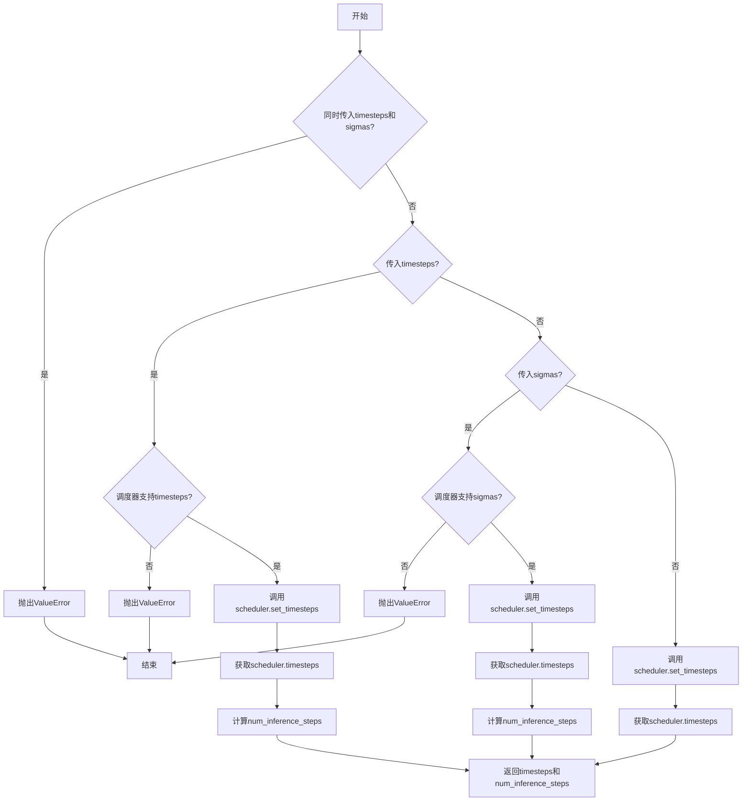
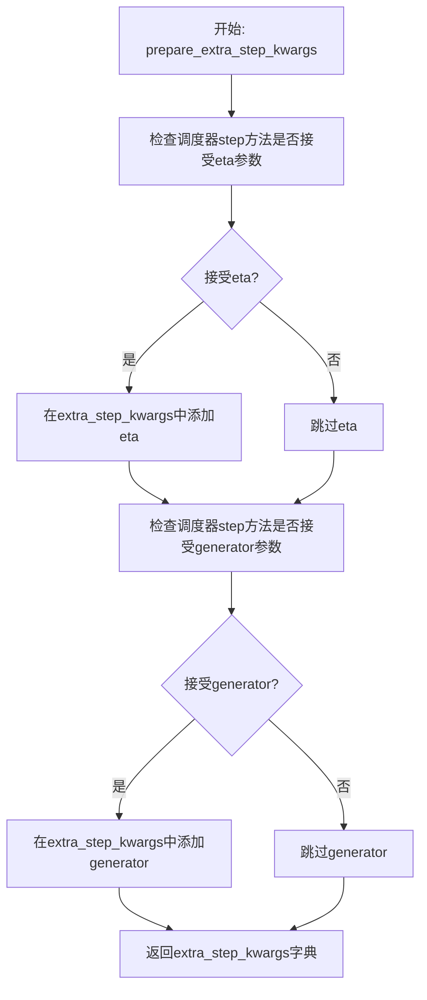
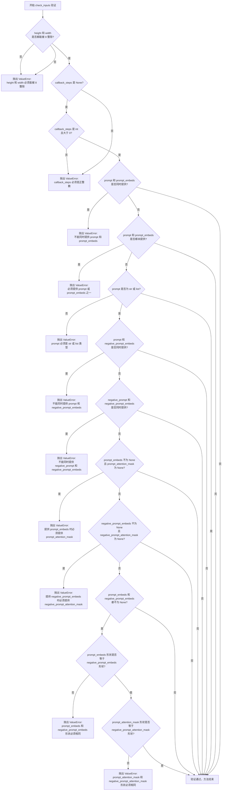
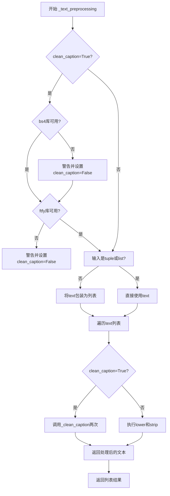
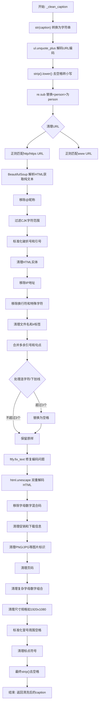
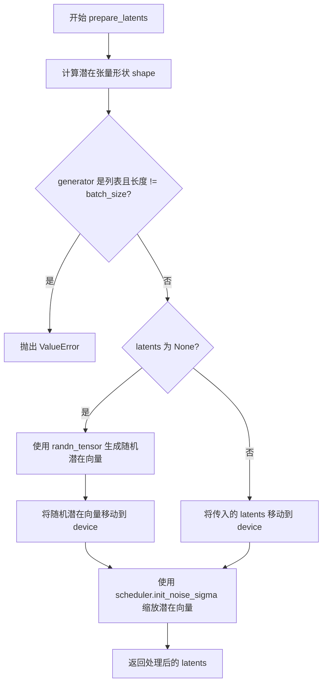
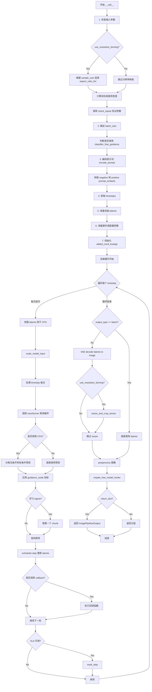

# `diffusers\src\diffusers\pipelines\pixart_alpha\pipeline_pixart_sigma.py` 详细设计文档

PixArt-Sigma文本到图像生成管道，基于T5文本编码器和PixArtTransformer2DModel扩散模型，实现高质量的文本条件图像生成。该管道支持classifier-free guidance、分辨率分箱、文本预处理清洗等功能。

## 整体流程

```mermaid
graph TD
A[开始: 调用 __call__] --> B[检查输入参数 check_inputs]
B --> C{是否使用分辨率分箱?}
C -- 是 --> D[使用ASPECT_RATIO_2048_BIN映射分辨率]
C -- 否 --> E[使用原始分辨率]
D --> E
E --> F[编码提示词 encode_prompt]
F --> G[获取时间步 retrieve_timesteps]
G --> H[准备潜在向量 prepare_latents]
H --> I{进入去噪循环}
I --> J[对latent_model_input进行条件处理]
J --> K[Transformer预测噪声]
K --> L{是否使用classifier-free guidance?}
L -- 是 --> M[计算guidance: noise_pred_uncond + guidance_scale * (noise_pred_text - noise_pred_uncond)]
L -- 否 --> N[直接使用预测噪声]
M --> O
N --> O[scheduler.step更新latents]
O --> P{是否完成所有推理步?}
P -- 否 --> J
P -- 是 --> Q{output_type == 'latent'?}
Q -- 否 --> R[VAE解码 decode latents to image]
Q -- 是 --> S[直接返回latents]
R --> T[后处理图像 postprocess]
S --> T
T --> U[释放模型钩子 maybe_free_model_hooks]
U --> V[结束: 返回ImagePipelineOutput]
```

## 类结构

```
DiffusionPipeline (基类)
└── PixArtSigmaPipeline
```

## 全局变量及字段


### `ASPECT_RATIO_2048_BIN`
    
2048分辨率的宽高比映射字典

类型：`Dict[str, List[float]]`
    


### `EXAMPLE_DOC_STRING`
    
示例文档字符串

类型：`str`
    


### `XLA_AVAILABLE`
    
XLA加速库可用性标志

类型：`bool`
    


### `logger`
    
日志记录器

类型：`logging.Logger`
    


### `bad_punct_regex`
    
用于过滤特殊标点的正则表达式

类型：`re.Pattern`
    


### `retrieve_timesteps`
    
获取扩散调度器时间步的函数

类型：`Callable`
    


### `PixArtSigmaPipeline.bad_punct_regex`
    
用于过滤特殊标点的正则表达式

类型：`re.Pattern`
    


### `PixArtSigmaPipeline._optional_components`
    
可选组件列表 ['tokenizer', 'text_encoder']

类型：`List[str]`
    


### `PixArtSigmaPipeline.model_cpu_offload_seq`
    
模型CPU卸载顺序 'text_encoder->transformer->vae'

类型：`str`
    


### `PixArtSigmaPipeline.vae_scale_factor`
    
VAE缩放因子

类型：`int`
    


### `PixArtSigmaPipeline.image_processor`
    
图像处理器

类型：`PixArtImageProcessor`
    


### `PixArtSigmaPipeline.tokenizer`
    
T5分词器

类型：`T5Tokenizer`
    


### `PixArtSigmaPipeline.text_encoder`
    
T5文本编码器

类型：`T5EncoderModel`
    


### `PixArtSigmaPipeline.vae`
    
VAE模型

类型：`AutoencoderKL`
    


### `PixArtSigmaPipeline.transformer`
    
PixArt变换器

类型：`PixArtTransformer2DModel`
    


### `PixArtSigmaPipeline.scheduler`
    
扩散调度器

类型：`KarrasDiffusionSchedulers`
    
    

## 全局函数及方法


### `retrieve_timesteps`

获取扩散调度器的时间步序列，处理自定义时间步或sigma值，并返回调度后的时间步张量及推理步数。

参数：

- `scheduler`：`SchedulerMixin`，用于生成时间步的扩散调度器对象
- `num_inference_steps`：`int | None`，生成样本时使用的扩散步数，若使用则`timesteps`必须为`None`
- `device`：`str | torch.device | None`，时间步要移动到的设备，若为`None`则不移动
- `timesteps`：`list[int] | None`，用于覆盖调度器时间步间隔策略的自定义时间步，若传入此参数则`num_inference_steps`和`sigmas`必须为`None`
- `sigmas`：`list[float] | None`，用于覆盖调度器sigma间隔策略的自定义sigma值，若传入此参数则`num_inference_steps`和`timesteps`必须为`None`
- `**kwargs`：任意关键字参数，将传递给调度器的`set_timesteps`方法

返回值：`tuple[torch.Tensor, int]`，元组第一个元素是调度器的时间步序列，第二个元素是推理步数

#### 流程图



#### 带注释源码

```
# 从diffusers库复制而来的函数，用于获取扩散调度器的时间步
# Copied from diffusers.pipelines.stable_diffusion.pipeline_stable_diffusion.retrieve_timesteps
def retrieve_timesteps(
    scheduler,  # 调度器对象，用于生成时间步
    num_inference_steps: int | None = None,  # 推理步数
    device: str | torch.device | None = None,  # 目标设备
    timesteps: list[int] | None = None,  # 自定义时间步列表
    sigmas: list[float] | None = None,  # 自定义sigma列表
    **kwargs,  # 额外参数，传递给set_timesteps
):
    r"""
    Calls the scheduler's `set_timesteps` method and retrieves timesteps from the scheduler after the call. Handles
    custom timesteps. Any kwargs will be supplied to `scheduler.set_timesteps`.

    Args:
        scheduler (`SchedulerMixin`):
            The scheduler to get timesteps from.
        num_inference_steps (`int`):
            The number of diffusion steps used when generating samples with a pre-trained model. If used, `timesteps`
            must be `None`.
        device (`str` or `torch.device`, *optional*):
            The device to which the timesteps should be moved to. If `None`, the timesteps are not moved.
        timesteps (`list[int]`, *optional*):
            Custom timesteps used to override the timestep spacing strategy of the scheduler. If `timesteps` is passed,
            `num_inference_steps` and `sigmas` must be `None`.
        sigmas (`list[float]`, *optional*):
            Custom sigmas used to override the timestep spacing strategy of the scheduler. If `sigmas` is passed,
            `num_inference_steps` and `timesteps` must be `None`.

    Returns:
        `tuple[torch.Tensor, int]`: A tuple where the first element is the timestep schedule from the scheduler and the
        second element is the number of inference steps.
    """
    # 校验：不能同时传入timesteps和sigmas
    if timesteps is not None and sigmas is not None:
        raise ValueError("Only one of `timesteps` or `sigmas` can be passed. Please choose one to set custom values")
    
    # 分支1：处理自定义timesteps
    if timesteps is not None:
        # 检查调度器的set_timesteps方法是否支持timesteps参数
        accepts_timesteps = "timesteps" in set(inspect.signature(scheduler.set_timesteps).parameters.keys())
        if not accepts_timesteps:
            raise ValueError(
                f"The current scheduler class {scheduler.__class__}'s `set_timesteps` does not support custom"
                f" timestep schedules. Please check whether you are using the correct scheduler."
            )
        # 调用调度器的set_timesteps方法
        scheduler.set_timesteps(timesteps=timesteps, device=device, **kwargs)
        # 获取调度后的时间步
        timesteps = scheduler.timesteps
        # 计算推理步数
        num_inference_steps = len(timesteps)
    
    # 分支2：处理自定义sigmas
    elif sigmas is not None:
        # 检查调度器的set_timesteps方法是否支持sigmas参数
        accept_sigmas = "sigmas" in set(inspect.signature(scheduler.set_timesteps).parameters.keys())
        if not accept_sigmas:
            raise ValueError(
                f"The current scheduler class {scheduler.__class__}'s `set_timesteps` does not support custom"
                f" sigmas schedules. Please check whether you are using the correct scheduler."
            )
        # 调用调度器的set_timesteps方法
        scheduler.set_timesteps(sigmas=sigmas, device=device, **kwargs)
        # 获取调度后的时间步
        timesteps = scheduler.timesteps
        # 计算推理步数
        num_inference_steps = len(timesteps)
    
    # 分支3：使用默认方式设置时间步
    else:
        # 使用num_inference_steps设置时间步
        scheduler.set_timesteps(num_inference_steps, device=device, **kwargs)
        # 获取调度后的时间步
        timesteps = scheduler.timesteps
    
    # 返回时间步张量和推理步数
    return timesteps, num_inference_steps
```


### `PixArtSigmaPipeline.__init__`

初始化 PixArt-Sigma 文本到图像生成管道的各个组件，包括分词器、文本编码器、VAE、变换器和调度器，并配置图像处理器。

参数：

- `tokenizer`：`T5Tokenizer`，用于将文本提示转换为token序列的分词器
- `text_encoder`：`T5EncoderModel`，冻结的T5文本编码器，用于将token编码为文本嵌入
- `vae`：`AutoencoderKL`，变分自编码器，用于编码和解码图像与潜在表示
- `transformer`：`PixArtTransformer2DModel`，文本条件的PixArt变换器，用于去噪编码后的图像潜在向量
- `scheduler`：`KarrasDiffusionSchedulers`，与变换器配合使用进行图像潜在向量去噪的调度器

返回值：`None`，该方法为构造函数，不返回任何值

#### 流程图

```mermaid
flowchart TD
    A[开始 __init__] --> B[调用 super().__init__]
    B --> C[调用 register_modules 注册5个模块]
    C --> D{检查 vae 是否存在}
    D -->|是| E[计算 vae_scale_factor]
    D -->|否| F[vae_scale_factor = 8]
    E --> G[创建 PixArtImageProcessor]
    F --> G
    G --> H[结束 __init__]
```

#### 带注释源码

```python
def __init__(
    self,
    tokenizer: T5Tokenizer,
    text_encoder: T5EncoderModel,
    vae: AutoencoderKL,
    transformer: PixArtTransformer2DModel,
    scheduler: KarrasDiffusionSchedulers,
):
    """
    初始化 PixArt-Sigma 管道组件
    
    参数:
        tokenizer: T5分词器
        text_encoder: T5文本编码器 
        vae: 变分自编码器
        transformer: PixArt变换器
        scheduler: Karras扩散调度器
    """
    # 调用父类 DiffusionPipeline 的初始化方法
    # 设置管道的基本属性和配置
    super().__init__()

    # 使用 register_modules 方法注册所有子模块
    # 这样可以让每个子模块可以通过 self.tokenizer, self.text_encoder 等访问
    # 同时支持模型加载/保存、CPU卸载等功能
    self.register_modules(
        tokenizer=tokenizer, 
        text_encoder=text_encoder, 
        vae=vae, 
        transformer=transformer, 
        scheduler=scheduler
    )

    # 计算 VAE 缩放因子
    # VAE的缩放因子通常是 2^(num_layers-1)，用于调整潜在空间的维度
    # 例如：如果 VAE 有3个输出通道块，则 scale_factor = 2^(3-1) = 4
    # 如果 VAE 不存在，则使用默认值 8（对应1024x1024图像的潜在空间）
    self.vae_scale_factor = 2 ** (len(self.vae.config.block_out_channels) - 1) if getattr(self, "vae", None) else 8
    
    # 创建 PixArt 专用的图像处理器
    # 该处理器负责图像的预处理和后处理，包括分辨率分类、调整大小等
    self.image_processor = PixArtImageProcessor(vae_scale_factor=self.vae_scale_factor)
```


### `PixArtSigmaPipeline.encode_prompt`

该方法负责将文本提示词（prompt）编码为文本encoder的隐藏状态向量（embeddings），同时生成对应的注意力掩码（attention mask），支持无分类器自由引导（Classifier-Free Guidance）所需的正向和负向嵌入。

参数：

- `prompt`：`str | list[str]`，要编码的文本提示词，支持单条或批量输入
- `do_classifier_free_guidance`：`bool`，是否启用无分类器自由引导，默认为 True
- `negative_prompt`：`str`，负向提示词，用于引导图像生成排除特定内容，默认为空字符串
- `num_images_per_prompt`：`int`，每个提示词需要生成的图像数量，用于批量生成时的嵌入复制，默认为 1
- `device`：`torch.device | None`，指定计算设备，默认为 None（自动获取执行设备）
- `prompt_embeds`：`torch.Tensor | None`，预生成的提示词嵌入，可用于快速调整输入，默认为 None
- `negative_prompt_embeds`：`torch.Tensor | None`，预生成的负向提示词嵌入，默认为 None
- `prompt_attention_mask`：`torch.Tensor | None`，提示词的注意力掩码，默认为 None
- `negative_prompt_attention_mask`：`torch.Tensor | None`，负向提示词的注意力掩码，默认为 None
- `clean_caption`：`bool`，是否对提示词进行清洗预处理（如移除HTML、URL等），默认为 False
- `max_sequence_length`：`int`，T5 encoder 支持的最大序列长度，默认为 300
- `**kwargs`：其他关键字参数，目前主要用于处理已废弃的 `mask_feature` 参数

返回值：`tuple[torch.Tensor, torch.Tensor, torch.Tensor, torch.Tensor]`，返回一个包含四个元素的元组：
- 第一个元素：提示词嵌入（prompt_embeds），形状为 `(batch_size * num_images_per_prompt, seq_len, hidden_dim)`
- 第二个元素：提示词注意力掩码（prompt_attention_mask），形状为 `(batch_size * num_images_per_prompt, seq_len)`
- 第三个元素：负向提示词嵌入（negative_prompt_embeds），形状同上，禁用 CFG 时为 None
- 第四个元素：负向提示词注意力掩码（negative_prompt_attention_mask），形状同上，禁用 CFG 时为 None

#### 流程图

```mermaid
flowchart TD
    A[开始 encode_prompt] --> B{device 是否为 None?}
    B -->|是| C[使用 self._execution_device]
    B -->|否| D[使用传入的 device]
    C --> E{max_sequence_length 是否为 300?}
    D --> E
    E -->|是| F[设置 max_length = max_sequence_length]
    E -->|否| G[max_length = prompt_embeds.shape[1]]
    F --> H{prompt_embeds 是否为 None?}
    G --> H
    H -->|是| I[调用 _text_preprocessing 预处理 prompt]
    I --> J[使用 tokenizer 进行分词和编码]
    J --> K[检查是否发生截断并记录警告]
    K --> L[提取 text_input_ids 和 attention_mask]
    L --> M[调用 text_encoder 生成 prompt_embeds]
    M --> N{text_encoder 是否存在?}
    H -->|否| O[使用传入的 prompt_embeds]
    N -->|是| P[获取 text_encoder 的 dtype]
    N -->|否| Q{transformer 是否存在?}
    O --> P
    Q -->|是| R[获取 transformer 的 dtype]
    Q -->|否| S[dtype = None]
    P --> T[转换 prompt_embeds 到目标 dtype 和 device]
    R --> T
    S --> T
    T --> U[复制 prompt_embeds 和 attention_mask<br/>num_images_per_prompt 次]
    U --> V{do_classifier_free_guidance 且<br/>negative_prompt_embeds 为 None?}
    V -->|是| W[生成负向嵌入]
    V -->|否| X{do_classifier_free_guidance?}
    W --> Y[预处理 negative_prompt]
    Y --> Z[使用 tokenizer 编码负向提示词]
    Z --> AA[调用 text_encoder 生成 negative_prompt_embeds]
    AA --> AB[复制 negative_prompt_embeds 和 mask<br/>num_images_per_prompt 次]
    AB --> AC[返回 prompt_embeds, prompt_attention_mask<br/>negative_prompt_embeds, negative_prompt_attention_mask]
    X -->|否| AD[negative_prompt_embeds = None<br/>negative_prompt_attention_mask = None]
    AD --> AC
```

#### 带注释源码

```python
def encode_prompt(
    self,
    prompt: str | list[str],
    do_classifier_free_guidance: bool = True,
    negative_prompt: str = "",
    num_images_per_prompt: int = 1,
    device: torch.device | None = None,
    prompt_embeds: torch.Tensor | None = None,
    negative_prompt_embeds: torch.Tensor | None = None,
    prompt_attention_mask: torch.Tensor | None = None,
    negative_prompt_attention_mask: torch.Tensor | None = None,
    clean_caption: bool = False,
    max_sequence_length: int = 300,
    **kwargs,
):
    r"""
    Encodes the prompt into text encoder hidden states.

    Args:
        prompt (`str` or `list[str]`, *optional*):
            prompt to be encoded
        negative_prompt (`str` or `list[str]`, *optional*):
            The prompt not to guide the image generation. If not defined, one has to pass `negative_prompt_embeds`
            instead. Ignored when not using guidance (i.e., ignored if `guidance_scale` is less than `1`). For
            PixArt-Alpha, this should be "".
        do_classifier_free_guidance (`bool`, *optional*, defaults to `True`):
            whether to use classifier free guidance or not
        num_images_per_prompt (`int`, *optional*, defaults to 1):
            number of images that should be generated per prompt
        device: (`torch.device`, *optional*):
            torch device to place the resulting embeddings on
        prompt_embeds (`torch.Tensor`, *optional*):
            Pre-generated text embeddings. Can be used to easily tweak text inputs, *e.g.* prompt weighting. If not
            provided, text embeddings will be generated from `prompt` input argument.
        negative_prompt_embeds (`torch.Tensor`, *optional*):
            Pre-generated negative text embeddings. For PixArt-Alpha, it's should be the embeddings of the ""
            string.
        clean_caption (`bool`, defaults to `False`):
            If `True`, the function will preprocess and clean the provided caption before encoding.
        max_sequence_length (`int`, defaults to 300): Maximum sequence length to use for the prompt.
    """

    # 处理已废弃的 mask_feature 参数，发出警告但不中断执行
    if "mask_feature" in kwargs:
        deprecation_message = "The use of `mask_feature` is deprecated. It is no longer used in any computation and that doesn't affect the end results. It will be removed in a future version."
        deprecate("mask_feature", "1.0.0", deprecation_message, standard_warn=False)

    # 如果未指定设备，则使用管道的默认执行设备
    if device is None:
        device = self._execution_device

    # 根据论文 Section 3.1，设置最大序列长度
    # T5 模型对序列长度有硬性限制，默认使用 300（比原生 T5 的 512 更长，支持 PixArt 的扩展）
    max_length = max_sequence_length

    # 如果未提供预计算的 prompt_embeds，则需要从原始 prompt 生成
    if prompt_embeds is None:
        # 文本预处理：清洗 HTML 实体、URL、特殊字符等
        prompt = self._text_preprocessing(prompt, clean_caption=clean_caption)
        
        # 使用 T5 Tokenizer 将文本转换为 token ID 序列
        text_inputs = self.tokenizer(
            prompt,
            padding="max_length",          # 填充到最大长度
            max_length=max_length,         # 最大 token 数量
            truncation=True,               # 截断超长文本
            add_special_tokens=True,       # 添加特殊 tokens（如 </s>）
            return_tensors="pt",           # 返回 PyTorch 张量
        )
        text_input_ids = text_inputs.input_ids
        
        # 检查是否存在被截断的文本，记录警告信息
        # 使用不截断的版本进行对比检测
        untruncated_ids = self.tokenizer(prompt, padding="longest", return_tensors="pt").input_ids

        if untruncated_ids.shape[-1] >= text_input_ids.shape[-1] and not torch.equal(
            text_input_ids, untruncated_ids
        ):
            # 解码被截断的部分供日志参考
            removed_text = self.tokenizer.batch_decode(untruncated_ids[:, max_length - 1 : -1])
            logger.warning(
                "The following part of your input was truncated because T5 can only handle sequences up to"
                f" {max_length} tokens: {removed_text}"
            )

        # 提取注意力掩码，标记哪些位置是真实 token，哪些是 padding
        prompt_attention_mask = text_inputs.attention_mask
        prompt_attention_mask = prompt_attention_mask.to(device)

        # 调用 T5 Encoder 生成文本嵌入向量
        # 输出形状: (batch_size, seq_len, hidden_size)
        prompt_embeds = self.text_encoder(text_input_ids.to(device), attention_mask=prompt_attention_mask)
        prompt_embeds = prompt_embeds[0]  # 解包 tuple，取第一个元素

    # 确定目标数据类型：优先使用 text_encoder 的 dtype，其次是 transformer 的 dtype
    if self.text_encoder is not None:
        dtype = self.text_encoder.dtype
    elif self.transformer is not None:
        dtype = self.transformer.dtype
    else:
        dtype = None

    # 将 prompt_embeds 转换到目标设备和数据类型
    prompt_embeds = prompt_embeds.to(dtype=dtype, device=device)

    # 获取当前批次大小和序列长度
    bs_embed, seq_len, _ = prompt_embeds.shape
    
    # 复制文本嵌入和注意力掩码，以匹配 num_images_per_prompt 的数量
    # 这是为了在一次前向传播中生成多张图像
    # 使用 view 操作以兼容 MPS 设备
    prompt_embeds = prompt_embeds.repeat(1, num_images_per_prompt, 1)
    prompt_embeds = prompt_embeds.view(bs_embed * num_images_per_prompt, seq_len, -1)
    prompt_attention_mask = prompt_attention_mask.repeat(1, num_images_per_prompt)
    prompt_attention_mask = prompt_attention_mask.view(bs_embed * num_images_per_prompt, -1)

    # 获取无条件的负向嵌入，用于 Classifier-Free Guidance
    # CFG 公式: noise_pred = noise_pred_uncond + guidance_scale * (noise_pred_text - noise_pred_uncond)
    if do_classifier_free_guidance and negative_prompt_embeds is None:
        # 将负向提示词扩展到与批次大小相同
        uncond_tokens = [negative_prompt] * bs_embed if isinstance(negative_prompt, str) else negative_prompt
        
        # 同样进行文本预处理
        uncond_tokens = self._text_preprocessing(uncond_tokens, clean_caption=clean_caption)
        
        # 使用与正向嵌入相同的长度（因为已经经过了 repeat 操作）
        max_length = prompt_embeds.shape[1]
        
        # Tokenize 负向提示词
        uncond_input = self.tokenizer(
            uncond_tokens,
            padding="max_length",
            max_length=max_length,
            truncation=True,
            return_attention_mask=True,
            add_special_tokens=True,
            return_tensors="pt",
        )
        negative_prompt_attention_mask = uncond_input.attention_mask
        negative_prompt_attention_mask = negative_prompt_attention_mask.to(device)

        # 生成负向嵌入
        negative_prompt_embeds = self.text_encoder(
            uncond_input.input_ids.to(device), attention_mask=negative_prompt_attention_mask
        )
        negative_prompt_embeds = negative_prompt_embeds[0]

    # 处理 CFG 模式下的负向嵌入
    if do_classifier_free_guidance:
        # 获取序列长度
        seq_len = negative_prompt_embeds.shape[1]

        # 转换数据类型和设备
        negative_prompt_embeds = negative_prompt_embeds.to(dtype=dtype, device=device)

        # 复制以匹配生成的图像数量
        negative_prompt_embeds = negative_prompt_embeds.repeat(1, num_images_per_prompt, 1)
        negative_prompt_embeds = negative_prompt_embeds.view(bs_embed * num_images_per_prompt, seq_len, -1)

        negative_prompt_attention_mask = negative_prompt_attention_mask.repeat(1, num_images_per_prompt)
        negative_prompt_attention_mask = negative_prompt_attention_mask.view(bs_embed * num_images_per_prompt, -1)
    else:
        # 不使用 CFG 时，负向嵌入设为 None
        negative_prompt_embeds = None
        negative_prompt_attention_mask = None

    # 返回四个张量：正向嵌入、正向掩码、负向嵌入、负向掩码
    return prompt_embeds, prompt_attention_mask, negative_prompt_embeds, negative_prompt_attention_mask
```


### `PixArtSigmaPipeline.prepare_extra_step_kwargs`

准备调度器所需的额外参数方法。由于并非所有调度器都有相同的签名，该方法通过检查调度器的 `step` 函数签名，动态决定是否添加 `eta`（仅 DDIMScheduler 使用）和 `generator` 参数。

参数：

- `self`：`PixArtSigmaPipeline` 实例，隐式参数，pipeline 对象本身。
- `generator`：`torch.Generator | list[torch.Generator] | None`，用于控制随机数生成的可选生成器，以确保推理过程可复现。
- `eta`：`float`，DDIM 调度器的 eta 参数（η），对应论文 https://huggingface.co/papers/2010.02502，取值范围应为 [0, 1]，其他调度器会忽略此参数。

返回值：`dict`，包含调度器 `step` 方法所需额外参数字典，可能包含 `eta` 和/或 `generator` 键值对。

#### 流程图



#### 带注释源码

```python
def prepare_extra_step_kwargs(self, generator, eta):
    # 准备调度器 step 的额外参数，因为并非所有调度器都有相同的签名
    # eta (η) 仅用于 DDIMScheduler，其他调度器会忽略它
    # eta 对应 DDIM 论文中的 η：https://huggingface.co/papers/2010.02502
    # 取值应在 [0, 1] 范围内

    # 通过检查调度器 step 方法的签名来判断是否接受 eta 参数
    accepts_eta = "eta" in set(inspect.signature(self.scheduler.step).parameters.keys())
    # 初始化额外参数字典
    extra_step_kwargs = {}
    # 如果调度器接受 eta，则将其添加到参数字典中
    if accepts_eta:
        extra_step_kwargs["eta"] = eta

    # 检查调度器是否接受 generator 参数
    accepts_generator = "generator" in set(inspect.signature(self.scheduler.step).parameters.keys())
    # 如果调度器接受 generator，则将其添加到参数字典中
    if accepts_generator:
        extra_step_kwargs["generator"] = generator
    
    # 返回包含调度器所需额外参数的字典
    return extra_step_kwargs
```


### `PixArtSigmaPipeline.check_inputs`

该方法用于验证 PixArt-Sigma 文本到图像生成管道的输入参数有效性，确保用户提供的 prompt、height、width、negative_prompt、callback_steps 以及可选的 prompt_embeds 等参数符合管道要求，若参数无效则抛出相应的 ValueError 异常。

#### 参数

- `self`：`PixArtSigmaPipeline` 实例本身
- `prompt`：`str` 或 `list[str]` 或 `None`，用户提供的文本提示
- `height`：`int`，生成图像的高度（像素）
- `width`：`int`，生成图像的宽度（像素）
- `negative_prompt`：`str` 或 `list[str]` 或 `None`，用于指导图像生成的负面提示
- `callback_steps`：`int` 或 `None`，回调函数调用频率
- `prompt_embeds`：`torch.Tensor` 或 `None`，预生成的文本嵌入向量
- `negative_prompt_embeds`：`torch.Tensor` 或 `None`，预生成的负面文本嵌入向量
- `prompt_attention_mask`：`torch.Tensor` 或 `None`，文本嵌入的注意力掩码
- `negative_prompt_attention_mask`：`torch.Tensor` 或 `None`，负面文本嵌入的注意力掩码

#### 返回值

- `None`，该方法仅进行参数验证，不返回任何值；若验证失败则抛出 `ValueError` 异常

#### 流程图



#### 带注释源码

```python
def check_inputs(
    self,
    prompt,  # str | list[str] | None: 用户输入的文本提示
    height,  # int: 目标图像高度
    width,   # int: 目标图像宽度
    negative_prompt,  # str | list[str] | None: 负面提示
    callback_steps,   # int | None: 回调函数调用间隔步数
    prompt_embeds=None,        # torch.Tensor | None: 预计算的提示嵌入
    negative_prompt_embeds=None,  # torch.Tensor | None: 预计算的负面提示嵌入
    prompt_attention_mask=None,    # torch.Tensor | None: 提示嵌入的注意力掩码
    negative_prompt_attention_mask=None,  # torch.Tensor | None: 负面提示嵌入的注意力掩码
):
    """
    验证 PixArtSigmaPipeline 的输入参数有效性
    
    检查项目：
    1. height 和 width 必须能被 8 整除（VAE 和 Transformer 的要求）
    2. callback_steps 必须是正整数
    3. prompt 和 prompt_embeds 不能同时提供
    4. prompt 或 prompt_embeds 必须至少提供一个
    5. prompt 类型必须是 str 或 list
    6. prompt 和 negative_prompt_embeds 不能同时提供
    7. negative_prompt 和 negative_prompt_embeds 不能同时提供
    8. 如果提供 prompt_embeds，必须同时提供 prompt_attention_mask
    9. 如果提供 negative_prompt_embeds，必须同时提供 negative_prompt_attention_mask
    10. prompt_embeds 和 negative_prompt_embeds 形状必须匹配
    11. prompt_attention_mask 和 negative_prompt_attention_mask 形状必须匹配
    """
    
    # 检查图像尺寸是否为 8 的倍数（VAE 下采样因子要求）
    if height % 8 != 0 or width % 8 != 0:
        raise ValueError(f"`height` and `width` have to be divisible by 8 but are {height} and {width}.")

    # 检查 callback_steps 参数有效性
    if (callback_steps is None) or (
        callback_steps is not None and (not isinstance(callback_steps, int) or callback_steps <= 0)
    ):
        raise ValueError(
            f"`callback_steps` has to be a positive integer but is {callback_steps} of type"
            f" {type(callback_steps)}."
        )

    # 检查 prompt 和 prompt_embeds 不能同时提供
    if prompt is not None and prompt_embeds is not None:
        raise ValueError(
            f"Cannot forward both `prompt`: {prompt} and `prompt_embeds`: {prompt_embeds}. Please make sure to"
            " only forward one of the two."
        )
    # 检查至少提供一个
    elif prompt is None and prompt_embeds is None:
        raise ValueError(
            "Provide either `prompt` or `prompt_embeds`. Cannot leave both `prompt` and `prompt_embeds` undefined."
        )
    # 检查 prompt 类型
    elif prompt is not None and (not isinstance(prompt, str) and not isinstance(prompt, list)):
        raise ValueError(f"`prompt` has to be of type `str` or `list` but is {type(prompt)}")

    # 检查 prompt 和 negative_prompt_embeds 不能同时提供
    if prompt is not None and negative_prompt_embeds is not None:
        raise ValueError(
            f"Cannot forward both `prompt`: {prompt} and `negative_prompt_embeds`:"
            f" {negative_prompt_embeds}. Please make sure to only forward one of the two."
        )

    # 检查 negative_prompt 和 negative_prompt_embeds 不能同时提供
    if negative_prompt is not None and negative_prompt_embeds is not None:
        raise ValueError(
            f"Cannot forward both `negative_prompt`: {negative_prompt} and `negative_prompt_embeds`:"
            f" {negative_prompt_embeds}. Please make sure to only forward one of the two."
        )

    # 检查 prompt_embeds 和 prompt_attention_mask 的配套关系
    if prompt_embeds is not None and prompt_attention_mask is None:
        raise ValueError("Must provide `prompt_attention_mask` when specifying `prompt_embeds`.")

    # 检查 negative_prompt_embeds 和 negative_prompt_attention_mask 的配套关系
    if negative_prompt_embeds is not None and negative_prompt_attention_mask is None:
        raise ValueError("Must provide `negative_prompt_attention_mask` when specifying `negative_prompt_embeds`.")

    # 检查已提供的 embeddings 和 attention masks 形状一致性
    if prompt_embeds is not None and negative_prompt_embeds is not None:
        if prompt_embeds.shape != negative_prompt_embeds.shape:
            raise ValueError(
                "`prompt_embeds` and `negative_prompt_embeds` must have the same shape when passed directly, but"
                f" got: `prompt_embeds` {prompt_embeds.shape} != `negative_prompt_embeds`"
                f" {negative_prompt_embeds.shape}."
            )
        if prompt_attention_mask.shape != negative_prompt_attention_mask.shape:
            raise ValueError(
                "`prompt_attention_mask` and `negative_prompt_attention_mask` must have the same shape when passed directly, but"
                f" got: `prompt_attention_mask` {prompt_attention_mask.shape} != `negative_prompt_attention_mask`"
                f" {negative_prompt_attention_mask.shape}."
            )
```


### `PixArtSigmaPipeline._text_preprocessing`

该方法负责对输入的文本提示进行预处理，包括文本清洗、HTML转义还原、特殊字符移除、CJK字符过滤、Unicode规范化等操作，以确保文本符合模型输入要求。

参数：

- `self`：`PixArtSigmaPipeline` 实例，隐式参数，表示管道对象本身
- `text`：`str | list[str]`，需要预处理的文本提示，可以是单个字符串或字符串列表
- `clean_caption`：`bool`，默认为 `False`，是否执行深度清理（需要 `beautifulsoup4` 和 `ftfy` 库支持）

返回值：`list[str]`，预处理后的文本列表，始终返回列表格式

#### 流程图



#### 带注释源码

```python
def _text_preprocessing(self, text, clean_caption=False):
    """
    文本预处理方法，对输入的提示进行清洗和标准化
    
    参数:
        text: str 或 list[str]，需要预处理的文本
        clean_caption: bool，是否执行深度清理（需要bs4和ftfy库）
    
    返回:
        list[str]，预处理后的文本列表
    """
    
    # 检查clean_caption所需的依赖库是否可用
    # 如果不可用则降级处理，避免程序崩溃
    if clean_caption and not is_bs4_available():
        logger.warning(BACKENDS_MAPPING["bs4"][-1].format("Setting `clean_caption=True`"))
        logger.warning("Setting `clean_caption` to False...")
        clean_caption = False

    if clean_caption and not is_ftfy_available():
        logger.warning(BACKENDS_MAPPING["ftfy"][-1].format("Setting `clean_caption=True`"))
        logger.warning("Setting `clean_caption` to False...")
        clean_caption = False

    # 统一将输入转换为列表格式，便于后续统一处理
    if not isinstance(text, (tuple, list)):
        text = [text]

    # 定义内部处理函数，实现具体的文本清洗逻辑
    def process(text: str):
        if clean_caption:
            # 执行深度清理（调用_clean_caption方法）
            # 执行两次以确保清理彻底
            text = self._clean_caption(text)
            text = self._clean_caption(text)
        else:
            # 简单的标准化：小写转换并去除首尾空白
            text = text.lower().strip()
        return text

    # 对列表中的每个文本元素执行处理
    return [process(t) for t in text]
```


### `PixArtSigmaPipeline._clean_caption`

该方法是一个文本清洗函数，用于对图像生成模型的标题（Caption）进行深度预处理，包括URL移除、HTML标签解析、CJK字符过滤、特殊字符标准化、促销信息清理等多项净化操作，以确保输入文本的质量和一致性。

参数：

- `self`：隐式参数，指向 `PixArtSigmaPipeline` 类的实例
- `caption`：`str`，需要清洗的原始标题文本

返回值：`str`，清洗处理后的标题文本

#### 流程图



#### 带注释源码

```python
def _clean_caption(self, caption):
    # 步骤1: 强制转换为字符串类型，确保后续操作安全
    caption = str(caption)
    
    # 步骤2: URL解码，将URL编码的字符串（如%20）转换回原始字符
    caption = ul.unquote_plus(caption)
    
    # 步骤3: 去除首尾空白并转换为小写，统一格式
    caption = caption.strip().lower()
    
    # 步骤4: 将HTML实体&lt;person&gt;替换为标准词"person"
    caption = re.sub("<person>", "person", caption)
    
    # 步骤5-6: 使用正则表达式移除HTTP/HTTPS URLs
    # 匹配以http://或https://开头，或以常见域名结尾的URL
    caption = re.sub(
        r"\b((?:https?:(?:\/{1,3}|[a-zA-Z0-9%])|[a-zA-Z0-9.\-]+[.](?:com|co|ru|net|org|edu|gov|it)[\w/-]*\b\/?(?!@)))",
        "",
        caption,
    )
    
    # 步骤7: 移除以www开头的URL
    caption = re.sub(
        r"\b((?:www:(?:\/{1,3}|[a-zA-Z0-9%])|[a-zA-Z0-9.\-]+[.](?:com|co|ru|net|org|edu|gov|it)[\w/-]*\b\/?(?!@)))",
        "",
        caption,
    )
    
    # 步骤8: 使用BeautifulSoup解析HTML，提取纯文本内容
    caption = BeautifulSoup(caption, features="html.parser").text
    
    # 步骤9: 移除社交媒体@昵称
    caption = re.sub(r"@[\w\d]+\b", "", caption)
    
    # 步骤10-16: 过滤CJK统一表意文字及各类CJK扩展字符
    # 移除中日韩统一表意文字（U+4E00-U+9FFF）及其他CJK相关Unicode块
    caption = re.sub(r"[\u31c0-\u31ef]+", "", caption)  # CJK笔画
    caption = re.sub(r"[\u31f0-\u31ff]+", "", caption)  # 片假名音标扩展
    caption = re.sub(r"[\u3200-\u32ff]+", "", caption)  # CJK封闭字母和月份
    caption = re.sub(r"[\u3300-\u33ff]+", "", caption)  # CJK兼容性
    caption = re.sub(r"[\u3400-\u4dbf]+", "", caption)  # CJK统一表意文字扩展A
    caption = re.sub(r"[\u4dc0-\u4dff]+", "", caption)  # 易经六十四卦符号
    caption = re.sub(r"[\u4e00-\u9fff]+", "", caption)  # CJK统一表意文字
    
    # 步骤17: 将各种语言的破折号统一转换为ASCII短横线"-"
    caption = re.sub(
        r"[\u002D\u058A\u05BE\u1400\u1806\u2010-\u2015\u2E17\u2E1A\u2E3A\u2E3B\u2E40\u301C\u3030\u30A0\uFE31\uFE32\uFE58\uFE63\uFF0D]+",
        "-",
        caption,
    )
    
    # 步骤18: 标准化引号为双引号，将单引号统一
    caption = re.sub(r"[`´«»""¨]", '"', caption)
    caption = re.sub(r"['']", "'", caption)
    
    # 步骤19: 移除HTML引号实体和&amp;符号
    caption = re.sub(r"&quot;?", "", caption)
    caption = re.sub(r"&amp", "", caption)
    
    # 步骤20: 移除IP地址
    caption = re.sub(r"\d{1,3}\.\d{1,3}\.\d{1,3}\.\d{1,3}", " ", caption)
    
    # 步骤21: 移除文章ID格式（数字:两位数结尾）
    caption = re.sub(r"\d:\d\d\s+$", "", caption)
    
    # 步骤22: 将转义换行符替换为空格
    caption = re.sub(r"\\n", " ", caption)
    
    # 步骤23-25: 清理各种标签和长数字序列
    caption = re.sub(r"#\d{1,3}\b", "", caption)      # #123
    caption = re.sub(r"#\d{5,}\b", "", caption)       # #12345..
    caption = re.sub(r"\b\d{6,}\b", "", caption)      # 123456..
    
    # 步骤26: 移除常见图片文件扩展名
    caption = re.sub(r"[\S]+\.(?:png|jpg|jpeg|bmp|webp|eps|pdf|apk|mp4)", "", caption)
    
    # 步骤27-28: 合并连续的双引号和句点
    caption = re.sub(r"[\"']{2,}", r'"', caption)     # """AUSVERKAUFT"""
    caption = re.sub(r"[\.]{2,}", r" ", caption)      # ... -> space
    
    # 步骤29: 使用bad_punct_regex移除所有坏标点符号
    # 移除#®•©™&@·º½¾¿¡§~等特殊符号
    caption = re.sub(self.bad_punct_regex, r" ", caption)
    
    # 步骤30: 移除" . "格式的孤立句点
    caption = re.sub(r"\s+\.\s+", r" ", caption)
    
    # 步骤31-33: 处理连字符和下划线
    # 如果 caption 中有超过3个-或_，则将它们全部替换为空格
    regex2 = re.compile(r"(?:\-|\_)")
    if len(re.findall(regex2, caption)) > 3:
        caption = re.sub(regex2, " ", caption)
    
    # 步骤34: 使用ftfy库修复损坏的文本编码
    caption = ftfy.fix_text(caption)
    
    # 步骤35: 双重HTML解码，处理双重转义情况
    caption = html.unescape(html.unescape(caption))
    
    # 步骤36-38: 移除字母数字混合编码模式
    caption = re.sub(r"\b[a-zA-Z]{1,3}\d{3,15}\b", "", caption)   # jc6640
    caption = re.sub(r"\b[a-zA-Z]+\d+[a-zA-Z]+\b", "", caption)    # jc6640vc
    caption = re.sub(r"\b\d+[a-zA-Z]+\d+\b", "", caption)          # 6640vc231
    
    # 步骤39-41: 清理促销和下载相关关键词
    caption = re.sub(r"(worldwide\s+)?(free\s+)?shipping", "", caption)
    caption = re.sub(r"(free\s)?download(\sfree)?", "", caption)
    caption = re.sub(r"\bclick\b\s(?:for|on)\s\w+", "", caption)
    
    # 步骤42: 移除图片类型关键词
    caption = re.sub(r"\b(?:png|jpg|jpeg|bmp|webp|eps|pdf|apk|mp4)(\simage[s]?)?", "", caption)
    
    # 步骤43: 移除页码信息
    caption = re.sub(r"\bpage\s+\d+\b", "", caption)
    
    # 步骤44: 移除复杂字母数字组合
    caption = re.sub(r"\b\d*[a-zA-Z]+\d+[a-zA-Z]+\d+[a-zA-Z\d]*\b", r" ", caption)  # j2d1a2a...
    
    # 步骤45: 移除尺寸规格（如1920x1080或1920×1080）
    caption = re.sub(r"\b\d+\.?\d*[xх×]\d+\.?\d*\b", "", caption)
    
    # 步骤46-48: 标准化空格和标点
    caption = re.sub(r"\b\s+\:\s+", r": ", caption)           # " : " -> ": "
    caption = re.sub(r"(\D[,\./])\b", r"\1 ", caption)         # 标点后加空格
    caption = re.sub(r"\s+", " ", caption)                    # 多空格合并
    
    # 步骤49: 去除首尾空格
    caption.strip()
    
    # 步骤50-53: 清理首尾特殊字符
    caption = re.sub(r"^[\"\']([\w\W]+)[\"\']$", r"\1", caption)  # 去除首尾引号
    caption = re.sub(r"^[\'\_,\-\:;]", r"", caption)             # 去除开头特殊字符
    caption = re.sub(r"[\'\_,\-\:\-\+]$", r"", caption)          # 去除结尾特殊字符
    caption = re.sub(r"^\.\S+$", "", caption)                    # 去除类似".abc"的模式
    
    # 最终返回去除首尾空格的结果
    return caption.strip()
```


### `PixArtSigmaPipeline.prepare_latents`

该方法负责为扩散模型生成初始噪声潜在向量（latents）。它根据指定的批次大小、图像尺寸和潜在通道数计算潜在张量的形状，若未提供预生成的潜在向量，则使用随机张量生成器创建噪声；否则将用户提供的潜在向量移动到目标设备。最后，根据调度器的初始噪声标准差对潜在向量进行缩放，以适配扩散过程的起始条件。

参数：

- `batch_size`：`int`，生成的图像批次大小
- `num_channels_latents`：`int`，潜在空间的通道数，通常对应于变分自编码器的潜在维度
- `height`：`int`，生成图像的目标高度（像素）
- `width`：`int`，生成图像的目标宽度（像素）
- `dtype`：`torch.dtype`，潜在张量的数据类型（如 float16、float32 等）
- `device`：`torch.device`，潜在张量存放的设备（CPU 或 CUDA 设备）
- `generator`：`torch.Generator` 或 `list[torch.Generator]`，可选的随机数生成器，用于确保生成的可重复性
- `latents`：`torch.Tensor | None`，可选的预生成潜在向量，若提供则直接使用，否则创建新的随机潜在向量

返回值：`torch.Tensor`，经过调度器初始噪声标准差缩放后的潜在向量，用于扩散去噪过程的起点

#### 流程图



#### 带注释源码

```python
def prepare_latents(
    self,
    batch_size: int,
    num_channels_latents: int,
    height: int,
    width: int,
    dtype: torch.dtype,
    device: torch.device,
    generator: torch.Generator | list[torch.Generator],
    latents: torch.Tensor | None = None
) -> torch.Tensor:
    """
    准备扩散模型的初始潜在向量（噪声）。
    
    该方法根据图像尺寸和VAE的缩放因子计算潜在空间的分辨率，
    然后要么生成新的随机潜在向量，要么使用用户提供的潜在向量。
    最后根据调度器的初始噪声标准差进行缩放。
    
    参数:
        batch_size: 生成的图像数量
        num_channels_latents: 潜在通道数（通常等于VAE的latent_channels）
        height: 目标图像高度
        width: 目标图像宽度
        dtype: 潜在张量的数据类型
        device: 计算设备
        generator: 随机数生成器，用于确保可重复性
        latents: 可选的预生成潜在向量
        
    返回:
        缩放后的潜在向量张量
    """
    # 计算潜在张量的形状：批次大小 × 通道数 × (高度/宽度除以VAE缩放因子)
    # VAE的缩放因子通常为8，表示潜在空间是像素空间的1/8
    shape = (
        batch_size,
        num_channels_latents,
        int(height) // self.vae_scale_factor,
        int(width) // self.vae_scale_factor,
    )
    
    # 验证：如果传入多个generator，其数量必须等于批次大小
    if isinstance(generator, list) and len(generator) != batch_size:
        raise ValueError(
            f"You have passed a list of generators of length {len(generator)}, but requested an effective batch"
            f" size of {batch_size}. Make sure the batch size matches the length of the generators."
        )

    # 如果未提供潜在向量，则使用randn_tensor生成随机噪声
    # 这确保了每次生成都有不同的初始噪声
    if latents is None:
        latents = randn_tensor(shape, generator=generator, device=device, dtype=dtype)
    else:
        # 如果提供了潜在向量，只需确保它在正确的设备上
        latents = latents.to(device)

    # 使用调度器的初始噪声标准差缩放潜在向量
    # 不同的调度器可能使用不同的缩放策略（如Karras调度器）
    # 这一步确保潜在向量符合调度器的噪声分布要求
    latents = latents * self.scheduler.init_noise_sigma
    
    return latents
```


### PixArtSigmaPipeline.__call__

文本到图像生成的主入口方法，负责协调整个扩散模型的推理流程，包括输入预处理、潜在向量初始化、去噪循环、图像解码和后处理。

参数：

- `prompt`：`str | list[str]`，要引导图像生成的提示词，如果未定义则必须传递 `prompt_embeds`
- `negative_prompt`：`str`，不引导图像生成的提示词，当不使用引导（guidance_scale < 1）时被忽略
- `num_inference_steps`：`int`，去噪步骤数，默认为 20
- `timesteps`：`list[int]`，自定义时间步，用于支持 timesteps 的调度器
- `sigmas`：`list[float]`，自定义 sigmas，用于支持 sigmas 的调度器
- `guidance_scale`：`float`，引导比例，启用条件生成，值越大越接近提示词，默认为 4.5
- `num_images_per_prompt`：`int`，每个提示词生成的图像数量
- `height`：`int`，生成图像的高度像素值
- `width`：`int`，生成图像的宽度像素值
- `eta`：`float`，DDIM 论文中的 eta 参数，仅适用于 DDIMScheduler
- `generator`：`torch.Generator | list[torch.Generator]`，随机生成器，用于确保可重现性
- `latents`：`torch.Tensor`，预生成的噪声潜在向量
- `prompt_embeds`：`torch.Tensor`，预生成的文本嵌入
- `prompt_attention_mask`：`torch.Tensor`，文本嵌入的注意力掩码
- `negative_prompt_embeds`：`torch.Tensor`，预生成的负向文本嵌入
- `negative_prompt_attention_mask`：`torch.Tensor`，负向文本嵌入的注意力掩码
- `output_type`：`str`，输出格式，可选 "pil" 或 "latent"，默认为 "pil"
- `return_dict`：`bool`，是否返回 ImagePipelineOutput 对象，默认为 True
- `callback`：`Callable`，每 callback_steps 步调用的回调函数
- `callback_steps`：`int`，回调函数被调用的频率
- `clean_caption`：`bool`，是否在创建嵌入前清理提示词
- `use_resolution_binning`：`bool`，是否使用分辨率分箱将输入尺寸映射到最近的有效分辨率
- `max_sequence_length`：`int`，提示词的最大序列长度，默认为 300

返回值：`ImagePipelineOutput | tuple`，生成的图像列表或元组

#### 流程图



#### 带注释源码

```python
@torch.no_grad()
@replace_example_docstring(EXAMPLE_DOC_STRING)
def __call__(
    self,
    prompt: str | list[str] = None,
    negative_prompt: str = "",
    num_inference_steps: int = 20,
    timesteps: list[int] = None,
    sigmas: list[float] = None,
    guidance_scale: float = 4.5,
    num_images_per_prompt: int | None = 1,
    height: int | None = None,
    width: int | None = None,
    eta: float = 0.0,
    generator: torch.Generator | list[torch.Generator] | None = None,
    latents: torch.Tensor | None = None,
    prompt_embeds: torch.Tensor | None = None,
    prompt_attention_mask: torch.Tensor | None = None,
    negative_prompt_embeds: torch.Tensor | None = None,
    negative_prompt_attention_mask: torch.Tensor | None = None,
    output_type: str | None = "pil",
    return_dict: bool = True,
    callback: Callable[[int, int, torch.Tensor], None] | None = None,
    callback_steps: int = 1,
    clean_caption: bool = True,
    use_resolution_binning: bool = True,
    max_sequence_length: int = 300,
    **kwargs,
) -> ImagePipelineOutput | tuple:
    """
    管道生成时调用的主函数。
    """
    # 1. 检查输入参数，验证参数合法性
    # 根据 transformer 配置的 sample_size 和 vae_scale_factor 计算默认高度和宽度
    height = height or self.transformer.config.sample_size * self.vae_scale_factor
    width = width or self.transformer.config.sample_size * self.vae_scale_factor
    
    # 如果启用分辨率分箱，将输入尺寸映射到最近的预定义分辨率
    if use_resolution_binning:
        # 根据 sample_size 选择对应的宽高比分箱
        if self.transformer.config.sample_size == 256:
            aspect_ratio_bin = ASPECT_RATIO_2048_BIN
        elif self.transformer.config.sample_size == 128:
            aspect_ratio_bin = ASPECT_RATIO_1024_BIN
        elif self.transformer.config.sample_size == 64:
            aspect_ratio_bin = ASPECT_RATIO_512_BIN
        elif self.transformer.config.sample_size == 32:
            aspect_ratio_bin = ASPECT_RATIO_256_BIN
        else:
            raise ValueError("Invalid sample size")
        
        orig_height, orig_width = height, width  # 记录原始尺寸用于后续恢复
        # 使用图像处理器分类高度和宽度到最近的预定义值
        height, width = self.image_processor.classify_height_width_bin(height, width, ratios=aspect_ratio_bin)

    # 验证所有输入参数的有效性
    self.check_inputs(
        prompt, height, width, negative_prompt, callback_steps,
        prompt_embeds, negative_prompt_embeds, prompt_attention_mask, negative_prompt_attention_mask,
    )

    # 2. 确定批处理大小
    if prompt is not None and isinstance(prompt, str):
        batch_size = 1
    elif prompt is not None and isinstance(prompt, list):
        batch_size = len(prompt)
    else:
        batch_size = prompt_embeds.shape[0]

    # 获取执行设备
    device = self._execution_device

    # 判断是否使用无分类器引导（CFG）
    do_classifier_free_guidance = guidance_scale > 1.0

    # 3. 编码输入提示词
    (
        prompt_embeds,
        prompt_attention_mask,
        negative_prompt_embeds,
        negative_prompt_attention_mask,
    ) = self.encode_prompt(
        prompt,
        do_classifier_free_guidance,
        negative_prompt=negative_prompt,
        num_images_per_prompt=num_images_per_prompt,
        device=device,
        prompt_embeds=prompt_embeds,
        negative_prompt_embeds=negative_prompt_embeds,
        prompt_attention_mask=prompt_attention_mask,
        negative_prompt_attention_mask=negative_prompt_attention_mask,
        clean_caption=clean_caption,
        max_sequence_length=max_sequence_length,
    )
    
    # 如果使用 CFG，将无条件嵌入和条件嵌入拼接在一起
    if do_classifier_free_guidance:
        prompt_embeds = torch.cat([negative_prompt_embeds, prompt_embeds], dim=0)
        prompt_attention_mask = torch.cat([negative_prompt_attention_mask, prompt_attention_mask], dim=0)

    # 4. 准备时间步
    if XLA_AVAILABLE:
        timestep_device = "cpu"
    else:
        timestep_device = device
    timesteps, num_inference_steps = retrieve_timesteps(
        self.scheduler, num_inference_steps, timestep_device, timesteps, sigmas
    )

    # 5. 准备初始潜在向量
    latent_channels = self.transformer.config.in_channels
    latents = self.prepare_latents(
        batch_size * num_images_per_prompt,
        latent_channels,
        height,
        width,
        prompt_embeds.dtype,
        device,
        generator,
        latents,
    )

    # 6. 准备调度器的额外参数
    extra_step_kwargs = self.prepare_extra_step_kwargs(generator, eta)

    # 6.1 准备微观条件（分辨率和宽高比）
    added_cond_kwargs = {"resolution": None, "aspect_ratio": None}

    # 7. 去噪循环
    num_warmup_steps = max(len(timesteps) - num_inference_steps * self.scheduler.order, 0)

    # 进度条
    with self.progress_bar(total=num_inference_steps) as progress_bar:
        for i, t in enumerate(timesteps):
            # 为 CFG 复制潜在向量（前半部分无条件，后半部分条件）
            latent_model_input = torch.cat([latents] * 2) if do_classifier_free_guidance else latents
            # 调度器缩放输入
            latent_model_input = self.scheduler.scale_model_input(latent_model_input, t)

            current_timestep = t
            # 确保 timestep 格式正确（tensor）
            if not torch.is_tensor(current_timestep):
                is_mps = latent_model_input.device.type == "mps"
                is_npu = latent_model_input.device.type == "npu"
                if isinstance(current_timestep, float):
                    dtype = torch.float32 if (is_mps or is_npu) else torch.float64
                else:
                    dtype = torch.int32 if (is_mps or is_npu) else torch.int64
                current_timestep = torch.tensor([current_timestep], dtype=dtype, device=latent_model_input.device)
            elif len(current_timestep.shape) == 0:
                current_timestep = current_timestep[None].to(latent_model_input.device)
            # 扩展到批处理维度
            current_timestep = current_timestep.expand(latent_model_input.shape[0])

            # 使用 transformer 预测噪声
            noise_pred = self.transformer(
                latent_model_input,
                encoder_hidden_states=prompt_embeds,
                encoder_attention_mask=prompt_attention_mask,
                timestep=current_timestep,
                added_cond_kwargs=added_cond_kwargs,
                return_dict=False,
            )[0]

            # 执行引导
            if do_classifier_free_guidance:
                noise_pred_uncond, noise_pred_text = noise_pred.chunk(2)
                noise_pred = noise_pred_uncond + guidance_scale * (noise_pred_text - noise_pred_uncond)

            # 处理学习的 sigma 噪声
            if self.transformer.config.out_channels // 2 == latent_channels:
                noise_pred = noise_pred.chunk(2, dim=1)[0]
            else:
                noise_pred = noise_pred

            # 计算上一步的图像：x_t -> x_t-1
            latents = self.scheduler.step(noise_pred, t, latents, **extra_step_kwargs, return_dict=False)[0]

            # 回调处理
            if i == len(timesteps) - 1 or ((i + 1) > num_warmup_steps and (i + 1) % self.scheduler.order == 0):
                progress_bar.update()
                if callback is not None and i % callback_steps == 0:
                    step_idx = i // getattr(self.scheduler, "order", 1)
                    callback(step_idx, t, latents)

            # XLA 设备同步
            if XLA_AVAILABLE:
                xm.mark_step()

    # 8. 解码潜在向量到图像
    if not output_type == "latent":
        image = self.vae.decode(latents.to(self.vae.dtype) / self.vae.config.scaling_factor, return_dict=False)[0]
        if use_resolution_binning:
            image = self.image_processor.resize_and_crop_tensor(image, orig_width, orig_height)
    else:
        image = latents

    # 9. 后处理图像
    if not output_type == "latent":
        image = self.image_processor.postprocess(image, output_type=output_type)

    # 10. 释放模型内存
    self.maybe_free_model_hooks()

    # 11. 返回结果
    if not return_dict:
        return (image,)

    return ImagePipelineOutput(images=image)
```

## 关键组件


### PixArtSigmaPipeline

PixArt-Sigma Pipeline是用于文本到图像生成的核心类，继承自DiffusionPipeline，整合了T5文本编码器、VAE解码器和PixArtTransformer2DModel变换器，实现基于文本提示的高质量图像合成。

### encode_prompt

编码提示词方法，将文本prompt转换为文本编码器的隐藏状态，支持分类器自由引导（CFG），处理正面和负面提示词嵌入，并返回注意力掩码。

### retrieve_timesteps

获取时间步函数，调用调度器的set_timesteps方法并从中检索时间步，支持自定义时间步或sigma值，用于控制扩散过程的去噪步骤。

### _text_preprocessing

文本预处理方法，对输入文本进行清洗和规范化，支持可选的clean_caption功能，调用_clean_caption进行深度清洗。

### _clean_caption

深度清洗标题方法，使用正则表达式和HTML解析去除URL、特殊字符、CJK字符、IP地址等噪声，标准化引号和破折号，使用ftfy修复文本编码问题。

### check_inputs

检查输入参数方法，验证prompt、height、width、callback_steps等参数的有效性，确保prompt_embeds和prompt_attention_mask的一致性，检查负面提示词嵌入的形状匹配。

### prepare_latents

准备潜在向量方法，为批量生成初始化随机噪声潜在向量，应用调度器的初始噪声标准差，支持自定义潜在向量输入。

### __call__ (Denoising Loop)

去噪循环主方法，执行完整的文本到图像生成流程：检查输入、编码提示词、准备时间步和潜在向量、迭代去噪、最终解码潜在向量为图像，支持分辨率绑定和图像后处理。

### ASPECT_RATIO_2048_BIN

长宽比查找字典，将请求的图像尺寸映射到预定义的分辨率列表，用于生成非方形图像时的分辨率绑定，确保输出图像符合训练数据的宽高比分布。

### image_processor

PixArtImageProcessor实例，负责图像的分辨率分类、尺寸调整、潜在向量缩放和最终图像后处理。

### XLA_AVAILABLE

布尔标志，指示是否可用PyTorch XLA加速，用于在TPU设备上优化去噪循环的执行。


## 问题及建议


### 已知问题

-   **冗余的条件分支**：在去噪循环中，存在无意义的赋值语句 `noise_pred = noise_pred`，该else分支对逻辑没有任何影响，是死代码。
-   **未使用的变量**：`added_cond_kwargs` 字典被创建但始终包含 `None` 值（`{"resolution": None, "aspect_ratio": None}`），从未在 transformer 调用后实际使用，是死代码。
-   **硬编码的配置值**：`ASPECT_RATIO_2048_BIN` 等宽高比查找表以硬编码字典形式存在，缺乏动态生成或从配置文件加载的灵活性。
-   **重复代码**：多个方法（`encode_prompt`、`check_inputs`、`prepare_extra_step_kwargs`、`prepare_latents`、`_text_preprocessing`、`_clean_caption`）从其他 pipeline 复制而来，导致代码冗余和维护困难。
-   **类型注解不完整**：`retrieve_timesteps` 函数缺少返回类型注解，部分方法的参数类型定义不够精确（如 `prompt` 参数）。
-   **重复的 tensor 操作**：在 `encode_prompt` 中，`prompt_embeds` 和 `prompt_attention_mask` 被重复 view 和 repeat，代码可读性较差且可能产生冗余计算。

### 优化建议

-   **移除死代码**：删除 `noise_pred = noise_pred` 分支和始终为 `None` 的 `added_cond_kwargs` 声明及其使用。
-   **提取共享模块**：将复制的方法提取到基类或共享工具模块中，通过继承或组合的方式复用，减少代码冗余。
-   **动态配置**：将硬编码的宽高比查找表改为从配置文件或模型配置中读取，提高可配置性。
-   **优化 tensor 操作**：合并重复的 view/repeat 操作，或使用更清晰的命名和辅助函数来提高可读性。
-   **完善类型注解**：为所有公共方法添加完整的类型注解，特别是返回类型，提高代码可维护性和 IDE 支持。
-   **延迟初始化**：对于可选组件（tokenizer、text_encoder），考虑使用延迟加载机制，减少内存占用。

## 其它


### 设计目标与约束

本 pipeline 实现基于 PixArt-Sigma 模型的高质量文本到图像生成功能。核心设计目标包括：(1) 支持 256/512/1024/2048 像素级分辨率的图像生成；(2) 实现 Classifier-Free Guidance 引导机制以提升生成质量；(3) 支持分辨率自适应分箱（resolution binning）以优化非方形图像生成；(4) 集成 T5 文本编码器实现文本到图像的条件生成；(5) 支持 CPU offload 以优化显存占用。约束条件包括：输入高度和宽度必须能被 8 整除；max_sequence_length 默认为 300 tokens；guidance_scale 必须大于 1.0 才能启用引导；仅支持 PyTorch 张量运算。

### 错误处理与异常设计

代码采用显式参数验证机制。`check_inputs` 方法对输入参数进行全面检查：高度和宽度必须被 8 整除；callback_steps 必须为正整数；prompt 和 prompt_embeds 不可同时提供；prompt_embeds 和 prompt_attention_mask 必须成对提供；prompt_embeds 与 negative_prompt_embeds 形状必须匹配。`retrieve_timesteps` 函数检查调度器是否支持自定义 timesteps 或 sigmas，不支持时抛出 ValueError。异常处理遵循快速失败原则，在流程早期检测到错误即抛出异常，避免后续计算资源浪费。

### 数据流与状态机

Pipeline 执行流程分为五个主要阶段：第一阶段为输入验证与预处理，调用 check_inputs 验证参数合法性；第二阶段为文本编码，encode_prompt 将 prompt 转换为 text embeddings 和 attention mask；第三阶段为潜在空间初始化，prepare_latents 生成随机噪声或使用提供的 latents；第四阶段为去噪循环，transformer 在每个 timestep 预测噪声并由 scheduler 执行去噪步骤；第五阶段为图像解码与后处理，vae.decode 将潜在表示解码为图像并执行分辨率调整和格式转换。状态转移由 scheduler 的 timesteps 控制，循环次数由 num_inference_steps 决定。

### 外部依赖与接口契约

核心依赖包括：torch>=1.9.0 提供张量运算；transformers 提供 T5EncoderModel 和 T5Tokenizer；diffusers 提供基础类 DiffusionPipeline、调度器和工具函数；beautifulsoup4 和 ftfy 用于 caption 清洗（可选）。模块级导入包括：PixArtImageProcessor 用于图像处理；AutoencoderKL 用于 VAE 编解码；PixArtTransformer2DModel 作为去噪骨干；KarrasDiffusionSchedulers 提供调度器。接口契约要求：vae 必须实现 decode 方法返回 (images,) 元组；transformer 必须支持 timestep、encoder_hidden_states、encoder_attention_mask 参数；scheduler 必须实现 step 方法和 set_timesteps 方法。

### 配置与参数说明

关键配置参数包括：vae_scale_factor 由 VAE block_out_channels 计算，用于潜在空间与像素空间的缩放；model_cpu_offload_seq 定义模型卸载顺序 "text_encoder->transformer->vae"；aspect_ratio_bin 根据 transformer.config.sample_size 选择对应的分辨率分箱表（32/64/128/256 对应 256/512/1024/2048）。运行时参数中，guidance_scale 建议范围 3.0-7.0，数值越高越忠于 prompt；num_inference_steps 建议 20-50 步；use_resolution_binning 启用时自动选择最近邻分辨率；clean_caption 启用时使用 bs4 和 ftfy 清洗文本。

### 安全性与隐私考虑

本 pipeline 为纯推理组件，不涉及用户数据持久化。文本编码过程在设备端完成，prompt 内容不会离开执行环境。模型权重来源于 HuggingFace Hub，需确保来源可信。建议在生产环境中对输入 prompt 进行内容过滤，防止生成不当内容。生成的图像应遵守相关版权和法律法规要求。

### 性能特征与基准

显存占用主要来自三个方面：文本编码器（FP16 约 4GB）、Transformer 主干（根据规模约 6-12GB）、VAE 解码器（约 2GB）。enable_model_cpu_offload() 可将峰值显存降低约 40%。在 NVIDIA A100 上，1024x1024 图像生成约需 15-25 秒（20 步推理）。支持 XLA 加速（torch_xla）可提升 TPU 环境性能。批量生成时 num_images_per_prompt 会线性增加显存需求。

### 版本兼容性

代码兼容 Python 3.8+ 和 PyTorch 1.9.0+。transformers 库版本应 >= 4.26.0 以支持 T5EncoderModel。diffusers 库版本应 >= 0.25.0 以包含 PixArt 相关模块。推荐使用 CUDA 11.8+ 或 ROCm 5.4+ 以获得最佳性能。MPS (Apple Silicon) 和 NPU (华为昇腾) 有限支持，部分操作可能回退到 CPU。

### 测试策略

建议测试覆盖以下场景：正常文本到图像生成流程；空 prompt 和超长 prompt 处理；guidance_scale=1.0 禁用引导模式；自定义 timesteps 和 sigmas 调度；use_resolution_binning 启用/禁用对比；多图批量生成；latents 复用实现一致性生成；CPU offload 模式；不同输出格式（pil/np/pt）。边界测试应包含：高度宽度不满足 8 的倍数；callback_steps 为 0 或负数；generator 列表长度与 batch_size 不匹配。

### 使用示例与最佳实践

基础用法：pipe = PixArtSigmaPipeline.from_pretrained("PixArt-alpha/PixArt-Sigma-XL-2-1024-MS", torch_dtype=torch.float16)；image = pipe("A cute cat").images[0]。显存优化：pipe.enable_model_cpu_offload() 或 pipe.enable_sequential_cpu_offload()。自定义生成：pipe(prompt, num_inference_steps=50, guidance_scale=5.0)。一致性生成：固定 generator 和 latents 参数。分辨率控制：通过 height/width 参数或 use_resolution_binning=True 自动适配。

### 潜在扩展方向

当前实现可考虑以下扩展：支持 ControlNet 条件控制；集成 IP-Adapter 实现图像提示；添加 LoRA 微调接口支持；实现渐进式生成（progressively add details）；支持图像到图像的 inpainting/outpainting；添加水印或元数据嵌入功能；支持分布式多 GPU 推理以提升吞吐量。


    