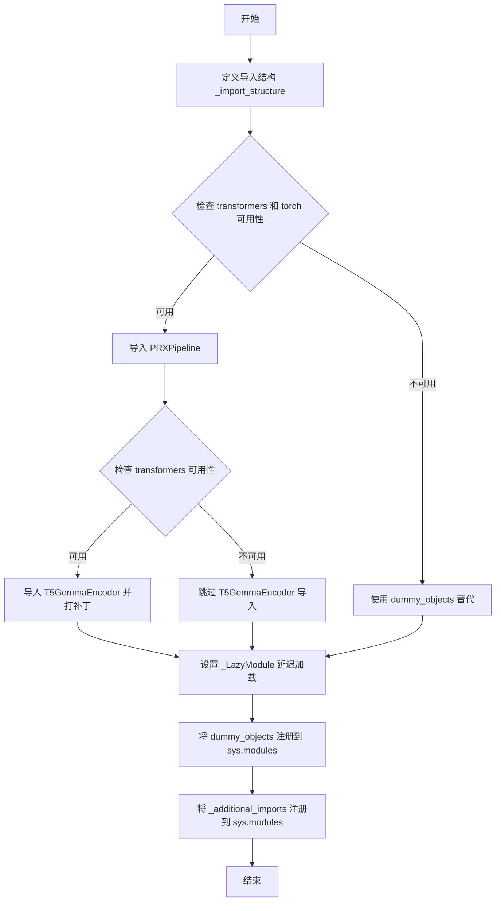
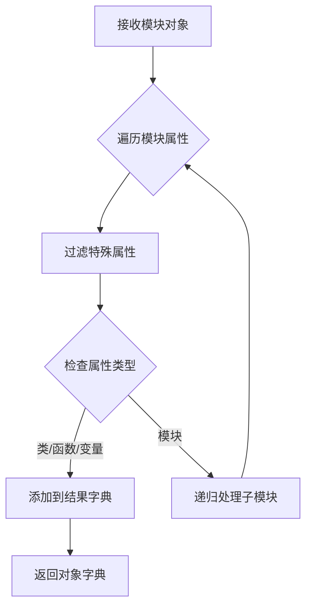
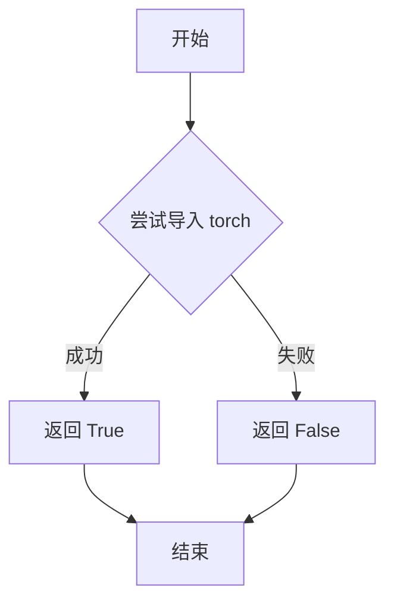
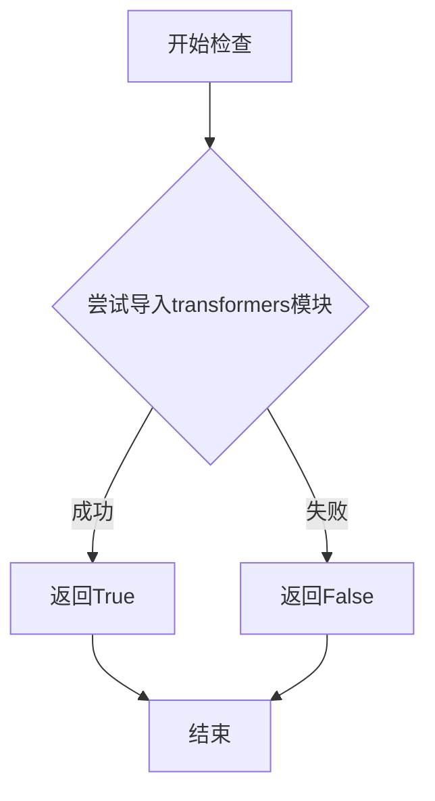
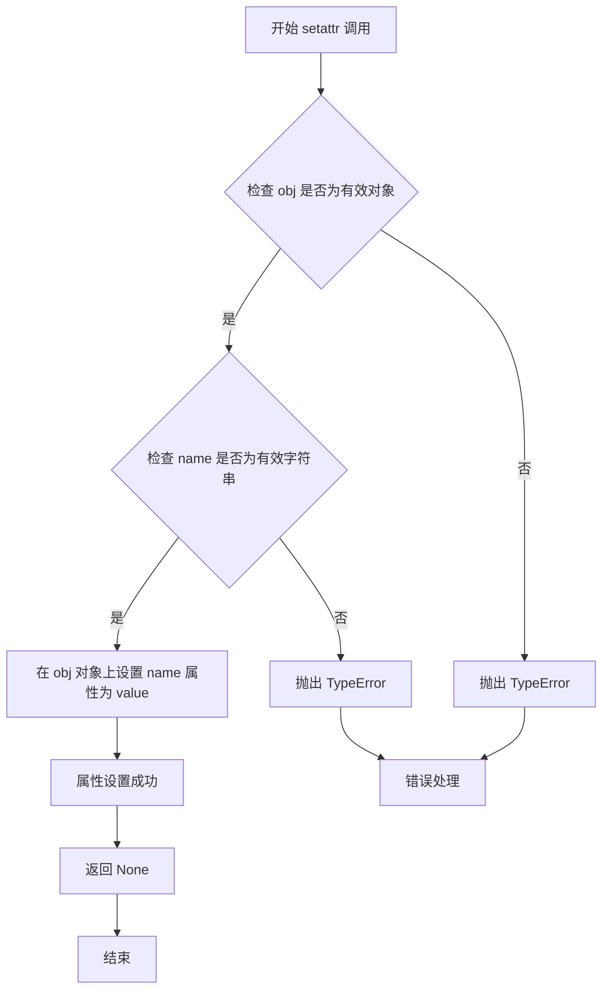

# `diffusers\src\diffusers\pipelines\prx\__init__.py` 详细设计文档

这是一个Diffusers库的延迟加载模块初始化文件，用于管理PRXPipeline和相关依赖的可选导入，同时为T5GemmaEncoder提供兼容性补丁支持。

## 整体流程



## 类结构

```
无自定义类定义（主要是模块初始化代码）
依赖 _LazyModule 类进行延迟加载
```

## 全局变量及字段


### `_dummy_objects`
    
存储可选依赖不可用时的虚拟对象，用于延迟导入时提供替代对象

类型：`dict`
    


### `_additional_imports`
    
存储额外的导入项，如T5GemmaEncoder，用于管道加载兼容性

类型：`dict`
    


### `_import_structure`
    
定义模块的导入结构，包含pipeline_output和pipeline_prx的导出映射

类型：`dict`
    


### `DIFFUSERS_SLOW_IMPORT`
    
控制是否使用延迟导入模式的标志，用于优化导入性能

类型：`bool`
    


### `OptionalDependencyNotAvailable`
    
可选依赖不可用时抛出的异常类，用于处理torch和transformers等可选依赖的缺失

类型：`class`
    


    

## 全局函数及方法


### `get_objects_from_module`

从模块中递归提取所有可导入对象（如类、函数、变量），并返回一个字典，键为对象名称，值为对象本身。用于延迟加载机制中批量获取虚拟对象。

参数：

- `module`：`module`，目标模块对象，从 `dummy_torch_and_transformers_objects` 传入

返回值：`dict`，包含模块中所有可导入对象的字典，键为对象名称字符串，值为对象本身

#### 流程图



#### 带注释源码

```
# 从 utils 模块导入的辅助函数
# 用于从一个模块中批量获取所有可导入对象
# 参数: module - 要提取对象的目标模块
# 返回: dict - 包含模块中所有公共对象的字典

get_objects_from_module(dummy_torch_and_transformers_objects)

# 在当前代码中的实际调用:
_dummy_objects.update(get_objects_from_module(dummy_torch_and_transformers_objects))

# 说明:
# 1. dummy_torch_and_transformers_objects 是一个虚拟模块
# 2. get_objects_from_module 提取其中的所有虚拟对象
# 3. 返回的字典被用于更新 _dummy_objects
# 4. 这些虚拟对象会在模块导入失败时提供替代实现
```


### `is_torch_available`

该函数用于检查当前环境中 PyTorch 库是否可用。它通过尝试导入 `torch` 模块来判断，如果导入成功则返回 `True`，否则返回 `False`。这个函数通常用于条件导入和可选依赖处理。

参数： 无

返回值：`bool`，如果 PyTorch 可用则返回 `True`，否则返回 `False`

#### 流程图



#### 带注释源码

```
# 注意：此函数定义不在提供代码段中
# 它是从 ...utils 模块导入的
# 以下是基于常见模式的推断实现

def is_torch_available() -> bool:
    """
    检查 PyTorch 是否可用于导入。
    
    Returns:
        bool: 如果 torch 可以被导入则为 True，否则为 False
    """
    try:
        import torch  # noqa: F401
        return True
    except ImportError:
        return False

# 或者使用缓存版本（常见于大型项目）
import torch

def is_torch_available():
    global _is_torch_available
    if _is_torch_available is None:
        try:
            import torch
            _is_torch_available = True
        except ImportError:
            _is_torch_available = False
    return _is_torch_available
```

> **注**：由于提供的代码段仅包含 `is_torch_available` 的导入语句，未包含其实际定义，因此源码部分是基于该函数在 Hugging Face diffusers 项目中的常见实现模式推断的。


### `is_transformers_available`

该函数用于检查Transformers库是否在当前Python环境中可用，返回布尔值。当Transformers库已安装且可导入时返回True，否则返回False，主要用于条件导入和可选依赖处理。

参数：

- 该函数无参数

返回值：`bool`，返回True表示Transformers库可用，返回False表示不可用

#### 流程图



#### 带注释源码

```python
# 该函数在...utils模块中定义，此处为引用
# 函数用于检查transformers库是否可用
is_transformers_available
# 注意：实际的函数实现不在本文件中
# 它在...utils包中实现，通常实现逻辑如下：
# try:
#     import transformers
#     return True
# except ImportError:
#     return False

# 在代码中的实际使用方式：
# 1. 检查transformers和torch是否都可用
if not (is_transformers_available() and is_torch_available()):
    raise OptionalDependencyNotAvailable()

# 2. 检查transformers是否可用以导入特定模块
if is_transformers_available():
    import transformers
    from transformers.models.t5gemma.modeling_t5gemma import T5GemmaEncoder
```


### `setattr` (内置函数)

描述：`setattr` 是 Python 的内置函数，用于动态设置对象的属性值。在该代码中，它被用于将 `sys.modules` 中当前模块的属性设置为指定的值，从而实现动态导入和模块属性的延迟绑定。

参数：

- `obj`：`object`，要设置属性的对象，这里是 `sys.modules[__name__]`（当前模块）
- `name`：`str`，要设置的属性名称，来自迭代的 `name` 变量（dummy 对象或额外导入的名称）
- `value`：任意类型，要设置的属性值，来自 `value` 变量（dummy 对象或额外的导入对象）

返回值：`None`，`setattr` 函数不返回任何值

#### 流程图



#### 带注释源码

```python
# 场景 1：设置虚拟对象（dummy objects）
# 遍历所有虚拟对象，这些对象在 OptionalDependencyNotAvailable 时创建
for name, value in _dummy_objects.items():
    # 使用 setattr 动态将虚拟对象添加到当前模块
    # _dummy_objects 包含在依赖不可用时的替代对象
    setattr(sys.modules[__name__], name, value)

# 场景 2：设置额外的导入对象
# 遍历所有额外的导入对象，如 T5GemmaEncoder
for name, value in _additional_imports.items():
    # 使用 setattr 动态将额外导入添加到当前模块
    # _additional_imports 包含需要注入到 transformers 模块的对象
    setattr(sys.modules[__name__], name, value)
```

> **注**：该代码中的 `setattr` 调用是 Python 动态特性的典型应用，用于实现懒加载模块和条件导入。通过 `setattr`，模块可以在运行时动态地添加属性，从而避免在模块导入时立即加载所有依赖。

## 关键组件


### LazyModule 懒加载模块系统

负责延迟导入模块，仅在实际需要时才加载，提高启动性能。通过 `_LazyModule` 类和 `sys.modules` 动态替换实现。

### OptionalDependencyNotAvailable 可选依赖异常

用于处理torch和transformers等可选依赖不可用时的异常抛出与捕获，确保代码在缺少依赖时不会崩溃。

### _import_structure 导入结构定义

定义模块的导入结构字典，包含 "pipeline_output" 和 "pipeline_prx" 两个子模块的导出列表。

### _dummy_objects 虚拟对象集合

在依赖不可用时使用的替代对象，通过 `get_objects_from_module` 从dummy模块获取，防止导入错误。

### _additional_imports 额外导入映射

存储额外的导入项，如 T5GemmaEncoder，用于扩展模块功能。

### T5GemmaEncoder 编码器动态注入

动态导入并注册 T5GemmaEncoder 到 transformers 模块，确保管道加载兼容性。

### TYPE_CHECKING 类型检查模式

用于类型检查阶段的条件导入，避免在运行时导入未安装的可选依赖。

### DIFFUSERS_SLOW_IMPORT 慢速导入标志

控制是否使用懒加载模式的标志，启用时直接在导入时加载所有模块。


## 问题及建议


### 已知问题

-   **重复的条件检查**：在第15-23行、第42-48行重复检查 `is_transformers_available() and is_torch_available()`，违反了DRY（Don't Repeat Yourself）原则，增加了维护成本和出错风险
-   **危险的全局副作用**：第34-36行直接修改 `transformers` 模块对象（`transformers.T5GemmaEncoder = T5GemmaEncoder`），这种运行时patch会导致难以追踪的副作用和潜在的版本兼容性问题
-   **不安全的wildcard导入**：第51行使用 `from ...utils.dummy_torch_and_transformers_objects import *`，wildcard导入会污染命名空间，可能导致意外的名称冲突
-   **硬编码的模块路径**：多处使用 `...utils` 相对导入，缺乏灵活性，重构时脆弱
-   **缺乏版本兼容性检查**：没有对 transformers 库的版本进行验证，可能导致与不同版本的 transformers 不兼容
-   **双重导入逻辑冗余**：`TYPE_CHECKING` 分支和运行时分支有大量重复的条件判断逻辑

### 优化建议

-   将重复的可选依赖检查提取为单独的函数或常量，避免代码重复
-   移除直接修改第三方模块（transformers）的代码，改用正式的插件机制或配置方式
-   用显式导入替代 wildcard 导入，提高代码可读性和可维护性
-   考虑使用 Python 3.7+ 的 `__getattr__` 机制实现更简洁的延迟导入，替代当前的 `_LazyModule` 模式
-   添加版本检查逻辑，确保与特定版本的 transformers 兼容
-   将 `_import_structure` 字典统一在一个位置定义，避免分散定义导致的同步问题
-   考虑将 T5GemmaEncoder 的导入逻辑封装为独立的函数，提高代码模块化程度


## 其它


### 设计目标与约束

本模块采用延迟加载（Lazy Loading）机制，旨在解决Diffusers库中PRXPipeline的可选依赖问题，允许在未安装torch或transformers时仍能导入模块，同时确保类型检查阶段的完整类型信息可用。约束条件包括：必须同时依赖torch和transformers才能使用完整的PRXPipeline功能；模块需要兼容Diffusers的LazyModule加载机制；需要维护与T5GemmaEncoder的序列化兼容性。

### 错误处理与异常设计

当torch或transformers任一不可用时，抛出OptionalDependencyNotAvailable异常，该异常由上层调用者捕获并静默处理，同时使用dummy对象填充模块命名空间以防止AttributeError。对于T5GemmaEncoder的导入失败，采用静默处理策略（pass），仅在transformers可用时尝试导入。LazyModule初始化失败时会导致整个模块导入失败，这是预期行为。

### 外部依赖与接口契约

外部依赖包括：torch（运行时必需）、transformers（运行时必需）、diffusers.utils中的_LazyModule、get_objects_from_module、OptionalDependencyNotAvailable等工具函数。导出接口契约：PRXPipeline类（需同时满足torch和transformers可用）、PRXPipelineOutput类（pipeline_output子模块）、T5GemmaEncoder类（可选，用于序列化兼容性）。导入结构定义_import_structure字典声明了可用的公开接口。

### 模块初始化流程

模块加载分为三个阶段：首先是静态导入阶段（TYPE_CHECKING或DIFFUSERS_SLOW_IMPORT为True），此时执行完整的导入逻辑；其次是运行时阶段，执行LazyModule注册和dummy对象绑定；最后是动态导入阶段，通过sys.modules[__name__]替换为_LazyModule实例实现懒加载。T5GemmaEncoder的导入采用运行时补丁方式，直接修改transformers模块以支持序列化时的类查找。

### 关键设计决策

采用LazyModule而非直接导出的原因是为了减少Diffusers库的整体导入时间，使PRXPipeline仅在实际使用时才加载。dummy_objects机制确保了静态分析工具（如IDE、类型检查器）能够识别模块的完整接口，即使运行时依赖不可用。T5GemmaEncoder的直接补丁策略是为了解决transformers库自身可能未正确导出该类的问题。

### 潜在的技术债务与优化空间

当前T5GemmaEncoder的导入逻辑存在版本兼容风险：假设transformers.models.t5gemma.modeling_t5gemma路径固定，未来transformers库结构变化会导致导入失败。建议添加版本检测或使用try-except更精确地捕获ImportError。dummy_objects的动态更新机制在多线程场景下可能存在竞态条件，但考虑到模块初始化顺序，该风险较低。_additional_imports的补丁方式修改了第三方模块的全局状态，可能与未来transformers的更新产生冲突。

    