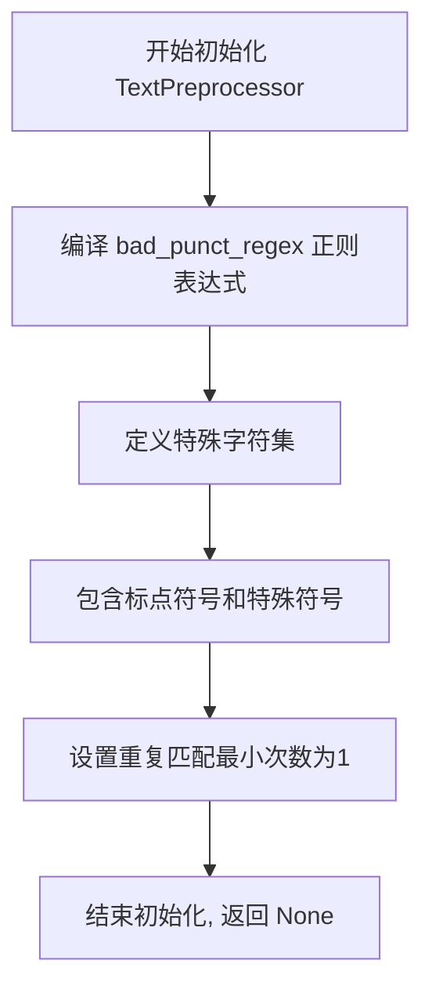
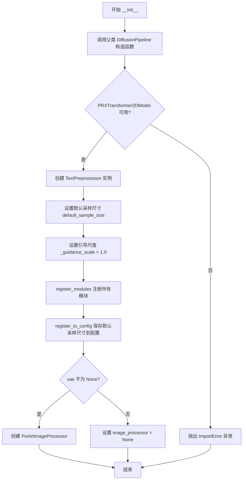
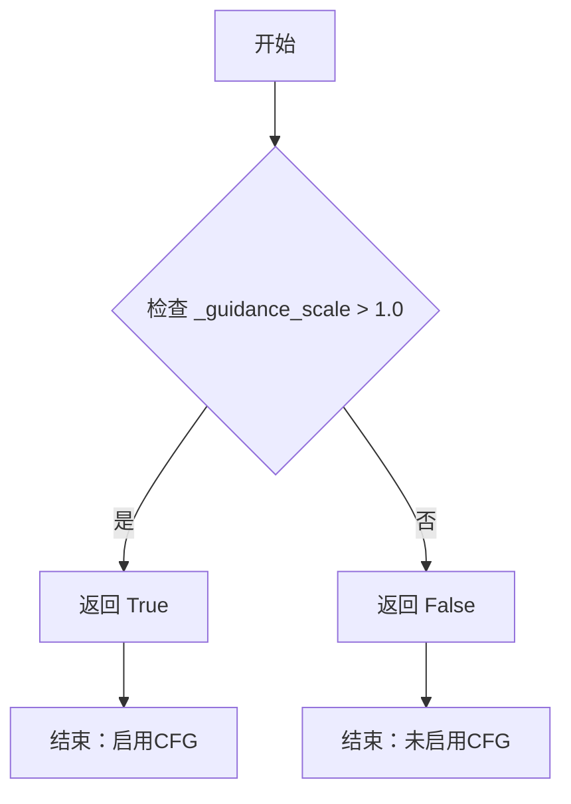
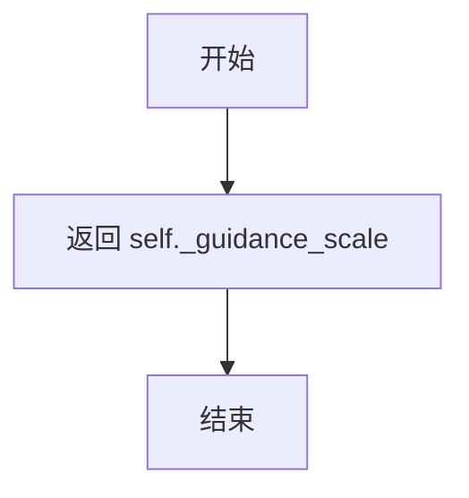
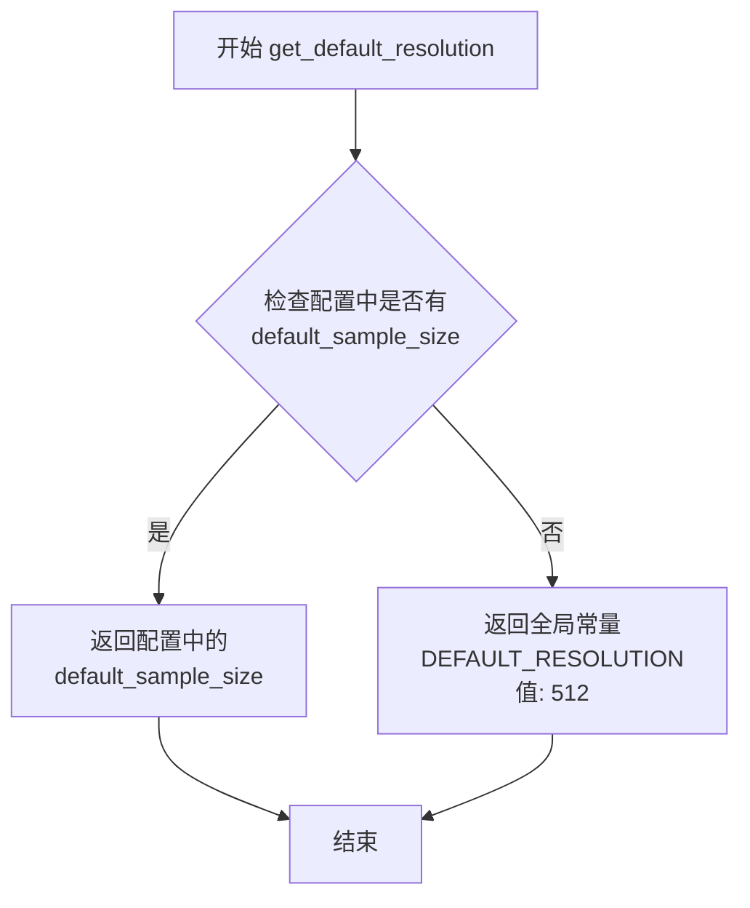
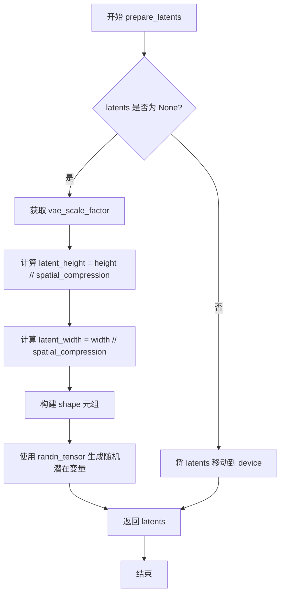
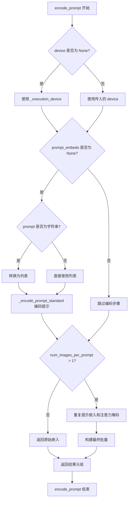
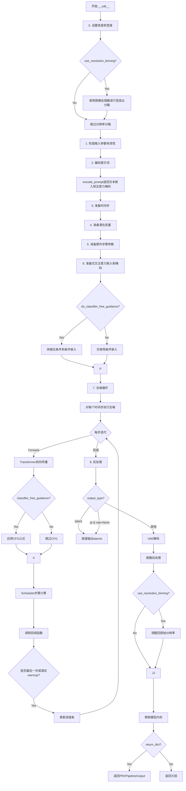

# `diffusers\src\diffusers\pipelines\prx\pipeline_prx.py` 详细设计文档

PRXPipeline是一个基于PRX Transformer的文本到图像(text-to-image)生成管道，集成了T5Gemma文本编码器、VAE变分自编码器(支持AutoencoderKL和AutoencoderDC)和FlowMatchEulerDiscreteScheduler调度器，支持LoRA加载、单文件加载和文本反转，提供分辨率分箱、分类器-free引导等高级功能。

## 整体流程

```mermaid
graph TD
    A[开始: 用户调用 pipe(prompt)] --> B[0. 设置高度和宽度]
B --> C{use_resolution_binning?}
C -- 是 --> D[使用image_processor.classify_height_width_bin映射分辨率]
C -- 否 --> E[1. 检查输入参数 check_inputs]
D --> E
E --> F[2. 编码文本提示 encode_prompt]
F --> G[3. 准备时间步 timesteps]
G --> H[4. 准备潜在变量 prepare_latents]
H --> I[5. 准备额外步骤参数]
I --> J[6. 准备交叉注意力嵌入和掩码]
J --> K[7. 去噪循环 Denoising Loop]
K --> L{当前步 < 总步数?}
L -- 是 --> M[复制latents用于CFG]
M --> N[归一化timestep]
N --> O[通过transformer前向传播]
O --> P[应用分类器-free引导]
P --> Q[scheduler.step计算上一步]
Q --> K
L -- 否 --> R[8. 后处理: VAE解码]
R --> S{use_resolution_binning?}
S -- 是 --> T[调整回原始分辨率]
S -- 否 --> U[使用image_processor后处理]
T --> U
U --> V[返回PRXPipelineOutput或元组]
V --> W[结束]
```

## 类结构

```
TextPreprocessor (文本预处理工具类)
PRXPipeline (主生成管道)
├── DiffusionPipeline (基类)
├── LoraLoaderMixin (LoRA加载混合)
├── FromSingleFileMixin (单文件加载混合)
└── TextualInversionLoaderMixin (文本反转加载混合)
```

## 全局变量及字段


### `DEFAULT_RESOLUTION`
    
默认图像生成分辨率，值为512像素

类型：`int`
    


### `ASPECT_RATIO_256_BIN`
    
256分辨率下的宽高比映射表，包含各比例对应的宽高像素值

类型：`dict`
    


### `ASPECT_RATIO_512_BIN`
    
512分辨率下的宽高比映射表，包含各比例对应的宽高像素值

类型：`dict`
    


### `ASPECT_RATIO_1024_BIN`
    
1024分辨率下的宽高比映射表，包含各比例对应的宽高像素值

类型：`dict`
    


### `ASPECT_RATIO_BINS`
    
所有分辨率宽高比映射的汇总字典，按分辨率级别索引

类型：`dict`
    


### `logger`
    
模块级日志记录器，用于输出运行时信息和调试日志

类型：`logging.Logger`
    


### `EXAMPLE_DOC_STRING`
    
示例文档字符串，包含PRXPipeline的代码使用示例和说明

类型：`str`
    


### `TextPreprocessor.bad_punct_regex`
    
用于匹配和清理特殊标点符号的正则表达式模式

类型：`re.Pattern`
    


### `PRXPipeline.text_preprocessor`
    
文本预处理器实例，用于清洗和规范用户输入的文本提示

类型：`TextPreprocessor`
    


### `PRXPipeline.default_sample_size`
    
默认采样尺寸，决定生成图像的基础分辨率大小

类型：`int`
    


### `PRXPipeline._guidance_scale`
    
引导强度私有属性，控制文本提示对图像生成的影响程度

类型：`float`
    


### `PRXPipeline.model_cpu_offload_seq`
    
模型CPU卸载顺序字符串，定义各组件从GPU卸载到CPU的优先级

类型：`str`
    


### `PRXPipeline._callback_tensor_inputs`
    
回调函数可访问的张量输入列表，用于在推理步骤结束时传递张量数据

类型：`list`
    


### `PRXPipeline._optional_components`
    
可选组件列表，标识管道中非必需的模块如VAE等

类型：`list`
    
    

## 全局函数及方法


### TextPreprocessor.clean_text

该方法是 `TextPreprocessor` 类的核心文本清洗方法，通过多阶段处理流程对原始文本进行深度清洗，包括URL移除、CJK字符过滤、特殊标点规范化、HTML实体解码、spam模式识别与移除等，最终输出符合模型输入要求的标准化文本。

类信息：

- **类名**：TextPreprocessor
- **类描述**：PRXPipeline的文本预处理工具类，用于对输入提示词进行全面的清洗和标准化处理

类字段：

- **bad_punct_regex**：`re.Pattern`，编译后的正则表达式，用于匹配和替换特殊标点符号（如®•©™、各种括号等）

参数：

- **text**：`str`，待清洗的原始文本输入

返回值：`str`，清洗和标准化后的文本

#### 流程图

```mermaid
flowchart TD
    A[开始: text] --> B[转字符串 & URL解码 & 小写化 & 去空格]
    B --> C[替换&lt;person&gt;标签]
    C --> D{移除URLs和@昵称}
    D --> E[移除CJK字符]
    E --> F[规范化破折号类型]
    F --> G[规范化引号类型]
    G --> H[移除HTML实体]
    H --> I[移除IP地址和文章ID]
    I --> J[处理换行符]
    J --> K[移除#标签和长数字]
    K --> L[移除文件名模式]
    L --> M[清理重复标点]
    M --> N{检查破折号/下划线过多}
    N -->|是| O[转换为空格]
    N -->|否| P[继续]
    O --> P
    P --> Q[ftfy.fix_text修复编码]
    Q --> R[HTML实体双重解码]
    R --> S[移除字母数字混合模式]
    S --> T[移除常见spam模式]
    T --> U[移除复杂字母数字串]
    U --> V[移除尺寸格式]
    V --> W[最终格式化清理]
    W --> X[移除首尾特殊字符]
    X --> Y[结束: 返回清洗后文本]
```

#### 带注释源码

```python
def clean_text(self, text: str) -> str:
    """Clean text using comprehensive text processing logic."""
    # 参考 Deepfloyd 的实现: https://github.com/deep-floyd/IF/blob/develop/deepfloyd_if/modules/t5.py
    
    # 步骤1: 基础类型转换和初步处理
    text = str(text)
    text = ul.unquote_plus(text)  # URL解码 (e.g., %20 -> space)
    text = text.strip().lower()   # 去除首尾空白并转小写
    text = re.sub("<person>", "person", text)  # 标准化 persona 标签

    # 步骤2: 移除 URLs 和社交媒体昵称
    # 匹配 http/https/www 开头或域名形式的 URL
    text = re.sub(
        r"\b((?:https?|www):(?:\/{1,3}|[a-zA-Z0-9%])|[a-zA-Z0-9.\-]+[.](?:com|co|ru|net|org|edu|gov|it)[\w/-]*\b\/?(?!@))",
        "",
        text,
    )
    # 移除 @nickname 格式
    text = re.sub(r"@[\w\d]+\b", "", text)

    # 步骤3: 移除 CJK (中日韩) 字符
    # 移除 CJK 笔画、CJK 统一表意文字等
    text = re.sub(r"[\u31c0-\u31ef]+", "", text)  # CJK Strokes
    text = re.sub(r"[\u31f0-\u31ff]+", "", text)  # CJK Strokes 扩展
    text = re.sub(r"[\u3200-\u32ff]+", "", text)  # CJK 兼容表意文字
    text = re.sub(r"[\u3300-\u33ff]+", "", text)  # CJK 统一表意文字扩展A
    text = re.sub(r"[\u3400-\u4dbf]+", "", text)  # CJK 统一表意文字扩展B
    text = re.sub(r"[\u4dc0-\u4dff]+", "", text)  # Yijing Hexagram Symbols
    text = re.sub(r"[\u4e00-\u9fff]+", "", text)  # CJK 统一表意文字基本区

    # 步骤4: 规范化各种破折号为标准 "-"
    text = re.sub(
        r"[\u002D\u058A\u05BE\u1400\u1806\u2010-\u2015\u2E17\u2E1A\u2E3A\u2E3B\u2E40\u301C\u3030\u30A0\uFE31\uFE32\uFE58\uFE63\uFF0D]+",
        "-",
        text,
    )

    # 步骤5: 统一引号样式
    text = re.sub(r"[`´«»" "¨]", '"', text)  # 各种引号转为双引号
    text = re.sub(r"['']", "'", text)         # 各种单引号转为标准单引号

    # 步骤6: 移除 HTML 实体
    text = re.sub(r"&quot;?", "", text)  # &quot; 或 &quot
    text = re.sub(r"&amp", "", text)     # &amp

    # 步骤7: 移除技术标识符
    text = re.sub(r"\d{1,3}\.\d{1,3}\.\d{1,3}\.\d{1,3}", " ", text)  # IP地址
    text = re.sub(r"\d:\d\d\s+$", "", text)  # 文章ID格式

    # 步骤8: 处理换行符
    text = re.sub(r"\\n", " ", text)

    # 步骤9: 移除标签和长数字
    text = re.sub(r"#\d{1,3}\b", "", text)    # 1-3位数字的标签
    text = re.sub(r"#\d{5,}\b", "", text)     # 5位以上的标签
    text = re.sub(r"\b\d{6,}\b", "", text)    # 6位以上的纯数字

    # 步骤10: 移除文件名
    text = re.sub(r"[\S]+\.(?:png|jpg|jpeg|bmp|webp|eps|pdf|apk|mp4)", "", text)

    # 步骤11: 清理标点符号
    text = re.sub(r"[\"']{2,}", r'"', text)  # 连续双引号合并
    text = re.sub(r"[\.]{2,}", r" ", text)   # 连续点号转空格
    text = re.sub(self.bad_punct_regex, r" ", text)  # 特殊标点转空格
    text = re.sub(r"\s+\.\s+", r" ", text)   # 孤立点号周围空格

    # 步骤12: 处理破折号/下划线过多的情况
    regex2 = re.compile(r"(?:\-|\_)")
    if len(re.findall(regex2, text)) > 3:
        text = re.sub(regex2, " ", text)  # 超过3个则转为空格

    # 步骤13: 修复编码问题和 HTML 实体
    text = ftfy.fix_text(text)              # 使用 ftfy 修复乱码
    text = html.unescape(html.unescape(text))  # 双重解码确保彻底
    text = text.strip()

    # 步骤14: 移除字母数字混合模式 (常见于spam/ID)
    text = re.sub(r"\b[a-zA-Z]{1,3}\d{3,15}\b", "", text)   # 如 jc6640
    text = re.sub(r"\b[a-zA-Z]+\d+[a-zA-Z]+\b", "", text)   # 如 jc6640vc
    text = re.sub(r"\b\d+[a-zA-Z]+\d+\b", "", text)         # 如 6640vc231

    # 步骤15: 移除常见 spam 模式
    text = re.sub(r"(worldwide\s+)?(free\s+)?shipping", "", text)
    text = re.sub(r"(free\s)?download(\sfree)?", "", text)
    text = re.sub(r"\bclick\b\s(?:for|on)\s\w+", "", text)
    text = re.sub(r"\b(?:png|jpg|jpeg|bmp|webp|eps|pdf|apk|mp4)(\simage[s]?)?", "", text)
    text = re.sub(r"\bpage\s+\d+\b", "", text)

    # 步骤16: 移除复杂字母数字串和尺寸格式
    text = re.sub(r"\b\d*[a-zA-Z]+\d+[a-zA-Z]+\d+[a-zA-Z\d]*\b", r" ", text)  # 复杂混合串
    text = re.sub(r"\b\d+\.?\d*[xх×]\d+\.?\d*\b", "", text)  # 尺寸格式 (支持x/X/×)

    # 步骤17: 最终格式化
    text = re.sub(r"\b\s+\:\s+", r": ", text)        # 修正冒号空格
    text = re.sub(r"(\D[,\./])\b", r"\1 ", text)    # 分隔符后加空格
    text = re.sub(r"\s+", " ", text)                # 多空格合并

    text.strip()  # 去除首尾空白 (注: 结果未重新赋值)

    # 步骤18: 移除首尾特殊字符
    text = re.sub(r"^[\"\']([\w\W]+)[\"\']$", r"\1", text)  # 移除外层引号
    text = re.sub(r"^[\'\_,\-\:;]", r"", text)              # 移除首部特殊字符
    text = re.sub(r"[\'\_,\-\:\-\+]$", r"", text)           # 移除尾部特殊字符
    text = re.sub(r"^\.\S+$", "", text)                     # 移除单独的点开头

    return text.strip()  # 返回最终清洗后的文本
```

---

### 关键组件信息

| 组件名称 | 描述 |
|---------|------|
| `ul` (urllib.parse) | Python 标准库，用于 URL 解码处理 |
| `re` (正则表达式模块) | 用于各种文本模式匹配和替换 |
| `ftfy` | 用于修复编码问题和乱码文本 |
| `html` | Python 标准库，用于 HTML 实体解码 |
| `bad_punct_regex` | 预编译的正则表达式，高效匹配特殊标点 |

---

### 潜在的技术债务或优化空间

1. **重复正则编译**：代码中多次使用 `re.sub` 且每次都传入新的正则模式字符串，虽然 Python 内部会缓存部分编译结果，但对于高频调用场景，建议预编译所有正则表达式为 `re.Pattern` 对象。

2. **硬编码的字符范围**：CJK 字符范围、URL 域名后缀等以硬编码形式存在，维护性较差，可考虑提取为配置常量或使用 Unicode 类别。

3. **ftfy 依赖**：依赖 `ftfy` 库进行编码修复，需要确保该库可用，建议添加优雅降级处理。

4. **方法返回值前的 `strip()` 赋值遗漏**：代码中存在 `text.strip()` 但未重新赋值（已修复），这类细微问题可能导致首尾空白未去除。

5. **spam 模式覆盖不全**：spam 模式基于特定关键词，可考虑扩展或引入更智能的模式识别机制。

---

### 其它项目

**设计目标**：
- 对用户输入的文本提示词进行深度清洗，移除无关信息（URL、特殊字符、spam内容）
- 标准化文本格式，降低模型理解难度
- 提升生成结果的质量和相关性

**约束**：
- 输入必须是字符串类型
- 输出为清洗后的字符串，可能为空字符串
- 依赖 `ftfy` 库，必须确保已安装

**错误处理**：
- 基础类型转换 `str(text)` 可捕获非字符串输入
- `ftfy.fix_text` 和 `html.unescape` 均为安全操作，不会抛出异常
- 正则表达式匹配不会失败，仅返回原文本

**外部依赖**：
- `ftfy`：文本编码修复
- `urllib.parse`：URL解码
- `html`：HTML实体解码
- `re`：正则表达式处理


### `TextPreprocessor.__init__`

初始化文本预处理器，创建一个用于清理文本的正则表达式对象，用于后续的文本清洗操作。

参数： 无

返回值：`None`，初始化 TextPreprocessor 实例本身

#### 流程图



#### 带注释源码

```python
def __init__(self):
    """Initialize text preprocessor."""
    # 编译一个正则表达式，用于匹配和替换文本中的特殊标点符号和装饰性字符
    # 该正则表达式包含以下字符类别：
    # - #®•©™&@·º½¾¿¡§~ : 特殊符号和装饰符
    # - \) \( : 左右圆括号
    # - \] \[ : 左右方括号
    # - \} \{ : 左右花括号
    # - \| : 竖线
    # - \\ : 反斜杠
    # - \/ : 正斜杠
    # - \* : 星号
    # {1,} 表示匹配1个或更多这些字符的连续序列
    self.bad_punct_regex = re.compile(
        r"["
        + "#®•©™&@·º½¾¿¡§~"   # 特殊符号和装饰符
        + r"\)"                # 右圆括号
        + r"\("                # 左圆括号
        + r"\]"                # 右方括号
        + r"\["                # 左方括号
        + r"\}"                # 右花括号
        + r"\{"                # 左花括号
        + r"\|"                # 竖线
        + r"\\"                # 反斜杠
        + r"\/"                # 正斜杠
        + r"\*"                # 星号
        + r"]{1,}"             # 匹配1个或多个上述字符
    )
```


### TextPreprocessor.clean_text

该方法实现了对输入文本的全面清理和规范化处理，包括URL移除、HTML实体解码、CJK字符过滤、标点符号标准化、文本编码修复以及多种常见噪声模式（如垃圾信息、文件名、IP地址等）的清除，为后续文本编码提供干净的输入。

参数：
- `text`：`str`，需要清理和规范的原始输入文本

返回值：`str`，清理和规范后的文本

#### 流程图

```mermaid
flowchart TD
    A[开始 clean_text] --> B[转换为字符串]
    B --> C[URL解码 ul.unquote_plus]
    C --> D[转小写并去除首尾空格]
    D --> E[替换 &lt;person&gt; 为 person]
    E --> F{遍历多个清理步骤}
    
    F --> G[移除URL正则]
    G --> H[移除@用户名]
    H --> I[移除CJK字符<br/>31C0-31EF, 31F0-31FF<br/>3200-32FF, 3300-33FF<br/>3400-4DBF, 4DC0-4DFF<br/>4E00-9FFF]
    I --> J[统一破折号Unicode]
    J --> K[统一引号Unicode]
    K --> L[移除HTML实体 &quot; &amp]
    L --> M[移除IP地址]
    M --> N[移除文章ID格式]
    N --> O[替换换行符为空格]
    O --> P[移除#标签和长数字]
    P --> Q[移除文件名模式]
    Q --> R[清理重复引号和句点]
    R --> S[使用bad_punct_regex<br/>移除特殊标点]
    S --> T[移除 &quot; . &quot; 模式]
    T --> U{检查连字符/下划线<br/>出现次数>3?}
    U -->|是| V[将连字符/下划线<br/>替换为空格]
    U -->|否| W[跳过]
    V --> W
    W --> X[使用ftfy.fix_text<br/>修复文本编码]
    X --> Y[HTML两次解码<br/>html.unescape]
    Y --> Z[移除字母数字组合<br/>如jc6640, jc6640vc]
    Z --> AA[移除垃圾信息模式<br/>shipping, download, click等]
    AA --> AB[移除图片格式词<br/>png, jpg, page等]
    AB --> AC[移除复杂字母数字串<br/>如j2d1a2a]
    AC --> AD[移除尺寸模式<br/>如100x100]
    AD --> AE[最终格式化<br/>统一空格, 清理首尾]
    AE --> AF[去除首尾引号/特殊字符]
    AF --> GG[返回strip后的文本]
    
    style G fill:#f9f,color:#333
    style I fill:#f9f,color:#333
    style X fill:#9f9,color:#333
    style Y fill:#9f9,color:#333
```

#### 带注释源码

```python
def clean_text(self, text: str) -> str:
    """Clean text using comprehensive text processing logic."""
    # 参考 Deepfloyd 的实现: https://github.com/deep-floyd/IF/blob/develop/deepfloyd_if/modules/t5.py
    
    # 步骤1: 转换为字符串类型，确保后续处理的一致性
    text = str(text)
    
    # 步骤2: URL解码处理，将URL编码的字符转换回原始形式
    # 例如: "hello%20world" -> "hello world"
    text = ul.unquote_plus(text)
    
    # 步骤3: 转小写并去除首尾空格，统一文本大小写
    text = text.strip().lower()
    
    # 步骤4: 将 <person> 标签替换为普通单词 person
    text = re.sub("<person>", "person", text)

    # ==========================================
    # 步骤5: 移除所有URL
    # 正则匹配 http/https/www 开头或域名形式的URL
    text = re.sub(
        r"\b((?:https?|www):(?:\/{1,3}|[a-zA-Z0-9%])|[a-zA-Z0-9.\-]+[.](?:com|co|ru|net|org|edu|gov|it)[\w/-]*\b\/?(?!@))",
        "",
        text,
    )

    # 步骤6: 移除 @用户名 格式
    text = re.sub(r"@[\w\d]+\b", "", text)

    # ==========================================
    # 步骤7: 移除CJK字符（中日韩统一表意文字）
    # 移除各种CJK字符范围
    text = re.sub(r"[\u31c0-\u31ef]+", "", text)  # CJK笔画
    text = re.sub(r"[\u31f0-\u31ff]+", "", text)  # CJK笔画扩展
    text = re.sub(r"[\u3200-\u32ff]+", "", text)  # CJK字母
    text = re.sub(r"[\u3300-\u33ff]+", "", text)  # CJK兼容
    text = re.sub(r"[\u3400-\u4dbf]+", "", text)  # CJK扩展A
    text = re.sub(r"[\u4dc0-\u4dff]+", "", text)  # Yijing符号
    text = re.sub(r"[\u4e00-\u9fff]+", "", text)  # CJK统一表意文字

    # ==========================================
    # 步骤8: 将各种Unicode破折号/连字符统一转换为普通连字符 "-"
    text = re.sub(
        r"[\u002D\u058A\u05BE\u1400\u1806\u2010-\u2015\u2E17\u2E1A\u2E3A\u2E3B\u2E40\u301C\u3030\u30A0\uFE31\uFE32\uFE58\uFE63\uFF0D]+",
        "-",
        text,
    )

    # 步骤9: 将各种Unicode引号统一为标准引号
    text = re.sub(r"[`´«»" "¨]", '"', text)  # 转换为双引号
    text = re.sub(r"['']", "'", text)        # 转换为单引号

    # 步骤10: 移除HTML实体引用
    text = re.sub(r"&quot;?", "", text)  # 移除 &quot; 或 &quot
    text = re.sub(r"&amp", "", text)    # 移除 &amp

    # ==========================================
    # 步骤11: 移除IP地址格式
    text = re.sub(r"\d{1,3}\.\d{1,3}\.\d{1,3}\.\d{1,3}", " ", text)

    # 步骤12: 移除文章ID格式 (如 "1:23 ")
    text = re.sub(r"\d:\d\d\s+$", "", text)

    # 步骤13: 将转义换行符 \n 替换为空格
    text = re.sub(r"\\n", " ", text)

    # ==========================================
    # 步骤14: 移除哈希标签
    text = re.sub(r"#\d{1,3}\b", "", text)   # 移除1-3位数字的标签 (#123)
    text = re.sub(r"#\d{5,}\b", "", text)    # 移除5位以上数字的标签 (#12345)
    text = re.sub(r"\b\d{6,}\b", "", text)   # 移除6位以上的纯数字

    # 步骤15: 移除常见文件名模式
    text = re.sub(r"[\S]+\.(?:png|jpg|jpeg|bmp|webp|eps|pdf|apk|mp4)", "", text)

    # ==========================================
    # 步骤16: 清理标点符号
    text = re.sub(r"[\"']{2,}", r'"', text)  # 连续双引号 """AUSVERKAUFT""" -> "
    text = re.sub(r"[\.]{2,}", r" ", text)  # 连续句点 .. -> 空格

    # 使用预定义的bad_punct_regex移除特殊标点符号
    # 包含: #®•©™&@·º½¾¿¡§~ 以及各种括号
    text = re.sub(self.bad_punct_regex, r" ", text)
    
    # 移除 " . " 模式
    text = re.sub(r"\s+\.\s+", r" ", text)

    # ==========================================
    # 步骤17: 处理连字符和下划线
    # 如果文本中包含超过3个连字符或下划线，将其视为分隔符并替换为空格
    # 例如: "this-is-my-cute-cat" -> "this is my cute cat"
    regex2 = re.compile(r"(?:\-|\_)")
    if len(re.findall(regex2, text)) > 3:
        text = re.sub(regex2, " ", text)

    # ==========================================
    # 步骤18: 使用ftfy库修复文本编码问题
    # ftfy 可以修复常见的编码错误，如 Mojibake（乱码）
    text = ftfy.fix_text(text)
    
    # 步骤19: 双重HTML解码，处理嵌套的HTML实体
    text = html.unescape(html.unescape(text))
    text = text.strip()

    # ==========================================
    # 步骤20: 移除字母数字组合模式
    text = re.sub(r"\b[a-zA-Z]{1,3}\d{3,15}\b", "", text)   # 如 jc6640
    text = re.sub(r"\b[a-zA-Z]+\d+[a-zA-Z]+\b", "", text)  # 如 jc6640vc
    text = re.sub(r"\b\d+[a-zA-Z]+\d+\b", "", text)        # 如 6640vc231

    # ==========================================
    # 步骤21: 移除常见垃圾信息模式
    text = re.sub(r"(worldwide\s+)?(free\s+)?shipping", "", text)  # 快递广告
    text = re.sub(r"(free\s)?download(\sfree)?", "", text)          # 下载广告
    text = re.sub(r"\bclick\b\s(?:for|on)\s\w+", "", text)         # 点击广告
    text = re.sub(r"\b(?:png|jpg|jpeg|bmp|webp|eps|pdf|apk|mp4)(\simage[s]?)?", "", text)  # 图片格式词
    text = re.sub(r"\bpage\s+\d+\b", "", text)  # 页码

    # ==========================================
    # 步骤22: 移除复杂的字母数字串和尺寸规格
    text = re.sub(r"\b\d*[a-zA-Z]+\d+[a-zA-Z]+\d+[a-zA-Z\d]*\b", r" ", text)  # 如 j2d1a2a...
    text = re.sub(r"\b\d+\.?\d*[xх×]\d+\.?\d*\b", "", text)  # 尺寸模式 100x100, 10.5x20

    # ==========================================
    # 步骤23: 最终格式化清理
    text = re.sub(r"\b\s+\:\s+", r": ", text)  # 修复 " : " -> ": "
    text = re.sub(r"(\D[,\./])\b", r"\1 ", text)  # 在标点后添加空格
    text = re.sub(r"\s+", " ", text)  # 合并多个空格

    text.strip()  # 去除首尾空格（结果未使用）

    # ==========================================
    # 步骤24: 去除首尾特殊字符
    text = re.sub(r"^[\"\']([\w\W]+)[\"\']$", r"\1", text)  # 去除首尾引号
    text = re.sub(r"^[\'\_,\-\:;]", r"", text)  # 去除首尾特殊字符
    text = re.sub(r"[\'\_,\-\:\-\+]$", r"", text)
    text = re.sub(r"^\.\S+$", "", text)  # 去除以点开头的单词

    # 返回最终清理后的文本
    return text.strip()
```


### PRXPipeline.__init__

该方法是PRXPipeline类的构造函数，用于初始化PRX文本到图像生成管道的所有核心组件，包括Transformer模型、调度器、文本编码器、分词器以及可选的VAE模型，并完成模块注册和图像处理器的配置。

参数：

- `transformer`：`PRXTransformer2DModel`，用于对编码后的图像潜在表示进行去噪的PRX Transformer模型
- `scheduler`：`FlowMatchEulerDiscreteScheduler`，与transformer配合使用对编码后的图像潜在表示进行去噪的调度器
- `text_encoder`：`T5GemmaEncoder`，用于编码提示词的文本编码器模型
- `tokenizer`：`T5TokenizerFast | GemmaTokenizerFast | AutoTokenizer`，文本编码器的分词器
- `vae`：`AutoencoderKL | AutoencoderDC | None`，变分自编码器模型，用于将图像编码和解码到潜在表示，支持AutoencoderKL（8倍压缩）和AutoencoderDC（32倍压缩）
- `default_sample_size`：`int | None`，默认采样尺寸，默认为DEFAULT_RESOLUTION（512）

返回值：`None`，构造函数无返回值

#### 流程图



#### 带注释源码

```python
def __init__(
    self,
    transformer: PRXTransformer2DModel,
    scheduler: FlowMatchEulerDiscreteScheduler,
    text_encoder: T5GemmaEncoder,
    tokenizer: T5TokenizerFast | GemmaTokenizerFast | AutoTokenizer,
    vae: AutoencoderKL | AutoencoderDC | None = None,
    default_sample_size: int | None = DEFAULT_RESOLUTION,
):
    """初始化PRX管道及其所有组件
    
    参数:
        transformer: PRX Transformer模型，用于图像潜在表示的去噪
        scheduler: 流匹配欧拉离散调度器
        text_encoder: T5-Gemma文本编码器
        tokenizer: 分词器，支持T5TokenizerFast、GemmaTokenizerFast或AutoTokenizer
        vae: 变分自编码器，可选，用于图像编码/解码
        default_sample_size: 默认采样尺寸，默认为512
    """
    # 调用父类DiffusionPipeline的初始化方法
    # 继承基础管道功能（如设备管理、检查点保存等）
    super().__init__()

    # 检查PRXTransformer2DModel是否可用
    # 如果模块未正确安装则抛出明确错误
    if PRXTransformer2DModel is None:
        raise ImportError(
            "PRXTransformer2DModel is not available. Please ensure the transformer_prx module is properly installed."
        )

    # 初始化文本预处理器，用于清洗和规范化用户输入的提示词
    self.text_preprocessor = TextPreprocessor()
    
    # 存储默认采样尺寸，用于确定生成图像的分辨率
    self.default_sample_size = default_sample_size
    
    # 初始化引导尺度，默认为1.0（无分类器自由引导）
    self._guidance_scale = 1.0

    # 注册所有管道组件到父类
    # 这些组件将通过pipeline的属性进行访问
    # 同时支持LoRA加载、文本反转等功能
    self.register_modules(
        transformer=transformer,
        scheduler=scheduler,
        text_encoder=text_encoder,
        tokenizer=tokenizer,
        vae=vae,
    )

    # 将默认采样尺寸保存到配置中
    # 使其可以在from_pretrained加载时持久化
    self.register_to_config(default_sample_size=self.default_sample_size)

    # 如果提供了VAE，则创建图像处理器
    # PixArtImageProcessor用于处理VAE的输入输出
    # 包括分辨率分箱、图像后处理等功能
    if vae is not None:
        self.image_processor = PixArtImageProcessor(vae_scale_factor=self.vae_scale_factor)
    else:
        # 无VAE时设置为None，某些功能（如分辨率分箱）将不可用
        self.image_processor = None
```


### `PRXPipeline.vae_scale_factor`

该属性用于计算 VAE（变分自编码器）的缩放因子，确定图像从像素空间到潜在空间的压缩比例。根据 VAE 类型（AutoencoderKL、AutoencoderDC 或 Flux VAE），采用不同的计算策略返回对应的空间压缩比。

参数：

- 该方法为属性（property），无显式参数。隐式参数 `self` 表示当前 PRXPipeline 实例。

返回值：`int`，VAE 缩放因子，值为 8、来自 VAE 配置的 `spatial_compression_ratio`，或基于块通道数计算的 2 的幂次值。

#### 流程图

```mermaid
flowchart TD
    A[开始: 计算 vae_scale_factor] --> B{self.vae is None?}
    B -->|是| C[返回 8]
    B -->|否| D{vae 是否有 spatial_compression_ratio 属性?}
    D -->|是| E[返回 vae.spatial_compression_ratio]
    D -->|否| F[返回 2^(len(vae.config.block_out_channels) - 1)]
    C --> G[结束]
    E --> G
    F --> G
```

#### 带注释源码

```python
@property
def vae_scale_factor(self):
    """计算 VAE 缩放因子，用于确定图像从像素空间到潜在空间的压缩比例。
    
    根据 VAE 类型采用不同的计算策略：
    - 当 VAE 不存在时，默认返回 8（标准 KL-VAE 压缩比）
    - 当 VAE 拥有 spatial_compression_ratio 属性时使用该属性
    - 否则假设为 Flux VAE，基于块通道数计算 2 的幂次
    
    Returns:
        int: VAE 空间压缩比，用于图像分辨率与潜在表示之间的转换
    """
    # 情况1：无 VAE 时使用默认压缩比 8（标准 KL-VAE）
    if self.vae is None:
        return 8
    
    # 情况2：VAE 配置中定义了 spatial_compression_ratio（AutoencoderDC）
    if hasattr(self.vae, "spatial_compression_ratio"):
        return self.vae.spatial_compression_ratio
    
    # 情况3：Flux VAE，基于块通道数计算压缩比
    # 例如：block_out_channels = [128, 256, 512, 512] -> 2^(4-1) = 8
    else:  # Flux VAE
        return 2 ** (len(self.vae.config.block_out_channels) - 1)
```


### `PRXPipeline.do_classifier_free_guidance`

该属性方法用于判断当前管道是否启用了分类器自由引导（Classifier-Free Guidance，CFG）。通过检查内部存储的 `guidance_scale` 值是否大于 1.0 来确定，CFG 是一种在扩散模型中提高生成图像与文本提示对齐程度的技术。

参数： 无

返回值：`bool`，返回 `True` 表示启用了分类器自由引导，返回 `False` 表示未启用

#### 流程图



#### 带注释源码

```python
@property
def do_classifier_free_guidance(self):
    """Check if classifier-free guidance is enabled based on guidance scale.
    
    Classifier-Free Guidance (CFG) is a technique used in diffusion models
    to improve the alignment between generated images and text prompts.
    It works by combining unconditional generation with conditional generation.
    
    Returns:
        bool: True if guidance scale > 1.0 (CFG enabled), False otherwise.
    """
    return self._guidance_scale > 1.0
```

#### 关键信息说明

| 项目 | 描述 |
|------|------|
| **所属类** | `PRXPipeline` |
| **属性类型** | Python `@property` 装饰器定义的只读属性 |
| **内部依赖** | `self._guidance_scale` - 在 `__call__` 方法中被设置为传入的 `guidance_scale` 参数 |
| **调用场景** | 在 `encode_prompt` 和 `__call__` 方法中使用，用于决定是否需要生成 negative prompt embeddings 以及在去噪循环中是否应用 CFG 算法 |
| **默认值** | 1.0（通过 `__init__` 中的 `self._guidance_scale = 1.0` 初始化） |


### `PRXPipeline.guidance_scale`

获取当前引导尺度（guidance_scale）值的属性方法。该属性返回在扩散管道中用于分类器无引导（Classifier-Free Guidance）的缩放因子，控制生成图像与文本 prompt 的相关程度。

参数： 无

返回值：`float`，返回当前的 guidance_scale 值，默认为 1.0

#### 流程图



#### 带注释源码

```python
@property
def guidance_scale(self):
    """获取当前引导_scale值。
    
    guidance_scale 是分类器无引导扩散（Classifier-Free Diffusion Guidance）
    中的缩放因子，在论文 https://huggingface.co/papers/2207.12598 中定义。
    当 guidance_scale > 1 时启用引导，值越大生成的图像与 prompt 越相关，
    但可能导致图像质量下降。
    
    Returns:
        float: 当前的 guidance_scale 值，默认为 1.0
    """
    return self._guidance_scale
```


### `PRXPipeline.get_default_resolution`

该方法用于获取图像生成的默认分辨率。首先尝试从管道配置中读取 `default_sample_size` 参数，如果配置中未设置该参数，则返回全局常量 `DEFAULT_RESOLUTION`（默认值为 512）作为备选方案。

参数：该方法没有显式参数（`self` 为实例隐式参数）

返回值：`int`，返回默认的样本尺寸（高度/宽度）用于图像生成。

#### 流程图



#### 带注释源码

```python
def get_default_resolution(self):
    """Determine the default resolution based on the loaded VAE and config.

    Returns:
        int: The default sample size (height/width) to use for generation.
    """
    # 尝试从管道配置中获取 default_sample_size
    # 如果配置中不存在该属性，则返回 None
    default_from_config = getattr(self.config, "default_sample_size", None)
    
    # 如果配置中存在该值，则直接返回
    if default_from_config is not None:
        return default_from_config

    # 配置中不存在时，返回全局默认分辨率常量 DEFAULT_RESOLUTION (512)
    return DEFAULT_RESOLUTION
```


### `PRXPipeline.prepare_latents`

准备扩散过程的初始潜在变量（latents），用于图像生成。该方法根据给定的图像尺寸和潜在变量通道数生成随机潜在向量，或将预提供的潜在向量移动到指定设备。

参数：

- `self`：`PRXPipeline` 实例本身
- `batch_size`：`int`，批处理大小，表示一次生成多少张图像
- `num_channels_latents`：`int`，潜在变量的通道数，由 VAE 的潜在通道数或 Transformer 的输入通道数决定
- `height`：`int`，目标图像的高度（像素）
- `width`：`int`，目标图像的宽度（像素）
- `dtype`：`torch.dtype`，生成张量的数据类型（如 torch.float32）
- `device`：`torch.device`，计算设备（CPU 或 CUDA）
- `generator`：`torch.Generator | None`，可选的随机数生成器，用于确保生成的可重复性
- `latents`：`torch.Tensor | None`，可选的预生成潜在变量，如果提供则直接使用，否则随机生成

返回值：`torch.Tensor`，准备好的潜在变量张量，形状为 (batch_size, num_channels_latents, latent_height, latent_width)

#### 流程图



#### 带注释源码

```python
def prepare_latents(
    self,
    batch_size: int,
    num_channels_latents: int,
    height: int,
    width: int,
    dtype: torch.dtype,
    device: torch.device,
    generator: torch.Generator | None = None,
    latents: torch.Tensor | None = None,
):
    """Prepare initial latents for the diffusion process."""
    # 如果没有提供预生成的潜在变量，则随机生成
    if latents is None:
        # 获取 VAE 的空间压缩比例（通常为 8 或 16）
        spatial_compression = self.vae_scale_factor
        
        # 根据空间压缩比例计算潜在空间的尺寸
        # 例如：512x512 图像 -> 64x64 潜在空间（spatial_compression=8）
        latent_height, latent_width = (
            height // spatial_compression,
            width // spatial_compression,
        )
        
        # 定义潜在变量的形状：(batch_size, channels, height, width)
        shape = (batch_size, num_channels_latents, latent_height, latent_width)
        
        # 使用随机张量初始化潜在变量（服从标准正态分布）
        # generator 参数确保可重复性（如果提供）
        latents = randn_tensor(shape, generator=generator, device=device, dtype=dtype)
    else:
        # 如果提供了潜在变量，只需将其移动到目标设备
        latents = latents.to(device)
    
    return latents
```


### `PRXPipeline.encode_prompt`

编码文本提示使用标准文本编码器和分词器，或使用预计算的嵌入。支持 classifier-free guidance (CFG) 和批量生成多个图像。

参数：

- `prompt`：`str | list[str]`，要编码的文本提示，可以是单个字符串或字符串列表
- `device`：`torch.device | None`，执行设备，如果为 None 则使用内部配置的设备
- `do_classifier_free_guidance`：`bool`，是否启用 classifier-free guidance，默认为 True
- `negative_prompt`：`str`，负面提示，用于引导生成排除特定内容的图像，默认为空字符串
- `num_images_per_prompt`：`int`，每个提示要生成的图像数量，默认为 1
- `prompt_embeds`：`torch.FloatTensor | None`，预计算的提示嵌入，如果提供则直接使用而不进行编码
- `negative_prompt_embeds`：`torch.FloatTensor | None`，预计算的负面提示嵌入
- `prompt_attention_mask`：`torch.BoolTensor | None`，预计算的提示注意力掩码
- `negative_prompt_attention_mask`：`torch.BoolTensor | None`，预计算的负面提示注意力掩码

返回值：`tuple[torch.FloatTensor, torch.BoolTensor, torch.FloatTensor | None, torch.BoolTensor | None]`，返回四个元素：提示嵌入、提示注意力掩码、负面提示嵌入（若启用 CFG）、负面提示注意力掩码（若启用 CFG）

#### 流程图



#### 带注释源码

```python
def encode_prompt(
    self,
    prompt: str | list[str],
    device: torch.device | None = None,
    do_classifier_free_guidance: bool = True,
    negative_prompt: str = "",
    num_images_per_prompt: int = 1,
    prompt_embeds: torch.FloatTensor | None = None,
    negative_prompt_embeds: torch.FloatTensor | None = None,
    prompt_attention_mask: torch.BoolTensor | None = None,
    negative_prompt_attention_mask: torch.BoolTensor | None = None,
):
    """Encode text prompt using standard text encoder and tokenizer, or use precomputed embeddings."""
    # 1. 确定执行设备
    if device is None:
        device = self._execution_device

    # 2. 如果没有提供预计算的嵌入，则进行编码
    if prompt_embeds is None:
        # 统一转换为列表格式处理
        if isinstance(prompt, str):
            prompt = [prompt]
        
        # 调用标准编码方法处理提示
        # 返回：正向嵌入、正向掩码、负向嵌入、负向掩码
        prompt_embeds, prompt_attention_mask, negative_prompt_embeds, negative_prompt_attention_mask = (
            self._encode_prompt_standard(prompt, device, do_classifier_free_guidance, negative_prompt)
        )

    # 3. 如果需要每个提示生成多个图像，则复制嵌入
    if num_images_per_prompt > 1:
        # 重复提示嵌入：batch_size -> batch_size * num_images_per_prompt
        bs_embed, seq_len, _ = prompt_embeds.shape
        prompt_embeds = prompt_embeds.repeat(1, num_images_per_prompt, 1)
        prompt_embeds = prompt_embeds.view(bs_embed * num_images_per_prompt, seq_len, -1)

        # 同样重复注意力掩码
        if prompt_attention_mask is not None:
            prompt_attention_mask = prompt_attention_mask.view(bs_embed, -1)
            prompt_attention_mask = prompt_attention_mask.repeat(num_images_per_prompt, 1)

        # 如果启用 CFG，也要重复负向嵌入
        if do_classifier_free_guidance and negative_prompt_embeds is not None:
            bs_embed, seq_len, _ = negative_prompt_embeds.shape
            negative_prompt_embeds = negative_prompt_embeds.repeat(1, num_images_per_prompt, 1)
            negative_prompt_embeds = negative_prompt_embeds.view(bs_embed * num_images_per_prompt, seq_len, -1)

            if negative_prompt_attention_mask is not None:
                negative_prompt_attention_mask = negative_prompt_attention_mask.view(bs_embed, -1)
                negative_prompt_attention_mask = negative_prompt_attention_mask.repeat(num_images_per_prompt, 1)

    # 4. 返回编码结果元组
    # 格式：(prompt_embeds, prompt_attention_mask, negative_prompt_embeds, negative_prompt_attention_mask)
    return (
        prompt_embeds,
        prompt_attention_mask,
        negative_prompt_embeds if do_classifier_free_guidance else None,
        negative_prompt_attention_mask if do_classifier_free_guidance else None,
    )
```


### `PRXPipeline._tokenize_prompts`

对提示进行分词和清洗。该方法首先使用文本预处理器清洗每个提示，然后使用分词器将清洗后的文本转换为token IDs和注意力掩码，最后将结果移动到指定设备。

参数：

- `prompts`：`list[str]`，需要分词的提示文本列表
- `device`：`torch.device`，用于将分词结果张量移动到的目标设备

返回值：`tuple[torch.Tensor, torch.Tensor]`，返回两个张量——第一个是分词后的 `input_ids`，第二个是布尔类型的 `attention_mask`，均已移动到指定设备

#### 流程图

```mermaid
flowchart TD
    A[开始: _tokenize_prompts] --> B[接收prompts列表和device]
    B --> C{遍历每个prompt}
    C -->|对于每个text| D[调用text_preprocessor.clean_text]
    D --> E[返回清洗后的文本]
    E --> C
    C -->|所有文本清洗完成| F[调用self.tokenizer进行分词]
    F --> G[设置padding为max_length]
    G --> H[设置max_length为tokenizer.model_max_length]
    H --> I[启用truncation截断]
    I --> J[返回attention_mask]
    J --> K[返回tensors为pt格式]
    K --> L[提取input_ids并移动到device]
    L --> M[提取attention_mask转为bool并移动到device]
    M --> N[返回tuple: (input_ids, attention_mask)]
```

#### 带注释源码

```python
def _tokenize_prompts(self, prompts: list[str], device: torch.device):
    """Tokenize and clean prompts.
    
    此方法对输入的提示文本进行两步处理：
    1. 使用文本预处理器清洗每个提示（去除特殊字符、URL等）
    2. 使用分词器将清洗后的文本转换为模型可用的token表示
    
    Args:
        prompts: 要分词的提示文本列表
        device: 用于将分词结果张量移动到的目标设备
    
    Returns:
        包含input_ids和attention_mask的元组
    """
    # 步骤1: 清洗所有提示文本
    # 遍历prompts列表，对每个文本调用clean_text方法进行清洗
    # 清洗操作包括：URL移除、特殊字符处理、HTML转义还原等
    cleaned = [self.text_preprocessor.clean_text(text) for text in prompts]
    
    # 步骤2: 使用tokenizer进行分词
    # 将清洗后的文本列表转换为模型所需的tensor格式
    tokens = self.tokenizer(
        cleaned,
        padding="max_length",              # 填充到最大长度，确保批次内序列长度一致
        max_length=self.tokenizer.model_max_length,  # 使用tokenizer的最大长度限制
        truncation=True,                   # 启用截断，超长序列将被截断
        return_attention_mask=True,        # 返回注意力掩码，用于后续注意力计算
        return_tensors="pt",               # 返回PyTorch张量格式
    )
    
    # 步骤3: 提取结果并移动到指定设备
    # input_ids: 分词后的token ID序列
    # attention_mask: 注意力掩码，标识哪些位置是真实token（True）哪些是填充（False）
    return tokens["input_ids"].to(device), tokens["attention_mask"].bool().to(device)
```


### `PRXPipeline._encode_prompt_standard`

该方法使用标准文本编码器和分词器对提示进行批量处理，支持分类器自由引导（Classifier-Free Guidance），将正向提示和负向提示分别编码为文本嵌入向量和注意力掩码。

参数：

- `self`：`PRXPipeline` 实例，当前管道对象
- `prompt`：`list[str]`，需要编码的提示文本列表
- `device`：`torch.device`，计算设备（CPU或GPU）
- `do_classifier_free_guidance`：`bool`，是否启用分类器自由引导，默认为 `True`
- `negative_prompt`：`str`，负向提示文本，默认为空字符串

返回值：`tuple[torch.FloatTensor, torch.BoolTensor, torch.FloatTensor | None, torch.BoolTensor | None]`，返回一个包含四个元素的元组：
- `text_embeddings`：正向提示的文本嵌入向量
- `cross_attn_mask`：正向提示的交叉注意力掩码
- `uncond_text_embeddings`：负向提示的文本嵌入向量（若启用CFG）
- `uncond_cross_attn_mask`：负向提示的交叉注意力掩码（若启用CFG）

#### 流程图

```mermaid
flowchart TD
    A[开始 _encode_prompt_standard] --> B[计算 batch_size = len(prompt)]
    B --> C{do_classifier_free_guidance?}
    C -->|Yes| D[将 negative_prompt 扩展为列表]
    C -->|No| E[prompts_to_encode = prompt]
    D --> F[prompts_to_encode = negative_prompt + prompt]
    E --> G[调用 _tokenize_prompts]
    F --> G
    G --> H[input_ids, attention_mask = tokenize结果]
    H --> I[使用 text_encoder 编码]
    I --> J[embeddings = last_hidden_state]
    J --> K{do_classifier_free_guidance?}
    K -->|Yes| L[分割 embeddings 为两部分]
    K -->|No| M[text_embeddings = embeddings]
    L --> N[uncond_text_embeddings, text_embeddings]
    L --> O[uncond_cross_attn_mask, cross_attn_mask]
    O --> P[返回四个张量]
    M --> Q[cross_attn_mask = attention_mask]
    Q --> R[uncond_text_embeddings = None]
    R --> S[uncond_cross_attn_mask = None]
    S --> P
```

#### 带注释源码

```python
def _encode_prompt_standard(
    self,
    prompt: list[str],
    device: torch.device,
    do_classifier_free_guidance: bool = True,
    negative_prompt: str = "",
):
    """Encode prompt using standard text encoder and tokenizer with batch processing.
    
    使用标准文本编码器和分词器对提示进行批量处理，支持分类器自由引导。
    该方法将正负提示分别编码为嵌入向量和注意力掩码，供后续扩散模型使用。
    """
    # 获取批次大小，用于后续分割嵌入向量
    batch_size = len(prompt)

    # 如果启用分类器自由引导，需要同时编码负向提示
    if do_classifier_free_guidance:
        # 如果负向提示是字符串，扩展为与批次大小相同的列表
        if isinstance(negative_prompt, str):
            negative_prompt = [negative_prompt] * batch_size

        # 合并负向提示和正向提示，先编码负向再编码正向
        # 这样后续可以按batch_size分割得到两部分嵌入
        prompts_to_encode = negative_prompt + prompt
    else:
        # 不启用CFG时，仅编码正向提示
        prompts_to_encode = prompt

    # 调用内部方法对提示进行分词和清洗处理
    # 返回分词后的input_ids和attention_mask
    input_ids, attention_mask = self._tokenize_prompts(prompts_to_encode, device)

    # 使用torch.no_grad()关闭梯度计算，减少内存占用
    with torch.no_grad():
        # 调用文本编码器模型进行编码
        # output_hidden_states=True 确保返回最后一层的隐藏状态
        embeddings = self.text_encoder(
            input_ids=input_ids,
            attention_mask=attention_mask,
            output_hidden_states=True,
        )["last_hidden_state"]

    # 根据是否启用CFG来处理嵌入向量
    if do_classifier_free_guidance:
        # 将嵌入向量按batch_size分割为两部分
        # 前batch_size个是负向嵌入，后batch_size个是正向嵌入
        uncond_text_embeddings, text_embeddings = embeddings.split(batch_size, dim=0)
        # 同样分割注意力掩码
        uncond_cross_attn_mask, cross_attn_mask = attention_mask.split(batch_size, dim=0)
    else:
        # 不启用CFG时，仅使用正向嵌入
        text_embeddings = embeddings
        cross_attn_mask = attention_mask
        # 负向嵌入和掩码设为None
        uncond_text_embeddings = None
        uncond_cross_attn_mask = None

    # 返回文本嵌入、注意力掩码、以及条件/非条件嵌入
    return text_embeddings, cross_attn_mask, uncond_text_embeddings, uncond_cross_attn_mask
```


### `PRXPipeline.check_inputs`

验证所有输入参数的格式正确性，确保传入的参数符合 pipeline 的要求。如果任何检查失败，将抛出相应的 ValueError 异常。

参数：

- `prompt`：`str | list[str]`，用户提供的文本提示，可以是字符串或字符串列表
- `height`：`int`，生成图像的高度（像素）
- `width`：`int`，生成图像的宽度（像素）
- `guidance_scale`：`float`，分类器自由引导（CFG）的比例参数
- `callback_on_step_end_tensor_inputs`：`list[str] | None`，在每个去噪步骤结束时需要传递的张量输入列表
- `prompt_embeds`：`torch.FloatTensor | None`，预计算的文本嵌入向量
- `negative_prompt_embeds`：`torch.FloatTensor | None`，预计算的负面文本嵌入向量

返回值：`None`，该方法不返回任何值，仅进行参数验证

#### 流程图

```mermaid
flowchart TD
    A[开始检查输入] --> B{prompt 和 prompt_embeds 是否同时存在?}
    B -->|是| C[抛出 ValueError: 不能同时提供两者]
    B -->|否| D{prompt 和 prompt_embeds 都为 None?}
    D -->|是| E[抛出 ValueError: 至少需要提供一个]
    D -->|否| F{prompt 类型是否正确?}
    F -->|否| G[抛出 ValueError: prompt 类型必须是 str 或 list]
    F -->|是| H{prompt_embeds 存在且 guidance_scale > 1.0 且 negative_prompt_embeds 为 None?}
    H -->|是| I[抛出 ValueError: 需要提供 negative_prompt_embeds]
    H -->|否| J{height 和 width 是否能被 vae_scale_factor 整除?]
    J -->|否| K[抛出 ValueError: 高度和宽度必须能被整除]
    J -->|是| L{guidance_scale >= 1.0?}
    L -->|否| M[抛出 ValueError: guidance_scale 必须 >= 1.0]
    L -->|是| N{callback_on_step_end_tensor_inputs 是否为 list?}
    N -->|否| O[抛出 ValueError: 必须是 list 类型]
    N -->|是| P{callback_on_step_end_tensor_inputs 中的键是否都在 _callback_tensor_inputs 中?}
    P -->|否| Q[抛出 ValueError: 包含无效的键]
    P -->|是| R[验证通过，方法结束]
```

#### 带注释源码

```python
def check_inputs(
    self,
    prompt: str | list[str],                           # 文本提示，字符串或字符串列表
    height: int,                                       # 生成图像的高度
    width: int,                                        # 生成图像的宽度
    guidance_scale: float,                             # 分类器自由引导比例
    callback_on_step_end_tensor_inputs: list[str] | None = None,  # 回调函数张量输入列表
    prompt_embeds: torch.FloatTensor | None = None,    # 预计算的文本嵌入
    negative_prompt_embeds: torch.FloatTensor | None = None,  # 预计算的负面文本嵌入
):
    """Check that all inputs are in correct format."""
    
    # 检查1: prompt 和 prompt_embeds 不能同时提供
    if prompt is not None and prompt_embeds is not None:
        raise ValueError(
            f"Cannot forward both `prompt`: {prompt} and `prompt_embeds`: {prompt_embeds}. Please make sure to"
            " only forward one of the two."
        )

    # 检查2: prompt 和 prompt_embeds 不能同时为空
    if prompt is None and prompt_embeds is None:
        raise ValueError(
            "Provide either `prompt` or `prompt_embeds`. Cannot leave both `prompt` and `prompt_embeds` undefined."
        )

    # 检查3: prompt 必须是 str 或 list 类型
    if prompt is not None and (not isinstance(prompt, str) and not isinstance(prompt, list)):
        raise ValueError(f"`prompt` has to be of type `str` or `list` but is {type(prompt)}")

    # 检查4: 当使用 CFG 时，如果提供了 prompt_embeds 也必须提供 negative_prompt_embeds
    if prompt_embeds is not None and guidance_scale > 1.0 and negative_prompt_embeds is None:
        raise ValueError(
            "When `prompt_embeds` is provided and `guidance_scale > 1.0`, "
            "`negative_prompt_embeds` must also be provided for classifier-free guidance."
        )

    # 检查5: height 和 width 必须能被 VAE 空间压缩比整除
    spatial_compression = self.vae_scale_factor
    if height % spatial_compression != 0 or width % spatial_compression != 0:
        raise ValueError(
            f"`height` and `width` have to be divisible by {spatial_compression} but are {height} and {width}."
        )

    # 检查6: guidance_scale 必须 >= 1.0
    if guidance_scale < 1.0:
        raise ValueError(f"guidance_scale has to be >= 1.0 but is {guidance_scale}")

    # 检查7: callback_on_step_end_tensor_inputs 必须是 list 类型
    if callback_on_step_end_tensor_inputs is not None and not isinstance(callback_on_step_end_tensor_inputs, list):
        raise ValueError(
            f"`callback_on_step_end_tensor_inputs` has to be a list but is {callback_on_step_end_tensor_inputs}"
        )

    # 检查8: callback_on_step_end_tensor_inputs 中的所有键必须在允许列表中
    if callback_on_step_end_tensor_inputs is not None and not all(
        k in self._callback_tensor_inputs for k in callback_on_step_end_tensor_inputs
    ):
        raise ValueError(
            f"`callback_on_step_end_tensor_inputs` has to be in {self._callback_tensor_inputs}, but found {[k for k in callback_on_step_end_tensor_inputs if k not in self._callback_tensor_inputs]}"
        )
```


### `PRXPipeline.__call__`

文本到图像生成管道的主调用方法，执行完整扩散模型推理流程，包括提示词编码、潜在向量初始化、去噪循环、VAE解码和后处理，最终输出生成的图像。

参数：

- `prompt`：`str | list[str]`，提示词或提示词列表，用于引导图像生成。如未定义，则需提供 `prompt_embeds`
- `negative_prompt`：`str`，负面提示词，用于避免生成不想要的图像内容。默认为空字符串
- `height`：`int | None`，生成图像的高度（像素），默认为 `transformer.config.sample_size * vae_scale_factor`
- `width`：`int | None`，生成图像的宽度（像素），默认为 `transformer.config.sample_size * vae_scale_factor`
- `num_inference_steps`：`int`，去噪步数，默认为28。步数越多通常质量越高但推理越慢
- `timesteps`：`list[int]`，自定义时间步序列，用于支持自定义去噪调度
- `guidance_scale`：`float`，分类器自由引导尺度，默认为4.0。值越大越贴近提示词但可能降低质量
- `num_images_per_prompt`：`int | None`，每个提示词生成的图像数量，默认为1
- `generator`：`torch.Generator | list[torch.Generator]`，随机生成器，用于确保可复现性
- `latents`：`torch.Tensor | None`，预生成的噪声潜在向量，如不提供则随机采样
- `prompt_embeds`：`torch.FloatTensor | None`，预生成的提示词嵌入向量，可用于微调文本输入
- `negative_prompt_embeds`：`torch.FloatTensor | None`，预生成的负面提示词嵌入
- `prompt_attention_mask`：`torch.BoolTensor | None`，提示词的注意力掩码
- `negative_prompt_attention_mask`：`torch.BoolTensor | None`，负面提示词的注意力掩码
- `output_type`：`str | None`，输出格式，默认为"pil"，可选"latent"、"pt"或"np"
- `return_dict`：`bool`，是否返回 `PRXPipelineOutput` 对象而非元组，默认为True
- `use_resolution_binning`：`bool`，是否使用预定义宽高比分箱进行分辨率映射，默认为True
- `callback_on_step_end`：`Callable | None`，每个去噪步骤结束时调用的回调函数
- `callback_on_step_end_tensor_inputs`：`list[str]`，回调函数可访问的张量输入列表，默认为["latents"]

返回值：`PRXPipelineOutput | tuple`，返回 `PRXPipelineOutput` 对象（包含生成的图像列表），如 `return_dict=False` 则返回元组

#### 流程图



#### 带注释源码

```python
@torch.no_grad()
@replace_example_docstring(EXAMPLE_DOC_STRING)
def __call__(
    self,
    prompt: str | list[str] = None,
    negative_prompt: str = "",
    height: int | None = None,
    width: int | None = None,
    num_inference_steps: int = 28,
    timesteps: list[int] = None,
    guidance_scale: float = 4.0,
    num_images_per_prompt: int | None = 1,
    generator: torch.Generator | list[torch.Generator] = None,
    latents: torch.Tensor | None = None,
    prompt_embeds: torch.FloatTensor | None = None,
    negative_prompt_embeds: torch.FloatTensor | None = None,
    prompt_attention_mask: torch.BoolTensor | None = None,
    negative_prompt_attention_mask: torch.BoolTensor | None = None,
    output_type: str | None = "pil",
    return_dict: bool = True,
    use_resolution_binning: bool = True,
    callback_on_step_end: Callable[[int, int], None] | None = None,
    callback_on_step_end_tensor_inputs: list[str] = ["latents"],
):
    """
    管道主调用方法，执行完整的文本到图像生成流程。
    """
    
    # ========== 步骤0: 设置高度和宽度 ==========
    # 获取默认分辨率
    default_resolution = self.get_default_resolution()
    # 如果未提供高度/宽度，使用默认值
    height = height or default_resolution
    width = width or default_resolution

    # 启用分辨率分箱时，使用预定义的宽高比进行分辨率映射
    if use_resolution_binning:
        # 验证VAE可用性
        if self.image_processor is None:
            raise ValueError(
                "Resolution binning requires a VAE with image_processor, but VAE is not available. "
                "Set use_resolution_binning=False or provide a VAE."
            )
        # 验证默认样本大小是否支持
        if self.default_sample_size not in ASPECT_RATIO_BINS:
            raise ValueError(
                f"Resolution binning is only supported for default_sample_size in {list(ASPECT_RATIO_BINS.keys())}, "
                f"but got {self.default_sample_size}. Set use_resolution_binning=False to disable aspect ratio binning."
            )
        # 获取对应的宽高比分箱
        aspect_ratio_bin = ASPECT_RATIO_BINS[self.default_sample_size]

        # 保存原始尺寸用于后续恢复
        orig_height, orig_width = height, width
        # 映射到分箱中最接近的分辨率
        height, width = self.image_processor.classify_height_width_bin(height, width, ratios=aspect_ratio_bin)

    # ========== 步骤1: 检查输入参数 ==========
    # 验证所有输入参数格式和约束
    self.check_inputs(
        prompt,
        height,
        width,
        guidance_scale,
        callback_on_step_end_tensor_inputs,
        prompt_embeds,
        negative_prompt_embeds,
    )

    # 验证VAE与输出类型的兼容性
    if self.vae is None and output_type not in ["latent", "pt"]:
        raise ValueError(
            f"VAE is required for output_type='{output_type}' but it is not available. "
            "Either provide a VAE or set output_type='latent' or 'pt' to get latent outputs."
        )

    # 确定批次大小
    if prompt is not None and isinstance(prompt, str):
        batch_size = 1
    elif prompt is not None and isinstance(prompt, list):
        batch_size = len(prompt)
    else:
        batch_size = prompt_embeds.shape[0]

    # 获取执行设备（处理模型卸载场景）
    device = self._execution_device

    # 设置引导尺度
    self._guidance_scale = guidance_scale

    # ========== 步骤2: 编码输入提示词 ==========
    # 调用encode_prompt方法进行文本编码
    text_embeddings, cross_attn_mask, uncond_text_embeddings, uncond_cross_attn_mask = self.encode_prompt(
        prompt,
        device,
        do_classifier_free_guidance=self.do_classifier_free_guidance,
        negative_prompt=negative_prompt,
        num_images_per_prompt=num_images_per_prompt,
        prompt_embeds=prompt_embeds,
        negative_prompt_embeds=negative_prompt_embeds,
        prompt_attention_mask=prompt_attention_mask,
        negative_prompt_attention_mask=negative_prompt_attention_mask,
    )
    # 为回调函数暴露标准名称
    prompt_embeds = text_embeddings
    negative_prompt_embeds = uncond_text_embeddings

    # ========== 步骤3: 准备时间步 ==========
    # 根据是否提供自定义timesteps设置调度器
    if timesteps is not None:
        self.scheduler.set_timesteps(timesteps=timesteps, device=device)
        timesteps = self.scheduler.timesteps
        num_inference_steps = len(timesteps)
    else:
        self.scheduler.set_timesteps(num_inference_steps, device=device)
        timesteps = self.scheduler.timesteps

    self.num_timesteps = len(timesteps)

    # ========== 步骤4: 准备潜在变量 ==========
    # 确定潜在通道数（从VAE或Transformer配置获取）
    if self.vae is not None:
        num_channels_latents = self.vae.config.latent_channels
    else:
        # VAE不可用时从Transformer获取输入通道数
        num_channels_latents = self.transformer.config.in_channels
    
    # 初始化或使用提供的潜在向量
    latents = self.prepare_latents(
        batch_size * num_images_per_prompt,
        num_channels_latents,
        height,
        width,
        text_embeddings.dtype,
        device,
        generator,
        latents,
    )

    # ========== 步骤5: 准备额外步骤参数 ==========
    extra_step_kwargs = {}
    # 检查调度器是否接受eta参数
    accepts_eta = "eta" in set(inspect.signature(self.scheduler.step).parameters.keys())
    if accepts_eta:
        extra_step_kwargs["eta"] = 0.0

    # ========== 步骤6: 准备交叉注意力嵌入和掩码 ==========
    # 根据是否启用CFG合并条件和无条件嵌入
    if self.do_classifier_free_guidance:
        ca_embed = torch.cat([uncond_text_embeddings, text_embeddings], dim=0)
        ca_mask = None
        if cross_attn_mask is not None and uncond_cross_attn_mask is not None:
            ca_mask = torch.cat([uncond_cross_attn_mask, cross_attn_mask], dim=0)
    else:
        ca_embed = text_embeddings
        ca_mask = cross_attn_mask

    # ========== 步骤7: 去噪循环 ==========
    # 计算预热步数
    num_warmup_steps = max(len(timesteps) - num_inference_steps * self.scheduler.order, 0)

    # 进度条上下文
    with self.progress_bar(total=num_inference_steps) as progress_bar:
        for i, t in enumerate(timesteps):
            # 如果启用CFG，复制潜在向量用于双分支预测
            if self.do_classifier_free_guidance:
                latents_in = torch.cat([latents, latents], dim=0)
                # 归一化时间步以适配Transformer
                t_cont = (t.float() / self.scheduler.config.num_train_timesteps).view(1).repeat(2).to(device)
            else:
                latents_in = latents
                # 归一化时间步
                t_cont = (t.float() / self.scheduler.config.num_train_timesteps).view(1).to(device)

            # 前向传播通过Transformer
            noise_pred = self.transformer(
                hidden_states=latents_in,
                timestep=t_cont,
                encoder_hidden_states=ca_embed,
                attention_mask=ca_mask,
                return_dict=False,
            )[0]

            # 应用分类器自由引导
            if self.do_classifier_free_guidance:
                noise_uncond, noise_text = noise_pred.chunk(2, dim=0)
                noise_pred = noise_uncond + guidance_scale * (noise_text - noise_uncond)

            # 使用调度器计算前一个噪声样本 x_t -> x_t-1
            latents = self.scheduler.step(noise_pred, t, latents, **extra_step_kwargs).prev_sample

            # 执行步结束回调
            if callback_on_step_end is not None:
                callback_kwargs = {}
                for k in callback_on_step_end_tensor_inputs:
                    callback_kwargs[k] = locals()[k]
                callback_on_step_end(self, i, t, callback_kwargs)

            # 进度条更新（最后一步或完成预热后每scheduler.order步）
            if i == len(timesteps) - 1 or ((i + 1) > num_warmup_steps and (i + 1) % self.scheduler.order == 0):
                progress_bar.update()

    # ========== 步骤8: 后处理 ==========
    # 根据输出类型决定如何处理最终潜在向量
    if output_type == "latent" or (output_type == "pt" and self.vae is None):
        # 直接输出潜在向量
        image = latents
    else:
        # 反缩放潜在向量（支持AutoencoderKL和AutoencoderDC）
        scaling_factor = getattr(self.vae.config, "scaling_factor", 0.18215)
        shift_factor = getattr(self.vae.config, "shift_factor", 0.0)
        latents = (latents / scaling_factor) + shift_factor
        # 使用VAE解码
        image = self.vae.decode(latents, return_dict=False)[0]
        
        # 如果使用分辨率分箱，调整回原始分辨率
        if use_resolution_binning:
            image = self.image_processor.resize_and_crop_tensor(image, orig_width, orig_height)

        # 使用标准图像处理器进行后处理
        image = self.image_processor.postprocess(image, output_type=output_type)

    # 释放所有模型内存
    self.maybe_free_model_hooks()

    # 返回结果
    if not return_dict:
        return (image,)

    return PRXPipelineOutput(images=image)
```

## 关键组件


### TextPreprocessor

文本预处理工具类，负责对用户输入的文本提示进行全面的清理和标准化处理，包括URL移除、特殊字符过滤、CJK字符处理、Unicode规范化、垃圾信息模式过滤等，以提升生成质量。

### PRXPipeline

主扩散管道类，继承自DiffusionPipeline，集成了LoraLoaderMixin、FromSingleFileMixin和TextualInversionLoaderMixin，支持文本到图像的生成、LoRA加载、单文件模型加载和文本反转嵌入。

### ASPECT_RATIO_BINS

分辨率宽高比查找表，包含256、512、1024三种基准分辨率下的预定义宽高比映射，用于分辨率分箱以优化生成效率。

### Text Encoding 组件

包含T5GemmaEncoder文本编码器和T5TokenizerFast/GemmaTokenizerFast分词器，负责将文本提示转换为模型可处理的嵌入向量和注意力掩码。

### VAE 组件

Variational Auto-Encoder变分自编码器，支持AutoencoderKL（8倍压缩）和AutoencoderDC（32倍压缩）两种架构，用于潜在空间与图像空间之间的相互转换。

### Transformer 组件

PRXTransformer2DModel，是核心的去噪 transformer 模型，负责在扩散过程中根据文本嵌入和时间步预测噪声。

### Scheduler 组件

FlowMatchEulerDiscreteScheduler，使用欧拉离散方法实现Flow Match的扩散调度器，负责在去噪过程中计算前一步的潜在表示。

### Image Processor 组件

PixArtImageProcessor，负责图像的后处理工作，包括分辨率分箱映射、图像缩放、裁剪以及不同输出格式（PIL/NumPy）的转换。

### 量化策略支持

管道支持通过提示嵌入（prompt_embeds）和负提示嵌入（negative_prompt_embeds）的预计算机制，实现量化和非量化模型的无缝切换，同时保持相同的调用接口。


## 问题及建议


### 已知问题

- **文本清洗返回值缺失**：`TextPreprocessor.clean_text`方法的最后执行了`text.strip()`但没有返回值，导致返回`None`
- **重复的`html.unescape`调用**：代码中连续两次调用`html.unescape(html.unescape(text))`，第二次调用是冗余的
- **未使用的导入**：`inspect`模块被导入但在`__call__`方法中用于检查scheduler参数，实际上可以通过更优雅的方式处理
- **硬编码的魔数**：`scaling_factor`和`shift_factor`使用了硬编码的默认值（0.18215和0.0），这些值应该从VAE配置中读取
- **`_callback_tensor_inputs`覆盖问题**：类中定义的`_callback_tensor_inputs`可能会覆盖父类的定义，导致潜在的兼容性问题
- **条件导入的歧义**：`ftfy`使用了`is_ftfy_available()`条件检查，但如果不可用，后续代码会在运行时失败而不是提前报错

### 优化建议

- **预编译正则表达式**：将`TextPreprocessor`中频繁使用的正则表达式编译为类属性，避免每次调用`clean_text`时重新编译
- **移除冗余代码**：删除重复的`html.unescape`调用，保留一次即可
- **改进错误处理**：在需要`ftfy`的地方添加明确的检查，或者在文档中说明依赖要求
- **缓存计算结果**：`vae_scale_factor`属性可以被缓存以避免重复计算
- **统一API风格**：`get_default_resolution`可以改为属性（使用`@property`装饰器），使其与类中其他属性保持一致
- **提取配置常量**：将`ASPECT_RATIO_BINS`等大型配置数据移至单独的配置文件或使用更结构化的数据管理方式
- **添加类型检查优化**：对于`prompt_embeds`和`negative_prompt_embeds`的类型检查可以更加严格，避免潜在的运行时错误
- **改进文档注释**：为关键方法和复杂逻辑添加更详细的文档和代码注释，提高可维护性

## 其它


### 设计目标与约束

本Pipeline旨在实现基于PRX Transformer的高效文本到图像生成，支持多种分辨率（256/512/1024）和VAE类型（AutoencoderKL/AutoencoderDC），通过FlowMatchEulerDiscreteScheduler实现快速去噪，同时支持LoRA和TextualInversion微调机制。核心约束包括：需配合T5GemmaEncoder进行文本编码，依赖diffusers库的基础设施，要求输入尺寸可被VAE的spatial_compression_ratio整除，且Resolution Binning仅在VAE可用时启用。

### 错误处理与异常设计

Pipeline在多个关键节点进行输入验证：check_inputs方法检查prompt与prompt_embeds的互斥性、尺寸可整除性、guidance_scale有效性；__call__方法验证VAE可用性（当output_type非latent/pt时）以及resolution_binning的可行性。异常采用ValueError和ImportError抛出，提供明确的错误描述和修复建议，如"PRXTransformer2DModel is not available"和"height and width have to be divisible by"。所有模型加载错误由from_pretrained的底层实现处理。

### 数据流与状态机

Pipeline的数据流遵循严格的顺序：输入validation → prompt encoding（支持standard模式）→ timestep preparation → latent initialization → denoising loop（with CFG）→ VAE decoding → image post-processing。状态转换由scheduler驱动，每个timestep执行：latent复制（如需CFG）→ timestep归一化 → transformer前向传播 → CFG加权 → scheduler.step生成下一时刻latent。Resolution Binning在去噪前调整尺寸，去噪后恢复原始分辨率。

### 外部依赖与接口契约

核心依赖包括：transformers（T5GemmaEncoder/T5TokenizerFast/GemmaTokenizerFast）、diffusers（DiffusionPipeline/PRXTransformer2DModel/FlowMatchEulerDiscreteScheduler/AutoencoderKL/AutoencoderDC/PixArtImageProcessor）、torch、ftfy（可选）。接口契约方面：from_pretrained需指定Photoroom/prx-512-t2i-sft等预训练模型；__call__接受prompt/negative_prompt/height/width/num_inference_steps/guidance_scale等参数；返回PRXPipelineOutput（包含images属性）或tuple。LoRA/TextualInversion加载遵循FromSingleFileMixin和TextualInversionLoaderMixin的标准接口。

### 性能优化策略

Pipeline支持Model CPU Offload（通过model_cpu_offload_seq配置）、Gradient Checkpointing（transformer层）、vae_tile（如底层支持）。Resolution Binning通过查找最近邻aspect ratio bin减少计算量并提升生成质量。Text Encoding支持batch处理和embedding缓存（通过prompt_embeds参数）。去噪循环中支持callback_on_step_end用于中间结果监控或自定义处理逻辑。

### 版本兼容性与配置管理

配置通过register_modules和register_to_config管理，支持序列化（save_pretrained/from_pretrained）。默认sample_size为512，可通过config覆盖。VAE类型自动检测：优先使用AutoencoderKL（8x压缩），支持AutoencoderDC（32x压缩），无VAE时仅输出latent。Scheduler配置（num_train_timesteps等）通过scheduler.config访问，用于timestep归一化。

    