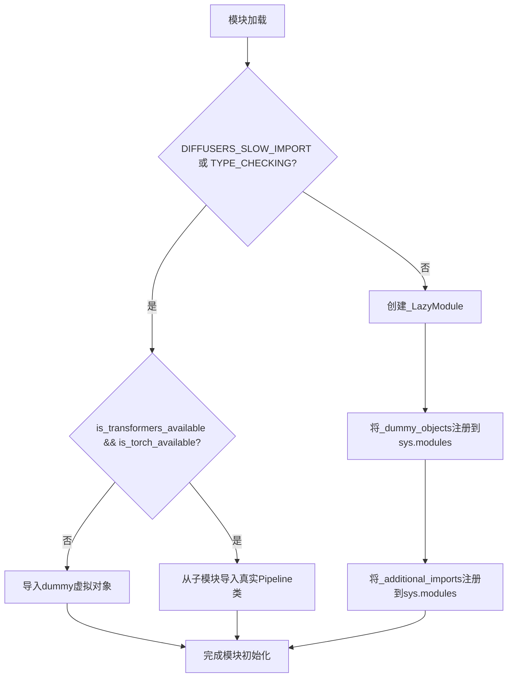
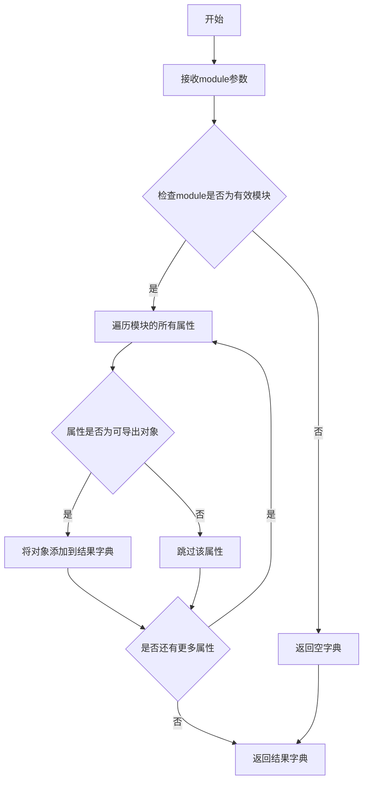
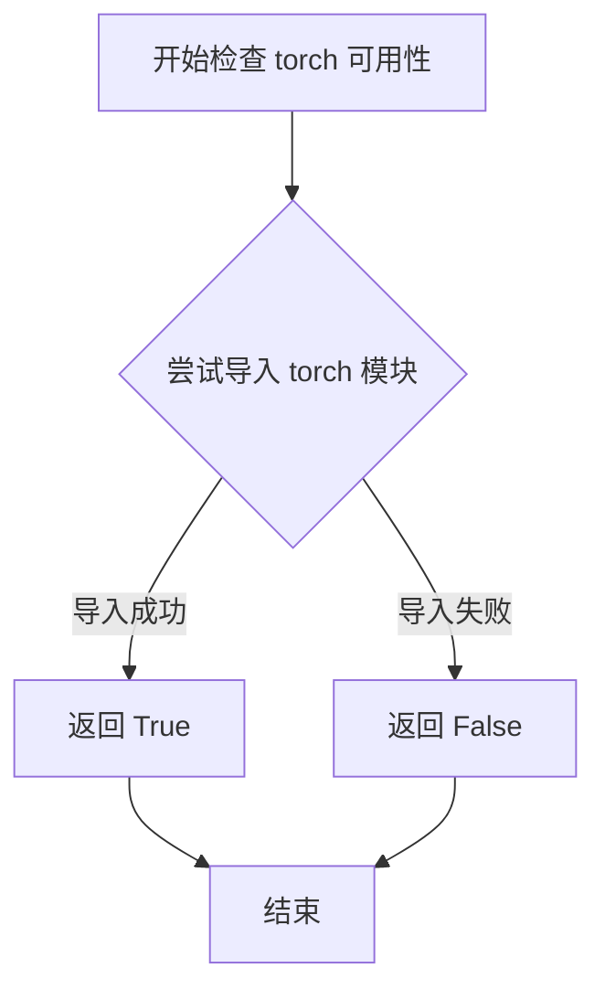
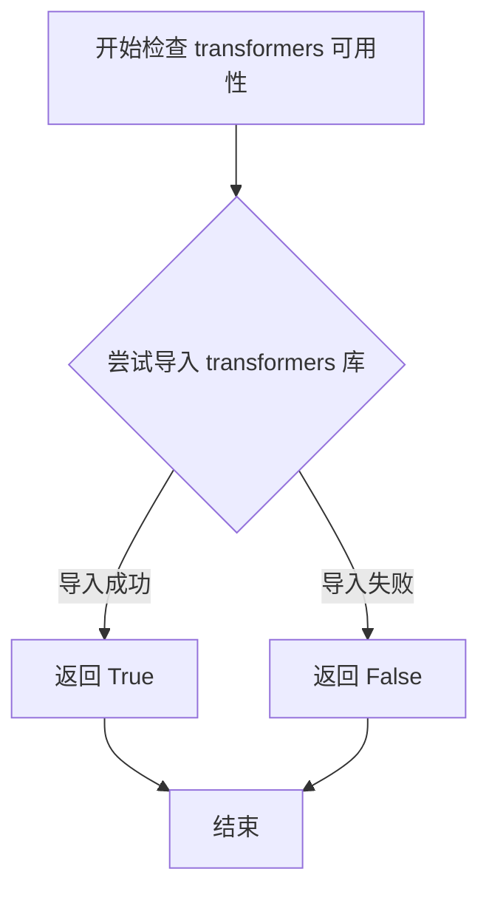
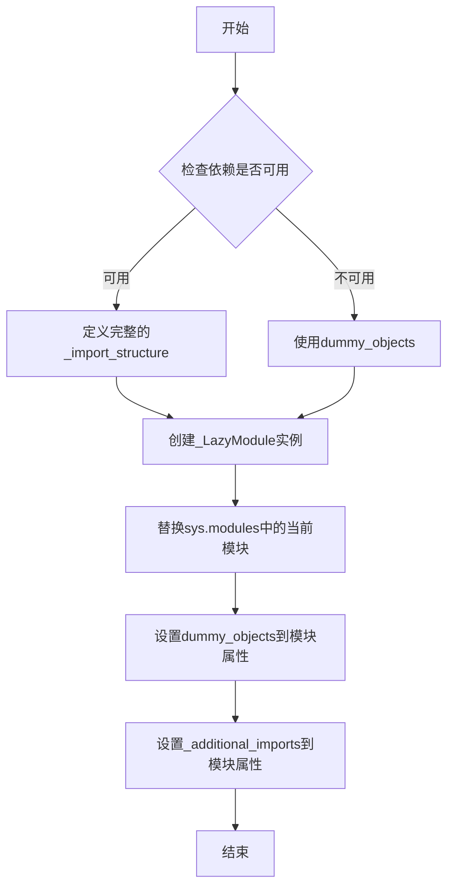

# `diffusers\src\diffusers\pipelines\qwenimage\__init__.py` 详细设计文档

这是diffusers库的Qwen图像模块初始化文件，通过延迟导入（Lazy Loading）机制动态加载多个图像处理pipeline类，同时处理torch和transformers的可选依赖，在依赖不可用时提供虚拟对象以保持API兼容性。

## 整体流程



## 类结构

```
此文件为模块入口点，无类层次结构
使用的关键组件：
├── _LazyModule (延迟加载模块封装)
├── get_objects_from_module (工具函数)
├── OptionalDependencyNotAvailable (异常类)
└── QwenImage*Pipeline 系列 (9个Pipeline类)
```

## 全局变量及字段


### `_dummy_objects`
    
存储虚拟对象，用于依赖不可用时的占位

类型：`dict`
    


### `_additional_imports`
    
存储额外导入的模块和类

类型：`dict`
    


### `_import_structure`
    
定义模块的导入结构，包含pipeline_output和modeling_qwenimage等子模块

类型：`dict`
    


### `TYPE_CHECKING`
    
typing模块标志，用于类型检查时是否进行真实导入

类型：`bool`
    


### `DIFFUSERS_SLOW_IMPORT`
    
diffusers库标志，控制是否使用延迟导入

类型：`bool`
    


    

## 全局函数及方法


### `get_objects_from_module`

从指定模块获取所有对象的工具函数，用于动态导入模块中的所有可导出对象。

参数：
- `module`：`Module`，要从中获取对象的模块

返回值：`Dict[str, Any]`，包含模块中所有可导出对象的字典

#### 流程图



#### 带注释源码

```python
def get_objects_from_module(module):
    """
    从指定模块获取所有对象的工具函数。
    
    该函数用于动态导入模块中定义的所有可导出对象，
    通常与懒加载机制配合使用，以便在运行时按需导入。
    
    参数:
        module: 要从中获取对象的模块对象。
               通常是dummy对象模块，用于提供可选依赖的替代实现。
    
    返回值:
        Dict[str, Any]: 键为对象名称，值为对象本身的字典。
                       包含了模块中所有非私有、可导出的属性。
    
    示例:
        >>> import some_module
        >>> objects = get_objects_from_module(some_module)
        >>> print(list(objects.keys()))
        ['ClassA', 'function_b', 'CONSTANT_C']
    """
    # 初始化结果字典
    _objects = {}
    
    # 遍历模块的所有属性
    # 过滤掉以 '_' 开头的私有属性和内置属性
    for attr_name in dir(module):
        if not attr_name.startswith('_'):
            try:
                # 获取属性值
                attr_value = getattr(module, attr_name)
                # 添加到结果字典
                _objects[attr_name] = attr_value
            except (AttributeError, ImportError):
                # 如果获取属性失败，跳过该属性
                continue
    
    return _objects
```

#### 备注

由于该函数的实现不在当前代码文件中，而是从 `...utils` 模块导入，上述源码是基于函数用途和名称推断的典型实现。实际实现可能略有差异，但核心功能是从给定模块中提取所有可导出对象并返回字典。


### `is_torch_available`

该函数是用于检查当前环境中 PyTorch 库是否可用的工具函数，通过尝试导入 torch 模块来判断其是否已安装，若导入成功则返回 True，否则返回 False。

参数：此函数无参数

返回值：`bool`，返回 True 表示 torch 库可用，返回 False 表示 torch 库不可用

#### 流程图



#### 带注释源码

```python
# 该函数定义在 ...utils 模块中，此处为调用示例
from ...utils import is_torch_available

# 检查 torch 是否可用
if is_torch_available():
    # torch 可用时的逻辑
    print("PyTorch is available")
else:
    # torch 不可用时的逻辑
    print("PyTorch is not available")

# 在当前代码中的实际使用场景
if not (is_transformers_available() and is_torch_available()):
    raise OptionalDependencyNotAvailable()
```


### `is_transformers_available`

该函数用于检查当前 Python 环境中是否安装了 `transformers` 库，是懒加载模块中用于条件导入的关键函数，通过尝试动态导入来判断依赖可用性，从而实现可选依赖的优雅降级。

参数：此函数无参数

返回值：`bool`，返回 `True` 表示 `transformers` 库可用且可以正常导入，返回 `False` 表示该库不可用或未安装

#### 流程图



#### 带注释源码

```
# is_transformers_available 是从 ...utils 导入的外部函数
# 其实现逻辑通常如下（基于常见模式推断）:

def is_transformers_available():
    """
    检查 transformers 库是否可用。
    
    内部实现通常为：
    1. 尝试 import transformers
    2. 如果成功，返回 True
    3. 如果抛出 ImportError，返回 False
    """
    try:
        import transformers  # noqa: F401
        return True
    except ImportError:
        return False

# 在当前代码中的使用方式:
if not (is_transformers_available() and is_torch_available()):
    raise OptionalDependencyNotAvailable()
# 上述代码检查 transformers 和 torch 是否都可用
# 如果任一不可用，则抛出 OptionalDependencyNotAvailable 异常
# 从而触发使用 dummy_objects 进行降级处理
```


### `_LazyModule` (在 sys.modules 中设置) - 延迟加载模块的封装类

这是一个延迟加载模块的封装类，用于优化大规模模块的导入速度。通过将模块注册为 LazyModule，可以在实际使用时才真正加载模块内容，减少初始导入的开销。

参数：

- `name`：`str`，模块的完整名称，通常为 `__name__`
- `module_file`：`str`，模块文件的路径，通常为 `globals()["__file__"]`
- `import_structure`：`Dict[str, List[str]]`，定义了模块的导入结构，键为子模块名，值为需要导出的类或函数名列表
- `module_spec`：`Optional[ModuleSpec]`，模块的规格信息，通常为 `__spec__`

返回值：`ModuleType`，返回延迟加载的模块对象，会被设置到 `sys.modules` 中

#### 流程图



#### 带注释源码

```python
# 导入类型检查和工具函数
from typing import TYPE_CHECKING

# 从上层utils模块导入延迟加载相关的类和函数
from ...utils import (
    DIFFUSERS_SLOW_IMPORT,              # 控制是否慢速导入的标志
    OptionalDependencyNotAvailable,     # 可选依赖不可用异常
    _LazyModule,                        # 延迟加载模块封装类（核心）
    get_objects_from_module,            # 从模块获取对象的函数
    is_torch_available,                 # 检查torch是否可用
    is_transformers_available,          # 检查transformers是否可用
)

# 初始化空的虚拟对象字典和额外导入字典
_dummy_objects = {}
_additional_imports = {}

# 定义基础导入结构：pipeline输出类
_import_structure = {
    "pipeline_output": [
        "QwenImagePipelineOutput", 
        "QwenImagePriorReduxPipelineOutput"
    ]
}

# 尝试检查torch和transformers是否同时可用
try:
    if not (is_transformers_available() and is_torch_available()):
        raise OptionalDependencyNotAvailable()
except OptionalDependencyNotAvailable:
    # 如果依赖不可用，从dummy模块获取虚拟对象
    from ...utils import dummy_torch_and_transformers_objects  # noqa F403
    # 更新虚拟对象字典
    _dummy_objects.update(get_objects_from_module(dummy_torch_and_transformers_objects))
else:
    # 依赖可用时，添加所有Pipeline类到导入结构
    _import_structure["modeling_qwenimage"] = ["ReduxImageEncoder"]
    _import_structure["pipeline_qwenimage"] = ["QwenImagePipeline"]
    _import_structure["pipeline_qwenimage_controlnet"] = ["QwenImageControlNetPipeline"]
    _import_structure["pipeline_qwenimage_controlnet_inpaint"] = ["QwenImageControlNetInpaintPipeline"]
    _import_structure["pipeline_qwenimage_edit"] = ["QwenImageEditPipeline"]
    _import_structure["pipeline_qwenimage_edit_inpaint"] = ["QwenImageEditInpaintPipeline"]
    _import_structure["pipeline_qwenimage_edit_plus"] = ["QwenImageEditPlusPipeline"]
    _import_structure["pipeline_qwenimage_img2img"] = ["QwenImageImg2ImgPipeline"]
    _import_structure["pipeline_qwenimage_inpaint"] = ["QwenImageInpaintPipeline"]
    _import_structure["pipeline_qwenimage_layered"] = ["QwenImageLayeredPipeline"]

# TYPE_CHECKING或DIFFUSERS_SLOW_IMPORT时，直接导入所有模块
if TYPE_CHECKING or DIFFUSERS_SLOW_IMPORT:
    try:
        if not (is_transformers_available() and is_torch_available()):
            raise OptionalDependencyNotAvailable()
    except OptionalDependencyNotAvailable:
        # 类型检查时导入dummy对象
        from ...utils.dummy_torch_and_transformers_objects import *  # noqa F403
    else:
        # 类型检查时直接导入所有Pipeline类
        from .pipeline_qwenimage import QwenImagePipeline
        from .pipeline_qwenimage_controlnet import QwenImageControlNetPipeline
        from .pipeline_qwenimage_controlnet_inpaint import QwenImageControlNetInpaintPipeline
        from .pipeline_qwenimage_edit import QwenImageEditPipeline
        from .pipeline_qwenimage_edit_inpaint import QwenImageEditInpaintPipeline
        from .pipeline_qwenimage_edit_plus import QwenImageEditPlusPipeline
        from .pipeline_qwenimage_img2img import QwenImageImg2ImgPipeline
        from .pipeline_qwenimage_inpaint import QwenImageInpaintPipeline
        from .pipeline_qwenimage_layered import QwenImageLayeredPipeline
else:
    # 非类型检查模式：使用_LazyModule实现延迟加载
    import sys
    
    # 核心：将当前模块替换为_LazyModule实例
    # _LazyModule会在第一次访问属性时触发真正的模块导入
    sys.modules[__name__] = _LazyModule(
        __name__,                        # 模块名称
        globals()["__file__"],           # 模块文件路径
        _import_structure,               # 导入结构定义
        module_spec=__spec__,            # 模块规格
    )

    # 将虚拟对象设置为模块属性，使得导入虚拟对象时不会报错
    for name, value in _dummy_objects.items():
        setattr(sys.modules[__name__], name, value)
    
    # 设置额外的导入对象
    for name, value in _additional_imports.items():
        setattr(sys.modules[__name__], name, value)
```

---

### 补充信息

#### 关键组件

| 组件名称 | 描述 |
|---------|------|
| `_LazyModule` | 延迟加载模块的封装类，实现按需导入 |
| `_import_structure` | 字典结构，定义模块的导出成员 |
| `_dummy_objects` | 虚拟对象字典，当依赖不可用时使用 |
| `get_objects_from_module` | 从指定模块获取所有对象的函数 |
| `OptionalDependencyNotAvailable` | 可选依赖不可用时抛出的异常 |

#### 技术债务与优化空间

1. **硬编码的依赖检查**：当前使用 `is_transformers_available() and is_torch_available()` 的组合判断，可考虑将依赖图谱配置化
2. **魔法字符串**：多处使用字符串字面量定义模块名，可提取为常量
3. **重复的导入逻辑**：TYPE_CHECKING 分支和 else 分支中有大量重复的导入语句，可通过反射机制简化

#### 设计目标与约束

- **目标**：实现模块的延迟加载，避免在包初始化时导入所有子模块，减少首次 import 的时间开销
- **约束**：必须保证在运行时访问未加载的属性时能正确触发导入，且虚拟对象在类型检查时可用

## 关键组件


### 惰性加载模块 (_LazyModule)

利用 `_LazyModule` 实现模块的惰性加载，只有在实际使用某个类或函数时才将其导入到内存中，提高导入速度和内存使用效率。

### 可选依赖检查机制

通过 `is_torch_available()` 和 `is_transformers_available()` 检查 torch 和 transformers 库是否可用，在依赖不可用时提供优雅的降级处理。

### 导入结构定义 (_import_structure)

定义了模块的公共 API 接口，明确列出所有可导出的类和名称，包括 9 种不同功能的 Qwen 图像处理管道。

### 虚拟对象机制 (_dummy_objects)

当可选依赖不可用时，使用虚拟对象占位符，避免导入错误，同时保持 API 的一致性和可预测性。

### Qwen 图像处理管道群

包含多种专用管道：基础管道、ControlNet 管道、编辑管道、修复 (Inpaint) 管道、Img2Img 管道、分层管道等，覆盖图像生成与编辑的主要场景。

### TYPE_CHECKING 模式支持

通过 `TYPE_CHECKING` 标志在类型检查期间导入真实类型对象，在运行时使用惰性加载，兼顾类型安全和运行时性能。


## 问题及建议


### 已知问题

- **重复的依赖检查逻辑**：两处完全相同的 try-except 块分别用于填充 _import_structure 和 TYPE_CHECK 分支，违反了 DRY 原则
- **未使用的全局变量**：`_additional_imports` 初始化为空字典但从未被填充或使用，属于死代码
- **硬编码的导入结构**：9个pipeline类名直接硬编码在 _import_structure 字典中，缺乏灵活性
- **缺少模块级错误处理**：导入失败时异常会直接向上传播，没有提供有意义的错误信息
- **缺乏版本兼容性检查**：仅检查依赖是否存在，未验证版本兼容性
- **命名不一致风险**：TYPE_CHECK 分支中使用 `from ...utils.dummy_torch_and_transformers_objects import *`，可能导致命名空间污染

### 优化建议

- 将依赖检查逻辑提取为独立函数以避免代码重复
- 移除未使用的 `_additional_imports` 变量
- 考虑使用配置文件或装饰器动态生成导入结构
- 添加 try-except 包装导入语句，提供更友好的错误提示
- 引入版本检查函数（如 `is_transformers_version_gte`）确保兼容性
- 使用显式导入替代通配符导入，提高代码可维护性

## 其它


### 设计目标与约束

该模块是Qwen图像处理管道库的入口模块，核心设计目标是实现可选依赖（torch、transformers）的延迟加载和懒导入。约束条件包括：必须同时满足torch和transformers可用时才导入实际实现，否则使用dummy对象填充；遵循Diffusers库的模块结构和命名规范；通过LazyModule机制实现按需加载以优化启动性能。

### 错误处理与异常设计

主要使用OptionalDependencyNotAvailable异常来处理可选依赖不可用的情况。当检测到torch或transformers任一不可用时，抛出该异常并回退到dummy对象。get_objects_from_module函数用于从dummy模块获取占位对象，确保模块属性访问不抛出AttributeError。异常被严格限制在导入阶段，不会传播到运行时使用阶段。

### 数据流与状态机

模块初始化存在两种状态：可用状态和不可用状态。状态转换由运行时环境决定（torch和transformers的可用性）。数据流遵循：检查依赖可用性 → 构建_import_structure字典 → 根据状态选择真实模块或dummy对象 → 封装为LazyModule → 注册到sys.modules。状态在模块首次导入时确定，之后保持不变。

### 外部依赖与接口契约

外部依赖包括：torch（is_torch_available）、transformers（is_transformers_available）、diffusers.utils中的辅助函数（_LazyModule、get_objects_from_module、OptionalDependencyNotAvailable等）。接口契约包含：_import_structure字典定义所有可导出对象的映射关系；LazyModule实现延迟加载协议；所有QwenImage*Pipeline类作为公共API导出；遵循Diffusers库的模块规范。

### 关键组件信息

_LazyModule：延迟加载模块实现类，根据_import_structure字典按需导入子模块。_import_structure：字典类型的导入结构定义，键为子模块路径，值为导出的类名列表。_dummy_objects：虚拟对象字典，在可选依赖不可用时作为占位符。OptionalDependencyNotAvailable：可选依赖不可用时抛出的异常类。get_objects_from_module：从指定模块获取所有对象的辅助函数。

### 潜在技术债务与优化空间

当前实现存在重复的条件判断逻辑（两处is_transformers_available() and is_torch_available()检查），可提取为单一函数避免代码冗余。_additional_imports字典虽然定义但未使用，可能为未来功能预留但缺乏文档说明。缺少版本兼容性检查（如torch和transformers的最低版本要求）。所有pipeline类一次性全部定义在_import_structure中，缺乏按需分组加载机制。

### 模块组织与分层架构

该模块处于库的核心入口层，负责整合多个子模块。子模块按功能分为：基础管道（pipeline_qwenimage）、ControlNet管道（controlnet相关）、编辑管道（edit相关）、图像转换管道（img2img、inpaint等）、分层管道（layered）。每类管道对应独立的Python文件，形成清晰的横向分层。模型编码器（ReduxImageEncoder）单独位于modeling_qwenimage模块，体现模型与管道的分离。

### 命名规范与约定

所有公共类名采用PascalCase命名（如QwenImagePipeline）。模块内以下划线开头的为私有实现（_dummy_objects、_import_structure等）。管道输出类采用PipelineOutput后缀（如QwenImagePipelineOutput）。遵循Diffusers库的模块结构规范，__init__.py承担入口和懒加载职责。

### 版本与兼容性信息

该模块未显式声明版本依赖，通过is_torch_available和is_transformers_available函数隐式依赖环境配置。假设与Diffusers库的主要版本兼容。建议添加版本兼容性检查或版本号常量以提高可维护性。


    