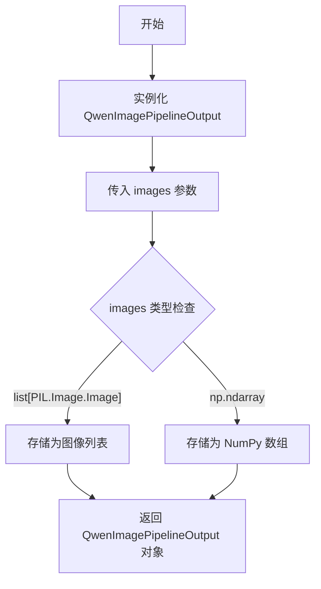
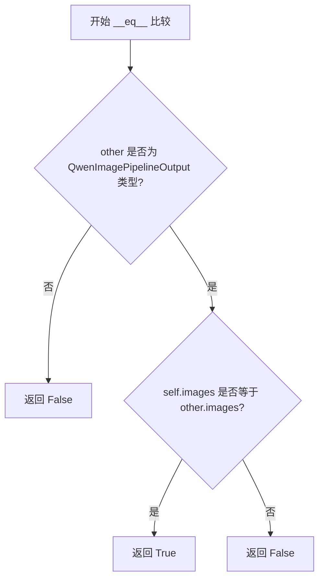

# `diffusers\src\diffusers\pipelines\qwenimage\pipeline_output.py` 详细设计文档

这是一个用于封装图像生成管道输出的数据类，主要用于 Stable Diffusion 系列模型（如 Qwen2 等）的推理结果返回，支持返回 PIL 图像列表或 NumPy 数组格式的图像数据。

## 整体流程



## 类结构

```
BaseOutput (抽象基类)
└── QwenImagePipelineOutput (数据输出类)
```

## 全局变量及字段


### `QwenImagePipelineOutput.images`
    
去噪后的图像列表或 NumPy 数组，形状为 (batch_size, height, width, num_channels)

类型：`list[PIL.Image.Image] | np.ndarray`
    
    

## 全局函数及方法


### QwenImagePipelineOutput.__init__

自动生成的 dataclass 初始化方法，用于初始化 QwenImagePipelineOutput 对象，该类用于存储扩散 pipeline 的输出结果（去噪后的图像）。

参数：

- `images`：`list[PIL.Image.Image] | np.ndarray`，去噪后的 PIL 图像列表（长度为 batch_size）或 numpy 数组，形状为 `(batch_size, height, width, num_channels)`

返回值：`None`，dataclass 的 `__init__` 方法不返回任何值

#### 流程图

```mermaid
flowchart TD
    A[开始 __init__] --> B{检查 images 参数类型}
    B -->|list[PIL.Image.Image]| C[接收 PIL 图像列表]
    B -->|np.ndarray| D[接收 numpy 数组]
    C --> E[初始化 self.images = images]
    D --> E
    E --> F[继承 BaseOutput 初始化]
    F --> G[返回实例对象]
    
    style A fill:#f9f,stroke:#333
    style G fill:#9f9,stroke:#333
```

#### 带注释源码

```python
from dataclasses import dataclass

import numpy as np
import PIL.Image

from ...utils import BaseOutput


@dataclass
class QwenImagePipelineOutput(BaseOutput):
    """
    Output class for Stable Diffusion pipelines.

    Args:
        images (`list[PIL.Image.Image]` or `np.ndarray`)
            list of denoised PIL images of length `batch_size` or numpy array of shape `(batch_size, height, width,
            num_channels)`. PIL images or numpy array present the denoised images of the diffusion pipeline.
    """

    images: list[PIL.Image.Image] | np.ndarray
    
    # 自动生成的 __init__ 方法等效于:
    # def __init__(self, images: list[PIL.Image.Image] | np.ndarray) -> None:
    #     self.images = images
    #     super().__init__()
```

---

### 补充信息

#### 类字段详情

| 字段名称 | 类型 | 描述 |
|---------|------|------|
| `images` | `list[PIL.Image.Image] \| np.ndarray` | 去噪后的图像，可为 PIL 图像列表或 numpy 数组 |

#### 关键组件

- **BaseOutput**：基类，可能包含通用输出属性
- **PIL.Image**：Python Imaging Library，用于处理图像
- **numpy**：用于数值计算和数组操作

#### 技术债务与优化空间

1. **类型提示**：使用 `|` 联合类型语法（Python 3.10+），可能影响兼容性
2. **文档描述**：类文档字符串提到 "Stable Diffusion pipelines"，但类名是 "QwenImage"，存在命名不一致
3. **验证缺失**：未对 `images` 参数进行类型或格式验证
4. **批量大小限制**：未明确说明支持的 batch_size 范围

#### 设计约束

- 必须与 BaseOutput 兼容
- 支持两种图像格式以提供灵活性
- 作为数据类，需要保持字段的不可变性（除非使用 `frozen=False`）


### `QwenImagePipelineOutput.__repr__`

自动生成的字符串表示方法，用于返回 QwenImagePipelineOutput 对象的可读字符串描述。

参数：
- 无参数（继承自 object 的方法）

返回值：`str`，返回对象的字符串表示，包含类名和所有字段的名称及值

#### 流程图

```mermaid
flowchart TD
    A[调用 __repr__ 方法] --> B{是否继承自 dataclass}
    B -->|是| C[dataclass 自动生成 __repr__]
    B -->|否| D[使用 object 默认实现]
    C --> E[返回格式: QwenImagePipelineOutput(images=值)]
    D --> F[返回类名和内存地址]
    E --> G[结束]
    F --> G
```

#### 带注释源码

```python
# 由于 QwenImagePipelineOutput 使用了 @dataclass 装饰器
# Python 会自动为该类生成 __repr__ 方法
# 该方法返回格式如: QwenImagePipelineOutput(images=[...])

# 自动生成的 repr 方法等效于以下实现:
def __repr__(self):
    """
    自动生成的字符串表示方法。
    返回包含类名和所有字段信息的字符串。
    
    Returns:
        str: 对象的标准字符串表示，格式为 'ClassName(field1=value1, field2=value2, ...)'
    """
    # dataclass 自动生成的 repr 逻辑
    return f"QwenImagePipelineOutput(images={self.images!r})"

# 实际使用时，直接打印对象即可调用此方法:
# output = QwenImagePipelineOutput(images=[img1, img2])
# print(output)  # 输出: QwenImagePipelineOutput(images=[<PIL.Image.Image image mode=RGB size=...>, ...])
```


### `QwenImagePipelineOutput.__eq__`

自动生成的相等比较方法，用于比较两个 `QwenImagePipelineOutput` 实例是否相等。基于 dataclass 的特性，比较会基于所有字段（`images`）的值进行。

参数：

- `self`：`QwenImagePipelineOutput`，当前对象实例
- `other`：`Any`，要与之比较的其他对象

返回值：`bool`，如果两个对象的 `images` 字段值相等则返回 `True`，否则返回 `False`

#### 流程图



#### 带注释源码

```python
# 由于 @dataclass 装饰器的作用，Python 自动生成 __eq__ 方法
# 源码为隐式生成，等价于以下实现：

def __eq__(self, other: object) -> bool:
    """
    比较两个 QwenImagePipelineOutput 实例是否相等。
    
    Args:
        other: 要比较的其他对象
        
    Returns:
        bool: 如果两者相等返回 True，否则返回 False
    """
    # 检查 other 是否为同一类型
    if not isinstance(other, QwenImagePipelineOutput):
        return NotImplemented
    
    # 比较 images 字段是否相等
    # 对于 list[PIL.Image.Image]，比较引用或内容
    # 对于 np.ndarray，使用 numpy 的数组比较
    return self.images == other.images
```

#### 补充说明

由于 `QwenImagePipelineOutput` 使用了 `@dataclass` 装饰器，Python 会自动为其生成以下特殊方法：

- `__init__`：初始化方法
- `__repr__`：字符串表示
- `__eq__`：相等比较（当前方法）
- `__hash__`：哈希值（如果 frozen=True）

默认的 `__eq__` 实现会比较所有字段（`images`）的值是否相等。比较行为取决于 `images` 的类型：
- 如果是 `list[PIL.Image.Image]`：比较列表元素
- 如果是 `np.ndarray`：使用 NumPy 的数组比较（逐元素比较）


## 关键组件


### QwenImagePipelineOutput

数据类，继承自BaseOutput，用于封装图像管道（pipeline）的输出结果。

### images 字段

类型为 `list[PIL.Image.Image] | np.ndarray`，存储去噪后的PIL图像列表或numpy数组，表示扩散管道生成的图像结果。

### BaseOutput 基类

基础输出类，定义在 `...utils` 模块中，提供输出数据结构的标准接口。


## 问题及建议


### 已知问题

-   **文档字符串过时/错误**：注释中写的是"Stable Diffusion pipelines"，但类名是`QwenImagePipelineOutput`，这会导致文档与实际功能不符
-   **类型注解兼容性问题**：使用`list[PIL.Image.Image] | np.ndarray`语法（Python 3.10+），如果项目需要支持更低版本Python会导致兼容性问题
-   **缺少数据验证**：对`images`字段没有任何验证逻辑，无法确保输入数据的有效性（如numpy数组的shape、dtype、通道数等）
-   **缺少类型细粒度约束**：numpy数组的形状和数据类型没有明确约束，可能导致运行时错误
-   **文档参数描述不完整**：Args部分只描述了数据类型，缺少对`batch_size`等参数的更详细说明

### 优化建议

-   **修正文档字符串**：将"Stable Diffusion pipelines"改为"Qwen Image pipelines"或更准确的描述
-   **兼容旧版Python**：使用`from __future__ import annotations`或改用`Union`类型以支持Python 3.9
-   **添加数据验证**：在`__post_init__`方法中添加对`images`类型的验证，确保是list或np.ndarray
-   **增强类型约束**：对numpy数组添加shape和dtype的约束或验证逻辑
-   **扩展文档**：完善Args部分，增加对不同输入类型的详细说明和使用场景
-   **考虑添加元数据字段**：如添加`num_inference_steps`、`guidance_scale`等推理参数字段


## 其它


### 设计目标与约束

本代码的设计目标是定义图像管道的输出格式，支持批量返回去噪后的图像结果。约束条件包括：images字段必须为PIL.Image列表或numpy数组，且需要与BaseOutput基类兼容。该类作为数据容器，不包含业务逻辑。

### 错误处理与异常设计

当前代码未包含显式的错误处理逻辑。作为数据类，其错误处理主要依赖调用方的输入验证。建议调用方在构造该输出对象时确保images参数类型正确（PIL.Image.Image列表或np.ndarray），避免传入不支持的类型导致后续处理失败。

### 外部依赖与接口契约

本类依赖以下外部组件：1) BaseOutput基类 - 定义基础输出接口；2) PIL.Image - 图像处理库；3) numpy - 数值计算库。接口契约要求images参数为list[PIL.Image.Image]或np.ndarray类型，调用方需确保数据格式符合要求。

### 性能考量

由于仅作为数据容器使用，当前实现性能开销极低。若images为numpy数组，可利用向量化操作提升后续处理效率。建议在大批量图像处理场景下优先使用numpy数组格式以获得更好的内存和计算性能。

### 安全性考虑

当前代码不涉及敏感数据处理或用户输入验证，安全性风险较低。但需注意在多进程或分布式环境下传输numpy数组时的序列化开销，以及PIL图像对象可能包含的元数据安全问题。

### 版本兼容性

代码使用了Python 3.10+的联合类型语法（`|`运算符），需要Python 3.10及以上版本。numpy和PIL版本需与项目其他部分保持一致，暂无特殊版本要求。

### 测试策略

建议针对该类编写单元测试，验证：1) 不同类型images参数的构造；2) 与BaseOutput基类的兼容性；3) 数据序列化/反序列化能力；4) 类型提示的正确性。

### 配置管理

该类作为纯数据容器，不涉及配置管理。所有参数通过构造函数传入，由调用方负责参数准备和配置。

### 文档维护

类文档字符串已说明用途和参数含义，但可补充更多使用示例。当前文档引用了"Stable Diffusion pipelines"，实际类名为"QwenImagePipelineOutput"，存在命名不一致问题，建议统一命名或更新文档说明。


    