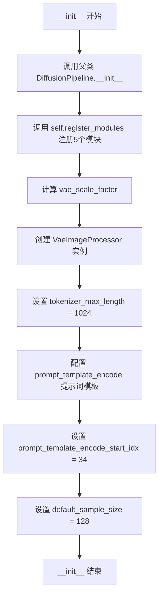
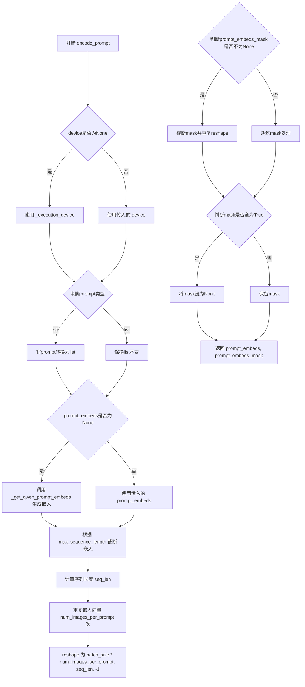
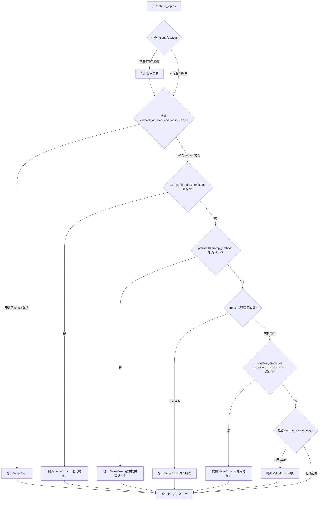
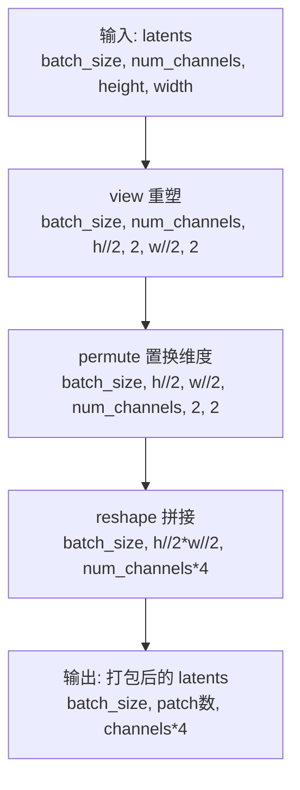
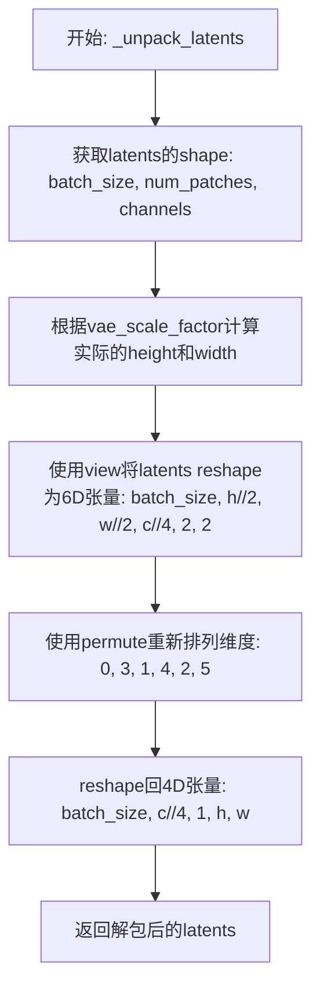
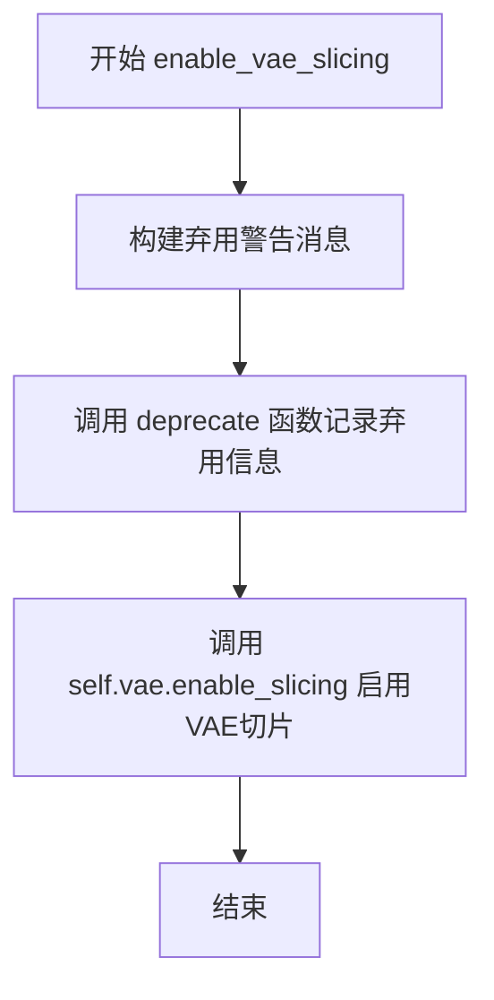
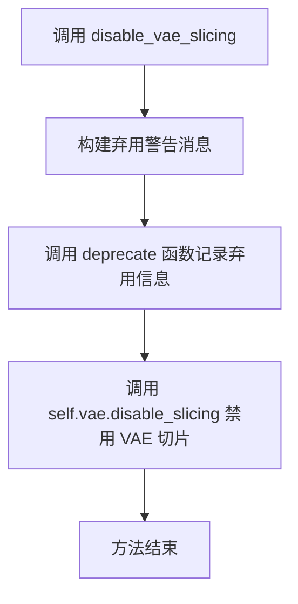
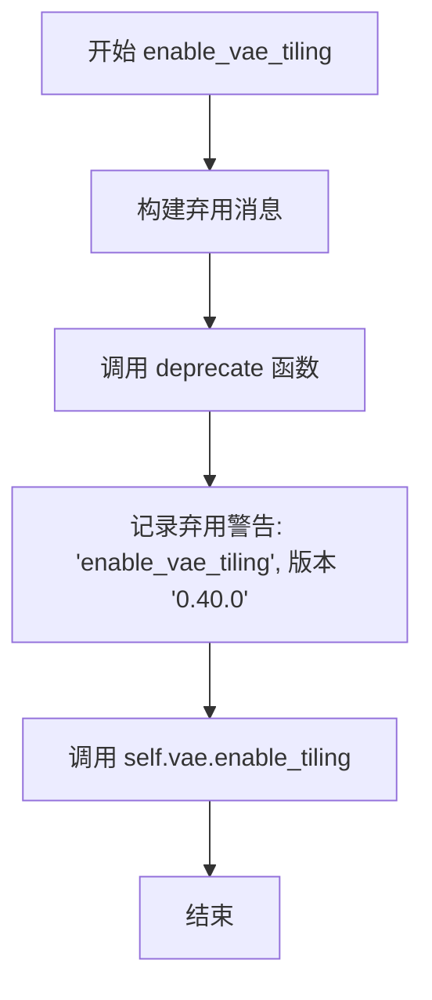
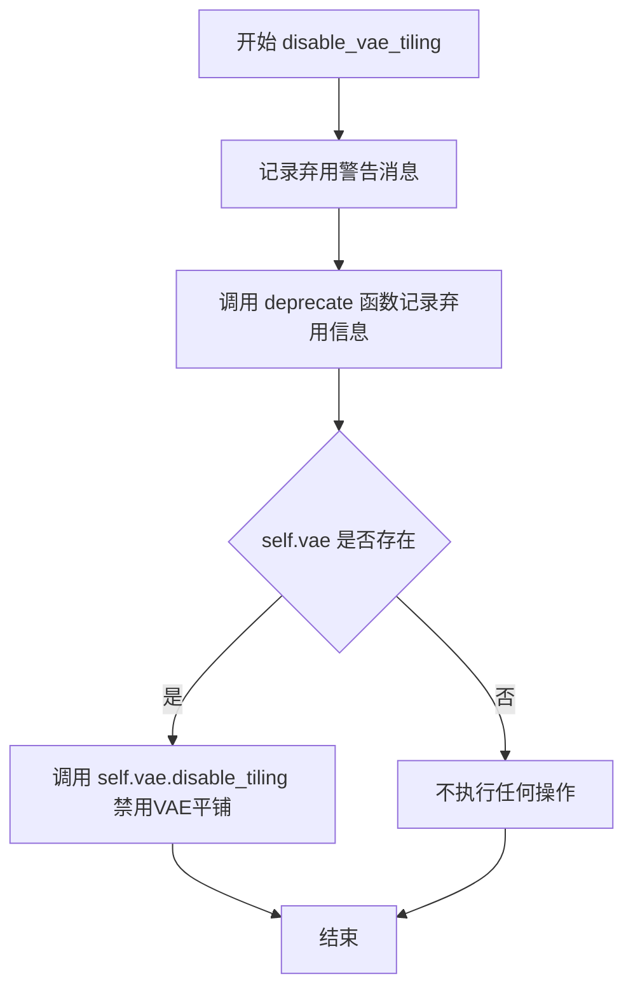

# `diffusers\src\diffusers\pipelines\qwenimage\pipeline_qwenimage.py` 详细设计文档

这是一个基于Qwen2.5-VL模型的条件图像生成扩散管道（Diffusion Pipeline），通过接收文本提示（prompt）并利用Transformer架构进行去噪处理，结合VAE（变分自编码器）进行图像的编码与解码，最终生成与文本描述相匹配的图像。该管道支持Classifier-Free Guidance（CFG）引导、VAE切片和平铺解码、LoRA加载等高级功能，并使用Flow Match Euler离散调度器进行时间步采样。

## 整体流程

```mermaid
graph TD
A[开始: 接收prompt和参数] --> B[check_inputs: 验证输入参数]
B --> C[encode_prompt: 编码prompt为文本嵌入]
C --> D{是否启用true_cfg}
D -- 是 --> E[encode_prompt: 编码negative_prompt]
D -- 否 --> F[prepare_latents: 准备潜在变量]
E --> F
F --> G[calculate_shift: 计算mu值用于时间步偏移]
G --> H[retrieve_timesteps: 从调度器获取时间步]
H --> I[初始化guidance_embeds]
I --> J{迭代 timesteps}
J -->|每次迭代| K[transformer前向传播: 预测噪声]
K --> L{是否启用true_cfg}
L -- 是 --> M[执行uncond前向传播]
M --> N[计算comb_pred: neg_noise_pred + true_cfg_scale * (noise_pred - neg_noise_pred)]
L -- 否 --> O[scheduler.step: 更新latents]
N --> O
O --> P{callback_on_step_end?}
P -- 是 --> Q[执行回调函数]
P -- 否 --> J
J -->|迭代结束| R{output_type == 'latent'}
R -- 是 --> S[直接返回latents]
R -- 否 --> T[_unpack_latents: 解包潜在变量]
T --> U[VAE decode: 解码为图像]
U --> V[image_processor postprocess: 后处理]
V --> W[maybe_free_model_hooks: 释放模型]
W --> X[返回QwenImagePipelineOutput或tuple]
```

## 类结构

```
DiffusionPipeline (基类)
├── QwenImageLoraLoaderMixin (Mixin类)
└── QwenImagePipeline
```

## 全局变量及字段


### `XLA_AVAILABLE`
    
是否支持PyTorch XLA

类型：`bool`
    


### `logger`
    
模块级日志记录器

类型：`logging.Logger`
    


### `EXAMPLE_DOC_STRING`
    
示例文档字符串，包含pipeline调用示例代码

类型：`str`
    


### `QwenImagePipeline.model_cpu_offload_seq`
    
模型CPU卸载顺序，指定text_encoder->transformer->vae的卸载顺序

类型：`str`
    


### `QwenImagePipeline._callback_tensor_inputs`
    
回调张量输入列表，定义哪些张量可传递给回调函数

类型：`list`
    


### `QwenImagePipeline.scheduler`
    
扩散调度器，用于控制去噪过程的时间步调度

类型：`FlowMatchEulerDiscreteScheduler`
    


### `QwenImagePipeline.vae`
    
VAE模型，用于图像编码和解码

类型：`AutoencoderKLQwenImage`
    


### `QwenImagePipeline.text_encoder`
    
文本编码器，将文本prompt编码为嵌入向量

类型：`Qwen2_5_VLForConditionalGeneration`
    


### `QwenImagePipeline.tokenizer`
    
分词器，将文本转换为token序列

类型：`Qwen2Tokenizer`
    


### `QwenImagePipeline.transformer`
    
去噪Transformer，主干网络用于逐步去噪潜在表示

类型：`QwenImageTransformer2DModel`
    


### `QwenImagePipeline.vae_scale_factor`
    
VAE缩放因子，用于计算潜在空间的尺寸

类型：`int`
    


### `QwenImagePipeline.image_processor`
    
图像处理器，用于VAE编码前和解码后的图像预处理与后处理

类型：`VaeImageProcessor`
    


### `QwenImagePipeline.tokenizer_max_length`
    
分词器最大长度，默认1024

类型：`int`
    


### `QwenImagePipeline.prompt_template_encode`
    
prompt编码模板，用于格式化输入prompt

类型：`str`
    


### `QwenImagePipeline.prompt_template_encode_start_idx`
    
prompt模板编码起始索引，用于跳过模板前缀

类型：`int`
    


### `QwenImagePipeline.default_sample_size`
    
默认采样尺寸，用于生成图像的默认高度和宽度

类型：`int`
    


### `QwenImagePipeline._guidance_scale`
    
引导比例（运行时属性），用于引导蒸馏模型的guidance_scale参数

类型：`float`
    


### `QwenImagePipeline._attention_kwargs`
    
注意力参数（运行时属性），传递给AttentionProcessor的字典

类型：`dict`
    


### `QwenImagePipeline._num_timesteps`
    
时间步数量（运行时属性），记录推理过程中的总时间步数

类型：`int`
    


### `QwenImagePipeline._current_timestep`
    
当前时间步（运行时属性），记录当前去噪步骤的时间步

类型：`int`
    


### `QwenImagePipeline._interrupt`
    
中断标志（运行时属性），用于中断去噪循环

类型：`bool`
    
    

## 全局函数及方法


### `calculate_shift`

该函数通过线性插值算法，根据输入的图像序列长度计算Flow Match调度器的时间步偏移mu值，用于调整不同分辨率图像的采样策略。

参数：

- `image_seq_len`：`int`，输入图像的序列长度（即latent token数量）
- `base_seq_len`：`int`（默认值256），基础序列长度，用于线性插值的基准点
- `max_seq_len`：`int`（默认值4096），最大序列长度，用于线性插值的另一个基准点
- `base_shift`：`float`（默认值0.5），基础偏移量，对应base_seq_len位置的偏移值
- `max_shift`：`float`（默认值1.15），最大偏移量，对应max_seq_len位置的偏移值

返回值：`float`，计算得到的时间步偏移mu值，用于调度器的采样过程

#### 流程图

```mermaid
flowchart TD
    A[开始] --> B[计算斜率 m = (max_shift - base_shift) / (max_seq_len - base_seq_len)]
    B --> C[计算截距 b = base_shift - m * base_seq_len]
    C --> D[计算 mu = image_seq_len * m + b]
    D --> E[返回 mu]
```

#### 带注释源码

```python
def calculate_shift(
    image_seq_len,          # 输入：图像序列长度（latent token数量）
    base_seq_len: int = 256,      # 默认基础序列长度256
    max_seq_len: int = 4096,      # 默认最大序列长度4096
    base_shift: float = 0.5,     # 默认基础偏移量0.5
    max_shift: float = 1.15,     # 默认最大偏移量1.15
):
    """
    计算Flow Match调度器的时间步偏移mu值
    
    使用线性插值公式：mu = image_seq_len * m + b
    其中 m 是斜率，b 是截距
    """
    # 计算线性插值的斜率 m
    m = (max_shift - base_shift) / (max_seq_len - base_seq_len)
    
    # 计算线性插值的截距 b（通过 base_shift = m * base_seq_len + b 推导）
    b = base_shift - m * base_seq_len
    
    # 根据图像序列长度计算最终的 mu 值
    mu = image_seq_len * m + b
    
    # 返回计算得到的偏移量
    return mu
```


### `retrieve_timesteps`

该函数是 DiffusionPipeline 中用于获取时间步列表的核心工具函数，它调用调度器的 `set_timesteps` 方法并从中提取时间步序列，支持自定义时间步（timesteps）和自定义噪声强度（sigmas）两种模式，同时通过 `**kwargs` 机制提供了灵活的扩展性，能够处理不同类型调度器的差异化接口。

参数：

- `scheduler`：`SchedulerMixin`，调度器对象，用于生成时间步序列
- `num_inference_steps`：`int | None`，推理过程中的去噪步数，当使用 `timesteps` 或 `sigmas` 时必须为 `None`
- `device`：`str | torch.device | None`，时间步要移动到的目标设备，如果为 `None` 则不移动
- `timesteps`：`list[int] | None`，自定义时间步列表，用于覆盖调度器默认的时间步间距策略
- `sigmas`：`list[float] | None`，自定义 sigma 值列表，用于覆盖调度器默认的噪声调度策略
- `**kwargs`：任意关键字参数，会传递给调度器的 `set_timesteps` 方法

返回值：`tuple[torch.Tensor, int]`，第一个元素是调度器生成的时间步张量，第二个元素是实际的推理步数

#### 流程图

```mermaid
flowchart TD
    A[开始: retrieve_timesteps] --> B{检查timesteps和sigmas是否同时存在}
    B -->|是| C[抛出ValueError: 只能选择timesteps或sigmas之一]
    B -->|否| D{检查timesteps是否不为空}
    D -->|是| E{检查scheduler.set_timesteps是否接受timesteps参数}
    E -->|是| F[调用scheduler.set_timesteps<br/>timesteps=timesteps, device=device]
    E -->|否| G[抛出ValueError: 当前调度器不支持timesteps]
    F --> H[获取scheduler.timesteps]
    H --> I[计算num_inference_steps = len(timesteps)]
    I --> J[返回timesteps和num_inference_steps]
    D -->|否| K{检查sigmas是否不为空}
    K -->|是| L{检查scheduler.set_timesteps是否接受sigmas参数}
    L -->|是| M[调用scheduler.set_timesteps<br/>sigmas=sigmas, device=device]
    L -->|否| N[抛出ValueError: 当前调度器不支持sigmas]
    M --> O[获取scheduler.timesteps]
    O --> P[计算num_inference_steps = len(timesteps)]
    P --> J
    K -->|否| Q[调用scheduler.set_timesteps<br/>num_inference_steps=num_inference_steps, device=device]
    Q --> R[获取scheduler.timesteps]
    R --> S[计算num_inference_steps = len(timesteps)]
    S --> J
```

#### 带注释源码

```python
# Copied from diffusers.pipelines.stable_diffusion.pipeline_stable_diffusion.retrieve_timesteps
def retrieve_timesteps(
    scheduler,
    num_inference_steps: int | None = None,
    device: str | torch.device | None = None,
    timesteps: list[int] | None = None,
    sigmas: list[float] | None = None,
    **kwargs,
):
    r"""
    Calls the scheduler's `set_timesteps` method and retrieves timesteps from the scheduler after the call. Handles
    custom timesteps. Any kwargs will be supplied to `scheduler.set_timesteps`.

    Args:
        scheduler (`SchedulerMixin`):
            The scheduler to get timesteps from.
        num_inference_steps (`int`):
            The number of diffusion steps used when generating samples with a pre-trained model. If used, `timesteps`
            must be `None`.
        device (`str` or `torch.device`, *optional*):
            The device to which the timesteps should be moved to. If `None`, the timesteps are not moved.
        timesteps (`list[int]`, *optional*):
            Custom timesteps used to override the timestep spacing strategy of the scheduler. If `timesteps` is passed,
            `num_inference_steps` and `sigmas` must be `None`.
        sigmas (`list[float]`, *optional*):
            Custom sigmas used to override the timestep spacing strategy of the scheduler. If `sigmas` is passed,
            `num_inference_steps` and `timesteps` must be `None`.

    Returns:
        `tuple[torch.Tensor, int]`: A tuple where the first element is the timestep schedule from the scheduler and the
        second element is the number of inference steps.
    """
    # 校验：timesteps 和 sigmas 不能同时指定
    if timesteps is not None and sigmas is not None:
        raise ValueError("Only one of `timesteps` or `sigmas` can be passed. Please choose one to set custom values")
    
    # 分支处理：自定义时间步
    if timesteps is not None:
        # 通过 inspect 检查调度器的 set_timesteps 方法是否接受 timesteps 参数
        accepts_timesteps = "timesteps" in set(inspect.signature(scheduler.set_timesteps).parameters.keys())
        if not accepts_timesteps:
            raise ValueError(
                f"The current scheduler class {scheduler.__class__}'s `set_timesteps` does not support custom"
                f" timestep schedules. Please check whether you are using the correct scheduler."
            )
        # 调用调度器的 set_timesteps 方法设置自定义时间步
        scheduler.set_timesteps(timesteps=timesteps, device=device, **kwargs)
        # 从调度器获取生成的时间步
        timesteps = scheduler.timesteps
        # 计算实际的推理步数
        num_inference_steps = len(timesteps)
    
    # 分支处理：自定义 sigmas
    elif sigmas is not None:
        # 通过 inspect 检查调度器的 set_timesteps 方法是否接受 sigmas 参数
        accept_sigmas = "sigmas" in set(inspect.signature(scheduler.set_timesteps).parameters.keys())
        if not accept_sigmas:
            raise ValueError(
                f"The current scheduler class {scheduler.__class__}'s `set_timesteps` does not support custom"
                f" sigmas schedules. Please check whether you are using the correct scheduler."
            )
        # 调用调度器的 set_timesteps 方法设置自定义 sigmas
        scheduler.set_timesteps(sigmas=sigmas, device=device, **kwargs)
        # 从调度器获取生成的时间步
        timesteps = scheduler.timesteps
        # 计算实际的推理步数
        num_inference_steps = len(timesteps)
    
    # 默认处理：根据 num_inference_steps 生成时间步
    else:
        scheduler.set_timesteps(num_inference_steps, device=device, **kwargs)
        timesteps = scheduler.timesteps
    
    # 返回时间步张量和推理步数
    return timesteps, num_inference_steps
```


### QwenImagePipeline.__init__

初始化 QwenImagePipeline 类的实例，接收调度器、VAE模型、文本编码器、分词器和Transformer模型作为输入，完成模块注册、图像处理器初始化以及提示词模板配置等关键组件的设置。

参数：

- `scheduler`：`FlowMatchEulerDiscreteScheduler`，用于去噪的调度器
- `vae`：`AutoencoderKLQwenImage`，用于图像编码和解码的变分自编码器模型
- `text_encoder`：`Qwen2_5_VLForConditionalGeneration`，Qwen2.5-VL文本编码器模型
- `tokenizer`：`Qwen2Tokenizer`，用于文本分词的分词器
- `transformer`：`QwenImageTransformer2DModel`，用于去噪的条件Transformer（MMDiT）架构

返回值：`None`，该方法不返回任何值，仅初始化实例属性

#### 流程图



#### 带注释源码

```python
def __init__(
    self,
    scheduler: FlowMatchEulerDiscreteScheduler,
    vae: AutoencoderKLQwenImage,
    text_encoder: Qwen2_5_VLForConditionalGeneration,
    tokenizer: Qwen2Tokenizer,
    transformer: QwenImageTransformer2DModel,
):
    """
    初始化 QwenImagePipeline 实例。
    
    参数:
        scheduler: FlowMatchEulerDiscreteScheduler，用于去噪的调度器
        vae: AutoencoderKLQwenImage，用于图像编码和解码的VAE模型
        text_encoder: Qwen2_5_VLForConditionalGeneration，Qwen2.5-VL文本编码器
        tokenizer: Qwen2Tokenizer，文本分词器
        transformer: QwenImageTransformer2DModel，去噪Transformer模型
    """
    # 调用父类 DiffusionPipeline 的初始化方法
    super().__init__()

    # 注册所有子模块，使它们可以通过 pipeline.xxx 访问
    self.register_modules(
        vae=vae,
        text_encoder=text_encoder,
        tokenizer=tokenizer,
        transformer=transformer,
        scheduler=scheduler,
    )
    
    # 计算 VAE 缩放因子
    # 如果 VAE 存在，则根据其 temporal_downsample 层数计算 2 的幂次
    # 否则默认为 8
    self.vae_scale_factor = 2 ** len(self.vae.temperal_downsample) if getattr(self, "vae", None) else 8
    
    # QwenImage 潜变量被转换为 2x2 补丁并打包。
    # 这意味着潜变量宽度和高度必须能被补丁大小整除。
    # 因此，VAE 缩放因子乘以补丁大小以考虑这一点
    # 创建图像处理器，vae_scale_factor 乘以 2 以考虑打包
    self.image_processor = VaeImageProcessor(vae_scale_factor=self.vae_scale_factor * 2)
    
    # 设置分词器最大长度
    self.tokenizer_max_length = 1024
    
    # 配置提示词编码模板，用于引导模型生成图像描述
    self.prompt_template_encode = "<|im_start|>system\nDescribe the image by detailing the color, shape, size, texture, quantity, text, spatial relationships of the objects and background:<|im_end|>\n<|im_start|>user\n{}<|im_end|>\n<|im_start|>assistant\n"
    
    # 提示词模板中需要跳过的起始索引
    self.prompt_template_encode_start_idx = 34
    
    # 默认采样大小
    self.default_sample_size = 128
```


### `QwenImagePipeline._extract_masked_hidden`

该方法用于从文本编码器的隐藏状态中根据注意力掩码提取有效位置的特征，并根据每个样本的有效长度将提取的特征分割成独立的张量列表。这是文本嵌入处理流程中的关键步骤，确保只保留有实际内容的 token 对应的隐藏状态。

参数：

- `self`：`QwenImagePipeline`，Pipeline 类的实例方法
- `hidden_states`：`torch.Tensor`，文本编码器输出的隐藏状态张量，形状为 `[batch_size, seq_len, hidden_dim]`
- `mask`：`torch.Tensor`，注意力掩码张量，形状为 `[batch_size, seq_len]`，值为 0 或 1，用于指示有效位置

返回值：`list[torch.Tensor]`，分割后的隐藏状态列表，每个元素是一个样本的有效隐藏状态张量，形状为 `[valid_length_i, hidden_dim]`

#### 流程图

```mermaid
flowchart TD
    A[开始: 输入 hidden_states 和 mask] --> B[将 mask 转换为布尔类型 bool_mask]
    B --> C[沿维度1计算有效长度: valid_lengths = bool_mask.sum(dim=1)]
    C --> D[使用布尔索引选择有效位置: selected = hidden_states[bool_mask]]
    D --> E[按每个样本的有效长度分割张量: split_result = torch.split(selected, valid_lengths.tolist())]
    E --> F[返回分割结果列表]
```

#### 带注释源码

```python
def _extract_masked_hidden(self, hidden_states: torch.Tensor, mask: torch.Tensor):
    """
    从隐藏状态中根据掩码提取有效位置的特征，并按样本分割
    
    参数:
        hidden_states: 文本编码器输出的隐藏状态，形状为 [batch_size, seq_len, hidden_dim]
        mask: 注意力掩码，形状为 [batch_size, seq_len]，1表示有效位置，0表示padding
    
    返回:
        分割后的隐藏状态列表，每个元素对应一个样本的有效隐藏状态
    """
    # 将掩码转换为布尔类型，1->True, 0->False
    bool_mask = mask.bool()
    
    # 计算每个样本的有效token数量（沿seq_len维度求和）
    # 结果形状: [batch_size]
    valid_lengths = bool_mask.sum(dim=1)
    
    # 使用布尔索引从隐藏状态中选取有效位置
    # 这会将所有batch中有效位置的hidden_states堆叠在一起
    # selected 形状: [total_valid_tokens, hidden_dim]
    selected = hidden_states[bool_mask]
    
    # 按每个样本的有效长度将选中的tokens分割开来
    # valid_lengths.tolist() 给出每个样本应该分割的长度
    # 返回一个 tuple 或 list，每个元素形状为 [valid_length_i, hidden_dim]
    split_result = torch.split(selected, valid_lengths.tolist(), dim=0)
    
    return split_result
```


### `QwenImagePipeline._get_qwen_prompt_embeds`

该方法负责将文本提示（prompt）转换为Qwen2.5-VL文本编码器所需的嵌入向量（prompt embeddings）和注意力掩码（attention mask）。它使用特定的提示模板对输入进行格式化，处理变长序列，并通过填充（padding）确保批次中所有序列长度一致，同时保留原始注意力信息。

参数：

- `prompt`：`str | list[str]`，需要编码的文本提示，可以是单个字符串或字符串列表，默认为None
- `device`：`torch.device | None`，指定计算设备，默认为None（将使用`self._execution_device`）
- `dtype`：`torch.dtype | None`，指定数据类型，默认为None（将使用`self.text_encoder.dtype`）

返回值：`tuple[torch.Tensor, torch.Tensor]`，返回元组包含两个张量——`prompt_embeds`是编码后的文本嵌入向量，形状为(batch_size, max_seq_len, hidden_dim)；`encoder_attention_mask`是对应的注意力掩码，形状为(batch_size, max_seq_len)，用于标识有效token位置

#### 流程图

```mermaid
flowchart TD
    A[开始 _get_qwen_prompt_embeds] --> B{device 参数是否为 None}
    B -->|是| C[使用 self._execution_device]
    B -->|否| D[使用传入的 device]
    C --> E
    D --> E
    
    E{是否有 dtype 参数}
    E -->|否| F[使用 self.text_encoder.dtype]
    E -->|是| G[使用传入的 dtype]
    F --> H
    G --> H
    
    H{判断 prompt 类型}
    H -->|str| I[转换为单元素列表]
    H -->|list| J[保持原样]
    I --> K
    J --> K
    
    K[加载提示模板 self.prompt_template_encode] --> L[计算 drop_idx = self.prompt_template_encode_start_idx]
    L --> M[使用模板格式化每个提示]
    M --> N[调用 tokenizer 编码文本]
    N --> O[移动到指定 device]
    
    O --> P[调用 text_encoder 获取隐藏状态]
    P --> Q[提取最后一层隐藏状态 hidden_states[-1]]
    Q --> R[调用 _extract_masked_hidden 分割隐藏状态]
    R --> S[根据 drop_idx 裁剪每个序列]
    
    S --> T[为每个分割后的序列创建全1注意力掩码] --> U[计算最大序列长度 max_seq_len]
    U --> V[填充 prompt_embeds 到统一长度]
    V --> W[填充 encoder_attention_mask 到统一长度]
    
    W --> X[转换 prompt_embeds 的 dtype 和 device]
    X --> Y[返回 prompt_embeds 和 encoder_attention_mask]
```

#### 带注释源码

```python
def _get_qwen_prompt_embeds(
    self,
    prompt: str | list[str] = None,
    device: torch.device | None = None,
    dtype: torch.dtype | None = None,
):
    """
    将文本提示转换为文本编码器的嵌入向量和注意力掩码
    
    Args:
        prompt: 输入的文本提示，可以是单个字符串或字符串列表
        device: 目标计算设备
        dtype: 目标数据类型
    
    Returns:
        prompt_embeds: 编码后的文本嵌入向量
        encoder_attention_mask: 对应的注意力掩码
    """
    # 1. 确定设备和数据类型，如果没有提供则使用默认值
    device = device or self._execution_device
    dtype = dtype or self.text_encoder.dtype

    # 2. 统一将prompt转换为列表，便于批量处理
    prompt = [prompt] if isinstance(prompt, str) else prompt

    # 3. 获取预定义的提示模板和起始索引
    # 模板格式: "<|im_start|>system\nDescribe the image...:<|im_end|>\n<|im_start|>user\n{}<|im_end|>\n<|im_start|>assistant\n"
    template = self.prompt_template_encode
    drop_idx = self.prompt_template_encode_start_idx  # 值为34，用于跳过模板中的固定前缀

    # 4. 使用模板格式化每个提示
    txt = [template.format(e) for e in prompt]
    
    # 5. 使用tokenizer将文本转换为token ids
    # max_length + drop_idx 预留空间给模板前缀
    txt_tokens = self.tokenizer(
        txt, 
        max_length=self.tokenizer_max_length + drop_idx,  # 1024 + 34 = 1058
        padding=True,      # 填充到相同长度
        truncation=True,   # 截断超长序列
        return_tensors="pt"  # 返回PyTorch张量
    ).to(device)
    
    # 6. 调用Qwen2.5-VL文本编码器获取隐藏状态
    encoder_hidden_states = self.text_encoder(
        input_ids=txt_tokens.input_ids,
        attention_mask=txt_tokens.attention_mask,
        output_hidden_states=True,  # 输出所有层的隐藏状态
    )
    
    # 7. 提取最后一层的隐藏状态作为prompt embeddings
    hidden_states = encoder_hidden_states.hidden_states[-1]
    
    # 8. 根据attention_mask提取有效token对应的隐藏状态
    # _extract_masked_hidden 会过滤掉padding部分的隐藏状态
    split_hidden_states = self._extract_masked_hidden(hidden_states, txt_tokens.attention_mask)
    
    # 9. 移除模板前缀部分（保留用户输入和assistant回复部分）
    # drop_idx=34 跳过了模板中的system和user部分
    split_hidden_states = [e[drop_idx:] for e in split_hidden_states]
    
    # 10. 为每个序列创建注意力掩码（全1表示有效token）
    attn_mask_list = [
        torch.ones(e.size(0), dtype=torch.long, device=e.device) 
        for e in split_hidden_states
    ]
    
    # 11. 找出批次中的最大序列长度
    max_seq_len = max([e.size(0) for e in split_hidden_states])
    
    # 12. 将所有序列填充到统一长度（填充部分用零）
    prompt_embeds = torch.stack(
        [torch.cat([u, u.new_zeros(max_seq_len - u.size(0), u.size(1))]) for u in split_hidden_states]
    )
    
    # 13. 同样将注意力掩码填充到统一长度
    encoder_attention_mask = torch.stack(
        [torch.cat([u, u.new_zeros(max_seq_len - u.size(0))]) for u in attn_mask_list]
    )

    # 14. 转换数据类型和设备
    prompt_embeds = prompt_embeds.to(dtype=dtype, device=device)

    # 15. 返回prompt embeddings和对应的注意力掩码
    return prompt_embeds, encoder_attention_mask
```


### `QwenImagePipeline.encode_prompt`

该方法负责将文本提示词（prompt）编码为文本嵌入向量（text embeddings），供扩散模型在图像生成过程中使用。支持批量生成多张图像、预计算的嵌入向量以及最大序列长度限制。

参数：

- `prompt`：`str | list[str]`，需要编码的文本提示词，可以是单个字符串或字符串列表
- `device`：`torch.device | None`，执行设备，若为None则使用`_execution_device`
- `num_images_per_prompt`：`int = 1`，每个提示词生成的图像数量，用于批量生成
- `prompt_embeds`：`torch.Tensor | None`，预生成的文本嵌入向量，若提供则直接使用，否则从prompt生成
- `prompt_embeds_mask`：`torch.Tensor | None`，文本嵌入的注意力掩码，与prompt_embeds配合使用
- `max_sequence_length`：`int = 1024`，文本嵌入的最大序列长度，超过部分将被截断

返回值：`tuple[torch.Tensor, torch.Tensor]`，返回包含处理后的文本嵌入向量和对应的注意力掩码的元组

#### 流程图



#### 带注释源码

```python
def encode_prompt(
    self,
    prompt: str | list[str],
    device: torch.device | None = None,
    num_images_per_prompt: int = 1,
    prompt_embeds: torch.Tensor | None = None,
    prompt_embeds_mask: torch.Tensor | None = None,
    max_sequence_length: int = 1024,
):
    r"""
    编码文本提示词为文本嵌入向量，供扩散模型使用。

    Args:
        prompt (`str` or `list[str]`, *optional*):
            要编码的提示词
        device (`torch.device`):
            torch 设备
        num_images_per_prompt (`int`):
            每个提示词生成的图像数量
        prompt_embeds (`torch.Tensor`, *optional*):
            预生成的文本嵌入。可用于轻松调整文本输入，例如提示词加权。
            如果未提供，将从 `prompt` 输入参数生成文本嵌入。
        prompt_embeds_mask (`torch.Tensor`, *optional*):
            文本嵌入的注意力掩码
        max_sequence_length (`int`, defaults to 1024):
            文本嵌入的最大序列长度
    """
    # 确定执行设备，优先使用传入的device，否则使用内部保存的执行设备
    device = device or self._execution_device

    # 标准化prompt为列表格式，便于批量处理
    prompt = [prompt] if isinstance(prompt, str) else prompt
    
    # 确定批次大小：如果传入了prompt_embeds则使用其批次大小，否则使用prompt列表长度
    batch_size = len(prompt) if prompt_embeds is None else prompt_embeds.shape[0]

    # 如果没有提供预计算的嵌入，则调用内部方法生成
    if prompt_embeds is None:
        prompt_embeds, prompt_embeds_mask = self._get_qwen_prompt_embeds(prompt, device)

    # 根据最大序列长度限制截断嵌入向量
    prompt_embeds = prompt_embeds[:, :max_sequence_length]
    
    # 获取序列长度
    _, seq_len, _ = prompt_embeds.shape
    
    # 扩展嵌入向量维度以支持每提示词生成多张图像
    # 原始形状: [batch_size, seq_len, hidden_dim]
    # 扩展后形状: [batch_size * num_images_per_prompt, seq_len, hidden_dim]
    prompt_embeds = prompt_embeds.repeat(1, num_images_per_prompt, 1)
    prompt_embeds = prompt_embeds.view(batch_size * num_images_per_prompt, seq_len, -1)

    # 对注意力掩码进行相同的处理
    if prompt_embeds_mask is not None:
        prompt_embeds_mask = prompt_embeds_mask[:, :max_sequence_length]
        prompt_embeds_mask = prompt_embeds_mask.repeat(1, num_images_per_prompt, 1)
        prompt_embeds_mask = prompt_embeds_mask.view(batch_size * num_images_per_prompt, seq_len)

        # 如果掩码全部为True（表示全部可见），则可以设为None以优化性能
        if prompt_embeds_mask.all():
            prompt_embeds_mask = None

    # 返回处理后的嵌入向量和掩码
    return prompt_embeds, prompt_embeds_mask
```


### `QwenImagePipeline.check_inputs`

该方法用于验证图像生成管道的输入参数合法性，包括检查图像尺寸是否满足VAE缩放因子要求、prompt与prompt_embeds的互斥关系、回调张量输入的有效性，以及max_sequence_length的长度限制等。

参数：

- `prompt`：`str | list[str] | None`，用户输入的文本提示，用于指导图像生成
- `height`：`int`，生成的图像高度像素值
- `width`：`int`，生成的图像宽度像素值
- `negative_prompt`：`str | list[str] | None`，负向提示，用于指导模型避免生成相关内容
- `prompt_embeds`：`torch.Tensor | None`，预先计算的文本嵌入向量，可替代prompt使用
- `negative_prompt_embeds`：`torch.Tensor | None`，预先计算的负向文本嵌入向量
- `prompt_embeds_mask`：`torch.Tensor | None`，文本嵌入的注意力掩码
- `negative_prompt_embeds_mask`：`torch.Tensor | None`，负向文本嵌入的注意力掩码
- `callback_on_step_end_tensor_inputs`：`list[str] | None`，在每个去噪步骤结束时回调的 tensor 输入列表
- `max_sequence_length`：`int | None`，文本序列的最大长度限制

返回值：`None`，该方法不返回任何值，仅进行参数验证和异常抛出

#### 流程图



#### 带注释源码

```python
def check_inputs(
    self,
    prompt,
    height,
    width,
    negative_prompt=None,
    prompt_embeds=None,
    negative_prompt_embeds=None,
    prompt_embeds_mask=None,
    negative_prompt_embeds_mask=None,
    callback_on_step_end_tensor_inputs=None,
    max_sequence_length=None,
):
    """
    验证图像生成管道的输入参数合法性
    
    该方法执行多项输入检查：
    1. 验证图像尺寸是否满足 VAE 缩放因子的要求
    2. 验证回调张量输入是否在允许列表中
    3. 验证 prompt 和 prompt_embeds 的互斥关系
    4. 验证 negative_prompt 和 negative_prompt_embeds 的互斥关系
    5. 验证最大序列长度不超过 1024
    """
    
    # 检查 1: 验证图像尺寸是否为 vae_scale_factor * 2 的整数倍
    # 由于 QwenImage 将 latents 打包成 2x2 的 patches，需要考虑 patch 尺寸
    if height % (self.vae_scale_factor * 2) != 0 or width % (self.vae_scale_factor * 2) != 0:
        logger.warning(
            f"`height` and `width` have to be divisible by {self.vae_scale_factor * 2} but are {height} and {width}. Dimensions will be resized accordingly"
        )

    # 检查 2: 验证回调张量输入是否在允许的列表中
    # callback_on_step_end_tensor_inputs 指定了哪些 tensor 可以传递给回调函数
    if callback_on_step_end_tensor_inputs is not None and not all(
        k in self._callback_tensor_inputs for k in callback_on_step_end_tensor_inputs
    ):
        raise ValueError(
            f"`callback_on_step_end_tensor_inputs` has to be in {self._callback_tensor_inputs}, but found {[k for k in callback_on_step_end_tensor_inputs if k not in self._callback_tensor_inputs]}"
        )

    # 检查 3: 验证 prompt 和 prompt_embeds 不能同时提供
    # 用户应该选择其中一种方式传递文本信息
    if prompt is not None and prompt_embeds is not None:
        raise ValueError(
            f"Cannot forward both `prompt`: {prompt} and `prompt_embeds`: {prompt_embeds}. Please make sure to"
            " only forward one of the two."
        )
    # 检查 4: 验证 prompt 和 prompt_embeds 至少提供一个
    elif prompt is None and prompt_embeds is None:
        raise ValueError(
            "Provide either `prompt` or `prompt_embeds`. Cannot leave both `prompt` and `prompt_embeds` undefined."
        )
    # 检查 5: 验证 prompt 的类型必须是 str 或 list
    elif prompt is not None and (not isinstance(prompt, str) and not isinstance(prompt, list)):
        raise ValueError(f"`prompt` has to be of type `str` or `list` but is {type(prompt)}")

    # 检查 6: 验证 negative_prompt 和 negative_prompt_embeds 不能同时提供
    if negative_prompt is not None and negative_prompt_embeds is not None:
        raise ValueError(
            f"Cannot forward both `negative_prompt`: {negative_prompt} and `negative_prompt_embeds`:"
            f" {negative_prompt_embeds}. Please make sure to only forward one of the two."
        )

    # 检查 7: 验证 max_sequence_length 不超过 1024
    if max_sequence_length is not None and max_sequence_length > 1024:
        raise ValueError(f"`max_sequence_length` cannot be greater than 1024 but is {max_sequence_length}")
```


### `QwenImagePipeline._pack_latents`

将 VAE 输出的 latents 张量重塑为 2x2 补丁块并打包成适合 Transformer 输入格式的张量。通过将空间维度划分为 2x2 块并将通道维度扩展 4 倍，实现了 latents 的空间到通道的映射。

参数：

- `latents`：`torch.Tensor`，输入的 latents 张量，形状为 (batch_size, num_channels_latents, height, width)
- `batch_size`：`int`，批次大小
- `num_channels_latents`：`int`，latent 通道数
- `height`：`int`，latent 高度
- `width`：`int`，latent 宽度

返回值：`torch.Tensor`，打包后的 latents 张量，形状为 (batch_size, (height // 2) * (width // 2), num_channels_latents * 4)

#### 流程图



#### 带注释源码

```python
@staticmethod
def _pack_latents(latents, batch_size, num_channels_latents, height, width):
    # 第一步：view 操作
    # 将 latents 从 (batch_size, num_channels, height, width) 
    # 重塑为 (batch_size, num_channels, height//2, 2, width//2, 2)
    # 这里将空间维度 height 和 width 划分为 2x2 的补丁块
    latents = latents.view(batch_size, num_channels_latents, height // 2, 2, width // 2, 2)
    
    # 第二步：permute 操作
    # 重新排列维度顺序从 (0,1,2,3,4,5) 到 (0,2,4,1,3,5)
    # 变换后维度: (batch_size, height//2, width//2, num_channels, 2, 2)
    # 这样可以将空间维度(补丁块)移到批次维度之后
    latents = latents.permute(0, 2, 4, 1, 3, 5)
    
    # 第三步：reshape 操作
    # 将最后的 2x2 维度展开并合并到通道维度
    # 最终形状: (batch_size, (height//2)*(width//2), num_channels*4)
    # 其中 (height//2)*(width//2) 代表补丁数量, num_channels*4 代表每个补丁的通道数(4=2*2)
    latents = latents.reshape(batch_size, (height // 2) * (width // 2), num_channels_latents * 4)

    return latents
```


### `QwenImagePipeline._unpack_latents`

该方法是一个静态方法，用于将打包（packed）后的图像潜在表示解包（unpack）回原始的4D张量形状，以便后续进行VAE解码。在扩散模型的反向扩散过程结束后，latents 被打包成2D patches形式，该方法通过reshape和permute操作将其恢复为(batch_size, channels, 1, height, width)的格式。

参数：

- `latents`：`torch.Tensor`，打包后的潜在表示，形状为 (batch_size, num_patches, channels)
- `height`：`int`，原始图像高度（像素）
- `width`：`int`，原始图像宽度（像素）
- `vae_scale_factor`：`int`，VAE的缩放因子，用于计算潜在空间的尺寸

返回值：`torch.Tensor`，解包后的潜在表示，形状为 (batch_size, channels // 4, 1, height, width)

#### 流程图



#### 带注释源码

```python
@staticmethod
def _unpack_latents(latents, height, width, vae_scale_factor):
    """
    解包latents，将打包的2D patches形式的latents恢复为4D张量
    
    Args:
        latents: 打包后的latents，形状为 (batch_size, num_patches, channels)
        height: 原始图像高度
        width: 原始图像宽度  
        vae_scale_factor: VAE缩放因子
    """
    # 从latents张量中获取维度信息
    # batch_size: 批次大小
    # num_patches: patches数量
    # channels: 通道数（包含打包的4个小patch的通道）
    batch_size, num_patches, channels = latents.shape

    # VAE applies 8x compression on images but we must also account for packing which requires
    # latent height and width to be divisible by 2.
    # 计算潜在空间的实际高度和宽度：
    # 1. int(height) // (vae_scale_factor * 2): 将像素高度转换为潜在空间高度
    # 2. * 2: 确保高度能被2整除（打包要求）
    height = 2 * (int(height) // (vae_scale_factor * 2))
    width = 2 * (int(width) // (vae_scale_factor * 2))

    # view操作：将打包的latents reshape为更细粒度的6D张量
    # 原形状: (batch_size, num_patches, channels)
    # 新形状: (batch_size, height//2, width//2, channels//4, 2, 2)
    # - height//2 * width//2 = num_patches (patches数量)
    # - channels//4 * 2 * 2 = channels (打包的4个小patch)
    latents = latents.view(batch_size, height // 2, width // 2, channels // 4, 2, 2)
    
    # permute操作：重新排列维度顺序
    # 从 (0,1,2,3,4,5) -> (0,3,1,4,2,5)
    # 将 (batch, h, w, c/4, 2, 2) -> (batch, c/4, h, 2, w, 2)
    # 便于后续reshape为 (batch, c/4, 1, h, w)
    latents = latents.permute(0, 3, 1, 4, 2, 5)

    # 最终reshape：将6D张量压缩为4D
    # (batch_size, channels//4, 1, height, width)
    # 其中 height = 原始潜在高度, width = 原始潜在宽度
    latents = latents.reshape(batch_size, channels // (2 * 2), 1, height, width)

    return latents
```


### `QwenImagePipeline.enable_vae_slicing`

该方法用于启用 VAE（变分自编码器）切片解码功能，通过将输入张量分片处理来减少显存占用并支持更大的批处理大小。该方法已被标记为弃用，内部直接调用 VAE 模型的 `enable_slicing()` 方法。

参数：

- 该方法无显式参数（隐式参数 `self` 为 Pipeline 实例自身）

返回值：`None`，无返回值

#### 流程图



#### 带注释源码

```python
def enable_vae_slicing(self):
    r"""
    Enable sliced VAE decoding. When this option is enabled, the VAE will split the input tensor in slices to
    compute decoding in several steps. This is useful to save some memory and allow larger batch sizes.
    """
    # 构建弃用警告消息，提示用户该方法将在未来版本中移除
    # 建议使用 pipe.vae.enable_slicing() 替代
    depr_message = f"Calling `enable_vae_slicing()` on a `{self.__class__.__name__}` is deprecated and this method will be removed in a future version. Please use `pipe.vae.enable_slicing()`."
    # 调用 deprecate 函数记录弃用信息，版本号为 0.40.0
    deprecate(
        "enable_vae_slicing",
        "0.40.0",
        depr_message,
    )
    # 实际调用 VAE 模型的 enable_slicing 方法启用切片解码功能
    self.vae.enable_slicing()
```


### `QwenImagePipeline.disable_vae_slicing`

该方法用于禁用 VAE 切片解码功能。如果之前通过 `enable_vae_slicing` 启用了切片解码，该方法将恢复为单步计算解码。此方法已被弃用，建议直接使用 `pipe.vae.disable_slicing()`。

参数：

- `self`：`QwenImagePipeline`，隐式参数，表示当前管道实例

返回值：`None`，无返回值

#### 流程图



#### 带注释源码

```python
def disable_vae_slicing(self):
    r"""
    Disable sliced VAE decoding. If `enable_vae_slicing` was previously enabled, this method will go back to
    computing decoding in one step.
    """
    # 构建弃用警告消息，提示用户该方法将在未来版本中移除
    # 并建议使用新的 API: pipe.vae.disable_slicing()
    depr_message = f"Calling `disable_vae_slicing()` on a `{self.__class__.__name__}` is deprecated and this method will be removed in a future version. Please use `pipe.vae.disable_slicing()`."
    
    # 调用 deprecate 函数记录弃用信息
    # 参数: 方法名, 弃用版本号, 弃用消息
    deprecate(
        "disable_vae_slicing",
        "0.40.0",
        depr_message,
    )
    
    # 调用 VAE 模型的 disable_slicing 方法
    # 实际执行禁用 VAE 切片解码的操作
    self.vae.disable_slicing()
```


### `QwenImagePipeline.enable_vae_tiling`

该方法用于启用瓦片VAE解码功能，通过将输入张量分割成多个瓦片来分步计算解码和编码过程，从而节省大量内存并支持处理更大的图像。该方法已被弃用，推荐直接调用`pipe.vae.enable_tiling()`。

参数： 无（仅包含隐式参数`self`）

返回值：`None`，无返回值

#### 流程图



#### 带注释源码

```python
def enable_vae_tiling(self):
    r"""
    Enable tiled VAE decoding. When this option is enabled, the VAE will split the input tensor into tiles to
    compute decoding and encoding in several steps. This is useful for saving a large amount of memory and to allow
    processing larger images.
    """
    # 构建弃用警告消息，提示用户该方法将在未来版本中移除
    depr_message = f"Calling `enable_vae_tiling()` on a `{self.__class__.__name__}` is deprecated and this method will be removed in a future version. Please use `pipe.vae.enable_tiling()`."
    
    # 调用deprecate函数记录弃用信息，版本号为0.40.0
    deprecate(
        "enable_vae_tiling",
        "0.40.0",
        depr_message,
    )
    
    # 委托给VAE模型本身的enable_tiling方法执行实际的瓦片启用操作
    self.vae.enable_tiling()
```


### `QwenImagePipeline.disable_vae_tiling`

禁用VAE平铺解码。如果之前启用了`enable_vae_tiling`，则此方法将返回到单步计算解码。

参数：
- 该方法无参数（仅包含`self`）

返回值：`None`，无返回值

#### 流程图



#### 带注释源码

```python
def disable_vae_tiling(self):
    r"""
    Disable tiled VAE decoding. If `enable_vae_tiling` was previously enabled, this method will go back to
    computing decoding in one step.
    """
    # 构建弃用警告消息，提示用户使用 pipe.vae.disable_tiling() 代替
    depr_message = f"Calling `disable_vae_tiling()` on a `{self.__class__.__name__}` is deprecated and this method will be removed in a future version. Please use `pipe.vae.disable_tiling()`."
    
    # 调用 deprecate 函数记录弃用信息，用于在未来版本中移除此方法
    deprecate(
        "disable_vae_tiling",    # 被弃用的方法名称
        "0.40.0",                # 弃用版本号
        depr_message,           # 弃用警告消息
    )
    
    # 调用 VAE 模型的 disable_tiling 方法来禁用平铺解码
    # 这样VAE将恢复为一次性完成整个图像的解码，而不是分块处理
    self.vae.disable_tiling()
```


### `QwenImagePipeline.prepare_latents`

该方法负责为图像生成流程准备初始潜在变量（latents），包括计算潜在空间的尺寸、验证生成器配置，以及通过随机采样或直接使用提供的潜在变量来初始化潜在张量。

参数：

- `batch_size`：`int`，批量大小，决定生成图像的数量
- `num_channels_latents`：`int`，潜在变量的通道数，通常为 transformer 输入通道数的四分之一
- `height`：`int`，目标图像的高度（像素）
- `width`：`int`，目标图像的宽度（像素）
- `dtype`：`torch.dtype`，潜在变量的数据类型
- `device`：`torch.device`，潜在变量所在的设备（CPU/CUDA）
- `generator`：`torch.Generator` 或 `list[torch.Generator]`，用于生成随机噪声的随机数生成器
- `latents`：`torch.Tensor | None`，可选的预生成潜在变量，如果提供则直接返回

返回值：`torch.Tensor`，准备好的潜在变量张量，已打包成适合 transformer 处理的格式

#### 流程图

```mermaid
flowchart TD
    A[开始 prepare_latents] --> B[计算调整后的高度和宽度]
    B --> C{latents 是否为 None?}
    C -->|是| D[构建形状: (batch_size, 1, num_channels_latents, height, width)]
    C -->|否| E[将 latents 移动到指定设备和数据类型]
    E --> F[返回 latents]
    D --> G{generator 是列表且长度不匹配 batch_size?}
    G -->|是| H[抛出 ValueError 异常]
    G -->|否| I[使用 randn_tensor 生成随机潜在变量]
    I --> J[调用 _pack_latents 打包 latent]
    J --> K[返回打包后的 latents]
    H --> L[异常处理: 批量大小与生成器列表长度不匹配]
```

#### 带注释源码

```python
def prepare_latents(
    self,
    batch_size,
    num_channels_latents,
    height,
    width,
    dtype,
    device,
    generator,
    latents=None,
):
    """
    准备图像生成所需的潜在变量。
    
    VAE 对图像应用 8x 压缩，但还需要考虑打包操作要求潜在变量高度和宽度能被 2 整除。
    因此需要将高度和宽度乘以 2 并除以 vae_scale_factor * 2。
    
    参数:
        batch_size: 批量大小
        num_channels_latents: 潜在变量通道数
        height: 图像高度
        width: 图像宽度
        dtype: 数据类型
        device: 设备
        generator: 随机生成器
        latents: 可选的预生成潜在变量
    
    返回:
        准备好的潜在变量张量
    """
    # VAE applies 8x compression on images but we must also account for packing which requires
    # latent height and width to be divisible by 2.
    # 计算调整后的高度和宽度，考虑 VAE 压缩因子和打包要求
    height = 2 * (int(height) // (self.vae_scale_factor * 2))
    width = 2 * (int(width) // (self.vae_scale_factor * 2))

    # 定义潜在变量的形状：(batch_size, 1, num_channels_latents, height, width)
    shape = (batch_size, 1, num_channels_latents, height, width)

    # 如果已经提供了 latents，则直接移动到指定设备和数据类型并返回
    if latents is not None:
        return latents.to(device=device, dtype=dtype)

    # 验证生成器列表长度是否与批量大小匹配
    if isinstance(generator, list) and len(generator) != batch_size:
        raise ValueError(
            f"You have passed a list of generators of length {len(generator)}, but requested an effective batch"
            f" size of {batch_size}. Make sure the batch size matches the length of the generators."
        )

    # 使用随机张量生成初始噪声潜在变量
    latents = randn_tensor(shape, generator=generator, device=device, dtype=dtype)
    
    # 调用 _pack_latents 方法将潜在变量打包成 2x2 patch 格式
    # 这是 QwenImage 模型所需的特定格式
    latents = self._pack_latents(latents, batch_size, num_channels_latents, height, width)

    return latents
```


### `QwenImagePipeline.__call__`

该方法是 QwenImagePipeline 的核心调用函数，用于根据文本提示词生成图像。它整合了文本编码、潜在变量准备、去噪循环（包含可选的Classifier-Free Guidance）和VAE解码等完整流程，实现从文本到图像的端到端生成。

参数：

- `prompt`：`str | list[str]`，要引导图像生成的提示词。如果未定义，则必须传递 `prompt_embeds`。
- `negative_prompt`：`str | list[str]`，不引导图像生成的提示词。仅在启用 guidance（即 `true_cfg_scale > 1`）时有效。
- `true_cfg_scale`：`float`，默认为 4.0，Classifier-Free Guidance 缩放因子，控制生成图像与提示词的相关程度。
- `height`：`int | None`，生成图像的高度（像素），默认根据 `default_sample_size * vae_scale_factor` 计算。
- `width`：`int | None`，生成图像的宽度（像素），默认根据 `default_sample_size * vae_scale_factor` 计算。
- `num_inference_steps`：`int`，默认为 50，去噪步数，越多图像质量越高但推理越慢。
- `sigmas`：`list[float] | None`，自定义 sigmas 用于去噪过程。
- `guidance_scale`：`float | None`，guidance distilled models 的 guidance scale。
- `num_images_per_prompt`：`int`，默认为 1，每个提示词生成的图像数量。
- `generator`：`torch.Generator | list[torch.Generator] | None`，随机生成器，用于确保可重复的生成结果。
- `latents`：`torch.Tensor | None`，预生成的噪声 latents，用于图像生成。
- `prompt_embeds`：`torch.Tensor | None`，预生成的文本嵌入，用于微调文本输入。
- `prompt_embeds_mask`：`torch.Tensor | None`，prompt embeds 的注意力 mask。
- `negative_prompt_embeds`：`torch.Tensor | None`，预生成的负向文本嵌入。
- `negative_prompt_embeds_mask`：`torch.Tensor | None`，negative prompt embeds 的注意力 mask。
- `output_type`：`str | None`，默认为 "pil"，输出格式，可选 "pil"、"np" 或 "latent"。
- `return_dict`：`bool`，默认为 True，是否返回 `QwenImagePipelineOutput` 而不是元组。
- `attention_kwargs`：`dict[str, Any] | None`，传递给 AttentionProcessor 的关键字参数。
- `callback_on_step_end`：`Callable[[int, int], None] | None`，每个去噪步骤结束时调用的回调函数。
- `callback_on_step_end_tensor_inputs`：`list[str]`，默认为 ["latents"]，回调函数接受的张量输入列表。
- `max_sequence_length`：`int`，默认为 512，提示词的最大序列长度。

返回值：`QwenImagePipelineOutput | tuple`，返回生成的图像列表或包含图像的元组。

#### 流程图

```mermaid
flowchart TD
    A[开始 __call__] --> B{检查 height/width 是否有效}
    B -->|无效| C[调整尺寸]
    C --> D[调用 check_inputs 验证输入参数]
    D --> E{验证通过?}
    E -->|否| F[抛出 ValueError]
    E -->|是| G[设置内部状态: _guidance_scale, _attention_kwargs, _interrupt]
    G --> H[确定 batch_size]
    H --> I[启用 Classifier-Free Guidance?]
    I -->|是| J[调用 encode_prompt 编码 prompt 和 negative_prompt]
    I -->|否| K[仅调用 encode_prompt 编码 prompt]
    J --> L[调用 prepare_latents 准备 latent 变量]
    K --> L
    L --> M[计算 sigmas 和 timesteps]
    M --> N[设置 guidance 值]
    N --> O[进入去噪循环 for i, t in enumerate timesteps]
    O --> P{interrupt 标志?}
    P -->|是| Q[跳过当前步骤]
    P -->|否| R[调用 transformer 进行前向传播]
    R --> S{使用 true_cfg?}
    S -->|是| T[计算 negative prompt 的噪声预测]
    S -->|否| U[直接使用 noise_pred]
    T --> V[组合预测: comb_pred = neg_noise_pred + true_cfg_scale * (noise_pred - neg_noise_pred)]
    V --> W[归一化噪声预测]
    U --> X[调用 scheduler.step 更新 latents]
    X --> Y{callback_on_step_end?}
    Y -->|是| Z[执行回调函数]
    Y -->|否| AA{最后一个步骤或 warmup 完成?}
    Z --> AA
    AA --> AB[更新 progress_bar]
    AB --> AC{XLA 可用?}
    AC -->|是| AD[xm.mark_step]
    AC -->|否| AE{循环结束?}
    AD --> AE
    AE -->|否| O
    AE -->|是| AF{output_type == 'latent'?}
    AF -->|是| AG[直接返回 latents]
    AF -->|否| AH[调用 _unpack_latents 解包 latents]
    AH --> AI[归一化 latents: latents / std + mean]
    AI --> AJ[调用 vae.decode 解码为图像]
    AJ --> AK[调用 image_processor 后处理图像]
    AK --> AL{maybe_free_model_hooks 释放模型内存}
    AL --> AM{return_dict == True?}
    AM -->|是| AN[返回 QwenImagePipelineOutput]
    AM -->|否| AO[返回元组 (image,)]
    AG --> AM
    AN --> AP[结束]
    AO --> AP
```

#### 带注释源码

```python
@torch.no_grad()
@replace_example_docstring(EXAMPLE_DOC_STRING)
def __call__(
    self,
    prompt: str | list[str] = None,
    negative_prompt: str | list[str] = None,
    true_cfg_scale: float = 4.0,
    height: int | None = None,
    width: int | None = None,
    num_inference_steps: int = 50,
    sigmas: list[float] | None = None,
    guidance_scale: float | None = None,
    num_images_per_prompt: int = 1,
    generator: torch.Generator | list[torch.Generator] | None = None,
    latents: torch.Tensor | None = None,
    prompt_embeds: torch.Tensor | None = None,
    prompt_embeds_mask: torch.Tensor | None = None,
    negative_prompt_embeds: torch.Tensor | None = None,
    negative_prompt_embeds_mask: torch.Tensor | None = None,
    output_type: str | None = "pil",
    return_dict: bool = True,
    attention_kwargs: dict[str, Any] | None = None,
    callback_on_step_end: Callable[[int, int], None] | None = None,
    callback_on_step_end_tensor_inputs: list[str] = ["latents"],
    max_sequence_length: int = 512,
):
    r"""
    Function invoked when calling the pipeline for generation.

    Args:
        prompt (`str` or `list[str]`, *optional*):
            The prompt or prompts to guide the image generation. If not defined, one has to pass `prompt_embeds`.
            instead.
        negative_prompt (`str` or `list[str]`, *optional*):
            The prompt or prompts not to guide the image generation. If not defined, one has to pass
            `negative_prompt_embeds` instead. Ignored when not using guidance (i.e., ignored if `true_cfg_scale` is
            not greater than `1`).
        true_cfg_scale (`float`, *optional*, defaults to 1.0):
            Guidance scale as defined in [Classifier-Free Diffusion
            Guidance](https://huggingface.co/papers/2207.12598). `true_cfg_scale` is defined as `w` of equation 2.
            of [Imagen Paper](https://huggingface.co/papers/2205.11487). Classifier-free guidance is enabled by
            setting `true_cfg_scale > 1` and a provided `negative_prompt`. Higher guidance scale encourages to
            generate images that are closely linked to the text `prompt`, usually at the expense of lower image
            quality.
        height (`int`, *optional*, defaults to self.unet.config.sample_size * self.vae_scale_factor):
            The height in pixels of the generated image. This is set to 1024 by default for the best results.
        width (`int`, *optional*, defaults to self.unet.config.sample_size * self.vae_scale_factor):
            The width in pixels of the generated image. This is set to 1024 by default for the best results.
        num_inference_steps (`int`, *optional*, defaults to 50):
            The number of denoising steps. More denoising steps usually lead to a higher quality image at the
            expense of slower inference.
        sigmas (`list[float]`, *optional*):
            Custom sigmas to use for the denoising process with schedulers which support a `sigmas` argument in
            their `set_timesteps` method. If not defined, the default behavior when `num_inference_steps` is passed
            will be used.
        guidance_scale (`float`, *optional*, defaults to None):
            A guidance scale value for guidance distilled models. Unlike the traditional classifier-free guidance
            where the guidance scale is applied during inference through noise prediction rescaling, guidance
            distilled models take the guidance scale directly as an input parameter during forward pass. Guidance
            scale is enabled by setting `guidance_scale > 1`. Higher guidance scale encourages to generate images
            that are closely linked to the text `prompt`, usually at the expense of lower image quality. This
            parameter in the pipeline is there to support future guidance-distilled models when they come up. It is
            ignored when not using guidance distilled models. To enable traditional classifier-free guidance,
            please pass `true_cfg_scale > 1.0` and `negative_prompt` (even an empty negative prompt like " " should
            enable classifier-free guidance computations).
        num_images_per_prompt (`int`, *optional*, defaults to 1):
            The number of images to generate per prompt.
        generator (`torch.Generator` or `list[torch.Generator]`, *optional*):
            One or a list of [torch generator(s)](https://pytorch.org/docs/stable/generated/torch.Generator.html)
            to make generation deterministic.
        latents (`torch.Tensor`, *optional*):
            Pre-generated noisy latents, sampled from a Gaussian distribution, to be used as inputs for image
            generation. Can be used to tweak the same generation with different prompts. If not provided, a latents
            tensor will be generated by sampling using the supplied random `generator`.
        prompt_embeds (`torch.Tensor`, *optional*):
            Pre-generated text embeddings. Can be used to easily tweak text inputs, *e.g.* prompt weighting. If not
            provided, text embeddings will be generated from `prompt` input argument.
        negative_prompt_embeds (`torch.Tensor`, *optional*):
            Pre-generated negative text embeddings. Can be used to easily tweak text inputs, *e.g.* prompt
            weighting. If not provided, negative_prompt_embeds will be generated from `negative_prompt` input
            argument.
        output_type (`str`, *optional*, defaults to `"pil"`):
            The output format of the generate image. Choose between
            [PIL](https://pillow.readthedocs.io/en/stable/): `PIL.Image.Image` or `np.array`.
        return_dict (`bool`, *optional*, defaults to `True`):
            Whether or not to return a [`~pipelines.qwenimage.QwenImagePipelineOutput`] instead of a plain tuple.
        attention_kwargs (`dict`, *optional*):
            A kwargs dictionary that if specified is passed along to the `AttentionProcessor` as defined under
            `self.processor` in
            [diffusers.models.attention_processor](https://github.com/huggingface/diffusers/blob/main/src/diffusers/models/attention_processor.py).
        callback_on_step_end (`Callable`, *optional*):
            A function that calls at the end of each denoising steps during the inference. The function is called
            with the following arguments: `callback_on_step_end(self: DiffusionPipeline, step: int, timestep: int,
            callback_kwargs: Dict)`. `callback_kwargs` will include a list of all tensors as specified by
            `callback_on_step_end_tensor_inputs`.
        callback_on_step_end_tensor_inputs (`list`, *optional*):
            The list of tensor inputs for the `callback_on_step_end` function. The tensors specified in the list
            will be passed as `callback_kwargs` argument. You will only be able to include variables listed in the
            `._callback_tensor_inputs` attribute of your pipeline class.
        max_sequence_length (`int` defaults to 512): Maximum sequence length to use with the `prompt`.

    Examples:

    Returns:
        [`~pipelines.qwenimage.QwenImagePipelineOutput`] or `tuple`:
        [`~pipelines.qwenimage.QwenImagePipelineOutput`] if `return_dict` is True, otherwise a `tuple`. When
        returning a tuple, the first element is a list with the generated images.
    """

    # 1. 设置默认高度和宽度（如果没有提供）
    height = height or self.default_sample_size * self.vae_scale_factor
    width = width or self.default_sample_size * self.vae_scale_factor

    # 1. 检查输入参数，如果无效则抛出错误
    self.check_inputs(
        prompt,
        height,
        width,
        negative_prompt=negative_prompt,
        prompt_embeds=prompt_embeds,
        negative_prompt_embeds=negative_prompt_embeds,
        prompt_embeds_mask=prompt_embeds_mask,
        negative_prompt_embeds_mask=negative_prompt_embeds_mask,
        callback_on_step_end_tensor_inputs=callback_on_step_end_tensor_inputs,
        max_sequence_length=max_sequence_length,
    )

    # 设置内部状态变量
    self._guidance_scale = guidance_scale
    self._attention_kwargs = attention_kwargs
    self._current_timestep = None
    self._interrupt = False

    # 2. 确定批次大小
    if prompt is not None and isinstance(prompt, str):
        batch_size = 1
    elif prompt is not None and isinstance(prompt, list):
        batch_size = len(prompt)
    else:
        batch_size = prompt_embeds.shape[0]

    # 获取执行设备
    device = self._execution_device

    # 检查是否有 negative prompt
    has_neg_prompt = negative_prompt is not None or (
        negative_prompt_embeds is not None and negative_prompt_embeds_mask is not None
    )

    # 警告：如果 true_cfg_scale > 1 但没有提供 negative_prompt
    if true_cfg_scale > 1 and not has_neg_prompt:
        logger.warning(
            f"true_cfg_scale is passed as {true_cfg_scale}, but classifier-free guidance is not enabled since no negative_prompt is provided."
        )
    # 警告：如果有 negative_prompt 但 true_cfg_scale <= 1
    elif true_cfg_scale <= 1 and has_neg_prompt:
        logger.warning(
            " negative_prompt is passed but classifier-free guidance is not enabled since true_cfg_scale <= 1"
        )

    # 确定是否启用 true CFG
    do_true_cfg = true_cfg_scale > 1 and has_neg_prompt
    
    # 3. 编码 prompt
    prompt_embeds, prompt_embeds_mask = self.encode_prompt(
        prompt=prompt,
        prompt_embeds=prompt_embeds,
        prompt_embeds_mask=prompt_embeds_mask,
        device=device,
        num_images_per_prompt=num_images_per_prompt,
        max_sequence_length=max_sequence_length,
    )
    
    # 如果启用 CFG，则同时编码 negative_prompt
    if do_true_cfg:
        negative_prompt_embeds, negative_prompt_embeds_mask = self.encode_prompt(
            prompt=negative_prompt,
            prompt_embeds=negative_prompt_embeds,
            prompt_embeds_mask=negative_prompt_embeds_mask,
            device=device,
            num_images_per_prompt=num_images_per_prompt,
            max_sequence_length=max_sequence_length,
        )

    # 4. 准备 latent 变量
    num_channels_latents = self.transformer.config.in_channels // 4
    latents = self.prepare_latents(
        batch_size * num_images_per_prompt,
        num_channels_latents,
        height,
        width,
        prompt_embeds.dtype,
        device,
        generator,
        latents,
    )
    # 记录图像形状信息，用于 transformer
    img_shapes = [[(1, height // self.vae_scale_factor // 2, width // self.vae_scale_factor // 2)]] * batch_size

    # 5. 准备 timesteps
    # 生成线性 sigmas 调度
    sigmas = np.linspace(1.0, 1 / num_inference_steps, num_inference_steps) if sigmas is None else sigmas
    # 计算图像序列长度，用于调整 shift
    image_seq_len = latents.shape[1]
    mu = calculate_shift(
        image_seq_len,
        self.scheduler.config.get("base_image_seq_len", 256),
        self.scheduler.config.get("max_image_seq_len", 4096),
        self.scheduler.config.get("base_shift", 0.5),
        self.scheduler.config.get("max_shift", 1.15),
    )
    # 获取 timesteps
    timesteps, num_inference_steps = retrieve_timesteps(
        self.scheduler,
        num_inference_steps,
        device,
        sigmas=sigmas,
        mu=mu,
    )
    # 计算 warmup 步数
    num_warmup_steps = max(len(timesteps) - num_inference_steps * self.scheduler.order, 0)
    self._num_timesteps = len(timesteps)

    # 6. 处理 guidance（支持 guidance-distilled 模型）
    if self.transformer.config.guidance_embeds and guidance_scale is None:
        raise ValueError("guidance_scale is required for guidance-distilled model.")
    elif self.transformer.config.guidance_embeds:
        # 对于 guidance-distilled 模型，直接使用 guidance_scale
        guidance = torch.full([1], guidance_scale, device=device, dtype=torch.float32)
        guidance = guidance.expand(latents.shape[0])
    elif not self.transformer.config.guidance_embeds and guidance_scale is not None:
        # 警告：如果模型不是 guidance-distilled，guidance_scale 会被忽略
        logger.warning(
            f"guidance_scale is passed as {guidance_scale}, but ignored since the model is not guidance-distilled."
        )
        guidance = None
    elif not self.transformer.config.guidance_embeds and guidance_scale is None:
        guidance = None

    # 确保 attention_kwargs 不为空
    if self.attention_kwargs is None:
        self._attention_kwargs = {}

    # 7. Denoising loop（去噪循环）
    self.scheduler.set_begin_index(0)
    with self.progress_bar(total=num_inference_steps) as progress_bar:
        for i, t in enumerate(timesteps):
            # 检查中断标志
            if self.interrupt:
                continue

            self._current_timestep = t
            # 扩展 timestep 到批次维度
            timestep = t.expand(latents.shape[0]).to(latents.dtype)
            
            # 使用条件 embedding 进行前向传播
            with self.transformer.cache_context("cond"):
                noise_pred = self.transformer(
                    hidden_states=latents,
                    timestep=timestep / 1000,
                    guidance=guidance,
                    encoder_hidden_states_mask=prompt_embeds_mask,
                    encoder_hidden_states=prompt_embeds,
                    img_shapes=img_shapes,
                    attention_kwargs=self.attention_kwargs,
                    return_dict=False,
                )[0]

            # 如果启用 true CFG，计算 negative prompt 的噪声预测
            if do_true_cfg:
                with self.transformer.cache_context("uncond"):
                    neg_noise_pred = self.transformer(
                        hidden_states=latents,
                        timestep=timestep / 1000,
                        guidance=guidance,
                        encoder_hidden_states_mask=negative_prompt_embeds_mask,
                        encoder_hidden_states=negative_prompt_embeds,
                        img_shapes=img_shapes,
                        attention_kwargs=self.attention_kwargs,
                        return_dict=False,
                    )[0]
                # 组合预测：neg_noise_pred + true_cfg_scale * (noise_pred - neg_noise_pred)
                comb_pred = neg_noise_pred + true_cfg_scale * (noise_pred - neg_noise_pred)

                # 归一化噪声预测范数
                cond_norm = torch.norm(noise_pred, dim=-1, keepdim=True)
                noise_norm = torch.norm(comb_pred, dim=-1, keepdim=True)
                noise_pred = comb_pred * (cond_norm / noise_norm)

            # 使用 scheduler 计算前一个噪声样本 x_t -> x_t-1
            latents_dtype = latents.dtype
            latents = self.scheduler.step(noise_pred, t, latents, return_dict=False)[0]

            # 处理数据类型不匹配（特别是对于 Apple MPS）
            if latents.dtype != latents_dtype:
                if torch.backends.mps.is_available():
                    latents = latents.to(latents_dtype)

            # 执行回调函数（如果提供）
            if callback_on_step_end is not None:
                callback_kwargs = {}
                for k in callback_on_step_end_tensor_inputs:
                    callback_kwargs[k] = locals()[k]
                callback_outputs = callback_on_step_end(self, i, t, callback_kwargs)

                # 从回调输出中获取更新后的 latents 和 prompt_embeds
                latents = callback_outputs.pop("latents", latents)
                prompt_embeds = callback_outputs.pop("prompt_embeds", prompt_embeds)

            # 在最后一个步骤或 warmup 完成后更新进度条
            if i == len(timesteps) - 1 or ((i + 1) > num_warmup_steps and (i + 1) % self.scheduler.order == 0):
                progress_bar.update()

            # 如果使用 XLA（PyTorch XLA），标记步骤
            if XLA_AVAILABLE:
                xm.mark_step()

    # 重置当前时间步
    self._current_timestep = None
    
    # 8. 后处理：根据 output_type 处理输出
    if output_type == "latent":
        # 直接返回 latent
        image = latents
    else:
        # 解包 latents
        latents = self._unpack_latents(latents, height, width, self.vae_scale_factor)
        # 转换到 VAE 的数据类型
        latents = latents.to(self.vae.dtype)
        # 归一化 latents：latents / std + mean
        latents_mean = (
            torch.tensor(self.vae.config.latents_mean)
            .view(1, self.vae.config.z_dim, 1, 1, 1)
            .to(latents.device, latents.dtype)
        )
        latents_std = 1.0 / torch.tensor(self.vae.config.latents_std).view(1, self.vae.config.z_dim, 1, 1, 1).to(
            latents.device, latents.dtype
        )
        latents = latents / latents_std + latents_mean
        # 使用 VAE 解码 latent 到图像
        image = self.vae.decode(latents, return_dict=False)[0][:, :, 0]
        # 后处理图像
        image = self.image_processor.postprocess(image, output_type=output_type)

    # 9. 释放所有模型的钩子（内存管理）
    self.maybe_free_model_hooks()

    # 10. 返回结果
    if not return_dict:
        return (image,)

    return QwenImagePipelineOutput(images=image)
```

## 关键组件


# QwenImagePipeline 代码关键组件分析

## 内容

### 张量打包与解包 (_pack_latents / _unpack_latents)

将潜在变量从空间表示转换为序列表示以适配 transformer 输入，反之亦然。支持 2x2 patch 打包机制，实现高效的张量重塑和维度变换。

### 文本编码与提示词处理 (_get_qwen_prompt_embeds / encode_prompt)

利用 Qwen2.5-VL 文本编码器将文本提示转换为嵌入向量，包含自定义提示词模板、遮罩提取和变长序列处理功能。

### 遮罩隐藏状态提取 (_extract_masked_hidden)

从文本编码器的隐藏状态中根据注意力遮罩提取有效 token，处理变长文本输入，支持动态序列长度。

### 潜在变量准备 (prepare_latents)

初始化或处理去噪过程的潜在变量，包括形状计算、随机噪声生成和自动打包。

### VAE 优化 (enable_vae_slicing / enable_vae_tiling / disable_*)

提供切片和解码优化选项，允许在内存受限环境下处理更大尺寸图像，支持分块解码策略。

### 调度器时间步管理 (retrieve_timesteps / calculate_shift)

支持自定义时间步和 sigma 调度，应用图像序列长度自适应偏移算法，优化不同分辨率下的采样质量。

### 分类器自由引导 (Classifier-Free Guidance)

支持传统 CFG (true_cfg_scale) 和引导蒸馏模型 (guidance_scale)，实现双路径推理和预测归一化。

### 图像后处理 (VaeImageProcessor)

将 VAE 解码后的潜在表示转换为最终图像，支持 PIL 和 numpy 格式输出。

### 潜在变量统计反量化

根据 VAE 配置的 mean 和 std 对潜在变量进行反标准化处理，恢复原始潜在空间分布。

### 管道配置与验证 (check_inputs)

验证输入参数合法性，包括图像尺寸对齐、回调张量检查和提示词冲突检测。

### 模型加载器混入 (QwenImageLoraLoaderMixin)

支持 LoRA 权重动态加载和卸载，实现模块化模型微调能力。

### 回调机制 (callback_on_step_end)

支持在每个去噪步骤后执行自定义回调函数，实现推理过程监控和中间结果干预。

### XLA 设备支持

可选的 PyTorch XLA 集成，支持 TPU 设备的分布式推理和梯度计算。


## 问题及建议


### 已知问题

-   **魔法数字和硬编码值**：代码中存在多处硬编码值和魔法数字，如 `tokenizer_max_length = 1024`、`default_sample_size = 128`、`prompt_template_encode_start_idx = 34`、以及 `timestep / 1000` 等，这些值缺乏解释且难以维护。
-   **弃用方法设计不当**：`enable_vae_slicing()`、`disable_vae_slicing()`、`enable_vae_tiling()`、`disable_vae_tiling()` 等方法已被标记为弃用（版本0.40.0），但这些方法只是简单调用 `self.vae.enable_slicing()` 等，违反了封装原则，且版本号0.40.0似乎过低。
-   **冗余的条件判断**：在 `encode_prompt` 方法中，`if prompt_embeds_mask.all(): prompt_embeds_mask = None` 这行代码的逻辑不够严谨，`all()` 方法在空tensor或非布尔tensor上的行为可能导致意外结果。
-   **重复计算开销**：在denoising循环中，每次迭代都计算 `torch.norm(noise_pred, dim=-1, keepdim=True)` 和 `torch.norm(comb_pred, dim=-1, keepdim=True)`，这些计算可以在某些条件下预先计算或优化。
-   **张量拷贝开销**：在 `prepare_latents` 方法中，如果提供了 `latents` 参数，会执行 `latents.to(device=device, dtype=dtype)`，这会创建新的张量拷贝，即使设备已经正确。
-   **潜在的类型转换问题**：代码中多处涉及dtype转换（如 `latents.to(latents_dtype)`、`prompt_embeds.repeat(...).view(...)`），这些操作可能引入额外的内存开销和潜在的精度损失。
-   **错误处理不完善**：`check_inputs` 方法中对 `negative_prompt_embeds_mask` 和 `negative_prompt_embeds` 的成对检查不完整，如果只提供了一个会引发不一致的行为。
-   **文档字符串与实现不匹配**：类文档中列出的 `text_encoder` 参数为 `Qwen2.5-VL-7B-Instruct`，但实际使用的是 `Qwen2_5_VLForConditionalGeneration`。

### 优化建议

-   **提取配置参数**：将硬编码值（如 `vae_scale_factor` 计算、`tokenizer_max_length`、`default_sample_size`）提取为配置参数或构造函数选项，提供默认值的同时允许用户自定义。
-   **移除弃用方法或重构**：直接移除这些弃用的VAE slicing/tiling方法，或将它们重构为真正需要的管道级别操作，而不是简单代理到vae对象。
-   **优化张量操作**：在denoising循环中缓存范数计算结果，或使用in-place操作减少内存分配；避免不必要的张量拷贝，特别是在设备已经是目标设备时使用 `torch.empty_like()` 或 `copy_()`。
-   **增强错误处理**：完善 `check_inputs` 方法，确保 `negative_prompt_embeds` 和 `negative_prompt_embeds_mask` 必须成对提供，否则抛出明确的错误信息。
-   **统一类型注解**：为所有方法添加完整的类型注解，特别是对返回类型使用 `typing.Optional`、`typing.List` 等以提高代码可读性和IDE支持。
-   **提取常量**：将 `timestep / 1000` 中的除数1000提取为常量（如 `TIME_SCALING_FACTOR = 1000.0`），并添加注释说明这是用于将时间步归一化到[0,1]范围。
-   **优化mask处理**：改进 `prompt_embeds_mask` 的检查逻辑，使用更健壮的方式判断mask是否全为1，例如先转换为布尔类型或检查shape。

## 其它


### 设计目标与约束

本 pipeline 设计目标是实现高效的文本到图像生成能力，基于 Qwen2.5-VL-7B-Instruct 文本编码器和自定义的 Transformer (MMDiT) 架构，通过 Flow Match 去噪技术生成高质量图像。核心约束包括：图像尺寸必须能被 `vae_scale_factor * 2` 整除，最大序列长度为 1024，默认采样步数为 50，支持 batch 生成但需保证 generator 列表长度与 batch size 匹配。

### 错误处理与异常设计

代码采用多层错误处理机制。在 `check_inputs` 方法中进行输入参数校验，包括：尺寸 divisibility 检查、callback tensor inputs 合法性校验、prompt 与 prompt_embeds 互斥检查、类型检查（str 或 list）以及 max_sequence_length 上限检查。在 `retrieve_timesteps` 中检查 scheduler 是否支持自定义 timesteps 或 sigmas。scheduler 配置获取使用 `.get()` 方法提供默认值。异常抛出统一使用 `ValueError` 并携带描述性错误信息。

### 数据流与状态机

Pipeline 执行遵循固定状态转换流程：初始化状态 → 输入校验 → Prompt 编码 → Latent 准备 → Timestep 获取 → Denoising Loop（循环）→ VAE 解码 → 后处理 → 输出。核心状态变量包括：`_guidance_scale`、`_attention_kwargs`、`_num_timesteps`、`_current_timestep`、`_interrupt`。Denoising loop 中支持 interrupt 机制可中止生成，callback 机制允许在每个 step 结束后修改 latents 和 prompt_embeds。

### 外部依赖与接口契约

核心依赖包括：`transformers` (Qwen2_5_VLForConditionalGeneration, Qwen2Tokenizer)、`diffusers` 生态（DiffusionPipeline, VaeImageProcessor, FlowMatchEulerDiscreteScheduler）、`torch` 及 `numpy`。内部模块依赖：`...image_processor.VaeImageProcessor`、`...loaders.QwenImageLoraLoaderMixin`、`...models.AutoencoderKLQwenImage, QwenImageTransformer2DModel`、`...schedulers.FlowMatchEulerDiscreteScheduler`、`...utils` 工具函数。接口契约：pipeline 必须实现 `__call__` 方法返回 QwenImagePipelineOutput 或 tuple，支持 from_pretrained 加载。

### 性能考虑与优化建议

代码包含多项性能优化：VAE slicing 和 tiling 支持大图处理（已标记为 deprecated，建议使用底层方法）、model CPU offload 序列定义、XLA 支持（`xm.mark_step()`）。潜在优化空间：prompt embedding 缓存机制、 transformer 的 cache_context 使用可进一步优化、条件/无条件预测可使用 torch.cuda.amp 加速、latent packing/unpacking 操作可融合、batch size 增大时的内存管理优化。

### 安全性考虑

代码包含安全检查：height/width 尺寸校验防止内存溢出、sequence length 限制（≤1024）防止 prompt 注入攻击、generator 列表长度校验、scheduler 参数校验。注意事项：LoRA loader 来自 mixin需确保来源可信、attention_kwargs 传递需验证内容安全性、模型加载应使用可信来源（如 Qwen 官方）。

### 配置与参数说明

关键配置参数：true_cfg_scale (默认 4.0) 控制 classifier-free guidance 强度、num_inference_steps (默认 50) 去噪步数、guidance_scale 用于 guidance-distilled 模型、max_sequence_length (默认 512) prompt 最大长度、output_type (默认 "pil") 输出格式。内部配置：vae_scale_factor 基于 VAE temporal downsample 层数计算、tokenizer_max_length=1024、default_sample_size=128、prompt_template_encode 定义 Qwen 格式化模板。

### 版本历史与变更记录

本代码基于 diffusers 框架设计，继承 DiffusionPipeline 标准接口。deprecated 方法标记版本为 0.40.0（enable_vae_slicing, disable_vae_slicing, enable_vae_tiling, disable_vae_tiling）。calculate_shift 函数参考 stable_diffusion pipeline 实现。retrieve_timesteps 函数从 stable_diffusion.pipeline_stable_diffusion 复制并适配。LoRA 支持通过 QwenImageLoraLoaderMixin 混合类实现。

### 并发与异步考虑

代码当前为同步实现，通过 progress_bar 提供进度反馈。XLA 支持表明对 TPU 环境适配。callback_on_step_end 机制允许外部干预生成过程但仍为同步调用。如需真正异步支持需在调用层实现 async/await 封装或在 pipeline 内部使用 asyncio。

    