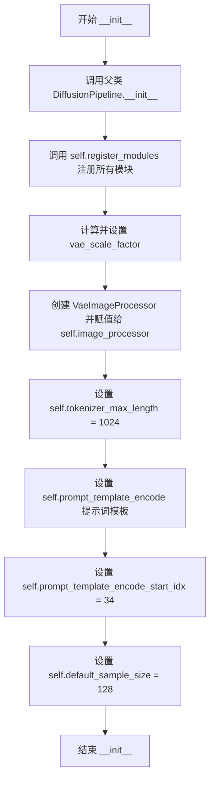
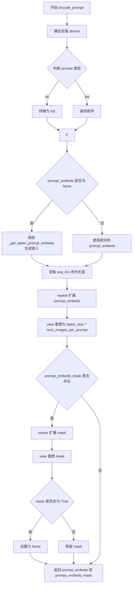
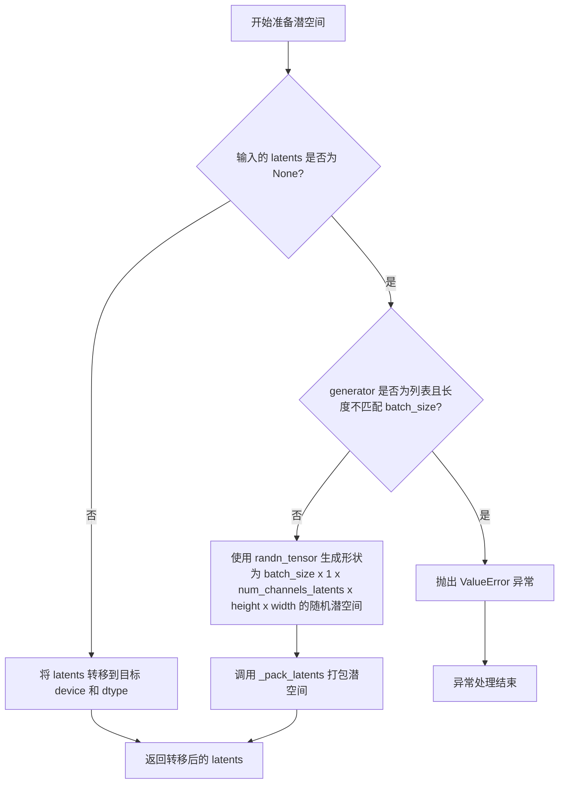
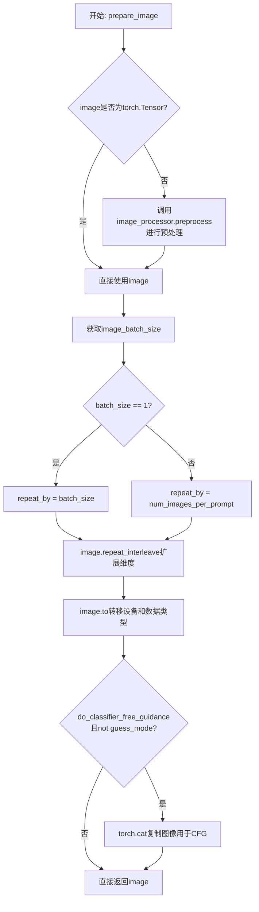
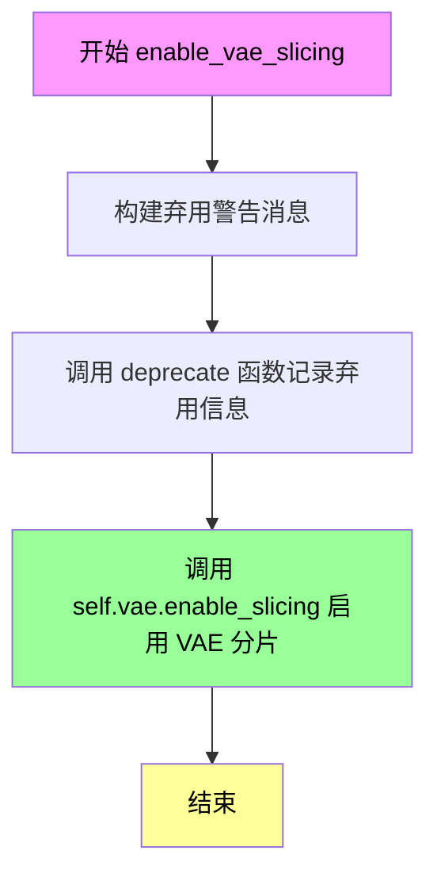
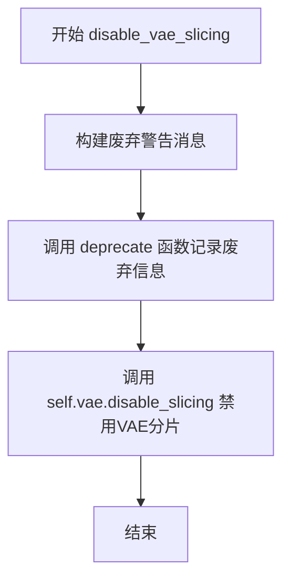
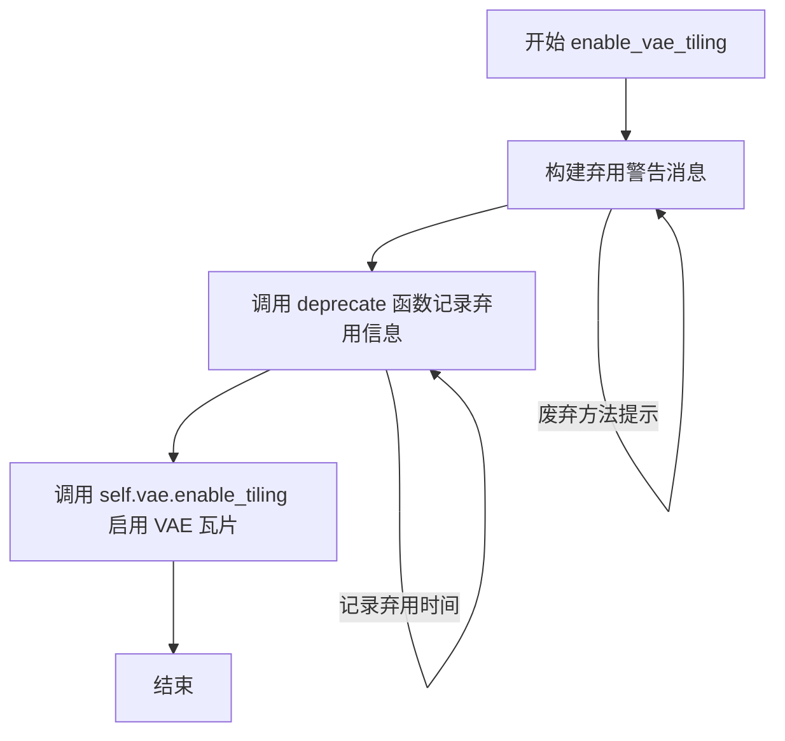
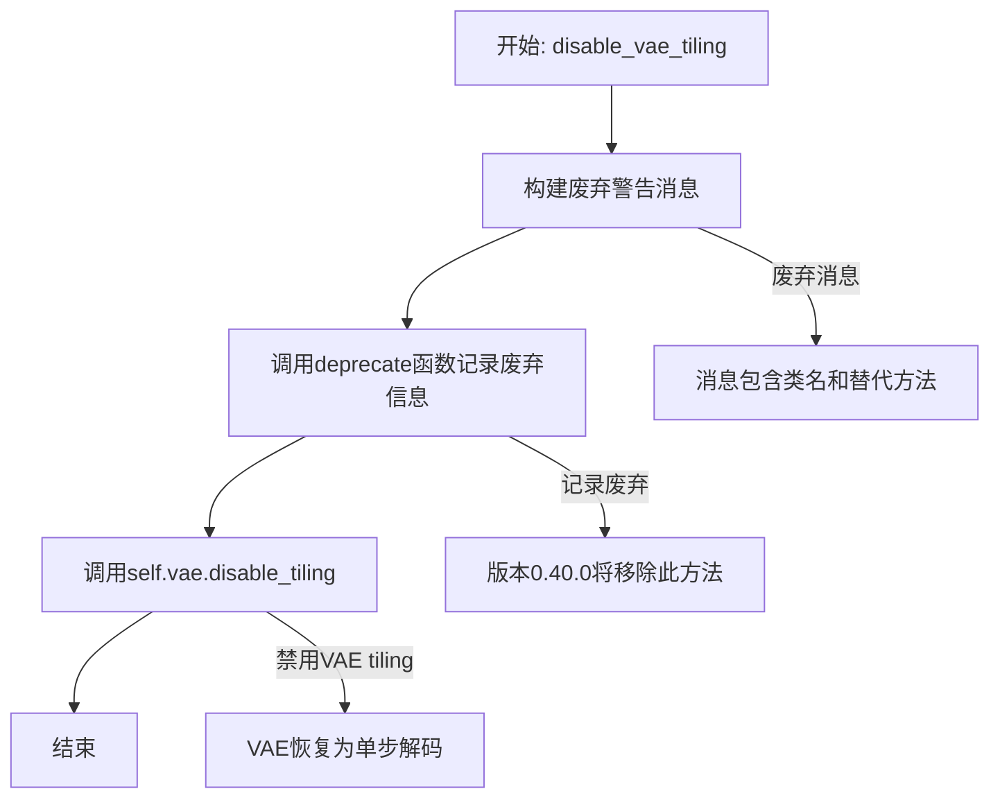

```mermaid
flowchart TD
    A[开始: retrieve_latents] --> B{encoder_output 是否包含 latent_dist}
    B -->|是| C{sample_mode == 'sample'}
    C -->|是| D[返回 latent_dist.sample&#40;generator&#41;]
    C -->|否| E{sample_mode == 'argmax'}
    E -->|是| F[返回 latent_dist.mode&#40;&#41;]
    E -->|否| G[抛出 AttributeError: 未知 sample_mode]
    B -->|否| H{encoder_output 是否包含 latents}
    H -->|是| I[返回 encoder_output.latents]
    H -->|否| J[抛出 AttributeError: 无法访问 latents]
    D --> K[结束]
    F --> K
    I --> K
    G --> K
    J --> K
```

```mermaid
flowchart TD
    A[开始 __call__] --> B[设置默认高度宽度]
    B --> C[调整 control_guidance_start/end 为列表]
    C --> D{检查输入参数}
    D -->|失败| E[抛出 ValueError]
    D -->|成功| F[初始化内部状态]
    F --> G[确定 batch_size]
    G --> H[编码 prompt 得到 prompt_embeds]
    H --> I{需要 true_cfg?}
    I -->|是| J[编码 negative_prompt]
    I -->|否| K[跳过 negative_prompt 编码]
    J --> K
    K --> L{准备控制图像}
    L --> M[使用 VAE 编码 control_image]
    M --> N[计算 latents_mean 和 latents_std]
    N --> O[归一化 control_image]
    O --> P[pack latents]
    K --> Q[准备初始 latent 变量]
    Q --> R[计算 sigmas 和 time steps]
    R --> S[计算 image_seq_len 和 mu]
    S --> T[获取 timesteps]
    T --> U[初始化 controlnet_keep 列表]
    U --> V{检查 guidance_embeds 配置}
    V --> W[设置 guidance 值]
    W --> X[去噪循环开始]
    
    X --> Y{遍历 timesteps}
    Y -->|当前步| Z[扩展 timestep]
    Z --> AA[计算 cond_scale]
    AA --> AB[调用 ControlNet 预测]
    AB --> AC[调用 Transformer 预测噪声]
    AC --> AD{do_true_cfg?}
    AD -->|是| AE[使用 negative prompt 预测]
    AD -->|否| AF[跳过 negative 预测]
    AE --> AG[合并预测结果]
    AG --> AH[应用 normalize 缩放]
    AF --> AH
    AH --> AI[scheduler.step 更新 latents]
    AI --> AJ{有 callback?}
    AJ -->|是| AK[执行回调]
    AJ -->|否| AL[继续]
    AK --> AL
    AL --> AM{循环结束?}
    AM -->|否| Y
    AM -->|是| AN[后处理 latents]
    
    AN --> AO{output_type == latent?}
    AO -->|是| AP[直接返回 latents]
    AO -->|否| AQ[unpack latents]
    AQ --> AR[反归一化 latents]
    AR --> AS[VAE decode]
    AS --> AT[postprocess 图像]
    AT --> AU{maybe_free_model_hooks}
    AU --> AV{return_dict?}
    AV -->|是| AW[返回 QwenImagePipelineOutput]
    AV -->|否| AX[返回元组]
    AW --> AY[结束]
    AX --> AY
```

# `diffusers\src\diffusers\pipelines\qwenimage\pipeline_qwenimage_controlnet.py` 详细设计文档

A Diffusers pipeline implementation for generating images from text prompts conditioned on control images using the Qwen-Image Transformer model and ControlNet architecture.

## 整体流程

```mermaid
graph TD
    Start[__call__] --> InputCheck[1. Check Inputs]
InputCheck --> EncodePrompt[2. Encode Prompt (Text)]
EncodePrompt --> PrepareControlImg[3. Prepare Control Image]
PrepareControlImg --> PrepareLatents[4. Prepare Latents]
PrepareLatents --> PrepareTimesteps[5. Prepare Timesteps]
PrepareTimesteps --> DenoiseLoop{6. Denoising Loop}
DenoiseLoop --> ControlNet[Run ControlNet]
ControlNet --> TransCond[Run Transformer (Cond)]
TransCond --> CFGCheck{CFG?}
CFGCheck -- Yes --> TransUncond[Run Transformer (Uncond)]
CFGCheck -- No --> Merge[Merge]
TransUncond --> Merge
Merge --> SchedulerStep[Scheduler Step]
SchedulerStep --> DenoiseLoop
DenoiseLoop -- Done --> Decode[7. Decode Latents (VAE)]
Decode --> PostProcess[8. Post Process]
PostProcess --> Return[Return Output]
```

## 类结构

```
DiffusionPipeline (Base)
├── QwenImageLoraLoaderMixin (Mixin)
└── QwenImageControlNetPipeline
    └── QwenImagePipelineOutput (Data Class)
```

## 全局变量及字段


### `logger`
    
用于记录警告、错误等日志信息的日志记录器对象

类型：`logging.Logger`
    


### `EXAMPLE_DOC_STRING`
    
包含QwenImageControlNetPipeline使用示例的文档字符串，包含单条件和多条件控制网络的代码示例

类型：`str`
    


### `XLA_AVAILABLE`
    
标识PyTorch XLA是否可用的布尔值，用于支持TPU等硬件加速

类型：`bool`
    


### `QwenImageControlNetPipeline.vae`
    
用于将图像编码到潜在空间并从潜在空间解码还原图像的变分自编码器模型

类型：`AutoencoderKLQwenImage`
    


### `QwenImageControlNetPipeline.text_encoder`
    
Qwen2.5-VL文本编码器，将文本提示转换为文本嵌入向量供Transformer使用

类型：`Qwen2_5_VLForConditionalGeneration`
    


### `QwenImageControlNetPipeline.tokenizer`
    
Qwen2分词器，用于将文本提示 token 化并转换为模型可处理的输入ID

类型：`Qwen2Tokenizer`
    


### `QwenImageControlNetPipeline.transformer`
    
Qwen图像条件Transformer模型（MMDiT架构），负责去噪图像潜在表示

类型：`QwenImageTransformer2DModel`
    


### `QwenImageControlNetPipeline.scheduler`
    
流匹配欧拉离散调度器，用于控制去噪过程中的时间步采样和噪声调度

类型：`FlowMatchEulerDiscreteScheduler`
    


### `QwenImageControlNetPipeline.controlnet`
    
Qwen图像控制网络模型，用于根据控制图像条件引导图像生成过程

类型：`QwenImageControlNetModel | QwenImageMultiControlNetModel`
    


### `QwenImageControlNetPipeline.vae_scale_factor`
    
VAE缩放因子，用于计算潜在空间的尺寸，考虑到VAE的2x压缩和图像分块打包

类型：`int`
    


### `QwenImageControlNetPipeline.image_processor`
    
图像预处理器和后处理器，负责图像的尺寸调整、归一化以及输出格式转换

类型：`VaeImageProcessor`
    


### `QwenImageControlNetPipeline.tokenizer_max_length`
    
分词器的最大序列长度，设置为1024，限制输入提示的最大token数量

类型：`int`
    


### `QwenImageControlNetPipeline.prompt_template_encode`
    
用于编码提示的模板字符串，包含系统消息和用户消息的格式化结构

类型：`str`
    


### `QwenImageControlNetPipeline.prompt_template_encode_start_idx`
    
提示模板编码的起始索引，用于从编码后的隐藏状态中提取有效提示嵌入

类型：`int`
    


### `QwenImageControlNetPipeline.default_sample_size`
    
默认采样尺寸基数，与vae_scale_factor相乘得到默认生成图像的像素尺寸

类型：`int`
    


### `QwenImagePipelineOutput.images`
    
生成的图像输出列表，包含管道生成的图像结果，格式由output_type参数决定

类型：`list[PIL.Image.Image] | np.array | torch.Tensor`
    
    

## 全局函数及方法


### `calculate_shift`

该函数用于计算给定图像序列长度对应的偏移量（mu），基于线性插值方法，根据基准序列长度、最大序列长度、基准偏移量和最大偏移量进行计算。主要用于Diffusion Pipeline中根据图像尺寸动态调整噪声调度器的偏移参数。

参数：

- `image_seq_len`：`int`，图像序列长度，表示latent patches的数量
- `base_seq_len`：`int`（默认值256），基准序列长度，用于线性插值的基准点
- `max_seq_len`：`int`（默认值4096），最大序列长度，用于线性插值的端点
- `base_shift`：`float`（默认值0.5），基准偏移量，对应基准序列长度的偏移值
- `max_shift`：`float`（默认值1.15），最大偏移量，对应最大序列长度的偏移值

返回值：`float`，计算得到的偏移量（mu），用于传递给调度器的sigmas参数

#### 流程图

```mermaid
flowchart TD
    A[开始 calculate_shift] --> B[计算斜率 m]
    B --> C[计算截距 b]
    C --> D[计算偏移量 mu]
    D --> E[返回 mu]
    
    B1[(m = (max_shift - base_shift) / (max_seq_len - base_seq_len))]
    C1[(b = base_shift - m * base_seq_len)]
    D1[(mu = image_seq_len * m + b)]
    
    B --> B1
    C --> C1
    D --> D1
```

#### 带注释源码

```
# Coped from diffusers.pipelines.qwenimage.pipeline_qwenimage.calculate_shift
def calculate_shift(
    image_seq_len,          # int: 图像序列长度，表示latent patches的数量
    base_seq_len: int = 256,    # int: 基准序列长度，默认为256
    max_seq_len: int = 4096,    # int: 最大序列长度，默认为4096
    base_shift: float = 0.5,    # float: 基准偏移量，默认为0.5
    max_shift: float = 1.15,    # float: 最大偏移量，默认为1.15
):
    # 计算线性插值的斜率 m
    # 公式: m = (max_shift - base_shift) / (max_seq_len - base_seq_len)
    m = (max_shift - base_shift) / (max_seq_len - base_seq_len)
    
    # 计算线性插值的截距 b
    # 公式: b = base_shift - m * base_seq_len
    # 使得当 seq_len = base_seq_len 时，mu = base_shift
    b = base_shift - m * base_seq_len
    
    # 计算最终的偏移量 mu
    # 公式: mu = image_seq_len * m + b
    # 这是一个线性函数，根据图像序列长度返回对应的偏移量
    mu = image_seq_len * m + b
    
    # 返回计算得到的偏移量，用于调度器的时间步调整
    return mu
```


### `retrieve_latents`

该函数用于从变分自编码器（VAE）的输出中提取潜在表示（latents），支持三种模式：从潜在分布中采样、从潜在分布中获取最可能值（mode）、或直接返回预计算的潜在向量。

参数：

- `encoder_output`：`torch.Tensor`，编码器的输出对象，通常包含 `latent_dist` 或 `latents` 属性
- `generator`：`torch.Generator | None`，可选的随机数生成器，用于确保采样过程的可重复性
- `sample_mode`：`str`，采样模式，支持 "sample"（从分布采样）或 "argmax"（取分布的众数）

返回值：`torch.Tensor`，提取出的潜在表示向量

#### 流程图



#### 带注释源码

```python
# Copied from diffusers.pipelines.stable_diffusion.pipeline_stable_diffusion.retrieve_latents
def retrieve_latents(
    encoder_output: torch.Tensor, generator: torch.Generator | None = None, sample_mode: str = "sample"
):
    """
    从编码器输出中提取潜在表示（latents）。

    该函数支持三种提取方式：
    1. 当 encoder_output 包含 latent_dist 属性时，根据 sample_mode 从分布中采样或获取众数
    2. 当 encoder_output 包含 latents 属性时，直接返回该属性
    3. 以上都不满足时抛出 AttributeError

    Args:
        encoder_output: 编码器输出对象，通常是 VAE 的 encode 方法返回值
        generator: 可选的 PyTorch 随机生成器，用于控制采样随机性
        sample_mode: 字符串，指定采样模式
            - "sample": 从潜在分布中随机采样
            - "argmax": 获取潜在分布的众数（最可能值）

    Returns:
        torch.Tensor: 提取出的潜在表示向量

    Raises:
        AttributeError: 当无法从 encoder_output 中访问 latents 时抛出
    """
    # 情况1：encoder_output 包含 latent_dist 属性
    if hasattr(encoder_output, "latent_dist") and sample_mode == "sample":
        # 从潜在分布中采样，使用 generator 控制随机性
        return encoder_output.latent_dist.sample(generator)
    # 情况2：encoder_output 包含 latent_dist 属性但使用 argmax 模式
    elif hasattr(encoder_output, "latent_dist") and sample_mode == "argmax":
        # 获取潜在分布的众数（最可能的采样结果）
        return encoder_output.latent_dist.mode()
    # 情况3：encoder_output 直接包含 latents 属性
    elif hasattr(encoder_output, "latents"):
        return encoder_output.latents
    # 错误处理：无法识别或访问 latent 信息
    else:
        raise AttributeError("Could not access latents of provided encoder_output")
```


### `retrieve_timesteps`

该函数用于调用调度器（scheduler）的 `set_timesteps` 方法，并在调用后从调度器中检索时间步（timesteps）。它支持自定义时间步和自定义 sigmas，任何额外的关键字参数都会传递给调度器的 `set_timesteps` 方法。

参数：

-  `scheduler`：`SchedulerMixin`，用于获取时间步的调度器
-  `num_inference_steps`：`int | None`，使用预训练模型生成样本时的扩散步数，如果使用此参数，则 `timesteps` 必须为 `None`
-  `device`：`str | torch.device | None`，时间步要移动到的设备，如果为 `None`，则不移动时间步
-  `timesteps`：`list[int] | None`，用于覆盖调度器时间步间隔策略的自定义时间步，如果传递 `timesteps`，则 `num_inference_steps` 和 `sigmas` 必须为 `None`
-  `sigmas`：`list[float] | None`，用于覆盖调度器时间步间隔策略的自定义 sigmas，如果传递 `sigmas`，则 `num_inference_steps` 和 `timesteps` 必须为 `None`
-  `**kwargs`：任意关键字参数，将传递给 `scheduler.set_timesteps`

返回值：`tuple[torch.Tensor, int]`，元组中第一个元素是调度器的时间步调度，第二个元素是推理步数

#### 流程图

```mermaid
flowchart TD
    A[开始] --> B{检查timesteps和sigmas是否同时存在}
    B -- 是 --> C[抛出ValueError: 只能传递timesteps或sigmas之一]
    B -- 否 --> D{检查timesteps是否不为None}
    D -- 是 --> E[检查scheduler.set_timesteps是否支持timesteps参数]
    E -- 否 --> F[抛出ValueError: 当前调度器不支持自定义timesteps]
    E -- 是 --> G[调用scheduler.set_timesteps并传入timesteps]
    G --> H[获取scheduler.timesteps]
    H --> I[计算num_inference_steps = len(timesteps)]
    I --> J[返回timesteps和num_inference_steps]
    
    D -- 否 --> K{检查sigmas是否不为None}
    K -- 是 --> L[检查scheduler.set_timesteps是否支持sigmas参数]
    L -- 否 --> M[抛出ValueError: 当前调度器不支持自定义sigmas]
    L -- 是 --> N[调用scheduler.set_timesteps并传入sigmas]
    N --> O[获取scheduler.timesteps]
    O --> P[计算num_inference_steps = len(timesteps)]
    P --> J
    
    K -- 否 --> Q[调用scheduler.set_timesteps并传入num_inference_steps]
    Q --> R[获取scheduler.timesteps]
    R --> S[计算num_inference_steps = len(timesteps)]
    S --> J
    
    J --> T[结束]
```

#### 带注释源码

```python
def retrieve_timesteps(
    scheduler,
    num_inference_steps: int | None = None,
    device: str | torch.device | None = None,
    timesteps: list[int] | None = None,
    sigmas: list[float] | None = None,
    **kwargs,
):
    r"""
    Calls the scheduler's `set_timesteps` method and retrieves timesteps from the scheduler after the call. Handles
    custom timesteps. Any kwargs will be supplied to `scheduler.set_timesteps`.

    Args:
        scheduler (`SchedulerMixin`):
            The scheduler to get timesteps from.
        num_inference_steps (`int`):
            The number of diffusion steps used when generating samples with a pre-trained model. If used, `timesteps`
            must be `None`.
        device (`str` or `torch.device`, *optional*):
            The device to which the timesteps should be moved to. If `None`, the timesteps are not moved.
        timesteps (`list[int]`, *optional*):
            Custom timesteps used to override the timestep spacing strategy of the scheduler. If `timesteps` is passed,
            `num_inference_steps` and `sigmas` must be `None`.
        sigmas (`list[float]`, *optional*):
            Custom sigmas used to override the timestep spacing strategy of the scheduler. If `sigmas` is passed,
            `num_inference_steps` and `timesteps` must be `None`.

    Returns:
        `tuple[torch.Tensor, int]`: A tuple where the first element is the timestep schedule from the scheduler and the
        second element is the number of inference steps.
    """
    # 检查是否同时传递了timesteps和sigmas，只能选择其中一个
    if timesteps is not None and sigmas is not None:
        raise ValueError("Only one of `timesteps` or `sigmas` can be passed. Please choose one to set custom values")
    
    # 处理自定义timesteps的情况
    if timesteps is not None:
        # 检查scheduler的set_timesteps方法是否支持timesteps参数
        accepts_timesteps = "timesteps" in set(inspect.signature(scheduler.set_timesteps).parameters.keys())
        if not accepts_timesteps:
            raise ValueError(
                f"The current scheduler class {scheduler.__class__}'s `set_timesteps` does not support custom"
                f" timestep schedules. Please check whether you are using the correct scheduler."
            )
        # 调用scheduler的set_timesteps方法设置自定义timesteps
        scheduler.set_timesteps(timesteps=timesteps, device=device, **kwargs)
        # 从scheduler获取设置后的timesteps
        timesteps = scheduler.timesteps
        # 计算推理步数
        num_inference_steps = len(timesteps)
    # 处理自定义sigmas的情况
    elif sigmas is not None:
        # 检查scheduler的set_timesteps方法是否支持sigmas参数
        accept_sigmas = "sigmas" in set(inspect.signature(scheduler.set_timesteps).parameters.keys())
        if not accept_sigmas:
            raise ValueError(
                f"The current scheduler class {scheduler.__class__}'s `set_timesteps` does not support custom"
                f" sigmas schedules. Please check whether you are using the correct scheduler."
            )
        # 调用scheduler的set_timesteps方法设置自定义sigmas
        scheduler.set_timesteps(sigmas=sigmas, device=device, **kwargs)
        # 从scheduler获取设置后的timesteps
        timesteps = scheduler.timesteps
        # 计算推理步数
        num_inference_steps = len(timesteps)
    # 处理默认情况，使用num_inference_steps设置timesteps
    else:
        scheduler.set_timesteps(num_inference_steps, device=device, **kwargs)
        timesteps = scheduler.timesteps
    
    # 返回timesteps和num_inference_steps元组
    return timesteps, num_inference_steps
```


### QwenImageControlNetPipeline.__init__

该方法是 `QwenImageControlNetPipeline` 类的构造函数，负责初始化整个 ControlNet 流水线所需的所有核心组件，包括调度器、VAE、文本编码器、分词器、Transformer 模型和 ControlNet 模型，并配置相关的处理参数和工具。

参数：

- `scheduler`：`FlowMatchEulerDiscreteScheduler`，用于去噪过程的调度器
- `vae`：`AutoencoderKLQwenImage`，用于图像编码和解码的变分自编码器模型
- `text_encoder`：`Qwen2_5_VLForConditionalGeneration`，用于将文本提示编码为嵌入向量的 Qwen2.5-VL 模型
- `tokenizer`：`Qwen2Tokenizer`，用于将文本分词为 token 序列的分词器
- `transformer`：`QwenImageTransformer2DModel`，用于去噪图像 latent 的条件 Transformer（MMDiT）架构
- `controlnet`：`QwenImageControlNetModel | QwenImageMultiControlNetModel`，用于提供额外条件信息的 ControlNet 模型，支持单个或多个 ControlNet

返回值：`None`，该方法为构造函数，不返回任何值，仅初始化实例属性

#### 流程图



#### 带注释源码

```python
def __init__(
    self,
    scheduler: FlowMatchEulerDiscreteScheduler,
    vae: AutoencoderKLQwenImage,
    text_encoder: Qwen2_5_VLForConditionalGeneration,
    tokenizer: Qwen2Tokenizer,
    transformer: QwenImageTransformer2DModel,
    controlnet: QwenImageControlNetModel | QwenImageMultiControlNetModel,
):
    """
    初始化 QwenImageControlNetPipeline 流水线
    
    参数:
        scheduler: FlowMatchEulerDiscreteScheduler 调度器，用于控制去噪过程的时间步长
        vae: AutoencoderKLQwenImage VAE 模型，用于图像与 latent 之间的编码解码
        text_encoder: Qwen2_5_VLForConditionalGeneration 文本编码器，将文本转为嵌入向量
        tokenizer: Qwen2Tokenizer 分词器，将文本转为 token id 序列
        transformer: QwenImageTransformer2DModel 主干 Transformer 模型，去噪 latent
        controlnet: QwenImageControlNetModel|QwenImageMultiControlNetModel ControlNet 模型，提供额外条件控制
    """
    # 调用父类 DiffusionPipeline 的初始化方法
    super().__init__()
    
    # 注册所有模块到 pipeline 中，便于统一管理和访问
    self.register_modules(
        vae=vae,
        text_encoder=text_encoder,
        tokenizer=tokenizer,
        transformer=transformer,
        scheduler=scheduler,
        controlnet=controlnet,
    )
    
    # 计算 VAE 缩放因子，基于 VAE 的时序下采样层数量
    # QwenImage latents 被转换为 2x2 的 patch 并打包，因此 latent 宽高必须能被 patch size 整除
    # VAE 缩放因子乘以 patch size 来反映这一点
    self.vae_scale_factor = 2 ** len(self.vae.temperal_downsample) if getattr(self, "vae", None) else 8
    
    # 创建图像预处理器，vae_scale_factor 乘以 2 以考虑 patch 打包
    self.image_processor = VaeImageProcessor(vae_scale_factor=self.vae_scale_factor * 2)
    
    # 设置分词器最大长度
    self.tokenizer_max_length = 1024
    
    # 设置 Qwen 模型的提示词模板，用于格式化输入提示词
    # 包含系统消息和用户消息的格式
    self.prompt_template_encode = "<|im_start|>system\nDescribe the image by detailing the color, shape, size, texture, quantity, text, spatial relationships of the objects and background:<|im_end|>\n<|im_start|>user\n{}<|im_end|>\n<|im_start|>assistant\n"
    
    # 提示词模板中需要跳过的起始索引，用于从隐藏状态中提取有效部分
    self.prompt_template_encode_start_idx = 34
    
    # 默认采样大小，用于生成图像的默认高度和宽度计算
    self.default_sample_size = 128
```


### `QwenImageControlNetPipeline._extract_masked_hidden`

该方法用于从文本编码器的隐藏状态中根据注意力掩码提取有效token的隐藏向量，将批量数据中每个样本的有效token序列分割成独立的张量列表，用于后续的文本嵌入处理。

参数：

- `self`：`QwenImageControlNetPipeline` 类实例
- `hidden_states`：`torch.Tensor`，文本编码器输出的隐藏状态张量，形状为 (batch_size, seq_len, hidden_dim)
- `mask`：`torch.Tensor`，注意力掩码张量，形状为 (batch_size, seq_len)，用于标识有效token位置

返回值：`list[torch.Tensor]`，返回分割后的隐藏状态列表，每个元素对应一个样本的有效token隐藏向量

#### 流程图

```mermaid
flowchart TD
    A[开始: _extract_masked_hidden] --> B[输入 hidden_states 和 mask]
    B --> C[将 mask 转换为布尔掩码: bool_mask = mask.bool()]
    C --> D[计算每行的有效长度: valid_lengths = bool_mask.sum(dim=1)]
    D --> E[使用布尔索引提取有效token: selected = hidden_states[bool_mask]]
    E --> F[按有效长度分割张量: split_result = torch.split(selected, valid_lengths.tolist(), dim=0)]
    F --> G[返回分割结果列表]
```

#### 带注释源码

```python
def _extract_masked_hidden(self, hidden_states: torch.Tensor, mask: torch.Tensor):
    """
    从隐藏状态中根据掩码提取有效token的隐藏向量
    
    该方法用于处理文本编码器的输出，将每个样本的隐藏状态根据注意力掩码
    提取出来，并按样本分割成独立的张量列表。主要用于Qwen模型的文本嵌入处理流程。
    
    参数:
        hidden_states: 文本编码器输出的隐藏状态，形状为 (batch_size, seq_len, hidden_dim)
        mask: 注意力掩码，形状为 (batch_size, seq_len)，值为0/1或True/False
    
    返回:
        包含每个样本有效token隐藏向量的列表，列表长度为batch_size
    """
    # 将掩码转换为布尔类型，确保可以使用布尔索引
    bool_mask = mask.bool()
    
    # 计算每个样本的有效token数量（沿seq_len维度求和）
    valid_lengths = bool_mask.sum(dim=1)
    
    # 使用布尔索引从hidden_states中提取所有有效位置的隐藏状态
    # 这会将所有batch的valid token展平到一个连续的tensor中
    selected = hidden_states[bool_mask]
    
    # 按照每个样本的有效长度将展平后的tensor分割成多个tensor
    # 返回结果为list，每个元素对应一个样本的有效token隐藏状态
    split_result = torch.split(selected, valid_lengths.tolist(), dim=0)
    
    return split_result
```


### `QwenImageControlNetPipeline._get_qwen_prompt_embeds`

该方法用于将文本提示词（prompt）编码为Qwen图像模型专用的文本嵌入向量（prompt embeddings）和注意力掩码（attention mask）。它首先应用Qwen特有的提示词模板，然后通过tokenizer转换为token IDs，接着使用text_encoder获取隐藏状态，最后通过提取有效token的隐藏状态并对齐到最大序列长度，生成可用于后续扩散模型推理的prompt_embeds和encoder_attention_mask。

参数：

- `prompt`：`str | list[str]`，需要编码的文本提示词，可以是单个字符串或字符串列表，默认为None
- `device`：`torch.device | None`，指定计算设备，默认为None（使用execution_device）
- `dtype`：`torch.dtype | None`，指定数据类型，默认为None（使用text_encoder的dtype）

返回值：`tuple[torch.Tensor, torch.Tensor]`，返回一个元组，包含两个张量：
  - `prompt_embeds`：编码后的文本嵌入向量，形状为(batch_size, seq_len, hidden_dim)
  - `encoder_attention_mask`：编码器注意力掩码，形状为(batch_size, seq_len)，用于指示有效token位置

#### 流程图

```mermaid
flowchart TD
    A[开始: _get_qwen_prompt_embeds] --> B{device是否为None?}
    B -->|是| C[使用self._execution_device]
    B -->|否| D[使用传入的device]
    C --> E{dtype是否为None?}
    D --> E
    E -->|是| F[使用self.text_encoder.dtype]
    E -->|否| G[使用传入的dtype]
    F --> H
    G --> H
    H{prompt是否为str?}
    H -->|是| I[将prompt包装为列表: [prompt]]
    H -->|否| J[保持prompt为列表]
    I --> K
    J --> K
    K[获取prompt_template_encode模板] --> L[应用模板格式化每个prompt: template.format(e)]
    L --> M[调用tokenizer进行编码<br/>max_length=tokenizer_max_length+drop_idx<br/>padding=True, truncation=True]
    M --> N[调用text_encoder获取hidden_states<br/>output_hidden_states=True]
    N --> O[提取最后一层隐藏状态: hidden_states[-1]]
    O --> P[调用_extract_masked_hidden<br/>根据attention_mask提取有效token的隐藏状态]
    P --> Q[移除前drop_idx个位置: e[drop_idx:] for each]
    Q --> R[为每个序列创建全1注意力掩码]
    R --> S[计算最大序列长度max_seq_len]
    S --> T[将所有序列填充对齐到max_seq_len<br/>prompt_embeds填充零向量]
    T --> U[将encoder_attention_mask也填充对齐到max_seq_len]
    U --> V[转换prompt_embeds到指定dtype和device]
    V --> W[返回prompt_embeds和encoder_attention_mask]
```

#### 带注释源码

```python
def _get_qwen_prompt_embeds(
    self,
    prompt: str | list[str] = None,
    device: torch.device | None = None,
    dtype: torch.dtype | None = None,
):
    """
    将文本提示词编码为Qwen模型专用的文本嵌入向量和注意力掩码。
    
    Args:
        prompt: 要编码的文本提示词，支持单个字符串或字符串列表
        device: 计算设备，如果为None则使用self._execution_device
        dtype: 数据类型，如果为None则使用text_encoder的dtype
    
    Returns:
        包含prompt_embeds和encoder_attention_mask的元组
    """
    # 如果未指定device，则使用执行设备
    device = device or self._execution_device
    # 如果未指定dtype，则使用text_encoder的数据类型
    dtype = dtype or self.text_encoder.dtype

    # 统一将prompt转为列表处理，支持单字符串和字符串列表两种输入
    prompt = [prompt] if isinstance(prompt, str) else prompt

    # 获取预先配置的提示词模板（包含Qwen特有的im_start/im_end标记）
    template = self.prompt_template_encode
    # 获取模板中需要丢弃的起始位置索引（用于跳过系统提示部分）
    drop_idx = self.prompt_template_encode_start_idx
    
    # 使用模板格式化每个提示词
    txt = [template.format(e) for e in prompt]
    
    # 调用tokenizer将文本转换为token IDs
    # max_length加上drop_idx以预留空间给模板前缀
    txt_tokens = self.tokenizer(
        txt, 
        max_length=self.tokenizer_max_length + drop_idx, 
        padding=True, 
        truncation=True, 
        return_tensors="pt"
    ).to(device)
    
    # 调用text_encoder获取编码后的隐藏状态
    # output_hidden_states=True确保返回所有层的隐藏状态
    encoder_hidden_states = self.text_encoder(
        input_ids=txt_tokens.input_ids,
        attention_mask=txt_tokens.attention_mask,
        output_hidden_states=True,
    )
    
    # 提取最后一层的隐藏状态（通常包含最丰富的语义信息）
    hidden_states = encoder_hidden_states.hidden_states[-1]
    
    # 根据attention_mask提取有效token对应的隐藏状态，过滤掉padding部分
    split_hidden_states = self._extract_masked_hidden(hidden_states, txt_tokens.attention_mask)
    
    # 移除每个序列开头的drop_idx个位置（跳过模板系统提示部分）
    split_hidden_states = [e[drop_idx:] for e in split_hidden_states]
    
    # 为每个有效序列创建对应的注意力掩码（全1表示有效token）
    attn_mask_list = [torch.ones(e.size(0), dtype=torch.long, device=e.device) for e in split_hidden_states]
    
    # 计算所有序列中的最大长度，用于后续对齐
    max_seq_len = max([e.size(0) for e in split_hidden_states])
    
    # 将所有序列填充（pad）到相同长度，不足部分用零向量填充
    # prompt_embeds: 形状 [batch, seq_len, hidden_dim]
    prompt_embeds = torch.stack(
        [torch.cat([u, u.new_zeros(max_seq_len - u.size(0), u.size(1))]) for u in split_hidden_states]
    )
    
    # encoder_attention_mask同样进行填充对齐，padding部分为0
    # 形状 [batch, seq_len]
    encoder_attention_mask = torch.stack(
        [torch.cat([u, u.new_zeros(max_seq_len - u.size(0))]) for u in attn_mask_list]
    )

    # 将最终的prompt_embeds转换到指定的dtype和device
    prompt_embeds = prompt_embeds.to(dtype=dtype, device=device)

    # 返回编码后的embeddings和对应的attention mask
    return prompt_embeds, encoder_attention_mask
```


### `QwenImageControlNetPipeline.encode_prompt`

该方法用于将文本提示（prompt）编码为文本嵌入向量（prompt_embeds）和对应的注意力掩码（prompt_embeds_mask），支持批量生成和预生成嵌入的复用。

参数：

- `prompt`：`str | list[str]`，要编码的文本提示，支持单个字符串或字符串列表
- `device`：`torch.device | None`，执行设备，默认为当前执行设备
- `num_images_per_prompt`：`int`，每个提示要生成的图像数量，默认为1
- `prompt_embeds`：`torch.Tensor | None`，预生成的文本嵌入向量，如提供则直接使用而不从 prompt 生成
- `prompt_embeds_mask`：`torch.Tensor | None`，预生成的提示嵌入掩码
- `max_sequence_length`：`int`，最大序列长度，默认为1024

返回值：`tuple[torch.Tensor, torch.Tensor | None]`，返回编码后的提示嵌入和可选的注意力掩码

#### 流程图



#### 带注释源码

```
def encode_prompt(
    self,
    prompt: str | list[str],
    device: torch.device | None = None,
    num_images_per_prompt: int = 1,
    prompt_embeds: torch.Tensor | None = None,
    prompt_embeds_mask: torch.Tensor | None = None,
    max_sequence_length: int = 1024,
):
    r"""
    将文本提示编码为文本嵌入向量和注意力掩码

    Args:
        prompt: 要编码的文本提示，支持单个字符串或字符串列表
        device: torch 设备
        num_images_per_prompt: 每个提示要生成的图像数量
        prompt_embeds: 预生成的文本嵌入，如不提供则从 prompt 生成
        prompt_embeds_mask: 预生成的提示嵌入掩码
        max_sequence_length: 最大序列长度
    """
    # 获取执行设备，若未指定则使用默认设备
    device = device or self._execution_device

    # 确保 prompt 为列表格式
    prompt = [prompt] if isinstance(prompt, str) else prompt
    
    # 计算批次大小：如果提供了 prompt_embeds 则使用其形状，否则使用 prompt 长度
    batch_size = len(prompt) if prompt_embeds is None else prompt_embeds.shape[0]

    # 如果未提供嵌入，则调用内部方法生成
    if prompt_embeds is None:
        prompt_embeds, prompt_embeds_mask = self._get_qwen_prompt_embeds(prompt, device)

    # 获取序列长度
    _, seq_len, _ = prompt_embeds.shape
    
    # 扩展 prompt_embeds 以匹配 num_images_per_prompt
    # 将嵌入在序列维度重复 num_images_per_prompt 次
    prompt_embeds = prompt_embeds.repeat(1, num_images_per_prompt, 1)
    
    # 重塑为批次大小 * num_images_per_prompt 的形状
    prompt_embeds = prompt_embeds.view(batch_size * num_images_per_prompt, seq_len, -1)

    # 如果提供了掩码，同样进行扩展和重塑
    if prompt_embeds_mask is not None:
        prompt_embeds_mask = prompt_embeds_mask.repeat(1, num_images_per_prompt, 1)
        prompt_embeds_mask = prompt_embeds_mask.view(batch_size * num_images_per_prompt, seq_len)

        # 如果掩码全部为 True（有效），则设为 None 优化处理
        if prompt_embeds_mask.all():
            prompt_embeds_mask = None

    # 返回编码后的嵌入和掩码
    return prompt_embeds, prompt_embeds_mask
```


### QwenImageControlNetPipeline.check_inputs

该方法用于验证 Qwen-Image ControlNet Pipeline 的输入参数合法性，确保用户提供的 prompt、height、width、negative_prompt 等参数符合模型要求，并在参数不符合要求时抛出明确的错误信息。

参数：

- `self`：`QwenImageControlNetPipeline` 实例本身，隐式参数
- `prompt`：`str | list[str] | None`，用户输入的文本提示，用于指导图像生成
- `height`：`int`，生成图像的高度（像素）
- `width`：`int`，生成图像的宽度（像素）
- `negative_prompt`：`str | list[str] | None`，负向提示，用于指导模型避免生成相关内容
- `prompt_embeds`：`torch.Tensor | None`，预先编码的文本嵌入向量，与 prompt 二选一使用
- `negative_prompt_embeds`：`torch.Tensor | None`，预先编码的负向文本嵌入向量
- `prompt_embeds_mask`：`torch.Tensor | None`，文本嵌入的注意力掩码
- `negative_prompt_embeds_mask`：`torch.Tensor | None`，负向文本嵌入的注意力掩码
- `callback_on_step_end_tensor_inputs`：`list[str] | None`，在推理步骤结束时需要回调的张量输入列表
- `max_sequence_length`：`int | None`，文本序列的最大长度，默认为 1024

返回值：`None`，该方法不返回任何值，仅进行参数验证

#### 流程图

```mermaid
flowchart TD
    A[开始 check_inputs] --> B{height 和 width 是否可被 vae_scale_factor*2 整除?}
    B -->|否| C[输出警告信息并调整尺寸]
    B -->|是| D{callback_on_step_end_tensor_inputs 是否合法?}
    C --> D
    D -->|否| E[抛出 ValueError]
    D -->|是| F{prompt 和 prompt_embeds 是否同时存在?}
    F -->|是| G[抛出 ValueError: 不能同时提供]
    F -->|否| H{prompt 和 prompt_embeds 是否都为空?}
    H -->|是| I[抛出 ValueError: 至少提供一个]
    H -->|否| J{prompt 类型是否合法 str 或 list?]
    J -->|否| K[抛出 ValueError: 类型错误]
    J -->|是| L{negative_prompt 和 negative_prompt_embeds 是否同时存在?}
    L -->|是| M[抛出 ValueError: 不能同时提供]
    L -->|否| N{max_sequence_length 是否超过 1024?}
    N -->|是| O[抛出 ValueError: 超过最大长度]
    N -->|否| P[验证通过，方法结束]
    E --> P
    G --> P
    I --> P
    K --> P
    M --> P
    O --> P
```

#### 带注释源码

```python
def check_inputs(
    self,
    prompt,                           # 文本提示，可以是字符串或字符串列表
    height,                           # 生成图像的高度
    width,                            # 生成图像的宽度
    negative_prompt=None,            # 负向提示（可选）
    prompt_embeds=None,              # 预计算的文本嵌入（可选）
    negative_prompt_embeds=None,     # 预计算的负向文本嵌入（可选）
    prompt_embeds_mask=None,         # 文本嵌入的注意力掩码（可选）
    negative_prompt_embeds_mask=None,# 负向文本嵌入的注意力掩码（可选）
    callback_on_step_end_tensor_inputs=None,  # 回调函数张量输入列表（可选）
    max_sequence_length=None,        # 最大序列长度（可选）
):
    """
    验证 Pipeline 输入参数的合法性。
    
    检查项目：
    1. height/width 必须能被 vae_scale_factor*2 整除
    2. callback_on_step_end_tensor_inputs 必须在允许列表中
    3. prompt 和 prompt_embeds 不能同时提供
    4. prompt 和 prompt_embeds 至少提供一个
    5. prompt 必须是 str 或 list 类型
    6. negative_prompt 和 negative_prompt_embeds 不能同时提供
    7. max_sequence_length 不能超过 1024
    """
    
    # 检查图像尺寸是否合法
    # VAE 会对图像进行 8x 压缩，并且 latent 需要进行 2x2 的 patch 打包
    # 因此 height 和 width 需要能被 vae_scale_factor * 2 整除
    if height % (self.vae_scale_factor * 2) != 0 or width % (self.vae_scale_factor * 2) != 0:
        logger.warning(
            f"`height` and `width` have to be divisible by {self.vae_scale_factor * 2} but are {height} and {width}. Dimensions will be resized accordingly"
        )

    # 检查回调张量输入是否在允许的列表中
    # 只能回调 pipeline 中声明的 _callback_tensor_inputs 列表中的变量
    if callback_on_step_end_tensor_inputs is not None and not all(
        k in self._callback_tensor_inputs for k in callback_on_step_end_tensor_inputs
    ):
        raise ValueError(
            f"`callback_on_step_end_tensor_inputs` has to be in {self._callback_tensor_inputs}, but found {[k for k in callback_on_step_end_tensor_inputs if k not in self._callback_tensor_inputs]}"
        )

    # 检查 prompt 和 prompt_embeds 的互斥关系
    # 不能同时提供两者，只能选择其中一种输入方式
    if prompt is not None and prompt_embeds is not None:
        raise ValueError(
            f"Cannot forward both `prompt`: {prompt} and `prompt_embeds`: {prompt_embeds}. Please make sure to"
            " only forward one of the two."
        )
    # 至少需要提供 prompt 或 prompt_embeds 之一
    elif prompt is None and prompt_embeds is None:
        raise ValueError(
            "Provide either `prompt` or `prompt_embeds`. Cannot leave both `prompt` and `prompt_embeds` undefined."
        )
    # 检查 prompt 的类型是否合法
    elif prompt is not None and (not isinstance(prompt, str) and not isinstance(prompt, list)):
        raise ValueError(f"`prompt` has to be of type `str` or `list` but is {type(prompt)}")

    # 检查 negative_prompt 和 negative_prompt_embeds 的互斥关系
    if negative_prompt is not None and negative_prompt_embeds is not None:
        raise ValueError(
            f"Cannot forward both `negative_prompt`: {negative_prompt} and `negative_prompt_embeds`:"
            f" {negative_prompt_embeds}. Please make sure to only forward one of the two."
        )

    # 检查最大序列长度是否超过限制
    if max_sequence_length is not None and max_sequence_length > 1024:
        raise ValueError(f"`max_sequence_length` cannot be greater than 1024 but is {max_sequence_length}")
```


### `QwenImageControlNetPipeline._pack_latents`

该函数是一个静态方法，负责将 VAE 编码后的 4D latent 张量（batch_size, channels, height, width）转换为符合 Transformer 架构输入要求的 3D 序列张量（batch_size, seq_len, hidden_dim）。它通过空间分块（2x2 patch）和通道拼接的方式实现数据的"打包"（packing），使得离散的二维空间信息转换为一维序列表示。

参数：

- `latents`：`torch.Tensor`，输入的 4D latent 张量，形状为 (batch_size, num_channels_latents, height, width)，通常来自 VAE 编码器输出
- `batch_size`：`int`，批次大小，表示输入的样本数量
- `num_channels_latents`：`int`，latent 的通道数，通常为 transformer.config.in_channels // 4
- `height`：`int`，latent 的高度（经过 VAE 压缩后的尺寸）
- `width`：`int`，latent 的宽度（经过 VAE 压缩后的尺寸）

返回值：`torch.Tensor`，打包后的 3D 张量，形状为 (batch_size, (height // 2) * (width // 2), num_channels_latents * 4)，其中序列长度对应空间中的 patch 数量，每个 patch 包含 4 个通道（2x2 空间区域的通道拼接）

#### 流程图

```mermaid
flowchart TD
    A[输入 4D Latent 张量<br/>shape: (B, C, H, W)] --> B[view 操作: 重塑为 2x2 patch 块]
    B --> C[permute 操作: 重新排列维度顺序]
    C --> D[reshape 操作: 展平为序列形式]
    D --> E[输出 3D 序列张量<br/>shape: (B, H/2*W/2, C*4)]
    
    subgraph "view 操作详解"
    B1["latents.view(batch_size, num_channels_latents,<br/>height//2, 2, width//2, 2)"]
    end
    
    subgraph "permute 操作详解"
    C1["latents.permute(0, 2, 4, 1, 3, 5)<br/>将 (B, C, H/2, 2, W/2, 2)<br/>转换为 (B, H/2, W/2, C, 2, 2)"]
    end
    
    subgraph "reshape 操作详解"
    D1["latents.reshape(batch_size,<br/>(height//2)*(width//2),<br/>num_channels_latents*4)"]
    end
    
    B --> B1
    C --> C1
    D --> D1
```

#### 带注释源码

```python
@staticmethod
# Copied from diffusers.pipelines.qwenimage.pipeline_qwenimage.QwenImagePipeline._pack_latents
def _pack_latents(latents, batch_size, num_channels_latents, height, width):
    """
    将 4D latent 张量打包为适合 Transformer 输入的 3D 序列张量。
    
    打包原理：
    1. 将空间维度 (height, width) 按 2x2 大小划分为 patches
    2. 将每个 2x2 patch 内的通道在维度上拼接
    3. 结果从 (B, C, H, W) 转换为 (B, H/2*W/2, C*4)
    
    例如：
    - 输入: (B, 16, 64, 64) -> 输出: (B, 1024, 64)
    - 其中 64 = 16 * 4 (每个 2x2 patch 包含 4 个像素的通道)
    - 1024 = 32 * 32 (64/2 * 64/2)
    """
    # 步骤 1: view 操作
    # 将 (B, C, H, W) 重塑为 (B, C, H/2, 2, W/2, 2)
    # 即在高度和宽度维度上各划分为 2 等分，每份包含 2 个像素
    latents = latents.view(batch_size, num_channels_latents, height // 2, 2, width // 2, 2)
    
    # 步骤 2: permute 操作
    # 将维度顺序从 (B, C, H/2, 2, W/2, 2) 转换为 (B, H/2, W/2, C, 2, 2)
    # 这样可以将空间 patch 和通道维度分离，便于后续 reshape
    latents = latents.permute(0, 2, 4, 1, 3, 5)
    
    # 步骤 3: reshape 操作
    # 将 (B, H/2, W/2, C, 2, 2) 展平为 (B, H/2*W/2, C*4)
    # - 序列长度 = H/2 * W/2 (空间 patch 数量)
    # - 隐藏维度 = C * 4 (每个 2x2 patch 内 4 个像素的通道拼接)
    latents = latents.reshape(batch_size, (height // 2) * (width // 2), num_channels_latents * 4)

    return latents
```


### `QwenImageControlNetPipeline._unpack_latents`

该函数是一个静态方法，用于将已打包（packed）的潜在表示张量解包（unpack）为标准的5D张量格式（batch_size, channels, frames, height, width），以便后续进行VAE解码。它是 `_pack_latents` 的逆操作，主要处理因图像压缩和空间打包而产生的维度变换。

参数：

- `latents`：`torch.Tensor`，输入的已打包潜在张量，形状为 (batch_size, num_patches, channels)
- `height`：`int`，原始图像的高度（像素单位）
- `width`：`int`，原始图像的宽度（像素单位）
- `vae_scale_factor`：`int`，VAE的缩放因子，用于计算潜在空间的实际尺寸

返回值：`torch.Tensor`，解包后的潜在张量，形状为 (batch_size, channels // 4, 1, height, width)

#### 流程图

```mermaid
flowchart TD
    A[输入 packed latents<br/>shape: batch_size × num_patches × channels] --> B[从latents.shape获取<br/>batch_size, num_patches, channels]
    B --> C[计算实际的height和width<br/>height = 2 × (height // (vae_scale_factor × 2))<br/>width = 2 × (width // (vae_scale_factor × 2))]
    C --> D[view 操作: latents.view<br/>batch_size × height/2 × width/2 × channels/4 × 2 × 2]
    D --> E[permute 操作重新排列维度<br/>0, 3, 1, 4, 2, 5]
    E --> F[reshape 操作<br/>batch_size × channels/4 × 1 × height × width]
    F --> G[返回 unpacked latents<br/>shape: batch_size × channels//4 × 1 × height × width]
```

#### 带注释源码

```python
@staticmethod
# Copied from diffusers.pipelines.qwenimage.pipeline_qwenimage.QwenImagePipeline._unpack_latents
def _unpack_latents(latents, height, width, vae_scale_factor):
    """
    解包已打包的潜在表示张量为标准格式
    
    参数:
        latents: 已打包的潜在张量，形状为 (batch_size, num_patches, channels)
        height: 原始图像高度（像素）
        width: 原始图像宽度（像素）
        vae_scale_factor: VAE缩放因子，用于计算潜在空间尺寸
    
    返回:
        解包后的潜在张量，形状为 (batch_size, channels // 4, 1, height, width)
    """
    # 从latents张量中提取批次大小、补丁数量和通道数
    batch_size, num_patches, channels = latents.shape

    # VAE对图像应用8倍压缩，但我们还需要考虑packing操作要求
    # 潜在高度和宽度必须能被2整除，因此需要额外乘以2来还原实际尺寸
    # 计算公式: actual_latent_dim = 2 * (pixel_dim // (vae_scale_factor * 2))
    height = 2 * (int(height) // (vae_scale_factor * 2))
    width = 2 * (int(width) // (vae_scale_factor * 2))

    # 使用view操作将打包的latents重塑为更细粒度的结构
    # 原始: (batch, num_patches, channels) 其中 num_patches = (height//2) * (width//2)
    # 目标: (batch, height//2, width//2, channels//4, 2, 2)
    # 这里channels//4是因为打包时将4个通道压缩为1个
    # 后面的2,2表示每个补丁被拆分为2x2的子块
    latents = latents.view(batch_size, height // 2, width // 2, channels // 4, 2, 2)
    
    # 使用permute重新排列维度顺序，将数据从 (batch, h, w, c, 2, 2) 
    # 转换为 (batch, c, h, 2, w, 2) 的排列方式，便于后续reshape
    # permute参数: 原维度索引 -> 新维度索引
    latents = latents.permute(0, 3, 1, 4, 2, 5)

    # 最终reshape操作，将多维张量展平为标准5D格式
    # 输出形状: (batch_size, channels // 4, 1, height, width)
    # 其中:
    #   - channels // 4: 还原打包前的通道数
    #   - 1: 时间/帧维度（对于静态图像为1）
    #   - height, width: 解包后的空间维度
    latents = latents.reshape(batch_size, channels // (2 * 2), 1, height, width)

    return latents
```


### `QwenImageControlNetPipeline.prepare_latents`

该方法负责为 Qwen-Image ControlNet 管道准备潜空间变量（latents），根据输入的批次大小、图像尺寸和设备信息计算潜空间的形状，若未提供预计算的潜空间则使用随机噪声生成，否则直接转移提供的潜空间到目标设备和数据类型。

参数：

- `self`：`QwenImageControlNetPipeline` 实例本身，Pipeline 对象引用
- `batch_size`：`int`，生成的图像批次大小
- `num_channels_latents`：`int`，潜空间通道数，通常为 transformer 输入通道数的四分之一
- `height`：`int`，目标图像高度（像素）
- `width`：`int`，目标图像宽度（像素）
- `dtype`：`torch.dtype`，潜空间张量的目标数据类型
- `device`：`torch.device`，潜空间张量的目标设备
- `generator`：`torch.Generator | list[torch.Generator] | None`，用于生成确定性随机噪声的生成器，若为列表则长度需与 batch_size 匹配
- `latents`：`torch.Tensor | None`，可选的预生成潜空间张量，若为 None 则随机生成

返回值：`torch.Tensor`，准备好的潜空间张量，已打包成适合 transformer 处理的形状

#### 流程图



#### 带注释源码

```python
# 继承自 diffusers.pipelines.qwenimage.pipeline_qwenimage.QwenImagePipeline.prepare_latents
def prepare_latents(
    self,
    batch_size,
    num_channels_latents,
    height,
    width,
    dtype,
    device,
    generator,
    latents=None,
):
    # VAE applies 8x compression on images but we must also account for packing which requires
    # latent height and width to be divisible by 2.
    # 计算调整后的高度和宽度：VAE 压缩因子为 8x，且打包操作要求潜空间尺寸能被 2 整除
    height = 2 * (int(height) // (self.vae_scale_factor * 2))
    width = 2 * (int(width) // (self.vae_scale_factor * 2))

    # 定义潜空间张量的形状：(batch_size, 通道数, 潜空间通道, 调整后高度, 调整后宽度)
    shape = (batch_size, 1, num_channels_latents, height, width)

    # 如果调用者已提供潜空间，直接转移到目标设备和数据类型后返回
    if latents is not None:
        return latents.to(device=device, dtype=dtype)

    # 验证 generator 列表长度与批次大小的一致性
    if isinstance(generator, list) and len(generator) != batch_size:
        raise ValueError(
            f"You have passed a list of generators of length {len(generator)}, but requested an effective batch"
            f" size of {batch_size}. Make sure the batch size matches the length of the generators."
        )

    # 使用随机张量生成器创建初始潜空间（高斯噪声）
    latents = randn_tensor(shape, generator=generator, device=device, dtype=dtype)
    
    # 调用内部方法 _pack_latents 将潜空间打包为适合 Qwen-Image transformer 处理的格式
    # 打包将 2x2 的空间块展平为序列
    latents = self._pack_latents(latents, batch_size, num_channels_latents, height, width)

    return latents
```


### `QwenImageControlNetPipeline.prepare_image`

该方法用于准备控制网络（ControlNet）的图像输入。它接受原始图像或张量，进行尺寸预处理、批次扩展、设备转移，并根据是否启用无分类器自由引导（classifier-free guidance）来复制图像，以适配后续的扩散模型推理流程。

参数：

- `self`：隐式参数，指向 `QwenImageControlNetPipeline` 实例
- `image`：`PipelineImageInput | torch.Tensor`，输入的原始控制图像，支持张量或图像列表格式
- `width`：`int`，目标图像宽度（像素）
- `height`：`int`，目标图像高度（像素）
- `batch_size`：`int`，提示词的批次大小，用于决定图像重复次数
- `num_images_per_prompt`：`int`，每个提示词生成的图像数量，用于决定图像重复次数
- `device`：`torch.device`，目标设备（CPU/CUDA）
- `dtype`：`torch.dtype`，目标数据类型（float16/bfloat16等）
- `do_classifier_free_guidance`：`bool`，是否启用无分类器自由引导，默认为 False
- `guess_mode`：`bool`，猜测模式标志，默认为 False

返回值：`torch.Tensor`，处理后的控制图像张量，形状已根据批次大小和引导参数进行扩展

#### 流程图



#### 带注释源码

```python
def prepare_image(
    self,
    image,
    width,
    height,
    batch_size,
    num_images_per_prompt,
    device,
    dtype,
    do_classifier_free_guidance=False,
    guess_mode=False,
):
    # 判断输入是否为PyTorch张量
    if isinstance(image, torch.Tensor):
        # 如果已经是张量，直接使用，不进行预处理
        pass
    else:
        # 否则使用图像处理器进行预处理
        # 支持PIL.Image、numpy数组、文件路径等多种格式
        image = self.image_processor.preprocess(image, height=height, width=width)

    # 获取输入图像的批次大小
    image_batch_size = image.shape[0]

    # 确定图像需要重复的次数
    if image_batch_size == 1:
        # 单张图像情况下，按照完整批次大小重复
        repeat_by = batch_size
    else:
        # 图像批次大小与提示词批次大小相同时
        # 按照每提示词图像数量重复
        repeat_by = num_images_per_prompt

    # 按照指定维度重复图像以匹配批次
    # repeat_interleave会在批次维度上复制图像
    image = image.repeat_interleave(repeat_by, dim=0)

    # 将图像转移到指定设备和转换数据类型
    image = image.to(device=device, dtype=dtype)

    # 如果启用无分类器自由引导且不在猜测模式
    # 则复制图像用于后续的cfg计算（条件+非条件）
    if do_classifier_free_guidance and not guess_mode:
        image = torch.cat([image] * 2)

    return image
```


### `QwenImageControlNetPipeline.enable_vae_slicing`

该方法用于启用 VAE 分片解码功能，通过将输入张量分片处理来减少内存占用并支持更大的批次大小。

参数：

- 无（仅包含 `self` 隐式参数）

返回值：`None`，无返回值（该方法直接修改 VAE 的内部状态）

#### 流程图



#### 带注释源码

```python
def enable_vae_slicing(self):
    r"""
    Enable sliced VAE decoding. When this option is enabled, the VAE will split the input tensor in slices to
    compute decoding in several steps. This is useful to save some memory and allow larger batch sizes.
    """
    # 构建弃用警告消息，提示用户该方法将在未来版本中移除
    # 并建议使用 pipe.vae.enable_slicing() 替代
    depr_message = f"Calling `enable_vae_slicing()` on a `{self.__class__.__name__}` is deprecated and this method will be removed in a future version. Please use `pipe.vae.enable_slicing()`."
    
    # 调用 deprecate 函数记录弃用信息
    # 参数: 方法名, 弃用版本号, 弃用消息
    deprecate(
        "enable_vae_slicing",
        "0.40.0",
        depr_message,
    )
    
    # 调用 VAE 对象的 enable_slicing 方法
    # 实际启用 VAE 的分片解码功能
    # 这会将输入张量分割成多个切片进行分步解码
    self.vae.enable_slicing()
```


### `QwenImageControlNetPipeline.disable_vae_slicing`

该方法用于禁用 VAE 分片解码功能。如果之前启用了 `enable_vae_slicing`，调用此方法后将恢复为单步解码。此方法已被标记为废弃，推荐直接使用 `pipe.vae.disable_slicing()`。

参数：

- 无显式参数（隐式参数 `self`：实例本身）

返回值：`None`，无返回值描述

#### 流程图



#### 带注释源码

```python
def disable_vae_slicing(self):
    r"""
    Disable sliced VAE decoding. If `enable_vae_slicing` was previously enabled, this method will go back to
    computing decoding in one step.
    """
    # 构建废弃警告消息，提示用户该方法将在未来版本中移除
    # 并建议使用新的 API: pipe.vae.disable_slicing()
    depr_message = f"Calling `disable_vae_slicing()` on a `{self.__class__.__name__}` is deprecated and this method will be removed in a future version. Please use `pipe.vae.disable_slicing()`."
    
    # 调用 deprecate 函数记录废弃信息
    # 参数依次为：功能名称、废弃版本号、废弃消息
    deprecate(
        "disable_vae_slicing",
        "0.40.0",
        depr_message,
    )
    
    # 调用 VAE 模型的 disable_slicing 方法
    # 实际执行禁用 VAE 分片解码的功能
    self.vae.disable_slicing()
```


### `QwenImageControlNetPipeline.enable_vae_tiling`

启用瓦片式 VAE 解码。当启用此选项时，VAE 会将输入张量分割成多个瓦片来分步计算解码和编码。这对于节省大量内存并处理更大的图像非常有用。

参数：
- 无

返回值：`None`，无返回值

#### 流程图



#### 带注释源码

```
def enable_vae_tiling(self):
    r"""
    Enable tiled VAE decoding. When this option is enabled, the VAE will split the input tensor into tiles to
    compute decoding and encoding in several steps. This is useful for saving a large amount of memory and to allow
    processing larger images.
    """
    # 构建弃用警告消息，提示用户该方法已弃用，建议使用 pipe.vae.enable_tiling()
    depr_message = f"Calling `enable_vae_tiling()` on a `{self.__class__.__name__}` is deprecated and this method will be removed in a future version. Please use `pipe.vae.enable_tiling()`."
    
    # 调用 deprecate 函数记录弃用信息，在 0.40.0 版本后将完全移除
    deprecate(
        "enable_vae_tiling",      # 弃用的方法名称
        "0.40.0",                  # 弃用版本号
        depr_message,             # 弃用警告消息
    )
    
    # 调用 VAE 模型的 enable_tiling 方法，启用瓦片式解码/编码
    self.vae.enable_tiling()
```


### `QwenImageControlNetPipeline.disable_vae_tiling`

该方法用于禁用VAE的瓦片（tiling）解码模式。如果之前启用了VAE瓦片解码，此方法将恢复为单步解码方式。该方法已被标记为废弃，推荐直接调用 `pipe.vae.disable_tiling()`。

参数：

- （无参数）

返回值：`None`，无返回值描述（该方法直接修改对象状态，不返回任何值）

#### 流程图



#### 带注释源码

```python
def disable_vae_tiling(self):
    r"""
    Disable tiled VAE decoding. If `enable_vae_tiling` was previously enabled, this method will go back to
    computing decoding in one step.
    """
    # 构建废弃警告消息，包含当前类名和推荐的替代方法
    depr_message = f"Calling `disable_vae_tiling()` on a `{self.__class__.__name__}` is deprecated and this method will be removed in a future version. Please use `pipe.vae.disable_tiling()`."
    
    # 调用deprecate函数记录废弃信息
    # 参数: (方法名, 废弃版本号, 警告消息)
    deprecate(
        "disable_vae_tiling",
        "0.40.0",
        depr_message,
    )
    
    # 调用VAE对象的disable_tiling方法，禁用瓦片解码模式
    # 这会使VAE恢复为一次性处理整个图像的解码方式
    self.vae.disable_tiling()
```


### `QwenImageControlNetPipeline.__call__`

该方法是 Qwen-Image ControlNet 管道的主入口函数，接收文本提示词、控制图像和其他生成参数，通过多步去噪过程生成符合文本描述和结构控制条件的图像。

参数：

- `prompt`：`str | list[str]`，引导图像生成的文本提示词
- `negative_prompt`：`str | list[str]`，不引导图像生成的负面提示词
- `true_cfg_scale`：`float`，分类器自由引导比例，默认为 4.0
- `height`：`int | None`，生成图像的高度像素值
- `width`：`int | None`，生成图像的宽度像素值
- `num_inference_steps`：`int`，去噪扩散步数，默认为 50
- `sigmas`：`list[float] | None`，自定义 sigma 值用于调度器
- `guidance_scale`：`float | None`，引导蒸馏模型的指导比例
- `control_guidance_start`：`float | list[float]`，ControlNet 引导开始时间点
- `control_guidance_end`：`float | list[float]`，ControlNet 引导结束时间点
- `control_image`：`PipelineImageInput`，ControlNet 使用的条件控制图像
- `controlnet_conditioning_scale`：`float | list[float]`，ControlNet 条件缩放因子
- `num_images_per_prompt`：`int`，每个提示词生成的图像数量
- `generator`：`torch.Generator | list[torch.Generator] | None`，随机数生成器
- `latents`：`torch.Tensor | None`，预生成的噪声潜变量
- `prompt_embeds`：`torch.Tensor | None`，预生成的文本嵌入
- `prompt_embeds_mask`：`torch.Tensor | None`，文本嵌入的注意力掩码
- `negative_prompt_embeds`：`torch.Tensor | None`，负面提示词嵌入
- `negative_prompt_embeds_mask`：`torch.Tensor | None`，负面提示词嵌入掩码
- `output_type`：`str | None`，输出格式，默认为 "pil"
- `return_dict`：`bool`，是否返回字典格式结果
- `attention_kwargs`：`dict[str, Any] | None`，注意力处理器额外参数
- `callback_on_step_end`：`Callable[[int, int], None] | None`，每步结束时的回调函数
- `callback_on_step_end_tensor_inputs`：`list[str]`，回调函数接收的张量输入列表
- `max_sequence_length`：`int`，最大序列长度，默认为 512

返回值：`QwenImagePipelineOutput | tuple`，返回生成的图像输出或元组

#### 流程图



#### 带注释源码

```python
@torch.no_grad()
@replace_example_docstring(EXAMPLE_DOC_STRING)
def __call__(
    self,
    prompt: str | list[str] = None,
    negative_prompt: str | list[str] = None,
    true_cfg_scale: float = 4.0,
    height: int | None = None,
    width: int | None = None,
    num_inference_steps: int = 50,
    sigmas: list[float] | None = None,
    guidance_scale: float | None = None,
    control_guidance_start: float | list[float] = 0.0,
    control_guidance_end: float | list[float] = 1.0,
    control_image: PipelineImageInput = None,
    controlnet_conditioning_scale: float | list[float] = 1.0,
    num_images_per_prompt: int = 1,
    generator: torch.Generator | list[torch.Generator] | None = None,
    latents: torch.Tensor | None = None,
    prompt_embeds: torch.Tensor | None = None,
    prompt_embeds_mask: torch.Tensor | None = None,
    negative_prompt_embeds: torch.Tensor | None = None,
    negative_prompt_embeds_mask: torch.Tensor | None = None,
    output_type: str | None = "pil",
    return_dict: bool = True,
    attention_kwargs: dict[str, Any] | None = None,
    callback_on_step_end: Callable[[int, int], None] | None = None,
    callback_on_step_end_tensor_inputs: list[str] = ["latents"],
    max_sequence_length: int = 512,
):
    # 设置默认图像高度和宽度，基于 VAE 缩放因子
    height = height or self.default_sample_size * self.vae_scale_factor
    width = width or self.default_sample_size * self.vae_scale_factor

    # 确保 control_guidance_start 和 control_guidance_end 为列表格式
    # 以支持多个 ControlNet 的情况
    if not isinstance(control_guidance_start, list) and isinstance(control_guidance_end, list):
        control_guidance_start = len(control_guidance_end) * [control_guidance_start]
    elif not isinstance(control_guidance_end, list) and isinstance(control_guidance_start, list):
        control_guidance_end = len(control_guidance_start) * [control_guidance_end]
    elif not isinstance(control_guidance_start, list) and not isinstance(control_guidance_end, list):
        # 根据 ControlNet 数量扩展为列表
        mult = len(control_image) if isinstance(self.controlnet, QwenImageMultiControlNetModel) else 1
        control_guidance_start, control_guidance_end = (
            mult * [control_guidance_start],
            mult * [control_guidance_end],
        )

    # 1. 检查输入参数合法性
    self.check_inputs(
        prompt, height, width, negative_prompt=negative_prompt,
        prompt_embeds=prompt_embeds, negative_prompt_embeds=negative_prompt_embeds,
        prompt_embeds_mask=prompt_embeds_mask, 
        negative_prompt_embeds_mask=negative_prompt_embeds_mask,
        callback_on_step_end_tensor_inputs=callback_on_step_end_tensor_inputs,
        max_sequence_length=max_sequence_length,
    )

    # 初始化内部状态变量
    self._guidance_scale = guidance_scale
    self._attention_kwargs = attention_kwargs
    self._current_timestep = None
    self._interrupt = False

    # 2. 根据输入确定批次大小
    if prompt is not None and isinstance(prompt, str):
        batch_size = 1
    elif prompt is not None and isinstance(prompt, list):
        batch_size = len(prompt)
    else:
        batch_size = prompt_embeds.shape[0]

    device = self._execution_device

    # 检查是否存在负面提示
    has_neg_prompt = negative_prompt is not None or (
        negative_prompt_embeds is not None and negative_prompt_embeds_mask is not None
    )

    # 警告：检查 true_cfg_scale 与 negative_prompt 的一致性
    if true_cfg_scale > 1 and not has_neg_prompt:
        logger.warning(
            f"true_cfg_scale is passed as {true_cfg_scale}, "
            "but classifier-free guidance is not enabled since no negative_prompt is provided."
        )
    elif true_cfg_scale <= 1 and has_neg_prompt:
        logger.warning(
            " negative_prompt is passed but classifier-free guidance is not enabled since true_cfg_scale <= 1"
        )

    # 确定是否启用 true classifier-free guidance
    do_true_cfg = true_cfg_scale > 1 and has_neg_prompt

    # 3. 编码正面提示词
    prompt_embeds, prompt_embeds_mask = self.encode_prompt(
        prompt=prompt, prompt_embeds=prompt_embeds, prompt_embeds_mask=prompt_embeds_mask,
        device=device, num_images_per_prompt=num_images_per_prompt,
        max_sequence_length=max_sequence_length,
    )

    # 4. 如果启用 CFG，编码负面提示词
    if do_true_cfg:
        negative_prompt_embeds, negative_prompt_embeds_mask = self.encode_prompt(
            prompt=negative_prompt, prompt_embeds=negative_prompt_embeds,
            prompt_embeds_mask=negative_prompt_embeds_mask, device=device,
            num_images_per_prompt=num_images_per_prompt,
            max_sequence_length=max_sequence_length,
        )

    # 5. 准备控制图像
    num_channels_latents = self.transformer.config.in_channels // 4
    
    if isinstance(self.controlnet, QwenImageControlNetModel):
        # 单个 ControlNet 的情况
        control_image = self.prepare_image(
            image=control_image, width=width, height=height,
            batch_size=batch_size * num_images_per_prompt,
            num_images_per_prompt=num_images_per_prompt, device=device,
            dtype=self.vae.dtype,
        )
        height, width = control_image.shape[-2:]

        # 确保 control_image 为 5D 张量 [B, C, F, H, W]
        if control_image.ndim == 4:
            control_image = control_image.unsqueeze(2)

        # 获取 VAE 编码所需的统计参数
        self.vae_scale_factor = 2 ** len(self.vae.temperal_downsample)
        latents_mean = (torch.tensor(self.vae.config.latents_mean)
                       .view(1, self.vae.config.z_dim, 1, 1, 1)).to(device)
        latents_std = 1.0 / torch.tensor(self.vae.config.latents_std)\
                      .view(1, self.vae.config.z_dim, 1, 1, 1).to(device)

        # 使用 VAE 编码控制图像到 latent 空间
        control_image = retrieve_latents(self.vae.encode(control_image), generator=generator)
        # 归一化：减去均值乘以标准差
        control_image = (control_image - latents_mean) * latents_std
        # 调整维度顺序 [B, F, C, H, W]
        control_image = control_image.permute(0, 2, 1, 3, 4)

        # Pack latents 以适配 transformer 输入格式
        control_image = self._pack_latents(
            control_image, batch_size=control_image.shape[0],
            num_channels_latents=num_channels_latents,
            height=control_image.shape[3], width=control_image.shape[4],
        ).to(dtype=prompt_embeds.dtype, device=device)

    else:
        # 多个 ControlNet (QwenImageMultiControlNetModel) 的情况
        if isinstance(self.controlnet, QwenImageMultiControlNetModel):
            control_images = []
            for control_image_ in control_image:
                control_image_ = self.prepare_image(
                    image=control_image_, width=width, height=height,
                    batch_size=batch_size * num_images_per_prompt,
                    num_images_per_prompt=num_images_per_prompt, device=device,
                    dtype=self.vae.dtype,
                )
                height, width = control_image_.shape[-2:]
                if control_image_.ndim == 4:
                    control_image_ = control_image_.unsqueeze(2)

                self.vae_scale_factor = 2 ** len(self.vae.temperal_downsample)
                latents_mean = (torch.tensor(self.vae.config.latents_mean)
                               .view(1, self.vae.config.z_dim, 1, 1, 1)).to(device)
                latents_std = 1.0 / torch.tensor(self.vae.config.latents_std)\
                              .view(1, self.vae.config.z_dim, 1, 1, 1).to(device)

                control_image_ = retrieve_latents(self.vae.encode(control_image_),
                                                  generator=generator)
                control_image_ = (control_image_ - latents_mean) * latents_std
                control_image_ = control_image_.permute(0, 2, 1, 3, 4)

                control_image_ = self._pack_latents(
                    control_image_, batch_size=control_image_.shape[0],
                    num_channels_latents=num_channels_latents,
                    height=control_image_.shape[3], width=control_image_.shape[4],
                ).to(dtype=prompt_embeds.dtype, device=device)

                control_images.append(control_image_)
            control_image = control_images

    # 6. 准备初始 latent 变量
    latents = self.prepare_latents(
        batch_size * num_images_per_prompt, num_channels_latents,
        height, width, prompt_embeds.dtype, device, generator, latents,
    )
    img_shapes = [(1, height // self.vae_scale_factor // 2,
                   width // self.vae_scale_factor // 2)] * batch_size

    # 7. 准备时间步调度
    sigmas = np.linspace(1.0, 1 / num_inference_steps, num_inference_steps) \
             if sigmas is None else sigmas
    image_seq_len = latents.shape[1]
    
    # 计算 mu 值用于时间步偏移
    mu = calculate_shift(
        image_seq_len,
        self.scheduler.config.get("base_image_seq_len", 256),
        self.scheduler.config.get("max_image_seq_len", 4096),
        self.scheduler.config.get("base_shift", 0.5),
        self.scheduler.config.get("max_shift", 1.15),
    )
    
    # 获取调度器的时间步
    timesteps, num_inference_steps = retrieve_timesteps(
        self.scheduler, num_inference_steps, device, sigmas=sigmas, mu=mu,
    )
    
    # 计算预热步数
    num_warmup_steps = max(len(timesteps) - num_inference_steps * self.scheduler.order, 0)
    self._num_timesteps = len(timesteps)

    # 8. 计算 ControlNet 在每个时间步的保留权重
    controlnet_keep = []
    for i in range(len(timesteps)):
        keeps = [
            1.0 - float(i / len(timesteps) < s or (i + 1) / len(timesteps) > e)
            for s, e in zip(control_guidance_start, control_guidance_end)
        ]
        controlnet_keep.append(keeps[0] if isinstance(self.controlnet, QwenImageControlNetModel) else keeps)

    # 9. 处理 guidance 参数
    if self.transformer.config.guidance_embeds and guidance_scale is None:
        raise ValueError("guidance_scale is required for guidance-distilled model.")
    elif self.transformer.config.guidance_embeds:
        guidance = torch.full([1], guidance_scale, device=device, dtype=torch.float32)
        guidance = guidance.expand(latents.shape[0])
    elif not self.transformer.config.guidance_embeds and guidance_scale is not None:
        logger.warning(
            f"guidance_scale is passed as {guidance_scale}, "
            "but ignored since the model is not guidance-distilled."
        )
        guidance = None
    elif not self.transformer.config.guidance_embeds and guidance_scale is None:
        guidance = None

    if self.attention_kwargs is None:
        self._attention_kwargs = {}

    # 10. 去噪循环
    self.scheduler.set_begin_index(0)
    with self.progress_bar(total=num_inference_steps) as progress_bar:
        for i, t in enumerate(timesteps):
            # 检查是否中断
            if self.interrupt:
                continue

            self._current_timestep = t
            # 扩展时间步以匹配批次维度
            timestep = t.expand(latents.shape[0]).to(latents.dtype)

            # 计算当前时间步的 controlnet 条件缩放
            if isinstance(controlnet_keep[i], list):
                cond_scale = [c * s for c, s in zip(controlnet_conditioning_scale,
                                                    controlnet_keep[i])]
            else:
                controlnet_cond_scale = controlnet_conditioning_scale
                if isinstance(controlnet_cond_scale, list):
                    controlnet_cond_scale = controlnet_cond_scale[0]
                cond_scale = controlnet_cond_scale * controlnet_keep[i]

            # 调用 ControlNet 获取控制特征
            controlnet_block_samples = self.controlnet(
                hidden_states=latents, controlnet_cond=control_image,
                conditioning_scale=cond_scale, timestep=timestep / 1000,
                encoder_hidden_states=prompt_embeds,
                encoder_hidden_states_mask=prompt_embeds_mask,
                img_shapes=img_shapes, return_dict=False,
            )

            # 使用 transformer 进行条件预测
            with self.transformer.cache_context("cond"):
                noise_pred = self.transformer(
                    hidden_states=latents, timestep=timestep / 1000,
                    encoder_hidden_states=prompt_embeds,
                    encoder_hidden_states_mask=prompt_embeds_mask,
                    img_shapes=img_shapes,
                    controlnet_block_samples=controlnet_block_samples,
                    attention_kwargs=self.attention_kwargs,
                    return_dict=False,
                )[0]

            # 如果启用 true CFG，执行无条件预测
            if do_true_cfg:
                with self.transformer.cache_context("uncond"):
                    neg_noise_pred = self.transformer(
                        hidden_states=latents, timestep=timestep / 1000,
                        guidance=guidance,
                        encoder_hidden_states_mask=negative_prompt_embeds_mask,
                        encoder_hidden_states=negative_prompt_embeds,
                        img_shapes=img_shapes,
                        controlnet_block_samples=controlnet_block_samples,
                        attention_kwargs=self.attention_kwargs,
                        return_dict=False,
                    )[0]
                
                # CFG 组合公式: neg + scale * (cond - neg)
                comb_pred = neg_noise_pred + true_cfg_scale * (noise_pred - neg_noise_pred)

                # 归一化噪声预测的幅度
                cond_norm = torch.norm(noise_pred, dim=-1, keepdim=True)
                noise_norm = torch.norm(comb_pred, dim=-1, keepdim=True)
                noise_pred = comb_pred * (cond_norm / noise_norm)

            # 使用调度器从 x_t 计算 x_{t-1}
            latents_dtype = latents.dtype
            latents = self.scheduler.step(noise_pred, t, latents, return_dict=False)[0]

            # 处理数据类型不匹配（如 MPS 设备）
            if latents.dtype != latents_dtype:
                if torch.backends.mps.is_available():
                    latents = latents.to(latents_dtype)

            # 执行每步结束时的回调函数
            if callback_on_step_end is not None:
                callback_kwargs = {}
                for k in callback_on_step_end_tensor_inputs:
                    callback_kwargs[k] = locals()[k]
                callback_outputs = callback_on_step_end(self, i, t, callback_kwargs)

                latents = callback_outputs.pop("latents", latents)
                prompt_embeds = callback_outputs.pop("prompt_embeds", prompt_embeds)

            # 更新进度条
            if i == len(timesteps) - 1 or \
               ((i + 1) > num_warmup_steps and (i + 1) % self.scheduler.order == 0):
                progress_bar.update()

            # XLA 设备同步
            if XLA_AVAILABLE:
                xm.mark_step()

    # 11. 后处理生成结果
    self._current_timestep = None
    
    if output_type == "latent":
        # 直接返回 latent
        image = latents
    else:
        # 解包并解码 latent 到图像
        latents = self._unpack_latents(latents, height, width, self.vae_scale_factor)
        latents = latents.to(self.vae.dtype)
        
        # 反归一化
        latents_mean = (torch.tensor(self.vae.config.latents_mean)
                       .view(1, self.vae.config.z_dim, 1, 1, 1)
                       .to(latents.device, latents.dtype))
        latents_std = 1.0 / torch.tensor(self.vae.config.latents_std)\
                      .view(1, self.vae.config.z_dim, 1, 1, 1)\
                      .to(latents.device, latents.dtype)
        latents = latents / latents_std + latents_mean
        
        # VAE 解码
        image = self.vae.decode(latents, return_dict=False)[0][:, :, 0]
        # 后处理为指定输出格式
        image = self.image_processor.postprocess(image, output_type=output_type)

    # 释放模型内存
    self.maybe_free_model_hooks()

    # 12. 返回结果
    if not return_dict:
        return (image,)

    return QwenImagePipelineOutput(images=image)
```

## 关键组件


### 张量索引与惰性加载

通过`_pack_latents`和`_unpack_latents`静态方法实现张量的打包与解包操作，支持将4D潜在张量转换为2D打包形式以适应Transformer处理，并在解码时还原为原始维度。

### 反量化支持

在编码控制图像时使用`latents_mean`和`latents_std`对潜在变量进行标准化（减均值除标准差），解码时进行逆操作（除标准差加均值），实现潜在空间的反量化处理。

### 量化策略

通过`AutoencoderKLQwenImage` VAE模型的`latents_mean`和`latents_std`配置参数实现潜在空间的量化与反量化，支持基于统计信息的潜在变量归一化处理。

### ControlNet支持

支持`QwenImageControlNetModel`单模型和`QwenImageMultiControlNetModel`多模型两种模式，通过`prepare_image`方法预处理控制图像并编码为潜在表示。

### 文本编码与提示词处理

通过`_get_qwen_prompt_embeds`和`encode_prompt`方法实现Qwen2.5-VL文本编码器的提示词嵌入提取，支持自定义模板和注意力掩码处理。

### 时间步调度

通过`retrieve_timesteps`函数和`FlowMatchEulerDiscreteScheduler`调度器实现扩散过程的时间步采样，支持自定义sigmas和时间步偏移计算。

### Guidance引导

支持两种Guidance模式：`true_cfg_scale`实现传统Classifier-Free Guidance，通过否定提示词进行条件生成；`guidance_scale`用于支持Guidance-Distilled模型的直接引导。

### VAE切片与平铺解码

提供`enable_vae_slicing`、`disable_vae_slicing`、`enable_vae_tiling`、`disable_vae_tiling`方法以支持VAE的切片和平铺解码策略，用于处理大尺寸图像和节省显存。

### 回调与中断机制

通过`callback_on_step_end`和`callback_on_step_end_tensor_inputs`参数支持推理过程中的自定义回调，通过`interrupt`属性支持外部中断控制。

### 多提示词与批量生成

支持单提示词和提示词列表输入，通过`num_images_per_prompt`参数实现单提示词生成多图像，并自动处理批维度扩展。


## 问题及建议


### 已知问题

-   **代码重复**：在`__call__`方法中，处理单个ControlNet和MultiControlNet的控制图像预处理逻辑存在大量重复代码（VAE编码、latents_mean/std计算、pack操作），可提取为独立方法
-   **硬编码配置**：`prompt_template_encode`和`prompt_template_encode_start_idx`等敏感配置硬编码在类中，缺乏可配置性和文档说明
-   **废弃方法包装**：enable_vae_slicing/disable_vae_slicing等方法仅是对VAE方法的包装调用，使用deprecate警告但未提供实际增值功能，增加API复杂度
-   **魔法数字**：default_sample_size=128、tokenizer_max_length=1024、vae_scale_factor*2等硬编码数值缺乏注释说明其来源和用途
-   **XLA支持不完整**：仅在循环末尾调用`xm.mark_step()`，未充分利用XLA的异步执行和编译优化能力
-   **缺失输入验证**：未对control_image为空、维度不匹配、transformer与controlnet通道数不兼容等情况进行校验
-   **类型注解不完整**：`check_inputs`方法参数缺少类型注解，影响代码可维护性和IDE支持

### 优化建议

-   将ControlNet和MultiControlNet的图像预处理逻辑抽取为`prepare_control_images`私有方法，消除代码重复
-   将提示模板配置化为__init__参数或从配置文件加载，提高可维护性
-   移除废弃的VAE切片/平铺包装方法，直接调用`pipe.vae.enable_slicing()`等API
-   为所有魔法数字添加类型化常量或配置类，统一管理
-   完善XLA支持，在推理循环中合理使用`xm.mark_step()`和`xm.wait_device_ops()`
-   在`check_inputs`中增加control_image为空检查、维度兼容性验证
-   补充缺失的类型注解，提升代码质量

## 其它


### 设计目标与约束

本Pipeline的设计目标是实现基于Qwen2.5-VL文本编码器的ControlNet图像生成流水线，支持文本到图像的条件扩散生成，并通过ControlNet实现对生成过程的精确控制。核心约束包括：1）支持单ControlNet和MultiControlNet两种模式；2）要求输入图像尺寸必须能被vae_scale_factor * 2整除；3）max_sequence_length最大限制为1024；4）必须配合FlowMatchEulerDiscreteScheduler使用；5）仅支持PyTorch作为计算后端，暂不支持ONNX/Core ML的完整兼容。

### 错误处理与异常设计

代码中的错误处理主要通过以下机制实现：1）check_inputs方法进行参数预校验，包括图像尺寸兼容性检查、callback_on_step_end_tensor_inputs有效性验证、prompt与prompt_embeds互斥检查、negative_prompt与negative_prompt_embeds互斥检查、max_sequence_length范围检查；2）retrieve_timesteps函数验证scheduler是否支持自定义timesteps或sigmas；3）retrieve_latents函数通过hasattr检查encoder_output的属性可访问性；4）prepare_latents方法对generator列表长度与batch_size进行一致性校验；5）各类数值计算错误（如除零、维度不匹配）通过PyTorch自动传播。异常类型以ValueError为主，部分使用logger.warning进行非致命性警告。

### 数据流与状态机

Pipeline的核心数据流如下：1）输入阶段：接收prompt/negative_prompt字符串或prompt_embeds预计算的embedding；2）编码阶段：通过encode_prompt调用_get_qwen_prompt_embeds对文本进行Qwen2.5-VL编码，生成prompt_embeds和encoder_attention_mask；3）图像预处理阶段：control_image通过prepare_image进行VAE预处理和批量复制；4）潜在空间准备阶段：latents通过prepare_latents初始化或使用提供的latents；5）去噪循环阶段：迭代执行scheduler.step，每次迭代调用controlnet预测控制信号，然后调用transformer进行噪声预测，支持classifier-free guidance（true_cfg_scale > 1）；6）解码阶段：通过VAE decode将latents转换回像素空间；7）输出阶段：通过image_processor后处理为PIL.Image或numpy数组。状态机主要由scheduler的timesteps驱动，控制整个去噪过程的进度。

### 外部依赖与接口契约

主要外部依赖包括：1）transformers库提供Qwen2_5_VLForConditionalGeneration和Qwen2Tokenizer；2）diffusers自身提供PipelineImageInput、VaeImageProcessor、AutoencoderKLQwenImage、QwenImageTransformer2DModel、FlowMatchEulerDiscreteScheduler等组件；3）numpy和torch用于数值计算与张量操作。接口契约方面：1）Pipeline继承自DiffusionPipeline和QwenImageLoraLoaderMixin；2）__call__方法接收多种可选参数（prompt、negative_prompt、control_image等），返回QwenImagePipelineOutput或tuple；3）支持通过from_pretrained方法从预训练模型加载；4）controlnet参数接受QwenImageControlNetModel或QwenImageMultiControlNetModel实例；5）输出类型支持"pil"、"latent"和其他diffusers支持的格式。

### 并发与异步处理

Pipeline本身为同步实现，未提供原生异步接口。并发支持体现在：1）支持batch处理，通过num_images_per_prompt参数实现单prompt生成多图；2）支持多generator列表以实现多图像的确定性生成；3）XLA支持通过is_torch_xla_available检测，在可用时调用xm.mark_step()进行设备同步；4）支持model_cpu_offload_seq进行模型内存卸载，序列为"text_encoder->transformer->vae"；5）支持VAE slicing和tiling以降低内存占用。

### 内存管理与资源优化

内存优化策略包括：1）vae_scale_factor计算考虑了temporal_downsample层级和patch packing；2）prepare_latents中latents使用randn_tensor生成，可通过generator实现确定性；3）_pack_latents和_unpack_latents实现2x2 patch的打包与解包以适应transformer输入；4）图像预处理阶段根据batch_size和num_images_per_prompt进行重复；5）支持enable_vae_slicing和enable_vae_tiling进行VAE的内存优化计算；6）maybe_free_model_hooks在推理完成后卸载模型；7）latents_dtype跟踪确保计算过程中类型转换一致性，避免MPS设备的类型bug。

### 版本兼容性与弃用处理

代码中包含多个deprecate调用处理弃用功能：1）enable_vae_slicing、disable_vae_slicing、enable_vae_tiling、disable_vae_tiling方法标记为0.40.0版本弃用，引导用户直接调用vae对象对应方法；2）XLA支持通过条件导入实现优雅降级；3）scheduler的set_timesteps方法通过inspect.signature动态检测参数兼容性；4）多处使用getattr和hasattr进行可选属性的安全访问。

### 安全与隐私考量

安全设计包括：1）negative_prompt用于排除不希望出现的生成内容；2）prompt_embeds支持预计算，可避免敏感prompt在传输过程中暴露；3）模型加载支持torch_dtype指定，可使用更安全的float32而非默认精度；4）支持在CPU上运行以避免GPU内存泄露风险；5）代码遵循Apache 2.0许可证，保留了版权声明和许可证引用。

### 配置与可扩展性

可扩展性设计体现在：1）register_modules方法支持运行时模块替换；2）prompt_template_encode和prompt_template_encode_start_idx允许自定义提示词模板；3）tokenizer_max_length和default_sample_size提供可配置参数；4）callback_on_step_end支持自定义后处理逻辑；5）attention_kwargs字典透传到AttentionProcessor；6）scheduler可通过配置调整base_image_seq_len、max_image_seq_len、base_shift、max_shift等参数；7）control_guidance_start和control_guidance_end支持ControlNet的条件强度时间表控制。

### 测试与验证考量

代码中的测试友好设计包括：1）generator参数支持确定性生成便于测试复现；2）latents参数支持注入预计算的潜在向量便于单元测试；3）return_dict参数支持切换返回格式；4）output_type参数支持"latent"模式便于中间结果验证；5）progress_bar支持推理过程监控；6）callback_on_step_end_tensor_inputs允许在每步结束后检查中间张量状态。


    