# `diffusers\src\diffusers\pipelines\qwenimage\pipeline_qwenimage_controlnet_inpaint.py` 详细设计文档

这是一个基于 Qwen-Image 模型和 ControlNet 的图像修复（Inpainting）扩散流水线。它接收文本提示、原始图像和控制掩码，利用 Qwen2-VL 编码器处理文本，使用 VAE 编码图像和掩码作为控制条件，通过 ControlNet 和 Transformer 进行去噪推理，最终由 VAE 解码生成修复后的图像。

## 整体流程

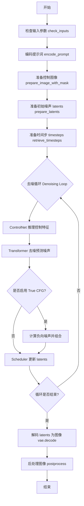

## 类结构

```
DiffusionPipeline (基类)
├── QwenImageLoraLoaderMixin (混合类)
└── QwenImageControlNetInpaintPipeline (主类)
```

## 全局变量及字段


### `logger`
    
模块级日志记录器

类型：`logging.Logger`
    


### `EXAMPLE_DOC_STRING`
    
示例文档字符串，包含pipeline使用示例

类型：`str`
    


### `XLA_AVAILABLE`
    
PyTorch XLA 可用性标志

类型：`bool`
    


### `QwenImageControlNetInpaintPipeline.model_cpu_offload_seq`
    
模型卸载顺序配置

类型：`str`
    


### `QwenImageControlNetInpaintPipeline._callback_tensor_inputs`
    
回调函数支持的张量输入列表

类型：`list`
    


### `QwenImageControlNetInpaintPipeline.vae`
    
图像 variational auto-encoder

类型：`AutoencoderKLQwenImage`
    


### `QwenImageControlNetInpaintPipeline.text_encoder`
    
Qwen2.5-VL 文本编码器

类型：`Qwen2_5_VLForConditionalGeneration`
    


### `QwenImageControlNetInpaintPipeline.tokenizer`
    
分词器

类型：`Qwen2Tokenizer`
    


### `QwenImageControlNetInpaintPipeline.transformer`
    
去噪 transformer 主干网络

类型：`QwenImageTransformer2DModel`
    


### `QwenImageControlNetInpaintPipeline.scheduler`
    
扩散调度器

类型：`FlowMatchEulerDiscreteScheduler`
    


### `QwenImageControlNetInpaintPipeline.controlnet`
    
ControlNet 控制网络

类型：`QwenImageControlNetModel`
    


### `QwenImageControlNetInpaintPipeline.vae_scale_factor`
    
VAE 缩放因子

类型：`int`
    


### `QwenImageControlNetInpaintPipeline.image_processor`
    
图像预处理器

类型：`VaeImageProcessor`
    


### `QwenImageControlNetInpaintPipeline.mask_processor`
    
掩码预处理器

类型：`VaeImageProcessor`
    


### `QwenImageControlNetInpaintPipeline.tokenizer_max_length`
    
分词器最大长度

类型：`int`
    


### `QwenImageControlNetInpaintPipeline.prompt_template_encode`
    
提示词模板

类型：`str`
    


### `QwenImageControlNetInpaintPipeline.prompt_template_encode_start_idx`
    
提示词模板起始索引

类型：`int`
    


### `QwenImageControlNetInpaintPipeline.default_sample_size`
    
默认采样尺寸

类型：`int`
    


### `QwenImageControlNetInpaintPipeline._guidance_scale`
    
引导系数 (内部属性)

类型：`float`
    


### `QwenImageControlNetInpaintPipeline._attention_kwargs`
    
注意力参数 (内部属性)

类型：`dict`
    


### `QwenImageControlNetInpaintPipeline._num_timesteps`
    
时间步数量 (内部属性)

类型：`int`
    


### `QwenImageControlNetInpaintPipeline._current_timestep`
    
当前时间步 (内部属性)

类型：`int`
    


### `QwenImageControlNetInpaintPipeline._interrupt`
    
中断标志 (内部属性)

类型：`bool`
    
    

## 全局函数及方法


### `calculate_shift`

计算噪声调度的位移参数（shift parameter），用于根据图像序列长度动态调整噪声调度（noise schedule）中的位移值。该函数通过线性插值在基础序列长度和最大序列长度之间计算对应的位移值。

参数：

- `image_seq_len`：`int`，输入图像的序列长度（latent  patches的数量）
- `base_seq_len`：`int` = 256，基础序列长度，用于线性插值的左端点
- `max_seq_len`：`int` = 4096，最大序列长度，用于线性插值的右端点
- `base_shift`：`float` = 0.5，基础位移值，对应 base_seq_len 时的位移
- `max_shift`：`float` = 1.15，最大位移值，对应 max_seq_len 时的位移

返回值：`float`，计算得到的位移参数 mu，用于噪声调度器的时间步调整

#### 流程图

```mermaid
flowchart TD
    A[开始] --> B[计算斜率 m<br/>m = (max_shift - base_shift) / (max_seq_len - base_seq_len)]
    B --> C[计算截距 b<br/>b = base_shift - m * base_seq_len]
    C --> D[计算位移 mu<br/>mu = image_seq_len * m + b]
    D --> E[返回 mu]
```

#### 带注释源码

```python
# Coped from diffusers.pipelines.qwenimage.pipeline_qwenimage.calculate_shift
def calculate_shift(
    image_seq_len,          # 图像序列长度，即 latent tokens 的数量
    base_seq_len: int = 256,    # 基础序列长度，默认256
    max_seq_len: int = 4096,    # 最大序列长度，默认4096
    base_shift: float = 0.5,    # 基础位移值，默认0.5
    max_shift: float = 1.15,    # 最大位移值，默认1.15
):
    # 计算线性插值的斜率 m
    # 斜率 = (最大位移 - 基础位移) / (最大序列长度 - 基础序列长度)
    m = (max_shift - base_shift) / (max_seq_len - base_seq_len)
    
    # 计算线性截距 b
    # 截距 = 基础位移 - 斜率 * 基础序列长度
    b = base_shift - m * base_seq_len
    
    # 根据图像序列长度计算位移 mu
    # 使用线性方程: mu = image_seq_len * m + b
    mu = image_seq_len * m + b
    
    # 返回计算得到的位移参数
    return mu
```


### `retrieve_latents`

该函数是一个全局工具函数，用于从 VAE（变分自编码器）的 encoder_output 中提取 latent 分布或 latent 向量。根据 `sample_mode` 参数，它可以从潜在分布中进行采样或取其模式（最大值），也可以直接返回预计算的 latents。这是扩散模型管道中常见的辅助函数，用于获取用于去噪过程的潜在表示。

参数：

- `encoder_output`：`torch.Tensor`，VAE 编码器的输出对象，通常包含 `latent_dist`（潜在分布）或 `latents`（潜在张量）属性
- `generator`：`torch.Generator | None`，可选的随机数生成器，用于确保采样过程的可重复性
- `sample_mode`：`str`，采样模式，默认为 `"sample"`（从分布中采样），可选 `"argmax"`（取分布的模式/均值）

返回值：`torch.Tensor`，提取出的潜在表示张量，用于后续的扩散去噪过程

#### 流程图

```mermaid
flowchart TD
    A[开始: retrieve_latents] --> B{encoder_output 是否有 latent_dist 属性?}
    B -- 是 --> C{sample_mode == 'sample'?}
    B -- 否 --> D{encoder_output 是否有 latents 属性?}
    C -- 是 --> E[调用 latent_dist.sample(generator)]
    C -- 否 --> F{sample_mode == 'argmax'?}
    F -- 是 --> G[调用 latent_dist.mode]
    F -- 否 --> H[抛出 AttributeError]
    D -- 是 --> I[返回 encoder_output.latents]
    D -- 否 --> H
    E --> J[返回采样结果]
    G --> J
    I --> J
    H --> K[结束: 异常处理]
    J --> K
```

#### 带注释源码

```
def retrieve_latents(
    encoder_output: torch.Tensor, generator: torch.Generator | None = None, sample_mode: str = "sample"
):
    # 检查 encoder_output 是否具有 latent_dist 属性（表示 VAE 输出的是潜在分布）
    if hasattr(encoder_output, "latent_dist") and sample_mode == "sample":
        # 如果采样模式为 "sample"，从潜在分布中进行随机采样
        # 这允许模型在生成过程中引入随机性
        return encoder_output.latent_dist.sample(generator)
    # 检查是否为 argmax 模式（取分布的模式/峰值）
    elif hasattr(encoder_output, "latent_dist") and sample_mode == "argmax":
        # 返回潜在分布的模式（通常是均值或最大值对应的点）
        return encoder_output.latent_dist.mode()
    # 检查是否直接具有 latents 属性（预计算的潜在向量）
    elif hasattr(encoder_output, "latents"):
        # 直接返回预计算的潜在向量
        return encoder_output.latents
    else:
        # 如果无法从 encoder_output 中提取潜在表示，抛出属性错误
        raise AttributeError("Could not access latents of provided encoder_output")
```


### `retrieve_timesteps`

该函数用于从调度器（scheduler）获取时间步（timesteps）序列，支持自定义时间步或 sigma 值，并返回调整后的时间步序列和推理步数。

参数：

- `scheduler`：`SchedulerMixin`，调度器对象，用于生成时间步序列
- `num_inference_steps`：`int | None`，推理过程中的去噪步数，如果使用 `timesteps` 或 `sigmas` 则必须为 `None`
- `device`：`str | torch.device | None`，时间步要移动到的设备，如果为 `None` 则不移动
- `timesteps`：`list[int] | None`，自定义时间步列表，用于覆盖调度器的默认时间步间隔策略
- `sigmas`：`list[float] | None`，自定义 sigma 列表，用于覆盖调度器的默认 sigma 间隔策略
- `**kwargs`：任意关键字参数，将传递给调度器的 `set_timesteps` 方法

返回值：`tuple[torch.Tensor, int]`，第一个元素是调度器的时间步序列，第二个元素是推理步数

#### 流程图

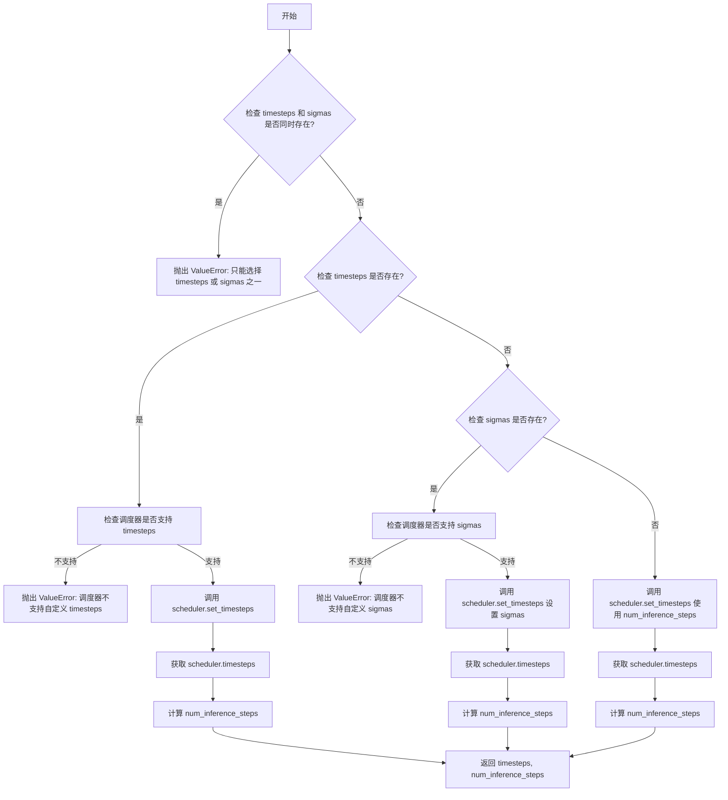

#### 带注释源码

```python
# Copied from diffusers.pipelines.stable_diffusion.pipeline_stable_diffusion.retrieve_timesteps
def retrieve_timesteps(
    scheduler,  # 调度器对象，用于生成时间步序列
    num_inference_steps: int | None = None,  # 推理步数
    device: str | torch.device | None = None,  # 目标设备
    timesteps: list[int] | None = None,  # 自定义时间步列表
    sigmas: list[float] | None = None,  # 自定义 sigma 列表
    **kwargs,  # 额外参数，传递给调度器的 set_timesteps
):
    r"""
    Calls the scheduler's `set_timesteps` method and retrieves timesteps from the scheduler after the call. Handles
    custom timesteps. Any kwargs will be supplied to `scheduler.set_timesteps`.

    Args:
        scheduler (`SchedulerMixin`):
            The scheduler to get timesteps from.
        num_inference_steps (`int`):
            The number of diffusion steps used when generating samples with a pre-trained model. If used, `timesteps`
            must be `None`.
        device (`str` or `torch.device`, *optional*):
            The device to which the timesteps should be moved to. If `None`, the timesteps are not moved.
        timesteps (`list[int]`, *optional*):
            Custom timesteps used to override the timestep spacing strategy of the scheduler. If `timesteps` is passed,
            `num_inference_steps` and `sigmas` must be `None`.
        sigmas (`list[float]`, *optional*):
            Custom sigmas used to override the timestep spacing strategy of the scheduler. If `sigmas` is passed,
            `num_inference_steps` and `timesteps` must be `None`.

    Returns:
        `tuple[torch.Tensor, int]`: A tuple where the first element is the timestep schedule from the scheduler and the
        second element is the number of inference steps.
    """
    # 检查是否同时传递了 timesteps 和 sigmas，两者只能选其一
    if timesteps is not None and sigmas is not None:
        raise ValueError("Only one of `timesteps` or `sigmas` can be passed. Please choose one to set custom values")
    
    # 处理自定义时间步的情况
    if timesteps is not None:
        # 检查调度器是否支持自定义 timesteps 参数
        accepts_timesteps = "timesteps" in set(inspect.signature(scheduler.set_timesteps).parameters.keys())
        if not accepts_timesteps:
            raise ValueError(
                f"The current scheduler class {scheduler.__class__}'s `set_timesteps` does not support custom"
                f" timestep schedules. Please check whether you are using the correct scheduler."
            )
        # 调用调度器的 set_timesteps 方法设置自定义时间步
        scheduler.set_timesteps(timesteps=timesteps, device=device, **kwargs)
        # 从调度器获取设置后的时间步
        timesteps = scheduler.timesteps
        # 计算推理步数
        num_inference_steps = len(timesteps)
    # 处理自定义 sigmas 的情况
    elif sigmas is not None:
        # 检查调度器是否支持自定义 sigmas 参数
        accept_sigmas = "sigmas" in set(inspect.signature(scheduler.set_timesteps).parameters.keys())
        if not accept_sigmas:
            raise ValueError(
                f"The current scheduler class {scheduler.__class__}'s `set_timesteps` does not support custom"
                f" sigmas schedules. Please check whether you are using the correct scheduler."
            )
        # 调用调度器的 set_timesteps 方法设置自定义 sigmas
        scheduler.set_timesteps(sigmas=sigmas, device=device, **kwargs)
        # 从调度器获取设置后的时间步
        timesteps = scheduler.timesteps
        # 计算推理步数
        num_inference_steps = len(timesteps)
    # 默认情况：使用 num_inference_steps 设置时间步
    else:
        scheduler.set_timesteps(num_inference_steps, device=device, **kwargs)
        timesteps = scheduler.timesteps
    
    # 返回时间步序列和推理步数
    return timesteps, num_inference_steps
```


### `QwenImageControlNetInpaintPipeline.__init__`

初始化QwenImageControlNetInpaintPipeline管道组件，配置调度器、VAE、文本编码器、分词器、Transformer和ControlNet模型，并设置图像处理器、掩码处理器及相关的默认参数。

参数：

- `scheduler`：`FlowMatchEulerDiscreteScheduler`，用于去噪图像潜在表示的调度器
- `vae`：`AutoencoderKLQwenImage`，用于编码和解码图像的变分自编码器模型
- `text_encoder`：`Qwen2_5_VLForConditionalGeneration`，将文本提示编码为嵌入向量的Qwen2.5-VL模型
- `tokenizer`：`Qwen2Tokenizer`，用于将文本分词的Qwen分词器
- `transformer`：`QwenImageTransformer2DModel`，条件Transformer（MMDiT）架构，用于去噪图像潜在表示
- `controlnet`：`QwenImageControlNetModel`，ControlNet模型，用于提供额外的控制条件

返回值：无（`None`），该方法为构造函数，不返回任何值

#### 流程图

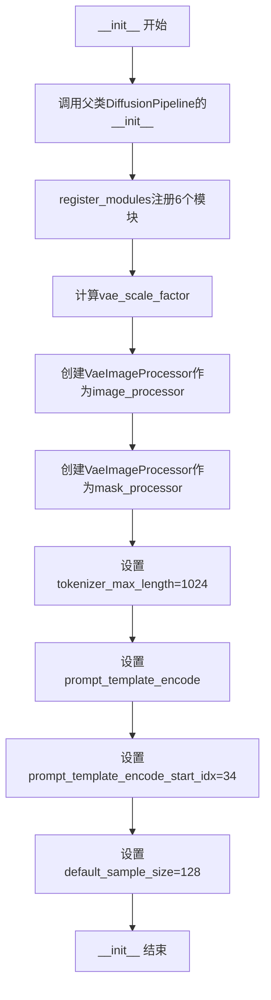

#### 带注释源码

```
def __init__(
    self,
    scheduler: FlowMatchEulerDiscreteScheduler,  # 去噪调度器
    vae: AutoencoderKLQwenImage,  # VAE模型
    text_encoder: Qwen2_5_VLForConditionalGeneration,  # 文本编码器
    tokenizer: Qwen2Tokenizer,  # 分词器
    transformer: QwenImageTransformer2DModel,  # 主Transformer模型
    controlnet: QwenImageControlNetModel,  # ControlNet模型
):
    # 1. 调用父类构造函数初始化基础管道功能
    super().__init__()

    # 2. 注册所有模块到管道中，使管道能够管理这些组件
    self.register_modules(
        vae=vae,
        text_encoder=text_encoder,
        tokenizer=tokenizer,
        transformer=transformer,
        scheduler=scheduler,
        controlnet=controlnet,
    )

    # 3. 计算VAE缩放因子，基于时间下采样层数量的2的幂次
    # 如果vae存在则使用其temperal_downsample属性，否则默认为8
    self.vae_scale_factor = 2 ** len(self.vae.temporal_downsample) if getattr(self, "vae", None) else 8
    
    # 4. 图像处理器配置
    # QwenImage的潜在表示被转换为2x2块并打包，因此潜在宽度和高度必须能被块大小整除
    # VAE缩放因子乘以2来补偿这个打包操作
    self.image_processor = VaeImageProcessor(vae_scale_factor=self.vae_scale_factor * 2)

    # 5. 掩码处理器配置
    # 专门用于处理掩码图像，包含resize、灰度转换和二值化
    self.mask_processor = VaeImageProcessor(
        vae_scale_factor=self.vae_scale_factor * 2,
        do_resize=True,
        do_convert_grayscale=True,
        do_normalize=False,
        do_binarize=True,
    )

    # 6. 设置分词器最大长度
    self.tokenizer_max_length = 1024
    
    # 7. 设置提示词编码模板
    # 包含system、user和assistant角色的完整提示格式
    self.prompt_template_encode = "<|im_start|>system\nDescribe the image by detailing the color, shape, size, texture, quantity, text, spatial relationships of the objects and background:<|im_end|>\n<|im_start|>user\n{}<|im_end|>\n<|im_start|>assistant\n"
    
    # 8. 提示词模板中实际内容开始的索引位置（跳过前缀）
    self.prompt_template_encode_start_idx = 34
    
    # 9. 默认采样尺寸（用于未指定尺寸时的默认值）
    self.default_sample_size = 128
```


### `QwenImageControlNetInpaintPipeline._extract_masked_hidden`

从隐藏状态中提取有效token，根据掩码过滤无效位置，并按样本分割返回。

参数：

- `self`：类的实例引用
- `hidden_states`：`torch.Tensor`，编码器输出的隐藏状态张量，形状为 `(batch_size, seq_len, hidden_dim)`
- `mask`：`torch.Tensor`，注意力掩码张量，形状为 `(batch_size, seq_len)`，用于标识哪些位置是有效的

返回值：`list[torch.Tensor]`，按样本分割后的隐藏状态列表，每个元素对应一个样本的有效token

#### 流程图

```mermaid
flowchart TD
    A[开始: _extract_masked_hidden] --> B[将mask转换为bool类型]
    B --> C[计算每行的有效长度: valid_lengths = bool_mask.sum(dim=1)]
    C --> D[使用bool索引选择有效hidden_states: selected = hidden_states[bool_mask]]
    D --> E[按有效长度分割张量: split_result = torch.split(selected, valid_lengths.tolist(), dim=0)]
    E --> F[返回分割结果列表]
```

#### 带注释源码

```python
def _extract_masked_hidden(self, hidden_states: torch.Tensor, mask: torch.Tensor):
    """
    从隐藏状态中提取有效token
    
    Args:
        hidden_states: 编码器输出的隐藏状态张量 (batch_size, seq_len, hidden_dim)
        mask: 注意力掩码张量 (batch_size, seq_len)，1表示有效，0表示无效
    
    Returns:
        list[torch.Tensor]: 按样本分割的隐藏状态列表
    """
    # 将掩码转换为布尔类型，便于索引
    bool_mask = mask.bool()
    
    # 计算每个样本的有效token数量（按行求和）
    valid_lengths = bool_mask.sum(dim=1)
    
    # 使用布尔索引从隐藏状态中选择有效位置的向量
    # 这一步会将所有batch的有效token展平拼接在一起
    selected = hidden_states[bool_mask]
    
    # 将展平的隐藏状态按每个样本的有效长度分割成独立张量
    # valid_lengths.tolist() 提供了每个样本需要分割的长度
    split_result = torch.split(selected, valid_lengths.tolist(), dim=0)
    
    # 返回分割后的列表，每个元素对应一个样本的有效隐藏状态
    return split_result
```


### `QwenImageControlNetInpaintPipeline._get_qwen_prompt_embeds`

该方法用于生成 Qwen 特定的提示词嵌入。它接收原始文本提示，通过 Qwen 的提示词模板格式化，然后使用文本编码器（text_encoder）生成隐藏状态，最后对隐藏状态进行后处理，包括提取有效部分、填充到相同长度并生成对应的注意力掩码，最终返回提示词嵌入和注意力掩码供后续的 Transformer 模型使用。

参数：

- `prompt`：`str | list[str]`，待编码的提示词，可以是单个字符串或字符串列表
- `device`：`torch.device | None`，指定计算设备，默认为执行设备
- `dtype`：`torch.dtype | None`，指定数据类型，默认为文本编码器的数据类型

返回值：`tuple[torch.Tensor, torch.Tensor]`，包含两个张量的元组——第一个是提示词嵌入（prompt_embeds），形状为 (batch_size, seq_len, hidden_dim)；第二个是编码器注意力掩码（encoder_attention_mask），形状为 (batch_size, seq_len)

#### 流程图

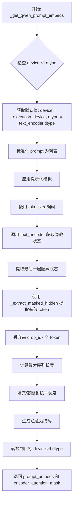

#### 带注释源码

```python
def _get_qwen_prompt_embeds(
    self,
    prompt: str | list[str] = None,
    device: torch.device | None = None,
    dtype: torch.dtype | None = None,
):
    """
    生成 Qwen 特定的提示词嵌入
    
    Args:
        prompt: 输入的提示词字符串或列表
        device: 目标设备，如果为 None 则使用执行设备
        dtype: 目标数据类型，如果为 None 则使用 text_encoder 的数据类型
    
    Returns:
        tuple: (prompt_embeds, encoder_attention_mask)
            - prompt_embeds: 提示词嵌入张量，形状为 (batch_size, seq_len, hidden_dim)
            - encoder_attention_mask: 注意力掩码，形状为 (batch_size, seq_len)
    """
    # 如果未指定设备，则使用管道的执行设备
    device = device or self._execution_device
    # 如果未指定数据类型，则使用文本编码器的数据类型
    dtype = dtype or self.text_encoder.dtype

    # 确保 prompt 为列表格式（统一处理单条和多条提示词）
    prompt = [prompt] if isinstance(prompt, str) else prompt

    # 获取提示词模板和模板起始索引（用于裁剪模板前缀）
    template = self.prompt_template_encode
    drop_idx = self.prompt_template_encode_start_idx
    
    # 使用 Qwen 特定的提示词模板格式化每个提示词
    # 模板格式: <|im_start|>system\n...描述指令...<|im_end|>\n<|im_start|>user\n{prompt}<|im_end|>\n<|im_start|>assistant\n
    txt = [template.format(e) for e in prompt]
    
    # 使用 tokenizer 将文本转换为 token IDs 和 attention mask
    # max_length 加上 drop_idx 是为了容纳模板前缀部分的 token
    txt_tokens = self.tokenizer(
        txt, 
        max_length=self.tokenizer_max_length + drop_idx, 
        padding=True, 
        truncation=True, 
        return_tensors="pt"
    ).to(self.device)
    
    # 调用文本编码器获取隐藏状态
    # output_hidden_states=True 确保返回所有层的隐藏状态
    encoder_hidden_states = self.text_encoder(
        input_ids=txt_tokens.input_ids,
        attention_mask=txt_tokens.attention_mask,
        output_hidden_states=True,
    )
    
    # 获取最后一层的隐藏状态（通常包含最丰富的语义信息）
    hidden_states = encoder_hidden_states.hidden_states[-1]
    
    # 使用自定义方法提取被 attention mask 覆盖的有效 token 的隐藏状态
    # 这会根据 attention_mask 过滤掉 padding 部分
    split_hidden_states = self._extract_masked_hidden(hidden_states, txt_tokens.attention_mask)
    
    # 丢弃每个序列的前 drop_idx 个 token（模板前缀部分）
    split_hidden_states = [e[drop_idx:] for e in split_hidden_states]
    
    # 为每个有效序列生成全1的注意力掩码（因为已去除 padding）
    attn_mask_list = [torch.ones(e.size(0), dtype=torch.long, device=e.device) for e in split_hidden_states]
    
    # 计算所有序列中的最大长度，用于后续填充对齐
    max_seq_len = max([e.size(0) for e in split_hidden_states])
    
    # 将隐藏状态填充到统一长度（使用零填充）
    # 对长度不足的序列在末尾添加零张量
    prompt_embeds = torch.stack(
        [torch.cat([u, u.new_zeros(max_seq_len - u.size(0), u.size(1))]) for u in split_hidden_states]
    )
    
    # 将注意力掩码填充到统一长度
    encoder_attention_mask = torch.stack(
        [torch.cat([u, u.new_zeros(max_seq_len - u.size(0))]) for u in attn_mask_list]
    )

    # 将结果移动到指定的设备和数据类型
    prompt_embeds = prompt_embeds.to(dtype=dtype, device=device)

    return prompt_embeds, encoder_attention_mask
```


### `QwenImageControlNetInpaintPipeline.encode_prompt`

该方法封装了提示词编码的核心逻辑，负责将文本提示（prompt）转换为模型可处理的向量表示（prompt_embeds）及其对应的注意力掩码（prompt_embeds_mask），同时支持批量生成和嵌入复用。

参数：

- `prompt`：`str | list[str]`，要编码的文本提示，可以是单个字符串或字符串列表
- `device`：`torch.device | None`，执行编码的设备，默认为执行设备
- `num_images_per_prompt`：`int = 1`，每个提示需要生成的图像数量，用于扩展批次维度
- `prompt_embeds`：`torch.Tensor | None = None`，预生成的文本嵌入向量，若提供则直接使用，否则从 prompt 编码生成
- `prompt_embeds_mask`：`torch.Tensor | None = None`，与 prompt_embeds 对应的注意力掩码
- `max_sequence_length`：`int = 1024`，最大序列长度约束

返回值：`tuple[torch.Tensor, torch.Tensor]`，返回包含两个元素的元组：
- 第一个元素：`torch.Tensor`，处理后的文本嵌入向量，形状为 `(batch_size * num_images_per_prompt, seq_len, hidden_dim)`
- 第二个元素：`torch.Tensor`，对应的注意力掩码，形状为 `(batch_size * num_images_per_prompt, seq_len)`

#### 流程图

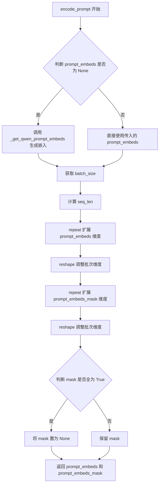

#### 带注释源码

```python
def encode_prompt(
    self,
    prompt: str | list[str],
    device: torch.device | None = None,
    num_images_per_prompt: int = 1,
    prompt_embeds: torch.Tensor | None = None,
    prompt_embeds_mask: torch.Tensor | None = None,
    max_sequence_length: int = 1024,
):
    r"""
    封装提示词编码逻辑，将文本提示转换为模型可处理的向量表示。

    Args:
        prompt (`str` or `list[str]`, *optional*):
            prompt to be encoded
        device: (`torch.device`):
            torch device
        num_images_per_prompt (`int`):
            number of images that should be generated per prompt
        prompt_embeds (`torch.Tensor`, *optional*):
            Pre-generated text embeddings. Can be used to easily tweak text inputs, *e.g.* prompt weighting. If not
            provided, text embeddings will be generated from `prompt` input argument.
    """
    # 确定执行设备，若未指定则使用默认执行设备
    device = device or self._execution_device

    # 标准化 prompt 格式：若是单个字符串则转为列表
    prompt = [prompt] if isinstance(prompt, str) else prompt
    # 计算批次大小：若有预生成的 embeddings 则使用其批次维度，否则使用 prompt 列表长度
    batch_size = len(prompt) if prompt_embeds is None else prompt_embeds.shape[0]

    # 若未提供 embeddings，则调用内部方法从 prompt 编码生成
    if prompt_embeds is None:
        prompt_embeds, prompt_embeds_mask = self._get_qwen_prompt_embeds(prompt, device)

    # 获取序列长度
    _, seq_len, _ = prompt_embeds.shape
    # 根据 num_images_per_prompt 扩展 embeddings：重复每个 prompt 对应的 embeddings
    prompt_embeds = prompt_embeds.repeat(1, num_images_per_prompt, 1)
    # 重新整形以匹配批量生成的图像数量
    prompt_embeds = prompt_embeds.view(batch_size * num_images_per_prompt, seq_len, -1)
    # 同样扩展 attention mask
    prompt_embeds_mask = prompt_embeds_mask.repeat(1, num_images_per_prompt, 1)
    prompt_embeds_mask = prompt_embeds_mask.view(batch_size * num_images_per_prompt, seq_len)

    # 优化处理：如果 mask 全为 True（表示全部可见），则置为 None 以简化后续计算
    if prompt_embeds_mask is not None and prompt_embeds_mask.all():
        prompt_embeds_mask = None

    # 返回编码后的 embeddings 和对应的 mask
    return prompt_embeds, prompt_embeds_mask
```


### `QwenImageControlNetInpaintPipeline.check_inputs`

该方法用于验证 `QwenImageControlNetInpaintPipeline` 管道输入参数的合法性，确保用户在调用图像生成管道时提供的参数符合要求，避免在后续处理过程中出现运行时错误。

参数：

- `prompt`：`str | list[str] | None`，用户提供的文本提示词，用于指导图像生成方向
- `height`：`int`，生成图像的高度（像素）
- `width`：`int`，生成图像的宽度（像素）
- `negative_prompt`：`str | list[str] | None`，反向提示词，用于指导图像避免生成的内容
- `prompt_embeds`：`torch.Tensor | None`，预生成的文本嵌入向量，可替代 prompt 使用
- `negative_prompt_embeds`：`torch.Tensor | None`，预生成的反向文本嵌入向量
- `prompt_embeds_mask`：`torch.Tensor | None`，提示词嵌入的注意力掩码
- `negative_prompt_embeds_mask`：`torch.Tensor | None`，反向提示词嵌入的注意力掩码
- `callback_on_step_end_tensor_inputs`：`list[str] | None`，每步结束后回调函数可访问的张量输入列表
- `max_sequence_length`：`int | None`，文本编码的最大序列长度

返回值：`None`，该方法仅进行参数验证，不返回任何数据

#### 流程图

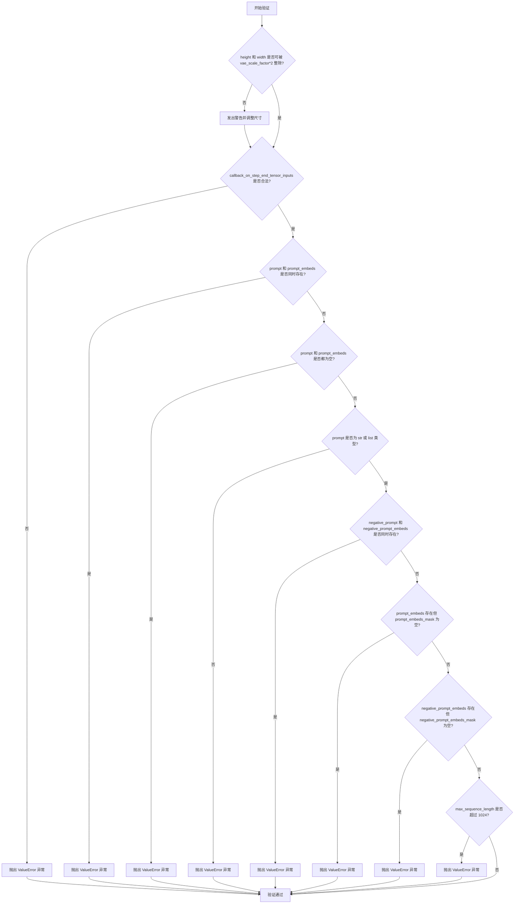

#### 带注释源码

```python
def check_inputs(
    self,
    prompt,
    height,
    width,
    negative_prompt=None,
    prompt_embeds=None,
    negative_prompt_embeds=None,
    prompt_embeds_mask=None,
    negative_prompt_embeds_mask=None,
    callback_on_step_end_tensor_inputs=None,
    max_sequence_length=None,
):
    """
    验证管道输入参数的合法性
    
    参数检查逻辑:
    1. 图像尺寸必须是 VAE 缩放因子的整数倍
    2. callback_on_step_end_tensor_inputs 必须是合法的张量输入名称
    3. prompt 和 prompt_embeds 不能同时提供
    4. prompt 和 prompt_embeds 不能同时为空
    5. prompt 必须是字符串或列表类型
    6. negative_prompt 和 negative_prompt_embeds 不能同时提供
    7. 如果提供 prompt_embeds，必须同时提供 prompt_embeds_mask
    8. 如果提供 negative_prompt_embeds，必须同时提供 negative_prompt_embeds_mask
    9. max_sequence_length 不能超过 1024
    """
    
    # 检查图像尺寸是否满足 VAE 缩放要求
    # QwenImage 使用 2x2 分块打包，因此高度和宽度必须是 vae_scale_factor * 2 的倍数
    if height % (self.vae_scale_factor * 2) != 0 or width % (self.vae_scale_factor * 2) != 0:
        logger.warning(
            f"`height` and `width` have to be divisible by {self.vae_scale_factor * 2} but are {height} and {width}. Dimensions will be resized accordingly"
        )

    # 验证回调函数张量输入是否在允许列表中
    if callback_on_step_end_tensor_inputs is not None and not all(
        k in self._callback_tensor_inputs for k in callback_on_step_end_tensor_inputs
    ):
        raise ValueError(
            f"`callback_on_step_end_tensor_inputs` has to be in {self._callback_tensor_inputs}, but found {[k for k in callback_on_step_end_tensor_inputs if k not in self._callback_tensor_inputs]}"
        )

    # 验证 prompt 和 prompt_embeds 的互斥关系
    # 不能同时提供两者，只能选择其中一种输入方式
    if prompt is not None and prompt_embeds is not None:
        raise ValueError(
            f"Cannot forward both `prompt`: {prompt} and `prompt_embeds`: {prompt_embeds}. Please make sure to"
            " only forward one of the two."
        )
    # 至少需要提供其中一种输入
    elif prompt is None and prompt_embeds is None:
        raise ValueError(
            "Provide either `prompt` or `prompt_embeds`. Cannot leave both `prompt` and `prompt_embeds` undefined."
        )
    # 验证 prompt 的数据类型
    elif prompt is not None and (not isinstance(prompt, str) and not isinstance(prompt, list)):
        raise ValueError(f"`prompt` has to be of type `str` or `list` but is {type(prompt)}")

    # 验证 negative_prompt 和 negative_prompt_embeds 的互斥关系
    if negative_prompt is not None and negative_prompt_embeds is not None:
        raise ValueError(
            f"Cannot forward both `negative_prompt`: {negative_prompt} and `negative_prompt_embeds`:"
            f" {negative_prompt_embeds}. Please make sure to only forward one of the two."
        )

    # 验证 prompt_embeds 和 prompt_embeds_mask 的配对关系
    # 如果提供了嵌入向量，必须同时提供对应的注意力掩码
    if prompt_embeds is not None and prompt_embeds_mask is None:
        raise ValueError(
            "If `prompt_embeds` are provided, `prompt_embeds_mask` also have to be passed. Make sure to generate `prompt_embeds_mask` from the same text encoder that was used to generate `prompt_embeds`."
        )
    # 验证 negative_prompt_embeds 和 negative_prompt_embeds_mask 的配对关系
    if negative_prompt_embeds is not None and negative_prompt_embeds_mask is None:
        raise ValueError(
            "If `negative_prompt_embeds` are provided, `negative_prompt_embeds_mask` also have to be passed. Make sure to generate `negative_prompt_embeds_mask` from the same text encoder that was used to generate `negative_prompt_embeds`."
        )

    # 验证最大序列长度限制
    if max_sequence_length is not None and max_sequence_length > 1024:
        raise ValueError(f"`max_sequence_length` cannot be greater than 1024 but is {max_sequence_length}")
```


### `QwenImageControlNetInpaintPipeline._pack_latents`

该方法是一个静态方法，用于将 VAE 输出的 latents 张量进行打包(packing)操作，将 2x2 的空间块展平并重新排列为序列形式，以适配后续 Transformer 模型的输入格式要求。

参数：

- `latents`：`torch.Tensor`，输入的 latents 张量，形状为 (batch_size, num_channels_latents, height, width)
- `batch_size`：`int`，批次大小
- `num_channels_latents`：`int`，latents 的通道数
- `height`：`int`，latents 的高度
- `width`：`int`，latents 的宽度

返回值：`torch.Tensor`，打包后的 latents，形状为 (batch_size, (height // 2) * (width // 2), num_channels_latents * 4)

#### 流程图

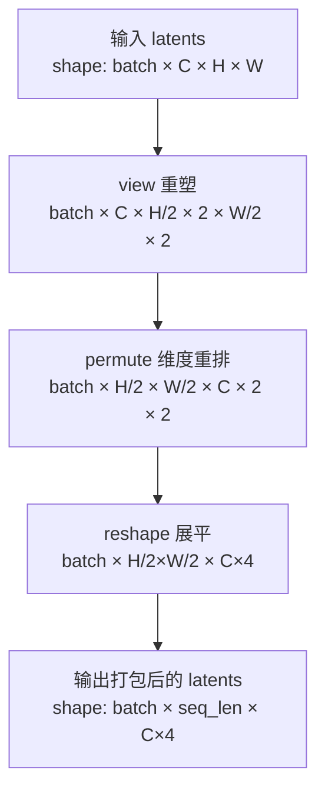

#### 带注释源码

```python
@staticmethod
# Copied from diffusers.pipelines.qwenimage.pipeline_qwenimage.QwenImagePipeline._pack_latents
def _pack_latents(latents, batch_size, num_channels_latents, height, width):
    """
    将 latents 打包以适配 Transformer 模型
    
    处理流程：
    1. view: 将 (batch, C, H, W) 重塑为 (batch, C, H//2, 2, W//2, 2)
       - 将高度和宽度各划分为 2x2 的小块
    2. permute: 重新排列维度为 (batch, H//2, W//2, C, 2, 2)
       - 将空间维度移至前面，便于后续展平
    3. reshape: 展平为 (batch, H//2*W//2, C*4)
       - 将 2x2 小块展平为 4 个通道，合并到通道维度
    
    Args:
        latents: 输入的 latents 张量
        batch_size: 批次大小
        num_channels_latents: latents 通道数
        height: 高度
        width: 宽度
    
    Returns:
        打包后的 latents，形状为 (batch, (height//2)*(width//2), num_channels_latents*4)
    """
    # Step 1: 将 latents 划分为 2x2 的空间块
    # 例如: (B, 16, 64, 64) -> (B, 16, 32, 2, 32, 2)
    latents = latents.view(batch_size, num_channels_latents, height // 2, 2, width // 2, 2)
    
    # Step 2: 调整维度顺序，将空间维度前置
    # (B, 16, 32, 2, 32, 2) -> (B, 32, 32, 16, 2, 2)
    latents = latents.permute(0, 2, 4, 1, 3, 5)
    
    # Step 3: 展平 2x2 块到通道维度
    # (B, 32, 32, 16, 2, 2) -> (B, 32*32, 16*4) = (B, 1024, 64)
    latents = latents.reshape(batch_size, (height // 2) * (width // 2), num_channels_latents * 4)

    return latents
```


### `QwenImageControlNetInpaintPipeline._unpack_latents`

该方法是一个静态方法，用于将打包后的latent张量解包为适配VAE解码的4D张量形状。在Qwen-Image Pipeline中，latents会被打包成2x2的patch形式以提高计算效率，此方法逆向恢复原始的空间维度结构。

参数：

- `latents`：`torch.Tensor`，已打包的latent张量，形状为(batch_size, num_patches, channels)，其中num_patches = (height//2)*(width//2)，channels = num_channels_latents * 4
- `height`：`int`，原始图像的高度（像素单位）
- `width`：`int`，原始图像的宽度（像素单位）
- `vae_scale_factor`：`int`，VAE的缩放因子，用于计算 latent 空间的实际尺寸

返回值：`torch.Tensor`，解包后的latent张量，形状为(batch_size, channels // 4, 1, latent_height, latent_width)，可直接用于VAE解码

#### 流程图

```mermaid
flowchart TD
    A[开始: 接收打包的latents] --> B[获取batch_size, num_patches, channels]
    B --> C[根据vae_scale_factor计算实际的latent高度和宽度<br/>height = 2 * (height // (vae_scale_factor * 2))<br/>width = 2 * (width // (vae_scale_factor * 2))]
    C --> D[view操作: 重塑为batch_size, height//2, width//2, channels//4, 2, 2]
    D --> E[permute操作: 重新排列维度顺序<br/>从0,1,2,3,4,5 到 0,3,1,4,2,5]
    E --> F[reshape操作: 合并最后两个维度<br/>最终形状: batch_size, channels//4, 1, height, width]
    F --> G[返回解包后的latents张量]
```

#### 带注释源码

```python
@staticmethod
# Copied from diffusers.pipelines.qwenimage.pipeline_qwenimage.QwenImagePipeline._unpack_latents
def _unpack_latents(latents, height, width, vae_scale_factor):
    # 从打包的latents张量中提取维度信息
    # latents形状: (batch_size, num_patches, channels)
    # 其中 num_patches = (height//2) * (width//2), channels = num_channels_latents * 4
    batch_size, num_patches, channels = latents.shape

    # VAE对图像应用8x压缩，但我们还需要考虑packing机制
    # packing要求latent的高度和宽度能被2整除
    # 因此实际latent尺寸需要乘以2并除以vae_scale_factor的2倍
    # 计算公式: latent_size = 2 * (image_size // (vae_scale_factor * 2))
    height = 2 * (int(height) // (vae_scale_factor * 2))
    width = 2 * (int(width) // (vae_scale_factor * 2))

    # 使用view将打包的latents重塑为6D张量
    # 维度含义: (batch, 空间_y, 空间_x, 通道_patch, patch_y, patch_x)
    # 这样可以将2x2的patch展开为独立的维度
    latents = latents.view(batch_size, height // 2, width // 2, channels // 4, 2, 2)
    
    # 使用permute重新排列维度顺序
    # 从 (0,1,2,3,4,5) -> (0,3,1,4,2,5)
    # 新的维度顺序: (batch, channels_patch, spatial_y, patch_y, spatial_x, patch_x)
    # 这一步将空间维度和patch维度分离，便于后续reshape
    latents = latents.permute(0, 3, 1, 4, 2, 5)

    # 最后reshape将最后两个维度合并
    # 原始通道数 channels = num_channels_latents * 4
    # 打包时将4个通道放入了2x2的patch中
    # 解包后: channels // (2*2) = channels // 4 个通道
    # 最终形状: (batch_size, channels//4, 1, height, width)
    # 其中第三维的1表示temporal维度（对于静态图像为1）
    latents = latents.reshape(batch_size, channels // (2 * 2), 1, height, width)

    return latents
```


### `QwenImageControlNetInpaintPipeline.enable_vae_slicing`

启用 VAE 切片解码功能。当启用此选项时，VAE 会将输入张量分割成多个切片进行分步解码计算，从而节省内存并支持更大的批次大小。

参数：

- 无参数（仅包含隐式参数 `self`）

返回值：`None`，无返回值

#### 流程图

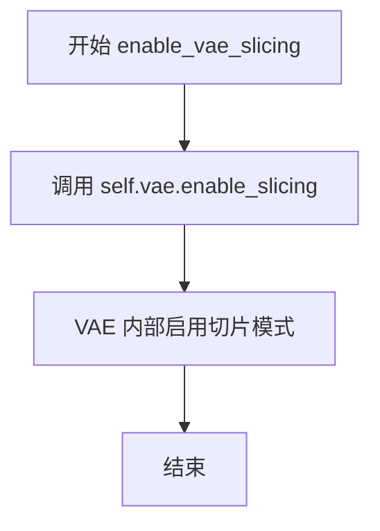

#### 带注释源码

```python
def enable_vae_slicing(self):
    r"""
    Enable sliced VAE decoding. When this option is enabled, the VAE will split the input tensor in slices to
    compute decoding in several steps. This is useful to save some memory and allow larger batch sizes.
    
    该方法用于启用 VAE 的切片解码模式。启用后，VAE 编码器/解码器会将大型输入张量
    分割成多个较小的切片进行处理，从而降低峰值内存占用，使得能够在有限显存下
    处理更大的图像或批次。
    
    Args:
        无额外参数（仅使用实例属性 self.vae）
    
    Returns:
        None: 无返回值，直接修改 VAE 模型的内部状态
    
    Example:
        >>> pipeline = QwenImageControlNetInpaintPipeline.from_pretrained(...)
        >>> pipeline.enable_vae_slicing()  # 启用切片解码以节省显存
        >>> result = pipeline(...)  # 推理时将使用切片方式解码
    """
    # 调用关联的 VAE 模型的 enable_slicing 方法，启用切片解码模式
    # 该操作会修改 VAE 模型的内部配置，使其在 encode/decode 时采用分片处理
    self.vae.enable_slicing()
```


### `QwenImageControlNetInpaintPipeline.disable_vae_slicing`

该方法用于禁用VAE切片解码功能，将VAE解码从分片处理模式恢复为单步完整解码，使模型能够一次性处理整个输入张量。

**类信息**：隶属于 `QwenImageControlNetInpaintPipeline` 类

**参数**：无（除隐式参数 `self`）

**返回值**：`None`，无返回值

#### 流程图

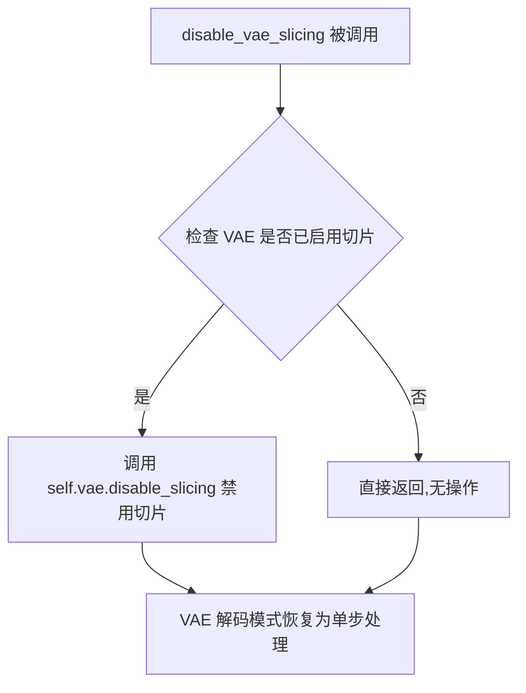

#### 带注释源码

```python
def disable_vae_slicing(self):
    r"""
    Disable sliced VAE decoding. If `enable_vae_slicing` was previously enabled, this method will go back to
    computing decoding in one step.
    """
    # 直接调用底层VAE模型的disable_slicing方法
    # 将VAE解码模式从分片切换回完整解码
    self.vae.disable_slicing()
```

---

## 补充上下文信息

### 1. 核心功能概述（一句话）

`QwenImageControlNetInpaintPipeline` 是一个基于 Qwen2.5-VL 模型的图像修复（inpainting）管道，结合 ControlNet 控制网络实现高质量的图像修复生成。

### 2. 文件整体运行流程

```
初始化 Pipeline
    ↓
准备控制图像和掩码 (prepare_image_with_mask)
    ↓
编码提示词 (encode_prompt)
    ↓
准备潜在变量 (prepare_latents)
    ↓
去噪循环 (Denoising Loop)
    ├─ 执行 ControlNet 前向传播
    ├─ 执行 Transformer 去噪
    └─ 调度器步进
    ↓
VAE 解码 (vae.decode)
    ↓
后处理输出图像
```

### 3. 类的详细信息

| 字段/方法 | 类型 | 描述 |
|-----------|------|------|
| `transformer` | `QwenImageTransformer2DModel` | 去噪 Transformer 模型 |
| `vae` | `AutoencoderKLQwenImage` | VAE 编解码器 |
| `controlnet` | `QwenImageControlNetModel` | ControlNet 控制网络 |
| `scheduler` | `FlowMatchEulerDiscreteScheduler` | 调度器 |
| `enable_vae_slicing()` | 方法 | 启用 VAE 切片解码 |
| `disable_vae_slicing()` | 方法 | 禁用 VAE 切片解码 |
| `enable_vae_tiling()` | 方法 | 启用 VAE 瓦片解码 |
| `disable_vae_tiling()` | 方法 | 禁用 VAE 瓦片解码 |
| `__call__()` | 方法 | 主生成方法 |

### 4. 关键组件信息

| 组件名称 | 描述 |
|---------|------|
| VAE (Variational Autoencoder) | 负责图像与潜在表示之间的转换 |
| ControlNet | 提供额外的控制条件来引导生成 |
| FlowMatchEulerDiscreteScheduler | 控制去噪过程的调度器 |
| VaeImageProcessor | 图像预处理和后处理 |

### 5. 潜在的技术债务或优化空间

1. **硬编码的提示词模板**：`prompt_template_encode` 字段硬编码在类中，缺乏灵活性
2. **重复代码**：多个管道间存在 `_pack_latents`、`_unpack_latents` 等方法的重复实现
3. **设备管理**：多处使用 `device` 和 `dtype` 的手动转换，可抽象为统一工具方法
4. **缺少类型提示**：部分内部方法参数缺少完整的类型注解

### 6. 其它项目

- **设计目标**：支持基于 Qwen2.5-VL 的图像修复任务，结合 ControlNet 实现精确控制
- **错误处理**：通过 `check_inputs` 方法进行输入验证
- **外部依赖**：依赖 `transformers`、`diffusers` 库及 PyTorch
- **内存优化**：提供 VAE slicing 和 tiling 两种内存优化策略


### `QwenImageControlNetInpaintPipeline.enable_vae_tiling`

启用 VAE 分块解码（tiled VAE decoding）。当启用此选项时，VAE 会将输入张量分割成多个块（tiles），分多步计算解码（decode）和编码（encode）过程。这种方法可以节省大量内存，并允许处理更大的图像。

参数：

- 该方法无显式参数（除隐式 `self`）

返回值：`None`，无返回值（直接修改内部 VAE 组件的状态）

#### 流程图

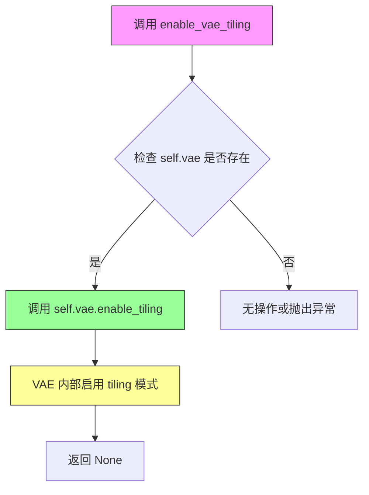

#### 带注释源码

```python
def enable_vae_tiling(self):
    r"""
    Enable tiled VAE decoding. When this option is enabled, the VAE will split the input tensor into tiles to
    compute decoding and encoding in several steps. This is useful for saving a large amount of memory and to allow
    processing larger images.
    """
    # 调用成员变量 vae 的 enable_tiling 方法
    # 该方法会修改 VAE 内部状态，启用分块解码模式
    # 分块解码将大图像分割为多个小 tiles 分别处理，最后拼接
    # 适用于显存受限时处理高分辨率图像
    self.vae.enable_tiling()
```

#### 关联信息

| 组件 | 名称 | 描述 |
|------|------|------|
| 配套方法 | `disable_vae_tiling` | 禁用 VAE 分块解码 |
| 配套方法 | `enable_vae_slicing` | 启用 VAE 切片解码（另一种内存优化方式） |
| 依赖组件 | `self.vae` | `AutoencoderKLQwenImage` 实例，VAE 编解码器 |
| 用途 | 图像生成 | 在高分辨率图像生成时减少显存占用 |

#### 潜在优化空间

1. **缺少状态检查**：当前实现未检查 VAE 是否已经处于 tiling 模式，可添加状态查询避免重复调用
2. **无返回值确认**：方法不返回操作结果或当前状态，调用方无法确认是否成功启用
3. **缺少尺寸参数**：与某些实现不同，未暴露 tile size 等配置参数，限制了对分块粒度的控制


### `QwenImageControlNetInpaintPipeline.disable_vae_tiling`

该方法用于禁用 VAE 分块解码（tiling）功能。如果之前通过 `enable_vae_tiling` 启用了分块解码，则调用此方法后，VAE 将恢复到单步解码模式，从而可以处理更高质量的图像但会占用更多内存。

参数： 无

返回值：`None`，无返回值

#### 流程图

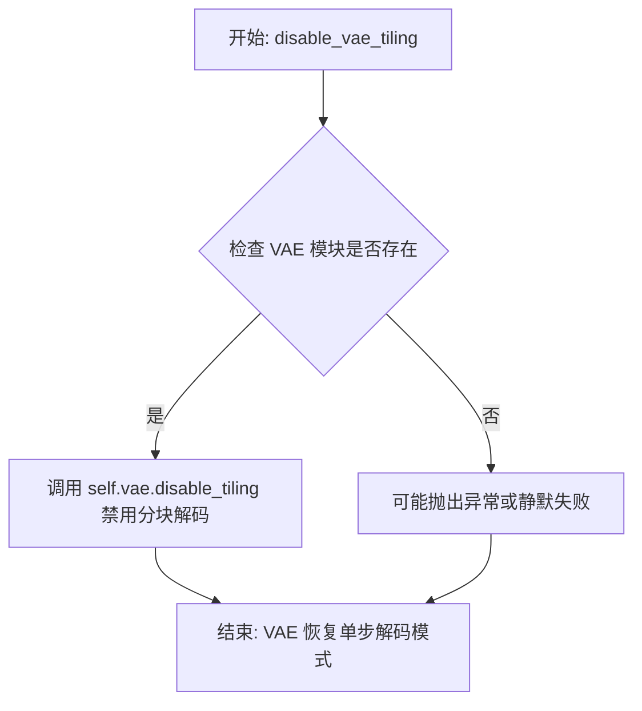

#### 带注释源码

```python
def disable_vae_tiling(self):
    r"""
    Disable tiled VAE decoding. If `enable_vae_tiling` was previously enabled, this method will go back to
    computing decoding in one step.
    """
    # 调用底层 VAE 模型的 disable_tiling 方法，禁用分块解码功能
    # 禁用后，VAE 将使用完整的单步解码，输出质量更高但内存占用更大
    self.vae.disable_tiling()
```


### `QwenImageControlNetInpaintPipeline.prepare_latents`

准备用于图像修复的初始潜在变量（latents），根据VAE的压缩因子和打包要求调整图像尺寸，如果未提供latents则使用随机张量生成，否则直接使用提供的latents。

参数：

- `batch_size`：`int`，批处理大小，生成图像的数量
- `num_channels_latents`：`int`，潜在变量的通道数，等于transformer输入通道数除以4
- `height`：`int`，原始图像高度（像素）
- `width`：`int`，原始图像宽度（像素）
- `dtype`：`torch.dtype`，潜在变量的数据类型
- `device`：`torch.device`，潜在变量存放的设备
- `generator`：`torch.Generator | list[torch.Generator] | None`，随机数生成器，用于确保可复现性
- `latents`：`torch.Tensor | None`，可选的预生成潜在变量，如果为None则随机生成

返回值：`torch.Tensor`，处理后的潜在变量张量，形状为打包后的(batch_size, seq_len, channels*4)

#### 流程图

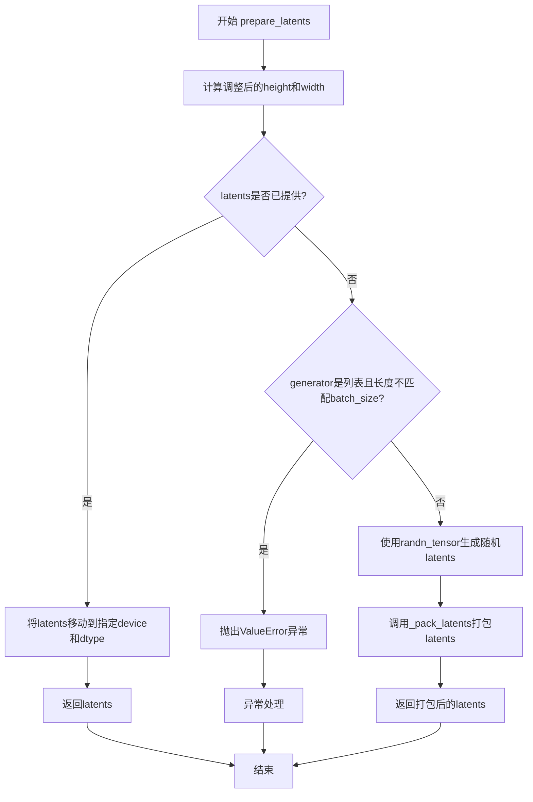

#### 带注释源码

```python
def prepare_latents(
    self,
    batch_size,
    num_channels_latents,
    height,
    width,
    dtype,
    device,
    generator,
    latents=None,
):
    # VAE对图像进行8x压缩，但还需要考虑打包操作的要求
    # 打包要求latent的高度和宽度必须能被2整除
    # 因此最终尺寸需要乘以2
    height = 2 * (int(height) // (self.vae_scale_factor * 2))
    width = 2 * (int(width) // (self.vae_scale_factor * 2))

    # 潜在变量的形状：[batch_size, 1(时间步), 通道数, height, width]
    shape = (batch_size, 1, num_channels_latents, height, width)

    # 如果已提供了latents，直接返回转换后的结果，无需重新生成
    if latents is not None:
        return latents.to(device=device, dtype=dtype)

    # 检查generator列表长度是否与batch_size匹配
    if isinstance(generator, list) and len(generator) != batch_size:
        raise ValueError(
            f"You have passed a list of generators of length {len(generator)}, but requested an effective batch"
            f" size of {batch_size}. Make sure the batch size matches the length of the generators."
        )

    # 使用随机张量生成初始噪声latents
    # 使用generator确保可复现性（如果提供）
    latents = randn_tensor(shape, generator=generator, device=device, dtype=dtype)
    
    # 对latents进行打包处理
    # 打包将2x2的patch合并为单个token，这是QwenImage模型的要求
    latents = self._pack_latents(latents, batch_size, num_channels_latents, height, width)

    return latents
```


### `QwenImageControlNetInpaintPipeline.prepare_image`

该方法用于准备控制网络（ControlNet）所需的输入图像，对图像进行预处理、批次大小调整，并支持分类器自由引导（Classifier-Free Guidance）的图像复制。

参数：

- `self`：`QwenImageControlNetInpaintPipeline`实例本身
- `image`：`PipelineImageInput`（torch.Tensor 或其他图像输入格式），待处理的控制图像
- `width`：`int`，目标图像宽度
- `height`：`int`，目标图像高度
- `batch_size`：`int`，批处理大小
- `num_images_per_prompt`：`int`，每个提示词生成的图像数量
- `device`：`torch.device`，目标设备
- `dtype`：`torch.dtype`，目标数据类型
- `do_classifier_free_guidance`：`bool`（可选，默认False），是否启用分类器自由引导
- `guess_mode`：`bool`（可选，默认False），猜测模式标识

返回值：`torch.Tensor`，处理后的控制图像张量

#### 流程图

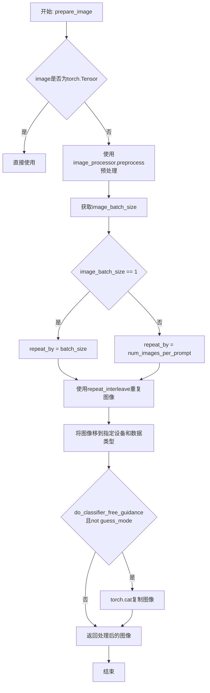

#### 带注释源码

```python
def prepare_image(
    self,
    image,
    width,
    height,
    batch_size,
    num_images_per_prompt,
    device,
    dtype,
    do_classifier_free_guidance=False,
    guess_mode=False,
):
    # 如果输入是torch.Tensor，直接使用；否则使用图像处理器进行预处理
    # 预处理操作可能包括：调整大小、归一化、转换为张量等
    if isinstance(image, torch.Tensor):
        pass
    else:
        image = self.image_processor.preprocess(image, height=height, width=width)

    # 获取输入图像的批次大小
    image_batch_size = image.shape[0]

    # 根据图像批次大小确定重复次数
    # 如果图像批次大小为1，则按照batch_size重复（与提示词批次对齐）
    # 否则按照num_images_per_prompt重复（与每个提示词生成的图像数量对齐）
    if image_batch_size == 1:
        repeat_by = batch_size
    else:
        # image batch size is the same as prompt batch size
        repeat_by = num_images_per_prompt

    # 按照确定的重复次数在批次维度上重复图像
    image = image.repeat_interleave(repeat_by, dim=0)

    # 将图像移动到指定设备和转换为目标数据类型
    image = image.to(device=device, dtype=dtype)

    # 如果启用分类器自由引导且不是猜测模式，则复制图像用于后续处理
    # 分类器自由引导通常需要同时处理带条件和不带条件的图像
    if do_classifier_free_guidance and not guess_mode:
        image = torch.cat([image] * 2)

    return image
```


### `QwenImageControlNetInpaintPipeline.prepare_image_with_mask`

该方法负责准备带掩码的控制图像和对应的 latent 表示，是 ControlNet 图像修复 Pipeline 的关键预处理步骤。它将输入图像和掩码图像经过预处理、VAE 编码、掩码处理，最后打包成适合 Transformer 处理的格式。

参数：

- `image`：`PipelineImageInput`，输入的原始控制图像
- `mask`：`PipelineImageInput`，输入的掩码图像，用于指示需要修复的区域
- `width`：`int`，目标宽度
- `height`：`int`，目标高度
- `batch_size`：`int`，批次大小
- `num_images_per_prompt`：`int`，每个提示词生成的图像数量
- `device`：`torch.device`，计算设备
- `dtype`：`torch.dtype`，数据类型
- `do_classifier_free_guidance`：`bool`，是否启用无分类器自由引导
- `guess_mode`：`bool`，猜测模式

返回值：`torch.Tensor`，处理后的控制图像张量，形状为 `(batch_size, seq_len, channels)`，其中包含图像 latent 和掩码信息

#### 流程图

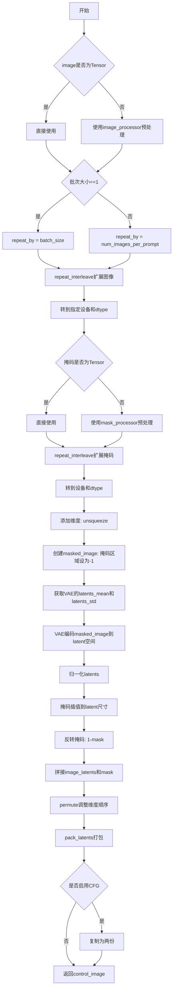

#### 带注释源码

```python
def prepare_image_with_mask(
    self,
    image,                      # 输入的控制图像 (PIL Image, np.array, 或 torch.Tensor)
    mask,                       # 输入的掩码图像，指示修复区域
    width,                      # 目标宽度
    height,                     # 目标高度
    batch_size,                # 批次大小
    num_images_per_prompt,     # 每个提示词生成的图像数量
    device,                    # 计算设备
    dtype,                      # 数据类型
    do_classifier_free_guidance=False,  # 是否使用无分类器自由引导
    guess_mode=False,           # 猜测模式
):
    # 1. 预处理图像
    if isinstance(image, torch.Tensor):
        # 如果已经是Tensor，直接使用
        pass
    else:
        # 否则使用image_processor进行预处理（Resize, Normalize等）
        image = self.image_processor.preprocess(image, height=height, width=width)

    # 2. 确定图像重复次数
    image_batch_size = image.shape[0]
    if image_batch_size == 1:
        # 单张图像需要扩展到batch_size
        repeat_by = batch_size
    else:
        # 图像批次与提示词批次相同
        repeat_by = num_images_per_prompt

    # 3. 扩展图像到目标批次大小并转移到指定设备
    image = image.repeat_interleave(repeat_by, dim=0)
    image = image.to(device=device, dtype=dtype)  # (bsz, 3, height_ori, width_ori)

    # 4. 预处理掩码
    if isinstance(mask, torch.Tensor):
        pass
    else:
        # 使用mask_processor预处理（灰度转换、二值化等）
        mask = self.mask_processor.preprocess(mask, height=height, width=width)
    
    # 5. 扩展掩码并转移设备
    mask = mask.repeat_interleave(repeat_by, dim=0)
    mask = mask.to(device=device, dtype=dtype)  # (bsz, 1, height_ori, width_ori)

    # 6. 添加时间维度（对于3D输入）
    if image.ndim == 4:
        image = image.unsqueeze(2)  # (bsz, 3, 1, height, width)
    if mask.ndim == 4:
        mask = mask.unsqueeze(2)   # (bsz, 1, 1, height, width)

    # 7. 创建被掩码覆盖的图像（mask区域设为-1，表示需修复）
    masked_image = image.clone()
    masked_image[(mask > 0.5).repeat(1, 3, 1, 1, 1)] = -1  # (bsz, 3, 1, height_ori, width_ori)

    # 8. 获取VAE的归一化参数
    self.vae_scale_factor = 2 ** len(self.vae.temperal_downsample)
    latents_mean = (torch.tensor(self.vae.config.latents_mean).view(1, self.vae.config.z_dim, 1, 1, 1)).to(device)
    latents_std = 1.0 / torch.tensor(self.vae.config.latents_std).view(1, self.vae.config.z_dim, 1, 1, 1).to(device)

    # 9. 使用VAE将masked_image编码到latent空间
    image_latents = self.vae.encode(masked_image.to(self.vae.dtype)).latent_dist.sample()
    image_latents = (image_latents - latents_mean) * latents_std
    image_latents = image_latents.to(dtype)  # torch.Size([1, 16, 1, height_ori//8, width_ori//8])

    # 10. 对掩码进行插值以匹配latent尺寸，并反转掩码（1表示保留，0表示需修复）
    mask = torch.nn.functional.interpolate(
        mask, size=(image_latents.shape[-3], image_latents.shape[-2], image_latents.shape[-1])
    )
    mask = 1 - mask  # torch.Size([1, 1, 1, height_ori//8, width_ori//8])

    # 11. 在通道维度拼接image_latents和mask，形成控制信号
    control_image = torch.cat(
        [image_latents, mask], dim=1
    )  # torch.Size([1, 16+1, 1, height_ori//8, width_ori//8])

    # 12. 调整维度顺序：(batch, channels, time, height, width) -> (batch, time, channels, height, width)
    control_image = control_image.permute(0, 2, 1, 3, 4)  # torch.Size([1, 1, 16+1, height_ori//8, width_ori//8])

    # 13. 打包latents以适应Transformer的patchify格式
    control_image = self._pack_latents(
        control_image,
        batch_size=control_image.shape[0],
        num_channels_latents=control_image.shape[2],
        height=control_image.shape[3],
        width=control_image.shape[4],
    )

    # 14. 如果启用CFG，复制控制图像用于条件和非条件分支
    if do_classifier_free_guidance and not guess_mode:
        control_image = torch.cat([control_image] * 2)

    return control_image
```


### QwenImageControlNetInpaintPipeline.__call__

执行图像修复（inpainting）的主方法，通过ControlNet引导的扩散模型根据文本提示词、控制图像和掩码生成修复后的图像。该方法完成从输入验证、提示词编码、潜在变量准备、去噪循环到最终图像解码的完整流程。

参数：

- `prompt`：`str | list[str]`，引导图像生成的提示词，若不定义则需传入prompt_embeds
- `negative_prompt`：`str | list[str]`，不引导图像生成的负面提示词，在使用true_cfg_scale > 1时生效
- `true_cfg_scale`：`float`，启用真实无分类器引导的尺度，默认为4.0
- `height`：`int | None`，生成图像的高度像素，默认为self.unet.config.sample_size * self.vae_scale_factor
- `width`：`int | None`，生成图像的宽度像素，默认为self.unet.config.sample_size * self.vae_scale_factor
- `num_inference_steps`：`int`，去噪步数，默认为50，步数越多图像质量越高但推理越慢
- `sigmas`：`list[float] | None`，自定义sigma值，用于支持sigmas的调度器
- `guidance_scale`：`float`，分类器自由扩散引导尺度，定义为w系数，默认为1.0
- `control_guidance_start`：`float | list[float]`，ControlNet引导开始时间，默认为0.0
- `control_guidance_end`：`float | list[float]`，ControlNet引导结束时间，默认为1.0
- `control_image`：`PipelineImageInput`，ControlNet的控制输入图像
- `control_mask`：`PipelineImageInput`，用于修复的掩码图像，标记需要修复的区域
- `controlnet_conditioning_scale`：`float | list[float]`，ControlNet条件调节尺度，默认为1.0
- `num_images_per_prompt`：`int`，每个提示词生成的图像数量，默认为1
- `generator`：`torch.Generator | list[torch.Generator] | None`，随机生成器用于确定性生成
- `latents`：`torch.Tensor | None`，预生成的高斯噪声潜在变量，可用于相同提示词的不同生成
- `prompt_embeds`：`torch.Tensor | None`，预生成的文本嵌入，用于提示词加权等微调
- `prompt_embeds_mask`：`torch.Tensor | None`，提示词嵌入的注意力掩码
- `negative_prompt_embeds`：`torch.Tensor | None`，预生成的负面文本嵌入
- `negative_prompt_embeds_mask`：`torch.Tensor | None`，负面提示词嵌入的注意力掩码
- `output_type`：`str | None`，输出格式，默认为"pil"，可选PIL.Image.Image或np.array
- `return_dict`：`bool`，是否返回QwenImagePipelineOutput，默认为True
- `attention_kwargs`：`dict[str, Any] | None`，传递给AttentionProcessor的 kwargs 字典
- `callback_on_step_end`：`Callable[[int, int], None] | None`，每个去噪步骤结束时调用的回调函数
- `callback_on_step_end_tensor_inputs`：`list[str]`，回调函数需要的tensor输入列表，默认为["latents"]
- `max_sequence_length`：`int`，提示词最大序列长度，默认为512

返回值：`QwenImagePipelineOutput | tuple`，当return_dict为True时返回QwenImagePipelineOutput对象，包含生成的图像列表；否则返回元组，第一个元素为图像列表

#### 流程图

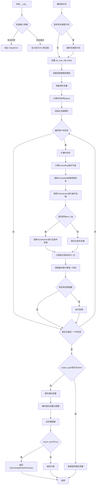

#### 带注释源码

```python
@torch.no_grad()
@replace_example_docstring(EXAMPLE_DOC_STRING)
def __call__(
    self,
    prompt: str | list[str] = None,
    negative_prompt: str | list[str] = None,
    true_cfg_scale: float = 4.0,
    height: int | None = None,
    width: int | None = None,
    num_inference_steps: int = 50,
    sigmas: list[float] | None = None,
    guidance_scale: float = 1.0,
    control_guidance_start: float | list[float] = 0.0,
    control_guidance_end: float | list[float] = 1.0,
    control_image: PipelineImageInput = None,
    control_mask: PipelineImageInput = None,
    controlnet_conditioning_scale: float | list[float] = 1.0,
    num_images_per_prompt: int = 1,
    generator: torch.Generator | list[torch.Generator] | None = None,
    latents: torch.Tensor | None = None,
    prompt_embeds: torch.Tensor | None = None,
    prompt_embeds_mask: torch.Tensor | None = None,
    negative_prompt_embeds: torch.Tensor | None = None,
    negative_prompt_embeds_mask: torch.Tensor | None = None,
    output_type: str | None = "pil",
    return_dict: bool = True,
    attention_kwargs: dict[str, Any] | None = None,
    callback_on_step_end: Callable[[int, int], None] | None = None,
    callback_on_step_end_tensor_inputs: list[str] = ["latents"],
    max_sequence_length: int = 512,
):
    r"""
    Function invoked when calling the pipeline for generation.

    Args:
        prompt (`str` or `list[str]`, *optional*):
            The prompt or prompts to guide the image generation. If not defined, one has to pass `prompt_embeds`.
            instead.
        negative_prompt (`str` or `list[str]`, *optional*):
            The prompt or prompts not to guide the image generation. If not defined, one has to pass
            `negative_prompt_embeds` instead. Ignored when not using guidance (i.e., ignored if `true_cfg_scale` is
            not greater than `1`).
        true_cfg_scale (`float`, *optional*, defaults to 1.0):
            When > 1.0 and a provided `negative_prompt`, enables true classifier-free guidance.
        height (`int`, *optional*, defaults to self.unet.config.sample_size * self.vae_scale_factor):
            The height in pixels of the generated image. This is set to 1024 by default for the best results.
        width (`int`, *optional*, defaults to self.unet.config.sample_size * self.vae_scale_factor):
            The width in pixels of the generated image. This is set to 1024 by default for the best results.
        num_inference_steps (`int`, *optional*, defaults to 50):
            The number of denoising steps. More denoising steps usually lead to a higher quality image at the
            expense of slower inference.
        sigmas (`list[float]`, *optional*):
            Custom sigmas to use for the denoising process with schedulers which support a `sigmas` argument in
            their `set_timesteps` method. If not defined, the default behavior when `num_inference_steps` is passed
            will be used.
        guidance_scale (`float`, *optional*, defaults to 3.5):
            Guidance scale as defined in [Classifier-Free Diffusion
            Guidance](https://huggingface.co/papers/2207.12598). `guidance_scale` is defined as `w` of equation 2.
            of [Imagen Paper](https://huggingface.co/papers/2205.11487). Guidance scale is enabled by setting
            `guidance_scale > 1`. Higher guidance scale encourages to generate images that are closely linked to
            the text `prompt`, usually at the expense of lower image quality.
        num_images_per_prompt (`int`, *optional*, defaults to 1):
            The number of images to generate per prompt.
        generator (`torch.Generator` or `list[torch.Generator]`, *optional*):
            One or a list of [torch generator(s)](https://pytorch.org/docs/stable/generated/torch.Generator.html)
            to make generation deterministic.
        latents (`torch.Tensor`, *optional*):
            Pre-generated noisy latents, sampled from a Gaussian distribution, to be used as inputs for image
            generation. Can be used to tweak the same generation with different prompts. If not provided, a latents
            tensor will be generated by sampling using the supplied random `generator`.
        prompt_embeds (`torch.Tensor`, *optional*):
            Pre-generated text embeddings. Can be used to easily tweak text inputs, *e.g.* prompt weighting. If not
            provided, text embeddings will be generated from `prompt` input argument.
        negative_prompt_embeds (`torch.Tensor`, *optional*):
            Pre-generated negative text embeddings. Can be used to easily tweak text inputs, *e.g.* prompt
            weighting. If not provided, negative_prompt_embeds will be generated from `negative_prompt` input
            argument.
        output_type (`str`, *optional*, defaults to `"pil"`):
            The output format of the generate image. Choose between
            [PIL](https://pillow.readthedocs.io/en/stable/): `PIL.Image.Image` or `np.array`.
        return_dict (`bool`, *optional*, defaults to `True`):
            Whether or not to return a [`~pipelines.qwenimage.QwenImagePipelineOutput`] instead of a plain tuple.
        attention_kwargs (`dict`, *optional*):
            A kwargs dictionary that if specified is passed along to the `AttentionProcessor` as defined under
            `self.processor` in
            [diffusers.models.attention_processor](https://github.com/huggingface/diffusers/blob/main/src/diffusers/models/attention_processor.py).
        callback_on_step_end (`Callable`, *optional*):
            A function that calls at the end of each denoising steps during the inference. The function is called
            with the following arguments: `callback_on_step_end(self: DiffusionPipeline, step: int, timestep: int,
            callback_kwargs: Dict)`. `callback_kwargs` will include a list of all tensors as specified by
            `callback_on_step_end_tensor_inputs`.
        callback_on_step_end_tensor_inputs (`list`, *optional*):
            The list of tensor inputs for the `callback_on_step_end` function. The tensors specified in the list
            will be passed as `callback_kwargs` argument. You will only be able to include variables listed in the
            `._callback_tensor_inputs` attribute of your pipeline class.
        max_sequence_length (`int` defaults to 512): Maximum sequence length to use with the `prompt`.

    Examples:

    Returns:
        [`~pipelines.qwenimage.QwenImagePipelineOutput`] or `tuple`:
            [`~pipelines.qwenimage.QwenImagePipelineOutput`] if `return_dict` is True, otherwise a `tuple`. When
            returning a tuple, the first element is a list with the generated images.
    """

    # 1. 设置默认高度和宽度（如果未提供）
    height = height or self.default_sample_size * self.vae_scale_factor
    width = width or self.default_sample_size * self.vae_scale_factor

    # 2. 处理ControlNet引导开始/结束的列表形式
    if not isinstance(control_guidance_start, list) and isinstance(control_guidance_end, list):
        control_guidance_start = len(control_guidance_end) * [control_guidance_start]
    elif not isinstance(control_guidance_end, list) and isinstance(control_guidance_start, list):
        control_guidance_end = len(control_guidance_start) * [control_guidance_end]
    elif not isinstance(control_guidance_start, list) and not isinstance(control_guidance_end, list):
        # 根据ControlNet数量确定倍数
        mult = len(control_image) if isinstance(self.controlnet, QwenImageMultiControlNetModel) else 1
        control_guidance_start, control_guidance_end = (
            mult * [control_guidance_start],
            mult * [control_guidance_end],
        )

    # 3. 检查输入参数，验证合法性
    self.check_inputs(
        prompt,
        height,
        width,
        negative_prompt=negative_prompt,
        prompt_embeds=prompt_embeds,
        negative_prompt_embeds=negative_prompt_embeds,
        prompt_embeds_mask=prompt_embeds_mask,
        negative_prompt_embeds_mask=negative_prompt_embeds_mask,
        callback_on_step_end_tensor_inputs=callback_on_step_end_tensor_inputs,
        max_sequence_length=max_sequence_length,
    )

    # 4. 初始化内部状态
    self._guidance_scale = guidance_scale
    self._attention_kwargs = attention_kwargs
    self._current_timestep = None
    self._interrupt = False

    # 5. 确定批次大小
    if prompt is not None and isinstance(prompt, str):
        batch_size = 1
    elif prompt is not None and isinstance(prompt, list):
        batch_size = len(prompt)
    else:
        batch_size = prompt_embeds.shape[0]

    device = self._execution_device

    # 6. 确定是否使用真实CFG
    has_neg_prompt = negative_prompt is not None or (
        negative_prompt_embeds is not None and negative_prompt_embeds_mask is not None
    )
    do_true_cfg = true_cfg_scale > 1 and has_neg_prompt

    # 7. 编码提示词
    prompt_embeds, prompt_embeds_mask = self.encode_prompt(
        prompt=prompt,
        prompt_embeds=prompt_embeds,
        prompt_embeds_mask=prompt_embeds_mask,
        device=device,
        num_images_per_prompt=num_images_per_prompt,
        max_sequence_length=max_sequence_length,
    )

    # 8. 如果启用真实CFG，则编码负面提示词
    if do_true_cfg:
        negative_prompt_embeds, negative_prompt_embeds_mask = self.encode_prompt(
            prompt=negative_prompt,
            prompt_embeds=negative_prompt_embeds,
            prompt_embeds_mask=negative_prompt_embeds_mask,
            device=device,
            num_images_per_prompt=num_images_per_prompt,
            max_sequence_length=max_sequence_length,
        )

    # 9. 准备控制图像（包含掩码处理和潜在编码）
    num_channels_latents = self.transformer.config.in_channels // 4
    if isinstance(self.controlnet, QwenImageControlNetModel):
        control_image = self.prepare_image_with_mask(
            image=control_image,
            mask=control_mask,
            width=width,
            height=height,
            batch_size=batch_size * num_images_per_prompt,
            num_images_per_prompt=num_images_per_prompt,
            device=device,
            dtype=self.vae.dtype,
        )

    # 10. 准备潜在变量
    num_channels_latents = self.transformer.config.in_channels // 4
    latents = self.prepare_latents(
        batch_size * num_images_per_prompt,
        num_channels_latents,
        height,
        width,
        prompt_embeds.dtype,
        device,
        generator,
        latents,
    )
    img_shapes = [(1, height // self.vae_scale_factor // 2, width // self.vae_scale_factor // 2)] * batch_size

    # 11. 准备时间步调度
    sigmas = np.linspace(1.0, 1 / num_inference_steps, num_inference_steps) if sigmas is None else sigmas
    image_seq_len = latents.shape[1]
    mu = calculate_shift(
        image_seq_len,
        self.scheduler.config.get("base_image_seq_len", 256),
        self.scheduler.config.get("max_image_seq_len", 4096),
        self.scheduler.config.get("base_shift", 0.5),
        self.scheduler.config.get("max_shift", 1.15),
    )
    timesteps, num_inference_steps = retrieve_timesteps(
        self.scheduler,
        num_inference_steps,
        device,
        sigmas=sigmas,
        mu=mu,
    )
    num_warmup_steps = max(len(timesteps) - num_inference_steps * self.scheduler.order, 0)
    self._num_timesteps = len(timesteps)

    # 12. 计算ControlNet在每个时间步的保留权重
    controlnet_keep = []
    for i in range(len(timesteps)):
        keeps = [
            1.0 - float(i / len(timesteps) < s or (i + 1) / len(timesteps) > e)
            for s, e in zip(control_guidance_start, control_guidance_end)
        ]
        controlnet_keep.append(keeps[0] if isinstance(self.controlnet, QwenImageControlNetModel) else keeps)

    # 13. 处理引导嵌入
    if self.transformer.config.guidance_embeds:
        guidance = torch.full([1], guidance_scale, device=device, dtype=torch.float32)
        guidance = guidance.expand(latents.shape[0])
    else:
        guidance = None

    if self.attention_kwargs is None:
        self._attention_kwargs = {}

    # 14. 去噪循环
    self.scheduler.set_begin_index(0)
    with self.progress_bar(total=num_inference_steps) as progress_bar:
        for i, t in enumerate(timesteps):
            # 检查是否中断
            if self.interrupt:
                continue

            self._current_timestep = t
            # 扩展时间步以匹配批次维度
            timestep = t.expand(latents.shape[0]).to(latents.dtype)

            # 计算ControlNet条件尺度
            if isinstance(controlnet_keep[i], list):
                cond_scale = [c * s for c, s in zip(controlnet_conditioning_scale, controlnet_keep[i])]
            else:
                controlnet_cond_scale = controlnet_conditioning_scale
                if isinstance(controlnet_cond_scale, list):
                    controlnet_cond_scale = controlnet_cond_scale[0]
                cond_scale = controlnet_cond_scale * controlnet_keep[i]

            # 15. 调用ControlNet获取控制样本
            controlnet_block_samples = self.controlnet(
                hidden_states=latents,
                controlnet_cond=control_image.to(dtype=latents.dtype, device=device),
                conditioning_scale=cond_scale,
                timestep=timestep / 1000,
                encoder_hidden_states=prompt_embeds,
                encoder_hidden_states_mask=prompt_embeds_mask,
                img_shapes=img_shapes,
                return_dict=False,
            )

            # 16. 条件去噪（使用提示词）
            with self.transformer.cache_context("cond"):
                noise_pred = self.transformer(
                    hidden_states=latents,
                    timestep=timestep / 1000,
                    encoder_hidden_states=prompt_embeds,
                    encoder_hidden_states_mask=prompt_embeds_mask,
                    img_shapes=img_shapes,
                    controlnet_block_samples=controlnet_block_samples,
                    attention_kwargs=self.attention_kwargs,
                    return_dict=False,
                )[0]

            # 17. 如果启用真实CFG，执行无条件去噪
            if do_true_cfg:
                with self.transformer.cache_context("uncond"):
                    neg_noise_pred = self.transformer(
                        hidden_states=latents,
                        timestep=timestep / 1000,
                        guidance=guidance,
                        encoder_hidden_states_mask=negative_prompt_embeds_mask,
                        encoder_hidden_states=negative_prompt_embeds,
                        img_shapes=img_shapes,
                        controlnet_block_samples=controlnet_block_samples,
                        attention_kwargs=self.attention_kwargs,
                        return_dict=False,
                    )[0]
                # 计算组合预测并进行归一化
                comb_pred = neg_noise_pred + true_cfg_scale * (noise_pred - neg_noise_pred)

                cond_norm = torch.norm(noise_pred, dim=-1, keepdim=True)
                noise_norm = torch.norm(comb_pred, dim=-1, keepdim=True)
                noise_pred = comb_pred * (cond_norm / noise_norm)

            # 18. 通过调度器步骤计算前一时刻的潜在变量
            latents_dtype = latents.dtype
            latents = self.scheduler.step(noise_pred, t, latents, return_dict=False)[0]

            # 19. 处理潜在变量类型转换（针对MPS等平台的兼容性）
            if latents.dtype != latents_dtype:
                if torch.backends.mps.is_available():
                    latents = latents.to(latents_dtype)

            # 20. 执行每步结束时的回调函数
            if callback_on_step_end is not None:
                callback_kwargs = {}
                for k in callback_on_step_end_tensor_inputs:
                    callback_kwargs[k] = locals()[k]
                callback_outputs = callback_on_step_end(self, i, t, callback_kwargs)

                latents = callback_outputs.pop("latents", latents)
                prompt_embeds = callback_outputs.pop("prompt_embeds", prompt_embeds)

            # 21. 更新进度条
            if i == len(timesteps) - 1 or ((i + 1) > num_warmup_steps and (i + 1) % self.scheduler.order == 0):
                progress_bar.update()

            # 22. 处理XLA设备
            if XLA_AVAILABLE:
                xm.mark_step()

    # 23. 清理当前时间步
    self._current_timestep = None

    # 24. 根据输出类型处理结果
    if output_type == "latent":
        image = latents
    else:
        # 解包潜在变量
        latents = self._unpack_latents(latents, height, width, self.vae_scale_factor)
        latents = latents.to(self.vae.dtype)
        # 反标准化潜在变量
        latents_mean = (
            torch.tensor(self.vae.config.latents_mean)
            .view(1, self.vae.config.z_dim, 1, 1, 1)
            .to(latents.device, latents.dtype)
        )
        latents_std = 1.0 / torch.tensor(self.vae.config.latents_std).view(1, self.vae.config.z_dim, 1, 1, 1).to(
            latents.device, latents.dtype
        )
        latents = latents / latents_std + latents_mean
        # 解码潜在变量为图像
        image = self.vae.decode(latents, return_dict=False)[0][:, :, 0]
        # 后处理图像
        image = self.image_processor.postprocess(image, output_type=output_type)

    # 25. 释放模型内存
    self.maybe_free_model_hooks()

    # 26. 返回结果
    if not return_dict:
        return (image,)

    return QwenImagePipelineOutput(images=image)
```

## 关键组件


### 张量索引与惰性加载

代码中使用`_extract_masked_hidden`方法处理张量索引，根据注意力掩码提取隐藏状态。此外，使用`cache_context`实现惰性加载，控制网块样本仅在条件/非条件推理时计算一次。

### 反量化支持

在`prepare_image_with_mask`和`__call__`方法中，使用`latents_mean`和`latents_std`对VAE编码后的潜在变量进行反量化操作，将潜在变量从标准化状态恢复到原始分布。

### 量化策略

虽然代码中未直接实现量化，但集成了多种内存优化策略：VAE slicing（`enable_vae_slicing`）和VAE tiling（`enable_vae_tiling`）用于分块处理大图像；同时通过dtype转换（`self.vae.dtype`）支持混合精度推理。

### 调度器与时间步管理

使用`FlowMatchEulerDiscreteScheduler`配合`retrieve_timesteps`函数，通过`calculate_shift`计算图像序列长度相关的偏移量，实现自适应时间步调度。

### ControlNet集成

集成`QwenImageControlNetModel`（单控制网）和`QwenImageMultiControlNetModel`（多控制网），支持控制引导强度调度（`control_guidance_start/end`），在去噪循环中动态调整控制网影响。

### 文本编码与提示处理

使用`_get_qwen_prompt_embeds`方法配合Qwen2.5-VL文本编码器，通过自定义模板`prompt_template_encode`格式化提示词，并使用`_extract_masked_hidden`提取有效token的隐藏状态。

### 潜在空间打包/解包

`_pack_latents`将4D潜在张量打包为序列形式（适配Transformer输入），`_unpack_latents`将其还原为2D空间表示，支持2x2patch压缩。

### 图像修复流程

`prepare_image_with_mask`方法实现修复管线：预处理图像和掩码、创建遮罩图像、VAE编码为潜在变量、掩码插值降采样、控制图像与掩码拼接打包。

### 真实无分类器引导

实现`true_cfg_scale`机制：分别计算条件与无条件噪声预测，通过`comb_pred = neg_noise_pred + true_cfg_scale * (noise_pred - neg_noise_pred)`组合，并进行预测范数归一化。

### 多模型卸载

使用`model_cpu_offload_seq = "text_encoder->transformer->vae"`定义模型卸载顺序，配合`maybe_free_model_hooks`在推理结束后释放显存。

## 问题及建议


### 已知问题

-   **硬编码Magic Numbers**: 代码中存在多个硬编码的数值，如 `self.tokenizer_max_length = 1024`、`self.default_sample_size = 128`、`self.prompt_template_encode_start_idx = 34`，以及 `max_sequence_length` 默认值在 `check_inputs` 中检查 > 1024 但在 `encode_prompt` 中默认为 1024，而 `__call__` 中默认为 512，存在不一致。
-   **重复计算与代码复制**: `latents_mean` 和 `latents_std` 的计算在 `prepare_image_with_mask` 方法和 `__call__` 方法末尾重复出现；多个方法（如 `_extract_masked_hidden`、`_get_qwen_prompt_embeds`、`_pack_latents`、`_unpack_latents`、`prepare_latents`）是从其他 pipeline 复制的，缺少统一的抽象基类。
-   **潜在的拼写错误**: `prepare_image_with_mask` 方法中存在 `self.vae.temperal_downsample`（应为 `temporal_downsample`），可能导致在某些情况下出错。
-   **属性重复赋值**: `self.vae_scale_factor` 在 `__init__` 方法和 `prepare_image_with_mask` 方法中都被赋值，增加了维护成本和潜在的不一致风险。
-   **类型注解兼容性**: 使用了 Python 3.10+ 的 `|` 联合类型注解（如 `str | list[str]`、`torch.Generator | None`），可能影响与旧版本 Python 的兼容性。
-   **缺失错误处理**: `prepare_image_with_mask` 中对 `mask` 的处理假设了特定的结构，没有对异常输入进行充分的验证；`controlnet_block_samples` 的返回值未进行完整性检查。
-   **ControlNet 支持不完整**: 代码中虽然导入了 `QwenImageMultiControlNetModel`，但在 `__call__` 方法的实际处理中，对多 ControlNet 的支持逻辑不完善，注释表明仅支持单一 ControlNet 模型。

### 优化建议

-   **提取配置常量**: 将所有硬编码的数值提取为类级别或模块级别的配置常量，并在文档中说明其含义和取值范围，确保 `max_sequence_length` 默认值在整个类中保持一致。
-   **抽象基类优化**: 考虑将复用的方法（如 prompt 编码、latent 打包/解包）提取到一个抽象基类 `QwenImagePipelineBase` 中，避免代码重复，提高可维护性。
-   **修复拼写错误**: 将 `temperal_downsample` 修正为 `temporal_downsample`，并确保所有对 `vae_scale_factor` 的赋值逻辑统一。
-   **统一属性管理**: 考虑将 `vae_scale_factor` 的计算在 `__init__` 中完成一次，并在需要时只读取该属性，而不是重复赋值。
-   **增强输入验证**: 在 `prepare_image_with_mask` 和 `check_inputs` 中增加对输入类型、形状的更严格验证，确保 ControlNet 输入的正确性。
-   **提取重复计算逻辑**: 将 `latents_mean` 和 `latents_std` 的计算提取为工具方法或类方法，避免在多处重复代码。
-   **考虑向后兼容性**: 如果需要支持 Python 3.9 及以下版本，可以使用 `Union` 类型注解替代 `|` 语法，或在代码开头添加版本检查。
-   **完善 MultiControlNet 支持**: 完善对 `QwenImageMultiControlNetModel` 的支持逻辑，或在不支持的情况下给出明确的错误提示。

## 其它


### 设计目标与约束

1. **核心设计目标**
   - 实现基于Qwen-Image模型的ControlNet图像修复（inpainting）Pipeline，支持文本引导的图像修复任务
   - 支持ControlNet条件控制，通过control_image和control_mask实现精确的区域修复
   - 遵循diffusers库的DiffusionPipeline标准架构，确保与其他组件的兼容性

2. **技术约束**
   - 输入图像尺寸必须能被`vae_scale_factor * 2`整除，否则会自动调整尺寸
   - 最大序列长度限制为1024（通过max_sequence_length参数控制）
   - 支持torch.bfloat16等半精度推理，需确保模型权重 dtype 匹配
   - XLA设备支持：检测torch_xla可用性以优化TPU设备性能

3. **依赖约束**
   - 依赖transformers库的Qwen2_5_VLForConditionalGeneration和Qwen2Tokenizer
   - 依赖diffusers内部的AutoencoderKLQwenImage、QwenImageTransformer2DModel等模型
   - 依赖FlowMatchEulerDiscreteScheduler调度器

### 错误处理与异常设计

1. **输入验证异常**
   - `check_inputs`方法负责全面的输入校验
   - 高度/宽度不符合要求时发出warning并自动调整
   - prompt和prompt_embeds不能同时非空，否则抛出ValueError
   - prompt类型必须是str或list，否则抛出ValueError
   - callback_on_step_end_tensor_inputs必须为允许的tensor输入列表子集
   - max_sequence_length超过1024时抛出ValueError

2. **模型输出异常**
   - `retrieve_latents`处理encoder_output的不同属性访问：
     - 优先使用latent_dist的sample()或mode()方法
     - 次优使用latents属性
     - 无有效属性时抛出AttributeError

3. **调度器异常**
   - `retrieve_timesteps`验证调度器是否支持自定义timesteps或sigmas
   - 不支持时抛出详细的ValueError说明

4. **运行时异常**
   - Generator列表长度与batch_size不匹配时抛出ValueError
   - XLA可用性检测：失败时优雅降级

### 数据流与状态机

1. **Pipeline调用流程状态机**
   ```
   初始化 → 输入校验(check_inputs) → Prompt编码(encode_prompt) 
   → 准备控制图像(prepare_image_with_mask) → 准备潜在变量(prepare_latents) 
   → 准备时间步(retrieve_timesteps) → 去噪循环(for timesteps)
   → VAE解码(vae.decode) → 后处理(postprocess) → 输出
   ```

2. **数据变换流程**
   - **Prompt处理流程**: 原始文本 → 模板格式化 → Tokenizer编码 → Text Encoder前向 → 隐藏状态提取 → 注意力掩码处理 → 填充对齐
   - **图像处理流程**: 输入图像 → VaeImageProcessor预处理 → VAE编码 → 潜在空间变换 → 打包(pack) → 去噪 → 解包(unpack) → VAE解码 → 后处理输出
   - **Mask处理流程**: 输入Mask → 插值缩放 → 反转(1-mask) → 与图像潜在变量拼接

3. **ControlNet数据流**
   - 输入: 潜在变量、control_image(含mask)、conditioning_scale、timestep、prompt_embeds
   - 输出: controlnet_block_samples（多层特征图）
   - 条件引导: 通过control_guidance_start/end控制ControlNet激活时间段

4. **关键状态属性**
   - `_guidance_scale`: 当前引导强度
   - `_attention_kwargs`: 注意力机制参数
   - `_num_timesteps`: 总去噪步数
   - `_current_timestep`: 当前时间步
   - `_interrupt`: 中断标志

### 外部依赖与接口契约

1. **模型依赖接口**
   - `QwenImageTransformer2DModel`: 主去噪Transformer，需支持controlnet_block_samples输入
   - `QwenImageControlNetModel` / `QwenImageMultiControlNetModel`: ControlNet模型
   - `AutoencoderKLQwenImage`: VAE编解码器，需支持latent_dist采样
   - `Qwen2_5_VLForConditionalGeneration`: 文本编码器，需输出hidden_states

2. **调度器接口**
   - `FlowMatchEulerDiscreteScheduler`: 必须实现set_timesteps方法
   - 必须支持timesteps或sigmas参数
   - 必须实现step方法进行单步去噪

3. **工具类接口**
   - `VaeImageProcessor`: 图像预处理和后处理
   - `randn_tensor`: 随机潜在变量生成
   - `PipelineImageInput`: 图像输入类型别名

4. **输出接口**
   - `QwenImagePipelineOutput`: 标准输出结构，包含images属性

### 性能考虑与优化建议

1. **内存优化**
   - VAE切片解码(enable_vae_slicing): 适用于大尺寸图像
   - VAE平铺解码(enable_vae_tiling): 进一步降低显存占用
   - 模型CPU卸载(model_cpu_offload_seq): 顺序卸载text_encoder→transformer→vae

2. **计算优化**
   - XLA支持: 检测并使用torch_xla加速TPU推理
   - 梯度禁用: @torch.no_grad()装饰器避免不必要梯度计算
   - MPS兼容: Apple芯片平台的特殊处理(数据dtype转换)

3. **批处理优化**
   - num_images_per_prompt: 支持单prompt生成多图
   - prompt_embeds复用: 避免重复编码

4. **潜在优化空间**
   - 调度器order参数使用尚未完全探索
   - ControlNet多模型(QwenImageMultiControlNetModel)支持可进一步优化
   - attention_kwargs的更多配置选项可暴露给用户

### 安全性考虑

1. **输入安全**
   - prompt内容过滤由上层应用负责
   - 图像输入无内置安全检查

2. **模型权重安全**
   - 依赖HuggingFace Hub模型下载，需确保来源可信
   - LoRA加载通过QwenImageLoraLoaderMixin实现，需验证LoRA权重来源

### 兼容性设计

1. **版本兼容性**
   - 代码注释标明从其他Pipeline复制的方法来源
   - 保持与diffusers库DiffusionPipeline基类的兼容性

2. **设备兼容性**
   - 自动检测CPU/CUDA/MPS/XLA设备
   - device参数默认使用_execution_device

3. **数据类型兼容性**
   - 支持fp32/bfloat16/float16等多种精度
   - 自动处理dtype不一致问题

### 配置与参数说明

1. **Pipeline初始化参数**
   - scheduler: FlowMatchEulerDiscreteScheduler调度器实例
   - vae: AutoencoderKLQwenImage VAE模型
   - text_encoder: Qwen2_5_VLForConditionalGeneration文本编码器
   - tokenizer: Qwen2Tokenizer分词器
   - transformer: QwenImageTransformer2DModel主模型
   - controlnet: QwenImageControlNetModel ControlNet模型

2. **推理关键参数**
   - true_cfg_scale: 真实无分类器引导强度（默认4.0）
   - controlnet_conditioning_scale: ControlNet条件缩放因子
   - control_guidance_start/end: ControlNet激活时间窗口
   - max_sequence_length: 文本最大序列长度（默认512）

3. **内部配置属性**
   - vae_scale_factor: 基于vae.temporal_downsample计算
   - tokenizer_max_length: 1024
   - default_sample_size: 128
   - prompt_template_encode: 系统提示词模板

### 版本历史与变更记录

1. **代码来源标记**
   - calculate_shift: 来自qwenimage pipeline
   - retrieve_latents/retrieve_timesteps: 来自stable_diffusion pipeline
   - _extract_masked_hidden/_get_qwen_prompt_embeds: 来自qwenimage pipeline
   - _pack_latents/_unpack_latents: 来自QwenImagePipeline
   - prepare_latents: 来自QwenImagePipeline
   - prepare_image: 来自stable_diffusion_3_controlnet pipeline

2. **Pipeline类继承**
   - 继承DiffusionPipeline（diffusers标准基类）
   - 继承QwenImageLoraLoaderMixin（LoRA加载能力）
   - 示例文档字符串来自官方Example


    