# `diffusers\src\diffusers\pipelines\qwenimage\pipeline_qwenimage_edit.py` 详细设计文档

A diffusion pipeline for image editing that leverages Qwen2-VL for multimodal prompt understanding (encoding images and text) and a dedicated transformer architecture to denoise latent representations, supporting optional classifier-free guidance and VAE-based image reconstruction.

## 整体流程

```mermaid
graph TD
    A[Start: __call__] --> B[check_inputs: Validate parameters]
    B --> C[Image Preprocessing: Resize & Normalize]
    C --> D[encode_prompt: Generate embeddings using Qwen2-VL]
    D --> E[prepare_latents: Encode image to VAE latents & generate noise]
    E --> F[retrieve_timesteps: Calculate diffusion schedule]
    F --> G{Denoising Loop}
    G --> H[Transformer Forward: Predict noise]
    H --> I{true_cfg_scale > 1?}
    I -- Yes --> J[Forward (Conditional) & Forward (Unconditional)]
    J --> K[Combine predictions with CFG]
    I -- No --> L[Use predicted noise]
    K --> M[scheduler.step: Update latents]
    L --> M
    M --> N{Last Step?}
    N -- No --> G
    N -- Yes --> O[vae.decode: Latents to Image]
    O --> P[image_processor.postprocess: Convert to PIL/NumPy]
    P --> Q[End: Return QwenImagePipelineOutput]
```

## 类结构

```
DiffusionPipeline (Abstract Base)
├── QwenImageLoraLoaderMixin (LoRA Support Mixin)
└── QwenImageEditPipeline (Main Implementation)
```

## 全局变量及字段


### `logger`
    
Logger instance for the module, used for warning and info messages

类型：`logging.Logger`
    


### `EXAMPLE_DOC_STRING`
    
Documentation string containing example usage of the pipeline

类型：`str`
    


### `XLA_AVAILABLE`
    
Flag indicating whether PyTorch XLA is available for accelerated computation

类型：`bool`
    


### `QwenImageEditPipeline.vae`
    
Variational Auto-Encoder for encoding/decoding images to and from latent representations

类型：`AutoencoderKLQwenImage`
    


### `QwenImageEditPipeline.text_encoder`
    
Qwen2.5-VL multimodal model for encoding text prompts and images into embeddings

类型：`Qwen2_5_VLForConditionalGeneration`
    


### `QwenImageEditPipeline.tokenizer`
    
Tokenizer for converting text inputs into token IDs for the text encoder

类型：`Qwen2Tokenizer`
    


### `QwenImageEditPipeline.processor`
    
Processor for preparing multimodal inputs (text and images) for the Qwen2-VL model

类型：`Qwen2VLProcessor`
    


### `QwenImageEditPipeline.transformer`
    
Main diffusion transformer model that denoises latent image representations

类型：`QwenImageTransformer2DModel`
    


### `QwenImageEditPipeline.scheduler`
    
Scheduler controlling the flow matching diffusion process steps and timestep scheduling

类型：`FlowMatchEulerDiscreteScheduler`
    


### `QwenImageEditPipeline.vae_scale_factor`
    
Scaling factor for VAE latent space (typically 2^(number of downsampling layers))

类型：`int`
    


### `QwenImageEditPipeline.latent_channels`
    
Number of channels in the VAE latent representation (typically 16)

类型：`int`
    


### `QwenImageEditPipeline.image_processor`
    
Utility for image resizing, preprocessing, and post-processing output images

类型：`VaeImageProcessor`
    


### `QwenImageEditPipeline.prompt_template_encode`
    
Template string for structuring prompts with system instructions for Qwen2-VL model

类型：`str`
    


### `QwenImageEditPipeline.prompt_template_encode_start_idx`
    
Index offset for selecting prompt embeddings (default: 64)

类型：`int`
    


### `QwenImageEditPipeline.default_sample_size`
    
Default spatial dimension for sample generation (default: 128)

类型：`int`
    
    

## 全局函数及方法


### `calculate_shift`

这是一个用于计算图像扩散模型中时间步偏移量的全局函数。它通过线性插值的方式，根据输入图像的序列长度（latent patches数量）计算一个自适应的时间步偏移值（mu），以更好地适应不同分辨率图像的去噪过程。

参数：

- `image_seq_len`：`int`，图像的序列长度，即latent空间中的patch数量
- `base_seq_len`：`int`，默认值256，基础序列长度，用于线性插值的基准点
- `max_seq_len`：`int`，默认值4096，最大序列长度，用于线性插值的另一基准点
- `base_shift`：`float`，默认值0.5，基础偏移量，对应base_seq_len
- `max_shift`：`float`，默认值1.15，最大偏移量，对应max_seq_len

返回值：`float`，计算得到的偏移量mu，用于调整scheduler的时间步计划

#### 流程图

```mermaid
flowchart TD
    A[开始 calculate_shift] --> B[计算斜率 m = (max_shift - base_shift) / (max_seq_len - base_seq_len)]
    B --> C[计算截距 b = base_shift - m * base_seq_len]
    C --> D[计算偏移量 mu = image_seq_len * m + b]
    D --> E[返回 mu]
```

#### 带注释源码

```
# 计算图像序列长度对应的偏移量
# 使用线性插值: y = mx + b 形式
def calculate_shift(
    image_seq_len,          # 输入: 当前图像的序列长度（latent patches数量）
    base_seq_len: int = 256,    # 默认基础序列长度
    max_seq_len: int = 4096,    # 默认最大序列长度
    base_shift: float = 0.5,    # 基础偏移量（对应base_seq_len）
    max_shift: float = 1.15,    # 最大偏移量（对应max_seq_len）
):
    # 步骤1: 计算线性方程的斜率 m
    # m = (y2 - y1) / (x2 - x1) = (max_shift - base_shift) / (max_seq_len - base_seq_len)
    m = (max_shift - base_shift) / (max_seq_len - base_seq_len)
    
    # 步骤2: 计算线性方程的截距 b
    # 通过 base_shift = m * base_seq_len + b 推导
    # 即 b = base_shift - m * base_seq_len
    b = base_shift - m * base_seq_len
    
    # 步骤3: 根据输入的图像序列长度计算最终的偏移量 mu
    # mu = m * image_seq_len + b (线性方程)
    mu = image_seq_len * m + b
    
    # 返回计算得到的偏移量，用于调整scheduler的时间步
    return mu
```


### `retrieve_timesteps`

该函数是扩散管道中的时间步检索工具函数，用于调用调度器的 `set_timesteps` 方法并从调度器中获取时间步序列。它支持自定义时间步（timesteps）或自定义噪声调度参数（sigmas），并通过动态检查调度器的方法签名来验证兼容性，最终返回时间步张量和推理步数。

参数：

-  `scheduler`：`SchedulerMixin`，用于获取时间步的调度器对象
-  `num_inference_steps`：`int | None`，生成样本时使用的扩散步数，若使用此参数则 `timesteps` 必须为 `None`
-  `device`：`str | torch.device | None`，时间步应移动到的设备，若为 `None` 则不移动时间步
-  `timesteps`：`list[int] | None`，用于覆盖调度器时间步间隔策略的自定义时间步，若传入此参数则 `num_inference_steps` 和 `sigmas` 必须为 `None`
-  `sigmas`：`list[float] | None`，用于覆盖调度器噪声调度策略的自定义 sigmas，若传入此参数则 `num_inference_steps` 和 `timesteps` 必须为 `None`
-  `**kwargs`：任意关键字参数，将传递给 `scheduler.set_timesteps` 方法

返回值：`tuple[torch.Tensor, int]`，元组第一个元素是调度器的时间步序列，第二个元素是推理步数

#### 流程图

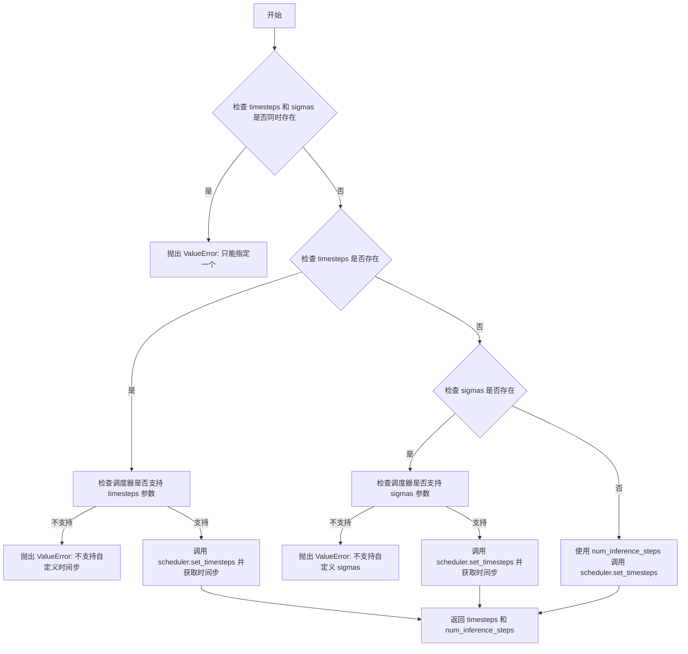

#### 带注释源码

```python
# Copied from diffusers.pipelines.stable_diffusion.pipeline_stable_diffusion.retrieve_timesteps
def retrieve_timesteps(
    scheduler,
    num_inference_steps: int | None = None,
    device: str | torch.device | None = None,
    timesteps: list[int] | None = None,
    sigmas: list[float] | None = None,
    **kwargs,
):
    r"""
    Calls the scheduler's `set_timesteps` method and retrieves timesteps from the scheduler after the call. Handles
    custom timesteps. Any kwargs will be supplied to `scheduler.set_timesteps`.

    Args:
        scheduler (`SchedulerMixin`):
            The scheduler to get timesteps from.
        num_inference_steps (`int`):
            The number of diffusion steps used when generating samples with a pre-trained model. If used, `timesteps`
            must be `None`.
        device (`str` or `torch.device`, *optional*):
            The device to which the timesteps should be moved to. If `None`, the timesteps are not moved.
        timesteps (`list[int]`, *optional*):
            Custom timesteps used to override the timestep spacing strategy of the scheduler. If `timesteps` is passed,
            `num_inference_steps` and `sigmas` must be `None`.
        sigmas (`list[float]`, *optional*):
            Custom sigmas used to override the timestep spacing strategy of the scheduler. If `sigmas` is passed,
            `num_inference_steps` and `timesteps` must be `None`.

    Returns:
        `tuple[torch.Tensor, int]`: A tuple where the first element is the timestep schedule from the scheduler and the
        second element is the number of inference steps.
    """
    # 验证输入参数：timesteps 和 sigmas 不能同时指定
    if timesteps is not None and sigmas is not None:
        raise ValueError("Only one of `timesteps` or `sigmas` can be passed. Please choose one to set custom values")
    
    # 分支处理：优先处理自定义 timesteps
    if timesteps is not None:
        # 通过反射检查调度器的 set_timesteps 方法是否接受 timesteps 参数
        accepts_timesteps = "timesteps" in set(inspect.signature(scheduler.set_timesteps).parameters.keys())
        if not accepts_timesteps:
            raise ValueError(
                f"The current scheduler class {scheduler.__class__}'s `set_timesteps` does not support custom"
                f" timestep schedules. Please check whether you are using the correct scheduler."
            )
        # 调用调度器的 set_timesteps 方法设置自定义时间步
        scheduler.set_timesteps(timesteps=timesteps, device=device, **kwargs)
        # 从调度器获取最终的时间步序列
        timesteps = scheduler.timesteps
        # 计算推理步数
        num_inference_steps = len(timesteps)
    # 分支处理：处理自定义 sigmas
    elif sigmas is not None:
        # 通过反射检查调度器的 set_timesteps 方法是否接受 sigmas 参数
        accept_sigmas = "sigmas" in set(inspect.signature(scheduler.set_timesteps).parameters.keys())
        if not accept_sigmas:
            raise ValueError(
                f"The current scheduler class {scheduler.__class__}'s `set_timesteps` does not support custom"
                f" sigmas schedules. Please check whether you are using the correct scheduler."
            )
        # 调用调度器的 set_timesteps 方法设置自定义 sigmas
        scheduler.set_timesteps(sigmas=sigmas, device=device, **kwargs)
        # 从调度器获取最终的时间步序列
        timesteps = scheduler.timesteps
        # 计算推理步数
        num_inference_steps = len(timesteps)
    # 默认处理：使用 num_inference_steps 参数
    else:
        scheduler.set_timesteps(num_inference_steps, device=device, **kwargs)
        timesteps = scheduler.timesteps
    
    # 返回时间步序列和推理步数
    return timesteps, num_inference_steps
```


### `retrieve_latents`

从编码器输出中提取潜在变量的全局函数，支持多种采样模式。

参数：

- `encoder_output`：`torch.Tensor`，编码器输出对象，可能包含 `latent_dist` 或 `latents` 属性
- `generator`：`torch.Generator | None`，可选的随机数生成器，用于确保采样可复现
- `sample_mode`：`str`，采样模式，默认为 `"sample"`，可选 `"argmax"`

返回值：`torch.Tensor`，从编码器输出中提取的潜在变量张量

#### 流程图

```mermaid
flowchart TD
    A[retrieve_latents 开始] --> B{encoder_output 是否有 latent_dist 属性?}
    B -->|是| C{sample_mode 是否为 'sample'?}
    C -->|是| D[返回 latent_dist.sample&#40;generator&#41;]
    C -->|否| E{sample_mode 是否为 'argmax'?}
    E -->|是| F[返回 latent_dist.mode&#40;&#41;]
    E -->|否| G[继续检查]
    B -->|否| H{encoder_output 是否有 latents 属性?}
    H -->|是| I[返回 encoder_output.latents]
    H -->|否| J[抛出 AttributeError 异常]
    E -->|否| G
    G --> J
    D --> K[retrieve_latents 结束]
    F --> K
    I --> K
    J --> L[错误: 无法访问 latents]
```

#### 带注释源码

```python
# Copied from diffusers.pipelines.stable_diffusion.pipeline_stable_diffusion_img2img.retrieve_latents
def retrieve_latents(
    encoder_output: torch.Tensor, generator: torch.Generator | None = None, sample_mode: str = "sample"
):
    """
    从编码器输出中提取潜在变量。
    
    该函数支持三种提取模式：
    1. 从 latent_dist 采样（sample 模式）
    2. 从 latent_dist 取最可能值（argmax 模式）
    3. 直接返回预计算的 latents
    
    Args:
        encoder_output: 编码器输出对象，应包含 latent_dist 或 latents 属性
        generator: 可选的随机数生成器，用于采样时的确定性生成
        sample_mode: 采样模式，'sample' 表示从分布采样，'argmax' 表示取分布的众数
    
    Returns:
        提取的潜在变量张量
    
    Raises:
        AttributeError: 当 encoder_output 既没有 latent_dist 也没有 latents 属性时
    """
    # 检查是否存在 latent_dist 属性且采样模式为 sample
    if hasattr(encoder_output, "latent_dist") and sample_mode == "sample":
        # 从潜在分布中采样，使用 generator 确保可复现性（如果提供）
        return encoder_output.latent_dist.sample(generator)
    # 检查是否存在 latent_dist 属性且采样模式为 argmax
    elif hasattr(encoder_output, "latent_dist") and sample_mode == "argmax":
        # 返回潜在分布的众数（最可能的值）
        return encoder_output.latent_dist.mode()
    # 检查是否存在预计算的 latents 属性
    elif hasattr(encoder_output, "latents"):
        # 直接返回预计算的 latents
        return encoder_output.latents
    else:
        # 如果无法找到任何有效的潜在变量来源，抛出异常
        raise AttributeError("Could not access latents of provided encoder_output")
```


### `calculate_dimensions`

该函数根据目标面积和宽高比计算图像的宽度和高度，并确保尺寸是32的倍数以满足VAE的patch对齐要求。

参数：

- `target_area`：`int` 或 `float`，目标面积，表示期望的像素总数
- `ratio`：`float`，宽高比，表示宽度除以高度的比例

返回值：`tuple[int, int, None]`，返回调整后的宽度、高度和一个占位的None值（可能是为保持接口一致性）

#### 流程图

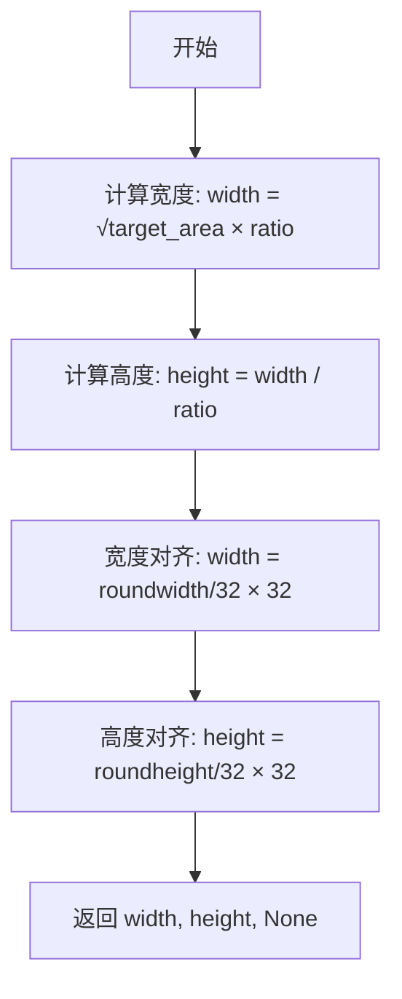

#### 带注释源码

```python
def calculate_dimensions(target_area, ratio):
    """
    根据目标面积和宽高比计算图像尺寸
    
    Args:
        target_area: 目标面积（像素总数）
        ratio: 宽高比（宽度/高度）
    
    Returns:
        tuple: (width, height, None) - 宽度、高度和对齐后的尺寸
    """
    # 1. 根据面积和比例计算理想宽度：width = √(target_area × ratio)
    # 这是因为: width × height = target_area, width/height = ratio
    # 因此: width² = target_area × ratio
    width = math.sqrt(target_area * ratio)
    
    # 2. 根据比例计算高度：height = width / ratio
    height = width / ratio
    
    # 3. 将宽度四舍五入到32的倍数，满足VAE的patch对齐要求
    # QwenImage的latent需要被划分为2x2的patches，所以需要对齐到32
    width = round(width / 32) * 32
    
    # 4. 将高度四舍五入到32的倍数
    height = round(height / 32) * 32
    
    # 5. 返回计算结果，第三个值为None可能是占位符
    return width, height, None
```

#### 潜在优化建议

1. **返回值设计问题**：函数返回三个值但第三个值始终为`None`，这看起来是一个设计缺陷或未完成的接口。建议要么移除这个冗余返回值，要么明确其用途。

2. **参数类型声明**：缺少类型注解，建议添加如`def calculate_dimensions(target_area: float, ratio: float) -> tuple[int, int, None]:`。

3. **边界情况处理**：没有处理负值或零值的`target_area`和`ratio`，可能导致异常或不符合预期的结果。

4. **硬编码对齐值**：32这个值被硬编码，如果底层模型的对齐要求改变，需要修改多处代码。


### `QwenImageEditPipeline.__init__`

该方法是 `QwenImageEditPipeline` 类的构造函数，负责初始化图像编辑管道所需的所有核心组件，包括 VAE 模型、文本编码器、分词器、处理器和变换器，并配置相关的缩放因子、图像处理器和提示词模板等。

参数：

- `scheduler`：`FlowMatchEulerDiscreteScheduler`，调度器，用于在去噪过程中逐步去除图像 latent 中的噪声
- `vae`：`AutoencoderKLQwenImage`，变分自编码器模型，用于将图像编码到 latent 空间并从 latent 空间解码恢复图像
- `text_encoder`：`Qwen2_5_VLForConditionalGeneration`，Qwen2.5-VL 文本编码器，用于将文本提示编码为嵌入向量
- `tokenizer`：`Qwen2Tokenizer`，Qwen2 分词器，用于将文本分割为 token 序列
- `processor`：`Qwen2VLProcessor`，Qwen2 VL 处理器，用于预处理文本和图像输入
- `transformer`：`QwenImageTransformer2DModel`，条件变换器（MMDiT）架构，用于对编码后的图像 latent 进行去噪

返回值：`None`，该方法为构造函数，不返回任何值

#### 流程图

```mermaid
flowchart TD
    A[开始 __init__] --> B[调用 super().__init__]
    B --> C[register_modules: 注册 vae, text_encoder, tokenizer, processor, transformer, scheduler]
    C --> D[计算 vae_scale_factor: 2 ** len(vae.temporal_downsample 或 8]
    D --> E[获取 latent_channels: vae.config.z_dim 或 16]
    E --> F[创建 VaeImageProcessor: vae_scale_factor * 2]
    F --> G[设置 tokenizer_max_length = 1024]
    G --> H[配置 prompt_template_encode 提示词模板]
    H --> I[设置 prompt_template_encode_start_idx = 64]
    I --> J[设置 default_sample_size = 128]
    J --> K[结束 __init__]
```

#### 带注释源码

```python
def __init__(
    self,
    scheduler: FlowMatchEulerDiscreteScheduler,  # 噪声调度器，控制去噪过程
    vae: AutoencoderKLQwenImage,                 # VAE 模型，用于图像编码/解码
    text_encoder: Qwen2_5_VLForConditionalGeneration,  # 文本编码器
    tokenizer: Qwen2Tokenizer,                  # 分词器
    processor: Qwen2VLProcessor,                 # 图像文本处理器
    transformer: QwenImageTransformer2DModel,    # 主干去噪变换器
):
    # 1. 调用父类 DiffusionPipeline 的初始化方法
    #    设置基本的管道配置和设备管理
    super().__init__()

    # 2. 注册所有模块到管道中
    #    这些模块将通过管道统一管理（如设备放置、内存卸载等）
    self.register_modules(
        vae=vae,
        text_encoder=text_encoder,
        tokenizer=tokenizer,
        processor=processor,
        transformer=transformer,
        scheduler=scheduler,
    )

    # 3. 计算 VAE 缩放因子
    #    用于将像素空间尺寸转换为 latent 空间尺寸
    #    基于 VAE 的时序下采样层数量计算
    self.vae_scale_factor = 2 ** len(self.vae.temporal_downsample) if getattr(self, "vae", None) else 8

    # 4. 获取 latent 通道数
    #    从 VAE 配置中读取 latent 的通道维度
    self.latent_channels = self.vae.config.z_dim if getattr(self, "vae", None) else 16

    # 5. 创建图像处理器
    #    QwenImage 的 latent 被转换为 2x2 的 patch 并打包
    #    因此 latent 宽度和高度必须能被 patch size 整除
    #    需要将 vae_scale_factor 乘以 patch size 来考虑这一点
    self.image_processor = VaeImageProcessor(vae_scale_factor=self.vae_scale_factor * 2)

    # 6. 设置分词器最大长度
    self.tokenizer_max_length = 1024

    # 7. 配置提示词编码模板
    #    这是一个复杂的系统提示词模板，用于指导模型描述图像特征并理解编辑指令
    self.prompt_template_encode = (
        "<|im_start|>system\n"
        "Describe the key features of the input image (color, shape, size, texture, objects, background), "
        "then explain how the user's text instruction should alter or modify the image. "
        "Generate a new image that meets the user's requirements while maintaining consistency with the original input where appropriate."
        "<|im_end|>\n"
        "<|im_start|>user\n"
        "<|vision_start|><|image_pad|><|vision_end|>{}<|im_end|>\n"
        "<|im_start|>assistant\n"
    )

    # 8. 设置提示词模板编码的起始索引
    #    用于从编码结果中跳过固定的系统前缀
    self.prompt_template_encode_start_idx = 64

    # 9. 设置默认采样尺寸
    #    用于生成图像的默认尺寸基数
    self.default_sample_size = 128
```


### `QwenImageEditPipeline._extract_masked_hidden`

该方法根据注意力掩码从隐藏状态张量中提取有效位置的内容，并将提取后的隐藏状态按批次维度分割成独立的张量列表，常用于从文本编码器的输出中获取每个样本的有效token隐藏状态。

参数：

- `self`：类实例本身
- `hidden_states`：`torch.Tensor`，输入的隐藏状态张量，通常为文本编码器的最后一层隐藏状态，形状为 `[batch_size, seq_len, hidden_dim]`
- `mask`：`torch.Tensor`，注意力掩码张量，用于指示哪些位置是有效的（非padding），形状为 `[batch_size, seq_len]`

返回值：`tuple[torch.Tensor]`（或 `list[torch.Tensor]`），返回分割后的隐藏状态元组列表，每个元素对应一个样本的有效隐藏状态

#### 流程图

```mermaid
flowchart TD
    A[输入 hidden_states 和 mask] --> B[将 mask 转换为布尔类型: bool_mask = mask.bool()]
    C[计算每个样本的有效长度: valid_lengths = bool_mask.sum(dim=1)]
    D[使用布尔索引提取有效隐藏状态: selected = hidden_states[bool_mask]]
    E[按有效长度分割张量: split_result = torch.split(selected, valid_lengths.tolist(), dim=0)]
    F[返回分割结果]
    
    B --> C
    C --> D
    D --> E
    E --> F
```

#### 带注释源码

```python
# Copied from diffusers.pipelines.qwenimage.pipeline_qwenimage.QwenImagePipeline._extract_masked_hidden
def _extract_masked_hidden(self, hidden_states: torch.Tensor, mask: torch.Tensor):
    """
    从隐藏状态中根据掩码提取有效位置的内容，并按批次分割。
    
    Args:
        hidden_states: 文本编码器的隐藏状态，形状为 [batch_size, seq_len, hidden_dim]
        mask: 注意力掩码，形状为 [batch_size, seq_len]，用于标识有效token位置
    
    Returns:
        分割后的隐藏状态列表，每个元素对应一个样本的有效隐藏状态
    """
    # 将掩码转换为布尔类型，得到布尔掩码
    bool_mask = mask.bool()
    
    # 计算每个样本的有效token数量（沿seq_len维度求和）
    valid_lengths = bool_mask.sum(dim=1)
    
    # 使用布尔索引从隐藏状态中提取所有有效位置的值
    # 这会将hidden_states展平，只保留mask为True的位置
    selected = hidden_states[bool_mask]
    
    # 按照每个样本的有效长度将selected张量分割成多个子张量
    # valid_lengths.tolist() 包含每个样本的token数量
    split_result = torch.split(selected, valid_lengths.tolist(), dim=0)

    return split_result
```


### `QwenImageEditPipeline._get_qwen_prompt_embeds`

该方法负责将用户输入的文本提示词（prompt）与图像一起编码为 transformer 模型所需的嵌入向量（prompt embeds）和注意力掩码（attention mask）。它使用 Qwen2.5-VL 文本编码器对格式化后的提示词进行编码，并处理变长序列以返回统一形状的张量。

参数：

- `prompt`：`str | list[str]`，要编码的文本提示词，可以是单个字符串或字符串列表，默认为 None
- `image`：`torch.Tensor | None`，要与提示词一起编码的图像张量，默认为 None
- `device`：`torch.device | None`，执行编码操作的设备，默认为 None（使用执行设备）
- `dtype`：`torch.dtype | None`，输出张量的数据类型，默认为 None（使用文本编码器的数据类型）

返回值：`tuple[torch.Tensor, torch.Tensor]`，返回一个元组，包含 `prompt_embeds`（编码后的文本嵌入，形状为 [batch_size, seq_len, hidden_dim]）和 `encoder_attention_mask`（编码器注意力掩码，形状为 [batch_size, seq_len]）

#### 流程图

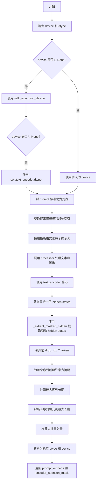

#### 带注释源码

```python
def _get_qwen_prompt_embeds(
    self,
    prompt: str | list[str] = None,
    image: torch.Tensor | None = None,
    device: torch.device | None = None,
    dtype: torch.dtype | None = None,
):
    """
    将文本提示词和可选图像编码为 transformer 可用的嵌入向量和注意力掩码。
    
    参数:
        prompt: 要编码的文本提示词，支持单个字符串或字符串列表
        image: 可选的图像张量，将与文本一起送入多模态编码器
        device: 指定编码设备，默认为当前执行设备
        dtype: 指定输出数据类型，默认为文本编码器的数据类型
    
    返回:
        包含编码后的嵌入向量和对应注意力掩码的元组
    """
    # 确定设备：如果未指定则使用当前执行设备
    device = device or self._execution_device
    # 确定数据类型：如果未指定则使用文本编码器的数据类型
    dtype = dtype or self.text_encoder.dtype

    # 标准化输入：将单个字符串转换为单元素列表
    prompt = [prompt] if isinstance(prompt, str) else prompt

    # 获取预先定义的提示词模板和要丢弃的token索引
    template = self.prompt_template_encode
    drop_idx = self.prompt_template_encode_start_idx
    # 使用模板格式化每个提示词
    txt = [template.format(e) for e in prompt]

    # 调用 processor 处理文本和图像数据，转换为模型输入格式
    model_inputs = self.processor(
        text=txt,
        images=image,
        padding=True,
        return_tensors="pt",
    ).to(device)

    # 调用 Qwen2.5-VL 文本编码器进行编码，获取所有层的 hidden states
    outputs = self.text_encoder(
        input_ids=model_inputs.input_ids,
        attention_mask=model_inputs.attention_mask,
        pixel_values=model_inputs.pixel_values,
        image_grid_thw=model_inputs.image_grid_thw,
        output_hidden_states=True,
    )

    # 获取最后一层的 hidden states 作为输出
    hidden_states = outputs.hidden_states[-1]
    # 根据 attention_mask 提取有效的 hidden states（去除 padding 部分）
    split_hidden_states = self._extract_masked_hidden(hidden_states, model_inputs.attention_mask)
    # 丢弃模板中预置的系统提示词部分（保留用户输入和实际内容）
    split_hidden_states = [e[drop_idx:] for e in split_hidden_states]
    # 为每个有效序列创建全1的注意力掩码（表示所有 token 都值得关注）
    attn_mask_list = [torch.ones(e.size(0), dtype=torch.long, device=e.device) for e in split_hidden_states]
    # 计算批次中最长序列的长度，用于后续填充
    max_seq_len = max([e.size(0) for e in split_hidden_states])
    # 将所有序列填充到相同长度，不足部分用零填充
    prompt_embeds = torch.stack(
        [torch.cat([u, u.new_zeros(max_seq_len - u.size(0), u.size(1))]) for u in split_hidden_states]
    )
    # 同样对注意力掩码进行填充
    encoder_attention_mask = torch.stack(
        [torch.cat([u, u.new_zeros(max_seq_len - u.size(0))]) for u in attn_mask_list]
    )

    # 将结果转换为指定的 dtype 和 device
    prompt_embeds = prompt_embeds.to(dtype=dtype, device=device)

    return prompt_embeds, encoder_attention_mask
```


### `QwenImageEditPipeline.encode_prompt`

该方法负责将文本提示（prompt）和图像编码为文本嵌入向量（prompt_embeds）和对应的注意力掩码（prompt_embeds_mask），支持批量生成多张图像。

参数：

- `prompt`：`str | list[str]`，要编码的文本提示，支持单字符串或字符串列表
- `image`：`torch.Tensor | None`，可选的输入图像张量，用于多模态编码
- `device`：`torch.device | None`，可选的目标设备，默认为执行设备
- `num_images_per_prompt`：`int`，每个提示词生成的图像数量，默认为1
- `prompt_embeds`：`torch.Tensor | None`，可选的预计算文本嵌入，用于避免重复计算
- `prompt_embeds_mask`：`torch.Tensor | None`，可选的文本嵌入注意力掩码
- `max_sequence_length`：`int`，最大序列长度，默认为1024

返回值：`tuple[torch.Tensor, torch.Tensor]`，返回包含文本嵌入和注意力掩码的元组

#### 流程图

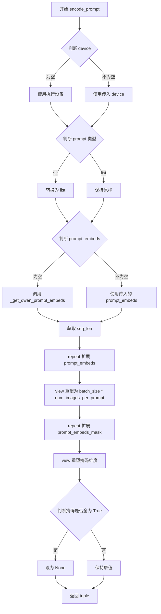

#### 带注释源码

```python
def encode_prompt(
    self,
    prompt: str | list[str],
    image: torch.Tensor | None = None,
    device: torch.device | None = None,
    num_images_per_prompt: int = 1,
    prompt_embeds: torch.Tensor | None = None,
    prompt_embeds_mask: torch.Tensor | None = None,
    max_sequence_length: int = 1024,
):
    r"""
    编码文本提示和图像为嵌入向量

    Args:
        prompt: 要编码的提示词，字符串或字符串列表
        image: 要编码的图像张量（可选）
        device: torch 设备（可选）
        num_images_per_prompt: 每个提示词生成的图像数量
        prompt_embeds: 预生成的文本嵌入（可选）
        prompt_embeds_mask: 文本嵌入的注意力掩码（可选）
    """
    # 确定设备，优先使用传入的设备，否则使用执行设备
    device = device or self._execution_device

    # 标准化 prompt 为列表格式
    prompt = [prompt] if isinstance(prompt, str) else prompt
    # 计算批次大小：如果提供了 prompt_embeds 则使用其维度，否则使用 prompt 长度
    batch_size = len(prompt) if prompt_embeds is None else prompt_embeds.shape[0]

    # 如果未提供嵌入，则调用内部方法生成
    if prompt_embeds is None:
        prompt_embeds, prompt_embeds_mask = self._get_qwen_prompt_embeds(prompt, image, device)

    # 获取序列长度
    _, seq_len, _ = prompt_embeds.shape
    
    # 扩展嵌入以匹配 num_images_per_prompt：先在维度1上重复
    prompt_embeds = prompt_embeds.repeat(1, num_images_per_prompt, 1)
    # 重塑为 batch_size * num_images_per_prompt, seq_len, hidden_dim
    prompt_embeds = prompt_embeds.view(batch_size * num_images_per_prompt, seq_len, -1)
    
    # 同样扩展注意力掩码
    prompt_embeds_mask = prompt_embeds_mask.repeat(1, num_images_per_prompt, 1)
    prompt_embeds_mask = prompt_embeds_mask.view(batch_size * num_images_per_prompt, seq_len)

    # 如果掩码全为 True（表示全部有效），则设为 None 以优化处理
    if prompt_embeds_mask is not None and prompt_embeds_mask.all():
        prompt_embeds_mask = None

    # 返回编码后的嵌入和掩码
    return prompt_embeds, prompt_embeds_mask
```


### `QwenImageEditPipeline.check_inputs`

该方法用于验证图像编辑管道的输入参数合法性，包括检查高度和宽度是否能被 VAE 尺度因子整除、prompt 和 prompt_embeds 不能同时提供、callback_on_step_end_tensor_inputs 是否在允许列表中、负向提示与嵌入的一致性，以及序列长度是否超过最大限制。

参数：

- `self`：`QwenImageEditPipeline` 实例，隐式参数，表示管道对象本身
- `prompt`：`str` 或 `list[str]` 或 `None`，用户提供的文本提示，用于指导图像编辑
- `height`：`int`，生成图像的高度（像素），必须能被 `vae_scale_factor * 2` 整除
- `width`：`int`，生成图像的宽度（像素），必须能被 `vae_scale_factor * 2` 整除
- `negative_prompt`：`str` 或 `list[str]` 或 `None`，可选的反向提示，用于引导模型避免生成某些内容
- `prompt_embeds`：`torch.Tensor` 或 `None`，可选的预生成文本嵌入，若提供则忽略 prompt 参数
- `negative_prompt_embeds`：`torch.Tensor` 或 `None`，可选的预生成反向文本嵌入
- `prompt_embeds_mask`：`torch.Tensor` 或 `None`，与 prompt_embeds 对应的注意力掩码
- `negative_prompt_embeds_mask`：`torch.Tensor` 或 `None`，与 negative_prompt_embeds 对应的注意力掩码
- `callback_on_step_end_tensor_inputs`：`list[str]` 或 `None`，回调函数在每步结束时可访问的张量输入列表
- `max_sequence_length`：`int` 或 `None`，文本序列的最大长度，不能超过 1024

返回值：`None`，该方法不返回任何值，仅通过抛出 ValueError 来指示输入验证失败

#### 流程图

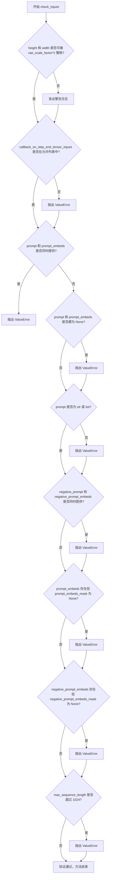

#### 带注释源码

```python
def check_inputs(
    self,
    prompt,
    height,
    width,
    negative_prompt=None,
    prompt_embeds=None,
    negative_prompt_embeds=None,
    prompt_embeds_mask=None,
    negative_prompt_embeds_mask=None,
    callback_on_step_end_tensor_inputs=None,
    max_sequence_length=None,
):
    # 检查图像尺寸是否为 VAE 尺度因子的整数倍
    # QwenImage 的 latent 被打包成 2x2 patches，所以需要乘以 2
    if height % (self.vae_scale_factor * 2) != 0 or width % (self.vae_scale_factor * 2) != 0:
        logger.warning(
            f"`height` and `width` have to be divisible by {self.vae_scale_factor * 2} but are {height} and {width}. Dimensions will be resized accordingly"
        )

    # 验证回调函数张量输入是否在允许的列表中
    # 只能传递管道中定义的张量类型作为回调参数
    if callback_on_step_end_tensor_inputs is not None and not all(
        k in self._callback_tensor_inputs for k in callback_on_step_end_tensor_inputs
    ):
        raise ValueError(
            f"`callback_on_step_end_tensor_inputs` has to be in {self._callback_tensor_inputs}, but found {[k for k in callback_on_step_end_tensor_inputs if k not in self._callback_tensor_inputs]}"
        )

    # 验证 prompt 和 prompt_embeds 互斥，不能同时提供
    if prompt is not None and prompt_embeds is not None:
        raise ValueError(
            f"Cannot forward both `prompt`: {prompt} and `prompt_embeds`: {prompt_embeds}. Please make sure to"
            " only forward one of the two."
        )
    # 必须至少提供一种文本输入方式
    elif prompt is None and prompt_embeds is None:
        raise ValueError(
            "Provide either `prompt` or `prompt_embeds`. Cannot leave both `prompt` and `prompt_embeds` undefined."
        )
    # 验证 prompt 的类型必须是字符串或字符串列表
    elif prompt is not None and (not isinstance(prompt, str) and not isinstance(prompt, list)):
        raise ValueError(f"`prompt` has to be of type `str` or `list` but is {type(prompt)}")

    # 验证 negative_prompt 和 negative_prompt_embeds 互斥
    if negative_prompt is not None and negative_prompt_embeds is not None:
        raise ValueError(
            f"Cannot forward both `negative_prompt`: {negative_prompt} and `negative_prompt_embeds`:"
            f" {negative_prompt_embeds}. Please make sure to only forward one of the two."
        )

    # prompt_embeds 和 prompt_embeds_mask 必须成对出现
    # 因为它们来自同一个文本编码器，需要保持一致性
    if prompt_embeds is not None and prompt_embeds_mask is None:
        raise ValueError(
            "If `prompt_embeds` are provided, `prompt_embeds_mask` also have to be passed. Make sure to generate `prompt_embeds_mask` from the same text encoder that was used to generate `prompt_embeds`."
        )
    # negative_prompt_embeds 和 negative_prompt_embeds_mask 必须成对出现
    if negative_prompt_embeds is not None and negative_prompt_embeds_mask is None:
        raise ValueError(
            "If `negative_prompt_embeds` are provided, `negative_prompt_embeds_mask` also have to be passed. Make sure to generate `negative_prompt_embeds_mask` from the same text encoder that was used to generate `negative_prompt_embeds`."
        )

    # 验证最大序列长度不能超过 1024
    if max_sequence_length is not None and max_sequence_length > 1024:
        raise ValueError(f"`max_sequence_length` cannot be greater than 1024 but is {max_sequence_length}")
```


### `QwenImageEditPipeline._pack_latents`

该方法是一个静态方法，用于将输入的latent张量进行打包处理，将2x2的空间patch转换为通道维度，实现latent的空间维度到通道维度的变换，以便于后续的transformer处理。

参数：

- `latents`：`torch.Tensor`，输入的latent张量，形状为 (batch_size, num_channels_latents, height, width)
- `batch_size`：`int`，批次大小
- `num_channels_latents`：`int`，latent的通道数
- `height`：`int`，latent的高度
- `width`：`int`，latent的宽度

返回值：`torch.Tensor`，打包后的latent张量，形状为 (batch_size, (height // 2) * (width // 2), num_channels_latents * 4)

#### 流程图

```mermaid
flowchart TD
    A[输入 latents<br/>shape: (batch_size, num_channels_latents, height, width)] --> B[view 操作<br/>shape: (batch_size, num_channels_latents, height//2, 2, width//2, 2)]
    B --> C[permute 操作<br/>shape: (batch_size, height//2, width//2, num_channels_latents, 2, 2)]
    C --> D[reshape 操作<br/>shape: (batch_size, height//2 * width//2, num_channels_latents * 4)]
    D --> E[返回打包后的 latents]
```

#### 带注释源码

```python
@staticmethod
# Copied from diffusers.pipelines.qwenimage.pipeline_qwenimage.QwenImagePipeline._pack_latents
def _pack_latents(latents, batch_size, num_channels_latents, height, width):
    """
    将latent张量打包成适合transformer处理的格式
    
    该方法将2x2的空间patch转换为通道维度，实现空间到通道的变换
    例如：如果原始shape为 (B, C, H, W)，则变换后为 (B, H*W/4, C*4)
    
    Args:
        latents: 输入的latent张量，形状为 (batch_size, num_channels_latents, height, width)
        batch_size: 批次大小
        num_channels_latents: latent通道数
        height: latent高度
        width: latent宽度
    
    Returns:
        打包后的latent张量，形状为 (batch_size, (height//2)*(width//2), num_channels_latents*4)
    """
    # 步骤1: 将latent张量重新reshape
    # 从 (batch_size, num_channels_latents, height, width)
    # 转换为 (batch_size, num_channels_latents, height//2, 2, width//2, 2)
    # 这里将height和width各除以2，并在最后两个维度添加2，表示2x2的patch
    latents = latents.view(batch_size, num_channels_latents, height // 2, 2, width // 2, 2)
    
    # 步骤2: 置换维度顺序
    # 从 (batch_size, num_channels_latents, height//2, 2, width//2, 2)
    # 转换为 (batch_size, height//2, width//2, num_channels_latents, 2, 2)
    # 将空间维度移到前面，通道维度移到后面
    latents = latents.permute(0, 2, 4, 1, 3, 5)
    
    # 步骤3: 最终reshape为2D序列形式
    # 从 (batch_size, height//2, width//2, num_channels_latents, 2, 2)
    # 转换为 (batch_size, height//2*width//2, num_channels_latents*4)
    # 将2x2的patch展平为4个通道，实现空间到通道的变换
    latents = latents.reshape(batch_size, (height // 2) * (width // 2), num_channels_latents * 4)

    return latents
```


### `QwenImageEditPipeline._unpack_latents`

将打包的潜在表示（packed latents）解包回原始的4D张量形状，用于VAE解码。該方法通过视图重塑和维度置换操作，将之前在潜在空间中打包的2x2块展开为标准的潜在张量格式。

参数：

- `latents`：`torch.Tensor`，打包后的潜在表示，形状为 (batch_size, num_patches, channels)，其中 channels 包含了打包的 2x2 块信息
- `height`：`int`，原始图像的高度（像素单位），用于计算潜在空间的高度
- `width`：`int`，原始图像的宽度（像素单位），用于计算潜在空间的宽度
- `vae_scale_factor`：`int`，VAE的缩放因子，用于将像素空间映射到潜在空间

返回值：`torch.Tensor`，解包后的4D潜在张量，形状为 (batch_size, channels // (2*2), 1, height, width)

#### 流程图

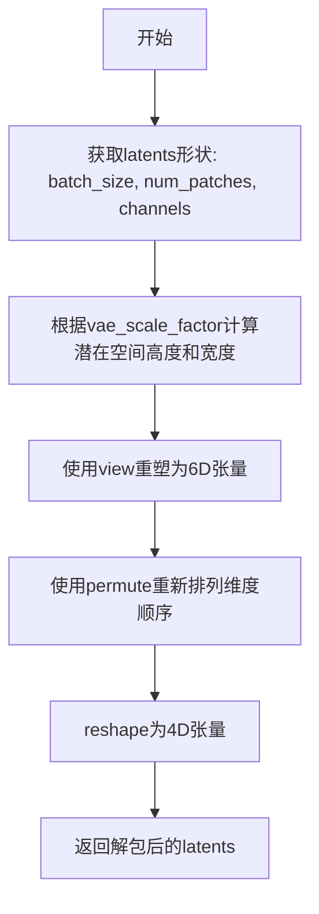

#### 带注释源码

```python
@staticmethod
# Copied from diffusers.pipelines.qwenimage.pipeline_qwenimage.QwenImagePipeline._unpack_latents
def _unpack_latents(latents, height, width, vae_scale_factor):
    # 从打包的latents中提取形状信息
    # batch_size: 批次大小
    # num_patches: 潜在空间中2x2块的数量
    # channels: 通道数（包含打包的4个通道）
    batch_size, num_patches, channels = latents.shape

    # VAE对图像应用8倍压缩，但需要考虑打包操作要求
    # 潜在空间的高度和宽度必须能被2整除
    # 计算潜在空间中的高度和宽度
    height = 2 * (int(height) // (vae_scale_factor * 2))
    width = 2 * (int(width) // (vae_scale_factor * 2))

    # 将打包的latents视图重塑为6D张量
    # 维度顺序: batch, height//2, width//2, channels//4, 2, 2
    # 其中最后两个维度2x2表示每个位置打包的2x2块
    latents = latents.view(batch_size, height // 2, width // 2, channels // 4, 2, 2)

    # 重新排列维度顺序
    # 从 (batch, h//2, w//2, c//4, 2, 2) 
    # 变为 (batch, c//4, h//2, 2, w//2, 2)
    # 这样可以将打包的2x2块展开到空间维度
    latents = latents.permute(0, 3, 1, 4, 2, 5)

    # 最终reshape为4D张量
    # 形状: (batch_size, channels // (2*2), 1, height, width)
    # 其中 channels // (2*2) = channels // 4 是通道数
    # 1 表示时间/帧维度（对于静态图像为1）
    # height, width 是潜在空间的空间维度
    latents = latents.reshape(batch_size, channels // (2 * 2), 1, height, width)

    return latents
```


### QwenImageEditPipeline._encode_vae_image

该方法负责将输入图像编码为VAE latent表示，并对latents进行标准化处理（减去均值并除以标准差），以确保与模型期望的潜在空间分布一致。

参数：

- `image`：`torch.Tensor`，待编码的输入图像张量，形状为 `(B, C, H, W)`
- `generator`：`torch.Generator`，用于生成随机数的PyTorch生成器，支持单个生成器或生成器列表以实现批量处理

返回值：`torch.Tensor`，标准化后的图像latents张量，形状为 `(B, latent_channels, H/8, W/8)`

#### 流程图

```mermaid
flowchart TD
    A[开始: _encode_vae_image] --> B{generator是否为list?}
    B -->|是| C[遍历图像批次]
    C --> D[使用vae.encode编码单张图像]
    D --> E[调用retrieve_latents获取latents<br/>sample_mode=argmax]
    E --> F[使用对应generator]
    F --> G[将所有latents沿dim=0拼接]
    B -->|否| H[直接使用vae.encode编码整个批次]
    H --> I[调用retrieve_latents获取latents<br/>sample_mode=argmax]
    I --> J[使用单个generator]
    G --> K[获取VAE latents_mean配置]
    J --> K
    K --> L[构建latents_mean张量<br/>形状: (1, latent_channels, 1, 1, 1)]
    L --> M[获取VAE latents_std配置]
    M --> N[构建latents_std张量<br/>形状: (1, latent_channels, 1, 1, 1)]
    N --> O[计算标准化: (image_latents - latents_mean) / latents_std]
    O --> P[返回标准化后的image_latents]
```

#### 带注释源码

```python
def _encode_vae_image(self, image: torch.Tensor, generator: torch.Generator):
    """
    将输入图像编码为VAE latent表示并进行标准化处理
    
    Args:
        image: 输入图像张量，形状为 (batch_size, channels, height, width)
        generator: PyTorch随机生成器，用于控制编码过程的随机性
    
    Returns:
        标准化后的图像latents张量
    """
    # 判断generator是否为列表（每个样本一个generator）
    if isinstance(generator, list):
        # 逐个处理图像，支持每个图像使用不同的随机种子
        image_latents = [
            # 编码单张图像 [i:i+1] 保持批次维度
            retrieve_latents(
                self.vae.encode(image[i : i + 1]),  # VAE编码获取latent分布
                generator=generator[i],            # 对应样本的生成器
                sample_mode="argmax"                 # 使用argmax而非sample获取确定性结果
            )
            for i in range(image.shape[0])  # 遍历批次中的每个图像
        ]
        # 将列表中的所有latents沿第0维拼接成完整批次
        image_latents = torch.cat(image_latents, dim=0)
    else:
        # 整个批次使用同一个generator进行编码
        image_latents = retrieve_latents(
            self.vae.encode(image),
            generator=generator,
            sample_mode="argmax"
        )
    
    # 从VAE配置中获取latents的均值，用于标准化
    latents_mean = (
        torch.tensor(self.vae.config.latents_mean)  # 从配置读取均值
        .view(1, self.latent_channels, 1, 1, 1)    # reshape为 (1, channels, 1, 1, 1)
        .to(image_latents.device, image_latents.dtype)  # 移动到正确设备和张量类型
    )
    
    # 从VAE配置中获取latents的标准差，用于标准化
    latents_std = (
        torch.tensor(self.vae.config.latents_std)  # 从配置读取标准差
        .view(1, self.latent_channels, 1, 1, 1)   # reshape为 (1, channels, 1, 1, 1)
        .to(image_latents.device, image_latents.dtype)  # 移动到正确设备和张量类型
    )
    
    # 执行标准化: (x - mean) / std
    # 这确保了latents符合模型训练时的潜在空间分布
    image_latents = (image_latents - latents_mean) / latents_std

    return image_latents
```


### `QwenImageEditPipeline.enable_vae_slicing`

启用 VAE 切片解码功能。当启用此选项时，VAE 会将输入张量分割成多个切片分步计算解码，以节省内存并支持更大的批处理大小。该方法已被弃用，建议直接使用 `pipe.vae.enable_slicing()`。

参数：无（仅包含隐式参数 `self`）

返回值：无（`None`），该方法通过副作用生效

#### 流程图

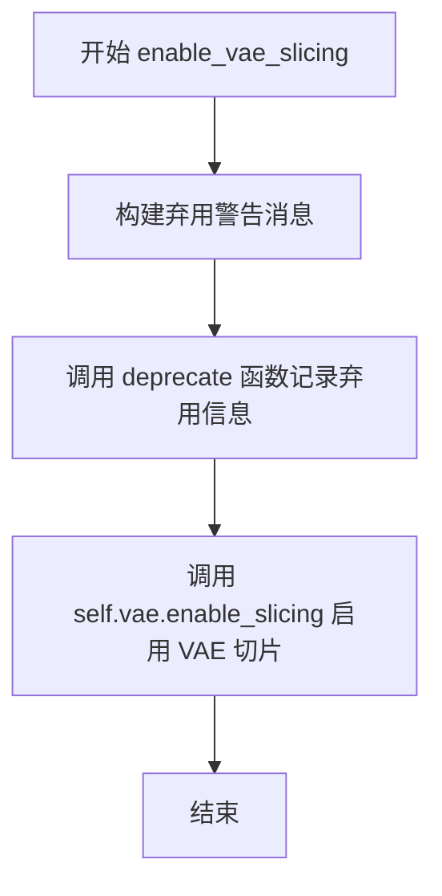

#### 带注释源码

```python
def enable_vae_slicing(self):
    r"""
    Enable sliced VAE decoding. When this option is enabled, the VAE will split the input tensor in slices to
    compute decoding in several steps. This is useful to save some memory and allow larger batch sizes.
    """
    # 构建弃用警告消息，包含类名以提供上下文信息
    depr_message = f"Calling `enable_vae_slicing()` on a `{self.__class__.__name__}` is deprecated and this method will be removed in a future version. Please use `pipe.vae.enable_slicing()`."
    
    # 调用 deprecate 函数记录弃用信息，指定弃用功能名、版本号和警告消息
    deprecate(
        "enable_vae_slicing",
        "0.40.0",
        depr_message,
    )
    
    # 委托给底层 VAE 模型的 enable_slicing 方法执行实际的切片启用逻辑
    self.vae.enable_slicing()
```


### `QwenImageEditPipeline.disable_vae_slicing`

该方法用于禁用VAE切片解码功能。如果之前启用了`enable_vae_slicing`，调用此方法将恢复为单步计算解码。同时，该方法已被标记为弃用，将在未来版本中移除，建议直接使用`pipe.vae.disable_slicing()`。

参数：

- 无显式参数（隐式参数`self`为类的实例本身）

返回值：`None`，无返回值

#### 流程图

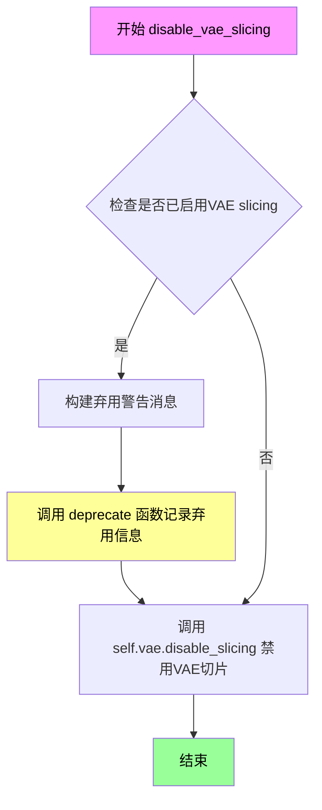

#### 带注释源码

```python
def disable_vae_slicing(self):
    r"""
    Disable sliced VAE decoding. If `enable_vae_slicing` was previously enabled, this method will go back to
    computing decoding in one step.
    """
    # 构建弃用警告消息，提示用户该方法已被弃用，应使用 pipe.vae.disable_slicing() 替代
    depr_message = f"Calling `disable_vae_slicing()` on a `{self.__class__.__name__}` is deprecated and this method will be removed in a future version. Please use `pipe.vae.disable_slicing()`."
    
    # 调用 deprecate 函数记录弃用信息，版本号为 0.40.0
    deprecate(
        "disable_vae_slicing",      # 被弃用的函数名
        "0.40.0",                    # 弃用版本号
        depr_message,               # 弃用警告消息
    )
    
    # 调用 VAE 模型的 disable_slicing 方法实际禁用切片解码功能
    self.vae.disable_slicing()
```


### `QwenImageEditPipeline.enable_vae_tiling`

该方法用于启用瓦片式 VAE 解码。当启用此选项时，VAE 会将输入张量分割成多个瓦片分步计算编码和解码，这对于节省大量内存并处理更大的图像非常有用。该方法已被弃用，未来版本将移除，建议直接使用 `pipe.vae.enable_tiling()`。

参数：

- 无（仅包含隐式参数 `self`）

返回值：`None`，无返回值，该方法仅执行副作用操作

#### 流程图

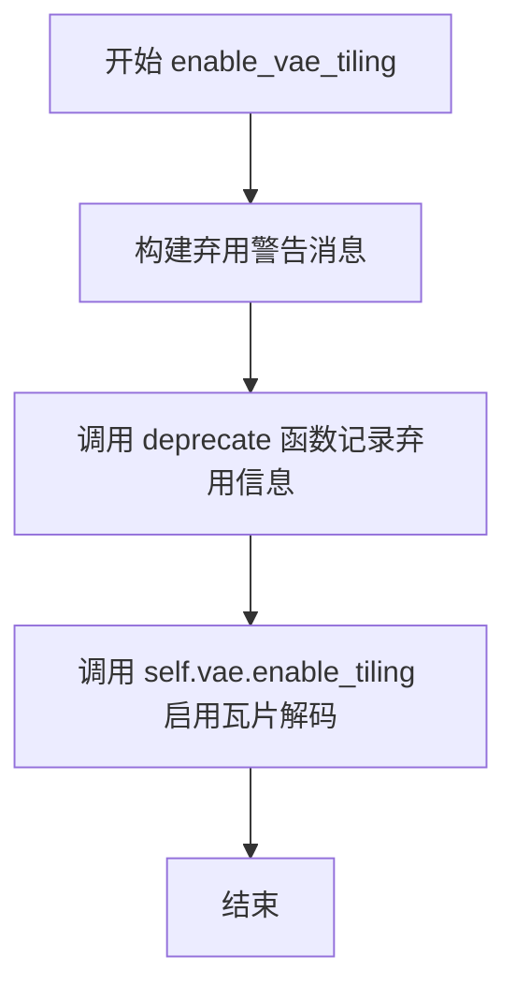

#### 带注释源码

```python
def enable_vae_tiling(self):
    r"""
    Enable tiled VAE decoding. When this option is enabled, the VAE will split the input tensor into tiles to
    compute decoding and encoding in several steps. This is useful for saving a large amount of memory and to allow
    processing larger images.
    """
    # 构建弃用警告消息，告知用户该方法将在未来版本中移除
    # 并建议使用新的 API: pipe.vae.enable_tiling()
    depr_message = f"Calling `enable_vae_tiling()` on a `{self.__class__.__name__}` is deprecated and this method will be removed in a future version. Please use `pipe.vae.enable_tiling()`."
    
    # 调用 deprecate 函数记录弃用信息，用于向用户发出警告
    deprecate(
        "enable_vae_tiling",      # 弃用的功能名称
        "0.40.0",                  # 将移除的版本号
        depr_message,              # 弃用说明消息
    )
    
    # 委托给 VAE 模型的 enable_tiling 方法执行实际的瓦片解码启用操作
    self.vae.enable_tiling()
```


### `QwenImageEditPipeline.disable_vae_tiling`

禁用瓦片 VAE 解码。如果之前启用了 `enable_vae_tiling`，此方法将恢复为一步计算解码。该方法已弃用，推荐直接使用 `pipe.vae.disable_tiling()`。

参数： 无（仅包含隐式参数 `self`）

返回值：`None`，无返回值

#### 流程图

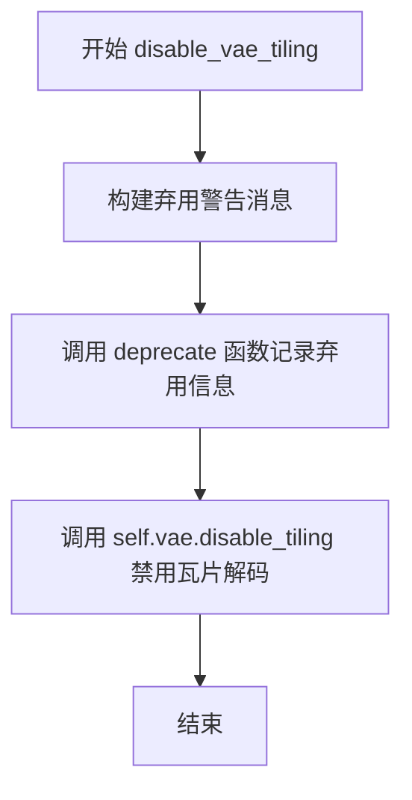

#### 带注释源码

```python
def disable_vae_tiling(self):
    r"""
    Disable tiled VAE decoding. If `enable_vae_tiling` was previously enabled, this method will go back to
    computing decoding in one step.
    """
    # 构建弃用警告消息，提示用户该方法将在未来版本中移除
    # 并建议使用新的 API: pipe.vae.disable_tiling()
    depr_message = f"Calling `disable_vae_tiling()` on a `{self.__class__.__name__}` is deprecated and this method will be removed in a future version. Please use `pipe.vae.disable_tiling()`."
    
    # 调用 deprecate 函数记录弃用信息，用于追踪和警告用户
    deprecate(
        "disable_vae_tiling",      # 弃用的方法名
        "0.40.0",                  # 弃用版本号
        depr_message,              # 弃用警告消息
    )
    
    # 实际调用 VAE 模型的 disable_tiling 方法来禁用瓦片解码
    self.vae.disable_tiling()
```


### `QwenImageEditPipeline.prepare_latents`

该方法负责为图像编辑管道准备潜在向量（latents）和图像潜在向量。它首先根据VAE的缩放因子调整高度和宽度，然后对输入图像进行编码（如果需要），处理批次大小不匹配的情况，最后生成随机潜在向量或使用提供的潜在向量，并将其打包成适合变压器模型的格式。

参数：

- `self`：`QwenImageEditPipeline`，管道实例本身
- `image`：`torch.Tensor | None`，输入图像张量，如果为None则不进行图像编码
- `batch_size`：`int`，批处理大小
- `num_channels_latents`：`int`，潜在向量的通道数
- `height`：`int`，目标图像高度（像素）
- `width`：`int`，目标图像宽度（像素）
- `dtype`：`torch.dtype`，目标数据类型
- `device`：`torch.device`，目标设备
- `generator`：`torch.Generator | list[torch.Generator] | None`，随机数生成器，用于生成确定性随机潜在向量
- `latents`：`torch.Tensor | None`，预生成的潜在向量，如果为None则随机生成

返回值：`tuple[torch.Tensor, torch.Tensor | None]`，返回元组包含打包后的潜在向量（torch.Tensor）和编码后的图像潜在向量（torch.Tensor或None）

#### 流程图

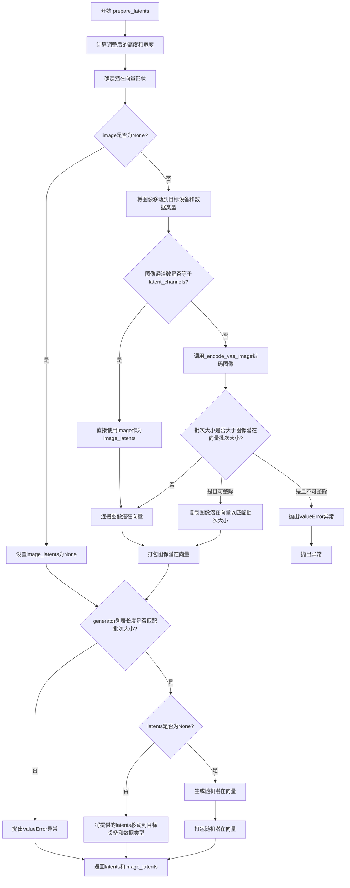

#### 带注释源码

```python
def prepare_latents(
    self,
    image,
    batch_size,
    num_channels_latents,
    height,
    width,
    dtype,
    device,
    generator,
    latents=None,
):
    # VAE applies 8x compression on images but we must also account for packing which requires
    # latent height and width to be divisible by 2.
    # 计算调整后的高度和宽度，考虑VAE的缩放因子和打包要求
    height = 2 * (int(height) // (self.vae_scale_factor * 2))
    width = 2 * (int(width) // (self.vae_scale_factor * 2))

    # 定义潜在向量的形状：(batch_size, 1, num_channels_latents, height, width)
    shape = (batch_size, 1, num_channels_latents, height, width)

    # 初始化图像潜在向量为None
    image_latents = None
    # 如果提供了图像，则进行编码处理
    if image is not None:
        # 将图像移动到指定设备和数据类型
        image = image.to(device=device, dtype=dtype)
        # 如果图像通道数与latent_channels不匹配，则需要编码
        if image.shape[1] != self.latent_channels:
            image_latents = self._encode_vae_image(image=image, generator=generator)
        else:
            # 否则直接使用提供的图像作为潜在向量
            image_latents = image
        
        # 处理批次大小扩展的情况
        if batch_size > image_latents.shape[0] and batch_size % image_latents.shape[0] == 0:
            # expand init_latents for batch_size
            # 计算每个提示需要扩展的图像数量
            additional_image_per_prompt = batch_size // image_latents.shape[0]
            # 复制图像潜在向量以匹配批次大小
            image_latents = torch.cat([image_latents] * additional_image_per_prompt, dim=0)
        elif batch_size > image_latents.shape[0] and batch_size % image_latents.shape[0] != 0:
            # 如果不能整除，抛出错误
            raise ValueError(
                f"Cannot duplicate `image` of batch size {image_latents.shape[0]} to {batch_size} text prompts."
            )
        else:
            # 正常情况下的连接操作
            image_latents = torch.cat([image_latents], dim=0)

        # 获取图像潜在向量的高度和宽度
        image_latent_height, image_latent_width = image_latents.shape[3:]
        # 打包图像潜在向量以适应变压器模型输入格式
        image_latents = self._pack_latents(
            image_latents, batch_size, num_channels_latents, image_latent_height, image_latent_width
        )

    # 验证generator列表长度是否与批次大小匹配
    if isinstance(generator, list) and len(generator) != batch_size:
        raise ValueError(
            f"You have passed a list of generators of length {len(generator)}, but requested an effective batch"
            f" size of {batch_size}. Make sure the batch size matches the length of the generators."
        )
    
    # 如果未提供latents，则随机生成
    if latents is None:
        # 使用randn_tensor生成随机潜在向量
        latents = randn_tensor(shape, generator=generator, device=device, dtype=dtype)
        # 打包随机潜在向量
        latents = self._pack_latents(latents, batch_size, num_channels_latents, height, width)
    else:
        # 将提供的latents移动到目标设备和数据类型
        latents = latents.to(device=device, dtype=dtype)

    # 返回处理后的latents和image_latents
    return latents, image_latents
```


### `QwenImageEditPipeline.__call__`

该方法是 Qwen-Image-Edit 管道的主入口函数，负责执行图像编辑任务的完整推理流程。它接收原始图像和文本提示，通过 VAE 编码、Transformer 去噪（支持条件引导和 CFG）、VAE 解码等步骤，最终生成符合文本指令要求的编辑后图像。

参数：

- `image`：`PipelineImageInput | None`，输入图像，支持 torch.Tensor、PIL.Image.Image、np.ndarray 或其列表，作为图像编辑的起点
- `prompt`：`str | list[str] | None`，引导图像生成的文本提示，若不定义则需传入 prompt_embeds
- `negative_prompt`：`str | list[str] | None`，不引导图像生成的负向提示，用于 CFG
- `true_cfg_scale`：`float`，默认为 4.0，真实分类器自由引导比例，值大于 1 时启用 CFG
- `height`：`int | None`，生成图像的高度（像素），默认根据输入图像计算
- `width`：`int | None`，生成图像的宽度（像素），默认根据输入图像计算
- `num_inference_steps`：`int`，默认为 50，去噪迭代步数，越多图像质量越高
- `sigmas`：`list[float] | None`，自定义 sigmas 数组，用于支持自定义调度器
- `guidance_scale`：`float | None`，引导蒸馏模型的引导比例参数
- `num_images_per_prompt`：`int`，默认为 1，每个提示生成的图像数量
- `generator`：`torch.Generator | list[torch.Generator] | None`，随机数生成器，用于确保可重复生成
- `latents`：`torch.Tensor | None`，预生成的噪声潜向量，可用于自定义生成过程
- `prompt_embeds`：`torch.Tensor | None`，预生成的文本嵌入，可用于提示权重调整
- `prompt_embeds_mask`：`torch.Tensor | None`，文本嵌入的注意力掩码
- `negative_prompt_embeds`：`torch.Tensor | None`，预生成的负向文本嵌入
- `negative_prompt_embeds_mask`：`torch.Tensor | None`，负向文本嵌入的注意力掩码
- `output_type`：`str | None`，默认为 "pil"，输出格式，可选 "pil" 或 "latent"
- `return_dict`：`bool`，默认为 True，是否返回 QwenImagePipelineOutput 对象
- `attention_kwargs`：`dict[str, Any] | None`，传递给注意力处理器的额外关键字参数
- `callback_on_step_end`：`Callable | None`，每个去噪步骤结束后调用的回调函数
- `callback_on_step_end_tensor_inputs`：`list[str]`，默认为 ["latents"]，回调函数接收的张量输入列表
- `max_sequence_length`：`int`，默认为 512，文本序列的最大长度

返回值：`QwenImagePipelineOutput | tuple`，返回图像管道输出对象（包含生成的图像列表），若 return_dict 为 False 则返回元组

#### 流程图

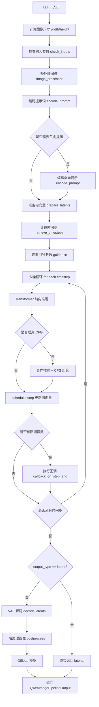

#### 带注释源码

```python
@torch.no_grad()
@replace_example_docstring(EXAMPLE_DOC_STRING)
def __call__(
    self,
    image: PipelineImageInput | None = None,
    prompt: str | list[str] = None,
    negative_prompt: str | list[str] = None,
    true_cfg_scale: float = 4.0,
    height: int | None = None,
    width: int | None = None,
    num_inference_steps: int = 50,
    sigmas: list[float] | None = None,
    guidance_scale: float | None = None,
    num_images_per_prompt: int = 1,
    generator: torch.Generator | list[torch.Generator] | None = None,
    latents: torch.Tensor | None = None,
    prompt_embeds: torch.Tensor | None = None,
    prompt_embeds_mask: torch.Tensor | None = None,
    negative_prompt_embeds: torch.Tensor | None = None,
    negative_prompt_embeds_mask: torch.Tensor | None = None,
    output_type: str | None = "pil",
    return_dict: bool = True,
    attention_kwargs: dict[str, Any] | None = None,
    callback_on_step_end: Callable[[int, int], None] | None = None,
    callback_on_step_end_tensor_inputs: list[str] = ["latents"],
    max_sequence_length: int = 512,
):
    # 1. 根据输入图像尺寸计算目标宽度和高度，使用 1024*1024 面积和图像宽高比
    image_size = image[0].size if isinstance(image, list) else image.size
    calculated_width, calculated_height, _ = calculate_dimensions(1024 * 1024, image_size[0] / image_size[1])
    # 使用计算值或用户指定值，并确保尺寸是 vae_scale_factor*2 的倍数
    height = height or calculated_height
    width = width or calculated_width

    multiple_of = self.vae_scale_factor * 2
    width = width // multiple_of * multiple_of
    height = height // multiple_of * multiple_of

    # 2. 检查输入参数合法性（提示词、尺寸、回调等）
    self.check_inputs(
        prompt,
        height,
        width,
        negative_prompt=negative_prompt,
        prompt_embeds=prompt_embeds,
        negative_prompt_embeds=negative_prompt_embeds,
        prompt_embeds_mask=prompt_embeds_mask,
        negative_prompt_embeds_mask=negative_prompt_embeds_mask,
        callback_on_step_end_tensor_inputs=callback_on_step_end_tensor_inputs,
        max_sequence_length=max_sequence_length,
    )

    # 3. 初始化内部状态（引导比例、注意力参数、当前时间步、中断标志）
    self._guidance_scale = guidance_scale
    self._attention_kwargs = attention_kwargs
    self._current_timestep = None
    self._interrupt = False

    # 4. 确定批次大小（根据提示词数量或已有 prompt_embeds）
    if prompt is not None and isinstance(prompt, str):
        batch_size = 1
    elif prompt is not None and isinstance(prompt, list):
        batch_size = len(prompt)
    else:
        batch_size = prompt_embeds.shape[0]

    device = self._execution_device
    
    # 5. 预处理图像（如果不是潜向量格式，则调整尺寸并预处理）
    if image is not None and not (isinstance(image, torch.Tensor) and image.size(1) == self.latent_channels):
        image = self.image_processor.resize(image, calculated_height, calculated_width)
        prompt_image = image  # 保存用于编码的图像
        image = self.image_processor.preprocess(image, calculated_height, calculated_width)
        image = image.unsqueeze(2)  # 添加批次维度

    # 6. 检查是否提供了负向提示（显式负向提示或预计算的负向嵌入）
    has_neg_prompt = negative_prompt is not None or (
        negative_prompt_embeds is not None and negative_prompt_embeds_mask is not None
    )

    # 7. 警告用户 CFG 配置不一致的情况
    if true_cfg_scale > 1 and not has_neg_prompt:
        logger.warning(
            f"true_cfg_scale is passed as {true_cfg_scale}, but classifier-free guidance is not enabled since no negative_prompt is provided."
        )
    elif true_cfg_scale <= 1 and has_neg_prompt:
        logger.warning(
            " negative_prompt is passed but classifier-free guidance is not enabled since true_cfg_scale <= 1"
        )

    # 8. 确定是否启用真实 CFG（true_cfg_scale>1 且有负向提示）
    do_true_cfg = true_cfg_scale > 1 and has_neg_prompt
    
    # 9. 编码正向提示词为嵌入向量
    prompt_embeds, prompt_embeds_mask = self.encode_prompt(
        image=prompt_image,
        prompt=prompt,
        prompt_embeds=prompt_embeds,
        prompt_embeds_mask=prompt_embeds_mask,
        device=device,
        num_images_per_prompt=num_images_per_prompt,
        max_sequence_length=max_sequence_length,
    )
    
    # 10. 如果启用 CFG，则编码负向提示词
    if do_true_cfg:
        negative_prompt_embeds, negative_prompt_embeds_mask = self.encode_prompt(
            image=prompt_image,
            prompt=negative_prompt,
            prompt_embeds=negative_prompt_embeds,
            prompt_embeds_mask=negative_prompt_embeds_mask,
            device=device,
            num_images_per_prompt=num_images_per_prompt,
            max_sequence_length=max_sequence_length,
        )

    # 11. 准备潜变量（初始化噪声或使用提供的 latents，编码图像为 image_latents）
    num_channels_latents = self.transformer.config.in_channels // 4
    latents, image_latents = self.prepare_latents(
        image,
        batch_size * num_images_per_prompt,
        num_channels_latents,
        height,
        width,
        prompt_embeds.dtype,
        device,
        generator,
        latents,
    )
    # 定义图像形状列表，用于 transformer 的图像条件
    img_shapes = [
        [
            (1, height // self.vae_scale_factor // 2, width // self.vae_scale_factor // 2),
            (1, calculated_height // self.vae_scale_factor // 2, calculated_width // self.vae_scale_factor // 2),
        ]
    ] * batch_size

    # 12. 准备时间步调度（计算 shift 并获取时间步序列）
    sigmas = np.linspace(1.0, 1 / num_inference_steps, num_inference_steps) if sigmas is None else sigmas
    image_seq_len = latents.shape[1]
    mu = calculate_shift(
        image_seq_len,
        self.scheduler.config.get("base_image_seq_len", 256),
        self.scheduler.config.get("max_image_seq_len", 4096),
        self.scheduler.config.get("base_shift", 0.5),
        self.scheduler.config.get("max_shift", 1.15),
    )
    timesteps, num_inference_steps = retrieve_timesteps(
        self.scheduler,
        num_inference_steps,
        device,
        sigmas=sigmas,
        mu=mu,
    )
    num_warmup_steps = max(len(timesteps) - num_inference_steps * self.scheduler.order, 0)
    self._num_timesteps = len(timesteps)

    # 13. 处理引导参数（区分引导蒸馏模型和传统 CFG 模型）
    if self.transformer.config.guidance_embeds and guidance_scale is None:
        raise ValueError("guidance_scale is required for guidance-distilled model.")
    elif self.transformer.config.guidance_embeds:
        guidance = torch.full([1], guidance_scale, device=device, dtype=torch.float32)
        guidance = guidance.expand(latents.shape[0])
    elif not self.transformer.config.guidance_embeds and guidance_scale is not None:
        logger.warning(
            f"guidance_scale is passed as {guidance_scale}, but ignored since the model is not guidance-distilled."
        )
        guidance = None
    elif not self.transformer.config.guidance_embeds and guidance_scale is None:
        guidance = None

    if self.attention_kwargs is None:
        self._attention_kwargs = {}

    # 14. 去噪主循环（多步迭代逐步去除噪声）
    self.scheduler.set_begin_index(0)
    with self.progress_bar(total=num_inference_steps) as progress_bar:
        for i, t in enumerate(timesteps):
            # 检查中断标志，允许外部中断去噪过程
            if self.interrupt:
                continue

            self._current_timestep = t

            # 15. 准备模型输入（将 latents 与 image_latents 拼接作为条件）
            latent_model_input = latents
            if image_latents is not None:
                latent_model_input = torch.cat([latents, image_latents], dim=1)

            # 广播时间步到批次维度以兼容 ONNX/Core ML
            timestep = t.expand(latents.shape[0]).to(latents.dtype)
            
            # 16. Transformer 正向推理（条件分支）
            with self.transformer.cache_context("cond"):
                noise_pred = self.transformer(
                    hidden_states=latent_model_input,
                    timestep=timestep / 1000,
                    guidance=guidance,
                    encoder_hidden_states_mask=prompt_embeds_mask,
                    encoder_hidden_states=prompt_embeds,
                    img_shapes=img_shapes,
                    attention_kwargs=self.attention_kwargs,
                    return_dict=False,
                )[0]
                noise_pred = noise_pred[:, : latents.size(1)]

            # 17. 如果启用 CFG，执行无条件的负向推理并组合预测
            if do_true_cfg:
                with self.transformer.cache_context("uncond"):
                    neg_noise_pred = self.transformer(
                        hidden_states=latent_model_input,
                        timestep=timestep / 1000,
                        guidance=guidance,
                        encoder_hidden_states_mask=negative_prompt_embeds_mask,
                        encoder_hidden_states=negative_prompt_embeds,
                        img_shapes=img_shapes,
                        attention_kwargs=self.attention_kwargs,
                        return_dict=False,
                    )[0]
                neg_noise_pred = neg_noise_pred[:, : latents.size(1)]
                # CFG 组合：neg + scale * (cond - neg)
                comb_pred = neg_noise_pred + true_cfg_scale * (noise_pred - neg_noise_pred)

                # 保持噪声预测的范数不变（防止 CFG 导致的质量下降）
                cond_norm = torch.norm(noise_pred, dim=-1, keepdim=True)
                noise_norm = torch.norm(comb_pred, dim=-1, keepdim=True)
                noise_pred = comb_pred * (cond_norm / noise_norm)

            # 18. 使用调度器根据噪声预测计算上一步的潜向量
            latents_dtype = latents.dtype
            latents = self.scheduler.step(noise_pred, t, latents, return_dict=False)[0]

            # 19. 处理数据类型转换（防止某些平台如 Apple MPS 的 bug）
            if latents.dtype != latents_dtype:
                if torch.backends.mps.is_available():
                    latents = latents.to(latents_dtype)

            # 20. 执行每步结束时的回调函数
            if callback_on_step_end is not None:
                callback_kwargs = {}
                for k in callback_on_step_end_tensor_inputs:
                    callback_kwargs[k] = locals()[k]
                callback_outputs = callback_on_step_end(self, i, t, callback_kwargs)

                # 允许回调函数修改潜向量和提示嵌入
                latents = callback_outputs.pop("latents", latents)
                prompt_embeds = callback_outputs.pop("prompt_embeds", prompt_embeds)

            # 21. 更新进度条（仅在最后一步或预热步之后）
            if i == len(timesteps) - 1 or ((i + 1) > num_warmup_steps and (i + 1) % self.scheduler.order == 0):
                progress_bar.update()

            # 22. 如果使用 XLA（PyTorch XLA），标记计算步骤
            if XLA_AVAILABLE:
                xm.mark_step()

    self._current_timestep = None
    
    # 23. 根据输出类型处理结果
    if output_type == "latent":
        image = latents  # 直接返回潜向量
    else:
        # 解包潜向量并还原均值方差
        latents = self._unpack_latents(latents, height, width, self.vae_scale_factor)
        latents = latents.to(self.vae.dtype)
        latents_mean = (
            torch.tensor(self.vae.config.latents_mean)
            .view(1, self.vae.config.z_dim, 1, 1, 1)
            .to(latents.device, latents.dtype)
        )
        latents_std = 1.0 / torch.tensor(self.vae.config.latents_std).view(1, self.vae.config.z_dim, 1, 1, 1).to(
            latents.device, latents.dtype
        )
        latents = latents / latents_std + latents_mean
        # VAE 解码生成最终图像
        image = self.vae.decode(latents, return_dict=False)[0][:, :, 0]
        # 后处理为指定输出格式（PIL 或 numpy）
        image = self.image_processor.postprocess(image, output_type=output_type)

    # 24. 释放模型内存（CPU offload）
    self.maybe_free_model_hooks()

    # 25. 返回结果
    if not return_dict:
        return (image,)

    return QwenImagePipelineOutput(images=image)
```

## 关键组件


### 张量索引与惰性加载

该组件负责从隐藏状态中根据注意力掩码提取有效的token嵌入，并使用cache_context实现条件/非条件推理的惰性计算优化。

### 反量化支持

该组件通过预定义的latents_mean和latents_std对VAE编码后的潜在表示进行反归一化处理，将标准化的潜在向量恢复到原始分布，支持后续的图像解码。

### 量化策略

该组件定义了VAE的潜在空间统计参数（均值和标准差），用于在编码时进行z-score标准化，在解码时进行反标准化，实现类似量化-反量化的潜在空间管理。

### 潜在变量打包/解包

该组件将4D潜在张量转换为2x2的patch形式并进行打包，以适配transformer的序列输入格式；解码时进行反向操作恢复空间结构。

### 自适应推理步长调度

该组件根据图像序列长度动态计算噪声调度器的shift参数mu，以优化不同分辨率图像生成的质量和收敛速度。

### 条件/非条件双分支推理

该组件在去噪循环中分别使用cache_context执行条件（prompt引导）和非条件（negative prompt）推理，并通过CFG公式合成最终预测，实现图像编辑引导。


## 问题及建议


### 已知问题

-   **API参数过多**：`__call__` 方法包含超过20个参数，违反了函数/方法参数数量的最佳实践，降低了代码可读性和可维护性。
-   **参数命名混淆**：`true_cfg_scale` 和 `guidance_scale` 两个参数功能相近但用途不同，容易导致用户误用，文档说明也不够清晰区分两者。
-   **代码重复**：多处注释显示"Copied from diffusers.pipelines..."，表明存在跨管道的代码重复，可以考虑提取为共享工具函数。
-   **无意义的返回值**：`calculate_dimensions` 函数始终返回 `None` 作为第三个返回值，这是一个无用设计。
-   **不一致的变量命名**：部分变量命名不够直观，如 `do_true_cfg`、`prompt_image` 等，增加理解成本。
-   **硬编码值缺乏解释**：如 `prompt_template_encode_start_idx = 64`、`tokenizer_max_length = 1024` 等魔法数字缺乏注释说明其含义和来源。
-   **潜在的mask处理bug**：`encode_prompt` 方法中对 `prompt_embeds_mask` 的处理逻辑存在不一致，检查 `all()` 后设置 `None` 但后续可能被忽略。
-   **复杂的多重属性检查**：使用 `getattr(self, "vae", None)` 进行可选属性检查，但在 `__init__` 中 `vae` 是必需的模块注册，这种冗余检查不必要。
-   **图像预处理逻辑重复**：在 `__call__` 方法中对图像进行了多次处理（resize、preprocess），代码路径较复杂。

### 优化建议

-   **重构大型方法**：将 `__call__` 方法拆分为多个私有方法，每个方法负责单一职责（如图像预处理、潜在变量准备、去噪循环等）。
-   **创建配置对象**：使用 dataclass 或 Pydantic 模型封装相关参数组（如图像参数、guidance参数、生成参数），减少方法签名长度。
-   **统一参数命名**：考虑重命名或合并 `true_cfg_scale` 和 `guidance_scale`，或在文档中更清晰地说明两者的区别和使用场景。
-   **提取共享代码**：将跨管道复用的函数（如 `calculate_shift`、`retrieve_timesteps`、`retrieve_latents` 等）提取到共享的工具模块中。
-   **添加类型提示和文档**：为全局变量和硬编码值添加注释说明，特别是在类初始化方法中使用的魔法数字。
-   **修复mask处理逻辑**：确保 `encode_prompt` 方法中 `prompt_embeds_mask` 的处理逻辑保持一致，或在所有返回路径上正确处理。
-   **简化计算逻辑**：`img_shapes` 的构建方式可以简化，`calculate_dimensions` 应移除无用的 `None` 返回值。
-   **添加输入验证边界**：在 `prepare_latents` 和图像处理逻辑中添加更严格的边界条件检查，确保处理各种异常输入。

## 其它


### 设计目标与约束

本Pipeline旨在实现基于Qwen2.5-VL模型的高质量图像编辑功能，支持用户通过文本指令对输入图像进行语义级别的修改。核心设计目标包括：(1) 支持多种输入格式（PIL Image、numpy array、torch tensor）；(2) 提供灵活的 Guidance 机制支持（传统Classifier-Free Guidance和Guidance Distilled模型）；(3) 实现高效的VAE编解码（支持slicing和tiling优化）；(4) 兼容diffusers框架的标准化接口。约束条件包括：输入图像尺寸必须能被vae_scale_factor * 2整除、max_sequence_length不超过1024、需配合Qwen2Tokenizer和Qwen2VLProcessor使用。

### 错误处理与异常设计

代码中实现了多层次错误检查机制。在`check_inputs`方法中验证：图像尺寸合法性、callback_on_step_end_tensor_inputs参数有效性、prompt与prompt_embeds互斥关系、negative_prompt_embeds与mask的配对要求、max_sequence_length范围限制。`retrieve_timesteps`函数对timesteps和sigmas互斥进行校验，并检查scheduler是否支持自定义调度。在`prepare_latents`中对generator列表长度与batch_size匹配性进行校验。异常处理采用ValueError明确抛出，警告信息通过logger.warning记录。潜在改进：可增加图像格式自动转换、添加重试机制处理临时性模型加载失败。

### 数据流与状态机

Pipeline执行流程可分为以下状态阶段：(1) 初始化态：加载模型组件（transformer、vae、text_encoder、tokenizer、processor、scheduler）；(2) 输入预处理态：图像尺寸计算与调整、prompt编码；(3) 潜在变量准备态：VAE编码图像生成image_latents、初始化随机噪声latents；(4) 去噪迭代态：循环执行transformer推理、CFG计算、scheduler步进；(5) 输出解码态：latent解压、VAE解码、后处理；(6) 资源释放态：模型hook卸载。数据流方向：用户输入（image + prompt）→ 图像预处理 → VAE编码 → Prompt编码 → 潜在变量准备 → UNet去噪循环 → VAE解码 → 输出图像。

### 外部依赖与接口契约

核心依赖包括：(1) `transformers`：Qwen2_5_VLForConditionalGeneration（文本编码）、Qwen2Tokenizer（分词）、Qwen2VLProcessor（多模态预处理）；(2) `diffusers`：DiffusionPipeline基类、FlowMatchEulerDiscreteScheduler调度器、AutoencoderKLQwenImage变分自编码器；(3) `torch`与`numpy`：数值计算；(4) 本地模块：PipelineImageInput类型定义、VaeImageProcessor图像处理、QwenImageLoraLoaderMixin LoRA加载、randn_tensor随机张量生成。接口契约方面，`__call__`方法接收标准化参数集（image、prompt、num_inference_steps等），返回QwenImagePipelineOutput或tuple格式。组件通过`register_modules`注册，支持组件热替换。

### 性能考虑与优化空间

代码已实现多项性能优化：(1) 模型CPU卸载顺序定义：`model_cpu_offload_seq = "text_encoder->transformer->vae"`；(2) VAE切片解码：`enable_vae_slicing`/`disable_vae_slicing`；(3) VAE平铺解码：`enable_vae_tiling`/`disable_vae_tiling`；(4) XLA支持：条件导入torch_xla并使用`xm.mark_step()`；(5) Latent打包：`_pack_latents`将2x2 patch压缩以提高计算效率。优化建议：(1) 可添加梯度检查点（gradient checkpointing）减少显存占用；(2) 支持torch.compile加速推理；(3) 考虑实现paged attention优化长序列处理；(4) 可增加批量推理的动态分组机制。

### 安全性考虑

代码涉及模型加载与推理，需注意：(1) 依赖官方HuggingFace Hub模型下载机制，建议添加模型哈希校验；(2) 文本编码涉及用户输入，需考虑prompt注入风险；(3) 图像处理需验证输入尺寸范围防止资源耗尽；(4) LoRA加载通过QwenImageLoraLoaderMixin，需确保LoRA权重来源可信。代码中已通过`deprecate`标记废弃方法，提醒未来版本变更。

### 配置与参数说明

关键配置参数包括：`vae_scale_factor`（基于vae.temporal_downsample计算，影响图像尺寸对齐）、`latent_channels`（VAE潜在空间维度）、`tokenizer_max_length`（默认1024）、`prompt_template_encode`（系统提示词模板）、`prompt_template_encode_start_idx`（模板起始索引64）、`default_sample_size`（默认128）。Scheduler配置通过`calculate_shift`函数动态计算mu值，基于image_seq_len、base_seq_len、max_seq_len、base_shift、max_shift参数。Guidance机制根据transformer.config.guidance_embeds属性自动切换传统CFG与Guidance Distilled模式。

### 版本兼容性与迁移指南

代码依赖以下版本要求：(1) Python 3.8+；(2) PyTorch 2.0+；(3) diffusers 0.40.0+（deprecate警告基于此版本）；(4) transformers 4.40+。废弃方法包括：`enable_vae_slicing`、`disable_vae_slicing`、`enable_vae_tiling`、`disable_vae_tiling`（均指向vae子模块方法）。迁移建议：新代码应直接调用`pipe.vae.enable_slicing()`等方法。XLA支持为可选依赖，无torch_xla时自动回退到标准PyTorch执行。

### 测试策略建议

建议覆盖以下测试场景：(1) 单元测试：calculate_shift数学正确性、retrieve_timesteps参数校验、latent打包解包维度一致性；(2) 集成测试：端到端推理流程（需mock模型或使用小模型）、多输入格式兼容性（PIL/numpy/tensor）、batch_size与num_images_per_prompt组合；(3) 性能基准：不同num_inference_steps的推理时间、显存占用对比；(4) 边界条件：空prompt、单图像batch、负向prompt效果验证；(5) 回归测试：确保与不同版本transformers/diffusers的兼容性。

### 使用示例与最佳实践

最佳实践包括：(1) 优先使用torch.bfloat16精度以平衡质量与显存；(2) 调整num_inference_steps（推荐30-80）平衡质量与速度；(3) 使用negative_prompt提升生成可控性；(4) 关注height/width参数确保与原始图像比例一致；(5) 通过attention_kwargs传递额外注意力控制参数。示例代码已嵌入EXAMPLE_DOC_STRING，演示了从HuggingFace加载模型、单图编辑、保存结果的标准流程。

    