# `diffusers\src\diffusers\pipelines\qwenimage\pipeline_qwenimage_edit_inpaint.py` 详细设计文档

这是一个基于 Qwen2.5-VL 模型和 FlowMatch 扩散架构的图像编辑与修复（Inpainting）管道。它接收原图、掩码和文本提示词，通过 VAE 编码图像、通过 Transformer 进行去噪扩散推理，最终生成符合指令的修复后图像。

## 整体流程

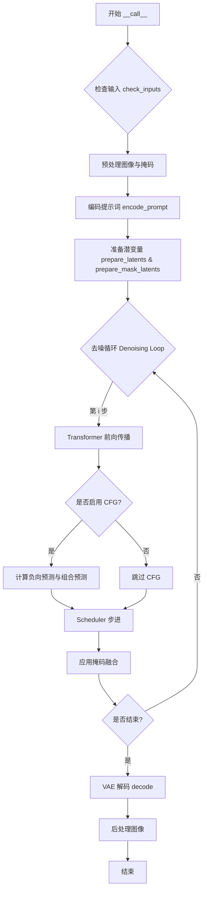

## 类结构

```
DiffusionPipeline (抽象基类)
└── QwenImageEditInpaintPipeline (主类)
    └── (Mixin: QwenImageLoraLoaderMixin)
```

## 全局变量及字段


### `EXAMPLE_DOC_STRING`
    
包含管道使用示例的文档字符串，展示如何进行图像编辑和修复

类型：`str`
    


### `logger`
    
用于记录管道执行过程中信息、警告和错误的日志记录器

类型：`logging.Logger`
    


### `XLA_AVAILABLE`
    
标识PyTorch XLA是否可用的布尔值，用于优化TPU设备上的计算性能

类型：`bool`
    


### `QwenImageEditInpaintPipeline.vae`
    
VAE模型，用于图像编码和解码

类型：`AutoencoderKLQwenImage`
    


### `QwenImageEditInpaintPipeline.text_encoder`
    
Qwen2.5-VL文本编码器，用于将文本和图像编码为嵌入向量

类型：`Qwen2_5_VLForConditionalGeneration`
    


### `QwenImageEditInpaintPipeline.tokenizer`
    
文本分词器，用于将文本转换为token ID序列

类型：`Qwen2Tokenizer`
    


### `QwenImageEditInpaintPipeline.processor`
    
视觉语言处理器，用于预处理文本和图像输入

类型：`Qwen2VLProcessor`
    


### `QwenImageEditInpaintPipeline.transformer`
    
扩散Transformer模型，用于去噪图像latent

类型：`QwenImageTransformer2DModel`
    


### `QwenImageEditInpaintPipeline.scheduler`
    
Flow Match欧拉离散调度器，用于控制去噪过程

类型：`FlowMatchEulerDiscreteScheduler`
    


### `QwenImageEditInpaintPipeline.vae_scale_factor`
    
VAE缩放因子，决定图像到latent的压缩比例

类型：`int`
    


### `QwenImageEditInpaintPipeline.latent_channels`
    
Latent空间的通道数

类型：`int`
    


### `QwenImageEditInpaintPipeline.image_processor`
    
图像预处理器，用于调整大小和归一化

类型：`VaeImageProcessor`
    


### `QwenImageEditInpaintPipeline.mask_processor`
    
掩码预处理器，用于处理修复掩码

类型：`VaeImageProcessor`
    


### `QwenImageEditInpaintPipeline.prompt_template_encode`
    
Qwen模型的提示词模板，用于格式化输入

类型：`str`
    


### `QwenImageEditInpaintPipeline.prompt_template_encode_start_idx`
    
提示词模板编码起始索引

类型：`int`
    


### `QwenImageEditInpaintPipeline.default_sample_size`
    
默认采样尺寸

类型：`int`
    


### `QwenImageEditInpaintPipeline.model_cpu_offload_seq`
    
模型CPU卸载顺序序列

类型：`str`
    


### `QwenImageEditInpaintPipeline._callback_tensor_inputs`
    
回调函数可用的张量输入列表

类型：`list[str]`
    


### `QwenImageEditInpaintPipeline._guidance_scale`
    
运行时引导系数，用于控制分类器自由引导强度

类型：`float`
    


### `QwenImageEditInpaintPipeline._attention_kwargs`
    
运行时注意力机制额外参数

类型：`dict[str, Any]`
    


### `QwenImageEditInpaintPipeline._num_timesteps`
    
运行时总时间步数

类型：`int`
    


### `QwenImageEditInpaintPipeline._current_timestep`
    
当前推理时间步

类型：`int`
    


### `QwenImageEditInpaintPipeline._interrupt`
    
中断标志，用于中断推理过程

类型：`bool`
    
    

## 全局函数及方法


### `calculate_shift`

这是一个全局函数，用于通过线性插值计算图像序列长度对应的偏移值（mu），通常用于调整扩散模型噪声调度器的时间步参数。

参数：

- `image_seq_len`：`int`，图像的序列长度（latent patches的数量）
- `base_seq_len`：`int`，基础序列长度，默认值为256
- `max_seq_len`：`int`，最大序列长度，默认值为4096
- `base_shift`：`float`，基础偏移值，默认值为0.5
- `max_shift`：`float`，最大偏移值，默认值为1.15

返回值：`float`，计算得到的偏移值mu，用于噪声调度器的时间步调整

#### 流程图

```mermaid
graph TD
    A[开始] --> B[计算斜率 m = (max_shift - base_shift) / (max_seq_len - base_seq_len)]
    B --> C[计算截距 b = base_shift - m * base_seq_len]
    C --> D[计算偏移值 mu = image_seq_len * m + b]
    D --> E[返回 mu]
```

#### 带注释源码

```python
# Copied from diffusers.pipelines.qwenimage.pipeline_qwenimage.calculate_shift
def calculate_shift(
    image_seq_len,          # 图像的序列长度，即latent空间中的patch数量
    base_seq_len: int = 256,  # 基础序列长度，用于线性插值的起始点
    max_seq_len: int = 4096,  # 最大序列长度，用于线性插值的终点
    base_shift: float = 0.5,  # 基础偏移值，对应base_seq_len的偏移
    max_shift: float = 1.15,  # 最大偏移值，对应max_seq_len的偏移
):
    # 计算线性插值的斜率（slope）
    # 表示每增加一个单位序列长度，偏移值增加多少
    m = (max_shift - base_shift) / (max_seq_len - base_seq_len)
    
    # 计算线性插值的截距（intercept）
    # 确保当序列长度为base_seq_len时，偏移值正好等于base_shift
    b = base_shift - m * base_seq_len
    
    # 根据图像序列长度计算具体的偏移值
    # 使用线性方程：mu = m * x + b
    mu = image_seq_len * m + b
    
    # 返回计算得到的偏移值，用于调整噪声调度器的参数
    return mu
```


### `retrieve_timesteps`

该函数是扩散模型管道中的时间步检索工具，用于调用调度器的`set_timesteps`方法并获取调度器中的时间步序列。它支持自定义时间步或自定义sigmas，并处理各种调度器的兼容性检查。

**参数：**

- `scheduler`：`SchedulerMixin`，要获取时间步的调度器对象
- `num_inference_steps`：`int | None`，生成样本时使用的扩散步数，如果使用此参数，则`timesteps`必须为`None`
- `device`：`str | torch.device | None`，时间步应移动到的设备，如果为`None`则不移动
- `timesteps`：`list[int] | None`，用于覆盖调度器时间步间隔策略的自定义时间步，如果传入此参数，则`num_inference_steps`和`sigmas`必须为`None`
- `sigmas`：`list[float] | None`，用于覆盖调度器sigma间隔策略的自定义sigmas，如果传入此参数，则`num_inference_steps`和`timesteps`必须为`None`
- `**kwargs`：任意关键字参数，将传递给调度器的`set_timesteps`方法

**返回值：** `tuple[torch.Tensor, int]`，元组包含两个元素：第一个是调度器的时间步调度序列（torch.Tensor），第二个是推理步数（int）

#### 流程图

```mermaid
flowchart TD
    A[开始 retrieve_timesteps] --> B{检查 timesteps 和 sigmas 是否同时存在}
    B -->|是| C[抛出 ValueError: 只能选择一个]
    B -->|否| D{检查 timesteps 是否存在}
    D -->|是| E[检查调度器是否支持自定义 timesteps]
    E -->|不支持| F[抛出 ValueError: 不支持自定义时间步]
    E -->|支持| G[调用 scheduler.set_timesteps<br/>timesteps=timesteps, device=device]
    G --> H[获取 scheduler.timesteps]
    H --> I[计算 num_inference_steps = len(timesteps)]
    D -->|否| J{检查 sigmas 是否存在}
    J -->|是| K[检查调度器是否支持自定义 sigmas]
    K -->|不支持| L[抛出 ValueError: 不支持自定义 sigmas]
    K -->|支持| M[调用 scheduler.set_timesteps<br/>sigmas=sigmas, device=device]
    M --> N[获取 scheduler.timesteps]
    N --> O[计算 num_inference_steps = len(timesteps)]
    J -->|否| P[调用 scheduler.set_timesteps<br/>num_inference_steps, device=device]
    P --> Q[获取 scheduler.timesteps]
    Q --> R[设置 num_inference_steps]
    R --> S[返回 timesteps, num_inference_steps]
```

#### 带注释源码

```python
def retrieve_timesteps(
    scheduler,  # SchedulerMixin: 调度器对象，用于获取时间步
    num_inference_steps: int | None = None,  # int | None: 扩散推理步数
    device: str | torch.device | None = None,  # str | torch.device | None: 目标设备
    timesteps: list[int] | None = None,  # list[int] | None: 自定义时间步列表
    sigmas: list[float] | None = None,  # list[float] | None: 自定义sigma列表
    **kwargs,  # 任意关键字参数，传递给调度器的set_timesteps
):
    r"""
    调用调度器的 `set_timesteps` 方法并在调用后从调度器检索时间步。
    处理自定义时间步。任何 kwargs 都将提供给 `scheduler.set_timesteps`。

    Args:
        scheduler: 调度器对象
        num_inference_steps: 推理步数
        device: 目标设备
        timesteps: 自定义时间步列表
        sigmas: 自定义sigma列表

    Returns:
        tuple[torch.Tensor, int]: 元组，第一个元素是调度器的时间步序列，第二个是推理步数
    """
    # 验证：不能同时指定timesteps和sigmas
    if timesteps is not None and sigmas is not None:
        raise ValueError("Only one of `timesteps` or `sigmas` can be passed. Please choose one to set custom values")
    
    # 分支1：处理自定义timesteps
    if timesteps is not None:
        # 检查调度器的set_timesteps是否接受timesteps参数
        accepts_timesteps = "timesteps" in set(inspect.signature(scheduler.set_timesteps).parameters.keys())
        if not accepts_timesteps:
            raise ValueError(
                f"The current scheduler class {scheduler.__class__}'s `set_timesteps` does not support custom"
                f" timestep schedules. Please check whether you are using the correct scheduler."
            )
        # 调用调度器设置自定义时间步
        scheduler.set_timesteps(timesteps=timesteps, device=device, **kwargs)
        # 从调度器获取实际的时间步
        timesteps = scheduler.timesteps
        # 计算推理步数
        num_inference_steps = len(timesteps)
    
    # 分支2：处理自定义sigmas
    elif sigmas is not None:
        # 检查调度器的set_timesteps是否接受sigmas参数
        accept_sigmas = "sigmas" in set(inspect.signature(scheduler.set_timesteps).parameters.keys())
        if not accept_sigmas:
            raise ValueError(
                f"The current scheduler class {scheduler.__class__}'s `set_timesteps` does not support custom"
                f" sigmas schedules. Please check whether you are using the correct scheduler."
            )
        # 调用调度器设置自定义sigmas
        scheduler.set_timesteps(sigmas=sigmas, device=device, **kwargs)
        # 从调度器获取时间步
        timesteps = scheduler.timesteps
        # 计算推理步数
        num_inference_steps = len(timesteps)
    
    # 分支3：使用默认行为，根据num_inference_steps设置时间步
    else:
        scheduler.set_timesteps(num_inference_steps, device=device, **kwargs)
        timesteps = scheduler.timesteps
    
    # 返回时间步序列和推理步数
    return timesteps, num_inference_steps
```


### `retrieve_latents`

从VAE编码器输出中提取潜在向量的通用函数，支持多种提取模式（采样、argmax或直接获取）。

参数：

- `encoder_output`：`torch.Tensor`，编码器输出张量，包含`latent_dist`属性（潜在分布）或`latents`属性（预计算的潜在向量）
- `generator`：`torch.Generator | None`，可选的随机数生成器，用于采样模式下的随机采样
- `sample_mode`：`str`，潜在向量提取模式，默认为`"sample"`，可选`"sample"`（从分布中采样）或`"argmax"`（取分布的众数）

返回值：`torch.Tensor`，提取出的潜在向量张量

#### 流程图

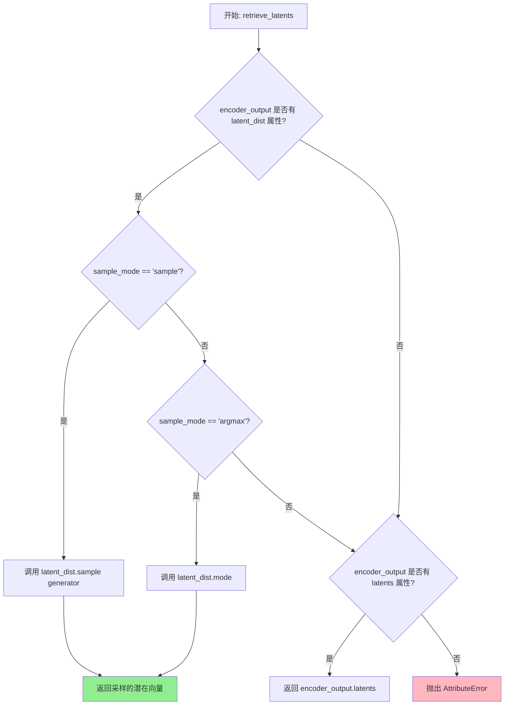

#### 带注释源码

```python
def retrieve_latents(
    encoder_output: torch.Tensor, generator: torch.Generator | None = None, sample_mode: str = "sample"
):
    """
    从VAE编码器输出中提取潜在向量。
    
    该函数支持三种提取方式：
    1. 从潜在分布中随机采样（sample模式）
    2. 从潜在分布中取众数/平均值（argmax模式）
    3. 直接获取预计算的潜在向量（latents属性）
    
    Args:
        encoder_output: 编码器输出，包含latent_dist或latents属性
        generator: 随机数生成器，用于采样模式下的可复现采样
        sample_mode: 提取模式，'sample'或'argmax'
    
    Returns:
        torch.Tensor: 提取的潜在向量
    
    Raises:
        AttributeError: 当encoder_output既没有latent_dist也没有latents属性时
    """
    # 检查是否存在latent_dist属性且模式为sample
    if hasattr(encoder_output, "latent_dist") and sample_mode == "sample":
        # 从潜在分布中随机采样，可使用generator控制随机性
        return encoder_output.latent_dist.sample(generator)
    # 检查是否存在latent_dist属性且模式为argmax
    elif hasattr(encoder_output, "latent_dist") and sample_mode == "argmax":
        # 取潜在分布的众数（最可能的值）
        return encoder_output.latent_dist.mode()
    # 检查是否存在预计算的latents属性
    elif hasattr(encoder_output, "latents"):
        # 直接返回预计算的潜在向量
        return encoder_output.latents
    # 无法提取潜在向量，抛出异常
    else:
        raise AttributeError("Could not access latents of provided encoder_output")
```


### `calculate_dimensions`

根据目标面积和宽高比计算图像的宽度和高度，并确保尺寸是32的倍数以满足VAE处理的要求。

参数：

- `target_area`：`int` 或 `float`，目标面积（像素总数的目标值）
- `ratio`：`float`，宽高比（宽度除以高度）

返回值：`tuple[int, int, None]`，返回计算后的宽度、高度和始终为 `None` 的占位值

#### 流程图

```mermaid
flowchart TD
    A[开始] --> B[计算宽度: width = sqrt(target_area * ratio)]
    B --> C[计算高度: height = width / ratio]
    C --> D[将宽度调整为32的倍数: width = round(width / 32) * 32]
    D --> E[将高度调整为32的倍数: height = round(height / 32) * 32]
    E --> F[返回 (width, height, None)]
```

#### 带注释源码

```python
# Copied from diffusers.pipelines.qwenimage.pipeline_qwenimage_edit.calculate_dimensions
def calculate_dimensions(target_area, ratio):
    # 根据目标面积和宽高比计算宽度
    # width = sqrt(target_area * ratio)
    width = math.sqrt(target_area * ratio)
    
    # 根据宽度和比例计算高度
    # height = width / ratio
    height = width / ratio

    # 将宽度四舍五入到32的倍数，以确保与VAE patch大小兼容
    # QwenImage latent被转换为2x2 patches并打包
    width = round(width / 32) * 32
    height = round(height / 32) * 32

    # 返回计算得到的宽度、高度和一个占位符（始终为None）
    return width, height, None
```


### QwenImageEditInpaintPipeline.__init__

该方法是 `QwenImageEditInpaintPipeline` 类的构造函数，负责初始化图像编辑修复管道（Inpaint Pipeline）的所有核心组件，包括调度器、VAE模型、文本编码器、分词器、处理器和Transformer模型，并配置图像处理器、掩码处理器和提示词模板等关键参数。

参数：

- `scheduler`：`FlowMatchEulerDiscreteScheduler`，用于去噪过程的调度器
- `vae`：`AutoencoderKLQwenImage`，变分自编码器模型，用于图像编码和解码
- `text_encoder`：`Qwen2_5_VLForConditionalGeneration`，Qwen2.5-VL文本编码器，用于生成文本嵌入
- `tokenizer`：`Qwen2Tokenizer`，Qwen分词器，用于文本分词
- `processor`：`Qwen2VLProcessor`，Qwen2VL处理器，用于处理多模态输入
- `transformer`：`QwenImageTransformer2DModel`，条件Transformer（MMDiT）架构，用于对图像潜在表示进行去噪

返回值：无（`None`），该方法为构造函数，不返回任何值

#### 流程图

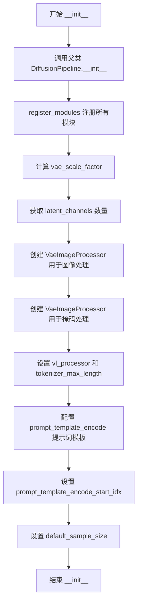

#### 带注释源码

```python
def __init__(
    self,
    scheduler: FlowMatchEulerDiscreteScheduler,
    vae: AutoencoderKLQwenImage,
    text_encoder: Qwen2_5_VLForConditionalGeneration,
    tokenizer: Qwen2Tokenizer,
    processor: Qwen2VLProcessor,
    transformer: QwenImageTransformer2DModel,
):
    # 调用父类 DiffusionPipeline 的初始化方法
    super().__init__()

    # 注册所有模块到管道中，包括 VAE、文本编码器、分词器、处理器、Transformer 和调度器
    self.register_modules(
        vae=vae,
        text_encoder=text_encoder,
        tokenizer=tokenizer,
        processor=processor,
        transformer=transformer,
        scheduler=scheduler,
    )
    
    # 计算 VAE 缩放因子，基于 VAE 的时序下采样层数量
    # 如果 VAE 存在则计算，否则默认值为 8
    self.vae_scale_factor = 2 ** len(self.vae.temperal_downsample) if getattr(self, "vae", None) else 8
    
    # 获取潜在通道数，从 VAE 配置中获取 z_dim
    self.latent_channels = self.vae.config.z_dim if getattr(self, "vae", None) else 16
    
    # QwenImage 潜在表示被转换为 2x2 补丁并打包。
    # 这意味着潜在宽度和高度必须能被补丁大小整除。
    # 因此，VAE 缩放因子乘以补丁大小以考虑这一点
    self.image_processor = VaeImageProcessor(vae_scale_factor=self.vae_scale_factor * 2)
    
    # 创建掩码处理器，用于处理图像修复任务中的掩码
    self.mask_processor = VaeImageProcessor(
        vae_scale_factor=self.vae_scale_factor * 2,
        vae_latent_channels=self.latent_channels,
        do_normalize=False,           # 不进行归一化
        do_binarize=True,              # 进行二值化处理
        do_convert_grayscale=True,    # 转换为灰度图
    )
    
    # 设置视觉语言处理器和分词器最大长度
    self.vl_processor = processor
    self.tokenizer_max_length = 1024

    # 配置提示词编码模板，用于指导模型生成描述
    # 模板包含系统消息和用户消息的格式，支持视觉输入
    self.prompt_template_encode = "<|im_start|>system\nDescribe the key features of the input image (color, shape, size, texture, objects, background), then explain how the user's text instruction should alter or modify the image. Generate a new image that meets the user's requirements while maintaining consistency with the original input where appropriate.<|im_end|>\n<|im_start|>user\n<|vision_start|><|image_pad|><|vision_end|>{}<|im_end|>\n<|im_start|>assistant\n"
    
    # 提示词模板编码的起始索引，用于跳过模板前缀
    self.prompt_template_encode_start_idx = 64
    
    # 默认采样大小，用于初始化某些默认配置
    self.default_sample_size = 128
```


### `QwenImageEditInpaintPipeline._extract_masked_hidden`

该函数用于从文本编码器的隐藏状态中提取有效令牌对应的隐藏状态。它接收隐藏状态和注意力掩码作为输入，利用布尔掩码筛选出有效令牌，然后将每个样本的有效隐藏状态分割成独立的张量列表返回。

参数：

- `self`：隐式参数，类的实例本身
- `hidden_states`：`torch.Tensor`，文本编码器输出的隐藏状态，形状为 `[batch_size, seq_len, hidden_dim]`
- `mask`：`torch.Tensor`，注意力掩码，形状为 `[batch_size, seq_len]`，用于指示哪些令牌是有效的

返回值：`list[torch.Tensor]`，返回隐藏状态张量列表，列表中每个元素对应一个样本的有效令牌隐藏状态

#### 流程图

```mermaid
flowchart TD
    A[开始] --> B[将 mask 转换为布尔掩码 bool_mask]
    B --> C[计算每个样本的有效令牌数量 valid_lengths]
    C --> D[使用布尔索引从 hidden_states 中选取有效令牌]
    D --> E[根据每个样本的有效长度分割张量]
    E --> F[返回分割结果列表]
    
    subgraph 详细说明
    B -.-> B1[bool_mask = mask.bool<br/>将 0/1 转换为 False/True]
    C -.-> C1[valid_lengths = bool_mask.sum(dim=1<br/>沿序列维度求和得到每个样本的有效长度]
    D -.-> D1[hidden_states[bool_mask<br/>利用布尔掩码进行索引选取]
    E -.-> E1[torch.split 按列表中的长度进行分割]
    end
```

#### 带注释源码

```python
def _extract_masked_hidden(self, hidden_states: torch.Tensor, mask: torch.Tensor):
    """
    从文本编码器的隐藏状态中提取有效令牌对应的隐藏状态。
    
    该方法用于从完整的隐藏状态序列中筛选出实际对应有效令牌的位置，
    并按样本分割成独立的张量，便于后续处理。
    
    Args:
        hidden_states: 文本编码器输出的隐藏状态，形状为 [batch_size, seq_len, hidden_dim]
        mask: 注意力掩码，形状为 [batch_size, seq_len]，1表示有效，0表示无效
    
    Returns:
        list[torch.Tensor]: 隐藏状态列表，每个元素对应一个样本的有效令牌隐藏状态
    """
    # Step 1: 将掩码转换为布尔类型，便于索引操作
    # 将数值掩码（0/1）转换为布尔值（False/True）
    bool_mask = mask.bool()
    
    # Step 2: 计算每个样本的有效令牌数量
    # 沿序列维度(dim=1)求和，得到每个batch样本的有效长度
    valid_lengths = bool_mask.sum(dim=1)
    
    # Step 3: 使用布尔索引从隐藏状态中选取有效令牌
    # 这是一个二维布尔索引，会将所有batch的有效令牌对应的隐藏状态取出
    # 结果是一个展平的一维张量
    selected = hidden_states[bool_mask]
    
    # Step 4: 按每个样本的有效长度分割张量
    # 使用 torch.split 将展平的张量按有效长度分割成多个独立张量
    # valid_lengths.tolist() 将张量转换为 Python 列表作为分割参数
    split_result = torch.split(selected, valid_lengths.tolist(), dim=0)
    
    # Step 5: 返回分割结果列表
    # 每个列表元素代表对应样本的有效令牌隐藏状态
    return split_result
```


### `QwenImageEditInpaintPipeline._get_qwen_prompt_embeds`

该方法用于将文本提示和图像输入通过Qwen2.5-VL文本编码器编码为prompt嵌入向量（prompt_embeds）和对应的注意力掩码（encoder_attention_mask），以供后续的图像修复（inpainting）扩散模型使用。

参数：

- `prompt`：`str | list[str]`，要编码的文本提示，可以是单个字符串或字符串列表
- `image`：`torch.Tensor | None`，要与提示关联的输入图像张量，可选
- `device`：`torch.device | None`，计算设备，若不指定则使用`self._execution_device`
- `dtype`：`torch.dtype | None`，计算数据类型，若不指定则使用`self.text_encoder.dtype`

返回值：`(torch.Tensor, torch.Tensor)`，返回一个元组，包含：
- `prompt_embeds`：`torch.Tensor`，形状为`(batch_size, seq_len, hidden_dim)`的文本嵌入向量
- `encoder_attention_mask`：`torch.Tensor`，形状为`(batch_size, seq_len)`的注意力掩码，用于标识有效token位置

#### 流程图

```mermaid
flowchart TD
    A[开始: _get_qwen_prompt_embeds] --> B{device参数是否为空?}
    B -->|是| C[使用self._execution_device]
    B -->|否| D[使用传入的device]
    C --> E
    D --> E
    
    E{dtype参数是否为空?}
    E -->|是| F[使用self.text_encoder.dtype]
    E -->|否| G[使用传入的dtype]
    F --> H
    G --> H
    
    H{prompt是否为字符串?}
    H -->|是| I[转换为单元素列表]
    H -->|否| J[保持原列表]
    I --> K
    J --> K
    
    K[使用prompt_template_encode格式化提示] --> L[调用self.processor处理文本和图像]
    
    L --> M[提取processor输出的input_ids, attention_mask, pixel_values, image_grid_thw]
    
    M --> N[调用self.text_encoder编码输入]
    N --> O[获取最后一层隐藏状态: outputs.hidden_states[-1]]
    
    O --> P[调用self._extract_masked_hidden根据attention_mask分割隐藏状态]
    
    P --> Q[丢弃前drop_idx个token: e[drop_idx:] for e in split_hidden_states]
    
    Q --> R[为每个分割创建全1注意力掩码]
    
    R --> S[计算最大序列长度max_seq_len]
    
    S --> T[将prompt_embeds填充到max_seq_len长度]
    
    T --> U[将encoder_attention_mask填充到max_seq_len长度]
    
    U --> V[转换dtype和device]
    
    V --> W[返回prompt_embeds和encoder_attention_mask]
```

#### 带注释源码

```python
def _get_qwen_prompt_embeds(
    self,
    prompt: str | list[str] = None,
    image: torch.Tensor | None = None,
    device: torch.device | None = None,
    dtype: torch.dtype | None = None,
):
    """
    将文本提示和图像编码为prompt嵌入向量及注意力掩码
    
    参数:
        prompt: 文本提示，字符串或字符串列表
        image: 输入图像张量
        device: 计算设备
        dtype: 数据类型
    """
    # 确定设备：优先使用传入的device，否则使用execution_device
    device = device or self._execution_device
    # 确定数据类型：优先使用传入的dtype，否则使用text_encoder的dtype
    dtype = dtype or self.text_encoder.dtype

    # 统一将prompt转换为列表格式，便于批量处理
    prompt = [prompt] if isinstance(prompt, str) else prompt

    # 获取预定义的prompt模板和需要丢弃的起始索引
    template = self.prompt_template_encode
    drop_idx = self.prompt_template_encode_start_idx  # 64
    
    # 使用模板格式化每个prompt
    txt = [template.format(e) for e in prompt]

    # 调用processor处理文本和图像，返回模型所需的各种输入张量
    model_inputs = self.processor(
        text=txt,
        images=image,
        padding=True,
        return_tensors="pt",
    ).to(device)

    # 调用Qwen2.5-VL文本编码器进行编码
    outputs = self.text_encoder(
        input_ids=model_inputs.input_ids,
        attention_mask=model_inputs.attention_mask,
        pixel_values=model_inputs.pixel_values,
        image_grid_thw=model_inputs.image_grid_thw,
        output_hidden_states=True,  # 输出所有隐藏状态层
    )

    # 获取最后一层的隐藏状态作为最终的文本表示
    hidden_states = outputs.hidden_states[-1]
    
    # 根据attention_mask提取有效token对应的隐藏状态（去除padding部分）
    split_hidden_states = self._extract_masked_hidden(hidden_states, model_inputs.attention_mask)
    
    # 丢弃模板中预填充的前drop_idx个token（这些是系统提示部分）
    split_hidden_states = [e[drop_idx:] for e in split_hidden_states]
    
    # 为每个分割后的序列创建全1的注意力掩码（表示有效token）
    attn_mask_list = [torch.ones(e.size(0), dtype=torch.long, device=e.device) for e in split_hidden_states]
    
    # 计算批次中最大的序列长度，用于填充
    max_seq_len = max([e.size(0) for e in split_hidden_states])
    
    # 将prompt_embeds填充到统一长度（短序列用零填充）
    prompt_embeds = torch.stack(
        [torch.cat([u, u.new_zeros(max_seq_len - u.size(0), u.size(1))]) for u in split_hidden_states]
    )
    
    # 将attention_mask填充到统一长度
    encoder_attention_mask = torch.stack(
        [torch.cat([u, u.new_zeros(max_seq_len - u.size(0))]) for u in attn_mask_list]
    )

    # 转换到指定的dtype和device
    prompt_embeds = prompt_embeds.to(dtype=dtype, device=device)

    # 返回prompt嵌入和对应的注意力掩码
    return prompt_embeds, encoder_attention_mask
```


### `QwenImageEditInpaintPipeline.encode_prompt`

该方法负责将文本提示（prompt）和可选的图像编码为模型所需的嵌入向量（embeddings）和注意力掩码，支持批量生成和预计算嵌入的复用。

参数：

- `self`：`QwenImageEditInpaintPipeline` 实例本身
- `prompt`：`str | list[str]`，要编码的文本提示，可以是单个字符串或字符串列表
- `image`：`torch.Tensor | None`，可选的输入图像张量，用于多模态编码
- `device`：`torch.device | None`，计算设备，默认为执行设备
- `num_images_per_prompt`：`int`，每个提示生成的图像数量，用于批量扩展
- `prompt_embeds`：`torch.Tensor | None`，预生成的文本嵌入，如提供则直接使用
- `prompt_embeds_mask`：`torch.Tensor | None`，预生成的嵌入掩码，与 prompt_embeds 配合使用
- `max_sequence_length`：`int`，最大序列长度，默认为 1024

返回值：`tuple[torch.Tensor, torch.Tensor | None]`，返回编码后的文本嵌入张量和对应的注意力掩码（可能为 None）

#### 流程图

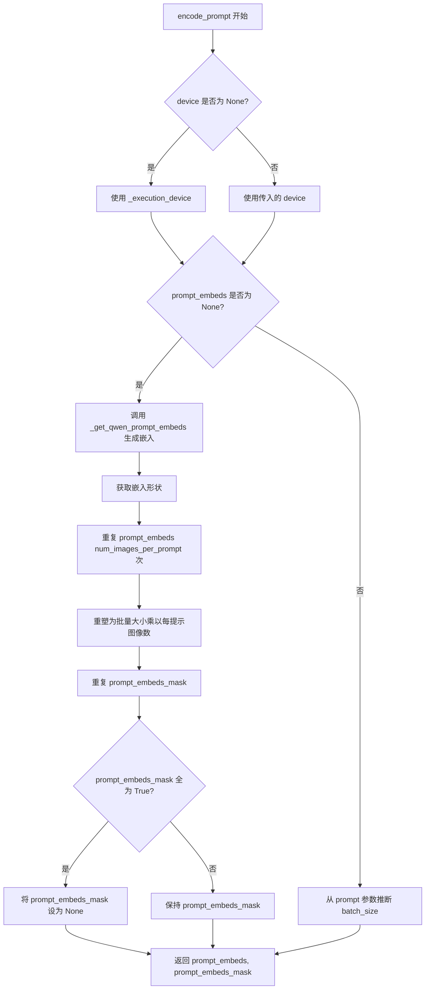

#### 带注释源码

```python
def encode_prompt(
    self,
    prompt: str | list[str],
    image: torch.Tensor | None = None,
    device: torch.device | None = None,
    num_images_per_prompt: int = 1,
    prompt_embeds: torch.Tensor | None = None,
    prompt_embeds_mask: torch.Tensor | None = None,
    max_sequence_length: int = 1024,
):
    r"""
    Encodes the prompt and optional image into text embeddings for the Qwen image editing pipeline.

    Args:
        prompt (`str` or `list[str]`, *optional*):
            prompt to be encoded
        image (`torch.Tensor`, *optional*):
            image to be encoded
        device: (`torch.device`):
            torch device
        num_images_per_prompt (`int`):
            number of images that should be generated per prompt
        prompt_embeds (`torch.Tensor`, *optional*):
            Pre-generated text embeddings. Can be used to easily tweak text inputs, *e.g.* prompt weighting. If not
            provided, text embeddings will be generated from `prompt` input argument.
        prompt_embeds_mask (`torch.Tensor`, *optional*):
            Pre-generated attention mask for text embeddings.
        max_sequence_length (`int`, *optional*, defaults to 1024):
            Maximum sequence length for the prompt encoding.

    Returns:
        `tuple[torch.Tensor, torch.Tensor | None]`: A tuple containing:
            - prompt_embeds: The encoded text embeddings tensor
            - prompt_embeds_mask: The attention mask (or None if all ones)
    """
    # 确定计算设备，优先使用传入的设备，否则使用执行设备
    device = device or self._execution_device

    # 统一 prompt 格式：将单个字符串转换为列表
    prompt = [prompt] if isinstance(prompt, str) else prompt
    
    # 确定批次大小：如果提供了 prompt_embeds 则使用其维度，否则使用 prompt 列表长度
    batch_size = len(prompt) if prompt_embeds is None else prompt_embeds.shape[0]

    # 如果未提供预计算的嵌入，则调用内部方法生成
    if prompt_embeds is None:
        prompt_embeds, prompt_embeds_mask = self._get_qwen_prompt_embeds(prompt, image, device)

    # 获取嵌入的序列长度
    _, seq_len, _ = prompt_embeds.shape
    
    # 扩展嵌入以匹配每提示生成的图像数量（批量维度扩展）
    prompt_embeds = prompt_embeds.repeat(1, num_images_per_prompt, 1)
    prompt_embeds = prompt_embeds.view(batch_size * num_images_per_prompt, seq_len, -1)
    
    # 同样扩展注意力掩码
    prompt_embeds_mask = prompt_embeds_mask.repeat(1, num_images_per_prompt, 1)
    prompt_embeds_mask = prompt_embeds_mask.view(batch_size * num_images_per_prompt, seq_len)

    # 如果注意力掩码全为 True（全部有效），则设为 None 以优化处理
    if prompt_embeds_mask is not None and prompt_embeds_mask.all():
        prompt_embeds_mask = None

    return prompt_embeds, prompt_embeds_mask
```


### QwenImageEditInpaintPipeline.check_inputs

该方法用于验证图像修复管道的输入参数是否合法，包括检查强度值、图像尺寸、提示词与嵌入的互斥性、遮罩裁剪参数的类型限制以及序列长度限制等，确保管道能够正确执行。

参数：

- `self`：`QwenImageEditInpaintPipeline` 实例本身，隐式参数
- `prompt`：`str | list[str] | None`，用户提供的文本提示词，用于指导图像生成或修复
- `image`：`PipelineImageInput | None`，输入的图像数据，作为修复的源图像
- `mask_image`：`PipelineImageInput | None`，遮罩图像，指定需要修复的区域（白色像素被重绘，黑色像素保留）
- `strength`：`float`，控制图像修复强度的参数，值在 0 到 1 之间
- `height`：`int`，生成图像的高度（像素）
- `width`：`int`，生成图像的宽度（像素）
- `output_type`：`str`，输出格式类型，如 "pil" 或 "latent"
- `negative_prompt`：`str | list[str] | None`，负向提示词，用于引导模型避免生成某些内容
- `prompt_embeds`：`torch.Tensor | None`，预生成的文本嵌入向量，可用于精细控制文本输入
- `negative_prompt_embeds`：`torch.Tensor | None`，预生成的负向文本嵌入向量
- `prompt_embeds_mask`：`torch.Tensor | None`，文本嵌入的注意力掩码
- `negative_prompt_embeds_mask`：`torch.Tensor | None`，负向文本嵌入的注意力掩码
- `callback_on_step_end_tensor_inputs`：`list[str] | None`，在每个去噪步骤结束时回调函数需要接收的张量输入列表
- `padding_mask_crop`：`int | None`，遮罩裁剪的边距大小，用于指定裁剪区域
- `max_sequence_length`：`int | None`，文本序列的最大长度限制

返回值：`None`，该方法仅进行参数验证，不返回任何值。若参数验证失败，则抛出 `ValueError` 异常。

#### 流程图

```mermaid
flowchart TD
    A[开始 check_inputs] --> B{strength 是否在 [0, 1] 范围内}
    B -->|否| C[抛出 ValueError]
    B -->|是| D{height 和 width 是否可被 vae_scale_factor * 2 整除}
    D -->|否| E[记录警告日志]
    D -->|是| F{callback_on_step_end_tensor_inputs 是否合法}
    F -->|否| G[抛出 ValueError]
    F -->|是| H{prompt 和 prompt_embeds 是否同时存在}
    H -->|是| I[抛出 ValueError]
    H -->|否| J{prompt 和 prompt_embeds 是否都未提供}
    J -->|是| K[抛出 ValueError]
    J -->|否| L{prompt 类型是否正确]
    L -->|否| M[抛出 ValueError]
    L -->|是| N{negative_prompt 和 negative_prompt_embeds 是否同时存在}
    N -->|是| O[抛出 ValueError]
    N -->|否| P{padding_mask_crop 是否不为 None}
    P -->|是| Q{image 是否为 PIL.Image}
    Q -->|否| R[抛出 ValueError]
    Q -->|是| S{mask_image 是否为 PIL.Image}
    S -->|否| T[抛出 ValueError]
    S -->|是| U{output_type 是否为 pil}
    U -->|否| V[抛出 ValueError]
    U -->|是| W{max_sequence_length 是否大于 1024]
    P -->|否| W
    W -->|是| X[抛出 ValueError]
    W -->|否| Y[验证通过]
    C --> Z[结束]
    E --> F
    I --> Z
    K --> Z
    M --> Z
    O --> Z
    R --> Z
    T --> Z
    V --> Z
    X --> Z
    Y --> Z
```

#### 带注释源码

```python
# Copied from diffusers.pipelines.qwenimage.pipeline_qwenimage_inpaint.QwenImageInpaintPipeline.check_inputs
def check_inputs(
    self,
    prompt,
    image,
    mask_image,
    strength,
    height,
    width,
    output_type,
    negative_prompt=None,
    prompt_embeds=None,
    negative_prompt_embeds=None,
    prompt_embeds_mask=None,
    negative_prompt_embeds_mask=None,
    callback_on_step_end_tensor_inputs=None,
    padding_mask_crop=None,
    max_sequence_length=None,
):
    """
    验证图像修复管道的输入参数是否合法。
    
    检查项目包括：
    1. strength 值必须在 [0.0, 1.0] 范围内
    2. height 和 width 必须是 vae_scale_factor * 2 的倍数
    3. callback_on_step_end_tensor_inputs 必须是合法的回调张量输入
    4. prompt 和 prompt_embeds 不能同时提供
    5. prompt 和 prompt_embeds 至少提供一个
    6. prompt 必须是 str 或 list 类型
    7. negative_prompt 和 negative_prompt_embeds 不能同时提供
    8. padding_mask_crop 不为 None 时，image 和 mask_image 必须是 PIL.Image 类型
    9. padding_mask_crop 不为 None 时，output_type 必须是 "pil"
    10. max_sequence_length 不能大于 1024
    """
    
    # 检查强度值是否在有效范围内 [0.0, 1.0]
    if strength < 0 or strength > 1:
        raise ValueError(f"The value of strength should in [0.0, 1.0] but is {strength}")

    # 检查图像尺寸是否可被 vae_scale_factor * 2 整除，若不满足则记录警告
    if height % (self.vae_scale_factor * 2) != 0 or width % (self.vae_scale_factor * 2) != 0:
        logger.warning(
            f"`height` and `width` have to be divisible by {self.vae_scale_factor * 2} but are {height} and {width}. Dimensions will be resized accordingly"
        )

    # 验证回调张量输入是否在允许的列表中
    if callback_on_step_end_tensor_inputs is not None and not all(
        k in self._callback_tensor_inputs for k in callback_on_step_end_tensor_inputs
    ):
        raise ValueError(
            f"`callback_on_step_end_tensor_inputs` has to be in {self._callback_tensor_inputs}, but found {[k for k in callback_on_step_end_tensor_inputs if k not in self._callback_tensor_inputs]}"
        )

    # prompt 和 prompt_embeds 是互斥的，不能同时提供
    if prompt is not None and prompt_embeds is not None:
        raise ValueError(
            f"Cannot forward both `prompt`: {prompt} and `prompt_embeds`: {prompt_embeds}. Please make sure to"
            " only forward one of the two."
        )
    # 至少需要提供 prompt 或 prompt_embeds 之一
    elif prompt is None and prompt_embeds is None:
        raise ValueError(
            "Provide either `prompt` or `prompt_embeds`. Cannot leave both `prompt` and `prompt_embeds` undefined."
        )
    # prompt 的类型必须是 str 或 list
    elif prompt is not None and (not isinstance(prompt, str) and not isinstance(prompt, list)):
        raise ValueError(f"`prompt` has to be of type `str` or `list` but is {type(prompt)}")

    # negative_prompt 和 negative_prompt_embeds 是互斥的
    if negative_prompt is not None and negative_prompt_embeds is not None:
        raise ValueError(
            f"Cannot forward both `negative_prompt`: {negative_prompt} and `negative_prompt_embeds`:"
            f" {negative_prompt_embeds}. Please make sure to only forward one of the two."
        )

    # 如果提供了 padding_mask_crop，则需要额外的验证
    if padding_mask_crop is not None:
        # 验证 image 是 PIL 图像类型
        if not isinstance(image, PIL.Image.Image):
            raise ValueError(
                f"The image should be a PIL image when inpainting mask crop, but is of type {type(image)}."
            )
        # 验证 mask_image 是 PIL 图像类型
        if not isinstance(mask_image, PIL.Image.Image):
            raise ValueError(
                f"The mask image should be a PIL image when inpainting mask crop, but is of type"
                f" {type(mask_image)}."
            )
        # 当使用遮罩裁剪时，输出类型必须是 PIL
        if output_type != "pil":
            raise ValueError(f"The output type should be PIL when inpainting mask crop, but is {output_type}.")

    # 验证最大序列长度不超过 1024
    if max_sequence_length is not None and max_sequence_length > 1024:
        raise ValueError(f"`max_sequence_length` cannot be greater than 1024 but is {max_sequence_length}")
```


### `QwenImageEditInpaintPipeline._pack_latents`

该方法是一个静态方法，用于将VAE输出的latent张量重新整形和排列，以适应Qwen-Image Transformer模型的输入格式。它通过将2x2的patch展平并将空间维度与通道维度重新排列，将原始的[B, C, H, W]格式转换为Transformer所需的 [B, (H/2)*(W/2), C*4] 格式。

参数：

- `latents`：`torch.Tensor`，输入的VAE latent张量，形状为 [batch_size, num_channels_latents, height, width]
- `batch_size`：`int`，表示输入的批量大小
- `num_channels_latents`：`int`，表示latent的通道数
- `height`：`int`，表示latent的高度
- `width`：`int`，表示latent的宽度

返回值：`torch.Tensor`，打包后的latent张量，形状为 [batch_size, (height // 2) * (width // 2), num_channels_latents * 4]

#### 流程图

```mermaid
flowchart TD
    A[输入latents: (B, C, H, W)] --> B[view操作 reshape]
    B --> C[permute置换维度]
    C --> D[reshape最终整形]
    D --> E[输出latents: (B, H/2*W/2, C*4)]
    
    B1[latents.view<br/>(B, C, H/2, 2, W/2, 2)] --> C1
    C1[latents.permute<br/>(0, 2, 4, 1, 3, 5)] --> D1
    D1[latents.reshape<br/>(B, H/2*W/2, C*4)]
```

#### 带注释源码

```python
@staticmethod
# Copied from diffusers.pipelines.qwenimage.pipeline_qwenimage.QwenImagePipeline._pack_latents
def _pack_latents(latents, batch_size, num_channels_latents, height, width):
    """
    将latent张量打包成Transformer所需的格式
    
    处理流程：
    1. 将(B, C, H, W) reshape为(B, C, H//2, 2, W//2, 2) - 将空间维度分成2x2的patch
    2. 置换维度从(0,1,2,3,4,5)变为(0,2,4,1,3,5) - 将空间patch维度前置
    3. 最终reshape为(B, H//2*W//2, C*4) - 展平2x2 patch到通道维度
    
    这样处理的目的是：
    - Qwen-Image使用2x2的patch打包方式
    - 将空间信息编码到序列长度维度
    - 每个位置的2x2 patch被展平为4个通道
    """
    # 第一步：reshape - 将height和width维度各除以2，并在末尾添加2的维度
    # 例如：(B, C, 64, 64) -> (B, C, 32, 2, 32, 2)
    latents = latents.view(batch_size, num_channels_latents, height // 2, 2, width // 2, 2)
    
    # 第二步：permute - 置换维度顺序，将空间patch维度(batch, height_patch, width_patch, channels, h_patch, w_patch)
    # 将通道维度和patch维度重新排列，以便后续reshape
    latents = latents.permute(0, 2, 4, 1, 3, 5)
    
    # 第三步：reshape - 最终打包成Transformer需要的格式
    # 将2x2的patch展平到通道维度：(B, H//2, W//2, C, 2, 2) -> (B, H//2*W//2, C*4)
    latents = latents.reshape(batch_size, (height // 2) * (width // 2), num_channels_latents * 4)

    return latents
```


### `QwenImageEditInpaintPipeline._unpack_latents`

该方法是一个静态方法，用于将打包（packed）的潜在表示（latents）解包（unpack）回原始的5D张量形状。这是Qwen图像编辑管线中处理潜在表示的关键步骤，主要完成从打包形式到可用于VAE解码的格式转换。

参数：

- `latents`：`torch.Tensor`，输入的打包后的潜在表示张量，形状为 [batch_size, num_patches, channels]
- `height`：`int`，目标图像的高度（像素单位）
- `width`：`int`，目标图像的宽度（像素单位）
- `vae_scale_factor`：`int`，VAE的缩放因子，用于计算潜在空间的尺寸

返回值：`torch.Tensor`，解包后的潜在表示张量，形状为 [batch_size, channels // (2 * 2), 1, height, width]

#### 流程图

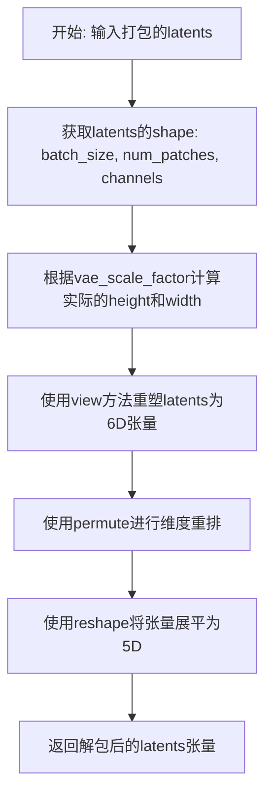

#### 带注释源码

```python
@staticmethod
# Copied from diffusers.pipelines.qwenimage.pipeline_qwenimage.QwenImagePipeline._unpack_latents
def _unpack_latents(latents, height, width, vae_scale_factor):
    """
    将打包的latents张量解包回5D张量格式
    
    Args:
        latents: 打包后的latents，形状为 [batch_size, num_patches, channels]
        height: 图像高度
        width: 图像宽度
        vae_scale_factor: VAE缩放因子
    
    Returns:
        解包后的latents，形状为 [batch_size, channels // 4, 1, height, width]
    """
    # 获取批量大小、patch数量和通道数
    batch_size, num_patches, channels = latents.shape

    # VAE对图像应用8x压缩，但我们还需要考虑packing操作
    # packing要求latent的高度和宽度能被2整除
    # 因此需要乘以2来还原实际的latent尺寸
    height = 2 * (int(height) // (vae_scale_factor * 2))
    width = 2 * (int(width) // (vae_scale_factor * 2))

    # 第一步重塑：将latents从 [B, num_patches, C] 重塑为 [B, H/2, W/2, C/4, 2, 2]
    # 这里将2x2的patch块展开，每个patch有4个通道
    latents = latents.view(batch_size, height // 2, width // 2, channels // 4, 2, 2)
    
    # 第二步维度重排：将 [B, H/2, W/2, C/4, 2, 2] 重排为 [B, C/4, H/2, 2, W/2, 2]
    # 这样可以将通道维度提前，便于后续操作
    latents = latents.permute(0, 3, 1, 4, 2, 5)

    # 第三步重塑：将6D张量展平为5D [B, C/4, 1, H, W]
    # 合并最后的两个2维度，恢复原始的latent空间形状
    latents = latents.reshape(batch_size, channels // (2 * 2), 1, height, width)

    return latents
```


### `QwenImageEditInpaintPipeline._encode_vae_image`

该方法用于将输入图像编码为 VAE  latent 空间表示，通过 VAE encoder 处理图像，并根据配置文件中预定义的均值和标准差对 latents 进行标准化归一化处理。

参数：

- `image`：`torch.Tensor`，输入的需要编码的图像张量，通常为 [B, C, H, W] 形状
- `generator`：`torch.Generator`，PyTorch 随机数生成器，用于确保 VAE 编码的可重复性，支持单个 Generator 或 Generator 列表

返回值：`torch.Tensor`，编码并标准化后的图像 latent 表示，形状为 [B, z_dim, 1, H', W']

#### 流程图

```mermaid
flowchart TD
    A[开始: _encode_vae_image] --> B{generator 是否为列表?}
    B -->|是| C[遍历图像批次]
    C --> D[对单张图像调用 vae.encode]
    D --> E[调用 retrieve_latents 获取 latent]
    E --> F[收集所有 latent 到列表]
    F --> G[沿 dim=0 拼接所有 latent]
    B -->|否| H[直接对整个图像批次调用 vae.encode]
    H --> I[调用 retrieve_latents 获取 latent]
    I --> J{生成列表还是单个?}
    J -->|列表| G
    J -->|单个| K[获取 latents_mean 和 latents_std]
    K --> L[构建 latent 均值张量]
    L --> M[构建 latent 标准差张量]
    M --> N[计算标准化: (image_latents - latents_mean) * latents_std]
    N --> O[返回标准化后的 image_latents]
```

#### 带注释源码

```python
def _encode_vae_image(self, image: torch.Tensor, generator: torch.Generator):
    """
    将输入图像编码为 VAE latent 空间表示，并进行标准化归一化处理
    
    参数:
        image: 输入图像张量，形状为 [B, C, H, W]
        generator: PyTorch 随机生成器，用于控制 VAE 编码的随机采样
    
    返回:
        编码并标准化后的 latent 表示
    """
    # 检查 generator 是否为列表（多生成器模式）
    if isinstance(generator, list):
        # 逐个处理图像批次中的每张图像，使用对应的 generator
        image_latents = [
            retrieve_latents(self.vae.encode(image[i : i + 1]), generator=generator[i])
            for i in range(image.shape[0])
        ]
        # 将所有 latent 沿批次维度拼接
        image_latents = torch.cat(image_latents, dim=0)
    else:
        # 单一 generator 模式，直接编码整个图像批次
        image_latents = retrieve_latents(self.vae.encode(image), generator=generator)

    # 从 VAE 配置中获取 latent 分布的均值
    # 将均值 reshape 为 [1, z_dim, 1, 1, 1] 以便广播操作
    latents_mean = (
        torch.tensor(self.vae.config.latents_mean)
        .view(1, self.vae.config.z_dim, 1, 1, 1)
        .to(image_latents.device, image_latents.dtype)
    )
    
    # 从 VAE 配置中获取 latent 分布的标准差
    # 注意：代码中使用 1.0/std 作为缩放因子，因此这里直接取 std 的倒数
    latents_std = 1.0 / torch.tensor(self.vae.config.latents_std).view(1, self.vae.config.z_dim, 1, 1, 1).to(
        image_latents.device, image_latents.dtype
    )

    # 应用标准化归一化：先减去均值，再乘以标准差的倒数
    # 这相当于将 latent 分布标准化到标准正态分布
    image_latents = (image_latents - latents_mean) * latents_std

    return image_latents
```


### `QwenImageEditInpaintPipeline.get_timesteps`

该方法根据推理步数和强度（strength）参数计算并返回用于去噪过程的时间步序列，同时调整推理步数以适应图像修复任务的强度要求。

参数：

- `num_inference_steps`：`int`，总推理步数，即去噪过程的迭代次数
- `strength`：`float`，强度参数，范围 0 到 1 之间，用于控制图像修复时保留原图信息的程度
- `device`：`torch.device`，计算设备（CPU 或 CUDA）

返回值：`tuple[torch.Tensor, int]`，包含两个元素——第一个是调整后的时间步序列（torch.Tensor），第二个是调整后的推理步数（int）

#### 流程图

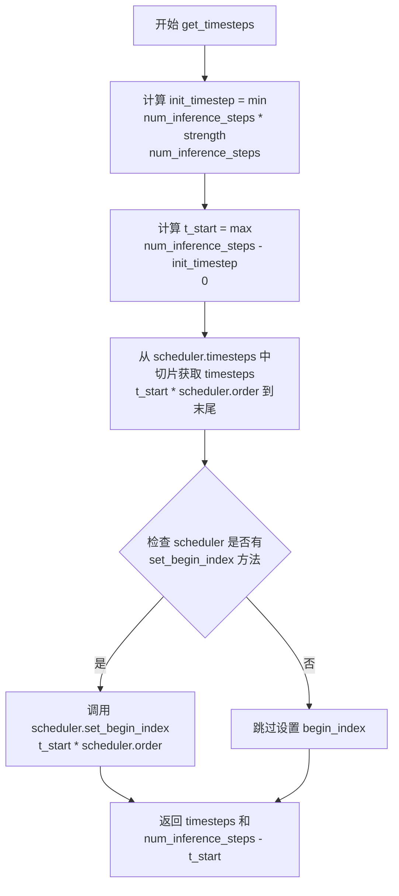

#### 带注释源码

```python
def get_timesteps(self, num_inference_steps, strength, device):
    """
    计算用于去噪过程的时间步序列。
    
    根据强度参数 strength 确定要使用的初始时间步，然后从调度器的时间步序列中
    提取对应的子序列。这允许在图像修复任务中控制对原始图像的保留程度。
    
    Args:
        num_inference_steps: 总推理步数
        strength: 强度参数，值越大表示保留原图像信息越少（添加更多噪声）
        device: 计算设备
    
    Returns:
        tuple: (timesteps, 调整后的推理步数)
    """
    # 根据强度计算初始时间步数
    # strength 越高，init_timestep 越大，意味着跳过的推理步数越多
    init_timestep = min(num_inference_steps * strength, num_inference_steps)

    # 计算起始索引，用于从完整时间步序列中切片
    # 如果 strength=1.0，则 t_start=0，使用全部时间步
    # 如果 strength=0.5，则 t_start=num_inference_steps/2，使用后半部分时间步
    t_start = int(max(num_inference_steps - init_timestep, 0))
    
    # 从调度器的时间步序列中提取子序列
    # 乘以 scheduler.order 是因为某些调度器使用多步方法
    timesteps = self.scheduler.timesteps[t_start * self.scheduler.order :]
    
    # 如果调度器支持设置起始索引，则设置它
    # 这有助于调度器正确追踪当前的去噪进度
    if hasattr(self.scheduler, "set_begin_index"):
        self.scheduler.set_begin_index(t_start * self.scheduler.order)

    # 返回调整后的时间步序列和实际推理步数
    return timesteps, num_inference_steps - t_start
```


### QwenImageEditInpaintPipeline.enable_vae_slicing

启用VAE切片解码功能。当启用此选项时，VAE会将输入张量分片为多个步骤进行解码计算。这对于节省内存和允许更大的批处理大小非常有用。

参数：

- `self`：`QwenImageEditInpaintPipeline` 实例本身，无需显式传递

返回值：`None`（无返回值），该方法直接操作内部 VAE 组件的状态

#### 流程图

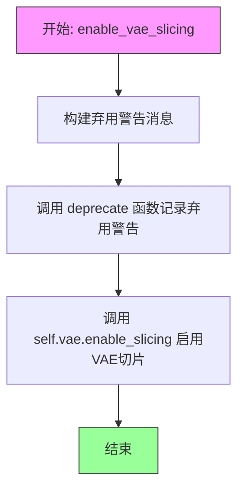

#### 带注释源码

```python
def enable_vae_slicing(self):
    r"""
    Enable sliced VAE decoding. When this option is enabled, the VAE will split the input tensor in slices to
    compute decoding in several steps. This is useful to save some memory and allow larger batch sizes.
    """
    # 构建弃用警告消息，提示用户该方法将在未来版本中移除
    depr_message = f"Calling `enable_vae_slicing()` on a `{self.__class__.__name__}` is deprecated and this method will be removed in a future version. Please use `pipe.vae.enable_slicing()`."
    
    # 调用 deprecate 函数记录弃用警告，版本号为 0.40.0
    deprecate(
        "enable_vae_slicing",
        "0.40.0",
        depr_message,
    )
    
    # 委托给内部 VAE 对象的 enable_slicing 方法执行实际的切片启用逻辑
    self.vae.enable_slicing()
```


### `QwenImageEditInpaintPipeline.disable_vae_slicing`

该方法用于禁用VAE切片解码功能。如果之前启用了`enable_vae_slicing`，调用此方法后将恢复到单步解码。该方法已被弃用，建议直接使用`pipe.vae.disable_slicing()`。

参数： 无

返回值：`None`，无返回值

#### 流程图

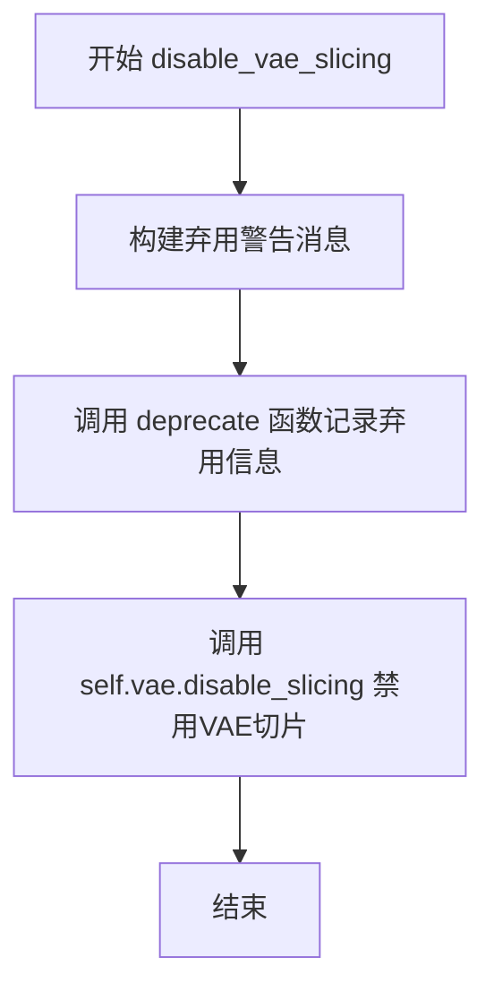

#### 带注释源码

```python
def disable_vae_slicing(self):
    r"""
    Disable sliced VAE decoding. If `enable_vae_slicing` was previously enabled, this method will go back to
    computing decoding in one step.
    """
    # 构建弃用警告消息，提示用户该方法将在未来版本中移除
    # 并建议使用新的API: pipe.vae.disable_slicing()
    depr_message = f"Calling `disable_vae_slicing()` on a `{self.__class__.__name__}` is deprecated and this method will be removed in a future version. Please use `pipe.vae.disable_slicing()`."
    
    # 调用 deprecate 函数记录弃用信息
    # 参数: 方法名, 弃用版本号, 弃用警告消息
    deprecate(
        "disable_vae_slicing",
        "0.40.0",
        depr_message,
    )
    
    # 调用 VAE 模型的 disable_slicing 方法实际禁用切片解码功能
    # 这是真正执行禁用操作的调用
    self.vae.disable_slicing()
```


### `QwenImageEditInpaintPipeline.enable_vae_tiling`

启用瓦片化VAE解码。当启用此选项时，VAE会将输入张量分割成瓦片，以多个步骤计算解码和编码。这对于节省大量内存并允许处理更大的图像非常有用。

参数： 无（仅包含 `self` 参数）

返回值：`None`，无返回值（该方法直接操作VAE模型）

#### 流程图

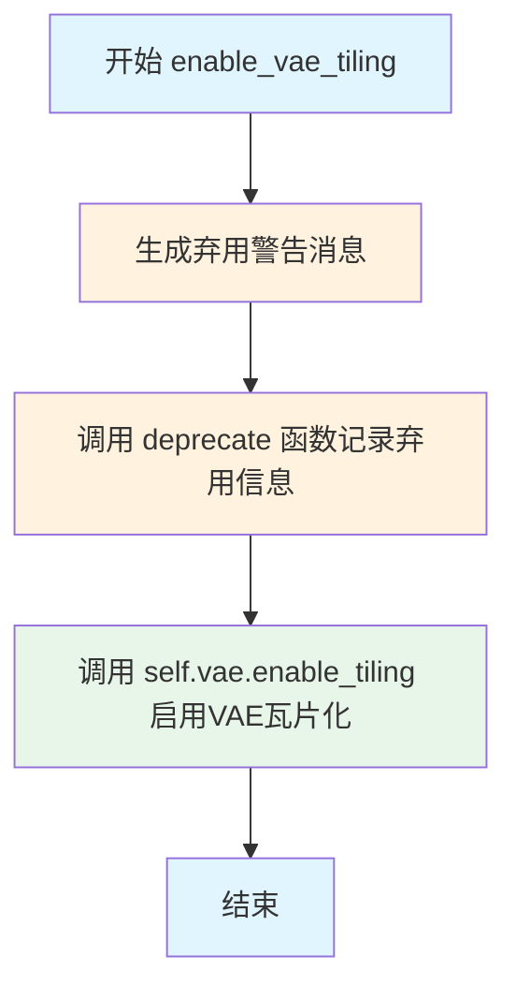

#### 带注释源码

```python
def enable_vae_tiling(self):
    r"""
    Enable tiled VAE decoding. When this option is enabled, the VAE will split the input tensor into tiles to
    compute decoding and encoding in several steps. This is useful for saving a large amount of memory and to allow
    processing larger images.
    
    该方法用于启用VAE的瓦片化解码模式，通过将大图像分割成较小的瓦片来减少显存占用，
    从而能够处理更大分辨率的图像。
    """
    # 构建弃用警告消息，提示用户该方法将在未来版本中移除
    # 并建议直接使用 pipe.vae.enable_tiling() 的方式
    depr_message = f"Calling `enable_vae_tiling()` on a `{self.__class__.__name__}` is deprecated and this method will be removed in a future version. Please use `pipe.vae.enable_tiling()`."
    
    # 调用 deprecate 函数记录弃用信息
    # 参数: 方法名, 弃用版本号, 警告消息
    deprecate(
        "enable_vae_tiling",
        "0.40.0",
        depr_message,
    )
    
    # 实际调用 VAE 对象的 enable_tiling 方法来启用瓦片化
    self.vae.enable_tiling()
```


### `QwenImageEditInpaintPipeline.disable_vae_tiling`

该方法用于禁用 VAE（变分自编码器）的分块解码功能。如果之前启用了 `enable_vae_tiling`，调用此方法后将恢复为单步解码模式。该方法已被标记为废弃，未来版本将移除，建议直接使用 `pipe.vae.disable_tiling()`。

参数：无（仅包含隐式参数 `self`）

返回值：`None`，无返回值

#### 流程图

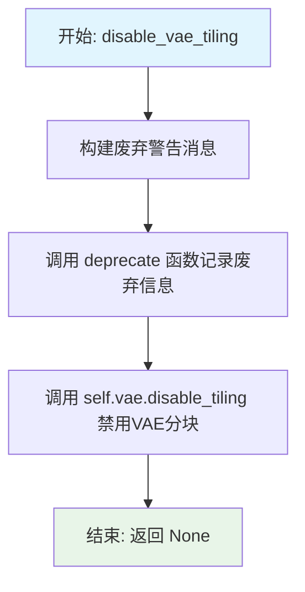

#### 带注释源码

```
def disable_vae_tiling(self):
    r"""
    Disable tiled VAE decoding. If `enable_vae_tiling` was previously enabled, this method will go back to
    computing decoding in one step.
    """
    # 构建废弃警告消息，提醒用户该方法将在未来版本中移除
    # 并建议使用新的API: pipe.vae.disable_tiling()
    depr_message = f"Calling `disable_vae_tiling()` on a `{self.__class__.__name__}` is deprecated and this method will be removed in a future version. Please use `pipe.vae.disable_tiling()`."
    
    # 调用 deprecate 函数记录废弃信息，用于追踪和提示用户
    # 参数: 方法名, 废弃版本号, 废弃消息
    deprecate(
        "disable_vae_tiling",
        "0.40.0",
        depr_message,
    )
    
    # 实际执行禁用VAE分块解码的操作
    # 委托给内部的 VAE 对象处理
    self.vae.disable_tiling()
```


### `QwenImageEditInpaintPipeline.prepare_latents`

该方法用于准备图像编辑/修复管道所需的latents（潜在表示），包括对输入图像进行VAE编码、生成或处理噪声、以及对所有张量进行打包以适应Transformer模型的输入格式。

参数：

- `self`：实例本身
- `image`：`torch.Tensor`，输入图像张量，用于编码生成image_latents
- `timestep`：`torch.Tensor`或int，时间步，用于噪声调度器缩放噪声
- `batch_size`：`int`，批次大小
- `num_channels_latents`：`int`，latent通道数，通常为transformer输入通道数的1/4
- `height`：`int`，目标图像高度
- `width`：`int`，目标图像宽度
- `dtype`：`torch.dtype`，目标数据类型
- `device`：`torch.device`，目标设备
- `generator`：`torch.Generator`或`list[torch.Generator]`，可选的随机生成器，用于确定性生成
- `latents`：`torch.Tensor | None`，可选的预生成latents，如果提供则直接返回

返回值：`torch.Tensor | tuple[torch.Tensor, torch.Tensor, torch.Tensor]`，如果提供了latents则返回处理后的latents；否则返回(latents, noise, image_latents)元组

#### 流程图

```mermaid
flowchart TD
    A[开始 prepare_latents] --> B{检查 generator 列表长度}
    B -->|长度不匹配| C[抛出 ValueError]
    B -->|长度匹配| D[计算调整后的 height 和 width]
    
    D --> E{确定 shape}
    E --> F[shape = (batch_size, 1, num_channels_latents, height, width)]
    
    F --> G{检查 image 维度}
    G -->|4D| H[添加时间维度: image.unsqueeze(2)]
    G -->|5D| I[保持不变]
    G -->|其他| J[抛出 ValueError]
    
    H --> K
    I --> K
    J --> L[结束]
    
    K{latents 是否已提供?}
    K -->|是| M[返回 latents.to(device, dtype)]
    K -->|否| N[将 image 移动到 device 和 dtype]
    
    N --> O{image channels == latent_channels?}
    O -->|否| P[调用 _encode_vae_image 编码]
    O -->|是| Q[直接使用 image]
    
    P --> R
    Q --> R[image_latents = image]
    
    R --> S{处理批量大小扩展}
    S -->|batch_size > image_latents.shape[0]| T[复制 image_latents]
    S -->|其他| U[保持不变]
    
    T --> V
    U --> V[image_latents = torch.cat([image_latents], dim=0)]
    
    V --> W[转置 image_latents: transpose(1, 2)]
    
    W --> X{latents 是否为 None?}
    X -->|是| Y[生成随机噪声]
    X -->|否| Z[使用提供的 latents]
    
    Y --> AA[scheduler.scale_noise]
    Z --> AB[latents = noise]
    
    AA --> AC
    AB --> AC[_pack_latents for all tensors]
    
    AC --> AD[返回 latents, noise, image_latents]
```

#### 带注释源码

```python
def prepare_latents(
    self,
    image,
    timestep,
    batch_size,
    num_channels_latents,
    height,
    width,
    dtype,
    device,
    generator,
    latents=None,
):
    # 检查传入的生成器列表长度是否与批次大小匹配
    if isinstance(generator, list) and len(generator) != batch_size:
        raise ValueError(
            f"You have passed a list of generators of length {len(generator)}, but requested an effective batch"
            f" size of {batch_size}. Make sure the batch size matches the length of the generators."
        )
    
    # VAE应用8x压缩，还需要考虑packing需要latent高度和宽度能被2整除
    # 计算调整后的高度和宽度
    height = 2 * (int(height) // (self.vae_scale_factor * 2))
    width = 2 * (int(width) // (self.vae_scale_factor * 2))

    # 确定latent的形状: [batch, 1(时间步), channels, height, width]
    shape = (batch_size, 1, num_channels_latents, height, width)

    # 处理图像维度: 如果是4D [B,C,H,W] 添加T=1变成5D [B,C,T,H,W]
    if image.dim() == 4:
        image = image.unsqueeze(2)
    elif image.dim() != 5:
        raise ValueError(f"Expected image dims 4 or 5, got {image.dim()}.")

    # 如果已提供latents，直接返回处理后的latents（用于图像到图像的编辑）
    if latents is not None:
        return latents.to(device=device, dtype=dtype)

    # 将图像移动到目标设备和数据类型
    image = image.to(device=device, dtype=dtype)
    
    # 根据图像通道数决定是否需要VAE编码
    if image.shape[1] != self.latent_channels:
        # 图像需要通过VAE编码为latent表示
        image_latents = self._encode_vae_image(image=image, generator=generator)  # [B,z,1,H',W']
    else:
        # 图像已经是latent表示，直接使用
        image_latents = image
    
    # 处理批量大小扩展（当需要为每个prompt生成多张图像时）
    if batch_size > image_latents.shape[0] and batch_size % image_latents.shape[0] == 0:
        # 扩展init_latents以匹配batch_size
        additional_image_per_prompt = batch_size // image_latents.shape[0]
        image_latents = torch.cat([image_latents] * additional_image_per_prompt, dim=0)
    elif batch_size > image_latents.shape[0] and batch_size % image_latents.shape[0] != 0:
        raise ValueError(
            f"Cannot duplicate `image` of batch size {image_latents.shape[0]} to {batch_size} text prompts."
        )
    else:
        image_latents = torch.cat([image_latents], dim=0)

    # 转置latent通道维度: [B,1,z,H',W'] -> [B,z,1,H',W']
    image_latents = image_latents.transpose(1, 2)

    # 生成或处理latents
    if latents is None:
        # 使用随机噪声生成latents
        noise = randn_tensor(shape, generator=generator, device=device, dtype=dtype)
        # 使用调度器根据当前时间步和图像latents缩放噪声
        latents = self.scheduler.scale_noise(image_latents, timestep, noise)
    else:
        # 使用提供的latents
        noise = latents.to(device)
        latents = noise

    # 对所有张量进行packing以适应Transformer的输入格式
    # packing将2x2的patch展平为序列
    noise = self._pack_latents(noise, batch_size, num_channels_latents, height, width)
    image_latents = self._pack_latents(image_latents, batch_size, num_channels_latents, height, width)
    latents = self._pack_latents(latents, batch_size, num_channels_latents, height, width)

    # 返回处理后的latents、噪声和图像latents
    return latents, noise, image_latents
```


### `QwenImageEditInpaintPipeline.prepare_mask_latents`

该方法负责准备图像修复（inpainting）所需的掩码（mask）和被掩码覆盖的图像潜在变量（masked image latents），包括掩码的缩放、类型转换、批处理扩展以及通过VAE编码被掩码的图像，最终返回处理后的掩码和被掩码图像潜在变量以供后续去噪过程使用。

参数：

- `mask`：`torch.Tensor`，输入的掩码图像，用于指示需要修复的区域
- `masked_image`：`torch.Tensor`，被掩码覆盖的原始图像，表示在掩码区域内的原始图像内容
- `batch_size`：`int`，原始批处理大小
- `num_channels_latents`：`int`，潜在变量的通道数，通常为Transformer输入通道数的1/4
- `num_images_per_prompt`：`int`，每个提示词生成的图像数量
- `height`：`int`，目标图像高度
- `width`：`int`，目标图像宽度
- `dtype`：`torch.dtype`，目标数据类型
- `device`：`torch.device`，目标设备
- `generator`：`torch.Generator | None`，随机数生成器，用于确保可重复性

返回值：`(torch.Tensor, torch.Tensor)`，元组包含处理后的掩码张量 `mask` 和被掩码图像的潜在变量 `masked_image_latents`

#### 流程图

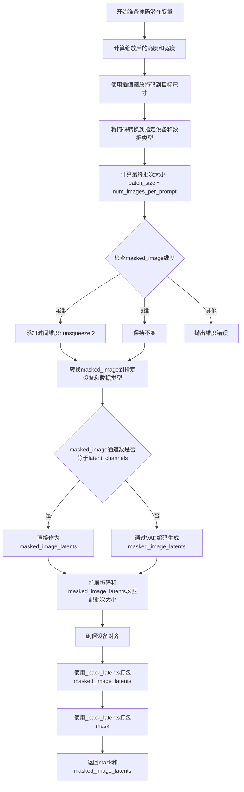

#### 带注释源码

```python
def prepare_mask_latents(
    self,
    mask,
    masked_image,
    batch_size,
    num_channels_latents,
    num_images_per_prompt,
    height,
    width,
    dtype,
    device,
    generator,
):
    # VAE applies 8x compression on images but we must also account for packing which requires
    # latent height and width to be divisible by 2.
    # 计算缩放后的高度和宽度，考虑VAE的压缩因子和打包需求
    height = 2 * (int(height) // (self.vae_scale_factor * 2))
    width = 2 * (int(width) // (self.vae_scale_factor * 2))
    
    # resize the mask to latents shape as we concatenate the mask to the latents
    # we do that before converting to dtype to avoid breaking in case we're using cpu_offload
    # and half precision
    # 使用双线性插值将掩码缩放到潜在变量的空间尺寸
    mask = torch.nn.functional.interpolate(mask, size=(height, width))
    # 将掩码移动到目标设备并转换数据类型
    mask = mask.to(device=device, dtype=dtype)

    # 计算最终批次大小，考虑每个提示词生成多张图像
    batch_size = batch_size * num_images_per_prompt

    # 处理masked_image的维度：添加时间维度以匹配5D张量格式
    if masked_image.dim() == 4:
        masked_image = masked_image.unsqueeze(2)
    elif masked_image.dim() != 5:
        raise ValueError(f"Expected image dims 4 or 5, got {masked_image.dim()}.")

    # 将masked_image移动到目标设备并转换数据类型
    masked_image = masked_image.to(device=device, dtype=dtype)

    # 检查是否需要通过VAE编码：如果通道数已匹配潜在变量维度则直接使用
    if masked_image.shape[1] == self.latent_channels:
        masked_image_latents = masked_image
    else:
        # 通过VAE编码器将图像转换为潜在变量表示
        masked_image_latents = self._encode_vae_image(image=masked_image, generator=generator)

        # duplicate mask and masked_image_latents for each generation per prompt, using mps friendly method
    # 扩展掩码以匹配目标批次大小
    if mask.shape[0] < batch_size:
        if not batch_size % mask.shape[0] == 0:
            raise ValueError(
                "The passed mask and the required batch size don't match. Masks are supposed to be duplicated to"
                f" a total batch size of {batch_size}, but {mask.shape[0]} masks were passed. Make sure the number"
                " of masks that you pass is divisible by the total requested batch size."
            )
        mask = mask.repeat(batch_size // mask.shape[0], 1, 1, 1)
    # 扩展masked_image_latents以匹配目标批次大小
    if masked_image_latents.shape[0] < batch_size:
        if not batch_size % masked_image_latents.shape[0] == 0:
            raise ValueError(
                "The passed images and the required batch size don't match. Images are supposed to be duplicated"
                f" to a total batch size of {batch_size}, but {masked_image_latents.shape[0]} images were passed."
                " Make sure the number of images that you pass is divisible by the total requested batch size."
            )
        masked_image_latents = masked_image_latents.repeat(batch_size // masked_image_latents.shape[0], 1, 1, 1, 1)

    # aligning device to prevent device errors when concating it with the latent model input
    # 确保masked_image_latents的设备与目标设备一致，防止连接时出现设备错误
    masked_image_latents = masked_image_latents.to(device=device, dtype=dtype)

    # 使用_pack_latents方法将潜在变量打包成Transformer所需的格式
    masked_image_latents = self._pack_latents(
        masked_image_latents,
        batch_size,
        num_channels_latents,
        height,
        width,
    )
    # 扩展掩码通道数以匹配潜在变量的通道数，然后打包
    mask = self._pack_latents(
        mask.repeat(1, num_channels_latents, 1, 1),
        batch_size,
        num_channels_latents,
        height,
        width,
    )

    return mask, masked_image_latents
```


### QwenImageEditInpaintPipeline.__call__

该方法是Qwen图像编辑修复（Inpainting）Pipeline的核心调用函数，用于根据文本提示（prompt）和掩码（mask）对图像进行编辑和修复生成。该方法通过Transformer模型进行去噪处理，结合VAE编码器和解码器，以及调度器（Scheduler）完成从噪声图像到目标图像的扩散过程，支持分类器-free引导（CFG）、文本嵌入控制、回调机制等功能。

参数：

- `self`：`QwenImageEditInpaintPipeline`实例对象，Pipeline本身
- `image`：`PipelineImageInput | None`，输入的源图像，可以是torch.Tensor、PIL.Image.Image、np.ndarray或它们的列表，用于作为图像修复的参考和起点
- `prompt`：`str | list[str] | None`，文本提示，指导图像生成的内容，如果为None则必须提供prompt_embeds
- `negative_prompt`：`str | list[str] | None`，负面文本提示，用于指导图像生成时避免的内容，仅在启用CFG时有效
- `mask_image`：`PipelineImageInput | None`，掩码图像，白色像素表示需要重绘的区域，黑色像素表示保留的区域
- `masked_image_latents`：`PipelineImageInput | None`，预先编码的掩码图像latent表示，如果为None则由mask_image自动生成
- `true_cfg_scale`：`float`，分类器-free引导（CFG）缩放因子，默认4.0，用于控制文本提示的影响程度
- `height`：`int | None`，生成图像的高度（像素），默认为None时会根据输入图像自动计算
- `width`：`int | None`，生成图像的宽度（像素），默认为None时会根据输入图像自动计算
- `padding_mask_crop`：`int | None`，掩码裁剪的边缘间距，用于在保持宽高比的情况下扩展掩码区域
- `strength`：`float`，图像变换强度，范围0到1，表示在去噪过程中添加的噪声量，默认0.6
- `num_inference_steps`：`int`，去噪迭代步数，默认50，步数越多通常质量越高但速度越慢
- `sigmas`：`list[float] | None`，自定义的去噪sigma值列表，用于支持特定调度器
- `guidance_scale`：`float | None`，引导缩放因子，用于引导蒸馏模型（guidance-distilled models）
- `num_images_per_prompt`：`int`，每个提示生成的图像数量，默认1
- `generator`：`torch.Generator | list[torch.Generator] | None`，随机数生成器，用于确保生成的可重复性
- `latents`：`torch.Tensor | None`，预生成的噪声latent，可以用于控制相同种子下的生成结果
- `prompt_embeds`：`torch.Tensor | None`，预生成的文本嵌入向量，可以直接传入以避免重复编码
- `prompt_embeds_mask`：`torch.Tensor | None`，文本嵌入的注意力掩码
- `negative_prompt_embeds`：`torch.Tensor | None`，预生成的负面文本嵌入
- `negative_prompt_embeds_mask`：`torch.Tensor | None`，负面文本嵌入的注意力掩码
- `output_type`：`str | None`，输出格式，可选"pil"或"latent"，默认"pil"
- `return_dict`：`bool`，是否返回字典格式的输出，默认True
- `attention_kwargs`：`dict[str, Any] | None`，传递给注意力处理器的额外关键字参数
- `callback_on_step_end`：`Callable[[int, int], None] | None`，每步结束时的回调函数
- `callback_on_step_end_tensor_inputs`：`list[str]`，回调函数可访问的tensor输入列表，默认["latents"]
- `max_sequence_length`：`int`，最大序列长度，默认512

返回值：`QwenImagePipelineOutput | tuple`，当return_dict为True时返回QwenImagePipelineOutput对象（包含images属性），否则返回元组（第一个元素是生成的图像列表）

#### 流程图

```mermaid
flowchart TD
    A[开始 __call__] --> B[计算图像尺寸]
    B --> C{检查输入参数有效性}
    C -->|失败| D[抛出异常]
    C -->|成功| E[设置指导比例和注意力参数]
    E --> F[确定batch_size]
    F --> G{是否有padding_mask_crop?}
    G -->|是| H[计算裁剪坐标]
    G -->|否| I[设置resize_mode为default]
    H --> I
    I --> J[预处理图像]
    J --> K[编码prompt得到prompt_embeds]
    K --> L{是否启用True CFG?}
    L -->|是| M[编码negative_prompt]
    L -->|否| N[跳过negative_prompt编码]
    M --> N
    N --> O[计算sigmas和timesteps]
    O --> P[获取去噪时间步]
    P --> Q[准备latent变量]
    Q --> R[预处理mask得到mask_condition]
    R --> S{是否有masked_image_latents?}
    S -->|否| T[计算masked_image = image * mask_condition < 0.5]
    S -->|是| U[使用传入的masked_image_latents]
    T --> V
    U --> V[准备mask latents]
    V --> W[设置num_warmup_steps]
    W --> X{guidance_embeds配置?}
    X -->|是| Y[检查guidance_scale]
    X -->|否| Z[设置guidance为None]
    Y --> AA[创建guidance张量]
    AA --> AB
    Z --> AB[进入去噪循环]
    
    AB --> AC[迭代timesteps]
    AC --> AD{检查interrupt标志}
    AD -->|是| AE[跳过当前步]
    AD -->|否| AF[构建latent_model_input]
    AF --> AG[拼接latents和image_latents]
    AG --> AH[扩展timestep到batch维度]
    AH --> AI{是否启用True CFG?}
    AI -->|是| AJ[执行条件forward]
    AI -->|否| AK[执行无条件forward]
    AJ --> AL[计算noise_pred]
    AK --> AM[直接使用noise_pred]
    AL --> AM
    
    AM --> AN{do_true_cfg?}
    AN -->|是| AO[执行uncond forward]
    AO --> AP[组合预测结果]
    AP --> AQ[应用CFG缩放]
    AQ --> AR[归一化处理]
    AN -->|否| AS[跳过CFG处理]
    AS --> AR
    
    AR --> AT[scheduler.step更新latents]
    AT --> AU[处理init_latents_proper和mask]
    AU --> AV[混合原始图像和去噪结果]
    AV --> AW{是否有callback_on_step_end?}
    AW -->|是| AX[执行回调函数]
    AX --> AY[更新latents和prompt_embeds]
    AW -->|否| AZ[跳过回调]
    AY --> AZ
    AZ --> BA{是否是最后一步或warmup步?}
    BA -->|是| BB[更新进度条]
    BA -->|否| BC[继续循环]
    BB --> BD{XLA可用?}
    BD -->|是| BE[mark_step]
    BD -->|否| BF[继续]
    BE --> BF
    BF --> BG{还有更多timesteps?}
    BG -->|是| AC
    BG -->|否| BH[结束去噪循环]
    
    BH --> BI{output_type是latent?}
    BI -->|是| BJ[直接返回latents]
    BI -->|否| BK[unpack latents]
    BK --> BL[反归一化latents]
    BL --> BM[VAE decode]
    BM --> BN[后处理图像]
    BN --> BO{有padding_mask_crop?}
    BO -->|是| BP[应用overlay]
    BO -->|否| BQ[跳过overlay]
    BP --> BR
    BQ --> BR
    
    BR --> BS[释放模型hook]
    BS --> BT{return_dict?}
    BT -->|是| BU[返回QwenImagePipelineOutput]
    BT -->|否| BV[返回tuple]
    BU --> BX[结束]
    BV --> BX
```

#### 带注释源码

```python
@torch.no_grad()
@replace_example_docstring(EXAMPLE_DOC_STRING)
def __call__(
    self,
    image: PipelineImageInput | None = None,
    prompt: str | list[str] = None,
    negative_prompt: str | list[str] = None,
    mask_image: PipelineImageInput = None,
    masked_image_latents: PipelineImageInput = None,
    true_cfg_scale: float = 4.0,
    height: int | None = None,
    width: int | None = None,
    padding_mask_crop: int | None = None,
    strength: float = 0.6,
    num_inference_steps: int = 50,
    sigmas: list[float] | None = None,
    guidance_scale: float | None = None,
    num_images_per_prompt: int = 1,
    generator: torch.Generator | list[torch.Generator] | None = None,
    latents: torch.Tensor | None = None,
    prompt_embeds: torch.Tensor | None = None,
    prompt_embeds_mask: torch.Tensor | None = None,
    negative_prompt_embeds: torch.Tensor | None = None,
    negative_prompt_embeds_mask: torch.Tensor | None = None,
    output_type: str | None = "pil",
    return_dict: bool = True,
    attention_kwargs: dict[str, Any] | None = None,
    callback_on_step_end: Callable[[int, int], None] | None = None,
    callback_on_step_end_tensor_inputs: list[str] = ["latents"],
    max_sequence_length: int = 512,
):
    r"""
    调用Pipeline进行生成时执行的函数。
    
    Args:
        image: 用作起点的图像输入，支持多种格式
        prompt: 引导图像生成的文本提示
        negative_prompt: 不希望出现的文本提示
        true_cfg_scale: CFG引导缩放因子
        mask_image: 掩码图像，指定需要重绘的区域
        masked_image_latents: 预计算的掩码图像latent
        height/width: 生成图像的尺寸
        padding_mask_crop: 掩码裁剪边距
        strength: 图像变换强度
        num_inference_steps: 去噪步数
        sigmas: 自定义sigma值
        guidance_scale: 引导蒸馏模型的缩放因子
        num_images_per_prompt: 每个提示生成的图像数
        generator: 随机数生成器
        latents: 预生成的噪声latent
        prompt_embeds/negative_prompt_embeds: 预计算的文本嵌入
        output_type: 输出格式
        return_dict: 是否返回字典格式
        attention_kwargs: 注意力处理器额外参数
        callback_on_step_end: 步骤结束回调
        callback_on_step_end_tensor_inputs: 回调可访问的tensor
        max_sequence_length: 最大序列长度
    """
    # 1. 根据输入图像计算目标尺寸
    image_size = image[0].size if isinstance(image, list) else image.size
    calculated_width, calculated_height, _ = calculate_dimensions(1024 * 1024, image_size[0] / image_size[1])

    # 使用计算得到的宽高
    height = calculated_height
    width = calculated_width

    # 确保尺寸是vae_scale_factor * 2的倍数
    multiple_of = self.vae_scale_factor * 2
    width = width // multiple_of * multiple_of
    height = height // multiple_of * multiple_of

    # 2. 检查输入参数有效性
    self.check_inputs(
        prompt,
        image,
        mask_image,
        strength,
        height,
        width,
        output_type=output_type,
        negative_prompt=negative_prompt,
        prompt_embeds=prompt_embeds,
        negative_prompt_embeds=negative_prompt_embeds,
        prompt_embeds_mask=prompt_embeds_mask,
        negative_prompt_embeds_mask=negative_prompt_embeds_mask,
        callback_on_step_end_tensor_inputs=callback_on_step_end_tensor_inputs,
        padding_mask_crop=padding_mask_crop,
        max_sequence_length=max_sequence_length,
    )

    # 设置内部状态变量
    self._guidance_scale = guidance_scale
    self._attention_kwargs = attention_kwargs
    self._current_timestep = None
    self._interrupt = False

    # 3. 确定batch_size
    if prompt is not None and isinstance(prompt, str):
        batch_size = 1
    elif prompt is not None and isinstance(prompt, list):
        batch_size = len(prompt)
    else:
        batch_size = prompt_embeds.shape[0]

    device = self._execution_device
    
    # 4. 预处理图像
    if padding_mask_crop is not None:
        # 计算裁剪坐标
        crops_coords = self.mask_processor.get_crop_region(mask_image, width, height, pad=padding_mask_crop)
        resize_mode = "fill"
    else:
        crops_coords = None
        resize_mode = "default"

    if image is not None and not (isinstance(image, torch.Tensor) and image.size(1) == self.latent_channels):
        # 调整图像大小
        image = self.image_processor.resize(image, calculated_height, calculated_width)
        original_image = image
        prompt_image = image
        # 预处理图像到latent空间
        image = self.image_processor.preprocess(
            image,
            height=calculated_height,
            width=calculated_width,
            crops_coords=crops_coords,
            resize_mode=resize_mode,
        )
        image = image.to(dtype=torch.float32)

    # 检查是否有negative prompt
    has_neg_prompt = negative_prompt is not None or (
        negative_prompt_embeds is not None and negative_prompt_embeds_mask is not None
    )

    # 警告用户CFG配置问题
    if true_cfg_scale > 1 and not has_neg_prompt:
        logger.warning(
            f"true_cfg_scale is passed as {true_cfg_scale}, but classifier-free guidance is not enabled since no negative_prompt is provided."
        )
    elif true_cfg_scale <= 1 and has_neg_prompt:
        logger.warning(
            " negative_prompt is passed but classifier-free guidance is not enabled since true_cfg_scale <= 1"
        )

    # 决定是否启用True CFG
    do_true_cfg = true_cfg_scale > 1 and has_neg_prompt
    
    # 5. 编码prompt
    prompt_embeds, prompt_embeds_mask = self.encode_prompt(
        image=prompt_image,
        prompt=prompt,
        prompt_embeds=prompt_embeds,
        prompt_embeds_mask=prompt_embeds_mask,
        device=device,
        num_images_per_prompt=num_images_per_prompt,
        max_sequence_length=max_sequence_length,
    )
    
    # 如果启用CFG，同时编码negative_prompt
    if do_true_cfg:
        negative_prompt_embeds, negative_prompt_embeds_mask = self.encode_prompt(
            image=prompt_image,
            prompt=negative_prompt,
            prompt_embeds=negative_prompt_embeds,
            prompt_embeds_mask=negative_prompt_embeds_mask,
            device=device,
            num_images_per_prompt=num_images_per_prompt,
            max_sequence_length=max_sequence_length,
        )

    # 6. 准备timesteps
    # 生成sigma值序列
    sigmas = np.linspace(1.0, 1 / num_inference_steps, num_inference_steps) if sigmas is None else sigmas
    # 计算图像序列长度用于schedule调整
    image_seq_len = (int(height) // self.vae_scale_factor // 2) * (int(width) // self.vae_scale_factor // 2)
    # 计算shift值
    mu = calculate_shift(
        image_seq_len,
        self.scheduler.config.get("base_image_seq_len", 256),
        self.scheduler.config.get("max_image_seq_len", 4096),
        self.scheduler.config.get("base_shift", 0.5),
        self.scheduler.config.get("max_shift", 1.15),
    )
    # 获取timesteps
    timesteps, num_inference_steps = retrieve_timesteps(
        self.scheduler,
        num_inference_steps,
        device,
        sigmas=sigmas,
        mu=mu,
    )

    # 根据strength调整timesteps
    timesteps, num_inference_steps = self.get_timesteps(num_inference_steps, strength, device)

    if num_inference_steps < 1:
        raise ValueError(
            f"After adjusting the num_inference_steps by strength parameter: {strength}, the number of pipeline"
            f"steps is {num_inference_steps} which is < 1 and not appropriate for this pipeline."
        )
    
    # 准备latent timestep
    latent_timestep = timesteps[:1].repeat(batch_size * num_images_per_prompt)

    # 7. 准备latent变量
    num_channels_latents = self.transformer.config.in_channels // 4
    latents, noise, image_latents = self.prepare_latents(
        image,
        latent_timestep,
        batch_size * num_images_per_prompt,
        num_channels_latents,
        height,
        width,
        prompt_embeds.dtype,
        device,
        generator,
        latents,
    )

    # 预处理mask
    mask_condition = self.mask_processor.preprocess(
        mask_image, height=height, width=width, resize_mode=resize_mode, crops_coords=crops_coords
    )

    # 准备masked_image
    if masked_image_latents is None:
        masked_image = image * (mask_condition < 0.5)
    else:
        masked_image = masked_image_latents

    # 准备mask latents
    mask, masked_image_latents = self.prepare_mask_latents(
        mask_condition,
        masked_image,
        batch_size,
        num_channels_latents,
        num_images_per_prompt,
        height,
        width,
        prompt_embeds.dtype,
        device,
        generator,
    )

    # 定义图像形状用于transformer
    img_shapes = [
        [
            (1, height // self.vae_scale_factor // 2, width // self.vae_scale_factor // 2),
            (1, calculated_height // self.vae_scale_factor // 2, calculated_width // self.vae_scale_factor // 2),
        ]
    ] * batch_size

    # 计算warmup步数
    num_warmup_steps = max(len(timesteps) - num_inference_steps * self.scheduler.order, 0)
    self._num_timesteps = len(timesteps)

    # 处理guidance配置
    if self.transformer.config.guidance_embeds and guidance_scale is None:
        raise ValueError("guidance_scale is required for guidance-distilled model.")
    elif self.transformer.config.guidance_embeds:
        guidance = torch.full([1], guidance_scale, device=device, dtype=torch.float32)
        guidance = guidance.expand(latents.shape[0])
    elif not self.transformer.config.guidance_embeds and guidance_scale is not None:
        logger.warning(
            f"guidance_scale is passed as {guidance_scale}, but ignored since the model is not guidance-distilled."
        )
        guidance = None
    elif not self.transformer.config.guidance_embeds and guidance_scale is None:
        guidance = None

    if self.attention_kwargs is None:
        self._attention_kwargs = {}

    # 8. 去噪循环
    with self.progress_bar(total=num_inference_steps) as progress_bar:
        for i, t in enumerate(timesteps):
            # 检查中断标志
            if self.interrupt:
                continue

            self._current_timestep = t

            # 准备模型输入
            latent_model_input = latents
            if image_latents is not None:
                latent_model_input = torch.cat([latents, image_latents], dim=1)

            # 扩展timestep到batch维度
            timestep = t.expand(latents.shape[0]).to(latents.dtype)
            
            # 执行条件forward（带prompt）
            with self.transformer.cache_context("cond"):
                noise_pred = self.transformer(
                    hidden_states=latent_model_input,
                    timestep=timestep / 1000,
                    guidance=guidance,
                    encoder_hidden_states_mask=prompt_embeds_mask,
                    encoder_hidden_states=prompt_embeds,
                    img_shapes=img_shapes,
                    attention_kwargs=self.attention_kwargs,
                    return_dict=False,
                )[0]
                noise_pred = noise_pred[:, : latents.size(1)]

            # 如果启用True CFG，执行无条件forward
            if do_true_cfg:
                with self.transformer.cache_context("uncond"):
                    neg_noise_pred = self.transformer(
                        hidden_states=latent_model_input,
                        timestep=timestep / 1000,
                        guidance=guidance,
                        encoder_hidden_states_mask=negative_prompt_embeds_mask,
                        encoder_hidden_states=negative_prompt_embeds,
                        img_shapes=img_shapes,
                        attention_kwargs=self.attention_kwargs,
                        return_dict=False,
                    )[0]
                neg_noise_pred = neg_noise_pred[:, : latents.size(1)]
                
                # 应用CFG
                comb_pred = neg_noise_pred + true_cfg_scale * (noise_pred - neg_noise_pred)
                
                # 归一化
                cond_norm = torch.norm(noise_pred, dim=-1, keepdim=True)
                noise_norm = torch.norm(comb_pred, dim=-1, keepdim=True)
                noise_pred = comb_pred * (cond_norm / noise_norm)

            # 使用scheduler步骤更新latents
            latents_dtype = latents.dtype
            latents = self.scheduler.step(noise_pred, t, latents, return_dict=False)[0]

            # 处理init_latents和mask（用于64通道transformer）
            init_latents_proper = image_latents
            init_mask = mask

            if i < len(timesteps) - 1:
                noise_timestep = timesteps[i + 1]
                init_latents_proper = self.scheduler.scale_noise(
                    init_latents_proper, torch.tensor([noise_timestep]), noise
                )

            # 混合原始图像和去噪结果
            latents = (1 - init_mask) * init_latents_proper + init_mask * latents

            # 处理MPS设备类型转换问题
            if latents.dtype != latents_dtype:
                if torch.backends.mps.is_available():
                    latents = latents.to(latents_dtype)

            # 执行回调函数
            if callback_on_step_end is not None:
                callback_kwargs = {}
                for k in callback_on_step_end_tensor_inputs:
                    callback_kwargs[k] = locals()[k]
                callback_outputs = callback_on_step_end(self, i, t, callback_kwargs)

                latents = callback_outputs.pop("latents", latents)
                prompt_embeds = callback_outputs.pop("prompt_embeds", prompt_embeds)

            # 更新进度条
            if i == len(timesteps) - 1 or ((i + 1) > num_warmup_steps and (i + 1) % self.scheduler.order == 0):
                progress_bar.update()

            # XLA设备处理
            if XLA_AVAILABLE:
                xm.mark_step()

    self._current_timestep = None
    
    # 9. 最终处理
    if output_type == "latent":
        image = latents
    else:
        # 解包latents
        latents = self._unpack_latents(latents, height, width, self.vae_scale_factor)
        latents = latents.to(self.vae.dtype)
        
        # 反归一化
        latents_mean = (
            torch.tensor(self.vae.config.latents_mean)
            .view(1, self.vae.config.z_dim, 1, 1, 1)
            .to(latents.device, latents.dtype)
        )
        latents_std = 1.0 / torch.tensor(self.vae.config.latents_std).view(1, self.vae.config.z_dim, 1, 1, 1).to(
            latents.device, latents.dtype
        )
        latents = latents / latents_std + latents_mean
        
        # VAE解码
        image = self.vae.decode(latents, return_dict=False)[0][:, :, 0]
        # 后处理
        image = self.image_processor.postprocess(image, output_type=output_type)

        # 应用overlay（如果有裁剪）
        if padding_mask_crop is not None:
            image = [
                self.image_processor.apply_overlay(mask_image, original_image, i, crops_coords) for i in image
            ]

    # 释放模型hook
    self.maybe_free_model_hooks()

    # 返回结果
    if not return_dict:
        return (image,)

    return QwenImagePipelineOutput(images=image)
```

## 关键组件


### QwenImageEditInpaintPipeline

主类，实现了基于Qwen-Image模型的图像编辑与修复（inpainting）功能，通过结合文本提示、图像和mask来生成编辑后的图像。

### 张量索引与惰性加载

使用`_extract_masked_hidden`方法从hidden_states中根据mask提取有效长度的隐藏状态，支持批量处理和动态序列长度。

### 反量化支持

在`prepare_latents`和`__call__`方法中使用`latents_mean`和`latents_std`对latents进行反量化（denormalize），将latents从标准差为1的分布转换回原始VAE的潜在空间分布。

### 量化策略

代码中未直接实现量化策略，但通过`dtype`参数支持不同精度（float32/bfloat16）的输入输出。

### 调度器配置

使用`FlowMatchEulerDiscreteScheduler`结合`calculate_shift`函数动态调整噪声调度参数，以适应不同分辨率的图像生成。

### VAE图像处理

`VaeImageProcessor`负责图像的预处理（resize、normalize、crop）和后处理（postprocess），`prepare_latents`和`_encode_vae_image`方法处理图像到latent空间的编码。

### 文本编码与多模态融合

`_get_qwen_prompt_embeds`方法利用`Qwen2_5_VLForConditionalGeneration`编码文本和图像，生成融合的多模态prompt embeddings。

### Guidance Scale实现

支持两种guidance模式：传统Classifier-Free Guidance（`true_cfg_scale > 1`）和Guidance-Distilled Models（`guidance_scale`参数），通过`do_true_cfg`标志控制。

### Latent Packing

`_pack_latents`和`_unpack_latents`静态方法实现latent tensor的打包与解包，将2x2的patch打包以提高transformer的计算效率。

### Mask处理

`prepare_mask_latents`方法对输入mask进行resize、编码和打包，与latents对齐以支持inpainting任务。

### 噪声调度与时间步

`get_timesteps`方法根据`strength`参数调整噪声调度，实现从噪声图像到目标图像的渐进式去噪过程。


## 问题及建议


### 已知问题

- **硬编码配置值**：`tokenizer_max_length=1024`、`default_sample_size=128`、`prompt_template_encode_start_idx=64`等配置值硬编码在类中，缺乏灵活的配置机制
- **大量代码复制**：多个函数带有"Copied from"注释（如`calculate_shift`、`retrieve_timesteps`、`retrieve_latents`、`encode_prompt`等），表明存在大量跨模块的代码复制，增加维护成本
- **弃用方法仍保留**：`enable_vae_slicing`、`disable_vae_slicing`、`enable_vae_tiling`、`disable_vae_tiling`等方法已标记弃用但仍保留在类中，造成API混乱
- **类型注解不完整**：部分方法参数缺少类型注解，如`__call__`中的`image`参数在某些分支下类型不明确，`callback_on_step_end`相关参数类型定义冗余
- **魔法数字**：`true_cfg_scale`默认值在不同位置不一致（文档说1.0，实际代码逻辑中当作1.0判断），`num_warmup_steps`计算逻辑中`self.scheduler.order`的使用缺乏明确说明
- **设备兼容性处理不完善**：MPS设备有特殊处理但缺乏完整的兼容性测试，`XLA_AVAILABLE`分支与主流程分离可能导致行为不一致
- **mask处理逻辑冗余**：`prepare_mask_latents`中多次重复`mask.repeat`和`_pack_latents`操作，代码可读性和性能均可优化
- **属性初始化不一致**：依赖`getattr(self, "vae", None)`进行防御性检查，但初始化时已通过`register_modules`注册，这些检查显得冗余

### 优化建议

- **抽取配置类**：将硬编码的配置值提取到配置类或配置文件中，支持运行时配置
- **建立共享模块**：将复制的函数抽取到共享模块中，通过继承或组合复用，减少代码重复
- **清理弃用API**：在主要版本更新中移除已弃用的方法，或提供清晰的迁移路径
- **完善类型注解**：使用Python 3.10+的联合类型语法简化类型注解，确保所有公开方法都有完整的类型签名
- **统一常量定义**：将魔法数字定义为类常量或枚举，提供有意义的命名和文档
- **增强错误处理**：添加更具体的异常类型，区分不同类型的输入错误，提供更有意义的错误信息
- **优化mask处理**：重构`prepare_mask_latents`中的重复逻辑，使用更清晰的函数封装
- **简化属性检查**：移除初始化后的防御性`getattr`检查，这些检查应该在架构层面保证而非运行时防御

## 其它


### 设计目标与约束

该pipeline的设计目标是实现基于Qwen2.5-VL模型的图像编辑与修复（inpainting）功能，支持用户通过文本指令对图像进行修改，同时保留原图中未被mask覆盖的区域。核心约束包括：1) 输入图像尺寸必须能被`vae_scale_factor * 2`整除，否则会自动调整；2) `strength`参数必须在[0, 1]范围内；3) `max_sequence_length`不能超过1024；4) 当前实现仅支持PyTorch后端，XLA用于进度标记但不支持分布式训练。

### 错误处理与异常设计

代码中的错误处理主要通过`ValueError`异常实现。关键异常场景包括：1) `timesteps`和`sigmas`同时传入时抛出`ValueError`；2) scheduler不支持自定义timesteps或sigmas时抛出`ValueError`；3) `strength`超出[0,1]范围时抛出`ValueError`；4) `callback_on_step_end_tensor_inputs`包含非法键时抛出`ValueError`；5) 同时传入`prompt`和`prompt_embeds`时抛出`ValueError`；6) 图像维度不是4或5维时抛出`ValueError`；7) generator列表长度与batch_size不匹配时抛出`ValueError`；8) 调整后的`num_inference_steps`小于1时抛出`ValueError`。此外，使用`logger.warning`处理非致命性配置问题。

### 数据流与状态机

Pipeline的数据流如下：1) 预处理阶段：接收原始图像、mask图像和文本提示，对图像进行resize和preprocess处理；2) 编码阶段：使用VAE编码图像和mask生成latents，使用Qwen2.5-VL文本编码器生成prompt embeddings；3) 调度阶段：计算timesteps和sigmas，根据`strength`参数调整去噪步数；4) 去噪循环：对latents进行迭代去噪，包含条件/无条件两次forward pass以实现CFG（Classifier-Free Guidance）；5) 后处理阶段：使用VAE decode生成最终图像，应用mask overlay（如果指定了padding_mask_crop）。状态转换由`self._guidance_scale`、`self._attention_kwargs`、`self._current_timestep`、`self._interrupt`等属性跟踪。

### 外部依赖与接口契约

核心依赖包括：1) `Qwen2_5_VLForConditionalGeneration`和`Qwen2Tokenizer`来自transformers库，用于文本编码；2) `Qwen2VLProcessor`用于处理多模态输入；3) `QwenImageTransformer2DModel`是条件Transformer架构；4) `AutoencoderKLQwenImage`是VAE模型；5) `FlowMatchEulerDiscreteScheduler`是扩散调度器。接口契约要求：1) `transformer`必须有`config.in_channels`和`config.guidance_embeds`属性；2) `vae`必须有`config.z_dim`、`config.latents_mean`、`config.latents_std`和`temperal_downsample`属性；3) `scheduler`必须实现`set_timesteps`和`step`方法；4) 图像输入必须是PIL.Image、numpy数组或torch.Tensor格式。

### 性能考虑

性能关键点包括：1) VAE支持slicing和tiling模式以节省显存，可通过`enable_vae_slicing()`/`enable_vae_tiling()`启用；2) 使用`torch.no_grad()`装饰器避免计算梯度；3) 图像latents使用`randn_tensor`生成，支持多种随机数生成器；4) XLA支持用于Apple设备的加速（`xm.mark_step()`）；5) 提供`model_cpu_offload_seq`实现顺序CPU offload；6) 支持gradient checkpointing（通过`enable_sequential_cpu_offload`）。内存占用主要来自prompt embeddings、latents和中间激活值，batch_size和图像分辨率是主要影响因素。

### 配置参数

关键配置参数包括：1) `vae_scale_factor`：VAE缩放因子，默认为2^len(vae.temporal_downsample)；2) `latent_channels`：latent通道数，从vae.config.z_dim获取；3) `tokenizer_max_length`：分词器最大长度，默认为1024；4) `prompt_template_encode`：用于构建Qwen VL prompt的模板；5) `default_sample_size`：默认采样尺寸，默认为128；6) `model_cpu_offload_seq`：CPU offload顺序，默认为"text_encoder->transformer->vae"。

### 并发与线程安全

该pipeline本身不是线程安全的，因为内部维护了多个可变状态（如`self._guidance_scale`、`self._attention_kwargs`等）。并发使用建议：1) 每个线程使用独立的pipeline实例；2) 或在调用`__call__`前确保状态一致性。随机数生成通过`generator`参数控制，支持为每个样本指定独立的随机数生成器以实现可重复性。

### 安全考虑

1) 输入验证：代码对所有关键参数进行了类型和范围检查；2) 潜在的恶意输入：mask图像和文本提示应被视为不可信输入，建议在生产环境中添加额外的输入净化；3) 模型加载安全：使用`from_pretrained`加载预训练模型时需确保来源可信；4) 内存安全：处理大尺寸图像时注意内存溢出风险，建议启用VAE tiling。

### 测试策略

建议的测试用例包括：1) 单元测试：测试`calculate_shift`、`calculate_dimensions`、`retrieve_timesteps`、`retrieve_latents`等工具函数；2) 集成测试：使用示例图像和prompt进行完整pipeline测试，验证输出图像尺寸和格式；3) 边界条件测试：测试最小/最大尺寸、极端strength值、无prompt等情况；4) 错误处理测试：验证各异常场景是否正确抛出异常；5) 性能基准测试：测量不同分辨率和batch_size下的推理时间和内存占用。

### 日志与监控

日志使用`logging.get_logger(__name__)`获取logger，关键日志点包括：1) 图像尺寸调整警告（当height/width不能被vae_scale_factor*2整除时）；2) CFG配置警告（当true_cfg_scale与negative_prompt不匹配时）；3) guidance_scale警告（当模型不是guidance-distilled但传入了guidance_scale时）。监控指标可通过`num_timesteps`属性获取总步数，通过回调函数监控中间latents状态。

### 版本兼容性

代码依赖于以下版本要求：1) PyTorch：建议使用最新稳定版；2) transformers：需支持Qwen2_5_VLForConditionalGeneration和Qwen2VLProcessor；3) diffusers：需包含PipelineImageInput、VaeImageProcessor、DiffusionPipeline等组件；4) Python：建议3.8+；5) XLA支持通过`is_torch_xla_available()`检测，可选使用torch_xla。部分方法标记为deprecated（如enable_vae_slicing），将在0.40.0版本移除，建议使用vae自身的对应方法。

    