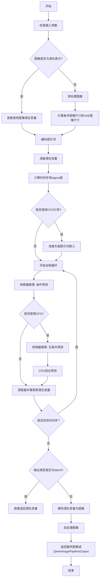
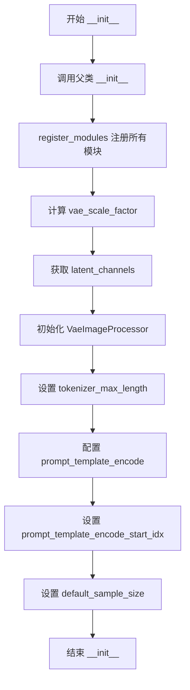
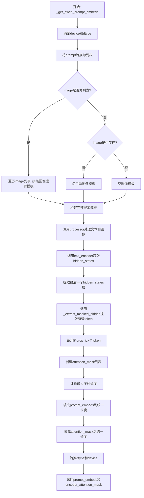
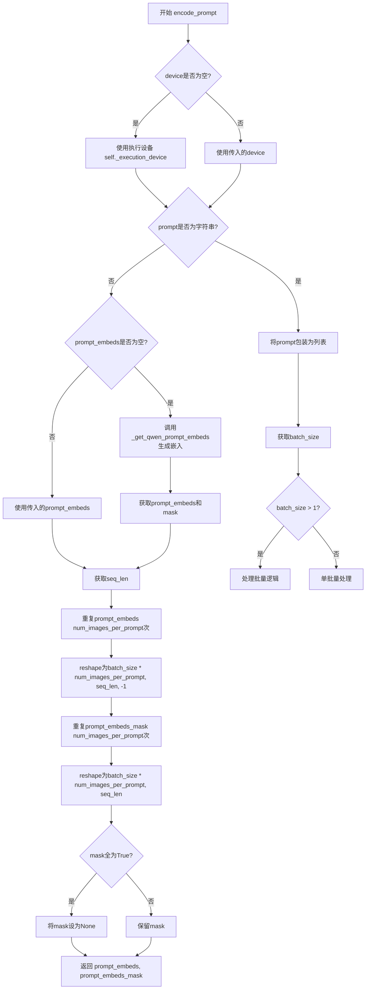
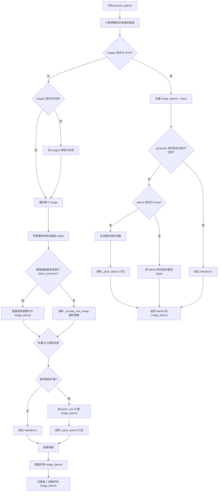
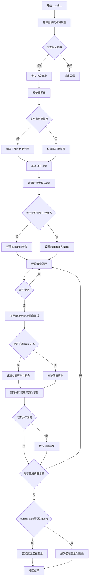
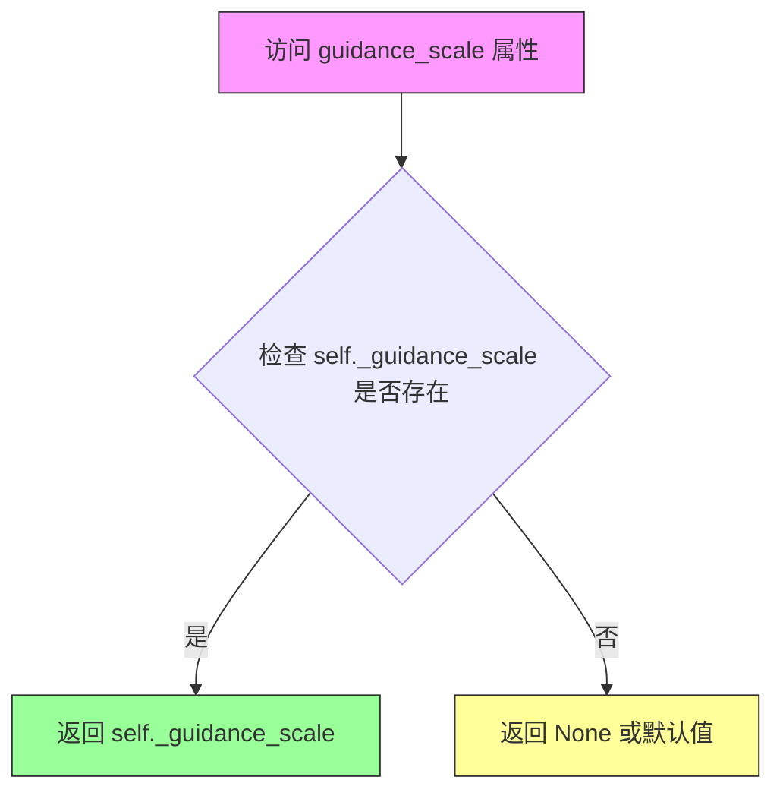
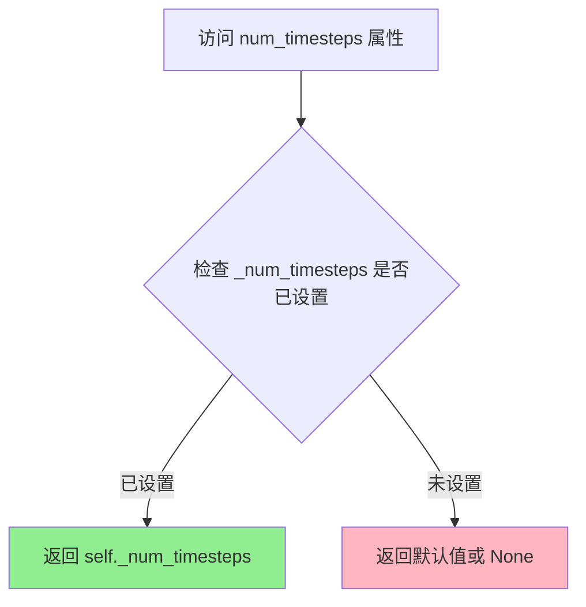
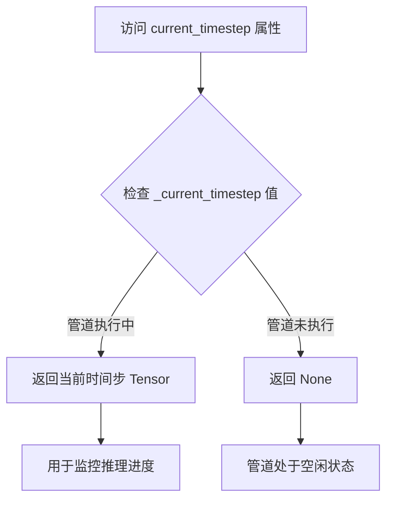
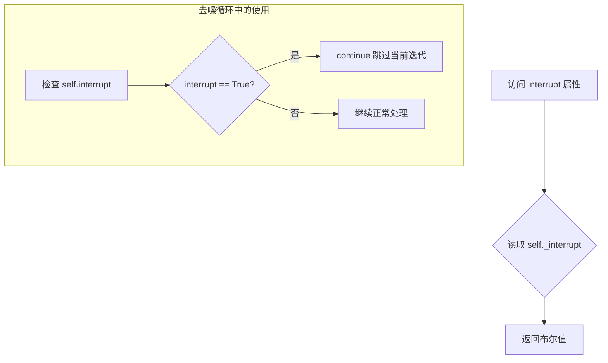

# `diffusers\src\diffusers\pipelines\qwenimage\pipeline_qwenimage_edit_plus.py` 详细设计文档

QwenImageEditPlusPipeline 是一个基于扩散模型的图像编辑管道，结合了 Qwen2.5-VL-7B-Instruct 文本编码器和 QwenImageTransformer2DModel 转换器，通过接收文本指令来编辑输入图像。该管道支持条件图像生成、CFG（无分类器引导）推理，并利用 VAE 进行图像的编码和解码。

## 整体流程



## 类结构

```
DiffusionPipeline (基类)
└── QwenImageEditPlusPipeline
    └── QwenImageLoraLoaderMixin (混入类)
```

## 全局变量及字段


### `logger`
    
Logger instance for tracking pipeline execution and warnings

类型：`logging.Logger`
    


### `EXAMPLE_DOC_STRING`
    
Example usage documentation string demonstrating pipeline invocation

类型：`str`
    


### `CONDITION_IMAGE_SIZE`
    
Conditioning image size in pixels (384*384) for text encoder input

类型：`int`
    


### `VAE_IMAGE_SIZE`
    
VAE encoding image size in pixels (1024*1024) for latent generation

类型：`int`
    


### `XLA_AVAILABLE`
    
Flag indicating whether PyTorch XLA is available for TPU acceleration

类型：`bool`
    


### `model_cpu_offload_seq`
    
Sequence string defining model CPU offloading order for memory optimization

类型：`str`
    


### `_callback_tensor_inputs`
    
List of tensor input names allowed in callback functions for step-end hooks

类型：`list[str]`
    


### `QwenImageEditPlusPipeline.scheduler`
    
Flow matching scheduler for denoising latents during inference

类型：`FlowMatchEulerDiscreteScheduler`
    


### `QwenImageEditPlusPipeline.vae`
    
Variational autoencoder for encoding images to latents and decoding latents to images

类型：`AutoencoderKLQwenImage`
    


### `QwenImageEditPlusPipeline.text_encoder`
    
Qwen2.5-VL vision-language model for encoding prompts and images into embeddings

类型：`Qwen2_5_VLForConditionalGeneration`
    


### `QwenImageEditPlusPipeline.tokenizer`
    
Tokenizer for converting text prompts to token IDs for the text encoder

类型：`Qwen2Tokenizer`
    


### `QwenImageEditPlusPipeline.processor`
    
Processor for preparing text and image inputs for the Qwen2.5-VL model

类型：`Qwen2VLProcessor`
    


### `QwenImageEditPlusPipeline.transformer`
    
Conditional transformer (MMDiT) architecture for denoising image latents

类型：`QwenImageTransformer2DModel`
    


### `QwenImageEditPlusPipeline.vae_scale_factor`
    
Scaling factor for VAE latent space (based on temporal downsampling layers)

类型：`int`
    


### `QwenImageEditPlusPipeline.latent_channels`
    
Number of latent channels in the VAE latent space

类型：`int`
    


### `QwenImageEditPlusPipeline.image_processor`
    
Image processor for preprocessing and postprocessing images for VAE

类型：`VaeImageProcessor`
    


### `QwenImageEditPlusPipeline.tokenizer_max_length`
    
Maximum sequence length for tokenization (set to 1024)

类型：`int`
    


### `QwenImageEditPlusPipeline.prompt_template_encode`
    
Prompt template for encoding system and user instructions with image context

类型：`str`
    


### `QwenImageEditPlusPipeline.prompt_template_encode_start_idx`
    
Starting index for dropping tokens in prompt embedding extraction (set to 64)

类型：`int`
    


### `QwenImageEditPlusPipeline.default_sample_size`
    
Default sample size for image generation (set to 128)

类型：`int`
    


### `QwenImageEditPlusPipeline._guidance_scale`
    
Guidance scale value for guidance-distilled models, stored as private attribute

类型：`float`
    


### `QwenImageEditPlusPipeline._attention_kwargs`
    
Dictionary of attention-related keyword arguments passed to the transformer

类型：`dict`
    


### `QwenImageEditPlusPipeline._num_timesteps`
    
Total number of inference timesteps in the denoising process

类型：`int`
    


### `QwenImageEditPlusPipeline._current_timestep`
    
Current timestep during the denoising loop for progress tracking

类型：`int`
    


### `QwenImageEditPlusPipeline._interrupt`
    
Flag to interrupt the denoising loop when set to True

类型：`bool`
    
    

## 全局函数及方法


### `calculate_shift`

该函数是一个全局工具函数，用于根据图像序列长度计算线性插值偏移量（mu），通常用于调整扩散模型的噪声调度计划。

参数：

- `image_seq_len`：`int`，图像序列长度（latent patches 数量）
- `base_seq_len`：`int`，默认值 256，基础序列长度
- `max_seq_len`：`int`，默认值 4096，最大序列长度
- `base_shift`：`float`，默认值 0.5，基础偏移量
- `max_shift`：`float`，默认值 1.15，最大偏移量

返回值：`float`，计算得到的偏移量 mu

#### 流程图

```mermaid
graph TD
    A[输入: image_seq_len, base_seq_len, max_seq_len, base_shift, max_shift] --> B[计算斜率 m]
    B --> C[计算截距 b]
    C --> D[计算偏移量 mu = image_seq_len * m + b]
    D --> E[返回 mu]
    
    B1[公式: m = (max_shift - base_shift) / (max_seq_len - base_seq_len)] -.-> B
    C1[公式: b = base_shift - m * base_seq_len] -.-> C
```

#### 带注释源码

```python
# Copied from diffusers.pipelines.qwenimage.pipeline_qwenimage.calculate_shift
def calculate_shift(
    image_seq_len,           # 图像序列长度（latent patches 数量）
    base_seq_len: int = 256, # 基础序列长度，默认256
    max_seq_len: int = 4096, # 最大序列长度，默认4096
    base_shift: float = 0.5, # 基础偏移量，默认0.5
    max_shift: float = 1.15, # 最大偏移量，默认1.15
):
    """
    计算图像序列长度对应的线性插值偏移量。
    
    该函数通过线性插值的方式，根据图像序列长度计算偏移量 mu。
    这在扩散模型的噪声调度中用于调整 timestep 计划。
    
    Args:
        image_seq_len: 图像的序列长度（latent patches 数量）
        base_seq_len: 基础序列长度，默认256
        max_seq_len: 最大序列长度，默认4096
        base_shift: 基础偏移量，默认0.5
        max_shift: 最大偏移量，默认1.15
    
    Returns:
        float: 计算得到的偏移量 mu
    """
    # 计算斜率 m：偏移量变化率 / 序列长度变化率
    m = (max_shift - base_shift) / (max_seq_len - base_seq_len)
    
    # 计算截距 b：基础偏移量 - 斜率 * 基础序列长度
    b = base_shift - m * base_seq_len
    
    # 计算最终的偏移量 mu：序列长度 * 斜率 + 截距
    mu = image_seq_len * m + b
    
    return mu
```


### `retrieve_timesteps`

该函数是扩散模型Pipeline中的通用时间步检索工具函数，负责调用调度器（Scheduler）的`set_timesteps`方法并从调度器中获取生成采样所需的 timesteps 序列。支持自定义 timesteps 或 sigmas 来覆盖调度器的默认时间步间隔策略。

参数：

- `scheduler`：`SchedulerMixin`，调度器对象，用于获取 timesteps
- `num_inference_steps`：`int | None`，扩散模型推理步数，用于生成样本。如果使用此参数，则`timesteps`必须为`None`
- `device`：`str | torch.device | None`，timesteps 要移动到的设备。如果为`None`，则不移动 timesteps
- `timesteps`：`list[int] | None`，自定义的时间步列表，用于覆盖调度器的时间步间隔策略。如果传入此参数，则`num_inference_steps`和`sigmas`必须为`None`
- `sigmas`：`list[float] | None`，自定义的 sigma 值列表，用于覆盖调度器的时间步间隔策略。如果传入此参数，则`num_inference_steps`和`timesteps`必须为`None`
- `**kwargs`：任意关键字参数，将传递给调度器的`set_timesteps`方法

返回值：`tuple[torch.Tensor, int]`，元组包含两个元素：第一个是调度器的时间步张量（torch.Tensor），第二个是推理步数（int）

#### 流程图

```mermaid
flowchart TD
    A[开始] --> B{检查timesteps和sigmas是否同时传入}
    B -->|是| C[抛出ValueError: 只能传入timesteps或sigmas之一]
    B -->|否| D{检查timesteps是否传入}
    D -->|是| E{检查scheduler.set_timesteps是否接受timesteps参数}
    E -->|否| F[抛出ValueError: 当前调度器不支持自定义timesteps]
    E -->|是| G[调用scheduler.set_timesteps并传入timesteps]
    G --> H[获取scheduler.timesteps]
    H --> I[计算num_inference_steps = len(timesteps)]
    D -->|否| J{检查sigmas是否传入}
    J -->|是| K{检查scheduler.set_timesteps是否接受sigmas参数}
    K -->|否| L[抛出ValueError: 当前调度器不支持自定义sigmas]
    K -->|是| M[调用scheduler.set_timesteps并传入sigmas]
    M --> N[获取scheduler.timesteps]
    N --> O[计算num_inference_steps = len(timesteps)]
    J -->|否| P[调用scheduler.set_timesteps并传入num_inference_steps]
    P --> Q[获取scheduler.timesteps]
    Q --> R[计算num_inference_steps = len(timesteps)]
    I --> S[返回timesteps和num_inference_steps]
    O --> S
    R --> S
    C --> T[结束]
    F --> T
    L --> T
```

#### 带注释源码

```python
# Copied from diffusers.pipelines.stable_diffusion.pipeline_stable_diffusion.retrieve_timesteps
def retrieve_timesteps(
    scheduler,
    num_inference_steps: int | None = None,
    device: str | torch.device | None = None,
    timesteps: list[int] | None = None,
    sigmas: list[float] | None = None,
    **kwargs,
):
    r"""
    Calls the scheduler's `set_timesteps` method and retrieves timesteps from the scheduler after the call. Handles
    custom timesteps. Any kwargs will be supplied to `scheduler.set_timesteps`.

    Args:
        scheduler (`SchedulerMixin`):
            The scheduler to get timesteps from.
        num_inference_steps (`int`):
            The number of diffusion steps used when generating samples with a pre-trained model. If used, `timesteps`
            must be `None`.
        device (`str` or `torch.device`, *optional*):
            The device to which the timesteps should be moved to. If `None`, the timesteps are not moved.
        timesteps (`list[int]`, *optional*):
            Custom timesteps used to override the timestep spacing strategy of the scheduler. If `timesteps` is passed,
            `num_inference_steps` and `sigmas` must be `None`.
        sigmas (`list[float]`, *optional*):
            Custom sigmas used to override the timestep spacing strategy of the scheduler. If `sigmas` is passed,
            `num_inference_steps` and `timesteps` must be `None`.

    Returns:
        `tuple[torch.Tensor, int]`: A tuple where the first element is the timestep schedule from the scheduler and the
        second element is the number of inference steps.
    """
    # 检查是否同时传入了timesteps和sigmas，这是不允许的
    if timesteps is not None and sigmas is not None:
        raise ValueError("Only one of `timesteps` or `sigmas` can be passed. Please choose one to set custom values")
    
    # 处理自定义timesteps的情况
    if timesteps is not None:
        # 检查调度器的set_timesteps方法是否支持timesteps参数
        accepts_timesteps = "timesteps" in set(inspect.signature(scheduler.set_timesteps).parameters.keys())
        if not accepts_timesteps:
            raise ValueError(
                f"The current scheduler class {scheduler.__class__}'s `set_timesteps` does not support custom"
                f" timestep schedules. Please check whether you are using the correct scheduler."
            )
        # 调用调度器的set_timesteps方法设置自定义时间步
        scheduler.set_timesteps(timesteps=timesteps, device=device, **kwargs)
        # 从调度器获取生成的时间步序列
        timesteps = scheduler.timesteps
        # 计算推理步数
        num_inference_steps = len(timesteps)
    
    # 处理自定义sigmas的情况
    elif sigmas is not None:
        # 检查调度器的set_timesteps方法是否支持sigmas参数
        accept_sigmas = "sigmas" in set(inspect.signature(scheduler.set_timesteps).parameters.keys())
        if not accept_sigmas:
            raise ValueError(
                f"The current scheduler class {scheduler.__class__}'s `set_timesteps` does not support custom"
                f" sigmas schedules. Please check whether you are using the correct scheduler."
            )
        # 调用调度器的set_timesteps方法设置自定义sigmas
        scheduler.set_timesteps(sigmas=sigmas, device=device, **kwargs)
        # 从调度器获取生成的时间步序列
        timesteps = scheduler.timesteps
        # 计算推理步数
        num_inference_steps = len(timesteps)
    
    # 使用默认的推理步数
    else:
        scheduler.set_timesteps(num_inference_steps, device=device, **kwargs)
        timesteps = scheduler.timesteps
    
    # 返回时间步序列和推理步数
    return timesteps, num_inference_steps
```


### `retrieve_latents`

从编码器输出中提取潜在表示（latents），支持多种采样模式。

参数：

- `encoder_output`：`torch.Tensor`，编码器输出对象，可能包含 `latent_dist` 或 `latents` 属性
- `generator`：`torch.Generator | None`，可选的随机生成器，用于采样（仅在 `sample_mode="sample"` 时有效）
- `sample_mode`：`str`，采样模式，默认为 `"sample"`（从分布中采样），也可设为 `"argmax"`（取分布的众数/最大值）

返回值：`torch.Tensor`，提取出的潜在表示

#### 流程图

```mermaid
flowchart TD
    A[开始: retrieve_latents] --> B{encoder_output 是否有 latent_dist 属性?}
    B -->|是| C{sample_mode == 'sample'?}
    B -->|否| D{encoder_output 是否有 latents 属性?}
    
    C -->|是| E[返回 encoder_output.latent_dist.sample<br/>(使用 generator)]
    C -->|否| F{sample_mode == 'argmax'?}
    
    F -->|是| G[返回 encoder_output.latent_dist.mode<br/>(无需 generator)]
    F -->|否| H[抛出 AttributeError]
    
    D -->|是| I[返回 encoder_output.latents]
    D -->|否| H
    
    E --> J[结束]
    G --> J
    I --> J
    H --> J
```

#### 带注释源码

```python
# Copied from diffusers.pipelines.stable_diffusion.pipeline_stable_diffusion_img2img.retrieve_latents
def retrieve_latents(
    encoder_output: torch.Tensor, generator: torch.Generator | None = None, sample_mode: str = "sample"
):
    """
    从编码器输出中提取潜在表示。
    
    支持三种提取方式：
    1. 从 latent_dist 分布中采样（sample_mode="sample"）
    2. 从 latent_dist 分布中取众数/最大值（sample_mode="argmax"）
    3. 直接返回 latents 属性
    
    参数:
        encoder_output: 编码器输出对象，通常包含 latent_dist 或 latents 属性
        generator: 可选的随机生成器，用于控制采样随机性
        sample_mode: 采样模式，"sample" 或 "argmax"
    
    返回:
        潜在表示张量
    
    异常:
        AttributeError: 当无法从 encoder_output 中提取 latents 时抛出
    """
    # 检查编码器输出是否有 latent_dist 属性且模式为 sample
    if hasattr(encoder_output, "latent_dist") and sample_mode == "sample":
        # 从潜在分布中采样，支持使用生成器控制随机性
        return encoder_output.latent_dist.sample(generator)
    # 检查编码器输出是否有 latent_dist 属性且模式为 argmax
    elif hasattr(encoder_output, "latent_dist") and sample_mode == "argmax":
        # 取潜在分布的众数（确定性输出）
        return encoder_output.latent_dist.mode()
    # 检查编码器输出是否直接包含 latents 属性
    elif hasattr(encoder_output, "latents"):
        return encoder_output.latents
    # 无法提取潜在表示，抛出错误
    else:
        raise AttributeError("Could not access latents of provided encoder_output")
```


### `calculate_dimensions`

该函数是一个全局工具函数，用于根据目标面积和宽高比计算图像的宽度和高度，并将结果对齐到32的倍数以满足模型处理要求。

参数：

- `target_area`：`int` 或 `float`，目标面积（像素数），用于确定生成图像的总像素量
- `ratio`：`float`，宽高比（宽度/高度），用于保持图像的原始比例

返回值：`tuple[int, int]`，返回计算后的（宽度，高度），两者均为32的倍数

#### 流程图

```mermaid
flowchart TD
    A[开始 calculate_dimensions] --> B[输入: target_area, ratio]
    B --> C[计算宽度: width = sqrt(target_area \* ratio)]
    C --> D[计算高度: height = width / ratio]
    D --> E[宽度对齐: width = round(width / 32) \* 32]
    E --> F[高度对齐: height = round(height / 32) \* 32]
    F --> G[返回: (width, height)]
    G --> H[结束]
```

#### 带注释源码

```python
def calculate_dimensions(target_area, ratio):
    """
    根据目标面积和宽高比计算图像尺寸，并对齐到32的倍数
    
    参数:
        target_area: 目标面积（像素数），例如 1024*1024=1048576
        ratio: 宽高比 (宽度/高度)
    
    返回:
        (width, height): 宽度和高度，均为32的倍数
    """
    # 第一步：根据目标面积和宽高比计算初始宽度
    # 数学推导: width * height = target_area, width/height = ratio
    # 因此: width = sqrt(target_area * ratio), height = width / ratio
    width = math.sqrt(target_area * ratio)
    height = width / ratio

    # 第二步：将宽度和高度四舍五入到32的倍数
    # 原因：QwenImage模型的latents需要被pack成2x2的patches，
    # 需要 latent 的宽高能够被 patch size 整除，这里使用32作为对齐基准
    width = round(width / 32) * 32
    height = round(height / 32) * 32

    return width, height
```


### QwenImageEditPlusPipeline.__init__

该方法是 QwenImageEditPlusPipeline 类的构造函数，负责初始化图像编辑管道所需的所有组件，包括调度器、VAE模型、文本编码器、分词器、处理器和Transformer模型，并注册模块、配置图像处理器和相关参数。

参数：

- `scheduler`：`FlowMatchEulerDiscreteScheduler`，用于去噪的调度器
- `vae`：`AutoencoderKLQwenImage`，用于编码和解码图像的变分自编码器模型
- `text_encoder`：`Qwen2_5_VLForConditionalGeneration`，Qwen2.5-VL-7B-Instruct文本编码器
- `tokenizer`：`Qwen2Tokenizer`，用于文本分词
- `processor`：`Qwen2VLProcessor`，Qwen2VL处理器
- `transformer`：`QwenImageTransformer2DModel`，用于去噪的条件Transformer架构

返回值：`None`，构造函数无返回值

#### 流程图



#### 带注释源码

```python
def __init__(
    self,
    scheduler: FlowMatchEulerDiscreteScheduler,
    vae: AutoencoderKLQwenImage,
    text_encoder: Qwen2_5_VLForConditionalGeneration,
    tokenizer: Qwen2Tokenizer,
    processor: Qwen2VLProcessor,
    transformer: QwenImageTransformer2DModel,
):
    """
    初始化 QwenImageEditPlusPipeline 管道
    
    参数:
        scheduler: 用于去噪的FlowMatchEulerDiscreteScheduler调度器
        vae: AutoencoderKLQwenImage变分自编码器模型
        text_encoder: Qwen2.5-VL-7B-Instruct文本编码器
        tokenizer: Qwen2Tokenizer分词器
        processor: Qwen2VLProcessor处理器
        transformer: QwenImageTransformer2DModel条件Transformer模型
    """
    # 调用父类DiffusionPipeline的初始化方法
    super().__init__()

    # 注册所有模块到管道中，便于后续管理和访问
    self.register_modules(
        vae=vae,
        text_encoder=text_encoder,
        tokenizer=tokenizer,
        processor=processor,
        transformer=transformer,
        scheduler=scheduler,
    )
    
    # 计算VAE的缩放因子，基于时序下采样层数
    # 如果存在vae则使用2的temperal_downsample层数次幂，否则默认为8
    self.vae_scale_factor = 2 ** len(self.vae.temperal_downsample) if getattr(self, "vae", None) else 8
    
    # 获取潜在空间的通道数，从VAE配置中获取z_dim
    self.latent_channels = self.vae.config.z_dim if getattr(self, "vae", None) else 16
    
    # QwenImage潜在变量被转换为2x2补丁并打包。
    # 这意味着潜在宽度和高度必须能被补丁大小整除。
    # 因此，VAE缩放因子乘以补丁大小以考虑这一点
    self.image_processor = VaeImageProcessor(vae_scale_factor=self.vae_scale_factor * 2)
    
    # 设置分词器的最大长度
    self.tokenizer_max_length = 1024

    # 配置提示词编码模板，用于指导图像编辑
    self.prompt_template_encode = "<|im_start|>system\nDescribe the key features of the input image (color, shape, size, texture, objects, background), then explain how the user's text instruction should alter or modify the image. Generate a new image that meets the user's requirements while maintaining consistency with the original input where appropriate.<|im_end|>\n<|im_start|>user\n{}<|im_end|>\n<|im_start|>assistant\n"
    
    # 提示词模板编码的起始索引
    self.prompt_template_encode_start_idx = 64
    
    # 默认采样大小
    self.default_sample_size = 128
```


### `QwenImageEditPlusPipeline._extract_masked_hidden`

该方法用于从隐藏状态张量中根据注意力掩码提取有效的隐藏向量，并将它们按样本分割成列表返回。

参数：

- `hidden_states`：`torch.Tensor`，输入的隐藏状态张量，形状为 `[batch_size, seq_len, hidden_dim]`
- `mask`：`torch.Tensor`，注意力掩码张量，形状为 `[batch_size, seq_len]`，用于指示哪些位置是有效的

返回值：`list[torch.Tensor]`，返回隐藏状态列表，每个元素对应一个样本的有效隐藏状态向量

#### 流程图

```mermaid
flowchart TD
    A[开始] --> B[将mask转换为bool类型<br/>bool_mask = mask.bool()]
    C[计算每个样本的有效长度<br/>valid_lengths = bool_mask.sum(dim=1)]
    D[使用bool索引从hidden_states中提取有效位置<br/>selected = hidden_states[bool_mask]]
    E[按valid_lengths分割selected得到列表<br/>split_result = torch.split]
    F[返回分割结果] --> G[结束]

    B --> C
    C --> D
    D --> E
    E --> F
```

#### 带注释源码

```python
def _extract_masked_hidden(self, hidden_states: torch.Tensor, mask: torch.Tensor):
    """
    从隐藏状态张量中根据掩码提取有效的隐藏向量。
    
    Args:
        hidden_states: 输入的隐藏状态张量，形状为 [batch_size, seq_len, hidden_dim]
        mask: 注意力掩码张量，形状为 [batch_size, seq_len]
    
    Returns:
        list[torch.Tensor]: 返回隐藏状态列表，每个元素对应一个样本的有效隐藏状态向量
    """
    # 将掩码转换为布尔类型，用于索引
    # 例如: mask = [[1, 1, 0], [1, 0, 0]] -> bool_mask = [[True, True, False], [True, False, False]]
    bool_mask = mask.bool()
    
    # 计算每个样本的有效长度（True的数量）
    # 例如: bool_mask = [[True, True, False], [True, False, False]] -> valid_lengths = [2, 1]
    valid_lengths = bool_mask.sum(dim=1)
    
    # 使用布尔索引从hidden_states中提取有效位置的值
    # 这会将所有batch的所有有效位置的值提取出来并平铺
    # 例如: hidden_states[bool_mask] 会提取所有True位置的值
    selected = hidden_states[bool_mask]
    
    # 按照每个样本的有效长度将selected分割成列表
    # 例如: selected有3个元素，valid_lengths = [2, 1]
    # 则split_result = [tensor[0:2], tensor[2:3]]
    split_result = torch.split(selected, valid_lengths.tolist(), dim=0)

    return split_result
```


### `QwenImageEditPlusPipeline._get_qwen_prompt_embeds`

该方法负责将文本提示和图像转换为Qwen模型的嵌入向量。它首先构建包含图像占位符的提示模板，然后使用Qwen的处理器对文本和图像进行分词和预处理，最后通过Qwen文本编码器生成隐藏状态，并进行适当的掩码提取和填充对齐。

参数：

- `prompt`：`str | list[str]`，要编码的文本提示，可以是单个字符串或字符串列表
- `image`：`torch.Tensor | None`，要编码的图像张量，用于多模态提示
- `device`：`torch.device | None`，指定计算设备，默认为执行设备
- `dtype`：`torch.dtype | None`，指定数据类型，默认为文本编码器的数据类型

返回值：`tuple[torch.Tensor, torch.Tensor]`，返回两个张量——`prompt_embeds`是文本提示的嵌入向量，`encoder_attention_mask`是用于指示有效token位置的注意力掩码

#### 流程图



#### 带注释源码

```python
def _get_qwen_prompt_embeds(
    self,
    prompt: str | list[str] = None,
    image: torch.Tensor | None = None,
    device: torch.device | None = None,
    dtype: torch.dtype | None = None,
):
    """
    获取Qwen模型的文本提示嵌入
    
    参数:
        prompt: 文本提示字符串或列表
        image: 图像张量
        device: 计算设备
        dtype: 数据类型
    
    返回:
        prompt_embeds: 文本嵌入向量
        encoder_attention_mask: 注意力掩码
    """
    # 确定设备，如果未指定则使用执行设备
    device = device or self._execution_device
    # 确定数据类型，如果未指定则使用文本编码器的数据类型
    dtype = dtype or self.text_encoder.dtype

    # 确保prompt为列表格式
    prompt = [prompt] if isinstance(prompt, str) else prompt
    
    # 图像提示模板，包含vision标签
    img_prompt_template = "Picture {}: <|vision_start|><|image_pad|><|vision_end|>"
    
    # 根据图像类型构建基础提示
    if isinstance(image, list):
        # 多图像情况：遍历每个图像构建提示
        base_img_prompt = ""
        for i, img in enumerate(image):
            base_img_prompt += img_prompt_template.format(i + 1)
    elif image is not None:
        # 单图像情况
        base_img_prompt = img_prompt_template.format(1)
    else:
        # 无图像情况
        base_img_prompt = ""

    # 获取完整的提示模板
    template = self.prompt_template_encode

    # 计算需要丢弃的索引位置（模板前缀长度）
    drop_idx = self.prompt_template_encode_start_idx
    
    # 为每个提示填充图像模板并格式化
    txt = [template.format(base_img_prompt + e) for e in prompt]

    # 使用processor处理文本和图像，返回tensor格式
    model_inputs = self.processor(
        text=txt,
        images=image,
        padding=True,
        return_tensors="pt",
    ).to(device)

    # 调用Qwen文本编码器，获取所有隐藏状态
    outputs = self.text_encoder(
        input_ids=model_inputs.input_ids,
        attention_mask=model_inputs.attention_mask,
        pixel_values=model_inputs.pixel_values,
        image_grid_thw=model_inputs.image_grid_thw,
        output_hidden_states=True,
    )

    # 获取最后一层隐藏状态
    hidden_states = outputs.hidden_states[-1]
    
    # 使用注意力掩码提取有效的隐藏状态
    split_hidden_states = self._extract_masked_hidden(hidden_states, model_inputs.attention_mask)
    
    # 丢弃模板前缀部分
    split_hidden_states = [e[drop_idx:] for e in split_hidden_states]
    
    # 为每个序列创建全1的attention mask
    attn_mask_list = [torch.ones(e.size(0), dtype=torch.long, device=e.device) for e in split_hidden_states]
    
    # 计算最大序列长度
    max_seq_len = max([e.size(0) for e in split_hidden_states])
    
    # 将hidden states填充到统一长度
    prompt_embeds = torch.stack(
        [torch.cat([u, u.new_zeros(max_seq_len - u.size(0), u.size(1))]) for u in split_hidden_states]
    )
    
    # 将attention mask填充到统一长度
    encoder_attention_mask = torch.stack(
        [torch.cat([u, u.new_zeros(max_seq_len - u.size(0))]) for u in attn_mask_list]
    )

    # 转换数据类型和设备
    prompt_embeds = prompt_embeds.to(dtype=dtype, device=device)

    return prompt_embeds, encoder_attention_mask
```


### `QwenImageEditPlusPipeline.encode_prompt`

该方法负责将文本提示（prompt）和图像编码为模型可用的嵌入向量（embeddings）和注意力掩码（attention mask），支持批量处理和每个提示生成多张图像的功能。

参数：

- `self`：`QwenImageEditPlusPipeline` 类实例，隐式参数
- `prompt`：`str | list[str]`，要编码的文本提示，可以是单个字符串或字符串列表
- `image`：`torch.Tensor | None`，可选的输入图像张量，用于多模态编码
- `device`：`torch.device | None`，指定计算设备，默认为执行设备
- `num_images_per_prompt`：`int = 1`，每个提示词要生成的图像数量，用于扩展嵌入维度
- `prompt_embeds`：`torch.Tensor | None`，可选的预生成文本嵌入，若提供则跳过嵌入计算
- `prompt_embeds_mask`：`torch.Tensor | None`，与 prompt_embeds 对应的注意力掩码
- `max_sequence_length`：`int = 1024`，最大序列长度限制（当前代码中未直接使用）

返回值：`tuple[torch.Tensor, torch.Tensor]`，返回包含两个元素的元组：
- 第一个元素：`torch.Tensor`，编码后的文本嵌入，形状为 `(batch_size * num_images_per_prompt, seq_len, embed_dim)`
- 第二个元素：`torch.Tensor`，对应的注意力掩码，形状为 `(batch_size * num_images_per_prompt, seq_len)`

#### 流程图



#### 带注释源码

```python
# Copied from diffusers.pipelines.qwenimage.pipeline_qwenimage_edit.QwenImageEditPipeline.encode_prompt
def encode_prompt(
    self,
    prompt: str | list[str],
    image: torch.Tensor | None = None,
    device: torch.device | None = None,
    num_images_per_prompt: int = 1,
    prompt_embeds: torch.Tensor | None = None,
    prompt_embeds_mask: torch.Tensor | None = None,
    max_sequence_length: int = 1024,
):
    r"""

    Args:
        prompt (`str` or `list[str]`, *optional*):
            prompt to be encoded
        image (`torch.Tensor`, *optional*):
            image to be encoded
        device: (`torch.device`):
            torch device
        num_images_per_prompt (`int`):
            number of images that should be generated per prompt
        prompt_embeds (`torch.Tensor`, *optional*):
            Pre-generated text embeddings. Can be used to easily tweak text inputs, *e.g.* prompt weighting. If not
            provided, text embeddings will be generated from `prompt` input argument.
    """
    # 确定设备：如果未指定device，则使用当前执行设备
    device = device or self._execution_device

    # 标准化prompt为列表格式：如果是单个字符串则转换为单元素列表
    prompt = [prompt] if isinstance(prompt, str) else prompt
    # 计算批次大小：如果提供了prompt_embeds则使用其批次维度，否则使用prompt列表长度
    batch_size = len(prompt) if prompt_embeds is None else prompt_embeds.shape[0]

    # 如果未提供预计算的嵌入，则调用内部方法生成qwen格式的提示嵌入
    if prompt_embeds is None:
        prompt_embeds, prompt_embeds_mask = self._get_qwen_prompt_embeds(prompt, image, device)

    # 获取序列长度
    _, seq_len, _ = prompt_embeds.shape
    # 扩展嵌入维度以支持每个提示生成多张图像：对seq_len维度重复num_images_per_prompt次
    prompt_embeds = prompt_embeds.repeat(1, num_images_per_prompt, 1)
    # 重塑为批次维度扩展后的形状：(batch_size * num_images_per_prompt, seq_len, embed_dim)
    prompt_embeds = prompt_embeds.view(batch_size * num_images_per_prompt, seq_len, -1)
    # 同样扩展注意力掩码
    prompt_embeds_mask = prompt_embeds_mask.repeat(1, num_images_per_prompt, 1)
    prompt_embeds_mask = prompt_embeds_mask.view(batch_size * num_images_per_prompt, seq_len)

    # 如果掩码全部为True（有效），则设为None以优化后续处理
    if prompt_embeds_mask is not None and prompt_embeds_mask.all():
        prompt_embeds_mask = None

    # 返回处理后的嵌入和掩码
    return prompt_embeds, prompt_embeds_mask
```


### `QwenImageEditPlusPipeline.check_inputs`

该方法用于验证图像编辑管道输入参数的有效性，检查输入维度、提示词、嵌入向量、回调张量等是否符合管道要求，确保参数组合合法并在不合规时抛出具体的错误信息。

参数：

- `prompt`：`str | list[str] | None`，用户提供的文本提示词，用于指导图像编辑
- `height`：`int`，生成图像的高度（像素）
- `width`：`int`，生成图像的宽度（像素）
- `negative_prompt`：`str | list[str] | None`，负面提示词，用于指导不希望出现的内容
- `prompt_embeds`：`torch.Tensor | None`，预生成的文本嵌入向量
- `negative_prompt_embeds`：`torch.Tensor | None`，预生成的负面文本嵌入向量
- `prompt_embeds_mask`：`torch.Tensor | None`，文本嵌入的注意力掩码
- `negative_prompt_embeds_mask`：`torch.Tensor | None`，负面文本嵌入的注意力掩码
- `callback_on_step_end_tensor_inputs`：`list[str] | None`，在推理步骤结束时回调的张量输入列表
- `max_sequence_length`：`int | None`，文本序列的最大长度限制

返回值：`None`，该方法无返回值，通过抛出 `ValueError` 来表示验证失败

#### 流程图

```mermaid
flowchart TD
    A[开始 check_inputs] --> B{检查 height 和 width}
    B --> C{height % (vae_scale_factor * 2) == 0<br/>且 width % (vae_scale_factor * 2) == 0?}
    C -->|否| D[发出警告信息<br/>提示维度将被调整]
    C -->|是| E{检查 callback_on_step_end_tensor_inputs}
    D --> E
    E --> F{callback_on_step_end_tensor_inputs<br/>不为 None?}
    F -->|是| G{所有输入都在<br/>_callback_tensor_inputs 中?}
    F -->|否| H{检查 prompt 和 prompt_embeds}
    G -->|否| I[抛出 ValueError<br/>无效的回调张量输入]
    G -->|是| H
    I --> J[结束]
    H --> K{prompt 不为 None<br/>且 prompt_embeds 不为 None?}
    K -->|是| L[抛出 ValueError<br/>不能同时指定 prompt 和 prompt_embeds]
    K -->|否| M{prompt 为 None<br/>且 prompt_embeds 为 None?}
    M -->|是| N[抛出 ValueError<br/>必须提供 prompt 或 prompt_embeds 之一]
    M -->|否| O{prompt 类型检查]}
    O --> P{isinstance(prompt, str)<br/>或 isinstance(prompt, list)?}
    P -->|否| Q[抛出 ValueError<br/>prompt 类型必须是 str 或 list]
    P -->|是| R{检查 negative_prompt<br/>和 negative_prompt_embeds}
    L --> J
    N --> J
    Q --> J
    R --> S{negative_prompt 不为 None<br/>且 negative_prompt_embeds 不为 None?}
    S -->|是| T[抛出 ValueError<br/>不能同时指定两者]
    S -->|否| U{检查 prompt_embeds<br/>与 prompt_embeds_mask 配对}
    T --> J
    U --> V{prompt_embeds 不为 None<br/>且 prompt_embeds_mask 为 None?}
    V -->|是| W[抛出 ValueError<br/>必须同时提供 mask]
    V -->|否| X{检查 negative_prompt_embeds<br/>与 negative_prompt_embeds_mask 配对}
    W --> J
    X --> Y{negative_prompt_embeds 不为 None<br/>且 negative_prompt_embeds_mask 为 None?}
    Y -->|是| Z[抛出 ValueError<br/>必须同时提供 mask]
    Y -->|否| AA{检查 max_sequence_length]
    Z --> J
    AA --> AB{max_sequence_length > 1024?}
    AB -->|是| AC[抛出 ValueError<br/>最大序列长度不能超过 1024]
    AB -->|否| J[结束]
```

#### 带注释源码

```python
def check_inputs(
    self,
    prompt,                          # 用户输入的文本提示词
    height,                          # 目标图像高度
    width,                           # 目标图像宽度
    negative_prompt=None,            # 可选的负面提示词
    prompt_embeds=None,             # 可选的预计算提示词嵌入
    negative_prompt_embeds=None,    # 可选的预计算负面提示词嵌入
    prompt_embeds_mask=None,        # 提示词嵌入的注意力掩码
    negative_prompt_embeds_mask=None, # 负面提示词嵌入的注意力掩码
    callback_on_step_end_tensor_inputs=None, # 推理步骤结束时的回调张量输入
    max_sequence_length=None,       # 最大序列长度限制
):
    # 验证图像尺寸是否为 VAE 缩放因子的整数倍
    # VAE 会对图像进行 2 * vae_scale_factor 的压缩，若不满足则调整
    if height % (self.vae_scale_factor * 2) != 0 or width % (self.vae_scale_factor * 2) != 0:
        logger.warning(
            f"`height` and `width` have to be divisible by {self.vae_scale_factor * 2} but are {height} and {width}. Dimensions will be resized accordingly"
        )

    # 验证回调张量输入是否在允许的列表中
    # 只能使用管道明确允许的张量作为回调参数
    if callback_on_step_end_tensor_inputs is not None and not all(
        k in self._callback_tensor_inputs for k in callback_on_step_end_tensor_inputs
    ):
        raise ValueError(
            f"`callback_on_step_end_tensor_inputs` has to be in {self._callback_tensor_inputs}, but found {[k for k in callback_on_step_end_tensor_inputs if k not in self._callback_tensor_inputs]}"
        )

    # 提示词和提示词嵌入不能同时提供，需二选一
    if prompt is not None and prompt_embeds is not None:
        raise ValueError(
            f"Cannot forward both `prompt`: {prompt} and `prompt_embeds`: {prompt_embeds}. Please make sure to"
            " only forward one of the two."
        )
    # 必须至少提供提示词或提示词嵌入之一
    elif prompt is None and prompt_embeds is None:
        raise ValueError(
            "Provide either `prompt` or `prompt_embeds`. Cannot leave both `prompt` and `prompt_embeds` undefined."
        )
    # 提示词类型必须是字符串或字符串列表
    elif prompt is not None and (not isinstance(prompt, str) and not isinstance(prompt, list)):
        raise ValueError(f"`prompt` has to be of type `str` or `list` but is {type(prompt)}")

    # 负面提示词和负面提示词嵌入不能同时提供
    if negative_prompt is not None and negative_prompt_embeds is not None:
        raise ValueError(
            f"Cannot forward both `negative_prompt`: {negative_prompt} and `negative_prompt_embeds`:"
            f" {negative_prompt_embeds}. Please make sure to only forward one of the two."
        )

    # 如果提供了提示词嵌入，必须同时提供对应的掩码
    if prompt_embeds is not None and prompt_embeds_mask is None:
        raise ValueError(
            "If `prompt_embeds` are provided, `prompt_embeds_mask` also have to be passed. Make sure to generate `prompt_embeds_mask` from the same text encoder that was used to generate `prompt_embeds`."
        )
    # 如果提供了负面提示词嵌入，必须同时提供对应的掩码
    if negative_prompt_embeds is not None and negative_prompt_embeds_mask is None:
        raise ValueError(
            "If `negative_prompt_embeds` are provided, `negative_prompt_embeds_mask` also have to be passed. Make sure to generate `negative_prompt_embeds_mask` from the same text encoder that was used to generate `negative_prompt_embeds`."
        )

    # 验证最大序列长度不超过 1024
    if max_sequence_length is not None and max_sequence_length > 1024:
        raise ValueError(f"`max_sequence_length` cannot be greater than 1024 but is {max_sequence_length}")
```


### `QwenImageEditPlusPipeline._pack_latents`

该方法是一个静态方法，用于将图像的潜在表示（latents）进行打包（packing）操作。它通过将每个2x2的像素块合并为一个token，将latents从标准的4D张量形式（batch, channels, height, width）转换为transformer所需的3D形式（batch, num_patches, packed_channels），以便后续通过Transformer进行处理。

参数：

- `latents`：`torch.Tensor`，输入的latent张量，形状为 (batch_size, num_channels_latents, height, width)
- `batch_size`：`int`，批次大小
- `num_channels_latents`：`int`，latent的通道数
- `height`：`int`，latent的高度
- `width`：`int`，latent的宽度

返回值：`torch.Tensor`，打包后的latent张量，形状为 (batch_size, (height // 2) * (width // 2), num_channels_latents * 4)

#### 流程图

```mermaid
flowchart TD
    A[开始: 输入latents] --> B[view操作: 重塑为6D张量]
    B --> C[permute操作: 重新排列维度]
    C --> D[reshape操作: 转换为3D张量]
    D --> E[返回打包后的latents]
    
    B1[形状: (batch, C, H, W)] --> B
    B --> C1[形状: (batch, H/2, W/2, C, 2, 2)]
    C --> D1[形状: (batch, H/2*W/2, C*4)]
```

#### 带注释源码

```python
@staticmethod
# Copied from diffusers.pipelines.qwenimage.pipeline_qwenimage.QwenImagePipeline._pack_latents
def _pack_latents(latents, batch_size, num_channels_latents, height, width):
    """
    将latents从4D张量打包为3D张量以便Transformer处理。
    
    打包逻辑：
    1. 将 (batch, channels, height, width) 的4D张量视图重塑为 (batch, channels, height//2, 2, width//2, 2)
       - 相当于将空间维度分成2x2的patch块
    2. permute维度顺序为 (0, 2, 4, 1, 3, 5)
       - 将 (batch, H/2, W/2, C, 2, 2) 重排
    3. 最后reshape为 (batch, H/2*W/2, C*4)
       - 将2x2 patch的信息合并到通道维度
    """
    # Step 1: view - 将latents重塑为包含2x2 patch的结构
    # 输入: (batch_size, num_channels_latents, height, width)
    # 输出: (batch_size, num_channels_latents, height//2, 2, width//2, 2)
    latents = latents.view(batch_size, num_channels_latents, height // 2, 2, width // 2, 2)
    
    # Step 2: permute - 重新排列维度顺序，将空间patch维度提前
    # 输入: (batch_size, num_channels_latents, height//2, 2, width//2, 2)
    # 输出: (batch_size, height//2, width//2, num_channels_latents, 2, 2)
    latents = latents.permute(0, 2, 4, 1, 3, 5)
    
    # Step 3: reshape - 合并2x2 patch到通道维度，得到最终的packed形式
    # 输入: (batch_size, height//2, width//2, num_channels_latents, 2, 2)
    # 输出: (batch_size, (height//2)*(width//2), num_channels_latents*4)
    latents = latents.reshape(batch_size, (height // 2) * (width // 2), num_channels_latents * 4)

    return latents
```


### `QwenImageEditPlusPipeline._unpack_latents`

该方法是一个静态方法，用于将打包（packed）的图像 latents 张量解包回原始的 4D 图像 latent 格式。在 QwenImage 图像编辑管道中，latents 被转换为 2x2 patches 并打包以提高计算效率，此方法是 `_pack_latents` 的逆操作。

参数：

- `latents`：`torch.Tensor`，打包后的 latents 张量，形状为 (batch_size, num_patches, channels)
- `height`：`int`，原始图像的高度（像素）
- `width`：`int`，原始图像的宽度（像素）
- `vae_scale_factor`：`int`，VAE 的缩放因子，用于计算 latent 空间的高度和宽度

返回值：`torch.Tensor`，解包后的 latents 张量，形状为 (batch_size, channels // 4, 1, height, width)

#### 流程图

```mermaid
flowchart TD
    A[开始: 接收打包的 latents] --> B[提取形状信息: batch_size, num_patches, channels]
    B --> C[计算 latent 空间尺寸: height = 2 * (height // (vae_scale_factor * 2))]
    C --> D[重塑 latents: view to (batch_size, height//2, width//2, channels//4, 2, 2)]
    D --> E[置换维度: permute(0, 3, 1, 4, 2, 5)]
    E --> F[最终重塑: reshape to (batch_size, channels//4, 1, height, width)]
    F --> G[返回解包后的 latents]
```

#### 带注释源码

```python
@staticmethod
# Copied from diffusers.pipelines.qwenimage.pipeline_qwenimage.QwenImagePipeline._unpack_latents
def _unpack_latents(latents, height, width, vae_scale_factor):
    """
    解包图像 latents，将打包格式转换回 4D 图像 latent 格式。
    
    在 QwenImage 中，latents 被转换为 2x2 patches 并打包以提高计算效率。
    此方法是 _pack_latents 的逆操作。
    """
    # 从输入张量形状中提取维度信息
    # latents 形状: (batch_size, num_patches, channels)
    batch_size, num_patches, channels = latents.shape

    # VAE 对图像应用 8x 压缩，但需要考虑打包操作要求 latent 高度和宽度能被 2 整除
    # 因此需要乘以 2 来补偿打包带来的维度变化
    height = 2 * (int(height) // (vae_scale_factor * 2))
    width = 2 * (int(width) // (vae_scale_factor * 2))

    # 第一次重塑：将打包的 latents 转换为 6D 张量
    # 从 (batch_size, num_patches, channels) 转换
    # 到 (batch_size, height//2, width//2, channels//4, 2, 2)
    # 其中最后两个维度 (2, 2) 代表 2x2 的 patches
    latents = latents.view(batch_size, height // 2, width // 2, channels // 4, 2, 2)

    # 置换维度：将空间维度与 patch 维度重新排列
    # 从 (batch_size, height//2, width//2, channels//4, 2, 2)
    # 转换为 (batch_size, channels//4, height//2, 2, width//2, 2)
    # permute(0, 3, 1, 4, 2, 5) 表示新维度顺序:
    #   0->0 (batch), 3->1 (channels//4), 1->2 (height//2), 
    #   4->3 (2), 2->4 (width//2), 5->5 (2)
    latents = latents.permute(0, 3, 1, 4, 2, 5)

    # 最终重塑：将 6D 张量转换为 5D 图像 latent 格式
    # 从 (batch_size, channels//4, height//2, 2, width//2, 2)
    # 转换到 (batch_size, channels//4, 1, height, width)
    # 注意：中间维度 1 是因为我们将 2x2 patches 展平到了空间维度
    latents = latents.reshape(batch_size, channels // (2 * 2), 1, height, width)

    return latents
```


### `QwenImageEditPlusPipeline._encode_vae_image`

该方法负责将输入的图像张量编码为 VAE 潜在空间中的表示，通过 VAE encoder 将图像转换为潜在向量，并根据配置进行标准化处理（减均值除标准差），以便后续在潜在空间中进行图像处理操作。

参数：

- `self`：`QwenImageEditPlusPipeline` 实例，方法所属的管道对象
- `image`：`torch.Tensor`，输入的图像张量，预期形状为 `(B, C, H, W)`，值域在 `[0, 1]` 范围内
- `generator`：`torch.Generator` 或 `list[torch.Generator]`，用于生成随机数的 PyTorch 生成器，用于确保 VAE 编码的可重复性

返回值：`torch.Tensor`，返回标准化后的图像潜在向量，形状为 `(B, latent_channels, H/8, W/8)`，其中 latent_channels 由 VAE 配置的 z_dim 决定

#### 流程图

```mermaid
flowchart TD
    A[开始 _encode_vae_image] --> B{generator 是否为 list}
    
    B -->|是| C[遍历图像批次]
    C --> D[对单张图像调用 vae.encode]
    D --> E[使用 retrieve_latents 提取潜在向量<br/>sample_mode='argmax']
    E --> F[追加到 image_latents 列表]
    F --> G{批次遍历完成?}
    G -->|否| C
    G -->|是| H[torch.cat 合并所有潜在向量]
    
    B -->|否| I[直接调用 vae.encode 编码整个图像批次]
    I --> J[使用 retrieve_latents 提取潜在向量<br/>sample_mode='argmax']
    
    H --> K[获取 latents_mean]
    J --> K
    
    K --> L[构建 latents_mean 张量<br/>shape: (1, latent_channels, 1, 1, 1)]
    L --> M[获取 latents_std]
    M --> N[构建 latents_std 张量<br/>shape: (1, latent_channels, 1, 1, 1)]
    
    N --> O[标准化: (image_latents - latents_mean) / latents_std]
    O --> P[返回标准化后的 image_latents]
    
    P --> Q[结束]
```

#### 带注释源码

```python
def _encode_vae_image(self, image: torch.Tensor, generator: torch.Generator):
    """
    将输入图像编码为 VAE 潜在空间表示并进行标准化处理
    
    Args:
        image: 输入图像张量，形状为 (B, C, H, W)，值域 [0, 1]
        generator: PyTorch 生成器，用于随机性控制
    
    Returns:
        标准化后的图像潜在向量，形状为 (B, latent_channels, H/8, W/8)
    """
    # 判断是否传入多个生成器（每个样本一个）
    if isinstance(generator, list):
        # 批量处理：逐个编码图像并使用对应的生成器
        image_latents = [
            # 对单个图像进行 VAE 编码
            # retrieve_latents 负责从 encoder_output 中提取潜在分布的采样结果
            # sample_mode="argmax" 表示取分布的均值/最可能值，而非随机采样
            retrieve_latents(
                self.vae.encode(image[i : i + 1]),  # vae.encode 返回 encoder_output
                generator=generator[i],             # 使用对应索引的生成器
                sample_mode="argmax"                # 确定性采样模式
            )
            for i in range(image.shape[0])  # 遍历批次中的每个图像
        ]
        # 将列表中的各个潜在向量沿 batch 维度拼接
        image_latents = torch.cat(image_latents, dim=0)
    else:
        # 单一生成器：直接编码整个图像批次
        # 一次性编码所有图像，效率更高
        image_latents = retrieve_latents(
            self.vae.encode(image),
            generator=generator,
            sample_mode="argmax"
        )
    
    # ======== 潜在向量标准化 ========
    # VAE 的潜在空间通常不是标准正态分布，需要根据训练时的统计量进行标准化
    # 这是为了与后续的解码流程保持一致的潜在空间分布
    
    # 从 VAE 配置中获取潜在向量的均值
    # latents_mean 形状: (latent_channels,) 或 (z_dim,)
    latents_mean = (
        torch.tensor(self.vae.config.latents_mean)
        .view(1, self.latent_channels, 1, 1, 1)  # reshape 为 (1, C, 1, 1, 1) 用于广播
        .to(image_latents.device, image_latents.dtype)  # 移动到与潜在向量相同的设备和数据类型
    )
    
    # 从 VAE 配置中获取潜在向量的标准差
    latents_std = (
        torch.tensor(self.vae.config.latents_std)
        .view(1, self.latent_channels, 1, 1, 1)  # reshape 为 (1, C, 1, 1, 1) 用于广播
        .to(image_latents.device, image_latents.dtype)  # 移动到与潜在向量相同的设备和数据类型
    )
    
    # 执行标准化：将潜在向量转换为标准正态分布
    # 公式: (x - mean) / std
    # 这确保了潜在向量具有零均值和单位方差，便于后续处理
    image_latents = (image_latents - latents_mean) / latents_std

    return image_latents
```


### `QwenImageEditPlusPipeline.prepare_latents`

准备潜在向量（latents）和图像潜在向量（image_latents），用于后续的图像编辑扩散过程。该方法处理图像编码、批量大小适配、潜在向量打包等操作。

参数：

- `self`：`QwenImageEditPlusPipeline` 实例，管道对象本身
- `images`：`torch.Tensor | list[torch.Tensor] | None`，输入图像张量或图像列表，用于编码为图像潜在向量
- `batch_size`：`int`，批处理大小，生成的图像数量
- `num_channels_latents`：`int`，潜在向量的通道数，通常为 transformer 输入通道数的 1/4
- `height`：`int`，目标图像高度（像素）
- `width`：`int`，目标图像宽度（像素）
- `dtype`：`torch.dtype`，潜在向量的数据类型
- `device`：`torch.device`，计算设备
- `generator`：`torch.Generator | list[torch.Generator] | None`，随机数生成器，用于可重复生成
- `latents`：`torch.Tensor | None`，可选的预生成噪声潜在向量

返回值：`tuple[torch.Tensor, torch.Tensor | None]`，返回 (latents, image_latents) 元组，其中 latents 是用于去噪的噪声潜在向量，image_latents 是编码后的图像潜在向量（如果有输入图像）

#### 流程图



#### 带注释源码

```python
def prepare_latents(
    self,
    images,  # torch.Tensor | list[torch.Tensor] | None: 输入图像
    batch_size,  # int: 批处理大小
    num_channels_latents,  # int: 潜在向量通道数
    height,  # int: 目标高度
    width,  # int: 目标宽度
    dtype,  # torch.dtype: 数据类型
    device,  # torch.device: 计算设备
    generator,  # torch.Generator | list[torch.Generator] | None: 随机生成器
    latents=None,  # torch.Tensor | None: 可选的预生成潜在向量
):
    # VAE 对图像进行 8x 压缩，同时需要考虑打包操作要求
    # 潜在高度和宽度必须能被 2 整除
    # 计算调整后的高度和宽度，考虑 VAE 缩放因子和打包要求
    height = 2 * (int(height) // (self.vae_scale_factor * 2))
    width = 2 * (int(width) // (self.vae_scale_factor * 2))

    # 初始化形状：(batch_size, 1, num_channels_latents, height, width)
    shape = (batch_size, 1, num_channels_latents, height, width)

    # 初始化 image_latents 为 None，后续根据是否有输入图像进行编码
    image_latents = None
    
    # 如果提供了输入图像，则进行编码处理
    if images is not None:
        # 确保 images 是列表格式
        if not isinstance(images, list):
            images = [images]
        
        # 用于收集所有图像的潜在向量
        all_image_latents = []
        
        # 遍历每个输入图像进行编码
        for image in images:
            # 将图像移动到指定设备和数据类型
            image = image.to(device=device, dtype=dtype)
            
            # 检查图像通道数是否等于 latent_channels
            # 如果不等于，则需要通过 VAE 编码；如果等于，说明已经是潜在向量
            if image.shape[1] != self.latent_channels:
                # 调用 VAE 编码器将图像编码为潜在向量
                image_latents = self._encode_vae_image(image=image, generator=generator)
            else:
                # 图像已经是潜在向量格式，直接使用
                image_latents = image
            
            # 处理批量大小适配：如果 batch_size 大于 image_latents 的批量大小
            # 且能够整除，则扩展 image_latents 以匹配 batch_size
            if batch_size > image_latents.shape[0] and batch_size % image_latents.shape[0] == 0:
                # 扩展 init_latents 以匹配 batch_size
                additional_image_per_prompt = batch_size // image_latents.shape[0]
                image_latents = torch.cat([image_latents] * additional_image_per_prompt, dim=0)
            # 如果不能整除，抛出错误
            elif batch_size > image_latents.shape[0] and batch_size % image_latents.shape[0] != 0:
                raise ValueError(
                    f"Cannot duplicate `image` of batch size {image_latents.shape[0]} to {batch_size} text prompts."
                )
            else:
                # 直接拼接（保持原有批量）
                image_latents = torch.cat([image_latents], dim=0)

            # 获取打包后的潜在向量高度和宽度
            image_latent_height, image_latent_width = image_latents.shape[3:]
            
            # 调用静态方法 _pack_latents 将潜在向量打包成 2x2 的 patch 格式
            # 这是 QwenImage 模型特有的数据格式
            image_latents = self._pack_latents(
                image_latents, batch_size, num_channels_latents, image_latent_height, image_latent_width
            )
            
            # 收集每个图像的打包后潜在向量
            all_image_latents.append(image_latents)
        
        # 沿序列维度（dim=1）拼接所有图像的潜在向量
        image_latents = torch.cat(all_image_latents, dim=1)

    # 验证 generator 列表长度与 batch_size 是否匹配
    if isinstance(generator, list) and len(generator) != batch_size:
        raise ValueError(
            f"You have passed a list of generators of length {len(generator)}, but requested an effective batch"
            f" size of {batch_size}. Make sure the batch size matches the length of the generators."
        )
    
    # 如果没有提供 latents，则生成随机噪声潜在向量
    if latents is None:
        # 使用 randn_tensor 生成随机潜在向量
        latents = randn_tensor(shape, generator=generator, device=device, dtype=dtype)
        # 打包潜在向量
        latents = self._pack_latents(latents, batch_size, num_channels_latents, height, width)
    else:
        # 如果提供了 latents，则移动到指定设备和数据类型
        latents = latents.to(device=device, dtype=dtype)

    # 返回处理后的 latents 和 image_latents
    return latents, image_latents
```


### QwenImageEditPlusPipeline.__call__

该方法是Qwen图像编辑管道的主入口，接收图像和文本提示，通过编码提示、准备潜在变量、执行去噪循环，最终解码潜在变量生成编辑后的图像。支持分类器自由引导（CFG）和引导蒸馏模型，提供灵活的推理参数控制。

参数：

- `image`：`PipelineImageInput | None`，输入图像，用于作为图像编辑的起点
- `prompt`：`str | list[str] | None`，文本提示，指导图像编辑方向
- `negative_prompt`：`str | list[str] | None`，负面提示，用于CFG引导
- `true_cfg_scale`：`float`，CFG引导比例，默认为4.0
- `height`：`int | None`，生成图像的高度像素值
- `width`：`int | None`，生成图像的宽度像素值
- `num_inference_steps`：`int`，去噪步数，默认为50
- `sigmas`：`list[float] | None`，自定义sigma调度值
- `guidance_scale`：`float | None`，引导蒸馏模型的引导比例
- `num_images_per_prompt`：`int`，每个提示生成的图像数量，默认为1
- `generator`：`torch.Generator | list[torch.Generator] | None`，随机生成器用于确定性生成
- `latents`：`torch.Tensor | None`，预生成的噪声潜在变量
- `prompt_embeds`：`torch.Tensor | None`，预生成的文本嵌入
- `prompt_embeds_mask`：`torch.Tensor | None`，文本嵌入的注意力掩码
- `negative_prompt_embeds`：`torch.Tensor | None`，预生成的负面文本嵌入
- `negative_prompt_embeds_mask`：`torch.Tensor | None`，负面文本嵌入的注意力掩码
- `output_type`：`str | None`，输出格式，默认为"pil"
- `return_dict`：`bool`，是否返回字典格式结果，默认为True
- `attention_kwargs`：`dict[str, Any] | None`，注意力处理器额外参数
- `callback_on_step_end`：`Callable[[int, int], None] | None`，每步结束时的回调函数
- `callback_on_step_end_tensor_inputs`：`list[str]`，回调函数接收的张量输入列表
- `max_sequence_length`：`int`，最大序列长度，默认为512

返回值：`QwenImagePipelineOutput | tuple`，包含生成的图像列表

#### 流程图



#### 带注释源码

```python
@torch.no_grad()
@replace_example_docstring(EXAMPLE_DOC_STRING)
def __call__(
    self,
    image: PipelineImageInput | None = None,
    prompt: str | list[str] = None,
    negative_prompt: str | list[str] = None,
    true_cfg_scale: float = 4.0,
    height: int | None = None,
    width: int | None = None,
    num_inference_steps: int = 50,
    sigmas: list[float] | None = None,
    guidance_scale: float | None = None,
    num_images_per_prompt: int = 1,
    generator: torch.Generator | list[torch.Generator] | None = None,
    latents: torch.Tensor | None = None,
    prompt_embeds: torch.Tensor | None = None,
    prompt_embeds_mask: torch.Tensor | None = None,
    negative_prompt_embeds: torch.Tensor | None = None,
    negative_prompt_embeds_mask: torch.Tensor | None = None,
    output_type: str | None = "pil",
    return_dict: bool = True,
    attention_kwargs: dict[str, Any] | None = None,
    callback_on_step_end: Callable[[int, int], None] | None = None,
    callback_on_step_end_tensor_inputs: list[str] = ["latents"],
    max_sequence_length: int = 512,
):
    r"""
    Function invoked when calling the pipeline for generation.

    Args:
        image (`torch.Tensor`, `PIL.Image.Image`, `np.ndarray`, `list[torch.Tensor]`, `list[PIL.Image.Image]`, or `list[np.ndarray]`):
            `Image`, numpy array or tensor representing an image batch to be used as the starting point. For both
            numpy array and pytorch tensor, the expected value range is between `[0, 1]` If it's a tensor or a list
            or tensors, the expected shape should be `(B, C, H, W)` or `(C, H, W)`. If it is a numpy array or a
            list of arrays, the expected shape should be `(B, H, W, C)` or `(H, W, C)` It can also accept image
            latents as `image`, but if passing latents directly it is not encoded again.
        prompt (`str` or `list[str]`, *optional*):
            The prompt or prompts to guide the image generation. If not defined, one has to pass `prompt_embeds`.
            instead.
        negative_prompt (`str` or `list[str]`, *optional*):
            The prompt or prompts not to guide the image generation. If not defined, one has to pass
            `negative_prompt_embeds` instead. Ignored when not using guidance (i.e., ignored if `true_cfg_scale` is
            not greater than `1`).
        true_cfg_scale (`float`, *optional*, defaults to 1.0):
            true_cfg_scale (`float`, *optional*, defaults to 1.0): Guidance scale as defined in [Classifier-Free
            Diffusion Guidance](https://huggingface.co/papers/2207.12598). `true_cfg_scale` is defined as `w` of
            equation 2. of [Imagen Paper](https://huggingface.co/papers/2205.11487). Classifier-free guidance is
            enabled by setting `true_cfg_scale > 1` and a provided `negative_prompt`. Higher guidance scale
            encourages to generate images that are closely linked to the text `prompt`, usually at the expense of
            lower image quality.
        height (`int`, *optional*, defaults to self.unet.config.sample_size * self.vae_scale_factor):
            The height in pixels of the generated image. This is set to 1024 by default for the best results.
        width (`int`, *optional*, defaults to self.unet.config.sample_size * self.vae_scale_factor):
            The width in pixels of the generated image. This is set to 1024 by default for the best results.
        num_inference_steps (`int`, *optional*, defaults to 50):
            The number of denoising steps. More denoising steps usually lead to a higher quality image at the
            expense of slower inference.
        sigmas (`list[float]`, *optional*):
            Custom sigmas to use for the denoising process with schedulers which support a `sigmas` argument in
            their `set_timesteps` method. If not defined, the default behavior when `num_inference_steps` is passed
            will be used.
        guidance_scale (`float`, *optional*, defaults to None):
            A guidance scale value for guidance distilled models. Unlike the traditional classifier-free guidance
            where the guidance scale is applied during inference through noise prediction rescaling, guidance
            distilled models take the guidance scale directly as an input parameter during forward pass. Guidance
            scale is enabled by setting `guidance_scale > 1`. Higher guidance scale encourages to generate images
            that are closely linked to the text `prompt`, usually at the expense of lower image quality. This
            parameter in the pipeline is there to support future guidance-distilled models when they come up. It is
            ignored when not using guidance distilled models. To enable traditional classifier-free guidance,
            please pass `true_cfg_scale > 1.0` and `negative_prompt` (even an empty negative prompt like " " should
            enable classifier-free guidance computations).
        num_images_per_prompt (`int`, *optional*, defaults to 1):
            The number of images to generate per prompt.
        generator (`torch.Generator` or `list[torch.Generator]`, *optional*):
            One or a list of [torch generator(s)](https://pytorch.org/docs/stable/generated/torch.Generator.html)
            to make generation deterministic.
        latents (`torch.Tensor`, *optional*):
            Pre-generated noisy latents, sampled from a Gaussian distribution, to be used as inputs for image
            generation. Can be used to tweak the same generation with different prompts. If not provided, a latents
            tensor will be generated by sampling using the supplied random `generator`.
        prompt_embeds (`torch.Tensor`, *optional*):
            Pre-generated text embeddings. Can be used to easily tweak text inputs, *e.g.* prompt weighting. If not
            provided, text embeddings will be generated from `prompt` input argument.
        negative_prompt_embeds (`torch.Tensor`, *optional*):
            Pre-generated negative text embeddings. Can be used to easily tweak text inputs, *e.g.* prompt
            weighting. If not provided, negative_prompt_embeds will be generated from `negative_prompt` input
            argument.
        output_type (`str`, *optional*, defaults to `"pil"`):
            The output format of the generate image. Choose between
            [PIL](https://pillow.readthedocs.io/en/stable/): `PIL.Image.Image` or `np.array`.
        return_dict (`bool`, *optional*, defaults to `True`):
            Whether or not to return a [`~pipelines.qwenimage.QwenImagePipelineOutput`] instead of a plain tuple.
        attention_kwargs (`dict`, *optional*):
            A kwargs dictionary that if specified is passed along to the `AttentionProcessor` as defined under
            `self.processor` in
            [diffusers.models.attention_processor](https://github.com/huggingface/diffusers/blob/main/src/diffusers/models/attention_processor.py).
        callback_on_step_end (`Callable`, *optional*):
            A function that calls at the end of each denoising steps during the inference. The function is called
            with the following arguments: `callback_on_step_end(self: DiffusionPipeline, step: int, timestep: int,
            callback_kwargs: Dict)`. `callback_kwargs` will include a list of all tensors as specified by
            `callback_on_step_end_tensor_inputs`.
        callback_on_step_end_tensor_inputs (`list`, *optional*):
            The list of tensor inputs for the `callback_on_step_end` function. The tensors specified in the list
            will be passed as `callback_kwargs` argument. You will only be able to include variables listed in the
            `._callback_tensor_inputs` attribute of your pipeline class.
        max_sequence_length (`int` defaults to 512): Maximum sequence length to use with the `prompt`.

    Examples:

    Returns:
        [`~pipelines.qwenimage.QwenImagePipelineOutput`] or `tuple`:
        [`~pipelines.qwenimage.QwenImagePipelineOutput`] if `return_dict` is True, otherwise a `tuple`. When
        returning a tuple, the first element is a list with the generated images.
    """
    # 步骤1: 计算目标图像尺寸，根据输入图像的宽高比计算合适的尺寸
    image_size = image[-1].size if isinstance(image, list) else image.size
    calculated_width, calculated_height = calculate_dimensions(1024 * 1024, image_size[0] / image_size[1])
    height = height or calculated_height
    width = width or calculated_width

    # 确保尺寸是vae_scale_factor*2的倍数，以满足packing要求
    multiple_of = self.vae_scale_factor * 2
    width = width // multiple_of * multiple_of
    height = height // multiple_of * multiple_of

    # 步骤2: 检查输入参数的有效性
    self.check_inputs(
        prompt,
        height,
        width,
        negative_prompt=negative_prompt,
        prompt_embeds=prompt_embeds,
        negative_prompt_embeds=negative_prompt_embeds,
        prompt_embeds_mask=prompt_embeds_mask,
        negative_prompt_embeds_mask=negative_prompt_embeds_mask,
        callback_on_step_end_tensor_inputs=callback_on_step_end_tensor_inputs,
        max_sequence_length=max_sequence_length,
    )

    # 保存引导比例和注意力参数到实例变量
    self._guidance_scale = guidance_scale
    self._attention_kwargs = attention_kwargs
    self._current_timestep = None
    self._interrupt = False

    # 步骤3: 定义批次大小
    if prompt is not None and isinstance(prompt, str):
        batch_size = 1
    elif prompt is not None and isinstance(prompt, list):
        batch_size = len(prompt)
    else:
        batch_size = prompt_embeds.shape[0]

    # QwenImageEditPlusPipeline当前不支持batch_size > 1
    if batch_size > 1:
        raise ValueError(
            f"QwenImageEditPlusPipeline currently only supports batch_size=1, but received batch_size={batch_size}. "
            "Please process prompts one at a time."
        )

    device = self._execution_device
    
    # 步骤4: 预处理图像 - 调整大小并转换为张量
    if image is not None and not (isinstance(image, torch.Tensor) and image.size(1) == self.latent_channels):
        if not isinstance(image, list):
            image = [image]
        condition_image_sizes = []
        condition_images = []
        vae_image_sizes = []
        vae_images = []
        for img in image:
            image_width, image_height = img.size
            # 计算条件图像尺寸（用于文本编码器）
            condition_width, condition_height = calculate_dimensions(
                CONDITION_IMAGE_SIZE, image_width / image_height
            )
            # 计算VAE图像尺寸（用于编码到潜在空间）
            vae_width, vae_height = calculate_dimensions(VAE_IMAGE_SIZE, image_width / image_height)
            condition_image_sizes.append((condition_width, condition_height))
            vae_image_sizes.append((vae_width, vae_height))
            condition_images.append(self.image_processor.resize(img, condition_height, condition_width))
            vae_images.append(self.image_processor.preprocess(img, vae_height, vae_width).unsqueeze(2))

    # 检查是否提供了负面提示
    has_neg_prompt = negative_prompt is not None or (
        negative_prompt_embeds is not None and negative_prompt_embeds_mask is not None
    )

    # 警告：如果true_cfg_scale > 1但没有提供负面提示，CFG不会生效
    if true_cfg_scale > 1 and not has_neg_prompt:
        logger.warning(
            f"true_cfg_scale is passed as {true_cfg_scale}, but classifier-free guidance is not enabled since no negative_prompt is provided."
        )
    # 警告：如果提供了负面提示但true_cfg_scale <= 1，CFG不会生效
    elif true_cfg_scale <= 1 and has_neg_prompt:
        logger.warning(
            " negative_prompt is passed but classifier-free guidance is not enabled since true_cfg_scale <= 1"
        )

    # 确定是否启用True CFG
    do_true_cfg = true_cfg_scale > 1 and has_neg_prompt
    
    # 步骤5: 编码提示（文本/图像）
    prompt_embeds, prompt_embeds_mask = self.encode_prompt(
        image=condition_images,
        prompt=prompt,
        prompt_embeds=prompt_embeds,
        prompt_embeds_mask=prompt_embeds_mask,
        device=device,
        num_images_per_prompt=num_images_per_prompt,
        max_sequence_length=max_sequence_length,
    )
    
    # 如果启用True CFG，同时编码负面提示
    if do_true_cfg:
        negative_prompt_embeds, negative_prompt_embeds_mask = self.encode_prompt(
            image=condition_images,
            prompt=negative_prompt,
            prompt_embeds=negative_prompt_embeds,
            prompt_embeds_mask=negative_prompt_embeds_mask,
            device=device,
            num_images_per_prompt=num_images_per_prompt,
            max_sequence_length=max_sequence_length,
        )

    # 步骤6: 准备潜在变量
    num_channels_latents = self.transformer.config.in_channels // 4
    latents, image_latents = self.prepare_latents(
        vae_images,
        batch_size * num_images_per_prompt,
        num_channels_latents,
        height,
        width,
        prompt_embeds.dtype,
        device,
        generator,
        latents,
    )
    # 定义图像形状参数，用于Transformer
    img_shapes = [
        [
            (1, height // self.vae_scale_factor // 2, width // self.vae_scale_factor // 2),
            *[
                (1, vae_height // self.vae_scale_factor // 2, vae_width // self.vae_scale_factor // 2)
                for vae_width, vae_height in vae_image_sizes
            ],
        ]
    ] * batch_size

    # 步骤7: 准备时间步
    # 生成默认sigma调度（从1.0到1/num_inference_steps的线性空间）
    sigmas = np.linspace(1.0, 1 / num_inference_steps, num_inference_steps) if sigmas is None else sigmas
    image_seq_len = latents.shape[1]
    # 计算图像序列长度的偏移量（用于调整scheduler的sigma）
    mu = calculate_shift(
        image_seq_len,
        self.scheduler.config.get("base_image_seq_len", 256),
        self.scheduler.config.get("max_image_seq_len", 4096),
        self.scheduler.config.get("base_shift", 0.5),
        self.scheduler.config.get("max_shift", 1.15),
    )
    # 获取时间步调度
    timesteps, num_inference_steps = retrieve_timesteps(
        self.scheduler,
        num_inference_steps,
        device,
        sigmas=sigmas,
        mu=mu,
    )
    num_warmup_steps = max(len(timesteps) - num_inference_steps * self.scheduler.order, 0)
    self._num_timesteps = len(timesteps)

    # 处理引导参数
    if self.transformer.config.guidance_embeds and guidance_scale is None:
        raise ValueError("guidance_scale is required for guidance-distilled model.")
    elif self.transformer.config.guidance_embeds:
        guidance = torch.full([1], guidance_scale, device=device, dtype=torch.float32)
        guidance = guidance.expand(latents.shape[0])
    elif not self.transformer.config.guidance_embeds and guidance_scale is not None:
        logger.warning(
            f"guidance_scale is passed as {guidance_scale}, but ignored since the model is not guidance-distilled."
        )
        guidance = None
    elif not self.transformer.config.guidance_embeds and guidance_scale is None:
        guidance = None

    if self.attention_kwargs is None:
        self._attention_kwargs = {}

    # 步骤8: 去噪循环
    self.scheduler.set_begin_index(0)
    with self.progress_bar(total=num_inference_steps) as progress_bar:
        for i, t in enumerate(timesteps):
            # 检查是否中断
            if self.interrupt:
                continue

            self._current_timestep = t

            # 准备潜在模型输入（拼接图像潜在变量如果存在）
            latent_model_input = latents
            if image_latents is not None:
                latent_model_input = torch.cat([latents, image_latents], dim=1)

            # 扩展时间步以匹配批次维度
            timestep = t.expand(latents.shape[0]).to(latents.dtype)
            
            # 条件预测（使用正面提示）
            with self.transformer.cache_context("cond"):
                noise_pred = self.transformer(
                    hidden_states=latent_model_input,
                    timestep=timestep / 1000,
                    guidance=guidance,
                    encoder_hidden_states_mask=prompt_embeds_mask,
                    encoder_hidden_states=prompt_embeds,
                    img_shapes=img_shapes,
                    attention_kwargs=self.attention_kwargs,
                    return_dict=False,
                )[0]
                noise_pred = noise_pred[:, : latents.size(1)]

            # 如果启用True CFG，执行无条件预测并组合
            if do_true_cfg:
                with self.transformer.cache_context("uncond"):
                    neg_noise_pred = self.transformer(
                        hidden_states=latent_model_input,
                        timestep=timestep / 1000,
                        guidance=guidance,
                        encoder_hidden_states_mask=negative_prompt_embeds_mask,
                        encoder_hidden_states=negative_prompt_embeds,
                        img_shapes=img_shapes,
                        attention_kwargs=self.attention_kwargs,
                        return_dict=False,
                    )[0]
                neg_noise_pred = neg_noise_pred[:, : latents.size(1)]
                
                # 应用CFG：组合预测 = 负面预测 + scale * (正面预测 - 负面预测)
                comb_pred = neg_noise_pred + true_cfg_scale * (noise_pred - neg_noise_pred)

                # 归一化预测范数以保持数值稳定
                cond_norm = torch.norm(noise_pred, dim=-1, keepdim=True)
                noise_norm = torch.norm(comb_pred, dim=-1, keepdim=True)
                noise_pred = comb_pred * (cond_norm / noise_norm)

            # 使用调度器计算上一步的潜在变量（去噪步骤）
            latents_dtype = latents.dtype
            latents = self.scheduler.step(noise_pred, t, latents, return_dict=False)[0]

            # 如果数据类型不匹配且在MPS设备上，进行类型转换
            if latents.dtype != latents_dtype:
                if torch.backends.mps.is_available():
                    latents = latents.to(latents_dtype)

            # 如果提供了回调函数，在每步结束时执行
            if callback_on_step_end is not None:
                callback_kwargs = {}
                for k in callback_on_step_end_tensor_inputs:
                    callback_kwargs[k] = locals()[k]
                callback_outputs = callback_on_step_end(self, i, t, callback_kwargs)

                latents = callback_outputs.pop("latents", latents)
                prompt_embeds = callback_outputs.pop("prompt_embeds", prompt_embeds)

            # 在最后一步或预热步完成后更新进度条
            if i == len(timesteps) - 1 or ((i + 1) > num_warmup_steps and (i + 1) % self.scheduler.order == 0):
                progress_bar.update()

            # 如果使用XLA加速，标记计算步骤
            if XLA_AVAILABLE:
                xm.mark_step()

    self._current_timestep = None
    
    # 步骤9: 后处理 - 解码潜在变量到图像
    if output_type == "latent":
        image = latents
    else:
        # 解包潜在变量
        latents = self._unpack_latents(latents, height, width, self.vae_scale_factor)
        latents = latents.to(self.vae.dtype)
        
        # 反标准化潜在变量
        latents_mean = (
            torch.tensor(self.vae.config.latents_mean)
            .view(1, self.vae.config.z_dim, 1, 1, 1)
            .to(latents.device, latents.dtype)
        )
        latents_std = 1.0 / torch.tensor(self.vae.config.latents_std).view(1, self.vae.config.z_dim, 1, 1, 1).to(
            latents.device, latents.dtype
        )
        latents = latents / latents_std + latents_mean
        
        # 使用VAE解码潜在变量
        image = self.vae.decode(latents, return_dict=False)[0][:, :, 0]
        # 后处理图像到指定输出类型
        image = self.image_processor.postprocess(image, output_type=output_type)

    # 释放模型钩子
    self.maybe_free_model_hooks()

    # 返回结果
    if not return_dict:
        return (image,)

    return QwenImagePipelineOutput(images=image)
```


### `QwenImageEditPlusPipeline.guidance_scale`

该属性返回 Guidance Scale 值，用于控制引导蒸馏模型的生成。Guidance Scale 是一种用于控制文本Prompt对生成图像影响力的参数，值越大生成的图像与文本Prompt越相关，但可能牺牲图像质量。此属性对应 `__call__` 方法中的 `guidance_scale` 参数。

参数：无（属性 getter 不接受参数）

返回值：`float | None`，返回当前管道的 Guidance Scale 值。该值在调用 `__call__` 方法时通过参数传入并存储在 `self._guidance_scale` 中。如果未设置则为 `None`。

#### 流程图



#### 带注释源码

```python
@property
def guidance_scale(self):
    """
    属性 Getter: 获取 Guidance Scale 值
    
    Guidance Scale 用于引导蒸馏模型(guidance-distilled models)的生成。
    与传统的分类器自由引导(CFG)不同，引导蒸馏模型直接将 guidance_scale
    作为输入参数。设置 guidance_scale > 1 可以启用引导，值越大意味着
    生成图像与文本Prompt的相关性越高，但可能降低图像质量。
    
    该属性返回的是在 __call__ 方法中通过参数传入并存储在 self._guidance_scale
    中的值。如果在调用 __call__ 时未传入 guidance_scale 参数，则该值为 None。
    
    注意：传统的分类器自由引导使用 true_cfg_scale 参数控制，
    而 guidance_scale 主要用于支持未来的引导蒸馏模型。
    
    Returns:
        float | None: 当前配置的 Guidance Scale 值
    """
    return self._guidance_scale
```


### `QwenImageEditPlusPipeline.attention_kwargs`

该属性是一个只读属性，用于获取在图像编辑 pipeline 调用过程中传递的注意力机制关键字参数（attention kwargs）。这些参数会在去噪循环中被传递给 Transformer 模型，以控制注意力机制的行为。

参数：

- （无显式参数，`self` 为隐式参数）

返回值：`dict[str, Any] | None`，返回存储在 pipeline 实例中的注意力 kwargs 字典。如果在调用 `__call__` 方法时未提供，则返回 `None`；如果在去噪循环开始前被初始化为空字典，则返回空字典。

#### 流程图

```mermaid
flowchart TD
    A[__call__ 方法开始] --> B{传入 attention_kwargs?}
    B -->|是| C[self._attention_kwargs = attention_kwargs]
    B -->|否| D[self._attention_kwargs = None]
    C --> E[去噪循环开始]
    D --> E
    E --> F{self.attention_kwargs is None?}
    F -->|是| G[self._attention_kwargs = {}]
    F -->|否| H[保持原值]
    G --> I[传入 Transformer: attention_kwargs=self.attention_kwargs]
    H --> I
    I --> J[去噪循环结束]
```

#### 带注释源码

```python
@property
def attention_kwargs(self):
    """
    属性方法：获取注意力关键字参数
    
    该属性作为只读访问器，返回在 pipeline 调用时设置的 _attention_kwargs。
    这些参数随后会在去噪循环中被传递给 Transformer 模型的 forward 方法，
    用于控制自定义注意力处理逻辑（如注意力掩码、缩放因子等）。
    
    返回值:
        dict[str, Any] | None: 注意力 kwargs 字典，可能为 None 或空字典 {}
    """
    return self._attention_kwargs
```


### `QwenImageEditPlusPipeline.num_timesteps`

该属性是 `QwenImageEditPlusPipeline` 类的只读属性，用于获取扩散模型推理过程中的时间步数量。在管道执行推理时（`__call__` 方法中），该值会被设置为时间步张量的长度 (`len(timesteps)`)，反映了模型进行去噪迭代的总步数。

参数：

- （无参数，仅为类属性）

返回值：`int`，返回推理过程中使用的时间步总数，即去噪过程的迭代次数。

#### 流程图



#### 带注释源码

```python
@property
def num_timesteps(self):
    """
    只读属性，返回扩散模型推理过程中的时间步数量。
    
    该属性在 __call__ 方法中被赋值：
    self._num_timesteps = len(timesteps)
    
    timesteps 是通过 scheduler.set_timesteps() 生成的时间步序列，
    其长度等于 num_inference_steps（推理步数）。
    
    Returns:
        int: 推理过程中使用的时间步总数。如果在调用管道之前访问，
             可能返回 None 或未初始化的值。
    """
    return self._num_timesteps
```


### `QwenImageEditPlusPipeline.current_timestep`

该属性是`QwenImageEditPlusPipeline`管道类的只读属性，用于获取当前去噪循环中的时间步（timestep）。在管道执行去噪过程（`__call__`方法）中，该属性会被动态更新为当前处理的时间步值，使外部调用者能够实时监控或访问当前的推理进度。

参数：无（属性访问器不接受任何参数）

返回值：`torch.Tensor | None`，返回当前管道处理的时间步。如果管道未在执行中（即`__call__`未调用或已完成），则返回`None`。

#### 流程图



#### 带注释源码

```python
@property
def current_timestep(self):
    """
    只读属性，返回当前去噪循环中的时间步。
    
    该属性在管道执行 __call__ 方法时被动态更新：
    - 初始状态：设置为 None
    - 去噪循环中：每次迭代被设置为当前的时间步 t
    - 循环结束后：重置为 None
    
    使用场景：
        - 外部监控推理进度
        - 回调函数中获取当前时间步信息
        - 调试和日志记录
    
    Returns:
        torch.Tensor | None: 当前时间步张量，管道未执行时返回 None
    """
    return self._current_timestep
```


### `QwenImageEditPlusPipeline.interrupt`

该属性用于获取管道的中断状态标志，允许外部代码在推理过程中请求提前终止去噪循环。

参数：

- （无参数）

返回值：`bool`，返回当前的中断状态标志。当值为 `True` 时，表示外部请求中断管道的去噪过程；为 `False` 时表示正常运行。

#### 流程图



#### 带注释源码

```python
@property
def interrupt(self):
    """
    属性 getter：获取管道的中断状态标志。
    
    该属性用于控制推理流程的中断。当在去噪循环中检测到 interrupt 为 True 时，
    会跳过当前迭代继续执行，但不会完全停止管道，从而允许优雅地中断长时间运行的推理。
    
    返回值:
        bool: 当前的中断状态。True 表示请求中断，False 表示正常运行。
    """
    return self._interrupt
```

#### 相关上下文源码

在 `__call__` 方法中，`_interrupt` 的初始化和使用：

```python
# 在 __call__ 方法中初始化
self._interrupt = False  # 设置初始状态为不中断

# 在去噪循环中检查中断状态
with self.progress_bar(total=num_inference_steps) as progress_bar:
    for i, t in enumerate(timesteps):
        if self.interrupt:  # 检查中断标志
            continue        # 如果请求中断，跳过当前迭代继续循环
        # ... 正常去噪处理
```

#### 设计意图与约束

1. **设计目标**：提供一种机制让外部调用者可以在推理过程中请求中断，而不需要强制终止整个进程
2. **约束**：
   - 默认值为 `False`（不中断）
   - 只能通过设置 `self._interrupt = True` 来请求中断
   - 设置为 `True` 后，管道会在下一次循环迭代开始时检测到并跳过处理
3. **使用场景**：适用于需要实现取消功能或响应用户中断请求的交互式应用

## 关键组件


### 张量索引与惰性加载

该组件通过 `_extract_masked_hidden` 方法实现张量索引与惰性加载功能。该方法使用布尔掩码对隐藏状态进行索引，仅提取被掩码覆盖的有效隐藏状态，并使用 `torch.split` 按有效长度分割张量，实现惰性加载模式。此外，`retrieve_latents` 函数通过检查 `encoder_output` 的属性（`latent_dist` 或 `latents`）来惰性获取潜在表示，支持 "sample" 和 "argmax" 两种采样模式。

### 反量化支持

该组件通过 `_encode_vae_image` 方法和 `__call__` 方法中的解码逻辑实现反量化支持。在编码阶段，使用 `latents_mean` 和 `latents_std` 对图像潜在表示进行标准化（减均值除标准差）。在解码阶段，使用相同的统计量进行反标准化（乘标准差加均值），将潜在表示反量化为图像像素值。

### 量化策略

该组件通过 VAE 潜在表示的标准化/反标准化机制实现量化策略。VAE 配置中定义了 `latents_mean` 和 `latents_std` 用于潜在表示的归一化，这本质上是一种量化策略，将图像编码为潜在空间中的标准化表示。`prepare_latents` 方法通过 `_pack_latents` 对潜在表示进行打包处理，适应 2x2 的 patch 打包需求。

### QwenImageEditPlusPipeline 主类

Qwen-Image-Edit 图像编辑管道的主类，继承自 `DiffusionPipeline` 和 `QwenImageLoraLoaderMixin`。该类整合了 Transformer 模型、VAE 模型、文本编码器和调度器，实现了基于扩散模型的图像编辑功能。核心方法包括 `encode_prompt`（文本编码）、`prepare_latents`（潜在变量准备）和 `__call__`（主推理方法）。

### 文本编码与提示词处理

该组件通过 `_get_qwen_prompt_embeds` 和 `encode_prompt` 方法实现 Qwen2.5-VL 文本编码。使用特殊提示词模板 `prompt_template_encode` 构建输入，结合图像占位符和文本提示。通过 `_extract_masked_hidden` 处理变长注意力掩码，并使用 `processor` 处理多模态输入（文本和图像）。

### 潜在表示打包与解包

该组件包含 `_pack_latents` 和 `_unpack_latents` 静态方法，用于潜在表示的打包和解包操作。打包将 4D 潜在张量转换为 2D patch 序列，解包将 2D patch 序列还原为 4D 潜在张量。这些方法考虑了 VAE 压缩因子和 2x2 patch 打包的几何要求。

### 条件图像预处理

该组件在 `__call__` 方法中实现条件图像预处理。根据 `CONDITION_IMAGE_SIZE`（384*384）和 `VAE_IMAGE_SIZE`（1024*1024）计算不同的图像尺寸，分别用于条件图像编码和 VAE 潜在编码。使用 `VaeImageProcessor` 进行图像resize和预处理操作。

### 时间步长调度与偏移计算

该组件通过 `retrieve_timesteps` 和 `calculate_shift` 函数实现时间步长调度。`retrieve_timesteps` 调用调度器的 `set_timesteps` 方法并获取时间步长序列。`calculate_shift` 根据图像序列长度计算调度器偏移量，支持自定义的基础序列长度、最大序列长度、基础偏移和最大偏移参数。

### 噪声预测与CFG推理

该组件在 `__call__` 方法的去噪循环中实现噪声预测和Classifier-Free Guidance推理。根据 `transformer.config.guidance_embeds` 判断是否为guidance-distilled模型，支持传统CFG（通过 `true_cfg_scale`）和guidance-distilled模式（通过 `guidance_scale`）。在CFG模式下，对条件和无条件预测进行组合和归一化。

### VAE图像编码

该组件通过 `_encode_vae_image` 方法实现VAE图像编码。使用 VAE 的 `encode` 方法将图像转换为潜在表示，支持批量生成器的处理。通过 `retrieve_latents` 函数提取潜在分布的采样结果或argmax结果，并进行标准化处理。


## 问题及建议


### 已知问题

- **硬编码的配置值**：多个关键参数（如`CONDITION_IMAGE_SIZE`、`VAE_IMAGE_SIZE`、`tokenizer_max_length`、`default_sample_size`、`prompt_template_encode_start_idx`）被硬编码在类中，降低了可配置性和可维护性
- **batch_size限制发现太晚**：在`__call__`方法深处才检查并抛出batch_size>1的错误，应在`check_inputs`或更早阶段进行验证
- **属性定义不一致**：使用`@property`暴露了`_guidance_scale`、`_attention_kwargs`、`_num_timesteps`、`_current_timestep`、`_interrupt`等私有属性，但没有在`__init__`中初始化这些实例变量，可能导致属性访问错误
- **重复计算**：在`__call__`方法中多次计算`latents_mean`和`latents_std`（在`prepare_latents`和最后解码阶段），可以缓存这些值
- **类型检查防御性代码**：使用`getattr(self, "vae", None)`进行防御性检查，但`vae`已通过`register_modules`注册，表明可能存在设计不一致或模块注册流程的问题
- **循环中的设备迁移**：在denoising循环中多次调用`.to(device)`和`.to(dtype)`，可能导致不必要的设备间数据传输
- **复制粘贴的函数**：多个函数（如`calculate_shift`、`retrieve_timesteps`、`retrieve_latents`等）从其他管道复制，缺乏统一管理
- **缺失参数验证**：对`sigmas`参数的具体格式和范围缺乏验证

### 优化建议

- 将硬编码的配置值提取为可配置的初始化参数或从模型配置中读取
- 将batch_size检查移至`check_inputs`方法中，统一输入验证流程
- 在`__init__`方法中初始化所有使用的私有属性（如`self._guidance_scale = None`、`self._attention_kwargs = None`等）
- 缓存`latents_mean`和`latents_std`的计算结果，避免重复创建相同tensor
- 在循环外预先完成设备类型转换，减少循环内的`.to()`调用
- 考虑将这些通用函数提取到共享的基类或工具模块中，避免代码重复
- 添加对`sigmas`参数的类型和范围验证
- 考虑实现XLA优化标志的更细粒度控制（如设置`xm.rendezvous`而非仅`xm.mark_step`）

## 其它


### 设计目标与约束

1. **批处理约束**：QwenImageEditPlusPipeline当前仅支持batch_size=1，代码中明确检查并抛出ValueError("QwenImageEditPlusPipeline currently only supports batch_size=1")。
2. **尺寸对齐要求**：生成的图像高度和宽度必须能被`vae_scale_factor * 2`整除，否则会进行自动调整并输出警告日志。
3. **序列长度限制**：max_sequence_length参数不能超过1024，否则抛出ValueError。
4. **引导配置约束**：当transformer配置包含guidance_embeds时，guidance_scale参数必须提供；当不包含guidance_embeds时，guidance_scale参数会被忽略。
5. **输入互斥约束**：prompt和prompt_embeds不能同时提供，negative_prompt和negative_prompt_embeds不能同时提供。

### 错误处理与异常设计

1. **输入验证**（check_inputs方法）：
   - 高度和宽度必须能被vae_scale_factor * 2整除，否则发出警告并自动调整
   - callback_on_step_end_tensor_inputs必须在_callback_tensor_inputs列表中
   - prompt和prompt_embeds互斥，必须提供其一
   - prompt类型必须是str或list
   - negative_prompt和negative_prompt_embeds互斥
   - prompt_embeds存在时必须提供prompt_embeds_mask
   - negative_prompt_embeds存在时必须提供negative_prompt_embeds_mask
   - max_sequence_length不能超过1024

2. **调度器验证**（retrieve_timesteps函数）：
   - timesteps和sigmas不能同时提供
   - 调度器必须支持自定义timesteps或sigmas，否则抛出ValueError

3. **生成器验证**（prepare_latents方法）：
   - 生成器列表长度必须与batch_size匹配

4. **图像批次验证**（prepare_latents方法）：
   - 图像batch大小不能整除prompt batch大小时抛出ValueError

### 数据流与状态机

1. **主流程状态机**：
   - INIT：初始化管道组件
   - CHECK_INPUTS：验证输入参数
   - PREPROCESS_IMAGE：预处理输入图像（包括条件图像和VAE图像）
   - ENCODE_PROMPT：编码prompt文本为embeddings
   - PREPARE_LATENTS：准备噪声潜在变量和图像潜在变量
   - PREPARE_TIMESTEPS：准备去噪调度的时间步
   - DENOISING_LOOP：迭代去噪过程（每个时间步执行一次）
   - DECODE_OUTPUT：将最终潜在变量解码为图像
   - OUTPUT：返回结果

2. **去噪循环内部状态转换**：
   - 每个时间步：获取timestep → 构建latent_model_input → 执行条件推理 → （可选）执行非条件推理 → 应用CFG → 调度器步进 → （可选）调用回调

3. **图像编码流**：
   - 输入图像 → calculate_dimensions计算目标尺寸 → image_processor.resize调整条件图像尺寸 → image_processor.preprocess处理VAE图像 → _encode_vae_image编码为潜在变量 → _pack_latents打包潜在变量

### 外部依赖与接口契约

1. **核心模型依赖**：
   - QwenImageTransformer2DModel：去噪Transformer模型
   - AutoencoderKLQwenImage：VAE编解码器
   - Qwen2_5_VLForConditionalGeneration：文本编码器
   - Qwen2Tokenizer：文本分词器
   - Qwen2VLProcessor：多模态处理器
   - FlowMatchEulerDiscreteScheduler：流匹配调度器

2. **工具类依赖**：
   - VaeImageProcessor：图像预处理和后处理
   - PipelineImageInput：图像输入类型别名
   - randn_tensor：随机潜在变量生成
   - is_torch_xla_available：XLA可用性检查
   - logging：日志记录

3. **Pipeline接口契约**：
   - from_pretrained：类方法，从预训练模型加载管道
   - __call__：主推理方法，接受image、prompt等参数，返回QwenImagePipelineOutput
   - encode_prompt：公开的prompt编码方法
   - prepare_latents：公开的潜在变量准备方法

4. **LoRA加载接口**：
   - 继承QwenImageLoraLoaderMixin，支持LoRA权重加载

### 并发与性能优化

1. **模型卸载顺序**：
   - model_cpu_offload_seq = "text_encoder->transformer->vae"定义了模型卸载顺序

2. **XLA支持**：
   - 支持PyTorch XLA加速，当XLA可用时在每个去噪步骤后调用xm.mark_step()

3. **梯度禁用**：
   - __call__方法使用@torch.no_grad()装饰器禁用梯度计算

4. **混合精度支持**：
   - 支持不同dtype（torch.float16、torch.bfloat16等）

### 调度器与时间步管理

1. **自定义sigma支持**：
   - 支持通过sigmas参数自定义噪声调度

2. **时间步偏移计算**：
   - calculate_shift函数根据图像序列长度计算自适应偏移量
   - 支持base_image_seq_len、max_image_seq_len、base_shift、max_shift配置

3. **预热步骤**：
   - 计算num_warmup_steps用于进度条显示优化

### 图像处理管道

1. **条件图像尺寸**：
   - CONDITION_IMAGE_SIZE = 384 * 384（用于文本编码）

2. **VAE图像尺寸**：
   - VAE_IMAGE_SIZE = 1024 * 1024（用于潜在变量编码）

3. **潜在变量打包**：
   - _pack_latents方法将潜在变量打包为2x2块
   - _unpack_latents方法解包潜在变量用于解码

    