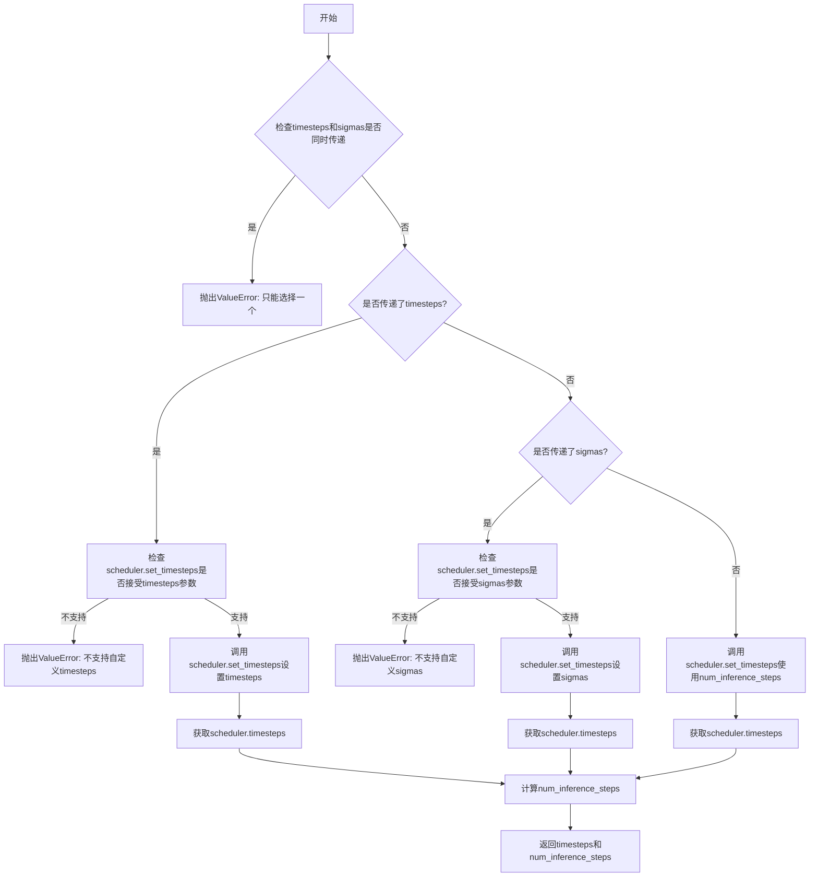
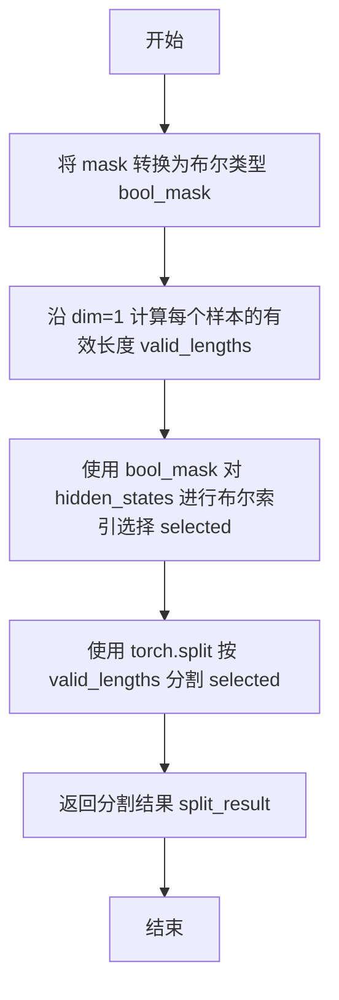
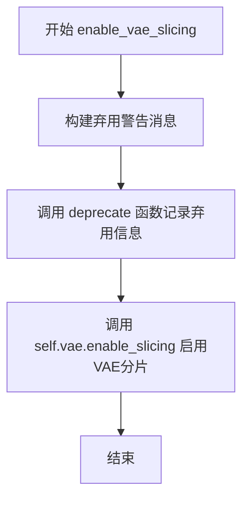
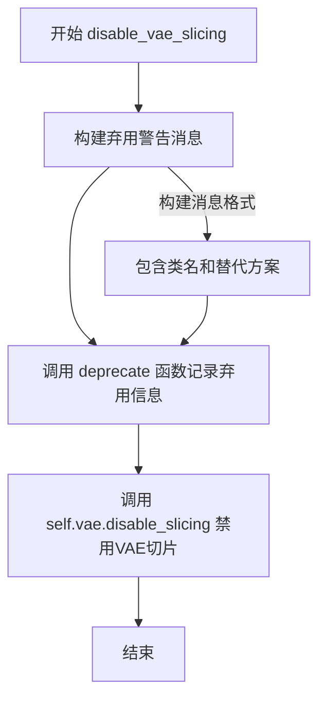
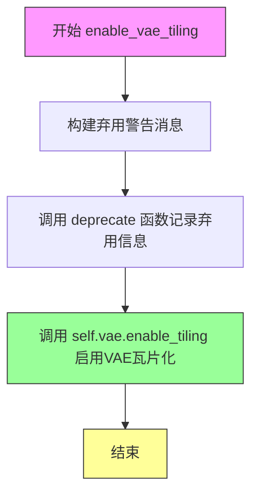
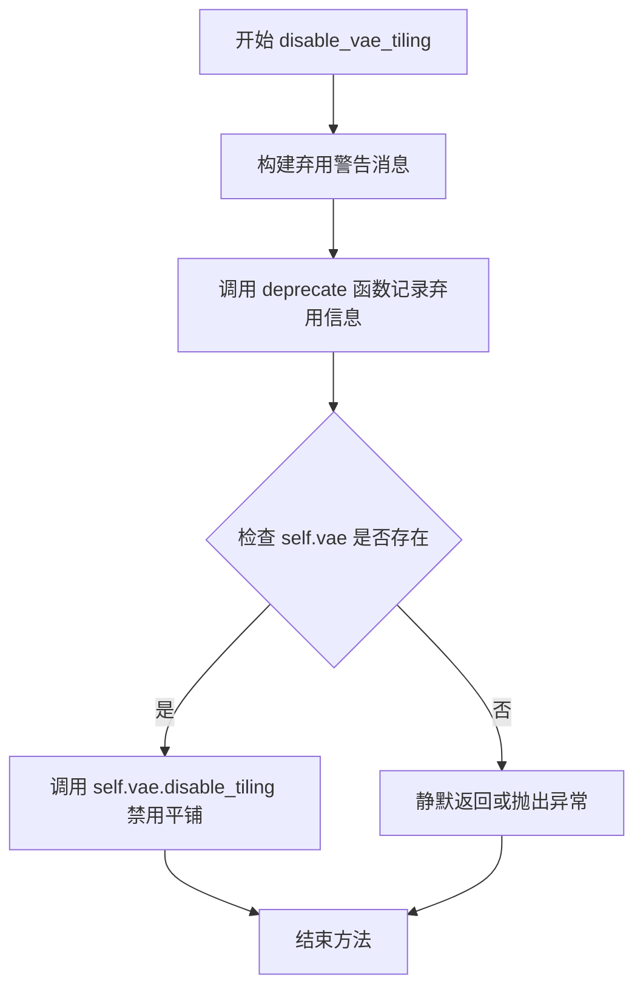
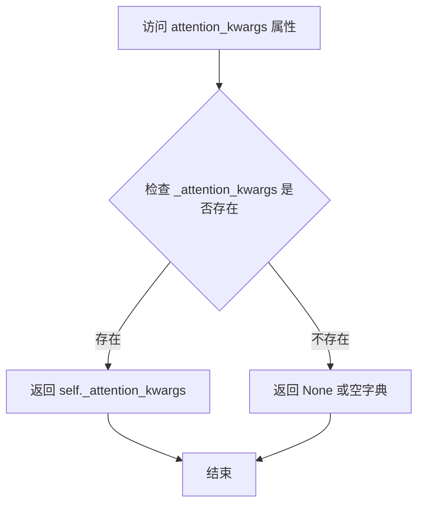
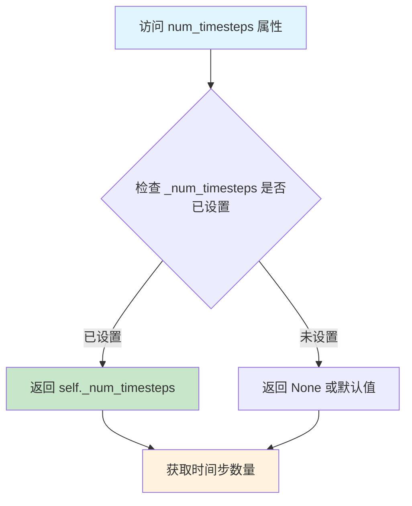

# `diffusers\src\diffusers\pipelines\qwenimage\pipeline_qwenimage_img2img.py` 详细设计文档

这是一个基于Qwen2.5-VL模型的图像到图像（img2img）生成管道，继承自DiffusionPipeline和QwenImageLoraLoaderMixin。该管道接受文本提示和输入图像，通过VAE编码图像、使用transformer进行去噪处理，最终生成与文本提示相关的新图像。支持多种高级功能，如LoRA加载、VAE切片/平铺、分类器自由引导（CFG）、回调函数等。

## 整体流程

```mermaid
graph TD
    A[开始: __call__] --> B[1. 检查输入: check_inputs]
B --> C[2. 预处理图像: image_processor.preprocess]
C --> D[3. 编码提示词: encode_prompt]
D --> E{是否使用CFG?}
E -- 是 --> F[编码negative_prompt]
E -- 否 --> G[4. 准备时间步: retrieve_timesteps + get_timesteps]
F --> G
G --> H[5. 准备latents: prepare_latents]
H --> I[6. 去噪循环: for t in timesteps]
I --> J{transformer类型}
J -- guidance-distilled --> K[传入guidance参数]
J -- 普通 --> L[不传guidance]
K --> M[执行transformer推理: self.transformer]
L --> M
M --> N{是否使用CFG?}
N -- 是 --> O[执行negative推理 + CFG组合]
N -- 否 --> P[执行scheduler.step]
O --> P
P --> Q{是否有callback?]
Q -- 是 --> R[执行callback_on_step_end]
Q -- 否 --> S{是否完成所有步?}
R --> S
S -- 否 --> I
S -- 是 --> T[7. 解码latents: _unpack_latents + vae.decode]
T --> U[8. 后处理: image_processor.postprocess]
U --> V[返回QwenImagePipelineOutput]
```

## 类结构

```
DiffusionPipeline (基类)
QwenImageLoraLoaderMixin (Mixin类)
└── QwenImageImg2ImgPipeline
```

## 全局变量及字段


### `XLA_AVAILABLE`
    
Boolean flag indicating whether PyTorch XLA is available for TPU acceleration

类型：`bool`
    


### `logger`
    
Logger instance for the module to track runtime events and warnings

类型：`logging.Logger`
    


### `EXAMPLE_DOC_STRING`
    
Documentation string containing example usage code for the pipeline

类型：`str`
    


### `QwenImageImg2ImgPipeline.model_cpu_offload_seq`
    
Sequence string defining the order for CPU offloading of models (text_encoder->transformer->vae)

类型：`str`
    


### `QwenImageImg2ImgPipeline._callback_tensor_inputs`
    
List of tensor input names that can be passed to callback functions during inference

类型：`list[str]`
    


### `QwenImageImg2ImgPipeline.scheduler`
    
Scheduler for controlling the denoising process with flow match Euler discrete steps

类型：`FlowMatchEulerDiscreteScheduler`
    


### `QwenImageImg2ImgPipeline.vae`
    
Variational Autoencoder model for encoding images to latent space and decoding latents back to images

类型：`AutoencoderKLQwenImage`
    


### `QwenImageImg2ImgPipeline.text_encoder`
    
Qwen2.5-VL model for encoding text prompts into embeddings

类型：`Qwen2_5_VLForConditionalGeneration`
    


### `QwenImageImg2ImgPipeline.tokenizer`
    
Tokenizer for converting text prompts into token IDs for the text encoder

类型：`Qwen2Tokenizer`
    


### `QwenImageImg2ImgPipeline.transformer`
    
Transformer model for denoising image latents based on text embeddings and timesteps

类型：`QwenImageTransformer2DModel`
    


### `QwenImageImg2ImgPipeline.vae_scale_factor`
    
Scaling factor for VAE latent dimensions accounting for temporal downsampling and patch packing

类型：`int`
    


### `QwenImageImg2ImgPipeline.latent_channels`
    
Number of latent channels used by the VAE (typically 16)

类型：`int`
    


### `QwenImageImg2ImgPipeline.image_processor`
    
Image processor for preprocessing input images and postprocessing output images

类型：`VaeImageProcessor`
    


### `QwenImageImg2ImgPipeline.tokenizer_max_length`
    
Maximum sequence length for tokenization (default 1024)

类型：`int`
    


### `QwenImageImg2ImgPipeline.prompt_template_encode`
    
Template string for formatting prompts with Qwen image system and user message structure

类型：`str`
    


### `QwenImageImg2ImgPipeline.prompt_template_encode_start_idx`
    
Starting index for dropping template tokens in prompt embeddings (default 34)

类型：`int`
    


### `QwenImageImg2ImgPipeline.default_sample_size`
    
Default sample size in pixels for generating images (default 128)

类型：`int`
    


### `QwenImageImg2ImgPipeline._guidance_scale`
    
Guidance scale value for guidance-distilled models, set during __call__ execution

类型：`float | None`
    


### `QwenImageImg2ImgPipeline._attention_kwargs`
    
Additional keyword arguments for attention processors, set during __call__ execution

类型：`dict[str, Any] | None`
    


### `QwenImageImg2ImgPipeline._num_timesteps`
    
Total number of inference timesteps, set during __call__ execution

类型：`int | None`
    


### `QwenImageImg2ImgPipeline._current_timestep`
    
Current timestep during denoising loop, updated during __call__ execution

类型：`int | None`
    


### `QwenImageImg2ImgPipeline._interrupt`
    
Flag to interrupt the denoising process, set during __call__ execution

类型：`bool`
    
    

## 全局函数及方法


### `retrieve_latents`

该函数是一个全局工具函数，用于从编码器输出中提取latent表示。它通过检查编码器输出的属性（`latent_dist`或`latents`），根据指定的采样模式（`sample`或`argmax`）返回相应的latent张量。这是Stable Diffusion系列pipeline中的常见模式，用于从VAE的encoder输出中获取latent表示。

参数：

- `encoder_output`：`torch.Tensor`，编码器的输出结果，通常包含`latent_dist`属性（用于概率分布采样）或`latents`属性（直接存储的latent张量）
- `generator`：`torch.Generator | None`，可选的随机数生成器，用于确保采样过程的可重现性
- `sample_mode`：`str`，采样模式，默认为"sample"，可选值为"sample"（从分布中采样）或"argmax"（取分布的众数）

返回值：`torch.Tensor`，提取出的latent张量

#### 流程图

```mermaid
flowchart TD
    A[开始: retrieve_latents] --> B{encoder_output是否有latent_dist属性<br/>且sample_mode == 'sample'?}
    B -->|是| C[返回 encoder_output.latent_dist.sample(generator)]
    B -->|否| D{encoder_output是否有latent_dist属性<br/>且sample_mode == 'argmax'?}
    D -->|是| E[返回 encoder_output.latent_dist.mode()]
    D -->|否| F{encoder_output是否有latents属性?}
    F -->|是| G[返回 encoder_output.latents]
    F -->|否| H[抛出 AttributeError 异常]
    
    C --> I[结束]
    E --> I
    G --> I
    H --> I
```

#### 带注释源码

```python
# Copied from diffusers.pipelines.stable_diffusion.pipeline_stable_diffusion_img2img.retrieve_latents
def retrieve_latents(
    encoder_output: torch.Tensor, generator: torch.Generator | None = None, sample_mode: str = "sample"
):
    """
    从编码器输出中提取latent表示。
    
    该函数支持三种提取方式：
    1. 从latent_dist分布中采样（sample模式）
    2. 从latent_dist分布中取众数（argmax模式）
    3. 直接返回预存的latents张量
    
    Args:
        encoder_output: 编码器输出，包含latent_dist或latents属性
        generator: 随机数生成器，用于采样时的随机性控制
        sample_mode: 采样模式，'sample'或'argmax'
    
    Returns:
        提取出的latent张量
    
    Raises:
        AttributeError: 当无法从encoder_output中获取latent时抛出
    """
    # 情况1：encoder_output具有latent_dist属性且使用sample模式
    # 从潜在分布中进行随机采样，适用于需要多样性的场景
    if hasattr(encoder_output, "latent_dist") and sample_mode == "sample":
        return encoder_output.latent_dist.sample(generator)
    
    # 情况2：encoder_output具有latent_dist属性且使用argmax模式
    # 取潜在分布的众数（最可能值），适用于确定性解码
    elif hasattr(encoder_output, "latent_dist") and sample_mode == "argmax":
        return encoder_output.latent_dist.mode()
    
    # 情况3：encoder_output直接包含latents属性
    # 直接返回预计算的latent张量
    elif hasattr(encoder_output, "latents"):
        return encoder_output.latents
    
    # 错误情况：无法找到任何可用的latent提取方式
    else:
        raise AttributeError("Could not access latents of provided encoder_output")
```


### `calculate_shift`

该函数是一个全局工具函数，通过线性插值计算图像序列长度对应的偏移量（shift value），主要用于调度器（scheduler）的时间步长调整。它根据图像的序列长度、基础/最大序列长度以及基础/最大偏移量，通过线性映射关系计算出适合当前图像尺寸的偏移参数。

参数：

- `image_seq_len`：`int`，输入图像的序列长度，通常由图像尺寸经VAE压缩和分块后计算得出
- `base_seq_len`：`int = 256`，基础序列长度默认值
- `max_seq_len`：`int = 4096`，最大序列长度默认值
- `base_shift`：`float = 0.5`，基础偏移量默认值
- `max_shift`：`float = 1.15`，最大偏移量默认值

返回值：`float`，返回计算得到的偏移量 mu，用于调整调度器的时间步长

#### 流程图

```mermaid
flowchart TD
    A[开始 calculate_shift] --> B[计算斜率 m<br/>m = (max_shift - base_shift) / (max_seq_len - base_seq_len)]
    B --> C[计算截距 b<br/>b = base_shift - m * base_seq_len]
    C --> D[计算偏移量 mu<br/>mu = image_seq_len * m + b]
    D --> E[返回 mu]
```

#### 带注释源码

```python
# Copied from diffusers.pipelines.qwenimage.pipeline_qwenimage.calculate_shift
def calculate_shift(
    image_seq_len,           # 图像序列长度
    base_seq_len: int = 256,     # 基础序列长度
    max_seq_len: int = 4096,     # 最大序列长度
    base_shift: float = 0.5,    # 基础偏移量
    max_shift: float = 1.15,    # 最大偏移量
):
    """
    通过线性插值计算图像序列长度对应的偏移量。
    
    该函数实现了基于序列长度的动态偏移计算，用于调整Flow Match调度器的时间步长。
    当图像尺寸较大时，需要调整偏移量以获得更好的生成效果。
    
    参数:
        image_seq_len: 输入图像经过VAE压缩和分块后的序列长度
        base_seq_len: 基础序列长度，默认256
        max_seq_len: 最大序列长度，默认4096
        base_shift: 基础偏移量，默认0.5
        max_shift: 最大偏移量，默认1.15
    
    返回:
        float: 计算得到的偏移量mu，用于调度器时间步调整
    """
    # 计算线性插值的斜率 m
    # 斜率表示偏移量随序列长度变化的速率
    m = (max_shift - base_shift) / (max_seq_len - base_seq_len)
    
    # 计算线性截距 b
    # 确保在 base_seq_len 处偏移量恰好为 base_shift
    b = base_shift - m * base_seq_len
    
    # 根据图像序列长度计算最终的偏移量
    # 使用线性方程: mu = image_seq_len * m + b
    mu = image_seq_len * m + b
    
    return mu
```


### `retrieve_timesteps`

该函数是扩散管道中的辅助函数，用于调用调度器的 `set_timesteps` 方法并从调度器中获取时间步。它处理自定义时间步和自定义 sigmas，支持三种设置方式：自定义 timesteps、自定义 sigmas 或通过 num_inference_steps 计算。

参数：

- `scheduler`：`SchedulerMixin`，调度器对象，用于获取时间步
- `num_inference_steps`：`int | None`，推理步数，用于生成样本。如果使用，则 `timesteps` 必须为 `None`
- `device`：`str | torch.device | None`，时间步要移动到的设备。如果为 `None`，则不移动
- `timesteps`：`list[int] | None`，自定义时间步，用于覆盖调度器的时间步间隔策略
- `sigmas`：`list[float] | None`，自定义 sigmas，用于覆盖调度器的时间步间隔策略
- `**kwargs`：任意关键字参数，将传递给 `scheduler.set_timesteps`

返回值：`tuple[torch.Tensor, int]`，第一个元素是调度器的时间步调度，第二个元素是推理步数

#### 流程图



#### 带注释源码

```python
def retrieve_timesteps(
    scheduler,
    num_inference_steps: int | None = None,
    device: str | torch.device | None = None,
    timesteps: list[int] | None = None,
    sigmas: list[float] | None = None,
    **kwargs,
):
    r"""
    Calls the scheduler's `set_timesteps` method and retrieves timesteps from the scheduler after the call. Handles
    custom timesteps. Any kwargs will be supplied to `scheduler.set_timesteps`.

    Args:
        scheduler (`SchedulerMixin`):
            The scheduler to get timesteps from.
        num_inference_steps (`int`):
            The number of diffusion steps used when generating samples with a pre-trained model. If used, `timesteps`
            must be `None`.
        device (`str` or `torch.device`, *optional*):
            The device to which the timesteps should be moved to. If `None`, the timesteps are not moved.
        timesteps (`list[int]`, *optional*):
            Custom timesteps used to override the timestep spacing strategy of the scheduler. If `timesteps` is passed,
            `num_inference_steps` and `sigmas` must be `None`.
        sigmas (`list[float]`, *optional*):
            Custom sigmas used to override the timestep spacing strategy of the scheduler. If `sigmas` is passed,
            `num_inference_steps` and `timesteps` must be `None`.

    Returns:
        `tuple[torch.Tensor, int]`: A tuple where the first element is the timestep schedule from the scheduler and the
        second element is the number of inference steps.
    """
    # 检查是否同时传递了timesteps和sigmas，只能选择其中一个
    if timesteps is not None and sigmas is not None:
        raise ValueError("Only one of `timesteps` or `sigmas` can be passed. Please choose one to set custom values")
    
    # 处理自定义timesteps的情况
    if timesteps is not None:
        # 检查调度器的set_timesteps方法是否支持timesteps参数
        accepts_timesteps = "timesteps" in set(inspect.signature(scheduler.set_timesteps).parameters.keys())
        if not accepts_timesteps:
            raise ValueError(
                f"The current scheduler class {scheduler.__class__}'s `set_timesteps` does not support custom"
                f" timestep schedules. Please check whether you are using the correct scheduler."
            )
        # 调用调度器的set_timesteps方法设置自定义timesteps
        scheduler.set_timesteps(timesteps=timesteps, device=device, **kwargs)
        # 从调度器获取设置后的timesteps
        timesteps = scheduler.timesteps
        # 计算推理步数
        num_inference_steps = len(timesteps)
    # 处理自定义sigmas的情况
    elif sigmas is not None:
        # 检查调度器的set_timesteps方法是否支持sigmas参数
        accept_sigmas = "sigmas" in set(inspect.signature(scheduler.set_timesteps).parameters.keys())
        if not accept_sigmas:
            raise ValueError(
                f"The current scheduler class {scheduler.__class__}'s `set_timesteps` does not support custom"
                f" sigmas schedules. Please check whether you are using the correct scheduler."
            )
        # 调用调度器的set_timesteps方法设置自定义sigmas
        scheduler.set_timesteps(sigmas=sigmas, device=device, **kwargs)
        # 从调度器获取设置后的timesteps
        timesteps = scheduler.timesteps
        # 计算推理步数
        num_inference_steps = len(timesteps)
    # 使用num_inference_steps计算timesteps（默认情况）
    else:
        scheduler.set_timesteps(num_inference_steps, device=device, **kwargs)
        timesteps = scheduler.timesteps
    
    # 返回timesteps和推理步数
    return timesteps, num_inference_steps
```


### `QwenImageImg2ImgPipeline.__init__`

该方法是 `QwenImageImg2ImgPipeline` 类的构造函数，负责初始化图像到图像（img2img）流水线所需的所有核心组件，包括调度器、VAE模型、文本编码器、分词器和Transformer模型，并配置图像处理器、潜在通道参数、提示词模板等关键流水线参数。

参数：

- `scheduler`：`FlowMatchEulerDiscreteScheduler`，用于在去噪过程中调度时间步的调度器
- `vae`：`AutoencoderKLQwenImage`，用于编码和解码图像与潜在表示的变分自编码器模型
- `text_encoder`：`Qwen2_5_VLForConditionalGeneration`，用于将文本提示编码为嵌入向量的Qwen2.5-VL文本编码器
- `tokenizer`：`Qwen2Tokenizer`，用于将文本提示分词为token的Qwen2分词器
- `transformer`：`QwenImageTransformer2DModel`，用于去噪图像潜在表示的条件Transformer（MMDiT）架构

返回值：`None`，构造函数不返回任何值，仅初始化实例属性

#### 流程图

```mermaid
flowchart TD
    A[开始 __init__] --> B[调用 super().__init__]
    B --> C[register_modules 注册五个模块]
    C --> D[计算 vae_scale_factor]
    D --> E[设置 latent_channels]
    E --> F[创建 VaeImageProcessor]
    F --> G[设置 tokenizer_max_length]
    G --> H[设置 prompt_template_encode]
    H --> I[设置 prompt_template_encode_start_idx]
    I --> J[设置 default_sample_size]
    J --> K[结束 __init__]
```

#### 带注释源码

```python
def __init__(
    self,
    scheduler: FlowMatchEulerDiscreteScheduler,  # 调度器：控制去噪过程的时间步调度
    vae: AutoencoderKLQwenImage,                  # VAE模型：图像编解码
    text_encoder: Qwen2_5_VLForConditionalGeneration,  # 文本编码器：文本→向量
    tokenizer: Qwen2Tokenizer,                    # 分词器：文本→token序列
    transformer: QwenImageTransformer2DModel,     # Transformer：去噪核心模型
):
    # 调用父类DiffusionPipeline的初始化方法
    # 初始化基础pipeline功能
    super().__init__()

    # 注册所有模块到pipeline，使其可被pipeline管理
    # 包括模型卸载、内存管理等功能的依赖
    self.register_modules(
        vae=vae,
        text_encoder=text_encoder,
        tokenizer=tokenizer,
        transformer=transformer,
        scheduler=scheduler,
    )
    
    # 计算VAE缩放因子：基于VAE的时序下采样层数
    # QwenImage的latent被转换为2x2的patches并打包
    # 因此latent宽高必须能被patch size整除
    # VAE scale factor需要乘以patch size来补偿
    self.vae_scale_factor = 2 ** len(self.vae.temporal_downsample) if getattr(self, "vae", None) else 8
    
    # 设置latent通道数：从VAE配置中获取z_dim维度
    self.latent_channels = self.vae.config.z_dim if getattr(self, "vae", None) else 16
    
    # 创建图像预处理器
    # vae_scale_factor * 2 是因为latent被pack成2x2 patches
    # vae_latent_channels 是latent的通道数
    self.image_processor = VaeImageProcessor(
        vae_scale_factor=self.vae_scale_factor * 2, 
        vae_latent_channels=self.latent_channels
    )
    
    # 设置分词器的最大长度限制
    self.tokenizer_max_length = 1024
    
    # 定义用于编码提示词的模板
    # 包含system、user、assistant三种角色的标记格式
    # 用于引导模型生成详细的图像描述
    self.prompt_template_encode = "<|im_start|>system\nDescribe the image by detailing the color, shape, size, texture, quantity, text, spatial relationships of the objects and background:<|im_end|>\n<|im_start|>user\n{}<|im_end|>\n<|im_start|>assistant\n"
    
    # 提示词模板中assistant部分开始的位置索引
    # 用于从编码后的hidden states中提取有效部分
    self.prompt_template_encode_start_idx = 34
    
    # 默认的样本尺寸（以latent单位计）
    # 实际像素尺寸 = default_sample_size * vae_scale_factor
    self.default_sample_size = 128
```


### `QwenImageImg2ImgPipeline._extract_masked_hidden`

该方法用于从隐藏状态中根据注意力掩码提取有效token的隐藏向量，并将结果按样本分割成独立的张量列表。

参数：

- `self`：`QwenImageImg2ImgPipeline` 实例，当前类的实例对象
- `hidden_states`：`torch.Tensor`，编码器输出的隐藏状态张量，形状为 `[batch_size, seq_len, hidden_dim]`
- `mask`：`torch.Tensor`，注意力掩码张量，形状为 `[batch_size, seq_len]`，用于指示哪些位置是有效的（值为1或True）

返回值：`tuple[torch.Tensor]`，包含每个样本有效token隐藏向量的元组，元素数量为 `batch_size`，每个元素的形状为 `[valid_length_i, hidden_dim]`

#### 流程图



#### 带注释源码

```python
def _extract_masked_hidden(self, hidden_states: torch.Tensor, mask: torch.Tensor):
    """
    从隐藏状态中根据掩码提取有效token的隐藏向量
    
    Args:
        hidden_states: 编码器输出的隐藏状态，形状为 [batch_size, seq_len, hidden_dim]
        mask: 注意力掩码，形状为 [batch_size, seq_len]
    
    Returns:
        包含每个样本有效token隐藏向量的元组
    """
    # 将掩码转换为布尔类型，用于布尔索引
    bool_mask = mask.bool()
    
    # 计算每个样本的有效长度（掩码为True的数量）
    valid_lengths = bool_mask.sum(dim=1)
    
    # 使用布尔索引从hidden_states中选择有效位置的值
    # 这会将所有batch的valid token合并到一起
    selected = hidden_states[bool_mask]
    
    # 按每个样本的有效长度将selected分割成独立的tensor
    split_result = torch.split(selected, valid_lengths.tolist(), dim=0)
    
    # 返回分割结果，每个元素对应一个样本的有效token隐藏向量
    return split_result
```


### `QwenImageImg2ImgPipeline._get_qwen_prompt_embeds`

该方法负责将文本提示（prompt）编码为 Qwen2.5-VL 模型可用的嵌入向量（prompt embeddings）和注意力掩码（attention mask）。它使用预定义的模板格式化提示，通过 tokenizer 转换为 token IDs，然后利用 text_encoder 生成隐藏状态，最后对隐藏状态进行掩码提取和填充对齐，返回标准化的 prompt_embeds 和 encoder_attention_mask。

参数：

- `prompt`：`str | list[str]`，待编码的文本提示，可以是单个字符串或字符串列表，默认为 None
- `device`：`torch.device | None`，指定计算设备，默认为 None（使用执行设备）
- `dtype`：`torch.dtype | None`，指定数据类型，默认为 None（使用 text_encoder 的数据类型）

返回值：`tuple[torch.Tensor, torch.Tensor]`，返回一个元组，包含 `prompt_embeds`（编码后的文本嵌入向量，形状为 [batch_size, seq_len, hidden_dim]）和 `encoder_attention_mask`（用于 Transformer 的注意力掩码，形状为 [batch_size, seq_len]）

#### 流程图

```mermaid
flowchart TD
    A[开始: _get_qwen_prompt_embeds] --> B{device 参数为空?}
    B -->|是| C[使用 self._execution_device]
    B -->|否| D[使用传入的 device]
    E{dtype 参数为空?}
    E -->|是| F[使用 self.text_encoder.dtype]
    E -->|否| G[使用传入的 dtype]
    
    C --> H
    D --> H
    F --> H
    G --> H
    
    H{prompt 是字符串?}
    H -->|是| I[转换为列表: [prompt]]
    H -->|否| J[保持原样]
    
    I --> K
    J --> K
    
    K[使用模板格式化提示] --> L[调用 tokenizer 生成 token IDs]
    L --> M[调用 text_encoder 获取 hidden states]
    M --> N[提取最后一层 hidden states]
    N --> O[使用 _extract_masked_hidden 提取有效 token]
    O --> P[丢弃前 drop_idx 个 token]
    P --> Q[为每个序列生成 attention mask]
    Q --> R[计算最大序列长度 max_seq_len]
    R --> S[填充/截断 prompt_embeds 到统一长度]
    S --> T[填充/截断 attention_mask 到统一长度]
    T --> U[转换为指定 dtype 和 device]
    U --> V[返回 prompt_embeds 和 encoder_attention_mask]
```

#### 带注释源码

```python
def _get_qwen_prompt_embeds(
    self,
    prompt: str | list[str] = None,
    device: torch.device | None = None,
    dtype: torch.dtype | None = None,
):
    """
    将文本提示编码为 Qwen2.5-VL 模型可用的嵌入向量和注意力掩码
    
    Args:
        prompt: 待编码的文本提示，字符串或字符串列表
        device: 计算设备，若为 None 则使用执行设备
        dtype: 数据类型，若为 None 则使用 text_encoder 的数据类型
    
    Returns:
        tuple: (prompt_embeds, encoder_attention_mask) 元组
    """
    # 确定设备：优先使用传入的 device，否则使用 pipeline 的执行设备
    device = device or self._execution_device
    # 确定数据类型：优先使用传入的 dtype，否则使用 text_encoder 的数据类型
    dtype = dtype or self.text_encoder.dtype

    # 统一 prompt 格式：若为单个字符串则转为列表，方便批量处理
    prompt = [prompt] if isinstance(prompt, str) else prompt

    # 获取预定义的提示模板和需要丢弃的起始位置索引
    template = self.prompt_template_encode
    drop_idx = self.prompt_template_encode_start_idx
    
    # 使用模板格式化所有提示：为每个提示添加系统指令和用户/助手标记
    txt = [template.format(e) for e in prompt]
    
    # 调用 tokenizer 将文本转换为 token IDs，设置最大长度并启用填充和截断
    txt_tokens = self.tokenizer(
        txt, 
        max_length=self.tokenizer_max_length + drop_idx,  # 加上 drop_idx 预留空间
        padding=True, 
        truncation=True, 
        return_tensors="pt"
    ).to(device)
    
    # 调用 text_encoder 生成编码后的隐藏状态，启用输出所有隐藏状态
    encoder_hidden_states = self.text_encoder(
        input_ids=txt_tokens.input_ids,
        attention_mask=txt_tokens.attention_mask,
        output_hidden_states=True,
    )
    
    # 提取最后一层的隐藏状态作为最终的 prompt embeddings
    hidden_states = encoder_hidden_states.hidden_states[-1]
    
    # 使用 _extract_masked_hidden 方法根据 attention_mask 提取有效token的隐藏状态
    split_hidden_states = self._extract_masked_hidden(hidden_states, txt_tokens.attention_mask)
    
    # 丢弃每个序列的前 drop_idx 个 token（对应模板中的系统提示部分）
    split_hidden_states = [e[drop_idx:] for e in split_hidden_states]
    
    # 为每个有效序列生成对应的 attention mask（全1向量，表示有效token）
    attn_mask_list = [torch.ones(e.size(0), dtype=torch.long, device=e.device) for e in split_hidden_states]
    
    # 计算所有序列中的最大长度，用于后续填充对齐
    max_seq_len = max([e.size(0) for e in split_hidden_states])
    
    # 将 prompt embeddings 填充到统一长度：短序列用零填充
    prompt_embeds = torch.stack(
        [torch.cat([u, u.new_zeros(max_seq_len - u.size(0), u.size(1))]) for u in split_hidden_states]
    )
    
    # 将 attention mask 填充到统一长度：短序列用零填充
    encoder_attention_mask = torch.stack(
        [torch.cat([u, u.new_zeros(max_seq_len - u.size(0))]) for u in attn_mask_list]
    )

    # 将结果转换到指定的 dtype 和 device
    prompt_embeds = prompt_embeds.to(dtype=dtype, device=device)

    return prompt_embeds, encoder_attention_mask
```


### `QwenImageImg2ImgPipeline._encode_vae_image`

该方法负责将输入图像编码为VAE latent空间表示，支持批量处理和随机性控制，并对latent进行标准化处理。

参数：

- `self`：`QwenImageImg2ImgPipeline`，Pipeline实例自身
- `image`：`torch.Tensor`，输入的图像张量，形状为 `[B, C, H, W]` 或 `[B, C, T, H, W]`
- `generator`：`torch.Generator | list[torch.Generator]`，随机数生成器，用于确保可重复性；支持单个生成器或与batch大小匹配的生成器列表

返回值：`torch.Tensor`，编码后的图像latent张量，形状为 `[B, z_dim, 1, H', W']`，其中 z_dim 是VAE潜在空间的通道数

#### 流程图

```mermaid
flowchart TD
    A[开始 _encode_vae_image] --> B{generator是否为list?}
    B -->|是| C[遍历image的每个元素]
    C --> D[调用 self.vae.encode 对单张图像编码]
    D --> E[使用 retrieve_latents 提取latent]
    E --> F[使用对应generator采样]
    F --> G[拼接所有latents]
    B -->|否| H[直接调用 self.vae.encode 编码整个batch]
    H --> I[使用 retrieve_latents 提取latent]
    I --> J[从VAE config获取 latents_mean]
    J --> K[从VAE config获取 latents_std]
    K --> L[计算 latents_mean tensor]
    L --> M[计算 latents_std tensor]
    M --> N[执行标准化: (image_latents - latents_mean) * latents_std]
    N --> O[返回标准化后的image_latents]
    G --> N
```

#### 带注释源码

```python
def _encode_vae_image(self, image: torch.Tensor, generator: torch.Generator):
    """
    将输入图像编码为VAE latent表示，并进行标准化处理
    
    参数:
        image: 输入图像张量，形状为 [B, C, H, W] 或 [B, C, T, H, W]
        generator: 随机生成器，用于确保可重复性
    返回:
        编码并标准化后的latent张量
    """
    # 判断generator是否为列表（即是否为每个图像单独提供生成器）
    if isinstance(generator, list):
        # 批量处理：逐个编码图像并使用对应的generator
        image_latents = [
            # 对每张图像单独编码
            retrieve_latents(self.vae.encode(image[i : i + 1]), generator=generator[i])
            for i in range(image.shape[0])
        ]
        # 沿batch维度拼接所有latents
        image_latents = torch.cat(image_latents, dim=0)
    else:
        # 单一generator：对整个batch统一编码
        image_latents = retrieve_latents(self.vae.encode(image), generator=generator)

    # ============ Latent 标准化处理 ============
    # 从VAE配置中获取latent分布的均值和标准差
    # 这些值用于将latent分布标准化到标准正态分布
    latents_mean = (
        torch.tensor(self.vae.config.latents_mean)
        .view(1, self.vae.config.z_dim, 1, 1, 1)  # reshape为 [1, z_dim, 1, 1, 1]
        .to(image_latents.device, image_latents.dtype)  # 移动到正确设备和dtype
    )
    latents_std = 1.0 / torch.tensor(self.vae.config.latents_std).view(1, self.vae.config.z_dim, 1, 1, 1).to(
        image_latents.device, image_latents.dtype
    )

    # 执行标准化：(latent - mean) * std
    # 这将latent从原始分布变换到标准正态分布
    image_latents = (image_latents - latents_mean) * latents_std

    return image_latents
```


### `QwenImageImg2ImgPipeline.get_timesteps`

该方法用于根据推断步骤数和强度（strength）参数调整去噪调度器的时间步序列，实现图像到图像（img2img）转换中从噪声图像到目标图像的渐进式去噪过程。

参数：

- `num_inference_steps`：`int`，总推断步数，指定去噪过程需要迭代的步数
- `strength`：`float`，强度参数，取值范围 [0, 1]，用于控制原始图像信息的保留程度，值越大表示添加的噪声越多，变化越显著
- `device`：`torch.device`，计算设备，用于指定张量存放的设备

返回值：`tuple[torch.Tensor, int]`，返回一个元组，第一个元素是调整后的时间步序列（torch.Tensor），第二个元素是实际使用的推断步数（int）

#### 流程图

```mermaid
flowchart TD
    A[开始] --> B[计算 init_timestep = min(num_inference_steps × strength, num_inference_steps)]
    B --> C[计算 t_start = max(num_inference_steps - init_timestep, 0)]
    C --> D[从 scheduler.timesteps 中切片获取时间步序列: timesteps = scheduler.timesteps[t_start × scheduler.order:]]
    D --> E{scheduler 是否有 set_begin_index 方法?}
    E -->|是| F[调用 scheduler.set_begin_index(t_start × scheduler.order) 设置起始索引]
    E -->|否| G[跳过此步骤]
    F --> H[返回 timesteps 和 num_inference_steps - t_start]
    G --> H
```

#### 带注释源码

```python
def get_timesteps(self, num_inference_steps, strength, device):
    # 根据强度参数计算需要使用的初始时间步数
    # strength 越大，init_timestep 越大，意味着保留的原始信息越少，变化越大
    # 例如：num_inference_steps=50, strength=0.8 → init_timestep=40
    init_timestep = min(num_inference_steps * strength, num_inference_steps)

    # 计算起始索引，决定从调度器的哪个时间步开始
    # t_start 用于跳过前面的时间步，实现从中间开始去噪
    # 例如：num_inference_steps=50, init_timestep=40 → t_start=10
    t_start = int(max(num_inference_steps - init_timestep, 0))

    # 从调度器的时间步序列中获取从 t_start 开始的后续时间步
    # 乘以 scheduler.order 是因为调度器可能使用多步采样方法
    timesteps = self.scheduler.timesteps[t_start * self.scheduler.order :]

    # 如果调度器支持设置起始索引，则进行设置
    # 这对于某些需要精确控制采样起点的调度器是必要的
    if hasattr(self.scheduler, "set_begin_index"):
        self.scheduler.set_begin_index(t_start * self.scheduler.order)

    # 返回调整后的时间步序列和实际推断步数
    # 实际推断步数 = 原始推断步数 - 跳过的步数
    return timesteps, num_inference_steps - t_start
```


### `QwenImageImg2ImgPipeline.encode_prompt`

该方法负责将文本提示（prompt）编码为文本嵌入（text embeddings），供后续的图像生成模型使用。它支持直接传入预计算的嵌入、批量生成、以及序列长度限制等功能。

参数：

- `prompt`：`str | list[str]`，要编码的提示词，可以是单个字符串或字符串列表
- `device`：`torch.device | None`，指定计算设备，默认为执行设备
- `num_images_per_prompt`：`int`，每个提示词生成的图像数量，默认为1
- `prompt_embeds`：`torch.Tensor | None`，预生成的文本嵌入，可用于微调文本输入
- `prompt_embeds_mask`：`torch.Tensor | None`，文本嵌入的注意力掩码
- `max_sequence_length`：`int`，最大序列长度，默认为1024

返回值：`tuple[torch.Tensor, torch.Tensor | None]`，返回处理后的文本嵌入和对应的注意力掩码

#### 流程图

```mermaid
flowchart TD
    A[开始 encode_prompt] --> B{device是否为空?}
    B -->|是| C[使用self._execution_device]
    B -->|否| D[使用传入的device]
    C --> E[prompt是否字符串?]
    D --> E
    E -->|是| F[包装为列表: [prompt]]
    E -->|否| G[保持原样]
    F --> H{prompt_embeds为空?}
    G --> H
    H -->|是| I[调用_get_qwen_prompt_embeds生成嵌入]
    H -->|否| J[使用传入的prompt_embeds]
    I --> K[获取batch_size]
    J --> K
    K --> L[截断序列长度: prompt_embeds[:, :max_sequence_length]]
    L --> M[获取seq_len]
    M --> N[重复嵌入: repeat(1, num_images_per_prompt, 1)]
    N --> O[reshape为batch_size * num_images_per_prompt, seq_len, -1]
    O --> P{prompt_embeds_mask不为空?}
    P -->|是| Q[截断mask长度]
    P -->|否| R[返回最终结果]
    Q --> S[重复mask: repeat(1, num_images_per_prompt, 1)]
    S --> T[reshape为batch_size * num_images_per_prompt, seq_len]
    T --> U{mask全部为True?}
    U -->|是| V[将mask设为None]
    U -->|否| R
    V --> R
    R --> W[返回 prompt_embeds, prompt_embeds_mask]
```

#### 带注释源码

```python
def encode_prompt(
    self,
    prompt: str | list[str],
    device: torch.device | None = None,
    num_images_per_prompt: int = 1,
    prompt_embeds: torch.Tensor | None = None,
    prompt_embeds_mask: torch.Tensor | None = None,
    max_sequence_length: int = 1024,
):
    r"""
    Args:
        prompt (`str` or `list[str]`, *optional*):
            prompt to be encoded
        device: (`torch.device`):
            torch device
        num_images_per_prompt (`int`):
            number of images that should be generated per prompt
        prompt_embeds (`torch.Tensor`, *optional*):
            Pre-generated text embeddings. Can be used to easily tweak text inputs, *e.g.* prompt weighting. If not
            provided, text embeddings will be generated from `prompt` input argument.
    """
    # 确定计算设备，如果未指定则使用pipeline的默认执行设备
    device = device or self._execution_device

    # 标准化prompt格式：如果是单个字符串则转换为列表
    prompt = [prompt] if isinstance(prompt, str) else prompt
    # 确定批次大小：如果传入了prompt_embeds则使用其批次大小，否则使用prompt列表长度
    batch_size = len(prompt) if prompt_embeds is None else prompt_embeds.shape[0]

    # 如果没有预计算的嵌入，则调用内部方法生成
    if prompt_embeds is None:
        prompt_embeds, prompt_embeds_mask = self._get_qwen_prompt_embeds(prompt, device)

    # 截断嵌入序列到指定的最大序列长度
    prompt_embeds = prompt_embeds[:, :max_sequence_length]
    # 获取序列长度用于后续reshape操作
    _, seq_len, _ = prompt_embeds.shape
    
    # 扩展嵌入以匹配生成的图像数量：对每个prompt生成多张图像
    prompt_embeds = prompt_embeds.repeat(1, num_images_per_prompt, 1)
    prompt_embeds = prompt_embeds.view(batch_size * num_images_per_prompt, seq_len, -1)

    # 处理注意力掩码（如果存在）
    if prompt_embeds_mask is not None:
        # 同样截断mask到最大序列长度
        prompt_embeds_mask = prompt_embeds_mask[:, :max_sequence_length]
        # 扩展mask以匹配图像数量
        prompt_embeds_mask = prompt_embeds_mask.repeat(1, num_images_per_prompt, 1)
        prompt_embeds_mask = prompt_embeds_mask.view(batch_size * num_images_per_prompt, seq_len)

        # 如果mask全为True（有效），可以设为None以优化后续处理
        if prompt_embeds_mask.all():
            prompt_embeds_mask = None

    # 返回处理后的嵌入和掩码
    return prompt_embeds, prompt_embeds_mask
```


### QwenImageImg2ImgPipeline.check_inputs

该方法用于验证图像生成管道的输入参数是否合法，确保prompt、strength、height、width等参数符合模型要求，并在参数不符合要求时抛出详细的错误信息。

参数：

- `self`：QwenImageImg2ImgPipeline实例，当前pipeline对象
- `prompt`：str | list[str] | None，用户输入的文本提示，用于指导图像生成
- `strength`：float，图像变换强度，值在0到1之间，控制噪声添加程度
- `height`：int，生成图像的高度（像素），需能被vae_scale_factor * 2整除
- `width`：int，生成图像的宽度（像素），需能被vae_scale_factor * 2整除
- `negative_prompt`：str | list[str] | None，可选的负面提示，用于引导不想要的内容
- `prompt_embeds`：torch.Tensor | None，可选的预计算文本嵌入
- `negative_prompt_embeds`：torch.Tensor | None，可选的预计算负面文本嵌入
- `prompt_embeds_mask`：torch.Tensor | None，文本嵌入的注意力掩码
- `negative_prompt_embeds_mask`：torch.Tensor | None，负面文本嵌入的注意力掩码
- `callback_on_step_end_tensor_inputs`：list[str] | None，步骤结束回调中使用的tensor输入名称列表
- `max_sequence_length`：int | None，文本序列的最大长度，不能超过1024

返回值：`None`，该方法不返回任何值，仅进行参数验证和警告输出

#### 流程图

```mermaid
flowchart TD
    A[开始 check_inputs 验证] --> B{检查 strength 是否在 [0, 1] 范围内}
    B -->|是| C{检查 height 和 width 是否能被 vae_scale_factor * 2 整除}
    B -->|否| D[抛出 ValueError: strength 必须在 0.0 到 1.0 之间]
    C -->|是| E{检查 callback_on_step_end_tensor_inputs 是否在允许列表中}
    C -->|否| F[输出警告: height/width 会被调整]
    F --> E
    E -->|是| G{检查 prompt 和 prompt_embeds 不能同时提供}
    E -->|否| H[抛出 ValueError: callback_on_step_end_tensor_inputs 包含非法键]
    G -->|是| I{检查 prompt 和 prompt_embeds 不能同时为 None}
    G -->|否| J[抛出 ValueError: 不能同时提供 prompt 和 prompt_embeds]
    I -->|是| K{检查 prompt 类型是否为 str 或 list}
    I -->|否| L[抛出 ValueError: 必须提供 prompt 或 prompt_embeds 之一]
    K -->|是| M{检查 negative_prompt 和 negative_prompt_embeds 不能同时提供}
    K -->|否| N[抛出 ValueError: prompt 类型必须是 str 或 list]
    M -->|是| O{检查 max_sequence_length 是否超过 1024}
    M -->|否| P[抛出 ValueError: 不能同时提供 negative_prompt 和 negative_prompt_embeds]
    O -->|是| Q[抛出 ValueError: max_sequence_length 不能大于 1024]
    O -->|否| R[验证通过，方法结束]
    
    style D fill:#ff6b6b
    style H fill:#ff6b6b
    style J fill:#ff6b6b
    style L fill:#ff6b6b
    style N fill:#ff6b6b
    style P fill:#ff6b6b
    style Q fill:#ff6b6b
    style F fill:#feca57
    style R fill:#5f27cd,color:#fff
```

#### 带注释源码

```python
def check_inputs(
    self,
    prompt,
    strength,
    height,
    width,
    negative_prompt=None,
    prompt_embeds=None,
    negative_prompt_embeds=None,
    prompt_embeds_mask=None,
    negative_prompt_embeds_mask=None,
    callback_on_step_end_tensor_inputs=None,
    max_sequence_length=None,
):
    """
    验证图像生成管道的输入参数是否合法。
    
    该方法执行以下验证：
    1. strength 参数必须在 [0, 1] 范围内
    2. height 和 width 必须是 vae_scale_factor * 2 的倍数
    3. callback_on_step_end_tensor_inputs 必须在允许的tensor输入列表中
    4. prompt 和 prompt_embeds 不能同时提供
    5. prompt 和 prompt_embeds 不能同时为 None
    6. prompt 必须是 str 或 list 类型
    7. negative_prompt 和 negative_prompt_embeds 不能同时提供
    8. max_sequence_length 不能超过 1024
    
    参数:
        prompt: 文本提示，可以是字符串或字符串列表
        strength: 图像变换强度，0-1之间的浮点数
        height: 生成图像的高度
        width: 生成图像的宽度
        negative_prompt: 负面提示，用于避免生成不需要的内容
        prompt_embeds: 预计算的文本嵌入
        negative_prompt_embeds: 预计算的负面文本嵌入
        prompt_embeds_mask: 文本嵌入的注意力掩码
        negative_prompt_embeds_mask: 负面文本嵌入的注意力掩码
        callback_on_step_end_tensor_inputs: 回调函数可访问的tensor输入列表
        max_sequence_length: 最大序列长度
        
    返回:
        None
        
    异常:
        ValueError: 当任一参数不符合要求时抛出
    """
    # 验证 strength 参数必须在 [0, 1] 范围内
    if strength < 0 or strength > 1:
        raise ValueError(f"The value of strength should in [0.0, 1.0] but is {strength}")

    # 验证图像尺寸必须是 vae_scale_factor * 2 的倍数
    # 如果不是，会输出警告信息并由后续处理自动调整尺寸
    if height % (self.vae_scale_factor * 2) != 0 or width % (self.vae_scale_factor * 2) != 0:
        logger.warning(
            f"`height` and `width` have to be divisible by {self.vae_scale_factor * 2} but are {height} and {width}. Dimensions will be resized accordingly"
        )

    # 验证回调函数的tensor输入必须在允许列表中
    # _callback_tensor_inputs 定义了哪些tensor可以在回调中访问
    if callback_on_step_end_tensor_inputs is not None and not all(
        k in self._callback_tensor_inputs for k in callback_on_step_end_tensor_inputs
    ):
        raise ValueError(
            f"`callback_on_step_end_tensor_inputs` has to be in {self._callback_tensor_inputs}, but found {[k for k in callback_on_step_end_tensor_inputs if k not in self._callback_tensor_inputs]}"
        )

    # 验证 prompt 和 prompt_embeds 不能同时提供
    # 只能选择其中一种方式提供文本输入
    if prompt is not None and prompt_embeds is not None:
        raise ValueError(
            f"Cannot forward both `prompt`: {prompt} and `prompt_embeds`: {prompt_embeds}. Please make sure to"
            " only forward one of the two."
        )
    # 验证 prompt 和 prompt_embeds 不能同时为 None
    # 必须至少提供一种文本输入方式
    elif prompt is None and prompt_embeds is None:
        raise ValueError(
            "Provide either `prompt` or `prompt_embeds`. Cannot leave both `prompt` and `prompt_embeds` undefined."
        )
    # 验证 prompt 的类型必须是 str 或 list
    elif prompt is not None and (not isinstance(prompt, str) and not isinstance(prompt, list)):
        raise ValueError(f"`prompt` has to be of type `str` or `list` but is {type(prompt)}")

    # 验证 negative_prompt 和 negative_prompt_embeds 不能同时提供
    if negative_prompt is not None and negative_prompt_embeds is not None:
        raise ValueError(
            f"Cannot forward both `negative_prompt`: {negative_prompt} and `negative_prompt_embeds`:"
            f" {negative_prompt_embeds}. Please make sure to only forward one of the two."
        )

    # 验证最大序列长度不能超过 1024
    if max_sequence_length is not None and max_sequence_length > 1024:
        raise ValueError(f"`max_sequence_length` cannot be greater than 1024 but is {max_sequence_length}")
```


### `QwenImageImg2ImgPipeline._pack_latents`

该方法是一个静态工具函数，用于将VAE编码后的latent张量进行"打包"操作，将4D空间表示 `[B, C, H, W]` 转换为序列化的3D表示 `[B, (H/2)*(W/2), C*4]`，以适配Transformer模型的2D patch序列输入格式。这是QwenImage图像生成pipeline中的关键数据预处理步骤。

参数：

- `latents`：`torch.Tensor`，输入的4D latent张量，形状为 `[batch_size, num_channels_latents, height, width]`
- `batch_size`：`int`，批次大小，用于维持输出张量的批次维度
- `num_channels_latents`：`int`，latent通道数，即VAE潜在空间的通道维度
- `height`：`int`，latent张量的高度维度
- `width`：`int`，latent张量的宽度维度

返回值：`torch.Tensor`，打包后的3D latent张量，形状为 `[batch_size, (height // 2) * (width // 2), num_channels_latents * 4]`

#### 流程图

```mermaid
flowchart TD
    A[输入latents: [B, C, H, W]] --> B[view操作: [B, C, H/2, 2, W/2, 2]]
    B --> C[permute操作: [B, H/2, W/2, C, 2, 2]]
    C --> D[reshape操作: [B, H/2*W/2, C*4]]
    D --> E[输出latents: [B, (H//2)*(W//2), C*4]]
```

#### 带注释源码

```python
@staticmethod
# Copied from diffusers.pipelines.qwenimage.pipeline_qwenimage.QwenImagePipeline._pack_latents
def _pack_latents(latents, batch_size, num_channels_latents, height, width):
    """
    将4D latent张量打包为3D序列格式
    
    处理流程：
    1. view: 将 [B, C, H, W] -> [B, C, H/2, 2, W/2, 2]
       将高度和宽度各划分为2x2的patch块
    2. permute: [B, C, H/2, 2, W/2, 2] -> [B, H/2, W/2, C, 2, 2]
       调整维度顺序，将空间维度前置
    3. reshape: [B, H/2, W/2, C, 2, 2] -> [B, H/2*W/2, C*4]
       合并空间维度，将每个位置的4个通道值展平为序列元素
    
    这样可以将2D图像latent转换为1D序列，便于Transformer处理
    """
    # Step 1: 将latent划分为2x2的patches
    # 输入: [batch_size, num_channels_latents, height, width]
    # 输出: [batch_size, num_channels_latents, height//2, 2, width//2, 2]
    latents = latents.view(batch_size, num_channels_latents, height // 2, 2, width // 2, 2)
    
    # Step 2: 调整维度顺序，将空间维度前置
    # 从 [B, C, H/2, 2, W/2, 2] -> [B, H/2, W/2, C, 2, 2]
    latents = latents.permute(0, 2, 4, 1, 3, 5)
    
    # Step 3: 展平为序列格式
    # 每个2x2 patch的4个值与通道维度合并，形成长为 (H/2)*(W/2) 的序列
    # 每个序列元素的特征维度为 num_channels_latents * 4
    latents = latents.reshape(batch_size, (height // 2) * (width // 2), num_channels_latents * 4)

    return latents
```


### `QwenImageImg2ImgPipeline._unpack_latents`

该方法是一个静态方法，负责将打包（packed）的latent张量解包回原始的5D张量格式（batch_size, channels, 1, height, width），以便后续进行VAE解码。在图像生成过程中，latent表示会被打包以提高计算效率，此方法将其恢复到适合解码的形状。

参数：

- `latents`：`torch.Tensor`，打包后的latent张量，形状为 (batch_size, num_patches, channels)
- `height`：`int`，原始图像的高度（像素单位）
- `width`：`int`，原始图像的宽度（像素单位）
- `vae_scale_factor`：`int`，VAE的缩放因子，用于计算latent空间的实际尺寸

返回值：`torch.Tensor`，解包后的latent张量，形状为 (batch_size, channels // 4, 1, latent_height, latent_width)

#### 流程图

```mermaid
flowchart TD
    A[输入打包的latents<br/>shape: (B, num_patches, C)] --> B[获取batch_size, num_patches, channels]
    B --> C[计算latent空间高度和宽度<br/>height = 2 * (height // (vae_scale_factor * 2))<br/>width = 2 * (width // (vae_scale_factor * 2))]
    C --> D[view操作<br/>reshape to (B, h//2, w//2, C//4, 2, 2)]
    D --> E[permute操作<br/>transpose to (B, C//4, h//2, 2, w//2, 2)]
    E --> F[reshape操作<br/>flatten to (B, C//4, 1, h, w)]
    F --> G[输出解包后的latents<br/>shape: (B, C//4, 1, h, w)]
```

#### 带注释源码

```
@staticmethod
# Copied from diffusers.pipelines.qwenimage.pipeline_qwenimage.QwenImagePipeline._unpack_latents
def _unpack_latents(latents, height, width, vae_scale_factor):
    # 从打包的latent张量中提取维度信息
    # latents形状: (batch_size, num_patches, channels)
    # num_patches = (height // 2) * (width // 2) 在打包之前
    batch_size, num_patches, channels = latents.shape

    # VAE对图像应用8倍压缩，同时需要考虑打包操作要求
    # latent的高度和宽度必须能被2整除
    # 计算latent空间的实际高度和宽度
    # 原始图像尺寸除以vae_scale_factor得到latent尺寸，再除以2得到打包前的尺寸
    height = 2 * (int(height) // (vae_scale_factor * 2))
    width = 2 * (int(width) // (vae_scale_factor * 2))

    # 将打包的latent重新视图为多维张量
    # 从 (B, H*W, C) -> (B, H//2, W//2, C//4, 2, 2)
    # 其中最后两个维度2x2代表打包的patch
    latents = latents.view(batch_size, height // 2, width // 2, channels // 4, 2, 2)

    # 置换维度以重新排列数据
    # 从 (B, H//2, W//2, C//4, 2, 2) -> (B, C//4, H//2, 2, W//2, 2)
    # 将通道维度提前，以便后续reshape
    latents = latents.permute(0, 3, 1, 4, 2, 5)

    # 最终reshape为5D张量格式
    # 从 (B, C//4, H//2, 2, W//2, 2) -> (B, C//4, 1, H, W)
    # 添加时间维度1，并合并patch维度到高度和宽度
    latents = latents.reshape(batch_size, channels // (2 * 2), 1, height, width)

    # 返回解包后的latent张量，形状为 (batch_size, channels//4, 1, height, width)
    return latents
```


### `QwenImageImg2ImgPipeline.enable_vae_slicing`

启用分片 VAE 解码。当启用此选项时，VAE 将输入张量分割成多个切片分步计算解码，以节省内存并支持更大的批处理大小。该方法已被弃用，将在未来版本中移除。

参数：无（仅包含 self）

返回值：`None`，无返回值

#### 流程图



#### 带注释源码

```python
def enable_vae_slicing(self):
    r"""
    Enable sliced VAE decoding. When this option is enabled, the VAE will split the input tensor in slices to
    compute decoding in several steps. This is useful to save some memory and allow larger batch sizes.
    """
    # 构建弃用警告消息，提示用户该方法已被弃用，建议使用新的API
    depr_message = f"Calling `enable_vae_slicing()` on a `{self.__class__.__name__}` is deprecated and this method will be removed in a future version. Please use `pipe.vae.enable_slicing()`."
    
    # 调用 deprecate 函数记录弃用信息，用于向用户发出警告
    deprecate(
        "enable_vae_slicing",    # 被弃用的方法名
        "0.40.0",                # 弃用版本号
        depr_message,            # 弃用详细说明
    )
    
    # 实际执行的操作：启用 VAE 的分片功能
    # 将解码过程分块处理以节省显存
    self.vae.enable_slicing()
```


### `QwenImageImg2ImgPipeline.disable_vae_slicing`

禁用VAE切片解码。如果之前启用了`enable_vae_slicing`，此方法将恢复为单步计算解码。该方法已被弃用，建议直接使用`pipe.vae.disable_slicing()`。

参数：

- 该方法无显式参数（隐式参数 `self` 为类的实例引用）

返回值：`None`，无返回值（该方法直接修改VAE内部状态）

#### 流程图



#### 带注释源码

```python
def disable_vae_slicing(self):
    r"""
    Disable sliced VAE decoding. If `enable_vae_slicing` was previously enabled, this method will go back to
    computing decoding in one step.
    """
    # 构建弃用警告消息，告知用户该方法将在未来版本中移除
    # 并提供替代方案：直接使用 pipe.vae.disable_slicing()
    depr_message = f"Calling `disable_vae_slicing()` on a `{self.__class__.__name__}` is deprecated and this method will be removed in a future version. Please use `pipe.vae.disable_slicing()`."
    
    # 调用 deprecate 工具函数记录弃用信息
    # 参数: 方法名, 弃用版本号, 警告消息
    deprecate(
        "disable_vae_slicing",
        "0.40.0",
        depr_message,
    )
    
    # 调用底层 VAE 模型的 disable_slicing 方法
    # 实际执行禁用 VAE 切片解码功能的操作
    self.vae.disable_slicing()
```


### `QwenImageImg2ImgPipeline.enable_vae_tiling`

启用瓦片化VAE解码。当启用此选项时，VAE会将输入张量分割成瓦片，以多个步骤计算解码和编码。这对于节省大量内存和处理更大的图像非常有用。

参数：此方法无显式参数（隐式参数 `self` 为实例本身）

返回值：`None`，无返回值

#### 流程图



#### 带注释源码

```python
def enable_vae_tiling(self):
    r"""
    Enable tiled VAE decoding. When this option is enabled, the VAE will split the input tensor into tiles to
    compute decoding and encoding in several steps. This is useful for saving a large amount of memory and to allow
    processing larger images.
    """
    # 构建弃用警告消息，提示用户该方法将在未来版本中移除
    # 并建议使用 pipe.vae.enable_tiling() 代替
    depr_message = f"Calling `enable_vae_tiling()` on a `{self.__class__.__name__}` is deprecated and this method will be removed in a future version. Please use `pipe.vae.enable_tiling()`."
    
    # 调用 deprecate 函数记录弃用信息
    # 参数: 方法名, 弃用版本号, 弃用警告消息
    deprecate(
        "enable_vae_tiling",
        "0.40.0",
        depr_message,
    )
    
    # 实际启用VAE瓦片化功能
    # 调用VAE模型的enable_tiling方法
    self.vae.enable_tiling()
```


### `QwenImageImg2ImgPipeline.disable_vae_tiling`

该方法用于禁用 VAE（变分自编码器）的平铺解码模式。如果之前启用了平铺解码，调用此方法后将恢复到单步解码模式。该方法已被弃用，推荐直接使用 `pipe.vae.disable_tiling()`。

参数： 无

返回值： `None`，无返回值（该方法直接修改对象内部状态）

#### 流程图



#### 带注释源码

```python
def disable_vae_tiling(self):
    r"""
    Disable tiled VAE decoding. If `enable_vae_tiling` was previously enabled, this method will go back to
    computing decoding in one step.
    
    该方法用于禁用 VAE 的平铺解码功能。
    如果之前通过 enable_vae_tiling 启用了平铺模式，调用此方法后将恢复为单步解码。
    """
    # 构建弃用警告消息，提示用户该方法将在未来版本中移除
    # 并推荐使用 pipe.vae.disable_tiling() 替代
    depr_message = f"Calling `disable_vae_tiling()` on a `{self.__class__.__name__}` is deprecated and this method will be removed in a future version. Please use `pipe.vae.disable_tiling()`."
    
    # 调用 deprecate 函数记录弃用信息
    # 参数：方法名、弃用版本号、警告消息
    deprecate(
        "disable_vae_tiling",
        "0.40.0",
        depr_message,
    )
    
    # 调用 VAE 对象的 disable_tiling 方法实际禁用平铺解码
    # 这是实际执行禁用操作的代码
    self.vae.disable_tiling()
```


### `QwenImageImg2ImgPipeline.prepare_latents`

该方法负责为 QwenImage 图生图（Image-to-Image）管道准备 latent 变量。它接收输入图像或潜在表示，处理批量大小适配、VAE 编码（如果需要），并通过调度器对噪声进行缩放，最终返回打包后的 latents 用于后续的去噪过程。

参数：

- `self`：`QwenImageImg2ImgPipeline`，管道实例本身
- `image`：`torch.Tensor`，输入图像张量，维度为 [B,C,H,W] 或 [B,C,T,H,W]
- `timestep`：`torch.Tensor`，当前的时间步，用于噪声缩放
- `batch_size`：`int`，有效的批处理大小
- `num_channels_latents`：`int`，latent 变量的通道数
- `height`：`int`，目标图像高度（像素）
- `width`：`int`，目标图像宽度（像素）
- `dtype`：`torch.dtype`，目标数据类型
- `device`：`torch.device`，目标设备
- `generator`：`torch.Generator | list[torch.Generator] | None`，随机数生成器，用于确定性生成
- `latents`：`torch.Tensor | None`，可选的预生成 latents，如果提供则直接返回

返回值：`torch.Tensor`，打包后的 latents 张量，形状为 [B, (H//2)*(W//2), num_channels_latents*4]

#### 流程图

```mermaid
flowchart TD
    A[开始 prepare_latents] --> B{检查 generator 列表长度}
    B -->|长度不匹配| C[抛出 ValueError]
    B -->|长度匹配| D[计算调整后的 height 和 width]
    D --> E[构建 latents shape: (batch_size, 1, num_channels_latents, height, width)]
    E --> F{检查 image 维度}
    F -->|4维 [B,C,H,W]| G[添加 T=1 维度 -> 5维]
    F -->|5维 [B,C,T,H,W]| H[保持不变]
    F -->|其他维度| I[抛出 ValueError]
    G --> J
    H --> J
    I --> J
    J{latents 参数是否提供}
    J -->|是| K[将 latents 移动到目标设备并转换类型]
    K --> Z[返回 latents]
    J -->|否| L[将 image 移动到目标设备并转换类型]
    L --> M{image 通道数是否等于 latent_channels}
    M -->|否| N[使用 VAE 编码图像]
    M -->|是| O[直接使用 image 作为 latents]
    N --> P
    O --> P
    P{处理批量大小适配}
    P --> Q[expand latents for batch_size]
    Q --> R[转置: [B,z,1,H',W'] -> [B,1,z,H',W']]
    R --> S[生成噪声 randn_tensor]
    S --> T[使用 scheduler.scale_noise 缩放噪声]
    T --> U[打包 latents _pack_latents]
    U --> Z
```

#### 带注释源码

```python
def prepare_latents(
    self,
    image,                      # 输入图像张量 [B,C,H,W] 或 [B,C,T,H,W]
    timestep,                   # 当前时间步张量
    batch_size,                 # 批处理大小
    num_channels_latents,       # latent 通道数
    height,                     # 目标高度
    width,                      # 目标宽度
    dtype,                      # 目标数据类型
    device,                     # 目标设备
    generator,                  # 随机生成器
    latents=None,               # 可选的预生成 latents
):
    # 检查：如果传入生成器列表，其长度必须匹配批处理大小
    if isinstance(generator, list) and len(generator) != batch_size:
        raise ValueError(
            f"You have passed a list of generators of length {len(generator)}, but requested an effective batch"
            f" size of {batch_size}. Make sure the batch size matches the length of the generators."
        )
    
    # VAE 应用 8x 压缩，但还需考虑 packing 需求（latent 高度和宽度需能被 2 整除）
    # 因此实际 latent 尺寸 = 原尺寸 * 2 / (vae_scale_factor * 2) = 原尺寸 / vae_scale_factor
    height = 2 * (int(height) // (self.vae_scale_factor * 2))
    width = 2 * (int(width) // (self.vae_scale_factor * 2))

    # 定义 latent 张量的形状 [B, T=1, C, H, W]
    shape = (batch_size, 1, num_channels_latents, height, width)

    # 处理图像维度：确保是 5 维张量 [B, C, T, H, W]
    # 如果是 4 维 [B,C,H,W]，添加时间维度 T=1
    if image.dim() == 4:
        image = image.unsqueeze(2)  # -> [B,C,1,H,W]
    elif image.dim() != 5:
        raise ValueError(f"Expected image dims 4 or 5, got {image.dim()}.")

    # 如果已提供 latents，直接返回转换后的结果（跳过图像编码和噪声生成）
    if latents is not None:
        return latents.to(device=device, dtype=dtype)

    # 将图像移动到指定设备和数据类型
    image = image.to(device=device, dtype=dtype)
    
    # 判断是否需要 VAE 编码
    # 如果图像通道数与配置的 latent 通道数不同，需要通过 VAE 编码获取 latents
    if image.shape[1] != self.latent_channels:
        # 使用 VAE 编码图像得到 latents，结果为 [B, z, 1, H', W']
        image_latents = self._encode_vae_image(image=image, generator=generator)
    else:
        # 图像已经是 latent 表示，直接使用
        image_latents = image

    # 处理批量大小适配：如果批处理大小大于图像 latent 的数量
    if batch_size > image_latents.shape[0] and batch_size % image_latents.shape[0] == 0:
        # 可以整除：复制 latent 以匹配批处理大小
        additional_image_per_prompt = batch_size // image_latents.shape[0]
        image_latents = torch.cat([image_latents] * additional_image_per_prompt, dim=0)
    elif batch_size > image_latents.shape[0] and batch_size % image_latents.shape[0] != 0:
        # 不能整除：抛出错误（无法均匀复制）
        raise ValueError(
            f"Cannot duplicate `image` of batch size {image_latents.shape[0]} to {batch_size} text prompts."
        )
    else:
        # 批处理大小小于等于 latent 数量，直接使用
        image_latents = torch.cat([image_latents], dim=0)

    # 转置 latent：从 [B, z, 1, H', W'] -> [B, 1, z, H', W']
    # 符合后续 scheduler.scale_noise 的输入格式要求
    image_latents = image_latents.transpose(1, 2)

    # 生成随机噪声，形状与目标 latent 一致
    noise = randn_tensor(shape, generator=generator, device=device, dtype=dtype)
    
    # 使用调度器根据当前时间步对噪声进行缩放
    # 将图像 latents 和噪声混合，混合比例由 timestep 决定
    latents = self.scheduler.scale_noise(image_latents, timestep, noise)
    
    # 对 latents 进行打包处理
    # 将 2x2 的 patch 打包成序列，适配 transformer 的输入格式
    latents = self._pack_latents(latents, batch_size, num_channels_latents, height, width)

    return latents
```


### `QwenImageImg2ImgPipeline.guidance_scale`

该属性是 `QwenImageImg2ImgPipeline` 类的只读属性，用于获取 guidance_scale（引导尺度）的值。guidance_scale 是图像生成过程中的一个重要参数，用于控制生成图像与文本提示词的相关程度，值越高表示生成的图像越紧密地遵循提示词的指导。在该管道中，这个值在调用 `__call__` 方法时被设置到实例变量 `_guidance_scale` 中。

参数：

- 该属性无显式参数（隐式的 `self` 不计）

返回值：`float | None`，返回当前管道的 guidance_scale 值。如果未设置，则返回 `None`。

#### 带注释源码

```python
@property
def guidance_scale(self):
    """
    属性 getter 方法，返回存储在实例变量 _guidance_scale 中的 guidance_scale 值。
    该值在调用 pipeline 的 __call__ 方法时从参数 guidance_scale 获取并存储。
    guidance_scale 用于控制分类器-free 引导的强度，影响生成图像与文本提示的相关性。
    """
    return self._guidance_scale
```


### `QwenImageImg2ImgPipeline.attention_kwargs`

该属性是一个只读属性，用于获取在图像生成过程中传递给注意力处理器（Attention Processor）的额外关键字参数（kwargs）。这些参数允许用户自定义注意力机制的行为。

参数：
- 无（该方法为属性访问器，无需参数）

返回值：`dict[str, Any] | None`，返回传递给注意力处理器的参数字典，如果未设置则返回 `None`

#### 流程图



#### 带注释源码

```python
@property
def attention_kwargs(self):
    """
    属性访问器：获取注意力处理器的额外关键字参数
    
    该属性提供了一个只读接口来访问在 pipeline 调用期间
   传递给 transformer 模型的注意力处理器的额外参数。
    这些参数通常用于自定义注意力机制的行为，例如：
    - 注意力掩码
    - 注意力头数
    - dropout 概率
    等配置。
    
    Returns:
        dict[str, Any] | None: 存储的注意力关键字参数，
                              如果未设置则为 None
    """
    return self._attention_kwargs
```

#### 上下文关联信息

该属性与以下内容相关：

1. **`__call__` 方法中的使用**：
   ```python
   # 在 __call__ 方法中设置
   self._attention_kwargs = attention_kwargs  # 来自参数
   
   # 在去噪循环中传递给 transformer
   noise_pred = self.transformer(
       ...
       attention_kwargs=self.attention_kwargs,  # 使用该属性
       return_dict=False,
   )[0]
   ```

2. **初始化**：该属性在 `__init__` 方法中未直接初始化，而是在 `__call__` 方法中首次设置：
   ```python
   self._attention_kwargs = attention_kwargs  # 在 __call__ 中
   ```

3. **默认值处理**：
   ```python
   if self.attention_kwargs is None:
       self._attention_kwargs = {}
   ```


### `QwenImageImg2ImgPipeline.num_timesteps`

这是一个属性（property），用于获取扩散模型在推理过程中使用的时间步数量。该属性返回在 `__call__` 方法中设置的时间步长度，表示扩散过程的迭代次数。

参数：无（这是一个只读属性，不接受任何参数）

返回值：`int`，返回扩散推理过程中使用的时间步总数（即 `len(timesteps)`）

#### 流程图



#### 带注释源码

```python
@property
def num_timesteps(self):
    """
    只读属性，返回扩散推理过程中使用的时间步数量。
    
    该属性在 __call__ 方法中被设置：
        self._num_timesteps = len(timesteps)
    
    时间步数量取决于：
        - num_inference_steps: 用户指定的推理步数
        - strength: 图像转换强度参数
        - scheduler.order: 调度器的阶数（用于跳过warmup步骤）
    
    Returns:
        int: 扩散过程中的时间步总数。如果在调用 pipeline 之前访问，返回 None。
    """
    return self._num_timesteps
```

#### 相关上下文信息

`num_timesteps` 属性与 `__call__` 方法中的以下代码相关：

```python
# 在 __call__ 方法中设置
num_warmup_steps = max(len(timesteps) - num_inference_steps * self.scheduler.order, 0)
self._num_timesteps = len(timesteps)  # 设置时间步数量
```

**使用场景：**
- 用户可能需要查询当前 pipeline 配置的时间步数量
- 用于监控或记录扩散过程的进度
- 在调试或日志中查看推理配置


### `QwenImageImg2ImgPipeline.current_timestep`

该属性是 `QwenImageImg2ImgPipeline` 类的只读属性，用于获取当前的去噪时间步（timestep）。在扩散模型的去噪循环中，此属性返回当前正在处理的时间步 `t`，使得外部调用者能够实时监控推理进度。

参数： （无参数）

返回值：`Any`，返回当前的去噪时间步。如果在去噪循环外部调用，则返回 `None`；在去噪循环内部，返回 `torch.Tensor` 类型的当前时间步。

#### 流程图

```mermaid
flowchart TD
    A[访问 current_timestep 属性] --> B{是否在去噪循环中}
    B -->|是| C[返回 self._current_timestep]
    B -->|否| D[返回 None]
    C --> E[获取当前时间步 t]
    D --> F[循环未开始或已结束]
```

#### 带注释源码

```python
@property
def current_timestep(self):
    """
    获取当前的去噪时间步。
    
    该属性在 __call__ 方法的去噪循环中被更新：
    - 循环开始前初始化为 None
    - 循环中每次迭代更新为当前时间步 t
    - 循环结束后重置为 None
    
    Returns:
        Any: 当前时间步（torch.Tensor 类型）或 None
    """
    return self._current_timestep
```


### `QwenImageImg2ImgPipeline.interrupt`

该属性是一个用于控制去噪循环中断的标志位。通过返回内部变量 `_interrupt` 的值，允许外部调用者在去噪过程中请求提前终止生成流程。

参数：

- （无参数，这是一个属性 getter）

返回值：`bool`，返回当前的中断状态标志。当值为 `True` 时，表示外部请求了中断，去噪循环将跳过当前迭代继续执行。

#### 流程图

```mermaid
flowchart TD
    A[开始] --> B[访问 interrupt 属性]
    B --> C{获取 self._interrupt}
    C --> D[返回 bool 值]
    D --> E[结束]
```

#### 带注释源码

```python
@property
def interrupt(self):
    """
    中断属性 getter。
    
    该属性用于获取内部中断标志 _interrupt 的值。
    在去噪循环 (__call__ 方法) 中，会检查此属性：
    - 如果返回 True，跳过当前去噪步骤继续执行
    - 如果返回 False，正常执行去噪步骤
    
    外部调用者可以通过设置 pipeline 对象的 _interrupt 属性来请求中断。
    
    Returns:
        bool: 当前的中断状态标志
    """
    return self._interrupt
```


### `QwenImageImg2ImgPipeline.__call__`

该方法是 QwenImage 图像到图像（Image-to-Image）生成管道的核心调用函数，接收文本提示和输入图像，通过 VAE 编码输入图像为潜在表示，结合文本嵌入和引导蒸馏技术，在潜在空间中进行去噪扩散过程，最终通过 VAE 解码生成目标图像。

参数：

- `prompt`：`str | list[str] | None`，用于引导图像生成的文本提示，如果不定义则需传入 `prompt_embeds`
- `negative_prompt`：`str | list[str] | None`，不用于引导图像生成的负面提示，在不使用引导（true_cfg_scale ≤ 1）时被忽略
- `true_cfg_scale`：`float`， Classifier-Free Diffusion Guidance 中的引导比例，定义 Imagen 论文中的 w 系数，值越大与文本提示关联越紧密，默认为 4.0
- `image`：`PipelineImageInput | None`，用作起点的图像输入，支持 torch.Tensor、PIL.Image.Image、np.ndarray 或其列表，期望值范围为 [0,1]，也可接受图像潜在向量
- `height`：`int | None`，生成图像的像素高度，默认为 self.default_sample_size * self.vae_scale_factor
- `width`：`int | None`，生成图像的像素宽度，默认为 self.default_sample_size * self.vae_scale_factor
- `strength`：`float`，变换参考图像的程度，取值范围 [0,1]，值越大添加噪声越多，默认为 0.6
- `num_inference_steps`：`int`，去噪步数，越多通常图像质量越高但推理越慢，默认为 50
- `sigmas`：`list[float] | None`，自定义噪声表，用于支持 sigmas 参数的调度器
- `guidance_scale`：`float | None`，引导蒸馏模型的引导比例，直接作为前向传播输入参数，启用需设置 > 1
- `num_images_per_prompt`：`int`，每个提示生成的图像数量，默认为 1
- `generator`：`torch.Generator | list[torch.Generator] | None`，随机生成器用于确定性生成
- `latents`：`torch.Tensor | None`，预生成的噪声潜在向量，用于图像生成，可用于相同提示的不同生成
- `prompt_embeds`：`torch.Tensor | None`，预生成的文本嵌入，用于轻松调整文本输入，如提示加权
- `prompt_embeds_mask`：`torch.Tensor | None`，提示嵌入的注意力掩码
- `negative_prompt_embeds`：`torch.Tensor | None`，预生成的负面文本嵌入
- `negative_prompt_embeds_mask`：`torch.Tensor | None`，负面提示嵌入的注意力掩码
- `output_type`：`str | None`，输出格式，可选 "pil" 返回 PIL.Image.Image 或 "np.array"，默认为 "pil"
- `return_dict`：`bool`，是否返回 QwenImagePipelineOutput，默认为 True
- `attention_kwargs`：`dict[str, Any] | None`，传递给 AttentionProcessor 的参数字典
- `callback_on_step_end`：`Callable[[int, int], None] | None`，每个去噪步骤结束时调用的函数
- `callback_on_step_end_tensor_inputs`：`list[str]`，回调函数需要的张量输入列表，默认为 ["latents"]
- `max_sequence_length`：`int`，提示的最大序列长度，默认为 512

返回值：`QwenImagePipelineOutput | tuple`，当 return_dict 为 True 时返回 QwenImagePipelineOutput，否则返回元组，第一个元素为生成的图像列表

#### 流程图

```mermaid
flowchart TD
    A[__call__ 入口] --> B[检查输入参数 check_inputs]
    B --> C[预处理图像 image_processor.preprocess]
    C --> D[定义批次大小和设备]
    D --> E[编码提示词 encode_prompt]
    E --> F{是否使用 CFG}
    F -->|Yes| G[编码负面提示词]
    F -->|No| H[跳过负面提示]
    G --> H
    H --> I[准备时间步 retrieve_timesteps]
    I --> J[调整时间步 get_timesteps]
    J --> K[准备潜在变量 prepare_latents]
    K --> L{是否为引导蒸馏模型}
    L -->|Yes| M[设置 guidance 张量]
    L -->|No| N[guidance = None]
    M --> O
    N --> O
    O --> P[进入去噪循环]
    P --> Q{循环结束?}
    Q -->|No| R[执行 transformer 前向]
    R --> S{是否使用 CFG}
    S -->|Yes| T[执行负面 transformer 前向]
    S -->|No| U
    T --> V[组合预测结果]
    V --> U
    U --> W[scheduler.step 更新 latents]
    W --> X[回调函数处理]
    X --> P
    Q -->|Yes| Y{output_type == 'latent'?}
    Y -->|Yes| Z[直接返回 latents]
    Y -->|No| AA[ unpack_latents]
    AA --> BB[逆标准化 latents]
    BB --> CC[VAE 解码 decode]
    CC --> DD[后处理图像 postprocess]
    DD --> Z
    Z --> EE[释放模型钩子 maybe_free_model_hooks]
    EE --> FF[返回结果]
```

#### 带注释源码

```python
@torch.no_grad()
@replace_example_docstring(EXAMPLE_DOC_STRING)
def __call__(
    self,
    prompt: str | list[str] = None,
    negative_prompt: str | list[str] = None,
    true_cfg_scale: float = 4.0,
    image: PipelineImageInput = None,
    height: int | None = None,
    width: int | None = None,
    strength: float = 0.6,
    num_inference_steps: int = 50,
    sigmas: list[float] | None = None,
    guidance_scale: float | None = None,
    num_images_per_prompt: int = 1,
    generator: torch.Generator | list[torch.Generator] | None = None,
    latents: torch.Tensor | None = None,
    prompt_embeds: torch.Tensor | None = None,
    prompt_embeds_mask: torch.Tensor | None = None,
    negative_prompt_embeds: torch.Tensor | None = None,
    negative_prompt_embeds_mask: torch.Tensor | None = None,
    output_type: str | None = "pil",
    return_dict: bool = True,
    attention_kwargs: dict[str, Any] | None = None,
    callback_on_step_end: Callable[[int, int], None] | None = None,
    callback_on_step_end_tensor_inputs: list[str] = ["latents"],
    max_sequence_length: int = 512,
):
    r"""
    Function invoked when calling the pipeline for generation.
    """
    # 1. 设置默认高度和宽度（基于 VAE 缩放因子）
    height = height or self.default_sample_size * self.vae_scale_factor
    width = width or self.default_sample_size * self.vae_scale_factor

    # 2. 检查输入参数合法性
    self.check_inputs(
        prompt,
        strength,
        height,
        width,
        negative_prompt=negative_prompt,
        prompt_embeds=prompt_embeds,
        negative_prompt_embeds=negative_prompt_embeds,
        prompt_embeds_mask=prompt_embeds_mask,
        negative_prompt_embeds_mask=negative_prompt_embeds_mask,
        callback_on_step_end_tensor_inputs=callback_on_step_end_tensor_inputs,
        max_sequence_length=max_sequence_length,
    )

    # 3. 初始化引导比例和注意力参数
    self._guidance_scale = guidance_scale
    self._attention_kwargs = attention_kwargs
    self._current_timestep = None
    self._interrupt = False

    # 4. 预处理输入图像
    init_image = self.image_processor.preprocess(image, height=height, width=width)
    init_image = init_image.to(dtype=torch.float32)

    # 5. 确定批次大小
    if prompt is not None and isinstance(prompt, str):
        batch_size = 1
    elif prompt is not None and isinstance(prompt, list):
        batch_size = len(prompt)
    else:
        batch_size = prompt_embeds.shape[0]

    device = self._execution_device

    # 6. 检查是否存在负面提示
    has_neg_prompt = negative_prompt is not None or (
        negative_prompt_embeds is not None and negative_prompt_embeds_mask is not None
    )

    # 7. 警告用户 CFG 配置问题
    if true_cfg_scale > 1 and not has_neg_prompt:
        logger.warning(...)
    elif true_cfg_scale <= 1 and has_neg_prompt:
        logger.warning(...)

    # 8. 确定是否启用 CFG
    do_true_cfg = true_cfg_scale > 1 and has_neg_prompt

    # 9. 编码正向提示
    prompt_embeds, prompt_embeds_mask = self.encode_prompt(
        prompt=prompt,
        prompt_embeds=prompt_embeds,
        prompt_embeds_mask=prompt_embeds_mask,
        device=device,
        num_images_per_prompt=num_images_per_prompt,
        max_sequence_length=max_sequence_length,
    )

    # 10. 编码负面提示（如果需要 CFG）
    if do_true_cfg:
        negative_prompt_embeds, negative_prompt_embeds_mask = self.encode_prompt(
            prompt=negative_prompt,
            prompt_embeds=negative_prompt_embeds,
            prompt_embeds_mask=negative_prompt_embeds_mask,
            device=device,
            num_images_per_prompt=num_images_per_prompt,
            max_sequence_length=max_sequence_length,
        )

    # 11. 准备时间步
    sigmas = np.linspace(1.0, 1 / num_inference_steps, num_inference_steps) if sigmas is None else sigmas
    image_seq_len = (int(height) // self.vae_scale_factor // 2) * (int(width) // self.vae_scale_factor // 2)
    mu = calculate_shift(...)  # 计算图像序列长度偏移
    timesteps, num_inference_steps = retrieve_timesteps(...)
    timesteps, num_inference_steps = self.get_timesteps(num_inference_steps, strength, device)

    # 验证推理步数有效性
    if num_inference_steps < 1:
        raise ValueError(...)

    latent_timestep = timesteps[:1].repeat(batch_size * num_images_per_prompt)

    # 12. 准备潜在变量
    num_channels_latents = self.transformer.config.in_channels // 4
    latents = self.prepare_latents(
        init_image,
        latent_timestep,
        batch_size * num_images_per_prompt,
        num_channels_latents,
        height,
        width,
        prompt_embeds.dtype,
        device,
        generator,
        latents,
    )
    img_shapes = [[(1, height // self.vae_scale_factor // 2, width // self.vae_scale_factor // 2)]] * batch_size

    # 13. 设置进度条参数
    num_warmup_steps = max(len(timesteps) - num_inference_steps * self.scheduler.order, 0)
    self._num_timesteps = len(timesteps)

    # 14. 处理引导参数
    if self.transformer.config.guidance_embeds and guidance_scale is None:
        raise ValueError("guidance_scale is required for guidance-distilled model.")
    elif self.transformer.config.guidance_embeds:
        guidance = torch.full([1], guidance_scale, device=device, dtype=torch.float32)
        guidance = guidance.expand(latents.shape[0])
    elif not self.transformer.config.guidance_embeds and guidance_scale is not None:
        logger.warning(...)
        guidance = None
    elif not self.transformer.config.guidance_embeds and guidance_scale is None:
        guidance = None

    if self.attention_kwargs is None:
        self._attention_kwargs = {}

    # 15. 去噪循环
    with self.progress_bar(total=num_inference_steps) as progress_bar:
        for i, t in enumerate(timesteps):
            if self.interrupt:
                continue

            self._current_timestep = t
            timestep = t.expand(latents.shape[0]).to(latents.dtype)

            # 条件预测
            with self.transformer.cache_context("cond"):
                noise_pred = self.transformer(
                    hidden_states=latents,
                    timestep=timestep / 1000,
                    guidance=guidance,
                    encoder_hidden_states_mask=prompt_embeds_mask,
                    encoder_hidden_states=prompt_embeds,
                    img_shapes=img_shapes,
                    attention_kwargs=self.attention_kwargs,
                    return_dict=False,
                )[0]

            # CFG 组合
            if do_true_cfg:
                with self.transformer.cache_context("uncond"):
                    neg_noise_pred = self.transformer(
                        hidden_states=latents,
                        timestep=timestep / 1000,
                        guidance=guidance,
                        encoder_hidden_states_mask=negative_prompt_embeds_mask,
                        encoder_hidden_states=negative_prompt_embeds,
                        img_shapes=img_shapes,
                        attention_kwargs=self.attention_kwargs,
                        return_dict=False,
                    )[0]
                
                # CFG 公式: neg_noise_pred + true_cfg_scale * (noise_pred - neg_noise_pred)
                comb_pred = neg_noise_pred + true_cfg_scale * (noise_pred - neg_noise_pred)

                # 范数归一化
                cond_norm = torch.norm(noise_pred, dim=-1, keepdim=True)
                noise_norm = torch.norm(comb_pred, dim=-1, keepdim=True)
                noise_pred = comb_pred * (cond_norm / noise_norm)

            # 调度器步进
            latents_dtype = latents.dtype
            latents = self.scheduler.step(noise_pred, t, latents, return_dict=False)[0]

            # 类型转换处理（MPS 设备兼容）
            if latents.dtype != latents_dtype:
                if torch.backends.mps.is_available():
                    latents = latents.to(latents_dtype)

            # 回调处理
            if callback_on_step_end is not None:
                callback_kwargs = {k: locals()[k] for k in callback_on_step_end_tensor_inputs}
                callback_outputs = callback_on_step_end(self, i, t, callback_kwargs)
                latents = callback_outputs.pop("latents", latents)
                prompt_embeds = callback_outputs.pop("prompt_embeds", prompt_embeds)

            # 进度更新
            if i == len(timesteps) - 1 or ((i + 1) > num_warmup_steps and (i + 1) % self.scheduler.order == 0):
                progress_bar.update()

            # XLA 设备处理
            if XLA_AVAILABLE:
                xm.mark_step()

    # 16. 后处理输出
    self._current_timestep = None
    if output_type == "latent":
        image = latents
    else:
        # 解包潜在向量
        latents = self._unpack_latents(latents, height, width, self.vae_scale_factor)
        latents = latents.to(self.vae.dtype)
        
        # 逆标准化
        latents_mean = torch.tensor(self.vae.config.latents_mean).view(...).to(latents.device, latents.dtype)
        latents_std = 1.0 / torch.tensor(self.vae.config.latents_std).view(...).to(latents.device, latents.dtype)
        latents = latents / latents_std + latents_mean
        
        # VAE 解码
        image = self.vae.decode(latents, return_dict=False)[0][:, :, 0]
        image = self.image_processor.postprocess(image, output_type=output_type)

    # 17. 释放模型
    self.maybe_free_model_hooks()

    # 18. 返回结果
    if not return_dict:
        return (image,)
    return QwenImagePipelineOutput(images=image)
```

## 关键组件


### 张量索引 (Tensor Indexing)

代码中使用了多种张量索引操作，包括使用切片进行批量处理（如`image[i : i + 1]`）、维度操作（如`latents[:, :, 0]`提取时间维度）、以及使用布尔掩码进行条件索引（如`_extract_masked_hidden`方法中的`bool_mask`索引）。

### VAE 图像编码与潜在向量检索

`_encode_vae_image` 方法使用 VAE 编码输入图像，并通过 `retrieve_latents` 函数从编码器输出中提取潜在向量，支持多种采样模式（sample 和 argmax）。

### 潜在向量打包与解包

`_pack_latents` 和 `_unpack_latents` 静态方法实现了 2x2 patch 的打包机制，将潜在向量从标准 4D 张量转换为序列化的 3D 张量以适配 Transformer 的输入格式。

### 提示词模板与注意力掩码处理

使用自定义提示词模板 `prompt_template_encode` 配合 `_get_qwen_prompt_embeds` 方法，通过 `_extract_masked_hidden` 从文本编码器隐藏状态中提取有效token，并生成对应的注意力掩码序列。

### 时间步计算与调度器集成

`get_timesteps` 方法根据 `strength` 参数调整去噪步数，结合 `retrieve_timesteps` 函数实现自定义时间步调度，并与 FlowMatchEulerDiscreteScheduler 深度集成。

### 潜在变量准备与噪声注入

`prepare_latents` 方法处理输入图像的 VAE 编码、噪声添加、潜在向量打包等操作，支持批量扩展和 GPU/CPU 设备迁移。

### 去噪循环与 CFG 引导

`__call__` 方法中的主循环实现了双分支推理（条件/非条件），通过 `true_cfg_scale` 参数实现 Classifier-Free Guidance，并包含噪声预测归一化处理。

### VAE 切片与平铺解码

`enable_vae_slicing`、`disable_vae_slicing`、`enable_vae_tiling`、`disable_vae_tiling` 方法提供了 VAE 解码的内存优化选项，支持分片和平铺处理大尺寸图像。

### 回调与中断机制

支持 `callback_on_step_end` 回调函数和 `interrupt` 属性，允许在去噪过程中断或动态修改潜在向量与提示词嵌入。

### XLA 设备支持

通过 `is_torch_xla_available` 条件导入，支持 TPU/XLA 设备加速，并在每步去噪后调用 `xm.mark_step()` 进行设备同步。


## 问题及建议


### 已知问题

-   **属性初始化缺失**：`guidance_scale`、`attention_kwargs`、`num_timesteps`、`current_timestep`、`interrupt` 等属性通过 `@property` 暴露，但类中没有看到对应的 `_guidance_scale`、`_attention_kwargs`、`_num_timesteps`、`_current_timestep`、`_interrupt` 初始化，可能导致 AttributeError
-   **硬编码值**：`prompt_template_encode_start_idx = 34`、`tokenizer_max_length = 1024`、`default_sample_size = 128` 等值硬编码，灵活性和可维护性差
-   **弃用方法残留**：`enable_vae_slicing`、`disable_vae_slicing`、`enable_vae_tiling`、`disable_vae_tiling` 方法已弃用但仍保留，仅是对 `self.vae` 方法的包装，增加了代码复杂度
-   **循环内条件判断**：`do_true_cfg` 在去噪循环内部每次都被检查，可以移到循环外以减少开销
-   **重复代码逻辑**：`encode_prompt` 方法与 `_get_qwen_prompt_embeds` 存在逻辑重复，且在 `__call__` 中处理 negative_prompt 的代码可以提取为独立方法
-   **复杂的条件判断**：`prepare_latents` 方法中 batch_size 与 image_latents 的匹配逻辑包含多个分支，复杂且易出错
-   **MPS 设备特殊处理**：对 Apple MPS 设备的特殊处理（`torch.backends.mps.is_available()`）暴露了跨平台兼容性问题
-   **缺失的错误检查**：未检查 `transformer`、`vae`、`text_encoder`、`tokenizer` 等关键组件是否为 `None`

### 优化建议

-   在 `__init__` 方法中初始化所有内部属性，如 `self._guidance_scale = None`、`self._attention_kwargs = {}`、`self._num_timesteps = 0`、`self._current_timestep = None`、`self._interrupt = False`
-   将硬编码的配置值提取为可配置的初始化参数或从配置文件中读取
-   移除弃用的 VAE slicing/tiling 方法，或将其标记为已废弃并指向文档
-   将 `do_true_cfg` 的判断逻辑移到去噪循环之前，避免每步重复判断
-   提取 `encode_negative_prompt` 方法以减少 `__call__` 方法的复杂度
-   简化 `prepare_latents` 中的 batch_size 匹配逻辑，或添加更多注释说明各分支用途
-   考虑将设备特定的处理逻辑抽象为独立的工具函数
-   在 `check_inputs` 或 `__init__` 中添加关键组件的非空验证

## 其它


### 设计目标与约束

本管道（QwenImageImg2ImgPipeline）旨在实现基于Qwen2.5-VL模型的图像到图像（Image-to-Image）生成功能，允许用户通过文本提示对现有图像进行风格迁移、内容修改或质量增强。核心约束包括：1）输入图像尺寸必须能被`vae_scale_factor * 2`整除；2）支持的最大序列长度为1024；3）推理步数需满足`num_inference_steps * strength >= 1`；4）true_cfg_scale大于1时必须提供negative_prompt；5）guidance_distilled模型必须提供guidance_scale参数。

### 错误处理与异常设计

管道采用分层错误处理机制：1）输入验证阶段（`check_inputs`方法）检查strength参数范围[0,1]、图像尺寸兼容性、回调张量合法性、prompt与prompt_embeds互斥性、序列长度限制；2）生成器数量不匹配时在`prepare_latents`中抛出ValueError；3）调度器不支持自定义timesteps或sigmas时在`retrieve_timesteps`中抛出ValueError；4）encoder_output缺少latents属性时在`retrieve_latents`中抛出AttributeError；5）潜在的平台兼容性问题（如Apple MPS）通过dtype转换回退处理；6）使用deprecate函数标记废弃方法（enable_vae_slicing、disable_vae_slicing、enable_vae_tiling、disable_vae_tiling）。

### 数据流与状态机

管道执行遵循有限状态机模式，包含以下主要状态：1）初始化态（__init__）：注册模块、配置图像处理器和tokenizer模板；2）输入验证态（check_inputs）：校验所有输入参数合法性；3）预处理态：图像预处理、prompt编码、timesteps计算；4）潜在变量准备态（prepare_latents）：编码图像为latents或生成噪声latents；5）去噪循环态：主迭代过程，包含条件/非条件推理、CFG组合、调度器步进；6）解码态：将最终latents解码为图像；7）清理态：模型卸载、内存释放。状态转换由调用栈隐式控制，支持中断（interrupt属性）和回调机制（callback_on_step_end）。

### 外部依赖与接口契约

本管道依赖以下核心外部组件：1）transformers库的Qwen2_5_VLForConditionalGeneration用于文本编码；2）Qwen2Tokenizer用于文本tokenization；3）Diffusers内部模块：FlowMatchEulerDiscreteScheduler（调度器）、AutoencoderKLQwenImage（VAE）、QwenImageTransformer2DModel（变换器）、VaeImageProcessor（图像处理）；4）torch和numpy用于张量运算；5）可选的torch_xla用于XLA设备加速。接口契约规定：transformer必须包含config.in_channels和config.guidance_embeds属性；vae必须包含config.z_dim、latents_mean、latents_std和temporal_downsample属性；scheduler必须实现set_timesteps方法。

### 性能考虑与优化建议

性能优化策略包括：1）模型卸载：使用model_cpu_offload_seq指定卸载顺序（text_encoder->transformer->vae）；2）VAE切片：enable_vae_slicing()将输入分片处理以节省显存；3）VAE平铺：enable_vae_tiling()支持超大图像分块处理；4）XLA支持：检测并启用torch_xla加速；5）潜在变量打包：_pack_latents方法将2x2patch压缩以提高计算效率；6）批处理：支持num_images_per_prompt参数批量生成；7）缓存上下文：transformer.cache_context减少重复计算。建议：1）高分辨率图像使用VAE tiling；2）大批量生成时启用模型卸载；3）Apple MPS设备注意dtype兼容性。

### 安全考虑

安全相关设计：1）输入验证：防止无效参数导致模型崩溃或异常输出；2）Prompt过滤：支持negative_prompt实现内容过滤；3）Guidance机制：通过true_cfg_scale和guidance_scale控制生成内容与prompt的关联度；4）模型卸载：maybe_free_model_hooks确保敏感模型权重及时释放；5）设备隔离：支持CPU offload防止GPU显存泄露；6）张量dtype检查：防止Apple MPS等特殊设备的dtype不匹配问题。

### 配置与参数说明

关键配置参数：1）vae_scale_factor：基于vae.temporal_downsample计算，默认为8；2）latent_channels：VAE潜在空间维度，默认16；3）tokenizer_max_length：最大token长度1024；4）prompt_template_encode：Qwen2.5-VL专用模板；5）default_sample_size：默认采样尺寸128；6）image_seq_len：基于图像尺寸计算的序列长度，用于调度器timestep偏移计算。运行时参数通过__call__方法传入，支持灵活覆盖默认值。

### 使用示例与最佳实践

基础用法：加载预训练模型后传入prompt和image即可生成；高级用法：1）通过strength参数控制原图保留程度（0-1）；2）通过num_inference_steps控制去噪质量；3）通过true_cfg_scale启用无分类器引导；4）通过guidance_scale使用引导蒸馏模型；5）通过latents参数实现潜在变量复用；6）通过callback_on_step_end实现进度监控。最佳实践：1）图像尺寸设为1024x1024以获得最佳效果；2）negative_prompt使用空字符串而非None以启用CFG；3）高分辨率图像启用VAE tiling；4）批量生成时设置合适的num_images_per_prompt。

### 测试策略建议

建议测试覆盖：1）单元测试：验证retrieve_latents、calculate_shift、retrieve_timesteps等工具函数；2）集成测试：端到端图像生成流程验证；3）边界测试：极限尺寸（最小/最大）、极限参数（strength=0/1）验证；4）兼容性测试：不同设备（CUDA/MPS/CPU）、不同torch版本；5）回归测试：确保模型升级后输出一致性；6）性能测试：显存占用、推理延迟基准测试。

### 部署与运维注意事项

部署要点：1）模型加载：支持from_pretrained自动下载或本地加载；2）设备选择：自动检测CUDA/MPS/CPU，XLA设备需额外配置；3）内存管理：大模型建议启用模型卸载和VAE切片；4）批处理限制：根据GPU显存调整batch_size和num_images_per_prompt；5）日志级别：通过logging.get_logger配置INFO/WARNING；6）版本兼容性：注意diffusers版本与transformers版本的匹配要求。

    