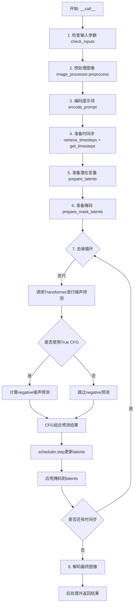
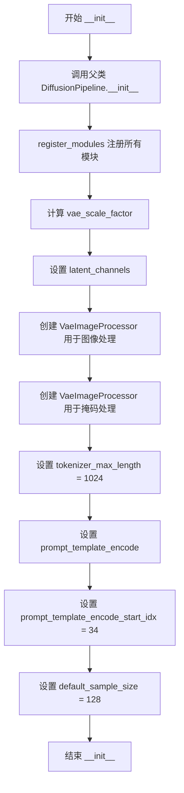
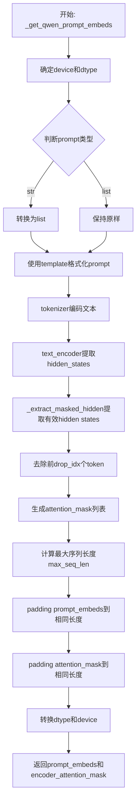
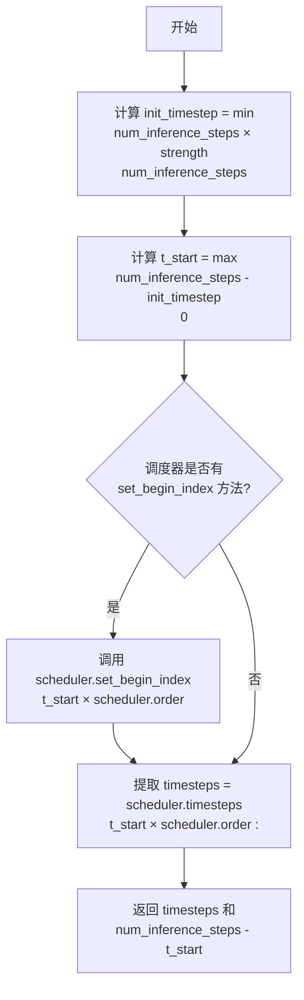
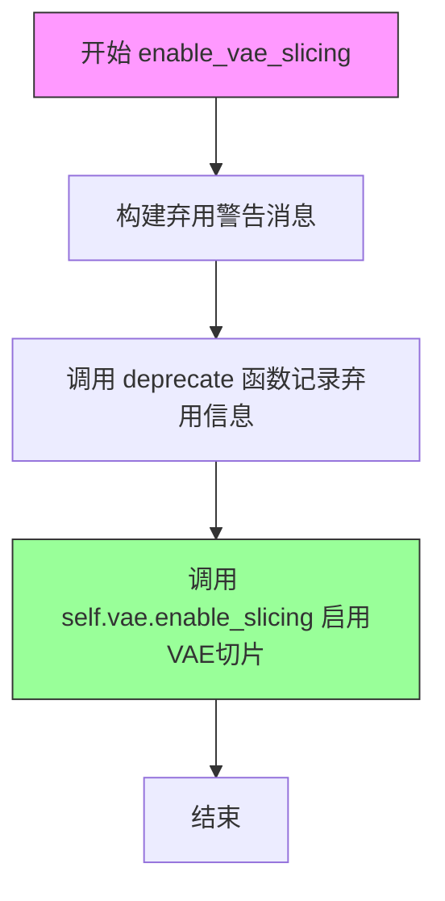
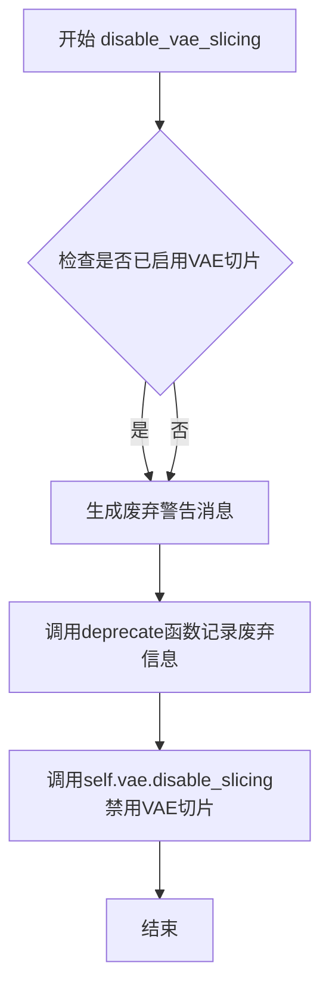
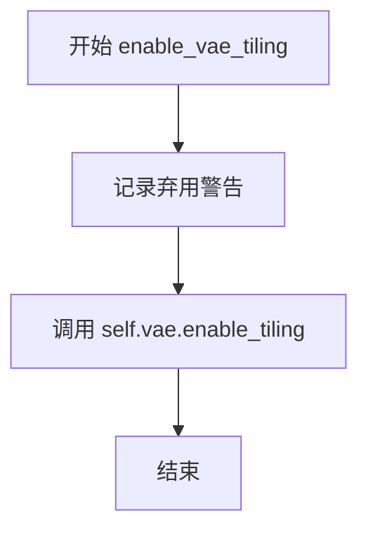
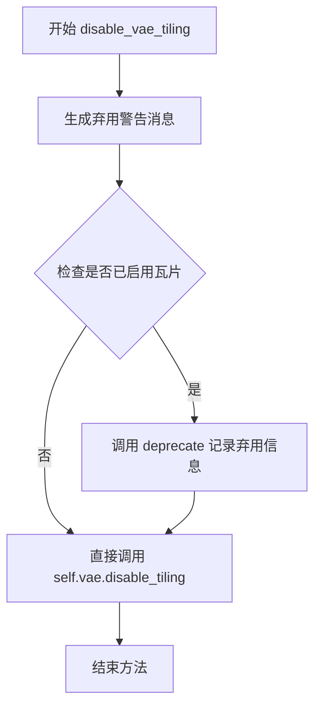
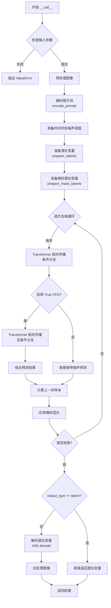

# `diffusers\src\diffusers\pipelines\qwenimage\pipeline_qwenimage_inpaint.py` 详细设计文档

QwenImageInpaintPipeline是一个基于Qwen2.5-VL模型的图像修复（Inpainting）扩散管道，通过文本提示引导实现图像指定区域的智能填充与重建。该Pipeline集成了Transformer去噪模型、VAE编解码器、文本编码器及流匹配调度器，支持条件CFG去噪、掩码处理、图像预处理等核心功能。

## 整体流程



## 类结构

```
DiffusionPipeline (基类)
├── QwenImageLoraLoaderMixin (Mixin类)
└── QwenImageInpaintPipeline (主类)
```

## 全局变量及字段


### `XLA_AVAILABLE`
    
标志位，表示torch_xla是否可用，用于支持XLA设备加速

类型：`bool`
    


### `logger`
    
模块级日志记录器，用于输出管道运行时的警告和信息

类型：`logging.Logger`
    


### `EXAMPLE_DOC_STRING`
    
包含QwenImageInpaintPipeline使用示例的文档字符串

类型：`str`
    


### `retrieve_latents`
    
全局函数，从encoder_output中提取潜在变量，支持sample和argmax两种模式

类型：`Callable`
    


### `calculate_shift`
    
全局函数，计算图像序列长度的调度偏移量，用于调整去噪计划

类型：`Callable`
    


### `retrieve_timesteps`
    
全局函数，从调度器获取时间步，支持自定义timesteps和sigmas参数

类型：`Callable`
    


### `QwenImageInpaintPipeline.model_cpu_offload_seq`
    
指定模型组件CPU卸载顺序的字符串，遵循text_encoder->transformer->vae顺序

类型：`str`
    


### `QwenImageInpaintPipeline._callback_tensor_inputs`
    
定义回调函数可访问的张量输入名称列表，包含latents和prompt_embeds

类型：`list[str]`
    


### `QwenImageInpaintPipeline.vae_scale_factor`
    
VAE缩放因子，用于计算潜在空间的尺寸，基于VAE的时间下采样层数

类型：`int`
    


### `QwenImageInpaintPipeline.latent_channels`
    
潜在变量的通道数，取决于VAE配置的z_dim维度

类型：`int`
    


### `QwenImageInpaintPipeline.image_processor`
    
图像预处理器，用于预处理输入图像和后处理生成结果

类型：`VaeImageProcessor`
    


### `QwenImageInpaintPipeline.mask_processor`
    
掩码专用处理器，包含二值化和灰度转换功能，用于处理修复掩码

类型：`VaeImageProcessor`
    


### `QwenImageInpaintPipeline.tokenizer_max_length`
    
分词器最大长度限制，设置为1024用于文本编码

类型：`int`
    


### `QwenImageInpaintPipeline.prompt_template_encode`
    
用于编码提示词的模板字符串，包含Qwen2.5-VL的系统消息和用户/助手格式

类型：`str`
    


### `QwenImageInpaintPipeline.prompt_template_encode_start_idx`
    
提示词编码时实际内容起始索引，用于跳过模板前缀

类型：`int`
    


### `QwenImageInpaintPipeline.default_sample_size`
    
默认采样尺寸基数，用于计算生成图像的默认高度和宽度

类型：`int`
    


### `QwenImageInpaintPipeline._guidance_scale`
    
运行时属性，存储引导尺度参数，用于指导蒸馏模型的生成

类型：`float | None`
    


### `QwenImageInpaintPipeline._attention_kwargs`
    
运行时属性，存储注意力处理器所需的额外关键字参数

类型：`dict[str, Any] | None`
    


### `QwenImageInpaintPipeline._num_timesteps`
    
运行时属性，记录当前推理过程的总时间步数

类型：`int | None`
    


### `QwenImageInpaintPipeline._current_timestep`
    
运行时属性，记录当前去噪循环正在执行的时间步

类型：`int | None`
    


### `QwenImageInpaintPipeline._interrupt`
    
运行时属性，中断标志，用于在推理过程中停止管道执行

类型：`bool`
    
    

## 全局函数及方法


### `retrieve_latents`

从编码器输出中提取潜在向量（latents）。该函数支持多种潜在向量获取方式：根据 `sample_mode` 参数从潜在分布中采样或取模态值，或者直接返回预计算的潜在向量。

参数：

- `encoder_output`：`torch.Tensor`，编码器输出对象，需包含 `latent_dist` 属性或 `latents` 属性
- `generator`：`torch.Generator | None`，可选的随机生成器，用于潜在分布采样时的随机性控制
- `sample_mode`：`str`，采样模式，值为 `"sample"`（从分布采样）或 `"argmax"`（取分布的 mode），默认值为 `"sample"`

返回值：`torch.Tensor`，提取出的潜在向量

#### 流程图

```mermaid
flowchart TD
    A[开始: retrieve_latents] --> B{encoder_output 是否有 latent_dist 属性?}
    B -- 是 --> C{sample_mode == 'sample'?}
    C -- 是 --> D[返回 encoder_output.latent_dist.sample<br/>/generator)]
    C -- 否 --> E{sample_mode == 'argmax'?}
    E -- 是 --> F[返回 encoder_output.latent_dist.mode<br/>/)]
    E -- 否 --> G{encoder_output 是否有 latents 属性?}
    B -- 否 --> G
    G -- 是 --> H[返回 encoder_output.latents]
    G -- 否 --> I[抛出 AttributeError]
```

#### 带注释源码

```python
def retrieve_latents(
    encoder_output: torch.Tensor, generator: torch.Generator | None = None, sample_mode: str = "sample"
):
    """
    从编码器输出中提取潜在向量（latents）。

    该函数支持三种获取潜在向量的方式：
    1. 如果编码器输出包含 latent_dist 属性且 sample_mode 为 "sample"，从分布中采样
    2. 如果编码器输出包含 latent_dist 属性且 sample_mode 为 "argmax"，取分布的 mode
    3. 如果编码器输出包含 latents 属性，直接返回该属性

    参数:
        encoder_output: 编码器输出对象，需包含 latent_dist 或 latents 属性
        generator: 可选的随机生成器，用于采样时控制随机性
        sample_mode: 采样模式，"sample" 或 "argmax"

    返回:
        提取出的潜在向量张量

    异常:
        AttributeError: 当无法从 encoder_output 中获取潜在向量时抛出
    """
    # 情况1：从潜在分布中采样
    if hasattr(encoder_output, "latent_dist") and sample_mode == "sample":
        # 调用 latent_dist 的 sample 方法，传入生成器以控制随机性
        return encoder_output.latent_dist.sample(generator)
    # 情况2：从潜在分布中取 mode（确定性模式）
    elif hasattr(encoder_output, "latent_dist") and sample_mode == "argmax":
        # 调用 latent_dist 的 mode 方法，返回分布的众数
        return encoder_output.latent_dist.mode()
    # 情况3：直接返回预计算的潜在向量
    elif hasattr(encoder_output, "latents"):
        return encoder_output.latents
    # 错误情况：无法识别潜在向量格式
    else:
        raise AttributeError("Could not access latents of provided encoder_output")
```


### `calculate_shift`

该函数用于根据图像序列长度计算 Flow Match 调度器所需的偏移量（shift parameter），通过线性插值在基础序列长度和最大序列长度之间动态调整偏移值，以确保不同分辨率图像生成时的噪声调度一致性。

参数：

- `image_seq_len`：`int`，输入图像的序列长度（即图像经VAE编码并patchify后的token数量）
- `base_seq_len`：`int`，基础序列长度，默认值为256，用于计算线性方程的斜率
- `max_seq_len`：`int`，最大序列长度，默认值为4096，用于计算线性方程的斜率
- `base_shift`：`float`，基础偏移量，默认值为0.5，对应基础序列长度时的偏移值
- `max_shift`：`float`，最大偏移量，默认值为1.15，对应最大序列长度时的偏移值

返回值：`float`，计算得到的偏移量 mu，用于 Flow Match 调度器的噪声调度

#### 流程图

```mermaid
flowchart TD
    A[开始] --> B[计算斜率 m<br/>m = (max_shift - base_shift) / (max_seq_len - base_seq_len)]
    B --> C[计算截距 b<br/>b = base_shift - m * base_seq_len]
    C --> D[计算偏移量 mu<br/>mu = image_seq_len * m + b]
    D --> E[返回 mu]
    
    B --> B1[((1.15 - 0.5) / (4096 - 256))]
    B1 --> B2[0.65 / 3840 ≈ 0.000169]
    
    C --> C1[0.5 - 0.000169 * 256]
    C1 --> C2[0.5 - 0.043264 ≈ 0.456736]
    
    D --> D1[image_seq_len * 0.000169 + 0.456736]
```

#### 带注释源码

```python
def calculate_shift(
    image_seq_len,              # int: 输入图像的序列长度（经VAE编码和patchify后的token数）
    base_seq_len: int = 256,    # int: 基础序列长度，默认256
    max_seq_len: int = 4096,    # int: 最大序列长度，默认4096
    base_shift: float = 0.5,    # float: 基础偏移量，对应base_seq_len时的偏移值
    max_shift: float = 1.15,    # float: 最大偏移量，对应max_seq_len时的偏移值
):
    """
    计算Flow Match调度器所需的偏移量（shift parameter）。
    
    该函数通过线性插值在不同分辨率的图像序列长度之间动态调整偏移量，
    确保噪声调度的一致性。分辨率越高，偏移量越大，以保持相同的噪声分布特性。
    
    Args:
        image_seq_len: 输入图像经VAE编码并patchify后的序列长度
        base_seq_len: 基础序列长度（默认256）
        max_seq_len: 最大序列长度（默认4096）
        base_shift: 基础偏移量（默认0.5）
        max_shift: 最大偏移量（默认1.15）
    
    Returns:
        float: 计算得到的偏移量mu，用于调度器的噪声预测
    """
    # 计算线性方程的斜率 m
    # m = (max_shift - base_shift) / (max_seq_len - base_seq_len)
    # 即 (1.15 - 0.5) / (4096 - 256) = 0.65 / 3840 ≈ 0.000169
    m = (max_shift - base_shift) / (max_seq_len - base_seq_len)
    
    # 计算线性方程的截距 b
    # b = base_shift - m * base_seq_len
    # 使用点斜式：y = mx + b => b = y - mx
    b = base_shift - m * base_seq_len
    
    # 计算给定图像序列长度对应的偏移量 mu
    # mu = image_seq_len * m + b
    # 这是一个线性函数：根据图像序列长度线性插值偏移量
    mu = image_seq_len * m + b
    
    return mu
```

#### 设计说明

该函数实现了线性插值逻辑，其数学本质是：

$$mu = \frac{max\_shift - base\_shift}{max\_seq\_len - base\_seq\_len} \times image\_seq\_len + \left(base\_shift - \frac{max\_shift - base\_shift}{max\_seq\_len - base\_seq\_len} \times base\_seq\_len\right)$$

简化后即：

$$mu = m \times image\_seq\_len + b$$

其中 $m$ 是斜率，$b$ 是截距。这个偏移量 `mu` 随后被传递给 Flow Match 调度器的 `set_timesteps` 方法，用于调整不同分辨率图像生成时的时间步调度策略，确保高分辨率图像生成时保持与低分辨率相似噪声分布特性。


### `retrieve_timesteps`

该函数是调度器的辅助函数，用于调用调度器的 `set_timesteps` 方法并从中获取时间步序列。支持自定义时间步或 sigma 值，并处理不同调度器可能不支持自定义参数的情况。

参数：

-  `scheduler`：`SchedulerMixin`，用于获取时间步的调度器实例
-  `num_inference_steps`：`int | None`，生成样本时使用的扩散步数，若使用则 `timesteps` 必须为 `None`
-  `device`：`str | torch.device | None`，时间步要移动到的设备，若为 `None` 则不移动
-  `timesteps`：`list[int] | None`，自定义时间步，用于覆盖调度器的时间步间隔策略，若传入则 `num_inference_steps` 和 `sigmas` 必须为 `None`
-  `sigmas`：`list[float] | None`，自定义 sigmas，用于覆盖调度器的时间步间隔策略，若传入则 `num_inference_steps` 和 `timesteps` 必须为 `None`
-  `**kwargs`：任意关键字参数，将传递给 `scheduler.set_timesteps`

返回值：`tuple[torch.Tensor, int]`，第一个元素是调度器的时间步序列，第二个元素是推理步数

#### 流程图

```mermaid
flowchart TD
    A[开始] --> B{检查参数组合}
    B --> C{timesteps 和 sigmas 都非空?}
    C -->|是| D[抛出 ValueError: 只能选择 timesteps 或 sigmas 之一]
    C -->|否| E{timesteps 非空?}
    E -->|是| F{调度器是否支持 timesteps?}
    E -->|否| G{sigmas 非空?}
    F -->|否| H[抛出 ValueError: 当前调度器不支持自定义 timesteps]
    F -->|是| I[调用 scheduler.set_timesteps<br/>参数: timesteps=timesteps, device=device]
    I --> J[获取 scheduler.timesteps]
    J --> K[计算 num_inference_steps = len(timesteps)]
    G -->|是| L{调度器是否支持 sigmas?}
    L -->|否| M[抛出 ValueError: 当前调度器不支持自定义 sigmas]
    L -->|是| N[调用 scheduler.set_timesteps<br/>参数: sigmas=sigmas, device=device]
    N --> O[获取 scheduler.timesteps]
    O --> P[计算 num_inference_steps = len(timesteps)]
    G -->|否| Q[调用 scheduler.set_timesteps<br/>参数: num_inference_steps, device=device]
    Q --> R[获取 scheduler.timesteps]
    R --> S[num_inference_steps 保持原值]
    K --> T[返回 timesteps, num_inference_steps]
    P --> T
    S --> T
    T --> U[结束]
```

#### 带注释源码

```python
# Copied from diffusers.pipelines.stable_diffusion.pipeline_stable_diffusion.retrieve_timesteps
def retrieve_timesteps(
    scheduler,  # 调度器对象，需要支持 set_timesteps 方法
    num_inference_steps: int | None = None,  # 推理步数，若提供则 timesteps 必须为 None
    device: str | torch.device | None = None,  # 可选，指定时间步要移动到的设备
    timesteps: list[int] | None = None,  # 可选，自定义时间步列表
    sigmas: list[float] | None = None,  # 可选，自定义 sigma 列表
    **kwargs,  # 额外参数，传递给 scheduler.set_timesteps
):
    r"""
    Calls the scheduler's `set_timesteps` method and retrieves timesteps from the scheduler after the call. Handles
    custom timesteps. Any kwargs will be supplied to `scheduler.set_timesteps`.

    Args:
        scheduler (`SchedulerMixin`):
            The scheduler to get timesteps from.
        num_inference_steps (`int`):
            The number of diffusion steps used when generating samples with a pre-trained model. If used, `timesteps`
            must be `None`.
        device (`str` or `torch.device`, *optional*):
            The device to which the timesteps should be moved to. If `None`, the timesteps are not moved.
        timesteps (`list[int]`, *optional*):
            Custom timesteps used to override the timestep spacing strategy of the scheduler. If `timesteps` is passed,
            `num_inference_steps` and `sigmas` must be `None`.
        sigmas (`list[float]`, *optional*):
            Custom sigmas used to override the timestep spacing strategy of the scheduler. If `sigmas` is passed,
            `num_inference_steps` and `timesteps` must be `None`.

    Returns:
        `tuple[torch.Tensor, int]`: A tuple where the first element is the timestep schedule from the scheduler and the
        second element is the number of inference steps.
    """
    # 校验：timesteps 和 sigmas 不能同时提供
    if timesteps is not None and sigmas is not None:
        raise ValueError("Only one of `timesteps` or `sigmas` can be passed. Please choose one to set custom values")
    
    # 处理自定义 timesteps 的情况
    if timesteps is not None:
        # 检查调度器的 set_timesteps 方法是否支持 timesteps 参数
        accepts_timesteps = "timesteps" in set(inspect.signature(scheduler.set_timesteps).parameters.keys())
        if not accepts_timesteps:
            raise ValueError(
                f"The current scheduler class {scheduler.__class__}'s `set_timesteps` does not support custom"
                f" timestep schedules. Please check whether you are using the correct scheduler."
            )
        # 调用调度器的 set_timesteps 方法
        scheduler.set_timesteps(timesteps=timesteps, device=device, **kwargs)
        # 从调度器获取更新后的 timesteps
        timesteps = scheduler.timesteps
        # 计算实际的推理步数
        num_inference_steps = len(timesteps)
    
    # 处理自定义 sigmas 的情况
    elif sigmas is not None:
        # 检查调度器的 set_timesteps 方法是否支持 sigmas 参数
        accept_sigmas = "sigmas" in set(inspect.signature(scheduler.set_timesteps).parameters.keys())
        if not accept_sigmas:
            raise ValueError(
                f"The current scheduler class {scheduler.__class__}'s `set_timesteps` does not support custom"
                f" sigmas schedules. Please check whether you are using the correct scheduler."
            )
        # 调用调度器的 set_timesteps 方法
        scheduler.set_timesteps(sigmas=sigmas, device=device, **kwargs)
        # 从调度器获取更新后的 timesteps
        timesteps = scheduler.timesteps
        # 计算实际的推理步数
        num_inference_steps = len(timesteps)
    
    # 处理默认情况：使用 num_inference_steps
    else:
        scheduler.set_timesteps(num_inference_steps, device=device, **kwargs)
        timesteps = scheduler.timesteps
    
    # 返回时间步序列和推理步数
    return timesteps, num_inference_steps
```


### QwenImageInpaintPipeline.__init__

该方法是 QwenImageInpaintPipeline 类的构造函数，负责初始化图像修复管道所需的所有核心组件，包括调度器、VAE模型、文本编码器、分词器和Transformer模型，并配置图像处理器、掩码处理器和相关参数。

参数：

-  `scheduler`：`FlowMatchEulerDiscreteScheduler`，用于在去噪过程中调度时间步的调度器
-  `vae`：`AutoencoderKLQwenImage`，用于编码和解码图像的变分自编码器模型
-  `text_encoder`：`Qwen2_5_VLForConditionalGeneration`，用于将文本提示编码为嵌入向量的Qwen2.5-VL文本编码器
-  `tokenizer`：`Qwen2Tokenizer`，用于将文本分词的Qwen分词器
-  `transformer`：`QwenImageTransformer2DModel`，用于去噪图像潜在表示的条件Transformer模型

返回值：`None`，该方法为构造函数，不返回任何值

#### 流程图



#### 带注释源码

```python
def __init__(
    self,
    scheduler: FlowMatchEulerDiscreteScheduler,
    vae: AutoencoderKLQwenImage,
    text_encoder: Qwen2_5_VLForConditionalGeneration,
    tokenizer: Qwen2Tokenizer,
    transformer: QwenImageTransformer2DModel,
):
    """
    初始化 QwenImageInpaintPipeline 管道
    
    参数:
        scheduler: FlowMatchEulerDiscreteScheduler调度器，用于去噪过程的时间步调度
        vae: AutoencoderKLQwenImage VAE模型，用于图像编码/解码
        text_encoder: Qwen2_5_VLForConditionalGeneration 文本编码器
        tokenizer: Qwen2Tokenizer 分词器
        transformer: QwenImageTransformer2DModel Transformer去噪模型
    """
    # 调用父类DiffusionPipeline的初始化方法
    super().__init__()

    # 将所有模块注册到管道中，使其可通过self.xxx访问
    self.register_modules(
        vae=vae,
        text_encoder=text_encoder,
        tokenizer=tokenizer,
        transformer=transformer,
        scheduler=scheduler,
    )
    
    # 计算VAE的缩放因子
    # 如果vae存在且有temporal_downsample属性，计算2的幂次；否则默认为8
    # QwenImage的latents被转换为2x2 patches并打包，因此潜在宽度和高度必须能被patch size整除
    # 所以vae_scale factor需要乘以patch size来考虑这一点
    self.vae_scale_factor = 2 ** len(self.vae.temporal_downsample) if getattr(self, "vae", None) else 8
    
    # 设置潜在通道数，从VAE配置中获取z_dim
    self.latent_channels = self.vae.config.z_dim if getattr(self, "vae", None) else 16
    
    # 创建图像处理器，用于预处理和后处理图像
    self.image_processor = VaeImageProcessor(
        vae_scale_factor=self.vae_scale_factor * 2, 
        vae_latent_channels=self.latent_channels
    )
    
    # 创建掩码处理器，用于处理修复任务的掩码
    # do_normalize=False: 不进行归一化
    # do_binarize=True: 进行二值化处理
    # do_convert_grayscale=True: 转换为灰度图
    self.mask_processor = VaeImageProcessor(
        vae_scale_factor=self.vae_scale_factor * 2,
        vae_latent_channels=self.latent_channels,
        do_normalize=False,
        do_binarize=True,
        do_convert_grayscale=True,
    )
    
    # 设置分词器的最大长度
    self.tokenizer_max_length = 1024
    
    # 设置提示词模板，用于编码提示词
    # 该模板定义了系统消息和用户/助手的对话格式
    self.prompt_template_encode = "<|im_start|>system\nDescribe the image by detailing the color, shape, size, texture, quantity, text, spatial relationships of the objects and background:<|im_end|>\n<|im_start|>user\n{}<|im_end|>\n<|im_start|>assistant\n"
    
    # 提示词模板编码的起始索引，用于裁剪嵌入
    self.prompt_template_encode_start_idx = 34
    
    # 默认采样大小，用于确定生成图像的默认尺寸
    self.default_sample_size = 128
```


### `QwenImageInpaintPipeline._extract_masked_hidden`

该方法用于从隐藏状态中根据掩码提取有效令牌对应的隐藏向量，并将结果按批次维度分割成列表返回。在处理变长序列（如文本提示）时，需要根据 attention_mask 筛选出实际有效的 token 隐藏状态，以便后续模块使用。

参数：

- `self`：类的实例方法隐含参数，指向 `QwenImageInpaintPipeline` 类的实例。
- `hidden_states`：`torch.Tensor`，形状为 `[batch_size, seq_len, hidden_dim]` 的隐藏状态张量，包含模型编码的文本嵌入表示。
- `mask`：`torch.Tensor`，形状为 `[batch_size, seq_len]` 的注意力掩码张量，值为 0 或 1，用于标识有效 token 位置。

返回值：`list[torch.Tensor]`，按批次维度分割后的隐藏状态列表，每个元素是对应样本的有效 token 隐藏状态，形状为 `[valid_length_i, hidden_dim]`。

#### 流程图

```mermaid
flowchart TD
    A[开始] --> B[将 mask 转换为布尔类型 bool_mask<br/>mask.bool&#40;&#41;]
    B --> C[计算每个batch的有效长度 valid_lengths<br/>bool_mask.sum&#40;dim=1&#41;]
    C --> D[使用布尔索引筛选隐藏状态<br/>hidden_states[bool_mask]]
    D --> E[按有效长度分割张量<br/>torch.split&#40;selected, valid_lengths.tolist&#40;&#41;, dim=0&#41;]
    E --> F[返回分割结果列表]
```

#### 带注释源码

```python
# Copied from diffusers.pipelines.qwenimage.pipeline_qwenimage.QwenImagePipeline._extract_masked_hidden
def _extract_masked_hidden(self, hidden_states: torch.Tensor, mask: torch.Tensor):
    """
    从隐藏状态中根据掩码提取有效令牌对应的隐藏向量，并按批次分割返回。

    参数:
        hidden_states: 形状为 [batch_size, seq_len, hidden_dim] 的隐藏状态张量
        mask: 形状为 [batch_size, seq_len] 的注意力掩码，0/1 值

    返回:
        按批次分割的隐藏状态列表，每个元素形状为 [valid_length_i, hidden_dim]
    """
    # 第一步：将掩码转换为布尔类型张量，用于索引操作
    # 例如：将 [[0,1,1], [1,1,0]] 转换为 [[False, True, True], [True, True, False]]
    bool_mask = mask.bool()
    
    # 第二步：沿序列维度（dim=1）求和，获取每个batch样本的有效token数量
    # 例如：[[False, True, True], [True, True, False]] -> [2, 2]
    valid_lengths = bool_mask.sum(dim=1)
    
    # 第三步：使用布尔索引从隐藏状态中选取有效位置的向量
    # 这是一个扁平化操作，将所有batch的有效token合并到一起
    selected = hidden_states[bool_mask]
    
    # 第四步：按每个batch的有效长度将张量分割成列表
    # torch.split 会按照 valid_lengths 中的值将 selected 分割成多个子张量
    split_result = torch.split(selected, valid_lengths.tolist(), dim=0)

    return split_result
```


### `QwenImageInpaintPipeline._get_qwen_prompt_embeds`

该方法负责将文本提示（prompt）转换为文本嵌入向量（prompt embeds）和注意力掩码（attention mask），供后续的图像生成 transformer 模型使用。

参数：

- `prompt`：`str | list[str]`，输入的文本提示，可以是单个字符串或字符串列表
- `device`：`torch.device | None`，指定计算设备，默认为 `self._execution_device`
- `dtype`：`torch.dtype | None`，指定数据类型，默认为 `self.text_encoder.dtype`

返回值：`tuple[torch.Tensor, torch.Tensor]`，返回两个张量：
- 第一个是 `prompt_embeds`，类型为 `torch.Tensor`，形状为 `[batch_size, seq_len, hidden_dim]`，表示文本嵌入向量
- 第二个是 `encoder_attention_mask`，类型为 `torch.Tensor`，形状为 `[batch_size, seq_len]`，用于表示有效的 token 位置

#### 流程图



#### 带注释源码

```python
def _get_qwen_prompt_embeds(
    self,
    prompt: str | list[str] = None,
    device: torch.device | None = None,
    dtype: torch.dtype | None = None,
):
    """
    将文本提示转换为文本嵌入向量和注意力掩码
    
    参数:
        prompt: 输入的文本提示，支持单个字符串或字符串列表
        device: 计算设备，如果为None则使用self._execution_device
        dtype: 数据类型，如果为None则使用self.text_encoder.dtype
    
    返回:
        tuple: (prompt_embeds, encoder_attention_mask)
            - prompt_embeds: 文本嵌入向量，形状为[batch_size, seq_len, hidden_dim]
            - encoder_attention_mask: 注意力掩码，形状为[batch_size, seq_len]
    """
    # 确定device和dtype，优先使用传入的参数，否则使用默认值
    device = device or self._execution_device
    dtype = dtype or self.text_encoder.dtype

    # 标准化输入：将单个字符串转换为列表，统一处理方式
    prompt = [prompt] if isinstance(prompt, str) else prompt

    # 获取prompt模板和需要丢弃的起始索引
    # template用于添加系统提示和用户提示的格式
    template = self.prompt_template_encode
    drop_idx = self.prompt_template_encode_start_idx
    
    # 使用模板格式化每个prompt
    # 在文本前后添加特定的标记以适配Qwen2.5-VL模型
    txt = [template.format(e) for e in prompt]
    
    # 使用tokenizer将文本转换为token ids
    # max_length加上drop_idx是为了在去除前缀后保持原始最大长度
    txt_tokens = self.tokenizer(
        txt, 
        max_length=self.tokenizer_max_length + drop_idx, 
        padding=True, 
        truncation=True, 
        return_tensors="pt"
    ).to(device)
    
    # 使用text_encoder提取文本的hidden states
    # output_hidden_states=True确保返回所有层的hidden states
    encoder_hidden_states = self.text_encoder(
        input_ids=txt_tokens.input_ids,
        attention_mask=txt_tokens.attention_mask,
        output_hidden_states=True,
    )
    
    # 获取最后一层的hidden states作为最终的文本表示
    hidden_states = encoder_hidden_states.hidden_states[-1]
    
    # 根据attention_mask提取有效的hidden states
    # 这会移除padding部分的hidden states
    split_hidden_states = self._extract_masked_hidden(hidden_states, txt_tokens.attention_mask)
    
    # 去除前缀部分（系统提示部分）
    # drop_idx=34对应于模板中system prompt的长度
    split_hidden_states = [e[drop_idx:] for e in split_hidden_states]
    
    # 为每个序列生成attention mask（全1，因为已去除padding）
    attn_mask_list = [torch.ones(e.size(0), dtype=torch.long, device=e.device) for e in split_hidden_states]
    
    # 计算最大序列长度，用于padding对齐
    max_seq_len = max([e.size(0) for e in split_hidden_states])
    
    # 将hidden states padding到相同长度
    # 长度不足的序列在末尾添加零向量
    prompt_embeds = torch.stack(
        [torch.cat([u, u.new_zeros(max_seq_len - u.size(0), u.size(1))]) for u in split_hidden_states]
    )
    
    # 将attention mask padding到相同长度
    encoder_attention_mask = torch.stack(
        [torch.cat([u, u.new_zeros(max_seq_len - u.size(0))]) for u in attn_mask_list]
    )

    # 转换到指定的dtype和device
    prompt_embeds = prompt_embeds.to(dtype=dtype, device=device)

    return prompt_embeds, encoder_attention_mask
```


### `QwenImageInpaintPipeline._encode_vae_image`

该方法负责将输入的图像张量编码为 VAE 潜在空间中的表示，并对潜在向量进行标准化处理（减去均值并除以标准差），以确保潜在表示符合 VAE 模型的潜在空间分布特性。

参数：

-  `self`：`QwenImageInpaintPipeline` 实例，方法所属的管道对象
-  `image`：`torch.Tensor`，输入图像张量，形状为 `[B, C, H, W]`，值为 `[0, 1]` 范围内的图像数据
-  `generator`：`torch.Generator` 或 `list[torch.Generator]`，用于生成随机数的 PyTorch 生成器，用于潜在空间采样的随机性控制

返回值：`torch.Tensor`，返回标准化后的图像潜在表示，形状为 `[B, z_dim, 1, H', W']`，其中 `z_dim` 是 VAE 的潜在通道数

#### 流程图

```mermaid
flowchart TD
    A[开始: _encode_vae_image] --> B{generator是否为list}
    B -->|是| C[遍历图像批次]
    C --> D[对单张图像调用vae.encode]
    D --> E[使用对应generator采样潜在分布]
    E --> F[收集所有图像的latents]
    F --> G[在维度0上拼接所有latents]
    B -->|否| H[直接对整个图像批次调用vae.encode]
    H --> I[使用单个generator采样潜在分布]
    G --> J[获取VAE配置的latents_mean]
    I --> J
    J --> K[构建mean张量形状]
    K --> L[获取VAE配置的latents_std]
    L --> M[构建std张量形状]
    M --> N[计算: (image_latents - mean) * std]
    N --> O[返回标准化后的image_latents]
```

#### 带注释源码

```python
def _encode_vae_image(self, image: torch.Tensor, generator: torch.Generator):
    """
    将输入图像编码为VAE潜在空间表示并进行标准化处理
    
    Args:
        image: 输入图像张量，形状为 [B, C, H, W]，值范围 [0, 1]
        generator: PyTorch随机生成器，用于潜在空间采样
    
    Returns:
        标准化后的图像潜在表示，形状为 [B, z_dim, 1, H', W']
    """
    
    # 判断generator是否为列表（对应批量生成场景）
    if isinstance(generator, list):
        # 逐个处理图像批次中的每张图像，使用对应的generator
        image_latents = [
            retrieve_latents(self.vae.encode(image[i : i + 1]), generator=generator[i])
            for i in range(image.shape[0])
        ]
        # 将所有图像的潜在表示在批次维度上拼接
        image_latents = torch.cat(image_latents, dim=0)
    else:
        # 整个图像批次使用同一个generator进行编码
        image_latents = retrieve_latents(self.vae.encode(image), generator=generator)

    # 从VAE配置中获取潜在空间均值，并调整形状为 [1, z_dim, 1, 1, 1]
    # 这样可以正确地与批次维度的潜在表示进行广播运算
    latents_mean = (
        torch.tensor(self.vae.config.latents_mean)
        .view(1, self.vae.config.z_dim, 1, 1, 1)
        .to(image_latents.device, image_latents.dtype)
    )
    
    # 从VAE配置中获取潜在空间标准差，并调整形状
    # 这里取倒数，即 1/std，这样后续可以直接乘法而不需要除法
    latents_std = 1.0 / torch.tensor(self.vae.config.latents_std).view(1, self.vae.config.z_dim, 1, 1, 1).to(
        image_latents.device, image_latents.dtype
    )

    # 标准化处理：先减去均值，再乘以标准差的倒数（即除以std）
    # 这等价于: (image_latents - mean) / std
    image_latents = (image_latents - latents_mean) * latents_std

    return image_latents
```


### `QwenImageInpaintPipeline.get_timesteps`

该方法用于根据推理步数和强度（strength）参数调整去噪调度器的时间步（timesteps），以实现图像修复任务中的噪声控制和图像重建。

参数：

- `num_inference_steps`：`int`，推理过程中使用的总步数
- `strength`：`float`，强度参数，范围在 0 到 1 之间，用于控制添加的噪声量和图像重建的程度
- `device`：`torch.device`，计算设备，用于确保调度器的时间步在正确的设备上

返回值：`tuple[torch.Tensor, int]`，第一个元素是调整后的时间步张量，第二个元素是实际执行的推理步数

#### 流程图



#### 带注释源码

```
# Copied from diffusers.pipelines.stable_diffusion_3.pipeline_stable_diffusion_3_img2img.StableDiffusion3Img2ImgPipeline.get_timesteps
def get_timesteps(self, num_inference_steps, strength, device):
    # 根据强度参数计算实际使用的初始时间步数
    # strength 越高，加入的噪声越多，需要的推理步数越少
    init_timestep = min(num_inference_steps * strength, num_inference_steps)

    # 计算起始索引，用于从完整的时间步序列中截取需要的时间步
    # 如果 strength=1，则 t_start=0，使用全部时间步
    # 如果 strength<1，则跳过前面的时间步，从中间开始
    t_start = int(max(num_inference_steps - init_timestep, 0))
    
    # 从调度器的时间步序列中提取调整后的时间步
    # 乘以 scheduler.order 是因为某些调度器使用高阶方法
    timesteps = self.scheduler.timesteps[t_start * self.scheduler.order :]
    
    # 如果调度器支持设置起始索引，则设置它
    # 这对于某些调度器的正确初始化是必要的
    if hasattr(self.scheduler, "set_begin_index"):
        self.scheduler.set_begin_index(t_start * self.scheduler.order)

    # 返回调整后的时间步和实际执行的推理步数
    return timesteps, num_inference_steps - t_start
```


### `QwenImageInpaintPipeline.encode_prompt`

该方法负责将文本提示词（prompt）编码为模型可用的文本嵌入向量（prompt embeddings）和对应的注意力掩码（attention mask），支持预生成的嵌入向量复用，并根据每个提示词生成的图像数量进行批量扩展。

参数：

- `prompt`：`str | list[str]`，要编码的文本提示词，可以是单个字符串或字符串列表
- `device`：`torch.device | None`，指定用于计算的 PyTorch 设备，默认为执行设备
- `num_images_per_prompt`：`int = 1`，每个提示词需要生成的图像数量，用于扩展嵌入维度
- `prompt_embeds`：`torch.Tensor | None`，预生成的文本嵌入向量，可选，用于避免重复编码
- `prompt_embeds_mask`：`torch.Tensor | None`，预生成的文本嵌入注意力掩码，与 prompt_embeds 配合使用
- `max_sequence_length`：`int = 1024`，文本序列的最大长度限制

返回值：`tuple[torch.Tensor, torch.Tensor | None]`，返回包含文本嵌入向量和注意力掩码的元组，其中第一个元素为 prompt_embeds，第二个元素为 prompt_embeds_mask（可能为 None）

#### 流程图

```mermaid
flowchart TD
    A[encode_prompt 开始] --> B{device 是否为 None?}
    B -->|是| C[使用 _execution_device]
    B -->|否| D[使用传入的 device]
    C --> E{判断 prompt 类型}
    D --> E
    E -->|str| F[将 prompt 转为列表]
    E -->|list| G[保持列表]
    F --> H
    G --> H{判断 prompt_embeds 是否为 None?}
    H -->|是| I[调用 _get_qwen_prompt_embeds 生成嵌入]
    H -->|否| J[使用传入的 prompt_embeds]
    I --> K[截取序列长度: prompt_embeds[:, :max_sequence_length]]
    J --> K
    K --> L[获取序列长度 seq_len]
    L --> M[重复 prompt_embeds: batch_size * num_images_per_prompt]
    M --> N{判断 prompt_embeds_mask 是否为 None?}
    N -->|否| O[截断并重复 mask]
    N -->|是| P
    O --> Q{mask 是否全为 True?}
    Q -->|是| R[将 mask 设为 None]
    Q -->|否| P
    R --> S[返回 prompt_embeds 和 prompt_embeds_mask]
    P --> S
```

#### 带注释源码

```python
def encode_prompt(
    self,
    prompt: str | list[str],
    device: torch.device | None = None,
    num_images_per_prompt: int = 1,
    prompt_embeds: torch.Tensor | None = None,
    prompt_embeds_mask: torch.Tensor | None = None,
    max_sequence_length: int = 1024,
):
    r"""
    编码文本提示词为嵌入向量和注意力掩码

    Args:
        prompt: 要编码的提示词，字符串或字符串列表
        device: torch 设备，默认为执行设备
        num_images_per_prompt: 每个提示词生成的图像数量
        prompt_embeds: 预生成的提示词嵌入，可选
    """
    # 如果未指定设备，则使用管道默认的执行设备
    device = device or self._execution_device

    # 标准化 prompt 为列表格式：如果是单个字符串则转为单元素列表
    prompt = [prompt] if isinstance(prompt, str) else prompt
    # 确定批次大小：如果提供了 prompt_embeds 则使用其维度，否则使用 prompt 列表长度
    batch_size = len(prompt) if prompt_embeds is None else prompt_embeds.shape[0]

    # 如果未提供预生成的嵌入，则调用内部方法从 prompt 生成
    if prompt_embeds is None:
        prompt_embeds, prompt_embeds_mask = self._get_qwen_prompt_embeds(prompt, device)

    # 截断嵌入序列到指定的最大序列长度
    prompt_embeds = prompt_embeds[:, :max_sequence_length]
    # 获取截断后的序列长度
    _, seq_len, _ = prompt_embeds.shape
    # 沿批次维度重复嵌入，以支持每个 prompt 生成多张图像
    prompt_embeds = prompt_embeds.repeat(1, num_images_per_prompt, 1)
    # 重塑为最终的批次维度：(batch_size * num_images_per_prompt, seq_len, hidden_dim)
    prompt_embeds = prompt_embeds.view(batch_size * num_images_per_prompt, seq_len, -1)

    # 处理注意力掩码（如果提供）
    if prompt_embeds_mask is not None:
        # 同样截断和重复掩码
        prompt_embeds_mask = prompt_embeds_mask[:, :max_sequence_length]
        prompt_embeds_mask = prompt_embeds_mask.repeat(1, num_images_per_prompt, 1)
        prompt_embeds_mask = prompt_embeds_mask.view(batch_size * num_images_per_prompt, seq_len)

        # 如果掩码全部为 True（有效），则设为 None 以优化处理
        if prompt_embeds_mask.all():
            prompt_embeds_mask = None

    # 返回编码后的嵌入和掩码
    return prompt_embeds, prompt_embeds_mask
```


### `QwenImageInpaintPipeline.check_inputs`

该方法用于验证图像修复管道的输入参数是否合法，包括检查强度值、图像尺寸、提示词与嵌入的互斥关系、回调张量输入以及裁剪掩码等关键约束条件。

参数：

- `self`：实例本身
- `prompt`：`str | list[str] | None`，用户输入的文本提示，用于引导图像生成
- `image`：`PipelineImageInput`，待修复的原始图像
- `mask_image`：`PipelineImageInput`，用于指定修复区域的掩码图像
- `strength`：`float`，控制图像修复强度的参数，取值范围为[0.0, 1.0]
- `height`：`int`，生成图像的高度（像素）
- `width`：`int`，生成图像的宽度（像素）
- `output_type`：`str`，输出图像的格式类型
- `negative_prompt`：`str | list[str] | None`，反向提示词，用于引导排除的内容
- `prompt_embeds`：`torch.Tensor | None`，预生成的文本嵌入向量
- `negative_prompt_embeds`：`torch.Tensor | None`，预生成的反向文本嵌入向量
- `prompt_embeds_mask`：`torch.Tensor | None`，文本嵌入的注意力掩码
- `negative_prompt_embeds_mask`：`torch.Tensor | None`，反向文本嵌入的注意力掩码
- `callback_on_step_end_tensor_inputs`：`list[str] | None`，在每步结束时需要回调的张量输入列表
- `padding_mask_crop`：`int | None`，图像裁剪的边缘填充大小
- `max_sequence_length`：`int | None`，最大序列长度限制

返回值：`None`，该方法不返回任何值，仅通过抛出异常来指示输入错误。

#### 流程图

```mermaid
flowchart TD
    A[开始 check_inputs] --> B{strength ∈ [0, 1]?}
    B -->|否| C[抛出 ValueError: strength超出范围]
    B -->|是| D{height和width能被<br/>vae_scale_factor*2整除?}
    D -->|否| E[发出 logger.warning 警告]
    D -->|是| F{callback_on_step_end_tensor_inputs<br/>中的key都在<br/>_callback_tensor_inputs中?}
    F -->|否| G[抛出 ValueError: 无效的callback输入]
    F -->|是| H{prompt和prompt_embeds<br/>同时存在?}
    H -->|是| I[抛出 ValueError: 只能传一个]
    H -->|否| J{prompt和prompt_embeds<br/>都不存在?}
    J -->|是| K[抛出 ValueError: 必须传一个]
    J -->|否| L{negative_prompt和<br/>negative_prompt_embeds<br/>同时存在?}
    L -->|是| M[抛出 ValueError: 只能传一个]
    L -->|否| N{padding_mask_crop<br/>不为None?}
    N -->|是| O{image是PIL.Image?}
    O -->|否| P[抛出 ValueError: 图像必须是PIL]
    O -->|是| Q{mask_image是PIL.Image?}
    Q -->|否| R[抛出 ValueError: mask必须是PIL]
    Q -->|是| S{output_type == 'pil'?]
    S -->|否| T[抛出 ValueError: crop模式下必须是pil]
    S -->|是| U{max_sequence_length > 1024?}
    N -->|否| U
    U -->|是| V[抛出 ValueError: 序列长度超限]
    U -->|否| W[验证通过，方法结束]
    C --> W
    E --> F
    I --> W
    K --> W
    M --> W
    P --> W
    R --> W
    T --> W
    V --> W
```

#### 带注释源码

```python
def check_inputs(
    self,
    prompt,                     # 文本提示词：str或list[str]或None
    image,                      # 输入图像：PipelineImageInput类型
    mask_image,                # 掩码图像：PipelineImageInput类型
    strength,                  # 修复强度：float，取值[0.0, 1.0]
    height,                    # 输出高度：int（像素）
    width,                     # 输出宽度：int（像素）
    output_type,               # 输出类型：str（如'pil'）
    negative_prompt=None,      # 负向提示词：可选
    prompt_embeds=None,        # 预计算提示词嵌入：可选
    negative_prompt_embeds=None,  # 预计算负向嵌入：可选
    prompt_embeds_mask=None,   # 提示词嵌入的attention mask：可选
    negative_prompt_embeds_mask=None,  # 负向嵌入的mask：可选
    callback_on_step_end_tensor_inputs=None,  # 回调张量输入列表：可选
    padding_mask_crop=None,    # 裁剪填充大小：可选int
    max_sequence_length=None,  # 最大序列长度：可选int
):
    # =====================================================
    # 1. 检查strength参数是否在有效范围内[0.0, 1.0]
    # =====================================================
    if strength < 0 or strength > 1:
        raise ValueError(f"The value of strength should in [0.0, 1.0] but is {strength}")

    # =====================================================
    # 2. 检查图像尺寸是否满足VAE的压缩和packing要求
    #    要求height和width能被vae_scale_factor * 2整除
    #    因为latent空间有2x2的patch packing
    # =====================================================
    if height % (self.vae_scale_factor * 2) != 0 or width % (self.vae_scale_factor * 2) != 0:
        logger.warning(
            f"`height` and `width` have to be divisible by {self.vae_scale_factor * 2} but are {height} and {width}. Dimensions will be resized accordingly"
        )

    # =====================================================
    # 3. 验证回调张量输入是否在允许的范围内
    #    callback_on_step_end_tensor_inputs必须全部来自
    #    self._callback_tensor_inputs（["latents", "prompt_embeds"]）
    # =====================================================
    if callback_on_step_end_tensor_inputs is not None and not all(
        k in self._callback_tensor_inputs for k in callback_on_step_end_tensor_inputs
    ):
        raise ValueError(
            f"`callback_on_step_end_tensor_inputs` has to be in {self._callback_tensor_inputs}, but found {[k for k in callback_on_step_end_tensor_inputs if k not in self._callback_tensor_inputs]}"
        )

    # =====================================================
    # 4. 检查prompt和prompt_embeds的互斥关系
    #    两者不能同时提供，必须二选一
    # =====================================================
    if prompt is not None and prompt_embeds is not None:
        raise ValueError(
            f"Cannot forward both `prompt`: {prompt} and `prompt_embeds`: {prompt_embeds}. Please make sure to"
            " only forward one of the two."
        )
    # =====================================================
    # 5. 检查至少提供一个有效的输入
    #    prompt和prompt_embeds不能同时为空
    # =====================================================
    elif prompt is None and prompt_embeds is None:
        raise ValueError(
            "Provide either `prompt` or `prompt_embeds`. Cannot leave both `prompt` and `prompt_embeds` undefined."
        )
    # =====================================================
    # 6. 验证prompt的类型是否合法
    #    必须是str或list[str]类型
    # =====================================================
    elif prompt is not None and (not isinstance(prompt, str) and not isinstance(prompt, list)):
        raise ValueError(f"`prompt` has to be of type `str` or `list` but is {type(prompt)}")

    # =====================================================
    # 7. 检查negative_prompt和negative_prompt_embeds的互斥关系
    # =====================================================
    if negative_prompt is not None and negative_prompt_embeds is not None:
        raise ValueError(
            f"Cannot forward both `negative_prompt`: {negative_prompt} and `negative_prompt_embeds`:"
            f" {negative_prompt_embeds}. Please make sure to only forward one of the two."
        )

    # =====================================================
    # 8. 当使用padding_mask_crop时，检查特定的约束条件
    #    - image必须是PIL.Image类型
    #    - mask_image必须是PIL.Image类型
    #    - output_type必须是'pil'
    # =====================================================
    if padding_mask_crop is not None:
        if not isinstance(image, PIL.Image.Image):
            raise ValueError(
                f"The image should be a PIL image when inpainting mask crop, but is of type {type(image)}."
            )
        if not isinstance(mask_image, PIL.Image.Image):
            raise ValueError(
                f"The mask image should be a PIL image when inpainting mask crop, but is of type"
                f" {type(mask_image)}."
            )
        if output_type != "pil":
            raise ValueError(f"The output type should be PIL when inpainting mask crop, but is {output_type}.")

    # =====================================================
    # 9. 检查max_sequence_length是否超过最大限制1024
    # =====================================================
    if max_sequence_length is not None and max_sequence_length > 1024:
        raise ValueError(f"`max_sequence_length` cannot be greater than 1024 but is {max_sequence_length}")
```


### `QwenImageInpaintPipeline._pack_latents`

该函数是一个静态方法，用于将 VAE 编码后的 latent 张量打包成适合 Transformer 模型输入的格式。它通过视图重塑和维度置换操作，将原始的 (batch_size, channels, height, width) 四维张量转换为 (batch_size, num_patches, packed_channels) 的三维张量，其中每个 patch 包含 2x2 的空间信息和 4 倍的通道数。

**参数：**

- `latents`：`torch.Tensor`，输入的 latent 张量，形状为 (batch_size, num_channels_latents, height, width)
- `batch_size`：`int`，批次大小
- `num_channels_latents`：`int`，latent 通道数
- `height`：`int`，latent 的高度
- `width`：`int`，latent 的宽度

**返回值：** `torch.Tensor`，打包后的 latent 张量，形状为 (batch_size, (height // 2) * (width // 2), num_channels_latents * 4)

#### 流程图

```mermaid
flowchart TD
    A[输入 latents<br/>shape: (B, C, H, W)] --> B[View 操作<br/>reshape to (B, C, H//2, 2, W//2, 2)]
    B --> C[Permute 维度置换<br/>permute(0, 2, 4, 1, 3, 5)]
    C --> D[Reshape 重新塑形<br/>to (B, H//2 * W//2, C * 4)]
    D --> E[输出打包后的 latents<br/>shape: (B, num_patches, packed_C)]
    
    style A fill:#e1f5fe
    style E fill:#e8f5e8
```

#### 带注释源码

```python
@staticmethod
# Copied from diffusers.pipelines.qwenimage.pipeline_qwenimage.QwenImagePipeline._pack_latents
def _pack_latents(latents, batch_size, num_channels_latents, height, width):
    """
    将 latent 张量打包成适合 Transformer 输入的格式。
    
    QwenImage 采用 2x2 patches 打包方式，将空间维度转换为 patch 序列。
    例如：4x4 的 latent 会被转换为 2x2=4 个 patches，每个 patch 包含 2x2 的空间信息和通道信息。
    
    Args:
        latents: 输入的 latent 张量，形状为 (batch_size, num_channels_latents, height, width)
        batch_size: 批次大小
        num_channels_latents: latent 通道数
        height: latent 高度
        width: latent 宽度
    
    Returns:
        打包后的 latent 张量，形状为 (batch_size, (height//2)*(width//2), num_channels_latents*4)
    """
    # 第一步：视图重塑
    # 将 (B, C, H, W) -> (B, C, H//2, 2, W//2, 2)
    # 将高度和宽度各分为两部分，每部分大小为 2
    latents = latents.view(batch_size, num_channels_latents, height // 2, 2, width // 2, 2)
    
    # 第二步：维度置换
    # (B, C, H//2, 2, W//2, 2) -> (B, H//2, W//2, C, 2, 2)
    # 将空间维度提前，通道维度和 patch 维度中间
    latents = latents.permute(0, 2, 4, 1, 3, 5)
    
    # 第三步：重新塑形为序列形式
    # (B, H//2, W//2, C, 2, 2) -> (B, H//2*W//2, C*4)
    # 将 2x2 的 patch 展平为 4 个通道，与原始通道维度合并
    latents = latents.reshape(batch_size, (height // 2) * (width // 2), num_channels_latents * 4)

    return latents
```


### `QwenImageInpaintPipeline._unpack_latents`

该函数是一个静态方法，负责将打包（packed）的latent张量解包（unpack）回标准的5D张量格式（包含批量大小、通道、时间步、高度和宽度）。在QwenImage的pipeline中，latent被转换为2x2的patch并被打包，因此需要通过此函数恢复原始的4D latent空间结构，以便后续进行VAE解码。

参数：

- `latents`：`torch.Tensor`，输入的打包后latent张量，形状为 [batch_size, num_patches, channels]
- `height`：`int`，原始图像的高度（像素单位）
- `width`：`int`，原始图像的宽度（像素单位）
- `vae_scale_factor`：`int`，VAE的缩放因子，用于计算latent空间的实际尺寸

返回值：`torch.Tensor`，解包后的latent张量，形状为 [batch_size, channels // (2 * 2), 1, height, width]，其中height和width是调整后的latent空间尺寸

#### 流程图

```mermaid
flowchart TD
    A[输入: 打包的latent张量<br/>shape: [B, num_patches, C]] --> B[从latent形状获取<br/>batch_size, num_patches, channels]
    B --> C[根据vae_scale_factor计算<br/>实际的height和width]
    C --> D[latent.view操作<br/>重新reshape为多维结构]
    D --> E[latent.permute操作<br/>调整维度顺序]
    E --> F[latent.reshape操作<br/>最终展平为5D张量]
    F --> G[输出: 解包的latent张量<br/>shape: [B, C//4, 1, H, W]]
    
    subgraph 维度变换细节
    C1["height = 2 * (height // (vae_scale_factor * 2))<br/>width = 2 * (width // (vae_scale_factor * 2))"]
    D1["view: [B, H//2, W//2, C//4, 2, 2]"]
    E1["permute: [B, C//4, H//2, 2, W//2, 2]"]
    F1["reshape: [B, C//4, 1, H, W]"]
    end
    
    C --> C1
    D --> D1
    E --> E1
    F --> F1
```

#### 带注释源码

```python
@staticmethod
# Copied from diffusers.pipelines.qwenimage.pipeline_qwenimage.QwenImagePipeline._unpack_latents
def _unpack_latents(latents, height, width, vae_scale_factor):
    """
    将打包的latent张量解包回标准格式
    
    参数:
        latents: 打包后的latent张量，形状为 [batch_size, num_patches, channels]
        height: 原始图像高度
        width: 原始图像宽度  
        vae_scale_factor: VAE缩放因子
    """
    # 从latent张量形状中提取批量大小、patch数量和通道数
    batch_size, num_patches, channels = latents.shape

    # VAE对图像应用8x压缩，但我们还需要考虑packing操作
    # packing要求latent的高度和宽度能被2整除
    # 因此需要将像素尺寸转换为latent空间尺寸，并确保能被2整除
    height = 2 * (int(height) // (vae_scale_factor * 2))
    width = 2 * (int(width) // (vae_scale_factor * 2))

    # 第一步reshape: 将打包的latent还原为2x2 patch网格结构
    # 从 [B, num_patches, C] -> [B, H//2, W//2, C//4, 2, 2]
    # 其中H和W是调整后的latent空间尺寸
    latents = latents.view(batch_size, height // 2, width // 2, channels // 4, 2, 2)
    
    # 第二步permute: 重新排列维度顺序
    # 从 [B, H//2, W//2, C//4, 2, 2] -> [B, C//4, H//2, 2, W//2, 2]
    # 这样可以将2x2的patch维度与空间维度分离
    latents = latents.permute(0, 3, 1, 4, 2, 5)

    # 第三步reshape: 最终展平为5D张量格式
    # 从 [B, C//4, H//2, 2, W//2, 2] -> [B, C//4, 1, H, W]
    # 其中通道数变为 C//4 (即 C//(2*2))，并在时间维度添加1
    latents = latents.reshape(batch_size, channels // (2 * 2), 1, height, width)

    return latents
```


### `QwenImageInpaintPipeline.enable_vae_slicing`

启用 VAE 切片解码功能。当启用此选项时，VAE 将输入张量切片分块进行多步解码计算，以节省内存并支持更大的批处理大小。

参数：

- 该方法无显式参数（隐式参数 `self` 为 Pipeline 实例自身）

返回值：`None`，无返回值（该方法通过副作用生效）

#### 流程图



#### 带注释源码

```python
def enable_vae_slicing(self):
    r"""
    Enable sliced VAE decoding. When this option is enabled, the VAE will split the input tensor in slices to
    compute decoding in several steps. This is useful to save some memory and allow larger batch sizes.
    """
    # 构建弃用警告消息，提示用户该方法将在未来版本中移除
    # 并建议直接使用 pipe.vae.enable_slicing() 代替
    depr_message = f"Calling `enable_vae_slicing()` on a `{self.__class__.__name__}` is deprecated and this method will be removed in a future version. Please use `pipe.vae.enable_slicing()`."
    
    # 调用 deprecate 函数记录弃用信息，版本号为 0.40.0
    deprecate(
        "enable_vae_slicing",
        "0.40.0",
        depr_message,
    )
    
    # 实际启用 VAE 的切片解码功能
    # 通过调用内部 VAE 对象的 enable_slicing 方法实现
    self.vae.enable_slicing()
```


### `QwenImageInpaintPipeline.disable_vae_slicing`

该方法用于禁用过切片（Sliced）的VAE解码功能。如果之前启用了`enable_vae_slicing`，调用此方法后将恢复为单步解码。注意：此方法已在0.40.0版本废弃，建议使用`pipe.vae.disable_slicing()`替代。

参数：

- 该方法无显式参数（除隐式self参数）

返回值：`None`，无返回值

#### 流程图



#### 带注释源码

```python
def disable_vae_slicing(self):
    r"""
    Disable sliced VAE decoding. If `enable_vae_slicing` was previously enabled, this method will go back to
    computing decoding in one step.
    """
    # 构建废弃警告消息，提示用户该方法已废弃，将在 future version 中移除
    # 同时提供替代方案：使用 pipe.vae.disable_slicing()
    depr_message = f"Calling `disable_vae_slicing()` on a `{self.__class__.__name__}` is deprecated and this method will be removed in a future version. Please use `pipe.vae.disable_slicing()`."
    
    # 调用 deprecate 函数记录废弃信息
    # 参数：方法名、废弃版本号、警告消息
    deprecate(
        "disable_vae_slicing",
        "0.40.0",
        depr_message,
    )
    
    # 实际执行：调用 VAE 模型的 disable_slicing 方法
    # 这将禁用 VAE 的切片解码模式，恢复为单步解码
    self.vae.disable_slicing()
```


### QwenImageInpaintPipeline.enable_vae_tiling

启用瓦片式 VAE 解码。当启用此选项时，VAE 会将输入张量分割成瓦片，分多步计算解码和编码。这对于节省大量内存和处理更大的图像非常有用。

参数：此方法没有参数。

返回值：无返回值。

#### 流程图



#### 带注释源码

```python
def enable_vae_tiling(self):
    r"""
    Enable tiled VAE decoding. When this option is enabled, the VAE will split the input tensor into tiles to
    compute decoding and encoding in several steps. This is useful for saving a large amount of memory and to allow
    processing larger images.
    """
    # 构建弃用警告消息，提示用户使用新的API
    depr_message = f"Calling `enable_vae_tiling()` on a `{self.__class__.__name__}` is deprecated and this method will be removed in a future version. Please use `pipe.vae.enable_tiling()`."
    
    # 调用 deprecate 函数记录弃用信息，在版本 0.40.0 后将移除此方法
    deprecate(
        "enable_vae_tiling",      # 被弃用的函数名
        "0.40.0",                  # 计划移除的版本号
        depr_message,              # 弃用警告消息
    )
    
    # 实际启用 VAE 瓦片解码功能，委托给 VAE 模型本身的 enable_tiling 方法
    self.vae.enable_tiling()
```


### `QwenImageInpaintPipeline.disable_vae_tiling`

禁用瓦片 VAE 解码。如果之前启用了 `enable_vae_tiling`，此方法将返回到单步计算解码模式。

参数： 无

返回值：`None`，无返回值（该方法直接操作 VAE 模型的内部状态）

#### 流程图



#### 带注释源码

```python
def disable_vae_tiling(self):
    r"""
    Disable tiled VAE decoding. If `enable_vae_tiling` was previously enabled, this method will go back to
    computing decoding in one step.
    """
    # 生成弃用警告消息，提示用户该方法将在未来版本中移除
    # 建议直接使用 pipe.vae.disable_tiling() 代替
    depr_message = f"Calling `disable_vae_tiling()` on a `{self.__class__.__name__}` is deprecated and this method will be removed in a future version. Please use `pipe.vae.disable_tiling()`."
    
    # 调用 deprecate 函数记录弃用信息
    # 参数: 方法名, 弃用版本号, 警告消息
    deprecate(
        "disable_vae_tiling",
        "0.40.0",
        depr_message,
    )
    
    # 调用 VAE 模型的 disable_tiling 方法
    # 实际执行禁用瓦片 VAE 解码的操作
    self.vae.disable_tiling()
```


### `QwenImageInpaintPipeline.prepare_latents`

该方法负责为图像修复管道准备潜伏向量（latents），包括图像编码、噪声添加、批量处理和潜伏向量打包等核心逻辑。

参数：

- `self`：`QwenImageInpaintPipeline` 实例，管道对象本身
- `image`：`torch.Tensor`，输入图像张量，维度为 [B,C,H,W] 或 [B,C,T,H,W]
- `timestep`：`torch.Tensor`，当前扩散时间步
- `batch_size`：`int`，批量大小
- `num_channels_latents`：`int`，潜伏向量通道数
- `height`：`int`，图像高度（像素）
- `width`：`int`，图像宽度（像素）
- `dtype`：`torch.dtype`，张量数据类型
- `device`：`torch.device`，计算设备
- `generator`：`torch.Generator` 或 `list[torch.Generator]`，随机数生成器，用于确定性生成
- `latents`：`torch.Tensor` 或 `None`，可选的预生成潜伏向量

返回值：`tuple[torch.Tensor, torch.Tensor, torch.Tensor]`，返回一个包含三个张量的元组：
- `latents`：打包后的潜伏向量
- `noise`：打包后的噪声张量
- `image_latents`：打包后的图像潜伏向量

#### 流程图

```mermaid
flowchart TD
    A[开始 prepare_latents] --> B{检查 generator 列表长度}
    B -->|长度不匹配| C[抛出 ValueError]
    B -->|长度匹配| D[计算调整后的 height 和 width]
    D --> E[构建 shape 元组]
    E --> F{检查 image 维度}
    F -->|4维| G[添加 T 维度: unsqueeze(2)]
    F -->|5维| H[保持不变]
    F -->|其他| I[抛出 ValueError]
    G --> J
    H --> J
    I --> J[结束]
    J{latents 是否为 None}
    J -->|否| K[将 latents 移动到 device 并转换 dtype, 返回]
    J -->|是| L[将 image 移动到 device 并转换 dtype]
    L --> M{image 通道数是否等于 latent_channels}
    M -->|是| N[直接使用 image 作为 image_latents]
    M -->|否| O[调用 _encode_vae_image 编码图像]
    N --> P
    O --> P
    P{批量大小扩展逻辑}
    P -->|batch_size > image_latents.shape[0] 且能整除| Q[复制 image_latents]
    P -->|batch_size > image_latents.shape[0] 且不能整除| R[抛出 ValueError]
    P -->|其他| S[直接拼接]
    Q --> T
    R --> T
    S --> T
    T[转置 image_latents] --> U{latents 是否为 None}
    U -->|是| V[生成随机噪声]
    V --> W[使用 scheduler.scale_noise 添加噪声]
    U -->|否| X[使用传入的 latents 作为噪声]
    W --> Y
    X --> Y
    Y[打包 latents] --> Z[打包 noise]
    Z --> AA[打包 image_latents]
    AA --> AB[返回 latents, noise, image_latents 元组]
```

#### 带注释源码

```python
def prepare_latents(
    self,
    image,                      # 输入图像张量 [B,C,H,W] 或 [B,C,T,H,W]
    timestep,                   # 当前扩散时间步
    batch_size,                # 批量大小
    num_channels_latents,      # 潜伏向量通道数
    height,                    # 图像高度
    width,                     # 图像宽度
    dtype,                     # 数据类型
    device,                    # 计算设备
    generator,                 # 随机数生成器
    latents=None,              # 可选的预生成潜伏向量
):
    # 验证：检查 generator 列表长度是否与 batch_size 匹配
    if isinstance(generator, list) and len(generator) != batch_size:
        raise ValueError(
            f"You have passed a list of generators of length {len(generator)}, but requested an effective batch"
            f" size of {batch_size}. Make sure the batch size matches the length of the generators."
        )
    
    # 计算调整后的高度和宽度，考虑 VAE 的 8x 压缩和打包所需的 2x 下采样
    # VAE applies 8x compression on images but we must also account for packing which requires
    # latent height and width to be divisible by 2.
    height = 2 * (int(height) // (self.vae_scale_factor * 2))
    width = 2 * (int(width) // (self.vae_scale_factor * 2))

    # 构建潜伏向量的形状元组 (batch_size, 1, channels, height, width)
    shape = (batch_size, 1, num_channels_latents, height, width)

    # 确保图像是 5 维张量 [B,C,T,H,W]
    # 如果 image 是 4 维 [B,C,H,W]，添加时间维度 T=1
    if image.dim() == 4:
        image = image.unsqueeze(2)
    elif image.dim() != 5:
        raise ValueError(f"Expected image dims 4 or 5, got {image.dim()}.")

    # 如果已提供 latents，直接返回（跳过图像编码和噪声添加）
    if latents is not None:
        return latents.to(device=device, dtype=dtype)

    # 将图像移动到指定设备并转换数据类型
    image = image.to(device=device, dtype=dtype)
    
    # 判断是否需要对图像进行 VAE 编码
    # 如果图像通道数不匹配 latent_channels，需要编码
    if image.shape[1] != self.latent_channels:
        # 调用 VAE 编码器获取图像潜伏向量
        image_latents = self._encode_vae_image(image=image, generator=generator)  # [B,z,1,H',W']
    else:
        # 图像已经是潜伏向量格式，直接使用
        image_latents = image
    
    # 处理批量大小扩展（支持 num_images_per_prompt > 1）
    if batch_size > image_latents.shape[0] and batch_size % image_latents.shape[0] == 0:
        # expand init_latents for batch_size
        additional_image_per_prompt = batch_size // image_latents.shape[0]
        image_latents = torch.cat([image_latents] * additional_image_per_prompt, dim=0)
    elif batch_size > image_latents.shape[0] and batch_size % image_latents.shape[0] != 0:
        raise ValueError(
            f"Cannot duplicate `image` of batch size {image_latents.shape[0]} to {batch_size} text prompts."
        )
    else:
        image_latents = torch.cat([image_latents], dim=0)

    # 转置图像潜伏向量维度从 [B,z,T,H,W] 到 [B,T,z,H,W]
    image_latents = image_latents.transpose(1, 2)  # [B,1,z,H',W']

    # 根据是否有预生成的 latents 决定噪声生成方式
    if latents is None:
        # 使用 randn_tensor 生成随机噪声
        noise = randn_tensor(shape, generator=generator, device=device, dtype=dtype)
        # 使用调度器的 scale_noise 方法将噪声添加到图像潜伏向量
        latents = self.scheduler.scale_noise(image_latents, timestep, noise)
    else:
        # 使用传入的 latents 作为噪声
        noise = latents.to(device)
        latents = noise

    # 打包所有潜伏向量（用于 QwenImage 的 Transformer 模型）
    # 打包将 2x2 的 patch 合并为单个 token
    noise = self._pack_latents(noise, batch_size, num_channels_latents, height, width)
    image_latents = self._pack_latents(image_latents, batch_size, num_channels_latents, height, width)
    latents = self._pack_latents(latents, batch_size, num_channels_latents, height, width)

    # 返回打包后的 latents、noise 和 image_latents
    return latents, noise, image_latents
```


### `QwenImageInpaintPipeline.prepare_mask_latents`

该方法负责准备掩码（mask）和被掩码覆盖的图像（masked image）的潜在表示（latents），包括尺寸调整、批处理匹配、VAE编码以及打包处理，为图像修复（inpainting）流程提供必要的输入张量。

参数：

- `mask`：`torch.Tensor`，输入的掩码张量，用于指示需要修复的区域
- `masked_image`：`torch.Tensor`，被掩码覆盖的图像张量，即待修复的图像
- `batch_size`：`int`，批处理大小
- `num_channels_latents`：`int`，潜在通道数，通常为变换器输入通道数的四分之一
- `num_images_per_prompt`：`int`，每个提示词生成的图像数量
- `height`：`int`，目标图像高度（像素空间）
- `width`：`int`，目标图像宽度（像素空间）
- `dtype`：`torch.dtype`，目标数据类型
- `device`：`torch.device`，目标设备
- `generator`：`torch.Generator | None`，随机数生成器，用于确保可重复性

返回值：`tuple[torch.Tensor, torch.Tensor]`，返回打包后的掩码潜在表示和被掩码图像的潜在表示

#### 流程图

```mermaid
flowchart TD
    A[开始 prepare_mask_latents] --> B[计算调整后的 height 和 width]
    B --> C[使用双线性插值调整 mask 大小到 height x width]
    C --> D[将 mask 移动到指定设备并转换 dtype]
    D --> E[计算实际 batch_size = batch_size * num_images_per_prompt]
    E --> F{检查 masked_image 维度}
    F -->|4D tensor| G[在维度2添加时间步长维度使其变为5D]
    F -->|5D tensor| H[保持不变]
    F -->|其他维度| I[抛出 ValueError 异常]
    G --> J
    H --> J
    J[将 masked_image 移动到指定设备并转换 dtype]
    J --> K{masked_image 的通道数是否等于 latent_channels}
    K -->|是| L[直接作为 masked_image_latents]
    K -->|否| M[调用 VAE 编码生成 masked_image_latents]
    L --> N
    M --> N
    N{检查 mask 的批量大小是否满足要求}
    N -->|不满足且不可整除| O[抛出 ValueError 异常]
    N -->|满足| P[重复 mask 以匹配 batch_size]
    P --> Q{masked_image_latents 的批量大小是否满足要求}
    Q -->|不满足且不可整除| R[抛出 ValueError 异常]
    Q -->|满足| S[重复 masked_image_latents 以匹配 batch_size]
    S --> T[确保 masked_image_latents 设备与 dtype 正确]
    T --> U[调用 _pack_latents 打包 masked_image_latents]
    U --> V[调用 _pack_latents 打包 mask（通道重复 num_channels_latents 次）]
    V --> W[返回 (mask, masked_image_latents) 元组]
```

#### 带注释源码

```python
def prepare_mask_latents(
    self,
    mask: torch.Tensor,                    # 输入掩码张量，形状为 [B, 1, H, W] 或类似
    masked_image: torch.Tensor,            # 被掩码覆盖的图像，形状为 [B, C, H, W] 或 [B, C, T, H, W]
    batch_size: int,                       # 基础批处理大小
    num_channels_latents: int,             # 潜在通道数
    num_images_per_prompt:int,             # 每个提示词生成的图像数量
    height: int,                            # 目标高度
    width: int,                            # 目标宽度
    dtype: torch.dtype,                    # 目标数据类型
    device: torch.device,                   # 目标设备
    generator: torch.Generator | None = None,  # 随机数生成器
):
    # VAE 应用 8 倍压缩，但还需要考虑打包（packing）要求
    # 潜在高度和宽度必须能被 2 整除
    height = 2 * (int(height) // (self.vae_scale_factor * 2))
    width = 2 * (int(width) // (self.vae_scale_factor * 2))
    
    # 调整掩码大小以匹配潜在空间的形状
    # 在转换为 dtype 之前执行，以避免在使用 cpu_offload 
    # 和半精度时出现问题
    mask = torch.nn.functional.interpolate(mask, size=(height, width))
    mask = mask.to(device=device, dtype=dtype)

    # 计算实际批处理大小：基础批处理 × 每提示词图像数
    batch_size = batch_size * num_images_per_prompt

    # 验证 masked_image 的维度
    # 如果是 4D [B,C,H,W]，添加时间步长维度变为 5D [B,C,T,H,W]
    # 如果已经是 5D，保持不变
    if masked_image.dim() == 4:
        masked_image = masked_image.unsqueeze(2)
    elif masked_image.dim() != 5:
        raise ValueError(f"Expected image dims 4 or 5, got {masked_image.dim()}.")

    # 将 masked_image 移动到目标设备并转换数据类型
    masked_image = masked_image.to(device=device, dtype=dtype)

    # 检查 masked_image 是否已经是潜在表示
    # 如果通道数等于 latent_channels，说明已经是编码后的潜在表示
    if masked_image.shape[1] == self.latent_channels:
        masked_image_latents = masked_image
    else:
        # 否则使用 VAE 编码生成潜在表示
        masked_image_latents = self._encode_vae_image(image=masked_image, generator=generator)

    # 为每个提示词的生成重复掩码和 masked_image_latents
    # 检查掩码批量大小是否匹配
    if mask.shape[0] < batch_size:
        if not batch_size % mask.shape[0] == 0:
            raise ValueError(
                "The passed mask and the required batch size don't match. Masks are supposed to be duplicated to"
                f" a total batch size of {batch_size}, but {mask.shape[0]} masks were passed. Make sure the number"
                " of masks that you pass is divisible by the total requested batch size."
            )
        # 重复掩码以匹配批处理大小
        mask = mask.repeat(batch_size // mask.shape[0], 1, 1, 1)
    
    # 检查 masked_image_latents 批量大小是否匹配
    if masked_image_latents.shape[0] < batch_size:
        if not batch_size % masked_image_latents.shape[0] == 0:
            raise ValueError(
                "The passed images and the required batch size don't match. Images are supposed to be duplicated"
                f" to a total batch size of {batch_size}, but {masked_image_latents.shape[0]} images were passed."
                " Make sure the number of images that you pass is divisible by the total requested batch size."
            )
        # 重复 masked_image_latents 以匹配批处理大小（5D 张量需重复5个维度）
        masked_image_latents = masked_image_latents.repeat(batch_size // masked_image_latents.shape[0], 1, 1, 1, 1)

    # 对齐设备以防止连接时出现设备错误
    masked_image_latents = masked_image_latents.to(device=device, dtype=dtype)

    # 打包 masked_image_latents 到潜在空间格式
    # 将 [B, C, T, H, W] 转换为 [B, (H//2)*(W//2), C*4]
    masked_image_latents = self._pack_latents(
        masked_image_latents,
        batch_size,
        num_channels_latents,
        height,
        width,
    )
    
    # 打包掩码：先将掩码通道重复 num_channels_latents 次以匹配潜在表示
    # 然后进行打包
    mask = self._pack_latents(
        mask.repeat(1, num_channels_latents, 1, 1),  # [B, 1, H, W] -> [B, num_channels_latents, H, W]
        batch_size,
        num_channels_latents,
        height,
        width,
    )

    return mask, masked_image_latents
```


### `QwenImageInpaintPipeline.__call__`

该方法是 QwenImage 图像修复管道的主入口，接收文本提示、原始图像和掩码图像，通过 VAE 编码、Transformer 去噪和 VAE 解码的流程，根据掩码区域对图像进行修复和生成，最终返回修复后的图像或潜在表示。

参数：

- `prompt`：`str | list[str]`，引导图像生成的文本提示，若未定义则必须传递 `prompt_embeds`
- `negative_prompt`：`str | list[str]`，不引导图像生成的负向提示，仅在启用分类器自由引导时有效
- `true_cfg_scale`：`float`，分类器自由引导（CFG）比例系数，数值越大生成的图像越贴近提示内容，默认为 4.0
- `image`：`PipelineImageInput`，用作起点的输入图像批次，支持 Tensor、PIL.Image、numpy 数组或列表形式
- `mask_image`：`PipelineImageInput`，用于遮盖图像的掩码，白色像素将被重新绘制，黑色像素保留
- `masked_image_latents`：`PipelineImageInput`，掩码图像的 VAE 潜在表示，若未提供则从 mask_image 生成
- `height`：`int | None`，生成图像的高度像素，默认为 1024
- `width`：`int | None`，生成图像的宽度像素，默认为 1024
- `padding_mask_crop`：`int | None`，裁剪边距大小，用于扩展掩码区域以包含更多上下文
- `strength`：`float`，图像变换强度，范围 0 到 1，值越大添加的噪声越多，默认为 0.6
- `num_inference_steps`：`int`，去噪步数，默认 50 步
- `sigmas`：`list[float] | None`，自定义噪声调度 sigma 值列表
- `guidance_scale`：`float | None`，指导蒸馏模型的引导比例
- `num_images_per_prompt`：`int`，每个提示生成的图像数量，默认为 1
- `generator`：`torch.Generator | list[torch.Generator] | None`，随机数生成器，确保可重复生成
- `latents`：`torch.Tensor | None`，预生成的噪声潜在向量
- `prompt_embeds`：`torch.Tensor | None`，预生成的文本嵌入
- `prompt_embeds_mask`：`torch.Tensor | None`，提示嵌入的注意力掩码
- `negative_prompt_embeds`：`torch.Tensor | None`，预生成的负向文本嵌入
- `negative_prompt_embeds_mask`：`torch.Tensor | None`，负向提示嵌入的注意力掩码
- `output_type`：`str | None`，输出格式，默认为 "pil"，可选 "latent" 或 "np"
- `return_dict`：`bool`，是否返回 QwenImagePipelineOutput 对象而非元组
- `attention_kwargs`：`dict[str, Any] | None`，传递给注意力处理器的额外参数
- `callback_on_step_end`：`Callable[[int, int], None] | None`，每步结束后的回调函数
- `callback_on_step_end_tensor_inputs`：`list[str]`，回调函数可访问的张量名称列表
- `max_sequence_length`：`int`，提示的最大序列长度，默认为 512

返回值：`QwenImagePipelineOutput`，包含生成图像列表的对象，若 `return_dict=False` 则返回元组

#### 流程图



#### 带注释源码

```python
@torch.no_grad()
@replace_example_docstring(EXAMPLE_DOC_STRING)
def __call__(
    self,
    prompt: str | list[str] = None,
    negative_prompt: str | list[str] = None,
    true_cfg_scale: float = 4.0,
    image: PipelineImageInput = None,
    mask_image: PipelineImageInput = None,
    masked_image_latents: PipelineImageInput = None,
    height: int | None = None,
    width: int | None = None,
    padding_mask_crop: int | None = None,
    strength: float = 0.6,
    num_inference_steps: int = 50,
    sigmas: list[float] | None = None,
    guidance_scale: float | None = None,
    num_images_per_prompt: int = 1,
    generator: torch.Generator | list[torch.Generator] | None = None,
    latents: torch.Tensor | None = None,
    prompt_embeds: torch.Tensor | None = None,
    prompt_embeds_mask: torch.Tensor | None = None,
    negative_prompt_embeds: torch.Tensor | None = None,
    negative_prompt_embeds_mask: torch.Tensor | None = None,
    output_type: str | None = "pil",
    return_dict: bool = True,
    attention_kwargs: dict[str, Any] | None = None,
    callback_on_step_end: Callable[[int, int], None] | None = None,
    callback_on_step_end_tensor_inputs: list[str] = ["latents"],
    max_sequence_length: int = 512,
):
    r"""
    Function invoked when calling the pipeline for generation.
    """
    # 1. 设置默认高度和宽度（基于 VAE 缩放因子）
    height = height or self.default_sample_size * self.vae_scale_factor
    width = width or self.default_sample_size * self.vae_scale_factor

    # 2. 检查输入参数合法性，若不合法则抛出异常
    self.check_inputs(
        prompt, image, mask_image, strength, height, width,
        output_type=output_type, negative_prompt=negative_prompt,
        prompt_embeds=prompt_embeds, negative_prompt_embeds=negative_prompt_embeds,
        prompt_embeds_mask=prompt_embeds_mask,
        negative_prompt_embeds_mask=negative_prompt_embeds_mask,
        callback_on_step_end_tensor_inputs=callback_on_step_end_tensor_inputs,
        padding_mask_crop=padding_mask_crop,
        max_sequence_length=max_sequence_length,
    )

    # 3. 初始化内部状态
    self._guidance_scale = guidance_scale
    self._attention_kwargs = attention_kwargs
    self._current_timestep = None
    self._interrupt = False

    # 4. 预处理图像
    if padding_mask_crop is not None:
        # 获取掩码裁剪区域坐标
        crops_coords = self.mask_processor.get_crop_region(mask_image, width, height, pad=padding_mask_crop)
        resize_mode = "fill"
    else:
        crops_coords = None
        resize_mode = "default"

    original_image = image  # 保存原始图像用于后续叠加
    # 预处理输入图像到模型所需格式
    init_image = self.image_processor.preprocess(
        image, height=height, width=width, crops_coords=crops_coords, resize_mode=resize_mode
    )
    init_image = init_image.to(dtype=torch.float32)

    # 5. 确定批次大小
    if prompt is not None and isinstance(prompt, str):
        batch_size = 1
    elif prompt is not None and isinstance(prompt, list):
        batch_size = len(prompt)
    else:
        batch_size = prompt_embeds.shape[0]

    device = self._execution_device

    # 6. 检查是否提供了负向提示
    has_neg_prompt = negative_prompt is not None or (
        negative_prompt_embeds is not None and negative_prompt_embeds_mask is not None
    )

    # 7. 验证 CFG 配置并发出警告
    if true_cfg_scale > 1 and not has_neg_prompt:
        logger.warning(...)
    elif true_cfg_scale <= 1 and has_neg_prompt:
        logger.warning(...)

    # 8. 确定是否启用 True CFG
    do_true_cfg = true_cfg_scale > 1 and has_neg_prompt
    
    # 9. 编码正向提示词
    prompt_embeds, prompt_embeds_mask = self.encode_prompt(
        prompt=prompt, prompt_embeds=prompt_embeds,
        prompt_embeds_mask=prompt_embeds_mask, device=device,
        num_images_per_prompt=num_images_per_prompt,
        max_sequence_length=max_sequence_length,
    )
    
    # 10. 如果启用 CFG，则编码负向提示词
    if do_true_cfg:
        negative_prompt_embeds, negative_prompt_embeds_mask = self.encode_prompt(
            prompt=negative_prompt, prompt_embeds=negative_prompt_embeds,
            prompt_embeds_mask=negative_prompt_embeds_mask, device=device,
            num_images_per_prompt=num_images_per_prompt,
            max_sequence_length=max_sequence_length,
        )

    # 11. 准备时间步
    # 创建默认 sigma 调度
    sigmas = np.linspace(1.0, 1 / num_inference_steps, num_inference_steps) if sigmas is None else sigmas
    # 计算图像序列长度用于调度器偏移
    image_seq_len = (int(height) // self.vae_scale_factor // 2) * (int(width) // self.vae_scale_factor // 2)
    mu = calculate_shift(...)
    # 获取调度器的时间步
    timesteps, num_inference_steps = retrieve_timesteps(
        self.scheduler, num_inference_steps, device, sigmas=sigmas, mu=mu,
    )
    # 根据强度调整时间步
    timesteps, num_inference_steps = self.get_timesteps(num_inference_steps, strength, device)

    if num_inference_steps < 1:
        raise ValueError(...)

    # 12. 准备潜在变量
    latent_timestep = timesteps[:1].repeat(batch_size * num_images_per_prompt)
    num_channels_latents = self.transformer.config.in_channels // 4

    # 准备初始图像的潜在表示
    latents, noise, image_latents = self.prepare_latents(
        init_image, latent_timestep, batch_size * num_images_per_prompt,
        num_channels_latents, height, width, prompt_embeds.dtype,
        device, generator, latents,
    )

    # 预处理掩码
    mask_condition = self.mask_processor.preprocess(
        mask_image, height=height, width=width, resize_mode=resize_mode, crops_coords=crops_coords
    )

    # 创建被掩码覆盖的图像
    if masked_image_latents is None:
        masked_image = init_image * (mask_condition < 0.5)
    else:
        masked_image = masked_image_latents

    # 准备掩码潜在变量
    mask, masked_image_latents = self.prepare_mask_latents(
        mask_condition, masked_image, batch_size, num_channels_latents,
        num_images_per_prompt, height, width, prompt_embeds.dtype,
        device, generator,
    )

    # 图像形状信息
    img_shapes = [[(1, height // self.vae_scale_factor // 2, width // self.vae_scale_factor // 2)]] * batch_size

    # 预热步数
    num_warmup_steps = max(len(timesteps) - num_inference_steps * self.scheduler.order, 0)
    self._num_timesteps = len(timesteps)

    # 13. 处理引导参数
    if self.transformer.config.guidance_embeds and guidance_scale is None:
        raise ValueError("guidance_scale is required for guidance-distilled model.")
    elif self.transformer.config.guidance_embeds:
        guidance = torch.full([1], guidance_scale, device=device, dtype=torch.float32)
        guidance = guidance.expand(latents.shape[0])
    elif not self.transformer.config.guidance_embeds and guidance_scale is not None:
        logger.warning(...)
        guidance = None
    else:
        guidance = None

    if self.attention_kwargs is None:
        self._attention_kwargs = {}

    # 14. 去噪循环
    with self.progress_bar(total=num_inference_steps) as progress_bar:
        for i, t in enumerate(timesteps):
            # 检查是否中断
            if self.interrupt:
                continue

            self._current_timestep = t
            # 扩展时间步到批次维度
            timestep = t.expand(latents.shape[0]).to(latents.dtype)

            # 条件分支前向传播
            with self.transformer.cache_context("cond"):
                noise_pred = self.transformer(
                    hidden_states=latents, timestep=timestep / 1000,
                    guidance=guidance,
                    encoder_hidden_states_mask=prompt_embeds_mask,
                    encoder_hidden_states=prompt_embeds,
                    img_shapes=img_shapes,
                    attention_kwargs=self.attention_kwargs,
                    return_dict=False,
                )[0]

            # 如果启用 True CFG，执行无条件分支
            if do_true_cfg:
                with self.transformer.cache_context("uncond"):
                    neg_noise_pred = self.transformer(
                        hidden_states=latents, timestep=timestep / 1000,
                        guidance=guidance,
                        encoder_hidden_states_mask=negative_prompt_embeds_mask,
                        encoder_hidden_states=negative_prompt_embeds,
                        img_shapes=img_shapes,
                        attention_kwargs=self.attention_kwargs,
                        return_dict=False,
                    )[0]
                
                # CFG 组合预测
                comb_pred = neg_noise_pred + true_cfg_scale * (noise_pred - neg_noise_pred)

                # 归一化处理
                cond_norm = torch.norm(noise_pred, dim=-1, keepdim=True)
                noise_norm = torch.norm(comb_pred, dim=-1, keepdim=True)
                noise_pred = comb_pred * (cond_norm / noise_norm)

            # 调度器步进：计算上一步的潜在变量
            latents_dtype = latents.dtype
            latents = self.scheduler.step(noise_pred, t, latents, return_dict=False)[0]

            # 混合掩码区域
            init_latents_proper = image_latents
            init_mask = mask

            if i < len(timesteps) - 1:
                noise_timestep = timesteps[i + 1]
                init_latents_proper = self.scheduler.scale_noise(
                    init_latents_proper, torch.tensor([noise_timestep]), noise
                )

            # 潜在变量混合：(1 - mask) * 原图潜在 + mask * 生成潜在
            latents = (1 - init_mask) * init_latents_proper + init_mask * latents

            # 处理数据类型转换（MPS 兼容）
            if latents.dtype != latents_dtype:
                if torch.backends.mps.is_available():
                    latents = latents.to(latents_dtype)

            # 执行回调
            if callback_on_step_end is not None:
                callback_kwargs = {k: locals()[k] for k in callback_on_step_end_tensor_inputs}
                callback_outputs = callback_on_step_end(self, i, t, callback_kwargs)
                latents = callback_outputs.pop("latents", latents)
                prompt_embeds = callback_outputs.pop("prompt_embeds", prompt_embeds)

            # 更新进度条
            if i == len(timesteps) - 1 or ((i + 1) > num_warmup_steps and (i + 1) % self.scheduler.order == 0):
                progress_bar.update()

            # XLA 设备同步
            if XLA_AVAILABLE:
                xm.mark_step()

    # 15. 解码生成图像
    self._current_timestep = None
    if output_type == "latent":
        image = latents
    else:
        # 解包潜在变量
        latents = self._unpack_latents(latents, height, width, self.vae_scale_factor)
        latents = latents.to(self.vae.dtype)
        
        # 反标准化潜在变量
        latents_mean = torch.tensor(self.vae.config.latents_mean).view(1, self.vae.config.z_dim, 1, 1, 1)
        latents_std = 1.0 / torch.tensor(self.vae.config.latents_std).view(1, self.vae.config.z_dim, 1, 1, 1)
        latents = latents / latents_std + latents_mean
        
        # VAE 解码
        image = self.vae.decode(latents, return_dict=False)[0][:, :, 0]
        # 后处理图像
        image = self.image_processor.postprocess(image, output_type=output_type)

        # 应用叠加（如果使用裁剪）
        if padding_mask_crop is not None:
            image = [self.image_processor.apply_overlay(mask_image, original_image, i, crops_coords) for i in image]

    # 16. 释放模型资源
    self.maybe_free_model_hooks()

    # 17. 返回结果
    if not return_dict:
        return (image,)

    return QwenImagePipelineOutput(images=image)
```

## 关键组件


### 张量索引与分割

代码中 `torch.split` 和 `torch.stack` 操作用于处理变长序列。通过 `_extract_masked_hidden` 方法，使用布尔掩码从隐藏状态中提取有效 token，支持变长 prompt 处理，避免了填充带来的计算浪费。

### 反量化支持 (Dequantization)

在 `_encode_vae_image` 和 `__call__` 方法中，latents 通过 `latents_mean` 和 `latents_std` 进行反量化：`(latents - latents_mean) * latents_std` 用于编码阶段，`latents / latents_std + latents_mean` 用于解码阶段，确保 VAE 潜在空间与模型期望的分布对齐。

### VAE 优化策略 (Slicing & Tiling)

`enable_vae_slicing`, `disable_vae_slicing`, `enable_vae_tiling`, `disable_vae_tiling` 方法提供内存优化选项，分别通过切片分块解码和瓦片式处理支持大图像生成，但这些方法已标记为废弃，未来将迁移至 VAE 自身。

### 潜在变量打包 (Latent Packing)

`_pack_latents` 和 `_unpack_latents` 静态方法将 4D latents `[B,C,H,W]` 转换为 2D 打包形式 `[B, (H/2)*(W/2), C*4]`，每个 2x2 patch 被展平为 1D token，适配 transformer 的序列输入。

### 图像修复掩码处理

`prepare_mask_latents` 方法处理掩码和被掩盖图像的潜在表示，包括掩码插值、批量扩展和打包，确保掩码与潜在空间的维度对齐。

### 多条件引导 (True CFG)

代码支持两种引导模式：传统 `true_cfg_scale` (classifier-free guidance) 和 `guidance_scale` (guidance-distilled 模型)。在去噪循环中通过 `do_true_cfg` 标志切换，并在推理时进行预测归一化以防止数值不稳定。

### LoRA 加载支持

继承自 `QwenImageLoraLoaderMixin`，通过 `model_cpu_offload_seq` 定义模型卸载顺序 "text_encoder->transformer->vae"，支持文本引导的图像修复任务。


## 问题及建议


### 已知问题

-   **硬编码配置值**：多处使用硬编码值如 `tokenizer_max_length=1024`、`prompt_template_encode_start_idx=34`、`default_sample_size=128`、`max_sequence_length=512`，缺乏灵活性，难以适应不同场景
-   **废弃方法残留**：`enable_vae_slicing`、`disable_vae_slicing`、`enable_vae_tiling`、`disable_vae_tiling` 方法已标记为废弃（deprecated），但仍保留在类中增加代码复杂度
-   **类型检查使用 hasattr**：`retrieve_latents` 函数使用 `hasattr` 动态检查属性，而非基于接口的类型检查，降低了代码的健壮性
-   **参数命名不一致**：文档中参数名为 `mask_image_latent`，但函数签名为 `masked_image_latents`，存在命名不一致
-   **重复代码模式**：`_pack_latents` 和 `_unpack_latents` 方法被多个方法重复调用，缺乏统一的 latent 管理层
-   **MPS 后台特殊处理**：存在针对 Apple MPS 后台的特定兼容性代码（`torch.backends.mps.is_available()`），表明跨平台兼容性存在技术债务
-   **冗余变量赋值**：`prepare_latents` 方法中存在 `noise = latents.to(device)` 然后 `latents = noise` 的冗余操作
-   **命名不够直观**：`true_cfg_scale` 命名不够直观，与传统的 `guidance_scale` 概念容易混淆，文档说明也不够清晰

### 优化建议

-   将硬编码配置值提取到配置文件或构造函数参数中，支持运行时配置
-   移除废弃方法或提供迁移路径，保持 API 简洁
-   引入 Protocol 或抽象基类定义明确的接口规范，替代 hasattr 动态检查
-   统一参数命名，确保文档与代码一致
-   封装 latent 处理逻辑到独立的 manager 类或模块，减少代码重复
-   抽象平台兼容性代码到独立的后台适配层
-   简化冗余代码逻辑，直接使用适当的变量赋值
-   重命名 `true_cfg_scale` 为更明确的名称，如 `classifier_free_guidance_scale`，并完善文档说明

## 其它


### 设计目标与约束

**设计目标**：实现基于 Qwen2.5-VL-7B-Instruct 模型的图像修复（Inpainting）管道，支持根据文本提示对图像指定区域进行修复和重绘。

**核心约束**：
- `height` 和 `width` 必须能被 `vae_scale_factor * 2` 整除，否则会调整尺寸
- `max_sequence_length` 不能超过 1024
- `strength` 参数必须在 [0.0, 1.0] 范围内
- 当使用 classifier-free guidance 时，必须提供 `negative_prompt`
- 当使用 guidance-distilled 模型时，必须提供 `guidance_scale` 参数

### 错误处理与异常设计

代码通过 `check_inputs` 方法进行全面的输入验证：
- 检查 `strength` 值是否在有效范围内
- 验证图像尺寸兼容性
- 验证 `callback_on_step_end_tensor_inputs` 中的张量是否在允许列表中
- 确保 `prompt` 和 `prompt_embeds` 不能同时提供
- 验证 `negative_prompt` 和 `negative_prompt_embeds` 的互斥关系
- 检查图像和掩码类型（PIL Image 或张量）
- 验证 `max_sequence_length` 不超过 1024

### 数据流与状态机

**主数据流**：
1. **输入预处理**：图像和掩码通过 `image_processor.preprocess` 和 `mask_processor.preprocess` 处理
2. **提示词编码**：通过 `_get_qwen_prompt_embeds` 和 `encode_prompt` 生成文本嵌入
3. **潜在变量准备**：通过 `prepare_latents` 和 `prepare_mask_latents` 准备噪声和图像潜在变量
4. **去噪循环**：在多个时间步上进行去噪，包括条件预测和非条件预测（CFG）
5. **潜在变量解包与解码**：通过 `_unpack_latents` 解包后使用 VAE 解码生成最终图像

**状态管理**：
- `_guidance_scale`：引导 scale 值
- `_attention_kwargs`：注意力机制参数
- `_current_timestep`：当前时间步
- `_num_timesteps`：总时间步数
- `_interrupt`：中断标志

### 外部依赖与接口契约

**核心依赖**：
- `transformers.Qwen2_5_VLForConditionalGeneration`：文本编码器
- `transformers.Qwen2Tokenizer`：分词器
- `AutoencoderKLQwenImage`：VAE 编码器/解码器
- `QwenImageTransformer2DModel`：图像变换器（去噪模型）
- `FlowMatchEulerDiscreteScheduler`：调度器
- `VaeImageProcessor`：图像处理器

**关键接口**：
- `PipelineImageInput`：支持 torch.Tensor、PIL.Image.Image、np.ndarray 或其列表
- 回调机制：`callback_on_step_end` 和 `callback_on_step_end_tensor_inputs`
- LoRA 支持：继承自 `QwenImageLoraLoaderMixin`

### 性能考虑与优化建议

**当前优化机制**：
- VAE 切片解码（`enable_vae_slicing`）
- VAE 瓦片解码（`enable_vae_tiling`）
- 模型 CPU 卸载序列：`text_encoder->transformer->vae`
- XLA 加速支持（当 `torch_xla` 可用时）

**优化建议**：
- 考虑使用 `torch.compile` 加速变换器推理
- 对于大批量生成，可以预先分配内存以避免频繁分配
- 监控 GPU 内存使用，特别是处理高分辨率图像时

### 安全性考虑

- 输入验证：检查所有用户输入的参数类型和范围
- 模型卸载：使用 `maybe_free_model_hooks` 在推理完成后释放模型内存
- 张量设备管理：确保张量在正确的设备上操作，避免设备不匹配错误

### 版本兼容性与配置

**版本要求**：
- 需要 `torch` 2.0+ 以支持部分功能
- 需要 `transformers` 库支持 Qwen2.5-VL 模型
- XLA 支持为可选，当 `torch_xla` 可用时自动启用

**配置参数**：
- `tokenizer_max_length`：1024
- `default_sample_size`：128
- `vae_scale_factor`：基于 VAE 的时序下采样层数计算
- `latent_channels`：VAE 配置的 z_dim
    