# `diffusers\src\diffusers\pipelines\qwenimage\pipeline_qwenimage_layered.py` 详细设计文档

Qwen-Image-Layered Pipeline 是一个基于 Qwen-Image 模型的图像分层扩散管道，用于将输入图像分解为多个图层，支持自动图像标注、提示编码、潜在变量处理、去噪循环和最终图像解码。

## 整体流程

```mermaid
graph TD
    A[开始] --> B[初始化 Pipeline]
    B --> C{输入图像是否为潜在变量?}
    C -- 否 --> D[预处理图像: 调整大小 & 预处理]
    C -- 是 --> E[直接使用图像作为潜在变量]
    D --> F{提示是否为空?}
    F -- 是 --> G[自动生成图像标题: get_image_caption]
    F -- 否 --> H[使用提供的提示]
    G --> I[编码提示: encode_prompt]
    H --> I
    I --> J[准备潜在变量: prepare_latents]
    J --> K[设置时间步: retrieve_timesteps]
    K --> L[去噪循环开始]
    L --> M{当前步骤 < 总步骤数?}
    M -- 是 --> N[Transformer 前向传播: 预测噪声]
    N --> O{是否启用 CFG?]
    O -- 是 --> P[计算负向噪声预测并组合]
    O -- 否 --> Q[直接使用噪声预测]
    P --> R[Scheduler 步骤: 更新 latents]
    Q --> R
    R --> S[回调函数处理 (可选)]
    S --> M
    M -- 否 --> T[解码潜在变量: VAE decode]
    T --> U[后处理图像: image_processor.postprocess]
    U --> V[返回图像列表或 PipelineOutput]
```

## 类结构

```
DiffusionPipeline (基类)
├── QwenImageLoraLoaderMixin (混入类)
└── QwenImageLayeredPipeline (主类)
```

## 全局变量及字段


### `XLA_AVAILABLE`
    
标志位，表示PyTorch XLA是否可用

类型：`bool`
    


### `logger`
    
模块级日志记录器

类型：`logging.Logger`
    


### `EXAMPLE_DOC_STRING`
    
示例文档字符串，包含pipeline使用示例

类型：`str`
    


### `calculate_shift`
    
计算序列长度偏移量的函数，用于调整图像序列长度

类型：`function`
    


### `retrieve_timesteps`
    
从调度器获取时间步的函数，支持自定义时间步和sigma

类型：`function`
    


### `retrieve_latents`
    
从编码器输出中检索潜在变量的函数

类型：`function`
    


### `calculate_dimensions`
    
根据目标面积和宽高比计算图像宽高的函数

类型：`function`
    


### `QwenImageLayeredPipeline.vae_scale_factor`
    
VAE缩放因子，用于计算潜在空间的尺寸

类型：`int`
    


### `QwenImageLayeredPipeline.latent_channels`
    
潜在变量的通道数

类型：`int`
    


### `QwenImageLayeredPipeline.image_processor`
    
图像处理器，用于图像的预处理和后处理

类型：`VaeImageProcessor`
    


### `QwenImageLayeredPipeline.vl_processor`
    
视觉语言处理器，用于处理图像和文本输入

类型：`Qwen2VLProcessor`
    


### `QwenImageLayeredPipeline.tokenizer_max_length`
    
分词器的最大序列长度

类型：`int`
    


### `QwenImageLayeredPipeline.prompt_template_encode`
    
提示编码模板，用于格式化输入提示

类型：`str`
    


### `QwenImageLayeredPipeline.prompt_template_encode_start_idx`
    
提示模板编码的起始索引

类型：`int`
    


### `QwenImageLayeredPipeline.image_caption_prompt_cn`
    
中文图像标注提示模板

类型：`str`
    


### `QwenImageLayeredPipeline.image_caption_prompt_en`
    
英文图像标注提示模板

类型：`str`
    


### `QwenImageLayeredPipeline.default_sample_size`
    
默认采样大小

类型：`int`
    


### `QwenImageLayeredPipeline.model_cpu_offload_seq`
    
CPU卸载顺序，指定模型卸载的优先级

类型：`str`
    


### `QwenImageLayeredPipeline._callback_tensor_inputs`
    
回调函数可访问的张量输入列表

类型：`list`
    
    

## 全局函数及方法


### `calculate_shift`

计算给定图像序列长度的动态偏移量（shift value），用于调整扩散模型的时间步调度参数。该函数通过线性插值在预定义的基准序列长度和最大序列长度之间计算偏移量，使不同分辨率的图像能够使用适当的时间步长调度策略。

参数：

- `image_seq_len`：图像序列长度（通常为潜在表示的空间维度），用于计算偏移量
- `base_seq_len`：`int`，基准序列长度，默认值为 256，用于线性插值的起点
- `max_seq_len`：`int`，最大序列长度，默认值为 4096，用于线性插值的终点
- `base_shift`：`float`，基准偏移量，默认值为 0.5，对应基准序列长度处的偏移值
- `max_shift`：`float`，最大偏移量，默认值为 1.15，对应最大序列长度处的偏移值

返回值：`float`，计算得到的动态偏移量 mu，用于后续时间步长的计算和调度器配置

#### 流程图

```mermaid
flowchart TD
    A[开始: 输入 image_seq_len] --> B[计算斜率 m = (max_shift - base_shift) / (max_seq_len - base_seq_len)]
    B --> C[计算截距 b = base_shift - m * base_seq_len]
    C --> D[计算偏移量 mu = image_seq_len * m + b]
    D --> E[返回 mu]
```

#### 带注释源码

```python
# Copied from diffusers.pipelines.qwenimage.pipeline_qwenimage.calculate_shift
def calculate_shift(
    image_seq_len,
    base_seq_len: int = 256,
    max_seq_len: int = 4096,
    base_shift: float = 0.5,
    max_shift: float = 1.15,
):
    """
    计算给定图像序列长度的动态偏移量，用于调整扩散模型的时间步调度。

    该函数实现了一个线性映射，将图像序列长度映射到对应的偏移量值。
    这在处理不同分辨率图像时非常有用，因为不同大小的图像可能需要不同
    的时间步长调度策略来获得最佳的生成效果。

    参数:
        image_seq_len: 图像序列长度，通常是latents的空间维度（如height * width / patch_size^2）
        base_seq_len: 基准序列长度，默认256
        max_seq_len: 最大序列长度，默认4096
        base_shift: 基准偏移量，默认0.5
        max_shift: 最大偏移量，默认1.15

    返回:
        计算得到的偏移量mu，用于scheduler的时间步配置
    """
    # 计算线性插值的斜率 (slope)
    # 通过最大偏移量与基准偏移量的差值，除以序列长度范围得到
    m = (max_shift - base_shift) / (max_seq_len - base_seq_len)
    
    # 计算线性插值的截距 (intercept)
    # 确保当序列长度等于基准序列长度时，偏移量恰好等于基准偏移量
    b = base_shift - m * base_seq_len
    
    # 根据图像序列长度计算最终的偏移量
    # 这是一个线性函数: mu = m * image_seq_len + b
    mu = image_seq_len * m + b
    
    return mu
```


### `retrieve_timesteps`

该函数是扩散模型管道中的时间步生成工具，用于调用调度器的 `set_timesteps` 方法并从中获取时间步序列。它处理自定义时间步和自定义 sigma 值，并返回最终的时间步张量和推理步数。

参数：

-  `scheduler`：`SchedulerMixin`，要获取时间步的调度器对象
-  `num_inference_steps`：`int | None`，使用预训练模型生成样本时的扩散步数，若使用此参数则 `timesteps` 必须为 `None`
-  `device`：`str | torch.device | None`，时间步要移动到的设备，若为 `None` 则不移动时间步
-  `timesteps`：`list[int] | None`，用于覆盖调度器时间步间隔策略的自定义时间步，若传入此参数则 `num_inference_steps` 和 `sigmas` 必须为 `None`
-  `sigmas`：`list[float] | None`，用于覆盖调度器时间步间隔策略的自定义 sigma 值，若传入此参数则 `num_inference_steps` 和 `timesteps` 必须为 `None`
-  `**kwargs`：任意关键字参数，将传递给调度器的 `set_timesteps` 方法

返回值：`tuple[torch.Tensor, int]`，第一个元素是调度器的时间步计划，第二个元素是推理步数

#### 流程图

```mermaid
flowchart TD
    A[开始] --> B{检查timesteps和sigmas是否同时存在}
    B -->|是| C[抛出ValueError: 只能选择timesteps或sigmas之一]
    B -->|否| D{检查timesteps是否不为None}
    D -->|是| E[检查scheduler.set_timesteps是否接受timesteps参数]
    E -->|否| F[抛出ValueError: 当前调度器不支持自定义timesteps]
    E -->|是| G[调用scheduler.set_timesteps<br/>timesteps=timesteps, device=device, **kwargs]
    G --> H[获取scheduler.timesteps]
    H --> I[计算num_inference_steps = len(timesteps)]
    D -->|否| J{检查sigmas是否不为None}
    J -->|是| K[检查scheduler.set_timesteps是否接受sigmas参数]
    K -->|否| L[抛出ValueError: 当前调度器不支持自定义sigmas]
    K -->|是| M[调用scheduler.set_timesteps<br/>sigmas=sigmas, device=device, **kwargs]
    M --> N[获取scheduler.timesteps]
    N --> O[计算num_inference_steps = len(timesteps)]
    J -->|否| P[调用scheduler.set_timesteps<br/>num_inference_steps, device=device, **kwargs]
    P --> Q[获取scheduler.timesteps]
    Q --> R[返回timesteps和num_inference_steps]
    I --> R
    O --> R
    C --> Z[结束]
    F --> Z
    L --> Z
```

#### 带注释源码

```python
# Copied from diffusers.pipelines.stable_diffusion.pipeline_stable_diffusion.retrieve_timesteps
def retrieve_timesteps(
    scheduler,  # 调度器对象，用于生成时间步
    num_inference_steps: int | None = None,  # 推理步数
    device: str | torch.device | None = None,  # 目标设备
    timesteps: list[int] | None = None,  # 自定义时间步列表
    sigmas: list[float] | None = None,  # 自定义sigma列表
    **kwargs,  # 传递给set_timesteps的其他参数
):
    r"""
    Calls the scheduler's `set_timesteps` method and retrieves timesteps from the scheduler after the call. Handles
    custom timesteps. Any kwargs will be supplied to `scheduler.set_timesteps`.

    Args:
        scheduler (`SchedulerMixin`):
            The scheduler to get timesteps from.
        num_inference_steps (`int`):
            The number of diffusion steps used when generating samples with a pre-trained model. If used, `timesteps`
            must be `None`.
        device (`str` or `torch.device`, *optional*):
            The device to which the timesteps should be moved to. If `None`, the timesteps are not moved.
        timesteps (`list[int]`, *optional*):
            Custom timesteps used to override the timestep spacing strategy of the scheduler. If `timesteps` is passed,
            `num_inference_steps` and `sigmas` must be `None`.
        sigmas (`list[float]`, *optional*):
            Custom sigmas used to override the timestep spacing strategy of the scheduler. If `sigmas` is passed,
            `num_inference_steps` and `timesteps` must be `None`.

    Returns:
        `tuple[torch.Tensor, int]`: A tuple where the first element is the timestep schedule from the scheduler and the
        second element is the number of inference steps.
    """
    # 检查是否同时传入了timesteps和sigmas，这是不允许的
    if timesteps is not None and sigmas is not None:
        raise ValueError("Only one of `timesteps` or `sigmas` can be passed. Please choose one to set custom values")
    
    # 处理自定义timesteps的情况
    if timesteps is not None:
        # 检查调度器的set_timesteps方法是否支持timesteps参数
        accepts_timesteps = "timesteps" in set(inspect.signature(scheduler.set_timesteps).parameters.keys())
        if not accepts_timesteps:
            raise ValueError(
                f"The current scheduler class {scheduler.__class__}'s `set_timesteps` does not support custom"
                f" timestep schedules. Please check whether you are using the correct scheduler."
            )
        # 调用调度器的set_timesteps方法设置自定义时间步
        scheduler.set_timesteps(timesteps=timesteps, device=device, **kwargs)
        timesteps = scheduler.timesteps  # 从调度器获取生成的时间步
        num_inference_steps = len(timesteps)  # 计算推理步数
    
    # 处理自定义sigmas的情况
    elif sigmas is not None:
        # 检查调度器的set_timesteps方法是否支持sigmas参数
        accept_sigmas = "sigmas" in set(inspect.signature(scheduler.set_timesteps).parameters.keys())
        if not accept_sigmas:
            raise ValueError(
                f"The current scheduler class {scheduler.__class__}'s `set_timesteps` does not support custom"
                f" sigmas schedules. Please check whether you are using the correct scheduler."
            )
        # 调用调度器的set_timesteps方法设置自定义sigmas
        scheduler.set_timesteps(sigmas=sigmas, device=device, **kwargs)
        timesteps = scheduler.timesteps  # 从调度器获取生成的时间步
        num_inference_steps = len(timesteps)  # 计算推理步数
    
    # 使用默认方式设置时间步（通过num_inference_steps）
    else:
        scheduler.set_timesteps(num_inference_steps, device=device, **kwargs)
        timesteps = scheduler.timesteps  # 从调度器获取生成的时间步
    
    # 返回时间步张量和推理步数
    return timesteps, num_inference_steps
```


### `retrieve_latents`

从编码器输出中检索潜在表示（latents），支持多种获取方式：根据 `sample_mode` 参数从 `latent_dist` 中采样或取模，或者直接返回 `latents` 属性。

参数：

- `encoder_output`：`torch.Tensor`，编码器输出对象，通常包含 `latent_dist` 或 `latents` 属性
- `generator`：`torch.Generator | None`，可选的随机数生成器，用于采样过程中的随机性控制
- `sample_mode`：`str`，采样模式，默认为 `"sample"`，可选值包括 `"sample"`（从分布采样）和 `"argmax"`（取分布的众数）

返回值：`torch.Tensor`，检索到的潜在表示张量

#### 流程图

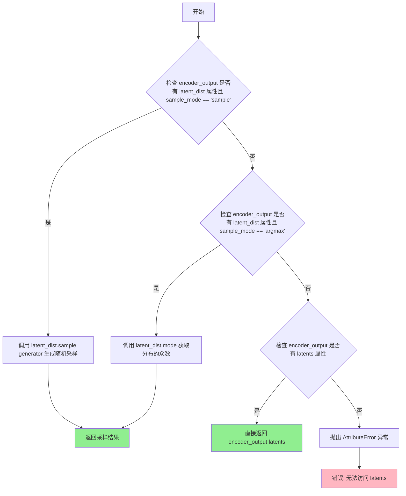

#### 带注释源码

```
def retrieve_latents(
    encoder_output: torch.Tensor, generator: torch.Generator | None = None, sample_mode: str = "sample"
):
    # 如果编码器输出包含 latent_dist 属性且采样模式为 "sample"，则从潜在分布中采样
    if hasattr(encoder_output, "latent_dist") and sample_mode == "sample":
        return encoder_output.latent_dist.sample(generator)
    # 如果编码器输出包含 latent_dist 属性且采样模式为 "argmax"，则取潜在分布的众数（最可能值）
    elif hasattr(encoder_output, "latent_dist") and sample_mode == "argmax":
        return encoder_output.latent_dist.mode()
    # 如果编码器输出直接包含 latents 属性，则直接返回
    elif hasattr(encoder_output, "latents"):
        return encoder_output.latents
    # 如果无法找到任何有效的潜在表示，则抛出属性错误异常
    else:
        raise AttributeError("Could not access latents of provided encoder_output")
```


### `calculate_dimensions`

该函数用于根据目标面积和宽高比计算图像的宽度和高度，并通过取整操作确保尺寸符合32的倍数要求，以适配后续处理流程。

参数：

- `target_area`：`int` 或 `float`，目标面积，通常为分辨率的平方（如 640*640）
- `ratio`：`float`，目标宽高比，值为宽度除以高度

返回值：`tuple[int, int]`，返回计算并对齐后的宽度和高度，均为32的倍数

#### 流程图

```mermaid
flowchart TD
    A[开始] --> B[计算宽度: width = sqrt(target_area \* ratio)]
    B --> C[计算高度: height = width / ratio]
    C --> D[宽度对齐32: width = round(width / 32) \* 32]
    D --> E[高度对齐32: height = round(height / 32) \* 32]
    E --> F[返回 width, height]
```

#### 带注释源码

```python
# Copied from diffusers.pipelines.qwenimage.pipeline_qwenimage_edit_plus.calculate_dimensions
def calculate_dimensions(target_area, ratio):
    """
    根据目标面积和宽高比计算图像尺寸，并确保尺寸为32的倍数
    
    Args:
        target_area: 目标面积，通常为分辨率的平方
        ratio: 宽高比 (width / height)
    
    Returns:
        tuple: (width, height) 均为32的倍数
    """
    # 根据面积和比例计算理想宽度: width = sqrt(area * ratio)
    width = math.sqrt(target_area * ratio)
    # 根据宽度和比例计算对应高度: height = width / ratio
    height = width / ratio

    # 将宽度调整为32的倍数，确保尺寸对齐
    width = round(width / 32) * 32
    # 将高度调整为32的倍数，确保尺寸对齐
    height = round(height / 32) * 32

    return width, height
```


### `QwenImageLayeredPipeline._extract_masked_hidden`

该方法用于从文本编码器的隐藏状态中根据注意力掩码提取有效 token 的隐藏状态，并将结果按批次分割成列表返回。在文本嵌入提取流程中用于过滤掉 padding 位置的状态向量。

参数：

- `self`：类实例本身，包含 `QwenImageLayeredPipeline` 类的上下文信息
- `hidden_states`：`torch.Tensor`，文本编码器输出的隐藏状态，形状为 `(batch_size, seq_len, hidden_dim)`
- `mask`：`torch.Tensor`，注意力掩码张量，形状为 `(batch_size, seq_len)`，用于标识有效 token 位置

返回值：`list[torch.Tensor]`（即 `tuple(torch.Tensor)`），按批次分割的隐藏状态列表，每个元素对应一个样本的有效 token 隐藏状态

#### 流程图

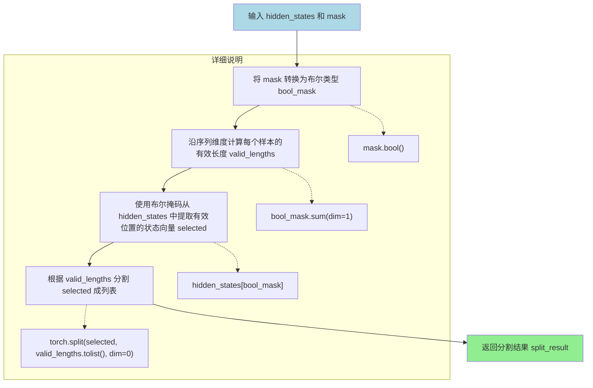

#### 带注释源码

```python
# Copied from diffusers.pipelines.qwenimage.pipeline_qwenimage.QwenImagePipeline._extract_masked_hidden
def _extract_masked_hidden(self, hidden_states: torch.Tensor, mask: torch.Tensor):
    """
    从文本编码器的隐藏状态中根据注意力掩码提取有效 token 的隐藏状态。
    
    该方法在编码提示词嵌入时调用，用于过滤掉 padding 位置（mask 为 0 的位置）
    的隐藏状态，只保留实际有效 token 的表示。
    
    Args:
        hidden_states (torch.Tensor): 文本编码器输出的隐藏状态张量，
                                     形状为 (batch_size, seq_len, hidden_dim)
        mask (torch.Tensor): 注意力掩码张量，形状为 (batch_size, seq_len)，
                            值为 0 或 1，1 表示有效位置
    
    Returns:
        tuple[torch.Tensor]: 按批次分割的隐藏状态元组，每个元素对应一个样本的
                           有效 token 隐藏状态，形状为 (valid_length_i, hidden_dim)
    """
    # Step 1: 将掩码转换为布尔类型，得到布尔掩码
    # 例如：mask = [[1,1,0,0], [1,1,1,0]] -> bool_mask = [[True, True, False, False], ...]
    bool_mask = mask.bool()
    
    # Step 2: 沿序列维度（dim=1）计算每个样本的有效 token 数量
    # 例如：bool_mask = [[True, True, False, False], [True, True, True, False]]
    # -> valid_lengths = [2, 3]
    valid_lengths = bool_mask.sum(dim=1)
    
    # Step 3: 使用布尔索引从隐藏状态中提取有效位置的向量
    # hidden_states[bool_mask] 会将所有 True 位置对应的向量展平拼接
    # 结果形状：(sum(valid_lengths), hidden_dim)
    selected = hidden_states[bool_mask]
    
    # Step 4: 根据每个样本的有效长度将 selected 分割成列表
    # 使用 torch.split 按 dim=0（batch 维度）分割
    # 例如：selected 有 5 个向量，valid_lengths = [2, 3]
    # -> split_result = [tensor[0:2], tensor[2:5]]
    split_result = torch.split(selected, valid_lengths.tolist(), dim=0)
    
    return split_result
```


### `QwenImageLayeredPipeline._get_qwen_prompt_embeds`

该方法负责将文本提示（prompt）编码为Transformer模型可用的嵌入向量（prompt_embeds）和注意力掩码（encoder_attention_mask），主要通过Qwen2.5-VL文本编码器生成文本表示，并进行后处理以适配后续去噪网络的输入格式。

参数：

- `self`：隐式参数，指向 `QwenImageLayeredPipeline` 类的实例。
- `prompt`：`str | list[str]`，待编码的文本提示，可以是单个字符串或字符串列表。
- `device`：`torch.device | None`，指定计算设备，若为 `None` 则使用执行设备。
- `dtype`：`torch.dtype | None`，指定数据类型，若为 `None` 则使用文本编码器的数据类型。

返回值：`tuple[torch.Tensor, torch.Tensor]`，返回一个元组，包含 `prompt_embeds`（文本嵌入向量，形状为 `[batch_size, seq_len, hidden_dim]`）和 `encoder_attention_mask`（编码器注意力掩码，形状为 `[batch_size, seq_len]`），用于后续去噪过程。

#### 流程图

```mermaid
flowchart TD
    A[开始: _get_qwen_prompt_embeds] --> B{device是否为None?}
    B -- 是 --> C[使用self._execution_device]
    B -- 否 --> D[使用传入的device]
    C --> E{dtype是否为None?}
    D --> E
    E -- 是 --> F[使用self.text_encoder.dtype]
    E -- 否 --> G[使用传入的dtype]
    F --> H
    G --> H
    H{prompt是否为str?}
    H -- 是 --> I[转换为list: [prompt]]
    H -- 否 --> J[保持list不变]
    I --> K
    J --> K
    K[使用prompt_template_encode格式化每个prompt] --> L[调用tokenizer进行tokenize]
    L --> M[调用text_encoder获取hidden_states]
    M --> N[提取最后一层hidden_states] --> O[调用_extract_masked_hidden根据attention_mask分割]
    O --> P[从分割后的hidden_states中去除前drop_idx个token]
    P --> Q[为每个分割后的序列创建全1的attention_mask]
    Q --> R[计算最大序列长度max_seq_len]
    R --> S[将所有hidden_states填充到max_seq_len长度]
    S --> T[将所有attention_mask填充到max_seq_len长度]
    T --> U[将prompt_embeds转换到指定device和dtype]
    U --> V[返回prompt_embeds和encoder_attention_mask]
```

#### 带注释源码

```python
def _get_qwen_prompt_embeds(
    self,
    prompt: str | list[str] = None,
    device: torch.device | None = None,
    dtype: torch.dtype | None = None,
):
    # 如果未指定device，则使用pipeline的默认执行设备
    device = device or self._execution_device
    # 如果未指定dtype，则使用文本编码器的默认数据类型
    dtype = dtype or self.text_encoder.dtype

    # 统一将prompt转换为列表格式，便于批量处理
    prompt = [prompt] if isinstance(prompt, str) else prompt

    # 获取预设的prompt模板，用于格式化输入
    template = self.prompt_template_encode
    # 获取需要丢弃的token起始索引（模板头部特殊token的长度）
    drop_idx = self.prompt_template_encode_start_idx
    # 使用模板格式化每个prompt
    txt = [template.format(e) for e in prompt]
    # 调用tokenizer将文本转换为token ids和attention mask
    txt_tokens = self.tokenizer(
        txt,
        padding=True,
        return_tensors="pt",
    ).to(device)
    # 调用Qwen2.5-VL文本编码器，获取包含hidden_states的输出
    # output_hidden_states=True确保返回所有层的hidden states
    encoder_hidden_states = self.text_encoder(
        input_ids=txt_tokens.input_ids,
        attention_mask=txt_tokens.attention_mask,
        output_hidden_states=True,
    )
    # 提取最后一层的hidden states作为最终的文本表示
    hidden_states = encoder_hidden_states.hidden_states[-1]
    # 根据attention_mask将hidden_states按样本分割（去除padding部分）
    split_hidden_states = self._extract_masked_hidden(hidden_states, txt_tokens.attention_mask)
    # 去除每个序列开头的特殊token（模板头部），保留实际文本内容
    split_hidden_states = [e[drop_idx:] for e in split_hidden_states]
    # 为每个有效序列创建全1的attention mask（表示有效token）
    attn_mask_list = [torch.ones(e.size(0), dtype=torch.long, device=e.device) for e in split_hidden_states]
    # 计算所有序列中的最大长度，用于后续padding对齐
    max_seq_len = max([e.size(0) for e in split_hidden_states])
    # 将每个hidden_states序列padding到max_seq_len长度（不足部分填0）
    prompt_embeds = torch.stack(
        [torch.cat([u, u.new_zeros(max_seq_len - u.size(0), u.size(1))]) for u in split_hidden_states]
    )
    # 将每个attention_mask padding到max_seq_len长度
    encoder_attention_mask = torch.stack(
        [torch.cat([u, u.new_zeros(max_seq_len - u.size(0))]) for u in attn_mask_list]
    )

    # 将prompt_embeds转换到指定的device和dtype
    prompt_embeds = prompt_embeds.to(dtype=dtype, device=device)

    # 返回处理后的prompt embeddings和对应的attention mask
    return prompt_embeds, encoder_attention_mask
```


### `QwenImageLayeredPipeline.encode_prompt`

该方法负责将文本提示（prompt）编码为文本嵌入向量（text embeddings）和对应的注意力掩码，支持批量生成多张图像。

参数：

- `prompt`：`str | list[str]`，要编码的文本提示，支持单个字符串或字符串列表
- `device`：`torch.device | None`，目标计算设备，默认为当前执行设备
- `num_images_per_prompt`：`int`，每个提示要生成的图像数量，默认为1
- `prompt_embeds`：`torch.Tensor | None`，预生成的文本嵌入向量，可用于微调文本输入（如提示加权），若未提供则从 `prompt` 参数生成
- `prompt_embeds_mask`：`torch.Tensor | None`，预生成的文本嵌入对应的注意力掩码
- `max_sequence_length`：`int`，最大序列长度，用于截断嵌入向量，默认为1024

返回值：元组 `(torch.Tensor, torch.Tensor | None)`，第一个元素为编码后的文本嵌入向量，第二个元素为对应的注意力掩码（如无需掩码则为 None）

#### 流程图

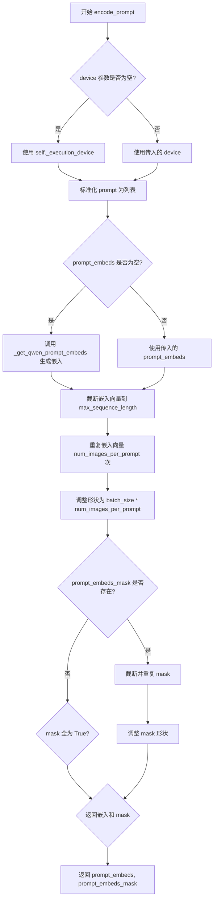

#### 带注释源码

```python
def encode_prompt(
    self,
    prompt: str | list[str],
    device: torch.device | None = None,
    num_images_per_prompt: int = 1,
    prompt_embeds: torch.Tensor | None = None,
    prompt_embeds_mask: torch.Tensor | None = None,
    max_sequence_length: int = 1024,
):
    r"""
    将文本提示编码为文本嵌入向量和注意力掩码

    Args:
        prompt (`str` or `list[str]`, *optional*):
            prompt to be encoded
        device: (`torch.device`):
            torch device
        num_images_per_prompt (`int`):
            number of images that should be generated per prompt
        prompt_embeds (`torch.Tensor`, *optional*):
            Pre-generated text embeddings. Can be used to easily tweak text inputs, *e.g.* prompt weighting. If not
            provided, text embeddings will be generated from `prompt` input argument.
    """
    # 确定目标设备，优先使用传入的 device，否则使用当前执行设备
    device = device or self._execution_device

    # 标准化 prompt 格式：确保为列表形式
    prompt = [prompt] if isinstance(prompt, str) else prompt
    # 确定批次大小：若已提供 prompt_embeds 则使用其批次维度，否则使用 prompt 列表长度
    batch_size = len(prompt) if prompt_embeds is None else prompt_embeds.shape[0]

    # 若未提供嵌入向量，则调用内部方法生成
    if prompt_embeds is None:
        prompt_embeds, prompt_embeds_mask = self._get_qwen_prompt_embeds(prompt, device)

    # 截断嵌入向量到指定的最大序列长度
    prompt_embeds = prompt_embeds[:, :max_sequence_length]
    _, seq_len, _ = prompt_embeds.shape
    
    # 扩展嵌入向量以支持每提示生成多张图像
    # 将 [batch, seq, dim] 扩展为 [batch * num_images_per_prompt, seq, dim]
    prompt_embeds = prompt_embeds.repeat(1, num_images_per_prompt, 1)
    prompt_embeds = prompt_embeds.view(batch_size * num_images_per_prompt, seq_len, -1)

    # 处理注意力掩码（如有提供）
    if prompt_embeds_mask is not None:
        # 同样截断并扩展掩码维度
        prompt_embeds_mask = prompt_embeds_mask[:, :max_sequence_length]
        prompt_embeds_mask = prompt_embeds_mask.repeat(1, num_images_per_prompt, 1)
        prompt_embeds_mask = prompt_embeds_mask.view(batch_size * num_images_per_prompt, seq_len)

        # 若掩码全为 True（表示所有位置均有效），则设为 None 以优化处理
        if prompt_embeds_mask.all():
            prompt_embeds_mask = None

    # 返回编码后的嵌入向量和注意力掩码
    return prompt_embeds, prompt_embeds_mask
```


### `QwenImageLayeredPipeline.get_image_caption`

该方法用于根据输入图像自动生成图像描述（caption）。通过调用 Qwen2.5-VL 多模态模型，根据预设的中文或英文提示词模板对图像进行标注，生成详细的图像描述文本。

参数：

- `prompt_image`：输入图像，用于生成描述的目标图像
- `use_en_prompt`：布尔值，是否使用英文提示词模板（默认为 True）
- `device`：torch.device，指定运行设备（默认为 None）

返回值：`str`，生成的图像描述文本，已去除首尾空格

#### 流程图

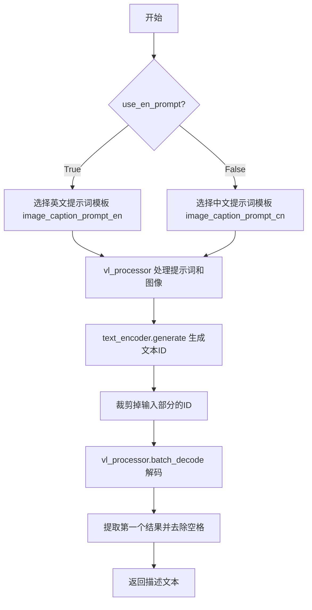

#### 带注释源码

```python
def get_image_caption(self, prompt_image, use_en_prompt=True, device=None):
    # 步骤1：根据语言选项选择对应的提示词模板
    if use_en_prompt:
        # 使用英文图像标注提示词模板
        prompt = self.image_caption_prompt_en
    else:
        # 使用中文图像标注提示词模板
        prompt = self.image_caption_prompt_cn
    
    # 步骤2：使用视觉-语言处理器准备模型输入
    # 将提示词和图像转换为模型所需的格式
    model_inputs = self.vl_processor(
        text=prompt,
        images=prompt_image,
        padding=True,
        return_tensors="pt",
    ).to(device)
    
    # 步骤3：调用文本编码器生成文本标识符
    # 使用 Qwen2.5-VL 模型根据图像生成描述文本
    generated_ids = self.text_encoder.generate(**model_inputs, max_new_tokens=512)
    
    # 步骤4：裁剪生成的标识符
    # 只保留模型新生成的部分，去除输入提示词的标识符
    generated_ids_trimmed = [
        out_ids[len(in_ids) :] for in_ids, out_ids in zip(model_inputs.input_ids, generated_ids)
    ]
    
    # 步骤5：解码生成的标识符为文本
    # skip_special_tokens=True: 跳过特殊标记
    # clean_up_tokenization_spaces=False: 不清理分词空格
    output_text = self.vl_processor.batch_decode(
        generated_ids_trimmed, skip_special_tokens=True, clean_up_tokenization_spaces=False
    )[0]
    
    # 步骤6：返回去除首尾空格后的描述文本
    return output_text.strip()
```


### `QwenImageLayeredPipeline.check_inputs`

该方法用于验证管道输入参数的有效性，确保生成的图像尺寸、提示词嵌入、张量回调输入等符合模型要求，并在参数不符合规范时抛出详细的错误信息。

参数：

- `self`：`QwenImageLayeredPipeline` 实例，管道对象本身
- `height`：`int`，生成图像的高度
- `width`：`int`，生成图像的宽度
- `negative_prompt`：`str | list[str] | None`，负向提示词，用于引导模型避免生成某些内容
- `prompt_embeds`：`torch.Tensor | None`，预生成的文本嵌入，可用于微调文本输入
- `negative_prompt_embeds`：`torch.Tensor | None`，预生成的负向文本嵌入
- `prompt_embeds_mask`：`torch.Tensor | None`，文本嵌入的注意力掩码
- `negative_prompt_embeds_mask`：`torch.Tensor | None`，负向文本嵌入的注意力掩码
- `callback_on_step_end_tensor_inputs`：`list[str] | None`，在推理步骤结束时回调的张量输入列表
- `max_sequence_length`：`int | None`，文本序列的最大长度

返回值：`None`，该方法不返回任何值，仅进行参数验证，若参数无效则抛出 `ValueError` 异常。

#### 流程图

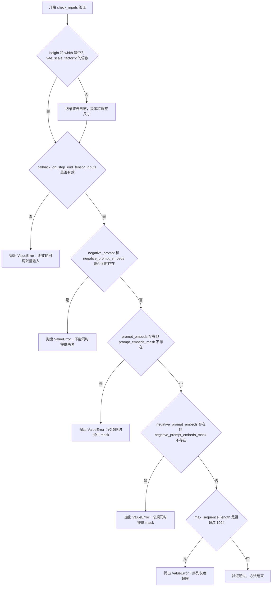

#### 带注释源码

```python
def check_inputs(
    self,
    height,
    width,
    negative_prompt=None,
    prompt_embeds=None,
    negative_prompt_embeds=None,
    prompt_embeds_mask=None,
    negative_prompt_embeds_mask=None,
    callback_on_step_end_tensor_inputs=None,
    max_sequence_length=None,
):
    """
    验证管道输入参数的有效性，确保所有参数符合模型和管道的要求。
    该方法会在管道调用前被自动调用，以提前捕获潜在的参数错误。
    """
    # 检查图像尺寸是否满足VAE的缩放因子要求
    # VAE会对图像进行压缩，因此高度和宽度必须是压缩因子的整数倍
    if height % (self.vae_scale_factor * 2) != 0 or width % (self.vae_scale_factor * 2) != 0:
        logger.warning(
            f"`height` and `width` have to be divisible by {self.vae_scale_factor * 2} but are {height} and {width}. Dimensions will be resized accordingly"
        )

    # 验证回调函数的张量输入是否在允许的列表中
    # 回调函数只能访问管道明确允许的张量，以防止安全问题和内存泄漏
    if callback_on_step_end_tensor_inputs is not None and not all(
        k in self._callback_tensor_inputs for k in callback_on_step_end_tensor_inputs
    ):
        raise ValueError(
            f"`callback_on_step_end_tensor_inputs` has to be in {self._callback_tensor_inputs}, but found {[k for k in callback_on_step_end_tensor_inputs if k not in self._callback_tensor_inputs]}"
        )

    # 负向提示词和负向嵌入不能同时提供，避免语义冲突和混淆
    if negative_prompt is not None and negative_prompt_embeds is not None:
        raise ValueError(
            f"Cannot forward both `negative_prompt`: {negative_prompt} and `negative_prompt_embeds`:"
            f" {negative_prompt_embeds}. Please make sure to only forward one of the two."
        )

    # 如果提供了文本嵌入，必须同时提供对应的注意力掩码
    # 因为它们来自同一个文本编码器，掩码用于指示哪些token是有效的
    if prompt_embeds is not None and prompt_embeds_mask is None:
        raise ValueError(
            "If `prompt_embeds` are provided, `prompt_embeds_mask` also have to be passed. Make sure to generate `prompt_embeds_mask` from the same text encoder that was used to generate `prompt_embeds`."
        )
    if negative_prompt_embeds is not None and negative_prompt_embeds_mask is None:
        raise ValueError(
            "If `negative_prompt_embeds` are provided, `negative_prompt_embeds_mask` also have to be passed. Make sure to generate `negative_prompt_embeds_mask` from the same text encoder that was used to generate `negative_prompt_embeds`."
        )

    # 序列长度有上限限制，Qwen2模型的序列长度最大为1024
    if max_sequence_length is not None and max_sequence_length > 1024:
        raise ValueError(f"`max_sequence_length` cannot be greater than 1024 but is {max_sequence_length}")
```


### `QwenImageLayeredPipeline._pack_latents`

该方法是一个静态函数，用于将输入的latent张量进行打包处理。它将latent的空间维度（高度和宽度）划分为2x2的块，并重新排列维度，以便于Transformer模型进行处理。这是Qwen-Image-Layered pipeline中处理latent表示的关键步骤。

参数：

- `latents`：`torch.Tensor`，输入的latent张量，形状为 (batch_size, layers + 1, num_channels_latents, height, width)
- `batch_size`：`int`，批次大小
- `num_channels_latents`：`int`，latent的通道数
- `height`：`int`，latent的高度
- `width`：`int`，latent的宽度
- `layers`：`int`，层数（不包括初始图像层）

返回值：`torch.Tensor`，打包后的latent张量，形状为 (batch_size, layers * (height // 2) * (width // 2), num_channels_latents * 4)

#### 流程图

```mermaid
flowchart TD
    A[输入latents: (batch_size, layers+1, num_channels, height, width)] --> B[view操作: 重塑为7维张量]
    B --> C[permute操作: 调整维度顺序]
    C --> D[reshape操作: 打包为2x2块]
    D --> E[输出latents: (batch_size, layers*(h//2)*(w//2), num_channels*4)]
    
    B -.-> B1["(batch_size, layers, num_channels, height//2, 2, width//2, 2)"]
    C -.-> C1["维度重新排列: (0,1,3,5,2,4,6)"]
    D -.-> D1["合并最后两对维度"]
```

#### 带注释源码

```python
@staticmethod
def _pack_latents(latents, batch_size, num_channels_latents, height, width, layers):
    """
    将latent张量打包为适合Transformer处理的格式
    
    Args:
        latents: 输入的latent张量
        batch_size: 批次大小
        num_channels_latents: latent通道数
        height: 高度
        width: 宽度
        layers: 层数
    
    Returns:
        打包后的latent张量
    """
    # Step 1: 将latents重塑为7维张量
    # 将height和width各划分为2个块 (height//2, 2) 和 (width//2, 2)
    # 形状: (batch_size, layers, num_channels_latents, height//2, 2, width//2, 2)
    latents = latents.view(batch_size, layers, num_channels_latents, height // 2, 2, width // 2, 2)
    
    # Step 2: 调整维度顺序
    # 将2x2的块维度移动到通道维度之前
    # permute(0,1,3,5,2,4,6) -> (batch_size, layers, height//2, width//2, num_channels_latents, 2, 2)
    latents = latents.permute(0, 1, 3, 5, 2, 4, 6)
    
    # Step 3: 重塑为最终的打包格式
    # 将2x2块合并到通道维度，得到 (batch_size, layers*height//2*width//2, num_channels_latents*4)
    latents = latents.reshape(batch_size, layers * (height // 2) * (width // 2), num_channels_latents * 4)

    return latents
```


### `QwenImageLayeredPipeline._unpack_latents`

该方法是一个静态方法，用于将打包（packed）后的latent张量解包（unpack）回多层格式。在图像生成过程中，latent表示被压缩并打包以提高计算效率，此方法将其恢复为 (batch_size, channels, layers, height, width) 的形状，以便后续的VAE解码处理。

参数：

- `latents`：`torch.Tensor`，输入的打包后的latent张量，形状为 (batch_size, num_patches, channels)
- `height`：`int`，目标图像的高度
- `width`：`int`，目标图像的宽度
- `layers`：`int`，要解包出的层数
- `vae_scale_factor`：`int`，VAE的缩放因子，用于计算latent空间的实际尺寸

返回值：`torch.Tensor`，解包后的latent张量，形状为 (batch_size, channels, layers, height, width)

#### 流程图

```mermaid
flowchart TD
    A[开始: 输入打包的latents] --> B[获取latents形状: batch_size, num_patches, channels]
    C[输入height, width, layers, vae_scale_factor] --> D[计算实际latent尺寸: height = 2 × (height // (vae_scale_factor × 2))]
    B --> D
    D --> E[使用view重塑张量: latents.view<br/>batch_size, layers+1, height//2, width//2, channels//4, 2, 2]
    E --> F[使用permute置换维度: (0, 1, 4, 2, 5, 3, 6)]
    F --> G[reshape重塑: batch_size, layers+1, channels//4, height, width]
    G --> H[permute置换: (0, 2, 1, 3, 4)<br/>最终形状: (b, c, f, h, w)]
    H --> I[返回解包后的latents]
```

#### 带注释源码

```python
@staticmethod
def _unpack_latents(latents, height, width, layers, vae_scale_factor):
    """
    将打包后的latent张量解包回多层格式
    
    参数:
        latents: 打包后的latent张量，形状为 (batch_size, num_patches, channels)
        height: 目标图像高度
        width: 目标图像宽度
        layers: 层数
        vae_scale_factor: VAE缩放因子
    
    返回:
        解包后的latent张量，形状为 (batch_size, channels, layers, height, width)
    """
    # 获取输入latents的基本维度信息
    batch_size, num_patches, channels = latents.shape

    # VAE应用8x压缩，需要考虑packing要求latent高度和宽度能被2整除
    # 计算实际latent空间的高度和宽度
    # 原始图像尺寸经过 VAE 缩放因子 × 2 的压缩后，再乘以2还原
    height = 2 * (int(height) // (vae_scale_factor * 2))
    width = 2 * (int(width) // (vae_scale_factor * 2))

    # 第一次view重塑：将latents从 (b, num_patches, c) 转换为多层结构
    # 形状解释:
    #   - batch_size: 批次大小
    #   - layers + 1: 层数（包含原始输入图像层）
    #   - height // 2: 压缩后的高度
    #   - width // 2: 压缩后的宽度
    #   - channels // 4: 通道数除以4（packing压缩）
    #   - 2, 2: 用于恢复2x2 patch结构
    latents = latents.view(batch_size, layers + 1, height // 2, width // 2, channels // 4, 2, 2)
    
    # 第一次permute：重新排列维度以匹配空间结构
    # 从 (b, f, h/2, w/2, c/4, 2, 2) -> (b, f, c/4, h/2, 2, w/2, 2)
    latents = latents.permute(0, 1, 4, 2, 5, 3, 6)

    # 第二次reshape：合并patch维度到空间维度
    # 从 (b, f, c/4, h/2, 2, w/2, 2) -> (b, f, c/4, h, w)
    latents = latents.reshape(batch_size, layers + 1, channels // (2 * 2), height, width)

    # 第二次permute：调整维度顺序，最终得到 (b, c, f, h, w) 格式
    # 这符合PyTorch的卷积约定: (batch, channels, frames/depth, height, width)
    latents = latents.permute(0, 2, 1, 3, 4)  # (b, c, f, h, w)

    return latents
```


### `QwenImageLayeredPipeline._encode_vae_image`

该方法负责将输入图像通过VAE编码器编码为潜在表示（latents），并对编码结果进行标准化处理（减均值除标准差），以便后续去噪过程使用。

参数：

- `self`：隐式参数，类的实例，表示当前管道对象
- `image`：`torch.Tensor`，输入的图像张量，形状通常为 `(B, C, H, W)`，像素值范围 `[0, 1]`
- `generator`：`torch.Generator` 或 `list[torch.Generator]`，PyTorch随机数生成器，用于确保VAE编码过程的可重复性。如果是列表，则需与batch size匹配

返回值：`torch.Tensor`，标准化后的图像潜在表示，形状为 `(B, latent_channels, H', W')`，其中 `H'` 和 `W'` 取决于VAE的下采样比例

#### 流程图

```mermaid
graph TD
    A[开始 _encode_vae_image] --> B{检查 generator 类型}
    
    B -->|是列表| C[遍历图像batch]
    C --> D[使用对应generator编码单个图像]
    D --> E[调用 retrieve_latents 提取latents]
    E --> F[累积所有 latents]
    F --> G[沿 dim=0 拼接]
    G --> H[计算 latents_mean 和 latents_std]
    
    B -->|否| I[直接编码整个图像batch]
    I --> J[调用 retrieve_latents 提取latents]
    J --> H
    
    H --> K[(image_latents - latents_mean) / latents_std]
    K --> L[返回标准化后的 image_latents]
    
    style H fill:#f9f,fill-opacity:0.3
    style K fill:#f9f,fill-opacity:0.3
```

#### 带注释源码

```python
def _encode_vae_image(self, image: torch.Tensor, generator: torch.Generator):
    """
    将输入图像编码为VAE潜在表示并进行标准化处理
    
    Args:
        image: 输入图像张量，形状 (B, C, H, W)
        generator: PyTorch随机数生成器，用于确保可重复性
    
    Returns:
        标准化后的图像latents张量
    """
    # 判断generator是否为列表（对应批量生成场景）
    if isinstance(generator, list):
        # 逐个处理图像，为每个图像使用对应的generator
        image_latents = [
            # 调用VAE的encode方法编码单个图像
            # 使用retrieve_latents提取latent分布的argmax（确定性输出）
            retrieve_latents(
                self.vae.encode(image[i : i + 1]),  # 提取第i个图像
                generator=generator[i],           # 使用对应的随机生成器
                sample_mode="argmax"               # 取分布的mode而非采样
            )
            for i in range(image.shape[0])  # 遍历batch中的每个图像
        ]
        # 将多个单独编码的latents沿batch维度拼接
        image_latents = torch.cat(image_latents, dim=0)
    else:
        # 单一generator，直接编码整个图像batch
        image_latents = retrieve_latents(
            self.vae.encode(image),
            generator=generator,
            sample_mode="argmax"
        )
    
    # 从VAE配置中获取latents的均值，reshape为 (1, channels, 1, 1, 1) 以便广播
    latents_mean = (
        torch.tensor(self.vae.config.latents_mean)
        .view(1, self.latent_channels, 1, 1, 1)
        .to(image_latents.device, image_latents.dtype)  # 移动到与latents相同的设备和dtype
    )
    
    # 从VAE配置中获取latents的标准差，同样reshape为广播形状
    latents_std = (
        torch.tensor(self.vae.config.latents_std)
        .view(1, self.latent_channels, 1, 1, 1)
        .to(image_latents.device, image_latents.dtype)
    )
    
    # 标准化处理：将latents转换到标准正态分布空间
    # 这是因为VAE的latents通常不是标准高斯分布，需要归一化
    image_latents = (image_latents - latents_mean) / latents_std

    return image_latents
```


### `QwenImageLayeredPipeline.prepare_latents`

该方法负责为扩散模型的去噪过程准备初始潜在变量（latents）和图像潜在变量（image_latents）。它处理图像编码、批量大小调整、潜在变量形状计算与填充，以及随机噪声的生成。

参数：

- `self`：`QwenImageLayeredPipeline` 实例本身
- `image`：`PipelineImageInput | None`，输入图像，用于编码为图像潜在变量
- `batch_size`：`int`，批量大小
- `num_channels_latents`：`int`，潜在变量的通道数
- `height`：`int`，目标高度（像素）
- `width`：`int`，目标宽度（像素）
- `layers`：`int`，要生成的层数
- `dtype`：`torch.dtype`，张量的数据类型
- `device`：`torch.device`，计算设备
- `generator`：`torch.Generator | list[torch.Generator] | None`，随机数生成器，用于生成确定性噪声
- `latents`：`torch.Tensor | None`，可选的预生成噪声潜在变量

返回值：`tuple[torch.Tensor, torch.Tensor | None]`，返回两个元素的元组：
- 第一个元素是 `torch.Tensor`，处理后的潜在变量（packed 格式）
- 第二个元素是 `torch.Tensor | None`，编码后的图像潜在变量（如果提供了图像），否则为 None

#### 流程图

```mermaid
flowchart TD
    A[开始 prepare_latents] --> B[计算调整后的 height 和 width]
    B --> C{image 是否为 None?}
    C -->|是| D[设置 image_latents = None]
    C -->|否| E[将 image 移动到指定设备和 dtype]
    E --> F{image.shape[1] == latent_channels?}
    F -->|否| G[_encode_vae_image 编码图像]
    F -->|是| H[直接使用 image 作为 image_latents]
    G --> I{batch_size > image_latents.shape[0]?}
    H --> I
    I -->|是 且能整除| J[复制 image_latents 扩展批次]
    I -->|是 且不能整除| K[抛出 ValueError]
    I -->|否| L[直接使用 image_latents]
    J --> M[排列维度并 pack latents]
    K --> N[抛出异常]
    L --> M
    M --> O{generator 是 list 且长度不匹配?}
    D --> O
    O -->|是| P[抛出 ValueError]
    O -->|否| Q{latents 是否为 None?}
    P --> R[结束]
    Q -->|是| S[生成随机噪声 tensor]
    S --> T[pack 随机噪声 latents]
    Q -->|否| U[将 latents 移动到设备和 dtype]
    T --> V[返回 latents 和 image_latents]
    U --> V
```

#### 带注释源码

```python
def prepare_latents(
    self,
    image,
    batch_size,
    num_channels_latents,
    height,
    width,
    layers,
    dtype,
    device,
    generator,
    latents=None,
):
    # VAE applies 8x compression on images but we must also account for packing which requires
    # latent height and width to be divisible by 2.
    # 计算调整后的高度和宽度，考虑 VAE 的 8x 压缩率和 pack 操作需要的 2x 倍数
    height = 2 * (int(height) // (self.vae_scale_factor * 2))
    width = 2 * (int(width) // (self.vae_scale_factor * 2))

    # 定义潜在变量的形状：(batch_size, layers+1, num_channels_latents, height, width)
    # layers+1 是因为生成的第一个图像是组合图像（包含所有层）
    shape = (
        batch_size,
        layers + 1,
        num_channels_latents,
        height,
        width,
    )

    # 初始化图像潜在变量为 None
    image_latents = None
    
    # 如果提供了输入图像，则进行编码处理
    if image is not None:
        # 将图像移动到指定设备和数据类型
        image = image.to(device=device, dtype=dtype)
        
        # 判断图像是否已经是潜在变量表示
        if image.shape[1] != self.latent_channels:
            # 如果通道数不匹配，则通过 VAE 编码器编码图像
            image_latents = self._encode_vae_image(image=image, generator=generator)
        else:
            # 否则直接使用输入的图像作为潜在变量
            image_latents = image
            
        # 处理批量大小扩展：如果 batch_size 大于图像潜在变量的数量
        if batch_size > image_latents.shape[0] and batch_size % image_latents.shape[0] == 0:
            # expand init_latents for batch_size
            # 计算每个提示词需要扩展的图像数量
            additional_image_per_prompt = batch_size // image_latents.shape[0]
            # 通过拼接复制扩展图像潜在变量
            image_latents = torch.cat([image_latents] * additional_image_per_prompt, dim=0)
        elif batch_size > image_latents.shape[0] and batch_size % image_latents.shape[0] != 0:
            # 如果不能整除，抛出错误
            raise ValueError(
                f"Cannot duplicate `image` of batch size {image_latents.shape[0]} to {batch_size} text prompts."
            )
        else:
            # 正常情况，直接确保是 batch 维度
            image_latents = torch.cat([image_latents], dim=0)

        # 获取图像潜在变量的高度和宽度
        image_latent_height, image_latent_width = image_latents.shape[3:]
        # 重新排列维度：从 (b, c, f, h, w) 变为 (b, f, c, h, w)
        image_latents = image_latents.permute(0, 2, 1, 3, 4)
        # 对图像潜在变量进行 pack 操作
        image_latents = self._pack_latents(
            image_latents, batch_size, num_channels_latents, image_latent_height, image_latent_width, 1
        )

    # 验证 generator 列表长度与 batch_size 是否匹配
    if isinstance(generator, list) and len(generator) != batch_size:
        raise ValueError(
            f"You have passed a list of generators of length {len(generator)}, but requested an effective batch"
            f" size of {batch_size}. Make sure the batch size matches the length of the generators."
        )
        
    # 如果没有提供预生成的 latents，则生成随机噪声
    if latents is None:
        # 使用 randn_tensor 生成符合标准正态分布的随机潜在变量
        latents = randn_tensor(shape, generator=generator, device=device, dtype=dtype)
        # 对随机潜在变量进行 pack 操作
        latents = self._pack_latents(latents, batch_size, num_channels_latents, height, width, layers + 1)
    else:
        # 如果提供了 latents，则将其移动到指定设备和数据类型
        latents = latents.to(device=device, dtype=dtype)

    # 返回处理后的潜在变量和图像潜在变量
    return latents, image_latents
```


### `QwenImageLayeredPipeline.__call__`

该方法是 Qwen 图像分层管道的主入口方法，用于将输入图像分解为多个图层。该方法首先对输入图像进行预处理和尺寸计算，然后通过文本编码器对提示词进行编码，接着准备潜在变量，最后在去噪循环中逐步生成多个图像图层，并通过 VAE 解码器将潜在变量解码为最终图像输出。

参数：

- `image`：`PipelineImageInput | None`，输入图像，作为图像分层任务的起点，支持张量、PIL图像、numpy数组或它们的列表
- `prompt`：`str | list[str] | None`，引导图像生成的提示词，若未定义则需要传递 `prompt_embeds`
- `negative_prompt`：`str | list[str] | null`，不参与图像生成的负面提示词，用于引导生成与负面提示词不同的图像
- `true_cfg_scale`：`float`，无分类器自由引导（CFG）比例，默认为 4.0，用于控制文本提示对生成图像的影响程度
- `layers`：`int | None`，要生成的图层数量，默认为 4 层
- `num_inference_steps`：`int`，去噪步数，默认为 50，步数越多通常生成质量越高但推理速度越慢
- `sigmas`：`list[float] | None`，自定义去噪过程的 sigmas 值，用于支持某些调度器
- `guidance_scale`：`float | None`，引导蒸馏模型的引导比例，不同于传统的 CFG引导
- `num_images_per_prompt`：`int`，每个提示词生成的图像数量，默认为 1
- `generator`：`torch.Generator | list[torch.Generator] | None`，随机生成器，用于确保生成的可重复性
- `latents`：`torch.Tensor | None`，预生成的噪声潜在变量，用于图像生成
- `prompt_embeds`：`torch.Tensor | None`，预生成的文本嵌入，可用于提示词加权
- `prompt_embeds_mask`：`torch.Tensor | None`，文本嵌入的注意力掩码
- `negative_prompt_embeds`：`torch.Tensor | None`，预生成的负面文本嵌入
- `negative_prompt_embeds_mask`：`torch.Tensor | None`，负面文本嵌入的注意力掩码
- `output_type`：`str | None`，输出格式，默认为 "pil"，可选 "latent" 或 numpy 数组
- `return_dict`：`bool`，是否返回 `QwenImagePipelineOutput` 对象，默认为 True
- `attention_kwargs`：`dict[str, Any] | None`，传递给注意力处理器的额外参数
- `callback_on_step_end`：`Callable[[int, int], None] | None`，每步去噪结束后调用的回调函数
- `callback_on_step_end_tensor_inputs`：`list[str]`，回调函数可访问的张量输入列表
- `max_sequence_length`：`int`，提示词最大序列长度，默认为 512
- `resolution`：`int`，输出分辨率，默认为 640，可选 640 或 1024
- `cfg_normalize`：`bool`，是否启用 CFG 归一化，默认为 False
- `use_en_prompt`：`bool`，是否使用英文自动提示词，默认为 False

返回值：`QwenImagePipelineOutput | tuple`，当 `return_dict` 为 True 时返回 `QwenImagePipelineOutput` 对象，否则返回包含生成图像的元组

#### 流程图

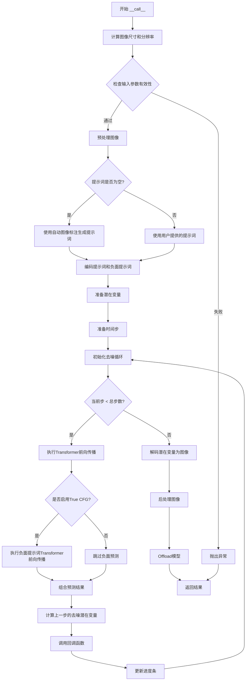

#### 带注释源码

```python
@torch.no_grad()
@replace_example_docstring(EXAMPLE_DOC_STRING)
def __call__(
    self,
    image: PipelineImageInput | None = None,
    prompt: str | list[str] = None,
    negative_prompt: str | list[str] = None,
    true_cfg_scale: float = 4.0,
    layers: int | None = 4,
    num_inference_steps: int = 50,
    sigmas: list[float] | None = None,
    guidance_scale: float | None = None,
    num_images_per_prompt: int = 1,
    generator: torch.Generator | list[torch.Generator] | None = None,
    latents: torch.Tensor | None = None,
    prompt_embeds: torch.Tensor | None = None,
    prompt_embeds_mask: torch.Tensor | None = None,
    negative_prompt_embeds: torch.Tensor | None = None,
    negative_prompt_embeds_mask: torch.Tensor | None = None,
    output_type: str | None = "pil",
    return_dict: bool = True,
    attention_kwargs: dict[str, Any] | None = None,
    callback_on_step_end: Callable[[int, int], None] | None = None,
    callback_on_step_end_tensor_inputs: list[str] = ["latents"],
    max_sequence_length: int = 512,
    resolution: int = 640,
    cfg_normalize: bool = False,
    use_en_prompt: bool = False,
):
    r"""
    调用管道进行生成时执行的函数。
    """
    # 1. 计算图像尺寸：根据分辨率和图像宽高比计算目标宽度和高度
    image_size = image[0].size if isinstance(image, list) else image.size
    assert resolution in [640, 1024], f"resolution must be either 640 or 1024, but got {resolution}"
    calculated_width, calculated_height = calculate_dimensions(
        resolution * resolution, image_size[0] / image_size[1]
    )
    height = calculated_height
    width = calculated_width

    # 确保尺寸是 VAE 缩放因子 * 2 的倍数
    multiple_of = self.vae_scale_factor * 2
    width = width // multiple_of * multiple_of
    height = height // multiple_of * multiple_of

    # 2. 检查输入参数有效性
    self.check_inputs(
        height,
        width,
        negative_prompt=negative_prompt,
        prompt_embeds=prompt_embeds,
        negative_prompt_embeds=negative_prompt_embeds,
        prompt_embeds_mask=prompt_embeds_mask,
        negative_prompt_embeds_mask=negative_prompt_embeds_mask,
        callback_on_step_end_tensor_inputs=callback_on_step_end_tensor_inputs,
        max_sequence_length=max_sequence_length,
    )

    # 设置内部状态变量
    self._guidance_scale = guidance_scale
    self._attention_kwargs = attention_kwargs
    self._current_timestep = None
    self._interrupt = False

    device = self._execution_device
    
    # 3. 预处理图像
    if image is not None and not (isinstance(image, torch.Tensor) and image.size(1) == self.latent_channels):
        # 调整图像大小到计算出的尺寸
        image = self.image_processor.resize(image, calculated_height, calculated_width)
        prompt_image = image  # 保存用于标注的原始图像
        image = self.image_processor.preprocess(image, calculated_height, calculated_width)
        image = image.unsqueeze(2)  # 添加帧维度
        image = image.to(dtype=self.text_encoder.dtype)

    # 4. 处理空提示词：自动生成图像标注
    if prompt is None or prompt == "" or prompt == " ":
        prompt = self.get_image_caption(prompt_image, use_en_prompt=use_en_prompt, device=device)

    # 5. 定义批处理大小
    if prompt is not None and isinstance(prompt, str):
        batch_size = 1
    elif prompt is not None and isinstance(prompt, list):
        batch_size = len(prompt)
    else:
        batch_size = prompt_embeds.shape[0]

    # 检查是否存在负面提示词
    has_neg_prompt = negative_prompt is not None or (
        negative_prompt_embeds is not None and negative_prompt_embeds_mask is not None
    )

    # 警告：CF 引导配置不一致
    if true_cfg_scale > 1 and not has_neg_prompt:
        logger.warning(
            f"true_cfg_scale is passed as {true_cfg_scale}, but classifier-free guidance is not enabled since no negative_prompt is provided."
        )
    elif true_cfg_scale <= 1 and has_neg_prompt:
        logger.warning(
            " negative_prompt is passed but classifier-free guidance is not enabled since true_cfg_scale <= 1"
        )

    # 确定是否启用 True CFG
    do_true_cfg = true_cfg_scale > 1 and has_neg_prompt
    
    # 6. 编码提示词
    prompt_embeds, prompt_embeds_mask = self.encode_prompt(
        prompt=prompt,
        prompt_embeds=prompt_embeds,
        prompt_embeds_mask=prompt_embeds_mask,
        device=device,
        num_images_per_prompt=num_images_per_prompt,
        max_sequence_length=max_sequence_length,
    )
    
    # 如果启用 CFG，则编码负面提示词
    if do_true_cfg:
        negative_prompt_embeds, negative_prompt_embeds_mask = self.encode_prompt(
            prompt=negative_prompt,
            prompt_embeds=negative_prompt_embeds,
            prompt_embeds_mask=negative_prompt_embeds_mask,
            device=device,
            num_images_per_prompt=num_images_per_prompt,
            max_sequence_length=max_sequence_length,
        )

    # 7. 准备潜在变量
    num_channels_latents = self.transformer.config.in_channels // 4
    latents, image_latents = self.prepare_latents(
        image,
        batch_size * num_images_per_prompt,
        num_channels_latents,
        height,
        width,
        layers,
        prompt_embeds.dtype,
        device,
        generator,
        latents,
    )
    
    # 定义图像形状用于 Transformer
    img_shapes = [
        [
            *[
                (1, height // self.vae_scale_factor // 2, width // self.vae_scale_factor // 2)
                for _ in range(layers + 1)
            ],
            (1, calculated_height // self.vae_scale_factor // 2, calculated_width // self.vae_scale_factor // 2),
        ]
    ] * batch_size

    # 8. 准备时间步
    sigmas = np.linspace(1.0, 0, num_inference_steps + 1)[:-1] if sigmas is None else sigmas
    image_seq_len = latents.shape[1]
    base_seqlen = 256 * 256 / 16 / 16
    mu = (image_latents.shape[1] / base_seqlen) ** 0.5
    timesteps, num_inference_steps = retrieve_timesteps(
        self.scheduler,
        num_inference_steps,
        device,
        sigmas=sigmas,
        mu=mu,
    )
    num_warmup_steps = max(len(timesteps) - num_inference_steps * self.scheduler.order, 0)
    self._num_timesteps = len(timesteps)

    # 9. 处理引导配置
    if self.transformer.config.guidance_embeds and guidance_scale is None:
        raise ValueError("guidance_scale is required for guidance-distilled model.")
    elif self.transformer.config.guidance_embeds:
        guidance = torch.full([1], guidance_scale, device=device, dtype=torch.float32)
        guidance = guidance.expand(latents.shape[0])
    elif not self.transformer.config.guidance_embeds and guidance_scale is not None:
        logger.warning(
            f"guidance_scale is passed as {guidance_scale}, but ignored since the model is not guidance-distilled."
        )
        guidance = None
    elif not self.transformer.config.guidance_embeds and guidance_scale is None:
        guidance = None

    if self.attention_kwargs is None:
        self._attention_kwargs = {}

    is_rgb = torch.tensor([0] * batch_size).to(device=device, dtype=torch.long)
    
    # 10. 去噪循环
    self.scheduler.set_begin_index(0)
    with self.progress_bar(total=num_inference_steps) as progress_bar:
        for i, t in enumerate(timesteps):
            # 检查是否中断
            if self.interrupt:
                continue

            self._current_timestep = t

            # 准备潜在模型输入
            latent_model_input = latents
            if image_latents is not None:
                latent_model_input = torch.cat([latents, image_latents], dim=1)

            # 广播时间步到批处理维度
            timestep = t.expand(latents.shape[0]).to(latents.dtype)
            
            # 执行条件 Transformer 前向传播
            with self.transformer.cache_context("cond"):
                noise_pred = self.transformer(
                    hidden_states=latent_model_input,
                    timestep=timestep / 1000,
                    guidance=guidance,
                    encoder_hidden_states_mask=prompt_embeds_mask,
                    encoder_hidden_states=prompt_embeds,
                    img_shapes=img_shapes,
                    attention_kwargs=self.attention_kwargs,
                    additional_t_cond=is_rgb,
                    return_dict=False,
                )[0]
                noise_pred = noise_pred[:, : latents.size(1)]

            # 如果启用 True CFG，执行无条件预测
            if do_true_cfg:
                with self.transformer.cache_context("uncond"):
                    neg_noise_pred = self.transformer(
                        hidden_states=latent_model_input,
                        timestep=timestep / 1000,
                        guidance=guidance,
                        encoder_hidden_states_mask=negative_prompt_embeds_mask,
                        encoder_hidden_states=negative_prompt_embeds,
                        img_shapes=img_shapes,
                        attention_kwargs=self.attention_kwargs,
                        additional_t_cond=is_rgb,
                        return_dict=False,
                    )[0]
                neg_noise_pred = neg_noise_pred[:, : latents.size(1)]
                
                # 组合预测结果
                comb_pred = neg_noise_pred + true_cfg_scale * (noise_pred - neg_noise_pred)

                # 可选：CFG 归一化
                if cfg_normalize:
                    cond_norm = torch.norm(noise_pred, dim=-1, keepdim=True)
                    noise_norm = torch.norm(comb_pred, dim=-1, keepdim=True)
                    noise_pred = comb_pred * (cond_norm / noise_norm)
                else:
                    noise_pred = comb_pred

            # 计算上一步的去噪潜在变量
            latents_dtype = latents.dtype
            latents = self.scheduler.step(noise_pred, t, latents, return_dict=False)[0]

            # 处理数据类型转换（特别是 MPS 后端）
            if latents.dtype != latents_dtype:
                if torch.backends.mps.is_available():
                    latents = latents.to(latents_dtype)

            # 调用回调函数
            if callback_on_step_end is not None:
                callback_kwargs = {}
                for k in callback_on_step_end_tensor_inputs:
                    callback_kwargs[k] = locals()[k]
                callback_outputs = callback_on_step_end(self, i, t, callback_kwargs)

                latents = callback_outputs.pop("latents", latents)
                prompt_embeds = callback_outputs.pop("prompt_embeds", prompt_embeds)

            # 更新进度条
            if i == len(timesteps) - 1 or ((i + 1) > num_warmup_steps and (i + 1) % self.scheduler.order == 0):
                progress_bar.update()

            # XLA 设备支持
            if XLA_AVAILABLE:
                xm.mark_step()

    self._current_timestep = None
    
    # 11. 解码潜在变量为图像
    if output_type == "latent":
        image = latents
    else:
        # 解包潜在变量
        latents = self._unpack_latents(latents, height, width, layers, self.vae_scale_factor)
        latents = latents.to(self.vae.dtype)
        
        # 反标准化潜在变量
        latents_mean = (
            torch.tensor(self.vae.config.latents_mean)
            .view(1, self.vae.config.z_dim, 1, 1, 1)
            .to(latents.device, latents.dtype)
        )
        latents_std = 1.0 / torch.tensor(self.vae.config.latents_std).view(1, self.vae.config.z_dim, 1, 1, 1).to(
            latents.device, latents.dtype
        )
        latents = latents / latents_std + latents_mean

        b, c, f, h, w = latents.shape

        # 移除第一帧（原始输入图像）
        latents = latents[:, :, 1:]
        latents = latents.permute(0, 2, 1, 3, 4).reshape(-1, c, 1, h, w)

        # VAE 解码
        image = self.vae.decode(latents, return_dict=False)[0]  # (b f) c 1 h w
        image = image.squeeze(2)

        # 后处理图像
        image = self.image_processor.postprocess(image, output_type=output_type)
        
        # 按批处理维度分割图像
        images = []
        for bidx in range(b):
            images.append(image[bidx * f : (bidx + 1) * f])

    # 12. 释放模型内存
    self.maybe_free_model_hooks()

    # 13. 返回结果
    if not return_dict:
        return (images,)

    return QwenImagePipelineOutput(images=images)
```


### `QwenImageLayeredPipeline.guidance_scale`

这是一个只读的属性（Property）方法，用于获取当前图像生成管道中配置的 `guidance_scale`（引导尺度）参数。该参数控制了在图像生成过程中 Classifier-Free Guidance (CFG) 的强度，直接影响生成图像与文本提示的匹配度。

参数：
-  `self`：`QwenImageLayeredPipeline`，管道实例本身，用于访问内部私有属性 `_guidance_scale`。

返回值：`float | None`，返回存储在管道实例中的 `_guidance_scale` 值。如果在调用管道前访问，可能返回未初始化的属性值或引发 AttributeError。

#### 流程图

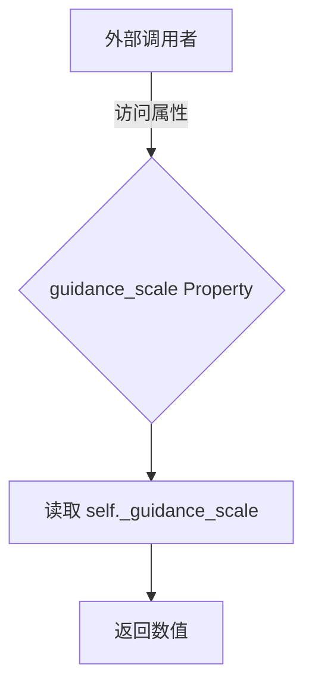

#### 带注释源码

```python
@property
def guidance_scale(self):
    """
    获取当前的 guidance_scale 值。

    该属性是一个只读访问器，它直接返回在管道调用（__call__）时
    通过参数传入并存储在 self._guidance_scale 中的值。
    用于在去噪过程中调整噪声预测的权重。

    注意：如果在调用管道之前访问，可能会因为属性未初始化而报错。
    """
    return self._guidance_scale
```


### `QwenImageLayeredPipeline.attention_kwargs`

这是一个属性（property），用于获取在管道调用时传递的注意力机制关键字参数（attention_kwargs）。该属性返回的是一个字典，其中包含了传递给 `AttentionProcessor` 的各种参数，如注意力掩码、dropout 等配置。

参数：
- （无参数，这是属性访问器）

返回值：`dict[str, Any] | None`，返回传递给 `AttentionProcessor` 的 kwargs 字典。如果未设置，则返回 `None`。

#### 流程图

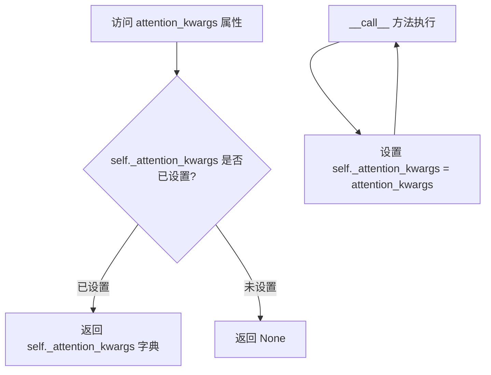

#### 带注释源码

```python
@property
def attention_kwargs(self):
    """
    属性：attention_kwargs
    
    返回在管道调用时设置的注意力机制关键字参数。
    该参数会在去噪循环中被传递给 transformer 模型的 attention_kwargs 参数。
    
    返回:
        dict[str, Any] | None: 包含 AttentionProcessor 配置的字典，
        如 {'scale': 1.0, 'noise_scale': 0.0} 等参数。
        如果未设置则返回 None。
    """
    return self._attention_kwargs
```

**相关代码引用（在 `__call__` 方法中的赋值）：**

```python
# 在 __call__ 方法中设置该属性
self._attention_kwargs = attention_kwargs

# 在去噪循环中使用该属性
noise_pred = self.transformer(
    hidden_states=latent_model_input,
    timestep=timestep / 1000,
    guidance=guidance,
    encoder_hidden_states_mask=prompt_embeds_mask,
    encoder_hidden_states=prompt_embeds,
    img_shapes=img_shapes,
    attention_kwargs=self.attention_kwargs,  # <-- 使用该属性
    additional_t_cond=is_rgb,
    return_dict=False,
)[0]
```


### `QwenImageLayeredPipeline.num_timesteps` (property)

返回推理过程中使用的时间步数量，用于跟踪扩散模型的推理进度。

参数：None（这是一个属性访问器，不接受任何参数）

返回值：`int`，返回配置的时间步总数，即推理过程中的去噪步数。

#### 流程图

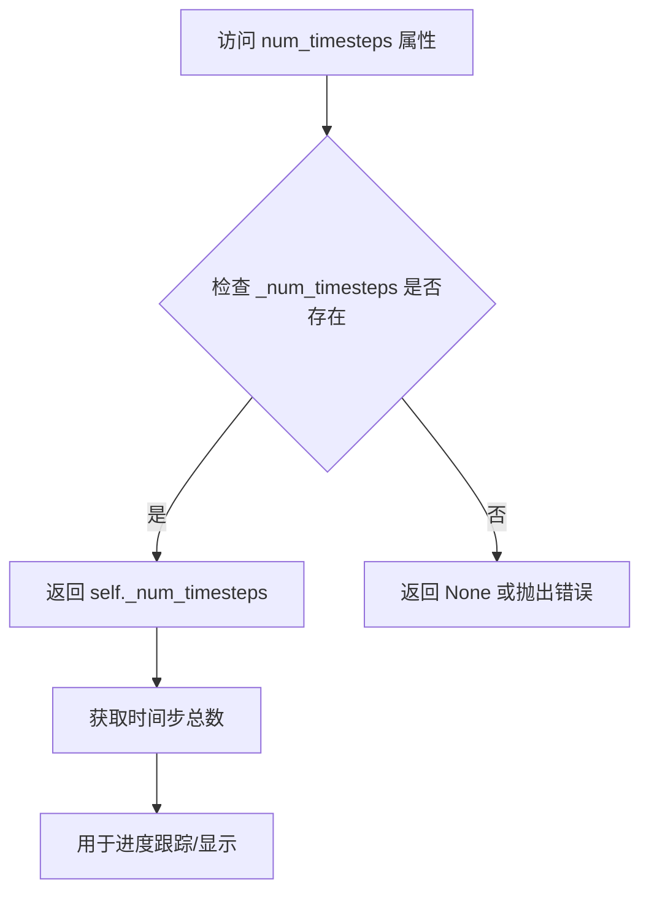

#### 带注释源码

```python
@property
def num_timesteps(self):
    """
    属性访问器：返回推理过程中的时间步数量。
    
    该属性返回在调用 pipeline 时设置的时间步总数。
    _num_timesteps 在 __call__ 方法中通过以下方式设置:
    self._num_timesteps = len(timesteps)
    
    Returns:
        int: 推理过程中使用的时间步总数
    """
    return self._num_timesteps
```

#### 相关上下文源码

在 `__call__` 方法中，`_num_timesteps` 的赋值逻辑：

```python
# 5. Prepare timesteps
sigmas = np.linspace(1.0, 0, num_inference_steps + 1)[:-1] if sigmas is None else sigmas
image_seq_len = latents.shape[1]
base_seqlen = 256 * 256 / 16 / 16
mu = (image_latents.shape[1] / base_seqlen) ** 0.5
timesteps, num_inference_steps = retrieve_timesteps(
    self.scheduler,
    num_inference_steps,
    device,
    sigmas=sigmas,
    mu=mu,
)
num_warmup_steps = max(len(timesteps) - num_inference_steps * self.scheduler.order, 0)
self._num_timesteps = len(timesteps)  # <-- 设置时间步总数
```

#### 使用场景

此属性通常用于：
1. 进度条的显示和更新
2. 调试和日志记录
3. 外部调用者了解推理的总步数


### `QwenImageLayeredPipeline.current_timestep`

该属性是一个简单的只读属性，用于获取当前的去噪时间步。在扩散模型的推理过程中，每个去噪循环迭代时，时间步会被更新，该属性用于在外部查询当前处于哪个时间步。

参数：

- （无显式参数，隐含参数 `self` 为类的实例）

返回值：`torch.Tensor | None`，返回当前去噪循环中正在进行的时间步张量。在推理开始前和结束后会被设置为 `None`。

#### 流程图

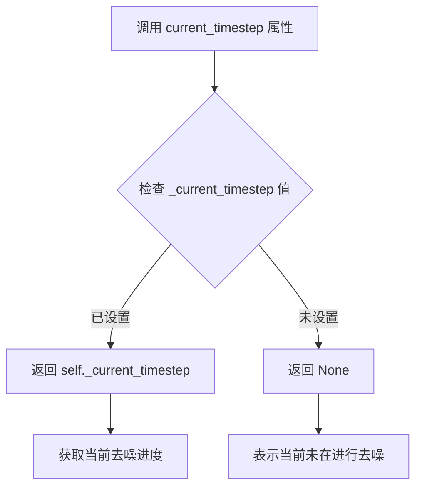

#### 带注释源码

```python
@property
def current_timestep(self):
    """
    当前去噪时间步属性。
    
    在 __call__ 方法的去噪循环中，每次迭代会更新 self._current_timestep：
        self._current_timestep = t
    
    用途：
    - 允许外部代码查询当前推理进度
    - 支持回调函数获取当前时间步信息
    - 在推理开始前和结束后会被设置为 None
    
    返回值：
        torch.Tensor: 当前时间步张量
        None: 当前未在进行去噪推理
    """
    return self._current_timestep
```


### `QwenImageLayeredPipeline.interrupt`

该属性是一个只读的属性访问器，用于获取当前管道的中断状态标志。在去噪循环中，推理过程会检查该标志，如果为 `True` 则跳过当前迭代，从而实现动态中断推理过程的功能。

参数：

- 该属性无参数

返回值：`bool`，返回当前的中断状态标志。如果为 `True`，表示推理过程已被请求中断；如果为 `False`，表示推理过程正常运行。

#### 流程图

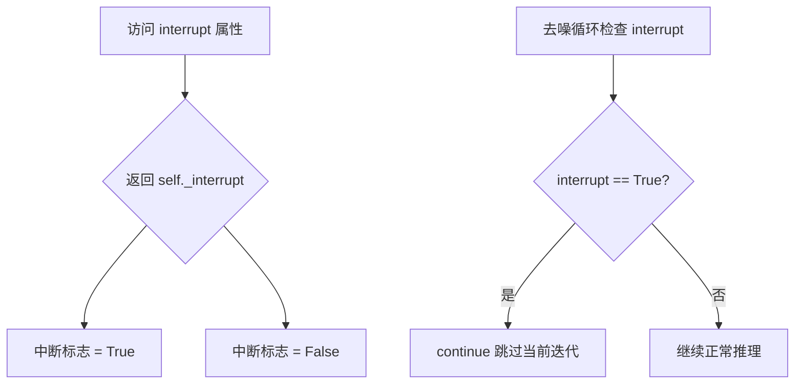

#### 带注释源码

```python
@property
def interrupt(self):
    """
    属性访问器，用于获取当前管道的推理中断状态。
    
    该属性返回一个布尔值，表示推理过程是否被请求中断。
    在 __call__ 方法的去噪循环中，会检查此属性来决定是否跳过当前迭代。
    
    返回:
        bool: 当前的中断状态标志。True 表示请求中断，False 表示正常运行。
    """
    return self._interrupt
```

## 关键组件


### 张量索引与惰性加载

该管道使用`cache_context`实现条件和非条件推理的惰性加载，通过`_pack_latents`和`_unpack_latents`进行张量维度变换，支持在去噪循环中动态切换`encoder_hidden_states`和`encoder_hidden_states_mask`，实现高效的推理流程。

### 反量化支持

通过`latents_mean`和`latents_std`对VAE编码后的latents进行标准化（normalize）和反标准化（denormalize）处理，在`prepare_latents`中进行编码前的归一化，在`__call__`方法末尾进行逆变换以恢复原始latent分布。

### 量化策略

支持两种CFG模式：传统classifier-free guidance（通过`true_cfg_scale > 1`启用）和guidance-distilled模型（通过`guidance`参数和`transformer.config.guidance_embeds`启用），同时提供`cfg_normalize`选项对噪声预测进行规范化处理。

### 图像编码与VAE处理

使用`_encode_vae_image`方法对输入图像进行VAE编码，支持传入预计算的latent或自动编码，通过`retrieve_latents`函数统一获取latents，支持sample和argmax两种采样模式。

### 提示词嵌入处理

提供`_get_qwen_prompt_embeds`和`encode_prompt`处理Qwen2.5-VL模型的特殊prompt模板格式，支持中文和英文两种自动Caption模板，通过`_extract_masked_hidden`提取有效token的隐藏状态。

### 分层Latent打包

`_pack_latents`将多层latent打包为(batch_size, layers*height/2*width/2, channels*4)的形状，`_unpack_latents`执行逆操作，支持将多个图像层作为独立通道进行处理。

### 时间步检索与调度

`retrieve_timesteps`函数处理自定义时间步和sigmas，支持FlowMatchEulerDiscreteScheduler，结合`calculate_shift`根据图像序列长度动态调整shift参数。

### 图像尺寸计算

`calculate_dimensions`根据目标面积和宽高比计算符合32倍数的宽度和高度，`__call__`中根据resolution(640或1024)确定最终输出分辨率，并确保尺寸可被vae_scale_factor*2整除。


## 问题及建议


### 已知问题

-   `__call__` 方法过于冗长（超过300行），将大量逻辑混合在一起，包括输入预处理、prompt编码、latent准备、去噪循环和后处理，导致代码可读性和可维护性差
-   使用 `assert` 进行输入验证（如 `assert resolution in [640, 1024]`），这在Python中可以被优化关闭，应该使用 `raise ValueError` 替代
-   `img_shapes` 变量在每次pipeline调用时重复构建，且构建逻辑复杂（嵌套列表推导式），缺乏清晰的注释说明其数据结构含义
-   `is_rgb = torch.tensor([0] * batch_size).to(device=device, dtype=torch.long)` 在去噪循环外部创建，但在每次迭代中都被使用，这种模式可以优化为预先分配内存
-   `prepare_latents` 方法包含过多的条件分支（处理不同batch_size、不同generator类型等），逻辑嵌套过深
-   多个地方使用硬编码的magic number，如 `1000`（timestep缩放因子）、`34`（prompt模板索引）、`512`（默认max_new_tokens），缺乏常量定义
-   `_get_qwen_prompt_embeds` 方法中张量处理逻辑复杂，包含多次split、pad操作，缺乏清晰的文档说明
-   `get_image_caption` 方法直接使用 `text_encoder.generate` 生成caption，没有错误处理机制，如果模型生成失败会导致pipeline崩溃
-   `encode_prompt` 方法与 `_get_qwen_prompt_embeds` 方法职责部分重叠，耦合度高
-   缺少对 `layers` 参数的有效性验证（如必须为正整数），可能导致后续运行时错误
-   `callback_on_step_end` 的调用逻辑中使用 `locals()` 获取变量，这种方式不够显式且可能引入隐藏的bug

### 优化建议

-   将 `__call__` 方法拆分为多个私有方法，如 `_prepare_prompt_embeds`、`_prepare_latents`、`_denoise`、`_postprocess` 等，每个方法负责单一职责
-   将所有 `assert` 语句替换为 `raise ValueError` 或 `raise TypeError`，确保输入验证在任何情况下都生效
-   创建配置类或常量类，将硬编码的magic number提取为命名的常量，如 `TIMESTEP_SCALE = 1000`、`DEFAULT_MAX_NEW_TOKENS = 512` 等
-   将 `img_shapes` 的构建逻辑封装为单独的方法，并添加详细的类型注解和文档说明其数据结构
-   将 `prepare_latents` 方法中的复杂条件逻辑拆分为多个辅助方法，如 `_validate_generator`、`_expand_image_latents` 等
-   为 `get_image_caption` 方法添加try-except异常处理，并提供fallback机制（如使用空字符串或默认caption）
-   在类级别定义 `_SUPPORTED_RESOLUTIONS = (640, 1024)` 等常量集合，并在 `check_inputs` 中使用
-   优化 `is_rgb` 的创建方式，使用 `torch.zeros(batch_size, dtype=torch.long, device=device)` 替代列表到张量的转换
-   考虑将 `encode_prompt` 和 `_get_qwen_prompt_embeds` 合并或重构，消除重复的prompt处理逻辑
-   添加 `layers` 参数的类型和范围验证，确保其为正整数

## 其它


### 设计目标与约束

本Pipeline的设计目标是将输入图像分解为多个图层（layers），支持最多4层分解。主要约束包括：1) 输入图像尺寸必须能被vae_scale_factor * 2整除；2) resolution参数仅支持640或1024；3) max_sequence_length不能超过1024；4) true_cfg_scale用于控制无分类器指导强度，当大于1时需要提供negative_prompt；5) 支持torch.float16和torch.bfloat16两种精度。

### 错误处理与异常设计

代码中的错误处理主要通过以下机制实现：1) check_inputs方法验证输入参数的合法性，包括图像尺寸兼容性、回调函数参数验证、prompt与embeddings的一致性检查；2) ValueError用于参数校验失败的情况；3) AttributeError用于encoder_output缺少latents属性时；4) 图像批次大小不匹配时抛出明确的错误信息；5) scheduler相关方法调用时检查是否支持自定义timesteps或sigmas参数。

### 数据流与状态机

Pipeline的推理流程状态机包含以下状态：1) INITIAL：初始化，检查输入参数；2) PREPROCESS：图像预处理和尺寸计算；3) ENCODE_PROMPT：文本编码生成prompt_embeds；4) PREPARE_LATENTS：准备噪声latents和图像latents；5) DENOISE：去噪循环，迭代执行transformer推理和scheduler.step；6) DECODE：将最终latents解码为图像；7) OUTPUT：返回结果。每个状态转换都依赖前一个状态的输出作为输入。

### 外部依赖与接口契约

本Pipeline依赖以下外部组件：1) transformers库的Qwen2_5_VLForConditionalGeneration和Qwen2Tokenizer用于文本编码；2) diffusers库的FlowMatchEulerDiscreteScheduler用于扩散调度；3) 自定义模块包括AutoencoderKLQwenImage（VAE）、QwenImageTransformer2DModel（Transformer）、VaeImageProcessor（图像处理）；4) 可选的torch_xla用于XLA设备加速。接口契约要求输入图像为PIL.Image或torch.Tensor，prompt为字符串或列表，返回QwenImagePipelineOutput或元组。

### 性能考虑与优化空间

性能优化方向包括：1) 模型CPU卸载顺序已定义为model_cpu_offload_seq="text_encoder->transformer->vae"；2) 支持梯度检查点（cache_context）减少显存占用；3) 图像latents使用argmax采样模式避免随机性；4) 支持XLA设备mark_step优化；5) 可通过设置output_type="latent"跳过解码步骤。当前潜在优化点：1) 图像预处理可考虑异步执行；2) 可添加混合精度推理选项；3) 可实现批处理推理的动态填充策略。

### 安全性考虑

安全性设计包括：1) 使用torch.no_grad()装饰器防止梯度计算；2) 文本编码使用Qwen2.5-VL-7B-Instruct模型，需遵守其许可协议；3) 图像处理过程中保持数据类型一致性；4) 设备转移时使用适当的dtype转换；5) 不保存中间推理结果到磁盘。

### 配置参数详解

关键配置参数包括：1) true_cfg_scale：分类器自由指导比例，推荐值4.0；2) layers：分解层数，默认4层；3) resolution：输出分辨率，仅支持640或1024；4) cfg_normalize：是否对CFG预测进行归一化；5) use_en_prompt：自动Caption的语言选择；6) num_inference_steps：去噪步数，默认50；7) guidance_scale：指导蒸馏模型的引导比例。

### 版本兼容性说明

代码从多个Pipeline复制了辅助函数：calculate_shift来自qwenimage.pipeline_qwenimage，retrieve_timesteps来自stable_diffusion.pipeline_stable_diffusion，retrieve_latents来自stable_diffusion.pipeline_stable_diffusion_img2img，_extract_masked_hidden和encode_prompt来自qwenimage.pipeline_qwenimage，_encode_vae_image来自qwenimage.pipeline_qwenimage_edit。版本兼容性需确保transformers库版本支持Qwen2.5-VL系列模型，diffusers库版本支持FlowMatchEulerDiscreteScheduler。


    