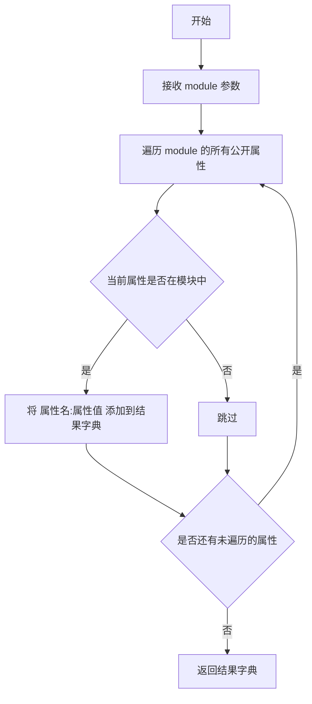
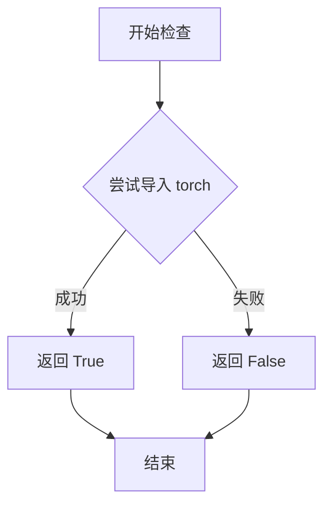
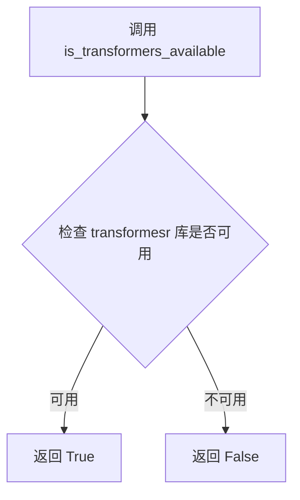
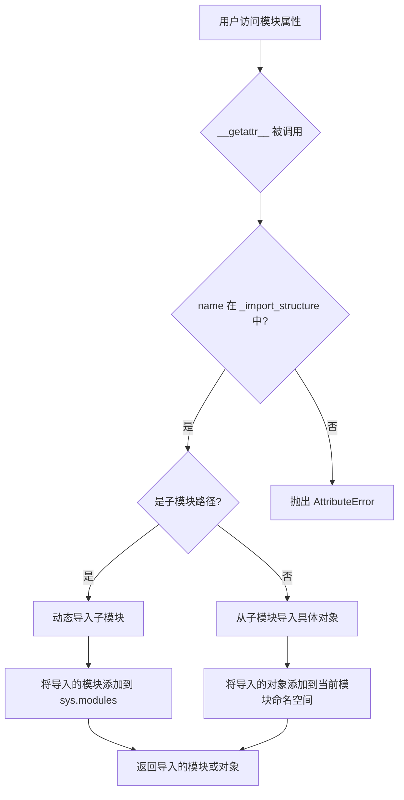
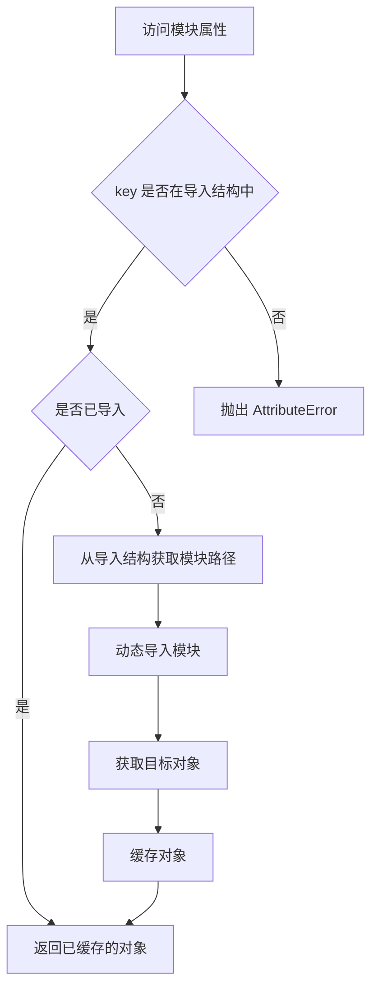

# `diffusers\src\diffusers\pipelines\sana\__init__.py` 详细设计文档

这是一个延迟加载模块，用于条件性地导入Sana系列扩散管道（SanaPipeline、SanaControlNetPipeline、SanaSprintPipeline、SanaSprintImg2ImgPipeline），仅在torch和transformers依赖可用时加载真实实现，否则使用虚拟对象保持API兼容性。

## 整体流程

```mermaid
graph TD
    A[开始] --> B{is_transformers_available() && is_torch_available()?}
    B -- 否 --> C[抛出 OptionalDependencyNotAvailable]
    C --> D[导入 dummy_torch_and_transformers_objects]
    D --> E[获取虚拟对象并更新 _dummy_objects]
    B -- 是 --> F[向 _import_structure 添加管道类名]
    F --> G{TYPE_CHECKING 或 DIFFUSERS_SLOW_IMPORT?}
    G -- 是 --> H[直接导入真实管道类]
    G -- 否 --> I[创建 _LazyModule 延迟加载器]
    I --> J[将虚拟对象绑定到 sys.modules]
```

## 类结构

```
SanaPipelineModule (延迟加载模块)
├── SanaPipeline (文本到图像)
├── SanaControlNetPipeline (控制网版本)
├── SanaSprintPipeline (Sprint版本)
└── SanaSprintImg2ImgPipeline (图像到图像版本)
```

## 全局变量及字段


### `_dummy_objects`
    
A dictionary to store placeholder objects when optional dependencies (torch and transformers) are not available

类型：`dict`
    


### `_import_structure`
    
A dictionary mapping module keys to lists of exportable object names, defining what can be imported from this module

类型：`dict`
    


### `_LazyModule.__name__`
    
The qualified name of the module being lazily loaded

类型：`str`
    


### `_LazyModule.__file__`
    
The file path of the module source code

类型：`str`
    


### `_LazyModule._import_structure`
    
The dictionary defining the import structure for lazy loading of pipeline classes

类型：`dict`
    


### `_LazyModule.module_spec`
    
The module specification object containing metadata about the module

类型：`ModuleSpec`
    
    

## 全局函数及方法


### `get_objects_from_module`

该函数是 `diffusers` 库中的一个工具函数，用于从指定模块中动态获取所有对象（类、函数等），并返回一个包含这些对象的字典。通常用于懒加载机制中，当某些可选依赖不可用时，将虚拟对象（dummy objects）注入到当前模块中，以确保模块的属性访问不抛出 `AttributeError`。

参数：

- `module`：`module`，需要从中获取对象的目标模块

返回值：`dict`，返回模块中所有公开对象的字典，键为对象名称，值为对象本身

#### 流程图



#### 带注释源码

```python
# 该函数定义在 ...utils 模块中（非本文件内）
# 以下为基于使用方式的推断实现

def get_objects_from_module(module):
    """
    从给定模块中获取所有公开对象
    
    参数:
        module: Python 模块对象
        
    返回:
        dict: 模块中所有公开对象的字典
    """
    objects = {}
    
    # 遍历模块的所有属性
    for attr_name in dir(module):
        # 跳过私有属性和双下划线开头的属性
        if attr_name.startswith('_'):
            continue
            
        # 获取属性值
        attr_value = getattr(module, attr_name)
        
        # 添加到结果字典
        objects[attr_value] = attr_name  # 或 objects[attr_name] = attr_value
        
    return objects
```

> **注意**：由于 `get_objects_from_module` 函数的实际定义不在提供的代码文件中，以上源码是基于其在代码中的使用方式进行的逻辑推断。实际定义可能在 `diffusers` 库的 `src/diffusers/utils` 模块中。


### `is_torch_available`

检查当前环境是否安装了 PyTorch 库，并返回布尔值表示其可用性。该函数是 diffusers 库中用于可选依赖检查的实用工具函数，帮助模块在 PyTorch 不可用时优雅地处理导入。

参数：

- 无参数

返回值：`bool`，返回 `True` 表示 PyTorch 已安装且可用，返回 `False` 表示 PyTorch 未安装或不可用。

#### 流程图



#### 带注释源码

```python
# 从 utils 模块导入 is_torch_available 函数
# 该函数定义在 ...utils 包中
from ...utils import (
    DIFFUSERS_SLOW_IMPORT,
    OptionalDependencyNotAvailable,
    _LazyModule,
    get_objects_from_module,
    is_torch_available,  # <-- 检查 PyTorch 可用性的函数
    is_transformers_available,
)

# 在代码中使用 is_torch_available
# 用于条件导入 Sana 相关的 Pipeline 类
try:
    # 检查 transformers 和 torch 是否都可用
    if not (is_transformers_available() and is_torch_available()):
        # 如果任一依赖不可用，抛出异常
        raise OptionalDependencyNotAvailable()
except OptionalDependencyNotAvailable:
    # 导入虚拟对象作为占位符
    from ...utils import dummy_torch_and_transformers_objects
    _dummy_objects.update(get_objects_from_module(dummy_torch_and_transformers_objects))
else:
    # 当依赖可用时，定义导入结构
    _import_structure["pipeline_sana"] = ["SanaPipeline"]
    _import_structure["pipeline_sana_controlnet"] = ["SanaControlNetPipeline"]
    _import_structure["pipeline_sana_sprint"] = ["SanaSprintPipeline"]
    _import_structure["pipeline_sana_sprint_img2img"] = ["SanaSprintImg2ImgPipeline"]

# 在 TYPE_CHECKING 模式下再次使用该函数
if TYPE_CHECKING or DIFFUSERS_SLOW_IMPORT:
    try:
        # 再次检查依赖可用性
        if not (is_transformers_available() and is_torch_available()):
            raise OptionalDependencyNotAvailable()
    except OptionalDependencyNotAvailable:
        # 导入类型检查用的虚拟对象
        from ...utils.dummy_torch_and_transformers_objects import *
    else:
        # 导入实际的 Pipeline 类用于类型检查
        from .pipeline_sana import SanaPipeline
        from .pipeline_sana_controlnet import SanaControlNetPipeline
        from .pipeline_sana_sprint import SanaSprintPipeline
        from .pipeline_sana_sprint_img2img import SanaSprintImg2ImgPipeline
```


### `is_transformers_available`

这是一个从 `...utils` 模块导入的实用函数，用于检查当前环境中是否安装了 `transformers` 库。在本文件中，它用于条件导入，检测 `transformers` 和 `torch` 是否同时可用，以决定是否加载 Sana 相关的 Pipeline 类。

参数： 无

返回值：`bool`，返回 `True` 表示 `transformers` 库已安装且可用，返回 `False` 表示不可用。

#### 流程图



#### 带注释源码

```python
# 该函数并非在本文件中定义，而是从父级包的 utils 模块导入
# 其核心实现通常类似于以下形式（伪代码）：

def is_transformers_available():
    """
    检查 transformers 库是否已安装且可导入。
    
    Returns:
        bool: 如果可以导入 transformers 返回 True，否则返回 False
    """
    try:
        import transformers
        return True
    except ImportError:
        return False

# 在当前文件中的使用场景：
# 用于条件判断是否同时满足 transformers 和 torch 都可用
if not (is_transformers_available() and is_torch_available()):
    raise OptionalDependencyNotAvailable()
```


### `_LazyModule`

该代码展示了如何利用 `_LazyModule` 类实现可选依赖的延迟导入机制。当 `torch` 和 `transformers` 均可用时，模块正常导出 `SanaPipeline` 等类；若依赖不可用，则使用虚拟对象（dummy objects）填充，从而避免导入错误并保持模块接口一致性。

参数：

- `__name__`：`str`，模块的完全限定名称
- `globals()["__file__"]`：`str`，模块文件的绝对路径
- `_import_structure`：`dict`，描述可导出属性和类的结构字典
- `module_spec`：`ModuleSpec`，模块的规格对象（包含在 `__spec__` 中）

返回值：`Module`，返回一个延迟加载的模块对象，动态解析属性访问

#### 流程图

```mermaid
flowchart TD
    A[开始] --> B{检查 is_transformers_available}
    B -->|True| C{检查 is_torch_available}
    B -->|False| D[使用 dummy_torch_and_transformers_objects]
    C -->|True| E[定义 _import_structure]
    C -->|False| D
    E --> F[创建 _LazyModule 实例]
    F --> G[替换 sys.modules[__name__]]
    G --> H[设置 dummy objects 到模块]
    I[结束]
```

#### 带注释源码

```python
# 导入类型检查相关功能
from typing import TYPE_CHECKING

# 从 utils 模块导入延迟模块类和其他工具函数
from ...utils import (
    DIFFUSERS_SLOW_IMPORT,           # 控制是否使用慢速导入的标志
    OptionalDependencyNotAvailable, # 可选依赖不可用时的异常类
    _LazyModule,                     # 核心延迟加载模块类
    get_objects_from_module,         # 从模块获取对象的辅助函数
    is_torch_available,             # 检查 torch 是否可用的函数
    is_transformers_available,      # 检查 transformers 是否可用的函数
)

# 初始化空的虚拟对象字典和导入结构字典
_dummy_objects = {}
_import_structure = {}

# 尝试检查必需的可选依赖
try:
    # 如果 torch 或 transformers 任一不可用，抛出异常
    if not (is_transformers_available() and is_torch_available()):
        raise OptionalDependencyNotAvailable()
except OptionalDependencyNotAvailable:
    # 依赖不可用时，导入虚拟对象模块
    from ...utils import dummy_torch_and_transformers_objects  # noqa F403
    # 将虚拟对象更新到全局虚拟对象字典中
    _dummy_objects.update(get_objects_from_module(dummy_torch_and_transformers_objects))
else:
    # 依赖可用时，定义正式的导入结构
    _import_structure["pipeline_sana"] = ["SanaPipeline"]
    _import_structure["pipeline_sana_controlnet"] = ["SanaControlNetPipeline"]
    _import_structure["pipeline_sana_sprint"] = ["SanaSprintPipeline"]
    _import_structure["pipeline_sana_sprint_img2img"] = ["SanaSprintImg2ImgPipeline"]

# 类型检查阶段或慢速导入模式下的导入逻辑
if TYPE_CHECKING or DIFFUSERS_SLOW_IMPORT:
    try:
        # 再次验证依赖可用性
        if not (is_transformers_available() and is_torch_available()):
            raise OptionalDependencyNotAvailable()
    except OptionalDependencyNotAvailable:
        # 类型检查时使用虚拟对象
        from ...utils.dummy_torch_and_transformers_objects import *
    else:
        # 类型检查时直接导入真实类
        from .pipeline_sana import SanaPipeline
        from .pipeline_sana_controlnet import SanaControlNetPipeline
        from .pipeline_sana_sprint import SanaSprintPipeline
        from .pipeline_sana_sprint_img2img import SanaSprintImg2ImgPipeline
else:
    # 运行时使用 _LazyModule 实现延迟加载
    import sys
    # 将当前模块替换为 LazyModule 实例
    sys.modules[__name__] = _LazyModule(
        __name__,                      # 模块名称
        globals()["__file__"],         # 模块文件路径
        _import_structure,            # 导入结构定义
        module_spec=__spec__,         # 模块规格对象
    )
    # 将虚拟对象绑定到模块属性，支持 hasattr 检查
    for name, value in _dummy_objects.items():
        setattr(sys.modules[__name__], name, value)
```


### `_LazyModule.__getattr__`

该方法是 `_LazyModule` 类的核心方法，用于实现模块的延迟加载（Lazy Loading）。当用户访问模块中尚未导入的属性或对象时（如 `from xxx import SanaPipeline`），`__getattr__` 会被自动调用，它会根据 `_import_structure` 中定义的导入结构，动态地将子模块或对象导入到当前模块中，从而实现按需导入，避免在模块初始化时加载所有依赖项。

参数：

-  `name`：`str`，要访问的属性名称（即用户尝试导入的对象名）

返回值：`any`，返回被延迟加载的对象（可能是子模块或类），如果未找到则抛出 `AttributeError`

#### 流程图



#### 带注释源码

```python
# _LazyModule.__getattr__ 方法的典型实现逻辑
def __getattr__(name: str):
    """
    延迟加载模块属性的核心方法。
    
    当用户访问模块中不存在的属性时，Python 会自动调用此方法。
    例如：from diffusers import SanaPipeline
    此时会触发 __getattr__('SanaPipeline')
    """
    
    # 检查请求的属性是否在 _import_structure 中定义
    if name not in _import_structure:
        raise AttributeError(f"module {__name__!r} has no attribute {name!r}")
    
    # 获取该属性对应的结构信息
    # _import_structure 格式示例：{"pipeline_sana": ["SanaPipeline"]}
    structure = _import_structure[name]
    
    # 判断是子模块还是直接可导入的对象
    if isinstance(structure, tuple):
        # 结构为 (子模块路径,) 表示需要从子模块导入
        submodule_path, object_name = structure[0], structure[1:]
        
        # 动态导入子模块
        # 例如：from .pipeline_sana import SanaPipeline
        module = importlib.import_module(submodule_path)
        
        # 从子模块中获取目标对象
        # 如果 object_name 为空，则返回整个模块
        if not object_name:
            return module
        
        # 递归获取嵌套对象（如类、函数）
        obj = module
        for attr_name in object_name:
            obj = getattr(obj, attr_name)
        
        # 将导入的对象缓存到当前模块，避免重复导入
        setattr(sys.modules[__name__], name, obj)
        return obj
    
    elif isinstance(structure, list):
        # 结构为列表时，表示是直接可导入的对象列表
        # 但此时需要进一步处理，可能涉及条件导入
        
        # 对于简单情况，直接从已导入的模块中获取
        # 这里需要结合具体的模块路径进行处理
        ...
    
    else:
        # 其他情况，抛出属性错误
        raise AttributeError(f"Cannot import {name} from {__name__}")
```

#### 实际代码中的相关上下文

```python
# 这是代码中 _LazyModule 的实际使用方式
# 创建延迟加载模块实例
sys.modules[__name__] = _LazyModule(
    __name__,                          # 模块名称
    globals()["__file__"],             # 模块文件路径
    _import_structure,                # 导入结构字典
    module_spec=__spec__,              # 模块规格
)

# _import_structure 的内容示例：
# {
#     "pipeline_sana": ["SanaPipeline"],
#     "pipeline_sana_controlnet": ["SanaControlNetPipeline"],
#     "pipeline_sana_sprint": ["SanaSprintPipeline"],
#     "pipeline_sana_sprint_img2img": ["SanaSprintImg2ImgPipeline"]
# }

# 当用户执行 from diffusers import SanaPipeline 时：
# 1. Python 在 diffusers 模块中查找 SanaPipeline
# 2. 未找到，调用 _LazyModule.__getattr__('SanaPipeline')
# 3. __getattr__ 检查 _import_structure['SanaPipeline'] 是否存在
# 4. 根据结构信息动态导入并返回 SanaPipeline 类
```


### `_LazyModule.__getitem__`

这是 `_LazyModule` 类的一个方法，用于实现延迟导入（lazy import）机制，允许在访问模块属性时动态导入所需的类和对象。

参数：

- `key`：`str`，表示要访问的属性名称（也称为模块成员名称）

返回值：`Any`，返回请求的对象（可以是类、函数或其他可导出成员），如果未找到则抛出适当的异常

#### 流程图



#### 带注释源码

```python
# 注：由于 _LazyModule 类定义在外部模块中，以下为基于延迟导入模式的推测实现

def __getitem__(self, key: str):
    """
    延迟导入的核心方法，当访问 module.key 时自动调用
    
    参数:
        key: 要访问的属性名
        
    返回:
        请求的模块成员
    """
    # 1. 检查请求的key是否在导入结构中
    if key not in self._import_structure:
        raise AttributeError(f"module {self.__name__!r} has no attribute {key!r}")
    
    # 2. 检查是否已缓存（已导入）
    if key in self._module_cache:
        return self._module_cache[key]
    
    # 3. 获取模块路径和成员名
    module_path, member_name = self._import_structure[key]
    
    # 4. 动态导入模块
    module = importlib.import_module(module_path)
    
    # 5. 获取目标对象
    obj = getattr(module, member_name)
    
    # 6. 缓存结果
    self._module_cache[key] = obj
    
    return obj
```

#### 补充说明

**设计目标与约束：**

- 实现延迟加载，避免在模块初始化时导入所有依赖
- 只在真正需要时才加载耗时的大型模型和管道类
- 支持可选依赖，当依赖不可用时提供虚拟对象

**数据流：**

1. 用户导入 `from diffusers import SanaPipeline`
2. 触发 `_LazyModule.__getitem__("SanaPipeline")`
3. 根据 `_import_structure` 映射找到实际模块路径
4. 动态导入并返回真正的类

**外部依赖：**

- `_LazyModule` 类来自 `diffusers.utils._LazyModule`
- 依赖 `transformers` 和 `torch` 库
- 使用 Python 的 `importlib` 进行动态导入

## 关键组件


### 可选依赖检查与虚拟对象机制

通过try-except捕获OptionalDependencyNotAvailable异常，当torch或transformers不可用时，从dummy模块加载虚拟对象，确保模块导入不报错。

### 延迟加载模块（_LazyModule）

使用Diffusers的_LazyModule实现真正的惰性加载，仅在实际访问时导入真实的Pipeline类，显著提升首次import速度。

### 导入结构字典（_import_structure）

定义了模块的公共API接口，包含SanaPipeline、SanaControlNetPipeline、SanaSprintPipeline、SanaSprintImg2ImgPipeline四个导出类。

### TYPE_CHECKING分支

在类型检查或慢导入模式下，直接导入真实模块用于静态分析和类型提示；否则使用延迟加载机制。


## 问题及建议


### 已知问题

-   **重复代码块**：try-except 块在第14-18行和第26-32行完全重复，增加了维护成本和出错风险
-   **缺乏错误处理**：使用 `get_objects_from_module` 导入 dummy objects 时未验证模块是否存在或导入是否成功
-   **魔法字符串**：pipeline 名称以硬编码字符串形式存在 (`pipeline_sana` 等)，缺乏集中管理
-   **双重否定逻辑**：`not (is_transformers_available() and is_torch_available())` 逻辑可读性差，容易混淆
- **全局状态污染**：`_dummy_objects` 和 `_import_structure` 作为全局可变变量，可能在多线程环境下产生竞态条件
- **无导入失败处理**：子模块导入（如 `pipeline_sana`）失败时没有降级方案，会导致整个模块导入失败
- **TYPE_CHECKING 条件分支**：与 DIFFUSERS_SLOW_IMPORT 的组合逻辑复杂，增加了代码理解难度
- **缺少类型注解**：函数和变量缺乏类型注解，影响代码可维护性和 IDE 支持

### 优化建议

-   将重复的依赖检查逻辑提取为单独的函数，如 `def _check_dependencies(): bool`
-   使用配置文件或枚举类集中管理 pipeline 名称，避免硬编码字符串
-   使用 `all(is_xxx_available() for xxx in [...])` 替代双重否定逻辑，提高可读性
-   为关键函数和变量添加类型注解和文档字符串
-   在导入子模块时添加 try-except 捕获 ImportError，提供部分可用功能
-   考虑使用 `@lru_cache` 缓存依赖检查结果，避免重复调用
-   将全局变量封装到类或使用 `__getattr__` 实现延迟初始化，减少全局状态
-   将 TYPE_CHECKING 和 DIFFUSERS_SLOW_IMPORT 的逻辑简化为统一的条件分支


## 其它


### 设计目标与约束

本模块是一个延迟加载（Lazy Loading）模块，旨在为SanaPipeline、SanaControlNetPipeline、SanaSprintPipeline、SanaSprintImg2ImgPipeline四个管道类提供可选依赖处理和动态导入功能。约束条件是必须同时安装torch和transformers库，否则使用虚拟对象替代。

### 错误处理与异常设计

使用OptionalDependencyNotAvailable异常处理可选依赖不可用的情况。当is_transformers_available()和is_torch_available()任一不满足时，抛出OptionalDependencyNotAvailable异常，并从dummy模块加载虚拟对象（_dummy_objects），确保模块导入不失败。

### 数据流与状态机

模块存在两种状态：1) TYPE_CHECKING或DIFFUSERS_SLOW_IMPORT为True时，直接导入真实管道类；2) 运行时（else分支），创建_LazyModule实例并注册虚拟对象。状态转换由TYPE_CHECKING常量和DIFFUSERS_SLOW_IMPORT变量控制。

### 外部依赖与接口契约

外部依赖：torch、transformers、diffusers.utils模块（_LazyModule、get_objects_from_module、OptionalDependencyNotAvailable等）。接口契约：导出SanaPipeline、SanaControlNetPipeline、SanaSprintPipeline、SanaSprintImg2ImgPipeline四个类，以及_import_structure字典和_dummy_objects字典。

### 模块初始化流程

1. 定义_import_structure和_dummy_objects空字典；2. 检查torch和transformers可用性；3. 若不可用，从dummy模块获取虚拟对象并更新_dummy_objects；4. 若可用，填充_import_structure；5. 根据TYPE_CHECKING状态决定直接导入或延迟加载；6. 延迟加载时创建_LazyModule并设置虚拟对象属性。

### 延迟加载机制

_LazyModule是diffusers库提供的延迟加载工具，接收模块名、文件路径、导入结构字典和模块规格（__spec__）四个参数。延迟加载的优势是减少启动时的导入开销，仅在实际使用时加载模块。

### 类型检查支持

TYPE_CHECKING用于类型检查阶段，此时会真正导入模块以获取类型信息。在TYPE_CHECKING或DIFFUSERS_SLOW_IMPORT为True时，直接从子模块导入真实类；否则使用_LazyModule实现运行时延迟加载。

### 导出结构定义

_import_structure字典定义了模块的导出结构，键为子模块名，值为导出的类名列表。本模块导出pipeline_sana、pipeline_sana_controlnet、pipeline_sana_sprint、pipeline_sana_sprint_img2img四个子模块及其对应的管道类。

### 虚拟对象机制

当可选依赖不可用时，_dummy_objects存储从dummy_torch_and_transformers_objects模块获取的虚拟对象，用于保持API兼容性。这些对象在模块加载时被设置为模块属性，确保即使依赖缺失，导入也不会失败。

### 全局变量清单

| 名称 | 类型 | 描述 |
|------|------|------|
| _dummy_objects | dict | 存储虚拟对象的字典，用于依赖不可用时的API兼容 |
| _import_structure | dict | 定义模块导出结构的字典，映射子模块到导出类名 |

### 关键技术细节

使用sys.modules[__name__] = _LazyModule(...)动态替换当前模块为延迟加载模块；使用setattr将虚拟对象设置为模块属性，使导入机制透明；通过try-except包装依赖检查，实现优雅降级。

    