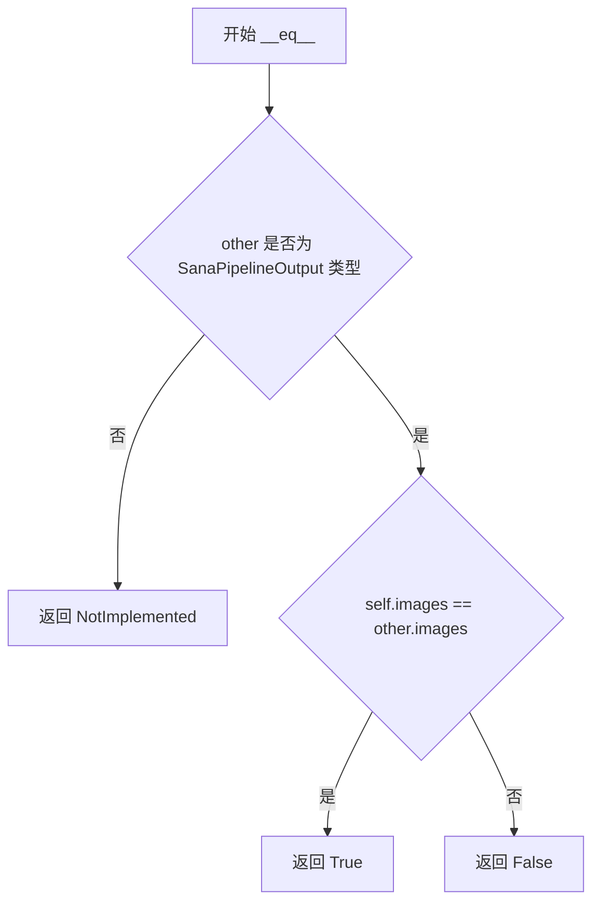
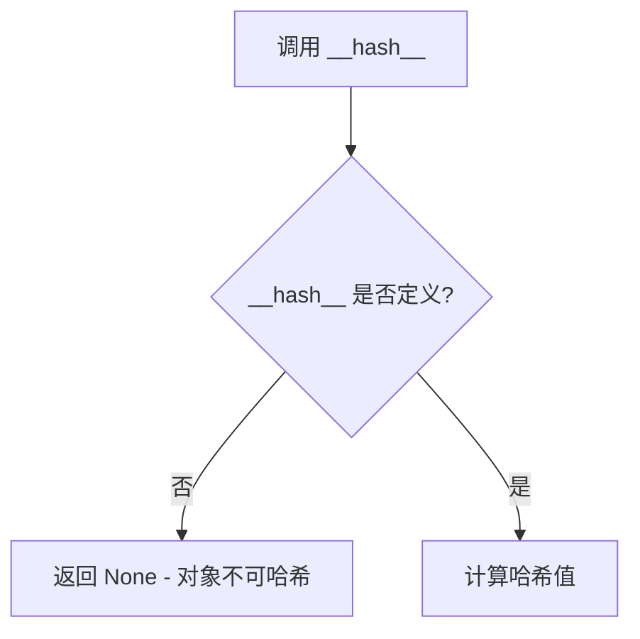
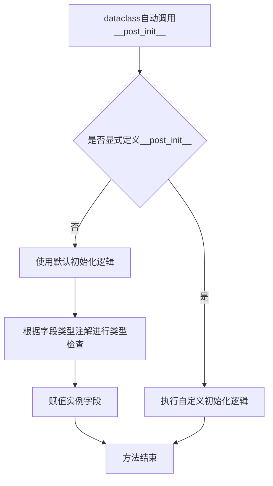

# `diffusers\src\diffusers\pipelines\sana\pipeline_output.py` 详细设计文档

SanaPipelineOutput是一个数据类，继承自BaseOutput，用于封装Sana图像生成管道的输出结果，包含去噪后的图像数据，支持PIL.Image列表或numpy数组两种格式

## 整体流程

```mermaid
graph TD
    A[导入依赖模块] --> B[定义SanaPipelineOutput数据类]
    B --> C[继承BaseOutput基类]
    C --> D[定义images字段]
    D --> E[指定类型为list[PIL.Image.Image] | np.ndarray]
    E --> F[添加文档注释说明字段用途]
```

## 类结构

```
BaseOutput (基类)
└── SanaPipelineOutput (数据类)
```

## 全局变量及字段


### `SanaPipelineOutput.images`
    
去噪后的图像列表（PIL Image对象）或numpy数组，形状为(batch_size, height, width, num_channels)。

类型：`list[PIL.Image.Image] | np.ndarray`
    
    

## 全局函数及方法


### `SanaPipelineOutput.__init__`

SanaPipelineOutput 类的初始化方法，由 Python dataclass 装饰器自动生成，用于创建一个包含去噪图像的输出对象。

参数：

- `self`：`SanaPipelineOutput`，隐式参数，表示当前创建的实例
- `images`：`list[PIL.Image.Image] | np.ndarray`，去噪后的图像列表或 numpy 数组，列表长度为 batch_size，numpy 数组形状为 `(batch_size, height, width, num_channels)`

返回值：`None`，初始化方法不返回值，仅初始化对象状态

#### 流程图

```mermaid
flowchart TD
    A[开始 __init__] --> B[接收 images 参数]
    B --> C{验证 images 类型}
    C -->|list[PIL.Image.Image]| D[将 images 存储为实例属性]
    C -->|np.ndarray| D
    D --> E[完成初始化]
```

#### 带注释源码

```python
@dataclass
class SanaPipelineOutput(BaseOutput):
    """
    Output class for Sana pipelines.

    Args:
        images (`list[PIL.Image.Image]` or `np.ndarray`)
            list of denoised PIL images of length `batch_size` or numpy array of shape `(batch_size, height, width,
            num_channels)`. PIL images or numpy array present the denoised images of the diffusion pipeline.
    """

    # images 字段：存储去噪后的图像
    # 类型可以是 PIL 图像列表或 numpy 数组
    # PIL 图像列表长度对应 batch_size
    # numpy 数组形状为 (batch_size, height, width, num_channels)
    images: list[PIL.Image.Image] | np.ndarray
    
    # __init__ 方法由 @dataclass 装饰器自动生成
    # 签名类似于: def __init__(self, images: list[PIL.Image.Image] | np.ndarray) -> None
    # 功能是将传入的 images 参数赋值给实例的 images 属性
```


### `SanaPipelineOutput.__repr__`

该方法是 Python `dataclass` 自动生成的字符串表示方法，用于返回 `SanaPipelineOutput` 对象的可读字符串描述，格式为 `SanaPipelineOutput(images=...)`。

参数：此方法为隐式定义，由 `@dataclass` 装饰器自动生成，无显式参数（隐含参数为 `self`）

返回值：`str`，返回对象的字符串表示形式，包含类名和所有字段的名称与值

#### 流程图

```mermaid
flowchart TD
    A[调用 __repr__ 方法] --> B{dataclass 自动生成}
    B --> C[获取 self.images 字段值]
    C --> D[格式化字符串: SanaPipelineOutput(images={images值})]
    D --> E[返回字符串]
```

#### 带注释源码

```python
from dataclasses import dataclass

import numpy as np
import PIL.Image

from ...utils import BaseOutput


@dataclass
class SanaPipelineOutput(BaseOutput):
    """
    Output class for Sana pipelines.

    Args:
        images (`list[PIL.Image.Image]` or `np.ndarray`)
            list of denoised PIL images of length `batch_size` or numpy array of shape `(batch_size, height, width,
            num_channels)`. PIL images or numpy array present the denoised images of the diffusion pipeline.
    """

    images: list[PIL.Image.Image] | np.ndarray
    
    # 注意：__repr__ 方法由 @dataclass 装饰器自动生成
    # 等价于如下显式定义：
    # def __repr__(self):
    #     return f'SanaPipelineOutput(images={self.images!r})'
```

---

### 补充说明

| 项目 | 说明 |
|------|------|
| **方法来源** | 由 `@dataclass` 装饰器隐式自动生成，非显式定义 |
| **继承关系** | 继承自 `BaseOutput`，可能从父类继承额外的 `__repr__` 逻辑 |
| **输出格式** | `SanaPipelineOutput(images=[...]或array(...))` |
| **调用场景** | 调试输出 `print(obj)`、日志记录、IDE 查看对象内容 |


### `SanaPipelineOutput.__eq__`

该方法是 `SanaPipelineOutput` 类的相等性比较方法，由 Python 的 `@dataclass` 装饰器自动生成，用于比较两个 `SanaPipelineOutput` 对象是否相等。比较基于对象的 `images` 字段进行。

参数：

- `self`：`SanaPipelineOutput`，当前对象实例
- `other`：`Any`，要比较的另一个对象

返回值：`bool`，如果两个对象的 `images` 字段相等则返回 `True`，否则返回 `False`

#### 流程图



#### 带注释源码

```python
def __eq__(self, other: object) -> bool:
    """
    比较两个 SanaPipelineOutput 对象是否相等。
    
    由 @dataclass 装饰器自动生成。
    比较基于 images 字段进行。
    
    Args:
        other: 要比较的对象
        
    Returns:
        bool: 如果两个对象的 images 字段相等返回 True，否则返回 False
    """
    # 如果 other 不是 SanaPipelineOutput 类型，返回 NotImplemented
    # 这样 Python 会尝试让 other 的 __eq__ 方法进行比较
    if not isinstance(other, SanaPipelineOutput):
        return NotImplemented
    
    # 比较两个对象的 images 字段是否相等
    return (self.images == other.images)
```


### `SanaPipelineOutput.__hash__`

该方法在提供的代码中未定义。`SanaPipelineOutput` 是一个 dataclass，由于其 `images` 字段类型为 `list[PIL.Image.Image] | np.ndarray`（包含可变类型 list），默认情况下 Python dataclass 会将 `__hash__` 设为 `None`，使该类不可哈希（即不能用于集合或作为字典键）。

参数：无（继承自 Python 基础对象）

返回值：`int | None`，返回对象的哈希值（如果未定义则返回 `None`）

#### 流程图



#### 带注释源码

```python
# 该方法在提供的代码中未显式定义
# 由于 images 字段为可变类型 (list | np.ndarray)，dataclass 默认将 __hash__ 设为 None
# 如需实现哈希，需设置 frozen=True 或显式定义 __hash__ 方法

# 默认行为（未定义）:
# def __hash__(self):
#     return None  # 对象不可哈希
```


### SanaPipelineOutput.__post_init__

该方法在提供的代码中未显式定义。作为Python dataclass，当未定义`__post_init__`方法时，Python会自动生成一个默认的初始化方法，该方法仅根据字段类型注解进行基本类型检查和默认值赋值，不执行任何自定义逻辑。

参数：

- `self`：实例本身，无需显式传递

返回值：无（`None`），该方法为初始化方法，不返回任何值

#### 流程图



#### 带注释源码

```python
# 由于代码中未显式定义__post_init__方法，
# Python dataclass会自动生成以下默认实现：

def __post_init__(self):
    """
    默认的__post_init__方法，由dataclass自动生成。
    不执行任何额外逻辑，仅依赖字段声明时的类型注解。
    """
    # 此处无自定义逻辑
    # images字段会在对象创建时直接通过dataclass机制赋值
    pass

# 如果需要自定义初始化，可以添加如下逻辑：
# def __post_init__(self):
#     # 例如：验证images不为空
#     if not isinstance(self.images, (list, np.ndarray)):
#         raise TypeError("images must be a list or numpy array")
#     
#     # 例如：确保list中的元素都是PIL.Image.Image
#     if isinstance(self.images, list):
#         for img in self.images:
#             if not isinstance(img, PIL.Image.Image):
#                 raise TypeError("All elements in images list must be PIL.Image.Image")
```

#### 备注

在当前代码实现中，`SanaPipelineOutput`类仅定义了一个数据字段`images`，未实现任何自定义的`__post_init__`方法，因此该dataclass的行为仅仅是存储数据而不进行额外的验证或转换逻辑。

## 关键组件


### SanaPipelineOutput 类

SanaPipelineOutput 是一个数据类，继承自 BaseOutput，用于封装 Sana 管道推理过程中的输出结果，主要存储去噪后的图像数据。

### images 字段

images 是 SanaPipelineOutput 类的核心字段，用于存储管道生成的去噪图像，支持两种数据类型：PIL.Image.Image 列表或 NumPy 数组，以便于后续的图像处理和展示。


## 问题及建议


### 已知问题

-   **Python版本兼容性问题**：使用了`list[PIL.Image.Image] | np.ndarray`语法（Python 3.10+的联合类型），不支持Python 3.9及以下版本
-   **类型注解不一致**：`list`应为`List`（大写）以符合typing模块规范，或显式使用`from __future__ import annotations`
-   **缺少字段验证**：没有对`images`字段的类型和形状进行运行时验证，可能导致下游处理错误
-   **文档注释不完整**：只有Args说明，缺少Returns、Raises等标准文档块；注释中"present"存在语法错误，应为"presents"
-   **序列化/反序列化问题**：直接存储`PIL.Image.Image`对象可能在多进程或分布式场景下导致序列化失败
-   **扩展性不足**：仅有一个字段，未来若需添加元数据（如`num_inference_steps`、`guidance_scale`等）需要修改类结构
-   **基类依赖不明确**：继承自`BaseOutput`，但未展示基类定义，无法确认继承关系是否合理
-   **类型混合问题**：同一字段接受两种不同类型（PIL Image或numpy array），增加调用方处理复杂度

### 优化建议

-   添加`from __future__ import annotations`以支持现代类型注解语法，并确保兼容性
-   引入`__post_init__`方法进行类型检查和验证，确保`images`为允许的类型之一
-   补充完整的docstring，包括Returns、Attributes和Example部分
-   考虑将PIL Image统一转换为numpy array存储，或提供序列化辅助方法
-   使用`@dataclass(frozen=True)`使实例不可变，提高线程安全性
-   添加类型转换方法（如`to_numpy()`、`to_pil()`）以提供统一的访问接口
-   考虑添加泛型支持，使类可复用于其他模态的管道输出
-   补充`__repr__`方法或使用dataclass的自动生成，增强调试可读性


## 其它


### 设计目标与约束

本类作为SanaPipeline的输出容器，核心目标是统一封装扩散管道去噪后的图像结果。设计约束包括：支持PIL.Image和numpy.ndarray两种图像格式，以适配不同下游任务的需求；保持与BaseOutput基类的兼容性，确保管道输出接口的一致性；使用dataclass实现简化对象构造和属性访问。

### 错误处理与异常设计

本类本身为数据容器，不涉及业务逻辑错误处理。若传入的images参数类型不符合预期（既非list[PIL.Image.Image]也非np.ndarray），Python类型检查工具将发出警告。实际运行时错误处理由调用方负责，例如在图像加载或管道执行阶段进行类型验证。建议调用方在实例化前进行类型检查，或使用Pydantic等库进行运行时类型校验。

### 数据流与状态机

本类为纯数据承载结构，不涉及状态机逻辑。数据流方向为：Pipeline内部经过去噪处理后生成图像列表或数组 → 实例化SanaPipelineOutput封装结果 → 返回给调用方。images字段为最终输出，不经过内部转换或状态变迁。

### 外部依赖与接口契约

本类依赖以下外部组件：1) PIL.Image来自Pillow库，用于处理PIL格式图像；2) np.ndarray来自NumPy库，用于处理数值数组；3) BaseOutput为项目内部基类，定义输出类的通用接口。调用方传入的images必须符合类型注解要求，且list类型内部元素必须为PIL.Image.Image对象。

### 版本兼容性

本代码使用Python 3.10+的联合类型语法（`|`操作符），要求运行时Python版本不低于3.10。若需兼容更低版本Python，应改用`Union`类型提示。Pillow和NumPy版本应满足管道其他组件的兼容性要求，通常建议Pillow>=9.0.0，NumPy>=1.21.0。

### 性能考量

作为轻量级数据容器，类本身不存在显著性能瓶颈。若images为大型numpy数组，内存占用主要取决于数组本身大小。建议在不需要保留原始图像时及时释放引用以协助垃圾回收。

### 安全考虑

本类不涉及文件操作、网络请求或敏感数据处理，安全性风险较低。但调用方需注意：若images来源于用户输入，应在管道处理前进行必要的图像尺寸和内容验证，防止内存耗尽或恶意构造的大型图像攻击。

### 使用示例

```python
# 示例1：使用PIL图像列表创建输出
from PIL import Image
images = [Image.new('RGB', (512, 512), color='red')]
output = SanaPipelineOutput(images=images)

# 示例2：使用numpy数组创建输出
import numpy as np
images = np.random.randint(0, 255, (1, 512, 512, 3), dtype=np.uint8)
output = SanaPipelineOutput(images=images)

# 访问输出
for img in output.images:
    img.save(f"output_{id(img)}.png")
```

### 扩展性考虑

当前类仅包含images字段。若未来需要扩展输出内容（如元数据、噪声信息等），可直接在dataclass中添加新字段。若需要更复杂的验证逻辑，可考虑继承自pydantic.BaseModel替代dataclass，以获得内置的运行时验证能力。


    