# `diffusers\src\diffusers\pipelines\sana\pipeline_sana.py` 详细设计文档

这是一个基于 Diffusers 库实现的 Sana 文本到图像生成管道。该管道集成了 Gemma 文本编码器、SanaTransformer 主干网络和 AutoencoderDC VAE 解码器，支持复杂的提示词处理（包括清洗和复杂指令增强）、分辨率分箱（Resolution Binning）、LoRA 加载、Classifier-Free Guidance 引导生成以及 VAE 切片/平铺解码，旨在通过深度学习扩散模型根据文本描述生成高质量图像。

## 整体流程

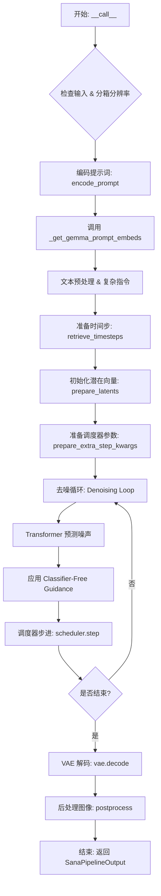

## 类结构

```
DiffusionPipeline (基类)
│
└── SanaLoraLoaderMixin (LoRA 加载混入)
    │
    └── SanaPipeline (主类)
        │
        ├── 模型组件 (通过 register_modules 注册)
        │   ├── tokenizer (GemmaTokenizer)
        │   ├── text_encoder (Gemma2PreTrainedModel)
        │   ├── vae (AutoencoderDC)
        │   ├── transformer (SanaTransformer2DModel)
        │   └── scheduler (DPMSolverMultistepScheduler)
        │
        └── 辅助组件
            └── image_processor (PixArtImageProcessor)
```

## 全局变量及字段


### `ASPECT_RATIO_4096_BIN`
    
4096分辨率下的宽高比查找表

类型：`dict`
    


### `EXAMPLE_DOC_STRING`
    
示例代码文档字符串

类型：`str`
    


### `logger`
    
日志记录器

类型：`Logger`
    


### `XLA_AVAILABLE`
    
PyTorch XLA 可用性标志

类型：`bool`
    


### `bad_punct_regex`
    
用于清洗文本的特殊符号正则表达式

类型：`re.Pattern`
    


### `ASPECT_RATIO_512_BIN`
    
引用自 pixart_alpha 的 512 分辨率查找表

类型：`dict`
    


### `ASPECT_RATIO_1024_BIN`
    
引用自 pixart_alpha 的 1024 分辨率查找表

类型：`dict`
    


### `ASPECT_RATIO_2048_BIN`
    
引用自 pixart_sigma 的 2048 分辨率查找表

类型：`dict`
    


### `SanaPipeline.vae`
    
VAE 解码器模型

类型：`AutoencoderDC`
    


### `SanaPipeline.transformer`
    
Sana 主干扩散模型

类型：`SanaTransformer2DModel`
    


### `SanaPipeline.tokenizer`
    
文本分词器

类型：`GemmaTokenizer | GemmaTokenizerFast`
    


### `SanaPipeline.text_encoder`
    
文本编码模型

类型：`Gemma2PreTrainedModel`
    


### `SanaPipeline.scheduler`
    
扩散调度器

类型：`DPMSolverMultistepScheduler`
    


### `SanaPipeline.vae_scale_factor`
    
VAE 缩放因子

类型：`int`
    


### `SanaPipeline.image_processor`
    
图像处理与后处理工具

类型：`PixArtImageProcessor`
    


### `SanaPipeline.model_cpu_offload_seq`
    
模型卸载顺序配置

类型：`str`
    


### `SanaPipeline._callback_tensor_inputs`
    
回调函数允许的 tensor 输入列表

类型：`list`
    


### `SanaPipeline._guidance_scale`
    
当前引导系数

类型：`float`
    


### `SanaPipeline._attention_kwargs`
    
注意力机制 kwargs

类型：`dict`
    


### `SanaPipeline._interrupt`
    
中断标志位

类型：`bool`
    


### `SanaPipeline._num_timesteps`
    
推理步数

类型：`int`
    


### `SanaPipeline._lora_scale`
    
LoRA 权重缩放因子

类型：`float`
    
    

## 全局函数及方法


### `retrieve_timesteps`

该函数是一个调度器辅助函数，用于获取扩散模型采样过程中的时间步（timesteps）列表。它封装了与调度器（Scheduler）交互的逻辑，支持三种模式：使用默认推理步数、使用自定义时间步列表或使用自定义 Sigma 列表，并负责处理设备转移和调度器兼容性验证。

参数：

-  `scheduler`：`SchedulerMixin`，调度器实例，负责生成和管理时间步。
-  `num_inference_steps`：`int | None`，期望的推理步数。如果传入，则必须将 `timesteps` 和 `sigmas` 设为 `None`。
-  `device`：`str | torch.device | None`，时间步张量需要转移到的目标设备。如果为 `None`，则不进行设备转移。
-  `timesteps`：`list[int] | None`，自定义的时间步整数列表（例如 `[1000, 900, ...]`），用于覆盖调度器的默认时间间隔策略。
-  `sigmas`：`list[float] | None`，自定义的 Sigma 浮点数列表，用于覆盖调度器的默认噪声调度策略。
-  `**kwargs`：任意关键字参数，将直接传递给调度器的 `set_timesteps` 方法。

返回值：`tuple[torch.Tensor, int]`，返回一个元组。第一个元素是调度器生成的时间步张量（Tensor），第二个元素是实际的推理步数（整数）。

#### 流程图

```mermaid
flowchart TD
    A([Start: retrieve_timesteps]) --> B{timesteps and sigmas\nare both provided?}
    B -- Yes --> C[Raise ValueError:\nOnly one of timesteps or sigmas can be passed]
    B -- No --> D{timesteps is not None?}
    D -- Yes --> E{scheduler.set_timesteps\nsupports timesteps?}
    E -- No --> F[Raise ValueError:\nScheduler does not support custom timesteps]
    E -- Yes --> G[scheduler.set_timesteps\n(timesteps=timesteps, ...)]
    G --> H[timesteps = scheduler.timesteps]
    H --> I[num_inference_steps = len(timesteps)]
    D -- No --> J{sigmas is not None?}
    J -- Yes --> K{scheduler.set_timesteps\nsupports sigmas?}
    K -- No --> L[Raise ValueError:\nScheduler does not support custom sigmas]
    K -- Yes --> M[scheduler.set_timesteps\n(sigmas=sigmas, ...)]
    M --> H
    J -- No --> N[scheduler.set_timesteps\n(num_inference_steps, ...)]
    N --> H
    I --> O([Return: timesteps, num_inference_steps])
    style C fill:#ff9999,stroke:#333,stroke-width:2px
    style F fill:#ff9999,stroke:#333,stroke-width:2px
    style L fill:#ff9999,stroke:#333,stroke-width:2px
```

#### 带注释源码

```python
def retrieve_timesteps(
    scheduler,
    num_inference_steps: int | None = None,
    device: str | torch.device | None = None,
    timesteps: list[int] | None = None,
    sigmas: list[float] | None = None,
    **kwargs,
):
    r"""
    获取调度器的时间步列表，处理自定义 timesteps 或 sigmas。

    Args:
        scheduler (`SchedulerMixin`): 调度器对象。
        num_inference_steps (`int`): 推理步数。
        device (`str` or `torch.device`): 设备。
        timesteps (`list[int]`): 自定义时间步。
        sigmas (`list[float]`): 自定义 sigmas。
    
    Returns:
        `tuple[torch.Tensor, int]`: 时间步和推理步数。
    """
    # 1. 参数互斥检查：timesteps 和 sigmas 不能同时传入
    if timesteps is not None and sigmas is not None:
        raise ValueError("Only one of `timesteps` or `sigmas` can be passed. Please choose one to set custom values")
    
    # 2. 处理自定义时间步 (timesteps)
    if timesteps is not None:
        # 检查调度器是否支持自定义 timesteps 参数
        accepts_timesteps = "timesteps" in set(inspect.signature(scheduler.set_timesteps).parameters.keys())
        if not accepts_timesteps:
            raise ValueError(
                f"The current scheduler class {scheduler.__class__}'s `set_timesteps` does not support custom"
                f" timestep schedules. Please check whether you are using the correct scheduler."
            )
        # 调用调度器设置时间步
        scheduler.set_timesteps(timesteps=timesteps, device=device, **kwargs)
        # 从调度器获取结果
        timesteps = scheduler.timesteps
        num_inference_steps = len(timesteps)
        
    # 3. 处理自定义 Sigmas (当 timesteps 为空时)
    elif sigmas is not None:
        # 检查调度器是否支持自定义 sigmas 参数
        accept_sigmas = "sigmas" in set(inspect.signature(scheduler.set_timesteps).parameters.keys())
        if not accept_sigmas:
            raise ValueError(
                f"The current scheduler class {scheduler.__class__}'s `set_timesteps` does not support custom"
                f" sigmas schedules. Please check whether you are using the correct scheduler."
            )
        # 调用调度器设置 sigmas
        scheduler.set_timesteps(sigmas=sigmas, device=device, **kwargs)
        # 从调度器获取时间步 (注意：即使传入 sigmas，返回的仍然是 timesteps)
        timesteps = scheduler.timesteps
        num_inference_steps = len(timesteps)
        
    # 4. 默认行为：使用 num_inference_steps
    else:
        scheduler.set_timesteps(num_inference_steps, device=device, **kwargs)
        timesteps = scheduler.timesteps
        
    return timesteps, num_inference_steps
```


### `SanaPipeline.__init__`

SanaPipeline 类的构造函数，用于初始化 Sana 文本到图像生成管道的所有核心组件，包括分词器、文本编码器、VAE、Transformer 模型和调度器，并注册这些模块以及配置 VAE 缩放因子和图像处理器。

#### 参数

- `self`：隐式参数，表示类的实例本身。
- `tokenizer`：`GemmaTokenizer | GemmaTokenizerFast`，用于将文本提示编码为模型可处理的 token 序列。
- `text_encoder`：`Gemma2PreTrainedModel`，预训练的文本编码器模型，用于将 token 序列转换为文本嵌入向量。
- `vae`：`AutoencoderDC`，变分自编码器（VAE）模型，负责将潜在表示解码为图像。
- `transformer`：`SanaTransformer2DModel`， Sana 变换器模型，负责在扩散过程中预测噪声。
- `scheduler`：`DPMSolverMultistepScheduler`，扩散调度器，用于控制去噪过程中的时间步长和噪声预测。

#### 返回值

无（`None`），该方法仅初始化对象状态，不返回任何值。

#### 流程图

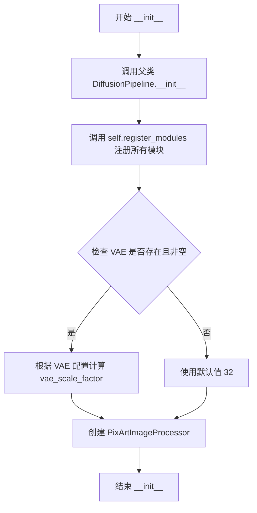

#### 带注释源码

```python
def __init__(
    self,
    tokenizer: GemmaTokenizer | GemmaTokenizerFast,
    text_encoder: Gemma2PreTrainedModel,
    vae: AutoencoderDC,
    transformer: SanaTransformer2DModel,
    scheduler: DPMSolverMultistepScheduler,
):
    """
    初始化 SanaPipeline 实例。

    参数:
        tokenizer: 用于文本编码的分词器
        text_encoder: 预训练文本编码器模型
        vae: 变分自编码器模型
        transformer: Sana 变换器模型
        scheduler: 扩散过程调度器
    """
    # 调用父类 DiffusionPipeline 的初始化方法
    super().__init__()

    # 注册所有模块，使管道能够访问和管理这些组件
    self.register_modules(
        tokenizer=tokenizer, 
        text_encoder=text_encoder, 
        vae=vae, 
        transformer=transformer, 
        scheduler=scheduler
    )

    # 计算 VAE 缩放因子，用于调整潜在空间与像素空间之间的转换
    # 默认为 32，如果 VAE 存在则根据其配置计算
    self.vae_scale_factor = (
        2 ** (len(self.vae.config.encoder_block_out_channels) - 1)
        if hasattr(self, "vae") and self.vae is not None
        else 32
    )
    
    # 创建图像处理器，用于图像的后处理和分辨率管理
    self.image_processor = PixArtImageProcessor(vae_scale_factor=self.vae_scale_factor)
```


### `SanaPipeline.enable_vae_slicing`

该方法用于启用VAE切片解码功能。当启用此选项时，VAE会将输入张量分割成多个切片分步计算解码，从而节省内存并支持更大的批处理尺寸。该方法已被弃用，将在未来版本中移除。

参数： 无

返回值：`None`，无返回值描述

#### 流程图

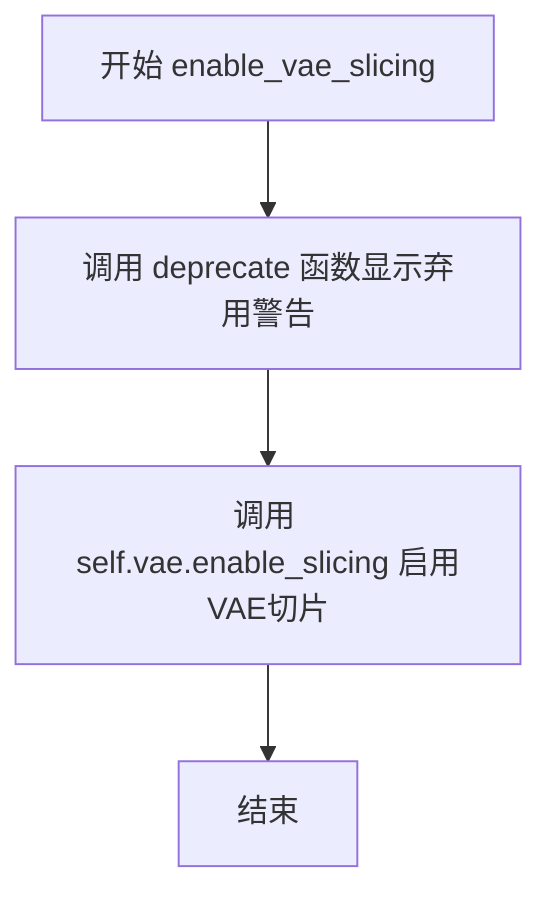

#### 带注释源码

```python
def enable_vae_slicing(self):
    r"""
    Enable sliced VAE decoding. When this option is enabled, the VAE will split the input tensor in slices to
    compute decoding in several steps. This is useful to save some memory and allow larger batch sizes.
    """
    # 构建弃用警告消息，告知用户该方法已弃用，建议使用 pipe.vae.enable_slicing()
    depr_message = f"Calling `enable_vae_slicing()` on a `{self.__class__.__name__}` is deprecated and this method will be removed in a future version. Please use `pipe.vae.enable_slicing()`."
    # 调用 deprecate 函数记录弃用信息，在版本 0.40.0 时完全移除
    deprecate(
        "enable_vae_slicing",
        "0.40.0",
        depr_message,
    )
    # 委托给 VAE 模型的 enable_slicing 方法来启用切片解码功能
    self.vae.enable_slicing()
```


### `SanaPipeline.disable_vae_slicing`

该方法用于禁用 VAE（变分自编码器）的切片解码功能。如果之前启用了 `enable_vae_slicing`，调用此方法后将恢复为单步解码。该方法已弃用，推荐直接调用 `pipe.vae.disable_slicing()`。

参数： 无

返回值：`None`，无返回值（该方法为 void 类型）

#### 流程图

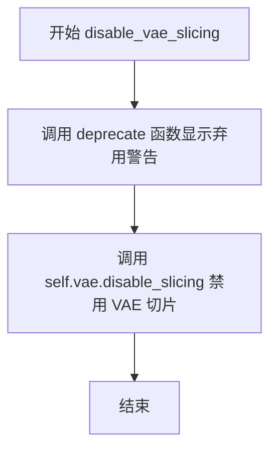

#### 带注释源码

```python
def disable_vae_slicing(self):
    r"""
    Disable sliced VAE decoding. If `enable_vae_slicing` was previously enabled, this method will go back to
    computing decoding in one step.
    """
    # 构建弃用警告消息，提示用户该方法将在未来版本中移除
    # 并建议使用新的 API: pipe.vae.disable_slicing()
    depr_message = f"Calling `disable_vae_slicing()` on a `{self.__class__.__name__}` is deprecated and this method will be removed in a future version. Please use `pipe.vae.disable_slicing()`."
    
    # 调用 deprecate 函数记录弃用信息，版本号为 0.40.0
    deprecate(
        "disable_vae_slicing",
        "0.40.0",
        depr_message,
    )
    
    # 实际执行禁用 VAE 切片功能，调用底层 VAE 模型的 disable_slicing 方法
    self.vae.disable_slicing()
```


### `SanaPipeline.enable_vae_tiling`

该方法用于启用VAE（变分自编码器）的分块解码功能。当启用此选项时，VAE会将输入张量分割成多个块（tiles）来分步计算解码和编码过程，从而节省大量内存并允许处理更大的图像。该方法目前已弃用，建议直接使用 `pipe.vae.enable_tiling()`。

参数：

- 该方法没有参数

返回值：`None`，无返回值（该方法直接作用于VAE模型，修改其内部状态）

#### 流程图

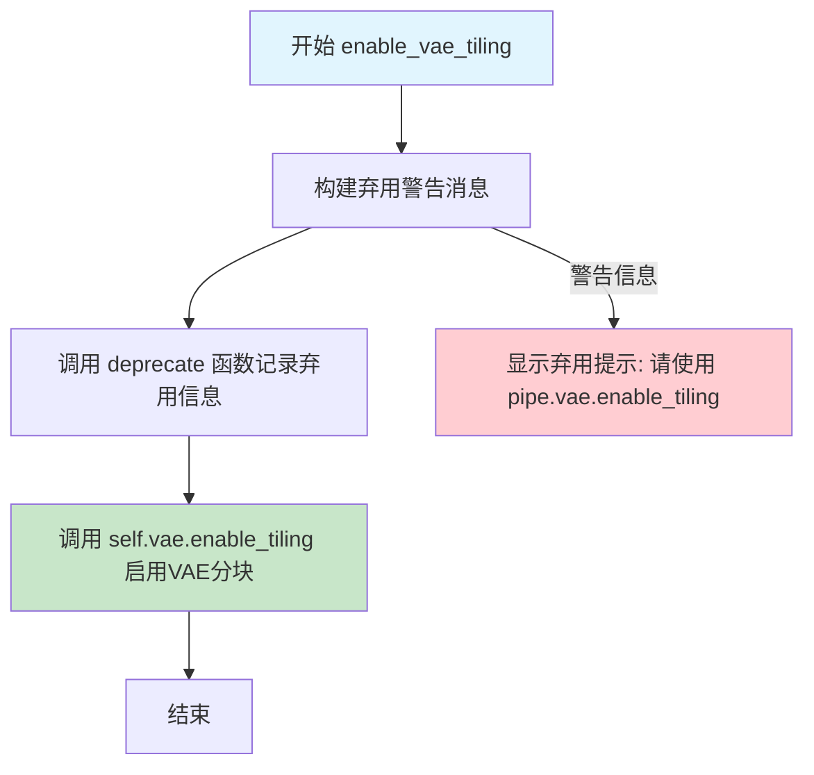

#### 带注释源码

```python
def enable_vae_tiling(self):
    r"""
    Enable tiled VAE decoding. When this option is enabled, the VAE will split the input tensor into tiles to
    compute decoding and encoding in several steps. This is useful for saving a large amount of memory and to allow
    processing larger images.
    """
    # 构建弃用警告消息，提示用户该方法将在未来版本中移除
    # 并建议使用新的API: pipe.vae.enable_tiling()
    depr_message = f"Calling `enable_vae_tiling()` on a `{self.__class__.__name__}` is deprecated and this method will be removed in a future version. Please use `pipe.vae.enable_tiling()`."
    
    # 调用 deprecate 函数记录弃用信息
    # 参数说明:
    # - "enable_vae_tiling": 被弃用的函数名
    # - "0.40.0": 计划移除的版本号
    # - depr_message: 弃用说明信息
    deprecate(
        "enable_vae_tiling",
        "0.40.0",
        depr_message,
    )
    
    # 实际启用VAE的分块功能
    # 该方法会修改VAE模型的内部状态
    # 使其在解码时将大图像分割成小块进行处理
    # 从而降低显存占用
    self.vae.enable_tiling()
```


### `SanaPipeline.disable_vae_tiling`

该方法用于禁用 VAE（变分自编码器）的平铺解码功能。如果之前通过 `enable_vae_tiling` 启用了平铺模式，调用此方法后将恢复为单步解码。该方法已被标记为弃用，建议直接调用 `pipe.vae.disable_tiling()`。

参数： 无（仅包含隐式参数 `self`）

返回值：`None`，无返回值

#### 流程图

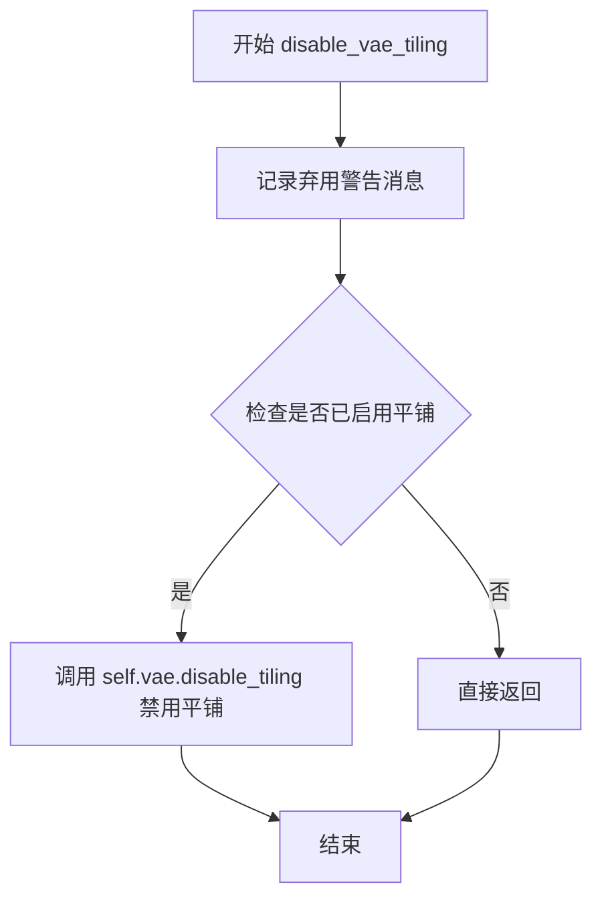

#### 带注释源码

```python
def disable_vae_tiling(self):
    r"""
    Disable tiled VAE decoding. If `enable_vae_tiling` was previously enabled, this method will go back to
    computing decoding in one step.
    """
    # 构建弃用警告消息，提示用户该方法将在未来版本中移除
    # 并建议使用新的 API: pipe.vae.disable_tiling()
    depr_message = f"Calling `disable_vae_tiling()` on a `{self.__class__.__name__}` is deprecated and this method will be removed in a future version. Please use `pipe.vae.disable_tiling()`."
    
    # 调用 deprecate 函数记录弃用信息
    # 参数: 方法名, 弃用版本号, 警告消息
    deprecate(
        "disable_vae_tiling",
        "0.40.0",
        depr_message,
    )
    
    # 实际执行禁用 VAE 平铺操作
    # 调用 VAE 模型的 disable_tiling 方法
    self.vae.disable_tiling()
```


### SanaPipeline._get_gemma_prompt_embeds

该方法负责将文本提示（prompt）编码为文本编码器的隐藏状态（text encoder hidden states），支持文本清洗、复杂人类指令处理，并返回编码后的嵌入向量和注意力掩码供后续扩散模型使用。

参数：

- `self`：`SanaPipeline`，SanaPipeline 类的实例，隐式参数
- `prompt`：`str | list[str]`，需要编码的提示文本，可以是单个字符串或字符串列表
- `device`：`torch.device`，用于放置结果嵌入的 PyTorch 设备
- `dtype`：`torch.dtype`，嵌入向量的数据类型（如 torch.float32）
- `clean_caption`：`bool`，是否对提示进行预处理和清洗（默认 False）
- `max_sequence_length`：`int`，提示的最大序列长度（默认 300）
- `complex_human_instruction`：`list[str] | None`，复杂人类指令列表，用于增强提示（默认 None）

返回值：`tuple[torch.Tensor, torch.Tensor]`，返回一个元组，包含：
- `prompt_embeds`：`torch.Tensor`，编码后的文本嵌入向量，形状为 (batch_size, seq_len, hidden_dim)
- `prompt_attention_mask`：`torch.Tensor`，用于指示有效位置的注意力掩码，形状为 (batch_size, seq_len)

#### 流程图

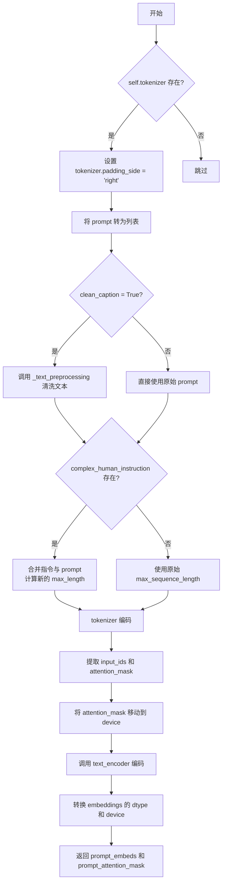

#### 带注释源码

```python
def _get_gemma_prompt_embeds(
    self,
    prompt: str | list[str],
    device: torch.device,
    dtype: torch.dtype,
    clean_caption: bool = False,
    max_sequence_length: int = 300,
    complex_human_instruction: list[str] | None = None,
):
    r"""
    Encodes the prompt into text encoder hidden states.

    Args:
        prompt (`str` or `list[str]`, *optional*):
            prompt to be encoded
        device: (`torch.device`, *optional*):
            torch device to place the resulting embeddings on
        clean_caption (`bool`, defaults to `False`):
            If `True`, the function will preprocess and clean the provided caption before encoding.
        max_sequence_length (`int`, defaults to 300): Maximum sequence length to use for the prompt.
        complex_human_instruction (`list[str]`, defaults to `complex_human_instruction`):
            If `complex_human_instruction` is not empty, the function will use the complex Human instruction for
            the prompt.
    """
    # 将单个字符串转换为列表，保持处理一致性
    prompt = [prompt] if isinstance(prompt, str) else prompt

    # 确保 tokenizer 的 padding 侧为右侧
    if getattr(self, "tokenizer", None) is not None:
        self.tokenizer.padding_side = "right"

    # 文本预处理：清洗 caption（移除 HTML、URL 等）
    prompt = self._text_preprocessing(prompt, clean_caption=clean_caption)

    # 准备复杂人类指令
    if not complex_human_instruction:
        # 无复杂指令时，使用默认最大长度
        max_length_all = max_sequence_length
    else:
        # 将复杂指令合并到每个 prompt 前面
        chi_prompt = "\n".join(complex_human_instruction)
        prompt = [chi_prompt + p for p in prompt]
        # 计算合并后的总长度
        num_chi_prompt_tokens = len(self.tokenizer.encode(chi_prompt))
        max_length_all = num_chi_prompt_tokens + max_sequence_length - 2

    # 使用 tokenizer 编码 prompt
    text_inputs = self.tokenizer(
        prompt,
        padding="max_length",
        max_length=max_length_all,
        truncation=True,
        add_special_tokens=True,
        return_tensors="pt",
    )
    # 提取输入 IDs 和注意力掩码
    text_input_ids = text_inputs.input_ids
    prompt_attention_mask = text_inputs.attention_mask
    # 将注意力掩码移动到目标设备
    prompt_attention_mask = prompt_attention_mask.to(device)

    # 调用文本编码器获取嵌入
    prompt_embeds = self.text_encoder(text_input_ids.to(device), attention_mask=prompt_attention_mask)
    # 提取第一个元素（隐藏状态）并转换数据类型和设备
    prompt_embeds = prompt_embeds[0].to(dtype=dtype, device=device)

    # 返回嵌入和注意力掩码
    return prompt_embeds, prompt_attention_mask
```


### `SanaPipeline.encode_prompt`

该方法负责将文本提示（prompt）编码为文本编码器隐藏状态（text encoder hidden states），支持分类器无指导（classifier-free guidance），并处理 LoRA 缩放、复杂人类指令和多图像生成等高级功能。

参数：

- `prompt`：`str | list[str]`，要编码的提示文本
- `do_classifier_free_guidance`：`bool = True`，是否使用分类器无指导
- `negative_prompt`：`str = ""`，负向提示，用于指导不生成的内容
- `num_images_per_prompt`：`int = 1`，每个提示生成的图像数量
- `device`：`torch.device | None`，张量放置设备
- `prompt_embeds`：`torch.Tensor | None`，预生成的文本嵌入
- `negative_prompt_embeds`：`torch.Tensor | None`，预生成的负向文本嵌入
- `prompt_attention_mask`：`torch.Tensor | None`，提示的注意力掩码
- `negative_prompt_attention_mask`：`torch.Tensor | None`，负向提示的注意力掩码
- `clean_caption`：`bool = False`，是否清理和预处理提示文本
- `max_sequence_length`：`int = 300`，最大序列长度
- `complex_human_instruction`：`list[str] | None`，复杂人类指令列表
- `lora_scale`：`float | None`，LoRA 缩放因子

返回值：`tuple[torch.Tensor, torch.Tensor, torch.Tensor, torch.Tensor]`，返回提示嵌入、提示注意力掩码、负向提示嵌入和负向注意力掩码

#### 流程图

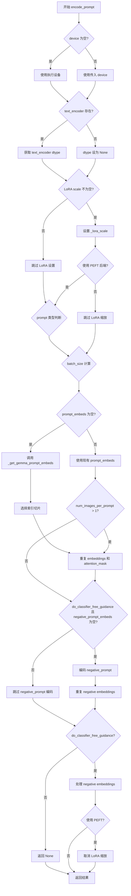

#### 带注释源码

```python
def encode_prompt(
    self,
    prompt: str | list[str],
    do_classifier_free_guidance: bool = True,
    negative_prompt: str = "",
    num_images_per_prompt: int = 1,
    device: torch.device | None = None,
    prompt_embeds: torch.Tensor | None = None,
    negative_prompt_embeds: torch.Tensor | None = None,
    prompt_attention_mask: torch.Tensor | None = None,
    negative_prompt_attention_mask: torch.Tensor | None = None,
    clean_caption: bool = False,
    max_sequence_length: int = 300,
    complex_human_instruction: list[str] | None = None,
    lora_scale: float | None = None,
):
    r"""
    Encodes the prompt into text encoder hidden states.
    """
    # 确定执行设备
    if device is None:
        device = self._execution_device

    # 获取 text_encoder 的数据类型
    if self.text_encoder is not None:
        dtype = self.text_encoder.dtype
    else:
        dtype = None

    # 设置 LoRA 缩放因子，使其可被 text_encoder 的 LoRA 函数访问
    if lora_scale is not None and isinstance(self, SanaLoraLoaderMixin):
        self._lora_scale = lora_scale
        # 动态调整 LoRA 缩放
        if self.text_encoder is not None and USE_PEFT_BACKEND:
            scale_lora_layers(self.text_encoder, lora_scale)

    # 根据 prompt 类型确定批处理大小
    if prompt is not None and isinstance(prompt, str):
        batch_size = 1
    elif prompt is not None and isinstance(prompt, list):
        batch_size = len(prompt)
    else:
        batch_size = prompt_embeds.shape[0]

    # 设置 tokenizer 的 padding 方向
    if getattr(self, "tokenizer", None) is not None:
        self.tokenizer.padding_side = "right"

    # 参见论文第 3.1 节
    max_length = max_sequence_length
    # 选择索引：[0, -max_length+1, ..., -1]，用于保留第一个 token 和最后 max_length-1 个 tokens
    select_index = [0] + list(range(-max_length + 1, 0))

    # 如果未提供 prompt_embeds，则从 prompt 生成
    if prompt_embeds is None:
        prompt_embeds, prompt_attention_mask = self._get_gemma_prompt_embeds(
            prompt=prompt,
            device=device,
            dtype=dtype,
            clean_caption=clean_caption,
            max_sequence_length=max_sequence_length,
            complex_human_instruction=complex_human_instruction,
        )
        # 根据选择索引切片 embeddings
        prompt_embeds = prompt_embeds[:, select_index]
        prompt_attention_mask = prompt_attention_mask[:, select_index]

    bs_embed, seq_len, _ = prompt_embeds.shape
    # 复制 text embeddings 和 attention mask 以支持每个 prompt 生成多个图像
    prompt_embeds = prompt_embeds.repeat(1, num_images_per_prompt, 1)
    prompt_embeds = prompt_embeds.view(bs_embed * num_images_per_prompt, seq_len, -1)
    prompt_attention_mask = prompt_attention_mask.view(bs_embed, -1)
    prompt_attention_mask = prompt_attention_mask.repeat(num_images_per_prompt, 1)

    # 获取分类器无指导的无条件 embeddings
    if do_classifier_free_guidance and negative_prompt_embeds is None:
        # 处理 negative_prompt 为字符串或列表的情况
        negative_prompt = [negative_prompt] * batch_size if isinstance(negative_prompt, str) else negative_prompt
        negative_prompt_embeds, negative_prompt_attention_mask = self._get_gemma_prompt_embeds(
            prompt=negative_prompt,
            device=device,
            dtype=dtype,
            clean_caption=clean_caption,
            max_sequence_length=max_sequence_length,
            complex_human_instruction=False,  # 不使用复杂指令
        )

    if do_classifier_free_guidance:
        # 复制无条件 embeddings 以支持每个 prompt 生成多个图像
        seq_len = negative_prompt_embeds.shape[1]
        negative_prompt_embeds = negative_prompt_embeds.to(dtype=dtype, device=device)
        negative_prompt_embeds = negative_prompt_embeds.repeat(1, num_images_per_prompt, 1)
        negative_prompt_embeds = negative_prompt_embeds.view(batch_size * num_images_per_prompt, seq_len, -1)
        negative_prompt_attention_mask = negative_prompt_attention_mask.view(bs_embed, -1)
        negative_prompt_attention_mask = negative_prompt_attention_mask.repeat(num_images_per_prompt, 1)
    else:
        negative_prompt_embeds = None
        negative_prompt_attention_mask = None

    # 如果使用 PEFT backend，恢复 LoRA layers 的原始缩放
    if self.text_encoder is not None:
        if isinstance(self, SanaLoraLoaderMixin) and USE_PEFT_BACKEND:
            unscale_lora_layers(self.text_encoder, lora_scale)

    return prompt_embeds, prompt_attention_mask, negative_prompt_embeds, negative_prompt_attention_mask
```


### `SanaPipeline.prepare_extra_step_kwargs`

该方法用于为调度器（scheduler）的 `step` 方法准备额外的关键字参数。由于不同调度器的签名不完全相同，该方法通过反射机制检查调度器是否接受 `eta` 和 `generator` 参数，并动态构建需要传递的参数字典。

参数：

- `self`：`SanaPipeline`，SANA 管道实例（隐式参数）
- `generator`：`torch.Generator | list[torch.Generator] | None`，用于控制随机性生成的 PyTorch 生成器，用于使图像生成具有确定性
- `eta`：`float`，DDIM 调度器专用的噪声因子（η），取值范围为 [0,1]，其他调度器会忽略此参数

返回值：`dict`，包含调度器 `step` 方法所需额外参数的字典，可能包含 `eta` 和/或 `generator` 键

#### 流程图

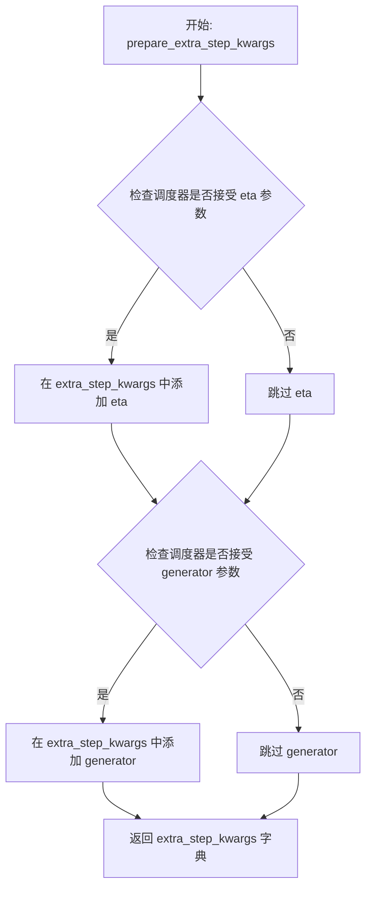

#### 带注释源码

```python
def prepare_extra_step_kwargs(self, generator, eta):
    # 准备调度器步骤所需的额外参数
    # 并非所有调度器都具有相同的函数签名
    # eta (η) 仅在 DDIMScheduler 中使用，其他调度器会忽略此参数
    # eta 对应 DDIM 论文中的 η: https://huggingface.co/papers/2010.02502
    # 取值范围应为 [0, 1]

    # 通过反射检查调度器的 step 方法是否接受 'eta' 参数
    accepts_eta = "eta" in set(inspect.signature(self.scheduler.step).parameters.keys())
    
    # 初始化额外的参数字典
    extra_step_kwargs = {}
    
    # 如果调度器接受 eta 参数，则将其添加到 extra_step_kwargs
    if accepts_eta:
        extra_step_kwargs["eta"] = eta

    # 检查调度器是否接受 'generator' 参数
    accepts_generator = "generator" in set(inspect.signature(self.scheduler.step).parameters.keys())
    
    # 如果调度器接受 generator 参数，则将其添加到 extra_step_kwargs
    if accepts_generator:
        extra_step_kwargs["generator"] = generator
    
    # 返回构建好的参数字典
    return extra_step_kwargs
```


### `SanaPipeline.check_inputs`

该方法用于验证 SanaPipeline 的输入参数是否符合要求，包括检查图像高度和宽度是否为 32 的倍数、prompt 和 prompt_embeds 的互斥关系、callback_on_step_end_tensor_inputs 的有效性，以及 prompt_embeds 和 negative_prompt_embeds 的形状一致性等。如果任何检查失败，将抛出相应的 ValueError 异常。

参数：

- `self`：`SanaPipeline` 实例，Pipeline 对象本身
- `prompt`：`str | list[str] | None`，用户提供的文本提示，用于引导图像生成
- `height`：`int`，生成图像的高度（像素），必须是 32 的倍数
- `width`：`int`，生成图像的宽度（像素），必须是 32 的倍数
- `callback_on_step_end_tensor_inputs`：`list[str] | None`，可选的回调张量输入列表，必须是 `self._callback_tensor_inputs` 中的元素
- `negative_prompt`：`str | list[str] | None`，负面提示词，用于指导图像生成时避免的内容
- `prompt_embeds`：`torch.Tensor | None`，预生成的文本嵌入向量，与 prompt 互斥
- `negative_prompt_embeds`：`torch.Tensor | None`，预生成的负面文本嵌入向量
- `prompt_attention_mask`：`torch.Tensor | None`，prompt_embeds 对应的注意力掩码
- `negative_prompt_attention_mask`：`torch.Tensor | None`，negative_prompt_embeds 对应的注意力掩码

返回值：`None`，该方法不返回任何值，仅通过抛出 ValueError 来表示验证失败

#### 流程图

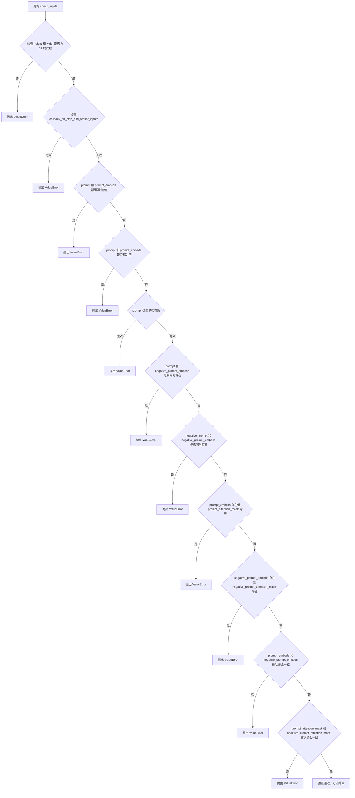

#### 带注释源码

```python
def check_inputs(
    self,
    prompt,
    height,
    width,
    callback_on_step_end_tensor_inputs=None,
    negative_prompt=None,
    prompt_embeds=None,
    negative_prompt_embeds=None,
    prompt_attention_mask=None,
    negative_prompt_attention_mask=None,
):
    # 检查生成图像的高度和宽度是否都是 32 的倍数
    # 这是因为 VAE 的下采样因子通常为 8，潜在空间的尺寸需要与输入尺寸匹配
    if height % 32 != 0 or width % 32 != 0:
        raise ValueError(f"`height` and `width` have to be divisible by 32 but are {height} and {width}.")

    # 验证 callback_on_step_end_tensor_inputs 中的所有键都在允许的列表中
    # _callback_tensor_inputs 定义了哪些张量可以在回调中传递
    if callback_on_step_end_tensor_inputs is not None and not all(
        k in self._callback_tensor_inputs for k in callback_on_step_end_tensor_inputs
    ):
        raise ValueError(
            f"`callback_on_step_end_tensor_inputs` has to be in {self._callback_tensor_inputs}, but found {[k for k in callback_on_step_end_tensor_inputs if k not in self._callback_tensor_inputs]}"
        )

    # prompt 和 prompt_embeds 是互斥的，不能同时提供
    # prompt 是原始文本，prompt_embeds 是预计算的文本嵌入
    if prompt is not None and prompt_embeds is not None:
        raise ValueError(
            f"Cannot forward both `prompt`: {prompt} and `prompt_embeds`: {prompt_embeds}. Please make sure to"
            " only forward one of the two."
        )
    # 至少需要提供 prompt 或 prompt_embeds 之一
    elif prompt is None and prompt_embeds is None:
        raise ValueError(
            "Provide either `prompt` or `prompt_embeds`. Cannot leave both `prompt` and `prompt_embeds` undefined."
        )
    # prompt 必须是字符串或字符串列表
    elif prompt is not None and (not isinstance(prompt, str) and not isinstance(prompt, list)):
        raise ValueError(f"`prompt` has to be of type `str` or `list` but is {type(prompt)}")

    # prompt 和 negative_prompt_embeds 不能同时提供
    # negative_prompt_embeds 是预计算的负面提示嵌入
    if prompt is not None and negative_prompt_embeds is not None:
        raise ValueError(
            f"Cannot forward both `prompt`: {prompt} and `negative_prompt_embeds`:"
            f" {negative_prompt_embeds}. Please make sure to only forward one of the two."
        )

    # negative_prompt 和 negative_prompt_embeds 是互斥的
    if negative_prompt is not None and negative_prompt_embeds is not None:
        raise ValueError(
            f"Cannot forward both `negative_prompt`: {negative_prompt} and `negative_prompt_embeds`:"
            f" {negative_prompt_embeds}. Please make sure to only forward one of the two."
        )

    # 如果提供了 prompt_embeds，必须同时提供对应的 attention_mask
    if prompt_embeds is not None and prompt_attention_mask is None:
        raise ValueError("Must provide `prompt_attention_mask` when specifying `prompt_embeds`.")

    # 如果提供了 negative_prompt_embeds，必须同时提供对应的 attention_mask
    if negative_prompt_embeds is not None and negative_prompt_attention_mask is None:
        raise ValueError("Must provide `negative_prompt_attention_mask` when specifying `negative_prompt_embeds`.")

    # 如果同时提供了 prompt_embeds 和 negative_prompt_embeds，它们的形状必须一致
    if prompt_embeds is not None and negative_prompt_embeds is not None:
        if prompt_embeds.shape != negative_prompt_embeds.shape:
            raise ValueError(
                "`prompt_embeds` and `negative_prompt_embeds` must have the same shape when passed directly, but"
                f" got: `prompt_embeds` {prompt_embeds.shape} != `negative_prompt_embeds`"
                f" {negative_prompt_embeds.shape}."
            )
        # 对应的 attention_mask 形状也必须一致
        if prompt_attention_mask.shape != negative_prompt_attention_mask.shape:
            raise ValueError(
                "`prompt_attention_mask` and `negative_prompt_attention_mask` must have the same shape when passed directly, but"
                f" got: `prompt_attention_mask` {prompt_attention_mask.shape} != `negative_prompt_attention_mask`"
                f" {negative_prompt_attention_mask.shape}."
            )
```


### `SanaPipeline._text_preprocessing`

该方法负责对输入的文本进行预处理，支持两种处理模式：当 `clean_caption` 为 True 时，使用 `_clean_caption` 方法进行深度清理（移除 URL、HTML 标签、特殊字符等）；否则仅将文本转为小写并去除首尾空格。最终返回处理后的文本列表。

参数：

- `text`：字符串或字符串列表（tuple/list），待处理的原始文本
- `clean_caption`：布尔值（默认为 False），是否执行深度清理标志

返回值：`list[str]`，预处理后的文本列表

#### 流程图

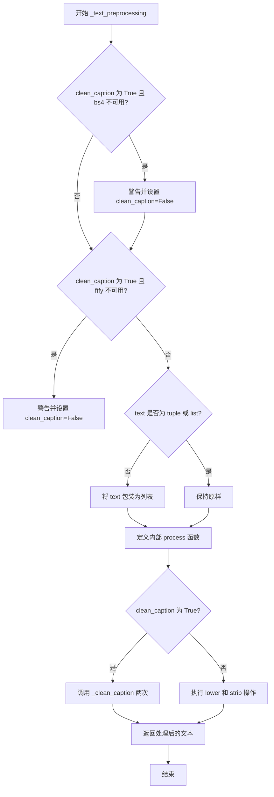

#### 带注释源码

```
def _text_preprocessing(self, text, clean_caption=False):
    # 如果需要清理标题但缺少 bs4 库，发出警告并禁用清理功能
    if clean_caption and not is_bs4_available():
        logger.warning(BACKENDS_MAPPING["bs4"][-1].format("Setting `clean_caption=True`"))
        logger.warning("Setting `clean_caption` to False...")
        clean_caption = False

    # 如果需要清理标题但缺少 ftfy 库，发出警告并禁用清理功能
    if clean_caption and not is_ftfy_available():
        logger.warning(BACKENDS_MAPPING["ftfy"][-1].format("Setting `clean_caption=True`"))
        logger.warning("Setting `clean_caption` to False...")
        clean_caption = False

    # 确保输入为列表格式，便于统一处理
    if not isinstance(text, (tuple, list)):
        text = [text]

    # 定义内部处理函数，对单个文本进行清洗
    def process(text: str):
        if clean_caption:
            # 调用 _clean_caption 进行深度清理，执行两次以确保效果
            text = self._clean_caption(text)
            text = self._clean_caption(text)
        else:
            # 仅进行小写转换和首尾空格去除
            text = text.lower().strip()
        return text

    # 对列表中每个文本元素应用处理函数
    return [process(t) for t in text]
```


### `SanaPipeline._clean_caption`

该方法是一个私有方法，用于对图像生成任务的提示词（caption）进行深度清洗和预处理。它通过正则表达式、HTML解析和文本修复库（ftfy）移除URL、HTML标签、特殊字符、CJK字符、数字编号、文件名、社交媒体标识等噪声内容，并将文本标准化为适合模型处理的格式。

参数：

-  `caption`：`str`，需要清洗的原始文本提示词

返回值：`str`，清洗和标准化后的文本提示词

#### 流程图

```mermaid
flowchart TD
    A[开始: 输入原始caption] --> B[转换为字符串并URL解码]
    B --> C[转小写并去除首尾空格]
    C --> D[替换特殊标记&lt;person&gt;为person]
    D --> E{是否包含URL?}
    E -->|是| F[正则匹配移除HTTP/HTTPS/FTP URL]
    E -->|否| G
    F --> G{是否包含HTML?}
    G -->|是| H[使用BeautifulSoup解析提取纯文本]
    G -->|否| I
    H --> I[移除@昵称]
    I --> J[移除CJK字符范围]
    J --> K[统一破折号为-]
    K --> L[统一引号为标准格式]
    L --> M[移除HTML实体&amp;quot;和&amp;amp;]
    M --> N[移除IP地址]
    N --> O[移除文章ID和换行符]
    O --> P[移除#标签和长数字]
    P --> Q[移除文件名]
    Q --> R[规范化连续引号和句点]
    R --> S[移除自定义标点符号]
    S --> T{连字符或下划线超过3个?}
    T -->|是| U[将连接符替换为空格]
    T -->|否| V
    U --> V[使用ftfy修复文本编码]
    V --> W[双重HTML解码]
    W --> X[移除字母数字组合模式]
    X --> Y[移除常见营销文本]
    Y --> Z[移除图像扩展名和页码]
    Z --> AA[移除尺寸标注如1920x1080]
    AA --> AB[规范化冒号和标点空格]
    AB --> AC[合并多余空格]
    AC --> AD[去除首尾引号和特殊字符]
    AD --> AE[结束: 返回清洗后的caption]
```

#### 带注释源码

```python
def _clean_caption(self, caption):
    """
    深度清洗文本提示词，移除各种噪声内容并标准化格式
    
    该方法执行多轮文本清理操作，包括：
    - URL和HTML标签移除
    - 特殊字符和标点标准化
    - CJK字符移除
    - 数字和标识符清理
    - 文本编码修复
    """
    # 将输入转换为字符串类型，确保后续操作的一致性
    caption = str(caption)
    
    # URL解码：将URL编码的字符转换回原始形式（如 %20 转为空格）
    caption = ul.unquote_plus(caption)
    
    # 转小写并去除首尾空格，标准化文本格式
    caption = caption.strip().lower()
    
    # 替换特殊标记：将<person>标签替换为通用词person
    caption = re.sub("<person>", "person", caption)
    
    # URL移除：使用正则表达式匹配并移除HTTP/HTTPS/FTP URLs
    # 匹配模式：可选协议前缀 + 域名 + 可选路径
    caption = re.sub(
        r"\b((?:https?:(?:\/{1,3}|[a-zA-Z0-9%])|[a-zA-Z0-9.\-]+[.](?:com|co|ru|net|org|edu|gov|it)[\w/-]*\b\/?(?!@)))",  # noqa
        "",
        caption,
    )
    
    # 移除以www开头的URL
    caption = re.sub(
        r"\b((?:www:(?:\/{1,3}|[a-zA-Z0-9%])|[a-zA-Z0-9.\-]+[.](?:com|co|ru|net|org|edu|gov|it)[\w/-]*\b\/?(?!@)))",  # noqa
        "",
        caption,
    )
    
    # HTML解析：使用BeautifulSoup提取纯文本，移除所有HTML标签
    caption = BeautifulSoup(caption, features="html.parser").text
    
    # 移除社交媒体@昵称
    caption = re.sub(r"@[\w\d]+\b", "", caption)
    
    # CJK字符移除：移除各种CJK Unicode范围的字符
    # 31C0—31EF CJK Strokes (CJK笔画)
    caption = re.sub(r"[\u31c0-\u31ef]+", "", caption)
    # 31F0—31FF Katakana Phonetic Extensions (片假名音扩展)
    caption = re.sub(r"[\u31f0-\u31ff]+", "", caption)
    # 3200—32FF Enclosed CJK Letters and Months (带圈CJK字母和月份)
    caption = re.sub(r"[\u3200-\u32ff]+", "", caption)
    # 3300—33FF CJK Compatibility (CJK兼容字符)
    caption = re.sub(r"[\u3300-\u33ff]+", "", caption)
    # 3400—4DBF CJK Unified Ideographs Extension A (CJK统一表意文字扩展A)
    caption = re.sub(r"[\u3400-\u4dbf]+", "", caption)
    # 4DC0—4DFF Yijing Hexagram Symbols (易经六十四卦符号)
    caption = re.sub(r"[\u4dc0-\u4dff]+", "", caption)
    # 4E00—9FFF CJK Unified Ideographs (CJK统一表意文字)
    caption = re.sub(r"[\u4e00-\u9fff]+", "", caption)
    
    # 破折号标准化：将各种语言的破折号统一转换为英文短横线
    caption = re.sub(
        r"[\u002D\u058A\u05BE\u1400\u1806\u2010-\u2015\u2E17\u2E1A\u2E3A\u2E3B\u2E40\u301C\u3030\u30A0\uFE31\uFE32\uFE58\uFE63\uFF0D]+",  # noqa
        "-",
        caption,
    )
    
    # 引号标准化：将各种语言的引号统一为标准英文引号
    caption = re.sub(r"[`´«»""¨]", '"', caption)
    caption = re.sub(r"['']", "'", caption)
    
    # 移除HTML实体
    caption = re.sub(r"&quot;?", "", caption)  # &quot; 或 &quot
    caption = re.sub(r"&amp", "", caption)     # &amp
    
    # IP地址移除：匹配IPv4地址格式
    caption = re.sub(r"\d{1,3}\.\d{1,3}\.\d{1,3}\.\d{1,3}", " ", caption)
    
    # 文章ID移除：匹配 "数字:数字" 结尾的模式
    caption = re.sub(r"\d:\d\d\s+$", "", caption)
    
    # 换行符转换：将转义的换行符\n转换为空格
    caption = re.sub(r"\\n", " ", caption)
    
    # 标签移除：移除推特/社交媒体标签
    caption = re.sub(r"#\d{1,3}\b", "", caption)   # 1-3位数字标签
    caption = re.sub(r"#\d{5,}\b", "", caption)     # 5位以上数字标签
    caption = re.sub(r"\b\d{6,}\b", "", caption)    # 6位以上纯数字
    
    # 文件名移除：匹配常见图片/文件扩展名
    caption = re.sub(r"[\S]+\.(?:png|jpg|jpeg|bmp|webp|eps|pdf|apk|mp4)", "", caption)
    
    # 重复字符规范化：多个引号合并为单个，多个句点替换为空格
    caption = re.sub(r"[\"']{2,}", r'"', caption)  # """AUSVERKAUFT"""
    caption = re.sub(r"[\.]{2,}", r" ", caption)    # """AUSVERKAUFT"""
    
    # 自定义标点移除：使用类级别定义的正则表达式
    caption = re.sub(self.bad_punct_regex, r" ", caption)  # ***AUSVERKAUFT***, #AUSVERKAUFT
    caption = re.sub(r"\s+\.\s+", r" ", caption)  # " . "
    
    # 连字符处理：如果连字符或下划线超过3个，则替换为空格
    # 保留少量连接词如 "this-is-my-cute-cat"
    regex2 = re.compile(r"(?:\-|\_)")
    if len(re.findall(regex2, caption)) > 3:
        caption = re.sub(regex2, " ", caption)
    
    # 文本编码修复：使用ftfy库修复常见的编码错误
    caption = ftfy.fix_text(caption)
    
    # HTML实体双重解码：处理嵌套的HTML实体编码
    caption = html.unescape(html.unescape(caption))
    
    # 字母数字组合移除：移除常见于用户名的混合模式
    caption = re.sub(r"\b[a-zA-Z]{1,3}\d{3,15}\b", "", caption)   # 如 jc6640
    caption = re.sub(r"\b[a-zA-Z]+\d+[a-zA-Z]+\b", "", caption)   # 如 jc6640vc
    caption = re.sub(r"\b\d+[a-zA-Z]+\d+\b", "", caption)         # 如 6640vc231
    
    # 营销文本移除
    caption = re.sub(r"(worldwide\s+)?(free\s+)?shipping", "", caption)
    caption = re.sub(r"(free\s)?download(\sfree)?", "", caption)
    caption = re.sub(r"\bclick\b\s(?:for|on)\s\w+", "", caption)
    
    # 图像扩展名引用移除
    caption = re.sub(r"\b(?:png|jpg|jpeg|bmp|webp|eps|pdf|apk|mp4)(\simage[s]?)?", "", caption)
    caption = re.sub(r"\bpage\s+\d+\b", "", caption)
    
    # 复杂字母数字模式移除
    caption = re.sub(r"\b\d*[a-zA-Z]+\d+[a-zA-Z]+\d+[a-zA-Z\d]*\b", r" ", caption)  # 如 j2d1a2a
    
    # 尺寸标注移除：如 1920x1080 或 1920×1080
    caption = re.sub(r"\b\d+\.?\d*[xх×]\d+\.?\d*\b", "", caption)
    
    # 标点空格规范化
    caption = re.sub(r"\b\s+\:\s+", r": ", caption)
    caption = re.sub(r"(\D[,\./])\b", r"\1 ", caption)  # 在标点后添加空格
    caption = re.sub(r"\s+", " ", caption)  # 合并多个空格
    
    # 去除首尾空白（第一次strip）
    caption.strip()
    
    # 去除首尾引号：如果整个字符串被引号包裹，去除引号
    caption = re.sub(r"^[\"\']([\w\W]+)[\"\']$", r"\1", caption)
    # 去除首部特殊字符
    caption = re.sub(r"^[\'\_,\-\:;]", r"", caption)
    # 去除尾部特殊字符
    caption = re.sub(r"[\'\_,\-\:\-\+]$", r"", caption)
    # 去除以点开头的单词
    caption = re.sub(r"^\.\S+$", "", caption)
    
    # 最终strip并返回清洗后的文本
    return caption.strip()
```


### `SanaPipeline.prepare_latents`

该方法用于在文本到图像生成过程中准备初始潜在变量（latents）。如果提供了预生成的潜在变量，则将其移动到指定设备并转换为指定数据类型；否则，根据批处理大小、通道数、图像高度和宽度创建随机潜在变量。

参数：

- `batch_size`：`int`，批处理大小，决定生成潜在变量的数量
- `num_channels_latents`：`int`，潜在变量的通道数，对应于 transformer 的输入通道数
- `height`：`int`，目标图像的高度（像素）
- `width`：`int`，目标图像的宽度（像素）
- `dtype`：`torch.dtype`，潜在变量的数据类型
- `device`：`torch.device`，潜在变量存放的设备
- `generator`：`torch.Generator | list[torch.Generator] | None`，用于生成随机数的 PyTorch 生成器，可以是单个或列表
- `latents`：`torch.Tensor | None`，可选的预生成潜在变量，如果提供则直接使用，否则随机生成

返回值：`torch.Tensor`，生成的潜在变量张量

#### 流程图

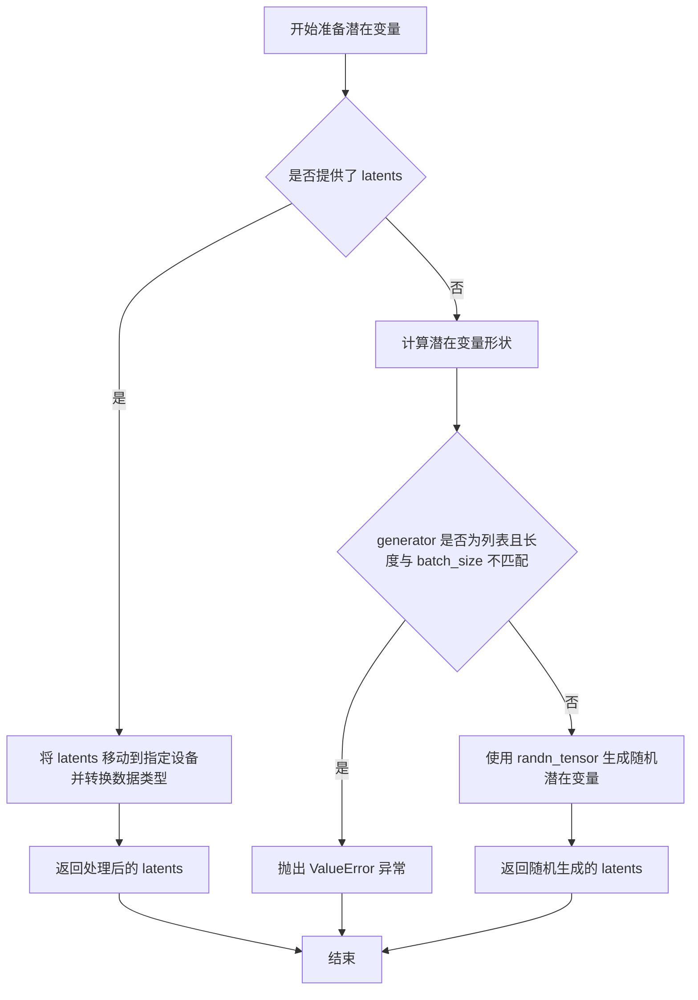

#### 带注释源码

```python
def prepare_latents(self, batch_size, num_channels_latents, height, width, dtype, device, generator, latents=None):
    """
    准备用于扩散模型推理的初始潜在变量。
    
    Args:
        batch_size: 批处理大小
        num_channels_latents: 潜在变量的通道数
        height: 图像高度
        width: 图像宽度
        dtype: 潜在变量的数据类型
        device: 潜在变量存放的设备
        generator: 随机数生成器
        latents: 可选的预生成潜在变量
    
    Returns:
        torch.Tensor: 潜在变量张量
    """
    # 如果提供了预生成的潜在变量，直接移动到指定设备并转换数据类型后返回
    if latents is not None:
        return latents.to(device=device, dtype=dtype)

    # 计算潜在变量的形状
    # 高度和宽度需要除以 VAE 缩放因子（通常是 8 或 32），因为潜在变量空间比像素空间小
    shape = (
        batch_size,
        num_channels_latents,
        int(height) // self.vae_scale_factor,
        int(width) // self.vae_scale_factor,
    )
    
    # 验证生成器列表长度与批处理大小是否匹配
    if isinstance(generator, list) and len(generator) != batch_size:
        raise ValueError(
            f"You have passed a list of generators of length {len(generator)}, but requested an effective batch"
            f" size of {batch_size}. Make sure the batch size matches the length of the generators."
        )

    # 使用 randn_tensor 从标准正态分布生成随机潜在变量
    latents = randn_tensor(shape, generator=generator, device=device, dtype=dtype)
    return latents
```


### SanaPipeline.__call__

该方法是SanaPipeline的核心调用接口，实现了文本到图像的生成功能。用户通过传入文本提示（prompt）、负向提示（negative_prompt）、推理步数（num_inference_steps）等参数，触发模型进行去噪推理过程，最终生成与文本描述相符的图像。

参数：

- `prompt`：`str | list[str]`，待生成的文本提示，可以是单个字符串或字符串列表
- `negative_prompt`：`str`，不希望出现的图像内容描述，默认为空字符串
- `num_inference_steps`：`int`，去噪迭代次数，默认20步，步数越多图像质量越高但推理速度越慢
- `timesteps`：`list[int]`，自定义时间步调度，用于覆盖默认的调度器行为
- `sigmas`：`list[float]`，自定义噪声调度参数，用于控制去噪过程中的噪声水平
- `guidance_scale`：`float`，分类器无指导比例，默认4.5，数值越大越严格遵循prompt描述
- `num_images_per_prompt`：`int | None`，每个prompt生成的图像数量，默认1张
- `height`：`int`，生成图像的高度像素值，默认1024
- `width`：`int`，生成图像的宽度像素值，默认1024
- `eta`：`float`，DDIM调度器的eta参数，用于控制随机性，默认为0.0
- `generator`：`torch.Generator | list[torch.Generator]`，随机数生成器，用于确保生成结果可复现
- `latents`：`torch.Tensor`，预生成的噪声潜在向量，可用于在同一潜在向量上尝试不同prompt
- `prompt_embeds`：`torch.Tensor`，预计算的文本嵌入向量，可直接传入以避免重复计算
- `prompt_attention_mask`：`torch.Tensor`，文本嵌入对应的注意力掩码
- `negative_prompt_embeds`：`torch.Tensor`，预计算的负向文本嵌入
- `negative_prompt_attention_mask`：`torch.Tensor`，负向文本嵌入的注意力掩码
- `output_type`：`str | None`，输出格式，默认为"pil"返回PIL图像，可选"latent"返回潜在向量
- `return_dict`：`bool`，是否返回字典格式的输出，默认True返回SanaPipelineOutput对象
- `clean_caption`：`bool`，是否清理文本提示（去除HTML标签、特殊字符等），默认False
- `use_resolution_binning`：`bool`，是否使用分辨率分箱（将输入分辨率映射到最近的有效分辨率），默认True
- `attention_kwargs`：`dict[str, Any]`，传递给注意力处理器的额外关键字参数
- `callback_on_step_end`：`Callable[[int, int], None]`，每步去噪结束后调用的回调函数
- `callback_on_step_end_tensor_inputs`：`list[str]`，回调函数需要访问的张量名称列表，默认["latents"]
- `max_sequence_length`：`int`，文本序列的最大长度，默认300
- `complex_human_instruction`：`list[str]`，复杂人类指令列表，用于增强prompt的详细描述

返回值：`SanaPipelineOutput | tuple`，当return_dict为True时返回SanaPipelineOutput对象（包含生成的图像列表），否则返回元组（第一个元素为图像列表）

#### 流程图

```mermaid
flowchart TD
    A[开始 __call__] --> B{use_resolution_binning?}
    B -->|Yes| C[根据transformer.config.sample_size选择aspect_ratio_bin]
    C --> D[classify_height_width_bin获取有效分辨率]
    D --> E[保存原始宽高]
    E --> F[使用有效宽高继续]
    B -->|No| F
    F --> G[check_inputs验证输入参数]
    G --> H[设置_guidance_scale, _attention_kwargs, _interrupt]
    I[获取batch_size] --> J[确定device和lora_scale]
    J --> K[encode_prompt编码输入prompt]
    K --> L{do_classifier_free_guidance?}
    L -->|Yes| M[拼接negative_prompt_embeds和prompt_embeds]
    L -->|No| N[只使用prompt_embeds]
    M --> O
    N --> O
    O --> P[retrieve_timesteps获取去噪时间步]
    P --> Q[prepare_latents准备潜在向量]
    Q --> R[prepare_extra_step_kwargs准备调度器额外参数]
    R --> S[进入去噪循环 for i, t in enumerate(timesteps)]
    S --> T{interrupt标志?}
    T -->|Yes| U[continue跳到下一步]
    T -->|No| V[拼接latents用于classifier-free guidance]
    V --> W[扩展timestep到batch维度]
    W --> X[transformer预测噪声noise_pred]
    X --> Y{do_classifier_free_guidance?}
    Y -->|Yes| Z[分离uncond和text预测，执行guidance]
    Y -->|No| AA
    Z --> AA{out_channels/2 == latent_channels?}
    AA -->|Yes| BB[提取sigma预测]
    AA -->|No| CC
    BB --> CC[scheduler.step计算上一步图像]
    CC --> DD{callback_on_step_end?}
    DD -->|Yes| EE[执行回调函数]
    EE --> FF[更新latents和prompt_embeds]
    DD -->|No| GG
    GG --> HH{最后一步或warmup完成?}
    HH -->|Yes| II[progress_bar.update]
    HH -->|No| S
    II --> S
    S --> JJ{output_type == 'latent'?}
    JJ -->|Yes| KK[直接返回latents]
    JJ -->|No| LL[vae.decode解码潜在向量到图像]
    LL --> MM{use_resolution_binning?}
    MM -->|Yes| NN[resize_and_crop_tensor调整回原始分辨率]
    MM -->|No| OO
    NN --> OO[postprocess后处理图像]
    OO --> PP[maybe_free_model_hooks释放模型]
    PP --> QQ{return_dict?}
    QQ -->|Yes| RR[返回SanaPipelineOutput]
    QQ -->|No| SS[返回tuple]
```

#### 带注释源码

```python
@torch.no_grad()
@replace_example_docstring(EXAMPLE_DOC_STRING)
def __call__(
    self,
    prompt: str | list[str] = None,
    negative_prompt: str = "",
    num_inference_steps: int = 20,
    timesteps: list[int] = None,
    sigmas: list[float] = None,
    guidance_scale: float = 4.5,
    num_images_per_prompt: int | None = 1,
    height: int = 1024,
    width: int = 1024,
    eta: float = 0.0,
    generator: torch.Generator | list[torch.Generator] | None = None,
    latents: torch.Tensor | None = None,
    prompt_embeds: torch.Tensor | None = None,
    prompt_attention_mask: torch.Tensor | None = None,
    negative_prompt_embeds: torch.Tensor | None = None,
    negative_prompt_attention_mask: torch.Tensor | None = None,
    output_type: str | None = "pil",
    return_dict: bool = True,
    clean_caption: bool = False,
    use_resolution_binning: bool = True,
    attention_kwargs: dict[str, Any] | None = None,
    callback_on_step_end: Callable[[int, int], None] | None = None,
    callback_on_step_end_tensor_inputs: list[str] = ["latents"],
    max_sequence_length: int = 300,
    complex_human_instruction: list[str] = [
        # 复杂人类指令的默认模板，用于增强prompt的详细程度
        "Given a user prompt, generate an 'Enhanced prompt' that provides detailed visual descriptions suitable for image generation...",
    ],
) -> SanaPipelineOutput | tuple:
    """
    Function invoked when calling the pipeline for generation.
    """

    # 处理PipelineCallback类型的情况，自动提取tensor_inputs
    if isinstance(callback_on_step_end, (PipelineCallback, MultiPipelineCallbacks)):
        callback_on_step_end_tensor_inputs = callback_on_step_end.tensor_inputs

    # 1. 检查输入参数并进行分辨率分箱（如需要）
    if use_resolution_binning:
        # 根据transformer的sample_size选择对应的分辨率分箱表
        if self.transformer.config.sample_size == 128:
            aspect_ratio_bin = ASPECT_RATIO_4096_BIN
        elif self.transformer.config.sample_size == 64:
            aspect_ratio_bin = ASPECT_RATIO_2048_BIN
        elif self.transformer.config.sample_size == 32:
            aspect_ratio_bin = ASPECT_RATIO_1024_BIN
        elif self.transformer.config.sample_size == 16:
            aspect_ratio_bin = ASPECT_RATIO_512_BIN
        else:
            raise ValueError("Invalid sample size")
        orig_height, orig_width = height, width  # 保存原始分辨率用于后续恢复
        # 将请求的分辨率映射到最近的有效分辨率
        height, width = self.image_processor.classify_height_width_bin(height, width, ratios=aspect_ratio_bin)

    # 验证所有输入参数的有效性
    self.check_inputs(
        prompt,
        height,
        width,
        callback_on_step_end_tensor_inputs,
        negative_prompt,
        prompt_embeds,
        negative_prompt_embeds,
        prompt_attention_mask,
        negative_prompt_attention_mask,
    )

    # 设置内部状态变量
    self._guidance_scale = guidance_scale
    self._attention_kwargs = attention_kwargs
    self._interrupt = False

    # 2. 确定batch_size
    if prompt is not None and isinstance(prompt, str):
        batch_size = 1
    elif prompt is not None and isinstance(prompt, list):
        batch_size = len(prompt)
    else:
        batch_size = prompt_embeds.shape[0]

    # 获取执行设备和从attention_kwargs提取lora_scale
    device = self._execution_device
    lora_scale = self.attention_kwargs.get("scale", None) if self.attention_kwargs is not None else None

    # 3. 编码输入prompt为文本嵌入
    (
        prompt_embeds,
        prompt_attention_mask,
        negative_prompt_embeds,
        negative_prompt_attention_mask,
    ) = self.encode_prompt(
        prompt,
        self.do_classifier_free_guidance,
        negative_prompt=negative_prompt,
        num_images_per_prompt=num_images_per_prompt,
        device=device,
        prompt_embeds=prompt_embeds,
        negative_prompt_embeds=negative_prompt_embeds,
        prompt_attention_mask=prompt_attention_mask,
        negative_prompt_attention_mask=negative_prompt_attention_mask,
        clean_caption=clean_caption,
        max_sequence_length=max_sequence_length,
        complex_human_instruction=complex_human_instruction,
        lora_scale=lora_scale,
    )
    
    # 如果使用classifier-free guidance，拼接negative和positive embeddings
    if self.do_classifier_free_guidance:
        prompt_embeds = torch.cat([negative_prompt_embeds, prompt_embeds], dim=0)
        prompt_attention_mask = torch.cat([negative_prompt_attention_mask, prompt_attention_mask], dim=0)

    # 4. 准备时间步
    if XLA_AVAILABLE:
        timestep_device = "cpu"
    else:
        timestep_device = device
    timesteps, num_inference_steps = retrieve_timesteps(
        self.scheduler, num_inference_steps, timestep_device, timesteps, sigmas
    )

    # 5. 准备潜在向量（latents）
    latent_channels = self.transformer.config.in_channels
    latents = self.prepare_latents(
        batch_size * num_images_per_prompt,
        latent_channels,
        height,
        width,
        torch.float32,
        device,
        generator,
        latents,
    )

    # 6. 准备调度器的额外参数
    extra_step_kwargs = self.prepare_extra_step_kwargs(generator, eta)

    # 7. 去噪循环
    num_warmup_steps = max(len(timesteps) - num_inference_steps * self.scheduler.order, 0)
    self._num_timesteps = len(timesteps)

    transformer_dtype = self.transformer.dtype
    with self.progress_bar(total=num_inference_steps) as progress_bar:
        for i, t in enumerate(timesteps):
            # 检查中断标志，允许外部中断去噪过程
            if self.interrupt:
                continue

            # 为classifier-free guidance准备输入（复制latents两次：unconditional和text）
            latent_model_input = torch.cat([latents] * 2) if self.do_classifier_free_guidance else latents

            # 扩展时间步到batch维度以匹配latent_model_input
            timestep = t.expand(latent_model_input.shape[0])
            # 应用时间步缩放因子
            timestep = timestep * self.transformer.config.timestep_scale

            # 使用transformer预测噪声
            noise_pred = self.transformer(
                latent_model_input.to(dtype=transformer_dtype),
                encoder_hidden_states=prompt_embeds.to(dtype=transformer_dtype),
                encoder_attention_mask=prompt_attention_mask,
                timestep=timestep,
                return_dict=False,
                attention_kwargs=self.attention_kwargs,
            )[0]
            noise_pred = noise_pred.float()

            # 执行classifier-free guidance
            if self.do_classifier_free_guidance:
                noise_pred_uncond, noise_pred_text = noise_pred.chunk(2)
                noise_pred = noise_pred_uncond + guidance_scale * (noise_pred_text - noise_pred_uncond)

            # 处理学习到的sigma（如果transformer输出包含sigma通道）
            if self.transformer.config.out_channels // 2 == latent_channels:
                noise_pred = noise_pred.chunk(2, dim=1)[0]

            # 使用调度器执行去噪步骤：从x_t计算x_t-1
            latents = self.scheduler.step(noise_pred, t, latents, **extra_step_kwargs, return_dict=False)[0]

            # 执行每步结束时的回调函数
            if callback_on_step_end is not None:
                callback_kwargs = {}
                for k in callback_on_step_end_tensor_inputs:
                    callback_kwargs[k] = locals()[k]
                callback_outputs = callback_on_step_end(self, i, t, callback_kwargs)

                # 允许回调函数修改latents和embeddings
                latents = callback_outputs.pop("latents", latents)
                prompt_embeds = callback_outputs.pop("prompt_embeds", prompt_embeds)
                negative_prompt_embeds = callback_outputs.pop("negative_prompt_embeds", negative_prompt_embeds)

            # 更新进度条（仅在最后一步或warmup完成后）
            if i == len(timesteps) - 1 or ((i + 1) > num_warmup_steps and (i + 1) % self.scheduler.order == 0):
                progress_bar.update()

            # XLA设备特殊处理
            if XLA_AVAILABLE:
                xm.mark_step()

    # 8. 后处理：解码latents到图像
    if output_type == "latent":
        image = latents  # 直接返回潜在向量
    else:
        # 将latents转移到VAE设备
        latents = latents.to(self.vae.dtype)
        torch_accelerator_module = getattr(torch, get_device(), torch.cuda)
        # 根据PyTorch版本选择OOM错误类型
        oom_error = (
            torch.OutOfMemoryError
            if is_torch_version(">=", "2.5.0")
            else torch_accelerator_module.OutOfMemoryError
        )
        try:
            # VAE解码：将潜在向量解码为图像
            image = self.vae.decode(latents / self.vae.config.scaling_factor, return_dict=False)[0]
        except oom_error as e:
            # 捕获OOM错误并给出使用VAE tiling的建议
            warnings.warn(
                f"{e}. \n"
                f"Try to use VAE tiling for large images. For example: \n"
                f"pipe.vae.enable_tiling(tile_sample_min_width=512, tile_sample_min_height=512)"
            )
        
        # 如使用了分辨率分箱，将图像调整回原始分辨率
        if use_resolution_binning:
            image = self.image_processor.resize_and_crop_tensor(image, orig_width, orig_height)

    # 后处理图像格式
    if not output_type == "latent":
        image = self.image_processor.postprocess(image, output_type=output_type)

    # 释放模型内存钩子
    self.maybe_free_model_hooks()

    # 返回结果
    if not return_dict:
        return (image,)

    return SanaPipelineOutput(images=image)
```

## 关键组件


### 张量索引与惰性加载

在 `encode_prompt` 方法中，通过 `select_index = [0] + list(range(-max_length + 1, 0))` 创建索引列表，从完整的文本嵌入中只取最后的 max_length 个 token，实现惰性加载效果，避免处理整个序列。

### 反量化支持

在 `__call__` 方法中，VAE 解码前使用 `latents = latents.to(self.vae.dtype)` 将潜在向量转换为 VAE 的精度类型，支持不同模型使用不同的数据类型（如 float32、bfloat16 等）。

### 量化策略

通过 `scale_lora_layers` 和 `unscale_lora_layers` 函数配合 `lora_scale` 参数实现 LoRA 权重的动态量化缩放，支持 PEFT 后端的量化处理。

### 分辨率二值化

`use_resolution_binning` 参数支持将输入分辨率映射到预设的 ASPECT_RATIO_*_BIN 字典中的最近分辨率，包括 512、1024、2048、4096 四个档位，优化生成效率。

### VAE 切片与平铺

提供 `enable_vae_slicing`、`disable_vae_slicing`、`enable_vae_tiling`、`disable_vae_tiling` 方法，支持 VAE 的切片解码和平铺解码，用于处理大分辨率图像的内存优化。

### 文本预处理与清洗

`_text_preprocessing` 和 `_clean_caption` 方法提供完整的文本清洗功能，包括 HTML 解析、URL 移除、CJK 字符处理、特殊符号清洗等，使用 BeautifulSoup 和 ftfy 库。

### 时间步检索与调度

`retrieve_timesteps` 函数封装了调度器的 `set_timesteps` 方法，支持自定义 timesteps 和 sigmas，兼容不同类型的调度器配置。

### 复杂人类指令支持

`complex_human_instruction` 参数支持通过预设的指令模板增强用户提示词，生成更详细的视觉描述用于图像生成。


## 问题及建议


### 已知问题

-   **硬编码的默认参数**：`complex_human_instruction` 在 `__call__` 方法中被硬编码为默认值，这会导致每次调用时都创建一个大型列表，增加内存开销和初始化时间。
-   **重复的代码逻辑**：文本预处理逻辑（`_text_preprocessing` 和 `_clean_caption`）在其他管道中可能被重复使用，缺乏统一的复用机制。
-   **已弃用的方法仍存在**：`enable_vae_slicing`、`disable_vae_slicing`、`enable_vae_tiling` 和 `disable_vae_tiling` 方法标记为弃用但仍保留在类中，增加代码复杂度。
-   **类型检查不严格**：在 `check_inputs` 中，部分条件判断使用 `isinstance` 检查类型，但后续使用时假设了特定的类型，可能导致运行时错误。
-   **设备处理不一致**：XLA 设备的处理（`XLA_AVAILABLE`）在多个地方出现，且与主设备处理逻辑分离，可能导致在不同硬件上的行为不一致。
-   **潜在的内存溢出风险**：VAE 解码部分的 OOM 处理不够健壮，虽然捕获了异常并给出警告，但可能无法有效恢复。
-   **LoRA 缩放逻辑复杂**：在 `encode_prompt` 中对 LoRA 缩放的处理涉及多个条件判断和后端检查，逻辑复杂且容易出错。
-   **魔法数字和硬编码值**：如 `vae_scale_factor` 的计算逻辑、`select_index` 的使用等，包含硬编码的数值，缺乏解释性。

### 优化建议

-   **移除硬编码的默认参数**：将 `complex_human_instruction` 移到配置文件中或作为可选参数，在需要时动态加载。
-   **提取公共模块**：将 `_text_preprocessing` 和 `_clean_caption` 移到一个公共的基类或工具模块中，供多个管道复用。
-   **清理已弃用的方法**：如果这些方法不再被外部调用，应直接移除，而不是保留已弃用的代码。
-   **增强类型检查**：在 `check_inputs` 中添加更严格的类型验证，并考虑使用 Pydantic 或类似库进行输入验证。
-   **统一设备管理**：创建一个统一的设备管理模块，处理 XLA、CUDA 等不同设备的差异，提高代码可维护性。
-   **改进内存管理**：在 VAE 解码前检查可用显存，必要时自动启用 VAE tiling，而不是仅在 OOM 后给出警告。
-   **简化 LoRA 逻辑**：将 LoRA 缩放的逻辑封装到一个独立的方法中，简化 `encode_prompt` 的代码复杂度。
-   **提取魔法数字**：将硬编码的数值（如 `select_index`、默认值等）定义为常量或配置项，并添加文档注释解释其含义。

## 其它


### 设计目标与约束

本Pipeline的设计目标是实现高效的文本到图像生成，支持高分辨率图像输出（最高4096x4096），通过Classifier-Free Guidance技术提升生成质量。核心约束包括：输入分辨率需为32的倍数、依赖Gemma2系列文本编码器、仅支持FP16/BF16精度推理、LoRA微调需配合PEFT后端使用。最大序列长度为300 tokens，推理步骤默认20步，Guidance Scale默认4.5。

### 错误处理与异常设计

Pipeline实现了多层级错误处理机制。输入验证层（check_inputs方法）检查分辨率对齐（height/width % 32 == 0）、prompt与prompt_embeds互斥性、attention_mask与embededs匹配性。调度器兼容性验证（retrieve_timesteps方法）检查set_timesteps参数支持情况。显存溢出处理采用try-except捕获OutOfMemoryError并提示启用VAE tiling。LORA集成错误处理包括scale参数校验和PEFT后端状态管理。警告机制使用warnings.warn提示过时API调用和依赖缺失。

### 数据流与状态机

Pipeline执行流程遵循确定性状态机：初始化→输入验证→Prompt编码→时间步调度→Latents准备→去噪循环→VAE解码→后处理→模型卸载。关键数据变换路径：String Prompt → Tokenizer → Gemma Text Encoder → Prompt Embeddings → Transformer (Diffusion Process) → Noise Prediction → Scheduler Step → Latents → VAE Decode → Image Tensors → PIL Images/NumPy Arrays。状态变量包括：_guidance_scale、_attention_kwargs、_interrupt、_num_timesteps、_execution_device。

### 外部依赖与接口契约

核心依赖包括：transformers（Gemma2PreTrainedModel、GemmaTokenizer）、diffusers（DiffusionPipeline、SchedulerMixin、VAE）、torch、PixArtImageProcessor（图像后处理）、BeautifulSoup4和ftfy（caption清洗，可选）。模块间接口契约：Tokenizer接收str/list[str]返回input_ids/attention_mask；Text Encoder接收input_ids返回hidden_states；Transformer接收latents/timesteps/prompt_embeds返回noise_pred；VAE接收latents返回image；Scheduler接收noise_pred/timesteps/latents返回previous_latents。第三方模型加载通过from_pretrained实现，LoRA加载通过SanaLoraLoaderMixin实现。

### 性能优化与资源管理

性能优化策略包括：模型CPU卸载序列定义（model_cpu_offload_seq）、VAE切片解码（enable_vae_slicing）、VAE平铺解码（enable_vae_tiling）、梯度禁用（@torch.no_grad()）、XLA设备优化（xm.mark_step）。显存优化技术：Latents按需生成、Transformer dtype独立控制（transformer_dtype）、VAE decode前dtype转换、CBAM批量处理支持。分辨率分箱（resolution binning）将输入映射到最优计算分辨率以提升效率。

### 版本兼容性与迁移指南

依赖版本约束：torch≥2.0、transformers、diffusers。XLA支持通过is_torch_xla_available()检测。API废弃管理：enable_vae_slicing/disable_vae_slicing/enable_vae_tiling/disable_vae_tiling标记为0.40.0废弃，改用pipe.vae.enable_slicing()形式。Scheduler兼容性通过inspect.signature动态检查。未来可能的breaking changes：LoRA API可能迁移至PEFT原生接口、图像处理器可能重构为独立模块。

### 安全考虑与防护措施

安全机制包括：输入验证防止异常分辨率导致OOM、Generator随机性控制支持确定性生成、Prompt embeds预生成避免重复编码、Classifier-Free Guidance负向embedding隔离。潜在安全风险：超长prompt可能导致内存溢出（max_sequence_length=300限制）、恶意caption清洗可能引入正则表达式ReDoS（已通过re.compile预编译优化）。用户需注意不要同时传递prompt和prompt_embeds以避免混淆。

### 可测试性设计

Pipeline设计考虑了可测试性：输入验证方法（check_inputs）可独立单元测试、准备Latents方法（prepare_latents）支持确定性输入验证、Prompt编码方法（encode_prompt）返回中间结果便于断言、Callback机制（callback_on_step_end）支持测试钩子。测试覆盖建议：各类输入组合验证、边界分辨率测试、OOM场景模拟、Scheduler兼容性测试、LoRA集成端到端测试。

### 配置与扩展性

扩展性设计包括：Scheduler可插拔（支持DPMSolverMultistepScheduler及兼容调度器）、Attention Processor可定制（attention_kwargs参数透传）、图像后处理器可替换（PixArtImageProcessor支持不同输出格式）、Aspect Ratio分箱可配置（ASPECT_RATIO_*_BIN全局映射）、LoRA加载通过Mixin扩展（SanaLoraLoaderMixin）。复杂人类指令支持通过complex_human_instruction参数注入，用于增强Prompt理解能力。

### 日志与监控

日志框架采用diffusers统一日志系统（logging.get_logger(__name__)）。关键日志节点：依赖库可用性警告（bs4/ftfy缺失提示）、废弃API警告（deprecate调用）、OOM警告及恢复建议、推理进度条（progress_bar）。监控指标建议：推理耗时（每步耗时/总耗时）、显存峰值占用、生成的图像分辨率分布、Prompt长度分布。


    