# `diffusers\src\diffusers\pipelines\sana\pipeline_sana_controlnet.py` 详细设计文档

SanaControlNetPipeline是一个基于Sana架构的文本到图像生成管道，通过结合文本编码器、VAE、Transformer和ControlNet实现高质量的图像生成，支持文本提示和ControlNet条件控制，能够根据用户输入的文本描述和可选的控制图像生成对应的图像内容。

## 整体流程

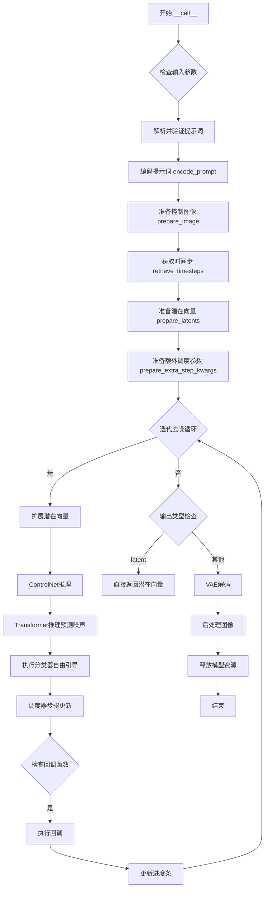

## 类结构

```
DiffusionPipeline (基类)
├── SanaLoraLoaderMixin (混入类)
└── SanaControlNetPipeline
    ├── 模型组件: tokenizer, text_encoder, vae, transformer, controlnet, scheduler
    ├── 图像处理: image_processor (PixArtImageProcessor)
    └── 工具方法: _get_gemma_prompt_embeds, encode_prompt, check_inputs等
```

## 全局变量及字段


### `XLA_AVAILABLE`
    
XLA可用性标志，指示是否支持PyTorch XLA

类型：`bool`
    


### `logger`
    
用于记录日志的日志记录器对象

类型：`logging.Logger`
    


### `ASPECT_RATIO_4096_BIN`
    
4096分辨率的宽高比映射表，用于图像尺寸分类

类型：`dict`
    


### `ASPECT_RATIO_1024_BIN`
    
1024分辨率的宽高比映射表，用于图像尺寸分类

类型：`dict`
    


### `ASPECT_RATIO_2048_BIN`
    
2048分辨率的宽高比映射表，用于图像尺寸分类

类型：`dict`
    


### `ASPECT_RATIO_512_BIN`
    
512分辨率的宽高比映射表，用于图像尺寸分类

类型：`dict`
    


### `EXAMPLE_DOC_STRING`
    
示例文档字符串，包含代码使用示例

类型：`str`
    


### `SanaControlNetPipeline.bad_punct_regex`
    
用于清理标题中特殊字符的正则表达式

类型：`re.Pattern`
    


### `SanaControlNetPipeline.model_cpu_offload_seq`
    
模型CPU卸载顺序配置字符串

类型：`str`
    


### `SanaControlNetPipeline._callback_tensor_inputs`
    
回调函数支持的tensor输入列表

类型：`list`
    


### `SanaControlNetPipeline.tokenizer`
    
文本分词器，用于将文本转换为token

类型：`GemmaTokenizer|GemmaTokenizerFast`
    


### `SanaControlNetPipeline.text_encoder`
    
文本编码器模型，用于将token转换为嵌入向量

类型：`Gemma2PreTrainedModel`
    


### `SanaControlNetPipeline.vae`
    
变分自编码器，用于图像的编码和解码

类型：`AutoencoderDC`
    


### `SanaControlNetPipeline.transformer`
    
主变换器模型，用于去噪预测

类型：`SanaTransformer2DModel`
    


### `SanaControlNetPipeline.controlnet`
    
ControlNet模型，用于提供额外的控制条件

类型：`SanaControlNetModel`
    


### `SanaControlNetPipeline.scheduler`
    
调度器，用于控制去噪过程的步进

类型：`DPMSolverMultistepScheduler`
    


### `SanaControlNetPipeline.vae_scale_factor`
    
VAE缩放因子，用于调整潜在空间的维度

类型：`int`
    


### `SanaControlNetPipeline.image_processor`
    
图像处理器，用于图像的预处理和后处理

类型：`PixArtImageProcessor`
    
    

## 全局函数及方法


### `retrieve_timesteps`

全局函数 - 获取调度器的时间步，支持自定义timesteps和sigmas，输出元组包含时间步调度和推理步数。

参数：

- `scheduler`：`SchedulerMixin`，调度器对象，用于获取时间步
- `num_inference_steps`：`int | None`，扩散步骤数，用于生成样本
- `device`：`str | torch.device | None`，时间步要移动到的设备
- `timesteps`：`list[int] | None`，自定义时间步列表，用于覆盖调度器的时间步策略
- `sigmas`：`list[float] | None`，自定义sigma列表，用于覆盖调度器的时间步策略
- `**kwargs`：任意关键字参数，将传递给scheduler.set_timesteps

返回值：`tuple[torch.Tensor, int]`，元组包含调度器的时间步调度张量和推理步数

#### 流程图

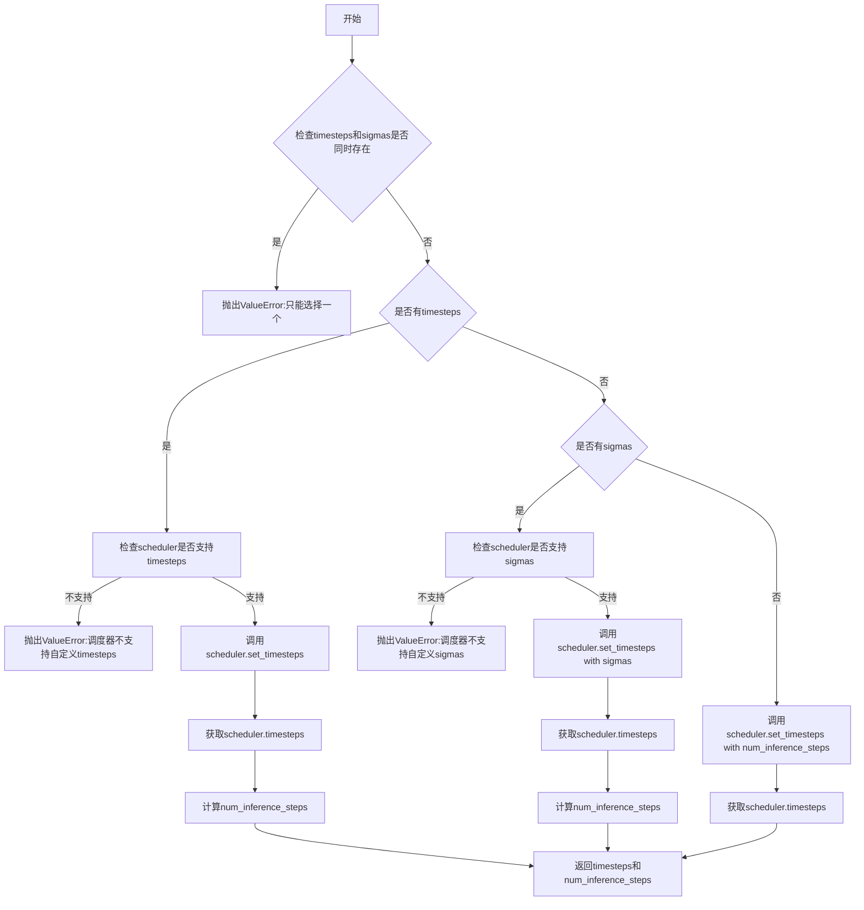

#### 带注释源码

```python
# 从diffusers.pipelines.stable_diffusion.pipeline_stable_diffusion复制
def retrieve_timesteps(
    scheduler,  # 调度器对象
    num_inference_steps: int | None = None,  # 推理步数
    device: str | torch.device | None = None,  # 设备
    timesteps: list[int] | None = None,  # 自定义时间步
    sigmas: list[float] | None = None,  # 自定义sigma
    **kwargs,  # 其他关键字参数
):
    r"""
    调用调度器的set_timesteps方法并从中获取时间步。处理自定义时间步。
    任何kwargs将提供给scheduler.set_timesteps。

    参数:
        scheduler (SchedulerMixin):
            要获取时间步的调度器。
        num_inference_steps (int):
            使用预训练模型生成样本时使用的扩散步骤数。如果使用此参数，timesteps必须为None。
        device (str或torch.device, 可选):
            时间步要移动到的设备。如果为None，时间步不会被移动。
        timesteps (list[int], 可选):
            用于覆盖调度器时间步间距策略的自定义时间步。如果传入timesteps，
            num_inference_steps和sigmas必须为None。
        sigmas (list[float], 可选):
            用于覆盖调度器时间步间距策略的自定义sigma。如果传入sigmas，
            num_inference_steps和timesteps必须为None。

    返回:
        tuple[torch.Tensor, int]: 元组，第一个元素是调度器的时间步调度，第二个是推理步数。
    """
    # 检查timesteps和sigmas是否同时传入
    if timesteps is not None and sigmas is not None:
        raise ValueError("Only one of `timesteps` or `sigmas` can be passed. Please choose one to set custom values")
    
    # 处理自定义timesteps
    if timesteps is not None:
        # 检查调度器是否支持timesteps参数
        accepts_timesteps = "timesteps" in set(inspect.signature(scheduler.set_timesteps).parameters.keys())
        if not accepts_timesteps:
            raise ValueError(
                f"The current scheduler class {scheduler.__class__}'s `set_timesteps` does not support custom"
                f" timestep schedules. Please check whether you are using the correct scheduler."
            )
        # 设置自定义时间步并获取结果
        scheduler.set_timesteps(timesteps=timesteps, device=device, **kwargs)
        timesteps = scheduler.timesteps
        num_inference_steps = len(timesteps)
    # 处理自定义sigmas
    elif sigmas is not None:
        # 检查调度器是否支持sigmas参数
        accept_sigmas = "sigmas" in set(inspect.signature(scheduler.set_timesteps).parameters.keys())
        if not accept_sigmas:
            raise ValueError(
                f"The current scheduler class {scheduler.__class__}'s `set_timesteps` does not support custom"
                f" sigmas schedules. Please check whether you are using the correct scheduler."
            )
        # 设置自定义sigmas并获取结果
        scheduler.set_timesteps(sigmas=sigmas, device=device, **kwargs)
        timesteps = scheduler.timesteps
        num_inference_steps = len(timesteps)
    # 使用默认推理步数
    else:
        scheduler.set_timesteps(num_inference_steps, device=device, **kwargs)
        timesteps = scheduler.timesteps
    
    # 返回时间步调度和推理步数
    return timesteps, num_inference_steps
```


### `SanaControlNetPipeline.__init__`

这是 SanaControlNetPipeline 类的构造函数，负责初始化整个文本到图像生成管道的核心组件。它接收多个神经网络模型和分词器作为参数，完成模块注册、VAE 缩放因子计算以及图像预处理器的初始化工作。

参数：

- `tokenizer`：`GemmaTokenizer | GemmaTokenizerFast`，用于将文本提示转换为模型可处理的 token 序列
- `text_encoder`：`Gemma2PreTrainedModel`，预训练的文本编码器，将 token 序列编码为文本嵌入向量
- `vae`：`AutoencoderDC`，变分自编码器，负责将潜在空间的数据解码为图像
- `transformer`：`SanaTransformer2DModel`， Sana 主变换器模型，执行去噪预测
- `controlnet`：`SanaControlNetModel`，控制网络，提供额外的条件控制信息
- `scheduler`：`DPMSolverMultistepScheduler`，扩散调度器，控制去噪过程中的时间步长

返回值：`None`，构造函数无返回值，仅完成对象状态的初始化

#### 流程图

```mermaid
flowchart TD
    A[开始 __init__] --> B[调用父类 DiffusionPipeline.__init__]
    B --> C{register_modules 注册各个模块}
    C --> D[tokenizer 注册分词器]
    C --> E[text_encoder 注册文本编码器]
    C --> F[vae 注册VAE模型]
    C --> G[transformer 注册变换器]
    C --> H[controlnet 注册控制网络]
    C --> I[scheduler 注册调度器]
    
    D --> J[计算 vae_scale_factor]
    J --> K{检查 vae 是否存在}
    K -->|是| L[根据 VAE 编码器通道数计算: 2^(len-1)]
    K -->|否| M[使用默认值 32]
    L --> N[创建 PixArtImageProcessor]
    M --> N
    
    N --> O[结束初始化]
    
    style A fill:#e1f5fe
    style O fill:#c8e6c9
```

#### 带注释源码

```python
def __init__(
    self,
    tokenizer: GemmaTokenizer | GemmaTokenizerFast,  # Gemma 分词器，支持标准版和快速版
    text_encoder: Gemma2PreTrainedModel,              # Gemma2 预训练文本编码器
    vae: AutoencoderDC,                               # 变分自编码器（解码器）模型
    transformer: SanaTransformer2DModel,             # Sana 主变换器模型
    controlnet: SanaControlNetModel,                  # Sana 控制网络模型
    scheduler: DPMSolverMultistepScheduler,           # DPM 多步求解器调度器
):
    """
    初始化 SanaControlNetPipeline 管道
    
    该构造函数接收所有必需的神经网络组件，完成管道的初始化工作。
    继承自 DiffusionPipeline 基类，并混入 SanaLoraLoaderMixin 以支持 LoRA 微调。
    
    Args:
        tokenizer: 将文本提示转换为 token ID 序列的分词器
        text_encoder: 将 token 序列编码为嵌入向量的文本编码器
        vae: 负责将潜在表示解码为图像的变分自编码器
        transformer: 执行噪声预测的核心 Sana 变换器模型
        controlnet: 提供额外条件控制信息的控制网络
        scheduler: 控制扩散过程时间步的调度器
    """
    # 调用父类 DiffusionPipeline 的初始化方法
    # 继承自 PipelineMixin 和 DiffusionPipelineMixin
    # 完成基础属性的初始化（如 _execution_device, _callback_tensor_inputs 等）
    super().__init__()

    # 使用 register_modules 方法注册所有子模块
    # 这些模块可以通过 pipeline.component_name 方式访问
    # 同时支持 save_pretrained 和 from_pretrained 的序列化/反序列化
    self.register_modules(
        tokenizer=tokenizer,
        text_encoder=text_encoder,
        vae=vae,
        transformer=transformer,
        controlnet=controlnet,
        scheduler=scheduler,
    )

    # 计算 VAE 缩放因子，用于潜在空间和像素空间之间的转换
    # 缩放因子 = 2^(编码器输出通道数 - 1)
    # 例如：如果编码器有 [128, 256, 512, 512] 四个输出通道
    # 则缩放因子 = 2^3 = 8
    # 这个值用于确定潜在空间的分辨率相对于原始图像分辨率的缩小比例
    self.vae_scale_factor = (
        2 ** (len(self.vae.config.encoder_block_out_channels) - 1)
        if hasattr(self, "vae") and self.vae is not None
        else 32  # 默认缩放因子，适用于标准配置
    )
    
    # 初始化 PixArt 图像处理器
    # 负责图像的预处理（resize, normalize）和后处理（denormalize, convert to PIL）
    # 使用计算得到的 vae_scale_factor 进行正确的尺寸转换
    self.image_processor = PixArtImageProcessor(vae_scale_factor=self.vae_scale_factor)
```


### `SanaControlNetPipeline.enable_vae_slicing`

该方法用于启用切片VAE解码功能。当启用此选项时，VAE会将输入张量分割成多个切片分步计算解码，从而节省内存并允许更大的批处理大小。需要注意的是，该方法已被废弃，未来版本将移除，推荐直接使用 `pipe.vae.enable_slicing()`。

参数： 无

返回值：`None`，无返回值

#### 流程图

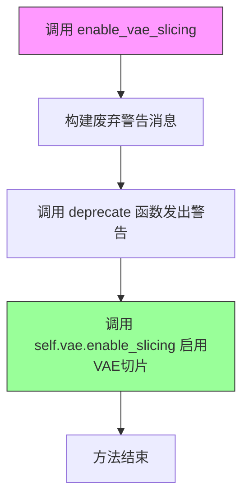

#### 带注释源码

```python
def enable_vae_slicing(self):
    r"""
    Enable sliced VAE decoding. When this option is enabled, the VAE will split the input tensor in slices to
    compute decoding in several steps. This is useful to save some memory and allow larger batch sizes.
    """
    # 构建废弃警告消息，包含当前类名，提示用户使用新的API
    depr_message = f"Calling `enable_vae_slicing()` on a `{self.__class__.__name__}` is deprecated and this method will be removed in a future version. Please use `pipe.vae.enable_slicing()`."
    
    # 调用deprecate函数记录废弃信息，版本号为0.40.0
    deprecate(
        "enable_vae_slicing",      # 废弃的方法名
        "0.40.0",                  # 废弃版本号
        depr_message,              # 废弃警告消息
    )
    
    # 委托给VAE模型本身的enable_slicing方法执行实际的切片启用操作
    self.vae.enable_slicing()
```


### `SanaControlNetPipeline.disable_vae_slicing`

该方法用于禁用VAE切片解码功能，如果之前启用了`enable_vae_slicing`，调用此方法后将恢复为单步解码。此方法已废弃，建议直接使用`pipe.vae.disable_slicing()`。

参数：无（仅包含隐式参数`self`）

返回值：无（`None`），该方法通过副作用生效

#### 流程图

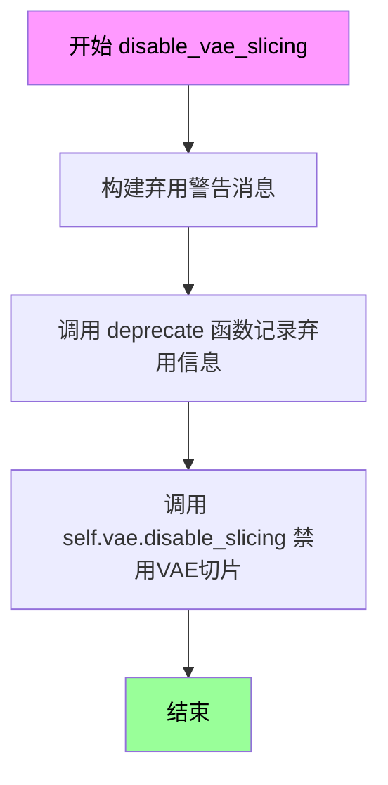

#### 带注释源码

```python
def disable_vae_slicing(self):
    r"""
    Disable sliced VAE decoding. If `enable_vae_slicing` was previously enabled, this method will go back to
    computing decoding in one step.
    """
    # 构建弃用警告消息，提示用户该方法将在未来版本中移除
    # 建议用户改用 pipe.vae.disable_slicing()
    depr_message = f"Calling `disable_vae_slicing()` on a `{self.__class__.__name__}` is deprecated and this method will be removed in a future version. Please use `pipe.vae.disable_slicing()`."
    
    # 调用 deprecate 函数记录弃用信息
    # 参数: 方法名, 弃用版本号, 弃用消息
    deprecate(
        "disable_vae_slicing",
        "0.40.0",
        depr_message,
    )
    
    # 调用 VAE 模型的 disable_slicing 方法实际禁用切片解码
    # 这将恢复 VAE 为单步解码模式
    self.vae.disable_slicing()
```


### SanaControlNetPipeline.enable_vae_tiling

该方法用于启用瓦片式 VAE 解码功能。当启用此选项时，VAE 会将输入张量分割成多个瓦片分步计算解码和编码过程，从而节省大量内存并支持处理更大的图像。该方法目前已被弃用，将在 0.40.0 版本移除，建议直接使用 `pipe.vae.enable_tiling()`。

参数： 无

返回值：`None`，无返回值

#### 流程图

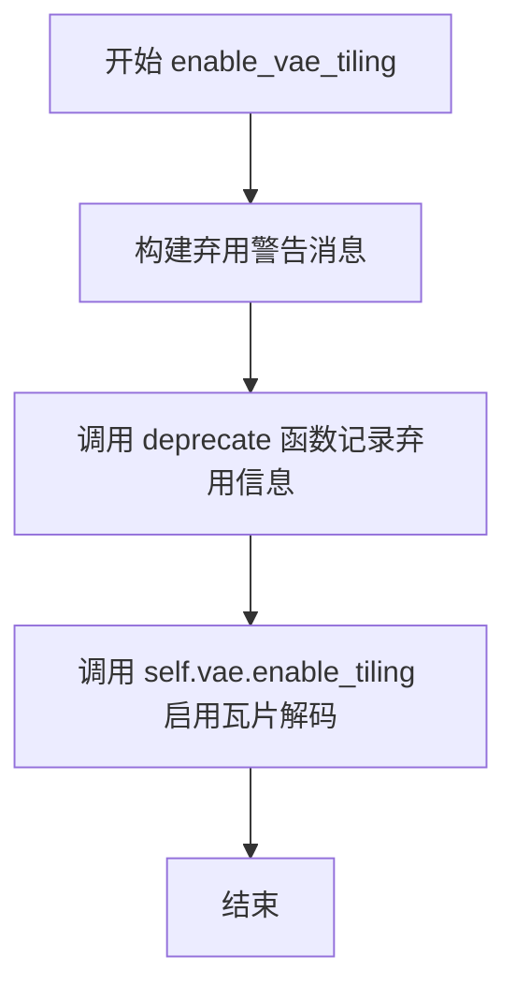

#### 带注释源码

```python
def enable_vae_tiling(self):
    r"""
    Enable tiled VAE decoding. When this option is enabled, the VAE will split the input tensor into tiles to
    compute decoding and encoding in several steps. This is useful for saving a large amount of memory and to allow
    processing larger images.
    """
    # 构建弃用警告消息，包含类名和替代方案
    depr_message = f"Calling `enable_vae_tiling()` on a `{self.__class__.__name__}` is deprecated and this method will be removed in a future version. Please use `pipe.vae.enable_tiling()`."
    
    # 调用 deprecate 函数记录弃用信息，版本号为 0.40.0
    deprecate(
        "enable_vae_tiling",      # 弃用的方法名
        "0.40.0",                 # 弃用版本号
        depr_message,             # 弃用警告消息
    )
    
    # 实际启用 VAE 瓦片解码功能，委托给 vae 对象本身
    self.vae.enable_tiling()
```


### `SanaControlNetPipeline.disable_vae_tiling`

该方法用于禁用瓦片VAE解码功能。如果之前启用了`enable_vae_tiling`，调用此方法后将恢复为单步计算解码。同时，该方法已被标记为弃用，推荐直接使用`pipe.vae.disable_tiling()`。

参数：

- 该方法无显式参数（仅有隐式`self`参数）

返回值：`None`，无返回值

#### 流程图

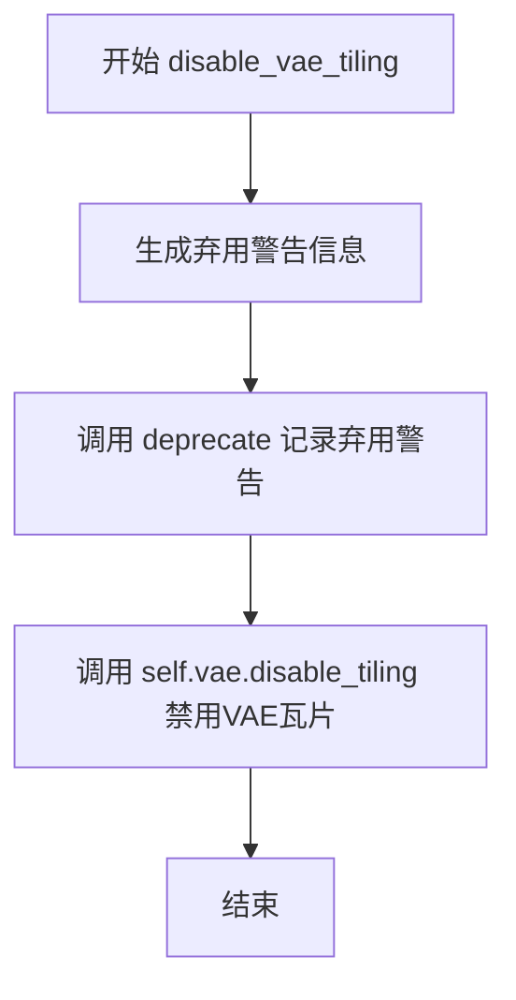

#### 带注释源码

```
def disable_vae_tiling(self):
    r"""
    Disable tiled VAE decoding. If `enable_vae_tiling` was previously enabled, this method will go back to
    computing decoding in one step.
    """
    # 构建弃用警告消息，提示用户在未来版本中该方法将被移除
    # 建议直接使用 pipe.vae.disable_tiling() 替代
    depr_message = f"Calling `disable_vae_tiling()` on a `{self.__class__.__name__}` is deprecated and this method will be removed in a future version. Please use `pipe.vae.disable_tiling()`."
    
    # 调用 deprecate 工具函数记录弃用警告，版本号为 0.40.0
    deprecate(
        "disable_vae_tiling",
        "0.40.0",
        depr_message,
    )
    
    # 实际执行：调用底层 VAE 模型的 disable_tiling 方法
    # 该方法会关闭 VAE 的瓦片解码模式
    self.vae.disable_tiling()
```


### `SanaControlNetPipeline._get_gemma_prompt_embeds`

该方法将输入的文本提示（prompt）编码为文本编码器的隐藏状态（text encoder hidden states），返回文本嵌入（prompt embeddings）和注意力掩码（attention mask）。该方法支持对提示词进行预处理清洗，并允许使用复杂人类指令（complex_human_instruction）来增强提示。

参数：

- `prompt`：`str | list[str]`，需要编码的提示词，支持单个字符串或字符串列表
- `device`：`torch.device`，用于放置结果嵌入的张量设备
- `dtype`：`torch.dtype`，结果嵌入的数据类型
- `clean_caption`：`bool`，是否在编码前预处理和清洗提示词，默认为 False
- `max_sequence_length`：`int`，提示词使用的最大序列长度，默认为 300
- `complex_human_instruction`：`list[str] | None`，复杂人类指令列表，如果不为空则会将指令与提示词结合

返回值：`tuple[torch.Tensor, torch.Tensor]`，返回元组包含两个张量：
- `prompt_embeds`：文本编码器生成的隐藏状态嵌入，形状为 (batch_size, seq_len, hidden_dim)
- `prompt_attention_mask`：提示词的注意力掩码，用于指示哪些位置是有效token

#### 流程图

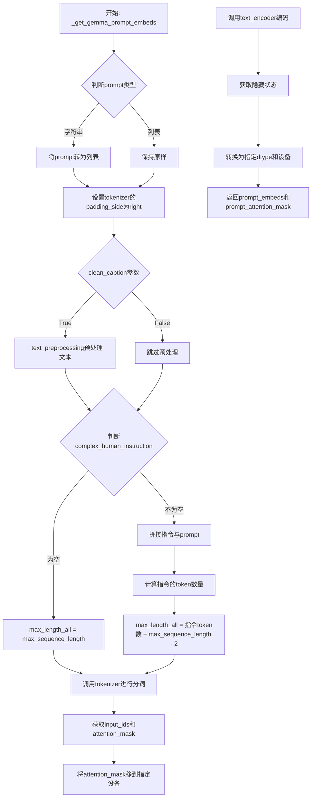

#### 带注释源码

```python
# Copied from diffusers.pipelines.sana.pipeline_sana.SanaPipeline._get_gemma_prompt_embeds
def _get_gemma_prompt_embeds(
    self,
    prompt: str | list[str],
    device: torch.device,
    dtype: torch.dtype,
    clean_caption: bool = False,
    max_sequence_length: int = 300,
    complex_human_instruction: list[str] | None = None,
):
    r"""
    Encodes the prompt into text encoder hidden states.

    Args:
        prompt (`str` or `list[str]`, *optional*):
            prompt to be encoded
        device: (`torch.device`, *optional*):
            torch device to place the resulting embeddings on
        clean_caption (`bool`, defaults to `False`):
            If `True`, the function will preprocess and clean the provided caption before encoding.
        max_sequence_length (`int`, defaults to 300): Maximum sequence length to use for the prompt.
        complex_human_instruction (`list[str]`, defaults to `complex_human_instruction`):
            If `complex_human_instruction` is not empty, the function will use the complex Human instruction for
            the prompt.
    """
    # 如果prompt是字符串，转换为列表；如果是列表，保持不变
    # 这样可以统一处理单个和多个prompt
    prompt = [prompt] if isinstance(prompt, str) else prompt

    # 确保tokenizer的padding在右侧，这对于自回归模型是标准做法
    if getattr(self, "tokenizer", None) is not None:
        self.tokenizer.padding_side = "right"

    # 对prompt进行文本预处理（清洗HTML标签、URL等）
    prompt = self._text_preprocessing(prompt, clean_caption=clean_caption)

    # 准备复杂人类指令（如果提供）
    if not complex_human_instruction:
        # 如果没有复杂指令，使用默认的max_sequence_length
        max_length_all = max_sequence_length
    else:
        # 将复杂指令用换行符连接
        chi_prompt = "\n".join(complex_human_instruction)
        # 将指令添加到每个prompt的开头
        prompt = [chi_prompt + p for p in prompt]
        # 计算复杂指令的token数量
        num_chi_prompt_tokens = len(self.tokenizer.encode(chi_prompt))
        # 总长度 = 指令长度 + prompt长度（预留2个token）
        max_length_all = num_chi_prompt_tokens + max_sequence_length - 2

    # 使用tokenizer将prompt转换为模型输入格式
    text_inputs = self.tokenizer(
        prompt,
        padding="max_length",           # 填充到最大长度
        max_length=max_length_all,       # 使用计算后的最大长度
        truncation=True,                 # 超过最大长度进行截断
        add_special_tokens=True,        # 添加特殊token（如[CLS], [SEP]等）
        return_tensors="pt",            # 返回PyTorch张量
    )
    # 获取input_ids和attention_mask
    text_input_ids = text_inputs.input_ids

    # 获取注意力掩码并移动到指定设备
    prompt_attention_mask = text_inputs.attention_mask
    prompt_attention_mask = prompt_attention_mask.to(device)

    # 调用text_encoder获取隐藏状态
    # text_encoder输出一个元组，取第一个元素作为embeddings
    prompt_embeds = self.text_encoder(text_input_ids.to(device), attention_mask=prompt_attention_mask)
    # 将embeddings转换为指定的dtype和device
    prompt_embeds = prompt_embeds[0].to(dtype=dtype, device=device)

    # 返回prompt embeddings和attention mask
    return prompt_embeds, prompt_attention_mask
```


### `SanaControlNetPipeline.encode_prompt`

该方法用于将文本提示词编码为文本编码器的隐藏状态，支持正向提示词和负向提示词的嵌入计算，并处理分类器自由引导（CFG）所需的嵌入复制与拼接。

参数：

- `prompt`：`str | list[str]`，要编码的文本提示词，支持单个字符串或字符串列表
- `do_classifier_free_guidance`：`bool = True`，是否启用分类器自由引导
- `negative_prompt`：`str = ""`，负向提示词，用于引导图像生成方向
- `num_images_per_prompt`：`int = 1`，每个提示词需要生成的图像数量
- `device`：`torch.device | None = None`，张量存放的设备
- `prompt_embeds`：`torch.Tensor | None = None`，预生成的提示词嵌入，可用于微调输入
- `negative_prompt_embeds`：`torch.Tensor | None = None`，预生成的负向提示词嵌入
- `prompt_attention_mask`：`torch.Tensor | None = None`，提示词的注意力掩码
- `negative_prompt_attention_mask`：`torch.Tensor | None = None`，负向提示词的注意力掩码
- `clean_caption`：`bool = False`，是否清理和预处理提示词
- `max_sequence_length`：`int = 300`，提示词的最大序列长度
- `complex_human_instruction`：`list[str] | None = None`，复杂人类指令列表
- `lora_scale`：`float | None = None`，LoRA 权重缩放因子

返回值：`tuple[torch.Tensor, torch.Tensor, torch.Tensor, torch.Tensor]`，返回四个张量——提示词嵌入、提示词注意力掩码、负向提示词嵌入、负向提示词注意力掩码

#### 流程图

```mermaid
flowchart TD
    A[开始 encode_prompt] --> B{device 为空?}
    B -->|是| C[使用执行设备]
    B -->|否| D[使用传入 device]
    C --> E{text_encoder 存在?}
    D --> E
    E -->|是| F[获取 text_encoder 的 dtype]
    E -->|否| G[dtype 设为 None]
    F --> H{LoRA scale 不为空且为 SanaLoraLoaderMixin?}
    G --> H
    H -->|是| I[设置 self._lora_scale 并动态调整 LoRA 权重]
    H -->|否| J{确定 batch_size}
    I --> J
    J -->|prompt 是 str| K[batch_size = 1]
    J -->|prompt 是 list| L[batch_size = len prompt]
    J -->|其他| M[batch_size = prompt_embeds.shape[0]]
    K --> N[设置 tokenizer padding_side 为 right]
    L --> N
    M --> N
    N --> O{计算 max_length 和 select_index}
    O --> P{prompt_embeds 为空?}
    P -->|是| Q[调用 _get_gemma_prompt_embeds 生成嵌入]
    P -->|否| R[使用传入的 prompt_embeds]
    Q --> S[截取 select_index 对应的嵌入和掩码]
    R --> T[重复 prompt_embeds 和 attention_mask num_images_per_prompt 次]
    S --> T
    T --> U{do_classifier_free_guidance 且 negative_prompt_embeds 为空?}
    U -->|是| V[生成负向提示词嵌入]
    U -->|否| W{do_classifier_free_guidance?}
    V --> X[重复 negative_prompt_embeds num_images_per_prompt 次]
    W -->|是| Y[返回: prompt_embeds, prompt_attention_mask, negative_prompt_embeds, negative_prompt_attention_mask]
    W -->|否| Z[negative_prompt_embeds = None, negative_prompt_attention_mask = None]
    X --> Y
    Z --> Y
```

#### 带注释源码

```python
def encode_prompt(
    self,
    prompt: str | list[str],
    do_classifier_free_guidance: bool = True,
    negative_prompt: str = "",
    num_images_per_prompt: int = 1,
    device: torch.device | None = None,
    prompt_embeds: torch.Tensor | None = None,
    negative_prompt_embeds: torch.Tensor | None = None,
    prompt_attention_mask: torch.Tensor | None = None,
    negative_prompt_attention_mask: torch.Tensor | None = None,
    clean_caption: bool = False,
    max_sequence_length: int = 300,
    complex_human_instruction: list[str] | None = None,
    lora_scale: float | None = None,
):
    r"""
    Encodes the prompt into text encoder hidden states.

    Args:
        prompt (`str` or `list[str]`, *optional*):
            prompt to be encoded
        negative_prompt (`str` or `list[str]`, *optional*):
            The prompt not to guide the image generation. If not defined, one has to pass `negative_prompt_embeds`
            instead. Ignored when not using guidance (i.e., ignored if `guidance_scale` is less than `1`). For
            PixArt-Alpha, this should be "".
        do_classifier_free_guidance (`bool`, *optional*, defaults to `True`):
            whether to use classifier free guidance or not
        num_images_per_prompt (`int`, *optional*, defaults to 1):
            number of images that should be generated per prompt
        device: (`torch.device`, *optional*):
            torch device to place the resulting embeddings on
        prompt_embeds (`torch.Tensor`, *optional*):
            Pre-generated text embeddings. Can be used to easily tweak text inputs, *e.g.* prompt weighting. If not
            provided, text embeddings will be generated from `prompt` input argument.
        negative_prompt_embeds (`torch.Tensor`, *optional*):
            Pre-generated negative text embeddings. For Sana, it's should be the embeddings of the "" string.
        clean_caption (`bool`, defaults to `False`):
            If `True`, the function will preprocess and clean the provided caption before encoding.
        max_sequence_length (`int`, defaults to 300): Maximum sequence length to use for the prompt.
        complex_human_instruction (`list[str]`, defaults to `complex_human_instruction`):
            If `complex_human_instruction` is not empty, the function will use the complex Human instruction for
            the prompt.
    """

    # 如果未指定设备，则使用管道的执行设备
    if device is None:
        device = self._execution_device

    # 获取 text_encoder 的数据类型，用于嵌入的精度
    if self.text_encoder is not None:
        dtype = self.text_encoder.dtype
    else:
        dtype = None

    # 设置 lora scale 以便 text encoder 的 LoRA 函数正确访问
    # 如果传入 lora_scale 且对象是 SanaLoraLoaderMixin 类型
    if lora_scale is not None and isinstance(self, SanaLoraLoaderMixin):
        self._lora_scale = lora_scale

        # 动态调整 LoRA 权重
        if self.text_encoder is not None and USE_PEFT_BACKEND:
            scale_lora_layers(self.text_encoder, lora_scale)

    # 根据 prompt 类型确定批次大小
    if prompt is not None and isinstance(prompt, str):
        batch_size = 1
    elif prompt is not None and isinstance(prompt, list):
        batch_size = len(prompt)
    else:
        batch_size = prompt_embeds.shape[0]

    # 确保 tokenizer 的 padding_side 设置为 right
    if getattr(self, "tokenizer", None) is not None:
        self.tokenizer.padding_side = "right"

    # 根据论文 Section 3.1，设置最大长度和选择索引
    # 选择从第0个位置开始，取最后 max_length 个位置
    max_length = max_sequence_length
    select_index = [0] + list(range(-max_length + 1, 0))

    # 如果未提供 prompt_embeds，则调用 _get_gemma_prompt_embeds 生成
    if prompt_embeds is None:
        prompt_embeds, prompt_attention_mask = self._get_gemma_prompt_embeds(
            prompt=prompt,
            device=device,
            dtype=dtype,
            clean_caption=clean_caption,
            max_sequence_length=max_sequence_length,
            complex_human_instruction=complex_human_instruction,
        )

        # 根据 select_index 截取嵌入向量和注意力掩码
        prompt_embeds = prompt_embeds[:, select_index]
        prompt_attention_mask = prompt_attention_mask[:, select_index]

    # 获取嵌入的形状信息
    bs_embed, seq_len, _ = prompt_embeds.shape
    
    # 为每个提示词生成多个图像而复制文本嵌入和注意力掩码
    # 使用对 MPS 友好的方法
    prompt_embeds = prompt_embeds.repeat(1, num_images_per_prompt, 1)
    prompt_embeds = prompt_embeds.view(bs_embed * num_images_per_prompt, seq_len, -1)
    prompt_attention_mask = prompt_attention_mask.view(bs_embed, -1)
    prompt_attention_mask = prompt_attention_mask.repeat(num_images_per_prompt, 1)

    # 获取无分类器自由引导的 unconditional 嵌入
    if do_classifier_free_guidance and negative_prompt_embeds is None:
        # 将负向提示词扩展为与批次大小匹配
        negative_prompt = [negative_prompt] * batch_size if isinstance(negative_prompt, str) else negative_prompt
        # 生成负向提示词嵌入
        negative_prompt_embeds, negative_prompt_attention_mask = self._get_gemma_prompt_embeds(
            prompt=negative_prompt,
            device=device,
            dtype=dtype,
            clean_caption=clean_caption,
            max_sequence_length=max_sequence_length,
            complex_human_instruction=False,  # 负向提示词不使用复杂指令
        )

    # 处理分类器自由引导
    if do_classifier_free_guidance:
        # 为每个提示词复制 unconditional 嵌入
        seq_len = negative_prompt_embeds.shape[1]

        negative_prompt_embeds = negative_prompt_embeds.to(dtype=dtype, device=device)

        negative_prompt_embeds = negative_prompt_embeds.repeat(1, num_images_per_prompt, 1)
        negative_prompt_embeds = negative_prompt_embeds.view(batch_size * num_images_per_prompt, seq_len, -1)

        negative_prompt_attention_mask = negative_prompt_attention_mask.view(bs_embed, -1)
        negative_prompt_attention_mask = negative_prompt_attention_mask.repeat(num_images_per_prompt, 1)
    else:
        # 如果不使用 CFG，则将负向嵌入设为 None
        negative_prompt_embeds = None
        negative_prompt_attention_mask = None

    # 如果使用了 LoRA，在处理完毕后恢复原始权重
    if self.text_encoder is not None:
        if isinstance(self, SanaLoraLoaderMixin) and USE_PEFT_BACKEND:
            # 通过取消缩放 LoRA 层来恢复原始权重
            unscale_lora_layers(self.text_encoder, lora_scale)

    # 返回处理后的嵌入和注意力掩码
    return prompt_embeds, prompt_attention_mask, negative_prompt_embeds, negative_prompt_attention_mask
```


### `SanaControlNetPipeline.prepare_extra_step_kwargs`

该方法用于为调度器（scheduler）的步骤函数准备额外的关键字参数。由于不同调度器具有不同的签名，该方法通过检查调度器的 `step` 方法是否接受特定参数（如 `eta` 和 `generator`），动态构建包含所需参数的字典返回。

参数：

- `generator`：`torch.Generator | list[torch.Generator] | None`，用于控制随机数生成的可选生成器，以确保推理过程的可重复性
- `eta`：`float`，DDIM 调度器专用的 eta 参数（η），对应 DDIM 论文中的参数，取值范围为 [0, 1]，其他调度器会忽略此参数

返回值：`dict[str, Any]`，包含调度器 `step` 方法所需额外参数的字典，可能包含 `eta` 和/或 `generator` 键

#### 流程图

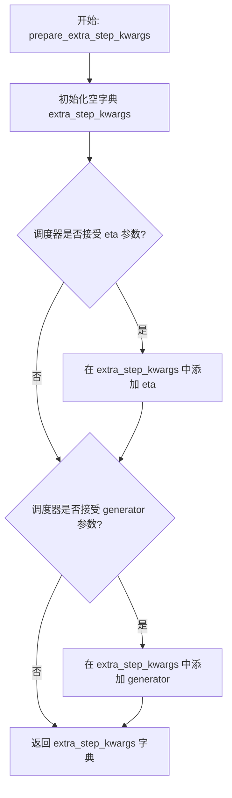

#### 带注释源码

```
def prepare_extra_step_kwargs(self, generator, eta):
    # 为调度器步骤准备额外参数，因为并非所有调度器都具有相同的函数签名
    # eta (η) 仅在 DDIMScheduler 中使用，其他调度器将忽略此参数
    # eta 对应 DDIM 论文 (https://huggingface.co/papers/2010.02502) 中的 η
    # 取值范围应为 [0, 1]

    # 通过检查调度器 step 方法的签名来判断是否接受 eta 参数
    accepts_eta = "eta" in set(inspect.signature(self.scheduler.step).parameters.keys())
    extra_step_kwargs = {}
    if accepts_eta:
        extra_step_kwargs["eta"] = eta

    # 检查调度器是否接受 generator 参数
    accepts_generator = "generator" in set(inspect.signature(self.scheduler.step).parameters.keys())
    if accepts_generator:
        extra_step_kwargs["generator"] = generator
    
    return extra_step_kwargs
```


### `SanaControlNetPipeline.check_inputs`

该方法用于验证管道输入参数的有效性，确保传入的prompt、height、width、embeds等参数符合模型要求，若不符合则抛出相应的ValueError异常。

参数：

- `self`：`SanaControlNetPipeline`实例，管道对象本身
- `prompt`：`str | list[str] | None`，用户输入的文本提示，可以是单个字符串或字符串列表
- `height`：`int`，生成图像的高度（像素），必须能被32整除
- `width`：`int`，生成图像的宽度（像素），必须能被32整除
- `callback_on_step_end_tensor_inputs`：`list[str] | None`，可选的回调张量输入列表，必须是`_callback_tensor_inputs`中的元素
- `negative_prompt`：`str | list[str] | None`，负向提示词，用于引导生成不想要的图像内容
- `prompt_embeds`：`torch.Tensor | None`，预生成的文本嵌入向量，不能与prompt同时提供
- `negative_prompt_embeds`：`torch.Tensor | None`，预生成的负向文本嵌入向量
- `prompt_attention_mask`：`torch.Tensor | None`，文本嵌入的注意力掩码，当提供prompt_embeds时必须提供
- `negative_prompt_attention_mask`：`torch.Tensor | None`，负向文本嵌入的注意力掩码，当提供negative_prompt_embeds时必须提供

返回值：`None`，该方法不返回任何值，仅通过抛出ValueError来指示参数错误

#### 流程图

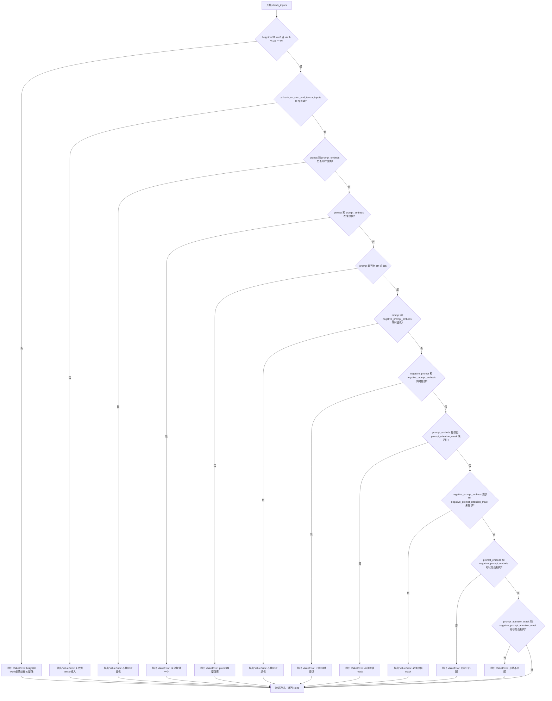

#### 带注释源码

```python
def check_inputs(
    self,
    prompt,
    height,
    width,
    callback_on_step_end_tensor_inputs=None,
    negative_prompt=None,
    prompt_embeds=None,
    negative_prompt_embeds=None,
    prompt_attention_mask=None,
    negative_prompt_attention_mask=None,
):
    # 验证图像尺寸是否满足模型要求（必须能被32整除）
    if height % 32 != 0 or width % 32 != 0:
        raise ValueError(f"`height` and `width` have to be divisible by 32 but are {height} and {width}.")

    # 验证回调张量输入是否在允许的列表中
    if callback_on_step_end_tensor_inputs is not None and not all(
        k in self._callback_tensor_inputs for k in callback_on_step_end_tensor_inputs
    ):
        raise ValueError(
            f"`callback_on_step_end_tensor_inputs` has to be in {self._callback_tensor_inputs}, but found {[k for k in callback_on_step_end_tensor_inputs if k not in self._callback_tensor_inputs]}"
        )

    # 验证prompt和prompt_embeds不能同时提供（互斥）
    if prompt is not None and prompt_embeds is not None:
        raise ValueError(
            f"Cannot forward both `prompt`: {prompt} and `prompt_embeds`: {prompt_embeds}. Please make sure to"
            " only forward one of the two."
        )
    # 验证至少提供一个prompt或prompt_embeds
    elif prompt is None and prompt_embeds is None:
        raise ValueError(
            "Provide either `prompt` or `prompt_embeds`. Cannot leave both `prompt` and `prompt_embeds` undefined."
        )
    # 验证prompt的类型必须是str或list
    elif prompt is not None and (not isinstance(prompt, str) and not isinstance(prompt, list)):
        raise ValueError(f"`prompt` has to be of type `str` or `list` but is {type(prompt)}")

    # 验证prompt和negative_prompt_embeds不能同时提供
    if prompt is not None and negative_prompt_embeds is not None:
        raise ValueError(
            f"Cannot forward both `prompt`: {prompt} and `negative_prompt_embeds`:"
            f" {negative_prompt_embeds}. Please make sure to only forward one of the two."
        )

    # 验证negative_prompt和negative_prompt_embeds不能同时提供
    if negative_prompt is not None and negative_prompt_embeds is not None:
        raise ValueError(
            f"Cannot forward both `negative_prompt`: {negative_prompt} and `negative_prompt_embeds`:"
            f" {negative_prompt_embeds}. Please make sure to only forward one of the two."
        )

    # 验证如果提供prompt_embeds，必须同时提供prompt_attention_mask
    if prompt_embeds is not None and prompt_attention_mask is None:
        raise ValueError("Must provide `prompt_attention_mask` when specifying `prompt_embeds`.")

    # 验证如果提供negative_prompt_embeds，必须同时提供negative_prompt_attention_mask
    if negative_prompt_embeds is not None and negative_prompt_attention_mask is None:
        raise ValueError("Must provide `negative_prompt_attention_mask` when specifying `negative_prompt_embeds`.")

    # 验证prompt_embeds和negative_prompt_embeds形状一致性
    if prompt_embeds is not None and negative_prompt_embeds is not None:
        if prompt_embeds.shape != negative_prompt_embeds.shape:
            raise ValueError(
                "`prompt_embeds` and `negative_prompt_embeds` must have the same shape when passed directly, but"
                f" got: `prompt_embeds` {prompt_embeds.shape} != `negative_prompt_embeds`"
                f" {negative_prompt_embeds.shape}."
            )
        # 验证prompt_attention_mask和negative_prompt_attention_mask形状一致性
        if prompt_attention_mask.shape != negative_prompt_attention_mask.shape:
            raise ValueError(
                "`prompt_attention_mask` and `negative_prompt_attention_mask` must have the same shape when passed directly, but"
                f" got: `prompt_attention_mask` {prompt_attention_mask.shape} != `negative_prompt_attention_mask`"
                f" {negative_prompt_attention_mask.shape}."
            )
```


### `SanaControlNetPipeline._text_preprocessing`

该方法用于对输入的文本 prompt 进行预处理，包括检查依赖库可用性、将输入统一转换为列表格式，并根据 `clean_caption` 参数决定是否进行复杂的标题清洗或仅进行小写和去空格处理。

参数：

- `text`：文本内容，类型为 `str`、`list[str]` 或 `tuple[str]`，表示待处理的 prompt 文本
- `clean_caption`：布尔值，默认 `False`，表示是否使用 BeautifulSoup 和 ftfy 进行深度清洗

返回值：`list[str]`，返回处理后的文本列表

#### 流程图

```mermaid
flowchart TD
    A[开始 _text_preprocessing] --> B{clean_caption 为 True 且 bs4 不可用?}
    B -->|是| C[警告并设置 clean_caption=False]
    B -->|否| D{clean_caption 为 True 且 ftfy 不可用?}
    D -->|是| E[警告并设置 clean_caption=False]
    D -->|否| F{text 是否为 tuple 或 list?}
    C --> F
    E --> F
    F -->|否| G[将 text 包装为列表]
    F -->|是| H[保持原样]
    G --> I[定义内部函数 process]
    H --> I
    I --> J{clean_caption 为 True?}
    J -->|是| K[调用 _clean_caption 两次]
    J -->|否| L[转换为小写并去除首尾空格]
    K --> M[返回处理后的文本]
    L --> M
    M --> N[对列表中每个元素应用 process]
    O[结束，返回 list[str]]
    N --> O
```

#### 带注释源码

```python
def _text_preprocessing(self, text, clean_caption=False):
    """
    文本预处理方法，用于清洗和标准化输入的 prompt 文本。

    Args:
        text: 输入的文本，可以是单个字符串、字符串列表或字符串元组
        clean_caption: 是否进行深度清洗（需要 bs4 和 ftfy 库）

    Returns:
        处理后的字符串列表
    """
    # 检查 clean_caption 为 True 时所需的依赖库是否可用
    # 如果 bs4 不可用，禁用 clean_caption 并发出警告
    if clean_caption and not is_bs4_available():
        logger.warning(BACKENDS_MAPPING["bs4"][-1].format("Setting `clean_caption=True`"))
        logger.warning("Setting `clean_caption` to False...")
        clean_caption = False

    # 如果 ftfy 不可用，同样禁用 clean_caption
    if clean_caption and not is_ftfy_available():
        logger.warning(BACKENDS_MAPPING["ftfy"][-1].format("Setting `clean_caption=True`"))
        logger.warning("Setting `clean_caption` to False...")
        clean_caption = False

    # 统一将输入转换为列表格式，便于统一处理
    if not isinstance(text, (tuple, list)):
        text = [text]

    # 定义内部处理函数，根据 clean_caption 标志决定处理方式
    def process(text: str):
        if clean_caption:
            # 如果需要深度清洗，调用 _clean_caption 两次以确保彻底清洗
            text = self._clean_caption(text)
            text = self._clean_caption(text)
        else:
            # 否则仅进行基本的 lowercase 和 strip 处理
            text = text.lower().strip()
        return text

    # 对列表中的每个文本元素应用处理函数
    return [process(t) for t in text]
```


### `SanaControlNetPipeline._clean_caption`

该方法用于对文本提示（caption）进行预处理和清洗，移除URL、HTML标签、CJK字符、特殊符号、电子邮件地址、IP地址等非标准字符，并将文本转换为适合模型输入的格式。

参数：

- `caption`：`str`，需要清洗的文本提示（caption）

返回值：`str`，清洗处理后的文本提示

#### 流程图

```mermaid
flowchart TD
    A[开始] --> B[将caption转为字符串]
    B --> C[URL解码]
    C --> D[去除首尾空格并转为小写]
    D --> E[替换&lt;person&gt;为person]
    E --> F1[移除URL链接]
    F1 --> F2[移除www开头的URL]
    F2 --> F3[解析HTML获取纯文本]
    F3 --> F4[移除@昵称]
    F4 --> F5[移除CJK字符]
    F5 --> F6[统一破折号格式]
    F6 --> F7[统一引号格式]
    F7 --> F8[移除HTML实体引用]
    F8 --> F9[移除IP地址]
    F9 --> F10[移除文章ID和换行符]
    F10 --> F11[移除#标签和数字序列]
    F11 --> F12[移除文件名]
    F12 --> F13[规范化重复符号]
    F13 --> F14[使用ftfy修复文本编码]
    F14 --> F15[再次HTML解码]
    F15 --> F16[移除特定模式的字母数字组合]
    F16 --> F17[移除广告关键词和图片格式词]
    F17 --> F18[移除页码信息]
    F18 --> F19[清理多余空白和标点]
    F19 --> F20[去除首尾特殊字符]
    A20[结束] --> Z[返回清洗后的caption]
    F20 --> Z
```

#### 带注释源码

```python
def _clean_caption(self, caption):
    # 将输入转换为字符串类型，确保类型一致
    caption = str(caption)
    
    # URL解码：将URL编码的字符转换回原始字符（如 %20 -> 空格）
    caption = ul.unquote_plus(caption)
    
    # 去除首尾空白并转换为小写，统一文本格式
    caption = caption.strip().lower()
    
    # 将HTML标签&lt;person&gt;替换为普通文本"person"
    caption = re.sub("<person>", "person", caption)
    
    # 移除URL（http/https协议）
    caption = re.sub(
        r"\b((?:https?:(?:\/{1,3}|[a-zA-Z0-9%])|[a-zA-Z0-9.\-]+[.](?:com|co|ru|net|org|edu|gov|it)[\w/-]*\b\/?(?!@)))",
        "",
        caption,
    )
    
    # 移除URL（www协议）
    caption = re.sub(
        r"\b((?:www:(?:\/{1,3}|[a-zA-Z0-9%])|[a-zA-Z0-9.\-]+[.](?:com|co|ru|net|org|edu|gov|it)[\w/-]*\b\/?(?!@)))",
        "",
        caption,
    )
    
    # 使用BeautifulSoup解析HTML，提取纯文本内容，移除HTML标签
    caption = BeautifulSoup(caption, features="html.parser").text
    
    # 移除@开头的用户名/昵称
    caption = re.sub(r"@[\w\d]+\b", "", caption)
    
    # 移除CJK统一表意文字及扩展字符（中文、日文、韩文等）
    caption = re.sub(r"[\u31c0-\u31ef]+", "", caption)  # CJK笔画
    caption = re.sub(r"[\u31f0-\u31ff]+", "", caption)  # 片假名扩展
    caption = re.sub(r"[\u3200-\u32ff]+", "", caption)  # CJK封闭字母
    caption = re.sub(r"[\u3300-\u33ff]+", "", caption)  # CJK兼容字符
    caption = re.sub(r"[\u3400-\u4dbf]+", "", caption)  # CJK统一表意文字扩展A
    caption = re.sub(r"[\u4dc0-\u4dff]+", "", caption)  # 易经六十四卦符号
    caption = re.sub(r"[\u4e00-\u9fff]+", "", caption)  # CJK统一表意文字
    
    # 统一各种破折号为标准"-"
    caption = re.sub(
        r"[\u002D\u058A\u05BE\u1400\u1806\u2010-\u2015\u2E17\u2E1A\u2E3A\u2E3B\u2E40\u301C\u3030\u30A0\uFE31\uFE32\uFE58\uFE63\uFF0D]+",
        "-",
        caption,
    )
    
    # 统一引号格式
    caption = re.sub(r"[`´«»""¨]", '"', caption)  # 双引号统一
    caption = re.sub(r"['']", "'", caption)  # 单引号统一
    
    # 移除HTML实体引用
    caption = re.sub(r"&quot;?", "", caption)  # &quot;
    caption = re.sub(r"&amp", "", caption)  # &amp
    
    # 移除IP地址
    caption = re.sub(r"\d{1,3}\.\d{1,3}\.\d{1,3}\.\d{1,3}", " ", caption)
    
    # 移除文章ID（格式：数字:数字）
    caption = re.sub(r"\d:\d\d\s+$", "", caption)
    
    # 移除转义换行符\n
    caption = re.sub(r"\\n", " ", caption)
    
    # 移除#标签（1-3位数字或5位以上数字）
    caption = re.sub(r"#\d{1,3}\b", "", caption)
    caption = re.sub(r"#\d{5,}\b", "", caption)
    
    # 移除长数字序列（6位以上）
    caption = re.sub(r"\b\d{6,}\b", "", caption)
    
    # 移除常见图片/文件格式的文件名
    caption = re.sub(r"[\S]+\.(?:png|jpg|jpeg|bmp|webp|eps|pdf|apk|mp4)", "", caption)
    
    # 规范化连续引号和句号
    caption = re.sub(r"[\"']{2,}", r'"', caption)
    caption = re.sub(r"[\.]{2,}", r" ", caption)
    
    # 移除特殊标点符号
    caption = re.sub(self.bad_punct_regex, r" ", caption)
    
    # 移除" . "格式
    caption = re.sub(r"\s+\.\s+", r" ", caption)
    
    # 如果连字符或下划线出现超过3次，将其替换为空格（处理snake_case和kebab-case）
    regex2 = re.compile(r"(?:\-|\_)")
    if len(re.findall(regex2, caption)) > 3:
        caption = re.sub(regex2, " ", caption)
    
    # 使用ftfy库修复常见的文本编码问题
    caption = ftfy.fix_text(caption)
    
    # 双重HTML解码，处理嵌套的HTML实体
    caption = html.unescape(html.unescape(caption))
    
    # 移除特定模式的字母数字混合字符串（常见于广告/垃圾文本）
    caption = re.sub(r"\b[a-zA-Z]{1,3}\d{3,15}\b", "", caption)  # 如jc6640
    caption = re.sub(r"\b[a-zA-Z]+\d+[a-zA-Z]+\b", "", caption)
    caption = re.sub(r"\b\d+[a-zA-Z]+\d+\b", "", caption)
    
    # 移除广告关键词
    caption = re.sub(r"(worldwide\s+)?(free\s+)?shipping", "", caption)
    caption = re.sub(r"(free\s)?download(\sfree)?", "", caption)
    caption = re.sub(r"\bclick\b\s(?:for|on)\s\w+", "", caption)
    
    # 移除图片格式关键词
    caption = re.sub(r"\b(?:png|jpg|jpeg|bmp|webp|eps|pdf|apk|mp4)(\simage[s]?)?", "", caption)
    
    # 移除页码
    caption = re.sub(r"\bpage\s+\d+\b", "", caption)
    
    # 移除复杂字母数字组合
    caption = re.sub(r"\b\d*[a-zA-Z]+\d+[a-zA-Z]+\d+[a-zA-Z\d]*\b", r" ", caption)
    
    # 移除尺寸格式（如1920x1080）
    caption = re.sub(r"\b\d+\.?\d*[xх×]\d+\.?\d*\b", "", caption)
    
    # 规范化冒号周围空格
    caption = re.sub(r"\b\s+\:\s+", r": ", caption)
    
    # 在标点后添加空格
    caption = re.sub(r"(\D[,\./])\b", r"\1 ", caption)
    
    # 合并多余空格
    caption = re.sub(r"\s+", " ", caption)
    
    # 去除首尾引号和特殊字符
    caption = re.sub(r"^[\"\']([\w\W]+)[\"\']$", r"\1", caption)
    caption = re.sub(r"^[\'\_,\-\:;]", r" "", caption)
    caption = re.sub(r"[\'\_,\-\:\-\+]$", r"", caption)
    caption = re.sub(r"^\.\S+$", "", caption)
    
    # 返回去除首尾空格后的结果
    return caption.strip()
```


### `SanaControlNetPipeline.prepare_image`

该方法负责对输入的控制图像进行预处理，包括格式转换、尺寸调整、批处理扩展以及设备数据传输，并支持分类器自由引导（Classifier-Free Guidance）的图像复制。

参数：

- `self`：类实例，隐含的类实例引用
- `image`：`torch.Tensor | PipelineImageInput`，输入的控制图像，可以是 PyTorch 张量或其他支持格式（如 PIL.Image、np.ndarray 等）
- `width`：`int`，输出图像的目标宽度（像素）
- `height`：`int`，输出图像的目标高度（像素）
- `batch_size`：`int`，批处理大小，用于确定图像重复次数
- `num_images_per_prompt`：`int`，每个提示词生成的图像数量
- `device`：`torch.device`，目标设备（CPU 或 CUDA 设备）
- `dtype`：`torch.dtype`，目标数据类型（如 torch.float32、torch.bfloat16 等）
- `do_classifier_free_guidance`：`bool`，是否启用分类器自由引导，若为 True 则在推理时需要额外生成无条件图像
- `guess_mode`：`bool`，猜测模式标志，若为 True 则忽略 `do_classifier_free_guidance` 的图像复制操作

返回值：`torch.Tensor`，预处理后的图像张量，形状已根据批处理大小和引导策略调整

#### 流程图

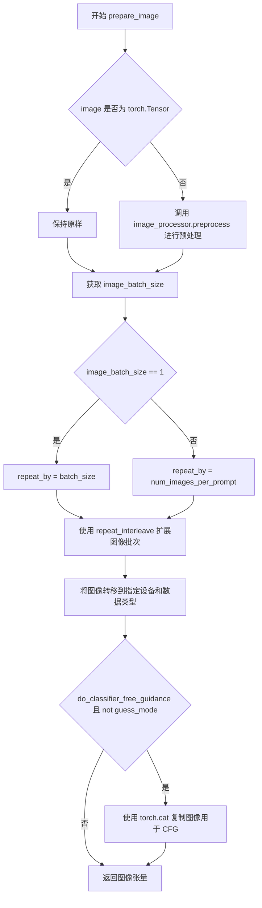

#### 带注释源码

```python
def prepare_image(
    self,
    image,
    width,
    height,
    batch_size,
    num_images_per_prompt,
    device,
    dtype,
    do_classifier_free_guidance=False,
    guess_mode=False,
):
    # 判断输入图像是否为 PyTorch 张量
    if isinstance(image, torch.Tensor):
        # 如果已是张量，直接使用，不做预处理
        pass
    else:
        # 如果不是张量，调用图像处理器进行预处理
        # 支持 PIL.Image、np.ndarray、list 等格式
        image = self.image_processor.preprocess(image, height=height, width=width)

    # 获取输入图像的批次大小
    image_batch_size = image.shape[0]

    # 根据批次大小确定图像重复次数
    if image_batch_size == 1:
        # 单张图像时，按整个批处理大小重复
        repeat_by = batch_size
    else:
        # 图像批次大小与提示词批次大小相同时，按每提示词的图像数量重复
        # image batch size is the same as prompt batch size
        repeat_by = num_images_per_prompt

    # 沿批次维度重复图像张量
    image = image.repeat_interleave(repeat_by, dim=0)

    # 将图像张量转移到指定设备（CPU/CUDA）并转换数据类型
    image = image.to(device=device, dtype=dtype)

    # 如果启用分类器自由引导且不在猜测模式下，复制图像用于条件和无条件推理
    if do_classifier_free_guidance and not guess_mode:
        # 将图像复制两份：第一份用于无条件引导，第二份用于条件引导
        image = torch.cat([image] * 2)

    # 返回预处理完成的图像张量
    return image
```


### SanaControlNetPipeline.prepare_latents

该方法负责为扩散模型准备初始的潜在向量（latents）。它首先检查是否已提供了潜在的潜在向量（`latents`），如果提供了，则将其移动到指定的设备和数据类型；如果没有提供，则根据图像的高度、宽度以及 VAE 的缩放因子（`vae_scale_factor`）计算潜在空间的形状，并使用随机噪声生成器（`randn_tensor`）创建新的潜在向量。此外，该方法还会验证传入的生成器列表长度是否与批处理大小匹配，以确保批处理的一致性。

参数：

- `batch_size`：`int`，生成的批次大小，即一次生成多少张图像。
- `num_channels_latents`：`int`，潜在空间的通道数，通常对应于 Transformer 模型的输入通道数。
- `height`：`int`，目标输出图像的高度（以像素为单位）。
- `width`：`int`，目标输出图像的宽度（以像素为单位）。
- `dtype`：`torch.dtype`，生成的张量的数据类型（例如 `torch.float32`）。
- `device`：`torch.device`，生成的张量应该放置的设备（例如 CUDA 或 CPU）。
- `generator`：`torch.Generator | list[torch.Generator] | None`，用于生成确定性随机噪声的生成器。如果是一个列表，其长度必须等于 `batch_size`。
- `latents`：`torch.Tensor | None`，可选参数。如果提供了现有的潜在向量，则直接使用并迁移到指定设备；否则生成新的潜在向量。

返回值：`torch.Tensor`，准备好用于去噪过程的潜在向量张量。

#### 流程图

```mermaid
flowchart TD
    A([开始]) --> B{latents 参数是否为 None?}
    B -- 是 --> C[计算潜在空间形状: (batch_size, num_channels, height // vae_scale_factor, width // vae_scale_factor)]
    C --> D{generator 是否为列表?}
    D -- 是 --> E{列表长度是否等于 batch_size?}
    E -- 否 --> F[抛出 ValueError: 生成器列表长度与批次大小不匹配]
    E -- 是 --> G[调用 randn_tensor 生成随机潜在向量]
    D -- 否 --> G
    B -- 否 --> H[将传入的 latents 移动到指定 device 和 dtype]
    H --> I([返回 latent 张量])
    G --> I
    F --> J([结束/报错])
```

#### 带注释源码

```python
def prepare_latents(self, batch_size, num_channels_latents, height, width, dtype, device, generator, latents=None):
    # 如果已经存在预计算的 latents，则直接将其移动到目标设备和数据类型并返回
    if latents is not None:
        return latents.to(device=device, dtype=dtype)

    # 根据图像尺寸和 VAE 缩放因子计算潜在空间的维度
    # VAE 通常会对图像进行下采样 (例如 8x 或 32x)，因此潜在空间的尺寸要除以 vae_scale_factor
    shape = (
        batch_size,
        num_channels_latents,
        int(height) // self.vae_scale_factor,
        int(width) // self.vae_scale_factor,
    )

    # 验证生成器列表的长度是否与批处理大小一致，确保一一对应
    if isinstance(generator, list) and len(generator) != batch_size:
        raise ValueError(
            f"You have passed a list of generators of length {len(generator)}, but requested an effective batch"
            f" size of {batch_size}. Make sure the batch size matches the length of the generators."
        )

    # 使用 randn_tensor 生成符合正态分布的随机噪声作为初始潜在向量
    # generator 参数用于确保生成的可重复性（如果提供）
    latents = randn_tensor(shape, generator=generator, device=device, dtype=dtype)
    return latents
```


### `SanaControlNetPipeline.guidance_scale`

该属性是一个只读的 getter 属性，用于获取扩散模型在生成图像时使用的引导比例（guidance scale）。该参数控制生成图像与文本提示的相关性，数值越大生成的图像越贴合提示词，但可能导致质量下降。

参数：无（属性访问器不接受显式参数，`self` 为隐式参数）

返回值：`float`，返回当前管道使用的引导比例数值，用于控制 classifier-free guidance 的强度。

#### 流程图

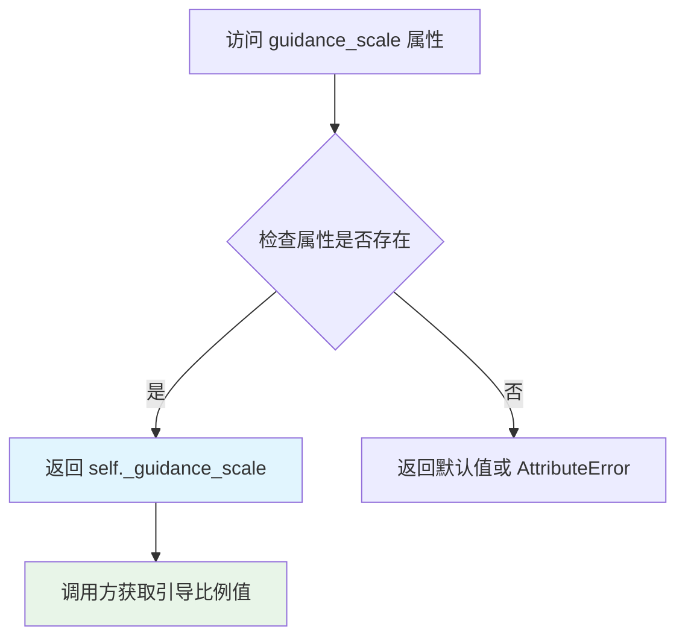

#### 带注释源码

```python
@property
def guidance_scale(self):
    """
    属性 getter：获取当前扩散管道的引导比例（guidance scale）。
    
    该属性对应于扩散模型中的 classifier-free guidance 权重，
    用于平衡生成图像的真实性和与文本提示的一致性。
    在 __call__ 方法中通过 self._guidance_scale 进行赋值。
    
    Returns:
        float: 当前配置的引导比例数值，通常在 1.0 到 20.0 之间。
              值越大表示越强的文本引导，1.0 表示不使用引导。
    """
    return self._guidance_scale
```


### `SanaControlNetPipeline.attention_kwargs`

该属性是一个只读的 getter 属性，用于获取在管道调用时传递的注意力机制关键字参数（AttentionProcessor 所需的 kwargs）。这些参数会在控制网（ControlNet）和 Transformer 模型推理时被使用，以自定义注意力机制的行为。

参数：

- （无参数 - 这是一个属性 getter）

返回值：`dict[str, Any] | None`，返回存储在实例中的注意力关键字参数字典，如果未设置则返回 `None`。

#### 流程图

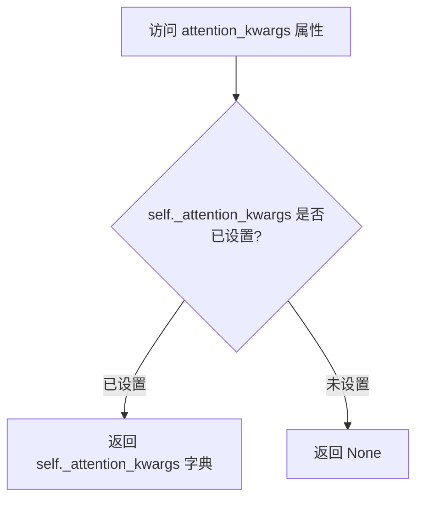

#### 带注释源码

```python
@property
def attention_kwargs(self):
    r"""
    返回传递给 AttentionProcessor 的关键字参数字典。
    
    这些参数在 ControlNet 和 Transformer 的前向传播过程中被使用，
    允许用户自定义注意力机制的行为，例如调整注意力缩放、启用特殊的注意力模式等。
    
    返回值类型: dict[str, Any] | None
        存储在管道实例中的注意力 kwargs，如果未设置则为 None。
    """
    return self._attention_kwargs
```


### `SanaControlNetPipeline.do_classifier_free_guidance`

这是一个属性方法，用于判断当前 pipeline 是否启用了 Classifier-Free Guidance (CFG) 技术。该属性通过比较内部存储的 `_guidance_scale` 参数与阈值 1.0 来决定返回值，当 guidance_scale 大于 1.0 时表示启用了 CFG 引导生成技术。

参数：

- （无参数，这是一个属性 getter）

返回值：`bool`，当 `_guidance_scale > 1.0` 时返回 `True`（表示启用 classifier-free guidance），否则返回 `False`（表示禁用该技术）

#### 流程图

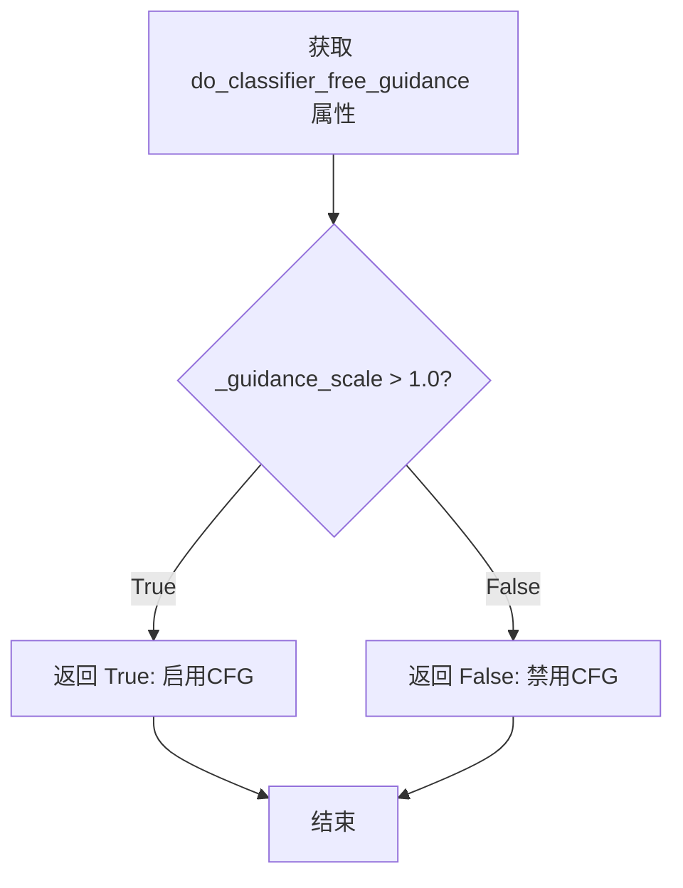

#### 带注释源码

```python
@property
def do_classifier_free_guidance(self):
    """
    属性方法：判断是否启用 Classifier-Free Guidance (CFG) 技术
    
    Classifier-Free Guidance 是一种提高文本到图像生成质量的技巧，
    通过同时预测无条件噪声和条件噪声，然后根据 guidance_scale 
    加权组合两者。当 guidance_scale > 1.0 时启用 CFG 能够产生
    与文本提示更相关但可能质量略低的图像。
    
    Returns:
        bool: 如果 guidance_scale 大于 1.0 则返回 True，表示在生成
              过程中会使用 classifier-free guidance；否则返回 False。
    """
    return self._guidance_scale > 1.0
```


### `SanaControlNetPipeline.num_timesteps`

该属性用于返回当前管道的推理时间步数量，通常在去噪循环开始前被设置。

参数： 无

返回值： `int`，返回当前推理过程中的时间步数量

#### 流程图

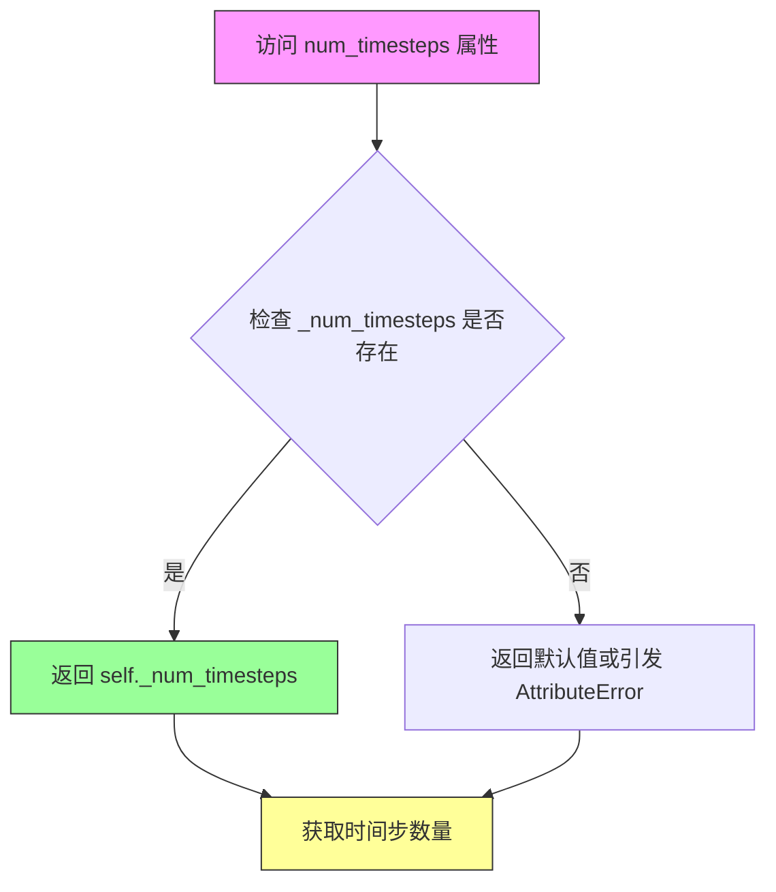

#### 带注释源码

```python
@property
def num_timesteps(self):
    """
    属性方法：获取当前管道的时间步数量
    
    该属性返回一个整数，表示扩散模型推理过程中的时间步总数。
    该值在 __call__ 方法的去噪循环开始前被设置：
        self._num_timesteps = len(timesteps)
    
    返回:
        int: 推理过程中使用的时间步数量
    """
    return self._num_timesteps
```


### `SanaControlNetPipeline.interrupt`

该属性是 SanaControlNetPipeline 管道的中断控制标志，用于在去噪循环中判断是否需要跳过当前迭代。通过外部设置此标志，可以实现对推理过程的动态中断控制。

参数： 无

返回值：`bool`，返回管道的中断状态标志。当值为 `True` 时，去噪循环会跳过当前时间步的处理；值为 `False` 时，正常执行去噪步骤。

#### 流程图

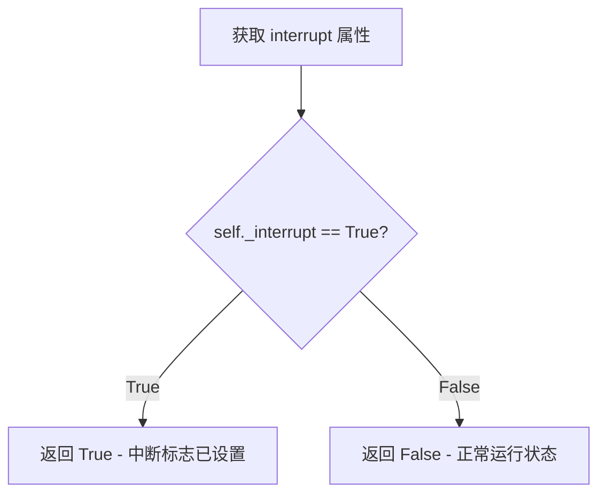

#### 带注释源码

```python
@property
def interrupt(self):
    """
    属性 getter: 获取管道的中断状态标志
    
    该属性返回内部变量 _interrupt 的值，用于控制去噪循环的执行流程。
    在 __call__ 方法中，_interrupt 初始化为 False，表示正常执行。
    外部调用者可以通过设置 pipeline._interrupt = True 来请求中断推理过程。
    
    注意：当前实现中，中断逻辑为 continue，意味着会跳过当前时间步的处理，
    但仍会继续循环直到所有时间步完成。这种设计允许逐步中断而非完全立即停止。
    
    Returns:
        bool: 中断标志状态。True 表示请求了中断，False 表示正常运行。
    """
    return self._interrupt
```

#### 相关上下文源码

```python
# 在 __call__ 方法中去噪循环中的使用方式：

self._interrupt = False  # 初始化中断标志

# 去噪循环中
with self.progress_bar(total=num_inference_steps) as progress_bar:
    for i, t in enumerate(timesteps):
        if self.interrupt:  # 检查中断标志
            continue        # 跳过当前迭代
        # ... 正常的去噪处理逻辑
```


### SanaControlNetPipeline.__call__

这是SanaControlNetPipeline的核心推理方法，实现基于Sana模型的文本到图像生成管道，并使用ControlNet实现对生成过程的控制。该方法处理完整的扩散推理流程，包括输入验证、提示词编码、控制图像处理、噪声预测和潜在向量解码。

参数：

- `prompt`：`str | list[str]`，用于指导图像生成的提示词，如果未定义则必须传入`prompt_embeds`
- `negative_prompt`：`str`，不参与图像生成的提示词，当不使用引导时会被忽略
- `num_inference_steps`：`int`，去噪步数，默认为20
- `timesteps`：`list[int]`，用于去噪过程的自定义时间步
- `sigmas`：`list[float]`，用于去噪过程的自定义sigma值
- `guidance_scale`：`float`，引导比例，默认为4.5
- `control_image`：`PipelineImageInput`，ControlNet输入条件
- `controlnet_conditioning_scale`：`float | list[float]`，ControlNet输出乘数，默认为1.0
- `num_images_per_prompt`：`int | None`，每个提示词生成的图像数量，默认为1
- `height`：`int`，生成图像的高度，默认为1024
- `width`：`int`，生成图像的宽度，默认为1024
- `eta`：`float`，DDIM论文中的eta参数，默认为0.0
- `generator`：`torch.Generator | list[torch.Generator]`，随机数生成器
- `latents`：`torch.Tensor | None`，预生成的噪声潜在向量
- `prompt_embeds`：`torch.Tensor | None`，预生成的文本嵌入
- `prompt_attention_mask`：`torch.Tensor | None`，文本嵌入的注意力掩码
- `negative_prompt_embeds`：`torch.Tensor | None`，负面文本嵌入
- `negative_prompt_attention_mask`：`torch.Tensor | None`，负面文本注意力掩码
- `output_type`：`str | None`，输出格式，默认为"pil"
- `return_dict`：`bool`，是否返回字典格式，默认为True
- `clean_caption`：`bool`，是否清理标题，默认为False
- `use_resolution_binning`：`bool`，是否使用分辨率分箱，默认为True
- `attention_kwargs`：`dict[str, Any] | None`，注意力处理器参数
- `callback_on_step_end`：`Callable | None`，每步结束时的回调函数
- `callback_on_step_end_tensor_inputs`：`list[str]`，回调的tensor输入列表
- `max_sequence_length`：`int`，最大序列长度，默认为300
- `complex_human_instruction`：`list[str]`，复杂人类指令

返回值：`SanaPipelineOutput | tuple`，生成的图像输出

#### 流程图

```mermaid
flowchart TD
    A[开始 __call__] --> B{use_resolution_binning?}
    B -->|Yes| C[根据transformer.sample_size选择aspect_ratio_bin]
    B -->|No| D[跳过分辨率分箱]
    C --> E[classify_height_width_bin获取目标尺寸]
    D --> F[check_inputs验证输入参数]
    F --> G[设置_guidance_scale和_attention_kwargs]
    G --> H[确定batch_size]
    H --> I[encode_prompt编码提示词]
    I --> J{do_classifier_free_guidance?}
    J -->|Yes| K[concat负向和正向prompt_embeds]
    J -->|No| L[prepare_image准备控制图像]
    K --> L
    L --> M[vae.encode编码控制图像到latent空间]
    M --> N[retrieve_timesteps获取去噪时间步]
    N --> O[prepare_latents准备初始潜在向量]
    O --> P[prepare_extra_step_kwargs准备调度器额外参数]
    P --> Q[进入Denoising Loop]
    Q --> R{遍历timesteps}
    R -->|未结束| S[构建latent_model_input]
    S --> T[扩展timestep到batch维度]
    T --> U[ControlNet推理]
    U --> V[Transformer推理]
    V --> W{do_classifier_free_guidance?}
    W -->|Yes| X[CFG引导计算]
    W -->|No| Y[scheduler.step更新latents]
    X --> Y
    Y --> Z{callback_on_step_end?}
    Z -->|Yes| AA[执行回调]
    Z -->|No| AB[更新进度条]
    AA --> AB
    AB --> R
    R -->|结束| AC{output_type == 'latent'?}
    AC -->|Yes| AD[直接返回latents]
    AC -->|No| AE[vae.decode解码潜在向量]
    AE --> AF[resize_and_crop_tensor后处理]
    AF --> AG[postprocess转换为输出格式]
    AD --> AH[maybe_free_offload释放模型内存]
    AG --> AH
    AH --> AI{return_dict?}
    AI -->|Yes| AJ[返回SanaPipelineOutput]
    AI -->|No| AK[返回tuple]
```

#### 带注释源码

```python
@torch.no_grad()
@replace_example_docstring(EXAMPLE_DOC_STRING)
def __call__(
    self,
    prompt: str | list[str] = None,
    negative_prompt: str = "",
    num_inference_steps: int = 20,
    timesteps: list[int] = None,
    sigmas: list[float] = None,
    guidance_scale: float = 4.5,
    control_image: PipelineImageInput = None,
    controlnet_conditioning_scale: float | list[float] = 1.0,
    num_images_per_prompt: int | None = 1,
    height: int = 1024,
    width: int = 1024,
    eta: float = 0.0,
    generator: torch.Generator | list[torch.Generator] | None = None,
    latents: torch.Tensor | None = None,
    prompt_embeds: torch.Tensor | None = None,
    prompt_attention_mask: torch.Tensor | None = None,
    negative_prompt_embeds: torch.Tensor | None = None,
    negative_prompt_attention_mask: torch.Tensor | None = None,
    output_type: str | None = "pil",
    return_dict: bool = True,
    clean_caption: bool = False,
    use_resolution_binning: bool = True,
    attention_kwargs: dict[str, Any] | None = None,
    callback_on_step_end: Callable[[int, int], None] | None = None,
    callback_on_step_end_tensor_inputs: list[str] = ["latents"],
    max_sequence_length: int = 300,
    complex_human_instruction: list[str] = [
        "Given a user prompt, generate an 'Enhanced prompt' that provides detailed visual descriptions suitable for image generation..."
    ],
) -> SanaPipelineOutput | tuple:
    """Pipeline推理入口方法"""
    
    # 处理PipelineCallback
    if isinstance(callback_on_step_end, (PipelineCallback, MultiPipelineCallbacks)):
        callback_on_step_end_tensor_inputs = callback_on_step_end.tensor_inputs

    # 1. 检查输入并处理分辨率分箱
    if use_resolution_binning:
        # 根据transformer配置选择合适的长宽比分箱
        if self.transformer.config.sample_size == 128:
            aspect_ratio_bin = ASPECT_RATIO_4096_BIN
        elif self.transformer.config.sample_size == 64:
            aspect_ratio_bin = ASPECT_RATIO_2048_BIN
        elif self.transformer.config.sample_size == 32:
            aspect_ratio_bin = ASPECT_RATIO_1024_BIN
        elif self.transformer.config.sample_size == 16:
            aspect_ratio_bin = ASPECT_RATIO_512_BIN
        else:
            raise ValueError("Invalid sample size")
        orig_height, orig_width = height, width
        # 将请求的尺寸映射到最近的预定义分辨率
        height, width = self.image_processor.classify_height_width_bin(height, width, ratios=aspect_ratio_bin)

    # 验证输入参数的有效性
    self.check_inputs(
        prompt, height, width, callback_on_step_end_tensor_inputs,
        negative_prompt, prompt_embeds, negative_prompt_embeds,
        prompt_attention_mask, negative_prompt_attention_mask,
    )

    # 设置内部状态
    self._guidance_scale = guidance_scale
    self._attention_kwargs = attention_kwargs
    self._interrupt = False

    # 2. 确定batch_size
    if prompt is not None and isinstance(prompt, str):
        batch_size = 1
    elif prompt is not None and isinstance(prompt, list):
        batch_size = len(prompt)
    else:
        batch_size = prompt_embeds.shape[0]

    device = self._execution_device
    lora_scale = self.attention_kwargs.get("scale", None) if self.attention_kwargs is not None else None

    # 3. 编码输入提示词
    (
        prompt_embeds,
        prompt_attention_mask,
        negative_prompt_embeds,
        negative_prompt_attention_mask,
    ) = self.encode_prompt(
        prompt,
        self.do_classifier_free_guidance,
        negative_prompt=negative_prompt,
        num_images_per_prompt=num_images_per_prompt,
        device=device,
        prompt_embeds=prompt_embeds,
        negative_prompt_embeds=negative_prompt_embeds,
        prompt_attention_mask=prompt_attention_mask,
        negative_prompt_attention_mask=negative_prompt_attention_mask,
        clean_caption=clean_caption,
        max_sequence_length=max_sequence_length,
        complex_human_instruction=complex_human_instruction,
        lora_scale=lora_scale,
    )
    
    # 使用Classifier-Free Guidance时拼接负向和正向embeddings
    if self.do_classifier_free_guidance:
        prompt_embeds = torch.cat([negative_prompt_embeds, prompt_embeds], dim=0)
        prompt_attention_mask = torch.cat([negative_prompt_attention_mask, prompt_attention_mask], dim=0)

    # 4. 准备控制图像
    if isinstance(self.controlnet, SanaControlNetModel):
        control_image = self.prepare_image(
            image=control_image,
            width=width,
            height=height,
            batch_size=batch_size * num_images_per_prompt,
            num_images_per_prompt=num_images_per_prompt,
            device=device,
            dtype=self.vae.dtype,
            do_classifier_free_guidance=self.do_classifier_free_guidance,
            guess_mode=False,
        )
        height, width = control_image.shape[-2:]

        # VAE编码控制图像到latent空间
        control_image = self.vae.encode(control_image).latent
        control_image = control_image * self.vae.config.scaling_factor
    else:
        raise ValueError("`controlnet` must be of type `SanaControlNetModel`.")

    # 5. 准备时间步
    timestep_device = "cpu" if XLA_AVAILABLE else device
    timesteps, num_inference_steps = retrieve_timesteps(
        self.scheduler, num_inference_steps, timestep_device, timesteps, sigmas
    )

    # 6. 准备初始潜在向量
    latent_channels = self.transformer.config.in_channels
    latents = self.prepare_latents(
        batch_size * num_images_per_prompt,
        latent_channels,
        height,
        width,
        torch.float32,
        device,
        generator,
        latents,
    )

    # 7. 准备调度器额外参数
    extra_step_kwargs = self.prepare_extra_step_kwargs(generator, eta)

    # 8. Denoising Loop - 核心扩散推理过程
    num_warmup_steps = max(len(timesteps) - num_inference_steps * self.scheduler.order, 0)
    self._num_timesteps = len(timesteps)

    controlnet_dtype = self.controlnet.dtype
    transformer_dtype = self.transformer.dtype
    
    with self.progress_bar(total=num_inference_steps) as progress_bar:
        for i, t in enumerate(timesteps):
            # 检查中断标志
            if self.interrupt:
                continue

            # 为CFG准备双倍batch的输入
            latent_model_input = torch.cat([latents] * 2) if self.do_classifier_free_guidance else latents

            # 扩展timestep到batch维度
            timestep = t.expand(latent_model_input.shape[0])

            # ControlNet推理 - 获取中间特征
            controlnet_block_samples = self.controlnet(
                latent_model_input.to(dtype=controlnet_dtype),
                encoder_hidden_states=prompt_embeds.to(dtype=controlnet_dtype),
                encoder_attention_mask=prompt_attention_mask,
                timestep=timestep,
                return_dict=False,
                attention_kwargs=self.attention_kwargs,
                controlnet_cond=control_image,
                conditioning_scale=controlnet_conditioning_scale,
            )[0]

            # Transformer预测噪声
            noise_pred = self.transformer(
                latent_model_input.to(dtype=transformer_dtype),
                encoder_hidden_states=prompt_embeds.to(dtype=transformer_dtype),
                encoder_attention_mask=prompt_attention_mask,
                timestep=timestep,
                return_dict=False,
                attention_kwargs=self.attention_kwargs,
                # 传入ControlNet的特征
                controlnet_block_samples=tuple(t.to(dtype=transformer_dtype) for t in controlnet_block_samples),
            )[0]
            noise_pred = noise_pred.float()

            # 执行Classifier-Free Guidance
            if self.do_classifier_free_guidance:
                noise_pred_uncond, noise_pred_text = noise_pred.chunk(2)
                noise_pred = noise_pred_uncond + guidance_scale * (noise_pred_text - noise_pred_uncond)

            # 处理learned sigma (如果有)
            if self.transformer.config.out_channels // 2 == latent_channels:
                noise_pred = noise_pred.chunk(2, dim=1)[0]

            # 调度器步骤 - 计算上一步的latents
            latents = self.scheduler.step(noise_pred, t, latents, **extra_step_kwargs, return_dict=False)[0]

            # 步骤结束回调
            if callback_on_step_end is not None:
                callback_kwargs = {}
                for k in callback_on_step_end_tensor_inputs:
                    callback_kwargs[k] = locals()[k]
                callback_outputs = callback_on_step_end(self, i, t, callback_kwargs)

                # 允许回调修改latents和embeddings
                latents = callback_outputs.pop("latents", latents)
                prompt_embeds = callback_outputs.pop("prompt_embeds", prompt_embeds)
                negative_prompt_embeds = callback_outputs.pop("negative_prompt_embeds", negative_prompt_embeds)

            # 更新进度条
            if i == len(timesteps) - 1 or ((i + 1) > num_warmup_steps and (i + 1) % self.scheduler.order == 0):
                progress_bar.update()

            # XLA优化
            if XLA_AVAILABLE:
                xm.mark_step()

    # 9. 解码生成最终图像
    if output_type == "latent":
        image = latents
    else:
        latents = latents.to(self.vae.dtype)
        torch_accelerator_module = getattr(torch, get_device(), torch.cuda)
        oom_error = (
            torch.OutOfMemoryError
            if is_torch_version(">=", "2.5.0")
            else torch_accelerator_module.OutOfMemoryError
        )
        try:
            # VAE解码latents到图像
            image = self.vae.decode(latents / self.vae.config.scaling_factor, return_dict=False)[0]
        except oom_error as e:
            warnings.warn(
                f"{e}. \nTry to use VAE tiling for large images..."
            )
        
        # 如果使用了分辨率分箱，需要resize回原始尺寸
        if use_resolution_binning:
            image = self.image_processor.resize_and_crop_tensor(image, orig_width, orig_height)

        # 后处理 - 转换为PIL或numpy
        image = self.image_processor.postprocess(image, output_type=output_type)

    # 释放模型内存
    self.maybe_free_model_hooks()

    # 返回结果
    if not return_dict:
        return (image,)

    return SanaPipelineOutput(images=image)
```

## 关键组件


### SanaControlNetPipeline

SanaControlNetPipeline是用于文本到图像生成的扩散管道，结合了SanaTransformer2DModel和SanaControlNetModel，通过ControlNet条件图像引导图像生成过程。

### retrieve_timesteps

辅助函数，用于调用调度器的set_timesteps方法并从调度器中检索时间步，支持自定义时间步和sigma参数。

### ASPECT_RATIO_4096_BIN

长宽比查找字典，将长宽比映射到具体的分辨率对（宽x高），用于将请求的高度和宽度映射到最接近的可能分辨率，支持从0.25到4.0的长宽比。

### _get_gemma_prompt_embeds

内部方法，使用Gemma分词器将文本提示编码为文本编码器的隐藏状态，支持复杂的人类指令增强和最大序列长度限制。

### encode_prompt

完整的提示编码流程，处理正向提示和负向提示，支持分类器自由引导（CFG），并对提示嵌入进行复制以匹配每提示生成的图像数量。

### _text_preprocessing

文本预处理方法，将文本转换为小写并进行基本清理，支持可选的标题清洁功能。

### _clean_caption

标题清洁方法，使用多种正则表达式清理HTML标签、URL、CJK字符、特殊符号等，生成适合图像生成的光洁提示。

### prepare_image

准备ControlNet条件图像的方法，支持张量和多种图像格式输入，处理批次大小和分类器自由引导的图像复制。

### prepare_latents

准备潜在变量的方法，生成随机潜在变量或使用提供的潜在变量，并考虑VAE缩放因子。

### __call__

主要的推理方法，执行完整的文本到图像生成流程，包括：输入验证、提示编码、ControlNet条件图像处理、时间步准备、去噪循环和VAE解码。

### VAE切片与平铺支持

enable_vae_slicing、disable_vae_slicing、enable_vae_tiling、disable_vae_tiling方法用于启用/禁用VAE的切片解码和平铺解码，以支持更大的图像和批次大小。

### PixArtImageProcessor

图像处理器，用于预处理输入图像和后处理输出图像，支持分辨率分类和图像缩放。

### check_inputs

输入验证方法，检查高度和宽度可被32整除，验证提示和嵌入的一致性，确保回调张量输入有效。

### prepare_extra_step_kwargs

准备调度器额外参数的方法，检查调度器是否接受eta和generator参数。

### ASPECT_RATIO_*_BIN系列

多个长宽比查找表（512、1024、2048、4096），根据transformer的sample_size配置选择合适的分辨率映射。

### SanaLoraLoaderMixin集成

通过继承SanaLoraLoaderMixin，支持LoRA权重加载和调整，提供_lora_scale属性管理LoRA缩放因子。


## 问题及建议


### 已知问题

- **废弃方法仍保留**: `enable_vae_slicing()`, `disable_vae_slicing()`, `enable_vae_tiling()`, `disable_vae_tiling()` 已被标记为废弃（版本0.40.0），但仍保留在代码中，这些方法只是简单委托给VAE自身的方法，增加代码冗余
- **复杂的人类指令硬编码**: `__call__` 方法中的 `complex_human_instruction` 参数包含大量硬编码的示例文本（约10行），这些示例应该外部化或配置化，而非硬编码在方法签名中
- **重复代码**: 多个方法标记为 "Copied from"（如 `retrieve_timesteps`, `_get_gemma_prompt_embeds`, `encode_prompt`, `_text_preprocessing`, `_clean_caption`, `prepare_extra_step_kwargs` 等），表明存在代码重复问题，应考虑提取到共享基类或工具模块
- **正则表达式未预编译**: `_text_preprocessing` 和 `_clean_caption` 方法中使用的多个正则表达式在每次调用时重新创建，应预先编译以提高性能
- **硬编码的宽高比映射**: `ASPECT_RATIO_4096_BIN` 字典被硬编码，且与 pixart_alpha 中的 `ASPECT_RATIO_2048_BIN`, `ASPECT_RATIO_1024_BIN`, `ASPECT_RATIO_512_BIN` 重复定义，应统一管理
- **默认值过于复杂**: `complex_human_instruction` 的默认值过长且包含详细示例，这使得函数签名过于臃肿，影响代码可读性

### 优化建议

- **移除废弃方法**: 删除已废弃的 VAE slicing/tiling 方法，用户应直接调用 `pipe.vae.enable_slicing()` 等方法
- **外部化复杂指令**: 将 `complex_human_instruction` 的默认值移至配置文件或单独的常量定义，保持方法签名简洁
- **提取共享代码**: 将跨管道共享的方法（如 `retrieve_timesteps`, `_text_preprocessing`, `_clean_caption` 等）提取到通用基类或工具模块中，消除代码重复
- **预编译正则表达式**: 在类级别预编译 `_clean_caption` 和 `_text_preprocessing` 中使用的所有正则表达式，避免每次调用时重新创建
- **统一宽高比配置**: 将所有 `ASPECT_RATIO_*_BIN` 字典统一管理，可以考虑从配置文件加载或使用统一的配置类
- **优化默认值**: 将 `complex_human_instruction` 的默认值改为简单的指令开头，详细示例可以通过配置或工厂方法提供

## 其它


### 设计目标与约束

本SanaControlNetPipeline的设计目标是实现基于文本提示和ControlNet条件图像的高质量文本到图像生成功能。核心约束包括：1) 图像尺寸必须被32整除以满足VAE和Transformer的要求；2) 提示词编码使用Gemma2文本编码器，最大序列长度为300；3) 支持Classifier-Free Guidance（CFG）进行条件生成，guidance_scale默认为4.5；4) 仅支持SanaControlNetModel类型的ControlNet，不支持多ControlNet级联；5) 默认使用DPM Solver多步调度器进行去噪迭代，默认20步；6) 高度依赖diffusers库的DiffusionPipeline基类和SanaLoraLoaderMixin混合类功能。

### 错误处理与异常设计

代码采用多层错误处理机制。**输入验证**：check_inputs方法验证图像尺寸 divisibility（height%32==0 且 width%32==0）、回调张量有效性、prompt与prompt_embeds互斥关系、attention_mask与embeds匹配性、prompt_embeds与negative_prompt_embeds形状一致性。**调度器兼容性检查**：retrieve_timesteps函数通过inspect检查调度器是否支持自定义timesteps或sigmas参数，不支持时抛出ValueError。**OOM处理**：VAE解码阶段捕获OutOfMemoryError并提示用户启用VAE tiling。**可选依赖警告**：clean_caption功能依赖bs4和ftfy库，不可用时自动降级并记录警告。**类型检查**：多处使用isinstance进行类型验证，如prompt可为str或list。

### 数据流与状态机

Pipeline数据流遵循以下状态转换：**初始化态**→**输入验证态**→**提示编码态**→**图像准备态**→**时间步准备态**→**潜在向量准备态**→**去噪循环态**→**解码态**→**后处理态**→**输出态**。关键数据变换：1) 原始prompt经_get_gemma_prompt_embeds编码为prompt_embeds（形状: [batch, seq_len, hidden]）；2) control_image经prepare_image处理并通过VAE encode为latent表示；3) 初始噪声latents经Transformer预测噪声；4) ControlNet输出的block_samples注入Transformer进行条件生成；5) Scheduler执行denoising step更新latents；6) 最终latents经VAE decode为图像。Classifier-Free Guidance通过在去噪循环中拼接negative和positive prompt_embeds实现。

### 外部依赖与接口契约

**核心模型依赖**：GemmaTokenizer/Fast（文本编码）、Gemma2PreTrainedModel（文本编码器）、AutoencoderDC（VAE解码器）、SanaTransformer2DModel（扩散Transformer）、SanaControlNetModel（ControlNet条件网络）、DPMSolverMultistepScheduler（调度器）。**图像处理依赖**：PixArtImageProcessor（图像预处理和后处理）、PipelineImageInput类型。**工具库依赖**：torch、transformers、bs4（可选）、ftfy（可选）、torch_xla（可选）。**LoRA支持**：通过SanaLoraLoaderMixin提供lora加载能力，使用PEFT后端进行LoRA权重调整。**回调机制**：支持PipelineCallback和MultiPipelineCallbacks进行推理过程监控。

### 性能优化与资源管理

**内存优化**：支持VAE slicing（enable_vae_slicing）和VAE tiling（enable_vae_tiling）以处理大尺寸图像；模型CPU offload序列定义为"text_encoder->controlnet->transformer->vae"。**计算优化**：使用torch.no_grad()装饰器禁用梯度计算；支持XLA设备加速（XLA_AVAILABLE标志）；潜在向量预分配和重用。**批处理优化**：num_images_per_prompt参数支持单次生成多图；prompt_embeds和attention mask自动重复以匹配批量大小。**数据类型**：支持fp16/bf16混合精度推理，通过torch_dtype参数配置。

### 版本兼容性与迁移考虑

**弃用警告**：enable_vae_slicing、disable_vae_slicing、enable_vae_tiling、disable_vae_tiling方法已标记为0.40.0版本弃用，建议用户直接调用vae对象的相应方法。**调度器兼容性**：通过inspect.signature动态检查调度器支持的功能参数，适配不同调度器实现。**PyTorch版本适配**：OutOfMemoryError捕获逻辑根据torch版本选择正确的异常类型（torch>=2.5.0使用torch.OutOfMemoryError）。**图像分辨率分块**：根据transformer.config.sample_size选择不同的ASPECT_RATIO_BIN（128对应4096、64对应2048、32对应1024、16对应512）。

### 并发与异步考量

当前实现为同步阻塞模式，未提供异步接口。**XLA支持**：当torch_xla可用时，在去噪循环每步后调用xm.mark_step()进行设备同步。**生成器支持**：接受torch.Generator或列表以支持确定性生成，但未实现多GPU并行推理。**建议**：可考虑添加async/await接口支持流式输出，或添加stream_generate方法实现分块图像返回。

### 安全性与伦理考量

**Prompt预处理**：_text_preprocessing和_clean_caption方法执行清理，移除URL、HTML标签、特殊字符、IP地址等潜在恶意内容。**CLIP过滤**：使用bad_punct_regex过滤不良标点符号组合。**控制图像安全性**：control_image参数直接来自用户输入，建议在实际部署中添加图像内容安全审查。**生成内容**：无内置内容过滤机制，建议在应用层添加Safety Checker。

    