# `diffusers\src\diffusers\pipelines\sana\pipeline_sana_sprint.py` 详细设计文档

SanaSprintPipeline是一个基于SANA-Sprint模型的文本到图像生成扩散管道，支持通过文本提示生成高质量图像，包含VAE切片/平铺优化、LoRA加载、分辨率分箱等高级功能。

## 整体流程

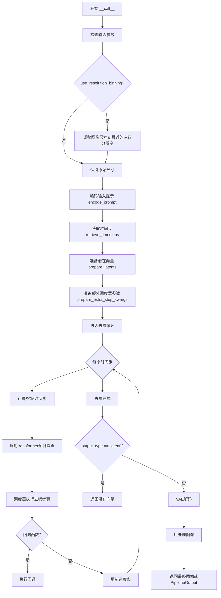

## 类结构

```
DiffusionPipeline (基类)
├── SanaLoraLoaderMixin (LoRA加载混入)
└── SanaSprintPipeline (主管道类)
    └── SanaPipelineOutput (输出类)
```

## 全局变量及字段


### `EXAMPLE_DOC_STRING`
    
包含SanaSprintPipeline使用示例的文档字符串，用于replace_example_docstring装饰器

类型：`str`
    


### `XLA_AVAILABLE`
    
指示PyTorch XLA是否可用的布尔标志，用于条件导入和设备处理

类型：`bool`
    


### `logger`
    
模块级日志记录器，用于输出警告和信息消息

类型：`logging.Logger`
    


### `bad_punct_regex`
    
编译后的正则表达式，用于匹配和过滤文本中的特殊标点符号

类型：`re.Pattern`
    


### `SanaSprintPipeline.tokenizer`
    
用于将文本提示编码为token序列的分词器

类型：`GemmaTokenizer | GemmaTokenizerFast`
    


### `SanaSprintPipeline.text_encoder`
    
将文本token编码为文本嵌入向量的文本编码器模型

类型：`Gemma2PreTrainedModel`
    


### `SanaSprintPipeline.vae`
    
变分自编码器，用于将潜在空间表示解码为图像

类型：`AutoencoderDC`
    


### `SanaSprintPipeline.transformer`
    
核心扩散变换器模型，用于在去噪过程中预测噪声

类型：`SanaTransformer2DModel`
    


### `SanaSprintPipeline.scheduler`
    
扩散概率模型求解器调度器，控制去噪步骤和时间步

类型：`DPMSolverMultistepScheduler`
    


### `SanaSprintPipeline.vae_scale_factor`
    
VAE缩放因子，用于计算潜在空间的尺寸

类型：`int`
    


### `SanaSprintPipeline.image_processor`
    
图像处理器，用于图像的后处理和分辨率调整

类型：`PixArtImageProcessor`
    


### `SanaSprintPipeline.bad_punct_regex`
    
类级别的正则表达式，用于匹配和清理文本中的特殊标点符号

类型：`re.Pattern`
    


### `SanaSprintPipeline.model_cpu_offload_seq`
    
模型CPU卸载顺序字符串，指定模型卸载到CPU的顺序

类型：`str`
    


### `SanaSprintPipeline._callback_tensor_inputs`
    
回调函数可用的张量输入名称列表，用于在推理过程中传递中间结果

类型：`list`
    


### `SanaSprintPipeline._guidance_scale`
    
无分类器指导规模，控制文本提示对生成图像的影响程度

类型：`float`
    


### `SanaSprintPipeline._attention_kwargs`
    
注意力机制的关键字参数字典，传递给注意力处理器

类型：`dict`
    


### `SanaSprintPipeline._num_timesteps`
    
当前推理过程中的时间步总数

类型：`int`
    


### `SanaSprintPipeline._interrupt`
    
中断标志，用于在去噪循环中控制是否提前停止生成

类型：`bool`
    
    

## 全局函数及方法


### `retrieve_timesteps`

该函数是扩散模型管道中的时间步检索工具函数，负责调用调度器的 `set_timesteps` 方法并从中获取时间步序列。它支持自定义时间步（timesteps）或自定义sigmas，并能根据传入的参数自动推断推理步骤数，同时处理调度器不支持自定义参数时的异常情况。

参数：

- `scheduler`：`SchedulerMixin`，用于获取时间步的调度器对象
- `num_inference_steps`：`int | None`，生成样本时使用的扩散步骤数，若使用则 `timesteps` 必须为 `None`
- `device`：`str | torch.device | None`，时间步应移动到的设备，若为 `None` 则不移动
- `timesteps`：`list[int] | optional`，用于覆盖调度器时间步间隔策略的自定义时间步，若传入则 `num_inference_steps` 和 `sigmas` 必须为 `None`
- `sigmas`：`list[float] | optional`，用于覆盖调度器时间步间隔策略的自定义sigmas，若传入则 `num_inference_steps` 和 `timesteps` 必须为 `None`
- `**kwargs`：任意关键字参数，将传递给 `scheduler.set_timesteps`

返回值：`tuple[torch.Tensor, int]`，包含调度器的时间步调度序列和推理步骤数

#### 流程图

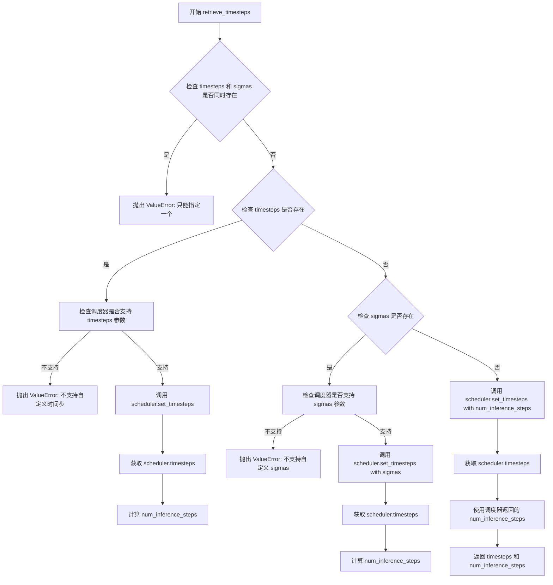

#### 带注释源码

```python
# Copied from diffusers.pipelines.stable_diffusion.pipeline_stable_diffusion.retrieve_timesteps
def retrieve_timesteps(
    scheduler,
    num_inference_steps: int | None = None,
    device: str | torch.device | None = None,
    timesteps: list[int] | None = None,
    sigmas: list[float] | None = None,
    **kwargs,
):
    r"""
    Calls the scheduler's `set_timesteps` method and retrieves timesteps from the scheduler after the call. Handles
    custom timesteps. Any kwargs will be supplied to `scheduler.set_timesteps`.

    Args:
        scheduler (`SchedulerMixin`):
            The scheduler to get timesteps from.
        num_inference_steps (`int`):
            The number of diffusion steps used when generating samples with a pre-trained model. If used, `timesteps`
            must be `None`.
        device (`str` or `torch.device`, *optional*):
            The device to which the timesteps should be moved to. If `None`, the timesteps are not moved.
        timesteps (`list[int]`, *optional*):
            Custom timesteps used to override the timestep spacing strategy of the scheduler. If `timesteps` is passed,
            `num_inference_steps` and `sigmas` must be `None`.
        sigmas (`list[float]`, *optional*):
            Custom sigmas used to override the timestep spacing strategy of the scheduler. If `sigmas` is passed,
            `num_inference_steps` and `timesteps` must be `None`.

    Returns:
        `tuple[torch.Tensor, int]`: A tuple where the first element is the timestep schedule from the scheduler and the
        second element is the number of inference steps.
    """
    # 检查是否同时传入了 timesteps 和 sigmas，这是互斥的
    if timesteps is not None and sigmas is not None:
        raise ValueError("Only one of `timesteps` or `sigmas` can be passed. Please choose one to set custom values")
    
    # 处理自定义 timesteps 的情况
    if timesteps is not None:
        # 通过 inspect 检查调度器的 set_timesteps 方法是否支持 timesteps 参数
        accepts_timesteps = "timesteps" in set(inspect.signature(scheduler.set_timesteps).parameters.keys())
        if not accepts_timesteps:
            raise ValueError(
                f"The current scheduler class {scheduler.__class__}'s `set_timesteps` does not support custom"
                f" timestep schedules. Please check whether you are using the correct scheduler."
            )
        # 调用调度器的 set_timesteps 方法，传入自定义时间步
        scheduler.set_timesteps(timesteps=timesteps, device=device, **kwargs)
        # 从调度器获取更新后的时间步
        timesteps = scheduler.timesteps
        # 计算推理步骤数
        num_inference_steps = len(timesteps)
    # 处理自定义 sigmas 的情况
    elif sigmas is not None:
        # 检查调度器是否支持 sigmas 参数
        accept_sigmas = "sigmas" in set(inspect.signature(scheduler.set_timesteps).parameters.keys())
        if not accept_sigmas:
            raise ValueError(
                f"The current scheduler class {scheduler.__class__}'s `set_timesteps` does not support custom"
                f" sigmas schedules. Please check whether you are using the correct scheduler."
            )
        # 调用调度器的 set_timesteps 方法，传入自定义 sigmas
        scheduler.set_timesteps(sigmas=sigmas, device=device, **kwargs)
        # 从调度器获取时间步
        timesteps = scheduler.timesteps
        # 计算推理步骤数
        num_inference_steps = len(timesteps)
    # 默认情况：使用 num_inference_steps
    else:
        scheduler.set_timesteps(num_inference_steps, device=device, **kwargs)
        timesteps = scheduler.timesteps
    
    # 返回时间步序列和推理步骤数
    return timesteps, num_inference_steps
```


### SanaSprintPipeline.__init__

该方法是 SanaSprintPipeline 类的构造函数，负责初始化文本到图像生成管道所需的所有核心组件，包括分词器、文本编码器、VAE、变换器和调度器，并完成模块注册和图像处理器的初始化。

参数：

- `tokenizer`：`GemmaTokenizer | GemmaTokenizerFast`，文本分词器，用于将输入提示词转换为token序列
- `text_encoder`：`Gemma2PreTrainedModel`，文本编码器模型，负责将token序列编码为文本嵌入向量
- `vae`：`AutoencoderDC`，变分自编码器，用于将潜在表示解码为图像
- `transformer`：`SanaTransformer2DModel`， Sana主变换器模型，负责在去噪过程中预测噪声
- `scheduler`：`DPMSolverMultistepScheduler`，DPM多步调度器，控制扩散模型的采样过程

返回值：`None`，构造函数不返回任何值

#### 流程图

```mermaid
flowchart TD
    A[开始 __init__] --> B[调用 super().__init__]
    B --> C[register_modules 注册所有模块]
    C --> D{检查 vae 是否存在}
    D -->|是| E[从 vae.config 计算 vae_scale_factor]
    D -->|否| F[使用默认值 32]
    E --> G[创建 PixArtImageProcessor]
    F --> G
    G --> H[结束 __init__]
```

#### 带注释源码

```python
def __init__(
    self,
    tokenizer: GemmaTokenizer | GemmaTokenizerFast,  # 分词器：GemmaTokenizer 或其快速版本
    text_encoder: Gemma2PreTrainedModel,               # 文本编码器：Gemma2预训练模型
    vae: AutoencoderDC,                                 # VAE：自动编码器组件
    transformer: SanaTransformer2DModel,              # Transformer： Sana变换器模型
    scheduler: DPMSolverMultistepScheduler,            # Scheduler： DPM多步调度器
):
    # 调用父类 DiffusionPipeline 的初始化方法
    # 继承基础管道类的通用初始化逻辑
    super().__init__()

    # 使用 register_modules 方法注册所有模型组件
    # 这些组件将被打包并在管道中统一管理
    # 支持模型卸载（offloading）和设备管理等功能
    self.register_modules(
        tokenizer=tokenizer, 
        text_encoder=text_encoder, 
        vae=vae, 
        transformer=transformer, 
        scheduler=scheduler
    )

    # 计算 VAE 缩放因子
    # 用于确定潜在空间到像素空间的缩放比例
    # 计算公式：2^(encoder_block_out_channels数量 - 1)
    # 默认值为32（如果VAE不存在或无配置）
    self.vae_scale_factor = (
        2 ** (len(self.vae.config.encoder_block_out_channels) - 1)
        if hasattr(self, "vae") and self.vae is not None
        else 32
    )
    
    # 初始化图像处理器
    # PixArtImageProcessor 负责图像的后处理工作
    # 包括：将潜在向量解码为图像、图像后处理、分辨率分箱等功能
    self.image_processor = PixArtImageProcessor(vae_scale_factor=self.vae_scale_factor)
```


### `SanaSprintPipeline.enable_vae_slicing`

该方法用于启用VAE的分片解码功能，通过将输入张量分割为多个切片分步计算解码，以节省显存并支持更大的批处理大小。同时该方法已被标记为弃用，推荐直接调用`pipe.vae.enable_slicing()`。

参数：

- 无

返回值：`None`，无返回值

#### 流程图

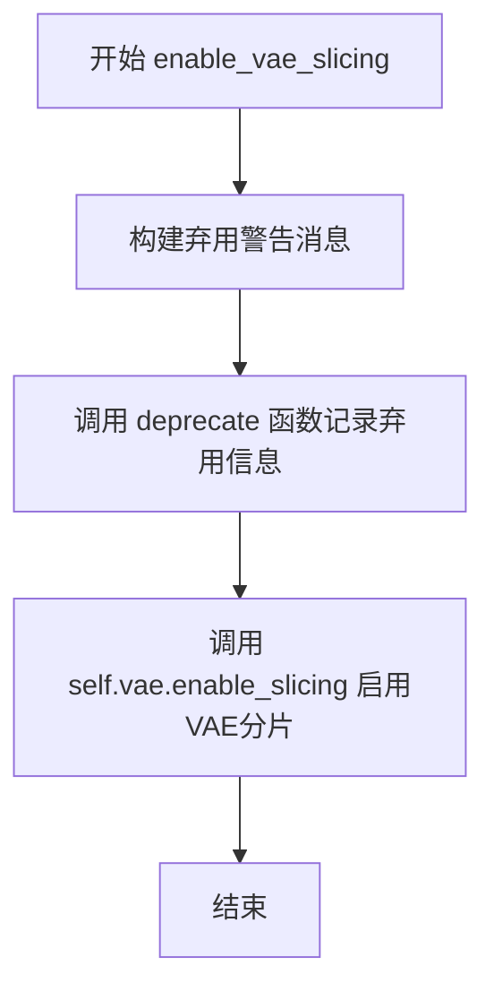

#### 带注释源码

```
def enable_vae_slicing(self):
    r"""
    Enable sliced VAE decoding. When this option is enabled, the VAE will split the input tensor in slices to
    compute decoding in several steps. This is useful to save some memory and allow larger batch sizes.
    """
    # 构建弃用警告消息，包含类名和正确的替代方法
    depr_message = f"Calling `enable_vae_slicing()` on a `{self.__class__.__name__}` is deprecated and this method will be removed in a future version. Please use `pipe.vae.enable_slicing()`."
    # 调用deprecate函数记录弃用信息，版本号为0.40.0
    deprecate(
        "enable_vae_slicing",
        "0.40.0",
        depr_message,
    )
    # 委托给VAE模型的enable_slicing方法实现实际功能
    self.vae.enable_slicing()
```


### `SanaSprintPipeline.disable_vae_slicing`

禁用分片 VAE 解码。如果之前启用了 `enable_vae_slicing`，此方法将恢复为单步计算解码。该方法已被弃用，将在未来的版本中移除，建议直接使用 `pipe.vae.disable_slicing()`。

参数：

- `self`：`SanaSprintPipeline` 实例，隐式参数，表示当前管道对象

返回值：`None`，无返回值（方法执行完成后直接返回）

#### 流程图

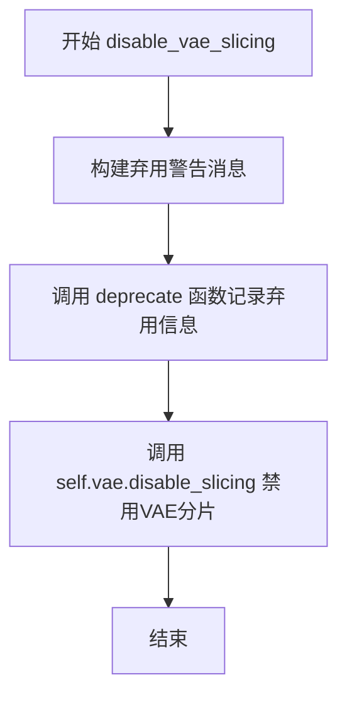

#### 带注释源码

```python
def disable_vae_slicing(self):
    r"""
    Disable sliced VAE decoding. If `enable_vae_slicing` was previously enabled, this method will go back to
    computing decoding in one step.
    """
    # 构建弃用警告消息，提示用户该方法已被弃用，建议使用 pipe.vae.disable_slicing()
    depr_message = f"Calling `disable_vae_slicing()` on a `{self.__class__.__name__}` is deprecated and this method will be removed in a future version. Please use `pipe.vae.disable_slicing()`."
    
    # 调用 deprecate 函数记录弃用信息，版本号为 0.40.0
    deprecate(
        "disable_vae_slicing",
        "0.40.0",
        depr_message,
    )
    
    # 调用 VAE 模型的 disable_slicing 方法，禁用分片解码功能
    self.vae.disable_slicing()
```


### `SanaSprintPipeline.enable_vae_tiling`

该方法用于启用瓦片 VAE 解码功能。当启用此选项时，VAE 会将输入张量分割成多个瓦片，分多步计算解码/编码过程。这对于节省大量内存并处理更大尺寸的图像非常有用。

参数：
- 无（仅包含隐式参数 `self`）

返回值：`None`，无返回值（该方法直接操作 VAE 组件的内部状态）

#### 流程图

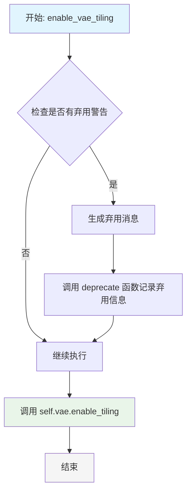

#### 带注释源码

```python
def enable_vae_tiling(self):
    r"""
    启用瓦片 VAE 解码功能。
    
    当此选项启用时，VAE 会将输入张量分割成瓦片，
    分多步计算解码和编码。这对于节省大量内存
    并处理更大尺寸的图像非常有用。
    
    该方法已被弃用，建议直接使用 pipe.vae.enable_tiling()
    """
    # 构建弃用警告消息，提示用户使用新方法
    depr_message = f"Calling `enable_vae_tiling()` on a `{self.__class__.__name__}` is deprecated and this method will be removed in a future version. Please use `pipe.vae.enable_tiling()`."
    
    # 调用 deprecate 函数记录弃用信息
    # 参数说明：
    # - "enable_vae_tiling": 被弃用的功能名称
    # - "0.40.0": 弃用版本号
    # - depr_message: 弃用警告消息
    deprecate(
        "enable_vae_tiling",
        "0.40.0",
        depr_message,
    )
    
    # 调用 VAE 模型的 enable_tiling 方法
    # 实际启用瓦片解码功能
    self.vae.enable_tiling()
```


### `SanaSprintPipeline.disable_vae_tiling`

禁用瓦片式 VAE 解码。如果之前启用了 `enable_vae_tiling`，此方法将恢复为单步计算解码。

参数：

- `self`：`SanaSprintPipeline`，管道实例本身，用于访问 VAE 模型

返回值：`None`，无返回值（该方法通过副作用生效）

#### 流程图

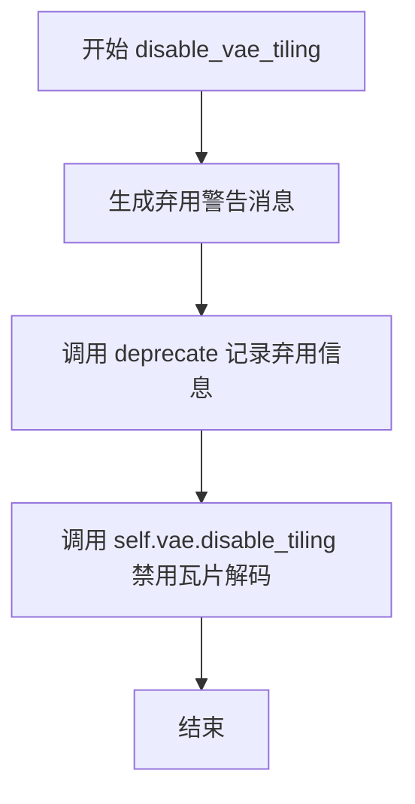

#### 带注释源码

```python
def disable_vae_tiling(self):
    r"""
    Disable tiled VAE decoding. If `enable_vae_tiling` was previously enabled, this method will go back to
    computing decoding in one step.
    """
    # 构建弃用警告消息，提示用户使用新的 API
    depr_message = f"Calling `disable_vae_tiling()` on a `{self.__class__.__name__}` is deprecated and this method will be removed in a future version. Please use `pipe.vae.disable_tiling()`."
    
    # 调用 deprecate 函数记录弃用信息，在未来版本中会移除此方法
    deprecate(
        "disable_vae_tiling",       # 要弃用的方法名
        "0.40.0",                   # 弃用版本号
        depr_message,               # 弃用警告消息
    )
    
    # 实际调用 VAE 模型的 disable_tiling 方法，禁用瓦片式解码
    self.vae.disable_tiling()
```


### `SanaSprintPipeline._get_gemma_prompt_embeds`

该方法是一个私有方法，用于将文本提示词（prompt）编码为文本编码器（text encoder）的隐藏状态向量（hidden states）。它处理提示词的预处理、tokenization，并利用Gemma文本编码器生成用于后续图像生成过程的文本嵌入表示。

参数：

- `prompt`：`str | list[str]`，要编码的提示词，可以是单个字符串或字符串列表
- `device`：`torch.device`，用于放置生成嵌入向量的目标设备
- `dtype`：`torch.dtype`，生成嵌入向量的目标数据类型
- `clean_caption`：`bool`（默认值为 `False`），如果为 `True`，则对提示词进行预处理和清理
- `max_sequence_length`：`int`（默认值为 `300`），提示词使用的最大序列长度
- `complex_human_instruction`：`list[str] | None`（默认值为 `None`），如果不为空，将使用复杂的人类指令来增强提示词

返回值：`tuple[torch.Tensor, torch.Tensor]`，返回一个元组，包含 `prompt_embeds`（文本嵌入向量）和 `prompt_attention_mask`（注意力掩码）

#### 流程图

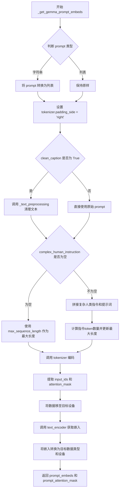

#### 带注释源码

```python
def _get_gemma_prompt_embeds(
    self,
    prompt: str | list[str],
    device: torch.device,
    dtype: torch.dtype,
    clean_caption: bool = False,
    max_sequence_length: int = 300,
    complex_human_instruction: list[str] | None = None,
):
    r"""
    Encodes the prompt into text encoder hidden states.

    Args:
        prompt (`str` or `list[str]`, *optional*):
            prompt to be encoded
        device: (`torch.device`, *optional*):
            torch device to place the resulting embeddings on
        clean_caption (`bool`, defaults to `False`):
            If `True`, the function will preprocess and clean the provided caption before encoding.
        max_sequence_length (`int`, defaults to 300): Maximum sequence length to use for the prompt.
        complex_human_instruction (`list[str]`, defaults to `complex_human_instruction`):
            If `complex_human_instruction` is not empty, the function will use the complex Human instruction for
            the prompt.
    """
    # 如果 prompt 是单个字符串，转换为列表；否则保持不变
    prompt = [prompt] if isinstance(prompt, str) else prompt

    # 确保 tokenizer 的 padding 方向为右侧
    if getattr(self, "tokenizer", None) is not None:
        self.tokenizer.padding_side = "right"

    # 对提示词进行文本预处理（清理 HTML、转义字符等）
    prompt = self._text_preprocessing(prompt, clean_caption=clean_caption)

    # 准备复杂人类指令
    if not complex_human_instruction:
        # 如果没有复杂指令，使用默认的最大长度
        max_length_all = max_sequence_length
    else:
        # 将复杂指令列表用换行符连接成字符串
        chi_prompt = "\n".join(complex_human_instruction)
        # 将复杂指令前置到每个提示词前面
        prompt = [chi_prompt + p for p in prompt]
        # 计算复杂指令的 token 数量
        num_chi_prompt_tokens = len(self.tokenizer.encode(chi_prompt))
        # 计算最终的最大长度（复杂指令 + 用户提示词）
        max_length_all = num_chi_prompt_tokens + max_sequence_length - 2

    # 使用 tokenizer 将提示词转换为 token IDs
    text_inputs = self.tokenizer(
        prompt,
        padding="max_length",           # 填充到最大长度
        max_length=max_length_all,      # 最大序列长度
        truncation=True,                # 截断超长序列
        add_special_tokens=True,        # 添加特殊 tokens（如 [CLS], [SEP] 等）
        return_tensors="pt",            # 返回 PyTorch 张量
    )
    # 获取输入的 token IDs
    text_input_ids = text_inputs.input_ids

    # 获取注意力掩码
    prompt_attention_mask = text_inputs.attention_mask
    # 将注意力掩码移动到目标设备
    prompt_attention_mask = prompt_attention_mask.to(device)

    # 调用文本编码器获取隐藏状态
    # 输入：token IDs 和注意力掩码
    # 输出：包含隐藏状态的元组，取第一个元素作为实际的嵌入
    prompt_embeds = self.text_encoder(text_input_ids.to(device), attention_mask=prompt_attention_mask)
    # 将嵌入转换为指定的数据类型和设备
    prompt_embeds = prompt_embeds[0].to(dtype=dtype, device=device)

    # 返回文本嵌入和注意力掩码
    return prompt_embeds, prompt_attention_mask
```


### SanaSprintPipeline.encode_prompt

该方法将文本提示编码为文本编码器的隐藏状态（embedding），支持预计算的prompt_embeds输入、LoRA缩放、复杂人类指令处理，以及根据num_images_per_prompt复制embeddings。

参数：

- `self`：`SanaSprintPipeline`实例，管道对象本身
- `prompt`：`str | list[str]`，要编码的文本提示，支持单字符串或字符串列表
- `num_images_per_prompt`：`int`，默认为1，每个提示要生成的图像数量，用于复制embeddings
- `device`：`torch.device | None`，默认为None，生成embeddings的目标设备，如果为None则使用`_execution_device`
- `prompt_embeds`：`torch.Tensor | None`，默认为None，预生成的文本embeddings，可用于微调输入
- `prompt_attention_mask`：`torch.Tensor | None`，默认为None，预生成的注意力掩码，与prompt_embeds配合使用
- `clean_caption`：`bool`，默认为False，是否清理和预处理标题（去除URL、特殊字符等）
- `max_sequence_length`：`int`，默认为300，提示的最大序列长度
- `complex_human_instruction`：`list[str] | None`，默认为None，复杂人类指令模板，用于增强提示
- `lora_scale`：`float | None`，默认为None，LoRA缩放因子，用于动态调整LoRA权重

返回值：`tuple[torch.Tensor, torch.Tensor]`，返回两个张量 - `prompt_embeds`是编码后的文本嵌入张量，形状为`(batch_size * num_images_per_prompt, seq_len, hidden_dim)`；`prompt_attention_mask`是对应的注意力掩码，形状为`(batch_size * num_images_per_prompt, seq_len)`

#### 流程图

```mermaid
flowchart TD
    A[开始 encode_prompt] --> B{device是否为None?}
    B -->|是| C[使用self._execution_device]
    B -->|否| D[使用传入的device]
    C --> E{text_encoder是否存在?}
    D --> E
    E -->|是| F[获取text_encoder.dtype]
    E -->|否| G[dtype设为None]
    F --> H{传入了lora_scale?}
    G --> H
    H -->|是| I[设置self._lora_scale]
    I --> J{USE_PEFT_BACKEND且为SanaLoraLoaderMixin?}
    J -->|是| K[scale_lora_layers应用LoRA缩放]
    J -->|否| L[跳过LoRA缩放]
    H -->|否| L
    K --> L
    L --> M[设置tokenizer.padding_side='right']
    M --> N[计算select_index: 0 + range(-max_length+1, 0)]
    N --> O{prompt_embeds是否为None?}
    O -->|是| P[调用_get_gemma_prompt_embeds生成embeddings]
    O -->|否| Q[使用传入的prompt_embeds]
    P --> R[根据select_index切片embeddings]
    Q --> R
    R --> S[获取batch_size bs_embed, seq_len]
    S --> T[repeat embeddings: num_images_per_prompt次]
    T --> U[view重塑为bs_embed*num_images_per_prompt, seq_len, -1]
    U --> V[repeat attention_mask: num_images_per_prompt次]
    V --> W{text_encoder存在且使用PEFT?}
    W -->|是| X[unscale_lora_layers移除LoRA缩放]
    W -->|否| Y[跳过unscale]
    X --> Z[返回prompt_embeds, prompt_attention_mask]
    Y --> Z
```

#### 带注释源码

```python
def encode_prompt(
    self,
    prompt: str | list[str],
    num_images_per_prompt: int = 1,
    device: torch.device | None = None,
    prompt_embeds: torch.Tensor | None = None,
    prompt_attention_mask: torch.Tensor | None = None,
    clean_caption: bool = False,
    max_sequence_length: int = 300,
    complex_human_instruction: list[str] | None = None,
    lora_scale: float | None = None,
):
    r"""
    Encodes the prompt into text encoder hidden states.

    Args:
        prompt (`str` or `list[str]`, *optional*):
            prompt to be encoded

        num_images_per_prompt (`int`, *optional*, defaults to 1):
            number of images that should be generated per prompt
        device: (`torch.device`, *optional*):
            torch device to place the resulting embeddings on
        prompt_embeds (`torch.Tensor`, *optional*):
            Pre-generated text embeddings. Can be used to easily tweak text inputs, *e.g.* prompt weighting. If not
            provided, text embeddings will be generated from `prompt` input argument.
        clean_caption (`bool`, defaults to `False`):
            If `True`, the function will preprocess and clean the provided caption before encoding.
        max_sequence_length (`int`, defaults to 300): Maximum sequence length to use for the prompt.
        complex_human_instruction (`list[str]`, defaults to `complex_human_instruction`):
            If `complex_human_instruction` is not empty, the function will use the complex Human instruction for
            the prompt.
    """

    # 1. 确定设备：如果未指定，则使用管道的执行设备
    if device is None:
        device = self._execution_device

    # 2. 获取文本编码器的dtype，用于后续embedding的类型转换
    if self.text_encoder is not None:
        dtype = self.text_encoder.dtype
    else:
        dtype = None

    # 3. 设置LoRA缩放：如果传入了lora_scale且管道支持LoRA
    # 这允许文本编码器的LoRA函数正确访问缩放因子
    if lora_scale is not None and isinstance(self, SanaLoraLoaderMixin):
        self._lora_scale = lora_scale

        # 动态调整LoRA缩放（如果使用PEFT后端）
        if self.text_encoder is not None and USE_PEFT_BACKEND:
            scale_lora_layers(self.text_encoder, lora_scale)

    # 4. 设置tokenizer的padding side为右侧（这是标准做法）
    if getattr(self, "tokenizer", None) is not None:
        self.tokenizer.padding_side = "right"

    # 5. 根据论文Section 3.1，计算select_index用于选择有效的token位置
    # select_index = [0] + list(range(-max_length + 1, 0))
    # 例如：max_length=300时，select_index = [0, -299, -298, ..., -1]
    # 这用于去除可能包含特殊token的序列部分
    max_length = max_sequence_length
    select_index = [0] + list(range(-max_length + 1, 0))

    # 6. 如果没有预计算的prompt_embeds，则调用_get_gemma_prompt_embeds生成
    if prompt_embeds is None:
        prompt_embeds, prompt_attention_mask = self._get_gemma_prompt_embeds(
            prompt=prompt,
            device=device,
            dtype=dtype,
            clean_caption=clean_caption,
            max_sequence_length=max_sequence_length,
            complex_human_instruction=complex_human_instruction,
        )

        # 7. 根据select_index对embeddings进行切片，去除不需要的部分
        prompt_embeds = prompt_embeds[:, select_index]
        prompt_attention_mask = prompt_attention_mask[:, select_index]

    # 8. 获取embeddings的形状信息
    bs_embed, seq_len, _ = prompt_embeds.shape
    
    # 9. 为每个提示生成的多个图像复制embeddings（使用mps友好的方法）
    # repeat操作：沿着第一维（batch维度）复制num_images_per_prompt次
    prompt_embeds = prompt_embeds.repeat(1, num_images_per_prompt, 1)
    # view操作：重塑为 (bs_embed * num_images_per_prompt, seq_len, hidden_dim)
    prompt_embeds = prompt_embeds.view(bs_embed * num_images_per_prompt, seq_len, -1)
    
    # 10. 同样复制attention mask
    # 先重塑attention mask，然后重复
    prompt_attention_mask = prompt_attention_mask.view(bs_embed, -1)
    prompt_attention_mask = prompt_attention_mask.repeat(num_images_per_prompt, 1)

    # 11. 如果使用了PEFT后端，在返回前需要恢复LoRA层的原始缩放
    if self.text_encoder is not None:
        if isinstance(self, SanaLoraLoaderMixin) and USE_PEFT_BACKEND:
            # 通过反向缩放LoRA层来恢复原始权重
            unscale_lora_layers(self.text_encoder, lora_scale)

    # 12. 返回编码后的prompt embeddings和对应的attention mask
    return prompt_embeds, prompt_attention_mask
```


### `SanaSprintPipeline.prepare_extra_step_kwargs`

该方法用于准备调度器（scheduler）步骤所需的额外参数。由于不同调度器具有不同的签名，该方法通过动态检查调度器的 `step` 方法是否接受特定参数（如 `eta` 和 `generator`），来构建并返回兼容的参数字典。

参数：

- `self`：`SanaSprintPipeline`，管道实例本身
- `generator`：`torch.Generator | list[torch.Generator] | None`，随机数生成器，用于使生成过程具有确定性
- `eta`：`float`，DDIM 调度器的 eta 参数，对应 DDIM 论文中的 η，取值范围 [0, 1]

返回值：`dict[str, Any]`，包含调度器 step 方法所需的关键字参数字典，可能包含 `eta` 和/或 `generator`

#### 流程图

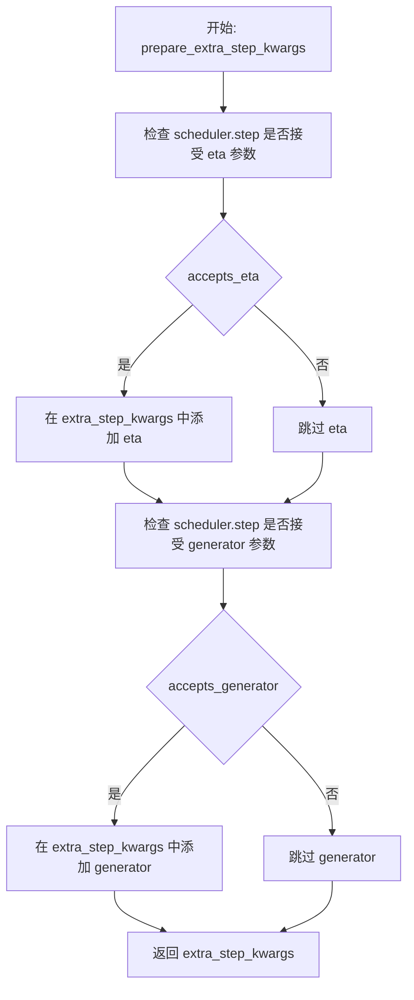

#### 带注释源码

```python
def prepare_extra_step_kwargs(self, generator, eta):
    # 准备调度器步骤的额外参数，因为并非所有调度器都具有相同的签名
    # eta (η) 仅在 DDIMScheduler 中使用，对于其他调度器将被忽略
    # eta 对应 DDIM 论文中的 η: https://huggingface.co/papers/2010.02502
    # 取值应在 [0, 1] 之间

    # 使用 inspect 模块检查调度器的 step 方法签名，判断是否接受 eta 参数
    accepts_eta = "eta" in set(inspect.signature(self.scheduler.step).parameters.keys())
    
    # 初始化空字典用于存储额外的关键字参数
    extra_step_kwargs = {}
    
    # 如果调度器接受 eta 参数，则将其添加到参数字典中
    if accepts_eta:
        extra_step_kwargs["eta"] = eta

    # 检查调度器是否接受 generator 参数
    accepts_generator = "generator" in set(inspect.signature(self.scheduler.step).parameters.keys())
    
    # 如果调度器接受 generator 参数，则将其添加到参数字典中
    if accepts_generator:
        extra_step_kwargs["generator"] = generator
    
    # 返回构建好的参数字典，供调度器的 step 方法使用
    return extra_step_kwargs
```


### SanaSprintPipeline.check_inputs

该方法负责验证SanaSprintPipeline管道调用时的输入参数有效性，包括检查图像尺寸是否能被32整除、prompt和prompt_embeds的互斥性、时间步参数的有效性等。如果任何验证失败，将抛出相应的ValueError。

参数：

- `self`：`SanaSprintPipeline`实例，管道对象本身
- `prompt`：`str | list[str] | None`，要生成的文本提示，可以是单个字符串或字符串列表
- `height`：`int`，生成图像的高度（像素）
- `width`：`int`，生成图像的宽度（像素）
- `num_inference_steps`：`int`，扩散去噪步数
- `timesteps`：`list[int] | None`，自定义时间步列表，如果提供则覆盖默认调度器时间步
- `max_timesteps`：`float | None`，SCM调度器使用的最大时间步值
- `intermediate_timesteps`：`float | None`，SCM调度器使用的中间时间步值（仅在num_inference_steps=2时使用）
- `callback_on_step_end_tensor_inputs`：`list[str] | None`，在每步结束时回调函数需要接收的张量输入列表
- `prompt_embeds`：`torch.Tensor | None`，预生成的文本嵌入，可用于微调文本输入
- `prompt_attention_mask`：`torch.Tensor | None`，文本嵌入的注意力掩码

返回值：`None`，该方法不返回任何值，仅通过抛出ValueError来指示验证失败

#### 流程图

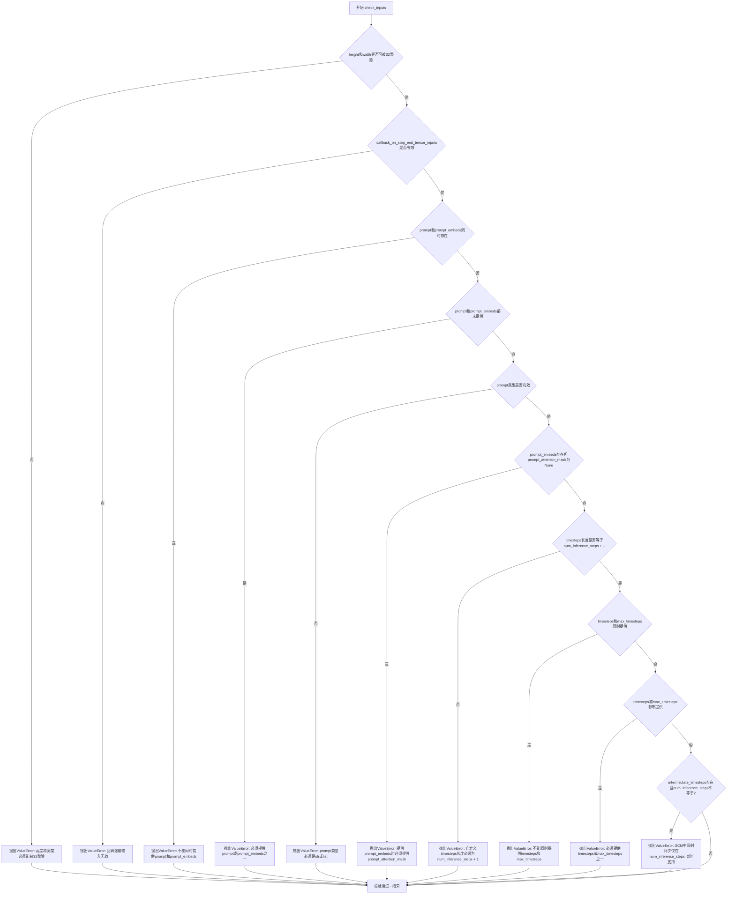

#### 带注释源码

```python
def check_inputs(
    self,
    prompt,
    height,
    width,
    num_inference_steps,
    timesteps,
    max_timesteps,
    intermediate_timesteps,
    callback_on_step_end_tensor_inputs=None,
    prompt_embeds=None,
    prompt_attention_mask=None,
):
    """
    验证管道输入参数的有效性。
    
    该方法执行多项检查以确保传入管道的参数是有效的，
    包括图像尺寸、提示词、嵌入、调度器参数等。
    如果任何检查失败，将抛出详细的ValueError以指导用户修正输入。
    """
    
    # 检查1: 验证图像高度和宽度是否能被32整除
    # 这是因为VAE的潜空间下采样因子通常是32
    if height % 32 != 0 or width % 32 != 0:
        raise ValueError(f"`height` and `width` have to be divisible by 32 but are {height} and {width}.")

    # 检查2: 验证回调函数张量输入是否在允许的列表中
    # 允许的回调张量输入定义在self._callback_tensor_inputs类属性中
    if callback_on_step_end_tensor_inputs is not None and not all(
        k in self._callback_tensor_inputs for k in callback_on_step_end_tensor_inputs
    ):
        raise ValueError(
            f"`callback_on_step_end_tensor_inputs` has to be in {self._callback_tensor_inputs}, but found {[k for k in callback_on_step_end_tensor_inputs if k not in self._callback_tensor_inputs]}"
        )

    # 检查3: 验证prompt和prompt_embeds的互斥性
    # 两者不能同时提供，只能选择其中一种方式指定文本条件
    if prompt is not None and prompt_embeds is not None:
        raise ValueError(
            f"Cannot forward both `prompt`: {prompt} and `prompt_embeds`: {prompt_embeds}. Please make sure to"
            " only forward one of the two."
        )
    # 检查4: 验证至少提供了prompt或prompt_embeds之一
    elif prompt is None and prompt_embeds is None:
        raise ValueError(
            "Provide either `prompt` or `prompt_embeds`. Cannot leave both `prompt` and `prompt_embeds` undefined."
        )
    # 检查5: 验证prompt的类型是否有效
    # 必须是字符串或字符串列表
    elif prompt is not None and (not isinstance(prompt, str) and not isinstance(prompt, list)):
        raise ValueError(f"`prompt` has to be of type `str` or `list` but is {type(prompt)}")

    # 检查6: 验证prompt_embeds和prompt_attention_mask的配对
    # 如果提供了预计算的文本嵌入，必须同时提供注意力掩码
    if prompt_embeds is not None and prompt_attention_mask is None:
        raise ValueError("Must provide `prompt_attention_mask` when specifying `prompt_embeds`.")

    # 检查7: 验证自定义timesteps的长度
    # 如果提供自定义时间步，其长度必须等于num_inference_steps + 1
    if timesteps is not None and len(timesteps) != num_inference_steps + 1:
        raise ValueError("If providing custom timesteps, `timesteps` must be of length `num_inference_steps + 1`.")

    # 检查8: 验证timesteps和max_timesteps的互斥性
    # 两者不能同时提供
    if timesteps is not None and max_timesteps is not None:
        raise ValueError("If providing custom timesteps, `max_timesteps` should not be provided.")

    # 检查9: 验证至少提供了timesteps或max_timesteps之一
    # 调度器需要知道时间步信息才能进行去噪
    if timesteps is None and max_timesteps is None:
        raise ValueError("Should provide either `timesteps` or `max_timesteps`.")

    # 检查10: 验证中间时间步参数的限制
    # SCM (可能是某种特定的调度器)的intermediate_timesteps仅在num_inference_steps=2时支持
    if intermediate_timesteps is not None and num_inference_steps != 2:
        raise ValueError("Intermediate timesteps for SCM is not supported when num_inference_steps != 2.")
```


### `SanaSprintPipeline._text_preprocessing`

该方法是文本到图像生成流程中的预处理环节，负责对用户输入的提示词（Prompt）进行清洗和标准化处理。它接收字符串或字符串列表，并根据 `clean_caption` 参数决定处理逻辑：若启用高级清洗，则调用 `_clean_caption` 方法移除 HTML 标签、URL、特殊字符并进行文本修复；若未启用，则仅进行小写转换和首尾去空格。在处理前，该方法还会检查必要的依赖库（BeautifulSoup4 和 ftfy）是否可用，不可用时将自动回退到基础模式。

参数：
- `text`：`str | list[str]`，待预处理的提示词文本，可以是单个字符串或字符串列表。
- `clean_caption`：`bool`， optional，默认值为 `False`。是否执行高级清洗（需要安装 beautifulsoup4 和 ftfy），否则仅执行小写和去空格。

返回值：`list[str]`，返回预处理后的字符串列表。

#### 流程图

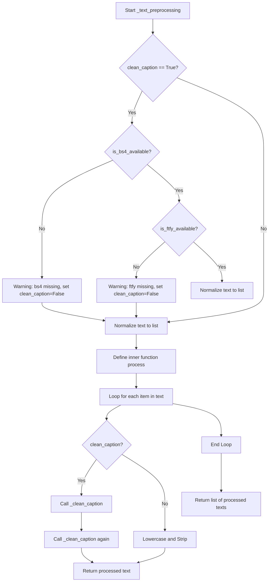

#### 带注释源码

```python
def _text_preprocessing(self, text, clean_caption=False):
    # 检查如果需要高级清洗但缺少 beautifulsoup4 库的情况
    if clean_caption and not is_bs4_available():
        logger.warning(BACKENDS_MAPPING["bs4"][-1].format("Setting `clean_caption=True`"))
        logger.warning("Setting `clean_caption` to False...")
        clean_caption = False

    # 检查如果需要高级清洗但缺少 ftfy 库的情况
    if clean_caption and not is_ftfy_available():
        logger.warning(BACKENDS_MAPPING["ftfy"][-1].format("Setting `clean_caption=True`"))
        logger.warning("Setting `clean_caption` to False...")
        clean_caption = False

    # 如果输入不是列表或元组，则转换为列表，以便统一处理
    if not isinstance(text, (tuple, list)):
        text = [text]

    # 定义内部处理函数 process，用于处理单个字符串
    def process(text: str):
        if clean_caption:
            # 如果启用了高级清洗，调用 _clean_caption 两次以确保彻底清洁
            text = self._clean_caption(text)
            text = self._clean_caption(text)
        else:
            # 否则，仅进行小写转换和去除首尾空格
            text = text.lower().strip()
        return text

    # 对列表中的每个文本元素应用处理函数，并返回结果列表
    return [process(t) for t in text]
```


### `SanaSprintPipeline._clean_caption`

该方法用于清理和预处理文本标题（caption），通过正则表达式移除URL、HTML标签、特殊字符、CJK字符、IP地址、文件名等无关内容，并规范化文本格式，为后续的文本编码做准备。

参数：

- `caption`：`str`，需要清理的文本标题

返回值：`str`，清理后的文本标题

#### 流程图

```mermaid
flowchart TD
    A[开始] --> B[URL解码: ul.unquote_plus]
    --> C[转小写并去空格]
    --> D[替换&lt;person&gt;为person]
    --> E[正则移除URLs]
    --> F[BeautifulSoup移除HTML标签]
    --> G[正则移除@昵称]
    --> H[正则移除CJK字符]
    --> I[替换各类破折号为-]
    --> J[规范化引号]
    --> K[移除HTML实体quot和amp]
    --> L[正则移除IP地址]
    --> M[正则移除文章ID]
    --> N[替换\\n为空格]
    --> O[正则移除#数字和纯数字]
    --> O1[正则移除文件名]
    --> P[规范化连续引号和句号]
    --> Q[移除坏标点]
    --> R{检查连字符/下划线是否超过3个}
    -->|是| S[替换为空格]
    --> T[ftfy.fix_text修复文本]
    --> U[html.unescape处理]
    --> V[正则移除字母数字组合]
    --> W[移除特定关键词free shipping等]
    --> X[清理多余空格和标点]
    --> Y[去除首尾特殊字符]
    --> Z[返回清理后的文本]
```

#### 带注释源码

```python
def _clean_caption(self, caption):
    """
    清理和预处理文本标题，移除各种无关内容
    
    Args:
        caption: 需要清理的文本字符串
        
    Returns:
        清理后的文本字符串
    """
    # 将输入转为字符串
    caption = str(caption)
    
    # URL解码：将URL编码的字符还原（如 %20 -> 空格）
    caption = ul.unquote_plus(caption)
    
    # 转小写并去除首尾空格
    caption = caption.strip().lower()
    
    # 替换特殊标签：将 <person> 替换为 person
    caption = re.sub("<person>", "person", caption)
    
    # 移除URLs：匹配 http://, https://, www. 开头的URL
    caption = re.sub(
        r"\b((?:https?:(?:\/{1,3}|[a-zA-Z0-9%])|[a-zA-Z0-9.\-]+[.](?:com|co|ru|net|org|edu|gov|it)[\w/-]*\b\/?(?!@)))",
        "",
        caption,
    )
    caption = re.sub(
        r"\b((?:www:(?:\/{1,3}|[a-zA-Z0-9%])|[a-zA-Z0-9.\-]+[.](?:com|co|ru|net|org|edu|gov|it)[\w/-]*\b\/?(?!@)))",
        "",
        caption,
    )
    
    # 使用BeautifulSoup解析HTML，提取纯文本内容
    caption = BeautifulSoup(caption, features="html.parser").text
    
    # 移除@昵称（如 @username）
    caption = re.sub(r"@[\w\d]+\b", "", caption)
    
    # 移除CJK字符（中日韩统一表意文字等）
    caption = re.sub(r"[\u31c0-\u31ef]+", "", caption)  # CJK Strokes
    caption = re.sub(r"[\u31f0-\u31ff]+", "", caption)  # Katakana Phonetic Extensions
    caption = re.sub(r"[\u3200-\u32ff]+", "", caption)  # Enclosed CJK Letters
    caption = re.sub(r"[\u3300-\u33ff]+", "", caption)  # CJK Compatibility
    caption = re.sub(r"[\u3400-\u4dbf]+", "", caption)  # CJK Extension A
    caption = re.sub(r"[\u4dc0-\u4dff]+", "", caption)  # Yijing Hexagram
    caption = re.sub(r"[\u4e00-\u9fff]+", "", caption)  # CJK Unified Ideographs
    
    # 统一各类破折号为 "-"
    caption = re.sub(
        r"[\u002D\u058A\u05BE\u1400\u1806\u2010-\u2015\u2E17\u2E1A\u2E3A\u2E3B\u2E40\u301C\u3030\u30A0\uFE31\uFE32\uFE58\uFE63\uFF0D]+",
        "-",
        caption,
    )
    
    # 规范化引号：将各种引号统一
    caption = re.sub(r"[`´«»""¨]", '"', caption)
    caption = re.sub(r"['']", "'", caption)
    
    # 移除HTML实体
    caption = re.sub(r"&quot;?", "", caption)
    caption = re.sub(r"&amp", "", caption)
    
    # 移除IP地址
    caption = re.sub(r"\d{1,3}\.\d{1,3}\.\d{1,3}\.\d{1,3}", " ", caption)
    
    # 移除文章ID（如 "12:34 " 结尾的）
    caption = re.sub(r"\d:\d\d\s+$", "", caption)
    
    # 替换换行符
    caption = re.sub(r"\\n", " ", caption)
    
    # 移除#标签和纯数字序列
    caption = re.sub(r"#\d{1,3}\b", "", caption)
    caption = re.sub(r"#\d{5,}\b", "", caption)
    caption = re.sub(r"\b\d{6,}\b", "", caption)
    
    # 移除常见图片/文件格式
    caption = re.sub(r"[\S]+\.(?:png|jpg|jpeg|bmp|webp|eps|pdf|apk|mp4)", "", caption)
    
    # 规范化连续引号和句号
    caption = re.sub(r"[\"']{2,}", r'"', caption)
    caption = re.sub(r"[\.]{2,}", r" ", caption)
    
    # 移除坏标点符号（类中定义的bad_punct_regex）
    caption = re.sub(self.bad_punct_regex, r" ", caption)
    caption = re.sub(r"\s+\.\s+", r" ", caption)
    
    # 如果连字符或下划线超过3个，将其替换为空格
    regex2 = re.compile(r"(?:\-|\_)")
    if len(re.findall(regex2, caption)) > 3:
        caption = re.sub(regex2, " ", caption)
    
    # 使用ftfy修复常见的文本编码问题
    caption = ftfy.fix_text(caption)
    
    # 递归unescape HTML实体
    caption = html.unescape(html.unescape(caption))
    
    # 移除特定的字母数字组合模式
    caption = re.sub(r"\b[a-zA-Z]{1,3}\d{3,15}\b", "", caption)   # 如 jc6640
    caption = re.sub(r"\b[a-zA-Z]+\d+[a-zA-Z]+\b", "", caption)  # 如 jc6640vc
    caption = re.sub(r"\b\d+[a-zA-Z]+\d+\b", "", caption)        # 如 6640vc231
    
    # 移除常见营销关键词
    caption = re.sub(r"(worldwide\s+)?(free\s+)?shipping", "", caption)
    caption = re.sub(r"(free\s)?download(\sfree)?", "", caption)
    caption = re.sub(r"\bclick\b\s(?:for|on)\s\w+", "", caption)
    caption = re.sub(r"\b(?:png|jpg|jpeg|bmp|webp|eps|pdf|apk|mp4)(\simage[s]?)?", "", caption)
    caption = re.sub(r"\bpage\s+\d+\b", "", caption)
    
    # 移除复杂字母数字组合
    caption = re.sub(r"\b\d*[a-zA-Z]+\d+[a-zA-Z]+\d+[a-zA-Z\d]*\b", r" ", caption)
    
    # 移除尺寸格式（如 1920x1080）
    caption = re.sub(r"\b\d+\.?\d*[xх×]\d+\.?\d*\b", "", caption)
    
    # 规范化空格和标点
    caption = re.sub(r"\b\s+\:\s+", r": ", caption)
    caption = re.sub(r"(\D[,\./])\b", r"\1 ", caption)
    caption = re.sub(r"\s+", " ", caption)
    
    caption.strip()
    
    # 移除首尾引号和特殊字符
    caption = re.sub(r"^[\"\']([\w\W]+)[\"\']$", r"\1", caption)
    caption = re.sub(r"^[\'\_,\-\:;]", r"", caption)
    caption = re.sub(r"[\'\_,\-\:\-\+]$", r"", caption)
    caption = re.sub(r"^\.\S+$", "", caption)
    
    return caption.strip()
```


### `SanaSprintPipeline.prepare_latents`

该方法负责为图像生成准备潜在向量（latents）。如果调用者已提供了潜在向量，则将其移动到指定的设备和数据类型；否则，根据批处理大小、通道数以及通过 VAE 缩放因子调整后的图像高度和宽度创建新的随机潜在向量。

参数：

- `batch_size`：`int`，批处理大小，即一次生成多少个样本
- `num_channels_latents`：`int`，潜在向量的通道数，通常对应于变分自编码器（VAE）的潜在空间维度
- `height`：`int`，生成图像的高度（像素），用于计算潜在向量的空间维度
- `width`：`int`，生成图像的宽度（像素），用于计算潜在向量的空间维度
- `dtype`：`torch.dtype`，潜在向量的数据类型（如 torch.float32）
- `device`：`torch.device`，潜在向量应放置到的设备（如 'cuda' 或 'cpu'）
- `generator`：`torch.Generator | list[torch.Generator] | None`，用于确保可重复性的随机数生成器，可以是单个生成器或生成器列表
- `latents`：`torch.Tensor | None`，可选的预生成潜在向量，如果为 None 则生成新的随机潜在向量

返回值：`torch.Tensor`，准备好的潜在向量张量，形状为 (batch_size, num_channels_latents, height // vae_scale_factor, width // vae_scale_factor)

#### 流程图

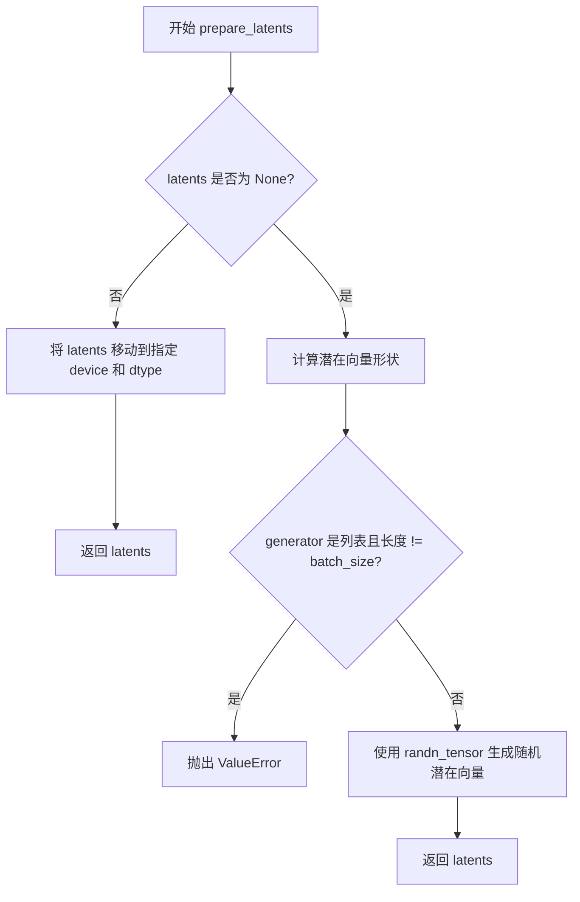

#### 带注释源码

```python
def prepare_latents(
    self,
    batch_size: int,
    num_channels_latents: int,
    height: int,
    width: int,
    dtype: torch.dtype,
    device: torch.device,
    generator: torch.Generator | list[torch.Generator] | None,
    latents: torch.Tensor | None = None,
) -> torch.Tensor:
    """
    准备用于图像生成的潜在向量。

    如果调用者已经提供了潜在向量，则直接将其移动到指定的设备和数据类型。
    否则，根据批处理大小、通道数以及通过 VAE 缩放因子调整后的图像尺寸创建新的随机潜在向量。

    参数:
        batch_size: 批处理大小。
        num_channels_latents: 潜在通道数。
        height: 生成图像的高度（像素）。
        width: 生成图像的宽度（像素）。
        dtype: 潜在向量的数据类型。
        device: 潜在向量应放置到的设备。
        generator: 随机数生成器，用于确保可重复性。
        latents: 可选的预生成潜在向量。

    返回:
        准备好的潜在向量张量。
    """
    # 如果已提供潜在向量，直接返回移动到目标设备和 dtype 的版本
    if latents is not None:
        return latents.to(device=device, dtype=dtype)

    # 计算潜在向量的形状：空间维度需要除以 VAE 缩放因子
    # VAE 缩放因子通常为 2^(len(vae.config.encoder_block_out_channels) - 1)
    shape = (
        batch_size,
        num_channels_latents,
        int(height) // self.vae_scale_factor,
        int(width) // self.vae_scale_factor,
    )

    # 验证生成器列表长度与批处理大小是否匹配
    if isinstance(generator, list) and len(generator) != batch_size:
        raise ValueError(
            f"You have passed a list of generators of length {len(generator)}, but requested an effective batch"
            f" size of {batch_size}. Make sure the batch size matches the length of the generators."
        )

    # 使用随机张量生成器创建符合指定形状的潜在向量
    # randn_tensor 是 diffusers 提供的工具函数，用于生成随机张量
    latents = randn_tensor(shape, generator=generator, device=device, dtype=dtype)
    return latents
```


### `SanaSprintPipeline.__call__`

SanaSprintPipeline 的核心调用方法，实现了基于 Sana-Sprint 模型的文本到图像生成功能。该方法接收文本提示，通过编码、调度器处理、去噪循环和 VAE 解码等步骤，最终生成与文本描述匹配的图像。

参数：

- `prompt`：`str | list[str] | None`，用于指导图像生成的文本提示。如果未定义，则必须传递 prompt_embeds
- `num_inference_steps`：`int`，去噪步数，默认为 2。更多去噪步骤通常能生成更高质量的图像，但推理速度较慢
- `timesteps`：`list[int] | None`，用于去噪过程的自定义时间步。如果未定义，将使用默认行为
- `max_timesteps`：`float`，SCM 调度器使用的最大时间步值，默认为 1.57080
- `intermediate_timesteps`：`float`，SCM 调度器使用的中间时间步值（仅在 num_inference_steps=2 时使用），默认为 1.3
- `guidance_scale`：`float`，引导比例，默认为 4.5。高于 1 的值会鼓励模型生成更符合提示的图像
- `num_images_per_prompt`：`int | None`，每个提示生成的图像数量，默认为 1
- `height`：`int`，生成图像的高度（像素），默认为 1024
- `width`：`int`，生成图像的宽度（像素），默认为 1024
- `eta`：`float`，DDIM 论文中的参数 eta，仅适用于 DDIMScheduler，默认为 0.0
- `generator`：`torch.Generator | list[torch.Generator] | None`，用于生成确定性结果的随机数生成器
- `latents`：`torch.Tensor | None`，预生成的噪声潜在向量，可用于调整相同生成的不同提示
- `prompt_embeds`：`torch.Tensor | None`，预生成的文本嵌入，可用于轻松调整文本输入
- `prompt_attention_mask`：`torch.Tensor | None`，文本嵌入的预生成注意力掩码
- `output_type`：`str | None`，生成图像的输出格式，可选择 PIL.Image.Image 或 np.array，默认为 "pil"
- `return_dict`：`bool`，是否返回 SanaPipelineOutput 而不是普通元组，默认为 True
- `clean_caption`：`bool`，是否在创建嵌入前清理提示，默认为 False
- `use_resolution_binning`：`bool`，是否使用分辨率分箱，默认为 True
- `attention_kwargs`：`dict[str, Any] | None`，传递给 AttentionProcessor 的参数字典
- `callback_on_step_end`：`Callable[[int, int], None] | None`，在每个去噪步骤结束时调用的函数
- `callback_on_step_end_tensor_inputs`：`list[str]`，callback_on_step_end 函数的张量输入列表，默认为 ["latents"]
- `max_sequence_length`：`int`，与提示一起使用的最大序列长度，默认为 300
- `complex_human_instruction`：`list[str]`，复杂人类注意力指令列表

返回值：`SanaPipelineOutput | tuple`，如果 return_dict 为 True，返回 SanaPipelineOutput，否则返回包含生成图像的元组

#### 流程图

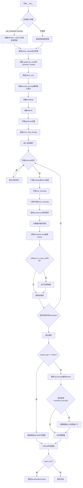

#### 带注释源码

```python
@torch.no_grad()
@replace_example_docstring(EXAMPLE_DOC_STRING)
def __call__(
    self,
    prompt: str | list[str] = None,
    num_inference_steps: int = 2,
    timesteps: list[int] = None,
    max_timesteps: float = 1.57080,
    intermediate_timesteps: float = 1.3,
    guidance_scale: float = 4.5,
    num_images_per_prompt: int | None = 1,
    height: int = 1024,
    width: int = 1024,
    eta: float = 0.0,
    generator: torch.Generator | list[torch.Generator] | None = None,
    latents: torch.Tensor | None = None,
    prompt_embeds: torch.Tensor | None = None,
    prompt_attention_mask: torch.Tensor | None = None,
    output_type: str | None = "pil",
    return_dict: bool = True,
    clean_caption: bool = False,
    use_resolution_binning: bool = True,
    attention_kwargs: dict[str, Any] | None = None,
    callback_on_step_end: Callable[[int, int], None] | None = None,
    callback_on_step_end_tensor_inputs: list[str] = ["latents"],
    max_sequence_length: int = 300,
    complex_human_instruction: list[str] = [
        "Given a user prompt, generate an 'Enhanced prompt' that provides detailed visual descriptions suitable for image generation...",
    ],
) -> SanaPipelineOutput | tuple:
    """
    Function invoked when calling the pipeline for generation.
    """
    # 1. 处理回调函数：如果传入的是PipelineCallback或MultiPipelineCallbacks，更新tensor_inputs列表
    if isinstance(callback_on_step_end, (PipelineCallback, MultiPipelineCallbacks)):
        callback_on_step_end_tensor_inputs = callback_on_step_end.tensor_inputs

    # 1. 检查输入参数，正确性验证
    if use_resolution_binning:
        if self.transformer.config.sample_size == 32:
            aspect_ratio_bin = ASPECT_RATIO_1024_BIN
        else:
            raise ValueError("Invalid sample size")
        # 记录原始尺寸，用于后续恢复
        orig_height, orig_width = height, width
        # 将请求的高度宽度映射到最近的分辨率
        height, width = self.image_processor.classify_height_width_bin(height, width, ratios=aspect_ratio_bin)

    # 调用check_inputs验证所有输入参数
    self.check_inputs(
        prompt=prompt,
        height=height,
        width=width,
        num_inference_steps=num_inference_steps,
        timesteps=timesteps,
        max_timesteps=max_timesteps,
        intermediate_timesteps=intermediate_timesteps,
        callback_on_step_end_tensor_inputs=callback_on_step_end_tensor_inputs,
        prompt_embeds=prompt_embeds,
        prompt_attention_mask=prompt_attention_mask,
    )

    # 设置类属性供其他方法使用
    self._guidance_scale = guidance_scale
    self._attention_kwargs = attention_kwargs
    self._interrupt = False

    # 2. 确定batch_size
    if prompt is not None and isinstance(prompt, str):
        batch_size = 1
    elif prompt is not None and isinstance(prompt, list):
        batch_size = len(prompt)
    else:
        batch_size = prompt_embeds.shape[0]

    # 获取执行设备
    device = self._execution_device
    # 从attention_kwargs获取lora_scale
    lora_scale = self.attention_kwargs.get("scale", None) if self.attention_kwargs is not None else None

    # 3. 编码输入提示
    (
        prompt_embeds,
        prompt_attention_mask,
    ) = self.encode_prompt(
        prompt,
        num_images_per_prompt=num_images_per_prompt,
        device=device,
        prompt_embeds=prompt_embeds,
        prompt_attention_mask=prompt_attention_mask,
        clean_caption=clean_caption,
        max_sequence_length=max_sequence_length,
        complex_human_instruction=complex_human_instruction,
        lora_scale=lora_scale,
    )

    # 4. 准备timesteps
    # XLA设备使用CPU处理timestep
    if XLA_AVAILABLE:
        timestep_device = "cpu"
    else:
        timestep_device = device
    # 调用retrieve_timesteps获取调度器的timestep schedule
    timesteps, num_inference_steps = retrieve_timesteps(
        self.scheduler,
        num_inference_steps,
        timestep_device,
        timesteps,
        sigmas=None,
        max_timesteps=max_timesteps,
        intermediate_timesteps=intermediate_timesteps,
    )
    # 设置调度器起始索引
    if hasattr(self.scheduler, "set_begin_index"):
        self.scheduler.set_begin_index(0)

    # 5. 准备latents
    latent_channels = self.transformer.config.in_channels
    # 调用prepare_latents生成或使用提供的latents
    latents = self.prepare_latents(
        batch_size * num_images_per_prompt,
        latent_channels,
        height,
        width,
        torch.float32,
        device,
        generator,
        latents,
    )

    # 应用sigma_data缩放
    latents = latents * self.scheduler.config.sigma_data

    # 创建guidance向量
    guidance = torch.full([1], guidance_scale, device=device, dtype=torch.float32)
    guidance = guidance.expand(latents.shape[0]).to(prompt_embeds.dtype)
    guidance = guidance * self.transformer.config.guidance_embeds_scale

    # 6. 准备额外步骤参数
    extra_step_kwargs = self.prepare_extra_step_kwargs(generator, eta)

    # 7. 去噪循环
    # 移除最后一个timestep（调度器通常会返回num_inference_steps+1个timesteps）
    timesteps = timesteps[:-1]
    # 计算预热步数
    num_warmup_steps = max(len(timesteps) - num_inference_steps * self.scheduler.order, 0)
    self._num_timesteps = len(timesteps)

    transformer_dtype = self.transformer.dtype
    # 进度条上下文管理器
    with self.progress_bar(total=num_inference_steps) as progress_bar:
        for i, t in enumerate(timesteps):
            # 检查中断标志
            if self.interrupt:
                continue

            # 广播到batch维度（兼容ONNX/Core ML）
            timestep = t.expand(latents.shape[0])
            # 标准化latents输入
            latents_model_input = latents / self.scheduler.config.sigma_data

            # SCM特定的timestep计算
            scm_timestep = torch.sin(timestep) / (torch.cos(timestep) + torch.sin(timestep))

            # 扩展scm_timestep到与latents相同维度
            scm_timestep_expanded = scm_timestep.view(-1, 1, 1, 1)
            # 计算最终的latent model input
            latent_model_input = latents_model_input * torch.sqrt(
                scm_timestep_expanded**2 + (1 - scm_timestep_expanded) ** 2
            )

            # 调用transformer预测噪声
            noise_pred = self.transformer(
                latent_model_input.to(dtype=transformer_dtype),
                encoder_hidden_states=prompt_embeds.to(dtype=transformer_dtype),
                encoder_attention_mask=prompt_attention_mask,
                guidance=guidance,
                timestep=scm_timestep,
                return_dict=False,
                attention_kwargs=self.attention_kwargs,
            )[0]

            # 应用SCM特定的噪声预测校正
            noise_pred = (
                (1 - 2 * scm_timestep_expanded) * latent_model_input
                + (1 - 2 * scm_timestep_expanded + 2 * scm_timestep_expanded**2) * noise_pred
            ) / torch.sqrt(scm_timestep_expanded**2 + (1 - scm_timestep_expanded) ** 2)
            # 恢复到正确的数值范围
            noise_pred = noise_pred.float() * self.scheduler.config.sigma_data

            # 计算上一步的图像：x_t -> x_t-1
            latents, denoised = self.scheduler.step(
                noise_pred, timestep, latents, **extra_step_kwargs, return_dict=False
            )

            # 执行每步结束时的回调函数
            if callback_on_step_end is not None:
                callback_kwargs = {}
                for k in callback_on_step_end_tensor_inputs:
                    callback_kwargs[k] = locals()[k]
                callback_outputs = callback_on_step_end(self, i, t, callback_kwargs)

                # 更新latents和prompt_embeds（如果回调返回了这些值）
                latents = callback_outputs.pop("latents", latents)
                prompt_embeds = callback_outputs.pop("prompt_embeds", prompt_embeds)

            # 进度条更新（在最后一步或预热后每scheduler.order步）
            if i == len(timesteps) - 1 or ((i + 1) > num_warmup_steps and (i + 1) % self.scheduler.order == 0):
                progress_bar.update()

            # XLA设备标记步骤
            if XLA_AVAILABLE:
                xm.mark_step()

    # 去噪完成后，转换到图像空间
    latents = denoised / self.scheduler.config.sigma_data
    
    # 根据output_type决定处理方式
    if output_type == "latent":
        image = latents
    else:
        # 转换为VAE dtype进行解码
        latents = latents.to(self.vae.dtype)
        torch_accelerator_module = getattr(torch, get_device(), torch.cuda)
        # 根据PyTorch版本选择OOM错误类型
        oom_error = (
            torch.OutOfMemoryError
            if is_torch_version(">=", "2.5.0")
            else torch_accelerator_module.OutOfMemoryError
        )
        try:
            # 调用VAE解码latents到图像
            image = self.vae.decode(latents / self.vae.config.scaling_factor, return_dict=False)[0]
        except oom_error as e:
            # OOM时警告用户使用VAE tiling
            warnings.warn(
                f"{e}. \n"
                f"Try to use VAE tiling for large images. For example: \n"
                f"pipe.vae.enable_tiling(tile_sample_min_width=512, tile_sample_min_height=512)"
            )
        
        # 如果使用了resolution_binning，调整图像回原始尺寸
        if use_resolution_binning:
            image = self.image_processor.resize_and_crop_tensor(image, orig_width, orig_height)

    # 后处理图像（转换为PIL或numpy）
    if not output_type == "latent":
        image = self.image_processor.postprocess(image, output_type=output_type)

    # 释放所有模型内存
    self.maybe_free_model_hooks()

    # 根据return_dict返回结果
    if not return_dict:
        return (image,)

    return SanaPipelineOutput(images=image)
```

## 关键组件


### 张量索引与惰性加载

在 `encode_prompt` 方法中，使用 `select_index = [0] + list(range(-max_length + 1, 0))` 对 prompt_embeds 进行切片索引，实现只取最后 max_length 个 token 的效果。在 `__call__` 方法中使用 `@torch.no_grad()` 装饰器禁用梯度计算，实现推理阶段的惰性加载优化。

### 反量化支持

代码中多处进行 dtype 转换以支持不同的量化精度：`prompt_embeds.to(dtype=transformer_dtype)` 将嵌入转换到 transformer 的数据类型；`latents.to(self.vae.dtype)` 在 VAE 解码前将潜在向量转换到 VAE 的数据类型；`image = latents.float() * self.scheduler.config.sigma_data` 在去噪后将预测结果反量化回 float 类型。

### 量化策略

在 `prepare_latents` 方法中使用 `torch.float32` 作为默认精度初始化潜在向量，但通过 `dtype` 参数支持传入不同的数据类型。transformer 使用 `self.transformer.dtype` 获取当前模型权重精度进行推理，实现与模型量化状态一致的推理策略。

### VAE 切片与平铺

`enable_vae_slicing` 和 `disable_vae_slicing` 方法允许将 VAE 解码分割成多个小步骤处理，以节省显存。`enable_vae_tiling` 和 `disable_vae_tiling` 方法支持将图像分块处理，实现更大分辨率图像的生成而不会 OOM。

### SCM 调度器时间步计算

在 `__call__` 方法的去噪循环中，使用 `scm_timestep = torch.sin(timestep) / (torch.cos(timestep) + torch.sin(timestep))` 公式计算 SCM 调度器的特殊时间步，并使用 `scm_timestep_expanded.view(-1, 1, 1, 1)` 扩展到与 latents 相同的维度进行逐元素运算。

### 潜在向量初始化与缩放

`prepare_latents` 方法初始化随机潜在向量：使用 `randn_tensor` 生成高斯噪声，并乘以 `self.scheduler.config.sigma_data` 进行数据缩放。在去噪循环结束后，使用 `latents = denoised / self.scheduler.config.sigma_data` 进行反缩放还原。

### Prompt 编码与预处理

`_get_gemma_prompt_embeds` 方法使用 GemmaTokenizer 对文本进行编码，`_text_preprocessing` 和 `_clean_caption` 方法对 prompt 进行清洗，包括移除 URL、HTML 标签、CJK 字符、特殊标点等，并使用 ftfy 库修复损坏的文本编码。

### LoRA 权重管理

`encode_prompt` 方法中通过 `scale_lora_layers` 和 `unscale_lora_layers` 动态调整 LoRA 权重规模，实现 prompt_embeds 的文本提示词权重控制。

### 回调与中断机制

`callback_on_step_end` 参数支持在每个去噪步骤结束时执行自定义回调函数，通过 `callback_on_step_end_tensor_inputs` 控制传递给回调的张量内容。`interrupt` 属性支持在推理过程中外部中断生成过程。

### OOM 错误处理与 VAE 解码

在 VAE 解码阶段捕获 `OutOfMemoryError` 异常，当发生显存不足时给出警告建议启用 VAE tiling，并提供 `pipe.vae.enable_tiling()` 的使用示例。

### 图像后处理与分辨率分桶

使用 `PixArtImageProcessor` 进行图像后处理：`classify_height_width_bin` 根据目标分辨率从预定义的 ASPECT_RATIO_1024_BIN 中选择最接近的分辨率，`resize_and_crop_tensor` 将生成图像 resize 回原始请求的分辨率。


## 问题及建议


### 已知问题

-   **废弃方法未移除**: `enable_vae_slicing`、`disable_vae_slicing`、`enable_vae_tiling`、`disable_vae_tiling` 方法已标记为废弃（版本0.40.0将移除），但代码中仍保留完整实现，应该直接调用 `pipe.vae.enable_slicing()` 等方法。
-   **魔法数字和硬编码值**: 存在多个硬编码的数值如 `max_sequence_length=300`、`num_inference_steps=2`、`guidance_scale=4.5`、`max_timesteps=1.57080`、`intermediate_timesteps=1.3` 等，这些应该提取为配置参数。
-   **过长的默认参数**: `complex_human_instruction` 参数的默认值是一个包含多行示例的长列表，这种内联大对象作为默认参数的做法不符合最佳实践。
-   **VAE内存处理不完善**: 当VAE解码发生OOM时只是警告用户建议使用tiling，但不会自动尝试tiling方案，缺乏优雅降级机制。
-   **缺少空值检查**: 代码多处直接访问 `self.transformer`、`self.vae`、`self.text_encoder` 而未检查其是否存在，可能在某些配置下抛出 AttributeError。
-   **类型提示不一致**: 部分参数使用 `| None` 语法（如 `height: int = 1024`），部分使用 `Optional[]`，风格不统一。
-   **正则表达式重复编译**: `bad_punct_regex` 虽然是类变量，但在 `__init__` 中每次都会访问，可能影响性能。
-   **Prompt切片逻辑不清晰**: `select_index = [0] + list(range(-max_length + 1, 0))` 这行代码的意图缺乏注释说明，难以理解其作用。
-   **调度器属性依赖**: `num_warmup_steps = max(len(timesteps) - num_inference_steps * self.scheduler.order, 0)` 依赖 `scheduler.order` 属性，如果调度器未定义该属性会导致错误。
-   **设备处理不一致**: XLA设备处理使用 `"cpu"` 字符串而非实际的torch设备对象，可能导致类型不一致问题。

### 优化建议

-   **移除废弃方法**: 删除 `enable_vae_slicing`、`disable_vae_slicing`、`enable_vae_tiling`、`disable_vae_tiling` 方法，或将其简化为直接调用对应模块方法的包装器。
-   **提取配置常量**: 将硬编码的数值提取为类属性或配置文件，如 `DEFAULT_MAX_SEQUENCE_LENGTH`、`DEFAULT_GUIDANCE_SCALE` 等。
-   **重构复杂参数**: 将 `complex_human_instruction` 的默认值移至类级别或单独的配置文件，避免每次调用时传递大对象。
-   **改进错误处理**: 在VAE解码OOM时自动启用tiling作为回退方案，而不是仅发出警告。
-   **添加空值保护**: 在访问 `self.transformer`、`self.vae`、`self.text_encoder` 前添加适当的空值检查或使用 `getattr` 安全访问。
-   **统一类型提示风格**: 统一使用 Python 3.10+ 的 `|` 语法或 `Optional[]` 风格。
-   **添加文档注释**: 为 `select_index` 的计算逻辑添加详细注释说明其用途和设计意图。
-   **调度器兼容性检查**: 在使用 `scheduler.order` 前检查该属性是否存在，提供默认值。
-   **优化设备类型**: 统一使用 torch.device 对象而非字符串处理设备相关逻辑。
-   **考虑性能优化**: 对于正则表达式，可以使用 `re.compile` 预编译并缓存，避免运行时重复处理。


## 其它


### 设计目标与约束

本Pipeline的设计目标是实现高效的文本到图像生成，采用SANA-Sprint架构，支持快速推理（默认仅2步）。主要约束包括：1) 输入图像尺寸必须能被32整除；2) 默认仅支持2步推理以实现快速生成；3) 依赖GPU进行加速推理；4) 支持LoRA微调但需配合PEFT后端使用；5) 文本编码器固定使用Gemma2系列模型。

### 错误处理与异常设计

代码采用多层错误处理机制：1) 输入验证阶段通过`check_inputs`方法进行全面检查，包括尺寸验证、参数互斥检查、类型检查等，违反时抛出`ValueError`；2) 推理阶段通过`try-except`捕获`OutOfMemoryError`，并提示用户启用VAE tiling；3) 调度器参数检查通过`inspect`模块动态验证是否支持自定义timesteps或sigmas；4) 缺失依赖时通过`deprecate`函数发出警告并降级处理（如clean_caption功能）。所有异常均携带明确的错误信息和修复建议。

### 数据流与状态机

Pipeline的核心数据流如下：1) 初始状态接收文本prompt或预计算的prompt_embeds；2) 编码阶段调用`encode_prompt`生成文本嵌入和注意力掩码；3) 调度器初始化阶段通过`retrieve_timesteps`获取时间步序列；4) 潜在空间准备阶段通过`prepare_latents`生成或接收噪声张量；5) 去噪循环阶段执行N次迭代（默认2次），每次迭代包含：噪声预测、SCM时间步计算、潜在空间更新；6) 解码阶段通过VAE将潜在表示解码为图像；7) 后处理阶段进行分辨率调整和格式转换。状态转换由`self._interrupt`标志控制，可被外部中断。

### 外部依赖与接口契约

核心依赖包括：1) `transformers`：Gemma2PreTrainedModel和GemmaTokenizer/GemmaTokenizerFast；2) `diffusers`：DiffusionPipeline基类、调度器、图像处理器；3) `torch`：张量运算和模型推理；4) 可选依赖：beautifulsoup4（HTML清理）、ftfy（文本修复）。接口契约方面：1) `from_pretrained`方法需提供包含tokenizer、text_encoder、vae、transformer、scheduler的预训练模型目录；2) 模型需遵循特定配置结构（如transformer.config.sample_size、vae.config.encoder_block_out_channels）；3) 调度器需实现`set_timesteps`和`step`方法；4) VAE需支持`decode`、`enable_slicing`、`disable_slicing`、`enable_tiling`、`disable_tiling`接口。

### 性能特征与基准

性能特征：1) 默认推理步数仅为2步，远低于标准扩散模型的20-50步；2) 支持模型CPU卸载（通过`model_cpu_offload_seq`定义卸载序列）；3) 支持VAE切片和解码Tile策略以支持大分辨率图像；4) 支持XLA加速（当torch_xla可用时）。显存占用受图像分辨率、batch size、模型规模共同影响，默认1024x1024分辨率下需约8GB显存。

### 兼容性信息

兼容性：1) Python版本需支持类型提示语法（3.9+）；2) PyTorch版本需支持`torch.float32`、`torch.bfloat16`等数据类型；3) 调度器需兼容DPMSolverMultistepScheduler接口；4) 当`is_torch_version >= "2.5.0"`时使用`torch.OutOfMemoryError`，否则使用CUDA模块的OutOfMemoryError；5) LoRA功能需PEFT后端支持（`USE_PEFT_BACKEND`标志控制）。已知限制：不支持ONNX/Core ML完整兼容（broadcast操作需特殊处理）。

### 配置参数详解

关键配置参数：1) `num_inference_steps`：推理步数，默认2，需与`intermediate_timesteps`配合使用；2) `max_timesteps`：SCM调度器最大时间步，默认1.57080（约π/2）；3) `intermediate_timesteps`：中间时间步，仅当num_inference_steps=2时有效，默认1.3；4) `guidance_scale`：引导尺度，默认4.5，用于分类器自由引导；5) `height`/`width`：输出分辨率，需能被32整除；6) `complex_human_instruction`：复杂人类指令列表，用于增强prompt；7) `use_resolution_binning`：是否使用分辨率分箱，启用后自动映射到最佳分辨率；8) `attention_kwargs`：传递给注意力处理器的参数字典。

### 版本历史与变更记录

本代码基于diffusers框架的Stable Diffusion Pipeline结构改编，主要变更：1) 引入SCM（Sampled Consistency Model）调度机制替代传统DDPM；2) 文本编码器替换为Gemma2；3) UNet替换为SanaTransformer2DModel；4) 新增`complex_human_instruction`支持复杂prompt增强；5) 去噪公式根据SCM论文重新推导实现；6) VAE替换为AutoencoderDC。版本标记：deprecation警告标注为0.40.0版本移除。

### 测试策略建议

建议测试覆盖：1) 输入验证测试（尺寸、类型、参数互斥）；2) 端到端生成测试（不同分辨率、batch size）；3) 内存溢出场景测试（大分辨率、VAE tiling开关）；4) LoRA加载和推理测试；5) 中断和恢复测试；6) 输出格式测试（PIL/numPy/latent）；7) 调度器兼容性测试（自定义timesteps）；8) XLA后端测试（若支持）。

    