# `diffusers\src\diffusers\pipelines\sana\pipeline_sana_sprint_img2img.py` 详细设计文档

SanaSprintImg2ImgPipeline是一个用于文本引导图像到图像生成的Diffusion Pipeline，基于SANA-Sprint模型架构，实现从文本提示和输入图像生成目标图像的功能。该pipeline集成了Gemma文本编码器、VAE变分自编码器和SanaTransformer2DModel，使用DPMSolverMultistepScheduler调度器进行去噪处理，支持LoRA微调、VAE切片和平铺等优化技术。

## 整体流程

```mermaid
graph TD
    A[开始 __call__] --> B[检查输入参数]
    B --> C{use_resolution_binning?}
    C -- 是 --> D[计算目标宽高]
    C --> E[跳过分辨率绑定]
    D --> F[检查输入有效性]
    E --> F
    F --> G[预处理输入图像 prepare_image]
    G --> H[编码提示词 encode_prompt]
    H --> I[获取时间步 retrieve_timesteps]
    I --> J[计算实际时间步 get_timesteps]
    J --> K[准备潜变量 prepare_latents]
    K --> L[准备额外调度参数 prepare_extra_step_kwargs]
    L --> M[去噪循环 for timestep in timesteps]
    M --> N[计算SCM时间步]
    N --> O[Transformer前向传播]
    O --> P[噪声预测后处理]
    P --> Q[调度器步进 scheduler.step]
    Q --> R{有回调?]
    R -- 是 --> S[执行回调 callback_on_step_end]
    R --> T[更新进度条]
    T --> U{还有更多时间步?]
    U -- 是 --> M
    U -- 否 --> V[VAE解码 decode]
    V --> W[后处理图像 postprocess]
    W --> X[释放模型钩子 maybe_free_model_hooks]
    X --> Y[返回 SanaPipelineOutput]
```

## 类结构

```
DiffusionPipeline (基类)
└── SanaSprintImg2ImgPipeline
    └── SanaLoraLoaderMixin (混入类)
```

## 全局变量及字段


### `XLA_AVAILABLE`
    
标记XLA是否可用的布尔值

类型：`bool`
    


### `logger`
    
模块日志记录器，用于输出运行时信息

类型：`logging.Logger`
    


### `EXAMPLE_DOC_STRING`
    
使用示例文档字符串，包含pipeline调用示例代码

类型：`str`
    


### `bad_punct_regex`
    
正则表达式，用于清理文本中的标点符号

类型：`re.Pattern`
    


### `model_cpu_offload_seq`
    
模型CPU卸载顺序字符串，定义模型卸载的顺序

类型：`str`
    


### `_callback_tensor_inputs`
    
回调张量输入列表，指定回调函数可访问的张量

类型：`list[str]`
    


### `SanaSprintImg2ImgPipeline.tokenizer`
    
Gemma分词器实例，用于文本编码

类型：`GemmaTokenizer | GemmaTokenizerFast`
    


### `SanaSprintImg2ImgPipeline.text_encoder`
    
Gemma2预训练文本编码器模型

类型：`Gemma2PreTrainedModel`
    


### `SanaSprintImg2ImgPipeline.vae`
    
变分自编码器，用于图像编码和解码

类型：`AutoencoderDC`
    


### `SanaSprintImg2ImgPipeline.transformer`
    
Sana变换器模型，执行去噪预测

类型：`SanaTransformer2DModel`
    


### `SanaSprintImg2ImgPipeline.scheduler`
    
DPM多步调度器，控制去噪过程的时间步

类型：`DPMSolverMultistepScheduler`
    


### `SanaSprintImg2ImgPipeline.vae_scale_factor`
    
VAE缩放因子，用于调整潜在空间的尺寸

类型：`int`
    


### `SanaSprintImg2ImgPipeline.image_processor`
    
PixArt图像处理器，用于图像预处理和后处理

类型：`PixArtImageProcessor`
    


### `SanaSprintImg2ImgPipeline._guidance_scale`
    
引导比例，控制文本提示对生成图像的影响程度

类型：`float`
    


### `SanaSprintImg2ImgPipeline._attention_kwargs`
    
注意力参数字典，传递给注意力处理器

类型：`dict[str, Any] | None`
    


### `SanaSprintImg2ImgPipeline._num_timesteps`
    
时间步数量，记录推理过程中的总步数

类型：`int`
    


### `SanaSprintImg2ImgPipeline._interrupt`
    
中断标志，用于中断推理过程

类型：`bool`
    
    

## 全局函数及方法


### `retrieve_timesteps`

获取调度器的时间步。该函数调用调度器的 `set_timesteps` 方法并在调用后从中检索时间步，支持自定义时间步和 sigma 值。任何 kwargs 将被传递给 `scheduler.set_timesteps`。

参数：

- `scheduler`：`SchedulerMixin`，用于获取时间步的调度器
- `num_inference_steps`：`int | None`，使用预训练模型生成样本时使用的扩散步数。如果使用此参数，`timesteps` 必须为 `None`
- `device`：`str | torch.device | None`，时间步应移动到的设备。如果为 `None`，时间步不会被移动
- `timesteps`：`list[int] | None`，用于覆盖调度器时间步间隔策略的自定义时间步。如果传递 `timesteps`，则 `num_inference_steps` 和 `sigmas` 必须为 `None`
- `sigmas`：`list[float] | None`，用于覆盖调度器时间步间隔策略的自定义 sigma。如果传递 `sigmas`，则 `num_inference_steps` 和 `timesteps` 必须为 `None`
- `**kwargs`：其他关键字参数，将传递给调度器的 `set_timesteps` 方法

返回值：`tuple[torch.Tensor, int]`，元组第一个元素是调度器的时间步调度，第二个元素是推理步数

#### 流程图

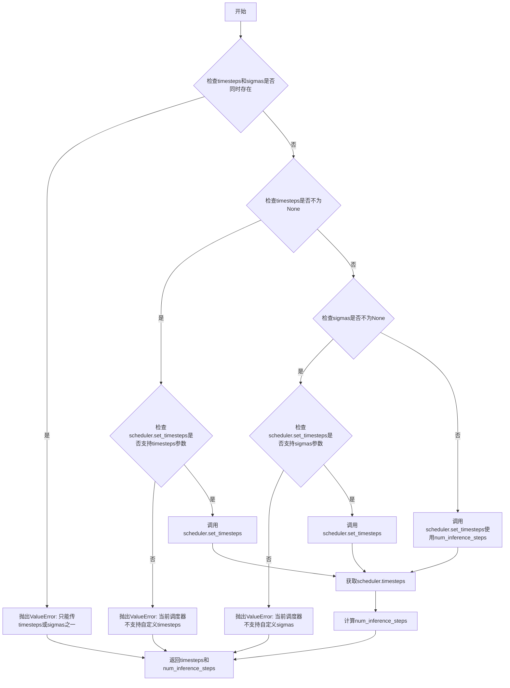

#### 带注释源码

```python
# Copied from diffusers.pipelines.stable_diffusion.pipeline_stable_diffusion.retrieve_timesteps
def retrieve_timesteps(
    scheduler,
    num_inference_steps: int | None = None,
    device: str | torch.device | None = None,
    timesteps: list[int] | None = None,
    sigmas: list[float] | None = None,
    **kwargs,
):
    r"""
    Calls the scheduler's `set_timesteps` method and retrieves timesteps from the scheduler after the call. Handles
    custom timesteps. Any kwargs will be supplied to `scheduler.set_timesteps`.

    Args:
        scheduler (`SchedulerMixin`):
            The scheduler to get timesteps from.
        num_inference_steps (`int`):
            The number of diffusion steps used when generating samples with a pre-trained model. If used, `timesteps`
            must be `None`.
        device (`str` or `torch.device`, *optional*):
            The device to which the timesteps should be moved to. If `None`, the timesteps are not moved.
        timesteps (`list[int]`, *optional*):
            Custom timesteps used to override the timestep spacing strategy of the scheduler. If `timesteps` is passed,
            `num_inference_steps` and `sigmas` must be `None`.
        sigmas (`list[float]`, *optional*):
            Custom sigmas used to override the timestep spacing strategy of the scheduler. If `sigmas` is passed,
            `num_inference_steps` and `timesteps` must be `None`.

    Returns:
        `tuple[torch.Tensor, int]`: A tuple where the first element is the timestep schedule from the scheduler and the
        second element is the number of inference steps.
    """
    # 检查是否同时传入了timesteps和sigmas，这是不允许的
    if timesteps is not None and sigmas is not None:
        raise ValueError("Only one of `timesteps` or `sigmas` can be passed. Please choose one to set custom values")
    
    # 处理自定义timesteps的情况
    if timesteps is not None:
        # 检查调度器的set_timesteps方法是否支持timesteps参数
        accepts_timesteps = "timesteps" in set(inspect.signature(scheduler.set_timesteps).parameters.keys())
        if not accepts_timesteps:
            raise ValueError(
                f"The current scheduler class {scheduler.__class__}'s `set_timesteps` does not support custom"
                f" timestep schedules. Please check whether you are using the correct scheduler."
            )
        # 调用调度器的set_timesteps方法
        scheduler.set_timesteps(timesteps=timesteps, device=device, **kwargs)
        # 从调度器获取设置后的timesteps
        timesteps = scheduler.timesteps
        # 计算推理步数
        num_inference_steps = len(timesteps)
    # 处理自定义sigmas的情况
    elif sigmas is not None:
        # 检查调度器的set_timesteps方法是否支持sigmas参数
        accept_sigmas = "sigmas" in set(inspect.signature(scheduler.set_timesteps).parameters.keys())
        if not accept_sigmas:
            raise ValueError(
                f"The current scheduler class {scheduler.__class__}'s `set_timesteps` does not support custom"
                f" sigmas schedules. Please check whether you are using the correct scheduler."
            )
        # 调用调度器的set_timesteps方法
        scheduler.set_timesteps(sigmas=sigmas, device=device, **kwargs)
        # 从调度器获取设置后的timesteps
        timesteps = scheduler.timesteps
        # 计算推理步数
        num_inference_steps = len(timesteps)
    # 默认情况：使用num_inference_steps设置时间步
    else:
        scheduler.set_timesteps(num_inference_steps, device=device, **kwargs)
        timesteps = scheduler.timesteps
    
    # 返回时间步调度和推理步数
    return timesteps, num_inference_steps
```


### `SanaSprintImg2ImgPipeline.__init__`

该方法是 `SanaSprintImg2ImgPipeline` 类的构造函数，用于初始化图像到图像（Img2Img）生成的Pipeline实例，注册 tokenizer、text_encoder、vae、transformer 和 scheduler 五个核心模块，并配置 VAE 缩放因子和图像处理器。

参数：

- `tokenizer`：`GemmaTokenizer | GemmaTokenizerFast`，用于对文本提示进行分词处理
- `text_encoder`：`Gemma2PreTrainedModel`，将分词后的文本编码为嵌入向量
- `vae`：`AutoencoderDC`，变分自编码器，负责潜在空间与图像之间的相互转换
- `transformer`：`SanaTransformer2DModel`， Sana 主干模型，负责去噪预测
- `scheduler`：`DPMSolverMultistepScheduler`，多步采样调度器，控制扩散过程的噪声调度

返回值：`None`，构造函数无返回值，直接初始化实例属性

#### 流程图

```mermaid
flowchart TD
    A[__init__ 开始] --> B[调用 super().__init__ 初始化基类]
    B --> C[register_modules 注册五个核心模块]
    C --> D{检查 vae 是否存在且有 config 属性}
    D -->|是| E[根据 vae.config.encoder_block_out_channels 计算 vae_scale_factor]
    D -->|否| F[使用默认值 32 作为 vae_scale_factor]
    E --> G[创建 PixArtImageProcessor 实例]
    F --> G
    G --> H[__init__ 结束]
```

#### 带注释源码

```
def __init__(
    self,
    tokenizer: GemmaTokenizer | GemmaTokenizerFast,
    text_encoder: Gemma2PreTrainedModel,
    vae: AutoencoderDC,
    transformer: SanaTransformer2DModel,
    scheduler: DPMSolverMultistepScheduler,
):
    # 调用父类 DiffusionPipeline 的构造函数
    # 初始化 Pipeline 的基础属性，如 device、dtype 等
    super().__init__()

    # 使用 register_modules 方法注册五个核心组件
    # 这些组件将通过 pipeline.xxx 访问
    # 例如：self.tokenizer, self.text_encoder, self.vae, self.transformer, self.scheduler
    self.register_modules(
        tokenizer=tokenizer, 
        text_encoder=text_encoder, 
        vae=vae, 
        transformer=transformer, 
        scheduler=scheduler
    )

    # 计算 VAE 缩放因子
    # VAE 通过多个上采样/下采样层进行编码和解码
    # 2 ** (len(encoder_block_out_channels) - 1) 表示特征图缩放倍数
    # 例如：如果 encoder_block_out_channels = [128, 256, 512, 512]，则 len=4，缩放因子为 2^(4-1)=8
    # 默认值为 32（适用于标准 VAE 架构）
    self.vae_scale_factor = (
        2 ** (len(self.vae.config.encoder_block_out_channels) - 1)
        if hasattr(self, "vae") and self.vae is not None
        else 32
    )
    
    # 创建图像预处理器
    # PixArtImageProcessor 用于处理输入图像和输出图像的尺寸调整、归一化等操作
    # vae_scale_factor 用于正确调整潜在空间的尺寸
    self.image_processor = PixArtImageProcessor(vae_scale_factor=self.vae_scale_factor)
```

#### 关键组件信息

| 组件名称 | 描述 |
|---------|------|
| `tokenizer` | Gemma 分词器，将文本转换为 token ID 序列 |
| `text_encoder` | Gemma2 预训练文本编码器，将 token 转换为文本嵌入 |
| `vae` | 变分自编码器 (AutoencoderDC)，负责潜在空间编码/解码 |
| `transformer` | SanaTransformer2DModel，主干去噪模型 |
| `scheduler` | DPM-Solver 多步采样调度器 |
| `vae_scale_factor` | VAE 特征图缩放因子，用于潜在空间与像素空间的尺寸转换 |
| `image_processor` | PixArt 图像处理器，负责图像预处理和后处理 |

#### 潜在技术债务与优化空间

1. **硬编码的默认值**：`vae_scale_factor` 的默认值为 32，当 VAE 不可用时使用硬编码值，可能与实际模型配置不匹配，建议在配置中明确声明或抛出警告
2. **模块注册方式**：使用 `register_modules` 统一注册是良好的设计，但未对输入进行类型验证，若传入 `None` 可能导致后续运行时错误
3. **ImageProcessor 耦合**：`PixArtImageProcessor` 与 VAE 紧密耦合，如果需要支持多种图像处理器模式，需要进一步抽象
4. **缺少设备与 dtype 初始化**：基类 `DiffusionPipeline.__init__` 会处理设备推理，但当前构造函数未显式设置 `self.device` 和 `self.dtype`，依赖后续调用时推断


### `SanaSprintImg2ImgPipeline.enable_vae_slicing`

启用VAE切片解码功能。该方法用于激活VAE（变分自编码器）的切片解码模式，当启用时，VAE会将输入张量分割成多个切片进行分步计算解码，从而节省内存并允许更大的批处理大小。注意：此方法已弃用，未来版本将移除，建议使用 `pipe.vae.enable_slicing()` 代替。

参数： 无

返回值：`None`，无返回值

#### 流程图

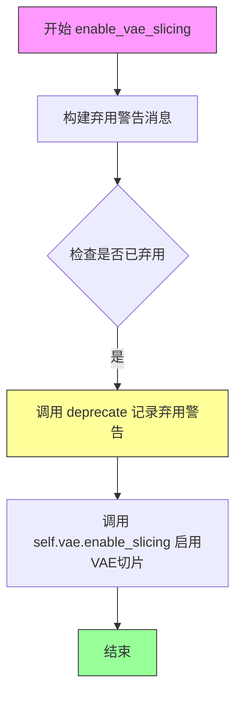

#### 带注释源码

```python
def enable_vae_slicing(self):
    r"""
    Enable sliced VAE decoding. When this option is enabled, the VAE will split the input tensor in slices to
    compute decoding in several steps. This is useful to save some memory and allow larger batch sizes.
    """
    # 构建弃用警告消息，包含类名和未来替代方案
    depr_message = f"Calling `enable_vae_slicing()` on a `{self.__class__.__name__}` is deprecated and this method will be removed in a future version. Please use `pipe.vae.enable_slicing()`."
    
    # 调用 deprecate 函数记录弃用信息，在 0.40.0 版本将移除此方法
    deprecate(
        "enable_vae_slicing",      # 被弃用的方法名
        "0.40.0",                  # 弃用版本号
        depr_message,              # 弃用警告消息
    )
    
    # 实际启用 VAE 的切片功能
    # 这是核心功能：将 VAE 解码过程分片处理以节省显存
    self.vae.enable_slicing()
```


### `SanaSprintImg2ImgPipeline.disable_vae_slicing`

禁用VAE切片解码。如果之前启用了`enable_vae_slicing`，此方法将恢复为单步计算解码。该方法已弃用，建议直接使用`pipe.vae.disable_slicing()`。

参数： 无

返回值：`None`，无返回值

#### 流程图

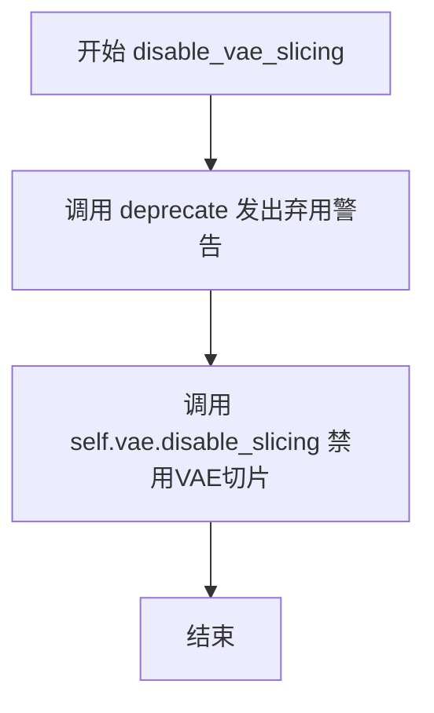

#### 带注释源码

```python
def disable_vae_slicing(self):
    r"""
    Disable sliced VAE decoding. If `enable_vae_slicing` was previously enabled, this method will go back to
    computing decoding in one step.
    """
    # 构建弃用警告消息，提示用户使用新的API
    depr_message = f"Calling `disable_vae_slicing()` on a `{self.__class__.__name__}` is deprecated and this method will be removed in a future version. Please use `pipe.vae.disable_slicing()`."
    # 调用deprecate函数记录弃用信息，在0.40.0版本将移除此方法
    deprecate(
        "disable_vae_slicing",  # 被弃用的方法名
        "0.40.0",              # 弃用版本号
        depr_message,          # 弃用警告消息
    )
    # 实际执行：调用VAE模型的disable_slicing方法，禁用VAE切片解码
    self.vae.disable_slicing()
```


### `SanaSprintImg2ImgPipeline.enable_vae_tiling`

启用VAE平铺解码功能。当启用此选项时，VAE会将输入张量分割成多个瓦片进行分步解码和编码。这对于节省大量内存并处理更大的图像非常有用。

参数：
- 无（仅包含 `self` 参数）

返回值：`None`，无返回值

#### 流程图

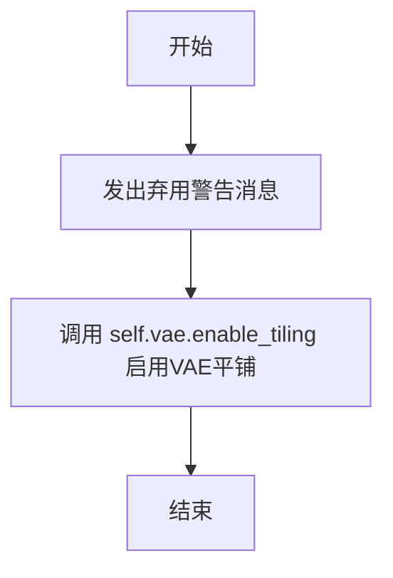

#### 带注释源码

```python
# Copied from diffusers.pipelines.sana.pipeline_sana.SanaPipeline.enable_vae_tiling
def enable_vae_tiling(self):
    r"""
    Enable tiled VAE decoding. When this option is enabled, the VAE will split the input tensor into tiles to
    compute decoding and encoding in several steps. This is useful for saving a large amount of memory and to allow
    processing larger images.
    """
    # 构建弃用警告消息，提示用户该方法已弃用，建议使用 pipe.vae.enable_tiling()
    depr_message = f"Calling `enable_vae_tiling()` on a `{self.__class__.__name__}` is deprecated and this method will be removed in a future version. Please use `pipe.vae.enable_tiling()`."
    # 调用 deprecate 函数发出弃用警告
    deprecate(
        "enable_vae_tiling",
        "0.40.0",
        depr_message,
    )
    # 调用 VAE 模型的 enable_tiling 方法启用平铺解码
    self.vae.enable_tiling()
```


### `SanaSprintImg2ImgPipeline.disable_vae_tiling`

该方法用于禁用 VAE 平铺解码功能。如果之前通过 `enable_vae_tiling` 启用了平铺解码，此方法将关闭该功能，使 VAE 恢复到一次性完成整个解码步骤的默认模式。

参数：

- `self`：`SanaSprintImg2ImgPipeline` 实例，隐式参数，无需显式传递

返回值：`None`，无返回值

#### 流程图

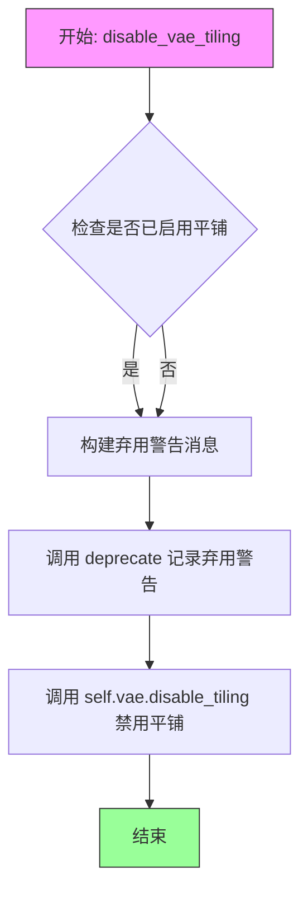

#### 带注释源码

```python
def disable_vae_tiling(self):
    """
    Disable tiled VAE decoding. If `enable_vae_tiling` was previously enabled, this method will go back to
    computing decoding in one step.
    """
    # 构建弃用警告消息，提示用户该方法将在未来版本中移除
    # 建议用户直接使用 pipe.vae.disable_tiling() 代替
    depr_message = f"Calling `disable_vae_tiling()` on a `{self.__class__.__name__}` is deprecated and this method will be removed in a future version. Please use `pipe.vae.disable_tiling()`."
    
    # 调用 deprecate 函数记录弃用警告
    # 参数: 方法名, 弃用版本号, 警告消息
    deprecate(
        "disable_vae_tiling",
        "0.40.0",
        depr_message,
    )
    
    # 调用 VAE 模型的 disable_tiling 方法实际禁用平铺功能
    # 这会使 VAE 解码器恢复到一次性处理整个输入的默认模式
    self.vae.disable_tiling()
```


### `SanaSprintImg2ImgPipeline._get_gemma_prompt_embeds`

该方法用于将文本提示词编码为文本编码器的隐藏状态（文本嵌入向量）。它负责文本预处理、分词、调用Gemma文本编码器生成嵌入表示，并返回嵌入向量及其注意力掩码。

参数：

- `self`：`SanaSprintImg2ImgPipeline` 实例，管道对象本身
- `prompt`：`str | list[str]`，要编码的提示词，可以是单个字符串或字符串列表
- `device`：`torch.device`，用于放置生成嵌入向量的PyTorch设备
- `dtype`：`torch.dtype`，嵌入向量的数据类型
- `clean_caption`：`bool`，默认为 `False`，如果为 `True`，则对提示词进行预处理和清洗
- `max_sequence_length`：`int`，默认为 `300`，提示词使用的最大序列长度
- `complex_human_instruction`：`list[str] | None`，可选的复杂人类指令列表，如果不为空则使用该指令增强提示词

返回值：`tuple[torch.Tensor, torch.Tensor]`，返回一个元组，包含文本嵌入向量（`prompt_embeds`）和注意力掩码（`prompt_attention_mask`）

#### 流程图

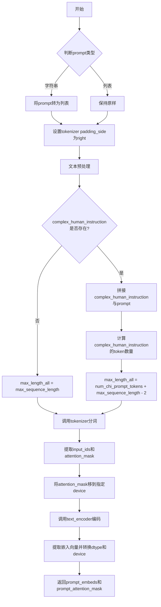

#### 带注释源码

```python
def _get_gemma_prompt_embeds(
    self,
    prompt: str | list[str],
    device: torch.device,
    dtype: torch.dtype,
    clean_caption: bool = False,
    max_sequence_length: int = 300,
    complex_human_instruction: list[str] | None = None,
):
    r"""
    Encodes the prompt into text encoder hidden states.

    Args:
        prompt (`str` or `list[str]`, *optional*):
            prompt to be encoded
        device: (`torch.device`, *optional*):
            torch device to place the resulting embeddings on
        clean_caption (`bool`, defaults to `False`):
            If `True`, the function will preprocess and clean the provided caption before encoding.
        max_sequence_length (`int`, defaults to 300): Maximum sequence length to use for the prompt.
        complex_human_instruction (`list[str]`, defaults to `complex_human_instruction`):
            If `complex_human_instruction` is not empty, the function will use the complex Human instruction for
            the prompt.
    """
    # 步骤1: 如果prompt是字符串，转换为列表；如果是列表保持不变
    prompt = [prompt] if isinstance(prompt, str) else prompt

    # 步骤2: 确保tokenizer的padding_side设置为"right"
    if getattr(self, "tokenizer", None) is not None:
        self.tokenizer.padding_side = "right"

    # 步骤3: 文本预处理（清洗和规范化）
    prompt = self._text_preprocessing(prompt, clean_caption=clean_caption)

    # 步骤4: 准备复杂人类指令
    if not complex_human_instruction:
        # 没有复杂指令时，使用默认最大长度
        max_length_all = max_sequence_length
    else:
        # 有复杂指令时，拼接指令与prompt
        chi_prompt = "\n".join(complex_human_instruction)
        prompt = [chi_prompt + p for p in prompt]
        # 计算复杂指令的token数量
        num_chi_prompt_tokens = len(self.tokenizer.encode(chi_prompt))
        # 总最大长度 = 复杂指令token数 + prompt最大长度 - 2（预留特殊token空间）
        max_length_all = num_chi_prompt_tokens + max_sequence_length - 2

    # 步骤5: 调用tokenizer进行分词
    text_inputs = self.tokenizer(
        prompt,
        padding="max_length",           # 填充到最大长度
        max_length=max_length_all,      # 最大序列长度
        truncation=True,               # 截断超长序列
        add_special_tokens=True,       # 添加特殊token（如[BOS]、[EOS]）
        return_tensors="pt",           # 返回PyTorch张量
    )
    # 提取input_ids和attention_mask
    text_input_ids = text_inputs.input_ids

    prompt_attention_mask = text_inputs.attention_mask
    # 将attention_mask移动到指定设备
    prompt_attention_mask = prompt_attention_mask.to(device)

    # 步骤6: 调用Gemma文本编码器进行编码
    prompt_embeds = self.text_encoder(text_input_ids.to(device), attention_mask=prompt_attention_mask)
    # 提取第一层隐藏状态，并转换数据类型和设备
    prompt_embeds = prompt_embeds[0].to(dtype=dtype, device=device)

    # 步骤7: 返回嵌入向量和注意力掩码
    return prompt_embeds, prompt_attention_mask
```


### `SanaSprintImg2ImgPipeline.encode_prompt`

该方法负责将文本提示编码为文本嵌入向量（text embeddings），支持 LoRA 缩放功能，并处理复杂的文本预处理。在图像生成过程中，此方法将用户提供的文本提示转换为模型可理解的向量表示，同时支持批量生成和注意力掩码的生成。

参数：

- `prompt`：`str | list[str]`，要编码的文本提示，可以是单个字符串或字符串列表
- `num_images_per_prompt`：`int = 1`，每个提示生成的图像数量，用于批量生成
- `device`：`torch.device | None`，用于放置结果嵌入的设备，如果为 None 则使用执行设备
- `prompt_embeds`：`torch.Tensor | None`，预生成的文本嵌入，如果提供则直接使用
- `prompt_attention_mask`：`torch.Tensor | None`，预生成的注意力掩码
- `clean_caption`：`bool = False`，是否在编码前清理和预处理提示文本
- `max_sequence_length`：`int = 300`，提示的最大序列长度
- `complex_human_instruction`：`list[str] | None`，复杂人类指令，用于增强提示
- `lora_scale`：`float | None`，LoRA 缩放因子，用于调整 LoRA 层的影响权重

返回值：`tuple[torch.Tensor, torch.Tensor]`，返回编码后的文本嵌入和对应的注意力掩码

#### 流程图

```mermaid
flowchart TD
    A[开始 encode_prompt] --> B{device 是否为 None?}
    B -->|是| C[获取执行设备 self._execution_device]
    B -->|否| D[使用传入的 device]
    C --> E[获取 text_encoder 的 dtype]
    D --> E
    E --> F{lora_scale 不为 None<br/>且是 SanaLoraLoaderMixin?}
    F -->|是| G[设置 self._lora_scale]
    F -->|否| H
    G --> I{USE_PEFT_BACKEND?}
    I -->|是| J[scale_lora_layers 调整 LoRA 权重]
    I -->|否| H
    J --> H
    H --> K[设置 tokenizer.padding_side = 'right']
    K --> L{提供 prompt_embeds?}
    L -->|是| M[跳过嵌入生成]
    L -->|否| N[调用 _get_gemma_prompt_embeds 生成嵌入]
    M --> O[切片处理: select_index = [0] + list(range(-max_length + 1, 0))]
    N --> O
    O --> P[切片 prompt_embeds 和 attention_mask]
    P --> Q[获取 bs_embed, seq_len]
    Q --> R[重复 prompt_embeds num_images_per_prompt 次]
    R --> S[重复 prompt_attention_mask num_images_per_prompt 次]
    S --> T{是 SanaLoraLoaderMixin<br/>且使用 PEFT_BACKEND?}
    T -->|是| U[unscale_lora_layers 恢复原始权重]
    T -->|否| V[返回 prompt_embeds 和 prompt_attention_mask]
    U --> V
```

#### 带注释源码

```python
def encode_prompt(
    self,
    prompt: str | list[str],
    num_images_per_prompt: int = 1,
    device: torch.device | None = None,
    prompt_embeds: torch.Tensor | None = None,
    prompt_attention_mask: torch.Tensor | None = None,
    clean_caption: bool = False,
    max_sequence_length: int = 300,
    complex_human_instruction: list[str] | None = None,
    lora_scale: float | None = None,
):
    r"""
    Encodes the prompt into text encoder hidden states.

    Args:
        prompt (`str` or `list[str]`, *optional*):
            prompt to be encoded

        num_images_per_prompt (`int`, *optional*, defaults to 1):
            number of images that should be generated per prompt
        device: (`torch.device`, *optional*):
            torch device to place the resulting embeddings on
        prompt_embeds (`torch.Tensor`, *optional*):
            Pre-generated text embeddings. Can be used to easily tweak text inputs, *e.g.* prompt weighting. If not
            provided, text embeddings will be generated from `prompt` input argument.
        clean_caption (`bool`, defaults to `False`):
            If `True`, the function will preprocess and clean the provided caption before encoding.
        max_sequence_length (`int`, defaults to 300): Maximum sequence length to use for the prompt.
        complex_human_instruction (`list[str]`, defaults to `complex_human_instruction`):
            If `complex_human_instruction` is not empty, the function will use the complex Human instruction for
            the prompt.
    """

    # 如果未指定设备，则使用管道的执行设备
    if device is None:
        device = self._execution_device

    # 获取文本编码器的数据类型，如果不存在则为 None
    if self.text_encoder is not None:
        dtype = self.text_encoder.dtype
    else:
        dtype = None

    # 设置 lora scale 以便 text encoder 的 monkey patched LoRA 函数能正确访问
    # 如果提供了 lora_scale 且当前对象是 SanaLoraLoaderMixin 的实例
    if lora_scale is not None and isinstance(self, SanaLoraLoaderMixin):
        self._lora_scale = lora_scale

        # 动态调整 LoRA 权重（如果使用 PEFT 后端）
        if self.text_encoder is not None and USE_PEFT_BACKEND:
            scale_lora_layers(self.text_encoder, lora_scale)

    # 确保 tokenizer 的 padding 方向为右侧
    if getattr(self, "tokenizer", None) is not None:
        self.tokenizer.padding_side = "right"

    # 根据论文 Section 3.1，设置最大长度并选择特定索引
    # select_index 用于选择特定的 token 位置
    max_length = max_sequence_length
    select_index = [0] + list(range(-max_length + 1, 0))

    # 如果未提供 prompt_embeds，则调用内部方法生成
    if prompt_embeds is None:
        prompt_embeds, prompt_attention_mask = self._get_gemma_prompt_embeds(
            prompt=prompt,
            device=device,
            dtype=dtype,
            clean_caption=clean_caption,
            max_sequence_length=max_sequence_length,
            complex_human_instruction=complex_human_instruction,
        )

        # 根据 select_index 对嵌入进行切片，只保留特定位置
        prompt_embeds = prompt_embeds[:, select_index]
        prompt_attention_mask = prompt_attention_mask[:, select_index]

    # 获取嵌入的形状信息：batch size, sequence length, hidden dimension
    bs_embed, seq_len, _ = prompt_embeds.shape
    
    # 复制文本嵌入和注意力掩码以匹配每个提示生成的图像数量
    # 使用对 MPS（Apple Silicon）友好的方法
    prompt_embeds = prompt_embeds.repeat(1, num_images_per_prompt, 1)
    prompt_embeds = prompt_embeds.view(bs_embed * num_images_per_prompt, seq_len, -1)
    prompt_attention_mask = prompt_attention_mask.view(bs_embed, -1)
    prompt_attention_mask = prompt_attention_mask.repeat(num_images_per_prompt, 1)

    # 如果使用 PEFT 后端，恢复 LoRA 层的原始权重
    if self.text_encoder is not None:
        if isinstance(self, SanaLoraLoaderMixin) and USE_PEFT_BACKEND:
            # Retrieve the original scale by scaling back the LoRA layers
            unscale_lora_layers(self.text_encoder, lora_scale)

    # 返回编码后的嵌入和注意力掩码
    return prompt_embeds, prompt_attention_mask
```


### `SanaSprintImg2ImgPipeline.prepare_extra_step_kwargs`

该方法用于准备调度器（scheduler）的额外参数。由于不同的调度器具有不同的签名，并非所有调度器都支持 `eta` 和 `generator` 参数，因此该方法通过反射机制检查调度器的 `step` 方法是否接受这些参数，并返回包含相应参数的字典。

参数：

- `self`：`SanaSprintImg2ImgPipeline` 实例，管道对象本身
- `generator`：`torch.Generator | list[torch.Generator] | None`，用于生成随机数的生成器，用于确保扩散过程的可重现性
- `eta`：`float`，DDIM 调度器专用的噪声调度参数，对应 DDIM 论文中的 η 参数，值应在 [0, 1] 范围内

返回值：`dict`，包含调度器 `step` 方法额外参数的字典，可能包含 `eta`（如果调度器支持）和 `generator`（如果调度器支持）

#### 流程图

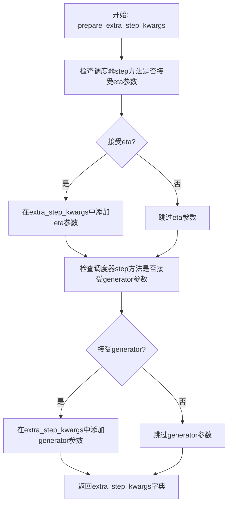

#### 带注释源码

```python
def prepare_extra_step_kwargs(self, generator, eta):
    # 准备调度器步骤的额外参数，因为并非所有调度器都具有相同的签名
    # eta (η) 仅在与 DDIMScheduler 一起使用，对于其他调度器将被忽略
    # eta 对应 DDIM 论文中的 η：https://huggingface.co/papers/2010.02502
    # 值应在 [0, 1] 范围内

    # 使用反射检查调度器的 step 方法是否接受 'eta' 参数
    accepts_eta = "eta" in set(inspect.signature(self.scheduler.step).parameters.keys())
    
    # 初始化额外的参数字典
    extra_step_kwargs = {}
    
    # 如果调度器接受 eta 参数，则将其添加到 extra_step_kwargs
    if accepts_eta:
        extra_step_kwargs["eta"] = eta

    # 检查调度器是否接受 generator 参数
    accepts_generator = "generator" in set(inspect.signature(self.scheduler.step).parameters.keys())
    
    # 如果调度器接受 generator 参数，则将其添加到 extra_step_kwargs
    if accepts_generator:
        extra_step_kwargs["generator"] = generator
    
    # 返回包含额外参数的字典
    return extra_step_kwargs
```


### `SanaSprintImg2ImgPipeline.get_timesteps`

根据给定的推理步数和强度参数，计算并返回调整后的时间步序列，用于图像到图像的转换过程。该方法通过强度参数确定需要保留的时间步数量，并相应地调整时间步数组和推理步数。

参数：

- `num_inference_steps`：`int`，总推理步数，用于生成图像的去噪步数
- `strength`：`float`，强度参数，控制在0.0到1.0之间，决定保留多少原始图像特征（值越大，保留越少）
- `device`：`torch.device`，用于指定张量操作的目标设备

返回值：`tuple[torch.Tensor, int]`，返回一个元组，包含调整后的时间步序列和实际推理步数

#### 流程图

```mermaid
flowchart TD
    A[开始 get_timesteps] --> B[计算 init_timestep<br/>min(num_inference_steps × strength, num_inference_steps)]
    B --> C[计算 t_start<br/>max(num_inference_steps - init_timestep, 0)]
    C --> D[从 scheduler.timesteps 切片<br/>timesteps[t_start × order :]]
    D --> E{scheduler 是否有<br/>set_begin_index?}
    E -->|是| F[设置 scheduler.begin_index<br/>t_start × order]
    E -->|否| G[跳过设置]
    F --> H[返回 timesteps 和<br/>num_inference_steps - t_start]
    G --> H
```

#### 带注释源码

```python
def get_timesteps(self, num_inference_steps, strength, device):
    """
    根据强度参数获取调整后的时间步。
    
    该方法用于图像到图像（img2img）任务中，根据strength参数决定
    从原始时间步序列的哪个位置开始采样，从而控制保留原图像特征的程度。
    
    Args:
        num_inference_steps: 推理步数
        strength: 强度参数，值在[0,1]之间
        device: 计算设备
    
    Returns:
        timesteps: 调整后的时间步张量
        num_inference_steps - t_start: 实际使用的推理步数
    """
    # 计算初始时间步数：根据强度参数和总推理步数计算
    # 如果strength=1.0，保留全部推理步数；如果strength=0.0，则不保留
    init_timestep = min(num_inference_steps * strength, num_inference_steps)

    # 计算起始索引：从时间步序列的末尾向前计算
    # strength越小，t_start越大，跳过的时间步越多
    t_start = int(max(num_inference_steps - init_timestep, 0))
    
    # 从scheduler中获取时间步序列，根据order进行切片
    # 跳过前面的t_start个时间步，保留后续的时间步用于去噪
    timesteps = self.scheduler.timesteps[t_start * self.scheduler.order :]
    
    # 如果scheduler支持，设置起始索引
    if hasattr(self.scheduler, "set_begin_index"):
        self.scheduler.set_begin_index(t_start * self.scheduler.order)

    # 返回调整后的时间步和实际推理步数
    return timesteps, num_inference_steps - t_start
```


### `SanaSprintImg2ImgPipeline.check_inputs`

该方法用于验证图像生成管道的输入参数有效性，确保所有必需的参数都符合要求，并在参数不符合规范时抛出详细的错误信息。

参数：

- `prompt`：`str | list[str] | None`，用户提供的文本提示词，用于指导图像生成
- `strength`：`float`，控制图像变强度的参数，范围应在 [0.0, 1.0] 之间
- `height`：`int`，生成图像的高度像素值，必须能被 32 整除
- `width`：`int`，生成图像的宽度像素值，必须能被 32 整除
- `num_inference_steps`：`int`，扩散模型的推理步数
- `timesteps`：`list[int] | None`，自定义的时间步列表，用于覆盖调度器的默认时间步策略
- `max_timesteps`：`float | None`，SCM 调度器使用的最大时间步值
- `intermediate_timesteps`：`float | None`，SCM 调度器使用的中间时间步值，仅在 num_inference_steps=2 时支持
- `callback_on_step_end_tensor_inputs`：`list[str] | None`，在每个推理步骤结束时回调的张量输入列表
- `prompt_embeds`：`torch.Tensor | None`，预生成的文本嵌入，可用于方便地调整文本输入
- `prompt_attention_mask`：`torch.Tensor | None`，文本嵌入的注意力掩码

返回值：`None`，该方法不返回任何值，通过抛出 `ValueError` 异常来处理无效输入

#### 流程图

```mermaid
flowchart TD
    A[开始 check_inputs] --> B{strength 在 [0,1] 范围?}
    B -->|否| C[抛出 ValueError: strength 超出范围]
    B -->|是| D{height 和 width 可被 32 整除?}
    D -->|否| E[抛出 ValueError: height/width 未对齐]
    D -->|是| F{callback_on_step_end_tensor_inputs 合法?}
    F -->|否| G[抛出 ValueError: 非法的 tensor inputs]
    F -->|是| H{prompt 和 prompt_embeds 同时提供?}
    H -->|是| I[抛出 ValueError: 只能提供其一]
    H -->|否| J{prompt 和 prompt_embeds 都未提供?}
    J -->|是| K[抛出 ValueError: 至少提供一个]
    J -->|否| L{prompt 类型合法?}
    L -->|否| M[抛出 ValueError: prompt 类型错误]
    L -->|是| N{prompt_embeds 提供但 prompt_attention_mask 未提供?}
    N -->|是| O[抛出 ValueError: 需要提供 attention_mask]
    N -->|否| P{timesteps 长度正确?}
    P -->|否| Q[抛出 ValueError: timesteps 长度错误]
    P -->|是| R{timesteps 和 max_timesteps 同时提供?}
    R -->|是| S[抛出 ValueError: 不能同时提供]
    R -->|否| T{两者都未提供?}
    T -->|是| U[抛出 ValueError: 至少提供一个]
    T -->|否| V{intermediate_timesteps 提供但 num_inference_steps != 2?}
    V -->|是| W[抛出 ValueError: 不支持中间时间步]
    V -->|否| X[验证通过]
    
    C --> Y[结束]
    E --> Y
    G --> Y
    I --> Y
    K --> Y
    M --> Y
    O --> Y
    Q --> Y
    S --> Y
    U --> Y
    W --> Y
    X --> Y
```

#### 带注释源码

```python
def check_inputs(
    self,
    prompt,                     # 用户文本提示，str或list或None
    strength,                   # 图像变换强度，float，需在[0,1]范围内
    height,                     # 输出图像高度，int，需能被32整除
    width,                      # 输出图像宽度，int，需能被32整除
    num_inference_steps,        # 推理步数，int
    timesteps,                  # 自定义时间步列表，list或None
    max_timesteps,              # 最大时间步，float或None
    intermediate_timesteps,     # 中间时间步，float或None
    callback_on_step_end_tensor_inputs=None,  # 回调张量输入列表
    prompt_embeds=None,         # 预计算的文本嵌入
    prompt_attention_mask=None, # 文本嵌入的注意力掩码
):
    # 验证 strength 参数必须在 [0.0, 1.0] 范围内
    if strength < 0 or strength > 1:
        raise ValueError(f"The value of strength should in [0.0, 1.0] but is {strength}")

    # 验证 height 和 width 必须能被 32 整除（VAE 要求）
    if height % 32 != 0 or width % 32 != 0:
        raise ValueError(f"`height` and `width` have to be divisible by 32 but are {height} and {width}.")

    # 验证回调函数使用的张量输入必须在允许列表中
    if callback_on_step_end_tensor_inputs is not None and not all(
        k in self._callback_tensor_inputs for k in callback_on_step_end_tensor_inputs
    ):
        raise ValueError(
            f"`callback_on_step_end_tensor_inputs` has to be in {self._callback_tensor_inputs}, but found {[k for k in callback_on_step_end_tensor_inputs if k not in self._callback_tensor_inputs]}"
        )

    # prompt 和 prompt_embeds 不能同时提供
    if prompt is not None and prompt_embeds is not None:
        raise ValueError(
            f"Cannot forward both `prompt`: {prompt} and `prompt_embeds`: {prompt_embeds}. Please make sure to"
            " only forward one of the two."
        )
    # 至少需要提供其中一个
    elif prompt is None and prompt_embeds is None:
        raise ValueError(
            "Provide either `prompt` or `prompt_embeds`. Cannot leave both `prompt` and `prompt_embeds` undefined."
        )
    # prompt 必须是 str 或 list 类型
    elif prompt is not None and (not isinstance(prompt, str) and not isinstance(prompt, list)):
        raise ValueError(f"`prompt` has to be of type `str` or `list` but is {type(prompt)}")

    # 如果提供了 prompt_embeds，必须同时提供 prompt_attention_mask
    if prompt_embeds is not None and prompt_attention_mask is None:
        raise ValueError("Must provide `prompt_attention_mask` when specifying `prompt_embeds`.")

    # 自定义 timesteps 的长度必须等于 num_inference_steps + 1
    if timesteps is not None and len(timesteps) != num_inference_steps + 1:
        raise ValueError("If providing custom timesteps, `timesteps` must be of length `num_inference_steps + 1`.")

    # 不能同时提供 timesteps 和 max_timesteps
    if timesteps is not None and max_timesteps is not None:
        raise ValueError("If providing custom timesteps, `max_timesteps` should not be provided.")

    # 至少需要提供 timesteps 或 max_timesteps 中的一个
    if timesteps is None and max_timesteps is None:
        raise ValueError("Should provide either `timesteps` or `max_timesteps`.")

    # intermediate_timesteps 仅在 num_inference_steps=2 时支持（SCM 调度器特性）
    if intermediate_timesteps is not None and num_inference_steps != 2:
        raise ValueError("Intermediate timesteps for SCM is not supported when num_inference_steps != 2.")
```


### `SanaSprintImg2ImgPipeline._text_preprocessing`

该方法用于对文本提示进行预处理，支持两种模式：若 `clean_caption` 为 `True`，则调用 `_clean_caption` 方法对文本进行深度清洗（包括移除 HTML 标签、URL、特殊字符、CJK 字符等）；否则仅将文本转换为小写并去除首尾空格。该方法是文本编码的前置步骤，确保输入模型的文本符合预期格式。

参数：

- `text`：`str | tuple | list`，需要预处理的文本输入，可以是单个字符串或字符串列表/元组
- `clean_caption`：`bool`，默认为 `False`，是否对文本进行深度清洗（需安装 beautifulsoup4 和 ftfy 依赖）

返回值：`list`，预处理后的文本列表

#### 流程图

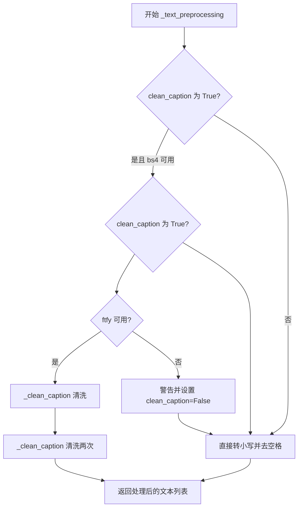

#### 带注释源码

```python
# Copied from diffusers.pipelines.deepfloyd_if.pipeline_if.IFPipeline._text_preprocessing
def _text_preprocessing(self, text, clean_caption=False):
    """
    对输入文本进行预处理。

    Args:
        text: 需要预处理的文本，支持字符串、列表或元组形式
        clean_caption: 是否进行深度清洗（默认False，仅转小写去空格）
    """
    # 检查 bs4 是否可用，若不可用则禁用清洗
    if clean_caption and not is_bs4_available():
        logger.warning(BACKENDS_MAPPING["bs4"][-1].format("Setting `clean_caption=True`"))
        logger.warning("Setting `clean_caption` to False...")
        clean_caption = False

    # 检查 ftfy 是否可用，若不可用则禁用清洗
    if clean_caption and not is_ftfy_available():
        logger.warning(BACKENDS_MAPPING["ftfy"][-1].format("Setting `clean_caption=True`"))
        logger.warning("Setting `clean_caption` to False...")
        clean_caption = False

    # 统一转换为列表形式处理
    if not isinstance(text, (tuple, list)):
        text = [text]

    # 定义内部处理函数
    def process(text: str):
        if clean_caption:
            # 调用深度清洗方法，清洗两次以确保彻底
            text = self._clean_caption(text)
            text = self._clean_caption(text)
        else:
            # 仅转小写并去除首尾空格
            text = text.lower().strip()
        return text

    # 对每个文本元素应用处理函数
    return [process(t) for t in text]
```


### `SanaSprintImg2ImgPipeline._clean_caption`

该方法是一个文本预处理函数，用于清理和规范化图像生成任务的标题文本（caption）。它通过URL移除、HTML标签清理、CJK字符过滤、特殊字符标准化、营销文本移除等一系列正则表达式操作，将原始文本转换为更适合AI模型处理的清洁格式。

参数：

- `self`：调用该方法的实例对象，包含类属性如 `bad_punct_regex`（预定义的危险标点符号正则表达式）
- `caption`：待清理的标题文本，支持任意可转换为字符串的对象

返回值：`str`，返回清理和规范化后的标题文本

#### 流程图

```mermaid
flowchart TD
    A[开始: 接收caption] --> B[转换为字符串 str(caption)]
    B --> C[URL解码: ul.unquote_plus]
    C --> D[去空格并转小写: strip + lower]
    D --> E[替换&lt;person&gt;为person]
    E --> F1[正则移除HTTP/HTTPS URL]
    F1 --> F2[正则移除www开头的URL]
    F2 --> F3[HTML解析提取纯文本]
    F3 --> F4[移除@昵称]
    F4 --> F5[过滤CJK统一汉字及扩展字符]
    F5 --> F6[统一各类破折号为-]
    F6 --> F7[统一引号为双引号或单引号]
    F7 --> F8[移除HTML实体如&amp; &quot]
    F8 --> F9[移除IP地址]
    F9 --> F10[移除文章ID和换行符]
    F10 --> F11[移除#标签和长数字串]
    F11 --> F12[移除文件名和扩展名]
    F12 --> F13[规范化连续引号和句点]
    F13 --> F14[使用bad_punct_regex过滤危险标点]
    F14 --> F15{检查连字符/下划线是否超过3个}
    F15 -->|是| F16[替换为空格]
    F15 -->|否| G[ftfy修复编码问题]
    G --> H[双重HTMLunescape解码]
    H --> I[移除字母数字混合标识符]
    I --> J[移除营销文本<br/>free shipping/download/click等]
    J --> K[移除图片文件扩展名词]
    K --> L[移除页码信息]
    L --> M[移除字母数字混合长串]
    M --> N[移除尺寸规格如1920x1080]
    N --> O[规范化冒号和标点周围空格]
    O --> P[压缩多余空格]
    P --> Q[去除首尾引号和特殊字符]
    Q --> R[最终strip返回]
```

#### 带注释源码

```python
def _clean_caption(self, caption):
    """
    清理和规范化输入的标题文本，用于图像生成任务。
    移除URL、HTML标签、CJK字符、特殊字符、营销文本等，保留核心描述内容。
    """
    # 1. 转换为字符串并去除URL编码
    caption = str(caption)
    caption = ul.unquote_plus(caption)  # 解码URL编码的字符串，如 %20 -> 空格
    
    # 2. 基础标准化：去除首尾空格并转小写
    caption = caption.strip().lower()
    
    # 3. 替换特定标记
    caption = re.sub("<person>", "person", caption)  # 将HTML标签&lt;person&gt;替换为person
    
    # 4. URL移除 - 使用正则表达式匹配HTTP/HTTPS URLs
    caption = re.sub(
        r"\b((?:https?:(?:\/{1,3}|[a-zA-Z0-9%])|[a-zA-Z0-9.\-]+[.](?:com|co|ru|net|org|edu|gov|it)[\w/-]*\b\/?(?!@)))",  # noqa
        "",
        caption,
    )
    
    # 5. URL移除 - 匹配www开头的URL
    caption = re.sub(
        r"\b((?:www:(?:\/{1,3}|[a-zA-Z0-9%])|[a-zA-Z0-9.\-]+[.](?:com|co|ru|net|org|edu|gov|it)[\w/-]*\b\/?(?!@)))",  # noqa
        "",
        caption,
    )
    
    # 6. HTML解析 - 使用BeautifulSoup提取纯文本，去除所有HTML标签
    caption = BeautifulSoup(caption, features="html.parser").text
    
    # 7. 移除社交媒体@昵称
    caption = re.sub(r"@[\w\d]+\b", "", caption)
    
    # 8. CJK字符过滤 - 移除CJK统一汉字及各种扩展字符
    # 31C0—31EF CJK Strokes (CJK笔画)
    caption = re.sub(r"[\u31c0-\u31ef]+", "", caption)
    # 31F0—31FF Katakana Phonetic Extensions (片假名语音扩展)
    caption = re.sub(r"[\u31f0-\u31ff]+", "", caption)
    # 3200—32FF Enclosed CJK Letters and Months (带圈CJK字母和月份)
    caption = re.sub(r"[\u3200-\u32ff]+", "", caption)
    # 3300—33FF CJK Compatibility (CJK兼容性)
    caption = re.sub(r"[\u3300-\u33ff]+", "", caption)
    # 3400—4DBF CJK Unified Ideographs Extension A (CJK统一表意文字扩展A)
    caption = re.sub(r"[\u3400-\u4dbf]+", "", caption)
    # 4DC0—4DFF Yijing Hexagram Symbols (易经六十四卦符号)
    caption = re.sub(r"[\u4dc0-\u4dff]+", "", caption)
    # 4E00—9FFF CJK Unified Ideographs (CJK统一表意文字)
    caption = re.sub(r"[\u4e00-\u9fff]+", "", caption)
    
    # 9. 破折号统一 - 将各类Unicode破折号统一转换为 ASCII 破折号 "-"
    caption = re.sub(
        r"[\u002D\u058A\u05BE\u1400\u1806\u2010-\u2015\u2E17\u2E1A\u2E3A\u2E3B\u2E40\u301C\u3030\u30A0\uFE31\uFE32\uFE58\uFE63\uFF0D]+",  # noqa
        "-",
        caption,
    )
    
    # 10. 引号标准化 - 统一各类引号为标准双引号或单引号
    caption = re.sub(r"[`´«»""¨]", '"', caption)  # 弯引号、书名号等转为双引号
    caption = re.sub(r"['']", "'", caption)       # 中文单引号转为单引号
    
    # 11. HTML实体移除 - 移除常见的HTML实体
    caption = re.sub(r"&quot;?", "", caption)  # &quot; 或 &quot
    caption = re.sub(r"&amp", "", caption)    # &amp
    
    # 12. IP地址移除
    caption = re.sub(r"\d{1,3}\.\d{1,3}\.\d{1,3}\.\d{1,3}", " ", caption)
    
    # 13. 文章ID移除 - 匹配如 "12:34 " 格式结尾
    caption = re.sub(r"\d:\d\d\s+$", "", caption)
    
    # 14. 换行符替换为空格
    caption = re.sub(r"\\n", " ", caption)
    
    # 15. 标签和数字移除
    caption = re.sub(r"#\d{1,3}\b", "", caption)   # 短标签如 #123
    caption = re.sub(r"#\d{5,}\b", "", caption)    # 长数字标签如 #12345
    caption = re.sub(r"\b\d{6,}\b", "", caption)    # 纯长数字如 123456
    
    # 16. 文件名移除 - 匹配常见图片和文件扩展名
    caption = re.sub(r"[\S]+\.(?:png|jpg|jpeg|bmp|webp|eps|pdf|apk|mp4)", "", caption)
    
    # 17. 连续符号规范化
    caption = re.sub(r"[\"\']{2,}", r'"', caption)  # 连续引号合并为单个双引号
    caption = re.sub(r"[\.]{2,}", r" ", caption)   # 连续句点替换为空格
    
    # 18. 使用类属性 bad_punct_regex 过滤危险标点符号
    # 该正则匹配: #®•©™&@·º½¾¿¡§~ ) ( ] [ } { | \ / * 等危险字符
    caption = re.sub(self.bad_punct_regex, r" ", caption)
    
    # 19. 移除 " . " 格式的孤立句点
    caption = re.sub(r"\s+\.\s+", r" ", caption)
    
    # 20. 连字符/下划线处理 - 如果文本中包含超过3个分隔符，则替换为空格
    # 例如: "this-is-my-cute-cat" -> "this is my cute cat"
    regex2 = re.compile(r"(?:\-|\_)")
    if len(re.findall(regex2, caption)) > 3:
        caption = re.sub(regex2, " ", caption)
    
    # 21. ftfy修复 - 自动修复常见的UTF-8编码问题和损坏文本
    caption = ftfy.fix_text(caption)
    
    # 22. HTML双重解码 - 处理多次HTML编码的情况
    caption = html.unescape(html.unescape(caption))
    
    # 23. 字母数字混合标识符移除 - 常见于产品编号、用户名等
    caption = re.sub(r"\b[a-zA-Z]{1,3}\d{3,15}\b", "", caption)  # 如 jc6640
    caption = re.sub(r"\b[a-zA-Z]+\d+[a-zA-Z]+\b", "", caption)  # 如 jc6640vc
    caption = re.sub(r"\b\d+[a-zA-Z]+\d+\b", "", caption)         # 如 6640vc231
    
    # 24. 营销文本移除
    caption = re.sub(r"(worldwide\s+)?(free\s+)?shipping", "", caption)  # 免费配送
    caption = re.sub(r"(free\s)?download(\sfree)?", "", caption)         # 免费下载
    caption = re.sub(r"\bclick\b\s(?:for|on)\s\w+", "", caption)         # 点击下载等
    
    # 25. 图片文件扩展名词移除 (作为独立词语)
    caption = re.sub(r"\b(?:png|jpg|jpeg|bmp|webp|eps|pdf|apk|mp4)(\simage[s]?)?", "", caption)
    
    # 26. 页码移除
    caption = re.sub(r"\bpage\s+\d+\b", "", caption)
    
    # 27. 复杂字母数字混合模式移除
    caption = re.sub(r"\b\d*[a-zA-Z]+\d+[a-zA-Z]+\d+[a-zA-Z\d]*\b", r" ", caption)
    
    # 28. 尺寸规格移除 - 匹配如 1920x1080, 1920×1080 等
    caption = re.sub(r"\b\d+\.?\d*[xх×]\d+\.?\d*\b", "", caption)
    
    # 29. 空格规范化
    caption = re.sub(r"\b\s+\:\s+", r": ", caption)     # 冒号周围空格规范化
    caption = re.sub(r"(\D[,\./])\b", r"\1 ", caption)  # 非数字后的标点后加空格
    caption = re.sub(r"\s+", " ", caption)              # 压缩多余空格
    
    # 30. 去除首尾特殊字符
    caption = caption.strip()
    caption = re.sub(r"^[\"\']([\w\W]+)[\"\']$", r"\1", caption)  # 去除首尾引号包裹
    caption = re.sub(r"^[\'\_,\-\:;]", r"", caption)               # 去除首部特殊字符
    caption = re.sub(r"[\'\_,\-\:\-\+]$", r"", caption)            # 去除尾部特殊字符
    caption = re.sub(r"^\.\S+$", "", caption)                      # 去除如 ".hidden" 格式
    
    # 31. 最终清理并返回
    return caption.strip()
```


### `SanaSprintImg2ImgPipeline.prepare_image`

该方法用于将输入图像预处理为适合模型处理的张量格式，支持多种输入类型（PyTorch张量或PIL图像），并执行尺寸调整、设备转移和数据类型转换等操作。

参数：

- `self`：`SanaSprintImg2ImgPipeline` 实例本身
- `image`：`PipelineImageInput`，输入图像，支持 PyTorch 张量或 PIL 图像等多种格式
- `width`：`int`，目标输出宽度（像素）
- `height`：`int`，目标输出高度（像素）
- `device`：`torch.device`，目标设备，用于将处理后的图像移至指定设备
- `dtype`：`torch.dtype`，目标数据类型，用于指定张量的数据类型

返回值：`torch.Tensor`，预处理后的图像张量，形状为 (B, C, H, W)

#### 流程图

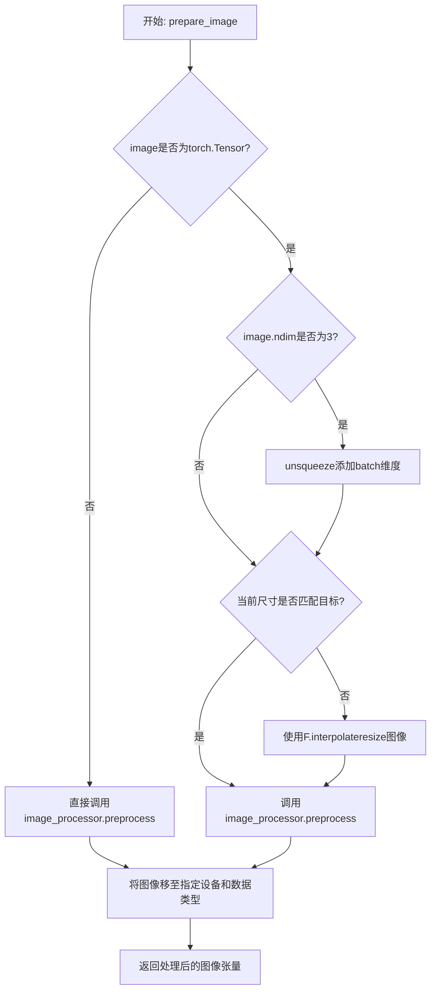

#### 带注释源码

```python
def prepare_image(
    self,
    image: PipelineImageInput,
    width: int,
    height: int,
    device: torch.device,
    dtype: torch.dtype,
):
    # 判断输入是否为 PyTorch 张量
    if isinstance(image, torch.Tensor):
        # 如果是 3 维张量 (C, H, W)，添加 batch 维度变为 4 维 (B, C, H, W)
        if image.ndim == 3:
            image = image.unsqueeze(0)
        
        # 检查当前图像尺寸是否与目标尺寸匹配
        # image.shape[2] 是高度，image.shape[3] 是宽度
        if image.shape[2] != height or image.shape[3] != width:
            # 使用双线性插值调整图像尺寸到目标大小
            image = F.interpolate(image, size=(height, width), mode="bilinear", align_corners=False)

        # 调用图像处理器进行预处理（归一化等操作）
        image = self.image_processor.preprocess(image, height=height, width=width)

    else:
        # 对于非张量输入（如 PIL Image），直接使用图像处理器预处理
        image = self.image_processor.preprocess(image, height=height, width=width)

    # 将处理后的图像转移到指定设备，并转换为指定数据类型
    image = image.to(device=device, dtype=dtype)

    return image
```


### `SanaSprintImg2ImgPipeline.prepare_latents`

该方法负责为图像到图像（img2img）扩散流水线准备噪声潜变量（latents）。它接收输入图像或已有latents，根据scheduler配置和timestep将图像编码为潜变量空间，并使用cosine-sine混合策略将图像潜变量与噪声结合，生成用于去噪过程的初始潜变量。

参数：

- `self`：`SanaSprintImg2ImgPipeline` 类的实例
- `image`：`torch.Tensor`，输入图像张量，用于编码为图像潜变量
- `timestep`：`torch.Tensor`，当前扩散时间步，用于控制噪声混合比例
- `batch_size`：`int`，批处理大小，决定生成图像的数量
- `num_channels_latents`：`int`，潜变量的通道数，通常由transformer配置决定
- `height`：`int`，目标图像高度
- `width`：`int`，目标图像宽度
- `dtype`：`torch.dtype`，潜变量的数据类型
- `device`：`torch.device`，计算设备（CPU/CUDA）
- `generator`：`torch.Generator` 或 `list[torch.Generator]`，可选的随机数生成器，用于确保可重复性
- `latents`：`torch.Tensor | None`，可选的预生成噪声潜变量，如果提供则直接返回

返回值：`torch.Tensor`，准备好的噪声潜变量，用于后续去噪步骤

#### 流程图

```mermaid
flowchart TD
    A[开始 prepare_latents] --> B{latents 是否已提供?}
    B -- 是 --> C[将 latents 移动到指定设备和数据类型]
    C --> Z[返回 latents]
    B -- 否 --> D[计算潜变量形状: batch_size x channels x height/vae_scale x width/vae_scale]
    D --> E{图像通道数是否等于 num_channels_latents?}
    E -- 否 --> F[使用 VAE 编码图像为潜变量]
    F --> G[应用缩放因子: image_latents * scaling_factor * sigma_data]
    E -- 是 --> H[直接使用输入的图像作为 image_latents]
    G --> I{批处理大小是否大于图像潜变量批次?}
    H --> I
    I -- 是且整除 --> J[复制图像潜变量以匹配批处理大小]
    I -- 是但不能整除 --> K[抛出 ValueError 异常]
    I -- 否 --> L[保持原样]
    J --> M
    L --> M
    K --> M
    M{generator 列表长度是否匹配批处理大小?}
    M -- 不匹配 --> N[抛出 ValueError 异常]
    M -- 匹配 --> O[生成随机噪声: randn_tensor * sigma_data]
    O --> P[计算混合潜变量: cos(timestep) * image_latents + sin(timestep) * noise]
    P --> Z
```

#### 带注释源码

```python
def prepare_latents(
    self, image, timestep, batch_size, num_channels_latents, height, width, dtype, device, generator, latents=None
):
    # 如果已提供预计算的 latents，直接返回并转换到目标设备和数据类型
    if latents is not None:
        return latents.to(device=device, dtype=dtype)

    # 计算潜变量的形状，考虑 VAE 缩放因子将像素空间转换为潜在空间
    shape = (
        batch_size,
        num_channels_latents,
        int(height) // self.vae_scale_factor,
        int(width) // self.vae_scale_factor,
    )

    # 检查输入图像通道数是否与目标潜变量通道数匹配
    if image.shape[1] != num_channels_latents:
        # 不匹配时，使用 VAE 将图像编码到潜在空间
        image = self.vae.encode(image).latent
        # 应用 VAE 缩放因子和 scheduler 的 sigma_data 进行归一化
        image_latents = image * self.vae.config.scaling_factor * self.scheduler.config.sigma_data
    else:
        # 匹配时，直接使用输入图像作为潜变量
        image_latents = image

    # 处理批处理大小与图像潜变量数量不一致的情况
    if batch_size > image_latents.shape[0] and batch_size % image_latents.shape[0] == 0:
        # 如果批处理大小是图像潜变量数量的整数倍，复制以扩展
        additional_image_per_prompt = batch_size // image_latents.shape[0]
        image_latents = torch.cat([image_latents] * additional_image_per_prompt, dim=0)
    elif batch_size > image_latents.shape[0] and batch_size % image_latents.shape[0] != 0:
        # 不能整除时抛出错误
        raise ValueError(
            f"Cannot duplicate `image` of batch size {image_latents.shape[0]} to {batch_size} text prompts."
        )
    else:
        # 批处理大小小于等于图像潜变量数量时，保持原样（添加单维度以便后续处理）
        image_latents = torch.cat([image_latents], dim=0)

    # 验证 generator 列表长度是否与批处理大小匹配
    if isinstance(generator, list) and len(generator) != batch_size:
        raise ValueError(
            f"You have passed a list of generators of length {len(generator)}, but requested an effective batch"
            f" size of {batch_size}. Make sure the batch size matches the length of the generators."
        )

    # 生成随机噪声，使用 scheduler 的 sigma_data 作为噪声幅度
    noise = randn_tensor(shape, generator=generator, device=device, dtype=dtype) * self.scheduler.config.sigma_data
    
    # 使用 cosine-sine 混合策略将图像潜变量与噪声结合
    # 这种方法遵循 SCM (Stochastic Correction Mechanism) 论文中的公式
    latents = torch.cos(timestep) * image_latents + torch.sin(timestep) * noise
    return latents
```


### `SanaSprintImg2ImgPipeline.guidance_scale`

这是一个属性 getter 方法，用于获取当前 pipelines 的引导比例（guidance scale）值。该属性返回在图像生成过程中使用的 guidance_scale 参数，该参数控制生成图像与文本提示的相关性强度。

参数：
- （无参数，这是一个属性 getter）

返回值：`float`，返回当前设置的引导比例值，用于控制 Classifier-Free Diffusion Guidance 的权重

#### 流程图

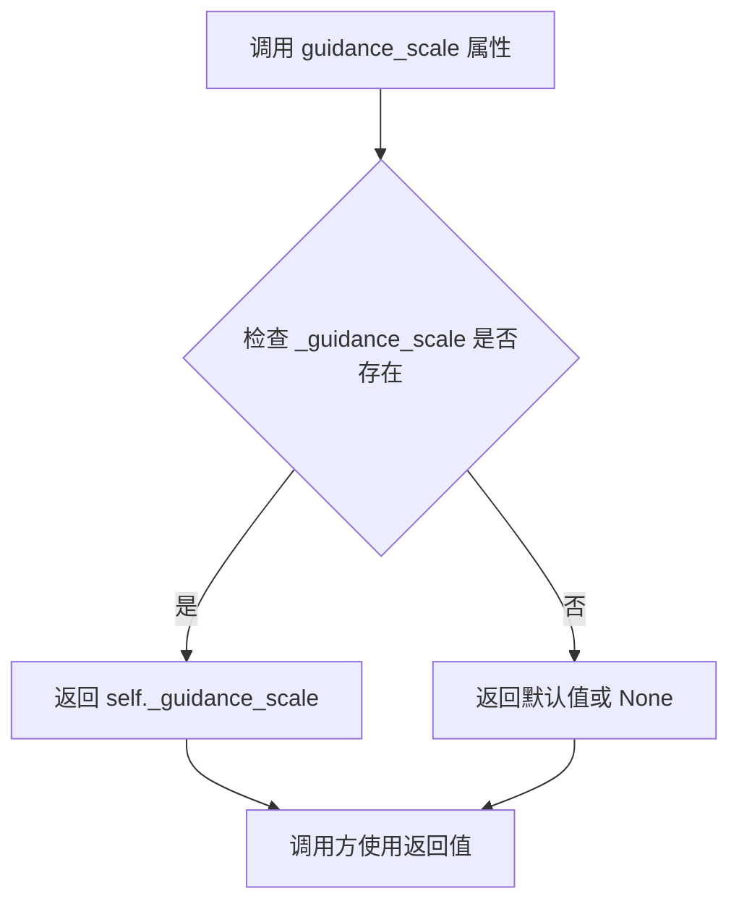

#### 带注释源码

```python
@property
def guidance_scale(self):
    r"""
    属性 getter: guidance_scale
    
    获取当前 pipelines 的引导比例（guidance scale）值。
    该参数控制生成图像与文本提示的相关性强度。
    
    引导比例的定义见论文: Classifier-Free Diffusion Guidance (https://arxiv.org/abs/2207.12598)
    在Imagen论文中对应方程2的权重w (https://arxiv.org/pdf/2205.11487.pdf)
    
    较高的 guidance_scale 会使生成的图像更紧密地关联文本提示，
    但通常会以较低的图像质量为代价。
    
    Returns:
        float: 当前使用的引导比例值
    """
    return self._guidance_scale
```

#### 相关上下文信息

**设置方式**：
该属性在 `__call__` 方法中被设置：

```python
# 在 __call__ 方法中
self._guidance_scale = guidance_scale
```

**参数来源**（`__call__` 方法的参数定义）：
```python
guidance_scale: float = 4.5,
```

**默认值**：4.5

**用途**：
- 在去噪循环中用于创建 guidance 张量：
```python
guidance = torch.full([1], guidance_scale, device=device, dtype=torch.float32)
guidance = guidance.expand(latents.shape[0]).to(prompt_embeds.dtype)
guidance = guidance * self.transformer.config.guidance_embeds_scale
```
- 传递给 transformer 模型用于条件生成


### `SanaSprintImg2ImgPipeline.attention_kwargs`

该属性是 `SanaSprintImg2ImgPipeline` 类的注意力参数属性，用于存储和访问传递给 `AttentionProcessor` 的关键字参数。该属性通过 `@property` 装饰器实现，提供只读的访问方式。在 pipeline 的推理过程中，这些参数会被传递到 transformer 模型中，用于控制注意力机制的行为。

参数： N/A（这是一个属性，不是方法）

返回值：`dict[str, Any] | None`，返回存储的注意力参数字典，如果未设置则返回 `None`。该字典通常包含如 `scale` 等用于控制 LoRA 权重的参数。

#### 流程图

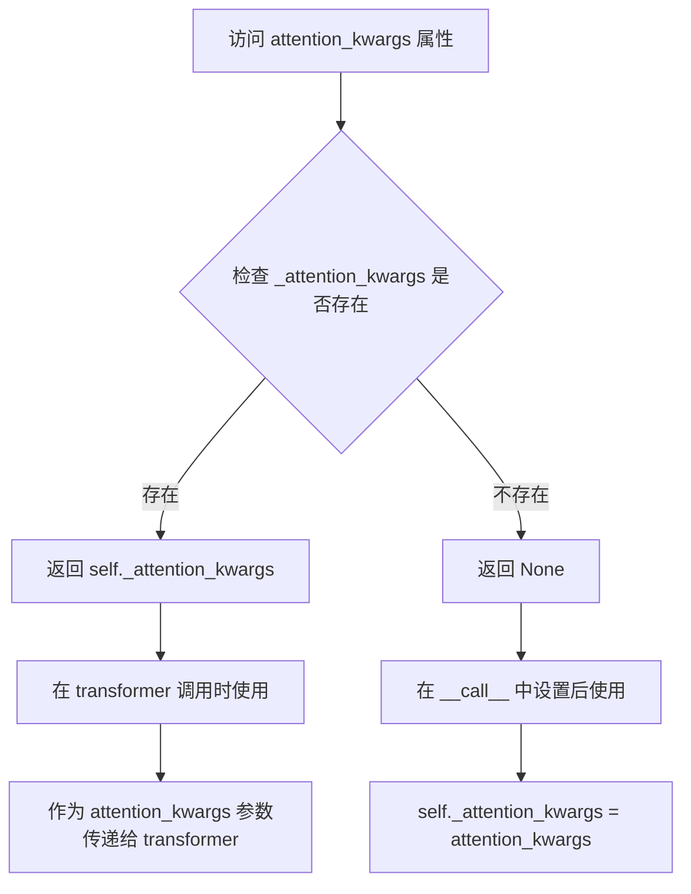

#### 带注释源码

```python
@property
def attention_kwargs(self):
    r"""
    属性用于存储传递给 AttentionProcessor 的额外关键字参数。
    
    该属性在 __call__ 方法中被设置：
        self._attention_kwargs = attention_kwargs
    
    并在 transformer 推理时被使用：
        self.transformer(
            ...
            attention_kwargs=self.attention_kwargs,
            ...
        )[0]
    
    常见的用途包括：
        - 传递 LoRA 权重缩放因子 (scale)
        - 传递自定义注意力处理器所需的参数
    
    Returns:
        dict[str, Any] | None: 包含注意力参数的字典，如果未设置则返回 None。
    """
    return self._attention_kwargs
```


### `SanaSprintImg2ImgPipeline.num_timesteps`

该属性是 `SanaSprintImg2ImgPipeline` 管道类的时间步数量属性，用于返回管道在推理过程中实际使用的时间步数量。它是一个只读属性，通过返回内部变量 `self._num_timesteps` 来获取值。

参数： 无

返回值：`int`，返回管道推理过程中使用的时间步数量。

#### 流程图

```mermaid
flowchart TD
    A[访问 num_timesteps 属性] --> B{检查 _num_timesteps 是否已设置}
    B -->|已设置| C[返回 self._num_timesteps]
    B -->|未设置| D[返回默认值或 None]
    
    E[__call__ 方法执行] --> F[设置 self._num_timesteps = len(timesteps)]
```

#### 带注释源码

```python
@property
def num_timesteps(self):
    r"""
    返回管道推理过程中的时间步数量。

    该属性是一个只读属性，返回在 __call__ 方法中设置的内部变量 _num_timesteps。
    该值在去噪循环开始前被设置，表示实际用于生成图像的时间步数量。

    返回值:
        int: 推理过程中使用的时间步数量
    """
    return self._num_timesteps
```

**上下文源码（在 `__call__` 方法中设置该值）：**

```python
# 7. Denoising loop
timesteps = timesteps[:-1]
num_warmup_steps = max(len(timesteps) - num_inference_steps * self.scheduler.order, 0)
# 设置时间步数量属性，在去噪循环前记录实际使用的时间步长度
self._num_timesteps = len(timesteps)

with self.progress_bar(total=num_inference_steps) as progress_bar:
    for i, t in enumerate(timesteps):
        # ... 去噪循环逻辑
```


### `SanaSprintImg2ImgPipeline.interrupt`

该属性是 `SanaSprintImg2ImgPipeline` 管道类的一个中断标志属性，用于返回内部 `_interrupt` 变量的状态。当在去噪循环中检查到此标志为 `True` 时，管道会跳过当前迭代，从而实现对推理过程的中断控制。

参数： 无

返回值：`bool`，返回当前的中断状态标志，指示管道是否被请求中断

#### 流程图

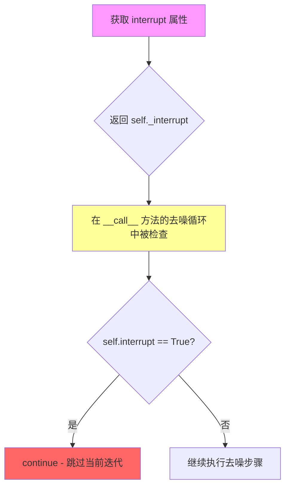

#### 带注释源码

```python
@property
def interrupt(self):
    r"""
    中断属性，用于控制管道推理过程的中断。
    
    该属性返回一个布尔值，表示管道是否被请求中断。
    在 __call__ 方法的去噪循环中，会检查此属性：
    
    ```python
    for i, t in enumerate(timesteps):
        if self.interrupt:
            continue
        # ... 继续执行去噪步骤
    ```
    
    当外部调用者将此标志设置为 True 时，管道将在下一个迭代开始时
    跳过剩余的去噪步骤，从而实现安全的中断机制。
    
    Returns:
        bool: 当前的中断状态标志
    """
    return self._interrupt
```


### `SanaSprintImg2ImgPipeline.__call__`

该方法是 `SanaSprintImg2ImgPipeline` 管道的主推理入口，接收文本提示和（可选的）初始图像，执行基于 SANA-Sprint 模型的去噪过程，生成符合文本描述的图像或对输入图像进行风格迁移。

参数：

- `prompt`：`str | list[str] | None`，用于引导图像生成的文本提示。如果未定义，则必须传入 `prompt_embeds`。
- `num_inference_steps`：`int`，默认值 20，去噪步数。更多的步数通常能获得更高质量的图像，但推理速度会更慢。
- `timesteps`：`list[int] | None`，自定义时间步列表。如果未定义，则使用默认行为。必须按降序排列。
- `max_timesteps`：`float`，默认值 1.57080，SCM 调度器使用的最大时间步值。
- `intermediate_timesteps`：`float`，默认值 1.3，SCM 调度器使用的中间时间步值（仅在 `num_inference_steps=2` 时使用）。
- `guidance_scale`：`float`，默认值 4.5，分类器自由扩散引导（CFG）比例。数值越高，生成的图像与文本提示的关联性越强，通常以牺牲图像质量为代价。
- `image`：`PipelineImageInput | None`，输入图像，用于图像到图像（img2img）生成。
- `strength`：`float`，默认值 0.6，变换强度。控制原始图像在生成过程中的保留程度，值越大，变化越大。
- `num_images_per_prompt`：`int | None`，默认值 1，每个提示词生成的图像数量。
- `height`：`int`，默认值 1024，生成图像的高度（像素）。
- `width`：`int`，默认值 1024，生成图像的宽度（像素）。
- `eta`：`float`，默认值 0.0，对应 DDIM 论文中的参数 eta。仅适用于 DDIMScheduler。
- `generator`：`torch.Generator | list[torch.Generator] | None`，随机数生成器，用于确保生成的可确定性。
- `latents`：`torch.Tensor | None`，预生成的噪声潜在向量。如果未提供，将使用随机生成器采样生成。
- `prompt_embeds`：`torch.Tensor | None`，预生成的文本嵌入。用于方便地调整文本输入，例如提示词加权。
- `prompt_attention_mask`：`torch.Tensor | None`，文本嵌入的预生成注意力掩码。
- `output_type`：`str | None`，默认值 `"pil"`，生成图像的输出格式。可选 "pil" (PIL.Image.Image) 或 "np.array"。
- `return_dict`：`bool`，默认值 `True`，是否返回 `SanaPipelineOutput` 而不是元组。
- `clean_caption`：`bool`，默认值 `False`，是否在创建嵌入前清理标题。需要安装 `beautifulsoup4` 和 `ftfy`。
- `use_resolution_binning`：`bool`，默认值 `True`，如果为 True，请求的高度和宽度首先使用 `ASPECT_RATIO_1024_BIN` 映射到最接近的分辨率。生成的潜在向量解码为图像后，会调整回请求的分辨率。用于生成非方形图像。
- `attention_kwargs`：`dict[str, Any] | None`，如果指定，将传递给 `AttentionProcessor`。
- `callback_on_step_end`：`Callable[[int, int], None] | None`，在去噪过程中的每一步结束时调用的函数。
- `callback_on_step_end_tensor_inputs`：`list[str]`，默认值 `["latents"]`，`callback_on_step_end` 函数的张量输入列表。
- `max_sequence_length`：`int`，默认值 300，与 `prompt` 一起使用的最大序列长度。
- `complex_human_instruction`：`list[str]`，复杂人类注意力指令列表，用于增强提示词。

返回值：`SanaPipelineOutput | tuple`，如果 `return_dict` 为 `True`，返回 `SanaPipelineOutput`，否则返回一个元组，第一个元素是生成的图像列表。

#### 流程图

```mermaid
flowchart TD
    A[Start __call__] --> B{Inputs Valid?}
    B -- No --> C[Raise Error]
    B -- Yes --> D[Resolution Binning Check]
    D --> E[Check Inputs]
    E --> F[Set Attributes<br/>_guidance_scale, _attention_kwargs, _interrupt]
    F --> G[Determine Batch Size]
    G --> H[Prepare Image]
    H --> I[Encode Prompt]
    I --> J[Retrieve Timesteps]
    J --> K[Get Timesteps based on Strength]
    K --> L[Prepare Latents]
    L --> M[Prepare Extra Step Kwargs]
    M --> N{Denoising Loop}
    N -->|Iteration i| O[Expand Timestep]
    O --> P[Compute SCM Timestep]
    P --> Q[Predict Noise]
    Q --> R[Compute Denoised Latent]
    R --> S[Scheduler Step]
    S --> T{Callback on Step End?}
    T -- Yes --> U[Execute Callback]
    T -- No --> V{Last Step or Warmup?}
    U --> V
    V -- Yes --> W[Update Progress Bar]
    V --> N
    N -->|Done| X[Finalize Latents]
    X --> Y{Output Type == Latent?}
    Y -- Yes --> Z[Return Latents]
    Y -- No --> AA[VAE Decode]
    AA --> BB[Resize/Crop if Binning]
    BB --> CC[Postprocess Image]
    CC --> DD[Offload Models]
    DD --> EE[Return Output]
```

#### 带注释源码

```python
@torch.no_grad()
@replace_example_docstring(EXAMPLE_DOC_STRING)
def __call__(
    self,
    prompt: str | list[str] = None,
    num_inference_steps: int = 2,
    timesteps: list[int] = None,
    max_timesteps: float = 1.57080,
    intermediate_timesteps: float = 1.3,
    guidance_scale: float = 4.5,
    image: PipelineImageInput = None,
    strength: float = 0.6,
    num_images_per_prompt: int | None = 1,
    height: int = 1024,
    width: int = 1024,
    eta: float = 0.0,
    generator: torch.Generator | list[torch.Generator] | None = None,
    latents: torch.Tensor | None = None,
    prompt_embeds: torch.Tensor | None = None,
    prompt_attention_mask: torch.Tensor | None = None,
    output_type: str | None = "pil",
    return_dict: bool = True,
    clean_caption: bool = False,
    use_resolution_binning: bool = True,
    attention_kwargs: dict[str, Any] | None = None,
    callback_on_step_end: Callable[[int, int], None] | None = None,
    callback_on_step_end_tensor_inputs: list[str] = ["latents"],
    max_sequence_length: int = 300,
    complex_human_instruction: list[str] = [...],
) -> SanaPipelineOutput | tuple:
    """
    执行图像生成的主入口函数。
    """
    # 1. 检查回调张量输入是否有效
    if isinstance(callback_on_step_end, (PipelineCallback, MultiPipelineCallbacks)):
        callback_on_step_end_tensor_inputs = callback_on_step_end.tensor_inputs

    # 2. 检查输入并处理分辨率分箱
    if use_resolution_binning:
        # 根据 transformer 的 sample_size 选择宽高比_bins
        if self.transformer.config.sample_size == 32:
            aspect_ratio_bin = ASPECT_RATIO_1024_BIN
        else:
            raise ValueError("Invalid sample size")
        
        # 记录原始尺寸，用于后处理
        orig_height, orig_width = height, width
        
        # 将用户请求的尺寸映射到最接近的 bin 分辨率
        height, width = self.image_processor.classify_height_width_bin(height, width, ratios=aspect_ratio_bin)

    # 3. 验证输入参数的有效性
    self.check_inputs(
        prompt=prompt,
        strength=strength,
        height=height,
        width=width,
        num_inference_steps=num_inference_steps,
        timesteps=timesteps,
        max_timesteps=max_timesteps,
        intermediate_timesteps=intermediate_timesteps,
        callback_on_step_end_tensor_inputs=callback_on_step_end_tensor_inputs,
        prompt_embeds=prompt_embeds,
        prompt_attention_mask=prompt_attention_mask,
    )

    # 4. 设置内部状态
    self._guidance_scale = guidance_scale
    self._attention_kwargs = attention_kwargs
    self._interrupt = False

    # 5. 确定批处理大小
    if prompt is not None and isinstance(prompt, str):
        batch_size = 1
    elif prompt is not None and isinstance(prompt, list):
        batch_size = len(prompt)
    else:
        # 如果没有 prompt，则依赖 prompt_embeds 的批次大小
        batch_size = prompt_embeds.shape[0]

    # 获取执行设备
    device = self._execution_device
    
    # 提取 LORA 缩放因子
    lora_scale = self.attention_kwargs.get("scale", None) if self.attention_kwargs is not None else None

    # 6. 预处理输入图像 (img2img 模式)
    init_image = self.prepare_image(image, width, height, device, self.vae.dtype)

    # 7. 编码输入提示词
    (
        prompt_embeds,
        prompt_attention_mask,
    ) = self.encode_prompt(
        prompt,
        num_images_per_prompt=num_images_per_prompt,
        device=device,
        prompt_embeds=prompt_embeds,
        prompt_attention_mask=prompt_attention_mask,
        clean_caption=clean_caption,
        max_sequence_length=max_sequence_length,
        complex_human_instruction=complex_human_instruction,
        lora_scale=lora_scale,
    )

    # 8. 准备时间步
    timesteps, num_inference_steps = retrieve_timesteps(
        self.scheduler,
        num_inference_steps,
        device,
        timesteps,
        sigmas=None,
        max_timesteps=max_timesteps,
        intermediate_timesteps=intermediate_timesteps,
    )
    
    # 重置调度器的起始索引
    if hasattr(self.scheduler, "set_begin_index"):
        self.scheduler.set_begin_index(0)

    # 9. 根据 strength 调整时间步 (用于 img2img)
    timesteps, num_inference_steps = self.get_timesteps(num_inference_steps, strength, device)
    if num_inference_steps < 1:
        raise ValueError(
            f"After adjusting the num_inference_steps by strength parameter: {strength}, the number of pipeline"
            f"steps is {num_inference_steps} which is < 1 and not appropriate for this pipeline."
        )
    
    # 选取第一个时间步用于后续潜在向量初始化
    latent_timestep = timesteps[:1]

    # 10. 准备初始潜在向量
    latent_channels = self.transformer.config.in_channels
    latents = self.prepare_latents(
        init_image,
        latent_timestep,
        batch_size * num_images_per_prompt,
        latent_channels,
        height,
        width,
        torch.float32,
        device,
        generator,
        latents,
    )

    # 11. 准备引导向量
    guidance = torch.full([1], guidance_scale, device=device, dtype=torch.float32)
    guidance = guidance.expand(latents.shape[0]).to(prompt_embeds.dtype)
    guidance = guidance * self.transformer.config.guidance_embeds_scale

    # 12. 准备额外的调度器参数
    extra_step_kwargs = self.prepare_extra_step_kwargs(generator, eta)

    # 13. 去噪循环 (Denoising Loop)
    timesteps = timesteps[:-1]  # 移除最后一个时间步
    num_warmup_steps = max(len(timesteps) - num_inference_steps * self.scheduler.order, 0)
    self._num_timesteps = len(timesteps)

    # 获取 transformer 的数据类型
    transformer_dtype = self.transformer.dtype
    
    # 进度条
    with self.progress_bar(total=num_inference_steps) as progress_bar:
        for i, t in enumerate(timesteps):
            # 检查是否中断
            if self.interrupt:
                continue

            # 扩展时间步以匹配批次维度
            timestep = t.expand(latents.shape[0])
            
            # 标准化潜在向量
            latents_model_input = latents / self.scheduler.config.sigma_data

            # 计算 SCM (Sana Control Mechanism) 时间步
            scm_timestep = torch.sin(timestep) / (torch.cos(timestep) + torch.sin(timestep))

            scm_timestep_expanded = scm_timestep.view(-1, 1, 1, 1)
            
            # 潜在模型输入的变换
            latent_model_input = latents_model_input * torch.sqrt(
                scm_timestep_expanded**2 + (1 - scm_timestep_expanded) ** 2
            )

            # 预测噪声
            noise_pred = self.transformer(
                latent_model_input.to(dtype=transformer_dtype),
                encoder_hidden_states=prompt_embeds.to(dtype=transformer_dtype),
                encoder_attention_mask=prompt_attention_mask,
                guidance=guidance,
                timestep=scm_timestep,
                return_dict=False,
                attention_kwargs=self.attention_kwargs,
            )[0]

            # 噪声预测的后处理 (与 SCM 相关)
            noise_pred = (
                (1 - 2 * scm_timestep_expanded) * latent_model_input
                + (1 - 2 * scm_timestep_expanded + 2 * scm_timestep_expanded**2) * noise_pred
            ) / torch.sqrt(scm_timestep_expanded**2 + (1 - scm_timestep_expanded) ** 2)
            
            # 反标准化噪声预测
            noise_pred = noise_pred.float() * self.scheduler.config.sigma_data

            # 计算上一步的潜在向量: x_t -> x_t-1
            latents, denoised = self.scheduler.step(
                noise_pred, timestep, latents, **extra_step_kwargs, return_dict=False
            )

            # 回调处理
            if callback_on_step_end is not None:
                callback_kwargs = {}
                for k in callback_on_step_end_tensor_inputs:
                    callback_kwargs[k] = locals()[k]
                callback_outputs = callback_on_step_end(self, i, t, callback_kwargs)

                # 更新 latents 和 prompt_embeds (允许回调修改它们)
                latents = callback_outputs.pop("latents", latents)
                prompt_embeds = callback_outputs.pop("prompt_embeds", prompt_embeds)

            # 进度条更新
            if i == len(timesteps) - 1 or ((i + 1) > num_warmup_steps and (i + 1) % self.scheduler.order == 0):
                progress_bar.update()

            # XLA 优化 (如果可用)
            if XLA_AVAILABLE:
                xm.mark_step()

    # 14. 后处理：最终反标准化
    latents = denoised / self.scheduler.config.sigma_data
    
    # 15. 解码潜在向量为图像
    if output_type == "latent":
        # 如果只需要潜在向量，直接返回
        image = latents
    else:
        # VAE 解码
        latents = latents.to(self.vae.dtype)
        
        # 处理 OOM 错误
        torch_accelerator_module = getattr(torch, get_device(), torch.cuda)
        oom_error = (
            torch.OutOfMemoryError
            if is_torch_version(">=", "2.5.0")
            else torch_accelerator_module.OutOfMemoryError
        )
        try:
            image = self.vae.decode(latents / self.vae.config.scaling_factor, return_dict=False)[0]
        except oom_error as e:
            warnings.warn(
                f"{e}. \n"
                f"Try to use VAE tiling for large images. For example: \n"
                f"pipe.vae.enable_tiling(tile_sample_min_width=512, tile_sample_min_height=512)"
            )
        
        # 如果使用了分辨率分箱，需要将图像调整回原始尺寸
        if use_resolution_binning:
            image = self.image_processor.resize_and_crop_tensor(image, orig_width, orig_height)

    # 16. 后处理图像格式
    if not output_type == "latent":
        image = self.image_processor.postprocess(image, output_type=output_type)

    # 17. 释放模型钩子
    self.maybe_free_model_hooks()

    # 18. 返回结果
    if not return_dict:
        return (image,)

    return SanaPipelineOutput(images=image)
```

## 关键组件


### 张量索引与惰性加载

**select_index 张量索引机制**: 用于从 prompt embeddings 中提取特定长度的张量切片，通过 `select_index = [0] + list(range(-max_length + 1, 0))` 构建索引数组，实现从序列开头到末尾的滑动窗口选择，支持变长 prompt 处理。

**惰性回调张量输入 (_callback_tensor_inputs)**: 定义为类级别列表 `["latents", "prompt_embeds"]`，仅在 `callback_on_step_end` 被触发时才实际访问对应的张量数据，实现按需加载而非预加载。

### 反量化支持

**多精度 dtype 转换管道**: 代码中包含多处 dtype 转换逻辑以支持混合精度推理——`prompt_embeds` 从文本编码器输出后需转为目标 dtype 和 device；`latents` 在去噪循环中从 float32 转换为 `transformer_dtype` 进行推理，再转回 `vae.dtype` 进行解码；通过 `self.vae.scale_factor` 和 `sigma_data` 实现 latent space 的缩放与反缩放。

**VAE 解码精度管理**: 在最终解码阶段将 latents 显式转换为 VAE 的 dtype (`latents = latents.to(self.vae.dtype)`)，并通过 `scaling_factor` 进行反量化操作以确保与 VAE 训练时的一致性。

### 量化策略

**LoRA 动态量化缩放**: 通过 `scale_lora_layers()` 和 `unscale_lora_layers()` 在推理时动态调整 LoRA 权重 scale，配合 `USE_PEFT_BACKEND` 判断是否启用 PEFT 后端的量化支持，实现推理时的量化参数注入。

**VAE 内存优化量化策略**: 提供 `enable_vae_slicing()` 和 `enable_vae_tiling()` 方法将 VAE 解码分片处理，降低峰值显存占用；通过 `torch.OutOfMemoryError` 捕获在低显存设备上的溢出错误并建议启用 tiling 方案。

**Guidance Embedding 缩放策略**: 根据 `transformer.config.guidance_embeds_scale` 对 classifier-free guidance 值进行缩放，支持 transformer 模型内部可能存在的量化 embedding 机制。

**Scheduler sigma_data 归一化**: 使用 `scheduler.config.sigma_data` (sigma_data=0.5) 对 latents 进行归一化和反归一化，作为隐式的量化/反量化边界值确保数值稳定性。


## 问题及建议


### 已知问题

-   **大量代码复制**：多处方法带有"Copied from"注释，表明从其他pipeline直接复制代码，导致代码重复和维护困难
-   **注释掉的代码未清理**：`prepare_latents`方法中有一行被注释掉的代码`# latents = latents * self.scheduler.config.sigma_data`，表明开发过程中可能有遗留代码
-   **`__call__`方法过长**：主生成方法包含超过200行代码，包含多个逻辑块，难以阅读和维护
-   **硬编码的默认值**：`complex_human_instruction`参数有长串硬编码的默认指令，这些指令应该可以通过配置文件或外部参数传入
-   **冗余的变量赋值**：在`encode_prompt`方法中重复计算`dtype`，以及`prepare_latents`中部分逻辑冗余
-   **XLA支持检测不一致**：虽然导入了XLA_AVAILABLE标志，但在某些地方使用`if XLA_AVAILABLE`进行条件检查，可能导致在某些环境下行为不一致
-   **类型提示不完整**：部分方法参数缺少类型提示，如`prepare_image`方法的`image`参数类型注解不够精确

### 优化建议

-   **提取公共逻辑到基类**：将复制的方法（如`encode_prompt`、`prepare_extra_step_kwargs`、`check_inputs`等）提取到公共基类中，减少代码重复
-   **拆分`__call__`方法**：将主方法拆分为多个私有方法，如`_prepare_timesteps`、`_denoise_step`、`_decode_latents`等，提高可读性
-   **移除注释代码**：删除所有被注释掉的代码行，保持代码库清洁
-   **优化参数设计**：将`complex_human_instruction`的默认值移至配置文件或构造函数参数，减少`__call__`方法的签名复杂度
-   **改进错误处理**：在VAE解码OOM时提供更详细的内存建议，并考虑添加内存重试机制
-   **添加torch.compile支持**：在适当位置添加`@torch.compile`装饰器以提升推理性能
-   **统一变量命名和类型提示**：完善所有方法参数的类型注解，提高代码可维护性

## 其它


### 设计目标与约束

本管道实现基于SANA-Sprint模型的图像到图像（Img2Img）扩散生成功能，核心目标是根据文本提示和初始图像生成目标图像。设计约束包括：1) 支持768x768至1024x1024分辨率的图像生成；2) 遵循DiffusionPipeline标准接口规范；3) 集成LoRA权重加载能力；4) 支持VAE切片和平铺以处理高分辨率图像；5) 采用SCM（Synchronized Conservative Update Method）调度器实现快速收敛（默认仅需2步推理）。

### 错误处理与异常设计

管道实现了多层次错误处理机制：**输入验证层**通过`check_inputs`方法验证strength参数范围([0,1])、图像尺寸可被32整除、timesteps与num_inference_steps一致性、prompt与prompt_embeds互斥关系等；**资源错误处理**在VAE解码阶段捕获OutOfMemoryError并提示用户启用VAE tiling；**调度器兼容性检查**通过inspect检查set_timesteps方法是否支持自定义timesteps或sigmas参数；**数值稳定性检查**确保num_inference_steps调整后不低于1步。

### 数据流与状态机

管道执行遵循严格的状态转换流程：**初始状态**→**输入预处理**（图像resize/编码、prompt编码）→**潜在空间初始化**（prepare_latents生成初始噪声）→**去噪循环**（迭代执行transformer预测→噪声调度→潜在更新）→**VAE解码**→**后处理输出**。关键状态节点包括：1) init_image（预处理后图像tensor）；2) prompt_embeds（文本嵌入向量）；3) latents（潜在空间表示）；4) denoised（去噪后潜在表示）；5) image（最终输出）。状态转换由scheduler.step()和transformer()两个核心操作驱动。

### 外部依赖与接口契约

管道依赖以下核心组件：**Gemma2PreTrainedModel**用于文本编码；**AutoencoderDC**用于VAE编解码；**SanaTransformer2DModel**作为去噪骨干网络；**DPMSolverMultistepScheduler**提供扩散调度；**PixArtImageProcessor**处理图像预处理和后处理。输入契约要求：prompt支持str/list类型；image支持PipelineImageInput（Tensor或PIL.Image）；height/width必须为32的倍数。输出契约返回SanaPipelineOutput包含images列表，或根据return_dict参数返回tuple。

### 性能优化建议

当前实现已包含多项优化：1) VAE切片(slicing)和平铺(tiling)减少显存占用；2) 模型CPU卸载序列配置；3) XLA加速支持（is_torch_xla_available）；4) 梯度禁用(@torch.no_grad())。进一步优化方向：1) prompt_embeds缓存机制避免重复编码；2) 混合精度推理（当前部分使用bfloat16）；3) transformer输出dtype转换优化；4) 批处理时预先分配tensor内存。

### 安全性考虑

管道通过`_text_preprocessing`和`_clean_caption`方法对用户输入进行清洗，移除HTML标签、URL、特殊字符、CJK扩展字符等潜在恶意内容。但存在安全改进空间：1) prompt_embeds长度限制(max_sequence_length=300)可进一步收紧；2) 复杂人类指令(complex_human_instruction)参数需验证不包含敏感指令注入；3) 图像输入建议增加病毒/恶意内容扫描层。

### 测试策略建议

应覆盖以下测试场景：1) 单元测试验证各方法（encode_prompt、prepare_latents、check_inputs）正确性；2) 集成测试验证完整管道生成流程；3) 输入边界测试（极端分辨率、最小/最大num_inference_steps）；4) OOM场景测试（超大图像触发tiling）；5) LoRA加载功能测试；6) 调度器兼容性测试（不同scheduler类型）。基准测试应测量生成质量（FID/CLIP Score）和性能（推理时间、显存占用）。

### 配置管理与参数说明

关键配置参数通过以下方式管理：1) 模型配置通过DiffusionPipeline的register_modules注册；2) 图像分辨率映射使用ASPECT_RATIO_1024_BIN查找表；3) VAE缩放因子根据vae.config.encoder_block_out_channels动态计算；4) 调度器配置（sigma_data、guidance_embeds_scale）从模型配置读取。默认参数：num_inference_steps=2、guidance_scale=4.5、strength=0.6、max_timesteps=1.57080。

### 版本兼容性考虑

代码显式检查多项版本兼容性：1) torch版本检测（is_torch_version）用于适配OutOfMemoryError类型；2) XLA库可用性检测；3) 可选依赖bs4和ftfy的可用性检查。建议在文档中明确最低依赖版本要求：torch>=2.0、transformers>=4.30、diffusers>=0.20，以避免运行时兼容性错误。

### 资源管理与内存优化

管道实现三级内存管理：1) 模型CPU卸载（model_cpu_offload_seq定义卸载顺序）；2) VAE切片模式（enable_vae_slicing分片解码）；3) VAE平铺模式（enable_vae_tiling瓦片式处理）。潜在优化：1) 及时释放prompt_embeds中间变量；2) 梯度检查点技术应用于transformer；3) 混合推理时动态调整批处理大小。

### 并发与批处理支持

管道支持以下并发能力：1) num_images_per_prompt参数实现单提示多图生成；2) prompt列表输入实现批量处理；3) generator列表支持多随机种子控制。注意事项：batch_size * num_images_per_prompt需与generator长度匹配；图像批处理时需处理batch_size不能整除image_latents.shape[0]的边界情况。

    