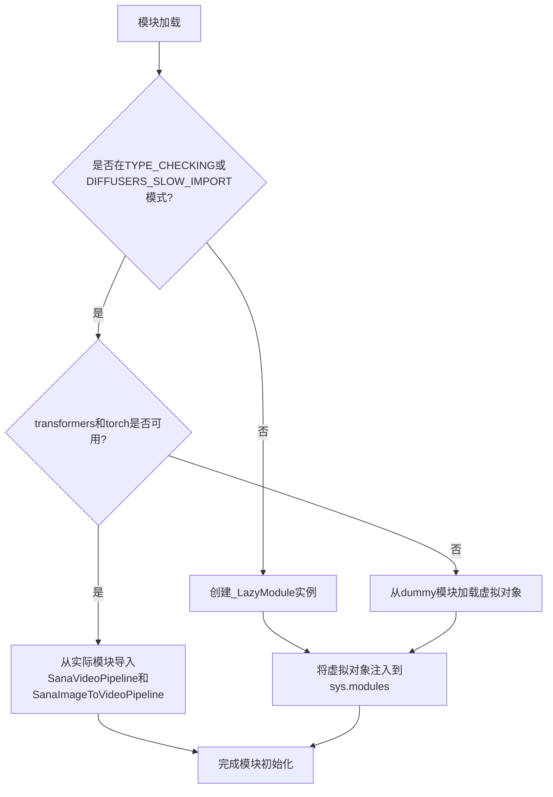
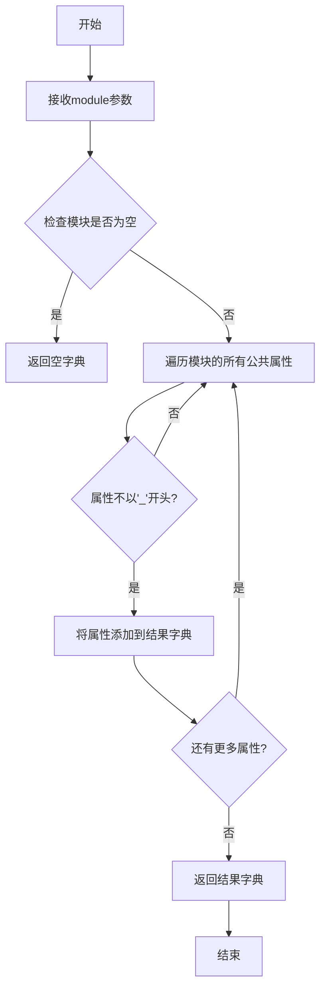
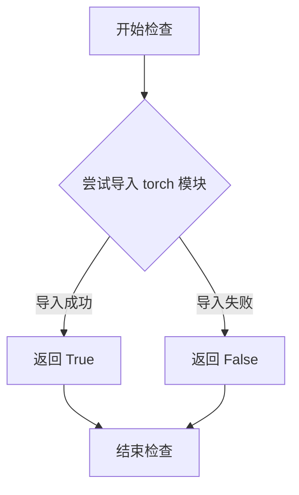
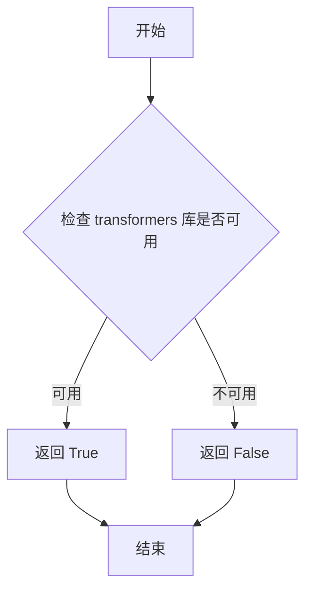

# `diffusers\src\diffusers\pipelines\sana_video\__init__.py` 详细设计文档

这是一个Diffusers库的Sana视频生成Pipeline的模块初始化文件，通过延迟导入(Lazy Import)机制和可选依赖检查，实现仅在transformers和torch可用时动态加载SanaVideoPipeline和SanaImageToVideoPipeline，否则使用虚拟对象替代。

## 整体流程



## 类结构

```
此文件为模块初始化文件，无类层次结构
使用_LazyModule实现延迟加载
使用get_objects_from_module获取虚拟对象
```

## 全局变量及字段


### `_dummy_objects`
    
存储虚拟对象的字典，当可选依赖不可用时使用，用于保持模块接口完整性

类型：`dict`
    


### `_import_structure`
    
定义模块导入结构的字典，映射子模块名称到其导出的符号列表

类型：`dict`
    


### `DIFFUSERS_SLOW_IMPORT`
    
从utils导入的标志，控制是否启用延迟导入模式

类型：`bool`
    


### `OptionalDependencyNotAvailable`
    
自定义异常类，表示可选依赖项不可用时抛出

类型：`Exception class`
    


### `_LazyModule`
    
从utils导入的延迟加载模块类，用于实现模块的懒加载机制

类型：`class`
    


### `get_objects_from_module`
    
从utils导入的函数，根据模块获取其中的对象集合

类型：`function`
    


### `is_torch_available`
    
从utils导入的函数，检查PyTorch框架是否可用

类型：`function`
    


### `is_transformers_available`
    
从utils导入的函数，检查Transformers库是否可用

类型：`function`
    


### `name`
    
循环迭代变量，表示_dummy_objects字典中的键（对象名称）

类型：`str`
    


### `value`
    
循环迭代变量，表示_dummy_objects字典中的值（虚拟对象实例）

类型：`object`
    


### `__name__`
    
Python内置变量，存储当前模块的完整 qualified 名称

类型：`str`
    


### `__file__`
    
Python内置变量，存储当前模块文件的绝对或相对路径

类型：`str`
    


### `__spec__`
    
Python内置变量，存储当前模块的规格说明对象（ModuleSpec实例）

类型：`ModuleSpec`
    


    

## 全局函数及方法


### `get_objects_from_module`

该函数是Diffusers库utils模块中的工具函数，用于从指定模块中动态提取所有公共对象（如类、函数等），并将其转换为字典格式返回。通常用于延迟加载（lazy loading）机制中，从dummy模块提取虚拟对象以便在依赖不可用时保持API完整性。

参数：

- `module`：`module`，需要提取对象的Python模块对象

返回值：`dict`，返回模块中所有公共对象的字典，键为对象名称，值为对象本身

#### 流程图



#### 带注释源码

```python
def get_objects_from_module(module):
    """
    从给定模块中提取所有公共对象（不以'_'开头的属性）
    并返回名称-对象键值对字典
    
    参数:
        module: Python模块对象
        
    返回:
        dict: 包含模块中所有公共对象的字典
    """
    # 初始化结果字典
    result = {}
    
    # 遍历模块的所有属性
    for attr_name in dir(module):
        # 过滤掉私有属性（以'_'开头的属性）
        if not attr_name.startswith('_'):
            # 从模块中获取属性值
            attr_value = getattr(module, attr_name)
            # 添加到结果字典
            result[attr_name] = attr_value
    
    return result
```

> **注意**：由于`get_objects_from_module`函数定义在`...utils`模块中（非本文件内），以上源码是基于其使用方式和函数名推断的典型实现。该函数在本代码片段中的具体调用场景是将`dummy_torch_and_transformers_objects`模块中的所有dummy对象提取出来，用于在可选依赖不可用时填充`_dummy_objects`字典，从而保持API的完整性。


### `is_torch_available`

该函数是用于检查当前环境中 PyTorch 库是否可用的工具函数。它通过尝试导入 PyTorch 模块来判断环境是否具备运行依赖，若可用返回 `True`，否则返回 `False`。

参数：该函数无参数

返回值：`bool`，返回 `True` 表示 PyTorch 可用，返回 `False` 表示不可用

#### 流程图



#### 带注释源码

```python
# 从上层目录的 utils 模块导入 is_torch_available 函数
# 该函数定义在 diffusers 库的 utils.py 中
from ...utils import (
    DIFFUSERS_SLOW_IMPORT,
    OptionalDependencyNotAvailable,
    _LazyModule,
    get_objects_from_module,
    is_torch_available,        # 外部函数：检查 PyTorch 是否可用
    is_transformers_available, # 外部函数：检查 Transformers 是否可用
)

# 初始化空字典用于存储虚拟对象和导入结构
_dummy_objects = {}
_import_structure = {}

try:
    # 检查条件：Transformers 和 PyTorch 都必须可用
    if not (is_transformers_available() and is_torch_available()):
        # 如果任一依赖不可用，抛出异常
        raise OptionalDependencyNotAvailable()
except OptionalDependencyNotAvailable:
    # 捕获异常，导入虚拟对象作为占位符
    from ...utils import dummy_torch_and_transformers_objects  # noqa F403
    # 更新虚拟对象字典
    _dummy_objects.update(get_objects_from_module(dummy_torch_and_transformers_objects))
else:
    # 两个依赖都可用时，定义实际的导入结构
    _import_structure["pipeline_sana_video"] = ["SanaVideoPipeline"]
    _import_structure["pipeline_sana_video_i2v"] = ["SanaImageToVideoPipeline"]

# TYPE_CHECKING 或 DIFFUSERS_SLOW_IMPORT 时的类型检查导入
if TYPE_CHECKING or DIFFUSERS_SLOW_IMPORT:
    try:
        # 再次检查依赖可用性（仅用于类型检查）
        if not (is_transformers_available() and is_torch_available()):
            raise OptionalDependencyNotAvailable()
    except OptionalDependencyNotAvailable:
        # 导入虚拟对象用于类型检查
        from ...utils.dummy_torch_and_transformers_objects import *
    else:
        # 导入实际的 Pipeline 类用于类型提示
        from .pipeline_sana_video import SanaVideoPipeline
        from .pipeline_sana_video_i2v import SanaImageToVideoPipeline
else:
    # 运行时使用延迟模块加载
    import sys
    # 将当前模块替换为 _LazyModule 实例
    sys.modules[__name__] = _LazyModule(
        __name__,
        globals()["__file__"],
        _import_structure,
        module_spec=__spec__,
    )
    # 将虚拟对象设置到模块属性中
    for name, value in _dummy_objects.items():
        setattr(sys.modules[__name__], name, value)
```


### `is_transformers_available`

该函数用于检查当前环境中是否安装了 `transformers` 库，通常在存在可选依赖项的场景下使用，用于条件性地导入模块或创建虚拟对象。

参数：

- （无参数）

返回值：`bool`，返回 `True` 表示 `transformers` 库可用，返回 `False` 表示不可用。

#### 流程图



#### 带注释源码

```
# 该函数定义在 ...utils 模块中，此处为导入使用
# 源码位置：...utils

def is_transformers_available():
    """
    检查 transformers 库是否可用。
    
    返回:
        bool: 如果 transformers 库已安装则返回 True，否则返回 False。
    """
    try:
        import transformers
        return True
    except ImportError:
        return False

# 在当前文件中的使用示例：
if not (is_transformers_available() and is_torch_available()):
    raise OptionalDependencyNotAvailable()
```

> **注意**：由于 `is_transformers_available` 函数定义在 `...utils` 模块中，当前代码文件仅导入了该函数。上述源码是根据常见实现模式推断的参考实现。


### `setattr` (内置函数)

设置指定对象的对象属性的值。

参数：

- `sys.modules[__name__]`：`object`，要设置属性的目标模块对象
- `name`：`str`，从 `_dummy_objects` 字典迭代获取的属性名称
- `value`：从 `_dummy_objects` 字典迭代获取的属性值，即待注入的虚拟对象

返回值：`None`，无返回值，直接修改目标对象的属性

#### 流程图

```mermaid
flowchart TD
    A[开始] --> B{遍历 _dummy_objects.items}
    B -->|获取 name, value| C[调用 setattr sys.modules[__name__], name, value]
    C --> D{是否还有更多项}
    D -->|是| B
    D -->|否| E[结束]
    
    F[_dummy_objects] --> B
    G[sys.modules[__name__]] --> C
```

#### 带注释源码

```python
# 遍历所有需要注入的虚拟对象
for name, value in _dummy_objects.items():
    # 使用 setattr 将虚拟对象设置为当前模块的属性
    # 参数1: sys.modules[__name__] - 当前模块对象
    # 参数2: name - 虚拟对象的名称
    # 参数3: value - 虚拟对象本身
    setattr(sys.modules[__name__], name, value)
```

#### 详细说明

这段代码中的 `setattr` 用于实现懒加载模块的依赖注入机制：

1. 当可选依赖（torch 和 transformers）不可用时，`_dummy_objects` 会填充虚拟对象
2. 通过 `setattr` 将这些虚拟对象动态绑定到当前模块，使得在未安装依赖时，代码仍能正常导入但调用时会抛出预期的错误
3. 这是 Diffusers 库处理可选依赖的常用模式，确保模块结构一致性同时提供友好的错误提示

## 关键组件


### LazyModule 懒加载模块

用于延迟导入模块，实现按需加载，减少启动时间。通过 `_LazyModule` 类和 `sys.modules` 动态替换模块实现。

### 可选依赖检查

检查 `torch` 和 `transformers` 是否可用，如果不可用则使用虚拟对象填充，避免导入错误。

### 虚拟对象管理

通过 `_dummy_objects` 字典存储不可用依赖的替代对象，使用 `get_objects_from_module` 从虚拟模块获取。

### 导入结构定义

`_import_structure` 字典定义了模块的导出结构，包含 `SanaVideoPipeline` 和 `SanaImageToVideoPipeline` 两个管道类。

### TYPE_CHECKING 条件导入

在类型检查或慢导入模式下，直接导入实际的管道类；否则使用懒加载模块。

### SanaVideoPipeline 视频生成管道

Sana 模型的视频生成管道，用于根据文本或图像生成视频内容。

### SanaImageToVideoPipeline 图像到视频管道

Sana 模型的图像到视频转换管道，用于将静态图像转换为动态视频内容。


## 问题及建议


### 已知问题

-   **重复的条件检查**：代码在两处（try-except 块和 TYPE_CHECKING 条件块）重复检查 `is_transformers_available() and is_torch_available()`，违反了 DRY 原则，增加维护成本。
-   **全局变量初始化与赋值分离**：`_import_structure` 和 `_dummy_objects` 在顶部定义但未初始化内容，后续在条件分支中动态修改，导致代码执行顺序依赖性强，难以追踪状态。
-   **通配符导入**：`from ...utils.dummy_torch_and_transformers_objects import *` 使用通配符导入，违反了显式导入的最佳实践，降低了代码的可读性和可维护性。
-   **魔法字符串**：管道名称 `"pipeline_sana_video"` 和 `"pipeline_sana_video_i2v"` 以硬编码字符串形式出现，缺乏常量定义，不利于后续修改和类型检查。
-   **异常处理过于宽泛**：仅捕获 `OptionalDependencyNotAvailable` 异常，未处理其他可能的导入异常（如 `ModuleNotFoundError`），可能导致隐藏的错误。
-   **模块动态替换**：通过 `setattr` 动态设置模块属性可能与静态分析工具冲突，降低了 IDE 的代码补全和类型检查能力。

### 优化建议

-   将条件检查提取为单独的函数或常量，例如 `def _check_dependencies()` 或 `REQUIRED_DEPS_AVAILABLE`，避免重复代码。
-   使用常量定义管道名称，例如 `PIPELINE_CLASSES = {"pipeline_sana_video": [...], ...}`，提高可维护性。
-   将 `_import_structure` 的初始化与赋值合并，在模块顶部直接完成初始化，避免后续分散赋值。
-   将通配符导入改为显式导入，列出具体需要导入的类或函数，提高代码清晰度。
-   添加更完善的异常处理机制，记录或报告除 `OptionalDependencyNotAvailable` 之外的其他导入错误。
-   考虑使用类型注解和 `__all__` 列表显式声明导出的公共接口，减少对动态属性设置的依赖。


## 其它


### 设计目标与约束

该模块旨在实现Diffusers库中Sana视频流水线的延迟加载机制，通过可选依赖检查（torch和transformers）实现条件导入，确保在缺少依赖时模块仍可被导入但功能受限。设计遵循LazyModule模式以优化导入性能，同时保持与Diffusers框架的模块注册标准一致。

### 错误处理与异常设计

模块使用`OptionalDependencyNotAvailable`异常处理可选依赖缺失情况。当torch或transformers任一不可用时，捕获异常并从dummy模块加载空对象填充`_dummy_objects`，确保模块接口完整性，避免运行时导入错误。全局异常处理通过try-except块实现条件分支，避免过多嵌套。

### 数据流与状态机

模块初始化数据流如下：
1. 定义空的`_dummy_objects`和`_import_structure`字典
2. 检查torch和transformers可用性
3. 若可用，将SanaVideoPipeline和SanaImageToVideoPipeline加入导入结构
4. 若不可用，从dummy模块获取空对象
5. 根据导入模式（TYPE_CHECK或DIFFUSERS_SLOW_IMPORT）决定是否立即导入或使用LazyModule延迟加载
6. 最终将模块注册到sys.modules

### 外部依赖与接口契约

**外部依赖：**
- `torch`（可选）：深度学习框架
- `transformers`（可选）：Hugging Face Transformers库
- `diffusers.utils`：包含_LazyModule、OptionalDependencyNotAvailable等工具

**接口契约：**
- 导出模块：`pipeline_sana_video`（SanaVideoPipeline类）、`pipeline_sana_video_i2v`（SanaImageToVideoPipeline类）
- 延迟加载：模块在非TYPE_CHECK模式下使用_LazyModule实现按需加载
- 兼容性保证：即使依赖缺失，模块仍可导入但返回dummy对象

### 版本兼容性考虑

模块使用TYPE_CHECKING标志支持类型检查器的静态分析需求，在类型检查期间执行完整导入以提供类型信息。DIFFUSERS_SLOW_IMPORT标志允许开发者在调试时禁用延迟加载行为。

### 模块化与可扩展性

_import_structure字典采用键值对结构，便于后续添加新的流水线类。只需在对应的try-except块中添加新的类名即可扩展功能，无需修改核心逻辑。_LazyModule的module_spec参数确保模块的完整元数据被保留。

### 性能优化点

1. 延迟加载：非调试模式下模块内容仅在首次访问时加载，减少启动时间
2. 条件导入：避免导入不存在的模块导致的ImportError
3. Dummy对象占位：保持API稳定性，用户尝试访问不可用类时获得明确的对象而非 AttributeError

### 测试覆盖建议

应验证以下场景：依赖全部可用时的正常导入、仅torch可用时的行为、仅transformers可用时的行为、两者均不可用时的行为、TYPE_CHECK模式下的导入、LazyModule的实际延迟加载效果。

    