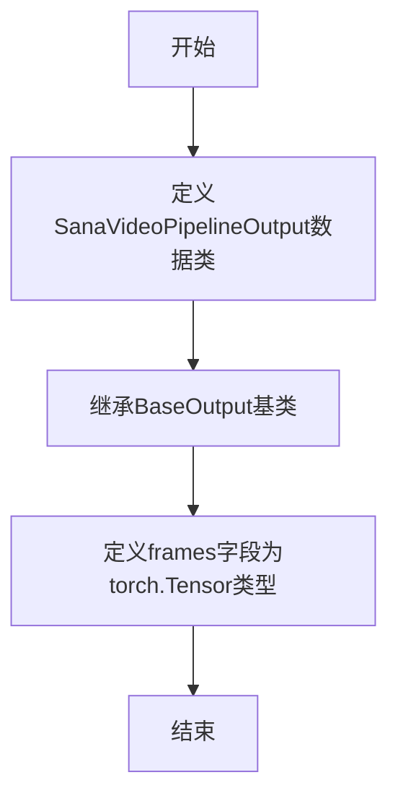

# `diffusers\src\diffusers\pipelines\sana_video\pipeline_output.py` 详细设计文档

这是一个Sana-Video管道的输出类，定义了视频生成结果的封装结构，包含去噪后的视频帧数据，支持torch.Tensor、numpy数组或PIL图像列表多种格式。

## 整体流程



## 类结构

```
BaseOutput (抽象基类)
└── SanaVideoPipelineOutput (视频管道输出类)
```

## 全局变量及字段


### `SanaVideoPipelineOutput.frames`
    
视频输出帧数据，可以是嵌套列表(batch_size, num_frames)、NumPy数组或Torch张量

类型：`torch.Tensor`
    
    

## 全局函数及方法


## 关键组件


### SanaVideoPipelineOutput 类

SanaVideoPipelineOutput 是一个数据类，用于封装 Sana-Video 管道的输出结果，包含视频帧数据。

### frames 字段

frames 是输出类的主字段，支持三种类型的视频帧数据：torch.Tensor（PyTorch 张量）、np.ndarray（NumPy 数组）或 list[list[PIL.Image.Image]]（PIL 图像列表），用于存储批量视频的帧序列。

### BaseOutput 基类

BaseOutput 是从 ...utils 导入的基础输出类，为 SanaVideoPipelineOutput 提供基础结构和接口支持。

### 多格式支持特性

该输出类支持多种视频帧格式，体现了框架的灵活性和兼容性，能够适应不同的下游处理需求。

### 类型提示设计

通过类型注解明确支持三种数据格式，体现了 Python 类型提示的最佳实践，提升了代码的可读性和 IDE 支持。


## 问题及建议


### 已知问题

-   **类型注解与文档描述不一致**：文档字符串中说明 `frames` 可以是 `torch.Tensor`、`np.ndarray` 或 `list[list[PIL.Image.Image]]` 三种类型，但实际类型注解仅声明为 `torch.Tensor`，存在类型安全隐患
-   **缺乏数据验证机制**：`SanaVideoPipelineOutput` 作为数据类，没有在初始化时对 `frames` 的有效性进行校验（如形状维度、是否为 None 等）
-   **缺少形状约束说明**：文档中提到 `(batch_size, num_frames, channels, height, width)` 的形状约定，但未在代码中明确体现或约束
-   **间接导入路径不清晰**：使用 `from ...utils` 的相对导入方式，依赖上级模块的 `utils` 包，导入路径不够直观

### 优化建议

-   **修正类型注解**：将类型提示修改为 `Union[torch.Tensor, np.ndarray, list[list[PIL.Image.Image]]]` 以匹配文档描述，或精简文档说明仅支持 `torch.Tensor`
-   **添加 `__post_init__` 验证方法**：在数据类中实现初始化后验证逻辑，检查 `frames` 不为 None、维度符合预期等
-   **添加形状元数据字段**：可考虑增加 `num_frames`、`height`、`width` 等元数据字段，便于调用方快速获取视频属性
-   **明确导入路径**：考虑使用绝对导入或添加类型注解以提高导入路径的可读性和可维护性
-   **添加默认值处理**：若 `frames` 可能为可选值，应为其提供合理的默认值或使用 `Optional` 类型注解


## 其它


### 一段话描述

SanaVideoPipelineOutput 是一个用于 Sana-Video 视频生成管道的数据类，封装了管道输出的视频帧结果，支持 torch.Tensor、np.ndarray 或 list[list[PIL.Image.Image]] 三种格式。

### 文件的整体运行流程

该文件是一个简单的数据类定义模块，不涉及复杂的运行流程。模块被导入时，Python 解释器会执行 dataclass 装饰器，生成 __init__、__repr__、__eq__ 等特殊方法。当 SanaVideoPipelineOutput 被实例化时，会创建一个包含 frames 属性的数据对象，供上游管道类使用。

### 类的详细信息

### 类字段

#### frames

- **类型**: torch.Tensor
- **描述**: 视频输出帧，可以是 batch_size × num_frames × channels × height × width 形状的张量

### 类方法

该类由 @dataclass 装饰器自动生成以下方法：

#### __init__

- **参数**: self, frames: torch.Tensor
- **返回值**: None
- **描述**: 初始化 SanaVideoPipelineOutput 对象

#### __repr__

- **参数**: self
- **返回值**: str
- **描述**: 返回类的可读字符串表示

#### __eq__

- **参数**: self, other
- **返回值**: bool
- **描述**: 比较两个 SanaVideoPipelineOutput 对象是否相等

#### as_dict

- **参数**: self
- **返回值**: dict
- **描述**: 将对象转换为字典格式

### 全局变量和全局函数信息

该模块未定义全局变量或全局函数。

### 关键组件信息

#### @dataclass 装饰器

Python 内置装饰器，自动生成 __init__、__repr__、__eq__ 等方法

#### BaseOutput

上游基类，定义了管道输出的通用接口

### 潜在的技术债务或优化空间

1. **类型支持不完整**: 文档注释中提到 frames 可以是 torch.Tensor、np.ndarray 或 list[list[PIL.Image.Image]]，但当前类型注解仅支持 torch.Tensor，建议使用 Union 类型或泛型来增强类型安全性
2. **缺少验证逻辑**: 当前类没有对 frames 的形状、维度进行校验，无法在创建时捕获维度错误
3. **序列化支持缺失**: 未实现 to_json、from_json 等方法，不便于跨进程传递或持久化存储

### 其它项目

### 设计目标与约束

- **设计目标**: 提供统一且类型安全的视频管道输出结构
- **约束**: 继承自 BaseOutput，需保持接口兼容性

### 错误处理与异常设计

- 当前类不涉及运行时错误处理，错误校验应由调用方在管道中完成

### 数据流与状态机

- 该类作为数据容器，不涉及状态机逻辑

### 外部依赖与接口契约

- **依赖**: torch、dataclasses、BaseOutput
- **接口**: 供管道类实例化并返回结果

### 性能考虑

- dataclass 使用 __slots__ 可进一步优化内存占用（当前未使用）

### 安全性考虑

- 无敏感数据处理，当前设计无安全风险

### 可扩展性设计

- 可通过继承该类添加额外字段（如元数据、时间戳等）

### 测试策略

- 应测试 frames 类型兼容性、形状校验、序列化/反序列化

### 版本兼容性

- 依赖 torch，需确保与主流 PyTorch 版本兼容


    