# `diffusers\src\diffusers\pipelines\sana_video\pipeline_sana_video.py` 详细设计文档

这是一个基于Sana架构的文本到视频生成管道(Text-to-Video Generation Pipeline)，它使用Gemma2文本编码器编码提示词，通过SanaVideoTransformer3DModel进行去噪处理，最后利用VAE(变分自编码器)将潜在表示解码为视频帧。该管道支持分类器自由引导(CFG)、LoRA微调、分辨率分箱(Resolution Binning)和自定义时间步等高级功能。

## 整体流程

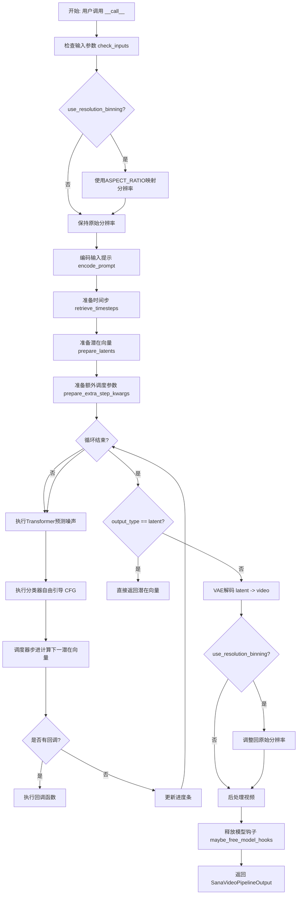

## 类结构

```
DiffusionPipeline (基类)
├── SanaLoraLoaderMixin (LoRA加载混合类)
└── SanaVideoPipeline (主管道类)
```

## 全局变量及字段


### `ASPECT_RATIO_480_BIN`
    
480p分辨率的宽高比映射表，用于将请求的宽高映射到最近的有效分辨率

类型：`dict`
    


### `ASPECT_RATIO_720_BIN`
    
720p分辨率的宽高比映射表，用于将请求的宽高映射到最近的有效分辨率

类型：`dict`
    


### `XLA_AVAILABLE`
    
指示是否安装了PyTorch XLA，用于支持TPU等加速器

类型：`bool`
    


### `logger`
    
用于记录SanaVideoPipeline运行时的日志信息

类型：`logging.Logger`
    


### `EXAMPLE_DOC_STRING`
    
SanaVideoPipeline的示例文档字符串，包含使用该管道生成视频的示例代码

类型：`str`
    


### `bad_punct_regex`
    
用于匹配和过滤特殊标点符号的正则表达式

类型：`re.Pattern`
    


### `retrieve_timesteps`
    
从调度器获取时间步的辅助函数，支持自定义时间步和sigma

类型：`function`
    


### `SanaVideoPipeline.tokenizer`
    
用于将文本提示tokenize成模型可处理的输入序列

类型：`GemmaTokenizer | GemmaTokenizerFast`
    


### `SanaVideoPipeline.text_encoder`
    
将tokenized的文本编码为文本嵌入向量，供transformer使用

类型：`Gemma2PreTrainedModel`
    


### `SanaVideoPipeline.vae`
    
变分自编码器，用于在潜在空间和像素空间之间进行视频的编码和解码

类型：`AutoencoderDC | AutoencoderKLWan`
    


### `SanaVideoPipeline.transformer`
    
条件Transformer模型，在去噪过程中根据文本嵌入预测噪声

类型：`SanaVideoTransformer3DModel`
    


### `SanaVideoPipeline.scheduler`
    
DPM多步调度器，控制扩散模型的去噪过程和时间步采样

类型：`DPMSolverMultistepScheduler`
    


### `SanaVideoPipeline.vae_scale_factor_temporal`
    
VAE在时间维度上的缩放因子，用于计算潜在帧数

类型：`int`
    


### `SanaVideoPipeline.vae_scale_factor_spatial`
    
VAE在空间维度上的缩放因子，用于计算潜在空间尺寸

类型：`int`
    


### `SanaVideoPipeline.vae_scale_factor`
    
VAE的综合缩放因子，默认为空间缩放因子

类型：`int`
    


### `SanaVideoPipeline.video_processor`
    
视频处理器，用于视频的后处理、分辨率调整和格式转换

类型：`VideoProcessor`
    


### `SanaVideoPipeline.bad_punct_regex`
    
类级别的正则表达式，用于在文本预处理中过滤特殊标点

类型：`re.Pattern`
    


### `SanaVideoPipeline.model_cpu_offload_seq`
    
定义模型组件在CPU offload时的卸载顺序

类型：`str`
    


### `SanaVideoPipeline._callback_tensor_inputs`
    
回调函数可访问的张量输入列表，用于监控去噪过程

类型：`list`
    


### `SanaVideoPipeline._guidance_scale`
    
分类器自由引导的权重，控制文本提示对生成结果的影响程度

类型：`float`
    


### `SanaVideoPipeline._attention_kwargs`
    
传递给注意力处理器的额外关键字参数

类型：`dict`
    


### `SanaVideoPipeline._interrupt`
    
中断标志，用于在去噪循环中提前终止生成过程

类型：`bool`
    


### `SanaVideoPipeline._num_timesteps`
    
记录推理过程中的总时间步数

类型：`int`
    
    

## 全局函数及方法


### `retrieve_timesteps`

该函数是 SanaVideoPipeline 的辅助函数，用于调用调度器的 `set_timesteps` 方法并从中获取 timesteps，支持自定义 timesteps 或 sigmas，任何额外的 kwargs 都会被传递给调度器的 `set_timesteps` 方法。

参数：

- `scheduler`：`SchedulerMixin`，调度器对象，用于获取 timesteps
- `num_inference_steps`：`int | None`，生成样本时使用的扩散步数，如果使用此参数，则 `timesteps` 必须为 `None`
- `device`：`str | torch.device | None`，timesteps 要移动到的设备，如果为 `None`，则不移动 timesteps
- `timesteps`：`list[int] | None`，用于覆盖调度器时间步间隔策略的自定义 timesteps，如果传递此参数，则 `num_inference_steps` 和 `sigmas` 必须为 `None`
- `sigmas`：`list[float] | None`，用于覆盖调度器时间步间隔策略的自定义 sigmas，如果传递此参数，则 `num_inference_steps` 和 `timesteps` 必须为 `None`

返回值：`tuple[torch.Tensor, int]`，元组第一个元素是调度器的时间步调度，第二个元素是推理步数

#### 流程图

```mermaid
flowchart TD
    A[开始] --> B{检查timesteps和sigmas是否同时传递}
    B -->|是| C[抛出ValueError: 只能传递timesteps或sigmas之一]
    B -->|否| D{检查timesteps是否提供}
    D -->|是| E[检查scheduler.set_timesteps是否接受timesteps参数]
    E -->|否| F[抛出ValueError: 当前调度器不支持自定义timesteps]
    E -->|是| G[调用scheduler.set_timesteps设置timesteps]
    G --> H[获取scheduler.timesteps]
    H --> I[计算num_inference_steps = len(timesteps)]
    D -->|否| J{检查sigmas是否提供}
    J -->|是| K[检查scheduler.set_timesteps是否接受sigmas参数]
    K -->|否| L[抛出ValueError: 当前调度器不支持自定义sigmas]
    K -->|是| M[调用scheduler.set_timesteps设置sigmas]
    M --> N[获取scheduler.timesteps]
    N --> O[计算num_inference_steps = len(timesteps)]
    J -->|否| P[调用scheduler.set_timesteps使用num_inference_steps]
    P --> Q[获取scheduler.timesteps]
    Q --> R[返回timesteps和num_inference_steps元组]
    I --> R
    O --> R
    C --> Z[结束]
    F --> Z
    L --> Z
```

#### 带注释源码

```python
# 从 diffusers.pipelines.stable_diffusion.pipeline_stable_diffusion 复制
def retrieve_timesteps(
    scheduler,  # 调度器对象
    num_inference_steps: int | None = None,  # 推理步数
    device: str | torch.device | None = None,  # 目标设备
    timesteps: list[int] | None = None,  # 自定义timesteps列表
    sigmas: list[float] | None = None,  # 自定义sigmas列表
    **kwargs,  # 其他传递给scheduler.set_timesteps的参数
):
    r"""
    调用调度器的 `set_timesteps` 方法并在调用后从中获取 timesteps。处理自定义 timesteps。
    任何 kwargs 都会传递给 `scheduler.set_timesteps`。

    参数:
        scheduler (`SchedulerMixin`):
            用于获取 timesteps 的调度器。
        num_inference_steps (`int`):
            使用预训练模型生成样本时使用的扩散步数。如果使用此参数，`timesteps` 必须为 `None`。
        device (`str` 或 `torch.device`, *可选*):
            timesteps 应移动到的设备。如果为 `None`，则不移动 timesteps。
        timesteps (`list[int]`, *可选*):
            用于覆盖调度器时间步间隔策略的自定义 timesteps。如果传递了 `timesteps`，
            则 `num_inference_steps` 和 `sigmas` 必须为 `None`。
        sigmas (`list[float]`, *可选*):
            用于覆盖调度器时间步间隔策略的自定义 sigmas。如果传递了 `sigmas`，
            则 `num_inference_steps` 和 `timesteps` 必须为 `None`。

    返回:
        `tuple[torch.Tensor, int]`: 元组，第一个元素是调度器的时间步调度，第二个元素是推理步数。
    """
    # 检查不能同时传递timesteps和sigmas
    if timesteps is not None and sigmas is not None:
        raise ValueError("Only one of `timesteps` or `sigmas` can be passed. Please choose one to set custom values")
    
    # 处理自定义timesteps
    if timesteps is not None:
        # 检查调度器的set_timesteps方法是否支持timesteps参数
        accepts_timesteps = "timesteps" in set(inspect.signature(scheduler.set_timesteps).parameters.keys())
        if not accepts_timesteps:
            raise ValueError(
                f"The current scheduler class {scheduler.__class__}'s `set_timesteps` does not support custom"
                f" timestep schedules. Please check whether you are using the correct scheduler."
            )
        # 调用调度器的set_timesteps方法
        scheduler.set_timesteps(timesteps=timesteps, device=device, **kwargs)
        # 获取设置后的timesteps
        timesteps = scheduler.timesteps
        # 计算推理步数
        num_inference_steps = len(timesteps)
    # 处理自定义sigmas
    elif sigmas is not None:
        # 检查调度器的set_timesteps方法是否支持sigmas参数
        accept_sigmas = "sigmas" in set(inspect.signature(scheduler.set_timesteps).parameters.keys())
        if not accept_sigmas:
            raise ValueError(
                f"The current scheduler class {scheduler.__class__}'s `set_timesteps` does not support custom"
                f" sigmas schedules. Please check whether you are using the correct scheduler."
            )
        # 调用调度器的set_timesteps方法
        scheduler.set_timesteps(sigmas=sigmas, device=device, **kwargs)
        # 获取设置后的timesteps
        timesteps = scheduler.timesteps
        # 计算推理步数
        num_inference_steps = len(timesteps)
    # 使用默认方式设置timesteps（通过num_inference_steps）
    else:
        scheduler.set_timesteps(num_inference_steps, device=device, **kwargs)
        timesteps = scheduler.timesteps
    
    # 返回timesteps和num_inference_steps元组
    return timesteps, num_inference_steps
```


### SanaVideoPipeline.__init__

这是 `SanaVideoPipeline` 类的构造函数，负责初始化视频生成管道所需的所有核心组件，包括分词器、文本编码器、VAE、Transformer和调度器，并配置视频处理的缩放因子。

参数：

- `tokenizer`：`GemmaTokenizer | GemmaTokenizerFast`，用于将文本提示词分词为模型可处理的token序列
- `text_encoder`：`Gemma2PreTrainedModel`，文本编码器模型，用于将分词后的文本编码为嵌入向量
- `vae`：`AutoencoderDC | AutoencoderKLWan`，变分自编码器模型，用于将视频编码到潜在空间并从潜在表示解码回视频
- `transformer`：`SanaVideoTransformer3DModel`，条件Transformer模型，用于对潜在表示进行去噪处理
- `scheduler`：`DPMSolverMultistepScheduler`，调度器，用于控制去噪过程中的时间步进

返回值：`None`，无返回值

#### 流程图

```mermaid
flowchart TD
    A[开始 __init__] --> B[调用 super().__init__]
    B --> C[register_modules 注册所有模块]
    C --> D{获取 vae 配置}
    D -->|成功| E[提取 vae_scale_factor_temporal]
    D -->|失败| F[使用默认值 4]
    E --> G[提取 vae_scale_factor_spatial]
    F --> G
    G --> H[设置 vae_scale_factor 为空间缩放因子]
    H --> I[创建 VideoProcessor 实例]
    I --> J[结束 __init__]
```

#### 带注释源码

```python
def __init__(
    self,
    tokenizer: GemmaTokenizer | GemmaTokenizerFast,
    text_encoder: Gemma2PreTrainedModel,
    vae: AutoencoderDC | AutoencoderKLWan,
    transformer: SanaVideoTransformer3DModel,
    scheduler: DPMSolverMultistepScheduler,
):
    """
    初始化 SanaVideoPipeline 管道
    
    参数:
        tokenizer: 分词器，用于文本预处理
        text_encoder: 文本编码器，将文本转为向量表示
        vae: 视频变分自编码器
        transformer: 去噪Transformer模型
        scheduler: 扩散调度器
    """
    # 调用父类 DiffusionPipeline 的初始化方法
    # 执行基础管道初始化逻辑
    super().__init__()

    # 将传入的模型组件注册到管道中
    # 这些模块可以通过 self.tokenizer, self.text_encoder 等访问
    self.register_modules(
        tokenizer=tokenizer, 
        text_encoder=text_encoder, 
        vae=vae, 
        transformer=transformer, 
        scheduler=scheduler
    )

    # 从 VAE 配置中提取时间维度的缩放因子
    # 如果 VAE 不存在则使用默认值 4
    # 该因子用于将帧数映射到潜在空间的帧数
    self.vae_scale_factor_temporal = self.vae.config.scale_factor_temporal if getattr(self, "vae", None) else 4

    # 从 VAE 配置中提取空间维度的缩放因子
    # 如果 VAE 不存在则使用默认值 8
    # 该因子用于将高度和宽度映射到潜在空间的尺寸
    self.vae_scale_factor_spatial = self.vae.config.scale_factor_spatial if getattr(self, "vae", None) else 8

    # 设置主缩放因子为空间缩放因子
    # 用于后续视频处理的尺寸计算
    self.vae_scale_factor = self.vae_scale_factor_spatial

    # 创建视频处理器实例
    # 使用空间缩放因子进行视频的预处理和后处理
    # 包括归一化、尺寸调整、格式转换等操作
    self.video_processor = VideoProcessor(vae_scale_factor=self.vae_scale_factor_spatial)
```


### `SanaVideoPipeline._get_gemma_prompt_embeds`

该方法负责将文本提示（prompt）编码为文本编码器的隐藏状态，是SanaVideoPipeline的核心组件之一。它首先对提示进行预处理，然后使用Gemma分词器进行分词，最后通过文本编码器生成嵌入向量和注意力掩码，支持复杂的指令增强功能。

参数：

- `prompt`：`str | list[str]`，要编码的文本提示，可以是单个字符串或字符串列表
- `device`：`torch.device`，用于放置结果嵌入向量的torch设备
- `dtype`：`torch.dtype`，嵌入向量的目标数据类型
- `clean_caption`：`bool`，默认为False，如果为True则对提示进行清理和预处理
- `max_sequence_length`：`int`，默认为300，提示的最大序列长度
- `complex_human_instruction`：`list[str] | None`，默认为None，用于增强提示的复杂人类指令列表

返回值：`tuple[torch.Tensor, torch.Tensor]`，返回包含提示嵌入向量和注意力掩码的元组，第一个元素是文本编码器输出的隐藏状态，第二个元素是注意力掩码

#### 流程图

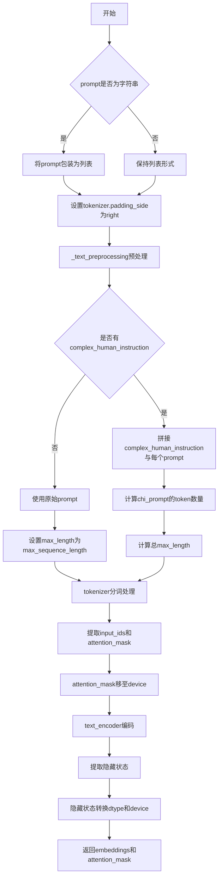

#### 带注释源码

```python
def _get_gemma_prompt_embeds(
    self,
    prompt: str | list[str],
    device: torch.device,
    dtype: torch.dtype,
    clean_caption: bool = False,
    max_sequence_length: int = 300,
    complex_human_instruction: list[str] | None = None,
):
    r"""
    Encodes the prompt into text encoder hidden states.

    Args:
        prompt (`str` or `list[str]`, *optional*):
            prompt to be encoded
        device: (`torch.device`, *optional*):
            torch device to place the resulting embeddings on
        clean_caption (`bool`, defaults to `False`):
            If `True`, the function will preprocess and clean the provided caption before encoding.
        max_sequence_length (`int`, defaults to 300): Maximum sequence length to use for the prompt.
        complex_human_instruction (`list[str]`, defaults to `complex_human_instruction`):
            If `complex_human_instruction` is not empty, the function will use the complex Human instruction for
            the prompt.
    """
    # 将单个字符串转换为列表，保持输入格式一致性
    prompt = [prompt] if isinstance(prompt, str) else prompt

    # 确保tokenizer的padding在右侧，这对于自回归模型很重要
    if getattr(self, "tokenizer", None) is not None:
        self.tokenizer.padding_side = "right"

    # 对提示进行文本预处理（清理HTML、URL等）
    prompt = self._text_preprocessing(prompt, clean_caption=clean_caption)

    # 准备复杂人类指令
    if not complex_human_instruction:
        # 如果没有复杂指令，使用默认最大长度
        max_length_all = max_sequence_length
    else:
        # 将复杂指令列表连接为单个字符串
        chi_prompt = "\n".join(complex_human_instruction)
        # 将复杂指令前缀添加到每个prompt
        prompt = [chi_prompt + p for p in prompt]
        # 计算复杂指令占用的token数量
        num_chi_prompt_tokens = len(self.tokenizer.encode(chi_prompt))
        # 计算总最大长度（考虑复杂指令占用的token）
        max_length_all = num_chi_prompt_tokens + max_sequence_length - 2

    # 使用tokenizer对提示进行分词
    text_inputs = self.tokenizer(
        prompt,
        padding="max_length",  # 填充到最大长度
        max_length=max_length_all,
        truncation=True,  # 截断超长序列
        add_special_tokens=True,  # 添加特殊token（如[CLS], [SEP]等）
        return_tensors="pt",  # 返回PyTorch张量
    )
    # 提取input_ids和attention_mask
    text_input_ids = text_inputs.input_ids
    prompt_attention_mask = text_inputs.attention_mask
    # 将attention_mask移动到指定设备
    prompt_attention_mask = prompt_attention_mask.to(device)

    # 使用text_encoder生成嵌入向量
    prompt_embeds = self.text_encoder(text_input_ids.to(device), attention_mask=prompt_attention_mask)
    # 提取隐藏状态并转换到目标dtype和device
    prompt_embeds = prompt_embeds[0].to(dtype=dtype, device=device)

    # 返回嵌入向量和注意力掩码
    return prompt_embeds, prompt_attention_mask
```


### `SanaVideoPipeline.encode_prompt`

该方法负责将文本提示编码为文本编码器的隐藏状态（embeddings），支持分类器自由引导（Classifier-Free Guidance），处理负面提示、多视频生成、LoRA 缩放等核心功能。

参数：

- `prompt`：`str | list[str]`，要编码的文本提示
- `do_classifier_free_guidance`：`bool`，是否使用分类器自由引导
- `negative_prompt`：`str`，不引导视频生成的负面提示
- `num_videos_per_prompt`：`int`，每个提示生成的视频数量
- `device`：`torch.device | None`，用于放置结果 embeddings 的 torch 设备
- `prompt_embeds`：`torch.Tensor | None`，预生成的文本 embeddings，用于轻松调整文本输入
- `negative_prompt_embeds`：`torch.Tensor | None`，预生成的负面文本 embeddings
- `prompt_attention_mask`：`torch.Tensor | None`，文本 embeddings 的注意力掩码
- `negative_prompt_attention_mask`：`torch.Tensor | None`，负面文本 embeddings 的注意力掩码
- `clean_caption`：`bool`，是否在编码前预处理和清理提示
- `max_sequence_length`：`int`，提示使用的最大序列长度
- `complex_human_instruction`：`list[str] | None`，复杂人类指令
- `lora_scale`：`float | None`，LoRA 缩放因子

返回值：`tuple[torch.Tensor, torch.Tensor, torch.Tensor, torch.Tensor]`，返回 (prompt_embeds, prompt_attention_mask, negative_prompt_embeds, negative_prompt_attention_mask) 元组

#### 流程图

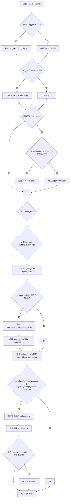

#### 带注释源码

```python
def encode_prompt(
    self,
    prompt: str | list[str],
    do_classifier_free_guidance: bool = True,
    negative_prompt: str = "",
    num_videos_per_prompt: int = 1,
    device: torch.device | None = None,
    prompt_embeds: torch.Tensor | None = None,
    negative_prompt_embeds: torch.Tensor | None = None,
    prompt_attention_mask: torch.Tensor | None = None,
    negative_prompt_attention_mask: torch.Tensor | None = None,
    clean_caption: bool = False,
    max_sequence_length: int = 300,
    complex_human_instruction: list[str] | None = None,
    lora_scale: float | None = None,
):
    r"""
    Encodes the prompt into text encoder hidden states.

    Args:
        prompt (`str` or `list[str]`, *optional*):
            prompt to be encoded
        negative_prompt (`str` or `list[str]`, *optional*):
            The prompt not to guide the video generation. If not defined, one has to pass `negative_prompt_embeds`
            instead. Ignored when not using guidance (i.e., ignored if `guidance_scale` is less than `1`). For
            PixArt-Alpha, this should be "".
        do_classifier_free_guidance (`bool`, *optional*, defaults to `True`):
            whether to use classifier free guidance or not
        num_videos_per_prompt (`int`, *optional*, defaults to 1):
            number of videos that should be generated per prompt
        device: (`torch.device`, *optional*):
            torch device to place the resulting embeddings on
        prompt_embeds (`torch.Tensor`, *optional*):
            Pre-generated text embeddings. Can be used to easily tweak text inputs, *e.g.* prompt weighting. If not
            provided, text embeddings will be generated from `prompt` input argument.
        negative_prompt_embeds (`torch.Tensor`, *optional*):
            Pre-generated negative text embeddings. For Sana, it's should be the embeddings of the "" string.
        clean_caption (`bool`, defaults to `False`):
            If `True`, the function will preprocess and clean the provided caption before encoding.
        max_sequence_length (`int`, defaults to 300): Maximum sequence length to use for the prompt.
        complex_human_instruction (`list[str]`, defaults to `complex_human_instruction`):
            If `complex_human_instruction` is not empty, the function will use the complex Human instruction for
            the prompt.
    """

    # 如果未指定 device，则使用执行设备
    if device is None:
        device = self._execution_device

    # 获取 text_encoder 的 dtype
    if self.text_encoder is not None:
        dtype = self.text_encoder.dtype
    else:
        dtype = None

    # 设置 lora scale 以便 text encoder 的 LoRA 函数正确访问
    if lora_scale is not None and isinstance(self, SanaLoraLoaderMixin):
        self._lora_scale = lora_scale

        # 动态调整 LoRA scale
        if self.text_encoder is not None and USE_PEFT_BACKEND:
            scale_lora_layers(self.text_encoder, lora_scale)

    # 确定 batch_size
    if prompt is not None and isinstance(prompt, str):
        batch_size = 1
    elif prompt is not None and isinstance(prompt, list):
        batch_size = len(prompt)
    else:
        batch_size = prompt_embeds.shape[0]

    # 设置 tokenizer 的 padding side
    if getattr(self, "tokenizer", None) is not None:
        self.tokenizer.padding_side = "right"

    # 参见论文第 3.1 节
    max_length = max_sequence_length
    select_index = [0] + list(range(-max_length + 1, 0))

    # 如果未提供 prompt_embeds，则生成
    if prompt_embeds is None:
        prompt_embeds, prompt_attention_mask = self._get_gemma_prompt_embeds(
            prompt=prompt,
            device=device,
            dtype=dtype,
            clean_caption=clean_caption,
            max_sequence_length=max_sequence_length,
            complex_human_instruction=complex_human_instruction,
        )

        # 使用 select_index 切片 embeddings
        prompt_embeds = prompt_embeds[:, select_index]
        prompt_attention_mask = prompt_attention_mask[:, select_index]

    bs_embed, seq_len, _ = prompt_embeds.shape
    # 复制 text embeddings 和 attention mask 以支持每个提示生成多个视频
    prompt_embeds = prompt_embeds.repeat(1, num_videos_per_prompt, 1)
    prompt_embeds = prompt_embeds.view(bs_embed * num_videos_per_prompt, seq_len, -1)
    prompt_attention_mask = prompt_attention_mask.view(bs_embed, -1)
    prompt_attention_mask = prompt_attention_mask.repeat(num_videos_per_prompt, 1)

    # 获取分类器自由引导的无条件 embeddings
    if do_classifier_free_guidance and negative_prompt_embeds is None:
        negative_prompt = [negative_prompt] * batch_size if isinstance(negative_prompt, str) else negative_prompt
        negative_prompt_embeds, negative_prompt_attention_mask = self._get_gemma_prompt_embeds(
            prompt=negative_prompt,
            device=device,
            dtype=dtype,
            clean_caption=clean_caption,
            max_sequence_length=max_sequence_length,
            complex_human_instruction=False,
        )

    if do_classifier_free_guidance:
        # 复制无条件 embeddings 以支持每个提示生成多个视频
        seq_len = negative_prompt_embeds.shape[1]

        negative_prompt_embeds = negative_prompt_embeds.to(dtype=dtype, device=device)

        negative_prompt_embeds = negative_prompt_embeds.repeat(1, num_videos_per_prompt, 1)
        negative_prompt_embeds = negative_prompt_embeds.view(batch_size * num_videos_per_prompt, seq_len, -1)

        negative_prompt_attention_mask = negative_prompt_attention_mask.view(bs_embed, -1)
        negative_prompt_attention_mask = negative_prompt_attention_mask.repeat(num_videos_per_prompt, 1)
    else:
        negative_prompt_embeds = None
        negative_prompt_attention_mask = None

    # 如果使用 LoRA，恢复原始 scale
    if self.text_encoder is not None:
        if isinstance(self, SanaLoraLoaderMixin) and USE_PEFT_BACKEND:
            # 通过缩放回 LoRA layers 来获取原始 scale
            unscale_lora_layers(self.text_encoder, lora_scale)

    return prompt_embeds, prompt_attention_mask, negative_prompt_embeds, negative_prompt_attention_mask
```


### `SanaVideoPipeline.prepare_extra_step_kwargs`

该方法用于准备调度器（scheduler）步骤所需的额外参数。由于不同的调度器具有不同的签名，该方法通过检查调度器的`step`方法是否接受特定参数（如`eta`和`generator`），来动态构建需要传递给调度器的参数字典。

参数：

- `self`：`SanaVideoPipeline`实例，方法所属的管道对象
- `generator`：`torch.Generator | list[torch.Generator] | None`，用于生成确定性随机数的PyTorch生成器，用于控制视频生成的随机性
- `eta`：`float`，DDIM调度器的η参数，对应DDIM论文中的η参数（取值范围0到1），其他调度器会忽略此参数

返回值：`dict[str, Any]`，包含调度器步骤所需额外参数的字典，可能包含`eta`和/或`generator`键

#### 流程图

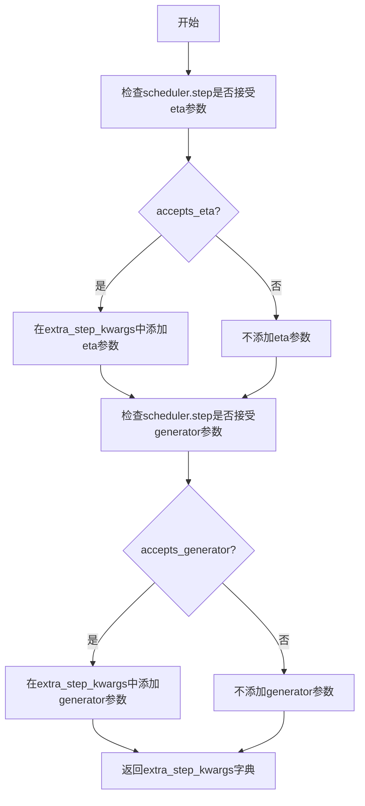

#### 带注释源码

```python
def prepare_extra_step_kwargs(self, generator, eta):
    """
    为调度器步骤准备额外的关键字参数，因为并非所有调度器都具有相同的签名。
    eta (η) 仅与 DDIMScheduler 一起使用，其他调度器将忽略它。
    eta 对应 DDIM 论文中的 η：https://huggingface.co/papers/2010.02502
    取值应在 [0, 1] 范围内。
    """
    
    # 通过检查调度器的 step 方法签名来判断是否接受 eta 参数
    # DDIMScheduler 等特定调度器支持此参数
    accepts_eta = "eta" in set(inspect.signature(self.scheduler.step).parameters.keys())
    
    # 初始化额外的参数字典
    extra_step_kwargs = {}
    
    # 如果调度器接受 eta 参数，则将其添加到参数字典中
    if accepts_eta:
        extra_step_kwargs["eta"] = eta

    # 检查调度器是否接受 generator 参数
    # 某些调度器支持使用生成器来控制随机性
    accepts_generator = "generator" in set(inspect.signature(self.scheduler.step).parameters.keys())
    
    # 如果调度器接受 generator 参数，则将其添加到参数字典中
    if accepts_generator:
        extra_step_kwargs["generator"] = generator
    
    # 返回包含调度器所需额外参数的字典
    return extra_step_kwargs
```


### `SanaVideoPipeline.check_inputs`

该方法用于验证输入参数的有效性，确保在视频生成前所有必需的参数都符合要求，包括高度/宽度的尺寸约束、prompt 与 prompt_embeds 的互斥性、以及注意力掩码与文本嵌入的形状匹配等。

参数：

- `self`：`SanaVideoPipeline` 实例，管道对象本身
- `prompt`：`str | list[str] | None`，用户输入的文本提示，用于指导视频生成
- `height`：`int`，生成视频的高度（像素），必须能被 32 整除
- `width`：`int`，生成视频的宽度（像素），必须能被 32 整除
- `callback_on_step_end_tensor_inputs`：`list[str] | None`，在推理步骤结束时回调的 tensor 输入列表，必须是 `_callback_tensor_inputs` 中的值
- `negative_prompt`：`str | list[str] | None`，负面提示，用于指导不希望出现的内容，与 `negative_prompt_embeds` 互斥
- `prompt_embeds`：`torch.Tensor | None`，预生成的文本嵌入，与 `prompt` 互斥
- `negative_prompt_embeds`：`torch.Tensor | None`，预生成的负面文本嵌入，与 `negative_prompt` 互斥
- `prompt_attention_mask`：`torch.Tensor | None`，文本嵌入的注意力掩码，当提供 `prompt_embeds` 时必须同时提供
- `negative_prompt_attention_mask`：`torch.Tensor | None`，负面文本嵌入的注意力掩码，当提供 `negative_prompt_embeds` 时必须同时提供

返回值：`None`，该方法不返回任何值，仅通过抛出 `ValueError` 来指示验证失败

#### 流程图

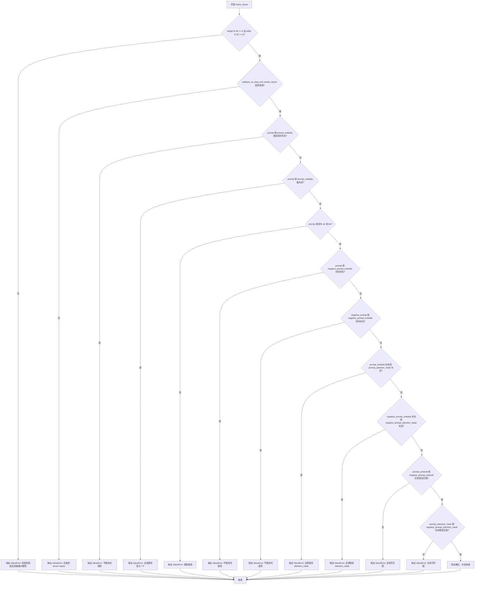

#### 带注释源码

```python
def check_inputs(
    self,
    prompt,
    height,
    width,
    callback_on_step_end_tensor_inputs=None,
    negative_prompt=None,
    prompt_embeds=None,
    negative_prompt_embeds=None,
    prompt_attention_mask=None,
    negative_prompt_attention_mask=None,
):
    """
    检查输入参数的有效性，确保所有参数都符合管道要求。
    该方法会在视频生成之前被调用，验证各种输入组合的合法性。
    """
    # 检查高度和宽度是否能够被 32 整除，这是 VAE 和 Transformer 的要求
    if height % 32 != 0 or width % 32 != 0:
        raise ValueError(f"`height` and `width` have to be divisible by 32 but are {height} and {width}.")

    # 检查回调函数的 tensor 输入是否在允许的列表中
    if callback_on_step_end_tensor_inputs is not None and not all(
        k in self._callback_tensor_inputs for k in callback_on_step_end_tensor_inputs
    ):
        raise ValueError(
            f"`callback_on_step_end_tensor_inputs` has to be in {self._callback_tensor_inputs}, but found {[k for k in callback_on_step_end_tensor_inputs if k not in self._callback_tensor_inputs]}"
        )

    # 检查 prompt 和 prompt_embeds 互斥，不能同时提供
    if prompt is not None and prompt_embeds is not None:
        raise ValueError(
            f"Cannot forward both `prompt`: {prompt} and `prompt_embeds`: {prompt_embeds}. Please make sure to"
            " only forward one of the two."
        )
    # 检查至少提供一个生成文本嵌入的方式
    elif prompt is None and prompt_embeds is None:
        raise ValueError(
            "Provide either `prompt` or `prompt_embeds`. Cannot leave both `prompt` and `prompt_embeds` undefined."
        )
    # 检查 prompt 的类型是否为 str 或 list
    elif prompt is not None and (not isinstance(prompt, str) and not isinstance(prompt, list)):
        raise ValueError(f"`prompt` has to be of type `str` or `list` but is {type(prompt)}")

    # 检查 prompt 和 negative_prompt_embeds 不能同时提供
    if prompt is not None and negative_prompt_embeds is not None:
        raise ValueError(
            f"Cannot forward both `prompt`: {prompt} and `negative_prompt_embeds`:"
            f" {negative_prompt_embeds}. Please make sure to only forward one of the two."
        )

    # 检查 negative_prompt 和 negative_prompt_embeds 不能同时提供
    if negative_prompt is not None and negative_prompt_embeds is not None:
        raise ValueError(
            f"Cannot forward both `negative_prompt`: {negative_prompt} and `negative_prompt_embeds`:"
            f" {negative_prompt_embeds}. Please make sure to only forward one of the two."
        )

    # 如果提供了 prompt_embeds，则必须同时提供对应的 attention_mask
    if prompt_embeds is not None and prompt_attention_mask is None:
        raise ValueError("Must provide `prompt_attention_mask` when specifying `prompt_embeds`.")

    # 如果提供了 negative_prompt_embeds，则必须同时提供对应的 attention_mask
    if negative_prompt_embeds is not None and negative_prompt_attention_mask is None:
        raise ValueError("Must provide `negative_prompt_attention_mask` when specifying `negative_prompt_embeds`.")

    # 检查 prompt_embeds 和 negative_prompt_embeds 的形状是否一致
    if prompt_embeds is not None and negative_prompt_embeds is not None:
        if prompt_embeds.shape != negative_prompt_embeds.shape:
            raise ValueError(
                "`prompt_embeds` and `negative_prompt_embeds` must have the same shape when passed directly, but"
                f" got: `prompt_embeds` {prompt_embeds.shape} != `negative_prompt_embeds`"
                f" {negative_prompt_embeds.shape}."
            )
        # 检查 attention_mask 的形状是否一致
        if prompt_attention_mask.shape != negative_prompt_attention_mask.shape:
            raise ValueError(
                "`prompt_attention_mask` and `negative_prompt_attention_mask` must have the same shape when passed directly, but"
                f" got: `prompt_attention_mask` {prompt_attention_mask.shape} != `negative_prompt_attention_mask`"
                f" {negative_prompt_attention_mask.shape}."
            )
```


### SanaVideoPipeline._text_preprocessing

该方法用于对输入的文本提示进行预处理，包括检查并清理HTML标签、处理特殊字符、转换大小写等操作，以确保文本适合用于视频生成模型的输入。

参数：

- `text`：`str | list[str]`，要预处理的文本或文本列表
- `clean_caption`：`bool`，是否执行完整的标题清理操作（包含HTML解析、特殊字符处理等），默认为 False

返回值：`list[str]`，预处理后的文本列表

#### 流程图

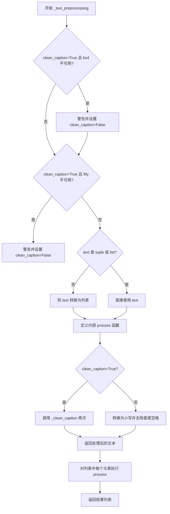

#### 带注释源码

```
def _text_preprocessing(self, text, clean_caption=False):
    # 如果需要清理标题但 bs4 库不可用，则发出警告并禁用清理功能
    if clean_caption and not is_bs4_available():
        logger.warning(BACKENDS_MAPPING["bs4"][-1].format("Setting `clean_caption=True`"))
        logger.warning("Setting `clean_caption` to False...")
        clean_caption = False

    # 如果需要清理标题但 ftfy 库不可用，则发出警告并禁用清理功能
    if clean_caption and not is_ftfy_available():
        logger.warning(BACKENDS_MAPPING["ftfy"][-1].format("Setting `clean_caption=True`"))
        logger.warning("Setting `clean_caption` to False...")
        clean_caption = False

    # 确保输入为列表格式，便于统一处理
    if not isinstance(text, (tuple, list)):
        text = [text]

    # 定义内部处理函数，对单个文本进行预处理
    def process(text: str):
        if clean_caption:
            # 执行完整的标题清理（包含HTML解析、URL移除、特殊字符处理等）
            text = self._clean_caption(text)
            # 双重清理以确保效果
            text = self._clean_caption(text)
        else:
            # 简单处理：转换为小写并去除首尾空格
            text = text.lower().strip()
        return text

    # 对列表中的每个文本元素应用处理函数
    return [process(t) for t in text]
```


### `SanaVideoPipeline._clean_caption`

该方法用于清洗和预处理文本提示词（caption），通过URL过滤、HTML标签移除、CJK字符清理、特殊符号标准化、HTML实体解码等多种正则表达式操作，将原始文本转换为干净、规范的格式，以便于后续的文本编码处理。

参数：

- `self`：内部参数，表示 `SanaVideoPipeline` 类的实例。
- `caption`：`str`，需要清洗的原始文本提示词。

返回值：`str`，清洗处理后的文本。

#### 流程图

```mermaid
flowchart TD
    A[开始: 输入原始caption] --> B[转换为字符串并URL解码]
    B --> C[转小写并去除首尾空格]
    C --> D[将<person>替换为person]
    D --> E{检测URL}
    E -->|https/http URL| F[正则匹配并移除]
    E -->|www URL| G[正则匹配并移除]
    F --> H{检测HTML标签}
    G --> H
    H -->|有HTML标签| I[使用BeautifulSoup解析并提取纯文本]
    H -->|无HTML标签| J[继续后续处理]
    I --> J
    J --> K[移除@昵称]
    K --> L[移除CJK字符集<br>31C0-31EF 31F0-31FF 3200-32FF<br>3300-33FF 3400-4DBF 4DC0-4DFF 4E00-9FFF]
    L --> M[统一破折号格式为'-']
    M --> N[统一引号格式为双引号或单引号]
    N --> O[移除HTML实体如&quot;&amp;]
    O --> P[移除IP地址]
    P --> Q[移除文章ID<br>格式如 12:34]
    Q --> R[移除转义符\n]
    R --> S[移除井号编号如#123或#12345]
    S --> T[移除长数字如123456]
    T --> U[移除文件名<br>如*.png *.jpg等]
    U --> V[处理连续引号和句点]
    V --> W[处理特殊标点符号]
    W --> X{检查连字符或下划线}
    X -->|超过3个| Y[将连接符替换为空格]
    X -->|不超过3个| Z[保留原样]
    Y --> AA[使用ftfy修复文本编码]
    Z --> AA
    AA --> AB[双重HTML解码]
    AB --> AC[移除字母数字混合短码<br>如jc6640]
    AC --> AD[移除广告关键词<br>如free shipping download]
    AD --> AE[移除点击提示和图片格式词]
    AE --> AF[移除页码]
    AF --> AG[移除复杂字母数字组合]
    AG --> AH[移除尺寸规格<br>如800x600]
    AH --> AI[清理冒号周围空格]
    AI --> AJ[规范化标点符号间距]
    AJ --> AK[移除首尾引号和特殊字符]
    AK --> AL[返回清洗后的caption.strip()]
```

#### 带注释源码

```python
def _clean_caption(self, caption):
    """
    清洗和预处理文本提示词，去除各种噪音字符和格式
    """
    # 将输入转换为字符串类型
    caption = str(caption)
    
    # URL解码：处理URL编码的字符串（如 %20 转换为空格）
    caption = ul.unquote_plus(caption)
    
    # 转小写并去除首尾空格
    caption = caption.strip().lower()
    
    # 将 <person> 占位符替换为实际单词 person
    caption = re.sub("<person>", "person", caption)
    
    # URLs: 移除 https:// 或 http:// 开头的URL
    # 正则匹配常见域名后缀 .com .co .ru .net .org .edu .gov .it 等
    caption = re.sub(
        r"\b((?:https?:(?:\/{1,3}|[a-zA-Z0-9%])|[a-zA-Z0-9.\-]+[.](?:com|co|ru|net|org|edu|gov|it)[\w/-]*\b\/?(?!@)))",  # noqa
        "",
        caption,
    )  # regex for urls
    
    # URLs: 移除 www. 开头的URL
    caption = re.sub(
        r"\b((?:www:(?:\/{1,3}|[a-zA-Z0-9%])|[a-zA-Z0-9.\-]+[.](?:com|co|ru|net|org|edu|gov|it)[\w/-]*\b\/?(?!@)))",  # noqa
        "",
        caption,
    )  # regex for urls
    
    # HTML: 使用BeautifulSoup解析并提取纯文本，移除所有HTML标签
    caption = BeautifulSoup(caption, features="html.parser").text

    # @<nickname>: 移除Twitter/社交媒体风格的@用户名
    caption = re.sub(r"@[\w\d]+\b", "", caption)

    # 31C0—31EF CJK Strokes (CJK笔画)
    # 31F0—31FF Katakana Phonetic Extensions (片假名音扩展)
    # 3200—32FF Enclosed CJK Letters and Months (带圈CJK字母和月份)
    # 3300—33FF CJK Compatibility (CJK兼容性)
    # 3400—4DBF CJK Unified Ideographs Extension A (CJK统一表意文字扩展A)
    # 4DC0—4DFF Yijing Hexagram Symbols (易经六十四卦符号)
    # 4E00—9FFF CJK Unified Ideographs (CJK统一表意文字)
    caption = re.sub(r"[\u31c0-\u31ef]+", "", caption)
    caption = re.sub(r"[\u31f0-\u31ff]+", "", caption)
    caption = re.sub(r"[\u3200-\u32ff]+", "", caption)
    caption = re.sub(r"[\u3300-\u33ff]+", "", caption)
    caption = re.sub(r"[\u3400-\u4dbf]+", "", caption)
    caption = re.sub(r"[\u4dc0-\u4dff]+", "", caption)
    caption = re.sub(r"[\u4e00-\u9fff]+", "", caption)
    #######################################################

    # 所有类型的破折号统一转换为 "-"
    # 包括: ‑ - – — − ─ ━ ﹘ ﹣ － 等
    caption = re.sub(
        r"[\u002D\u058A\u05BE\u1400\u1806\u2010-\u2015\u2E17\u2E1A\u2E3A\u2E3B\u2E40\u301C\u3030\u30A0\uFE31\uFE32\uFE58\uFE63\uFF0D]+",  # noqa
        "-",
        caption,
    )

    # 引号标准化：各种语言的引号统一转换为标准双引号或单引号
    caption = re.sub(r"[`´«»""¨]", '"', caption)
    caption = re.sub(r"['']", "'", caption)

    # &quot;: 移除HTML引号实体（可选的问号表示可能有或没有）
    caption = re.sub(r"&quot;?", "", caption)
    # &amp: 移除HTML &符号实体
    caption = re.sub(r"&amp", "", caption)

    # IP地址: 移除IPv4地址格式（如 192.168.1.1）
    caption = re.sub(r"\d{1,3}\.\d{1,3}\.\d{1,3}\.\d{1,3}", " ", caption)

    # 文章ID: 移除末尾的 "数字:数字" 格式（如 "1:23" 在末尾）
    caption = re.sub(r"\d:\d\d\s+$", "", caption)

    # \n: 将转义换行符替换为空格
    caption = re.sub(r"\\n", " ", caption)

    # "#123": 移除1-3位数的井号编号
    caption = re.sub(r"#\d{1,3}\b", "", caption)
    // "#12345..": 移除5位及以上数字开头的井号标签
    caption = re.sub(r"#\d{5,}\b", "", caption)
    // "123456..": 移除6位及以上的纯数字
    caption = re.sub(r"\b\d{6,}\b", "", caption)
    // 文件名: 移除常见图片、视频、文档文件扩展名
    caption = re.sub(r"[\S]+\.(?:png|jpg|jpeg|bmp|webp|eps|pdf|apk|mp4)", "", caption)

    //
    caption = re.sub(r"[\"']{2,}", r'"', caption)  # """AUSVERKAUFT""" -> "AUSVERKAUFT"
    caption = re.sub(r"[\.]{2,}", r" ", caption)  # ... -> 空格

    # 移除自定义的特殊标点正则表达式匹配的字符
    # 这个正则包含: # ® • © ™ & @ · º ½ ¾ ¿ ¡ § ~ ) ( ] [ } { | \ / * 等
    caption = re.sub(self.bad_punct_regex, r" ", caption)  # ***AUSVERKAUFT***, #AUSVERKAUFT
    caption = re.sub(r"\s+\.\s+", r" ", caption)  # " . " -> " "

    # this-is-my-cute-cat / this_is_my_cute_cat
    # 如果连字符或下划线超过3个，将其全部替换为空格
    regex2 = re.compile(r"(?:\-|\_)")
    if len(re.findall(regex2, caption)) > 3:
        caption = re.sub(regex2, " ", caption)

    # ftfy: 修复常见的Unicode编码错误和文本损坏
    caption = ftfy.fix_text(caption)
    
    # 双重HTML解码：处理嵌套的HTML实体编码
    caption = html.unescape(html.unescape(caption))

    # 移除字母数字混合短码模式
    caption = re.sub(r"\b[a-zA-Z]{1,3}\d{3,15}\b", "", caption)  # jc6640
    caption = re.sub(r"\b[a-zA-Z]+\d+[a-zA-Z]+\b", "", caption)  # jc6640vc
    caption = re.sub(r"\b\d+[a-zA-Z]+\d+\b", "", caption)  # 6640vc231

    # 移除广告关键词
    caption = re.sub(r"(worldwide\s+)?(free\s+)?shipping", "", caption)
    caption = re.sub(r"(free\s)?download(\sfree)?", "", caption)
    
    # 移除"click for/on xxx"模式
    caption = re.sub(r"\bclick\b\s(?:for|on)\s\w+", "", caption)
    
    # 移除图片格式关键词
    caption = re.sub(r"\b(?:png|jpg|jpeg|bmp|webp|eps|pdf|apk|mp4)(\simage[s]?)?", "", caption)
    
    # 移除页码 "page 1"
    caption = re.sub(r"\bpage\s+\d+\b", "", caption)

    # 移除复杂的字母数字混合模式
    caption = re.sub(r"\b\d*[a-zA-Z]+\d+[a-zA-Z]+\d+[a-zA-Z\d]*\b", r" ", caption)  # j2d1a2a...

    # 移除尺寸规格如 "800x600" 或 "800×600"
    caption = re.sub(r"\b\d+\.?\d*[xх×]\d+\.?\d*\b", "", caption)

    # 清理冒号周围的空格
    caption = re.sub(r"\b\s+\:\s+", r": ", caption)
    
    # 在标点符号后添加空格（如果后面是字母或数字）
    caption = re.sub(r"(\D[,\./])\b", r"\1 ", caption)
    
    # 合并多个空格为单个空格
    caption = re.sub(r"\s+", " ", caption)

    caption.strip()

    # 移除首尾引号
    caption = re.sub(r"^[\"\']([\w\W]+)[\"\']$", r"\1", caption)
    
    # 移除首部的特殊字符
    caption = re.sub(r"^[\'\_,\-\:;]", r"", caption)
    
    # 移除尾部的特殊字符
    caption = re.sub(r"[\'\_,\-\:\-\+]$", r" "", caption)
    
    # 移除以点开头的单个单词
    caption = re.sub(r"^\.\S+$", "", caption)

    return caption.strip()
```


### `SanaVideoPipeline.prepare_latents`

该方法负责为视频生成流程准备潜在向量（latents）。如果传入了预生成的 latents，则将其移动到指定设备；否则，根据批大小、通道数、视频帧数和分辨率计算潜在向量的形状，并使用随机张量生成器创建新的噪声潜在向量。

参数：

- `self`：`SanaVideoPipeline` 实例本身
- `batch_size`：`int`，生成视频的批大小
- `num_channels_latents`：`int`，潜在向量通道数，默认为 16
- `height`：`int`，视频高度（像素），默认为 480
- `width`：`int`，视频宽度（像素），默认为 832
- `num_frames`：`int`，视频帧数，默认为 81
- `dtype`：`torch.dtype | None`，潜在向量的数据类型
- `device`：`torch.device | None`，潜在向量所在的设备
- `generator`：`torch.Generator | list[torch.Generator] | None`，用于生成确定性随机潜在向量的生成器
- `latents`：`torch.Tensor | None`，预生成的潜在向量，如果为 None 则生成新的

返回值：`torch.Tensor`，处理后的潜在向量张量

#### 流程图

```mermaid
flowchart TD
    A[开始 prepare_latents] --> B{latents 是否已提供?}
    B -->|是| C[将 latents 移动到指定 device 和 dtype]
    C --> Z[返回 latents]
    B -->|否| D[计算 latent 帧数: (num_frames - 1) // vae_scale_factor_temporal + 1]
    D --> E[计算潜在向量形状: batch_size, num_channels_latents, num_latent_frames, height//vae_scale_factor_spatial, width//vae_scale_factor_spatial]
    E --> F{generator 是列表且长度 != batch_size?}
    F -->|是| G[抛出 ValueError]
    F -->|否| H{latents is None?}
    H -->|是| I[使用 randn_tensor 生成随机潜在向量]
    H -->|否| J[将 latents 移动到 device 和 dtype]
    I --> Z
    J --> Z
```

#### 带注释源码

```python
def prepare_latents(
    self,
    batch_size: int,
    num_channels_latents: int = 16,
    height: int = 480,
    width: int = 832,
    num_frames: int = 81,
    dtype: torch.dtype | None = None,
    device: torch.device | None = None,
    generator: torch.Generator | list[torch.Generator] | None = None,
    latents: torch.Tensor | None = None,
) -> torch.Tensor:
    # 如果已提供 latents，则直接转移到指定设备并返回
    if latents is not None:
        return latents.to(device=device, dtype=dtype)

    # 计算 latent 空间中的帧数：根据 VAE 的时间缩放因子将视频帧数映射到 latent 帧数
    # 公式: (num_frames - 1) // vae_scale_factor_temporal + 1
    num_latent_frames = (num_frames - 1) // self.vae_scale_factor_temporal + 1
    
    # 确定潜在向量的形状维度
    # batch_size: 批大小
    # num_channels_latents: 潜在通道数
    # num_latent_frames: latent 空间的时间维度
    # height // vae_scale_factor_spatial: latent 空间的高度维度
    # width // vae_scale_factor_spatial: latent 空间的宽度维度
    shape = (
        batch_size,
        num_channels_latents,
        num_latent_frames,
        int(height) // self.vae_scale_factor_spatial,
        int(width) // self.vae_scale_factor_spatial,
    )
    
    # 验证生成器列表长度与批大小是否匹配
    if isinstance(generator, list) and len(generator) != batch_size:
        raise ValueError(
            f"You have passed a list of generators of length {len(generator)}, but requested an effective batch"
            f" size of {batch_size}. Make sure the batch size matches the length of the generators."
        )

    # 如果没有提供 latents，则生成随机噪声 latent
    if latents is None:
        # 使用 randn_tensor 生成服从标准正态分布的随机张量
        latents = randn_tensor(shape, generator=generator, device=device, dtype=dtype)
    else:
        # 将已有的 latents 转移到指定设备
        latents = latents.to(device=device, dtype=dtype)
    
    return latents
```


### `SanaVideoPipeline.guidance_scale`

该属性是 SanaVideoPipeline 类的只读属性，用于获取分类器自由引导（Classifier-Free Guidance）的比例系数。该系数在调用管道生成视频时被设置，控制生成内容与文本提示的匹配程度，值越大生成的视频与提示越相关但质量可能下降。

参数：无（这是一个属性而非方法）

返回值：`float`，返回分类器自由引导的比例系数（guidance scale），用于控制文本引导强度。

#### 流程图

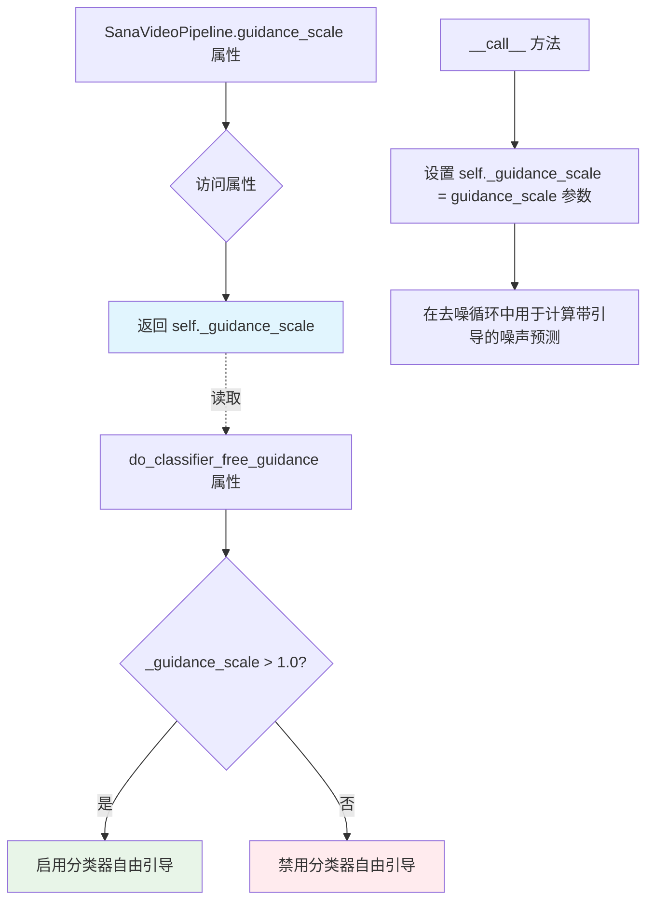

#### 带注释源码

```python
@property
def guidance_scale(self):
    """
    只读属性，返回分类器自由引导（Classifier-Free Guidance）的比例系数。
    
    该系数在调用 __call__ 方法时从传入的 guidance_scale 参数获取并存储在 self._guidance_scale 中。
    在扩散模型的去噪过程中，guidance_scale 用于控制生成内容与文本提示的相关性：
    - 值越大（>1.0），生成结果越贴近文本提示
    - 值等于1.0，禁用分类器自由引导
    
    返回值:
        float: 分类器自由引导的比例系数
        
    示例:
        >>> pipe = SanaVideoPipeline.from_pretrained("Efficient-Large-Model/SANA-Video_2B_480p_diffusers")
        >>> pipe(prompt="A cat", guidance_scale=7.5)
        >>> print(pipe.guidance_scale)  # 输出: 7.5
    """
    return self._guidance_scale
```

#### 相关上下文代码

```python
# 在 __call__ 方法中设置该属性
self._guidance_scale = guidance_scale

# 在去噪循环中使用
if self.do_classifier_free_guidance:
    noise_pred_uncond, noise_pred_text = noise_pred.chunk(2)
    noise_pred = noise_pred_uncond + guidance_scale * (noise_pred_text - noise_pred_uncond)

# 相关属性用于判断是否启用引导
@property
def do_classifier_free_guidance(self):
    return self._guidance_scale > 1.0
```

#### 设计说明

| 项目 | 说明 |
|------|------|
| **设计目标** | 提供对引导比例系数的只读访问，同时通过 `do_classifier_free_guidance` 属性动态判断是否启用分类器自由引导 |
| **约束条件** | 该属性为只读，值在管道调用时由 `__call__` 方法设置 |
| **错误处理** | 如果在调用管道前访问此属性，可能抛出 `AttributeError`，因为 `_guidance_scale` 尚未初始化 |
| **优化空间** | 可考虑添加属性 setter 以支持动态调整引导比例，或添加默认值验证 |


### `SanaVideoPipeline.attention_kwargs`

该属性是 `SanaVideoPipeline` 类的注意力机制参数 getter 方法，用于获取在管道调用时设置的注意力处理器额外参数。这些参数会被传递给 Transformer 模型的注意力计算过程中，允许用户自定义注意力机制的行为（如使用自定义注意力实现、调整注意力缩放等）。

参数：

- （无显式参数，隐式参数为 `self`）

返回值：`dict[str, Any] | None`，返回传递给 `AttentionProcessor` 的 kwargs 字典。如果在调用管道时未指定 `attention_kwargs`，则返回 `None`。

#### 流程图

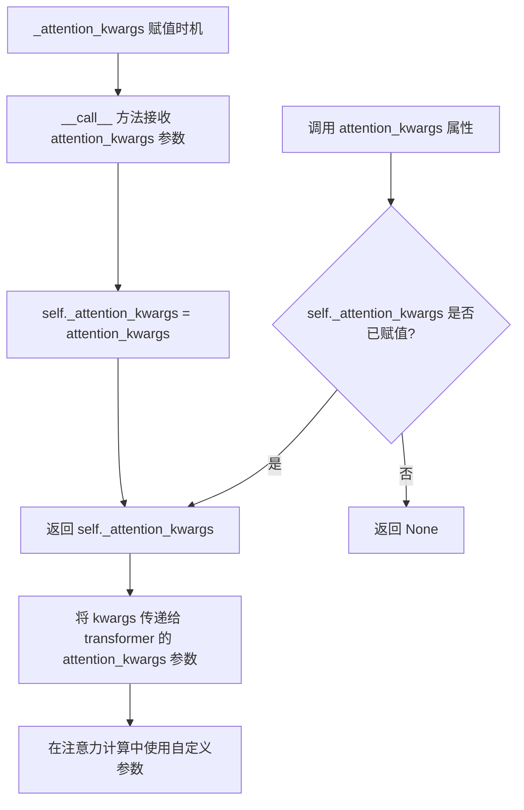

#### 带注释源码

```python
@property
def attention_kwargs(self):
    """
    属性 getter: 获取注意力机制 kwargs 参数
    
    该属性返回在管道调用时设置的注意力处理器额外参数。
    这些参数会被传递到 Transformer 模型的 forward 方法中，
    最终用于控制注意力计算的行为。
    
    返回值:
        dict[str, Any] | None: 注意力机制参数字典，如果未设置则返回 None
    """
    return self._attention_kwargs
```

#### 相关上下文源码

```python
# 在 __call__ 方法中设置 _attention_kwargs
def __call__(
    self,
    # ... 其他参数 ...
    attention_kwargs: dict[str, Any] | None = None,  # 注意力机制 kwargs 参数
    # ... 其他参数 ...
) -> SanaVideoPipelineOutput | tuple:
    # ...
    
    # 设置注意力 kwargs
    self._attention_kwargs = attention_kwargs
    
    # ...
    
    # 在 transformer 调用时使用
    noise_pred = self.transformer(
        latent_model_input.to(dtype=transformer_dtype),
        encoder_hidden_states=prompt_embeds.to(dtype=transformer_dtype),
        encoder_attention_mask=prompt_attention_mask,
        timestep=timestep,
        return_dict=False,
        attention_kwargs=self.attention_kwargs,  # 传递给 transformer
    )[0]
```


### `SanaVideoPipeline.do_classifier_free_guidance`

该属性用于判断当前管道是否启用无分类器引导（Classifier-Free Guidance，CFG）技术。通过检查 `guidance_scale` 是否大于 1.0 来决定是否在推理过程中使用 CFG。

参数： 无

返回值：`bool`，如果 `guidance_scale > 1.0` 则返回 `True`，表示启用无分类器引导；否则返回 `False`。

#### 流程图

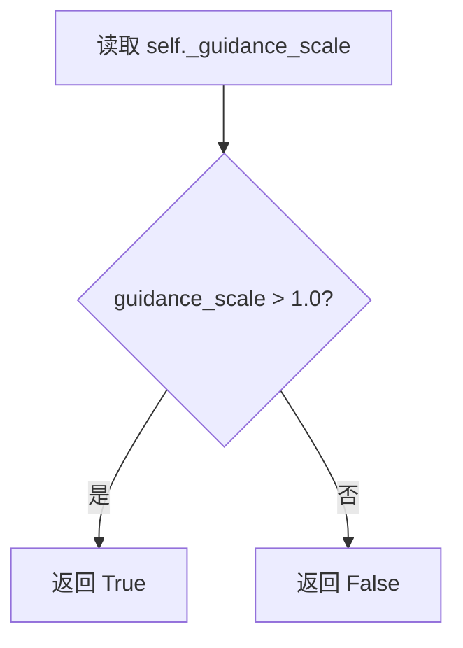

#### 带注释源码

```python
@property
def do_classifier_free_guidance(self):
    """
    属性：判断是否启用无分类器引导（Classifier-Free Guidance）
    
    无分类器引导是一种用于文本到图像/视频生成的技术，通过在推理时同时考虑
    条件和无条件噪声预测来提高生成质量。当 guidance_scale > 1.0 时启用。
    
    Returns:
        bool: 是否启用无分类器引导
    """
    return self._guidance_scale > 1.0
```


### `SanaVideoPipeline.num_timesteps`

该属性返回管道在去噪过程中使用的推理步数（即时间步数），该值在调用管道时通过调度器获取时间步后设置。

参数： 无（属性不接受参数）

返回值： `int`，返回去噪过程中使用的时间步数量，用于视频生成推理。

#### 流程图

```mermaid
flowchart TD
    A[用户调用 pipeline] --> B[retrieve_timesteps 获取时间步]
    B --> C[设置 self._num_timesteps = len(timesteps)]
    D[访问 num_timesteps 属性] --> E[返回 self._num_timesteps]
    
    style C fill:#f9f,stroke:#333
    style E fill:#9f9,stroke:#333
```

#### 带注释源码

```python
@property
def num_timesteps(self):
    """
    返回去噪过程中使用的时间步数量。
    
    此属性提供对内部 _num_timesteps 属性的访问权限。
    _num_timesteps 在管道的 __call__ 方法中从调度器获取时间步后设置。
    
    返回:
        int: 将用于生成的推理步数/时间步数。
    """
    return self._num_timesteps
```


### `SanaVideoPipeline.interrupt`

该属性用于获取或设置管道的中断状态，允许外部代码在去噪循环执行过程中请求提前终止视频生成任务。

参数： 无

返回值：`bool`，返回当前的中断状态标志。如果为 `True`，表示外部请求中断生成过程；如果为 `False`，表示继续正常生成。

#### 流程图

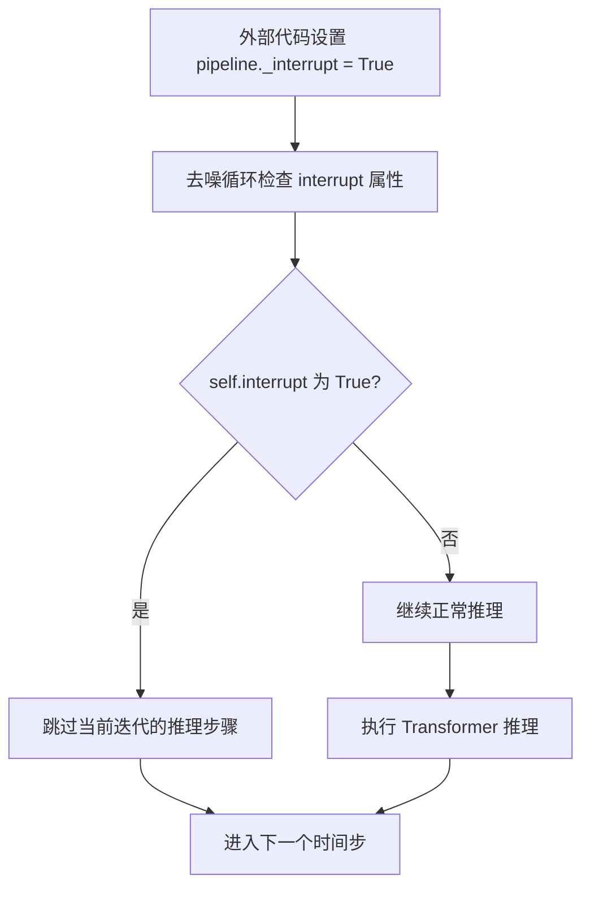

#### 带注释源码

```python
@property
def interrupt(self):
    """
    属性用于控制管道生成过程的中断。
    
    内部维护一个布尔标志 _interrupt，外部调用者可以通过设置此属性为 True
    来请求提前终止正在进行的视频生成任务。该属性在 __call__ 方法的去噪循环
    中被检查，当检测到中断请求时，当前迭代会被跳过但循环仍会继续执行，
    直至所有时间步处理完毕（只是跳过了推理计算）。
    
    典型用法:
        # 在另一个线程或异步上下文中
        pipe._interrupt = True  # 请求中断
        
    注意事项:
        - 此属性不会立即停止管道，而是作为一种协作式中断机制
        - 设置为 True 后，生成过程会在下一个时间步检查点退出推理循环
        - 默认值在 __call__ 方法开始时设置为 False
    """
    return self._interrupt
```

#### 相关上下文信息

**设计目标与约束：**
- 提供一种协作式的中断机制，允许用户在生成过程中请求取消
- 保持与 Diffusers 库中其他 Pipeline 的一致性设计模式

**数据流与状态机：**
- `_interrupt` 作为实例变量，在 `__call__` 方法中初始化为 `False`
- 在去噪循环的每个迭代开始时检查该属性
- 循环结构不会因中断而完全退出，只是跳过推理步骤

**错误处理与异常设计：**
- 该属性本身不抛出异常
- 设置为非布尔值时的行为依赖于 Python 的属性赋值机制

**外部依赖与接口契约：**
- 无外部依赖
- 作为 Pipeline 的内部状态控制接口，遵循 Python property 模式


### `SanaVideoPipeline.__call__`

这是 SanaVideoPipeline 的核心调用方法，实现文本到视频（Text-to-Video）的生成功能。该方法接收文本提示，经过编码、潜在向量准备、去噪循环和 VAE 解码等阶段，最终生成符合描述的视频内容。

参数：

- `prompt`：`str | list[str]`，要引导视频生成的提示词。如果未定义，则必须传递 `prompt_embeds`
- `negative_prompt`：`str`，不引导视频生成的提示词。如果未使用引导（guidance_scale < 1）则忽略
- `num_inference_steps`：`int`，去噪步数，默认为 50。更多步数通常生成更高质量的视频，但推理速度更慢
- `timesteps`：`list[int]`，自定义时间步，用于支持 timesteps 的调度器
- `sigmas`：`list[float]`，自定义 sigmas 值，用于支持 sigmas 的调度器
- `guidance_scale`：`float`，分类器自由扩散引导（CFG）尺度，默认为 6.0
- `num_videos_per_prompt`：`int`，每个提示词生成的视频数量，默认为 1
- `height`：`int`，生成视频的高度（像素），默认为 480
- `width`：`int`，生成视频的宽度（像素），默认为 832
- `frames`：`int`，生成视频的帧数，默认为 81
- `eta`：`float`，DDIM 论文中的 eta 参数，仅适用于 DDIMScheduler
- `generator`：`torch.Generator | list[torch.Generator]`，随机生成器，用于确保生成的可确定性
- `latents`：`torch.Tensor`，预生成的噪声潜在向量
- `prompt_embeds`：`torch.Tensor`，预生成的文本嵌入
- `prompt_attention_mask`：`torch.Tensor`，文本嵌入的注意力掩码
- `negative_prompt_embeds`：`torch.Tensor`，预生成的负面文本嵌入
- `negative_prompt_attention_mask`：`torch.Tensor`，负面文本嵌入的注意力掩码
- `output_type`：`str`，输出格式，默认为 "pil"，可选 "np.array" 或 "latent"
- `return_dict`：`bool`，是否返回 SanaVideoPipelineOutput，默认为 True
- `clean_caption`：`bool`，是否在创建嵌入前清理提示词
- `use_resolution_binning`：`bool`，是否使用分辨率分箱，默认为 True
- `attention_kwargs`：`dict[str, Any]`，传递给 AttentionProcessor 的额外参数
- `callback_on_step_end`：`Callable`，每个去噪步骤结束时的回调函数
- `callback_on_step_end_tensor_inputs`：`list[str]`，回调函数使用的张量输入列表
- `max_sequence_length`：`int`，提示词最大序列长度，默认为 300
- `complex_human_instruction`：`list[str]`，复杂人类指令列表

返回值：`SanaVideoPipelineOutput | tuple`，返回生成的视频帧或元组

#### 流程图

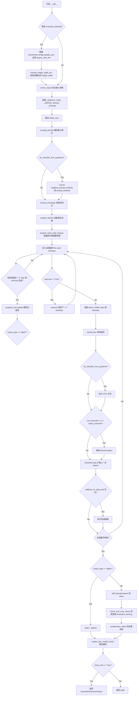

#### 带注释源码

```python
@torch.no_grad()
@replace_example_docstring(EXAMPLE_DOC_STRING)
def __call__(
    self,
    prompt: str | list[str] = None,
    negative_prompt: str = "",
    num_inference_steps: int = 50,
    timesteps: list[int] = None,
    sigmas: list[float] = None,
    guidance_scale: float = 6.0,
    num_videos_per_prompt: int | None = 1,
    height: int = 480,
    width: int = 832,
    frames: int = 81,
    eta: float = 0.0,
    generator: torch.Generator | list[torch.Generator] | None = None,
    latents: torch.Tensor | None = None,
    prompt_embeds: torch.Tensor | None = None,
    prompt_attention_mask: torch.Tensor | None = None,
    negative_prompt_embeds: torch.Tensor | None = None,
    negative_prompt_attention_mask: torch.Tensor | None = None,
    output_type: str | None = "pil",
    return_dict: bool = True,
    clean_caption: bool = False,
    use_resolution_binning: bool = True,
    attention_kwargs: dict[str, Any] | None = None,
    callback_on_step_end: Callable[[int, int], None] | None = None,
    callback_on_step_end_tensor_inputs: list[str] = ["latents"],
    max_sequence_length: int = 300,
    complex_human_instruction: list[str] = [
        "Given a user prompt, generate an 'Enhanced prompt' that provides detailed visual descriptions suitable for video generation..."
    ],
) -> SanaVideoPipelineOutput | tuple:
    """
    Function invoked when calling the pipeline for generation.
    """

    # 处理回调函数，将 PipelineCallback 转换为张量输入列表
    if isinstance(callback_on_step_end, (PipelineCallback, MultiPipelineCallbacks)):
        callback_on_step_end_tensor_inputs = callback_on_step_end.tensor_inputs

    # 1. 检查输入参数，使用 resolution_binning 时调整分辨率
    if use_resolution_binning:
        if self.transformer.config.sample_size == 30:
            aspect_ratio_bin = ASPECT_RATIO_480_BIN  # 480p 分箱
        elif self.transformer.config.sample_size == 22:
            aspect_ratio_bin = ASPECT_RATIO_720_BIN  # 720p 分箱
        else:
            raise ValueError("Invalid sample size")
        
        # 保存原始分辨率，用于后处理恢复
        orig_height, orig_width = height, width
        # 根据宽高比分箱调整到最接近的分辨率
        height, width = self.video_processor.classify_height_width_bin(height, width, ratios=aspect_ratio_bin)

    # 验证输入参数合法性
    self.check_inputs(
        prompt, height, width, callback_on_step_end_tensor_inputs,
        negative_prompt, prompt_embeds, negative_prompt_embeds,
        prompt_attention_mask, negative_prompt_attention_mask,
    )

    # 设置内部状态
    self._guidance_scale = guidance_scale
    self._attention_kwargs = attention_kwargs
    self._interrupt = False

    # 2. 确定批次大小
    if prompt is not None and isinstance(prompt, str):
        batch_size = 1
    elif prompt is not None and isinstance(prompt, list):
        batch_size = len(prompt)
    else:
        batch_size = prompt_embeds.shape[0]

    # 获取执行设备
    device = self._execution_device
    # 从 attention_kwargs 获取 LoRA scale
    lora_scale = self.attention_kwargs.get("scale", None) if self.attention_kwargs is not None else None

    # 3. 编码输入提示词
    (
        prompt_embeds,
        prompt_attention_mask,
        negative_prompt_embeds,
        negative_prompt_attention_mask,
    ) = self.encode_prompt(
        prompt,
        self.do_classifier_free_guidance,
        negative_prompt=negative_prompt,
        num_videos_per_prompt=num_videos_per_prompt,
        device=device,
        prompt_embeds=prompt_embeds,
        negative_prompt_embeds=negative_prompt_embeds,
        prompt_attention_mask=prompt_attention_mask,
        negative_prompt_attention_mask=negative_prompt_attention_mask,
        clean_caption=clean_caption,
        max_sequence_length=max_sequence_length,
        complex_human_instruction=complex_human_instruction,
        lora_scale=lora_scale,
    )

    # 如果使用 CFG，将负面和正面提示连接
    if self.do_classifier_free_guidance:
        prompt_embeds = torch.cat([negative_prompt_embeds, prompt_embeds], dim=0)
        prompt_attention_mask = torch.cat([negative_prompt_attention_mask, prompt_attention_mask], dim=0)

    # 4. 准备时间步
    timesteps, num_inference_steps = retrieve_timesteps(
        self.scheduler, num_inference_steps, device, timesteps, sigmas
    )

    # 5. 准备潜在向量
    latent_channels = self.transformer.config.in_channels
    latents = self.prepare_latents(
        batch_size * num_videos_per_prompt,
        latent_channels,
        height, width, frames,
        torch.float32, device, generator, latents,
    )

    # 6. 准备调度器额外参数
    extra_step_kwargs = self.prepare_extra_step_kwargs(generator, eta)

    # 7. 去噪循环
    num_warmup_steps = max(len(timesteps) - num_inference_steps * self.scheduler.order, 0)
    self._num_timesteps = len(timesteps)

    transformer_dtype = self.transformer.dtype
    with self.progress_bar(total=num_inference_steps) as progress_bar:
        for i, t in enumerate(timesteps):
            # 检查中断标志
            if self.interrupt:
                continue

            # 为 CFG 准备输入（复制 latents）
            latent_model_input = torch.cat([latents] * 2) if self.do_classifier_free_guidance else latents

            # 扩展时间步以匹配批次维度
            timestep = t.expand(latent_model_input.shape[0])

            # 使用 transformer 预测噪声
            noise_pred = self.transformer(
                latent_model_input.to(dtype=transformer_dtype),
                encoder_hidden_states=prompt_embeds.to(dtype=transformer_dtype),
                encoder_attention_mask=prompt_attention_mask,
                timestep=timestep,
                return_dict=False,
                attention_kwargs=self.attention_kwargs,
            )[0]
            noise_pred = noise_pred.float()

            # 执行 CFG 引导
            if self.do_classifier_free_guidance:
                noise_pred_uncond, noise_pred_text = noise_pred.chunk(2)
                noise_pred = noise_pred_uncond + guidance_scale * (noise_pred_text - noise_pred_uncond)

            # 处理学习的 sigma（如果输出通道是潜在通道的两倍）
            if self.transformer.config.out_channels // 2 == latent_channels:
                noise_pred = noise_pred.chunk(2, dim=1)[0]

            # 计算上一步：x_t -> x_t-1
            latents = self.scheduler.step(noise_pred, t, latents, **extra_step_kwargs, return_dict=False)[0]

            # 执行每步结束时的回调
            if callback_on_step_end is not None:
                callback_kwargs = {}
                for k in callback_on_step_end_tensor_inputs:
                    callback_kwargs[k] = locals()[k]
                callback_outputs = callback_on_step_end(self, i, t, callback_kwargs)

                # 更新回调返回的变量
                latents = callback_outputs.pop("latents", latents)
                prompt_embeds = callback_outputs.pop("prompt_embeds", prompt_embeds)
                negative_prompt_embeds = callback_outputs.pop("negative_prompt_embeds", negative_prompt_embeds)

            # 更新进度条（最后一步或 warmup 完成时）
            if i == len(timesteps) - 1 or ((i + 1) > num_warmup_steps and (i + 1) % self.scheduler.order == 0):
                progress_bar.update()

            # XLA 设备支持
            if XLA_AVAILABLE:
                xm.mark_step()

    # 8. 后处理：解码或直接返回潜在向量
    if output_type == "latent":
        video = latents
    else:
        # 准备 VAE 解码
        latents = latents.to(self.vae.dtype)
        torch_accelerator_module = getattr(torch, get_device(), torch.cuda)
        oom_error = (
            torch.OutOfMemoryError
            if is_torch_version(">=", "2.5.0")
            else torch_accelerator_module.OutOfMemoryError
        )
        
        # 反标准化潜在向量
        latents_mean = (
            torch.tensor(self.vae.config.latents_mean)
            .view(1, self.vae.config.z_dim, 1, 1, 1)
            .to(latents.device, latents.dtype)
        )
        latents_std = 1.0 / torch.tensor(self.vae.config.latents_std).view(1, self.vae.config.z_dim, 1, 1, 1).to(
            latents.device, latents.dtype
        )
        latents = latents / latents_std + latents_mean
        
        try:
            # VAE 解码潜在向量到视频
            video = self.vae.decode(latents, return_dict=False)[0]
        except oom_error as e:
            warnings.warn(
                f"{e}. \nTry to use VAE tiling for large images..."
            )

        # 如果使用分辨率分箱，调整回原始分辨率
        if use_resolution_binning:
            video = self.video_processor.resize_and_crop_tensor(video, orig_width, orig_height)

        # 后处理视频
        video = self.video_processor.postprocess_video(video, output_type=output_type)

    # 释放所有模型
    self.maybe_free_model_hooks()

    # 返回结果
    if not return_dict:
        return (video,)

    return SanaVideoPipelineOutput(frames=video)
```

## 关键组件


### SanaVideoPipeline

主视频生成管道类，继承自DiffusionPipeline和SanaLoraLoaderMixin，负责协调文本编码、潜在空间去噪和VAE解码的完整文本到视频生成流程。

### retrieve_timesteps

全局函数，用于从调度器获取时间步序列，支持自定义timesteps和sigmas参数，处理调度器的set_timesteps调用并返回时间步列表和推理步数。

### ASPECT_RATIO_480_BIN / ASPECT_RATIO_720_BIN

全局字典，定义了480p和720p分辨率下的宽高比分箱映射表，用于将请求的尺寸映射到最近的预定义分辨率，以优化模型生成效率。

### 张量索引与惰性加载

在encode_prompt方法中使用select_index = [0] + list(range(-max_length + 1, 0))进行索引选择，实现对prompt_embeds的高效切片，避免全量计算。

### 反量化支持

在VAE解码前使用latents_mean和latents_std对潜在向量进行反量化处理：latents = latents / latents_std + latents_mean，将标准化后的潜在表示恢复为原始分布。

### 分辨率分箱 (use_resolution_binning)

根据transformer.config.sample_size选择ASPECT_RATIO_480_BIN或ASPECT_RATIO_720_BIN，将用户请求的height和width映射到最近的有效分辨率，生成完成后通过resize_and_crop_tensor恢复到原始尺寸。

### VideoProcessor

视频处理组件，负责VAE缩放因子管理、视频后处理（转换为pil/np格式）和分辨率调整，支持tiling以处理大尺寸视频避免OOM。

### Classifier-Free Guidance

在去噪循环中实现无条件与条件噪声预测的组合：noise_pred = noise_pred_uncond + guidance_scale * (noise_pred_text - noise_pred_uncond)，通过cfg_scale控制文本保真度。

### LoRA支持

继承SanaLoraLoaderMixin，在encode_prompt中通过scale_lora_layers和unscale_lora_layers动态调整LoRA权重，支持通过attention_kwargs传递lora_scale参数。

### 复杂人类指令 (complex_human_instruction)

在_get_gemma_prompt_embeds中支持复杂人类指令增强，通过在原始prompt前添加详细的视觉描述指令，提升生成视频的细节表现。

### VAE解码与OOM处理

在最终解码阶段捕获OutOfMemoryError，提供tiling启用建议warning，支持AutoencoderKLWan和AutoencoderDC两种VAE架构。

### 调度器集成

使用DPMSolverMultistepScheduler，通过prepare_extra_step_kwargs处理不同调度器的参数签名差异，支持eta和generator参数传递。

### 回调机制

支持callback_on_step_end和callback_on_step_end_tensor_inputs，允许在每个去噪步骤后执行自定义操作，可修改latents和prompt_embeds。


## 问题及建议


### 已知问题

- **大量代码重复**：多个方法（如`_get_gemma_prompt_embeds`、`retrieve_timesteps`、`_text_preprocessing`、`_clean_caption`、`prepare_extra_step_kwargs`）标注为"Copied from"，表明代码是从其他Pipeline复制而来，导致维护困难，违反DRY原则。
- **超长默认参数**：`__call__`方法中`complex_human_instruction`参数包含超过30行的默认指令字符串，导致方法签名过于臃肿，影响代码可读性和可维护性。
- **重复的embedding处理逻辑**：在`encode_prompt`方法中，positive和negative prompt的重复处理逻辑（重复、view操作）存在代码重复，可以抽象为独立方法。
- **类型注解不完整**：`ASPECT_RATIO_480_BIN`和`ASPECT_RATIO_720_BIN`全局字典变量缺少类型注解；部分方法返回值类型使用`tuple`而非具体类型元组。
- **硬编码配置**：VAE的scale factor通过`getattr(self, "vae", None)`动态获取但有备选值逻辑；`vae_scale_factor`在`temporal`和`spatial`两个属性之后又被覆盖为spatial值，逻辑不清晰。
- **OOM处理简陋**：VAE解码时的OOM错误处理仅打印警告信息，缺少重试机制或降级策略。
- **未使用的变量**：方法中某些变量（如`select_index`的计算结果）未被充分利用或可简化。
- **条件检查冗余**：多处使用`getattr(self, "tokenizer", None)`检查模块是否存在，可以统一到初始化阶段的验证。

### 优化建议

- **抽取公共模块**：将复制的函数提取到基类或工具模块中，通过继承或组合方式复用，减少代码冗余。
- **简化默认参数**：将`complex_human_instruction`配置外部化到配置文件或单独的常量中，使用时动态加载。
- **抽象embedding处理**：将prompt embedding的重复、维度变换逻辑抽取为独立方法如`_expand_embeds`和`_duplicate_for_cfg`。
- **完善类型注解**：为全局字典添加类型注解`Dict[str, List[float]]`；将`__call__`等方法的返回类型改为具体元组类型。
- **增强错误处理**：为VAE解码添加更健壮的OOM处理，如自动启用tiling、降低分辨率或回退到CPU解码。
- **统一模块检查**：在`__init__`中验证必需模块是否存在并存储为实例属性，避免运行时重复检查。
- **清理冗余逻辑**：移除`vae_scale_factor`的不必要覆盖逻辑，明确各scale factor的职责。

## 其它


### 设计目标与约束

本pipeline的设计目标是将文本描述转换为高质量视频，基于Sana模型架构。核心约束包括：1) 输入的height和width必须能被32整除；2) 支持480p和720p两种分辨率模式，通过transformer.config.sample_size区分；3) 帧数必须与VAE时间缩放因子匹配；4) 默认使用classifier-free guidance进行条件生成，guidance_scale > 1.0时启用；5) prompt_embeds与negative_prompt_embeds必须形状一致。

### 错误处理与异常设计

代码采用分层错误处理策略。输入验证层在check_inputs方法中检查：尺寸对齐、回调张量合法性、prompt与embeds互斥、类型检查、mask与embeds一致性。运行时错误处理包括：1) OOM错误捕获与VAE tiling降级建议；2) XLA设备的mark_step同步；3) 调度器参数兼容性检查（eta、generator支持性探测）；4) LoRA scale的动态调整与还原。关键异常类型：ValueError用于参数校验，torch.OutOfMemoryError用于内存溢出，warnings.warn用于非致命运行时警告。

### 数据流与状态机

Pipeline执行分为6个阶段：1) 输入预处理（check_inputs + resolution binning）；2) Prompt编码（encode_prompt生成embeddings和attention masks）；3) 时间步初始化（retrieve_timesteps）；4) 潜在空间初始化（prepare_latents）；5) 去噪循环（transformer预测噪声 + scheduler.step）；6) VAE解码与后处理。状态转换通过_guidance_scale、_attention_kwargs、_interrupt、_num_timesteps属性管理。关键分支点：do_classifier_free_guidance决定是否拼接negative embeddings；output_type决定是否执行VAE decode。

### 外部依赖与接口契约

核心依赖包括：transformers库（Gemma2PreTrainedModel、GemmaTokenizer）、diffusers库（DiffusionPipeline、DPMSolverMultistepScheduler、PipelineCallback）、torch生态（torch.cuda、torch_xla）。模块依赖：.../loaders/SanaLoraLoaderMixin（LoRA加载）、.../models/AutoencoderKLWan|AutoencoderDC（VAE）、.../models/SanaVideoTransformer3DModel（Transformer）、.../video_processor/VideoProcessor（视频处理）。可选依赖（通过is_bs4_available/is_ftfy_available检测）：beautifulsoup4（caption清洗）、ftfy（文本修复）。模型组件通过register_modules注册，支持from_pretrained加载。

### 性能考虑与优化空间

性能优化机制包括：1) 模型CPU卸载序列（model_cpu_offload_seq = "text_encoder->transformer->vae"）；2) VAE tiling支持（tile_sample_min_width/height参数）；3) LoRA动态加载与缩放（scale_lora_layers/unscale_lora_layers）；4) 潜在空间复用（latents参数允许用户注入）；5) XLA设备同步优化。潜在优化方向：1) VAE decode可能触发OOM，建议默认启用tiling；2) 文本编码器dtype（bfloat16）与transformer dtype需匹配；3) 多视频生成时embeddings重复逻辑可优化；4) 调度器step的extra_step_kwargs每次迭代重复计算。

### 配置与可扩展性设计

Pipeline通过register_modules实现组件热插拔，支持替换tokenizer、text_encoder、vae、transformer、scheduler。LoRA支持通过SanaLoraLoaderMixin实现，attention_kwargs机制允许传递注意力处理器参数。Resolution binning支持自定义aspect_ratio_bin映射表。回调机制支持PipelineCallback和MultiPipelineCallbacks，可介入每个去噪步骤。complex_human_instruction支持自定义prompt增强策略。输出格式通过output_type参数支持pil、latent、np.array等多种模式。

### 版本兼容性与平台适配

代码处理多平台兼容性：1) torch版本检测（is_torch_version）用于适配OutOfMemoryError类型；2) XLA支持检测与条件导入（is_torch_xla_available）；3) MPS友好方法（.repeat而非torch.repeat_interleave）；4) dtype动态推断（text_encoder.dtype回退）。环境变量USE_PEFT_BACKEND控制LoRA后端行为。ASPECT_RATIO_480_BIN和ASPECT_RATIO_720_BIN两套配置对应transformer的sample_size=30和sample_size=22。

    