# `diffusers\src\diffusers\pipelines\sana_video\pipeline_sana_video_i2v.py` 详细设计文档

SanaImageToVideoPipeline是一个基于Sana模型的图像到视频生成扩散管道，接收输入图像和文本提示，利用变分自编码器(VAE)、文本编码器和3D变换器进行去噪处理，最终生成与文本描述相符的视频内容。

## 整体流程

```mermaid
graph TD
A[开始: 调用__call__] --> B[检查输入: check_inputs]
B --> C{use_resolution_binning?}
C -- 是 --> D[调整分辨率到最佳宽高比]
C -- 否 --> E[编码提示词: encode_prompt]
D --> E
E --> F[准备时间步: retrieve_timesteps]
F --> G[预处理图像并准备潜在变量: prepare_latents]
G --> H[创建条件掩码: conditioning_mask]
I[去噪循环: for t in timesteps] --> J[拼接潜在变量和条件掩码]
J --> K[Transformer预测噪声: transformer()]
K --> L{guidance_scale > 1?}
L -- 是 --> M[应用Classifier-Free Guidance]
L -- 否 --> N[scheduler.step更新潜在变量]
M --> N
N --> O{是否最后一步?}
O -- 否 --> I
O -- 是 --> P{output_type=='latent'?}
P -- 是 --> Q[直接返回潜在变量]
P -- 否 --> R[VAE解码: vae.decode]
R --> S[后处理视频: postprocess_video]
S --> T[资源释放: maybe_free_model_hooks]
T --> U[返回SanaVideoPipelineOutput]
```

## 类结构

```
DiffusionPipeline (基类)
├── SanaLoraLoaderMixin (混入类)
└── SanaImageToVideoPipeline (主类)
```

## 全局变量及字段


### `logger`
    
模块级日志记录器，用于输出调试和运行信息

类型：`logging.Logger`
    


### `EXAMPLE_DOC_STRING`
    
示例文档字符串，包含Sana图像到视频管道使用示例的Markdown格式说明

类型：`str`
    


### `XLA_AVAILABLE`
    
标志位，表示PyTorch XLA是否可用，用于TPU加速

类型：`bool`
    


### `bad_punct_regex`
    
类级别正则表达式，用于匹配和过滤文本中的特殊标点符号

类型：`re.Pattern`
    


### `SanaImageToVideoPipeline.tokenizer`
    
文本分词器，用于将输入文本转换为模型可处理的token序列

类型：`GemmaTokenizer | GemmaTokenizerFast`
    


### `SanaImageToVideoPipeline.text_encoder`
    
文本编码器模型，将文本提示转换为语义嵌入向量

类型：`Gemma2PreTrainedModel`
    


### `SanaImageToVideoPipeline.vae`
    
变分自编码器，负责视频帧的编码和解码，以及潜在空间的映射

类型：`AutoencoderDC | AutoencoderKLWan`
    


### `SanaImageToVideoPipeline.transformer`
    
条件变换器模型，在去噪过程中根据文本嵌入和图像条件预测噪声

类型：`SanaVideoTransformer3DModel`
    


### `SanaImageToVideoPipeline.scheduler`
    
调度器，控制扩散模型的时间步进和噪声调度策略

类型：`FlowMatchEulerDiscreteScheduler`
    


### `SanaImageToVideoPipeline.vae_scale_factor_temporal`
    
VAE时间缩放因子，用于调整视频帧在时间维度上的潜在空间大小

类型：`int`
    


### `SanaImageToVideoPipeline.vae_scale_factor_spatial`
    
VAE空间缩放因子，用于调整视频帧在空间维度上的潜在空间大小

类型：`int`
    


### `SanaImageToVideoPipeline.vae_scale_factor`
    
VAE综合缩放因子，综合空间缩放因子用于潜在空间的计算

类型：`int`
    


### `SanaImageToVideoPipeline.transformer_spatial_patch_size`
    
变换器空间块大小，定义空间注意力计算的分块尺寸

类型：`int`
    


### `SanaImageToVideoPipeline.transformer_temporal_patch_size`
    
变换器时间块大小，定义时间注意力计算的分块尺寸

类型：`int`
    


### `SanaImageToVideoPipeline.video_processor`
    
视频处理器，负责视频帧的预处理、缩放、后处理和分辨率分箱

类型：`VideoProcessor`
    


### `SanaImageToVideoPipeline.bad_punct_regex`
    
坏标点符号正则表达式，用于文本清洗时识别和移除特殊字符

类型：`re.Pattern`
    


### `SanaImageToVideoPipeline.model_cpu_offload_seq`
    
CPU卸载顺序，定义模型组件从GPU卸载到CPU的序列

类型：`str`
    


### `SanaImageToVideoPipeline._callback_tensor_inputs`
    
回调张量输入列表，指定哪些张量可以传递给推理步骤的回调函数

类型：`list`
    


### `SanaImageToVideoPipeline._guidance_scale`
    
引导缩放因子，控制无分类器自由引导的强度，影响文本条件对生成结果的影响程度

类型：`float`
    


### `SanaImageToVideoPipeline._attention_kwargs`
    
注意力关键字参数字典，存储传递给注意力处理器的可选参数

类型：`dict`
    


### `SanaImageToVideoPipeline._num_timesteps`
    
时间步数，记录扩散模型推理过程中的总步数

类型：`int`
    


### `SanaImageToVideoPipeline._interrupt`
    
中断标志，用于在推理过程中接收外部信号以暂停或终止生成

类型：`bool`
    
    

## 全局函数及方法


### `retrieve_timesteps`

该函数是 Sana 视频生成管道中的一个工具函数，用于配置扩散调度器（Scheduler）的时间步（timesteps）策略。它支持默认的推理步数、自定义时间步或自定义 Sigmas，并通过调用调度器的 `set_timesteps` 方法来生成时间步序列，最后返回时间步张量和实际的推理步数。

参数：

- `scheduler`：`SchedulerMixin`，要配置的时间步调度器实例。
- `num_inference_steps`：`int | None`，生成样本时使用的扩散步数。如果使用此参数，`timesteps` 必须为 `None`。
- `device`：`str | torch.device | None`，时间步要移动到的设备。如果为 `None`，则不移动。
- `timesteps`：`list[int] | None`，用于覆盖调度器时间步间隔策略的自定义时间步。如果传入 `timesteps`，则 `num_inference_steps` 和 `sigmas` 必须为 `None`。
- `sigmas`：`list[float] | None`，用于覆盖调度器时间步间隔策略的自定义 sigmas。如果传入 `sigmas`，则 `num_inference_steps` 和 `timesteps` 必须为 `None`。
- `**kwargs`：任意关键字参数，将传递给 `scheduler.set_timesteps`。

返回值：`tuple[torch.Tensor, int]`，元组包含调度器的时间步时间表和推理步数。

#### 流程图

```mermaid
flowchart TD
    A([Start retrieve_timesteps]) --> B{Is timesteps and sigmas<br/>both provided?}
    B -- Yes --> C[Raise ValueError:<br/>Only one can be passed]
    B -- No --> D{Is timesteps provided?}
    D -- Yes --> E{Does scheduler.set_timesteps<br/>support timesteps?}
    E -- No --> F[Raise ValueError:<br/>Scheduler does not support<br/>custom timesteps]
    E -- Yes --> G[scheduler.set_timesteps<br/>timesteps=timesteps]
    G --> H[timesteps = scheduler.timesteps]
    H --> I[num_inference_steps = len(timesteps)]
    D -- No --> J{Is sigmas provided?}
    J -- Yes --> K{Does scheduler.set_timesteps<br/>support sigmas?}
    K -- No --> L[Raise ValueError:<br/>Scheduler does not support<br/>custom sigmas]
    K --> M[scheduler.set_timesteps<br/>sigmas=sigmas]
    M --> N[timesteps = scheduler.timesteps]
    N --> O[num_inference_steps = len(timesteps)]
    J -- No --> P[scheduler.set_timesteps<br/>num_inference_steps]
    P --> Q[timesteps = scheduler.timesteps]
    Q --> R([Return timesteps, num_inference_steps])
```

#### 带注释源码

```python
# Copied from diffusers.pipelines.stable_diffusion.pipeline_stable_diffusion.retrieve_timesteps
def retrieve_timesteps(
    scheduler,
    num_inference_steps: int | None = None,
    device: str | torch.device | None = None,
    timesteps: list[int] | None = None,
    sigmas: list[float] | None = None,
    **kwargs,
):
    r"""
    Calls the scheduler's `set_timesteps` method and retrieves timesteps from the scheduler after the call. Handles
    custom timesteps. Any kwargs will be supplied to `scheduler.set_timesteps`.

    Args:
        scheduler (`SchedulerMixin`):
            The scheduler to get timesteps from.
        num_inference_steps (`int`):
            The number of diffusion steps used when generating samples with a pre-trained model. If used, `timesteps`
            must be `None`.
        device (`str` or `torch.device`, *optional*):
            The device to which the timesteps should be moved to. If `None`, the timesteps are not moved.
        timesteps (`list[int]`, *optional*):
            Custom timesteps used to override the timestep spacing strategy of the scheduler. If `timesteps` is passed,
            `num_inference_steps` and `sigmas` must be `None`.
        sigmas (`list[float]`, *optional*):
            Custom sigmas used to override the timestep spacing strategy of the scheduler. If `sigmas` is passed,
            `num_inference_steps` and `timesteps` must be `None`.

    Returns:
        `tuple[torch.Tensor, int]`: A tuple where the first element is the timestep schedule from the scheduler and the
        second element is the number of inference steps.
    """
    # 检查是否同时传入了 timesteps 和 sigmas，这是不允许的
    if timesteps is not None and sigmas is not None:
        raise ValueError("Only one of `timesteps` or `sigmas` can be passed. Please choose one to set custom values")
    
    # 处理自定义 timesteps 的情况
    if timesteps is not None:
        # 检查调度器的 set_timesteps 方法是否接受 timesteps 参数
        accepts_timesteps = "timesteps" in set(inspect.signature(scheduler.set_timesteps).parameters.keys())
        if not accepts_timesteps:
            raise ValueError(
                f"The current scheduler class {scheduler.__class__}'s `set_timesteps` does not support custom"
                f" timestep schedules. Please check whether you are using the correct scheduler."
            )
        # 调用调度器设置自定义时间步
        scheduler.set_timesteps(timesteps=timesteps, device=device, **kwargs)
        # 从调度器获取生成的时间步
        timesteps = scheduler.timesteps
        # 计算推理步数
        num_inference_steps = len(timesteps)
    # 处理自定义 sigmas 的情况
    elif sigmas is not None:
        # 检查调度器的 set_timesteps 方法是否接受 sigmas 参数
        accept_sigmas = "sigmas" in set(inspect.signature(scheduler.set_timesteps).parameters.keys())
        if not accept_sigmas:
            raise ValueError(
                f"The current scheduler class {scheduler.__class__}'s `set_timesteps` does not support custom"
                f" sigmas schedules. Please check whether you are using the correct scheduler."
            )
        # 调用调度器设置自定义 sigmas
        scheduler.set_timesteps(sigmas=sigmas, device=device, **kwargs)
        # 从调度器获取生成的时间步
        timesteps = scheduler.timesteps
        # 计算推理步数
        num_inference_steps = len(timesteps)
    # 默认行为：使用 num_inference_steps 设置时间步
    else:
        scheduler.set_timesteps(num_inference_steps, device=device, **kwargs)
        timesteps = scheduler.timesteps
    
    # 返回时间步列表和推理步数
    return timesteps, num_inference_steps
```


### `retrieve_latents`

该函数是一个工具函数，用于从编码器输出（encoder_output）中提取潜在表示（latents）。它支持多种提取模式，包括从潜在分布中采样（sample）、取潜在分布的众数（argmax），或者直接访问预计算的 latents 属性。

参数：

- `encoder_output`：`torch.Tensor`，编码器的输出对象，可能包含 `latent_dist` 或 `latents` 属性
- `generator`：`torch.Generator | None`，可选的随机生成器，用于控制采样过程中的随机性
- `sample_mode`：`str`，采样模式，默认为 `"sample"`，可选值包括 `"sample"` 和 `"argmax"`

返回值：`torch.Tensor`，从编码器输出中提取的潜在表示张量

#### 流程图

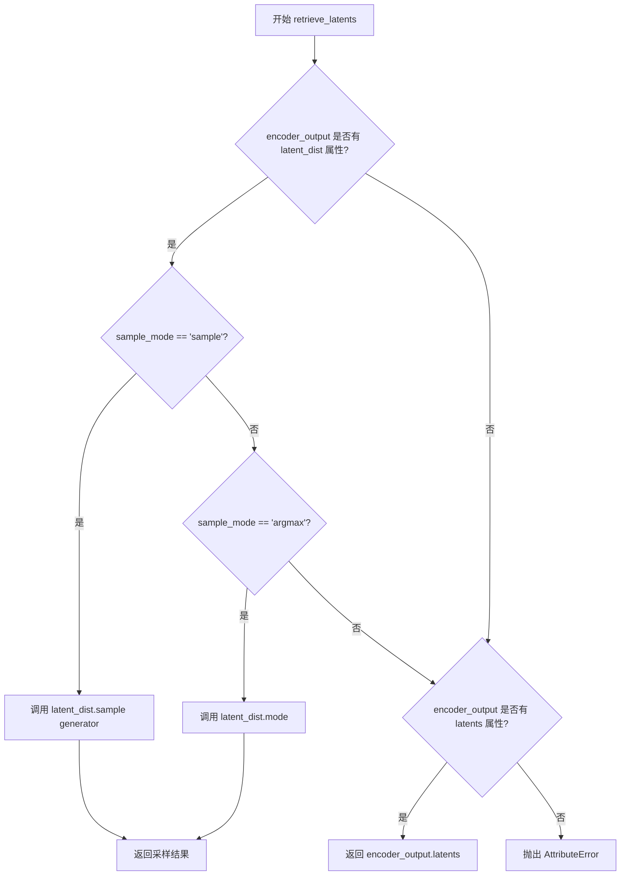

#### 带注释源码

```python
def retrieve_latents(
    encoder_output: torch.Tensor, generator: torch.Generator | None = None, sample_mode: str = "sample"
):
    """
    从编码器输出中提取潜在表示（latents）。

    Args:
        encoder_output: 编码器的输出对象，通常包含 latent_dist 或 latents 属性
        generator: 可选的随机生成器，用于控制采样过程中的随机性
        sample_mode: 采样模式，'sample' 表示从分布中采样，'argmax' 表示取分布的众数

    Returns:
        torch.Tensor: 提取的潜在表示张量

    Raises:
        AttributeError: 当无法从 encoder_output 中提取 latents 时抛出
    """
    # 检查 encoder_output 是否有 latent_dist 属性，并且采样模式为 "sample"
    if hasattr(encoder_output, "latent_dist") and sample_mode == "sample":
        # 从潜在分布中采样，返回采样结果
        return encoder_output.latent_dist.sample(generator)
    # 检查 encoder_output 是否有 latent_dist 属性，并且采样模式为 "argmax"
    elif hasattr(encoder_output, "latent_dist") and sample_mode == "argmax":
        # 取潜在分布的众数（最大值对应的类别）
        return encoder_output.latent_dist.mode()
    # 检查 encoder_output 是否有预计算的 latents 属性
    elif hasattr(encoder_output, "latents"):
        # 直接返回预计算的 latents
        return encoder_output.latents
    # 如果以上条件都不满足，抛出 AttributeError 异常
    else:
        raise AttributeError("Could not access latents of provided encoder_output")
```


### SanaImageToVideoPipeline.__init__

 SanaImageToVideoPipeline 类的初始化方法，负责构建图像到视频生成管道。该方法接收分词器、文本编码器、VAE模型、Transformer模型和调度器作为参数，完成各模块的注册和关键配置参数的初始化。

参数：

- `tokenizer`：`GemmaTokenizer | GemmaTokenizerFast`，用于将文本提示转换为token序列
- `text_encoder`：`Gemma2PreTrainedModel`，将token序列编码为文本嵌入向量
- `vae`：`AutoencoderDC | AutoencoderKLWan`，变分自编码器，用于编码和解码视频潜在表示
- `transformer`：`SanaVideoTransformer3DModel`，条件Transformer模型，用于对潜在表示进行去噪
- `scheduler`：`FlowMatchEulerDiscreteScheduler`，用于去噪过程的调度器

返回值：`None`，构造函数无返回值

#### 流程图

```mermaid
flowchart TD
    A[开始 __init__] --> B[调用 super().__init__ 初始化基类]
    B --> C[register_modules 注册所有模块]
    C --> D[获取 VAE temporal scale factor]
    C --> E[获取 VAE spatial scale factor]
    D --> F[设置 vae_scale_factor]
    E --> F
    F --> G[获取 Transformer spatial patch size]
    G --> H[获取 Transformer temporal patch size]
    H --> I[创建 VideoProcessor]
    I --> J[结束 __init__]
```

#### 带注释源码

```python
def __init__(
    self,
    tokenizer: GemmaTokenizer | GemmaTokenizerFast,
    text_encoder: Gemma2PreTrainedModel,
    vae: AutoencoderDC | AutoencoderKLWan,
    transformer: SanaVideoTransformer3DModel,
    scheduler: FlowMatchEulerDiscreteScheduler,
):
    """
    初始化 SanaImageToVideoPipeline 管道
    
    参数:
        tokenizer: Gemma分词器，用于文本预处理
        text_encoder: Gemma2预训练文本编码器
        vae: 视频VAE模型，支持AutoencoderDC或AutoencoderKLWan
        transformer: Sana视频3D Transformer模型
        scheduler: FlowMatch欧拉离散调度器
    """
    # 调用父类DiffusionPipeline的初始化方法
    # 设置pipeline的基本框架和配置
    super().__init__()

    # 将所有核心模块注册到pipeline中
    # 这些模块可以通过self.tokenizer, self.text_encoder等方式访问
    self.register_modules(
        tokenizer=tokenizer, 
        text_encoder=text_encoder, 
        vae=vae, 
        transformer=transformer, 
        scheduler=scheduler
    )

    # 获取VAE的时间缩放因子
    # 用于将帧数转换为潜在帧数，默认为4
    self.vae_scale_factor_temporal = self.vae.config.scale_factor_temporal if getattr(self, "vae", None) else 4
    
    # 获取VAE的空间缩放因子
    # 用于将图像尺寸转换为潜在尺寸，默认为8
    self.vae_scale_factor_spatial = self.vae.config.scale_factor_spatial if getattr(self, "vae", None) else 8

    # 设置主VAE缩放因子为空间缩放因子
    self.vae_scale_factor = self.vae_scale_factor_spatial

    # 获取Transformer的空间patch大小
    # 用于处理空间维度的分块，默认为1
    self.transformer_spatial_patch_size = (
        self.transformer.config.patch_size[1] if getattr(self, "transformer", None) is not None else 1
    )
    
    # 获取Transformer的时间patch大小
    # 用于处理时间维度的分块，默认为1
    self.transformer_temporal_patch_size = (
        self.transformer.config.patch_size[0] if getattr(self, "transformer") is not None else 1
    )

    # 创建视频处理器
    # 使用空间缩放因子来处理视频帧的预处理和后处理
    self.video_processor = VideoProcessor(vae_scale_factor=self.vae_scale_factor_spatial)
```


### `SanaImageToVideoPipeline._get_gemma_prompt_embeds`

该方法负责将文本提示词（prompt）编码为文本编码器的隐藏状态（embedding），是 Sana 图像到视频生成管道的核心组成部分，用于处理用户输入的文本描述并生成可供Transformer模型使用的向量表示。

参数：

- `self`：`SanaImageToVideoPipeline` 实例本身
- `prompt`：`str | list[str]`，要编码的文本提示词，可以是单个字符串或字符串列表
- `device`：`torch.device`，用于放置生成嵌入向量的目标设备
- `dtype`：`torch.dtype`，生成嵌入向量的目标数据类型
- `clean_caption`：`bool`，默认为 `False`，是否对提示词进行预处理和清理（如去除特殊字符、HTML标签等）
- `max_sequence_length`：`int`，默认为 300，提示词的最大序列长度限制
- `complex_human_instruction`：`list[str] | None`，默认为 `None`，复杂人类指令列表，如果提供则会将指令添加到提示词前面

返回值：`tuple[torch.Tensor, torch.Tensor]`，返回一个元组，包含：
- `prompt_embeds`：`torch.Tensor`，文本编码器生成的隐藏状态向量
- `prompt_attention_mask`：`torch.Tensor`，用于指示有效 token 位置的注意力掩码

#### 流程图

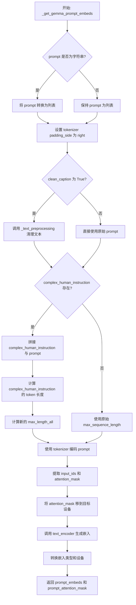

#### 带注释源码

```python
# Copied from diffusers.pipelines.sana.pipeline_sana.SanaPipeline._get_gemma_prompt_embeds
def _get_gemma_prompt_embeds(
    self,
    prompt: str | list[str],
    device: torch.device,
    dtype: torch.dtype,
    clean_caption: bool = False,
    max_sequence_length: int = 300,
    complex_human_instruction: list[str] | None = None,
):
    r"""
    Encodes the prompt into text encoder hidden states.

    Args:
        prompt (`str` or `list[str]`, *optional*):
            prompt to be encoded
        device: (`torch.device`, *optional*):
            torch device to place the resulting embeddings on
        clean_caption (`bool`, defaults to `False`):
            If `True`, the function will preprocess and clean the provided caption before encoding.
        max_sequence_length (`int`, defaults to 300): Maximum sequence length to use for the prompt.
        complex_human_instruction (`list[str]`, defaults to `complex_human_instruction`):
            If `complex_human_instruction` is not empty, the function will use the complex Human instruction for
            the prompt.
    """
    # 如果 prompt 是单个字符串，转换为列表以便批量处理
    prompt = [prompt] if isinstance(prompt, str) else prompt

    # 确保 tokenizer 的 padding 侧为右侧（这是 Gemma 模型的要求）
    if getattr(self, "tokenizer", None) is not None:
        self.tokenizer.padding_side = "right"

    # 对 prompt 进行文本预处理（清洗 HTML、转小写等操作）
    prompt = self._text_preprocessing(prompt, clean_caption=clean_caption)

    # 准备复杂人类指令（如果提供）
    if not complex_human_instruction:
        # 没有复杂指令时，使用默认的最大长度
        max_length_all = max_sequence_length
    else:
        # 将复杂指令用换行符连接成单个字符串
        chi_prompt = "\n".join(complex_human_instruction)
        # 将复杂指令添加到每个 prompt 的前面
        prompt = [chi_prompt + p for p in prompt]
        # 计算复杂指令的 token 数量
        num_chi_prompt_tokens = len(self.tokenizer.encode(chi_prompt))
        # 总最大长度 = 复杂指令 token 数 + 用户 prompt token 数 - 2（特殊 token）
        max_length_all = num_chi_prompt_tokens + max_sequence_length - 2

    # 使用 tokenizer 将文本转换为模型输入张量
    text_inputs = self.tokenizer(
        prompt,
        padding="max_length",          # 填充到最大长度
        max_length=max_length_all,      # 使用计算后的最大长度
        truncation=True,                # 截断超长文本
        add_special_tokens=True,        # 添加特殊 token（如 [CLS], [SEP]）
        return_tensors="pt",            # 返回 PyTorch 张量
    )
    # 提取 input_ids 和 attention_mask
    text_input_ids = text_inputs.input_ids

    prompt_attention_mask = text_inputs.attention_mask
    # 将 attention_mask 移动到目标设备
    prompt_attention_mask = prompt_attention_mask.to(device)

    # 调用文本编码器生成嵌入向量
    prompt_embeds = self.text_encoder(text_input_ids.to(device), attention_mask=prompt_attention_mask)
    # 提取隐藏状态并转换到目标数据类型和设备
    prompt_embeds = prompt_embeds[0].to(dtype=dtype, device=device)

    # 返回嵌入向量和注意力掩码
    return prompt_embeds, prompt_attention_mask
```


### `SanaImageToVideoPipeline.encode_prompt`

该方法负责将文本提示（prompt）编码为文本编码器的隐藏状态，支持分类器自由引导（Classifier-Free Guidance），并处理LoRA缩放、提示嵌入重复和负面提示嵌入生成等逻辑。

参数：

- `self`：`SanaImageToVideoPipeline` 类实例
- `prompt`：`str | list[str]`，要编码的文本提示
- `do_classifier_free_guidance`：`bool`，是否启用分类器自由引导，默认为 `True`
- `negative_prompt`：`str`，负面提示，用于引导模型避免生成相关内容，默认为空字符串
- `num_videos_per_prompt`：`int`，每个提示要生成的视频数量，默认为 1
- `device`：`torch.device | None`，编码器运行时所在的设备，默认为 `None`
- `prompt_embeds`：`torch.Tensor | None`，预生成的提示嵌入，若提供则直接从该参数计算，默认为 `None`
- `negative_prompt_embeds`：`torch.Tensor | None`，预生成的负面提示嵌入，默认为 `None`
- `prompt_attention_mask`：`torch.Tensor | None`，提示的注意力掩码，默认为 `None`
- `negative_prompt_attention_mask`：`torch.Tensor | None`，负面提示的注意力掩码，默认为 `None`
- `clean_caption`：`bool`，是否在编码前清理和预处理提示文本，默认为 `False`
- `max_sequence_length`：`int`，提示的最大序列长度，默认为 300
- `complex_human_instruction`：`list[str] | None`，复杂人工指令列表，用于增强提示，默认为 `None`
- `lora_scale`：`float | None`，LoRA 层的缩放因子，用于调整 LoRA 权重的影响，默认为 `None`

返回值：`tuple[torch.Tensor, torch.Tensor, torch.Tensor, torch.Tensor]`，返回四个张量组成的元组：
- `prompt_embeds`：编码后的提示嵌入，形状为 `(batch_size * num_videos_per_prompt, seq_len, hidden_dim)`
- `prompt_attention_mask`：提示的注意力掩码，形状为 `(batch_size * num_videos_per_prompt, seq_len)`
- `negative_prompt_embeds`：编码后的负面提示嵌入，形状为 `(batch_size * num_videos_per_prompt, seq_len, hidden_dim)`
- `negative_prompt_attention_mask`：负面提示的注意力掩码，形状为 `(batch_size * num_videos_per_prompt, seq_len)`

#### 流程图

```mermaid
flowchart TD
    A[encode_prompt 开始] --> B{device 是否为 None?}
    B -- 是 --> C[使用 self._execution_device]
    B -- 否 --> D[使用传入的 device]
    C --> E{self.text_encoder 是否存在?}
    D --> E
    E -- 是 --> F[获取 text_encoder 的 dtype]
    E -- 否 --> G[dtype 设为 None]
    F --> H{lora_scale 是否非空且是 SanaLoraLoaderMixin?}
    G --> H
    H -- 是 --> I[设置 self._lora_scale 并动态调整 LoRA 缩放]
    H -- 否 --> J{prompt 是否为 str?}
    I --> J
    J -- 是 --> K[batch_size = 1]
    J -- 否 --> L{prompt 是否为 list?}
    L -- 是 --> M[batch_size = len(prompt)]
    L -- 否 --> N[batch_size = prompt_embeds.shape[0]]
    K --> O[设置 tokenizer padding_side 为 right]
    M --> O
    N --> O
    O --> P[计算 max_length 和 select_index]
    P --> Q{prompt_embeds 是否为 None?}
    Q -- 是 --> R[调用 _get_gemma_prompt_embeds 获取嵌入]
    Q -- 否 --> S[直接使用 prompt_embeds]
    R --> T[使用 select_index 切片嵌入]
    S --> T
    T --> U[重复 prompt_embeds 和 attention_mask 以支持 num_videos_per_prompt]
    U --> V{do_classifier_free_guidance 为真且 negative_prompt_embeds 为 None?}
    V -- 是 --> W[调用 _get_gemma_prompt_embeds 获取负面嵌入]
    V -- 否 --> X
    W --> Y[重复 negative_prompt_embeds 以支持 CFG]
    X --> Z{do_classifier_free_guidance?}
    Y --> Z
    Z -- 是 --> AA[返回四个嵌入和掩码]
    Z -- 否 --> AB[negative_prompt_embeds 和 mask 设为 None]
    AB --> AA
    AA --> AC[如果是 SanaLoraLoaderMixin 且使用 PEFT 后端, 恢复 LoRA 缩放]
    AC --> AD[encode_prompt 结束]
```

#### 带注释源码

```python
def encode_prompt(
    self,
    prompt: str | list[str],
    do_classifier_free_guidance: bool = True,
    negative_prompt: str = "",
    num_videos_per_prompt: int = 1,
    device: torch.device | None = None,
    prompt_embeds: torch.Tensor | None = None,
    negative_prompt_embeds: torch.Tensor | None = None,
    prompt_attention_mask: torch.Tensor | None = None,
    negative_prompt_attention_mask: torch.Tensor | None = None,
    clean_caption: bool = False,
    max_sequence_length: int = 300,
    complex_human_instruction: list[str] | None = None,
    lora_scale: float | None = None,
):
    r"""
    Encodes the prompt into text encoder hidden states.

    Args:
        prompt (`str` or `list[str]`, *optional*):
            prompt to be encoded
        negative_prompt (`str` or `list[str]`, *optional*):
            The prompt not to guide the video generation. If not defined, one has to pass `negative_prompt_embeds`
            instead. Ignored when not using guidance (i.e., ignored if `guidance_scale` is less than `1`). For
            PixArt-Alpha, this should be "".
        do_classifier_free_guidance (`bool`, *optional*, defaults to `True`):
            whether to use classifier free guidance or not
        num_videos_per_prompt (`int`, *optional*, defaults to 1):
            number of videos that should be generated per prompt
        device: (`torch.device`, *optional*):
            torch device to place the resulting embeddings on
        prompt_embeds (`torch.Tensor`, *optional*):
            Pre-generated text embeddings. Can be used to easily tweak text inputs, *e.g.* prompt weighting. If not
            provided, text embeddings will be generated from `prompt` input argument.
        negative_prompt_embeds (`torch.Tensor`, *optional*):
            Pre-generated negative text embeddings. For Sana, it's should be the embeddings of the "" string.
        clean_caption (`bool`, defaults to `False`):
            If `True`, the function will preprocess and clean the provided caption before encoding.
        max_sequence_length (`int`, defaults to 300): Maximum sequence length to use for the prompt.
        complex_human_instruction (`list[str]`, defaults to `complex_human_instruction`):
            If `complex_human_instruction` is not empty, the function will use the complex Human instruction for
            the prompt.
    """

    # 如果未指定 device，则使用执行设备
    if device is None:
        device = self._execution_device

    # 获取文本编码器的数据类型
    if self.text_encoder is not None:
        dtype = self.text_encoder.dtype
    else:
        dtype = None

    # 设置 lora scale 以便文本编码器的 LoRA 函数可以正确访问
    # 如果 lora_scale 非空且是 SanaLoraLoaderMixin 实例
    if lora_scale is not None and isinstance(self, SanaLoraLoaderMixin):
        self._lora_scale = lora_scale

        # 动态调整 LoRA 缩放
        if self.text_encoder is not None and USE_PEFT_BACKEND:
            scale_lora_layers(self.text_encoder, lora_scale)

    # 确定批次大小
    if prompt is not None and isinstance(prompt, str):
        batch_size = 1
    elif prompt is not None and isinstance(prompt, list):
        batch_size = len(prompt)
    else:
        batch_size = prompt_embeds.shape[0]

    # 设置 tokenizer 的 padding side 为 right
    if getattr(self, "tokenizer", None) is not None:
        self.tokenizer.padding_side = "right"

    # 参考论文第 3.1 节
    # 计算最大长度和选择索引，用于切片嵌入
    max_length = max_sequence_length
    select_index = [0] + list(range(-max_length + 1, 0))

    # 如果未提供 prompt_embeds，则从 prompt 生成
    if prompt_embeds is None:
        prompt_embeds, prompt_attention_mask = self._get_gemma_prompt_embeds(
            prompt=prompt,
            device=device,
            dtype=dtype,
            clean_caption=clean_caption,
            max_sequence_length=max_sequence_length,
            complex_human_instruction=complex_human_instruction,
        )

        # 使用选择索引切片嵌入，只保留最后一个 max_length 的 token
        prompt_embeds = prompt_embeds[:, select_index]
        prompt_attention_mask = prompt_attention_mask[:, select_index]

    # 获取嵌入的形状信息
    bs_embed, seq_len, _ = prompt_embeds.shape
    # 复制文本嵌入和注意力掩码以支持每个提示生成多个视频
    # 使用对 mps 友好的方法
    prompt_embeds = prompt_embeds.repeat(1, num_videos_per_prompt, 1)
    prompt_embeds = prompt_embeds.view(bs_embed * num_videos_per_prompt, seq_len, -1)
    prompt_attention_mask = prompt_attention_mask.view(bs_embed, -1)
    prompt_attention_mask = prompt_attention_mask.repeat(num_videos_per_prompt, 1)

    # 为分类器自由引导获取无条件嵌入
    if do_classifier_free_guidance and negative_prompt_embeds is None:
        # 将负面提示转换为列表以匹配批次大小
        negative_prompt = [negative_prompt] * batch_size if isinstance(negative_prompt, str) else negative_prompt
        negative_prompt_embeds, negative_prompt_attention_mask = self._get_gemma_prompt_embeds(
            prompt=negative_prompt,
            device=device,
            dtype=dtype,
            clean_caption=clean_caption,
            max_sequence_length=max_sequence_length,
            complex_human_instruction=False,
        )

    if do_classifier_free_guidance:
        # 复制无条件嵌入以支持每个提示生成多个视频
        seq_len = negative_prompt_embeds.shape[1]

        negative_prompt_embeds = negative_prompt_embeds.to(dtype=dtype, device=device)

        negative_prompt_embeds = negative_prompt_embeds.repeat(1, num_videos_per_prompt, 1)
        negative_prompt_embeds = negative_prompt_embeds.view(batch_size * num_videos_per_prompt, seq_len, -1)

        negative_prompt_attention_mask = negative_prompt_attention_mask.view(bs_embed, -1)
        negative_prompt_attention_mask = negative_prompt_attention_mask.repeat(num_videos_per_prompt, 1)
    else:
        negative_prompt_embeds = None
        negative_prompt_attention_mask = None

    # 如果是 SanaLoraLoaderMixin 且使用 PEFT 后端，恢复 LoRA 层的原始缩放
    if self.text_encoder is not None:
        if isinstance(self, SanaLoraLoaderMixin) and USE_PEFT_BACKEND:
            # Retrieve the original scale by scaling back the LoRA layers
            unscale_lora_layers(self.text_encoder, lora_scale)

    return prompt_embeds, prompt_attention_mask, negative_prompt_embeds, negative_prompt_attention_mask
```


### SanaImageToVideoPipeline.prepare_extra_step_kwargs

该方法用于准备调度器（scheduler）步骤所需的额外关键字参数。由于不同调度器的签名可能不同，该方法通过反射机制检查调度器是否支持特定参数（如 `eta` 和 `generator`），并动态构建传递给调度器 `step` 方法的参数字典。

参数：

- `generator`：`torch.Generator | list[torch.Generator] | None`，用于生成确定性随机数的 PyTorch 生成器，可选
- `eta`：`float`，DDIM 调度器使用的 eta (η) 参数，对其他调度器无效，应在 [0, 1] 范围内

返回值：`Dict[str, Any]`，包含调度器 step 方法所需额外参数（如 `eta` 和/或 `generator`）的字典

#### 流程图

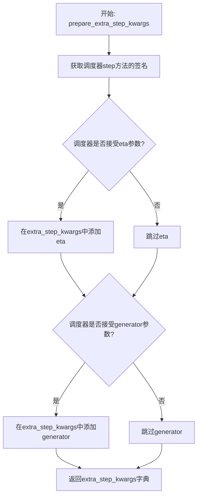

#### 带注释源码

```python
def prepare_extra_step_kwargs(self, generator, eta):
    # 准备调度器步骤的额外参数，因为并非所有调度器都有相同的签名
    # eta (η) 仅用于 DDIMScheduler，其他调度器会忽略它
    # eta 对应 DDIM 论文中的 η: https://huggingface.co/papers/2010.02502
    # 值应在 [0, 1] 范围内
    
    # 通过检查调度器 step 方法的签名参数来判断是否接受 eta
    accepts_eta = "eta" in set(inspect.signature(self.scheduler.step).parameters.keys())
    
    # 初始化空字典用于存储额外参数
    extra_step_kwargs = {}
    
    # 如果调度器接受 eta 参数，则添加到字典中
    if accepts_eta:
        extra_step_kwargs["eta"] = eta

    # 检查调度器是否接受 generator 参数
    accepts_generator = "generator" in set(inspect.signature(self.scheduler.step).parameters.keys())
    
    # 如果调度器接受 generator 参数，则添加到字典中
    if accepts_generator:
        extra_step_kwargs["generator"] = generator
    
    # 返回构建好的参数字典
    return extra_step_kwargs
```


### `SanaImageToVideoPipeline.check_inputs`

该方法用于验证图像转视频管道的输入参数是否合法，包括检查高度和宽度是否为32的倍数、图像类型是否符合要求、提示词与预计算嵌入的一致性、以及提示词嵌入与注意力掩码的形状匹配性等。

参数：

-  `self`：类的实例方法隐含参数，指向管道对象本身。
-  `prompt`：`str` 或 `list[str]` 或 `None`，用户输入的文本提示词，用于引导视频生成。
-  `image`：`PipelineImageInput`（即 `torch.Tensor` 或 `PIL.Image.Image`），条件视频生成的首帧输入图像。
-  `height`：`int`，生成视频的高度（像素），必须为32的倍数。
-  `width`：`int`，生成视频的宽度（像素），必须为32的倍数。
-  `callback_on_step_end_tensor_inputs`：`list[str]` 或 `None`，每步结束回调时需要传递的张量输入名称列表。
-  `negative_prompt`：`str` 或 `list[str]` 或 `None`，负向提示词，用于引导视频生成时排除相关元素。
-  `prompt_embeds`：`torch.Tensor` 或 `None`，预计算的文本嵌入向量，与 prompt 二选一使用。
-  `negative_prompt_embeds`：`torch.Tensor` 或 `None`，预计算的负向文本嵌入向量。
-  `prompt_attention_mask`：`torch.Tensor` 或 `None`，预计算的文本注意力掩码，当指定 prompt_embeds 时必须提供。
-  `negative_prompt_attention_mask`：`torch.Tensor` 或 `None`，预计算的负向文本注意力掩码。

返回值：`None`，该方法不返回任何值，仅通过抛出 `ValueError` 异常来指示验证失败。

#### 流程图

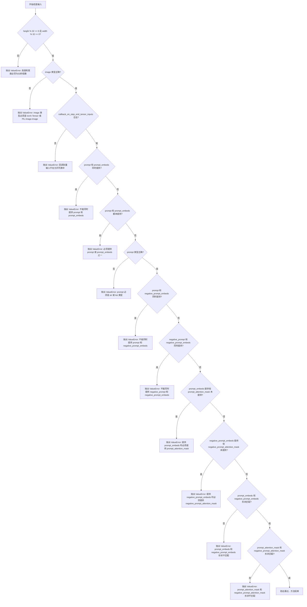

#### 带注释源码

```python
def check_inputs(
    self,
    prompt,
    image,
    height,
    width,
    callback_on_step_end_tensor_inputs=None,
    negative_prompt=None,
    prompt_embeds=None,
    negative_prompt_embeds=None,
    prompt_attention_mask=None,
    negative_prompt_attention_mask=None,
):
    # 检查视频分辨率是否为32的倍数（VAE和Transformer的patch划分要求）
    if height % 32 != 0 or width % 32 != 0:
        raise ValueError(f"`height` and `width` have to be divisible by 32 but are {height} and {width}.")

    # 验证输入图像的类型，支持PyTorch张量或PIL图像
    if image is not None and not isinstance(image, torch.Tensor) and not isinstance(image, PIL.Image.Image):
        raise ValueError(f"`image` has to be of type `torch.Tensor` or `PIL.Image.Image` but is {type(image)}")

    # 验证回调函数张量输入是否在允许的列表中（防止注入不允许的内部张量）
    if callback_on_step_end_tensor_inputs is not None and not all(
        k in self._callback_tensor_inputs for k in callback_on_step_end_tensor_inputs
    ):
        raise ValueError(
            f"`callback_on_step_end_tensor_inputs` has to be in {self._callback_tensor_inputs}, but found {[k for k in callback_on_step_end_tensor_inputs if k not in self._callback_tensor_inputs]}"
        )

    # 提示词和预计算嵌入只能二选一，避免重复传递导致语义冲突
    if prompt is not None and prompt_embeds is not None:
        raise ValueError(
            f"Cannot forward both `prompt`: {prompt} and `prompt_embeds`: {prompt_embeds}. Please make sure to"
            " only forward one of the two."
        )
    # 至少需要提供一种文本输入方式
    elif prompt is None and prompt_embeds is None:
        raise ValueError(
            "Provide either `prompt` or `prompt_embeds`. Cannot leave both `prompt` and `prompt_embeds` undefined."
        )
    # 验证提示词的基础类型（str或list，不支持其他复杂类型）
    elif prompt is not None and (not isinstance(prompt, str) and not isinstance(prompt, list)):
        raise ValueError(f"`prompt` has to be of type `str` or `list` but is {type(prompt)}")

    # 负向提示词与预计算负向嵌入的互斥检查
    if prompt is not None and negative_prompt_embeds is not None:
        raise ValueError(
            f"Cannot forward both `prompt`: {prompt} and `negative_prompt_embeds`:"
            f" {negative_prompt_embeds}. Please make sure to only forward one of the two."
        )

    if negative_prompt is not None and negative_prompt_embeds is not None:
        raise ValueError(
            f"Cannot forward both `negative_prompt`: {negative_prompt} and `negative_prompt_embeds`:"
            f" {negative_prompt_embeds}. Please make sure to only forward one of the two."
        )

    # 预计算嵌入与注意力掩码必须成对出现，否则后续计算会因缺少mask而出错
    if prompt_embeds is not None and prompt_attention_mask is None:
        raise ValueError("Must provide `prompt_attention_mask` when specifying `prompt_embeds`.")

    if negative_prompt_embeds is not None and negative_prompt_attention_mask is None:
        raise ValueError("Must provide `negative_prompt_attention_mask` when specifying `negative_prompt_embeds`.")

    # 验证正向与负向嵌入的形状一致性（确保批处理维度、序列长度、特征维度对齐）
    if prompt_embeds is not None and negative_prompt_embeds is not None:
        if prompt_embeds.shape != negative_prompt_embeds.shape:
            raise ValueError(
                "`prompt_embeds` and `negative_prompt_embeds` must have the same shape when passed directly, but"
                f" got: `prompt_embeds` {prompt_embeds.shape} != `negative_prompt_embeds`"
                f" {negative_prompt_embeds.shape}."
            )
        if prompt_attention_mask.shape != negative_prompt_attention_mask.shape:
            raise ValueError(
                "`prompt_attention_mask` and `negative_prompt_attention_mask` must have the same shape when passed directly, but"
                f" got: `prompt_attention_mask` {prompt_attention_mask.shape} != `negative_prompt_attention_mask`"
                f" {negative_prompt_attention_mask.shape}."
            )
```


### SanaImageToVideoPipeline._text_preprocessing

该方法用于对文本提示进行预处理，支持两种模式：基础模式（转小写并去除首尾空格）和清理模式（使用 `_clean_caption` 进行深度清理）。它能处理单个字符串或字符串列表，并返回处理后的字符串列表。

参数：

- `text`：`str | list[str] | tuple`，待处理的文本提示，可以是单个字符串或字符串列表/元组
- `clean_caption`：`bool`，是否执行深度清理，默认为 False。启用时需要安装 beautifulsoup4 和 ftfy 库

返回值：`list[str]`，预处理后的字符串列表

#### 流程图

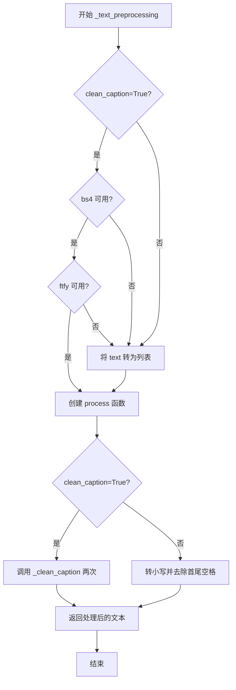

#### 带注释源码

```python
def _text_preprocessing(self, text, clean_caption=False):
    """
    对输入的文本提示进行预处理。
    
    参数:
        text: str | list[str] | tuple - 待处理的文本
        clean_caption: bool - 是否进行深度清理
    
    返回:
        list[str] - 处理后的文本列表
    """
    # 检查 clean_caption=True 时所需的依赖是否可用
    if clean_caption and not is_bs4_available():
        # 如果 bs4 不可用，记录警告并将 clean_caption 设为 False
        logger.warning(BACKENDS_MAPPING["bs4"][-1].format("Setting `clean_caption=True`"))
        logger.warning("Setting `clean_caption` to False...")
        clean_caption = False

    if clean_caption and not is_ftfy_available():
        # 如果 ftfy 不可用，记录警告并将 clean_caption 设为 False
        logger.warning(BACKENDS_MAPPING["ftfy"][-1].format("Setting `clean_caption=True`"))
        logger.warning("Setting `clean_caption` to False...")
        clean_caption = False

    # 统一转为列表处理
    if not isinstance(text, (tuple, list)):
        text = [text]

    # 定义内部处理函数
    def process(text: str):
        if clean_caption:
            # 深度清理模式下调用 _clean_caption 两次以确保清理彻底
            text = self._clean_caption(text)
            text = self._clean_caption(text)
        else:
            # 基础模式：转小写并去除首尾空格
            text = text.lower().strip()
        return text

    # 对列表中每个元素应用处理函数
    return [process(t) for t in text]
```


### `SanaImageToVideoPipeline._clean_caption`

该方法用于清洗和规范化输入的文本描述（caption），通过移除URL、HTML标签、CJK字符、特殊标点、数字编码等噪音内容，将其转换为更适合模型处理的干净文本格式。

参数：

- `self`：`SanaImageToVideoPipeline` 实例本身
- `caption`：`str`，待清洗的原始文本描述

返回值：`str`，清洗处理后的文本描述

#### 流程图

```mermaid
flowchart TD
    A[开始: 接收caption] --> B[转换为字符串并URL解码]
    B --> C[去除首尾空格并转为小写]
    C --> D[替换&lt;person&gt;为person]
    D --> E[正则移除URL链接]
    E --> F[BeautifulSoup移除HTML标签]
    F --> G[移除@用户名]
    G --> H[正则移除CJK Unicode字符块]
    H --> I[统一破折号和引号类型]
    I --> J[移除HTML实体如&amp; &quot;]
    J --> K[移除IP地址]
    K --> L[移除文章ID和换行符]
    L --> M[移除#话题标签和纯数字串]
    M --> N[移除文件名扩展名]
    N --> O[压缩连续引号和句点]
    O --> P[使用bad_punct_regex移除特殊标点]
    P --> Q[处理过多连字符/下划线]
    Q --> R[ftfy修复文本编码]
    R --> S[双重html.unescape解码]
    S --> T[移除字母数字混合模式]
    T --> U[移除营销常用词]
    U --> V[移除尺寸规格如1920x1080]
    V --> W[规范化空白字符]
    W --> X[去除首尾无关符号]
    X --> Y[返回strip后的caption]
```

#### 带注释源码

```python
def _clean_caption(self, caption):
    """
    清洗并规范化输入的文本描述（caption），移除噪音内容。
    
    处理流程包含：
    - URL 和 HTML 标签清理
    - CJK 统一表意文字及扩展字符移除
    - 特殊标点和格式符号规范化
    - 营销文案和无关信息过滤
    - 文本编码修复
    """
    # 1. 基础类型转换：确保输入为字符串
    caption = str(caption)
    
    # 2. URL 解码：将 URL 编码字符（如 %20）转换为普通字符
    caption = ul.unquote_plus(caption)
    
    # 3. 预处理：去除首尾空格并统一小写
    caption = caption.strip().lower()
    
    # 4. 替换特定标记：将 <person> 替换为 person（统一表示）
    caption = re.sub("<person>", "person", caption)
    
    # 5. 移除 URL 链接（两种正则分别处理 http/https 和 www 开头）
    caption = re.sub(
        r"\b((?:https?:(?:\/{1,3}|[a-zA-Z0-9%])|[a-zA-Z0-9.\-]+[.](?:com|co|ru|net|org|edu|gov|it)[\w/-]*\b\/?(?!@)))",
        "",
        caption,
    )
    caption = re.sub(
        r"\b((?:www:(?:\/{1,3}|[a-zA-Z0-9%])|[a-zA-Z0-9.\-]+[.](?:com|co|ru|net|org|edu|gov|it)[\w/-]*\b\/?(?!@)))",
        "",
        caption,
    )
    
    # 6. 使用 BeautifulSoup 移除 HTML 标签并提取纯文本
    caption = BeautifulSoup(caption, features="html.parser").text
    
    # 7. 移除 @用户名 格式的社交媒体提及
    caption = re.sub(r"@[\w\d]+\b", "", caption)
    
    # 8. 移除 CJK Unicode 字符块（中日韩统一表意文字等）
    # 覆盖范围：CJK 笔划、片假名音扩展、带圈CJK字母、兼容区、扩展A区、六十四卦、完整CJK区
    caption = re.sub(r"[\u31c0-\u31ef]+", "", caption)
    caption = re.sub(r"[\u31f0-\u31ff]+", "", caption)
    caption = re.sub(r"[\u3200-\u32ff]+", "", caption)
    caption = re.sub(r"[\u3300-\u33ff]+", "", caption)
    caption = re.sub(r"[\u3400-\u4dbf]+", "", caption)
    caption = re.sub(r"[\u4dc0-\u4dff]+", "", caption)
    caption = re.sub(r"[\u4e00-\u9fff]+", "", caption)
    
    # 9. 统一各类破折号为标准 "-"
    caption = re.sub(
        r"[\u002D\u058A\u05BE\u1400\u1806\u2010-\u2015\u2E17\u2E1A\u2E3A\u2E3B\u2E40\u301C\u3030\u30A0\uFE31\uFE32\uFE58\uFE63\uFF0D]+",
        "-",
        caption,
    )
    
    # 10. 统一引号风格（将各类左引号、右引号、顿号统一为双引号或单引号）
    caption = re.sub(r"[`´«»""¨]", '"', caption)
    caption = re.sub(r"['']", "'", caption)
    
    # 11. 移除 HTML 实体（&quot; 和 &amp;）
    caption = re.sub(r"&quot;?", "", caption)
    caption = re.sub(r"&amp", "", caption)
    
    # 12. 移除 IP 地址
    caption = re.sub(r"\d{1,3}\.\d{1,3}\.\d{1,3}\.\d{1,3}", " ", caption)
    
    # 13. 移除末尾的文章 ID 格式（如 "12:45 "）
    caption = re.sub(r"\d:\d\d\s+$", "", caption)
    
    # 14. 将反斜杠 n（\n）替换为空格
    caption = re.sub(r"\\n", " ", caption)
    
    # 15. 移除 #话题标签（1-3位数字和5位以上数字）
    caption = re.sub(r"#\d{1,3}\b", "", caption)
    caption = re.sub(r"#\d{5,}\b", "", caption)
    # 移除6位以上的纯数字串
    caption = re.sub(r"\b\d{6,}\b", "", caption)
    
    # 16. 移除常见文件扩展名
    caption = re.sub(r"[\S]+\.(?:png|jpg|jpeg|bmp|webp|eps|pdf|apk|mp4)", "", caption)
    
    # 17. 压缩连续引号和连续句点
    caption = re.sub(r"[\"']{2,}", r'"', caption)
    caption = re.sub(r"[\.]{2,}", r" ", caption)
    
    # 18. 使用类级别定义的 bad_punct_regex 移除特殊标点符号
    caption = re.sub(self.bad_punct_regex, r" ", caption)
    # 移除 " . " 格式
    caption = re.sub(r"\s+\.\s+", r" ", caption)
    
    # 19. 如果连字符或下划线出现超过3次，将其替换为空格（处理过度连接词）
    regex2 = re.compile(r"(?:\-|\_)")
    if len(re.findall(regex2, caption)) > 3:
        caption = re.sub(regex2, " ", caption)
    
    # 20. 使用 ftfy 库修复常见的文本编码错误
    caption = ftfy.fix_text(caption)
    
    # 21. 双重 HTML 解码（处理双重转义情况）
    caption = html.unescape(html.unescape(caption))
    
    # 22. 移除特定字母数字混合模式（如 jc6640、jc6640vc 等）
    caption = re.sub(r"\b[a-zA-Z]{1,3}\d{3,15}\b", "", caption)
    caption = re.sub(r"\b[a-zA-Z]+\d+[a-zA-Z]+\b", "", caption)
    caption = re.sub(r"\b\d+[a-zA-Z]+\d+\b", "", caption)
    
    # 23. 移除营销常用词组
    caption = re.sub(r"(worldwide\s+)?(free\s+)?shipping", "", caption)
    caption = re.sub(r"(free\s)?download(\sfree)?", "", caption)
    caption = re.sub(r"\bclick\b\s(?:for|on)\s\w+", "", caption)
    # 移除图片类型关键词
    caption = re.sub(r"\b(?:png|jpg|jpeg|bmp|webp|eps|pdf|apk|mp4)(\simage[s]?)?", "", caption)
    # 移除页码
    caption = re.sub(r"\bpage\s+\d+\b", "", caption)
    
    # 24. 移除复杂字母数字串（如 j2d1a2a 等无意义编码）
    caption = re.sub(r"\b\d*[a-zA-Z]+\d+[a-zA-Z]+\d+[a-zA-Z\d]*\b", r" ", caption)
    
    # 25. 移除尺寸规格（如 1920x1080、1920×1080 等）
    caption = re.sub(r"\b\d+\.?\d*[xх×]\d+\.?\d*\b", "", caption)
    
    # 26. 规范化冒号周围空格
    caption = re.sub(r"\b\s+\:\s+", r": ", caption)
    # 在标点后添加空格以便分词
    caption = re.sub(r"(\D[,\./])\b", r"\1 ", caption)
    # 压缩多余空格
    caption = re.sub(r"\s+", " ", caption)
    
    # 27. 去除首尾引号包裹
    caption = re.sub(r"^[\"\']([\w\W]+)[\"\']$", r"\1", caption)
    # 去除首部的无关符号
    caption = re.sub(r"^[\'\_,\-\:;]", r" "", caption)
    # 去除尾部的无关符号
    caption = re.sub(r"[\'\_,\-\:\-\+]$", r"", caption)
    # 去除以点开头但非句子的短串
    caption = re.sub(r"^\.\S+$", "", caption)
    
    # 返回最终清理后的文本
    return caption.strip()
```


### `SanaImageToVideoPipeline.prepare_latents`

该方法负责为图像到视频生成准备初始潜在向量（latents）。它通过VAE编码输入图像获取图像潜在向量，并根据VAE配置的均值和标准差进行归一化处理，最后将其嵌入到随机初始化的潜在向量中作为第一帧的条件。

参数：

- `self`：`SanaImageToVideoPipeline`，Sana图像到视频管道实例
- `image`：`PipelineImageInput`，输入图像，用于条件化视频生成的第一帧
- `batch_size`：`int`，批处理大小
- `num_channels_latents`：`int`，潜在通道数，默认为16
- `height`：`int`，生成视频的高度，默认为480
- `width`：`int`，生成视频的宽度，默认为832
- `num_frames`：`int`，生成视频的帧数，默认为81
- `dtype`：`torch.dtype | None`，潜在向量的数据类型
- `device`：`torch.device | None`，潜在向量所在的设备
- `generator`：`torch.Generator | list[torch.Generator] | None`，用于生成确定性随机数的生成器
- `latents`：`torch.Tensor | None`，预生成的潜在向量，如果为None则随机生成

返回值：`torch.Tensor`，处理后的潜在向量张量

#### 流程图

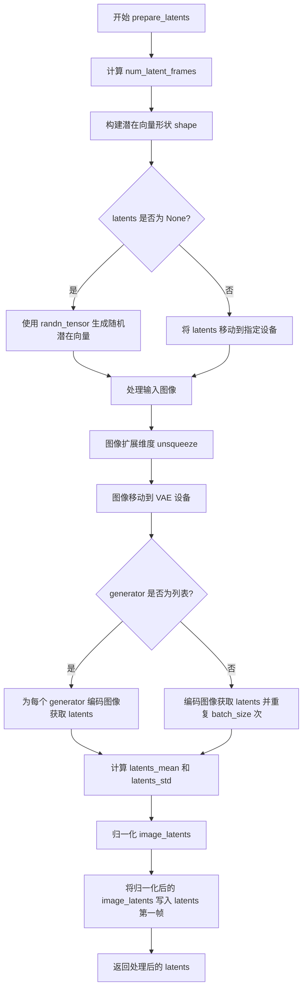

#### 带注释源码

```python
def prepare_latents(
    self,
    image: PipelineImageInput,
    batch_size: int,
    num_channels_latents: int = 16,
    height: int = 480,
    width: int = 832,
    num_frames: int = 81,
    dtype: torch.dtype | None = None,
    device: torch.device | None = None,
    generator: torch.Generator | list[torch.Generator] | None = None,
    latents: torch.Tensor | None = None,
) -> torch.Tensor:
    # 计算潜在帧数：基于时间VAE缩放因子将帧数转换为潜在帧数
    # 例如：num_frames=81, vae_scale_factor_temporal=4 -> num_latent_frames = (81-1)//4 + 1 = 21
    num_latent_frames = (num_frames - 1) // self.vae_scale_factor_temporal + 1
    
    # 构建潜在向量的形状 [batch, channels, temporal_frames, height, width]
    # 高度和宽度需要除以空间VAE缩放因子
    shape = (
        batch_size,
        num_channels_latents,
        num_latent_frames,
        int(height) // self.vae_scale_factor_spatial,
        int(width) // self.vae_scale_factor_spatial,
    )
    
    # 检查 generator 列表长度是否与批处理大小匹配
    if isinstance(generator, list) and len(generator) != batch_size:
        raise ValueError(
            f"You have passed a list of generators of length {len(generator)}, but requested an effective batch"
            f" size of {batch_size}. Make sure the batch size matches the length of the generators."
        )

    # 如果没有提供 latents，则随机生成；否则使用提供的 latents 并移动到指定设备
    if latents is None:
        latents = randn_tensor(shape, generator=generator, device=device, dtype=dtype)
    else:
        latents = latents.to(device=device, dtype=dtype)

    # 为图像添加批次维度：将 [B, C, H, W] -> [B, C, 1, H, W]
    # 以适应 VAE 3D 编码器的输入格式
    image = image.unsqueeze(2)  # [B, C, 1, H, W]
    # 将图像移动到 VAE 所在的设备和数据类型
    image = image.to(device=device, dtype=self.vae.dtype)

    # 使用 VAE 编码图像获取潜在向量
    if isinstance(generator, list):
        # 如果有多个生成器，为每个生成器独立编码并获取 latents
        image_latents = [retrieve_latents(self.vae.encode(image), sample_mode="argmax") for _ in generator]
        # 沿第一维度拼接所有 latents
        image_latents = torch.cat(image_latents)
    else:
        # 单个生成器：编码图像并获取 latents，然后重复批处理次数
        image_latents = retrieve_latents(self.vae.encode(image), sample_mode="argmax")
        image_latents = image_latents.repeat(batch_size, 1, 1, 1, 1)

    # 从 VAE 配置中获取 latent 分布的均值和标准差
    # 并reshape为 [1, channels, 1, 1, 1] 以便广播操作
    latents_mean = (
        torch.tensor(self.vae.config.latents_mean)
        .view(1, -1, 1, 1, 1)
        .to(image_latents.device, image_latents.dtype)
    )
    # 标准差需要取倒数（用于归一化）
    latents_std = 1.0 / torch.tensor(self.vae.config.latents_std).view(1, -1, 1, 1, 1).to(
        image_latents.device, image_latents.dtype
    )
    
    # 归一化处理：(image_latents - mean) * std
    # 这与训练时的数据预处理相反
    image_latents = (image_latents - latents_mean) * latents_std

    # 将归一化后的图像潜在向量写入 latents 的第一帧位置
    # 这样第一帧就被条件化为输入图像
    latents[:, :, 0:1] = image_latents.to(dtype)

    return latents
```


### `SanaImageToVideoPipeline.__call__`

这是一个用于图像到视频生成的核心方法，接收输入图像和文本提示，通过去噪扩散过程生成对应的视频序列。

参数：

- `image`：`PipelineImageInput`，用于条件化视频生成的第一帧图像
- `prompt`：`str | list[str]`，引导视频生成的文本提示
- `negative_prompt`：`str`，不引导视频生成的负面提示
- `num_inference_steps`：`int`，去噪扩散步数，默认50
- `timesteps`：`list[int]`，自定义时间步（可选）
- `sigmas`：`list[float]`，自定义噪声调度参数（可选）
- `guidance_scale`：`float`，分类器自由引导比例，默认6.0
- `num_videos_per_prompt`：`int | None`，每个提示生成的视频数量，默认1
- `height`：`int`，生成视频的高度，默认480像素
- `width`：`int`，生成视频的宽度，默认832像素
- `frames`：`int`，生成视频的帧数，默认81帧
- `eta`：`float`，DDIM调度器参数，默认0.0
- `generator`：`torch.Generator | list[torch.Generator]`，随机数生成器
- `latents`：`torch.Tensor | None`，预生成的噪声潜在向量
- `prompt_embeds`：`torch.Tensor | None`，预计算的文本嵌入
- `prompt_attention_mask`：`torch.Tensor | None`，文本嵌入的注意力掩码
- `negative_prompt_embeds`：`torch.Tensor | None`，负面文本嵌入
- `negative_prompt_attention_mask`：`torch.Tensor | None`，负面文本注意力掩码
- `output_type`：`str | None`，输出格式，默认"pil"
- `return_dict`：`bool`，是否返回字典格式，默认True
- `clean_caption`：`bool`，是否清理标题，默认False
- `use_resolution_binning`：`bool`，是否使用分辨率分箱，默认True
- `attention_kwargs`：`dict[str, Any] | None`，注意力处理器额外参数
- `callback_on_step_end`：`Callable | None`，每步结束时的回调函数
- `callback_on_step_end_tensor_inputs`：`list[str]`，回调函数的张量输入列表
- `max_sequence_length`：`int`，最大序列长度，默认300
- `complex_human_instruction`：`list[str]`，复杂人类指令

返回值：`SanaVideoPipelineOutput | tuple`，生成的视频输出

#### 流程图

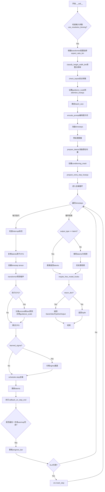

#### 带注释源码

```python
@torch.no_grad()
@replace_example_docstring(EXAMPLE_DOC_STRING)
def __call__(
    self,
    image: PipelineImageInput,  # 输入图像，用于条件化视频生成
    prompt: str | list[str] = None,  # 文本提示
    negative_prompt: str = "",  # 负面提示
    num_inference_steps: int = 50,  # 去噪步数
    timesteps: list[int] = None,  # 自定义时间步
    sigmas: list[float] = None,  # 自定义噪声参数
    guidance_scale: float = 6.0,  # CFG引导强度
    num_videos_per_prompt: int | None = 1,  # 每个提示生成数量
    height: int = 480,  # 输出高度
    width: int = 832,  # 输出宽度
    frames: int = 81,  # 视频帧数
    eta: float = 0.0,  # DDIM参数
    generator: torch.Generator | list[torch.Generator] | None = None,  # 随机生成器
    latents: torch.Tensor | None = None,  # 预生成latents
    prompt_embeds: torch.Tensor | None = None,  # 预计算提示嵌入
    prompt_attention_mask: torch.Tensor | None = None,
    negative_prompt_embeds: torch.Tensor | None = None,
    negative_prompt_attention_mask: torch.Tensor | None = None,
    output_type: str | None = "pil",  # 输出类型
    return_dict: bool = True,  # 返回格式
    clean_caption: bool = False,  # 清理标题
    use_resolution_binning: bool = True,  # 分辨率分箱
    attention_kwargs: dict[str, Any] | None = None,  # 注意力参数
    callback_on_step_end: Callable[[int, int], None] | None = None,  # 回调函数
    callback_on_step_end_tensor_inputs: list[str] = ["latents"],  # 回调张量输入
    max_sequence_length: int = 300,  # 最大序列长度
    complex_human_instruction: list[str] = [...],  # 复杂指令
) -> SanaVideoPipelineOutput | tuple:
    """执行图像到视频生成的管道"""
    
    # 处理回调张量输入
    if isinstance(callback_on_step_end, (PipelineCallback, MultiPipelineCallbacks)):
        callback_on_step_end_tensor_inputs = callback_on_step_end.tensor_inputs

    # 1. 检查输入并进行分辨率分箱
    if use_resolution_binning:
        # 根据transformer配置选择aspect_ratio_bin (480p或720p)
        if self.transformer.config.sample_size == 30:
            aspect_ratio_bin = ASPECT_RATIO_480_BIN
        elif self.transformer.config.sample_size == 22:
            aspect_ratio_bin = ASPECT_RATIO_720_BIN
        else:
            raise ValueError("Invalid sample size")
        orig_height, orig_width = height, width
        # 调整分辨率到最接近的预定义值
        height, width = self.video_processor.classify_height_width_bin(height, width, ratios=aspect_ratio_bin)

    # 验证输入参数有效性
    self.check_inputs(
        prompt, image, height, width, callback_on_step_end_tensor_inputs,
        negative_prompt, prompt_embeds, negative_prompt_embeds,
        prompt_attention_mask, negative_prompt_attention_mask,
    )

    # 设置内部状态
    self._guidance_scale = guidance_scale
    self._attention_kwargs = attention_kwargs
    self._interrupt = False

    # 2. 确定batch_size
    if prompt is not None and isinstance(prompt, str):
        batch_size = 1
    elif prompt is not None and isinstance(prompt, list):
        batch_size = len(prompt)
    else:
        batch_size = prompt_embeds.shape[0]

    device = self._execution_device
    lora_scale = self.attention_kwargs.get("scale", None) if self.attention_kwargs is not None else None

    # 3. 编码输入提示词
    (
        prompt_embeds,
        prompt_attention_mask,
        negative_prompt_embeds,
        negative_prompt_attention_mask,
    ) = self.encode_prompt(
        prompt, self.do_classifier_free_guidance,
        negative_prompt=negative_prompt,
        num_videos_per_prompt=num_videos_per_prompt,
        device=device, prompt_embeds=prompt_embeds,
        negative_prompt_embeds=negative_prompt_embeds,
        prompt_attention_mask=prompt_attention_mask,
        negative_prompt_attention_mask=negative_prompt_attention_mask,
        clean_caption=clean_caption,
        max_sequence_length=max_sequence_length,
        complex_human_instruction=complex_human_instruction,
        lora_scale=lora_scale,
    )
    
    # 4. 应用分类器自由引导 (CFG)
    if self.do_classifier_free_guidance:
        # 连接负面和正面提示嵌入
        prompt_embeds = torch.cat([negative_prompt_embeds, prompt_embeds], dim=0)
        prompt_attention_mask = torch.cat([negative_prompt_attention_mask, prompt_attention_mask], dim=0)

    # 5. 准备时间步调度
    timesteps, num_inference_steps = retrieve_timesteps(
        self.scheduler, num_inference_steps, device, timesteps, sigmas
    )

    # 6. 准备latents
    latent_channels = self.transformer.config.in_channels
    # 预处理输入图像
    image = self.video_processor.preprocess(image, height=height, width=width).to(device, dtype=torch.float32)

    # 生成初始噪声latents
    latents = self.prepare_latents(
        image, batch_size * num_videos_per_prompt, latent_channels,
        height, width, frames, torch.float32, device, generator, latents,
    )

    # 创建条件掩码（第一帧保持不变）
    conditioning_mask = latents.new_zeros(
        batch_size, 1,
        latents.shape[2] // self.transformer_temporal_patch_size,
        latents.shape[3] // self.transformer_spatial_patch_size,
        latents.shape[4] // self.transformer_spatial_patch_size,
    )
    conditioning_mask[:, :, 0] = 1.0  # 第一帧条件化
    if self.do_classifier_free_guidance:
        conditioning_mask = torch.cat([conditioning_mask, conditioning_mask])

    # 7. 准备额外调度器参数
    extra_step_kwargs = self.prepare_extra_step_kwargs(generator, eta)

    # 8. 去噪循环
    num_warmup_steps = max(len(timesteps) - num_inference_steps * self.scheduler.order, 0)
    self._num_timesteps = len(timesteps)

    transformer_dtype = self.transformer.dtype
    with self.progress_bar(total=num_inference_steps) as progress_bar:
        for i, t in enumerate(timesteps):  # 遍历每个时间步
            if self.interrupt:
                continue

            # 为CFG准备双份latents
            latent_model_input = torch.cat([latents] * 2) if self.do_classifier_free_guidance else latents

            # 广播timestep到batch维度
            timestep = t.expand(conditioning_mask.shape)
            timestep = timestep * (1 - conditioning_mask)  # 应用条件掩码

            # Transformer预测噪声
            noise_pred = self.transformer(
                latent_model_input.to(dtype=transformer_dtype),
                encoder_hidden_states=prompt_embeds.to(dtype=transformer_dtype),
                encoder_attention_mask=prompt_attention_mask,
                timestep=timestep,
                return_dict=False,
                attention_kwargs=self.attention_kwargs,
            )[0]
            noise_pred = noise_pred.float()

            # 执行分类器自由引导
            if self.do_classifier_free_guidance:
                noise_pred_uncond, noise_pred_text = noise_pred.chunk(2)
                noise_pred = noise_pred_uncond + guidance_scale * (noise_pred_text - noise_pred_uncond)
                timestep, _ = timestep.chunk(2)

            # 处理learned sigma（如果transformer输出双通道）
            if self.transformer.config.out_channels // 2 == latent_channels:
                noise_pred = noise_pred.chunk(2, dim=1)[0]

            # 移除第一帧预测（使用真实latent）
            noise_pred = noise_pred[:, :, 1:]
            noise_latents = latents[:, :, 1:]
            # 使用调度器进行去噪步骤
            pred_latents = self.scheduler.step(
                noise_pred, t, noise_latents, **extra_step_kwargs, return_dict=False
            )[0]

            # 合并第一帧（保持不变）和预测的后续帧
            latents = torch.cat([latents[:, :, :1], pred_latents], dim=2)

            # 执行回调函数
            if callback_on_step_end is not None:
                callback_kwargs = {}
                for k in callback_on_step_end_tensor_inputs:
                    callback_kwargs[k] = locals()[k]
                callback_outputs = callback_on_step_end(self, i, t, callback_kwargs)

                latents = callback_outputs.pop("latents", latents)
                prompt_embeds = callback_outputs.pop("prompt_embeds", prompt_embeds)
                negative_prompt_embeds = callback_outputs.pop("negative_prompt_embeds", negative_prompt_embeds)

            # 更新进度条
            if i == len(timesteps) - 1 or ((i + 1) > num_warmup_steps and (i + 1) % self.scheduler.order == 0):
                progress_bar.update()

            if XLA_AVAILABLE:
                xm.mark_step()

    # 9. 最终解码
    if output_type == "latent":
        video = latents
    else:
        # 反标准化latents
        latents = latents.to(self.vae.dtype)
        torch_accelerator_module = getattr(torch, get_device(), torch.cuda)
        oom_error = (
            torch.OutOfMemoryError
            if is_torch_version(">=", "2.5.0")
            else torch_accelerator_module.OutOfMemoryError
        )
        latents_mean = (
            torch.tensor(self.vae.config.latents_mean)
            .view(1, self.vae.config.z_dim, 1, 1, 1)
            .to(latents.device, latents.dtype)
        )
        latents_std = 1.0 / torch.tensor(self.vae.config.latents_std).view(1, self.vae.config.z_dim, 1, 1, 1).to(
            latents.device, latents.dtype
        )
        latents = latents / latents_std + latents_mean
        
        try:
            # VAE解码latents到视频
            video = self.vae.decode(latents, return_dict=False)[0]
        except oom_error as e:
            warnings.warn(
                f"{e}. \n"
                f"Try to use VAE tiling for large images. For example: \n"
                f"pipe.vae.enable_tiling(tile_sample_min_width=512, tile_sample_min_height=512)"
            )

        # 如果使用分辨率分箱，调整回原始分辨率
        if use_resolution_binning:
            video = self.video_processor.resize_and_crop_tensor(video, orig_width, orig_height)

        # 后处理视频
        video = self.video_processor.postprocess_video(video, output_type=output_type)

    # 10. 释放模型资源
    self.maybe_free_model_hooks()

    # 11. 返回结果
    if not return_dict:
        return (video,)

    return SanaVideoPipelineOutput(frames=video)
```


### `SanaImageToVideoPipeline.guidance_scale`

该属性是 SanaImageToVideoPipeline 管道类的 guidance_scale（引导尺度）只读访问器，用于获取分类器自由引导（Classifier-Free Guidance）的缩放因子。该值在管道调用时被设置为 `__call__` 方法的 `guidance_scale` 参数，决定了生成内容与文本提示的匹配程度。

参数： 无

返回值：`float`，返回当前管道的引导尺度值，用于控制文本提示对生成视频的影响强度。

#### 流程图

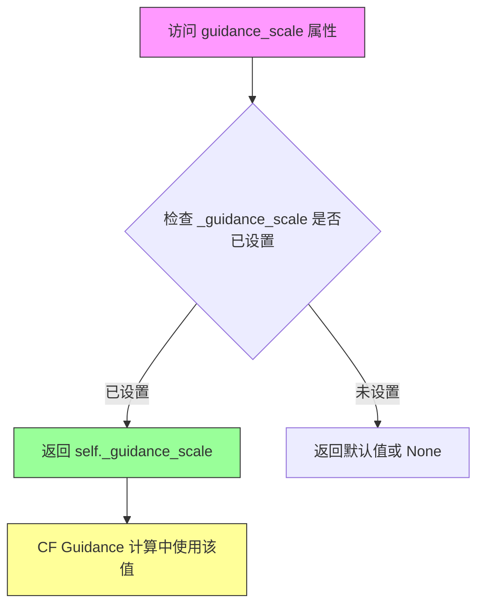

#### 带注释源码

```python
@property
def guidance_scale(self):
    """
    Guidance scale 属性访问器。
    
    该属性提供了对分类器自由引导（Classifier-Free Guidance）缩放因子的只读访问。
    guidance_scale 控制文本提示对生成过程的影响程度：
    - 值越大，生成内容与文本提示越接近
    - 值越小，生成内容越接近无条件生成（忽略提示）
    - 值为 1.0 或更小则禁用引导
    
    在 __call__ 方法中通过 self._guidance_scale = guidance_scale 设置。
    
    Returns:
        float: 当前的引导尺度值，通常在 1.0 到 20.0 之间
    """
    return self._guidance_scale
```


### `SanaImageToVideoPipeline.attention_kwargs`

这是一个属性访问器（getter），用于获取在视频生成过程中传递给注意力处理器（AttentionProcessor）的额外关键字参数。该属性返回存储在实例变量 `_attention_kwargs` 中的字典，该字典在调用 `__call__` 方法时通过 `attention_kwargs` 参数设置，并传递给 Transformer 模型的注意力计算过程。

参数： 无（属性 getter 不接受参数）

返回值：`dict[str, Any] | None`，返回包含注意力处理器额外参数（如 scale 等）的字典，如果未设置则返回 None

#### 流程图

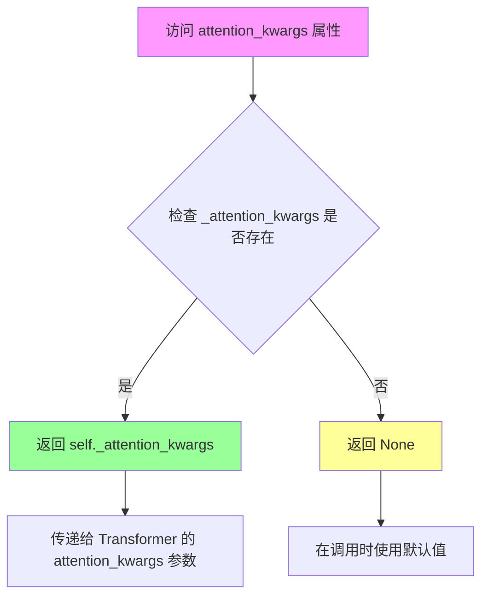

#### 带注释源码

```python
@property
def attention_kwargs(self):
    r"""
    属性访问器：获取注意力处理器关键字参数

    该属性返回在 pipeline 调用时设置的注意力处理器额外参数。
    这些参数会被传递给 Transformer 模型的注意力计算过程，
    用于自定义注意力机制的行为（例如 LoRA scale 等）。

    返回值:
        dict[str, Any] | None: 包含注意力处理器额外参数的字典，
                             如果未设置则返回 None
    """
    return self._attention_kwargs
```

#### 上下文关联信息

该属性与以下代码部分相关联：

1. **在 `__call__` 方法中的设置**：
   ```python
   self._attention_scale = attention_kwargs
   ```

2. **在 Transformer 调用中的使用**：
   ```python
   noise_pred = self.transformer(
       latent_model_input.to(dtype=transformer_dtype),
       encoder_hidden_states=prompt_embeds.to(dtype=transformer_dtype),
       encoder_attention_mask=prompt_attention_mask,
       timestep=timestep,
       return_dict=False,
       attention_kwargs=self.attention_kwargs,  # <-- 使用该属性
   )[0]
   ```

3. **LoRA scale 的提取**：
   ```python
   lora_scale = self.attention_kwargs.get("scale", None) if self.attention_kwargs is not None else None
   ```


### `SanaImageToVideoPipeline.do_classifier_free_guidance`

该属性用于判断当前管道是否启用无分类器自由引导（Classifier-Free Guidance，简称CFG）。通过比较`guidance_scale`与阈值1.0的大小关系来确定是否启用CFG模式，这在扩散模型的推理过程中用于平衡文本提示的引导强度与生成多样性。

参数：

- 该属性无需显式参数（`self`为隐含参数）

返回值：`bool`，返回`True`表示启用CFG（`guidance_scale > 1.0`），返回`False`表示禁用CFG

#### 流程图

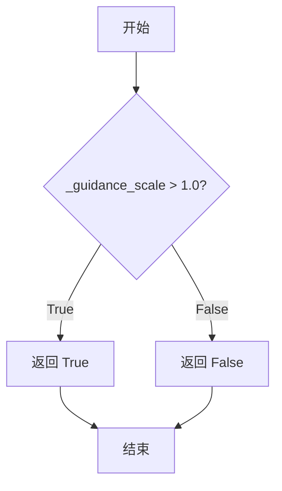

#### 带注释源码

```python
@property
def do_classifier_free_guidance(self):
    """
    属性：判断是否启用无分类器自由引导（Classifier-Free Guidance）
    
    原理：
    - 无分类器自由引导是一种提高扩散模型生成质量的技术
    - 通过同时考虑条件生成（带文本提示）和无条件生成（不带文本提示）
    - guidance_scale参数控制引导强度，值越大表示文本提示影响力越强
    - 当guidance_scale > 1.0时，CFG才有实际效果，因此用此阈值判断是否启用
    
    Args:
        self: SanaImageToVideoPipeline实例，隐含参数
        
    Returns:
        bool: 当guidance_scale > 1.0时返回True，否则返回False
    """
    return self._guidance_scale > 1.0
```


### `SanaImageToVideoPipeline.num_timesteps`

该属性是一个只读属性，用于返回扩散模型在推理过程中所使用的时间步数量。它在管道执行去噪循环时被设置，数值等于 `timesteps` 列表的长度，即 `num_inference_steps`。

参数： 无

返回值：`int`，返回推理过程中使用的时间步总数。

#### 流程图

```mermaid
flowchart TD
    A[访问 num_timesteps 属性] --> B{属性访问}
    B --> C[返回 self._num_timesteps]
    
    D[管道初始化] --> E[__call__ 方法执行]
    E --> F[retrieve_timesteps 被调用]
    F --> G[scheduler.set_timesteps 执行]
    G --> H[获取 timesteps 列表]
    H --> I[计算 len(timesteps)]
    I --> J[设置 self._num_timesteps]
    
    style A fill:#f9f,color:#000
    style C fill:#9f9,color:#000
    style J fill:#ff9,color:#000
```

#### 带注释源码

```python
@property
def num_timesteps(self):
    """
    返回扩散模型推理过程中使用的时间步总数。
    
    该属性是一个只读属性，在管道执行 __call__ 方法时被设置。
    _num_timesteps 的值等于去噪循环中的 timesteps 列表的长度，
    即用户指定的 num_inference_steps 参数的实际值。
    
    Returns:
        int: 推理过程中使用的时间步数量
    """
    return self._num_timesteps
```

---

### 相关上下文源码

#### `_num_timesteps` 的设置位置

```python
# 在 __call__ 方法的去噪循环前设置
self._num_timesteps = len(timesteps)

# timesteps 的获取通过 retrieve_timesteps 函数
timesteps, num_inference_steps = retrieve_timesteps(
    self.scheduler, num_inference_steps, device, timesteps, sigmas
)
```

#### `retrieve_timesteps` 函数返回说明

```python
def retrieve_timesteps(
    scheduler,
    num_inference_steps: int | None = None,
    device: str | torch.device | None = None,
    timesteps: list[int] | None = None,
    sigmas: list[float] | None = None,
    **kwargs,
):
    # ... 函数实现 ...
    # 最终返回 timesteps 列表和推理步数
    return timesteps, num_inference_steps
    # 其中 num_inference_steps 是 int 类型
```

---

### 设计说明

| 项目 | 说明 |
|------|------|
| **属性类型** | 只读属性 (read-only property) |
| **设计目的** | 允许外部代码查询当前管道的推理步数，用于进度显示或调试 |
| **初始化时机** | 在 `__call__` 方法中被设置 |
| **默认值** | 未设置（必须在调用管道后才有值） |
| **线程安全性** | 非线程安全，依赖于实例状态 |


### `SanaImageToVideoPipeline.interrupt`

获取管道的当前中断状态，用于控制推理循环是否继续执行。

参数： 无

返回值：`bool`，返回 `_interrupt` 属性的值。当为 `True` 时，表示请求中断推理过程；为 `False` 时，表示继续正常执行。

#### 流程图

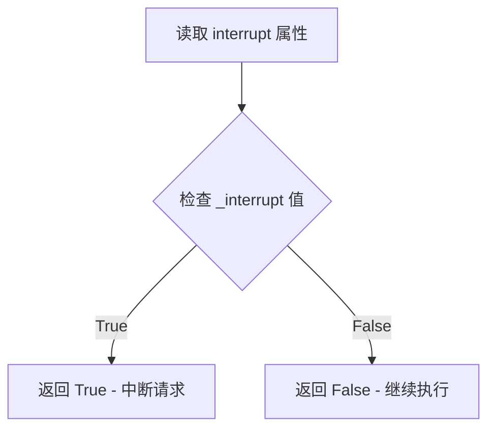

#### 带注释源码

```python
@property
def interrupt(self):
    """
    属性 getter：获取中断标志状态
    
    该属性用于在推理循环中检查是否请求了中断。
    在 __call__ 方法的去噪循环中会检查此属性：
        if self.interrupt:
            continue
    
    Returns:
        bool: 中断状态标志。True 表示请求中断当前推理过程，
              False 表示继续正常执行推理。
    """
    return self._interrupt
```

## 关键组件


### 张量索引 (Tensor Indexing)

在 `prepare_latents` 方法和去噪循环中使用切片操作进行时间维度的张量索引：`latents[:, :, 0:1] = image_latents` 和 `noise_pred = noise_pred[:, :, 1:]`，实现第一帧条件帧的注入和后续帧的预测更新。

### 惰性加载 (Lazy Loading)

通过 `@torch.no_grad()` 装饰器禁用梯度计算实现惰性求值，XLA 后端支持 (`torch_xla.core.xla_model`) 进一步延迟执行，且 VAE 解码仅在 `output_type != "latent"` 时才执行。

### 反量化支持 (Dequantization Support)

提供 `latents_mean` 和 `latents_std` 配置参数，在编码时执行 `(image_latents - latents_mean) * latents_std` 量化操作，解码时执行 `latents / latents_std + latents_mean` 反量化操作，实现潜在表示的标准化与反标准化。

### 混合精度策略 (Mixed Precision Strategy)

不同模型组件使用不同数据类型：Transformer 和 Text Encoder 推荐使用 `bfloat16`，VAE 推荐使用 `float32`，通过 `transformer_dtype = self.transformer.dtype` 动态获取并在推理时转换，实现混合精度推理以平衡质量与显存。

### LoRA 量化缩放 (LoRA Quantization Scaling)

通过 `scale_lora_layers` 和 `unscale_lora_layers` 配合 `USE_PEFT_BACKEND` 实现 LoRA 权重的动态缩放，支持在推理时应用 LoRA 并在完成后恢复原始权重。

### 条件掩码机制 (Conditioning Mask)

通过 `conditioning_mask` 标记第一帧位置（`conditioning_mask[:, :, 0] = 1.0`），并在时间步计算时乘以 `(1 - conditioning_mask)` 实现条件帧与生成帧的分离控制。

### 分类器自由引导 (Classifier-Free Guidance)

在推理时将负向提示嵌入与正向提示嵌入在通道维度拼接：`torch.cat([negative_prompt_embeds, prompt_embeds], dim=0)`，并通过 `chunk(2)` 分离预测结果实现无分类器的文本引导。

### VAE 分块解码 (VAE Tiling)

当发生显存溢出时（`OutOfMemoryError`），提示使用 `pipe.vae.enable_tiling()` 启用分块解码处理大分辨率视频，支持 `tile_sample_min_width` 和 `tile_sample_min_height` 参数。

### 分辨率分箱 (Resolution Binning)

根据 Transformer 的 `sample_size` 配置选择 `ASPECT_RATIO_480_BIN` 或 `ASPECT_RATIO_720_BIN`，将用户输入的宽高映射到最近的支持分辨率，生成后再 resize 回目标分辨率。


## 问题及建议


### 已知问题

-   **硬编码的默认值**：多个参数（如 `frames=81`, `height=480`, `width=832`, `guidance_scale=6.0`）在 `__call__` 方法中被硬编码，缺乏灵活的配置机制。
-   **重复计算逻辑**：`prepare_latents` 方法中计算了 `latents_mean` 和 `latents_std`，在后续 VAE 解码时又重复计算了相同的归一化参数。
-   **长默认值**：`complex_human_instruction` 参数包含一个非常长的默认指令列表，这增加了代码复杂度且不易维护。
-   **不安全的 `locals()` 使用**：在 `callback_on_step_end` 调用中使用 `locals()` 获取变量，这种方式不够明确且容易引入 bug。
-   **OOM 处理不完整**：VAE 解码时的 OOM 错误仅发出警告提示使用 tiling，但实际未自动启用 tiling 机制。
-   **魔法数字**：代码中存在多个未解释的魔法数字（如 `num_channels_latents=16`, `vae_scale_factor_temporal=4` 等），应提取为配置常量。
-   **条件判断冗余**：在 `encode_prompt` 中多次检查 `isinstance(self, SanaLoraLoaderMixin)`，可以通过缓存结果优化。
-   **XLA mark_step 位置**：在每个去噪步骤结束时调用 `xm.mark_step()`，可能影响性能且位置值得商榷。

### 优化建议

-   **提取配置常量**：将硬编码的默认值（如帧数、分辨率、guidance_scale 等）提取为类级别常量或构造函数参数，提供更好的灵活性。
-   **消除重复计算**：将 `latents_mean` 和 `latents_std` 的计算提取为独立方法或缓存结果，避免在 `prepare_latents` 和解码阶段重复计算。
-   **简化 complex_human_instruction**：将其默认值移至文档字符串或单独的配置模块，保持函数签名的简洁性。
-   **改进回调机制**：明确指定需要传递给 `callback_on_step_end` 的变量列表，而不是使用 `locals()` 动态获取。
-   **增强 OOM 处理**：在捕获 OOM 错误后，自动尝试启用 VAE tiling 或提供更智能的降级策略。
-   **添加类型注解和文档**：为所有公共方法添加完整的类型注解和文档字符串，特别是返回值描述。
-   **优化 LoRA 检查**：在 `encode_prompt` 开始时缓存 `isinstance` 检查结果，避免在方法中多次执行相同的类型检查。
-   **重构长函数**：将 `__call__` 方法中的去噪循环提取为独立的私有方法，提高代码可读性和可维护性。

## 其它


### 设计目标与约束

本Pipeline的设计目标是实现高效的图像到视频（Image-to-Video）生成，基于Sana扩散模型架构，通过文本提示和输入图像生成高质量的视频内容。核心约束包括：输入图像和输出视频分辨率必须为32的倍数；默认输出480x832分辨率、81帧的视频；支持480p和720p两种分辨率分箱模式；推理步数默认为50步；Guidance Scale默认为6.0；最大序列长度为300。该Pipeline继承自DiffusionPipeline，支持标准的模型加载、保存和设备迁移功能。

### 错误处理与异常设计

Pipeline实现了多层次的错误处理机制。在输入验证方面，`check_inputs`方法检查分辨率 divisibility（必须能被32整除）、图像类型验证（仅支持torch.Tensor或PIL.Image.Image）、回调张量输入合法性、prompt和prompt_embeds互斥性、negative_prompt和negative_prompt_embeds互斥性、embeds与attention_mask一致性等。Scheduler相关参数通过`inspect.signature`动态检查支持情况。内存管理方面，当VAE解码出现OutOfMemoryError时，捕获异常并提示用户启用VAE tiling。XLA设备支持通过条件导入实现，可优雅降级。Timesteps和sigmas互斥，在`retrieve_timesteps`函数中检查并抛出ValueError。

### 数据流与状态机

Pipeline的数据流遵循以下主要路径：首先对输入图像进行预处理（VideoProcessor.preprocess），然后通过VAE编码为latent表示（prepare_latents中调用vae.encode），接着在去噪循环中通过Transformer进行噪声预测（transformer.forward），最后通过VAE解码生成视频（vae.decode）。状态机方面，Pipeline维护_guidance_scale、_attention_kwargs、_interrupt、_num_timesteps等内部状态。`__call__`方法的主循环包含初始化、编码提示词、准备时间步、准备latents、去噪循环、后处理等阶段。支持中断功能（interrupt属性），可在去噪循环中跳过当前步骤。

### 外部依赖与接口契约

本Pipeline依赖以下核心外部组件：transformers库提供GemmaTokenizer和Gemma2PreTrainedModel用于文本编码；diffusers库提供DiffusionPipeline基类、调度器（FlowMatchEulerDiscreteScheduler）、各类工具函数和图像/视频处理工具；PIL库用于图像处理；torch和torch_xla用于张量计算和设备管理；bs4和ftfy用于caption清洗（可选依赖）。接口契约包括：tokenizer需实现padding和encode方法；text_encoder需实现forward并返回hidden_states；vae需实现encode和decode方法并返回包含latent_dist或latents的输出；transformer需支持timestep、encoder_hidden_states等参数；scheduler需实现set_timesteps和step方法。所有模型组件通过register_modules注册，支持统一的状态管理和内存卸载。

### 性能优化策略

Pipeline实现了多项性能优化：模型CPU卸载顺序定义为"text_encoder->transformer->vae"（model_cpu_offload_seq）；使用torch.no_grad()装饰器减少推理时的梯度计算；支持XLA设备优化（torch_xla.core.xla_model.mark_step）；支持VAE tiling处理大尺寸视频以避免OOM；支持PEFT backend的LoRA层动态缩放；去噪循环中使用chunk方法进行classifier-free guidance的并行计算；支持latents预生成以实现可复现生成；progress_bar显示推理进度；maybe_free_model_hooks在完成后自动释放模型内存。

### 安全性与合规性

代码包含Apache 2.0许可证声明。Pipeline对输入文本进行清洗（_clean_caption方法），移除URL、HTML标签、特殊字符、IP地址、文件名等潜在敏感信息。使用ftfy库修复常见的文本编码问题。由于涉及视频生成，可能需要考虑生成内容的版权和伦理问题，但在代码层面未实现内容过滤机制（negative_prompt需用户自行提供）。建议在生产环境中结合额外的安全过滤层使用。

### 配置与扩展性

Pipeline支持丰富的配置选项：resolution_binning（480p/720p两种模式）、use_resolution_binning开关、attention_kwargs传递到注意力处理器、lora_scale用于LoRA权重调整、callback_on_step_end支持自定义回调、output_type支持"pil"、"latent"等格式。继承自SanaLoraLoaderMixin支持LoRA加载功能。complex_human_instruction支持复杂的提示词增强策略。视频后处理支持多种输出格式。该架构设计允许通过替换组件（scheduler、vae、transformer）来适应不同的模型变体。

    