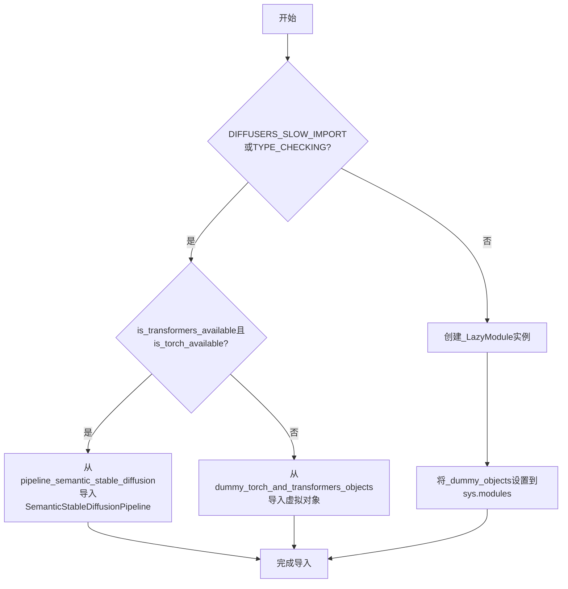
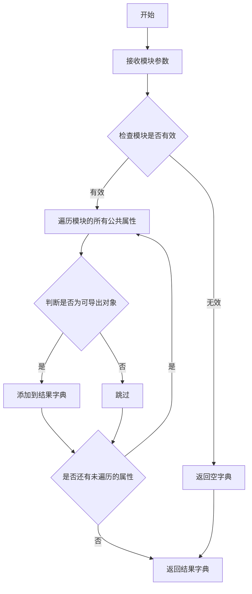
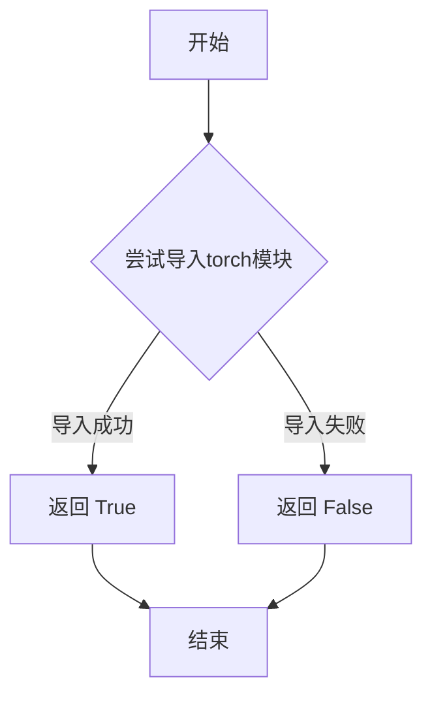
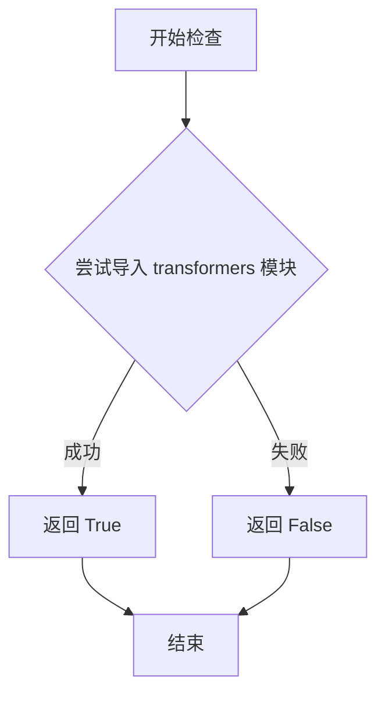

# `diffusers\src\diffusers\pipelines\semantic_stable_diffusion\__init__.py` 详细设计文档

这是一个diffusers库的延迟加载模块，通过LazyModule机制实现SemanticStableDiffusionPipeline的条件导入，仅在torch和transformers均可用时加载实际实现，否则导入虚拟对象以保持API兼容性。

## 整体流程



## 类结构

```
延迟加载模块 (Lazy Loading Module)
├── _import_structure (导入结构字典)
├── _dummy_objects (虚拟对象字典)
└── SemanticStableDiffusionPipeline (条件导入的管道类)
```

## 全局变量及字段


### `_dummy_objects`
    
用于存储虚拟对象的字典，当可选依赖项（torch和transformers）不可用时，包含来自dummy_torch_and_transformers_objects模块的占位符对象

类型：`Dict[str, Any]`
    


### `_import_structure`
    
定义模块导入结构的字典，用于_LazyModule的延迟加载，包含可用的管道类和输出类名称列表

类型：`Dict[str, List[str]]`
    


    

## 全局函数及方法


### `get_objects_from_module`

从模块中提取所有公共对象（通常是类或函数），并返回一个以对象名称为键、对象本身为值的字典，常用于动态导入和延迟加载机制。

参数：

- `module`：`ModuleType`，要从中获取对象的模块

返回值：`Dict[str, Any]`，键为对象名称，值为对应的对象

#### 流程图



#### 带注释源码

```python
def get_objects_from_module(module):
    """
    从给定模块中提取所有公共对象。
    
    该函数通常用于从dummy模块中获取所有虚拟对象，
    以便在可选依赖不可用时提供回退对象。
    
    参数:
        module: 要从中提取对象的模块
        
    返回:
        包含模块中所有公共对象的字典，键为对象名称，值为对象本身
    """
    # 初始化结果字典
    objects = {}
    
    # 遍历模块的所有属性
    for attr_name in dir(module):
        # 跳过私有属性（下划线开头的属性）
        if attr_name.startswith('_'):
            continue
        
        # 获取属性值
        attr_value = getattr(module, attr_name, None)
        
        # 排除非可导出对象（如模块、异常等）
        if attr_value is None or isinstance(attr_value, (type, Exception)):
            continue
            
        # 添加到结果字典
        objects[attr_name] = attr_value
    
    return objects
```


### `is_torch_available`

该函数用于检查当前环境中 PyTorch 库是否可用，通过尝试导入 `torch` 模块来判断，返回布尔值以决定后续的依赖加载逻辑。

参数： 无

返回值：`bool`，如果 PyTorch 可用返回 `True`，否则返回 `False`

#### 流程图



#### 带注释源码

```python
def is_torch_available() -> bool:
    """
    检查 PyTorch 是否在当前环境中可用。
    
    该函数通过尝试导入 torch 模块来判断 PyTorch 是否已安装。
    用于条件导入和可选依赖管理的场景。
    
    Returns:
        bool: 如果成功导入 torch 则返回 True，否则返回 False
    """
    try:
        import torch  # noqa F401
        return True
    except ImportError:
        return False
```


### `is_transformers_available`

该函数是 Hugging Face diffusers 库中的一个工具函数，用于检查当前环境中是否安装了 `transformers` 库。它通过尝试导入 transformers 包来确认其可用性，并返回布尔值供条件判断使用。

参数： 无

返回值： `bool`，返回 `True` 表示 transformers 库可用，返回 `False` 表示不可用。

#### 流程图



#### 带注释源码

```python
# 从 utils 模块导入的外部函数
# 用于检查 transformers 库是否可用
is_transformers_available

# 在当前文件中的使用示例：
# 1. 条件检查 - 与 is_torch_available 组合使用
if not (is_transformers_available() and is_torch_available()):
    raise OptionalDependencyNotAvailable()

# 2. 用于延迟导入的懒加载机制
# 通过判断库可用性来决定导入真实对象还是虚拟对象
try:
    if not (is_transformers_available() and is_torch_available()):
        raise OptionalDependencyNotAvailable()
except OptionalDependencyNotAvailable:
    # 导入虚拟对象（库不可用时的替代品）
    from ...utils import dummy_torch_and_transformers_objects
    _dummy_objects.update(get_objects_from_module(dummy_torch_and_transformers_objects))
else:
    # 导入真实对象（库可用时）
    _import_structure["pipeline_output"] = ["SemanticStableDiffusionPipelineOutput"]
    _import_structure["pipeline_semantic_stable_diffusion"] = ["SemanticStableDiffusionPipeline"]
```

#### 额外说明

| 项目 | 说明 |
|------|------|
| 定义位置 | `src/diffusers/utils/__init__.py`（外部模块） |
| 调用场景 | 在模块初始化时进行可选依赖检查 |
| 设计模式 | 懒加载模式（Lazy Loading）+ 虚拟对象模式（Dummy Objects） |
| 依赖关系 | 需要 `transformers` 包已安装 |

## 关键组件


### 延迟加载模块 (_LazyModule)

使用 `_LazyModule` 实现懒加载机制，允许在模块首次被访问时才真正导入实际代码，优化启动时间和内存占用。

### 可选依赖检查 (Optional Dependency Check)

通过 `is_transformers_available()` 和 `is_torch_available()` 检查 torch 和 transformers 库是否可用，不可用时抛出 `OptionalDependencyNotAvailable` 异常。

### 虚拟对象机制 (_dummy_objects)

当依赖不可用时，使用 `_dummy_objects` 存储从 `dummy_torch_and_transformers_objects` 获取的虚拟对象，确保模块结构完整但功能受限。

### 导入结构定义 (_import_structure)

定义模块的导入结构字典，包含 `pipeline_output.SemanticStableDiffusionPipelineOutput` 和 `pipeline_semantic_stable_diffusion.SemanticStableDiffusionPipeline` 两个可导出项。

### 类型检查导入 (TYPE_CHECKING)

在 `TYPE_CHECKING` 或 `DIFFUSERS_SLOW_IMPORT` 模式下，直接导入实际类用于类型注解，避免运行时依赖。

### 动态模块替换

通过 `sys.modules[__name__] = _LazyModule(...)` 将当前模块替换为延迟加载的代理对象，并使用 `setattr` 将虚拟对象绑定到模块属性。

### 模块初始化入口

通过 `get_objects_from_module` 和全局变量定义，实现模块级别的自动初始化逻辑，支持条件导入和优雅降级。


## 问题及建议


### 已知问题

-   **重复的依赖检查逻辑**：`if not (is_transformers_available() and is_torch_available()): raise OptionalDependencyNotAvailable()` 在第17行和第25行重复出现，增加了维护成本和出错风险
-   **模块手动注册风险**：通过 `setattr(sys.modules[__name__], name, value)` 手动将 dummy 对象注入到当前模块，可能覆盖实际对象或造成命名冲突
-   **字符串硬编码**：`"pipeline_output"` 和 `"pipeline_semantic_stable_diffusion"` 作为导入结构的键被硬编码，缺乏常量定义，不利于后续重构
-   **缺少类型注解**：文件级别变量 `_dummy_objects` 和 `_import_structure` 缺少类型注解，降低了代码的可读性和 IDE 支持
-   **魔法数字/逻辑嵌套**：多层嵌套的 try-except 和 if-else 增加了代码理解难度，可读性较差

### 优化建议

-   **提取依赖检查逻辑**：将依赖检查封装为函数或常量，避免重复代码，例如定义 `_check_dependencies()` 函数
-   **使用类型注解**：为全局变量添加类型注解，如 `_import_structure: Dict[str, List[str]] = {}`
-   **定义常量**：创建专门的常量类或模块级常量来存储导入结构的键名
-   **简化条件分支**：将条件逻辑重构为更扁平的结构，使用提前返回（early return）模式减少嵌套层级
-   **添加错误日志**：在捕获 `OptionalDependencyNotAvailable` 时记录日志，便于调试
-   **考虑使用装饰器模式**：如果延迟加载逻辑更复杂，可以考虑实现更通用的装饰器或基类来处理模块懒加载


## 其它


### 设计目标与约束

本模块的设计目标是实现可选依赖的延迟加载机制，确保在 torch 和 transformers 库不可用时不会导致程序崩溃，同时保持正常的导入接口。约束条件包括：必须同时满足 is_transformers_available() 和 is_torch_available() 两个条件才能加载核心功能，否则使用虚拟对象（dummy objects）进行占位。

### 错误处理与异常设计

使用 OptionalDependencyNotAvailable 异常来处理可选依赖不可用的情况。当检测到缺少必要依赖时，抛出该异常并从 dummy 模块加载占位对象，确保模块导入不失败。_LazyModule 封装了导入错误，提供 module_spec 属性以支持动态导入。

### 外部依赖与接口契约

本模块依赖以下外部包：torch（is_torch_available）、transformers（is_transformers_available）、typing（TYPE_CHECKING）、以及内部工具模块（_LazyModule、get_objects_from_module、OptionalDependencyNotAvailable）。导出接口包括：pipeline_output.SemanticStableDiffusionPipelineOutput 和 pipeline_semantic_stable_diffusion.SemanticStableDiffusionPipeline。

### 模块初始化与加载策略

采用延迟加载（Lazy Loading）策略，通过 _LazyModule 类实现。_import_structure 字典定义模块结构，_dummy_objects 存储占位对象。在非 TYPE_CHECKING 模式下，动态替换 sys.modules[__name__] 为 _LazyModule 实例，并设置所有虚拟对象的属性访问。

### 版本兼容性考虑

模块使用 TYPE_CHECKING 条件来支持类型检查器和运行时两种不同的导入模式，确保在静态类型检查时能正确导入类型信息，同时在运行时通过延迟加载优化启动性能。

### 导入结构与命名空间管理

_import_structure 字典定义了模块的公共 API 结构，包括 "pipeline_output" 和 "pipeline_semantic_stable_diffusion" 两个子模块命名空间。通过 setattr 将 _dummy_objects 中的对象动态添加到 sys.modules[__name__]，实现命名空间的透明替换。

### 类型提示与类型安全

使用 TYPE_CHECKING 条件分支确保类型检查器能够正确解析类型注解，同时避免在运行时导入实际模块。使用 from typing import TYPE_CHECKING 和类型注解（:）来声明类型信息。

### 性能特性分析

延迟加载机制可以显著减少模块初始化时间，只有在实际使用时才加载核心类。虚拟对象机制避免了依赖检查失败时的导入错误，但需要注意大量使用虚拟对象可能带来的内存开销。

### 可扩展性设计

模块结构支持添加新的可选依赖，通过在 _import_structure 字典中添加新的键值对即可扩展。get_objects_from_module 工具函数可以方便地从任意模块获取对象列表，便于维护。

### 安全考量

模块未直接处理敏感数据，主要关注点在于依赖版本兼容性和导入安全性。使用内部工具模块（...utils）来封装底层导入逻辑，保持核心模块的简洁性。


    