# `diffusers\src\diffusers\pipelines\semantic_stable_diffusion\pipeline_semantic_stable_diffusion.py` 详细设计文档

SemanticStableDiffusionPipeline是一个用于文本到图像生成的稳定扩散Pipeline，继承自DiffusionPipeline和StableDiffusionMixin，在标准文本到图像生成的基础上添加了语义编辑功能，允许用户通过editing_prompt、reverse_editing_direction、edit_guidance_scale等参数对生成图像的特定概念（如微笑、眼镜、卷发、胡子等）进行精细化控制。

## 整体流程

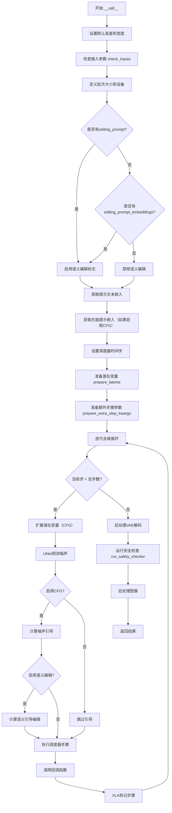
```mermaid
graph TD
    A[开始 __call__] --> B[设置默认高度和宽度]
    B --> C[检查输入参数 check_inputs]
    C --> D[定义批次大小和设备]
    D --> E{是否有editing_prompt?}
    E -- 是 --> F[启用语义编辑标志]
    E -- 否 --> G{是否有editing_prompt_embeddings?}
    G -- 是 --> F
    G -- 否 --> H[禁用语义编辑]
    F --> I[获取提示文本嵌入]
    H --> I
    I --> J[获取负面提示嵌入（如果启用CFG）]
    J --> K[设置调度器时间步]
    K --> L[准备潜在变量 prepare_latents]
    L --> M[准备额外步骤参数 prepare_extra_step_kwargs]
    M --> N[迭代去噪循环]
    N --> O{当前步 < 总步数?}
    O -- 是 --> P[扩展潜在变量（CFG）]
    P --> Q[UNet预测噪声]
    Q --> R{启用CFG?}
    R -- 是 --> S[计算噪声引导]
    R -- 否 --> T[跳过引导]
    S --> U{启用语义编辑?}
    U -- 是 --> V[计算语义引导编辑]
    U -- 否 --> W[执行调度器步骤]
    V --> W
    T --> W
    W --> X[调用回调函数]
    X --> Y[XLA标记步骤]
    Y --> N
    O -- 否 --> Z[后处理VAE解码]
    Z --> AA[运行安全检查 run_safety_checker]
    AA --> AB[后处理图像]
    AB --> AC[返回结果]
```

## 类结构

```
DiffusionPipeline (基类)
├── DeprecatedPipelineMixin (混入类)
├── StableDiffusionMixin (混入类)
└── SemanticStableDiffusionPipeline (本类)
```

## 全局变量及字段


### `logger`
    
模块级日志记录器，用于输出警告和信息

类型：`logging.Logger`
    


### `XLA_AVAILABLE`
    
标记是否支持PyTorch XLA（用于TPU加速）

类型：`bool`
    


### `SemanticStableDiffusionPipeline._last_supported_version`
    
该管道最后支持的版本号

类型：`str`
    


### `SemanticStableDiffusionPipeline.model_cpu_offload_seq`
    
CPU卸载顺序，指定模型组件卸载到CPU的序列

类型：`str`
    


### `SemanticStableDiffusionPipeline._optional_components`
    
可选组件列表，包含safety_checker和feature_extractor

类型：`list[str]`
    


### `SemanticStableDiffusionPipeline.vae`
    
变分自编码器，用于编解码图像与潜在表示

类型：`AutoencoderKL`
    


### `SemanticStableDiffusionPipeline.text_encoder`
    
CLIP文本编码器，将文本转换为嵌入向量

类型：`CLIPTextModel`
    


### `SemanticStableDiffusionPipeline.tokenizer`
    
CLIP分词器，用于将文本分词为token

类型：`CLIPTokenizer`
    


### `SemanticStableDiffusionPipeline.unet`
    
UNet条件扩散模型，用于去噪潜在表示

类型：`UNet2DConditionModel`
    


### `SemanticStableDiffusionPipeline.scheduler`
    
扩散调度器，控制去噪过程的噪声调度

类型：`KarrasDiffusionSchedulers`
    


### `SemanticStableDiffusionPipeline.safety_checker`
    
安全检查器，检测生成图像是否包含不当内容

类型：`StableDiffusionSafetyChecker`
    


### `SemanticStableDiffusionPipeline.feature_extractor`
    
CLIP图像特征提取器，用于提取图像特征供安全检查器使用

类型：`CLIPImageProcessor`
    


### `SemanticStableDiffusionPipeline.vae_scale_factor`
    
VAE缩放因子，用于计算潜在空间的分辨率

类型：`int`
    


### `SemanticStableDiffusionPipeline.image_processor`
    
VAE图像处理器，用于图像的后处理和格式转换

类型：`VaeImageProcessor`
    


### `SemanticStableDiffusionPipeline.uncond_estimates`
    
无条件噪声预测估计，用于语义引导

类型：`torch.Tensor | None`
    


### `SemanticStableDiffusionPipeline.text_estimates`
    
文本条件噪声预测估计，用于语义引导

类型：`torch.Tensor | None`
    


### `SemanticStableDiffusionPipeline.edit_estimates`
    
编辑概念噪声预测估计，用于语义引导

类型：`torch.Tensor | None`
    


### `SemanticStableDiffusionPipeline.sem_guidance`
    
语义引导张量，存储每一步的语义引导信号

类型：`torch.Tensor | None`
    
    

## 全局函数及方法


### `inspect.signature`

在 `SemanticStableDiffusionPipeline.prepare_extra_step_kwargs` 方法中，`inspect.signature` 用于动态检查调度器（scheduler）的 `step` 方法是否接受特定参数（`eta` 和 `generator`），以确保兼容不同的调度器实现。

参数：

-  `obj`：`Callable`，要检查签名的可调用对象（即 `self.scheduler.step`）

返回值：`Signature`，返回可调用对象的签名对象，包含参数信息

#### 流程图

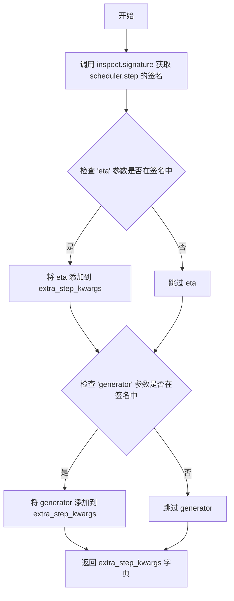
```mermaid
flowchart TD
    A[开始] --> B[调用 inspect.signature 获取 scheduler.step 的签名]
    B --> C{检查 'eta' 参数是否在签名中}
    C -->|是| D[将 eta 添加到 extra_step_kwargs]
    C -->|否| E[跳过 eta]
    D --> F{检查 'generator' 参数是否在签名中}
    E --> F
    F -->|是| G[将 generator 添加到 extra_step_kwargs]
    F -->|否| H[跳过 generator]
    G --> I[返回 extra_step_kwargs 字典]
    H --> I
```

#### 带注释源码

```python
# 在 SemanticStableDiffusionPipeline 类中
def prepare_extra_step_kwargs(self, generator, eta):
    """
    准备调度器步骤的额外参数。
    
    由于并非所有调度器都具有相同的签名，此方法检查调度器的 step 方法
    是否接受 eta 和 generator 参数，以兼容不同的调度器实现。
    """
    
    # 检查调度器的 step 方法是否接受 'eta' 参数
    # eta (η) 仅在 DDIMScheduler 中使用，其他调度器会忽略此参数
    accepts_eta = "eta" in set(inspect.signature(self.scheduler.step).parameters.keys())
    
    # 初始化额外参数字典
    extra_step_kwargs = {}
    
    # 如果调度器接受 eta，则将其添加到 extra_step_kwargs
    if accepts_eta:
        extra_step_kwargs["eta"] = eta

    # 检查调度器的 step 方法是否接受 'generator' 参数
    # generator 用于控制生成过程的随机性
    accepts_generator = "generator" in set(inspect.signature(self.scheduler.step).parameters.keys())
    
    # 如果调度器接受 generator，则将其添加到 extra_step_kwargs
    if accepts_generator:
        extra_step_kwargs["generator"] = generator
    
    # 返回包含调度器支持的所有额外参数的字典
    return extra_step_kwargs
```

---

### 相关上下文信息

在 `__call__` 方法中调用 `prepare_extra_step_kwargs`：

```python
# 6. Prepare extra step kwargs.
extra_step_kwargs = self.prepare_extra_step_kwargs(generator, eta)
```

随后在主循环中使用：

```python
# compute the previous noisy sample x_t -> x_t-1
latents = self.scheduler.step(noise_pred, t, latents, **extra_step_kwargs).prev_sample
```

这种设计允许 `SemanticStableDiffusionPipeline` 兼容多种调度器（如 DDIMScheduler、LMSDiscreteScheduler、PNDMScheduler 等），因为不同调度器对 `eta` 和 `generator` 参数的支持情况不同。


### `repeat`（来自 `itertools` 模块）

这是从 Python 标准库 `itertools` 导入的函数，在代码中用于将编辑提示（editing_prompt）中的每个概念重复扩展为与批处理大小相匹配的序列，以便为每个批处理元素生成对应的语义引导嵌入。

参数：

- `item`：任意类型，要重复的元素
- `times`：整数（可选），重复的次数；若省略则无限迭代

返回值：`itertools.repeat` 对象，一个无限迭代器，产生重复的元素序列

#### 流程图

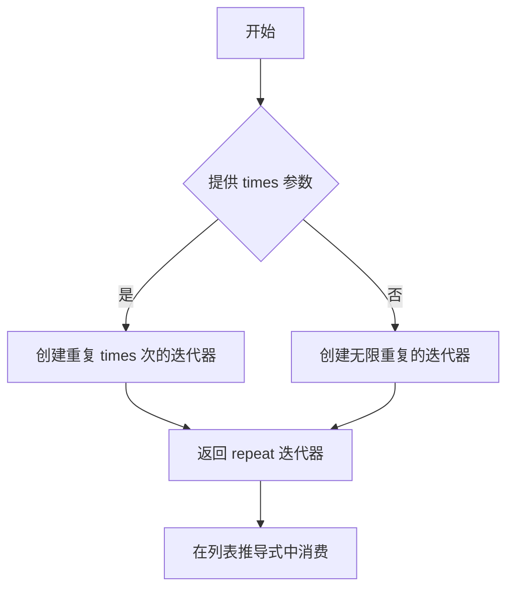
```mermaid
graph TD
    A[开始] --> B{提供 times 参数}
    B -->|是| C[创建重复 times 次的迭代器]
    B -->|否| D[创建无限重复的迭代器]
    C --> E[返回 repeat 迭代器]
    D --> E
    E --> F[在列表推导式中消费]
```

#### 带注释源码

```python
# 在 SemanticStableDiffusionPipeline.__call__ 方法中使用:
# 用于将 editing_prompt 中的每个概念重复 batch_size 次
# 例如: editing_prompt = ["smiling", "glasses"]
#      batch_size = 2
#      结果: ["smiling", "smiling", "glasses", "glasses"]

edit_concepts_input = self.tokenizer(
    [x for item in editing_prompt for x in repeat(item, batch_size)],
    #                                              ^^^^^^^^
    #                                              来自 itertools 模块
    #                                              将每个 item 重复 batch_size 次
    padding="max_length",
    max_length=self.tokenizer.model_max_length,
    return_tensors="pt",
)
```

#### 实际使用上下文

在 `__call__` 方法的语义引导（semantic guidance）部分：

```python
# 第 228-233 行
if editing_prompt_embeddings is None:
    edit_concepts_input = self.tokenizer(
        [x for item in editing_prompt for x in repeat(item, batch_size)],
        #                                                   ^^^^^^^
        # 将 editing_prompt 中的每个概念重复 batch_size 次
        # 以便与批量生成的图像对应
        padding="max_length",
        max_length=self.tokenizer.model_max_length,
        return_tensors="pt",
    )
```

**使用目的**：确保语义编辑概念能够与批处理中的每个样本正确对应，使文本编码器为每个概念生成适当的嵌入向量，用于后续的语义引导操作。


# torch 模块

`torch` 模块是 PyTorch 的核心库，在此代码中作为深度学习计算后端，用于张量操作、模型推理、设备管理和随机数生成等核心功能。

## 1. 核心功能概述

`torch` 模块在 `SemanticStableDiffusionPipeline` 中承担底层计算任务，包括：张量创建与运算、随机数生成（用于噪声初始化）、GPU/CPU 设备管理、模型输入输出处理、以及条件自由引导（classifier-free guidance）的实现。

## 2. 文件整体运行流程

此代码为 `SemanticStableDiffusionPipeline` 的完整实现，核心流程如下：

1. **初始化阶段**：加载 VAE、文本编码器（CLIPTextModel）、Tokenizer、UNet2DConditionModel、调度器（KarrasDiffusionSchedulers）和安全检查器
2. **推理阶段（`__call__` 方法）**：
   - 验证输入参数
   - 对提示词进行 Tokenize 并编码
   - 准备潜在变量（latents）
   - 执行去噪迭代（通过 UNet 预测噪声）
   - 应用语义引导（Semantic Guidance）进行图像编辑
   - 解码潜在变量为最终图像
   - 运行安全检查器过滤不当内容

## 3. 类的详细信息

### 3.1 SemanticStableDiffusionPipeline

**描述**：用于文本到图像生成的管道，支持语义编辑功能，基于 Stable Diffusion 并扩展了语义引导能力。

#### 类字段

| 名称 | 类型 | 描述 |
|------|------|------|
| `vae` | AutoencoderKL | 变分自编码器，用于图像与潜在表示之间的编码和解码 |
| `text_encoder` | CLIPTextModel | CLIP 文本编码器，将文本提示转换为嵌入向量 |
| `tokenizer` | CLIPTokenizer | CLIP 分词器，用于将文本分割为 token |
| `unet` | UNet2DConditionModel | 条件 UNet 模型，用于去噪潜在表示 |
| `scheduler` | KarrasDiffusionSchedulers | 扩散调度器，控制去噪过程的噪声调度 |
| `safety_checker` | StableDiffusionSafetyChecker | 安全检查器，检测生成图像是否包含不当内容 |
| `feature_extractor` | CLIPImageProcessor | 特征提取器，用于安全检查 |
| `vae_scale_factor` | int | VAE 缩放因子，通常为 8 |
| `image_processor` | VaeImageProcessor | 图像后处理器，用于图像的预处理和后处理 |

#### 类方法

##### `__init__`

**描述**：初始化管道，注册所有模型组件并配置图像处理器。

参数：

- `vae`：`AutoencoderKL`，Variational Auto-Encoder (VAE) 模型，用于编码和解码图像
- `text_encoder`：`CLIPTextModel`，冻结的文本编码器
- `tokenizer`：`CLIPTokenizer`，用于文本分词
- `unet`：`UNet2DConditionModel`，去噪条件 UNet 模型
- `scheduler`：`KarrasDiffusionSchedulers`，扩散调度器
- `safety_checker`：`StableDiffusionSafetyChecker`，安全检查器
- `feature_extractor`：`CLIPImageProcessor`，图像特征提取器
- `requires_safety_checker`：`bool`，是否需要安全检查器，默认为 True

返回值：`None`，构造函数无返回值

##### `run_safety_checker`

**描述**：运行安全检查器，检测生成图像是否包含不当内容（NSFW）。

参数：

- `image`：`torch.Tensor` 或 `numpy.ndarray`，待检查的图像
- `device`：`torch.device`，计算设备
- `dtype`：`torch.dtype`，数据类型

返回值：元组 `(image, has_nsfw_concept)`，其中 `image` 为处理后的图像，`has_nsfw_concept` 为是否包含不当内容的标志

##### `decode_latents`

**描述**：将潜在表示解码为图像（已弃用，建议使用 VaeImageProcessor.postprocess）。

参数：

- `latents`：`torch.Tensor`，潜在表示张量

返回值：`numpy.ndarray`，解码后的图像

##### `prepare_extra_step_kwargs`

**描述**：准备调度器的额外参数。

参数：

- `generator`：`torch.Generator` 或 `list[torch.Generator]`，随机数生成器
- `eta`：`float`，DDIM 调度器的 eta 参数

返回值：`dict`，包含额外参数的字典

##### `check_inputs`

**描述**：验证输入参数的有效性。

参数：

- `prompt`：`str` 或 `list[str]`，生成提示词
- `height`：`int`，生成图像高度
- `width`：`int`，生成图像宽度
- `callback_steps`：`int`，回调步数
- `negative_prompt`：`str` 或 `list[str]`，负面提示词
- `prompt_embeds`：`torch.Tensor`，提示词嵌入
- `negative_prompt_embeds`：`torch.Tensor`，负面提示词嵌入
- `callback_on_step_end_tensor_inputs`：`list`，回调时需要的张量输入

返回值：`None`，验证函数无返回值

##### `prepare_latents`

**描述**：准备扩散过程的初始潜在变量。

参数：

- `batch_size`：`int`，批次大小
- `num_channels_latents`：`int`，潜在变量通道数
- `height`：`int`，图像高度
- `width`：`int`，图像宽度
- `dtype`：`torch.dtype`，数据类型
- `device`：`torch.device`，计算设备
- `generator`：`torch.Generator`，随机数生成器
- `latents`：`torch.Tensor`，可选的预生成潜在变量

返回值：`torch.Tensor`，准备好的潜在变量

##### `__call__`

**描述**：执行文本到图像的生成，支持语义编辑功能。

参数：

- `prompt`：`str` 或 `list[str]`，指导图像生成的提示词
- `height`：`int` 或 `None`，生成图像的高度，默认为 unet.config.sample_size * vae_scale_factor
- `width`：`int` 或 `None`，生成图像的宽度，默认为 unet.config.sample_size * vae_scale_factor
- `num_inference_steps`：`int`，去噪步数，默认为 50
- `guidance_scale`：`float`，引导 scale，默认为 7.5
- `negative_prompt`：`str` 或 `list[str]` 或 `None`，负面提示词
- `num_images_per_prompt`：`int`，每个提示词生成的图像数量，默认为 1
- `eta`：`float`，DDIM 调度器参数，默认为 0.0
- `generator`：`torch.Generator` 或 `list[torch.Generator]` 或 `None`，随机数生成器
- `latents`：`torch.Tensor` 或 `None`，预生成的噪声潜在变量
- `output_type`：`str` 或 `None`，输出格式，默认为 "pil"
- `return_dict`：`bool`，是否返回字典格式，默认为 True
- `callback`：`Callable` 或 `None`，每步调用的回调函数
- `callback_steps`：`int`，回调频率，默认为 1
- `editing_prompt`：`str` 或 `list[str]` 或 `None`，语义引导提示词
- `editing_prompt_embeddings`：`torch.Tensor` 或 `None`，预计算的语义引导嵌入
- `reverse_editing_direction`：`bool` 或 `list[bool]` 或 `None`，引导方向，默认为 False
- `edit_guidance_scale`：`float` 或 `list[float]` 或 `None`，语义引导 scale，默认为 5
- `edit_warmup_steps`：`int` 或 `list[int]` 或 `None`，预热步数，默认为 10
- `edit_cooldown_steps`：`int` 或 `list[int]` 或 `None`，冷却步数
- `edit_threshold`：`float` 或 `list[float]` 或 `None`，语义引导阈值，默认为 0.9
- `edit_momentum_scale`：`float` 或 `None`，动量 scale，默认为 0.1
- `edit_mom_beta`：`float` 或 `None`，动量 beta，默认为 0.4
- `edit_weights`：`list[float]` 或 `None`，各概念的权重
- `sem_guidance`：`list[torch.Tensor]` 或 `None`，预生成的语义引导向量

返回值：`SemanticStableDiffusionPipelineOutput` 或 `tuple`，包含生成的图像和 NSFW 检测结果

#### 流程图

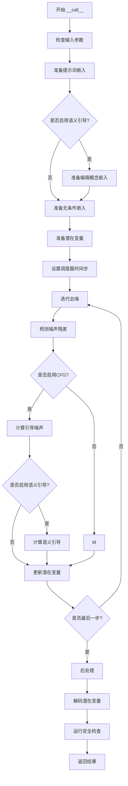
```mermaid
flowchart TD
    A[开始 __call__] --> B[检查输入参数]
    B --> C[准备提示词嵌入]
    C --> D{是否启用语义引导?}
    D -->|是| E[准备编辑概念嵌入]
    D -->|否| F
    E --> F[准备无条件嵌入]
    F --> G[准备潜在变量]
    G --> H[设置调度器时间步]
    H --> I[迭代去噪]
    I --> J[预测噪声残差]
    J --> K{是否启用CFG?}
    K -->|是| L[计算引导噪声]
    K -->|否| M
    L --> N{是否启用语义引导?}
    N -->|是| O[计算语义引导]
    N -->|否| P
    O --> P[更新潜在变量]
    M --> P
    P --> Q{是否最后一步?}
    Q -->|否| I
    Q -->|是| R[后处理]
    R --> S[解码潜在变量]
    S --> T[运行安全检查]
    T --> U[返回结果]
```

#### 带注释源码

```python
@torch.no_grad()
def __call__(
    self,
    prompt: str | list[str],
    height: int | None = None,
    width: int | None = None,
    num_inference_steps: int = 50,
    guidance_scale: float = 7.5,
    negative_prompt: str | list[str] | None = None,
    num_images_per_prompt: int = 1,
    eta: float = 0.0,
    generator: torch.Generator | list[torch.Generator] | None = None,
    latents: torch.Tensor | None = None,
    output_type: str | None = "pil",
    return_dict: bool = True,
    callback: Callable[[int, int, torch.Tensor], None] | None = None,
    callback_steps: int = 1,
    editing_prompt: str | list[str] | None = None,
    editing_prompt_embeddings: torch.Tensor | None = None,
    reverse_editing_direction: bool | list[bool] | None = False,
    edit_guidance_scale: float | list[float] | None = 5,
    edit_warmup_steps: int | list[int] | None = 10,
    edit_cooldown_steps: int | list[int] | None = None,
    edit_threshold: float | list[float] | None = 0.9,
    edit_momentum_scale: float | None = 0.1,
    edit_mom_beta: float | None = 0.4,
    edit_weights: list[float] | None = None,
    sem_guidance: list[torch.Tensor] | None = None,
):
    # 0. 默认高度和宽度设置为 unet 的配置值
    height = height or self.unet.config.sample_size * self.vae_scale_factor
    width = width or self.unet.config.sample_size * self.vae_scale_factor

    # 1. 检查输入参数的有效性
    self.check_inputs(prompt, height, width, callback_steps)

    # 2. 定义调用参数
    batch_size = 1 if isinstance(prompt, str) else len(prompt)
    device = self._execution_device

    # 检查是否启用语义引导
    if editing_prompt:
        enable_edit_guidance = True
        if isinstance(editing_prompt, str):
            editing_prompt = [editing_prompt]
        enabled_editing_prompts = len(editing_prompt)
    elif editing_prompt_embeddings is not None:
        enable_edit_guidance = True
        enabled_editing_prompts = editing_prompt_embeddings.shape[0]
    else:
        enabled_editing_prompts = 0
        enable_edit_guidance = False

    # 3. 获取提示词文本嵌入
    text_inputs = self.tokenizer(
        prompt,
        padding="max_length",
        max_length=self.tokenizer.model_max_length,
        return_tensors="pt",  # 返回 PyTorch 张量
    )
    text_input_ids = text_inputs.input_ids

    # 截断过长的文本
    if text_input_ids.shape[-1] > self.tokenizer.model_max_length:
        removed_text = self.tokenizer.batch_decode(text_input_ids[:, self.tokenizer.model_max_length:])
        logger.warning(...)
        text_input_ids = text_input_ids[:, :self.tokenizer.model_max_length]
    
    # 使用 torch 模块进行文本编码
    text_embeddings = self.text_encoder(text_input_ids.to(device))[0]

    # 为每个提示词复制文本嵌入
    bs_embed, seq_len, _ = text_embeddings.shape
    text_embeddings = text_embeddings.repeat(1, num_images_per_prompt, 1)
    text_embeddings = text_embeddings.view(bs_embed * num_images_per_prompt, seq_len, -1)

    # 4. 获取语义引导的文本嵌入
    if enable_edit_guidance:
        if editing_prompt_embeddings is None:
            edit_concepts_input = self.tokenizer(
                [x for item in editing_prompt for x in repeat(item, batch_size)],
                padding="max_length",
                max_length=self.tokenizer.model_max_length,
                return_tensors="pt",
            )
            edit_concepts_input_ids = edit_concepts_input.input_ids
            # ... 截断处理 ...
            edit_concepts = self.text_encoder(edit_concepts_input_ids.to(device))[0]
        else:
            edit_concepts = editing_prompt_embeddings.to(device).repeat(batch_size, 1, 1)

        # 复制编辑概念嵌入
        bs_embed_edit, seq_len_edit, _ = edit_concepts.shape
        edit_concepts = edit_concepts.repeat(1, num_images_per_prompt, 1)
        edit_concepts = edit_concepts.view(bs_embed_edit * num_images_per_prompt, seq_len_edit, -1)

    # 5. 条件自由引导（Classifier-Free Guidance）
    do_classifier_free_guidance = guidance_scale > 1.0

    if do_classifier_free_guidance:
        # 获取无条件嵌入
        uncond_tokens = ...
        uncond_input = self.tokenizer(uncond_tokens, ...)
        uncond_embeddings = self.text_encoder(uncond_input.input_ids.to(device))[0]

        # 复制无条件嵌入
        uncond_embeddings = uncond_embeddings.repeat(1, num_images_per_prompt, 1)
        uncond_embeddings = uncond_embeddings.view(batch_size * num_images_per_prompt, seq_len, -1)

        # 拼接嵌入
        if enable_edit_guidance:
            text_embeddings = torch.cat([uncond_embeddings, text_embeddings, edit_concepts])
        else:
            text_embeddings = torch.cat([uncond_embeddings, text_embeddings])

    # 6. 准备潜在变量
    self.scheduler.set_timesteps(num_inference_steps, device=device)
    timesteps = self.scheduler.timesteps

    num_channels_latents = self.unet.config.in_channels
    latents = self.prepare_latents(...)

    # 7. 准备额外参数
    extra_step_kwargs = self.prepare_extra_step_kwargs(generator, eta)

    # 8. 去噪循环
    for i, t in enumerate(self.progress_bar(timesteps)):
        # 扩展潜在变量（用于 CFG）
        latent_model_input = (
            torch.cat([latents] * (2 + enabled_editing_prompts)) if do_classifier_free_guidance else latents
        )
        latent_model_input = self.scheduler.scale_model_input(latent_model_input, t)

        # 预测噪声残差
        noise_pred = self.unet(latent_model_input, t, encoder_hidden_states=text_embeddings).sample

        # 执行引导
        if do_classifier_free_guidance:
            noise_pred_out = noise_pred.chunk(2 + enabled_editing_prompts)
            noise_pred_uncond, noise_pred_text = noise_pred_out[0], noise_pred_out[1]
            noise_pred_edit_concepts = noise_pred_out[2:]

            # 计算文本引导
            noise_guidance = guidance_scale * (noise_pred_text - noise_pred_uncond)

            # 语义引导处理（如果启用）
            if enable_edit_guidance:
                # ... 复杂的语义引导计算 ...
                # 使用 torch 进行各种张量运算
                concept_weights = torch.zeros(...)
                noise_guidance_edit = torch.zeros(...)
                # ... 应用阈值、动量等 ...
                noise_guidance = noise_guidance + noise_guidance_edit

            # 最终噪声预测
            noise_pred = noise_pred_uncond + noise_guidance

        # 调度器步进
        latents = self.scheduler.step(noise_pred, t, latents, **extra_step_kwargs).prev_sample

        # 回调
        if callback is not None and i % callback_steps == 0:
            callback(i // getattr(self.scheduler, "order", 1), t, latents)

    # 9. 后处理
    if not output_type == "latent":
        image = self.vae.decode(latents / self.vae.config.scaling_factor, return_dict=False)[0]
        image, has_nsfw_concept = self.run_safety_checker(image, device, text_embeddings.dtype)
    else:
        image = latents
        has_nsfw_concept = None

    # 10. 图像后处理
    image = self.image_processor.postprocess(image, output_type=output_type, do_denormalize=do_denormalize)

    # 11. 返回结果
    if not return_dict:
        return (image, has_nsfw_concept)

    return SemanticStableDiffusionPipelineOutput(images=image, nsfw_content_detected=has_nsfw_concept)
```

## 4. 全局变量

| 名称 | 类型 | 描述 |
|------|------|------|
| `logger` | `logging.Logger` | 模块日志记录器 |
| `XLA_AVAILABLE` | `bool` | 标志是否支持 PyTorch XLA |

## 5. 关键组件信息

| 组件名称 | 描述 |
|----------|------|
| `SemanticStableDiffusionPipeline` | 核心管道类，继承自 DiffusionPipeline 和 StableDiffusionMixin |
| `VaeImageProcessor` | VAE 图像处理器，用于图像的预处理和后处理 |
| `AutoencoderKL` | VAE 模型 |
| `CLIPTextModel` | CLIP 文本编码器 |
| `UNet2DConditionModel` | 条件 UNet 去噪模型 |
| `KarrasDiffusionSchedulers` | Karras 扩散调度器 |
| `StableDiffusionSafetyChecker` | Stable Diffusion 安全检查器 |
| `SemanticStableDiffusionPipelineOutput` | 管道输出类 |

## 6. torch 模块在此代码中的具体使用

| torch 函数/类 | 用途 |
|---------------|------|
| `torch.is_tensor()` | 检查输入是否为 PyTorch 张量 |
| `torch.no_grad()` | 装饰器，禁用梯度计算以节省内存 |
| `torch.Generator` | 随机数生成器，用于可控的随机生成 |
| `torch.randn_tensor()` | 生成正态分布的随机张量 |
| `torch.cat()` | 连接多个张量 |
| `torch.chunk()` | 将张量分割成块 |
| `torch.repeat()` | 重复张量 |
| `torch.view()` | 调整张量形状 |
| `torch.zeros()` | 创建全零张量 |
| `torch.zeros_like()` | 创建与给定张量形状相同的全零张量 |
| `torch.full_like()` | 创建填充相同值的张量 |
| `torch.abs()` | 计算绝对值 |
| `torch.quantile()` | 计算分位数 |
| `torch.where()` | 条件选择 |
| `torch.einsum()` | 爱因斯坦求和约定 |
| `torch.nan_to_num()` | 将 NaN 替换为指定值 |
| `tensor.to()` | 将张量移动到指定设备 |
| `tensor.cpu()` | 将张量移到 CPU |
| `tensor.permute()` | 重新排列维度 |
| `tensor.clamp()` | 限制张量值的范围 |

## 7. 潜在技术债务或优化空间

1. **内存优化**：可以进一步优化 `uncond_estimates`、`text_estimates`、`edit_estimates` 的内存使用，这些变量在每步迭代中都会被创建
2. **CPU/GPU 数据传输**：代码中存在多次 `to("cpu")` 和 `to(device)` 的数据传输，可以考虑合并或减少传输次数
3. **量化支持**：虽然代码中有对 `torch.float32` 的特殊处理，但可以进一步优化对不同数据类型的支持
4. **缓存机制**：编辑概念的嵌入可以缓存以避免重复计算

## 8. 其他项目

### 设计目标与约束

- **设计目标**：实现支持语义编辑的文本到图像生成管道
- **约束**：
  - 输入高度和宽度必须能被 8 整除
  - 提示词长度受 CLIP 模型最大长度限制
  - 必须遵守 Stable Diffusion 许可证

### 错误处理与异常设计

- 输入验证在 `check_inputs` 方法中集中处理
- 使用 `logger.warning` 提示截断的文本
- 安全检查器可配置为可选组件

### 数据流与状态机

- 数据流：提示词 → Tokenize → 文本编码 → 潜在变量准备 → 去噪循环 → 解码 → 后处理
- 状态机：主要由扩散调度器控制，包括 `set_timesteps`、`scale_model_input`、`step` 等状态转换

### 外部依赖与接口契约

- **transformers**：CLIP 文本编码器和分词器
- **diffusers**：扩散模型核心组件（UNet、VAE、调度器等）
- **PyTorch XLA**：可选的 TPU 支持


### `CLIPImageProcessor` (导入)

这段代码从 Hugging Face `transformers` 库中导入了 `CLIPImageProcessor` 类。该类是一个图像预处理工具，用于将 PIL 图像或 NumPy 数组转换为模型所需的像素值张量（tensor）。在当前的 `SemanticStableDiffusionPipeline` 流程中，它被注册为 `feature_extractor`，主要在安全检查阶段（`run_safety_checker`）对生成的图像进行预处理，以供安全检查器判断图像是否包含不适宜内容（NSFW）。

参数：

-  无（导入语句本身不包含运行时参数）

返回值：

-  无（导入语句本身不包含返回值）

#### 流程图


```mermaid
graph LR
    A[SemanticStableDiffusionPipeline] -->|导入语句| B[transformers 库]
    B --> C[CLIPImageProcessor 类]
    C --> D[实例化为 feature_extractor]
    D --> E[用于安全检查图像预处理]
```

#### 带注释源码

```python
# 导入 transformers 库中的 CLIPImageProcessor
# 该处理器用于从图像中提取特征，是安全检查流程的前置步骤
from transformers import CLIPImageProcessor, CLIPTextModel, CLIPTokenizer
```


### CLIPTextModel（导入）

该导入语句从 `transformers` 库中引入 `CLIPTextModel` 类，用于将文本编码为向量表示。在 `SemanticStableDiffusionPipeline` 中作为文本编码器组件，用于将用户输入的文本提示（prompt）转换为模型可理解的嵌入向量，这是 Stable Diffusion 等扩散模型进行条件图像生成的关键组件。

参数：无（导入语句不接受参数）

返回值：`CLIPTextModel`，从 `transformers` 库导入的 CLIP 文本编码器类，用于将文本转换为语义向量表示

#### 流程图

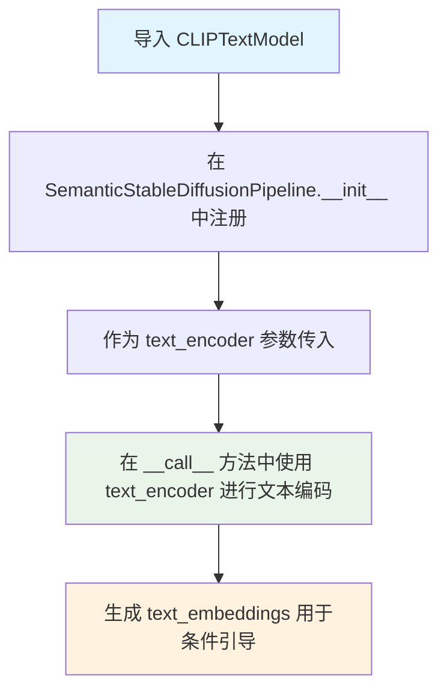
```mermaid
graph TD
    A[导入 CLIPTextModel] --> B[在 SemanticStableDiffusionPipeline.__init__ 中注册]
    B --> C[作为 text_encoder 参数传入]
    C --> D[在 __call__ 方法中使用 text_encoder 进行文本编码]
    D --> E[生成 text_embeddings 用于条件引导]
    
    style A fill:#e1f5fe
    style D fill:#e8f5e8
    style E fill:#fff3e0
```

#### 带注释源码

```python
# 从 transformers 库导入 CLIPTextModel
# CLIPTextModel 是基于 CLIP (Contrastive Language-Image Pre-training) 架构的文本编码器
# 它将文本输入转换为高维向量表示，用于图像生成的条件引导
from transformers import CLIPImageProcessor, CLIPTextModel, CLIPTokenizer
```

#### 在类中的使用

在 `SemanticStableDiffusionPipeline` 类中，`CLIPTextModel` 类型的 `text_encoder` 组件用于以下核心功能：

1. **文本编码**：在 `__call__` 方法中，将 token 化的文本输入编码为嵌入向量：
   ```python
   text_embeddings = self.text_encoder(text_input_ids.to(device))[0]
   ```

2. **无条件嵌入**：用于生成 classifier-free guidance 所需的无条件嵌入：
   ```python
   uncond_embeddings = self.text_encoder(uncond_input.input_ids.to(device))[0]
   ```

3. **编辑概念编码**：如果启用了语义编辑功能，还会编码编辑提示：
   ```python
   edit_concepts = self.text_encoder(edit_concepts_input_ids.to(device))[0]
   ```

#### 关键信息

| 属性 | 值 |
|------|-----|
| 来源库 | `transformers` (Hugging Face) |
| 模型变体 | `clip-vit-large-patch14` |
| 用途 | 文本到向量编码 |
| 在管线中的角色 | 条件生成的关键组件 |
| 配置参数 | `self.tokenizer.model_max_length` 控制最大序列长度 |


### `CLIPTokenizer`（导入）

`CLIPTokenizer` 是从 Hugging Face `transformers` 库导入的文本分词器，用于将文本字符串转换为模型可处理的 token ID 序列。在 `SemanticStableDiffusionPipeline` 中，它被实例化并用于对输入提示词进行编码，以便后续传递给文本编码器（`text_encoder`）生成文本嵌入向量。

#### 带注释源码

```python
# 从 transformers 库导入 CLIPTokenizer
from transformers import CLIPTokenizer

# 在 SemanticStableDiffusionPipeline 中作为成员变量使用
# 1. 初始化时接收 tokenizer 参数
def __init__(
    self,
    vae: AutoencoderKL,
    text_encoder: CLIPTextModel,
    tokenizer: CLIPTokenizer,  # <--- CLIPTokenizer 实例
    unet: UNet2DConditionModel,
    scheduler: KarrasDiffusionSchedulers,
    safety_checker: StableDiffusionSafetyChecker,
    feature_extractor: CLIPImageProcessor,
    requires_safety_checker: bool = True,
):
    # 注册模块
    self.register_modules(
        vae=vae,
        text_encoder=text_encoder,
        tokenizer=tokenizer,  # <--- 存储为实例变量
        unet=unet,
        scheduler=scheduler,
        safety_checker=safety_checker,
        feature_extractor=feature_extractor,
    )

# 2. 在 __call__ 方法中使用 tokenizer 进行编码
# 将文本提示转换为 token ID
text_inputs = self.tokenizer(
    prompt,
    padding="max_length",
    max_length=self.tokenizer.model_max_length,
    return_tensors="pt",
)
# 输出: {'input_ids': tensor([[...]]), 'attention_mask': tensor([[...]])}
text_input_ids = text_inputs.input_ids

# 3. 用于负向提示词的编码
uncond_input = self.tokenizer(
    uncond_tokens,
    padding="max_length",
    max_length=max_length,
    truncation=True,
    return_tensors="pt",
)
```

#### 使用示例

```python
# 直接创建 CLIPTokenizer 实例
tokenizer = CLIPTokenizer.from_pretrained("openai/clip-vit-large-patch14")

# 文本编码
inputs = tokenizer(
    "a photo of a cat",
    padding="max_length",
    max_length=tokenizer.model_max_length,
    return_tensors="pt"
)
# inputs.input_ids: tensor([[49406,   320,   1125,   539,    269,   49407, ...]])
```


### `VaeImageProcessor`（导入）

该类是从 `...image_processor` 模块导入的图像处理工具类，用于 VAE（变分自编码器）的图像预处理和后处理操作。

参数：

- `vae_scale_factor`：`int`，VAE 缩放因子，用于调整潜在空间的维度

返回值：返回 `VaeImageProcessor` 实例

#### 流程图

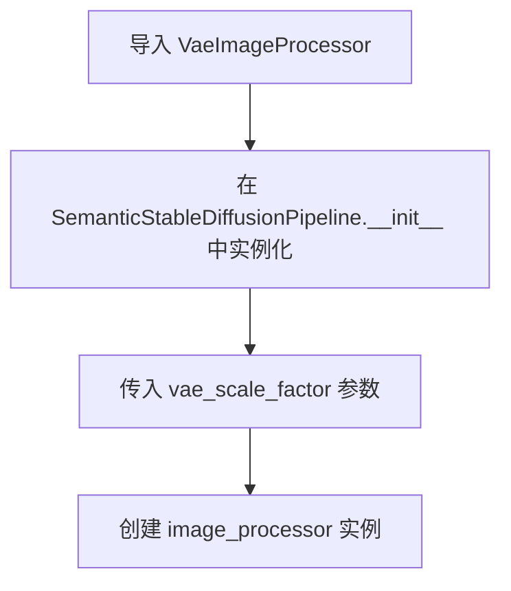
```mermaid
graph TD
    A[导入 VaeImageProcessor] --> B[在 SemanticStableDiffusionPipeline.__init__ 中实例化]
    B --> C[传入 vae_scale_factor 参数]
    C --> D[创建 image_processor 实例]
```

#### 带注释源码

```python
# 从上级目录的 image_processor 模块导入 VaeImageProcessor 类
from ...image_processor import VaeImageProcessor

# 在 SemanticStableDiffusionPipeline 类的初始化方法中使用：
# 计算 VAE 缩放因子：2 的 (VAE 块输出通道数 - 1) 次方
self.vae_scale_factor = 2 ** (len(self.vae.config.block_out_channels) - 1) if getattr(self, "vae", None) else 8

# 使用 VaeImageProcessor 类创建图像处理器实例，传入缩放因子
self.image_processor = VaeImageProcessor(vae_scale_factor=self.vae_scale_factor)
```

**注意**：由于 `VaeImageProcessor` 是从外部模块导入的类，以上信息是基于代码中对其进行导入和使用的部分推断得出的。该类的完整源代码位于 `...image_processor` 模块中，未在此代码文件中直接定义。如需获取该类的完整实现细节（如所有方法、参数和功能），请参考原始的 `image_processor` 模块源文件。


### `AutoencoderKL` (导入)

这是一个从 `...models` 模块导入的类，用于变分自动编码器（VAE）模型，负责在潜在表示和图像之间进行编码和解码。

#### 详细信息

- **导入来源**: `from ...models import AutoencoderKL`
- **模块路径**: `...models` (相对于 diffusers 库)
- **用途**: 在 `SemanticStableDiffusionPipeline` 中作为核心组件之一，用于将图像编码为潜在表示，以及将潜在表示解码回图像

#### 在类中的使用

在 `SemanticStableDiffusionPipeline` 中，`AutoencoderKL` 类型的 `vae` 参数被用于：

1. **图像编码/解码**: 通过 `vae.encode()` 和 `vae.decode()` 方法处理图像
2. **潜在空间缩放**: 使用 `vae.config.scaling_factor` 对潜在表示进行缩放
3. **VAE 缩放因子计算**: `self.vae_scale_factor = 2 ** (len(self.vae.config.block_out_channels) - 1)`

#### 流程图

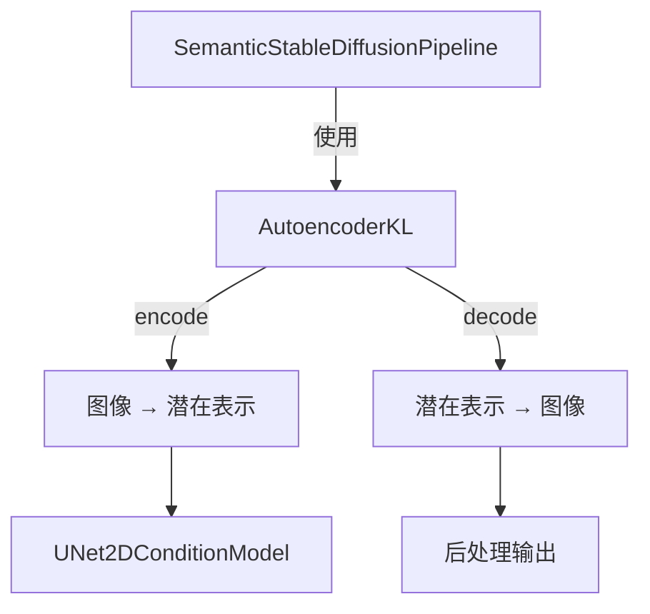
```mermaid
graph TD
    A[SemanticStableDiffusionPipeline] -->|使用| B[AutoencoderKL]
    B -->|encode| C[图像 → 潜在表示]
    B -->|decode| D[潜在表示 → 图像]
    C --> E[UNet2DConditionModel]
    D --> F[后处理输出]
```

#### 带注释源码

```python
# 导入语句
from ...models import AutoencoderKL, UNet2DConditionModel

# 在 SemanticStableDiffusionPipeline.__init__ 中的使用
def __init__(
    self,
    vae: AutoencoderKL,  # VAE 模型实例
    text_encoder: CLIPTextModel,
    tokenizer: CLIPTokenizer,
    unet: UNet2DConditionModel,
    scheduler: KarrasDiffusionSchedulers,
    safety_checker: StableDiffusionSafetyChecker,
    feature_extractor: CLIPImageProcessor,
    requires_safety_checker: bool = True,
):
    # 注册 VAE 模块
    self.register_modules(
        vae=vae,
        # ... 其他模块
    )
    # 计算 VAE 缩放因子
    self.vae_scale_factor = 2 ** (len(self.vae.config.block_out_channels) - 1) if getattr(self, "vae", None) else 8

# 在 __call__ 方法中用于解码
# 将潜在表示解码为图像
image = self.vae.decode(latents / self.vae.config.scaling_factor, return_dict=False)[0]
```

#### 关键属性和方法（推测）

基于代码中的使用方式：

| 成员 | 类型 | 描述 |
|------|------|------|
| `vae.config.scaling_factor` | float | 潜在空间缩放因子 |
| `vae.config.block_out_channels` | list | VAE 解码器的通道配置 |
| `vae.encode()` | 方法 | 将图像编码为潜在表示 |
| `vae.decode()` | 方法 | 将潜在表示解码为图像 |

#### 技术债务/优化空间

1. **硬编码的默认值**: `self.vae_scale_factor` 在 `vae` 为 None 时默认使用 8，这可能不是最优的默认值
2. **版本兼容性**: 使用 `getattr(self, "vae", None)` 这种防御性编程暗示了 API 可能存在变化


### `UNet2DConditionModel`

UNet2DConditionModel 是一个基于 UNet 的条件扩散模型，用于在文本到图像生成任务中预测噪声。它接收噪声潜伏码、时间步长和文本编码器的隐藏状态作为输入，输出预测的噪声残差。

参数：

- `sample`：`torch.Tensor`，输入的噪声潜伏码（noisy latents），通常形状为 [batch_size, channels, height, width]
- `timestep`：`int` 或 `torch.Tensor`，当前扩散过程的时间步长
- `encoder_hidden_states`：`torch.Tensor`，文本编码器生成的文本嵌入，用于条件生成

返回值：`torch.Tensor`，预测的噪声残差，形状与输入 sample 相同

#### 流程图

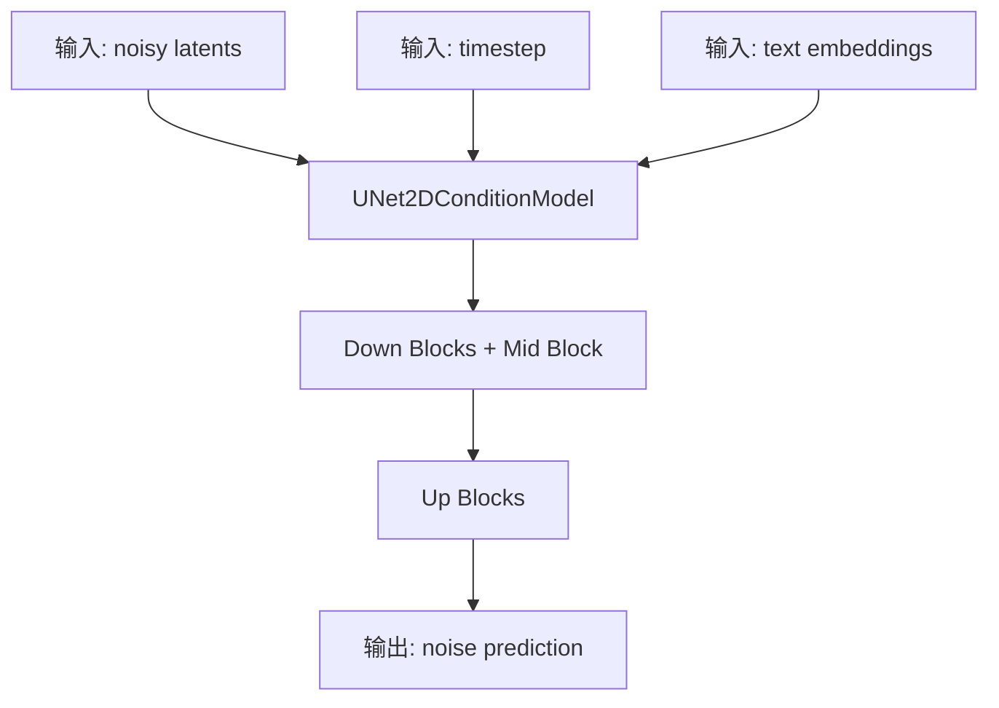
```mermaid
graph TD
    A[输入: noisy latents] --> B[UNet2DConditionModel]
    C[输入: timestep] --> B
    D[输入: text embeddings] --> B
    B --> E[Down Blocks + Mid Block]
    E --> F[Up Blocks]
    F --> G[输出: noise prediction]
```

#### 带注释源码

```python
# UNet2DConditionModel 在 diffusers 库中的典型结构
# 以下是基于使用方式的推断

class UNet2DConditionModel(nn.Module):
    """
    用于条件图像生成的 UNet 模型。
    
    主要组件:
    - config.in_channels: 输入通道数 (通常为 4, 对应 VAE 的潜在空间维度)
    - config.sample_size: 输出图像的潜在空间尺寸
    """
    
    def __init__(self, config):
        super().__init__()
        self.config = config
        
    def forward(
        self,
        sample: torch.Tensor,           # 噪声潜伏码 [B, 4, H, W]
        timestep: torch.Tensor,          # 时间步长
        encoder_hidden_states: torch.Tensor,  # 文本嵌入 [B, seq_len, hidden_dim]
        return_dict: bool = True,
    ) -> Union[UNet2DConditionOutput, tuple]:
        """
        前向传播
        
        参数:
            sample: 噪声潜伏码
            timestep: 扩散时间步
            encoder_hidden_states: 条件文本嵌入
            
        返回:
            预测的噪声残差
        """
        ...
        
    def enable_gradient_checkpointing(self):
        """启用梯度检查点以节省显存"""
        ...
        
    def enable_xformers_memory_efficient_attention(self):
        """启用 xformers 高效注意力"""
        ...
```

#### 在 SemanticStableDiffusionPipeline 中的使用

```python
# 1. 在 __init__ 中注册
self.register_modules(
    unet=unet,
    ...
)

# 2. 在 __call__ 中调用进行噪声预测
noise_pred = self.unet(latent_model_input, t, encoder_hidden_states=text_embeddings).sample

# 3. 获取配置信息
height = height or self.unet.config.sample_size * self.vae_scale_factor
width = width or self.unet.config.sample_size * self.vae_scale_factor
num_channels_latents = self.unet.config.in_channels
```


### `StableDiffusionSafetyChecker`（导入）

从 `...pipelines.stable_diffusion.safety_checker` 模块导入 `StableDiffusionSafetyChecker` 类，用于在图像生成过程中检测并过滤不安全内容（如 NSFW）。

参数：

- （无参数 - 这是一个 import 语句）

返回值：

- （无返回值 - 这是一个 import 语句）

#### 流程图

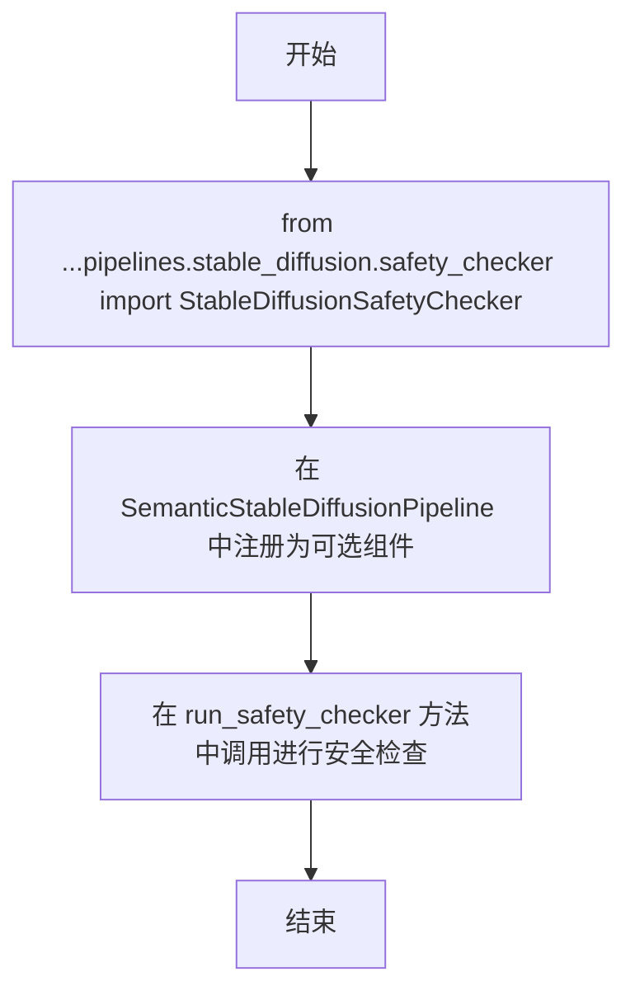
```mermaid
graph TD
    A[开始] --> B[from ...pipelines.stable_diffusion.safety_checker import StableDiffusionSafetyChecker]
    B --> C[在 SemanticStableDiffusionPipeline 中注册为可选组件]
    C --> D[在 run_safety_checker 方法中调用进行安全检查]
    D --> E[结束]
```

#### 带注释源码

```python
# 导入语句：从上级模块的 stable_diffusion safety_checker 子模块导入 StableDiffusionSafetyChecker 类
# 该类用于检查生成的图像是否包含不适合公开显示的内容
from ...pipelines.stable_diffusion.safety_checker import StableDiffusionSafetyChecker
```


### `KarrasDiffusionSchedulers`（导入）

这是从 `...schedulers` 模块导入的一个类型别名（TypeAlias），用于表示 Karras 扩散调度器的各种实现类。在 `SemanticStableDiffusionPipeline` 中用作 `scheduler` 参数的类型注解，限定了该管道支持的调度器类型。

参数：此为类型导入，无直接参数

返回值：`type`，返回 KarrasDiffusionSchedulers 类型，用于类型注解

#### 流程图

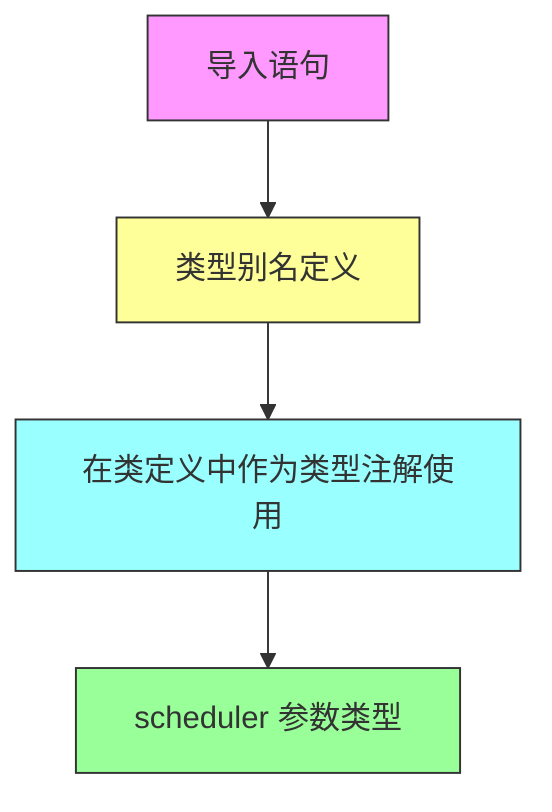
```mermaid
graph TD
    A[导入语句] --> B[类型别名定义]
    B --> C[在类定义中作为类型注解使用]
    C --> D[scheduler 参数类型]
    
    style A fill:#f9f,stroke:#333
    style B fill:#ff9,stroke:#333
    style C fill:#9ff,stroke:#333
    style D fill:#9f9,stroke:#333
```

#### 带注释源码

```python
# 导入语句
from ...schedulers import KarrasDiffusionSchedulers

# 在类定义中作为类型注解使用
class SemanticStableDiffusionPipeline(DeprecatedPipelineMixin, DiffusionPipeline, StableDiffusionMixin):
    # ... 其他代码 ...
    
    def __init__(
        self,
        vae: AutoencoderKL,
        text_encoder: CLIPTextModel,
        tokenizer: CLIPTokenizer,
        unet: UNet2DConditionModel,
        scheduler: KarrasDiffusionSchedulers,  # <-- 使用导入的类型作为参数类型注解
        safety_checker: StableDiffusionSafetyChecker,
        feature_extractor: CLIPImageProcessor,
        requires_safety_checker: bool = True,
    ):
        # 初始化逻辑
        self.register_modules(
            vae=vae,
            text_encoder=text_encoder,
            tokenizer=tokenizer,
            unet=unet,
            scheduler=scheduler,
            safety_checker=safety_checker,
            feature_extractor=feature_extractor,
        )
```

#### 补充说明

`KarrasDiffusionSchedulers` 是 diffusers 库中定义的一个类型别名，它包含了一系列基于 Karras 论文的扩散调度器实现。在 `SemanticStableDiffusionPipeline` 中，这个类型用于约束 `scheduler` 参数，确保传入的调度器是 Karras 系列的调度器之一，从而保证语义引导功能能够正常工作。该类型通常包括 `DDPMScheduler`、`DDIMScheduler`、`LMSDiscreteScheduler`、`PNDMScheduler` 等基于 Karras 噪声时间表设计的调度器。


### `deprecate`

标记函数或方法已弃用，并输出弃用警告信息。

参数：

-  `name`：`str`，要弃用的函数或方法的名称
-  `version`：`str`，计划移除的版本号
-  `deprecation_message`：`str`，关于弃用的详细说明信息
-  `standard_warn`：`bool`，是否使用标准警告格式，默认为 `True`

返回值：无返回值

#### 流程图

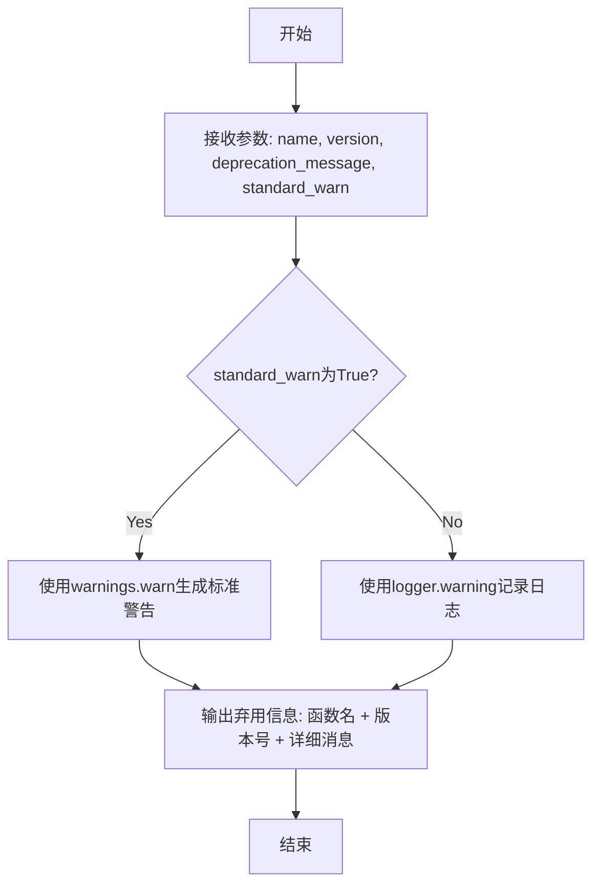
```mermaid
flowchart TD
    A[开始] --> B[接收参数: name, version, deprecation_message, standard_warn]
    B --> C{standard_warn为True?}
    C -->|Yes| D[使用warnings.warn生成标准警告]
    C -->|No| E[使用logger.warning记录日志]
    D --> F[输出弃用信息: 函数名 + 版本号 + 详细消息]
    E --> F
    F --> G[结束]
```

#### 带注释源码

```python
# 从 diffusers 工具库导入 deprecate 函数
# 该函数用于标记代码中的弃用项，帮助开发者顺利过渡到新版本
from ...utils import deprecate, is_torch_xla_available, logging

# 在 decode_latents 方法中使用 deprecate 函数示例：
def decode_latents(self, latents):
    # 定义弃用消息，说明方法将在 1.0.0 版本移除，并建议使用替代方案
    deprecation_message = "The decode_latents method is deprecated and will be removed in 1.0.0. Please use VaeImageProcessor.postprocess(...) instead"
    
    # 调用 deprecate 函数，传入方法名、版本号、弃用消息
    # standard_warn=False 表示不显示标准警告，而是通过 logger 输出
    deprecate("decode_latents", "1.0.0", deprecation_message, standard_warn=False)
    
    # 后续为原方法的实现逻辑...
    latents = 1 / self.vae.config.scaling_factor * latents
    image = self.vae.decode(latents, return_dict=False)[0]
    image = (image / 2 + 0.5).clamp(0, 1)
    image = image.cpu().permute(0, 2, 3, 1).float().numpy()
    return image
```


### `is_torch_xla_available`

该函数是一个工具函数，用于检查当前环境中是否安装了 PyTorch XLA（Accelerated Linear Algebra）库。如果安装可用，后续代码会导入 `torch_xla` 相关模块并设置 `XLA_AVAILABLE` 标志为 `True`，否则设置为 `False`。

参数： 无

返回值：`bool`，返回一个布尔值，表示 PyTorch XLA 库是否可用。返回 `True` 表示已安装并可用，返回 `False` 表示未安装或不可用。

#### 流程图

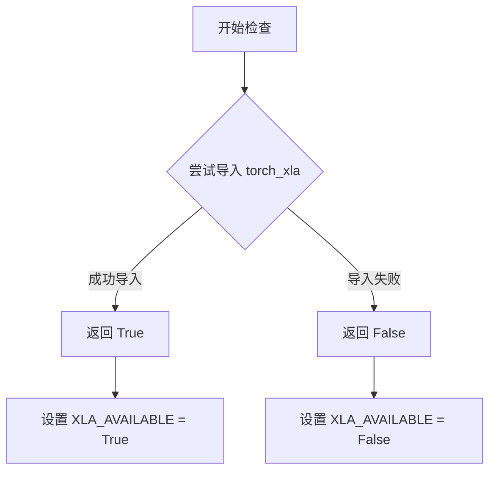
```mermaid
flowchart TD
    A[开始检查] --> B{尝试导入 torch_xla}
    B -->|成功导入| C[返回 True]
    B -->|导入失败| D[返回 False]
    C --> E[设置 XLA_AVAILABLE = True]
    D --> F[设置 XLA_AVAILABLE = False]
```

#### 带注释源码

```python
# 从 utils 模块导入 is_torch_xla_available 函数
# 这是 diffusers 库中的一个工具函数，用于检测 PyTorch XLA 是否可用
from ...utils import deprecate, is_torch_xla_available, logging

# 使用 is_torch_xla_available() 检查 XLA 是否可用
# 这是一个无参数的函数调用，返回布尔值
if is_torch_xla_available():
    # 如果 XLA 可用，导入 torch_xla 的核心模块
    import torch_xla.core.xla_model as xm

    # 设置全局标志，表示 XLA 当前可用
    XLA_AVAILABLE = True
else:
    # 如果 XLA 不可用，设置全局标志为 False
    XLA_AVAILABLE = False
```

#### 详细说明

该函数的核心逻辑通常是在 `diffusers` 库的 `utils` 模块中实现的，其典型实现方式如下：

```python
def is_torch_xla_available() -> bool:
    """
    检查 PyTorch XLA 是否可用。
    
    Returns:
        bool: 如果 torch_xla 已安装则返回 True，否则返回 False
    """
    try:
        import torch_xla
        return True
    except ImportError:
        return False
```

这个函数的主要用途是：

1. **条件导入**：允许代码在没有安装 XLA 的环境中也能正常运行
2. **性能优化**：当 XLA 可用时，可以利用 TPU 等加速设备进行训练
3. **优雅降级**：在 XLA 不可用时，代码可以回退到 CPU 或 CUDA 设备


### `logging.get_logger`

获取指定模块的日志记录器实例，用于在模块中记录日志信息。

参数：

- `name`：`str`，模块的名称，通常使用`__name__`变量，表示日志来源的模块。

返回值：`logging.Logger`，返回配置好的日志记录器对象，可用于记录不同级别的日志信息。

#### 流程图

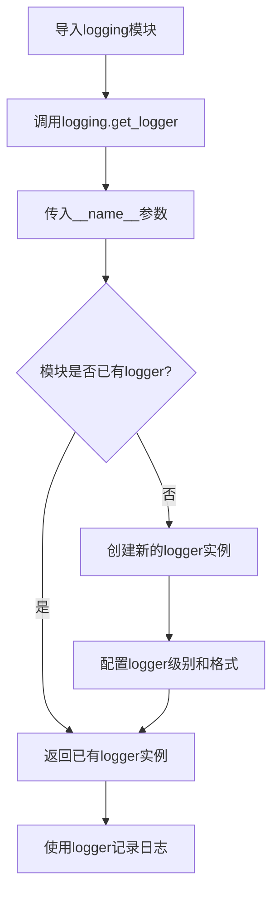
```mermaid
flowchart TD
    A[导入logging模块] --> B[调用logging.get_logger]
    B --> C[传入__name__参数]
    C --> D{模块是否已有logger?}
    D -->|是| E[返回已有logger实例]
    D -->|否| F[创建新的logger实例]
    F --> G[配置logger级别和格式]
    G --> E
    E --> H[使用logger记录日志]
```

#### 带注释源码

```python
# 从diffusers的utils模块导入logging对象
# logging是一个日志工具模块，提供了get_logger等方法
from ...utils import deprecate, is_torch_xla_available, logging

# 使用logging.get_logger获取当前模块的日志记录器
# __name__是Python内置变量，表示当前模块的完整路径
# 这样可以在日志中区分不同模块的输出
logger = logging.get_logger(__name__)  # pylint: disable=invalid-name

# 之后可以使用logger进行日志记录:
# logger.warning("警告信息")
# logger.info("一般信息")
# logger.debug("调试信息")
# logger.error("错误信息")
```

#### 补充说明

这个`logging`导入是Python标准日志系统的封装，来自于`...utils`模块（diffusers库内部的工具模块）。它提供了统一的日志记录接口，主要用于：

1. **统一日志格式**：所有模块使用相同的日志格式，便于排查问题
2. **模块级日志标识**：通过`__name__`参数可以追踪日志来源
3. **日志级别控制**：可以统一控制不同模块的日志输出级别

在实际使用中，`logger`对象会被用于输出各种警告、信息和调试内容，帮助开发者了解pipeline的执行状态。


### randn_tensor

从 `...utils.torch_utils` 导入的函数，用于生成指定形状的随机张量（服从标准正态分布），通常用于生成扩散模型的噪声 latent。

参数：

- `shape`：`tuple`，指定输出张量的形状，例如 `(batch_size, channels, height, width)`。
- `generator`：`torch.Generator | list[torch.Generator] | None`，可选的随机数生成器，用于确保生成的可重复性。如果为 `None`，则使用全局随机状态。
- `device`：`torch.device | str | None`，指定张量存放的设备（如 CPU 或 CUDA 设备）。
- `dtype`：`torch.dtype | None`，指定张量的数据类型（如 `torch.float32`）。
- `layout`：`torch.layout | None`，可选，指定张量的内存布局（通常为 `torch.strided`）。

返回值：`torch.Tensor`，返回形状为 `shape` 的随机张量，其值服从标准正态分布 $N(0, 1)$。

#### 流程图

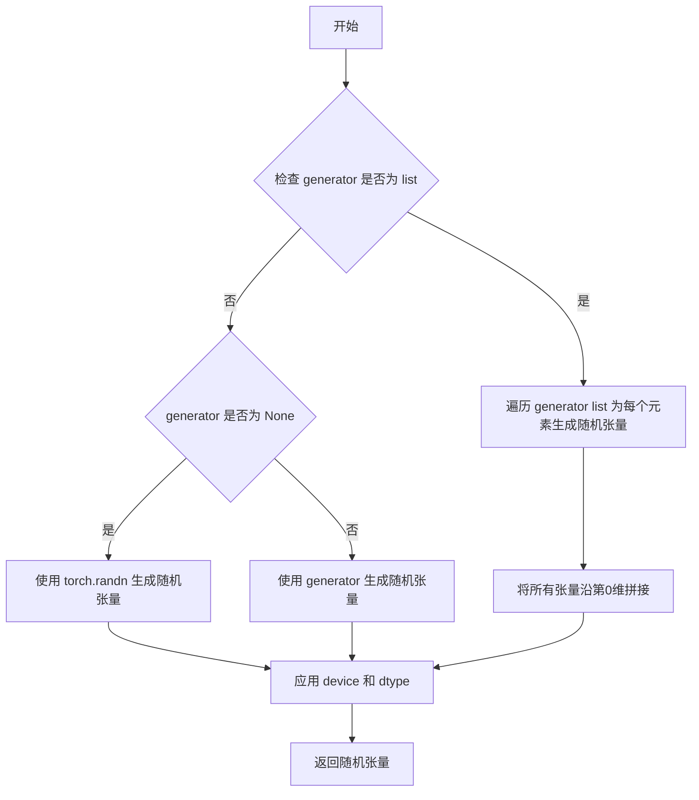
```mermaid
flowchart TD
    A[开始] --> B{检查 generator 是否为 list}
    B -->|是| C[遍历 generator list 为每个元素生成随机张量]
    B -->|否| D{generator 是否为 None}
    D -->|是| E[使用 torch.randn 生成随机张量]
    D -->|否| F[使用 generator 生成随机张量]
    C --> G[将所有张量沿第0维拼接]
    E --> H[应用 device 和 dtype]
    F --> H
    G --> H
    H --> I[返回随机张量]
```

#### 带注释源码

```python
# 这是 randn_tensor 函数的典型实现（基于 diffusers 库源码）
def randn_tensor(
    shape: tuple,  # 输出张量的形状
    generator: torch.Generator | list[torch.Generator] | None = None,  # 随机生成器
    device: torch.device | str | None = None,  # 目标设备
    dtype: torch.dtype | None = None,  # 数据类型
    layout: torch.layout | None = None,  # 内存布局
) -> torch.Tensor:
    """生成指定形状的随机张量（服从标准正态分布）。
    
    Args:
        shape: 张量的形状元组，如 (batch, channels, height, width)。
        generator: 可选的 torch.Generator 对象，用于生成确定性随机数。
                   如果是 list，则为每个 batch 元素使用不同的 generator。
        device: 目标设备 (如 'cuda', 'cpu', 'cuda:0')。
        dtype: 期望的张量数据类型 (如 torch.float32)。
        layout: 张量的内存布局，默认 torch.strided。
    
    Returns:
        形状为 shape 的随机 Tensor，值服从 N(0,1)。
    """
    # 情况1：generator 是 list，为 batch 中每个元素使用独立 generator
    if isinstance(generator, list):
        # 遍历每个 generator 生成对应的随机张量
        tensor = torch.cat(
            [torch.randn(g, shape[1:], device=device, dtype=dtype, layout=layout) 
             for g in generator],
            dim=0
        )
        # 将 shape[0] 维度设为 batch size（list 长度）
        tensor = tensor.repeat(shape[0] // tensor.shape[0], 1, 1, 1)
        return tensor
    
    # 情况2：没有提供 generator，使用全局随机状态
    if generator is None:
        # torch.randn 直接从全局随机状态采样
        tensor = torch.randn(shape, device=device, dtype=dtype, layout=layout)
    else:
        # 情况3：使用指定的 generator 确保可重复性
        tensor = torch.randn(generator=generator, shape=shape, 
                             device=device, dtype=dtype, layout=layout)
    
    return tensor
```

> **注意**：该函数定义在 `diffusers` 库的 `...utils.torch_utils` 模块中，代码中通过 `from ...utils.torch_utils import randn_tensor` 导入并在 `prepare_latents` 方法中用于生成初始噪声 latent：

```python
# 在 SemanticStableDiffusionPipeline.prepare_latents 中的调用示例
latents = randn_tensor(shape, generator=generator, device=device, dtype=dtype)
```


### DeprecatedPipelineMixin

这是一个从 `..pipeline_utils` 模块导入的混入类（Mixin），用于为 `SemanticStableDiffusionPipeline` 提供弃用相关的功能支持。它可能包含处理旧版 Pipeline API 兼容性的方法，例如版本检查、参数迁移或弃用警告等。

#### 参数

该类为混入类（Mixin），无需直接实例化参数。参数由子类 `SemanticStableDiffusionPipeline` 在 `__init__` 方法中定义并传递。

#### 返回值

Mixin 类不直接返回值，其作用是通过继承为子类提供功能。

#### 流程图

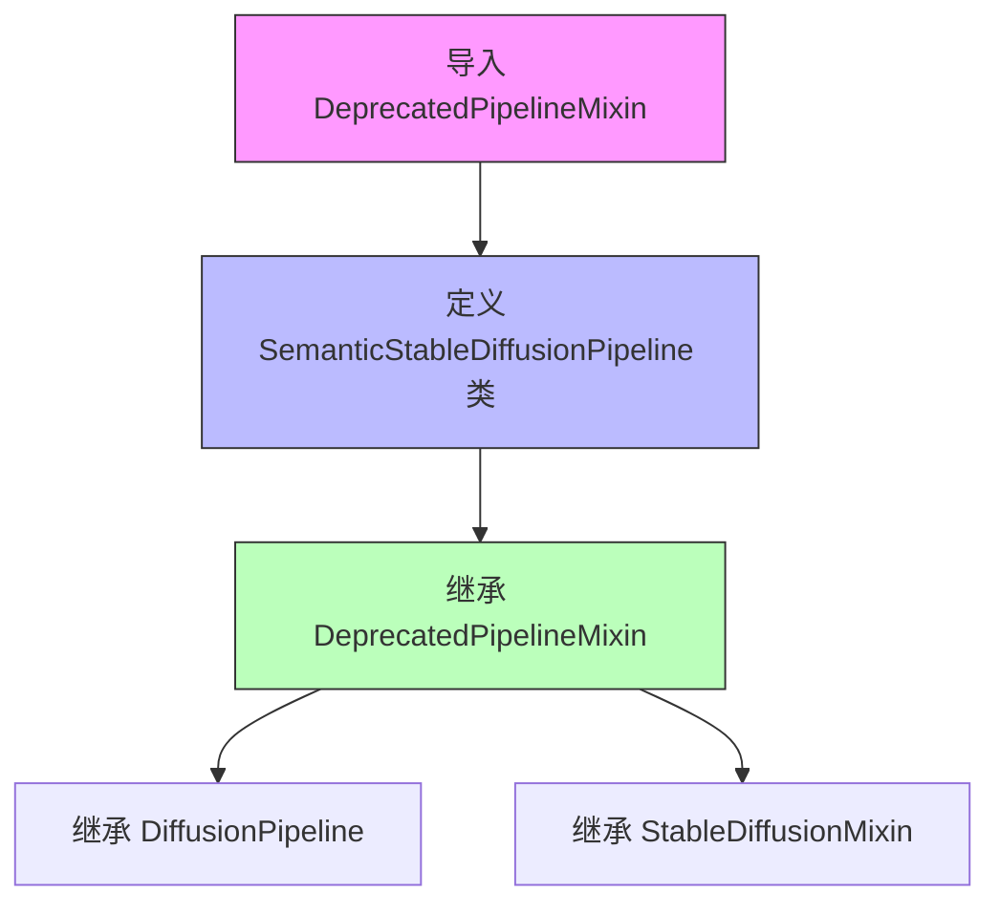
```mermaid
flowchart TD
    A[导入 DeprecatedPipelineMixin] --> B[定义 SemanticStableDiffusionPipeline 类]
    B --> C[继承 DeprecatedPipelineMixin]
    C --> D[继承 DiffusionPipeline]
    C --> E[继承 StableDiffusionMixin]
    
    style A fill:#f9f,stroke:#333
    style B fill:#bbf,stroke:#333
    style C fill:#bfb,stroke:#333
```

#### 带注释源码

```python
# 从上级目录的 pipeline_utils 模块导入 DeprecatedPipelineMixin
# 这是一个混入类，用于处理 Pipeline 的弃用相关功能
from ..pipeline_utils import DeprecatedPipelineMixin, DiffusionPipeline, StableDiffusionMixin

# DeprecatedPipelineMixin 被用作 SemanticStableDiffusionPipeline 的基类之一
# 该类可能提供以下功能（具体实现需查看 pipeline_utils 模块源码）：
# 1. 检查 Pipeline 版本兼容性
# 2. 提供弃用警告机制
# 3. 处理旧版 API 的参数映射
# 4. 管理 _last_supported_version 等版本控制属性

class SemanticStableDiffusionPipeline(DeprecatedPipelineMixin, DiffusionPipeline, StableDiffusionMixin):
    _last_supported_version = "0.33.1"  # 定义最后支持的版本号
    
    # DeprecatedPipelineMixin 提供了版本检查和弃用处理的能力
    # 通过继承该类，SemanticStableDiffusionPipeline 可以：
    # - 在初始化时检查配置版本
    # - 提供版本迁移路径
    # - 发出适当的弃用警告
```

#### 备注

由于 `DeprecatedPipelineMixin` 的完整源代码未在此文件中提供，以上信息基于代码上下文推断。该类的具体方法和实现细节需要查看 `diffusers` 库源码中的 `pipeline_utils` 模块。


### `DiffusionPipeline`（导入）

从 `..pipeline_utils` 模块导入的基类，作为 `SemanticStableDiffusionPipeline` 的父类之一，提供了扩散管道的基本框架和通用方法（如设备管理、检查点保存/加载、推理运行等）。

参数：

- 无直接参数（通过继承获取）

返回值：

- 无直接返回值（通过继承获取）

#### 流程图

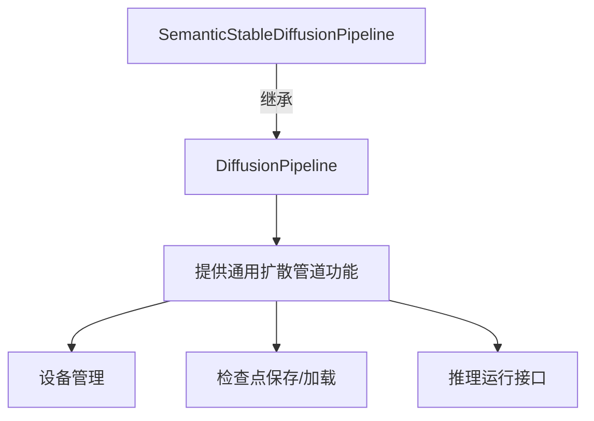
```mermaid
flowchart TD
    A[SemanticStableDiffusionPipeline] -->|继承| B[DiffusionPipeline]
    B --> C[提供通用扩散管道功能]
    C --> D[设备管理]
    C --> E[检查点保存/加载]
    C --> F[推理运行接口]
```

#### 带注释源码

```python
# 导入 DiffusionPipeline 基类
from ..pipeline_utils import DeprecatedPipelineMixin, DiffusionPipeline, StableDiffusionMixin

# SemanticStableDiffusionPipeline 继承自 DiffusionPipeline
class SemanticStableDiffusionPipeline(DeprecatedPipelineMixin, DiffusionPipeline, StableDiffusionMixin):
    """
    Pipeline for text-to-image generation using Stable Diffusion with latent editing.
    
    该类继承自 DiffusionPipeline，DiffusionPipeline 是 diffusers 库中所有扩散管道的基类，
    提供了以下通用功能：
    - 模型设备的分配和管理（_execution_device）
    - 检查点的保存和加载（save_pretrained, from_pretrained）
    - 推理运行的基本接口
    - 进度条显示（progress_bar）
    - XLA 设备支持（如果可用）
    """
    
    # DiffusionPipeline 的核心属性通常包括：
    # - self.tokenizer: 分词器
    # - self.text_encoder: 文本编码器  
    # - self.vae: VAE 模型
    # - self.unet: UNet 模型
    # - self.scheduler: 调度器
    # - self._execution_device: 执行设备
    
    # 具体实现需参考 diffusers 库的 pipeline_utils.py 文件
```


### `StableDiffusionMixin`

这是一个从 `..pipeline_utils` 模块导入的Mixin类，为文本到图像生成管道提供Stable Diffusion相关的基础功能和方法。

参数：

- 无直接参数（此类通过继承使用）

返回值：此类不返回值，作为Mixin类被其他管道类继承

#### 流程图

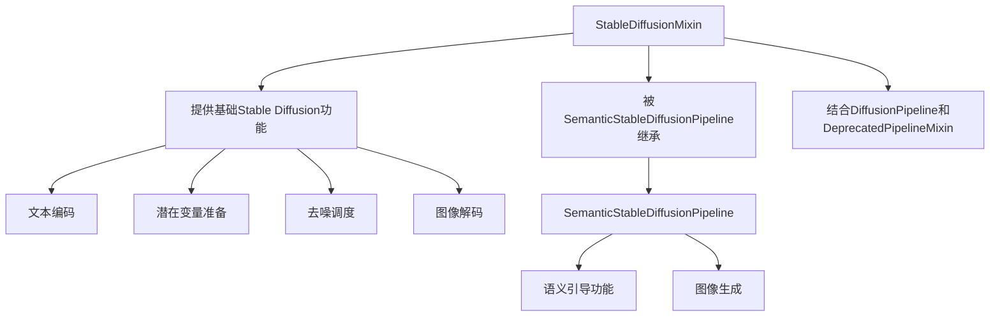
```mermaid
flowchart TD
    A[StableDiffusionMixin] --> B[提供基础Stable Diffusion功能]
    A --> C[被SemanticStableDiffusionPipeline继承]
    A --> D[结合DiffusionPipeline和DeprecatedPipelineMixin]
    
    B --> B1[文本编码]
    B --> B2[潜在变量准备]
    B --> B3[去噪调度]
    B --> B4[图像解码]
    
    C --> E[SemanticStableDiffusionPipeline]
    E --> E1[语义引导功能]
    E --> E2[图像生成]
```

#### 带注释源码

```python
# 从 pipeline_utils 模块导入 StableDiffusionMixin
# 这是一个Mixin类，提供Stable Diffusion管道的基础功能
from ..pipeline_utils import DeprecatedPipelineMixin, DiffusionPipeline, StableDiffusionMixin

# StableDiffusionMixin 在此处作为继承的基类使用
# 具体的类定义位于 diffusers 库的 pipeline_utils 模块中
# 它通常包含以下核心方法：
# - prepare_latents: 准备潜在变量
# - decode_latents: 解码潜在变量
# - enable_vae_slicing / disable_vae_slicing: VAE切片
# - enable_vae_tiling / disable_vae_tiling: VAE平铺
# - enable_model_cpu_offload: 模型CPU卸载
# - enable_sequential_cpu_offload: 顺序CPU卸载

# 使用示例：SemanticStableDiffusionPipeline 继承自 StableDiffusionMixin
class SemanticStableDiffusionPipeline(DeprecatedPipelineMixin, DiffusionPipeline, StableDiffusionMixin):
    """
    继承 StableDiffusionMixin 以获得Stable Diffusion基础功能
    并扩展了语义引导（semantic guidance）功能
    """
    pass
```

#### 补充信息

| 属性 | 说明 |
|------|------|
| **来源模块** | `diffusers.pipelines.pipeline_utils` |
| **类型** | Mixin类 |
| **用途** | 为Stable Diffusion管道提供通用方法 |
| **继承者** | `SemanticStableDiffusionPipeline`, `StableDiffusionPipeline` 等 |

#### 潜在优化空间

1. **代码复用**：Mixin模式虽然简化了代码，但可能导致继承层次复杂
2. **功能解耦**：可以考虑将部分功能提取为可组合的组件而非继承
3. **文档完善**：Mixin类的具体方法文档应在源模块中完善


### `SemanticStableDiffusionPipelineOutput`

这是 `SemanticStableDiffusionPipeline` 的输出类，用于封装文本到图像生成任务的结果。该类是一个数据容器，包含生成的图像列表以及对应的NSFW（不宜在工作场所查看的内容）检测标志。

参数：

- `images`：`List[PIL.Image.Image] | np.ndarray | torch.Tensor`，生成的图像列表
- `nsfw_content_detected`：`List[bool] | None`，可选的布尔值列表，指示每个生成的图像是否包含NSFW内容

返回值：`SemanticStableDiffusionPipelineOutput` 类的实例

#### 流程图

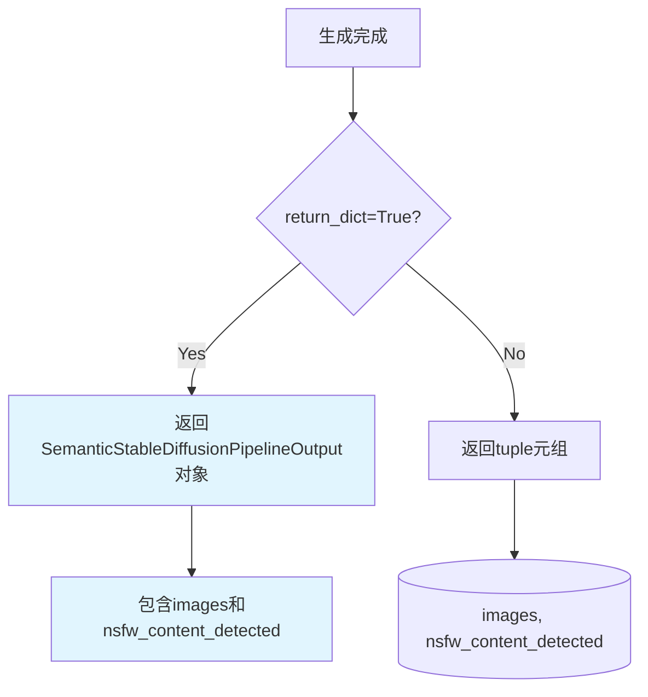
```mermaid
flowchart TD
    A[生成完成] --> B{return_dict=True?}
    B -->|Yes| C[返回SemanticStableDiffusionPipelineOutput对象]
    B -->|No| D[返回tuple元组]
    C --> E[包含images和nsfw_content_detected]
    D --> F[(images, nsfw_content_detected)]
    
    style C fill:#e1f5fe
    style E fill:#e1f5fe
```

#### 带注释源码

```python
# 这是一个数据类，用于封装语义stable diffusion pipeline的输出结果
# 它在 SemanticStableDiffusionPipeline.__call__ 方法的最后被返回
#
# 使用方式：
# return SemanticStableDiffusionPipelineOutput(images=image, nsfw_content_detected=has_nsfw_concept)
#
# 其中：
# - images: 经过后处理（去归一化）的图像，可以是PIL.Image、numpy数组或torch.Tensor
# - nsfw_content_detected: 安全检查器输出的NSFW检测结果，为布尔值列表或None
#
# 该类通常包含以下属性：
#   - images: 生成图像的结果
#   - nsfw_content_detected: NSFW内容检测标志
#
# 如果return_dict=False，则返回元组 (image, has_nsfw_concept)
# 如果return_dict=True，则返回 SemanticStableDiffusionPipelineOutput 对象
```


### `SemanticStableDiffusionPipeline.__init__`

初始化 `SemanticStableDiffusionPipeline` 对象，接收多个模型组件（VAE、文本编码器、分词器、UNet、调度器、安全检查器和特征提取器），完成管道的模块注册、VAE 缩放因子计算、图像处理器初始化以及安全检查器配置等核心准备工作。

参数：

- `vae`：`AutoencoderKL`，用于将图像编码和解码为潜在表示的变分自编码器模型
- `text_encoder`：`CLIPTextModel`，冻结的文本编码器（clip-vit-large-patch14）
- `tokenizer`：`CLIPTokenizer`，用于对文本进行分词的 CLIP 分词器
- `unet`：`UNet2DConditionModel`，用于对编码后的图像潜在表示进行去噪的 UNet 模型
- `scheduler`：`KarrasDiffusionSchedulers`，与 `unet` 结合使用以对编码后的图像潜在表示进行去噪的调度器
- `safety_checker`：`StableDiffusionSafetyChecker`，用于评估生成图像是否具有攻击性或有害的分类模块
- `feature_extractor`：`CLIPImageProcessor`，用于从生成图像中提取特征的 CLIP 图像处理器
- `requires_safety_checker`：`bool`，是否需要安全检查器，默认为 True

返回值：`None`，构造函数不返回值

#### 流程图

```mermaid
flowchart TD
    A[开始 __init__] --> B{检查 safety_checker}
    B -->|safety_checker 为 None<br/>但 requires_safety_checker 为 True| C[发出安全警告]
    B -->|safety_checker 不为 None<br/>但 feature_extractor 为 None| D[抛出 ValueError]
    B -->|配置正常| E[调用 super().__init__]
    C --> E
    D --> E
    E --> F[调用 self.register_modules 注册所有模块]
    F --> G[计算 vae_scale_factor]
    G --> H[创建 VaeImageProcessor]
    H --> I[注册 requires_safety_checker 到配置]
    I --> J[结束 __init__]
```

#### 带注释源码

```python
def __init__(
    self,
    vae: AutoencoderKL,
    text_encoder: CLIPTextModel,
    tokenizer: CLIPTokenizer,
    unet: UNet2DConditionModel,
    scheduler: KarrasDiffusionSchedulers,
    safety_checker: StableDiffusionSafetyChecker,
    feature_extractor: CLIPImageProcessor,
    requires_safety_checker: bool = True,
):
    """
    初始化 SemanticStableDiffusionPipeline
    
    参数:
        vae: 变分自编码器模型，用于图像与潜在表示之间的编码和解码
        text_encoder: CLIP 文本编码器，用于将文本转换为嵌入向量
        tokenizer: CLIP 分词器，用于对文本进行分词处理
        unet: 条件 UNet 模型，用于去噪图像潜在表示
        scheduler: 扩散调度器，用于控制去噪过程的噪声调度
        safety_checker: 安全检查器，用于过滤有害内容
        feature_extractor: CLIP 图像处理器，用于提取图像特征
        requires_safety_checker: 是否启用安全检查器
    """
    # 调用父类构造函数进行基础初始化
    super().__init__()

    # 安全检查器警告逻辑
    # 如果 safety_checker 为 None 但 requires_safety_checker 为 True，发出警告
    if safety_checker is None and requires_safety_checker:
        logger.warning(
            f"You have disabled the safety checker for {self.__class__} by passing `safety_checker=None`. Ensure"
            " that you abide to the conditions of the Stable Diffusion license and do not expose unfiltered"
            " results in services or applications open to the public. Both the diffusers team and Hugging Face"
            " strongly recommend to keep the safety filter enabled in all public facing circumstances, disabling"
            " it only for use-cases that involve analyzing network behavior or auditing its results. For more"
            " information, please have a look at https://github.com/huggingface/diffusers/pull/254 ."
        )

    # 验证逻辑：如果提供了 safety_checker 但没有 feature_extractor，抛出错误
    if safety_checker is not None and feature_extractor is None:
        raise ValueError(
            "Make sure to define a feature extractor when loading {self.__class__} if you want to use the safety"
            " checker. If you do not want to use the safety checker, you can pass `'safety_checker=None'` instead."
        )

    # 注册所有模块到管道，使它们可以通过 self.xxx 访问
    self.register_modules(
        vae=vae,
        text_encoder=text_encoder,
        tokenizer=tokenizer,
        unet=unet,
        scheduler=scheduler,
        safety_checker=safety_checker,
        feature_extractor=feature_extractor,
    )

    # 计算 VAE 缩放因子
    # 基于 VAE 配置中的 block_out_channels 数量，2^(层数-1)
    # 如果 VAE 存在，使用其配置计算；否则使用默认值 8
    self.vae_scale_factor = 2 ** (len(self.vae.config.block_out_channels) - 1) if getattr(self, "vae", None) else 8

    # 创建 VAE 图像处理器，用于图像的后处理（归一化、反归一化等）
    self.image_processor = VaeImageProcessor(vae_scale_factor=self.vae_scale_factor)

    # 将 requires_safety_checker 注册到配置中，以便保存和加载管道时保留此设置
    self.register_to_config(requires_safety_checker=requires_safety_checker)
```


### `SemanticStableDiffusionPipeline.run_safety_checker`

该方法用于检查生成的图像是否包含不当内容（NSFW），通过调用安全检查器对图像进行分类，如果检测到不安全内容则会返回相应的标记。

参数：

- `image`：`torch.Tensor` 或 `numpy.ndarray`，生成的图像数据
- `device`：`torch.device`，执行安全检查的设备（如CPU或GPU）
- `dtype`：`torch.dtype`，安全检查器的数据类型（通常为float16或float32）

返回值：`Tuple[Union[torch.Tensor, numpy.ndarray], Optional[torch.Tensor]]`，返回两个元素：第一个是处理后的图像（可能被替换为模糊图像），第二个是是否存在NSFW概念的布尔标记

#### 流程图

```mermaid
flowchart TD
    A[开始 run_safety_checker] --> B{self.safety_checker is None?}
    B -->|是| C[has_nsfw_concept = None]
    C --> D[返回 image, has_nsfw_concept]
    B -->|否| E{image 是 torch.Tensor?}
    E -->|是| F[调用 image_processor.postprocess 转换为 PIL]
    E -->|否| G[调用 image_processor.numpy_to_pil 转换为 PIL]
    F --> H[调用 feature_extractor 提取特征]
    G --> H
    H --> I[调用 safety_checker 进行安全检查]
    I --> J[返回过滤后的图像和 NSFW 标记]
    D --> K[结束]
    J --> K
```

#### 带注释源码

```python
def run_safety_checker(self, image, device, dtype):
    """
    运行安全检查器来检测生成的图像是否包含不当内容
    
    参数:
        image: 生成的图像，可以是 torch.Tensor 或 numpy.ndarray 格式
        device: 计算设备，用于运行安全检查模型
        dtype: 数据类型，用于转换图像张量
    
    返回:
        tuple: (处理后的图像, NSFW检测结果)
               - 图像：如果检测到NSFW内容，可能会被替换为模糊图像
               - has_nsfw_concept：None表示无安全检查器，Tensor表示各图像的NSFW标记
    """
    # 如果没有配置安全检查器，直接返回原图像和None
    if self.safety_checker is None:
        has_nsfw_concept = None
    else:
        # 根据图像类型进行不同的预处理
        if torch.is_tensor(image):
            # 将tensor图像转换为PIL图像格式
            feature_extractor_input = self.image_processor.postprocess(image, output_type="pil")
        else:
            # 将numpy数组图像转换为PIL图像格式
            feature_extractor_input = self.image_processor.numpy_to_pil(image)
        
        # 使用特征提取器处理图像，提取用于安全检查的特征
        safety_checker_input = self.feature_extractor(feature_extractor_input, return_tensors="pt").to(device)
        
        # 调用安全检查器进行实际的内容安全检测
        # 将像素值转换为指定的dtype以匹配模型要求
        image, has_nsfw_concept = self.safety_checker(
            images=image, 
            clip_input=safety_checker_input.pixel_values.to(dtype)
        )
    
    # 返回处理后的图像和NSFW检测结果
    return image, has_nsfw_concept
```


### `SemanticStableDiffusionPipeline.decode_latents`

该方法用于将潜在向量（latents）解码为图像。它使用 VAE（变分自编码器）模型将潜在表示转换为实际图像，并进行后处理（归一化和格式转换）。该方法已被弃用，建议使用 `VaeImageProcessor.postprocess()` 代替。

参数：

- `latents`：`torch.Tensor`，需要解码的潜在向量，通常来自 UNet 模型的输出

返回值：`np.ndarray`，解码后的图像，以 NumPy 数组形式返回，形状为 (batch_size, height, width, channels)，像素值范围 [0, 1]

#### 流程图

```mermaid
flowchart TD
    A[开始 decode_latents] --> B[记录弃用警告]
    B --> C[对 latents 进行缩放]
    C --> D[使用 VAE decode 解码]
    D --> E[图像归一化: /2 + 0.5 并 clamp 0-1]
    E --> F[转移到 CPU]
    F --> G[维度重排: NCHW -> NHWC]
    G --> H[转换为 float32 NumPy 数组]
    H --> I[返回图像数组]
```

#### 带注释源码

```python
def decode_latents(self, latents):
    """
    解码潜在向量为图像（已弃用方法）
    
    参数:
        latents: torch.Tensor - VAE 编码后的潜在表示
        
    返回:
        np.ndarray - 解码后的图像数组
    """
    # 记录弃用警告，提示用户在 1.0.0 版本后将被移除
    deprecation_message = "The decode_latents method is deprecated and will be removed in 1.0.0. Please use VaeImageProcessor.postprocess(...) instead"
    deprecate("decode_latents", "1.0.0", deprecation_message, standard_warn=False)

    # 根据 VAE 配置的缩放因子对潜在向量进行逆缩放
    # 原始 latent 在编码时被缩放，这里需要反向处理
    latents = 1 / self.vae.config.scaling_factor * latents
    
    # 使用 VAE decoder 将潜在表示解码为图像
    # return_dict=False 返回元组，取第一个元素（解码后的图像张量）
    image = self.vae.decode(latents, return_dict=False)[0]
    
    # 图像后处理：
    # 1. 将图像从 [-1, 1] 范围映射到 [0, 1] 范围
    # 2. 使用 clamp 确保像素值在 [0, 1] 范围内
    image = (image / 2 + 0.5).clamp(0, 1)
    
    # 将图像从 GPU/TPU 转移到 CPU
    # 转换为 NumPy 数组以便后续处理
    # 注意：始终转换为 float32，不会造成显著开销且兼容 bfloat16
    image = image.cpu().permute(0, 2, 3, 1).float().numpy()
    
    # 返回解码后的图像数组
    return image
```


### `SemanticStableDiffusionPipeline.prepare_extra_step_kwargs`

该方法用于准备调度器（scheduler）步骤所需的额外关键字参数。由于不同的调度器具有不同的签名，该方法通过检查调度器的 `step` 方法是否接受特定参数（eta 和 generator）来动态构建参数字典。

参数：

- `generator`：`torch.Generator | list[torch.Generator] | None`，用于生成确定性随机噪声的生成器
- `eta`：`float`，DDIM 调度器的参数 η（仅在 DDIMScheduler 中使用，其他调度器会忽略），对应于 DDIM 论文中的 η，值应在 [0, 1] 范围内

返回值：`dict`，包含调度器步骤所需额外参数（例如 `eta` 和/或 `generator`）的字典

#### 流程图

```mermaid
flowchart TD
    A[开始准备额外步骤参数] --> B{检查调度器是否接受 eta 参数}
    B -->|是| C[创建 extra_step_kwargs 字典<br/>添加 eta 参数]
    B -->|否| D[创建空 extra_step_kwargs 字典]
    C --> E{检查调度器是否接受 generator 参数}
    D --> E
    E -->|是| F[向 extra_step_kwargs 添加 generator]
    E -->|否| G[返回 extra_step_kwargs 字典]
    F --> G
```

#### 带注释源码

```python
def prepare_extra_step_kwargs(self, generator, eta):
    """
    准备调度器步骤的额外关键字参数。

    由于并非所有调度器都具有相同的签名，此方法用于准备调度器 step 方法所需的额外参数。
    eta (η) 仅在 DDIMScheduler 中使用，其他调度器会忽略它。
    eta 对应于 DDIM 论文 (https://huggingface.co/papers/2010.02502) 中的 η，值应在 [0, 1] 范围内。
    
    参数:
        generator: torch.Generator 或其列表，用于使生成过程具有确定性
        eta: float，DDIM 调度器的 eta 参数
    
    返回:
        dict: 包含额外关键字参数的字典，可传递给调度器的 step 方法
    """
    # 使用 inspect 模块检查调度器的 step 方法签名
    # 确定调度器是否接受 eta 参数
    accepts_eta = "eta" in set(inspect.signature(self.scheduler.step).parameters.keys())
    
    # 初始化空字典用于存储额外参数
    extra_step_kwargs = {}
    
    # 如果调度器接受 eta 参数，则将其添加到 extra_step_kwargs
    if accepts_eta:
        extra_step_kwargs["eta"] = eta

    # 检查调度器是否接受 generator 参数
    accepts_generator = "generator" in set(inspect.signature(self.scheduler.step).parameters.keys())
    
    # 如果调度器接受 generator 参数，则将其添加到 extra_step_kwargs
    if accepts_generator:
        extra_step_kwargs["generator"] = generator
    
    # 返回包含额外参数的字典
    return extra_step_kwargs
```


### `SemanticStableDiffusionPipeline.check_inputs`

该方法用于验证图像生成管道输入参数的有效性，确保 `height` 和 `width` 为 8 的倍数、`callback_steps` 为正整数、且 prompt 与 prompt_embeds 等互斥参数不会同时传递，并检查 negative_prompt 与 negative_prompt_embeds 的兼容性和形状一致性。

参数：

- `self`：`SemanticStableDiffusionPipeline` 实例，管道对象本身
- `prompt`：`str | list[str] | None`，文本提示，用于指导图像生成
- `height`：`int`，生成图像的高度（像素）
- `width`：`int`，生成图像的宽度（像素）
- `callback_steps`：`int | None`，回调函数调用频率步数
- `negative_prompt`：`str | list[str] | None`，负面文本提示，用于指导不包含的内容
- `prompt_embeds`：`torch.Tensor | None`，预计算的文本嵌入向量
- `negative_prompt_embeds`：`torch.Tensor | None`，预计算的负面文本嵌入向量
- `callback_on_step_end_tensor_inputs`：`list[str] | None`，步骤结束时回调的张量输入名称列表

返回值：`None`，该方法仅进行参数验证，若参数无效则抛出 `ValueError` 异常

#### 流程图

```mermaid
flowchart TD
    A[开始 check_inputs] --> B{height % 8 == 0 且 width % 8 == 0?}
    B -- 否 --> B1[抛出 ValueError: height 和 width 必须被 8 整除]
    B -- 是 --> C{callback_steps 是正整数?}
    C -- 否 --> C1[抛出 ValueError: callback_steps 必须是正整数]
    C -- 是 --> D{callback_on_step_end_tensor_inputs 有效?}
    D -- 否 --> D1[抛出 ValueError: 无效的 tensor 输入]
    D -- 是 --> E{prompt 和 prompt_embeds 同时存在?}
    E -- 是 --> E1[抛出 ValueError: 不能同时传递]
    E -- 否 --> F{prompt 和 prompt_embeds 都为 None?}
    F -- 是 --> F1[抛出 ValueError: 至少提供一个]
    F -- 否 --> G{prompt 是 str 或 list?}
    G -- 否 --> G1[抛出 ValueError: prompt 类型错误]
    G -- 是 --> H{negative_prompt 和 negative_prompt_embeds 同时存在?}
    H -- 是 --> H1[抛出 ValueError: 不能同时传递]
    H -- 否 --> I{prompt_embeds 和 negative_prompt_embeds 形状一致?}
    I -- 否 --> I1[抛出 ValueError: 形状不匹配]
    I -- 是 --> J[验证通过，返回 None]
    
    B1 --> K[结束]
    C1 --> K
    D1 --> K
    E1 --> K
    F1 --> K
    G1 --> K
    H1 --> K
    I1 --> K
    J --> K
```

#### 带注释源码

```python
def check_inputs(
    self,
    prompt,                      # str | list[str] | None - 文本提示
    height,                      # int - 图像高度
    width,                       # int - 图像宽度
    callback_steps,              # int | None - 回调步数
    negative_prompt=None,        # str | list[str] | None - 负面提示
    prompt_embeds=None,          # torch.Tensor | None - 预计算文本嵌入
    negative_prompt_embeds=None, # torch.Tensor | None - 预计算负面嵌入
    callback_on_step_end_tensor_inputs=None, # list[str] | None - 回调张量输入
):
    # 验证 1: 检查高度和宽度是否可被 8 整除
    # Stable Diffusion 的 VAE 和 UNet 要求尺寸为 8 的倍数
    if height % 8 != 0 or width % 8 != 0:
        raise ValueError(f"`height` and `width` have to be divisible by 8 but are {height} and {width}.")

    # 验证 2: 检查 callback_steps 是否为正整数
    # 必须为正整数才能正确控制回调频率
    if callback_steps is not None and (not isinstance(callback_steps, int) or callback_steps <= 0):
        raise ValueError(
            f"`callback_steps` has to be a positive integer but is {callback_steps} of type"
            f" {type(callback_steps)}."
        )
    
    # 验证 3: 检查 callback_on_step_end_tensor_inputs 是否在允许列表中
    # 只有在 _callback_tensor_inputs 中注册的张量才能用于回调
    if callback_on_step_end_tensor_inputs is not None and not all(
        k in self._callback_tensor_inputs for k in callback_on_step_end_tensor_inputs
    ):
        raise ValueError(
            f"`callback_on_step_end_tensor_inputs` has to be in {self._callback_tensor_inputs}, but found {[k for k in callback_on_step_end_tensor_inputs if k not in self._callback_tensor_inputs]}"
        )

    # 验证 4: prompt 和 prompt_embeds 互斥，不能同时传递
    # 只能选择一种方式提供文本条件
    if prompt is not None and prompt_embeds is not None:
        raise ValueError(
            f"Cannot forward both `prompt`: {prompt} and `prompt_embeds`: {prompt_embeds}. Please make sure to"
            " only forward one of the two."
        )
    # 验证 5: 至少需要提供 prompt 或 prompt_embeds 之一
    elif prompt is None and prompt_embeds is None:
        raise ValueError(
            "Provide either `prompt` or `prompt_embeds`. Cannot leave both `prompt` and `prompt_embeds` undefined."
        )
    # 验证 6: prompt 类型检查，必须是字符串或字符串列表
    elif prompt is not None and (not isinstance(prompt, str) and not isinstance(prompt, list)):
        raise ValueError(f"`prompt` has to be of type `str` or `list` but is {type(prompt)}")

    # 验证 7: negative_prompt 和 negative_prompt_embeds 互斥
    if negative_prompt is not None and negative_prompt_embeds is not None:
        raise ValueError(
            f"Cannot forward both `negative_prompt`: {negative_prompt} and `negative_prompt_embeds`:"
            f" {negative_prompt_embeds}. Please make sure to only forward one of the two."
        )

    # 验证 8: 如果同时提供了 prompt_embeds 和 negative_prompt_embeds，检查形状一致性
    # 两者形状必须匹配以正确进行 Classifier-Free Guidance
    if prompt_embeds is not None and negative_prompt_embeds is not None:
        if prompt_embeds.shape != negative_prompt_embeds.shape:
            raise ValueError(
                "`prompt_embeds` and `negative_prompt_embeds` must have the same shape when passed directly, but"
                f" got: `prompt_embeds` {prompt_embeds.shape} != `negative_prompt_embeds`"
                f" {negative_prompt_embeds.shape}."
            )
```


### `SemanticStableDiffusionPipeline.prepare_latents`

该方法用于为扩散模型生成准备初始潜在变量（latents），包括计算潜在变量的形状、生成随机噪声或使用用户提供的潜在变量，并根据调度器的初始化噪声标准差对潜在变量进行缩放。

参数：

- `batch_size`：`int`，批量大小，即要生成的图像数量
- `num_channels_latents`：`int`，潜在变量的通道数，通常对应于 UNet 的输入通道数
- `height`：`int`，生成图像的高度（像素）
- `width`：`int`，生成图像的宽度（像素）
- `dtype`：`torch.dtype`，潜在变量的数据类型（如 torch.float32）
- `device`：`torch.device`，潜在变量存放的设备（如 "cuda" 或 "cpu"）
- `generator`：`torch.Generator` 或 `list[torch.Generator] | None`，用于生成随机噪声的随机数生成器，用于确保可重复性
- `latents`：`torch.Tensor | None`，可选的预生成潜在变量，如果为 None，则随机生成

返回值：`torch.Tensor`，处理后的潜在变量张量，已根据调度器的初始化噪声标准差进行缩放

#### 流程图

```mermaid
flowchart TD
    A[开始 prepare_latents] --> B[计算潜在变量形状 shape]
    B --> C{generator 是列表且长度 != batch_size?}
    C -->|是| D[抛出 ValueError]
    C -->|否| E{latents is None?}
    E -->|是| F[使用 randn_tensor 生成随机潜在变量]
    E -->|否| G[将 latents 移动到指定设备]
    F --> H[使用调度器的 init_noise_sigma 缩放潜在变量]
    G --> H
    H --> I[返回处理后的 latents]
```

#### 带注释源码

```python
def prepare_latents(
    self,
    batch_size: int,
    num_channels_latents: int,
    height: int,
    width: int,
    dtype: torch.dtype,
    device: torch.device,
    generator: torch.Generator | list[torch.Generator] | None,
    latents: torch.Tensor | None = None,
) -> torch.Tensor:
    """
    准备用于扩散模型去噪的潜在变量。

    参数:
        batch_size: 批次大小，决定生成图像的数量
        num_channels_latents: 潜在变量的通道数，对应 UNet.config.in_channels
        height: 生成图像的高度（像素）
        width: 生成图像的宽度（像素）
        dtype: 潜在变量的数据类型
        device: 潜在变量存放的设备
        generator: 随机数生成器，用于确保可重复生成
        latents: 可选的预生成潜在变量，如果为 None 则随机生成

    返回:
        处理后的潜在变量张量，已根据调度器初始化噪声标准差进行缩放
    """
    # 计算潜在变量的形状，考虑 VAE 缩放因子
    # 形状: [batch_size, num_channels_latents, height // vae_scale_factor, width // vae_scale_factor]
    shape = (
        batch_size,
        num_channels_latents,
        int(height) // self.vae_scale_factor,
        int(width) // self.vae_scale_factor,
    )

    # 验证生成器列表长度与批次大小是否匹配
    if isinstance(generator, list) and len(generator) != batch_size:
        raise ValueError(
            f"You have passed a list of generators of length {len(generator)}, but requested an effective batch"
            f" size of {batch_size}. Make sure the batch size matches the length of the generators."
        )

    # 根据是否有预提供的潜在变量决定生成方式
    if latents is None:
        # 使用 randn_tensor 生成符合正态分布的随机潜在变量
        latents = randn_tensor(shape, generator=generator, device=device, dtype=dtype)
    else:
        # 将提供的潜在变量移动到目标设备
        latents = latents.to(device)

    # 根据调度器的初始化噪声标准差缩放初始噪声
    # 不同调度器（如 DDIM、DDPM）可能使用不同的噪声分布参数
    latents = latents * self.scheduler.init_noise_sigma

    return latents
```


### `SemanticStableDiffusionPipeline.__call__`

该方法是 SemanticStable Diffusion 管道的主入口函数，用于通过语义编辑指导生成图像。它接收文本提示和其他控制参数，执行文本编码、潜在变量准备、去噪循环（包括语义引导）、图像解码和安全检查，最终返回生成的图像或包含图像和 NSFW 检测结果的输出对象。

参数：

- `prompt`：`str | list[str]`，用于引导图像生成的文本提示或提示列表
- `height`：`int | None`，生成图像的高度（像素），默认为 unet.config.sample_size * vae_scale_factor
- `width`：`int | None`，生成图像的宽度（像素），默认为 unet.config.sample_size * vae_scale_factor
- `num_inference_steps`：`int`，去噪步数，默认为 50
- `guidance_scale`：`float`，分类器自由引导的指导比例，默认为 7.5
- `negative_prompt`：`str | list[str] | None`，用于引导不包含内容的负面提示
- `num_images_per_prompt`：`int`，每个提示生成的图像数量，默认为 1
- `eta`：`float`，DDIM 调度器的 eta 参数，默认为 0.0
- `generator`：`torch.Generator | list[torch.Generator] | None`，用于生成确定性结果的随机数生成器
- `latents`：`torch.Tensor | None`，预生成的噪声潜在向量，用于图像生成
- `output_type`：`str | None`，输出格式，默认为 "pil"
- `return_dict`：`bool`，是否返回字典格式结果，默认为 True
- `callback`：`Callable[[int, int, torch.Tensor], None] | None`，每步调用的回调函数
- `callback_steps`：`int`，回调函数调用频率，默认为 1
- `editing_prompt`：`str | list[str] | None`，语义指导的提示词
- `editing_prompt_embeddings`：`torch.Tensor | None`，预计算的语义指导嵌入
- `reverse_editing_direction`：`bool | list[bool] | None`，是否反转指导方向，默认为 False
- `edit_guidance_scale`：`float | list[float] | None`，语义指导比例，默认为 5
- `edit_warmup_steps`：`int | list[int] | None`，语义指导预热步数，默认为 10
- `edit_cooldown_steps`：`int | list[int] | None`，语义指导冷却步数，默认为 None
- `edit_threshold`：`float | list[float] | None`，语义指导阈值，默认为 0.9
- `edit_momentum_scale`：`float | None`，语义指导动量比例，默认为 0.1
- `edit_mom_beta`：`float | None`，动量衰减系数，默认为 0.4
- `edit_weights`：`list[float] | None`，各概念的指导权重
- `sem_guidance`：`list[torch.Tensor] | None`，预生成的语义指导向量列表

返回值：`SemanticStableDiffusionPipelineOutput | tuple`，当 return_dict 为 True 时返回包含图像和 NSFW 检测结果的输出对象，否则返回元组

#### 流程图

```mermaid
flowchart TD
    A[开始 __call__] --> B[设置默认高度和宽度]
    B --> C[检查输入参数]
    C --> D{是否启用语义指导}
    D -->|是| E[获取编辑提示嵌入]
    D -->|否| F[设置 enabled_editing_prompts=0]
    E --> F
    F --> G[Tokenize 并编码提示词]
    G --> H[复制文本嵌入用于每个提示的多次生成]
    H --> I{是否启用语义指导}
    I -->|是| J[Tokenize 并编码编辑提示]
    I -->|否| K[跳过编辑提示编码]
    J --> L[复制编辑提示嵌入]
    K --> L
    L --> M{guidance_scale > 1.0}
    M -->|是| N[准备无条件嵌入和负面提示]
    M -->|否| O[不进行分类器自由引导]
    N --> P[拼接无条件嵌入、文本嵌入和编辑概念嵌入]
    O --> P
    P --> Q[设置调度器时间步]
    Q --> R[准备潜在变量]
    R --> S[准备额外调度器参数]
    S --> T[初始化 edit_momentum 和估计变量]
    T --> U[开始去噪循环遍历每个时间步]
    U --> V{是否进行分类器自由引导}
    V -->|是| W[扩展潜在输入]
    V -->|否| X[使用原始潜在输入]
    W --> X
    X --> Y[UNet 预测噪声残差]
    Y --> Z{是否进行分类器自由引导}
    Z -->|是| AA[分割噪声预测为无条件、文本和编辑概念预测]
    Z -->|否| AB[直接使用噪声预测]
    AA --> AC[计算文本指导]
    AB --> AD[跳过分块处理]
    AC --> AE{是否启用语义指导}
    AD --> AF
    AE -->|是| AG[计算每个编辑概念的指导]
    AE -->|否| AF[跳过语义指导计算]
    AG --> AH[应用预热和冷却逻辑]
    AH --> AI[计算动量并更新总指导]
    AF --> AJ[应用外部语义指导如果存在]
    AI --> AJ
    AJ --> AK[计算总噪声预测]
    AK --> AL[调度器执行一步去噪]
    AL --> AM[调用回调函数如果需要]
    AM --> AN{XLA 可用}
    AN -->|是| AO[标记 XLA 步骤]
    AN -->|否| AP[继续]
    AO --> AP
    AP --> AQ{是否输出 latent}
    AQ -->|否| AR[VAE 解码潜在向量到图像]
    AQ -->|是| AS[直接使用潜在向量作为图像]
    AR --> AT[运行安全检查器]
    AS --> AT
    AT --> AU[后处理图像]
    AU --> AV{return_dict 为 True}
    AV -->|是| AW[返回 SemanticStableDiffusionPipelineOutput]
    AV -->|否| AX[返回元组]
    AW --> AY[结束]
    AX --> AY
```

#### 带注释源码

```python
@torch.no_grad()
def __call__(
    self,
    prompt: str | list[str],
    height: int | None = None,
    width: int | None = None,
    num_inference_steps: int = 50,
    guidance_scale: float = 7.5,
    negative_prompt: str | list[str] | None = None,
    num_images_per_prompt: int = 1,
    eta: float = 0.0,
    generator: torch.Generator | list[torch.Generator] | None = None,
    latents: torch.Tensor | None = None,
    output_type: str | None = "pil",
    return_dict: bool = True,
    callback: Callable[[int, int, torch.Tensor], None] | None = None,
    callback_steps: int = 1,
    editing_prompt: str | list[str] | None = None,
    editing_prompt_embeddings: torch.Tensor | None = None,
    reverse_editing_direction: bool | list[bool] | None = False,
    edit_guidance_scale: float | list[float] | None = 5,
    edit_warmup_steps: int | list[int] | None = 10,
    edit_cooldown_steps: int | list[int] | None = None,
    edit_threshold: float | list[float] | None = 0.9,
    edit_momentum_scale: float | None = 0.1,
    edit_mom_beta: float | None = 0.4,
    edit_weights: list[float] | None = None,
    sem_guidance: list[torch.Tensor] | None = None,
):
    # 0. 默认高度和宽度设置为 unet 的配置值
    height = height or self.unet.config.sample_size * self.vae_scale_factor
    width = width or self.unet.config.sample_size * self.vae_scale_factor

    # 1. 检查输入参数，如果不符合要求则抛出错误
    self.check_inputs(prompt, height, width, callback_steps)

    # 2. 定义调用参数
    batch_size = 1 if isinstance(prompt, str) else len(prompt)
    device = self._execution_device

    # 确定是否启用语义指导以及启用的编辑提示数量
    if editing_prompt:
        enable_edit_guidance = True
        if isinstance(editing_prompt, str):
            editing_prompt = [editing_prompt]
        enabled_editing_prompts = len(editing_prompt)
    elif editing_prompt_embeddings is not None:
        enable_edit_guidance = True
        enabled_editing_prompts = editing_prompt_embeddings.shape[0]
    else:
        enabled_editing_prompts = 0
        enable_edit_guidance = False

    # 获取提示文本嵌入
    text_inputs = self.tokenizer(
        prompt,
        padding="max_length",
        max_length=self.tokenizer.model_max_length,
        return_tensors="pt",
    )
    text_input_ids = text_inputs.input_ids

    # 如果文本超过 tokenizer 最大长度则截断
    if text_input_ids.shape[-1] > self.tokenizer.model_max_length:
        removed_text = self.tokenizer.batch_decode(text_input_ids[:, self.tokenizer.model_max_length :])
        logger.warning(
            "The following part of your input was truncated because CLIP can only handle sequences up to"
            f" {self.tokenizer.model_max_length} tokens: {removed_text}"
        )
        text_input_ids = text_input_ids[:, : self.tokenizer.model_max_length]
    text_embeddings = self.text_encoder(text_input_ids.to(device))[0]

    # 复制文本嵌入以支持每个提示生成多个图像
    bs_embed, seq_len, _ = text_embeddings.shape
    text_embeddings = text_embeddings.repeat(1, num_images_per_prompt, 1)
    text_embeddings = text_embeddings.view(bs_embed * num_images_per_prompt, seq_len, -1)

    # 如果启用语义指导，则获取编辑提示的文本嵌入
    if enable_edit_guidance:
        if editing_prompt_embeddings is None:
            edit_concepts_input = self.tokenizer(
                [x for item in editing_prompt for x in repeat(item, batch_size)],
                padding="max_length",
                max_length=self.tokenizer.model_max_length,
                return_tensors="pt",
            )
            edit_concepts_input_ids = edit_concepts_input.input_ids
            if edit_concepts_input_ids.shape[-1] > self.tokenizer.model_max_length:
                removed_text = self.tokenizer.batch_decode(
                    edit_concepts_input_ids[:, self.tokenizer.model_max_length :]
                )
                logger.warning(...)
                edit_concepts_input_ids = edit_concepts_input_ids[:, : self.tokenizer.model_max_length]
            edit_concepts = self.text_encoder(edit_concepts_input_ids.to(device))[0]
        else:
            edit_concepts = editing_prompt_embeddings.to(device).repeat(batch_size, 1, 1)

        # 复制编辑概念嵌入
        bs_embed_edit, seq_len_edit, _ = edit_concepts.shape
        edit_concepts = edit_concepts.repeat(1, num_images_per_prompt, 1)
        edit_concepts = edit_concepts.view(bs_embed_edit * num_images_per_prompt, seq_len_edit, -1)

    # 确定是否执行分类器自由引导 (CFG)
    do_classifier_free_guidance = guidance_scale > 1.0

    # 如果启用 CFG，获取无条件嵌入用于引导
    if do_classifier_free_guidance:
        uncond_tokens: list[str]
        if negative_prompt is None:
            uncond_tokens = [""] * batch_size
        elif type(prompt) is not type(negative_prompt):
            raise TypeError(...)
        elif isinstance(negative_prompt, str):
            uncond_tokens = [negative_prompt]
        elif batch_size != len(negative_prompt):
            raise ValueError(...)
        else:
            uncond_tokens = negative_prompt

        max_length = text_input_ids.shape[-1]
        uncond_input = self.tokenizer(
            uncond_tokens,
            padding="max_length",
            max_length=max_length,
            truncation=True,
            return_tensors="pt",
        )
        uncond_embeddings = self.text_encoder(uncond_input.input_ids.to(device))[0]

        # 复制无条件嵌入
        seq_len = uncond_embeddings.shape[1]
        uncond_embeddings = uncond_embeddings.repeat(1, num_images_per_prompt, 1)
        uncond_embeddings = uncond_embeddings.view(batch_size * num_images_per_prompt, seq_len, -1)

        # 拼接无条件嵌入和文本嵌入（以及编辑概念嵌入如果启用）
        if enable_edit_guidance:
            text_embeddings = torch.cat([uncond_embeddings, text_embeddings, edit_concepts])
        else:
            text_embeddings = torch.cat([uncond_embeddings, text_embeddings])

    # 4. 准备时间步
    self.scheduler.set_timesteps(num_inference_steps, device=device)
    timesteps = self.scheduler.timesteps

    # 5. 准备潜在变量
    num_channels_latents = self.unet.config.in_channels
    latents = self.prepare_latents(
        batch_size * num_images_per_prompt,
        num_channels_latents,
        height,
        width,
        text_embeddings.dtype,
        device,
        generator,
        latents,
    )

    # 6. 准备额外的调度器参数
    extra_step_kwargs = self.prepare_extra_step_kwargs(generator, eta)

    # 初始化编辑动量为 None
    edit_momentum = None

    # 初始化估计变量用于跟踪
    self.uncond_estimates = None
    self.text_estimates = None
    self.edit_estimates = None
    self.sem_guidance = None

    # 7. 去噪循环
    for i, t in enumerate(self.progress_bar(timesteps)):
        # 扩展潜在变量如果进行 CFG
        latent_model_input = (
            torch.cat([latents] * (2 + enabled_editing_prompts)) if do_classifier_free_guidance else latents
        )
        latent_model_input = self.scheduler.scale_model_input(latent_model_input, t)

        # 预测噪声残差
        noise_pred = self.unet(latent_model_input, t, encoder_hidden_states=text_embeddings).sample

        # 执行引导
        if do_classifier_free_guidance:
            noise_pred_out = noise_pred.chunk(2 + enabled_editing_prompts)
            noise_pred_uncond, noise_pred_text = noise_pred_out[0], noise_pred_out[1]
            noise_pred_edit_concepts = noise_pred_out[2:]

            # 文本指导
            noise_guidance = guidance_scale * (noise_pred_text - noise_pred_uncond)

            # 初始化估计张量
            if self.uncond_estimates is None:
                self.uncond_estimates = torch.zeros((num_inference_steps + 1, *noise_pred_uncond.shape))
            self.uncond_estimates[i] = noise_pred_uncond.detach().cpu()

            if self.text_estimates is None:
                self.text_estimates = torch.zeros((num_inference_steps + 1, *noise_pred_text.shape))
            self.text_estimates[i] = noise_pred_text.detach().cpu()

            if self.edit_estimates is None and enable_edit_guidance:
                self.edit_estimates = torch.zeros(
                    (num_inference_steps + 1, len(noise_pred_edit_concepts), *noise_pred_edit_concepts[0].shape)
                )

            if self.sem_guidance is None:
                self.sem_guidance = torch.zeros((num_inference_steps + 1, *noise_pred_text.shape))

            if edit_momentum is None:
                edit_momentum = torch.zeros_like(noise_guidance)

            # 语义指导计算
            if enable_edit_guidance:
                concept_weights = torch.zeros(
                    (len(noise_pred_edit_concepts), noise_guidance.shape[0]),
                    device=device,
                    dtype=noise_guidance.dtype,
                )
                noise_guidance_edit = torch.zeros(
                    (len(noise_pred_edit_concepts), *noise_guidance.shape),
                    device=device,
                    dtype=noise_guidance.dtype,
                )
                warmup_inds = []

                # 遍历每个编辑概念进行指导计算
                for c, noise_pred_edit_concept in enumerate(noise_pred_edit_concepts):
                    self.edit_estimates[i, c] = noise_pred_edit_concept
                    
                    # 获取当前概念的参数
                    if isinstance(edit_guidance_scale, list):
                        edit_guidance_scale_c = edit_guidance_scale[c]
                    else:
                        edit_guidance_scale_c = edit_guidance_scale
                    
                    # ... (类似的参数获取逻辑)

                    # 检查是否在预热期内
                    if i >= edit_warmup_steps_c:
                        warmup_inds.append(c)
                    
                    # 检查是否在冷却期内
                    if i >= edit_cooldown_steps_c:
                        noise_guidance_edit[c, :, :, :, :] = torch.zeros_like(noise_pred_edit_concept)
                        continue

                    # 计算概念指导
                    noise_guidance_edit_tmp = noise_pred_edit_concept - noise_pred_uncond
                    tmp_weights = (noise_guidance - noise_pred_edit_concept).sum(dim=(1, 2, 3))
                    tmp_weights = torch.full_like(tmp_weights, edit_weight_c)

                    if reverse_editing_direction_c:
                        noise_guidance_edit_tmp = noise_guidance_edit_tmp * -1
                    concept_weights[c, :] = tmp_weights
                    noise_guidance_edit_tmp = noise_guidance_edit_tmp * edit_guidance_scale_c

                    # 计算分位数阈值
                    if noise_guidance_edit_tmp.dtype == torch.float32:
                        tmp = torch.quantile(
                            torch.abs(noise_guidance_edit_tmp).flatten(start_dim=2),
                            edit_threshold_c,
                            dim=2,
                            keepdim=False,
                        )
                    else:
                        tmp = torch.quantile(
                            torch.abs(noise_guidance_edit_tmp).flatten(start_dim=2).to(torch.float32),
                            edit_threshold_c,
                            dim=2,
                            keepdim=False,
                        ).to(noise_guidance_edit_tmp.dtype)

                    # 应用阈值过滤
                    noise_guidance_edit_tmp = torch.where(
                        torch.abs(noise_guidance_edit_tmp) >= tmp[:, :, None, None],
                        noise_guidance_edit_tmp,
                        torch.zeros_like(noise_guidance_edit_tmp),
                    )
                    noise_guidance_edit[c, :, :, :, :] = noise_guidance_edit_tmp

                # 处理预热索引
                warmup_inds = torch.tensor(warmup_inds).to(device)
                if len(noise_pred_edit_concepts) > warmup_inds.shape[0] > 0:
                    # 权重归一化和指导计算
                    concept_weights_tmp = torch.index_select(concept_weights.to(device), 0, warmup_inds)
                    concept_weights_tmp = torch.where(
                        concept_weights_tmp < 0, torch.zeros_like(concept_weights_tmp), concept_weights_tmp
                    )
                    concept_weights_tmp = concept_weights_tmp / concept_weights_tmp.sum(dim=0)

                    noise_guidance_edit_tmp = torch.index_select(noise_guidance_edit.to(device), 0, warmup_inds)
                    noise_guidance_edit_tmp = torch.einsum(
                        "cb,cbijk->bijk", concept_weights_tmp, noise_guidance_edit_tmp
                    )
                    noise_guidance = noise_guidance + noise_guidance_edit_tmp
                    self.sem_guidance[i] = noise_guidance_edit_tmp.detach().cpu()

                # 处理负权重
                concept_weights = torch.where(
                    concept_weights < 0, torch.zeros_like(concept_weights), concept_weights
                )
                concept_weights = torch.nan_to_num(concept_weights)

                # 聚合所有概念的指导
                noise_guidance_edit = torch.einsum("cb,cbijk->bijk", concept_weights, noise_guidance_edit)
                noise_guidance_edit = noise_guidance_edit.to(edit_momentum.device)

                # 添加动量
                noise_guidance_edit = noise_guidance_edit + edit_momentum_scale * edit_momentum
                edit_momentum = edit_mom_beta * edit_momentum + (1 - edit_mom_beta) * noise_guidance_edit

                # 如果所有概念都完成预热则应用编辑指导
                if warmup_inds.shape[0] == len(noise_pred_edit_concepts):
                    noise_guidance = noise_guidance + noise_guidance_edit
                    self.sem_guidance[i] = noise_guidance_edit.detach().cpu()

            # 应用外部语义指导
            if sem_guidance is not None:
                edit_guidance = sem_guidance[i].to(device)
                noise_guidance = noise_guidance + edit_guidance

            # 计算最终噪声预测
            noise_pred = noise_pred_uncond + noise_guidance

            # 计算上一步的去噪结果
        latents = self.scheduler.step(noise_pred, t, latents, **extra_step_kwargs).prev_sample

        # 调用回调函数
        if callback is not None and i % callback_steps == 0:
            step_idx = i // getattr(self.scheduler, "order", 1)
            callback(step_idx, t, latents)

        # XLA 设备优化
        if XLA_AVAILABLE:
            xm.mark_step()

    # 8. 后处理
    if not output_type == "latent":
        # VAE 解码潜在向量到图像
        image = self.vae.decode(latents / self.vae.config.scaling_factor, return_dict=False)[0]
        # 运行安全检查器
        image, has_nsfw_concept = self.run_safety_checker(image, device, text_embeddings.dtype)
    else:
        image = latents
        has_nsfw_concept = None

    # 确定是否需要反归一化
    if has_nsfw_concept is None:
        do_denormalize = [True] * image.shape[0]
    else:
        do_denormalize = [not has_nsfw for has_nsfw in has_nsfw_concept]

    # 后处理图像
    image = self.image_processor.postprocess(image, output_type=output_type, do_denormalize=do_denormalize)

    # 返回结果
    if not return_dict:
        return (image, has_nsfw_concept)

    return SemanticStableDiffusionPipelineOutput(images=image, nsfw_content_detected=has_nsfw_concept)
```

## 关键组件


### 语义编辑指导 (Semantic Guidance)

该组件是SemanticStableDiffusionPipeline的核心创新点，允许用户在文本到图像生成过程中通过语义提示对特定概念进行引导或抑制。通过editing_prompt、edit_guidance_scale、edit_threshold等参数，用户可以精确控制生成图像中特定属性的强度和方向，实现细粒度的语义编辑能力。

### 张量索引与惰性加载

代码实现了高效的内存管理策略，包括在处理大量概念时将中间结果（如concept_weights、noise_guidance_edit）临时offload到CPU以节省显存，使用torch.no_grad()装饰器确保推理过程不计算梯度，以及通过XLA支持实现硬件加速。

### 反量化支持 (Anti-Quantization Support)

实现了一种基于分位数的语义过滤机制，通过torch.quantile函数计算潜在空间维度的重要性阈值，然后使用torch.where将低于阈值的噪声指导值置零。这种方法有效过滤了语义指导中的噪声，只保留最显著的语义特征用于图像生成。

### 量化策略 (Quantization Strategy)

代码处理了多种数据类型的量化问题，特别是在使用torch.quantile时需要将输入转换为float32以确保计算精度，然后再转换回原始数据类型。同时通过Va eImageProcessor的postprocess方法处理图像的反归一化，支持动态决定是否对每个图像进行去归一化。

### 动量机制 (Momentum Mechanism)

实现了语义指导的动量累积功能，通过edit_momentum_scale和edit_mom_beta参数控制动量的累积和衰减，使语义指导在整个去噪过程中更加平滑和稳定，减少生成图像的抖动和不一致性。

### 多概念加权处理

支持同时处理多个语义概念，并允许通过edit_weights参数为每个概念分配不同的影响权重，使用einsum操作对多概念指导进行加权融合，实现了复杂的多概念语义编辑能力。


## 问题及建议


### 已知问题

-   **内存泄漏风险**：实例变量 `self.uncond_estimates`、`self.text_estimates`、`self.edit_estimates` 和 `self.sem_guidance` 在每次 `__call__` 调用后仍然保留在对象中，导致多次调用时内存持续增长
-   **大量中间张量驻留显存**：`self.edit_estimates` 存储了所有推理步骤的完整噪声预测张量 `(num_inference_steps + 1, num_concepts, B, C, H, W)`，在长推理步骤下会消耗大量显存
-   **频繁的设备间数据迁移**：在语义引导循环中，`concept_weights` 和 `noise_guidance_edit` 在 CPU 和 GPU 之间反复转移，造成不必要的传输开销
-   **代码重复**：多个方法标注为 "Copied from"，表明从其他类复制而来，未进行适当的抽象和复用
-   **数据类型转换开销**：在 `torch.quantile` 计算时，非 float32 类型张量需要先转换为 float32 完成计算后再转回原类型，增加了额外计算负担
-   **方法职责过重**：`__call__` 方法超过 300 行，混合了输入处理、推理循环、语义引导、后处理等多种职责，缺乏单一职责原则
-   **实例状态污染**：直接在 pipeline 实例上存储推理中间结果，使得同一对象无法安全并发使用或在不同推理任务间复用
-   **硬编码设备选择**：`device = self._execution_device` 未考虑用户可能需要的自定义设备分配策略
-   **条件分支复杂**：语义引导逻辑中多层嵌套的条件判断（warmup、cooldown、threshold、weights 等）使得代码可读性和可维护性较差

### 优化建议

-   将推理中间结果改为局部变量或使用上下文管理器管理，避免在实例上持久化存储
-   引入 `SemanticGuidance` 专用类封装语义引导逻辑，将复杂的循环逻辑从 `__call__` 中分离
-   优化设备间数据传输，仅在必要时进行 CPU-GPU 迁移，或使用 `pin_memory` 和异步传输
-   考虑使用父类方法或 Mixin 方式复用通用逻辑，消除 "Copied from" 代码
-   批量处理阈值计算时保留 float32 精度，避免频繁类型转换
-   增加 `num_inference_steps` 较大时的内存警告提示
-   考虑添加推理结果缓存机制，支持断点续推
-   将大型张量切片或分批处理，减少单次显存占用

## 其它


### 设计目标与约束

该管道的设计目标是实现基于Stable Diffusion的文本到图像生成能力，并在此基础上增加语义编辑功能，允许用户通过editing_prompt、reverse_editing_direction、edit_guidance_scale等参数对生成图像的特定语义属性（如微笑、眼镜、卷发、胡子等）进行精细化控制。主要约束包括：1) 输入的height和width必须能被8整除；2) prompt和prompt_embeds不能同时传递；3) callback_steps必须为正整数；4) 文本编码器支持的序列长度受tokenizer.model_max_length限制（通常为77）；5) 编辑引导仅在guidance_scale > 1.0时生效。

### 错误处理与异常设计

代码中实现了多层次错误处理机制。在check_inputs方法中验证：height/width的8倍数约束、callback_steps的正整数约束、prompt与prompt_embeds的互斥关系、negative_prompt与negative_prompt_embeds的互斥关系、prompt_embeds与negative_prompt_embeds的形状一致性。在prepare_latents中检查generator列表长度与batch_size的匹配。在__call__中验证negative_prompt与prompt的类型一致性及batch_size匹配。安全检查器相关错误在__init__中处理：当safety_checker为None但requires_safety_checker为True时发出警告；当safety_checker不为None但feature_extractor为None时抛出ValueError。调度器参数兼容性通过inspect.signature动态检查eta和generator参数支持情况。

### 数据流与状态机

管道的数据流主要经历以下阶段：1) 输入处理阶段：将prompt/tokenizer处理为text_embeddings，negative_prompt处理为uncond_embeddings，editing_prompt处理为edit_concepts；2) 潜在变量初始化：使用randn_tensor生成初始噪声并乘以scheduler.init_noise_sigma；3) 去噪循环：对每个timestep执行UNet推理，计算noise_pred，然后进行分类器自由引导（CFG），若启用语义编辑则计算edit_guidance并叠加动量；4) 调度器步进：调用scheduler.step从x_t计算x_{t-1}；5) 后处理阶段：VAE解码潜在向量为图像，运行安全检查，图像后处理（归一化转换）。状态变量包括：latents（当前潜在向量）、timesteps（去噪步骤序列）、uncond_estimates/text_estimates/edit_estimates（用于分析的模式估计）、sem_guidance（语义引导向量）、edit_momentum（语义引导动量）。

### 外部依赖与接口契约

核心依赖包括：1) torch及torch_xla（可选，用于XLA设备加速）；2) transformers库提供的CLIPTextModel、CLIPTokenizer、CLIPImageProcessor；3) diffusers库的AutoencoderKL、UNet2DConditionModel、KarrasDiffusionSchedulers、VaeImageProcessor、StableDiffusionSafetyChecker、DiffusionPipeline、StableDiffusionMixin；4) Python标准库inspect、itertools。接口契约方面，管道继承DiffusionPipeline标准接口，__call__方法接受标准SD参数集并扩展语义编辑参数，返回SemanticStableDiffusionPipelineOutput（包含images和nsfw_content_detected字段）或tuple。模型组件通过register_modules注册，支持CPU卸载（model_cpu_offload_seq="text_encoder->unet->vae"）和可选组件机制（_optional_components=["safety_checker", "feature_extractor"]）。

### 版本兼容性信息

该管道继承自DeprecatedPipelineMixin，表明其已被标记为废弃。_last_supported_version = "0.33.1"指定了最后支持的diffusers版本。decode_latents方法已标记为在1.0.0版本废弃，建议使用VaeImageProcessor.postprocess替代。代码从其他StableDiffusionPipeline复制了多个方法实现（run_safety_checker、decode_latents、prepare_extra_step_kwargs、check_inputs、prepare_latents），这些方法的具体行为可能随版本变化而变化。

### 配置与初始化参数

管道配置通过register_to_config保存requires_safety_checker参数。VAE缩放因子根据vae.config.block_out_channels动态计算：self.vae_scale_factor = 2 ** (len(self.vae.config.block_out_channels) - 1)。图像处理器VaeImageProcessor根据vae_scale_factor初始化。安全检查器可在初始化时通过requires_safety_checker参数强制启用或禁用。XLA支持通过is_torch_xla_available()动态检测，启用时使用xm.mark_step()进行设备同步。

### 并发与资源管理

管道支持多图像生成（num_images_per_prompt参数），通过重复embeddings实现。generator参数支持传入单个Generator或列表，用于控制每个图像的随机种子。设备管理通过self._execution_device属性获取执行设备。模型CPU卸载顺序定义为"text_encoder->unet->vae"。内存优化措施包括：在不需要时将tensor移至CPU（concept_weights和noise_guidance_edit在warmup期间临时卸载）；使用detach().cpu()分离梯度后保存估计值；使用torch.no_grad()装饰器禁用推理梯度。

### 语义引导算法细节

语义引导实现包括以下关键机制：1) 概念权重计算：tmp_weights = (noise_guidance - noise_pred_edit_concept).sum(dim=(1,2,3))，表示文本引导与概念引导的差异；2) 阈值过滤：使用torch.quantile计算每个概念的阈值，保留超过阈值的维度；3) 方向控制：reverse_editing_direction决定是增强还是抑制概念；4) 动量机制：edit_momentum = edit_mom_beta * edit_momentum + (1 - edit_mom_beta) * noise_guidance_edit，实现历史引导信息的累积；5) 预热与冷却：edit_warmup_steps和edit_cooldown_steps控制引导的应用时机；6) 权重调整：edit_weights允许对不同概念设置不同权重。

    