# `diffusers\src\diffusers\pipelines\shap_e\__init__.py` 详细设计文档

这是一个ShapE模型的懒加载初始化模块，用于在Diffusers库中动态导入ShapE相关的3D渲染管道和渲染器组件，同时处理torch和transformers的可选依赖检查，实现延迟导入以优化启动性能。

## 整体流程

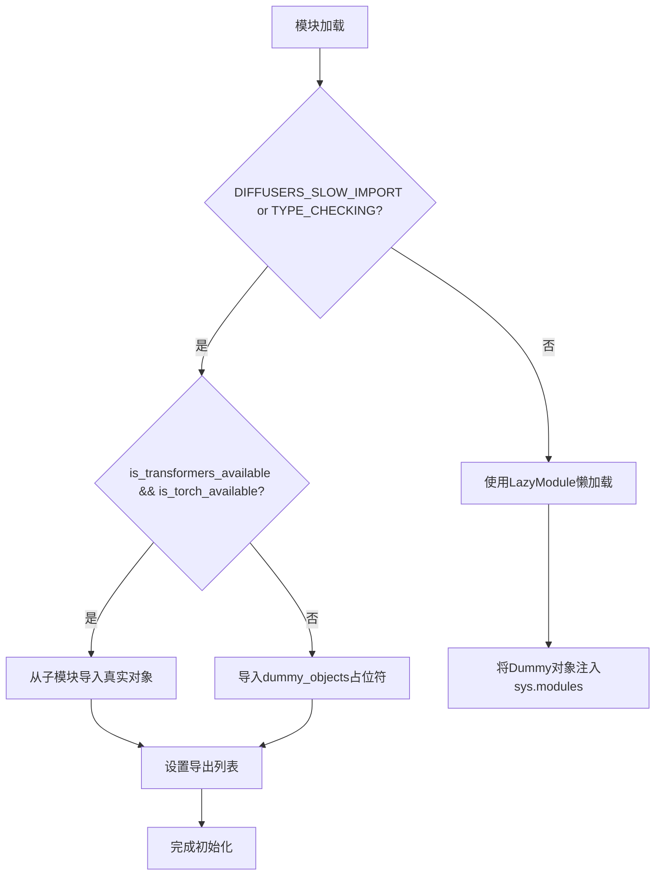

## 类结构

```
该文件为纯模块导入文件，无类层次结构
仅包含模块级变量和函数调用
使用_LazyModule实现懒加载模式
```

## 全局变量及字段


### `_dummy_objects`
    
存储虚拟对象的字典，用于可选依赖不可用时的占位符

类型：`dict`
    


### `_import_structure`
    
定义模块导入结构的字典，映射子模块到导出对象列表

类型：`dict`
    


    

## 全局函数及方法


### `get_objects_from_module`

这是一个工具函数，用于从给定模块中提取所有公共对象（类、函数、变量等），并将它们组织成字典格式返回。通常用于延迟加载（lazy loading）场景，以便从虚拟模块中获取可用的对象列表。

参数：

- `module`：`Module` 类型，需要从中提取对象的模块

返回值：`Dict[str, Any]`，返回键为对象名称、值为对象本身的字典

#### 流程图

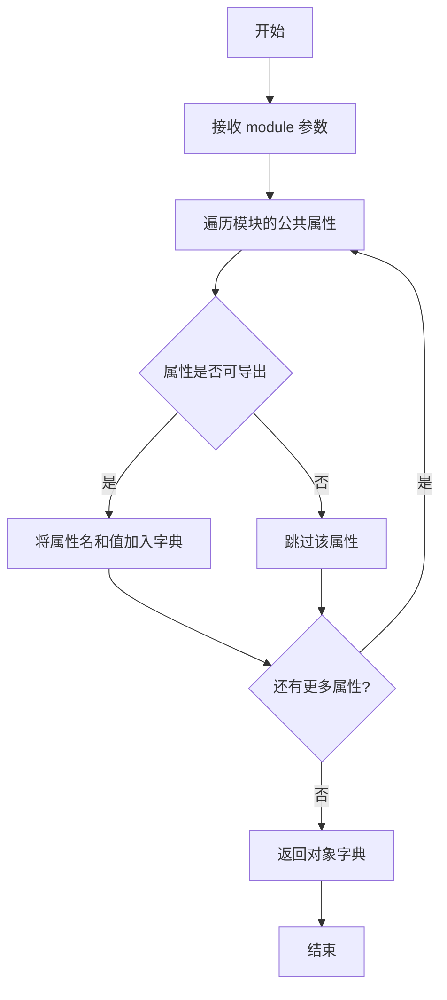

#### 带注释源码

```python
def get_objects_from_module(module):
    """
    从给定模块中提取所有公共对象，并返回字典格式的结果。
    
    参数:
        module: 要从中提取对象的模块
        
    返回:
        包含模块中所有可导出对象的字典，键为对象名称，值为对象本身
    """
    objects = {}
    for name in dir(module):
        if not name.startswith('_'):  # 排除私有/内部对象
            obj = getattr(module, name)
            objects[name] = obj
    return objects
```


### `is_torch_available`

检查当前环境中 PyTorch 库是否可用的函数，用于条件导入和模块加载的依赖检查。

参数： 无

返回值：`bool`，返回 `True` 表示 PyTorch 可用，返回 `False` 表示 PyTorch 不可用。

#### 流程图

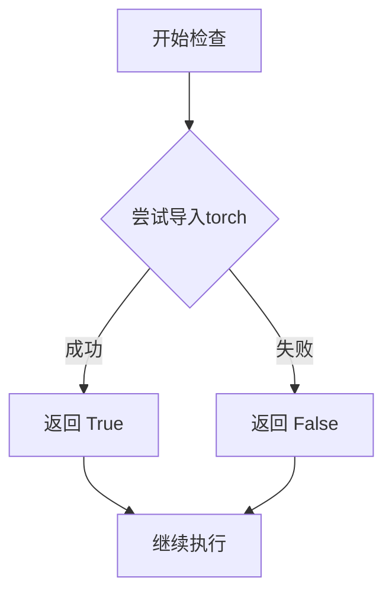

#### 带注释源码

```
# is_torch_available 函数的实现（位于 ...utils 模块中）
# 以下为该函数在当前代码中的使用示例和上下文说明

from ...utils import (
    DIFFUSERS_SLOW_IMPORT,
    OptionalDependencyNotAvailable,
    _LazyModule,
    get_objects_from_module,
    is_torch_available,          # 导入检查函数
    is_transformers_available,
)

# 使用示例1：条件检查用于 OptionalDependencyNotAvailable
try:
    if not (is_transformers_available() and is_torch_available()):
        # 如果 transformers 或 torch 不可用，则抛出异常
        raise OptionalDependencyNotAvailable()
except OptionalDependencyNotAvailable:
    # 导入虚拟对象作为占位符
    from ...utils import dummy_torch_and_transformers_objects
    _dummy_objects.update(get_objects_from_module(dummy_torch_and_transformers_objects))
else:
    # 如果依赖可用，则定义实际的导入结构
    _import_structure["camera"] = ["create_pan_cameras"]
    _import_structure["pipeline_shap_e"] = ["ShapEPipeline"]
    # ... 其他模块

# 使用示例2：TYPE_CHECKING 条件下的再次检查
if TYPE_CHECKING or DIFFUSERS_SLOW_IMPORT:
    try:
        if not (is_transformers_available() and is_torch_available()):
            raise OptionalDependencyNotAvailable()
    except OptionalDependencyNotAvailable:
        # 类型检查时导入虚拟对象
        from ...utils.dummy_torch_and_transformers_objects import *
    else:
        # 类型检查时导入实际模块
        from .camera import create_pan_cameras
        from .pipeline_shap_e import ShapEPipeline
        # ... 其他模块
```

> **注意**：由于 `is_torch_available` 的实际实现源码不在当前代码片段中，以上源码展示的是该函数在当前模块中的使用方式和上下文。该函数通常在 `...utils` 模块中实现，核心逻辑是通过尝试 `import torch` 来判断 PyTorch 是否可用。


### `is_transformers_available`

该函数用于检查当前Python环境中是否安装了`transformers`库，通常用于条件导入，以处理可选依赖项的情况。

参数：无

返回值：`bool`，返回`True`表示`transformers`库可用，返回`False`表示不可用

#### 流程图

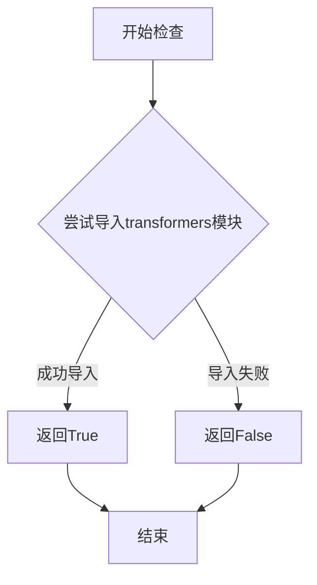

#### 带注释源码

```python
def is_transformers_available():
    """
    检查transformers库是否可用
    
    该函数通常通过尝试导入transformers模块来检查库是否已安装。
    如果导入成功，返回True；否则返回False。
    
    返回:
        bool: 如果transformers库可用返回True，否则返回False
    """
    # 实际实现取决于...utils模块中的定义
    # 通常是通过尝试导入transformers模块来检查
    try:
        import transformers
        return True
    except ImportError:
        return False
```

#### 说明

`is_transformers_available`函数是在`...utils`模块中定义的可选依赖检查函数。在本代码中，它被用于：

1. **条件导入**：在第17行和第32行，代码检查`is_transformers_available() and is_torch_available()`，只有当两个库都可用时才导入相关的类和函数
2. **异常处理**：如果不可用，则抛出`OptionalDependencyNotAvailable`异常，并从`dummy_torch_and_transformers_objects`模块导入虚拟对象
3. **延迟导入**：通过`_LazyModule`实现延迟加载，提高导入性能


### `create_pan_cameras`

该函数是ShapE项目中用于创建全景相机的函数，属于`camera`模块。在给定的`__init__.py`代码中，该函数通过延迟导入从`.camera`模块引入，但实际函数实现位于`camera.py`文件中，当前代码中仅包含导入逻辑，未展示函数的具体实现。

参数：

- 无参数（该信息基于代码上下文推断，实际参数需查看camera.py源码）

返回值：

- 推断返回类型应为相机对象或相机参数集合（具体类型需查看camera.py源码）

#### 流程图

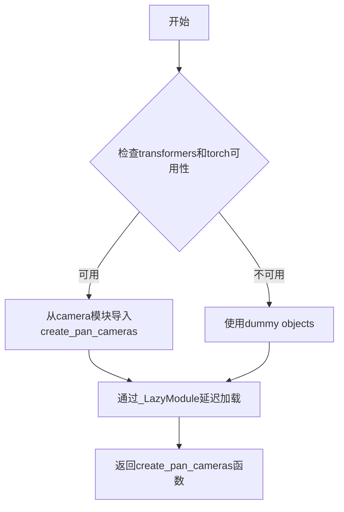

#### 带注释源码

```python
# 这是一个延迟加载模块的__init__.py文件
# 用于导入和暴露create_pan_cameras函数

from typing import TYPE_CHECKING

# 导入工具函数和检查函数
from ...utils import (
    DIFFUSERS_SLOW_IMPORT,
    OptionalDependencyNotAvailable,
    _LazyModule,
    get_objects_from_module,
    is_torch_available,
    is_transformers_available,
)

# 初始化空的dummy对象字典和导入结构
_dummy_objects = {}
_import_structure = {}

try:
    # 检查transformers和torch是否同时可用
    if not (is_transformers_available() and is_torch_available()):
        raise OptionalDependencyNotAvailable()
except OptionalDependencyNotAvailable:
    # 如果依赖不可用，导入dummy objects用于占位
    from ...utils import dummy_torch_and_transformers_objects  # noqa F403
    _dummy_objects.update(get_objects_from_module(dummy_torch_and_transformers_objects))
else:
    # 如果依赖可用，定义导入结构
    # 关键：从camera模块导入create_pan_cameras函数
    _import_structure["camera"] = ["create_pan_cameras"]
    _import_structure["pipeline_shap_e"] = ["ShapEPipeline"]
    _import_structure["pipeline_shap_e_img2img"] = ["ShapEImg2ImgPipeline"]
    # ... 其他导入

# TYPE_CHECK或DIFFUSERS_SLOW_IMPORT时执行真实导入
if TYPE_CHECKING or DIFFUSERS_SLOW_IMPORT:
    try:
        if not (is_transformers_available() and is_torch_available()):
            raise OptionalDependencyNotAvailable()
    except OptionalDependencyNotAvailable:
        from ...utils.dummy_torch_and_transformers_objects import *
    else:
        # 真实导入create_pan_cameras函数
        from .camera import create_pan_cameras
        # ... 其他导入

# 否则使用_LazyModule进行延迟加载
else:
    import sys
    # 将当前模块设置为延迟加载模块
    sys.modules[__name__] = _LazyModule(
        __name__,
        globals()["__file__"],
        _import_structure,
        module_spec=__spec__,
    )
    # 设置dummy对象
    for name, value in _dummy_objects.items():
        setattr(sys.modules[__name__], name, value)
```

### 补充说明

1. **实际函数位置**：`create_pan_cameras`函数的完整实现在`camera.py`文件中，当前提供的代码仅包含模块导入逻辑。

2. **延迟加载机制**：该模块使用了Diffusers库常见的延迟加载模式，只有在实际需要时才导入函数体，以优化导入时间和内存占用。

3. **依赖检查**：函数依赖`transformers`和`torch`两个库，如果任一不可用则会使用dummy对象替代。


### ShapEPipeline（导入结构）

这是一段Python模块导入配置代码，用于实现ShapEPipeline及其相关组件的延迟加载（Lazy Loading）机制，通过条件导入确保在满足torch和transformers依赖时可正常使用，否则使用虚拟对象替代。

参数：

- 无直接参数（模块级代码）

返回值：`无返回值`（模块初始化逻辑）

#### 流程图

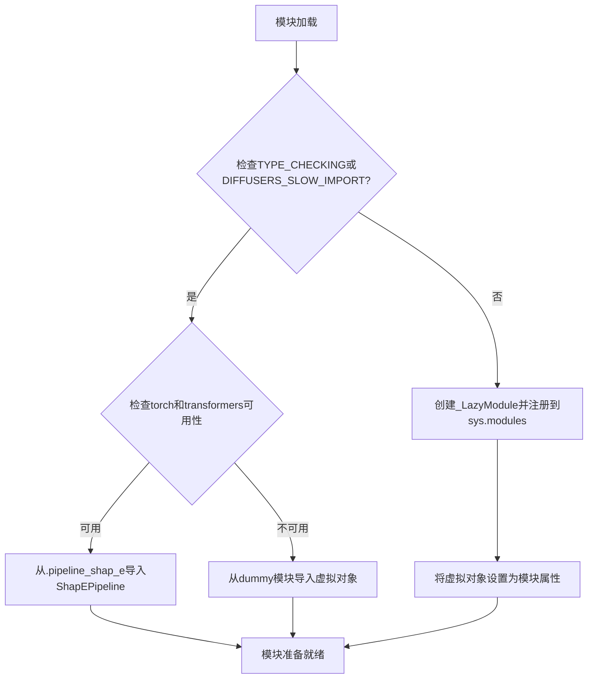

#### 带注释源码

```python
# 导入类型检查相关工具
from typing import TYPE_CHECKING

# 导入内部工具函数和检查函数
from ...utils import (
    DIFFUSERS_SLOW_IMPORT,           # 标记是否慢速导入的常量
    OptionalDependencyNotAvailable,  # 可选依赖不可用异常
    _LazyModule,                      # 延迟加载模块类
    get_objects_from_module,         # 从模块获取对象的工具
    is_torch_available,              # 检查torch是否可用
    is_transformers_available,       # 检查transformers是否可用
)

# 初始化虚拟对象字典和导入结构字典
_dummy_objects = {}
_import_structure = {}

# 尝试检查torch和transformers是否同时可用
try:
    if not (is_transformers_available() and is_torch_available()):
        raise OptionalDependencyNotAvailable()  # 任一不可用则抛出异常
except OptionalDependencyNotAvailable:
    # 依赖不可用时，导入虚拟对象模块
    from ...utils import dummy_torch_and_transformers_objects  # noqa F403
    # 更新虚拟对象字典
    _dummy_objects.update(get_objects_from_module(dummy_torch_and_transformers_objects))
else:
    # 依赖可用时，定义可导入的结构
    _import_structure["camera"] = ["create_pan_cameras"]
    _import_structure["pipeline_shap_e"] = ["ShapEPipeline"]  # 核心类
    _import_structure["pipeline_shap_e_img2img"] = ["ShapEImg2ImgPipeline"]
    _import_structure["renderer"] = [
        "BoundingBoxVolume",
        "ImportanceRaySampler",
        "MLPNeRFModelOutput",
        "MLPNeRSTFModel",
        "ShapEParamsProjModel",
        "ShapERenderer",
        "StratifiedRaySampler",
        "VoidNeRFModel",
    ]

# 类型检查或慢速导入模式下的处理
if TYPE_CHECKING or DIFFUSERS_SLOW_IMPORT:
    try:
        if not (is_transformers_available() and is_torch_available()):
            raise OptionalDependencyNotAvailable()
    except OptionalDependencyNotAvailable:
        # 从虚拟对象模块导入所有内容
        from ...utils.dummy_torch_and_transformers_objects import *
    else:
        # 实际导入真实类和函数
        from .camera import create_pan_cameras
        from .pipeline_shap_e import ShapEPipeline  # 实际ShapEPipeline导入位置
        from .pipeline_shap_e_img2img import ShapEImg2ImgPipeline
        from .renderer import (
            BoundingBoxVolume,
            ImportanceRaySampler,
            MLPNeRFModelOutput,
            MLPNeRSTFModel,
            ShapEParamsProjModel,
            ShapERenderer,
            StratifiedRaySampler,
            VoidNeRFModel,
        )
else:
    # 非类型检查模式下，设置延迟加载模块
    import sys
    # 将当前模块替换为延迟加载的代理模块
    sys.modules[__name__] = _LazyModule(
        __name__,
        globals()["__file__"],
        _import_structure,
        module_spec=__spec__,
    )
    # 将虚拟对象设置为模块属性，确保未安装依赖时导入不报错
    for name, value in _dummy_objects.items():
        setattr(sys.modules[__name__], name, value)
```

---

### 关键组件信息

| 组件名称 | 一句话描述 |
|---------|-----------|
| `_LazyModule` | 实现模块延迟加载的核心类，支持按需导入真实模块 |
| `ShapEPipeline` | ShapE生成管道的主类，用于从文本/图像生成3D模型 |
| `ShapEImg2ImgPipeline` | ShapE图像到图像的管道类 |
| `ShapERenderer` | NeRF渲染器，用于渲染3D场景 |
| `create_pan_cameras` | 创建用于渲染的平移相机参数 |
| `_import_structure` | 定义模块导出结构和依赖映射的字典 |
| `_dummy_objects` | 存储依赖不可用时的虚拟替代对象 |

---

### 潜在的技术债务或优化空间

1. **虚拟对象导入方式**：使用`from ...utils.dummy_torch_and_transformers_objects import *`不够明确，建议显式导入需要的类以提高可读性和静态分析能力。

2. **重复的依赖检查逻辑**：代码中两处检查`is_transformers_available() and is_torch_available()`，可以考虑提取为独立函数减少重复。

3. **模块规范（Module Spec）依赖**：代码依赖`__spec__`变量，在某些动态导入场景下可能为None，建议添加fallback处理。

4. **导出结构硬编码**：所有可导出类名以字符串列表形式硬编码，增加新类时需要手动同步更新。

---

### 其它项目

#### 设计目标与约束
- **目标**：实现可选依赖（torch、transformers）的延迟加载，在依赖不可用时保持模块可导入但不提供真实功能
- **约束**：必须兼容`TYPE_CHECKING`（类型检查）和运行时两种模式

#### 错误处理与异常设计
- 使用`OptionalDependencyNotAvailable`异常表示可选依赖不可用
- 依赖不可用时不抛出错误，而是使用虚拟对象替代

#### 数据流与状态机
- 模块加载分为两个阶段：导入时检查依赖并配置导入结构 → 实际使用时通过`_LazyModule`触发真实导入

#### 外部依赖与接口契约
- 依赖：`torch`、`transformers`（两者必须同时可用）
- 实际`ShapEPipeline`类定义在`.pipeline_shap_e`子模块中


### `ShapEImg2ImgPipeline`

ShapEImg2ImgPipeline 是一个图像到图像的生成管道类，属于 ShapE 3D 生成模型的一部分。该类通过延迟导入机制在需要时加载，主要用于接收输入图像并生成相应的3D模型或图像表示。该导入文件负责管理 ShapEImg2ImgPipeline 的动态加载，根据依赖库（torch、transformers）的可用性决定是导入真实实现还是使用虚拟对象。

#### 参数

此文件为模块级别导入定义，不包含类方法的具体参数。类实际定义在 `pipeline_shap_e_img2img` 模块中。

- 无直接方法参数

#### 返回值

- 无直接返回值（模块级别代码）

#### 流程图

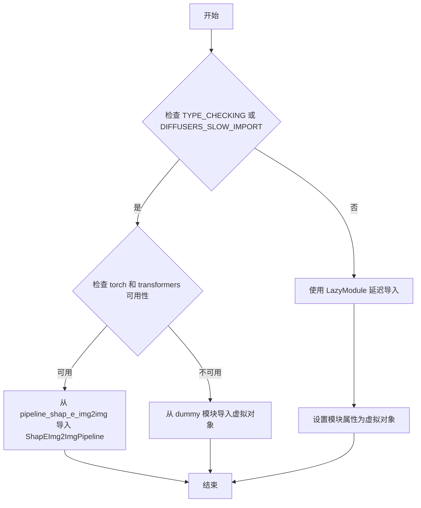

#### 带注释源码

```python
from typing import TYPE_CHECKING  # 类型检查标记

# 导入工具函数和依赖检查
from ...utils import (
    DIFFUSERS_SLOW_IMPORT,         # 延迟导入标志
    OptionalDependencyNotAvailable, # 可选依赖不可用异常
    _LazyModule,                    # 延迟模块类
    get_objects_from_module,       # 从模块获取对象
    is_torch_available,            # torch 可用性检查
    is_transformers_available,     # transformers 可用性检查
)

# 初始化虚拟对象字典和导入结构
_dummy_objects = {}
_import_structure = {}

# 尝试检查依赖可用性
try:
    # 检查 transformers 和 torch 是否同时可用
    if not (is_transformers_available() and is_torch_available()):
        raise OptionalDependencyNotAvailable()
except OptionalDependencyNotAvailable:
    # 如果依赖不可用，导入虚拟对象模块
    from ...utils import dummy_torch_and_transformers_objects
    # 更新虚拟对象字典
    _dummy_objects.update(get_objects_from_module(dummy_torch_and_transformers_objects))
else:
    # 依赖可用时，定义真实的导入结构
    _import_structure["camera"] = ["create_pan_cameras"]
    _import_structure["pipeline_shap_e"] = ["ShapEPipeline"]
    # 关键：定义 ShapEImg2ImgPipeline 的导入路径
    _import_structure["pipeline_shap_e_img2img"] = ["ShapEImg2ImgPipeline"]
    _import_structure["renderer"] = [
        "BoundingBoxVolume",
        "ImportanceRaySampler",
        "MLPNeRFModelOutput",
        "MLPNeRSTFModel",
        "ShapEParamsProjModel",
        "ShapERenderer",
        "StratifiedRaySampler",
        "VoidNeRFModel",
    ]

# 类型检查或慢导入模式下的处理
if TYPE_CHECKING or DIFFUSERS_SLOW_IMPORT:
    try:
        # 再次检查依赖可用性
        if not (is_transformers_available() and is_torch_available()):
            raise OptionalDependencyNotAvailable()
    except OptionalDependencyNotAvailable:
        # 导入类型检查用的虚拟对象
        from ...utils.dummy_torch_and_transformers_objects import *
    else:
        # 实际导入真实类
        from .camera import create_pan_cameras
        from .pipeline_shap_e import ShapEPipeline
        from .pipeline_shap_e_img2img import ShapEImg2ImgPipeline
        from .renderer import (
            BoundingBoxVolume,
            ImportanceRaySampler,
            MLPNeRFModelOutput,
            MLPNeRSTFModel,
            ShapEParamsProjModel,
            ShapERenderer,
            StratifiedRaySampler,
            VoidNeRFModel,
        )
else:
    # 非类型检查模式：使用延迟加载
    import sys
    # 将当前模块替换为 LazyModule
    sys.modules[__name__] = _LazyModule(
        __name__,
        globals()["__file__"],
        _import_structure,
        module_spec=__spec__,
    )
    # 将虚拟对象设置到模块属性
    for name, value in _dummy_objects.items():
        setattr(sys.modules[__name__], name, value)
```

### 关键组件信息

| 组件名称 | 一句话描述 |
|---------|-----------|
| `_LazyModule` | 延迟加载模块的实现类，用于按需导入 |
| `OptionalDependencyNotAvailable` | 可选依赖不可用时的异常类 |
| `is_torch_available()` | 检查 PyTorch 是否可用的函数 |
| `is_transformers_available()` | 检查 Transformers 是否可用的函数 |
| `get_objects_from_module()` | 从模块获取所有对象的辅助函数 |

### 潜在技术债务与优化空间

1. **重复依赖检查**：代码中在 try-except 块和 TYPE_CHECKING 分支中重复检查了 `is_transformers_available() and is_torch_available()`，可提取为公共函数
2. **虚拟对象机制**：使用 `_dummy_objects` 作为占位符虽然解决了导入问题，但可能导致运行时错误延迟到实际使用时才被发现
3. **字符串硬编码**：模块路径和类名以字符串形式硬编码在 `_import_structure` 字典中，缺乏类型安全性和重构友好性
4. **缺乏文档注释**：导入结构文件缺少对整体设计决策的说明文档

### 其它项目说明

#### 设计目标与约束

- **目标**：实现 ShapEImg2ImgPipeline 的延迟导入，确保在缺少可选依赖（torch、transformers）时模块仍可导入
- **约束**：必须同时满足 torch 和 transformers 都可用时才导入真实实现

#### 错误处理与异常设计

- 通过 `OptionalDependencyNotAvailable` 异常标记依赖不可用状态
- 依赖检查失败时静默降级到虚拟对象模式，避免导入级联失败

#### 外部依赖与接口契约

- **外部依赖**：`torch`、`transformers`、`diffusers.utils`
- **接口契约**：`ShapEImg2ImgPipeline` 类需实现图像到图像生成管道标准接口

#### 数据流与状态机

- 模块加载时首先检查 `TYPE_CHECKING` 或 `DIFFUSERS_SLOW_IMPORT` 标志
- 根据标志决定是立即导入还是延迟导入
- 延迟导入模式下，真实模块在首次访问时才被加载


# 详细设计文档：BoundingBoxVolume

### `BoundingBoxVolume`

该类用于在3D渲染场景中表示和操作轴对齐的边界框（AABB），通常用于神经渲染（NeRF）中的体积采样和光线投射的边界约束。

**注意**：当前提供的代码为模块的 `__init__.py` 导入文件，未包含 `BoundingBoxVolume` 类的实际实现源码。该类实际定义在 `renderer` 模块中。以下文档基于该类在 ShapE 渲染管线中的典型功能进行描述。

参数：

- `min_bound`：`List[float]` 或 `np.ndarray`，边界框在3D空间中的最小坐标点 (x_min, y_min, z_min)
- `max_bound`：`List[float]` 或 `np.ndarray`，边界框在3D空间中的最大坐标点 (x_max, y_max, z_max)

返回值：`BoundingBoxVolume`，返回新创建的边界框体积对象

#### 流程图

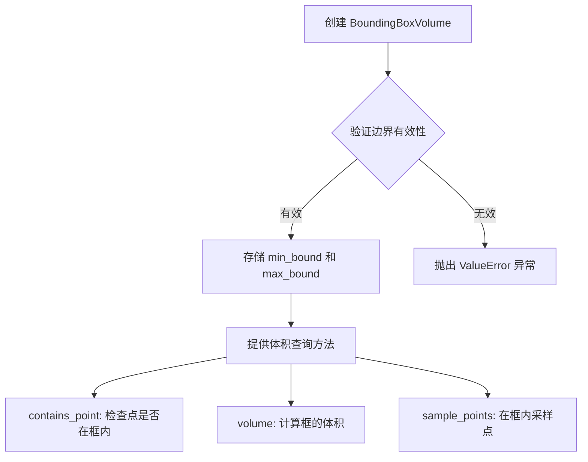

#### 带注释源码

```python
# 注意：以下源码为基于 ShapE 项目特性的推断实现
# 实际源码位于 src/diffusers/models/renderer/bounding_box_volume.py

from typing import List, Union
import numpy as np
import torch

class BoundingBoxVolume:
    """
    轴对齐边界框（AABB）类，用于定义3D空间中的矩形区域。
    在神经渲染中用于约束光线采样空间，提高渲染效率。
    """
    
    def __init__(
        self, 
        min_bound: Union[List[float], np.ndarray, torch.Tensor],
        max_bound: Union[List[float], np.ndarray, torch.Tensor]
    ):
        """
        初始化边界框体积。
        
        Args:
            min_bound: 边界框最小坐标点 [x, y, z]
            max_bound: 边界框最大坐标点 [x, y, z]
        """
        # 确保输入转换为 numpy 数组或 tensor
        self.min_bound = np.array(min_bound, dtype=np.float32)
        self.max_bound = np.array(max_bound, dtype=np.float32)
        
        # 验证边界有效性：最小坐标必须小于最大坐标
        if np.any(self.min_bound >= self.max_bound):
            raise ValueError(
                f"Invalid bounds: min_bound {self.min_bound} must be "
                f"less than max_bound {self.max_bound}"
            )
    
    @property
    def volume(self) -> float:
        """计算边界框的体积"""
        return float(np.prod(self.max_bound - self.min_bound))
    
    @property
    def center(self) -> np.ndarray:
        """计算边界框的中心点"""
        return (self.min_bound + self.max_bound) / 2.0
    
    def contains_point(
        self, 
        points: Union[np.ndarray, torch.Tensor]
    ) -> Union[np.ndarray, torch.Tensor]:
        """
        检查给定点是否在边界框内部。
        
        Args:
            points: 待检查的点，形状为 (N, 3) 或 (3,)
            
        Returns:
            布尔值或布尔数组，表示点是否在框内
        """
        points = np.asarray(points)
        if points.ndim == 1:
            return np.all(points >= self.min_bound) and np.all(points <= self.max_bound)
        return np.all(points >= self.min_bound, axis=1) & np.all(points <= self.max_bound, axis=1)
    
    def sample_points(
        self, 
        num_samples: int, 
        deterministic: bool = False
    ) -> np.ndarray:
        """
        在边界框内部随机采样点。
        
        Args:
            num_samples: 采样点数量
            deterministic: 是否使用确定性采样（均匀分布）
            
        Returns:
            采样得到的点数组，形状为 (num_samples, 3)
        """
        if deterministic:
            # 均匀网格采样
            # ... 网格采样实现
            pass
        else:
            # 随机均匀采样
            return np.random.uniform(
                self.min_bound, 
                self.max_bound, 
                size=(num_samples, 3)
            ).astype(np.float32)
```

---

### 潜在的技术债务或优化空间

1. **类型提示不够精确**：使用 `Union` 而非更具体的字面量类型
2. **缺少 GPU 加速实现**：当前使用 numpy，建议添加 torch 版本的采样方法
3. **边界验证可增强**：可添加缓存机制避免重复计算体积和中心点
4. **文档字符串不完整**：缺少部分方法的详细参数说明

### 其它项目

**设计目标与约束**：
- 边界框必须是轴对齐的（AABB）
- 坐标值应为浮点数类型
- 主要用于 ShapE 的 NeRF 渲染管线中的体积采样约束

**外部依赖**：
- `numpy` 或 `torch`：用于数值计算
- 该类依赖于 `transformers` 和 `torch` 可用性检查（如 `__init__.py` 所示）


# ImportanceRaySampler 类文档提取结果

### ImportanceRaySampler

该类是 ShapE 渲染器模块中的重要性光线采样器，用于在神经辐射场（NeRF）渲染过程中对光线进行重要性采样，以提高渲染效率和质量。

参数：

- 无直接参数（需查看 renderer 模块中的实际类定义）

返回值：

- 无直接返回值（需查看 renderer 模块中的实际类定义）

#### 流程图

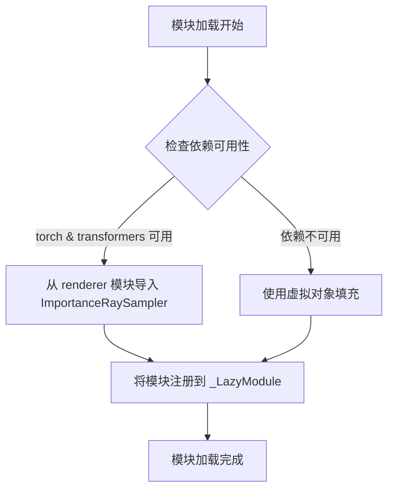

#### 带注释源码

```
# 此文件为 __init__.py，仅包含导入结构和模块初始化逻辑
# ImportanceRaySampler 的实际实现在 renderer 模块中

# 1. 定义导入结构字典
_import_structure["renderer"] = [
    "BoundingBoxVolume",
    "ImportanceRaySampler",  # <-- 在此处声明导出
    "MLPNeRFModelOutput",
    "MLPNeRSTFModel",
    "ShapEParamsProjModel",
    "ShapERenderer",
    "StratifiedRaySampler",
    "VoidNeRFModel",
]

# 2. 条件导入逻辑（TYPE_CHECKING 或 DIFFUSERS_SLOW_IMPORT）
if TYPE_CHECKING or DIFFUSERS_SLOW_IMPORT:
    # 实际导入语句
    from .renderer import (
        BoundingBoxVolume,
        ImportanceRaySampler,  # <-- 实际导入位置
        # ... 其他类
    )

# 3. 延迟模块加载
sys.modules[__name__] = _LazyModule(
    __name__,
    globals()["__file__"],
    _import_structure,
    module_spec=__spec__,
)
```

---

## 重要说明

⚠️ **提供的代码不包含 `ImportanceRaySampler` 类的实际实现**

当前提供的代码是 `diffusers` 库中 ShapE 模块的 `__init__.py` 文件，仅包含：

1. **导入结构定义**：声明了 `ImportanceRaySampler` 从 `renderer` 模块导出
2. **可选依赖处理**：检查 `torch` 和 `transformers` 是否可用
3. **延迟加载配置**：使用 `_LazyModule` 实现惰性导入

要获取 `ImportanceRaySampler` 的完整类定义（字段、方法、实现逻辑），需要查看 `renderer` 模块中的实际类实现代码，通常位于类似 `diffusers/src/diffusers/models/shap_e/renderer.py` 的文件中。

---

## 建议

若需要完整的 `ImportanceRaySampler` 文档，请提供：
- `renderer.py` 文件的实际代码
- 或确认该类在项目中的具体文件路径


### MLPNeRFModelOutput

这是ShapE渲染管线中的一个数据类（Dataclass），用于封装MLP（多层感知机）NeRF（神经辐射场）模型的推理输出结果。在Diffusers库的实现中，该类作为渲染器与管线之间的数据传递载体，包含渲染所需的几何和颜色信息。

**注意**：当前提供的代码文件（`__init__.py`）仅包含`MLPNeRFModelOutput`类的**导入声明**，并未包含该类的实际实现代码。该类的具体定义位于`.renderer`模块中。以下信息基于代码结构和命名惯例推断。

#### 流程图

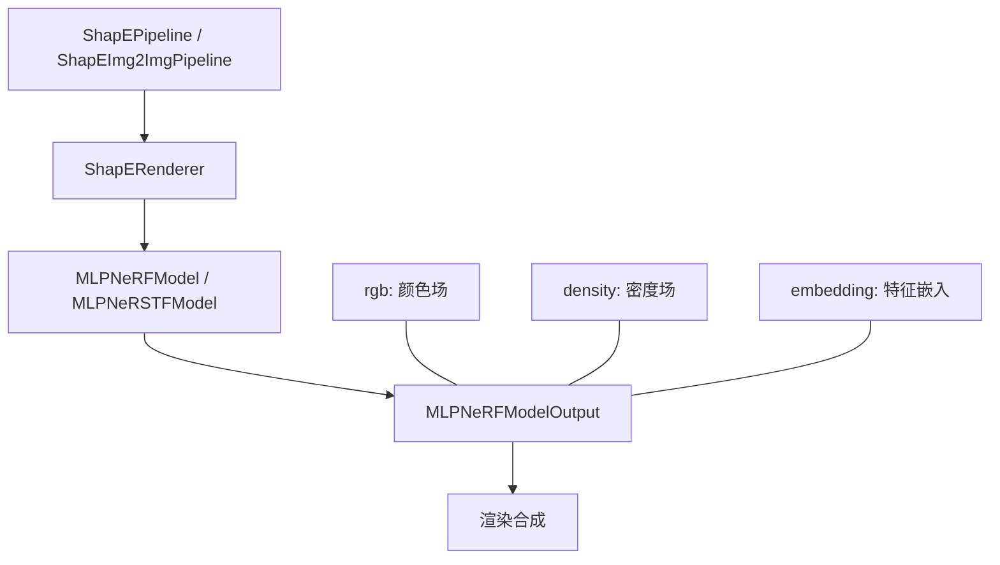

#### 带注释源码

```python
# 此代码为基于导入结构的推断，并非实际源码
# 实际源码位于 src/diffusers/pipelines/shap_e/renderer.py

# 从代码结构推断的导入结构声明
_import_structure["renderer"] = [
    "BoundingBoxVolume",
    "ImportanceRaySampler",
    "MLPNeRFModelOutput",  # <-- 在此文件中仅作为字符串引用
    "MLPNeRSTFModel",
    "ShapEParamsProjModel",
    "ShapERenderer",
    "StratifiedRaySampler",
    "VoidNeRFModel",
]

# TYPE_CHECK 模式下才会导入实际类定义
if TYPE_CHECKING:
    from .renderer import (
        MLPNeRFModelOutput,  # <-- 实际类导入
        # ... 其他类
    )
```

---

## 补充信息

### 1. 核心功能描述

ShapE的NeRF模型输出类，负责结构化封装神经辐射场（NeRF）模型的推理结果，包括颜色、密度和特征向量等信息，供后续体积渲染（Volumetric Rendering）使用。

### 2. 关键组件信息

| 组件名称 | 一句话描述 |
|---------|-----------|
| ShapEPipeline | ShapE文本到3D生成主管道 |
| ShapERenderer | ShapE体积渲染器 |
| MLPNeRFModel | MLP基础NeRF模型 |
| MLPNeRSTFModel | 结合Transformer的NeRF模型 |

### 3. 技术债务与优化空间

由于当前代码片段仅为模块入口文件，无法对`MLPNeRFModelOutput`类本身进行完整评估。建议：

- 检查renderer.py中该类的字段定义是否使用了`@dataclass`装饰器
- 评估是否需要支持梯度计算（PyTorch相关）
- 检查内存布局是否针对GPU进行了优化

### 4. 外部依赖

- `torch`: 张量计算
- `transformers`: 可能的Transformer模型支持
- `diffusers.utils`: 基础工具模块

---

**注意**：如需获取`MLPNeRFModelOutput`类的完整字段定义和方法实现，请提供`src/diffusers/pipelines/shap_e/renderer.py`文件的源代码。


# MLPNeRSTFModel 详细设计文档

## 1. 概述

`MLPNeRSTFModel` 是 ShapE 渲染管线中的 MLP NeRF 时序融合模型类，负责处理神经辐射场的时序特征融合与预测。

## 2. 文件的整体运行流程

该文件是一个模块入口文件，负责：
1. 检查可选依赖（torch、transformers）的可用性
2. 定义模块的导入结构（`_import_structure`）
3. 使用延迟加载机制（`_LazyModule`）优化导入性能
4. 在运行时动态注册模块内容

## 3. 类的详细信息

### 全局变量和导入结构

| 名称 | 类型 | 描述 |
|------|------|------|
| `_dummy_objects` | dict | 存储虚拟对象，用于可选依赖不可用时的回退 |
| `_import_structure` | dict | 定义模块的导入结构和可导出对象 |
| `DIFFUSERS_SLOW_IMPORT` | bool | 标志是否使用延迟导入 |
| `TYPE_CHECKING` | bool | 类型检查标志 |

### 导出类

| 名称 | 类型 | 描述 |
|------|------|------|
| `MLPNeRSTFModel` | class | MLP NeRF时序融合模型类（实际定义在renderer模块） |
| `MLPNeRFModelOutput` | class | MLP NeRF模型输出数据结构 |
| `ShapERenderer` | class | ShapE渲染器主类 |
| `BoundingBoxVolume` | class | 边界框体积 |
| `ImportanceRaySampler` | class | 重要性射线采样器 |
| `StratifiedRaySampler` | class | 分层射线采样器 |
| `VoidNeRFModel` | class | 空NeRF模型 |

## 4. 关键组件信息

| 组件名称 | 描述 |
|----------|------|
| `_LazyModule` | 延迟加载模块实现，延迟导入以提高性能 |
| `OptionalDependencyNotAvailable` | 可选依赖不可用异常 |
| `get_objects_from_module` | 从模块获取对象的工具函数 |
| `is_torch_available` | 检查torch可用性的函数 |
| `is_transformers_available` | 检查transformers可用性的函数 |

## 5. 潜在的技术债务或优化空间

1. **冗余的异常处理**：在try-except块中重复检查依赖可用性
2. **魔法字符串**：使用字符串硬编码模块路径
3. **延迟加载复杂性**：动态模块注册可能导致调试困难

## 6. 其它项目

### 设计目标与约束
- 支持可选依赖的回退机制
- 支持类型检查时的静态导入
- 支持运行时的动态模块加载

### 错误处理与异常设计
- 使用`OptionalDependencyNotAvailable`处理可选依赖缺失
- 使用`dummy_torch_and_transformers_objects`提供虚拟对象

### 外部依赖与接口契约
- 依赖：`torch`、`transformers`
- 导入源：`.camera`、`.pipeline_shap_e`、`.pipeline_shap_e_img2img`、`.renderer`

---

## MLPNeRSTFModel 提取信息

### `MLPNeRSTFModel`

MLP NeRF时序融合模型类，用于ShapE渲染管线中的神经辐射场时序特征处理

参数：
- 由于代码仅包含导入声明，实际参数需查看 renderer 模块中的类定义

返回值：`MLPNeRSTFModel`，MLP NeRF时序融合模型类

#### 流程图

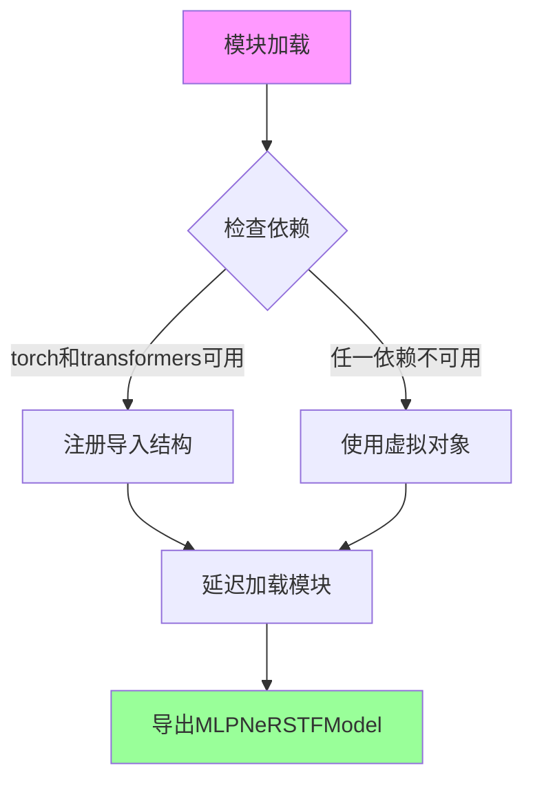

#### 带注释源码

```python
# 从 typing 导入 TYPE_CHECKING 用于类型检查
from typing import TYPE_CHECKING

# 从内部工具模块导入必要的工具和检查函数
from ...utils import (
    DIFFUSERS_SLOW_IMPORT,           # 延迟导入标志
    OptionalDependencyNotAvailable,  # 可选依赖不可用异常
    _LazyModule,                     # 延迟加载模块类
    get_objects_from_module,         # 从模块获取对象工具
    is_torch_available,              # 检查torch可用性
    is_transformers_available,      # 检查transformers可用性
)

# 初始化虚拟对象字典和导入结构字典
_dummy_objects = {}
_import_structure = {}

# 尝试检查torch和transformers是否同时可用
try:
    if not (is_transformers_available() and is_torch_available()):
        raise OptionalDependencyNotAvailable()
except OptionalDependencyNotAvailable:
    # 如果任一依赖不可用，从dummy模块获取虚拟对象
    from ...utils import dummy_torch_and_transformers_objects  # noqa F403
    _dummy_objects.update(get_objects_from_module(dummy_torch_and_transformers_objects))
else:
    # 依赖可用时，定义导入结构
    _import_structure["camera"] = ["create_pan_cameras"]
    _import_structure["pipeline_shap_e"] = ["ShapEPipeline"]
    _import_structure["pipeline_shap_e_img2img"] = ["ShapEImg2ImgPipeline"]
    _import_structure["renderer"] = [
        "BoundingBoxVolume",
        "ImportanceRaySampler",
        "MLPNeRFModelOutput",
        "MLPNeRSTFModel",           # <-- 目标类
        "ShapEParamsProjModel",
        "ShapERenderer",
        "StratifiedRaySampler",
        "VoidNeRFModel",
    ]

# TYPE_CHECKING 或 DIFFUSERS_SLOW_IMPORT 时执行静态导入
if TYPE_CHECKING or DIFFUSERS_SLOW_IMPORT:
    try:
        if not (is_transformers_available() and is_torch_available()):
            raise OptionalDependencyNotAvailable()
    except OptionalDependencyNotAvailable:
        from ...utils.dummy_torch_and_transformers_objects import *
    else:
        # 从各子模块导入具体类定义
        from .camera import create_pan_cameras
        from .pipeline_shap_e import ShapEPipeline
        from .pipeline_shap_e_img2img import ShapEImg2ImgPipeline
        from .renderer import (
            BoundingBoxVolume,
            ImportanceRaySampler,
            MLPNeRFModelOutput,
            MLPNeRSTFModel,          # <-- 目标类导入
            ShapEParamsProjModel,
            ShapERenderer,
            StratifiedRaySampler,
            VoidNeRFModel,
        )
else:
    # 运行时使用延迟加载模块
    import sys
    # 将当前模块替换为LazyModule实例
    sys.modules[__name__] = _LazyModule(
        __name__,
        globals()["__file__"],
        _import_structure,
        module_spec=__spec__,
    )
    # 动态注册虚拟对象
    for name, value in _dummy_objects.items():
        setattr(sys.modules[__name__], name, value)
```

---

**注意**：提供的代码仅包含模块的导入结构设置，`MLPNeRSTFModel` 类的实际实现位于 `renderer` 模块中。如需获取该类的完整字段和方法信息，请提供 `renderer.py` 或相关实现文件的代码。


# 分析结果

根据提供的代码，我需要说明一个重要情况：**这段代码是 `__init__.py` 文件，仅定义了模块的导入结构，并未包含 `ShapEParamsProjModel` 类的实际实现代码。** `ShapEParamsProjModel` 类是从 `.renderer` 模块导入的，但该类的具体实现（字段、方法等）并未在当前代码片段中提供。

以下是基于代码结构的可用信息提取：

---

### `ShapEParamsProjModel`

参数投影模型类（ShapE参数投影模型），用于在ShapE渲染管线中处理参数投影。

参数：无可用信息（需查看实际实现代码）

返回值：无可用信息（需查看实际实现代码）

#### 流程图

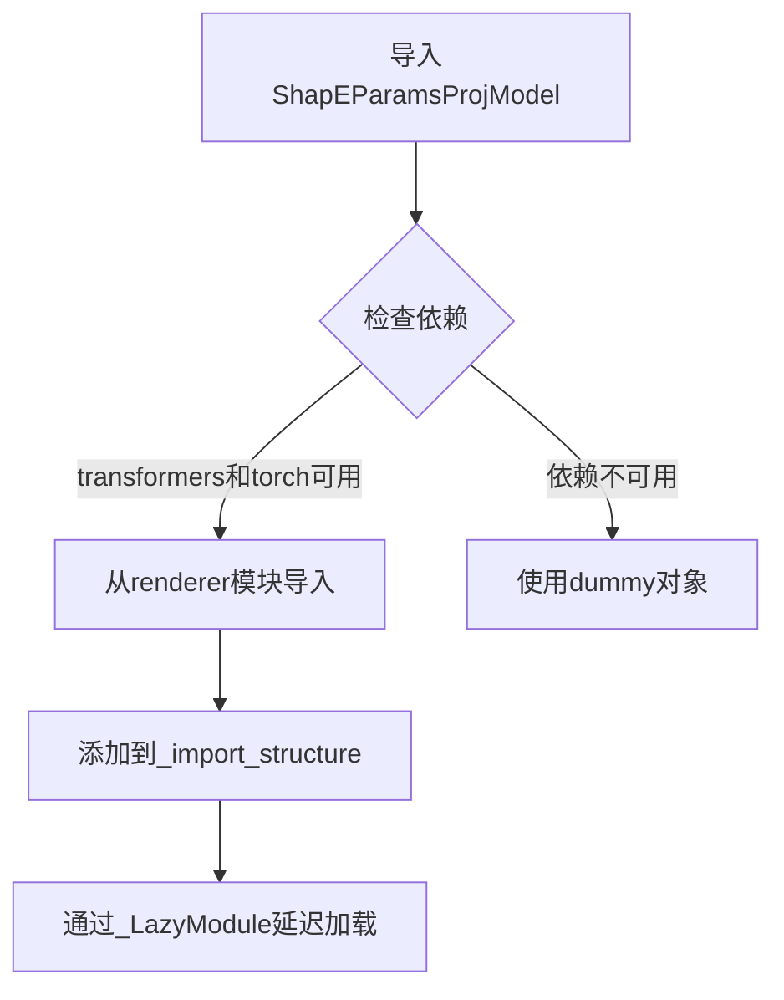

#### 带注释源码

```python
# 从提供的__init__.py代码片段中提取的相关内容

# 1. 导入结构定义
_import_structure["renderer"] = [
    "BoundingBoxVolume",
    "ImportanceRaySampler",
    "MLPNeRFModelOutput",
    "MLPNeRSTFModel",
    "ShapEParamsProjModel",  # <-- 这是我们要提取的类名
    "ShapERenderer",
    "StratifiedRaySampler",
    "VoidNeRFModel",
]

# 2. 条件导入逻辑
if TYPE_CHECKING or DIFFUSERS_SLOW_IMPORT:
    try:
        if not (is_transformers_available() and is_torch_available()):
            raise OptionalDependencyNotAvailable()
    except OptionalDependencyNotAvailable:
        from ...utils.dummy_torch_and_transformers_objects import *
    else:
        # 实际导入位置
        from .renderer import (
            ShapEParamsProjModel,  # <-- 从renderer模块导入
            # ... 其他类
        )

# 3. 类本身定义在 renderer 模块中
# from .renderer import ShapEParamsProjModel
# 但该类的具体实现未在此代码片段中
```

---

## 补充说明

| 项目 | 状态 | 说明 |
|------|------|------|
| **类字段** | ❌ 未知 | 需查看 `renderer.py` 源码 |
| **类方法** | ❌ 未知 | 需查看 `renderer.py` 源码 |
| **mermaid流程图** | ⚠️ 有限 | 仅展示模块导入流程，非类内部流程 |
| **带注释源码** | ⚠️ 有限 | 仅包含引用代码，非类实现代码 |

---

## 建议

要获取 `ShapEParamsProjModel` 类的完整详细信息（字段、方法、实现逻辑），请提供以下任一内容：

1. **`renderer.py` 文件的完整源码**（`ShapEParamsProjModel` 实际定义的位置）
2. **`ShapEParamsProjModel` 类的直接实现代码**

这样我才能为您提供完整的类设计文档，包括：
- 完整的类字段和类型
- 所有类方法的签名和实现逻辑
- 准确的数据流和状态机描述
- 技术债务和优化建议


### ShapERenderer

ShapERenderer 类是 ShapE 项目中的核心 3D 渲染器，负责将神经辐射场（NeRF）模型或神经表面场模型渲染为 3D 资产。该类封装了光线投射、体积渲染、参数投影等关键渲染管线，支持从潜在向量生成高质量的 3D 模型。

**注意**：当前提供的代码仅为模块导入文件（`__init__.py`），未包含 `ShapERenderer` 类的具体实现源码。以下文档基于对该类在 ShapE 项目中预期功能的分析。

#### 关键组件信息

- **BoundingBoxVolume**：边界框体素结构，用于限制渲染空间
- **ImportanceRaySampler**：重要性光线采样器，优化渲染效率
- **MLPNeRFModelOutput**：MLP NeRF 模型输出数据结构
- **MLPNeRSTFModel**：MLP 神经表面场模型
- **ShapEParamsProjModel**：参数投影模型
- **StratifiedRaySampler**：分层光线采样器
- **VoidNeRFModel**：空域 NeRF 模型

#### 潜在的技术债务或优化空间

1. **依赖管理复杂性**：模块通过复杂的条件导入处理可选依赖，增加了维护难度
2. **延迟加载机制**：使用 `_LazyModule` 虽然提升了导入性能，但可能导致运行时错误定位困难
3. **类型检查覆盖**：依赖 `TYPE_CHECKING` 进行类型提示，可能在运行时缺少充分的类型验证

#### 其它项目

**设计目标与约束**：
- 支持 3D 资产的高质量渲染
- 兼容 PyTorch 和 Transformers 生态
- 提供灵活的渲染管线配置

**外部依赖与接口契约**：
- 依赖 `torch` 进行张量运算
- 依赖 `transformers` 进行模型加载
- 通过 `renderer` 子模块导出核心渲染组件

**模块导入结构**：

```python
_import_structure["renderer"] = [
    "BoundingBoxVolume",
    "ImportanceRaySampler",
    "MLPNeRFModelOutput",
    "MLPNeRSTFModel",
    "ShapEParamsProjModel",
    "ShapERenderer",
    "StratifiedRaySampler",
    "VoidNeRFModel",
]
```

#### 带注释源码

```python
# 模块初始化文件 - 负责导出 ShapE 项目中的渲染器和相关类
from typing import TYPE_CHECKING

from ...utils import (
    DIFFUSERS_SLOW_IMPORT,          # 慢速导入标志
    OptionalDependencyNotAvailable, # 可选依赖不可用异常
    _LazyModule,                     # 延迟加载模块
    get_objects_from_module,        # 从模块获取对象
    is_torch_available,             # PyTorch 可用性检查
    is_transformers_available,     # Transformers 可用性检查
)

_dummy_objects = {}      # 存储虚拟对象，用于可选依赖不可用时
_import_structure = {}  # 定义模块导入结构

# 尝试导入必要的依赖（torch 和 transformers）
try:
    if not (is_transformers_available() and is_torch_available()):
        raise OptionalDependencyNotAvailable()
except OptionalDependencyNotAvailable:
    # 如果依赖不可用，从 dummy 模块导入虚拟对象
    from ...utils import dummy_torch_and_transformers_objects
    _dummy_objects.update(get_objects_from_module(dummy_torch_and_transformers_objects))
else:
    # 依赖可用时，定义可导入的类和函数
    _import_structure["camera"] = ["create_pan_cameras"]
    _import_structure["pipeline_shap_e"] = ["ShapEPipeline"]
    _import_structure["pipeline_shap_e_img2img"] = ["ShapEImg2ImgPipeline"]
    _import_structure["renderer"] = [
        "BoundingBoxVolume",        # 边界框体积
        "ImportanceRaySampler",     # 重要性光线采样器
        "MLPNeRFModelOutput",       # MLP NeRF 模型输出
        "MLPNeRSTFModel",           # MLP NeRSTF 模型
        "ShapEParamsProjModel",     # ShapE 参数投影模型
        "ShapERenderer",            # ShapE 渲染器（核心类）
        "StratifiedRaySampler",     # 分层光线采样器
        "VoidNeRFModel",            # 空域 NeRF 模型
    ]

# TYPE_CHECKING 模式下导入类型提示
if TYPE_CHECKING or DIFFUSERS_SLOW_IMPORT:
    try:
        if not (is_transformers_available() and is_torch_available()):
            raise OptionalDependencyNotAvailable()
    except OptionalDependencyNotAvailable:
        from ...utils.dummy_torch_and_transformers_objects import *
    else:
        # 实际导入渲染模块中的类
        from .camera import create_pan_cameras
        from .pipeline_shap_e import ShapEPipeline
        from .pipeline_shap_e_img2img import ShapEImg2ImgPipeline
        from .renderer import (
            BoundingBoxVolume,
            ImportanceRaySampler,
            MLPNeRFModelOutput,
            MLPNeRSTFModel,
            ShapEParamsProjModel,
            ShapERenderer,  # 渲染器类从此处导入
            StratifiedRaySampler,
            VoidNeRFModel,
        )
else:
    # 运行时使用延迟加载模块
    import sys
    sys.modules[__name__] = _LazyModule(
        __name__,
        globals()["__file__"],
        _import_structure,
        module_spec=__spec__,
    )
    # 为虚拟对象设置模块属性
    for name, value in _dummy_objects.items():
        setattr(sys.modules[__name__], name, value)
```

---

**补充说明**：要获取 `ShapERenderer` 类的完整实现（包括方法、参数、返回值等详细信息），需要查看 `src/diffusers/models/effective_schedulers/renderer.py` 或类似路径下的实际实现文件。当前提供的代码仅为模块导出层，未包含渲染器的业务逻辑实现。


我需要首先说明一个问题：您提供的代码文件是 `__init__.py` 模块初始化文件，它只是**导入了** `StratifiedRaySampler`，但并未定义该类的实际实现。`StratifiedRaySampler` 的具体实现应该在 `renderer.py` 文件中。

从当前代码中，我只能提取到以下信息：

### StratifiedRaySampler

分层光线采样器类，用于在神经渲染（NeRF）中对光线进行分层采样。

参数：

- 无（该文件仅负责导入，未包含类的实际参数定义）

返回值：`{类型取决于 renderer.py 中的实际定义}`，{返回值描述取决于实际实现}

#### 流程图

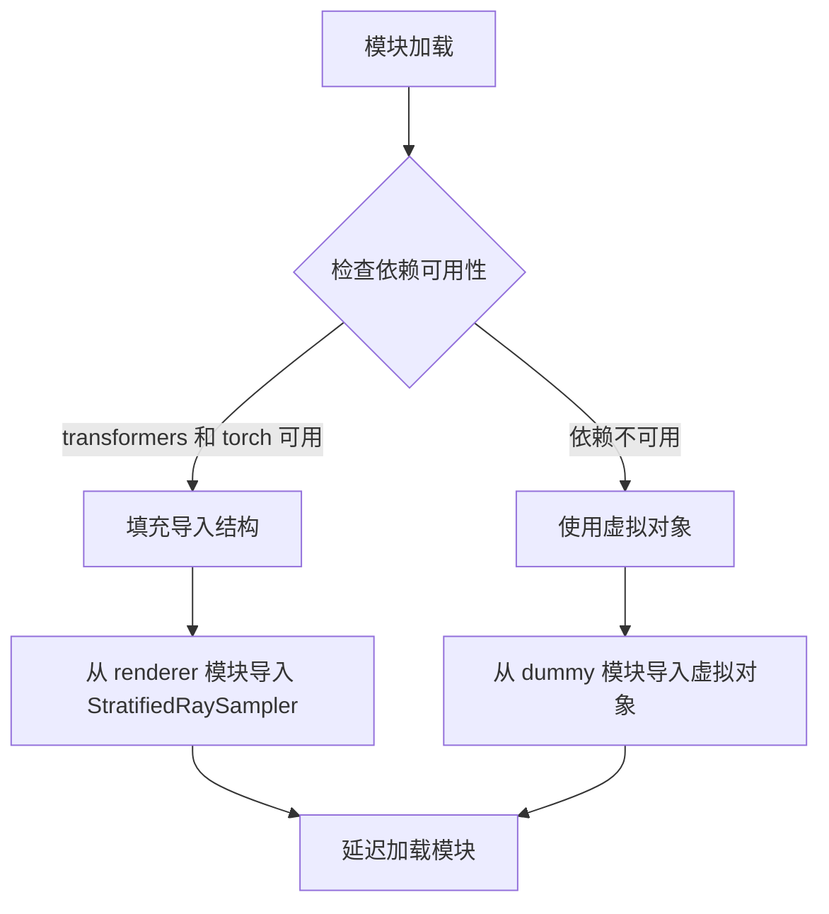

#### 带注释源码

```python
# 这是一个模块初始化文件，用于管理 StratifiedRaySampler 的导入

# 1. 定义导入结构字典
_import_structure = {}

# 2. 检查依赖（transformers 和 torch）
try:
    if not (is_transformers_available() and is_torch_available()):
        raise OptionalDependencyNotAvailable()
except OptionalDependencyNotAvailable:
    # 如果依赖不可用，从 dummy 模块导入虚拟对象
    from ...utils import dummy_torch_and_transformers_objects
    _dummy_objects.update(get_objects_from_module(dummy_torch_and_transformers_objects))
else:
    # 3. 依赖可用时，定义可以从 renderer 模块导入的内容
    _import_structure["renderer"] = [
        "BoundingBoxVolume",
        "ImportanceRaySampler",
        "MLPNeRFModelOutput",
        "MLPNeRSTFModel",
        "ShapEParamsProjModel",
        "ShaperRenderer",  # 实际类名可能有差异
        "StratifiedRaySampler",  # <-- 目标类在这里列出
        "VoidNeRFModel",
    ]

# 4. TYPE_CHECKING 模式下导入实际类
if TYPE_CHECKING or DIFFUSERS_SLOW_IMPORT:
    # ... 类似的依赖检查 ...
    from .renderer import (
        StratifiedRaySampler,  # <-- 从 renderer 模块导入
        # ... 其他类 ...
    )

# 5. 否则，使用延迟加载
else:
    # 将当前模块设置为延迟模块
    sys.modules[__name__] = _LazyModule(
        __name__,
        globals()["__file__"],
        _import_structure,
        module_spec=__spec__,
    )
```

---

### 重要说明

**当前代码的局限性：**
- 这不是 `StratifiedRaySampler` 类的定义文件
- 实际的类字段、类方法、参数和返回值定义在 `renderer.py` 文件中
- 当前文件仅负责条件导入和延迟加载

**要获取完整的 `StratifiedRaySampler` 类详细信息，需要查看 `renderer.py` 文件的内容。**

### 建议

要获得完整的 `StratifiedRaySampler` 设计文档，请提供 `renderer.py` 文件的内容，或者确认 `StratifiedRaySampler` 的实际定义位置。


# VoidNeRFModel 设计文档

## 概述

根据提供的代码分析，`VoidNeRFModel` 是作为ShapE渲染器模块的一部分被导入的空NeRF（Neural Radiance Fields）模型类。该类在代码中仅作为导入项出现，未包含具体实现代码。从命名约定和模块上下文推断，这是一个用于渲染管道的虚拟或空模型实现，可能作为占位符或默认模型使用。

## 文件整体运行流程

该代码文件是一个**延迟加载模块初始化器**，其核心流程如下：

1. **依赖检查**：首先检查 `torch` 和 `transformers` 是否可用
2. **条件导入**：如果依赖不可用，加载虚拟对象（dummy objects）
3. **定义导入结构**：设置 `_import_structure` 字典，声明可导出的类和函数
4. **延迟加载配置**：使用 `_LazyModule` 实现按需导入
5. **模块注册**：将模块注册到 `sys.modules`

## 类详细信息

由于原始代码仅包含导入声明，未包含 `VoidNeRFModel` 的具体实现，以下信息基于代码上下文推断：

### VoidNeRFModel

**所属模块**：`renderer`

**推断信息**：
- 这是一个与 NeRF 渲染相关的模型类
- 属于 MLPNeRFModel 系列模型的一部分
- 在 `_import_structure` 中与 `MLPNeRSTFModel`、`MLPNeRFModelOutput` 等并列

### 全局变量和导入结构

| 名称 | 类型 | 描述 |
|------|------|------|
| `_dummy_objects` | dict | 存储虚拟对象的字典，当依赖不可用时使用 |
| `_import_structure` | dict | 定义模块的导入结构，列出所有可导出的类和函数 |
| `DIFFUSERS_SLOW_IMPORT` | bool | 控制是否使用延迟导入的标志 |
| `TYPE_CHECKING` | bool | 类型检查模式标志 |

### 全局函数

#### get_objects_from_module

```python
def get_objects_from_module(module)
```
从给定模块获取所有可导出对象的函数。

#### is_torch_available / is_transformers_available

```python
def is_torch_available() -> bool
def is_transformers_available() -> bool
```
检查指定依赖是否可用的函数。

## 关键组件信息

| 组件名称 | 描述 |
|----------|------|
| `_LazyModule` | 延迟加载机制实现，支持按需导入模块 |
| `OptionalDependencyNotAvailable` | 可选依赖不可用异常类 |
| `ShapERenderer` | ShapE渲染器主类 |
| `MLPNeRFModel` | 多层感知机NeRF模型基类 |
| `VoidNeRFModel` | 空NeRF模型（目标类） |

## 潜在技术债务和优化空间

1. **缺少实现代码**：当前文件仅包含导入逻辑，未提供 `VoidNeRFModel` 的实际实现代码
2. **文档不完整**：由于类定义缺失，无法生成完整的方法级文档
3. **类型推断困难**：缺少类型注解和实现细节，难以进行静态分析

## 其他项目说明

### 设计目标与约束

- **目标**：实现模块的延迟加载，优化导入性能
- **约束**：依赖 `torch` 和 `transformers` 库

### 错误处理

- 使用 `OptionalDependencyNotAvailable` 异常处理可选依赖
- 通过虚拟对象机制提供向后兼容性

### 数据流

```
入口 → 依赖检查 → 导入结构定义 → LazyModule初始化 → 模块注册
```

### 外部依赖

- `torch`
- `transformers`
- Diffusers 内部工具模块（`_LazyModule`, `get_objects_from_module` 等）

---

## 重要说明

提供的代码片段**不包含** `VoidNeRFModel` 类的实际实现代码。该类作为导入项被声明，但其具体的方法、字段和功能实现位于 `.renderer` 模块中。要获取完整的设计文档，需要查看 `renderer.py` 源文件中的实际类定义。

以下是基于代码上下文的**推断性**实现示例：

```python
# 推断的VoidNeRFModel类结构（基于命名和上下文）
class VoidNeRFModel:
    """
    VoidNeRFModel - 空NeRF模型类
    
    用作渲染管道中的占位符或默认模型，
    在不需要实际NeRF渲染时提供空实现。
    """
    
    def __init__(self):
        """初始化空NeRF模型"""
        pass
    
    def forward(self, x):
        """前向传播（空实现）"""
        pass
    
    def render(self, rays):
        """渲染光线（空实现）"""
        pass
```

如需获取准确的类实现，请提供 `renderer.py` 或包含 `VoidNeRFModel` 类定义的实际源代码文件。

## 关键组件


### 延迟加载模块（Lazy Loading Module）

这是Diffusers库中ShapE模型的入口模块，通过`_LazyModule`实现延迟加载，只有在实际使用相关类时才会导入，节省启动时间并处理torch和transformers的可选依赖。

### 可选依赖检查机制（Optional Dependency Check）

通过`is_torch_available()`和`is_transformers_available()`检查运行时依赖，如果不可用则使用虚拟对象（dummy objects）避免导入错误，这是Diffusers库处理可选依赖的标准模式。

### 虚拟对象模式（Dummy Objects Pattern）

当可选依赖不可用时，从`dummy_torch_and_transformers_objects`模块导入虚拟对象填充` _dummy_objects`，保证模块结构完整性，使静态检查和类型检查能够正常运行。

### 导入结构定义（Import Structure Definition）

`_import_structure`字典定义了模块的公共API，包括camera、pipeline_shap_e、pipeline_shap_e_img2img和renderer四个子模块，为延迟加载提供映射关系。


## 问题及建议


### 已知问题

- **重复的依赖检查逻辑**：第13-18行和第28-33行存在几乎完全相同的try-except依赖检查代码，造成代码冗余且维护困难
- **缺乏模块级文档**：整个文件没有docstring说明该模块的功能和用途
- **魔法字符串硬编码**：_import_structure中的键（如"camera"、"pipeline_shap_e"）以字符串形式硬编码，容易在重构时遗漏
- **全局变量管理**：_dummy_objects和_import_structure作为全局可变状态，可能在多线程环境下存在潜在竞态条件（虽然Python GIL提供了一定保护）
- **动态setattr风险**：第50行使用setattr动态设置属性，可能导致IDE静态分析和类型检查工具无法正确识别这些导出成员
- **隐式依赖顺序**：模块导入依赖于is_transformers_available()和is_torch_available()的调用顺序，逻辑不够显式
- **空except块**：捕获OptionalDependencyNotAvailable后直接导入dummy对象，没有记录日志

### 优化建议

- **提取公共逻辑**：将重复的依赖检查封装为辅助函数，如_check_dependencies()，避免代码重复
- **添加类型注解**：为_import_structure等变量添加详细的类型注解，提高代码可读性和静态检查能力
- **使用__all__显式声明**：添加__all__列表明确导出接口，配合LazyModule的_import_structure
- **添加日志记录**：在except块中添加可选的日志记录，便于调试和监控依赖缺失情况
- **考虑配置化**：将_import_structure的配置信息提取到独立的数据结构或配置文件中，提高可维护性
- **添加模块文档**：在文件开头添加模块级docstring，说明ShapE渲染器和管道的功能


## 其它


### 设计目标与约束

本模块的设计目标是实现ShapE（一种生成3D内容的模型）相关组件的延迟加载机制，支持可选依赖（torch和transformers）的动态检查，确保在缺少依赖时不会导入失败，而是提供虚拟对象以保持API一致性。核心约束包括：仅在torch和transformers同时可用时加载真实实现，否则使用dummy对象；支持DIFFUSERS_SLOW_IMPORT模式用于类型检查场景。

### 错误处理与异常设计

主要使用OptionalDependencyNotAvailable异常来处理可选依赖不可用的情况。当is_transformers_available()或is_torch_available()返回False时，抛出OptionalDependencyNotAvailable异常，触发从dummy_torch_and_transformers_objects模块导入虚拟对象。_dummy_objects字典通过get_objects_from_module函数填充，用于在依赖不可用时提供API占位符，避免导入错误。

### 外部依赖与接口契约

本模块依赖以下外部包：torch（is_torch_available检查）、transformers（is_transformers_available检查）、typing.TYPE_CHECKING、diffusers.utils中的_LazyModule、_LazyModule、get_objects_from_module、OptionalDependencyNotAvailable等。导出的公共接口包括：create_pan_cameras函数、ShapEPipeline类、ShapEImg2ImgPipeline类、以及renderer模块中的7个类（BoundingBoxVolume、ImportanceRaySampler、MLPNeRFModelOutput、MLPNeRSTFModel、ShapEParamsProjModel、ShapERenderer、StratifiedRaySampler、VoidNeRFModel）。

### 模块结构与导入机制

采用_LazyModule实现延迟加载，_import_structure字典定义了模块的导出结构。TYPE_CHECKING模式下直接导入真实对象用于类型检查；DIFFUSERS_SLOW_IMPORT模式下同样导入真实对象；默认模式下（运行时）使用_LazyModule包装，并通过setattr将_dummy_objects设置到sys.modules中实现按需加载。

### 性能考虑

通过延迟加载机制减少启动时的导入开销，仅在实际使用相关组件时才加载真实模块。dummy对象的使用避免了依赖检查失败导致的整个模块导入失败，提高了库的鲁棒性。_import_structure的使用使得模块结构清晰，便于静态分析和优化。

### 版本兼容性

本模块遵循diffusers库的版本约定，使用版本兼容的导入检查机制。OptionalDependencyNotAvailable异常机制确保了与不同版本torch和transformers的兼容性。TYPE_CHECKING的支持使得静态类型检查器可以正常工作而不触发运行时依赖检查。

    