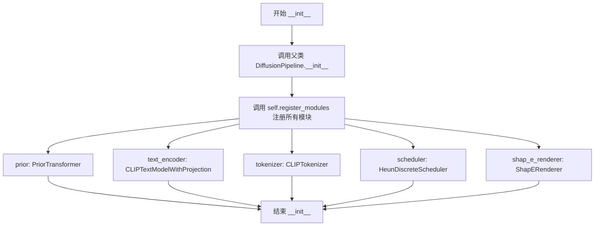
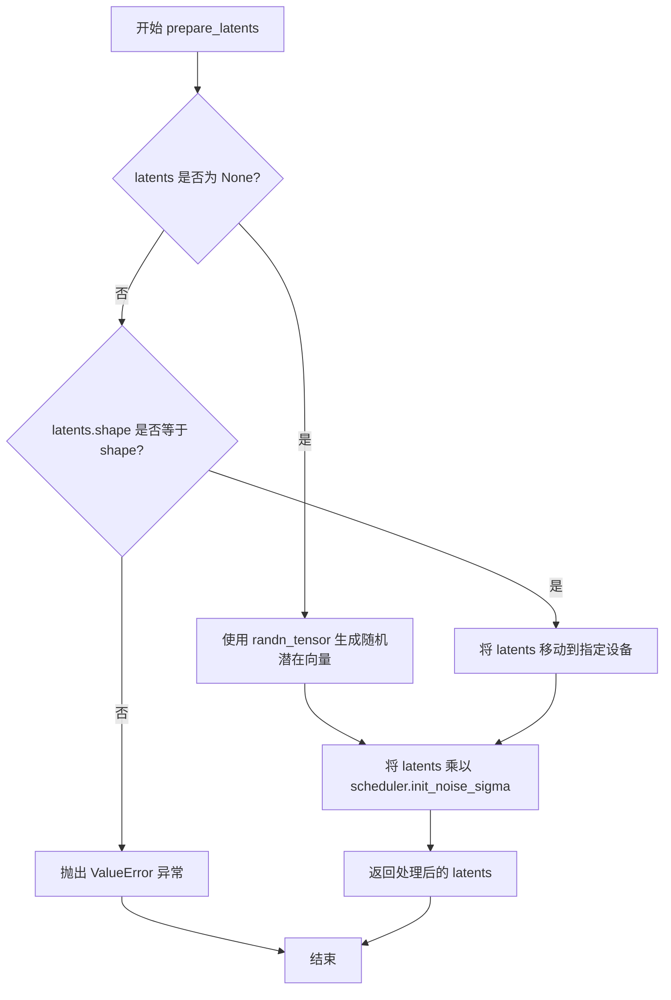

# `diffusers\src\diffusers\pipelines\shap_e\pipeline_shap_e.py` 详细设计文档

ShapEPipeline是一个用于根据文本提示生成3D资产的扩散管道。它结合了PriorTransformer将文本嵌入转换为图像嵌入，并使用ShapERenderer通过NeRF方法将潜在表示渲染为3D对象。该管道支持多种输出格式，包括PIL图像、NumPy数组、潜在向量和网格。

## 整体流程

```mermaid
graph TD
A[开始: 输入prompt] --> B[验证prompt类型]
B --> C[编码prompt: _encode_prompt]
C --> D[准备潜在向量: prepare_latents]
D --> E[设置调度器时间步]
E --> F{遍历每个时间步}
F --> G[扩展潜在向量用于CFG]
G --> H[缩放模型输入]
H --> I[Prior预测: prior()]
I --> J[分离噪声预测]
J --> K[应用分类器自由引导]
K --> L[调度器步进: scheduler.step]
L --> M{XLA可用?}
M -- 是 --> N[xm.mark_step]
M -- 否 --> O[检查输出类型]
N --> O
F -- 遍历完成 --> O
O --> P{output_type == 'latent'?}
P -- 是 --> Q[返回潜在向量]
P -- 否 --> R{output_type == 'mesh'?}
R -- 是 --> S[解码到网格: decode_to_mesh]
R -- 否 --> T[解码到图像: decode_to_image]
S --> U[转换为输出格式]
T --> U
U --> V[返回ShapEPipelineOutput]
```

## 类结构

```
DiffusionPipeline (基类)
└── ShapEPipeline
    └── ShapEPipelineOutput (数据类)
```

## 全局变量及字段


### `XLA_AVAILABLE`
    
Flag indicating whether PyTorch XLA is available for accelerated linear algebra

类型：`bool`
    


### `logger`
    
Logger instance for the shap-e pipeline module

类型：`logging.Logger`
    


### `EXAMPLE_DOC_STRING`
    
Example documentation string demonstrating pipeline usage with shark 3D generation

类型：`str`
    


### `ShapEPipelineOutput.images`
    
A list of images for 3D rendering, either as PIL Images or NumPy arrays

类型：`list[list[PIL.Image.Image]] | list[list[np.ndarray]]`
    


### `ShapEPipeline.prior`
    
The canonical unCLIP prior to approximate the image embedding from the text embedding

类型：`PriorTransformer`
    


### `ShapEPipeline.text_encoder`
    
Frozen text-encoder for converting text prompts to embeddings

类型：`CLIPTextModelWithProjection`
    


### `ShapEPipeline.tokenizer`
    
CLIP tokenizer to tokenize text prompts into token IDs

类型：`CLIPTokenizer`
    


### `ShapEPipeline.scheduler`
    
Scheduler used in combination with the prior model to generate image embeddings

类型：`HeunDiscreteScheduler`
    


### `ShapEPipeline.shap_e_renderer`
    
Shap-E renderer that projects generated latents into MLP parameters for NeRF 3D object creation

类型：`ShapERenderer`
    


### `ShapEPipeline.model_cpu_offload_seq`
    
String defining the sequence of models for CPU offload: text_encoder->prior

类型：`str`
    


### `ShapEPipeline._exclude_from_cpu_offload`
    
List of attribute names to exclude from CPU offload, containing shap_e_renderer

类型：`list`
    
    

## 全局函数及方法


### `ShapEPipeline.__init__`

这是 ShapEPipeline 类的初始化方法，负责接收并注册所有必要的组件（先验模型、文本编码器、分词器、调度器和渲染器），以构建一个完整的 Shap-E 3D 生成管道。

参数：

- `self`：隐式参数，ShapEPipeline 实例本身
- `prior`：`PriorTransformer`，用于从文本嵌入近似图像嵌入的 unCLIP 先验模型
- `text_encoder`：`CLIPTextModelWithProjection`，冻结的文本编码器，用于将文本转换为嵌入向量
- `tokenizer`：`CLIPTokenizer`，用于对文本进行分词处理
- `scheduler`：`HeunDiscreteScheduler`，与先验模型配合使用以生成图像嵌入的调度器
- `shap_e_renderer`：`ShapERenderer`，Shap-E 渲染器，将生成的潜在变量投射到 MLP 参数中，使用 NeRF 渲染方法创建 3D 对象

返回值：`None`，无返回值（构造函数）

#### 流程图



#### 带注释源码

```python
def __init__(
    self,
    prior: PriorTransformer,
    text_encoder: CLIPTextModelWithProjection,
    tokenizer: CLIPTokenizer,
    scheduler: HeunDiscreteScheduler,
    shap_e_renderer: ShapERenderer,
):
    """
    初始化 ShapEPipeline 实例，注册所有必需的组件模块。
    
    参数:
        prior: PriorTransformer 模型，用于生成图像嵌入
        text_encoder: CLIP 文本编码器，用于编码提示词
        tokenizer: CLIP 分词器，用于处理文本输入
        scheduler: Heun 离散调度器，用于控制去噪过程
        shap_e_renderer: Shap-E 渲染器，用于将潜在变量渲染为 3D 对象
    """
    # 调用父类 DiffusionPipeline 的初始化方法
    # 父类会初始化一些通用属性如 device, dtype 等
    super().__init__()

    # 使用 register_modules 方法注册所有模块
    # 这些模块将被打包并可以通过 pipeline.xxx 访问
    self.register_modules(
        prior=prior,
        text_encoder=text_encoder,
        tokenizer=tokenizer,
        scheduler=scheduler,
        shap_e_renderer=shap_e_renderer,
    )
```


### `ShapEPipeline.prepare_latents`

该方法用于准备扩散模型的潜在向量（latents），如果未提供则随机生成，否则使用提供的latents并确保形状匹配，最后根据调度器的初始噪声sigma进行缩放。

参数：

- `shape`：`tuple` 或 `int`，潜在向量的目标形状，用于生成随机潜在向量或验证提供的潜在向量形状
- `dtype`：`torch.dtype`，潜在向量的数据类型
- `device`：`torch.device`，潜在向量所在的设备（CPU或CUDA）
- `generator`：`torch.Generator` 或 `list[torch.Generator]` 或 `None`，用于生成随机数的随机数生成器，以确保可重现性
- `latents`：`torch.Tensor` 或 `None`，可选的预生成潜在向量，如果为None则随机生成
- `scheduler`：`HeunDiscreteScheduler`，调度器实例，用于获取初始噪声sigma值

返回值：`torch.Tensor`，处理后的潜在向量

#### 流程图



#### 带注释源码

```python
def prepare_latents(self, shape, dtype, device, generator, latents, scheduler):
    """
    准备扩散模型的潜在向量。
    
    如果没有提供latents，则使用randn_tensor生成随机潜在向量；
    如果提供了latents，则验证其形状是否匹配，并将其移动到指定设备。
    最后根据调度器的初始噪声sigma对latents进行缩放。
    
    参数:
        shape: 潜在向量的目标形状
        dtype: 潜在向量的数据类型
        device: 潜在向量所在的设备
        generator: 可选的随机数生成器
        latents: 可选的预生成潜在向量
        scheduler: 调度器实例，用于获取init_noise_sigma
    
    返回:
        处理后的潜在向量张量
    """
    # 检查是否需要生成新的潜在向量
    if latents is None:
        # 使用randn_tensor生成随机潜在向量
        # 参数: shape-形状, generator-随机数生成器, device-设备, dtype-数据类型
        latents = randn_tensor(shape, generator=generator, device=device, dtype=dtype)
    else:
        # 如果提供了latents，验证形状是否匹配
        if latents.shape != shape:
            raise ValueError(f"Unexpected latents shape, got {latents.shape}, expected {shape}")
        # 将latents移动到指定设备
        latents = latents.to(device)

    # 根据调度器的初始噪声sigma缩放latents
    # 这是扩散模型处理中的标准步骤，用于控制初始噪声水平
    latents = latents * scheduler.init_noise_sigma
    
    # 返回处理后的latents
    return latents
```


### `ShapEPipeline._encode_prompt`

该方法负责将文本提示（prompt）编码为文本嵌入向量（text embeddings），用于后续的3D资产生成。它使用CLIP文本编码器将文本转换为高维向量表示，并支持分类器自由引导（classifier-free guidance）。

参数：

- `prompt`：`str` 或 `list[str]`，要编码的文本提示，可以是单个字符串或字符串列表
- `device`：`torch.device`，执行计算的设备（CPU或GPU）
- `num_images_per_prompt`：`int`，每个提示生成的图像数量，用于扩展嵌入维度
- `do_classifier_free_guidance`：`bool`，是否启用分类器自由引导，为True时会在嵌入前拼接零向量

返回值：`torch.Tensor`，编码后的文本嵌入向量，形状为 `(batch_size * num_images_per_prompt, embedding_dim)`，如果启用CFG则为 `(2 * batch_size * num_images_per_prompt, embedding_dim)`

#### 流程图

```mermaid
flowchart TD
    A[开始 _encode_prompt] --> B[设置 pad_token_id = 0]
    B --> C[使用 tokenizer 编码 prompt]
    C --> D[获取 text_input_ids]
    D --> E[获取 untruncated_ids 用于截断检查]
    E --> F{检查是否截断?}
    F -->|是| G[记录截断警告]
    F -->|否| H[跳过警告]
    G --> I
    H --> I[调用 text_encoder 获取文本嵌入]
    I --> J[重复嵌入 num_images_per_prompt 次]
    J --> K[归一化嵌入向量]
    K --> L{do_classifier_free_guidance?}
    L -->|是| M[创建零向量 negative_prompt_embeds]
    L -->|否| N[跳过创建负向嵌入]
    M --> O[拼接 negative_prompt_embeds 和 prompt_embeds]
    N --> P
    O --> P[计算缩放因子 sqrt(seq_len)]
    P --> Q[缩放嵌入向量]
    Q --> R[返回 prompt_embeds]
```

#### 带注释源码

```python
def _encode_prompt(
    self,
    prompt,
    device,
    num_images_per_prompt,
    do_classifier_free_guidance,
):
    # 计算提示数量（如果是列表则取长度，否则为1）
    # 注意：这段代码的结果未被使用，可能是未完成的代码或bug
    len(prompt) if isinstance(prompt, list) else 1

    # 设置 pad_token_id 为 0
    # 注释：YiYi Notes: set pad_token_id to be 0, not sure why I can't set in the config file
    self.tokenizer.pad_token_id = 0
    
    # 使用 tokenizer 将 prompt 转换为 token IDs
    # 参数：
    #   padding="max_length": 填充到最大长度
    #   max_length: tokenizer 的最大长度限制
    #   truncation: 超过最大长度时截断
    #   return_tensors="pt": 返回 PyTorch 张量
    text_inputs = self.tokenizer(
        prompt,
        padding="max_length",
        max_length=self.tokenizer.model_max_length,
        truncation=True,
        return_tensors="pt",
    )
    # 获取编码后的 token IDs
    text_input_ids = text_inputs.input_ids
    
    # 获取未截断的 token IDs 用于检查是否发生截断
    untruncated_ids = self.tokenizer(prompt, padding="longest", return_tensors="pt").input_ids

    # 检查输入是否被截断
    # 条件：未截断的序列长度 >= 原始序列长度 且 两者不相等
    if untruncated_ids.shape[-1] >= text_input_ids.shape[-1] and not torch.equal(text_input_ids, untruncated_ids):
        # 解码被截断的部分用于日志记录
        removed_text = self.tokenizer.batch_decode(untruncated_ids[:, self.tokenizer.model_max_length - 1 : -1])
        logger.warning(
            "The following part of your input was truncated because CLIP can only handle sequences up to"
            f" {self.tokenizer.model_max_length} tokens: {removed_text}"
        )

    # 将 token IDs 传入文本编码器获取文本嵌入
    # 输出包含 text_embeds 属性
    text_encoder_output = self.text_encoder(text_input_ids.to(device))
    prompt_embeds = text_encoder_output.text_embeds

    # 根据 num_images_per_prompt 重复嵌入维度
    # 这使得每个提示可以生成多个图像
    prompt_embeds = prompt_embeds.repeat_interleave(num_images_per_prompt, dim=0)
    
    # 归一化嵌入向量
    # 注释：In Shap-E it normalize the prompt_embeds and then later rescale it
    prompt_embeds = prompt_embeds / torch.linalg.norm(prompt_embeds, dim=-1, keepdim=True)

    # 如果启用分类器自由引导
    if do_classifier_free_guidance:
        # 创建与 prompt_embeds 形状相同的零向量作为负向提示嵌入
        negative_prompt_embeds = torch.zeros_like(prompt_embeds)

        # 为了避免两次前向传播，将无条件嵌入和文本嵌入拼接成一个批次
        # 这里使用拼接而不是交替
        prompt_embeds = torch.cat([negative_prompt_embeds, prompt_embeds])

    # 对特征进行缩放，使其具有单位方差
    # 缩放因子为序列长度的平方根
    prompt_embeds = math.sqrt(prompt_embeds.shape[1]) * prompt_embeds

    return prompt_embeds
```


### `ShapEPipeline.__call__`

该方法是ShapEPipeline的核心调用函数，用于根据文本提示生成3D资产。流程包括：编码文本提示→设置去噪调度器→初始化潜在向量→执行去噪循环（包含分类器自由引导）→根据输出类型解码潜在向量为图像或网格→返回结果。

参数：

- `prompt`：`str`，指导图像生成的提示词或提示词列表
- `num_images_per_prompt`：`int`，可选，默认值为1，每个提示词生成的图像数量
- `num_inference_steps`：`int`，可选，默认值为25，去噪步骤数，更多步骤通常能获得更高质量的图像
- `generator`：`torch.Generator | list[torch.Generator] | None`，可选，用于使生成具有确定性
- `latents`：`torch.Tensor | None`，可选，预生成的噪声潜在向量，可用于通过不同提示词调整相同生成
- `guidance_scale`：`float`，可选，默认值为4.0，分类器自由引导比例
- `frame_size`：`int`，可选，默认值为64，生成的3D输出的每个图像帧的宽度和高度
- `output_type`：`str | None`，可选，默认值为"pil"，输出格式：pil(PIL.Image.Image)、np(np.array)、latent(torch.Tensor)或mesh(MeshDecoderOutput)
- `return_dict`：`bool`，可选，默认值为True，是否返回ShapEPipelineOutput而不是元组

返回值：`ShapEPipelineOutput`或`tuple`，如果return_dict为True，返回ShapEPipelineOutput，否则返回元组，第一个元素是生成的图像列表

#### 流程图

```mermaid
flowchart TD
    A[开始 __call__] --> B{验证 prompt 类型}
    B -->|str| C[batch_size = 1]
    B -->|list| D[batch_size = len(prompt)]
    B -->|其他| E[抛出 ValueError]
    C --> F[获取执行设备 device]
    D --> F
    F --> G[batch_size *= num_images_per_prompt]
    G --> H[计算 do_classifier_free_guidance]
    H --> I[_encode_prompt 编码提示词]
    I --> J[scheduler.set_timesteps 设置时间步]
    J --> K[准备潜在向量 prepare_latents]
    K --> L[reshape latents]
    L --> M[开始去噪循环]
    M --> N{遍历 timesteps}
    N -->|未结束| O[扩展 latent_model_input]
    O --> P[scheduler.scale_model_input 缩放输入]
    Q --> R[prior 预测噪声]
    P --> Q
    R --> S[分离噪声预测]
    S --> T{do_classifier_free_guidance?}
    T -->|Yes| U[分割噪声预测并应用引导]
    T -->|No| V[跳过引导]
    U --> W[scheduler.step 计算下一步]
    V --> W
    W --> X[XLA mark_step]
    X --> N
    N -->|结束| Y[maybe_free_model_hooks 释放模型]
    Y --> Z{output_type 检查}
    Z -->|"latent"| AA[直接返回 latents]
    Z -->|"mesh"| BB[decode_to_mesh 解码为网格]
    Z -->|"np"/"pil"| CC[decode_to_image 解码为图像]
    BB --> DD[收集所有图像]
    CC --> EE[堆叠为 tensor]
    EE --> FF[转换为 numpy]
    FF --> GG{output_type == "pil"?}
    GG -->|Yes| HH[转换为 PIL Image]
    GG -->|No| II[跳过转换]
    HH --> JJ[收集所有图像]
    II --> JJ
    DD --> KK{return_dict?}
    AA --> KK
    JJ --> KK
    KK -->|Yes| LL[返回 ShapEPipelineOutput]
    KK -->|No| MM[返回 tuple]
    LL --> NN[结束]
    MM --> NN
```

#### 带注释源码

```python
@torch.no_grad()
@replace_example_docstring(EXAMPLE_DOC_STRING)
def __call__(
    self,
    prompt: str,
    num_images_per_prompt: int = 1,
    num_inference_steps: int = 25,
    generator: torch.Generator | list[torch.Generator] | None = None,
    latents: torch.Tensor | None = None,
    guidance_scale: float = 4.0,
    frame_size: int = 64,
    output_type: str | None = "pil",  # pil, np, latent, mesh
    return_dict: bool = True,
):
    """
    The call function to the pipeline for generation.

    Args:
        prompt (`str` or `list[str]`):
            The prompt or prompts to guide the image generation.
        num_images_per_prompt (`int`, *optional*, defaults to 1):
            The number of images to generate per prompt.
        num_inference_steps (`int`, *optional*, defaults to 25):
            The number of denoising steps. More denoising steps usually lead to a higher quality image at the
            expense of slower inference.
        generator (`torch.Generator` or `list[torch.Generator]`, *optional*):
            A [`torch.Generator`](https://pytorch.org/docs/stable/generated/torch.Generator.html) to make
            generation deterministic.
        latents (`torch.Tensor`, *optional*):
            Pre-generated noisy latents sampled from a Gaussian distribution, to be used as inputs for image
            generation. Can be used to tweak the same generation with different prompts. If not provided, a latents
            tensor is generated by sampling using the supplied random `generator`.
        guidance_scale (`float`, *optional*, defaults to 4.0):
            A higher guidance scale value encourages the model to generate images closely linked to the text
            `prompt` at the expense of lower image quality. Guidance scale is enabled when `guidance_scale > 1`.
        frame_size (`int`, *optional*, default to 64):
            The width and height of each image frame of the generated 3D output.
        output_type (`str`, *optional*, defaults to `"pil"`):
            The output format of the generated image. Choose between `"pil"` (`PIL.Image.Image`), `"np"`
            (`np.array`), `"latent"` (`torch.Tensor`), or mesh ([`MeshDecoderOutput`]).
        return_dict (`bool`, *optional*, defaults to `True`):
            Whether or not to return a [`~pipelines.shap_e.pipeline_shap_e.ShapEPipelineOutput`] instead of a plain
            tuple.

    Examples:

    Returns:
        [`~pipelines.shap_e.pipeline_shap_e.ShapEPipelineOutput`] or `tuple`:
            If `return_dict` is `True`, [`~pipelines.shap_e.pipeline_shap_e.ShapEPipelineOutput`] is returned,
            otherwise a `tuple` is returned where the first element is a list with the generated images.
    """

    # 步骤1: 验证并处理 prompt 参数，确定批处理大小
    if isinstance(prompt, str):
        batch_size = 1
    elif isinstance(prompt, list):
        batch_size = len(prompt)
    else:
        raise ValueError(f"`prompt` has to be of type `str` or `list` but is {type(prompt)}")

    # 获取执行设备 (CPU/CUDA)
    device = self._execution_device

    # 步骤2: 根据每个提示词生成的图像数量调整批处理大小
    batch_size = batch_size * num_images_per_prompt

    # 步骤3: 判断是否使用分类器自由引导 (guidance_scale > 1.0)
    do_classifier_free_guidance = guidance_scale > 1.0
    
    # 步骤4: 编码文本提示词为嵌入向量
    prompt_embeds = self._encode_prompt(prompt, device, num_images_per_prompt, do_classifier_free_guidance)

    # prior (准备阶段)

    # 步骤5: 设置去噪调度器的时间步
    self.scheduler.set_timesteps(num_inference_steps, device=device)
    timesteps = self.scheduler.timesteps

    # 获取先验模型的配置参数
    num_embeddings = self.prior.config.num_embeddings
    embedding_dim = self.prior.config.embedding_dim

    # 步骤6: 准备初始潜在向量
    latents = self.prepare_latents(
        (batch_size, num_embeddings * embedding_dim),
        prompt_embeds.dtype,
        device,
        generator,
        latents,
        self.scheduler,
    )

    # 步骤7: 重塑潜在向量为 (batch_size, num_embeddings, embedding_dim)
    # 注释: YiYi notes: for testing only to match ldm, we can directly create a latents with desired shape
    latents = latents.reshape(latents.shape[0], num_embeddings, embedding_dim)

    # 步骤8: 去噪循环 - 遍历所有时间步
    for i, t in enumerate(self.progress_bar(timesteps)):
        # 扩展潜在向量以进行分类器自由引导
        latent_model_input = torch.cat([latents] * 2) if do_classifier_free_guidance else latents
        
        # 调度器缩放模型输入
        scaled_model_input = self.scheduler.scale_model_input(latent_model_input, t)

        # 先验模型预测噪声
        noise_pred = self.prior(
            scaled_model_input,
            timestep=t,
            proj_embedding=prompt_embeds,
        ).predicted_image_embedding

        # 移除方差部分，只保留预测的图像嵌入
        # 分割为 (batch_size, num_embeddings, embedding_dim)
        noise_pred, _ = noise_pred.split(
            scaled_model_input.shape[2], dim=2
        )

        # 如果使用分类器自由引导，应用引导比例
        if do_classifier_free_guidance:
            noise_pred_uncond, noise_pred = noise_pred.chunk(2)
            noise_pred = noise_pred_uncond + guidance_scale * (noise_pred - noise_pred_uncond)

        # 调度器计算下一步的潜在向量
        latents = self.scheduler.step(
            noise_pred,
            timestep=t,
            sample=latents,
        ).prev_sample

        # 如果使用 XLA，进行标记步骤
        if XLA_AVAILABLE:
            xm.mark_step()

    # 步骤9: 释放所有模型的钩子 (CPU offload)
    self.maybe_free_model_hooks()

    # 步骤10: 验证输出类型
    if output_type not in ["np", "pil", "latent", "mesh"]:
        raise ValueError(
            f"Only the output types `pil`, `np`, `latent` and `mesh` are supported not output_type={output_type}"
        )

    # 步骤11: 根据输出类型处理结果
    if output_type == "latent":
        # 直接返回潜在向量
        return ShapEPipelineOutput(images=latents)

    images = []
    if output_type == "mesh":
        # 解码为 3D 网格
        for i, latent in enumerate(latents):
            mesh = self.shap_e_renderer.decode_to_mesh(
                latent[None, :],
                device,
            )
            images.append(mesh)

    else:
        # 解码为 2D 图像 (np 或 pil 格式)
        for i, latent in enumerate(latents):
            image = self.shap_e_renderer.decode_to_image(
                latent[None, :],
                device,
                size=frame_size,
            )
            images.append(image)

        # 转换为 tensor 并移到 CPU
        images = torch.stack(images)
        images = images.cpu().numpy()

        # 如果需要 PIL 格式，转换 numpy 数组为 PIL Image
        if output_type == "pil":
            images = [self.numpy_to_pil(image) for image in images]

    # 步骤12: 返回结果
    if not return_dict:
        return (images,)

    return ShapEPipelineOutput(images=images)
```

## 关键组件


### ShapEPipeline

主 pipeline 类，负责协调整个 3D 资产生成流程，整合 prior 模型、文本编码器、调度器和渲染器来完成文本到 3D 对象的生成。

### ShapEPipelineOutput

输出数据类，包含生成的图像列表，支持 PIL Image 或 NumPy 数组格式，用于返回 pipeline 的最终结果。

### PriorTransformer

unCLIP prior 模型，用于根据文本嵌入近似生成图像嵌入，是将文本提示转换为潜在表示的核心组件。

### ShapERenderer

Shap-E 渲染器，将生成的潜在表示解码为 3D 对象，支持 NeRF 渲染方法，可输出图像或网格格式。

### CLIPTextModelWithProjection

冻结的 CLIP 文本编码器，带投影层，用于将文本标记转换为文本嵌入向量，提供文本语义表示。

### CLIPTokenizer

CLIP 分词器，用于将文本提示转换为模型可处理的标记序列，处理文本输入的 tokenization。

### HeunDiscreteScheduler

Heun 离散调度器，用于 prior 模型的降噪过程，提供时间步进和噪声预测更新策略。

### _encode_prompt

文本提示编码方法，将输入文本转换为文本嵌入向量，包含 classifier-free guidance 支持和嵌入归一化处理。

### prepare_latents

潜在张量准备方法，根据指定形状、数据类型和设备生成或验证潜在张量，并应用初始噪声sigma。

### __call__

Pipeline 的主调用方法，执行完整的文本到 3D 生成流程，包括文本编码、潜在向量采样、prior 去噪和渲染输出。

### 关键组件信息

#### 张量索引与重塑

在 prepare_latents 阶段将 1D 潜在向量重塑为 3D 张量 (batch_size, num_embeddings, embedding_dim)，用于后续的 prior 处理。

#### Classifier-Free Guidance

支持无分类器自由引导，通过在负向和正向提示嵌入之间进行插值来提高生成质量，guidance_scale 控制引导强度。

#### 多输出格式支持

支持多种输出类型：pil (PIL图像)、np (NumPy数组)、latent (潜在张量)、mesh (3D网格)，通过 output_type 参数指定。

#### XLA 设备支持

集成 torch_xla 支持，允许在 TPU 设备上执行，通过 xm.mark_step() 同步计算图。

#### CPU 卸载机制

通过 model_cpu_offload_seq 定义模型卸载顺序，优化显存使用，包含 shap_e_renderer 的特殊处理。


## 问题及建议


### 已知问题

- **未使用的变量**：第98行 `len(prompt) if isinstance(prompt, list) else 1` 的计算结果未被使用，这是一个代码错误。
- **硬编码的pad_token_id**：第100行将 `pad_token_id` 硬编码为0，注释表明这是临时解决方案("YiYi Notes")，缺乏优雅性。
- **prepare_latents方法复制**：该方法从UnCLIPPipeline复制但未完全适配Shap-E的特殊需求（需要在外部进行reshape操作），导致职责不清晰。
- **重复的渲染循环**：第231-250行对mesh和np/pil输出类型分别使用了两个独立的for循环，代码重复且可读性差。
- **参数传递不一致**：`frame_size`参数仅对np/pil输出有效，但对所有输出类型都进行了传递，缺乏类型检查和提示。
- **缺少torch.cuda.amp支持**：未实现自动混合精度(AMP)支持，在现代GPU上运行时性能可能不是最优的。
- **XLA优化不足**：仅在循环结束后调用`xm.mark_step()`，未在每步之间进行更精细的同步控制。
- **变量命名不规范**：循环中使用单字母变量名`i`但实际未使用索引值。

### 优化建议

- 修复第98行的未使用变量问题，删除或正确使用该计算结果。
- 将硬编码的pad_token_id移至配置或使用更优雅的初始化方式。
- 将latents的reshape逻辑封装到`prepare_latents`方法内部，保持`__call__`方法简洁。
- 合并mesh和image的渲染循环，使用统一的迭代逻辑并通过output_type判断渲染方式。
- 为`frame_size`参数添加条件检查，仅在output_type为np/pil时传递。
- 添加`torch.cuda.amp.autocast`支持以提升推理性能。
- 优化XLA同步策略，考虑在每N步进行mark_step以平衡性能和内存。
- 使用更具描述性的变量名替代单字母循环变量。

## 其它


### 设计目标与约束

该管道旨在通过文本提示生成3D资产，首先使用PriorTransformer生成潜在表示，然后使用ShapERenderer通过NeRF方法渲染为2D图像或3D网格。设计约束包括：支持CPU和GPU执行，支持XLA加速以提升性能，支持多种输出格式（pil、np、latent、mesh），通过classifier-free guidance提升生成质量，遵循DiffusionPipeline的标准接口规范。

### 错误处理与异常设计

管道在以下场景进行错误处理：输入prompt类型检查（仅支持str或list类型），latents形状不匹配时抛出ValueError，output_type不支持时抛出ValueError并列出支持的类型，CLIP tokenizer截断文本时记录warning日志。异常传播遵循Python标准异常机制，上游模块（如PriorTransformer、ShapERenderer）的异常会被直接抛出。

### 数据流与状态机

管道主状态流转：初始化 -> 编码prompt -> 设置调度器时间步 -> 准备latents -> 迭代去噪（对每个timestep执行：scale latent model input -> prior预测 -> scheduler步进） -> 选择性渲染（latent/pil/np/mesh） -> 输出结果。状态转换由num_inference_steps控制，每个去噪步骤依次执行，无分支状态。

### 外部依赖与接口契约

核心依赖包括：transformers库（CLIPTextModelWithProjection、CLIPTokenizer），diffusers内部模块（PriorTransformer、HeunDiscreteScheduler、DiffusionPipeline、BaseOutput、randn_tensor），渲染器（ShapERenderer），图像处理（PIL、numpy），计算加速（torch、torch_xla）。接口契约：from_pretrained方法加载预训练模型，__call__方法接收prompt和生成参数返回ShapEPipelineOutput或tuple。

### 性能优化建议

当前代码已实现模型CPU offload序列（text_encoder->prior），但shap_e_renderer被排除在offload外，可考虑优化。latents reshape操作可内联以减少内存拷贝。XLA加速通过xm.mark_step()实现，但仅在去噪循环外显式标记，可考虑更细粒度的异步执行。批量生成时prompt_embeds重复操作可缓存。

### 安全性考虑

代码遵循Apache 2.0许可证。prompt输入经过tokenizer处理，支持最长模型最大长度截断。classifier-free guidance使用零张量作为negative prompt，无恶意输入风险。未发现涉及用户敏感数据处理或网络通信的安全问题。

### 配置参数说明

关键配置参数：prior（PriorTransformer实例），text_encoder（CLIPTextModelWithProjection），tokenizer（CLIPTokenizer），scheduler（HeunDiscreteScheduler），shap_e_renderer（ShapERenderer），model_cpu_offload_seq定义模型卸载顺序。生成参数：prompt引导文本，num_images_per_prompt每提示生成数量，num_inference_steps去噪步数，guidance_scale引导强度，frame_size输出帧尺寸，output_type输出格式，return_dict是否返回对象格式。

### 版本兼容性

代码依赖Python类型注解（3.9+），依赖torch>=1.9，transformers>=4.21，diffusers库内部模块。CLIP模型加载使用from_pretrained接口，需配套模型文件。HeunDiscreteScheduler为离散调度器，需与PriorTransformer配合使用。

### 资源管理

GPU内存管理：支持torch.cuda.is_available()检测，使用model_cpu_offload_seq实现模型按序卸载，maybe_free_model_hooks()在推理结束后释放模型钩子。XLA资源：使用xm.mark_step()同步TPU计算。内存泄漏防护：latents在每轮迭代中就地更新，images列表在循环中累积后统一处理。

### 并发与异步处理

当前实现为同步执行，无显式并发。XLA模式下使用xm.mark_step()进行异步标记，但主流程仍为阻塞。潜在优化点：多prompt并行编码、渲染阶段并行化（对latents循环可考虑torch.vmap或并行map）。Generator支持传入列表实现多随机源，但实际执行仍为顺序。

    