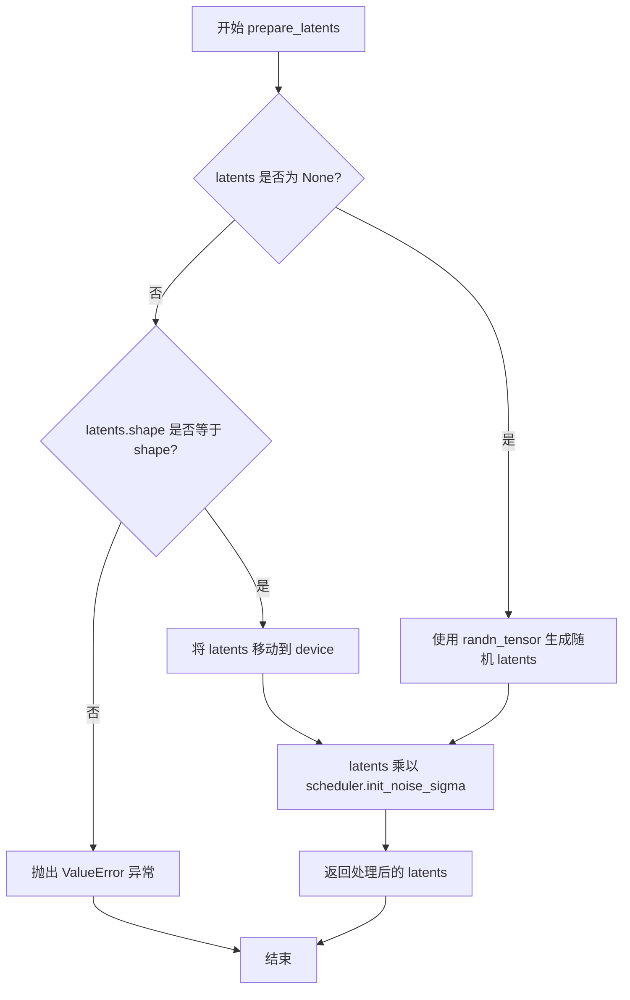

# `diffusers\src\diffusers\pipelines\shap_e\pipeline_shap_e_img2img.py` 详细设计文档

ShapEImg2ImgPipeline 是一个用于将2D图像转换为3D资产的扩散管道。它使用CLIP模型编码输入图像，通过PriorTransformer生成图像嵌入的潜在表示，并利用ShapERenderer通过NeRF（神经辐射场）方法将其渲染为3D网格或2D图像序列。

## 整体流程

```mermaid
graph TD
    Start([输入: PIL.Image / List[Image]]) --> BatchCheck{检查 batch_size}
    BatchCheck --> Encode[调用 _encode_image 编码图像]
    Encode --> Setup[设置调度器 (HeunDiscreteScheduler) 并准备潜在向量]
    Setup --> DenoiseLoop{迭代 denoising steps}
    DenoiseLoop --> PriorPred[调用 PriorTransformer 预测噪声]
    PriorPred --> Guidance[应用 Classifier-Free Guidance]
    Guidance --> Step[调度器.step() 更新潜在向量]
    Step --> DenoiseLoop
    DenoiseLoop -- 完成 --> OutputCheck{检查 output_type}
    OutputCheck -- latent --> ReturnLatent[返回潜在向量]
    OutputCheck -- mesh --> RenderMesh[调用 shap_e_renderer.decode_to_mesh]
    OutputCheck -- pil/np --> RenderImage[调用 shap_e_renderer.decode_to_image]
    RenderMesh --> End([返回 ShapEPipelineOutput])
    RenderImage --> End
```

## 类结构

```
DiffusionPipeline (基类)
└── ShapEImg2ImgPipeline
    └── ShapEPipelineOutput (数据类)
```

## 全局变量及字段


### `logger`
    
用于记录模块日志的日志记录器对象

类型：`logging.Logger`
    


### `EXAMPLE_DOC_STRING`
    
包含ShapEImg2ImgPipeline使用示例的文档字符串

类型：`str`
    


### `XLA_AVAILABLE`
    
标识当前环境是否支持Torch XLA加速

类型：`bool`
    


### `ShapEPipelineOutput.images`
    
生成的3D渲染图像列表，支持PIL图像或numpy数组格式

类型：`PIL.Image.Image | np.ndarray`
    


### `ShapEImg2ImgPipeline.prior`
    
unCLIP先验变换器，用于从图像嵌入近似生成文本嵌入

类型：`PriorTransformer`
    


### `ShapEImg2ImgPipeline.image_encoder`
    
冻结的CLIP视觉模型，用于编码输入图像

类型：`CLIPVisionModel`
    


### `ShapEImg2ImgPipeline.image_processor`
    
CLIP图像处理器，用于预处理输入图像

类型：`CLIPImageProcessor`
    


### `ShapEImg2ImgPipeline.scheduler`
    
Heun离散调度器，用于控制先验模型的去噪过程

类型：`HeunDiscreteScheduler`
    


### `ShapEImg2ImgPipeline.shap_e_renderer`
    
Shap-E渲染器，将潜在向量解码为3D网格或NeRF图像

类型：`ShapERenderer`
    


### `ShapEImg2ImgPipeline.model_cpu_offload_seq`
    
定义模型CPU卸载顺序的字符串

类型：`str`
    


### `ShapEImg2ImgPipeline._exclude_from_cpu_offload`
    
指定不从CPU卸载的模型组件列表

类型：`list`
    
    

## 全局函数及方法


### `ShapEImg2ImgPipeline.__init__`

这是 `ShapEImg2ImgPipeline` 类的构造函数，用于初始化图像到3D生成管道。该方法接收多个核心组件（prior模型、图像编码器、图像处理器、调度器和渲染器），并通过父类的模块注册机制将这些组件注册到管道中，以支持从2D图像生成3D资产。

参数：

- `prior`：`PriorTransformer`，用于从图像嵌入近似生成文本嵌入的canonical unCLIP prior模型
- `image_encoder`：`CLIPVisionModel`，冻结的图像编码器，用于提取图像特征
- `image_processor`：`CLIPImageProcessor`，用于处理输入图像的CLIP图像处理器
- `scheduler`：`HeunDiscreteScheduler`，与prior模型结合使用生成图像嵌入的调度器
- `shap_e_renderer`：`ShapERenderer`，Shap-E渲染器，将生成的潜在向量映射到MLP参数以创建NeRF渲染方法的3D对象

返回值：`None`，构造函数无返回值

#### 流程图

```mermaid
flowchart TD
    A[开始 __init__] --> B[接收参数: prior, image_encoder, image_processor, scheduler, shap_e_renderer]
    B --> C[调用 super().__init__ 初始化父类]
    C --> D[调用 self.register_modules 注册所有子模块]
    D --> E[注册 prior: PriorTransformer]
    D --> F[注册 image_encoder: CLIPVisionModel]
    D --> G[注册 image_processor: CLIPImageProcessor]
    D --> H[注册 scheduler: HeunDiscreteScheduler]
    D --> I[注册 shap_e_renderer: ShapERenderer]
    E --> J[结束 __init__]
    F --> J
    G --> J
    H --> J
    I --> J
```

#### 带注释源码

```python
def __init__(
    self,
    prior: PriorTransformer,
    image_encoder: CLIPVisionModel,
    image_processor: CLIPImageProcessor,
    scheduler: HeunDiscreteScheduler,
    shap_e_renderer: ShapERenderer,
):
    """
    初始化 ShapEImg2ImgPipeline 管道实例。
    
    参数:
        prior: PriorTransformer实例，用于生成图像嵌入的先验模型
        image_encoder: CLIPVisionModel实例，用于编码输入图像
        image_processor: CLIPImageProcessor实例，用于预处理图像
        scheduler: HeunDiscreteScheduler实例，用于控制扩散过程
        shap_e_renderer: ShapERenderer实例，用于将潜在向量渲染为3D对象
    """
    # 调用父类 DiffusionPipeline 的初始化方法
    # 父类会设置基本的管道配置和设备管理
    super().__init__()

    # 使用 register_modules 方法注册所有子模块
    # 这使得管道可以统一管理各个组件的设备和内存
    self.register_modules(
        prior=prior,
        image_encoder=image_encoder,
        image_processor=image_processor,
        scheduler=scheduler,
        shap_e_renderer=shap_e_renderer,
    )
```


### `ShapEImg2ImgPipeline.prepare_latents`

该方法用于准备扩散模型的潜在向量（latents）。如果未提供 latents，则使用随机张量生成；否则验证提供的 latents 形状是否符合预期，并将其移动到目标设备。最后，根据调度器的初始噪声 sigma 对 latents 进行缩放，以适配扩散过程的初始状态。

参数：

- `shape`：`tuple` 或 `torch.Size`，潜在向量的目标形状，用于确定生成 latents 的维度
- `dtype`：`torch.dtype`，潜在向量的数据类型（如 torch.float32）
- `device`：`torch.device`，潜在向量应放置的设备（如 cuda 或 cpu）
- `generator`：`torch.Generator` 或 `None`，用于生成确定性随机数的随机数生成器
- `latents`：`torch.Tensor` 或 `None`，预先存在的潜在向量，如果为 None 则随机生成
- `scheduler`：`SchedulerMixin`，调度器实例，用于获取 `init_noise_sigma` 属性

返回值：`torch.Tensor`，准备好的潜在向量，经过噪声缩放处理

#### 流程图



#### 带注释源码

```python
def prepare_latents(self, shape, dtype, device, generator, latents, scheduler):
    """
    准备扩散模型所需的潜在向量（latents）。
    
    参数:
        shape: 期望的 latents 形状元组
        dtype: latents 的目标数据类型
        device: latents 应存放的设备
        generator: 可选的随机数生成器，用于确定性生成
        latents: 可选的预生成 latents，若为 None 则随机生成
        scheduler: 调度器实例，用于获取初始噪声 sigma 值
    
    返回:
        处理后的 latents 张量
    """
    # 如果未提供 latents，则使用 randn_tensor 生成随机张量
    # 使用 generator 确保可重复性（如果提供）
    # 使用 device 和 dtype 确保张量在正确的设备和数据类型上
    if latents is None:
        latents = randn_tensor(shape, generator=generator, device=device, dtype=dtype)
    else:
        # 验证提供的 latents 形状是否与预期形状匹配
        # 不匹配的形状可能导致后续计算错误
        if latents.shape != shape:
            raise ValueError(f"Unexpected latents shape, got {latents.shape}, expected {shape}")
        # 将已存在的 latents 移动到目标设备
        latents = latents.to(device)

    # 使用调度器的初始噪声 sigma 缩放 latents
    # 这是扩散模型的标准做法，用于控制初始噪声水平
    latents = latents * scheduler.init_noise_sigma
    
    # 返回准备好的 latents，可直接用于扩散过程
    return latents
```


### `ShapEImg2ImgPipeline._encode_image`

该方法负责将输入图像编码为图像嵌入向量（image embeddings），供后续的3D资产生成流水线使用。它处理多种输入格式（列表、Tensor、PIL Image），使用CLIP图像编码器提取特征，并支持分类器自由引导（classifier-free guidance）以提高生成质量。

参数：

- `self`：`ShapEImg2ImgPipeline` 实例本身，隐式参数
- `image`：`torch.Tensor | PIL.Image.Image | np.ndarray | list[torch.Tensor] | list[PIL.Image.Image]`，待编码的原始图像，支持多种输入格式
- `device`：`torch.device`，计算设备，用于将图像数据传输到指定设备
- `num_images_per_prompt`：`int`，每个提示词生成的图像数量，用于决定嵌入向量的重复次数
- `do_classifier_free_guidance`：`bool`，是否启用分类器自由引导，启用时需要生成无条件嵌入

返回值：`torch.Tensor`，编码后的图像嵌入向量，形状为 `(batch_size * num_images_per_prompt * (2 if do_classifier_free_guidance else 1), seq_len, hidden_dim)`

#### 流程图

```mermaid
flowchart TD
    A[开始 _encode_image] --> B{image 是列表且元素是 Tensor?}
    B -->|Yes| C{第0个元素维度是否为4?}
    B -->|No| D{image 是否为 Tensor?}
    C -->|Yes| E[torch.cat 沿 axis=0 合并]
    C -->|No| F[torch.stack 沿 axis=0 堆叠]
    D -->|Yes| G[直接使用 image]
    D -->|No| H[使用 image_processor 处理]
    E --> I[image 转换为目标设备和数据类型]
    F --> I
    G --> I
    H --> I
    I --> J[image_encoder 前向传播获取 last_hidden_state]
    J --> K[切片: image_embeds[:, 1:, :]]
    K --> L[contiguous 保证内存连续]
    L --> M[repeat_interleave 扩展 num_images_per_prompt 倍]
    M --> N{do_classifier_free_guidance?}
    N -->|Yes| O[生成零张量 negative_image_embeds]
    O --> P[torch.cat [negative_image_embeds, image_embeds]]
    N -->|No| Q[直接返回 image_embeds]
    P --> R[返回 concat 后的 embeddings]
    Q --> R
```

#### 带注释源码

```python
def _encode_image(
    self,
    image,
    device,
    num_images_per_prompt,
    do_classifier_free_guidance,
):
    # 处理输入: 如果image是Tensor列表，则合并或堆叠为单一Tensor
    # 当元素维度为4时使用cat，否则使用stack
    if isinstance(image, list) and isinstance(image[0], torch.Tensor):
        image = torch.cat(image, axis=0) if image[0].ndim == 4 else torch.stack(image, axis=0)

    # 如果输入还不是Tensor，使用image_processor将PIL Image或numpy数组转换为Tensor
    # CLIPImageProcessor会进行预处理: 调整大小、归一化等
    if not isinstance(image, torch.Tensor):
        image = self.image_processor(image, return_tensors="pt").pixel_values[0].unsqueeze(0)

    # 将图像数据传输到目标设备，并转换为与image_encoder一致的dtype
    # 保持dtype一致对于混合精度推理很重要
    image = image.to(dtype=self.image_encoder.dtype, device=device)

    # 执行CLIP图像编码器前向传播，获取最后一层隐藏状态
    # 输出形状: (batch_size, seq_len, hidden_dim)，包含CLS token和所有patch tokens
    image_embeds = self.image_encoder(image)["last_hidden_state"]
    
    # 去除CLS token (第0个位置)，保留所有patch tokens
    # 这里的1: 表示从第1个位置开始获取所有patch embeddings
    # 结果形状: (batch_size, 256, dim) - 256是CLIP ViT-B/32的patch数量
    image_embeds = image_embeds[:, 1:, :].contiguous()  # batch_size, dim, 256

    # 根据num_images_per_prompt扩展嵌入向量
    # 例如: batch=1, num_images_per_prompt=2 -> 复制一次，batch=2
    image_embeds = image_embeds.repeat_interleave(num_images_per_prompt, dim=0)

    # 分类器自由引导(CFG): 在无条件嵌入(全零)和条件嵌入之间进行插值
    # 这允许模型在推理时同时考虑有条件和无条件的生成方向
    if do_classifier_free_guidance:
        # 创建与image_embeds形状相同的零张量作为无条件嵌入
        negative_image_embeds = torch.zeros_like(image_embeds)

        # For classifier free guidance, we need to do two forward passes.
        # Here we concatenate the unconditional and text embeddings into a single batch
        # to avoid doing two forward passes
        # 通过拼接方式在单次前向传播中同时计算条件和无条件的预测
        # 拼接后形状: (batch_size * 2, seq_len, hidden_dim)
        image_embeds = torch.cat([negative_image_embeds, image_embeds])

    # 返回编码后的图像嵌入向量
    # 如果启用CFG，形状翻倍(前半部分为无条件，后半部分为条件)
    return image_embeds
```


### `ShapEImg2ImgPipeline.__call__`

该方法是Shap-E图像到3D生成pipeline的核心入口函数，接收图像输入，通过CLIP图像编码器提取图像embedding，然后使用PriorTransformer在去噪循环中生成3D latent表示，最后根据output_type将latent渲染为2D图像、3D mesh或直接返回latent。

参数：

- `image`：`PIL.Image.Image | list[PIL.Image.Image]`，用作3D生成起点的图像批次，可以是PIL图像或图像列表，也可以接受图像latent（但如果直接传递latent则不会再编码）
- `num_images_per_prompt`：`int`，每个prompt生成的图像数量，默认为1
- `num_inference_steps`：`int`，去噪步数，更多去噪步骤通常能获得更高质量的图像，但推理速度更慢，默认为25
- `generator`：`torch.Generator | list[torch.Generator] | None`，用于确保生成确定性的随机数生成器
- `latents`：`torch.Tensor | None`，预生成的噪声latent，用作图像生成的输入，可用于使用不同prompt调整相同生成，默认为None
- `guidance_scale`：`float`，引导比例值，鼓励模型生成与图像更相关的图像，代价是降低图像质量，当guidance_scale > 1时启用，默认为4.0
- `frame_size`：`int`，生成的3D输出的每个图像帧的宽度和高度，默认为64
- `output_type`：`str | None`，生成图像的输出格式，可选"pil"（PIL.Image.Image）、"np"（np.array）、"latent"（torch.Tensor）或"mesh"（MeshDecoderOutput），默认为"pil"
- `return_dict`：`bool`，是否返回ShapEPipelineOutput而不是普通元组，默认为True

返回值：`ShapEPipelineOutput | tuple`，如果return_dict为True，返回ShapEPipelineOutput（包含生成的图像列表），否则返回元组，第一个元素是生成的图像列表

#### 流程图

```mermaid
flowchart TD
    A[开始 __call__] --> B{检查 image 类型}
    B -->|PIL.Image.Image| C[batch_size = 1]
    B -->|torch.Tensor| D[batch_size = image.shape[0]]
    B -->|list| E[batch_size = len(image)]
    B -->|其他| F[抛出 ValueError]
    
    C --> G[计算最终 batch_size = batch_size * num_images_per_prompt]
    D --> G
    E --> G
    F --> Z[结束]
    
    G --> H[计算 do_classifier_free_guidance]
    H --> I[调用 _encode_image 编码图像]
    
    I --> J[设置 scheduler timesteps]
    J --> K[准备 latents]
    
    K --> L{遍历 timesteps}
    L -->|循环内| M[扩展 latents 进行 CFG]
    M --> N[scheduler.scale_model_input]
    N --> O[prior 预测 noise]
    O --> P[分离 noise_pred]
    P --> Q{是否 CFG}
    Q -->|是| R[计算 cfg noise_pred]
    Q -->|否| S[直接使用 noise_pred]
    R --> T[scheduler.step 更新 latents]
    S --> T
    T --> L
    
    L -->|循环结束| U{output_type 检查}
    U -->|latent| V[直接返回 latents]
    U -->|mesh| W[遍历 latents 调用 decode_to_mesh]
    U -->|np/pil| X[遍历 latents 调用 decode_to_image]
    
    W --> Y[返回结果]
    X --> Y
    V --> Y
    
    Y --> Z
```

#### 带注释源码

```python
@torch.no_grad()
@replace_example_docstring(EXAMPLE_DOC_STRING)
def __call__(
    self,
    image: PIL.Image.Image | list[PIL.Image.Image],
    num_images_per_prompt: int = 1,
    num_inference_steps: int = 25,
    generator: torch.Generator | list[torch.Generator] | None = None,
    latents: torch.Tensor | None = None,
    guidance_scale: float = 4.0,
    frame_size: int = 64,
    output_type: str | None = "pil",  # pil, np, latent, mesh
    return_dict: bool = True,
):
    """
    The call function to the pipeline for generation.

    Args:
        image: Image or tensor representing an image batch to be used as the starting point.
        num_images_per_prompt: The number of images to generate per prompt.
        num_inference_steps: The number of denoising steps.
        generator: A torch.Generator to make generation deterministic.
        latents: Pre-generated noisy latents sampled from a Gaussian distribution.
        guidance_scale: A higher guidance scale value encourages the model to generate images closely linked to the image.
        frame_size: The width and height of each image frame of the generated 3D output.
        output_type: The output format of the generated image.
        return_dict: Whether or not to return a ShapEPipelineOutput instead of a plain tuple.
    """

    # ====== 步骤1: 确定batch_size ======
    # 根据输入图像类型确定批次大小
    if isinstance(image, PIL.Image.Image):
        batch_size = 1
    elif isinstance(image, torch.Tensor):
        batch_size = image.shape[0]
    elif isinstance(image, list) and isinstance(image[0], (torch.Tensor, PIL.Image.Image)):
        batch_size = len(image)
    else:
        raise ValueError(
            f"`image` has to be of type `PIL.Image.Image`, `torch.Tensor`, `list[PIL.Image.Image]` or `list[torch.Tensor]` but is {type(image)}"
        )

    # 获取执行设备
    device = self._execution_device

    # ====== 步骤2: 计算最终batch_size ======
    # 考虑每个prompt生成多张图像
    batch_size = batch_size * num_images_per_prompt

    # ====== 步骤3: 确定是否使用classifier-free guidance ======
    do_classifier_free_guidance = guidance_scale > 1.0

    # ====== 步骤4: 编码图像 ======
    # 使用CLIP图像编码器将输入图像转换为embedding
    image_embeds = self._encode_image(image, device, num_images_per_prompt, do_classifier_free_guidance)

    # ====== 步骤5: 设置scheduler和准备latents ======
    self.scheduler.set_timesteps(num_inference_steps, device=device)
    timesteps = self.scheduler.timesteps

    # 获取prior模型的配置参数
    num_embeddings = self.prior.config.num_embeddings
    embedding_dim = self.prior.config.embedding_dim
    
    # 如果没有提供latents，则生成随机latents
    if latents is None:
        latents = self.prepare_latents(
            (batch_size, num_embeddings * embedding_dim),  # 总latent维度
            image_embeds.dtype,
            device,
            generator,
            latents,
            self.scheduler,
        )

    # ====== 步骤6: reshape latents ======
    # 将latents reshape为 (batch_size, num_embeddings, embedding_dim) 格式
    latents = latents.reshape(latents.shape[0], num_embeddings, embedding_dim)

    # ====== 步骤7: 去噪循环 ======
    for i, t in enumerate(self.progress_bar(timesteps)):
        # 扩展latents以进行classifier-free guidance（需要条件和无条件两个通道）
        latent_model_input = torch.cat([latents] * 2) if do_classifier_free_guidance else latents
        
        # 根据当前timestep缩放模型输入
        scaled_model_input = self.scheduler.scale_model_input(latent_model_input, t)

        # 使用prior模型预测噪声
        noise_pred = self.prior(
            scaled_model_input,
            timestep=t,
            proj_embedding=image_embeds,  # 图像embedding作为条件
        ).predicted_image_embedding

        # ====== 步骤8: 处理预测结果 ======
        # 移除方差部分，只保留均值预测
        noise_pred, _ = noise_pred.split(
            scaled_model_input.shape[2], dim=2
        )  # batch_size, num_embeddings, embedding_dim

        # 如果使用CFG，执行无条件和条件预测的组合
        if do_classifier_free_guidance:
            noise_pred_uncond, noise_pred = noise_pred.chunk(2)
            noise_pred = noise_pred_uncond + guidance_scale * (noise_pred - noise_pred_uncond)

        # ====== 步骤9: 更新latents ======
        latents = self.scheduler.step(
            noise_pred,
            timestep=t,
            sample=latents,
        ).prev_sample

        # 如果使用XLA，加速执行
        if XLA_AVAILABLE:
            xm.mark_step()

    # ====== 步骤10: 验证output_type ======
    if output_type not in ["np", "pil", "latent", "mesh"]:
        raise ValueError(
            f"Only the output types `pil`, `np`, `latent` and `mesh` are supported not output_type={output_type}"
        )

    # 释放所有模型的内存
    self.maybe_free_model_hooks()

    # ====== 步骤11: 根据output_type返回结果 ======
    if output_type == "latent":
        # 直接返回latent表示
        return ShapEPipelineOutput(images=latents)

    images = []
    
    if output_type == "mesh":
        # 解码为3D mesh
        for i, latent in enumerate(latents):
            mesh = self.shap_e_renderer.decode_to_mesh(
                latent[None, :],  # 添加batch维度
                device,
            )
            images.append(mesh)
    else:
        # 解码为2D图像（np或pil格式）
        for i, latent in enumerate(latents):
            image = self.shap_e_renderer.decode_to_image(
                latent[None, :],
                device,
                size=frame_size,
            )
            images.append(image)

        # 转换为numpy数组
        images = torch.stack(images)
        images = images.cpu().numpy()

        # 如果需要PIL格式，转换每个图像
        if output_type == "pil":
            images = [self.numpy_to_pil(image) for image in images]

    # ====== 步骤12: 返回结果 ======
    if not return_dict:
        return (images,)

    return ShapEPipelineOutput(images=images)
```

## 关键组件


### 张量索引与惰性加载

在`__call__`方法的后处理阶段，使用`latent[None, :]`对潜在表示进行索引，为每个潜在向量添加批次维度以适配渲染器的输入要求，实现惰性加载以避免一次性加载所有数据。

### 反量化支持

`output_type`参数支持多种输出格式，包括`"pil"`(PIL.Image.Image)、`"np"`(np.array)、`"latent"`(torch.Tensor)和`"mesh"`([`MeshDecoderOutput`])，通过条件分支分别为不同输出类型调用相应的解码方法。

### 量化策略

在示例代码中使用`torch_dtype=torch.float16`进行半精度量化，以减少显存占用和提高推理速度，同时在`_encode_image`方法中将图像转换为图像编码器指定的dtype。

### 分类器自由引导

`do_classifier_free_guidance`变量控制是否执行分类器自由引导，通过`guidance_scale > 1.0`条件判断，在噪声预测时执行`noise_pred_uncond + guidance_scale * (noise_pred - noise_pred_uncond)`计算。

### 进度条与XLA支持

使用`self.progress_bar(timesteps)`包装迭代过程以显示进度，并在XLA可用时调用`xm.mark_step()`进行设备同步，实现跨设备的高效执行。


## 问题及建议


### 已知问题

-   **设备参数传递错误**：在调用 `decode_to_mesh` 和 `decode_to_image` 时直接使用 `device` 变量，但该变量仅在 `self._execution_device` 中定义，未作为参数传递给这些渲染方法，可能导致设备不匹配或运行时错误
-   **类型注解不完整**：`_encode_image` 方法的 `image` 参数缺少类型注解，`num_images_per_prompt` 和 `do_classifier_free_guidance` 参数也缺少类型注解
-   **遗留的开发注释**：代码中存在开发时遗留的注释 "# YiYi notes: for testing only to match ldm..."，这类临时调试注释应被清理
-   **代码重复**：在处理 `output_type == "mesh"` 和其他输出类型时，存在重复的循环迭代逻辑，可以提取为独立方法
-   **内存优化不足**：在每个 denoising 迭代中都执行 `torch.cat([latents] * 2)` 创建新张量，可以考虑预先分配或使用视图操作
-   **CPU offload 排除配置问题**：`shap_e_renderer` 被排除在 CPU offload 之外，但对于大型模型可能导致内存占用过高

### 优化建议

-   **移除设备硬编码**：确保渲染方法使用正确的设备，或通过 pipeline 的内部状态管理设备
-   **完善类型注解**：为所有公开方法添加完整的类型注解，提高代码可维护性和 IDE 支持
-   **清理临时注释**：移除所有开发时遗留的调试注释
-   **提取公共逻辑**：将图像生成循环提取为私有方法，如 `_decode_latents`，减少代码重复
-   **优化内存管理**：使用 in-place 操作或预分配策略减少迭代中的内存分配
-   **考虑渲染器优化**：评估是否可以将 `shap_e_renderer` 纳入 CPU offload 管理，或实现自定义的显存管理策略

## 其它


### 设计目标与约束

本Pipeline的设计目标是实现从2D图像到3D资产生成的图像到图像（Img2Img）转换功能，继承自DiffusionPipeline框架，支持通过CLIP图像编码器提取图像特征，再利用PriorTransformer生成潜在表示，最后通过ShapERenderer进行NeRF方法渲染为3D对象。设计约束包括：1) 必须依赖HuggingFace Diffusers框架的DiffusionPipeline基类；2) 图像编码器需使用冻结的CLIP Vision Model；3) 调度器需使用HeunDiscreteScheduler；4) 仅支持CPU和CUDA设备，优先支持XLA加速；5) 输出格式限制为pil、np、latent和mesh四种类型；6) guidance_scale大于1.0时启用无分类器自由引导。

### 错误处理与异常设计

代码中的错误处理采用显式异常抛出和类型检查相结合的方式。在`__call__`方法中，对输入image参数进行严格的类型验证：若为PIL.Image.Image则batch_size为1；若为torch.Tensor则取shape[0]；若为list则取len(image)；否则抛出ValueError并提示支持的具体类型列表。在output_type处理阶段，验证其必须在["np", "pil", "latent", "mesh"]范围内，不符合则抛出ValueError。在prepare_latents方法中，检查latents的shape是否与预期shape匹配，不匹配则抛出ValueError。此外，对于XLA可用性检查，通过is_torch_xla_available()函数动态导入并设置XLA_AVAILABLE标志，在推理循环中调用xm.mark_step()进行加速。潜在的技术债务包括：1) 缺少对空图像列表或无效图像内容的校验；2) 缺少对generator类型与数量的校验；3) 缺少对极端batch_size的内存保护。

### 数据流与状态机

数据流遵循以下路径：输入图像→CLIPImageProcessor预处理→CLIPVisionModel编码→image_embeds→与timesteps一起输入PriorTransformer→生成latents→通过HeunDiscreteScheduler进行去噪迭代→最终latents经过ShapERenderer解码→输出图像或网格。状态机方面，Pipeline经历初始化状态（__init__）、推理就绪状态（参数验证完成）、去噪迭代状态（循环遍历timesteps）、最终输出状态（解码完成）和资源释放状态（maybe_free_model_hooks）。去噪循环内部每个timestep执行：latent_model_input扩展（若启用CFG）→scheduler.scale_model_input→prior预测→noise_pred分割与CFG计算→scheduler.step更新latents→XLA同步（若可用）。

### 外部依赖与接口契约

核心依赖包括：transformers库提供CLIPImageProcessor和CLIPVisionModel；diffusers库的PriorTransformer（先验变换器）、HeunDiscreteScheduler（Heun离散调度器）、BaseOutput、DiffusionPipeline基类；PIL库处理图像；numpy进行数值计算；torch提供深度学习张量操作；可选的torch_xla用于XLA加速。接口契约方面，Pipeline接收PIL.Image.Image或torch.Tensor或numpy数组或列表形式的image输入，输出ShapEPipelineOutput（包含images字段）或tuple。关键方法__call__的契约包括：num_inference_steps默认为25，guidance_scale默认为4.0，frame_size默认为64，output_type默认为"pil"，return_dict默认为True。

### 配置参数详解

image参数支持多种输入形式，既可以直接接受PIL.Image.Image、torch.Tensor、numpy数组，也可以接受对应的列表形式；当传入latents时会被直接使用而不再编码。num_images_per_prompt控制每个prompt生成的图像数量，会影响batch_size的倍增。num_inference_steps控制去噪迭代次数，值越大生成质量越高但推理速度越慢。generator用于设置随机种子以实现可重现的生成。latents允许预生成噪声latents以实现对生成过程的控制。guidance_scale控制无分类器自由引导的强度，值越大越忠于图像特征但可能降低质量。frame_size控制输出图像帧的尺寸。output_type决定输出格式：pil返回PIL.Image列表，np返回numpy数组，latent返回潜在表示张量，mesh返回网格对象。return_dict决定是否返回ShapEPipelineOutput对象或元组。

### 性能优化建议

当前实现存在以下性能优化空间：1) 在_encode_image方法中，图像编码未使用批处理优化，可考虑对多张图像进行批量编码；2) 去噪循环中的latents.reshape操作可以预先计算形状以避免每步重复计算；3) scheduler.step返回的prev_sample访问可以缓存以减少属性查找开销；4) 对mesh输出类型的处理采用了串行循环，可考虑使用torch.no_grad()包裹整个解码循环；5) XLA标记同步xm.mark_step()的位置可以优化，在每个timestep内部同步可能过于频繁；6) 建议添加模型卸载策略的精细控制，当前使用maybe_free_model_hooks()统一释放，可能需要根据output_type选择性保留某些模型权重；7) 可考虑实现ONNX导出支持以提升推理性能。

### 资源管理与生命周期

Pipeline的资源管理遵循DiffusionPipeline的标准模式。模型加载通过from_pretrained方法从预训练仓库加载，CPU卸载序列定义为"image_encoder->prior"，shap_e_renderer被排除在CPU卸载之外。在推理开始前通过ExecutionDevice确定执行设备，推理完成后调用maybe_free_model_hooks()释放所有模型的钩子和权重。对于XLA设备，需要在推理循环中显式调用xm.mark_step()进行设备同步。图像编码器在_encode_image时动态转换为与prior相同的dtype和device。潜在的资源泄露风险包括：1) 未显式关闭PIL.Image对象；2) 大batch_size可能导致显存峰值过高无保护；3) 中间张量未及时释放。

### 并发与线程安全性

当前Pipeline设计为单线程顺序执行，不支持并发调用。类内部的self.register_modules注册操作在__init__中完成，属于线程不安全的初始化操作。在多线程场景下需要注意：1) image_encoder和prior模型被共享使用，并发调用可能导致状态污染；2) scheduler的内部状态在去噪循环中被修改，线程不安全；3) shap_e_renderer的decode_to方法不保证线程安全。建议使用ThreadLocal存储或为每个线程创建独立的Pipeline实例。XLA相关的xm.mark_step()在多线程环境下可能产生竞争条件，需要额外的同步机制。

### 版本兼容性与迁移

本代码基于Python 3.9+的typing新特性（如|Python 3.10的类型联合语法），依赖torch 2.0+的部分特性。diffusers库版本需支持ShapEPipeline和相关的PriorTransformer、HeunDiscreteScheduler。transformers库版本需支持CLIPVisionModel和CLIPImageProcessor。对于较低版本的兼容，可以通过以下方式迁移：1) 将PIL.Image.Image | list[PIL.Image.Image]替换为Union[PIL.Image.Image, List[PIL.Image.Image]]；2) 将torch.Tensor | None替换为Optional[torch.Tensor]；3) 添加torch.compile()支持以提升性能。API稳定性方面，ShapEPipelineOutput类可能被后续版本重构，建议关注diffusers库的更新日志。

### 监控与可观测性

当前实现包含基础的进度条显示（self.progress_bar(timesteps)），但缺乏详细的性能监控和指标收集。建议添加的监控点包括：1) 每个推理步骤的耗时统计；2) 显存使用峰值监控；3) 图像编码阶段的延迟；4) 解码阶段的延迟；5) 异常发生时的堆栈日志记录。日志记录通过logger模块实现，默认为INFO级别，可通过diffusers.utils.logging.set_verbosity调整。XLA设备状态通过XLA_AVAILABLE布尔标志暴露，但缺乏性能剖析接口。未来的改进方向可以集成Prometheus或OpenTelemetry进行指标收集。

### 测试策略建议

建议补充以下测试用例：1) 单元测试：验证prepare_latents对不同输入的处理；2) 集成测试：使用小batch测试端到端生成流程；3) 类型测试：验证各种输入类型（pil/tensor/np/列表）的兼容性；4) 边界测试：测试极端参数值如num_inference_steps=1、guidance_scale=0、frame_size=16；5) 错误测试：验证各种错误输入的异常抛出；6) 性能基准测试：对比不同配置下的推理时间和显存占用；7) 一致性测试：验证相同seed产生相同输出；8) XLA测试：在TPU环境下验证功能正确性。


    