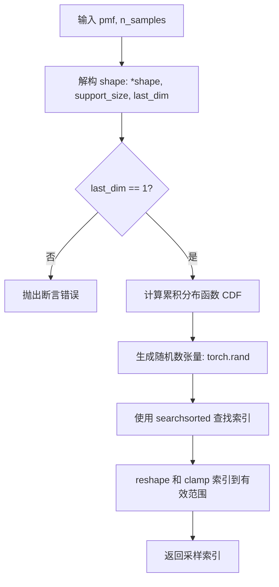
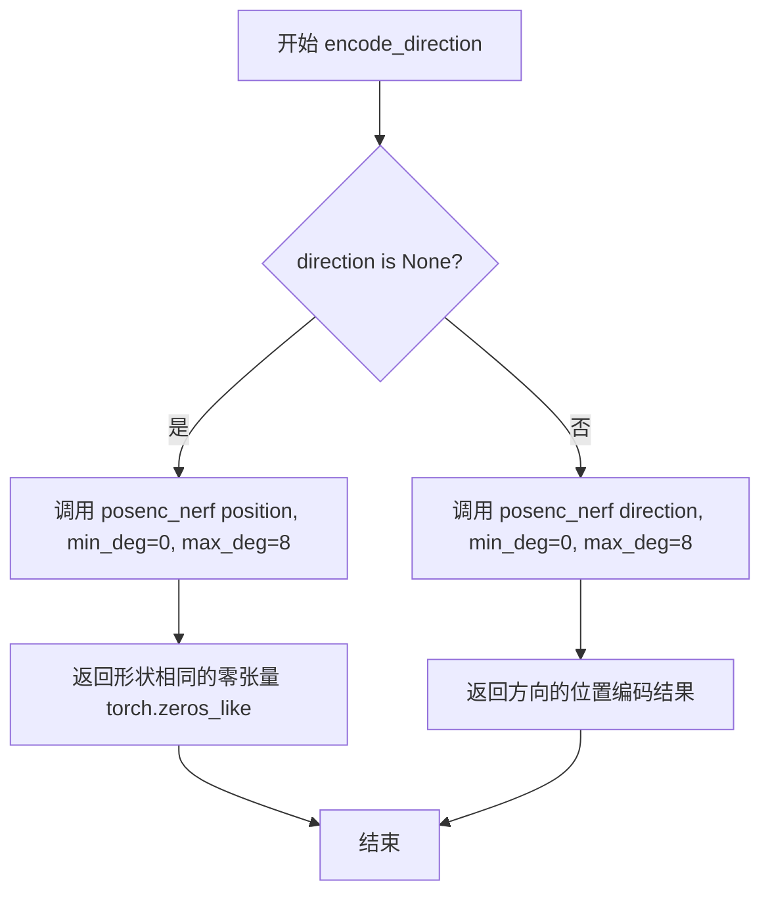
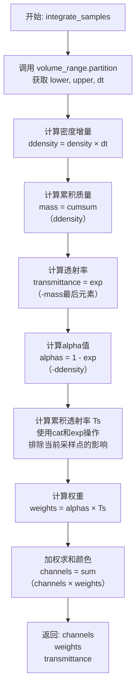
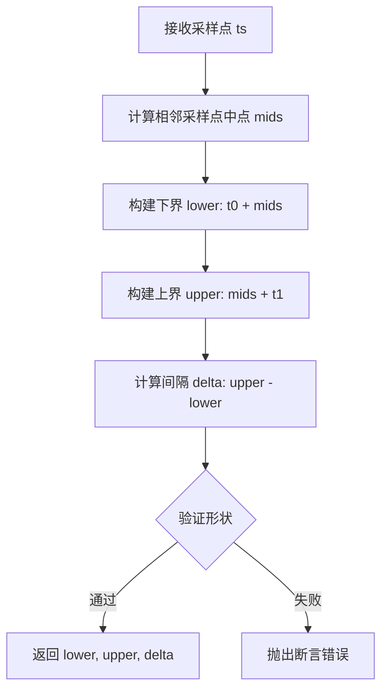
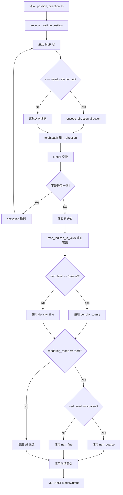
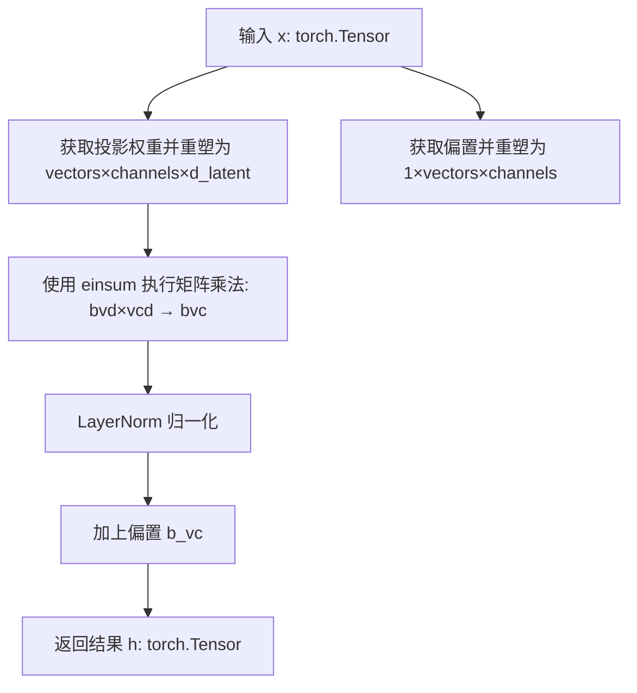

# `diffusers\src\diffusers\pipelines\shap_e\renderer.py` 详细设计文档

Implements a 3D rendering engine for ShapE models, supporting both volumetric ray-marching (NeRF) for image synthesis and marching cubes (SDF) for mesh generation. It includes ray sampling strategies, volumetric integration, and mesh decoding logic.

## 整体流程

```mermaid
graph TD
    Start[Input Latents] --> Proj[ShapEParamsProjModel]
    Proj --> Decision{Output Type}
    Decision -- Image --> ImgRender[decode_to_image]
    Decision -- Mesh --> MeshRender[decode_to_mesh]
    subgraph ImgRender
        ImgRender --> Camera[Create Cameras/Rays]
        Camera --> Coarse[StratifiedRaySampler]
        Coarse --> Query1[Query MLP (Coarse)]
        Query1 --> Integrate1[Integrate Samples]
        Integrate1 --> Fine[ImportanceRaySampler]
        Fine --> Query2[Query MLP (Fine)]
        Query2 --> Integrate2[Integrate Samples + Void Model]
        Integrate2 --> OutputImg[Output Images]
    end
    subgraph MeshRender
        MeshRender --> GridQuery[Query SDF on Grid]
        GridQuery --> MarchingCubes[MeshDecoder (Marching Cubes)]
        MarchingCubes --> TextureQuery[Query Texture at Vertices]
        TextureQuery --> OutputMesh[Output Mesh]
    end
```

## 类结构

```
nn.Module (基类)
├── VoidNeRFModel (背景渲染)
├── BoundingBoxVolume (AABB 包围盒)
├── StratifiedRaySampler (分层采样)
├── ImportanceRaySampler (重要性采样)
├── MeshDecoder (Marching Cubes)
├── MLPNeRSTFModel (核心 MLP 网络)
├── ChannelsProj (投影层)
├── ShapEParamsProjModel (潜在向量投影)
└── ShapERenderer (主渲染器)
BaseOutput (数据基类)
├── MeshDecoderOutput
└── MLPNeRFModelOutput
dataclass
└── VolumeRange (体积范围)
```

## 全局变量及字段


### `VoidNeRFModel.background (nn.Parameter)`
    
存储背景颜色的可学习参数，用于渲染空白空间的颜色输出

类型：`nn.Parameter`
    


### `VolumeRange.t0 (torch.Tensor)`
    
光线射线在体积中的起始时间/距离，定义了积分范围的起点

类型：`torch.Tensor`
    


### `VolumeRange.t1 (torch.Tensor)`
    
光线射线在体积中的结束时间/距离，定义了积分范围的终点

类型：`torch.Tensor`
    


### `VolumeRange.intersected (torch.Tensor)`
    
布尔张量，标记每条射线是否与体积发生相交

类型：`torch.Tensor`
    


### `BoundingBoxVolume.min_dist`
    
射线起点距离原点的最小距离阈值，用于排除靠近原点的采样点

类型：`float`
    


### `BoundingBoxVolume.min_t_range`
    
最小t值范围，用于确保光线在体积内有足够的采样深度

类型：`float`
    


### `BoundingBoxVolume.bbox_min`
    
轴对齐边界框的左下/最远角坐标，定义3D包围盒的最小边界

类型：`torch.Tensor`
    


### `BoundingBoxVolume.bbox_max`
    
轴对齐边界框的右上/最近角坐标，定义3D包围盒的最大边界

类型：`torch.Tensor`
    


### `BoundingBoxVolume.bbox`
    
边界框的堆叠表示，形状为(2, 3)，包含min和max坐标

类型：`torch.Tensor`
    


### `StratifiedRaySampler.depth_mode`
    
深度采样模式，支持linear、geometric或harmonic分布策略

类型：`str`
    


### `ImportanceRaySampler.volume_range`
    
射线与体积相交的范围，用于重要性采样的基准参考

类型：`VolumeRange`
    


### `ImportanceRaySampler.ts`
    
粗采样阶段的时间步，用于计算重要性分布

类型：`torch.Tensor`
    


### `ImportanceRaySampler.weights`
    
离散化的密度与透射率乘积，用于计算采样概率

类型：`torch.Tensor`
    


### `ImportanceRaySampler.blur_pool`
    
是否使用2-tap最大池化加模糊滤波的策略来平滑权重

类型：`bool`
    


### `ImportanceRaySampler.alpha`
    
添加到权重中的小常数，用于防止数值不稳定和零概率

类型：`float`
    


### `MeshDecoder.cases`
    
Marching Cubes算法的查找表，存储256种立方体配置的三角面片索引

类型：`torch.Tensor`
    


### `MeshDecoder.masks`
    
布尔掩码，指示每个立方体配置是否产生有效的三角面片

类型：`torch.Tensor`
    


### `MLPNeRSTFModel.mlp`
    
多层感知机模块列表，包含用于预测密度、颜色和SDF的全连接层

类型：`nn.ModuleList`
    


### `MLPNeRSTFModel.activation`
    
MLP中间层使用的激活函数，默认为SiLU/swish

类型：`Callable`
    


### `MLPNeRSTFModel.sdf_activation`
    
有符号距离场输出的激活函数，使用tanh将SDF值映射到[-1, 1]

类型：`Callable`
    


### `MLPNeRSTFModel.density_activation`
    
密度输出的激活函数，使用ReLU确保非负密度值

类型：`Callable`
    


### `MLPNeRSTFModel.channel_activation`
    
颜色通道输出的激活函数，使用sigmoid将值映射到[0, 1]

类型：`Callable`
    


### `ChannelsProj.proj`
    
线性投影层，将潜在向量映射到向量×通道维度的权重空间

类型：`nn.Linear`
    


### `ChannelsProj.norm`
    
层归一化，对投影后的通道维度进行标准化处理

类型：`nn.LayerNorm`
    


### `ChannelsProj.d_latent`
    
输入潜在向量的维度，决定了投影的输入特征宽度

类型：`int`
    


### `ChannelsProj.vectors`
    
输出向量的数量，对应MLP权重的第一个维度

类型：`int`
    


### `ChannelsProj.channels`
    
输出通道的数量，对应MLP权重的第二个维度

类型：`int`
    


### `ShapEParamsProjModel.projections`
    
模块字典，存储将潜在表示投影到MLP参数的各通道投影模块

类型：`nn.ModuleDict`
    


### `ShapERenderer.params_proj`
    
参数投影模型，用于将生成的潜在向量解码为MLP权重参数

类型：`ShapEParamsProjModel`
    


### `ShapERenderer.mlp`
    
主MLP模型，同时预测NeRF密度/颜色和SDF用于渲染

类型：`MLPNeRSTFModel`
    


### `ShapERenderer.void`
    
空白空间模型，当射线未击中任何体积时返回背景色

类型：`VoidNeRFModel`
    


### `ShapERenderer.volume`
    
3D场景的轴对齐边界框体积，用于光线相交检测

类型：`BoundingBoxVolume`
    


### `ShapERenderer.mesh_decoder`
    
网格解码器，使用Marching Cubes从SDF场生成3D三角形网格

类型：`MeshDecoder`
    
    

## 全局函数及方法


### `sample_pmf`

从给定的离散概率分布（概率质量函数）中按概率加权采样返回采样索引。

参数：

-  `pmf`：`torch.Tensor`，概率质量函数，形状为 `[batch_size, *shape, n_samples, 1]`，要求 `pmf.sum(dim=-2) == 1`
-  `n_samples`：`int`，需要采样的数量

返回值：`torch.Tensor`，形状为 `[batch_size, *shape, n_samples, 1]`，采样得到的索引

#### 流程图



#### 带注释源码

```python
def sample_pmf(pmf: torch.Tensor, n_samples: int) -> torch.Tensor:
    r"""
    Sample from the given discrete probability distribution with replacement.
    # 从给定的离散概率分布中（有放回）采样

    The i-th bin is assumed to have mass pmf[i].
    # 假设第 i 个箱子（bin）的质量为 pmf[i]

    Args:
        pmf: [batch_size, *shape, n_samples, 1] where (pmf.sum(dim=-2) == 1).all()
        n_samples: number of samples

    Return:
        indices sampled with replacement
    """
    # 解构 pmf 的形状，获取除最后维度外的所有维度（*shape）、支持大小（support_size）和最后维度
    *shape, support_size, last_dim = pmf.shape
    # 验证最后维度是否为 1
    assert last_dim == 1

    # 将 pmf 展平为 2D 张量（batch_size * *shape, support_size）并计算累积分布函数
    cdf = torch.cumsum(pmf.view(-1, support_size), dim=1)
    # 生成随机采样点，使用 searchsorted 找到每个随机数在 CDF 中的位置（即采样索引）
    inds = torch.searchsorted(cdf, torch.rand(cdf.shape[0], n_samples, device=cdf.device))

    # 将索引重新 reshape 为目标形状，并 clamp 到有效范围内（0 到 support_size - 1）
    return inds.view(*shape, n_samples, 1).clamp(0, support_size - 1)
```


### `posenc_nerf`

该函数实现了 NeRF (Neural Radiance Fields) 论文中提出的位置编码（Positional Encoding）逻辑。它通过将输入张量与不同频率的正弦和余弦变换结果进行拼接，从而将低维输入映射到高维空间，以帮助神经网络更好地学习高频细节。

参数：

- `x`：`torch.Tensor`，输入张量，通常为位置或方向向量。
- `min_deg`：`int`，编码的最小次数（默认为 0）。
- `max_deg`：`int`，编码的最大次数（默认为 15）。

返回值：`torch.Tensor`，原始输入与其位置编码拼接后的张量。

#### 流程图

```mermaid
flowchart TD
    A[开始: 输入 x, min_deg, max_deg] --> B{min_deg == max_deg?}
    B -- 是 --> C[直接返回输入 x]
    B -- 否 --> D[生成频率尺度 scales = 2.0^[min_deg, max_deg)]
    D --> E[变形 x 并与 scales 相乘得到 xb]
    E --> F[计算编码: sin(xb) 与 sin(xb + π/2)]
    F --> G[拼接原始输入 x 和编码 emb]
    C --> H[结束: 返回结果]
    G --> H
```

#### 带注释源码

```python
def posenc_nerf(x: torch.Tensor, min_deg: int = 0, max_deg: int = 15) -> torch.Tensor:
    """
    Concatenate x and its positional encodings, following NeRF.

    Reference: https://huggingface.co/papers/2210.04628
    
    核心逻辑：
    1. 如果没有编码需求，直接返回原输入。
    2. 生成几何级数的频率尺度 (2^0, 2^1, ...)。
    3. 将输入与所有尺度进行逐元素相乘（利用广播机制）。
    4. 对乘积结果同时应用 sin 和 cos (通过 sin(x + π/2) 实现) 变换。
    5. 将原始输入与变换后的编码在最后一维拼接。
    """
    # 1. 边界情况处理：如果编码维度为0，直接返回原始输入
    if min_deg == max_deg:
        return x

    # 2. 生成频率尺度。例如 min_deg=0, max_deg=15 时，
    # scales 为 [1, 2, 4, 8, ..., 16384]
    scales = 2.0 ** torch.arange(min_deg, max_deg, dtype=x.dtype, device=x.device)
    
    # 获取输入的形状信息
    *shape, dim = x.shape
    
    # 3. 维度变换与乘法
    # 将 x 变形为 (*shape, 1, dim) 以便与 scales (1, num_scales, 1) 进行广播乘法
    # 结果 xb 的形状为 (*shape, num_scales, dim)
    xb = (x.reshape(-1, 1, dim) * scales.view(1, -1, 1)).reshape(*shape, -1)
    
    # 4. 维度安全断言
    # 验证编码后的维度是否符合预期 (dim * (max_deg - min_deg))
    assert xb.shape[-1] == dim * (max_deg - min_deg)
    
    # 5. 计算正弦编码
    # NeRF 使用 sin(x) 和 cos(x) 的组合。这里通过 sin(x) 和 sin(x + π/2) (即 cos(x)) 实现
    # 拼接后形状为 (*shape, dim * (max_deg - min_deg) * 2)
    emb = torch.cat([xb, xb + math.pi / 2.0], axis=-1).sin()
    
    # 6. 最终拼接：将原始输入 x 与编码后的 emb 在最后一维连接
    return torch.cat([x, emb], dim=-1)
```


### `encode_position`

该函数是用于对 3D 位置坐标进行 NeRF 风格位置编码（Positional Encoding）的入口函数。它封装了底层的 `posenc_nerf` 核心算法，并预设了适用于位置编码的频率范围（0 到 15），将低维的坐标映射到高维的正弦/余弦特征空间，以增强神经网络对空间位置的表达能力。

参数：

- `position`：`torch.Tensor`，输入的 3D 坐标张量，形状通常为 `[batch_size, ..., 3]` (x, y, z)。

返回值：`torch.Tensor`，返回原始输入与高频编码特征拼接后的张量。形状变为 `[batch_size, ..., 93]` (原始 3 维 + 15个频率带 * 3 维度 * 2 个三角函数)。

#### 流程图

```mermaid
flowchart TD
    A([Start: encode_position]) --> B[输入 position tensor]
    B --> C{调用 posenc_nerf<br/>min_deg=0, max_deg=15}
    
    subgraph "posenc_nerf 核心逻辑"
    C --> D{min_deg == max_deg?}
    D -- 是 --> E[直接返回原始输入 x]
    D -- 否 --> F[生成频率 scales: 2^0 到 2^14]
    F --> G[将输入 x reshape 并乘以 scales]
    G --> H[生成两组特征: <br/>sin(xb) 和 sin(xb + π/2)]
    H --> I[将原始输入 x 与编码特征 emb 拼接]
    end
    
    E --> J([Return Encoded Tensor])
    I --> J
    
    style C fill:#f9f,stroke:#333,stroke-width:2px
    style J fill:#9f9,stroke:#333,stroke-width:2px
```

#### 带注释源码

```python
def encode_position(position):
    """
    对位置进行 NeRF 风格的编码。

    Args:
        position: 3D 坐标张量，形状为 [..., 3]

    Returns:
        编码后的张量，形状为 [..., 93]
    """
    # 调用内部函数 posenc_nerf，固定使用 0-15 的频率带进行位置编码
    return posenc_nerf(position, min_deg=0, max_deg=15)


def posenc_nerf(x: torch.Tensor, min_deg: int = 0, max_deg: int = 15) -> torch.Tensor:
    """
    拼接 x 及其位置编码，遵循 NeRF 论文的做法。

    Reference: https://huggingface.co/papers/2210.04628
    
    该函数通过使用不同频率的正弦和余弦函数将输入映射到高维空间。
    这允许神经网络更容易地学习高频变化细节。

    Args:
        x: 输入张量
        min_deg: 最小频率指数 (通常为 0)
        max_deg: 最大频率指数 (通常为 15)

    Returns:
        拼接后的张量
    """
    # 1. 边界情况处理：如果最小和最大度数相同（即不需要编码），则直接返回原输入
    if min_deg == max_deg:
        return x

    # 2. 生成频率基数：2.0 ** torch.arange(0, 15) -> [1, 2, 4, 8, ..., 16384]
    scales = 2.0 ** torch.arange(min_deg, max_deg, dtype=x.dtype, device=x.device)
    
    # 3. 获取输入形状信息
    *shape, dim = x.shape
    
    # 4. 计算傅里叶特征 (Fourier Features)
    #    将 x 扩展一个维度以进行广播乘法: [..., 3] -> [..., 1, 3]
    #    乘以频率 scales [1, 2, ..., 32768] -> [..., 15, 3]
    #    再 reshape 回原始形状: [..., 45]
    xb = (x.reshape(-1, 1, dim) * scales.view(1, -1, 1)).reshape(*shape, -1)
    
    # 断言确保维度正确：45 = 3 (维度) * 15 (频率数量)
    assert xb.shape[-1] == dim * (max_deg - min_deg)
    
    # 5. 生成正弦和余弦编码
    #    emb = sin(xb) 和 sin(xb + pi/2) [即 cos(xb)] 的拼接
    #    维度从 [..., 45] 变为 [..., 90]
    emb = torch.cat([xb, xb + math.pi / 2.0], axis=-1).sin()
    
    # 6. 最终拼接：原始输入 + 编码特征
    #    维度从 [..., 3] 变为 [..., 93]
    return torch.cat([x, emb], dim=-1)
```


### `encode_direction`

该函数用于对光线方向进行位置编码（Positional Encoding）。如果未提供方向，则返回一个与位置编码形状相同的零张量；如果提供了方向，则使用 NeRF 风格的正弦余弦位置编码对方向进行编码，编码维度为 8（即 0 到 7 次谐波）。

参数：

- `position`：`torch.Tensor`，输入的位置张量，用于确定输出张量的形状
- `direction`：`torch.Tensor | None`，输入的方向张量，如果为 `None` 则返回零张量，否则对方向进行位置编码

返回值：`torch.Tensor`，编码后的方向向量，形状与 `posenc_nerf(position, min_deg=0, max_deg=8)` 相同

#### 流程图



#### 带注释源码

```python
def encode_direction(position, torch.Tensor, direction=None):
    """
    对光线方向进行位置编码（NeRF风格）。
    
    参数:
        position: 位置张量，用于确定输出形状
        direction: 方向张量，如果为None则返回零张量
    
    返回:
        编码后的方向向量
    """
    # 检查direction是否为None
    if direction is None:
        # 如果没有提供方向，返回与位置编码形状相同的零张量
        # 这里调用posenc_nerf仅用于获取输出形状
        # 位置编码维度为 8 * 2 * 3 = 48 维（每个坐标生成8个谐波，每个谐波生成sin和cos）
        return torch.zeros_like(posenc_nerf(position, min_deg=0, max_deg=8))
    else:
        # 如果提供了方向，对方向进行位置编码
        # 使用与位置编码相同的参数：min_deg=0, max_deg=8
        # 编码公式: concat([sin(2^0 * x), cos(2^0 * x), ..., sin(2^7 * x), cos(2^7 * x)])
        return posenc_nerf(direction, min_deg=0, max_deg=8)
```


### `_sanitize_name`

该函数是一个简单的字符串处理工具函数，其核心功能是将传入的字符串中的句点（`.`）替换为双下划线（`__`）。这主要用于将层级化的模型参数名称（如 PyTorch `state_dict` 中的键）转换为平面化的字典键，或者转换为符合特定命名规范（如下划线）的字符串，以便于作为字典的键（key）进行索引或避免与 Python 的属性访问语法冲突。

#### 参数

-  `x`：`str`，需要被处理的原始字符串，通常是模型参数或层的名称（例如 `"nerstf.mlp.0.weight"`）。

#### 返回值

-  `str`，处理后的字符串，句点被替换为双下划线（例如 `"nerstf.mlp.0.weight"` 变为 `"nerstf__mlp__0__weight"`）。

#### 流程图

```mermaid
graph TD
    A[Start: Input String x] --> B{Execute x.replace('.', '__')}
    B --> C[Return sanitized String]
    
    style A fill:#f9f,stroke:#333,stroke-width:2px
    style C fill:#bbf,stroke:#333,stroke-width:2px
```

#### 带注释源码

```python
def _sanitize_name(x: str) -> str:
    """
    将字符串中的点替换为双下划线。

    这是一种常见的命名规范化技巧，用于在层级结构（如 "module.layer.weight"）和
    扁平化结构（如字典键 "module__layer__weight"）之间建立映射。
    在本项目中，它被用于将参数名称映射到投影器（Projector）的键。

    Args:
        x (str): 原始的层级名称。

    Returns:
        str: 规范化后的名称。
    """
    return x.replace(".", "__")
```

#### 上下文与依赖信息

1.  **关键组件信息**：
    *   **使用位置**：该函数被 `ShapEParamsProjModel` 类大量使用。
    *   **作用**：在 `ShapEParamsProjModel.__init__` 中，它将形如 `"nerstf.mlp.0.weight"` 的参数名称转换为 `"nerstf__mlp__0__weight"`，并将其作为 `nn.ModuleDict` 的键（key）来存储 `ChannelsProj` 实例。在 `forward` 方法中，它又负责反向映射，将原始参数名称转换为处理后的键以检索对应的投影层。

2.  **潜在的技术债务或优化空间**：
    *   **命名冲突风险**：如果原始名称中本身就包含双下划线（`__`），替换后可能会产生歧义。不过在标准的模型参数命名中（通常仅使用单下划线），此风险较低。
    *   **功能性局限**：该函数仅处理了替换逻辑。如果未来需要支持更复杂的命名规范化（例如去除特殊字符），该函数需要扩展。

3.  **错误处理与异常设计**：
    *   该函数极其简单，未包含显式的错误处理。由于输入类型被严格限定为 `str`，如果传入非字符串类型，Python 运行时会在 `replace` 方法调用时抛出 `AttributeError`。调用方（如 `ShapEParamsProjModel`）在构造时传入的是字面量元组，因此运行时错误风险极低。

4.  **设计目标与约束**：
    *   **目标**：建立层级命名与平面键（Flat Key）之间的映射，实现参数空间到投影器权重的映射。
    *   **约束**：输入必须为字符串，且假设输入中的 `.` 仅作为层级分隔符使用。


### `integrate_samples`

该函数执行体积渲染（Volumetric Rendering）的核心积分操作，计算光线穿过体积时的颜色累积、权重和透射率。它基于 NeRF 论文中的体积渲染公式，通过计算密度与透射率的乘积作为权重，对沿射线的颜色通道进行加权求和。

参数：

- `volume_range`：`VolumeRange`，指定积分范围 \[t0, t1\]，包含 t0、t1 和 intersected 标志
- `ts`：`torch.Tensor`，形状为 \[batch_size, *shape, n_samples, 1\]，表示沿射线采样的时间步
- `density`：`torch.Tensor`，形状为 \[batch_size, *shape, n_samples, 1\]，表示每个采样点的密度值
- `channels`：`torch.Tensor`，形状为 \[batch_size, *shape, n_samples, n_channels\]，表示每个采样点的颜色/特征通道

返回值：

- `channels`：`torch.Tensor`，积分后的 RGB 输出，形状为 \[batch_size, *shape, n_channels\]
- `weights`：`torch.Tensor`，每个采样点的权重（density × transmittance），形状为 \[batch_size, *shape, n_samples, 1\]
- `transmittance`：`torch.Tensor`，体积的透射率，形状为 \[batch_size, *shape, 1\]

#### 流程图



#### 带注释源码

```python
def integrate_samples(volume_range, ts, density, channels):
    r"""
    Function integrating the model output.

    Args:
        volume_range: Specifies the integral range [t0, t1]
        ts: timesteps
        density: torch.Tensor [batch_size, *shape, n_samples, 1]
        channels: torch.Tensor [batch_size, *shape, n_samples, n_channels]
    returns:
        channels: integrated rgb output weights: torch.Tensor [batch_size, *shape, n_samples, 1] (density
        *transmittance)[i] weight for each rgb output at [..., i, :]. transmittance: transmittance of this volume
    """

    # 1. Calculate the weights
    # 调用 VolumeRange.partition 方法将 t0 和 t1 分割成 n_samples 个区间
    # 返回 lower（区间下界）、upper（区间上界）、dt（区间宽度）
    _, _, dt = volume_range.partition(ts)
    
    # 计算密度增量：密度乘以区间宽度，得到每个区间内的"质量"
    ddensity = density * dt

    # 沿采样维度累积计算质量（累计密度）
    # 结果形状: [batch_size, *shape, n_samples, 1]
    mass = torch.cumsum(ddensity, dim=-2)
    
    # 计算最终透射率：光线穿过整个体积后的透射概率
    # exp(-mass[-1]) 表示光线没有在任何点被拦截的概率
    transmittance = torch.exp(-mass[..., -1, :])

    # 计算 alpha 值（不透明度）：1 - exp(-ddensity)
    # 表示光线在该区间内被拦截（散射或吸收）的概率
    alphas = 1.0 - torch.exp(-ddensity)
    
    # 计算累积透射率 Ts：光线从起点到达当前采样点之前未被拦截的概率
    # 使用 cat 将零张量（作为起点）与负质量连接
    # 然后取负指数：exp(-mass) 表示在当前位置之前累积的透射率
    Ts = torch.exp(torch.cat([torch.zeros_like(mass[..., :1, :]), -mass[..., :-1, :]], dim=-2))
    
    # 这是光线击中并从深度 [..., i, :] 处反射的概率
    # weights = alpha × Ts，即 NeRF 论文中的 w_i = T_i × (1 - exp(-σ_i × δ_i))
    weights = alphas * Ts

    # 2. Integrate channels
    # 使用权重对颜色通道进行加权求和
    # 沿采样维度（-2）求和，得到最终的颜色值
    channels = torch.sum(channels * weights, dim=-2)

    # 返回积分后的颜色、加权权重和透射率
    return channels, weights, transmittance
```


### `volume_query_points`

该函数用于在给定的3D包围盒体积内生成规则网格的所有采样点坐标。它通过枚举网格索引并将其从离散索引空间线性映射到连续的物理空间，从而创建用于体积查询或光线追踪的规则采样点集。

参数：

- `volume`：`BoundingBoxVolume`，包含 `bbox_min` 和 `bbox_max` 属性的体积对象，定义3D空间的边界
- `grid_size`：`int`，网格的边长（假设为立方体网格，总点数为 `grid_size³`）

返回值：`torch.Tensor`，形状为 `(grid_size³, 3)` 的浮点张量，表示所有网格点在物理空间中的三维坐标

#### 流程图

```mermaid
flowchart TD
    A[开始] --> B[计算总点数 grid_size³]
    B --> C[创建0到grid_size³-1的线性索引]
    C --> D[计算z坐标: indices % grid_size]
    D --> E[计算y坐标: (indices // grid_size) % grid_size]
    E --> F[计算x坐标: (indices // grid_size²) % grid_size]
    F --> G[堆叠 xs, ys, zs 为 [grid_size³, 3] 张量]
    G --> H[归一化到0-1范围: combined.float / grid_size-1]
    H --> I[缩放到物理空间: × (bbox_max - bbox_min)]
    I --> J[平移至边界: + bbox_min]
    J --> K[返回物理坐标张量]
```

#### 带注释源码

```python
def volume_query_points(volume, grid_size):
    """
    在包围盒体积内生成规则网格的所有采样点坐标。
    
    Args:
        volume: BoundingBoxVolume 对象，包含 bbox_min 和 bbox_max 属性
        grid_size: int，网格边长
    
    Returns:
        torch.Tensor: 形状为 (grid_size³, 3) 的坐标张量
    """
    # 步骤1: 创建从 0 到 grid_size³ - 1 的线性索引
    # 例如 grid_size=2 时，生成 [0, 1, 2, 3, 4, 5, 6, 7]
    indices = torch.arange(grid_size**3, device=volume.bbox_min.device)
    
    # 步骤2: 利用取模和整除运算将线性索引转换为3D网格坐标 (x, y, z)
    # z 坐标: indices % grid_size (最低位维度)
    zs = indices % grid_size
    
    # y 坐标: (indices // grid_size) % grid_size (中间维度)
    ys = torch.div(indices, grid_size, rounding_mode="trunc") % grid_size
    
    # x 坐标: (indices // grid_size²) % grid_size (最高位维度)
    xs = torch.div(indices, grid_size**2, rounding_mode="trunc") % grid_size
    
    # 步骤3: 堆叠为 [grid_size³, 3] 形状的张量，每行是一个点的 (x, y, z) 网格索引
    combined = torch.stack([xs, ys, zs], dim=1)
    
    # 步骤4: 将网格索引映射到物理空间
    # 4.1: 归一化到 [0, 1] 范围 (除以 grid_size - 1 使端点正好落在 0 和 1)
    # 4.2: 乘以物理尺寸 (bbox_max - bbox_min) 进行缩放
    # 4.3: 加上 bbox_min 进行平移，使其位于正确的物理位置
    return (combined.float() / (grid_size - 1)) * (volume.bbox_max - volume.bbox_min) + volume.bbox_min
```


### `_convert_srgb_to_linear`

该函数实现了标准的 sRGB 到线性 RGB 的颜色空间转换，根据 IEC 61966-2-1 标准，当输入值小于等于 0.04045 时使用线性公式 `u / 12.92`，否则使用非线性公式 `((u + 0.055) / 1.055) ** 2.4`。

参数：

- `u`：`torch.Tensor`，输入的 sRGB 颜色值张量

返回值：`torch.Tensor`，转换后的线性 RGB 颜色值张量

#### 流程图

```mermaid
flowchart TD
    A[输入: sRGB张量 u] --> B{u <= 0.04045?}
    B -->|True| C[linear = u / 12.92]
    B -->|False| D[linear = ((u + 0.055) / 1.055) ** 2.4]
    C --> E[输出: linear RGB张量]
    D --> E
```

#### 带注释源码

```python
def _convert_srgb_to_linear(u: torch.Tensor):
    """
    将 sRGB 颜色值转换为线性 RGB 颜色值。
    
    遵循 IEC 61966-2-1 (sRGB) 标准：
    - 当 u <= 0.04045 时，使用线性公式: u / 12.92
    - 当 u > 0.04045 时，使用非线性公式: ((u + 0.055) / 1.055) ** 2.4
    
    Args:
        u: 输入的 sRGB 颜色值张量，值域通常在 [0, 1] 范围内
        
    Returns:
        转换后的线性 RGB 颜色值张量
    """
    # 使用 torch.where 进行条件判断和转换
    # 对于暗部（u <= 0.04045）使用线性变换
    # 对于亮部使用伽马校正公式
    return torch.where(u <= 0.04045, u / 12.92, ((u + 0.055) / 1.055) ** 2.4)
```


### `_create_flat_edge_indices`

该函数用于在三维网格中为每个立方体生成12条边的全局扁平化索引。它是Marching Cubes算法的一部分，通过计算网格中每个立方体的x、y、z三个方向上的边索引，将三维立方体边映射到一维的边列表中。

参数：

- `flat_cube_indices`：`torch.Tensor`，形状为`[N, 3]`的整数张量，其中N是立方体数量，每行包含立方体的(x, y, z)坐标
- `grid_size`：`tuple[int, int, int]`，三维网格的尺寸，元组形式为(宽度, 高度, 深度)

返回值：`torch.Tensor`，形状为`[N, 12]`的张量，其中每行包含该立方体对应的12条边的全局索引

#### 流程图

```mermaid
flowchart TD
    A[开始] --> B[计算X轴方向边数量<br/>num_xs = (grid_size[0]-1) * grid_size[1] * grid_size[2]]
    B --> C[计算Y轴偏移量<br/>y_offset = num_xs]
    C --> D[计算Y轴方向边数量<br/>num_ys = grid_size[0] * (grid_size[1]-1) * grid_size[2]]
    D --> E[计算Z轴偏移量<br/>z_offset = num_xs + num_ys]
    E --> F[计算X轴方向4条边索引<br/>使用flat_cube_indices计算]
    F --> G[计算Y轴方向4条边索引<br/>加入y_offset偏移量]
    G --> H[计算Z轴方向4条边索引<br/>加入z_offset偏移量]
    H --> I[使用torch.stack合并所有边索引<br/>dim=-1]
    I --> J[返回形状为N, 12的张量]
```

#### 带注释源码

```python
def _create_flat_edge_indices(
    flat_cube_indices: torch.Tensor,
    grid_size: tuple[int, int, int],
):
    """
    为三维网格中的每个立方体生成12条边的全局扁平化索引。
    
    在Marching Cubes算法中，需要将每个立方体的12条边映射到全局边列表中。
    边的排列顺序为：X轴方向4条边 → Y轴方向4条边 → Z轴方向4条边。
    
    Args:
        flat_cube_indices: 形状为[N, 3]的张量，每行是(x, y, z)坐标
        grid_size: 三维网格尺寸 (W, H, D)
    
    Returns:
        形状为[N, 12]的张量，每行包含12条边的索引
    """
    
    # 计算X轴方向（宽度方向）的边数量
    # X轴方向边的数量 = (grid_size[0]-1) * grid_size[1] * grid_size[2]
    # 解释：X方向有(grid_size[0]-1)个间隔，每个Y层有grid_size[1]个位置，每个Z位置有grid_size[2]个位置
    num_xs = (grid_size[0] - 1) * grid_size[1] * grid_size[2]
    
    # Y轴方向边起始偏移量 = X轴方向边的总数
    y_offset = num_xs
    
    # 计算Y轴方向（高度方向）的边数量
    # Y轴方向边的数量 = grid_size[0] * (grid_size[1]-1) * grid_size[2]
    num_ys = grid_size[0] * (grid_size[1] - 1) * grid_size[2]
    
    # Z轴方向边起始偏移量 = X轴方向边总数 + Y轴方向边总数
    z_offset = num_xs + num_ys
    
    # 使用torch.stack将12条边的索引堆叠在一起
    # 返回形状为[N, 12]的张量
    return torch.stack(
        [
            # === X轴方向边 (共4条边) ===
            # 边0: 当前立方体左下前顶点处的边
            flat_cube_indices[:, 0] * grid_size[1] * grid_size[2]
            + flat_cube_indices[:, 1] * grid_size[2]
            + flat_cube_indices[:, 2],
            
            # 边1: 当前立方体右下前顶点处的边 (y+1方向)
            flat_cube_indices[:, 0] * grid_size[1] * grid_size[2]
            + (flat_cube_indices[:, 1] + 1) * grid_size[2]
            + flat_cube_indices[:, 2],
            
            # 边2: 当前立方体左下后顶点处的边 (z+1方向)
            flat_cube_indices[:, 0] * grid_size[1] * grid_size[2]
            + flat_cube_indices[:, 1] * grid_size[2]
            + flat_cube_indices[:, 2]
            + 1,
            
            # 边3: 当前立方体右下后顶点处的边 (y+1, z+1方向)
            flat_cube_indices[:, 0] * grid_size[1] * grid_size[2]
            + (flat_cube_indices[:, 1] + 1) * grid_size[2]
            + flat_cube_indices[:, 2]
            + 1,
            
            # === Y轴方向边 (共4条边) ===
            # 边4: 当前立方体左下前顶点处的边
            (
                y_offset
                + flat_cube_indices[:, 0] * (grid_size[1] - 1) * grid_size[2]
                + flat_cube_indices[:, 1] * grid_size[2]
                + flat_cube_indices[:, 2]
            ),
            
            # 边5: 当前立方体右下前顶点处的边 (x+1方向)
            (
                y_offset
                + (flat_cube_indices[:, 0] + 1) * (grid_size[1] - 1) * grid_size[2]
                + flat_cube_indices[:, 1] * grid_size[2]
                + flat_cube_indices[:, 2]
            ),
            
            # 边6: 当前立方体左下后顶点处的边 (z+1方向)
            (
                y_offset
                + flat_cube_indices[:, 0] * (grid_size[1] - 1) * grid_size[2]
                + flat_cube_indices[:, 1] * grid_size[2]
                + flat_cube_indices[:, 2]
                + 1
            ),
            
            # 边7: 当前立方体右下后顶点处的边 (x+1, z+1方向)
            (
                y_offset
                + (flat_cube_indices[:, 0] + 1) * (grid_size[1] - 1) * grid_size[2]
                + flat_cube_indices[:, 1] * grid_size[2]
                + flat_cube_indices[:, 2]
                + 1
            ),
            
            # === Z轴方向边 (共4条边) ===
            # 边8: 当前立方体左下前顶点处的边
            (
                z_offset
                + flat_cube_indices[:, 0] * grid_size[1] * (grid_size[2] - 1)
                + flat_cube_indices[:, 1] * (grid_size[2] - 1)
                + flat_cube_indices[:, 2]
            ),
            
            # 边9: 当前立方体左上前顶点处的边 (y+1方向)
            (
                z_offset
                + (flat_cube_indices[:, 0] + 1) * grid_size[1] * (grid_size[2] - 1)
                + flat_cube_indices[:, 1] * (grid_size[2] - 1)
                + flat_cube_indices[:, 2]
            ),
            
            # 边10: 当前立方体左下后顶点处的边 (z+1方向)
            (
                z_offset
                + flat_cube_indices[:, 0] * grid_size[1] * (grid_size[2] - 1)
                + (flat_cube_indices[:, 1] + 1) * (grid_size[2] - 1)
                + flat_cube_indices[:, 2]
            ),
            
            # 边11: 当前立方体左上后顶点处的边 (y+1, z+1方向)
            (
                z_offset
                + (flat_cube_indices[:, 0] + 1) * grid_size[1] * (grid_size[2] - 1)
                + (flat_cube_indices[:, 1] + 1) * (grid_size[2] - 1)
                + flat_cube_indices[:, 2]
            ),
        ],
        dim=-1,  # 在最后一个维度(通道维度)堆叠，生成[N, 12]形状
    )
```


### VoidNeRFModel.forward

该方法是VoidNeRFModel类的前向传播函数，用于实现默认的空空间模型，所有查询都渲染为背景色。方法接收位置坐标，通过广播机制将预定义的背景颜色扩展到与输入位置相同的形状，并返回背景颜色作为渲染结果。

参数：

- `self`：VoidNeRFModel实例，模型本身
- `position`：`torch.Tensor`，输入的位置坐标张量，用于确定输出形状

返回值：`torch.Tensor`，广播后的背景颜色张量

#### 流程图

```mermaid
flowchart TD
    A[开始 forward] --> B[获取背景参数: background = self.background[None].to(position.device)]
    B --> C[计算位置形状: shape = position.shape[:-1]]
    C --> D[计算广播维度: ones = [1] * (len(shape) - 1)]
    D --> E[获取通道数: n_channels = background.shape[-1]]
    E --> F[重塑背景张量: background.view(background.shape[0], *ones, n_channels)]
    F --> G[广播到目标形状: torch.broadcast_to, 目标形状为 [...shape, n_channels]]
    G --> H[返回背景张量]
```

#### 带注释源码

```python
def forward(self, position):
    """
    VoidNeRFModel的前向传播方法
    
    该方法实现了一个"空空间"模型，即所有光线查询都返回
    预定义的背景颜色，不进行任何实际的NeRF渲染计算。
    
    参数:
        position: torch.Tensor，位置坐标张量，形状为 [..., 3]，
                 用于确定输出的目标形状
    
    返回:
        torch.Tensor：广播后的背景颜色，形状与position[:-1] + [n_channels]相同
    """
    # 步骤1: 获取背景参数并添加批次维度
    # self.background shape: [n_channels] -> [1, n_channels]
    background = self.background[None].to(position.device)
    
    # 步骤2: 获取位置张量的形状信息（排除最后一个维度）
    # 例如position shape为 [B, N, 3]，则shape为 [B, N]
    shape = position.shape[:-1]
    
    # 步骤3: 计算用于广播的维度
    # 创建ones列表，长度为shape长度减1，用于后续张量重塑
    ones = [1] * (len(shape) - 1)
    
    # 步骤4: 获取背景颜色的通道数（如RGB为3）
    n_channels = background.shape[-1]
    
    # 步骤5: 将背景张量广播到目标形状
    # 首先将背景从[1, n_channels]重塑为[batch_size, 1, 1, ..., n_channels]
    # 然后广播到与position相同的形状[..., n_channels]
    background = torch.broadcast_to(
        background.view(background.shape[0], *ones, n_channels),  # 源张量
        [*shape, n_channels]  # 目标形状
    )
    
    # 步骤6: 返回广播后的背景颜色
    return background
```


### `VolumeRange.partition`

该方法用于将光线渲染的区间 `[t0, t1]` 分割成 `n_samples` 个子区间，计算每个子区间的下界、上界和间隔长度。这是体渲染（Volumetric Rendering）中的关键步骤，用于对光线进行采样积分。

参数：

-  `ts`：`torch.Tensor`，形状为 `[batch_size, *shape, n_samples, 1]`，表示沿光线的采样点

返回值：`Tuple[torch.Tensor, torch.Tensor, torch.Tensor]`，返回一个包含三个张量的元组：
  - `lower`：下界，形状为 `[batch_size, *shape, n_samples, 1]`
  - `upper`：上界，形状为 `[batch_size, *shape, n_samples, 1]`
  - `delta`：间隔长度，形状为 `[batch_size, *shape, n_samples, 1]`

其中 `ts ∈ [lower, upper]`，`delta = upper - lower`

#### 流程图



#### 带注释源码

```python
def partition(self, ts):
    """
    Partitions t0 and t1 into n_samples intervals.

    Args:
        ts: [batch_size, *shape, n_samples, 1]

    Return:
        lower: [batch_size, *shape, n_samples, 1] 
        upper: [batch_size, *shape, n_samples, 1] 
        delta: [batch_size, *shape, n_samples, 1]

    where
        ts \in [lower, upper] deltas = upper - lower
    """

    # 计算相邻采样点之间的中点，用于划分区间边界
    # 例如：ts = [t0, t1, t2, t3]
    # mids = [(t0+t1)/2, (t1+t2)/2, (t2+t3)/2]
    mids = (ts[..., 1:, :] + ts[..., :-1, :]) * 0.5
    
    # 构建下界数组：拼接 t0 和中点序列
    # lower = [t0, mids[0], mids[1], ..., mids[-1]]
    # self.t0[..., None, :] 将 t0 扩展一个维度以匹配 mids 的形状
    lower = torch.cat([self.t0[..., None, :], mids], dim=-2)
    
    # 构建上界数组：拼接中点序列和 t1
    # upper = [mids[0], mids[1], ..., mids[-1], t1]
    upper = torch.cat([mids, self.t1[..., None, :]], dim=-2)
    
    # 计算每个区间的长度（用于后续的积分权重计算）
    delta = upper - lower
    
    # 形状一致性检查，确保计算正确
    assert lower.shape == upper.shape == delta.shape == ts.shape
    
    # 返回下界、上界和区间长度，供 integrate_samples 函数使用
    return lower, upper, delta
```


### `BoundingBoxVolume.intersect`

计算射线与轴对齐包围盒（AABB）的交点，返回射线进入和离开包围盒的距离范围。

参数：

- `self`：`BoundingBoxVolume` 类实例，包含 `bbox_min`、`bbox_max`、`min_dist` 和 `min_t_range` 属性
- `origin`：`torch.Tensor`，形状为 `[batch_size, *shape, 3]`，表示射线的起点
- `direction`：`torch.Tensor`，形状为 `[batch_size, *shape, 3]`，表示射线的方向向量
- `t0_lower`：`torch.Tensor | None`，可选，形状为 `[batch_size, *shape, 1]`，指定 t0 的下界
- `epsilon`：`float`，默认值为 `1e-6`，用于数值稳定的除法计算

返回值：`VolumeRange`，包含以下字段的命名元组：

- `t0`：`torch.Tensor`，形状为 `[batch_size, *shape, 1]`，射线进入包围盒的距离
- `t1`：`torch.Tensor`，形状为 `[batch_size, *shape, 1]`，射线离开包围盒的距离
- `intersected`：`torch.Tensor`，形状为 `[batch_size, *shape, 1]`，布尔值，表示射线是否与包围盒相交

#### 流程图

```mermaid
flowchart TD
    A[开始 intersect 方法] --> B[获取 origin 和 direction 的 batch_size 和 shape]
    B --> C[将 bbox 扩展到兼容 origin 的形状]
    C --> D[定义 _safe_divide 内部函数<br/>处理除数为负或接近零的情况]
    D --> E[计算射线与包围盒6个面的交点距离 ts<br/>ts = (bbox - origin) / direction]
    E --> F[计算 t0: ts 最小值的最大值<br/>并与 min_dist 取最大]
    F --> G[计算 t1: ts 最大值的最小值]
    G --> H{t0_lower 是否存在?}
    H -->|是| I[t0 = max(t0, t0_lower)]
    H -->|否| J[跳过]
    I --> K[判断是否相交<br/>intersected = t0 + min_t_range < t1]
    J --> K
    K --> L{相交?}
    L -->|是| M[t0 保持原值<br/>t1 保持原值]
    L -->|否| N[t0 = 0<br/>t1 = 1]
    M --> O[返回 VolumeRange t0, t1, intersected]
    N --> O
```

#### 带注释源码

```python
def intersect(
    self,
    origin: torch.Tensor,
    direction: torch.Tensor,
    t0_lower: torch.Tensor | None = None,
    epsilon=1e-6,
):
    """
    计算射线与轴对齐包围盒的交点。
    
    Args:
        origin: [batch_size, *shape, 3] 射线起点
        direction: [batch_size, *shape, 3] 射线方向
        t0_lower: Optional [batch_size, *shape, 1] t0 的下界
        epsilon: 用于稳定计算的微小值
    
    Return:
        VolumeRange(t0, t1, intersected) 
        - t0: [batch_size, *shape, 1] 射线进入包围盒的距离
        - t1: [batch_size, *shape, 1] 射线离开包围盒的距离  
        - intersected: [batch_size, *shape, 1] 是否相交
    """
    
    # 1. 获取批次维度和空间形状
    batch_size, *shape, _ = origin.shape
    ones = [1] * len(shape)
    
    # 2. 将 bbox 扩展为 [1, *ones, 2, 3] 以便广播计算
    bbox = self.bbox.view(1, *ones, 2, 3).to(origin.device)
    
    # 3. 定义安全除法函数，处理分母为负或接近零的情况
    def _safe_divide(a, b, epsilon=1e-6):
        # 调整分母符号：如果是负数则减去 epsilon，否则加上 epsilon
        # 这样可以避免除以零并保持数值稳定
        return a / torch.where(b < 0, b - epsilon, b + epsilon)
    
    # 4. 计算射线与包围盒6个面的交点参数 t
    #    bbox 形状: [1, *ones, 2, 3] -> 2个极值点 × 3个坐标轴
    #    origin[..., None, :] 形状: [batch_size, *shape, 1, 3]
    #    ts 形状: [batch_size, *shape, 2, 3]
    ts = _safe_divide(bbox - origin[..., None, :], direction[..., None, :], epsilon=epsilon)
    
    # 5. 射线与 AABB 相交的情况分析：
    #    - t1 <= t0: 射线不穿过 AABB
    #    - t0 < t1 <= 0: 射线相交但 AABB 在起点后方
    #    - t0 <= 0 <= t1: 射线从 AABB 内部开始
    #    - 0 <= t0 < t1: 射线从外部进入并穿过 AABB 两次
    
    # 6. 计算射线进入 AABB 的最小 t 值 (t0)
    #    - 先取每个方向维度上的最小值 (ts.min(dim=-2))
    #    - 再取所有维度中的最大值，确保在所有维度上都满足条件
    #    - clamp(min_dist) 处理射线起点在 AABB 后方的情况
    t0 = ts.min(dim=-2).values.max(dim=-1, keepdim=True).values.clamp(self.min_dist)
    
    # 7. 计算射线离开 AABB 的最大 t 值 (t1)
    #    - 先取每个方向维度上的最大值
    #    - 再取所有维度中的最小值
    t1 = ts.max(dim=-2).values.min(dim=-1, keepdim=True).values
    
    # 8. 断言输出形状正确
    assert t0.shape == t1.shape == (batch_size, *shape, 1)
    
    # 9. 如果提供了 t0_lower，则取其与 t0 的最大值
    if t0_lower is not None:
        assert t0.shape == t0_lower.shape
        t0 = torch.maximum(t0, t0_lower)
    
    # 10. 判断射线是否与 AABB 相交
    #     需要满足 t0 + min_t_range < t1，确保有有效的体积范围
    intersected = t0 + self.min_t_range < t1
    
    # 11. 对于不相交的情况，设置默认值
    #     t0 = 0, t1 = 1 (作为无效值的占位符)
    t0 = torch.where(intersected, t0, torch.zeros_like(t0))
    t1 = torch.where(intersected, t1, torch.ones_like(t1))
    
    # 12. 返回包含相交信息的 VolumeRange 对象
    return VolumeRange(t0=t0, t1=t1, intersected=intersected)
```


### `StratifiedRaySampler.sample`

该方法实现了分层射线采样（Stratified Ray Sampling），用于在体积渲染中沿着射线在给定的时间范围 [t0, t1] 内进行分层随机采样。根据 `depth_mode` 参数的不同，可以选择线性、几何或调和采样策略，以不同的密度分布从近到远采样点。

参数：

-  `t0`：`torch.Tensor`，起始时间，形状为 [batch_size, *shape, 1]，表示射线与体积交点的近端距离
-  `t1`：`torch.Tensor`，结束时间，形状为 [batch_size, *shape, 1]，表示射线与体积交点的远端距离
-  `n_samples`：`int`，要采样的时间点数量
-  `epsilon`：`float` = 1e-3，用于避免几何和调和模式中 log(0) 或除零的极小值

返回值：`torch.Tensor`，采样的时间点，形状为 [batch_size, *shape, n_samples, 1]

#### 流程图

```mermaid
flowchart TD
    A[开始] --> B[创建ones列表<br/>ones = [1] * (len(t0.shape) - 1)]
    B --> C[生成线性间隔的基础采样点<br/>ts = torch.linspace(0, 1, n_samples)]
    C --> D{depth_mode == 'linear'?}
    D -->|Yes| E[线性插值: ts = t0 * (1-ts) + t1 * ts]
    D -->|No| F{depth_mode == 'geometric'?}
    F -->|Yes| G[几何插值: ts = exp(log(t0)*(1-ts) + log(t1)*ts)]
    F -->|No| H{depth_mode == 'harmonic'?}
    H -->|Yes| I[调和插值: ts = 1 / (1/t0*(1-ts) + 1/t1*ts)]
    H -->|No| J[断言失败或未知模式]
    E --> K[计算中点: mids = 0.5 * (ts[1:] + ts[:-1])]
    G --> K
    I --> K
    J --> Z[结束]
    K --> L[构建上下界: upper = concat[mids, t1]<br/>lower = concat[t0, mids]]
    L --> M[设置随机种子: torch.manual_seed(0)]
    M --> N[生成随机数: t_rand = torch.rand_like(ts)]
    N --> O[分层随机采样: ts = lower + (upper-lower) * t_rand]
    O --> P[扩展维度: return ts.unsqueeze(-1)]
    P --> Z[结束]
```

#### 带注释源码

```python
def sample(
    self,
    t0: torch.Tensor,
    t1: torch.Tensor,
    n_samples: int,
    epsilon: float = 1e-3,
) -> torch.Tensor:
    """
    Args:
        t0: start time has shape [batch_size, *shape, 1]
        t1: finish time has shape [batch_size, *shape, 1]
        n_samples: number of ts to sample
    Return:
        sampled ts of shape [batch_size, *shape, n_samples, 1]
    """
    # 1. 构建用于扩展维度的基础ones列表
    # 用于将 linspace 生成的一维采样点扩展到与 t0/t1 兼容的形状
    ones = [1] * (len(t0.shape) - 1)
    
    # 2. 生成从0到1的均匀间隔采样点，形状为 [1, *ones, n_samples]
    # 这是分层采样的基础网格
    ts = torch.linspace(0, 1, n_samples).view(*ones, n_samples).to(t0.dtype).to(t0.device)

    # 3. 根据 depth_mode 将归一化的采样点 [0,1] 映射到实际时间范围 [t0, t1]
    if self.depth_mode == "linear":
        # 线性插值：t0 到 t1 之间均匀分布
        ts = t0 * (1.0 - ts) + t1 * ts
    elif self.depth_mode == "geometric":
        # 几何插值：使用对数空间进行插值，指数映射回去
        # 结果：更多采样点靠近 t0（近处），更少在 t1（远处）
        ts = (t0.clamp(epsilon).log() * (1.0 - ts) + t1.clamp(epsilon).log() * ts).exp()
    elif self.depth_mode == "harmonic":
        # 调和插值（原始 NeRF 推荐用于球形场景）
        # 在深度空间中使用调和平均进行插值
        # 1.0 / ((1-t)/t0 + t/t1) = t0*t1 / (t1*(1-t) + t0*t)
        # 这种方式会在靠近相机处（t0）产生更密集的采样
        ts = 1.0 / (1.0 / t0.clamp(epsilon) * (1.0 - ts) + 1.0 / t1.clamp(epsilon) * ts)

    # 4. 计算相邻采样点的中点，用于定义分层区间
    # 这些中点将作为每个分层区间的边界
    mids = 0.5 * (ts[..., 1:] + ts[..., :-1])
    
    # 5. 构建每个分层区间的中点作为上下界
    # upper: [t0的midpoints, 最后一个t1]
    # lower: [第一个t0, t1的midpoints]
    # 形状: [batch_size, *shape, n_samples, 1]
    upper = torch.cat([mids, t1], dim=-1)
    lower = torch.cat([t0, mids], dim=-1)
    
    # 6. 设置随机种子（此处硬编码为0，会导致每次采样结果相同）
    # 注意：这是一个潜在问题，会影响采样的随机性
    torch.manual_seed(0)
    
    # 7. 在每个分层区间 [lower, upper] 内生成随机偏移
    # t_rand 在 [0,1] 范围内均匀分布
    # 结果：每个区间内随机取一个点，而非固定取中点
    t_rand = torch.rand_like(ts)

    # 8. 计算最终的分层随机采样结果
    # 对于每个区间 [lower_i, upper_i]，采样点为 lower_i + (upper_i-lower_i) * random
    ts = lower + (upper - lower) * t_rand
    
    # 9. 扩展最后一维以匹配输出形状要求
    # 从 [batch_size, *shape, n_samples] -> [batch_size, *shape, n_samples, 1]
    return ts.unsqueeze(-1)
```


### `ImportanceRaySampler.sample`

该方法基于粗采样阶段的密度和透射率权重，使用重要性采样策略在更高密度的区域进行更细粒度的采样，以提高渲染效率。

参数：

- `t0`：`torch.Tensor`，起始时间，形状为 `[batch_size, *shape, 1]`
- `t1`：`torch.Tensor`，结束时间，形状为 `[batch_size, *shape, 1]`
- `n_samples`：`int`，要采样的时间点数量

返回值：`torch.Tensor`，采样后的时间点，形状为 `[batch_size, *shape, n_samples, 1]`

#### 流程图

```mermaid
flowchart TD
    A[开始采样] --> B[获取分区边界]
    B --> C{是否启用blur_pool}
    C -->|是| D[对权重进行填充和最大池化模糊]
    C -->|否| E[直接使用原始权重]
    D --> F[添加alpha平滑因子]
    E --> F
    F --> G[计算概率质量函数PMF]
    G --> H[从PMF中采样索引]
    H --> I[生成随机数t_rand]
    I --> J[根据索引gather上下界]
    K[计算采样点ts = lower + (upper - lower) * t_rand] --> L[对ts排序]
    L --> M[返回采样结果]
```

#### 带注释源码

```python
@torch.no_grad()
def sample(self, t0: torch.Tensor, t1: torch.Tensor, n_samples: int) -> torch.Tensor:
    """
    基于重要性采样的光线步进方法
    
    Args:
        t0: 起始时间 [batch_size, *shape, 1]
        t1: 结束时间 [batch_size, *shape, 1]
        n_samples: 采样数量
    Return:
        采样时间点 [batch_size, *shape, n_samples, 1]
    """
    # 1. 使用volume_range对粗采样时间点进行分区，获取每个采样区间的上下界
    lower, upper, _ = self.volume_range.partition(self.ts)

    # 2. 获取批次维度信息
    batch_size, *shape, n_coarse_samples, _ = self.ts.shape

    # 3. 获取粗渲染阶段的权重（密度 * 透射率）
    weights = self.weights
    
    # 4. 可选：使用mip-NeRF的模糊池化策略，对权重进行平滑处理
    if self.blur_pool:
        # 对权重进行填充：首尾各添加一个相同值
        padded = torch.cat([weights[..., :1, :], weights, weights[..., -1:, :]], dim=-2)
        # 计算相邻元素的最大值
        maxes = torch.maximum(padded[..., :-1, :], padded[..., 1:, :])
        # 对最大值进行平均平滑
        weights = 0.5 * (maxes[..., :-1, :] + maxes[..., 1:, :])
    
    # 5. 添加小的alpha值避免零权重，并归一化得到概率质量函数
    weights = weights + self.alpha
    pmf = weights / weights.sum(dim=-2, keepdim=True)
    
    # 6. 从PMF中采样n_samples个索引（重要性采样核心）
    inds = sample_pmf(pmf, n_samples)
    
    # 7. 验证采样索引的有效性
    assert inds.shape == (batch_size, *shape, n_samples, 1)
    assert (inds >= 0).all() and (inds < n_coarse_samples).all()

    # 8. 生成随机数用于在采样区间内进行随机偏移
    t_rand = torch.rand(inds.shape, device=inds.device)
    
    # 9. 根据采样的索引，从分区上下界中获取对应的区间
    lower_ = torch.gather(lower, -2, inds)
    upper_ = torch.gather(upper, -2, inds)

    # 10. 在每个区间内进行线性插值采样
    ts = lower_ + (upper_ - lower_) * t_rand
    
    # 11. 对采样结果进行排序（保持时间顺序）
    ts = torch.sort(ts, dim=-2).values
    
    return ts
```


### `MeshDecoder.forward`

该方法是 `MeshDecoder` 类的核心前向传播逻辑，实现了经典的 **Marching Cubes（行进立方体）算法**。它接收一个三维标量场（SDF，即有符号距离场）作为输入，通过查找预定义的三角化查找表（LUT）来确定每个立方体的拓扑结构，并基于场值在立方体边上的线性插值计算出精确的顶点和面索引，最终生成三维网格（Mesh）数据。

参数：

- `self`：类的实例本身。
- `field`：`torch.Tensor`，三维标量场（SDF），形状为 `[x, y, z]`。通常负值表示形状外部，正值（或零）表示内部。
- `min_point`：`torch.Tensor`，形状为 `[3]` 的张量，表示场在三维空间中对应的边界框最小坐标（类似原点）。
- `size`：`torch.Tensor`，形状为 `[3]` 的张量，表示边界框在各个轴向上的物理尺寸。

返回值：`MeshDecoderOutput`，返回一个数据类对象，包含以下字段：
- `verts`：生成的三维顶点坐标，类型为 `torch.Tensor`。
- `faces`：生成的面索引，类型为 `torch.Tensor`。
- `vertex_channels`：此实现中固定为 `None`（用于存储纹理颜色等通道数据）。

#### 流程图

```mermaid
graph TD
    A[输入: field, min_point, size] --> B[数据准备: 移动设备 & 形状检查];
    B --> C[计算 Bitmasks: 判断每个立方体8个角点的内外状态, 生成0-255掩码];
    C --> D[计算角点坐标: 生成网格所有顶点的整数坐标];
    D --> E[计算边中点: 计算网格所有边的中点坐标];
    E --> F[生成立方体索引: 生成所有立方体的(x,y,z)索引];
    F --> G[映射边索引: 将立方体局部边映射到全局边列表];
    G --> H[查表生成三角面: 使用bitmasks索引cases和masks表, 确定局部三角形];
    H --> I[聚合全局索引: 根据局部三角形查找对应的全局边索引];
    I --> J[筛选有效面: 根据mask筛选出实际存在的三角形];
    J --> K[顶点去重: 提取被使用的顶点并建立新旧索引映射];
    K --> L[重写面索引: 将面索引更新为去重后的新索引];
    L --> M[插值计算顶点位置: 根据场值在线性插值计算顶点的物理坐标];
    M --> N[输出: MeshDecoderOutput];
```

#### 带注释源码

```python
def forward(self, field: torch.Tensor, min_point: torch.Tensor, size: torch.Tensor):
    """
    For a signed distance field, produce a mesh using marching cubes.

    :param field: a 3D tensor of field values, where negative values correspond
                to the outside of the shape. The dimensions correspond to the x, y, and z directions, respectively.
    :param min_point: a tensor of shape [3] containing the point corresponding
                        to (0, 0, 0) in the field.
    :param size: a tensor of shape [3] containing the per-axis distance from the
                    (0, 0, 0) field corner and the (-1, -1, -1) field corner.
    """
    # 1. 基础检查与设备迁移
    assert len(field.shape) == 3, "input must be a 3D scalar field"
    dev = field.device

    # 将类的缓冲区(cases, masks)和输入参数迁移到输入张量所在的设备
    cases = self.cases.to(dev)
    masks = self.masks.to(dev)
    min_point = min_point.to(dev)
    size = size.to(dev)

    # 获取网格分辨率并转为张量
    grid_size = field.shape
    grid_size_tensor = torch.tensor(grid_size).to(size)

    # 2. 创建位掩码 (Bitmasks)
    # 将场值转换为0/1掩码，然后通过位运算组合成0-255的整数，表示立方体8个角点的状态
    # field > 0 认为是内部
    bitmasks = (field > 0).to(torch.uint8)
    bitmasks = bitmasks[:-1, :, :] | (bitmasks[1:, :, :] << 1)
    bitmasks = bitmasks[:, :-1, :] | (bitmasks[:, 1:, :] << 2)
    bitmasks = bitmasks[:, :, :-1] | (bitmasks[:, :, 1:] << 4)

    # 3. 计算角点坐标
    # 生成网格所有点的坐标 (X, Y, Z)
    corner_coords = torch.empty(*grid_size, 3, device=dev, dtype=field.dtype)
    corner_coords[range(grid_size[0]), :, :, 0] = torch.arange(grid_size[0], device=dev, dtype=field.dtype)[
        :, None, None
    ]
    corner_coords[:, range(grid_size[1]), :, 1] = torch.arange(grid_size[1], device=dev, dtype=field.dtype)[
        :, None
    ]
    corner_coords[:, :, range(grid_size[2]), 2] = torch.arange(grid_size[2], device=dev, dtype=field.dtype)

    # 4. 计算边中点 (Edge Midpoints)
    # 预计算所有可能的边中点，虽然后面会丢弃未使用的，但方便索引映射
    # X轴方向边 + Y轴方向边 + Z轴方向边
    edge_midpoints = torch.cat(
        [
            ((corner_coords[:-1] + corner_coords[1:]) / 2).reshape(-1, 3),
            ((corner_coords[:, :-1] + corner_coords[:, 1:]) / 2).reshape(-1, 3),
            ((corner_coords[:, :, :-1] + corner_coords[:, :, 1:]) / 2).reshape(-1, 3),
        ],
        dim=0,
    )

    # 5. 创建立方体索引
    # 生成 grid_size-1 x grid_size-1 x grid_size-1 个立方体的索引
    cube_indices = torch.zeros(
        grid_size[0] - 1, grid_size[1] - 1, grid_size[2] - 1, 3, device=dev, dtype=torch.long
    )
    cube_indices[range(grid_size[0] - 1), :, :, 0] = torch.arange(grid_size[0] - 1, device=dev)[:, None, None]
    cube_indices[:, range(grid_size[1] - 1), :, 1] = torch.arange(grid_size[1] - 1, device=dev)[:, None]
    cube_indices[:, :, range(grid_size[2] - 1), 2] = torch.arange(grid_size[2] - 1, device=dev)
    flat_cube_indices = cube_indices.reshape(-1, 3)

    # 6. 创建边索引映射表
    # 调用辅助函数，将每个立方体的12条边映射到全局边列表的索引
    edge_indices = _create_flat_edge_indices(flat_cube_indices, grid_size)

    # 7. 查找三角形 (Marching Cubes 查表)
    # 使用位掩码去 LUT (cases, masks) 查找每个立方体对应的三角形顶点在局部边上的索引
    flat_bitmasks = bitmasks.reshape(-1).long()  # 展平并转Long以索引张量
    local_tris = cases[flat_bitmasks]
    local_masks = masks[flat_bitmasks]
    
    # 8. 映射到全局边索引
    # 根据局部边索引，在 edge_indices 列表中查找对应的全局索引
    global_tris = torch.gather(edge_indices, 1, local_tris.reshape(local_tris.shape[0], -1)).reshape(
        local_tris.shape
    )
    
    # 9. 筛选有效三角形
    # 根据 mask 筛选出确实生成了三角形的面
    selected_tris = global_tris.reshape(-1, 3)[local_masks.reshape(-1)]

    # 10. 顶点去重与重映射
    # 找出所有被使用的顶点索引，并建立旧索引到新索引的映射
    used_vertex_indices = torch.unique(selected_tris.view(-1))
    used_edge_midpoints = edge_midpoints[used_vertex_indices]
    
    old_index_to_new_index = torch.zeros(len(edge_midpoints), device=dev, dtype=torch.long)
    old_index_to_new_index[used_vertex_indices] = torch.arange(
        len(used_vertex_indices), device=dev, dtype=torch.long
    )

    # 11. 重写面索引
    # 将面数组中的旧全局索引替换为新的紧凑索引
    faces = torch.gather(old_index_to_new_index, 0, selected_tris.view(-1)).reshape(selected_tris.shape)

    # 12. 插值计算物理坐标
    # 根据 SDF 值在线性插值计算顶点的真实物理位置
    v1 = torch.floor(used_edge_midpoints).to(torch.long)
    v2 = torch.ceil(used_edge_midpoints).to(torch.long)
    # 获取边两端点的场值
    s1 = field[v1[:, 0], v1[:, 1], v1[:, 2]]
    s2 = field[v2[:, 0], v2[:, 1], v2[:, 2]]
    # 映射到物理空间坐标 [0, 1]
    p1 = (v1.float() / (grid_size_tensor - 1)) * size + min_point
    p2 = (v2.float() / (grid_size_tensor - 1)) * size + min_point
    
    # 计算插值权重 t，使得 t*s2 + (1-t)*s1 = 0 (即零平面位置)
    t = (s1 / (s1 - s2))[:, None]
    # 最终顶点坐标
    verts = t * p2 + (1 - t) * p1

    return MeshDecoderOutput(verts=verts, faces=faces, vertex_channels=None)
```


### MLPNeRSTFModel.map_indices_to_keys

该方法负责将MLP（多层感知机）模型的原始输出张量按照预定义的索引范围映射到具名键，生成包含SDF（符号距离场）、密度、粗细粒度NeRF/STF输出等不同语义分量的字典，以供后续渲染管线按需提取使用。

参数：

- `output`：`torch.Tensor`，MLP模型的原始输出，形状为 `[..., 12]`（即最后维度长度为12），包含了模型对位置和方向编码后经过多层网络计算得到的全部预测结果

返回值：`Dict[str, torch.Tensor]`，字典，键为语义标识符，值为对应索引范围的输出切片。具体包含：
- `sdf`：output[..., 0:1]，符号距离场输出
- `density_coarse`：output[..., 1:2]，粗采样密度
- `density_fine`：output[..., 2:3]，细采样密度
- `stf`：output[..., 3:6]，SDF纹理场输出（RGB通道）
- `nerf_coarse`：output[..., 6:9]，粗采样NeRF颜色输出（RGB通道）
- `nerf_fine`：output[..., 9:12]，细采样NeRF颜色输出（RGB通道）

#### 流程图

```mermaid
flowchart TD
    A[开始: map_indices_to_keys] --> B[定义h_map字典]
    B --> C[接收output张量]
    C --> D{使用字典推导式切片}
    D --> E[output[..., 0:1] -> 'sdf']
    D --> F[output[..., 1:2] -> 'density_coarse']
    D --> G[output[..., 2:3] -> 'density_fine']
    D --> H[output[..., 3:6] -> 'stf']
    D --> I[output[..., 6:9] -> 'nerf_coarse']
    D --> J[output[..., 9:12] -> 'nerf_fine']
    E --> K[返回mapped_output字典]
    F --> K
    G --> K
    H --> K
    I --> K
    J --> K
```

#### 带注释源码

```python
def map_indices_to_keys(self, output):
    """
    将MLP的原始输出张量映射到具名键的字典。

    MLPNeRF模型的输出是一个长度为12的张量，包含以下语义分量：
    - 索引0: SDF (Signed Distance Field) 用于SDF渲染
    - 索引1: 粗采样密度 (density_coarse) 用于粗采样阶段
    - 索引2: 细采样密度 (density_fine) 用于细采样阶段
    - 索引3-5: STF (SDF-based Texture Field) RGB颜色用于SDF渲染
    - 索引6-8: NeRF粗采样RGB颜色
    - 索引9-11: NeRF细采样RGB颜色
    """
    # 定义索引映射关系：键名 -> (起始索引, 结束索引)
    h_map = {
        "sdf": (0, 1),           # 单值输出，形状 [..., 1]
        "density_coarse": (1, 2),  # 单值输出，形状 [..., 1]
        "density_fine": (2, 3),    # 单值输出，形状 [..., 1]
        "stf": (3, 6),             # 3通道RGB输出，形状 [..., 3]
        "nerf_coarse": (6, 9),     # 3通道RGB输出，形状 [..., 3]
        "nerf_fine": (9, 12),      # 3通道RGB输出，形状 [..., 3]
    }

    # 使用字典推导式对output进行切片
    # output[..., start:end] 表示在最后一个维度上进行切片
    # 这样可以支持batch处理（batch_size, ... 任意维度）
    mapped_output = {k: output[..., start:end] for k, (start, end) in h_map.items()}

    # 返回的字典键值对:
    # {
    #     'sdf': tensor[..., 0:1],
    #     'density_coarse': tensor[..., 1:2],
    #     'density_fine': tensor[..., 2:3],
    #     'stf': tensor[..., 3:6],
    #     'nerf_coarse': tensor[..., 6:9],
    #     'nerf_fine': tensor[..., 9:12]
    # }
    return mapped_output
```


### `MLPNeRSTFModel.forward`

该方法是 MLP NeRF/STF 模型的前向传播函数，接收位置和方向编码输入，通过多层感知机（MLP）处理，预测体积密度、有符号距离（SDF）和颜色通道值，支持 NeRF（神经辐射场）和 STF（符号距离场）两种渲染模式的输出。

参数：

- `position`：`torch.Tensor`，三维空间位置坐标，形状为 `[batch_size, *shape, 3]`，用于编码并输入到 MLP 中
- `direction`：`torch.Tensor | None`，视线方向向量，形状为 `[batch_size, *shape, 3]`，用于增强位置编码，可在渲染模式中为 None
- `ts`：`torch.Tensor`，沿射线的采样时间步，形状为 `[batch_size, *shape, n_samples, 1]`，直接传递到输出中
- `nerf_level`：`str`，可选 `"coarse"`（粗采样）或 `"fine"`（细采样），用于选择不同阶段的密度预测头，默认为 `"coarse"`
- `rendering_mode`：`str`，可选 `"nerf"`（神经辐射场渲染）或 `"stf"`（符号距离场渲染），决定颜色通道的输出来源，默认为 `"nerf"`

返回值：`MLPNeRFModelOutput`，包含模型预测结果的数据类对象：
  - `density`：`torch.Tensor`，体积密度值，经过 ReLU 激活
  - `signed_distance`：`torch.Tensor`，有符号距离场值，经过 tanh 激活
  - `channels`：`torch.Tensor`，颜色通道（RGB）值，经过 sigmoid 激活
  - `ts`：`torch.Tensor`，输入的时间步（直接透传）

#### 流程图



#### 带注释源码

```python
def forward(self, *, position, direction, ts, nerf_level="coarse", rendering_mode="nerf"):
    """
    MLP NeRF/STF 模型的前向传播方法。

    该方法实现了神经辐射场（NeRF）和符号距离场（STF）的混合预测：
    - 对输入位置进行位置编码（positional encoding）
    - 在指定层注入方向编码（当 direction 不为 None 时）
    - 通过多层感知机（MLP）处理特征
    - 根据渲染模式和采样级别选择不同的输出头
    - 最终输出密度、有符号距离和颜色通道

    Args:
        position: 三维位置坐标 [batch_size, *shape, 3]
        direction: 视线方向向量 [batch_size, *shape, 3]，可为 None
        ts: 沿射线的采样时间步 [batch_size, *shape, n_samples, 1]
        nerf_level: "coarse" 或 "fine"，选择粗/细采样对应的密度预测
        rendering_mode: "nerf" 或 "stf"，选择 NeRF 或 STF 渲染模式

    Returns:
        MLPNeRFModelOutput: 包含 density, signed_distance, channels, ts 的输出对象
    """
    # 第1步：对输入位置进行位置编码（使用 NeRF 风格的正弦余弦编码）
    # encode_position 将位置映射到高维特征空间，捕获不同频率的空间信息
    h = encode_position(position)

    # 第2步：初始化中间变量
    h_preact = h  # 保存激活前的特征，用于后续可能的方向无关特征提取
    h_directionless = None  # 存储注入方向编码前的特征

    # 第3步：遍历 MLP 的每一层
    for i, layer in enumerate(self.mlp):
        # 在指定层（默认第4层）注入方向编码
        # insert_direction_at 是配置参数，控制方向信息在 MLP 中的注入位置
        if i == self.config.insert_direction_at:  # 4 in the config
            h_directionless = h_preact  # 保存方向编码前的特征状态
            h_direction = encode_direction(position, direction=direction)  # 编码方向向量
            # 将位置编码和方向编码在特征维度上拼接
            h = torch.cat([h, h_direction], dim=-1)

        # 第4步：执行线性变换
        h = layer(h)
        h_preact = h  # 更新预激活状态

        # 第5步：应用激活函数（除最后一层外）
        # 最后一层不使用激活，因为输出需要是原始 logits
        if i < len(self.mlp) - 1:
            h = self.activation(h)

    # 第6步：处理最终特征
    h_final = h
    # 如果没有注入方向编码，则使用最后一层的预激活特征
    if h_directionless is None:
        h_directionless = h_preact

    # 第7步：将 MLP 输出映射到具体的输出名称
    # map_indices_to_keys 方法将特征向量切片，映射到 SDF、密度、STF、NeRF 等输出
    activation = self.map_indices_to_keys(h_final)

    # 第8步：根据 nerf_level 选择对应的密度预测
    # coarse 和 fine 使用不同的密度头，支持分层采样策略
    if nerf_level == "coarse":
        h_density = activation["density_coarse"]
    else:
        h_density = activation["density_fine"]

    # 第9步：根据渲染模式选择颜色通道输出
    if rendering_mode == "nerf":
        # NeRF 模式：根据采样级别选择 coarse 或 fine 的颜色预测
        if nerf_level == "coarse":
            h_channels = activation["nerf_coarse"]
        else:
            h_channels = activation["nerf_fine"]
    elif rendering_mode == "stf":
        # STF 模式：使用符号距离场的颜色预测头
        h_channels = activation["stf"]

    # 第10步：应用各自对应的激活函数
    # 密度使用 ReLU，确保非负
    density = self.density_activation(h_density)
    # SDF 使用 tanh，映射到 [-1, 1] 范围
    signed_distance = self.sdf_activation(activation["sdf"])
    # 颜色通道使用 sigmoid，映射到 [0, 1] 范围
    channels = self.channel_activation(h_channels)

    # 第11步：返回封装好的输出对象
    # 注意：signed_distance 在当前实现中未被使用（见代码注释）
    return MLPNeRFModelOutput(density=density, signed_distance=signed_distance, channels=channels, ts=ts)
```


### `ChannelsProj.forward`

该方法实现了潜在向量到渲染 MLP 参数的投影计算。通过对输入的潜在向量进行线性变换、重塑权重矩阵、爱因斯坦求和运算以及层归一化，生成用于渲染的通道投影特征。

参数：

- `x`：`torch.Tensor`，输入的潜在向量张量，形状为 `[batch_size, vectors, d_latent]`

返回值：`torch.Tensor`，投影并归一化后的输出张量，形状为 `[batch_size, vectors, channels]`

#### 流程图



#### 带注释源码

```python
def forward(self, x: torch.Tensor) -> torch.Tensor:
    """
    将潜在向量投影到渲染参数空间

    Args:
        x: 输入张量，形状为 [batch_size, vectors, d_latent]

    Returns:
        投影后的输出张量，形状为 [batch_size, vectors, channels]
    """
    # 保存输入副本
    x_bvd = x
    
    # 将投影权重从 [d_latent, vectors*channels] 重塑为 [vectors, channels, d_latent]
    # 其中 v=vectors, c=channels, d=d_latent
    w_vcd = self.proj.weight.view(self.vectors, self.channels, self.d_latent)
    
    # 将偏置从 [vectors*channels] 重塑为 [1, vectors, channels]
    b_vc = self.proj.bias.view(1, self.vectors, self.channels)
    
    # 使用爱因斯坦求和进行批量矩阵乘法:
    # 输入 x_bvd: [batch, vectors, d_latent]
    # 权重 w_vcd: [vectors, channels, d_latent]
    # 输出 h: [batch, vectors, channels]
    h = torch.einsum("bvd,vcd->bvc", x_bvd, w_vcd)
    
    # 对最后一个维度（channels）进行层归一化
    h = self.norm(h)

    # 加上重塑后的偏置
    h = h + b_vc
    
    return h
```


### ShapEParamsProjModel.forward

该方法是 ShapE 参数投影模型的前向传播函数，负责将 3D 资产的潜在表示（latent representation）投影以获得多层感知机（MLP）的权重参数。方法遍历预定义的参数名称和形状，从输入的潜在向量中提取对应片段，通过投影层处理，最后将输出重塑为目标形状的权重参数字典。

参数：

- `x`：`torch.Tensor`，输入的潜在表示张量，形状为 `[batch_size, d_latent]`，其中 `d_latent` 通常为 1024

返回值：`Dict[str, torch.Tensor]`，字典类型，包含投影后的 MLP 权重参数，键为参数名称（如 "nerstf.mlp.0.weight"），值为对应形状的张量

#### 流程图

```mermaid
flowchart TD
    A[输入 x: torch.Tensor<br/>batch_size x d_latent] --> B[初始化空字典 out 和 start=0]
    B --> C{遍历 param_names 和 param_shapes}
    C -->|每次迭代| D[提取当前参数形状<br/>vectors, _ = shape]
    D --> E[计算结束位置 end = start + vectors]
    E --> F[切片输入 x_bvd = x[:, start:end]]
    F --> G[调用投影层 projection[k](x_bvd)]
    G --> H[重塑输出 .reshape(len(x), *shape)]
    H --> I[存入字典 out[k]]
    I --> J[start = end]
    J --> C
    C -->|遍历完成| K[返回字典 out]
```

#### 带注释源码

```python
def forward(self, x: torch.Tensor):
    """
    执行前向传播，将潜在表示投影为 MLP 权重参数。
    
    Args:
        x: 输入张量，形状为 [batch_size, d_latent]，d_latent 通常为 1024
        
    Returns:
        out: 字典，包含投影后的权重参数，键为参数名称
    """
    # 初始化输出字典和起始索引
    out = {}
    start = 0
    
    # 遍历所有预定义的参数名称和形状配置
    for k, shape in zip(self.config.param_names, self.config.param_shapes):
        # 从当前参数形状中提取向量维度
        vectors, _ = shape
        # 计算当前参数在潜在向量中的结束位置
        end = start + vectors
        
        # 切片提取当前参数对应的潜在表示片段
        # 形状: [batch_size, vectors]
        x_bvd = x[:, start:end]
        
        # 调用对应的投影层 (ChannelsProj) 进行投影
        # 输出形状: [batch_size, vectors, channels]
        # 然后重塑为目标形状: [batch_size, vectors, channels]
        out[k] = self.projections[_sanitize_name(k)](x_bvd).reshape(len(x), *shape)
        
        # 更新起始位置为当前结束位置
        start = end
    
    return out
```


### `ShapERenderer.render_rays`

该方法执行体积渲染（Volumetric Rendering），通过沿射线对场景进行采样、查询神经网络模型、积分计算颜色和密度，最终返回渲染结果和用于细粒度渲染的重要性采样器。

参数：

- `self`：`ShapERenderer` 实例本身
- `rays`：`torch.Tensor`，形状为 `[batch_size x ... x 2 x 3]`，包含射线的起点（origin）和方向（direction）
- `sampler`：一个采样器对象（如 `StratifiedRaySampler`），用于在体积范围内生成采样点
- `n_samples`：`int`，沿每条射线采样的时间步数量
- `prev_model_out`：`Optional[MLPNeRFModelOutput]`，上一次渲染步骤的模型输出，用于细粒度渲染时复用之前的采样点
- `render_with_direction`：`bool`，是否在模型推理时使用方向向量（用于 NeRF 模式）

返回值：`tuple[torch.Tensor, ImportanceRaySampler, MLPNeRFModelOutput]`

- `channels`：`torch.Tensor`，渲染后的颜色/通道值
- `weighted_sampler`：`ImportanceRaySampler`，基于当前渲染权重的重要性采样器，用于后续细粒度渲染
- `model_out`：`MLPNeRFModelOutput`，模型原始输出，包含密度、符号距离、通道和时间步

#### 流程图

```mermaid
flowchart TD
    A[开始 render_rays] --> B[从 rays 中提取 origin 和 direction]
    B --> C[调用 volume.intersect 计算射线与包围盒的交点范围 vrange]
    C --> D[使用 sampler.sample 在 t0, t1 范围内采样 n_samples 个时间步]
    D --> E{prev_model_out 是否为 None?}
    E -->|是| F[直接使用采样的 ts]
    E -->|否| G[将 prev_model_out.ts 追加到当前 ts 并排序]
    F --> H[广播 direction 并计算沿射线的 positions]
    H --> I[调用 mlp 模型推理]
    I --> J[调用 integrate_samples 积分计算 channels, weights, transmittance]
    J --> K[处理未相交情况: 使用 ones 对未相交区域]
    K --> L[加上 void model 对无穷远范围的渲染结果]
    L --> M[创建 ImportanceRaySampler]
    M --> N[返回 channels, weighted_sampler, model_out]
```

#### 带注释源码

```python
@torch.no_grad()
def render_rays(self, rays, sampler, n_samples, prev_model_out=None, render_with_direction=False):
    """
    Perform volumetric rendering over a partition of possible t's in the union of rendering volumes (written below
    with some abuse of notations)

        C(r) := sum(
            transmittance(t[i]) * integrate(
                lambda t: density(t) * channels(t) * transmittance(t), [t[i], t[i + 1]],
            ) for i in range(len(parts))
        ) + transmittance(t[-1]) * void_model(t[-1]).channels

    where

    1) transmittance(s) := exp(-integrate(density, [t[0], s])) calculates the probability of light passing through
    the volume specified by [t[0], s]. (transmittance of 1 means light can pass freely) 2) density and channels are
    obtained by evaluating the appropriate part.model at time t. 3) [t[i], t[i + 1]] is defined as the range of t
    where the ray intersects (parts[i].volume \\ union(part.volume for part in parts[:i])) at the surface of the
    shell (if bounded). If the ray does not intersect, the integral over this segment is evaluated as 0 and
    transmittance(t[i + 1]) := transmittance(t[i]). 4) The last term is integration to infinity (e.g. [t[-1],
    math.inf]) that is evaluated by the void_model (i.e. we consider this space to be empty).

    Args:
        rays: [batch_size x ... x 2 x 3] origin and direction. sampler: disjoint volume integrals. n_samples:
        number of ts to sample. prev_model_outputs: model outputs from the previous rendering step, including

    :return: A tuple of
        - `channels`
        - A importance samplers for additional fine-grained rendering
        - raw model output
    """
    # 1. 从 rays 张量中解构出起点(origin)和方向(direction)
    # rays 形状: [batch_size x ... x 2 x 3]，第二维是 [origin, direction]
    origin, direction = rays[..., 0, :], rays[..., 1, :]

    # 2. 计算射线与当前体积（包围盒）的交点，得到 t0 和 t1 范围
    vrange = self.volume.intersect(origin, direction, t0_lower=None)
    
    # 3. 使用采样器在 [t0, t1] 范围内采样 n_samples 个时间步
    ts = sampler.sample(vrange.t0, vrange.t1, n_samples)
    ts = ts.to(rays.dtype)

    # 4. 如果存在上一次渲染的模型输出，将之前的采样点也加入进来
    # 这是因为粗采样和细采样使用不同的模型，需要重新查询
    if prev_model_out is not None:
        # Append the previous ts now before fprop because previous
        # rendering used a different model and we can't reuse the output.
        ts = torch.sort(torch.cat([ts, prev_model_out.ts], dim=-2), dim=-2).values

    batch_size, *_shape, _t0_dim = vrange.t0.shape
    _, *ts_shape, _ts_dim = ts.shape

    # 5. 计算沿射线的采样点位置
    # 广播 direction 到与 ts 相同的形状，然后计算 positions = origin + ts * direction
    directions = torch.broadcast_to(direction.unsqueeze(-2), [batch_size, *ts_shape, 3])
    positions = origin.unsqueeze(-2) + ts * directions

    # 转换为 MLP 所需的数据类型
    directions = directions.to(self.mlp.dtype)
    positions = positions.to(self.mlp.dtype)

    # 6. 根据 render_with_direction 决定是否传入方向向量
    optional_directions = directions if render_with_direction else None

    # 7. 调用 MLP 模型进行前向传播，获取密度、颜色通道等输出
    # 根据是否有 prev_model_out 决定是粗采样还是细采样模式
    model_out = self.mlp(
        position=positions,
        direction=optional_directions,
        ts=ts,
        nerf_level="coarse" if prev_model_out is None else "fine",
    )

    # 8. 积分计算最终的通道值、权重和透射率
    channels, weights, transmittance = integrate_samples(
        vrange, model_out.ts, model_out.density, model_out.channels
    )

    # 9. 清理未与体积相交的射线的结果
    # 对于未相交的射线，透射率设为 1（完全透明），通道值设为 0
    transmittance = torch.where(vrange.intersected, transmittance, torch.ones_like(transmittance))
    channels = torch.where(vrange.intersected, channels, torch.zeros_like(channels))
    
    # 10. 处理无穷远范围的积分 [t[-1], math.inf]，使用 void_model（空白空间模型）
    channels = channels + transmittance * self.void(origin)

    # 11. 创建重要性采样器，用于后续的细粒度渲染
    # 采样器会基于当前的权重分布来采样更多的点
    weighted_sampler = ImportanceRaySampler(vrange, ts=model_out.ts, weights=weights)

    return channels, weighted_sampler, model_out
```


### `ShapERenderer.decode_to_image`

该方法接收3D资产的潜在表示（latents），通过参数投影模块将其权重复制到渲染MLP中，然后使用基于物理的体积光线步进（Volumetric Ray Marching）技术生成2D图像。该过程涉及两个阶段的采样：首先是分层采样（Coarse），然后是重要性采样（Fine），以提高渲染质量和效率。

参数：

- `latents`：`torch.Tensor`，形状为 `[batch_size, dim_latent]` 的潜在向量，表示要渲染的3D对象。
- `device`：`torch.device` 或 `str`，指定计算设备（如 'cuda:0' 或 'cpu'）。
- `size`：`int`，输出图像的分辨率宽度/高度（默认为 64，即生成 64x64 的图像）。
- `ray_batch_size`：`int`，每次处理的光线数量，用于控制显存使用（默认为 4096）。
- `n_coarse_samples`：`int`，粗采样阶段的每条光线采样点数（默认为 64）。
- `n_fine_samples`：`int`，细采样阶段的每条光线采样点数（默认为 128）。

返回值：`torch.Tensor`，渲染后的图像张量，形状为 `[height, width, channels]`（通常为 3 通道 RGB）。

#### 流程图

```mermaid
flowchart TD
    A[开始: 输入 Latents] --> B[参数投影: params_proj]
    B --> C{更新 MLP 权重}
    C --> D[创建 Pan Cameras]
    D --> E[计算光线 Rays]
    E --> F[切分光线批次: loop n_batches]
    F -- 批次 i --> G[粗采样渲染: render_rays Coarse]
    G --> H[生成重要性采样器: ImportanceRaySampler]
    H --> I[细采样渲染: render_rays Fine]
    I --> J[收集通道输出: images.append]
    J --> F
    F -- 所有批次完成 --> K[拼接图像: torch.cat]
    K --> L[reshape 与 squeeze]
    L --> M[返回: 2D 图像 Tensor]
```

#### 带注释源码

```python
@torch.no_grad()
def decode_to_image(
    self,
    latents,
    device,
    size: int = 64,
    ray_batch_size: int = 4096,
    n_coarse_samples=64,
    n_fine_samples=128,
):
    # 1. 将潜在向量投影为MLP的参数权重
    # 这一步将通用的潜在表示解码为ShapE特定的神经网络权重
    projected_params = self.params_proj(latents)

    # 2. 将投影后的参数权重加载到渲染用的MLP模型中
    # 遍历MLP的state_dict，寻找与投影参数键名匹配的层，并更新其权重
    for name, param in self.mlp.state_dict().items():
        if f"nerstf.{name}" in projected_params.keys():
            param.copy_(projected_params[f"nerstf.{name}"].squeeze(0))

    # 3. 创建摄像机对象并生成光线
    # 创建一个环绕物体的摄像机矩阵，用于生成不同视角的光线
    camera = create_pan_cameras(size)
    rays = camera.camera_rays
    rays = rays.to(device)
    
    # 计算需要处理多少个批次的光线
    n_batches = rays.shape[1] // ray_batch_size

    # 4. 初始化粗采样器
    # StratifiedRaySampler 用于在光线上进行均匀分布的随机采样
    coarse_sampler = StratifiedRaySampler()

    images = []

    # 5. 遍历所有光线批次进行渲染
    for idx in range(n_batches):
        # 获取当前批次的光线数据
        rays_batch = rays[:, idx * ray_batch_size : (idx + 1) * ray_batch_size]

        # 5.1 粗渲染阶段 (Coarse Rendering)
        # 使用分层采样进行第一次渲染，主要目的是获取权重分布以指导后续的细采样
        # 返回值：_ ( coarse channels ), fine_sampler (用于细采样的重要性采样器), coarse_model_out (粗阶段模型输出)
        _, fine_sampler, coarse_model_out = self.render_rays(rays_batch, coarse_sampler, n_coarse_samples)
        
        # 5.2 细渲染阶段 (Fine Rendering)
        # 使用重要性采样器，根据粗阶段的密度权重进行更精细的采样，以获得更高质量的图像
        channels, _, _ = self.render_rays(
            rays_batch, fine_sampler, n_fine_samples, prev_model_out=coarse_model_out
        )

        # 将当前批次的渲染结果添加到列表中
        images.append(channels)

    # 6. 后处理：合并批次并 reshape
    # 将所有批次的光线渲染结果在批次维度上拼接
    images = torch.cat(images, dim=1)
    
    # 将拼接后的结果 reshape 为图像格式 [camera_batch, height, width, channels]
    # 然后 squeeze(0) 移除批次维度（假设输出单张图像），最终得到 [height, width, channels]
    images = images.view(*camera.shape, camera.height, camera.width, -1).squeeze(0)

    return images
```


### `ShapERenderer.decode_to_mesh`

该函数是 ShapERenderer 类的核心方法，负责将输入的潜在向量（latents）解码生成为带有纹理颜色的 3D 三角形网格（mesh）。其内部实现了 SDF（Signed Distance Function）查询、Marching Cubes 网格构建以及纹理颜色预测的完整渲染管线。

参数：

- `latents`：`torch.Tensor`，输入的潜在向量，通常来自生成模型的输出，形状为 `[batch_size, d_latent]`
- `device`：`torch.device` 或 `str`，指定计算设备（如 "cpu" 或 "cuda"）
- `grid_size`：`int`，查询 SDF 值的规则网格分辨率，默认为 128（即 128³ 个查询点）
- `query_batch_size`：`int`，每次查询的批次大小，用于控制内存占用，默认为 4096
- `texture_channels`：`tuple`，纹理通道名称，默认为 ("R", "G", "B")，用于构建顶点颜色字典

返回值：`MeshDecoderOutput`，包含以下属性：

- `verts`：`torch.Tensor`，形状为 `(N, 3)` 的顶点坐标数组
- `faces`：`torch.Tensor`，形状为 `(N, 3)` 的三角面片索引数组
- `vertex_channels`：`dict[str, torch.Tensor]`，每个颜色通道对应的顶点坐标字典

#### 流程图

```mermaid
flowchart TD
    A[输入: latents, device] --> B[步骤1: 参数投影]
    B --> C{params_proj}
    C --> D[步骤2: 更新MLP权重]
    D --> E[步骤3: SDF查询]
    E --> F[volume_query_points]
    F --> G[规则网格128³]
    G --> H[MLP前向传播<br/>rendering_mode='stf']
    H --> I[SDF值聚合]
    I --> J[步骤4: Marching Cubes]
    J --> K[边界填充<br/>fill_-1.0]
    K --> L[mesh_decoder前向传播]
    L --> M[步骤5: 纹理查询]
    M --> N[在mesh顶点上查询颜色]
    N --> O[MLP前向传播<br/>rendering_mode='stf']
    O --> P[sRGB转Linear]
    P --> Q[步骤6: 构建输出]
    Q --> R[vertex_channels赋值]
    R --> S[返回MeshDecoderOutput]
```

#### 带注释源码

```python
@torch.no_grad()
def decode_to_mesh(
    self,
    latents,
    device,
    grid_size: int = 128,
    query_batch_size: int = 4096,
    texture_channels: tuple = ("R", "G", "B"),
):
    # 1. project the parameters from the generated latents
    # 使用投影模型将潜在向量投影为MLP的权重参数
    projected_params = self.params_proj(latents)

    # 2. update the mlp layers of the renderer
    # 将投影后的参数复制到MLP模型中
    for name, param in self.mlp.state_dict().items():
        if f"nerstf.{name}" in projected_params.keys():
            param.copy_(projected_params[f"nerstf.{name}"].squeeze(0))

    # 3. decoding with STF rendering
    # 3.1 query the SDF values at vertices along a regular 128**3 grid
    # 生成规则网格查询点（128x128x128）
    query_points = volume_query_points(self.volume, grid_size)
    # 扩展维度以匹配批次大小
    query_positions = query_points[None].repeat(1, 1, 1).to(device=device, dtype=self.mlp.dtype)

    fields = []

    # 批量查询SDF值，避免内存溢出
    for idx in range(0, query_positions.shape[1], query_batch_size):
        query_batch = query_positions[:, idx : idx + query_batch_size]

        # 使用STF模式进行SDF预测（无方向输入）
        model_out = self.mlp(
            position=query_batch, direction=None, ts=None, nerf_level="fine", rendering_mode="stf"
        )
        fields.append(model_out.signed_distance)

    # 预测的SDF值集合
    fields = torch.cat(fields, dim=1)
    fields = fields.float()

    # 验证SDF结果形状
    assert len(fields.shape) == 3 and fields.shape[-1] == 1, (
        f"expected [meta_batch x inner_batch] SDF results, but got {fields.shape}"
    )

    # 重塑为3D体素网格 (1, 128, 128, 128)
    fields = fields.reshape(1, *([grid_size] * 3))

    # 创建扩展网格 (1, 130, 130, 130)
    # 在SDF周围强制添加负边界，闭合所有模型
    full_grid = torch.zeros(
        1,
        grid_size + 2,
        grid_size + 2,
        grid_size + 2,
        device=fields.device,
        dtype=fields.dtype,
    )
    full_grid.fill_(-1.0)  # 填充负值作为边界
    # 将原始SDF放置在中心
    full_grid[:, 1:-1, 1:-1, 1:-1] = fields
    fields = full_grid

    # 应用Marching Cubes算法构建mesh
    raw_meshes = []
    mesh_mask = []

    for field in fields:
        # 调用mesh_decoder进行marching cubes
        raw_mesh = self.mesh_decoder(field, self.volume.bbox_min, self.volume.bbox_max - self.volume.bbox_min)
        mesh_mask.append(True)
        raw_meshes.append(raw_mesh)

    mesh_mask = torch.tensor(mesh_mask, device=fields.device)
    # 获取最大顶点数以支持批量处理
    max_vertices = max(len(m.verts) for m in raw_meshes)

    # 3.2. query the texture color head at each vertex of the resulting mesh.
    # 在mesh顶点上查询纹理颜色
    texture_query_positions = torch.stack(
        [m.verts[torch.arange(0, max_vertices) % len(m.verts)] for m in raw_meshes],
        dim=0,
    )
    texture_query_positions = texture_query_positions.to(device=device, dtype=self.mlp.dtype)

    textures = []

    # 批量查询顶点颜色
    for idx in range(0, texture_query_positions.shape[1], query_batch_size):
        query_batch = texture_query_positions[:, idx : idx + query_batch_size]

        texture_model_out = self.mlp(
            position=query_batch, direction=None, ts=None, nerf_level="fine", rendering_mode="stf"
        )
        textures.append(texture_model_out.channels)

    # 预测的纹理颜色
    textures = torch.cat(textures, dim=1)

    # sRGB转线性颜色空间
    textures = _convert_srgb_to_linear(textures)
    textures = textures.float()

    # 3.3 augment the mesh with texture data
    # 验证纹理数据形状
    assert len(textures.shape) == 3 and textures.shape[-1] == len(texture_channels), (
        f"expected [meta_batch x inner_batch x texture_channels] field results, but got {textures.shape}"
    )

    # 将纹理数据添加到mesh中
    for m, texture in zip(raw_meshes, textures):
        texture = texture[: len(m.verts)]
        # 构建通道字典: {'R': tensor, 'G': tensor, 'B': tensor}
        m.vertex_channels = dict(zip(texture_channels, texture.unbind(-1)))

    return raw_meshes[0]
```

## 关键组件


### sample_pmf 函数

基于累积分布函数(CDF)进行概率分布采样，使用 torch.searchsorted 实现高效的二分布搜索，支持批量采样和设备无关的随机索引生成。

### posenc_nerf 函数

实现NeRF风格的 positional encoding，通过正弦和余弦函数对输入位置进行高频特征编码，支持可配置的最小和最大度数参数。

### integrate_samples 函数

执行体积渲染的积分计算，通过计算透射率、加权密度和Alpha值，实现光线沿线累积的RGB颜色输出，支持粗细两阶段的渲染流程。

### BoundingBoxVolume 类

轴对齐包围盒(AABB)实现，提供光线与体积的相交检测算法，支持最小距离约束和参数化体积定义，包含高效的射线求交计算逻辑。

### StratifiedRaySampler 类

分层射线采样器，在每层区间内均匀随机采样，支持 linear、geometric 和 harmonic 三种深度采样模式，用于粗阶段渲染。

### ImportanceRaySampler 类

重要性射线采样器，基于粗阶段渲染的密度权重进行分层采样，使用 blur_pool 和 PMF 采样策略优化细阶段采样质量。

### MeshDecoder 类

基于 Marching Cubes 算法的网格解码器，将有符号距离场(SDF)转换为 3D 三角形网格，包含边索引查找表和顶点插值计算。

### MLPNeRSTFModel 类

多任务神经网络模型，同时预测 NeRF 的密度、颜色通道以及 STF 的有符号距离场，支持 coarse 和 fine 两种渲染级别。

### ShapEParamsProjModel 类

潜在参数投影模型，将.latent 表示投影为 MLP 各层的权重参数，支持可配置的参数名称和形状映射。

### ShapERenderer 类

主渲染器，协调参数投影、射线渲染和网格解码过程，提供 decode_to_image 和 decode_to_mesh 两个主要接口。

### render_rays 方法

执行体积光线渲染的核心方法，包含射线与体积相交检测、采样点生成、模型前向传播和积分计算，支持粗细两阶段渲染流程。

### volume_query_points 函数

在规则网格上生成查询点坐标，将网格索引转换为体积坐标空间中的实际位置，支持任意网格分辨率。


## 问题及建议


### 已知问题

- **硬编码随机种子**：`StratifiedRaySampler.sample` 方法中包含 `torch.manual_seed(0)`，这是调试遗留代码，会导致每次运行结果确定性的问题，破坏了随机采样的目的。
- **未使用的变量**：`MLPNeRSTFModel.forward` 中计算了 `signed_distance`，但代码注释明确指出 "I think signed_distance is not used"，这表明存在遗留的未使用计算。
- **代码重复**：在 `decode_to_image` 和 `decode_to_mesh` 方法中存在完全相同的投影参数和更新 MLP 层权重的逻辑代码块。
- **冗余的类成员**：`ImportanceRaySampler` 类在 `__init__` 中存储了 `volume_range`、`ts`、`weights` 的克隆副本，这些数据可以在 `sample` 方法中根据需要计算，减少内存占用。
- **设备管理不一致**：代码中混用了 `.to(device=...)` 和 `.to(device)` 两种写法，应统一规范。
- **类型注解缺失**：多个函数参数和返回值缺少类型注解，影响代码可读性和类型安全检查。
- **VolumeRange.partition 返回值未充分利用**：计算了 `lower` 和 `upper`，但在 `integrate_samples` 中仅使用了 `dt`，存在计算浪费。

### 优化建议

- **移除硬编码种子**：删除 `StratifiedRaySampler.sample` 中的 `torch.manual_seed(0)`，或在配置中传入随机种子以支持可复现性。
- **删除未使用变量**：如果 `signed_distance` 确实不需要，应从输出中移除以减少不必要的计算和内存分配。
- **提取公共函数**：将 `decode_to_image` 和 `decode_to_mesh` 中共享的投影和权重更新逻辑抽取为私有方法，如 `_update_mlp_params(latents)`。
- **延迟计算**：将 `ImportanceRaySampler` 中需要在初始化时克隆的张量改为在 `sample` 方法中按需计算，减少内存占用。
- **统一设备管理**：统一使用 `.to(device=device)` 或 `.to(device=...)` 的写法。
- **完善类型注解**：为所有公开方法添加完整的类型注解，特别是 `VolumeRange.partition` 的返回值。
- **优化计算图**：在 `VolumeRange.partition` 中添加条件判断，仅在需要时计算 `lower` 和 `upper`。

## 其它


### 设计目标与约束

本代码实现ShapE渲染器的核心功能，旨在将3D资产的潜在表示(latents)解码为2D图像或3D网格。设计目标包括：(1) 支持NeRF(神经辐射场)和STF(符号距离函数)两种渲染模式；(2) 通过粗采样(stratified sampling)和细采样(importance sampling)两阶段渲染提高质量；(3) 使用Marching Cubes算法从SDF生成3D网格；(4) 实现参数投影机制，将潜在向量映射到MLP权重。约束条件包括：输入latents维度必须为1024，MLP隐藏层维度默认为256，输出通道数为12(RGB+其他属性)。

### 错误处理与异常设计

代码中的错误处理主要包括：(1) `VolumeRange.__post_init__`中使用assert验证t0、t1、intersected形状一致性；(2) `BoundingBoxVolume.__init__`中验证bbox形状为(2,3)、min_dist≥0、min_t_range>0；(3) `ShapEParamsProjModel.__init__`中检查param_names与param_shapes长度必须一致；(4) `MeshDecoder.forward`中验证输入必须是3D标量场；(5) `integrate_samples`函数通过torch.where处理未相交情况下的transmittance和channels。潜在改进：可添加更多输入形状验证、CUDA内存不足处理、梯度爆炸检测等。

### 数据流与状态机

主要数据流如下：输入latents → ParamsProj(参数投影) → MLP权重更新 → 渲染管线。渲染管线状态机：(1) 初始状态：创建相机和光线；(2) 粗采样阶段：StratifiedRaySampler生成均匀分布的采样点；(3) 粗渲染阶段：MLP计算density和channels，integrate_samples计算加权积分；(4) 细采样阶段：ImportanceRaySampler基于粗采样权重重采样；(5) 细渲染阶段：合并粗细采样点再次渲染；(6) 最终输出：2D图像或3D网格。decode_to_image和decode_to_mesh分别对应两条渲染路径。

### 外部依赖与接口契约

主要外部依赖包括：(1) `torch`和`torch.nn`：核心深度学习框架；(2) `numpy`：数组操作；(3) `math`：数学运算；(4) `dataclasses`：数据类定义；(5) `...configuration_utils`的ConfigMixin和register_to_config：配置管理；(6) `...models`的ModelMixin：模型基类；(7) `...utils`的BaseOutput：输出基类；(8) `.camera.create_pan_cameras`：相机生成函数。接口契约：decode_to_image接收latents和device，返回images张量；decode_to_mesh接收latents和device，返回MeshDecoderOutput；render_rays接收rays、sampler、n_samples，返回(channels, weighted_sampler, model_out)。

### 性能优化建议

当前实现存在以下优化空间：(1) `StratifiedRaySampler.sample`中使用torch.manual_seed(0)硬编码随机种子，应移除或改为参数；(2) `decode_to_mesh`中多次循环调用MLP，可考虑批量处理；(3) 网格查询可使用torch.meshgrid向量化；(4) 可添加CUDA图优化减少内核启动开销；(5) 内存占用优化：对于大grid_size的Marching Cubes，可采用分块处理；(6) 混合精度训练支持：可引入torch.autocast。

### 版本与变更历史

代码头部标注版权为2025年Open AI和HuggingFace团队，Apache License 2.0。代码中包含"yiyi notes"注释，表明存在开发中的测试代码(如torch.manual_seed(0))需要清理。版本记录应包含：初始版本支持NeRF+STF双模式渲染、参数投影机制、Marching Cubes网格生成、SRGB到Linear颜色空间转换。

### 测试与验证

建议添加的测试用例包括：(1) 单元测试：sample_pmf概率分布采样、posenc_nerf位置编码、integrate_samples积分计算；(2) 集成测试：完整渲染流程的数值稳定性；(3) 边界测试：空体积/全覆盖体积/单点相交等情况；(4) 性能基准：不同grid_size和n_samples下的渲染时间；(5) 一致性测试：相同随机种子下的输出一致性验证。

### 安全与隐私

代码本身不涉及用户数据处理，为纯推理代码。安全考虑包括：(1) 输入latents张量形状验证防止内存耗尽；(2) grid_size和query_batch_size参数上限防止DOS攻击；(3) 依赖库版本兼容性检查。隐私方面：代码在本地执行，无数据外传风险。

### 使用示例与参考

典型使用流程：(1) 创建ShapERenderer实例；(2) 加载预训练latents；(3) 调用decode_to_image获取2D渲染结果，或调用decode_to_mesh获取3D网格。参考论文：ShapE: Generating Conditional 3D Implicit Functions，HuggingFace文档中包含详细使用说明。 示例代码略。


    