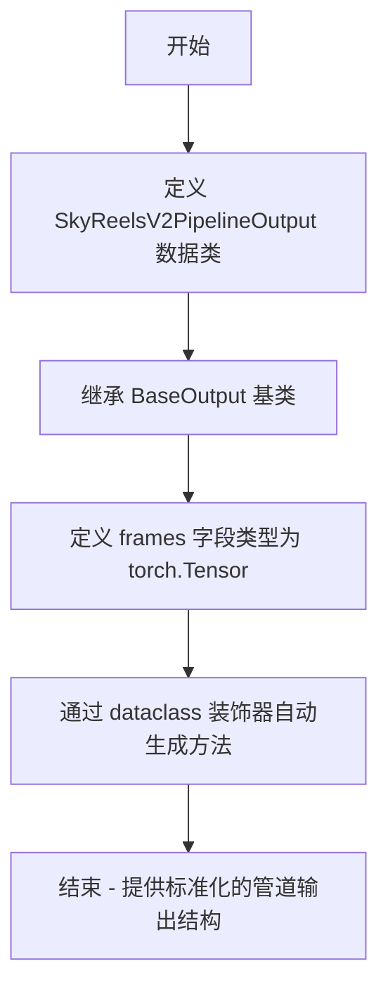
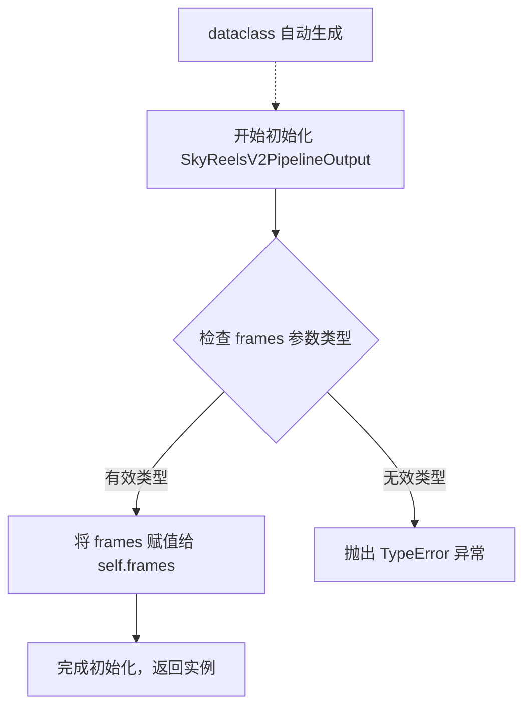

# `diffusers\src\diffusers\pipelines\skyreels_v2\pipeline_output.py` 详细设计文档

这是一个用于 SkyReelsV2 视频生成管道的输出类，继承自 diffusers 库的 BaseOutput 基类，用于封装生成的视频帧数据，支持 torch.Tensor、numpy 数组或 PIL 图像列表格式。

## 整体流程



## 类结构

```
BaseOutput (diffusers 抽象基类)
└── SkyReelsV2PipelineOutput (数据类)
```

## 全局变量及字段


### `SkyReelsV2PipelineOutput.frames`
    
视频帧数据，支持 tensor、numpy 数组或 PIL 图像列表格式

类型：`torch.Tensor`
    
    

## 全局函数及方法


### SkyReelsV2PipelineOutput.__init__

由 dataclass 自动生成的初始化方法，用于创建视频管道输出对象。

参数：

- `self`：隐式参数，SkyReelsV2PipelineOutput 实例本身
- `frames`：`torch.Tensor`，视频输出帧，可以是嵌套列表（batch_size 个子列表，每个子列表包含 num_frames 个去噪后的 PIL 图像序列）、NumPy 数组或 Torch 张量，形状为 `(batch_size, num_frames, channels, height, width)`

返回值：`None`，dataclass 的 `__init__` 方法不返回值，直接初始化实例属性。

#### 流程图



#### 带注释源码

```python
@dataclass
class SkyReelsV2PipelineOutput(BaseOutput):
    r"""
    Output class for SkyReelsV2 pipelines.

    Args:
        frames (`torch.Tensor`, `np.ndarray`, or list[list[PIL.Image.Image]]):
            list of video outputs - It can be a nested list of length `batch_size,` with each sub-list containing
            denoised PIL image sequences of length `num_frames.` It can also be a NumPy array or Torch tensor of shape
            `(batch_size, num_frames, channels, height, width)`.
    """

    # 视频输出帧，类型为 torch.Tensor
    # 可以是以下几种形式之一：
    # 1. 嵌套列表：batch_size 个子列表，每个子列表包含 num_frames 个 PIL.Image
    # 2. NumPy 数组：形状 (batch_size, num_frames, channels, height, width)
    # 3. Torch 张量：形状 (batch_size, num_frames, channels, height, width)
    frames: torch.Tensor
    
    # 以下代码由 @dataclass 装饰器自动生成，模拟如下：
    #
    # def __init__(self, frames: torch.Tensor) -> None:
    #     """
    #     初始化 SkyReelsV2PipelineOutput 实例
    #     
    #     参数:
    #         frames: 视频输出帧数据
    #     """
    #     self.frames = frames
    #
    # def __repr__(self) -> str:
    #     return f'SkyReelsV2PipelineOutput(frames={self.frames!r})'
    #
    # def __eq__(self, other: object) -> bool:
    #     if not isinstance(other, SkyReelsV2PipelineOutput):
    #         return NotImplemented
    #     return self.frames == other.frames
```


### `SkyReelsV2PipelineOutput.__repr__`

由 Python `dataclass` 装饰器自动生成，返回对象的字符串表示形式，通常用于调试和日志记录。该方法会格式化类名以及所有字段（特别是 `frames` 字段）的值。

参数：

- `self`：`SkyReelsV2PipelineOutput`，调用该方法的当前实例对象。

返回值：`str`，对象的字符串表示。

#### 流程图

```mermaid
graph TD
    A([开始: self]) --> B{获取类名}
    B --> C[获取字段值 frames]
    C --> D{格式化字符串}
    D --> E[组合字符串: 'SkyReelsV2PipelineOutput(frames=...)']
    E --> F([返回: 字符串])
    
    style A fill:#f9f,stroke:#333,stroke-width:2px
    style F fill:#9f9,stroke:#333,stroke-width:2px
```

#### 带注释源码

```python
def __repr__(self):
    """
    返回对象的字符串表示形式。
    Python dataclass 自动生成此方法。
    """
    # 使用 repr() 格式化 frames 字段，以确保 tensor 等对象也能被正确表示
    return f'SkyReelsV2PipelineOutput(frames={self.frames!r})'
```


### `SkyReelsV2PipelineOutput.__eq__`

由 dataclass 自动生成的魔法方法，用于比较两个 `SkyReelsV2PipelineOutput` 对象是否相等。

参数：

- `self`：`SkyReelsV2PipelineOutput`，当前对象
- `other`：`Any`，需要比较的另一对象

返回值：`bool`，如果两个对象相等返回 `True`，否则返回 `False`

#### 流程图

```mermaid
flowchart TD
    A[开始 __eq__ 比较] --> B{self is other?}
    B -->|是| C[返回 True]
    B -->|否| D{type(self) == type(other)?}
    D -->|否| E[返回 False]
    D -->|是| F[比较 frames 字段]
    F --> G{self.frames == other.frames?}
    G -->|是| C
    G -->|否| E
```

#### 带注释源码

```python
def __eq__(self, other: object) -> bool:
    """
    比较当前对象与另一个对象是否相等。
    
    由 dataclass 自动生成，比较逻辑如下：
    1. 如果比较的是同一个对象（self is other），返回 True
    2. 如果类型不同，返回 False
    3. 如果类型相同，比较所有字段（frames）的值
    
    Args:
        other: 需要比较的另一对象，可以是任意类型
    
    Returns:
        bool: 返回 True 如果两个对象相等，否则返回 False
    """
    # 如果是同一个对象，直接返回 True
    if self is other:
        return True
    
    # 如果类型不同，返回 False
    if not isinstance(other, SkyReelsV2PipelineOutput):
        return False
    
    # 比较 frames 字段的值
    return self.frames == other.frames
```

## 关键组件


### SkyReelsV2PipelineOutput 类

继承自 BaseOutput 的数据类，用于存储 SkyReelsV2 视频生成流水线的输出结果。该类定义了输出帧的数据结构，支持多种格式（torch.Tensor、np.ndarray 或 PIL.Image 列表）的帧数据存储。

### frames 字段

类型为 `torch.Tensor` 的输出帧数据成员。用于存储批量生成的视频帧序列，可以是三维张量（单帧）或四维张量（批量帧），支持多种格式的输入以保持灵活性。

### BaseOutput 基类

来自 diffusers.utils 的基础输出类，为流水线输出提供标准化的数据结构接口。确保 SkyReelsV2PipelineOutput 符合 diffusers 框架的输出规范。


## 问题及建议


### 已知问题

- **类型提示与文档不一致**：docstring 中描述 frames 可以是 `torch.Tensor`、`np.ndarray` 或 `list[list[PIL.Image.Image]]`，但类型注解仅声明为 `torch.Tensor`，导致类型提示与实际可用性不符。
- **缺少输入验证**：没有 `__post_init__` 方法来验证 frames 的维度、形状或数据类型是否符合预期。
- **BaseOutput 继承未明确利用**：继承自 `BaseOutput` 但未看到对其属性或方法的使用，继承关系可能只是为了符合管道输出类的约定。
- **PIL.Image 依赖未声明**：文档中提到 PIL.Image 类型，但未在代码中导入或使用，存在文档与实现脱节。

### 优化建议

- 修正类型提示为 `Union[torch.Tensor, np.ndarray, list[list[PIL.Image.Image]]]` 以匹配文档描述，并添加相应的类型检查。
- 添加 `__post_init__` 方法验证 frames 的有效性和基本属性（如 batch 维度、非负性等）。
- 如不需要 BaseOutput 的特定功能，可考虑移除该继承以简化类层次结构。
- 在类中添加明确的 batch_size、num_frames 等属性注解，或通过 property 方法提供便捷访问。
- 考虑添加序列化/反序列化方法的文档，说明如何在不同格式（Tensor/NumPy/PIL）之间转换。


## 其它


### 设计目标与约束

该类作为SkyReelsV2视频生成管道的输出容器，设计目标是为批量视频生成提供标准化的数据结构。核心约束包括：frames字段必须为torch.Tensor类型以支持GPU加速计算；设计遵循diffusers库的BaseOutput基类约定，确保与现有pipeline生态系统的兼容性；内存占用应与batch_size和num_frames成正比，需考虑大规模视频生成场景下的内存管理。

### 错误处理与异常设计

由于该类为纯数据容器（dataclass），本身不包含业务逻辑，错误处理主要依赖调用方的输入验证。frames字段的类型检查应在pipeline的__call__方法中完成，验证要点包括：frames必须为torch.Tensor类型；tensor的dtype应为浮点类型（float32/float16）以支持后续处理；shape维度需符合(batch_size, num_frames, channels, height, width)的约定。当类型不匹配时，建议抛出TypeError并附带清晰的错误信息；当shape不符合预期时，抛出ValueError。

### 数据流与状态机

该类在数据流中处于管道的输出端，典型流程为：diffusers调度器生成噪声→UNet模型去噪→VAE解码器解码潜在表示→后处理器转换为视频帧→封装为SkyReelsV2PipelineOutput返回。该类本身不涉及状态机设计，因为dataclass为不可变对象（frozen=False时可修改），状态变化由整个pipeline的调用链完成。

### 外部依赖与接口契约

主要依赖包括：torch（Tensor操作）、dataclasses（数据类装饰器）、diffusers.utils.BaseOutput（基类）。接口契约规定：调用方必须传入torch.Tensor类型的frames；返回值遵循BaseOutput的字典式访问约定；frames的shape约定为(batch_size, num_frames, channels, height, width)，channels通常为3（RGB）。

### 性能考量

该类的性能影响主要体现在内存占用方面。frames tensor的内存占用公式为：batch_size × num_frames × channels × height × width × bytes_per_element。对于1080p视频（1920×1080），单帧RGB float32占用约24.9MB内存，1秒30fps视频在batch_size=1时占用约747MB。优化建议包括：使用float16减少50%内存占用；支持分块返回以处理超长视频；考虑lazy evaluation或generator模式。

### 兼容性设计

该类遵循semantic versioning，与diffusers库版本同步更新。BaseOutput基类确保了与pipeline输出格式化工具的兼容性。建议在文档中明确标注最低依赖版本：Python ≥3.8, torch ≥1.9.0, diffusers ≥0.14.0。向后兼容性通过dataclass的field添加实现，新版本可保留旧字段。

### 测试策略

单元测试应覆盖：frames类型验证（非torch.Tensor应被拒绝）；frames shape验证；与其他输出格式（PIL.Image列表、NumPy数组）的转换兼容性；多batch场景下的内存占用测试。集成测试应验证：该输出类在完整pipeline中的序列化/反序列化；与调度器、UNet、VAE的协作；多GPU分布式场景下的行为。

### 使用示例与最佳实践

```python
# 基础用法
output = SkyReelsV2PipelineOutput(frames=torch.randn(1, 16, 3, 512, 512))
frames = output.frames

# 转换为CPU和NumPy
frames_np = output.frames.cpu().numpy()

# 批量处理
batch_output = SkyReelsV2PipelineOutput(frames=torch.randn(4, 30, 3, 1024, 1024))
```

最佳实践：始终在GPU可用时保持frames在GPU上以避免不必要的数据传输；使用torch.no_grad()包裹推理代码以节省显存；处理完成后及时释放tensor引用以协助GC。

### 注意事项

该类使用@dataclass装饰器，默认生成的__init__、__repr__、__eq__方法足以满足需求，无需自定义。frames字段为必填参数，实例化时不能为None。dataclass的frozen参数未设置，默认为False，意味着实例可被修改，但这可能影响hashability；若需要不可变对象，应设置frozen=True。

    