# `diffusers\src\diffusers\pipelines\skyreels_v2\pipeline_skyreels_v2.py` 详细设计文档

SkyReelsV2Pipeline是一个用于文本到视频（Text-to-Video）生成的Diffusion Pipeline，继承自DiffusionPipeline和SkyReelsV2LoraLoaderMixin，利用T5文本编码器、Transformer模型和VAE解码器，通过去噪扩散过程将文本提示转换为视频帧序列。

## 整体流程

```mermaid
graph TD
    A[开始: __call__] --> B[1. 检查输入参数 check_inputs]
B --> C[2. 设置guidance_scale和attention_kwargs]
C --> D[3. 编码输入提示 encode_prompt]
D --> E[4. 准备时间步 scheduler.set_timesteps]
E --> F[5. 准备潜在变量 prepare_latents]
F --> G{6. 去噪循环}
G --> H[执行条件推理: transformer(condition)]
H --> I{是否需要无分类器引导?}
I -- 是 --> J[执行无条件推理: transformer(uncondition)]
I -- 否 --> K[计算noise_pred]
J --> L[组合noise_pred = noise_uncond + guidance_scale * (noise_pred - noise_uncond)]
K --> L
L --> M[scheduler.step更新latents]
M --> N{是否有callback_on_step_end?}
N -- 是 --> O[执行回调函数]
N -- 否 --> P{是否到达最后一步或warmup完成?}
O --> P
P -- 是 --> Q[更新progress_bar]
P -- 否 --> G
G --> R{循环结束?}
R -- 否 --> G
R -- 是 --> S{output_type == 'latent'?}
S -- 否 --> T[VAE解码: vae.decode]
S -- 是 --> U[返回latents作为视频]
T --> V[video_processor后处理]
U --> V
V --> W[释放模型钩子 maybe_free_model_hooks]
W --> X[返回SkyReelsV2PipelineOutput或tuple]
```

## 类结构

```
DiffusionPipeline (基类)
└── SkyReelsV2Pipeline (继承自DiffusionPipeline和SkyReelsV2LoraLoaderMixin)
```

## 全局变量及字段


### `EXAMPLE_DOC_STRING`
    
示例文档字符串，包含使用说明和代码示例

类型：`str`
    


### `logger`
    
模块级日志记录器

类型：`logging.Logger`
    


### `XLA_AVAILABLE`
    
标识torch_xla是否可用的标志位

类型：`bool`
    


### `is_ftfy_available`
    
ftfy库可用性检查结果

类型：`bool`
    


### `SkyReelsV2Pipeline.model_cpu_offload_seq`
    
CPU卸载顺序配置

类型：`str`
    


### `SkyReelsV2Pipeline._callback_tensor_inputs`
    
回调函数可用的张量输入列表

类型：`list`
    


### `SkyReelsV2Pipeline.vae`
    
VAE模型实例

类型：`AutoencoderKLWan`
    


### `SkyReelsV2Pipeline.text_encoder`
    
T5文本编码器

类型：`UMT5EncoderModel`
    


### `SkyReelsV2Pipeline.tokenizer`
    
T5分词器

类型：`AutoTokenizer`
    


### `SkyReelsV2Pipeline.transformer`
    
条件Transformer去噪模型

类型：`SkyReelsV2Transformer3DModel`
    


### `SkyReelsV2Pipeline.scheduler`
    
扩散调度器

类型：`UniPCMultistepScheduler`
    


### `SkyReelsV2Pipeline.vae_scale_factor_temporal`
    
VAE时间维度缩放因子

类型：`int`
    


### `SkyReelsV2Pipeline.vae_scale_factor_spatial`
    
VAE空间维度缩放因子

类型：`int`
    


### `SkyReelsV2Pipeline.video_processor`
    
视频后处理器

类型：`VideoProcessor`
    


### `SkyReelsV2Pipeline._guidance_scale`
    
分类器自由引导强度

类型：`float`
    


### `SkyReelsV2Pipeline._attention_kwargs`
    
注意力机制参数字典

类型：`dict`
    


### `SkyReelsV2Pipeline._current_timestep`
    
当前去噪时间步

类型：`int`
    


### `SkyReelsV2Pipeline._interrupt`
    
是否中断标志

类型：`bool`
    


### `SkyReelsV2Pipeline._num_timesteps`
    
总时间步数

类型：`int`
    
    

## 全局函数及方法


### `basic_clean`

基本的文本清理函数，使用ftfy修复文本编码问题，并反转义HTML实体，最后去除首尾空白字符。

参数：

- `text`：`str`，需要清理的原始文本

返回值：`str`，清理后的文本

#### 流程图

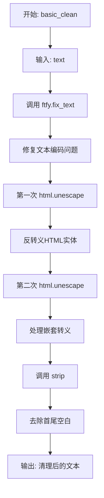

#### 带注释源码

```
def basic_clean(text):
    """
    基本文本清理函数
    
    该函数对输入文本进行以下处理:
    1. 使用ftfy修复常见的文本编码问题（如mojibake）
    2. 连续两次反转义HTML实体（处理嵌套转义情况）
    3. 去除文本首尾的空白字符
    
    Args:
        text: 需要清理的原始文本字符串
        
    Returns:
        清理后的文本字符串
    """
    # Step 1: 使用ftfy修复文本编码问题
    # ftfy能够自动检测并修复常见的编码错误，如UTF-8被误读为Latin-1等
    text = ftfy.fix_text(text)
    
    # Step 2: 连续两次反转义HTML实体
    # 第一次反转义处理基本的HTML实体（如 &amp; -> &）
    # 第二次反转义处理嵌套转义的情况（如 &amp;amp; -> &amp; -> &）
    text = html.unescape(html.unescape(text))
    
    # Step 3: 去除首尾空白字符并返回
    return text.strip()
```


### `whitespace_clean`

该函数是一个文本预处理工具函数，通过正则表达式将输入字符串中的多个连续空白字符（非仅空格，还包括制表符、换行符等）统一替换为单个空格，并去除字符串首尾的空白字符，确保输出字符串单词之间仅以单个空格分隔且无前后空格。

参数：

- `text`：`str`，需要进行空白字符清理的原始文本字符串

返回值：`str`，清理后的文本字符串，其中连续空白字符被替换为单个空格，且首尾无多余空格

#### 流程图

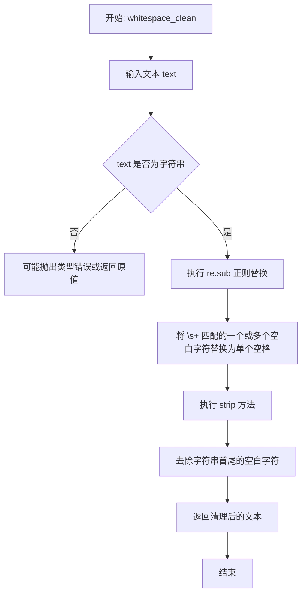

#### 带注释源码

```python
def whitespace_clean(text):
    """
    清理文本中的空白字符，将多个连续空白替换为单个空格
    
    参数:
        text: str - 需要清理的文本字符串
        
    返回:
        str - 清理后的文本字符串
    """
    # 使用正则表达式 \s+ 匹配一个或多个空白字符（包括空格、制表符、换行符等）
    # 将这些连续空白字符替换为单个空格字符 " "
    text = re.sub(r"\s+", " ", text)
    
    # 去除字符串首尾的空白字符（包括空格、制表符、换行符等）
    text = text.strip()
    
    # 返回清理后的文本
    return text
```


### `prompt_clean`

提示词清理函数，依次调用 `basic_clean` 和 `whitespace_clean` 对输入文本进行标准化处理，去除 HTML 实体、修复文本编码问题并规范化空白字符。

参数：

- `text`：`str`，待清理的提示词文本

返回值：`str`，清理后的提示词文本

#### 流程图

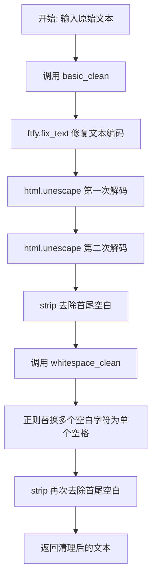

#### 带注释源码

```python
def prompt_clean(text):
    """
    提示词清理函数
    
    该函数对输入文本进行两阶段清理：
    1. basic_clean: 处理HTML实体转义和文本编码问题
    2. whitespace_clean: 规范化空白字符（将多个空格合并为单个）
    
    Args:
        text: str, 待清理的提示词文本
        
    Returns:
        str, 清理后的提示词文本
    """
    # 第一阶段：调用 basic_clean 处理 HTML 实体和文本编码
    # - ftfy.fix_text: 修复常见的文本编码问题（如 mojibake）
    # - html.unescape: 递归解码 HTML 实体（如 &amp; -> &, &lt; -> <）
    # - strip: 去除清理后文本的首尾空白
    text = basic_clean(text)
    
    # 第二阶段：调用 whitespace_clean 规范化空白字符
    # - 正则 \s+: 匹配一个或多个空白字符
    # - 替换为单个空格 " "
    # - strip: 再次去除首尾空白确保干净输出
    text = whitespace_clean(text)
    
    return text


def basic_clean(text):
    """
    基础文本清理函数
    
    处理 HTML 实体转义和修复文本编码问题
    
    Args:
        text: str, 待清理的文本
        
    Returns:
        str, 清理后的文本
    """
    # 使用 ftfy 库修复常见的文本编码问题（mojibake）
    text = ftfy.fix_text(text)
    
    # 递归调用 html.unescape 两次，确保完全解码嵌套的 HTML 实体
    # 例如: &amp;lt; -> &lt; -> <
    text = html.unescape(html.unescape(text))
    
    # 去除处理后文本的首尾空白字符
    return text.strip()


def whitespace_clean(text):
    """
    空白字符规范化函数
    
    将文本中的多个连续空白字符替换为单个空格
    
    Args:
        text: str, 待处理的文本
        
    Returns:
        str, 空白字符规范化后的文本
    """
    # 使用正则表达式将一个或多个空白字符（空格、制表符、换行等）
    # 替换为单个空格
    text = re.sub(r"\s+", " ", text)
    
    # 去除首尾空白
    text = text.strip()
    
    return text
```


### SkyReelsV2Pipeline.__init__

这是 `SkyReelsV2Pipeline` 类的初始化方法，用于初始化文本到视频（Text-to-Video）生成管道。该方法接收并注册所有必要的模型组件（tokenizer、text_encoder、transformer、vae、scheduler），并计算 VAE 的时序和空间缩放因子，同时初始化视频处理器。

参数：

- `tokenizer`：`AutoTokenizer`，T5 tokenizer，用于将文本提示编码为 token 序列
- `text_encoder`：`UMT5EncoderModel`，T5 文本编码器模型，用于将 token 序列转换为文本嵌入
- `transformer`：`SkyReelsV2Transformer3DModel`，条件 Transformer 模型，用于对潜在表示进行去噪
- `vae`：`AutoencoderKLWan`，变分自编码器模型，用于视频与潜在表示之间的编码和解码
- `scheduler`：`UniPCMultistepScheduler`，多步调度器，用于去噪过程中的时间步调度

返回值：`None`，该方法为初始化方法，不返回任何值

#### 流程图

```mermaid
flowchart TD
    A[开始 __init__] --> B[调用父类 DiffusionPipeline.__init__]
    B --> C[使用 register_modules 注册五个模块]
    C --> D[vae, text_encoder, tokenizer, transformer, scheduler]
    D --> E[计算 vae_scale_factor_temporal]
    E --> F[计算 vae_scale_factor_spatial]
    F --> G[初始化 VideoProcessor]
    H[结束 __init__]
    
    E -.->|条件判断| I{self.vae 存在?}
    I -->|是| J[2 ** sum(vae.temperal_downsample)]
    I -->|否| K[默认值 4]
    
    F -.->|条件判断| L{self.vae 存在?}
    L -->|是| M[2 ** len(vae.temperal_downsample)]
    L -->|否| N[默认值 8]
```

#### 带注释源码

```python
def __init__(
    self,
    tokenizer: AutoTokenizer,
    text_encoder: UMT5EncoderModel,
    transformer: SkyReelsV2Transformer3DModel,
    vae: AutoencoderKLWan,
    scheduler: UniPCMultistepScheduler,
):
    """
    初始化 SkyReelsV2Pipeline 管道
    
    参数:
        tokenizer: T5 tokenizer 用于文本编码
        text_encoder: T5 编码器模型
        transformer: 3D Transformer 去噪模型
        vae: 视频 VAE 编解码器
        scheduler: 去噪调度器
    """
    # 调用父类 DiffusionPipeline 的初始化方法
    # 设置基本的管道配置和设备管理
    super().__init__()

    # 注册所有模块到管道中，使其可以通过 self.xxx 访问
    # 注册顺序决定了模型卸载的顺序 (model_cpu_offload_seq)
    self.register_modules(
        vae=vae,
        text_encoder=text_encoder,
        tokenizer=tokenizer,
        transformer=transformer,
        scheduler=scheduler,
    )

    # 计算 VAE 的时序缩放因子
    # 用于将帧数映射到潜在空间的帧数
    # 例如: 如果 vae 有 2 个时序下采样层，则 factor = 2^2 = 4
    self.vae_scale_factor_temporal = 2 ** sum(self.vae.temperal_downsample) if getattr(self, "vae", None) else 4

    # 计算 VAE 的空间缩放因子
    # 用于将高度和宽度映射到潜在空间
    # 例如: 如果有 3 个空间下采样层，则 factor = 2^3 = 8
    self.vae_scale_factor_spatial = 2 ** len(self.vae.temperal_downsample) if getattr(self, "vae", None) else 8

    # 初始化视频处理器
    # 用于 VAE 解码后的视频后处理（如格式转换等）
    self.video_processor = VideoProcessor(vae_scale_factor=self.vae_scale_factor_spatial)
```


### `SkyReelsV2Pipeline._get_t5_prompt_embeds`

该方法负责将文本提示（prompt）编码为T5文本编码器的隐藏状态嵌入向量（prompt embeddings），支持批量处理和每个提示生成多个视频的场景。主要流程包括：文本清洗、Tokenization、文本编码、序列长度截断与填充、以及针对多视频生成的嵌入复制。

参数：

- `self`：`SkyReelsV2Pipeline` 实例本身，隐式传递
- `prompt`：`str | list[str]`，待编码的文本提示，可以是单个字符串或字符串列表
- `num_videos_per_prompt`：`int`，每个提示要生成的视频数量，默认为1，用于复制嵌入向量
- `max_sequence_length`：`int`，文本序列的最大长度，默认为226
- `device`：`torch.device | None`，用于计算的目标设备，若为None则使用执行设备
- `dtype`：`torch.dtype | None`，目标数据类型，若为None则使用文本编码器的数据类型

返回值：`torch.Tensor`，返回编码后的文本嵌入向量，形状为 `(batch_size * num_videos_per_prompt, max_sequence_length, hidden_dim)`

#### 流程图

```mermaid
flowchart TD
    A[开始 _get_t5_prompt_embeds] --> B{device 是否为 None?}
    B -->|是| C[使用 self._execution_device]
    B -->|否| D[使用传入的 device]
    C --> E{device = self._execution_device}
    D --> E
    E --> F{dtype 是否为 None?}
    F -->|是| G[使用 self.text_encoder.dtype]
    F -->|否| H[使用传入的 dtype]
    G --> I[dtype = self.text_encoder.dtype]
    H --> I
    I --> J{判断 prompt 类型}
    J -->|str| K[转换为列表: [prompt]]
    J -->|list| L[保持原样]
    K --> M[prompt = [prompt_clean(u) for u in prompt]]
    L --> M
    M --> N[获取 batch_size = len(prompt)]
    N --> O[调用 self.tokenizer 进行 tokenization]
    O --> P[提取 text_input_ids 和 attention_mask]
    P --> Q[计算 seq_lens = mask.gt(0).sum(dim=1).long]
    Q --> R[调用 self.text_encoder 获取 last_hidden_state]
    R --> S[prompt_embeds = prompt_embeds.to dtype and device]
    S --> T[截断: prompt_embeds = [u[:v] for u, v in zip(prompt_embeds, seq_lens)]
    T --> U[填充到固定长度: torch.stack + torch.cat + new_zeros]
    U --> V[重复嵌入: prompt_embeds.repeat 1, num_videos_per_prompt, 1]
    V --> W[reshape: view to batch_size * num_videos_per_prompt, seq_len, -1]
    W --> X[返回 prompt_embeds]
```

#### 带注释源码

```python
def _get_t5_prompt_embeds(
    self,
    prompt: str | list[str] = None,
    num_videos_per_prompt: int = 1,
    max_sequence_length: int = 226,
    device: torch.device | None = None,
    dtype: torch.dtype | None = None,
):
    """
    将文本提示编码为T5文本编码器的隐藏状态嵌入向量。
    
    Args:
        prompt: 待编码的文本提示，字符串或字符串列表
        num_videos_per_prompt: 每个提示生成的视频数量
        max_sequence_length: 最大序列长度
        device: 计算设备
        dtype: 数据类型
    
    Returns:
        编码后的文本嵌入向量
    """
    # 确定计算设备和数据类型
    # 如果未指定，则使用执行设备和文本编码器的数据类型
    device = device or self._execution_device
    dtype = dtype or self.text_encoder.dtype

    # 预处理提示文本
    # 统一转换为列表格式，并对每个提示进行清洗
    prompt = [prompt] if isinstance(prompt, str) else prompt
    prompt = [prompt_clean(u) for u in prompt]
    batch_size = len(prompt)

    # Tokenization 阶段
    # 使用tokenizer将文本转换为token ids和attention mask
    # padding="max_length": 填充到最大长度
    # truncation=True: 截断超过最大长度的序列
    # add_special_tokens=True: 添加特殊token（如<s>, </s>等）
    # return_attention_mask=True: 返回attention mask用于标识有效token位置
    # return_tensors="pt": 返回PyTorch张量
    text_inputs = self.tokenizer(
        prompt,
        padding="max_length",
        max_length=max_sequence_length,
        truncation=True,
        add_special_tokens=True,
        return_attention_mask=True,
        return_tensors="pt",
    )
    
    # 提取token ids和attention mask
    text_input_ids, mask = text_inputs.input_ids, text_inputs.attention_mask
    
    # 计算每个序列的实际长度（有效token的数量）
    # mask.gt(0) 检查mask中大于0的位置（有效token位置）
    # .sum(dim=1) 按序列维度求和
    seq_lens = mask.gt(0).sum(dim=1).long()

    # 文本编码阶段
    # 使用T5文本编码器将token ids转换为嵌入向量
    # .last_hidden_state 获取最后一层的隐藏状态
    prompt_embeds = self.text_encoder(text_input_ids.to(device), mask.to(device)).last_hidden_state
    
    # 转换数据类型和设备
    prompt_embeds = prompt_embeds.to(dtype=dtype, device=device)

    # 序列截断处理
    # 根据实际序列长度截断嵌入向量，去除padding部分
    prompt_embeds = [u[:v] for u, v in zip(prompt_embeds, seq_lens)]

    # 填充到固定长度
    # 对于每个嵌入向量，如果长度不足max_sequence_length，则在末尾填充零向量
    # 这是为了保证输出形状的一致性，便于后续处理
    prompt_embeds = torch.stack(
        [torch.cat([u, u.new_zeros(max_sequence_length - u.size(0), u.size(1))]) for u in prompt_embeds], dim=0
    )

    # 复制嵌入向量以支持每个提示生成多个视频
    # 使用mps友好的方法（repeat而不是repeat_interleave）
    # 原始形状: (batch_size, seq_len, hidden_dim)
    # repeat后: (batch_size, num_videos_per_prompt, seq_len, hidden_dim)
    _, seq_len, _ = prompt_embeds.shape
    prompt_embeds = prompt_embeds.repeat(1, num_videos_per_prompt, 1)
    
    # Reshape为最终形状
    # (batch_size * num_videos_per_prompt, seq_len, hidden_dim)
    prompt_embeds = prompt_embeds.view(batch_size * num_videos_per_prompt, seq_len, -1)

    return prompt_embeds
```


### `SkyReelsV2Pipeline.encode_prompt`

该方法负责将文本提示词（prompt）和负向提示词（negative_prompt）编码为文本编码器的隐藏状态向量（embeddings），为后续的视频生成过程提供文本条件特征。当启用无分类器自由引导（CFG）时，会同时生成正向和负向的文本嵌入，以实现分类器自由引导的生成策略。

参数：

- `prompt`：`str | list[str]`，要编码的文本提示词，可以是单个字符串或字符串列表
- `negative_prompt`：`str | list[str] | None`，用于引导图像生成的负向提示词，如果不指定且不使用引导时，需要传递 `negative_prompt_embeds`
- `do_classifier_free_guidance`：`bool`，是否使用无分类器自由引导，默认为 True
- `num_videos_per_prompt`：`int`，每个提示词需要生成的视频数量，默认为 1
- `prompt_embeds`：`torch.Tensor | None`，预生成的文本嵌入，可用于轻松调整文本输入（如提示词加权）
- `negative_prompt_embeds`：`torch.Tensor | None`，预生成的负向文本嵌入，可用于轻松调整文本输入
- `max_sequence_length`：`int`，文本编码器的最大序列长度，默认为 226
- `device`：`torch.device | None`，torch 设备，用于放置生成的嵌入
- `dtype`：`torch.dtype | None`，torch 数据类型，用于嵌入的数据类型

返回值：`tuple[torch.Tensor, torch.Tensor]`，返回提示词嵌入和负向提示词嵌入的元组

#### 流程图

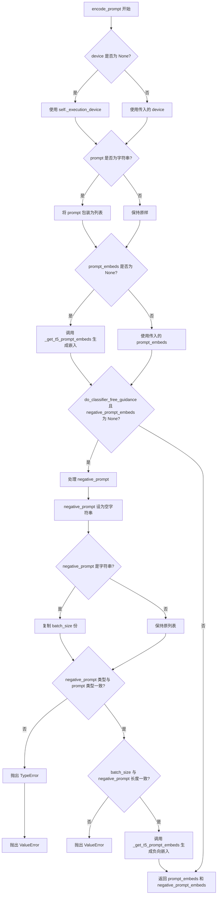

#### 带注释源码

```python
def encode_prompt(
    self,
    prompt: str | list[str],
    negative_prompt: str | list[str] | None = None,
    do_classifier_free_guidance: bool = True,
    num_videos_per_prompt: int = 1,
    prompt_embeds: torch.Tensor | None = None,
    negative_prompt_embeds: torch.Tensor | None = None,
    max_sequence_length: int = 226,
    device: torch.device | None = None,
    dtype: torch.dtype | None = None,
):
    r"""
    Encodes the prompt into text encoder hidden states.

    Args:
        prompt (`str` or `list[str]`, *optional*):
            prompt to be encoded
        negative_prompt (`str` or `list[str]`, *optional*):
            The prompt or prompts not to guide the image generation. If not defined, one has to pass
            `negative_prompt_embeds` instead. Ignored when not using guidance (i.e., ignored if `guidance_scale` is
            less than `1`).
        do_classifier_free_guidance (`bool`, *optional*, defaults to `True`):
            Whether to use classifier free guidance or not.
        num_videos_per_prompt (`int`, *optional*, defaults to 1):
            Number of videos that should be generated per prompt. torch device to place the resulting embeddings on
        prompt_embeds (`torch.Tensor`, *optional*):
            Pre-generated text embeddings. Can be used to easily tweak text inputs, *e.g.* prompt weighting. If not
            provided, text embeddings will be generated from `prompt` input argument.
        negative_prompt_embeds (`torch.Tensor`, *optional*):
            Pre-generated negative text embeddings. Can be used to easily tweak text inputs, *e.g.* prompt
            weighting. If not provided, negative_prompt_embeds will be generated from `negative_prompt` input
            argument.
        device: (`torch.device`, *optional*):
            torch device
        dtype: (`torch.dtype`, *optional*):
            torch dtype
    """
    # 如果未指定 device，则使用执行设备（通常是 CUDA）
    device = device or self._execution_device

    # 将单个字符串 prompt 转换为列表，统一处理方式
    prompt = [prompt] if isinstance(prompt, str) else prompt
    
    # 根据 prompt 或 prompt_embeds 确定 batch_size
    if prompt is not None:
        batch_size = len(prompt)
    else:
        batch_size = prompt_embeds.shape[0]

    # 如果未提供预计算的 prompt_embeds，则从 prompt 生成
    if prompt_embeds is None:
        prompt_embeds = self._get_t5_prompt_embeds(
            prompt=prompt,
            num_videos_per_prompt=num_videos_per_prompt,
            max_sequence_length=max_sequence_length,
            device=device,
            dtype=dtype,
        )

    # 如果使用 CFG 且未提供负向嵌入，则生成负向嵌入
    if do_classifier_free_guidance and negative_prompt_embeds is None:
        # 默认负向提示词为空字符串
        negative_prompt = negative_prompt or ""
        # 将字符串负向提示词复制为 batch_size 份，或保持列表不变
        negative_prompt = batch_size * [negative_prompt] if isinstance(negative_prompt, str) else negative_prompt

        # 类型检查：negative_prompt 类型必须与 prompt 类型一致
        if prompt is not None and type(prompt) is not type(negative_prompt):
            raise TypeError(
                f"`negative_prompt` should be the same type to `prompt`, but got {type(negative_prompt)} !="
                f" {type(prompt)}."
            )
        # 批次大小检查：negative_prompt 的批次大小必须与 prompt 一致
        elif batch_size != len(negative_prompt):
            raise ValueError(
                f"`negative_prompt`: {negative_prompt} has batch size {len(negative_prompt)}, but `prompt`:"
                f" {prompt} has batch size {batch_size}. Please make sure that passed `negative_prompt` matches"
                " the batch size of `prompt`."
            )

        # 从 negative_prompt 生成负向文本嵌入
        negative_prompt_embeds = self._get_t5_prompt_embeds(
            prompt=negative_prompt,
            num_videos_per_prompt=num_videos_per_prompt,
            max_sequence_length=max_sequence_length,
            device=device,
            dtype=dtype,
        )

    # 返回正向和负向的文本嵌入
    return prompt_embeds, negative_prompt_embeds
```


### `SkyReelsV2Pipeline.check_inputs`

该方法用于验证视频生成管道的输入参数合法性，确保用户提供的prompt、negative_prompt、height、width、prompt_embeds、negative_prompt_embeds以及callback_on_step_end_tensor_inputs等参数符合模型要求，包括尺寸对齐检查、互斥参数检查、类型检查等，若不合规则抛出相应的ValueError异常。

参数：

- `self`：`SkyReelsV2Pipeline`实例，管道对象本身
- `prompt`：`str | list[str] | None`，正向提示词，支持字符串或字符串列表
- `negative_prompt`：`str | list[str] | None`，负向提示词，支持字符串或字符串列表
- `height`：`int`，生成视频的高度（像素），必须是16的倍数
- `width`：`int`，生成视频的宽度（像素），必须是16的倍数
- `prompt_embeds`：`torch.Tensor | None`，预生成的文本嵌入，与prompt互斥
- `negative_prompt_embeds`：`torch.Tensor | None`，预生成的负向文本嵌入，与negative_prompt互斥
- `callback_on_step_end_tensor_inputs`：`list[str] | None`，回调函数在每步结束时可访问的tensor输入列表

返回值：`None`，该方法不返回值，仅通过抛出ValueError异常来处理无效输入

#### 流程图

```mermaid
flowchart TD
    A[开始 check_inputs] --> B{height % 16 == 0?}
    B -->|否| B1[抛出ValueError: height和width必须被16整除]
    B -->|是| C{callback_on_step_end_tensor_inputs不为空?}
    C -->|是| C1{所有k都在self._callback_tensor_inputs中?}
    C1 -->|否| C2[抛出ValueError: 存在非法的callback tensor输入]
    C1 -->|是| D{prompt和prompt_embeds同时存在?}
    C -->|否| D
    D -->|是| D1[抛出ValueError: prompt和prompt_embeds不能同时提供]
    D -->|否| E{negative_prompt和negative_prompt_embeds同时存在?}
    E -->|是| E1[抛出ValueError: negative_prompt和negative_prompt_embeds不能同时提供]
    E -->|否| F{prompt和prompt_embeds都为空?]
    F -->|是| F1[抛出ValueError: 必须提供prompt或prompt_embeds之一]
    F -->|否| G{prompt是str或list类型?]
    G -->|否| G1[抛出ValueError: prompt必须是str或list类型]
    G -->|是| H{negative_prompt是str或list类型?}
    H -->|否| H1[抛出ValueError: negative_prompt必须是str或list类型]
    H -->|是| I[结束: 所有检查通过]
    
    B1 --> Z[结束]
    C2 --> Z
    D1 --> Z
    E1 --> Z
    F1 --> Z
    G1 --> Z
    H1 --> Z
```

#### 带注释源码

```python
def check_inputs(
    self,
    prompt,
    negative_prompt,
    height,
    width,
    prompt_embeds=None,
    negative_prompt_embeds=None,
    callback_on_step_end_tensor_inputs=None,
):
    """
    检查输入参数的合法性，验证视频生成管道所需的各种输入是否符合要求。
    
    该方法执行以下验证：
    1. 视频尺寸必须是16的倍数（VAE的spatial下采样要求）
    2. 回调tensor输入必须在允许的列表中
    3. prompt和prompt_embeds不能同时提供（互斥）
    4. negative_prompt和negative_prompt_embeds不能同时提供（互斥）
    5. prompt和prompt_embeds至少提供一个
    6. prompt类型必须是str或list
    7. negative_prompt类型必须是str或list
    """
    
    # 检查视频尺寸是否为16的倍数
    # VAE的spatial下采样因子为2^3=8，temporal下采样因子为2^2=4
    # 为了保证latent与原始像素尺寸对齐，height和width必须能被16整除
    if height % 16 != 0 or width % 16 != 0:
        raise ValueError(f"`height` and `width` have to be divisible by 16 but are {height} and {width}.")

    # 验证回调tensor输入是否在允许的列表中
    # 只有在self._callback_tensor_inputs中声明的tensor才能在callback中被访问
    # 这是一个安全检查，防止意外访问未声明的内部状态
    if callback_on_step_end_tensor_inputs is not None and not all(
        k in self._callback_tensor_inputs for k in callback_on_step_end_tensor_inputs
    ):
        raise ValueError(
            f"`callback_on_step_end_tensor_inputs` has to be in {self._callback_tensor_inputs}, but found {[k for k in callback_on_step_end_tensor_inputs if k not in self._callback_tensor_inputs]}"
        )

    # 互斥检查：prompt和prompt_embeds不能同时提供
    # 允许用户直接提供预计算的文本嵌入以提高效率
    if prompt is not None and prompt_embeds is not None:
        raise ValueError(
            f"Cannot forward both `prompt`: {prompt} and `prompt_embeds`: {prompt_embeds}. Please make sure to"
            " only forward one of the two."
        )
    
    # 互斥检查：negative_prompt和negative_prompt_embeds不能同时提供
    elif negative_prompt is not None and negative_prompt_embeds is not None:
        raise ValueError(
            f"Cannot forward both `negative_prompt`: {negative_prompt} and `negative_prompt_embeds`: {negative_prompt_embeds}. Please make sure to"
            " only forward one of the two."
        )
    
    # 必需性检查：至少提供prompt或prompt_embeds之一
    # 文本嵌入是生成过程的必要条件
    elif prompt is None and prompt_embeds is None:
        raise ValueError(
            "Provide either `prompt` or `prompt_embeds`. Cannot leave both `prompt` and `prompt_embeds` undefined."
        )
    
    # 类型检查：prompt必须是str或list类型
    # 支持单提示词或批量提示词生成
    elif prompt is not None and (not isinstance(prompt, str) and not isinstance(prompt, list)):
        raise ValueError(f"`prompt` has to be of type `str` or `list` but is {type(prompt)}")
    
    # 类型检查：negative_prompt必须是str或list类型
    # 保持与prompt类型的一致性
    elif negative_prompt is not None and (
        not isinstance(negative_prompt, str) and not isinstance(negative_prompt, list)
    ):
        raise ValueError(f"`negative_prompt` has to be of type `str` or `list` but is {type(negative_prompt)}")
```


### `SkyReelsV2Pipeline.prepare_latents`

该方法用于为视频生成准备初始的噪声 latent 张量。如果提供了预生成的 latents，则将其移动到指定设备；否则根据批次大小、视频尺寸和 VAE 缩放因子计算合适的 latent 形状，并使用随机张量初始化。

参数：

- `self`：`SkyReelsV2Pipeline` 实例本身
- `batch_size`：`int`，生成的视频批次大小
- `num_channels_latents`：`int`，默认为 16，latent 空间的通道数
- `height`：`int`，默认为 480，目标视频的高度（像素）
- `width`：`int`，默认为 832，目标视频的宽度（像素）
- `num_frames`：`int`，默认为 81，目标视频的帧数
- `dtype`：`torch.dtype | None`，默认为 None，生成 latents 的数据类型
- `device`：`torch.device | None`，默认为 None，生成 latents 的设备
- `generator`：`torch.Generator | list[torch.Generator] | None`，默认为 None，用于确保生成可复现的随机数生成器
- `latents`：`torch.Tensor | None`，默认为 None，预生成的噪声 latents，如果提供则直接返回

返回值：`torch.Tensor`，生成的或处理后的 latent 张量

#### 流程图

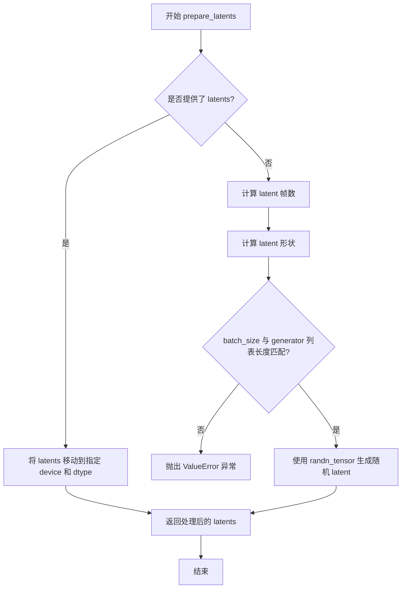

#### 带注释源码

```python
def prepare_latents(
    self,
    batch_size: int,
    num_channels_latents: int = 16,
    height: int = 480,
    width: int = 832,
    num_frames: int = 81,
    dtype: torch.dtype | None = None,
    device: torch.device | None = None,
    generator: torch.Generator | list[torch.Generator] | None = None,
    latents: torch.Tensor | None = None,
) -> torch.Tensor:
    """
    准备用于视频生成的 latent 张量。
    
    如果提供了预生成的 latents，则将其移动到指定的设备和数据类型。
    否则，根据视频参数和 VAE 缩放因子计算合适的 latent 形状，
    并使用随机噪声初始化 latent。
    
    参数:
        batch_size: 批次大小
        num_channels_latents: latent 通道数，默认为 16
        height: 视频高度
        width: 视频宽度
        num_frames: 视频帧数
        dtype: 数据类型
        device: 设备
        generator: 随机数生成器，用于可复现生成
        latents: 预生成的 latent 张量
        
    返回:
        torch.Tensor: 准备好的 latent 张量
    """
    # 如果提供了 latents，直接将其移动到指定设备并返回
    if latents is not None:
        return latents.to(device=device, dtype=dtype)

    # 计算经过 VAE 时间下采样后的 latent 帧数
    # 公式: (num_frames - 1) // vae_scale_factor_temporal + 1
    # 例如: 如果 num_frames=97, vae_scale_factor_temporal=2, 则 latent 帧数为 49
    num_latent_frames = (num_frames - 1) // self.vae_scale_factor_temporal + 1
    
    # 构建 latent 的形状: [batch_size, channels, latent_frames, height/vae_scale, width/vae_scale]
    # VAE 的空间下采样因子通常为 8，时间下采样因子通常为 4
    shape = (
        batch_size,
        num_channels_latents,
        num_latent_frames,
        int(height) // self.vae_scale_factor_spatial,
        int(width) // self.vae_scale_factor_spatial,
    )
    
    # 检查 generator 列表长度是否与批次大小匹配
    if isinstance(generator, list) and len(generator) != batch_size:
        raise ValueError(
            f"You have passed a list of generators of length {len(generator)}, but requested an effective batch"
            f" size of {batch_size}. Make sure the batch size matches the length of the generators."
        )

    # 使用 randn_tensor 生成标准正态分布的随机噪声 latent
    # generator 参数确保生成可复现（如果提供）
    latents = randn_tensor(shape, generator=generator, device=device, dtype=dtype)
    
    return latents
```


### `SkyReelsV2Pipeline.guidance_scale`

这是 `SkyReelsV2Pipeline` 类的属性方法，用于获取当前配置的 guidance_scale 值，该值用于控制分类器自由引导（Classifier-Free Guidance）的强度，决定生成内容与文本提示的关联程度。

参数：

- 该方法没有参数（property 装饰器方法）

返回值：`float`，返回当前的 guidance_scale 值，用于控制生成过程中文本提示对生成内容的引导强度。值越大，生成内容与提示词越相关，但可能导致质量下降。

#### 流程图


#### 带注释源码

```python
@property
def guidance_scale(self):
    """
    属性 getter: 获取当前的 guidance_scale 值。
    
    guidance_scale 是分类器自由引导 (Classifier-Free Guidance) 的缩放因子，
    在 __call__ 方法中通过 self._guidance_scale = guidance_scale 进行设置。
    当 do_classifier_free_guidance 为 True 时（即 guidance_scale > 1.0），
    该值用于在无条件噪声预测和有条件噪声预测之间进行插值:
    noise_pred = noise_uncond + guidance_scale * (noise_pred - noise_uncond)
    
    返回:
        float: 当前的 guidance_scale 值
    """
    return self._guidance_scale
```


### `SkyReelsV2Pipeline.do_classifier_free_guidance`

该属性是一个只读的计算属性，用于判断当前管道是否启用了无分类器自由引导（Classifier-Free Guidance，CFG）策略。通过比较 `guidance_scale` 与 1.0 的大小关系来确定是否需要在推理过程中同时执行条件和非条件（unconditional）噪声预测，从而提升生成内容与文本提示的相关性。

参数：
- （无显式参数，隐式接收 `self` 实例）

返回值：`bool`，返回 `True` 表示启用 CFG 策略（`guidance_scale > 1.0`），返回 `False` 表示禁用 CFG 策略。

#### 流程图

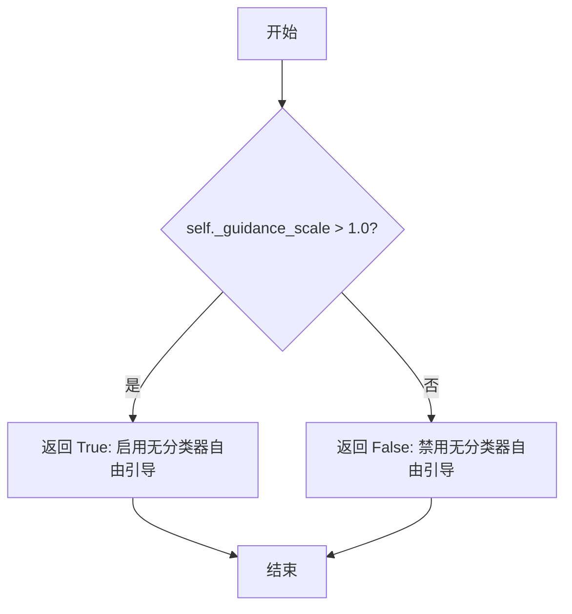

#### 带注释源码

```python
@property
def do_classifier_free_guidance(self) -> bool:
    """
    判断是否启用无分类器自由引导（Classifier-Free Guidance, CFG）。

    该属性是一个只读计算属性，通过比较内部存储的引导系数 self._guidance_scale
    与阈值 1.0 来确定当前管道是否运行在 CFG 模式下。当 guidance_scale 大于 1.0 时，
    推理过程会在每个去噪步骤中同时执行两次 Transformer 前向传播：
    - 一次使用文本条件嵌入（conditional）
    - 一次使用空文本或负向提示嵌入（unconditional）
    
    最终噪声预测通过公式：noise_pred = noise_uncond + guidance_scale * (noise_pred - noise_uncond) 
    进行加权组合，以增强生成内容与文本提示的对齐程度。

    Returns:
        bool: 如果 guidance_scale > 1.0 则返回 True，表示启用 CFG 模式；
              否则返回 False，表示禁用 CFG 模式。
    """
    return self._guidance_scale > 1.0
```


### `SkyReelsV2Pipeline.num_timesteps`

这是一个只读属性（property），用于获取扩散模型在推理过程中执行的去噪时间步总数。该属性在管道执行 `__call__` 方法时被动态设置，值为调度器时间步列表的长度。

参数：无（property 方法不接受除 self 外的显式参数）

返回值：`int`，返回去噪过程中需要执行的时间步总数（即 `len(timesteps)`），该值在调用管道生成视频时由调度器配置决定。

#### 流程图

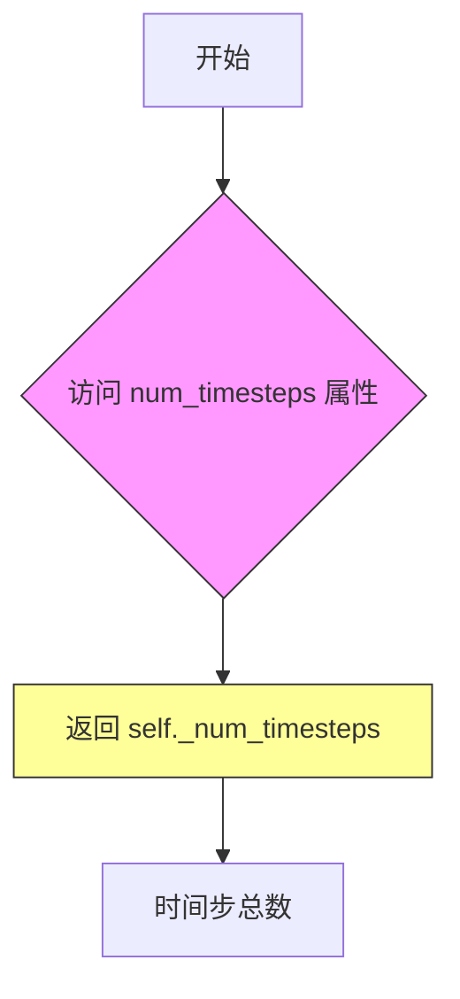

#### 带注释源码

```python
@property
def num_timesteps(self):
    """
    只读属性，返回扩散管道执行的去噪时间步总数。
    
    该属性在 __call__ 方法中被动态设置：
    self._num_timesteps = len(timesteps)
    
    其中 timesteps 来自 scheduler.set_timesteps(num_inference_steps, device=device)
    
    Returns:
        int: 去噪过程中需要执行的时间步数量
    """
    return self._num_timesteps
```

#### 补充说明

**设计目标与约束**：
- 这是一个简单的只读访问器，遵循 Python property 的设计模式
- `_num_timesteps` 是一个实例变量，在管道调用前为 `None`，调用后被设置为整数值

**使用场景**：
- 外部代码可以通过 `pipeline.num_timesteps` 查询当前或已完成的推理过程的总步数
- 常用于进度跟踪、性能监控或调试

**潜在优化空间**：
- 当前实现中，如果属性在 `__call__` 调用前被访问，将返回 `None`（假设未初始化），可能导致意外行为。建议添加默认值或显式检查：
  ```python
  @property
  def num_timesteps(self):
      return self._num_timesteps if hasattr(self, '_num_timesteps') and self._num_timesteps is not None else 0
  ```


### `SkyReelsV2Pipeline.current_timestep` (property)

这是一个属性方法，用于获取当前去噪循环中正在处理的时间步（timestep）。该属性返回扩散模型在推理过程中当前所处的采样步骤，帮助外部调用者了解生成进度。

参数：

- `self`：隐式参数，类型为 `SkyReelsV2Pipeline` 实例，无需额外描述

返回值：`torch.Tensor | None`，返回当前去噪循环中正在处理的时间步。如果不在去噪循环中（例如管道未运行或已完成），则返回 `None`

#### 流程图

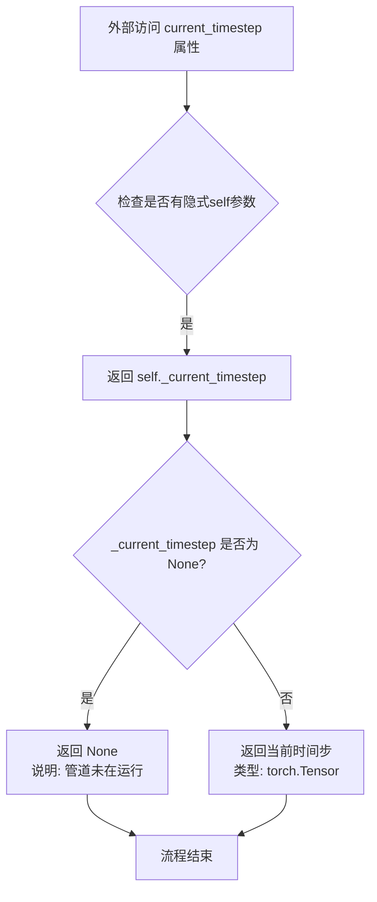

#### 带注释源码

```python
@property
def current_timestep(self):
    """
    属性方法：获取当前去噪循环中正在处理的时间步
    
    说明：
        - 该属性在 __call__ 方法的去噪循环中被更新
        - 循环开始时设为 None，循环中每次迭代设置为当前的 t 值
        - 循环结束后重新设为 None
    """
    return self._current_timestep
```

#### 相关上下文源码

```python
# 在 __call__ 方法中的使用示例：

# 1. 初始化时设为 None
self._current_timestep = None

# 2. 去噪循环中每次迭代更新
for i, t in enumerate(timesteps):
    if self.interrupt:
        continue
    
    self._current_timestep = t  # 设置当前时间步
    
    # ... 执行去噪逻辑 ...

# 3. 循环结束后重置为 None
self._current_timestep = None
```


### `SkyReelsV2Pipeline.interrupt`

该属性是一个只读的 getter 方法，用于返回管道的当前中断状态标志。该属性允许外部代码在去噪循环执行过程中检查是否需要中断管道，从而实现动态停止生成的能力。

参数：无需参数

返回值：`bool`，返回管道的当前中断状态。当返回 `True` 时，表示外部代码已请求管道立即停止后续推理步骤。

#### 流程图

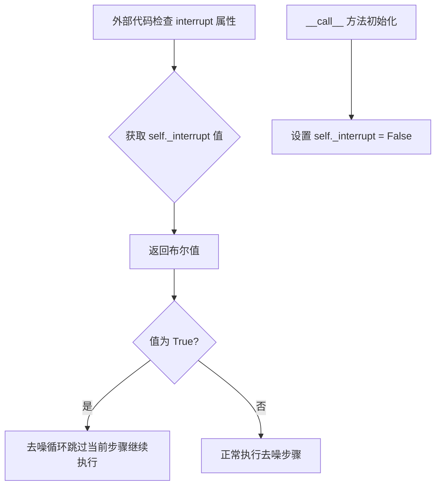

#### 带注释源码

```python
@property
def interrupt(self):
    """
    属性装饰器：将方法转换为属性，允许通过 pipeline.interrupt 访问。
    这是 DiffusionPipeline 基类中定义的标准属性，用于支持管道中断功能。
    
    在 __call__ 方法中：
        - 初始化：self._interrupt = False (默认不中断)
        - 去噪循环中检查：if self.interrupt: continue
    
    外部可以通过设置 pipeline._interrupt = True 来请求管道停止：
        pipe._interrupt = True  # 将在下一个去噪步骤时被检测到
    """
    return self._interrupt
```


### SkyReelsV2Pipeline.attention_kwargs

这是一个属性访问器，用于获取在视频生成管道执行期间传递的注意力机制相关参数字典。

返回值：`dict[str, Any] | None`，返回注意力机制的关键字参数字典，如果没有设置则返回 None

#### 流程图

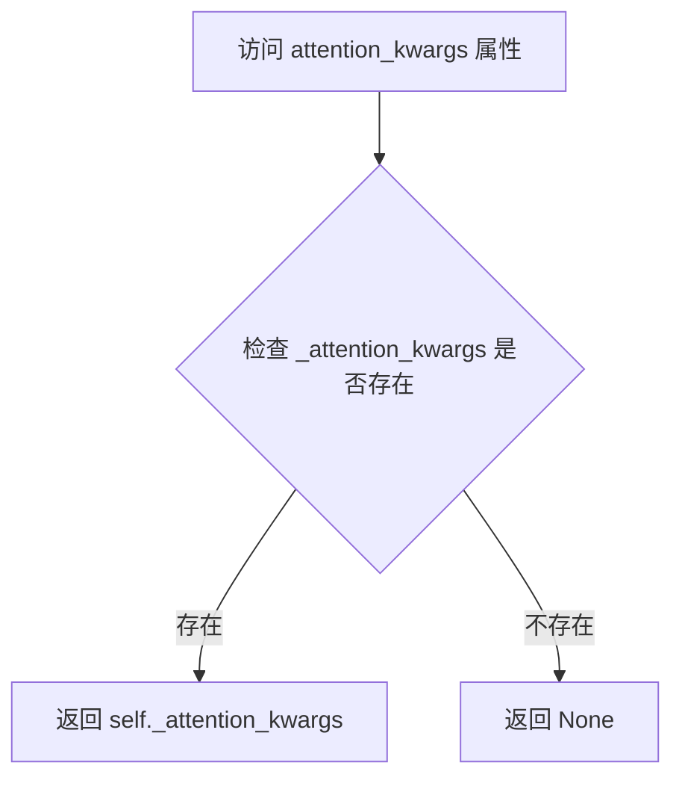

#### 带注释源码

```python
@property
def attention_kwargs(self):
    """
    属性访问器：获取注意力机制的关键字参数
    
    该属性返回在管道调用期间传递给transformer的注意力参数字典。
    这些参数用于控制注意力处理器的行为，例如自定义注意力模式、掩码等。
    
    Returns:
        dict[str, Any] | None: 注意力机制的关键字参数字典，
                              如果未设置则返回None
    """
    return self._attention_kwargs
```

#### 上下文信息

该属性在 `__call__` 方法中被赋值：

```python
self._attention_kwargs = attention_kwargs  # 第358行左右
```

随后在去噪循环中传递给transformer：

```python
noise_pred = self.transformer(
    hidden_states=latent_model_input,
    timestep=timestep,
    encoder_hidden_states=prompt_embeds,
    attention_kwargs=attention_kwargs,  # 传递注意力参数
    return_dict=False,
)[0]
```

#### 设计分析

| 维度 | 说明 |
|------|------|
| **设计目标** | 提供一种动态传递注意力控制参数给底层transformer模型的机制 |
| **调用场景** | 在管道执行期间需要自定义注意力行为时使用 |
| **数据流** | 用户传入 → 存储在 `_attention_kwargs` → 传递给 transformer |
| **默认值** | `None`（当用户未指定时） |


### SkyReelsV2Pipeline.__call__

该方法是 SkyReelsV2 文本到视频生成管道的主入口函数，负责协调整个扩散模型的推理流程，包括输入验证、文本编码、潜在变量初始化、去噪循环、VAE 解码以及最终视频后处理，最终输出生成的视频帧。

参数：

- `prompt`：`str | list[str]`，要引导视频生成的文本提示，若未定义则必须传递 `prompt_embeds`
- `negative_prompt`：`str | list[str]`，不引导视频生成的负面提示，用于分类器自由引导
- `height`：`int`，默认 544，生成视频的高度（像素）
- `width`：`int`，默认 960，生成视频的宽度（像素）
- `num_frames`：`int`，默认 97，生成视频的帧数
- `num_inference_steps`：`int`，默认 50，去噪步数，步数越多通常质量越高但推理越慢
- `guidance_scale`：`float`，默认 6.0，分类器自由扩散引导比例，控制文本提示与生成内容的关联程度
- `num_videos_per_prompt`：`int | None`，默认 1，每个提示生成的视频数量
- `generator`：`torch.Generator | list[torch.Generator]`，用于生成确定性结果的随机数生成器
- `latents`：`torch.Tensor | None`，预生成的噪声潜在变量，用于影响生成结果
- `prompt_embeds`：`torch.Tensor | None`，预生成的文本嵌入，用于替代 prompt
- `negative_prompt_embeds`：`torch.Tensor | None`，预生成的负面文本嵌入
- `output_type`：`str | None`，默认 "np"，输出格式，可选 "np"、"latent" 等
- `return_dict`：`bool`，默认 True，是否返回 SkyReelsV2PipelineOutput 对象
- `attention_kwargs`：`dict[str, Any] | None`，传递给注意力处理器的额外参数
- `callback_on_step_end`：`Callable | PipelineCallback | MultiPipelineCallbacks | None`，每个去噪步骤结束时调用的回调函数
- `callback_on_step_end_tensor_inputs`：`list[str]`，默认 ["latents"]，回调函数中传递的张量输入列表
- `max_sequence_length`：`int`，默认 512，文本编码器的最大序列长度

返回值：`SkyReelsV2PipelineOutput | tuple`，返回生成的视频帧列表，若 return_dict 为 False 则返回元组

#### 流程图

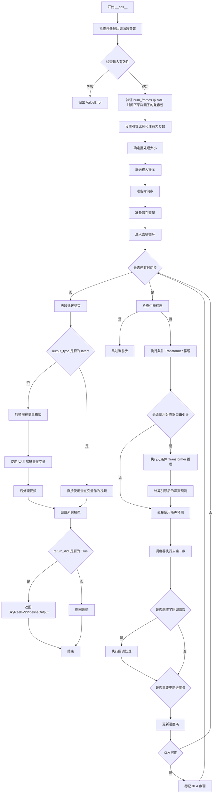

#### 带注释源码

```python
@torch.no_grad()
@replace_example_docstring(EXAMPLE_DOC_STRING)
def __call__(
    self,
    prompt: str | list[str] = None,
    negative_prompt: str | list[str] = None,
    height: int = 544,
    width: int = 960,
    num_frames: int = 97,
    num_inference_steps: int = 50,
    guidance_scale: float = 6.0,
    num_videos_per_prompt: int | None = 1,
    generator: torch.Generator | list[torch.Generator] | None = None,
    latents: torch.Tensor | None = None,
    prompt_embeds: torch.Tensor | None = None,
    negative_prompt_embeds: torch.Tensor | None = None,
    output_type: str | None = "np",
    return_dict: bool = True,
    attention_kwargs: dict[str, Any] | None = None,
    callback_on_step_end: Callable[[int, int], None] | PipelineCallback | MultiPipelineCallbacks | None = None,
    callback_on_step_end_tensor_inputs: list[str] = ["latents"],
    max_sequence_length: int = 512,
):
    r"""
    管道调用函数，用于生成视频。

    参数说明：
        prompt: 文本提示，引导视频生成
        height/width: 输出视频的分辨率
        num_frames: 输出视频的帧数
        num_inference_steps: 扩散模型的推理步数
        guidance_scale: 分类器自由引导强度
        num_videos_per_prompt: 每个提示生成的视频数
        generator: 随机数生成器，用于可重复生成
        latents: 预定义的噪声潜在变量
        prompt_embeds/negative_prompt_embeds: 预计算的文本嵌入
        output_type: 输出格式 (np/pil/latent)
        return_dict: 是否返回结构化输出对象
        attention_kwargs: 注意力机制的额外参数
        callback_on_step_end: 每步结束时的回调函数
        callback_on_step_end_tensor_inputs: 回调函数可访问的张量列表
        max_sequence_length: T5 编码器的最大序列长度
    """

    # 1. 处理回调函数：如果传入的是 PipelineCallback 或 MultiPipelineCallbacks 对象，
    #    自动获取其定义的 tensor_inputs 作为回调时传递的张量列表
    if isinstance(callback_on_step_end, (PipelineCallback, MultiPipelineCallbacks)):
        callback_on_step_end_tensor_inputs = callback_on_step_end.tensor_inputs

    # 2. 检查输入参数的合法性，验证 prompt/negative_prompt 与对应的 embeds 不能同时提供
    #    同时确保至少提供了 prompt 或 prompt_embeds 之一
    self.check_inputs(
        prompt,
        negative_prompt,
        height,
        width,
        prompt_embeds,
        negative_prompt_embeds,
        callback_on_step_end_tensor_inputs,
    )

    # 3. 验证 num_frames 与 VAE 时间下采样因子的兼容性
    #    确保 (num_frames - 1) 能被 vae_scale_factor_temporal 整除
    if num_frames % self.vae_scale_factor_temporal != 1:
        logger.warning(
            f"`num_frames - 1` has to be divisible by {self.vae_scale_factor_temporal}. Rounding to the nearest number."
        )
        num_frames = num_frames // self.vae_scale_factor_temporal * self.vae_scale_factor_temporal + 1
    num_frames = max(num_frames, 1)

    # 4. 初始化内部状态变量
    self._guidance_scale = guidance_scale
    self._attention_kwargs = attention_kwargs
    self._current_timestep = None
    self._interrupt = False

    device = self._execution_device

    # 5. 确定批处理大小：根据 prompt 类型或 prompt_embeds 的形状
    if prompt is not None and isinstance(prompt, str):
        batch_size = 1
    elif prompt is not None and isinstance(prompt, list):
        batch_size = len(prompt)
    else:
        batch_size = prompt_embeds.shape[0]

    # 6. 编码输入提示：生成 prompt_embeds 和 negative_prompt_embeds
    #    使用 T5 文本编码器将文本转换为高维向量表示
    prompt_embeds, negative_prompt_embeds = self.encode_prompt(
        prompt=prompt,
        negative_prompt=negative_prompt,
        do_classifier_free_guidance=self.do_classifier_free_guidance,
        num_videos_per_prompt=num_videos_per_prompt,
        prompt_embeds=prompt_embeds,
        negative_prompt_embeds=negative_prompt_embeds,
        max_sequence_length=max_sequence_length,
        device=device,
    )

    # 7. 将 prompt_embeds 转换为 Transformer 所需的数据类型
    transformer_dtype = self.transformer.dtype
    prompt_embeds = prompt_embeds.to(transformer_dtype)
    if negative_prompt_embeds is not None:
        negative_prompt_embeds = negative_prompt_embeds.to(transformer_dtype)

    # 8. 准备时间步：根据推理步数从调度器获取时间步序列
    self.scheduler.set_timesteps(num_inference_steps, device=device)
    timesteps = self.scheduler.timesteps

    # 9. 准备潜在变量：初始化用于扩散过程的噪声潜在变量
    #    潜在变量的形状由通道数、帧数、空间分辨率共同决定
    num_channels_latents = self.transformer.config.in_channels
    latents = self.prepare_latents(
        batch_size * num_videos_per_prompt,
        num_channels_latents,
        height,
        width,
        num_frames,
        torch.float32,
        device,
        generator,
        latents,
    )

    # 10. 去噪循环：核心扩散推理过程
    num_warmup_steps = len(timesteps) - num_inference_steps * self.scheduler.order
    self._num_timesteps = len(timesteps)

    with self.progress_bar(total=num_inference_steps) as progress_bar:
        for i, t in enumerate(timesteps):
            # 检查是否收到中断信号
            if self.interrupt:
                continue

            self._current_timestep = t
            # 准备 Transformer 输入：将潜在变量转换到正确的设备和数据类型
            latent_model_input = latents.to(transformer_dtype)
            timestep = t.expand(latents.shape[0])

            # 条件推理：使用正面提示进行噪声预测
            with self.transformer.cache_context("cond"):
                noise_pred = self.transformer(
                    hidden_states=latent_model_input,
                    timestep=timestep,
                    encoder_hidden_states=prompt_embeds,
                    attention_kwargs=attention_kwargs,
                    return_dict=False,
                )[0]

            # 分类器自由引导：执行无条件推理并与条件推理结果融合
            if self.do_classifier_free_guidance:
                with self.transformer.cache_context("uncond"):
                    noise_uncond = self.transformer(
                        hidden_states=latent_model_input,
                        timestep=timestep,
                        encoder_hidden_states=negative_prompt_embeds,
                        attention_kwargs=attention_kwargs,
                        return_dict=False,
                    )[0]
                # 引导公式：noise_pred = noise_uncond + guidance_scale * (noise_pred - noise_uncond)
                noise_pred = noise_uncond + guidance_scale * (noise_pred - noise_uncond)

            # 调度器执行去噪一步：从 x_t 计算 x_t-1
            latents = self.scheduler.step(noise_pred, t, latents, return_dict=False)[0]

            # 执行回调函数（如果配置了）
            if callback_on_step_end is not None:
                callback_kwargs = {}
                for k in callback_on_step_end_tensor_inputs:
                    callback_kwargs[k] = locals()[k]
                callback_outputs = callback_on_step_end(self, i, t, callback_kwargs)

                # 允许回调函数修改潜在变量和文本嵌入
                latents = callback_outputs.pop("latents", latents)
                prompt_embeds = callback_outputs.pop("prompt_embeds", prompt_embeds)
                negative_prompt_embeds = callback_outputs.pop("negative_prompt_embeds", negative_prompt_embeds)

            # 更新进度条：仅在最后一步或预热步之后且满足调度器阶数条件时更新
            if i == len(timesteps) - 1 or ((i + 1) > num_warmup_steps and (i + 1) % self.scheduler.order == 0):
                progress_bar.update()

            # XLA 优化：如果使用 PyTorch XLA，标记计算步骤
            if XLA_AVAILABLE:
                xm.mark_step()

    self._current_timestep = None

    # 11. 解码阶段：将潜在变量转换为最终视频
    if not output_type == "latent":
        # 转换潜在变量格式：应用 VAE 的均值和标准差缩放
        latents = latents.to(self.vae.dtype)
        latents_mean = (
            torch.tensor(self.vae.config.latents_mean)
            .view(1, self.vae.config.z_dim, 1, 1, 1)
            .to(latents.device, latents.dtype)
        )
        latents_std = 1.0 / torch.tensor(self.vae.config.latents_std).view(1, self.vae.config.z_dim, 1, 1, 1).to(
            latents.device, latents.dtype
        )
        latents = latents / latents_std + latents_mean
        # 使用 VAE 解码潜在变量得到视频
        video = self.vae.decode(latents, return_dict=False)[0]
        # 后处理视频：转换为目标输出格式
        video = self.video_processor.postprocess_video(video, output_type=output_type)
    else:
        # 如果 output_type 为 "latent"，直接返回潜在变量
        video = latents

    # 12. 清理资源：卸载所有模型以释放显存
    self.maybe_free_model_hooks()

    # 13. 返回结果
    if not return_dict:
        return (video,)

    return SkyReelsV2PipelineOutput(frames=video)
```

## 关键组件


### SkyReelsV2Pipeline

文本到视频（Text-to-Video）生成管道，继承自DiffusionPipeline和SkyReelsV2LoraLoaderMixin，整合T5文本编码器、3D Transformer模型、VAE和调度器，实现基于扩散模型的视频生成功能。

### _get_t5_prompt_embeds

使用UMT5编码器将文本提示转换为文本嵌入向量，支持批量处理、注意力掩码生成、可变序列长度填充与裁剪，以及针对每个prompt的嵌入复制以支持多次生成。

### encode_prompt

封装文本提示编码逻辑，支持正向提示和负向提示（用于classifier-free guidance），自动处理提示类型验证、批次大小推断，并返回编码后的嵌入向量供Transformer使用。

### prepare_latents

准备初始噪声潜在变量，根据视频帧数、高度、宽度和VAE时间下采样因子计算潜在空间的形状，支持预提供latents或使用随机张量生成，并处理多个随机数生成器的验证。

### __call__

主推理方法，执行完整的文本到视频生成流程，包括输入验证、提示编码、时间步设置、潜在变量准备、去噪循环（条件/非条件推理）、VAE解码和后处理，支持XLA加速、模型卸载和推理回调。

### check_inputs

验证输入参数合法性，检查高度和宽度是否被16整除、callback张量输入是否在允许列表中、prompt和prompt_embeds不能同时提供等约束条件。

### VAE解码与后处理

将去噪后的潜在变量通过VAE解码为实际视频帧，应用latents_mean和latents_std进行反量化（反标准化）处理，最后通过VideoProcessor将输出转换为指定格式（np数组或PIL图像）。

### 调度器集成

使用UniPCMultistepScheduler进行去噪步骤，通过set_timesteps设置推理步数，scheduler.step计算每一步的噪声预测并更新潜在变量，支持flow_shift参数调整。

### 工具函数

prompt_clean、whitespace_clean和basic_clean用于文本预处理，包括ftfy修复特殊字符、HTML转义解码、多余空白清理等操作，确保输入提示的标准化处理。

### XLA加速支持

检测并启用PyTorch XLA设备加速，通过xm.mark_step在推理循环中标记执行步骤，提升在TPU或XLA兼容设备上的性能。

## 问题及建议


### 已知问题

-   **拼写错误**：`temperal_downsample` 应为 `temporal_downsample`（时间维度下采样），这个拼写错误会影响代码可读性和维护性。
-   **缺失的依赖检查**：`prompt_clean` 函数中的 `basic_clean` 调用了 `ftfy.fix_text()`，但未检查 `is_ftfy_available()`，当 `ftfy` 不可用时会导致运行时错误。
-   **默认参数不一致**：`max_sequence_length` 在 `_get_t5_prompt_embeds` 方法中默认为 226，但在 `__call__` 方法中默认为 512，可能导致配置混淆。
-   **属性初始化不完整**：类属性 `_guidance_scale`、`_attention_kwargs`、`_current_timestep`、`_interrupt` 在 `__call__` 方法中动态设置，但如果直接访问这些属性（如 `guidance_scale` 属性）而未先调用 `__call__`，会抛出 AttributeError。
-   **重复计算**：在 `__call__` 方法的去噪循环外部，每次都重新计算 `latents_mean` 和 `latents_std` 的张量，应该在循环外预先计算以提升性能。
-   **类型注解兼容性**：使用 `str | list[str]` 联合类型注解但未导入 `from __future__ import annotations`，在 Python 3.9 以下版本中会报语法错误。

### 优化建议

-   修复拼写错误 `temperal_downsample` → `temporal_downsample`，并在代码库中统一命名规范。
-   为 `ftfy` 依赖添加条件检查或 try-except 包装，确保在库不可用时提供降级方案或明确报错。
-   统一 `max_sequence_length` 的默认值，建议在类级别定义常量以保持一致性。
-   在 `__init__` 方法中初始化所有类属性（如 `self._guidance_scale = None`），或在属性 getter 中添加默认值逻辑。
-   将 `latents_mean` 和 `latents_std` 的张量创建移到去噪循环之前，避免每帧重复计算。
-   添加 `from __future__ import annotations` 以提高类型注解的兼容性，或使用 `typing.Union` 替代联合类型语法。

## 其它


### 设计目标与约束

本pipeline的设计目标是实现高质量的Text-to-Video（T2V）生成，基于SkyReels-V2模型。核心约束包括：1）支持540P和720P分辨率的视频生成；2）默认生成97帧视频；3）使用UniPCMultistepScheduler进行去噪调度；4）支持Classifier-Free Guidance（CFG）来提高生成质量；5）支持LoRA微调加载；6）遵循diffusers库的pipeline标准架构。设备约束方面，支持CUDA设备，推荐使用bfloat16精度以平衡质量和显存占用。

### 错误处理与异常设计

本pipeline采用多层错误处理机制：1）输入验证（check_inputs方法）：检查height和width必须能被16整除；检查prompt和prompt_embeds不能同时传入；检查callback_on_step_end_tensor_inputs的合法性；检查negative_prompt与prompt类型一致性；检查batch_size匹配；2）参数校验：对num_frames进行VAE temporal scale因子的兼容性检查和调整；3）异常抛出：使用ValueError和TypeError进行明确的错误类型标识；4）警告机制：对参数调整使用logger.warning进行提示；5）XLA支持：使用xm.mark_step()确保XLA设备上的正确执行顺序。

### 数据流与状态机

Pipeline的核心数据流如下：1）初始化阶段：加载tokenizer、text_encoder、transformer、vae、scheduler；2）Prompt编码阶段：encode_prompt将文本转换为T5 embedding，支持negative_prompt生成CFG所需的uncond embeddings；3）Latent准备阶段：prepare_latents生成初始噪声或使用提供的latents；4）去噪循环阶段：遍历timesteps，执行transformer前向传播（条件/非条件），使用scheduler.step()更新latents；5）VAE解码阶段：将最终latents解码为视频；6）后处理阶段：VideoProcessor进行格式转换。状态管理通过_guidance_scale、_attention_kwargs、_current_timestep、_interrupt、_num_timesteps等内部属性维护。

### 外部依赖与接口契约

核心依赖包括：1）transformers库：提供AutoTokenizer和UMT5EncoderModel用于T5文本编码；2）diffusers库：提供DiffusionPipeline基类、UniPCMultistepScheduler、AutoencoderKLWan等；3）SkyReels-V2模型：SkyReelsV2Transformer3DModel、AutoencoderKLWanWan、SkyReelsV2LoraLoaderMixin；4）辅助库：regex（文本清理）、ftfy（文本修复）、torch、html。接口契约：pipeline接受prompt/negative_prompt或预计算的prompt_embeds/negative_prompt_embeds；输出支持"np"（numpy数组）、"latent"和PIL格式；支持callback机制用于中间步骤干预；支持attention_kwargs传递注意力控制参数。

### 配置与参数设计

主要配置参数分为三类：1）生成参数：height（默认544）、width（默认960）、num_frames（默认97）、num_inference_steps（默认50）、guidance_scale（默认6.0）、num_videos_per_prompt（默认1）；2）模型参数：max_sequence_length（默认512用于text encoder，pipeline参数默认512但_get_t5_prompt_embeds默认226）；3）调度器参数：flow_shift（8.0 for T2V，5.0 for I2V）。内部配置包括：vae_scale_factor_temporal和vae_scale_factor_spatial根据VAE模型自动计算；model_cpu_offload_seq定义模型卸载顺序为"text_encoder->transformer->vae"。

### 性能优化策略

本pipeline采用多种性能优化策略：1）模型卸载：使用model_cpu_offload_seq实现自动CPU卸载；2）混合精度：支持bfloat16和float32混合精度推理；3）XLA加速：可选的torch_xla支持用于XLA设备；4）缓存机制：使用cache_context在条件/非条件推理间复用计算图；5）内存优化：使用torch.no_grad()避免梯度计算；6）批处理优化：支持num_videos_per_prompt批量生成；7）进度条：使用progress_bar提供推理进度反馈；8）生成器支持：使用torch.Generator实现确定性生成。

### 安全性考虑

安全性设计包括：1）输入验证：严格的参数类型和范围检查；2）NSFW防护：通过negative_prompt机制支持内容过滤；3）模型卸载：推理完成后自动卸载模型释放显存；4）异常处理：防止因非法输入导致崩溃；5）依赖验证：使用is_ftfy_available、is_torch_xla_available等进行可选依赖检查。需要注意的是，当前版本未包含内置的NSFW内容检测器，用户需通过negative_prompt自行实现安全过滤。

### 兼容性设计

兼容性设计涵盖：1）设备兼容：支持CUDA、CPU、XLA设备；2）PyTorch版本：通过randn_tensor兼容不同PyTorch版本；3）diffusers版本：遵循diffusers库的pipeline标准接口；4）模型格式：支持HuggingFace的from_pretrained加载方式；5）输出格式：支持多种output_type（np、latent、PIL）；6）调度器兼容：可替换为其他diffusers支持的调度器；7）LoRA兼容：通过SkyReelsV2LoraLoaderMixin支持LoRA权重加载。

### 测试策略建议

建议的测试策略包括：1）单元测试：各方法独立测试（encode_prompt、prepare_latents、check_inputs等）；2）集成测试：完整pipeline端到端生成测试；3）参数边界测试：测试各种边界条件下的行为；4）性能基准测试：测量推理时间和显存占用；5）回归测试：确保代码修改不破坏现有功能；6）兼容性测试：测试不同设备和PyTorch版本；7）错误处理测试：验证各种异常情况的正确处理。

### 部署与运维建议

部署建议：1）模型下载：首次使用自动下载模型权重；2）显存管理：建议16GB+显存，batch_size需相应调整；3）精度选择：生产环境推荐使用bfloat16；4）调度器配置：根据T2V/I2V任务调整flow_shift参数；5）监控：利用callback机制监控推理过程；6）服务化：可封装为REST API服务；7）版本管理：注意diffusers和transformers版本兼容性；8）日志：使用logging模块进行运行日志记录。

    