# `diffusers\src\diffusers\pipelines\skyreels_v2\pipeline_skyreels_v2_diffusion_forcing.py` 详细设计文档

SkyReels-V2DiffusionForcingPipeline是一个用于文本到视频(T2V)和图像到视频(I2V)生成的扩散管道，采用Diffusion Forcing算法实现同步/异步推理，支持长视频生成、因果块处理和时间步矩阵调度，输出高质量视频帧序列。

## 整体流程

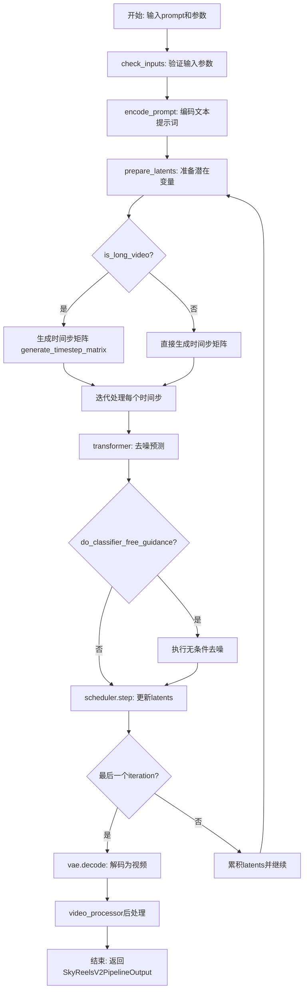

## 类结构

```
DiffusionPipeline (基类)
└── SkyReelsV2DiffusionForcingPipeline
    └── SkyReelsV2LoraLoaderMixin
```

## 全局变量及字段


### `EXAMPLE_DOC_STRING`
    
包含SkyReels-V2管道使用示例的文档字符串，用于__call__方法的文档

类型：`str`
    


### `logger`
    
模块级日志记录器，用于输出调试和信息日志

类型：`logging.Logger`
    


### `XLA_AVAILABLE`
    
标识PyTorch XLA是否可用的布尔值，用于TPU加速支持

类型：`bool`
    


### `basic_clean`
    
文本清洗函数，使用ftfy修复文本并反转义HTML实体

类型：`Callable[[str], str]`
    


### `whitespace_clean`
    
空白字符清洗函数，将多个连续空白字符替换为单个空格

类型：`Callable[[str], str]`
    


### `prompt_clean`
    
提示词清洗函数，依次调用basic_clean和whitespace_clean进行文本预处理

类型：`Callable[[str], str]`
    


### `retrieve_latents`
    
从编码器输出中提取潜在表示的函数，支持sample和argmax两种模式

类型：`Callable[[torch.Tensor, torch.Generator | None, str], torch.Tensor]`
    


### `SkyReelsV2DiffusionForcingPipeline.model_cpu_offload_seq`
    
指定模型卸载到CPU的顺序，值为'text_encoder->transformer->vae'

类型：`str`
    


### `SkyReelsV2DiffusionForcingPipeline._callback_tensor_inputs`
    
定义回调函数可访问的张量输入列表，包含'latents'、'prompt_embeds'、'negative_prompt_embeds'

类型：`list[str]`
    


### `SkyReelsV2DiffusionForcingPipeline.vae_scale_factor_temporal`
    
VAE时间维度下采样因子，基于VAE的temporal_downsample计算，用于潜在帧数转换

类型：`int`
    


### `SkyReelsV2DiffusionForcingPipeline.vae_scale_factor_spatial`
    
VAE空间维度下采样因子，基于VAE的temporal_downsample长度计算，用于潜在空间尺寸转换

类型：`int`
    


### `SkyReelsV2DiffusionForcingPipeline.video_processor`
    
视频处理器对象，用于VAE解码后的视频后处理和格式转换

类型：`VideoProcessor`
    


### `SkyReelsV2DiffusionForcingPipeline._guidance_scale`
    
分类器自由引导比例，控制文本提示对生成结果的影响程度

类型：`float`
    


### `SkyReelsV2DiffusionForcingPipeline._attention_kwargs`
    
注意力机制参数字典，用于传递给注意力处理器的额外配置

类型：`dict[str, Any] | None`
    


### `SkyReelsV2DiffusionForcingPipeline._num_timesteps`
    
去噪过程的总时间步数，记录推理过程中的去噪迭代次数

类型：`int`
    


### `SkyReelsV2DiffusionForcingPipeline._current_timestep`
    
当前去噪时间步，记录推理循环中当前使用的时间步张量

类型：`torch.Tensor | None`
    


### `SkyReelsV2DiffusionForcingPipeline._interrupt`
    
中断标志，用于在推理过程中接收外部信号以暂停或停止生成

类型：`bool`
    
    

## 全局函数及方法


### `basic_clean`

该函数用于对文本进行基本清理处理，主要解决文本编码问题和 HTML 实体双重编码问题，通过 ftfy 库修复编码错误，并使用 html.unescape 递归解码 HTML 实体，最后去除首尾空白字符。

参数：

- `text`：`str`，需要清理的原始文本

返回值：`str`，清理后的文本

#### 流程图

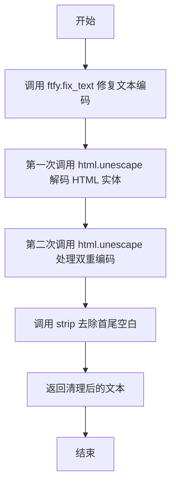

#### 带注释源码

```python
def basic_clean(text):
    """
    对文本进行基本清理处理。
    
    处理流程：
    1. 使用 ftfy 库修复常见的文本编码错误（如 UTF-8 编码错误导致的乱码）
    2. 使用 html.unescape 两次解码 HTML 实体（处理双重编码情况，如 &amp;lt; -> &lt; -> <）
    3. 去除首尾空白字符
    
    Args:
        text: 需要清理的原始文本
        
    Returns:
        清理后的文本字符串
    """
    # Step 1: 使用 ftfy.fix_text 修复文本编码问题
    # ftfy 可以修复因编码错误导致的乱码问题，如 mojibake（乱码）
    text = ftfy.fix_text(text)
    
    # Step 2: 第一次调用 html.unescape 解码 HTML 实体
    # 例如: '&lt;' -> '<'
    text = html.unescape(text)
    
    # Step 3: 第二次调用 html.unescape 处理双重编码情况
    # 例如原始文本可能是 '&amp;lt;'，第一次变成 '&lt;'，第二次变成 '<'
    text = html.unescape(text)
    
    # Step 4: 去除首尾空白字符并返回
    return text.strip()
```


### `whitespace_clean`

该函数用于清理文本中的多余空白字符，将连续的空字符（包括空格、制表符、换行等）替换为单个空格，并去除首尾空白，返回规范化的字符串格式。

参数：

- `text`：`str`，需要清理的原始文本

返回值：`str`，清理空白字符后的规范化文本

#### 流程图

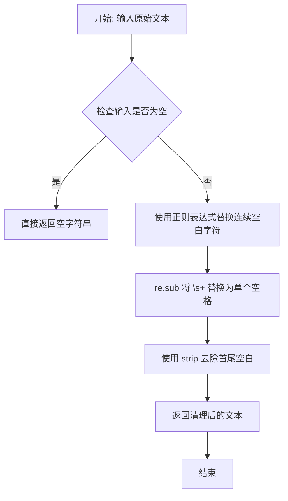

#### 带注释源码

```python
def whitespace_clean(text):
    """
    清理文本中的多余空白字符，将连续的空字符替换为单个空格，并去除首尾空白。
    
    该函数是文本预处理的一部分，用于规范化输入文本的格式。
    常与 basic_clean 函数配合使用，先进行 HTML 实体解码和 ftfy 修复，
    再使用本函数清理多余空白。
    
    Args:
        text: 需要清理的原始文本字符串
        
    Returns:
        清理空白字符后的规范化文本字符串
    """
    # 使用正则表达式将所有连续的空字符（空格、制表符、换行符等）替换为单个空格
    # \s+ 匹配一个或多个空白字符，" " 是替换目标（单个空格）
    text = re.sub(r"\s+", " ", text)
    
    # 去除字符串首尾的空白字符（默认去除空格、制表符、换行符等）
    text = text.strip()
    
    # 返回处理后的规范化文本
    return text
```


### `prompt_clean`

该函数是文本预处理管道中的核心清理函数，通过组合使用 `basic_clean` 和 `whitespace_clean` 两个辅助函数，实现对文本的多层次清理：首先使用 ftfy 库修复文本编码问题并处理 HTML 实体，然后移除多余空白字符，最终返回干净、标准化的文本字符串。

参数：

- `text`：`str`，需要进行清理的原始文本输入

返回值：`str`，清理并标准化后的文本

#### 流程图

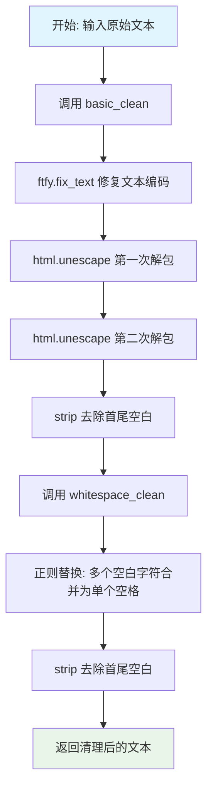

#### 带注释源码

```python
def prompt_clean(text):
    """
    清理并标准化输入文本的管道函数。
    
    处理流程：
    1. basic_clean: 使用ftfy修复编码问题 + HTML实体解码 + 去除首尾空白
    2. whitespace_clean: 合并多余空白字符 + 去除首尾空白
    
    Args:
        text: str, 需要清理的原始文本
        
    Returns:
        str, 清理并标准化后的文本
    """
    # 第一步：调用basic_clean进行基本清理
    # - ftfy.fix_text: 修复常见文本编码错误和mojibake问题
    # - html.unescape: 递归解包HTML实体（如&amp; -> &, &lt; -> <）
    # - strip: 去除处理后的首尾空白字符
    text = whitespace_clean(basic_clean(text))
    
    # 第二步：调用whitespace_clean进行空白字符标准化
    # - 正则表达式将一个或多个空白字符（\s+）替换为单个空格
    # - strip最终清理，确保输出不包含首尾多余空白
    
    return text
```

#### 依赖函数详情

**`basic_clean` 函数**：

```python
def basic_clean(text):
    """
    基本文本清理函数。
    
    处理步骤：
    1. ftfy.fix_text: 自动检测并修复常见的文本编码错误
    2. html.unescape (x2): 双重解码处理嵌套的HTML实体
    3. strip: 去除首尾空白
    """
    text = ftfy.fix_text(text)           # 修复编码问题，如 "é" -> "é"
    text = html.unescape(html.unescape(text))  # 处理HTML实体，如 &amp;amp; -> &amp; -> &
    return text.strip()                  # 去除首尾空白
```

**`whitespace_clean` 函数**：

```python
def whitespace_clean(text):
    """
    空白字符标准化函数。
    
    处理步骤：
    1. 正则替换：将所有连续空白字符（空格、Tab、换行等）合并为单个空格
    2. strip: 去除最终结果的首尾空白
    """
    text = re.sub(r"\s+", " ", text)  # 将一个或多个空白字符替换为单个空格
    text = text.strip()               # 去除首尾多余空白
    return text
```


### `retrieve_latents`

从 VAE 编码器输出中提取潜在表示（latents），支持三种模式：从潜在分布采样、从潜在分布取众数、或直接返回预计算的潜在张量。

参数：

- `encoder_output`：`torch.Tensor`，编码器输出对象，包含 `latent_dist` 或 `latents` 属性
- `generator`：`torch.Generator | None`，可选的随机数生成器，用于采样时的随机性控制
- `sample_mode`：`str`，采样模式，可选值为 `"sample"`（从分布采样）或 `"argmax"`（取分布的众数），默认为 `"sample"`

返回值：`torch.Tensor`，提取出的潜在表示张量

#### 流程图

```mermaid
flowchart TD
    A[开始: retrieve_latents] --> B{encoder_output 有 latent_dist 属性?}
    B -->|是| C{sample_mode == 'sample'?}
    C -->|是| D[返回 latent_dist.sample&#40;generator&#41;]
    C -->|否| E{sample_mode == 'argmax'?}
    E -->|是| F[返回 latent_dist.mode&#40;&#41;]
    E -->|否| G{encoder_output 有 latents 属性?}
    B -->|否| G
    G -->|是| H[返回 encoder_output.latents]
    G -->|否| I[抛出 AttributeError]
    I --> J[结束: 错误]
    D --> J
    F --> J
    H --> J
```

#### 带注释源码

```python
# 从 diffusers 库中复制过来的工具函数
# 用于从 VAE 编码器的输出中提取潜在表示
def retrieve_latents(
    encoder_output: torch.Tensor,  # VAE 编码器的输出对象
    generator: torch.Generator | None = None,  # 随机数生成器，用于控制采样随机性
    sample_mode: str = "sample"  # 采样模式: "sample" 或 "argmax"
):
    # 情况1: encoder_output 包含 latent_dist 属性且使用采样模式
    # 从变分分布中采样得到潜在向量
    if hasattr(encoder_output, "latent_dist") and sample_mode == "sample":
        return encoder_output.latent_dist.sample(generator)
    
    # 情况2: encoder_output 包含 latent_dist 属性且使用 argmax 模式
    # 取变分分布的众数（最可能的值）作为潜在向量
    elif hasattr(encoder_output, "latent_dist") and sample_mode == "argmax":
        return encoder_output.latent_dist.mode()
    
    # 情况3: encoder_output 直接包含预计算的 latents 属性
    # 直接返回预计算的潜在向量
    elif hasattr(encoder_output, "latents"):
        return encoder_output.latents
    
    # 错误情况: 无法从 encoder_output 中提取潜在表示
    else:
        raise AttributeError("Could not access latents of provided encoder_output")
```


### `SkyReelsV2DiffusionForcingPipeline.__init__`

这是 SkyReels-V2 视频生成管道的构造函数，负责初始化并注册所有核心组件（分词器、文本编码器、Transformer 模型、VAE 和调度器），同时计算 VAE 的时空缩放因子并初始化视频处理器，为后续的视频生成任务做好准备。

参数：

- `tokenizer`：`AutoTokenizer`，T5 分词器，用于将文本提示转换为 token 序列
- `text_encoder`：`UMT5EncoderModel`，UMT5 文本编码器模型，用于生成文本嵌入
- `transformer`：`SkyReelsV2Transformer3DModel`，条件 Transformer 模型，用于去噪潜在表示
- `vae`：`AutoencoderKLWan`，VAE 模型，用于编码和解码视频到潜在表示
- `scheduler`：`UniPCMultistepScheduler`，多步调度器，用于控制去噪过程

返回值：无（`None`），构造函数不返回任何值，只初始化实例属性

#### 流程图

```mermaid
flowchart TD
    A[开始 __init__] --> B[调用父类 DiffusionPipeline.__init__]
    B --> C[调用 register_modules 注册所有模块]
    C --> D[注册 vae 模块]
    C --> E[注册 text_encoder 模块]
    C --> F[注册 tokenizer 模块]
    C --> G[注册 transformer 模块]
    C --> H[注册 scheduler 模块]
    H --> I[计算 vae_scale_factor_temporal<br/>2 ** sum(vae.temporal_downsample)]
    I --> J[计算 vae_scale_factor_spatial<br/>2 ** len(vae.temporal_downsample)]
    J --> K[初始化 VideoProcessor<br/>使用 vae_scale_factor_spatial]
    K --> L[结束 __init__]
```

#### 带注释源码

```
def __init__(
    self,
    tokenizer: AutoTokenizer,
    text_encoder: UMT5EncoderModel,
    transformer: SkyReelsV2Transformer3DModel,
    vae: AutoencoderKLWan,
    scheduler: UniPCMultistepScheduler,
):
    """
    初始化 SkyReelsV2DiffusionForcingPipeline 管道。
    
    参数:
        tokenizer: T5 分词器，用于文本预处理
        text_encoder: UMT5 文本编码器，用于生成文本嵌入
        transformer: SkyReels-V2 3D Transformer，用于去噪过程
        vae: 变分自编码器，用于视频编解码
        scheduler: 扩散调度器，控制去噪步骤
    
    返回:
        None: 此方法不返回值，仅初始化实例
    """
    # 调用父类 DiffusionPipeline 的初始化方法
    # 父类负责设置基础管道配置和设备管理
    super().__init__()

    # 通过 register_modules 方法注册所有子模块
    # 这些模块将被打包并可通过 pipeline.xxx 访问
    # 同时支持模型的保存和加载功能
    self.register_modules(
        vae=vae,
        text_encoder=text_encoder,
        tokenizer=tokenizer,
        transformer=transformer,
        scheduler=scheduler,
    )

    # 计算 VAE 的时间缩放因子
    # 用于将原始帧数转换为潜在帧数
    # 例如：如果 temporal_downsample = [1, 1, 1, 1]，则 factor = 2^4 = 16
    # 默认为 4（如果 VAE 不存在）
    self.vae_scale_factor_temporal = 2 ** sum(self.vae.temperal_downsample) if getattr(self, "vae", None) else 4

    # 计算 VAE 的空间缩放因子
    # 用于将原始空间尺寸（高/宽）转换为潜在空间尺寸
    # 例如：如果 temporal_downsample 有 4 个元素，则 factor = 2^4 = 8
    # 默认为 8（如果 VAE 不存在）
    self.vae_scale_factor_spatial = 2 ** len(self.vae.temperal_downsample) if getattr(self, "vae", None) else 8

    # 初始化视频后处理器
    # 用于将 VAE 解码后的潜在表示转换为最终视频格式
    # 接受 VAE 空间缩放因子作为参数
    self.video_processor = VideoProcessor(vae_scale_factor=self.vae_scale_factor_spatial)
```


### `SkyReelsV2DiffusionForcingPipeline._get_t5_prompt_embeds`

该方法使用T5文本编码器（UMT5）将文本提示词编码为高维嵌入向量，支持批量处理和动态序列长度，通过tokenizer进行文本分词、编码器前向传播、序列长度裁剪与填充、以及批量扩展等步骤，最终返回符合扩散模型输入要求的文本嵌入张量。

参数：

- `prompt`：`str | list[str]`，待编码的文本提示词，可以是单个字符串或字符串列表
- `num_videos_per_prompt`：`int`，每个提示词生成的视频数量，默认为1，用于复制嵌入向量
- `max_sequence_length`：`int`，文本序列的最大长度，默认为226，超过该长度将被截断
- `device`：`torch.device | None`，指定计算设备，默认为执行设备
- `dtype`：`torch.dtype | None`，指定张量数据类型，默认为文本编码器的dtype

返回值：`torch.Tensor`，形状为`(batch_size * num_videos_per_prompt, max_sequence_length, hidden_size)`的文本嵌入张量

#### 流程图

```mermaid
flowchart TD
    A[开始] --> B{确定设备和dtype}
    B --> C[设置device为执行设备<br/>设置dtype为text_encoder.dtype]
    D[输入prompt处理] --> E{prompt是否为字符串}
    E -->|是| F[转换为单元素列表]
    E -->|否| G[保持列表形式]
    F --> H[对每个prompt调用prompt_clean清洗]
    G --> H
    H --> I[获取batch_size]
    J[Tokenization] --> K[调用tokenizer进行分词]
    K --> L[提取input_ids和attention_mask]
    L --> M[计算每个序列的实际长度<br/>mask.gt(0).sum(dim=1)]
    N[文本编码] --> O[text_encoder前向传播<br/>获取last_hidden_state]
    O --> P[转换为指定dtype和device]
    P --> Q[根据实际序列长度裁剪嵌入]
    Q --> R[填充到max_sequence_length<br/>使用new_zeros]
    R --> S[批量复制嵌入<br/>repeat和view操作]
    S --> T[返回最终嵌入张量]
    
    style A fill:#f9f,stroke:#333
    style T fill:#9f9,stroke:#333
```

#### 带注释源码

```python
def _get_t5_prompt_embeds(
    self,
    prompt: str | list[str] = None,
    num_videos_per_prompt: int = 1,
    max_sequence_length: int = 226,
    device: torch.device | None = None,
    dtype: torch.dtype | None = None,
):
    """
    使用T5文本编码器将文本提示词编码为嵌入向量。
    
    该方法是SkyReels-V2管道中文本编码的核心组件，
    负责将用户输入的文本转换为Transformer模型可处理的向量表示。
    
    Args:
        prompt: 待编码的文本提示词
        num_videos_per_prompt: 每个提示词生成的视频数量
        max_sequence_length: 最大序列长度
        device: 计算设备
        dtype: 数据类型
    
    Returns:
        编码后的文本嵌入张量
    """
    # 步骤1: 确定设备和数据类型
    # 如果未指定device，则使用当前执行设备
    device = device or self._execution_device
    # 如果未指定dtype，则使用文本编码器的数据类型
    dtype = dtype or self.text_encoder.dtype

    # 步骤2: 输入预处理
    # 统一转换为列表格式，便于批量处理
    prompt = [prompt] if isinstance(prompt, str) else prompt
    # 对每个prompt进行清洗：移除HTML实体、合并多余空白
    prompt = [prompt_clean(u) for u in prompt]
    # 获取批次大小
    batch_size = len(prompt)

    # 步骤3: Tokenization - 将文本转换为token ID
    # 使用tokenizer对prompt进行编码
    # padding="max_length": 填充到最大长度
    # truncation=True: 超过最大长度的序列将被截断
    # add_special_tokens=True: 添加特殊token（如起始/结束token）
    # return_attention_mask=True: 返回注意力掩码，用于标识有效token位置
    text_inputs = self.tokenizer(
        prompt,
        padding="max_length",
        max_length=max_sequence_length,
        truncation=True,
        add_special_tokens=True,
        return_attention_mask=True,
        return_tensors="pt",
    )
    # 提取input_ids（token ID序列）和attention_mask（有效位置掩码）
    text_input_ids, mask = text_inputs.input_ids, text_inputs.attention_mask
    # 计算每个序列的实际长度（有效token数量）
    # mask.gt(0)找出mask大于0的位置，sum(dim=1)按序列维度求和
    seq_lens = mask.gt(0).sum(dim=1).long()

    # 步骤4: 文本编码 - 使用T5编码器生成嵌入
    # 将token ID和attention_mask传入文本编码器
    # 获取最后一层隐藏状态作为嵌入表示
    prompt_embeds = self.text_encoder(text_input_ids.to(device), mask.to(device)).last_hidden_state
    # 转换为指定的dtype和device
    prompt_embeds = prompt_embeds.to(dtype=dtype, device=device)

    # 步骤5: 序列长度处理
    # 根据每个序列的实际长度裁剪嵌入，去除填充部分
    # u[:v] 保留前v个有效token的嵌入
    prompt_embeds = [u[:v] for u, v in zip(prompt_embeds, seq_lens)]
    # 将裁剪后的嵌入重新填充到max_sequence_length
    # 对于不足长度的序列，使用零向量填充
    # u.new_zeros创建与u相同dtype和device的零张量
    prompt_embeds = torch.stack(
        [torch.cat([u, u.new_zeros(max_sequence_length - u.size(0), u.size(1))]) for u in prompt_embeds], dim=0
    )

    # 步骤6: 批量扩展
    # 为每个提示词生成多个视频时，复制对应的嵌入向量
    # 获取当前嵌入的序列长度维度
    _, seq_len, _ = prompt_embeds.shape
    # repeat(1, num_videos_per_prompt, 1) 在序列维度复制
    prompt_embeds = prompt_embeds.repeat(1, num_videos_per_prompt, 1)
    # view重塑为 (batch_size * num_videos_per_prompt, seq_len, hidden_size)
    prompt_embeds = prompt_embeds.view(batch_size * num_videos_per_prompt, seq_len, -1)

    # 返回最终的文本嵌入张量
    return prompt_embeds
```


### `SkyReelsV2DiffusionForcingPipeline.encode_prompt`

该方法负责将文本提示（prompt）编码为文本编码器的隐藏状态（text encoder hidden states），支持分类器自由引导（Classifier-Free Guidance）。它使用T5文本编码器（UMT5）将输入文本转换为向量表示，并可同时处理正向提示和负向提示（negative prompt）以实现无分类器的文本引导生成。

参数：

- `prompt`：`str | list[str]`，要编码的提示文本
- `negative_prompt`：`str | list[str] | None`，不希望用于引导图像生成的提示，如果未定义则需要传递`negative_prompt_embeds`
- `do_classifier_free_guidance`：`bool`，是否使用分类器自由引导（默认为True）
- `num_videos_per_prompt`：`int`，每个提示生成的视频数量
- `prompt_embeds`：`torch.Tensor | None`，预生成的文本嵌入，可用于轻松调整文本输入
- `negative_prompt_embeds`：`torch.Tensor | None`，预生成的负向文本嵌入
- `max_sequence_length`：`int`，最大序列长度（默认为226）
- `device`：`torch.device | None`，torch设备
- `dtype`：`torch.dtype | None`，torch数据类型

返回值：`tuple[torch.Tensor, torch.Tensor]`，返回编码后的正向提示嵌入和负向提示嵌入

#### 流程图

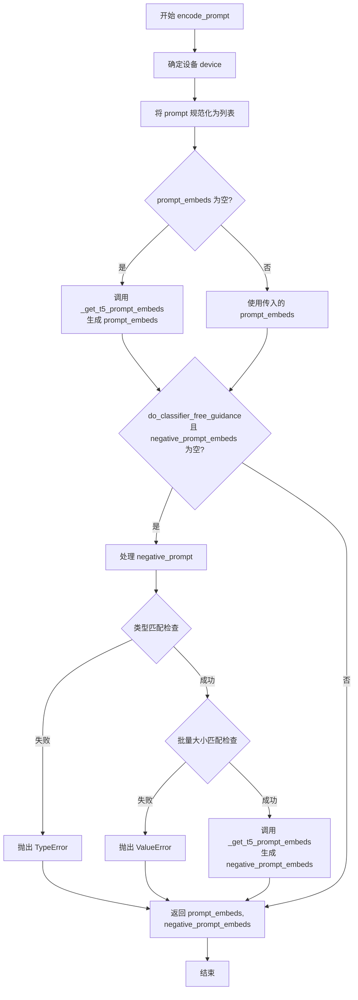

#### 带注释源码

```python
# Copied from diffusers.pipelines.wan.pipeline_wan.WanPipeline.encode_prompt
def encode_prompt(
    self,
    prompt: str | list[str],  # 要编码的提示文本，可以是单个字符串或字符串列表
    negative_prompt: str | list[str] | None = None,  # 负向提示，用于引导不生成的内容
    do_classifier_free_guidance: bool = True,  # 是否启用分类器自由引导
    num_videos_per_prompt: int = 1,  # 每个提示生成的视频数量
    prompt_embeds: torch.Tensor | None = None,  # 预计算的提示嵌入，如果提供则跳过生成
    negative_prompt_embeds: torch.Tensor | None = None,  # 预计算的负向提示嵌入
    max_sequence_length: int = 226,  # T5编码器的最大序列长度
    device: torch.device | None = None,  # 计算设备
    dtype: torch.dtype | None = None,  # 数据类型
):
    r"""
    Encodes the prompt into text encoder hidden states.

    Args:
        prompt (`str` or `list[str]`, *optional*):
            prompt to be encoded
        negative_prompt (`str` or `list[str]`, *optional*):
            The prompt or prompts not to guide the image generation. If not defined, one has to pass
            `negative_prompt_embeds` instead. Ignored when not using guidance (i.e., ignored if `guidance_scale` is
            less than `1`).
        do_classifier_free_guidance (`bool`, *optional*, defaults to `True`):
            Whether to use classifier free guidance or not.
        num_videos_per_prompt (`int`, *optional*, defaults to 1):
            Number of videos that should be generated per prompt. torch device to place the resulting embeddings on
        prompt_embeds (`torch.Tensor`, *optional*):
            Pre-generated text embeddings. Can be used to easily tweak text inputs, *e.g.* prompt weighting. If not
            provided, text embeddings will be generated from `prompt` input argument.
        negative_prompt_embeds (`torch.Tensor`, *optional*):
            Pre-generated negative text embeddings. Can be used to easily tweak text inputs, *e.g.* prompt
            weighting. If not provided, negative_prompt_embeds will be generated from `negative_prompt` input
            argument.
        device: (`torch.device`, *optional*):
            torch device
        dtype: (`torch.dtype`, *optional*):
            torch dtype
    """
    # 确定执行设备，如果未指定则使用当前执行设备
    device = device or self._execution_device

    # 将prompt规范化为列表格式（如果是单个字符串则转换为列表）
    prompt = [prompt] if isinstance(prompt, str) else prompt
    
    # 如果提供了prompt，则获取其批量大小；否则从prompt_embeds推断
    if prompt is not None:
        batch_size = len(prompt)
    else:
        batch_size = prompt_embeds.shape[0]

    # 如果未提供prompt_embeds，则使用T5编码器生成
    if prompt_embeds is None:
        prompt_embeds = self._get_t5_prompt_embeds(
            prompt=prompt,
            num_videos_per_prompt=num_videos_per_prompt,
            max_sequence_length=max_sequence_length,
            device=device,
            dtype=dtype,
        )

    # 如果启用分类器自由引导且未提供负向嵌入，则生成负向嵌入
    if do_classifier_free_guidance and negative_prompt_embeds is None:
        # 默认负向提示为空字符串
        negative_prompt = negative_prompt or ""
        # 如果negative_prompt是字符串，则扩展为与batch_size相同长度的列表
        negative_prompt = batch_size * [negative_prompt] if isinstance(negative_prompt, str) else negative_prompt

        # 类型检查：negative_prompt和prompt类型必须一致
        if prompt is not None and type(prompt) is not type(negative_prompt):
            raise TypeError(
                f"`negative_prompt` should be the same type to `prompt`, but got {type(negative_prompt)} !="
                f" {type(prompt)}."
            )
        # 批量大小检查：两者必须具有相同的批量大小
        elif batch_size != len(negative_prompt):
            raise ValueError(
                f"`negative_prompt`: {negative_prompt} has batch size {len(negative_prompt)}, but `prompt`:"
                f" {prompt} has batch size {batch_size}. Please make sure that passed `negative_prompt` matches"
                " the batch size of `prompt`."
            )

        # 使用T5编码器生成负向提示嵌入
        negative_prompt_embeds = self._get_t5_prompt_embeds(
            prompt=negative_prompt,
            num_videos_per_prompt=num_videos_per_prompt,
            max_sequence_length=max_sequence_length,
            device=device,
            dtype=dtype,
        )

    # 返回正向和负向提示嵌入
    return prompt_embeds, negative_prompt_embeds
```


### SkyReelsV2DiffusionForcingPipeline.check_inputs

该方法负责验证视频生成管道的输入参数是否合法，确保高度、宽度、提示词、提示词嵌入、回调张量输入等参数符合模型要求，并在参数不符合规范时抛出具体的错误信息。

参数：

- `self`：`SkyReelsV2DiffusionForcingPipeline` 实例本身，隐式参数
- `prompt`：`str | list[str] | None`，要编码的提示词，可以是字符串或字符串列表
- `negative_prompt`：`str | list[str] | None`，不引导图像生成的提示词，用于无分类器自由引导
- `height`：`int`，生成视频的高度
- `width`：`int`，生成视频的宽度
- `prompt_embeds`：`torch.Tensor | None`，预生成的提示词嵌入，与 prompt 二选一
- `negative_prompt_embeds`：`torch.Tensor | None`，预生成的负面提示词嵌入
- `callback_on_step_end_tensor_inputs`：`list[str] | None`，在推理步骤结束时回调的 Tensor 输入列表
- `overlap_history`：`int | None`，长视频生成时用于平滑过渡的帧重叠数量
- `num_frames`：`int | None`，生成视频的总帧数
- `base_num_frames`：`int | None`，基础帧数，用于判断是否为长视频模式

返回值：`None`，该方法不返回值，仅通过抛出 ValueError 来处理错误情况

#### 流程图

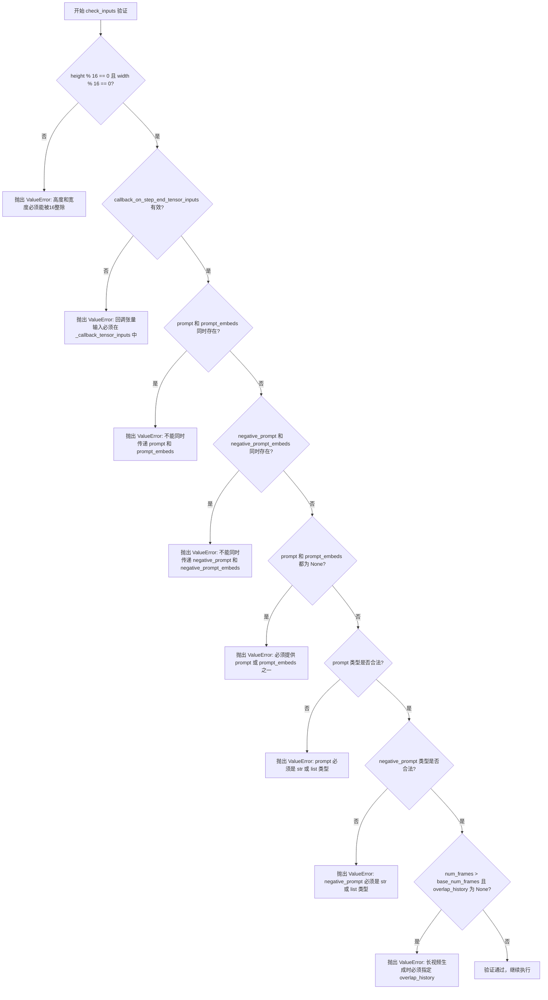

#### 带注释源码

```python
def check_inputs(
    self,
    prompt,
    negative_prompt,
    height,
    width,
    prompt_embeds=None,
    negative_prompt_embeds=None,
    callback_on_step_end_tensor_inputs=None,
    overlap_history=None,
    num_frames=None,
    base_num_frames=None,
):
    """
    验证输入参数的合法性，确保所有参数符合管道执行的前置条件。
    
    参数检查顺序：
    1. 基础几何参数检查（height, width）
    2. 回调参数检查（callback_on_step_end_tensor_inputs）
    3. 提示词与嵌入的互斥性检查
    4. 提示词类型检查
    5. 长视频场景的特殊检查
    """
    
    # 检查1: 验证高度和宽度是否为16的倍数
    # VAE 的下采样因子为 8 (2^3)，潜在空间的尺寸必须是 16 的倍数以确保对齐
    if height % 16 != 0 or width % 16 != 0:
        raise ValueError(f"`height` and `width` have to be divisible by 16 but are {height} and {width}.")

    # 检查2: 验证回调张量输入是否在允许的列表中
    # 回调只能在预定义的张量上进行，以防止不安全的内存访问
    if callback_on_step_end_tensor_inputs is not None and not all(
        k in self._callback_tensor_inputs for k in callback_on_step_end_tensor_inputs
    ):
        raise ValueError(
            f"`callback_on_step_end_tensor_inputs` has to be in {self._callback_tensor_inputs}, but found {[k for k in callback_on_step_end_tensor_inputs if k not in self._callback_tensor_inputs]}"
        )

    # 检查3a: 验证 prompt 和 prompt_embeds 的互斥性
    # 用户不应同时提供原始提示词和预计算的嵌入，这会导致语义冲突
    if prompt is not None and prompt_embeds is not None:
        raise ValueError(
            f"Cannot forward both `prompt`: {prompt} and `prompt_embeds`: {prompt_embeds}. Please make sure to"
            " only forward one of the two."
        )
    # 检查3b: 验证 negative_prompt 和 negative_prompt_embeds 的互斥性
    elif negative_prompt is not None and negative_prompt_embeds is not None:
        raise ValueError(
            f"Cannot forward both `negative_prompt`: {negative_prompt} and `negative_prompt_embeds`: {negative_prompt_embeds}. Please make sure to"
            " only forward one of the two."
        )
    # 检查3c: 确保至少提供了 prompt 或 prompt_embeds 之一
    elif prompt is None and prompt_embeds is None:
        raise ValueError(
            "Provide either `prompt` or `prompt_embeds`. Cannot leave both `prompt` and `prompt_embeds` undefined."
        )
    
    # 检查4a: 验证 prompt 的类型是否为 str 或 list
    elif prompt is not None and (not isinstance(prompt, str) and not isinstance(prompt, list)):
        raise ValueError(f"`prompt` has to be of type `str` or `list` but is {type(prompt)}")
    # 检查4b: 验证 negative_prompt 的类型是否为 str 或 list
    elif negative_prompt is not None and (
        not isinstance(negative_prompt, str) and not isinstance(negative_prompt, list)
    ):
        raise ValueError(f"`negative_prompt` has to be of type `str` or `list` but is {type(negative_prompt)}")

    # 检查5: 长视频生成的必要条件检查
    # 当生成帧数超过基础帧数时，必须指定 overlap_history 以确保时间上的平滑过渡
    if num_frames > base_num_frames and overlap_history is None:
        raise ValueError(
            "`overlap_history` is required when `num_frames` exceeds `base_num_frames` to ensure smooth transitions in long video generation. "
            "Please specify a value for `overlap_history`. Recommended values are 17 or 37."
        )
```


### `SkyReelsV2DiffusionForcingPipeline.prepare_latents`

该方法负责为SkyReels-V2扩散强制管道准备潜在变量（latents），支持短视频和长视频（分块处理）生成。它根据输入的视频参数（高度、宽度、帧数）计算潜在空间的维度，处理长期视频生成时的重叠历史帧和因果块对齐，并使用随机张量生成器初始化噪声潜在变量或直接返回提供的潜在变量。

参数：

- `batch_size`：`int`，批处理大小，指定一次生成多少个视频样本
- `num_channels_latents`：`int = 16`，潜在通道数，对应Transformer模型的输入通道
- `height`：`int = 480`，原始视频的高度（像素）
- `width`：`int = 832`，原始视频的宽度（像素）
- `num_frames`：`int = 97`，原始视频的帧数
- `dtype`：`torch.dtype | None = None`，潜在张量的数据类型
- `device`：`torch.device | None = None`，潜在张量存放的设备
- `generator`：`torch.Generator | list[torch.Generator] | None = None`，随机数生成器，用于确保生成的可复现性
- `latents`：`torch.Tensor | None = None`，可选的预生成潜在张量，若提供则直接返回
- `base_latent_num_frames`：`int | None = None`，长期视频生成时模型一次能处理的基础帧数
- `video_latents`：`torch.Tensor | None = None`，长期视频生成时从前一个迭代传递过来的潜在变量
- `causal_block_size`：`int | None = None`，因果块大小，用于异步推理时的帧分组
- `overlap_history_latent_frames`：`int | None = None`，长期视频生成时重叠的历史帧数（潜在空间）
- `long_video_iter`：`int | None = None`，长期视频生成的当前迭代索引

返回值：`tuple[torch.Tensor, int, torch.Tensor | None, int]`，返回一个元组，包含：
- 生成/处理的潜在张量（`torch.Tensor`）
- 当前迭代使用的潜在帧数（`int`）
- 前缀视频潜在张量（`torch.Tensor | None`）
- 前缀视频潜在帧数（`int`）

#### 流程图

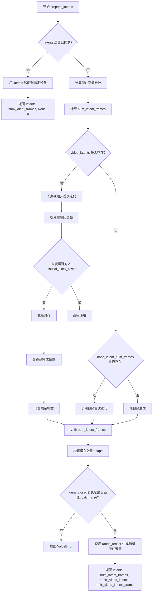

#### 带注释源码

```python
def prepare_latents(
    self,
    batch_size: int,
    num_channels_latents: int = 16,
    height: int = 480,
    width: int = 832,
    num_frames: int = 97,
    dtype: torch.dtype | None = None,
    device: torch.device | None = None,
    generator: torch.Generator | list[torch.Generator] | None = None,
    latents: torch.Tensor | None = None,
    base_latent_num_frames: int | None = None,
    video_latents: torch.Tensor | None = None,
    causal_block_size: int | None = None,
    overlap_history_latent_frames: int | None = None,
    long_video_iter: int | None = None,
) -> torch.Tensor:
    # 如果已提供 latents，直接将其移动到目标设备并返回
    # 这种情况下不支持返回额外的元数据（prefix_video_latents 等）
    if latents is not None:
        return latents.to(device=device, dtype=dtype)

    # 计算潜在空间的帧数：VAE 的时间下采样因子决定帧数缩减
    # 例如：如果 temporal_downsample = [1,1]，则 vae_scale_factor_temporal = 4
    num_latent_frames = (num_frames - 1) // self.vae_scale_factor_temporal + 1
    
    # 计算潜在空间的高度和宽度：VAE 的空间下采样因子决定分辨率缩减
    # 例如：如果空间下采样 3 级（2^3=8），则 480->60, 832->104
    latent_height = height // self.vae_scale_factor_spatial
    latent_width = width // self.vae_scale_factor_spatial

    # 初始化前缀视频潜在变量（用于长期视频生成时的条件）
    prefix_video_latents = None
    prefix_video_latents_frames = 0

    # 处理长期视频生成的场景（非首次迭代）
    if video_latents is not None:
        # 提取重叠历史帧作为条件输入
        prefix_video_latents = video_latents[:, :, -overlap_history_latent_frames:]

        # 确保前缀帧数与因果块大小对齐，避免处理时出错
        if prefix_video_latents.shape[2] % causal_block_size != 0:
            truncate_len_latents = prefix_video_latents.shape[2] % causal_block_size
            logger.warning(
                f"The length of prefix video latents is truncated by {truncate_len_latents} frames for the causal block size alignment. "
                f"This truncation ensures compatibility with the causal block size, which is required for proper processing. "
                f"However, it may slightly affect the continuity of the generated video at the truncation boundary."
            )
            # 截断不对齐的帧
            prefix_video_latents = prefix_video_latents[:, :, :-truncate_len_latents]
        
        # 记录前缀帧的数量
        prefix_video_latents_frames = prefix_video_latents.shape[2]

        # 计算当前迭代前已完成的总帧数
        # 公式：迭代次数 × (基础帧数 - 重叠帧数) + 重叠帧数
        finished_frame_num = (
            long_video_iter * (base_latent_num_frames - overlap_history_latent_frames)
            + overlap_history_latent_frames
        )
        # 计算剩余需要生成的帧数
        left_frame_num = num_latent_frames - finished_frame_num
        # 更新本次迭代需要处理的帧数（不超过基础帧数）
        num_latent_frames = min(left_frame_num + overlap_history_latent_frames, base_latent_num_frames)
    
    # 长期视频生成的首次迭代：使用基础帧数
    elif base_latent_num_frames is not None:
        num_latent_frames = base_latent_num_frames
    
    # 短视频生成：按正常下采样计算帧数
    else:
        num_latent_frames = (num_frames - 1) // self.vae_scale_factor_temporal + 1

    # 构建潜在张量的形状：[batch, channels, frames, height, width]
    shape = (
        batch_size,
        num_channels_latents,
        num_latent_frames,
        latent_height,
        latent_width,
    )
    
    # 验证 generator 列表长度与 batch_size 的一致性
    if isinstance(generator, list) and len(generator) != batch_size:
        raise ValueError(
            f"You have passed a list of generators of length {len(generator)}, but requested an effective batch"
            f" size of {batch_size}. Make sure the batch size matches the length of the generators."
        )

    # 使用随机张量初始化噪声潜在变量
    # 从标准正态分布采样，支持指定生成器以确保可复现性
    latents = randn_tensor(shape, generator=generator, device=device, dtype=dtype)

    # 返回潜在变量及相关元数据，供后续去噪步骤使用
    return latents, num_latent_frames, prefix_video_latents, prefix_video_latents_frames
```


### `SkyReelsV2DiffusionForcingPipeline.generate_timestep_matrix`

该函数实现了扩散强制（Diffusion Forcing）算法的核心逻辑，用于创建跨时间帧的协调去噪调度矩阵。它支持两种生成模式：同步模式（所有帧同时去噪）和异步模式（帧分组块级联去噪，形成"去噪波"），能够有效处理长视频生成中的时序一致性问题。

参数：

- `num_latent_frames`：`int`，要生成的潜在帧总数
- `step_template`：`torch.Tensor`，基础时间步调度模板（如 [1000, 800, 600, ..., 0]）
- `base_num_latent_frames`：`int`，模型单次前向传播能处理的最大帧数
- `ar_step`：`int`，自回归步长，控制时间滞后，0=同步模式，>0=异步模式，默认值为 5
- `num_pre_ready`：`int`，已预先去噪的帧数（如视频到视频任务中的前缀帧），默认值为 0
- `causal_block_size`：`int`，因果块大小（每块处理的帧数），默认值为 1
- `shrink_interval_with_mask`：`bool`，是否根据掩码收缩处理间隔以优化性能，默认值为 False

返回值：`tuple[torch.Tensor, torch.Tensor, torch.Tensor, list[tuple]]`，包含四个元素：

- `step_matrix`：`torch.Tensor`，时间步矩阵，形状为 [num_iterations, num_latent_frames]
- `step_index`：`torch.Tensor`，时间步索引矩阵，形状为 [num_iterations, num_latent_frames]
- `step_update_mask`：`torch.Tensor`，布尔更新掩码，形状为 [num_iterations, num_latent_frames]
- `valid_interval`：`list[tuple]`，有效处理区间列表，每个元素为 (start, end) 元组

#### 流程图

```mermaid
flowchart TD
    A[开始 generate_timestep_matrix] --> B[初始化 step_matrix, step_index, update_mask, valid_interval]
    B --> C[计算迭代次数: num_iterations = len(step_template) + 1]
    C --> D[计算块数量: num_blocks, base_num_blocks]
    D --> E{ar_step 是否足够?}
    E -->|否| F[抛出 ValueError]
    E -->|是| G[扩展 step_template 边界值]
    G --> H[初始化 pre_row = 0]
    H --> I{num_pre_ready > 0?}
    I -->|是| J[标记预就绪块为完成]
    I -->|否| K[主循环: while not all blocks finished]
    J --> K
    K --> L[创建新行 new_row]
    L --> M[遍历每个块 i]
    M --> N{i == 0 或 前一块完成?}
    N -->|是| O[new_row[i] = pre_row[i] + 1]
    N -->|否| P[new_row[i] = new_row[i-1] - ar_step]
    O --> Q[Clamp new_row 到有效范围]
    P --> Q
    Q --> R[计算更新掩码]
    R --> S[追加到列表]
    S --> T[更新 pre_row]
    T --> U{所有块完成?}
    U -->|否| K
    U -->|是| V[处理 shrink_interval_with_mask]
    V --> W[计算 valid_interval]
    W --> X[堆叠为张量]
    X --> Y{causal_block_size > 1?}
    Y -->|是| Z[展开块维度到帧维度]
    Y -->|否| AA[返回结果]
    Z --> AA
```

#### 带注释源码

```python
def generate_timestep_matrix(
    self,
    num_latent_frames: int,
    step_template: torch.Tensor,
    base_num_latent_frames: int,
    ar_step: int = 5,
    num_pre_ready: int = 0,
    causal_block_size: int = 1,
    shrink_interval_with_mask: bool = False,
) -> tuple[torch.Tensor, torch.Tensor, torch.Tensor, list[tuple]]:
    """
    该函数实现核心扩散强制算法，创建跨时间帧的协调去噪调度。
    支持同步模式（ar_step=0, causal_block_size=1）和异步模式（ar_step>0, causal_block_size>1）。

    参数:
        num_latent_frames: 要生成的潜在帧总数
        step_template: 基础时间步调度 (如 [1000, 800, 600, ..., 0])
        base_num_latent_frames: 模型单次前向传播可处理的最大帧数
        ar_step: 自回归步长，0=同步，>0=异步，默认5
        num_pre_ready: 已去噪的帧数（如视频2视频任务的前缀），默认0
        causal_block_size: 因果块大小，默认1
        shrink_interval_with_mask: 是否优化处理间隔，默认False

    返回:
        tuple: (step_matrix, step_index, step_update_mask, valid_interval)
    """
    # 初始化列表存储调度矩阵和元数据
    step_matrix, step_index = [], []  # 存储每迭代的时间步值和索引
    update_mask, valid_interval = [], []  # 存储更新掩码和处理区间

    # 计算去噪迭代次数（加1表示初始噪声状态）
    num_iterations = len(step_template) + 1

    # 将帧数转换为块数用于因果处理
    # 例如: 25帧 ÷ 5 = 5个块
    num_blocks = num_latent_frames // causal_block_size
    base_num_blocks = base_num_latent_frames // causal_block_size

    # 验证ar_step是否足够大
    if base_num_blocks < num_blocks:
        min_ar_step = len(step_template) / base_num_blocks
        if ar_step < min_ar_step:
            raise ValueError(f"`ar_step` should be at least {math.ceil(min_ar_step)} in your setting")

    # 扩展step_template以便索引：添加边界值
    # 999: 计数器从1开始的虚拟值
    # 0: 最终时间步（完全去噪）
    step_template = torch.cat(
        [
            torch.tensor([999], dtype=torch.long, device=step_template.device),
            step_template.long(),
            torch.tensor([0], dtype=torch.long, device=step_template.device),
        ]
    )

    # 初始化前一行状态（跟踪每个块的去噪进度）
    # 0表示未开始，num_iterations表示完全去噪
    pre_row = torch.zeros(num_blocks, dtype=torch.long)

    # 标记预就绪帧（如视频2视频任务中的前缀）已处于最终去噪状态
    if num_pre_ready > 0:
        pre_row[: num_pre_ready // causal_block_size] = num_iterations

    # 主循环：生成去噪调度直到所有帧完全去噪
    while not torch.all(pre_row >= (num_iterations - 1)):
        # 创建新行表示下一个去噪步骤
        new_row = torch.zeros(num_blocks, dtype=torch.long)

        # 为每个块应用扩散强制逻辑
        for i in range(num_blocks):
            if i == 0 or pre_row[i - 1] >= (num_iterations - 1):
                # 第一帧或前一帧已完全去噪
                new_row[i] = pre_row[i] + 1
            else:
                # 异步模式：滞后前一块ar_step个时间步
                # 这创建了"扩散强制"交错模式
                new_row[i] = new_row[i - 1] - ar_step

        # 将值限制在有效范围[0, num_iterations]
        new_row = new_row.clamp(0, num_iterations)

        # 创建更新掩码：本次迭代需要去噪更新的块为True
        # 排除未开始(new_row != pre_row)或已完成(new_row != num_iterations)的块
        update_mask.append((new_row != pre_row) & (new_row != num_iterations))

        # 存储迭代状态
        step_index.append(new_row)  # step_template的索引
        step_matrix.append(step_template[new_row])  # 实际时间步值
        pre_row = new_row  # 更新为下一迭代准备

    # 处理长于模型容量的视频：滑动窗口处理
    terminal_flag = base_num_blocks

    # 可选优化：根据首个更新掩码收缩区间
    if shrink_interval_with_mask:
        idx_sequence = torch.arange(num_blocks, dtype=torch.long)
        update_mask = update_mask[0]
        update_mask_idx = idx_sequence[update_mask]
        last_update_idx = update_mask_idx[-1].item()
        terminal_flag = last_update_idx + 1

    # 每个区间定义当前前向pass要处理的帧
    for curr_mask in update_mask:
        # 如果当前掩码在terminal_flag之后有更新，则扩展terminal_flag
        if terminal_flag < num_blocks and curr_mask[terminal_flag]:
            terminal_flag += 1
        # 创建区间: [start, end)，start确保不超过模型容量
        valid_interval.append((max(terminal_flag - base_num_blocks, 0), terminal_flag))

    # 转换为张量以便高效处理
    step_update_mask = torch.stack(update_mask, dim=0)
    step_index = torch.stack(step_index, dim=0)
    step_matrix = torch.stack(step_matrix, dim=0)

    # 如果causal_block_size > 1，将每个块的调度展开到块内所有帧
    if causal_block_size > 1:
        # 展开每个块到causal_block_size帧
        step_update_mask = step_update_mask.unsqueeze(-1).repeat(1, 1, causal_block_size).flatten(1).contiguous()
        step_index = step_index.unsqueeze(-1).repeat(1, 1, causal_block_size).flatten(1).contiguous()
        step_matrix = step_matrix.unsqueeze(-1).repeat(1, 1, causal_block_size).flatten(1).contiguous()
        # 将区间从块级扩展到帧级
        valid_interval = [(s * causal_block_size, e * causal_block_size) for s, e in valid_interval]

    return step_matrix, step_index, step_update_mask, valid_interval
```


### `SkyReelsV2DiffusionForcingPipeline.guidance_scale`

该属性是 `SkyReelsV2DiffusionForcingPipeline` 类的 guidance_scale getter 方法，用于获取当前pipeline的guidance scale值。Guidance scale 是分类器-free扩散引导(Classifier-Free Diffusion Guidance)中的权重参数，用于控制生成内容与文本提示的相关性。

参数：无（属性访问器不接受任何参数）

返回值：`float`，返回当前pipeline的guidance scale值，该值决定了生成视频与文本prompt的匹配程度。值越高，生成结果越接近prompt描述，但可能牺牲一些质量。

#### 流程图

```mermaid
flowchart TD
    A[访问 guidance_scale 属性] --> B{检查 _guidance_scale 是否已设置}
    B -->|是| C[返回 self._guidance_scale]
    B -->|否| D[返回默认值或 None]
    
    C --> E[用于 do_classifier_free_guidance 判断]
    E --> F[在去噪循环中计算 noise_pred]
    F --> G[noise_pred = noise_uncond + guidance_scale * (noise_pred - noise_uncond)]
```

#### 带注释源码

```python
@property
def guidance_scale(self):
    """
    属性 getter: 获取当前的 guidance scale 值。
    
    Guidance scale 控制分类器-free扩散引导的强度。在推理时，
    该值被用于调整无条件噪声预测和条件噪声预测之间的权重：
    noise_pred = noise_uncond + guidance_scale * (noise_pred - noise_uncond)
    
    当 guidance_scale > 1.0 时，启用分类器-free引导。
    较高的值会促使生成更符合文本提示的内容，但可能降低生成质量。
    
    Returns:
        float: 当前设置的 guidance scale 值。该值在 __call__ 方法中
               通过 self._guidance_scale = guidance_scale 进行设置。
    """
    return self._guidance_scale
```


### `SkyReelsV2DiffusionForcingPipeline.do_classifier_free_guidance`

该属性是一个只读的计算属性，用于判断当前管道是否启用分类器自由引导（Classifier-Free Guidance，CFG）。它通过比较内部存储的 `_guidance_scale` 值与 1.0 的大小来确定是否进行无分类器引导生成。当 guidance_scale 大于 1.0 时，模型会在推理过程中同时处理条件和无条件嵌入，以实现文本引导的生成效果。

参数：

- 无参数（属性方法，仅包含 `self`）

返回值：`bool`，返回一个布尔值，表示是否启用分类器自由引导。当 `_guidance_scale > 1.0` 时返回 `True`，否则返回 `False`。

#### 流程图

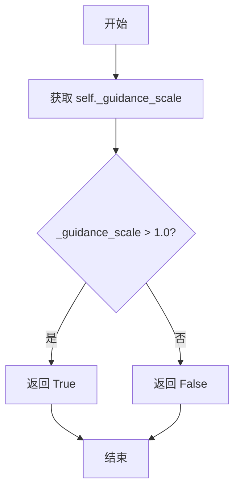

#### 带注释源码

```python
@property
def do_classifier_free_guidance(self):
    """
    属性：是否启用分类器自由引导（Classifier-Free Guidance）
    
    该属性是一个只读计算属性，用于判断当前管道配置是否启用了分类器自由引导。
    分类器自由引导是一种用于文本到视频生成的技术，通过在推理时同时处理
    条件嵌入（带文本提示）和无条件嵌入（空文本），然后根据 guidance_scale
    进行加权组合，从而增强生成内容与文本提示的一致性。
    
    Returns:
        bool: 如果 guidance_scale > 1.0 则返回 True，表示启用 CFG；
              否则返回 False，表示不启用 CFG。
    """
    return self._guidance_scale > 1.0
```


### `SkyReelsV2DiffusionForcingPipeline.num_timesteps`

这是一个属性 getter 方法，用于获取扩散管道执行过程中的总时间步数。该属性返回在去噪循环中生成的时间步矩阵的行数，即模型执行去噪的迭代次数。

参数：无（属性 getter 不接受参数）

返回值：`int`，返回去噪过程中的总时间步数量

#### 流程图

```mermaid
flowchart TD
    A[访问 num_timesteps 属性] --> B{检查属性是否存在}
    B -->|是| C[返回 self._num_timesteps]
    B -->|否| D[抛出 AttributeError]
    
    C --> E[获取去噪迭代次数]
    
    E --> F[在 __call__ 中赋值: self._num_timesteps = len(step_matrix)]
```

#### 带注释源码

```python
@property
def num_timesteps(self):
    """
    属性 getter: 获取扩散管道的时间步数量
    
    该属性返回在去噪过程中生成的时间步矩阵的长度，
    即模型需要执行的扩散迭代次数。
    
    注意: 此属性依赖于 __call__ 方法中设置的 _num_timesteps 变量。
    在调用管道之前，该值可能未初始化。
    
    返回:
        int: 去噪过程的总迭代次数/时间步数量
    """
    return self._num_timesteps
```


### `SkyReelsV2DiffusionForcingPipeline.current_timestep`

该属性是一个简单的只读属性，用于获取当前的去噪时间步（timestep）。在扩散模型的推理过程中，该属性在每个去噪迭代中被更新为当前的时间步张量，使得外部可以实时访问当前处理到的时间步。

参数：无（该属性不接受显式参数，`self` 为隐式参数）

返回值：`Any`，返回当前的去噪时间步，通常是 `torch.Tensor` 类型的时间步张量，在初始化或结束后为 `None`

#### 流程图

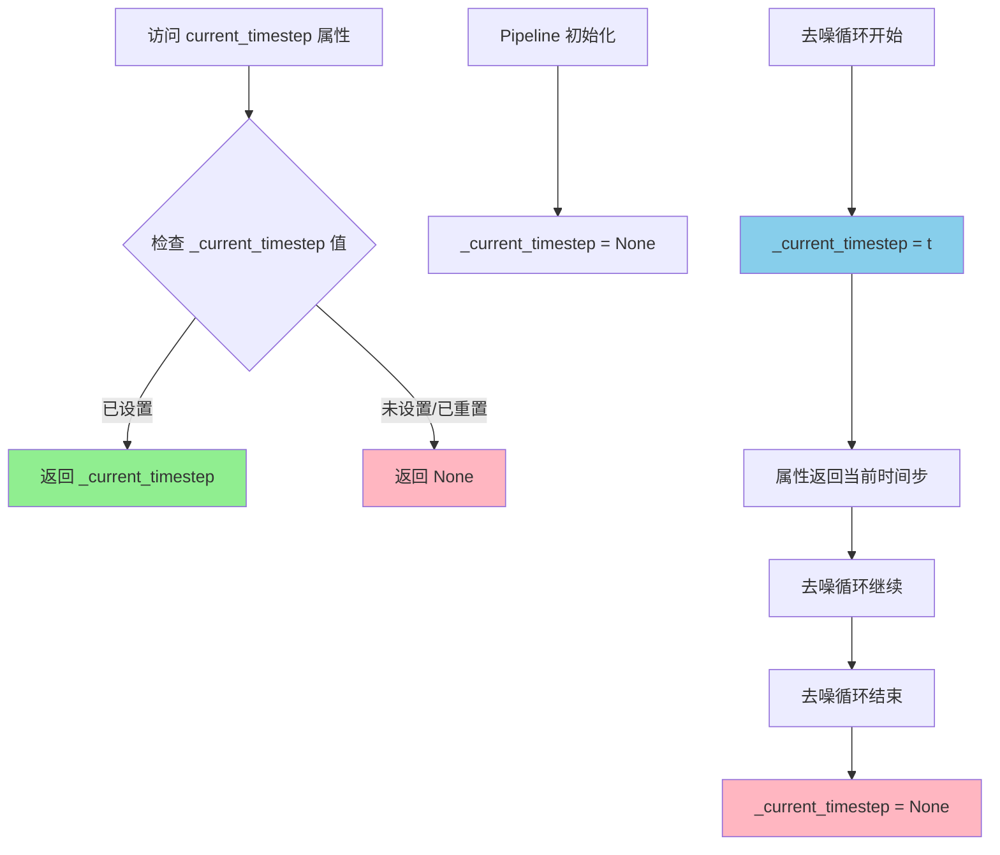

#### 带注释源码

```python
@property
def current_timestep(self):
    """
    只读属性，返回当前的去噪时间步。
    
    该属性在扩散模型的去噪循环（denoising loop）过程中被动态更新。
    在每个迭代步骤中，_current_timestep 会被设置为当前的时间步张量，
    使得外部可以通过此属性获取当前的推理进度。
    
    返回值:
        Any: 当前的时间步值。在去噪过程中为 torch.Tensor，
             在初始化或结束后为 None。
    """
    return self._current_timestep
```


### `SkyReelsV2DiffusionForcingPipeline.interrupt`

该属性是 `SkyReelsV2DiffusionForcingPipeline` 管道的中断标志访问器，用于在推理过程中检查或控制管道是否被请求中断。它通过返回内部属性 `_interrupt` 的值来实现，该标志在管道的 `__call__` 方法中被设置为 `False`，并在每个去噪步骤的开始处被检查以决定是否跳过当前迭代。

参数：

- `self`：`SkyReelsV2DiffusionForcingPipeline`，隐式参数，指向当前管道实例本身

返回值：`bool`，返回当前的中断状态。当值为 `True` 时，表示外部已请求中断推理过程，管道将继续执行但跳过去噪步骤的更新；当值为 `False` 时，表示管道正常运行。

#### 流程图

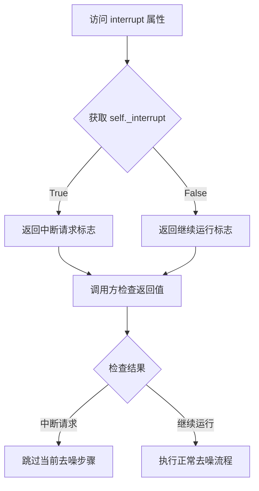

#### 带注释源码

```python
@property
def interrupt(self):
    """
    中断标志属性访问器。

    该属性提供了对内部中断标志 _interrupt 的只读访问。在扩散模型推理过程中，
    外部调用者可以设置此标志为 True 来请求提前终止推理。此属性通常与管道的
    __call__ 方法中的检查逻辑配合使用：

    示例使用场景：
        # 在另一个线程或回调中设置中断标志
        pipeline._interrupt = True

        # 或者通过属性读取当前中断状态
        if pipeline.interrupt:
            print("Pipeline has been interrupted")

    Returns:
        bool: 当前的中断状态。True 表示请求中断，False 表示正常运行。
    """
    return self._interrupt
```


### `SkyReelsV2DiffusionForcingPipeline.attention_kwargs`

该属性是一个只读属性，用于获取在扩散强制视频生成过程中传递给注意力处理器的配置参数字典。

参数：

- `self`：`SkyReelsV2DiffusionForcingPipeline`，pipeline 实例本身

返回值：`dict[str, Any] | None`，包含注意力处理器所需的额外关键字参数，如需传递给 `AttentionProcessor` 的配置信息

#### 流程图

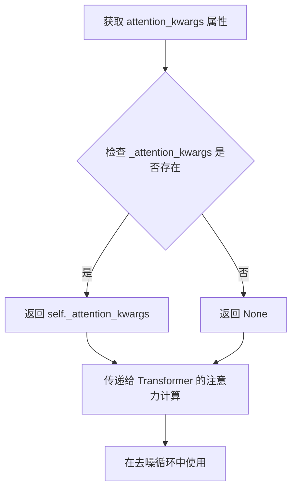

#### 带注释源码

```python
@property
def attention_kwargs(self):
    """
    属性访问器：获取注意力关键字参数
    
    该属性返回在 pipeline 调用时设置的 _attention_kwargs 字典。
    这些参数会在去噪循环中被传递给 Transformer 模型的 attention_kwargs 参数，
    用于控制注意力处理器的行为（例如自定义注意力模式、掩码等）。
    
    Returns:
        dict[str, Any] | None: 注意力处理器的额外配置参数字典
    """
    return self._attention_kwargs
```

#### 上下文关联信息

**在 `__call__` 方法中的使用：**

```python
# 在 __call__ 方法中初始化
self._attention_kwargs = attention_kwargs  # attention_kwargs: dict[str, Any] | None = None

# 在去噪循环中传递给 Transformer
noise_pred = self.transformer(
    hidden_states=latent_model_input,
    timestep=timestep,
    encoder_hidden_states=prompt_embeds,
    enable_diffusion_forcing=True,
    fps=fps_embeds,
    attention_kwargs=attention_kwargs,  # 传递给 transformer
    return_dict=False,
)[0]
```

**相关属性：**

| 属性名 | 类型 | 描述 |
|--------|------|------|
| `_attention_kwargs` | `dict[str, Any] \| None` | 内部存储的兴趣味参数字典 |
| `_guidance_scale` | `float` | 分类器自由引导比例 |
| `_num_timesteps` | `int` | 总时间步数 |
| `_current_timestep` | `torch.Tensor` | 当前时间步 |
| `_interrupt` | `bool` | 中断标志 |


### `SkyReelsV2DiffusionForcingPipeline.__call__`

该方法是 SkyReels-V2 视频生成管道的主入口函数，实现了基于扩散强制（Diffusion Forcing）算法的文本到视频（Text-to-Video）生成功能。支持短视频和长视频生成，通过异步推理模式（ar_step>0）实现时间一致性更强的长视频处理，同时支持基于因果块（causal block）的分块处理机制。

参数：

- `prompt`：`str | list[str]`，用于引导视频生成的文本提示，支持单个字符串或字符串列表
- `negative_prompt`：`str | list[str] | None`，不参与引导的负面提示词，默认为 None
- `height`：`int`，生成视频的高度，默认 544 像素
- `width`：`int`，生成视频的宽度，默认 960 像素
- `num_frames`：`int`，生成视频的帧数，默认 97 帧
- `num_inference_steps`：`int`，去噪迭代步数，默认 50 步，步数越多质量越高但推理越慢
- `guidance_scale`：`float`，无分类器自由引导（CFG）比例，默认 6.0，T2V 推荐 6.0，I2V 推荐 5.0
- `num_videos_per_prompt`：`int | None`，每个提示生成的视频数量，默认 1
- `generator`：`torch.Generator | list[torch.Generator] | None`，用于生成确定性结果的随机数生成器
- `latents`：`torch.Tensor | None`，预先生成的高斯噪声潜在向量，可用于控制相同生成条件下的不同提示
- `prompt_embeds`：`torch.Tensor | None`，预生成的文本嵌入，可用于提示词加权等微调
- `negative_prompt_embeds`：`torch.Tensor | None`，预生成的负面文本嵌入
- `output_type`：`str | None`，输出格式，可选 "np"（numpy 数组）或 "latent"，默认 "np"
- `return_dict`：`bool`，是否返回 SkyReelsV2PipelineOutput 对象，默认 True
- `attention_kwargs`：`dict[str, Any] | None`，传递给注意力处理器的额外参数
- `callback_on_step_end`：`Callable | PipelineCallback | MultiPipelineCallbacks | None`，每步去噪结束时的回调函数
- `callback_on_step_end_tensor_inputs`：`list[str]`，回调函数需要的张量输入列表，默认 ["latents"]
- `max_sequence_length`：`int`，提示词的最大序列长度，默认 512
- `overlap_history`：`int | None`，长视频生成时用于平滑过渡的重叠帧数，推荐 17 或 37
- `addnoise_condition`：`float`，用于长视频生成平滑处理的噪声添加量，推荐 20，不建议超过 50
- `base_num_frames`：`int`，基准帧数，540P 推荐 97，720P 推荐 121，默认 97
- `ar_step`：`int`，控制异步推理的步长，0 为同步模式，设置为 5 可启用异步推理，默认 0
- `causal_block_size`：`int | None`，因果块/分块中包含的帧数，异步推理时推荐设置为 5
- `fps`：`int`，生成视频的帧率，默认 24

返回值：`SkyReelsV2PipelineOutput | tuple`，返回生成的视频帧列表，或在 return_dict=False 时返回元组

#### 流程图

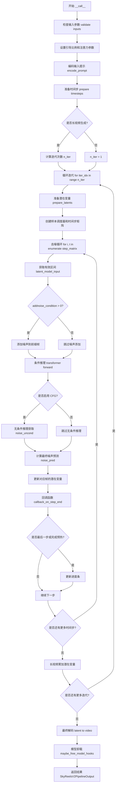

#### 带注释源码

```python
@torch.no_grad()
@replace_example_docstring(EXAMPLE_DOC_STRING)
def __call__(
    self,
    prompt: str | list[str],                              # 文本提示：引导视频生成的核心输入
    negative_prompt: str | list[str] = None,              # 负面提示：用于无分类器引导
    height: int = 544,                                    # 输出视频高度（像素）
    width: int = 960,                                     # 输出视频宽度（像素）
    num_frames: int = 97,                                 # 输出视频总帧数
    num_inference_steps: int = 50,                        # 扩散去噪迭代次数
    guidance_scale: float = 6.0,                          # CFG 引导强度（>1 启用）
    num_videos_per_prompt: int | None = 1,                # 每个提示生成的视频数量
    generator: torch.Generator | list[torch.Generator] | None = None,  # 随机数生成器（可复现）
    latents: torch.Tensor | None = None,                  # 预定义的噪声潜在向量
    prompt_embeds: torch.Tensor | None = None,            # 预计算的文本嵌入
    negative_prompt_embeds: torch.Tensor | None = None,   # 预计算的负面文本嵌入
    output_type: str | None = "np",                       # 输出格式：numpy 数组或 latent
    return_dict: bool = True,                             # 是否返回结构化输出对象
    attention_kwargs: dict[str, Any] | None = None,      # 注意力机制额外参数
    callback_on_step_end: Callable | ... | None = None,  # 每步结束时的回调函数
    callback_on_step_end_tensor_inputs: list[str] = ["latents"],  # 回调的张量输入
    max_sequence_length: int = 512,                       # T5 编码器的最大序列长度
    overlap_history: int | None = None,                   # 长视频重叠帧数（平滑过渡）
    addnoise_condition: float = 0,                        # 前缀帧噪声添加量
    base_num_frames: int = 97,                            # 基准帧数（模型容量）
    ar_step: int = 0,                                     # 异步推理步长（0=同步）
    causal_block_size: int | None = None,                 # 因果块大小（帧数）
    fps: int = 24,                                        # 输出视频帧率
):
    # 步骤 1：检查输入参数的合法性
    # - 验证高度/宽度能被 16 整除
    # - 验证回调张量输入在允许列表中
    # - 验证 prompt 和 prompt_embeds 不能同时提供
    # - 验证长视频模式时 overlap_history 必须提供
    self.check_inputs(
        prompt, negative_prompt, height, width,
        prompt_embeds, negative_prompt_embeds,
        callback_on_step_end_tensor_inputs,
        overlap_history, num_frames, base_num_frames,
    )

    # 步骤 2：设置引导比例和注意力参数
    # 保存到实例变量供其他方法访问
    self._guidance_scale = guidance_scale
    self._attention_kwargs = attention_kwargs
    self._current_timestep = None
    self._interrupt = False

    # 获取执行设备（CPU/CUDA）
    device = self._execution_device

    # 步骤 3：编码输入提示
    # 使用 T5 text_encoder 将文本转换为嵌入向量
    # 同时为 CFG 生成 negative_prompt_embeds
    prompt_embeds, negative_prompt_embeds = self.encode_prompt(
        prompt=prompt,
        negative_prompt=negative_prompt,
        do_classifier_free_guidance=self.do_classifier_free_guidance,
        num_videos_per_prompt=num_videos_per_prompt,
        prompt_embeds=prompt_embeds,
        negative_prompt_embeds=negative_prompt_embeds,
        max_sequence_length=max_sequence_length,
        device=device,
    )

    # 转换嵌入向量到 transformer 所需的数据类型
    transformer_dtype = self.transformer.dtype
    prompt_embeds = prompt_embeds.to(transformer_dtype)
    if negative_prompt_embeds is not None:
        negative_prompt_embeds = negative_prompt_embeds.to(transformer_dtype)

    # 步骤 4：准备时间步
    # 使用 UniPCMultistepScheduler 设置去噪时间步
    self.scheduler.set_timesteps(num_inference_steps, device=device)
    timesteps = self.scheduler.timesteps

    # 设置因果块大小并配置 transformer 的自回归注意力
    if causal_block_size is None:
        causal_block_size = self.transformer.config.num_frame_per_block
    else:
        self.transformer._set_ar_attention(causal_block_size)

    # 处理 FPS 嵌入（用于帧率条件）
    fps_embeds = [fps] * prompt_embeds.shape[0]
    fps_embeds = [0 if i == 16 else 1 for i in fps_embeds]

    # 步骤 5：判断是否为长视频生成模式
    # 长视频需要多次迭代处理，每迭代处理 base_num_frames 帧
    is_long_video = overlap_history is not None and base_num_frames is not None and num_frames > base_num_frames
    
    # 计算潜在帧数和迭代次数
    if is_long_video:
        # 计算重叠的潜在帧数
        overlap_history_latent_frames = (overlap_history - 1) // self.vae_scale_factor_temporal + 1
        # 总潜在帧数
        num_latent_frames = (num_frames - 1) // self.vae_scale_factor_temporal + 1
        # 基准潜在帧数
        base_latent_num_frames = (base_num_frames - 1) // self.vae_scale_factor_temporal + 1
        # 计算需要的迭代次数
        n_iter = 1 + (num_latent_frames - base_latent_num_frames - 1) // (base_latent_num_frames - overlap_history_latent_frames) + 1
    else:
        n_iter = 1
        base_latent_num_frames = (num_frames - 1) // self.vae_scale_factor_temporal + 1

    # 步骤 6：主迭代循环（长视频可能有多个迭代）
    accumulated_latents = None  # 存储所有潜在变量
    
    for iter_idx in range(n_iter):
        if is_long_video:
            logger.debug(f"Processing iteration {iter_idx + 1}/{n_iter}")

        # 准备潜在变量
        latents, current_num_latent_frames, prefix_video_latents, prefix_video_latents_frames = (
            self.prepare_latents(
                batch_size * num_videos_per_prompt,
                self.transformer.config.in_channels,  # 潜在通道数
                height, width, num_frames,
                torch.float32, device, generator,
                latents if iter_idx == 0 else None,   # 首次迭代使用输入的 latents
                video_latents=accumulated_latents,    # 后续迭代使用累加的 latents
                base_latent_num_frames=base_latent_num_frames if is_long_video else None,
                causal_block_size=causal_block_size,
                overlap_history_latent_frames=overlap_history_latent_frames if is_long_video else None,
                long_video_iter=iter_idx if is_long_video else None,
            )
        )

        # 如果有前缀视频潜在变量，将其复制到当前潜在变量的开头
        if prefix_video_latents_frames > 0:
            latents[:, :, :prefix_video_latents_frames, :, :] = prefix_video_latents.to(transformer_dtype)

        # 步骤 7：为每个潜在帧创建独立的调度器
        sample_schedulers = []
        for _ in range(current_num_latent_frames):
            sample_scheduler = deepcopy(self.scheduler)
            sample_scheduler.set_timesteps(num_inference_steps, device=device)
            sample_schedulers.append(sample_scheduler)

        # 步骤 8：生成时间步矩阵（扩散强制算法的核心）
        # 创建协调的去噪调度表，支持同步/异步模式
        step_matrix, _, step_update_mask, valid_interval = self.generate_timestep_matrix(
            current_num_latent_frames,
            timesteps,
            current_num_latent_frames if is_long_video else base_latent_num_frames,
            ar_step,
            prefix_video_latents_frames,
            causal_block_size,
        )

        # 步骤 9：去噪主循环
        num_warmup_steps = len(timesteps) - num_inference_steps * self.scheduler.order
        self._num_timesteps = len(step_matrix)

        with self.progress_bar(total=len(step_matrix)) as progress_bar:
            for i, t in enumerate(step_matrix):
                # 检查中断标志
                if self.interrupt:
                    continue

                self._current_timestep = t
                
                # 获取当前有效处理区间
                valid_interval_start, valid_interval_end = valid_interval[i]
                latent_model_input = (
                    latents[:, :, valid_interval_start:valid_interval_end, :, :]
                    .to(transformer_dtype)
                    .clone()
                )
                timestep = t.expand(latents.shape[0], -1)[:, valid_interval_start:valid_interval_end].clone()

                # 对前缀帧添加噪声（用于长视频一致性）
                if addnoise_condition > 0 and valid_interval_start < prefix_video_latents_frames:
                    noise_factor = 0.001 * addnoise_condition
                    latent_model_input[:, :, valid_interval_start:prefix_video_latents_frames, :, :] = (
                        latent_model_input[:, :, valid_interval_start:prefix_video_latents_frames, :, :]
                        * (1.0 - noise_factor)
                        + torch.randn_like(
                            latent_model_input[:, :, valid_interval_start:prefix_video_latents_frames, :, :]
                        )
                        * noise_factor
                    )
                    timestep[:, valid_interval_start:prefix_video_latents_frames] = addnoise_condition

                # 条件推理（使用提示嵌入）
                with self.transformer.cache_context("cond"):
                    noise_pred = self.transformer(
                        hidden_states=latent_model_input,
                        timestep=timestep,
                        encoder_hidden_states=prompt_embeds,
                        enable_diffusion_forcing=True,
                        fps=fps_embeds,
                        attention_kwargs=attention_kwargs,
                        return_dict=False,
                    )[0]

                # 无分类器自由引导（CFG）
                if self.do_classifier_free_guidance:
                    with self.transformer.cache_context("uncond"):
                        noise_uncond = self.transformer(
                            hidden_states=latent_model_input,
                            timestep=timestep,
                            encoder_hidden_states=negative_prompt_embeds,
                            enable_diffusion_forcing=True,
                            fps=fps_embeds,
                            attention_kwargs=attention_kwargs,
                            return_dict=False,
                        )[0]
                    # 引导公式：noise_uncond + guidance_scale * (noise_pred - noise_uncond)
                    noise_pred = noise_uncond + guidance_scale * (noise_pred - noise_uncond)

                # 使用调度器更新对应帧的潜在变量
                update_mask_i = step_update_mask[i]
                for idx in range(valid_interval_start, valid_interval_end):
                    if update_mask_i[idx].item():
                        latents[:, :, idx, :, :] = sample_schedulers[idx].step(
                            noise_pred[:, :, idx - valid_interval_start, :, :],
                            t[idx],
                            latents[:, :, idx, :, :],
                            return_dict=False,
                        )[0]

                # 执行回调函数
                if callback_on_step_end is not None:
                    callback_kwargs = {}
                    for k in callback_on_step_end_tensor_inputs:
                        callback_kwargs[k] = locals()[k]
                    callback_outputs = callback_on_step_end(self, i, t, callback_kwargs)

                    # 允许回调修改潜在变量和嵌入
                    latents = callback_outputs.pop("latents", latents)
                    prompt_embeds = callback_outputs.pop("prompt_embeds", prompt_embeds)
                    negative_prompt_embeds = callback_outputs.pop("negative_prompt_embeds", negative_prompt_embeds)

                # 更新进度条
                if i == len(step_matrix) - 1 or (
                    (i + 1) > num_warmup_steps and (i + 1) % self.scheduler.order == 0
                ):
                    progress_bar.update()

                # XLA 设备优化
                if XLA_AVAILABLE:
                    xm.mark_step()

        # 步骤 10：累加长视频的潜在变量
        if is_long_video:
            if accumulated_latents is None:
                accumulated_latents = latents
            else:
                # 保留重叠帧作为条件，但不包含在最终输出中
                accumulated_latents = torch.cat(
                    [accumulated_latents, latents[:, :, overlap_history_latent_frames:]], dim=2
                )

    # 最终处理
    if is_long_video:
        latents = accumulated_latents

    self._current_timestep = None

    # 步骤 11：最终解码 - 将潜在变量转换为视频像素
    if not output_type == "latent":
        # 反标准化潜在变量
        latents = latents.to(self.vae.dtype)
        latents_mean = (
            torch.tensor(self.vae.config.latents_mean)
            .view(1, self.vae.config.z_dim, 1, 1, 1)
            .to(latents.device, latents.dtype)
        )
        latents_std = 1.0 / torch.tensor(self.vae.config.latents_std).view(1, self.vae.config.z_dim, 1, 1, 1).to(
            latents.device, latents.dtype
        )
        latents = latents / latents_std + latents_mean
        
        # VAE 解码
        video = self.vae.decode(latents, return_dict=False)[0]
        # 后处理转换为目标格式
        video = self.video_processor.postprocess_video(video, output_type=output_type)
    else:
        video = latents

    # 步骤 12：卸载所有模型
    self.maybe_free_model_hooks()

    # 步骤 13：返回结果
    if not return_dict:
        return (video,)

    return SkyReelsV2PipelineOutput(frames=video)
```

## 关键组件


### 张量索引与惰性加载

在 `prepare_latents` 方法中实现，通过 `video_latents` 参数接收前一次迭代的 latent，并使用切片操作 `prefix_video_latents = video_latents[:, :, -overlap_history_latent_frames:]` 实现历史帧的惰性加载与复用，避免重复计算。在去噪循环中，通过 `valid_interval_start` 和 `valid_interval_end` 进行区间切片访问，实现按需加载当前处理帧。

### 扩散时间步矩阵生成

`generate_timestep_matrix` 方法实现了扩散强制（Diffusion Forcing）算法的核心逻辑，支持同步与异步两种模式。同步模式下所有帧同时去噪，异步模式下通过 `ar_step` 参数控制帧间的滞后时间步，形成"去噪波"传播模式。通过 `step_update_mask` 布尔掩码控制每帧是否需要更新，实现细粒度的张量级别控制。

### 长视频迭代生成机制

在 `__call__` 方法中通过 `n_iter` 循环实现长视频的分段生成与拼接。每次迭代调用 `prepare_latents` 准备当前段的 latent，并通过 `accumulated_latents` 累积存储所有历史 latent。最后通过 `torch.cat` 拼接各段 latent，实现基于滑动窗口的长视频生成。

### 条件噪声注入

在去噪循环中，通过 `addnoise_condition` 参数对前缀帧区域进行条件噪声注入：`latent_model_input[:, :, valid_interval_start:prefix_video_latents_frames, :, :] * (1.0 - noise_factor) + torch.randn_like(...) * noise_factor`。该机制用于增强长视频生成时前缀帧与新生成帧之间的一致性。

### FPS 条件嵌入

通过 `fps_embeds = [0 if i == 16 else 1 for i in fps_embeds]` 将帧率转换为二进制条件嵌入，并在 transformer 调用时作为条件输入，实现对生成视频帧率的精确控制。


## 问题及建议


### 已知问题

-   **拼写错误**: `temperal_downsample` 应为 `temporal_downsample`，在 `vae_scale_factor_temporal` 计算中存在拼写错误。
-   **fps_embeds 逻辑错误**: 第 437-438 行的 `fps_embeds = [0 if i == 16 else 1 for i in fps_embeds]` 逻辑不清晰，且 `fps_embeds` 初始为 fps 值列表，比较逻辑可能导致意外行为。
-   **Magic Numbers**: 代码中包含多个硬编码值如 `999`、`16`、`20`、`50` 等，缺乏明确常量定义。
-   **内存优化不足**: `sample_schedulers` 为每个 latent frame 创建独立 scheduler 对象，对长视频可能导致显著内存开销。
-   **重复警告日志**: `prepare_latents` 中的截断警告在每次迭代时都会输出，应添加标志防止重复日志。
-   **类型检查不完整**: 部分方法参数缺少类型注解，如 `check_inputs` 中的 `overlap_history` 和 `num_frames` 参数。
-   **潜在空指针风险**: `self.transformer.config.num_frame_per_block` 访问时未检查 `causal_block_size` 是否为 None。

### 优化建议

-   **提取常量**: 将硬编码值重构为类级别常量或配置参数，提高可维护性。
-   **优化 Scheduler 管理**: 考虑复用 scheduler 实例而非为每个 frame 创建新实例，或使用更轻量的调度策略。
-   **修复 fps_embeds 逻辑**: 明确 fps 阈值 16 的语义，确保逻辑与注释一致。
-   **添加输入验证**: 增加对负值参数（如 `addnoise_condition`、`ar_step`）的验证，并处理可能的 OOM 情况。
-   **日志优化**: 对警告信息添加去重机制，避免长视频生成时日志泛滥。
-   **完善类型注解**: 为所有公共方法添加完整的类型提示，提高代码可读性和 IDE 支持。

## 其它


### 设计目标与约束

本Pipeline的核心设计目标是实现基于Diffusion Forcing的文本到视频（Text-to-Video）生成，支持同步和异步两种推理模式。该设计满足以下具体约束：

1. **视频分辨率约束**：高度和宽度必须被16整除（默认544×960）
2. **帧数约束**：帧数需满足(num_frames-1) % vae_scale_factor_temporal == 1
3. **长视频约束**：当num_frames > base_num_frames时，必须指定overlap_history参数（推荐值17或37）
4. **内存约束**：受限于Transformer模型的num_frame_per_block配置，长视频需分块处理
5. **异步推理约束**：ar_step > 0时，建议设置causal_block_size=5，且异步模式会比同步模式更慢
6. **模型兼容性**：仅支持T5系列文本编码器（google/umt5-xxl）和特定的SkyReels-V2系列模型

### 错误处理与异常设计

本Pipeline采用分层级的错误处理机制：

1. **输入验证阶段**（check_inputs方法）：
   - 分辨率检查：height % 16 != 0 或 width % 16 != 0 抛出ValueError
   - 参数互斥检查：prompt与prompt_embeds不能同时传递，negative_prompt与negative_prompt_embeds不能同时传递
   - 类型检查：prompt和negative_prompt必须为str或list类型
   - 长视频必需参数检查：num_frames > base_num_frames时overlap_history为None则抛出ValueError
   - Callback张量检查：callback_on_step_end_tensor_inputs必须为_callback_tensor_inputs的子集

2. **潜在运行时警告**：
   - addnoise_condition > 60时发出警告，建议值为20
   - num_frames不满足vae_scale_factor_temporal约束时发出警告并自动调整
   - prefix_video_latents长度与causal_block_size不匹配时发出警告并截断

3. **异常传播机制**：
   - 底层模型调用（如transformer、vae）产生的异常会自动向上传播
   - XLA设备可用时使用xm.mark_step()进行显式同步

### 数据流与状态机

Pipeline的数据流遵循以下状态机逻辑：

**状态定义**：
1. **INITIAL** - 初始化状态，Pipeline对象创建完成
2. **ENCODING** - 编码阶段，将文本prompt转换为embedding
3. **PREPARING** - 准备阶段，初始化latent张量和调度器
4. **DENOISING** - 降噪阶段，执行多步迭代的diffusion过程
5. **DECODING** - 解码阶段，将latent转换为最终视频
6. **COMPLETED** - 完成状态，输出最终结果

**状态转换图**：
```
INITIAL → ENCODING → PREPARING → DENOISING → DECODING → COMPLETED
                                      ↓
                              (长视频: 循环回到DENOISING)
```

**关键数据流**：
1. Prompt → Tokenizer → T5 Encoder → prompt_embeds
2. prompt_embeds + 随机噪声 → Transformer (条件去噪) → noise_pred
3. noise_pred → Scheduler step → 更新后的latents
4. 最终latents → VAE decode → 视频像素

### 外部依赖与接口契约

**核心依赖**：
1. **transformers**：提供AutoTokenizer和UMT5EncoderModel，用于文本编码
2. **diffusers**：提供基础Pipeline类、Scheduler、VAE等核心组件
3. **torch**：深度学习张量运算
4. **torch_xla**：可选依赖，用于XLA设备加速
5. **ftfy**：文本修复库（可选）
6. **html/regex**：文本预处理

**接口契约**：
1. **模型加载接口**：from_pretrained方法需提供有效的模型路径或Hub ID
2. **Pipeline调用接口**：__call__方法接受prompt、num_inference_steps、guidance_scale等参数
3. **输出接口**：返回SkyReelsV2PipelineOutput或tuple(frames, nsfw_detection)
4. **Callback接口**：callback_on_step_end需遵循特定签名格式
5. **LoRA加载接口**：继承SkyReelsV2LoraLoaderMixin，支持LoRA权重加载

### 性能考虑与优化点

1. **异步推理优化**：通过ar_step参数控制时间步延迟，创建"降噪波"效应，提升长视频时间一致性
2. **因果块处理**：causal_block_size参数将帧分组处理，减少内存占用并提升并行效率
3. **历史帧重叠**：overlap_history参数确保长视频块之间的平滑过渡
4. **模型卸载**：model_cpu_offload_seq定义了模型卸载顺序，节省显存
5. **XLA加速**：检测到XLA设备时使用xm.mark_step()进行计算图优化
6. **混合精度**：支持bfloat16/float32等多种精度配置

### 配置与参数说明

关键配置参数详解：
- **flow_shift**：UniPCMultistepScheduler的参数，T2V推荐8.0，I2V推荐5.0
- **base_num_frames**：基准帧数，540P用97，720P用121
- **ar_step**：异步推理步数，0为同步模式，5为推荐的异步模式
- **causal_block_size**：因果块大小，推荐值为5
- **addnoise_condition**：噪声条件参数，推荐值20，最大不超过50
- **guidance_scale**：T2V推荐6.0，I2V推荐5.0

### 使用限制与注意事项

1. **视频长度限制**：单次生成最大长度受base_num_frames和显存限制
2. **分辨率限制**：过高分辨率可能导致OOM，建议在8GB+显存环境下使用
3. **批处理限制**：num_videos_per_prompt增加会线性增加显存需求
4. **精度权衡**：使用float16可提升速度但可能降低质量，float32更稳定但更慢
5. **异步模式权衡**：异步模式生成更慢但可能提升指令遵循和视觉一致性

### 测试要点与验证方法

1. **单元测试**：验证各方法（encode_prompt、check_inputs、prepare_latents等）的独立功能
2. **集成测试**：验证完整Pipeline从输入到输出的端到端流程
3. **参数组合测试**：测试不同ar_step、causal_block_size、overlap_history组合
4. **边界条件测试**：测试极端分辨率、最小/最大帧数、长视频分段等边界情况
5. **性能基准测试**：测量不同配置下的生成时间和显存占用
6. **输出质量测试**：验证生成视频的时间一致性、文本遵循度等质量指标

### 潜在技术债务与优化空间

1. **代码重复**：_get_t5_prompt_embeds和encode_prompt方法有复制自其他Pipeline的痕迹，可考虑提取为基类方法
2. **硬编码值**：如fps_embeds的转换逻辑(0 if i == 16 else 1)缺乏明确语义，建议使用枚举或配置类
3. **异常处理**：部分警告使用logger.warning，建议根据严重程度区分error/warning/info
4. **类型注解**：部分参数使用| Union语法，旧版Python兼容性可能存在问题
5. **文档完善**：部分复杂逻辑（如generate_timestep_matrix）需要更详细的算法说明文档
6. **性能监控**：缺少运行时性能指标收集和日志记录机制
7. **配置验证**：部分参数组合的合法性检查可以更早地在初始化阶段完成


    