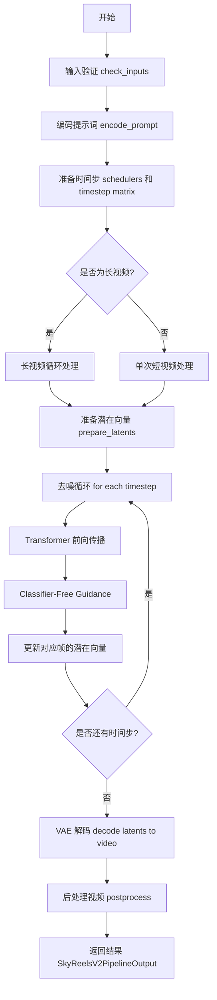
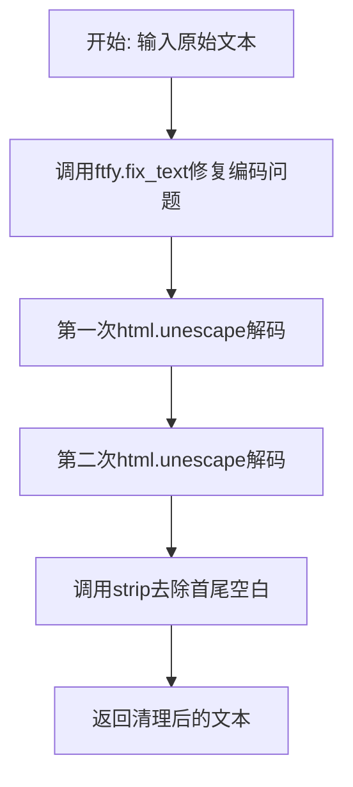
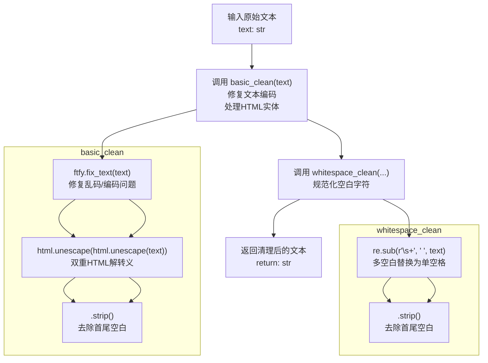
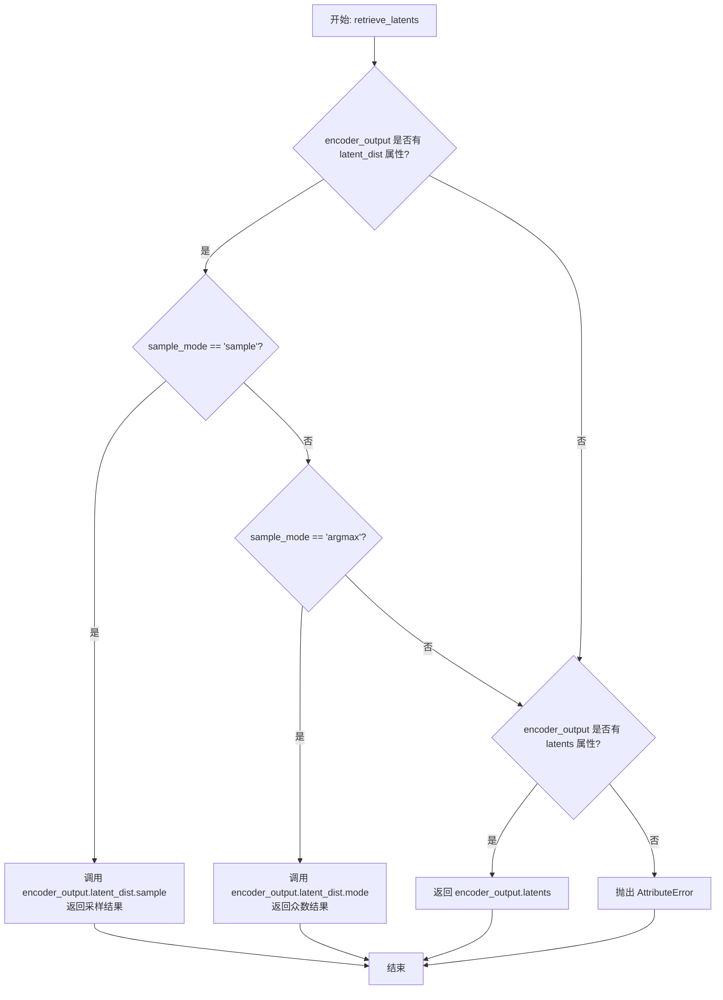
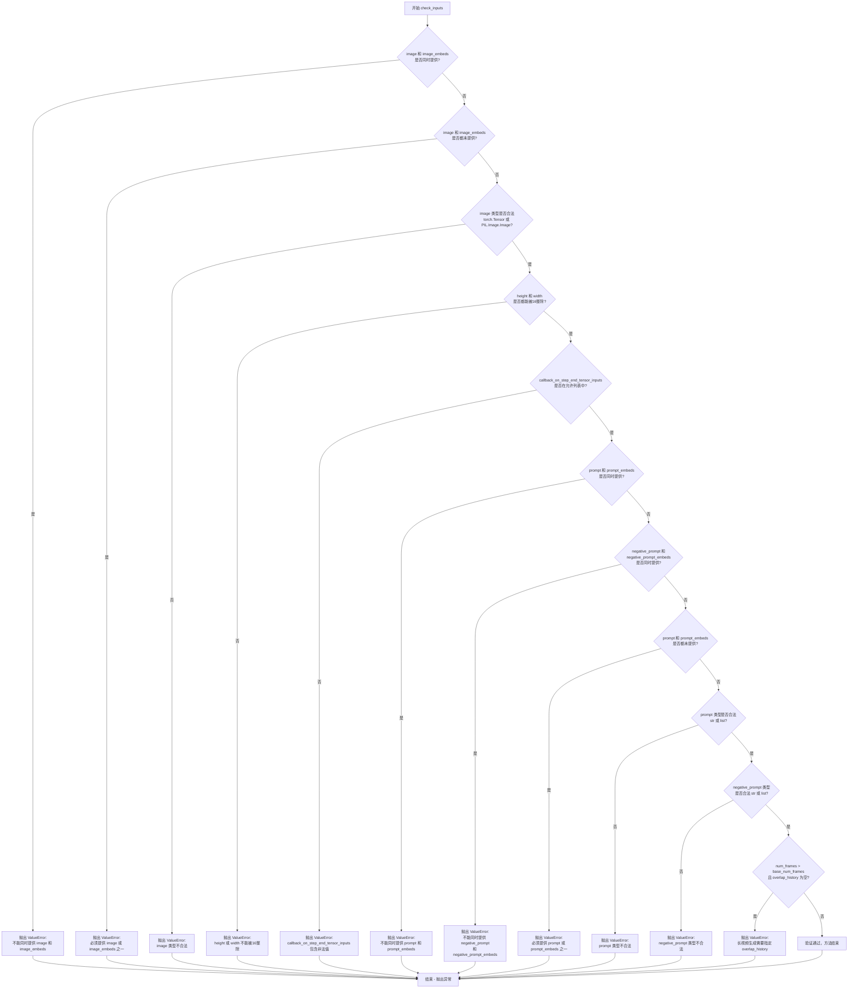
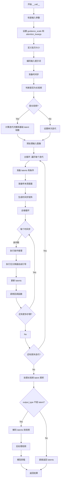
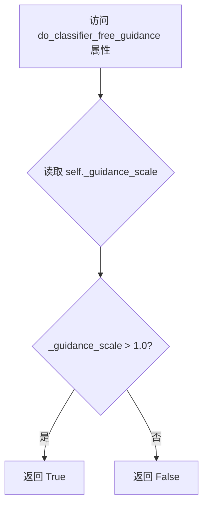
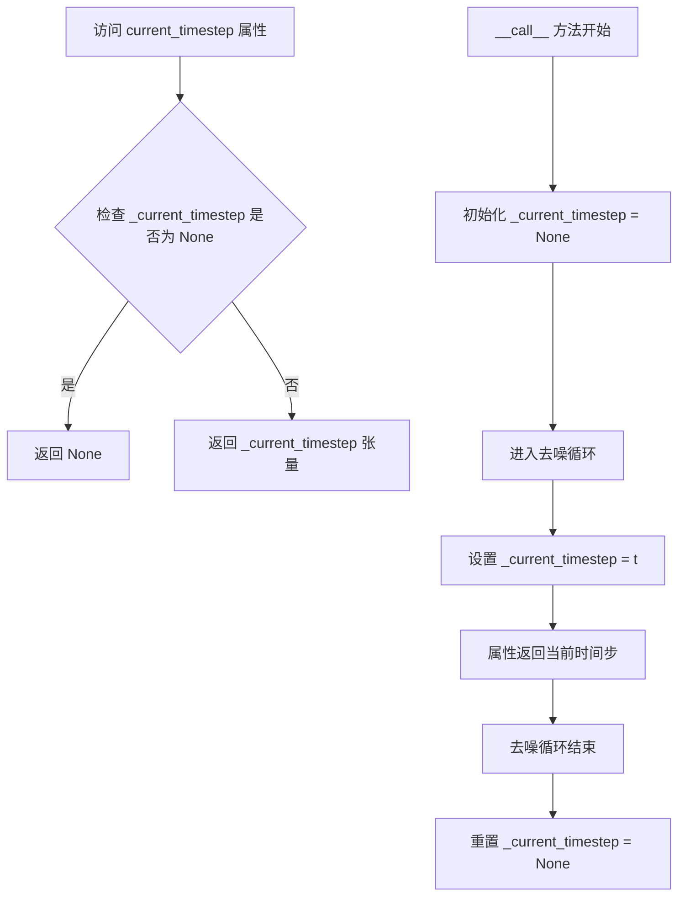
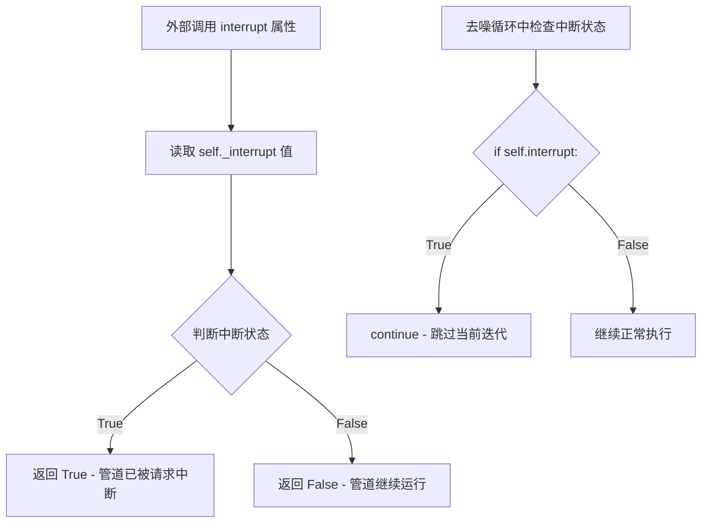
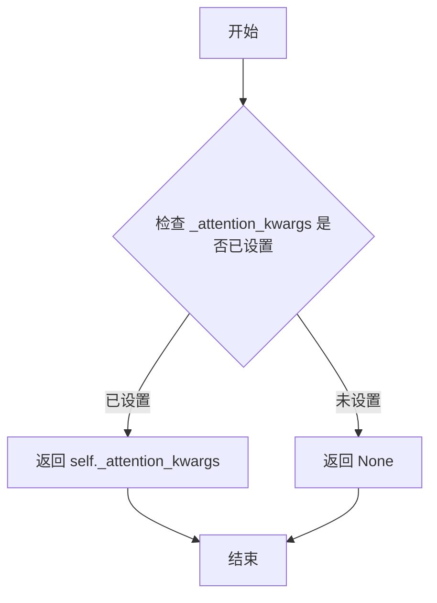

# `diffusers\src\diffusers\pipelines\skyreels_v2\pipeline_skyreels_v2_diffusion_forcing_i2v.py` 详细设计文档

SkyReels-V2 Image-to-Video diffusion pipeline with diffusion forcing technique for generating temporally consistent videos from input images and text prompts. Supports both synchronous and asynchronous (autoregressive) generation modes, with special handling for long video generation through overlapping history frames.

## 整体流程



## 类结构

```
DiffusionPipeline (基类)
└── SkyReelsV2DiffusionForcingImageToVideoPipeline
    └── SkyReelsV2LoraLoaderMixin
```

## 全局变量及字段


### `logger`
    
Logger instance for the module, used for logging warnings and debug information

类型：`logging.Logger`
    


### `XLA_AVAILABLE`
    
Boolean flag indicating whether PyTorch XLA is available for accelerated computation

类型：`bool`
    


### `EXAMPLE_DOC_STRING`
    
Documentation string containing example usage of the pipeline

类型：`str`
    


### `SkyReelsV2DiffusionForcingImageToVideoPipeline.vae_scale_factor_temporal`
    
Temporal scaling factor for VAE, computed as 2 to the power of sum of temporal downsampling layers

类型：`int`
    


### `SkyReelsV2DiffusionForcingImageToVideoPipeline.vae_scale_factor_spatial`
    
Spatial scaling factor for VAE, computed as 2 to the power of number of temporal downsampling layers

类型：`int`
    


### `SkyReelsV2DiffusionForcingImageToVideoPipeline.video_processor`
    
Video processor instance for preprocessing input images and postprocessing output videos

类型：`VideoProcessor`
    


### `SkyReelsV2DiffusionForcingImageToVideoPipeline._callback_tensor_inputs`
    
List of tensor input names that can be passed to callback functions during pipeline execution

类型：`List[str]`
    


### `SkyReelsV2DiffusionForcingImageToVideoPipeline.model_cpu_offload_seq`
    
String defining the sequence for CPU offload of models: text_encoder->transformer->vae

类型：`str`
    
    

## 全局函数及方法


### `basic_clean`

该函数是文本预处理的第一个步骤，主要用于修复文本编码问题和解码HTML实体字符。它通过ftfy库修复常见的文本编码错误，然后使用html.unescape对HTML实体进行两次解码（处理双重编码情况），最后去除文本首尾的空白字符。

参数：

- `text`：`str`，需要清理的原始文本

返回值：`str`，清理并规范化后的文本

#### 流程图



#### 带注释源码

```python
def basic_clean(text):
    """
    对文本进行基础清理：修复编码问题、解码HTML实体、去除首尾空白
    
    处理流程：
    1. 使用ftfy库修复常见的文本编码错误（如UTF-8编码问题）
    2. 连续两次调用html.unescape以处理双重编码的HTML实体
    3. 去除文本首尾的空白字符
    
    注意：两次unescape是为了处理那些被双重编码的HTML实体，例如
    &amp;amp; 会被第一次解码为 &amp;，第二次才被解码为 &
    """
    # Step 1: 使用ftfy修复文本编码问题
    # ftfy可以检测并修复常见的文本编码错误，如mojibake（乱码）问题
    text = ftfy.fix_text(text)
    
    # Step 2 & 3: 连续两次解码HTML实体，然后去除首尾空白
    # 两次unescape确保处理双重编码的情况
    text = html.unescape(html.unescape(text))
    
    # Step 4: 去除首尾空白字符
    return text.strip()
```


### `whitespace_clean`

该函数是一个文本预处理工具函数，用于清理文本中的多余空格。它使用正则表达式将连续的多个空白字符替换为单个空格，然后去除文本首尾的空白字符，确保文本格式规范整洁。

参数：

-  `text`：`str`，需要清理的原始文本

返回值：`str`，清理后的文本，所有连续空白字符被规范化为单个空格，首尾空白被去除

#### 流程图

```mermaid
flowchart TD
    A["输入: text (原始文本)"] --> B{"正则替换"}
    B -->|re.sub<br/>r"\s+" → " "|C[将多个连续空白<br/>替换为单个空格]}
    C --> D{"strip()"}
    D -->|去除首尾空白|E["返回: text (清理后文本)"]
    
    style A fill:#e1f5fe
    style E fill:#e8f5e8
```

#### 带注释源码

```python
def whitespace_clean(text):
    """
    清理文本中的多余空格，将连续空白字符规范化为单个空格
    
    处理流程：
    1. 使用正则表达式将一个或多个空白字符 (\s+) 替换为单个空格
    2. 使用 strip() 去除字符串首尾的空白字符
    """
    # 使用正则表达式将所有连续空白字符（空格、Tab、换行等）替换为单个空格
    # \s+ 匹配一个或多个空白字符，" " 是替换文本
    text = re.sub(r"\s+", " ", text)
    
    # 去除字符串首尾的空白字符
    text = text.strip()
    
    # 返回清理后的文本
    return text
```


### `prompt_clean`

该函数是文本预处理流程的核心组件，负责对输入的提示文本进行多层次清理。它先通过 `basic_clean` 修复常见的文本编码问题（如乱码）和 HTML 实体，再通过 `whitespace_clean` 规范化空白字符，最终返回干净、标准化的文本字符串。

参数：

-  `text`：`str`，需要清理的原始文本输入

返回值：`str`，清理并规范化后的文本

#### 流程图



#### 带注释源码

```python
def prompt_clean(text):
    """
    对输入文本进行完整的清理和规范化处理。
    
    处理流程：
    1. basic_clean: 修复文本编码问题 + 处理HTML实体
    2. whitespace_clean: 规范化空白字符
    
    Args:
        text: 原始输入文本
        
    Returns:
        清理并规范化后的文本字符串
    """
    # 第一步：基本清理
    # - ftfy.fix_text: 修复常见的文本编码问题（如mojibake/乱码）
    # - html.unescape (x2): 双重解转义HTML实体，确保所有HTML实体被正确解码
    # - .strip(): 去除字符串首尾的空白字符
    text = whitespace_clean(basic_clean(text))
    
    # 第二步：空白字符规范化
    # - re.sub(r"\s+", " ", text): 将任意多个连续空白字符替换为单个空格
    # - .strip(): 再次去除首尾空白，确保输出干净
    return text
```


### `retrieve_latents`

该函数是用于从 VAE（变分自编码器）的编码器输出中提取潜在表示（latents）的工具函数。它支持多种获取 latent 的方式，包括从 latent 分布中采样、获取分布的众数（即 argmax），或者直接返回预计算的 latents。

参数：

- `encoder_output`：`torch.Tensor`，VAE 编码器的输出对象，可能包含 `latent_dist` 属性（带有 `sample()` 和 `mode()` 方法）或直接的 `latents` 属性
- `generator`：`torch.Generator | None`，可选的随机数生成器，用于控制采样过程中的随机性
- `sample_mode`：`str`，采样模式，默认为 `"sample"`，也可设置为 `"argmax"` 来获取分布的众数

返回值：`torch.Tensor`，从编码器输出中提取的潜在表示张量

#### 流程图



#### 带注释源码

```python
# 从 diffusers 库中复制的函数，用于从 VAE 编码器输出中检索潜在表示
def retrieve_latents(
    encoder_output: torch.Tensor,  # VAE 编码器的输出，包含 latent 分布或直接的 latents
    generator: torch.Generator | None = None,  # 可选的随机数生成器，用于确定性采样
    sample_mode: str = "sample"  # 采样模式：'sample'（随机采样）或 'argmax'（众数）
):
    # 情况1：当 encoder_output 有 latent_dist 属性且使用 sample 模式时
    # 从潜在分布中进行随机采样，支持通过 generator 控制随机性
    if hasattr(encoder_output, "latent_dist") and sample_mode == "sample":
        return encoder_output.latent_dist.sample(generator)
    
    # 情况2：当 encoder_output 有 latent_dist 属性且使用 argmax 模式时
    # 获取潜在分布的众数（最大概率值对应的 latent）
    elif hasattr(encoder_output, "latent_dist") and sample_mode == "argmax":
        return encoder_output.latent_dist.mode()
    
    # 情况3：当 encoder_output 直接包含 latents 属性时
    # 直接返回预计算的 latents，适用于已经过处理的编码器输出
    elif hasattr(encoder_output, "latents"):
        return encoder_output.latents
    
    # 错误处理：当无法从 encoder_output 中获取有效的 latents 时
    # 抛出明确的错误信息，帮助开发者定位问题
    else:
        raise AttributeError("Could not access latents of provided encoder_output")
```


### SkyReelsV2DiffusionForcingImageToVideoPipeline.__init__

这是 `SkyReelsV2DiffusionForcingImageToVideoPipeline` 类的构造函数，负责初始化图像到视频（I2V）生成管道所需的所有核心组件，包括分词器、文本编码器、Transformer模型、VAE调度器和视频处理器。

参数：

- `tokenizer`：`AutoTokenizer`，来自 T5（google/umt5-xxl 变体）的分词器
- `text_encoder`：`UMT5EncoderModel`，T5 文本编码器模型（google/umt5-xxl 变体）
- `transformer`：`SkyReelsV2Transformer3DModel`，条件Transformer模型，用于对编码的图像潜在表示进行去噪
- `vae`：`AutoencoderKLWan`，变分自编码器模型，用于将视频编码和解码到潜在表示
- `scheduler`：`UniPCMultistepScheduler`，与transformer配合使用进行去噪的调度器

返回值：无（`None`），构造函数不返回值，仅初始化实例属性

#### 流程图

```mermaid
flowchart TD
    A[开始 __init__] --> B[调用 super().__init__]
    B --> C[register_modules: 注册 vae, text_encoder, tokenizer, transformer, scheduler]
    C --> D[计算 vae_scale_factor_temporal]
    D --> E[计算 vae_scale_factor_spatial]
    E --> F[创建 VideoProcessor 实例]
    F --> G[结束 __init__]
```

#### 带注释源码

```python
def __init__(
    self,
    tokenizer: AutoTokenizer,
    text_encoder: UMT5EncoderModel,
    transformer: SkyReelsV2Transformer3DModel,
    vae: AutoencoderKLWan,
    scheduler: UniPCMultistepScheduler,
):
    """
    初始化 SkyReelsV2DiffusionForcingImageToVideoPipeline 管道
    
    参数:
        tokenizer: T5分词器 (UMT5变体)
        text_encoder: T5文本编码器 (UMT5变体)
        transformer: SkyReels-V2 3D Transformer模型
        vae: Wan VAE模型
        scheduler: UniPC多步调度器
    """
    # 调用父类 DiffusionPipeline 的初始化方法
    # 负责设置基础管道配置
    super().__init__()

    # 将所有模块注册到管道中，使其可通过 self.module_name 访问
    # 同时保存配置用于序列化/反序列化
    self.register_modules(
        vae=vae,
        text_encoder=text_encoder,
        tokenizer=tokenizer,
        transformer=transformer,
        scheduler=scheduler,
    )

    # 计算VAE的时序缩放因子
    # 基于VAE的时序下采样层数计算2的幂次
    # 默认值为4（如果VAE不存在）
    self.vae_scale_factor_temporal = 2 ** sum(self.vae.temperal_downsample) if getattr(self, "vae", None) else 4
    
    # 计算VAE的空间缩放因子
    # 基于VAE的时序下采样层数的长度计算2的幂次
    # 默认值为8（如果VAE不存在）
    self.vae_scale_factor_spatial = 2 ** len(self.vae.temperal_downsample) if getattr(self, "vae", None) else 8
    
    # 创建视频处理器，用于视频帧的预处理和后处理
    # 使用空间缩放因子作为VAE缩放因子
    self.video_processor = VideoProcessor(vae_scale_factor=self.vae_scale_factor_spatial)
```


### `SkyReelsV2DiffusionForcingImageToVideoPipeline._get_t5_prompt_embeds`

该方法负责将文本提示（prompt）转换为T5文本编码器的隐藏状态嵌入向量，用于条件引导图像到视频（I2V）的生成过程。它处理文本的tokenization、编码、填充和批量复制，以支持每个提示生成多个视频。

参数：

- `prompt`：`str | list[str] | None`，需要编码的文本提示，可以是单个字符串或字符串列表
- `num_videos_per_prompt`：`int`，默认值1，每个提示生成的视频数量，用于复制文本嵌入
- `max_sequence_length`：`int`，默认值226，文本序列的最大长度，超过该长度将被截断
- `device`：`torch.device | None`，执行设备，若为None则使用pipeline的默认执行设备
- `dtype`：`torch.dtype | None`，返回张量的数据类型，若为None则使用text_encoder的默认数据类型

返回值：`torch.Tensor`，形状为`(batch_size * num_videos_per_prompt, seq_len, hidden_dim)`的文本嵌入张量

#### 流程图

```mermaid
flowchart TD
    A[开始 _get_t5_prompt_embeds] --> B{device参数}
    B -->|None| C[使用 self._execution_device]
    B -->|有值| D[使用传入的device]
    C --> E{device}
    D --> E
    E --> F{dtype参数}
    F -->|None| G[使用 self.text_encoder.dtype]
    F -->|有值| H[使用传入的dtype]
    G --> I
    H --> I
    I[将prompt转为列表] --> J[批量大小=len(prompt)]
    J --> K[调用prompt_clean清理每个prompt]
    K --> L[tokenizer处理: padding=max_length, truncation=True]
    L --> M[提取input_ids和attention_mask]
    M --> N[计算实际序列长度: mask.gt(0).sum]
    N --> O[text_encoder编码: 输入input_ids和mask]
    O --> P[提取last_hidden_state]
    P --> Q[转换dtype和device]
    Q --> R[截断填充: prompt_embeds[:seq_len]]
    R --> S[重新填充到max_sequence_length]
    S --> T[复制num_videos_per_prompt次]
    T --> U[reshape: batch_size*num_videos_per_prompt, seq_len, hidden_dim]
    U --> V[返回 prompt_embeds]
```

#### 带注释源码

```python
def _get_t5_prompt_embeds(
    self,
    prompt: str | list[str] = None,
    num_videos_per_prompt: int = 1,
    max_sequence_length: int = 226,
    device: torch.device | None = None,
    dtype: torch.dtype | None = None,
):
    # 确定设备：优先使用传入的device，否则使用pipeline的执行设备
    device = device or self._execution_device
    # 确定数据类型：优先使用传入的dtype，否则使用text_encoder的数据类型
    dtype = dtype or self.text_encoder.dtype

    # 统一将prompt转为列表处理：如果是单个字符串则包装为列表
    prompt = [prompt] if isinstance(prompt, str) else prompt
    # 对每个prompt进行清理：移除HTML实体、规范化空白字符
    prompt = [prompt_clean(u) for u in prompt]
    # 计算批量大小
    batch_size = len(prompt)

    # 使用tokenizer将文本转换为模型输入格式
    text_inputs = self.tokenizer(
        prompt,
        padding="max_length",           # 填充到最大长度
        max_length=max_sequence_length, # 最大序列长度
        truncation=True,                # 超过最大长度时截断
        add_special_tokens=True,        # 添加特殊tokens如bos/eos
        return_attention_mask=True,     # 返回attention mask
        return_tensors="pt",            # 返回PyTorch张量
    )
    # 提取input_ids和attention_mask
    text_input_ids, mask = text_inputs.input_ids, text_inputs.attention_mask
    # 计算每个序列的实际长度（非padding部分）
    seq_lens = mask.gt(0).sum(dim=1).long()

    # 调用T5文本编码器获取隐藏状态
    prompt_embeds = self.text_encoder(text_input_ids.to(device), mask.to(device)).last_hidden_state
    # 转换数据类型和设备
    prompt_embeds = prompt_embeds.to(dtype=dtype, device=device)
    # 截断每个序列到实际长度（去除padding）
    prompt_embeds = [u[:v] for u, v in zip(prompt_embeds, seq_lens)]
    # 重新填充到max_sequence_length（使用零填充）
    prompt_embeds = torch.stack(
        [torch.cat([u, u.new_zeros(max_sequence_length - u.size(0), u.size(1))]) for u in prompt_embeds], dim=0
    )

    # 为每个提示生成多个视频时复制文本嵌入
    # 使用MPS友好的方法进行复制
    _, seq_len, _ = prompt_embeds.shape
    # 复制num_videos_per_prompt次
    prompt_embeds = prompt_embeds.repeat(1, num_videos_per_prompt, 1)
    # 重塑为(batch_size * num_videos_per_prompt, seq_len, hidden_dim)
    prompt_embeds = prompt_embeds.view(batch_size * num_videos_per_prompt, seq_len, -1)

    return prompt_embeds
```


### `SkyReelsV2DiffusionForcingImageToVideoPipeline.encode_prompt`

该函数负责将文本提示（prompt）和负面提示（negative_prompt）编码为文本编码器的隐藏状态向量（embeddings），支持Classifier-Free Guidance（CFG）模式，可选择预生成embeddings或实时生成。

参数：

- `self`：类实例本身
- `prompt`：`str | list[str]`，要编码的文本提示，可以是单个字符串或字符串列表
- `negative_prompt`：`str | list[str] | None`，不引导图像生成的提示，当不使用guidance时可忽略
- `do_classifier_free_guidance`：`bool`，是否使用classifier-free guidance，默认为True
- `num_videos_per_prompt`：`int`，每个提示生成的视频数量，默认为1
- `prompt_embeds`：`torch.Tensor | None`，预生成的文本embeddings，可用于微调文本输入
- `negative_prompt_embeds`：`torch.Tensor | None`，预生成的负面文本embeddings
- `max_sequence_length`：`int`，提示的最大序列长度，默认为226
- `device`：`torch.device | None`，用于放置结果embeddings的设备
- `dtype`：`torch.dtype | None`，用于结果embeddings的数据类型

返回值：`tuple[torch.Tensor, torch.Tensor]`，返回元组包含`(prompt_embeds, negative_prompt_embeds)`，两者均为形状为`(batch_size * num_videos_per_prompt, sequence_length, hidden_dim)`的Tensor

#### 流程图

```mermaid
flowchart TD
    A[开始 encode_prompt] --> B{device是否为None}
    B -->|是| C[使用 self._execution_device]
    B -->|否| D[使用传入的device]
    C --> E{device赋值完成}
    D --> E
    E --> F{prompt是否为str类型}
    F -->|是| G[将prompt包装为列表]
    F -->|否| H[保持原样]
    G --> I[计算batch_size = len(prompt)]
    H --> I
    I --> J{prompt_embeds是否为None}
    J -->|是| K[调用 _get_t5_prompt_embeds 生成 embeddings]
    J -->|否| L[使用传入的prompt_embeds]
    K --> M{do_classifier_free_guidance 且 negative_prompt_embeds为None}
    L --> M
    M -->|是| N[处理negative_prompt]
    M -->|否| O[negative_prompt_embeds保持为None]
    N --> P[negative_prompt转换为列表]
    P --> Q{类型检查: prompt与negative_prompt类型是否一致}
    Q -->|否| R[抛出TypeError]
    Q -->|是| S{batch_size与negative_prompt长度是否匹配}
    S -->|否| T[抛出ValueError]
    S -->|是| U[调用 _get_t5_prompt_embeds 生成 negative_prompt_embeds]
    O --> V[返回 prompt_embeds, negative_prompt_embeds]
    U --> V
    R --> W[结束 - 异常]
    T --> W
```

#### 带注释源码

```python
def encode_prompt(
    self,
    prompt: str | list[str],
    negative_prompt: str | list[str] | None = None,
    do_classifier_free_guidance: bool = True,
    num_videos_per_prompt: int = 1,
    prompt_embeds: torch.Tensor | None = None,
    negative_prompt_embeds: torch.Tensor | None = None,
    max_sequence_length: int = 226,
    device: torch.device | None = None,
    dtype: torch.dtype | None = None,
):
    r"""
    Encodes the prompt into text encoder hidden states.

    Args:
        prompt (`str` or `list[str]`, *optional*):
            prompt to be encoded
        negative_prompt (`str` or `list[str]`, *optional*):
            The prompt or prompts not to guide the image generation. If not defined, one has to pass
            `negative_prompt_embeds` instead. Ignored when not using guidance (i.e., ignored if `guidance_scale` is
            less than `1`).
        do_classifier_free_guidance (`bool`, *optional*, defaults to `True`):
            Whether to use classifier free guidance or not.
        num_videos_per_prompt (`int`, *optional*, defaults to 1):
            Number of videos that should be generated per prompt. torch device to place the resulting embeddings on
        prompt_embeds (`torch.Tensor`, *optional*):
            Pre-generated text embeddings. Can be used to easily tweak text inputs, *e.g.* prompt weighting. If not
            provided, text embeddings will be generated from `prompt` input argument.
        negative_prompt_embeds (`torch.Tensor`, *optional*):
            Pre-generated negative text embeddings. Can be used to easily tweak text inputs, *e.g.* prompt
            weighting. If not provided, negative_prompt_embeds will be generated from `negative_prompt` input
            argument.
        device: (`torch.device`, *optional*):
            torch device
        dtype: (`torch.dtype`, *optional*):
            torch dtype
    """
    # 确定执行设备，如果未指定则使用pipeline的默认执行设备
    device = device or self._execution_device

    # 将prompt转换为列表形式，统一处理单字符串和字符串列表的情况
    prompt = [prompt] if isinstance(prompt, str) else prompt
    
    # 确定batch_size：如果有prompt则从prompt长度计算，否则从已提供的prompt_embeds形状获取
    if prompt is not None:
        batch_size = len(prompt)
    else:
        batch_size = prompt_embeds.shape[0]

    # 如果未提供prompt_embeds，则调用内部方法_get_t5_prompt_embeds生成
    if prompt_embeds is None:
        prompt_embeds = self._get_t5_prompt_embeds(
            prompt=prompt,
            num_videos_per_prompt=num_videos_per_prompt,
            max_sequence_length=max_sequence_length,
            device=device,
            dtype=dtype,
        )

    # 如果启用CFG且未提供negative_prompt_embeds，则需要生成
    if do_classifier_free_guidance and negative_prompt_embeds is None:
        # 默认使用空字符串作为negative_prompt
        negative_prompt = negative_prompt or ""
        # 将negative_prompt扩展为与batch_size相同长度的列表
        negative_prompt = batch_size * [negative_prompt] if isinstance(negative_prompt, str) else negative_prompt

        # 类型检查：确保prompt和negative_prompt类型一致
        if prompt is not None and type(prompt) is not type(negative_prompt):
            raise TypeError(
                f"`negative_prompt` should be the same type to `prompt`, but got {type(negative_prompt)} !="
                f" {type(prompt)}."
            )
        # 批大小检查：确保negative_prompt数量与prompt匹配
        elif batch_size != len(negative_prompt):
            raise ValueError(
                f"`negative_prompt`: {negative_prompt} has batch size {len(negative_prompt)}, but `prompt`:"
                f" {prompt} has batch size {batch_size}. Please make sure that passed `negative_prompt` matches"
                " the batch size of `prompt`."
            )

        # 生成negative_prompt_embeds
        negative_prompt_embeds = self._get_t5_prompt_embeds(
            prompt=negative_prompt,
            num_videos_per_prompt=num_videos_per_prompt,
            max_sequence_length=max_sequence_length,
            device=device,
            dtype=dtype,
        )

    # 返回编码后的embeddings元组
    return prompt_embeds, negative_prompt_embeds
```


### `SkyReelsV2DiffusionForcingImageToVideoPipeline.check_inputs`

该方法是图像转视频（I2V）管道的输入验证函数，用于在执行推理前检查用户提供的所有输入参数是否符合管道的约束条件，包括图像类型、尺寸对齐、prompt与embeddings的互斥关系、以及长视频生成时overlap_history参数的必要性等。

参数：

- `prompt`：`str | list[str] | None`，用户提供的文本提示，用于指导视频生成
- `negative_prompt`：`str | list[str] | None`，反向提示词，用于引导模型避免生成相关内容
- `image`：`PipelineImageInput | None`，输入图像，作为视频生成的条件参考
- `height`：`int`，生成视频的高度像素值
- `width`：`int`，生成视频的宽度像素值
- `prompt_embeds`：`torch.Tensor | None`，预计算的文本嵌入向量
- `negative_prompt_embeds`：`torch.Tensor | None`，预计算的反向文本嵌入向量
- `image_embeds`：`torch.Tensor | None`，预计算的图像嵌入向量
- `callback_on_step_end_tensor_inputs`：`list[str] | None`，回调函数可访问的张量输入列表
- `overlap_history`：`int | None`，长视频生成时用于平滑过渡的帧重叠数量
- `num_frames`：`int | None`，要生成的总帧数
- `base_num_frames`：`int | None`，基础帧数，用于确定长视频与短视频的分界线

返回值：`None`，该方法不返回任何值，仅通过抛出 `ValueError` 来指示输入参数验证失败

#### 流程图



#### 带注释源码

```python
def check_inputs(
    self,
    prompt,
    negative_prompt,
    image,
    height,
    width,
    prompt_embeds=None,
    negative_prompt_embeds=None,
    image_embeds=None,
    callback_on_step_end_tensor_inputs=None,
    overlap_history=None,
    num_frames=None,
    base_num_frames=None,
):
    """
    验证输入参数的合法性，确保Pipeline接收到的参数符合预期约束。
    该方法会在每次推理调用前被自动触发，以提前捕获潜在的参数错误。
    
    参数:
        prompt: 文本提示词，str或list类型，用于描述期望生成的视频内容
        negative_prompt: 反向提示词，用于指导模型避免生成某些内容
        image: 输入图像，torch.Tensor或PIL.Image.Image类型，作为视频生成的参考条件
        height: 输出视频的高度，必须能被16整除以适配VAE的下采样率
        width: 输出视频的宽度，必须能被16整除以适配VAE的下采样率
        prompt_embeds: 预计算的文本嵌入，与prompt互斥，不能同时提供
        negative_prompt_embeds: 预计算的反向文本嵌入，与negative_prompt互斥
        image_embeds: 预计算的图像嵌入，与image互斥
        callback_on_step_end_tensor_inputs: 回调函数可访问的张量名称列表
        overlap_history: 长视频生成时的帧重叠数量，用于确保视频过渡平滑
        num_frames: 期望生成的总帧数
        base_num_frames: 模型单次处理的最大帧数基准值
    """
    
    # 验证图像输入的互斥性：image和image_embeds不能同时提供
    if image is not None and image_embeds is not None:
        raise ValueError(
            f"Cannot forward both `image`: {image} and `image_embeds`: {image_embeds}. Please make sure to"
            " only forward one of the two."
        )
    
    # 验证至少提供了图像输入之一
    if image is None and image_embeds is None:
        raise ValueError(
            "Provide either `image` or `image_embeds`. Cannot leave both `image` and `image_embeds` undefined."
        )
    
    # 验证image的类型合法性
    if image is not None and not isinstance(image, torch.Tensor) and not isinstance(image, PIL.Image.Image):
        raise ValueError(f"`image` has to be of type `torch.Tensor` or `PIL.Image.Image` but is {type(image)}")
    
    # 验证尺寸对齐约束：VAE通常进行8倍或16倍下采样，因此高度和宽度需能被16整除
    if height % 16 != 0 or width % 16 != 0:
        raise ValueError(f"`height` and `width` have to be divisible by 16 but are {height} and {width}.")

    # 验证回调张量输入是否在允许的列表范围内
    if callback_on_step_end_tensor_inputs is not None and not all(
        k in self._callback_tensor_inputs for k in callback_on_step_end_tensor_inputs
    ):
        raise ValueError(
            f"`callback_on_step_end_tensor_inputs` has to be in {self._callback_tensor_inputs}, but found {[k for k in callback_on_step_end_tensor_inputs if k not in self._callback_tensor_inputs]}"
        )

    # 验证prompt和prompt_embeds的互斥性
    if prompt is not None and prompt_embeds is not None:
        raise ValueError(
            f"Cannot forward both `prompt`: {prompt} and `prompt_embeds`: {prompt_embeds}. Please make sure to"
            " only forward one of the two."
        )
    # 验证negative_prompt和negative_prompt_embeds的互斥性
    elif negative_prompt is not None and negative_prompt_embeds is not None:
        raise ValueError(
            f"Cannot forward both `negative_prompt`: {negative_prompt} and `negative_prompt_embeds`: {negative_prompt_embeds}. Please make sure to"
            " only forward one of the two."
        )
    # 验证至少提供了文本输入之一
    elif prompt is None and prompt_embeds is None:
        raise ValueError(
            "Provide either `prompt` or `prompt_embeds`. Cannot leave both `prompt` and `prompt_embeds` undefined."
        )
    # 验证prompt类型合法性
    elif prompt is not None and (not isinstance(prompt, str) and not isinstance(prompt, list)):
        raise ValueError(f"`prompt` has to be of type `str` or `list` but is {type(prompt)}")
    # 验证negative_prompt类型合法性
    elif negative_prompt is not None and (
        not isinstance(negative_prompt, str) and not isinstance(negative_prompt, list)
    ):
        raise ValueError(f"`negative_prompt` has to be of type `str` or `list` but is {type(negative_prompt)}")

    # 长视频生成的特殊验证：当帧数超过模型基准容量时，必须指定overlap_history参数
    # 这确保长视频的分段生成能够平滑过渡，避免帧之间的不连续性
    if num_frames > base_num_frames and overlap_history is None:
        raise ValueError(
            "`overlap_history` is required when `num_frames` exceeds `base_num_frames` to ensure smooth transitions in long video generation. "
            "Please specify a value for `overlap_history`. Recommended values are 17 or 37."
        )
```


### `SkyReelsV2DiffusionForcingImageToVideoPipeline.prepare_latents`

该函数负责为图像到视频生成准备潜在变量（latents），包括处理长视频和短视频场景、编码输入图像为条件潜在变量、计算潜在空间的维度，并对随机潜在变量进行初始化或使用提供的潜在变量。

参数：

- `self`：类实例本身，包含 VAE 和调度器等组件
- `image`：`PipelineImageInput | None`，输入的图像数据，用于条件生成
- `batch_size`：`int`，批次大小
- `num_channels_latents`：`int = 16`，潜在变量的通道数，默认为 16
- `height`：`int = 480`，生成视频的高度
- `width`：`int = 832`，生成视频的宽度
- `num_frames`：`int = 97`，生成视频的总帧数
- `dtype`：`torch.dtype | None`，潜在变量的数据类型
- `device`：`torch.device | None`，设备（CPU 或 CUDA）
- `generator`：`torch.Generator | list[torch.Generator] | None`，随机数生成器，用于确定性生成
- `latents`：`torch.Tensor | None`，预生成的噪声潜在变量，如果为 None 则随机生成
- `last_image`：`torch.Tensor | None`，上一帧图像，用于视频延续任务
- `video_latents`：`torch.Tensor | None`，长视频生成时传递的前一次迭代的潜在变量
- `base_latent_num_frames`：`int | None`，基础潜在帧数，用于长视频生成
- `causal_block_size`：`int | None`，因果块大小，用于长视频分块处理
- `overlap_history_latent_frames`：`int | None`，重叠的历史潜在帧数，用于长视频平滑过渡
- `long_video_iter`：`int | None`，长视频生成的当前迭代索引

返回值：`tuple[torch.Tensor, torch.Tensor, torch.Tensor, int]`

- 第一个元素：处理后的潜在变量张量 `(batch_size, num_channels_latents, num_latent_frames, latent_height, latent_width)`
- 第二个元素：实际使用的潜在帧数 `num_latent_frames`
- 第三个元素：条件潜在变量 `condition`，用于引导生成
- 第四个元素：前缀视频潜在帧数 `prefix_video_latents_frames`

#### 流程图

```mermaid
flowchart TD
    A[开始 prepare_latents] --> B[计算 num_latent_frames]
    B --> B1{video_latents 是否存在?}
    B1 -->|是| C[长视频迭代处理<br>计算条件帧数和剩余帧数]
    B1 -->|否| D{base_latent_num_frames 是否存在?}
    D -->|是| E[长视频首次迭代<br>使用基础帧数]
    D -->|否| F[短视频生成<br>计算标准潜在帧数]
    
    C --> G[构建潜在变量形状]
    E --> G
    F --> G
    
    G --> H{latents 是否为 None?}
    H -->|是| I[使用 randn_tensor 生成随机潜在变量]
    H -->|否| J[将提供的 latents 移动到指定设备]
    I --> K
    J --> K
    
    K{image 是否存在?}
    K -->|是| L[处理输入图像]
    K -->|否| M[返回初始化的 latents]
    
    L --> L1[unsqueeze 扩展图像维度]
    L1 --> L2[处理 last_image 并拼接条件]
    L2 --> L3[获取 VAE 的 mean 和 std]
    L3 --> L4[使用 VAE 编码视频条件]
    L4 --> L5[retrieve_latents 获取潜在分布]
    L5 --> L6[重复 latent_condition 匹配批次]
    L6 --> L7[归一化条件: condition = (latent_condition - mean) * std]
    L7 --> M
    
    M --> N[返回 latents, num_latent_frames, condition, prefix_video_latents_frames]
```

#### 带注释源码

```python
def prepare_latents(
    self,
    image: PipelineImageInput | None,
    batch_size: int,
    num_channels_latents: int = 16,
    height: int = 480,
    width: int = 832,
    num_frames: int = 97,
    dtype: torch.dtype | None = None,
    device: torch.device | None = None,
    generator: torch.Generator | list[torch.Generator] | None = None,
    latents: torch.Tensor | None = None,
    last_image: torch.Tensor | None = None,
    video_latents: torch.Tensor | None = None,
    base_latent_num_frames: int | None = None,
    causal_block_size: int | None = None,
    overlap_history_latent_frames: int | None = None,
    long_video_iter: int | None = None,
) -> tuple[torch.Tensor, torch.Tensor, torch.Tensor, int]:
    # ============ 第1步：计算潜在空间维度 ============
    # 计算潜在帧数：VAE 的时间下采样因子决定需要多少潜在帧
    # 例如：num_frames=97, vae_scale_factor_temporal=8 => num_latent_frames=13
    num_latent_frames = (num_frames - 1) // self.vae_scale_factor_temporal + 1
    
    # 计算潜在空间的高度和宽度（VAE 空间下采样）
    latent_height = height // self.vae_scale_factor_spatial
    latent_width = width // self.vae_scale_factor_spatial

    # 初始化前缀帧数为0
    prefix_video_latents_frames = 0

    # ============ 第2步：处理长视频生成场景 ============
    if video_latents is not None:  # 长视频生成（非首次迭代）
        # 提取用于条件引导的重叠历史帧
        condition = video_latents[:, :, -overlap_history_latent_frames:]

        # 对条件帧进行因果块对齐截断
        if condition.shape[2] % causal_block_size != 0:
            truncate_len_latents = condition.shape[2] % causal_block_size
            logger.warning(
                f"The length of prefix video latents is truncated by {truncate_len_latents} frames for the causal block size alignment. "
                f"This truncation ensures compatibility with the causal block size, which is required for proper processing. "
                f"However, it may slightly affect the continuity of the generated video at the truncation boundary."
            )
            condition = condition[:, :, :-truncate_len_latents]
        
        # 记录前缀帧数量
        prefix_video_latents_frames = condition.shape[2]

        # 计算已完成的帧数和剩余帧数
        finished_frame_num = (
            long_video_iter * (base_latent_num_frames - overlap_history_latent_frames)
            + overlap_history_latent_frames
        )
        left_frame_num = num_latent_frames - finished_frame_num
        # 限制最大帧数不超过基础帧数
        num_latent_frames = min(left_frame_num + overlap_history_latent_frames, base_latent_num_frames)
    
    elif base_latent_num_frames is not None:  # 长视频生成（首次迭代）
        # 使用基础帧数作为潜在帧数
        num_latent_frames = base_latent_num_frames
    else:  # 短视频生成
        # 标准计算：(num_frames - 1) // temporal_scale + 1
        num_latent_frames = (num_frames - 1) // self.vae_scale_factor_temporal + 1

    # ============ 第3步：构建潜在变量形状 ============
    # 形状: [batch, channels, temporal_frames, height, width]
    shape = (batch_size, num_channels_latents, num_latent_frames, latent_height, latent_width)
    
    # 验证 generator 列表长度与批次大小是否匹配
    if isinstance(generator, list) and len(generator) != batch_size:
        raise ValueError(
            f"You have passed a list of generators of length {len(generator)}, but requested an effective batch"
            f" size of {batch_size}. Make sure the batch size matches the length of the generators."
        )

    # ============ 第4步：初始化或处理潜在变量 ============
    if latents is None:
        # 使用随机噪声初始化潜在变量
        latents = randn_tensor(shape, generator=generator, device=device, dtype=dtype)
    else:
        # 将提供的潜在变量移动到指定设备和数据类型
        latents = latents.to(device=device, dtype=dtype)

    # 条件变量初始化
    condition = None

    # ============ 第5步：处理输入图像（编码为条件潜在变量）==========
    if image is not None:
        # 扩展图像维度：在时间维度上添加单帧
        # [C, H, W] -> [C, 1, H, W] 用于图像
        image = image.unsqueeze(2)
        
        # 如果存在上一帧图像，也进行扩展并拼接
        if last_image is not None:
            last_image = last_image.unsqueeze(2)
            # 拼接当前帧和上一帧作为视频条件
            video_condition = torch.cat([image, last_image], dim=0)
        else:
            video_condition = image

        # 将条件视频移动到 VAE 设备并转换数据类型
        video_condition = video_condition.to(device=device, dtype=self.vae.dtype)

        # 获取 VAE 的潜在变量均值和标准差（用于归一化）
        # 从 VAE 配置中读取，通常是预训练时统计的值
        latents_mean = (
            torch.tensor(self.vae.config.latents_mean)
            .view(1, self.vae.config.z_dim, 1, 1, 1)
            .to(latents.device, latents.dtype)
        )
        latents_std = 1.0 / torch.tensor(self.vae.config.latents_std).view(1, self.vae.config.z_dim, 1, 1, 1).to(
            latents.device, latents.dtype
        )

        # 使用 VAE 编码视频条件为潜在变量
        if isinstance(generator, list):
            # 多个 generator 时分别编码并拼接结果
            latent_condition = [
                retrieve_latents(self.vae.encode(video_condition), sample_mode="argmax") for _ in generator
            ]
            latent_condition = torch.cat(latent_condition)
        else:
            # 单个 generator 或无 generator 时直接编码
            # 使用 argmax 模式取最可能的潜在表示
            latent_condition = retrieve_latents(self.vae.encode(video_condition), sample_mode="argmax")
            # 重复潜在条件以匹配批次大小
            latent_condition = latent_condition.repeat_interleave(batch_size, dim=0)

        # 转换数据类型并应用归一化
        latent_condition = latent_condition.to(dtype)
        # 关键归一化：将潜在变量标准化到标准正态空间
        condition = (latent_condition - latents_mean) * latents_std
        # 记录条件帧的数量
        prefix_video_latents_frames = condition.shape[2]

    # ============ 第6步：返回结果 ============
    # 返回：处理后的潜在变量、实际帧数、条件变量、前缀帧数
    return latents, num_latent_frames, condition, prefix_video_latents_frames
```


### `SkyReelsV2DiffusionForcingImageToVideoPipeline.generate_timestep_matrix`

该函数实现了核心的扩散强制（Diffusion Forcing）算法，用于创建跨时间帧的协调去噪调度表。它支持同步模式（所有帧同时去噪）和异步模式（帧分组块式处理，形成"去噪波"），能够有效处理长视频生成中的时序依赖问题。

参数：

- `num_latent_frames`：`int`，总共要生成的潜在帧数量
- `step_template`：`torch.Tensor`，基础时间步调度模板（例如 [1000, 800, 600, ..., 0]）
- `base_num_latent_frames`：`int`，模型单次前向传播能处理的最大帧数
- `ar_step`：`int`，自回归步长，控制时间滞后程度（0为同步模式，>0为异步模式），默认为5
- `num_pre_ready`：`int`，已预先完成去噪的帧数量（如视频到视频任务中的前缀部分），默认为0
- `causal_block_size`：`int`，因果块大小，每多少帧作为一个处理块，默认为1
- `shrink_interval_with_mask`：`bool`，是否根据更新掩码优化处理间隔，默认为False

返回值：`tuple[torch.Tensor, torch.Tensor, torch.Tensor, list[tuple]]`，包含：
- `step_matrix`：时间步矩阵，形状为 [迭代次数, 潜在帧数]
- `step_index`：时间步索引矩阵，形状为 [迭代次数, 潜在帧数]
- `step_update_mask`：布尔更新掩码，形状为 [迭代次数, 潜在帧数]
- `valid_interval`：有效处理间隔列表，每个元素为 (起始帧, 结束帧) 元组

#### 流程图

```mermaid
flowchart TD
    A[开始 generate_timestep_matrix] --> B[初始化 step_matrix, step_index, update_mask, valid_interval]
    B --> C[计算总迭代次数 = len(step_template) + 1]
    C --> D[计算帧数转换为块数: num_blocks, base_num_blocks]
    D --> E{验证 ar_step 是否足够}
    E -->|不满足| F[抛出 ValueError]
    E -->|满足| G[扩展 step_template 添加边界值 999 和 0]
    G --> H[初始化 pre_row 全零向量]
    H --> I{num_pre_ready > 0?}
    I -->|是| J[标记预准备块为已完成状态]
    I -->|否| K[进入主循环]
    J --> K
    K --> L{所有块都已完成去噪?}
    L -->|否| M[为当前迭代创建新行 new_row]
    M --> N[遍历每个块应用扩散强制逻辑]
    N --> O[计算更新掩码排除已完成的块]
    O --> P[存储迭代状态到列表]
    P --> K
    L -->|是| Q[处理可选的 shrink_interval_with_mask 优化]
    Q --> R[生成 valid_interval 间隔列表]
    R --> S[将列表转换为张量并扩展到帧级别]
    S --> T[返回 step_matrix, step_index, step_update_mask, valid_interval]
```

#### 带注释源码

```python
# Copied from diffusers.pipelines.skyreels_v2.pipeline_skyreels_v2_diffusion_forcing.SkyReelsV2DiffusionForcingPipeline.generate_timestep_matrix
def generate_timestep_matrix(
    self,
    num_latent_frames: int,
    step_template: torch.Tensor,
    base_num_latent_frames: int,
    ar_step: int = 5,
    num_pre_ready: int = 0,
    causal_block_size: int = 1,
    shrink_interval_with_mask: bool = False,
) -> tuple[torch.Tensor, torch.Tensor, torch.Tensor, list[tuple]]:
    """
    This function implements the core diffusion forcing algorithm that creates a coordinated denoising schedule
    across temporal frames. It supports both synchronous and asynchronous generation modes:

    **Synchronous Mode** (ar_step=0, causal_block_size=1):
    - All frames are denoised simultaneously at each timestep
    - Each frame follows the same denoising trajectory: [1000, 800, 600, ..., 0]
    - Simpler but may have less temporal consistency for long videos

    **Asynchronous Mode** (ar_step>0, causal_block_size>1):
    - Frames are grouped into causal blocks and processed block/chunk-wise
    - Each block is denoised in a staggered pattern creating a "denoising wave"
    - Earlier blocks are more denoised, later blocks lag behind by ar_step timesteps
    - Creates stronger temporal dependencies and better consistency

    Args:
        num_latent_frames (int): Total number of latent frames to generate
        step_template (torch.Tensor): Base timestep schedule (e.g., [1000, 800, 600, ..., 0])
        base_num_latent_frames (int): Maximum frames the model can process in one forward pass
        ar_step (int, optional): Autoregressive step size for temporal lag.
                               0 = synchronous, >0 = asynchronous. Defaults to 5.
        num_pre_ready (int, optional):
                                     Number of frames already denoised (e.g., from prefix in a video2video task).
                                     Defaults to 0.
        causal_block_size (int, optional): Number of frames processed as a causal block.
                                         Defaults to 1.
        shrink_interval_with_mask (bool, optional): Whether to optimize processing intervals.
                                                  Defaults to False.

    Returns:
        tuple containing:
            - step_matrix (torch.Tensor): Matrix of timesteps for each frame at each iteration Shape:
              [num_iterations, num_latent_frames]
            - step_index (torch.Tensor): Index matrix for timestep lookup Shape: [num_iterations,
              num_latent_frames]
            - step_update_mask (torch.Tensor): Boolean mask indicating which frames to update Shape:
              [num_iterations, num_latent_frames]
            - valid_interval (list[tuple]): list of (start, end) intervals for each iteration

    Raises:
        ValueError: If ar_step is too small for the given configuration
    """
    # Initialize lists to store the scheduling matrices and metadata
    step_matrix, step_index = [], []  # Will store timestep values and indices for each iteration
    update_mask, valid_interval = [], []  # Will store update masks and processing intervals

    # Calculate total number of denoising iterations (add 1 for initial noise state)
    num_iterations = len(step_template) + 1

    # Convert frame counts to block counts for causal processing
    # Each block contains causal_block_size frames that are processed together
    # E.g.: 25 frames ÷ 5 = 5 blocks total
    num_blocks = num_latent_frames // causal_block_size
    base_num_blocks = base_num_latent_frames // causal_block_size

    # Validate ar_step is sufficient for the given configuration
    # In asynchronous mode, we need enough timesteps to create the staggered pattern
    if base_num_blocks < num_blocks:
        min_ar_step = len(step_template) / base_num_blocks
        if ar_step < min_ar_step:
            raise ValueError(f"`ar_step` should be at least {math.ceil(min_ar_step)} in your setting")

    # Extend step_template with boundary values for easier indexing
    # 999: dummy value for counter starting from 1
    # 0: final timestep (completely denoised)
    step_template = torch.cat(
        [
            torch.tensor([999], dtype=torch.int64, device=step_template.device),
            step_template.long(),
            torch.tensor([0], dtype=torch.int64, device=step_template.device),
        ]
    )

    # Initialize the previous row state (tracks denoising progress for each block)
    # 0 means not started, num_iterations means fully denoised
    pre_row = torch.zeros(num_blocks, dtype=torch.long)

    # Mark pre-ready frames (e.g., from prefix video for a video2video task) as already at final denoising state
    if num_pre_ready > 0:
        pre_row[: num_pre_ready // causal_block_size] = num_iterations

    # Main loop: Generate denoising schedule until all frames are fully denoised
    while not torch.all(pre_row >= (num_iterations - 1)):
        # Create new row representing the next denoising step
        new_row = torch.zeros(num_blocks, dtype=torch.long)

        # Apply diffusion forcing logic for each block
        for i in range(num_blocks):
            if i == 0 or pre_row[i - 1] >= (
                num_iterations - 1
            ):  # the first frame or the last frame is completely denoised
                new_row[i] = pre_row[i] + 1
            else:
                # Asynchronous mode: lag behind previous block by ar_step timesteps
                # This creates the "diffusion forcing" staggered pattern
                new_row[i] = new_row[i - 1] - ar_step

        # Clamp values to valid range [0, num_iterations]
        new_row = new_row.clamp(0, num_iterations)

        # Create update mask: True for blocks that need denoising update at this iteration
        # Exclude blocks that haven't started (new_row != pre_row) or are finished (new_row != num_iterations)
        # Final state example: [False, ..., False, True, True, True, True, True]
        # where first 20 frames are done (False) and last 5 frames still need updates (True)
        update_mask.append((new_row != pre_row) & (new_row != num_iterations))

        # Store the iteration state
        step_index.append(new_row)  # Index into step_template
        step_matrix.append(step_template[new_row])  # Actual timestep values
        pre_row = new_row  # Update for next iteration

    # For videos longer than model capacity, we process in sliding windows
    terminal_flag = base_num_blocks

    # Optional optimization: shrink interval based on first update mask
    if shrink_interval_with_mask:
        idx_sequence = torch.arange(num_blocks, dtype=torch.int64)
        update_mask = update_mask[0]
        update_mask_idx = idx_sequence[update_mask]
        last_update_idx = update_mask_idx[-1].item()
        terminal_flag = last_update_idx + 1

    # Each interval defines which frames to process in the current forward pass
    for curr_mask in update_mask:
        # Extend terminal flag if current mask has updates beyond current terminal
        if terminal_flag < num_blocks and curr_mask[terminal_flag]:
            terminal_flag += 1
        # Create interval: [start, end) where start ensures we don't exceed model capacity
        valid_interval.append((max(terminal_flag - base_num_blocks, 0), terminal_flag))

    # Convert lists to tensors for efficient processing
    step_update_mask = torch.stack(update_mask, dim=0)
    step_index = torch.stack(step_index, dim=0)
    step_matrix = torch.stack(step_matrix, dim=0)

    # Each block's schedule is replicated to all frames within that block
    if causal_block_size > 1:
        # Expand each block to causal_block_size frames
        step_update_mask = step_update_mask.unsqueeze(-1).repeat(1, 1, causal_block_size).flatten(1).contiguous()
        step_index = step_index.unsqueeze(-1).repeat(1, 1, causal_block_size).flatten(1).contiguous()
        step_matrix = step_matrix.unsqueeze(-1).repeat(1, 1, causal_block_size).flatten(1).contiguous()
        # Scale intervals from block-level to frame-level
        valid_interval = [(s * causal_block_size, e * causal_block_size) for s, e in valid_interval]

    return step_matrix, step_index, step_update_mask, valid_interval
```


### SkyReelsV2DiffusionForcingImageToVideoPipeline.__call__

该方法是 SkyReels-V2 图像到视频（I2V）生成管道的核心调用函数，负责接收输入图像和文本提示，通过扩散forcing算法生成视频。支持同步和异步两种推理模式，可处理短视频和长视频生成，具备因果块处理、时空 VAE 编码、条件 latent 准备、噪声调度、时间步矩阵生成、去噪循环和最终解码等完整流程。

参数：

- `image`：`PipelineImageInput`，用于条件视频生成的输入图像，可以是图像、图像列表或 torch.Tensor
- `prompt`：`str | list[str]`，引导图像生成的文本提示，若未定义则必须传递 prompt_embeds
- `negative_prompt`：`str | list[str]`，不引导图像生成的提示，当 guidance_scale < 1 时忽略
- `height`：`int`，生成视频的高度，默认为 544
- `width`：`int`，生成视频的宽度，默认为 960
- `num_frames`：`int`，生成视频的帧数，默认为 97
- `num_inference_steps`：`int`，去噪步数，更多步数通常导致更高质量的视频，默认为 50
- `guidance_scale`：`float`，Classifier-Free Diffusion Guidance 中的引导尺度，T2V 建议 6.0，I2V 建议 5.0，默认为 5.0
- `num_videos_per_prompt`：`int`，每个提示生成的视频数量，默认为 1
- `generator`：`torch.Generator | list[torch.Generator]`，用于生成确定性的随机生成器
- `latents`：`torch.Tensor`，预生成的噪声 latents，可用于通过不同提示调整相同生成
- `prompt_embeds`：`torch.Tensor`，预生成的文本嵌入，可用于轻松调整文本输入
- `negative_prompt_embeds`：`torch.Tensor`，预生成的负向文本嵌入
- `image_embeds`：`torch.Tensor`，预生成的图像嵌入
- `last_image`：`torch.Tensor`，用于视频到视频任务的上一帧图像嵌入
- `output_type`：`str`，生成视频的输出格式，可选 "np" 或 "latent"，默认为 "np"
- `return_dict`：`bool`，是否返回 SkyReelsV2PipelineOutput，默认为 True
- `attention_kwargs`：`dict[str, Any]`，传递给 AttentionProcessor 的参数字典
- `callback_on_step_end`：`Callable | PipelineCallback | MultiPipelineCallbacks`，每个去噪步骤结束时调用的回调函数
- `callback_on_step_end_tensor_inputs`：`list[str]`，回调函数使用的张量输入列表，默认为 ["latents"]
- `max_sequence_length`：`int`，提示的最大序列长度，默认为 512
- `overlap_history`：`int`，长视频生成中用于平滑过渡的重叠帧数
- `addnoise_condition`：`float`，用于帮助平滑长视频生成的噪声添加值，建议值为 20
- `base_num_frames`：`int`，基础帧数，540P 建议 97，720P 建议 121，默认为 97
- `ar_step`：`int`，控制异步推理，0 为同步模式，>0 为异步模式，默认为 0
- `causal_block_size`：`int`，每个因果块/块中的帧数，异步推理时建议设置为 5
- `fps`：`int`，生成视频的帧率，默认为 24

返回值：`SkyReelsV2PipelineOutput` 或 `tuple`，若 return_dict 为 True 返回 SkyReelsV2PipelineOutput，否则返回包含生成视频列表的元组

#### 流程图



#### 带注释源码

```python
@torch.no_grad()
@replace_example_docstring(EXAMPLE_DOC_STRING)
def __call__(
    self,
    image: PipelineImageInput,
    prompt: str | list[str] = None,
    negative_prompt: str | list[str] = None,
    height: int = 544,
    width: int = 960,
    num_frames: int = 97,
    num_inference_steps: int = 50,
    guidance_scale: float = 5.0,
    num_videos_per_prompt: int | None = 1,
    generator: torch.Generator | list[torch.Generator] | None = None,
    latents: torch.Tensor | None = None,
    prompt_embeds: torch.Tensor | None = None,
    negative_prompt_embeds: torch.Tensor | None = None,
    image_embeds: torch.Tensor | None = None,
    last_image: torch.Tensor | None = None,
    output_type: str | None = "np",
    return_dict: bool = True,
    attention_kwargs: dict[str, Any] | None = None,
    callback_on_step_end: Callable[[int, int], None] | PipelineCallback | MultiPipelineCallbacks | None = None,
    callback_on_step_end_tensor_inputs: list[str] = ["latents"],
    max_sequence_length: int = 512,
    overlap_history: int | None = None,
    addnoise_condition: float = 0,
    base_num_frames: int = 97,
    ar_step: int = 0,
    causal_block_size: int | None = None,
    fps: int = 24,
):
    r"""
    The call function to the pipeline for generation.

    Args:
        image: The input image to condition the generation on.
        prompt: The prompt or prompts to guide the image generation.
        negative_prompt: The prompt or prompts not to guide the image generation.
        height: The height of the generated video.
        width: The width of the generated video.
        num_frames: The number of frames in the generated video.
        num_inference_steps: The number of denoising steps.
        guidance_scale: Guidance scale for Classifier-Free Diffusion Guidance.
        num_videos_per_prompt: The number of images to generate per prompt.
        generator: A torch.Generator to make generation deterministic.
        latents: Pre-generated noisy latents.
        prompt_embeds: Pre-generated text embeddings.
        negative_prompt_embeds: Pre-generated negative text embeddings.
        image_embeds: Pre-generated image embeddings.
        last_image: Pre-generated image embeddings for video2video.
        output_type: The output format of the generated image.
        return_dict: Whether or not to return a SkyReelsV2PipelineOutput.
        attention_kwargs: A kwargs dictionary passed to AttentionProcessor.
        callback_on_step_end: A function called at the end of each denoising step.
        callback_on_step_end_tensor_inputs: The list of tensor inputs for callback.
        max_sequence_length: The maximum sequence length of the prompt.
        overlap_history: Number of frames to overlap for smooth transitions in long videos.
        addnoise_condition: Noise added to clean condition for smooth long video generation.
        base_num_frames: Base frame count (97 for 540P, 121 for 720P).
        ar_step: Controls asynchronous inference (0 for synchronous mode).
        causal_block_size: Number of frames in each block/chunk.
        fps: Frame rate of the generated video.

    Returns:
        SkyReelsV2PipelineOutput or tuple containing generated video frames.
    """

    # 处理回调函数的张量输入
    if isinstance(callback_on_step_end, (PipelineCallback, MultiPipelineCallbacks)):
        callback_on_step_end_tensor_inputs = callback_on_step_end.tensor_inputs

    # 1. 检查输入参数，若不正确则抛出错误
    self.check_inputs(
        prompt,
        negative_prompt,
        image,
        height,
        width,
        prompt_embeds,
        negative_prompt_embeds,
        image_embeds,
        callback_on_step_end_tensor_inputs,
        overlap_history,
        num_frames,
        base_num_frames,
    )

    # 检查 addnoise_condition 值是否过大
    if addnoise_condition > 60:
        logger.warning(
            f"The value of 'addnoise_condition' is too large ({addnoise_condition}) and may cause inconsistencies in long video generation. A value of 20 is recommended."
        )

    # 验证 num_frames 是否符合 VAE 时间下采样要求
    if num_frames % self.vae_scale_factor_temporal != 1:
        logger.warning(
            f"`num_frames - 1` has to be divisible by {self.vae_scale_factor_temporal}. Rounding to the nearest number."
        )
        num_frames = num_frames // self.vae_scale_factor_temporal * self.vae_scale_factor_temporal + 1
    num_frames = max(num_frames, 1)

    # 2. 设置调用参数
    self._guidance_scale = guidance_scale
    self._attention_kwargs = attention_kwargs
    self._current_timestep = None
    self._interrupt = False

    device = self._execution_device

    # 3. 编码输入提示词
    prompt_embeds, negative_prompt_embeds = self.encode_prompt(
        prompt=prompt,
        negative_prompt=negative_prompt,
        do_classifier_free_guidance=self.do_classifier_free_guidance,
        num_videos_per_prompt=num_videos_per_prompt,
        prompt_embeds=prompt_embeds,
        negative_prompt_embeds=negative_prompt_embeds,
        max_sequence_length=max_sequence_length,
        device=device,
    )

    # 转换 prompt_embeds 类型以匹配 transformer
    transformer_dtype = self.transformer.dtype
    prompt_embeds = prompt_embeds.to(transformer_dtype)
    if negative_prompt_embeds is not None:
        negative_prompt_embeds = negative_prompt_embeds.to(transformer_dtype)

    # 4. 准备时间步
    self.scheduler.set_timesteps(num_inference_steps, device=device)
    timesteps = self.scheduler.timesteps

    # 设置因果块大小
    if causal_block_size is None:
        causal_block_size = self.transformer.config.num_frame_per_block
    else:
        self.transformer._set_ar_attention(causal_block_size)

    # 生成 fps 嵌入
    fps_embeds = [fps] * prompt_embeds.shape[0]
    fps_embeds = [0 if i == 16 else 1 for i in fps_embeds]

    # 5. 判断是否为长视频生成
    is_long_video = overlap_history is not None and base_num_frames is not None and num_frames > base_num_frames
    # 初始化累积 latents 以存储所有 latent
    accumulated_latents = None
    if is_long_video:
        # 长视频生成设置
        overlap_history_latent_frames = (overlap_history - 1) // self.vae_scale_factor_temporal + 1
        num_latent_frames = (num_frames - 1) // self.vae_scale_factor_temporal + 1
        base_latent_num_frames = (
            (base_num_frames - 1) // self.vae_scale_factor_temporal + 1
            if base_num_frames is not None
            else num_latent_frames
        )
        # 计算需要迭代的次数
        n_iter = (
            1
            + (num_latent_frames - base_latent_num_frames - 1)
            // (base_latent_num_frames - overlap_history_latent_frames)
            + 1
        )
    else:
        # 短视频生成设置
        n_iter = 1
        base_latent_num_frames = (num_frames - 1) // self.vae_scale_factor_temporal + 1

    # 预处理输入图像
    image = self.video_processor.preprocess(image, height=height, width=width).to(device, dtype=torch.float32)

    # 预处理 last_image（如果存在）
    if last_image is not None:
        last_image = self.video_processor.preprocess(last_image, height=height, width=width).to(
            device, dtype=torch.float32
        )

    # 6. 遍历迭代（仅长视频有多个迭代）
    for iter_idx in range(n_iter):
        if is_long_video:
            logger.debug(f"Processing iteration {iter_idx + 1}/{n_iter} for long video generation...")

        # 7. 准备 latents 和条件
        num_channels_latents = self.vae.config.z_dim
        latents, current_num_latent_frames, condition, prefix_video_latents_frames = self.prepare_latents(
            image if iter_idx == 0 else None,  # 首次迭代使用原始图像
            batch_size * num_videos_per_prompt,
            num_channels_latents,
            height,
            width,
            num_frames,
            torch.float32,
            device,
            generator,
            latents if iter_idx == 0 else None,  # 首次迭代使用提供的 latents
            last_image,
            video_latents=accumulated_latents,  # 传递累积的 latents
            base_latent_num_frames=base_latent_num_frames if is_long_video else None,
            causal_block_size=causal_block_size,
            overlap_history_latent_frames=overlap_history_latent_frames if is_long_video else None,
            long_video_iter=iter_idx if is_long_video else None,
        )

        # 首次迭代：将条件 latent 复制到 latents
        if iter_idx == 0:
            latents[:, :, :prefix_video_latents_frames, :, :] = condition[: (condition.shape[0] + 1) // 2].to(
                transformer_dtype
            )
        else:
            latents[:, :, :prefix_video_latents_frames, :, :] = condition.to(transformer_dtype)

        # 处理 last_image
        if iter_idx == 0 and last_image is not None:
            end_video_latents = condition[condition.shape[0] // 2 :].to(transformer_dtype)

        # 最后一次迭代：合并 end_video_latents
        if last_image is not None and iter_idx + 1 == n_iter:
            latents = torch.cat([latents, end_video_latents], dim=2)
            base_latent_num_frames += prefix_video_latents_frames
            current_num_latent_frames += prefix_video_latents_frames

        # 8. 准备样本调度器
        sample_schedulers = []
        for _ in range(current_num_latent_frames):
            sample_scheduler = deepcopy(self.scheduler)
            sample_scheduler.set_timesteps(num_inference_steps, device=device)
            sample_schedulers.append(sample_scheduler)

        # 9. 生成时间步矩阵
        step_matrix, _, step_update_mask, valid_interval = self.generate_timestep_matrix(
            current_num_latent_frames,
            timesteps,
            base_latent_num_frames,
            ar_step,
            prefix_video_latents_frames,
            causal_block_size,
        )

        # 处理 last_image 的时间步
        if last_image is not None and iter_idx + 1 == n_iter:
            step_matrix[:, -prefix_video_latents_frames:] = 0
            step_update_mask[:, -prefix_video_latents_frames:] = False

        # 10. 去噪循环
        num_warmup_steps = len(timesteps) - num_inference_steps * self.scheduler.order
        self._num_timesteps = len(step_matrix)

        with self.progress_bar(total=len(step_matrix)) as progress_bar:
            for i, t in enumerate(step_matrix):
                # 检查中断标志
                if self.interrupt:
                    continue

                self._current_timestep = t
                valid_interval_start, valid_interval_end = valid_interval[i]

                # 提取当前有效区间的 latent 输入
                latent_model_input = (
                    latents[:, :, valid_interval_start:valid_interval_end, :, :].to(transformer_dtype).clone()
                )
                timestep = t.expand(latents.shape[0], -1)[:, valid_interval_start:valid_interval_end].clone()

                # 添加噪声条件处理
                if addnoise_condition > 0 and valid_interval_start < prefix_video_latents_frames:
                    noise_factor = 0.001 * addnoise_condition
                    latent_model_input[:, :, valid_interval_start:prefix_video_latents_frames, :, :] = (
                        latent_model_input[:, :, valid_interval_start:prefix_video_latents_frames, :, :]
                        * (1.0 - noise_factor)
                        + torch.randn_like(
                            latent_model_input[:, :, valid_interval_start:prefix_video_latents_frames, :, :]
                        )
                        * noise_factor
                    )
                    timestep[:, valid_interval_start:prefix_video_latents_frames] = addnoise_condition

                # 条件推理（带提示）
                with self.transformer.cache_context("cond"):
                    noise_pred = self.transformer(
                        hidden_states=latent_model_input,
                        timestep=timestep,
                        encoder_hidden_states=prompt_embeds,
                        enable_diffusion_forcing=True,
                        fps=fps_embeds,
                        attention_kwargs=attention_kwargs,
                        return_dict=False,
                    )[0]

                # 无分类器自由引导
                if self.do_classifier_free_guidance:
                    with self.transformer.cache_context("uncond"):
                        noise_uncond = self.transformer(
                            hidden_states=latent_model_input,
                            timestep=timestep,
                            encoder_hidden_states=negative_prompt_embeds,
                            enable_diffusion_forcing=True,
                            fps=fps_embeds,
                            attention_kwargs=attention_kwargs,
                            return_dict=False,
                        )[0]
                    # 应用引导尺度
                    noise_pred = noise_uncond + guidance_scale * (noise_pred - noise_uncond)

                # 更新 latents
                update_mask_i = step_update_mask[i]
                for idx in range(valid_interval_start, valid_interval_end):
                    if update_mask_i[idx].item():
                        latents[:, :, idx, :, :] = sample_schedulers[idx].step(
                            noise_pred[:, :, idx - valid_interval_start, :, :],
                            t[idx],
                            latents[:, :, idx, :, :],
                            return_dict=False,
                        )[0]

                # 步骤结束回调
                if callback_on_step_end is not None:
                    callback_kwargs = {}
                    for k in callback_on_step_end_tensor_inputs:
                        callback_kwargs[k] = locals()[k]
                    callback_outputs = callback_on_step_end(self, i, t, callback_kwargs)

                    latents = callback_outputs.pop("latents", latents)
                    prompt_embeds = callback_outputs.pop("prompt_embeds", prompt_embeds)
                    negative_prompt_embeds = callback_outputs.pop("negative_prompt_embeds", negative_prompt_embeds)

                # 更新进度条
                if i == len(step_matrix) - 1 or (
                    (i + 1) > num_warmup_steps and (i + 1) % self.scheduler.order == 0
                ):
                    progress_bar.update()

                # XLA 加速
                if XLA_AVAILABLE:
                    xm.mark_step()

        # 11. 处理长视频 latent 累积
        if is_long_video:
            if accumulated_latents is None:
                accumulated_latents = latents
            else:
                # 保留重叠帧用于条件，但不包含在最终输出中
                accumulated_latents = torch.cat(
                    [accumulated_latents, latents[:, :, overlap_history_latent_frames:]],
                    dim=2,
                )

    # 使用累积的 latents（长视频）或当前 latents（短视频）
    if is_long_video:
        latents = accumulated_latents

    self._current_timestep = None

    # 12. 最终解码步骤 - 将 latents 转换为像素
    if not output_type == "latent":
        if last_image is not None:
            latents = latents[:, :, :-prefix_video_latents_frames, :, :].to(self.vae.dtype)

        # 反标准化 latents
        latents_mean = (
            torch.tensor(self.vae.config.latents_mean)
            .view(1, self.vae.config.z_dim, 1, 1, 1)
            .to(latents.device, latents.dtype)
        )
        latents_std = 1.0 / torch.tensor(self.vae.config.latents_std).view(1, self.vae.config.z_dim, 1, 1, 1).to(
            latents.device, latents.dtype
        )
        latents = latents / latents_std + latents_mean

        # 解码为视频
        video = self.vae.decode(latents, return_dict=False)[0]
        video = self.video_processor.postprocess_video(video, output_type=output_type)
    else:
        video = latents

    # 13. 卸载所有模型
    self.maybe_free_model_hooks()

    # 14. 返回结果
    if not return_dict:
        return (video,)

    return SkyReelsV2PipelineOutput(frames=video)
```


### `SkyReelsV2DiffusionForcingImageToVideoPipeline.guidance_scale`

该属性返回用于分类器自由引导（Classifier-Free Guidance）的缩放因子（guidance scale），该因子控制生成内容与文本提示的关联强度。值越大，生成结果越贴近提示描述，但可能导致质量下降。

参数：无

返回值：`float`，返回分类器自由引导的缩放因子，默认值为 5.0

#### 流程图

```mermaid
flowchart TD
    A[访问 guidance_scale 属性] --> B{属性 getter 调用}
    B --> C[返回 self._guidance_scale]
    
    D[_guidance_scale 设置时机] --> E[__call__ 方法被调用时]
    E --> F[从参数 guidance_scale 获取值]
    F --> G[赋值给 self._guidance_scale]
    
    H[用途] --> I[在去噪循环中计算噪声预测]
    I --> J[noise_pred = noise_uncond + guidance_scale * (noise_pred - noise_uncond)]
```

#### 带注释源码

```python
@property
def guidance_scale(self):
    """
    分类器自由引导（Classifier-Free Diffusion Guidance）的缩放因子。
    
    该属性返回在 pipeline 调用时设置的引导缩放值。guidance_scale 定义在
    Classifier-Free Diffusion Guidance 论文中（https://huggingface.co/papers/2207.12598），
    对应 Imagen Paper（https://huggingface.co/papers/2205.11487）中的方程 (2) 中的 w 系数。
    
    当 guidance_scale > 1 时启用引导生成。较高的 guidance_scale 值会促使生成
    与文本提示更紧密关联的图像，通常以牺牲图像质量为代价。
    
    注意：此属性为只读属性，其值在 __call__ 方法中被设置。
    
    返回:
        float: 分类器自由引导的缩放因子。默认为 5.0（适用于 I2V 模式，T2V 模式推荐 6.0）
    """
    return self._guidance_scale
```

#### 相关上下文信息

**设置来源**（在 `__call__` 方法中）：

```python
# 在 __call__ 方法的参数定义中
guidance_scale: float = 5.0,

# 在 __call__ 方法的执行过程中
self._guidance_scale = guidance_scale
```

**使用场景**（在去噪循环中）：

```python
if self.do_classifier_free_guidance:
    with self.transformer.cache_context("uncond"):
        noise_uncond = self.transformer(
            hidden_states=latent_model_input,
            timestep=timestep,
            encoder_hidden_states=negative_prompt_embeds,
            enable_diffusion_forcing=True,
            fps=fps_embeds,
            attention_kwargs=attention_kwargs,
            return_dict=False,
        )[0]
    # 使用 guidance_scale 进行引导
    noise_pred = noise_uncond + guidance_scale * (noise_pred - noise_uncond)
```

**关联属性**：

```python
@property
def do_classifier_free_guidance(self):
    """判断是否启用分类器自由引导"""
    return self._guidance_scale > 1.0
```


### `SkyReelsV2DiffusionForcingImageToVideoPipeline.do_classifier_free_guidance`

该属性是一个只读的计算属性，用于判断当前管道是否启用了无分类器引导（Classifier-Free Guidance, CFG）机制。通过检查 `guidance_scale` 是否大于 1.0 来决定是否启用 CFG。

参数：
- （无参数，该属性通过 `self._guidance_scale` 访问实例属性）

返回值：`bool`，返回 `True` 表示启用了无分类器引导，返回 `False` 表示未启用

#### 流程图



#### 带注释源码

```python
@property
def do_classifier_free_guidance(self):
    """
    属性：do_classifier_free_guidance
    
    用于判断是否启用无分类器引导（Classifier-Free Guidance, CFG）。
    CFG 是一种在扩散模型中平衡文本条件生成质量与多样性的技术。
    
    实现原理：
    - 当 guidance_scale > 1.0 时，CFG 启用，此时会在推理过程中同时计算
      有条件噪声预测（noise_pred）和无条件噪声预测（noise_uncond），
      最终通过公式: noise_pred = noise_uncond + guidance_scale * (noise_pred - noise_uncond)
      来增强对文本提示的遵循程度。
    
    返回值：
    - bool: True 表示启用 CFG，False 表示不启用
    
    关联属性：
    - self._guidance_scale: 在 __call__ 方法中通过 guidance_scale 参数设置
    - self.guidance_scale: 读取 _guidance_scale 的 getter 属性
    
    使用场景：
    - 在 __call__ 方法中传递给 encode_prompt 的 do_classifier_free_guidance 参数
    - 在去噪循环中决定是否计算无条件噪声预测
    """
    return self._guidance_scale > 1.0
```


### `SkyReelsV2DiffusionForcingImageToVideoPipeline.num_timesteps`

该属性是 `SkyReelsV2DiffusionForcingImageToVideoPipeline` 管道类的一个只读属性，用于返回扩散模型去噪过程中的总时间步数量。在管道的 `__call__` 方法中，`_num_timesteps` 被设置为时间步矩阵 `step_matrix` 的长度，该矩阵由 `generate_timestep_matrix` 方法生成，包含了所有帧在所有迭代中的时间步调度信息。

参数：
- 无（这是一个属性访问器，不接受任何参数）

返回值：`int`，返回扩散去噪过程中需要执行的总时间步数量

#### 流程图

```mermaid
flowchart TD
    A[访问 num_timesteps 属性] --> B{检查 _num_timesteps 是否已设置}
    B -->|已设置| C[返回 self._num_timesteps]
    B -->|未设置| D[返回默认值/报错]
    
    C --> E[获取去噪迭代总次数]
    
    F[管道初始化] --> G[__call__ 方法执行]
    G --> H[生成 timestep matrix]
    H --> I[设置 self._num_timesteps = len(step_matrix)]
    I --> J[完成去噪循环]
```

#### 带注释源码

```python
@property
def num_timesteps(self):
    """
    返回扩散去噪过程中的总时间步数量。
    
    该属性在管道执行去噪循环时自动设置，其值等于 generate_timestep_matrix
    方法返回的 step_matrix 的行数，即总迭代次数。
    
    Returns:
        int: 去噪过程中需要执行的总时间步数量
    """
    return self._num_timesteps
```

#### 关联代码片段

```python
# 在 __call__ 方法的去噪循环中设置
# 位置：__call__ 方法内部，去噪循环开始处
num_warmup_steps = len(timesteps) - num_inference_steps * self.scheduler.order
self._num_timesteps = len(step_matrix)  # 设置总时间步数量
```

#### 使用场景说明

`num_timesteps` 属性主要用于：
1. **进度跟踪**：外部调用者可以通过此属性了解去噪过程的总步数
2. **进度条计算**：与 `progress_bar` 配合使用来显示生成进度
3. **调试与日志**：记录或输出当前管道的迭代次数信息


### `SkyReelsV2DiffusionForcingImageToVideoPipeline.current_timestep`

该属性是 `SkyReelsV2DiffusionForcingImageToVideoPipeline` 类的只读访问器，用于获取当前扩散推理过程中的时间步（timestep）。在 `__call__` 方法的去噪循环中，该属性会被动态更新为当前迭代的时间步张量，允许外部监控或调试扩散过程的进度。

参数： 无

返回值：`torch.Tensor | None`，返回当前的时间步张量。在去噪循环开始前和结束后为 `None`，在去噪循环过程中为当前迭代的时间步张量（形状为 `[batch_size, num_latent_frames]`）。

#### 流程图



#### 带注释源码

```python
@property
def current_timestep(self):
    """
    属性：当前时间步 (current_timestep)
    
    描述：
        这是一个只读属性，用于获取扩散模型在推理过程中的当前时间步。
        在 __call__ 方法的去噪循环中，该属性会被动态更新为当前迭代的时间步张量。
        初始状态为 None，在去噪循环开始时被赋值为当前批次的时间步，
        去噪循环结束后会被重置为 None。
        
    返回值：
        torch.Tensor | None: 当前时间步张量或 None
        
    示例：
        # 在去噪循环中可以这样使用：
        for i, t in enumerate(step_matrix):
            current_t = self.current_timestep  # 获取当前时间步
            # 进行噪声预测等操作...
    """
    return self._current_timestep
```


### `SkyReelsV2DiffusionForcingImageToVideoPipeline.interrupt`

该属性是一个简单的属性 getter，用于获取管道的中断状态标志。在推理过程中，该标志会被检查以决定是否提前终止去噪循环。

参数：
- 该方法无参数（属性 getter）

返回值：`bool`，表示管道是否被中断的布尔标志。当返回 `True` 时，表示外部请求中断管道执行；当返回 `False` 时，表示管道继续正常运行。

#### 流程图



#### 带注释源码

```python
@property
def interrupt(self):
    """
    属性 getter：获取管道的中断状态标志。
    
    该属性允许外部组件（如回调函数或用户界面）请求中断正在执行的推理过程。
    在 __call__ 方法的去噪循环中，每个迭代都会检查此属性：
    
        for i, t in enumerate(step_matrix):
            if self.interrupt:
                continue  # 跳过当前迭代，继续等待或结束
    
    注意：
    - _interrupt 标志在 __call__ 开始时被初始化为 False：self._interrupt = False
    - 该属性本身不执行任何中断逻辑，仅提供状态读取
    - 实际的中断处理由调用方（如去噪循环）根据此标志决定后续行为
    
    返回值:
        bool: 
            - True: 外部已请求中断管道执行
            - False: 管道继续正常运行
    """
    return self._interrupt
```


### `SkyReelsV2DiffusionForcingImageToVideoPipeline.attention_kwargs`

这是一个属性方法，用于获取在管道调用时设置的注意力机制关键字参数（Attention Processor Kwargs）。该属性允许在图像到视频生成过程中向注意力处理器传递额外的配置选项，例如自定义的注意力实现、mask、scale 等参数，从而影响 Transformer 模型中的注意力计算行为。

参数：无（仅包含隐式参数 `self`）

返回值：`dict[str, Any] | None`，返回在管道调用时通过 `attention_kwargs` 参数传入的字典，其中包含传递给 `AttentionProcessor` 的关键字参数；如果未传入则为 `None`

#### 流程图



#### 带注释源码

```python
@property
def attention_kwargs(self):
    """
    属性方法：获取注意力机制关键字参数
    
    该属性用于检索在管道调用（如 __call__ 方法）时设置的注意力处理参数。
    这些参数会被传递给 Transformer 模型的 forward 方法，
    用于控制注意力处理器（AttentionProcessor）的行为。
    
    Returns:
        dict[str, Any] | None: 注意力关键字参数字典，如果未设置则返回 None
    """
    return self._attention_kwargs
```

#### 上下文使用说明

在 `__call__` 方法中，该属性被使用和设置：

```python
# 设置阶段（在 __call__ 方法开头）
self._attention_kwargs = attention_kwargs  # attention_kwargs 参数来自用户调用

# 使用阶段（在去噪循环中）
noise_pred = self.transformer(
    hidden_states=latent_model_input,
    timestep=timestep,
    encoder_hidden_states=prompt_embeds,
    enable_diffusion_forcing=True,
    fps=fps_embeds,
    attention_kwargs=attention_kwargs,  # 传递给 transformer
    return_dict=False,
)[0]
```

#### 相关类信息

- **所属类**：`SkyReelsV2DiffusionForcingImageToVideoPipeline`
- **父类**：`DiffusionPipeline`, `SkyReelsV2LoraLoaderMixin`
- **关联属性**：同类的其他属性包括 `guidance_scale`、`do_classifier_free_guidance`、`num_timesteps`、`current_timestep`、`interrupt`

#### 潜在技术债务或优化空间

1. **缺少默认值说明**：属性未在 `__init__` 中显式初始化为 `None`，虽然代码逻辑隐含了默认值
2. **类型注解不完整**：返回类型应更精确地标注可能的字典结构，例如 `dict[str, Any]`
3. **文档可增强**：可补充说明支持哪些具体的 attention_kwargs 键值对，以及它们的默认值和作用

## 关键组件


### 张量索引与惰性加载

该管道通过 `prepare_latents` 方法实现张量索引与惰性加载，支持长视频生成时只处理当前迭代所需的潜在帧，并利用 `overlap_history` 参数实现帧重叠以确保平滑过渡，同时通过 `video_latents` 参数传递已生成的潜在帧而非解码后的视频，实现内存优化。

### 反量化支持

代码通过 `latents_mean` 和 `latents_std` 对潜在变量进行标准化处理，并在解码前进行反标准化操作：`latents = latents / latents_std + latents_mean`，同时支持不同的数据类型转换（float32、bfloat16等）以适应不同组件的计算需求。

### 扩散强制算法

`generate_timestep_matrix` 函数实现了核心的扩散强制（Diffusion Forcing）算法，支持同步模式（ar_step=0）和异步模式（ar_step>0），通过创建时间步矩阵和更新掩码实现跨时间帧的协调去噪调度，异步模式通过因果块（causal block）处理创建"去噪波"效果。

### 长视频生成

管道通过迭代处理（n_iter次）生成长视频，每次迭代处理 base_num_frames 数量的帧，并通过 overlap_history_latent_frames 参数保留历史帧用于条件生成，同时使用 `addnoise_condition` 参数添加噪声以改善长视频一致性。

### 条件图像编码

`prepare_latents` 方法使用 VAE 的 `encode` 函数将输入图像编码为潜在条件，并通过 `retrieve_latents` 函数提取潜在分布，支持 argmax 和 sample 两种模式，同时处理 last_image 以支持视频到视频的生成任务。

## 问题及建议


### 已知问题

-   **拼写错误**：`temperal_downsample` 应为 `temporal_downsample`（在 `__init__`、`prepare_latents` 和变量计算中多处出现）
-   **FPS嵌入逻辑错误**：`fps_embeds = [0 if i == 16 else 1 for i in fps_embeds]` 中，fps_embeds 初始化为 `[fps] * prompt_embeds.shape[0]`（fps=24），所以条件 `i == 16` 永远为假，导致所有 fps_embeds 都为1，该逻辑可能不符合预期
-   **重复代码**：`latents_mean` 和 `latents_std` 的计算在 `prepare_latents` 方法和 `__call__` 方法的最终解码部分重复出现
-   **类型注解不完整**：`check_inputs` 方法中多个参数（如 `prompt`、`negative_prompt`、`image` 等）缺少类型注解
-   **参数隐式依赖**：`overlap_history` 与 `base_num_frames` 存在隐式依赖关系，但缺乏显式校验；当 `num_frames > base_num_frames` 时必须指定 `overlap_history`，否则仅抛出错误提示
-   **长视频迭代计算潜在溢出**：当 `num_latent_frames` 接近 `base_latent_num_frames` 时，长视频迭代次数计算可能产生意外的小数值
-   **资源管理低效**：每次循环迭代都执行 `deepcopy(self.scheduler)` 创建调度器副本，在长视频场景下会造成不必要的内存开销

### 优化建议

-   修正 `temperal_downsample` 为正确的拼写 `temporal_downsample`
-   修复 FPS 嵌入的逻辑或添加注释说明 16 的含义，若为默认值应使用常量替代
-   提取 `latents_mean` 和 `latents_std` 的计算为私有方法以消除重复
-   完善 `check_inputs` 方法的参数类型注解
-   在参数校验中增加更清晰的依赖关系说明，或重构参数设计使其更直观
-   考虑将 scheduler 副本的创建移至循环外，或使用更轻量的配置复制方式
-   为 `causal_block_size` 添加更严格的类型校验和默认值推导逻辑

## 其它


### 设计目标与约束

**设计目标**：实现基于SkyReels-V2模型的Image-to-Video（I2V）扩散强制生成pipeline，支持短视频和长视频生成，采用同步/异步推理模式，提供高质量的视频生成能力。

**核心约束**：
- 输入图像尺寸必须被16整除（height和width）
- num_frames需满足(num_frames-1)能被vae_scale_factor_temporal整除
- 长视频生成时overlap_history必须设置（推荐17或37）
- addnoise_condition建议值≤60，过大会导致不一致性
- 同步模式ar_step=0，异步模式ar_step>0配合causal_block_size使用

### 错误处理与异常设计

**输入验证**：check_inputs方法进行全面的参数校验，包括图像类型检查、尺寸校验、batch size一致性、prompt类型验证、callback_on_step_end_tensor_inputs有效性检查。

**数值异常**：
- ar_step参数在异步模式下需满足最小值要求，否则抛出ValueError
- generator列表长度与batch_size不匹配时抛出ValueError
- 同时传入image和image_embeds时抛出ValueError

**运行时警告**：
- num_frames不满足整除条件时自动调整并发出警告
- addnoise_condition过大时发出警告
- 因causal_block_size对齐导致帧截断时发出警告

**资源清理**：maybe_free_model_hooks()在pipeline完成后自动调用，释放模型资源。

### 数据流与状态机

**主状态流**：
1. 初始化状态 → 2. 输入验证 → 3. Prompt编码 → 4. 时间步准备 → 5. Latent准备 → 6. 时间步矩阵生成 → 7. 去噪循环 → 8. VAE解码 → 9. 后处理 → 10. 资源释放

**长视频迭代状态**：当is_long_video=True时，pipeline进入迭代模式，每次迭代处理base_num_frames帧，通过overlap_history实现帧间平滑过渡，累积latents直到完成全部帧生成。

**时间步调度状态**：generate_timestep_matrix生成step_matrix、step_index、step_update_mask和valid_interval，控制每个帧块的去噪进度，实现同步模式（同步去噪）或异步模式（扩散强制波）。

### 外部依赖与接口契约

**核心依赖**：
- transformers.AutoTokenizer, UMT5EncoderModel - T5文本编码器
- diffusers库 - 扩散模型基础设施
- PIL - 图像处理
- torch - 深度学习框架
- torch_xla（可选）- XLA加速

**关键接口契约**：
- PipelineImageInput类型：接受torch.Tensor或PIL.Image.Image
- VideoProcessor：vae_scale_factor=self.vae_scale_factor_spatial
- Scheduler：必须实现set_timesteps和step方法
- Transformer：需支持enable_diffusion_forcing和fps参数

### 配置与参数说明

**关键配置参数**：
- vae_scale_factor_temporal：基于vae.temporal_downsample计算，时序压缩比
- vae_scale_factor_spatial：基于vae.temporal_downsample长度计算，空间压缩比
- model_cpu_offload_seq："text_encoder->transformer->vae"定义CPU卸载顺序
- _callback_tensor_inputs：["latents", "prompt_embeds", "negative_prompt_embeds"]定义回调支持的tensor输入

### 性能考虑与优化建议

**内存优化**：
- 模型CPU卸载：model_cpu_offload_seq定义卸载顺序
- 梯度禁用：@torch.no_grad()装饰器确保推理模式
- XLA支持：is_torch_xla_available()检测并启用XLA加速

**计算优化**：
- 异步推理：通过ar_step和causal_block_size实现时间维度的并行处理
- 梯度检查点：transformer支持cache_context进行条件/非条件计算的上下文复用
- Latent累积：长视频模式下累积latents避免重复解码

**性能权衡**：
- 异步模式生成更慢但一致性更好
- addnoise_condition越大噪声越多，可能影响一致性
- overlap_history越大内存消耗越高但过渡越平滑

### 安全性与合规性

**输入安全**：
- ftfy库用于文本清洗和修复
- 支持NSFW检测（通过return_dict=False时返回的第二个bool列表）
- prompt_embeds和negative_prompt_embeds支持预生成，避免敏感词传入

**模型安全**：
- LoRA支持通过SkyReelsV2LoraLoaderMixin
- attention_kwargs支持自定义注意力处理器

### 版本兼容性

**依赖版本要求**：
- Python 3.8+（基于typing使用）
- PyTorch 2.0+（基于torch.float32/bfloat16支持）
- diffusers库需支持PipelineImageInput和VideoProcessor

**配置兼容性**：
- 540P推荐base_num_frames=97，720P推荐base_num_frames=121
- T2V推荐guidance_scale=6.0，I2V推荐guidance_scale=5.0
- flow_shift：T2V用8.0，I2V用5.0

### 模块职责与边界

**SkyReelsV2DiffusionForcingImageToVideoPipeline**：
- 职责：顶层pipeline编排，协调各组件完成I2V生成
- 边界：不直接实现去噪逻辑，委托给transformer；不直接实现VAE编解码

**_get_t5_prompt_embeds**：
- 职责：T5文本编码embedding生成
- 边界：纯函数，仅依赖tokenizer和text_encoder

**encode_prompt**：
- 职责：统一管理positive和negative prompt编码
- 边界：支持预生成embeddings和实时生成两种模式

**prepare_latents**：
- 职责：初始化latent tensors，处理图像编码为条件latent
- 边界：处理短视频和长视频两种模式，不执行去噪

**generate_timestep_matrix**：
- 职责：生成扩散强制时间步调度矩阵
- 边界：核心算法实现，支持同步/异步两种模式

### 使用示例与最佳实践

**基础用法**：加载14B-720P模型，设置flow_shift=5.0，使用UniPCMultistepScheduler，guidance_scale=5.0

**长视频用法**：设置overlap_history=17或37，addnoise_condition=20，ar_step=5配合causal_block_size=5

**性能优化**：
- 使用torch.float16减少内存
- 启用XLA加速（如适用）
- 合理设置num_inference_steps（50为默认值）


    