# `diffusers\src\diffusers\pipelines\skyreels_v2\pipeline_skyreels_v2_diffusion_forcing_v2v.py` 详细设计文档

SkyReels-V2 Diffusion Forcing Video-to-Video Pipeline - 一个用于视频到视频(V2V)生成的扩散模型管道，支持同步和异步推理模式，通过Diffusion Forcing技术实现长视频生成和时序一致性。

## 整体流程

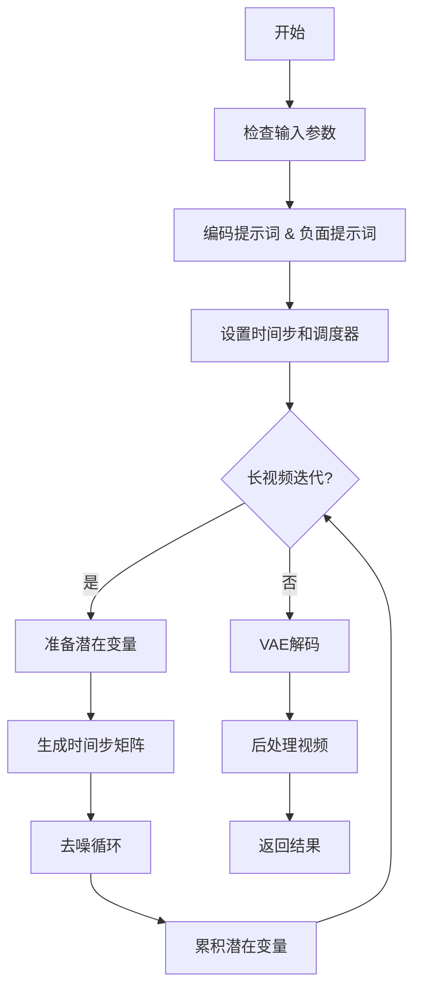

## 类结构

```
DiffusionPipeline (基类)
└── SkyReelsV2DiffusionForcingVideoToVideoPipeline
    ├── 继承自: SkyReelsV2LoraLoaderMixin
    └── 核心组件: VAE, TextEncoder, Transformer, Scheduler
```

## 全局变量及字段


### `XLA_AVAILABLE`
    
XLA加速可用标志，用于判断是否可以使用PyTorch XLA进行加速计算

类型：`bool`
    


### `logger`
    
日志记录器，用于记录管道运行过程中的调试和信息日志

类型：`Logger`
    


### `EXAMPLE_DOC_STRING`
    
示例文档字符串，包含SkyReelsV2DiffusionForcingVideoToVideoPipeline的使用示例代码

类型：`str`
    


### `SkyReelsV2DiffusionForcingVideoToVideoPipeline.model_cpu_offload_seq`
    
CPU卸载顺序字符串，指定模型组件卸载到CPU的顺序为text_encoder->transformer->vae

类型：`str`
    


### `SkyReelsV2DiffusionForcingVideoToVideoPipeline._callback_tensor_inputs`
    
回调张量输入列表，定义在每步结束时可传递给回调函数的张量参数名称

类型：`list`
    


### `SkyReelsV2DiffusionForcingVideoToVideoPipeline.vae_scale_factor_temporal`
    
VAE时序下采样因子，基于VAE的时间下采样层数计算，用于将帧数映射到潜在空间

类型：`int`
    


### `SkyReelsV2DiffusionForcingVideoToVideoPipeline.vae_scale_factor_spatial`
    
VAE空间下采样因子，基于VAE的空间下采样层数计算，用于将图像尺寸映射到潜在空间

类型：`int`
    


### `SkyReelsV2DiffusionForcingVideoToVideoPipeline.video_processor`
    
视频处理器，负责视频的预处理和后处理，包括尺寸调整和格式转换

类型：`VideoProcessor`
    


### `SkyReelsV2DiffusionForcingVideoToVideoPipeline._guidance_scale`
    
引导_scale，分类器自由引导的权重参数，控制文本提示对生成结果的影响程度

类型：`float`
    


### `SkyReelsV2DiffusionForcingVideoToVideoPipeline._attention_kwargs`
    
注意力参数字典，存储传递给注意力处理器的额外关键字参数

类型：`dict`
    


### `SkyReelsV2DiffusionForcingVideoToVideoPipeline._num_timesteps`
    
时间步数量，记录扩散过程中的总迭代次数

类型：`int`
    


### `SkyReelsV2DiffusionForcingVideoToVideoPipeline._current_timestep`
    
当前时间步，存储扩散过程中当前正在处理的时间步张量

类型：`Tensor`
    


### `SkyReelsV2DiffusionForcingVideoToVideoPipeline._interrupt`
    
中断标志，用于在外部请求时中断管道的生成过程

类型：`bool`
    
    

## 全局函数及方法


### `basic_clean`

该函数是文本预处理管道中的基础清理环节，通过 `ftfy` 库修复常见的文本编码错误（如 mojibake 现象），并使用双重 HTML 实体解码处理特殊字符，最后去除首尾空白字符返回干净文本。

参数：

- `text`：`str`，需要清理的原始文本输入

返回值：`str`，经过编码修复、HTML 解码和空白去除后的清洁文本

#### 流程图

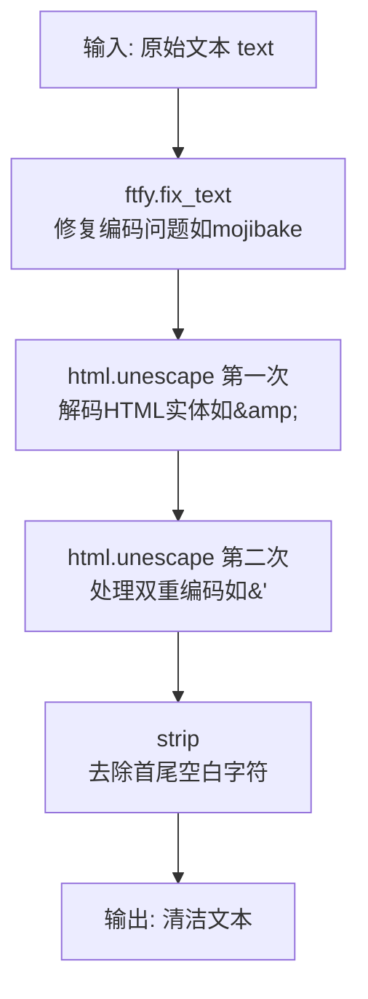

#### 带注释源码

```python
def basic_clean(text):
    """
    对文本进行基础清理，包括修复编码错误和HTML实体解码。
    
    处理流程：
    1. ftfy.fix_text: 修复常见的文本编码问题（如UTF-8被误读为Latin-1导致的乱码）
    2. html.unescape (x2): 双重解码以处理嵌套的HTML实体编码
    3. strip(): 移除文本两端的空白字符
    
    Args:
        text: 需要清理的原始文本字符串
        
    Returns:
        清理后的文本字符串
    """
    # Step 1: 使用ftfy库修复文本编码问题
    # 处理如 "é" -> "é" 这类mojibake现象
    text = ftfy.fix_text(text)
    
    # Step 2: 双重HTML实体解码
    # 第一次解码处理如 ' -> '
    # 第二次解码处理如 ' -> '
    # 双重解码确保处理嵌套编码的HTML实体
    text = html.unescape(html.unescape(text))
    
    # Step 3: 移除文本两端多余的空白字符
    return text.strip()
```


### `whitespace_clean`

该函数用于清理文本中的空白字符，将连续的多个空白字符替换为单个空格，并去除文本首尾的空白。

参数：

- `text`：`str`，需要清理空白字符的输入文本

返回值：`str`，清理空白字符后的文本

#### 流程图

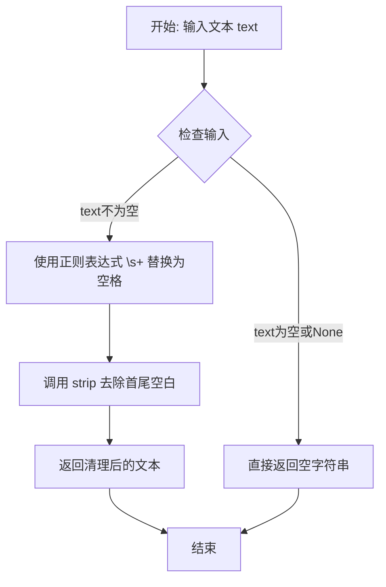

#### 带注释源码

```python
def whitespace_clean(text):
    """
    清理文本中的空白字符。
    
    该函数执行以下操作：
    1. 将连续多个空白字符（如空格、制表符、换行符等）替换为单个空格
    2. 去除文本首尾的空白字符
    
    Args:
        text: 需要清理的输入文本
        
    Returns:
        清理空白字符后的文本
    """
    # 使用正则表达式 \s+ 匹配一个或多个空白字符，并替换为单个空格
    # \s 匹配任何空白字符，包括空格、制表符、换行符、回车符、表格符等
    text = re.sub(r"\s+", " ", text)
    
    # 去除文本首尾的空白字符（默认去除空格、制表符、换行符等）
    text = text.strip()
    
    # 返回清理后的文本
    return text
```


### `prompt_clean`

该函数是文本提示词的清理工具，通过组合调用 `basic_clean` 和 `whitespace_clean` 两个子函数，先修复HTML实体和ftfy文本编码问题，再规范化空白字符，最终返回清理后的纯净文本字符串。

参数：

- `text`：`str`，需要清理的原始提示词文本

返回值：`str`，清理规范化后的提示词文本

#### 流程图

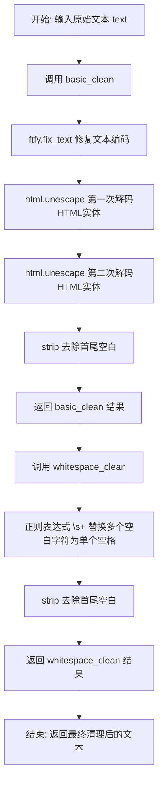

#### 带注释源码

```python
def prompt_clean(text):
    """
    清理提示词文本的函数。
    
    该函数是文本预处理流水线的重要组成部分，通过组合调用 basic_clean 
    和 whitespace_clean 两个子函数，完成对用户输入提示词的规范化处理。
    处理流程包括：修复文本编码问题、解码HTML实体、规范化空白字符等。
    
    Args:
        text (str): 需要清理的原始提示词文本，可能包含HTML实体、
                   特殊编码字符或多余的空白字符
    
    Returns:
        str: 清理并规范化后的提示词文本，已去除多余空白字符
    """
    # 第一步：调用 basic_clean 进行基础文本清理
    # 1. 使用 ftfy.fix_text 修复常见的文本编码问题（如UTF-8编码错误）
    # 2. 使用 html.unescape 两次解码HTML实体（处理嵌套实体如 <）
    # 3. 使用 strip 去除清理后的首尾空白字符
    text = whitespace_clean(basic_clean(text))
    
    # 第二步：调用 whitespace_clean 进行空白字符规范化
    # 1. 使用正则表达式 \s+ 将连续多个空白字符（空格、制表符、换行等）替换为单个空格
    # 2. 使用 strip 再次去除处理后的首尾空白字符
    
    # 返回最终清理后的文本
    return text
```


### `retrieve_timesteps`

该函数是扩散管道中用于获取扩散时间步的核心工具函数，通过调用调度器的 `set_timesteps` 方法并从调度器中检索生成的时间步序列，支持自定义时间步和 sigma 值，同时提供灵活的设备管理和错误处理机制。

参数：

- `scheduler`：`SchedulerMixin`，要获取时间步的调度器对象
- `num_inference_steps`：`int | None`，生成样本时使用的扩散步数，若使用此参数则 `timesteps` 必须为 `None`
- `device`：`str | torch.device | None`，时间步要移动到的设备，若为 `None` 则不移动
- `timesteps`：`list[int] | None`，用于覆盖调度器时间步间隔策略的自定义时间步，若传入此参数则 `num_inference_steps` 和 `sigmas` 必须为 `None`
- `sigmas`：`list[float] | None`，用于覆盖调度器时间步间隔策略的自定义 sigmas，若传入此参数则 `num_inference_steps` 和 `timesteps` 必须为 `None`
- `**kwargs`：任意关键字参数，将传递给调度器的 `set_timesteps` 方法

返回值：`tuple[torch.Tensor, int]`，元组包含两个元素，第一个元素是调度器的时间步调度序列，第二个元素是推理步数

#### 流程图

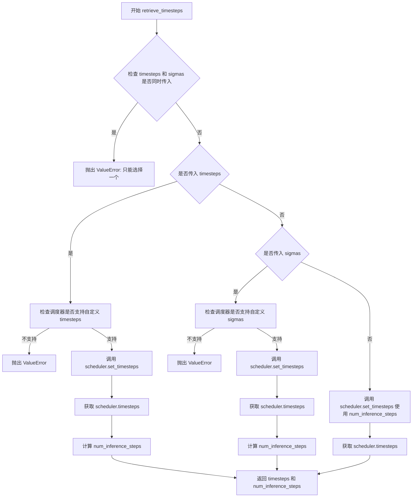

#### 带注释源码

```python
def retrieve_timesteps(
    scheduler,
    num_inference_steps: int | None = None,
    device: str | torch.device | None = None,
    timesteps: list[int] | None = None,
    sigmas: list[float] | None = None,
    **kwargs,
):
    r"""
    Calls the scheduler's `set_timesteps` method and retrieves timesteps from the scheduler after the call. Handles
    custom timesteps. Any kwargs will be supplied to `scheduler.set_timesteps`.

    Args:
        scheduler (`SchedulerMixin`):
            The scheduler to get timesteps from.
        num_inference_steps (`int`):
            The number of diffusion steps used when generating samples with a pre-trained model. If used, `timesteps`
            must be `None`.
        device (`str` or `torch.device`, *optional*):
            The device to which the timesteps should be moved to. If `None`, the timesteps are not moved.
        timesteps (`list[int]`, *optional*):
            Custom timesteps used to override the timestep spacing strategy of the scheduler. If `timesteps` is passed,
            `num_inference_steps` and `sigmas` must be `None`.
        sigmas (`list[float]`, *optional*):
            Custom sigmas used to override the timestep spacing strategy of the scheduler. If `sigmas` is passed,
            `num_inference_steps` and `timesteps` must be `None`.

    Returns:
        `tuple[torch.Tensor, int]`: A tuple where the first element is the timestep schedule from the scheduler and the
        second element is the number of inference steps.
    """
    # 检查是否同时传入了 timesteps 和 sigmas，两者只能选择其一
    if timesteps is not None and sigmas is not None:
        raise ValueError("Only one of `timesteps` or `sigmas` can be passed. Please choose one to set custom values")
    
    # 处理自定义 timesteps 的情况
    if timesteps is not None:
        # 通过 inspect 检查调度器的 set_timesteps 方法是否支持 timesteps 参数
        accepts_timesteps = "timesteps" in set(inspect.signature(scheduler.set_timesteps).parameters.keys())
        if not accepts_timesteps:
            raise ValueError(
                f"The current scheduler class {scheduler.__class__}'s `set_timesteps` does not support custom"
                f" timestep schedules. Please check whether you are using the correct scheduler."
            )
        # 调用调度器的 set_timesteps 方法设置自定义时间步
        scheduler.set_timesteps(timesteps=timesteps, device=device, **kwargs)
        # 从调度器获取设置后的时间步
        timesteps = scheduler.timesteps
        # 计算推理步数
        num_inference_steps = len(timesteps)
    # 处理自定义 sigmas 的情况
    elif sigmas is not None:
        # 通过 inspect 检查调度器的 set_timesteps 方法是否支持 sigmas 参数
        accept_sigmas = "sigmas" in set(inspect.signature(scheduler.set_timesteps).parameters.keys())
        if not accept_sigmas:
            raise ValueError(
                f"The current scheduler class {scheduler.__class__}'s `set_timesteps` does not support custom"
                f" sigmas schedules. Please check whether you are using the correct scheduler."
            )
        # 调用调度器的 set_timesteps 方法设置自定义 sigmas
        scheduler.set_timesteps(sigmas=sigmas, device=device, **kwargs)
        # 从调度器获取设置后的时间步
        timesteps = scheduler.timesteps
        # 计算推理步数
        num_inference_steps = len(timesteps)
    # 默认情况：使用 num_inference_steps 设置时间步
    else:
        scheduler.set_timesteps(num_inference_steps, device=device, **kwargs)
        timesteps = scheduler.timesteps
    
    # 返回时间步序列和推理步数
    return timesteps, num_inference_steps
```


### `retrieve_latents`

从编码器输出中提取潜在变量（latents），支持从 VAE 的潜在分布中采样（sample）、取模（argmax）或直接返回预存的 latents 属性。

参数：

- `encoder_output`：`torch.Tensor`，编码器输出对象，通常包含 `latent_dist` 或 `latents` 属性
- `generator`：`torch.Generator | None`，可选的随机数生成器，用于从潜在分布采样时控制随机性
- `sample_mode`：`str`，采样模式，"sample" 表示从分布中采样，"argmax" 表示取分布的众数（mode）

返回值：`torch.Tensor`，提取出的潜在变量张量

#### 流程图

```mermaid
flowchart TD
    A[开始: retrieve_latents] --> B{encoder_output 是否拥有<br/>latent_dist 属性?}
    B -->|是| C{sample_mode == 'sample'?}
    B -->|否| D{encoder_output 是否拥有<br/>latents 属性?}
    C -->|是| E[返回 encoder_output.latent_dist.sample<br/>(generator)]
    C -->|否| F{sample_mode == 'argmax'?}
    F -->|是| G[返回 encoder_output.latent_dist.mode]
    F -->|否| H[抛出 AttributeError]
    D -->|是| I[返回 encoder_output.latents]
    D -->|否| H
    E --> J[结束]
    G --> J
    I --> J
    H --> J
```

#### 带注释源码

```python
def retrieve_latents(
    encoder_output: torch.Tensor, generator: torch.Generator | None = None, sample_mode: str = "sample"
):
    """
    从编码器输出中提取潜在变量。
    
    该函数支持三种方式获取 latents：
    1. 当 encoder_output 包含 latent_dist 属性且 sample_mode='sample' 时，从分布中采样
    2. 当 encoder_output 包含 latent_dist 属性且 sample_mode='argmax' 时，取分布的众数
    3. 当 encoder_output 直接包含 latents 属性时，直接返回该属性
    
    参数:
        encoder_output: 编码器输出，通常是 VAE 的输出对象
        generator: 可选的随机数生成器，用于控制采样随机性
        sample_mode: 采样模式，'sample' 或 'argmax'
    
    返回:
        torch.Tensor: 提取出的潜在变量
    
    异常:
        AttributeError: 当无法从 encoder_output 中获取 latents 时抛出
    """
    # 情况1: 从 latent_dist 中采样（随机采样）
    if hasattr(encoder_output, "latent_dist") and sample_mode == "sample":
        return encoder_output.latent_dist.sample(generator)
    # 情况2: 从 latent_dist 中取众数（确定性取样）
    elif hasattr(encoder_output, "latent_dist") and sample_mode == "argmax":
        return encoder_output.latent_dist.mode()
    # 情况3: 直接返回预存的 latents 属性
    elif hasattr(encoder_output, "latents"):
        return encoder_output.latents
    # 错误情况: 无法获取 latents
    else:
        raise AttributeError("Could not access latents of provided encoder_output")
```


### `SkyReelsV2DiffusionForcingVideoToVideoPipeline.__init__`

这是 SkyReels-V2 视频生成管道的初始化方法，负责接收并注册所有必要的模型组件（分词器、文本编码器、变换器、VAE、调度器），并根据 VAE 配置计算时序和空间缩放因子，同时初始化视频处理器。

参数：

- `tokenizer`：`AutoTokenizer`，T5 分词器，用于将文本提示编码为 token 序列
- `text_encoder`：`UMT5EncoderModel`，UMT5 文本编码器模型，用于将 token 序列编码为文本嵌入
- `transformer`：`SkyReelsV2Transformer3DModel`，条件 3D 变换器，用于去噪图像/视频潜在表示
- `vae`：`AutoencoderKLWan`，变分自编码器模型，用于编码和解码视频到潜在表示
- `scheduler`：`UniPCMultistepScheduler`，UniPC 多步调度器，用于去噪过程的时间步调度

返回值：无（`None`），构造函数不返回值，仅完成对象初始化

#### 流程图

```mermaid
flowchart TD
    A[开始 __init__] --> B[调用 super().__init__ 初始化基类]
    B --> C[register_modules 注册所有模块]
    C --> D{检查 vae 是否存在}
    D -->|是| E[计算 vae_scale_factor_temporal]
    D -->|否| F[使用默认值 4]
    E --> G[计算 vae_scale_factor_spatial]
    F --> G
    G --> H[初始化 VideoProcessor]
    H --> I[结束]
```

#### 带注释源码

```python
def __init__(
    self,
    tokenizer: AutoTokenizer,
    text_encoder: UMT5EncoderModel,
    transformer: SkyReelsV2Transformer3DModel,
    vae: AutoencoderKLWan,
    scheduler: UniPCMultistepScheduler,
):
    # 调用父类 DiffusionPipeline 的初始化方法
    # 设置管道的基本结构和配置
    super().__init__()

    # 使用 Diffusers 框架的标准模块注册机制
    # 将所有模型组件注册到管道中，便于后续管理和保存/加载
    self.register_modules(
        vae=vae,
        text_encoder=text_encoder,
        tokenizer=tokenizer,
        transformer=transformer,
        scheduler=scheduler,
    )

    # 计算 VAE 的时序缩放因子
    # 用于将原始帧数转换为潜在帧数
    # 例如：如果 VAE 有 2 层时序下采样 (temperal_downsample=[1,1])
    # 则 temporal_scale = 2^(1+1) = 4
    self.vae_scale_factor_temporal = 2 ** sum(self.vae.temperal_downsample) if getattr(self, "vae", None) else 4

    # 计算 VAE 的空间缩放因子
    # 用于将原始分辨率转换为潜在分辨率
    # 例如：如果 VAE 有 3 层空间下采样
    # 则 spatial_scale = 2^3 = 8
    self.vae_scale_factor_spatial = 2 ** len(self.vae.temperal_downsample) if getattr(self, "vae", None) else 8

    # 初始化视频处理器
    # VideoProcessor 负责视频的预处理（缩放、归一化）和后处理（解码）
    # 使用空间缩放因子作为参数
    self.video_processor = VideoProcessor(vae_scale_factor=self.vae_scale_factor_spatial)
```


### `SkyReelsV2DiffusionForcingVideoToVideoPipeline._get_t5_prompt_embeds`

该方法负责将文本提示（prompt）编码为文本嵌入（text embeddings），供后续的扩散模型使用。它使用T5文本编码器（UMT5）将原始文本转换为高维向量表示，并处理批量生成和设备迁移等逻辑。

参数：

- `self`：类的实例本身，包含tokenizer、text_encoder等模块。
- `prompt`：`str | list[str]`，待编码的文本提示，可以是单个字符串或字符串列表。
- `num_videos_per_prompt`：`int = 1`，每个提示生成的视频数量，用于复制嵌入向量。
- `max_sequence_length`：`int = 226`，文本序列的最大长度，超过部分会被截断。
- `device`：`torch.device | None = None`，计算设备，若为None则使用默认执行设备。
- `dtype`：`torch.dtype | None = None`，张量数据类型，若为None则使用text_encoder的dtype。

返回值：`torch.Tensor`，返回编码后的文本嵌入，形状为 `[batch_size * num_videos_per_prompt, max_sequence_length, hidden_size]`。

#### 流程图

```mermaid
flowchart TD
    A[开始: _get_t5_prompt_embeds] --> B{device是否为None?}
    B -->|是| C[device = self._execution_device]
    B -->|否| D[dtype = self.text_encoder.dtype]
    C --> D
    D --> E{dtype是否为None?}
    E -->|是| F[dtype = self.text_encoder.dtype]
    E -->|否| G[prompt = [prompt] if isinstance prompt is str else prompt]
    F --> G
    G --> H[prompt = [prompt_clean(u) for u in prompt]]
    H --> I[batch_size = len prompt]
    I --> J[调用tokenizer进行分词]
    J --> K[提取input_ids和attention_mask]
    K --> L[计算seq_lens = mask.gt 0.sum dim=1]
    L --> M[调用text_encoder获取last_hidden_state]
    M --> N[prompt_embeds = prompt_embeds.to dtype=dtype, device=device]
    N --> O[prompt_embeds = u[:v] for u, v in zip prompt_embeds, seq_lens]
    O --> P[填充padding: torch.cat u, u.new_zeros]
    P --> Q[prompt_embeds = repeat 1, num_videos_per_prompt, 1]
    Q --> R[prompt_embeds = view batch_size * num_videos_per_prompt, seq_len, -1]
    R --> S[返回prompt_embeds]
```

#### 带注释源码

```python
def _get_t5_prompt_embeds(
    self,
    prompt: str | list[str] = None,
    num_videos_per_prompt: int = 1,
    max_sequence_length: int = 226,
    device: torch.device | None = None,
    dtype: torch.dtype | None = None,
):
    """
    将文本提示编码为文本嵌入向量，供扩散模型使用。

    Args:
        prompt: 输入的文本提示，可以是单个字符串或字符串列表
        num_videos_per_prompt: 每个提示生成的视频数量，用于复制embeddings
        max_sequence_length: 文本序列的最大长度
        device: 计算设备
        dtype: 张量数据类型

    Returns:
        torch.Tensor: 编码后的文本嵌入，形状为 [batch_size * num_videos_per_prompt, max_sequence_length, hidden_dim]
    """
    # 确定设备：如果未指定，则使用管道默认执行设备
    device = device or self._execution_device
    # 确定数据类型：如果未指定，则使用文本编码器的数据类型
    dtype = dtype or self.text_encoder.dtype

    # 标准化输入：确保prompt是列表格式，便于批量处理
    prompt = [prompt] if isinstance(prompt, str) else prompt
    # 文本清洗：移除HTML实体、多余空白等噪音字符
    prompt = [prompt_clean(u) for u in prompt]
    # 获取批次大小
    batch_size = len(prompt)

    # 调用tokenizer对文本进行分词和编码
    # 返回input_ids（词表索引）和attention_mask（有效位置掩码）
    text_inputs = self.tokenizer(
        prompt,
        padding="max_length",           # 填充到最大长度
        max_length=max_sequence_length, # 最大序列长度
        truncation=True,               # 超过最大长度则截断
        add_special_tokens=True,        # 添加特殊token（如BOS/EOS）
        return_attention_mask=True,     # 返回attention mask
        return_tensors="pt",            # 返回PyTorch张量
    )
    # 提取分词结果和掩码
    text_input_ids, mask = text_inputs.input_ids, text_inputs.attention_mask
    # 计算每个序列的实际长度（非padding部分）
    seq_lens = mask.gt(0).sum(dim=1).long()

    # 调用T5文本编码器编码文本，获取隐藏状态
    # 输出形状: [batch_size, seq_len, hidden_dim]
    prompt_embeds = self.text_encoder(text_input_ids.to(device), mask.to(device)).last_hidden_state
    # 转换数据类型和设备
    prompt_embeds = prompt_embeds.to(dtype=dtype, device=device)
    
    # 截断embeddings：保留实际文本长度部分，去除padding
    # 这一步确保embeddings不包含无意义的padding信息
    prompt_embeds = [u[:v] for u, v in zip(prompt_embeds, seq_lens)]
    
    # 重新填充到统一长度：使用零向量填充，使所有embeddings长度一致
    # 以便后续批量处理
    prompt_embeds = torch.stack(
        [torch.cat([u, u.new_zeros(max_sequence_length - u.size(0), u.size(1))]) for u in prompt_embeds], dim=0
    )

    # 复制embeddings以支持多个视频生成
    # 如果num_videos_per_prompt > 1，需要为每个视频复制对应的embeddings
    _, seq_len, _ = prompt_embeds.shape
    prompt_embeds = prompt_embeds.repeat(1, num_videos_per_prompt, 1)
    # 重新reshape以匹配批量生成格式
    # 最终形状: [batch_size * num_videos_per_prompt, seq_len, hidden_dim]
    prompt_embeds = prompt_embeds.view(batch_size * num_videos_per_prompt, seq_len, -1)

    return prompt_embeds
```


### `SkyReelsV2DiffusionForcingVideoToVideoPipeline.encode_prompt`

该方法负责将文本提示词（prompt）编码为文本编码器的隐藏状态（hidden states），支持分类器自由引导（Classifier-Free Guidance）以同时生成正向和负向文本嵌入，用于后续的视频生成过程。

参数：

- `prompt`：`str | list[str]`，要编码的提示词，可以是单个字符串或字符串列表
- `negative_prompt`：`str | list[str] | None`，不希望出现在生成结果中的提示词，若不提供且启用引导，则使用空字符串
- `do_classifier_free_guidance`：`bool`，是否启用分类器自由引导，默认为 True
- `num_videos_per_prompt`：`int`，每个提示词需要生成的视频数量，默认为 1
- `prompt_embeds`：`torch.Tensor | None`，预生成的文本嵌入，若提供则直接使用而不从 prompt 生成
- `negative_prompt_embeds`：`torch.Tensor | None`，预生成的负向文本嵌入，若提供则直接使用
- `max_sequence_length`：`int`，文本序列的最大长度，默认为 226
- `device`：`torch.device | None`，执行设备，若不提供则使用执行设备
- `dtype`：`torch.dtype | None`，数据类型，若不提供则使用文本编码器的数据类型

返回值：`tuple[torch.Tensor, torch.Tensor]`，返回元组包含提示词嵌入和负向提示词嵌入

#### 流程图

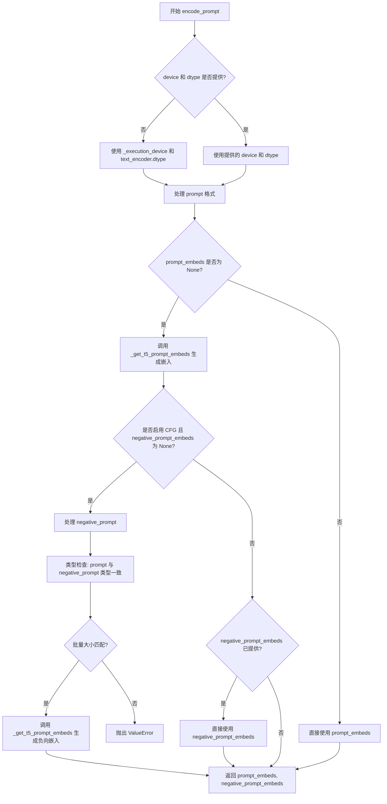

#### 带注释源码

```python
def encode_prompt(
    self,
    prompt: str | list[str],
    negative_prompt: str | list[str] | None = None,
    do_classifier_free_guidance: bool = True,
    num_videos_per_prompt: int = 1,
    prompt_embeds: torch.Tensor | None = None,
    negative_prompt_embeds: torch.Tensor | None = None,
    max_sequence_length: int = 226,
    device: torch.device | None = None,
    dtype: torch.dtype | None = None,
):
    r"""
    Encodes the prompt into text encoder hidden states.

    Args:
        prompt (`str` or `list[str]`, *optional*):
            prompt to be encoded
        negative_prompt (`str` or `list[str]`, *optional*):
            The prompt or prompts not to guide the image generation. If not defined, one has to pass
            `negative_prompt_embeds` instead. Ignored when not using guidance (i.e., ignored if `guidance_scale` is
            less than `1`).
        do_classifier_free_guidance (`bool`, *optional*, defaults to `True`):
            Whether to use classifier free guidance or not.
        num_videos_per_prompt (`int`, *optional*, defaults to 1):
            Number of videos that should be generated per prompt. torch device to place the resulting embeddings on
        prompt_embeds (`torch.Tensor`, *optional*):
            Pre-generated text embeddings. Can be used to easily tweak text inputs, *e.g.* prompt weighting. If not
            provided, text embeddings will be generated from `prompt` input argument.
        negative_prompt_embeds (`torch.Tensor`, *optional*):
            Pre-generated negative text embeddings. Can be used to easily tweak text inputs, *e.g.* prompt
            weighting. If not provided, negative_prompt_embeds will be generated from `negative_prompt` input
            argument.
        device: (`torch.device`, *optional*):
            torch device
        dtype: (`torch.dtype`, *optional*):
            torch dtype
    """
    # 确定执行设备，未提供则使用当前执行设备
    device = device or self._execution_device

    # 将单个字符串转换为列表，保持统一处理
    prompt = [prompt] if isinstance(prompt, str) else prompt
    
    # 根据 prompt 或 prompt_embeds 确定批量大小
    if prompt is not None:
        batch_size = len(prompt)
    else:
        batch_size = prompt_embeds.shape[0]

    # 如果未提供预计算的 prompt_embeds，则从 prompt 生成
    if prompt_embeds is None:
        prompt_embeds = self._get_t5_prompt_embeds(
            prompt=prompt,
            num_videos_per_prompt=num_videos_per_prompt,
            max_sequence_length=max_sequence_length,
            device=device,
            dtype=dtype,
        )

    # 如果启用分类器自由引导且未提供负向嵌入，则生成负向嵌入
    if do_classifier_free_guidance and negative_prompt_embeds is None:
        # 默认使用空字符串作为负向提示词
        negative_prompt = negative_prompt or ""
        # 将负向提示词扩展为批量大小
        negative_prompt = batch_size * [negative_prompt] if isinstance(negative_prompt, str) else negative_prompt

        # 类型检查：确保 prompt 和 negative_prompt 类型一致
        if prompt is not None and type(prompt) is not type(negative_prompt):
            raise TypeError(
                f"`negative_prompt` should be the same type to `prompt`, but got {type(negative_prompt)} !="
                f" {type(prompt)}."
            )
        # 批量大小检查：确保两者批量大小一致
        elif batch_size != len(negative_prompt):
            raise ValueError(
                f"`negative_prompt`: {negative_prompt} has batch size {len(negative_prompt)}, but `prompt`:"
                f" {prompt} has batch size {batch_size}. Please make sure that passed `negative_prompt` matches"
                " the batch size of `prompt`."
            )

        # 从 negative_prompt 生成负向嵌入
        negative_prompt_embeds = self._get_t5_prompt_embeds(
            prompt=negative_prompt,
            num_videos_per_prompt=num_videos_per_prompt,
            max_sequence_length=max_sequence_length,
            device=device,
            dtype=dtype,
        )

    # 返回正向和负向提示词嵌入
    return prompt_embeds, negative_prompt_embeds
```


### `SkyReelsV2DiffusionForcingVideoToVideoPipeline.check_inputs`

该方法负责验证视频生成管道的输入参数有效性，包括检查高度/宽度的对齐、提示词类型、互斥参数（prompt/prompt_embeds、video/latents）以及长视频生成时的必需参数。

参数：

- `self`：`SkyReelsV2DiffusionForcingVideoToVideoPipeline`，Pipeline 实例本身
- `prompt`：`str | list[str] | None`，用户提供的文本提示词
- `negative_prompt`：`str | list[str] | None`，负向提示词，用于引导生成
- `height`：`int`，生成视频的高度
- `width`：`int`，生成视频的宽度
- `video`：`Any | None`，输入视频数据
- `latents`：`Any | None`，预生成的潜在变量
- `prompt_embeds`：`torch.Tensor | None`，预计算的提示词嵌入向量
- `negative_prompt_embeds`：`torch.Tensor | None`，预计算的负向提示词嵌入向量
- `callback_on_step_end_tensor_inputs`：`list[str] | None`，每步结束时的回调张量输入列表
- `overlap_history`：`int | None`，长视频生成时的历史帧重叠数量
- `num_frames`：`int | None`，生成视频的总帧数
- `base_num_frames`：`int | None`，基础帧数，用于长视频分段

返回值：`None`，该方法无返回值，通过抛出 `ValueError` 异常来处理无效输入

#### 流程图

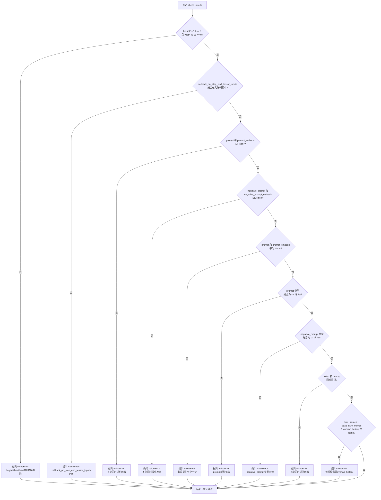

#### 带注释源码

```python
def check_inputs(
    self,
    prompt,
    negative_prompt,
    height,
    width,
    video=None,
    latents=None,
    prompt_embeds=None,
    negative_prompt_embeds=None,
    callback_on_step_end_tensor_inputs=None,
    overlap_history=None,
    num_frames=None,
    base_num_frames=None,
):
    # 检查视频高度和宽度是否被16整除（VAE解码器要求）
    if height % 16 != 0 or width % 16 != 0:
        raise ValueError(f"`height` and `width` have to be divisible by 16 but are {height} and {width}.")

    # 检查回调张量输入是否在允许的列表中
    if callback_on_step_end_tensor_inputs is not None and not all(
        k in self._callback_tensor_inputs for k in callback_on_step_end_tensor_inputs
    ):
        raise ValueError(
            f"`callback_on_step_end_tensor_inputs` has to be in {self._callback_tensor_inputs}, but found {[k for k in callback_on_step_end_tensor_inputs if k not in self._callback_tensor_inputs]}"
        )

    # 检查 prompt 和 prompt_embeds 是否互斥
    if prompt is not None and prompt_embeds is not None:
        raise ValueError(
            f"Cannot forward both `prompt`: {prompt} and `prompt_embeds`: {prompt_embeds}. Please make sure to"
            " only forward one of the two."
        )
    # 检查 negative_prompt 和 negative_prompt_embeds 是否互斥
    elif negative_prompt is not None and negative_prompt_embeds is not None:
        raise ValueError(
            f"Cannot forward both `negative_prompt`: {negative_prompt} and `negative_prompt_embeds`: {negative_prompt_embeds}. Please make sure to"
            " only forward one of the two."
        )
    # 检查是否至少提供了 prompt 或 prompt_embeds 之一
    elif prompt is None and prompt_embeds is None:
        raise ValueError(
            "Provide either `prompt` or `prompt_embeds`. Cannot leave both `prompt` and `prompt_embeds` undefined."
        )
    # 检查 prompt 类型是否有效（str 或 list）
    elif prompt is not None and (not isinstance(prompt, str) and not isinstance(prompt, list)):
        raise ValueError(f"`prompt` has to be of type `str` or `list` but is {type(prompt)}")
    # 检查 negative_prompt 类型是否有效
    elif negative_prompt is not None and (
        not isinstance(negative_prompt, str) and not isinstance(negative_prompt, list)
    ):
        raise ValueError(f"`negative_prompt` has to be of type `str` or `list` but is {type(negative_prompt)}")

    # 检查 video 和 latents 是否互斥
    if video is not None and latents is not None:
        raise ValueError("Only one of `video` or `latents` should be provided")

    # 长视频生成检查：当生成帧数超过基础帧数时，必须提供 overlap_history 参数以确保平滑过渡
    if num_frames > base_num_frames and overlap_history is None:
        raise ValueError(
            "`overlap_history` is required when `num_frames` exceeds `base_num_frames` to ensure smooth transitions in long video generation. "
            "Please specify a value for `overlap_history`. Recommended values are 17 or 37."
        )
```


### `SkyReelsV2DiffusionForcingVideoToVideoPipeline.prepare_latents`

该函数是 SkyReels-V2 视频到视频扩散管道的潜在变量准备方法，负责初始化生成过程的初始噪声潜在变量，支持长视频分段处理、因果块对齐以及从前一迭代传递前缀视频潜在变量等功能。

参数：

- `self`：调用此方法的管道实例本身
- `video`：`torch.Tensor`，输入视频张量，用于提取前缀潜在变量
- `batch_size`：`int = 1`，批次大小，指定同时处理的视频数量
- `num_channels_latents`：`int = 16`，潜在变量的通道数，对应 transformer 模型的输入通道数
- `height`：`int = 480`，输出视频高度像素值
- `width`：`int = 832`，输出视频宽度像素值
- `num_frames`：`int = 97`，输出视频的总帧数
- `dtype`：`torch.dtype | None`，潜在变量的数据类型，默认为 None
- `device`：`torch.device | None`，潜在变量存放的设备
- `generator`：`torch.Generator | list[torch.Generator] | None`，随机数生成器，用于确保生成的可重复性
- `latents`：`torch.Tensor | None`，预生成的潜在变量，如果提供则直接返回
- `video_latents`：`torch.Tensor | None`，来自前一次迭代的视频潜在变量，用于长视频连续生成
- `base_latent_num_frames`：`int | None`，基础潜在变量帧数，即模型单次前向传播能处理的最大帧数
- `overlap_history`：`int | None`，历史重叠帧数，用于长视频分段时的平滑过渡
- `causal_block_size`：`int | None`，因果块大小，用于异步推理模式
- `overlap_history_latent_frames`：`int | None`，重叠历史在潜在空间对应的帧数
- `long_video_iter`：`int | None`，长视频迭代次数，0 表示首次迭代

返回值：`torch.Tensor`，返回一个元组包含：
- `latents`：随机初始化的噪声潜在变量张量
- `num_latent_frames`：实际处理的潜在变量帧数
- `prefix_video_latents`：前缀视频潜在变量，用于条件约束
- `prefix_video_latents_frames`：前缀视频潜在变量的帧数

#### 流程图

```mermaid
flowchart TD
    A[开始 prepare_latents] --> B{latents 是否已提供?}
    B -->|是| C[直接返回 latents.to device dtype]
    B -->|否| D[计算 latent 维度]
    D --> E{long_video_iter == 0?}
    E -->|是| F[编码视频前缀获取 prefix_video_latents]
    F --> G[标准化: (latents - mean) * std]
    E -->|否| H[从 video_latents 提取重叠帧]
    H --> G
    G --> I{prefix_video_latents 长度 % causal_block_size != 0?}
    I -->|是| J[截断对齐并警告]
    I -->|否| K[计算已完成帧数和剩余帧数]
    J --> K
    K --> L[构建 latents shape]
    L --> M{generator 列表长度 == batch_size?}
    M -->|否| N[抛出 ValueError]
    M -->|是| O[使用 randn_tensor 生成随机噪声]
    O --> P[返回 latents, num_latent_frames, prefix_video_latents, prefix_video_latents_frames]
```

#### 带注释源码

```python
def prepare_latents(
    self,
    video: torch.Tensor,
    batch_size: int = 1,
    num_channels_latents: int = 16,
    height: int = 480,
    width: int = 832,
    num_frames: int = 97,
    dtype: torch.dtype | None = None,
    device: torch.device | None = None,
    generator: torch.Generator | list[torch.Generator] | None = None,
    latents: torch.Tensor | None = None,
    video_latents: torch.Tensor | None = None,
    base_latent_num_frames: int | None = None,
    overlap_history: int | None = None,
    causal_block_size: int | None = None,
    overlap_history_latent_frames: int | None = None,
    long_video_iter: int | None = None,
) -> torch.Tensor:
    # 如果调用者已预生成潜在变量，直接转换设备并返回，无需重新生成
    if latents is not None:
        return latents.to(device=device, dtype=dtype)

    # 计算潜在变量的帧数：通过时间下采样因子转换
    # 如果未提供 latents，则根据 num_frames 计算；否则从 latents 形状中提取
    num_latent_frames = (
        (num_frames - 1) // self.vae_scale_factor_temporal + 1 if latents is None else latents.shape[2]
    )
    # 计算潜在变量的空间维度：通过空间下采样因子除以原始尺寸
    latent_height = height // self.vae_scale_factor_spatial
    latent_width = width // self.vae_scale_factor_spatial

    # 长视频迭代的初始化阶段（iter==0）：需要从视频中提取前缀潜在变量
    if long_video_iter == 0:
        # 对每个视频样本，编码最后 overlap_history 帧作为前缀条件
        # 使用 argmax 模式从潜在分布中获取确定性输出
        prefix_video_latents = [
            retrieve_latents(
                self.vae.encode(
                    # 如果视频是 4D 则 unsqueeze 批次维度，否则保持 5D
                    vid.unsqueeze(0)[:, :, -overlap_history:] if vid.dim() == 4 else vid[:, :, -overlap_history:]
                ),
                sample_mode="argmax",
            )
            for vid in video
        ]
        # 合并所有视频样本的前缀潜在变量并转换数据类型
        prefix_video_latents = torch.cat(prefix_video_latents, dim=0).to(dtype)

        # 获取 VAE 的潜在变量统计参数（均值和标准差）用于标准化
        latents_mean = (
            torch.tensor(self.vae.config.latents_mean)
            .view(1, self.vae.config.z_dim, 1, 1, 1)
            .to(device, self.vae.dtype)
        )
        latents_std = 1.0 / torch.tensor(self.vae.config.latents_std).view(1, self.vae.config.z_dim, 1, 1, 1).to(
            device, self.vae.dtype
        )
        # 标准化：减去均值乘以标准差的倒数，使潜在变量符合标准正态分布
        prefix_video_latents = (prefix_video_latents - latents_mean) * latents_std
    else:
        # 后续迭代：从累积的视频潜在变量中提取重叠帧作为条件
        prefix_video_latents = video_latents[:, :, -overlap_history_latent_frames:]

    # 潜在变量帧数必须能被因果块大小整除，否则进行截断对齐
    # 这确保因果注意力机制能正确处理所有帧
    if prefix_video_latents.shape[2] % causal_block_size != 0:
        truncate_len_latents = prefix_video_latents.shape[2] % causal_block_size
        logger.warning(
            f"The length of prefix video latents is truncated by {truncate_len_latents} frames for the causal block size alignment. "
            f"This truncation ensures compatibility with the causal block size, which is required for proper processing. "
            f"However, it may slightly affect the continuity of the generated video at the truncation boundary."
        )
        prefix_video_latents = prefix_video_latents[:, :, :-truncate_len_latents]
    prefix_video_latents_frames = prefix_video_latents.shape[2]

    # 计算已完成的帧数和本次迭代需要处理的剩余帧数
    # 公式：已完成 = 迭代次数 * (基础帧数 - 重叠帧数) + 重叠帧数
    finished_frame_num = (
        long_video_iter * (base_latent_num_frames - overlap_history_latent_frames) + overlap_history_latent_frames
    )
    left_frame_num = num_latent_frames - finished_frame_num
    # 限制本次迭代的帧数不超过基础帧数
    num_latent_frames = min(left_frame_num + overlap_history_latent_frames, base_latent_num_frames)

    # 构建潜在变量的形状：[批次, 通道, 帧, 高, 宽]
    shape = (
        batch_size,
        num_channels_latents,
        num_latent_frames,
        latent_height,
        latent_width,
    )
    # 验证生成器列表长度与批次大小匹配
    if isinstance(generator, list) and len(generator) != batch_size:
        raise ValueError(
            f"You have passed a list of generators of length {len(generator)}, but requested an effective batch"
            f" size of {batch_size}. Make sure the batch size matches the length of the generators."
        )

    # 使用随机张量生成初始噪声潜在变量
    # 这是扩散模型的起点：从纯噪声开始逐步去噪
    latents = randn_tensor(shape, generator=generator, device=device, dtype=dtype)

    # 返回：噪声潜在变量、实际帧数、前缀潜在变量及其帧数
    return latents, num_latent_frames, prefix_video_latents, prefix_video_latents_frames
```


### `SkyReelsV2DiffusionForcingVideoToVideoPipeline.generate_timestep_matrix`

该函数实现了核心的扩散强制（Diffusion Forcing）算法，用于创建跨时间帧的协调去噪调度表。它支持两种生成模式：同步模式（所有帧同时去噪）和异步模式（帧分组块式处理，形成"去噪波"），能够有效处理长视频生成任务。

参数：

- `num_latent_frames`：`int`，要生成的潜在帧总数
- `step_template`：`torch.Tensor`，基础时间步调度（如 [1000, 800, 600, ..., 0]）
- `base_num_latent_frames`：`int`，模型单次前向传播能处理的最大帧数
- `ar_step`：`int`，自回归步长，控制时间滞后程度，0 表示同步模式，默认值为 5
- `num_pre_ready`：`int`，已预先去噪的帧数（如视频2视频任务中的前缀），默认值为 0
- `causal_block_size`：`int`，作为因果块处理的帧数，默认值为 1
- `shrink_interval_with_mask`：`bool`，是否根据掩码优化处理间隔，默认值为 False

返回值：`tuple[torch.Tensor, torch.Tensor, torch.Tensor, list[tuple]]`，返回包含四个元素的元组：
- `step_matrix`：时间步矩阵，形状为 [迭代次数, 潜在帧数]，存储每帧在每次迭代的时间步值
- `step_index`：索引矩阵，形状为 [迭代次数, 潜在帧数]，用于查找时间步模板
- `step_update_mask`：布尔更新掩码，形状为 [迭代次数, 潜在帧数]，指示哪些帧需要在该迭代中更新
- `valid_interval`：有效间隔列表，每个元素为 (起始, 结束) 元组，定义每次迭代需要处理的前向传播帧范围

#### 流程图

```mermaid
flowchart TD
    A[开始] --> B[初始化列表: step_matrix, step_index, update_mask, valid_interval]
    B --> C[计算总迭代次数: num_iterations = len(step_template) + 1]
    C --> D[计算帧块数: num_blocks = num_latent_frames // causal_block_size]
    D --> E{验证 ar_step}
    E -->|不足| F[抛出 ValueError]
    E -->|足够| G[扩展 step_template: 添加首尾边界值]
    G --> H[初始化 pre_row: 全零向量]
    H --> I{num_pre_ready > 0?}
    I -->|是| J[标记已就绪块]
    I -->|否| K[进入主循环]
    J --> K
    
    K --> L{所有块已完成?}
    L -->|否| M[创建新行 new_row]
    M --> N[遍历每个块 i]
    N --> O{条件判断}
    O -->|i==0 或前一块已完成| P[new_row[i] = pre_row[i] + 1]
    O -->|异步模式| Q[new_row[i] = new_row[i-1] - ar_step]
    P --> R
    Q --> R
    R[new_row 钳制到有效范围] --> S[计算 update_mask]
    S --> T[追加到列表]
    T --> K
    
    L -->|是| U[处理 shrink_interval_with_mask]
    U --> V[构建 valid_interval 列表]
    V --> W[堆叠为张量]
    W --> X{causal_block_size > 1?}
    X -->|是| Y[展开块级数据到帧级]
    X -->|否| Z[返回结果元组]
    Y --> Z
    
    F --> Z
```

#### 带注释源码

```python
def generate_timestep_matrix(
    self,
    num_latent_frames: int,
    step_template: torch.Tensor,
    base_num_latent_frames: int,
    ar_step: int = 5,
    num_pre_ready: int = 0,
    causal_block_size: int = 1,
    shrink_interval_with_mask: bool = False,
) -> tuple[torch.Tensor, torch.Tensor, torch.Tensor, list[tuple]]:
    """
    核心扩散强制算法：创建跨时间帧的协调去噪调度表。
    
    同步模式 (ar_step=0, causal_block_size=1):
        - 所有帧同时去噪，每帧遵循相同去噪轨迹: [1000, 800, 600, ..., 0]
        - 简单但长视频时间一致性可能较差
    
    异步模式 (ar_step>0, causal_block_size>1):
        - 帧分组为因果块，块级交错处理形成"去噪波"
        - 早期块先去噪，后期块滞后 ar_step 个时间步
        - 创造更强时间依赖性，提升一致性
    """
    # 初始化存储调度矩阵和元数据的列表
    step_matrix, step_index = [], []  # 存储每次迭代的时间步值和索引
    update_mask, valid_interval = [], []  # 存储更新掩码和处理间隔

    # 计算总去噪迭代次数（加1表示初始噪声状态）
    num_iterations = len(step_template) + 1

    # 将帧数转换为块数（因果处理）
    # 每个块包含 causal_block_size 帧一起处理
    num_blocks = num_latent_frames // causal_block_size
    base_num_blocks = base_num_latent_frames // causal_block_size

    # 验证 ar_step 是否足够创建交错模式
    if base_num_blocks < num_blocks:
        min_ar_step = len(step_template) / base_num_blocks
        if ar_step < min_ar_step:
            raise ValueError(f"`ar_step` 应至少为 {math.ceil(min_ar_step)}")

    # 扩展 step_template 便于索引：添加边界值
    # 999: 计数器从1开始的虚拟值
    # 0: 最终时间步（完全去噪）
    step_template = torch.cat([
        torch.tensor([999], dtype=torch.int64, device=step_template.device),
        step_template.long(),
        torch.tensor([0], dtype=torch.int64, device=step_template.device),
    ])

    # 初始化前一行状态（跟踪每块的去噪进度）
    # 0 表示未开始，num_iterations 表示完全去噪
    pre_row = torch.zeros(num_blocks, dtype=torch.long)

    # 标记已就绪帧（如视频2视频任务的前缀）已达最终去噪状态
    if num_pre_ready > 0:
        pre_row[: num_pre_ready // causal_block_size] = num_iterations

    # 主循环：生成去噪调度直到所有帧完全去噪
    while not torch.all(pre_row >= (num_iterations - 1)):
        # 创建代表下一步去噪的新行
        new_row = torch.zeros(num_blocks, dtype=torch.long)

        # 为每个块应用扩散强制逻辑
        for i in range(num_blocks):
            if i == 0 or pre_row[i - 1] >= (num_iterations - 1):
                # 首帧或前一块已完全去噪
                new_row[i] = pre_row[i] + 1
            else:
                # 异步模式：滞后前一块 ar_step 个时间步
                # 创造"扩散强制"交错模式
                new_row[i] = new_row[i - 1] - ar_step

        # 钳制值到有效范围 [0, num_iterations]
        new_row = new_row.clamp(0, num_iterations)

        # 创建更新掩码：True 表示该迭代需要更新的块
        # 排除未开始或已完成的块
        update_mask.append((new_row != pre_row) & (new_row != num_iterations))

        # 存储迭代状态
        step_index.append(new_row)  # 索引到 step_template
        step_matrix.append(step_template[new_row])  # 实际时间步值
        pre_row = new_row  # 更新为下一次迭代

    # 对于长于模型容量的视频，使用滑动窗口处理
    terminal_flag = base_num_blocks

    # 可选优化：根据首个更新掩码收缩间隔
    if shrink_interval_with_mask:
        idx_sequence = torch.arange(num_blocks, dtype=torch.int64)
        update_mask = update_mask[0]
        update_mask_idx = idx_sequence[update_mask]
        last_update_idx = update_mask_idx[-1].item()
        terminal_flag = last_update_idx + 1

    # 定义每次前向传播处理的帧间隔
    for curr_mask in update_mask:
        # 如果当前掩码在终端外有更新，则扩展终端标志
        if terminal_flag < num_blocks and curr_mask[terminal_flag]:
            terminal_flag += 1
        # 创建间隔：[start, end) 确保不超出模型容量
        valid_interval.append((max(terminal_flag - base_num_blocks, 0), terminal_flag))

    # 转换为张量以高效处理
    step_update_mask = torch.stack(update_mask, dim=0)
    step_index = torch.stack(step_index, dim=0)
    step_matrix = torch.stack(step_matrix, dim=0)

    # 复制每块的调度到块内所有帧
    if causal_block_size > 1:
        # 展开每个块到 causal_block_size 帧
        step_update_mask = step_update_mask.unsqueeze(-1).repeat(1, 1, causal_block_size).flatten(1).contiguous()
        step_index = step_index.unsqueeze(-1).repeat(1, 1, causal_block_size).flatten(1).contiguous()
        step_matrix = step_matrix.unsqueeze(-1).repeat(1, 1, causal_block_size).flatten(1).contiguous()
        # 间隔从块级缩放到帧级
        valid_interval = [(s * causal_block_size, e * causal_block_size) for s, e in valid_interval]

    return step_matrix, step_index, step_update_mask, valid_interval
```


### `SkyReelsV2DiffusionForcingVideoToVideoPipeline.__call__`

该方法是 SkyReels-V2 视频到视频（V2V）扩散强制管道的核心调用函数，接收原始视频和文本提示词，通过扩散模型对视频进行重生成，支持同步/异步推理模式、长视频分段生成、分类器自由引导（CFG）等高级功能，最终输出生成后的视频帧序列。

参数：

- `video`：`list[Image.Image]`，用于引导视频生成的输入视频
- `prompt`：`str | list[str] | None`，引导视频生成的文本提示词，若不指定则需传递 prompt_embeds
- `negative_prompt`：`str | list[str] | None`，不引导视频生成的提示词，若不指定则需传递 negative_prompt_embeds，guidance_scale < 1 时忽略
- `height`：`int`，生成视频的高度，默认 544
- `width`：`int`，生成视频的宽度，默认 960
- `num_frames`：`int`，生成视频的帧数，默认 120
- `num_inference_steps`：`int`，去噪步数，默认 50
- `guidance_scale`：`float`，分类器自由引导比例，默认 6.0，T2V 建议 6.0，I2V 建议 5.0
- `num_videos_per_prompt`：`int | None`，每个提示词生成的视频数量，默认 1
- `generator`：`torch.Generator | list[torch.Generator] | None`，用于生成确定性结果的随机生成器
- `latents`：`torch.Tensor | None`，预生成的噪声潜在变量，若不提供则使用随机生成器采样
- `prompt_embeds`：`torch.Tensor | None`，预生成的文本嵌入，用于方便调整文本输入
- `negative_prompt_embeds`：`torch.Tensor | None`，预生成的负面文本嵌入
- `output_type`：`str | None`，生成视频的输出格式，可选 "np" 或 "latent"，默认 "np"
- `return_dict`：`bool`，是否返回 SkyReelsV2PipelineOutput 对象，默认 True
- `attention_kwargs`：`dict[str, Any] | None`，传递给注意力处理器的额外参数字典
- `callback_on_step_end`：`Callable[[int, int], None] | PipelineCallback | MultiPipelineCallbacks | None`，每个去噪步骤结束时的回调函数
- `callback_on_step_end_tensor_inputs`：`list[str]`，回调函数所需的张量输入列表，默认 ["latents"]
- `max_sequence_length`：`int`，提示词的最大序列长度，默认 512
- `overlap_history`：`int | None`，长视频生成的平滑过渡重叠帧数，推荐 17 或 37
- `addnoise_condition`：`float`，用于帮助平滑长视频生成的噪声条件值，推荐 20，不建议超过 50
- `base_num_frames`：`int`，基准帧数，540P 建议 97，720P 建议 121，默认 97
- `ar_step`：`int`，控制异步推理的步长，0 表示同步模式，默认 0
- `causal_block_size`：`int | None`，每个因果块/块中的帧数，异步推理时推荐 5
- `fps`：`int`，生成视频的帧率，默认 24

返回值：`SkyReelsV2PipelineOutput | tuple`，return_dict 为 True 时返回包含生成视频帧的 SkyReelsV2PipelineOutput 对象，否则返回元组，第一个元素为生成的视频列表，第二个元素为 NSFW 检测结果列表

#### 流程图

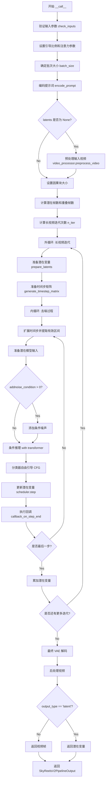

#### 带注释源码

```python
@torch.no_grad()
@replace_example_docstring(EXAMPLE_DOC_STRING)
def __call__(
    self,
    video: list[Image.Image],
    prompt: str | list[str] = None,
    negative_prompt: str | list[str] = None,
    height: int = 544,
    width: int = 960,
    num_frames: int = 120,
    num_inference_steps: int = 50,
    guidance_scale: float = 6.0,
    num_videos_per_prompt: int | None = 1,
    generator: torch.Generator | list[torch.Generator] | None = None,
    latents: torch.Tensor | None = None,
    prompt_embeds: torch.Tensor | None = None,
    negative_prompt_embeds: torch.Tensor | None = None,
    output_type: str | None = "np",
    return_dict: bool = True,
    attention_kwargs: dict[str, Any] | None = None,
    callback_on_step_end: Callable[[int, int], None] | PipelineCallback | MultiPipelineCallbacks | None = None,
    callback_on_step_end_tensor_inputs: list[str] = ["latents"],
    max_sequence_length: int = 512,
    overlap_history: int | None = None,
    addnoise_condition: float = 0,
    base_num_frames: int = 97,
    ar_step: int = 0,
    causal_block_size: int | None = None,
    fps: int = 24,
):
    r"""
    管道生成调用的主函数，用于视频到视频的扩散强制生成。
    
    参数详细说明：
    - video: 输入视频帧列表，用于引导生成过程
    - prompt: 文本提示词，指导视频生成内容
    - negative_prompt: 负面提示词，用于排除不需要的内容
    - height/width: 输出视频分辨率
    - num_frames: 输出视频总帧数
    - num_inference_steps: 扩散模型去噪迭代次数，越多质量越好但速度越慢
    - guidance_scale: CFG 引导强度，值越大越符合提示词
    - num_videos_per_prompt: 每个提示词生成的视频数量
    - generator: 随机种子生成器，确保可重复性
    - latents: 预计算的噪声潜在变量
    - prompt_embeds/negative_prompt_embeds: 预计算的文本嵌入
    - output_type: 输出格式，"np" 返回 numpy 数组，"latent" 返回潜在变量
    - return_dict: 是否返回结构化输出对象
    - attention_kwargs: 传递给注意力层的额外参数
    - callback_on_step_end: 每步结束时的回调函数
    - callback_on_step_end_tensor_inputs: 回调函数可访问的张量列表
    - max_sequence_length: T5 编码器的最大序列长度
    - overlap_history: 长视频分段的帧重叠数，确保过渡平滑
    - addnoise_condition: 对条件帧添加噪声的强度，改善一致性
    - base_num_frames: 模型单次处理的最大帧数
    - ar_step: 异步推理步长，控制时间维度的交错程度
    - causal_block_size: 因果块大小，控制帧组处理方式
    - fps: 输出视频帧率
    """

    # 处理回调函数的张量输入列表
    if isinstance(callback_on_step_end, (PipelineCallback, MultiPipelineCallbacks)):
        callback_on_step_end_tensor_inputs = callback_on_step_end.tensor_inputs

    # 计算实际输出高度和宽度（基于 VAE 缩放因子）
    height = height or self.transformer.config.sample_height * self.vae_scale_factor_spatial
    width = width or self.transformer.config.sample_width * self.vae_scale_factor_spatial
    num_videos_per_prompt = 1

    # 步骤 1: 验证输入参数合法性
    self.check_inputs(
        prompt,
        negative_prompt,
        height,
        width,
        video,
        latents,
        prompt_embeds,
        negative_prompt_embeds,
        callback_on_step_end_tensor_inputs,
        overlap_history,
        num_frames,
        base_num_frames,
    )

    # 警告：噪声条件值过大可能导致不一致
    if addnoise_condition > 60:
        logger.warning(
            f"The value of 'addnoise_condition' is too large ({addnoise_condition}) and may cause inconsistencies in long video generation. A value of 20 is recommended."
        )

    # 验证帧数与 VAE 时间下采样因子兼容
    if num_frames % self.vae_scale_factor_temporal != 1:
        logger.warning(
            f"`num_frames - 1` has to be divisible by {self.vae_scale_factor_temporal}. Rounding to the nearest number."
        )
        num_frames = num_frames // self.vae_scale_factor_temporal * self.vae_scale_factor_temporal + 1
    num_frames = max(num_frames, 1)

    # 设置内部状态变量
    self._guidance_scale = guidance_scale
    self._attention_kwargs = attention_kwargs
    self._current_timestep = None
    self._interrupt = False

    device = self._execution_device

    # 步骤 2: 确定批次大小
    if prompt is not None and isinstance(prompt, str):
        batch_size = 1
    elif prompt is not None and isinstance(prompt, list):
        batch_size = len(prompt)
    else:
        batch_size = prompt_embeds.shape[0]

    # 步骤 3: 编码输入提示词为文本嵌入
    prompt_embeds, negative_prompt_embeds = self.encode_prompt(
        prompt=prompt,
        negative_prompt=negative_prompt,
        do_classifier_free_guidance=self.do_classifier_free_guidance,
        num_videos_per_prompt=num_videos_per_prompt,
        prompt_embeds=prompt_embeds,
        negative_prompt_embeds=negative_prompt_embeds,
        max_sequence_length=max_sequence_length,
        device=device,
    )

    # 转换嵌入类型以匹配 transformer 的数据类型
    transformer_dtype = self.transformer.dtype
    prompt_embeds = prompt_embeds.to(transformer_dtype)
    if negative_prompt_embeds is not None:
        negative_prompt_embeds = negative_prompt_embeds.to(transformer_dtype)

    # 步骤 4: 准备时间步
    self.scheduler.set_timesteps(num_inference_steps, device=device)
    timesteps = self.scheduler.timesteps

    # 如果没有提供潜在变量，则预处理输入视频
    if latents is None:
        video_original = self.video_processor.preprocess_video(video, height=height, width=width).to(
            device, dtype=torch.float32
        )

    # 设置因果块大小（用于异步推理）
    if causal_block_size is None:
        causal_block_size = self.transformer.config.num_frame_per_block
    else:
        self.transformer._set_ar_attention(causal_block_size)

    # 准备 FPS 嵌入
    fps_embeds = [fps] * prompt_embeds.shape[0]
    fps_embeds = [0 if i == 16 else 1 for i in fps_embeds]

    # 长视频生成：计算迭代次数
    accumulated_latents = None
    # 将重叠帧数转换为潜在帧数
    overlap_history_latent_frames = (overlap_history - 1) // self.vae_scale_factor_temporal + 1
    # 计算总潜在帧数
    num_latent_frames = (num_frames - 1) // self.vae_scale_factor_temporal + 1
    # 计算基准潜在帧数
    base_latent_num_frames = (
        (base_num_frames - 1) // self.vae_scale_factor_temporal + 1
        if base_num_frames is not None
        else num_latent_frames
    )
    # 计算需要迭代的次数
    n_iter = (
        1
        + (num_latent_frames - base_latent_num_frames - 1)
        // (base_latent_num_frames - overlap_history_latent_frames)
        + 1
    )
    
    # 外循环：处理长视频的多个分段
    for long_video_iter in range(n_iter):
        logger.debug(f"Processing iteration {long_video_iter + 1}/{n_iter} for long video generation...")

        # 步骤 5: 准备潜在变量
        num_channels_latents = self.transformer.config.in_channels
        # 调用 prepare_latents 获取当前迭代的潜在变量、前缀潜在变量等
        latents, current_num_latent_frames, prefix_video_latents, prefix_video_latents_frames = (
            self.prepare_latents(
                video_original,
                batch_size * num_videos_per_prompt,
                num_channels_latents,
                height,
                width,
                num_frames,
                torch.float32,
                device,
                generator,
                latents if long_video_iter == 0 else None,
                video_latents=accumulated_latents,
                overlap_history=overlap_history,
                base_latent_num_frames=base_latent_num_frames,
                causal_block_size=causal_block_size,
                overlap_history_latent_frames=overlap_history_latent_frames,
                long_video_iter=long_video_iter,
            )
        )

        # 将前缀视频潜在变量填充到潜在变量的开头
        if prefix_video_latents_frames > 0:
            latents[:, :, :prefix_video_latents_frames, :, :] = prefix_video_latents.to(transformer_dtype)

        # 准备样本调度器和时间步矩阵（扩散强制算法的核心）
        sample_schedulers = []
        for _ in range(current_num_latent_frames):
            sample_scheduler = deepcopy(self.scheduler)
            sample_scheduler.set_timesteps(num_inference_steps, device=device)
            sample_schedulers.append(sample_scheduler)
        
        # 生成时间步矩阵，协调跨时间帧的去噪调度
        step_matrix, _, step_update_mask, valid_interval = self.generate_timestep_matrix(
            current_num_latent_frames,
            timesteps,
            current_num_latent_frames,
            ar_step,
            prefix_video_latents_frames,
            causal_block_size,
        )

        # 步骤 6: 去噪循环
        num_warmup_steps = len(timesteps) - num_inference_steps * self.scheduler.order
        self._num_timesteps = len(step_matrix)

        # 进度条显示
        with self.progress_bar(total=len(step_matrix)) as progress_bar:
            # 遍历每个时间步
            for i, t in enumerate(step_matrix):
                # 检查是否中断
                if self.interrupt:
                    continue

                self._current_timestep = t
                # 获取当前有效区间
                valid_interval_start, valid_interval_end = valid_interval[i]
                # 提取当前区间对应的潜在变量
                latent_model_input = (
                    latents[:, :, valid_interval_start:valid_interval_end, :, :].to(transformer_dtype).clone()
                )
                # 扩展时间步以匹配潜在变量形状
                timestep = t.expand(latents.shape[0], -1)[:, valid_interval_start:valid_interval_end].clone()

                # 对条件帧添加噪声（改善长视频一致性）
                if addnoise_condition > 0 and valid_interval_start < prefix_video_latents_frames:
                    noise_factor = 0.001 * addnoise_condition
                    latent_model_input[:, :, valid_interval_start:prefix_video_latents_frames, :, :] = (
                        latent_model_input[:, :, valid_interval_start:prefix_video_latents_frames, :, :]
                        * (1.0 - noise_factor)
                        + torch.randn_like(
                            latent_model_input[:, :, valid_interval_start:prefix_video_latents_frames, :, :]
                        )
                        * noise_factor
                    )
                    timestep[:, valid_interval_start:prefix_video_latents_frames] = addnoise_condition

                # 条件推理（带提示词）
                with self.transformer.cache_context("cond"):
                    noise_pred = self.transformer(
                        hidden_states=latent_model_input,
                        timestep=timestep,
                        encoder_hidden_states=prompt_embeds,
                        enable_diffusion_forcing=True,
                        fps=fps_embeds,
                        attention_kwargs=attention_kwargs,
                        return_dict=False,
                    )[0]

                # 分类器自由引导（CFG）
                if self.do_classifier_free_guidance:
                    with self.transformer.cache_context("uncond"):
                        noise_uncond = self.transformer(
                            hidden_states=latent_model_input,
                            timestep=timestep,
                            encoder_hidden_states=negative_prompt_embeds,
                            enable_diffusion_forcing=True,
                            fps=fps_embeds,
                            attention_kwargs=attention_kwargs,
                            return_dict=False,
                        )[0]
                    # 应用 CFG 公式: noise_pred = noise_uncond + guidance_scale * (noise_pred - noise_uncond)
                    noise_pred = noise_uncond + guidance_scale * (noise_pred - noise_uncond)

                # 根据更新掩码更新潜在变量
                update_mask_i = step_update_mask[i]
                for idx in range(valid_interval_start, valid_interval_end):
                    if update_mask_i[idx].item():
                        latents[:, :, idx, :, :] = sample_schedulers[idx].step(
                            noise_pred[:, :, idx - valid_interval_start, :, :],
                            t[idx],
                            latents[:, :, idx, :, :],
                            return_dict=False,
                        )[0]

                # 执行每步结束时的回调
                if callback_on_step_end is not None:
                    callback_kwargs = {}
                    for k in callback_on_step_end_tensor_inputs:
                        callback_kwargs[k] = locals()[k]
                    callback_outputs = callback_on_step_end(self, i, t, callback_kwargs)

                    # 更新可能被回调修改的张量
                    latents = callback_outputs.pop("latents", latents)
                    prompt_embeds = callback_outputs.pop("prompt_embeds", prompt_embeds)
                    negative_prompt_embeds = callback_outputs.pop("negative_prompt_embeds", negative_prompt_embeds)

                # 更新进度条
                if i == len(step_matrix) - 1 or (
                    (i + 1) > num_warmup_steps and (i + 1) % self.scheduler.order == 0
                ):
                    progress_bar.update()

                # XLA 加速支持
                if XLA_AVAILABLE:
                    xm.mark_step()

        # 累加潜在变量用于下一次迭代
        if accumulated_latents is None:
            accumulated_latents = latents
        else:
            # 保留重叠帧用于条件，但不包括在最终输出中
            accumulated_latents = torch.cat(
                [accumulated_latents, latents[:, :, overlap_history_latent_frames:]], dim=2
            )

    # 最终潜在变量
    latents = accumulated_latents

    self._current_timestep = None

    # 最终解码步骤：将潜在变量转换为像素
    if not output_type == "latent":
        # 逆归一化潜在变量
        latents = latents.to(self.vae.dtype)
        latents_mean = (
            torch.tensor(self.vae.config.latents_mean)
            .view(1, self.vae.config.z_dim, 1, 1, 1)
            .to(latents.device, latents.dtype)
        )
        latents_std = 1.0 / torch.tensor(self.vae.config.latents_std).view(1, self.vae.config.z_dim, 1, 1, 1).to(
            latents.device, latents.dtype
        )
        latents = latents / latents_std + latents_mean
        
        # VAE 解码
        video_generated = self.vae.decode(latents, return_dict=False)[0]
        
        # 拼接原始视频和生成视频
        video = torch.cat([video_original, video_generated], dim=2)
        # 后处理视频
        video = self.video_processor.postprocess_video(video, output_type=output_type)
    else:
        video = latents

    # 释放模型钩子
    self.maybe_free_model_hooks()

    # 返回结果
    if not return_dict:
        return (video,)

    return SkyReelsV2PipelineOutput(frames=video)
```


### `SkyReelsV2DiffusionForcingVideoToVideoPipeline.guidance_scale`

该属性是 `SkyReelsV2DiffusionForcingVideoToVideoPipeline` 类的只读属性，用于获取扩散模型的引导比例（guidance scale）。该参数控制生成过程中文本提示对图像/视频生成的影响程度，值越大生成的视频与文本提示越相关，但可能导致质量下降。

参数： 无

返回值：`float`，返回当前管道使用的引导比例值，用于控制分类器无引导扩散过程中的指导强度。

#### 流程图

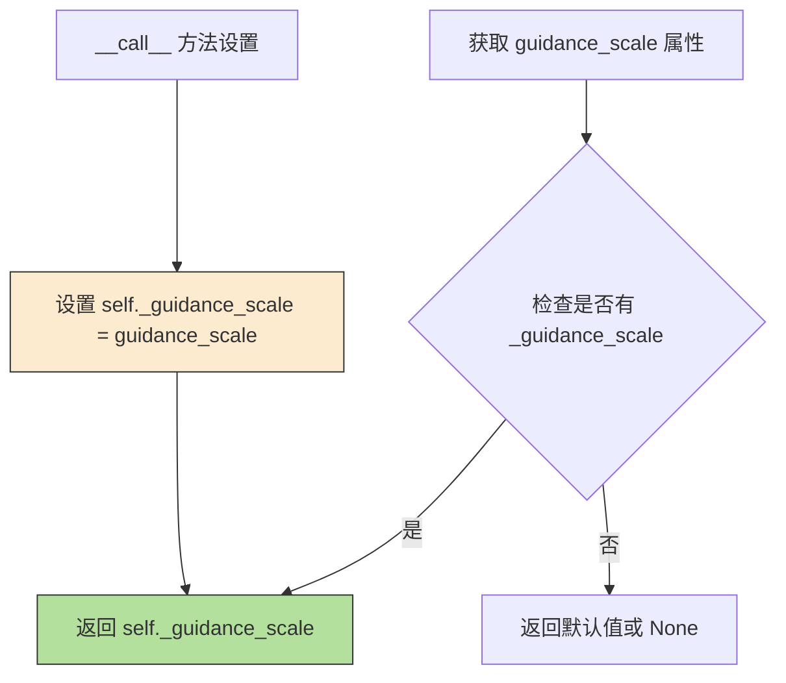

#### 带注释源码

```python
@property
def guidance_scale(self):
    """
    属性 getter 方法，用于获取扩散引导比例。
    
    guidance_scale 是 Classifier-Free Diffusion Guidance (CFG) 中的关键参数，
    用于平衡文本提示引导与生成多样性的权衡。在 SkyReelsV2 管道中：
    - T2V (Text-to-Video): 推荐使用 6.0
    - I2V (Image-to-Video): 推荐使用 5.0
    
    该属性在 __call__ 方法中被设置：
        self._guidance_scale = guidance_scale
    
    相关的 do_classifier_free_guidance 属性基于此值判断是否启用 CFG：
        return self._guidance_scale > 1.0
    
    Returns:
        float: 当前的引导比例值，值越大表示文本引导越强
    """
    return self._guidance_scale
```


### `SkyReelsV2DiffusionForcingVideoToVideoPipeline.do_classifier_free_guidance`

该属性是一个只读的属性 getter，用于判断当前是否启用了 Classifier-Free Guidance（CFG）技术。它通过比较内部存储的 `_guidance_scale` 值与 1.0 的大小来确定是否需要进行无分类器引导生成。当 `guidance_scale > 1.0` 时返回 `True`，表示模型将在推理过程中同时执行有条件（conditioned）和无条件（unconditioned）的噪声预测，以提升生成质量。

参数： （无参数）

返回值：`bool`，返回是否启用 Classifier-Free Guidance。值为 `True` 时表示启用（`self._guidance_scale > 1.0`），值为 `False` 时表示未启用。

#### 流程图

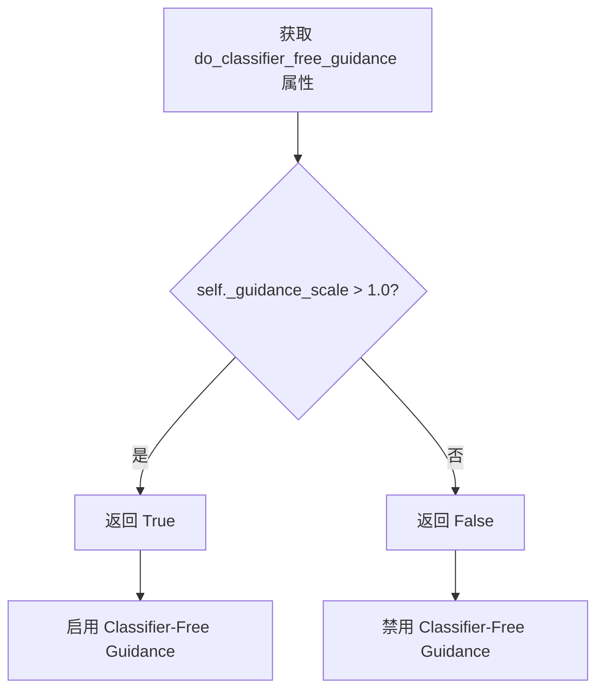

#### 带注释源码

```python
@property
def do_classifier_free_guidance(self):
    """
    属性 getter：判断是否启用 Classifier-Free Guidance (CFG)。

    Classifier-Free Guidance 是一种提升扩散模型生成质量的技术，
    通过在推理时同时执行有条件和无条件的噪声预测，然后根据 guidance_scale
    进行加权组合，从而引导生成过程更贴合文本提示。

    返回值:
        bool: 如果 guidance_scale > 1.0 则返回 True，表示启用 CFG；
              否则返回 False，表示禁用 CFG。

    示例:
        >>> pipeline._guidance_scale = 6.0
        >>> pipeline.do_classifier_free_guidance
        True
        >>> pipeline._guidance_scale = 1.0
        >>> pipeline.do_classifier_free_guidance
        False
    """
    return self._guidance_scale > 1.0
```


### `SkyReelsV2DiffusionForcingVideoToVideoPipeline.num_timesteps`

该属性是 `SkyReelsV2DiffusionForcingVideoToVideoPipeline` 类的只读属性，用于获取当前扩散管道在推理过程中实际使用的去噪时间步数。该值在去噪循环开始前通过 `len(step_matrix)` 计算并存储到实例变量 `_num_timesteps` 中，反映了基于时间步矩阵计算的实际迭代次数。

参数： 无

返回值：`int`，返回当前扩散管道执行推理时所使用的去噪步骤总数。

#### 流程图

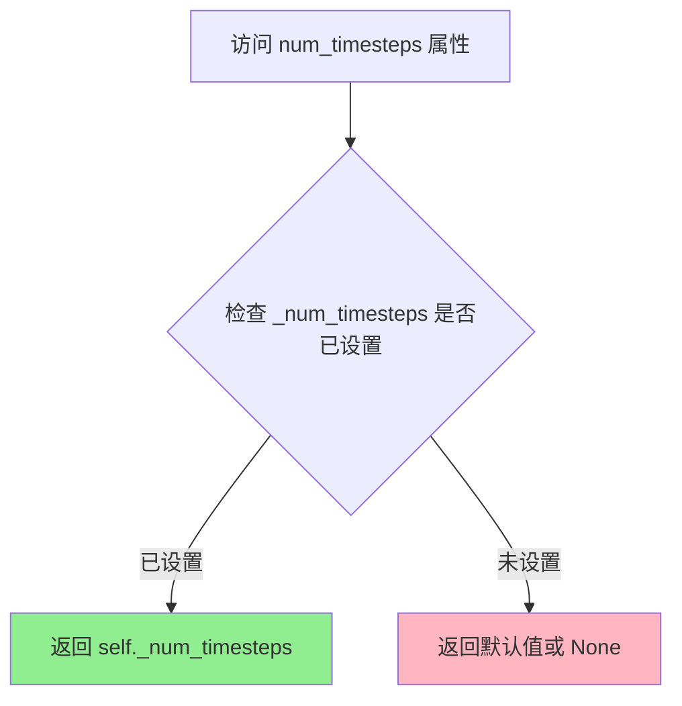

#### 带注释源码

```python
@property
def num_timesteps(self):
    """
    只读属性，返回扩散管道在推理过程中使用的去噪时间步总数。
    
    该值在 __call__ 方法的去噪循环开始前被设置：
    self._num_timesteps = len(step_matrix)
    
    step_matrix 是通过 generate_timestep_matrix 方法生成的，
    其长度取决于 base_num_latent_frames、ar_step、causal_block_size 等参数。
    
    Returns:
        int: 去噪步骤的总数量
    """
    return self._num_timesteps
```


### `SkyReelsV2DiffusionForcingVideoToVideoPipeline.current_timestep`

该属性用于获取当前扩散模型在去噪循环中所处的时间步（timestep）。在视频生成过程的每次迭代中，该属性会被更新为当前处理的时间步张量，用于监控和调试扩散过程。

参数：无需显式参数（Python property 的隐式参数 `self` 不计入）

返回值：`torch.Tensor`，当前去噪循环中的时间步张量，通常为形状 `[num_latent_frames]` 的一维张量，包含每个潜在帧对应的调度时间步值。

#### 流程图

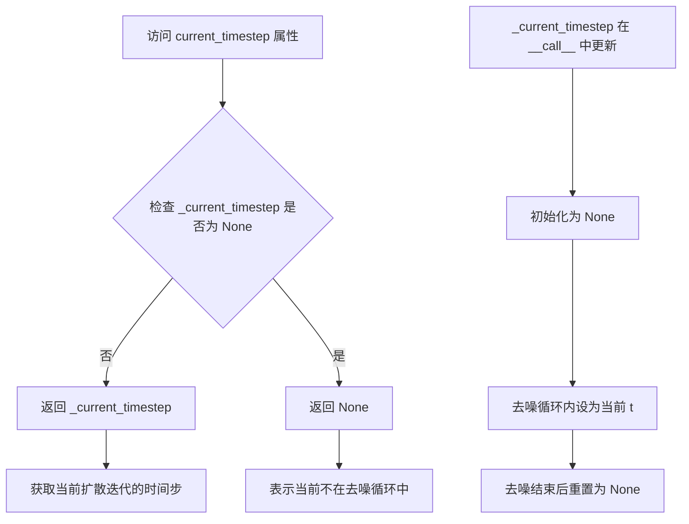

#### 带注释源码

```python
@property
def current_timestep(self):
    """
    当前扩散时间步属性访问器。
    
    该属性提供了对内部状态 _current_timestep 的只读访问。
    _current_timestep 在管道的去噪循环（__call__ 方法）中被动态更新，
    记录当前处理的时间步信息。初始状态和去噪完成后，该值为 None。
    
    Returns:
        torch.Tensor 或 None: 
            - 在去噪循环中：返回当前时间步张量，形状为 [num_latent_frames]
            - 不在去噪循环中：返回 None
    """
    return self._current_timestep
```

---

**补充说明**

- **设计目的**：该属性用于在扩散去噪过程中追踪当前处理的时间步，便于调试、监控以及可能的回调函数访问。
- **状态管理**：
  - 在 `__call__` 方法开始时初始化为 `None`：`self._current_timestep = None`
  - 在去噪循环的每次迭代中被更新为当前的时间步张量：`self._current_timestep = t`
  - 在整个管道执行完成后重置为 `None`：`self._current_timestep = None`
- **数据类型**：`_current_timestep` 接收的值 `t` 来自 `step_matrix`，该矩阵由 `generate_timestep_matrix` 方法生成，类型为 `torch.Tensor`。
- **线程安全**：该属性非线程安全，因为在去噪循环执行期间可能被异步回调访问。


### `SkyReelsV2DiffusionForcingVideoToVideoPipeline.interrupt`

该属性用于获取管道的中断状态标志，允许外部调用者检查当前管道是否被请求停止执行。在长视频生成的循环中，该标志会被检查以决定是否继续处理剩余的帧。

参数：无（这是一个属性访问器，不接受任何参数）

返回值：`bool`，返回当前的中断状态标志。当值为 `True` 时，表示外部已请求管道停止执行；`False` 表示继续正常运行。

#### 流程图

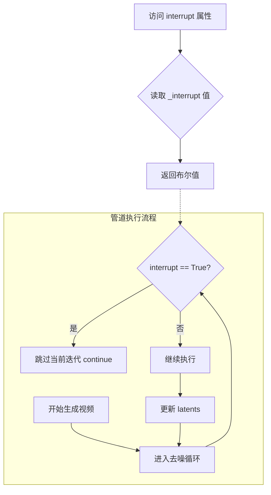

#### 带注释源码

```python
@property
def interrupt(self):
    """
    属性访问器：获取管道的中断状态标志。
    
    该属性允许外部代码查询管道是否被请求停止。在 __call__ 方法的去噪循环中，
    每一次迭代都会检查此标志。如果设置为 True，管道将跳过当前迭代继续执行，
    但不会立即完全退出（这允许管道在长视频生成过程中响应中断请求）。
    
    返回值:
        bool: 中断标志的状态。
              - True: 外部已请求停止管道
              - False: 管道应继续正常运行
    
    使用示例:
        # 在另一个线程中设置中断标志
        pipeline._interrupt = True
        
        # 或者通过属性读取当前状态
        if pipeline.interrupt:
            print("管道已被请求中断")
    """
    return self._interrupt
```

#### 相关上下文代码

```python
# 在 __call__ 方法中的初始化和使用：
self._interrupt = False  # 初始化为 False

# 在去噪循环中检查中断标志
with self.progress_bar(total=len(step_matrix)) as progress_bar:
    for i, t in enumerate(step_matrix):
        if self.interrupt:  # 检查中断标志
            continue       # 如果被中断，跳过当前迭代
        # ... 继续正常处理
```


### `SkyReelsV2DiffusionForcingVideoToVideoPipeline.attention_kwargs`

这是一个属性方法，用于获取在管道调用时设置的注意力机制关键字参数。该属性允许外部访问者在生成过程中获取当前配置的注意力参数，这些参数将传递给 `AttentionProcessor` 用于控制注意力机制的行为。

参数：

- 无（属性方法，仅接收隐式参数 `self`）

返回值：`dict[str, Any] | None`，返回注意力关键字参数字典。如果未设置，则返回 `None`。该字典包含传递给 `AttentionProcessor` 的各种配置选项，例如注意力模式、dropout 概率等。

#### 流程图

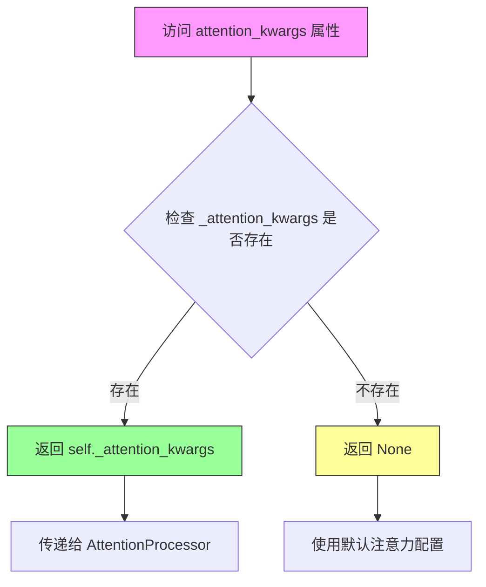

#### 带注释源码

```python
@property
def attention_kwargs(self):
    """
    属性方法：获取注意力关键字参数
    
    该属性返回在 __call__ 方法中设置的 _attention_kwargs。
    这些参数用于控制 Transformer 模型中注意力机制的具体行为，
    例如可以传递注意力模式、dropout、scale 等配置。
    
    Returns:
        dict[str, Any] | None: 注意力关键字参数字典，如果未设置则返回 None
    """
    return self._attention_kwargs
```

## 关键组件


### 张量索引与惰性加载

在`prepare_latents`方法中，代码通过分块处理实现长视频的惰性加载。`prefix_video_latents`仅在需要时从视频中提取重叠历史帧（`overlap_history`），避免一次性加载整个视频到内存。在`__call__`方法的去噪循环中，使用`valid_interval_start`和`valid_interval_end`进行张量切片，仅对当前有效区间的latents进行推理，实现按需加载和处理。

### 反量化支持

在`prepare_latents`方法和最终解码阶段，代码实现了完整的反量化流程。使用`latents_mean`和`latents_std`对latents进行归一化和反归一化：通过`(latents - latents_mean) * latents_std`进行标准化，在解码前通过`latents / latents_std + latents_mean`恢复原始分布，这对应VAE的潜在空间量化参数。

### 扩散强制（Diffusion Forcing）策略

`generate_timestep_matrix`方法实现了核心的扩散强制算法，支持两种模式：同步模式（ar_step=0）所有帧同时去噪，异步模式（ar_step>0）创建时间步交错的不同步去噪波。算法通过`step_matrix`、`step_index`和`step_update_mask`协调多帧的去噪进度，确保长视频生成的时间一致性。

### 异步推理与因果块处理

代码通过`ar_step`参数控制异步推理，`causal_block_size`参数定义因果块大小。在去噪循环中，使用`valid_interval`确定每轮需要处理的帧块范围，并通过`transformer._set_ar_attention(causal_block_size)`配置Transformer的因果注意力机制，实现高效的块级并行处理。

### 长视频重叠历史机制

在长视频生成场景中，`overlap_history`参数控制相邻视频段之间的重叠帧数。代码通过`overlap_history_latent_frames`计算潜在空间的重叠帧数，并在迭代结束时通过`torch.cat`合并潜在表示，确保视频段之间的平滑过渡和时序一致性。

### 噪声条件注入

`addnoise_condition`参数用于在条件帧上添加可控噪声，以改善长视频生成的一致性。代码在去噪循环中根据`valid_interval_start`和`prefix_video_latents_frames`的位置，对条件区域进行噪声注入，同时调整对应的时间步，实现条件帧与生成帧之间的平滑融合。


## 问题及建议


### 已知问题

-   `self.vae.temperal_downsample` 属性名存在拼写错误，应为 `temporal_downsample`，可能导致后续维护困难
-   `prepare_latents` 方法职责过于繁重，同时处理了普通latent准备、长视频迭代、prefix视频编码等多个场景，违反单一职责原则
-   `__call__` 方法体超过500行，包含多个嵌套循环和条件分支，可读性和可维护性较差
-   `generate_timestep_matrix` 方法中包含大量注释和复杂的索引操作，逻辑难以追踪
-   `fps_embeds` 的生成逻辑 (`[0 if i == 16 else 1 for i in fps_embeds]`) 存在明显错误：遍历的是与prompt_embeds形状相关的列表，而非实际的fps值
-   长视频生成时的 `accumulated_latents` 拼接逻辑在边界情况下可能产生帧对齐问题
-   `check_inputs` 方法未对 `causal_block_size` 参数进行有效性验证

### 优化建议

-   将 `prepare_latents` 方法拆分为 `prepare_base_latents`、`prepare_long_video_latents` 和 `prepare_prefix_latents` 等多个独立方法
-   将 `__call__` 中的长视频迭代逻辑抽取为 `_generate_long_video` 私有方法
-   修复 `fps_embeds` 的生成逻辑，应基于传入的 `fps` 参数而非固定的索引判断
-   在 `check_inputs` 中添加 `causal_block_size` 与模型配置的一致性检查
-   考虑将 `generate_timestep_matrix` 的核心算法抽取为独立函数以提高可测试性
-   为 `temperal_downsample` 属性添加别名或迁移到正确命名的属性

## 其它


### 设计目标与约束

本Pipeline的设计目标是实现高质量的视频到视频（Video-to-Video）生成，采用Diffusion Forcing（扩散强制）技术，支持同步和异步两种推理模式。核心约束包括：1）输入视频分辨率需能被16整除；2）帧数需满足VAE时间下采样因子的整除关系；3）长视频生成时需要指定overlap_history参数确保平滑过渡；4）支持540P（base_num_frames=97）和720P（base_num_frames=121）两种分辨率模式；5）异步推理模式下causal_block_size建议设置为5；6）文本编码器采用UMT5-XXL模型，最大序列长度为512（默认226）。

### 错误处理与异常设计

Pipeline采用分层异常处理策略：1）输入验证阶段（check_inputs方法）进行参数合法性检查，包括分辨率整除性、prompt与prompt_embeds互斥、video与latents互斥、overlap_history必要性等，检测到违规时抛出ValueError；2）调度器兼容性检查（retrieve_timesteps方法）验证set_timesteps方法是否支持自定义timesteps或sigmas；3）生成器批量大小验证（prepare_latents方法）确保传入的生成器列表长度与batch_size匹配；4）编码器输出属性检查（retrieve_latents方法）使用try-except捕获AttributeError；5）运行时通过logger.warning输出非致命性警告（如addnoise_condition过大、num_frames不满足整除要求等）；6）XLA环境下使用xm.mark_step()进行显式计算标记。

### 数据流与状态机

Pipeline的数据流遵循以下状态机转换：初始状态（Null）→输入预处理（Prepare Latents）→文本编码（Encode Prompt）→时间步调度（Prepare Timesteps）→主去噪循环（Denoising Loop）→潜在空间解码（VAE Decode）→后处理输出（Post-process）。在长视频场景下，状态机支持迭代模式：每轮迭代处理base_latent_num_frames帧，通过overlap_history_latent_frames帧的重叠实现条件传递。异步推理模式引入diffusion forcing时间步矩阵生成逻辑，状态转换受step_matrix、step_index、step_update_mask三个核心张量控制，形成帧级别的有限状态机。

### 外部依赖与接口契约

本Pipeline依赖以下核心外部组件：1）transformers库提供的AutoTokenizer和UMT5EncoderModel用于文本编码；2）diffusers库的DiffusionPipeline基类、UniPCMultistepScheduler调度器、AutoencoderKLWan VAE模型；3）SkyReelsV2Transformer3DModel条件变换器；4）SkyReelsV2LoraLoaderMixin用于LoRA权重加载；5）PIL库处理图像/视频帧；6）ftfy库（可选）用于文本修复；7）torch_xla（可选）用于XLA加速。接口契约规定：video输入为PIL.Image列表；prompt支持字符串或字符串列表；latents为4D张量（[B,C,H,W]）；返回SkyReelsV2PipelineOutput或tuple；所有模型设备由_execution_device统一管理；调度器必须实现set_timesteps和step方法。

### 性能考虑与资源管理

性能优化策略包括：1）模型CPU卸载序列（model_cpu_offload_seq）定义为"text_encoder->transformer->vae"，支持自动内存管理；2）梯度计算禁用（@torch.no_grad()装饰器）覆盖整个__call__方法；3）VAE解码前进行dtype转换（transformer_dtype→vae.dtype）；4）长视频迭代中累积latents采用torch.cat而非重复编码；5）XLA环境下使用xm.mark_step()促进设备间同步；6）generate_timestep_matrix方法通过shrink_interval_with_mask参数支持处理间隔优化；7）prompt_embeds预计算并沿序列维度复制以支持num_videos_per_prompt>1；8）文本嵌入采用max_sequence_length填充策略平衡内存与信息保留。

### 配置参数说明

关键配置参数包括：1）height/width控制输出分辨率，默认544×960；2）num_frames控制输出帧数，默认120；3）num_inference_steps控制去噪步数，默认50；4）guidance_scale控制分类器自由引导权重，T2V推荐6.0，I2V推荐5.0；5）flow_shift控制UniPC调度器流移参数，T2V推荐8.0，I2V推荐5.0；6）ar_step控制异步推理步长，0为同步模式，>0启用异步；7）causal_block_size控制因果块大小，异步模式推荐5；8）overlap_history控制长视频重叠帧数，推荐17或37；9）addnoise_condition控制噪声添加强度，推荐20，最大不超过50；10）base_num_frames控制基础帧数，540P用97，720P用121。

### 版本兼容性

本代码基于以下版本假设：1）Python 3.8+；2）PyTorch 2.0+；3）diffusers库最新稳定版；4）transformers库支持UMT5模型；5）Wan模型架构支持。兼容性注意事项：1）retrieve_timesteps函数通过inspect.signature检查调度器API兼容性；2）PIL.Image输入格式兼容Pillow 9.0+；3）torch GeneratorAPI在PyTorch 1.8+保持稳定；4）XLA支持通过is_torch_xla_available()动态检测。

### 安全考虑

安全机制包括：1）NSFW内容检测通过negative_prompt_embeds实现负面提示引导；2）模型权重加载使用from_pretrained安全验证；3）设备指定（device参数）防止自动设备选择导致的资源冲突；4）dtype转换显式管理防止精度损失；5）回调函数（callback_on_step_end）支持自定义安全检查逻辑。

### 扩展性设计

扩展性设计要点：1）DiffusionPipeline基类继承提供标准化save/load/from_pretrained接口；2）SkyReelsV2LoraLoaderMixin混入支持LoRA权重热加载；3）callback_on_step_end支持自定义后处理回调；4）attention_kwargs字典向处理器传递额外参数；5）VideoProcessor类可替换以支持不同视频格式；6）generate_timestep_matrix算法支持自定义ar_step和causal_block_size组合；7）scheduler可通过配置替换为其他UniPC-compatible调度器。


    