# `diffusers\src\diffusers\pipelines\skyreels_v2\pipeline_skyreels_v2_i2v.py` 详细设计文档

SkyReels-V2图像到视频(Image-to-Video)生成管道，基于扩散模型架构，将静态图像和文本提示词转换为动态视频内容，继承自DiffusionPipeline并集成了T5文本编码器、CLIP图像编码器、VAE和Transformer去噪模型。

## 整体流程

```mermaid
graph TD
    A[开始: 调用__call__方法] --> B[检查输入参数 check_inputs]
    B --> C[编码提示词 encode_prompt]
    C --> D[编码图像 encode_image]
    D --> E[准备时间步 prepare timesteps]
    E --> F[准备Latent变量 prepare_latents]
    F --> G{去噪循环 for each timestep}
    G --> H[执行条件去噪 transformer(cond)]
    H --> I{是否使用CFG?]
    I -- 是 --> J[执行无条件去噪 transformer(uncond)]
    I -- 否 --> K[跳过无条件去噪]
    J --> L[计算噪声预测 noise_pred]
    K --> L
    L --> M[scheduler.step更新latents]
    M --> N[回调处理 callback_on_step_end]
    N --> O{是否还有timestep?]
    O -- 是 --> G
    O -- 否 --> P[解码VAE decode latents]
    P --> Q[后处理视频 postprocess_video]
    Q --> R[返回SkyReelsV2PipelineOutput]
```

## 类结构

```
DiffusionPipeline (基类)
└── SkyReelsV2ImageToVideoPipeline
    └── 继承自: SkyReelsV2LoraLoaderMixin
```

## 全局变量及字段


### `logger`
    
模块级日志记录器，用于输出调试和运行时信息

类型：`logging.Logger`
    


### `XLA_AVAILABLE`
    
标志位，指示PyTorch XLA是否可用以加速计算

类型：`bool`
    


### `EXAMPLE_DOC_STRING`
    
包含pipeline使用示例的文档字符串

类型：`str`
    


### `SkyReelsV2ImageToVideoPipeline.vae_scale_factor_temporal`
    
VAE在时间维度上的下采样倍数，用于计算潜在空间的帧数

类型：`int`
    


### `SkyReelsV2ImageToVideoPipeline.vae_scale_factor_spatial`
    
VAE在空间维度上的下采样倍数，用于计算潜在空间的高度和宽度

类型：`int`
    


### `SkyReelsV2ImageToVideoPipeline.video_processor`
    
视频预处理和后处理器，负责视频帧的格式转换和归一化

类型：`VideoProcessor`
    


### `SkyReelsV2ImageToVideoPipeline.image_processor`
    
CLIP图像处理器，用于预处理输入图像以供图像编码器使用

类型：`CLIPProcessor`
    


### `SkyReelsV2ImageToVideoPipeline.tokenizer`
    
T5文本分词器，用于将文本提示转换为token序列

类型：`AutoTokenizer`
    


### `SkyReelsV2ImageToVideoPipeline.text_encoder`
    
UMT5文本编码器模型，将文本token转换为文本嵌入向量

类型：`UMT5EncoderModel`
    


### `SkyReelsV2ImageToVideoPipeline.image_encoder`
    
CLIP视觉编码器，将输入图像编码为图像条件嵌入

类型：`CLIPVisionModelWithProjection`
    


### `SkyReelsV2ImageToVideoPipeline.transformer`
    
条件3D变换器模型，执行潜在空间的去噪扩散过程

类型：`SkyReelsV2Transformer3DModel`
    


### `SkyReelsV2ImageToVideoPipeline.scheduler`
    
UniPC多步调度器，控制去噪过程中的时间步长和噪声预测

类型：`UniPCMultistepScheduler`
    


### `SkyReelsV2ImageToVideoPipeline.model_cpu_offload_seq`
    
定义模型组件从CPU卸载到GPU的执行顺序字符串

类型：`str`
    


### `SkyReelsV2ImageToVideoPipeline._callback_tensor_inputs`
    
内部列表，指定在每个去噪步骤结束时回调可以访问的张量名称

类型：`list[str]`
    


### `SkyReelsV2ImageToVideoPipeline._guidance_scale`
    
无分类器自由引导的权重参数，控制文本提示对生成结果的影响程度

类型：`float | None`
    


### `SkyReelsV2ImageToVideoPipeline._attention_kwargs`
    
存储传递给注意力处理器的额外关键字参数

类型：`dict[str, Any] | None`
    


### `SkyReelsV2ImageToVideoPipeline._current_timestep`
    
记录当前扩散步骤的时间步长，用于追踪生成进度

类型：`int | None`
    


### `SkyReelsV2ImageToVideoPipeline._interrupt`
    
中断标志位，允许外部请求提前停止去噪循环

类型：`bool`
    


### `SkyReelsV2ImageToVideoPipeline._num_timesteps`
    
记录扩散过程的总时间步数

类型：`int | None`
    
    

## 全局函数及方法


### `basic_clean`

该函数用于对文本进行基本的清洗处理，通过修复文本编码问题、解码HTML实体以及去除首尾空白字符来标准化输入文本。

参数：

- `text`：`str`，需要清洗的原始文本

返回值：`str`，清洗处理后的文本

#### 流程图

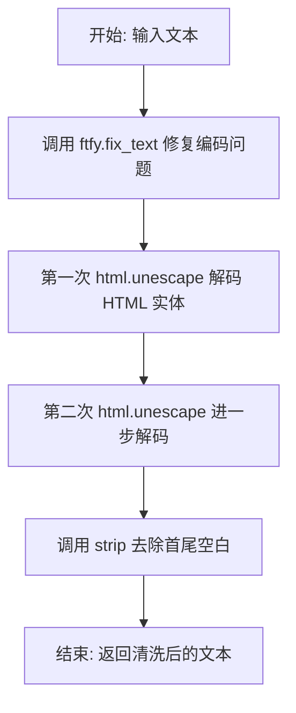

#### 带注释源码

```python
def basic_clean(text):
    """
    对文本进行基本清洗处理
    
    该函数执行以下操作:
    1. 使用 ftfy 库修复文本编码问题（如乱码、错误的编码转换等）
    2. 两次调用 html.unescape 解码 HTML 实体（如 &amp; -> &, &lt; -> < 等）
    3. 去除文本首尾的空白字符
    
    Args:
        text: 需要清洗的原始文本字符串
        
    Returns:
        清洗处理后的文本字符串
    """
    # Step 1: 使用 ftfy.fix_text 修复常见的文本编码问题
    # 例如修复 mojibake（乱码）现象，如 µ → μ 的转换
    text = ftfy.fix_text(text)
    
    # Step 2: 第一次解码 HTML 实体
    # 例如: '&amp;lt;' -> '&lt;'
    text = html.unescape(text)
    
    # Step 3: 第二次解码 HTML 实体，处理嵌套的实体编码
    # 例如: '&lt;' -> '<'
    text = html.unescape(text)
    
    # Step 4: 去除文本首尾的空白字符（包括空格、换行、制表符等）
    return text.strip()
```


### `whitespace_clean`

该函数用于清理文本中的多余空白字符，通过正则表达式将连续多个空白字符替换为单个空格，并去除字符串首尾的空白。

参数：

-  `text`：`str`，需要清理的文本字符串

返回值：`str`，清理空白字符后的文本字符串

#### 流程图

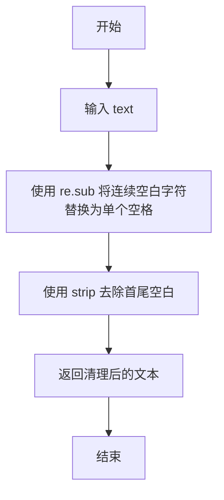

#### 带注释源码

```python
def whitespace_clean(text):
    """
    清理文本中的多余空白字符。
    
    该函数首先将文本中所有连续的空字符（如空格、制表符、换行符等）
    替换为单个空格，然后去除结果字符串首尾的空白字符。
    
    参数:
        text (str): 需要清理的文本字符串
        
    返回:
        str: 清理空白字符后的文本字符串
    """
    # 使用正则表达式将一个或多个连续空白字符 (\s+) 替换为单个空格 " "
    text = re.sub(r"\s+", " ", text)
    # 去除字符串首尾的空白字符
    text = text.strip()
    return text
```


### `prompt_clean`

该函数是文本预处理管道中的核心清理函数，用于对输入的提示文本进行规范化处理。它通过依次调用 `basic_clean` 和 `whitespace_clean` 两个辅助函数，先修复常见的文本编码问题（如 HTML 实体转义、ftfy 文本修复），再规范化空白字符（将多个连续空白字符合并为单个空格并去除首尾空白），从而确保输入文本的一致性和规范性。

参数：

- `text`：`str`，需要清理的原始文本字符串

返回值：`str`，清理和规范化的文本字符串

#### 流程图

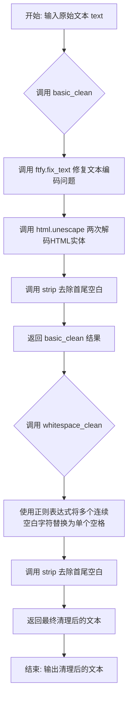

#### 带注释源码

```
def prompt_clean(text):
    """
    清理和规范化输入的提示文本。
    
    该函数是一个文本预处理管道，依次调用 basic_clean 和 whitespace_clean
    来完成两步清理过程：首先修复常见的文本编码问题，然后规范化空白字符。
    
    参数:
        text (str): 需要清理的原始文本字符串
        
    返回:
        str: 清理和规范化的文本字符串
    """
    # 第一步：调用 basic_clean 进行基本清理
    # - 使用 ftfy.fix_text 修复文本编码问题（如乱码、错误编码的字符）
    # - 使用 html.unescape 两次解码 HTML 实体（如 &amp; -> & -> &）
    # - 最后 strip 去除首尾空白字符
    text = basic_clean(text)
    
    # 第二步：调用 whitespace_clean 进行空白字符规范化
    # - 使用正则表达式将所有连续的多余空白字符（空格、制表符、换行等）
    #   替换为单个空格字符
    # - 最后 strip 去除首尾空白字符
    text = whitespace_clean(text)
    
    # 返回最终清理后的文本
    return text
```


### `retrieve_latents`

从编码器输出中提取潜在向量（latents），支持多种提取模式（采样或取模），是连接 VAE 编码器输出与扩散模型输入的关键工具函数。

参数：

-  `encoder_output`：`torch.Tensor`，编码器输出对象，可能包含 `latent_dist` 属性（潜在分布）或 `latents` 属性（直接潜在向量）
-  `generator`：`torch.Generator | None`，可选的 PyTorch 随机数生成器，用于潜在分布采样时的随机性控制
-  `sample_mode`：`str`，采样模式，"sample" 表示从分布中采样，"argmax" 表示取分布的众数（均值或最大值）

返回值：`torch.Tensor`，提取出的潜在向量张量

#### 流程图

```mermaid
flowchart TD
    A[开始: retrieve_latents] --> B{encoder_output 是否有<br/>latent_dist 属性?}
    B -->|是| C{sample_mode == "sample"?}
    B -->|否| D{encoder_output 是否有<br/>latents 属性?}
    C -->|是| E[返回 encoder_output.latent_dist.sample<br/>(generator)]
    C -->|否| F[返回 encoder_output.latent_dist.mode<br/>()]
    D -->|是| G[返回 encoder_output.latents]
    D -->|否| H[抛出 AttributeError 异常]
    
    E --> I[结束]
    F --> I
    G --> I
    H --> I
```

#### 带注释源码

```python
# Copied from diffusers.pipelines.stable_diffusion.pipeline_stable_diffusion_img2img.retrieve_latents
def retrieve_latents(
    encoder_output: torch.Tensor, generator: torch.Generator | None = None, sample_mode: str = "sample"
):
    """
    从编码器输出中提取潜在向量。
    
    支持三种提取方式：
    1. 从潜在分布中采样（sample模式）
    2. 从潜在分布中取众数/均值（argmax模式）
    3. 直接获取预计算的潜在向量（latents属性）
    
    参数:
        encoder_output: 编码器输出，包含 latent_dist 或 latents 属性
        generator: 可选的随机数生成器，用于采样时的随机性控制
        sample_mode: 采样模式，"sample" 或 "argmax"
    
    返回:
        提取出的潜在向量张量
    
    异常:
        AttributeError: 当无法从 encoder_output 中获取潜在向量时抛出
    """
    # 检查编码器输出是否包含潜在分布属性
    if hasattr(encoder_output, "latent_dist") and sample_mode == "sample":
        # 模式1: 从潜在分布中随机采样
        # 使用 generator 控制采样随机性（用于可复现生成）
        return encoder_output.latent_dist.sample(generator)
    elif hasattr(encoder_output, "latent_dist") and sample_mode == "argmax":
        # 模式2: 取潜在分布的众数（即概率最大的点）
        # 相当于取均值或 argmax，取决于分布类型
        return encoder_output.latent_dist.mode()
    elif hasattr(encoder_output, "latents"):
        # 模式3: 直接返回预计算的潜在向量
        # 适用于编码器直接输出潜在向量的情况
        return encoder_output.latents
    else:
        # 无法识别有效的潜在向量格式
        raise AttributeError("Could not access latents of provided encoder_output")
```


### `SkyReelsV2ImageToVideoPipeline.__init__`

这是 SkyReelsV2ImageToVideoPipeline 类的构造函数，用于初始化图像到视频生成管道。它接收多个核心组件（tokenizer、text_encoder、image_encoder、transformer、vae、scheduler 等），通过 `register_modules` 方法注册这些模块，并计算 VAE 的时空缩放因子，同时初始化视频和图像处理器。

参数：

- `self`：隐式参数，表示类的实例本身
- `tokenizer`：`AutoTokenizer`，T5 分词器，用于将文本提示编码为 token 序列
- `text_encoder`：`UMT5EncoderModel`，T5 文本编码器模型，用于生成文本嵌入
- `image_encoder`：`CLIPVisionModelWithProjection`，CLIP 图像编码器，用于生成图像嵌入
- `image_processor`：`CLIPProcessor`，CLIP 图像处理器，用于预处理输入图像
- `transformer`：`SkyReelsV2Transformer3DModel`，条件 Transformer 模型，用于去噪潜在表示
- `vae`：`AutoencoderKLWan`，VAE 模型，用于编码和解码视频到潜在表示
- `scheduler`：`UniPCMultistepScheduler`，多步调度器，用于去噪过程

返回值：`None`，构造函数不返回值，仅初始化实例属性

#### 流程图

```mermaid
flowchart TD
    A[开始 __init__] --> B[调用 super().__init__]
    B --> C[register_modules 注册所有模块]
    C --> D{检查 vae 是否存在}
    D -->|是| E[计算 vae_scale_factor_temporal]
    D -->|否| F[使用默认值 4]
    E --> G[计算 vae_scale_factor_spatial]
    F --> G
    G --> H[创建 VideoProcessor]
    H --> I[设置 self.image_processor]
    I --> J[结束 __init__]
```

#### 带注释源码

```python
def __init__(
    self,
    tokenizer: AutoTokenizer,
    text_encoder: UMT5EncoderModel,
    image_encoder: CLIPVisionModelWithProjection,
    image_processor: CLIPProcessor,
    transformer: SkyReelsV2Transformer3DModel,
    vae: AutoencoderKLWan,
    scheduler: UniPCMultistepScheduler,
):
    """
    初始化 SkyReelsV2ImageToVideoPipeline 管道
    
    Args:
        tokenizer: T5 分词器
        text_encoder: T5 文本编码器
        image_encoder: CLIP 图像编码器
        image_processor: CLIP 图像处理器
        transformer: SkyReels-V2 3D Transformer 模型
        vae: Wan VAE 模型
        scheduler: UniPC 多步调度器
    """
    # 调用父类 DiffusionPipeline 的初始化方法
    super().__init__()

    # 将所有模块注册到管道中，便于后续管理和访问
    self.register_modules(
        vae=vae,
        text_encoder=text_encoder,
        tokenizer=tokenizer,
        image_encoder=image_encoder,
        transformer=transformer,
        scheduler=scheduler,
        image_processor=image_processor,
    )

    # 计算 VAE 的时间下采样因子
    # 基于 VAE 的 temporal_downsample 属性计算 2 的幂次
    self.vae_scale_factor_temporal = 2 ** sum(self.vae.temperal_downsample) if getattr(self, "vae", None) else 4
    
    # 计算 VAE 的空间下采样因子
    # 基于 temporal_downsample 列表的长度计算 2 的幂次
    self.vae_scale_factor_spatial = 2 ** len(self.vae.temperal_downsample) if getattr(self, "vae", None) else 8
    
    # 初始化视频处理器，用于预处理视频和后处理生成结果
    self.video_processor = VideoProcessor(vae_scale_factor=self.vae_scale_factor_spatial)
    
    # 保存图像处理器引用，用于预处理输入图像
    self.image_processor = image_processor
```


### `SkyReelsV2ImageToVideoPipeline._get_t5_prompt_embeds`

该方法用于将文本提示（prompt）编码为T5文本编码器的隐藏状态嵌入（hidden state embeddings），支持批量处理和每个提示生成多个视频的场景。

参数：

- `prompt`：`str | list[str]`，要编码的文本提示，可以是单个字符串或字符串列表
- `num_videos_per_prompt`：`int`，每个提示要生成的视频数量，默认为1
- `max_sequence_length`：`int`，文本序列的最大长度，默认为512
- `device`：`torch.device | None`，执行设备，如果为None则使用`self._execution_device`
- `dtype`：`torch.dtype | None`，输出的数据类型，如果为None则使用`self.text_encoder.dtype`

返回值：`torch.Tensor`，返回编码后的文本嵌入，形状为`(batch_size * num_videos_per_prompt, seq_len, hidden_dim)`

#### 流程图

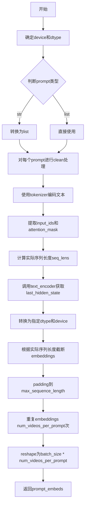

#### 带注释源码

```python
def _get_t5_prompt_embeds(
    self,
    prompt: str | list[str] = None,
    num_videos_per_prompt: int = 1,
    max_sequence_length: int = 512,
    device: torch.device | None = None,
    dtype: torch.dtype | None = None,
):
    # 确定执行设备，默认为execution_device
    device = device or self._execution_device
    # 确定数据类型，默认为text_encoder的数据类型
    dtype = dtype or self.text_encoder.dtype

    # 将单个字符串转换为列表，便于批量处理
    prompt = [prompt] if isinstance(prompt, str) else prompt
    # 对每个prompt进行清洗处理（去除多余空白字符等）
    prompt = [prompt_clean(u) for u in prompt]
    # 获取批处理大小
    batch_size = len(prompt)

    # 使用tokenizer对prompt进行编码
    text_inputs = self.tokenizer(
        prompt,
        padding="max_length",          # 填充到最大长度
        max_length=max_sequence_length, # 最大序列长度
        truncation=True,                # 超过最大长度进行截断
        add_special_tokens=True,        # 添加特殊token（如BOS/EOS）
        return_attention_mask=True,     # 返回attention mask
        return_tensors="pt",            # 返回PyTorch张量
    )
    # 提取input_ids和attention_mask
    text_input_ids, mask = text_inputs.input_ids, text_inputs.attention_mask
    # 计算每个序列的实际长度（非padding部分）
    seq_lens = mask.gt(0).sum(dim=1).long()

    # 调用T5 text_encoder获取隐藏状态
    prompt_embeds = self.text_encoder(text_input_ids.to(device), mask.to(device)).last_hidden_state
    # 转换为指定的dtype和device
    prompt_embeds = prompt_embeds.to(dtype=dtype, device=device)
    # 根据实际序列长度截断embeddings，去除padding部分
    prompt_embeds = [u[:v] for u, v in zip(prompt_embeds, seq_lens)]
    # 对每个embedding进行padding，使其长度统一为max_sequence_length
    prompt_embeds = torch.stack(
        [torch.cat([u, u.new_zeros(max_sequence_length - u.size(0), u.size(1))]) for u in prompt_embeds], dim=0
    )

    # 为每个prompt生成多个视频而复制text embeddings（使用MPS友好的方法）
    _, seq_len, _ = prompt_embeds.shape
    # 在序列维度上重复embeddings
    prompt_embeds = prompt_embeds.repeat(1, num_videos_per_prompt, 1)
    # reshape为(batch_size * num_videos_per_prompt, seq_len, hidden_dim)
    prompt_embeds = prompt_embeds.view(batch_size * num_videos_per_prompt, seq_len, -1)

    return prompt_embeds
```


### `SkyReelsV2ImageToVideoPipeline.encode_image`

该方法负责将输入图像编码为图像嵌入向量（image embeddings），供后续的视频生成过程使用。它使用 CLIP 图像编码器（image_encoder）提取图像特征，并返回倒数第二层的隐藏状态作为条件信息输入到 Transformer 模型中。

参数：

- `self`：类实例方法，指向 `SkyReelsV2ImageToVideoPipeline` 类的实例
- `image`：`PipelineImageInput` 类型，输入的图像数据，支持 `torch.Tensor`、`PIL.Image.Image` 或图像列表
- `device`：`torch.device | None`，可选参数，指定执行计算的设备；如果为 `None`，则使用实例的默认执行设备

返回值：`torch.Tensor`，返回 CLIP 图像编码器的倒数第二层隐藏状态（hidden states），该嵌入向量将作为图像条件信息用于后续的去噪过程

#### 流程图

```mermaid
flowchart TD
    A[开始 encode_image] --> B{device 参数是否为空?}
    B -- 是 --> C[使用 self._execution_device]
    B -- 否 --> D[使用传入的 device]
    C --> E[调用 image_processor 处理图像]
    D --> E
    E --> F[将图像转换为 PyTorch 张量并移动到指定设备]
    F --> G[调用 image_encoder 编码图像]
    G --> H[设置 output_hidden_states=True 获取所有隐藏层]
    H --> I[返回倒数第二层隐藏状态 hidden_states[-2]]
    I --> J[结束 encode_image]
```

#### 带注释源码

```python
# Copied from diffusers.pipelines.wan.pipeline_wan_i2v.WanImageToVideoPipeline.encode_image
def encode_image(
    self,
    image: PipelineImageInput,
    device: torch.device | None = None,
):
    """
    将输入图像编码为图像嵌入向量。

    Args:
        image: 输入的图像数据，支持 torch.Tensor、PIL.Image.Image 或图像列表
        device: 可选的计算设备，如果为 None 则使用默认执行设备

    Returns:
        torch.Tensor: 图像编码器输出的倒数第二层隐藏状态，作为图像条件嵌入
    """
    # 确定计算设备：如果未指定，则使用 pipeline 实例的默认执行设备
    device = device or self._execution_device
    
    # 使用图像预处理器将 PIL 图像或图像列表转换为模型所需的张量格式
    # return_tensors="pt" 表示返回 PyTorch 张量
    image = self.image_processor(images=image, return_tensors="pt").to(device)
    
    # 调用 CLIP 图像编码器进行编码
    # output_hidden_states=True 使编码器返回所有层的隐藏状态，而不仅仅是最后一层的输出
    image_embeds = self.image_encoder(**image, output_hidden_states=True)
    
    # 返回倒数第二层的隐藏状态（hidden_states[-2]）
    # 在 CLIP 模型中，通常使用倒数第二层的特征效果更好，因为最后一层可能过于拟合任务
    # 该嵌入向量将作为图像条件信息传入 Transformer 进行去噪处理
    return image_embeds.hidden_states[-2]
```


### `SkyReelsV2ImageToVideoPipeline.encode_prompt`

该方法负责将文本提示（prompt）和负向提示（negative_prompt）编码为文本编码器的隐藏状态（hidden states），支持 Classifier-Free Guidance（CFG）技术，可在有或无预生成嵌入的情况下工作。

参数：

- `self`：`SkyReelsV2ImageToVideoPipeline` 类的实例方法
- `prompt`：`str | list[str]`，要编码的文本提示，可以是单个字符串或字符串列表
- `negative_prompt`：`str | list[str] | None`，不希望出现的负向提示，用于引导生成，当不使用 CFG（guidance_scale < 1）时被忽略
- `do_classifier_free_guidance`：`bool`，是否使用 Classifier-Free Guidance，默认为 True
- `num_videos_per_prompt`：`int`，每个提示生成的视频数量，默认为 1
- `prompt_embeds`：`torch.Tensor | None`，预生成的文本嵌入，可用于轻松调整文本输入（如提示加权），如果未提供则从 `prompt` 生成
- `negative_prompt_embeds`：`torch.Tensor | None`，预生成的负向文本嵌入，如果未提供则从 `negative_prompt` 生成
- `max_sequence_length`：`int`，提示的最大序列长度，默认为 226
- `device`：`torch.device | None`，用于放置结果嵌入的 torch 设备，如果未提供则使用执行设备
- `dtype`：`torch.dtype | None`，结果嵌入的 torch 数据类型，如果未提供则使用文本编码器的数据类型

返回值：`tuple[torch.Tensor, torch.Tensor]`，返回元组包含 (prompt_embeds, negative_prompt_embeds)，即编码后的正向提示嵌入和负向提示嵌入

#### 流程图

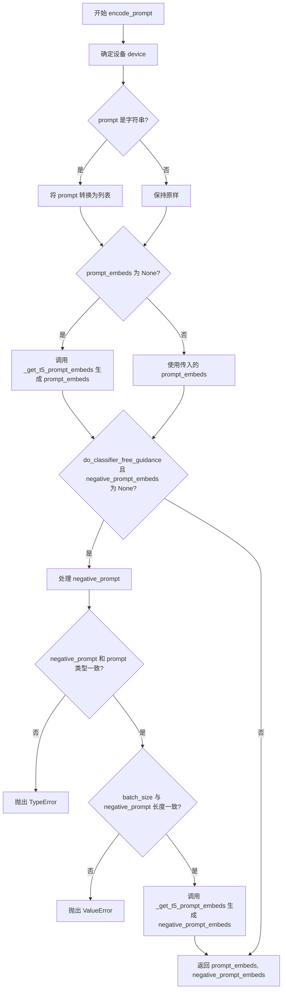

#### 带注释源码

```python
def encode_prompt(
    self,
    prompt: str | list[str],
    negative_prompt: str | list[str] | None = None,
    do_classifier_free_guidance: bool = True,
    num_videos_per_prompt: int = 1,
    prompt_embeds: torch.Tensor | None = None,
    negative_prompt_embeds: torch.Tensor | None = None,
    max_sequence_length: int = 226,
    device: torch.device | None = None,
    dtype: torch.dtype | None = None,
):
    r"""
    Encodes the prompt into text encoder hidden states.

    Args:
        prompt (`str` or `list[str]`, *optional*):
            prompt to be encoded
        negative_prompt (`str` or `list[str]`, *optional*):
            The prompt or prompts not to guide the image generation. If not defined, one has to pass
            `negative_prompt_embeds` instead. Ignored when not using guidance (i.e., ignored if `guidance_scale` is
            less than `1`).
        do_classifier_free_guidance (`bool`, *optional*, defaults to `True`):
            Whether to use classifier free guidance or not.
        num_videos_per_prompt (`int`, *optional*, defaults to 1):
            Number of videos that should be generated per prompt. torch device to place the resulting embeddings on
        prompt_embeds (`torch.Tensor`, *optional*):
            Pre-generated text embeddings. Can be used to easily tweak text inputs, *e.g.* prompt weighting. If not
            provided, text embeddings will be generated from `prompt` input argument.
        negative_prompt_embeds (`torch.Tensor`, *optional*):
            Pre-generated negative text embeddings. Can be used to easily tweak text inputs, *e.g.* prompt
            weighting. If not provided, negative_prompt_embeds will be generated from `negative_prompt` input
            argument.
        device: (`torch.device`, *optional*):
            torch device
        dtype: (`torch.dtype`, *optional*):
            torch dtype
    """
    # 确定设备：如果未提供则使用执行设备
    device = device or self._execution_device

    # 处理 prompt：如果为字符串则转换为单元素列表，保持一致性
    prompt = [prompt] if isinstance(prompt, str) else prompt
    
    # 确定 batch_size：根据 prompt 或已存在的 prompt_embeds 确定
    if prompt is not None:
        batch_size = len(prompt)
    else:
        batch_size = prompt_embeds.shape[0]

    # 如果未提供 prompt_embeds，则从 prompt 生成
    if prompt_embeds is None:
        prompt_embeds = self._get_t5_prompt_embeds(
            prompt=prompt,
            num_videos_per_prompt=num_videos_per_prompt,
            max_sequence_length=max_sequence_length,
            device=device,
            dtype=dtype,
        )

    # 如果使用 CFG 且未提供 negative_prompt_embeds，则生成负向嵌入
    if do_classifier_free_guidance and negative_prompt_embeds is None:
        # 处理 negative_prompt：空字符串或列表
        negative_prompt = negative_prompt or ""
        # 如果是字符串则扩展为 batch_size 长度的列表
        negative_prompt = batch_size * [negative_prompt] if isinstance(negative_prompt, str) else negative_prompt

        # 类型检查：negative_prompt 与 prompt 类型必须一致
        if prompt is not None and type(prompt) is not type(negative_prompt):
            raise TypeError(
                f"`negative_prompt` should be the same type to `prompt`, but got {type(negative_prompt)} !="
                f" {type(prompt)}."
            )
        # batch_size 检查：两者必须一致
        elif batch_size != len(negative_prompt):
            raise ValueError(
                f"`negative_prompt`: {negative_prompt} has batch size {len(negative_prompt)}, but `prompt`:"
                f" {prompt} has batch size {batch_size}. Please make sure that passed `negative_prompt` matches"
                " the batch size of `prompt`."
            )

        # 从 negative_prompt 生成嵌入
        negative_prompt_embeds = self._get_t5_prompt_embeds(
            prompt=negative_prompt,
            num_videos_per_prompt=num_videos_per_prompt,
            max_sequence_length=max_sequence_length,
            device=device,
            dtype=dtype,
        )

    # 返回正向和负向提示嵌入
    return prompt_embeds, negative_prompt_embeds
```


### `SkyReelsV2ImageToVideoPipeline.check_inputs`

该方法负责验证图像到视频生成管道的输入参数合法性，确保用户提供的prompt、image、height、width等参数满足模型要求，并在参数不合规时抛出明确的错误信息。

参数：

- `self`：`SkyReelsV2ImageToVideoPipeline`，Pipeline实例本身
- `prompt`：`str | list[str] | None`，用于引导视频生成的文本提示，可为单字符串或字符串列表
- `negative_prompt`：`str | list[str] | None`，用于引导视频生成的反向文本提示，可为单字符串或字符串列表
- `image`：`PipelineImageInput | None`，条件图像输入，可为torch.Tensor、PIL.Image.Image或图像列表
- `height`：`int`，生成视频的高度，必须能被16整除
- `width`：`int`，生成视频的宽度，必须能被16整除
- `prompt_embeds`：`torch.Tensor | None`，预生成的文本嵌入向量，与prompt二选一使用
- `negative_prompt_embeds`：`torch.Tensor | None`，预生成的负向文本嵌入向量
- `image_embeds`：`torch.Tensor | None`，预生成的图像嵌入向量，与image二选一使用
- `callback_on_step_end_tensor_inputs`：`list[str] | None`，每步结束时回调函数需要接收的tensor输入列表

返回值：`None`，该方法不返回任何值，仅通过抛出ValueError来指示参数错误

#### 流程图

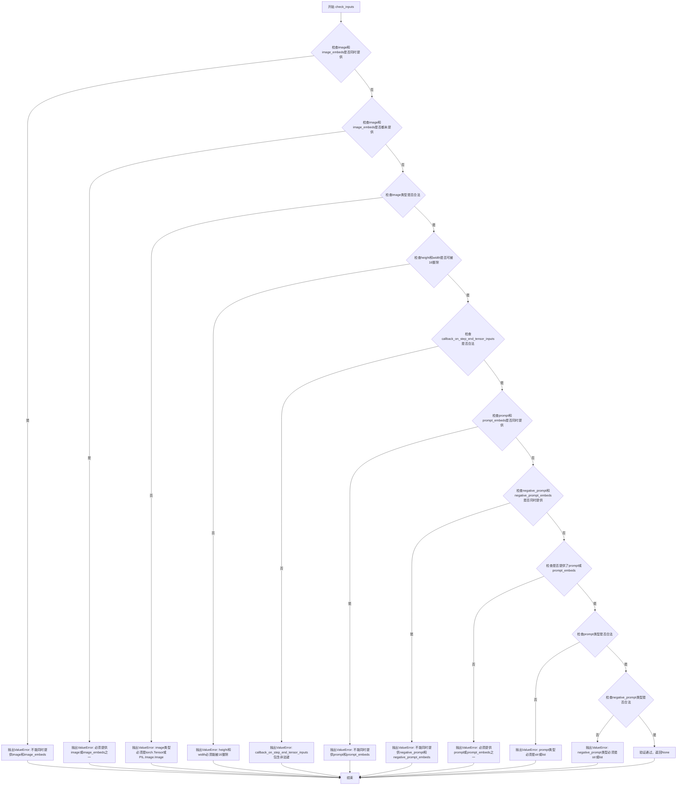

#### 带注释源码

```python
def check_inputs(
    self,
    prompt,
    negative_prompt,
    image,
    height,
    width,
    prompt_embeds=None,
    negative_prompt_embeds=None,
    image_embeds=None,
    callback_on_step_end_tensor_inputs=None,
):
    # 检查1: image和image_embeds不能同时提供，只能二选一
    if image is not None and image_embeds is not None:
        raise ValueError(
            f"Cannot forward both `image`: {image} and `image_embeds`: {image_embeds}. Please make sure to"
            " only forward one of the two."
        )
    
    # 检查2: image和image_embeds至少要提供一个，不能都为空
    if image is None and image_embeds is None:
        raise ValueError(
            "Provide either `image` or `prompt_embeds`. Cannot leave both `image` and `image_embeds` undefined."
        )
    
    # 检查3: image的类型必须是torch.Tensor或PIL.Image.Image之一
    if image is not None and not isinstance(image, torch.Tensor) and not isinstance(image, PIL.Image.Image):
        raise ValueError(f"`image` has to be of type `torch.Tensor` or `PIL.Image.Image` but is {type(image)}")
    
    # 检查4: height和width必须能被16整除，因为VAE的解码过程需要这个约束
    if height % 16 != 0 or width % 16 != 0:
        raise ValueError(f"`height` and `width` have to be divisible by 16 but are {height} and {width}.")

    # 检查5: callback_on_step_end_tensor_inputs中的所有键必须都在允许列表中
    if callback_on_step_end_tensor_inputs is not None and not all(
        k in self._callback_tensor_inputs for k in callback_on_step_end_tensor_inputs
    ):
        raise ValueError(
            f"`callback_on_step_end_tensor_inputs` has to be in {self._callback_tensor_inputs}, but found {[k for k in callback_on_step_end_tensor_inputs if k not in self._callback_tensor_inputs]}"
        )

    # 检查6: prompt和prompt_embeds不能同时提供
    if prompt is not None and prompt_embeds is not None:
        raise ValueError(
            f"Cannot forward both `prompt`: {prompt} and `prompt_embeds`: {prompt_embeds}. Please make sure to"
            " only forward one of the two."
        )
    
    # 检查7: negative_prompt和negative_prompt_embeds不能同时提供
    elif negative_prompt is not None and negative_prompt_embeds is not None:
        raise ValueError(
            f"Cannot forward both `negative_prompt`: {negative_prompt} and `negative_prompt_embeds`: {negative_prompt_embeds}. Please make sure to"
            " only forward one of the two."
        )
    
    # 检查8: prompt或prompt_embeds至少要提供一个
    elif prompt is None and prompt_embeds is None:
        raise ValueError(
            "Provide either `prompt` or `prompt_embeds`. Cannot leave both `prompt` and `prompt_embeds` undefined."
        )
    
    # 检查9: prompt的类型必须是str或list
    elif prompt is not None and (not isinstance(prompt, str) and not isinstance(prompt, list)):
        raise ValueError(f"`prompt` has to be of type `str` or `list` but is {type(prompt)}")
    
    # 检查10: negative_prompt的类型必须是str或list（如果提供了的话）
    elif negative_prompt is not None and (
        not isinstance(negative_prompt, str) and not isinstance(negative_prompt, list)
    ):
        raise ValueError(f"`negative_prompt` has to be of type `str` or `list` but is {type(negative_prompt)}")
```


### `SkyReelsV2ImageToVideoPipeline.prepare_latents`

该方法用于准备图像到视频生成的潜在变量（latents）和条件信息。它根据输入图像和视频参数计算潜在空间的形状，生成或处理随机潜在变量，对输入图像进行VAE编码以生成条件潜在表示，并创建用于控制帧生成的掩码。最终返回处理后的潜在变量和包含掩码与条件潜在表示的元组。

参数：

- `self`：`SkyReelsV2ImageToVideoPipeline` 类实例
- `image`：`PipelineImageInput`，输入的图像，用于条件生成视频
- `batch_size`：`int`，批次大小
- `num_channels_latents`：`int`，潜在变量的通道数，默认为16
- `height`：`int`，生成视频的高度，默认为480
- `width`：`int`，生成视频的宽度，默认为832
- `num_frames`：`int`，生成视频的帧数，默认为81
- `dtype`：`torch.dtype | None`，潜在变量的数据类型
- `device`：`torch.device | None`，计算设备
- `generator`：`torch.Generator | list[torch.Generator] | None`，随机数生成器，用于确保可重复性
- `latents`：`torch.Tensor | None`，预生成的潜在变量，如果为None则随机生成
- `last_image`：`torch.Tensor | None`，可选的最后一帧图像，用于视频延续

返回值：`tuple[torch.Tensor, torch.Tensor]`，返回两个张量——第一个是处理后的潜在变量（latents），第二个是连接了掩码和条件潜在表示的张量（condition）

#### 流程图

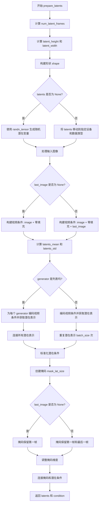

#### 带注释源码

```python
def prepare_latents(
    self,
    image: PipelineImageInput,
    batch_size: int,
    num_channels_latents: int = 16,
    height: int = 480,
    width: int = 832,
    num_frames: int = 81,
    dtype: torch.dtype | None = None,
    device: torch.device | None = None,
    generator: torch.Generator | list[torch.Generator] | None = None,
    latents: torch.Tensor | None = None,
    last_image: torch.Tensor | None = None,
) -> tuple[torch.Tensor, torch.Tensor]:
    """
    准备图像到视频生成的潜在变量和条件信息。
    
    该方法执行以下主要步骤：
    1. 计算潜在空间的维度（考虑VAE的时间下采样因子）
    2. 生成或处理随机潜在变量
    3. 将输入图像转换为视频条件表示
    4. 对视频条件进行VAE编码和标准化
    5. 创建帧掩码以控制哪些帧需要生成
    
    Args:
        image: 输入图像
        batch_size: 批次大小
        num_channels_latents: 潜在变量通道数
        height: 目标高度
        width: 目标宽度
        num_frames: 目标帧数
        dtype: 数据类型
        device: 计算设备
        generator: 随机数生成器
        latents: 预生成潜在变量
        last_image: 可选的最后一帧图像
    
    Returns:
        (latents, condition): 潜在变量和条件信息的元组
    """
    # ============ 步骤1: 计算潜在空间维度 ============
    # 计算潜在帧数，考虑VAE的时间下采样因子
    # 例如：如果vae_scale_factor_temporal=4, num_frames=81, 则num_latent_frames=21
    num_latent_frames = (num_frames - 1) // self.vae_scale_factor_temporal + 1
    
    # 计算潜在空间的高度和宽度（考虑VAE的空间下采样因子）
    latent_height = height // self.vae_scale_factor_spatial
    latent_width = width // self.vae_scale_factor_spatial

    # ============ 步骤2: 构建潜在变量形状 ============
    # 形状: [batch, channels, temporal_frames, height, width]
    shape = (batch_size, num_channels_latents, num_latent_frames, latent_height, latent_width)
    
    # 验证generator列表长度与batch_size匹配
    if isinstance(generator, list) and len(generator) != batch_size:
        raise ValueError(
            f"You have passed a list of generators of length {len(generator)}, but requested an effective batch"
            f" size of {batch_size}. Make sure the batch size matches the length of the generators."
        )

    # ============ 步骤3: 生成或处理潜在变量 ============
    if latents is None:
        # 如果未提供潜在变量，则使用randn_tensor生成随机噪声
        latents = randn_tensor(shape, generator=generator, device=device, dtype=dtype)
    else:
        # 将预提供的潜在变量移动到指定设备和数据类型
        latents = latents.to(device=device, dtype=dtype)

    # ============ 步骤4: 构建视频条件 ============
    # 为图像添加时间维度: [B, C, H, W] -> [B, C, 1, H, W]
    image = image.unsqueeze(2)
    
    if last_image is None:
        # 如果没有最后一帧，创建视频条件：原始图像 + 零填充的后续帧
        # 形状: [B, C, 1, H, W] + [B, C, num_frames-1, H, W] -> [B, C, num_frames, H, W]
        video_condition = torch.cat(
            [image, image.new_zeros(image.shape[0], image.shape[1], num_frames - 1, height, width)], dim=2
        )
    else:
        # 如果有最后一帧，添加在最后
        last_image = last_image.unsqueeze(2)
        video_condition = torch.cat(
            [image, image.new_zeros(image.shape[0], image.shape[1], num_frames - 2, height, width), last_image],
            dim=2,
        )
    
    # 将视频条件移动到VAE的设备和数据类型
    video_condition = video_condition.to(device=device, dtype=self.vae.dtype)

    # ============ 步骤5: 计算标准化参数 ============
    # 从VAE配置中获取latents的均值和标准差，用于标准化
    # 形状调整: [z_dim] -> [1, z_dim, 1, 1, 1]
    latents_mean = (
        torch.tensor(self.vae.config.latents_mean)
        .view(1, self.vae.config.z_dim, 1, 1, 1)
        .to(latents.device, latents.dtype)
    )
    latents_std = 1.0 / torch.tensor(self.vae.config.latents_std).view(1, self.vae.config.z_dim, 1, 1, 1).to(
        latents.device, latents.dtype
    )

    # ============ 步骤6: 编码视频条件 ============
    if isinstance(generator, list):
        # 如果有多个generator，为每个生成一个条件潜在表示
        latent_condition = [
            retrieve_latents(self.vae.encode(video_condition), sample_mode="argmax") for _ in generator
        ]
        latent_condition = torch.cat(latent_condition)
    else:
        # 单一generator情况
        # 使用VAE编码视频条件，并通过retrieve_latents获取潜在表示
        # sample_mode="argmax" 表示使用确定性采样（取分布的mode而非sample）
        latent_condition = retrieve_latents(self.vae.encode(video_condition), sample_mode="argmax")
        # 重复潜在表示以匹配batch_size
        latent_condition = latent_condition.repeat(batch_size, 1, 1, 1, 1)

    # ============ 步骤7: 标准化潜在条件 ============
    # 使用 (x - mean) * std 进行标准化（注意：这里是乘std而非除）
    latent_condition = latent_condition.to(dtype)
    latent_condition = (latent_condition - latents_mean) * latents_std

    # ============ 步骤8: 创建帧掩码 ============
    # 掩码用于指示哪些帧是已知的（需要保留）vs 需要生成的
    # 初始掩码：所有帧设为1
    mask_lat_size = torch.ones(batch_size, 1, num_frames, latent_height, latent_width)

    if last_image is None:
        # 只有一个输入图像（第一帧），只有第一帧是需要保留的
        mask_lat_size[:, :, list(range(1, num_frames))] = 0
    else:
        # 有输入图像和最后一帧，保留第一帧和最后一帧
        mask_lat_size[:, :, list(range(1, num_frames - 1))] = 0
    
    # 提取第一帧掩码并进行时间维度扩展
    first_frame_mask = mask_lat_size[:, :, 0:1]
    first_frame_mask = torch.repeat_interleave(first_frame_mask, dim=2, repeats=self.vae_scale_factor_temporal)
    
    # 合并第一帧掩码和其余帧掩码
    mask_lat_size = torch.concat([first_frame_mask, mask_lat_size[:, :, 1:, :]], dim=2)
    
    # 调整形状以匹配潜在表示的维度顺序
    mask_lat_size = mask_lat_size.view(batch_size, -1, self.vae_scale_factor_temporal, latent_height, latent_width)
    mask_lat_size = mask_lat_size.transpose(1, 2)
    mask_lat_size = mask_lat_size.to(latent_condition.device)

    # ============ 步骤9: 返回结果 ============
    # 返回潜在变量和条件（掩码 + 潜在条件表示）
    return latents, torch.concat([mask_lat_size, latent_condition], dim=1)
```


### `SkyReelsV2ImageToVideoPipeline.__call__`

这是SkyReels-V2图像到视频（I2V）生成管道的主入口方法，接收图像和文本提示作为输入，通过多步去噪过程生成对应的视频序列。该方法整合了T5文本编码器、CLIP图像编码器、3D Transformer模型和VAE解码器，实现了从静态图像到动态视频的条件生成。

参数：

- `image`：`PipelineImageInput`，输入图像，用于条件视频生成。可以是单个图像、图像列表或torch.Tensor。
- `prompt`：`str | list[str]`，指导视频生成的文本提示。如果未定义，则必须传入`prompt_embeds`。
- `negative_prompt`：`str | list[str]`，不用于指导视频生成的提示。当guidance_scale < 1时被忽略。
- `height`：`int`，默认544，生成视频的高度。
- `width`：`int`，默认960，生成视频的宽度。
- `num_frames`：`int`，默认97，生成视频的帧数。
- `num_inference_steps`：`int`，默认50，去噪步数。更多步数通常能生成更高质量的视频，但推理速度更慢。
- `guidance_scale`：`float`，默认5.0，分类器自由扩散引导（CFG）中的引导尺度。值越大生成的视频与文本提示关联越紧密。
- `num_videos_per_prompt`：`int`，默认1，每个提示生成的视频数量。
- `generator`：`torch.Generator | list[torch.Generator]`，用于使生成具有确定性的随机生成器。
- `latents`：`torch.Tensor`，预生成的噪声潜在向量，可用于通过不同提示微调相同生成。
- `prompt_embeds`：`torch.Tensor`，预生成的文本嵌入，用于轻松调整文本输入。
- `negative_prompt_embeds`：`torch.Tensor`，预生成的负面文本嵌入。
- `image_embeds`：`torch.Tensor`，预生成的图像嵌入，用于轻松调整图像输入。
- `last_image`：`torch.Tensor`，最后一帧图像，用于视频延续任务。
- `output_type`：`str`，默认"np"，生成视频的输出格式，可选"PIL.Image"或"np.array"。
- `return_dict`：`bool`，默认True，是否返回SkyReelsV2PipelineOutput而不是元组。
- `attention_kwargs`：`dict`，传递给AttentionProcessor的参数字典。
- `callback_on_step_end`：`Callable | PipelineCallback | MultiPipelineCallbacks`，每个去噪步骤结束时调用的回调函数。
- `callback_on_step_end_tensor_inputs`：`list`，回调函数使用的张量输入列表。
- `max_sequence_length`：`int`，默认512，提示的最大序列长度。

返回值：`SkyReelsV2PipelineOutput | tuple`，如果return_dict为True，返回SkyReelsV2PipelineOutput（包含生成的视频帧列表），否则返回元组。

#### 流程图

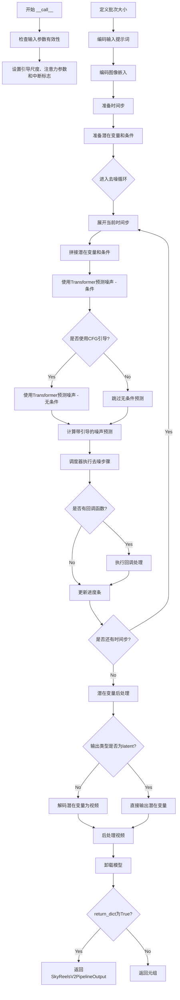

#### 带注释源码

```python
@torch.no_grad()
@replace_example_docstring(EXAMPLE_DOC_STRING)
def __call__(
    self,
    image: PipelineImageInput,  # 输入图像，用于条件视频生成
    prompt: str | list[str] = None,  # 文本提示
    negative_prompt: str | list[str] = None,  # 负面提示
    height: int = 544,  # 生成视频高度
    width: int = 960,  # 生成视频宽度
    num_frames: int = 97,  # 帧数
    num_inference_steps: int = 50,  # 去噪步数
    guidance_scale: float = 5.0,  # CFG引导尺度
    num_videos_per_prompt: int | None = 1,  # 每个提示生成的视频数
    generator: torch.Generator | list[torch.Generator] | None = None,  # 随机生成器
    latents: torch.Tensor | None = None,  # 预定义潜在向量
    prompt_embeds: torch.Tensor | None = None,  # 预生成文本嵌入
    negative_prompt_embeds: torch.Tensor | None = None,  # 预生成负面文本嵌入
    image_embeds: torch.Tensor | None = None,  # 预生成图像嵌入
    last_image: torch.Tensor | None = None,  # 最后一帧图像（用于视频延续）
    output_type: str | None = "np",  # 输出格式
    return_dict: bool = True,  # 是否返回字典格式
    attention_kwargs: dict[str, Any] | None = None,  # 注意力参数字典
    callback_on_step_end: Callable[[int, int], None] | PipelineCallback | MultiPipelineCallbacks | None = None,  # 步骤结束回调
    callback_on_step_end_tensor_inputs: list[str] = ["latents"],  # 回调张量输入列表
    max_sequence_length: int = 512,  # 最大序列长度
):
    # 处理回调函数的张量输入配置
    if isinstance(callback_on_step_end, (PipelineCallback, MultiPipelineCallbacks)):
        callback_on_step_end_tensor_inputs = callback_on_step_end.tensor_inputs

    # 1. 检查输入参数有效性，参数不正确时抛出错误
    self.check_inputs(
        prompt,
        negative_prompt,
        image,
        height,
        width,
        prompt_embeds,
        negative_prompt_embeds,
        image_embeds,
        callback_on_step_end_tensor_inputs,
    )

    # 验证帧数是否符合VAE时间下采样因子要求
    if num_frames % self.vae_scale_factor_temporal != 1:
        logger.warning(
            f"`num_frames - 1` has to be divisible by {self.vae_scale_factor_temporal}. Rounding to the nearest number."
        )
        num_frames = num_frames // self.vae_scale_factor_temporal * self.vae_scale_factor_temporal + 1
    num_frames = max(num_frames, 1)

    # 2. 设置调用参数：引导尺度、注意力参数、中断标志、当前时间步
    self._guidance_scale = guidance_scale
    self._attention_kwargs = attention_kwargs
    self._current_timestep = None
    self._interrupt = False

    device = self._execution_device  # 获取执行设备

    # 3. 根据输入确定批次大小
    if prompt is not None and isinstance(prompt, str):
        batch_size = 1
    elif prompt is not None and isinstance(prompt, list):
        batch_size = len(prompt)
    else:
        batch_size = prompt_embeds.shape[0]

    # 4. 编码输入提示词，生成文本嵌入
    prompt_embeds, negative_prompt_embeds = self.encode_prompt(
        prompt=prompt,
        negative_prompt=negative_prompt,
        do_classifier_free_guidance=self.do_classifier_free_guidance,
        num_videos_per_prompt=num_videos_per_prompt,
        prompt_embeds=prompt_embeds,
        negative_prompt_embeds=negative_prompt_embeds,
        max_sequence_length=max_sequence_length,
        device=device,
    )

    # 转换文本嵌入到Transformer数据类型
    transformer_dtype = self.transformer.dtype
    prompt_embeds = prompt_embeds.to(transformer_dtype)
    if negative_prompt_embeds is not None:
        negative_prompt_embeds = negative_prompt_embeds.to(transformer_dtype)

    # 5. 编码图像嵌入
    if image_embeds is None:
        if last_image is None:
            # 编码单张图像
            image_embeds = self.encode_image(image, device)
        else:
            # 编码图像和最后一帧（用于视频延续）
            image_embeds = self.encode_image([image, last_image], device)
    # 为每个批次复制图像嵌入
    image_embeds = image_embeds.repeat(batch_size, 1, 1)
    image_embeds = image_embeds.to(transformer_dtype)

    # 6. 准备时间步
    self.scheduler.set_timesteps(num_inference_steps, device=device)
    timesteps = self.scheduler.timesteps

    # 7. 准备潜在变量和条件
    num_channels_latents = self.vae.config.z_dim  # 获取潜在通道数
    # 预处理输入图像
    image = self.video_processor.preprocess(image, height=height, width=width).to(device, dtype=torch.float32)
    if last_image is not None:
        last_image = self.video_processor.preprocess(last_image, height=height, width=width).to(
            device, dtype=torch.float32
        )
    # 准备初始潜在变量和条件
    latents, condition = self.prepare_latents(
        image,
        batch_size * num_videos_per_prompt,
        num_channels_latents,
        height,
        width,
        num_frames,
        torch.float32,
        device,
        generator,
        latents,
        last_image,
    )

    # 8. 去噪循环
    num_warmup_steps = len(timesteps) - num_inference_steps * self.scheduler.order
    self._num_timesteps = len(timesteps)

    # 进度条显示
    with self.progress_bar(total=num_inference_steps) as progress_bar:
        for i, t in enumerate(timesteps):
            # 检查中断标志，允许外部中断生成
            if self.interrupt:
                continue

            self._current_timestep = t
            # 将潜在变量和条件拼接在一起
            latent_model_input = torch.cat([latents, condition], dim=1).to(transformer_dtype)
            timestep = t.expand(latents.shape[0])

            # 使用Transformer预测噪声 - 条件分支
            with self.transformer.cache_context("cond"):
                noise_pred = self.transformer(
                    hidden_states=latent_model_input,
                    timestep=timestep,
                    encoder_hidden_states=prompt_embeds,
                    encoder_hidden_states_image=image_embeds,
                    attention_kwargs=attention_kwargs,
                    return_dict=False,
                )[0]

            # 如果使用分类器自由引导，计算无条件预测
            if self.do_classifier_free_guidance:
                with self.transformer.cache_context("uncond"):
                    noise_uncond = self.transformer(
                        hidden_states=latent_model_input,
                        timestep=timestep,
                        encoder_hidden_states=negative_prompt_embeds,
                        encoder_hidden_states_image=image_embeds,
                        attention_kwargs=attention_kwargs,
                        return_dict=False,
                    )[0]
                # 应用CFG：noise_pred = noise_uncond + guidance_scale * (noise_pred - noise_uncond)
                noise_pred = noise_uncond + guidance_scale * (noise_pred - noise_uncond)

            # 使用调度器执行去噪步骤：从x_t计算x_{t-1}
            latents = self.scheduler.step(noise_pred, t, latents, return_dict=False)[0]

            # 步骤结束时的回调处理
            if callback_on_step_end is not None:
                callback_kwargs = {}
                for k in callback_on_step_end_tensor_inputs:
                    callback_kwargs[k] = locals()[k]
                callback_outputs = callback_on_step_end(self, i, t, callback_kwargs)

                # 从回调输出中提取更新后的张量
                latents = callback_outputs.pop("latents", latents)
                prompt_embeds = callback_outputs.pop("prompt_embeds", prompt_embeds)
                negative_prompt_embeds = callback_outputs.pop("negative_prompt_embeds", negative_prompt_embeds)

            # 进度条更新
            if i == len(timesteps) - 1 or ((i + 1) > num_warmup_steps and (i + 1) % self.scheduler.order == 0):
                progress_bar.update()

            # XLA设备特定优化
            if XLA_AVAILABLE:
                xm.mark_step()

    self._current_timestep = None

    # 9. 后处理潜在变量并解码为视频
    if not output_type == "latent":
        # 反标准化潜在变量
        latents = latents.to(self.vae.dtype)
        latents_mean = (
            torch.tensor(self.vae.config.latents_mean)
            .view(1, self.vae.config.z_dim, 1, 1, 1)
            .to(latents.device, latents.dtype)
        )
        latents_std = 1.0 / torch.tensor(self.vae.config.latents_std).view(1, self.vae.config.z_dim, 1, 1, 1).to(
            latents.device, latents.dtype
        )
        latents = latents / latents_std + latents_mean
        # 使用VAE解码潜在变量得到视频
        video = self.vae.decode(latents, return_dict=False)[0]
        video = self.video_processor.postprocess_video(video, output_type=output_type)
    else:
        video = latents

    # 10. 卸载所有模型，释放GPU内存
    self.maybe_free_model_hooks()

    # 11. 返回结果
    if not return_dict:
        return (video,)

    return SkyReelsV2PipelineOutput(frames=video)
```


### `SkyReelsV2ImageToVideoPipeline.guidance_scale`

这是一个只读属性（property），用于获取当前的 guidance_scale（引导尺度）值。guidance_scale 是分类器无引导扩散（Classifier-Free Diffusion Guidance）中的关键参数，用于控制生成内容与文本提示的匹配程度。

参数：无（此属性不接受任何参数）

返回值：`float`，返回当前设置的引导尺度值，用于控制图像/视频生成过程中文本提示的影响力。

#### 流程图

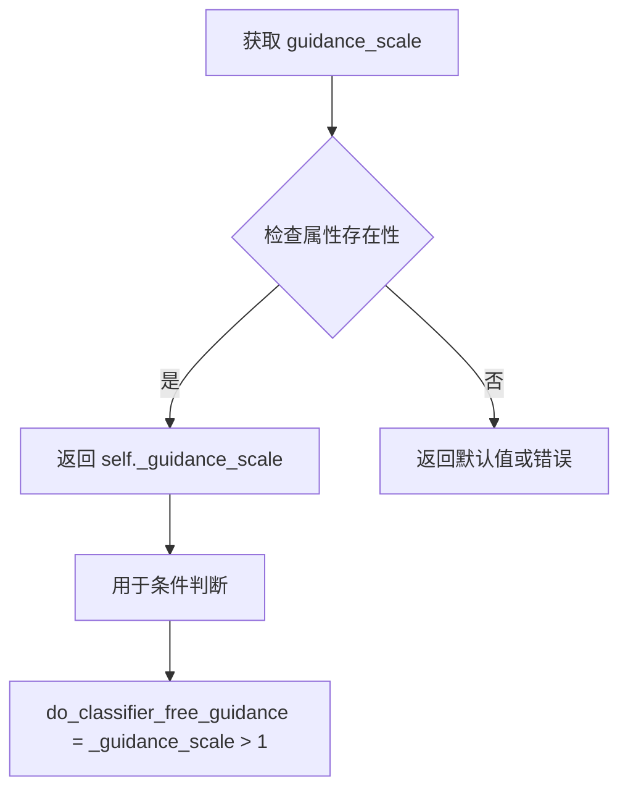

#### 带注释源码

```python
@property
def guidance_scale(self):
    """
    属性：guidance_scale（引导尺度）
    
    这是一个只读属性，用于获取分类器无引导扩散（Classifier-Free Diffusion Guidance）
    中的引导尺度值。该值在 __call__ 方法中被设置，用于控制文本提示对生成结果的影响力。
    
    较高的 guidance_scale 值会使生成的内容更紧密地跟随文本提示，
    但可能牺牲一些图像质量。较低的值则相反。
    
    返回:
        float: 当前的 guidance_scale 值
    """
    return self._guidance_scale
```

**相关代码片段（设置该属性的位置）：**

```python
# 在 __call__ 方法中设置
self._guidance_scale = guidance_scale

# 在 do_classifier_free_guidance 属性中使用
@property
def do_classifier_free_guidance(self):
    """
    判断是否启用分类器无引导扩散
    
    当 guidance_scale > 1 时启用分类器无引导扩散，
    这允许模型在生成过程中同时考虑条件和无条件预测，
    从而提高生成质量。
    """
    return self._guidance_scale > 1
```


### `SkyReelsV2ImageToVideoPipeline.do_classifier_free_guidance`

该属性用于判断当前管线是否启用无分类器自由引导（Classifier-Free Guidance，CFG）。它通过检查 `guidance_scale` 是否大于 1 来决定是否在推理过程中同时执行条件和无条件预测，从而提升生成质量。

参数：无

返回值：`bool`，如果 `guidance_scale > 1` 则返回 `True`（启用 CFG），否则返回 `False`（禁用 CFG）。

#### 流程图

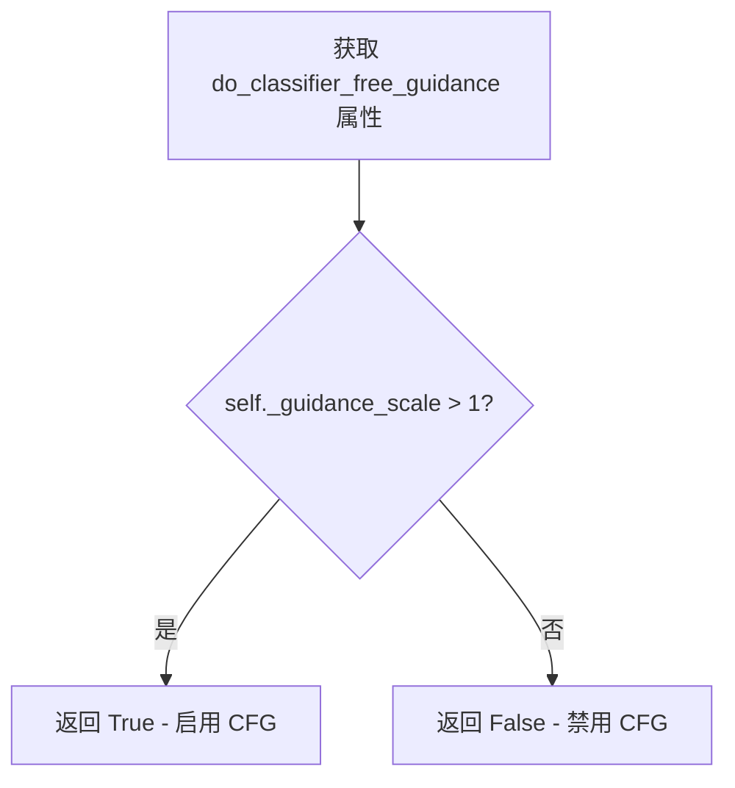

#### 带注释源码

```python
@property
def do_classifier_free_guidance(self):
    """
    属性：判断是否启用无分类器自由引导（CFG）
    
    该属性是一个只读属性，用于判断当前管线是否应该执行 Classifier-Free Guidance。
    在扩散模型的推理过程中，CFG 通过同时考虑条件预测（基于提示词）和无条件预测（忽略提示词）
    来提升生成质量。具体实现是在 __call__ 方法中分别执行两次 transformer 前向传播：
    一次使用 prompt_embeds（条件），一次使用 negative_prompt_embeds（无条件），
    然后通过公式 noise_pred = noise_uncond + guidance_scale * (noise_pred - noise_uncond) 
    来组合两个预测结果。
    
    Returns:
        bool: 如果 guidance_scale > 1，返回 True 表示启用 CFG；否则返回 False。
    """
    return self._guidance_scale > 1
```


### `SkyReelsV2ImageToVideoPipeline.num_timesteps` (property)

该属性是一个只读属性，用于返回图像到视频生成过程中的总时间步数。它在去噪循环开始时被设置，值等于调度器生成的时间步数组的长度。

参数：

-  `self`：实例本身，无需显式传递

返回值：`int`，返回去噪过程中使用的时间步总数。

#### 流程图

```mermaid
flowchart TD
    A[开始] --> B{访问 num_timesteps 属性}
    B --> C[返回 self._num_timesteps]
    C --> D[结束]
    
    E[Pipeline.__call__] --> F[设置 self._num_timesteps = len(timesteps)]
    F --> G[时间步数组由 scheduler.set_timesteps 生成]
```

#### 带注释源码

```python
@property
def num_timesteps(self):
    """
    属性：返回图像到视频生成过程中的总时间步数。

    该属性在去噪循环开始时被设置，其值等于调度器生成的时间步数组的长度。
    时间步数量由 num_inference_steps 参数决定，并在调用 pipeline 时动态设置。

    返回:
        int: 去噪过程中使用的时间步总数
    """
    return self._num_timesteps
```

---

**补充说明**：

- `_num_timesteps` 是实例变量，在 `__call__` 方法的去噪循环部分被初始化：
  ```python
  self._num_timesteps = len(timesteps)
  ```
- `timesteps` 数组由调度器的 `set_timesteps` 方法生成，其长度由 `num_inference_steps` 参数控制。
- 该属性为只读属性，没有 setter，只能在 Pipeline 执行过程中被设置。


### `SkyReelsV2ImageToVideoPipeline.current_timestep`

该属性是 `SkyReelsV2ImageToVideoPipeline` 管道类的一个只读属性，用于获取当前去噪循环中的时间步（timestep）。在扩散模型的推理过程中，这个属性返回模型当前正在处理的时间步值，允许外部调用者追踪生成进度。

参数：此属性无需参数

返回值：`Any`，返回当前去噪步骤的时间步。如果推理未在进行中，则返回 `None`。

#### 流程图

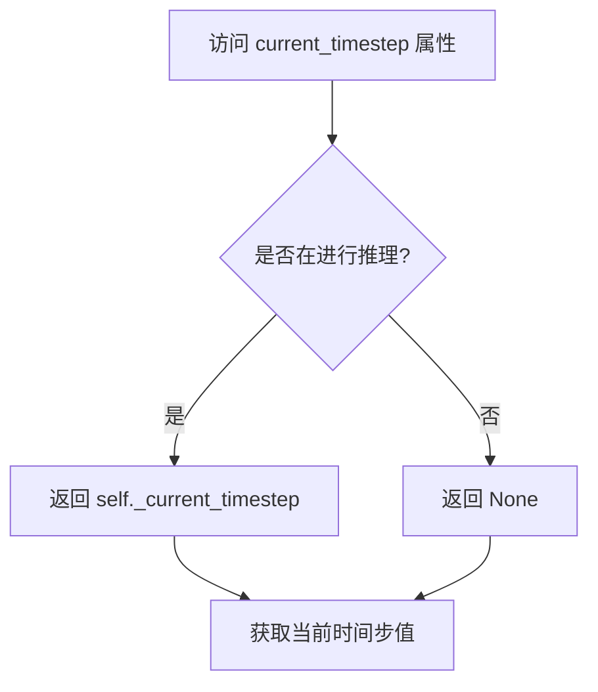

#### 带注释源码

```python
@property
def current_timestep(self):
    """
    属性：获取当前推理过程中的时间步
    
    在去噪循环中，_current_timestep 会被设置为当前处理的时间步 t。
    初始化和推理结束后会被重置为 None。
    
    返回:
        Any: 当前去噪步骤的时间步，推理未进行时为 None
    """
    return self._current_timestep
```


### `SkyReelsV2ImageToVideoPipeline.interrupt`

该属性是一个中断标志位，用于在视频生成的推理循环中控制是否立即停止当前的生成过程。通过检查该属性，管道可以在每个去噪步骤开始时决定是否跳过当前迭代，从而实现动态中断功能。

参数： 无

返回值：`bool`，返回当前的中断状态标志。当值为 `True` 时表示请求中断生成过程，`False` 表示继续正常生成。

#### 流程图

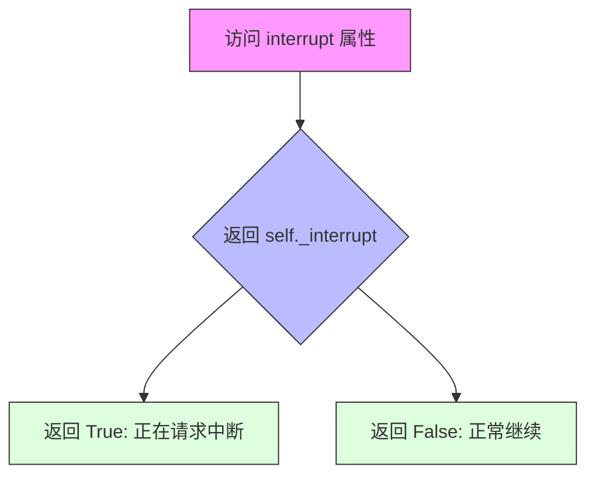

#### 带注释源码

```python
@property
def interrupt(self):
    """
    属性 getter: interrupt
    
    返回当前的中断状态标志，用于在推理循环中控制是否立即停止生成。
    该属性被 __call__ 方法中的去噪循环引用：
    
        for i, t in enumerate(timesteps):
            if self.interrupt:  # 检查中断标志
                continue       # 如果中断标志为 True，跳过当前迭代
    
    Returns:
        bool: 中断状态标志。True 表示请求中断，False 表示继续正常生成。
    
    初始化与修改:
        - 在 __call__ 方法开始时初始化为 False: self._interrupt = False
        - 外部调用者可以通过设置 pipeline._interrupt = True 来请求中断
    """
    return self._interrupt
```


### `SkyReelsV2ImageToVideoPipeline.attention_kwargs`

该属性是一个只读的 getter 属性，用于获取在图像到视频生成过程中传递给注意力处理器（Attention Processor）的关键字参数字典。这些参数可以用于控制注意力机制的行为，例如调整注意力模式或传递额外的控制信息。

参数：该属性无参数（作为 getter 属性）

返回值：`dict[str, Any] | None`，返回传递给 `AttentionProcessor` 的关键字参数字典。如果未设置，则返回 `None`。

#### 流程图

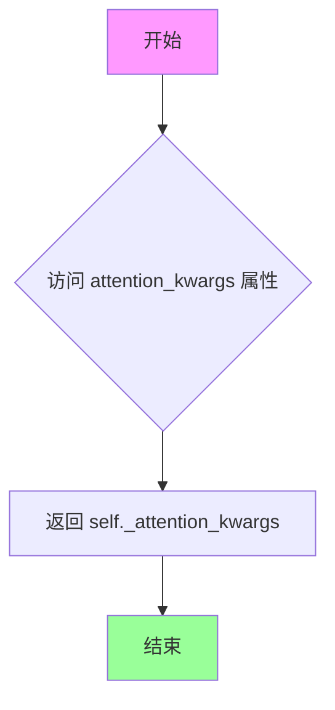

#### 带注释源码

```python
@property
def attention_kwargs(self):
    """
    属性 getter：获取注意力机制的关键字参数。
    
    该属性用于在去噪循环中将自定义参数传递给 AttentionProcessor。
    它允许用户在推理过程中动态调整注意力机制的行为。
    
    Returns:
        dict[str, Any] | None: 传递给注意力处理器的参数字典，
                              如果未设置则为 None。
    """
    return self._attention_kwargs
```

## 关键组件


### 张量索引与惰性加载 (retrieve_latents)

从 encoder_output 中提取潜伏变量，支持多种采样模式（sample/argmax），通过检查 latent_dist 或 latents 属性实现惰性访问。

### 反量化支持 (prepare_latents 中的潜在变量处理)

在准备潜在变量时，使用 VAE 的 latents_mean 和 latents_std 配置对潜在变量进行标准化和反标准化处理，实现潜在空间的量化与反量化。

### 量化策略 (VAE 潜在空间管理)

通过 vae_scale_factor_temporal 和 vae_scale_factor_spatial 计算时空下采样因子，结合 latents_mean/latents_std 配置实现对 VAE 潜在空间的量化与重建。

### 图像编码模块 (encode_image)

使用 CLIPVisionModelWithProjection 将输入图像编码为图像条件嵌入，支持单图或双图（当前帧和上一帧）编码。

### 文本编码模块 (encode_prompt / _get_t5_prompt_embeds)

使用 UMT5EncoderModel 将文本提示编码为文本嵌入，支持批量处理、分类器自由引导和提示权重调整。

### 视频条件构建 (prepare_latents - video_condition)

将输入图像扩展为视频条件张量，支持首帧条件和无条件帧填充，为去噪过程提供时空条件。

### 掩码生成机制 (prepare_latents - mask_lat_size)

生成首帧掩码以保持图像条件，通过 vae_scale_factor_temporal 扩展掩码维度，实现精确的时空掩码控制。

### 去噪循环 (__call__ - Denoising Loop)

主去噪流程，包含条件/无条件噪声预测、分类器自由引导计算、调度器步进和回调支持。

### 潜在变量采样 (retrieve_latents)

支持 latent_dist.sample()、latent_dist.mode() 和直接 latents 属性三种访问方式，提供灵活的潜在变量采样策略。

### 视频后处理 (VideoProcessor)

使用 VideoProcessor 进行视频预处理和后处理，支持多种输出格式（np/PIL）和 VAE 解码后的视频处理。


## 问题及建议


### 已知问题

-   **拼写错误导致潜在Bug**：`vae.temperal_downsample`应为`temporal_downsample`（"temperal"应为"temporal"），可能导致属性查找失败
-   **类型检查不一致**：`check_inputs`中混合使用`type() is`和`isinstance()`进行类型检查，代码风格不统一
-   **硬编码的序列长度**：`_get_t5_prompt_embeds`默认`max_sequence_length=512`，而`encode_prompt`默认`226`，两处默认值不一致可能导致问题
-   **重复计算**：在`prepare_latents`和`__call__`末尾都重复计算了`latents_mean`和`latents_std`，违反DRY原则
-   **资源释放不彻底**：循环中`latent_model_input`等tensor在每步都重新创建，未及时显式释放大tensor
-   **图像预处理重复**：在`encode_image`和`prepare_latents`中都有图像预处理逻辑，存在冗余
-   **类型注解不完整**：部分方法参数和返回值缺少详细的类型注解，影响代码可读性
-   **潜在的除零错误**：`num_frames - 1`被`vae_scale_factor_temporal`除的余数检查逻辑可能产生边界情况

### 优化建议

-   **统一拼写和默认值**：修正`temperal_downsample`拼写，统一`max_sequence_length`参数默认值
-   **提取公共计算**：将`latents_mean`和`latents_std`的计算提取为类方法或工具函数，避免重复代码
-   **改进类型检查**：统一使用`isinstance()`进行类型检查，提高代码一致性
-   **添加tensor生命周期管理**：在去噪循环中显式删除不再需要的大tensor，使用`del`并调用`torch.cuda.empty_cache()`
-   **合并图像预处理逻辑**：统一图像编码和预处理的调用流程，避免重复处理
-   **增强错误提示**：`retrieve_latents`函数在失败时应提供更详细的错误上下文
-   **添加性能监控**：在关键路径添加内存和计算时间的监控点，便于优化
-   **优化XLA设备处理**：改进`xm.mark_step()`的调用策略，可能只在必要时调用

## 其它


### 设计目标与约束

本pipeline的设计目标是实现高质量的Image-to-Video（I2V）生成，通过接收输入图像和文本提示，生成对应的视频内容。核心约束包括：1) 输入图像尺寸必须能被16整除；2) 输出视频帧数必须满足VAE时间下采样因子的要求；3) 支持分类器自由引导（CFG）以提升生成质量；4) 推理过程中支持CPU offload以降低显存占用；5) 依赖T5文本编码器、CLIP图像编码器、Transformer去噪网络和Wan VAE的协同工作。

### 错误处理与异常设计

代码采用多层错误检测机制：1) **输入验证**：`check_inputs`方法对图像类型、尺寸约束、提示词与嵌入的一致性进行严格校验；2) **尺寸适配**：自动对不满足VAE时间下采样因子的帧数进行四舍五入调整；3) **批处理校验**：验证生成器列表长度与批处理大小匹配；4) **属性访问保护**：`retrieve_latents`函数通过`hasattr`检查encoder_output的属性可用性；5) **XLA支持**：通过`XLA_AVAILABLE`标志优雅处理PyTorch XLA的可用性。

### 数据流与状态机

Pipeline的数据流遵循以下状态转换：**初始化态** → **输入校验态** → **提示词编码态** → **图像编码态** → **潜在变量准备态** → **去噪循环态** → **解码态** → **输出态**。在去噪循环中，每个时间步执行：获取当前时间步t → 构建条件输入 → Transformer前向推理（条件/非条件） → CFG组合 → Scheduler步骤更新 → 回调处理。状态通过`self._guidance_scale`、`self._current_timestep`、`self._interrupt`等属性维护。

### 外部依赖与接口契约

核心依赖包括：1) **transformers**：AutoTokenizer、UMT5EncoderModel、CLIPProcessor、CLIPVisionModelWithProjection；2) **diffusers内部模块**：DiffusionPipeline基类、MultiPipelineCallbacks回调机制、PipelineImageInput类型；3) **模型组件**：SkyReelsV2Transformer3DModel（3D Transformer）、AutoencoderKLWan（VAE）、UniPCMultistepScheduler（调度器）；4) **工具库**：PIL图像处理、regex文本清理、ftfy文本修复；5) **可选依赖**：torch_xla用于XLA设备加速。接口契约规定输入图像为PipelineImageInput类型，输出为SkyReelsV2PipelineOutput或tuple。

### 性能优化策略

代码包含多项性能优化：1) **模型卸载序列**：`model_cpu_offload_seq`定义text_encoder→image_encoder→transformer→vae的卸载顺序以节省显存；2) **梯度禁用**：使用`@torch.no_grad()`装饰器禁用推理时的梯度计算；3) **缓存上下文**：使用`cache_context`减少Transformer的重复计算；4) **批量处理**：支持`num_videos_per_prompt`参数实现批量生成；5) **潜在变量复用**：允许外部传入`latents`、`prompt_embeds`、`image_embeds`以支持确定性生成；6) **XLA优化**：在TPU上使用`xm.mark_step()`进行计算图优化。

### 并发与线程安全性

Pipeline本身为无状态类（通过`__call__`方法的状态存储为实例属性），在单线程环境下运行安全。需要注意：1) 多个Pipeline实例共享模型权重时应确保模型已正确克隆；2) Scheduler的内部状态（timesteps）在推理过程中会被修改，不建议跨推理共享；3) 回调函数`callback_on_step_end`可能在多线程环境被调用，需保证其线程安全性；4) XLA模式下需注意设备间的同步问题。

### 配置与参数说明

关键配置参数包括：1) **height/width**：输出视频分辨率，默认544×960，需能被16整除；2) **num_frames**：输出帧数，默认97帧，需满足(num_frames-1) % vae_scale_factor_temporal == 1；3) **num_inference_steps**：去噪步数，默认50步；4) **guidance_scale**：CFG引导强度，I2V推荐5.0，T2V推荐6.0；5) **flow_shift**：UniPC调度器参数，I2V推荐5.0，T2V推荐8.0；6) **max_sequence_length**：T5编码最大序列长度，默认512；7) **output_type**：输出格式，支持"np"、"pil"、"latent"。

### 版本兼容性要求

代码依赖以下版本约束：1) **Python**：建议3.8+；2) **PyTorch**：2.0+以支持torch.float16/bfloat16；3) **transformers**：需支持UMT5EncoderModel和CLIPVisionModelWithProjection；4) **diffusers**：需包含最新版本的Pipeline基类和调度器；5) **PIL**：Pillow 8.0+；6) **regex**：2020.0+；7) **可选**：torch_xla用于TPU加速。

### 安全与隐私考虑

1) **NSFW检测**：返回的tuple包含NSFW标识符，需下游处理；2) **模型权重**：使用HuggingFace Hub下载，需确保网络安全性；3) **输入验证**：对提示词长度和图像尺寸进行限制以防止资源耗尽；4) **内存安全**：大尺寸视频生成时需监控显存使用，建议启用CPU offload。

### 监控与日志机制

代码集成标准化日志：1) **日志记录器**：使用`logging.get_logger(__name__)`获取模块级日志器；2) **警告提示**：对不满足约束的参数（如num_frames）发出warning；3) **进度条**：使用`self.progress_bar`跟踪去噪进度；4) **回调监控**：通过`callback_on_step_end`支持外部监控每步的latents和embeds；5) **设备信息**：通过`_execution_device`属性追踪执行设备。

### 测试策略建议

建议补充以下测试用例：1) **单元测试**：测试`check_inputs`的各种输入验证场景；2) **集成测试**：端到端测试完整I2V生成流程；3) **性能基准**：测试不同分辨率和帧数下的生成时间和显存占用；4) **一致性测试**：验证相同seed下的生成结果可复现；5) **边界测试**：测试极限尺寸（如最小/最大分辨率）下的行为；6) **错误恢复**：测试中断后的资源释放是否正确。

    