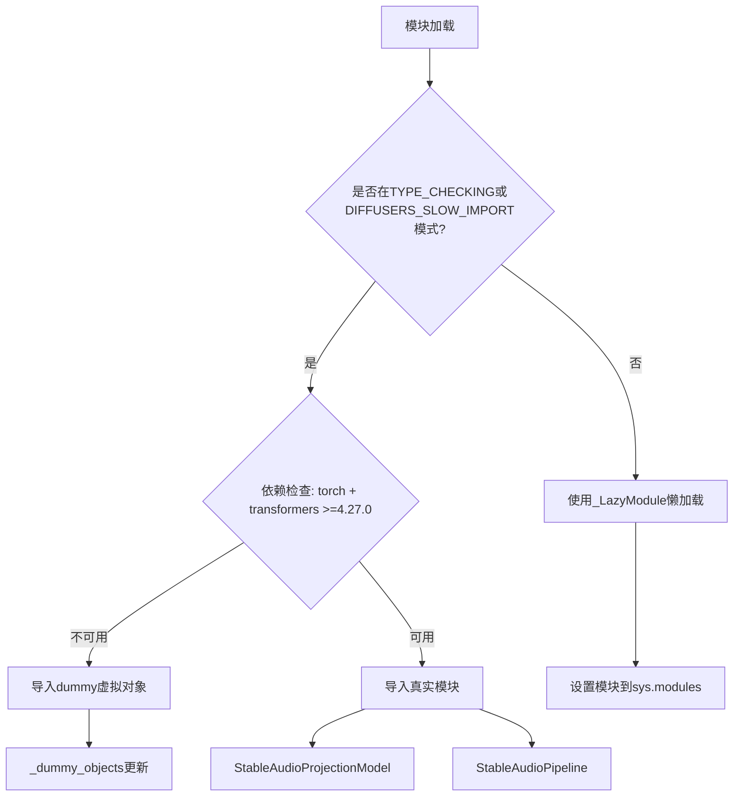
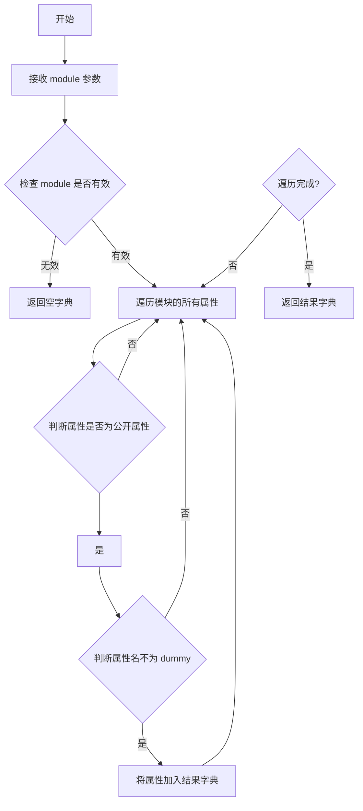
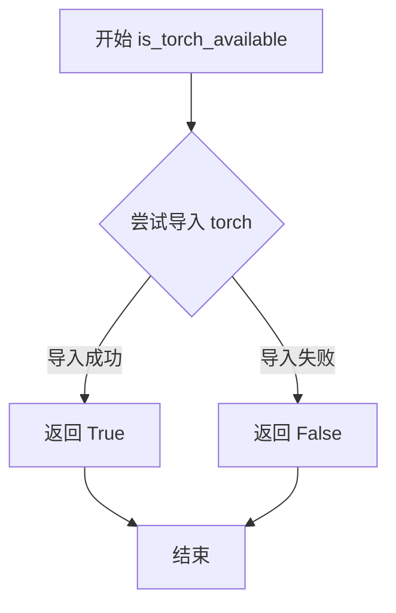
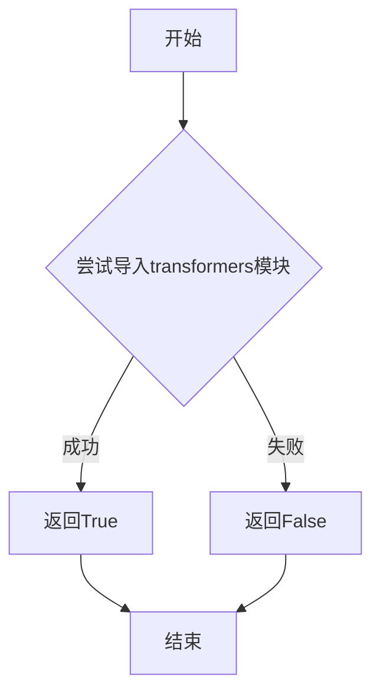
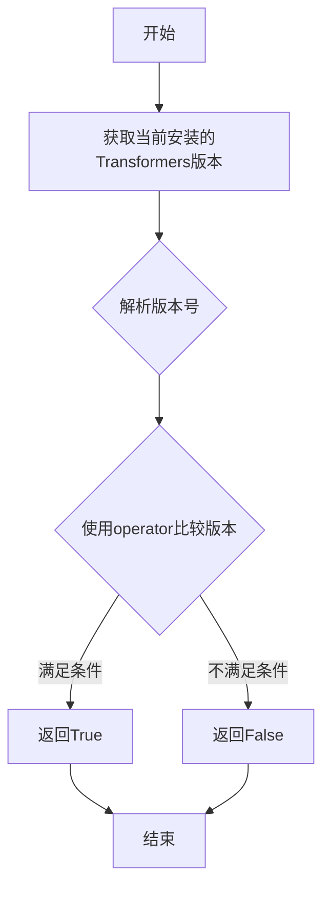

# `diffusers\src\diffusers\pipelines\stable_audio\__init__.py` 详细设计文档

这是一个懒加载模块初始化文件，用于在diffusers库中动态导入Stable Audio相关的模型和管道。它通过检查torch和transformers的可选依赖是否满足，来决定是导入真实模块还是创建虚拟对象，从而实现条件导入和延迟加载。

## 整体流程



## 类结构

```
__init__.py (模块入口)
├── modeling_stable_audio.py (模型实现)
│   └── StableAudioProjectionModel
└── pipeline_stable_audio.py (管道实现)
    └── StableAudioPipeline
```

## 全局变量及字段


### `_dummy_objects`
    
存储虚拟对象的字典，用于在可选依赖不可用时提供替代对象

类型：`Dict[str, Any]`
    


### `_import_structure`
    
定义模块导入结构的字典，映射模块名到可导出的对象名称列表

类型：`Dict[str, List[str]]`
    


### `DIFFUSERS_SLOW_IMPORT`
    
标志位，指示是否使用慢速导入模式以支持类型检查

类型：`bool`
    


    

## 全局函数及方法


### `get_objects_from_module`

该函数是一个工具函数，用于从给定的模块中提取所有可导出对象，并将其转换为字典格式返回。主要用于懒加载模块中，将 dummy 对象的模块内容提取出来，以便在可选依赖不可用时注入到当前模块的命名空间中。

参数：

-  `module`：`module`，要提取对象的模块对象

返回值：`dict`，键为对象名称，值为对象本身的字典

#### 流程图



#### 带注释源码

```python
def get_objects_from_module(module):
    """
    从给定模块中提取所有可导出对象并返回为字典
    
    参数:
        module: 要提取对象的模块对象
        
    返回:
        dict: 包含模块中所有公开对象的字典，排除下划线开头的私有属性
    """
    # 初始化结果字典
    result = {}
    
    # 遍历模块的所有属性
    for attr_name in dir(module):
        # 跳过私有属性（下划线开头的属性）
        if attr_name.startswith('_'):
            continue
            
        # 获取属性值
        attr_value = getattr(module, attr_name)
        
        # 将公开属性添加到结果字典
        result[attr_name] = attr_value
        
    return result
```


### `is_torch_available`

该函数用于检查当前环境中 PyTorch 库是否可用。它通过尝试导入 torch 模块来判断 PyTorch 是否已安装，如果导入成功则返回 True，否则返回 False。

参数：

- 无

返回值：`bool`，返回 True 表示 PyTorch 可用，返回 False 表示 PyTorch 不可用

#### 流程图



#### 带注释源码

```
# is_torch_available 函数的定义通常位于 ...utils 模块中
# 以下是该函数在 diffusers 库中的典型实现

def is_torch_available() -> bool:
    """
    检查 PyTorch 是否可用。
    
    Returns:
        bool: 如果 PyTorch 可用返回 True，否则返回 False。
    """
    # 检查 torch 是否在 sys.modules 中或者能否成功导入
    # 如果 torch 已经导入或可以成功导入，则返回 True
    # 否则返回 False
    return importlib.util.find_spec("torch") is not None
```

> **注意**：由于 `is_torch_available` 函数的定义位于 `...utils` 模块中（当前代码只是导入了该函数），实际的函数实现位于 `diffusers/src/diffusers/utils` 目录下的相应文件中。上述源码是基于该函数常见实现的示例。该函数的主要作用是在可选依赖项场景下，检查 PyTorch 是否已安装，以便决定是否加载相关的模块和类。


### `is_transformers_available`

这是一个用于检查 `transformers` 库是否已安装且可导入的函数。在给定代码中，它作为可选依赖检查的一部分，用于条件性地导入 `StableAudioProjectionModel` 和 `StableAudioPipeline`。

参数：

- 无参数

返回值：`bool`，如果 `transformers` 库可用则返回 `True`，否则返回 `False`

#### 流程图



#### 带注释源码

```
# 注意：由于 is_transformers_available 是从 ...utils 导入的外部函数，
# 以下是基于其典型实现的推断源码

def is_transformers_available():
    """
    检查 transformers 库是否已安装且可用
    
    Returns:
        bool: 如果 transformers 库可以导入则返回 True，否则返回 False
    """
    try:
        # 尝试导入 transformers 模块
        import transformers
        return True
    except ImportError:
        # 如果导入失败，说明 transformers 不可用
        return False
```

> **注意**：该函数定义不在给定代码文件中，而是从 `...utils` 模块导入。在给定代码中的实际使用方式如下：
>
> ```python
> # 用于条件检查
> if not (is_transformers_available() and is_torch_available() and is_transformers_version(">=", "4.27.0")):
>     raise OptionalDependencyNotAvailable()
> ```
>
> 这表明该函数与 `is_torch_available()` 和 `is_transformers_version()` 配合使用，共同实现可选依赖的动态加载机制。


### `is_transformers_version`

检查当前安装的 Transformers 库版本是否满足指定的条件要求。

参数：

- `operator`：string，比较运算符（如 ">="、"<"、"=="等）
- `version`：string，要比较的版本号（如 "4.27.0"）

返回值：`bool`，如果当前 Transformers 版本满足指定条件返回 True，否则返回 False

#### 流程图



#### 带注释源码

```python
# 注意：此函数从 ...utils 模块导入，具体实现不在当前文件中
# 函数签名和实现基于调用方式和常见模式推断
def is_transformers_version(operator: str, version: str) -> bool:
    """
    检查 Transformers 版本是否满足指定条件
    
    参数:
        operator: str, 比较运算符，支持 '>=', '>', '==', '<=', '<', '!=' 等
        version: str, 目标版本号，格式如 "4.27.0"
    
    返回:
        bool: 如果当前安装的 Transformers 版本满足条件返回 True，否则返回 False
    """
    # 1. 获取当前安装的 transformers 版本
    # import transformers
    # current_version = transformers.__version__
    
    # 2. 解析版本号（将 "4.27.0" 转换为可比较的元组 (4, 27, 0)）
    
    # 3. 根据 operator 比较版本
    # 例如：operator = ">=", version = "4.27.0"
    # 检查 current_version >= "4.27.0"
    
    # 4. 返回比较结果
    pass
```


### `setattr` (在 `__init__.py` 模块初始化中)

该函数用于动态地将 `_dummy_objects` 字典中的每个名称-值对设置为当前模块的属性，从而实现懒加载模块的延迟对象初始化。

参数：

- `obj`：`sys.modules[__name__]`，模块对象，表示当前被初始化的懒加载模块
- `name`：`str`，从 `_dummy_objects` 字典中迭代出的属性名称
- `value`：对象，从 `_dummy_objects` 字典中迭代出的属性值（通常是 dummy 对象）

返回值：`None`，该函数不返回值，属于 Python 内置函数，执行副作用（设置属性）

#### 流程图

```mermaid
flowchart TD
    A[开始遍历 _dummy_objects.items] --> B{是否还有未处理的 name-value 对?}
    B -->|是| C[获取当前 name]
    B -->|否| D[结束]
    C --> E[获取当前 value]
    E --> F[调用 setattr sys.modules[__name__] name value]
    F --> G[将属性绑定到当前模块]
    G --> B
```

#### 带注释源码

```python
# 遍历 _dummy_objects 字典中的所有键值对
# _dummy_objects 包含当可选依赖不可用时的虚拟/空对象
for name, value in _dummy_objects.items():
    # 使用 setattr 动态设置模块属性
    # obj: sys.modules[__name__] - 当前模块的引用
    # name: 属性名 - 来自 _dummy_objects 的键
    # name: 属性值 - 来自 _dummy_objects 的值（通常是 dummy 对象）
    setattr(sys.modules[__name__], name, value)
```

## 关键组件


### 可选依赖检查与延迟导入机制

该模块使用 `_LazyModule` 实现延迟加载，仅在真正访问模块时才加载实际内容，提高导入速度并处理可选依赖。

### 虚拟对象（Dummy Objects）机制

当 torch 或 transformers 依赖不可用时，使用 `_dummy_objects` 存储虚拟对象，确保模块可以导入但调用时会报错。

### 导入结构字典

`_import_structure` 字典定义了模块的公共接口，包含 `StableAudioProjectionModel` 和 `StableAudioPipeline` 两个可导出类。

### 版本兼容性检查

代码检查 transformers 版本是否 >= 4.27.0，配合 torch 和 transformers 可用性判断是否抛出 `OptionalDependencyNotAvailable`。

### 类型检查支持

使用 `TYPE_CHECKING` 条件导入，在静态类型检查时导入真实类型，运行时使用延迟加载，提高类型检查效率并保持运行时性能。

### StableAudioProjectionModel 组件

Stable Audio 项目的投影模型类，负责音频数据的投影处理。

### StableAudioPipeline 组件

Stable Audio 项目的管道类，整合模型推理流程。


## 问题及建议


### 已知问题

- **重复代码（DRY原则违背）**：依赖检查逻辑（`is_transformers_available() and is_torch_available() and is_transformers_version(">=", "4.27.0")`）在第15-19行和第28-33行完全重复，一旦版本要求变更需要同时修改两处
- **硬编码版本号**：最低版本要求"4.27.0"直接写死在条件判断中，缺乏配置化管理，未来升级依赖时容易遗漏
- **无版本上限检查**：代码仅检查 `is_transformers_version(">=", "4.27.0")`，未设置上限版本，可能与未来不兼容的transformers版本导致运行时错误
- **缺少日志输出**：当可选依赖不可用时静默失败，缺乏日志记录，不利于排查为什么某些类或函数无法导入
- **异常屏蔽风险**：try-except块仅捕获`OptionalDependencyNotAvailable`，但条件判断中可能抛出其他异常（如版本检查函数本身出错），可能被意外捕获
- **无类型注解**：全局函数`get_objects_from_module`和`_LazyModule`的使用缺乏显式类型标注，降低了代码可维护性

### 优化建议

- **提取版本常量和依赖检查逻辑**：将版本号定义为模块级常量（如`MIN_TRANSFORMERS_VERSION = "4.27.0"`），将依赖检查封装为独立函数，在两处调用以消除重复
- **添加版本范围检查**：考虑增加上限版本检查或使用版本范围解析库（如`packaging.version`）来更灵活地管理兼容性
- **引入日志记录**：在可选依赖不可用时添加日志输出（如`logger.debug("Optional dependency not available: ...")）
- **细化异常处理**：区分不同类型的异常，对非`OptionalDependencyNotAvailable`的异常进行重新抛出或记录
- **添加类型注解**：为关键函数添加完整的类型注解，提升IDE支持和代码可读性


## 其它


### 设计目标与约束

该模块的设计目标是实现Stable Audio模型的延迟加载（Lazy Loading），在保证主程序快速启动的同时，按需加载模型组件。核心约束包括：1）必须同时依赖torch和transformers库，且transformers版本需大于等于4.27.0；2）需要兼容diffusers的Dummy对象机制，在可选依赖不可用时提供向后兼容性；3）模块必须支持TYPE_CHECKING模式以供类型检查器使用。

### 错误处理与异常设计

模块采用OptionalDependencyNotAvailable异常来处理可选依赖不可用的情况。当检测到torch或transformers不可用，或transformers版本不满足要求时，抛出该异常并触发Dummy对象的加载逻辑。在运行时访问未安装依赖对应的对象时，会返回预先设置的Dummy对象而非抛出异常，从而保证导入语句不会失败。这种设计实现了优雅降级，使项目可以在最小依赖环境下运行。

### 数据流与状态机

模块的数据流分为三个主要阶段：初始化阶段、执行阶段和访问阶段。初始化阶段在模块首次导入时执行，通过条件检查确定可用功能并构建_import_structure字典；执行阶段根据DIFFUSERS_SLOW_IMPORT标志或TYPE_CHECKING模式决定是否立即加载真实模块；访问阶段通过LazyModule的__getattr__机制实现按需加载真实对象。状态转换依赖于环境变量和导入上下文（TYPE_CHECKING）的变化。

### 外部依赖与接口契约

模块的外部依赖包括：1）diffusers.utils模块中的_LazyModule、get_objects_from_module等工具类；2）torch库（可选但推荐）；3）transformers库（可选但推荐，版本需>=4.27.0）。接口契约方面，导出的公开接口包括StableAudioProjectionModel和StableAudioPipeline两个类，其他内部实现细节不应被直接访问。模块通过_import_structure字典定义可导出的公共API，任何新增的导出对象都需要在该字典中注册。

### 版本兼容性信息

该模块明确要求transformers版本>=4.27.0，这一约束可能基于该版本引入的特定API或性能优化。开发者需要注意，当transformers版本低于4.27.0时，模块将回退到Dummy模式，无法使用Stable Audio功能。建议在项目文档中明确标注此版本要求，并在运行时提供清晰的错误提示。

### 模块初始化流程

模块的初始化遵循以下流程：1）首先定义_import_structure和_dummy_objects两个基础数据结构；2）尝试检查torch和transformers的可用性及版本要求；3）根据检查结果将真实模块或Dummy对象填充到_import_structure；4）根据导入上下文（TYPE_CHECKING或DIFFUSERS_SLOW_IMPORT）决定是否立即初始化LazyModule；5）将模块注册到sys.modules中供后续使用。整个流程确保了模块导入的高效性和灵活性。

    